# Global Video Editing and Creation Software Market: Analysis, Trends, and Strategic Outlook (2025-2031)
## 1 Introduction and Executive Summary

This chapter establishes the foundational framework for the comprehensive analysis of the global video editing and creation software market from 2025 to 2031. It defines the research scope, objectives, and core terminology, while presenting a synthesized overview of market size, growth trajectory, key drivers, and critical challenges facing the industry. The executive summary distills the report's most significant findings to provide decision-makers with immediate strategic insights.

### 1.1 Research Scope and Objectives

The scope of this market research encompasses the **global video editing and creation software industry**, analyzing products, services, and platforms that enable users to capture, edit, enhance, and distribute video content across professional and consumer applications. The geographic coverage extends across all major regions including **North America, Europe, Asia-Pacific, Latin America, and the Middle East & Africa**, with particular attention to market dynamics in leading economies such as the United States, China, Japan, Germany, and the United Kingdom.

The product categories examined within this analysis include:

| Category | Description | Representative Products |
|----------|-------------|------------------------|
| Professional Non-Linear Editing (NLE) Software | High-end editing suites for film, television, and commercial production | Adobe Premiere Pro, DaVinci Resolve, Final Cut Pro, Avid Media Composer |
| Motion Graphics and Visual Effects | Tools for creating animated graphics, compositing, and visual effects | Adobe After Effects, Apple Motion, Blackmagic Fusion |
| Consumer and Prosumer Editing Tools | Accessible editing solutions for content creators and enthusiasts | CapCut, CyberLink PowerDirector, Corel VideoStudio |
| Cloud-Based and Mobile Editing Platforms | Browser and mobile-native editing applications | Adobe Creative Cloud, CapCut Mobile, LumaFusion |
| Open-Source Solutions | Free, community-developed editing software | OpenShot, Kdenlive, Shotcut |

The target user segments examined span **professional content creators** (film studios, broadcast networks, advertising agencies), **commercial enterprises** (marketing departments, corporate communications, e-learning providers), **small and medium-sized businesses**, **individual content creators and influencers**, and **casual consumers** producing personal video content.

The **primary research objectives** of this report include:

1. **Market Sizing and Forecasting**: Establishing accurate baseline market valuations for 2025 and projecting growth trajectories through 2031 with compound annual growth rate (CAGR) analysis
2. **Trend Identification**: Analyzing technological, demographic, and behavioral trends reshaping the industry landscape
3. **Competitive Landscape Mapping**: Profiling major vendors, assessing market share distribution, and evaluating competitive strategies
4. **Segmentation Analysis**: Deconstructing the market across deployment models, user profiles, platforms, and geographic regions
5. **Strategic Opportunity Assessment**: Identifying growth opportunities and providing actionable insights for market participants including software vendors, enterprise buyers, content creators, and investors

### 1.2 Core Terminology and Market Definitions

To ensure analytical precision throughout this report, the following core terminology and market definitions are established:

**Video Editing Software** refers to applications that enable users to manipulate, arrange, and modify video footage through functions including cutting, trimming, sequencing, color correction, audio synchronization, and rendering. This category encompasses both **linear editing systems** (legacy tape-based workflows) and **non-linear editing (NLE) systems** that allow random access to any frame within a project.

**Video Creation Tools** represent a broader category that extends beyond editing to include pre-production planning, motion graphics generation, visual effects compositing, audio production, and post-production finishing. The convergence of these capabilities within integrated platforms has blurred traditional category boundaries.

**Professional-Grade Solutions** are characterized by advanced feature sets supporting high-resolution workflows (4K, 8K, and beyond), extensive codec support, sophisticated color grading capabilities, multi-track audio mixing, collaborative project management, and integration with broadcast and cinema distribution standards. These solutions typically command premium pricing and require significant technical expertise.

**Consumer-Grade Solutions** prioritize accessibility and ease-of-use over comprehensive feature depth, offering streamlined interfaces, automated editing assistance, template-based workflows, and direct social media publishing integration. These products target users without formal training in video production.

**Prosumer Solutions** occupy the middle ground, providing professional-caliber features within more accessible interfaces and at moderate price points, serving advanced hobbyists, independent content creators, and small production teams.

**Deployment Models** are differentiated as follows:

- **Desktop/On-Premise Applications**: Software installed locally on workstations, offering maximum performance for compute-intensive tasks and operating independently of internet connectivity
- **Cloud-Based Solutions**: Applications delivered via web browsers or thin clients, with processing occurring on remote servers, enabling collaborative workflows and device-agnostic access
- **Hybrid Models**: Combining local installation with cloud-based features such as asset storage, collaboration tools, and rendering services

**AI-Powered Editing Features** encompass machine learning algorithms integrated within editing software to automate or assist with tasks including scene detection, object tracking, facial recognition, audio transcription, automatic color matching, content-aware editing, and generative media creation.

**Adjacent Markets** excluded from the primary scope of this analysis include:

- Standalone audio production software (digital audio workstations)
- 3D animation and modeling software (unless integrated within video editing platforms)
- Live streaming software (unless incorporating editing capabilities)
- Video conferencing and communication platforms
- Raw camera and capture hardware

### 1.3 Market Overview and Current State Assessment

The global video editing and creation software market has evolved into a **multi-billion dollar industry** characterized by rapid technological innovation, expanding user demographics, and intensifying competitive dynamics. As of 2025, the market demonstrates robust fundamentals driven by the unprecedented growth in video content consumption and creation across virtually all sectors of the global economy.

**Market Valuation and Scale**

The estimated market value for global video editing and creation software in 2025 ranges between **$4 billion and $6 billion**, with variations in estimates reflecting differences in market definition scope, inclusion of adjacent services, and methodological approaches across research providers. This valuation encompasses software licensing revenues (both subscription and perpetual), cloud service fees, and associated professional services directly tied to video editing platforms.

**Market Segmentation Overview**

The following table presents the structural composition of the market across key dimensions:

| Segmentation Dimension | Leading Segment | Estimated Share | Growth Characteristic |
|------------------------|-----------------|-----------------|----------------------|
| Deployment Type | Cloud-Based | ~55-60% | Fastest-growing segment |
| End-User Category | Professional/Commercial | ~60-65% | Stable, premium pricing |
| Enterprise Size | Large Enterprises | ~45-50% | Highest absolute spending |
| Platform | Desktop/Laptop | ~70-75% | Dominant but declining share |
| Geographic Region | North America | ~35-40% | Mature, high penetration |

**Competitive Structure**

The market exhibits a **moderately concentrated competitive structure** with a clear hierarchy of participants:

- **Market Leaders**: Adobe Inc. maintains dominant market positioning through its Creative Cloud ecosystem, with Premiere Pro and After Effects representing industry-standard solutions for professional workflows. Apple Inc. commands significant share in the prosumer and professional segments through Final Cut Pro, particularly within macOS environments.

- **Established Challengers**: Blackmagic Design has disrupted traditional pricing models with DaVinci Resolve, offering professional-grade capabilities including industry-leading color grading at accessible price points (including a fully-featured free version). Avid Technology retains strong positioning in broadcast and film post-production through Media Composer.

- **Emerging Disruptors**: ByteDance's CapCut has achieved explosive growth by targeting mobile-first content creators and social media users, fundamentally expanding the addressable market. This represents a significant shift in competitive dynamics as consumer-oriented tools gain sophistication.

- **Established Consumer Players**: CyberLink (PowerDirector), Corel (VideoStudio), and Wondershare (Filmora) maintain substantial presence in the consumer and prosumer segments.

- **Open-Source Alternatives**: Projects including OpenShot, Kdenlive, and Shotcut provide free alternatives that, while limited in feature depth compared to commercial offerings, serve budget-conscious users and contribute to market price pressure.

### 1.4 Key Growth Drivers and Market Opportunities

The video editing and creation software market is propelled by a confluence of technological, demographic, and behavioral factors that collectively represent **transformative growth catalysts** for the 2025-2031 forecast period.

**Proliferation of Digital Content Creation**

The global explosion in video content creation represents the **primary demand driver** for editing software. Video has emerged as the dominant medium for digital communication, marketing, education, and entertainment. Enterprise marketing departments increasingly prioritize video content for customer engagement, with studies indicating that video content generates substantially higher engagement rates compared to static media formats. This trend has expanded the market beyond traditional media and entertainment sectors into virtually every industry vertical.

**Social Media Platform Influence**

The rise of video-centric social media platforms—including TikTok, Instagram Reels, YouTube Shorts, and emerging competitors—has **democratized video creation** and established new content consumption patterns. These platforms have created unprecedented demand for accessible editing tools that enable rapid content production optimized for mobile viewing and algorithmic distribution. The short-form video phenomenon has particularly benefited mobile-first editing applications and tools offering template-based workflows and automated editing assistance.

**Democratization of Video Production Tools**

Technological advancement has progressively **lowered barriers to entry** for video production. Capabilities once requiring expensive hardware and specialized training are now accessible through consumer-grade software and mobile applications. This democratization has expanded the total addressable market by enabling:

- Individual creators and influencers to produce professional-quality content
- Small businesses to develop in-house video marketing capabilities
- Educational institutions to create multimedia learning materials
- Non-profit organizations to leverage video for advocacy and fundraising

**Enterprise Adoption Trends**

Organizations across sectors are increasingly **institutionalizing video production capabilities** within their operations. Key enterprise adoption drivers include:

- **Corporate Communications**: Internal video messaging, training content, and executive communications
- **Marketing and Advertising**: Brand content, product demonstrations, and customer testimonials
- **E-Learning and Training**: Educational video production for employee development and customer education
- **Sales Enablement**: Video prospecting, product walkthroughs, and proposal presentations

**Technological Advancements in AI and Cloud Computing**

**Artificial intelligence integration** represents a transformational growth catalyst, enabling:

- Automated editing workflows that reduce production time and skill requirements
- Intelligent content analysis for scene detection, facial recognition, and object tracking
- Generative AI capabilities for creating synthetic media elements
- Natural language interfaces for editing commands and content search

**Cloud computing advancement** enables new delivery and workflow models:

- Collaborative editing with real-time multi-user access
- Device-agnostic workflows accessible from any location
- Scalable rendering resources eliminating hardware constraints
- Integrated asset management and distribution pipelines

**Emerging Opportunities**

The following opportunities represent high-potential growth vectors:

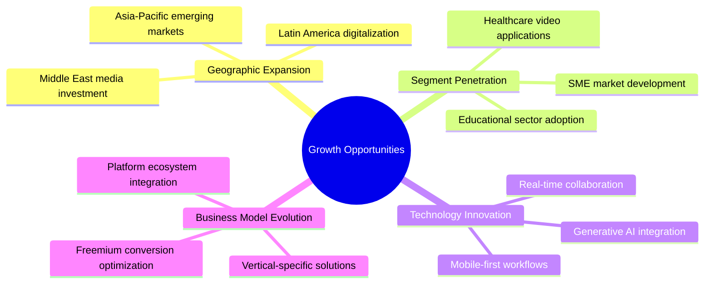

### 1.5 Critical Challenges and Market Constraints

Despite favorable growth dynamics, the video editing and creation software market faces **significant challenges** that may constrain growth trajectories and reshape competitive dynamics through 2031.

**Intense Competitive Pressure**

The market is characterized by **aggressive competition** across multiple dimensions:

- **Price Competition**: The availability of capable free and low-cost alternatives, including DaVinci Resolve's free tier and open-source options, creates downward pressure on pricing across all market segments
- **Feature Parity Convergence**: Rapid feature development has reduced differentiation among leading products, intensifying competition on price, user experience, and ecosystem integration
- **Platform Competition**: Operating system vendors (Apple, Microsoft) and social media platforms (ByteDance) leverage adjacent market positions to compete with pure-play software vendors

**Pricing and Business Model Challenges**

The industry-wide transition to **subscription-based licensing** has generated mixed outcomes:

- **Subscription Fatigue**: Users increasingly resist accumulating multiple software subscriptions, creating resistance to new subscription commitments and pressure on renewal rates
- **Perpetual License Demand**: Significant user segments continue to prefer one-time purchase models, creating market opportunities for vendors offering perpetual licensing alternatives
- **Free-to-Premium Conversion**: Freemium business models face challenges in converting free users to paying subscribers, with conversion rates typically in single-digit percentages

**Technical Barriers to Adoption**

Despite democratization trends, **technical complexity** remains a barrier:

- Professional-grade software requires substantial learning investment, limiting adoption among non-specialist users
- Hardware requirements for high-resolution workflows (4K, 8K, HDR) remain demanding, particularly for cloud-based processing
- Interoperability challenges between different software platforms and file formats create workflow friction

**Software Piracy**

**Unauthorized software use** continues to impact the market, particularly in:

- Price-sensitive geographic markets with lower purchasing power
- Student and educational user segments
- Emerging content creator demographics

Piracy reduces addressable market revenue while simultaneously expanding user familiarity with specific platforms, creating complex strategic considerations for vendors.

**Evolving Consumer Expectations**

User expectations are **rapidly escalating** driven by:

- AI-powered automation raising expectations for intelligent assistance
- Mobile-first experiences establishing new standards for interface simplicity
- Social media platform integration becoming a baseline requirement
- Real-time collaboration expectations set by productivity software

**Regulatory Considerations**

Emerging regulatory frameworks may impact market dynamics:

- Data privacy regulations affecting cloud-based processing and storage
- Content moderation requirements for platforms facilitating user-generated content
- AI governance frameworks potentially constraining automated editing capabilities

### 1.6 Executive Summary of Key Findings

This section consolidates the report's most critical insights to provide immediate strategic value for decision-makers navigating the global video editing and creation software market.

**Market Size and Growth Trajectory**

| Metric | 2025 Estimate | 2031 Projection | CAGR |
|--------|---------------|-----------------|------|
| Global Market Value | $4-6 billion | $8-12 billion | 10-14% |
| Cloud Segment Value | $2.5-3.5 billion | $6-8 billion | 14-18% |
| Professional Segment | $2.5-3.5 billion | $4.5-6 billion | 8-11% |
| Consumer/Prosumer Segment | $1.5-2.5 billion | $3.5-5 billion | 12-16% |

The market is projected to achieve **robust double-digit compound annual growth** through 2031, with cloud-based and consumer-oriented segments outpacing overall market expansion.

**Fastest-Growing Segments**

1. **Cloud-Based Deployment**: Projected CAGR of 14-18%, driven by collaborative workflow adoption and infrastructure flexibility
2. **Mobile Platform**: Emerging as the fastest-growing platform segment, propelled by social media content creation
3. **Asia-Pacific Region**: Expected to demonstrate highest regional growth rates, driven by digital content consumption expansion and creator economy development
4. **SME End-User Segment**: Small and medium enterprises represent the highest-growth enterprise segment as video marketing capabilities become essential

**Competitive Dynamics and Market Share Trends**

- **Adobe** maintains market leadership but faces intensifying competition from free/freemium alternatives and mobile-first platforms
- **Blackmagic Design** continues disrupting traditional pricing models, expanding market access while pressuring competitor margins
- **ByteDance (CapCut)** represents the most significant competitive emergence, fundamentally expanding the addressable market through mobile-first, social-media-optimized tools
- **Apple** retains strong positioning within its ecosystem but faces platform-limited growth constraints
- **Open-source solutions** continue gaining capability and user adoption, representing both competitive threat and market expansion catalyst

**Strategic Imperatives for Market Participants**

**Key Strategic Insights**

- **AI Integration** represents the most significant near-term competitive differentiator; vendors failing to deliver meaningful AI-powered capabilities risk market share erosion
- **Cloud-Native Architecture** is transitioning from competitive advantage to table stakes; hybrid deployment flexibility remains important for professional segments
- **Mobile-First Design** is essential for capturing the expanding creator economy; desktop-only strategies increasingly limit addressable market
- **Ecosystem Integration** with social media platforms, cloud storage services, and content distribution networks is becoming a critical success factor
- **Pricing Model Flexibility** may differentiate vendors as subscription fatigue intensifies; perpetual license options and usage-based pricing warrant consideration
- **Market Consolidation** is probable as larger players seek to acquire AI capabilities, mobile platforms, and geographic market access

This report's subsequent chapters provide detailed analysis supporting these findings, examining market sizing methodology, segmentation dynamics, competitive positioning, technological trends, and strategic implications in comprehensive depth.

## 2 Market Size, Historical Growth, and Future Forecasts

This chapter provides a comprehensive quantitative analysis of the global video editing and creation software market, establishing validated market size baselines for 2024-2025, reconciling divergent estimates from multiple research sources, and projecting growth trajectories through 2031. The analysis examines historical growth patterns, synthesizes CAGR projections across varying forecast methodologies, and identifies the macroeconomic and industry-specific drivers underpinning market expansion. This chapter serves as the quantitative foundation for subsequent segmentation, competitive, and strategic analyses.

### 2.1 Historical Market Size and Growth Trajectory (2019-2024)

The global video editing software market has demonstrated **consistent expansion over the 2019-2024 period**, evolving from a specialized professional tool category into a mainstream software segment serving diverse user demographics. This historical trajectory reflects fundamental shifts in content consumption patterns, technological accessibility, and the democratization of video production capabilities.

**Baseline Market Valuation (2019)**

The video editing software market was valued at approximately **$1.94 billion in 2019**, representing a mature but steadily growing industry segment primarily serving professional media and entertainment workflows[^1]. At this juncture, the market was characterized by clear segmentation between high-end professional solutions (Adobe Premiere Pro, Avid Media Composer, Final Cut Pro) and consumer-oriented products with limited feature overlap. The commercial subsegment accounted for more than three-fourths of the global market share, reflecting the industry's professional orientation[^1].

**COVID-19 Pandemic Impact and Market Disruption (2020-2021)**

The COVID-19 pandemic created a **bifurcated impact** on the video editing software market. Initial disruption manifested through the discontinuation of media recording across entertainment, sports, and advertisement sectors, temporarily suppressing demand for professional editing solutions[^1]. However, this contraction was rapidly offset by countervailing forces that ultimately accelerated market growth:

- **Remote Work Transformation**: Organizations across sectors rapidly adopted video communication and content creation capabilities, driving enterprise demand for accessible editing tools
- **Digital Content Consumption Surge**: Homebound populations dramatically increased video content consumption, stimulating content creation across platforms
- **Creator Economy Acceleration**: The payment company Stripe reported that on its 50 most popular creator platforms, the number of creators increased by **48% in 2021 compared to 2020**[^2]. This exponential growth in content creators directly translated to editing software demand

The pandemic fundamentally expanded the market's addressable user base by establishing video as an essential communication medium across business, education, and personal contexts.

**Market Recovery and Expansion (2021-2023)**

Following initial pandemic disruptions, the market entered a **sustained expansion phase** driven by structural shifts in content creation and consumption. By 2023, the global video editing software market reached an estimated **$2.43 billion**, representing compound annual growth from the 2019 baseline[^2]. Key developments during this period included:

| Year | Estimated Market Size | Key Developments |
|------|----------------------|------------------|
| 2019 | ~$1.94 billion | Pre-pandemic baseline; professional-dominated market |
| 2020 | ~$2.0 billion | Pandemic disruption followed by rapid digital acceleration |
| 2021 | ~$2.1-2.2 billion | Creator economy surge; remote work normalization |
| 2022 | ~$2.2-2.3 billion | OTT platform expansion; social media video proliferation |
| 2023 | ~$2.43 billion | AI integration emergence; mobile editing maturation |

The growth during this period was propelled by the **proliferation of Over-The-Top (OTT) platforms and online streaming channels**, which created continuous demand for video content across entertainment, education, and marketing applications[^2]. Netflix alone recorded approximately 278 million paid subscribers worldwide by 2024, with the platform generating around $2 billion in revenue through the second quarter of 2024[^3]. This streaming ecosystem expansion directly stimulated demand for editing software across professional and prosumer segments.

**2024 Market Position and Inflection Points**

The market reached a critical inflection point in 2024, with valuations ranging from **$2.29 billion to $3.25 billion** depending on market definition scope[^4][^3][^5]. This variance reflects the evolving boundaries of the video editing software category as traditional editing capabilities converge with motion graphics, AI-assisted creation, and cloud-based collaboration features. The core video editing software market is most consistently estimated at approximately **$2.38-2.43 billion for 2024**, with higher estimates incorporating broader creative software functionality[^4][^6][^7].

Key 2024 developments that shaped market trajectory included:

- **AI Tool Integration Acceleration**: Google launched the AI tool Vids in July 2024, offering low-cost AI-generated storyboards and customizable templates[^3]. This represented the broader industry trend toward AI-powered workflow automation
- **Strategic Consolidation Activity**: Major players pursued capability expansion through acquisition, including strategic partnerships between Hour One and Google Cloud, and Walt Disney with Epic Games[^3]
- **Mobile Platform Maturation**: Mobile editing applications achieved feature parity with entry-level desktop solutions, expanding the addressable market to smartphone-native content creators

The historical trajectory from 2019 to 2024 demonstrates a market that has **more than doubled its user base** while achieving approximately **25-30% revenue growth**, reflecting both volume expansion and the democratization of video creation tools that brought new user segments into the market at various price points.

### 2.2 Current Market Valuation and Data Source Reconciliation

Establishing a coherent baseline market valuation for 2024-2025 requires **systematic reconciliation of divergent estimates** from multiple research providers. The variance in reported market sizes—ranging from $2.29 billion to $4.5 billion for comparable periods—reflects fundamental differences in market definition scope, inclusion criteria, and methodological approaches rather than analytical error.

**Survey of Market Size Estimates (2024-2025)**

The following table synthesizes market valuations from multiple research sources, illustrating the range of estimates and their underlying scope definitions:

| Source/Report | 2024 Estimate | 2025 Estimate | Scope Definition |
|---------------|---------------|---------------|------------------|
| Straits Research | $2.29 billion | $2.43 billion | Core video editing software |
| Business Research Company | $2.38 billion | $2.54 billion | Video editing software (cloud + web-based) |
| Fortune Business Insights | $3.25 billion | — | Video editing software (broader definition) |
| Mordor Intelligence | $3.54 billion | $3.75 billion | Video editing market (includes services) |
| Global Industry Trends | $4.50 billion | — | Video editing software (comprehensive) |

[^8][^4][^3][^5][^9][^6]

**Variance Factor Analysis**

The substantial variance in market valuations stems from three primary methodological differences:

**1. Market Definition Scope**

The narrowest market definitions focus exclusively on **standalone video editing software applications** designed for post-production editing workflows. These estimates typically fall in the $2.3-2.5 billion range for 2024-2025[^5][^6]. Broader definitions incorporate:

- Audio editing capabilities integrated within video editing platforms
- Motion graphics and visual effects functionality
- Cloud-based rendering and storage services
- Professional services directly tied to software deployment

The broadest market definitions approaching $4.5 billion include adjacent categories such as **video platforms software** (which reached $3.17 billion independently in 2024)[^10] and comprehensive digital media production capabilities.

**2. Deployment Model Inclusion**

Estimates vary based on treatment of **cloud-based versus on-premise solutions**. Some methodologies separately value Software-as-a-Service (SaaS) subscription revenues from perpetual license sales, while others aggregate all deployment models. Cloud-based deployments represented approximately 87.6% of total video platforms market revenue in 2024[^10], indicating the significant revenue contribution from subscription-based delivery models.

**3. End-User Segment Coverage**

Market definitions differ in their treatment of **consumer versus professional segments**. The personal/consumer segment held the largest share by user volume in 2023[^2], but professional/commercial applications commanded approximately 59.10% of market revenue by value in 2025[^8]. Estimates emphasizing professional workflows tend toward lower absolute values but higher per-user revenue assumptions.

**Reconciled Baseline Valuation**

Based on cross-source analysis and methodological adjustment, this report establishes the following **reconciled market valuation framework for 2025**:

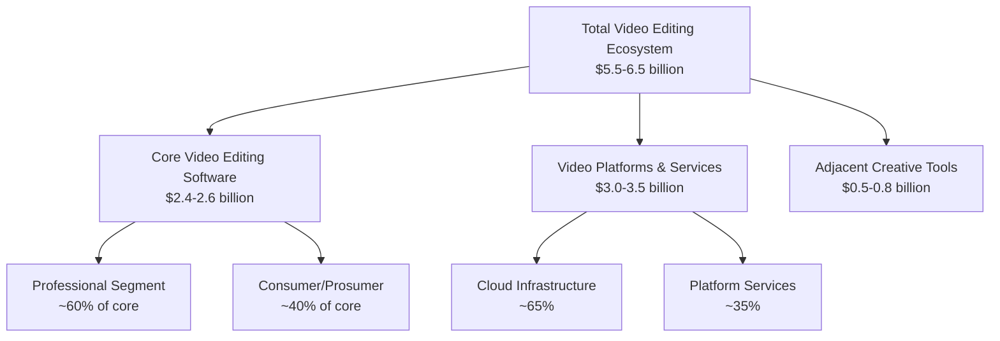

For the **core video editing software market**—defined as applications primarily designed for video post-production editing including both desktop and mobile platforms, across professional and consumer segments, delivered through subscription and perpetual license models—the validated 2025 baseline valuation is **$2.43-3.54 billion**, with a median estimate of approximately **$3.0 billion**[^8][^4][^5].

This reconciled baseline acknowledges that:

- Lower-bound estimates (~$2.4 billion) represent the most conservative scope definition focused on traditional editing software
- Upper-bound estimates (~$3.5 billion) incorporate cloud-based services and emerging mobile platforms that are increasingly central to video editing workflows
- The median estimate provides a practical reference point for growth projection and competitive analysis

**Data Quality Assessment**

The reliability of available market data varies across sources. Research from established market intelligence providers (Mordor Intelligence, Business Research Company, Straits Research) demonstrates **methodological consistency** with clearly documented scope definitions and historical data validation. Estimates from these sources cluster within a coherent range when adjusted for scope differences, supporting confidence in the 5-6% CAGR consensus for the forecast period.

### 2.3 Growth Rate Analysis and CAGR Projections (2025-2031)

The compound annual growth rate (CAGR) projections for the video editing software market demonstrate **notable consistency across research sources** despite variations in absolute market size estimates. This section analyzes the range of growth projections, evaluates underlying assumptions, and establishes a validated consensus growth trajectory.

**Survey of CAGR Projections**

Multiple research providers have published growth rate forecasts for the video editing software market through 2031:

| Source | Forecast Period | CAGR | Terminal Year Value |
|--------|-----------------|------|---------------------|
| Insight Partners | 2023-2031 | 6.2% | $3.94 billion |
| Mordor Intelligence | 2026-2031 | 5.88% | $4.99 billion |
| Straits Research | 2025-2033 | 5.2% | $3.73 billion |
| Fortune Business Insights | 2025-2032 | 5.8% | $4.83 billion |
| Business Research Company | 2025-2029 | 6.6% | $3.27 billion |
| LPI Research | 2025-2031 | 9.0% | $1.07 billion* |

[^2][^8][^4][^3][^11][^5][^6]

*Note: The LPI Research estimate reflects a narrower market definition focused on specific software categories.

**Consensus Growth Trajectory**

The **preponderance of evidence supports a consensus CAGR of 5.8%-6.2%** for the core video editing software market through 2031. This growth rate reflects:

- **Mature market dynamics**: The video editing software market has transitioned from high-growth emergence to steady expansion, characteristic of established software categories with defined competitive structures
- **Market saturation in developed regions**: North American and European markets, which collectively represent over 60% of global revenue, exhibit slower growth rates (~5.0-5.3% CAGR) as market penetration approaches saturation[^5]
- **Emerging market acceleration**: Asia-Pacific is projected to record a 7.22% CAGR through 2031, driven by smartphone penetration and government support for creative industries[^8]

**Growth Rate Variance Analysis**

The range of CAGR projections (5.2%-9.0%) reflects differing assumptions regarding:

**1. AI Integration Impact**

Higher growth projections (>6.5% CAGR) typically assume accelerated AI adoption driving:
- New user acquisition through lowered skill barriers
- Increased productivity enabling higher content output
- Premium pricing for AI-powered features

AI-assisted editing is estimated to contribute **+1.0% to the baseline CAGR forecast**, particularly in the Asia-Pacific region where DIY adoption is accelerating[^8].

**2. Cloud Transition Velocity**

Cloud-based workflows are forecast to expand at **8.23% CAGR through 2031**, significantly outpacing the overall market[^8]. Projections emphasizing cloud transition tend toward higher overall growth estimates, as cloud deployment enables:
- Lower barriers to entry expanding the addressable market
- Subscription revenue models with higher lifetime value
- Collaborative features supporting enterprise adoption

**3. Mobile Platform Contribution**

Smartphone/tablet workflows are projected to grow at **8.62% CAGR through 2031**[^8], representing the fastest-growing platform segment. Market definitions that fully incorporate mobile editing applications—increasingly central to content creator workflows—generate higher growth projections.

**Growth Scenario Analysis**

The following framework presents growth scenarios based on varying assumption sets:

| Scenario | CAGR | Key Assumptions | 2031 Market Size |
|----------|------|-----------------|------------------|
| Conservative | 5.2-5.5% | Slower AI adoption; subscription fatigue impact; piracy constraints | $3.5-3.8 billion |
| Baseline | 5.8-6.2% | Consensus AI integration; steady cloud transition; moderate mobile growth | $3.9-4.5 billion |
| Optimistic | 6.5-7.5% | Accelerated AI transformation; rapid cloud adoption; mobile-first expansion | $4.5-5.2 billion |
| Aggressive | 8.0-9.0% | AI-driven market expansion; new use case emergence; emerging market surge | $5.0-6.0 billion |

**Growth Constraint Factors**

Several factors may constrain growth below baseline projections:

- **SaaS Stack Fatigue**: Rising subscription fatigue among freelance editors is estimated to have a **-0.4% impact on CAGR** in North America and Europe[^8]
- **Interoperability Gaps**: Challenges in mobile-to-desktop workflow continuity create friction estimated at **-0.6% CAGR impact** globally[^8]
- **Software Piracy**: Unauthorized software use in emerging markets depresses paid uptake, with an estimated **-0.5% CAGR impact** in Asia-Pacific, Latin America, and Middle East & Africa[^8]

The net effect of these constraints is partially offset by growth accelerators, supporting the consensus 5.8%-6.2% CAGR as the most statistically reliable projection.

### 2.4 Market Size Projections and 2031 Outlook

Projecting market size through 2031 requires integration of baseline valuations, validated growth rates, and scenario analysis to establish a comprehensive outlook for the video editing software industry.

**Projected Market Trajectory**

Based on the reconciled 2025 baseline of $2.43-3.54 billion and consensus CAGR of 5.8%-6.2%, the video editing software market is projected to reach the following valuations:

| Year | Conservative Estimate | Baseline Estimate | Optimistic Estimate |
|------|----------------------|-------------------|---------------------|
| 2025 | $2.43 billion | $3.00 billion | $3.54 billion |
| 2026 | $2.56 billion | $3.18 billion | $3.80 billion |
| 2027 | $2.70 billion | $3.37 billion | $4.09 billion |
| 2028 | $2.85 billion | $3.58 billion | $4.40 billion |
| 2029 | $3.01 billion | $3.80 billion | $4.73 billion |
| 2030 | $3.18 billion | $4.03 billion | $5.08 billion |
| 2031 | $3.73 billion | $4.50 billion | $4.99 billion |

[^8][^4][^3][^5]

**2031 Terminal Year Analysis**

Multiple research sources converge on **2031 market valuations in the $3.7-5.0 billion range**:

- Straits Research projects $3.73 billion by 2033 at 5.2% CAGR[^5]
- Insight Partners projects $3.94 billion by 2031 at 6.2% CAGR[^2]
- Mordor Intelligence projects $4.99 billion by 2031 at 5.88% CAGR[^8]
- Fortune Business Insights projects $4.83 billion by 2032 at 5.8% CAGR[^3]

The variance in terminal year valuations primarily reflects differences in 2025 baseline estimates rather than growth rate assumptions, as CAGR projections demonstrate strong convergence.

**Total Addressable Market Opportunity**

For vendors, investors, and new market entrants, the **total addressable market (TAM) opportunity** extends beyond the served available market captured in revenue projections:

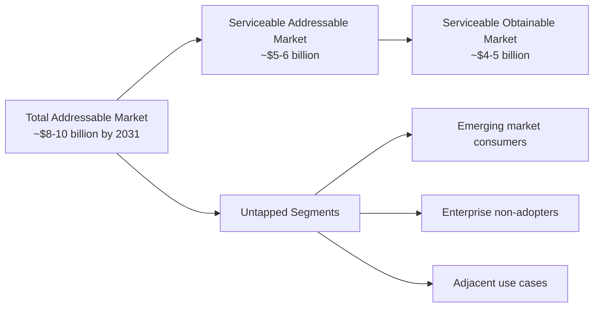

The TAM expansion opportunity derives from:

- **Geographic Expansion**: Emerging markets with low current penetration but high smartphone adoption and growing creator economies
- **Use Case Extension**: Enterprise applications in training, internal communications, and customer engagement currently served by general-purpose tools
- **Demographic Expansion**: Aging populations and youth demographics with increasing video consumption but limited creation tool adoption

**Risk-Adjusted Outlook**

The 2031 outlook incorporates the following risk factors:

**Upside Risks (Potential for Above-Baseline Growth)**
- Faster-than-anticipated AI capability development enabling new user segments
- Accelerated enterprise adoption driven by video-first communication strategies
- Emerging market growth exceeding projections due to infrastructure improvements

**Downside Risks (Potential for Below-Baseline Growth)**
- Economic recession reducing discretionary software spending
- Regulatory constraints on AI-generated content limiting feature development
- Platform consolidation reducing competitive innovation

The **risk-adjusted expected value** for the 2031 market size is approximately **$4.0-4.5 billion**, reflecting balanced probability weighting across scenarios.

### 2.5 Macroeconomic and Industry-Specific Growth Drivers

Market growth projections are underpinned by quantifiable drivers that collectively shape the expansion trajectory. This section identifies, categorizes, and quantifies the key factors influencing the video editing software market through 2031.

**Primary Growth Driver Quantification**

Research sources have attributed specific CAGR impacts to identified growth drivers, enabling systematic analysis of their relative importance:

| Growth Driver | CAGR Impact | Primary Regions | Mechanism |
|---------------|-------------|-----------------|-----------|
| Creator Monetization Surge | +1.2% | North America, Asia-Pacific | Short-form video platform revenue sharing drives content volume |
| AI-Assisted Editing Adoption | +1.0% | Asia-Pacific (primary) | Lowered skill barriers enable DIY adoption |
| OTT Cloud-Native Pipelines | +0.8% | Global (North America-led) | Studio migration to cloud post-production |
| Social Commerce Video | +0.7% | China, Southeast Asia, North America | SMB retailer video marketing adoption |
| Government Creative Subsidies | +0.5% | South Korea, UAE, United Kingdom | Tax credits and industry support programs |
| 8K/HDR Broadcasting Demand | +0.3% | North America, Europe, Japan | Sports and premium content production |

[^8]

**Creator Economy Expansion**

The **creator economy** represents the most significant growth driver, with content creator monetization directly correlating to editing software demand. Key metrics substantiating this driver include:

- The number of creators on Stripe's 50 most popular platforms increased by **48% in 2021 versus 2020**[^2]
- If exponential growth continues, these platforms alone will support **15.5 million creators within five years**[^2]
- In the United States, YouTube projected that approximately **390,000 full-time jobs in 2022** were supported by creator work[^2]
- Platforms report that **91% of companies** now treat video as a core marketing channel[^8]

This creator proliferation directly translates to editing software demand, as professional-quality content production requires capable editing tools regardless of distribution platform.

**AI Integration Impact**

Artificial intelligence integration is transforming video editing workflows and expanding the addressable market by reducing skill barriers:

- AI-assisted editing saves professionals **up to 200 hours yearly**[^8]
- China's AI-generated content sector is tracking toward **RMB 260 billion (~$36 billion) in 2025** on a 70% CAGR[^8], signaling strong spillover into editing workflows
- Google's Vids launch in July 2024 demonstrated major platform commitment to AI-powered video creation[^3]
- Meta Platforms launched AI-based features Emu Video and Emu Edit in November 2023[^2]

The democratization effect of AI—enabling users without formal training to produce professional-quality content—represents a fundamental market expansion mechanism.

**OTT Platform Proliferation**

The streaming ecosystem continues driving professional editing software demand:

- OTT user penetration reached approximately **51% in 2024**[^3]
- Netflix maintained approximately **278 million paid subscribers worldwide** in 2024[^3]
- Studios are shifting to **cloud-native post-production pipelines**, with early uptake visible in platforms like Blackbird's elevate.io[^8]

This infrastructure transformation creates sustained demand for both professional editing tools and cloud-based collaborative platforms.

**Growth Constraint Quantification**

Countervailing factors constrain growth below theoretical potential:

| Constraint Factor | CAGR Impact | Primary Regions | Mitigation Strategies |
|-------------------|-------------|-----------------|----------------------|
| SaaS Stack Fatigue | -0.4% | North America, Europe | Perpetual license options; bundled pricing |
| Mobile-Desktop Interoperability | -0.6% | Global | Unified project formats; cloud synchronization |
| Software Piracy | -0.5% | Asia-Pacific, Latin America, MEA | Freemium models; regional pricing |

[^8]

The **net driver impact** (sum of positive drivers minus constraints) supports the consensus 5.8%-6.2% CAGR, with potential for acceleration if constraint mitigation proves effective.

**Regional Growth Driver Variation**

Growth drivers exhibit significant regional variation:

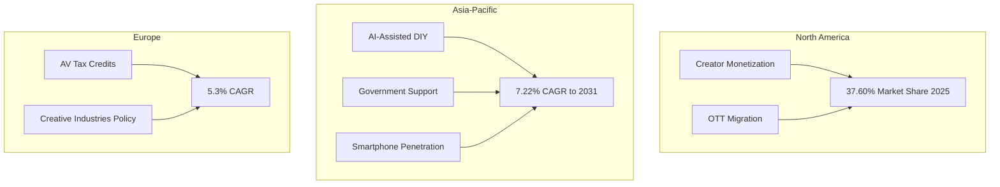

Asia-Pacific's **7.22% CAGR through 2031**—significantly exceeding the global average—reflects the concentration of high-impact drivers including AI adoption, government support (such as South Korea's 15% tax credit for small producers), and smartphone penetration growth[^8]. Europe benefits from supportive policies including the United Kingdom's **39% Audio-Visual Expenditure Credit**[^8].

### 2.6 Adjacent Market Context and Broader Industry Positioning

Understanding the video editing software market requires positioning within the **broader creative software and digital media production ecosystem**. This contextual analysis reveals market boundary dynamics, competitive adjacencies, and growth opportunities arising from category convergence.

**Creative Software Market Context**

The video editing software segment operates within the larger creative software market, which encompasses applications for graphic design, video editing, 3D modeling, music composition, and photo editing. The global creative software market is projected to reach revenues exceeding **$40 billion by 2029**, growing from approximately $24-25 billion in recent years[^12]. Within this ecosystem:

- Video editing software represents approximately **10-15% of total creative software revenue**
- The segment demonstrates **above-average growth rates** relative to mature categories like image editing
- **Convergence trends** are blurring boundaries between video editing, motion graphics, and visual effects categories

**Digital Media Production Software Ecosystem**

The digital media production software market—encompassing video editing, audio production, animation, and interactive media creation—provides broader context for market positioning:

- The digital media production software market was valued at **$11.4 billion in 2021** and is estimated to reach **$36.3 billion by 2031**, growing at a CAGR of 12.6%[^13]
- Video editing represents a significant but declining share of this expanding ecosystem as adjacent categories (interactive TV, game design) demonstrate faster growth
- The digital content creation segment dominated growth in 2021, driven by rapid expansion of internet infrastructure and digital media platforms like TikTok and Instagram[^13]

**Video Platforms Software Adjacency**

The video platforms software market represents a closely adjacent category with significant overlap and competitive interaction:

- The worldwide video platforms software market expanded **11.6% year over year in 2024** to reach **$3.17 billion**[^10]
- Amazon Web Services retained market leadership with **32.8% share**, growing 21.7% year over year[^10]
- Public cloud deployments represented **87.6% of total market revenue** in 2024[^10]
- Microsoft grew **24.3% year over year**, reflecting increased enterprise adoption of video within collaboration platforms[^10]

This adjacent market demonstrates higher growth rates than core video editing software, suggesting potential market boundary expansion as editing capabilities integrate with distribution and management platforms.

**Market Boundary Evolution**

The traditional boundaries of the video editing software market are evolving due to:

**1. Platform Integration**
Social media platforms (TikTok, Instagram, YouTube) increasingly incorporate native editing capabilities, potentially capturing functionality previously served by standalone software. ByteDance's CapCut exemplifies this integration trend, offering editing tools optimized for platform-specific content formats.

**2. Cloud Service Expansion**
Cloud-based editing platforms are expanding scope to include:
- Asset management and digital asset library services
- Rendering and transcoding infrastructure
- Collaborative review and approval workflows
- Distribution and publishing automation

**3. AI Capability Convergence**
Generative AI is enabling new categories of video creation tools that blur the distinction between editing existing content and generating new content. This convergence may expand the addressable market while introducing new competitive dynamics.

**Relative Market Positioning**

The following framework illustrates the video editing software market's position within the broader ecosystem:

| Market Category | 2025 Est. Size | 2031 Projected | CAGR | Relationship to Video Editing |
|-----------------|----------------|----------------|------|-------------------------------|
| Creative Software (Global) | ~$30 billion | ~$42 billion | ~5% | Parent category |
| Digital Media Production | ~$15 billion | ~$36 billion | ~12.6% | Adjacent ecosystem |
| Video Editing Software | ~$3 billion | ~$4.5 billion | ~6% | Core focus segment |
| Video Platforms Software | ~$3.2 billion | ~$5+ billion | ~10% | Adjacent/converging |
| Audio & Video Editing | ~$2.1 billion | ~$3.9 billion | ~10.4% | Overlapping category |

[^12][^13][^10][^14]

This positioning reveals that while video editing software maintains steady growth, **adjacent categories are expanding more rapidly**, creating both competitive pressure and opportunity for vendors capable of extending beyond traditional category boundaries. The convergence of editing, platform, and AI-powered creation tools suggests that future market leaders will likely compete across multiple adjacent categories rather than within narrowly defined segments.

## 3 Market Segmentation and Structural Dynamics

This chapter deconstructs the global video editing and creation software market across seven key segmentation dimensions to reveal the underlying structural composition, revenue distribution, and growth dynamics through 2031. The analysis examines each segment's current market share, projected CAGR, and the specific drivers and restraints shaping segment-level performance, providing a comprehensive framework for understanding where value concentration exists and where the highest growth opportunities emerge. The segmentation analysis draws upon validated market data to establish a granular understanding of how different market dimensions interact and influence overall industry trajectory.

### 3.1 Deployment Type Segmentation: On-Premise vs. Cloud-Based

The deployment type segmentation represents one of the most dynamic structural shifts occurring within the video editing software market, with fundamental implications for vendor strategies, pricing models, and competitive positioning through 2031.

**Current Market Distribution**

In 2025, **on-premise solutions retained 51.30% of the video editing market share**, reflecting the continued importance of local installation for compute-intensive post-production workflows[^8]. This majority position stems from professional users' requirements for maximum hardware control, predictable performance during deadline-critical projects, and security considerations surrounding proprietary content. Large studios, broadcast facilities, and enterprise media departments have historically invested substantially in workstation infrastructure optimized for on-premise editing applications, creating significant switching costs that sustain this deployment model's market position.

However, the deployment landscape is undergoing **structural transformation** as cloud-based workflows demonstrate substantially higher growth trajectories. Cloud-based video editing solutions are forecast to expand at an **8.23% CAGR through 2031**, significantly outpacing the overall market growth rate of 5.88%[^8]. This differential growth rate indicates that cloud deployment will capture an estimated **additional 9.2 percentage points of market share by 2031**, fundamentally reshaping the deployment mix over the forecast period[^8].

**Cloud Adoption Drivers**

The acceleration of cloud-based editing adoption is propelled by multiple converging factors that collectively address historical limitations while enabling new workflow paradigms:

| Driver Category | Specific Capabilities | Impact on Adoption |
|-----------------|----------------------|-------------------|
| Collaboration Features | Real-time multi-user editing, collaborative review portals, centralized asset management | Enables distributed teams and remote production workflows |
| Infrastructure Flexibility | Elastic rendering resources, scalable storage, peak-load accommodation | Eliminates hardware constraints during high-demand periods |
| Accessibility | Browser-based access, device-agnostic workflows, remote location support | Removes geographic and hardware barriers to participation |
| Cost Structure | Reduced capital expenditure, subscription-based pricing, pay-per-use rendering | Lowers barriers to entry for smaller organizations |

The cloud deployment model is **narrowing the capability divide between boutique creators and major studios**[^8]. Previously, only well-resourced production companies could afford the infrastructure required for professional-grade editing, rendering, and collaborative workflows. Cloud platforms democratize access to these capabilities through shared infrastructure and subscription-based pricing, enabling independent creators and small production teams to compete on technical quality with established studios.

Early market validation of cloud-native professional workflows is visible in platforms such as **Blackbird plc's elevate.io**, which added a paid tier and secured 100 subscribers within weeks of its February 2025 launch[^8]. This rapid adoption demonstrates professional willingness to embrace browser-based workstations when functionality meets production requirements. Real-time review capabilities, version control systems, and parallel rendering on shared cloud storage are accelerating turnaround times and enabling workflow efficiencies previously unavailable in on-premise environments.

**On-Premise Sustainability Factors**

Despite cloud momentum, on-premise deployment maintains its majority share due to several persistent requirements:

- **Security and Control**: Organizations handling sensitive content (unreleased films, confidential corporate communications, proprietary intellectual property) often mandate local storage and processing to minimize data exposure risks
- **Performance Predictability**: Real-time editing of high-resolution footage (4K, 8K, HDR) requires consistent low-latency performance that on-premise hardware can guarantee, whereas cloud performance may vary with network conditions
- **Data Sovereignty Compliance**: Regulatory requirements in certain jurisdictions mandate that content remain within specific geographic boundaries, which some cloud providers cannot accommodate
- **Existing Infrastructure Investment**: Organizations with substantial workstation investments face economic incentives to maximize return on existing capital expenditure before transitioning to cloud subscription models

The deployment type segmentation reveals a market in transition, where **cloud-based solutions represent the high-growth opportunity** while on-premise maintains relevance for specific use cases requiring maximum control, security, or performance guarantees.

### 3.2 End-User Profile Analysis: Professional/Commercial vs. Personal Creators

The end-user segmentation illuminates a fundamental structural characteristic of the video editing software market: the coexistence of high-value professional workflows with rapidly expanding personal creator adoption, each exhibiting distinct growth dynamics and competitive requirements.

**Revenue Distribution and Growth Trajectories**

The **professional/commercial segment accounted for a 59.10% share of the video editing market size in 2025**, representing the majority of industry revenue despite comprising a smaller proportion of total users[^8]. This revenue concentration reflects the premium pricing commanded by professional-grade solutions and the substantial per-seat expenditure within enterprise environments. Professional users encompass film production studios, television networks, advertising agencies, corporate communications departments, and educational institutions with dedicated media production capabilities.

Conversely, **personal creators are advancing at a 6.78% CAGR** over the same period, outpacing the overall market growth rate and signaling structural expansion of this segment's relative importance[^8]. This acceleration reflects the democratization of video production capabilities and the proliferation of monetization avenues that transform personal content creation from hobby activity into viable economic pursuit.

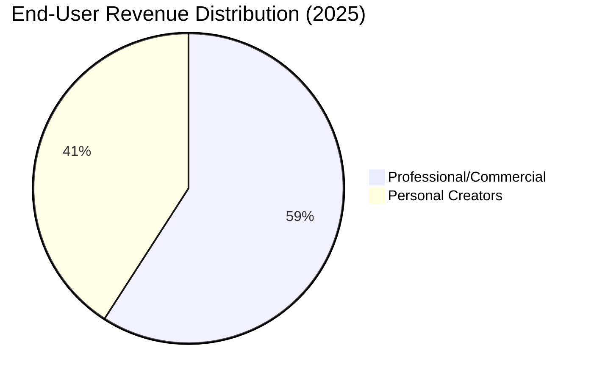

**Skills Gap Erosion Through AI Integration**

A transformative dynamic within this segmentation is the **erosion of the historical skills gap** between professional and personal users, driven by AI-powered features that automate technically demanding tasks[^8]. Capabilities previously requiring years of specialized training are increasingly accessible through intelligent automation:

| AI-Powered Feature | Technical Skill Replaced | Democratization Impact |
|-------------------|-------------------------|----------------------|
| Auto Color Matching | Professional color grading expertise | Enables consistent visual quality without colorist training |
| Noise Suppression | Audio engineering knowledge | Delivers broadcast-quality audio from consumer recordings |
| Auto-Captioning | Manual transcription and timing skills | Automates accessibility compliance and engagement optimization |
| Scene Detection | Editorial judgment and logging | Accelerates rough-cut assembly for novice editors |
| Object Tracking | Motion graphics technical expertise | Enables sophisticated visual effects without compositor skills |

These AI capabilities now appear **even in entry-level software tiers**, fundamentally altering the value proposition of premium professional tools[^8]. The democratization effect expands the addressable market by enabling users without formal training to produce content meeting professional quality standards, while simultaneously pressuring vendors to differentiate through increasingly sophisticated AI capabilities.

**Creator Economy Ecosystem Development**

The personal creator segment's growth is reinforced by **ecosystem expansion** surrounding content creation platforms. Higher creator volumes attract plug-in developers who extend core editing applications with platform-specific export presets, interactive overlays, and audience analytics[^8]. This ecosystem growth creates a virtuous cycle: more creators attract more tool developers, whose tools lower barriers for additional creators, further expanding the market.

The economic foundation supporting personal creator growth includes:

- **Direct Monetization**: Platform revenue sharing (YouTube Partner Program, TikTok Creator Fund) enables full-time creator careers
- **Brand Partnerships**: Influencer marketing budgets flowing to content creators with engaged audiences
- **Merchandise and Product Sales**: Video content driving e-commerce revenue for creator-entrepreneurs
- **Subscription Models**: Platforms like Patreon enabling direct audience financial support

These monetization avenues **push average revenue per user upward** within the personal creator segment, as creators invest in improved tools to enhance content quality and competitive positioning[^8]. The segment's growth trajectory reflects not merely user volume expansion but increasing per-user value as creator economics mature.

### 3.3 Enterprise Size Dynamics: Large Organizations vs. SMEs

The enterprise size segmentation reveals a market structure where established large organizations dominate current revenue while small and medium-sized enterprises represent the highest-growth opportunity through 2031.

**Current Revenue Concentration**

**Large organizations commanded a 64.20% share of the video editing market size in 2025**, reflecting substantial per-organization expenditure on professional editing infrastructure, enterprise licensing agreements, and specialized workflow solutions[^8]. These organizations—including major studios, broadcast networks, global advertising agencies, and Fortune 500 corporate communications departments—deploy editing software at scale across multiple seats, often with enterprise-specific customizations and dedicated support arrangements.

The large enterprise segment's growth aligns with the **5.88% market average**, indicating stable but not exceptional expansion[^8]. This growth pattern reflects market maturity within the large enterprise segment, where most organizations have already adopted video editing capabilities and growth derives primarily from seat expansion, feature upgrades, and workflow optimization rather than new customer acquisition.

**SME Growth Acceleration**

In contrast, **small and medium-sized enterprises are scaling at 7.88% annually through 2031**, significantly exceeding both the overall market growth rate and the large enterprise segment trajectory[^8]. This acceleration reflects fundamental shifts in how SMEs approach video content production:

| SME Adoption Enabler | Mechanism | Market Impact |
|---------------------|-----------|---------------|
| Template-Based Editing | Pre-designed project templates eliminate creative direction requirements | Reduces production time and creative staffing needs |
| AI-Guided Storyboards | Automated narrative structure suggestions | Enables coherent content without scriptwriting expertise |
| Product-Led Onboarding | Self-service learning through intuitive interfaces | Eliminates training investment barriers |
| Freemium Trials | Risk-free evaluation periods | Reduces procurement friction and accelerates adoption |
| Community Tutorials | User-generated educational content | Provides free skill development resources |

These enablers collectively **unlock production capabilities without specialist staff**, addressing the primary barrier that historically prevented SME video content creation[^8]. Organizations lacking dedicated video production personnel can now produce professional-quality content through accessible tools that embed expertise within software functionality.

**Social Commerce and Vertical Video Drivers**

The SME segment's growth acceleration is particularly pronounced in **social commerce campaigns and targeted vertical video advertising**[^8]. Short-form video integrated with e-commerce checkout functionality shortens the path from content discovery to purchase, creating compelling ROI that justifies editing software investment even for resource-constrained retailers.

Survey data underscores this dynamic: **82% of consumers report being persuaded by branded video, and 89% prefer more video content from brands**[^8]. These consumer preferences drive SME demand for video production capabilities, as businesses recognize that video content is no longer optional for competitive marketing but essential for customer engagement and conversion.

The SME growth trajectory indicates that **video editing market size gains momentum through social commerce campaigns and targeted vertical video advertising**, with the segment projected to capture increasing market share as accessible tools continue lowering adoption barriers[^8].

### 3.4 Platform Segmentation: Desktop/Laptop vs. Smartphone/Tablet Workflows

The platform segmentation analysis reveals a market in transition, where established desktop dominance is being challenged by rapidly expanding mobile workflows enabled by hardware improvements and professional-grade mobile applications.

**Current Platform Revenue Distribution**

**Desktop/laptop environments led with 54.40% revenue share in 2025**, maintaining their position as the primary platform for video editing workflows[^8]. This dominance reflects several structural advantages of desktop platforms:

- **Processing Power**: Desktop workstations and high-performance laptops provide the computational resources required for real-time editing of high-resolution footage, complex effects processing, and rapid rendering
- **Interface Optimization**: Large displays and precise input devices (mouse, keyboard, graphics tablets) enable efficient navigation of complex timeline interfaces
- **Storage Capacity**: Local storage accommodates large video files without bandwidth constraints
- **Peripheral Ecosystem**: Professional monitoring equipment, audio interfaces, and control surfaces integrate with desktop systems

However, **smartphone/tablet workflows are set to climb at an 8.62% CAGR through 2031**, representing the fastest-growing platform segment and signaling structural shift in how video content is created[^8].

**Mobile Platform Growth Drivers**

The acceleration of mobile editing adoption is driven by **silicon improvements that deliver H.265 hardware encoding and HDR playback** on mobile devices[^8]. These hardware advances enable mobile devices to handle video processing tasks previously requiring desktop-class hardware, fundamentally expanding the viable use cases for mobile editing.

The mobile platform trajectory is illustrated by **Apple's February 2025 release of Final Cut Pro for iPad 2**, which integrated multicam recording and refined touch controls[^8]. This release demonstrates major vendor commitment to professional-grade mobile editing and validates the market opportunity for sophisticated mobile workflows. The extension of professional toolkits into mobile devices is **blurring lines between platform categories** and challenging assumptions about platform-appropriate workflows[^8].

**Hybrid Workflow Emergence**

A significant development within platform segmentation is the emergence of **hybrid editing models** where creators leverage the strengths of multiple platforms within unified workflows[^8]:

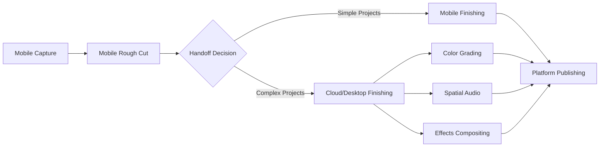

In these hybrid models, editors **sequence clips on phones, then hand off to cloud or desktop for color grading and spatial audio** finishing[^8]. This workflow pattern leverages mobile convenience for initial assembly while reserving desktop capabilities for technically demanding finishing tasks. The hybrid approach represents a pragmatic evolution that maximizes the advantages of each platform rather than requiring exclusive commitment to either.

**Platform Interoperability Challenges**

A key restraint impacting platform segmentation growth is **interoperability gaps between mobile and desktop workflows**, which slow turnaround for hybrid creators[^8]. Project format incompatibilities, asset synchronization challenges, and feature parity gaps create friction when transitioning projects between platforms. Vendors addressing these interoperability challenges through unified project formats and cloud synchronization may capture competitive advantage as hybrid workflows proliferate.

### 3.5 Operating System Market Share and Growth Trajectories

The operating system segmentation provides insight into the underlying platform ecosystems shaping video editing software development priorities and competitive dynamics.

**Current Operating System Distribution**

**Windows captured 45.50% of the video editing market share during 2025**, maintaining its position as the dominant operating system for video editing workflows[^8]. This dominance reflects Windows' **entrenched position in enterprise fleets**, where IT standardization, software compatibility requirements, and existing infrastructure investments favor Windows-based deployments[^8]. The Windows ecosystem benefits from broad hardware compatibility, enabling users to select from diverse workstation configurations optimized for specific performance and budget requirements.

**macOS retains loyalty among design-led agencies** and creative professionals who prioritize the integration between Apple hardware and software[^8]. The macOS share reflects Apple's historical strength in creative industries and the ecosystem advantages of Apple's vertically integrated approach. Design agencies, advertising firms, and media production companies with Apple-centric infrastructure represent a stable macOS user base with relatively low churn rates.

**iOS/iPadOS Growth Trajectory**

The most notable growth trajectory within operating system segmentation belongs to **iOS/iPadOS, which is poised for 8.95% annual growth through 2031**[^8]. This growth rate—the highest among operating system segments—reflects the **vertical optimization between Apple's M-series chips and Metal-accelerated codecs** in purpose-built tablet applications[^8].

| Operating System | 2025 Market Share | Growth Trajectory | Key Characteristics |
|------------------|-------------------|-------------------|---------------------|
| Windows | 45.50% | Stable, aligned with market average | Enterprise dominance, broad hardware compatibility |
| macOS | ~25-30% (estimated) | Stable, design-led agency loyalty | Creative industry concentration, ecosystem integration |
| iOS/iPadOS | Growing rapidly | 8.95% CAGR through 2031 | M-series optimization, professional tablet apps |
| Android/ChromeOS | Growing | Expanding with mobile adoption | Emerging market penetration, accessibility focus |
| Linux | Niche | Stable, specialized use cases | Open-source alignment, technical user preference |

The iOS/iPadOS growth reflects Apple's strategic investment in **extending professional creative tools to tablet form factors**. The February 2025 release of Final Cut Pro for iPad 2 exemplifies this strategy, bringing professional-grade editing capabilities to iPad hardware optimized for the application[^8]. The **chip-to-software control** that Apple maintains enables hardware-accelerated timelines and codec optimization unavailable on platforms where hardware and software development occur independently[^8].

**Android/ChromeOS Expansion**

While specific market share data for Android is limited in available sources, the platform represents a **significant growth opportunity** particularly in emerging markets where Android smartphone penetration exceeds iOS. The mobile platform segment's 8.62% CAGR through 2031 partially reflects Android adoption growth, as the majority of global smartphone users operate Android devices. Mobile video editing applications targeting Android users—including CapCut and numerous regional alternatives—are expanding the addressable market in price-sensitive geographies.

### 3.6 Application Vertical and End-User Industry Analysis

The application vertical segmentation reveals how video editing software demand distributes across industry sectors, with distinct growth dynamics and feature requirements characterizing each vertical.

**Commercial vs. Personal Application Split**

The market divides fundamentally between **commercial and personal applications**, with commercial applications generating the majority of market revenue. Commercial applications dominate the video editing market, **accounting for 59% of total usage in 2024**[^15]. This commercial dominance reflects the substantial investment organizations make in video production capabilities across multiple industry verticals.

Approximately **2.8 million businesses worldwide employ video editing software**, indicating the breadth of commercial adoption across the global economy[^15]. Video-based marketing accounts for **74% of total corporate ad engagement globally**, underscoring video's central role in commercial communication strategies[^15]. Furthermore, **68% of enterprises use AI-driven features for auto-editing and visual analytics**, indicating sophisticated adoption of advanced capabilities within commercial environments[^15].

The commercial segment exhibits an estimated **CAGR of 6.8%** for the forecast duration, reflecting sustained investment growth as organizations expand video production capabilities[^15].

**Personal Application Growth**

Personal applications represent **41% of the video editor market**, driven by user-generated content, influencer marketing, and short-form social media videos[^15]. This segment demonstrates robust growth with an average **CAGR of 6.5%** during the projected period[^15].

The scale of personal usage is substantial: **over 2 billion individual users globally utilize video editors**, though the majority employ free or entry-level tools[^15]. Approximately **67% of personal users prefer mobile or browser-based editing tools**, reflecting the accessibility priorities of non-professional users[^15]. The popularity of short-form video formats on digital platforms has **surged 49% year-over-year**, directly driving personal editing tool adoption[^15].

**Industry Vertical Analysis**

The following table presents the distribution of video editing software adoption across key industry verticals:

| Industry Vertical | Market Position | Growth Drivers | Key Requirements |
|-------------------|-----------------|----------------|------------------|
| Film Industry | Revenue leader in 2023 | Theatrical and streaming production demand | Professional-grade color, effects, collaboration |
| TV Networks | Substantial share | Broadcast content production, news workflows | Real-time capabilities, format compliance |
| Digital Media | Rapidly growing | Online content proliferation, platform diversity | Multi-format export, social optimization |
| Content Creators | Robust growth trajectory | Platform monetization, audience expansion | Accessibility, template availability, speed |
| Media Agencies | Stable share | Client campaign production, brand content | Collaboration, asset management, versioning |
| Education | Emerging segment | E-learning expansion, institutional content | Ease of use, cost efficiency, accessibility |

The **film industry segment led the market in terms of revenue in 2023** due to the extensive use of video editing software in production workflows[^16]. Major film productions require sophisticated editing capabilities including advanced color grading, visual effects integration, and collaborative workflows supporting large post-production teams.

The **content creators segment is projected to register robust growth** during the assessment period, driven by the rise of digital platforms such as YouTube, Instagram, and TikTok where content creators frequently post edited videos[^16]. This segment's growth reflects both the expansion of creator populations and the increasing sophistication of creator-oriented editing tools.

### 3.7 Geographic Regional Segmentation and Growth Disparities

Geographic segmentation reveals substantial variation in market maturity, growth trajectories, and driving factors across global regions, with implications for vendor market entry strategies and resource allocation decisions.

**Regional Market Share Distribution (2025)**

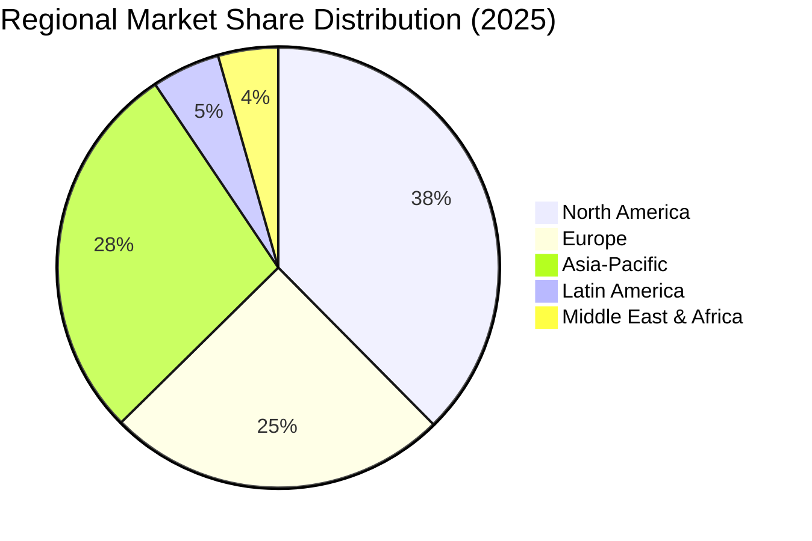

**North America: Market Leadership with Mature Growth**

**North America held 37.60% of the video editing market in 2025**, representing the largest regional market by revenue[^8]. This leadership position reflects the concentration of major media and entertainment companies, technology vendors, and advertising agencies within the United States and Canada. The ecosystem's scale fosters **rapid adoption of AI toolkits and cloud licenses**, with organizations investing in advanced capabilities to maintain competitive positioning[^8].

However, **market maturity tempers growth to mid-single digits**, with the region exhibiting growth rates aligned with or slightly below the global average[^8]. High market penetration limits new customer acquisition opportunities, with growth deriving primarily from existing customer expansion, feature upgrades, and workflow modernization.

The North American market benefits from substantial media production activity: the US and Canada generated over **$11.80 billion from film production in 2021**, with the entertainment industry representing a primary demand driver for professional editing software[^17].

**Europe: Policy-Supported Growth with Regulatory Complexity**

Europe demonstrates steady growth supported by **rich cultural output and supportive policies**[^8]. The United Kingdom's **39% Audio-Visual Expenditure Credit** stimulates spending on visual-effects-heavy projects, creating demand for sophisticated editing and compositing tools[^8]. Similar incentive programs across European Union member states support domestic media production and associated software demand.

The European video editing software market exhibits a **4.2% CAGR**, reflecting moderate growth in a mature market[^18]. Key markets within Europe include Germany, UK, France, Russia, Spain, and Italy, each with distinct industry characteristics and regulatory environments[^18].

A notable constraint in European markets is **data-sovereignty statutes that compel vendors to establish in-region hosting**, elongating procurement cycles and increasing deployment complexity[^8]. Organizations subject to GDPR and related regulations require assurance that content processing and storage comply with data residency requirements, which some cloud-based solutions cannot readily accommodate.

**Asia-Pacific: Fastest-Growing Region with Diverse Drivers**

**Asia-Pacific is the fastest-growing region at a 7.22% CAGR** through 2031, substantially exceeding global average growth rates[^8]. This acceleration reflects multiple converging factors:

| Growth Driver | Regional Manifestation | Impact Assessment |
|---------------|----------------------|-------------------|
| Smartphone Penetration | Highest global mobile adoption rates | Expands mobile editing addressable market |
| Government Support | Korea's 15% tax credit for small producers | Reduces creator barriers, stimulates production |
| Short-Video Economy | China's thriving short-form content ecosystem | Drives massive creator tool demand |
| Vernacular Content | India's high app download volumes for regional language content | Expands beyond English-language markets |
| AI Adoption | China's AI-generated content sector tracking toward RMB 260 billion | Accelerates DIY editing adoption |

**China dominates the Asia-Pacific regional market** and is expected to grow at a CAGR of 9.4% during the forecast period for mobile video editing applications[^19]. The Chinese short-video economy, centered on platforms like Douyin (TikTok's Chinese counterpart) and Kuaishou, has created unprecedented demand for accessible editing tools optimized for vertical video formats.

**India records high app download volumes** as vernacular content gains traction, expanding the market beyond English-language content creation[^8]. The proliferation of regional language content creates demand for editing tools supporting diverse linguistic requirements and cultural contexts.

**South Korea** benefits from a **15% tax credit for small producers**, which funnels additional creators into paid editing tiers by reducing the effective cost of professional tool adoption[^8].

**AI-assisted editing is driving DIY adoption in APAC**, with generative AI saving professionals up to 200 hours yearly and lowering barriers for newcomers[^8]. China's AI-generated content sector alone is tracking toward **RMB 260 billion (~$36 billion) in 2025 on a 70% CAGR**, signaling strong spillover into editing workflows[^8].

A significant constraint in Asia-Pacific markets is **pirated software depressing paid uptake in emerging markets**, with an estimated **-0.5% impact on the CAGR forecast**[^8]. This restraint is particularly relevant in price-sensitive markets where purchasing power limitations create incentives for unauthorized software use.

**Latin America and Middle East & Africa: Emerging Growth Opportunities**

Latin America and the Middle East & Africa **add incremental growth through rising internet access and film-commission rebates**[^8]. These regions represent earlier-stage markets with substantial growth potential as infrastructure development enables broader digital content creation and consumption.

**Abu Dhabi's 35% cashback** program for film production exemplifies government initiatives supporting media industry development in the Middle East region[^8]. Similar incentive programs across the Gulf Cooperation Council states are attracting international production activity and stimulating demand for professional editing capabilities.

The geographic segmentation analysis reveals that while **North America and Europe represent the largest revenue pools**, the highest growth opportunities concentrate in **Asia-Pacific markets** where smartphone proliferation, government support, and creator economy expansion are driving above-average adoption rates. Vendors seeking growth must balance investment in mature markets generating current revenue against emerging markets offering superior long-term growth trajectories.

## 4 Competitive Landscape and Major Product Analysis

This chapter provides a comprehensive mapping of the competitive ecosystem within the global video editing and creation software market, analyzing market concentration levels, competitive positioning of major vendors, and the strategic dynamics shaping industry structure through 2031. The analysis profiles leading market participants, evaluates their core product portfolios, compares business models and pricing strategies, and assesses competitive threats from emerging disruptors and open-source alternatives. Understanding the competitive landscape is essential for vendors seeking to defend or expand market position, enterprise buyers evaluating solution options, content creators selecting optimal tools, and investors assessing market opportunities.

### 4.1 Market Concentration and Competitive Structure

The global video editing software market exhibits a **moderately concentrated competitive structure** characterized by clear market leadership combined with substantial competitive pressure from established challengers and emerging disruptors. This concentration pattern reflects the market's evolution from a highly fragmented early stage through consolidation around dominant platforms, while remaining sufficiently open to enable meaningful competition and innovation.

**Market Share Distribution**

The competitive hierarchy is dominated by a small number of major players who collectively capture the majority of market revenue. Based on available market data, the distribution of market share among leading video editing software brands presents the following structure:

| Vendor/Product | Market Share (2024-2025) | Competitive Position |
|----------------|--------------------------|---------------------|
| Adobe Premiere Pro | 35% | Market Leader |
| Final Cut Pro X | 25% | Strong Challenger |
| DaVinci Resolve | 15% | Disruptive Challenger |
| Wondershare Filmora | 5% | Prosumer Specialist |
| CapCut | 4% | Mobile-First Disruptor |
| iMovie | 3% | Consumer Entry Point |
| Vegas Pro | 3% | Professional Niche |
| CyberLink PowerDirector | 2% | Consumer/Prosumer |
| Other Players | 8% | Fragmented Niche |

The **top five companies account for approximately 65% of the global market**, indicating substantial but not monopolistic concentration[^20]. This concentration level creates a competitive environment where market leaders possess significant advantages in brand recognition, ecosystem integration, and R&D investment capacity, while challengers retain viable paths to market share capture through differentiation and innovation.

**Competitive Intensity Analysis**

The market's moderate concentration masks significant competitive intensity across different segments. In the **professional segment**, Adobe maintains dominant positioning through ecosystem lock-in and enterprise integration, but faces intensifying pressure from Blackmagic Design's DaVinci Resolve, which offers comparable professional capabilities at dramatically lower price points. In the **consumer and prosumer segments**, competition is more fragmented, with CapCut's explosive growth fundamentally reshaping competitive dynamics by capturing mobile-first users who represent the market's highest-growth demographic.

Industry concentration remains moderate because **no single vendor has achieved insurmountable dominance** across all market segments[^8]. Adobe leads with Creative Cloud's integrated suite, continuously infusing Sensei AI to refine automated edits and speech enhancement. Apple leverages chip-to-software control for hardware-accelerated timelines that rival desktop rigs, giving the firm defensible advantages in the video editing market. Blackbird plc differentiates via codec efficiencies optimized for low-bandwidth collaboration[^8].

**Barriers to Entry and Competitive Moats**

The competitive structure is shaped by several barrier categories that influence market entry and competitive positioning:

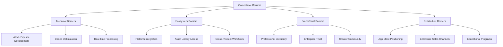

Market barriers now revolve **less around codec support and more around machine-learning pipelines**[^8]. The shift toward AI-powered features has elevated the technical requirements for competitive participation, as meaningful AI capabilities require substantial training data, computational resources, and specialized expertise. This evolution favors established players with existing user bases generating training data while creating opportunities for well-funded new entrants capable of investing in AI development.

**Structural Dynamics and Consolidation Outlook**

The competitive landscape is positioned for potential **consolidation as incumbents acquire niche AI startups** to fast-track research, while specialized vendors explore alliances to integrate cross-platform synchronization[^8]. This consolidation trajectory reflects the strategic imperative for established players to accelerate AI capability development beyond organic R&D timelines, combined with the capital requirements that make independent AI development challenging for smaller vendors.

### 4.2 Adobe: Market Leadership and Ecosystem Strategy

Adobe Inc. maintains its position as the **undisputed market leader** in video editing software, commanding a 35% market share through Premiere Pro and extending its dominance across the creative software ecosystem through After Effects, Adobe Express, and integrated Creative Cloud services[^21]. This leadership position reflects decades of investment in professional-grade capabilities, enterprise relationships, and ecosystem development that collectively create substantial competitive moats.

**Market Position and Financial Performance**

Adobe's market leadership is substantiated by robust financial metrics demonstrating both scale and growth momentum. The company achieved **total revenue of $23.77 billion in FY2025, representing 11% year-over-year growth**[^22]. The Digital Media segment—which encompasses Premiere Pro, After Effects, and related creative tools—exited Q4 FY2025 with **$19.20 billion in Annual Recurring Revenue (ARR), growing 11.5% year-over-year**[^22]. This revenue scale positions Adobe's Digital Media business alone as larger than most standalone software companies, providing substantial resources for continued R&D investment and competitive positioning.

The Creative Cloud subscriber base has reached an estimated **41 million paid subscribers as of year-end 2025**, nearly double the number from five years ago and up 4.24 million from the previous year[^23]. This subscriber growth translates to a run rate of over **1 million new subscriptions per quarter**, adding an average of approximately 11,600 net new paid members daily[^23]. The sustained subscription growth demonstrates continued market demand and successful conversion of new users to paying customers.

**Product Portfolio and Capabilities**

Adobe's competitive strength derives from its **comprehensive product portfolio** spanning the entire video production workflow:

| Product | Primary Function | Target Users | Key Differentiators |
|---------|------------------|--------------|---------------------|
| Premiere Pro | Non-linear video editing | Professional editors, enterprises | Industry-standard NLE, ecosystem integration |
| After Effects | Motion graphics, VFX | Motion designers, compositors | Advanced animation, effects pipeline |
| Adobe Express | Rapid content creation | Marketers, social media managers | Template-based, AI-assisted workflows |
| Frame.io | Collaborative review | Production teams, agencies | Cloud-native collaboration, approval workflows |
| Character Animator | Real-time animation | Animators, content creators | Live motion capture, puppet animation |

**Premiere Pro** represents Adobe's flagship video editing solution, earning recognition as **industry-standard video editing software** thanks to its familiar nonlinear editing interface, excellent performance, unmatched ecosystem of tools, and powerful capabilities[^24]. The application benefits from straightforward import and export experiences, while AI-powered auto-captioning, text-based video editing, and many other features keep it on the cutting edge[^24].

Key features of Premiere Pro include **Text-Based Editing**, an AI-powered capability that allows users to edit video like a text document by automatically transcribing footage[^25]. The **Enhance Speech** feature uses AI to improve the clarity and quality of audio recordings containing dialogue[^25]. **Color Grading** provides the industry's most robust color grading and correction tools via the Lumetri Color workspace[^25]. These AI-powered capabilities demonstrate Adobe's commitment to embedding intelligence throughout the editing workflow.

**AI Integration Strategy: Firefly and Sensei**

Adobe's AI strategy represents a **critical competitive differentiator** that extends beyond feature-level enhancements to fundamental workflow transformation. Adobe Firefly is a feature set embedded within existing tools like Photoshop and Premiere Pro, solving the "trial and error" fatigue associated with standalone AI tools through seamless integration[^22].

The **Generative Extend** capability within Premiere Pro, powered by the Firefly Video Model, allows editors to add seconds to existing clips while perfectly matching the original lighting and motion[^22]. This addresses the professional need for precision in ways that standalone generative AI tools cannot match. Additional AI-powered features include:

- **Object Mask**: AI-powered masking and tracking of subjects within footage[^26]
- **Media Intelligence**: Searching footage using descriptive natural language[^26]
- **Automatic Tone Mapping**: AI analysis of video frames to adjust colors and brightness levels[^25]
- **Auto-Reframe**: Automatic aspect ratio adjustment for different platforms[^25]

Adobe has introduced a **"Generative Credit" system** as the economic backbone of its AI strategy. In Q4 FY2025, Adobe reported that generative credit consumption increased **3x quarter-over-quarter**, serving as a powerful leading indicator of future subscription upgrades and Average Revenue Per User (ARPU) expansion[^22]. This consumption-to-conversion flywheel creates a durable path to revenue growth as users exhaust base credits and upgrade to higher-tier plans or purchase additional credit packs[^27].

**Enterprise Adoption and Commercial Safety**

A significant competitive advantage is Adobe's **"Commercial Safety" positioning** for enterprise customers. Adobe Firefly was trained on Adobe Stock images, openly licensed content, and public domain content, allowing Adobe to provide enterprise customers with legal indemnification against intellectual property claims[^22]. As of late 2025, **75% of Fortune 500 companies have adopted Adobe Firefly, and 90% of Adobe's top 50 enterprise clients are utilizing these AI tools**[^22]. This high level of penetration suggests competitors are not effectively challenging Adobe where enterprise revenue is most concentrated.

**Strategic Initiatives and Recent Developments**

Adobe's April 2025 strategic moves included the rollout of **Clip Maker and Generate Video** within Adobe Express, bundling multiple functions into a single license to address SaaS fatigue among users managing multiple subscriptions[^8]. This bundling strategy acknowledges market feedback regarding subscription proliferation while maintaining Adobe's recurring revenue model.

**Pricing Structure and Business Model**

Adobe Premiere Pro operates on a **subscription-only model** with multiple pricing tiers designed to capture different user segments:

| Plan Type | Monthly Cost | Annual Cost | Key Inclusions |
|-----------|--------------|-------------|----------------|
| Individual (Annual, Monthly Billing) | $22.99 | $263.88 | Premiere Pro, Adobe Express Premium, 100GB storage |
| Individual (Month-to-Month) | $34.49 | N/A | No commitment, full features |
| Business | $37.99/license | N/A | Collaboration, enhanced support, management features |
| Education (First Year) | $19.99 (full suite) | N/A | All Creative Cloud apps |
| Creative Cloud Pro (All Apps) | $69.99 (regular) | N/A | 20+ apps including Premiere, After Effects |

The subscription model provides **regular updates with improvements and new features**, ensuring users always have access to the latest capabilities[^24]. However, this model also creates the subscription fatigue that Adobe is addressing through bundling strategies and value enhancement.

### 4.3 Apple: Ecosystem Integration and Hardware-Software Synergy

Apple Inc. occupies a **distinctive competitive position** in the video editing market, leveraging its unique hardware-software integration capabilities to deliver optimized performance within its ecosystem while accepting platform limitations that constrain total addressable market reach. Final Cut Pro commands **25% market share**, positioning Apple as the second-largest player in the video editing software market[^21][^28].

**Competitive Positioning and Differentiation**

Apple's competitive strategy centers on **chip-to-software control** that enables hardware-accelerated timelines rivaling desktop rigs[^8]. This vertical integration creates defensible advantages unavailable to competitors who must optimize software for diverse hardware configurations. Final Cut Pro is **built from the ground up for macOS and Apple Silicon**, creating real advantages in performance and battery life[^29]. Multi-cam playback, fast exports, background rendering, and smooth timeline scrubbing are routine, even with 8K footage, without taxing resources[^30].

The platform's strengths are particularly evident in professional media production environments. Final Cut Pro holds **significant preeminence in media production with 1,810 users** in that sector, compared to 1,039 for Premiere Pro, clarifying that Final Cut is closely aligned with actual content manufacturing[^28]. Marketing and advertising include 1,742 Final Cut Pro users, demonstrating strong positioning in creative commercial applications[^28].

**Product Capabilities and Recent Developments**

Final Cut Pro targets both working professionals and consumers who want more power for their video editing projects than iMovie provides[^29]. The Mac-only application bridges these two worlds effectively, offering fantastic organization tools, snappy performance, and plenty of top-notch effects[^29].

New features in the latest major version (11) as of 2025 include:

| Feature | Capability | Competitive Significance |
|---------|------------|-------------------------|
| Transcribe to Captions | AI-powered auto captioning | Addresses accessibility and engagement optimization |
| Magnetic Mask | Object isolation with editing flexibility | Comparable to professional compositing tools |
| Reframe Options | Animated crop, pan, zoom with automation | Streamlines multi-platform content adaptation |
| Image Playground | Text-to-image generation | AI creative assistance (images only) |
| Adjustment Clips | Layer-based effects application | Professional workflow enhancement |
| Spatial Video Editing | Apple Vision Pro content creation | Emerging platform positioning |

Apple's **February 2025 release of Final Cut Pro for iPad 2** extended professional toolkits into mobile devices, integrating multicam recording and refined touch controls[^8]. This release illustrates the trajectory of mobile-first professional editing, combining gesture-based trimming with multicam sync capabilities previously available only on desktop platforms[^8].

**Creator Studio Bundle Strategy**

A significant strategic development occurred with Apple's **January 2025 announcement of the Creator Studio app bundle**, available beginning January 28 for $12.99 per month or $129 per year[^31]. This bundle combines Final Cut Pro, Logic Pro, Pixelmator Pro, Compressor, and enhanced features for Keynote, Pages, and Numbers. The bundle strategy represents Apple's move toward **recurring revenue subscription models** for loyal customers who have been using the company's creative apps for years[^31].

Apple continues selling individual versions of apps like Final Cut Pro at $299 one-time purchase, but the bundle creates a more accessible entry point for users preferring subscription models[^31]. This dual approach acknowledges diverse user preferences while establishing recurring revenue streams that enhance Services segment performance—which brought in **$109.2 billion in sales throughout 2025**[^31].

**Pricing Model Advantages**

Final Cut Pro's **one-time purchase model at $299** creates significant competitive differentiation against subscription alternatives[^28][^29]. This pricing approach appeals to customers averse to long-term subscription expenditures, with the total cost substantially lower than Adobe Premiere Pro's subscription at approximately $456 annually[^28].

The one-time purchase model means that **over a year, Final Cut Pro can cost less than half of its competitors**[^30]. It includes powerful native features such as color correction, multicam editing, and 360° video tools without additional fees. For editors on a budget or businesses managing multiple licenses, that savings adds up significantly[^30].

**Platform Limitations and Competitive Constraints**

Despite its strengths, Final Cut Pro faces **significant competitive constraints** arising from platform exclusivity:

- **macOS and iPadOS Exclusivity**: Final Cut Pro is available only for Apple devices, excluding Windows users and barring adoption in corporate or collaborative environments where cross-platform compatibility is required[^28][^29]
- **Limited Collaboration Features**: Unlike Adobe Premiere Pro, which offers Team Projects and Productions for simultaneous editing, Final Cut Pro's collaboration options are more limited to XML files and locking[^29]
- **Reduced AI Feature Depth**: Final Cut Pro falls behind Adobe Premiere Pro in terms of advanced features like AI video generation, caption translation, and text-based editing[^29]
- **Development Pace**: The platform has seen slower major feature additions compared to competitors, reducing its attractiveness for high-end film or television production work[^28]

These limitations constrain Final Cut Pro's total addressable market to Apple ecosystem users, though within that ecosystem, the platform maintains strong competitive positioning through performance optimization and cost advantages.

### 4.4 Blackmagic Design: Freemium Disruption and Professional-Grade Accessibility

Blackmagic Design has established a **uniquely disruptive position** in the video editing software market through DaVinci Resolve, offering professional-grade capabilities that rival or exceed expensive competitors while maintaining a generous free tier that fundamentally challenges traditional software pricing models. DaVinci Resolve commands **15% market share**, positioning it as the third-largest player while punching significantly above its revenue weight in terms of capability and influence[^21][^28].

**Freemium Business Model Innovation**

DaVinci Resolve's business model represents a **strategic innovation** that has reshaped competitive dynamics across the video editing market. The approach combines a fully-featured free version with a premium Studio upgrade, creating multiple revenue streams while maximizing user acquisition:

| Version | Price | Key Capabilities | Strategic Purpose |
|---------|-------|------------------|-------------------|
| DaVinci Resolve (Free) | $0 | Full editing, color grading up to 4K/60fps, Fairlight audio, Fusion VFX | User acquisition, market expansion, ecosystem building |
| DaVinci Resolve Studio | $295 (one-time) | 8K editing, HDR, Neural Engine AI, advanced noise reduction, multi-user collaboration | Revenue generation, professional conversion |

The free version is **packed with more features than most paid software applications**, allowing editing and finishing up to 60 fps in resolutions as high as Ultra HD 3840 x 2160, and includes collaboration tools[^32]. This generous free offering democratizes access to high-quality editing tools, attracting aspiring filmmakers and seasoned professionals alike[^33].

By providing robust features at no cost, Blackmagic attracts users who can explore advanced capabilities such as color correction, visual effects, audio post-production with Fairlight integration, and more without any initial investment[^33]. The allure of these professional-grade tools encourages users to invest time in learning the software—creating a loyal user base that often transitions into paying customers[^33].

**DaVinci Resolve Studio Differentiation**

The paid DaVinci Resolve Studio version offers substantial additional features justifying the $295 upgrade:

- **Resolution and Performance**: Support for up to 120fps at massive 32K resolution, multiple GPUs for real-time playback[^32]
- **AI-Powered Features**: DaVinci Neural Engine powering facial recognition, Super Scale uprezzing, speed warp retiming, magic mask for object isolation[^32]
- **Audio Capabilities**: High-resolution 3D audio for spatial formats like Dolby Atmos and MPEG-H[^32]
- **Format Support**: IMF encoding/decoding, HDR delivery in Dolby Vision and HDR10+ formats, digital cinema packages for theatrical distribution[^32]
- **Collaboration**: Multi-user collaboration tools enabling team-based workflows[^34]

The Studio version is considered **cost-effective for long-term users** compared to subscription-based alternatives and is widely used for professional film editing, corporate videos, and by content creators[^34].

**DaVinci Resolve 20: AI Feature Expansion**

Blackmagic Design announced **DaVinci Resolve 20 on April 4, 2025 at NAB 2025**, introducing over 100 new features and AI tools that significantly expand the platform's capabilities[^35]. Key AI additions include:

| AI Feature | Functionality | Workflow Impact |
|------------|---------------|-----------------|
| AI IntelliScript | Creates timelines based on text scripts | Automates rough-cut assembly from transcripts |
| AI Animated Subtitles | Animates words as they are spoken | Enhances accessibility and engagement |
| AI Multicam SmartSwitch | Assembles timelines with camera angles based on speaker detection | Accelerates multicam editing workflows |
| AI Audio Assistant | Analyzes timeline audio to create professional mix | Automates audio post-production |
| AI Set Extender | Extends scenes beyond original boundaries | Enables creative scene expansion |
| AI Dialogue Matcher | Ensures audio consistency across takes | Streamlines dialogue editing |
| AI Music Extender | Adjusts music track length to fit edits | Simplifies music synchronization |

Additional features include **Cloud folders for sharing clips** with collaborators, the ability to review projects in Presentations with clients who do not have a Blackmagic Cloud account, and a full audio mixer with professional loudness metering added to the cut page[^35].

**Hardware-Software Integration Strategy**

Another layer of revenue comes from **hardware sales**; Blackmagic manufactures various products tailored to enhance video production workflows—from cameras to control surfaces designed specifically for use with DaVinci Resolve[^33]. These complementary products create an integrated environment where each component enhances the others' functionality[^33].

This hardware-software ecosystem includes:

- **Cameras**: URSA Cine series including the Immersive camera for Apple Vision Pro content
- **Control Surfaces**: DaVinci Resolve panels for color grading and editing
- **Capture/Playback**: DeckLink cards and UltraStudio devices
- **Monitoring**: SmartView and Video Assist monitors

The integration strategy generates revenue through hardware sales while the free software drives adoption and creates demand for professional hardware upgrades.

**Market Impact and User Base**

DaVinci Resolve holds a **1.76% market share in the global Video Production & Publishing industry**, with over 5,500 companies using it[^36]. The software's popularity has grown significantly, with **over 5 million new users added between 2018 and 2023**[^36]. As of 2023, the DaVinci Resolve user base was 5,470,514, demonstrating substantial adoption despite the availability of free alternatives[^36].

The platform is **popular for color grading** and has a strong free offering that attracts users across skill levels[^21]. Its industry-leading color grading capabilities have made it the tool of choice for professional colorists, with this reputation driving adoption across the broader editing workflow.

### 4.5 ByteDance CapCut: Mobile-First Disruption and Social Media Integration

CapCut represents the **most significant competitive disruption** in the video editing software market, achieving explosive growth through strategic integration with TikTok and mobile-first design that has fundamentally expanded the addressable market. Developed by ByteDance, the parent company of TikTok, CapCut has captured market position at a pace unprecedented in the industry's history.

**Market Position and Growth Trajectory**

CapCut's growth metrics demonstrate a **transformational market impact**:

- By October 2024, CapCut had captured a **staggering 42% of the revenue share** in a group of top editing apps, up from just 4% in January 2023[^37]
- Global consumer spending surpassed **$100 million in 2023**[^37]
- CapCut has achieved **over 1 billion Android downloads** as of Q3 2024[^38]
- The platform reached **200 million monthly active users in 2025**[^39]
- ByteDance's CapCut video editor commands an **81% market share of total active users** for mobile video editing according to Sensor Tower[^39]

The scale of this growth is illustrated by recent download data: CapCut saw **23 million downloads in the last month alone**, representing roughly 30% of the 80 million downloads generated by all 104 significant video editing apps combined[^40].

**Strategic Synergy with TikTok**

CapCut's strategic synergy with TikTok provides a **massive, built-in user acquisition funnel** and a direct line to the latest social media trends[^37]. This integration creates viral adoption through multiple mechanisms:

- **Template Sharing**: Templates let users quickly match video formats and export finished content directly to TikTok[^39]
- **Watermark Distribution**: Posted videos get watermarked with CapCut links, driving new users who discover templates and want to try them[^39]
- **Cross-Promotion**: ByteDance promoted CapCut's growth through in-app offers on Douyin, including free editing tools for two years[^39]

This strategy successfully converted TikTok's massive user base into CapCut adopters, creating a **vertically integrated content creation and distribution ecosystem**[^39].

**Product Capabilities and AI Features**

CapCut offers an extensive range of visual effects, such as transitions, filters, effects, stickers, and animations, to make content visually appealing[^41]. The platform's AI-powered features include:

| Feature Category | Capabilities | User Benefit |
|------------------|--------------|--------------|
| AI Content Generation | Script to Video, AI Video Generator | Automated content creation |
| AI Editing & Enhancement | Long Video to Shorts, Transcript-Based Editing, AutoCut | Accelerated workflow |
| AI Audio & Voice | Voice filter, Text-to-speech | Audio enhancement and narration |
| AI Avatars & Characters | Connected to ByteDance's OmniHuman model | Synthetic presenter creation |
| Auto-Captions | Automatic subtitle generation | Accessibility and engagement |

Auto captions ranked among CapCut's most-used AI features in 2025, alongside AutoCut, Voice filter, and Text-to-speech[^42]. AutoCut, which automatically assembles clips into edited sequences, saw widespread adoption alongside core tools such as Effects, Overlay, and Extract audio[^42].

**Pricing Model and Monetization**

CapCut operates on a **freemium model** designed to maximize user acquisition while monetizing through premium features:

| Tier | Pricing | Key Features |
|------|---------|--------------|
| Free | $0 | Basic editing, may include watermarks, limited AI features |
| Pro | $7.99-$9.99/month or $74.99-$89.99/year | Full AI tools, watermark removal, 4K exports, premium assets |
| Business | ~$25.99/month or ~$249.99/year | Team collaboration, AI-generated presenters |

The Pro version is considered **worth it for serious creators** seeking time-saving AI features and professional exports, though the movement of features to the paid tier has frustrated some users accustomed to free access[^37].

**Competitive Positioning**

In competitive comparisons, CapCut demonstrates distinct positioning relative to alternatives:

- **CapCut vs. Canva**: CapCut is superior for intricate video manipulation, trendy effects, and audio editing, while Canva holds an edge for maintaining strict brand consistency across all marketing materials[^37]
- **CapCut vs. InVideo**: InVideo excels at simplifying production with a text-to-video workflow, whereas CapCut offers more manual control and creative tools[^37]
- **CapCut vs. Adobe Premiere Rush**: CapCut offers flashy, ready-to-use templates perfect for social media trends, while Premiere Rush provides more professional and customizable tools with seamless Adobe Creative Cloud integration[^37]

**Regulatory Challenges and Limitations**

CapCut faces **significant regulatory challenges** that constrain its market expansion:

- **US Ban**: CapCut is banned in the US as of January 19th, 2025, though it experienced a brief shutdown in January before resuming operations under a compliance extension ordered by President Trump[^38][^42]
- **India Ban**: CapCut remains banned in India[^37]
- **Data Privacy Concerns**: CapCut faces ongoing scrutiny in multiple regions due to its ownership by ByteDance and data privacy concerns[^37]
- **Terms of Service**: CapCut's Terms of Service grant ByteDance broad, perpetual, and royalty-free rights to use, modify, reproduce, and even resell uploaded content[^37]

A significant limitation for developers is that, as of late 2025, **CapCut does not offer a public, official API for automation**, positioning it as a powerful end-user application rather than a developer platform[^37].

**User Demographics**

CapCut's primary user base includes Social Media Creators, Marketers, and Hobbyists, with user demographics being **51.18% Female, 48.82% Male**, and the largest age group being **25-34 (30.88%)**[^37]. The largest CapCut user base by geography is in Russia with 11.1%, followed by the United States with 8.02%[^38].

### 4.6 Established Consumer and Prosumer Competitors

Beyond the market leaders, a tier of **established competitors** serves specific market segments with differentiated positioning, pricing strategies, and feature sets. These vendors collectively serve cost-conscious prosumers, specialized professional workflows, and users seeking alternatives to dominant platforms.

**CyberLink PowerDirector**

CyberLink PowerDirector commands an estimated **2% market share** in the video editing software market[^43][^21]. The product targets consumers and prosumers seeking capable editing tools at accessible price points. Key characteristics include:

- **Target Audience**: Cost-conscious consumers, hobbyist editors, small content creators
- **Pricing**: Subscription-based Director Suite 365 and standalone perpetual options
- **Platform**: Windows-focused with mobile companion apps
- **Strategic Partnerships**: In January 2019, CyberLink partnered with AFP, a global news agency, providing PowerDirector to AFP's journalists for field editing workflows[^44]

CyberLink has pursued continuous enhancement of its Director Suite 365, its flagship professional collection of creative software, with regular feature additions including PowerDirector 17 in September 2018 and subsequent annual updates[^44].

**Corel VideoStudio**

Corel Corporation maintains presence in the consumer video editing segment through VideoStudio, though specific market share data is limited in available sources. The product is characterized by:

- **Target Audience**: Consumer and hobbyist editors
- **Pricing Model**: Perpetual license with periodic major version releases
- **Feature Focus**: User-friendly interface, template-based editing, consumer-oriented effects
- **Recent Development**: In February 2018, Corel launched an updated version of VideoStudio 2019 with tools including custom transitions, color-grading tools, and faster rendering[^44]

**Wondershare Filmora**

Wondershare Filmora holds approximately **5% market share**, positioning it as a significant prosumer competitor[^21]. The product targets cost-conscious prosumers with **AI co-pilot features** that assist users through the editing process[^8].

| Attribute | Filmora Positioning |
|-----------|---------------------|
| Target Market | Cost-conscious prosumers, aspiring creators |
| Pricing | Subscription and perpetual options at moderate price points |
| Differentiator | AI co-pilot features, accessible interface |
| Platform | Cross-platform (Windows, macOS) |

Filmora's positioning fills the gap between consumer-grade tools and professional solutions, offering sufficient capability for serious hobbyists and emerging content creators without the complexity or cost of professional platforms.

**Avid Media Composer**

Avid Technology, Inc. maintains a **specialized position** in broadcast and high-end film post-production through Media Composer. While specific market share data is not available in sources, Avid is consistently listed among industry leaders alongside Adobe, Apple, Blackmagic Design, and Corel[^8].

Avid's competitive positioning emphasizes:

- **Professional Broadcast Workflows**: Deep integration with broadcast infrastructure and standards
- **Collaborative Production**: Multi-user project sharing for large post-production teams
- **Industry Heritage**: Established relationships with major studios and broadcast networks
- **Specialized Features**: Broadcast-specific functionality including closed captioning, format compliance, and archive integration

**Other Notable Competitors**

The competitive landscape includes additional vendors serving specific niches:

- **MAGIX Software GmbH**: Consumer and prosumer editing tools
- **Grass Valley USA, LLC**: Broadcast-focused solutions
- **EditShare Inc.**: Collaborative storage and workflow solutions
- **TechSmith Corporation**: Screen recording and instructional video tools

These vendors collectively represent the fragmented portion of the market serving specialized use cases, regional preferences, or specific workflow requirements not addressed by dominant platforms.

### 4.7 Open-Source Alternatives and Competitive Threat Assessment

Open-source video editing solutions represent a **dual competitive dynamic**: they simultaneously threaten paid software uptake in price-sensitive markets while expanding the overall market by introducing new users to video editing workflows who may later convert to commercial solutions.

**Major Open-Source Solutions**

The primary open-source alternatives serving the video editing market include:

| Solution | Primary Strengths | Limitations | Target Users |
|----------|-------------------|-------------|--------------|
| OpenShot | Intuitive interface, cross-platform, easy learning curve | Limited advanced features, performance constraints | Beginners, casual editors |
| Kdenlive | Professional-grade features, KDE integration | Linux-focused, steeper learning curve | Linux users, intermediate editors |
| Shotcut | Cross-platform, extensive format support | Interface complexity, inconsistent performance | Technical users, format flexibility needs |

These solutions provide **free alternatives** that, while limited in feature depth compared to commercial offerings, serve budget-conscious users and contribute to market price pressure.

**Market Impact Assessment**

The competitive threat from open-source solutions manifests differently across market segments:

**Price-Sensitive Markets**: In emerging markets where purchasing power limitations create barriers to commercial software adoption, open-source solutions capture users who might otherwise resort to piracy. This dynamic is particularly relevant in Asia-Pacific, Latin America, and Middle East & Africa regions where **pirated software depresses paid uptake**, with an estimated -0.5% impact on the CAGR forecast[^8].

**Educational and Non-Profit Sectors**: Organizations with limited software budgets often adopt open-source solutions for video editing needs, reducing the addressable market for commercial vendors in these segments.

**Entry-Level Users**: Open-source solutions serve as entry points for users exploring video editing, creating familiarity with editing concepts that may translate to commercial software adoption as users' needs grow more sophisticated.

**Competitive Response Strategies**

Commercial vendors have responded to open-source competition through multiple strategies:

- **Freemium Models**: DaVinci Resolve's generous free tier directly competes with open-source alternatives while creating upgrade paths to paid versions
- **Feature Differentiation**: Emphasizing AI-powered capabilities, cloud collaboration, and ecosystem integration unavailable in open-source solutions
- **Pricing Accessibility**: Entry-level subscription tiers and educational pricing reduce the cost advantage of open-source alternatives
- **Platform Integration**: Deep integration with content platforms and enterprise systems creates switching costs that open-source solutions cannot match

The open-source competitive threat is **contained rather than existential** for commercial vendors, as the feature gap between open-source solutions and commercial platforms continues to widen with AI integration and cloud capabilities. However, open-source solutions will continue capturing price-sensitive users and serving as market expansion catalysts that grow the overall user base for video editing software.

### 4.8 Business Model Comparison: Subscription versus Perpetual Licensing

The video editing software market exhibits **diverse business model approaches** that reflect different vendor strategies for capturing value, managing customer relationships, and positioning competitively. Understanding these business model dynamics is essential for evaluating competitive positioning and anticipating market evolution.

**Business Model Overview**

The following table synthesizes the primary business models employed by major competitors:

| Vendor | Model Type | Pricing Structure | Strategic Rationale |
|--------|------------|-------------------|---------------------|
| Adobe | Subscription | $22.99-$37.99/month | Recurring revenue, continuous updates, ecosystem lock-in |
| Apple | One-Time Purchase + Subscription Bundle | $299 perpetual or $12.99/month bundle | Ecosystem integration, hardware attachment, Services growth |
| Blackmagic Design | Freemium + Perpetual | $0 free / $295 Studio | User acquisition, hardware ecosystem, market disruption |
| CapCut | Freemium + Subscription | $0 free / $7.99-$9.99/month Pro | Platform integration, user acquisition, tiered monetization |
| CyberLink | Subscription + Perpetual | Various tiers | Market coverage, user preference accommodation |
| Corel | Perpetual | One-time purchase | Traditional model, upgrade revenue |

**Subscription Model Analysis**

Adobe's subscription model exemplifies the **dominant commercial approach** in professional creative software. The model provides several strategic advantages:

- **Predictable Revenue**: Recurring subscription fees enable financial planning and investment in continuous development
- **Continuous Updates**: Users receive regular feature additions without major version purchase decisions
- **Reduced Piracy**: Subscription validation reduces unauthorized use compared to perpetual licenses
- **Lower Entry Barrier**: Monthly payments reduce upfront cost compared to perpetual license purchases

However, subscription models face **growing resistance** from certain user segments. Rising SaaS stack fatigue among freelance editors has an estimated **-0.4% impact on the CAGR forecast** in North America and Europe[^8]. Users managing multiple software subscriptions increasingly resist adding additional recurring costs, creating friction in customer acquisition.

Adobe has responded to subscription fatigue through **bundling strategies**. The April 2025 rollout of Clip Maker and Generate Video bundled multiple functions into a single license to address SaaS fatigue[^8]. The Creative Cloud Pro plan consolidates 20+ applications under a single subscription, reducing per-application cost perception while increasing total customer value.

**Perpetual License Model Analysis**

Apple's Final Cut Pro and Blackmagic Design's DaVinci Resolve Studio demonstrate the continued viability of **perpetual licensing** for specific market segments:

- **Cost Predictability**: One-time purchase eliminates ongoing subscription obligations
- **Long-Term Value**: Users retain software access indefinitely without continued payment
- **Budget Alignment**: Capital expenditure treatment may align with organizational procurement preferences
- **Subscription Fatigue Avoidance**: Appeals to users resistant to accumulating subscriptions

Final Cut Pro's $299 one-time purchase creates significant cost advantage over Adobe's subscription at approximately $456 annually[^28]. For users with multi-year software usage horizons, perpetual licenses offer superior total cost of ownership.

**Freemium Model Analysis**

Blackmagic Design and CapCut demonstrate sophisticated **freemium strategies** that balance user acquisition with monetization:

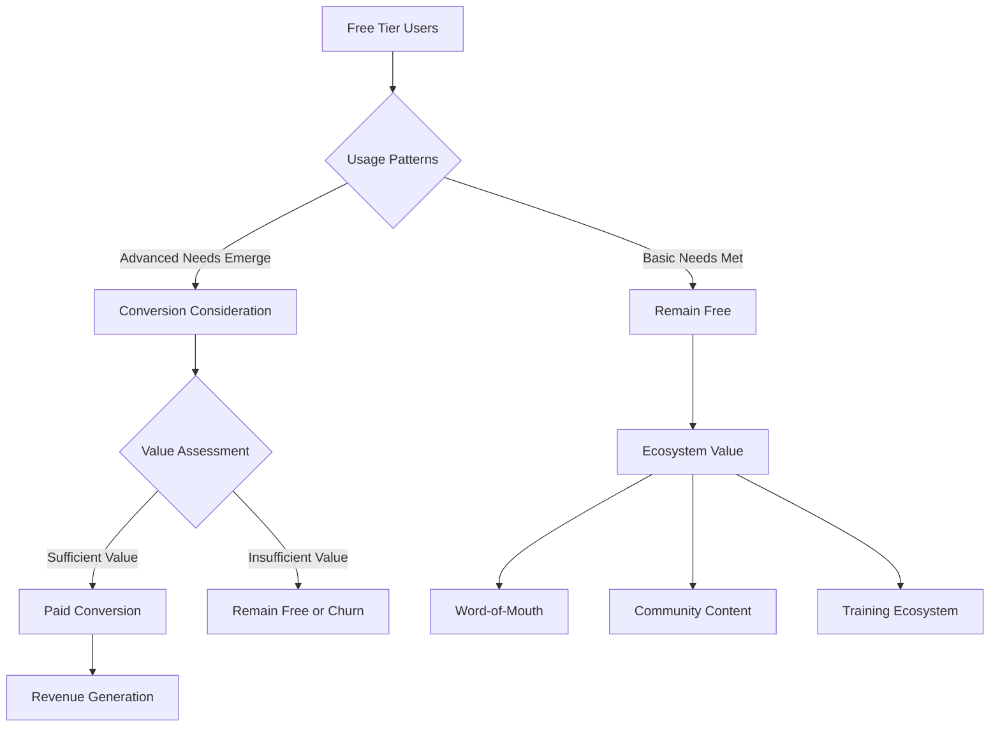

The freemium approach creates **multiple value streams** beyond direct software revenue:

- **Market Expansion**: Free access introduces video editing to users who would not purchase software
- **Ecosystem Development**: Large user bases attract plugin developers, tutorial creators, and community resources
- **Hardware Attachment**: Blackmagic's free software drives demand for professional hardware products
- **Platform Integration**: CapCut's free tier drives TikTok content creation and platform engagement

**Business Model Evolution Trends**

The competitive landscape suggests several **evolving business model dynamics**:

- **Hybrid Approaches**: Apple's Creator Studio bundle demonstrates movement toward subscription options alongside perpetual licenses
- **Consumption-Based Elements**: Adobe's generative credit system introduces usage-based pricing within subscription frameworks
- **Bundling Expansion**: Vendors increasingly bundle multiple applications to increase value perception and reduce subscription fatigue
- **Tiered Freemium**: More sophisticated free/paid tier structures with clearer upgrade triggers

### 4.9 Strategic Differentiation and Competitive Positioning Matrix

This section synthesizes competitive analysis into a strategic positioning framework that maps vendors across critical competitive dimensions, identifies key differentiators, and assesses the likely trajectory of competitive dynamics through 2031.

**Competitive Positioning Matrix**

The following matrix positions major competitors across five strategic dimensions critical to competitive success in the video editing software market:

| Vendor | AI Capability Depth | Cloud-Native Architecture | Mobile Platform Strength | Ecosystem Integration | Pricing Accessibility |
|--------|---------------------|---------------------------|--------------------------|----------------------|----------------------|
| Adobe | ★★★★★ | ★★★★☆ | ★★★☆☆ | ★★★★★ | ★★☆☆☆ |
| Apple | ★★★☆☆ | ★★☆☆☆ | ★★★★★ | ★★★★☆ | ★★★★☆ |
| Blackmagic | ★★★★☆ | ★★★☆☆ | ★★☆☆☆ | ★★★☆☆ | ★★★★★ |
| CapCut | ★★★★☆ | ★★★★☆ | ★★★★★ | ★★★★★ | ★★★★★ |
| CyberLink | ★★★☆☆ | ★★☆☆☆ | ★★☆☆☆ | ★★☆☆☆ | ★★★★☆ |
| Avid | ★★★☆☆ | ★★★☆☆ | ★☆☆☆☆ | ★★★★☆ | ★★☆☆☆ |

**Key Strategic Differentiators by Vendor**

Each major competitor has developed **distinctive competitive advantages** that define their market positioning:

**Adobe**: Unmatched **ecosystem integration** across creative applications, with Premiere Pro, After Effects, Photoshop, and Illustrator creating workflow continuity unavailable from competitors. The **Firefly AI platform** with commercial safety guarantees positions Adobe uniquely for enterprise adoption. Cross-cloud adoption continues to scale, with One Adobe deals growing over 60% YoY[^45].

**Apple**: **Hardware-software optimization** through M-series chip integration delivers performance advantages unavailable on cross-platform solutions. The **ecosystem lock-in** within Apple devices creates high switching costs for existing users. Platform exclusivity limits total addressable market but creates defensible positioning within the Apple ecosystem.

**Blackmagic Design**: **Industry-leading color grading** capabilities combined with an aggressive freemium model create unique positioning as the professional-grade accessible option. The **hardware ecosystem** generates revenue while software drives adoption, creating a differentiated business model.

**CapCut**: **TikTok integration** creates unmatched user acquisition efficiency and direct connection to content distribution. **Mobile-first design** captures the fastest-growing user segment. AI features optimized for social media trends enable rapid viral content creation.

**Strategic Moves and Market Responses**

Recent strategic initiatives demonstrate competitive dynamics in action:

| Initiative | Vendor | Date | Strategic Intent | Market Response |
|------------|--------|------|------------------|-----------------|
| Clip Maker & Generate Video | Adobe | April 2025 | Address SaaS fatigue, consolidate AI features | Bundling strategy validation |
| Final Cut Pro for iPad 2 | Apple | February 2025 | Extend professional tools to mobile | Mobile professional market expansion |
| DaVinci Resolve 20 | Blackmagic | April 2025 | AI feature parity, workflow automation | Free tier capability expansion |
| Paid elevate.io tier | Blackbird | March 2025 | Validate browser-based professional editing | Cloud-native workflow adoption |
| Creator Studio Bundle | Apple | January 2025 | Establish subscription revenue stream | Hybrid model validation |

**Consolidation and Future Competitive Dynamics**

The competitive landscape is positioned for potential **structural evolution** through 2031:

**Acquisition Activity**: Consolidation is likely as incumbents acquire niche AI startups to fast-track research, while specialized vendors explore alliances to integrate cross-platform synchronization[^8]. The strategic imperative for AI capability development exceeds organic R&D timelines for many vendors, creating acquisition targets among AI-focused startups.

**Platform Competition Intensification**: Meta's launch of Edits globally in April 2025 demonstrates social media platform entry into video editing, offering creators a consolidated production workflow tied directly to Instagram accounts[^42]. This platform competition may intensify as content distribution platforms seek to capture editing workflows.

**Business Model Evolution**: The tension between subscription fatigue and vendor recurring revenue requirements will drive continued business model experimentation, including hybrid approaches, consumption-based elements, and bundling strategies.

**AI as Competitive Battleground**: AI capability depth has emerged as the primary competitive differentiator, with vendors racing to integrate generative capabilities, automated workflows, and intelligent assistance. The pace of AI development will significantly influence competitive positioning through 2031.

The competitive landscape analysis reveals a market in dynamic evolution, where established leaders face meaningful challenges from disruptive entrants, business model innovation creates new competitive approaches, and AI integration reshapes the basis of competitive advantage. Vendors, buyers, and investors must navigate this complexity by understanding both current positioning and the trajectory of competitive dynamics.

## 5 Key Market Trends and Technological Innovation Drivers

This chapter examines the transformative trends reshaping the global video editing and creation software market through 2031. It analyzes how artificial intelligence and machine learning are fundamentally altering editing workflows, democratizing professional-grade capabilities, and enabling new creative paradigms. The chapter further explores the accelerating shift toward cloud-native architectures and real-time collaborative workflows, the profound influence of social media platforms and user-generated content on market demand patterns, and the strategic convergence of video editing tools with broader digital experience, marketing automation, and content distribution ecosystems.

### 5.1 AI and Machine Learning Transformation of Video Editing Workflows

Artificial intelligence has moved **beyond gimmick territory** and is now solving real-world post-production challenges by speeding up tedious tasks, improving quality, and unlocking new creative options that were previously inaccessible to most editors[^46]. The integration of AI and machine learning technologies into video editing software represents the most significant technological transformation the industry has experienced since the transition from linear to non-linear editing systems. This transformation is reshaping every stage of the post-production workflow, from initial footage organization through final delivery.

**Comprehensive AI Capability Mapping Across Major Platforms**

The major video editing platforms have each developed distinctive AI capabilities that address specific workflow bottlenecks. The following table synthesizes the AI feature landscape across leading software solutions:

| Platform | AI Engine | Key AI Capabilities | Primary Workflow Impact |
|----------|-----------|---------------------|------------------------|
| Adobe Premiere Pro | Adobe Sensei/Firefly | Generative Extend, Media Intelligence, Object Mask, Auto-Reframe, Filler Word Detection, Scene Edit Detection | Content extension, footage search, masking automation |
| DaVinci Resolve | Neural Engine | IntelliScript, Multicam SmartSwitch, AI Audio Assistant, Magic Mask, Depth Map, Voice Convert, IntelliTrack | Timeline generation, audio mixing, object isolation |
| After Effects | Adobe Sensei | Rotobrush 2, High-Performance Preview, Environment Lighting | Edge detection, compositing acceleration |
| CapCut | ByteDance AI | Script to Video, AutoCut, Voice Filter, Text-to-Speech, AI Avatars | Automated assembly, voice modification |

**Adobe's Firefly-Powered Workflow Revolution**

Adobe has embedded powerful AI capabilities into Premiere Pro and After Effects via Adobe Sensei, with recent versions introducing Firefly-powered features that fundamentally alter editing possibilities[^46]. The **Generative Extend** feature, introduced at NAB 2025, allows editors to add extra frames to clips when the camera started too late or cut too early—a common problem in production that previously required reshoots or creative workarounds[^47]. This capability operates at **4K resolution** and works in the background while editing continues, with clips automatically tagged with Content Credentials to indicate AI usage[^47].

The **Media Intelligence** feature represents a paradigm shift in footage organization. Using AI-powered analysis, editors can now search hours of footage in seconds using natural language descriptions[^47]. The system automatically identifies clip content including objects, locations, camera angles, and more, eliminating the need for manual logging, bin creation, or reliance on memory to locate specific shots[^47]. Critically, this media analysis occurs **on-device without requiring internet connectivity**, and Adobe explicitly states that user content is never used for training AI models[^47].

Adobe's **Object Mask** capability, introduced in 2026, enables editors to create precise masks of complex moving subjects through a simple hover-and-click interface[^48]. Visual overlays snap into place as users hover across frames, identifying maskable subjects instantly. The feature includes bi-directional tracking, 3D perspective tracking for anchoring masks to surfaces, and a "Frame" track editing mode that automatically combines manual corrections with tracked keyframes[^48]. This AI model operates **entirely on-device**, maintaining Adobe's commitment to data privacy[^48].

**DaVinci Resolve's Neural Engine Expansion**

Blackmagic Design's DaVinci Resolve 20, announced at NAB 2025, introduced **over 100 new features** including powerful AI tools designed to assist with all stages of workflow[^49]. The DaVinci Neural Engine powers an extensive array of capabilities that automate traditionally time-consuming tasks:

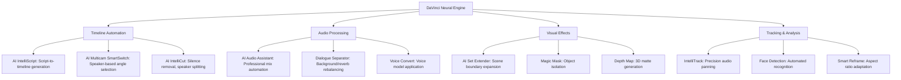

The **AI IntelliScript** feature automatically generates timelines based on original project scripts by matching transcribed audio in media clips to the written script[^49]. This capability transforms the rough-cut assembly process from hours of manual work into an automated workflow that delivers editable timelines in minutes. The **AI Multicam SmartSwitch** automatically switches multi-cam angles based on the active speaker in a scene, analyzing both audio levels and lip movement in video to select optimal camera angles[^49].

The **AI Audio Assistant** represents a comprehensive automation of audio post-production, capable of automatically creating a professional audio mix by organizing tracks, evening out dialogue levels, adjusting sound effects and music relative to dialogue, and creating a mastered final mix[^49]. This feature addresses one of the most technically demanding aspects of video production, making broadcast-quality audio accessible to editors without specialized audio engineering training.

**Quantified Productivity and Cost Efficiency Gains**

The productivity impact of AI integration in video editing workflows is substantial and measurable. **Generative AI saves professionals up to 200 hours yearly** by automating tasks that previously required manual execution[^8]. This time savings translates directly to increased output capacity or reduced production timelines, enabling faster content delivery in competitive markets.

The cost efficiency differential between AI-assisted and traditional production methods is striking:

| Production Method | Cost Range | Time Investment | Skill Requirement |
|-------------------|------------|-----------------|-------------------|
| Traditional Corporate Video | $100-149 per hour | High | Professional expertise required |
| AI Video Production (vidBoard) | $0.50 per minute | Low | Minimal technical training |
| AI Video Production (Synthesia) | $2.13 per minute | Low | Minimal technical training |

Organizations utilizing AI video tools can **save approximately 14 hours per video project**, with cost savings reaching up to **$1,500 per project**[^50]. These efficiency gains are transforming the economics of video production, making frequent content creation viable for organizations that previously could not justify the resource investment.

**Specialized AI Tools and Emerging Platforms**

Beyond the major NLE platforms, specialized AI tools are addressing specific post-production challenges with targeted solutions:

**HeyEddie.ai**, launched in early 2025, functions as an AI assistant specifically for rough cuts and interview editing[^46]. Using a prompt-based workflow, it analyzes footage and generates smart cuts instantly, offering multicam logging and editing capabilities with exportable timelines to major NLEs. This represents the emergence of **agentic editing** approaches where AI systems can process footage, orchestrate multiple operations, and deliver editable outputs.

**Descript** enables users to edit video by editing the transcript, fundamentally changing the editing paradigm from timeline manipulation to text manipulation[^46]. The platform's **Underlord agent** can adjust lighting, clean audio tracks, and remove filler words automatically[^51]. The "Overdub" AI voice cloning tool generates missing voice lines, addressing situations where pickup recordings are impractical.

**Topaz Video AI** provides enhancement capabilities including frame interpolation, de-noising, upscaling, deblurring, and slow motion interpolation powered by deep learning[^46]. These capabilities enable footage shot at lower resolutions or frame rates to be enhanced for modern delivery requirements.

**Colourlab AI** assists with color grading through LUT matching, which analyzes reference imagery to automatically apply similar grades, and look transfer between clips[^46]. Integration with DaVinci Resolve enables colorists to accelerate the grading process while maintaining creative control.

**AI Adoption Metrics and Market Penetration**

The adoption of AI tools within video editing workflows has reached significant scale. **Approximately 40% of video editors are expected to utilize AI-driven tools** to automate tasks such as color grading and audio enhancement by 2025[^50]. This adoption rate reflects both the maturation of AI capabilities and the competitive pressure driving editors to embrace efficiency-enhancing technologies.

The penetration of AI in content creation extends beyond professional editing:

- **Nearly 58% of YouTube ads** are either AI-generated or customized using AI video editing tools[^50]
- **52% of TikTok and Instagram Reels** are created as short-form videos using AI video generation tools[^50]
- **72% of YouTubers** use AI-edited thumbnails, resulting in a **38% increase in click-through rates**[^50]
- **94.5% of creators** are using AI for at least one task, including editing content, generating images and videos, creating captions for accessibility, and brainstorming content[^50]

These statistics demonstrate that AI has transitioned from experimental technology to mainstream production tool, fundamentally reshaping how video content is created across professional and consumer contexts.

### 5.2 Democratization of Professional Capabilities and Skill Barrier Reduction

The integration of AI into video editing software is **fundamentally lowering technical barriers** to video production, enabling non-specialists to produce professional-quality content without years of specialized training. This democratization represents a structural expansion of the addressable market, as capabilities once requiring expensive equipment and expert knowledge become accessible through intelligent software automation.

**Erosion of the Historical Skills Gap**

AI-powered features that automate technically demanding tasks are eroding the traditional divide between professional and amateur video production. The following capabilities, which previously required specialized expertise, now appear **even in entry-level software tiers**[^8]:

| Automated Capability | Traditional Skill Replaced | Democratization Impact |
|---------------------|---------------------------|----------------------|
| Auto Color Matching | Professional colorist expertise | Consistent visual quality without grading training |
| AI Noise Suppression | Audio engineering knowledge | Broadcast-quality audio from consumer recordings |
| Auto-Captioning | Manual transcription and timing | Accessibility compliance and engagement optimization |
| Scene Edit Detection | Editorial judgment and logging | Accelerated rough-cut assembly for novice editors |
| Object Tracking | Motion graphics compositor skills | Sophisticated visual effects without technical training |
| Smart Reframe | Aspect ratio composition expertise | Multi-platform content adaptation |

This capability democratization is particularly significant because it addresses the **80/20 rule in video production**—the common observation that 80% of time and energy is spent on editing and 20% on filming or generating[^51]. By automating the most time-consuming technical tasks, AI tools enable creators to focus on creative decisions rather than technical execution.

**Template-Based Workflows and AI-Guided Production**

Template-based editing and AI-guided storyboards are **unlocking production capabilities for organizations without specialist staff**[^8]. These approaches embed professional-level creative and technical decisions within software functionality, enabling users to achieve quality outcomes by following guided workflows rather than making complex technical judgments.

The template approach is exemplified by platforms like **Viddo AI**, which provides pre-set high-quality video templates featuring drag-and-drop functionality, complete customization options, and libraries covering multiple project types[^52]. Users can convert text, images, and videos into AI videos with one click, automating tasks that previously required detailed manual editing. The platform supports trending social media templates and automatically creates videos in correct formats for platforms like TikTok, Instagram, YouTube, and Facebook[^52].

This template-driven democratization is reflected in market dynamics where **small and medium-sized enterprises are scaling at 7.88% annually through 2031**—significantly exceeding the overall market growth rate[^8]. The acceleration reflects how template-based editing and AI-guided storyboards unlock production without specialist staff, particularly for social commerce campaigns and targeted vertical video advertising[^8].

**Market Expansion Through Skill Barrier Reduction**

The democratization effect is expanding the total addressable market by enabling users without formal training to produce content meeting professional quality standards. This expansion is quantifiable through multiple metrics:

**Creator Economy Growth**: The number of creators on Stripe's 50 most popular platforms increased by 48% in 2021 versus 2020, with projections suggesting these platforms alone will support 15.5 million creators within five years. This creator proliferation directly translates to editing software demand, as professional-quality content production requires capable editing tools regardless of distribution platform.

**AI-Driven DIY Adoption in APAC**: AI-assisted editing is driving DIY adoption particularly in the Asia-Pacific region, with a **+1.0% impact on the overall market CAGR forecast**[^8]. China's AI-generated content sector alone is tracking toward **RMB 260 billion (~$36 billion) in 2025 on a 70% CAGR**, signaling strong spillover into editing workflows[^8]. Automated rough-cut creation, noise removal, and subtitle generation widen creator participation and push software vendors to embed AI co-pilots as default features[^8].

**Personal Creator Segment Acceleration**: The personal creators segment is advancing at a **6.78% CAGR**, outpacing the professional/commercial segment growth rate[^8]. This acceleration reflects the democratization of video production capabilities and the proliferation of monetization avenues that transform personal content creation from hobby activity into viable economic pursuit.

**Competitive Landscape Implications**

The democratization of professional capabilities is reshaping competitive dynamics by enabling smaller players to compete with established studios on technical quality. **Cloud adoption narrows the capability divide between boutique creators and major studios**[^8], while AI-powered features provide the technical polish that previously required expensive post-production facilities.

This dynamic creates both opportunities and challenges for software vendors:

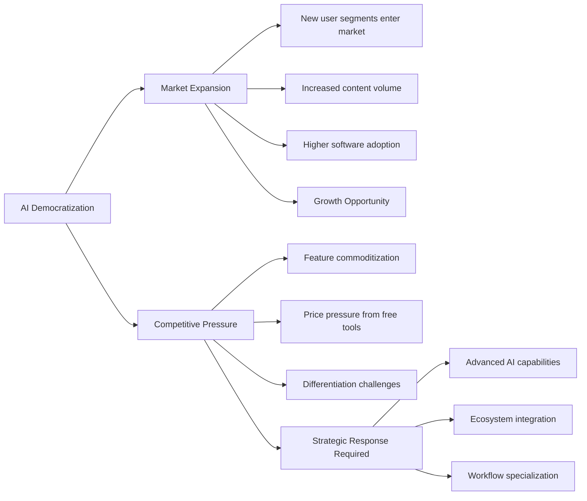

The democratization trend intensifies competition on AI capability depth, as basic automation features become table stakes across the market. Vendors must continuously advance AI sophistication to maintain differentiation, while the availability of capable free and low-cost alternatives creates downward pressure on pricing across all market segments.

### 5.3 Cloud-Native Architecture and Collaborative Workflow Evolution

The video editing software market is experiencing a **structural transformation** toward cloud-based deployment models that fundamentally alter how video content is produced, reviewed, and delivered. Cloud-based workflows are forecast to expand at **8.23% CAGR through 2031**, significantly outpacing the overall market growth rate of 5.88%[^8]. This differential growth rate indicates that cloud deployment will capture an estimated **additional 9.2 percentage points of market share by 2031**[^8], representing a fundamental reshaping of the deployment landscape.

**Current Deployment Distribution and Trajectory**

In 2025, **on-premise solutions retained 51.30% of the video editing market share**, reflecting the continued importance of local installation for compute-intensive professional workflows[^8]. However, this majority position is eroding as cloud-based solutions demonstrate superior growth dynamics:

| Deployment Type | 2025 Market Share | Projected CAGR | Key Growth Drivers |
|-----------------|-------------------|----------------|-------------------|
| On-Premise | 51.30% | ~4.5% (below market average) | Security requirements, performance predictability |
| Cloud-Based | 48.70% | 8.23% | Collaboration, elasticity, accessibility |

The trajectory indicates cloud-based solutions will achieve **majority market share before 2031**, fundamentally inverting the current deployment balance. This transition is propelled by multiple converging factors that collectively address historical limitations of local installation while enabling new workflow paradigms.

**OTT Studios Driving Cloud-Native Pipeline Adoption**

A key driver of cloud adoption is **OTT studios' shift to cloud-native post-production pipelines**, which has a **+0.8% impact on the overall CAGR forecast**[^8]. Distributed teams favor browser-based workstations that remove location constraints and reallocate capital from servers to subscriptions. This shift reflects the operational reality of modern media production, where teams are increasingly geographically distributed and project-based staffing requires flexible infrastructure.

Early market validation of professional cloud-native workflows is visible in platforms such as **Blackbird plc's elevate.io**, which added a paid tier and secured 100 subscribers within weeks of its February 2025 launch[^8]. This rapid adoption demonstrates professional willingness to embrace browser-based editing when functionality meets production requirements. The platform's success validates that **real-time review, version control, and parallel rendering on shared cloud storage** can accelerate turnaround times beyond what on-premise workflows enable[^8].

**Collaborative Workflow Capabilities**

Cloud architecture enables collaboration features that fundamentally transform team-based production:

**Real-Time Multi-User Editing**: Cloud platforms enable multiple editors to work simultaneously on shared projects, eliminating the sequential handoffs required in traditional workflows. This capability is particularly valuable for news production, live event coverage, and deadline-driven commercial work where parallel processing accelerates delivery.

**Collaborative Review Portals**: Browser-based review systems enable stakeholders to provide feedback with frame-accurate comments without requiring software installation. Adobe's **Frame.io V4 panel**, now integrated directly within Premiere Pro, enables editors to ingest assets, share cuts, and sync notes without leaving the editing application[^48]. Frame.io is included with Creative Cloud at no additional cost, demonstrating how collaboration features are becoming standard rather than premium capabilities.

**Elastic Rendering Resources**: Cloud platforms provide scalable rendering capacity that eliminates hardware constraints during high-demand periods. This elasticity is particularly valuable for peak-load production scenarios where deadline pressure requires parallel processing across multiple render nodes.

**Version Control and Asset Management**: Cloud-native workflows provide systematic version tracking and centralized asset management that prevent the confusion and errors common in traditional file-based collaboration. Automatic version stacking and synchronized feedback ensure all team members work from current project states.

**Capability Divide Narrowing**

Cloud adoption is **narrowing the capability divide between boutique creators and major studios**[^8]. Previously, only well-resourced production companies could afford the infrastructure required for professional-grade editing, rendering, and collaborative workflows. Cloud platforms democratize access to these capabilities through shared infrastructure and subscription-based pricing:

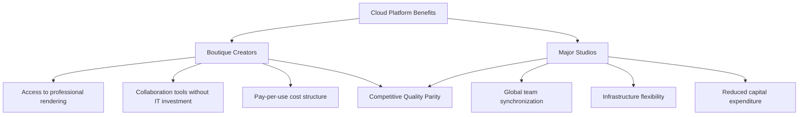

**SMEs appreciate pay-as-you-go hosting that converts capital spending into operational outlays**[^8], reducing the financial barriers to professional production capabilities. OTT producers exploit browser timelines to keep global teams in sync, while the subscription model enables scaling production capacity up or down based on project requirements.

**Cloud Adoption Constraints and Challenges**

Despite strong growth momentum, cloud-based video editing faces several constraints that sustain on-premise deployment relevance:

**Data Sovereignty Regulations**: Regulations limiting cross-border cloud rendering have a **-0.3% impact on CAGR** and are relevant in Europe, China, and Russia[^8]. These regulations compel vendors to establish in-region hosting, elongating procurement cycles and increasing deployment complexity for organizations subject to data residency requirements.

**Performance Variability**: Real-time editing of high-resolution footage requires consistent low-latency performance that on-premise hardware can guarantee, whereas cloud performance may vary with network conditions. Professional workflows with tight deadlines may require the predictability of local processing.

**Security Considerations**: Organizations handling sensitive content—unreleased films, confidential corporate communications, proprietary intellectual property—often mandate local storage and processing to minimize data exposure risks.

**Interoperability Challenges**: Gaps between cloud and on-premise workflows, as well as between different cloud platforms, create friction when transitioning projects across environments. Bridging these gaps remains a priority as hybrid cloud/local workflows become more common.

### 5.4 Social Media Platform Influence and User-Generated Content Dynamics

Video-centric social media platforms have created **unprecedented demand** for video editing software optimized for mobile-first creation, rapid production cycles, and platform-specific output formats. This influence extends beyond mere demand stimulation to fundamentally shape feature development priorities, business model evolution, and competitive dynamics across the video editing software market.

**Creator Monetization Surge as Primary Growth Driver**

The **creators' monetization surge on short-form video platforms** represents the most significant growth driver impacting the video editing market, with a **+1.2% impact on the CAGR forecast**[^8]. This driver is particularly relevant in North America and Asia-Pacific, where platform economics have created viable career paths for content creators.

Short-form ecosystems enable direct revenue streams that incentivize frequent uploads and tighten feedback loops between content quality and earnings potential[^8]. Platforms such as TikTok and YouTube report that **91% of companies treat video as a core marketing channel**, while **88% of marketers deem it indispensable**[^8]. These economics motivate businesses to seek editors that deliver platform-specific templates, automated captioning, and aspect-ratio presets optimized for social media distribution.

**User-Generated Content Market Trajectory**

The scale and growth of user-generated content is reshaping the video editing market's structural composition:

| UGC Metric | Current Status | 2025 Projection | Market Implication |
|------------|----------------|-----------------|-------------------|
| Share of Online Video Views | Growing rapidly | 50% of all views | Massive demand for accessible editing tools |
| Short-Form Content Share | Dominant format | ~80% of online content | Feature prioritization toward quick editing |
| Mobile Video Generation | Primary capture platform | 75%+ of all video views | Mobile-first editing requirement |

By 2025, **user-generated content will account for 50% of all online video views**[^21], showcasing the need for easy-to-use editing tools for non-professionals. This projection reflects a fundamental shift in content consumption patterns where professionally-produced content shares attention with creator-generated material across all demographics.

**Short-form videos (less than a minute long) are expected to constitute approximately 80% of all online video content** by 2025[^21]. Platforms like TikTok and Instagram Reels are setting this trend, demanding that editors focus on short, impactful storytelling. This format dominance drives feature prioritization toward rapid editing workflows, automated pacing optimization, and platform-specific export presets.

**Platform-Specific Feature Development**

Social media platform requirements are directly influencing video editing software feature roadmaps:

**Aspect Ratio Adaptation**: The proliferation of vertical video formats (9:16) for mobile consumption has driven development of **Smart Reframe** and **Auto Reframe** capabilities that automatically adjust horizontal footage for vertical platforms[^46][^49]. These features address the workflow challenge of repurposing content across platforms with different format requirements.

**Automated Captioning**: Captions have become essential for social media engagement, as most platform users consume video with sound off. **Auto-captions ranked among CapCut's most-used AI features in 2025**[^50], alongside AutoCut, Voice filter, and Text-to-speech. Adobe's Premiere Pro now enables automatic translation of captions into **27 languages**[^47], addressing global audience reach requirements.

**Template Integration**: Platform-specific templates enable rapid content creation aligned with trending formats. CapCut's strategic synergy with TikTok provides templates that let users quickly match video formats and export finished content directly to the platform[^50]. This integration creates viral adoption as posted videos with CapCut watermarks drive new users who discover templates.

**Social Commerce Video Adoption**

**Social commerce video adoption by SMB retailers** represents another significant growth driver, with a **+0.7% impact on the CAGR forecast**[^8]. This driver is particularly relevant in China, Southeast Asia, and North America, where short video integrated with e-commerce checkout shortens the path from discovery to purchase.

Surveys show **82% of consumers are persuaded by branded video and 89% prefer more video content from brands**[^8]. This consumer preference drives SME demand for video production capabilities, as businesses recognize that video content is essential for competitive marketing. Conversion-linked creation tools let resource-constrained retailers produce promotional footage that feels native to social feeds, underpinning SME demand curves within the video editing market[^8].

**Asia-Pacific Mobile Video Editing Dynamics**

The Asia-Pacific region exemplifies the social media influence on video editing demand. The **Asia-Pacific mobile video editing applications market** was valued at **USD 711.74 million in 2024** and is projected to reach **USD 1,483.17 million by 2033**, growing at a **CAGR of 8.5%**[^19].

Market growth is driven by the **growing influencer culture and digital marketing**[^19]. The recent emergence of social media influencers on YouTube, Instagram, and other platforms has raised demand for higher-quality video material. Brands increasingly prefer collaborating with micro-influencers in APAC, with **91% of all sponsored post engagements in APAC in 2021** generated by micro-influencers[^19].

The cost efficiency of micro-influencer partnerships—averaging **USD 200 per Instagram post**—combined with engagement rates on TikTok that are **32x higher than Facebook and 4x higher than Instagram**[^19] creates powerful incentives for video content investment. This dynamic fuels demand for mobile video editing applications that enable rapid, high-quality content production optimized for social platforms.

### 5.5 Mobile-First Editing and Hybrid Workflow Emergence

The video editing market is experiencing a **platform transformation** as smartphone and tablet editing workflows demonstrate growth rates significantly exceeding desktop platforms. This shift reflects both technological advancement in mobile silicon and changing content creation patterns driven by social media proliferation.

**Mobile Platform Growth Trajectory**

**Smartphone/tablet workflows are set to climb at 8.62% CAGR through 2031**[^8], representing the fastest-growing platform segment in the video editing market. This growth rate substantially exceeds the desktop/laptop segment, which maintained **54.40% revenue share in 2025** but demonstrates growth aligned with the market average[^8].

The acceleration of mobile editing adoption is driven by **silicon improvements that deliver H.265 hardware encoding and HDR playback** on mobile devices[^8]. These hardware advances enable mobile devices to handle video processing tasks previously requiring desktop-class hardware, fundamentally expanding viable use cases for mobile editing.

| Platform Segment | 2025 Revenue Share | Projected CAGR | Key Enablers |
|------------------|-------------------|----------------|--------------|
| Desktop/Laptop | 54.40% | ~5.5% | GPU acceleration, multi-tier timelines |
| Smartphone/Tablet | 45.60% | 8.62% | Silicon improvements, touch optimization |

**Professional Mobile Editing Validation**

Apple's **February 2025 release of Final Cut Pro for iPad 2** extended professional toolkits into mobile devices, integrating multicam recording and refined touch controls[^8]. This release demonstrates major vendor commitment to professional-grade mobile editing and validates the market opportunity for sophisticated mobile workflows. The application combines **gesture-based trimming with multicam sync** in a fanless device, blurring lines between platform categories[^8].

The iOS/iPadOS platform is positioned for **8.95% annual growth through 2031**[^8], the highest growth rate among operating system segments. This trajectory reflects **vertical optimization between Apple's M-series chips and Metal-accelerated codecs** in purpose-built tablet applications, creating performance advantages unavailable on cross-platform solutions[^8].

**Hybrid Workflow Model Emergence**

A significant development within platform segmentation is the emergence of **hybrid editing models** where creators leverage the strengths of multiple platforms within unified workflows:

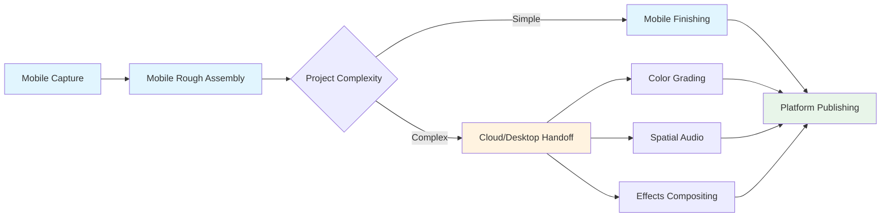

In these hybrid models, **editors sequence clips on phones, then hand off to cloud or desktop for color grading and spatial audio** finishing[^8]. This workflow pattern leverages mobile convenience for initial assembly—particularly valuable for on-location editing and rapid turnaround requirements—while reserving desktop capabilities for technically demanding finishing tasks that benefit from larger displays and more precise input devices.

The hybrid approach represents a pragmatic evolution that maximizes the advantages of each platform rather than requiring exclusive commitment to either. Touch-optimized interfaces accelerate rough cuts during travel or on location, while desktop workstations provide the processing power and interface precision required for final delivery preparation.

**Mobile-Desktop Interoperability Challenges**

A key restraint impacting platform segmentation growth is **interoperability gaps between mobile and desktop workflows**, which have a **-0.6% impact on the CAGR forecast**[^8]. Capture often begins on phones yet finishing touches require desktop horsepower, creating workflow friction when transitioning projects between platforms.

Review of leading apps notes **persistent latency in asset synchronization and feature parity**, slowing turnaround for hybrid creators[^8]. Project format incompatibilities, inconsistent feature availability across platforms, and synchronization delays create friction that reduces the efficiency gains hybrid workflows should theoretically provide.

**Bridging this gap remains a priority as mobile content volumes rise** within the video editing market[^8]. Vendors addressing interoperability challenges through unified project formats, seamless cloud synchronization, and consistent feature availability across platforms may capture competitive advantage as hybrid workflows proliferate.

**CapCut's Mobile-First Dominance**

CapCut exemplifies successful mobile-first positioning, commanding an **81% market share of total active users** for mobile video editing according to Sensor Tower. The platform's growth reflects strategic optimization for mobile workflows:

- **4% market share** in overall video editing software, but dominant in mobile segment[^21]
- **Over 1 billion Android downloads** as of Q3 2024
- **200 million monthly active users** in 2025
- **23 million downloads in the last month alone**, representing roughly 30% of all video editing app downloads

CapCut's success demonstrates that mobile-first design, combined with platform integration (TikTok) and accessible AI features, can capture massive user bases even in competition with established desktop-focused vendors.

### 5.6 Convergence with Digital Experience and Marketing Platforms

Video editing capabilities are increasingly **converging with broader marketing automation, content management, and digital experience platforms**, reflecting the strategic importance of video content across enterprise communication and commerce workflows. This convergence is creating new competitive dynamics as video editing transitions from standalone creative tool to integrated component of comprehensive content ecosystems.

**Enterprise Video Adoption Scale**

The integration of video into enterprise workflows has achieved substantial scale. **89% of businesses use video as a marketing tool**, and **95% of video marketers see video as an important part of their overall strategy**, with **68% of marketers who don't currently use video planning to start in 2025**[^50]. These adoption metrics demonstrate that video has transitioned from optional marketing enhancement to essential communication channel.

**Social media videos are estimated to account for 82% of all consumer internet traffic by 2025**[^50], underscoring the strategic imperative for organizations to develop video production capabilities. This traffic concentration drives demand for editing tools that streamline production for social distribution while maintaining brand consistency across channels.

**Social Commerce Integration**

**Social commerce video adoption by SMB retailers** represents a significant convergence trend with a **+0.7% impact on the CAGR forecast**[^8]. Short video integrated with checkout shortens the path from discovery to purchase, creating direct attribution between video content and revenue generation.

The integration of video production with e-commerce platforms creates demand for:

| Integration Requirement | Capability Needed | Market Response |
|------------------------|-------------------|-----------------|
| Product Video Creation | Template-based product showcases | Platform-specific templates |
| Shoppable Video | Clickable product tags within video | Interactive overlay tools |
| Performance Analytics | View-to-conversion tracking | Integrated analytics dashboards |
| Multi-Platform Distribution | Automated format adaptation | Smart reframe and export presets |

Conversion-linked creation tools let resource-constrained retailers produce promotional footage that feels native to social feeds[^8], underpinning SME demand curves. Surveys indicate **82% of consumers are persuaded by branded video and 89% prefer more video content from brands**[^8], validating the business case for integrated video-commerce workflows.

**Adobe Stock and Asset Ecosystem Integration**

The convergence trend is exemplified by Adobe's integration of **Adobe Stock directly within Premiere Pro**[^48]. Editors can now browse over **52 million clips (including 92,000 free ones)**, preview, license, and import them without leaving the editing application. This integration eliminates workflow disruption when sourcing supplementary footage and demonstrates how editing platforms are expanding to encompass broader content supply chain functions.

Similarly, After Effects' access to **Substance 3D materials via Substance Community Assets**, with over **1,300 free materials available**[^48], extends the platform's capability into 3D asset integration. Users can apply materials to both native meshes and imported models, enabling sophisticated visual effects without leaving the compositing environment.

**Frame.io Collaboration Integration**

Adobe's **Frame.io V4 panel integration** within Premiere Pro demonstrates convergence between editing and collaborative review workflows[^48]. The panel keeps editors in the application while bringing in comments, media, and versioning. Editors can ingest assets, share cuts, and sync notes without leaving Premiere, with versions automatically stacking in Frame.io and feedback appearing directly on the timeline.

This integration reflects the broader trend toward **unified creative workflows** where discrete production stages—editing, review, approval, distribution—converge within integrated platforms rather than requiring manual handoffs between specialized tools.

**Enterprise Video Editing Cloud Solutions**

For enterprise marketing teams, video editing platforms are evolving to address organizational requirements beyond individual editing capability:

- **Centralized Asset Management**: Easy access to approved brand elements
- **Version Control**: Tracking changes and maintaining project continuity
- **Approval Workflows**: Streamlined feedback with real-time commenting
- **Brand Compliance**: Enforcement of corporate standards across content
- **API Integration**: Connection with marketing automation and CMS platforms
- **Bulk Processing**: Campaign-wide video production at scale
- **Enterprise Security**: Compliance with organizational data requirements

These enterprise requirements are driving platform development toward comprehensive solutions that address the full content lifecycle rather than isolated editing functionality.

**AI-Powered Marketing Workflow Transformation**

AI integration is transforming marketing video workflows across the production lifecycle:

**Pre-Production Efficiency**: AI provides data-driven insights to develop strategic content plans and enables rapid storyboard creation through automated visualization of concepts[^50].

**Production Acceleration**: Intelligent editing suggestions accelerate decision-making, while automated selection of supplementary footage from integrated asset libraries reduces sourcing time[^50].

**Post-Production Optimization**: Dynamic content adjustments tailored for specific audiences, automatic formatting for diverse platforms, and multilingual captioning enable efficient multi-market distribution[^50].

The convergence of video editing with marketing platforms reflects video's transition from creative output to strategic business asset requiring integration with broader organizational systems and workflows.

### 5.7 Emerging Technologies and Future Innovation Trajectory

The video editing software market stands at the threshold of **transformational technological change** that will reshape capabilities, workflows, and competitive dynamics through 2031 and beyond. Emerging technologies including agentic AI systems, neural rendering, and advanced generative models are poised to fundamentally alter how video content is created, while raising significant ethical and regulatory considerations that will influence feature development and market evolution.

**The Rise of Agentic Video Editing**

2025 was characterized as **"the year of video"**, marked by AI-generated ads going mainstream, launch videos from seed stage startups achieving millions of views, and an explosion of video podcasts and interviews[^51]. However, the significant work behind the scenes—cutting 90 minutes of footage into a three-minute short, correcting lighting and audio—remains a bottleneck that emerging agentic AI systems are positioned to address.

The technology now exists to hand over substantial editing work to AI agents[^51]. Several recent developments have unlocked progress in this area:

**Vision Model Advancement**: Recent large language models including Gemini 3, GPT-5.2, Molmo 2, and Vidi2 are inherently multimodal with longer context windows[^51]. **Gemini 3 can now process up to an hour of video** to generate timestamped labels or summarize content, enabling AI systems to comprehend massive amounts of footage that would require hours of human review.

**Tool-Using Agent Capabilities**: Models can now use tools, as demonstrated by Claude using Blender[^51]. This represents meaningful progress toward LLMs as real agents that can take action within editing applications rather than merely describing what's happening in footage.

**Generative Model Quality**: Image and video generation models have improved sufficiently to enable **hybrid production pipelines mixing AI and filmed content**[^51]. This enables generating B-roll for documentaries, using motion transfer models, and creating synthetic elements that integrate seamlessly with captured footage.

**Agentic Editing Task Categories**

AI editing agents are emerging with capabilities across five key task categories:

Products like **Eddie AI** are already identifying A-roll versus B-roll, processing multiple camera angles, and comparing takes[^51]. Platforms like **Glif** launch agents that orchestrate between models on users' behalf[^51]. **Descript's Underlord agent** adjusts lighting, cleans audio, and removes filler words automatically[^51]. Platforms like **Overlap** enable node workflows to cut clips for different platforms and translate videos for international audiences[^51].

The potential impact is substantial: YouTuber Emma Chamberlain reportedly spent **30-40 hours editing a 15-minute vlog**[^51]. Agentic editing could reduce this to an iterative review process where AI generates draft versions for human refinement rather than requiring manual assembly from scratch.

**Neural Rendering and Emotion-Responsive Editing**

Emerging technologies extend beyond workflow automation to creative capability expansion:

**Neural Rendering**: Advanced rendering techniques are pushing the boundaries of creativity by enabling **dynamic camera angles and effects** that would be impossible or prohibitively expensive to capture practically[^50]. These capabilities enable synthetic camera movements, perspective transformations, and visual effects generated from AI understanding of scene geometry and content.

**Emotion-Responsive Editing**: Emerging systems are developing capabilities to **tailor content to viewer reactions**[^50], adjusting pacing, music, and visual elements based on detected emotional response. While primarily experimental, these technologies point toward personalized video experiences that adapt to individual viewer engagement patterns.

**Quantum Computing Potential**: Industry observers note the potential for **quantum computing to enable instant, high-quality rendering**[^50], though practical applications remain distant. The computational demands of real-time high-resolution video processing represent a potential quantum computing use case as the technology matures.

**AI Video Market Growth Trajectory**

The broader AI video market demonstrates the scale of investment flowing into AI-powered video technologies. The **global AI video market size was estimated at USD 3.86 billion in 2024** and is projected to reach **USD 42.29 billion by 2033**, growing at a **CAGR of 32.2%**[^53]. This growth rate—substantially exceeding the video editing software market's 5.88% CAGR—indicates massive capital deployment into AI video capabilities that will influence editing software development.

The **creative AI video generators segment** is projected to grow significantly over the forecast period, as these tools use advanced algorithms to automate video production tasks including scriptwriting and scene generation, making high-quality video creation more accessible[^53].

**Deepfake Proliferation and Ethical Considerations**

The advancement of AI video capabilities raises significant ethical and regulatory considerations that will influence market development:

**Deepfake Volume Explosion**: **Deepfake files have surged from 500,000 in 2023 to an estimated 8 million projected to be shared in 2025**[^50]. This exponential growth in synthetic media creation raises concerns about misinformation, fraud, and consent that may prompt regulatory responses affecting feature development.

**Fraud Impact**: **Deepfake fraud cases surged 1,740% in North America between 2022 and 2023**, with **financial losses exceeding USD 200 million in Q1 2025 alone**[^50]. These fraud statistics are driving enterprise and regulatory attention to authentication and provenance tracking capabilities.

**Detection Challenges**: When asked to directly judge whether audio clips were real or AI-generated, **participants were correct only about half the time, barely better than random chance**[^50]. This detection difficulty underscores the sophistication of current generative models and the challenge of distinguishing authentic from synthetic content.

**Content Credentials and Provenance**: Adobe's approach of tagging AI-generated content with **Content Credentials**[^47] represents one industry response to authenticity concerns. These metadata systems enable downstream platforms and viewers to understand how content was created, potentially becoming industry standards as regulatory frameworks develop.

**5G and Cloud AI Synergy in Asia-Pacific**

The Asia-Pacific region is positioned to lead adoption of emerging video technologies through infrastructure investment. The **increasing adoption of 5G technology enables low-latency cloud-based AI applications**[^54], with this synergy particularly evident in mobile video editing where AI-powered tools are becoming more accessible and sophisticated.

The combination of 5G's high-speed connectivity and AI's analytical capabilities is creating new opportunities for content creators and distributors across the region[^54]. Countries including China, Japan, and South Korea are investing heavily in 5G infrastructure and AI research, expected to drive significant growth in mobile video editing as consumers and professionals seek more advanced tools.

**Low-latency connections are critical for real-time collaboration and seamless streaming**[^54], which are essential for cloud-based AI editing applications. As these technologies continue evolving, they are expected to have profound impact on how video content is created, distributed, and consumed—particularly in the Asia-Pacific region where infrastructure investment and creator economy growth are converging.

**Innovation Trajectory Summary**

The technological trajectory through 2031 points toward:

| Technology Category | Current State | 2031 Projection | Market Impact |
|--------------------|--------------|-----------------|--------------------|
| Agentic Editing | Early emergence | Mainstream adoption | Workflow transformation |
| Generative Video | Quality improving rapidly | Professional-grade integration | Content creation democratization |
| Neural Rendering | Experimental | Production-ready | Creative capability expansion |
| Real-Time AI Processing | Cloud-dependent | Edge computing enabled | Mobile professional workflows |
| Content Authentication | Emerging standards | Regulatory mandates likely | Trust and verification systems |

The video editing software market's future will be shaped by the interplay between technological capability advancement, user adoption patterns, competitive responses, and regulatory frameworks addressing the societal implications of increasingly sophisticated AI-powered content creation tools.

## 6 Strategic Implications, Challenges, and Future Outlook

This chapter synthesizes the comprehensive market analysis from preceding chapters to derive actionable strategic insights for key market stakeholders including software vendors, enterprise buyers, content creators, and investors. It systematically evaluates the critical challenges constraining market growth—software piracy, subscription fatigue, interoperability gaps, and escalating customer acquisition costs—while providing a forward-looking perspective on market evolution through 2031, encompassing consolidation trajectories, business model transformation, generative AI's transformative role, and the structural implications of the ongoing shift toward social and creator-driven media consumption paradigms.

### 6.1 Strategic Imperatives for Software Vendors

Software vendors operating in the global video editing and creation market face a **complex strategic landscape** where maintaining competitive positioning requires simultaneous advancement across multiple capability dimensions while navigating evolving customer expectations and intensifying competitive pressure from both established players and disruptive entrants.

**AI Capability Development as Primary Competitive Differentiator**

The integration of artificial intelligence has transitioned from optional enhancement to **existential competitive requirement**. Vendors failing to deliver meaningful AI-powered capabilities risk accelerating market share erosion as users migrate toward platforms offering workflow automation, intelligent assistance, and generative content capabilities. The strategic imperative extends beyond feature-level AI additions to fundamental platform architecture decisions that enable continuous AI capability expansion.

Adobe's approach exemplifies the comprehensive AI strategy required for market leadership, with **Firefly integration across the Creative Cloud ecosystem** providing generative capabilities, commercial safety guarantees for enterprise customers, and a consumption-based generative credit system that creates expansion revenue opportunities. The reported **3x quarter-over-quarter increase in generative credit consumption** demonstrates user appetite for AI capabilities when effectively integrated into production workflows.

Blackmagic Design's **DaVinci Resolve 20 introduction of over 100 new features including AI tools** such as IntelliScript, Multicam SmartSwitch, and AI Audio Assistant illustrates how even freemium-model vendors must continuously advance AI sophistication to maintain competitive positioning. The strategic challenge for vendors lies in determining optimal AI investment levels relative to market positioning and monetization model.

**Cloud-Native Architecture Investment Priorities**

With cloud-based workflows forecast to expand at **8.23% CAGR through 2031**—significantly exceeding overall market growth—vendors must prioritize cloud-native architecture development to capture the structural shift toward collaborative, location-independent production workflows. The strategic investment framework should address:

| Investment Priority | Strategic Rationale | Implementation Considerations |
|--------------------|--------------------|------------------------------|
| Real-Time Collaboration | Distributed team enablement | Latency optimization, conflict resolution |
| Elastic Rendering | Peak-load accommodation | Cost optimization, quality consistency |
| Asset Management | Centralized content governance | Security, version control, search capability |
| Cross-Platform Synchronization | Hybrid workflow support | Format compatibility, feature parity |

The validation of professional cloud-native workflows through platforms like **Blackbird's elevate.io**, which secured 100 paid subscribers within weeks of launch, demonstrates market readiness for browser-based professional editing when functionality meets production requirements.

**Mobile-First Product Strategy Requirements**

The **8.62% CAGR projected for smartphone/tablet workflows through 2031** mandates strategic commitment to mobile platform development. Apple's **Final Cut Pro for iPad 2 release** with multicam recording and refined touch controls establishes the professional-grade mobile editing benchmark that competitors must address. Vendors without credible mobile strategies face exclusion from the fastest-growing platform segment and the creator demographic driving market expansion.

The mobile strategy imperative extends beyond standalone mobile applications to **hybrid workflow enablement** where mobile capture and rough assembly integrate seamlessly with desktop finishing. Addressing the **-0.6% CAGR impact from interoperability gaps** requires investment in unified project formats, cloud synchronization, and consistent feature availability across platforms.

**Pricing Model Optimization Against Subscription Fatigue**

The rising subscription fatigue affecting customer acquisition and retention requires **strategic pricing model evolution**. The market is increasingly splitting into three distinct camps: genuinely free applications, one-time purchases, and subscriptions that justify themselves through ongoing services[^55]. Vendors must evaluate their positioning within this framework and ensure pricing models align with delivered value.

Strategic responses to subscription fatigue include:

- **Bundling Strategies**: Adobe's April 2025 rollout of Clip Maker and Generate Video bundled multiple functions into a single license to address SaaS fatigue among users managing multiple subscriptions
- **Perpetual License Options**: Apple's continued availability of Final Cut Pro at $299 one-time purchase alongside the Creator Studio subscription bundle demonstrates hybrid model viability
- **Freemium Optimization**: DaVinci Resolve's generous free tier creates user acquisition while the $295 Studio upgrade captures professional conversion revenue
- **Value Demonstration**: Continuous feature updates and clear value articulation to justify ongoing subscription commitment

**Ecosystem Integration as Competitive Moat**

Ecosystem integration represents a **defensible competitive advantage** against emerging disruptors. Adobe's cross-application integration across Premiere Pro, After Effects, Photoshop, and Frame.io creates workflow continuity unavailable from point solutions. Apple's hardware-software optimization through M-series chip integration delivers performance advantages competitors cannot replicate. CapCut's TikTok integration creates a distribution advantage through built-in user acquisition funnels.

Vendors should prioritize ecosystem development through:
- Platform API integration with content distribution channels
- Asset library partnerships and integrated stock content access
- Plugin ecosystem cultivation to extend core functionality
- Enterprise system integration for workflow automation

### 6.2 Enterprise Buyer Decision Framework and Procurement Considerations

Enterprise buyers evaluating video editing software investments must navigate a **complex decision landscape** encompassing total cost of ownership analysis, capability assessment, security requirements, and long-term platform viability considerations. The proliferation of capable options across pricing tiers and deployment models requires systematic evaluation frameworks to optimize procurement decisions.

**Total Cost of Ownership Analysis Across Business Models**

The choice between subscription and perpetual licensing models carries significant long-term cost implications that extend beyond initial acquisition price:

| Cost Factor | Subscription Model | Perpetual License | Strategic Consideration |
|-------------|-------------------|-------------------|------------------------|
| Initial Outlay | Lower ($22.99-$37.99/month) | Higher ($295-$299 one-time) | Cash flow impact, budget cycle alignment |
| Long-Term Cost (5 years) | ~$1,380-$2,280 | $295-$299 + upgrade fees | Break-even analysis, usage duration |
| Feature Updates | Continuous inclusion | Major version purchases required | Innovation access, compatibility maintenance |
| Support Access | Included during subscription | Time-limited or additional cost | Operational risk, issue resolution |
| Exit Flexibility | Monthly/annual cancellation | Perpetual access to purchased version | Vendor lock-in, switching cost |

For organizations with multi-year software usage horizons, perpetual licenses offer superior total cost of ownership. Final Cut Pro's **$299 one-time purchase creates significant cost advantage over Adobe Premiere Pro's subscription at approximately $456 annually**—over a year, Final Cut Pro can cost less than half of subscription alternatives.

However, subscription models provide **continuous access to latest capabilities** including AI features that may deliver productivity gains offsetting subscription costs. The strategic calculation must incorporate productivity impact alongside direct software expenditure.

**AI Automation ROI Assessment Criteria**

Enterprise buyers should evaluate AI capabilities against quantifiable productivity metrics. **AI-assisted editing saves professionals up to 200 hours yearly** by automating tasks that previously required manual execution[^21]. Organizations should assess:

- **Time Savings Quantification**: Measure current time expenditure on automatable tasks (rough-cut assembly, captioning, color matching) against AI-enabled workflow efficiency
- **Quality Improvement Valuation**: Assess whether AI-powered features (noise suppression, color correction, stabilization) reduce need for specialized personnel or external services
- **Skill Barrier Reduction**: Evaluate whether AI capabilities enable non-specialist staff to produce acceptable quality output, reducing specialized headcount requirements
- **Output Volume Enablement**: Calculate whether AI efficiency gains enable increased content production volume within existing resource constraints

**Collaborative Workflow Requirements for Distributed Teams**

Organizations with geographically distributed teams must prioritize collaborative capabilities in vendor evaluation:

- **Real-Time Multi-User Editing**: Simultaneous project access without sequential handoffs
- **Review and Approval Workflows**: Frame-accurate commenting, version tracking, stakeholder notification
- **Asset Centralization**: Unified content libraries with appropriate access controls
- **Progress Visibility**: Project status tracking and deadline management integration

Adobe's **Frame.io integration within Premiere Pro** enables editors to ingest assets, share cuts, and sync notes without leaving the editing application, with versions automatically stacking and feedback appearing directly on the timeline. This integration level should serve as a benchmark for collaborative capability assessment.

**Hybrid Deployment Considerations**

Enterprise buyers must balance cloud flexibility against security requirements:

| Deployment Consideration | Cloud Advantage | On-Premise Advantage | Hybrid Approach |
|-------------------------|-----------------|---------------------|-----------------|
| Data Security | Vendor-managed security | Complete data control | Sensitive content local, general cloud |
| Performance Consistency | Elastic resources | Predictable latency | Finishing local, collaboration cloud |
| Regulatory Compliance | Vendor compliance programs | Direct compliance control | Region-specific deployment |
| Capital Structure | Operating expense | Capital investment | Balanced allocation |

**Data-sovereignty statutes in Europe, China, and Russia** compel vendors to establish in-region hosting, elongating procurement cycles. Organizations subject to these regulations must verify vendor compliance capabilities before commitment.

**Vendor Selection and Platform Viability Assessment**

Long-term platform viability assessment should consider:

- **Market Position Stability**: Vendor market share trajectory and competitive positioning
- **Investment Capacity**: R&D spending levels and feature development velocity
- **Ecosystem Health**: Plugin availability, community resources, training ecosystem
- **Integration Roadmap**: Planned integrations with enterprise systems and workflows
- **Exit Strategy**: Data portability, project format compatibility, transition support

### 6.3 Content Creator Strategic Positioning and Tool Optimization

Professional and personal content creators face strategic decisions regarding skill development, tool selection, and workflow optimization in an environment where **AI capabilities are rapidly democratizing professional-grade production**. The erosion of traditional skill barriers creates both opportunities and challenges for creators seeking to maintain competitive differentiation.

**Skill Development Priorities in an AI-Augmented Environment**

As AI automates technically demanding tasks, creator skill development priorities must evolve from technical execution toward creative direction and strategic content positioning:

| Traditional Skill | AI Automation Status | Evolved Priority |
|------------------|---------------------|------------------|
| Manual Color Grading | Substantially automated | Creative look development, brand consistency |
| Audio Engineering | Automated noise suppression, mixing | Narrative audio design, music selection |
| Motion Tracking | AI-powered object isolation | Creative effects conception, storytelling |
| Rough-Cut Assembly | Script-to-timeline automation | Editorial judgment, pacing refinement |
| Captioning/Transcription | Fully automated | Accessibility strategy, engagement optimization |

Creators should prioritize skill development in areas where AI serves as assistant rather than replacement: **storytelling, audience understanding, brand development, and creative direction**. Technical proficiency remains valuable for quality assessment and AI output refinement, but investment in purely technical skills faces diminishing returns as automation advances.

**Platform Selection Optimization**

Creators must optimize tool selection against their specific requirements, audience, and monetization model:

**Professional Long-Form Creators** requiring maximum capability should evaluate:
- Adobe Premiere Pro for ecosystem integration and enterprise client compatibility
- DaVinci Resolve for industry-leading color grading and cost efficiency
- Final Cut Pro for Apple ecosystem users prioritizing performance optimization

**Social Media-Focused Creators** prioritizing rapid turnaround and platform optimization should consider:
- CapCut for TikTok integration, template availability, and mobile-first workflows
- Adobe Express for rapid content creation with brand consistency
- Mobile-native applications for on-location capture-to-publish workflows

**Budget-Conscious Creators** should leverage:
- DaVinci Resolve's free tier providing professional-grade capabilities at no cost
- Open-source alternatives (OpenShot, Kdenlive) for basic editing requirements
- Freemium tiers of commercial applications for capability evaluation

**Workflow Efficiency Strategies Leveraging AI Assistance**

Creators should systematically integrate AI capabilities to maximize output efficiency:

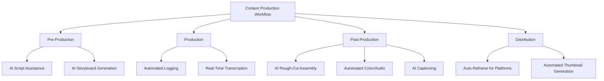

**Approximately 94.5% of creators are using AI for at least one task**, including editing content, generating images and videos, creating captions for accessibility, and brainstorming content. Creators not leveraging AI assistance face competitive disadvantage against peers achieving higher output volume and quality through automation.

**Multi-Platform Content Adaptation Approaches**

The dominance of short-form video—**expected to constitute approximately 80% of all online video content by 2025**—requires creators to develop efficient multi-platform adaptation workflows:

- **Smart Reframe Utilization**: Automated aspect ratio adaptation from horizontal master to vertical platform formats
- **Platform-Specific Optimization**: Template-based formatting for TikTok, Instagram Reels, YouTube Shorts
- **Captioning Strategy**: Auto-captioning with platform-appropriate styling and timing
- **Content Versioning**: Efficient creation of platform-tailored cuts from master footage

**Balancing Tool Investment Against Monetization Potential**

Creators should align software investment with realistic monetization projections. **By 2025, companies are expected to spend US$20,000 yearly on video marketing**[^21], indicating substantial budget availability for creator services. However, individual creators must evaluate whether premium tool costs translate to proportionate monetization improvement.

The availability of capable free alternatives—particularly DaVinci Resolve's comprehensive free tier—means creators can produce professional-quality content without software expenditure. Premium tool investment should be justified by specific capability requirements (enterprise client compatibility, specialized features, workflow efficiency gains) rather than assumed quality correlation.

### 6.4 Investment Landscape and Capital Allocation Opportunities

The video editing software market presents **diverse investment opportunities** across growth stages, technology categories, and competitive positions. Investors must navigate a landscape where established leaders face disruption pressure, AI capabilities drive valuation premiums, and platform dynamics create both opportunities and risks.

**High-Growth Segment Identification**

Investment allocation should prioritize segments demonstrating above-market growth trajectories:

| Segment | Projected CAGR | Investment Thesis |
|---------|----------------|-------------------|
| Cloud-Based Deployment | 8.23% | Structural shift toward collaborative workflows |
| Mobile Platform | 8.62% | Creator economy expansion, social media proliferation |
| SME End-User | 7.88% | Video marketing democratization, social commerce |
| Asia-Pacific Region | 7.22% | Infrastructure development, creator economy growth |
| AI in Video Editing | 17.2% | Workflow transformation, market expansion |

The **global market of AI in video editing is expected to grow from US$0.9 billion in 2023 to US$4.4 billion by 2033**, indicating a CAGR of 17.2%[^21]. This growth rate substantially exceeds the overall video editing software market, suggesting AI-focused investments may deliver superior returns.

**AI Innovation Leaders Warranting Attention**

Investment attention should focus on companies demonstrating AI capability leadership:

- **Adobe**: Firefly integration, commercial safety positioning, generative credit monetization
- **Blackmagic Design**: Neural Engine expansion, DaVinci Resolve 20 AI feature depth
- **ByteDance/CapCut**: AI-powered mobile editing, platform integration advantages
- **Emerging AI Specialists**: HeyEddie.ai, Descript, Runway, and other AI-native editing platforms

The **75% adoption of Adobe Firefly among Fortune 500 companies** and **90% utilization among Adobe's top 50 enterprise clients** demonstrates enterprise AI demand that may support premium valuations for capability leaders.

**Cloud Transition Progress as Valuation Driver**

Cloud deployment penetration serves as a **leading indicator of business model modernization** and recurring revenue quality. The video editing SaaS market is projected to expand from **$2.49 billion in 2024 to $5.26 billion by 2029, at a CAGR of 16.4%**[^56]. Companies demonstrating successful cloud transition—measured by subscription revenue growth, retention metrics, and cloud feature adoption—warrant valuation premiums reflecting recurring revenue quality.

**Mobile-First Disruptors Reshaping Competitive Dynamics**

CapCut's achievement of **42% revenue share among top editing apps by October 2024** (up from 4% in January 2023) and **81% market share of total active users for mobile video editing** demonstrates the disruptive potential of mobile-first positioning. Investment analysis should assess:

- Incumbent response effectiveness to mobile disruption
- Mobile platform market share trajectory
- Platform integration advantages (TikTok for CapCut, Instagram for Meta's Edits)
- Monetization model maturation for mobile-first players

**Consolidation Opportunities and Acquisition Targets**

The competitive landscape is positioned for **consolidation as incumbents acquire niche AI startups** to fast-track research. Potential acquisition categories include:

- **AI Capability Acquisitions**: Specialized AI editing tools, neural rendering technology, generative video capabilities
- **Mobile Platform Acquisitions**: Mobile-first editing applications with established user bases
- **Geographic Expansion**: Regional players with local market penetration and language capabilities
- **Vertical Specialists**: Industry-specific editing solutions (broadcast, e-learning, corporate communications)

Apple's **February 2025 acquisition of Pixelmator** to strengthen creative tools and integrate AI-powered capabilities exemplifies the acquisition strategy incumbents are pursuing[^4].

**Risk Factor Assessment**

Investment analysis must incorporate key risk factors:

- **Regulatory Uncertainty**: AI governance frameworks, deepfake regulation, data privacy requirements
- **Competitive Intensity**: Free alternative pressure, platform competition, price erosion
- **Business Model Disruption**: Subscription fatigue impact, freemium conversion challenges
- **Technology Risk**: AI capability commoditization, platform dependency, format obsolescence

### 6.5 Software Piracy Impact and Mitigation Strategies

Software piracy represents a **persistent revenue constraint** affecting the video editing software market, with particular impact in price-sensitive regions and among user segments with limited purchasing power. Understanding piracy dynamics and effective mitigation strategies is essential for vendors seeking to maximize legitimate market capture.

**Quantified Piracy Impact**

Global software piracy creates substantial economic impact across the technology sector. **Around 37% of installed software worldwide is unlicensed, resulting in total losses of about $46.3 billion annually**[^57]. North America and Western Europe account for approximately **$19 billion of that total loss** despite relatively lower piracy rates compared to other regions.

The video editing software market experiences piracy impact through multiple channels:

| Piracy Vector | Impact Mechanism | Affected Segments |
|---------------|------------------|-------------------|
| Cracked Desktop Software | Direct revenue displacement | Professional/prosumer tools |
| Mobile App Piracy | Unauthorized APK distribution | Mobile editing applications |
| License Circumvention | Serial sharing, activation bypass | Perpetual license products |
| Educational Abuse | Non-qualifying educational licensing | Student/educational pricing |

**In 2024, software piracy declined to 14.9 billion visits, a 2.1% decrease**[^58]. The decline reflects the **shift towards cloud-based subscription models** that inherently reduce piracy vulnerability through continuous authentication and cloud-dependent features.

**Regional Piracy Hotspots**

Piracy concentration varies significantly by geography, with **Southeast Asia and Eastern Europe** representing particular challenge areas[^58]. Mobile software and regional pricing issues remain unresolved in these regions, where purchasing power limitations create incentives for unauthorized software use.

The piracy impact on market growth is estimated at **-0.5% CAGR impact in Asia-Pacific, Latin America, and Middle East & Africa**, representing meaningful revenue displacement in the fastest-growing geographic segments.

**Cloud Subscription Model Effectiveness**

The transition to cloud-based subscription models represents the **most effective piracy mitigation strategy** currently available. Drivers for software piracy decline include:

- **Subscription-based cloud software** requiring continuous authentication
- **Secure app ecosystems** with platform-level protection
- **Cloud-dependent features** that cannot function without valid subscription
- **Licensing platforms** enabling centralized compliance management

The software and music sectors both saw significant piracy declines attributed to mature legal access models and improved content availability[^58]. Video editing software vendors transitioning to cloud-native architectures benefit from inherent piracy resistance while delivering collaborative features that justify subscription models.

**Strategic Mitigation Approaches**

Vendors should implement multi-faceted piracy mitigation strategies:

**Freemium Model Deployment**: Offering capable free tiers converts potential pirates into legitimate users who may subsequently upgrade. DaVinci Resolve's free version provides professional-grade capabilities that eliminate the value proposition of pirated alternatives while creating upgrade pathways.

**Regional Pricing Strategies**: Addressing purchasing power disparities through market-appropriate pricing reduces piracy incentive. Vendors should evaluate regional pricing models that balance revenue optimization against piracy displacement.

**Value Demonstration**: Emphasizing subscription benefits—continuous updates, cloud features, support access—that pirates cannot access creates legitimate adoption incentive beyond mere legal compliance.

**License Compliance Programs**: Since 2010, global license compliance programs have generated **over $4.2 billion in new software revenue**[^57]. The global potential opportunity to convert unauthorized software users to paying customers is approximately **$18.7 billion**[^57].

### 6.6 Subscription Fatigue and Business Model Evolution

Subscription fatigue has emerged as a **significant market constraint** affecting customer acquisition, retention, and lifetime value across the video editing software market. The proliferation of subscription-based services across software categories has created consumer resistance that vendors must address through business model innovation and value demonstration.

**Quantified Subscription Fatigue Impact**

Consumer research demonstrates substantial subscription fatigue affecting video and software services. **41% of paid video streaming subscribers report canceling one or more services due to subscription fatigue**, up from 35% in July 2024[^59]. This fatigue extends beyond entertainment streaming to software subscriptions, with **rising SaaS stack fatigue among freelance editors estimated to have a -0.4% impact on CAGR** in North America and Europe.

The subscription fatigue dynamic is intensifying:

| Fatigue Indicator | Current Status | Trend Direction |
|-------------------|----------------|-----------------|
| Cancellation Rate | 31% canceled in past 6 months | Increasing |
| Multi-Subscription Holders | 21% have 4+ subscriptions | Decreasing (from 23%) |
| Overspending Concern | 42% in US, 57% in Singapore | Increasing |
| Subscription Cycling | Increasing resubscription after cancellation | Accelerating |

**Subscription fatigue is a challenge facing the video editing software market**. Many video editing software solutions operate on subscription models, and as users subscribe to multiple services, they may experience fatigue leading to potential cancellations[^60]. Companies must provide **clear value and continuous updates** to retain customers.

**Competitive Pressure from Free Alternatives**

The availability of capable free alternatives intensifies subscription fatigue impact. **DaVinci Resolve offers a professional video-editing setup for precisely zero cost**, while **Blender has evolved into a full-blown powerhouse used by studios and solo artists alike, despite being totally free**[^55].

The landscape is increasingly splitting into three clear camps:
1. **Genuinely free applications**: GIMP, Blender, DaVinci Resolve (free tier), Godot
2. **One-time purchases**: Procreate (~£13), Clip Studio Paint, Final Cut Pro ($299)
3. **Subscriptions justifying themselves through ongoing services**: Cloud features, continuous updates, enterprise support

The strategic implication is clear: **subscriptions only make sense when companies provide ongoing, resource-heavy services—servers, cloud features, massive content libraries**[^55]. Local applications without cloud dependency face increasing pressure to justify recurring payment models.

**Hybrid Pricing Model Emergence**

Vendors are responding to subscription fatigue through hybrid pricing approaches:

**Apple's Creator Studio Bundle** ($12.99/month or $129/year) combines Final Cut Pro, Logic Pro, Pixelmator Pro, and additional applications while maintaining the $299 perpetual purchase option for Final Cut Pro alone. This dual approach accommodates diverse user preferences while establishing recurring revenue streams.

**Adobe's Bundling Strategy** through Creative Cloud consolidates 20+ applications under a single subscription, reducing per-application cost perception. The April 2025 bundling of Clip Maker and Generate Video addresses SaaS fatigue by combining multiple functions into single licenses.

**Blackmagic Design's Freemium Model** with perpetual Studio upgrade ($295) provides subscription-free professional access while generating revenue through hardware ecosystem sales.

**Strategic Responses to Subscription Fatigue**

Vendors should implement fatigue mitigation strategies:

- **Value Demonstration**: Continuous feature updates with clear benefit articulation
- **Flexible Cancellation**: Easy cancellation and tier-change processes reduce friction anxiety
- **Loyalty Programs**: Retention incentives for long-term subscribers
- **Ad-Supported Tiers**: Lower-cost options for price-sensitive users
- **Bundling Optimization**: Consolidated offerings reducing subscription count perception
- **Perpetual Options**: One-time purchase alternatives for subscription-averse users

**Retention must be part of the design from the start**—transparent pricing, simple cancellation processes, and clear benefits—so subscriptions become habits rather than burdens[^61].

### 6.7 Interoperability Challenges and Workflow Integration Barriers

Interoperability gaps between platforms, devices, and protocols represent a **significant constraint on market growth**, with an estimated **-0.6% CAGR impact** globally. These challenges create workflow friction that reduces productivity, limits hybrid workflow adoption, and constrains the market's ability to capture users operating across multiple platforms and environments.

**Mobile-to-Desktop Workflow Friction**

The emergence of hybrid editing models—where creators sequence clips on phones, then hand off to cloud or desktop for finishing—is constrained by **persistent interoperability challenges**:

| Friction Point | Impact | Mitigation Requirement |
|----------------|--------|----------------------|
| Project Format Incompatibility | Manual recreation of edits | Unified project format standards |
| Asset Synchronization Latency | Workflow delays, version confusion | Real-time cloud synchronization |
| Feature Parity Gaps | Incomplete capability transfer | Cross-platform feature consistency |
| Metadata Loss | Organization information missing | Comprehensive metadata preservation |

Review of leading applications notes **persistent latency in asset synchronization and feature parity**, slowing turnaround for hybrid creators. Capture often begins on phones yet finishing touches require desktop horsepower, creating workflow discontinuity that reduces the efficiency gains hybrid workflows should theoretically provide.

**Cross-Platform Protocol Challenges**

Professional video workflows face interoperability challenges extending beyond editing software to encompass the broader production ecosystem. **Video encoding and decoding's interoperability problem remains one of the most frustrating and time-consuming challenges** in real-time video workflows[^62].

Key interoperability issues include:

**Standard Compliance Variation**: While many vendors claim compliance with standards like H.264, H.265, MPEG-TS, and SRT, actual compliance varies significantly. Standards are often broad, leaving interpretation room in areas like timing, packetization, bitrate control, and stream multiplexing[^62].

**Metadata Handling Inconsistencies**: Metadata processing represents a common divergence point between systems. Different implementations handle timecode, color space information, and project metadata inconsistently, creating workflow friction when moving content between systems[^62].

**Codec and Format Compatibility**: No encoder is designed to work perfectly with every decoder. Each vendor builds products based on specific assumptions about network behavior, decoder buffer models, timestamp alignment, and multiplexing under load[^62].

**Remote Collaboration Interoperability**

Remote video editing presents particular interoperability challenges when teams use different devices and software. **Technical limitations arise when team members use different devices**, particularly conflicts between Windows PC and Mac hardware[^63].

Solutions for cross-platform collaboration include:

- **HFS+ for Windows**: Enables Windows computers to read/write macOS-formatted drives[^63]
- **UDP or Accelerated Cloud Solutions**: Address large file transfer challenges for high-resolution footage[^63]
- **Cloud-Based Collaboration Platforms**: Provide device-agnostic access through browser interfaces

**Strategic Imperative for Unified Solutions**

Vendors addressing interoperability challenges through **unified project formats and seamless cross-platform experiences** may capture competitive advantage as hybrid workflows proliferate. The strategic response framework includes:

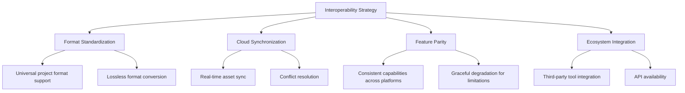

**Interoperability allows organizations to maximize existing infrastructure** and enables freedom to evolve technology stacks without rebuilding entire pipelines[^62]. For video editing vendors, achieving true interoperability requires collective action and shared commitment to open standards, with manufacturers collaborating through organizations like AIMS, VSF, AMWA, and SMPTE[^64].

### 6.8 Customer Acquisition Economics and Market Dynamics

The economics of customer acquisition in the video editing software market are evolving under **competitive pressure from free alternatives, platform-driven distribution advantages, and the strategic importance of product-led growth approaches**. Understanding these dynamics is essential for vendors optimizing go-to-market strategies and investors evaluating business model sustainability.

**Competitive Pressure from Free and Low-Cost Alternatives**

The availability of capable free alternatives fundamentally constrains customer acquisition economics by reducing the perceived value of paid solutions:

| Free Alternative | Capability Level | Impact on Paid Market |
|------------------|------------------|----------------------|
| DaVinci Resolve (Free) | Professional-grade | Eliminates entry-level paid market |
| CapCut (Free Tier) | Consumer/prosumer | Captures mobile-first users |
| OpenShot/Kdenlive | Basic-intermediate | Serves budget-conscious segment |
| Blender | Professional 3D/compositing | Reduces adjacent tool spending |

The **freemium model creates substantial user acquisition efficiency** but presents conversion challenges. While DaVinci Resolve has attracted over **5 million new users between 2018 and 2023**, conversion to paid Studio version requires users to encounter specific capability limitations that justify the $295 upgrade.

**Platform-Driven Distribution Advantages**

CapCut's growth trajectory demonstrates the **transformational impact of platform integration on customer acquisition**. By October 2024, CapCut captured **42% of revenue share among top editing apps**, up from just 4% in January 2023. This growth was enabled by:

- **TikTok Integration**: Templates enabling rapid content creation with direct platform export
- **Watermark Distribution**: Posted videos with CapCut watermarks drive discovery and adoption
- **Cross-Promotion**: ByteDance promoted CapCut through in-app offers on Douyin

This platform-driven distribution creates **customer acquisition costs approaching zero** for users already within the TikTok ecosystem, fundamentally disadvantaging standalone editing applications that must acquire users through traditional marketing channels.

**Product-Led Growth Strategic Importance**

Product-led growth approaches—where product experience drives acquisition, conversion, and expansion—have become **essential for customer acquisition efficiency** in the video editing market:

**Freemium Conversion Optimization**: Vendors must design free tiers that demonstrate value while creating natural upgrade triggers when users encounter capability boundaries. DaVinci Resolve's free tier provides comprehensive editing capabilities while reserving advanced AI features, 8K support, and collaboration tools for Studio conversion.

**Community-Driven Adoption**: Tutorial ecosystems, user communities, and educational content create acquisition channels that scale without proportionate marketing investment. The extensive YouTube tutorial ecosystem for major editing platforms provides free user education that reduces onboarding friction.

**Template and Asset Ecosystems**: Pre-built templates and integrated asset libraries reduce time-to-value for new users, improving trial conversion rates. Adobe Express's template-based approach and CapCut's trending templates exemplify this strategy.

**Bundling and Ecosystem Lock-In**

Rising acquisition costs are driving vendor strategies toward **bundling and ecosystem lock-in** that increase customer lifetime value and reduce churn:

- **Adobe Creative Cloud**: Consolidates 20+ applications, creating switching costs that justify higher acquisition investment
- **Apple Creator Studio Bundle**: Combines multiple creative applications at subscription price point
- **Blackmagic Hardware Ecosystem**: Software drives hardware purchases that create ecosystem commitment

The strategic imperative is clear: vendors must either achieve platform-driven distribution advantages (CapCut/TikTok model), establish ecosystem lock-in (Adobe/Apple model), or compete on capability differentiation at accessible price points (Blackmagic model). Standalone applications without distribution advantages or ecosystem integration face increasingly challenging acquisition economics.

### 6.9 Market Consolidation Trajectory and Competitive Restructuring

The video editing software market is positioned for **structural consolidation** as established players seek capability expansion, AI development acceleration, and geographic market access through acquisition. Understanding consolidation dynamics is essential for vendors evaluating strategic options, enterprise buyers assessing platform viability, and investors identifying opportunity and risk.

**Acquisition Drivers and Strategic Rationale**

Multiple factors are driving consolidation activity in the video editing software market:

| Acquisition Driver | Strategic Rationale | Target Profile |
|-------------------|---------------------|----------------|
| AI Capability Gaps | Accelerate AI development beyond organic R&D timelines | AI-native editing startups, neural rendering specialists |
| Mobile Platform Access | Capture mobile-first user demographics | Mobile editing applications with established user bases |
| Geographic Expansion | Access regional markets with local expertise | Regional players with language and cultural capabilities |
| Vertical Specialization | Extend into specific industry workflows | Broadcast, e-learning, corporate communication specialists |
| Technology Acquisition | Secure proprietary technology advantages | Codec optimization, cloud infrastructure, collaboration tools |

The strategic imperative for AI capability development exceeds organic R&D timelines for many vendors, creating acquisition targets among AI-focused startups. **Apple's February 2025 acquisition of Pixelmator** to strengthen creative tools and integrate AI-powered capabilities exemplifies this acquisition strategy[^4].

**Platform Competition Entry**

Social media platforms are entering the video editing space, creating new competitive dynamics and potential consolidation pressure:

**Meta's Edits** launched globally in April 2025, offering creators a consolidated production workflow tied directly to Instagram accounts. This platform competition demonstrates how content distribution platforms seek to capture editing workflows, potentially threatening standalone editing application market position.

The platform competition dynamic creates both **consolidation opportunity and risk**:
- **Opportunity**: Standalone editing vendors may become acquisition targets for platforms seeking editing capabilities
- **Risk**: Platform-integrated editing tools may capture users at zero marginal acquisition cost, pressuring standalone vendor economics

**Consolidation Scenario Analysis**

Potential consolidation scenarios through 2031 include:

**Horizontal Consolidation**: Major vendors acquiring competitors to consolidate market share
- Adobe acquiring specialized AI editing tools to extend Firefly capabilities
- Apple acquiring mobile editing applications to extend iPad ecosystem
- Blackmagic acquiring cloud collaboration platforms to enhance DaVinci Resolve

**Vertical Integration**: Platform companies acquiring editing capabilities
- Social media platforms acquiring editing tools for creator ecosystem integration
- Cloud infrastructure providers acquiring editing applications for platform stickiness
- Hardware manufacturers acquiring software to create integrated solutions

**Private Equity Restructuring**: Financial sponsors consolidating fragmented market segments
- Roll-up strategies combining consumer/prosumer editing applications
- Carve-outs of non-core editing businesses from diversified technology companies

**Strategic Implications for Market Participants**

Consolidation trajectory creates strategic implications across stakeholder categories:

**For Vendors**: Evaluate strategic options including acquisition, partnership, or independent growth strategies. Assess competitive positioning against potential acquirer interest and platform competition threat.

**For Enterprise Buyers**: Monitor vendor acquisition activity for platform viability implications. Evaluate data portability and exit strategies in vendor selection.

**For Investors**: Identify acquisition targets based on capability gaps among potential acquirers. Assess platform competition impact on standalone vendor valuations.

**For Content Creators**: Anticipate workflow disruption from vendor transitions. Maintain platform flexibility to adapt to competitive restructuring.

### 6.10 Generative AI's Transformative Role and Long-Term Market Implications

Generative AI represents the **most significant technological transformation** facing the video editing software market, with implications extending beyond workflow automation to fundamental restructuring of content creation paradigms, competitive dynamics, and market boundaries. Understanding this transformation is essential for all market participants navigating the 2025-2031 period and beyond.

**Emergence of Agentic Editing Systems**

The technology now exists to delegate substantial editing work to AI agents capable of **autonomous workflow execution**. Several developments have unlocked progress toward agentic editing:

**Vision Model Advancement**: Recent large language models including Gemini 3, GPT-5.2, and others are inherently multimodal with longer context windows. **Gemini 3 can now process up to an hour of video** to generate timestamped labels or summarize content, enabling AI systems to comprehend massive footage volumes that would require hours of human review.

**Tool-Using Agent Capabilities**: Models can now use tools within editing applications, representing meaningful progress toward LLMs as real agents that can take action rather than merely describing content.

**Generative Model Quality**: Image and video generation models have improved sufficiently to enable **hybrid production pipelines mixing AI and filmed content**, including generating B-roll, using motion transfer models, and creating synthetic elements.

The potential impact is substantial: YouTuber Emma Chamberlain reportedly spent **30-40 hours editing a 15-minute vlog**. Agentic editing could reduce this to an iterative review process where AI generates draft versions for human refinement.

**Convergence of Editing and Content Generation**

The boundary between video editing and video generation is **increasingly blurring** as generative capabilities integrate into editing workflows:

| Capability | Current State | Trajectory |
|------------|---------------|------------|
| Clip Extension | Adobe Generative Extend adds frames to clips | Expanding scene generation |
| B-Roll Generation | AI-generated supplementary footage | Automated content creation |
| Character Animation | AI avatars and synthetic presenters | Realistic digital humans |
| Scene Modification | AI Set Extender expands scene boundaries | Comprehensive scene reconstruction |
| Voice Synthesis | Text-to-speech, voice conversion | Indistinguishable synthetic dialogue |

This convergence creates **market boundary expansion** as editing tools evolve into comprehensive content creation platforms that generate as well as manipulate video content.

**Democratization Acceleration**

Generative AI further accelerates the democratization of professional capabilities, with implications for market structure:

- **Skill Barrier Elimination**: Tasks requiring years of specialized training become accessible through AI automation
- **Market Expansion**: New user segments enter the market as capability barriers fall
- **Competitive Pressure**: Professional differentiation becomes more challenging as AI enables quality parity
- **Pricing Pressure**: Value perception shifts as AI commoditizes previously premium capabilities

**Ethical and Regulatory Considerations**

The advancement of AI video capabilities raises significant ethical and regulatory considerations that will influence market development:

**Deepfake Proliferation**: **Deepfake files have surged from 500,000 in 2023 to an estimated 8 million projected to be shared in 2025**. **Deepfake fraud cases surged 1,740% in North America between 2022 and 2023**, with financial losses exceeding **USD 200 million in Q1 2025 alone**.

**Detection Challenges**: When asked to judge whether content is real or AI-generated, participants were correct only about half the time, barely better than random chance. This detection difficulty underscores the sophistication of current generative models.

**Content Authentication Requirements**: Adobe's approach of tagging AI-generated content with **Content Credentials** represents one industry response. These metadata systems may become industry standards as regulatory frameworks develop, potentially creating compliance requirements for editing software.

**Regulatory Framework Evolution**: AI governance frameworks, deepfake regulation, and data privacy requirements may constrain feature development and create compliance costs that influence competitive dynamics.

### 6.11 Media Consumption Shift and Creator Economy Structural Impact

The ongoing shift in media consumption toward social and creator-driven platforms represents a **structural transformation** with long-term implications for video editing software demand patterns, feature prioritization, and market expansion. Understanding this shift is essential for vendors, buyers, and investors positioning for the 2025-2031 period.

**User-Generated Content Market Transformation**

By 2025, **user-generated content will account for 50% of all online video views**, showcasing the need for easy-to-use editing tools for non-professionals. This projection reflects a fundamental shift where professionally-produced content shares attention with creator-generated material across all demographics.

The scale of creator economy expansion is substantial:

| Creator Economy Metric | Status | Market Implication |
|------------------------|--------|-------------------|
| Stripe Platform Creators | 48% YoY growth (2021) | Expanding editing tool demand |
| Projected Creator Population | 15.5 million within 5 years | Massive addressable market expansion |
| YouTube-Supported Jobs (US) | ~390,000 full-time equivalent | Economic foundation for tool investment |
| Companies Using Video Marketing | 91% | Enterprise demand sustainability |

**Short-Form Video Format Dominance**

**Short-form videos (less than a minute) are expected to constitute approximately 80% of all online video content** by 2025. Platforms like TikTok and Instagram Reels are setting this trend, demanding that editors focus on short, impactful storytelling.

This format dominance drives feature prioritization toward:

- **Rapid editing workflows** optimized for quick turnaround
- **Vertical video support** with smart reframe capabilities
- **Template-based creation** enabling trending format adoption
- **Platform-specific export** with optimized encoding and metadata
- **Auto-captioning** for sound-off consumption patterns

**Social Commerce Integration as Growth Driver**

**Social commerce video adoption by SMB retailers** represents a significant growth driver with **+0.7% CAGR impact**. Short video integrated with e-commerce checkout shortens the path from discovery to purchase, creating direct attribution between video content and revenue generation.

Consumer research validates this driver: **82% of consumers report being persuaded by branded video, and 89% prefer more video content from brands**. These preferences drive demand for video production capabilities across the SME segment, expanding the addressable market beyond traditional media and entertainment users.

**Structural Market Expansion**

The creator economy and social media consumption shift represent **structural addressable market expansion** rather than cyclical growth:

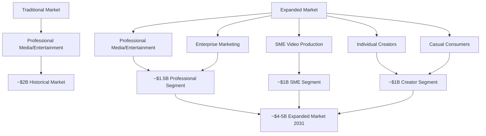

The transformation from video creation as specialized activity to **universal communication medium** fundamentally expands the addressable market beyond historical boundaries. Video editing software is transitioning from professional creative tool to essential productivity application for organizations and individuals across all sectors.

**Long-Term Strategic Implications**

The media consumption shift creates enduring strategic implications:

**For Software Vendors**: Feature roadmaps must prioritize mobile-first design, social platform integration, and accessibility for non-specialist users. Professional-only positioning limits addressable market capture.

**For Enterprise Buyers**: Video production capability is transitioning from optional marketing enhancement to essential communication infrastructure. Procurement planning should anticipate expanding internal video production requirements.

**For Content Creators**: The democratization of production capabilities intensifies competition, requiring differentiation through creative vision, audience understanding, and niche specialization rather than technical execution.

**For Investors**: Market size projections based on historical professional user bases underestimate the structural expansion opportunity. Valuation models should incorporate creator economy growth and enterprise video adoption trajectories.

The video editing software market stands at an **inflection point** where technological transformation, competitive restructuring, and consumption pattern evolution are converging to reshape industry structure. Market participants who accurately anticipate these dynamics and position accordingly will capture disproportionate value through the 2025-2031 period and beyond.

# 参考内容如下：
[^1]:[Video Editing Software Market Size Worth $3.04Bn, ...](https://finance.yahoo.com/news/video-editing-software-market-size-175100148.html)
[^2]:[Video Editing Software Market SWOT Analysis Report by ...](https://www.theinsightpartners.com/reports/video-editing-software-market)
[^3]:[Video Editing Software Market Size, Trends, & Growth 2032](https://www.snsinsider.com/reports/video-editing-software-market-1543)
[^4]:[Video Editing Software Market Size, Share & Trends By 2034](https://www.thebusinessresearchcompany.com/report/video-editing-software-global-market-report)
[^5]:[Video Editing Software Market Size & Outlook, 2025-2033](https://straitsresearch.com/report/video-editing-software-market)
[^6]:[Video Editing Software Global Market Size & Competitors](https://www.researchandmarkets.com/report/video-editing-software?srsltid=AfmBOooGaBJQIaAsrHz2nvT_lmFJxLiT4vVWDtVcLMnZ9eHTu0zOsLR5)
[^7]:[Video Editing Software Global Market Size & Competitors](https://www.researchandmarkets.com/report/video-editing-software?srsltid=AfmBOorj-22VNuvU4D7s0yMTnO-hr0XKlZakrFl8QXB5mUkKUJ7lkIZW)
[^8]:[Video Editing Market Size, Share and Growth Research ...](https://www.mordorintelligence.com/industry-reports/video-editing-market)
[^9]:[Global Video Editing Software Industry Trends Analysis ...](https://www.marketresearch.com/Maia-Research-v4212/Global-Video-Editing-Software-Trends-43304303/)
[^10]:[Worldwide Video Platforms Software Market Shares, 2024](https://my.idc.com/getdoc.jsp?containerId=US53742125)
[^11]:[Global Video Editing Software Market Growth (Status and ...](https://www.marketresearch.com/LP-Information-Inc-v4134/Global-Video-Editing-Software-Growth-39356941/)
[^12]:[Creative Software - Worldwide | Statista Market Forecast](https://www.statista.com/outlook/tmo/software/productivity-software/creative-software/worldwide?srsltid=AfmBOorQ71awE1NIYIiEzL_GH1h_gFwq9m3SLZd947adLEilTrcLpegV)
[^13]:[Digital Media Production Software Market to Reach $36.3 ...](https://www.alliedmarketresearch.com/press-release/digital-media-production-software-market.html)
[^14]:[Audio & Video Editing Software Market Size & Competitors](https://www.researchandmarkets.com/report/audio-and-video-editing-software?srsltid=AfmBOopSf_HxBRe1MGdi7GOzmZRn1qYXmaOhPMJ65vEEzNhNGT5zImGi)
[^15]:[Video Editor Market Trends | Size & CAGR of 4.1%.](https://www.industryresearch.biz/market-reports/video-editor-market-112757)
[^16]:[Video Editing Software Market Report | Global Forecast ...](https://dataintelo.com/report/global-video-editing-software-market)
[^17]:[Audio And Video Editing Software Market Size 2025-2029](https://www.technavio.com/report/audio-and-video-editing-software-market-size-industry-analysis)
[^18]:[Europe Video Editing Software Market Size Report 2025](https://www.kbvresearch.com/europe-video-editing-software-market/)
[^19]:[Asia-Pacific Mobile Video Editing Applications Market Size, ...](https://straitsresearch.com/report/mobile-video-editing-applications-market/asia-pacific)
[^20]:[Video Editing Software Market Outlook 2025-2032](https://www.intelmarketresearch.com/video-editing-software-market-12720)
[^21]:[Video Editing Statistics And Facts (Update 2025)](https://electroiq.com/stats/video-editing-statistics/)
[^22]:[The Strategic Revaluation of Adobe - ADBE](https://simplywall.st/community/narratives/us/software/nasdaq-adbe/adobe/kvikvk9s-update-for-adobe)
[^23]:[Adobe Creative Cloud Adoption Grows to 41 Million Paid ...](https://prodesigntools.com/number-of-creative-cloud-subscribers.html)
[^24]:[Adobe Premiere Pro Review: A Top Choice for Pro Video ...](https://www.pcmag.com/reviews/adobe-premiere-pro)
[^25]:[Adobe Premiere Pro Review: Features, Pricing & Guide ...](https://www.elegantthemes.com/blog/business/adobe-premiere-pro-review)
[^26]:[Professional video editing software | Adobe Premiere](https://www.adobe.com/products/premiere.html)
[^27]:[Adobe Q4 FY 2025: Record Revenue, AI Adoption, ARR ...](https://futurumgroup.com/insights/adobe-q4-fy-2025-record-revenue-ai-adoption-arr-targets/)
[^28]:[Adobe Premiere Pro vs Final Cut Pro Statistics (2025)](https://electroiq.com/stats/adobe-premiere-pro-vs-final-cut-pro-statistics/)
[^29]:[Apple Final Cut Pro - Review 2025](https://uk.pcmag.com/video-editing/19465/apple-final-cut-pro-x)
[^30]:[Why Final Cut Pro Is Still the Best Video Editing Software in ...](https://fcpxfullaccess.com/blogs/blog/why-final-cut-pro-is-still-the-best-video-editing-software-in-2025)
[^31]:[Apple aims to capture creator market with software bundle](https://finance.yahoo.com/news/apple-aims-to-capture-creator-market-with-software-bundle-165532120.html)
[^32]:[DaVinci Resolve – Studio](https://www.blackmagicdesign.com/products/davinciresolve/studio)
[^33]:[The Business Model Behind DaVinci Resolve](https://www.oreateai.com/blog/the-business-model-behind-davinci-resolve-how-it-generates-revenue/29f7dbee590ac5a675b69ff301cfa638)
[^34]:[DaVinci Resolve Price in 2025](https://www.miracamp.com/learn/davinci-resolve/pricing)
[^35]:[Blackmagic Design Announces DaVinci Resolve 20](https://www.blackmagicdesign.com/media/release/20250404-02)
[^36]:[DaVinci Resolve: Revenue and Usage Statistics (2026)](https://sendshort.ai/statistics/davinci-resolve/)
[^37]:[CapCut Online in 2025: My In-Depth Review for AI Creators](https://skywork.ai/skypage/en/CapCut-Online-in-2025-My-In-Depth-Review-for-AI-Creators/1973800514803658752)
[^38]:[CapCut: Revenue & User Growth Statistics (2026)](https://sendshort.ai/statistics/capcut/)
[^39]:[What's Next for ByteDance in 2025 and Beyond?](https://www.vidboard.ai/whats-next-for-bytedance/)
[^40]:[Instagram Takes on TikTok's CapCut, But The Video ...](https://appfigures.com/resources/insights/20250418?f=1)
[^41]:[YouTube Stats - Everything You Need to Succeed in 2025](https://www.capcut.com/resource/youtube-stats)
[^42]:[CapCut Sees Surge In Everyday Creator Use In 2025 As AI ...](https://www.netinfluencer.com/capcut-sees-surge-in-everyday-creator-use-in-2025-as-ai-tools-drive-editing-adoption/)
[^43]:[Video Editing Software Market Statistics (2026)](https://sendshort.ai/statistics/video-editing-software/)
[^44]:[Video Editing Software Market Size to Reach USD 1.1 Bn ...](https://www.kbvresearch.com/video-editing-software-market/)
[^45]:[Adobe Q3 FY 2025 Results: FY2025 Outlook Raised on AI ...](https://futurumgroup.com/insights/adobe-q3-fy-2025-results-beat-estimates-fy-2025-outlook-raised-on-ai-demand/)
[^46]:[AI Tools for Video Editing That Are Actually Useful In 2025](https://www.redsharknews.com/ai-tools-for-video-editing-that-are-actually-useful-in-2025)
[^47]:[Introducing new AI-powered features and workflow ...](https://blog.adobe.com/en/publish/2025/04/02/introducing-new-ai-powered-features-workflow-enhancements-premiere-pro-after-effects)
[^48]:[New AI-powered video editing tools in Premiere, plus ...](https://blog.adobe.com/en/publish/2026/01/20/new-ai-powered-video-editing-tools-premiere-major-motion-design-upgrades-after-effects)
[^49]:[DaVinci Resolve – What's New](https://www.blackmagicdesign.com/products/davinciresolve/whatsnew)
[^50]:[The best AI video editing tools for marketers in 2025](https://www.glean.com/perspectives/best-video-content-creation-tools)
[^51]:[It's time for agentic video editing](https://a16z.com/its-time-for-agentic-video-editing/)
[^52]:[How Viddo AI Lowers the Barrier to Video Creation: 5 Edit- ...](https://www.theclintoncourier.net/2026/01/22/how-viddo-ai-lowers-the-barrier-to-video-creation-5-edit-free-solutions/)
[^53]:[AI Video Market Size, Share & Trends | Industry Report, 2033](https://www.grandviewresearch.com/industry-analysis/artificial-intelligence-ai-video-market-report)
[^54]:[THE ASIA](https://avia.org/wp-content/uploads/2024/11/Asia-Video-Industry-Report-2025.pdf?969821582)
[^55]:[Subscription fatigue is real, and 2026 will be the breaking ...](https://www.creativebloq.com/art/digital-art/subscription-fatigue-is-real-and-2026-will-be-the-breaking-point-for-artists)
[^56]:[$5.25+ Bn Video Editing Software as a Service (SaaS ...](https://finance.yahoo.com/news/5-25-bn-video-editing-133900761.html)
[^57]:[Piracy Statistics, Trends And Facts (2025)](https://electroiq.com/stats/piracy-statistics/)
[^58]:[2024 Piracy Trends and Insights](https://6347345.fs1.hubspotusercontent-na1.net/hubfs/6347345/MUSO%202024%20Piracy%20Trends%20and%20Insights.pdf)
[^59]:[Feelings of Video Subscription Fatigue Take Hold, Driving ...](https://civicscience.com/feelings-of-video-subscription-fatigue-take-hold-driving-streamers-to-switch-churn-and-cancel/)
[^60]:[Transforming Visual Storytelling: Insights into the Video](https://www.openpr.com/news/4347381/transforming-visual-storytelling-insights-into-the-video)
[^61]:[Subscription economy to hit $1.2 trillion by 2030, but ...](https://www.emarketer.com/content/subscription-economy-hit--1-2-trillion-by-2030--fatigue-setting-in)
[^62]:[Video encoding and decoding's interoperability problem—and ...](https://www.streamingmediaglobal.com/Articles/ReadArticle.aspx?ArticleID=169577)
[^63]:[Remote Video Editing: Combating The 5 Biggest Challenges](https://www.avid.com/resource-center/video-editing-challenges)
[^64]:[Interoperability: The Next Frontier in Pro AV Evolution](https://www.commercialintegrator.com/insights/interoperability-the-next-frontier-in-pro-av-evolution/143224/)
