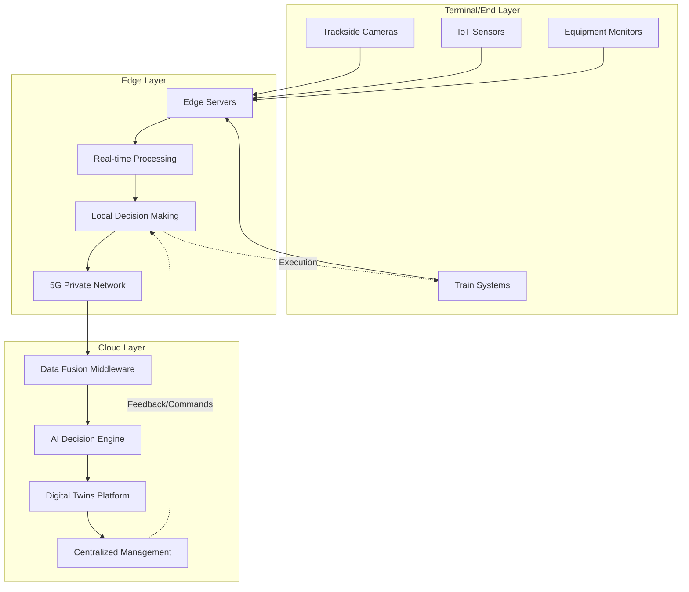
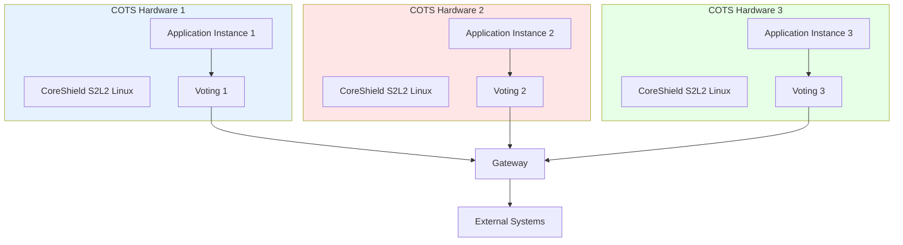
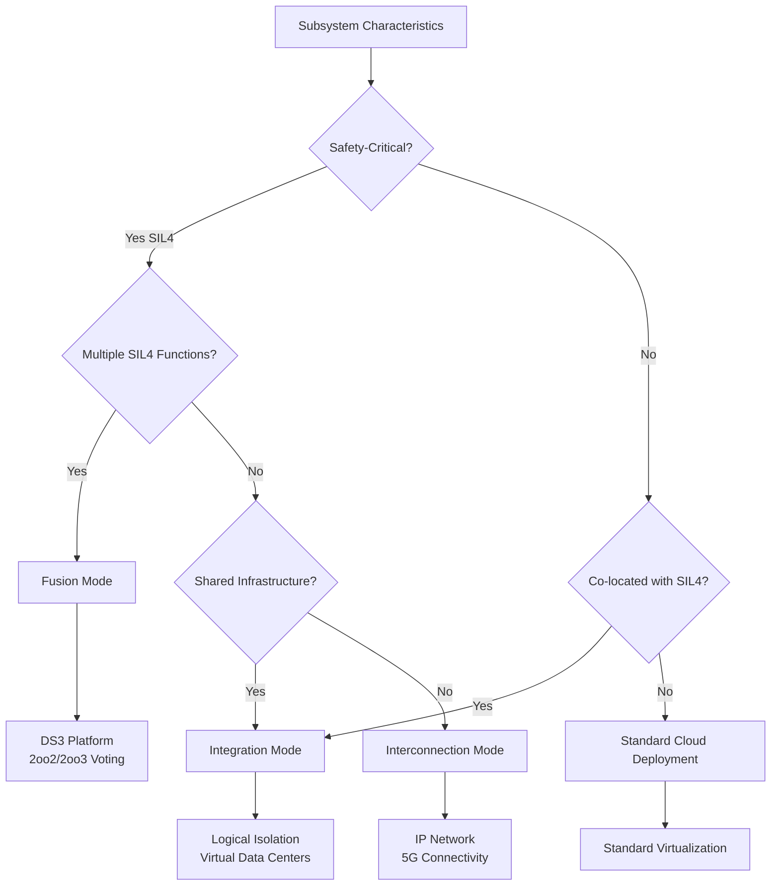

# Cloud-Based Train Control for Urban Rail Transit: Recent Developments and Key Technologies
# 1 Introduction: The Paradigm Shift to Cloud-Based Train Control

The urban rail transit industry stands at a critical inflection point, driven by escalating passenger demand, aging infrastructure, and the transformative potential of digital technologies. Communications-Based Train Control (CBTC), introduced in the mid-1980s to achieve maximum capacity while maintaining safety requirements, has become the backbone of modern urban rail signaling[^1]. However, as railways worldwide face growing demand for their services—with approximately 3,300 kilometers of new rail infrastructure entering service between 2018 and 2020, representing a 25% global increase—traditional signaling systems are reaching their operational limits[^2]. This chapter establishes the foundational context for understanding the paradigm shift from traditional, hardware-centric CBTC architectures to cloud-based systems, examining the limitations driving this transformation, the enabling technologies making it possible, and the strategic framework for the analysis that follows.

## 1.1 Limitations of Traditional CBTC Systems

Traditional CBTC systems, while revolutionary in their time, face a constellation of technical and operational constraints that increasingly challenge their ability to meet modern urban rail requirements. These limitations span communication reliability, legacy integration, performance optimization, system resilience, standardization, and technology obsolescence—collectively creating compelling pressure for architectural transformation.

### Communication System Reliability Challenges

The foundation of any CBTC system rests upon **ultra-reliable, bi-directional train-to-wayside wireless communication**, which presents one of the most demanding networking challenges in the transportation sector[^1]. Mission-critical CBTC operations require stringent performance parameters: **network latency below 500 milliseconds, wireless handover time under 50 milliseconds, and packet loss rates below 0.1 percent**[^3]. Achieving these thresholds consistently across diverse operational environments proves exceptionally difficult.

Multiple factors compromise wireless connectivity reliability in traditional implementations. **Radio frequency interference and electromagnetic disturbances** present persistent challenges, particularly in underground tunnel environments where metallic structures create complex signal propagation patterns[^3]. Spectrum congestion from competing wireless services, combined with physical limitations for radio and antenna installation, further constrains system performance[^2]. Environmental factors affecting GPS functionality in tunnels add another layer of complexity, while frequent handoffs during train movement create challenging channel conditions that can degrade communication quality[^3].

The conventional approach of deploying Wi-Fi-based systems for CBTC signal transmission has demonstrated particular vulnerability to interference, leading to poor reliability and stability that directly impacts train control safety and operational efficiency[^4]. These communication reliability issues are not merely technical inconveniences but represent fundamental constraints on system capacity and safety margins.

### Legacy System Integration Complexity

Integrating modern CBTC signaling with existing railway infrastructure generates **complex compatibility challenges** that extend well beyond initial installation[^3]. The requirement to link legacy microprocessor-based systems with contemporary CBTC components through obsolete protocols frequently necessitates specially constructed additional transmission modules to accommodate older equipment[^3].

The challenge intensifies over time as Programmable Logic Controllers (PLCs) and their components transition into legacy product status, creating cascading compatibility problems[^3]. New components added to CBTC-integrated equipment can cause **unpredictable behavior in legacy elements**, introducing operational risks that are difficult to anticipate and mitigate[^3]. The obsolescence of once-common standards exemplifies this technical debt accumulation—PCMCIA technology, formerly standard for memory cards in PLCs, now presents significant challenges as replacement parts become increasingly difficult to source[^3].

This integration complexity creates a persistent maintenance burden while simultaneously constraining the pace of technological advancement. Operators find themselves trapped between the need to maintain aging infrastructure and the desire to adopt more capable modern systems.

### Performance Optimization Hurdles

Achieving optimal CBTC performance requires **balancing multiple interdependent factors** under challenging operational conditions. Complex channel conditions and frequent handoffs significantly impact train-ground communication performance, while systems must simultaneously optimize both communication and control aspects in strict compliance with safety rules governing train control actions[^3].

Environmental factors add substantial complexity to performance optimization efforts. Train and trackside equipment must conform to **stringent industry standards** protecting against temperature variations, vibration, metallic dust, moisture, electrical surges, and fire hazards[^3]. Equipment failing to meet these specifications risks system interruptions, shortened operational lifespan, and costly service disruptions. The inherent reliance of CBTC operations on train-to-wayside wireless technology renders systems vulnerable to signal interference and range restrictions caused by unpredictable radio frequency environments[^3].

### System Resilience Vulnerabilities

Despite the extremely high availability requirements of urban rail transit signaling systems and the redundant design of all CBTC subsystems—where single failures do not cause operational interruptions—**complete equipment failure scenarios, though rare, present severe consequences**[^5]. Dual failure events can result in complete service interruption with difficult system restart procedures. External causes including fire, power outages, and flooding can similarly trigger catastrophic disruptions[^5].

As CBTC systems increasingly support driverless operations, the importance of rapid service recovery capability grows correspondingly. However, **constructive measures to adequately address this resilience challenge remain under development**, with solutions still being explored as of recent assessments[^5]. The traditional approach of engineering individual equipment for robustness reaches its limits when confronting scenarios that exceed designed redundancy levels.

### Lack of Standardization

The absence of unified CBTC standards across the industry creates significant interoperability problems that compound other technical challenges[^5]. Different suppliers implement varying approaches to critical components including onboard electronic units (EVCs) and database management systems, resulting in **proprietary ecosystems that resist integration**[^3].

This standardization gap generates technical debt that accumulates throughout system lifecycles, complicating both initial deployment and ongoing maintenance operations. Operators face vendor lock-in situations that limit competitive procurement options while increasing long-term costs. The need for interoperable middleware solutions to handle communication between different subsystems reflects the practical consequences of this standardization deficit[^3].

### Technology Obsolescence Dynamics

CBTC technology faces **continuous obsolescence pressure** as its lifecycle becomes constrained by the hardware and software components it employs[^5]. These components update and evolve at rates significantly faster than typical railway system operational lifespans, creating a fundamental mismatch between technology refresh cycles and infrastructure investment horizons.

Traditional metro weak current systems exemplify this challenge, with subsystems built by different manufacturers remaining physically separated while devices become redundant and data isolated[^6]. This architectural approach results in **low resource utilization, high maintenance costs, extended customization cycles, and high interface complexity**—all symptoms of systems struggling to accommodate technological change within rigid structural constraints[^6].

## 1.2 Drivers for Cloud-Based Transformation in Urban Rail

The transition toward cloud-based train control architectures responds to a convergence of operational demands, economic pressures, and technological opportunities. These drivers create both the necessity and the possibility for fundamental architectural transformation in urban rail signaling systems.

### Capacity Enhancement Imperatives

Railways worldwide confront **growing demand that existing infrastructure struggles to accommodate**[^7]. Securing seats on busy trains becomes increasingly difficult during peak periods, yet constructing new lines represents an enormously expensive and time-consuming response. The alternative—extracting greater capacity from existing networks by running more trains at shorter headways—requires signaling capabilities that traditional systems cannot deliver[^7].

Current signaling systems impose inherent capacity limitations that automated operation promises to transcend. Intelligent trains and infrastructure communicating and adjusting operation according to real-time conditions offer the potential to meet rising demand at a fraction of new line construction costs[^7]. This capacity optimization imperative drives investment in technologies enabling more sophisticated train control and coordination.

### Resource Utilization and Operational Flexibility

Traditional system architectures characterized by physically separated subsystems and isolated data create **substantial inefficiencies in resource utilization**[^6]. The redundancy inherent in maintaining separate hardware platforms for each function, combined with the inability to share computing resources across applications, results in utilization rates that cloud computing approaches can dramatically improve.

Cloud architectures enable **pooling of resources that facilitates improved sharing and on-demand allocation**, supporting flexible expansion of services as operational requirements evolve[^7]. Hybrid cloud implementations have demonstrated the ability to elevate IT resource utilization from approximately 10% to 50% while simultaneously reducing IT equipment procurement by 16%[^7]. Moving station-level services to centralized cloud infrastructure reduces demand for equipment room space by over 100 square meters per station[^7].

### Cost Reduction Through Virtualization

The economic case for cloud-based transformation encompasses both capital expenditure reduction and operational cost optimization. **Pay-per-use models** reduce the heavy lifting of IT lifecycle management while proven services and automation lower maintenance efforts and security exposure[^8]. Virtualization enables the addition of new functions with minimal effort and migration to new software versions with cost savings that traditional hardware-centric approaches cannot match[^9].

The convergence toward multi-service network architectures supporting both vital and non-vital applications on common infrastructure represents a significant departure from traditional dedicated network deployments[^1]. While this convergence necessitates robust network segmentation and security measures, it offers substantial infrastructure consolidation benefits. Shenyang Metro's deployment of a single LTE-M network to centrally carry CBTC and trunking communications exemplifies this consolidation approach, reducing the number of trackside devices by over 80% compared with traditional WLAN and TETRA solutions[^4].

### Centralized Management and Automated Operations

Cloud architectures enable **centralized operation and maintenance** that traditional distributed systems cannot efficiently achieve. Urban rail lines currently operate as largely point-to-point systems separate from other lines, creating barriers to sharing network-wide operational information and data[^7]. Cloud platforms provide unified deployment and management of various services, avoiding the traditional method of separately implementing each service system[^7].

The Railway Management Automation and Orchestration (RMAO) platform concept illustrates this centralization potential, providing responsibility for service provisioning, lifecycle management, resource orchestration, and service assurance across virtualized railway functions[^10]. Automated lifecycle management functionality including instantiation, operation, scaling, software upgrades, healing, and termination of application instances enables operational agility that manual processes cannot match[^9].

### Enabling Technology Convergence

The feasibility of cloud-based train control depends fundamentally on the maturation of several enabling technologies that collectively create new operational paradigms. **Artificial Intelligence, cloud computing, and big data technologies** are positioned as major technological drivers of automated train operation on urban rail networks[^7]. The integration of these technologies with 5G connectivity and edge computing creates an ecosystem capable of supporting real-time, safety-critical operations.

The Future Railway Mobile Communication System (FRMCS), designed as a successor to GSM-R and based on fifth generation mobile communications, exemplifies this technology convergence[^9]. FRMCS architecture benefits from cloud computing principles, following cloud-native 5G core network design based on Network Function Virtualization (NFV) and Software-Defined Networking (SDN)[^9]. With NFV, management of software-defined railway equipment becomes more flexible and agile, enabling addition of new functions with minimal effort[^9].

Edge computing emerges as a **critical building block** for streamlined applications where waiting for data to reach the cloud and return to the train becomes impractical[^11]. Edge devices such as IoT gateways serve as intermediaries between onboard computers, trackside controllers, and central control systems, enabling instantaneous feedback essential for real-time train control[^11].

## 1.3 Defining Cloud-Based Train Control: Core Concepts and Characteristics

Cloud-based train control represents a fundamental reconceptualization of railway signaling architecture, shifting from hardware-centric designs to software-defined, virtualized platforms. Understanding this paradigm requires examination of its foundational technological concepts, architectural principles, and distinguishing characteristics.

### Network Function Virtualization and Software-Defined Networking

At the core of cloud-based train control lies **Network Function Virtualization (NFV)**, which decouples network functions from dedicated hardware appliances, enabling them to run as software on standard computing platforms[^9]. This virtualization approach transforms the economics and operational characteristics of railway signaling systems by eliminating the tight coupling between functions and specialized hardware.

**Software-Defined Networking (SDN)** complements NFV by separating the control plane from the data plane, enabling centralized, programmable management of network resources[^9]. Together, NFV and SDN create the foundation for flexible, adaptable signaling systems that can evolve through software updates rather than hardware replacement.

The benefits of this approach extend across multiple dimensions. Virtualization enables **task segregation** that allows critical and non-critical railway tasks to run independently on the same platform without compromising safety-critical requirements[^9]. This capability addresses one of the fundamental challenges of traditional systems—the need to maintain separate physical infrastructure for different safety integrity levels.

### Microservices Architecture

Cloud-based train control systems increasingly adopt **microservices architecture**, which develops applications as collections of small, independently deployable services[^6]. Each service runs in its own process, communicates through lightweight mechanisms, and can be deployed through fully automated mechanisms[^6].

The following table summarizes the key characteristics of microservices architecture and their implications for railway systems:

| Characteristic | Description | Railway System Benefit |
|----------------|-------------|------------------------|
| Fine-grained decomposition | Application logic split into small, focused components | Easier maintenance and updates |
| Independent deployment | Each component deploys separately | Reduced system-wide disruption during upgrades |
| Lightweight communication | Services use simple protocols | Lower latency and complexity |
| Technology agnosticism | Implementation independent of specific technologies | Vendor flexibility and innovation adoption |
| Distributed design | Services spread across infrastructure | Enhanced resilience and scalability |

This architectural approach enables **modular application design** allowing rapid and reliable development while supporting resilience and reusability[^10]. Services can be divided into general services providing common functionality (monitoring, alarm, authorization, logging, reporting) and individual services addressing domain-specific requirements[^6].

### Railway Cloud Platform Concept

The **Railway Cloud Platform (RCP)** emerges as a central concept in cloud-based train control, representing a cloud computing platform meeting requirements to host cloudified railway functions while exposing management and orchestration functions through service-based interfaces[^10]. The RCP provides management functions for railway application packages including onboarding, information query, deletion, enabling/disabling, and package retrieval[^9].

The architectural framework for management and orchestration follows principles established by ETSI's reference virtualized architecture, with the Railway Management Automation and Orchestration (RMAO) platform responsible for managing the entire virtualized railway control network[^9]. The interface between RMAO and RCP supports **Cloud Resource Management (CRM) services** orchestrating railway cloud lifecycle processes and **Cloudified Function Management (CFM) services** managing lifecycles of cloudified railway functions[^10].

### Paradigm Shift: From Hardware Robustness to System Resilience

Perhaps the most fundamental conceptual shift in cloud-based train control involves the transition from engineering individual equipment for robustness to **designing for system resilience**[^8]. This paradigm shift reflects the different characteristics of virtualized versus physical infrastructure.

In traditional on-premises situations, achieving equipment functionality focuses on reducing failures and faults of individual hardware components because each failure entails substantial, often manual, recovery effort[^8]. Hardware in the cloud, by contrast, is virtualized and replaceable, shifting focus to **quick detection and automated replacement of faulty equipment**[^8].

The practical implications of this shift are significant. In on-premises situations, recovery processes can require hours to days to reach full cluster capacity; in cloud environments, switching to new instances typically takes only minutes[^8]. The main driver for system availability thus becomes **minimizing failover time** through rapid replacement of failed system components rather than preventing all possible failures[^8].

Standard cloud architectures achieve different availability levels through two complementary strategies: increasing geographical distribution of equipment to protect against localized failures, and increasing redundancy in total instances used or held ready for fast replacement[^8]. This approach enables resilience levels that traditional hardware-focused designs struggle to match economically.

## 1.4 Report Scope, Objectives, and Structure

This research report examines the current state and trajectory of cloud-based train control systems for urban rail transit, providing comprehensive analysis of recent developments, key technologies, implementation approaches, and future directions.

### Research Focus and Boundaries

The report focuses specifically on **cloud-based train control systems for urban rail transit applications**, examining the technological, operational, and strategic dimensions of this emerging paradigm. The analysis encompasses both the core signaling functions—Automatic Train Protection (ATP), Automatic Train Operation (ATO), Interlocking, and Automatic Train Supervision (ATS)—and the broader ecosystem of supporting technologies and integration approaches.

The scope includes examination of:
- Architectural foundations enabling cloud-based train control
- Core enabling technologies including virtualization, 5G, AI, and edge computing
- Integration approaches for traditional subsystems within cloud paradigms
- Safety and security considerations for virtualized safety-critical systems
- Operational impacts and demonstrated benefits from early implementations
- Future trajectories and emerging capabilities

### Analytical Perspectives

The report adopts multiple analytical perspectives to provide comprehensive understanding of cloud-based train control:

**Technical Analysis** examines the architectural designs, enabling technologies, and implementation mechanisms that make cloud-based train control possible. This perspective addresses questions of system design, component integration, and performance characteristics.

**Operational Analysis** evaluates the practical implications of cloud-based systems for railway operations, including capacity improvements, maintenance approaches, and operational flexibility enhancements.

**Strategic Analysis** considers the broader industry context, examining market developments, vendor strategies, and the factors influencing adoption decisions by railway operators.

**Critical Analysis** assesses both the benefits and challenges of cloud-based approaches, examining safety certification requirements, cybersecurity considerations, and implementation obstacles that must be addressed for successful deployment.

### Report Structure

The subsequent chapters of this report are organized to provide systematic examination of cloud-based train control:

**Chapter 2** analyzes recent industry developments and strategic initiatives, examining product launches, investments, and demonstrated results from major industry players while synthesizing common strategic directions shaping the market.

**Chapter 3** explores the architectural foundations and core technologies enabling cloud-based train control, including system-level architecture, safety-critical platforms, and supporting communication infrastructure.

**Chapter 4** examines the transformation of traditional train control subsystems within cloud paradigms, analyzing different integration modes based on safety and real-time requirements.

**Chapter 5** critically assesses safety, security, and implementation challenges, examining mechanisms for achieving functional safety certification in virtualized environments and addressing the expanded cybersecurity threat landscape.

**Chapter 6** synthesizes operational impacts and benefits while exploring future trajectories including digital twin convergence, AI-driven analytics, and autonomous control capabilities.

**Chapter 7** provides concluding synthesis of key findings, weighing transformative benefits against persistent challenges and offering insights for operators and policymakers contemplating adoption of cloud-based signaling paradigms.

This structured approach enables comprehensive examination of cloud-based train control from foundational concepts through practical implementation considerations to future evolution, providing the analytical foundation necessary for informed understanding and decision-making in this rapidly evolving domain.

## 2 Recent Industry Developments and Strategic Initiatives

The cloud-based train control market for urban rail transit has witnessed an unprecedented acceleration of innovation and strategic investment between 2023 and 2025. Major industry players have transitioned from conceptual development to commercial deployment, launching flagship products that integrate cloud computing, artificial intelligence, 5G connectivity, and advanced data analytics into the core of railway signaling systems. This chapter provides a comprehensive analysis of these developments, examining the technological innovations driving transformation, evaluating the validity of claimed benefits against real-world deployment outcomes, and synthesizing the common strategic directions that are reshaping the competitive landscape of urban rail signaling.

### 2.1 Siemens Mobility's Cloud-Based Signaling Portfolio

Siemens Mobility has established itself as a pioneer in cloud-based train control through the development and deployment of two strategically complementary platforms: **Train2Cloud** for urban metro operations and **Signaling X** for integrated mainline and transit applications. These offerings represent a fundamental architectural shift from traditional distributed signaling systems toward centralized, software-defined platforms that leverage commercial off-the-shelf hardware and cloud-native design principles.

#### Train2Cloud: Evolution of Metro Signaling

Train2Cloud represents what Siemens Mobility describes as a **groundbreaking evolution in rail technology**, building upon the established Communications-Based Train Control (CBTC) system Trainguard MT with a wayside-oriented, cloud-based approach[^12]. The system's development required overcoming significant technical challenges related to achieving safety certification for virtualized environments. Siemens Mobility addressed these challenges through the **DS3 (Distributed Smart Safe System) safety platform**, which enables Safety Integrity Level 4 (SIL4) applications to run on commercial off-the-shelf (COTS) servers rather than proprietary safety-critical hardware[^12].

The architectural innovation of Train2Cloud lies in its ability to consolidate CBTC functionality within high-performance COTS servers located in operators' on-premises signaling data centers. This centralization delivers multiple operational advantages that directly address the limitations of traditional distributed architectures. For operators, Train2Cloud enables efficient CBTC system management through simplified maintenance procedures, improved operational availability with **headways as low as 80 seconds**, streamlined line extension capabilities, and enhanced system longevity[^12]. The system maintains the trusted CBTC principles that have proven effective in urban rail operations while offering the flexibility and scalability inherent to cloud-based architectures.

Siemens Mobility showcased Train2Cloud as part of the Innovation Guided Tour at the 2023 UITP Global Public Transport Summit in Barcelona, highlighting its position among the best innovations in local public transportation[^13]. The solution's core value proposition centers on using Communications-Based Train Control through the cloud to **optimize the performance and life-cycle costs of rail infrastructure**[^13]. This optimization enables operators to immediately react to problems that could disrupt operations and allows for cost-efficient city-wide operations with seamless geo-redundancy of computing centers[^13].

The platform continues to evolve with the integration of advanced connectivity technologies. At InnoTrans 2024, Siemens Mobility showcased the latest Train2Cloud innovations, including **5G connectivity** and the world's first refurbishment of an existing GoA4 metro system to a new GoA4 CBTC automation system[^14]. This capability to upgrade fully automated metro systems to next-generation technology while maintaining the highest grade of automation demonstrates the platform's maturity and its potential to address the significant installed base of aging signaling systems worldwide.

#### Signaling X: Unified Cloud Platform for Rail Signaling

Unveiled at InnoTrans 2024, **Signaling X** represents Siemens Mobility's vision for a unified cloud platform capable of integrating various signaling systems for both mainline and urban transit into a single, centralized Data Center[^12]. The platform is built on the Siemens Xcelerator ecosystem, positioning it within Siemens' broader digital transformation strategy and enabling integration with the company's extensive portfolio of industrial automation and digitalization solutions.

At its core, Signaling X utilizes the same DS3 platform that powers Train2Cloud, enabling safety-critical applications to run in a **geo-redundant, cyber-secure cloud environment**[^12]. This shared technological foundation provides consistency across Siemens' signaling portfolio while allowing the platform to address the distinct requirements of different rail applications—from high-frequency metro operations to long-distance mainline services.

The commercial validation of Signaling X has progressed rapidly. The system has already been **proven in deployments in Austria and Spain**, with Finland as the latest adopter[^12]. These implementations have demonstrated tangible operational benefits, with the system delivering **up to 20% improvement in operational efficiency through reduced lifecycle costs**[^12]. This quantified benefit provides concrete evidence of the value proposition that cloud-based signaling can deliver, moving beyond theoretical advantages to demonstrated results in production environments.

The strategic positioning of both Train2Cloud and Signaling X within the Siemens Xcelerator ecosystem reflects the company's recognition that railway signaling is increasingly becoming a data-intensive, software-defined domain. By aligning these products with Siemens' broader digital platform strategy, the company can leverage cross-domain capabilities in areas such as digital twins, AI-driven analytics, and cybersecurity while providing customers with a pathway to integrate rail signaling with other operational technology systems.

### 2.2 Hitachi Rail's Next-Generation SelTrac G9 and 5G Integration

Hitachi Rail has pursued an aggressive strategy of technological advancement and market expansion in cloud-based train control, anchored by a substantial investment in next-generation technology development and pioneering deployments of 5G connectivity for mission-critical signaling applications. The company's position has been significantly strengthened by its acquisition of Thales' Ground Transportation Systems business in May 2024, which expanded its footprint to **24,000 colleagues across 51 countries** and enhanced its expertise in urban rail signaling[^15].

#### SelTrac G9: The Next Leap in CBTC Technology

Hitachi Rail has committed a **major C$100 million investment** for research and development of the ninth-generation SelTrac CBTC technology, designated SelTrac G9, at its center of engineering excellence in Toronto[^16]. The company describes this investment as representing "the next leap" in rail technology, reflecting the transformative nature of the architectural changes being implemented[^16].

The SelTrac G9 platform integrates multiple advanced technologies that collectively enable new operational paradigms. The system will incorporate **artificial intelligence, 5G communications, edge and cloud computing** to deliver comprehensive improvements across the operational spectrum[^16]. For transit operators worldwide, these capabilities translate to **lower costs, maximised capacity, reduced emissions and enhanced passenger experiences**[^16]. The development project, which involves partnerships with the Ontario provincial government and Invest Ontario, will create 100 new jobs and retain 1,000 skilled positions at Hitachi's York Mills office[^17].

The strategic significance of this investment extends beyond product development to market positioning. Hitachi Rail's moving block SelTrac CBTC system is currently used to operate **more than 100 urban rail lines in more than 40 cities around the world**[^17], establishing a substantial installed base that represents both a competitive advantage and a market for upgrade solutions. The development of SelTrac G9 in Toronto also builds on the company's heritage in the city, where the first SelTrac deployment occurred on Scarborough's Line 3 in 1985[^16].

#### Industry-First 5G Integration for Mission-Critical Signaling

Hitachi Rail has achieved a significant technological milestone by integrating Communications-Based Train Control with 5G communications in market-leading programs. The company is deploying **5G for train-to-ground communications as an industry first**, replacing legacy radio technologies with next-generation connectivity for critical signaling applications[^15].

The 5G integration is being implemented in two of the world's busiest metro networks. In New York, Hitachi Rail is implementing a **private 5G network for the Crosstown Line**, which transports 70,000 passengers daily[^15]. In Hong Kong, the operator is implementing a **5G overlay network onto an existing SelTrac solution within the International Airport's Automatic People Mover**[^15]. These projects represent the first implementations of 5G connectivity for mission-critical signaling applications, demonstrating the technology's readiness for safety-critical railway operations.

The technical advantages of 5G over existing Wi-Fi-based solutions are substantial. Hitachi Rail's innovative 5G solution removes the limitations of prior technologies and leverages either public or private networks[^15]. The 5G solution **reduces trackside infrastructure significantly** as the number of 5G Radio Access Points needed decreases relative to existing WiFi solutions[^15]. Additional benefits include continued high-performance connectivity in challenging environments such as tunnels, where traditional wireless systems often struggle[^15].

The substantially increased 5G bandwidth further enables the use of advanced digital asset management solutions developed by Hitachi Rail[^15]. Operators also acquire the ability to use their expanded network capacities to deliver additional services with confidence of future technology iterations including 6G—an important consideration given the **30-year lifecycle of radio access infrastructure**[^15]. As Ziad Rizk, Managing Director of Urban Rail Signalling at Hitachi Rail, stated, the first-of-its-kind 5G solution is "a game changer for the urban rail market," with the new 5G system playing a critical role in delivering reliable and high-capacity CBTC operations to metro operators[^15].

#### Strategic Partnership with Google Cloud

Hitachi Rail has established a strategic collaboration with Google Cloud to accelerate rail digital transformation through the deployment of advanced cybersecurity and artificial intelligence technologies[^18]. This technical collaboration builds on the strategic alliance between Hitachi and Google Cloud announced in October 2025, which aims to accelerate enterprise innovation with generative AI and agentic AI[^18].

The collaboration brings together **Hitachi Rail's extensive expertise in railway systems** through developing HMAX globally, **GlobalLogic's deep digital engineering and AI capabilities**, and **Google Cloud's AI technology**[^18]. The focus is on deploying Google's leading cloud, cybersecurity, and generative AI capabilities, such as Google Cloud's Vertex AI platform, to address Hitachi's ambition to lead the digital transformation of critical industries such as rail through physical AI[^18].

Giuseppe Marino, Hitachi Rail's Group CEO, emphasized the strategic importance of this partnership: "Our collaboration with Google Cloud will enable us to harness their leadership in digital and AI technologies to meet our strong ambitions regarding digital transformation in rail and develop for our customers optimized and energy-efficient solutions"[^18]. The collaboration aims to achieve "a truly autonomous rail network tomorrow," reflecting the long-term vision of fully automated, AI-driven railway operations[^18].

#### Recent Contract Awards and Deployments

The commercial traction of Hitachi Rail's cloud-based signaling solutions is demonstrated by recent contract awards. In July 2025, Hitachi Rail was awarded a contract by Gamuda for the **Xizhi–Donghu (Xidong) - Nangang-Badu (Keelung) MRT project** in Taiwan[^19]. The project will deploy SelTrac CBTC technology equipped with the latest features including advanced communication systems and **private cloud-based signalling and train control supervision**[^19].

The Xidong–Keelung MRT line will cover 22 kilometers, feature sixteen stations, and include one depot[^19]. The project also involves the implementation of a SCADA system leveraging the **ALVEA platform**, which offers modularity, scalability, maintainability, and cloud readiness[^19]. ALVEA enables a seamless edge-to-cloud data flow, providing operators with remote access to insights via a unified portal or operational centers[^19]. Advanced telemetry and data analytics will enhance automation and enable predictive maintenance[^19].

This contract builds on Hitachi Rail's successful partnership with the New Taipei City Government's Department of Rapid Transit Systems (NTCG DORTS), following collaborations on Taipei's Light Rail Transit projects including the Circular Line and Sanying MRT lines[^19].

### 2.3 Alstom and Other Major Players' Strategic Directions

While Siemens Mobility and Hitachi Rail have been particularly prominent in cloud-based train control developments, other major industry players have pursued complementary strategies that collectively shape the market's evolution. Alstom, CAF, CRRC, and Knorr-Bremse have each developed distinctive approaches to integrating digital technologies into railway operations, contributing to an increasingly sophisticated competitive landscape.

#### Alstom's Digital Train Control and Signaling Innovation

Alstom has positioned its **Agate train control and information system** as a comprehensive digital platform incorporating the latest cutting-edge technologies including Artificial Intelligence, Cloud and Edge Computing, as well as audio and video analytics[^20]. With 15 development sites dedicated to the platform, Alstom is committed to increasing operational efficiency and enhancing passenger experience through high-performance connectivity[^20].

The Agate platform comprises three integrated solutions addressing different aspects of train digitalization:

| Solution | Function | Key Capabilities |
|----------|----------|------------------|
| **Agate Control** | Train control and monitoring | Connects, controls, and monitors onboard electronic systems; robust standard electronic modules; flexibility for any rolling stock type |
| **Agate Media** | Passenger experience | IT and cloud technologies onboard; enables customer app development; scalability over train lifespan |
| **Agate Net** | Communications | IP communication technologies; wireless and onboard network communications; cybersecurity monitoring per IEC62443 and TS50701 standards |

The Agate platform benefits from **40 years of experience in onboard electronic systems** and is operating in over 60 countries[^20]. Thanks to this extensive deployment base, Alstom provides customers with continuous monitoring of delivered solutions to support long-term operations without disrupting service, including regular technology upgrades and refreshes for both obsolescence and vulnerability management[^20].

The AGATE system demonstrates the company's handling of components through extensive use of the latest digital technologies, providing an information and communication infrastructure based entirely on IP technology to link all constituent sub-systems[^21]. More than **130,000 rail vehicles have been equipped** with digital native solutions from Alstom's comprehensive digital solutions offering, which includes the AGATE system[^21].

In the signaling domain, Alstom launched its **next-generation CBTC solution designed for high-density metro corridors** in February 2024, enabling real-time data transmission for seamless train-to-track communication[^22]. Additionally, in April 2024, Alstom introduced a **wireless-based CBTC system for suburban rail networks**, improving signal clarity and reducing infrastructure costs[^22].

Alstom is also pursuing innovation in ERTMS applications for secondary railway lines. In April 2023, Adif awarded Alstom a contract to develop an innovation project aimed at deploying a new application of the ERTMS system specifically designed for secondary railway lines with low traffic density[^23]. The objective is to develop a new application of the ERTMS standard for low-density local and regional lines by introducing **satellite technology and public telecommunications networks**[^23].

The trials began in November 2024 on the metre-gauge section between La Asunción Universidad (León) and Guardo, part of the León–Bilbao line[^23]. Among the main innovations of the project is the use of **satellite positioning and public telecommunications networks in ERTMS Level 2**[^23]. The new ERTMS Level 2 application is designed with significantly reduced trackside equipment while maintaining the same safety standards as conventional ERTMS installations[^23]. With over 30 years of experience, Alstom has delivered **135 ERTMS/ETCS projects worldwide, installed more than 19,200 onboard units, and supervised over 46,000 kilometres of track**[^23].

#### CAF's LeadMind Digital Platform

CAF has developed **LeadMind** as a comprehensive digital solution for fleet management, representing a cloud-based platform that provides innovative digital solutions for efficiently managing railway fleets[^24]. The platform focuses on enhancing passenger experience and optimizing operations through real-time monitoring and advanced data analytics, with a commitment to sustainability[^24].

LeadMind is structured around four key pillars that address different aspects of fleet management:

**Easing Operations** provides real-time data and accurate diagnosis of breakdowns, including Fleet Status dashboard, Passenger Occupancy analytics, Driver Performance evaluation, Energy management monitoring, Speed Monitoring with automatic braking capability, and Digital Logbook for recording driver activity[^24].

**Easing Analytics** aims to achieve the fleet's best performance through actionable data, enabling condition-based maintenance to extend equipment life, decrease costs, and avoid repetitive failures[^24].

**Easing Inspection** offers automated inspection stations for workshop maintenance, encompassing Wheel Inspection, Brake Inspection, Bogie Inspection, Pantograph Inspection, and Car Inspection systems[^24].

**Easing Traceability** through LeadMind Trace tracks the configuration of train units by recording all component changes, providing history and current status with optional RFID technology enhancement[^24].

The platform's success is demonstrated by its commercial traction. CAF's LeadMind platform, built on cloud technology and advanced analytics, has been deployed across **more than 100 trains globally** and has secured **more than 30 projects within the last three years in 12 countries**[^25]. The platform has achieved significant results, including a **152% extended lifecycle of train components** through predictive maintenance capabilities[^25].

CAF's digital platform emphasizes cybersecurity, with customer data owned by the customer and protected through measures including protection against Denial of Service attacks, encrypted data from the train, role-based access, and constant updates following CI/CD methodology and cloud cybersecurity best practices[^24].

In the signaling domain, CAF Signaling is known for its integrated rail signaling and CBTC systems, especially in Europe and Latin America. In January 2024, CAF Signaling deployed a **CBTC upgrade on the Bilbao Metro's Line 2**, enhancing train frequency and passenger safety[^22]. Additionally, in January 2024, CAF Signalling launched an **energy-efficient communication-based control suite tailored for light rail transit systems**, optimizing scheduling and lowering emissions[^22].

#### CRRC's Intelligent Train Developments

CRRC Corporation Limited has introduced comprehensive advanced passenger transport solutions incorporating intelligent technologies. At InnoTrans 2024, the company unveiled its flagship **350 km/h high-speed intelligent EMU**, which features a high-speed transmission TCMS design enhancing capabilities with advanced intelligent analysis and driving assistance[^26]. The train's sensor system can comprehensively detect vehicle and environmental conditions, significantly enhancing operational intelligence[^26].

CRRC has also developed the **CINOVA 2.0 New Intelligent Intercity/Regional EMU**, which incorporates intelligent driving technology and achieves average per capita energy consumption of under 0.75 kWh per hundred kilometers—a **15%+ improvement over existing trains**[^26]. This demonstrates the integration of intelligent technologies to achieve both operational efficiency and sustainability objectives.

#### Knorr-Bremse's Digital Connectivity Solutions

Knorr-Bremse, in partnership with Nexxiot, has developed a suite of smart products for connected passenger and freight trains that demonstrates the extension of cloud-based approaches beyond signaling to broader train systems[^27][^28]. Starting in 2024, **Knorr-Bremse Node, Knorr-Bremse Hub and associated cloud services** became available for outfitting and retrofitting passenger and freight trains[^27][^28].

The innovative workflow involves collecting operating data, transferring it to the cloud, and turning it into useful knowledge through three products: the Knorr-Bremse Node adapter gathers data from systems like braking and climate control; the Knorr-Bremse Hub aggregates data streams and sends them to the Nexxiot Cloud; and Cloud Services use artificial intelligence to analyze the data, providing insights on system condition and maintenance requirements[^28].

Knorr-Bremse expects digital solutions to generate steady growth, achieving Rail division revenues in the **lower double-digit million-euro range by 2025**[^28]. The technology is already being used in customer projects, including a data interface in use by rail freight operator VTG in the UK where 50 freight cars are being equipped with the technology[^27][^28].

### 2.4 Demonstrated Results and Benefit Verification

The transition from claimed benefits to demonstrated results represents a critical milestone in the maturation of cloud-based train control technology. This section examines the evidence from actual deployments and pilot projects to assess the validity of vendor claims and establish an evidence-based understanding of what cloud-based signaling can deliver in practice.

#### Siemens Signaling X Deployments

The most directly quantified benefit from cloud-based signaling deployments comes from Siemens Mobility's Signaling X platform. The system has been **proven in deployments in Austria and Spain, with Finland as the latest adopter**[^12]. These implementations have delivered **up to 20% improvement in operational efficiency through reduced lifecycle costs**[^12]. This quantified outcome provides concrete validation of the economic benefits that cloud-based architectures can deliver through centralized management, simplified maintenance, and reduced hardware requirements.

#### Toronto Finch West LRT

The Finch West LRT in Toronto entered service in December 2025 after completing its 30-day revenue service demonstration, providing a recent example of advanced CBTC deployment[^16]. The 10.3km-long system, Toronto's first modern LRT line, uses Hitachi Rail's SelTrac communications-based train control technology[^16].

The deployment demonstrates several practical benefits of advanced CBTC systems. Trains are able to safely run closer together because the SelTrac CBTC signaling technology provides **real-time tracking of vehicles' positions and speeds**[^16]. The system requires **much less trackside infrastructure and cables** and features modular equipment that can be swapped out in minutes, making maintenance and upgrades less disruptive and more cost-effective[^16].

#### Transport for London Four Lines Modernization

Transport for London's Four Lines Modernization (4LM) CBTC project represents one of the most significant CBTC deployments in Europe. In March 2024, **Phase 3 went live on sections of the Circle and District lines**[^22]. This deployment demonstrates the applicability of CBTC technology to legacy underground railway systems and the feasibility of phased migration approaches that allow continued operation during modernization.

#### Asian Metro Deployments

Multiple deployments across Asia provide additional evidence of CBTC system performance. In 2023, Alstom announced the entry into passenger service of the **fully automated, driverless Bangkok MRT Yellow Line**, for which Alstom provided system integration and Cityflo 650 GOA4 signaling system[^29]. This deployment demonstrates the capability of modern CBTC systems to support the highest grade of automation (GoA4) in commercial passenger service.

In February 2023, the **Bangkok Mass Transit System (BTS) implemented a basic CBTC solution across its Green Line extension** to improve safety, reduce headways, and enhance scheduling accuracy[^22]. In April 2023, **São Paulo Metro Line 3 upgraded its signaling infrastructure with a GoA1-compatible CBTC system**[^22].

#### Infrastructure Consolidation Benefits

The claimed benefits of infrastructure consolidation through cloud-based approaches find support in deployment data. Hitachi Rail's 5G solution for CBTC communications **reduces trackside infrastructure significantly** as the number of 5G Radio Access Points needed decreases relative to existing WiFi solutions[^15]. This reduction in physical infrastructure directly translates to lower capital costs and reduced maintenance burden.

The integration of multiple signaling systems onto unified platforms, as demonstrated by Siemens' Signaling X, enables consolidation of mainline and urban transit signaling into single data centers[^12]. This architectural approach reduces the total number of systems that must be maintained while enabling more efficient utilization of computing resources.

#### Summary of Verified Benefits

The following table summarizes the key claimed benefits and their verification status based on deployment evidence:

| Claimed Benefit | Verification Status | Evidence Source |
|-----------------|---------------------|-----------------|
| Operational efficiency improvement (up to 20%) | **Verified** | Siemens Signaling X deployments in Austria, Spain, Finland[^12] |
| Reduced trackside infrastructure | **Verified** | Hitachi 5G CBTC deployments; Toronto Finch West LRT[^15][^16] |
| GoA4 automation capability | **Verified** | Bangkok MRT Yellow Line; Train2Cloud GoA4 refurbishment[^14][^29] |
| Simplified maintenance | **Verified** | Toronto Finch West modular equipment design[^16] |
| Headways up to 80 seconds | **Claimed** | Siemens Train2Cloud specifications[^12] |
| Extended component lifecycle (152%) | **Verified** | CAF LeadMind predictive maintenance[^25] |

### 2.5 Market Dynamics and Common Strategic Directions

The analysis of individual vendor initiatives reveals several overarching strategic directions that are collectively shaping the evolution of the cloud-based train control market. These common themes reflect both technological convergence and shared recognition of the operational imperatives driving railway digitalization.

#### Market Size and Growth Projections

The global communication-based train control market was valued at **USD 2.4 billion in 2024** and is estimated to register a **CAGR of 8.1% between 2025 and 2034**[^22]. This growth is fueled by the rising demand for safe, efficient, and reliable rail transportation systems, with increasing urbanization and the need for high-capacity rail transit solutions driving rail operators to adopt advanced CBTC systems[^22].

The broader digital railway market is projected to reach **USD 82.76 billion in 2025** and grow to **USD 127.54 billion by 2030**, with a CAGR of 9.0%[^30]. The rising number of passengers is a key driver of global demand for digital railway solutions, accelerating the adoption of digital services such as signaling solutions and smart scheduling platforms[^30].

#### Regional Market Dynamics

Regional growth patterns reveal distinct market dynamics:

| Region | 2024 Market Position | Growth Drivers |
|--------|---------------------|----------------|
| **United States** | USD 500 million; 7% CAGR expected | Infrastructure modernization; Infrastructure Investment and Jobs Act[^22] |
| **Germany** | Steady growth projected | Smart rail infrastructure investments; EU Green Deal initiatives[^22] |
| **China** | Tremendous growth expected | Aggressive high-speed rail and metro expansion; "Made in China 2025" plan[^22] |

In China, the China Railway Signal & Communication Corporation (CRSC) partnered with several metro operators in 2024 to deploy **next-generation CBTC systems featuring 5G connectivity and AI-based diagnostics**[^22]. This demonstrates the rapid adoption of advanced technologies in the world's largest rail market.

#### Technology Convergence: AI, 5G, and Edge Computing

The most prominent strategic direction across all major vendors is the convergence of artificial intelligence, 5G communications, and edge computing as foundational technologies for next-generation train control systems. This convergence is evident in:

- **Hitachi Rail's SelTrac G9** integrating AI, 5G, edge and cloud computing[^16][^17]
- **Siemens Mobility's Train2Cloud** incorporating 5G connectivity[^14]
- **Alstom's Agate platform** featuring AI, Cloud and Edge Computing[^20]
- **CRSC's next-generation CBTC** with 5G connectivity and AI-based diagnostics[^22]

One of the key trends driving the market is the integration of artificial intelligence and data analytics to enable **predictive maintenance, real-time traffic management, and system optimization** across urban and intercity rail networks[^22].

#### Platform-Based Approaches

The shift toward platform-based architectures represents a fundamental strategic direction. Rather than developing standalone signaling systems, vendors are creating unified platforms capable of integrating multiple applications:

- **Siemens Xcelerator** ecosystem integrating Signaling X and Train2Cloud[^12]
- **Hitachi Rail's HMAX** platform for digital transformation[^18]
- **Alstom's Onvia Vision** powering 70+ mainline control centres[^29]
- **CAF's LeadMind** as a comprehensive fleet management platform[^24][^25]

This platformization enables vendors to offer broader value propositions while creating opportunities for recurring revenue through digital services and software updates.

#### Cybersecurity as a Strategic Priority

As railway systems become increasingly digital and connected, cybersecurity has emerged as a critical strategic priority. The threat landscape is exemplified by a **major cyberattack on Ukrzaliznytsia in March 2025**[^30], highlighting the vulnerability of digitalized railway systems.

Hitachi Rail's partnership with Google Cloud specifically targets cybersecurity capabilities alongside AI[^18]. Alstom's Agate Net concentrates cybersecurity monitoring and protection fully in line with IEC62443 and TS50701 standards[^20]. CAF's LeadMind emphasizes security measures including protection against Denial of Service attacks and encrypted data transmission[^24].

#### Competitive Landscape

The communication-based train control industry is led by established players with significant market presence. The top 7 companies—**Alstom, CAF Signaling, Hitachi Rail STS, Siemens AG, Thales, Toshiba and WAGO**—hold a significant market share of over 30% in 2024[^22]. The connected rail system market is led by major players including Hitachi, Wabtec, Alstom, Toshiba, Thales, CAF, Siemens, Stadler Rail, General Electric, and ABB[^29].

Leading companies are actively pursuing strategic initiatives such as mergers and acquisitions, strategic partnerships, and investment in advanced digital technologies[^22]. Organizations are increasingly adopting next-generation CBTC solutions integrated with AI-driven analytics, IoT-based monitoring, and cybersecurity enhancements[^22].

The acquisition landscape has been particularly active, with Hitachi Rail completing the acquisition of **Thales' Ground Transportation Systems business in May 2024**[^15], significantly expanding its capabilities and market presence in urban rail signaling.

#### Emerging Business Models

The digital transformation of train control is enabling new business models beyond traditional equipment sales. Knorr-Bremse's digital solutions create the basis for **subscription models and pay-per-use models**[^28]. CAF's LeadMind platform demonstrates the potential for ongoing digital services revenue through predictive maintenance and fleet optimization capabilities[^25].

These service-oriented business models align with the broader industry trend toward lifecycle management and total cost of ownership optimization, providing vendors with recurring revenue streams while delivering continuous value to operators through software updates, analytics, and remote monitoring capabilities.

The strategic directions identified in this analysis—technology convergence, platformization, cybersecurity focus, and service-oriented business models—collectively define the competitive landscape for cloud-based train control and establish the context for the detailed technical examination of architectural foundations and core technologies in the following chapter.

## 3 Architectural Foundations and Core Technologies

This chapter provides a comprehensive technical examination of the architectural foundations and core enabling technologies that underpin cloud-based train control systems for urban rail transit. Building upon the industry developments and strategic initiatives discussed in Chapter 2, this chapter analyzes the system-level architecture design principles, safety-critical computing platforms, and communication infrastructure that collectively enable the transition from traditional distributed signaling to centralized, virtualized paradigms. The analysis covers centralized signaling data center architectures, cloud-edge-end collaborative models, geo-redundancy mechanisms for high availability, the Distributed Smart Safe System (DS3) platform for SIL4 applications on COTS hardware, and the supporting communication technologies including high-performance IP networks, 5G connectivity, and the Future Railway Mobile Communication System (FRMCS).

### 3.1 System-Level Architecture Design

The fundamental architectural transformation in cloud-based train control represents a paradigm shift from **distributed, proprietary hardware-centric designs to centralized, software-defined platforms**. This transition addresses the inherent limitations of traditional signaling systems while enabling new operational capabilities through virtualization and standardization.

#### Centralized Signaling Data Center Concept

At the heart of modern cloud-based train control lies the **signaling data center**—a centralized computing facility that consolidates multiple safety-critical and operational functions onto unified infrastructure. Signaling X establishes a common computing platform which allows for the seamless control and operation of signaling applications for countries and cities from one centralized Signaling Data Center, powered by standard hardware[^31]. This Data Center enables the management of both safety- and non-safety Siemens Mobility applications with standardized APIs[^32].

The signaling data center concept represents a fundamental departure from traditional architectures where each function—interlocking, Automatic Train Protection (ATP), Automatic Train Operation (ATO), and Automatic Train Supervision (ATS)—required dedicated proprietary hardware systems. By consolidating these functions within a unified computing environment, operators achieve significant benefits in terms of maintenance simplification, resource utilization, and operational flexibility.

Train2Cloud exemplifies this centralized approach for urban metro applications. It replaces proprietary hardware with readily available components, creating an on-customer-premise "signaling data center" within a homogenous environment[^33]. This system utilizes powerful off-the-shelf servers with a security-hardened operating system and the innovative DS3 (distributed smart safe system) safety platform from Siemens Mobility, ensuring flawless operation of critical CBTC applications like Automatic Train Protection (ATP) and interlocking[^34].

#### Wayside-Centric Streamlined Architecture

The architectural approach adopted by solutions like Train2Cloud emphasizes a **wayside-centric, streamlined design** that simplifies the overall system topology. This architecture concentrates computing resources at wayside locations rather than distributing them across onboard and trackside equipment, reducing the complexity of train-to-ground interfaces while enabling more sophisticated centralized processing capabilities.

Train2Cloud adopts a wayside-centric, streamlined architecture, simplifying maintenance and reducing the total cost of ownership[^33]. A high-performance IP-based communications network connects all components, with full support for fast 5G networks[^33]. This architectural choice reflects the recognition that modern high-bandwidth, low-latency communication technologies can reliably support the data exchange requirements previously necessitating distributed onboard processing.

The wayside-centric approach delivers multiple operational benefits. It reduces the complexity and cost of onboard equipment, simplifies software updates and maintenance procedures, and enables more sophisticated analytics and optimization capabilities by concentrating computing resources where they can be most effectively managed.

#### Virtualization and Task Segregation

A critical architectural principle enabling cloud-based train control is the ability to host **both safety-critical and non-safety applications on common standardized hardware** through virtualization and task segregation. This capability addresses one of the fundamental challenges that historically required separate physical infrastructure for different safety integrity levels.

Train2Cloud maximizes efficiency by running non-safe applications like Automatic Train Supervision (ATS) on the same server hardware, eliminating the need for physically separate systems[^33]. Signaling X integrates interlockings, signaling systems, and control systems into a centralized, virtualized data center, deploying safety-critical railway functions and non-safety systems on the same type of commercial off-the-shelf hardware through standardized APIs[^35].

This consolidation is made possible by sophisticated virtualization technologies that ensure strict isolation between safety-critical and non-critical applications. Unlike proprietary systems that rely on older chip technology, Signaling X demonstrates that the software can run on COTS standard hardware, simplifying infrastructure and reducing complexity[^35]. The foundation of this innovation is the DS3 platform, which utilizes COTS hardware to ensure safety-critical applications operate securely within a scalable, redundant network[^1].

The following table summarizes the key architectural characteristics of centralized cloud-based train control:

| Architectural Element | Traditional Approach | Cloud-Based Approach | Key Benefits |
|----------------------|---------------------|---------------------|--------------|
| Computing Infrastructure | Distributed proprietary hardware | Centralized signaling data center | Simplified maintenance, reduced TCO |
| Safety/Non-Safety Integration | Physically separate systems | Virtualized on common hardware | Resource efficiency, cost reduction |
| Hardware Platform | Vendor-specific proprietary | Commercial off-the-shelf (COTS) | Vendor independence, scalability |
| System Topology | Distributed processing | Wayside-centric centralized | Simplified architecture, easier updates |
| Communication | Dedicated networks | High-performance IP with 5G | Flexibility, bandwidth, future-proofing |

### 3.2 Cloud-Edge-End Collaborative Architecture

The realization of effective cloud-based train control requires a sophisticated **three-layer cloud-edge-end collaborative architecture** that balances the need for real-time, low-latency responses at the operational edge with the analytical power and scalability of centralized cloud computing. This architectural model has emerged as the dominant paradigm for integrating advanced digital technologies into railway operations.

#### Three-Layer Architecture Framework

The cloud-edge-end collaborative architecture comprises three functionally distinct layers that work together to deliver comprehensive train control capabilities. A representative implementation presents the design and validation of a closed-loop control platform for rail transit construction based on a "cloud-edge-end" collaborative architecture, integrating multi-source data, enabling real-time prediction and AI-driven scheduling, with strategy execution and feedback implemented via digital twins[^36].

The three-layer architecture comprises:

**Terminal/End Layer**: This layer encompasses the physical devices that interface directly with the railway environment. The terminal layer includes cameras deployed at trackside, tunnels, and equipment rooms[^37]. These devices perform data acquisition, capturing the operational state of trains, infrastructure, and environmental conditions. Edge devices collect on-site status information that forms the foundation for all subsequent processing and decision-making[^38].

**Edge Layer**: The edge layer provides intermediate processing capabilities that address latency-critical requirements. The edge layer involves edge servers where inspection algorithms are deployed, implementing an ETSI MEC-compliant framework[^37]. Edge computing nodes perform real-time data processing, local decision-making, and preliminary analytics that cannot tolerate the latency inherent in cloud communication. This layer processes raw video data at the edge to preserve visual details and employs distributed edge nodes to eliminate single points of failure for improved robustness[^37].

**Cloud Layer**: The cloud layer contains the data processing center for data aggregation and visualization[^37]. This centralized platform performs data fusion, AI-driven analytics, and centralized management functions. Cloud middleware integrates and serves the data, an AI engine performs prediction and scheduling optimization, and a digital twins layer validates strategies and dispatches execution[^38].

#### Operational Workflow and Data Flow

The operational workflow within this architecture follows a structured **perception–fusion–prediction/optimization–execution/feedback loop** that ensures coherent system behavior[^39]. This cyclical process enables continuous improvement and adaptation based on real-world operational data.

The data fusion middleware establishes multi-source heterogeneous data channels using technologies like Apache Kafka and Flink to handle streaming data for high-frequency, low-latency processing[^36]. At the data modeling level, a Transformer-Encoder-based multimodal temporal fusion model is designed, and graph attention networks are employed for heterogeneous structure modeling[^40].

For intelligent analysis, the platform integrates multiple AI capabilities:
- **Spatio-Temporal Graph Convolutional Network (ST-GCN)** for passenger flow and construction period prediction
- **Shifted Window Transformer (Swin Transformer)** for image recognition
- **Proximal Policy Optimization (PPO)** algorithm for task scheduling optimization[^36]

#### Performance Validation and Results

Field deployments have validated the effectiveness of the cloud-edge-end collaborative architecture. Field tests in an urban rail construction project show that the platform maintains **91.6% accuracy in passenger flow prediction** under high-concurrency conditions and achieves **98.2% accuracy in image recognition**[^38]. PPO-based scheduling reduces average task completion time by **27.4%**[^39].

The system sustains an average response latency of **280 ms**, peak throughput of **27,000 messages per second**, and over **95% closed-loop execution success rate**[^38]. These results indicate the platform meets its design targets in prediction accuracy, response latency, and scheduling efficiency under real-world conditions[^39].

In a performance comparison, the proposed platform achieved approximately **12% higher throughput** than Siemens' Railigent benchmark, reduced average response latency by **15%**, and improved average prediction accuracy by **2.6%**, highlighting its superior capability in managing large-scale, real-time rail transit operations[^40].

#### Edge Intelligence for Real-Time Applications

The edge layer plays a particularly critical role in applications requiring immediate response. A rail transit equipment inspection system based on Edge Intelligence (EI) and 5G technology demonstrates the capabilities of edge processing for real-time operational tasks[^8].

Experimental results demonstrate that, compared with a cloud-centric architecture, the EI-based system reduces the average end-to-end latency for anomaly detection tasks by **45%** (28.5 ms vs. 52.1 ms)[^37]. Furthermore, through an event-triggered evidence upload strategy—where only images and short video clips are sent upon anomaly detection—the system significantly lowers daily bandwidth consumption by approximately **98.1%** (from 40.0 GB to 0.76 GB) compared to a continuous streaming cloud baseline[^37].

The following diagram illustrates the cloud-edge-end collaborative architecture:

This architecture enables the digital twins simulation platform to utilize BIM and GIS as base maps to construct multi-level spatial models, maintaining second-level bidirectional synchronization with the physical site[^40]. The platform supports a closed-loop feedback framework comprising perception, analysis, decision, and execution layers.

### 3.3 Geo-Redundancy and High Availability Mechanisms

Railway signaling systems demand **exceptionally high availability** to ensure safe and reliable train operations. Cloud-based train control architectures achieve these stringent requirements through geo-redundancy strategies and sophisticated high availability mechanisms that represent a fundamental paradigm shift from traditional hardware-centric reliability approaches.

#### The Paradigm Shift: From Hardware Robustness to System Resilience

The transition to cloud-based architectures necessitates a reconceptualization of how availability and reliability are achieved. Unlike traditional on-premises situations where achieving equipment functionality focuses on reducing failures and faults of individual hardware components, in cloud environments, hardware is virtualized and replaceable, shifting focus to **quick detection and automated replacement of faulty equipment**.

The main driver for system availability thus becomes **minimizing failover time** through rapid replacement of failed system components rather than preventing all possible failures. In on-premises situations, recovery processes can require hours to days to reach full cluster capacity; in cloud environments, switching to new instances typically takes only minutes.

Standard cloud architectures achieve different availability levels through two complementary strategies: **increasing geographical distribution of equipment** to protect against localized failures, and **increasing redundancy in total instances** used or held ready for fast replacement.

#### Geo-Redundancy Implementation

Geo-redundancy is a security and safety protocol that physically separates servers into multiple locations to provide geographical redundancy[^41]. It is a best practice to help organizations remain operational should one region be affected by natural disasters or catastrophic events, and it is a tactic in a business continuity and disaster recovery (BCDR) plan[^42].

For geo-redundancy to work, physically separated servers must belong to the same network and have duplicated IT infrastructure. Complete backups and duplicates of one server need to be made on at least one other server located in a different data center in a different region[^41]. This duplication makes all server components available simultaneously so that if one is affected, the other remains functional. When the primary server is down, it initiates a fast failover protocol to the secondary server[^42].

The DS3 platform implements this principle for railway applications. DS3: Country-wide Data Center centralizes interlockings and Radio Block Centers (RBCs) for an entire country, with **geographical redundancy ensuring high availability and punctuality**, and enables sustainable cost reduction by moving control logic to the cloud[^43].

#### Cloud-Based Availability Architecture Options

Cloud architectures provide multiple options for achieving different availability levels, each with distinct cost and resilience characteristics:

| Architecture Option | Configuration | Protection Level | Relative Cost |
|--------------------|---------------|------------------|---------------|
| Single Cluster | Single availability zone | Basic redundancy | Baseline |
| Regional Distribution | Three availability zones in one region | Zone failure protection | +37% |
| Enhanced Regional | Three zones with extra nodes | Full function during zone failure | +87% |
| Multi-Region | Standby cluster in different region | Regional disaster protection | Higher |

Cost analysis shows that targeting different availability levels—such as achieving four nines or five nines of availability—results in corresponding cost increases. Organizations can select the appropriate architecture based on their specific availability requirements and budget constraints.

#### Hot Redundancy and Failover Mechanisms

Train2Cloud achieves improved operation availability through a **hot redundancy concept and independence from suppliers**, minimizing the risk of downtime and ensuring uninterrupted operations[^33]. This hot redundancy approach maintains standby systems in an active state, ready for immediate takeover should the primary system fail.

Infrastructure in the Cloud provides **seamless geographical redundancy to increase availability by reducing downtime**[^44]. It increases punctuality, reduces life cycle costs, and ushers in the next step toward an entirely digitally networked rail infrastructure, with only a few elements like point machines and balises remaining in the field[^44].

The technical evolution from state-of-the-art signaling with decentralized architecture and proprietary hardware progresses to cloud-based signaling using commercial multicore hardware, substantially reducing hardware components and achieving **high availability through geo-redundancy**[^43].

#### Protection Against Multiple Failure Modes

Geo-redundancy protects data and operations from multiple failure scenarios:

**Hardware Failures**: Failover procedures switch connection to a redundant server in a different region[^42]. The automated detection and replacement capabilities of cloud platforms enable rapid recovery without manual intervention.

**Network Outages**: For interruptions of 60 seconds or more, a primary network device automatically switches to a secondary device in a separate region[^41]. This automatic failover ensures continued connectivity even during significant network disruptions.

**Natural Disasters**: Geo-redundant servers and networks allow operations to continue even if the primary service suffers an outage[^42]. The physical separation of redundant infrastructure ensures that localized events cannot simultaneously affect all system components.

The benefits of geo-redundancy include **optimizing data security by maintaining data availability**, allowing operations to continue during disaster recovery, and supporting rapid recovery for minimal disruptions[^41]. It improves data center response times by allowing more requests to happen concurrently and decreasing round trips from server to user[^42].

### 3.4 Distributed Smart Safe System (DS3) Platform

The **Distributed Smart Safe System (DS3)** represents a breakthrough in safety-critical computing for railway applications, enabling the deployment of SIL4-grade safety functions on commercial off-the-shelf hardware. Developed by Siemens Mobility, DS3 serves as the foundational safety platform for both Train2Cloud and Signaling X, demonstrating the feasibility of virtualized safety-critical railway operations.

#### Architectural Principles and Safety Certification

The DS3 platform is the first platform worldwide that enables the use of commercially available, state-of-the-art multicore CPUs to process safety-relevant logic applications for rail operations while maintaining the **highest safety level (SIL4)**, eliminating the need for proprietary hardware[^43]. This achievement represents a fundamental breakthrough in railway signaling technology, as traditional approaches required specialized safety-certified hardware to achieve SIL4 compliance.

Cloud-ready rail infrastructure applications based on the DS3 platform correspond to **SIL4, the highest level of safety integrity**[^44]. The platform ensures that safety-critical applications operate securely within a scalable, redundant network through sophisticated software-based safety mechanisms that compensate for the use of non-proprietary hardware.

The DS3 method, enhanced with IT security features, ensures safety and reliability[^34]. This integration of safety and security represents recognition that modern railway systems must address both functional safety requirements and cybersecurity threats within a unified architectural framework.

#### Scalability and Flexibility

The scalable DS3 platform is the basic building block for flexible solutions that bundle all interlockings for one customer in one railway cloud[^43]. This scalability enables operators to consolidate signaling functions across entire networks, achieving economies of scale in management, maintenance, and operations.

The platform is compatible with existing systems and supports standards like **Eulynx or Neupro**[^44]. This compatibility ensures that operators can migrate to DS3-based solutions without requiring wholesale replacement of existing infrastructure, enabling phased modernization approaches that minimize operational disruption.

Railway operators' existing software applications can be easily migrated to the Infrastructure in the Cloud without extensive new investments[^44]. Existing safety-relevant rail applications and services can be migrated to the data center, enabling the bundling of all interlockings in one data center for easier management[^44].

#### Operational Efficiency Improvements

Within the Signaling X ecosystem, DS3 improves customers' **operational efficiency by up to 20%**[^43]. This quantified benefit reflects the combined effects of centralized management, simplified maintenance, reduced hardware requirements, and optimized resource utilization.

The efficiency improvements stem from multiple factors:
- Elimination of proprietary hardware procurement and maintenance
- Centralized software updates and configuration management
- Reduced physical infrastructure requirements
- Simplified spare parts management through standardized components
- Enhanced monitoring and diagnostics capabilities

DS3 increases availability and punctuality while meeting the highest safety standards[^44]. The scalable DS3 platform bundles the tasks of all interlockings for one customer in one railway cloud and enables high availability through georedundancy[^44].

#### Evolution of Signaling Architecture

The DS3 platform represents a key milestone in the evolution of railway signaling architecture:

```mermaid
flowchart LR
    A[State-of-the-Art Signaling] --> B[Digitalized Signaling] --> C[Cloud-Based Signaling]
    
    subgraph A[State-of-the-Art]
        A1[Conventional Cabling]
        A2[Decentralized Architecture]
        A3[Proprietary Hardware]
        A4[6.5 km Range]
    end
    
    subgraph B[Digitalized]
        B1[Centralized Architecture]
        B2[Unlimited Control Distances]
        B3[IP-Based Communication]
    end
    
    subgraph C[Cloud-Based]
        C1[Commercial Multicore Hardware]
        C2[Substantially Reduced Components]
        C3[Highest Availability via Geo-Redundancy]
    end
```

This evolution involves moving from state-of-the-art signaling with conventional cabling, decentralized architecture, proprietary hardware, and limited range, to digitalized signaling with centralized architecture, unlimited control distances, and IP-based communication. The final stage is cloud-based signaling, which uses commercially available multicore hardware, substantially reduces hardware components, and achieves the highest availability through geo-redundancy[^44].

### 3.5 Commercial Off-The-Shelf Hardware Integration

The adoption of **Commercial Off-The-Shelf (COTS) hardware** represents a transformative shift in railway signaling that enables open architectures, reduces vendor dependency, and fundamentally changes how safety is demonstrated and validated in train control systems.

#### COTS Definition and Industry Context

Across the railway industry, many infrastructure managers are still operating relay-based signaling systems which are costly to maintain, have disappearing spare parts, and require expertise that is harder to find[^1]. The industry needs to shift from proprietary, vendor-specific systems to open and standardized architectures, which is the foundation of open signaling. At the heart of this transformation lies COTS – Commercial Off-The-Shelf components[^1].

COTS refers to standard, industrial components such as PLCs or I/O systems that are already available on the market. The term originates from the software industry and refers to ready-made, industrial solutions that can be integrated with minimal customization[^1]. Unlike proprietary hardware, COTS enables signaling systems to be built on open, accessible technology.

#### Advantages of COTS Integration

For the railway sector, COTS brings significant advantages:

| Advantage | Description | Operational Impact |
|-----------|-------------|-------------------|
| **Flexibility** | Systems can be configured and adapted using standard components | Faster implementation, easier customization |
| **Vendor Independence** | Not locked to single supplier | Competitive procurement, reduced risk |
| **Cost Efficiency** | Leverages economies of scale from mass-market production | Lower capital and lifecycle costs |
| **Scalability** | Standard components enable straightforward expansion | Simplified capacity growth |

COTS is what makes open signaling technically and commercially possible[^1]. By enabling the use of standard hardware components, COTS eliminates the premium pricing associated with specialized railway hardware while providing access to the continuous innovation occurring in the broader computing industry.

Customer benefits of COTS-based systems include **enhanced longevity through hardware independence**, simplified maintenance efforts with standardized hardware and Big Data Analytics, and amplified sustainability by reducing raw materials and energy consumption[^33]. The approach enables streamlined line extension and migration through reduced space requirements and a modular centralized concept[^33].

#### Safety Validation Challenges and Solutions

Using COTS in signaling introduces new challenges for how safety is demonstrated. If signaling hardware becomes open and interchangeable, and the signaling principles are moved to software, then **much of the safety validation must move to software too**[^1].

Experience from modernization projects shows that using **digital twins** is an effective way to manage this transition. Digital twins allow infrastructure managers to test, validate, and verify the principles behind new COTS-based systems before deployment[^1]. This simulation-based approach enables comprehensive safety validation without requiring physical deployment of safety-critical systems.

The use of **formal methods**—mathematical proof-based verification—ensures that safety-critical software behaves exactly as intended, regardless of the underlying hardware platform[^1]. This rigorous mathematical approach provides the confidence necessary to certify software-based safety functions for SIL4 applications.

#### Migration Strategies and Practical Implementation

For many infrastructure managers, the journey starts with migration from aging relay-based systems to COTS-based platforms. A concrete example is the **Stockholm Metro modernization**, where COTS-based PLCs were introduced while retaining existing relay interlockings[^1]. Using a five-step migration process supported by digital twins, the project achieved a smooth transition to a modernized architecture.

Open signaling is a concept that combines open interfaces, standardized hardware (COTS), and formally verified software to build signaling systems that are **software-driven, more efficient, and more sustainable**[^1]. COTS is a catalyst for change in railway signaling modernization, enabling the shift from closed, proprietary systems to open, future-proof architectures.

### 3.6 High-Performance IP Network Infrastructure

The communication network infrastructure forms the critical backbone connecting all components of cloud-based train control systems. Modern implementations rely on **high-performance IP-based networks** designed to meet the stringent requirements of railway operations, including deterministic quality of service, high resiliency, precise time synchronization, and robust cybersecurity.

#### Digital Station Network Requirements

Rail operators are working to build, upgrade and transform train stations to embrace the paradigm of digital stations[^33]. A digital station communications network needs to connect a plethora of digital equipment, support high resiliency and deterministic quality of service (QoS), distribute accurate time synchronization, and fight off cyber threats[^41].

Current station networks, often extended enterprise LANs, fall short of these new demands. Operators face four major challenges:
- **Connectivity and bandwidth**: Connecting and powering extensive digital equipment with bandwidth for growth
- **Resiliency and QoS**: Ensuring high resiliency and deterministic QoS for critical applications like voice communications, CCTV, and public address systems
- **Time synchronization**: Distributing time synchronization for systems like LTE/5G small cells, especially where GPS/GNSS is infeasible
- **Cybersecurity**: Protecting against increasingly sophisticated cyber threats[^41]

#### Network Architecture Design

The Nokia digital station communications network blueprint addresses these demands through a carefully designed architecture. It comprises access Ethernet rings interconnected to redundant wide area networks (WANs)[^33]. The access switch utilizes fiber to form a **10 Gb/s access ring** based on ITU-T G.8032 Ethernet Ring Protection Switching (ERPS) technology[^33].

The ring connects access switches to a ring gateway router pair in the station, which form the WAN pair (red and blue networks) connecting to active/backup operations control centers (OCCs)[^33]. This dual-backbone architecture ensures that no single point of failure can disrupt critical communications.

For high resiliency, the access ring uses G.8032 protection and the access switch is **dual-homed to a redundant gateway router pair**[^33]. This dual-home ring seamlessly internetworks with a dual-backbone core network and OCC pairs, providing comprehensive redundancy protection, including geo-redundancy protection for OCCs[^33].

#### Time Synchronization Distribution

Precise time synchronization is essential for coordinating train control operations across distributed systems. The blueprint uses **IEEE 1588v2 Precision Time Protocol (PTP)** to distribute accurate time from the WAN through the station network to equipment like LTE/5G small cells, which is vital when GPS/GNSS signals are impractical[^33]. It also distributes NTP for less precise needs[^41].

This synchronization capability is particularly critical for systems like train-to-ground (T2G) communication based on LTE or 5G where GPS signals are often not feasible in underground or enclosed environments[^33].

#### Cybersecurity Implementation

For cybersecurity, the blueprint implements **end-to-end encryption and device authentication**[^33]. It uses MACsec to encrypt CCTV traffic in the Ethernet access domain at 10 Gb/s and IEEE 802.1X to ensure only legitimate devices connect to switch ports[^33].

The platform's data transmission security employs **TLS 1.3/Secure Sockets Layer encryption**. Data storage security uses **AES-256 symmetric encryption** for critical operational data, with periodic key rotation. Access control implements **Role-Based Access Control (RBAC)** combined with OAuth 2.0 authentication[^39].

#### Operational Technology Cloud Connectivity

Looking ahead, the blueprint provides connectivity that can be extended for interconnection with the operational technology (OT) cloud[^33]. The ring gateway router can form the IP/MPLS or SR-MPLS WAN that interconnects with the data center network, enabling **end-to-end communications between station equipment and virtualized applications** like communications-based train control (CBTC) in the OT cloud[^41].

This blueprint enables operators to build a converged station network foundation for digital applications, supporting the digital transformation of train stations[^33].

#### CBTC Network Architecture

The network infrastructure for CBTC is highly distributed and requires a scalable and resilient network to connect all locations[^42]. Network redundancy and high availability are critical. The traffic profile for CBTC is typically low throughput, up to 1 or 2 Mbps per train, but this vital traffic must be sent with the highest priority and multiple network redundancies, including duplicating each CBTC packet[^42].

The overall reference architecture includes duplicated paths for the Operations Center, core, distribution, wayside, and train-to-wayside wireless network[^45]. High availability is achieved through full path redundancy and features like fast failover for the wireless network, which enables **convergence times of less than 500ms**[^42].

### 3.7 5G Connectivity and FRMCS for Train-to-Ground Communications

The evolution of train-to-ground communications represents a critical enabler for cloud-based train control, with **5G technology and the Future Railway Mobile Communication System (FRMCS)** positioned to transform how trains communicate with wayside and centralized control systems.

#### 5G Capabilities for Railway Applications

5G is the most powerful generation of mobile networks ever, being faster, more reliable and consuming less energy, which is valuable for industrial applications[^37]. It enables three key capability categories essential for railway operations:

- **Enhanced Mobile Broadband (eMBB)**: High data rates supporting video surveillance, passenger information, and data-intensive applications
- **Ultra-Reliable Low-Latency Communications (URLLC)**: Mission-critical and real-time applications like industrial control and train signaling
- **Massive Machine-Type Communications (mMTC)**: Scalable connectivity for sensors and predictive maintenance systems[^37]

5G delivers speeds up to 10 Gbps and very low latency at a lower cost than other technologies[^1]. It brings flexibility for operators to use dedicated networks for mission-critical services and commercial 5G network slices for non-critical services[^1].

#### 5G Advantages Over Legacy Systems

The advantages of 5G over legacy WiFi-based solutions for CBTC are substantial. 5G solutions **reduce trackside infrastructure significantly** as the number of 5G Radio Access Points needed decreases relative to existing WiFi solutions. Additional benefits include continued high-performance connectivity in challenging environments such as tunnels[^37].

Applications enabled by 5G and FRMCS are categorized into three segments:
- **Critical**: Essential for train movements and safety, such as emergency communications, Automatic Train Operation (ATO), Automatic Train Control (ATC), and Automatic Train Protection (ATP)
- **Performance**: To improve railway operation, such as train departure procedures and telemetry
- **Business**: Supporting general railway business, such as wireless internet[^1]

#### FRMCS Evolution and Standardization

The Future Railway Mobile Communication System (FRMCS) is designed as the **5G-based successor to GSM-R** to meet the demands of increasing traffic volumes, growing cross-border operations, and rising expectations for safety, efficiency, and passenger experience[^46].

A major step is the completion of Stage 3 normative work for **3GPP Release 19 FRMCS_Ph5**, providing a complete and fully standardized technical foundation for the first wave of FRMCS rollouts[^46]. FRMCS has evolved across 3GPP releases:

| Release | Key Developments |
|---------|------------------|
| Release 15 | Functional addressing and multi-talker group call |
| Release 16 | Strengthened mission-critical reliability |
| Release 17 | Robust mission-critical services in 5G domain |
| Release 18 | Migration and interoperability focus |
| Release 19 | Advanced gateway capabilities and unified location protocols |

GSM-R support is largely terminating around 2030, while 5G is expected to be implemented in the mid-2020s and serve railways for decades[^1]. The first 5G-based FRMCS commercial roll out in Europe is expected from 2024/2025 onwards[^1].

#### Mission-Critical Reliability Requirements

For mission-critical applications, mission-critical reliability is mainly required by CBTC/ETCS systems[^1]. Operational voice services also demand extreme network prioritization. A CBTC/ETCS application will typically tolerate a communications loss of no more than a few seconds[^1].

5G-R is being developed to satisfy **high reliability, low latency, massive connectivity, and enhanced security requirements** for intelligent railway applications[^47]. 5G-R is a promising solution for further intelligent railways and a critical enabler for FRMCS. Compared to 5G, the 5G-R system supports a **reliability rate of 99.9999%** and a handover success rate greater or equal to 99.9%, while the public 5G system supports a reliability rate of 99.999%[^47].

#### Cloud-Native 5G Core Integration

Translating standards into operational FRMCS networks requires integration across radio, transport, core, service, management, and security layers[^46]. Security and compliance are fundamental and are aligned with 3GPP, UIC, and national regulatory frameworks. A **resilient, cloud-native 5G Core** provides network slicing to separate safety-critical services from passenger applications[^46].

In the S-Bahn Hamburg, highly automated train operation in Mainline implemented an ATO according to the latest European Train Control System (ETCS). 5G data transmissions are fully realized for train-to-track communication and security transmission for track-to-track, **improving throughput and reducing energy consumption**[^37].

### 3.8 Standardization Frameworks and Interoperability

The successful deployment of cloud-based train control systems depends critically on **standardization frameworks** that ensure interoperability across multi-vendor environments, enable safe and secure operations, and facilitate efficient data exchange throughout the railway ecosystem.

#### International Standards Organizations

Multiple international bodies contribute to railway standardization, each with distinct areas of focus:

**IEC TC 9** (Electrical equipment and systems for railways) is responsible for the international standardization of the electrical equipment and systems used in railways, including rolling stock, fixed installations, management systems for railway operation, and their interfaces and ecological environment[^48]. IEC TC 9 Standards cover railway networks as well as metropolitan transport networks, including metros, tramways, trolley buses, fully automated transport systems, and magnetic levitated transport systems[^48].

**ISO/TC 269** was created to develop Standards for products and services specifically related to the rail industry, including construction, operation, maintenance, interfaces between infrastructure and vehicles, and rail-specific environmental aspects, excluding those electrotechnical and electronic products and services for railways within the scope of IEC TC 9[^49].

The committee has liaison relationships with numerous other committees including IEC/TC 9, ISO/TC 176/SC 2 (Quality systems), ISO/IEC JTC 1 (Information technology), ISO/IEC JTC 1/SC 42 (Artificial intelligence), and ISO/TC 204 (Intelligent transport systems)[^49].

#### ERA and UIC Coordination

The **European Union Agency for Railways (ERA)** and the **International Union of Railways (UIC)** have established coordination frameworks that serve as umbrellas for topics of common interest. On 29 November 2021, ERA and UIC signed a coordination framework covering topics including annexes to Technical Specifications for Interoperability (TSIs) such as GSM-R, FRMCS (Future Railway Mobile Communication System), safety and operations, human and organisational factors[^47].

UIC aims to enhance international cooperation between its members, particularly in the field of technical harmonisation[^50]. UIC and ERA have signed specific technical agreements on the Technical Specifications for Interoperability (TSI) for GSM-R and FRMCS[^51]. Furthermore, UIC and ERA are developing a formal procedure for the management of cross-references between UIC documents and the TSIs to prevent duplication or systemic gaps[^51].

#### railML Data Exchange Format

**railML** is an open-source XML-based data exchange format for IT applications in railways, developed and maintained by the railML.org e.V. initiative[^52]. railML 3 was specifically developed to be compliant to the UIC's RailTopoModel, providing a standardized format for infrastructure data exchange[^52].

The European Union Agency for Railways (ERA) and railML.org signed a Memorandum of Intent on 30 May 2023, aimed at improving railway data standardisation and interoperability[^52]. A key achievement has been the publication of the **ERA and railML ontologies**, which provide a common understanding across various subdomains of railway data, ensuring compatibility and consistency in data exchange[^53].

Investing in a standardised railway data exchange format provides multiple benefits for the sector, including improved data quality, more efficient business performance, streamlined and re-usable development, integrated IT systems, and return on investments[^52].

#### Cybersecurity Standards

Cybersecurity standards are essential for ensuring robust security in railway systems. The **IEC 62443 series** is emerging as a core set of cybersecurity-related publications for the railway sector[^54]. IEC 62443 has already provided a comprehensive framework for protecting industrial automation and control systems, including railway networks, equipment and operations centers[^55].

However, IEC 62443 lacks mature practice records in mixed distributed systems—a basic feature of railway systems—which is the gap that **CENELEC technical standard TS 50701** aims to fill[^55]. TS 50701 has been submitted to IEC to become an international standard, currently being developed as **IEC 63452**[^55].

The future IEC 63452 standard will unify cybersecurity management for railway systems, building on the IEC 62443 series and targeting the industry's specific operating environment[^55]. These standards are important for threat identification and risk assessment, security controls, incident response, and patch management[^55].

#### Standardized APIs and Platform Interoperability

The Signaling X platform exemplifies the importance of standardized APIs for multi-vendor integration. The non-safety applications use **standardized APIs** to ensure seamless integration and interoperability across the entire systems[^31]. By offering a common computing platform for Mass Transit and Mainline signaling applications, the software is made more modular, allowing for greater flexibility and adaptability[^32].

The platform ensures enhanced connectivity through APIs, streamlining operations and fostering a more connected and efficient railway system[^31]. It is part of the broader Siemens Xcelerator, an open digital business platform that connects rail asset owners, operators, and maintainers in one mobility ecosystem[^31].

#### Railway Cloud Management Standards

The cloudification and virtualisation of railway functions have the potential to improve railway operation efficiency, reliability, safety, and security[^34]. The Railway Management Automation and Orchestration (RMAO) platform manages and orchestrates resources and services, interfacing with the railway cloud platform (RCP) via Cloud Resource Management (CRM) services and Cloudified Function Management (CFM) services[^56].

The identified orchestration functionality is designed as **RESTful microservices**, following Representational State Transfer (REST) principles, treating functionality and data as resources accessible via Uniform Resource Identifiers (URIs) and manipulated with HTTP methods[^56]. The main benefits of this microservices-based approach are the definition of an **open, extensible, and uniform management interface** that enables the use of clouds from different vendors[^56].

This standardization approach ensures that railway operators are not locked into proprietary cloud platforms and can leverage competitive procurement while maintaining interoperability across their signaling infrastructure.

## 4 Functional Integration and Subsystem Transformation

The migration of traditional train control subsystems to cloud-based architectures represents one of the most significant transformations in urban rail signaling history. This chapter examines how the core functional components of Communications-Based Train Control (CBTC) systems—Automatic Train Protection (ATP), Automatic Train Operation (ATO), Interlocking, and Automatic Train Supervision (ATS)—are being fundamentally re-architected through virtualization and centralization. The transformation extends beyond simple hardware replacement to encompass entirely new integration paradigms that leverage the capabilities of cloud computing while maintaining the stringent safety requirements essential to railway operations. By establishing a comprehensive framework for understanding different integration modes based on safety integrity levels and real-time requirements, this chapter provides the analytical foundation necessary for understanding how diverse train control applications can be consolidated onto unified cloud platforms while preserving functional integrity and operational reliability.

### 4.1 Classification Framework for Subsystem Cloud Migration

The successful migration of train control subsystems to cloud-based architectures requires a systematic classification framework that accounts for the fundamental differences in safety requirements, real-time performance demands, and operational characteristics across different functional components. This framework serves as the foundation for determining appropriate integration strategies and architectural placement within the cloud-edge-end collaborative architecture discussed in Chapter 3.

#### Safety Integrity Level Classification

The primary classification criterion for train control subsystems is their **Safety Integrity Level (SIL)** as defined by international standards. SIL4 represents the highest level of safety integrity, required for functions where failure could directly lead to loss of life or serious injury. Within urban rail train control systems, the subsystems can be categorized according to their safety requirements:

| Subsystem | Safety Integrity Level | Function Category | Cloud Migration Complexity |
|-----------|----------------------|-------------------|---------------------------|
| Automatic Train Protection (ATP) | SIL4 | Safety-Critical | High - Requires certified safety platform |
| Interlocking | SIL4 | Safety-Critical | High - Requires certified safety platform |
| Automatic Train Operation (ATO) | SIL2-SIL4 (context dependent) | Operational Control | Medium-High - Mixed requirements |
| Automatic Train Supervision (ATS) | Non-Safety | Operational Management | Lower - Standard virtualization |
| Data Communication System (DCS) | Varies by application | Infrastructure | Medium - Performance-critical |

The cloud signaling solution research plan emphasizes that the architecture must be designed with **functional safety and cybersecurity as foundational principles**, encompassing system-level cloud platform architecture and failure modes, standardization of ATS subsystem cloud applications, SIL4 data center architecture for wayside ATP/ATO and interlocking subsystems, cloud-edge collaboration mechanisms for onboard ATP/ATO subsystems, and integration of Data Communication System (DCS) subsystems with cloud platforms.[^57][^58][^59]

#### Real-Time Performance Requirements

Beyond safety classification, subsystems differ significantly in their **real-time performance requirements**. Safety-critical functions like ATP and interlocking require deterministic response times measured in milliseconds, while supervisory functions like ATS can tolerate latencies in the hundreds of milliseconds or even seconds for certain non-critical operations. This distinction fundamentally influences where functions should be deployed within the cloud-edge-end architecture.

The architectural placement decision follows a clear logic: functions requiring **immediate, deterministic responses** are candidates for edge deployment or require specialized safety platforms that can guarantee response times even in centralized configurations. Functions that perform **supervisory, analytical, or optimization tasks** can leverage the computational power of centralized cloud platforms where latency is less critical but processing capacity is paramount.

#### Integration Strategy Determination

The classification framework leads to three primary integration strategies based on subsystem characteristics:

**Deep Integration (Fusion)** applies to multiple SIL4 applications that can share the same certified safety platform. The DS3 platform exemplifies this approach, enabling interlocking, ATP, and other safety-critical applications to run on shared COTS hardware while maintaining independent safety certification through diversity, redundancy, and voting mechanisms.

**Logical Integration** applies to mixed-criticality scenarios where SIL4 and non-safety applications coexist on the same physical cloud infrastructure but require strict isolation. This approach enables resource efficiency while maintaining safety boundaries.

**Network Interconnection** applies to distributed components that must exchange data but maintain functional independence. This mode governs the relationship between cloud-hosted applications and edge devices, as well as train-to-ground communication interfaces.

### 4.2 Safety-Critical Subsystem Transformation: ATP and Interlocking

The transformation of safety-critical SIL4 subsystems—Automatic Train Protection and Interlocking—represents the most technically challenging aspect of cloud-based train control implementation. These functions form the safety backbone of any urban rail system, and their migration to cloud architectures requires sophisticated engineering approaches that maintain the highest safety standards while delivering the operational and economic benefits of centralization.

#### Evolution from Proprietary to Cloud-Based Architecture

The architectural evolution of railway signaling has progressed through distinct stages, each representing a fundamental shift in how safety-critical functions are implemented. Traditional electronic interlocking systems were characterized by **proprietary architecture, radial copper cabling, limited control distance, and decentralized logic**. The transition to digital interlocking ("DSTW") introduced IP-based architecture, standardized communication protocols such as EULYNX, unlimited control distances, centralization capabilities, and enhanced IT security.[^60][^61]

The current frontier—cloud-based signaling using centralized rail data centers—addresses the architectural challenges that emerged with digital interlocking: the huge amount of safe communication connections, enlarged control areas covering more field elements and trains, increasing complexity in applications, and additional management services for IT security and remote updates. A critical challenge is the **obsolescence of specific SIL4 hardware**, which traditional architectures cannot effectively address.[^60][^61]

#### DS3 Platform Safety Principles

The Distributed Smart Safe System (DS3) provides the technological foundation enabling SIL4 applications to run on commercial off-the-shelf hardware. The safety principle underlying DS3 involves several key mechanisms:

**Diversity and Redundancy**: Each safety-critical software application runs in at least two parallel instances with diverse safety mechanisms on separate CPUs. The diversity is achieved through "colored" scattered memory management instrumented into the safety-critical source code, ensuring that any common cause failure within non-safety-critical parts (COTS hardware, hardware abstraction layer, operating system) or any influence by other software is identified in a safe manner.[^60][^61]

**Voting Mechanisms**: The results of application instances are compared by a safe voting process. For safety assurance, a **2-out-of-2 configuration** is used where both instances must agree for outputs to be valid. For enhanced availability, a **2-out-of-3 configuration** adds a third instance, enabling continued operation even if one instance fails.[^60][^61]

**Security-Hardened Operating System**: The CoreShield S2L2 Linux operating system provides both the operating system foundation and IT security layer, ensuring that the platform meets both functional safety and cybersecurity requirements simultaneously.[^60][^61]

The diagram illustrates the DS3 safety architecture where colored backgrounds represent diverse safety mechanisms, the 2-out-of-2 voting ensures safety, and the third instance provides 2-out-of-3 availability redundancy.

#### Interlocking Cloud Migration: The Austrian Pilot Project

The practical validation of cloud-based interlocking has been demonstrated through pilot deployments. Siemens Mobility introduced a digital interlocking system in 2018, which manages all interlocking operations of a railway system digitally from one location. This system transmits the dispatcher's switching commands to points, signals, and track contacts via network technology, **eliminating the need for individual connections via long cable bundles**. This approach allows signals and points to be controlled from much greater distances via data lines, providing new flexibility in planning, enabling the use of intelligent field elements, and generating positive cost effects while meeting strict safety standards.[^62]

A significant advancement is the first hardware-independent, cloud-enabled interlocking in operation at the train station in Achau, Austria, in collaboration with ÖBB-Infrastruktur AG. The core of this solution is the DS3 platform, which virtualizes most signalling components, such as interlocking computers or ETCS computers. Trains send their position data by radio link to a central system that ensures safety, sets points, manages routes, and sends authorisations to the vehicles.[^62]

The pilot project demonstrated the product migration approach to DS3:
- **Approved customer interlocking logic remained untouched**, with identical application software and data
- **Interfaces to connected systems remained unchanged**
- **COTS hardware type was identical** to proven COTS hardware used by operational command systems

The result after four years of operation: **100% availability**.[^60][^61]

#### Centralization Vision: "One Country, One Cloud"

The DS3 platform enables a transformative vision for railway signaling infrastructure. The concept allows interlockings to be **significantly reduced and combined into one data center**, encapsulated in the slogan "One country, one cloud" or "One city, one cloud". This system enables **geo-redundancy**, where backup systems can be in different geographic locations, providing complete flexibility and reducing obsolescence concerns by running on commercial off-the-shelf components.[^62]

This centralization approach delivers multiple benefits:
- **Cost efficiency** through consolidation of computing resources
- **Flexible maintenance** enabled by centralized management
- **Sustainability** through savings in space and energy consumption
- **Reduced obsolescence risk** through use of standard hardware components

The platform meets the highest safety standards while allowing infrastructure operators to integrate existing installations and systems, enabling innovative diagnoses, predictions of malfunctions, and predictive maintenance capabilities.[^62]

### 4.3 Automatic Train Operation Integration Approaches

Automatic Train Operation (ATO) subsystems present unique integration challenges within cloud-based architectures due to their position at the intersection of safety-critical control and operational optimization. ATO functions must balance the real-time responsiveness required for train control with the analytical capabilities that cloud computing enables for energy optimization, scheduling efficiency, and passenger comfort enhancement.

#### Cloud-Edge Collaboration for ATO

The cloud signaling solution research encompasses **cloud-edge collaboration mechanisms for onboard ATP/ATO subsystems**, recognizing that these functions require a distributed approach that leverages both edge computing for time-critical operations and cloud computing for optimization and coordination.[^57][^58][^59]

The cloud-edge collaborative architecture for ATO follows the three-layer model established in Chapter 3:

**Terminal Layer**: Onboard ATO equipment interfaces directly with train traction and braking systems, collecting real-time operational data including speed, position, energy consumption, and passenger loading.

**Edge Layer**: Edge computing nodes perform real-time ATO calculations that cannot tolerate cloud communication latency, including immediate speed regulation, stopping accuracy control, and safety-critical interventions.

**Cloud Layer**: Centralized cloud platforms perform optimization functions including energy-efficient driving profile calculation, network-wide coordination, and integration with traffic management systems.

#### ATO Functionality in Cloud-Based Systems

The digital interlocking structure particularly benefits automatic train operations. Siemens has showcased ATO functionality running on the standard ETCS on-board unit, representing a major achievement for semi-automatic (GoA 2) trains. This integration allows for **reduced headway, efficient deceleration at stations, and eliminates human error**. The cloud-based system can re-signal entire areas, aiming for up to 100 percent availability.[^62]

In terms of energy efficiency, automation provides more precision than human drivers. A train can drive as slowly and energy-efficiently as possible to reach a junction at an exact time, **optimizing energy use**—particularly crucial with rising energy costs. This capability has been rolled out in Australia, with several operators using it and tender applications in place.[^62]

#### GoA4 Transformation and Refurbishment

Train2Cloud demonstrates the capability to support the highest grades of automation. At InnoTrans 2024, Siemens Mobility showcased the world's first refurbishment of an existing GoA4 metro system to a new GoA4 CBTC automation system, demonstrating that cloud-based platforms can support **fully automated, driverless operation** while enabling modernization of existing installations.[^58]

The integration of ATO within cloud-based architectures enables:
- **Optimized energy consumption** through precise speed profile calculation
- **Improved punctuality** through coordination with network-wide traffic management
- **Enhanced passenger comfort** through smoother acceleration and braking profiles
- **Reduced headways** through precise train positioning and movement authority management

### 4.4 Non-Safety Application Consolidation: ATS Cloud Standardization

The consolidation of Automatic Train Supervision (ATS) and other non-safety applications onto shared cloud infrastructure represents one of the most immediately realizable benefits of cloud-based train control. Unlike safety-critical functions that require specialized platforms, ATS and related operational systems can leverage standard cloud virtualization technologies to achieve significant efficiency gains.

#### ATS Cloud Application Standardization

The cloud signaling solution research plan specifically addresses **ATS subsystem cloud application standardization**, recognizing that supervisory functions present different integration requirements than safety-critical applications.[^57][^58][^59] Train2Cloud exemplifies this approach by **maximizing efficiency through running non-safe applications like Automatic Train Supervision (ATS) on the same server hardware** as safety-critical functions, eliminating the need for physically separate systems.[^58]

This consolidation approach delivers multiple benefits:
- **Reduced hardware requirements** through shared computing resources
- **Simplified maintenance** through unified platform management
- **Enhanced data integration** enabling advanced analytics and decision support
- **Lower total cost of ownership** through infrastructure consolidation

#### Virtualization Platform Implementation

The cloud architecture for integrated automation systems manages control center-level and station-level requirements through virtualization. Huawei's Traffic Control Integrated Automation System (TIAS) implementation demonstrates this approach, with a cloud platform in the Operations Control Center (OCC) providing data computation and storage for various service systems of the entire line. A cloud desktop is set up at each service node to meet service processing and dispatching needs across the system.[^63][^64][^65]

The virtualization platform (FusionCube) deployed at the OCC manages multiple service application servers, deploys TIAS real-time and historical processes, allows simulation training, and simplifies many other service systems. The platform creates **logical isolation between services by using different security levels**. ATS, Building Automation Systems (BAS), power Supervisory Control and Data Acquisition (SCADA), and other service systems are integrated and distributed among virtual data centers.[^63][^64][^65]

#### Demonstrated Benefits from ATS Cloud Consolidation

The deployment of cloud-based ATS and related systems has demonstrated significant operational benefits. The Wuhan Urban Rail Cloud Project has laid a solid foundation for the construction of smart urban rail systems. As a result of this project, Wuhan Metro Group has managed to:

- **Remove the traditional siloed architecture** that characterized previous implementations
- **Reduce repeated investment** in separate infrastructure for each subsystem
- **Halve the cost of constructing station equipment rooms** for newly built lines
- **Eliminate data silos** enabling secure data sharing across the group
- **Reduce labor force by over 10%** through operational efficiency improvements
- **Improve IT resource utilization by approximately 50%**[^66]

The cloud platform and big data sharing platform provide a basis for data standardization, mining, and analysis, supporting the development of smart urban rail services.[^66]

#### Integration with Advanced Service Systems

Every newly built metro line typically has more than 20 service systems, each of which traditionally constructs their ICT systems independently. This leads to **high construction costs, low resource utilization of less than 50%, and numerous data silos**.[^66] Cloud-based consolidation addresses these challenges by providing a unified platform for:

- Passenger Information Systems (PIS)
- Environment and equipment monitoring systems
- Signal and communications systems
- Power monitoring and SCADA systems
- Building automation systems
- Security and surveillance systems

The TIAS platform demonstrates that these diverse systems can be integrated onto a unified software and hardware network platform, capable of intelligently monitoring every specialized subsystem to improve scheduling efficiency by automating operational processes for handling situations like disasters and failure modes.[^63][^64][^65]

### 4.5 Integration Modes: Fusion, Integration, and Interconnection

The transformation of train control subsystems within cloud architectures follows three primary integration modes that govern how different functions relate to each other. Understanding these modes is essential for designing systems that maximize efficiency while maintaining appropriate boundaries between safety-critical and non-critical functions.

#### Fusion Mode: Deep Integration of Safety-Critical Subsystems

The fusion mode applies to scenarios where **multiple SIL4 applications run on shared COTS hardware** using a certified safety platform. This represents the deepest level of integration, where different safety-critical functions share not only physical hardware but also the safety certification framework.

The DS3 platform exemplifies fusion mode integration. Through the principles of diversity, redundancy, and voting (2-out-of-2 or 2-out-of-3 architectures), multiple safety-critical applications can coexist on the same hardware platform while maintaining independent safety certification. The innovative signaling architecture enabled by this approach delivers multiple benefits compared to traditional architectures:

| Traditional Architecture | Innovative (Fusion) Architecture |
|-------------------------|----------------------------------|
| Specific safety platform (hardware + software) | Usage of high-performance multicore technology (COTS) |
| Performance not scalable | Several systems on same hardware: reduction of needed hardware, space, and energy |
| Each system on own hardware | Applications with different SIL on same hardware possible |
| Various variants of specific hardware | High grade of automation for SW maintenance |
| Complicated obsolescence management | Lean IT-security patching during runtime (highest availability) |
| | Common hardware portfolio with simple obsolescence management |
| | Distribution of software to provide geographical redundancy |[^60][^61]

#### Integration Mode: Logical Isolation for Mixed-Criticality

The integration mode applies to scenarios where **SIL4 and non-safety-critical applications coexist on the same physical cloud infrastructure** but require strict logical isolation. This mode enables resource efficiency while maintaining safety boundaries through virtualization and platform-level isolation mechanisms.

The DS3 platform supports this mixed-criticality integration through its "Mixed SIL" capability, enabling applications with different safety integrity levels to run on the same hardware while maintaining appropriate isolation. The TIAS platform similarly creates logical isolation between services using different security levels, distributing various service systems among virtual data centers.[^63][^64][^65]

This integration mode is particularly valuable for consolidating:
- Safety-critical signaling functions (ATP, interlocking)
- Operational control functions (ATO)
- Supervisory and management functions (ATS)
- Auxiliary systems (SCADA, BAS, PIS)

#### Interconnection Mode: Network-Based Coordination

The interconnection mode governs the relationship between **distributed system components connected via high-performance IP-based networks**. This mode applies to the relationships between:
- Cloud-hosted applications and edge computing nodes
- Centralized control systems and field elements
- Train-borne systems and wayside infrastructure

Train2Cloud implements this mode through a high-performance IP-based communications network connecting all components, with full support for fast 5G networks.[^58] The interconnection approach enables data-driven, real-time coordination while eliminating the traditional cabling that characterized legacy signaling systems.

The digital interlocking system introduced by Siemens Mobility transmits the dispatcher's switching commands to points, signals, and track contacts via network technology, **eliminating the need for individual connections via long cable bundles**. This network-based interconnection allows signals and points to be controlled from much greater distances via data lines.[^62]

#### Mode Selection Criteria

The selection of appropriate integration modes depends on several factors:

The framework ensures that **safety requirements drive architectural decisions** while enabling maximum efficiency within those constraints.

### 4.6 Data Communication Subsystem and Cloud Platform Integration

The Data Communication System (DCS) serves as the critical infrastructure connecting all components of cloud-based train control architectures. The transformation of DCS within cloud paradigms involves both the physical network infrastructure and the logical integration patterns that enable reliable data exchange between onboard systems, edge nodes, and cloud-hosted applications.

#### DCS Integration with Cloud Platforms

The cloud signaling solution research specifically addresses the **integration of Data Communication System (DCS) subsystems with cloud platforms**, recognizing that communication infrastructure is fundamental to enabling cloud-based train control.[^57][^58][^59]

The DCS transformation encompasses several key aspects:

**Train-to-Ground Communication**: The interface between moving trains and fixed infrastructure represents the most challenging communication link. Cloud-based systems leverage high-performance wireless technologies including 5G to provide the bandwidth, latency, and reliability required for safety-critical data exchange.

**Wayside Network Infrastructure**: High-performance IP-based networks connect field elements, edge computing nodes, and centralized data centers. These networks must provide deterministic quality of service for safety-critical traffic while supporting the bandwidth requirements of non-critical applications.

**Cloud Platform Connectivity**: The integration between communication infrastructure and cloud platforms enables end-to-end data flow from train systems through to centralized applications.

#### Network Architecture for Cloud-Based CBTC

Train2Cloud implements a seamless connection of all components through a high-performance IP-based communications network, with full support for fast 5G networks.[^58] This network architecture enables:

- **Centralized control** from signaling data centers
- **Real-time data exchange** between trains and control systems
- **Geo-redundant connectivity** supporting high availability architectures
- **Scalable bandwidth** accommodating growing data requirements

The digital interlocking system demonstrates the network-based approach, where trains send their position data by radio link to a central system that ensures safety, sets points, manages routes, and sends authorisations to the vehicles.[^62]

#### Resource Allocation for Safety-Critical Cloud Applications

The migration of railway safety-critical computing applications to cloud servers requires careful consideration of resource allocation. Research focusing on this migration proposes virtual machine placement strategies and resource allocation approaches that **balance application performance and reduce energy waste**. A mixed integer linear programming model considers dynamic changes in virtual machine resource requirements while accounting for the safety constraints of safety computer platforms and load balancing between hosts.[^67]

According to simulation results, the virtual machine placement strategy obtained by the model can **meet safety constraints while simultaneously reducing power consumption**. This demonstrates that cloud-based architectures can achieve both safety compliance and operational efficiency objectives.[^67]

### 4.7 Migration Strategies for Existing CBTC and FAO Systems

The practical transformation of urban rail signaling requires viable migration strategies that enable existing CBTC, Fully Automated Operation (FAO), and Train Autonomous Circumambulation System (TACS) installations to transition to cloud-edge collaborative architectures. These strategies must balance the benefits of modernization against the imperative of maintaining operational continuity throughout the transition process.

#### Cloud-Edge Collaborative Solution Feasibility

The cloud signaling solution research explicitly addresses the feasibility of cloud-edge collaborative solutions for existing systems. For the increasing number of signal system renovation projects, the research discusses the feasibility of applying cloud-edge collaborative solutions to **CBTC systems, FAO systems, and TACS systems**.[^57][^58][^59]

This feasibility analysis recognizes that:
- Existing installations represent significant capital investments that cannot be simply discarded
- Operational continuity must be maintained throughout migration processes
- Different system types may require different migration approaches
- The transition can be accomplished incrementally rather than through wholesale replacement

#### Product Migration Approach

The DS3 pilot project in Austria demonstrates a practical migration approach for safety-critical systems. The product migration to DS3 followed key principles:

- **Approved customer interlocking logic remained untouched**, preserving the validated safety logic
- **Identical application software and data** ensured functional equivalence
- **Interfaces to connected systems remained unchanged**, minimizing integration complexity
- **COTS hardware type was identical** to proven hardware used by operational command systems[^60][^61]

This approach enables migration of existing safety-relevant rail applications and services to the data center, **enabling the bundling of all interlockings in one data center for easier management** while preserving the proven safety characteristics of existing implementations.

#### Phased Migration Strategies

The transition from traditional to cloud-based signaling can follow a phased approach that minimizes risk while progressively delivering benefits:

**Phase 1: Non-Safety System Consolidation**
Initial migration focuses on ATS and other non-safety applications, which can leverage standard cloud virtualization without requiring safety certification. This phase delivers immediate benefits in terms of resource utilization and operational efficiency while building organizational experience with cloud-based operations.

**Phase 2: Safety Platform Introduction**
Introduction of certified safety platforms like DS3 enables migration of safety-critical functions. This phase can begin with pilot deployments on selected lines or stations, validating the approach before broader rollout.

**Phase 3: Network-Wide Consolidation**
Full realization of the "One city, one cloud" vision through consolidation of all signaling functions into centralized data centers with geo-redundant backup capabilities.

#### Legacy System Integration Considerations

The cloud-based approach specifically addresses legacy system integration challenges. The DS3 platform is **compatible with existing systems and supports standards like Eulynx or Neupro**, ensuring that operators can migrate without requiring wholesale replacement of existing infrastructure.

Infrastructure operators can integrate existing installations and systems into the cloud-based architecture, enabling:
- **Gradual modernization** rather than disruptive replacement
- **Preservation of existing investments** in validated safety logic
- **Flexible timing** for migration activities based on operational requirements
- **Risk mitigation** through incremental deployment approaches

#### Demonstrated Migration Success

The practical success of migration approaches is demonstrated by operational deployments. The Austrian pilot project achieved **100% availability after four years of operation**, validating that migration to cloud-based architectures can maintain or exceed the reliability of traditional implementations.[^60][^61]

The evolution from traditional to cloud-based signaling represents a transition comparable to moving from copper telephone cables to IP systems, offering **greater adaptability and reduced concern over obsolescence**. This transition has been rolled out in multiple regions, with several operators using the approach and tender applications in place for further deployments.[^62]

The DS3 platform evolution from research project to customer deployment illustrates the maturation pathway:

| Period | Milestone | Focus |
|--------|-----------|-------|
| 2013-2015 | Research Project | Technical feasibility, safety approvability |
| 2016-2018 | DS3 Platform Release 1 | Minimum needed functionality, basic safety mechanism |
| 2019-2021 | Interlocking @ DS3 | Shadow mode validation, vital operating mode |
| 2022-2024 | DS3 Release 2 | Enhancements for additional use cases, IT security |
| 2025+ | DS3 Release 3 | Performance improvement, expanded product portfolio |[^60][^61]

This progression demonstrates that cloud-based train control has evolved from research concept to proven operational technology, with a clear pathway for continued enhancement and broader deployment across the urban rail industry.

## 5 Critical Analysis of Safety, Security, and Implementation Challenges

The transition to cloud-based train control systems introduces a complex matrix of safety, security, and operational challenges that fundamentally differ from those encountered in traditional distributed signaling architectures. While the preceding chapters have established the compelling benefits of centralization, virtualization, and cloud-edge collaboration, the practical realization of these architectures demands rigorous attention to the mechanisms that ensure safe, secure, and reliable operation. This chapter provides a critical assessment of these paramount challenges, examining the certification pathways for achieving functional safety in virtualized environments, analyzing the expanded cybersecurity threat landscape confronting cloud-based operational technology systems, and evaluating the practical implementation obstacles that railway operators must navigate. The analysis draws upon international standards, governmental directives, documented incident data, and emerging research to provide an evidence-based evaluation of risks and the mitigation strategies essential for successful deployment.

### 5.1 Functional Safety Certification in Virtualized Environments

The achievement of Safety Integrity Level 4 (SIL4) certification for train control functions deployed on commercial off-the-shelf hardware and cloud platforms represents one of the most significant technical and regulatory challenges in the evolution of railway signaling. This certification requirement—the highest safety grade in the rail sector—demands a fundamental reconceptualization of how safety is demonstrated, validated, and maintained throughout the system lifecycle.

#### The Paradigm Shift from Hardware-Centric to Software-Based Safety Assurance

Traditional approaches to railway safety certification relied heavily on the inherent reliability of specialized, proprietary hardware designed specifically for safety-critical applications. The transition to cloud-based architectures necessitates a paradigm shift in how functional safety is achieved and demonstrated. As research examining cloud infrastructure for SIL4 applications notes, **the paradigm for evaluating IT equipment must shift to enable highly regulated industries to migrate to the cloud and benefit from it**[^68].

The core challenge lies in reconciling proven safety protocols with the dynamic, virtualized nature of cloud environments. In traditional on-premises situations, achieving equipment functionality focuses on reducing failures and faults of individual hardware components because each failure entails substantial, often manual, recovery effort. In cloud environments, hardware is virtualized and replaceable, shifting focus to **quick detection and automated replacement of faulty equipment**[^68]. This represents a fundamental change in safety philosophy—from preventing all possible failures to ensuring rapid detection and recovery from failures that are accepted as inevitable.

The concept of functional safety centers on eliminating unacceptable risk through the correct implementation of automatic protection functions. Achieving this in cloud environments requires evaluating the performance level required for equipment functions, identifying risks to achieving that performance (expressed through SIL levels), mitigating risks through redundant system design or resilience, and verifying that performance levels are achieved[^68]. The challenge is particularly acute because cloud platforms were not originally designed with safety-critical railway applications in mind.

#### Certification Pathways and Standards Applicability

Within existing regulatory frameworks, IT equipment typically falls under the category of **"proven in use" items**—components used as part of larger systems that were not developed based on relevant safety standards[^68]. This classification recognizes the practical impossibility of retrospectively applying detailed safety development processes to complex computing platforms. For cloud-based systems, the certification approach focuses on integration requirements rather than the equipment itself, treating the cloud platform as a "black box" with defined interfaces and failure modes.

The applicable standards framework includes **EN 50129** for safety-related electronic systems in railways and **IEC 61508** covering functional safety of electrical/electronic/programmable electronic safety-related systems. These standards provide the foundation, but their application to cloud environments requires interpretation and extension. The safety and security certification process follows a structured approach encompassing identification of certifiable elements, development of safety and security design criteria, conformance verification, testing and validation, and final determination of project readiness[^69].

A formal, top-down approach to managing safety and security risk is essential for rail systems. The certification process typically concludes with appropriate transportation agency leadership certifying that safety and security risks are **as low as reasonably practicable (ALARP)**[^69]. For cloud-based systems, this may also require concurrence from external regulatory bodies including national railway authorities.

#### Redundancy, Diversity, and Voting Architectures

The technical mechanisms enabling SIL4 certification on COTS hardware rely on sophisticated software-based safety approaches. As established in Chapter 3, the DS3 platform achieves safety through diversity, redundancy, and voting mechanisms. Research into SIL4 cloud certification confirms that **redundancy, determinism, and resilience in modern cloud stacks** form the architectural principles enabling safety-critical railway applications in virtualized environments[^70].

The approach involves running safety-critical applications in multiple parallel instances with diverse safety mechanisms on separate computing resources. Diversity is achieved through techniques such as "colored" scattered memory management instrumented into safety-critical source code, ensuring that common cause failures within non-safety-critical components are identified in a safe manner. Results from application instances are compared through safe voting processes—typically 2-out-of-2 configurations for safety assurance or 2-out-of-3 configurations for enhanced availability.

The following table summarizes the key safety mechanisms and their functions:

| Safety Mechanism | Function | Implementation Approach |
|-----------------|----------|------------------------|
| **Diversity** | Prevents common-cause failures | Different implementation variants, colored memory management |
| **Redundancy** | Maintains function despite component failure | Multiple parallel instances on separate hardware |
| **Voting** | Ensures agreement before action | 2oo2 for safety, 2oo3 for availability |
| **Continuous Monitoring** | Detects anomalies and failures | Real-time health checks, behavioral analysis |
| **Determinism** | Ensures predictable timing | Dedicated resources, priority scheduling |

#### Formal Verification and Digital Twin Validation

The migration of safety validation from hardware to software necessitates rigorous verification methods. **Formal verification**, an automated verification technique based on mathematical proof, ensures that safety-critical software behaves exactly as intended regardless of the underlying hardware platform[^71]. This approach provides the confidence necessary to certify software-based safety functions for SIL4 applications where traditional hardware-based assurance is not available.

Digital twins serve as an effective mechanism for managing the transition to COTS-based systems. They allow infrastructure managers to **test, validate, and verify the principles behind new systems before deployment**[^71]. This simulation-based approach enables comprehensive safety validation without requiring physical deployment of safety-critical systems, significantly reducing risk during the migration process.

The complexity of modern software-based rail control solutions has grown significantly since their introduction, making safety verification increasingly challenging. A significant part of software development efforts and project costs goes into safety assurance work, with formal methods providing mathematical guarantees that complement traditional testing approaches[^71].

#### Challenges Unique to Virtualized and Containerized Environments

Cloud-based railway applications face specific certification challenges related to virtualization and containerization. Research examining SIL4 cloud feasibility addresses the **technical feasibility, architectural principles, and certification considerations for deploying safety-critical railway applications in the cloud without compromising SIL4 standards**[^70]. Key considerations include ensuring deterministic behavior in shared computing environments, maintaining isolation between safety-critical and non-critical workloads, and demonstrating that virtualization layers do not introduce unacceptable failure modes.

The containerized nature of modern cloud-native applications introduces additional complexity. Container orchestration platforms must be evaluated for their impact on safety-critical function behavior, including startup times, resource allocation predictability, and failure recovery characteristics. The emerging understanding suggests that with appropriate architectural design, cloud infrastructure can meet SIL4 requirements, but this requires careful attention to the specific characteristics of the deployment environment.

The successful certification of cloud-based systems like the DS3 platform demonstrates that these challenges can be overcome. The achievement of **100% availability over four years of operation** in the Austrian pilot project provides empirical validation that virtualized safety-critical systems can meet and exceed the reliability of traditional implementations when properly designed and certified.

### 5.2 Cybersecurity Threat Landscape for Cloud-Based Rail Systems

The migration of train control systems to cloud-based architectures fundamentally transforms the cybersecurity threat landscape confronting railway operators. While traditional signaling systems benefited from physical isolation and proprietary protocols that provided security through obscurity, cloud-based systems operate within interconnected digital ecosystems that expose them to the full spectrum of modern cyber threats. Understanding this expanded attack surface is essential for designing effective protective measures.

#### Expanded Attack Surface from IT/OT Convergence

The convergence of operational technology (OT) with information technology (IT) has **significantly heightened the susceptibility of rail systems to cyber threats**[^72]. This convergence expands the attack surface by exposing systems that were historically designed for isolation to common IT threats including malware and ransomware. Railway systems now face threats from multiple vectors simultaneously—network-based attacks, application-level exploits, and social engineering targeting operational personnel.

The boundaries between OT and IT environments are becoming increasingly blurred. Rail operators once relied on isolated OT systems to manage critical functions such as signaling, control, and interlocking. Today, these systems are being integrated with enterprise IT platforms for real-time data exchange, predictive maintenance, and centralized control[^73]. This integration creates new opportunities for efficiency and innovation but introduces complex cybersecurity challenges that require coordinated responses across traditionally separate organizational domains.

The merging of OT and IT environments introduces several key risks including an **expanded attack surface, protocol incompatibility, asset visibility limitations, unmanaged third-party access, and conflicting priorities between IT and OT teams**[^73]. Each of these risks requires specific mitigation strategies that account for the unique characteristics of railway operational environments.

#### Communication Protocol Vulnerabilities

Railway systems rely on multiple communication protocols that present varying degrees of vulnerability to cyber attack. Research identifies specific weaknesses in protocols commonly used in train control systems:

**MVB (Multifunction Vehicle Bus)** is deployed in trains for connecting safety-critical subsystems including braking and signaling. Despite its use in safety-critical applications, MVB is **vulnerable to interception and spoofing attacks**[^74].

**CAN (Controller Area Network)** is commonly used in train control systems but is susceptible to **message replay and arbitration attacks**, where malicious actors can potentially control the communication bus and modify transmitted data[^74].

**TCP/IP** forms the foundation for broader railway communication networks but faces potential vulnerabilities including **denial of service attacks and unauthorized access** if security measures are not effectively implemented[^75].

These protocol vulnerabilities are particularly concerning because they affect the core communication pathways used for safety-critical functions. Attackers exploiting these weaknesses could potentially manipulate switching mechanisms, disrupt train operations, compromise safety, and lead to collisions or derailments[^72].

#### Documented Cyber Incidents Affecting Railway Systems

The threat to railway systems is not theoretical—a timeline of cybersecurity incidents demonstrates the **growing susceptibility of railway infrastructures to cyberattacks**[^76]. Notable incidents include:

| Year | Incident | Impact |
|------|----------|--------|
| 2003 | CSX Railway virus (Florida) | Headquarters shutdown |
| 2017 | Deutsche Bahn ransomware | Operational disruption |
| 2017 | Swedish Transport DDoS | Service disruption |
| 2019 | Danish DSB DDoS attack | Ticketing system impact |
| 2021 | Iranian railroad cyberattack | Operations forced to manual control |
| 2022 | Italian State Railways ransomware | Station ticketing disruption |
| 2022 | Danish State Railways supply chain attack | Railway system paralysis |
| 2023 | Poland rail signal spoofing | Emergency stops triggered, 20+ trains affected |

These incidents demonstrate the evolution of attacks from targeting ticketing and passenger information systems to increasingly focusing on **signaling, control, and telematics systems** as railway infrastructure becomes more interconnected[^75]. The 2023 Poland incident is particularly significant as it involved unauthorized radio signal broadcasts that triggered emergency stop functions through spoofing attacks, demonstrating the potential for cyber-physical attacks on safety-critical systems[^10].

#### Threat Actors and Motivations

The threat landscape encompasses diverse actors with varying motivations and capabilities. **Nation-state actors, cybercriminals, insider threats, and opportunistic vandalism** all present risks to railway systems[^31]. The criticality of rail infrastructure as a national asset makes it an attractive target for state-sponsored attacks aimed at disruption or intelligence gathering.

Criminal organizations increasingly target rail systems for financial gain. The **2024 cargo theft incidents in the U.S. exceeded $700 million**, often involving stolen login credentials for shipment tracking systems[^77]. Ransomware attacks specifically target operational support and logistics platforms to disrupt shipping operations, steal cargo, and sabotage safety controls[^77].

The potential consequences of successful attacks extend beyond data compromise to physical safety impacts. Attackers could exploit weaknesses in digital rail systems to **cause delays, derailments, and even catastrophic failure**[^77]. This potential for physical harm distinguishes railway cybersecurity from many other domains and demands correspondingly rigorous protective measures.

#### Specific Vulnerabilities of Cloud-Hosted Signaling Functions

Cloud-based signaling introduces specific vulnerability categories that require targeted mitigation:

**Data Integrity Risks**: Cloud-hosted safety functions depend on accurate data for decision-making. Attacks compromising data integrity could lead to incorrect train movements or failure to protect against collisions. The safety-critical nature of this data demands cryptographic protection and continuous integrity verification.

**Availability Risks**: Cloud platform outages directly impact train operations. Research examining cloud-based Automatic Train Supervision systems confirms that **ATS cloud service failures lead to trains being unable to receive schedule data, loss of centralized train operation organization, and disruption of safety door interlocking functions**[^78].

**Confidentiality Risks**: While less immediately safety-critical, exposure of operational data could enable more sophisticated attacks. Understanding train schedules, system configurations, and security measures provides attackers with intelligence for planning targeted operations.

**Remote Access Risks**: Cloud-based systems inherently require remote connectivity, creating pathways that must be carefully controlled. Third-party vendor access for maintenance and support introduces additional risk vectors that require specific management controls[^73].

The interconnected nature of cloud-based systems means that vulnerabilities in one component can cascade to affect others. A successful attack on the cloud platform supporting train control could simultaneously impact multiple lines, stations, and operational functions—a concentration of risk that demands robust protective architectures.

### 5.3 Cybersecurity Frameworks, Standards, and Regulatory Requirements

The protection of cloud-based rail systems requires alignment with established cybersecurity frameworks, industry standards, and regulatory mandates that collectively define the security requirements and best practices for railway operational technology. This section synthesizes the applicable guidance and evaluates how these frameworks address the specific challenges of cloud-based train control.

#### IEC 62443 for Industrial Control Systems

The **IEC 62443 series** has emerged as a core set of cybersecurity-related publications for the railway sector, providing a comprehensive framework for protecting industrial automation and control systems[^75]. The standard addresses security throughout the system lifecycle, from initial design through operation and decommissioning.

IEC 62443 establishes a zone and conduit model for network segmentation that is particularly relevant to railway applications. This model divides systems into security zones with defined security levels and controls communication between zones through conduits with specified security properties. For cloud-based train control, this framework guides the isolation of safety-critical functions from less critical systems and the protection of communication pathways between cloud platforms and field devices.

However, IEC 62443 was developed primarily for traditional industrial control systems and **lacks mature practice records in mixed distributed systems**—a basic feature of railway systems[^75]. This gap has driven the development of railway-specific cybersecurity standards that build upon the IEC 62443 foundation while addressing the unique characteristics of rail operations.

#### Emerging IEC 63452 Railway Cybersecurity Standard

The railway industry is developing **IEC 63452** as a new standard specifically addressing cybersecurity for railway systems. This standard will be **largely aligned with IEC 62443** while covering cloud-based applications as part of standard railway architecture[^79]. The development reflects recognition that cloud computing is becoming integral to railway operations and requires specific security guidance.

The current **CENELEC technical standard TS 50701** serves as a precursor to IEC 63452, addressing the gap between general industrial control system security and railway-specific requirements. TS 50701 has been submitted to IEC to become an international standard, providing a pathway for harmonized global requirements[^75].

The future IEC 63452 standard will unify cybersecurity management for railway systems, addressing threat identification and risk assessment, security controls, incident response, and patch management[^75]. For cloud-based systems, this standard will provide authoritative guidance on how to apply security controls in virtualized environments while maintaining compliance with safety requirements.

#### TSA Security Directives for Rail Operators

In the United States, the **Transportation Security Administration (TSA)** has issued cybersecurity directives that impose specific requirements on passenger and freight railroad carriers. The directive **SD 1580/82-2022-01**, renewed on October 23, 2023, mandates **layered cybersecurity measures** aimed at reducing risks to critical railroad operations and infrastructure[^80].

The TSA security directive requires owners and operators to implement several key actions:

**Identification of Critical Cyber Systems**: Operators must identify any information or operational technology system that, if compromised, could result in operational disruption[^69].

**Network Segmentation**: Implementation of policies and controls designed to **prevent operational disruption to OT systems if IT systems are compromised**, and vice versa. Controls must include documentation of all external connections and policies ensuring traffic between IT and OT systems transits only when necessary for validated business purposes[^69].

**Continuous Monitoring and Detection**: Implementation of capabilities to monitor and block connections from known or suspected malicious command and control servers, procedures to audit unauthorized access, and logging policies requiring continuous collection and analysis of data for potential intrusions[^69].

**Vulnerability Management**: Application of security patches and updates consistent with a risk-based methodology, including prioritization based on CISA's Known Exploited Vulnerabilities Catalog[^69].

The 2023 amendments to the TSA directive specifically require the development of **network segmentation policies including micro-segmentation**, access control measures advocating for a least-privilege posture and Zero Trust approach, continuous monitoring and detection procedures, and reduction of exploitation risk through timely patching[^81].

#### NIST Cybersecurity Framework Applications

The **NIST Cybersecurity Framework (CSF)** provides a voluntary, risk-based approach to managing cybersecurity that has been widely adopted across critical infrastructure sectors including transportation. The framework establishes five core functions that provide a comprehensive lifecycle for cybersecurity risk management:

1. **Identify**: Understand threats and vulnerabilities affecting critical systems
2. **Protect**: Implement safeguards to minimize risk
3. **Detect**: Establish mechanisms for rapidly identifying actual or suspected attacks
4. **Respond**: Take appropriate action in response to confirmed incidents
5. **Recover**: Restore previous operational state[^75]

The **NIST Transit Cybersecurity Framework Community Profile**, released as draft NIST Internal Report 8576, provides specific guidance for transit agencies. This profile is designed to **complement existing cybersecurity programs** and suggests prioritization of cybersecurity outcomes to meet strategic focus areas for the transit community[^82].

The Transit Profile identifies three strategic focus areas:

**Strategic Focus Area 1: Secure and Manage Critical Assets** encompasses delivering resilient transit services by identifying and protecting critical assets, monitoring for threats, maintaining business continuity, and complying with safety regulations[^82].

**Strategic Focus Area 2: Collaborate with Partners and Suppliers** recognizes that effective cybersecurity depends on strong coordination among stakeholders, including aligning goals, defining roles, supporting incident response, and securing the supply chain[^82].

**Strategic Focus Area 3: Continuously Improve the Organization and Workforce** emphasizes sustained investment in people, processes, and technology, including evaluating emerging technologies and cultivating a cyber-aware workforce[^82].

The profile acknowledges that **differences in agency size shape cybersecurity risk management priorities**. Smaller agencies often operate with limited resources, while larger agencies must contend with complex, geographically dispersed systems and extensive legacy infrastructure[^82].

#### European NIS2 Directive Requirements

The European Union's **NIS 2.0 directive** proposes a common risk management strategy with penalties for non-compliance, establishing mandatory cybersecurity requirements for operators of essential services including railway transportation[^75]. Member states are responsible for implementing the directive, requiring national policies to strengthen cybersecurity and incident prevention, detection, and response capabilities[^10].

The NIS2 directive applies based on company size and sector, requiring covered organizations to implement appropriate security measures and report significant incidents to national authorities. For railway operators, compliance involves demonstrating adequate protection of operational technology systems and the ability to maintain service continuity in the face of cyber threats.

#### Cloud Security Standards and FedRAMP

Cloud-based railway systems must also address cloud-specific security requirements. The **Federal Risk and Authorization Management Program (FedRAMP)** provides a standardized approach to security assessment, authorization, and continuous monitoring of cloud products and services for federal government use[^34]. While primarily applicable to U.S. federal agencies, FedRAMP requirements based on **NIST SP 800-53** security controls provide a useful benchmark for cloud security in safety-critical applications.

FedRAMP assesses cloud products based on **Impact Level** (low, moderate, high) and **Cloud Service Model** (IaaS, PaaS, SaaS), with security control requirements scaled accordingly[^34]. For railway applications involving safety-critical functions, high-impact security controls would typically be appropriate.

The **Cloud Security Alliance (CSA) Cloud Controls Matrix (CCM)** provides an additional framework specifically designed for cloud computing security. The CCM comprises **197 control objectives structured in 17 domains** covering all key aspects of cloud technology, and is aligned with industry standards including ISO, NIST, and PCI[^69]. The framework clarifies the shared responsibility model between cloud service providers and customers, which is essential for understanding security obligations in cloud-based railway deployments.

### 5.4 Defense-in-Depth Strategies and Zero Trust Architecture Implementation

Protecting cloud-based train control systems requires comprehensive security architectures that address the multiple threat vectors identified in the preceding section. This section evaluates defense-in-depth strategies and Zero Trust Architecture principles as applied to railway operational technology environments, assessing implementation challenges and practical recommendations for layered security controls.

#### Defense-in-Depth Principles for Railway Systems

Defense-in-depth is a fundamental security principle that employs **multiple layers of protection** to ensure that no single point of failure can compromise system security. For railway systems, this principle is particularly critical given the potential safety consequences of successful attacks.

Resilience measures should be designed to **limit both the likelihood and impact of deliberate and non-deliberate attacks** while mitigating consequences of successful attacks[^69]. The reduction of attack likelihood occurs through good multi-layered design and robust operational and maintenance procedures, with consideration given to single points of failure.

Where a single measure has been deployed to protect a system, there is a risk that if a weakness is identified and exploited, **effectively no protection is provided**[^69]. Railway operators should install multiple protection measures in series to avoid single points of failure. Relying on a single firewall designed to protect the corporate IT network may be insufficient; dedicated process security controls, anti-virus software, and intrusion detection should be deployed in addition to perimeter defenses.

A comprehensive security framework encompasses three essential capabilities:

**Protect**: Installing specific protection measures to prevent cyber attacks against endpoints within or connected to cyber systems[^69].

**Detect**: Establishing mechanisms for rapidly identifying actual or suspected cyber attacks through continuous monitoring and anomaly detection[^69].

**Respond**: Undertaking appropriate action in response to confirmed security incidents, including containment, eradication, and recovery procedures[^69].

#### Network Segmentation and Zone-Conduit Models

Network segmentation is a **critical component for maintaining Zero Trust principles** in operational technology environments[^37]. By dividing networks into smaller, isolated segments, organizations can control data flows and minimize the risk of lateral movement by attackers who gain initial access.

The TSA security directive specifically requires network segmentation policies designed to **prevent operational disruption to OT systems if IT systems are compromised**[^69]. This requirement reflects the critical importance of isolating safety-critical train control functions from less secure enterprise systems.

Technical strategies for network segmentation include:

**VLAN Implementation**: Separating operational technology from information technology networks using Virtual LANs to create logical boundaries[^75].

**Industrial DMZ (IDMZ)**: Building a security foundation with a demilitarized zone between enterprise IT and operational technology networks[^80].

**Zone and Conduit Architecture**: Following the IEC 62443 model to define security zones with consistent security levels and controlled communication conduits between zones[^80].

For cloud-based train control, segmentation extends to the cloud environment itself. Cloud architectures should implement **strict network segmentation between OT and IT traffic flows**, ensuring that compromise of one segment does not enable access to others[^79]. In multi-region cloud deployments, segments can be shared only with security enforcement points that maintain full control over traffic inspection and movement.

#### Zero Trust Architecture for Railway OT

Zero Trust Architecture (ZTA) operates on the principle that **no user account or machine is inherently trustworthy**, requiring all individuals, activities, and communications to be authenticated and authorized[^37]. This approach is particularly relevant for railway systems where the convergence of IT and OT creates complex trust relationships that traditional perimeter-based security cannot adequately address.

The core principles of Zero Trust for transportation systems include:

**Never Trust, Always Verify**: Every access request must be authenticated and authorized regardless of network location or previous access history[^73].

**Least Privilege Access**: Users and systems receive only the minimum access necessary to perform their functions, reducing the potential impact of compromised credentials[^73].

**Assume Breach**: Security architectures are designed with the assumption that attackers may already have access, focusing on limiting lateral movement and detecting anomalous behavior[^73].

Implementing Zero Trust in transportation infrastructure requires a multi-faceted approach including:

**Identity-Centric Security**: Implementing strong multi-factor authentication for all users accessing critical systems, with biometric verification for access to safety-critical functions[^83].

**Device Trust**: Ensuring all devices connecting to networks are authenticated and comply with security policies, with health checks preventing compromised devices from accessing networks[^83].

**Network Segmentation**: Isolating critical operational systems from less sensitive networks, using software-defined networking to create dynamic, adaptive network segments[^83].

**Continuous Monitoring**: Implementing real-time threat detection and response capabilities, using AI and machine learning to identify anomalous behavior patterns[^83].

**Data Protection**: Encrypting sensitive data at rest and in transit, implementing data loss prevention tools to prevent unauthorized exfiltration[^83].

#### Microsegmentation Implementation

Microsegmentation extends traditional network segmentation to provide **granular isolation of individual assets** including applications, workloads, containers, and users[^84]. Unlike traditional segmentation that relies on broad zones, microsegmentation aligns with Zero Trust principles by adopting a default-deny approach, permitting only explicitly authorized connections.

Studies have shown that microsegmentation can **reduce network exposure and improve robustness by 60% to 90%**[^84]. Approximately 80% of businesses plan to expand their Zero Trust and microsegmentation security procedures, reflecting growing recognition of its effectiveness.

Types of microsegmentation applicable to railway systems include:

| Segmentation Type | Description | Railway Application |
|------------------|-------------|---------------------|
| **Application Segmentation** | Creates boundaries around application resources | Isolating train control applications |
| **Tiered Segmentation** | Isolates application tiers (frontend, backend) | Separating ATS interfaces from core processing |
| **Environmental Segmentation** | Separates environments (development, production) | Protecting operational systems from test environments |
| **Container Segmentation** | Controls traffic at container level | Securing microservices-based cloud applications |
| **User Segmentation** | Groups users by identity for least-privilege access | Controlling operator and maintenance access |

Implementation of microsegmentation should follow a phased approach: identifying candidate resources for segmentation, mapping application dependencies, determining appropriate policies, and deploying updated configurations[^85]. For railway systems, this process must account for **OT, IoT, and legacy environments** that may require network-based segmentation solutions where agent-based approaches are not feasible[^85].

#### Practical Implementation Challenges

Applying Zero Trust principles to OT security presents unique challenges because **OT assets are often older and less interoperable with modern solutions**[^37]. The long lifecycles of railway equipment—often spanning decades—mean that many systems were designed without consideration for modern security requirements.

Key implementation challenges include:

**Legacy System Integration**: Many operational railway systems use legacy infrastructure that may not support modern encryption standards or network segmentation practices. Upgrading these systems can be **costly and time-consuming**[^74].

**Latency Requirements**: Encryption and authentication processes can introduce latency that may be unacceptable for real-time train control functions. Solutions include **lightweight encryption algorithms** and careful placement of security controls to minimize impact on time-critical operations[^74].

**Protocol Incompatibility**: Existing frameworks and protocols may not integrate easily with new security measures due to differences in technology stacks[^74].

**Operational Constraints**: Railway systems operate continuously with minimal tolerance for downtime, limiting opportunities for security upgrades that require system modifications.

Despite these challenges, the increasing incidence of cyber attacks underscores the necessity for robust security. Implementing strategies such as **granular internal network segmentation, secure remote access, proactive threat detection, and behavior monitoring** is essential for fortifying OT environments[^37].

### 5.5 System Resilience, Disaster Recovery, and Operational Continuity

Cloud-based train control systems must maintain exceptional resilience to ensure continuous, safe railway operations. This section examines the resilience requirements, disaster recovery strategies, and operational continuity mechanisms essential for safety-critical railway applications, evaluating the trade-offs between availability targets, costs, and safety requirements.

#### Resilience Requirements for Safety-Critical Railway Operations

Railway signaling systems demand extremely high availability to ensure safe and reliable train operations. The failure of cloud-based train control services can have immediate operational consequences. Research on cloud-based Automatic Train Supervision systems demonstrates that failures lead to **trains being unable to operate according to schedule, loss of centralized control, inability to display train dynamics, and disruption of safety door interlocking functions**, resulting in train delays and seriously affecting operational efficiency[^78].

The paradigm for achieving resilience in cloud environments differs fundamentally from traditional approaches. Rather than focusing on preventing all failures, cloud architectures emphasize **rapid detection and automated replacement of faulty equipment**[^68]. The main driver for system availability becomes minimizing failover time through rapid replacement of failed components.

Standard cloud architectures achieve different availability levels through two complementary strategies: **increasing geographical distribution of equipment** to protect against localized failures, and **increasing redundancy in total instances** used or held ready for fast replacement[^68]. These strategies enable resilience levels that traditional hardware-focused designs struggle to match economically.

#### Recovery Time and Recovery Point Objectives

Defining appropriate recovery targets is essential for cloud-based railway systems. **Recovery Time Objective (RTO)** defines the maximum acceptable time that an application can be unavailable after an incident, while **Recovery Point Objective (RPO)** defines the maximum acceptable duration of data loss[^22].

For safety-critical railway applications, these targets must be stringent:

| Workload Tier | RTO Target | RPO Target | Applicable Systems |
|--------------|------------|------------|-------------------|
| **Mission Critical (Tier 1)** | Minutes to near-zero | Seconds to minutes | ATP, Interlocking |
| **Business Important (Tier 2)** | Under 4 hours | 1-4 hours | ATS, Scheduling |
| **Standard (Tier 3)** | 4-24 hours | 12-24 hours | Analytics, Reporting |

Definitions for realistic recovery targets rely on **failure mode analysis and plans for business continuity and disaster recovery**[^22]. When defining these targets, organizations must factor in platform-provided recovery guarantees and establish thresholds to initiate recovery actions—for example, automatically adding a new node if a web service is unavailable for more than five minutes.

**Mean Time To Repair (MTTR)** and **Mean Time Between Failure (MTBF)** are key metrics governing service dependability[^10]. MTTR represents the average time to recover from a failure incident, while MTBF represents the average duration of correct operation. These metrics define service performance expectations including availability levels such as "six nines" availability (99.9999% uptime, or approximately 31.56 seconds of expected downtime per year)[^10].

#### Geo-Redundancy and Multi-Region Architectures

Geo-redundancy implementations provide protection against regional failures that could otherwise disable entire railway networks. Cloud architectures offer multiple options with different resilience and cost characteristics:

**Single Availability Zone**: Similar to on-premises deployment, with a cluster in one data center. Single machine failures reduce capacity, but entire data center failures render the cluster unavailable[^68].

**Multi-Availability Zone (Single Region)**: Cluster distributed across three availability zones in different data centers. An entire zone failure leaves the cluster running with reduced capacity based on remaining zones[^68].

**Enhanced Multi-Zone**: Additional nodes distributed across zones ensure full capacity even during zone failures. Only disasters affecting all zones simultaneously cause cluster unavailability[^68].

**Multi-Region (Active-Passive)**: A standby cluster in a secondary region can be activated within minutes during regional disasters, providing protection against catastrophic regional events[^68].

**Multi-Region (Active-Active)**: Both regions run simultaneously with load balancing, providing the highest availability but at significantly increased cost[^68].

The cost implications of different availability levels are significant. Analysis indicates that achieving four nines (99.99%) availability requires approximately **37% cost increase** over a baseline multi-zone deployment, while five nines (99.999%) requires approximately **87% cost increase**[^68]. Organizations must balance availability requirements against budget constraints while ensuring safety-critical functions receive appropriate protection.

#### Proactive Failure Recovery Methods

Advanced failure recovery approaches leverage artificial intelligence to predict and prevent failures before they impact operations. Research on cloud-based ATS systems proposes a **proactive, reliability-aware failure recovery (PRFR) method** based on reinforcement learning that establishes service state models with three states based on severity: ordinary, alert, and critical[^86].

Traditional reactive failure recovery executes after a microservice fails, involving three main steps: launching a backup microservice, flow reconfiguration, and state synchronization. This results in **long service recovery times** due to inherent delays[^86]. In contrast, proactive methods reduce recovery time by predicting failures in advance. When an active microservice is predicted to fail, a pre-launched backup is switched to active and flow is reconfigured, reducing recovery time to primarily state synchronization time[^86].

Simulation results demonstrate that proactive approaches using LSTM-based reinforcement learning achieve **higher failure recovery rates and shorter Mean Time To Repair** compared to reactive methods[^86]. The proactive LSTM-A2C method achieves approximately 68% accuracy in taking backup placement actions during alert states and 92% repair accuracy in critical states[^78].

#### Lessons from Cloud Outage Incidents

Real-world cloud outage incidents provide valuable lessons for railway system design. The **February 2021 Texas ice storm** and **March 2021 OVHcloud fire** in Strasbourg illustrate the importance of comprehensive disaster planning[^22].

The Texas incident demonstrated that while data centers can survive extreme weather events through redundancy and resource sharing, **comprehensive processes for environmental challenges and geographical diversity** are essential[^22]. The OVHcloud fire revealed that many organizations' disaster recovery plans failed to account for the possibility that a fire could affect multiple buildings at the same facility. Organizations whose DR plans relied on backup copies in the same location found themselves without functional backups[^22].

Key lessons for railway cloud deployments include:

**True Geographic Diversity**: Production systems and backup systems should reside in different regions to ensure that power outages or facility losses in one area do not interrupt entire operations indefinitely[^22].

**Comprehensive DR Planning**: Disaster recovery plans must account for scenarios beyond simple hardware failures, including regional disasters, multi-building incidents, and cascading failures[^22].

**Regular Testing**: Organizations should regularly test DR plans through true failovers to uncover weaknesses, rather than assuming that having backup copies is sufficient[^22].

**Diverse Disaster Profiles**: Data storage in facilities subject to distinct disaster profiles—different power grid branches, different geographic hazard zones—provides protection against correlated failures[^22].

#### Chaos Engineering for Resilience Validation

Cloud-based systems benefit from **chaos engineering**—a somewhat counterintuitive approach where external processes occasionally randomly delete resources and monitor recovery[^68]. This methodology provides dual benefits: ensuring workloads are unconditionally resilient without single points of failure, and providing continuous testing to verify that resilience mechanisms operate as designed.

Subjecting systems to small "chaos engineering" disturbances that are designed not to cause system failure allows organizations to **validate resilience and intervene before real problems affect performance**[^68]. This approach is particularly valuable for safety-critical railway systems where the consequences of undetected resilience failures could be severe.

### 5.6 Implementation Obstacles and Organizational Readiness

The transition to cloud-based train control presents substantial implementation challenges beyond the technical and security considerations addressed in preceding sections. This section examines the practical obstacles facing railway operators, including legacy system integration complexity, organizational readiness requirements, and supply chain security considerations.

#### Legacy System Integration Complexity

A major obstacle to effective rail cybersecurity is the difficulty of **reconciling proven safety protocols with cybersecurity systems that must constantly evolve**[^75]. Unlike physical safety requirements that remain relatively stable, cybersecurity must constantly adapt to stay ahead of increasingly sophisticated attackers.

Many operational railway systems employ legacy infrastructure that presents specific integration challenges:

**Protocol Incompatibility**: Legacy systems may use proprietary protocols that cannot easily integrate with modern security solutions or cloud platforms. Much of the rail infrastructure operates on legacy technology that **lacks modern security defenses**[^72].

**Hardware Limitations**: Older equipment may not support current encryption standards, network segmentation practices, or authentication mechanisms required for secure cloud connectivity[^74].

**Certification Constraints**: Modifications to safety-certified systems may require recertification, creating barriers to security upgrades. Third-party equipment, including cybersecurity devices, must integrate **without affecting safety-critical systems or triggering recertification**[^10].

**Long Lifecycles**: Railway equipment lifecycles often span 25 to 50 years, creating environments with **multiple layers of vendors, products, and proprietary protocols** that complicate integration efforts[^10].

Solutions to these challenges include phased upgrade approaches that prioritize critical systems, lightweight encryption algorithms that minimize performance impact, and collaboration with vendors for interoperability testing[^87]. However, these solutions require significant investment and careful planning to avoid operational disruption.

#### Organizational Challenges and IT/OT Convergence

The convergence of IT and OT functions creates organizational challenges that extend beyond technical integration. A successful OT-IT convergence strategy requires collaboration across traditionally separate organizational domains[^73].

Key organizational practices for effective convergence include:

**Unified Asset Inventory**: Creating comprehensive visibility across both IT and OT assets to enable coordinated security management[^73].

**Contextual Monitoring**: Deploying monitoring tools that understand both IT events and OT behaviors, providing appropriate context for security analysis[^73].

**Role-Based Access Control**: Enforcing access policies that account for the different roles and responsibilities across IT and OT domains[^73].

**Joint Incident Response**: Coordinating incident response planning across IT and OT teams to ensure effective response to security events[^73].

When OT and IT teams collaborate effectively, organizations benefit from **faster threat response, more accurate root-cause analysis, enhanced compliance, improved system reliability, and streamlined vendor management**[^73].

#### Workforce Skills and Training Requirements

Implementing security is insufficient with technology alone; it is essential that **people operate best practice**[^69]. Managerial practices should ensure staff are aware of their roles, and compliance activities such as verifying that anti-virus software is updated must be established.

The human factor represents a significant vulnerability that must be addressed through comprehensive training programs. A comprehensive cybersecurity program for railway personnel must account for continuous and adaptive cybersecurity training to combat social engineering attacks[^76]. Training requirements span multiple domains:

**Technical Skills**: Operations staff require training on new cloud-based systems, security tools, and incident response procedures.

**Security Awareness**: All personnel need awareness of cybersecurity threats, social engineering tactics, and their role in maintaining security.

**Compliance Understanding**: Staff must understand regulatory requirements and their responsibilities for maintaining compliance.

**Continuous Updates**: Training must be ongoing to address evolving threats and new system capabilities.

The challenge is particularly acute given that smaller agencies often operate with **limited technical and financial resources, forcing staff to take on multiple roles**[^82]. Larger agencies may have dedicated technical staff but must contend with complex, geographically dispersed systems that create training and coordination challenges.

#### Supply Chain Security and Third-Party Access

The railway supply chain introduces security risks that extend beyond the operator's direct control. Supply chain attacks on rail vendors can have devastating consequences, as demonstrated by the **2022 Danish State Railways attack** that targeted software supplier Supeo and paralyzed railway operations[^77].

Key supply chain security considerations include:

**Vendor Risk Management**: Assessing and managing security risks introduced by third-party vendors, including software suppliers, maintenance contractors, and cloud service providers.

**Secure Third-Party Access**: Providing external partners and vendors with secure, limited access without exposing the entire network. Solutions like Zero Trust Network Access can ensure vendors receive **time-limited, specific access only to systems they need to maintain**[^88].

**Continuous Monitoring**: Monitoring vendor access and activities to detect unauthorized or anomalous behavior.

**Contractual Requirements**: Establishing security requirements in vendor contracts and verifying compliance through audits and assessments.

The complexity of modern railway systems means that multiple vendors may have access to different system components, each representing a potential attack vector. Managing these relationships requires dedicated processes and tools that many railway operators are still developing.

### 5.7 Reliability Metrics and Service Level Considerations

The measurement and management of reliability in cloud-based train control systems requires frameworks that appropriately capture the unique requirements of safety-critical railway operations. This section examines the evolution from traditional metrics toward service level objectives that better align with operational outcomes and user impact.

#### Limitations of Traditional MTTR Metrics

Traditional **Mean Time To Repair (MTTR)** has been used as a key performance indicator for measuring incident resolution efficiency in IT operations[^10]. However, MTTR alone is insufficient for measuring service reliability and meeting user expectations in complex railway systems.

MTTR metrics have several limitations when applied to cloud-based railway systems:

**Lack of Context**: MTTR averages resolution times, masking the complexity of incidents. A quick fix for a minor issue receives equal weight as a marathon effort to resolve a critical outage[^89].

**Encouragement of Bad Behavior**: Teams may rush to "resolve" incidents quickly to hit targets, often closing tickets prematurely or implementing inadequate solutions[^89].

**Focus on Internal Efficiency**: MTTR metrics do not directly capture how incidents affect customers or railway operations[^89].

**Ignoring Prevention**: MTTR only tracks what happens after something goes wrong, not how to prevent problems in the first place[^89].

MTTR values can be misleading because they do not account for failure frequency. A system with fast recovery times but multiple short failures may appear "more reliable" than one with fewer but longer failures, **even if total downtime and user impact are worse**[^10].

#### Service Level Objectives for Railway Systems

**Service Level Objectives (SLOs)** provide a modern, user-focused approach to measuring reliability that shifts focus from internal averages to outcomes that matter to customers and operations[^89]. SLOs define expected service performance through quantifiable metrics, serving as a formalized framework for communicating overall reliability, availability, and quality[^10].

Key metrics governing service dependability include:

**Mean Time To Failure (MTTF)**: The average duration of correct operation for a service before failure occurs[^10].

**Mean Time To Repair (MTTR)**: The average time to recover from a failure incident[^10].

**Availability**: The percentage of time a service is operational, often expressed as "nines" (e.g., 99.99% = "four nines")[^10].

SLOs break down the multivariate problem of service level performance into **objective and actionable guidelines**, allowing operations teams to have control over system performance and eliminate uncertainties[^10]. In cloud environments where internal teams have limited visibility into infrastructure operations, specifying performance metrics as SLOs places responsibility on cloud vendors to meet agreed terms.

Examples of SLOs applicable to railway systems include:

| SLO Type | Example Target | Railway Application |
|----------|---------------|---------------------|
| **Latency SLO** | 99% of requests complete in under 200ms | Train position updates |
| **Error Rate SLO** | Failed transactions below 0.5% over 30 days | Command execution reliability |
| **Availability SLO** | 99.9% uptime per month (43 minutes downtime) | System availability target |

#### Relationship Between Reliability Targets and Architecture

The selection of reliability targets directly influences architectural choices and associated costs. Research on cloud architectures for safety-critical applications demonstrates clear relationships between availability levels and deployment configurations[^68].

Different availability targets require different architectural approaches:

**Two Nines (99%)**: Achievable with single availability zone deployment at reduced cost (approximately 30% less than multi-zone baseline), but with significantly lower resilience[^68].

**Three Nines (99.9%)**: Standard multi-availability zone deployment provides protection against zone failures while maintaining reasonable costs[^68].

**Four Nines (99.99%)**: Requires enhanced multi-zone deployment with additional nodes, increasing costs by approximately 37% over baseline[^68].

**Five Nines (99.999%)**: Requires active-active multi-region deployment, increasing costs by approximately 87% over baseline[^68].

For safety-critical railway applications, the appropriate availability target depends on the specific function and its safety implications. Functions directly affecting train movements and passenger safety warrant higher availability targets despite increased costs, while supporting functions may accept lower targets with corresponding cost savings.

#### Cost-Performance Trade-offs

Organizations must balance reliability requirements against economic constraints while ensuring safety-critical functions receive appropriate protection. The financial impact of cyber incidents and system failures is significant—estimated incident frequencies are projected to rise from 50 in 2024 to 80 in 2026, with total annual impacts increasing from 25 million EUR to 60 million EUR[^87].

However, investment in reliability and security measures can provide substantial returns. Analysis of cybersecurity measures shows ROIs ranging from **200% to 400%**[^75]. For example, AI-driven threat detection with an implementation cost of 200,000 EUR can yield estimated savings of 1,000,000 EUR, representing a 400% return on investment[^87].

The key challenge is interpreting and translating SLOs into meaningful metrics by finding functional relationships between individual metrics and operational impact[^10]. A slow MTTR on a cloud instance may have negligible impact if redundancy mechanisms provide uninterrupted service, while a fast MTTR may be irrelevant if the underlying architecture does not support rapid recovery.

#### Proactive Reliability Management

The evolution from reactive MTTR-focused approaches to proactive SLO-based management represents a fundamental shift in reliability philosophy. Organizations adopting proactive approaches focus on **preventing failures from recurring and ensuring long-term success** rather than simply optimizing resolution speed[^90].

Key elements of proactive reliability management include:

**Error Budgets**: Allowing for some failure while balancing reliability with innovation. For example, a 99.95% uptime target provides 22 minutes of allowed downtime per month, enabling teams to make informed decisions about acceptable risk[^90].

**Predictive Analytics**: Using AI and machine learning to identify potential failures before they occur, enabling proactive intervention[^31].

**Gamedays and Chaos Engineering**: Regularly testing systems through simulated incidents to validate resilience and identify weaknesses before real failures occur[^90].

**Continuous Improvement**: Using incident data and SLO performance to drive systematic improvements in system reliability over time.

Organizations with mature automation and proactive approaches can **detect and contain incidents up to 98 days faster**, saving millions of dollars per incident[^91]. This proactive orientation is essential for cloud-based railway systems where the consequences of failures extend beyond financial impact to passenger safety and public trust.

## 6 Operational Impact, Benefits, and Future Trajectories

The transition from traditional distributed signaling architectures to cloud-based train control systems represents more than a technological evolution—it constitutes a fundamental transformation in how urban rail networks deliver operational value. The preceding chapters have established the architectural foundations, functional integration approaches, and safety-security frameworks that enable this transformation. This chapter synthesizes the tangible operational outcomes that have emerged from actual deployments and pilot implementations, providing evidence-based assessment of the benefits that cloud-based train control delivers across multiple operational dimensions. Beyond documenting current achievements, this chapter projects the future trajectory of the technology by examining the emerging convergences with digital twins, artificial intelligence, and autonomous control capabilities that will define the next generation of urban rail signaling systems. The analysis draws upon quantified results from deployments worldwide, market projections, and demonstrated technological capabilities to provide a comprehensive view of both realized and anticipated benefits.

### 6.1 Quantified Capacity and Throughput Improvements

The capacity enhancement potential of cloud-based train control systems represents one of the most compelling operational benefits driving adoption across the global urban rail industry. Centralized architectures enable sophisticated real-time coordination that translates directly into measurable improvements in train throughput, reduced headways, and optimized network utilization—capabilities that address the fundamental challenge of accommodating growing passenger demand without proportional infrastructure expansion.

#### Demonstrated Efficiency Improvements from Cloud-Based Deployments

The quantification of operational efficiency gains from cloud-based signaling has progressed from theoretical projections to documented results from production deployments. **Siemens Mobility's Signaling X platform has been proven in deployments in Austria and Spain, with Finland as the latest adopter**, delivering **up to 20% improvement in operational efficiency through reduced lifecycle costs**[^50]. This verified outcome provides concrete validation that cloud-based architectures can translate architectural advantages into measurable operational benefits.

The efficiency improvements stem from multiple architectural capabilities working in concert. By deploying safety-critical railway functions and non-safety systems on the same type of commercial off-the-shelf hardware through standardized APIs, Signaling X provides a seamless, efficient approach to rail operations[^50]. The platform's ability to integrate interlockings, signaling systems, and control systems into a centralized, virtualized data center enables coordination capabilities that distributed architectures cannot match.

The Singapore Rail Test Center demonstration of Signaling X provided additional validation under controlled conditions. This breakthrough brings Communications-Based Train Control into a centralized cloud-ready infrastructure, with the result being **up to 20% higher operational efficiency and up to 30% energy savings—delivering more capacity and sustainable mobility by enabling more trains to run safely at closer intervals**[^92]. The demonstration confirmed that CBTC functions operate effectively in a real-world environment within a private cloud configuration.

#### Headway Reduction and Throughput Enhancement

The relationship between cloud-based coordination and reduced headways represents a direct pathway to increased passenger capacity. **Train2Cloud enables headways as low as 80 seconds**, representing a significant improvement over traditional CBTC implementations that typically achieve headways of 90-120 seconds[^50]. This capability translates directly into increased train frequency and passenger throughput without requiring additional track infrastructure.

The following table summarizes the capacity enhancement mechanisms enabled by cloud-based train control:

| Capability | Mechanism | Capacity Impact |
|------------|-----------|-----------------|
| **Real-time train positioning** | Continuous, high-resolution location determination | Enables closer safe following distances |
| **Centralized movement authority management** | Network-wide coordination of train movements | Reduces conflicting movement delays |
| **Optimized speed profiles** | AI-driven calculation of energy-efficient trajectories | Improves schedule adherence and reduces variability |
| **Predictive traffic management** | Anticipatory adjustment of train movements | Minimizes cascade delays from disruptions |
| **Automated conflict resolution** | Algorithmic resolution of routing conflicts | Reduces dispatcher decision latency |

The Metro Rail Modernization Program provides detailed projections of throughput improvements achievable through cloud-based CBTC implementation. The program anticipates **increasing train throughput from 24 trains per hour to 30 or more trains per hour**, representing a 25% or greater capacity increase[^93]. This projection is based on the combination of CBTC's moving block technology, platform screen doors enabling faster station dwell times, and the coordination capabilities of cloud-based supervision systems.

#### Network-Wide Optimization Capabilities

Beyond individual line capacity improvements, cloud-based architectures enable network-wide optimization that maximizes overall system throughput. The centralized visibility provided by cloud platforms allows operators to coordinate train movements across multiple lines, optimize interchange timing, and dynamically adjust service patterns in response to demand fluctuations.

The closed-loop control platform architecture demonstrated in urban rail construction projects illustrates this optimization potential. The platform's operational workflow follows a **perception–fusion–prediction/optimization–execution/feedback loop**, where edge devices collect on-site status, cloud middleware integrates the data, the AI engine performs prediction and scheduling optimization, and the digital twins layer validates and dispatches execution[^94]. This continuous optimization cycle enables capacity utilization improvements that static scheduling approaches cannot achieve.

The economic implications of capacity improvements are substantial. The Metro Rail Modernization Program estimates that **CBTC alone can achieve 72% of total capacity and reliability benefits**, with full automation achieving the remaining service benefits[^93]. For operators facing the choice between expensive infrastructure expansion and signaling modernization, cloud-based train control offers a significantly more cost-effective pathway to meeting growing demand.

### 6.2 Energy Efficiency and Sustainability Benefits

Cloud-based train control systems deliver substantial energy efficiency improvements through optimized train operation, reduced hardware requirements, and the enabling of sophisticated energy management strategies. These benefits align with the increasing priority that urban rail operators place on sustainability objectives and carbon reduction commitments.

#### Demonstrated Energy Savings from Cloud-Based Platforms

The energy efficiency potential of cloud-based train control has been validated through operational demonstrations. **Signaling X delivers up to 30% energy savings** compared to traditional signaling approaches[^50]. These savings derive from multiple factors including optimized train operation profiles, reduced hardware energy consumption, and the efficiency gains from centralized computing compared to distributed equipment.

The energy savings mechanism operates at multiple levels within the train control architecture:

**Train Operation Optimization**: Cloud-based platforms enable calculation of energy-efficient driving profiles that minimize traction energy while maintaining schedule adherence. Automation provides more precision than human drivers—a train can drive as slowly and energy-efficiently as possible to reach a junction at an exact time, optimizing energy use. This capability has become particularly crucial with rising energy costs.

**Hardware Consolidation**: The shift from distributed proprietary hardware to centralized COTS-based computing significantly reduces the total energy footprint of signaling systems. Train2Cloud contributes to **sustainability improvement by reducing raw materials and energy consumption through the reduction of hardware, cables, and other components**[^50].

**Infrastructure Reduction**: Cloud-based architectures eliminate substantial amounts of trackside equipment. The digital interlocking approach transmits dispatcher switching commands via network technology, **eliminating the need for individual connections via long cable bundles** and the associated power requirements.

#### Automatic Train Operation Energy Optimization

The integration of Automatic Train Operation functions within cloud-based platforms enables sophisticated energy optimization that extends beyond basic driving profile calculation. Cloud-hosted ATO systems can coordinate energy consumption across entire networks, optimizing the timing of acceleration and braking events to maximize regenerative energy utilization.

Research on energy-efficient urban rail transit systems demonstrates the potential for integrating regenerative braking with storage systems. **Regenerative braking energy accounts for approximately 33.6% of train traction total energy**, representing a substantial opportunity for energy recovery[^95]. Cloud-based coordination enables optimization of train timing to maximize energy transfer between braking and accelerating trains, reducing net energy consumption without requiring physical energy storage infrastructure.

The S-Bahn Hamburg implementation of highly automated train operation demonstrates these benefits in practice. The system achieved **improved throughput and reduced energy consumption** through 5G-enabled train-to-track communication and automated driving according to the latest European Train Control System standards.

#### Sustainability Through Infrastructure Consolidation

The sustainability benefits of cloud-based train control extend beyond direct energy savings to encompass reduced material consumption and environmental impact throughout the system lifecycle. The consolidation of computing resources into centralized data centers eliminates the need for distributed equipment rooms, reducing both construction material requirements and ongoing maintenance impacts.

The Wuhan Metro Urban Rail Cloud Project exemplifies these benefits, achieving a **50% reduction in station equipment room construction costs** for newly built lines through cloud-based consolidation. This reduction translates directly into reduced material consumption, construction energy, and ongoing facility maintenance requirements.

The integration potential with renewable energy systems represents an emerging opportunity for cloud-based rail operations. Research on urban rail transit systems proposes frameworks integrating **Underground Energy Storage Systems (UESS) with photovoltaic generation and regenerative braking recovery**, achieving carbon reduction of 71.64 million tons CO2 equivalent over system lifecycles[^95]. Cloud-based platforms provide the coordination and optimization capabilities necessary to manage these complex energy flows effectively.

### 6.3 Maintenance Transformation and Cost Optimization

The transformation of maintenance practices represents one of the most immediately realizable benefits of cloud-based train control architectures. By enabling continuous condition monitoring, centralized diagnostics, and predictive analytics, cloud platforms fundamentally shift maintenance from reactive and time-based approaches to proactive, condition-based strategies that reduce both costs and service disruptions.

#### Shift to Predictive and Condition-Based Maintenance

Traditional railway maintenance relies heavily on scheduled interventions based on calendar time or operating hours, regardless of actual equipment condition. This approach inevitably results in either premature replacement of functional components or unexpected failures of components that deteriorate faster than anticipated. Cloud-based architectures enable a fundamental transformation toward condition-based maintenance that optimizes intervention timing based on actual equipment state.

**CAF's LeadMind platform demonstrates the quantified benefits of this transformation, achieving a 152% extended lifecycle of train components** through predictive maintenance capabilities[^96]. This dramatic improvement results from the platform's ability to continuously monitor equipment condition, identify degradation patterns, and schedule maintenance interventions at the optimal point—late enough to maximize component utilization but early enough to prevent failures.

The Railigent X platform illustrates the data foundation enabling predictive maintenance. Rail vehicles can send **between one and four billion data points per year**, providing the continuous condition information necessary for effective predictive analytics[^97]. The Train API allows retrieval of near real-time information about rolling stock assets including position, speed, mileage, vehicle status, and maintenance-relevant counters, enabling sophisticated condition assessment and failure prediction.

#### Centralized Diagnostics and Remote Monitoring

Cloud-based architectures consolidate diagnostic capabilities that were previously distributed across multiple systems and locations. This centralization enables more sophisticated analysis while reducing the need for on-site diagnostic activities.

The Railigent Connect solution demonstrates this capability for both rolling stock and infrastructure. For rolling stock, the solution **captures vital data from the train control and management system and subsystems through connectivity devices**, with data pre-processed in edge gateways and transmitted securely to cloud platforms[^98]. For infrastructure, the solution enables **secure and real-time transmission of operational and diagnostic data from signaling, control systems, interlockings, and other infrastructure systems**.

Reference implementations demonstrate the practical benefits of centralized diagnostics:

| Implementation | Application | Outcome |
|----------------|-------------|---------|
| **Hong Kong infrastructure operator** | Operation control system connectivity | Reduced system downtime through remote access |
| **German train operator** | ETCS OBU condition monitoring | Reduced unnecessary depot visits through condition-based data |
| **Scandinavian operators** | Third-party train ETCS connectivity | Reduced depot visits across 80+ trains |

The reduction in depot visits represents a significant operational efficiency improvement. Each avoided depot visit eliminates not only the direct maintenance labor cost but also the opportunity cost of train unavailability during the maintenance period.

#### Big Data Analytics for Maintenance Optimization

The data volumes generated by modern rail systems require sophisticated analytics capabilities to extract actionable maintenance insights. Cloud platforms provide the computational resources and analytical tools necessary to process these data volumes effectively.

Train2Cloud delivers **simplified maintenance efforts through standardized hardware and the power of Big Data Analytics, making maintenance more predictable and manageable**[^34]. The wayside-centric, streamlined architecture simplifies maintenance procedures while enabling more sophisticated analytical capabilities than distributed systems can support.

The digital twins integration capability further enhances maintenance optimization. By maintaining virtual replicas of physical assets, operators can simulate maintenance scenarios, predict failure impacts, and optimize maintenance scheduling without affecting operational systems. This simulation capability is particularly valuable for complex maintenance decisions involving multiple interdependent systems.

### 6.4 Total Cost of Ownership Analysis

The total cost of ownership implications of cloud-based train control systems require comprehensive analysis that accounts for both the cost structure transformation and the operational benefits that offset investment requirements. This analysis must consider capital expenditure shifts, operational expenditure changes, and lifecycle cost considerations across different deployment contexts.

#### Capital Expenditure Transformation

The shift from proprietary hardware to COTS-based platforms fundamentally changes the capital expenditure profile of train control systems. Traditional signaling systems require substantial upfront investment in specialized hardware with limited economies of scale. Cloud-based architectures leverage mass-market computing hardware that benefits from continuous price-performance improvements driven by the broader IT industry.

**Train2Cloud replaces proprietary hardware with readily available components**, creating an on-customer-premise signaling data center that utilizes powerful off-the-shelf servers[^50]. This approach eliminates the premium pricing associated with specialized railway hardware while providing access to the continuous innovation occurring in the broader computing industry.

The capital cost implications vary by deployment scope. The Metro Rail Modernization Program provides detailed cost estimates for different modernization scenarios:

| Modernization Scope | Estimated Cost | Key Components |
|--------------------|----------------|----------------|
| **CBTC only** | $0.9-1.1 billion | Signal system, compatible fleet |
| **CBTC with Platform Screen Doors** | $1.4-1.6 billion | Signal system, PSDs at key stations |
| **Full automation (GoA4)** | $1.8 billion | Signal system, PSDs at all stations, automation systems |

The **payback period for CBTC is estimated at 8 years, with full automation adding approximately 3 more years** to the payback period[^93]. These payback calculations account for both direct cost savings and revenue improvements from enhanced capacity.

#### Operational Expenditure Optimization

Cloud-based architectures deliver significant operational expenditure reductions through multiple mechanisms including centralized management, reduced physical infrastructure, and improved resource utilization.

The Wuhan Metro Urban Rail Cloud Project demonstrates quantified operational benefits:
- **IT resource utilization improved by approximately 50%** compared to traditional siloed architectures
- **Labor force reduced by over 10%** through operational efficiency improvements
- **Repeated investment eliminated** through consolidated infrastructure
- **Station equipment room costs halved** for newly built lines

These improvements result from the fundamental architectural shift from distributed, siloed systems to integrated cloud platforms. Traditional metro weak current systems, with subsystems built by different manufacturers remaining physically separated, result in **low resource utilization, high maintenance costs, extended customization cycles, and high interface complexity**. Cloud-based consolidation addresses all of these inefficiencies simultaneously.

#### TCO Comparison Framework

A comprehensive TCO analysis must account for the different cost categories and their behavior over system lifecycles. The following framework captures the key cost elements:

**Initial Setup and Migration Costs**: Cloud deployments require upfront investment in data migration, application migration, and professional services for implementation. These costs are partially offset by reduced hardware procurement requirements.

**Infrastructure Costs**: Cloud deployments shift from capital-intensive hardware ownership to operational expenditure for computing resources. For stable, predictable workloads, analysis indicates that **on-premises deployment costs approximately $82,179 annually compared to cloud deployment costs of approximately $170,787 annually** for equivalent computing capacity[^98]. However, this comparison assumes 100% utilization; cloud economics become more favorable for variable workloads.

**Operational Costs**: Cloud deployments reduce personnel requirements for hardware maintenance while potentially increasing requirements for cloud operations expertise. The net effect depends on organizational context and the extent of managed services utilization.

**Lifecycle Costs**: Cloud architectures provide enhanced longevity through hardware independence, with continuous improvement in server performance over time reducing obsolescence concerns that plague traditional systems[^50].

The optimal deployment model depends on workload characteristics and organizational context. According to industry analysis, **over 70% of enterprises adopt hybrid IT models**, keeping mission-critical, regulated systems on-premises while deploying customer-facing applications and analytics in the cloud[^98]. This hybrid approach may be particularly appropriate for railway operators seeking to balance safety requirements with operational flexibility.

### 6.5 Digital Twin Convergence and Real-Time Simulation

The convergence of cloud-based train control with digital twin technology represents an emerging capability that significantly enhances operational decision-making, maintenance planning, and infrastructure investment optimization. Digital twins—living digital replicas of physical systems that continuously incorporate real-world data—enable capabilities ranging from real-time monitoring to predictive simulation and strategic planning.

#### Digital Twin Architecture for Metro Operations

A digital twin in the metro context is **a living digital copy of a physical device, process, or system which constantly obtains data from the real world**[^99]. This information is collected via sensors, IoT devices, and operational systems, enabling the digital model to reflect actual performance in real-time, forecast results, and optimize decisions.

The digital twin architecture comprises multiple functional layers:

**Physical Layer**: Sensors and IoT devices embedded across trains, stations, and infrastructure gather operational data continuously.

**Integration Layer**: Middleware and APIs integrate multiple legacy systems including signaling, SCADA, ERP, and maintenance management into unified data streams.

**Data Processing Layer**: Big data platforms and cloud computing handle large data volumes in real-time, enabling sophisticated analytics.

**Analytics Layer**: AI and machine learning models detect trends, anomalies, and predictive patterns from the integrated data.

**Visualization and Control Layer**: Dashboards provide decision-makers with actionable insights, warnings, and digital animations that support operational decisions.

The closed-loop control platform demonstrated in urban rail construction projects exemplifies this architecture. Field tests demonstrated that the platform maintains **91.6% accuracy in passenger flow prediction** under high-concurrency conditions and achieves **98.2% accuracy in image recognition**[^94]. The system sustains an average response latency of 280 ms, peak throughput of 27,000 messages per second, and over 95% closed-loop execution success rate.

#### Predictive Maintenance Through Digital Twins

Digital twin technology enables a fundamental transformation from reactive to predictive maintenance approaches. By maintaining virtual replicas of physical assets, operators can simulate degradation patterns, predict failure timing, and optimize maintenance interventions.

The maintenance revolution enabled by digital twins follows a structured process[^99]:

1. **Real-Time Data Acquisition**: Sensors across trains and tracks capture vibration, sound, pressure, and temperature metrics continuously.
2. **AI-Powered Analysis**: Algorithms detect anomalies and degradation patterns invisible to human observation.
3. **Failure Prediction**: The system predicts which component is likely to fail and when based on pattern analysis.
4. **Targeted Maintenance**: Crews intervene at the optimal time, preventing breakdowns while maximizing component utilization.

This predictive model **drastically reduces unscheduled downtime and extends asset lifespan**[^99]. The shift from time-based to condition-based maintenance represents a fundamental improvement in maintenance economics.

#### Strategic Planning and What-If Analysis

Beyond operational monitoring, digital twins provide powerful capabilities for strategic planning and investment optimization. By simulating changes in the digital environment—such as adding new routes, adjusting timetables, or upgrading rolling stock—operators can forecast effects before implementation.

Digital twins enable decision-makers to[^99]:
- Evaluate multiple expansion models and their operational implications
- Predict passenger congestion and optimize scheduling accordingly
- Simulate climate resilience scenarios including heat and flooding impacts
- Balance operational budgets with real performance data

The outcome is **evidence-based planning where investments are aligned with predictive insights rather than assumptions**[^99]. This capability is particularly valuable for major infrastructure decisions that will affect performance for decades.

A concrete implementation example is the digital twin developed for a Genoa metro station, which integrated live data feeds from sensors and cameras with AnyLogic simulation software. The system enabled **real-time monitoring of crowd dynamics and operational performance**, predictive simulations generating optimistic and pessimistic scenarios, and what-if scenario analyses adjusting passenger flows and infrastructure utilization[^100].

### 6.6 AI-Driven Predictive Analytics and Intelligent Operations

The integration of artificial intelligence and machine learning capabilities within cloud-based train control architectures enables a new generation of intelligent operations that extend beyond traditional automation. AI-driven systems provide predictive maintenance, real-time traffic optimization, anomaly detection, and intelligent scheduling that collectively transform operational effectiveness.

#### AI Integration in Next-Generation Train Control Platforms

Major industry players have made AI integration a central element of their cloud-based train control strategies. **Hitachi Rail's SelTrac G9 platform integrates artificial intelligence, 5G communications, edge and cloud computing** to deliver comprehensive improvements across the operational spectrum[^101]. For transit operators, these capabilities translate to lower costs, maximized capacity, reduced emissions, and enhanced passenger experiences.

The strategic collaboration between Hitachi Rail and Google Cloud exemplifies the industry's commitment to AI-driven transformation. The collaboration brings together **Hitachi Rail's extensive expertise in railway systems, GlobalLogic's deep digital engineering and AI capabilities, and Google Cloud's AI technology** including the Vertex AI platform[^101]. The stated ambition is to achieve "a truly autonomous rail network tomorrow."

**Alstom's Agate platform incorporates cutting-edge technologies including Artificial Intelligence, Cloud and Edge Computing, as well as audio and video analytics**. With 15 development sites dedicated to the platform, Alstom is committed to increasing operational efficiency and enhancing passenger experience through high-performance connectivity and AI-driven capabilities.

#### Predictive Analytics for Proactive Operations

AI-driven predictive analytics enable proactive operational approaches that anticipate problems before they impact service. The intelligent analysis layer of cloud-edge collaborative platforms integrates multiple AI capabilities:

**Spatio-Temporal Graph Convolutional Networks (ST-GCN)** enable passenger flow and construction period prediction, supporting proactive capacity management and resource allocation.

**Shifted Window Transformers (Swin Transformer)** provide high-accuracy image recognition for automated inspection and anomaly detection, achieving **98.2% accuracy** in demonstrated implementations[^94].

**Proximal Policy Optimization (PPO)** algorithms enable task scheduling optimization, with demonstrated results showing **27.4% reduction in average task completion time**[^94].

These AI capabilities operate within the cloud-edge collaborative architecture, with edge nodes handling time-critical inference tasks while cloud platforms perform model training and complex optimization calculations.

#### Intelligent Scheduling and Resource Optimization

AI-driven scheduling systems optimize resource allocation across multiple dimensions simultaneously, achieving efficiency levels that human schedulers cannot match. The optimization encompasses train scheduling, crew assignment, maintenance planning, and energy management.

The demonstrated performance of AI-driven scheduling approaches provides evidence of achievable benefits:

| AI Capability | Application | Demonstrated Result |
|--------------|-------------|---------------------|
| **PPO-based scheduling** | Task completion optimization | 27.4% reduction in completion time |
| **ST-GCN prediction** | Passenger flow forecasting | 91.6% accuracy under high concurrency |
| **Reinforcement learning** | Proactive failure recovery | 68-92% accuracy in backup placement decisions |

The proactive failure recovery capability is particularly significant for maintaining service reliability. Research demonstrates that AI-driven proactive approaches using LSTM-based reinforcement learning achieve **higher failure recovery rates and shorter Mean Time To Repair** compared to reactive methods.

### 6.7 Autonomous Control and Higher Grades of Automation

The evolution toward fully autonomous railway operations represents the logical culmination of cloud-based train control capabilities. Cloud platforms provide the computational resources, coordination capabilities, and data integration necessary to support unattended train operation, remote train control, and automated depot management—the defining characteristics of the highest grades of automation.

#### Grades of Automation Framework

The international Grades of Automation (GoA) standard defines the progression toward fully automated rail transit[^102]:

| Grade | Description | Train Functions | Staff Functions |
|-------|-------------|-----------------|-----------------|
| **GoA 0** | Line of Sight Operations | All functions performed by staff | Full operational responsibility |
| **GoA 1** | Non-Automated Train Operation | ATP ensures safe movement | Driver operates train, supervises guideway |
| **GoA 2** | Semi-Automated Train Operation | System drives train | Operator supervises guideway, operates doors |
| **GoA 3** | Driverless Train Operation | System controls train and supervises guideway | Attendants operate doors |
| **GoA 4** | Unattended Train Operation | Full automation including emergency handling | No on-train staff required |

The progression toward higher automation grades delivers cumulative benefits. **Full automation (GoA4) achieves up to 99% reliability, reduces marginal operating costs by up to 41%, and reduces fatalities and trespass incidents by 80% to 100%** when combined with platform screen doors[^93].

#### Cloud-Based Platforms Enabling GoA4 Operations

Cloud-based train control platforms have demonstrated the capability to support the highest automation grades. **Train2Cloud demonstrated the world's first refurbishment of an existing GoA4 metro system to a new GoA4 CBTC automation system** at InnoTrans 2024, proving that cloud-based platforms can maintain fully automated, driverless operation while enabling modernization of existing installations.

São Paulo's Metro Line 4 provides operational validation of cloud-enabled GoA4 capabilities. Since its first stretch opened in 2010, it has been **the first fully automated metro line in South America that can operate with GoA4**, the highest grade of automation that allows trains to be automatically controlled and operated[^103].

The Copenhagen S-bane upgrade demonstrates the capacity benefits achievable through driverless operation. **Siemens Mobility aims to implement GoA4 on 170 kilometres of the Danish S-bane network by 2033**, with the upgrade promising **up to 40 per cent more capacity without any new tracks**[^104].

#### Regional Train Automation: The ARTE Project

The extension of high-grade automation beyond urban metro systems to regional rail networks represents an emerging frontier. The **ARTE (Autonomous Regional Train Evolution) project** is implementing automated train operations using the European Train Control System on existing rail lines in Germany.

ARTE introduces **Automated Train Operations on the highest level (GoA4) to modernise trains already in service**[^105]. This innovative approach maximizes rail network capacity without requiring new infrastructure. What sets ARTE apart is its ability to retrofit existing trains, enabling them to operate with state-of-the-art automation technology.

For operators, the ARTE solution addresses the **increasing shortage of train drivers** by enabling around-the-clock service through automation. With Remote Train Operations (RTO), the system ensures constant oversight and rapid response to issues from remote locations like central control rooms.

#### ATO over ETCS Development

The European rail industry has made significant progress toward standardized higher-grade automation. **Europe's Rail Joint Undertaking delivered a solid basis for future standard specifications for ATO over ETCS up to GoA3/4** and demonstrated that the specifications were practicable and interoperable[^92].

Testing and development has progressed through multiple phases:
- **2016-2021**: Shift2Rail tested and delivered ATO GoA2 specifications
- **2019**: Testing in the UK and Switzerland validated key requirements and interoperability
- **2023**: New regulation incorporating ATO GoA2 specifications entered into force
- **2024+**: Technical demonstrator for ATO up to GoA4 validated on Czech railway line

The technical demonstrator achieved **technology readiness level (TRL) 6**, demonstrating that increased automation can be achieved using interoperable solutions. Key findings showed that eight different configurations were successfully integrated, each using interoperable and interchangeable devices.

The benefits of higher automation grades extend beyond operational efficiency. Achieving GoA3/4 will **reduce headways and increase line capacity**, improve performance in terms of safety, reliability, and punctuality, and lower operational costs due to energy-optimized driving and reduced operational staff requirements[^92].

### 6.8 Cloud-Based Solutions for System Retrofits and Legacy Modernization

The substantial installed base of traditional signaling systems worldwide creates significant opportunities for cloud-based modernization approaches that preserve existing investments while delivering the benefits of contemporary architectures. The feasibility and demonstrated success of retrofit strategies provide a practical pathway for operators seeking to modernize without wholesale system replacement.

#### Migration Approaches for Existing Installations

The cloud signaling solution research explicitly addresses the feasibility of applying cloud-edge collaborative solutions to **existing CBTC systems, FAO systems, and TACS systems**. This recognition that modernization of existing installations represents a significant market opportunity has driven the development of migration approaches that minimize disruption while maximizing benefit realization.

The DS3 platform migration approach demonstrates key principles for successful modernization:
- **Approved customer interlocking logic remained untouched**, preserving validated safety logic
- **Identical application software and data** ensured functional equivalence
- **Interfaces to connected systems remained unchanged**, minimizing integration complexity
- **COTS hardware type was identical** to proven hardware used by operational command systems

This approach enables **migration of existing safety-relevant rail applications and services to the data center**, bundling all interlockings for easier management while preserving the proven safety characteristics of existing implementations.

#### Demonstrated Retrofit Success

The Austrian pilot project provides compelling evidence of retrofit feasibility. The first hardware-independent, cloud-enabled interlocking entered operation at the train station in Achau, Austria, in collaboration with ÖBB-Infrastruktur AG. The result after four years of operation: **100% availability**[^93].

This operational success validates that cloud-based architectures can maintain or exceed the reliability of traditional implementations when properly designed and migrated. The pilot project demonstrated that the paradigm shift from hardware-centric to software-based safety assurance can be achieved without compromising operational reliability.

The Toronto Finch West LRT, which entered service in December 2025, demonstrates retrofit benefits in a new deployment context. The system uses SelTrac CBTC technology that requires **much less trackside infrastructure and cables** and features modular equipment that can be swapped out in minutes, making maintenance and upgrades less disruptive and more cost-effective.

#### Economic Case for Modernization

The economic justification for cloud-based modernization extends beyond direct cost savings to encompass the strategic value of avoiding continued legacy system operation. Analysis of legacy system costs reveals that **the total cost of ownership for outdated systems is significantly higher than the cost of modernization**[^100].

Explicit costs of legacy system dependence include:
- **Escalating maintenance expenses** as systems reach end of product life cycles
- **Specialized IT resources** required for obsolete technologies
- **Security risks** from systems lacking modern defenses
- **Incompatibility** with security best practices and backup/recovery requirements

Hidden operational costs compound these explicit expenses:
- **Productivity losses** from slow, unintuitive systems
- **Employee churn** from frustration with outdated tools
- **Integration challenges** requiring extensive custom middleware
- **Missed opportunities** from inability to leverage AI, cloud, and automation capabilities

The San Francisco Muni Metro CBTC retrofit provides a documented case study of modernization economics. The cost-benefit analysis found that the CBTC alternative provided a **net present value benefit of $395 million over a 30-year system life** compared to continued operation of the fixed-block signaling system[^50]. This substantial benefit was driven by significant O&M savings and reduced passenger wait times.

### 6.9 Future Technology Evolution and Industry Trajectory

The trajectory of cloud-based train control technology points toward increasingly sophisticated capabilities enabled by converging advances in communications, computing, and artificial intelligence. Understanding these evolutionary directions provides essential context for strategic planning by railway operators, technology providers, and policymakers.

#### Market Growth Projections

The global communication-based train control market demonstrates strong growth momentum. The market was **valued at USD 2.4 billion in 2024 and is estimated to register a CAGR of 8.1% between 2025 and 2034**[^106]. This growth is fueled by rising demand for safe, efficient, and reliable rail transportation systems, with increasing urbanization driving adoption of advanced CBTC systems.

Regional growth patterns reveal distinct market dynamics:

| Region | Current Position | Growth Trajectory | Key Drivers |
|--------|-----------------|-------------------|-------------|
| **United States** | USD 500 million (2024) | ~7% CAGR | Infrastructure modernization, federal investment |
| **Germany** | Steady growth | Consistent expansion | Smart rail infrastructure, EU initiatives |
| **China** | Largest expansion | Tremendous growth | High-speed rail and metro network expansion |

The metros segment dominated the market, generating **revenue of around USD 1 billion in 2024**, reflecting the widespread adoption of CBTC systems in urban rail networks to enhance service frequency, safety, and operational efficiency[^106].

#### Technology Convergence Trajectories

The future evolution of cloud-based train control will be shaped by the convergence of multiple advancing technologies:

**5G/6G Communications**: Current 5G deployments provide the foundation for mission-critical train-to-ground communications. The **30-year lifecycle of radio access infrastructure** means that current 5G investments must account for future 6G evolution[^101]. 5G-R systems supporting **99.9999% reliability** and handover success rates exceeding 99.9% establish the performance baseline that future systems will extend[^47].

**Edge-Cloud Collaboration**: The three-layer cloud-edge-end architecture will continue to evolve, with increasingly sophisticated distribution of computing tasks between edge and cloud based on latency requirements and computational complexity. Edge intelligence capabilities will expand to handle more complex real-time tasks while cloud platforms provide network-wide optimization.

**AI and Machine Learning**: The integration of AI capabilities will deepen across all operational domains. One future trend identified in research is the development of **an integrated traffic control platform based on cloud computing** that realizes information exchange, resource sharing, and centralized operation and maintenance among multiple systems[^34].

#### Workforce and Organizational Implications

The digital transformation of railway operations carries significant implications for workforce skills and organizational structures. **The National Skills Academy for Rail estimates that 80 percent of the industry will require training over the next two decades**[^107]. Specifically, **200,000 workers will need new digital skills by 2030**—110,000 needing upskilling, 80,000 needing reskilling, and 10,000 new apprenticeships.

The Shift2Rail innovation initiative analysis indicates that **all job categories show a shift in the need for more ICT and broad technical skills**[^47]. All job categories except train drivers show skill requirements shifting to higher levels (academic, engineering level), creating skill gaps that railway organizations must address.

The FTA Workforce Development Initiative provides a model for addressing these challenges, supporting **innovative public transportation frontline workforce development projects** including apprenticeships, on-the-job training, and partnerships with educational institutions[^92].

#### Strategic Considerations for Adoption

The strategic decision framework for cloud-based train control adoption must balance multiple factors:

**Technology Readiness**: Cloud-based train control has progressed from research concept to proven operational technology, with demonstrated deployments achieving 100% availability over multi-year periods and quantified benefits in efficiency, capacity, and cost reduction.

**Regulatory Environment**: The evolving regulatory landscape, including TSA security directives and emerging IEC 63452 standards, is establishing clear requirements for cloud-based railway systems while providing frameworks for compliance.

**Economic Factors**: The economic case for modernization is compelling, with documented NPV benefits in the hundreds of millions of dollars for major retrofit projects and payback periods of 8-11 years for comprehensive modernization programs.

**Risk Management**: The safety and security challenges of cloud-based systems are substantial but addressable through established frameworks including SIL4 certification on COTS hardware, defense-in-depth cybersecurity strategies, and geo-redundant architectures.

The future trajectory points toward increasingly intelligent, autonomous railway operations enabled by cloud-based platforms. The convergence of digital twins, AI analytics, and autonomous control capabilities will enable **self-optimizing metro networks** that continuously improve performance based on real-time operational data. For railway operators, the strategic imperative is clear: cloud-based train control represents not merely a technology upgrade but a fundamental transformation in how urban rail systems deliver value to the communities they serve.

## 7 Conclusion and Synthesis

This chapter synthesizes the comprehensive findings from all preceding chapters to provide a holistic assessment of cloud-based train control for urban rail transit. It consolidates the major technological advancements, quantified operational benefits, and demonstrated deployment outcomes while critically weighing these transformative capabilities against the persistent safety certification, cybersecurity, and implementation challenges that remain. The chapter offers strategic insights and actionable considerations for urban rail operators, technology providers, and policymakers contemplating adoption of cloud-based signaling paradigms, addressing both the compelling value proposition and the prerequisites for successful implementation.

### 7.1 Synthesis of Technological Advancements and Architectural Transformation

The evolution from traditional, hardware-centric Communications-Based Train Control (CBTC) to cloud-based architectures represents a **fundamental paradigm shift** in how urban rail signaling systems are designed, deployed, and operated. This transformation is not merely incremental improvement but rather a comprehensive reconceptualization of railway safety and operational systems that leverages advances across multiple technology domains simultaneously. The synthesis of technological advancements documented throughout this report reveals a coherent architectural vision that addresses the inherent limitations of legacy systems while enabling capabilities previously considered unattainable.

#### The DS3 Platform: Enabling SIL4 on Commercial Hardware

At the foundation of cloud-based train control lies the **Distributed Smart Safe System (DS3)**, which represents the most significant breakthrough in railway safety computing in decades. The DS3 platform achieves what was long considered impossible: running Safety Integrity Level 4 (SIL4) applications—the highest safety grade in the rail sector—on commercial off-the-shelf (COTS) hardware rather than proprietary safety-certified equipment. This achievement fundamentally transforms the economics and operational characteristics of railway signaling systems.

The safety principles underlying DS3 rely on sophisticated software-based mechanisms including **diversity through "colored" scattered memory management**, **redundancy through parallel application instances on separate computing resources**, and **voting mechanisms using 2-out-of-2 configurations for safety assurance or 2-out-of-3 configurations for enhanced availability**. These mechanisms ensure that common-cause failures within non-safety-critical components are identified in a safe manner, enabling the use of high-performance multicore CPUs that continuously benefit from broader IT industry innovation.

The practical validation of this approach is compelling. The Austrian pilot project at Achau station achieved **100% availability over four years of operation**, demonstrating that virtualized safety-critical systems can meet and exceed the reliability of traditional implementations. This success validates the fundamental premise that safety can be assured through software architecture rather than specialized hardware, opening pathways for cost reduction, simplified maintenance, and accelerated innovation cycles.

#### Cloud-Edge-End Collaborative Architecture

The three-layer **cloud-edge-end collaborative architecture** emerges as the dominant paradigm for integrating advanced digital technologies into railway operations. This architecture addresses the fundamental tension between the need for real-time, low-latency responses at the operational edge and the analytical power and scalability of centralized cloud computing.

The **terminal/end layer** encompasses physical devices interfacing directly with the railway environment—sensors, cameras, and train systems that perform continuous data acquisition. The **edge layer** provides intermediate processing capabilities through edge servers that implement real-time data processing, local decision-making, and preliminary analytics that cannot tolerate cloud communication latency. The **cloud layer** contains data processing centers for aggregation, AI-driven analytics, and centralized management functions.

Field deployments have validated this architecture's effectiveness. Demonstrated implementations maintain **91.6% accuracy in passenger flow prediction** under high-concurrency conditions, achieve **98.2% accuracy in image recognition**, and sustain average response latencies of 280 milliseconds with peak throughput of 27,000 messages per second. The edge intelligence approach reduces average end-to-end latency for anomaly detection by **45%** compared to cloud-centric architectures while lowering daily bandwidth consumption by approximately **98.1%** through event-triggered evidence upload strategies.

#### Geo-Redundancy and High Availability Mechanisms

The achievement of exceptional availability in cloud-based train control relies on **geo-redundancy strategies** that represent a paradigm shift from traditional hardware-centric reliability approaches. Rather than engineering individual equipment for robustness, cloud architectures focus on quick detection and automated replacement of faulty equipment, with the main driver for system availability becoming minimization of failover time.

Standard cloud architectures achieve different availability levels through two complementary strategies: **increasing geographical distribution of equipment** to protect against localized failures, and **increasing redundancy in total instances** used or held ready for fast replacement. This approach enables resilience levels that traditional hardware-focused designs struggle to match economically. In cloud environments, switching to new instances typically takes only minutes compared to hours or days required for on-premises recovery processes.

The cost-availability relationship is well-characterized: achieving four nines (99.99%) availability requires approximately **37% cost increase** over baseline multi-zone deployment, while five nines (99.999%) requires approximately **87% cost increase**. This transparency enables operators to make informed decisions about appropriate availability targets for different system functions based on safety criticality and economic constraints.

#### 5G/FRMCS Communications Integration

The evolution of train-to-ground communications through **5G technology and the Future Railway Mobile Communication System (FRMCS)** provides the connectivity foundation essential for cloud-based train control. 5G delivers capabilities across three essential dimensions: **Enhanced Mobile Broadband (eMBB)** for data-intensive applications, **Ultra-Reliable Low-Latency Communications (URLLC)** for mission-critical signaling, and **Massive Machine-Type Communications (mMTC)** for sensor connectivity and predictive maintenance.

The advantages of 5G over legacy WiFi-based solutions are substantial. 5G solutions **reduce trackside infrastructure significantly** as fewer Radio Access Points are needed compared to existing WiFi solutions, while providing continued high-performance connectivity in challenging environments such as tunnels. The **5G-R system supports 99.9999% reliability** and handover success rates exceeding 99.9%, establishing performance baselines that far exceed public 5G network capabilities.

The FRMCS standardization has progressed significantly, with **3GPP Release 19 FRMCS_Ph5** providing a complete and fully standardized technical foundation for the first wave of rollouts. The first 5G-based FRMCS commercial deployment in Europe commenced from 2024/2025 onwards, with GSM-R support largely terminating around 2030.

#### Paradigm Shift: From Hardware Robustness to System Resilience

Perhaps the most fundamental conceptual transformation in cloud-based train control involves the transition from **engineering individual equipment for robustness to designing for system resilience**. This shift reflects the different characteristics of virtualized versus physical infrastructure and has profound implications for how safety and reliability are achieved.

Traditional approaches focused on reducing failures and faults of individual hardware components because each failure entailed substantial, often manual, recovery effort. Cloud-based approaches accept that hardware failures are inevitable and focus instead on rapid detection and automated replacement. The practical implications are significant: cloud environments enable recovery in minutes rather than hours or days, with automated processes replacing manual intervention.

This paradigm shift is enabled by the convergence of multiple technologies: **Network Function Virtualization (NFV)** decoupling network functions from dedicated hardware, **Software-Defined Networking (SDN)** enabling centralized programmable management, and **microservices architecture** developing applications as collections of small, independently deployable services. Together, these technologies create the foundation for flexible, adaptable signaling systems that can evolve through software updates rather than hardware replacement.

### 7.2 Assessment of Demonstrated Benefits and Operational Value

The transition from claimed benefits to demonstrated results represents a critical milestone in the maturation of cloud-based train control technology. The evidence base documented throughout this report provides compelling validation that cloud-based architectures deliver tangible operational value across multiple dimensions, though the magnitude of benefits achieved depends significantly on implementation context and organizational readiness.

#### Operational Efficiency Improvements

The most directly quantified benefit from cloud-based signaling deployments comes from **Siemens Mobility's Signaling X platform**, which has been proven in deployments in Austria and Spain with Finland as the latest adopter. These implementations have delivered **up to 20% improvement in operational efficiency through reduced lifecycle costs**. This verified outcome provides concrete validation of the economic benefits that cloud-based architectures can deliver through centralized management, simplified maintenance, and reduced hardware requirements.

The Singapore Rail Test Center demonstration confirmed that CBTC functions operate effectively in a real-world environment within a private cloud configuration, achieving the projected efficiency improvements under controlled conditions. This demonstration established that the benefits observed in production deployments are reproducible and attributable to the cloud-based architecture rather than site-specific factors.

#### Energy Savings and Sustainability Benefits

Cloud-based train control delivers substantial energy efficiency improvements through multiple mechanisms. **Signaling X delivers up to 30% energy savings** compared to traditional signaling approaches, with savings deriving from optimized train operation profiles, reduced hardware energy consumption, and efficiency gains from centralized computing compared to distributed equipment.

The energy savings mechanism operates at multiple levels: train operation optimization enables calculation of energy-efficient driving profiles that minimize traction energy while maintaining schedule adherence; hardware consolidation reduces total energy footprint through the shift from distributed proprietary hardware to centralized COTS-based computing; and infrastructure reduction eliminates substantial amounts of trackside equipment and associated power requirements.

The S-Bahn Hamburg implementation of highly automated train operation validated these benefits in practice, achieving **improved throughput and reduced energy consumption** through 5G-enabled train-to-track communication and automated driving.

#### Capacity Enhancement and Headway Reduction

The capacity enhancement potential of cloud-based train control addresses the fundamental challenge of accommodating growing passenger demand without proportional infrastructure expansion. **Train2Cloud enables headways as low as 80 seconds**, representing significant improvement over traditional CBTC implementations that typically achieve headways of 90-120 seconds.

The Metro Rail Modernization Program anticipates **increasing train throughput from 24 trains per hour to 30 or more trains per hour**, representing a 25% or greater capacity increase. The program estimates that **CBTC alone can achieve 72% of total capacity and reliability benefits**, with full automation achieving the remaining service benefits.

The Copenhagen S-bane upgrade demonstrates the capacity benefits achievable through cloud-enabled driverless operation, with the implementation promising **up to 40% more capacity without any new tracks** across 170 kilometers of the Danish network by 2033.

#### Maintenance Transformation and Component Lifecycle Extension

The transformation of maintenance practices represents one of the most immediately realizable benefits of cloud-based architectures. **CAF's LeadMind platform demonstrates the quantified benefits of predictive maintenance, achieving 152% extended lifecycle of train components**. This dramatic improvement results from continuous condition monitoring, identification of degradation patterns, and scheduling of maintenance interventions at optimal points.

The data foundation enabling predictive maintenance is substantial: rail vehicles can send **between one and four billion data points per year**, providing the continuous condition information necessary for effective predictive analytics. Reference implementations demonstrate reduced depot visits, reduced system downtime through remote access, and condition-based maintenance that eliminates unnecessary interventions.

#### Infrastructure Consolidation Benefits

The Wuhan Metro Urban Rail Cloud Project demonstrates quantified infrastructure consolidation benefits:
- **IT resource utilization improved by approximately 50%** compared to traditional siloed architectures
- **Labor force reduced by over 10%** through operational efficiency improvements
- **Station equipment room costs halved** for newly built lines
- **Data silos eliminated** enabling secure data sharing across the organization

These improvements result from the fundamental architectural shift from distributed, siloed systems to integrated cloud platforms that address inefficiencies in resource utilization, maintenance costs, customization cycles, and interface complexity simultaneously.

#### Evidence Base Assessment

The following table summarizes the key claimed benefits and their verification status based on deployment evidence:

| Claimed Benefit | Verification Status | Evidence Source | Conditions for Realization |
|-----------------|---------------------|-----------------|---------------------------|
| Operational efficiency improvement (up to 20%) | **Verified** | Siemens Signaling X deployments | Requires comprehensive implementation |
| Energy savings (up to 30%) | **Verified** | Singapore demonstration, S-Bahn Hamburg | Depends on baseline system efficiency |
| Reduced trackside infrastructure | **Verified** | Hitachi 5G CBTC, Toronto Finch West LRT | Most significant for greenfield deployments |
| GoA4 automation capability | **Verified** | Bangkok MRT Yellow Line, Train2Cloud | Requires platform screen doors |
| Extended component lifecycle (152%) | **Verified** | CAF LeadMind predictive maintenance | Requires comprehensive data integration |
| Headways to 80 seconds | **Claimed** | Siemens Train2Cloud specifications | Dependent on line characteristics |
| 50% IT resource utilization improvement | **Verified** | Wuhan Metro Urban Rail Cloud | Requires organizational transformation |

The evidence base supports the conclusion that cloud-based train control delivers substantial operational value, though the magnitude of benefits achieved depends on implementation scope, organizational readiness, and baseline system characteristics. Operators with older, less efficient legacy systems and those undertaking comprehensive implementations are likely to realize benefits at the higher end of demonstrated ranges.

### 7.3 Critical Evaluation of Persistent Challenges and Risk Factors

While the benefits of cloud-based train control are compelling, a balanced assessment must acknowledge the substantial challenges that persist and the risk factors that could impede successful implementation. The transformation from traditional to cloud-based signaling is not merely a technology upgrade but a comprehensive organizational and technical undertaking that demands sustained commitment and careful risk management.

#### Functional Safety Certification Complexity

The achievement of SIL4 certification for train control functions deployed on COTS hardware and cloud platforms remains one of the most significant technical and regulatory challenges. The paradigm for evaluating IT equipment must shift to enable highly regulated industries to migrate to the cloud and benefit from it, yet this shift is still evolving.

The core challenge lies in reconciling proven safety protocols with the dynamic, virtualized nature of cloud environments. Traditional approaches relied on the inherent reliability of specialized, proprietary hardware, while cloud-based approaches must demonstrate safety through software architecture, redundancy, and voting mechanisms. The certification process requires evaluating performance levels, identifying risks, mitigating through redundant design, and verifying achievement—all within frameworks that were not originally designed for virtualized environments.

The successful certification of platforms like DS3 demonstrates that these challenges can be overcome, but the process remains complex and resource-intensive. Organizations contemplating cloud-based signaling must allocate substantial effort to safety certification activities and engage early with regulatory authorities to establish acceptable approaches.

#### Expanded Cybersecurity Threat Landscape

The convergence of operational technology with information technology has **significantly heightened the susceptibility of rail systems to cyber threats**. This convergence expands the attack surface by exposing systems historically designed for isolation to common IT threats including malware, ransomware, and sophisticated nation-state attacks.

The documented timeline of cybersecurity incidents affecting railway systems demonstrates that threats are not theoretical. Notable incidents include the 2022 Danish State Railways supply chain attack that paralyzed operations, the 2023 Poland rail signal spoofing that triggered emergency stops on 20+ trains, and the March 2025 major cyberattack on Ukrzaliznytsia. These incidents demonstrate the evolution of attacks from targeting ticketing systems to increasingly focusing on signaling, control, and telematics systems.

Railway systems face specific vulnerability categories including data integrity risks where compromised data could lead to incorrect train movements, availability risks where cloud platform outages directly impact operations, and remote access risks inherent in cloud connectivity. The interconnected nature of cloud-based systems means vulnerabilities in one component can cascade to affect multiple lines, stations, and operational functions simultaneously.

The maturity of available mitigation strategies varies. Defense-in-depth principles, network segmentation, and Zero Trust Architecture provide established frameworks, but their application to railway OT environments presents unique challenges. Legacy system integration, latency requirements, protocol incompatibility, and operational constraints that limit opportunities for security upgrades all complicate implementation.

#### Legacy System Integration Obstacles

A major obstacle to effective cloud-based signaling adoption is the difficulty of **reconciling proven safety protocols with systems that must constantly evolve**. Many operational railway systems employ legacy infrastructure that presents specific integration challenges including protocol incompatibility, hardware limitations, certification constraints, and long lifecycles spanning 25 to 50 years.

The complexity of modern railway systems means multiple layers of vendors, products, and proprietary protocols must be integrated. Modifications to safety-certified systems may require recertification, creating barriers to modernization. Third-party equipment including cybersecurity devices must integrate without affecting safety-critical systems or triggering recertification.

Solutions including phased upgrade approaches, lightweight encryption algorithms, and vendor collaboration for interoperability testing require significant investment and careful planning. The practical migration approaches demonstrated in pilot projects provide validated pathways, but each implementation must address site-specific integration challenges.

#### Workforce Skill Gaps and Organizational Readiness

The digital transformation of railway operations carries significant implications for workforce skills and organizational structures. **The National Skills Academy for Rail estimates that 80% of the industry will require training over the next two decades**, with 200,000 workers needing new digital skills by 2030—110,000 needing upskilling, 80,000 needing reskilling, and 10,000 new apprenticeships.

The convergence of IT and OT functions creates organizational challenges that extend beyond technical integration. Successful OT-IT convergence requires collaboration across traditionally separate organizational domains, unified asset inventory, contextual monitoring, role-based access control, and joint incident response planning. When OT and IT teams do not collaborate effectively, organizations face slower threat response, less accurate root-cause analysis, and increased security exposure.

The human factor represents a significant vulnerability requiring comprehensive training programs. Technical skills, security awareness, compliance understanding, and continuous updates across all personnel categories demand sustained investment that many organizations have not yet made.

#### Supply Chain Security Concerns

The railway supply chain introduces security risks extending beyond operator direct control. Supply chain attacks on rail vendors can have devastating consequences, as demonstrated by attacks that targeted software suppliers and paralyzed railway operations. Key concerns include vendor risk management, secure third-party access, continuous monitoring of vendor activities, and contractual security requirements.

The complexity of modern railway systems means multiple vendors may have access to different system components, each representing a potential attack vector. Managing these relationships requires dedicated processes and tools that many railway operators are still developing.

### 7.4 Strategic Considerations for Operators and Policymakers

The findings documented throughout this report provide a foundation for strategic decision-making by urban rail operators contemplating cloud-based signaling adoption and policymakers shaping the regulatory and investment environment. This section offers actionable insights addressing technology readiness assessment, migration pathway selection, organizational readiness requirements, and policy priorities.

#### Technology Readiness Assessment

Cloud-based train control has progressed from research concept to proven operational technology, with demonstrated deployments achieving 100% availability over multi-year periods and quantified benefits in efficiency, capacity, and cost reduction. The technology readiness level for core cloud-based signaling capabilities has reached **TRL 6-7** (system prototype demonstration in operational environment to system complete and qualified), with leading platforms now in commercial deployment.

Operators assessing technology readiness should consider:

**Platform Maturity**: The DS3 platform and equivalent solutions have demonstrated SIL4 certification on COTS hardware with proven operational reliability. The technology foundation is established, though implementation complexity remains significant.

**Communications Infrastructure**: 5G connectivity for mission-critical signaling has been deployed as an industry first in New York and Hong Kong, validating the technology's readiness for safety-critical applications. FRMCS standardization provides a clear pathway for future evolution.

**Integration Capabilities**: Cloud-edge collaborative architectures have been validated in production environments with demonstrated performance metrics. The architectural frameworks are mature, though site-specific integration requires careful engineering.

**Vendor Ecosystem**: Multiple major vendors including Siemens Mobility, Hitachi Rail, and Alstom offer cloud-based signaling solutions with commercial deployments. The competitive landscape provides procurement options and reduces single-vendor dependency risks.

#### Migration Pathway Selection

Operators face choices among migration pathways that differ in scope, risk, and benefit realization timelines. The analysis supports three primary approaches:

**Greenfield Implementation**: New line construction provides the optimal context for cloud-based signaling deployment, avoiding legacy integration challenges while enabling comprehensive benefit realization. The Toronto Finch West LRT demonstrates this approach, achieving reduced trackside infrastructure and modular equipment design from initial deployment.

**Comprehensive Retrofit**: Existing lines can be migrated to cloud-based architectures through approaches that preserve validated safety logic while transitioning to centralized platforms. The Austrian pilot project demonstrates this pathway, achieving 100% availability through product migration that left approved interlocking logic untouched. This approach requires significant investment but delivers comprehensive benefits.

**Incremental Modernization**: Operators can begin with non-safety system consolidation (ATS, SCADA, building automation) to build organizational experience before progressing to safety-critical function migration. This phased approach reduces risk but extends benefit realization timelines.

The selection among pathways should consider organizational readiness, available capital, risk tolerance, and strategic priorities. The **payback period for CBTC is estimated at 8 years**, with full automation adding approximately 3 more years—timelines that support investment justification for operators with appropriate planning horizons.

#### Organizational Readiness Requirements

Successful cloud-based signaling implementation requires organizational capabilities beyond technology deployment:

**IT/OT Integration**: Organizations must develop unified approaches to managing information technology and operational technology, including integrated asset inventory, coordinated monitoring, and joint incident response. The traditional separation between IT and OT functions must evolve toward collaborative models.

**Cybersecurity Capabilities**: Cloud-based operations demand sophisticated cybersecurity capabilities including continuous monitoring, threat detection, incident response, and vulnerability management. Organizations lacking mature cybersecurity programs should address this gap before or concurrent with cloud-based signaling deployment.

**Workforce Development**: The skill requirements for cloud-based signaling differ substantially from traditional signaling competencies. Organizations must invest in training programs addressing both technical skills and security awareness, with recognition that all job categories show shifting requirements toward higher ICT and technical skill levels.

**Vendor Management**: Cloud-based operations introduce dependencies on cloud service providers and technology vendors that require dedicated management capabilities. Organizations must develop vendor risk management, secure third-party access protocols, and contractual frameworks that address security and performance requirements.

#### Investment Prioritization Guidance

The economic case for cloud-based signaling modernization is compelling, with documented NPV benefits in the hundreds of millions of dollars for major retrofit projects. Operators should prioritize investments based on:

**Safety-Critical Function Modernization**: Systems approaching end-of-life or experiencing reliability issues should receive priority for modernization to cloud-based platforms that eliminate obsolescence concerns and improve availability.

**Capacity-Constrained Lines**: Lines where capacity limitations constrain service delivery offer the highest return on investment from cloud-based signaling capabilities that enable reduced headways and improved throughput.

**Energy-Intensive Operations**: Operations with high energy costs benefit disproportionately from the energy optimization capabilities of cloud-based train control, with demonstrated savings of up to 30%.

**Multi-Line Networks**: Operators with multiple lines can achieve economies of scale through centralized cloud platforms that consolidate signaling functions, with the "One city, one cloud" vision enabling network-wide optimization and management efficiency.

#### Policy Priorities for Policymakers

Policymakers shaping the regulatory and investment environment for cloud-based train control should address:

**Regulatory Framework Evolution**: The evolving regulatory landscape including TSA security directives and emerging IEC 63452 standards establishes requirements for cloud-based railway systems. Policymakers should ensure regulatory frameworks accommodate cloud-based architectures while maintaining appropriate safety and security requirements.

**Standardization Priorities**: Interoperability standards including EULYNX, railML, and FRMCS specifications enable multi-vendor environments and reduce vendor lock-in risks. Policymakers should support standardization initiatives that facilitate competitive procurement and technology evolution.

**Workforce Development Initiatives**: The substantial workforce skill gaps identified require coordinated response. Programs like the FTA Workforce Development Initiative that support innovative training projects, apprenticeships, and educational partnerships should be expanded to address the scale of transformation required.

**Cybersecurity Requirements**: The expanded threat landscape confronting cloud-based railway systems demands clear cybersecurity requirements and enforcement mechanisms. Policymakers should ensure that security requirements keep pace with technology evolution and that compliance mechanisms are effective.

**Infrastructure Investment**: Federal and regional infrastructure investment programs should recognize the capacity and efficiency benefits of cloud-based signaling modernization as alternatives to new line construction, enabling operators to access funding for technology upgrades that deliver equivalent passenger benefits at lower cost.

### 7.5 Future Outlook and Concluding Perspectives

The trajectory of cloud-based train control technology points toward increasingly sophisticated capabilities that will fundamentally transform urban rail operations over the coming decades. The convergence of cloud computing, artificial intelligence, 5G communications, and digital twin technologies creates an ecosystem enabling capabilities that extend far beyond the current state of deployment.

#### Convergence with Digital Twins and AI-Driven Operations

The integration of cloud-based train control with **digital twin technology** enables a new generation of operational capabilities. Digital twins—living digital replicas of physical systems that continuously incorporate real-world data—support real-time monitoring, predictive simulation, and strategic planning that traditional systems cannot match.

The maintenance revolution enabled by digital twins follows a structured process from real-time data acquisition through AI-powered analysis to failure prediction and targeted intervention. This predictive model **drastically reduces unscheduled downtime and extends asset lifespan**, transforming maintenance from a cost center to a strategic capability.

**AI-driven operations** will progressively expand across all operational domains. The strategic collaboration between Hitachi Rail and Google Cloud exemplifies industry commitment to achieving "a truly autonomous rail network tomorrow" through deployment of advanced AI and cybersecurity technologies. Predictive analytics, intelligent scheduling, and automated decision-making will increasingly augment and eventually replace human operational decisions in appropriate contexts.

#### Progression Toward Higher Grades of Automation

The evolution toward fully autonomous railway operations represents the logical culmination of cloud-based train control capabilities. **Full automation (GoA4) achieves up to 99% reliability, reduces marginal operating costs by up to 41%, and reduces fatalities and trespass incidents by 80% to 100%** when combined with platform screen doors.

The extension of high-grade automation beyond urban metro systems to regional rail networks through projects like ARTE (Autonomous Regional Train Evolution) demonstrates expanding applicability. For operators facing **increasing shortage of train drivers**, automation provides a pathway to maintaining and expanding service levels.

Europe's Rail Joint Undertaking has delivered a solid basis for future standard specifications for ATO over ETCS up to GoA3/4, with technical demonstrators achieving **technology readiness level 6**. The benefits include reduced headways, increased line capacity, improved safety and punctuality, and lower operational costs through energy-optimized driving and reduced operational staff requirements.

#### Market Growth and Industry Transformation

The global communication-based train control market demonstrates strong growth momentum, **valued at USD 2.4 billion in 2024 with estimated CAGR of 8.1% through 2034**. This growth reflects rising demand for safe, efficient rail transportation and increasing urbanization driving adoption of advanced CBTC systems.

The industry transformation extends beyond technology to encompass business models, organizational structures, and workforce requirements. The shift toward platform-based architectures creates opportunities for recurring revenue through digital services and software updates. The workforce transformation requires 200,000 workers to acquire new digital skills by 2030, representing both challenge and opportunity for the industry.

#### Concluding Perspectives

Cloud-based train control for urban rail transit represents a **transformative paradigm shift** that addresses the fundamental limitations of traditional signaling systems while enabling capabilities that will define the future of urban mobility. The technological foundations are established, the benefits are demonstrated, and the market momentum is clear.

However, realizing this potential requires sustained commitment from all stakeholders. **Operators** must develop organizational capabilities spanning IT/OT integration, cybersecurity, workforce development, and vendor management alongside technology deployment. **Technology providers** must continue advancing safety certification approaches, cybersecurity protections, and integration capabilities while maintaining focus on operational reliability. **Policymakers** must evolve regulatory frameworks, support standardization initiatives, invest in workforce development, and ensure infrastructure investment programs recognize the value of signaling modernization.

The challenges are substantial but addressable. Functional safety certification in virtualized environments has been achieved through platforms like DS3 with demonstrated 100% availability. Cybersecurity threats can be mitigated through defense-in-depth strategies, Zero Trust Architecture, and continuous vigilance. Legacy system integration can be accomplished through proven migration approaches that preserve validated safety logic. Workforce skill gaps can be addressed through comprehensive training programs and educational partnerships.

The strategic imperative for urban rail operators is clear: cloud-based train control represents not merely a technology upgrade but a **fundamental transformation in how urban rail systems deliver value** to the communities they serve. The convergence of digital twins, AI analytics, and autonomous control capabilities will enable self-optimizing metro networks that continuously improve performance based on real-time operational data.

For urban rail systems facing growing passenger demand, aging infrastructure, and sustainability imperatives, cloud-based train control offers a compelling pathway to enhanced capacity, improved efficiency, and reduced environmental impact. The evidence from deployments worldwide validates that this pathway is technically feasible, economically justified, and operationally beneficial. The question for operators and policymakers is not whether cloud-based train control will transform urban rail transit, but how quickly and effectively they will embrace this transformation to serve their communities' mobility needs.

# 参考内容如下：
[^1]:[Rail Communications-Based Train Control (CBTC) and ...](https://www.cisco.com/c/dam/en/us/td/docs/solutions/Verticals/Transportation/Rail-CBTC/Rail_CBTC_Design_Guide.pdf)
[^2]:[Benefits and challenges in deploying Communications ...](https://blogs.cisco.com/industrial-iot/benefits-and-challenges-in-deploying-communications-based-train-control-cbtc)
[^3]:[CBTC: Challenges, Solutions, Expectations in 2025](https://www.psa.inc/company/news/cbtc-based-signaling-system-challenges-solutions-expectations-/)
[^4]:[Huawei Helps Shenyang Metro Create a Brand-New Train ...](https://e.huawei.com/en/case-studies/industries/urban-rail/2024-shenyang-metro)
[^5]:[8. Current limitations of CBTC systems](https://www.techniques-ingenieur.fr/en/resources/article/ti602/cbtc-signaling-systems-trp3213/v1/current-limitations-of-cbtc-systems-8)
[^6]:[Design of Cloud Computing and Microservice-Based Urban ...](https://link.springer.com/article/10.1007/s40864-020-00138-z)
[^7]:[Urban Rail Cloud facilitates network-wide automation](https://www.railjournal.com/telecoms/urban-rail-cloud-facilitates-network-wide-automation/)
[^8]:[Architecting for Resilience in the cloud for critical railway ...](https://aws.amazon.com/blogs/industries/architecting-for-resilience-in-the-cloud-for-critical-railway-systems-2/)
[^9]:[Management of Virtualized Railway Applications](https://www.mdpi.com/2078-2489/16/8/712)
[^10]:[Railway Cloud: Management and Orchestration ...](https://www.mdpi.com/2076-3417/14/6/2368)
[^11]:[The Future of Communications-Based Train Control](https://highways.today/2024/12/19/communications-train-control/)
[^12]:[Siemens Mobility Showcases Digital Solutions for Urban ...](https://press.siemens.com/global/en/pressrelease/siemens-mobility-showcases-digital-solutions-urban-rail-transport-uitp-summit-2025)
[^13]:[2023 UITP Summit: Siemens Mobility to present innovative ...](https://press.siemens.com/global/en/pressrelease/2023-uitp-siemens-mobility-present-innovative-developments-urban-rail-mobility)
[^14]:[Unleashing additional digitally enabled rail capacity](https://press.siemens.com/global/en/pressrelease/unleashing-additional-digitally-enabled-rail-capacity)
[^15]:[Hitachi Rail is innovating and delivering transformative 5G ...](https://www.hitachi.com/New/cnews/month/2024/09/240919a.html)
[^16]:[Hitachi SelTrac signalling for Toronto's LRT](https://www.itsinternational.com/news/hitachi-seltrac-signalling-torontos-lrt)
[^17]:[Hitachi to develop next generation CBTC in Canada](https://www.railjournal.com/technology/hitachi-to-develop-next-generation-cbtc-in-canada/)
[^18]:[Hitachi Rail to accelerate rail digital transformation with ...](https://www.hitachi.com/New/cnews/month/2025/12/251203a.html)
[^19]:[Keelung metropolitan MRT : July 2, 2025](https://www.hitachi.com/New/cnews/month/2025/07/250703a.html)
[^20]:[Agate train control and information systems - Alstom](https://www.alstom.com/solutions/components/agate-train-control-and-information-systems-enabling-digital-train)
[^21]:[Making trains smarter: how Alstom's components are ...](https://www.alstom.com/press-releases-news/2024/3/making-trains-smarter-how-alstoms-components-are-changing-game)
[^22]:[Communication-Based Train Control Market Report, 2025- ...](https://www.gminsights.com/industry-analysis/communication-based-train-control-market)
[^23]:[Alstom provides advanced technology to support Adif's ...](https://www.alstom.com/press-releases-news/2025/11/alstom-provides-advanced-technology-support-adifs-trials-implementing-ertms-low-density-lines)
[^24]:[Digital Mobility](https://www.cafmobility.com/en/solutions/digital-mobility/)
[^25]:[CAF achieves digital transformation of predictive train ...](https://www.spotfire.com/content/dam/spotfire/documents/case-study/cs-CAF-final.pdf)
[^26]:[CRRC Unveils Eco-friendly Intelligent Passenger ...](https://www.crrcgc.cc/en/2024-10/08/article_2024100809135483695.html)
[^27]:[Digital trains: Knorr-Bremse and Nexxiot present ...](https://newsroom.knorr-bremse.com/en/digital-trains-knorr-bremse-and-nexxiot-present-connectivity-solutions-for-the-rail-industry/)
[^28]:[Digital trains: Knorr-Bremse and Nexxiot present ...](https://nexxiot.com/newsroom/digital-trains-knorr-bremse-and-nexxiot-present-connectivity-solutions-for-the-rail-industry/)
[^29]:[Connected Rail System Market Size, Growth and Forecast ...](https://www.credenceresearch.com/report/connected-rail-system-market/)
[^30]:[Digital Railway Market Size, Share | Industry Report [2025](https://www.marketsandmarkets.com/Market-Reports/digital-railway-market-206122052.html)
[^31]:[Communications-Based Train Control (CBTC) Before/After ...](https://www.transit.dot.gov/sites/fta.dot.gov/files/docs/CBTC_before-after_cost_effectiveness_study_-_Report_FTA-TX-26-7005_2010_01_-_101025_final_draft1_%282%29.pdf)
[^32]:[Derivation of harmonised high-level safety requirements for ...](https://pmc.ncbi.nlm.nih.gov/articles/PMC9792447/)
[^33]:[Train2Cloud - Siemens Mobility Global](https://www.mobility.siemens.com/global/en/portfolio/digital-solutions-software/infrastructure/signaling-x/train2cloud.html)
[^34]:[The construction of an integrated cloud network digital ...](https://www.nature.com/articles/s41598-025-29732-6)
[^35]:[5G. For the mobility of tomorrow](https://assets.new.siemens.com/siemens/assets/api/uuid:2c0e5658-fec9-4f3d-9f7b-71d6e02625b6/5g-brochure-en.pdf)
[^36]:[Siemens Proves Unique Signaling X Solution In Live Metro ...](https://press.siemens.com/global/en/pressrelease/world-premiere-siemens-proves-unique-signaling-x-solution-live-metro-operation)
[^37]:[Securing the Future of Railway Systems - PubMed Central - NIH](https://pmc.ncbi.nlm.nih.gov/articles/PMC11680022/)
[^38]:[Protecting Your Data With Geo-Redundancy in the Cloud](https://www.bravurasecurity.com/blog/protecting-your-data-with-geo-redundancy)
[^39]:[Reimagine the station network for digital rail](https://www.nokia.com/asset/i/212273/)
[^40]:[DS3: Country-wide Data Center](https://www.mobility.siemens.com/global/en/portfolio/digital-solutions-software/infrastructure/signaling-x/ds3.html)
[^41]:[Dual Safety-Oriented Urban Rail Transit Cloud Signaling ...](https://ascelibrary.org/doi/10.1061/9780784485484.114)
[^42]:[Cloud Computing for Railway Automation](https://e-file.huawei.com/-/media/EBG/Download_Files/Publications/en/ICT20/11-Cloud%20Computing%20for%20Railway%20Automation.pdf)
[^43]:[Edge Intelligence-Based Rail Transit Equipment Inspection ...](https://pmc.ncbi.nlm.nih.gov/articles/PMC12788369/)
[^44]:[COTS – A key enabler of open signaling - Prover Technology](https://www.prover.com/cots/cots-a-key-enabler-of-open-signaling/)
[^45]:[Interlocking in the Cloud](https://international-railway-safety-council.com/wp-content/uploads/2025/04/Sonja-Steffen_Interlocking-in-the-Cloud.pdf)
[^46]:[Towards the first railway cybersecurity international standard](https://www.alstom.com/press-releases-news/2024/3/towards-first-railway-cybersecurity-international-standard-why-standards-are-important-secure-railways)
[^47]:[Train API - Railigent X](https://developer.siemens.com/railigent-x/Train-API/index.html)
[^48]:[Digital solutions and services for railway operators ...](https://www.alstom.com/solutions/services/digital-railway-solutions-unlock-higher-asset-availability-reliability-and-performance)
[^49]:[Railways - Policy (iso.org)](https://policy.iso.org/railways.html)
[^50]:[On-Prem vs Cloud TCO: A 5-Year Cost Breakdown & Analysis](https://terrazone.io/on-prem-vs-cloud-tco/)
[^51]:[Rail Modernization Program Plan](https://www.wmata.com/about/board/meetings/board-pdfs/upload/4C-Rail-Modernization-Program.pdf)
[^52]:[ERA and railML.org Enhance Railway Data Standards](https://www.era.europa.eu/content/year-transformative-collaboration-era-and-railmlorg-enhance-railway-data-standards)
[^53]:[ISO/TC 269 - Railway applications](https://www.iso.org/committee/661629.html)
[^54]:[Alstom Case Study](https://cloud.google.com/customers/alstom)
[^55]:[railML® (Data Exchange)](https://wiki.railtopomodel.org/wiki/RailML_Data_Exchange_Format)
[^56]:[Increasing railway line capacity starts with increased automation](https://rail-research.europa.eu/latest-news/increasing-railway-line-capacity-starts-with-increased-automation/)
[^57]:[Safety verification methods for rail control software - Prover](https://www.prover.com/guide/safety-verification-methods-for-rail-control-software/)
[^58]:[Securing Critical Transportation Infrastructure: Zero Trust…](https://www.appgate.com/blog/securing-critical-transportation-infrastructure-zero-trust-solutions-for-modern-challenges)
[^59]:[A Near Miss and a Total Loss: Lessons from 2021 in Data ...](https://www.networkcomputing.com/network-resilience/a-near-miss-and-a-total-loss-lessons-from-2021-in-data-center-resiliency)
[^60]:[Cloud-Enabled SCADA: Enhanced OT/ICS Flexibility and ...](https://www.fortinet.com/content/dam/fortinet/assets/solution-guides/sb-aws-it-ot.pdf)
[^61]:[Architecture strategies for defining reliability targets](https://learn.microsoft.com/en-us/azure/well-architected/reliability/metrics)
[^62]:[Cloud Disaster Recovery: Strategies, Best Practices, and ...](https://amnic.com/blogs/cloud-disaster-recovery)
[^63]:[Securing Rail Networks: Cyber Risk Scenarios & Defense ...](https://www.nozominetworks.com/blog/securing-critical-rail-networks)
[^64]:[What Are SLOs? Service Level Objectives Explained](https://www.splunk.com/en_us/blog/learn/service-level-objectives-slo.html)
[^65]:[Cloud Security | Cloud Information Center - GSA](https://cic.gsa.gov/basics/cloud-security)
[^66]:[Cloud Controls Matrix | CSA](https://cloudsecurityalliance.org/research/cloud-controls-matrix)
[^67]:[Safety and Security Certification](https://www.apta.com/wp-content/uploads/APTA-SS-ISS-RP-008-24.pdf)
[^68]:[Zero Trust Guidance for Critical Infrastructure](https://cloudsecurityalliance.org/artifacts/zero-trust-guidance-for-critical-infrastructure)
[^69]:[Research Report SIL4 Cloud](https://digitale-schiene-deutschland.de/Downloads/Report%20-%20SIL4%20Cloud.pdf)
[^70]:[Zero Trust Architecture (ZTA) in OT Environments](https://www.armis.com/blog/zero-trust-architecture-zta-in-ot-environments-bespoke-capabilities-designed-specifically-for-industrial-needs/)
[^71]:[RTO vs RPO: What They Mean and How To Set Targets](https://www.veeam.com/blog/recovery-time-recovery-point-objectives.html)
[^72]:[Urban rail transit FAO system: technological development and ...](https://link.springer.com/article/10.1007/s43684-022-00043-1)
[^73]:[From MTTR to SLOs: a shift towards proactive reliability](https://rootly.com/blog/from-mttr-to-slos-a-shift-towards-proactive-reliability)
[^74]:[MTTR in Data Security: How DSPM Reduces Breach Risk Faster](https://www.sentra.io/learn/why-dspm-is-the-missing-link-to-faster-incident-resolution-in-data-security)
[^75]:[Case Study: Rail Transportation Cybersecurity](https://claroty.com/resources/case-studies/rail-transportation)
[^76]:[SLO Metrics: A Best Practices Guide](https://www.nobl9.com/service-level-objectives/slo-metrics)
[^77]:[How Does an Operator Recover a Failed CBTC Train - Part 1](https://www.cbtcsolutions.ca/blog/2017/9/4/how-does-an-operator-recover-a-failed-cbtc-train-part-1)
[^78]:[Recovery Strategies for Urban Rail Transit Network Based ...](https://www.mdpi.com/2071-1050/15/20/15018)
[^79]:[Hitachi Rail invests C$100M+ in next gen urban rail ...](https://www.hitachi.com/en-us/press/hitachi-rail-invests-c100m-plus-in-next-gen-urban-rail-signalling-technology/)
[^80]:[CISA Directs Federal Agencies to Secure Cloud ...](https://www.cisa.gov/news-events/news/cisa-directs-federal-agencies-secure-cloud-environments)
[^81]:[AI and machine learning in autonomous trains and trolleys](https://iebmedia.com/technology/edge-cloud/ai-and-machine-learning-in-autonomous-trains-and-trolleys/)
[^82]:[From Runways to Railways: The TSA's Move Into ...](https://www.sonicwall.com/blog/from-runways-to-railways-the-tsa-s-move-into-cybersecurity)
[^83]:[Understanding Recovery Time Objective (RTO) and ...](https://www.cbtnuggets.com/blog/technology/networking/recovery-time-objective-rto-recovery-point-objective-rpo)
[^84]:[What Is MTTR? Formula, Meaning & Use (2025 Guide)](https://facilio.com/learn/what-is-mttr/)
[^85]:[Cybersecurity for railways](https://www.nokia.com/industries/railways/cybersecurity/)
[^86]:[Rail Cybersecurity - Freight & Passenger](https://www.tenable.com/cybersecurity-regulations/rail)
[^87]:[Machine learning based prediction of rail transit signal failure](http://rail.rutgers.edu/files/Dai%20and%20Liu_JRRT_Machine%20Learning%20for%20Rail%20Signal%20Failure%20Prediction.pdf)
[^88]:[Cloud Outages: Causes, Consequences, Prevention ...](https://www.informationweek.com/it-infrastructure/cloud-outages-causes-consequences-prevention-recovery)
[^89]:[The European Union Agency for Railways and UIC, the ...](https://www.era.europa.eu/content/european-union-agency-railways-and-uic-worldwide-railway-organisation-have-signed_en)
[^90]:[Employment and skills in the rail sector: - European Union](https://rail-research.europa.eu/wp-content/uploads/2019/07/Human-Capital-Report-Series_Impact-Analysis.pdf)
[^91]:[Based Train Control (CBTC) Performance and Functional ...](https://ieeexplore.ieee.org/iel8/11033723/11033724/11033725.pdf)
[^92]:[Connectivity & data transmission for rail systems](https://www.mobility.siemens.com/global/en/portfolio/digital-solutions-software/digital-services/connectivity-and-data-transmission-for-rail-systems.html)
[^93]:[Best Practices to Train Users on Cloud Telecom Systems](https://www.innovatia.net/technical-services/blog/best-practices-to-train-users-on-cloud-telecom-systems)
[^94]:[Transit Costs Study Final Report](https://transitcosts.com/transit-costs-study-final-report/)
[^95]:[An Example of a Digital Twin for a Metro with Crowd ...](https://www.anylogic.com/resources/case-studies/an-example-of-a-digital-twin-for-a-metro-with-crowd-management-technology/)
[^96]:[ERP TCO: Calculate the Total Cost of Ownership](https://www.netsuite.com/portal/resource/articles/erp/erp-tco.shtml)
[^97]:[Digitalisation in rail: the challenges, considerations and ...](https://www.morson.com/blog/rail-digitalisation-uk-skills)
[^98]:[Signaling X – One cloud for countries and cities](https://www.mobility.siemens.com/global/en/portfolio/digital-solutions-software/infrastructure/signaling-x.html)
[^99]:[Digitalization at Siemens Rail](https://assets.new.siemens.com/siemens/assets/api/uuid:9b58c9aff297edd6c4c2e76c86c72c9e4c620a89/smc-case-study-digitalization-at-siemens-rail-updated.pdf)
[^100]:[The Future Of Rail](https://petardsrailsolutions.com/wp-content-uploads-2025-09-latest-innovation-in-rail-industry-rail-industry-news-1-pdf)
[^101]:[UIC and ERA agree coordination framework](https://www.railjournal.com/policy/uic-and-era-agree-coordination-framework/)
[^102]:[Why Not Autonomous Trains](https://reason.org/commentary/why-not-autonomous-trains/)
[^103]:[Total cost of ownership: how Alstom's Adessia commuter ...](https://www.alstom.com/press-releases-news/2024/1/total-cost-ownership-how-alstoms-adessia-commuter-trains-provide-best-value-money)
[^104]:[Rail-based systems](https://www.iec.ch/transportation/rail-based-systems)
[^105]:[The Hidden Cost of Legacy Systems: Why It's Time to ...](https://www.factorcloud.com/blogs/the-hidden-cost-of-legacy-systems-why-its-time-to-migrate-to-the-cloud-in-2026)
[^106]:[Workforce Development Initiative | FTA](https://www.transit.dot.gov/research-innovation/workforce-development-initiative)
[^107]:[Total Cost of Ownership Helps Rail Procurement](https://www.bcg.com/publications/2023/total-cost-of-ownership-puts-rail-procurement-on-right-track)
