# Diamond Sutra (Vajracchedikā Prajñāpāramitā Sūtra): Comprehensive Study Notes for Deep Understanding and Practical Application
## 1 Historical Context and Textual Overview

This chapter establishes the foundational historical and textual framework for understanding the Diamond Sutra, examining its origins within the Prajñāpāramitā literature tradition, tracing its transmission and evolution across major Buddhist cultures, comparing key translations that have shaped its interpretation, and analyzing the cultural significance of the Dunhuang manuscript as a landmark in printing history and Buddhist devotional practice.

### 1.1 Origins and Place within Prajñāpāramitā Literature

The Diamond Sutra (Sanskrit: *Vajracchedikā Prajñāpāramitā Sūtra*) represents one of the most significant texts within the Prajñāpāramitā or "Perfection of Wisdom" genre of Mahayana Buddhist sutras[^1]. The Sanskrit title employs the metaphor of the *vajra* (diamond or thunderbolt) to represent **the type of wisdom that cuts and shatters illusions to reveal ultimate reality**[^1]. This powerful imagery suggests that the sutra's teachings function like an indestructible diamond, cutting through ignorance and revealing the true nature of phenomena[^2].

The **exact date of the Diamond Sutra's composition in Sanskrit remains uncertain**, with scholarly arguments supporting dates ranging from the 2nd to the 5th century CE[^1]. This uncertainty reflects the broader challenges in dating early Buddhist texts, which often circulated orally before being committed to writing. What is clear, however, is that by the time of the first Chinese translation in the early 5th century, the text had already achieved considerable authority within Buddhist circles. The 4th or 5th century monks **Asanga and Vasubandhu**, two of the most influential figures in Indian Buddhist philosophy and founders of the Yogācāra school, had already authored authoritative commentaries on its content[^1]. This early commentarial activity demonstrates that the Diamond Sutra was recognized as doctrinally significant well before its widespread transmission to East Asia.

Within the Prajñāpāramitā literature, the Diamond Sutra occupies a distinctive position. The Prajñāpāramitā corpus encompasses texts of vastly different lengths, ranging from the extensive 100,000-verse version (*Śatasāhasrikā*) to the condensed Heart Sutra (*Prajñāpāramitā Hṛdaya*)[^3]. The Diamond Sutra itself is identified as the 577th chapter of the Great Prajñāpāramitā Sutra collection. The Heart Sutra is described as **the very heart of all Prajñāpāramitā teachings**, which themselves constitute the heart of all 84,000 teachings of the Buddha[^3]. The Diamond Sutra, alongside the Heart Sutra, represents the **most influential of the Prajñāpāramitā texts in East Asia**, particularly within the Chan (Zen) tradition[^1].

The sutra's philosophical content centers on the discourse between the Buddha and his disciple Subhuti, exploring fundamental Mahayana concepts including *anātman* (non-self), the emptiness (*śūnyatā*) of all phenomena, the liberation of all beings without attachment, and the importance of spreading and teaching the Diamond Sutra itself[^1]. The text is regarded as **the pinnacle of the Prajñāpāramitā doctrine collection**, with its teachings and practices having influenced Buddhism for over 1,500 years[^4].

### 1.2 Transmission Across Buddhist Traditions

The Diamond Sutra's transmission across Buddhist cultures represents one of the most remarkable examples of textual dissemination in religious history. The *Vajracchedikā* sutra was **an influential work in the Mahayana Buddhist tradition**, as evidenced by early translations into numerous languages found across Central and East Asia[^1]. This geographical spread suggests that the text was widely studied, translated, and venerated along the major trade and pilgrimage routes connecting India with the Buddhist world.

The text's journey from India followed the Silk Road networks that facilitated cultural exchange across Asia. **In addition to Chinese translations, translations of the text and commentaries were made into Tibetan**, and translations, elaborations, and paraphrases survive in a number of Central Asian languages[^1]. This multilingual transmission indicates the sutra's appeal across diverse Buddhist communities with different linguistic and cultural backgrounds.

Archaeological discoveries have provided tangible evidence of this widespread transmission. The Chinese Buddhist monk **Xuanzang visited a Mahāsāṃghika-Lokottaravāda monastery at Bamiyan, Afghanistan, in the 7th century**[^1]. At this site, birchbark manuscript fragments of several Mahayana sutras have been discovered, including the *Vajracchedikā Prajñāpāramitā Sūtra* (MS 2385), now part of the Schøyen Collection. This manuscript was written in Sanskrit using an ornate form of the Gupta script[^1]. The Bamiyan discovery demonstrates that the Diamond Sutra circulated in its original Sanskrit form in Central Asian Buddhist communities, not merely as a translated text.

The most significant discovery for understanding the Diamond Sutra's transmission came from the **Mogao Caves near Dunhuang in northwest China**. In 1900, during restoration work at a Buddhist monastery, a sealed door was revealed that opened to a previously unknown cave containing approximately 40,000 Chinese scrolls[^5]. The cave had been sealed around 1000 CE and remained hidden until its discovery. The dry desert air provided excellent preservation conditions for the paper and silk scrolls, which were additionally protected by the insecticidal properties of the yellow dye (a sacred color) used to color Buddhist sutras[^5]. Among these tens of thousands of scrolls was the famous 868 CE printed copy of the Diamond Sutra.

The following table summarizes the key transmission routes and evidence:

| Region | Evidence of Transmission | Significance |
|--------|-------------------------|--------------|
| India | Original Sanskrit composition; commentaries by Asanga and Vasubandhu | Source tradition; establishment of doctrinal authority |
| Central Asia (Bamiyan) | Birchbark Sanskrit manuscript in Gupta script | Evidence of Sanskrit text circulation outside India |
| China | Multiple Chinese translations (401-703 CE); 868 CE printed edition | Primary transmission; development of commentarial tradition |
| Tibet | Tibetan translations and commentaries | Preservation of Indian Buddhist scholarship |
| East Asia (Japan, Korea) | Translations based on Chinese versions | Further regional dissemination |

### 1.3 Major Translations and Their Characteristics

The translation history of the Diamond Sutra reveals both the text's enduring importance and the interpretive challenges inherent in conveying its profound teachings across linguistic boundaries. **The first translation of the Diamond Sutra into Chinese is thought to have been made in 401 CE by the translator Kumārajīva**[^1]. This translation, titled *Jin Gang Bo Re Bo Luo Mi Jing* (金刚般若波罗蜜经), has been **particularly highly regarded over the centuries and remains the most widely used and chanted Chinese version**[^1].

Kumārajīva (344-413 CE) was a monk, Buddhist scholar, and translator of extraordinary influence. Born in Kucha (in present-day Xinjiang, China), he is recognized as **one of the four great Chinese Buddhist translators**, alongside Xuanzang, Amoghavajra, and Paramārtha[^6]. His translation style is characterized by **conciseness and fluency**, which made it popular among both devotees and intellectuals[^7]. The Kumārajīva translation exists in two versions: one containing 5,176 characters and a more widely accepted version containing 5,180 characters, with the difference lying in the presence or absence of four characters at the end of the eighth section[^6]. The 5,180-character version is generally considered more reliable because it corresponds to other Chinese translations and Sanskrit versions[^6].

Following Kumārajīva's pioneering work, **the Diamond Sutra was translated from Sanskrit into Chinese multiple times**: by Bodhiruci in 509, Paramārtha in 558, Dharmagupta (twice, in 590 and 605-616), Xuanzang (twice, in 648 and 660-663), Bodhiruci again in 693, and Yijing in 703[^1]. This succession of translations reflects ongoing efforts to refine the Chinese understanding of the Sanskrit original.

**Xuanzang (600-664 CE)**, the renowned Tang dynasty monk and founder of the Yogācāra school in China, produced a more scholarly translation titled *Neng Duan Jin Gang Bo Re Bo Luo Mi Jing* (能断金刚般若波罗蜜经)[^6]. According to biographical records, Xuanzang criticized earlier translations by Kumārajīva, Bodhiruci, and Paramārtha for omitting "Neng Duan" (能断, "able to cut") from the title, arguing this omission led to serious misunderstanding of the sutra, since **"only this explanation reveals that non-discriminating wisdom is able to cut through afflictions"**[^6].

Comparative analysis reveals significant differences between the Kumārajīva and Xuanzang translations in certain passages. For example, in Section 17 regarding the meaning of "Tathāgata," Kumārajīva's translation reads simply "Why? Because Tathāgata means the meaning of all dharmas as suchness," while Xuanzang's version provides a much more elaborate explanation with multiple definitions of the term[^7]. Similarly, the concluding verse in Section 26 differs substantially between the two translations, with Xuanzang's version appearing closer to the Sanskrit original in certain respects[^7].

The following table compares the six Chinese translations by length and classification:

| Translator | Date | Character Count | Classification |
|-----------|------|-----------------|----------------|
| Kumārajīva | 401 CE | 5,180 | Abbreviated version |
| Bodhiruci | 509 CE | 6,105 | Abbreviated version |
| Paramārtha | 558 CE | 6,447 | Elaborate version |
| Dharmagupta | 590, 605-616 CE | 7,109 | Elaborate version |
| Xuanzang | 648, 660-663 CE | 8,208 | Elaborate version |
| Yijing | 703 CE | 5,118 | Abbreviated version |

Regarding English translations, several notable versions have contributed to Western understanding of the Diamond Sutra. **F.M. Müller produced an English translation in 1894, followed by Edward Conze in 1957 and Paul Harrison in 2006**[^7]. Red Pine (Bill Porter) has also produced an influential English translation, having previously translated other major Buddhist texts and Chinese poetry[^8]. These translations from Sanskrit allow serious readers to compare interpretations and gain deeper insight into the sutra's teachings[^7].

### 1.4 The 868 CE Dunhuang Manuscript: Historical Significance

The Diamond Sutra scroll discovered at Dunhuang represents **the world's earliest dated printed book**, a designation that makes it one of the most significant artifacts in the history of human communication[^1][^2][^5]. Dated to May 11, 868 CE, this woodblock-printed copy was found among the Dunhuang manuscripts in 1900 by Daoist monk Wang Yuanlu and subsequently sold to the archaeologist Sir Marc Aurel Stein in 1907[^1][^5]. The scroll is now preserved in the collection of the British Library.

The physical characteristics of this artifact reveal sophisticated printing technology. **The extant copy is in the form of a scroll about five meters (16 feet) long**[^1]. The scroll comprises a frontispiece printed on a separate piece of paper, which was then pasted to six other sheets containing the text, all reproduced by means of woodblock printing[^5]. The frontispiece depicts the elderly disciple Subhuti sitting on his prayer mat in the lower left corner, listening attentively to the Buddha, who stands surrounded by other disciples[^5]. This elaborate illustration demonstrates that woodblock printing had achieved considerable artistic sophistication by the 9th century.

The colophon at the inner end of the scroll provides crucial historical information: **"Reverently made for universal free distribution by Wang Jie on behalf of his two parents on the 15th day of the 4th month of the 9th year of Xiantong [11 May 868]"**[^1][^5]. This dedication reveals several important aspects of the document's production context. First, it was created as **an act of devotion and charity in pursuit of Buddhist merit**, specifically dedicated to benefiting Wang Jie's parents[^5]. Second, the explicit statement regarding "universal free distribution" has been recognized as **the first known creative work with an explicit public domain dedication**[^1].

The production of this printed sutra must be understood within the broader context of Buddhist merit-making practices. The Diamond Sutra itself repeatedly emphasizes that **successful memorization and elucidation of even a four-line extract of it is of incalculable merit** and can bring about enlightenment[^1]. Copying and recitation of the Diamond Sutra was a widespread devotional practice, and stories attributing miraculous powers to these acts are recorded in Chinese, Japanese, Tibetan, and Mongolian sources[^1]. Printing represented a technological innovation that could **multiply the amount of merit one could send out into the world**, mechanizing the process of sutra reproduction in a manner analogous to a prayer wheel[^5].

The preservation conditions at Dunhuang were remarkably favorable. The cave's sealing around 1000 CE and the dry desert climate combined to protect the paper scrolls for nearly a millennium. Additionally, **the yellow dye used to color Buddhist sutras possessed insecticidal properties** that further protected the documents from deterioration[^5].

While the 868 CE Diamond Sutra is the earliest *dated* printed book, it is important to note that **other, earlier printed materials on paper exist that predate this artifact**[^1]. However, the Diamond Sutra's explicit date makes it uniquely valuable for establishing a firm chronological marker in printing history.

### 1.5 Canonical Status and Role in Mahayana Buddhism

The Diamond Sutra achieved extraordinary canonical status within Mahayana Buddhism, generating an extensive tradition of commentary, devotional practice, and artistic expression. **By the end of the Tang dynasty (907 CE) in China, there were over 80 commentaries written on it**, though only 32 survive today[^1]. These commentaries were authored by prominent Chinese Buddhists including Sengzhao, Xie Lingyun, Zhiyi, Jizang, Kuiji, and Zongmi[^1]. This remarkable commentarial productivity testifies to the sutra's central importance in Chinese Buddhist intellectual life.

The Diamond Sutra holds **special prominence within the Chan (Zen) tradition**, where it functions not merely as a doctrinal text but as a transformative instrument capable of triggering enlightenment[^1]. **One of the best-known commentaries is the Exegesis on the Diamond Sutra by Huineng**, the Sixth Patriarch of the Chan School[^1]. The Diamond Sutra features prominently in the first chapter of the Platform Sutra, Huineng's religious biography, where **hearing its recitation is supposed to have triggered the enlightening insight that led Huineng to abandon his life as a woodcutter to become a Buddhist monk**[^1]. This narrative established the Diamond Sutra as a text capable of producing sudden awakening, a central theme in Chan Buddhism.

The sutra's canonical status is further evidenced by the devotional culture that developed around it. **Copying and recitation of the Diamond Sutra was a widespread devotional practice**, and stories attributing miraculous powers to these acts are recorded across multiple Buddhist cultures[^1]. The Diamond Sutra gave rise to **a culture of artwork, sutra veneration, and commentaries in East Asian Buddhism** that persisted for centuries[^1].

The Buddha's own words within the sutra establish its exceptional status. Throughout the teaching, **the Buddha repeats that successful memorization and elucidation of even a four-line extract of it is of incalculable merit**, better than giving an entire world system filled with gifts, and can bring about enlightenment[^1]. The sutra states that the merit of understanding and teaching even a small portion of the text vastly exceeds the merit of material charity on a cosmic scale[^3]. This self-referential emphasis on the sutra's own value contributed to its elevation within the Buddhist canon.

The text's importance was articulated explicitly by the Buddha to his attendant Ananda: **even if all the rest of Buddha's other teachings were completely destroyed, it would not matter; but even a little bit of the Prajñāpāramitā teachings being degenerated or destroyed would be a great loss**[^3]. The Buddha further stated that **"wherever the teaching of Prajñāpāramitā is, I am there"**[^3], identifying himself with the wisdom teachings in a profound way.

The following diagram illustrates the Diamond Sutra's position within the broader context of Buddhist literature and its influence:

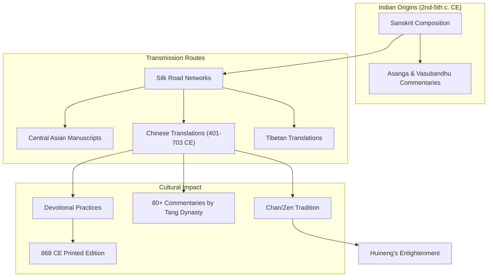

This diagram illustrates how the Diamond Sutra originated in India, spread through Central Asia via the Silk Road, and developed into a major force in East Asian Buddhism, particularly influencing the Chan tradition and generating extensive commentarial and devotional activity.

In summary, the Diamond Sutra's historical context reveals a text of extraordinary influence that transcended linguistic, cultural, and geographical boundaries. From its uncertain origins in India to its transformation into the world's earliest dated printed book, the sutra demonstrates the power of Buddhist teachings to inspire devotion, scholarly inquiry, and technological innovation across centuries and civilizations. Its **core teachings on emptiness and non-attachment** continue to offer profound insights relevant to contemporary practitioners, establishing a foundation for the detailed philosophical and practical explorations that follow in subsequent chapters.

## 2 Structural Analysis and Narrative Framework

This chapter examines the Diamond Sutra's literary architecture and pedagogical design, analyzing how the dialogical structure between the Buddha and Subhuti serves as a vehicle for transmitting profound wisdom teachings. Building upon the historical and textual foundations established in Chapter 1, this chapter investigates the sutra's internal organization, the significance of its narrative framework, and how structural elements—including repetition, thematic progression, and question-answer dynamics—function together to challenge assumptions and guide practitioners toward non-conceptual understanding.

### 2.1 The Dialogical Framework: Buddha and Subhuti's Exchange

The Diamond Sutra's fundamental structure is that of a **dialogue between the Buddha and his senior disciple Subhuti**, a format that transforms abstract philosophical teachings into a living, dynamic exchange. This dialogical framework is not merely a literary convention but serves as a sophisticated pedagogical instrument designed to engage readers at multiple levels of understanding.

#### The Opening Scene and Establishment of Context

The sutra begins with a carefully crafted scene-setting that grounds the extraordinary teachings to follow in the ordinary rhythms of monastic life. The text opens: "Thus have I heard at one time. The Lord dwelt at Sravasti. Early in the morning the Lord dressed, put on his cloak, took his bowl, and entered the great city of Sravasti to collect alms. When he had eaten and returned from his round, the Lord put away his bowl and cloak, washed his feet, and sat down on the seat arranged for him, crossing his legs, holding his body upright, and mindfully fixing his attention in front of him."[^9] This **remarkably mundane opening**—describing the Buddha's daily routine of begging for food, eating, putting away his belongings, and washing his feet—serves a profound purpose: it establishes that the highest wisdom teachings arise from and apply to ordinary, everyday activities. The Buddha is dwelling at Shravasti in the Jeta Grove with 1,250 monks and many bodhisattvas, creating a context of communal practice and shared inquiry.[^10]

#### Subhuti's Foundational Question

The teaching proper begins when the venerable Subhuti rises from his seat, arranges his robe over one shoulder in a gesture of respect, places his right knee on the ground, and addresses the Buddha with his pivotal question: **"How then, O Lord, should one who has set out in the bodhisattva-vehicle, stand, how progress, how control the thoughts?"**[^9] This three-part question—concerning how to stand, how to progress, and how to control thoughts—establishes the **pedagogical trajectory of the entire text**. It addresses the fundamental concerns of any practitioner: what is the proper foundation for practice (standing), how does one advance on the path (progressing), and how does one work with the mind (controlling thoughts).[^10]

Subhuti's question is prefaced by his acknowledgment of the Buddha's compassionate activity: "It is wonderful, O Lord, it is exceedingly wonderful, O well-gone, how much the bodhisattvas, the great beings, have been helped with the greatest help by the Tathagata."[^9] This expression of wonder and gratitude is not mere flattery but reflects Subhuti's genuine appreciation for the Buddha's skillful teaching methods. The question itself emerges from this sense of wonder, asking how others might receive similar help.

#### Subhuti's Significance as Interlocutor

The choice of Subhuti as the primary interlocutor is highly significant. Among the Buddha's disciples, **Subhuti was renowned as the foremost in understanding emptiness** (*śūnyatā*). His selection as dialogue partner signals that the sutra will address the most profound aspects of wisdom teaching. Unlike a beginning student who might ask basic questions, Subhuti's inquiries reflect deep contemplation and serve to elicit teachings appropriate for advanced practitioners. At the same time, his questions are framed in ways accessible to practitioners at all levels.

#### The Experiential Teaching Environment

The dialogical format creates what might be termed an **experiential teaching environment** rather than mere doctrinal exposition. When readers engage with the Buddha-Subhuti exchange, they are not simply receiving information but participating vicariously in a transformative encounter. The dialogue invites readers to occupy Subhuti's position, asking his questions as their own, receiving the Buddha's answers as addressed directly to them. This participatory quality distinguishes the Diamond Sutra from purely expository texts and contributes to its power as a contemplative instrument.

The following table summarizes the key elements of the dialogical framework:

| Element | Description | Pedagogical Function |
|---------|-------------|---------------------|
| Setting | Jeta Grove, Shravasti; Buddha's daily routine | Grounds teachings in ordinary life; establishes accessibility |
| Interlocutor | Subhuti, foremost in understanding emptiness | Signals profound content; models ideal student |
| Opening Question | How to stand, progress, control thoughts | Establishes comprehensive scope of inquiry |
| Format | Question-answer exchange | Creates experiential learning environment |
| Tone | Respectful, wonder-filled, collaborative | Models proper attitude for receiving teachings |

### 2.2 Traditional 32-Section Division and Thematic Organization

The Diamond Sutra is traditionally divided into **32 sections**, a structure that organizes its content while raising important questions about the text's compositional logic. Scholarly analysis has revealed that while the sutra may initially appear disorganized, closer examination uncovers deliberate structural patterns that serve its pedagogical purposes.

#### The Question of Structural Coherence

The Diamond Sutra has historically attracted criticism for its apparent lack of organization. The scholar Edward Conze famously characterized it as a "haphazard mixture of desultory remarks."[^11] However, more recent scholarship has challenged this assessment, discovering elements that suggest **more deliberate structuring** by the text's authors than previously recognized. While no perfect formula of order emerges from the apparent chaos, certain organizational principles become visible upon careful analysis.[^11]

#### Fifteen Major Themes

Scholarly analysis has identified **fifteen major themes** that the sutra addresses throughout its 32 sections.[^11] These themes include:

1. **The nature of bodhisattva practice** and the paradox that one who perceives beings cannot be called a bodhisattva
2. **The emptiness of all phenomena** (*dharmas*)
3. **Whether the Tathāgata can be recognized by physical marks** (*lakṣaṇa*)
4. **The immeasurable merit of understanding and teaching the Diamond Sutra**
5. **The non-existence of a dharma by which enlightenment is attained**
6. **The raft metaphor** and the provisional nature of teachings
7. **The nature of the Buddha's teaching activity**
8. **The emptiness of merit itself**
9. **The stages of enlightenment and their ultimate emptiness**
10. **The Buddha's past lives and practices**
11. **The nature of Buddha-fields**
12. **The comparison of material giving versus teaching the Dharma**
13. **The nature of the Tathāgata's physical body**
14. **The impossibility of grasping past, present, and future mind**
15. **The illusory nature of all conditioned phenomena**

#### Pattern of Thematic Repetition

A key structural feature is the **pattern of thematic repetition**, wherein themes introduced in the first half of the sutra are typically repeated three to six times, while themes introduced later appear only once or twice.[^11] This pattern suggests intentional design: foundational concepts receive extensive treatment through multiple iterations, while later, more refined teachings build upon this established foundation without requiring the same degree of repetition.

The text **oscillates between various themes**, exploring the principle of non-self (*nairātmya*) through different approaches and contexts.[^11] This oscillation prevents readers from settling into comfortable understanding, continuously presenting familiar concepts from new angles. The most frequently repeated theme concerns the **incalculable merit of understanding and explaining the Diamond Sutra**—a self-referential emphasis that reinforces the sutra's own importance while also pointing beyond conceptual attachment to any teaching, including itself.

#### Absence of Chiastic Structure

Unlike many other Prajñāpāramitā texts, the Diamond Sutra **does not display chiastic (mirror) structure**, where themes introduced in the first half are revisited in reverse order in the second half.[^11] This structural difference, combined with linguistic variations from other texts in the Prajñāpāramitā corpus (such as more frequent use of explicit ontological statements using "is/is not" formulations), suggests that the Diamond Sutra **may have been composed in a considerably different environment** from other Perfection of Wisdom literature.[^11]

#### Coherence Within Themes

While the sequence of themes may appear random, **each individual theme demonstrates clear, consistent internal structure**.[^11] This finding supports the view that the Diamond Sutra represents an intentional, holistic composition rather than a haphazard collection. The apparent randomness of thematic sequence may itself serve a pedagogical purpose, preventing readers from imposing linear, progressive frameworks onto teachings that ultimately transcend such conceptual ordering.

### 2.3 Repetition as Pedagogical Strategy

The Diamond Sutra employs **repetition as a central literary and pedagogical device**, but this repetition functions in sophisticated ways that distinguish it from simple reiteration for emphasis. Each repetition introduces progression, refinement, or playful subversion that deepens understanding and destabilizes conceptual fixation.

#### Repetition with Progression

Scholarly analysis has revealed that **each repetition of key themes demonstrates progression**, with arguments becoming more subtle or playfully subverting previous content.[^11] The text **continuously challenges readers' assumptions**, destabilizing their conceptual footing. This progressive repetition means that returning to a familiar theme does not merely reinforce previous understanding but transforms it.

Consider the theme that **anyone who forms a perception of beings cannot be considered a bodhisattva** (Theme 1). This theme appears four times throughout the sutra, with each repetition offering increasingly refined reasoning:[^11]

| Repetition | Section | Reasoning Provided |
|------------|---------|-------------------|
| First | §3 | Simple definition: a bodhisattva does not perceive beings through concepts |
| Second | §6 | Connection to perception of phenomena generally |
| Third | §14c | The act of perception itself lacks inherent nature |
| Fourth | §17b | Denial of the practitioner's own substantial existence |

This progression moves from external (how one perceives others) to internal (the nature of perception itself) to radical (the non-existence of the perceiver). Each iteration does not merely repeat but **deepens the inquiry** into successively more subtle dimensions of the teaching.

#### The Theme of Recognizing the Tathāgata

Similarly, the theme of whether the Tathāgata can be recognized by physical characteristics (*lakṣaṇa*) undergoes significant development through its four repetitions:[^11]

- **First and second repetitions** (§5b, §13d): Subhuti answers that physical marks lack inherent nature
- **Third repetition** (§20): The focus shifts to the act of "possessing marks" itself lacking inherent nature
- **Fourth repetition** (§26): Subhuti initially gives an affirmative answer, which the Buddha then corrects

The final repetition introduces a **playful reversal**—Subhuti's initial affirmative response is corrected, demonstrating that even correct understanding can become attachment if held too rigidly.[^11] This structural surprise keeps readers alert and prevents the formation of fixed conceptual positions.

#### Comparison with Early Buddhist Literature

The Diamond Sutra's use of repetition can be understood in relation to repetition patterns in earlier Buddhist literature, where oral transmission necessitated mnemonic structures. However, the Diamond Sutra's repetition serves different purposes: rather than aiding memorization of fixed content, it **facilitates the progressive dismantling of conceptual understanding**. The repetitions function like successive passes of a diamond cutter, each removing another layer of conceptual obscuration.

#### The "Fragment" Concept

Scholar Paul Griffiths has introduced the concept of **"fragments" or "gobbets"** to describe the compositional units of texts like the Diamond Sutra.[^11] These fragments—relatively self-contained teaching units—can be arranged in various sequences while maintaining their individual integrity. The Diamond Sutra's structure may reflect this fragmentary composition, with repetition serving to link fragments thematically rather than narratively.

### 2.4 Question-Answer Dynamics and Epistemic Stance

Recent scholarship combining cognitive linguistics, interactional linguistics, and corpus-based computational methods has illuminated the **micro-level dynamics of the Buddha-Subhuti dialogue**, revealing sophisticated patterns in how questions are posed, answers are constructed, and epistemic stances are displayed.[^12]

#### Turn Design in Buddha-to-Subhuti Questions

The Buddha's questions to Subhuti (32 instances) follow **highly regular patterns**:[^12]

- All questions are **polar (yes/no) questions**, mostly in the positive-negative format
- Questions are typically preceded by the vocative "Subhuti" and the discourse marker "What do you think?" (於意云何)
- Some questions begin with topic or conditional clauses introducing emergent entities or situations
- The negative component is indicated by sentence-final "not" (不)

This regularity creates a **ritualized framework** within which the teaching unfolds. The polar question format—asking whether something is or is not the case—directly serves the sutra's philosophical project of examining the nature of existence and non-existence.

#### Subhuti's Answer Patterns

Subhuti's responses are equally patterned, typically beginning with a brief answer that falls into two categories:[^12]

1. **Exclamatory-type answers** using the proximal demonstrative "thus" (如是)
2. **Highly elliptical repetition-type answers** that omit most linguistic material from the question, repeating only the negative particle "not" (不) with the declarative mood particle (也), or repeating the verb with an intensifying adverb (甚)

Following this initial response, Subhuti typically adds the vocative "World-Honored One" (世尊), and may then provide an expanded repetition-type answer with minimal ellipsis, and/or an explanation introduced by markers meaning "Why?" or "For what reason?"[^12]

#### Epistemic Stance and Social Position

The **format of answers reflects the relative cognitive and social positions** of the participants.[^12] Subhuti constructs his question-answer sequences to display deference to the Buddha while also asserting his thorough comprehension. The highly elliptical answers function similarly to exclamatory responses in their discourse effect, signaling immediate, confident understanding without requiring elaborate explanation.[^12]

This finding challenges traditional classifications that distinguish sharply between exclamatory, repetition, and elaboration answer types. In the Diamond Sutra, **highly elliptical repetition-type answers perform work similar to exclamatory answers**, displaying cognitive alignment and understanding through their very brevity.[^12]

#### Dialogical Resonance

The concept of **dialogical resonance** refers to the syntactic and semantic echoing between turns in conversation.[^12] The Diamond Sutra exhibits resonance at multiple levels:

- **Frame resonance**: Repetition of structural elements from questions in answers
- **Focus resonance**: Introduction of new information (such as the speaker's stance on the proposition's correctness)
- **Cross-sequence resonance**: Patterns that extend across multiple question-answer pairs throughout the text

Research has identified four types of focus resonance in the sutra's question-answer pairs:[^12]
1. The negative particle introducing new information (the speaker's evaluative stance)
2. Intensifying adverbs in upgraded repetitions
3. Changes in modality between question and answer
4. Answers to content questions resonating with interrogative words

#### Conventionalized Dialogical Constructions

As similar usage patterns repeat throughout the text, they may begin to **solidify into linguistic conventions**, forming specific grammatical constructions.[^12] The Buddha-to-Subhuti polar question-answer pairs can be viewed as a pair of dialogical constructions whose co-occurrence relationship and resonance patterns have become conventionalized.[^12]

This conventionalization serves the sutra's purposes in multiple ways: it creates a recognizable, ritually significant form; it allows readers to anticipate structural patterns while remaining alert to variations; and it embodies the teaching that even language and communication are constructed phenomena following conventional patterns rather than expressing fixed realities.

### 2.5 The Narrative Framework's Pedagogical Function

The Diamond Sutra's narrative framework—encompassing its scene-setting, dialogical structure, thematic organization, and repetitive patterns—ultimately serves its **pedagogical purpose of transmitting prajñāpāramitā (perfection of wisdom)**. This section synthesizes the preceding analyses to explain how structural elements work together to move practitioners from conceptual understanding toward direct realization of emptiness.

#### From Conceptual to Non-Conceptual Understanding

The sutra's central teaching concerns **wisdom that directly cognizes emptiness**—the empty nature of self and all phenomena.[^10] Such wisdom cannot be transmitted through ordinary conceptual instruction, which would merely add more concepts to the mind. The Diamond Sutra's structure addresses this challenge through what might be called a **pedagogy of deconstruction**: it uses concepts to point beyond concepts, employs language to indicate what transcends language.

The Buddha's response to Subhuti's opening question exemplifies this approach: "As many beings as there are in the universe of beings... all these beings I must lead to nirvana... And yet, although innumerable beings have thus been lead to nirvana, no being at all has been lead to nirvana."[^10][^9] This **paradoxical formulation**—saving all beings while recognizing that no beings are saved—cannot be resolved through ordinary logic. It points toward a mode of understanding that transcends the dualistic categories of existence and non-existence.

#### The Raft Metaphor and Provisional Teaching

Section 6 of the sutra offers the **raft metaphor**, where even the dharma (teaching) is presented as only a means to an end, to be left behind once the other shore is reached.[^4] This metaphor applies to the sutra's own structure: the dialogical framework, the thematic organization, the repetitive patterns—all are provisional devices (*upāya*) that serve awakening but must ultimately be released.

The teaching in Section 10 articulates the goal directly: **"A bodhisattva should develop a mind that functions freely, without depending on anything or any place."**[^4] The sutra's structure models this teaching by refusing to provide a stable conceptual framework on which readers might depend. The oscillation between themes, the progressive deepening through repetition, the playful subversions—all prevent the formation of fixed positions.

#### The Non-Discrimination Principle

Section 14 explains **nondiscriminatory compassion**, teaching that genuine compassion is not selective but selfless.[^4] This principle extends to the sutra's pedagogical approach: the teaching is offered without discrimination, addressing practitioners at various levels of understanding through the same words. The dialogical format allows readers to enter the teaching at whatever level is appropriate, finding deeper meanings through repeated engagement.

The sutra's philosophical content reinforces this non-discriminatory quality: "As far as 'all dharmas' are concerned, Subhuti, all of them are dharma-less. That is why they are called 'all dharmas.'"[^1] This **paradoxical formulation**—phenomena are called phenomena precisely because they lack inherent phenomenon-nature—applies equally to the sutra's own teachings. The structural elements are structural precisely because they lack inherent structure; they are conventional designations serving communicative and transformative purposes.

#### The Concluding Verse as Structural Culmination

The sutra's **poetic pinnacle** appears in Section 32, comparing conditioned phenomena to "a dream, an illusion, a bubble, a shadow, like dew or a flash of lightning."[^1][^4] Another translation offers: "A shooting star, a clouding of the sight, a lamp, an illusion, a drop of dew, a bubble, a dream, a lightning's flash, a thunder cloud—this is the way one should see the conditioned."[^1]

This verse serves as the **structural culmination** of the sutra's teachings, gathering all the preceding analysis into a single, memorable expression. The verse does not introduce new philosophical content but crystallizes what the entire structure has been demonstrating: the fleeting, insubstantial nature of what we ordinarily take to be real.[^4] The dialogue, the questions and answers, the repetitions and progressions—all are themselves like dreams, illusions, bubbles, and shadows. Recognizing this, the practitioner is freed from attachment to any particular formulation while remaining able to engage skillfully with all of them.

#### Self-Referential Quality as Skillful Means

The Diamond Sutra's **self-referential quality**—its repeated emphasis on the merit of understanding and teaching the sutra itself—might initially appear to be mere self-promotion. However, this self-reference serves a deeper purpose: it makes the sutra itself an object of contemplation, inviting readers to examine their relationship to the text. Do they cling to it as a source of merit? Do they grasp its teachings as fixed truths? The sutra's structure continuously undermines such attachments while simultaneously affirming the value of engagement with the teaching.

The Buddha's teaching that even a four-line extract of the sutra is of incalculable merit[^1] encourages deep engagement with small portions rather than superficial reading of the whole. This emphasis supports contemplative practice in which practitioners work intensively with specific passages, allowing the structure to do its transformative work gradually.

#### Integration of Form and Content

The Diamond Sutra achieves a remarkable **integration of form and content**: its structure embodies its teachings. The dialogical format demonstrates that wisdom arises in relationship and exchange. The repetitive patterns show that understanding deepens through returning to the same teachings with fresh attention. The thematic oscillation models the mind that functions freely without depending on any fixed position. The progressive refinement of themes illustrates the path from gross to subtle understanding.

This integration means that studying the sutra's structure is itself a form of practice. Readers who attend to how the teaching unfolds—not just what it says—engage with the text at a level that can produce the transformative effects the sutra promises. The narrative framework becomes a **skillful means** (*upāya*) for awakening, using the conventional structures of language and literature to point toward what transcends all conventions.

The following diagram illustrates how the Diamond Sutra's structural elements work together to serve its pedagogical purpose:

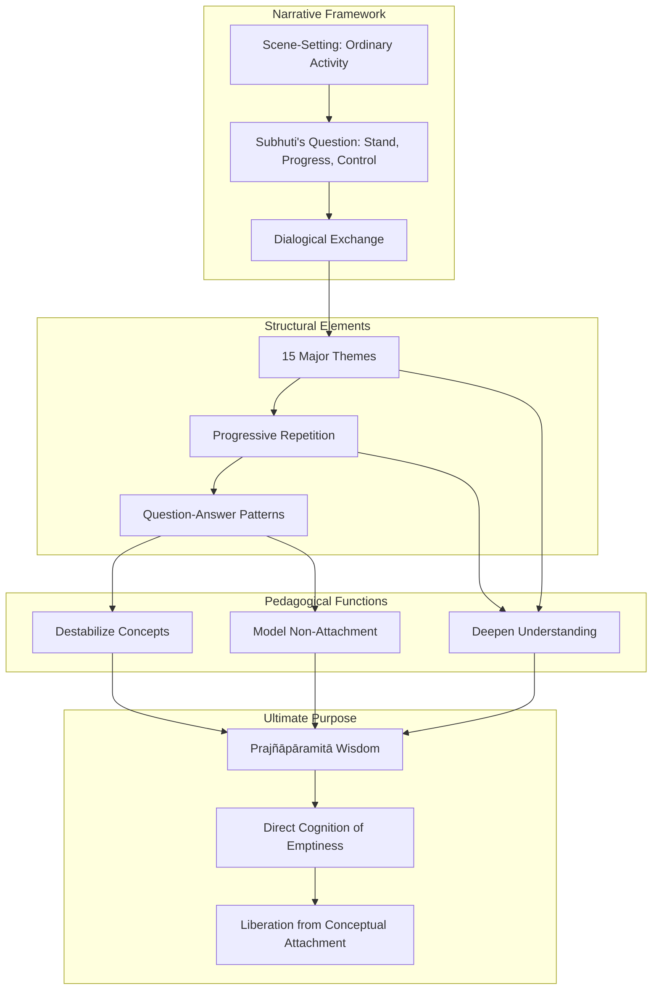

This diagram shows how the narrative framework establishes the context for teaching, structural elements organize and develop the content, pedagogical functions transform the reader's understanding, and all elements converge toward the ultimate purpose of awakening wisdom and liberation.

In summary, the Diamond Sutra's structural analysis reveals a **text of remarkable sophistication** that uses literary form to serve spiritual transformation. Far from being a "haphazard mixture," the sutra demonstrates intentional design at multiple levels—from the macro-structure of thematic organization to the micro-level patterns of question-answer dynamics. Understanding this structure enriches engagement with the sutra's content and reveals how **form and content work together** to cut through conceptual attachment and point toward the direct realization of emptiness that is the perfection of wisdom.

## 3 Core Philosophical Concepts: Emptiness and Non-Self

This chapter provides a deep philosophical analysis of the Diamond Sutra's central teachings on śūnyatā (emptiness) and anātman (non-self), examining how these concepts function as the sutra's doctrinal foundation. Building upon the structural analysis in Chapter 2, this chapter explores the systematic deconstruction of the four marks (self, person, being, life-span), analyzes the paradoxical formulation "A is not A, therefore it is called A" as a distinctive logical and pedagogical device, and demonstrates how the sutra navigates between the extremes of eternalism and nihilism through the Middle Way. The chapter integrates textual analysis with practical implications for understanding and embodying these teachings.

### 3.1 Śūnyatā (Emptiness): Dependent Origination and the Absence of Inherent Existence

The Diamond Sutra's teaching on emptiness (śūnyatā) stands as one of the most profound and frequently misunderstood concepts in Buddhist philosophy. **Emptiness does not mean nothingness or non-existence**; rather, it signifies the absence of independent, self-sufficient existence in all phenomena. This distinction is crucial for understanding the sutra's message and avoiding the pitfall of nihilistic interpretation that has confused many readers throughout history.

#### The Meaning of Emptiness as Dependent Origination

The foundational Madhyamaka idea, which the Diamond Sutra embodies, is that **all existents are "empty" (śūnya) because they are "dependently originated" (pratītyasamutpanna)**[^13]. Emptiness means being empty of "essence" (svabhāva)—existing only relatively, not independently. This understanding reveals that emptiness and dependent origination are not two separate concepts but two ways of expressing the same truth: because all phenomena arise through causes and conditions, they lack inherent self-nature.

The relationship between emptiness and dependent origination can be illustrated through a simple example offered in traditional commentaries. Consider a tablecloth: it exists, but through the lens of prajñā (wisdom), we see it is empty because it is produced by causes and conditions—cotton, which itself depends on seeds, sunlight, air, and water. **Even when an object appears intact and solid, it is fundamentally empty of independent existence**[^14]. The tablecloth cannot exist apart from the web of conditions that brought it into being and sustain its temporary appearance.

This understanding transforms our perception of reality. Emptiness can be compared to gold, and existence to the jewelry made from it; or emptiness to water, and existence to waves[^14]. The waves are not separate from the water, nor do they exist independently of it. Similarly, all phenomena are expressions of emptiness rather than violations of it. **Emptiness is the basis of existence; it is the non-dual "nothingness" which embraces both existence and non-existence**[^14].

#### The Buddha's Systematic Negation of Substantiality

Throughout the Diamond Sutra, **the Buddha uses negation to point out the emptiness of phenomena, merit, the Dharma, the stages of enlightenment, and the Buddha himself**[^1]. This negation is characterized as the "logic of not" (*na pṛthak*), which systematically dismantles any attempt to grasp phenomena as self-existent entities. The text states: "As far as 'all dharmas' are concerned, Subhuti, all of them are dharma-less. That is why they are called 'all dharmas.'"[^1]

This pattern of negation serves a specific purpose: **"one colossal attempt to avoid the extremist use of language, that is, to eliminate any ontological commitment to concepts while retaining their pragmatic value"**[^1]. The Buddha is not denying that phenomena appear or function; he is denying that they possess the kind of fixed, independent existence our ordinary thinking attributes to them.

The following table illustrates how the Buddha applies emptiness to various categories:

| Category | Buddha's Teaching | Implication |
|----------|------------------|-------------|
| Dharmas (phenomena) | "All dharmas are dharma-less" | Phenomena lack inherent nature |
| Merit | Merit from understanding exceeds material giving | Merit itself is empty of fixed substance |
| Stages of enlightenment | Stream-enterer, etc., do not think they have attained | Attainment is empty of self-nature |
| The Buddha | "Tathāgata" means suchness, not a fixed entity | Even Buddhahood is empty |
| The Dharma (teaching) | Like a raft to be abandoned after crossing | Teachings are provisional means |

#### Emptiness as the Ground of Possibility

A key verse in Madhyamaka philosophy states that **dependent origination is emptiness, which is a relative indication and itself the middle path**[^13]. This underscores that emptiness is not a nihilistic negation but equivalent to dependent origination. The Mādhyamika response to charges of nihilism is illuminating: **it is precisely because everything is empty—i.e., dependently originated—that suffering can arise and, being contingent, can be caused to cease**[^13]. If suffering had an essential, independent existence (svabhāva), it could not be interrupted, making the Buddhist path impossible.

This insight reveals that emptiness is not the enemy of existence but its very condition. **Because of emptiness, things exist**[^14]. The Diamond Sutra's teaching on emptiness is therefore profoundly life-affirming: it does not deny the world but invites us to see it with awakened eyes, recognizing that **the illusion is not in the things themselves, but in our distorted way of seeing them**[^15].

#### Emptiness and the Nature of Reality

The Diamond Sutra's approach to emptiness can be summarized through its treatment of ultimate and conventional truth. **The ultimate truth is that there is no ultimate truth in the Ābhidharmika sense; the ultimate truth is the fact of universal dependence/emptiness**[^13]. This paradoxical formulation points to a reality that cannot be captured by ordinary conceptual categories.

The sutra's teaching on emptiness addresses what scholars have described as **"an existential project aiming at achieving and embodying a non-discriminatory basis for knowledge"** or **"the emancipation from the fundamental ignorance of not knowing how to experience reality as it is"**[^1]. Emptiness is not merely an intellectual concept to be understood but a mode of perception to be realized—a way of experiencing phenomena without the overlay of substantialist thinking that creates suffering through attachment and aversion.

### 3.2 Anātman (Non-Self): Deconstructing the Four Marks

The Diamond Sutra's teaching on non-self (anātman) is intimately connected to its teaching on emptiness. **The Sutra dismantles attachment to "name-and-form," asserting that realizing emptiness (śūnyatā) entails realizing non-self (anātman)**[^16]. This section examines how the sutra systematically deconstructs the four marks—notions that ordinary beings cling to as constituting a "self"—and why this deconstruction is essential for bodhisattva practice.

#### The Four Marks and Their Systematic Negation

The Diamond Sutra repeatedly emphasizes that we should have **"no notion of self, no notion of others, no notion of sentient beings, and no notion of longevity"**[^17]. These four marks represent progressively subtle forms of self-grasping:

1. **Notion of self (ātman/我相)**: The belief in an individual, independent "I" that is the agent of actions and experiencer of results
2. **Notion of a person (pudgala/人相)**: The concept of personhood that distinguishes "me" from "others"
3. **Notion of a sentient being (sattva/众生相)**: The broader category that separates sentient beings from the inanimate world
4. **Notion of a life-span (jīva/寿者相)**: The belief in a continuous self that persists through time from birth to death

The Buddha's teaching is unequivocal: **"If, Subhuti, a bodhisattva still has the notion of a self, a person, a living being, or a life span exists, that person is not a true bodhisattva"**[^18]. This statement appears multiple times throughout the sutra, emphasizing its centrality to the teaching.

#### The Four Conditions for "Self" and Their Impossibility

Traditional Buddhist analysis identifies **four conditions that must be met for something to rightly be called a "self": autonomy, permanence, universality, and freedom**[^17]. The Diamond Sutra's teaching demonstrates that none of these conditions can be satisfied by any phenomenon:

| Condition | Requirement | Why It Cannot Be Met |
|-----------|-------------|---------------------|
| **Autonomy** | Self-sufficient, independent existence | The self is formed through causes and conditions (the four elements); it cannot exist apart from them |
| **Permanence** | Unchanging, eternal nature | The self exists only temporarily through dependent origination; it is constantly changing |
| **Universality** | Unlimited, unobstructed presence | The self is obstructed everywhere; it cannot be in all places at all times |
| **Freedom** | Liberation from karmic effects | The self is subject to karmic effects of suffering; it is bound by conditions |

This analysis reveals that **the existence of the "self" is like a dream, an illusion, a bubble, a shadow, or like dew and lightning. It is merely a temporary self, formed by the combination of the five aggregates, which has no truly real nature**[^17].

#### The Paradox of Using the Temporary Self

While the Diamond Sutra thoroughly deconstructs the notion of self, it does not advocate for the annihilation of conventional selfhood. **We must make use of this temporary self in order to find the true self of prajna**[^17]. This teaching points to a subtle but crucial distinction: the problem is not the conventional use of "self" in daily life but the *attachment* to self as a fixed, independent entity.

The sutra's approach can be understood through the framework presented in scholarly analysis: **by advocating "no notion of self, no notion of others, no notion of sentient beings, and no notion of longevity," the Diamond Sutra is actively building a world that is permanent, blissful, pure, and that has an independent self through the process of negation**[^17]. The negation of the false self is the path to discovering what might be called the "true self"—not another substantial entity, but the awakened awareness that remains when conceptual grasping ceases.

#### Non-Self and Bodhisattva Practice

The practical implications of non-self teaching are profound. The Buddha instructs: **"However many species of living beings there are, we must lead all these beings to nirvana so that they can be liberated. Yet when this innumerable, immeasurable, infinite number of beings has become liberated, we do not, in truth, think that a single being has been liberated"**[^18]. This paradoxical statement captures the essence of bodhisattva practice: compassionate action without attachment to the fruits of action.

The reason for this paradox is explained clearly: **a bodhisattva does not see beings through reified concepts such as "person," "soul" or "self," but sees them through the lens of perfect understanding, as empty of inherent, unchanging self**[^1]. When there is no fixed self doing the saving and no fixed beings being saved, compassionate activity can flow freely without the obstructions created by ego-centered thinking.

The sutra further clarifies: **"When we give while attached to notions, we cannot gain great merit, just as when we attempt to liberate others while attached to the notion of self, we cannot develop compassion for those we liberate. Only when we develop great compassion that is unattached to the notion of self does it become possible to broadly liberate all living beings"**[^17].

#### The Mind Free from Self-Concepts

The culmination of non-self understanding is described in the sutra: **"The mind of someone who practices the Prajñāpāramitā is then a mind free from fixed substantialist or 'self' concepts"**[^1]. The text states: "However, Lord, the idea of a self will not occur to them, nor will the idea of a living being, the idea of a soul, or the idea of a person occur. Why is that? Any such idea of a self is indeed idealess... Because the Buddhas and Lords are free of all ideas."[^1]

This freedom from self-concepts does not result in passivity or indifference. Rather, it enables what the sutra calls **"selfless compassion"**—compassion that responds to suffering without the distortions introduced by ego-centered thinking. The bodhisattva who has realized non-self can act with complete engagement while remaining free from attachment to outcomes, recognition, or the sense of being a separate "doer" of good deeds.

### 3.3 The Paradoxical Logic: "A is not A, Therefore It Is Called A"

One of the most distinctive and challenging features of the Diamond Sutra is its recurring logical formulation: **"A is not A, therefore it is called A."** This pattern appears throughout the text in various forms and has generated extensive scholarly commentary. Understanding this formula is essential for grasping the sutra's pedagogical method and philosophical depth.

#### The Apparent Contradiction and Its Resolution

When interpreted through Aristotelian logic, the formulation "A is not A, therefore it is A" **appears contradictory or nonsensical**[^19]. The law of non-contradiction states that something cannot be both A and not-A at the same time and in the same respect. However, scholarly analysis reveals that **this logic remains contradictory only when understood from a dualistic, either-or, egological standpoint. To understand it properly requires a perspectival shift to a non-dualistic, non-egological stance**[^19].

The Diamond Sutra's goal is the **"perfection of wisdom" (prajñāpāramitā), a non-discriminatory knowledge that is an existential project aiming to sever all doubts and attachments from cognitive activity**[^19]. The paradoxical formula is not meant to be resolved intellectually but to function as a catalyst for this transformative shift in perspective.

#### The Three Components of the Formula

Scholarly analysis identifies three components in the formula "A is not A, therefore it is A"[^19]:

**First Component: The Initial Affirmation of A**

From the ordinary, egological standpoint, A is understood as self-same and substantialized. This represents **a linguistic reification that ignores impermanence and the interdependent nature of reality**, where A's identity presupposes its difference from not-A[^19]. When we say "this is a table," we unconsciously attribute to the table a fixed, independent existence that it does not actually possess.

**Second Component: The Negation "A is not A"**

This negation has two senses[^19]:
- It **negates the substantialistic understanding of A**, revealing its dependent, non-self-sufficient nature (de-substantialization and de-ontologization)
- It **points toward a third perspective** offered by the "neither-nor" stance, which transcends the pitfalls of either-or logic

This negation is not merely intellectual but is **experientially grounded in meditation**, where objects disappear, revealing their mind-dependent nature and emptiness[^19].

**Third Component: The Re-affirmation "Therefore It Is Called A"**

The A that is re-affirmed is **experienced from the standpoint of non-substantiality and emptiness**[^19]. It is A seen through the meditative experience where spatial and conceptual determinations become interchangeable, embodying non-discriminatory knowledge (prajñā). The re-affirmed A is not the same as the initially affirmed A; it is A recognized as empty yet conventionally functional.

The following diagram illustrates this three-part movement:

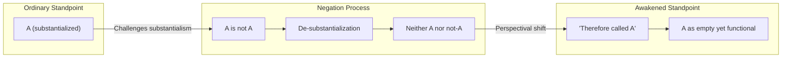

#### The Perspectival Shift Required

The key to understanding the Diamond Sutra's logic is recognizing that it requires **an existential transformation, not merely an intellectual adjustment**. This shift is described using an analogy of moving from darkness to light[^19]. It involves generating **"a mind of no place to dwell on,"** leading to a state of no-mind or superconsciousness where seeing occurs without a seer[^19].

From this transformed perspective, **dharma cannot be grasped or talked about through ordinary, dualistic language; it is an extralinguistic experience of pure experience prior to subject-object bifurcation**[^19]. The paradoxical formula points toward this experience while acknowledging that it cannot be directly communicated through conventional language.

#### The "Neither-Nor" Stance

The sutra **admonishes against seizing on either a dharma (affirmation/eternalism) or a no-dharma (negation/nihilism)**, as both are products of the dualistic, either-or egological stance[^19]. Instead, it advocates a **"neither-nor" propositional form** (neither affirmation nor negation, neither being nor non-being) to avoid one-sidedness and achieve a holistic perspective[^19].

This stance aims for **non-attachment, which cannot be achieved through logical negation alone**, as that leads to an infinite regress (e.g., attaching to non-attachment). True non-attachment requires an existential transformation beyond the intellectual sphere, involving the unconscious and somatic dimensions[^19].

#### Practical Function of the Paradoxical Logic

Recent scholarship has interpreted the sutra's recurring linguistic pattern **"A is not A, therefore it is called A" as expressing the dynamic relationship between non-discrimination and functional language**[^20]. The paper argues that **naming itself may arise only after the dissolution of discriminative boundaries, allowing language to operate without reification**[^20].

This interpretation suggests that the paradoxical formula is not merely a philosophical puzzle but a **practical instruction for how to use language and concepts without being trapped by them**. After recognizing the emptiness of A (that A is not A in the substantialist sense), one can continue to use the designation "A" for practical purposes without the attachment and confusion that ordinarily accompany such designations.

### 3.4 Navigating the Middle Way: Avoiding Eternalism and Nihilism

The Diamond Sutra's teachings on emptiness and non-self must be understood within the broader context of the Buddhist Middle Way, which steers between two extreme views that the Buddha rejected. Understanding how the sutra navigates between these extremes is essential for correct interpretation and practice.

#### The Two Extremes: Eternalism and Nihilism

**The Buddha rejected the extremes of eternalism and nihilism and taught the middle way which is free from extremes**[^21]. These extremes are defined as follows:

- **Eternalism (sassatavāda)**: The view that there is a self that truly exists—a permanent, unchanging essence that persists through time and survives death
- **Nihilism (ucchedavāda)**: The view that the self does not exist at all, or that the self annihilates upon death, leading to the eliminativist view that actions have no ethical consequences

The middle way states that **co-dependently arisen five aggregates are empty of self, but are conventionally called self**[^21]. This formulation preserves the conventional reality of persons and actions while denying their ultimate, independent existence.

#### The Sutra's Warning Against Both Extremes

The Diamond Sutra explicitly warns against falling into either extreme. It **admonishes against seizing on either a dharma (affirmation/eternalism) or a no-dharma (negation/nihilism)**, as both are products of the dualistic, either-or egological stance[^19]. The text teaches that **if you are caught in the idea of the Dharma, you are also caught in the ideas of a self, a person, a living being, and a life span, and the same is true if you are caught in the idea that there is no Dharma**[^18].

This teaching reveals that nihilism is not the opposite of eternalism but its mirror image—both involve attachment to fixed views about existence and non-existence. The Buddha instructs: **"Do not think that when one gives rise to the highest, most fulfilled, awakened mind, one needs to see all objects of mind as nonexistent, cut off from life. Do not think in that way. One who gives rise to the highest, most fulfilled, awakened mind does not say that all objects of mind are nonexistent and cut off from life"**[^18].

#### Emptiness Is Not Nihilism

A central and recurrent preoccupation of Mādhyamika philosophers is to **avoid charges of nihilism (ucchedavāda), the eliminativist view that actions have no ethical consequences**[^13]. The Diamond Sutra addresses this concern directly through its teaching that emptiness is the ground of existence, not its negation.

**A common misunderstanding is that the Diamond Sutra teaches nihilism—denying the existence or value of things. On the contrary, it calls into question not existence itself, but how we perceive existence**[^15]. The sutra **challenges the belief that the world is made up of isolated, self-sufficient entities. The illusion, then, is not in the things themselves, but in our distorted way of seeing them**[^15].

The following table contrasts the nihilistic misreading with the sutra's actual teaching:

| Nihilistic Misreading | Diamond Sutra's Actual Teaching |
|----------------------|--------------------------------|
| Things do not exist | Things exist conventionally but lack inherent existence |
| Actions have no consequences | Actions have consequences precisely because of dependent origination |
| The world should be rejected | The world should be seen with awakened eyes |
| Emptiness means nothingness | Emptiness means absence of independent self-nature |
| Non-self means no person | Non-self means no fixed, permanent self-entity |

#### The Key to Avoiding Both Extremes

The Diamond Sutra provides a clear key for navigating between eternalism and nihilism: **"emptiness" to avoid eternalism and "luminosity" to avoid nihilism**[^21]. Emptiness prevents us from grasping phenomena as permanent and independent; luminosity (the fact that phenomena appear and function) prevents us from denying conventional reality altogether.

The sutra states: **"Subhuti, all dharmas are spoken of as no dharmas. Therefore they are called dharmas"**[^21]. This formulation encapsulates the middle way: dharmas are negated as independently existing entities (avoiding eternalism) but are affirmed as conventional designations (avoiding nihilism).

#### Emptiness Itself Is Empty

To avoid the trap of turning emptiness into a new metaphysical absolute, **Mādhyamikas emphasize that emptiness itself is empty**[^13]. This prevents the analysis from becoming a new form of eternalism where "emptiness" is grasped as an ultimate reality. The paradoxical character of claiming the ultimate truth is that there is no ultimate truth raises issues of self-contradiction. **Mādhyamikas address this by applying the analysis to itself, affirming no philosophical "thesis" or "view"**[^13].

The constitutive claim is that all existents are empty, and **this very claim is also conventionally true, not ultimately existent**[^13]. The philosophical impulse is to steer a middle way between the extremes of eternalism (affirming enduring existents) and nihilism (denying conventional reality and its ethical significance).

#### Implications for Practice

Understanding the middle way has profound implications for how we engage with the Diamond Sutra's teachings:

1. **We should not grasp emptiness as a thing**: Emptiness is not an object to be acquired but a way of seeing that dissolves objectification
2. **We should not deny conventional reality**: The world of persons, actions, and consequences remains valid at the conventional level
3. **We should not attach to either existence or non-existence**: Both are conceptual extremes that miss the middle way
4. **We should recognize the provisional nature of all teachings**: Even the teaching of emptiness is a skillful means, not an ultimate truth to be grasped

The ethical and soteriological project of Buddhism is thought to be at stake in this navigation. **Mādhyamikas argue that it is the Ābhidharmika view—which supersedes the conventional world of persons in favor of a privileged level of description—that is nihilistic, as it eliminates the ethical agents of conventional reality**[^13]. By showing that no privileged level of description is coherent, Madhyamaka returns attention to the irreducibly conventional world where persons act and suffer, thereby avoiding nihilism.

### 3.5 "The Mind That Abides Nowhere": From Concept to Realization

The Diamond Sutra's philosophical teachings on emptiness and non-self culminate in a practical instruction for how to live: the cultivation of **"the mind that abides nowhere."** This section bridges philosophical understanding with practical application, examining how the sutra's teachings translate into a transformed mode of awareness and action.

#### The Buddha's Central Instruction

The Buddha teaches: **"So, Subhuti, when bodhisattvas give rise to the unequaled mind of awakening, they should let go of all ideas. They should not rely on form when they give rise to that mind, nor on sound, smell, taste, touch, or object of mind. They should only give rise to the mind that is not dwelling anywhere"**[^18]. This instruction appears in multiple forms throughout the sutra and represents its practical essence.

In the Platform Sutra, this teaching is expressed as: **"Undisturbed and serene, the wise man practises no virtue; Self-possessed and dispassionate, he purifies his heart; Calm and silent, he gives up seeking and grasping; Even and upright his mind abides nowhere"**[^22]. The phrase "practises no virtue" does not mean abandoning ethical conduct but avoiding grand gestures motivated by pride—acting without attachment to the identity of being a "virtuous person."

#### What "Abiding Nowhere" Means

**"The mind which abides nowhere" is synonymous with the mind of meditation**[^22]. It means that **the mind is not fixed on any limited thing but is open to whatever is present in the here and now**, including one's surroundings and one's own reactions. This openness enables appropriate behavior in accord with the needs of the moment[^22].

The teaching identifies two primary obstacles to this open awareness:
- **Ruminating on the past**: Dwelling on memories, regrets, or past achievements
- **Worrying about the future**: Anxiously anticipating what might happen or planning based on self-aggrandizement

Both of these mental activities cause distress and prevent attentiveness to the present moment, hindering the ability to respond with full awareness[^22].

However, the teaching goes further: **while focusing on the present is better than dwelling on past or future, one should not make an ideal of the present and cling to it**, as it is ever-changing. One must let go even of the present moment because it is fleeting[^22]. This means not conceptualizing "the mind that abides nowhere" as another object to be acquired, as that would become another obstacle.

#### The Relationship to Emptiness and Non-Self

The mind that abides nowhere is the **experiential realization of emptiness and non-self**. When one truly understands that all phenomena (including the self) lack inherent existence, there is nothing to grasp and nothing to be grasped by. **Letting go of everything lets the mind dwell nowhere and reveal unmediated truth**[^22].

This is described as **a mind with no clinging to material things or a self, which is the enlightened mind**[^22]. The Rules for Meditation Scripture expresses this as: **"Neither trying to think, nor trying not to think..."** is the mind of meditation[^22]. This formulation avoids both the extreme of suppressing all thought and the extreme of indulging in discursive thinking.

Importantly, this **does not mean cutting off all thought**, which would disregard the value of experiences, memories, and practical knowledge. Instead, the aim is **to see and hear everything with an open mind and heart, responding from that place rather than from habitual thoughts and ingrained attitudes**, while allowing relevant knowledge to inform thinking when appropriate[^22]. This represents a way of being objective and unprejudiced—a better standpoint for making decisions and taking action.

#### The Practice of Non-Abiding in Daily Activities

The Diamond Sutra itself demonstrates how non-abiding awareness manifests in ordinary life. The sutra begins with a description of the Buddha's daily activities: **at mealtime, putting on his robe, picking up his bowl, begging for food, returning, eating, putting away his robe and bowl, washing his feet, and sitting down**[^14]. These mundane actions illustrate the six perfections (pāramitās): precepts, generosity, patience, diligence, meditative concentration, and wisdom. They represent **the light of wisdom emanating from the Buddha** in everyday activities[^14].

This teaching reveals that **apart from life, there is no prajna nor emptiness. Prajna emerges in ordinary daily activities: eating, walking, sitting, sleeping, dealing with others**[^14]. The Diamond Sutra's wisdom is not an abstract philosophy to be contemplated in isolation but a way of being that transforms every moment of life.

#### Giving Without Attachment

The sutra's teaching on giving (dāna) exemplifies non-abiding practice. **To give without clinging to any notion refers to the threefold emptiness of giving: no idea of an "I" as the giver, no individual who receives the gift, and no things being given, with no expectation of repayment**[^14]. The merit of this giving is the utmost, while giving for fame, gain, or blessings is giving with clinging to form, and its merit is limited.

The Buddha teaches that **a bodhisattva should not give while abiding in form, sound, smell, taste, touch, or dharmas**[^14]. This instruction applies not only to material giving but to all bodhisattva activities. **Liberating all sentient beings requires developing great selfless compassion without the dualistic notion of self versus others**[^14].

#### Patience for the Non-Arising of Phenomena

The culmination of understanding emptiness and non-self in lived experience is described as **"patience for the non-arising of phenomena" (anutpattika-dharma-kṣānti)**. The Diamond Sutra teaches that **if a bodhisattva knows that all phenomena are without self and thereby attains patience, the virtue attained is superior to giving countless treasures**[^17].

Patience in Buddhist understanding can be divided into three kinds[^17]:

1. **Patience for life (生忍)**: Recognizing the bitterness and sweetness of all life's experiences, accepting responsibility for them, and enduring the difficulties of existence
2. **Patience for phenomena (法忍)**: Coming to terms with one's own mental afflictions by realizing that all phenomena arise and cease due to causes and conditions
3. **Patience for the non-arising of phenomena (无生法忍)**: The understanding that, fundamentally, nothing arises or ceases, for nothing inherently exists

The third type of patience represents the highest realization: **since all phenomena do not truly arise, in essence there is no need to be patient. This is the patience of non-patience**[^17]. A bodhisattva who has attained this patience is without a "self" and without notions—not attached to a sense of self, nor to the notion of giving, nor to the notion of merit. **This is what it really means to understand "all phenomena are without self"**[^17].

#### Integration: The Awakened Life

The Diamond Sutra presents awakening **not as transcendence of ordinary life, but as a radical reorientation within it**[^20]. Scholarly interpretation describes this as **"ordinary mind"—a post-discriminative mode of awareness in which ethical action, language, and everyday activity continue without attachment or grasping**[^20].

This understanding transforms the relationship between philosophy and practice. The sutra's teachings on emptiness and non-self are not mere intellectual positions to be defended but **descriptions of a way of being that can be cultivated and realized**. The mind that abides nowhere is not an extraordinary state accessible only to advanced meditators but the natural condition of awareness when conceptual grasping relaxes.

The practical instruction can be summarized as follows: **"Applying the Diamond Sutra's teachings and living with prajna in daily life frees us from afflictions and enables peace. Understanding that the five aggregates are empty allows one to cross the ocean of suffering and leave behind dualistic notions and differentiations"**[^14].

The following diagram illustrates the relationship between the sutra's philosophical concepts and their practical realization:

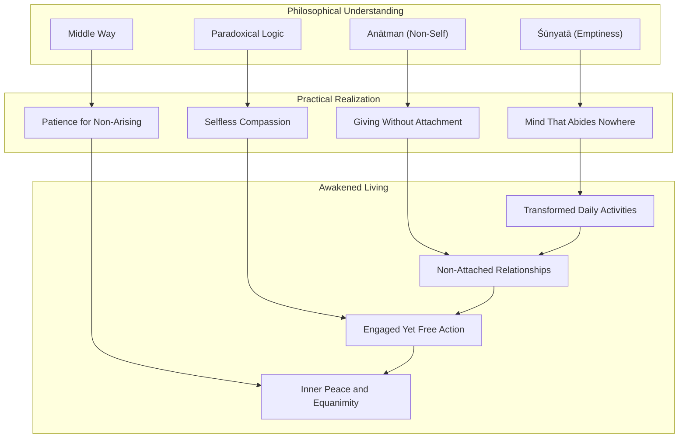

This diagram shows how the philosophical concepts of emptiness, non-self, paradoxical logic, and the middle way translate into practical realizations (non-abiding mind, non-attached giving, selfless compassion, and patience), which in turn manifest in awakened living through transformed daily activities, non-attached relationships, engaged yet free action, and inner peace.

In summary, the Diamond Sutra's core philosophical concepts—emptiness and non-self—are not abstract theories but **practical instructions for transforming consciousness and living wisely**. The sutra's paradoxical logic serves as a pedagogical device to shift practitioners from dualistic, ego-centered thinking to non-dual awareness. Its navigation of the middle way ensures that these teachings neither reify existence nor fall into nihilistic denial. And its culminating instruction—to cultivate the mind that abides nowhere—provides a practical path for embodying these insights in every moment of life. The subsequent chapters will explore how these foundational teachings apply to specific domains of human experience, from daily life and workplace challenges to intimate relationships and emotional well-being.

## 4 The Practice of Non-Abiding and Unsupported Giving

This chapter examines the Diamond Sutra's central practical teaching on dāna (giving) as the paradigmatic expression of non-abiding awareness. Building upon the philosophical foundations of emptiness and non-self established in Chapter 3, this chapter analyzes how the sutra transforms ordinary charitable practice into a vehicle for awakening through the cultivation of "unsupported thought" (apratiṣṭhita-citta). The analysis explores the nature of signs (lakṣaṇa) and why attachment to them limits merit, investigates the sutra's striking comparison between material giving and Dharma giving, and explains the profound logic behind the teaching that non-abiding generosity generates merit "immeasurable like space in all directions."

### 4.1 Giving Without Abiding in Signs: The Transformation of Dāna Practice

The Diamond Sutra revolutionizes the traditional Buddhist understanding of generosity (dāna) by introducing a radical instruction: **bodhisattvas should practice giving without attachment to any perceptual or conceptual signs**. This teaching transforms charitable action from a means of accumulating merit into a direct expression of awakened wisdom, making the act of giving itself a path to liberation.

#### The Buddha's Core Instruction on Non-Attached Giving

The Buddha's instruction on giving appears in multiple sections of the sutra, each iteration deepening the teaching's significance. The text states explicitly: **"Furthermore, Subhuti, in the practice of charity, bodhisattvas should abide in nothing whatsoever. That is, to practice charity without attachment to form, sound, smell, taste, touch, or dharmas. Subhuti, bodhisattvas should practice charity this way, without attachment to anything"**[^23]. This instruction encompasses the entire range of sensory and mental experience—the six sense bases through which we engage with the world.

The teaching is further elaborated: **"When bodhisattvas practice generosity, they do not rely on any object—any form, sound, smell, taste, touch, or object of mind to practice generosity. That, Subhuti, is the spirit in which bodhisattvas practice generosity, not relying on signs"**[^18]. The phrase "not relying on signs" (無相布施) represents the key to understanding this practice. Signs (*lakṣaṇa* or *nimitta*) are the mental designations and conceptual elaborations that our perceptual apparatus creates when encountering phenomena. When we give while attached to these signs, we create a web of conceptual entanglement around the act of generosity.

#### Understanding Signs (Lakṣaṇa/Nimitta) and Their Limiting Function

The concept of "signs" in the Diamond Sutra refers to **the designations created by our perceptual apparatus that, when grasped, create a seemingly real, separate world leading to entanglement**[^24]. An act of perception creates a "sign"—a mental label or category that we then mistake for the actual nature of the phenomenon. When giving is supported by these signs and one believes in their hard reality, it leads to confusion and limited results.

The sutra identifies three primary signs that typically accompany the act of giving:

| Sign | Description | How It Limits Giving |
|------|-------------|---------------------|
| **The Giver** | The notion of "I" as the one who gives | Creates pride, expectation of recognition, and reinforces ego-identity |
| **The Recipient** | The notion of "them" as separate beings who receive | Establishes hierarchical relationship, potential condescension |
| **The Gift** | The notion of "this thing" being transferred | Attachment to the value, quantity, or quality of what is given |

This threefold analysis reveals that **ordinary giving involves a subtle but powerful conceptual structure that limits its transformative potential**. When we give with the thought "I am giving this valuable thing to that person," we reinforce the very dualistic thinking that the Diamond Sutra seeks to dissolve. The merit of such giving, while real, remains bounded by the conceptual framework within which it occurs.

#### The Vivid Analogy: Walking in Darkness Versus Bright Sunshine

The sutra employs a striking analogy to illuminate the difference between attached and non-attached giving: **"A bodhisattva who practices generosity while depending on form is like someone walking in the dark, whereas one who practices without depending on form is like someone with good eyesight in bright sunshine"**[^4]. This image captures the experiential difference between the two modes of giving.

Walking in the dark represents giving while attached to signs. The giver moves tentatively, unsure of the terrain, bumping into obstacles, unable to see clearly the full landscape of the situation. The darkness symbolizes the obscuration created by conceptual attachment—the giver cannot perceive the true nature of the act, the recipient, or themselves. Such giving, while beneficial, remains limited by this fundamental blindness.

In contrast, giving without attachment to form is like having excellent vision in full daylight. **The giver perceives clearly, acts with precision, and responds appropriately to the actual needs of the situation** rather than to conceptual projections about what should be given, to whom, and why. This clarity arises not from superior analytical ability but from the absence of the conceptual fog that normally obscures perception.

#### The Threefold Emptiness of Giving

The Diamond Sutra's teaching on non-attached giving points toward what later Buddhist commentators called the "threefold emptiness of giving" (三輪體空):

1. **Emptiness of the giver**: There is no fixed, independent self who performs the act of giving
2. **Emptiness of the recipient**: There is no fixed, independent being who receives the gift
3. **Emptiness of the gift**: There is no fixed, independent thing that passes between them

This threefold emptiness does not negate the conventional reality of giving—gifts are still given, people still receive them, and benefits still result. Rather, it **dissolves the conceptual overlay that transforms a natural expression of compassion into an ego-reinforcing transaction**. When these three elements are recognized as empty of inherent existence, the act of giving becomes transparent, allowing wisdom and compassion to flow unobstructed.

The Buddha explains the rationale: **"Why? If bodhisattvas practice generosity without abiding in its signs, their merit will be incalculable, like the vastness of space"**[^25]. The connection between non-attachment and incalculable merit is not arbitrary but reflects the fundamental nature of reality. When giving is freed from conceptual limitation, it participates in the unlimited nature of emptiness itself.

#### Practical Implications for Transforming Dāna Practice

Understanding this teaching requires recognizing that **the Diamond Sutra does not condemn ordinary giving or suggest that giving with some attachment is worthless**. Rather, it presents a graduated path where practitioners can progressively refine their practice of generosity. The transformation occurs through:

- **Recognizing the signs** that accompany our giving (awareness of the mental movements of "I give," "they receive," "this is valuable")
- **Relaxing attachment** to these signs without trying to forcefully eliminate them
- **Allowing giving to arise naturally** from compassion rather than from ego-centered motivation
- **Resting in the openness** that remains when conceptual elaboration subsides

The sutra's teaching thus transforms dāna from a practice aimed at accumulating merit into **a direct expression of prajñāpāramitā (perfection of wisdom)**, where the act of giving itself becomes a vehicle for realizing emptiness and non-self.

### 4.2 Apratiṣṭhita-Citta: The Mind That Dwells Nowhere

The Diamond Sutra's teaching on non-abiding giving points toward a more fundamental instruction: the cultivation of **apratiṣṭhita-citta, "unsupported thought" or "the mind that dwells nowhere."** This concept represents the sutra's central practical teaching, integrating philosophical understanding with moment-to-moment awareness and transforming the entire orientation of consciousness.

#### The Buddha's Instruction on Unsupported Thought

The Buddha's teaching on the unsupported mind appears in a crucial passage: **"Therefore then Subhuti, the bodhisattva, the Great Being, should produce an unsupported thought, that is, a thought which is nowhere supported, a thought unsupported by sights, sounds, smells, tastes, touchables, or mind-objects"**[^24]. This instruction goes beyond the specific context of giving to address the fundamental nature of awakened consciousness.

The sutra elaborates: **"A bodhisattva should produce thoughts that are unsupported by forms, sounds, smells, tastes, tangible objects, or mind objects, unsupported by Dharma, unsupported by no-Dharma, unsupported by everything. The reason given is that all supports are no supports"**[^4]. This final phrase—"all supports are no supports"—reveals the profound logic underlying the teaching. The things we ordinarily rely upon for psychological security, identity, and orientation are themselves empty of the substantial existence we attribute to them. Recognizing this, the mind naturally releases its grip on these illusory supports.

Another translation renders this teaching: **"So, Subhuti, all the Bodhisattva Mahasattvas should give rise to a pure and clear mind in this spirit. When they give rise to this mind, they should not rely on form, sound, smell, taste, touch, or object of mind. They should give rise to an intention with their minds not dwelling anywhere"**[^18]. The phrase "pure and clear mind" (清淨心) indicates that the unsupported mind is not a blank or vacant state but one characterized by clarity and purity—the natural luminosity of awareness freed from conceptual obscuration.

#### The Significance for the Sixth Patriarch Huineng

The teaching on the unsupported mind holds special significance in the Chan/Zen tradition. According to the Platform Sutra, **this line is said to have awakened the Sixth Patriarch Huineng**[^24]. When Huineng, then an illiterate woodcutter, heard someone reciting the Diamond Sutra and reached the passage about the mind that dwells nowhere, he experienced sudden awakening. This story illustrates that the teaching is not merely philosophical but possesses the power to trigger direct realization.

Huineng's awakening through this teaching established the Diamond Sutra's central importance in Chan Buddhism and highlighted the **transformative potential of the unsupported mind instruction**. The teaching did not require years of study or meditation practice to be effective—it directly pointed to the nature of mind in a way that Huineng could immediately recognize and realize.

#### What "Unsupported" Actually Means

To understand the unsupported mind, we must clarify what "support" (*pratiṣṭhā*) means in this context. The mind ordinarily supports itself on:

- **Sensory objects**: Sights, sounds, smells, tastes, and tangible objects that we find pleasant, unpleasant, or neutral
- **Mental objects**: Thoughts, memories, plans, concepts, beliefs, and identities
- **The Dharma**: Buddhist teachings, practices, and attainments
- **No-Dharma**: The negation of teachings, nihilistic views, or the rejection of spiritual practice

The sutra's instruction is radical: **the mind should not be supported by anything whatsoever**, including the Dharma itself. This prevents practitioners from exchanging one form of attachment (worldly concerns) for another (spiritual attainment). The Buddha warns: **"If you are caught in the idea of the Dharma, you are also caught in the ideas of a self, a person, a living being, and a life span. If you are caught in the idea that there is no Dharma, you are still caught in the ideas of a self, a person, a living being, and a life span"**[^18].

#### The Paradox of Universal Support

Scholarly interpretation reveals a profound paradox in the teaching: **to live an "unsupported" life is to live a life of freedom, which means being universally supported by everything, rather than limited support from specific things**[^24]. When the mind ceases to grasp at particular supports, it discovers that it was never actually unsupported—it is held by the totality of existence.

This paradox can be understood through an analogy. A person clinging to a single branch is limited by that branch and terrified of losing it. If they release their grip, they discover they are standing on solid ground—supported by the entire earth rather than a single precarious handhold. Similarly, the mind that releases its grip on particular supports discovers itself **supported everywhere by everything**[^24].

This understanding transforms the teaching from a seemingly impossible demand (have no support at all) into a liberating recognition (release limited supports to discover unlimited support). The unsupported mind is not a state of psychological free-fall but one of **profound security rooted in the nature of reality itself**.

#### Relationship to Bodhicitta

The sutra identifies the unsupported thought with bodhicitta, the awakening mind: **"The name of this thought is 'bodhicitta,' the thought of awakening for the benefit of all sentient beings. This thought arises when one reduces selfishness and confusion sufficiently to allow what is already there to come up; it is not produced but allowed to happen"**[^24]. This reveals that the unsupported mind is not something to be manufactured through effort but something to be uncovered by removing obstructions.

The teaching states that bodhicitta **"is not produced but arises naturally when selfishness is reduced; it is the innate nature of the heart"**[^24]. This understanding prevents practitioners from approaching the unsupported mind as another goal to be achieved through willpower. Instead, the practice involves **releasing the habitual patterns of grasping that obscure the mind's natural clarity and compassion**.

The arising of bodhicitta marks **the beginning of a bodhisattva's career**[^24]. When the unsupported mind manifests, the practitioner naturally moves toward benefiting all beings, not through obligation or effort but as the spontaneous expression of awakened awareness. The unsupported mind and compassionate action are not two separate things but two aspects of the same realization.

#### Integration with Emptiness Understanding

The teaching on the unsupported mind integrates directly with the philosophical understanding of emptiness developed in Chapter 3. **Recognizing that all phenomena are designations frees one and leads to natural compassion**[^24]. When the mind recognizes that the objects it grasps are empty of inherent existence, grasping naturally relaxes. When grasping relaxes, the mind's natural clarity and compassion emerge.

The sutra explains: **"To be unsupported is to recognize that all phenomena are empty. This unsupportedness is freeing and joyful"**[^24]. The unsupported mind is not a state of deprivation or loss but one of **freedom and joy**. By releasing attachment to limited supports, the mind discovers its own unlimited nature.

This understanding reveals that the unsupported mind is not a special state achieved by extraordinary practitioners but **the natural condition of awareness when conceptual grasping ceases**. The practice is not to create something new but to stop obscuring what is already present.

### 4.3 Material Giving Versus Dharma Giving: The Sutra's Comparative Merit Teaching

One of the Diamond Sutra's most striking and frequently repeated teachings concerns the **comparative merit of material giving versus Dharma giving**. Throughout the text, the Buddha presents increasingly dramatic comparisons that elevate the merit of understanding and teaching the sutra far above even the most extravagant material generosity. Understanding the rationale for these comparisons illuminates the sutra's deepest teachings about the nature of merit, wisdom, and liberation.

#### The Sutra's Dramatic Merit Comparisons

The Diamond Sutra presents a series of comparisons that escalate in scale and emphasis:

**First comparison**: The Buddha asks Subhuti whether the space in the Eastern heavens can be measured, then extends the question to all directions. When Subhuti confirms that space cannot be measured, the Buddha declares: **"Well, Subhuti, the same is true of the merit of the disciple who practices compassion and charity without any attachment to appearances, without cherishing any idea of form. It is impossible to measure the merit they will accrue"**[^26].

**Second comparison**: The Buddha states that if someone gives a gift of the seven precious things filling a world system of 1,000 million worlds, they beget a great heap of merit. **"However, if someone takes but one stanza of four lines from this discourse, demonstrates it to others, and illuminates it, they beget a still greater, immeasurable heap of merit"**[^27].

**Third comparison**: Even more dramatically, the sutra teaches that **if a person were to give his life as many times as there are grains of sand in the Ganges River three times a day for hundreds of millions of billions of kalpas, the merit gained from this would be impossible to calculate. Even so, if a person listens to the teachings of the Diamond Sutra, realizes the truth of prajna, and vows to practice according to its teachings, then the merit such a person would gain would exceed that of giving one's life so many times**[^28].

These comparisons are not hyperbole but reflect the sutra's fundamental understanding of the difference between conditioned and unconditioned phenomena.

#### The Rationale: Conditioned Versus Unconditioned Merit

The Buddha explains the rationale for these comparisons clearly: **"Even a gift as massive as filling the three thousand-fold world system with the seven treasures is a conditioned phenomenon. Since such a gift has limits, the merit of such a gift is limited. But giving the Dharma through teaching others is an unconditioned phenomenon"**[^28].

This distinction between conditioned and unconditioned merit is crucial:

| Aspect | Material Giving | Dharma Giving |
|--------|----------------|---------------|
| **Nature** | Conditioned (有為法) | Unconditioned (無為法) |
| **Duration** | Finite, exhaustible | Infinite, inexhaustible |
| **Effect** | Temporary benefit | Liberation from suffering |
| **Scope** | Limited to physical realm | Transcends all realms |
| **Result** | Merit that can be depleted | Wisdom that transforms consciousness |

The text explains: **"No matter how many times one were to give the seven treasures, the merit and wisdom obtained does not equal even one hundred million billionth of that obtained through the giving of the Dharma. Indeed no numerical analogy can possibly quantify the difference, because giving the seven treasures is necessarily done so with certain notions"**[^28]. Material giving, no matter how generous, is performed within the framework of self and other, giver and recipient. This conceptual framework limits the merit that can result.

#### "All Buddhas and Enlightened Teachings Are Born from This Sutra"

The Diamond Sutra makes an extraordinary claim about its own significance: **"All of the buddhas and all of their teachings of peerless perfect enlightenment spring forth from this sūtra"**[^25]. This statement explains why the merit of understanding and teaching the sutra exceeds all material giving.

The sutra's teaching on "not abiding in anything" is derived from the larger teaching on emptiness. **This is prajna, which is also called "the mother of all Buddhas," and all living beings are endowed with intrinsic prajna nature**[^28]. The Diamond Sutra points directly to this prajna wisdom, which is the source of all awakening. By helping beings recognize their own intrinsic prajna nature, Dharma giving accomplishes what no amount of material giving can achieve.

The text further states: **"Offering teachings can help living beings eliminate their afflictions, end the cycle of birth and death, transcend the three realms, and attain Buddhahood. This is why the merit of giving the Dharma exceeds that of giving wealth"**[^28]. Material giving addresses temporary needs; Dharma giving addresses the root cause of all suffering.

#### The Ten Practices of Dharma Giving

The tradition identifies ten common practices for sharing the Diamond Sutra as a gift of Dharma[^28]:

1. **Copy and transcribe the sutra** (書寫): Physically reproducing the text as a devotional practice
2. **Make offerings of the sutra** (供養): Placing the sutra in temples or Buddha halls with reverence
3. **Bestow the sutra on others** (施他): Printing and circulating copies for others to receive
4. **Listen to the sutra** (諦聽): Devoting attention to learning its teachings when others teach
5. **Explain the sutra to others** (披讀): Removing impediments to understanding the text
6. **Receive and uphold the teachings** (受持): Applying them in life to benefit oneself and others
7. **Teach the sutra through Dharma talks** (開演): Enabling others to realize their intrinsic nature
8. **Chant mindfully** (諷誦): Concentrating upon the sutra through recitation
9. **Contemplate the sutra** (思惟): Silently plumbing the depths of its ideas
10. **Cultivate the sutra** (修習): Practicing its teachings extensively and attaining enlightenment

These ten practices represent a graduated path of engagement with the sutra, from physical reproduction to complete realization. Each practice constitutes a form of Dharma giving that generates merit for both the practitioner and those who benefit from their efforts.

#### The Value of Even Four Lines

The sutra repeatedly emphasizes that **even a four-line verse of the teaching carries immeasurable merit**: "If a good man or good woman with the bodhisattva resolve takes as few as a four-line verse of this sutra, recites, remembers, follows, and expounds it to others, the latter's merit would far exceed that of the former"[^23]. This teaching democratizes access to the sutra's benefits—one need not master the entire text to participate in its transformative power.

The Flower Adornment Sutra illuminates the value of Dharma giving: **"Just as a gemstone in the dark cannot be seen without a light; if no one preaches the Dharma, even the wise cannot attain realization. People who teach the Dharma are like bright lamps, for they are able to illuminate the subtleties of the Dharma for others. Without someone to teach the Dharma, there can be no attainment of enlightenment"**[^28]. This passage reveals that Dharma giving is not merely beneficial but essential for the continuation of the Buddhist path.

### 4.4 Immeasurable Merit Like Space: The Logic of Non-Abiding Generosity

The Diamond Sutra employs a powerful spatial metaphor to convey the nature of merit arising from non-abiding giving: **such merit is "inconceivable and immeasurable" like space in all ten directions**. This section analyzes the logic underlying this teaching, examining why non-attachment transforms finite acts into expressions of unlimited benefit.

#### The Spatial Metaphor and Its Significance

The Buddha presents the spatial metaphor through a series of questions to Subhuti:

**"Subhuti, do you think that you can measure all of the space in the Eastern Heavens?" "No, Most Honored One. One cannot possibly measure all of the space in the Eastern Heavens." "Subhuti, can space in all the Western, Southern, and Northern Heavens, both above and below, be measured?" "No, Most Honored One. One cannot possibly measure all the space in the Western, Southern, and Northern Heavens"**[^26].

Having established that space in all directions is immeasurable, the Buddha draws the analogy: **"Subhuti, if bodhisattvas do not rely on any concept while practicing generosity, the happiness that results from that virtuous act is like space. It cannot be conceived of or measured"**[^18].

The choice of space as the metaphor is significant. Space possesses several qualities that illuminate the nature of non-abiding merit:

| Quality of Space | Corresponding Quality of Non-Abiding Merit |
|-----------------|-------------------------------------------|
| **Boundless** | Not limited by conceptual frameworks |
| **All-pervading** | Benefits extend in all directions |
| **Accommodating** | Contains all phenomena without obstruction |
| **Unchanging** | Not subject to increase or decrease |
| **Invisible yet real** | Cannot be grasped yet functions as the ground of all appearance |

#### Why Non-Attachment Generates Unlimited Merit

The logic connecting non-attachment to unlimited merit can be understood through the sutra's philosophical framework. When giving is performed with attachment to signs, the merit is **bounded by the conceptual framework within which the act occurs**. The giver thinks "I am giving this much to that person for this reason," and the merit corresponds to these limitations.

The text explains: **"If bodhisattvas practice generosity without relying on signs, the happiness that results cannot be conceived of"**[^4]. When the conceptual framework dissolves, the boundaries dissolve with it. The act of giving participates in the unlimited nature of emptiness itself.

This can be understood through an analogy. Water poured into a container takes the shape of that container and is limited by its boundaries. Water poured into the ocean becomes one with the ocean's vastness. Similarly, giving performed within the container of self-reference is limited by that container. Giving performed without self-reference merges with the boundless ocean of awakened activity.

#### Giving Without the Four Marks

The sutra teaches that **giving without the four marks (self, person, being, life-span) transforms a finite act into an expression of unlimited wisdom and compassion**. When there is no fixed self doing the giving, no fixed being receiving, no fixed thing being given, and no fixed time-span within which the act occurs, the act is freed from all conceptual limitation.

The teaching states: **"Those who relinquish all appearances and notions are called buddhas"**[^23]. This extraordinary statement suggests that the difference between ordinary beings and buddhas lies precisely in this relinquishment. When all appearances and notions are released, what remains is the awakened activity that characterizes buddhahood.

The sutra instructs: **"Therefore, Subhuti, bodhisattvas should relinquish all appearances and notions in their resolve to attain unsurpassed complete enlightenment. They should not give rise to any thought attached to form, sound, smell, taste, touch, or dharma. They should give rise to a mind without any attachments. Any attachment of the mind is errant"**[^23]. This passage makes clear that attachment itself—not the objects of attachment—is the obstacle to unlimited merit.

#### Merit Itself Is Empty Yet Conventionally Meaningful

A potential misunderstanding must be addressed: **if all phenomena are empty, is merit itself also empty? And if so, why does the sutra place such emphasis on it?**

The answer lies in the distinction between ultimate and conventional truth. At the ultimate level, merit is indeed empty of inherent existence—it does not exist as a fixed substance that can be accumulated like coins in a bank. However, at the conventional level, merit functions as a description of the beneficial effects of wholesome action.

The sutra states that the merit of non-abiding giving is "great," but then immediately qualifies: **"The merit would be great; however, this merit is not merit, so the Tathagata calls it great merit"**. This paradoxical formulation applies the sutra's characteristic logic to merit itself. Merit that is grasped as a substantial thing is not true merit. Only when merit is recognized as empty can it be called "great merit."

This understanding prevents practitioners from **transforming the pursuit of merit into another form of attachment**. The goal is not to accumulate merit as a spiritual commodity but to allow wholesome action to flow naturally from awakened awareness. When this occurs, the beneficial effects are unlimited precisely because they are not grasped.

#### The Relationship Between Non-Attachment and Infinity

The sutra's teaching reveals a profound relationship: **non-attachment and infinity are intimately connected**. Whatever is grasped is thereby limited; whatever is released participates in the unlimited.

This relationship can be illustrated through the sutra's own teaching method. The Buddha presents increasingly vast quantities—world systems filled with treasures, lives given as numerous as Ganges sands—and then declares that the merit of understanding the sutra exceeds them all. The escalation serves to **exhaust the mind's capacity for quantitative thinking**, pointing toward a merit that cannot be measured because it is not bounded.

The teaching that non-abiding merit is "like space" thus functions as a **pointing-out instruction** rather than a metaphysical claim. It invites practitioners to recognize that when conceptual limitation ceases, what remains is not nothing but unlimited openness—the same openness that characterizes space in all directions.

### 4.5 Practical Application: Cultivating Non-Abiding Awareness in Daily Giving

The Diamond Sutra's teachings on non-abiding giving are not abstract philosophy but practical instructions for transforming everyday generosity into a path of awakening. This section bridges philosophical understanding with practical application, offering guidance on how to integrate these teachings into the fabric of daily life.

#### Ordinary Generosity as a Vehicle for Awakening

Every act of giving—whether material, emotional, or spiritual—presents an opportunity to practice non-abiding awareness. The sutra's teaching applies not only to grand charitable donations but to the countless small acts of generosity that constitute daily life:

- **Material giving**: Sharing food, money, possessions, time, or labor with others
- **Emotional giving**: Offering attention, empathy, encouragement, or comfort
- **Spiritual giving**: Sharing teachings, insights, or practices that benefit others
- **The gift of fearlessness**: Providing safety, protection, or reassurance to those in need

In each case, the practice involves **recognizing and releasing the signs that normally accompany giving**. When offering a meal to a friend, one can notice the arising of thoughts like "I am being generous," "they should appreciate this," or "this is a good meal I'm providing." These thoughts are the signs that limit the act's transformative potential.

#### A Contemplative Framework for Non-Abiding Giving

The following framework can guide practitioners in cultivating non-abiding awareness during acts of generosity:

**Before giving**: 
- Set the intention to give without expectation of return or recognition
- Recognize that the impulse to give arises from conditions, not from a fixed "self"
- Consider that the recipient is also a conditioned arising, not a fixed "other"

**During giving**:
- Notice any thoughts of self-congratulation, superiority, or expectation
- Gently release these thoughts without suppressing or fighting them
- Allow the act to unfold naturally, responding to actual needs rather than conceptual projections

**After giving**:
- Refrain from dwelling on the gift or expecting gratitude
- Notice any arising of pride, disappointment, or regret
- Let the act dissolve into the flow of experience without creating a mental monument

This framework does not require forceful effort but rather **gentle awareness and release**. The goal is not to eliminate all thoughts about giving but to avoid being captured by them.

#### The Development of Selfless Compassion

The sutra teaches that **non-abiding giving naturally develops into selfless compassion**. When the conceptual barriers between self and other dissolve, compassion flows naturally toward all beings without discrimination.

The text explains: **"Section 14 explains nondiscriminatory compassion, teaching that genuine compassion is not selective but selfless and sees beyond superficial differences"**[^4]. This compassion does not depend on the worthiness of the recipient, the size of the gift, or the potential for recognition. It arises spontaneously from the recognition of shared emptiness.

The practice of non-abiding giving thus serves a dual purpose: it **generates unlimited merit** for the benefit of all beings, and it **cultivates the compassion** that characterizes bodhisattva activity. These two aspects are not separate but mutually reinforcing—the more one practices non-abiding giving, the more compassion naturally arises; the more compassion arises, the more naturally one gives without attachment.

#### Common Obstacles and How to Address Them

Practitioners commonly encounter several obstacles when attempting to give without attachment:

**Obstacle 1: Subtle self-congratulation**
Even when trying to give without attachment, a subtle sense of "I am practicing non-attachment" can arise. This is itself a form of attachment—attachment to being a non-attached giver.

*Response*: Recognize this thought as another sign to be released. The practice is not to achieve a state of perfect non-attachment but to continue releasing whatever arises. Even the thought "I should not be congratulating myself" can be released.

**Obstacle 2: Confusion about motivation**
If one should not give for recognition or merit, why give at all? This question can lead to paralysis or nihilistic indifference.

*Response*: The sutra does not teach that motivation is irrelevant but that **attachment to motivation is the obstacle**. Compassion naturally motivates giving; the practice is to allow this motivation to function without conceptual elaboration. One gives because suffering calls forth response, not because of calculated self-interest.

**Obstacle 3: Expectation of results**
It is natural to hope that one's giving will produce benefit. How can one give without any expectation?

*Response*: The teaching is not to suppress the natural wish for benefit but to release **attachment** to specific results. One can hope that a gift will help while remaining open to whatever actually occurs. The key is not controlling outcomes but responding appropriately to what arises.

**Obstacle 4: Doubt about the teaching**
The teaching that non-abiding giving generates immeasurable merit may seem like spiritual materialism—giving in order to get more merit.

*Response*: The sutra addresses this directly by teaching that merit itself is empty. **The point is not to accumulate spiritual rewards but to allow the natural benefits of awakened action to unfold**. When giving is freed from attachment, benefit naturally flows in all directions—not as a reward but as the natural functioning of wisdom and compassion.

#### Synthesis: The Transformed Life of Generosity

The Diamond Sutra's teaching on non-abiding giving ultimately points toward **a transformed way of living** in which generosity becomes not an occasional act but a continuous orientation. The sutra describes the Buddha's daily activities—dressing, begging for food, eating, washing his feet—as expressions of the six perfections, including generosity. This suggests that **every moment of life can become an occasion for non-abiding giving**.

The teaching can be summarized: **"How should one teach it to others? Without attachment, abiding in stillness and suchness"**[^23]. This instruction applies not only to teaching the Dharma but to all forms of giving. The giver abides in stillness (not agitated by self-reference) and suchness (responding to things as they actually are), allowing generosity to flow naturally.

When this practice matures, the distinction between giving and not-giving dissolves. **Life itself becomes an offering**, not because one has achieved a special state but because the conceptual barriers that normally fragment experience have become transparent. The sutra's teaching on non-abiding giving thus serves as a gateway to the awakened life it describes—a life of unlimited compassion, wisdom, and benefit for all beings.

The following diagram illustrates the relationship between the chapter's key concepts:

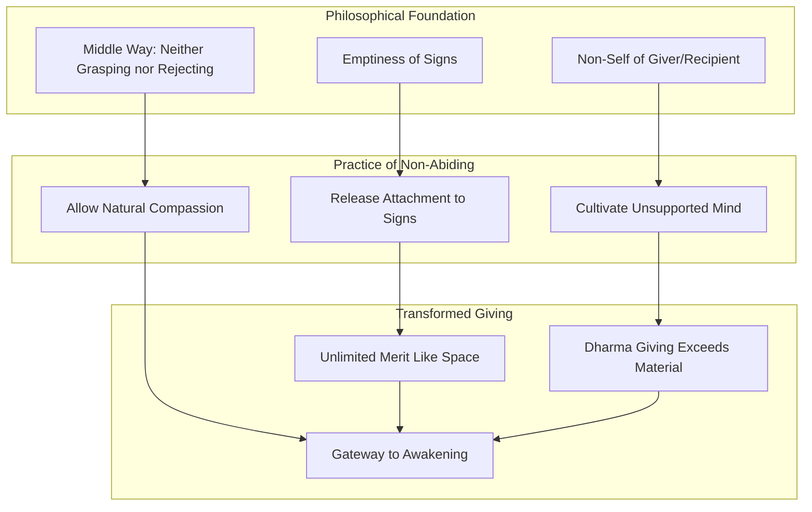

This diagram shows how the philosophical foundations of emptiness, non-self, and the middle way support the practice of releasing attachment, cultivating the unsupported mind, and allowing natural compassion. These practices in turn generate the results of unlimited merit, the superiority of Dharma giving, and ultimately serve as a gateway to awakening.

In summary, the Diamond Sutra's teaching on non-abiding giving transforms the ordinary practice of generosity into **a direct path to awakening**. By releasing attachment to the signs of giver, recipient, and gift, practitioners discover that giving naturally expresses the unlimited wisdom and compassion that is the heart of the bodhisattva path. The merit of such giving is immeasurable not because it accumulates a larger quantity of spiritual reward but because it participates in the boundless nature of emptiness itself. This teaching provides both the philosophical understanding and the practical methods for integrating the Diamond Sutra's wisdom into every act of generosity, transforming daily life into an ongoing expression of awakened activity.

## 5 The Nature of the Tathāgata and Ultimate Reality

This chapter investigates the Diamond Sutra's profound teachings on the nature of the Buddha and ultimate reality, examining why the Tathāgata transcends physical perception and cannot be recognized through bodily marks or the thirty-two characteristics. Building upon the philosophical foundations of emptiness and non-self established in Chapter 3 and the practice of non-abiding explored in Chapter 4, this chapter analyzes the meaning of 'Tathāgata' as 'suchness' (tathatā), explores the paradox that no dharma exists by which enlightenment is attained, investigates the five eyes of the Buddha as progressive modes of awakened perception, and examines the nature of the dharma-body (dharmakāya) as the Buddha's ultimate mode of being.

### 5.1 Beyond Physical Marks: Why the Tathāgata Cannot Be Perceived Through Bodily Characteristics

The Diamond Sutra repeatedly returns to a question that initially seems straightforward yet reveals profound depths upon examination: **Can the Buddha be recognized through physical characteristics?** The sutra's answer—an emphatic and carefully reasoned "no"—constitutes one of its most important teachings, dismantling ordinary assumptions about the nature of awakened beings and pointing toward a radically different understanding of what it means to encounter the Buddha.

#### The Buddha's Direct Teaching on Physical Marks

The sutra presents this teaching through a direct question from the Buddha to Subhuti: **"What do you think, Subhuti? Is it possible to grasp the Tathāgata by means of bodily signs?"** Subhuti's response demonstrates his understanding: "No, World-Honored One. When the Tathāgata speaks of bodily signs, there are no signs being talked about."[^29] This exchange establishes the fundamental principle that the Buddha's true nature cannot be apprehended through physical perception.

The Buddha elaborates: **"Everything with form is unreal; if all forms are seen as unreal, the Tathāgata will be perceived."**[^29] This paradoxical statement reveals that perceiving the Tathāgata requires seeing through the apparent solidity of form rather than grasping at it. The Buddha is not encountered by looking at physical characteristics but by recognizing the empty nature of all phenomena, including the Buddha's own physical appearance.

#### The Thirty-Two Marks and Their Emptiness

Traditional Buddhist teachings describe the Buddha as possessing thirty-two major physical marks (*lakṣaṇa*) of a great being—characteristics such as golden-colored skin, webbed fingers, a protuberance on the crown of the head, and wheels on the soles of the feet. These marks were understood in earlier Buddhist literature as signs of a mahāpuruṣa (great person) who would become either a universal monarch or a fully awakened buddha. The Diamond Sutra directly addresses these marks:

**"What do you think, Subhuti? Can the Tathāgata be recognized by the possession of the thirty-two marks?"** The Venerable Subhuti replied, "No, World-Honored One. Why? Because what the Tathāgata calls the thirty-two marks are not essentially marks and that is why the Tathāgata calls them the thirty-two marks."[^30]

This teaching applies the sutra's characteristic logical formula: the thirty-two marks are called thirty-two marks precisely because they lack inherent mark-nature. The marks exist conventionally but are empty of the substantial existence we ordinarily attribute to them. **A tathāgata cannot be perceived by means of the thirty-two physical characteristics of a great man because the Tathāgata has explained that these characteristics in fact lack any characteristics.**[^31]

The following table summarizes the sutra's treatment of physical marks:

| Traditional Understanding | Diamond Sutra's Teaching | Implication |
|--------------------------|-------------------------|-------------|
| The 32 marks identify a Buddha | The 32 marks lack inherent mark-nature | Physical characteristics cannot establish identity |
| Seeing the marks means seeing the Buddha | Seeing the marks as empty reveals the Buddha | Recognition requires wisdom, not perception |
| The marks are special and sacred | The marks are conventional designations | No phenomenon is inherently special |
| The Buddha's body is extraordinary | The Buddha's body is empty like all phenomena | Awakening is not a physical transformation |

#### The Warning Against Seeking the Buddha Through Form or Sound

The sutra issues an explicit warning against the mistaken approach of seeking the Buddha through sensory experience. In one of its most memorable verses, the Buddha declares:

**"Those who saw me by means of my physical form and followed me by means of my voice have made the wrong kind of effort. Those people will not see me."**[^31]

Another translation renders this teaching:

**"Someone who looks for me in form or seeks me in sound is on a mistaken path and cannot see the Tathāgata."**[^30]

This warning is remarkable in its directness. The Buddha is not merely suggesting that physical perception is insufficient for recognizing him—he is stating that **relying on form and sound actively prevents seeing the Tathāgata**. The "wrong kind of effort" involves directing attention toward phenomena that, by their very nature, cannot reveal what the practitioner seeks.

The logic underlying this warning connects to the sutra's broader philosophical framework. If the Buddha could be recognized through physical marks, then the marks would possess inherent "Buddha-revealing" nature. But no phenomenon possesses inherent nature of any kind. **The Tathāgata has explained that the possession of physical characteristics in fact lacks any possession of physical characteristics. That is how he uses the phrase, 'the possession of physical characteristics.'**[^31] Seeking the Buddha through form is therefore not merely ineffective but fundamentally misconceived.

#### The Universal Monarch Counterexample

The sutra employs a striking counterexample to demonstrate why physical marks cannot identify the Buddha. When Subhuti initially suggests that the thirty-two marks might be used to meditate on the Tathāgata, the Buddha responds:

**"If you say that you can use the thirty-two marks to see the Tathāgata, then the Cakravartin is also a Tathāgata?"**[^30]

A Cakravartin (wheel-turning monarch) is a universal king who also possesses the thirty-two marks. If these marks were sufficient to identify a Buddha, then every universal monarch would be a Buddha—an obviously false conclusion. This reductio ad absurdum demonstrates that **physical characteristics, no matter how special or numerous, cannot establish the identity of an awakened being**. The difference between a Buddha and a universal monarch lies not in their physical appearance but in their realization of ultimate reality.

Subhuti immediately grasps the point: "World-Honored One, I understand your teaching. One should not use the thirty-two marks to meditate on the Tathāgata."[^30] This exchange illustrates the sutra's pedagogical method—using apparent contradictions to dissolve conceptual attachments and point toward a deeper understanding.

#### What the Negation of Physical Marks Reveals

The sutra's negation of physical marks is not nihilistic denial but a **pointing-out instruction** that directs attention toward the Buddha's true nature. By systematically demonstrating that the Buddha cannot be found in physical form, the sutra clears away the obstacles that prevent recognition of what the Buddha actually is.

The teaching reveals several crucial insights:

**First**, the Buddha's identity does not depend on physical characteristics. This means that buddhahood is not a particular configuration of matter but a mode of being that transcends physical description. The Buddha's awakening did not transform his body into something ontologically special; rather, it revealed the awakened nature that was always present.

**Second**, attachment to the Buddha's physical form constitutes a subtle form of the very grasping that the Buddha's teaching aims to dissolve. If practitioners become attached to the Buddha's appearance, they replicate the same pattern of attachment to form that creates suffering in ordinary life. **The Buddha did not awake to unsurpassed, perfect awakening by means of the physical characteristics he possesses.**[^31]

**Third**, the negation points toward the Buddha's true body—the dharma-body (dharmakāya)—which will be examined in detail in section 5.5. The sutra teaches: **"A buddha should be seen from the Dharma, a tathāgata has a Dharma-body."**[^31] By demonstrating that the Buddha cannot be seen through physical form, the sutra redirects attention toward the Dharma as the Buddha's true mode of being.

#### Practical Implications of This Teaching

Understanding why the Buddha cannot be perceived through physical marks has profound practical implications for how practitioners relate to Buddhist teachings, teachers, and their own awakening:

- **Images and statues** of the Buddha serve as skillful means for devotion and contemplation but should not be mistaken for the Buddha himself. The Buddha is not more present in a statue than in any other phenomenon.

- **Living teachers** may display various qualities, but their physical appearance or charisma does not establish their realization. Awakening is recognized through wisdom and compassion, not through physical characteristics.

- **One's own awakening** does not depend on acquiring special physical marks or experiences. The Buddha-nature is already present and does not require physical transformation to be realized.

- **The Dharma itself** becomes the primary means of encountering the Buddha. By understanding and practicing the teachings, one encounters the Buddha more directly than through any physical perception.

The sutra's teaching on physical marks thus serves both a negative and positive function: it **removes the obstacle of attachment to form** while simultaneously **pointing toward the Buddha's true nature** as the Dharma itself. This prepares the ground for understanding the Tathāgata as suchness, which the following section explores.

### 5.2 Tathāgata as Suchness: The Meaning of 'Thus-Come' and 'Thus-Gone'

Having established that the Buddha cannot be recognized through physical characteristics, the Diamond Sutra proceeds to reveal what the term "Tathāgata" actually means. This teaching constitutes one of the sutra's most profound philosophical contributions, transforming the understanding of buddhahood from a designation for a particular being to an expression of **the suchness (tathatā) of all reality**.

#### The Etymological and Philosophical Significance of 'Tathāgata'

The Sanskrit term "Tathāgata" can be parsed in two ways: *tathā-gata* ("thus-gone") or *tathā-āgata* ("thus-come"). Both interpretations have been used throughout Buddhist history to describe the Buddha as one who has "come" or "gone" in accordance with suchness—reality as it truly is. The Diamond Sutra, however, offers a more radical interpretation that transcends both coming and going:

**"Subhuti, if someone says that the World-Honored One comes, goes, sits, and lies down, that person has not understood what I have said. Why? The meaning of Tathāgata is 'does not come from anywhere and does not go anywhere.' That is why he is called a Tathāgata."**[^30]

This teaching dissolves the ordinary understanding of the Buddha as a being who travels through space and time. **A tathāgata has not come from or gone anywhere**—the very concepts of coming and going do not apply to the Buddha's ultimate nature.[^31] The term "Tathāgata" thus points not to a person who moves through the world but to the nature of reality itself, which neither comes into being nor passes away.

#### Tathāgata Means the Suchness of All Things

The sutra provides an explicit definition: **"Tathāgata means the suchness of all things (dharmas)."**[^30] This statement identifies the Buddha not as a particular being but as **the way things actually are**—their suchness or tathatā. The Buddha is not separate from reality; the Buddha is the awakened recognition of reality's true nature.

Another passage elaborates: **"'Tathāgata' means 'reality.'"**[^31] This identification has profound implications. If Tathāgata means reality, then:

- The Buddha is not a being who exists separately from the world
- Encountering the Buddha means recognizing reality as it is
- The Buddha is present wherever reality is present—which is everywhere
- Awakening is not acquiring something new but recognizing what has always been the case

The sutra warns against misunderstanding this teaching: **"Someone would be mistaken to say that the Tathāgata has attained the highest, most fulfilled, awakened mind since there is not any highest, most fulfilled, awakened mind to be attained."**[^30] If the Tathāgata is suchness itself, then there is nothing for the Tathāgata to attain—suchness does not need to acquire suchness.

#### The Non-Dual Nature of Awakened Reality

The teaching that the Tathāgata neither comes nor goes reveals the **non-dual nature of awakened reality**. In ordinary experience, we perceive beings as coming into existence, remaining for a time, and then passing away. This perception depends on the conceptual framework of time, space, and substantial existence. The Diamond Sutra's teaching dissolves this framework:

**"Because there is no phenomenon of awakening, the prediction was made. 'Tathāgata' means 'reality.' Saying the Tathāgata awoke to awakening is false, as there is no such phenomenon."**[^31]

This passage might seem to deny the Buddha's awakening, but its actual meaning is more subtle. The Buddha's awakening is real at the conventional level—Siddhārtha Gautama did sit under the Bodhi tree and did realize the truth of dependent origination. However, at the ultimate level, **there is no independently existing phenomenon called "awakening" that a separately existing being called "the Buddha" acquired**. The awakening was the recognition that reality has always been the way it is—hence there was nothing to acquire and no one separate from reality to acquire it.

The following diagram illustrates the relationship between conventional and ultimate understandings of the Tathāgata:

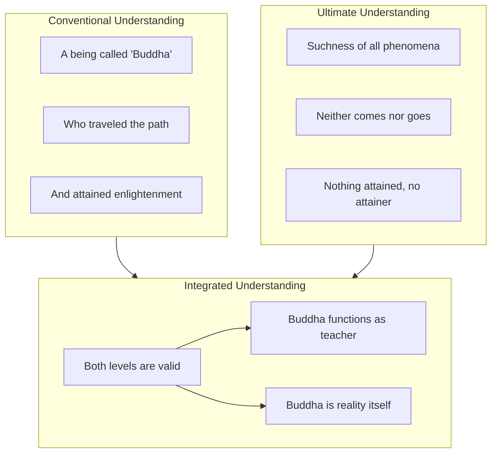

This diagram shows how the conventional understanding of the Buddha as a being who attained enlightenment and the ultimate understanding of the Tathāgata as suchness are both valid within their respective frameworks. The integrated understanding holds both perspectives simultaneously.

#### Preserving the Buddha's Function While Dissolving Conceptual Distinctions

A potential misunderstanding must be addressed: if the Tathāgata is simply suchness, does this mean there is no difference between the Buddha and a rock, or between an awakened being and an ordinary person? The Diamond Sutra's teaching is more nuanced.

At the ultimate level, all phenomena share the same nature—they are all empty of inherent existence, all expressions of suchness. In this sense, **the Buddha is not ontologically different from any other phenomenon**. However, at the conventional level, the Buddha functions uniquely as a teacher who guides beings toward awakening. The sutra preserves this functional distinction:

**"The Tathāgata is one who speaks of things as they are, speaks what is true, and speaks in accord with reality. He does not speak deceptively or to please people."**[^30]

The Buddha's unique function is to **speak truly about the nature of reality**—to point out what has always been the case but remains unrecognized by ordinary beings. This function does not require the Buddha to be a substantially different kind of being; it requires only that the Buddha has recognized suchness and can skillfully communicate this recognition to others.

The teaching thus dissolves the conceptual distinction between the Buddha and ordinary phenomena while preserving the Buddha's **conventional function as teacher and guide**. The Buddha is not special because of possessing a different kind of existence but because of having recognized the nature of existence that all beings share.

#### The Significance for Understanding Awakening

The identification of Tathāgata with suchness has profound implications for understanding what awakening means and how it is realized:

**First**, awakening is not acquiring a special state but recognizing what has always been true. The suchness that the Buddha recognized is the same suchness that characterizes all phenomena right now. Practitioners do not need to create awakening; they need to recognize it.

**Second**, the Buddha is not distant or inaccessible. If the Tathāgata is suchness, and suchness is the nature of all phenomena, then **the Buddha is present in every moment of experience**. The practice is not to reach the Buddha but to recognize the Buddha that is already here.

**Third**, the teaching prevents practitioners from creating a new object of attachment. If the Buddha were a substantially existing being who possessed awakening as a property, practitioners might become attached to acquiring this property. By identifying the Tathāgata with suchness itself, the sutra dissolves the very framework within which such attachment could arise.

**Fourth**, the teaching establishes the basis for the Mahāyāna understanding that all beings possess buddha-nature. If the Tathāgata is suchness, and all phenomena are characterized by suchness, then **all beings are already expressions of buddha-nature**. Awakening is recognizing this nature, not creating it.

The sutra summarizes: **"In the awakened Dharma, there is no truth or deception."**[^31] The Dharma to which the Buddha awakened is not a special truth hidden from ordinary experience; it is the nature of experience itself. Awakening reveals that there never was anything to hide and no one from whom it was hidden.

### 5.3 The Paradox of Attainment: No Dharma by Which Enlightenment Is Realized

The Diamond Sutra presents one of its most challenging teachings in its treatment of enlightenment itself: **there is no independently existing dharma called "unsurpassed perfect awakening" (anuttarā-samyak-saṃbodhi) that the Tathāgata has attained**. This paradoxical teaching prevents the reification of enlightenment as a graspable object while simultaneously affirming the reality of the Buddha's awakening. Understanding this paradox is essential for grasping the sutra's vision of the Buddhist path.

#### The Buddha's Statement on Non-Attainment

The sutra presents this teaching through a direct exchange between the Buddha and Subhuti:

**"What do you think, Subhuti? In ancient times when the Tathāgata practiced under Buddha Dīpaṃkara, did he attain anything?" Subhuti answered, "No, World-Honored One. In ancient times when the Tathāgata was practicing under Buddha Dīpaṃkara, he did not attain anything."**[^30]

This statement is remarkable. According to traditional accounts, it was under Buddha Dīpaṃkara that the future Śākyamuni Buddha received the prediction (*vyākaraṇa*) that he would become a buddha. Yet the sutra states that at this pivotal moment, **nothing was attained**. The Buddha elaborates:

**"There is no independently existing object of mind called the highest, most fulfilled, awakened mind."**[^30]

And further:

**"Regarding the highest, most fulfilled, awakened mind, I have not attained anything. That is why it is called the highest, most fulfilled, awakened mind."**[^30]

This teaching applies the sutra's characteristic logical formula to enlightenment itself: awakening is called awakening precisely because there is no independently existing thing called awakening to be attained.

#### Why the Prediction Required Non-Attainment

The sutra provides a crucial clarification of the relationship between non-attainment and the Buddha's prediction:

**"Because if there had been any such thing, Buddha Dīpaṃkara would not have predicted of me, 'In the future, you will come to be a Buddha called Śākyamuni.' This prediction was made because there is, in fact, nothing that can be attained that is called the highest, most fulfilled, awakened mind."**[^30]

This passage reveals a profound logic: **the prediction was possible precisely because there was nothing to attain**. If enlightenment were a substantial thing that needed to be acquired, the prediction would have been premature—the future Buddha had not yet acquired it. But because enlightenment is not a thing to be acquired, the prediction could be made based on the recognition of what was already present.

Another translation expresses this: **"If there were any such thing, Buddha Dīpaṃkara would not have predicted his awakening as Buddha Śākyamuni. Because there is no phenomenon of awakening, the prediction was made."**[^31] The absence of a graspable phenomenon called "awakening" is not an obstacle to awakening but its very condition.

#### Neither Graspable Nor Elusive

The sutra further characterizes the nature of awakening:

**"The highest, most fulfilled, awakened mind that the Tathāgata has attained is neither graspable nor elusive."**[^30]

This formulation navigates between two extremes:

| Extreme | Description | Problem |
|---------|-------------|---------|
| **Graspable** | Enlightenment as a thing to be acquired | Creates attachment; makes awakening into another object of craving |
| **Elusive** | Enlightenment as something that escapes or withdraws | Creates frustration; makes awakening seem impossibly distant |

The Diamond Sutra's teaching avoids both extremes. Awakening is not graspable because it is not a thing with inherent existence that can be possessed. Yet it is not elusive because it is not hiding or withdrawing—it is the very nature of experience, present in every moment.

The sutra explains: **"In the Dharma he awakened to, there is no truth and no falsehood."**[^31] This statement might seem to undermine the value of awakening, but its actual meaning is that awakening transcends the conceptual categories we ordinarily apply. It is not "true" in the sense of being a correct proposition about an external reality, nor "false" in the sense of being a mistaken belief. It is the direct recognition of how things are, prior to the overlay of conceptual judgment.

#### Neither a Phenomenon Nor the Absence of a Phenomenon

The sutra provides yet another characterization of awakening:

**"The Dharma the Tathāgata taught is ungraspable, ineffable, and neither a phenomenon nor the absence of a phenomenon, because Noble Ones arise from the unconditioned."**[^31]

This teaching prevents two complementary errors:

**Error 1: Treating awakening as a phenomenon (dharma)**
If awakening were a phenomenon, it would be conditioned, impermanent, and empty—just like all other phenomena. It would arise, remain for a time, and pass away. This would mean that awakening could be lost, which contradicts the Buddhist understanding of irreversible awakening.

**Error 2: Treating awakening as the absence of phenomena (adharma)**
If awakening were simply the absence of phenomena, it would be a kind of nothingness or void. This would make awakening a form of nihilism—the elimination of experience rather than its transformation.

The sutra's teaching navigates between these errors by locating awakening in **the unconditioned**. The unconditioned is not a phenomenon that arises and passes away, nor is it the mere absence of phenomena. It is the nature of phenomena themselves when recognized without the overlay of conceptual elaboration.

#### The Practical Significance of Non-Attainment

Understanding the paradox of non-attainment has crucial practical implications:

**First**, it prevents practitioners from creating a new object of attachment. The desire for enlightenment can become as much of an obstacle as any other desire. By teaching that there is nothing to attain, the sutra dissolves the very framework within which spiritual craving could arise.

**Second**, it reveals that awakening is not distant or future. If awakening were a thing to be acquired, it would be separate from the practitioner until the moment of acquisition. But if awakening is not a thing, then it is not separate—it is the nature of the practitioner's own experience, already present but unrecognized.

**Third**, it transforms the understanding of the path. The Buddhist path is not a journey from a place without awakening to a place with awakening. It is the progressive dissolution of the obscurations that prevent recognition of what has always been the case.

**Fourth**, it establishes the equality of all buddhas. The sutra teaches: **"All of the buddhas and all of their teachings of peerless perfect enlightenment spring forth from this sūtra."**[^30] If awakening were a thing that different buddhas possessed to different degrees, there would be a hierarchy among buddhas. But because awakening is not a thing, all buddhas are equal in their recognition of suchness.

The sutra summarizes: **"This is why the Tathāgata has said, 'All dharmas are Buddhadharma.' What are called all dharmas are, in fact, not all dharmas. That is why they are called all dharmas."**[^30] All phenomena are the Buddha's teaching precisely because all phenomena are empty of inherent existence. The recognition of this emptiness is awakening, and it is available in every moment of experience.

### 5.4 The Five Eyes of the Buddha: Progressive Modes of Awakened Perception

The Diamond Sutra introduces the teaching of the Buddha's five eyes (*pañca-cakṣu*) as a way of understanding the progressive refinement of perception that characterizes awakened awareness. These five eyes—the physical eye, heavenly eye, wisdom eye, dharma eye, and buddha eye—represent not five separate organs but **five modes of perception that together constitute the Buddha's complete understanding of reality**.

#### The Buddha's Confirmation of the Five Eyes

The sutra presents this teaching through a series of questions:

**"Subhuti, what do you think? Does the Tathāgata have the human eye?" Subhuti replied, "Yes, World-Honored One, the Tathāgata does have the human eye." The Buddha asked, "Subhuti, what do you think? Does the Tathāgata have the divine eye?" Subhuti said, "Yes, World-Honored One, the Tathāgata does have the divine eye." "Subhuti, what do you think? Does the Tathāgata have the eye of insight?" Subhuti replied, "Yes, World-Honored One, the Tathāgata does have the eye of insight." "Subhuti, what do you think? Does the Tathāgata have the eye of transcendent wisdom?" "Yes, World-Honored One, the Tathāgata does have the eye of transcendent wisdom." The Buddha asked, "Does the Tathāgata have the Buddha eye?" "Yes, World-Honored One, the Tathāgata does have the Buddha eye."**[^30]

This confirmation establishes that the Buddha possesses all five modes of perception simultaneously. The five eyes are not mutually exclusive alternatives but **complementary aspects of awakened awareness**.

#### The Nature and Function of Each Eye

Traditional Buddhist teaching, as elaborated in texts such as the Large Sutra on Perfect Wisdom, describes each eye in detail:[^32]

**1. The Physical Eye (māṃsa-cakṣu / 肉眼)**

The physical eye sees the colors and forms of the physical world. It represents **ordinary sensory perception** perfected and extended. Even microscopes and telescopes that augment human vision do not go beyond what Buddhism means by the physical eye—they still perceive physical forms.[^32] This eye corresponds to our everyday experience of seeing the world around us, but in the Buddha's case, it is purified of the distortions introduced by attachment and aversion.

**2. The Heavenly Eye (divya-cakṣu / 天眼)**

The heavenly eye perceives beyond the limitations of ordinary physical vision. It **wisely knows the decease and rebirth of all beings** in countless world systems.[^32] This eye corresponds to the fifth of the six supernatural powers and enables understanding of the karmic patterns that govern the arising and passing of beings. It sees the world conceptually, understanding phenomena within the context of causes and conditions.[^33]

**3. The Wisdom Eye (prajñā-cakṣu / 慧眼)**

The wisdom eye is the eye of emptiness. Paradoxically, **a bodhisattva endowed with the wisdom eye does not wisely know any dharma—be it conditioned or unconditioned, wholesome or unwholesome**.[^32] This eye sees that there is nothing to see—it recognizes the emptiness of all phenomena. It **uproots attachment and aversion by seeing that ultimately there are no subjects or objects with any independent fixed self-natures**.[^32]

**4. The Dharma Eye (dharma-cakṣu / 法眼)**

The dharma eye recognizes phenomena as provisionally existent while seeing their ultimate emptiness. It **knows the spiritual progress of all beings**, discerning their capacities and needs.[^32] While the wisdom eye might seem to dismiss phenomena as merely empty, the dharma eye **corrects this tendency by seeing that things do nevertheless arise and cease in accord with causes and conditions**.[^32] This eye enables bodhisattvas and buddhas to determine the most skillful means of assisting beings.

**5. The Buddha Eye (buddha-cakṣu / 佛眼)**

The buddha eye represents **the fullest realization of complete awakening**. It encompasses the ten powers, four fearlessnesses, eighteen unique properties, great compassion, and all other attributes of buddhahood.[^32] This eye **does not meet with anything that is not seen, heard, known, or discerned—in all its modes**.[^32] It integrates all four previous eyes into a unified awareness that knows all things fully in all their aspects.

The following table summarizes the five eyes:

| Eye | Sanskrit | What It Perceives | Function |
|-----|----------|------------------|----------|
| Physical Eye | māṃsa-cakṣu | Forms and colors | Ordinary perception perfected |
| Heavenly Eye | divya-cakṣu | Karmic patterns, rebirth | Understanding causes and conditions |
| Wisdom Eye | prajñā-cakṣu | Emptiness of all phenomena | Uprooting attachment through seeing no self-nature |
| Dharma Eye | dharma-cakṣu | Provisional existence, beings' capacities | Skillful means for helping beings |
| Buddha Eye | buddha-cakṣu | All things in all aspects | Complete awakened awareness |

#### The Integration of Emptiness and Provisional Existence

The relationship between the wisdom eye and the dharma eye is particularly significant for understanding the Diamond Sutra's teaching. The wisdom eye recognizes emptiness—the absence of inherent existence in all phenomena. This recognition might seem to lead to nihilism or indifference: if nothing truly exists, why engage with the world at all?

The dharma eye provides the answer. While seeing the emptiness of all things, it simultaneously **recognizes their provisional existence and engages compassionately with beings based on their actual conditions and needs**.[^32] The dharma eye prevents the wisdom eye from becoming one-sided by maintaining engagement with the conventional world.

This integration reflects the Diamond Sutra's broader teaching on the Middle Way. The wisdom eye prevents eternalism (grasping at phenomena as truly existent); the dharma eye prevents nihilism (dismissing phenomena as merely empty). Together, they enable the **compassionate activity that characterizes bodhisattva practice**.

#### The Buddha Eye as Non-Dual Awareness

The buddha eye is not simply the sum of the previous four eyes but their **integration into a non-dual awareness** that transcends the limitations of each individual eye while encompassing all their functions. The Buddha eye:

- Sees forms without attachment to forms
- Understands karmic patterns without being bound by them
- Recognizes emptiness without falling into nihilism
- Discerns beings' needs without creating conceptual separation

This integration is described as **"non-dual awareness, non-separation which contains the other four"**.[^33] The buddha eye is not a special organ added to the other four but the mode of awareness that arises when all four function harmoniously without obstruction.

The teaching on the five eyes can be understood as **facets of practice rather than stages of development**. While they may be cultivated progressively, the buddha eye is not something achieved after mastering the other four—it is the natural state of awareness when conceptual obscurations are removed.[^33]

#### The Buddha's Knowledge of All Minds

The sutra connects the teaching on the five eyes to the Buddha's knowledge of beings' minds:

**"Subhuti, however many living beings there are in all these Buddha lands, though they each have a different mentality, the Tathāgata understands them all. Why is that? Subhuti, what the Tathāgata calls different mentalities are not in fact different mentalities. That is why they are called different mentalities."**[^30]

This passage applies the sutra's characteristic logic to the Buddha's omniscience. The Buddha knows all minds, yet what he knows are not substantial, independently existing minds. The "different mentalities" are empty of inherent existence—they are conventional designations for the flow of mental events arising from causes and conditions.

The sutra then adds a crucial teaching: **"Why? Subhuti, the past mind cannot be grasped, neither can the present mind or the future mind."**[^30] This statement reveals that even the Buddha's knowledge of minds is not knowledge of graspable objects. The minds that the Buddha knows are ungraspable—they do not exist as fixed entities that could be grasped. The Buddha's knowledge is therefore not the acquisition of information about substantial objects but the direct recognition of the empty, flowing nature of mental experience.

#### Practical Implications of the Five Eyes Teaching

Understanding the five eyes has practical significance for practitioners:

**First**, it reveals that awakening involves a transformation of perception, not merely a change in beliefs. The Buddha does not simply hold correct opinions about reality; the Buddha **sees reality directly** through purified perception.

**Second**, it suggests a path of progressive refinement. Practitioners can cultivate each eye through appropriate practices—developing the physical eye through mindful attention, the heavenly eye through understanding karma, the wisdom eye through insight meditation, and the dharma eye through compassionate engagement.

**Third**, it demonstrates that awakening does not require abandoning ordinary perception. The Buddha retains the physical eye while also possessing the other four. Awakening **transforms and integrates ordinary perception rather than replacing it**.

**Fourth**, it reveals the relationship between wisdom and compassion. The wisdom eye alone might lead to detachment; the dharma eye ensures that wisdom manifests as skillful, compassionate engagement with beings.

### 5.5 Dharmakāya and the Buddha's Ultimate Nature: Reality as the Buddha's True Body

The Diamond Sutra's teaching on the dharma-body (*dharmakāya*) represents the culmination of its investigation into the Buddha's nature. Having established that the Buddha cannot be perceived through physical marks and that the Tathāgata is suchness itself, the sutra now reveals that **the Buddha's true body is the Dharma itself**—not a physical form but reality as it truly is.

#### The Buddha Should Be Seen from the Dharma

The sutra provides explicit instruction on how the Buddha should be perceived:

**"A buddha should be seen from the Dharma, a tathāgata has a Dharma-body. Yet, the nature of the Dharma is unknowable. It cannot be known."**[^31]

This teaching transforms the understanding of what it means to encounter the Buddha. The Buddha is not encountered through physical perception but through **understanding and practicing the Dharma**. The Dharma-body is not a subtle physical form hidden behind the gross physical body; it is the Buddha's identity with the truth of reality itself.

The statement that "the nature of the Dharma is unknowable" might seem to contradict the goal of awakening. However, "unknowable" here means **not graspable as a conceptual object**. The Dharma cannot be known in the way that ordinary objects are known—through subject-object duality where a knower acquires information about something known. The Dharma is known by becoming one with it, by recognizing that there never was a separation between the knower and the known.

#### The Three Bodies of the Buddha

The teaching on the dharma-body is best understood within the context of the Mahāyāna doctrine of the three bodies (*trikāya*) of the Buddha:[^32]

**1. The Transformation Body (nirmāṇakāya)**

The transformation body is the Buddha as a historical person—Siddhārtha Gautama who was born, achieved awakening, taught for forty-five years, and passed into parinirvāṇa. This body is subject to the conditions of physical existence: birth, aging, sickness, and death.

**2. The Enjoyment Body (saṃbhogakāya)**

The enjoyment body is an idealized buddha residing in a pure land, embodying all the meritorious qualities of awakening. This body is perceived by advanced bodhisattvas and represents the bliss and radiance of awakened awareness.

**3. The Dharma Body (dharmakāya)**

The dharma body is the Buddha's identity with ultimate reality itself. It is not a body in the ordinary sense but **the true nature of reality recognized and embodied by an awakened being**.

The Diamond Sutra's teaching focuses primarily on the dharma-body, revealing that this is the Buddha's ultimate mode of being. The transformation body and enjoyment body are not separate from the dharma-body but are its expressions in conventional reality.

#### The Unity of the Three Bodies

The T'ien-t'ai and Nichiren traditions interpret the Diamond Sutra's teaching as revealing that **all three bodies are integral aspects of a single Buddha** rather than three separate buddhas or three separate aspects of one buddha:[^32]

**"When the Buddha's wisdom grasps the ultimate reality, that which is realized is the Dharma body; and the wisdom that realizes it is the recompense body. For the sake of living beings, this wisdom manifests itself in physical form as the human Buddha who teaches in the world; this is the manifested body."**[^32]

This integration means that the historical Buddha is not merely a temporary appearance of an eternal dharma-body but is **equally eternal with it**. The teaching, the teacher, and the teaching activity are all expressions of the same awakened reality.

The practical implication is profound: **we encounter all three bodies of the Buddha in our practice**. The sutra we read is the transformation body; the wisdom we develop is the enjoyment body; the reality we recognize is the dharma body. The Verses for Opening the Sūtra express this: "Expounding is the Buddha's enjoyment-body. Expounded is the Buddha's reality-body. The letters composing this sūtra are the Buddha's transformation-body."[^32]

#### Dharma-Body as the Nature of All Phenomena

The identification of the Buddha with the dharma-body has a radical implication: **if the dharma-body is ultimate reality, and ultimate reality is the nature of all phenomena, then all phenomena are expressions of the Buddha**. The sutra states:

**"All dharmas are Buddhadharma."**[^30]

This statement does not mean that all phenomena are Buddhist teachings in the conventional sense. It means that all phenomena, recognized in their true nature as empty of inherent existence, are expressions of the same reality that the Buddha recognized. The Buddha-nature is not something possessed by some beings and not others; it is **the nature of all existence**.

The sutra qualifies this: **"What are called all dharmas are, in fact, not all dharmas. That is why they are called all dharmas."**[^30] This application of the sutra's characteristic logic prevents the teaching from becoming a new form of eternalism. All dharmas are Buddhadharma precisely because all dharmas are empty of inherent dharma-nature. The Buddha is not a substance pervading all things but the recognition that all things are empty of substance.

#### The Paradox of the Unknowable Dharma

The sutra's statement that **"the nature of the Dharma is unknowable"** requires careful interpretation. This does not mean that awakening is impossible or that the Buddha's teaching is ultimately futile. Rather, it points to the **non-conceptual nature of awakened recognition**.

Ordinary knowledge operates through subject-object duality: a knower acquires information about objects. This mode of knowing cannot grasp the dharma-body because:

- The dharma-body is not an object separate from the knower
- The dharma-body is the very nature of the knowing awareness itself
- To "know" the dharma-body would require standing outside it, which is impossible

The dharma-body is therefore known not by acquiring information about it but by **recognizing it as one's own nature**. This recognition is what the sutra calls prajñā—wisdom that is not knowledge about something but direct, non-dual awareness.

The sutra expresses this: **"In the Dharma he awakened to, there is no truth and no falsehood."**[^31] The Dharma is not a proposition that could be true or false; it is the nature of experience prior to conceptual elaboration. Awakening is not accepting a true proposition and rejecting false ones; it is **resting in awareness itself, prior to the arising of propositions**.

#### Transformation of Understanding: From Personal Attainment to Universal Recognition

The Diamond Sutra's teaching on the dharma-body transforms the understanding of buddhahood from a personal attainment to a universal recognition:

**Personal Attainment Model:**
- Buddhahood is a state that some beings achieve and others do not
- The Buddha is a special being who possesses awakening as a property
- Practitioners aim to become buddhas by acquiring what the Buddha has

**Universal Recognition Model:**
- Buddhahood is the recognition of the nature that all beings share
- The Buddha is not a special being but awakened awareness recognizing itself
- Practitioners aim to recognize what has always been present

The Diamond Sutra clearly teaches the second model. The Buddha does not possess awakening as a property that distinguishes him from other beings. Rather, **the Buddha is awakened awareness itself, recognizing its own nature in and as all phenomena**.

This transformation has profound practical implications:

- **Awakening is not distant**: The dharma-body is present in every moment of experience, not in some future attainment
- **Awakening is not exclusive**: The same nature that the Buddha recognized is present in all beings
- **Practice is recognition, not acquisition**: The path involves removing obscurations that prevent recognition, not acquiring something new
- **The Buddha is not separate**: Encountering the Buddha means recognizing the awakened nature of one's own experience

#### The Buddha's Teaching Activity as Dharma-Body Expression

The sutra's teaching on the dharma-body illuminates the nature of the Buddha's teaching activity. When the Buddha teaches, it is not a separate being transmitting information to other separate beings. Rather, **awakened awareness is expressing itself through the conventional forms of teacher, teaching, and student**.

The sutra states: **"The Tathāgata does not think 'I will give a teaching.' Do not think that way. Why? If anyone says that the Tathāgata has something to teach, that person slanders the Buddha because he does not understand what I say. Subhuti, giving a Dharma talk in fact means that no talk is given. This is truly a Dharma talk."**[^30]

This teaching applies the sutra's logic to the Buddha's own activity. A true Dharma talk is one in which no talk is given—not because the Buddha is silent, but because the talk is not the transmission of information from one substantial being to another. The Dharma talk is the dharma-body expressing itself, awakened awareness pointing to itself through the conventional medium of language.

The sutra summarizes the Buddha's teaching activity: **"The Tathāgata speaks truthfully, yet in the Dharma he awakened to, there is no truth and no falsehood."**[^31] The Buddha speaks truthfully at the conventional level—the teachings are accurate descriptions of how things are. Yet at the ultimate level, there is neither truth nor falsehood because there is no conceptual framework within which these categories apply. The Buddha's teaching is therefore **simultaneously conventional instruction and direct pointing to the unconceptualizable nature of reality**.

#### Synthesis: The Buddha as Reality Recognizing Itself

The Diamond Sutra's teaching on the nature of the Tathāgata and ultimate reality can be synthesized as follows:

**The Buddha cannot be perceived through physical marks** because the Buddha's nature is not physical. Physical characteristics are empty of inherent existence and cannot establish the identity of an awakened being.

**The Tathāgata is suchness**—the way things actually are. The Buddha is not a being separate from reality who has discovered truths about it; the Buddha is reality itself recognizing its own nature.

**There is no dharma by which enlightenment is attained** because enlightenment is not a thing to be acquired. It is the recognition of what has always been the case—the empty, interdependent nature of all phenomena.

**The five eyes represent progressive modes of awakened perception** that together constitute the Buddha's complete understanding. The buddha eye integrates all perspectives into a unified awareness that knows all things in all their aspects.

**The dharma-body is the Buddha's ultimate nature**—not a subtle form but reality itself. The Buddha should be seen from the Dharma, and the Dharma is the nature of all phenomena recognized without conceptual overlay.

These teachings together reveal that **the Buddha is not fundamentally different from ordinary beings or ordinary phenomena**. What distinguishes the Buddha is recognition—the clear seeing of what has always been true. This recognition is available to all beings because all beings share the same nature that the Buddha recognized.

The following diagram illustrates the relationship between the chapter's key concepts:

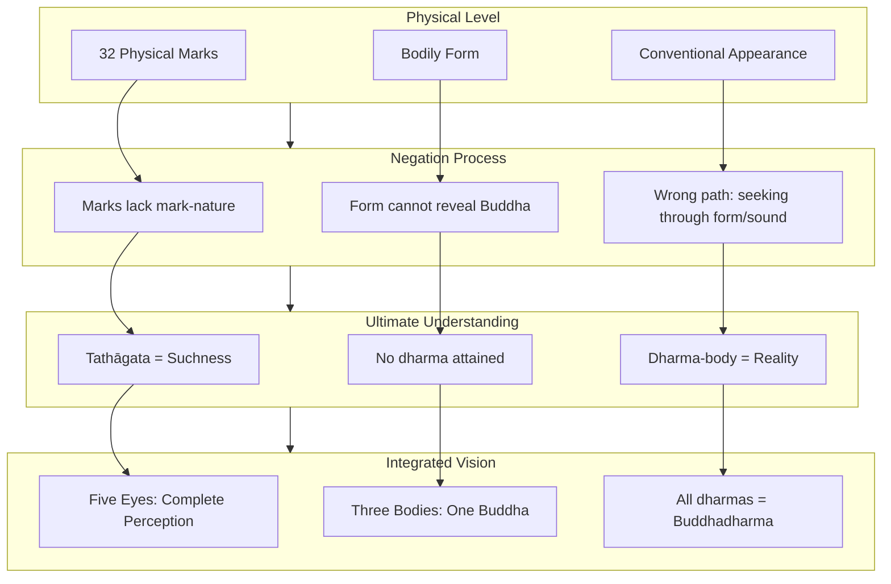

This diagram shows the progressive movement from physical understanding (the Buddha as a being with special marks) through negation (recognizing that marks cannot reveal the Buddha) to ultimate understanding (the Buddha as suchness, non-attainment, and dharma-body) and finally to integrated vision (the five eyes, three bodies, and recognition that all dharmas are Buddhadharma).

In summary, the Diamond Sutra's teaching on the nature of the Tathāgata and ultimate reality **dissolves ordinary assumptions about what the Buddha is while pointing toward a profound recognition**: the Buddha is not a being who possesses awakening but awakened awareness itself, recognizing its own nature in and as all phenomena. This recognition is the dharma-body—the Buddha's true body that is neither physical nor non-physical, neither graspable nor elusive, but the very nature of reality itself. Understanding this teaching transforms the practitioner's relationship to the Buddhist path, revealing that **awakening is not a distant goal to be achieved but the ever-present nature of experience waiting to be recognized**.

## 6 The Culminating Verse: Phenomena as Dreams and Illusions

This chapter provides deep analysis of the Diamond Sutra's famous concluding verse (Section 32), which compares all conditioned phenomena to dreams, illusions, bubbles, shadows, dew drops, and lightning. Building upon the philosophical foundations of emptiness and non-self established in previous chapters, this chapter explores the epistemological and ontological implications of these six metaphors, examines how this verse synthesizes the sutra's core teachings on the nature of reality, and investigates its function as both a contemplative practice tool and a summary statement of prajñāpāramitā wisdom.

### 6.1 The Six Metaphors: Textual Variants and Interpretive Traditions

The Diamond Sutra concludes with a **poetic crystallization of its entire teaching**—a four-line verse (gāthā) that has been memorized, chanted, and contemplated by countless practitioners across Buddhist Asia for over fifteen centuries. This concluding verse employs vivid metaphors drawn from everyday experience to convey the profound truth about the nature of conditioned phenomena, offering practitioners a memorable formulation that encapsulates the sutra's wisdom in accessible imagery.

#### The Chinese Version: Kumārajīva's Rendering

The most widely known and recited version of this verse comes from **Kumārajīva's 401 CE Chinese translation**, which has become the standard text for devotional practice throughout East Asia. The Chinese text reads:

> **一切有為法，如夢幻泡影；如露亦如電，應作如是觀。**

This verse has been translated into English as: **"All conditioned phenomena are like a dream, an illusion, a bubble, a shadow, like dew or a flash of lightning; thus we shall perceive them."**[^1] Another translation from the Fo Guang Shan tradition renders it: **"All conditioned phenomena are like dreams, illusions, bubbles, shadows; like dew and lightning. One should contemplate them in this way."**[^34]

Kumārajīva's version employs **six primary metaphors**: dream (夢), illusion (幻), bubble (泡), shadow (影), dew (露), and lightning (電). Each image was carefully selected to illuminate a specific aspect of conditioned existence, and together they form a comprehensive portrait of how phenomena actually exist—appearing vividly yet lacking the substantial permanence we ordinarily attribute to them.

#### The Sanskrit Version: Paul Harrison's Translation

The Sanskrit version of this verse, as translated by Paul Harrison from manuscripts found in Greater Gandhāra, presents a somewhat different arrangement of metaphors:

> **"A shooting star, a clouding of the sight, a lamp, an illusion, a drop of dew, a bubble, a dream, a lightning's flash, a thunder cloud—this is the way one should see the conditioned."**[^1]

This version expands the metaphorical range to include **nine images**: shooting star, clouding of the sight (visual disturbance), lamp, illusion, dew drop, bubble, dream, lightning flash, and thunder cloud. The Sanskrit formulation emphasizes different aspects of impermanence and insubstantiality, with the shooting star and thunder cloud adding cosmic dimensions to the more intimate images of dew and bubbles.

#### Red Pine's Interpretation

Red Pine (Bill Porter), in his influential English translation, offers yet another rendering that emphasizes the fleeting quality of existence:

> **"So you should view this fleeting world—a star at dawn, a bubble in a stream, a flash of lightning in a summer cloud, a flickering lamp, a phantom, and a dream."**[^1]

This translation introduces the **"star at dawn"**—a star visible only briefly before the sun's light overwhelms it—and the **"flickering lamp"** whose flame trembles and will inevitably be extinguished. Red Pine's version highlights the **temporal dimension** of impermanence, emphasizing how quickly phenomena arise and pass away.

#### Comparative Analysis of the Metaphors

The following table presents a comparative analysis of the metaphors across different versions:

| Metaphor | Kumārajīva (Chinese) | Sanskrit (Harrison) | Red Pine | Primary Teaching |
|----------|---------------------|---------------------|----------|------------------|
| Dream | 夢 (mèng) | ✓ | ✓ | Mind-created nature of experience |
| Illusion | 幻 (huàn) | ✓ | Phantom | Deceptive appearance |
| Bubble | 泡 (pào) | ✓ | ✓ | Fragility and transience |
| Shadow | 影 (yǐng) | — | — | Dependent, derivative existence |
| Dew | 露 (lù) | ✓ | — | Brief duration, evaporates quickly |
| Lightning | 電 (diàn) | ✓ | ✓ | Sudden arising and ceasing |
| Shooting star | — | ✓ | Star at dawn | Brilliant but momentary |
| Lamp | — | ✓ | Flickering lamp | Dependent on conditions |
| Thunder cloud | — | ✓ | Summer cloud | Impressive yet insubstantial |
| Clouding of sight | — | ✓ | — | Perceptual distortion |

This comparison reveals that while different versions emphasize different aspects, **all share the fundamental purpose of dissolving attachment to phenomena by revealing their insubstantial, transient nature**. The variations are not contradictions but complementary perspectives on the same truth.

#### The Commentarial Tradition

Throughout Buddhist history, commentators have elaborated on the significance of each metaphor. The verse's placement at the sutra's conclusion—**Section 32 in the traditional Chinese division**—establishes it as the **culminating insight toward which the entire teaching has been building**. The commentarial tradition treats these metaphors not as mere poetic flourishes but as precise philosophical statements about the nature of reality.

**Dreams** have received particular attention because they illustrate how the mind can create an entire experiential world that seems completely real during the experience yet is recognized as insubstantial upon waking. The Yogācāra school, associated with Asanga and Vasubandhu who wrote early commentaries on the Diamond Sutra, developed extensive analyses of the dream metaphor to explain how ordinary experience is similarly mind-constructed.

**Illusions** (Sanskrit: *māyā*) refer specifically to magical illusions created by conjurers—elephants, horses, or armies that appear real to spectators but are known by the magician to be mere appearances. This metaphor emphasizes that phenomena can appear without possessing the substantial existence they seem to have.

The **bubble** metaphor appears frequently in Buddhist literature because bubbles so perfectly illustrate the combination of apparent solidity (a bubble has a definite shape and surface) with actual insubstantiality (the bubble contains nothing but air and will inevitably burst). The bubble arises from conditions (agitation of water), exists briefly, and dissolves without leaving any trace.

**Shadows** are particularly significant because they demonstrate **dependent existence**—a shadow cannot exist without the object casting it and the light source creating the contrast. Shadows have no independent substance; they are entirely derivative phenomena that shift and disappear as conditions change.

**Dew** and **lightning** both emphasize the **temporal dimension of impermanence**. Morning dew evaporates within hours as the sun rises; lightning exists for a fraction of a second before vanishing completely. These images counter the tendency to imagine that impermanence applies only to long time scales—the sutra teaches that phenomena are impermanent moment to moment.

The verse's instruction to **"contemplate them in this way"** (應作如是觀) establishes that these metaphors are not merely intellectual descriptions but **objects of contemplative practice**. The practitioner is instructed to actually perceive phenomena as dreams, illusions, bubbles, and shadows—not merely to accept this as a philosophical position but to transform their direct experience of reality.

### 6.2 Epistemological Implications: How We Perceive Conditioned Phenomena

The concluding verse addresses fundamental questions about the nature of perception and knowledge: **How do we experience phenomena? What is the relationship between appearance and reality? How does ordinary perception differ from awakened awareness?** By examining the epistemological implications of each metaphor, we can understand how the verse functions as a teaching about the nature of mind and its relationship to experienced reality.

#### Dreams and the Mind-Dependent Nature of Experience

The **dream metaphor** carries profound epistemological significance because it reveals the **mind-constructed nature of experiential reality**. During a dream, the dreamer experiences a complete world—with objects, persons, events, and emotional responses—that seems entirely real while the dream lasts. Upon waking, the dreamer recognizes that the entire experience was produced by the mind without any external referent.

The Diamond Sutra's use of this metaphor suggests that **waking experience shares essential characteristics with dream experience**. Just as dream objects appear real but lack the substantial existence we attribute to them, waking objects similarly appear real but are empty of inherent existence. The sutra does not claim that waking experience is literally identical to dreaming—we can distinguish between the two states—but that both share the quality of being **mind-dependent appearances** rather than encounters with independently existing objects.

This teaching connects directly to the sutra's broader philosophy. The Buddha teaches that **"the mind of someone who practices the Prajñāpāramitā or 'perfection of wisdom' is then a mind free from fixed substantialist or 'self' concepts."**[^1] The dream metaphor illustrates why such freedom is possible: if experienced reality is mind-dependent like a dream, then the conceptual structures we impose upon experience can be recognized and released.

The epistemological implication is not that knowledge is impossible but that **knowledge must be reconceived**. Ordinary knowledge assumes a knower who acquires information about independently existing objects. The dream metaphor suggests that this model is fundamentally mistaken—there are no independently existing objects to be known in the way we ordinarily assume. Awakened knowledge (prajñā) involves recognizing this situation rather than continuing to operate within the mistaken framework.

#### Illusions and the Gap Between Appearance and Reality

The **illusion metaphor** (māyā) addresses the **gap between how things appear and how they actually are**. A magical illusion appears to be an elephant or an army but is actually a conjurer's trick—the appearance is real (spectators genuinely see something) but what appears does not exist in the way it seems to exist.

This metaphor has crucial epistemological implications. It does not teach that appearances are false in the sense of being non-existent—the spectators really do see something. Rather, it teaches that **appearances are misleading about the nature of what appears**. The elephant-appearance is not a lie; it is a genuine appearance. But the appearance does not correspond to an actually existing elephant.

Applied to ordinary experience, this means that **phenomena genuinely appear but do not exist in the way they appear to exist**. We see tables, chairs, persons, and events—these appearances are real appearances. But the independent, substantial existence that these appearances seem to have is like the elephant in the magic show—a convincing appearance that does not correspond to reality.

The sutra states: **"In a place where there are signs, in that place there is deception."**[^18] Signs (lakṣaṇa) are the mental designations that create the appearance of independent objects. The illusion metaphor explains why signs are deceptive—they create appearances that seem to reveal independently existing objects but actually reveal nothing of the kind.

#### Bubbles and the Transient Quality of Apparent Solidity

**Bubbles** illustrate how something can appear solid and definite while being actually insubstantial and transient. A bubble has a clear surface, a definite shape, and reflects light—it presents itself as a thing. Yet a bubble is essentially empty (containing only air), fragile (easily burst), and temporary (inevitably dissolving).

The epistemological teaching here concerns the **apparent solidity of experienced objects**. When we perceive a table, it appears solid, stable, and enduring. The bubble metaphor suggests that this appearance of solidity is analogous to the surface of a bubble—it creates the impression of substantiality where there is none. The table, like the bubble, is a temporary configuration of conditions that will inevitably dissolve.

This does not mean that tables are literally bubbles or that we cannot rely on tables for practical purposes. The point is that **our perception of solidity and permanence is a cognitive overlay** rather than an accurate representation of how phenomena actually exist. Awakened perception sees through this overlay without denying the conventional functionality of phenomena.

#### Shadows and Dependent Existence

**Shadows** provide a particularly precise epistemological metaphor because they so clearly demonstrate **dependent origination** in perceptual terms. A shadow depends entirely on three conditions: a light source, an object that blocks the light, and a surface on which the shadow appears. Remove any of these conditions and the shadow vanishes instantly.

The shadow metaphor teaches that **phenomena are similarly dependent on conditions** and have no existence apart from those conditions. Just as a shadow has no independent shadow-substance that could exist without the light, object, and surface, so phenomena have no independent substance that could exist without their supporting conditions.

Epistemologically, this means that **what we perceive as independent objects are actually intersections of conditions**. The "object" we see is not a self-contained entity but a node in a web of dependencies. Awakened perception recognizes this dependent structure rather than seeing isolated, independent objects.

#### Dew and Lightning: The Temporal Dimension of Perception

**Dew** and **lightning** emphasize the **temporal dimension of impermanence** and its epistemological implications. Morning dew exists only briefly before evaporating; lightning illuminates the sky for a fraction of a second before vanishing. These images challenge the assumption that phenomena persist long enough to be stable objects of knowledge.

The epistemological implication is that **what we perceive as enduring objects are actually rapid sequences of momentary events**. The table that appears to persist through time is actually a series of momentary table-configurations, each arising and passing so quickly that we perceive continuity where there is actually constant change.

This teaching connects to the sutra's statement that **"the past mind cannot be grasped, neither can the present mind or the future mind."**[^1] If even the mind is ungraspable because it exists only momentarily, then the objects perceived by that mind are equally ungraspable. The dew and lightning metaphors make this truth vivid and memorable.

#### Integration: Non-Discriminatory Wisdom

The verse's epistemological teaching culminates in the instruction to **perceive phenomena in this way**—as dreams, illusions, bubbles, shadows, dew, and lightning. This instruction points toward what the sutra calls **non-discriminatory wisdom (prajñā)**—a mode of knowing that recognizes the dream-like, illusory nature of phenomena without creating new conceptual attachments.

The sutra describes the goal as **"an existential project aiming at achieving and embodying a non-discriminatory basis for knowledge"** or **"the emancipation from the fundamental ignorance of not knowing how to experience reality as it is."**[^1] The concluding verse provides the key to this emancipation: by perceiving phenomena as the metaphors describe, the practitioner dissolves the conceptual overlay that creates the appearance of substantial, independent objects and recognizes reality as it actually is.

This transformed perception does not eliminate experience or render the world meaningless. Rather, it **liberates experience from the distortions introduced by conceptual grasping**. The practitioner continues to see tables, persons, and events but no longer mistakes these appearances for independently existing entities. This is the epistemological transformation that the Diamond Sutra's entire teaching aims to produce.

### 6.3 Ontological Significance: The Nature of Conditioned Existence

Beyond its epistemological implications, the concluding verse makes profound statements about the **ontological status of conditioned phenomena**—their actual mode of existence. The verse addresses the fundamental question: **What are conditioned phenomena (saṃskṛta dharma), and how do they exist?** By examining the ontological significance of each metaphor, we can understand how the verse articulates the Middle Way between eternalism and nihilism.

#### Conditioned Versus Unconditioned: The Basic Distinction

The verse specifically addresses **"all conditioned phenomena"** (一切有為法 / sarva-saṃskṛta-dharma). This terminology is technically precise within Buddhist philosophy. **Conditioned phenomena** are those that arise through causes and conditions—they are produced, dependent, and impermanent. This category includes virtually everything we ordinarily experience: physical objects, mental states, persons, events, and relationships.

The contrast is with **unconditioned phenomena** (asaṃskṛta dharma), which do not arise through causes and conditions. In traditional Buddhist analysis, nirvāṇa is the primary example of an unconditioned phenomenon—it does not come into being through causes and can therefore not be destroyed.

The verse's focus on conditioned phenomena is significant. It does not say "all phenomena are like dreams" but specifically "all **conditioned** phenomena." This precision prevents nihilistic misinterpretation. The verse describes the nature of the conditioned realm—the world of arising and ceasing—without denying the unconditioned altogether.

The sutra states: **"Noble Ones arise from the unconditioned."**[^1] This teaching establishes that awakening involves a relationship with the unconditioned that transcends the dream-like quality of conditioned existence. The concluding verse describes how conditioned phenomena should be perceived; it does not claim that there is nothing beyond the conditioned.

#### Neither Absolutely Existent Nor Completely Non-Existent

The metaphors function not as **nihilistic denial** but as **precise descriptions of dependent origination**. This distinction is crucial for correct interpretation. The verse does not say "conditioned phenomena do not exist" but rather describes **how they exist**—like dreams, illusions, bubbles, and shadows.

Each metaphor describes something that **genuinely appears without possessing substantial, independent existence**:

- **Dreams** appear vividly but are not encounters with external objects
- **Illusions** are real appearances that do not correspond to what they seem to represent
- **Bubbles** exist briefly but contain no permanent substance
- **Shadows** appear but have no independent shadow-nature
- **Dew** exists momentarily before evaporating
- **Lightning** illuminates but vanishes instantly

None of these metaphors describes something that does not exist at all. Dreams occur; illusions appear; bubbles form; shadows are cast; dew condenses; lightning flashes. The point is not that these phenomena are non-existent but that **they exist in a particular way**—dependently, temporarily, and without the substantial permanence we ordinarily attribute to them.

This understanding prevents the nihilistic interpretation that the Diamond Sutra has sometimes received. The Buddha explicitly warns: **"Do not think that when one gives rise to the highest, most fulfilled, awakened mind, one needs to see all objects of mind as nonexistent, cut off from life. Do not think in that way. One who gives rise to the highest, most fulfilled, awakened mind does not say that all objects of mind are nonexistent and cut off from life."**[^18]

The verse describes phenomena as **conventionally existent but ultimately empty**—the standard Madhyamaka formulation. Phenomena exist at the conventional level (they appear, function, and can be discussed) but lack inherent existence at the ultimate level (they have no independent self-nature that exists from their own side).

#### The Middle Way: Between Eternalism and Nihilism

The verse's ontological teaching exemplifies the **Middle Way (madhyamā pratipad)** that the Buddha taught throughout his career. The Middle Way navigates between two extreme views:

| Extreme | Description | Problem |
|---------|-------------|---------|
| **Eternalism (sassatavāda)** | Phenomena possess permanent, independent existence | Leads to attachment; contradicts observable impermanence |
| **Nihilism (ucchedavāda)** | Phenomena do not exist at all; actions have no consequences | Undermines ethics; contradicts observable appearance |

The metaphors of the concluding verse avoid both extremes:

**Against eternalism**: Dreams, illusions, bubbles, shadows, dew, and lightning are all **impermanent and insubstantial**. None of them possesses the permanent, independent existence that eternalism attributes to phenomena. By comparing all conditioned phenomena to these images, the verse dismantles the assumption that things exist substantially and permanently.

**Against nihilism**: Dreams, illusions, bubbles, shadows, dew, and lightning all **genuinely appear and function**. None of them is completely non-existent. By using these metaphors rather than simply saying "phenomena do not exist," the verse preserves the conventional reality of appearances while denying their ultimate substantiality.

The verse thus articulates the ontological position that **phenomena are neither absolutely existent nor completely non-existent**. They exist dependently, temporarily, and insubstantially—like dreams, illusions, bubbles, shadows, dew, and lightning.

#### Dependent Origination as the Meaning of Emptiness

The verse's ontological teaching can be understood as a poetic expression of **dependent origination (pratītyasamutpāda)**. The foundational Madhyamaka insight is that **emptiness and dependent origination are two ways of expressing the same truth**. Phenomena are empty because they are dependently originated; they are dependently originated because they are empty.

Each metaphor illustrates this identity:

- **Dreams** arise from mental conditions and have no existence apart from the dreaming mind
- **Illusions** arise from the conjurer's skill and have no existence apart from the performance
- **Bubbles** arise from agitation of water and have no existence apart from those conditions
- **Shadows** arise from light, object, and surface and have no existence apart from those conditions
- **Dew** arises from temperature and humidity conditions and has no existence apart from them
- **Lightning** arises from atmospheric conditions and has no existence apart from them

In each case, the phenomenon **exists only as an intersection of conditions** and has no independent substance that could exist apart from those conditions. This is precisely what emptiness means in the Diamond Sutra's philosophical framework.

The sutra states: **"All dharmas are Buddhadharma. What are called all dharmas are, in fact, not all dharmas. That is why they are called all dharmas."**[^1] This paradoxical formulation expresses the same truth as the concluding verse: phenomena are called phenomena precisely because they lack inherent phenomenon-nature. They exist dependently, like dreams and illusions, rather than substantially.

#### Practical Implications of the Ontological Teaching

Understanding the ontological significance of the verse has profound practical implications:

**First**, it transforms the relationship to phenomena. When we recognize that conditioned phenomena are like dreams and illusions, we naturally hold them more lightly. Attachment loosens because there is nothing substantial to grasp; aversion softens because there is nothing substantial to resist.

**Second**, it enables compassionate engagement. Because phenomena are not completely non-existent, they matter. Beings suffer; actions have consequences; the path leads to liberation. The Middle Way preserves the ethical significance of conventional reality while dissolving attachment to it.

**Third**, it points toward liberation. The verse teaches that **conditioned phenomena are not obstacles to awakening but pointers toward it**. By recognizing their dream-like nature, we recognize the nature of reality itself. The very phenomena that seem to bind us become the means of liberation when seen correctly.

**Fourth**, it prevents spiritual materialism. If awakening itself were a conditioned phenomenon, it too would be like a dream or illusion—temporary and insubstantial. By distinguishing conditioned from unconditioned, the verse indicates that awakening involves a relationship with what transcends the dream-like realm of conditions.

### 6.4 The Verse as Synthesis: Integrating the Sutra's Core Teachings

The concluding verse functions as more than a poetic flourish or memorable summary—it serves as a **crystallization of the Diamond Sutra's entire philosophical message**. Every major teaching developed throughout the sutra finds expression in these four lines. Understanding how the verse synthesizes the sutra's core teachings reveals its structural and thematic significance as the culminating insight toward which all previous teachings point.

#### Emptiness (Śūnyatā) in the Metaphors

The verse's metaphors are **precise expressions of emptiness teaching**. Each image describes something that appears without possessing inherent existence—the exact definition of emptiness. Dreams, illusions, bubbles, shadows, dew, and lightning all share the quality of being **empty of self-nature (svabhāva-śūnya)** while appearing vividly in experience.

The sutra's earlier teaching states: **"As far as 'all dharmas' are concerned, Subhuti, all of them are dharma-less. That is why they are called 'all dharmas.'"**[^1] The concluding verse makes this abstract teaching concrete and vivid. What does it mean for dharmas to be dharma-less? It means they exist like dreams—appearing without the substantial existence we attribute to them.

The connection between the verse and emptiness teaching is direct. The sutra explains that **the Buddha uses negation to point out the emptiness of phenomena, merit, the Dharma, the stages of enlightenment, and the Buddha himself.**[^1] The concluding verse extends this negation to all conditioned phenomena whatsoever. Nothing in the conditioned realm possesses the substantial, independent existence that would make it other than dream-like.

#### Non-Self (Anātman) in the Verse

The verse implicitly teaches **non-self** by dissolving the framework within which a substantial self could exist. If all conditioned phenomena are like dreams and illusions, then the self—which is itself a conditioned phenomenon composed of the five aggregates—is equally dream-like.

The sutra repeatedly emphasizes that bodhisattvas should have **"no notion of self, no notion of others, no notion of sentient beings, and no notion of longevity."**[^18] The concluding verse provides the ontological basis for this teaching. If phenomena are like dreams, then the self constructed from phenomena is equally dream-like. The four marks (self, person, being, life-span) dissolve when their constituent phenomena are recognized as illusory.

The teaching that **"the existence of the 'self' is like a dream, an illusion, a bubble, a shadow, or like dew and lightning. It is merely a temporary self, formed by the combination of the five aggregates, which has no truly real nature"** directly connects the verse's metaphors to non-self teaching. The verse does not mention the self explicitly, but its teaching that all conditioned phenomena are dream-like necessarily includes the self among those phenomena.

#### Non-Abiding (Apratiṣṭhita) in the Verse

The verse also encapsulates the teaching on **non-abiding**—the cultivation of a mind that dwells nowhere. If phenomena are like dreams, illusions, bubbles, and lightning, then there is nothing for the mind to abide in. The very insubstantiality described by the metaphors makes abiding impossible.

The sutra teaches that bodhisattvas should **"give rise to an intention with their minds not dwelling anywhere."**[^18] The concluding verse reveals why this instruction is not arbitrary but reflects the actual nature of reality. The mind cannot truly abide in phenomena because phenomena have no substantial existence in which the mind could abide. Attempting to abide in dream-like phenomena is like trying to grasp a shadow or hold lightning.

The connection between the verse and non-abiding practice is practical as well as philosophical. By contemplating phenomena as dreams and illusions, practitioners naturally release their grip on them. The mind that recognizes the dream-like nature of experience spontaneously becomes a mind that abides nowhere.

#### The Nature of the Tathāgata in the Verse

The verse also relates to the sutra's teaching on the **nature of the Tathāgata**. If all conditioned phenomena are like dreams and illusions, then the Buddha's physical form—which is itself a conditioned phenomenon—is equally dream-like. This explains why the Buddha **cannot be recognized through physical marks**: the marks themselves are like bubbles and shadows.

The sutra teaches: **"Everything with form is unreal; if all forms are seen as unreal, the Tathāgata will be perceived."**[^1] The concluding verse makes this teaching concrete. When all forms are seen as dreams and illusions, the practitioner no longer seeks the Buddha in physical appearance. The Tathāgata is perceived not through grasping at dream-like forms but through recognizing their dream-like nature.

The verse thus points toward the **dharma-body (dharmakāya)** teaching. If the Buddha's physical form is dream-like, then the Buddha's true nature must be found elsewhere—in the Dharma itself, which is the recognition of how phenomena actually exist. The verse's teaching about conditioned phenomena simultaneously reveals where the Buddha is not found (in dream-like forms) and where the Buddha is found (in the awakened recognition of reality).

#### The Paradoxical Logic in the Verse

The verse embodies the sutra's characteristic **paradoxical logic**: "A is not A, therefore it is called A." The metaphors describe phenomena that are and are not what they appear to be:

- Dreams **are** experiences but **are not** encounters with external reality
- Illusions **are** appearances but **are not** what they appear to represent
- Bubbles **are** forms but **are not** substantial objects
- Shadows **are** visible but **are not** independently existing things

This paradoxical structure mirrors the sutra's repeated formulations: "What are called all dharmas are, in fact, not all dharmas. That is why they are called all dharmas." The verse applies this logic to all conditioned phenomena: they are called conditioned phenomena precisely because they lack the substantial existence that would make them truly conditioned phenomena.

The verse thus functions as **the sutra's logic made visible**. Rather than stating abstractly that phenomena are and are not what they appear to be, the verse provides concrete images that embody this paradox. Dreams are the perfect example: they are genuine experiences that are simultaneously not what they seem to be.

#### Structural Significance: The Culminating Insight

The placement of this verse at the sutra's conclusion is **structurally significant**. Throughout the preceding 31 sections, the Buddha has systematically dismantled conceptual attachments—to phenomena, merit, the Dharma, the stages of enlightenment, and the Buddha himself. The concluding verse gathers all these negations into a single, memorable formulation.

The verse functions as what the sutra calls a **"four-line extract"** whose merit exceeds all material giving. The Buddha repeatedly states that **"successful memorization and elucidation of even a four-line extract of it is of incalculable merit."**[^1] The concluding verse is the paradigmatic four-line extract—the essence of the sutra's teaching condensed into its most concentrated form.

By ending with this verse, the sutra provides practitioners with a **portable teaching** that can be carried into daily life. The elaborate philosophical analyses of the preceding sections are distilled into images that can be recalled in any moment. When facing difficulties, the practitioner can remember: this is like a dream. When experiencing success, the practitioner can remember: this is like a bubble. The verse makes the sutra's wisdom accessible and applicable.

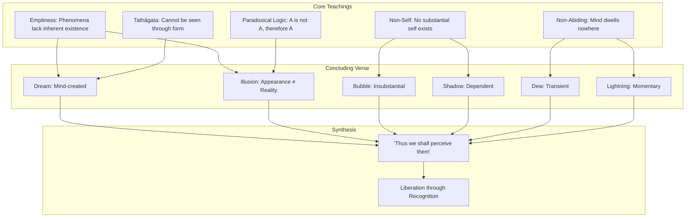

This diagram illustrates how the concluding verse synthesizes the sutra's core teachings. Each metaphor embodies multiple teachings simultaneously, and together they point toward the transformed perception that constitutes liberation.

### 6.5 Contemplative Practice: The Verse as Meditation Instruction

The concluding verse is not merely a philosophical statement or poetic flourish—it is a **direct meditation instruction**. The final phrase, **"thus we shall perceive them"** (應作如是觀), explicitly directs practitioners to transform their perception of phenomena. This section explores how the verse functions as a contemplative tool, examining traditional practices of recitation and contemplation, its role in cultivating the mind that abides nowhere, and how sustained reflection on these metaphors transforms ordinary perception into awakened awareness.

#### "Thus We Shall Perceive Them": Direct Instruction

The verse's concluding instruction—**"thus we shall perceive them"** or **"one should contemplate them in this way"**—transforms the metaphors from descriptions into prescriptions. The Buddha is not merely explaining how phenomena are but instructing practitioners to **actually perceive phenomena in this way**. This distinction is crucial for understanding the verse's practical function.

The instruction uses the verb 觀 (guān), which means to observe, contemplate, or perceive with insight. This is the same character used in the term 觀照 (guānzhào), meaning "contemplative illumination," and in 止觀 (zhǐguān), the foundational meditation practice of calming and insight. The verse thus places itself within the context of **formal meditation practice** rather than mere intellectual understanding.

The sutra's teaching that **"if a good man or good woman with the bodhisattva resolve takes as few as a four-line verse of this sutra, recites, remembers, follows, and expounds it to others, the latter's merit would far exceed that of the former"**[^1] establishes the concluding verse as a primary object of contemplative practice. The verse is meant to be **recited, remembered, and followed**—not merely understood intellectually but integrated into lived experience.

#### Traditional Practices of Recitation and Contemplation

Throughout Buddhist Asia, the concluding verse has been the focus of specific contemplative practices:

**Recitation practice (諷誦)**: Practitioners recite the verse repeatedly, allowing its meaning to penetrate consciousness through sustained repetition. This practice is not mechanical but contemplative—each recitation is an opportunity to deepen understanding and transform perception. The rhythmic quality of the verse in Chinese (with its parallel structure and four-character phrases) makes it particularly suitable for recitation practice.

**Memorization and reflection (受持)**: Practitioners commit the verse to memory and reflect on it throughout daily activities. When encountering phenomena—whether pleasant, unpleasant, or neutral—the practitioner recalls the verse and applies its teaching to the present experience. This practice transforms ordinary perception by introducing the verse's wisdom into every moment.

**Contemplative visualization**: Some practitioners visualize the metaphors during meditation, imagining phenomena dissolving like bubbles, evaporating like dew, or flashing and vanishing like lightning. This visualization practice makes the teaching visceral and embodied rather than merely conceptual.

**Application to specific phenomena**: Practitioners may focus the verse's teaching on particular objects of attachment or aversion, contemplating how these specific phenomena are like dreams, illusions, bubbles, and shadows. This targeted application addresses individual patterns of grasping.

#### Cultivating the Mind That Abides Nowhere

The verse serves as a **direct method for cultivating the mind that abides nowhere** (無所住心). When phenomena are recognized as dream-like and illusory, the mind naturally releases its grip on them. There is nothing substantial to grasp, so grasping relaxes. There is nothing permanent to cling to, so clinging dissolves.

The sutra teaches that **"the mind which abides nowhere is synonymous with the mind of meditation."** The concluding verse provides a practical means of realizing this mind. By contemplating phenomena as dreams and illusions, practitioners discover that there is nowhere for the mind to abide—not because the mind is forcibly restrained from abiding but because the apparent objects of abiding are recognized as insubstantial.

This approach differs from forceful suppression of thoughts or attachment. The practitioner does not try to **stop** abiding but **recognizes** that abiding is impossible given the nature of phenomena. The mind naturally releases what it recognizes as ungraspable. The verse thus functions as a **pointing-out instruction** that reveals the impossibility of abiding rather than a command to stop abiding.

The teaching that **"letting go of everything lets the mind dwell nowhere and reveal unmediated truth"** describes the result of sustained contemplation of the verse. When phenomena are thoroughly recognized as dream-like, the mind dwells nowhere because there is nowhere to dwell. In this non-abiding, unmediated truth reveals itself.

#### Transformation of Ordinary Perception

The verse's ultimate function is to **transform ordinary perception into awakened awareness**. This transformation does not involve acquiring new perceptual abilities but recognizing what has always been true about the phenomena we perceive. The metaphors describe how phenomena actually exist; contemplating them brings perception into alignment with reality.

The transformation can be understood through the sutra's analogy of **walking in darkness versus bright sunshine**. Ordinary perception is like walking in darkness—we bump into phenomena, grasp at them, and suffer from our misperception of their nature. Awakened perception is like walking in bright sunshine—we see phenomena clearly for what they are and respond appropriately.

The verse provides the **light** that transforms perception. By contemplating phenomena as dreams, illusions, bubbles, and shadows, practitioners gradually develop the capacity to see them this way directly, without conceptual mediation. What begins as deliberate contemplation becomes spontaneous recognition. What begins as philosophical understanding becomes direct perception.

The sutra describes this transformation: **"Applying the Diamond Sutra's teachings and living with prajna in daily life frees us from afflictions and enables peace."** The concluding verse is the concentrated essence of these teachings, and its contemplation is the direct path to the freedom and peace the sutra promises.

#### Remaining Engaged While Recognizing the Dream

A crucial aspect of the verse's contemplative function is that it enables practitioners to **remain fully engaged with conventional reality while recognizing its dream-like nature**. The verse does not teach withdrawal from the world or indifference to phenomena. Rather, it teaches a transformed relationship to phenomena that enables more skillful, compassionate engagement.

The Buddha's own example illustrates this integration. The sutra opens with the Buddha performing ordinary activities—**dressing, begging for food, eating, washing his feet, and sitting down**. These mundane actions are performed by one who fully recognizes the dream-like nature of all conditioned phenomena. The recognition does not prevent engagement; it transforms engagement.

The verse's teaching that phenomena are like dreams does not mean that phenomena do not matter or that actions have no consequences. Dreams matter to the dreamer; actions within the dream produce experiences within the dream. Similarly, conditioned phenomena matter at the conventional level even though they are recognized as empty at the ultimate level.

The sutra teaches: **"Apart from life, there is no prajna nor emptiness. Prajna emerges in ordinary daily activities: eating, walking, sitting, sleeping, dealing with others."** The concluding verse does not teach escape from daily activities but **awakened engagement** with them. By recognizing phenomena as dreams and illusions, practitioners engage with them more skillfully—without the distortions introduced by grasping at substantial existence.

#### The Verse as Gateway to Awakening

The Diamond Sutra presents its concluding verse as a **gateway to awakening**. The Buddha teaches that understanding and teaching even a four-line extract of the sutra generates merit exceeding all material giving because it points directly to the nature of reality. The concluding verse is the paradigmatic four-line extract—the sutra's essence in its most concentrated form.

The verse's power lies not in its words but in what the words point toward. When the practitioner truly perceives phenomena as dreams, illusions, bubbles, shadows, dew, and lightning, they perceive reality as it is. This perception is awakening. The verse does not describe awakening from outside; it provides the means of awakening directly.

The sutra states: **"If bodhisattvas practice generosity without relying on signs, the happiness that results cannot be conceived of."**[^18] The concluding verse reveals why this is so: when phenomena are recognized as dream-like, there are no signs to rely on. The mind that perceives phenomena as the verse describes is already the mind that does not rely on signs—the awakened mind that the sutra's entire teaching aims to cultivate.

The verse thus functions as both **summary and gateway**. It summarizes the sutra's teaching in memorable form, and it provides direct access to the awakened perception that the teaching describes. By contemplating the verse, practitioners do not merely learn about awakening; they practice awakening itself.

---

In summary, the Diamond Sutra's concluding verse represents the **crystallization of the sutra's entire philosophical and practical teaching** into a single, memorable formulation. The six metaphors—dreams, illusions, bubbles, shadows, dew, and lightning—provide precise descriptions of how conditioned phenomena actually exist: appearing vividly while lacking the substantial, permanent existence we ordinarily attribute to them. The verse's epistemological implications reveal the mind-dependent, transient nature of experienced reality; its ontological significance articulates the Middle Way between eternalism and nihilism; its synthetic function gathers all the sutra's core teachings into concentrated form; and its contemplative application transforms philosophical understanding into awakened perception. By contemplating phenomena **"in this way"**—as the verse instructs—practitioners develop the non-abiding awareness that recognizes the dream-like nature of experience while remaining fully engaged with conventional reality. This is the perfection of wisdom (prajñāpāramitā) that the Diamond Sutra teaches, and the concluding verse is its most direct expression.

## 7 Application to Daily Life and Mindful Living

This chapter bridges the Diamond Sutra's profound philosophical teachings with practical daily application, examining how the principles of non-attachment, emptiness, and 'unsupported mind' (apratiṣṭhita-citta) can be integrated into routine activities to transform everyday experiences. Building upon the theoretical foundations established in previous chapters, this section provides concrete methods for cultivating present-moment awareness, reducing suffering caused by clinging to outcomes, and developing equanimity when facing life's uncertainties, drawing on both traditional Buddhist practice and contemporary mindfulness applications.

### 7.1 The Non-Abiding Mind in Everyday Activities

The Diamond Sutra's central practical teaching—that bodhisattvas should cultivate **"a mind that dwells nowhere"**—might initially seem impossibly abstract or suited only for advanced meditators in retreat settings. Yet this teaching finds its most profound expression not in extraordinary circumstances but in the **ordinary activities that constitute daily life**: eating breakfast, washing dishes, walking to work, conversing with family members, and performing countless routine tasks. Understanding how to apply the non-abiding mind to these everyday activities transforms the Diamond Sutra from an ancient philosophical text into a living practice that permeates every moment.

#### The Meaning of Non-Abiding in Practical Terms

The Buddha's instruction is explicit: **"A bodhisattva should produce an unsupported thought, that is, a thought which is nowhere supported, a thought unsupported by sights, sounds, smells, tastes, touchables, or mind-objects."**[^35] In practical terms, this means engaging fully with the activities of daily life without the mind becoming **fixated, stuck, or captured** by any particular sensory experience or mental content. The non-abiding mind is not a vacant or disconnected state but one characterized by **fluid responsiveness**—fully present to whatever arises while not grasping at or pushing away any experience.

The teaching identifies two primary obstacles to this open awareness: **ruminating on the past** (dwelling on memories, regrets, or past achievements) and **worrying about the future** (anxiously anticipating what might happen or planning based on self-aggrandizement). Both of these mental activities cause distress and prevent attentiveness to the present moment, hindering the ability to respond with full awareness. However, the teaching goes further: **while focusing on the present is better than dwelling on past or future, one should not make an ideal of the present and cling to it**, as it is ever-changing. One must let go even of the present moment because it is fleeting.[^35]

This understanding prevents practitioners from creating a new form of attachment—attachment to "being present" or to achieving a particular state of mind. The non-abiding mind is not another object to be acquired but the **natural condition of awareness when conceptual grasping relaxes**.

#### Thich Nhat Hanh's Applied Mindfulness: Ordinary Activities as Wisdom Practice

**Thich Nhat Hanh (1926-2022)**, the Vietnamese Zen master who pioneered the teaching of mindfulness in the West, developed extensive practical methods for applying the Diamond Sutra's wisdom to everyday activities. His approach makes the sutra's profound teachings accessible through **direct application to ordinary life** rather than abstract philosophical analysis.[^35][^36]

Thich Nhat Hanh's 1975 book *The Miracle of Mindfulness* presented new practices he had developed to inspire his students and social workers in Vietnam, **helping prevent them from burning out** in the turmoil and challenges of war.[^36] He found new ways to teach the art of mindful breathing and mindful walking as the foundation of meditation, creating simple practices like **mindful teeth-brushing, mindful dishwashing, and "tangerine meditation."**[^36] These practices demonstrate that the Diamond Sutra's wisdom is not reserved for formal meditation but emerges in the most mundane activities.

The practice of mindful dishwashing illustrates this principle perfectly. When washing dishes with a non-abiding mind, one is fully present to the sensation of warm water, the texture of the dishes, the movement of the hands—yet without the mind becoming captured by any of these experiences or wandering into past regrets or future plans. The activity becomes a **direct expression of prajñāpāramitā** (perfection of wisdom) rather than a chore to be completed as quickly as possible. As the teaching states: **"Apart from life, there is no prajna nor emptiness. Prajna emerges in ordinary daily activities: eating, walking, sitting, sleeping, dealing with others."**

#### The Paradox of Full Presence Without Attachment

A central challenge in applying the non-abiding mind to daily activities is understanding the apparent paradox: **How can one be fully present while not attaching to any particular content of experience?** This seeming contradiction dissolves when we understand what "attachment" actually means in this context.

Attachment (*upādāna*) in Buddhist psychology refers not to engagement or care but to **grasping at phenomena as if they possessed permanent, independent existence**. When washing dishes, attachment would mean either desperately wanting the experience to continue (if pleasant) or desperately wanting it to end (if unpleasant). The non-abiding mind, by contrast, engages fully with the activity while recognizing its **dream-like, impermanent nature**—as the concluding verse teaches, all conditioned phenomena are like dreams, illusions, bubbles, and shadows.

This recognition does not diminish engagement but **liberates it**. When we recognize that the experience of dishwashing is empty of inherent existence—arising from conditions and passing away—we can participate in it completely without the anxiety of trying to hold onto it or the aversion of trying to escape it. The activity flows naturally, and we respond appropriately to whatever arises.

The Diamond Sutra itself models this integration in its opening scene: the Buddha **"dressed, put on his cloak, took his bowl, and entered the great city of Sravasti to collect alms. When he had eaten and returned from his round, the Lord put away his bowl and cloak, washed his feet, and sat down on the seat arranged for him."** These mundane actions—dressing, eating, washing—are performed by one who fully embodies the non-abiding mind. The profound teachings that follow emerge from this context of **ordinary, awakened activity**.

#### Practical Methods for Cultivating Non-Abiding Awareness

Several practical methods support the cultivation of non-abiding awareness in daily activities:

**1. Mindful Breathing as Foundation**

Thich Nhat Hanh emphasizes that **"breathing mindfully helps us handle strong emotions, like anger, fear, anxiety and despair, and it helps us generate moments of happiness in daily life."**[^36] The breath serves as an anchor that allows us to remain present without becoming fixated on any particular experience. During any activity, one can periodically return attention to the breath, using it as a touchstone for non-abiding awareness.

**2. Recognizing the Dream-Like Nature of Activities**

The concluding verse's instruction to perceive all conditioned phenomena as dreams, illusions, bubbles, and shadows can be applied directly to daily activities. While eating breakfast, one can recognize that this experience—the taste of food, the sensation of chewing, the feeling of hunger being satisfied—is **arising from conditions, existing momentarily, and passing away**. This recognition does not make the experience less real or enjoyable but reveals its true nature.

**3. Releasing the Sense of a Separate Doer**

The Diamond Sutra's teaching on non-self applies directly to daily activities. When washing dishes, there is no need to maintain the sense of "I am washing dishes." The activity simply occurs—hands moving, water flowing, dishes becoming clean. **Releasing the overlay of self-reference** allows the activity to flow more naturally and reduces the mental burden of maintaining a separate observer.

**4. Responding Rather Than Reacting**

The non-abiding mind responds appropriately to situations rather than reacting from habitual patterns. When an unexpected interruption occurs during an activity, the non-abiding mind **does not cling to the previous activity or resent the interruption** but simply shifts to address whatever has arisen. This flexibility is the practical expression of not dwelling on any particular experience.

#### The Integration of Mindfulness and Ethics

Thich Nhat Hanh emphasizes that **"mindfulness is not a tool or instrument to get something else—whether that something is healing, success, wealth or winning. True mindfulness is a path, an ethical way of living."**[^36] This teaching connects directly to the Diamond Sutra's instruction that bodhisattvas should practice giving (and all other activities) without attachment to signs.

**Mindfulness cannot be separated from mindful speaking, acting, working, and engaging in the world.**[^36] The non-abiding mind is not a technique for personal benefit but an ethical orientation that naturally expresses itself as compassionate action. When we are truly present without attachment, we naturally respond to the needs of situations and beings around us. The Diamond Sutra's teaching on non-abiding thus has **immediate ethical implications** for how we conduct ourselves in daily life.

The following table summarizes the application of non-abiding awareness to common daily activities:

| Activity | Non-Abiding Approach | What to Release |
|----------|---------------------|-----------------|
| **Eating** | Full presence to taste, texture, nourishment | Rushing, distraction, judgment of food |
| **Walking** | Awareness of each step, contact with earth | Goal-fixation, hurrying, mental preoccupation |
| **Conversation** | Deep listening, present attention to other | Planning responses, defending positions |
| **Working** | Engaged focus on task at hand | Worry about outcomes, comparison with others |
| **Resting** | Allowing body and mind to settle | Guilt about "unproductivity," mental agitation |

### 7.2 Releasing Attachment to Outcomes and Results

One of the most challenging aspects of applying the Diamond Sutra's wisdom to modern life involves our relationship with **outcomes, achievements, and results**. Contemporary culture places enormous emphasis on success, goal achievement, and measurable results—in careers, relationships, health, and virtually every domain of life. The Diamond Sutra offers a radical alternative: engaging wholeheartedly with activities while remaining free from the suffering caused by attachment to specific outcomes.

#### The Sutra's Teaching on Acting Without Expectation

The Diamond Sutra's instruction on giving provides the paradigm for all action without attachment to results. The Buddha teaches that **"a bodhisattva should practice generosity without relying on any object—any form, sound, smell, taste, touch, or object of mind to practice generosity."**[^35] This instruction extends beyond charitable giving to encompass **all activities**: work, creative projects, relationships, and personal development.

The teaching identifies **three elements that typically accompany outcome-attached action**: the sense of a doer ("I am doing this"), the sense of a recipient or result ("this will produce that outcome"), and the sense of the action itself as a substantial thing ("this is an important action"). When action is performed with these three elements firmly in place, the actor becomes bound to the results—experiencing pride when outcomes are favorable, disappointment when they are not, and anxiety throughout the process.

The sutra's alternative is not indifference or passivity but **action freed from the conceptual overlay that creates suffering**. A bodhisattva who practices giving without attachment to signs experiences happiness **"like the vastness of space—it cannot be conceived of or measured."**[^35] This unbounded quality arises precisely because the action is not constrained by the conceptual framework of doer, deed, and result.

#### Distinguishing Intention from Attachment

A crucial distinction must be made between **healthy intention-setting** and **unhealthy attachment to results**. The Diamond Sutra does not teach that practitioners should have no intentions or goals. The bodhisattva's vow to liberate all beings is itself an intention of extraordinary scope. The teaching concerns not the presence of intention but the **quality of relationship to outcomes**.

**Intention** involves setting a direction, clarifying purpose, and organizing effort toward a goal. Intention is necessary for effective action in the world. Without intention, activities become aimless and scattered.

**Attachment** involves grasping at specific outcomes as necessary for one's happiness, identity, or well-being. Attachment creates suffering because outcomes are **inherently uncertain**—they depend on countless conditions beyond our control. When we attach our well-being to particular results, we set ourselves up for anxiety (before the outcome is known), disappointment (if the outcome is unfavorable), or unsatisfying relief (if the outcome is favorable but we immediately begin worrying about maintaining it).

The Diamond Sutra's teaching allows for **strong intention combined with non-attachment to results**. One can work diligently toward a goal while recognizing that the outcome will arise from conditions, many of which are beyond personal control. This recognition is not resignation but **realistic engagement** with how things actually work.

#### Modern Applications: Success, Failure, and Outcome-Dependency

The sutra's teaching has profound relevance for modern concerns about success and failure. Contemporary culture often treats success as the measure of personal worth and failure as shameful evidence of inadequacy. This framework creates enormous suffering:

- **Anxiety** before outcomes are known, as self-worth hangs in the balance
- **Exhaustion** from the constant effort to control uncontrollable conditions
- **Hollow success** when favorable outcomes fail to provide lasting satisfaction
- **Crushing failure** when unfavorable outcomes seem to negate one's value as a person

The Diamond Sutra offers liberation from this cycle. When action is performed without attachment to outcomes, **success and failure lose their power to determine self-worth**. The practitioner can still prefer success to failure, still work diligently toward favorable outcomes, but is no longer **psychologically hostage** to results.

The sutra's teaching that **"the highest, most fulfilled, awakened mind that the Tathāgata has attained is neither graspable nor elusive"** applies to all achievements. No outcome can be permanently grasped—success is impermanent, changing, and dependent on conditions. Recognizing this does not diminish the value of achievement but **frees us from the suffering of trying to hold onto what cannot be held**.

#### Practical Guidance for Non-Attached Engagement

Several practical approaches support engagement with activities while releasing attachment to outcomes:

**1. Clarify Intention, Release Attachment**

Before beginning any significant activity, clarify your intention: What are you trying to accomplish? Why does this matter? Then consciously release attachment to specific outcomes: "I will give my best effort to this project. The results will arise from conditions, many beyond my control. I release my attachment to any particular outcome while remaining committed to skillful action."

**2. Focus on Process Rather Than Outcome**

During the activity itself, keep attention on the **present moment of engagement** rather than on anticipated results. The sutra's teaching on non-abiding applies directly: don't let the mind dwell on future outcomes while engaged in present action. Trust that skillful present-moment engagement is the best preparation for favorable outcomes, while recognizing that outcomes remain uncertain.

**3. Recognize the Conditioned Nature of Results**

When outcomes arrive—whether favorable or unfavorable—recognize them as **conditioned phenomena arising from countless causes**. The sutra's concluding verse applies: outcomes are like dreams, illusions, bubbles, and shadows. This recognition does not mean outcomes don't matter but that they don't possess the substantial, permanent significance we often attribute to them.

**4. Maintain Equanimity Regardless of Results**

Whether outcomes are favorable or unfavorable, maintain **equanimity rooted in understanding**. Favorable outcomes are not permanent victories; unfavorable outcomes are not permanent defeats. Both arise, exist momentarily, and pass away. The practitioner who understands this can **respond appropriately to outcomes without being controlled by them**.

#### The Bodhisattva's Paradox: Saving All Beings Without Anyone Being Saved

The Diamond Sutra presents a profound paradox that illuminates the relationship between intention and attachment: **"However many species of living beings there are, we must lead all these beings to nirvana so that they can be liberated. Yet when this innumerable, immeasurable, infinite number of beings has become liberated, we do not, in truth, think that a single being has been liberated."**[^35]

This teaching reveals that the bodhisattva maintains **vast intention** (to liberate all beings) while remaining free from **attachment to results** (recognizing that, ultimately, no beings are liberated because there are no independently existing beings to liberate). The paradox is resolved through the understanding of emptiness: the bodhisattva acts compassionately within the conventional world while recognizing the empty nature of all phenomena, including the categories of "liberator," "liberated," and "liberation."

This paradox provides a model for all action without attachment. We can **act with full commitment and care** while recognizing that the outcomes of our actions, like all conditioned phenomena, are empty of the substantial, permanent existence we typically attribute to them. This recognition does not diminish our engagement but **liberates it from the suffering of attachment**.

### 7.3 Transforming Emotional Reactivity Through Emptiness Understanding

The Diamond Sutra's teaching on emptiness (śūnyatā) offers profound resources for transforming our relationship with difficult emotions such as anger, fear, anxiety, and despair. Rather than suppressing emotions or being overwhelmed by them, the sutra's wisdom allows practitioners to **experience feelings fully while recognizing their empty, conditioned nature**—like dreams, illusions, bubbles, and shadows.

#### The Nature of Emotional Experience in Light of Emptiness

Emotions arise through **dependent origination**—they emerge from causes and conditions rather than appearing from nowhere or existing independently. When we encounter a situation that triggers anger, for example, the anger arises from the intersection of external circumstances, past conditioning, present mental state, physical condition, and countless other factors. **No emotion exists independently or permanently**; each is a temporary configuration of conditions that will inevitably change.

The Diamond Sutra's concluding verse applies directly to emotional experience: emotions are like **dreams** (appearing real during the experience but recognized as mind-created), like **illusions** (seeming substantial but lacking the reality they appear to have), like **bubbles** (arising quickly and dissolving just as quickly), like **shadows** (dependent on conditions and having no independent existence), like **dew** (present briefly and evaporating), and like **lightning** (flashing brilliantly and vanishing instantly).

This understanding does not mean that emotions are unreal or should be dismissed. The sutra's teaching navigates between two extremes: **treating emotions as substantial, permanent realities** (which leads to being controlled by them) and **denying emotions altogether** (which leads to suppression and psychological harm). The middle way recognizes emotions as **conventionally real experiences that lack inherent, independent existence**.

#### The Teaching on Ungraspable Mind

The Diamond Sutra offers a specific teaching that transforms our relationship with emotional experience: **"The past mind cannot be grasped, neither can the present mind or the future mind."**[^35] This teaching reveals that the mind—including all its emotional states—is **fundamentally ungraspable**. The anger we experienced a moment ago has already passed; the anxiety we anticipate may never arise; even the fear we feel "right now" is constantly changing and cannot be pinned down.

Thich Nhat Hanh's commentary on the Diamond Sutra emphasizes this teaching's practical significance. When we recognize that emotional states are ungraspable—that they arise, exist momentarily, and pass away without any permanent substance—we naturally **hold them more lightly**. We can experience anger fully without becoming identified with it ("I am an angry person") or controlled by it ("I must act on this anger"). The emotion is recognized as a passing phenomenon, like a cloud moving across the sky.

#### Practical Application: Working with Strong Emotions

The Diamond Sutra's wisdom can be applied in moments of strong emotional reactivity through several practical approaches:

**1. Recognition: "This Is Like a Dream"**

When strong emotion arises, recognize it as a conditioned phenomenon with the nature described in the concluding verse. This is not denial ("I'm not really angry") but **accurate perception** ("Anger is arising; it is like a dream, an illusion, a bubble"). This recognition creates space between the emotion and our response to it.

**2. Non-Identification: Releasing the Four Marks**

The sutra's teaching on releasing the four marks (self, person, being, life-span) applies to emotional experience. When anger arises, we typically identify with it: "I am angry." This identification strengthens the emotion and makes it more difficult to work with. The sutra's teaching allows us to recognize that **there is no fixed "I" who is angry**—there is simply anger arising in experience. This shift from "I am angry" to "anger is arising" fundamentally changes our relationship with the emotion.

**3. Non-Abiding: Not Dwelling on the Emotion**

The teaching on non-abiding applies directly to emotional experience. When we dwell on an emotion—replaying the triggering situation, rehearsing grievances, anticipating future conflicts—we **strengthen and prolong the emotional state**. The non-abiding mind recognizes the emotion, responds appropriately if action is needed, and then **allows the emotion to pass** without dwelling on it.

**4. Compassionate Understanding: Seeing the Conditions**

The Diamond Sutra's teaching on emptiness as dependent origination allows us to see the **conditions that gave rise to the emotion**. Thich Nhat Hanh emphasizes this approach: **"Through deep looking and recognizing that the other person also suffers a lot of pain, when someone suffers and cannot handle their pain, they spread it around, and you become a victim."**[^37] This understanding naturally gives rise to compassion—both for ourselves (who are experiencing difficult emotions) and for others (whose actions may have triggered those emotions).

#### Concentration and the Transformation of Afflictions

Thich Nhat Hanh's teaching on concentration (*samādhi*) illuminates how the Diamond Sutra's wisdom transforms emotional afflictions:

**"Concentration (samādhi) helps us understand the nature of our afflictions, and with this insight, we can burn away the afflictions. Concentration, as an energy, has the power to transform."**[^37]

The practice of concentration involves **focusing attention on the nature of the emotion itself** rather than on its object or trigger. When we examine anger closely, we discover that it is not a solid, permanent thing but a **flowing process of sensations, thoughts, and impulses**. This direct examination, informed by the sutra's teaching on emptiness, naturally transforms our relationship with the emotion.

The Diamond Sutra identifies **three doors of liberation** that relate directly to emotional transformation:[^37]

| Door of Liberation | Sanskrit | Application to Emotions |
|-------------------|----------|------------------------|
| **Emptiness** | Śūnyatā | Recognizing emotions lack inherent existence |
| **Signlessness** | Animitta | Not grasping at the form or appearance of emotions |
| **Wishlessness** | Apraṇihita | Not seeking to acquire or escape emotional states |

**Emptiness** as a door of liberation means recognizing that emotions, like all phenomena, are empty of independent self-nature. **Signlessness** means not attaching to the appearance or form of emotions—not creating a fixed concept of "my anger" or "my fear." **Wishlessness** means not placing the goal of emotional transformation in front of us as something to be acquired—recognizing that what we seek is already present when we stop grasping.

#### The Meditation on Loving-Kindness and Compassion

Thich Nhat Hanh emphasizes that **concentration on loving-kindness and compassion can bring relief and healing**.[^37] When someone has caused us suffering, we naturally want them to suffer in return. This desire for revenge is itself a form of suffering—**"that hatred, anger, and desire for revenge is a fire that continues to burn in your body and mind, and you are in hell. Hell is right here and now."**[^37]

The Diamond Sutra's teaching on non-self provides the basis for transforming this pattern. When we recognize that both ourselves and the other person are **empty of fixed, independent self-nature**, the rigid categories of "victim" and "perpetrator" begin to dissolve. We can see that the person who harmed us is also suffering, and that **"that person needs help, not punishment."**[^37]

This recognition does not mean condoning harmful actions or abandoning appropriate boundaries. It means **responding to harm from wisdom and compassion rather than from reactive anger**. The Buddha's teaching is explicit: **"Hatred cannot be responded to with hatred. Violence cannot be responded to with violence. There must be another way."**[^37]

### 7.4 Cultivating Equanimity Amid Life's Uncertainties

The Diamond Sutra's teachings provide profound resources for developing **equanimity (upekṣā)**—a stable, balanced state of mind that is not shaken by external circumstances. This equanimity is not indifference or detachment but a **deep stability rooted in understanding** the nature of conditioned phenomena. When we truly recognize that all experiences are like dreams, illusions, bubbles, and shadows, we develop a foundation that remains stable through life's inevitable changes and challenges.

#### The Nature of Equanimity in the Diamond Sutra

Equanimity in the context of the Diamond Sutra arises from **direct understanding of emptiness and impermanence**. When we recognize that favorable circumstances are empty of inherent existence and will inevitably change, we do not become intoxicated by success. When we recognize that unfavorable circumstances are equally empty and impermanent, we do not become devastated by loss. This recognition creates **a stable center that is not dependent on external conditions**.

The sutra's teaching that the Tathāgata **"neither comes nor goes"** points toward this equanimity. The awakened mind does not fluctuate based on what comes and goes in experience. It remains **stable in its recognition of suchness** while responding appropriately to whatever arises.

This equanimity is not achieved through suppressing responses to circumstances but through **understanding their nature**. The practitioner who understands the Diamond Sutra's teaching can still prefer pleasant circumstances to unpleasant ones, can still work to improve difficult situations, but is not **psychologically destabilized** by the inevitable fluctuations of life.

#### Facing Illness, Loss, and Mortality

The Diamond Sutra's wisdom has particular relevance for facing life's most challenging experiences: illness, loss, and mortality. These experiences confront us with the impermanence that the sutra teaches is the nature of all conditioned phenomena.

**Illness** reveals the body's dependence on conditions and its inevitable vulnerability. The sutra's teaching allows practitioners to recognize illness as a conditioned phenomenon—arising from causes, existing temporarily, and subject to change. This recognition does not eliminate physical suffering but **transforms our relationship with it**. We can experience illness without the additional suffering of fighting against reality or identifying completely with the sick body.

**Loss**—of loved ones, relationships, possessions, or capacities—confronts us with impermanence in its most painful form. The sutra's teaching that all conditioned phenomena are like dreams and illusions does not diminish the reality of loss but **places it in context**. What we have lost was always impermanent; our suffering comes partly from having related to it as if it were permanent. Recognizing this does not eliminate grief but allows us to **grieve without adding the suffering of fighting against impermanence itself**.

**Mortality**—our own and others'—is the ultimate confrontation with impermanence. The Diamond Sutra's teaching on the four marks includes **"no notion of longevity"** (壽者相)—releasing attachment to the concept of a continuous self that persists through time and then ends at death. Thich Nhat Hanh's teaching emphasizes that **"our true nature is the nature of no-birth and no-death."**[^38] This does not mean denying biological death but recognizing that what we truly are was never born and cannot die.

The practice of **contemplating impermanence** (*anitya*) directly supports equanimity in facing these challenges. As Thich Nhat Hanh teaches: **"Impermanence is a key that can open the door of reality. We must keep the insight of impermanence alive. When we touch anything, we should be able to see the impermanence in it."**[^37]

#### Practical Applications: Career Changes, Relationship Difficulties, Life Transitions

The Diamond Sutra's wisdom applies to the more ordinary challenges of daily life as well as to ultimate concerns:

**Career changes** often trigger anxiety because we identify with our professional roles and fear the uncertainty of transition. The sutra's teaching on non-self allows us to recognize that **we are not our careers**—that professional identity is a conventional designation rather than our true nature. This recognition creates space to navigate career changes with greater flexibility and less fear.

**Relationship difficulties** often arise from attachment to how relationships "should" be and from identifying our well-being with the behavior of others. The sutra's teaching on non-attachment allows us to **engage fully in relationships while recognizing their conditioned, impermanent nature**. We can work to improve relationships without being devastated when they change or end.

**Life transitions**—aging, retirement, children leaving home, moving to new locations—all involve loss of familiar patterns and confrontation with impermanence. The sutra's wisdom allows us to **meet these transitions with equanimity**, recognizing that change is the nature of conditioned existence rather than an aberration to be resisted.

#### Equanimity Without Indifference

A crucial distinction must be maintained between **equanimity and indifference**. The Diamond Sutra does not teach that we should not care about what happens or that all outcomes are equally acceptable. The bodhisattva's vow to liberate all beings demonstrates **profound care and engagement** with the welfare of others.

The difference lies in the **quality of relationship to outcomes**. Indifference involves not caring; equanimity involves caring deeply while recognizing the conditioned, impermanent nature of all phenomena. The practitioner with equanimity **responds to suffering with compassion** while recognizing that suffering, like all phenomena, is empty of inherent existence.

Thich Nhat Hanh's teaching on **"engaged Buddhism"** exemplifies this integration of equanimity and care. He emphasizes that **"activists have to have a spiritual practice in order to help them to suffer less, to nourish happiness and to handle suffering, so they will be effective in helping the world. With anger and frustration you cannot do much."**[^36] Equanimity is not an alternative to engagement but its **necessary foundation**—allowing us to act effectively without being overwhelmed by the suffering we encounter.

### 7.5 Integrating Practice: From Meditation Cushion to Daily Life

The Diamond Sutra's wisdom is not meant to remain confined to formal meditation or philosophical study but to **permeate every aspect of daily life**. This section provides a synthesis of methods for integrating the sutra's practice into the full spectrum of daily activities, bridging the gap between understanding and embodiment, between the meditation cushion and the marketplace.

#### The Continuity of Practice: No Separation Between Meditation and Life

A fundamental principle of applying the Diamond Sutra is that **there is no essential separation between formal meditation and daily activities**. The sutra opens with the Buddha engaged in ordinary activities—dressing, eating, washing—demonstrating that awakened awareness is not reserved for special circumstances but characterizes all of life.

Thich Nhat Hanh emphasizes this continuity: **"For Thich Nhat Hanh, mindfulness is an energy to be cultivated all day long, to sustain compassionate action so we can help relieve suffering in ourselves and the world."**[^36] Mindfulness is not a technique to be applied occasionally but **an ongoing way of being** that transforms every moment into an opportunity for awakening.

The teaching that **"apart from life, there is no prajna nor emptiness. Prajna emerges in ordinary daily activities: eating, walking, sitting, sleeping, dealing with others"** establishes that the wisdom of the Diamond Sutra is not separate from ordinary experience but **revealed through it**. Every activity becomes a vehicle for recognizing the empty, interdependent nature of phenomena.

#### Specific Practices for Daily Integration

Several specific practices support the integration of Diamond Sutra wisdom into daily life:

**1. Mindfulness Bells**

The practice of **mindfulness bells** uses sounds in the environment as reminders to return to present-moment awareness.[^39] In traditional settings, an actual bell is used; in daily life, any sound can serve this function—a telephone ringing, a car horn, a bird singing. When the sound is heard, the practitioner **pauses, takes a conscious breath, and returns to awareness** of the present moment.

This practice directly supports the non-abiding mind. The bell interrupts habitual mental patterns—rumination about the past, worry about the future—and **returns attention to the present**. Over time, the practice creates a habit of returning to awareness throughout the day.

**2. Gathas (Mindfulness Verses)**

**Gathas** are short verses recited during daily activities to maintain mindfulness.[^39] For example, when waking up:

> *Waking up this morning, I smile.*
> *Twenty-four brand new hours are before me.*
> *I vow to live fully in each moment*
> *and to look at all beings with eyes of compassion.*

These verses serve as **portable teachings** that bring the Diamond Sutra's wisdom into specific moments of daily life. They transform routine activities into opportunities for practice by **linking action with intention and awareness**.

**3. Walking Meditation**

**Walking meditation** (kinh hành) brings mindful awareness to the simple act of walking.[^39] Rather than walking to get somewhere, the practitioner walks simply to walk—fully present to each step, each contact of foot with earth, each movement of the body.

Thich Nhat Hanh developed **a new style of walking meditation** that can be practiced anywhere—in a park, on a city sidewalk, in an office hallway.[^36] The practice involves coordinating steps with breath and maintaining awareness of the body moving through space. Walking meditation demonstrates that **awakened awareness is not dependent on special circumstances** but can be cultivated in any activity.

**4. Contemplation of the Concluding Verse**

The Diamond Sutra's concluding verse provides a **portable contemplation** that can be recalled throughout the day:

> *All conditioned phenomena are like a dream, an illusion, a bubble, a shadow,*
> *like dew or a flash of lightning; thus we shall perceive them.*

When encountering any phenomenon—pleasant or unpleasant, significant or trivial—the practitioner can recall this verse and **recognize the phenomenon's dream-like nature**. This practice gradually transforms perception, so that the recognition of emptiness becomes spontaneous rather than requiring deliberate effort.

**5. The Practice of Touching the Earth**

**Touching the Earth** (prostrations) is a profound practice for reconnecting with spiritual and blood ancestors, all living beings, and the nature of no-birth and no-death.[^39] This practice helps dissolve feelings of separation and **embodies the Diamond Sutra's teaching on interbeing**—the recognition that we are not separate, isolated individuals but expressions of the entire web of existence.

#### The Day of Mindfulness

The tradition of a **Day of Mindfulness** provides a structure for deepening practice within the context of daily life.[^39] This practice involves setting aside one day (or a portion of a day) for sustained mindful practice—sitting meditation, walking meditation, mindful eating, and Dharma discussion—within a community (sangha) setting.

The Day of Mindfulness serves as a **bridge between retreat practice and daily life**. It provides an opportunity to deepen practice without requiring extended retreat time, and the skills developed during the Day of Mindfulness naturally **carry over into ordinary activities**.

#### Interbeing: The Ecological Dimension of Daily Practice

Thich Nhat Hanh's teaching on **"interbeing"** (a term he coined in the 1980s) connects the Diamond Sutra's wisdom to ecological awareness and responsibility.[^36] The teaching of interbeing reveals that **"we cannot separate human beings from the environment. The environment is in human beings and human beings are part of the environment."**[^36]

This understanding transforms daily activities into expressions of ecological awareness. When eating, we recognize that the food **"is the continuation of the cloud"**[^38]—that it arises from sun, rain, soil, and countless other conditions. When consuming resources, we recognize our **interconnection with all beings** and our responsibility to act sustainably.

The Diamond Sutra's teaching that we should release the notion of "living beings" (眾生相) as a separate category supports this ecological understanding. Thich Nhat Hanh emphasizes that **"the distinction between living beings and non-living beings disappears after meditation."**[^36] This recognition naturally gives rise to **care for the entire web of existence**, not just those beings we conventionally recognize as "living."

The 2010 revised edition of Thich Nhat Hanh's commentary on the Diamond Sutra includes **new material on the sutra's environmental significance**, exploring how its teachings can inspire reverence for nature and encourage harmonious relationships with the environment.[^35] This ecological application demonstrates that the Diamond Sutra's wisdom is not limited to individual liberation but has **profound implications for how we live together on this planet**.

#### Awakened Living: Every Moment as Prajñāpāramitā

The ultimate integration of Diamond Sutra practice is a life in which **every moment becomes an expression of prajñāpāramitā** (perfection of wisdom). This is not a special achievement reserved for advanced practitioners but the **natural result of sustained practice** with the sutra's teachings.

In awakened living, the distinction between practice and non-practice dissolves. **Eating is practice; walking is practice; working is practice; resting is practice.** Every activity becomes an opportunity to recognize the empty, interdependent nature of phenomena and to respond with wisdom and compassion.

The Diamond Sutra describes this integration through the Buddha's ordinary activities at its opening: dressing, eating, washing, sitting. These mundane actions, performed by one who fully embodies the sutra's wisdom, become **expressions of the six perfections** (pāramitās): generosity, ethical conduct, patience, diligence, meditation, and wisdom.[^35]

This vision of awakened living is not an ideal to be achieved in some distant future but **a possibility available in every moment**. The sutra's teaching that awakening is not something to be attained—because there is no independently existing phenomenon called awakening—reveals that **what we seek is already present**. The practice is not to create awakening but to recognize what has always been the case.

The following diagram illustrates the integration of Diamond Sutra practice into daily life:

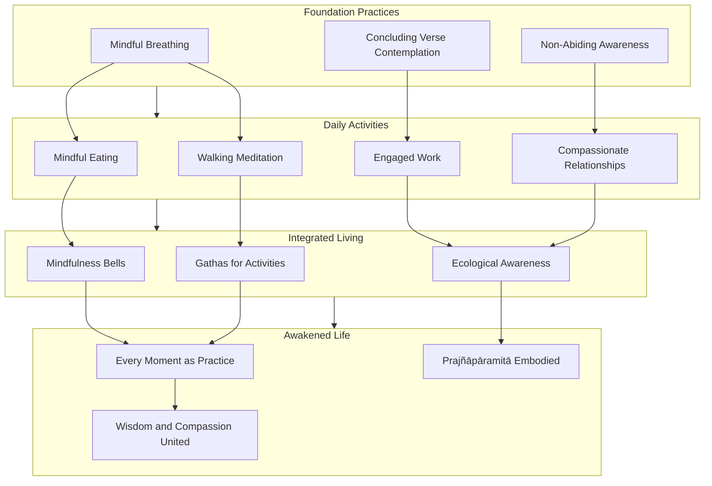

This diagram shows how foundation practices (mindful breathing, verse contemplation, non-abiding awareness) support daily activities, which are further integrated through specific practices (bells, gathas, interbeing awareness), culminating in awakened living where every moment expresses the Diamond Sutra's wisdom.

---

In summary, the Diamond Sutra's application to daily life and mindful living transforms **ancient philosophical wisdom into living practice**. The teaching on the non-abiding mind provides a foundation for engaging fully with everyday activities while remaining free from attachment. The instruction on releasing attachment to outcomes liberates practitioners from the suffering of outcome-dependency while allowing wholehearted engagement with work and relationships. The understanding of emptiness transforms our relationship with difficult emotions, allowing us to experience feelings fully without being controlled by them. The cultivation of equanimity provides stability amid life's inevitable changes and challenges. And the integration of practice into every moment reveals that **awakening is not separate from ordinary life but is the very nature of experience when recognized clearly**.

The Diamond Sutra's wisdom, as Thich Nhat Hanh emphasizes, is not an escape from life but a **deeper engagement with it**. By recognizing the dream-like, empty nature of all conditioned phenomena, we are freed to respond to life with wisdom and compassion rather than being driven by habitual patterns of grasping and aversion. This is the practical fruit of the Diamond Sutra's teaching: **a life of awakened presence, compassionate action, and profound peace** available in every moment of ordinary existence.

## 8 Application to Workplace and Career Development

This chapter applies the Diamond Sutra's teachings on emptiness, non-attachment, and non-abiding mind to the specific challenges of professional life, examining how ancient wisdom addresses contemporary workplace stress, ambition, competition, and professional identity. Building upon the foundations of mindful living established in Chapter 7, this chapter provides practical frameworks for integrating prajñāpāramitā wisdom into career development, leadership practice, and organizational dynamics.

### 8.1 Workplace Stress and the Non-Abiding Mind: Transforming Professional Pressure

The modern workplace has become a primary source of psychological suffering for countless professionals. According to the American Institute of Stress, **83% of U.S. workers suffer from work-related stress, and nearly 1 million employees miss work each day due to stress-related issues**[^40]. Beyond the toll on mental health, this stress significantly impacts organizational productivity, collaboration, and retention. The Diamond Sutra's teaching on the non-abiding mind offers a profound framework for understanding the root causes of this suffering and transforming our relationship with professional pressure.

#### The Root Causes of Workplace Stress Through the Lens of Emptiness

The Diamond Sutra's analysis of suffering applies directly to the workplace context. Stress arises not from work situations themselves but from **our attachment to how those situations should unfold**. When we grasp at specific outcomes—a successful presentation, a promotion, recognition from supervisors—we create the conditions for suffering. The sutra teaches that **"a bodhisattva should produce an unsupported thought, that is, a thought which is nowhere supported, a thought unsupported by sights, sounds, smells, tastes, touchables, or mind-objects."** In the workplace, this means engaging fully with professional responsibilities while not allowing the mind to become fixated on any particular outcome, recognition, or circumstance.

Research on workplace stress identifies several common stressors that directly correspond to forms of attachment the Diamond Sutra addresses:

| Workplace Stressor | Form of Attachment | Diamond Sutra Teaching |
|-------------------|-------------------|----------------------|
| **Tight deadlines and constant pressure** | Attachment to control over time and outcomes | Non-abiding: mind dwells nowhere |
| **Poor communication and unclear expectations** | Attachment to certainty and predictability | Emptiness: all phenomena lack inherent existence |
| **Multitasking and digital overload** | Attachment to productivity as self-worth | Non-self: no fixed identity to protect |
| **Lack of autonomy or recognition** | Attachment to external validation | Giving without signs: acting without expectation |
| **Emotional labor** | Attachment to emotional states and responses | Ungraspable mind: past, present, future mind cannot be held |

**Nearly 44% of employees report feeling stressed at work daily**, and employees who feel unrecognized are **twice as likely to report workplace stress**[^40]. These statistics reveal how deeply attachment to recognition and outcomes penetrates professional experience. The Diamond Sutra's teaching that **merit from understanding and teaching even a four-line verse exceeds all material giving** points toward a radical reorientation: our value does not depend on external recognition but on our relationship with wisdom itself.

#### The Non-Abiding Mind as Stress Resilience

The Diamond Sutra's teaching on the non-abiding mind provides a **research-backed foundation for stress resilience**. Mindfulness at work has emerged as an evidence-based method to enhance focus, cultivate emotional intelligence, and improve job satisfaction[^40]. The sutra's instruction to cultivate "a mind that functions freely, without depending on anything or any place" describes precisely the quality of awareness that contemporary mindfulness research identifies as protective against stress.

**Mindfulness builds stress resilience and enhances performance** through several mechanisms that align with the Diamond Sutra's teachings[^40]:

**Emotional self-awareness**: The sutra's teaching on examining the constructed nature of emotional states corresponds to what researchers identify as foundational for managing stress and applying emotion regulation techniques. When we recognize that anger, anxiety, or frustration are conditioned phenomena—like dreams, illusions, bubbles, and shadows—we create space between stimulus and response.

**Empathy and social connection**: The Diamond Sutra's teaching on non-self paradoxically enhances connection with others. Leaders who practice mindfulness report **better listening skills and stronger relationships**[^40]. When we release attachment to defending a fixed self-image, we become more available to truly hear and respond to colleagues.

**Executive function and focus**: MRI studies show that **just 8 weeks of mindfulness training can increase gray matter in brain regions associated with learning, memory, and emotion regulation**[^40]. The sutra's instruction to maintain non-abiding awareness corresponds to this enhanced capacity for focused attention without fixation.

**Stress resilience**: Research in Occupational Health Psychology finds that **mindfulness training leads to reduced perceived stress, improved sleep, and higher job satisfaction**[^40]. The Diamond Sutra's teaching that all conditioned phenomena are like dew and lightning—appearing briefly and passing away—provides the philosophical foundation for this resilience.

#### Practical Methods for Applying Non-Attachment to Work Pressures

The Diamond Sutra's wisdom can be integrated into daily work life through specific practices:

**1. Mindful Breathing as Workplace Anchor**

The practice of mindful breathing serves as a foundation for maintaining non-abiding awareness amid professional pressure. **2-minute breathing techniques for calming the nervous system** can be practiced before meetings, during transitions between tasks, or when stress arises[^40]. This practice directly implements the sutra's teaching on not allowing the mind to dwell on past regrets or future anxieties.

**2. Recognition of the Dream-Like Nature of Work Situations**

When facing a stressful deadline or difficult interaction, practitioners can recall the concluding verse: **"All conditioned phenomena are like a dream, an illusion, a bubble, a shadow, like dew or a flash of lightning."** This recognition does not diminish the importance of the work but transforms our relationship with it. The deadline is real at the conventional level; the suffering we add through attachment is optional.

**3. Movement-Based Mindfulness for Physical Stress**

**Movement-based mindfulness activates the body's natural regulatory systems**, helping individuals reconnect with physical sensations, regulate emotions in real time, and reset the nervous system[^40]. Brief movement breaks during the workday—stretching, walking, conscious breathing—implement the sutra's teaching that wisdom emerges in ordinary activities.

**4. Releasing the Four Marks in Professional Contexts**

The Diamond Sutra's teaching on releasing the four marks (self, person, being, life-span) applies directly to workplace stress:

- **No notion of self**: Releasing identification with professional success or failure
- **No notion of person**: Recognizing that colleagues and supervisors are also conditioned beings
- **No notion of sentient being**: Seeing the organization as an interdependent system rather than a collection of separate entities
- **No notion of longevity**: Accepting that projects, roles, and careers are impermanent

#### High-Stress Professions and the Diamond Sutra's Relevance

For professionals in high-stress fields—healthcare workers, first responders, executives facing constant pressure—the Diamond Sutra's teachings have particular relevance. **A 2022 report found that first responders are 1.5 times more likely to experience mental health disorders compared to the general population. Among healthcare workers, burnout rates exceeded 63% in some hospital systems during the COVID-19 pandemic**[^40].

These roles demand repeated exposure to suffering, high-stakes decision-making, and emotional labor. The Diamond Sutra's teaching that **"the past mind cannot be grasped, neither can the present mind or the future mind"** provides a framework for processing difficult experiences without re-traumatization. Mindfulness at work offers **a non-stigmatizing way to support psychological health** by teaching individuals to stay grounded, regulate breathing, and respond rather than react[^40].

The sutra's teaching on **patience for the non-arising of phenomena** (anutpattika-dharma-kṣānti)—the recognition that fundamentally nothing arises or ceases because nothing inherently exists—offers profound support for those who regularly encounter suffering. This is not denial of suffering but a transformed relationship with it, recognizing that even the most difficult experiences are conditioned, impermanent, and empty of the substantial permanence they seem to possess.

### 8.2 Ambition and Competition: The Middle Way in Career Advancement

The modern workplace is characterized by intense competition for advancement, recognition, and success. The Diamond Sutra's teaching on the Middle Way—navigating between extremes—provides a sophisticated framework for engaging with career ambition without falling into the traps of either ego-driven striving or passive disengagement. This section explores how the sutra's wisdom transforms our relationship with professional competition while maintaining engaged, effective action.

#### The Two Extremes in Career Development

The Diamond Sutra's Middle Way applies directly to career ambition:

**Extreme 1: Ego-Driven Ambition**

This extreme involves pursuing career advancement primarily for ego gratification—to prove one's worth, dominate others, or accumulate status symbols. The sutra identifies this pattern through its teaching on the four marks: when we pursue success to reinforce a sense of self (ātman), to establish ourselves as superior persons (pudgala), to distinguish ourselves from other beings (sattva), or to create a legacy that outlasts our life-span (jīva), we are operating from attachment rather than wisdom.

The sutra states: **"If a bodhisattva has self-image, human-image, sentient beings, and longevity, it is not a bodhisattva"**[^41]. Applied to career ambition, this means that striving motivated primarily by ego-reinforcement—even if it produces external success—does not lead to genuine fulfillment. The business world is described as a place of **"natural selection" where success depends on output and innovation**[^41], but the sutra teaches that sustainable success requires a foundation beyond ego.

**Extreme 2: Passive Disengagement**

The opposite extreme involves withdrawing from professional engagement under the guise of "non-attachment." This misunderstands the Diamond Sutra's teaching. The sutra does not advocate for passivity but for **engaged action freed from attachment to outcomes**. The Buddha explicitly warns against nihilistic interpretation: **"Do not think that when one gives rise to the highest, most fulfilled, awakened mind, one needs to see all objects of mind as nonexistent, cut off from life."**

The Middle Way in career development involves **full engagement with professional responsibilities combined with recognition of the empty, conditioned nature of all outcomes**. This is not lukewarm compromise but a radical integration that allows for passionate work without the suffering of attachment.

#### The Bodhisattva's Paradox Applied to Professional Striving

The Diamond Sutra presents a profound paradox that illuminates the Middle Way in career ambition: **"However many species of living beings there are, we must lead all these beings to nirvana so that they can be liberated. Yet when this innumerable, immeasurable, infinite number of beings has become liberated, we do not, in truth, think that a single being has been liberated"**[^1].

This paradox provides a model for professional striving:

- **Vast intention**: The bodhisattva maintains enormous aspiration—to liberate all beings. Similarly, professionals can maintain significant career aspirations, working toward meaningful goals with full commitment.

- **Non-attachment to results**: The bodhisattva recognizes that ultimately no beings are liberated because there are no independently existing beings to liberate. Similarly, professionals can pursue excellence while recognizing that career achievements are empty of the substantial, permanent significance we typically attribute to them.

This is not contradiction but **integration at a higher level of understanding**. The professional who embodies this paradox works with full dedication while remaining free from the suffering of outcome-attachment. They can pursue promotion, recognition, and advancement without their psychological well-being depending on achieving these goals.

#### Distinguishing Healthy Intention from Unhealthy Attachment

The Diamond Sutra's wisdom allows us to distinguish between **healthy intention-setting** and **unhealthy attachment** in career contexts:

| Healthy Intention | Unhealthy Attachment |
|------------------|---------------------|
| Setting clear goals for professional development | Defining self-worth by achievement of those goals |
| Working diligently toward promotion | Believing happiness depends on getting promoted |
| Seeking recognition for good work | Needing recognition to feel valuable |
| Competing to bring out one's best | Needing to defeat others to feel successful |
| Learning from setbacks | Being devastated by failures |

The sutra's teaching on **giving without attachment to signs** provides the key distinction. One can work toward goals (the activity of giving/effort) without attachment to the signs (specific outcomes, recognition, comparison with others). The sutra promises that such non-attached action produces **merit "like the vastness of space—it cannot be conceived of or measured"**—suggesting that non-attached professional effort is actually more effective, not less.

#### Competition and the Four Marks

The Diamond Sutra's teaching on releasing the four marks transforms our relationship with workplace competition:

**Releasing the notion of self in competition**: When we compete to prove our worth as a "self," we enter a zero-sum game where others' success threatens our identity. Releasing this notion allows us to compete for excellence without our psychological stability depending on the outcome.

**Releasing the notion of person in competition**: Seeing competitors as fixed "persons" to be defeated creates adversarial relationships that undermine collaboration. The sutra's teaching reveals that competitors, like ourselves, are conditioned beings without fixed essence—opening the possibility of **competing with respect and even compassion**.

**Releasing the notion of sentient being in competition**: Recognizing the interdependence of all beings in an organization transforms competition from a battle between separate entities into a dynamic that can benefit the whole system. Even competitive dynamics can serve collective flourishing when approached with wisdom.

**Releasing the notion of longevity in competition**: Attachment to building a lasting legacy through competitive success creates anxiety about the future. Recognizing that all achievements are impermanent—like dreams, illusions, bubbles, and shadows—frees us to engage fully in the present without grasping at permanence.

#### A Dialectical Phenomenon: Letting Go to Achieve More

Analysis of management cases reveals what scholars describe as **"a dialectical phenomenon: the more one lets go of self, the better self one can achieve"**[^41]. This finding aligns precisely with the Diamond Sutra's teaching. The sutra states that **Buddhas and Bodhisattvas are "selfless," but most managers find this difficult**, instead emphasizing self-realization as Maslow's hierarchy suggests[^41].

However, the business world provides evidence for the sutra's wisdom. **The best businessmen have deep inner strength and a desire for a true spiritual life; they are knowledgeable and emphasize logic where methods and results must be clear**[^41]. The sutra was **"created for those who are smart, strong, and clever"**[^41]—precisely the qualities required for professional success. The teaching suggests that **being a businessman is not incompatible with a deep spiritual life**; rather, the two can mutually reinforce each other.

This dialectical insight transforms the approach to career advancement. Rather than grasping more tightly at success (which often produces anxiety, burnout, and counterproductive behavior), the practitioner **releases attachment while maintaining engaged effort**. Paradoxically, this release often produces better outcomes because it eliminates the distortions introduced by ego-driven striving.

### 8.3 Professional Identity and Non-Self: Beyond Role-Based Self-Definition

The Diamond Sutra's teaching on anātman (non-self) has profound implications for how we relate to professional identity. In contemporary culture, career roles often become central to self-definition—we identify ourselves as "a lawyer," "a teacher," "an executive," or "a programmer." The sutra's wisdom reveals both the conventional utility and the ultimate emptiness of such identifications, offering a path to psychological stability that does not depend on professional circumstances.

#### The Vulnerability of Role-Based Identity

When professional identity becomes the primary basis for self-definition, we become **profoundly vulnerable to circumstances beyond our control**. Job loss, career transitions, retirement, or even changes in job responsibilities can trigger existential crisis when our sense of self is built on professional roles.

A practical example illustrates this vulnerability: **having a job as a web programmer means the job, its work, and title become part of one's experience and self-identity. If laid off, not only are there practical concerns, but also existential ones: Who am I, if I'm not a web programmer?**[^42] This attachment to professional identity leads to **craving and clinging, ultimately leading to more suffering**[^42].

The Diamond Sutra addresses this directly through its teaching on the four marks. The **"notion of self" (ātman/我相)** represents the belief in an individual, independent "I" that is the agent of professional actions and experiencer of career results. When this notion is invested in professional identity, career setbacks become attacks on the self rather than simply changes in circumstances.

The sutra teaches that **the existence of the "self" is like a dream, an illusion, a bubble, a shadow, or like dew and lightning. It is merely a temporary self, formed by the combination of the five aggregates, which has no truly real nature**. Applied to professional identity, this means that "the lawyer" or "the executive" is a conventional designation for a temporary configuration of conditions—not a fixed essence that could be threatened by career changes.

#### The Middle Way in Professional Identity

The Diamond Sutra's teaching does not advocate for abandoning professional roles or refusing to engage with career responsibilities. Rather, it points toward a **Middle Way** that holds professional identity lightly while engaging fully with professional duties:

**Against eternalism**: Treating professional identity as a permanent, essential self creates suffering when circumstances change. The sutra's teaching dissolves this attachment by revealing the empty, conditioned nature of all roles and identities.

**Against nihilism**: Denying the conventional reality of professional roles would make effective career engagement impossible. The sutra preserves the conventional functionality of professional identity while dissolving attachment to it as an ultimate truth.

The Middle Way allows practitioners to **introduce themselves as "a teacher" at a conference, fulfill teaching responsibilities with dedication, and pursue professional development—all while recognizing that "teacher" is a conventional designation rather than an essential identity**. This recognition creates psychological stability that does not depend on maintaining any particular professional role.

#### Buddhism's Balanced Approach to Work and Identity

Buddhism offers a **balanced approach rooted in mindfulness, wisdom, and compassion** that applies directly to professional identity[^42]. The teaching does not prescribe blanket renunciation of professional responsibilities but advocates for a balanced approach:

**Being attached to one's job can lead to stress, burnout, and a sense of identity tied solely to professional achievements**[^42]. The Diamond Sutra's teaching on non-self addresses this directly. When we recognize that there is no fixed, independent self whose worth depends on professional success, we are freed from the anxiety of protecting that imagined self.

**Practicing non-attachment involves staying present with what is**[^42]. In professional contexts, this means engaging fully with current responsibilities without excessive identification with the role. The practitioner can excel as a lawyer without believing that "lawyer" is who they fundamentally are.

The teaching encourages **cultivating mindful awareness of attachments and their impact, striving for a balanced perspective by recognizing the impermanent nature of all things, including relationships, career paths, and our sense of self**[^42]. This awareness transforms professional identity from a source of vulnerability into a skillful means for engagement with the world.

#### Self-Decentralization in Leadership Practice

Research on Buddhist leader-practitioners provides insight into how non-self teaching operates in professional contexts. A qualitative study examining how Buddhist leaders interpret and operationalize **self-decentralization—the Buddhist concept of non-self (anātman)—as a form of moral reasoning in the workplace** reveals important patterns[^43].

The findings show that Buddhist leaders share a common interpretation of self-decentralization, which involves **letting go of ego-centric desires, ego-serving knowledge, and ego-serving expectations to reduce suffering**[^43]. They operationalize this through two key Buddhist practices:

**Skillful Means (upāya)**: This involves context-sensitive application of Buddhist principles. In professional settings, this means adapting non-self teaching to specific workplace situations rather than applying it rigidly.

**The Middle Way**: This involves balancing internal and external expectations to avoid extremes. Leaders navigate between complete ego-dissolution (which would undermine effective leadership) and ego-driven management (which creates suffering for themselves and others).

However, practitioners face significant tensions. **Agency-related tensions include the risk of recentering an "enlightened self" as a form of leadership branding**[^43]. This insight reveals a subtle trap: one can become attached to being "the non-attached leader," creating a new form of ego-identification. The Diamond Sutra addresses this by teaching that even non-attachment must not become an object of attachment.

#### Practical Approaches for Non-Self in Professional Life

Several practical approaches support the application of non-self teaching to professional identity:

**1. Recognizing Role as Function, Not Essence**

When introducing yourself professionally, notice the difference between "I am a manager" and "I work as a manager." The first formulation identifies self with role; the second recognizes role as a function one performs. This subtle shift in language reflects the deeper shift the Diamond Sutra teaches.

**2. Contemplating the Conditions of Professional Identity**

Professional roles arise from countless conditions: education, opportunities, economic circumstances, relationships, historical context. Contemplating these conditions reveals that "the executive" or "the entrepreneur" is not a self-created essence but a temporary configuration arising from interdependent causes.

**3. Maintaining Stability Through Transitions**

When facing career transitions—job loss, promotion, retirement, career change—practitioners can recall the sutra's teaching that the self invested in professional identity was always empty of inherent existence. The transition does not destroy a real self; it changes conventional circumstances.

**4. Engaging Fully While Holding Lightly**

The goal is not to become detached from professional responsibilities but to engage fully while recognizing their empty nature. The sutra's teaching on giving without attachment to signs applies: one can work with complete dedication without believing that professional success or failure defines one's ultimate worth.

### 8.4 Success and Failure with Equanimity: The Empty Nature of Career Outcomes

The Diamond Sutra's concluding verse—comparing all conditioned phenomena to dreams, illusions, bubbles, shadows, dew, and lightning—has direct application to the experience of professional success and failure. This section explores how recognizing the empty, impermanent nature of career achievements and setbacks enables practitioners to respond to outcomes without being psychologically destabilized, maintaining inner stability through the inevitable fluctuations of professional life.

#### The Conditioned Nature of Career Outcomes

Career outcomes—promotions, raises, successful projects, failed initiatives, recognition, criticism—are **conditioned phenomena** (saṃskṛta dharma) that arise from causes and conditions rather than appearing from nowhere or existing independently. The Diamond Sutra's teaching applies directly: these outcomes are like **dreams** (appearing real during the experience but recognized as mind-dependent), like **illusions** (seeming substantial but lacking the reality they appear to have), like **bubbles** (arising quickly and dissolving just as quickly), like **shadows** (dependent on conditions and having no independent existence), like **dew** (present briefly and evaporating), and like **lightning** (flashing brilliantly and vanishing instantly).

This recognition does not diminish the conventional reality of career outcomes. Promotions provide real benefits; failures have real consequences. The sutra's teaching addresses not the conventional reality of outcomes but **our relationship with them**. When we recognize that success and failure are empty of the substantial, permanent significance we typically attribute to them, we can respond appropriately without being overwhelmed.

The Buddha teaches: **"The highest, most fulfilled, awakened mind that the Tathāgata has attained is neither graspable nor elusive."** Applied to career outcomes, this means that success cannot be permanently grasped—it is impermanent, changing, and dependent on conditions. Failure is not permanently defining—it too is impermanent and subject to change. This recognition creates equanimity that does not depend on outcomes being favorable.

#### Celebrating Success Without Attachment

The Diamond Sutra's teaching allows for **genuine celebration of success without the attachment that creates suffering**. The distinction is crucial:

**Celebration**: Acknowledging and appreciating favorable outcomes, sharing joy with others, recognizing the conditions that contributed to success.

**Attachment**: Grasping at success as permanent, defining self-worth by achievement, fearing the loss of what has been gained, needing repeated success to maintain self-esteem.

The sutra's teaching on giving without attachment to signs provides the model. One can give generously (work diligently toward success) without attachment to the signs (specific outcomes, recognition, comparison with others). When success arrives, it can be appreciated fully precisely because it is not grasped as essential to self-worth.

The sutra states that the merit of non-attached giving is **"like the vastness of space—it cannot be conceived of or measured."** This suggests that success enjoyed without attachment is actually more satisfying than success grasped with anxiety. The practitioner who celebrates without attachment experiences the joy of achievement without the shadow of fear about losing what has been gained.

#### Learning from Failure Without Devastation

The Diamond Sutra's teaching equally transforms our relationship with failure. When failure is recognized as a conditioned phenomenon—arising from causes, existing temporarily, and subject to change—it loses its power to devastate.

The sutra's teaching on the four marks applies directly:

- **No notion of self**: Failure does not define who we are because there is no fixed self to be defined
- **No notion of person**: We are not "a failure" as a permanent identity but a person who experienced a setback
- **No notion of sentient being**: Failure does not separate us from others; all beings experience setbacks
- **No notion of longevity**: Failure is not permanent; circumstances change

The Buddha teaches that **"in the Dharma he awakened to, there is no truth and no falsehood."** Applied to career outcomes, this means that neither success nor failure possesses the ultimate significance we typically attribute to them. Both are conventional designations for temporary configurations of conditions.

This recognition allows for **genuine learning from failure**. When we are not devastated by setbacks, we can examine them clearly: What conditions contributed to this outcome? What can be learned? What adjustments are needed? This clear-eyed assessment is possible only when failure is not experienced as an attack on self-worth.

#### Maintaining Inner Stability Through Fluctuations

The Diamond Sutra's teaching on the Tathāgata as one who **"neither comes nor goes"** points toward the inner stability that does not fluctuate with external circumstances. The awakened mind does not rise with success or fall with failure; it remains stable in its recognition of suchness while responding appropriately to whatever arises.

This stability is not indifference or detachment. The practitioner can still prefer success to failure, still work to improve outcomes, still feel the natural emotions that accompany achievements and setbacks. The difference lies in the **quality of relationship to these experiences**. The practitioner with equanimity experiences success and failure fully without being **captured** by either.

Research on nonattachment provides empirical support for this teaching. A study of working adults in Hong Kong found that **nonattachment was positively associated with flourishing and negatively related to depression and anxiety symptoms**[^44]. The association between nonattachment and flourishing was mediated by perceived supervisor support and control at work, suggesting that **being nonattached may predispose individuals to experience greater control at work and perceive stronger support from supervisors**[^44].

This finding aligns with the Diamond Sutra's teaching. Non-attachment does not undermine professional effectiveness; it may actually enhance it by removing the distortions introduced by ego-driven grasping. The practitioner who is not desperately attached to outcomes may be more likely to take appropriate risks, communicate authentically, and respond flexibly to changing circumstances.

#### Practical Frameworks for Outcome Equanimity

Several practical approaches support equanimity in facing career outcomes:

**1. Before Outcomes Are Known**

When awaiting results—a job interview decision, project evaluation, performance review—practice recognizing the conditioned nature of outcomes. Whatever result arrives will arise from countless conditions, many beyond your control. Set the intention: "I will respond appropriately to whatever outcome arises, recognizing its empty, impermanent nature."

**2. When Success Arrives**

Celebrate genuinely while recognizing: "This success is a conditioned phenomenon, arising from causes and subject to change. I appreciate it fully without grasping it as permanent or defining." Share credit with others who contributed to the conditions of success.

**3. When Failure Arrives**

Acknowledge the disappointment while recognizing: "This setback is a conditioned phenomenon, arising from causes and subject to change. It does not define my worth or permanently determine my trajectory." Examine the conditions that contributed to the outcome and identify learning opportunities.

**4. Ongoing Practice**

Regularly contemplate the concluding verse in relation to career outcomes: "All conditioned phenomena are like a dream, an illusion, a bubble, a shadow, like dew or a flash of lightning; thus we shall perceive them." This contemplation gradually transforms the habitual tendency to grasp at success and resist failure.

### 8.5 Wisdom-Based Leadership: Leading Without Attachment to Position or Recognition

The Diamond Sutra's teachings inform a model of **mindful, wisdom-based leadership** that transcends ego-driven management. This section examines how the sutra's instruction on giving without attachment to signs applies to leadership practice, exploring how leaders can exercise authority, make decisions, and guide teams without attachment to position, power, or recognition.

#### Buddhist Principles for Mindful Leadership

Buddhist principles offer valuable guidance for leaders seeking to lead mindfully, clearly, and empathetically. **Buddhist monk and Vice Rector of Thammasat University Pipop Udorn states that Buddhism holds a lot of valuable lessons for those who want to improve their leadership skills—especially in times of crisis**[^45]. These principles align directly with the Diamond Sutra's teachings.

Three core Buddhist principles for mindful leadership practice have been identified: **Inner Guidance, Leadership Style, and Lifting Others**[^45].

**Inner Guidance**: Mindful leadership begins with the self. Buddhism reminds us that the world is ever-changing. **"To resist change means fighting against the very nature of life. Everything is born, exists, and fades away—without exception. Once you accept this, you can lead with serenity and vision"**[^45]. This teaching directly reflects the Diamond Sutra's emphasis on impermanence and the concluding verse's comparison of all phenomena to dreams and illusions.

Consciousness and self-reflection are essential. Leaders should regularly ask themselves: **"Am I guided by wisdom or driven by ego?"** The Diamond Sutra's teaching on non-self provides the framework for this inquiry. **"A restless mind makes erratic decisions. But if you calm your mind, you can lead with clarity"**[^45]. The sutra's instruction to cultivate a mind that dwells nowhere describes precisely this calm clarity.

**Leadership Style**: The way a team leader treats others profoundly shapes corporate culture. Drawing from Buddhist wisdom, three core principles emerge that leaders can embody[^45]:

*Generosity*: Leaders should be generous and happy to help others, sharing knowledge, time, and resources without expecting anything in return. **"If you only give in order to receive something back, you will not have given at all"**[^45]. This directly implements the Diamond Sutra's teaching on giving without attachment to signs.

*Truthful Communication*: Leaders should communicate with sincerity. **"Words can heal or destroy. Wise leaders choose their words carefully. The communication and actions of mindful leaders are guided not by fleeting emotions"**[^45]. The sutra's teaching that the Tathāgata "speaks of things as they are, speaks what is true, and speaks in accord with reality" provides the model.

*Community Building*: Leaders should cultivate a sense of community and team spirit. **"It is important to create an atmosphere in which everyone feels appreciated and heard"**[^45]. The Diamond Sutra's teaching on non-self paradoxically enables this—when leaders are not defending ego-positions, they can truly attend to others.

**Lifting Others**: In the modern world, great leadership is less about control and more about empowering people to thrive. **"Mindful leaders improve others—not (only) themselves"**[^45]. The example of **Satya Nadella, Microsoft's CEO, who guided the company through deep transformation by fostering a culture of sustainable growth, which included placing humility at the core of the company's values**, illustrates this principle[^45].

#### Four Key Behavioral Principles for Wisdom-Based Leadership

For leaders seeking to create conditions for their teams to thrive, four key behavioral principles inspired by Buddhist philosophy offer a powerful foundation[^45]:

**1. Conveying Passion Without Attachment**

Buddhist teachings often discuss non-attachment—a frequently misunderstood notion. **It does not mean being indifferent or distanced but having the inner clarity to act with emotional independence**[^45]. If your heart is not set on glory, success, or protecting your ego, there's space to truly burn for something. **A manager leading from such a compassionate space is powerful and inspiring to others**[^45].

This directly implements the Diamond Sutra's teaching. The bodhisattva maintains vast aspiration (to liberate all beings) while recognizing that ultimately no beings are liberated. Similarly, the leader can be deeply passionate about organizational mission while not attaching ego-identity to outcomes.

**2. Demonstrating Endurance**

In Buddhism, endurance is about discipline, dedication, and inner strength. **"Per aspera ad astra: if you give up as soon as you hit the first hurdle, you will never reap the fruits of your hard labor"**[^45]. The Diamond Sutra's teaching on patience (kṣānti)—including "patience for the non-arising of phenomena"—provides the foundation for this endurance.

**3. Staying Focused**

Mindfulness is a core element of Buddhism: being present in the here and now without letting anything distract you. **Distractions are the most serious obstacle preventing progress**[^45]. The Diamond Sutra's teaching on non-abiding awareness directly supports this focus—the mind that dwells nowhere is not captured by distractions.

**Steve Jobs took inspiration from Zen philosophy and followed the "beginner's mind" (shoshin) principle: being open to new things and focusing on what's most essential**[^45]. This openness reflects the Diamond Sutra's teaching on releasing fixed concepts.

**4. Regular Self-Reflection**

Buddhist teachings constantly remind us to engage in self-reflection. **"A leader who never pauses to reflect on what they are doing will be running in circles"**[^45]. The Diamond Sutra's teaching that "the past mind cannot be grasped, neither can the present mind or the future mind" does not preclude reflection—it transforms it from ego-reinforcing rumination into clear examination.

#### The Diamond Sutra's Logical Structure Applied to Leadership

The Diamond Sutra's characteristic logical structure—**"A is not A, therefore it is called A"**—has direct application to leadership practice. Applied to management, this becomes: **"Management, that is, non-management, is called management"**[^41].

This structure appears throughout the sutra and can be applied to leadership concepts:

| Leadership Concept | Diamond Sutra Logic | Practical Meaning |
|-------------------|--------------------|--------------------|
| **Authority** | Authority is not authority, therefore it is called authority | True authority does not grasp at power |
| **Decision-making** | Decision is not decision, therefore it is called decision | Wise decisions arise from non-attachment |
| **Vision** | Vision is not vision, therefore it is called vision | Authentic vision transcends ego-projection |
| **Success** | Success is not success, therefore it is called success | Real success is not defined by conventional metrics |

This logic prevents leaders from **reifying leadership concepts into fixed, graspable objects**. Authority that grasps at itself becomes authoritarianism; authority that recognizes its own emptiness can serve others. Decision-making attached to outcomes creates rigidity; decision-making that holds outcomes lightly enables flexibility.

#### Leading Without Attachment to Position or Recognition

The Diamond Sutra's teaching on giving without attachment to signs provides the model for leadership without attachment to position or recognition:

**Position**: The sutra teaches that bodhisattvas should not be attached to the notion of self as giver. Applied to leadership, this means exercising authority without attachment to the position of authority. The leader can make decisions, guide teams, and shape organizational direction without needing the position to reinforce ego-identity.

**Recognition**: The sutra teaches that giving for recognition produces limited merit, while giving without expectation produces merit "like the vastness of space." Applied to leadership, this means leading without needing recognition to validate the effort. The leader can work tirelessly for organizational success without requiring acknowledgment.

**Power**: The sutra's teaching on emptiness reveals that power, like all phenomena, is empty of inherent existence. It arises from conditions, exists temporarily, and passes away. The leader who recognizes this can exercise power skillfully without being corrupted by it.

The summary teaching is clear: **"Buddhism-inspired leadership is about consciousness, clarity, and compassion when leading: knowing oneself well as a leader and person, acting with empathy, and helping teams excel. 'If you overcome your ego and strive to serve your employees, you will be successful in the long run'"**[^45].

### 8.6 Integrating Practice: From Meditation to Workplace Application

This section synthesizes the chapter's teachings into practical frameworks for integrating Diamond Sutra wisdom into daily professional life. The analysis presents specific practices for maintaining non-abiding awareness through the challenges of contemporary work, addressing common obstacles and providing guidance on building sustainable habits that bridge formal meditation with engaged professional activity.

#### Workplace Mindfulness Practices

Research demonstrates that **even brief daily mindfulness practices can reduce perceived stress, improve emotion regulation, and enhance concentration**[^40]. The following practices adapt Diamond Sutra wisdom for workplace application:

**1. Workplace Mindfulness Bells**

The practice of mindfulness bells—using sounds in the environment as reminders to return to present-moment awareness—adapts naturally to professional settings. Email notifications, phone rings, meeting reminders, or even the sound of colleagues' voices can serve as bells calling attention back to the present moment.

When the "bell" sounds, the practitioner:
- Pauses briefly
- Takes one conscious breath
- Recalls the sutra's teaching: "All conditioned phenomena are like a dream"
- Returns to the task with renewed awareness

This practice implements the sutra's teaching on non-abiding by interrupting habitual mental patterns and returning attention to present experience.

**2. Gathas for Professional Activities**

Gathas (mindfulness verses) can be adapted for workplace activities:

*Before a meeting*:
> Entering this meeting, I breathe and smile.
> All participants arise from conditions.
> I vow to listen deeply and speak truthfully,
> Releasing attachment to any outcome.

*When facing a deadline*:
> This deadline is like morning dew,
> Appearing urgent, yet impermanent.
> I give my best effort without grasping,
> Trusting the process to unfold.

*After a difficult interaction*:
> This experience was like a flash of lightning,
> Brilliant and already passing.
> I release what cannot be held,
> Returning to the breath, returning to peace.

**3. Contemplation of Emptiness During Work Tasks**

The Diamond Sutra's concluding verse can be applied directly during work activities. When engaged in routine tasks—responding to emails, preparing reports, attending meetings—the practitioner can periodically recall: "This activity is like a dream, an illusion, a bubble, a shadow." This recognition does not diminish engagement but transforms its quality, allowing full participation without grasping.

**4. Mindful Check-Ins During Meetings**

**Mindful check-ins during meetings create a collective pause and increase presence**[^40]. Before beginning substantive discussion, participants take a moment of silence to arrive fully in the present. This practice implements the sutra's teaching on non-abiding by creating space between the previous activity and the current engagement.

#### The Search Inside Yourself Program: Evidence-Based Application

The **Search Inside Yourself (SIY) program**, developed at Google beginning in 2007, provides an evidence-based model for integrating mindfulness and emotional intelligence into professional settings. The program has been delivered to **over 100,000 people globally, with 93% of surveyed participants recommending it**[^46].

Program results based on data from **over 14,000 global participants** confirm positive impacts on mindfulness, emotional intelligence, resilience, stress management, and empathy[^46]. Key findings include:

- **Reduced level of stress** after the program, helping individuals increase well-being through practices around mindfulness, self-awareness, and self-management[^46]
- **Leadership skills development**, including how to better collaborate, manage conflict, and have difficult conversations[^46]
- **Emotional and cognitive resilience**, equanimity, and inner calm[^46]
- **Mindfulness improvement**—the ability to stay present and aware—as one area where the greatest improvement is noticed[^46]

Research evaluating the SIY program found that **four weeks after course completion, participants showed significant increases in mindfulness and the "emotional awareness" component of emotional intelligence**[^47]. The program teaches practical techniques aligned with Diamond Sutra principles: **developing emotional resilience, cognitive resilience, equanimity, and inner calm**[^46].

The program also teaches **the neuroscience of empathy and how to develop habits to increase it in daily interactions to improve communication and connection**, describing **compassion as empathy in action**[^46]. This directly implements the Diamond Sutra's teaching that wisdom and compassion are inseparable.

#### Addressing Common Obstacles to Workplace Practice

Several obstacles commonly arise when attempting to integrate Diamond Sutra practice into professional life:

**Obstacle 1: "I don't have time for practice"**

The Diamond Sutra's teaching reveals that practice is not separate from work but **a quality of awareness brought to work**. The sutra opens with the Buddha engaged in ordinary activities—eating, washing, sitting—demonstrating that awakened awareness permeates all activities. **Starting small with 1 to 3 minutes daily** is recommended, as **consistency matters more than duration**[^40].

**Obstacle 2: "Workplace culture doesn't support mindfulness"**

While organizational culture varies, individual practice does not require external support. The practices described—mindfulness bells, gathas, contemplation of emptiness—are **internal and invisible to others**. Additionally, **leadership participation encourages wider adoption**[^40], suggesting that individual practice can gradually influence organizational culture.

**Obstacle 3: "Non-attachment seems incompatible with professional success"**

The Diamond Sutra's teaching and contemporary research both contradict this assumption. The dialectical phenomenon—**"the more one lets go of self, the better self one can achieve"**—suggests that non-attachment actually enhances professional effectiveness. Research showing that **nonattachment is positively associated with flourishing** and may predispose individuals to **experience greater control at work**[^44] provides empirical support.

**Obstacle 4: "I can't maintain awareness during high-pressure situations"**

High-pressure situations are precisely when Diamond Sutra practice is most valuable. The sutra's teaching that all conditioned phenomena are like dreams and illusions applies especially to situations that seem overwhelming. **Mindfulness at work offers a way to support psychological health by teaching individuals to stay grounded, regulate breathing, and respond rather than react**[^40].

#### Building Sustainable Integration

Sustainable integration of Diamond Sutra wisdom into professional life requires attention to several factors:

**1. Foundation Practice**

Regular formal meditation—even brief daily sessions—provides the foundation for workplace application. The **SIY research suggests that while a two-day program can increase mindfulness and emotional awareness, building emotional management and listening skills may require longer practice**[^47]. Consistent foundation practice supports the development of these deeper capacities.

**2. Community Support**

**Making resources accessible, such as on-demand audio guides or apps**, supports consistent practice[^40]. Additionally, connecting with others who share interest in contemplative practice—whether through formal sangha or informal workplace groups—provides mutual support and accountability.

**3. Progressive Development**

Integration deepens over time. Initial practice may focus on specific techniques—mindfulness bells, gathas, breathing practices. As these become habitual, attention shifts to the **underlying quality of awareness** that the techniques support. Eventually, the distinction between practice and non-practice dissolves, and professional activity becomes continuous expression of the sutra's wisdom.

**4. Adapting to Context**

The Diamond Sutra's teaching on **Skillful Means (upāya)** emphasizes context-sensitive application[^43]. Practices that work in one professional context may need adaptation for another. The practitioner develops discernment about when and how to apply specific techniques, always guided by the underlying intention of cultivating non-abiding awareness.

#### The Workplace as Field of Awakening

The Diamond Sutra's teaching ultimately reveals that **the workplace itself can become a field of awakening**. The sutra states that "apart from life, there is no prajna nor emptiness. Prajna emerges in ordinary daily activities." Professional work—with all its challenges, pressures, and demands—provides continuous opportunity for practicing non-attachment, recognizing emptiness, and cultivating wisdom.

The teaching that **"the Diamond Sutra offers useful enlightenment for modern people facing mental health challenges due to life pressures, providing a feasible way to relieve worries, increase happiness, and enhance life meaning, an effect unmatched by general management"**[^41] points toward this transformation. When the workplace becomes a field of practice, professional challenges become opportunities for awakening rather than merely sources of stress.

The integration is complete when there is no longer a sense of "bringing practice to work" because work itself has become practice. The professional who embodies the Diamond Sutra's wisdom engages fully with career responsibilities while recognizing their empty, dream-like nature. They pursue excellence without ego-driven attachment, lead without grasping at position, and respond to success and failure with equanimity. This is the fruit of integrating the Diamond Sutra's ancient wisdom with contemporary professional life—**a career that serves both conventional success and ultimate awakening**.

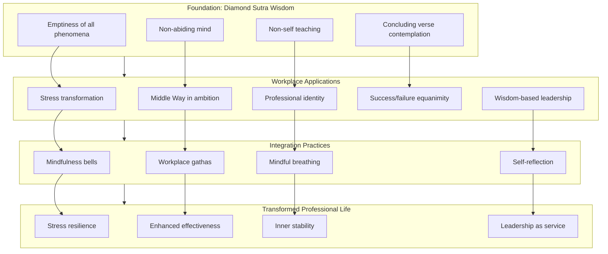

This diagram illustrates how the Diamond Sutra's foundational teachings (emptiness, non-self, non-abiding, concluding verse) inform specific workplace applications (stress transformation, Middle Way in ambition, professional identity, outcome equanimity, wisdom-based leadership), which are supported by integration practices (mindfulness bells, gathas, breathing, reflection), ultimately producing transformed professional life characterized by stress resilience, enhanced effectiveness, inner stability, and leadership as service.

---

In summary, the Diamond Sutra's application to workplace and career development reveals that **ancient wisdom directly addresses contemporary professional challenges**. The teaching on non-abiding mind provides a foundation for stress resilience, transforming the relationship with professional pressure from reactive suffering to responsive engagement. The Middle Way navigates between ego-driven ambition and passive disengagement, allowing for passionate professional striving without the suffering of attachment. The teaching on non-self liberates practitioners from vulnerability to career circumstances by revealing that professional identity, while conventionally useful, is empty of inherent existence. The recognition that success and failure are like dreams and illusions enables equanimity through the inevitable fluctuations of professional life. And wisdom-based leadership, informed by the sutra's teaching on giving without attachment to signs, offers a model of authority exercised without ego-grasping.

The integration of these teachings into daily professional practice transforms the workplace from a source of stress into **a field of awakening**. Through specific practices—mindfulness bells, gathas, breathing techniques, and contemplation of emptiness—practitioners can maintain non-abiding awareness through meetings, negotiations, and high-pressure situations. The research evidence supporting mindfulness at work confirms what the Diamond Sutra has taught for fifteen centuries: **releasing attachment does not undermine effectiveness but enhances it**, creating the conditions for both professional success and ultimate liberation.

## 9 Application to Business Practices and Ethical Commerce

This chapter examines how the Diamond Sutra's core teachings—emptiness, non-attachment, non-self, and the non-abiding mind—can be systematically applied to transform business practices, ethical decision-making, and organizational culture. Building upon the workplace applications explored in Chapter 8, this chapter extends the analysis to broader commercial contexts, investigating how 'giving without attachment to signs' informs ethical commerce, how emptiness teachings foster innovative and non-rigid strategic thinking, and how the sutra's wisdom supports sustainable business models that transcend profit-maximization as the sole objective.

### 9.1 Ethical Decision-Making Without Attachment to Profit Alone

The Diamond Sutra's teaching on non-attachment provides a profound framework for addressing one of the most persistent challenges in business ethics: **how to make decisions that balance financial considerations with broader stakeholder welfare**. In a commercial environment where profit maximization has traditionally been treated as the primary—if not exclusive—objective, the sutra's wisdom offers a radical reorientation that paradoxically enhances both ethical conduct and long-term business sustainability.

#### The Sutra's Logical Structure Applied to Business Management

The Diamond Sutra's characteristic logical formulation—**"A is not A, therefore it is called A"**—has direct application to business management and ethical decision-making. When applied to the concept of management itself, this becomes: **"Management, that is, non-management, is called management."**[^41] This paradoxical structure reveals that authentic management transcends the narrow, self-interested conception typically associated with the term.

This formulation embodies the sutra's core teaching that **"all appearances are vain"** (凡所有相，皆是虚妄).[^41] Applied to business ethics, this means that the conventional appearance of profit as the sole legitimate business objective is itself a form of conceptual attachment that obscures deeper truths about value creation and organizational purpose. The manager who grasps at profit as an independently existing goal—as something with inherent, fixed significance—operates from the same fundamental ignorance that the Diamond Sutra identifies as the root of all suffering.

The sutra teaches that **business management should be based on the concept of "selflessness"** (無我).[^41] This does not mean that businesses should ignore financial considerations but that they should not be attached to profit as a defining essence. The difference between ordinary employees and bodhisattvas regarding the concept of self illuminates this distinction: **"Employees are often utilitarian, considering their own interests even when being altruistic, which prevents them from serving a company unselfishly."**[^41] When decision-makers operate from ego-centered motivation—whether individual or organizational—their capacity for genuinely ethical conduct is fundamentally limited.

#### The Dialectical Phenomenon: Releasing Attachment Enhances Results

A crucial insight from applying Diamond Sutra wisdom to business ethics is what scholars describe as **"a dialectical phenomenon: the more managers can let go of themselves, the better they can achieve themselves."**[^41] This finding directly contradicts the conventional assumption that ethical considerations necessarily compete with business success. The sutra suggests that releasing attachment to narrow self-interest—whether individual profit or organizational profit maximization—actually creates conditions for superior outcomes.

This dialectical relationship operates through several mechanisms:

**Enhanced decision quality**: When decision-makers are not fixated on specific outcomes, they can perceive situations more clearly. The Diamond Sutra's teaching that the Tathāgata **"speaks of things as they are, speaks what is true, and speaks in accord with reality"** provides the model for business decisions grounded in accurate perception rather than wishful thinking or fear-driven distortion.

**Expanded consideration of stakeholders**: Attachment to profit alone creates cognitive narrowing that excludes relevant information about employee welfare, customer needs, community impact, and environmental consequences. Releasing this attachment opens decision-making to the full range of factors that determine genuine, sustainable value creation.

**Long-term orientation**: The sutra's teaching that all conditioned phenomena are like **"dreams, illusions, bubbles, shadows, dew, and lightning"** applies to short-term profits as much as to any other phenomenon. Recognizing the impermanent, conditioned nature of quarterly results naturally shifts attention toward more enduring sources of value.

#### Credit as the Core of Business Strategy

The Diamond Sutra's application to business strategy reveals a profound insight: **"The core of business strategy is 'credit,' and the essence of business strategy management is the establishment and construction of corporate credit."**[^41] This teaching stands in direct contrast to military strategy, where deception is a legitimate tool. In commercial contexts, the sutra suggests that **trust and credibility constitute the fundamental strategic asset**.

This insight transforms ethical decision-making from a constraint on business success into its foundation. When an organization recognizes that its long-term viability depends on the trust of customers, employees, suppliers, investors, and communities, ethical conduct becomes strategic necessity rather than optional virtue. The sutra's teaching on **giving without attachment to signs** applies directly: organizations that serve stakeholders without calculating immediate return build the relational capital that sustains commercial success over time.

The following table contrasts attachment-based and non-attachment-based approaches to business decision-making:

| Decision Factor | Attachment-Based Approach | Non-Attachment-Based Approach |
|----------------|--------------------------|------------------------------|
| **Primary metric** | Short-term profit maximization | Sustainable value creation for all stakeholders |
| **Time horizon** | Quarterly results | Multi-generational impact |
| **Stakeholder consideration** | Shareholders prioritized | All stakeholders considered |
| **Ethical framework** | Compliance with legal minimum | Genuine concern for welfare |
| **Risk assessment** | Financial risk only | Full spectrum including reputational, social, environmental |
| **Decision quality** | Distorted by outcome attachment | Clear perception of actual conditions |

#### Practical Tension: Fiduciary Responsibility and Broader Obligations

A practical challenge in applying Diamond Sutra wisdom to business ethics involves the tension between fiduciary responsibility to shareholders and broader social obligations. The sutra's teaching does not resolve this tension by dismissing either pole but by **transforming the framework within which the tension appears**.

The conventional framing treats shareholder interests and stakeholder welfare as competing claims on a fixed pool of value. The Diamond Sutra's teaching on emptiness reveals that this framing itself is a conceptual construction—**the apparent conflict arises from attachment to a particular understanding of value and obligation**. When decision-makers recognize that shareholder value ultimately depends on sustainable relationships with all stakeholders, the apparent conflict dissolves.

The sutra's Middle Way applies directly: avoiding the extreme of **profit-only focus** (which ultimately undermines the conditions for profit) and the extreme of **ignoring financial viability** (which makes the organization unable to serve any stakeholder). The teaching that **"the enterprise is an organic life body, a natural extension of a person"**[^41] suggests that business decisions should be made with the same integrated wisdom that guides decisions about one's own life—considering immediate needs, long-term flourishing, relationships, and broader impact.

The practical application involves developing decision-making frameworks that explicitly incorporate multiple stakeholder perspectives while maintaining financial viability. The Diamond Sutra's teaching on the **"four dimensions" of enterprise—"mind, energy, information, and substance"**[^41]—provides a model for this integration, suggesting that commercial activity involves not merely material exchange but the full spectrum of human experience and relationship.

### 9.2 Compassionate Leadership and the Bodhisattva Model in Business

The Diamond Sutra's bodhisattva ideal—**liberating all beings while recognizing that no beings are ultimately liberated**—provides a transformative model for business leadership that transcends both ego-driven management and passive disengagement. This paradoxical teaching offers profound guidance for leaders seeking to create genuine value for employees, customers, and communities while maintaining the clarity and effectiveness required for commercial success.

#### The Bodhisattva Paradox Applied to Business Leadership

The sutra presents a profound paradox that illuminates the nature of compassionate leadership: **"However many species of living beings there are, we must lead all these beings to nirvana so that they can be liberated. Yet when this innumerable, immeasurable, infinite number of beings has become liberated, we do not, in truth, think that a single being has been liberated."** This teaching provides a model for business leadership that maintains **vast aspiration combined with non-attachment to outcomes**.

Applied to business contexts, this means that leaders can work passionately for the welfare of employees, customers, and communities while recognizing that these efforts, like all conditioned phenomena, are empty of the substantial, permanent significance we typically attribute to them. This recognition does not diminish engagement but **liberates it from the distortions introduced by ego-driven striving**.

The sutra states that **"if a bodhisattva has self-image, human-image, sentient beings, and longevity, it is not a bodhisattva."**[^41] Applied to leadership, this means that the leader who acts primarily to reinforce their self-image as a "great leader," to establish superiority over other "persons," to distinguish themselves from "ordinary beings," or to create a lasting "legacy" is not yet leading from genuine compassion. **Selfless compassion**—compassion that responds to suffering without the distortions introduced by ego-centered thinking—becomes the foundation for authentic leadership.

#### Self-Decentralization in Leadership Practice

Research on Buddhist leader-practitioners reveals how the Diamond Sutra's teaching on non-self (anātman) operates in organizational contexts. The concept of **self-decentralization** involves **"letting go of ego-centric desires, ego-serving knowledge, and ego-serving expectations to reduce suffering."** This practice creates the conditions for leadership that genuinely serves others rather than using service as a vehicle for ego-gratification.

The practical implementation of self-decentralization involves two key Buddhist practices:

**Skillful Means (upāya)**: Context-sensitive application of non-self principles. Leaders must adapt their approach to specific organizational situations rather than applying abstract principles rigidly. The Diamond Sutra's teaching that **"the Dharma the Tathāgata taught is ungraspable, ineffable, and neither a phenomenon nor the absence of a phenomenon"** suggests that genuine leadership wisdom cannot be reduced to formulaic prescriptions.

**The Middle Way**: Balancing internal and external expectations to avoid extremes. Leaders navigate between complete ego-dissolution (which would undermine effective leadership) and ego-driven management (which creates suffering for themselves and others). The sutra's teaching on avoiding both eternalism and nihilism translates into leadership that is neither rigidly attached to outcomes nor indifferent to results.

However, practitioners face significant tensions. **"Agency-related tensions include the risk of recentering an 'enlightened self' as a form of leadership branding."**[^48] This insight reveals a subtle trap: one can become attached to being "the compassionate leader" or "the mindful executive," creating a new form of ego-identification. The Diamond Sutra addresses this by teaching that even non-attachment must not become an object of attachment.

#### The Distinction Between Detachment and Nonattachment in Leadership

A crucial distinction for compassionate leadership involves understanding the difference between **detachment and nonattachment**. These terms are often confused, but they point to fundamentally different orientations:

**Detachment** often carries connotations of **"emotional withdrawal and negation"**, leading to coldness and loss of passion for work. This represents a defensive state requiring mental toughness to complete activities—a form of disengagement that undermines effective leadership.[^48]

**Nonattachment**, by contrast, refers to **"the ability to fully engage without being bound by outcomes."** Leaders practicing nonattachment can evaluate situations without ego-bias, **"neither elated by 'winning' nor fearful of 'losing,' approaching both with equanimity and composure."** This transforms leadership into **"an effortless game rather than a high-stakes endeavor."**[^48]

At the level of **true neutrality**, leaders are no longer bound by the ego's need for judgment, expectation, or control of outcomes. **"With personal stakes removed, challenges are seen as part of a natural flow."** This neutrality enables decision-making based on principles rather than rigid rules, without needing to **"prove anything to anyone"**—allowing for **"calm, logical responses."**[^48]

The following diagram illustrates the relationship between detachment, nonattachment, and effective leadership:

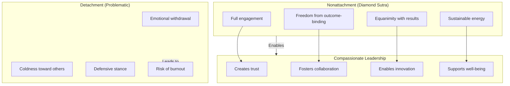

#### Practical Implementation: Creating Cultures of Trust and Collaboration

The Diamond Sutra's teaching on compassionate leadership translates into specific organizational practices that create cultures of trust, collaboration, and sustainable performance:

**Prioritizing employee well-being**: The sutra's teaching that bodhisattvas should liberate all beings translates into genuine concern for employee flourishing—not as a means to extract greater productivity but as an end in itself. Organizations that have integrated Buddhist principles demonstrate this through practices such as **"creating 'moral and potential human resources' rather than focusing solely on specific task activities."**[^49]

**Stakeholder consideration**: The bodhisattva's vow extends beyond employees to all beings affected by organizational activity. This includes customers, suppliers, communities, and the natural environment. The sutra's teaching on **"no notion of sentient beings"** paradoxically supports this inclusive concern—when we release attachment to categorical distinctions, we naturally respond to suffering wherever it appears.

**Community building**: Leaders embodying the bodhisattva ideal **"cultivate a sense of community and team spirit"** by creating **"an atmosphere in which everyone feels appreciated and heard."** The Diamond Sutra's teaching on non-self enables this—when leaders are not defending ego-positions, they can truly attend to others.

Research on organizations integrating Buddhist principles reveals concrete outcomes. A hospital in Thailand that built its management on Buddhist ethics found that **"over 90% of employees reported they were happy in life and work, an index maintained for five consecutive years."**[^49] The key to this success was that **"high-level management recognized efficiency and potential at specific employee levels and chose not to expand business blindly, focusing on 'quality' over 'quantity.'"**[^49]

#### Addressing Hierarchical Structures

A practical challenge in implementing non-self principles involves their application within hierarchical organizational structures. The Diamond Sutra's teaching does not require eliminating hierarchy but transforming how authority is understood and exercised.

The sutra's teaching that **"authority is not authority, therefore it is called authority"** suggests that genuine authority does not grasp at itself. Leaders can exercise decision-making responsibility, provide direction, and maintain accountability without attachment to the position of authority as a source of ego-gratification. The teaching on **giving without attachment to signs** applies: leaders give guidance, make decisions, and exercise authority without expecting recognition or reinforcement of their superior status.

The **"horizontal-oriented" management model** observed in Buddhist-influenced organizations demonstrates this principle in practice—**"streamlined hierarchy to facilitate quick and flexible decision-making"** while **"emphasizing the soul and mind of employees by applying Buddhist teachings."**[^49] This approach maintains necessary organizational structure while dissolving the ego-attachments that typically distort hierarchical relationships.

### 9.3 Emptiness and Innovation: Non-Rigid Thinking in Strategic Planning

The Diamond Sutra's teaching on emptiness (śūnyatā) as dependent origination provides a powerful philosophical foundation for innovative, adaptive strategic thinking. **The ancient Buddhist concept of "emptiness," going back nearly two millennia, has interesting present-day implications for the process of idea creation and development in innovation.**[^50] This section explores how recognizing that ideas, products, and markets lack inherent fixed existence enables organizations to avoid cognitive rigidity and respond creatively to changing conditions.

#### Emptiness as the Philosophical Foundation for Innovation

The philosophy of emptiness, or *śūnyatā*, teaches that **"everything is composed of dependently related events, of continuously interacting phenomena with no fixed, immutable essence, which are themselves in constantly changing dynamic relations."**[^50] This understanding has direct implications for innovation:

**Ideas do not exist independently**: The Diamond Sutra's teaching reveals that ideas, like all phenomena, exist only as **"an ever-changing nexus of interdependent and causal relationships."**[^50] This recognition liberates innovation from the assumption that good ideas must be wholly original or that they possess some inherent "idea-nature" that makes them valuable independent of context.

**Steve Jobs' Buddhist insight**: Jobs, himself a student of Buddhism, captured this understanding when he said that **"creativity is just connecting things."**[^50] This pithy observation **"finds deeper resonance in the Buddhist theory of emptiness."** Innovation is not the creation of something from nothing but the recognition of new connections within the interdependent web of existing phenomena.

**Real innovation implies emptiness**: The Dalai Lama's teaching that **"things and events are 'empty' in that they do not possess any immutable essence that affords independence"** has a crucial corollary for innovation: **"You cannot change, transform or 'innovate' something that is immutable and self-enclosed."**[^50] Only because phenomena are empty—lacking fixed essence—can they be transformed through creative intervention.

#### Practical Implications for Idea Creation

The Diamond Sutra's emptiness teaching has specific implications for how organizations approach idea creation:

**Beyond linear approaches**: The teaching suggests that **"a simple linear approach will not likely work"** for genuine innovation.[^50] Linear processes assume that ideas move through fixed stages from conception to implementation, but emptiness reveals that ideas exist in **"different and overlapping contexts"** simultaneously—scientific, engineering, organizational, market, competitive, regulatory, and historical contexts all interpenetrate.

**Holistic attentiveness**: Innovators must be **"sensitive to all the different and overlapping contexts that an idea or set of related ideas 'exist' in."** This **"holistic attentiveness should embrace all of the causal relationships tied to the idea through different domains and directions."**[^50] The Diamond Sutra's teaching on the Buddha's five eyes—physical, heavenly, wisdom, dharma, and buddha eyes—provides a model for this multi-perspectival awareness.

**Intuitive synthesis**: An **"intuitive thought process, also stressed by Steve Jobs, is probably essential at some point—grasping in one's mind a changing subset of different and new causal directions that one might go in while simultaneously being receptive to a 'sudden enlightenment' idea combination."**[^50] This describes the creative leap that connects disparate elements into novel configurations.

**Avoiding decision-making delays**: One person can easily **"lose track of all the connections and subpart relationships within a changing causal nexus of potential new ideas if the decision-making process is too slow, dragged out, linear/sequential or casual and inattentive."**[^50] The emptiness teaching suggests that ideas exist in dynamic relationship; capturing their innovative potential requires timely, focused engagement.

#### Beginner's Mind (Shoshin) in Strategic Thinking

The Japanese Zen concept of **Shoshin, or "beginner's mind,"** offers a practical application of emptiness teaching to strategic thinking. As Zen master Shunryu Suzuki wrote: **"In the beginner's mind there are many possibilities, but in the expert's there are few."**[^51] This teaching directly addresses the cognitive rigidity that limits organizational innovation.

**The expert's trap**: Modern business rewards expertise, but this expertise can become **"a cognitive prison, known as the 'Einstellung effect,' where learned methods prevent the discovery of novel solutions."**[^51] The Diamond Sutra's teaching on releasing attachment to fixed concepts applies directly—attachment to "what we know" prevents recognition of new possibilities.

**Sony's cautionary example**: Sony in the 1980s exemplifies this trap. After revolutionizing portable music with the Walkman in 1979, **"their deep knowledge of analog technology blinded them to the digital revolution. When Apple launched the iPod in 2001, Sony's expertise in physical media became a liability."**[^51] The company's attachment to its existing knowledge prevented adaptation to changing conditions.

**Soichiro Honda's embodiment of Shoshin**: Honda **"embodied Shoshin throughout his entrepreneurial journey."** After his first company failed Toyota's quality standards, **"he approached the problem with genuine beginner's curiosity."** After World War II, he noticed surplus small engines and attached them to bicycles—**"a pragmatic solution that grew into a global automotive empire. Honda succeeded by holding no allegiance to initial methods or expertise."**[^51]

#### Organizational Practices for Non-Rigid Innovation

The Diamond Sutra's emptiness teaching supports specific organizational practices that foster innovation:

**Cross-functional collaboration**: Organizations should build **"a cross-functional, time-, employee- and team-intensive learning space or study environment for evaluating all new ideas and associated problems at the same time—what one might call an intense innovation 'space-time.'"**[^50] This structure enables participants to **"identify connections, intersections, complementarities and convergences—even patterned networks—between different ideas."**

**Transfer-based education**: Nitori Holdings demonstrates how constraints foster Shoshin thinking through **"transfer-based education, deliberately moving people across departments to maintain beginner's perspectives."**[^51] This practice prevents the calcification of expertise that limits innovation.

**Strategic questioning**: The beginner's mind leader **"operates through questions rather than statements."** Deloitte research identified four strategic inquiries: **"What if my assumptions are wrong? What if solutions drawn from history are no longer relevant? What if I could wish for anything? What if my critics are right?"**[^51] These questions implement the Diamond Sutra's teaching on releasing attachment to fixed concepts.

**Technically diverse teams**: The emptiness philosophy suggests that **"technically diverse teams and a focused supporting cast operating within a tight period of creative engagement may be required."**[^50] Diversity brings multiple perspectives that can recognize connections invisible to homogeneous groups.

The following table contrasts rigid and emptiness-informed approaches to strategic planning:

| Strategic Element | Rigid Approach | Emptiness-Informed Approach |
|------------------|----------------|----------------------------|
| **Ideas** | Treated as fixed entities to be evaluated | Recognized as dynamic nexuses of relationships |
| **Expertise** | Accumulated knowledge as primary asset | Beginner's mind as complement to expertise |
| **Process** | Linear, sequential stages | Holistic, simultaneous consideration |
| **Teams** | Specialized, siloed departments | Cross-functional, diverse perspectives |
| **Decision-making** | Extended deliberation | Focused, intensive engagement |
| **Assumptions** | Defended as organizational knowledge | Regularly questioned and tested |

#### Human Innovation Versus Artificial Intelligence

The Diamond Sutra's emptiness teaching also illuminates the distinctive capacity of human innovation compared to artificial intelligence. **"An AI device is inherently dependent on a set of programming inputs, thus dependent on information that has an independent existence/essence outside of the AI. The AI device cannot run on 'emptiness.'"**[^50]

By contrast, **"a team of human innovators could in theory at least, operate on the Buddhist emptiness principle—identifying and connecting a wide range of contingent and causal relationships to develop something new within one or more product or service domains."**[^50] This suggests that the distinctive human capacity for innovation lies precisely in the ability to recognize and work with the interdependent, empty nature of phenomena—a capacity that current AI systems, dependent on fixed inputs, cannot replicate.

Organizations seeking to foster innovation should therefore create conditions that support **"the creative opportunity to go beyond what artificial intelligence is currently capable of doing"**[^50]—conditions that enable human awareness to recognize novel connections within the ever-changing web of interdependent phenomena.

### 9.4 Giving Without Attachment: Business Generosity and Stakeholder Relations

The Diamond Sutra's teaching on giving without attachment to signs provides a transformative framework for understanding business relationships with customers, employees, suppliers, and communities. The sutra's instruction that bodhisattvas should **"practice generosity without relying on any object—any form, sound, smell, taste, touch, or object of mind"** applies directly to commercial contexts, transforming transactional relationships into genuine value creation.

#### The Threefold Emptiness of Giving in Business Contexts

The Diamond Sutra's teaching points toward what later Buddhist commentators called the **"threefold emptiness of giving"**: no fixed giver, no fixed recipient, no fixed gift. Applied to business relationships, this teaching reveals that the conventional framework of commercial transactions—where a defined seller provides a defined product to a defined buyer in exchange for defined payment—obscures the interdependent, dynamic nature of genuine value creation.

**No fixed giver**: The organization that provides products or services is not a fixed, independent entity but a temporary configuration of employees, resources, relationships, and circumstances. Recognizing this dissolves the ego-attachment that often distorts business relationships—the need to be seen as "the provider," to receive credit, to establish superiority over those served.

**No fixed recipient**: Customers, employees, and other stakeholders are equally empty of fixed, independent existence. They are not static targets for organizational activity but dynamic participants in ongoing relationships. This recognition transforms the relationship from one-directional provision to mutual engagement.

**No fixed gift**: Products, services, and value itself are not fixed substances that pass from one party to another but arise from the intersection of provider capacity, recipient need, and contextual conditions. The "value" of a product exists only in relationship—it is empty of inherent value-nature.

The Diamond Sutra promises that giving practiced with this recognition produces **merit "like the vastness of space—it cannot be conceived of or measured."** In business contexts, this suggests that non-attached giving generates value that transcends what transactional calculation can capture.

#### Giving Unconditionally in Business Relationships

The principle of **giving without strings attached** applies directly to business relationships. The teaching states: **"If we simply give without the expectation of receiving anything in return, we are giving properly."**[^52] However, **"many people give with conditions attached. They have an underlying motivation for giving; one common motivation is recognition, another is control. This is our ego working."**[^52]

Applied to business contexts:

**Customer service without expectation of reciprocity**: Organizations that serve customers genuinely—without calculating immediate return—build relationships that generate long-term value. The Diamond Sutra's teaching suggests that service motivated by desire for recognition, repeat business, or positive reviews is **"giving with strings attached"** that limits the value created.

**Employee development without paternalistic control**: Organizations that invest in employee development often do so with implicit expectations—that employees will remain loyal, increase productivity, or advance organizational goals. The sutra's teaching on non-attached giving suggests that genuine employee development serves employee flourishing without attachment to organizational return.

**Supplier partnerships based on mutual flourishing**: Business relationships with suppliers often involve explicit or implicit power dynamics—the buyer leveraging purchasing power to extract maximum value from the seller. The Diamond Sutra's teaching transforms this into partnership oriented toward mutual flourishing, where both parties give without calculating advantage.

The teaching warns that **"strings attached to giving can have many symptoms, some of which include expectations of gaining something in return (which usually leads to disappointment), judgement of how someone is responding or reacting to your gift, frustration that you're not getting equal to or more than you're giving."**[^52] These symptoms appear throughout business relationships and indicate the presence of attachment that limits value creation.

#### Corporate Philanthropy Beyond Reputation Management

The Diamond Sutra's teaching has particular relevance for corporate philanthropy, which often operates as a form of reputation management rather than genuine giving. The sutra's instruction to give **"without regard to appearances, without regard to form, without regard to sound, smell, taste, touch, or any quality of any kind"**[^53] challenges the conventional approach where charitable giving is calibrated for maximum reputational benefit.

The Buddha teaches that **"practicing compassion and charity without attachment is the way to reaching the Highest Perfect Wisdom."**[^53] Applied to corporate philanthropy, this suggests that giving motivated by reputation enhancement, tax benefits, or stakeholder relations management—while potentially producing beneficial outcomes—does not constitute the highest form of generosity.

The sutra's promise that non-attached giving produces **"immeasurable merit"** suggests that corporate philanthropy practiced without attachment to recognition generates value that exceeds what strategic calculation can anticipate. Organizations that give genuinely—without calculating return—may discover that the relational capital, employee engagement, and community goodwill generated far exceed what reputation-focused giving could achieve.

#### Practical Application: Transforming Stakeholder Relations

The Diamond Sutra's teaching on non-attached giving can be implemented through specific practices that transform stakeholder relations:

**1. Customer Relations**

The sutra's teaching applies to how organizations approach customer service. The instruction to give **"without cherishing any idea of form"**[^53] suggests serving customers without attachment to the form of the interaction—whether the customer is pleasant or difficult, whether the transaction is large or small, whether recognition will follow. This transforms customer service from a calculated exchange into genuine care.

**2. Employee Relations**

The teaching on **"no notion of person"** transforms how organizations relate to employees. Rather than viewing employees as resources to be optimized, organizations can recognize employees as fellow beings deserving of genuine concern for their flourishing. The hospital case study demonstrates this through practices like **"cheap lunch programs"** (5 baht per meal), **"half-price rental apartments"** for lower-paid employees, scholarships for employees and their children, and **"merit-making activities"** organized monthly.[^49]

**3. Supplier Relations**

The sutra's teaching on interdependence transforms supplier relationships. Recognizing that organizational success depends on supplier well-being—and that supplier success depends on organizational health—dissolves the adversarial dynamic that often characterizes buyer-seller relationships. The teaching on **"dependent origination"** reveals that no party in a supply chain exists independently; all arise together in mutual relationship.

**4. Community Relations**

The teaching on **"liberating all beings"** extends organizational concern to communities affected by business activity. This includes not only direct stakeholders but all beings impacted by organizational decisions—including future generations and the natural environment. The sutra's teaching that the bodhisattva vows to liberate **"innumerable, immeasurable, infinite"** beings suggests that genuine business responsibility extends far beyond conventional stakeholder categories.

### 9.5 Sustainable Commerce and the Middle Way: Beyond Growth-Maximization

The Diamond Sutra's Middle Way philosophy provides essential guidance for sustainable business models that navigate between profit-driven exploitation and impractical idealism. This section examines how the sutra's teaching on avoiding extremes translates into business practices that balance economic viability with environmental stewardship and social responsibility, drawing on Buddhist economics principles and contemporary applications.

#### Buddhist Economics: A Return to Rational Value Creation

The concept of **Buddhist economics** offers a systematic alternative to conventional growth-maximization models. Buddhist economics **"is gaining increased appeal in a world where external global factors are becoming more of a threat. It is a return to the values of agricultural production, but considers the experience of industrial and post-industrial economy."**[^54] Its priorities are **"care for the environment, personal development, community development, and spiritual development."**

This approach does not reject modern economic achievements but seeks to use them more wisely. Buddhist economics **"is not a rejection of modern society's achievements but an attempt to use them for a more intelligent implementation of the goals defined by Aristotle."**[^54] The rational model **"consists in thrifty but full consumption and restrained production with environmentally friendly aims."**

E.F. Schumacher's foundational work, including his 1973 book *Small is Beautiful* and his essay "Buddhist Economics," **"applied Buddhist values to create an economic model for long-term stable development."**[^54] Schumacher **"proved the fundamental 'unprofitability' of uncontrolled large-scale industrial production"** as early as the 1950s, challenging the assumption that growth maximization serves genuine human welfare.

#### The Middle Way Between Profit and Idealism

The Diamond Sutra's Middle Way navigates between two extremes that distort business practice:

**Extreme 1: Profit-driven exploitation**

This extreme treats profit maximization as the sole legitimate business objective, subordinating all other considerations—employee welfare, environmental impact, community well-being—to financial return. The sutra's teaching on **eternalism** applies: this approach treats profit as if it possessed permanent, independent significance, when in fact it is a conditioned phenomenon arising from relationships with stakeholders and environment.

**Extreme 2: Impractical idealism**

The opposite extreme dismisses financial viability as irrelevant to genuine business purpose, pursuing social or environmental goals without sustainable economic foundation. The sutra's teaching on **nihilism** applies: this approach denies the conventional reality of economic constraints, making organizations unable to serve any stakeholder over time.

The Middle Way recognizes that **"the Buddhist economy can only be successful as part of an entirely Buddhist way of life in a Buddhist society."**[^54] This suggests that sustainable commerce requires not merely adopting specific practices but transforming the underlying values and assumptions that guide economic activity.

#### Maximum Well-Being with Minimum Consumption

A central principle of Buddhist economics directly challenges the growth-maximization paradigm: **"From the point of view of Buddhist economics, the modern Western approach is irrational because it focuses on maximum consumption as the goal. For Buddhist economics, consumption is only a means, and the real goal is maximum well-being with minimum consumption."**[^54]

This principle has direct implications for business strategy:

**Product design**: Buddhist economics suggests designing products for durability, repairability, and genuine utility rather than planned obsolescence. The goal is **"producing long-term, repairable goods supporting regenerative practices."**[^54]

**Marketing**: Rather than stimulating desires for unnecessary consumption, marketing aligned with Buddhist principles would help customers identify genuine needs and find appropriate solutions. Schumacher proposed **"the idea of 'completeness,' satisfying existing needs without stimulating new ones."**[^54]

**Business models**: Rather than models dependent on continuous growth in consumption, sustainable commerce develops models that create value through efficiency, quality, and genuine service. **"A Buddhist economy based on 'local production – local consumption' is ideal for small communities, saving on transportation, providing permanent employment, and leading to self-sufficiency."**[^54]

#### The Dream-Like Nature of Material Accumulation

The Diamond Sutra's concluding verse—comparing all conditioned phenomena to **"dreams, illusions, bubbles, shadows, dew, and lightning"**—has direct application to business orientation toward material accumulation. Recognizing the impermanent, conditioned nature of wealth and growth naturally shifts attention toward more enduring sources of value.

The sutra's teaching does not condemn material prosperity but reveals its proper place. **"The Buddhist is mainly interested in liberation, not antagonistic to physical well-being, as the obstacle is attachment to wealth, not wealth itself."**[^55] This distinction is crucial: the problem is not economic activity but **attachment** to economic outcomes as if they possessed permanent, independent significance.

This understanding supports business models oriented toward **sustainable value creation** rather than maximum accumulation. When leaders recognize that accumulated wealth is like a dream or bubble—appearing substantial but lacking permanent essence—they naturally shift attention toward creating genuine benefit for stakeholders rather than maximizing metrics that ultimately prove empty.

#### Practical Principles for Sustainable Commerce

Buddhist economics articulates several practical principles for sustainable commerce:

**1. Simplicity and non-violence**

**"The keynote of Buddhist economics is simplicity and non-violence."**[^55] Simplicity means meeting genuine needs without unnecessary complexity; non-violence means conducting business without harm to employees, communities, or environment. **"A modest use of resources makes conflict less likely."**

**2. Local production for local needs**

**"Production from local resources for local needs is the most rational economic life, whereas dependence on distant trade is uneconomic and signifies failure."**[^55] While global trade has legitimate functions, Buddhist economics suggests that **"transporting large amounts of resources is seen as a sign of inefficiency, not progress."**[^54]

**3. Reverent use of natural resources**

**"Buddhism enjoins a reverent and non-violent attitude toward all sentient beings and trees."**[^55] This translates into business practices that **"require that non-renewable resources be used only if indispensable, with great care for conservation."**[^55] The teaching warns that **"heedless use is violence against nature leading to violence among men."**

**4. Full employment as priority**

**"Buddhist economic planning would start with planning for full employment for everyone who needs an outside job, not maximising employment or production."**[^55] This represents a fundamental reorientation from treating labor as a cost to be minimized toward recognizing work as essential for human flourishing.

The following table contrasts conventional and Buddhist economic approaches:

| Economic Element | Conventional Approach | Buddhist Economics Approach |
|-----------------|----------------------|----------------------------|
| **Primary goal** | Maximize consumption/growth | Maximum well-being with minimum consumption |
| **Labor** | Cost to be minimized | Essential for human development |
| **Resources** | Inputs to be exploited | Sacred gifts requiring reverent use |
| **Success metric** | GDP growth, profit margins | Genuine welfare, sustainability |
| **Time horizon** | Quarterly results | Multi-generational impact |
| **Scope** | Shareholder value | All beings, including environment |

### 9.6 Integrating Practice: From Buddhist Principles to Organizational Culture

This section synthesizes the chapter's teachings into practical frameworks for embedding Diamond Sutra wisdom into organizational culture and daily business operations. The analysis examines how the **six pāramitās** (perfections)—generosity, ethical conduct, patience, diligence, meditative concentration, and wisdom—can enrich corporate culture, providing guidance on cultivating mindfulness practices in business settings and creating organizational structures that support both commercial success and stakeholder flourishing.

#### The Six Pāramitās as Framework for Corporate Culture

Buddhist teaching identifies six perfections that characterize awakened activity. These **pāramitās—generosity, moral conduct, patience, diligence, meditative concentration, and wisdom—can be used to enrich corporate culture.**[^56] Each perfection offers specific guidance for organizational practice:

**1. Generosity (Dāna)**

**"In a corporation, giving is a very important part of its aim, mission, and culture. Generosity is founded on compassion. A compassionate businessman will create a culture which is concerned with the well-being of its people."**[^56] The teaching reveals that **"the real secret to making money is: the more is given, the more is received. Generosity is the seed of reward."**

Applied to organizational culture, this means creating environments where giving—of knowledge, time, resources, and support—flows naturally. The Diamond Sutra's teaching on giving without attachment to signs transforms organizational generosity from calculated exchange into genuine care.

**2. Moral Conduct (Śīla)**

**"Moral conduct is a set of moral standards built on self-discipline. Upholding moral conduct is the bottom line for a corporation, with which it will not lose its corporate conscience for a profit."**[^56] The teaching emphasizes understanding cause and effect: **"With an understanding of cause and effect—that good begets good, evil begets evil—we become selective in our actions."**

This translates into organizational cultures where ethical standards are maintained not through external enforcement but through genuine understanding of consequences. **"If good and evil are the ethical standard for a corporation, it can foster honest management."**

**3. Patience (Kṣānti)**

**"Patience is especially important to people today."** The teaching identifies three dimensions: **"to endure hardship in running a business; to tolerate and accommodate competitors; and to accept and acknowledge with courage any new management technique, technology, or product."**[^56]

The Diamond Sutra's teaching on patience for the non-arising of phenomena supports organizational resilience. **"By enduring hardship, Buddhism teaches us to face suffering in the right way and transform it into a positive force."**

**4. Diligence (Vīrya)**

**"Diligence is having passion for and exerting effort in whatever work we do. Diligence is the driving force of a corporate culture."**[^56] The teaching connects diligence to compassion: **"When there is compassion, people will feel strongly about their work since it is their work that can help and benefit more people. With this passion, they will be diligent."**

This transforms organizational motivation from external incentives to intrinsic purpose. When employees understand how their work serves genuine benefit, diligence arises naturally.

**5. Meditative Concentration (Dhyāna)**

**"Meditative concentration is important to the management and strategic direction of a company, and also invaluable in promoting mental well-being."**[^56] The teaching emphasizes that **"through meditative concentration, the mind can be trained to reach a state of crisp clarity. When decisions are made with this state of mind, they can have a greater and better impact."**

The reference to Steve Jobs illustrates this principle: **"Steve Jobs made many major decisions critical to the success of Apple; these decisions were connected with his meditation practice."**[^56] Meditation is described as **"an effective method for regulating the mind and alleviating stress."**

**6. Wisdom (Prajñā)**

**"The real core of Buddhism is wisdom."**[^56] The teaching distinguishes wisdom from intelligence: **"Wisdom in the Buddhist context is not about intelligence; it is closely connected with the perception of life and the world."** A business manager must **"distinguish between good and evil with wisdom"** and **"have a correct view of money; happiness is not entirely dependent on money."**

The Diamond Sutra's teaching on emptiness provides the foundation for this wisdom. The teaching on **no-self** means **"to think less of oneself and more of others. When we can give to the enterprise and, by way of the enterprise, to society and mankind, it is Buddhism in action."**[^56]

#### Case Study: Buddhist Principles in Organizational Practice

The Samrong General Hospital in Thailand provides a detailed case study of Buddhist principles integrated into organizational practice. Founded in 1981, the hospital's **"core policies and management principles are based on Buddhist ethics."**[^49] The integration demonstrates how Diamond Sutra wisdom can be practically implemented:

**Ethical policies**: The hospital's first policy is **"refusing to perform procedures considered morally problematic, such as abortion and sex reassignment surgery"** and maintaining **"'transparency' in financial systems, using only one accounting system for reporting to the Thai Revenue Department."**[^49] This implements the pāramitā of moral conduct.

**Employee programs**: The hospital provides numerous programs based on Buddhist principles, including:
- **"Cheap lunch program"** (5 baht per meal) operating for approximately ten years
- **"Half-price rental apartments"** for employees earning less than 10,000 baht monthly
- Unconditional scholarships for employees and their children
- Monthly **"merit-making activities"** including almsgiving, dharma listening, and meditation
- **"7-day meditation retreats"** for supervisors and interested employees
- **"Retirement planning"** for retiring employees[^49]

**Organizational culture**: The management model is **"horizontal-oriented, with streamlined hierarchy to facilitate quick and flexible decision-making."** Management emphasizes **"managing the heart before managing the task"** and **"emphasizing the soul and mind of employees by applying Buddhist teachings."**[^49]

**Results**: Internal surveys show that **"over 90% of employees reported they were happy in life and work, an index maintained for five consecutive years."**[^49] The key insight is that success came from recognizing **"efficiency and potential at specific employee levels"** and choosing **"not to expand business blindly, focusing on 'quality' over 'quantity.'"**

#### Practical Guidance for Organizational Integration

Based on the Diamond Sutra's teachings and organizational case studies, several practical recommendations emerge for integrating Buddhist principles into business settings:

**1. Mindfulness practices in business settings**

Organizations can introduce mindfulness practices that support the Diamond Sutra's teaching on non-abiding awareness:
- **Brief meditation sessions** before meetings or at the start of the workday
- **Mindfulness bells** using environmental sounds as reminders to return to present awareness
- **Walking meditation** during breaks or transitions between activities
- **Contemplation of the concluding verse** during challenging situations

**2. Ethical codes informed by non-attachment principles**

Organizational ethics can be grounded in the Diamond Sutra's teaching on giving without attachment to signs:
- Decision-making frameworks that consider multiple stakeholder perspectives
- Performance evaluation that includes contribution to others' flourishing
- Compensation structures that do not create excessive attachment to outcomes
- Policies that support employee well-being as an end in itself, not merely as means to productivity

**3. Organizational structures supporting flourishing**

Structures can be designed to support both commercial success and stakeholder development:
- **Flattened hierarchies** that reduce ego-attachment to position
- **Cross-functional collaboration** that dissolves artificial boundaries
- **Transfer-based education** that maintains beginner's mind
- **Community-building activities** that foster genuine connection

**4. Integration of the six pāramitās**

Each perfection can be systematically cultivated:

| Pāramitā | Organizational Practice |
|----------|------------------------|
| **Generosity** | Knowledge sharing, mentorship, community service |
| **Moral conduct** | Transparent policies, ethical decision frameworks |
| **Patience** | Resilience training, long-term orientation |
| **Diligence** | Purpose-driven work, intrinsic motivation |
| **Concentration** | Mindfulness programs, focused work periods |
| **Wisdom** | Reflective practice, systems thinking |

#### The Diamond Sutra's Promise for Business

The Diamond Sutra offers a profound promise for business practice: **"The life wisdom of the Diamond Sutra provides a feasible way for modern people to relieve worries, increase happiness, and enhance life meaning, an effect unmatched by general management."**[^41] This suggests that integrating the sutra's teachings into business practice produces benefits that transcend conventional management approaches.

The teaching that **"doing business is not incompatible with maintaining a deep spiritual life"**[^41] reveals that commercial activity and spiritual development need not be in tension. The sutra was **"created for those who are smart, strong, and clever"**[^41]—precisely the qualities required for business success. When these qualities are informed by wisdom rather than ego-attachment, they serve both commercial effectiveness and genuine human flourishing.

The integration is complete when there is no longer a sense of "applying Buddhist principles to business" because business itself has become an expression of awakened activity. The organization that embodies the Diamond Sutra's wisdom engages fully with commercial responsibilities while recognizing their empty, dream-like nature—creating genuine value for all stakeholders while remaining free from the suffering of attachment.

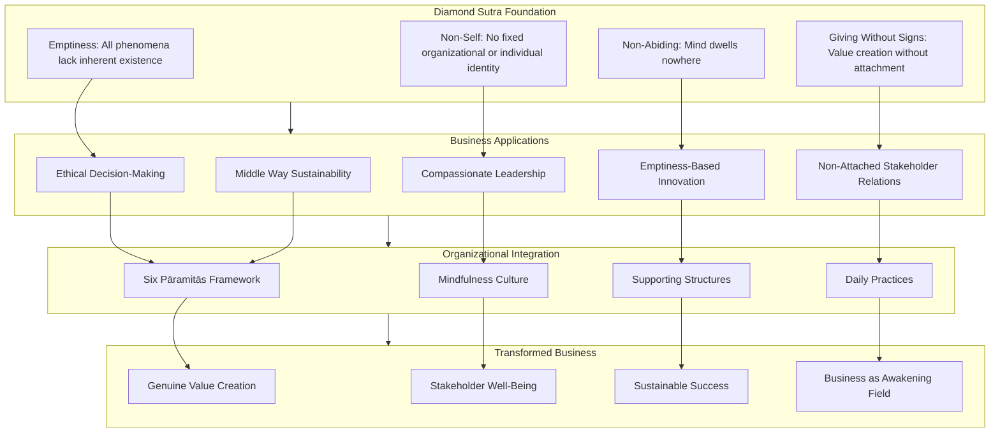

This diagram illustrates how the Diamond Sutra's foundational teachings (emptiness, non-self, non-abiding, giving without signs) inform specific business applications (ethical decision-making, compassionate leadership, emptiness-based innovation, non-attached stakeholder relations, Middle Way sustainability), which are integrated through organizational practices (six pāramitās framework, mindfulness culture, supporting structures, daily practices), ultimately producing transformed business characterized by genuine value creation, stakeholder well-being, sustainable success, and business activity as a field of awakening.

---

In summary, the Diamond Sutra's application to business practices and ethical commerce reveals that **ancient wisdom directly addresses contemporary commercial challenges**. The teaching on non-attachment transforms ethical decision-making from a constraint on profit into its foundation, revealing that the core of business strategy is **credit and trust** rather than short-term gain. The bodhisattva model provides a framework for compassionate leadership that serves all stakeholders while maintaining organizational effectiveness. The emptiness teaching fosters innovative, non-rigid strategic thinking by revealing that ideas, products, and markets exist as interdependent relationships rather than fixed entities. The instruction on giving without attachment to signs transforms transactional business relationships into genuine value creation. And the Middle Way philosophy supports sustainable commerce that navigates between profit-driven exploitation and impractical idealism.

The integration of these teachings through the six pāramitās and organizational practices demonstrates that **business activity itself can become a field of awakening**. Organizations that embody the Diamond Sutra's wisdom create genuine value for all stakeholders while recognizing the empty, dream-like nature of commercial phenomena. This is not idealistic abstraction but practical wisdom demonstrated by organizations that have successfully integrated Buddhist principles—achieving both stakeholder well-being and sustainable commercial success. The Diamond Sutra's promise for business is that **releasing attachment does not undermine effectiveness but enhances it**, creating the conditions for both commercial flourishing and the liberation from suffering that is the sutra's ultimate concern.

## 10 Application to Marriage and Intimate Relationships

This chapter applies the Diamond Sutra's core teachings on non-self (anātman), emptiness (śūnyatā), and non-attachment to the specific context of romantic partnerships and intimate relationships. Building upon the philosophical foundations established in earlier chapters and the practical applications explored in daily life, workplace, and business contexts, this chapter examines how the sutra's wisdom can transform the dynamics of marriage and romantic love—reducing possessiveness and unrealistic expectations, cultivating unconditional love that transcends ego-driven patterns, navigating conflicts through non-reactive awareness, and deepening genuine intimacy through the recognition that both partners lack fixed, independent self-nature.

### 10.1 The Diamond Sutra's Three-Part Logic Applied to Marriage: 'Husband and Wife, Not Husband and Wife, Therefore Called Husband and Wife'

The Diamond Sutra's characteristic paradoxical formula—**"A is not A, therefore it is called A"**—offers a profound framework for understanding the nature of marital relationships. This three-part logical structure, which appears throughout the sutra in various applications, reveals essential truths about how intimate partnerships actually function and provides guidance for navigating the inevitable evolution of marriage without clinging to fixed expectations.

#### The Three-Part Structure Applied to Marriage

A contemporary interpretation of the Diamond Sutra's logic applies it directly to the marital relationship through the formulation: **"The Tathāgata speaks of husband and wife; yet they are not truly husband and wife; therefore they are called husband and wife"** (如来说夫妻，既非夫妻，是名夫妻).[^57] This three-part structure illuminates the nature of marriage from three complementary perspectives:

**First Component: "The Tathāgata speaks of husband and wife"**

This initial affirmation acknowledges the **conventional reality of the marital relationship**. When two people enter into marriage, they genuinely become husband and wife at the conventional level. This statement recognizes that the relationship exists, that it has meaning, and that it arises through causes and conditions—what Buddhism calls **dependent origination** (緣起). The teaching affirms: "Since you have arrived at marriage, everything is a matter of karmic connection" (既然走到婚姻，一切都是缘分).[^57]

This first component validates the significance of marriage without dismissing it as mere illusion. The relationship is real at the conventional level—it involves genuine commitment, shared life, and mutual responsibility. The Diamond Sutra does not deny conventional reality but seeks to reveal its true nature.

**Second Component: "Yet they are not truly husband and wife"**

This negation reveals the **conditioned, evolving nature of the relationship**. Although two people are designated as husband and wife, they are not yet "true" husband and wife in the sense of a fixed, pre-existing essence. The teaching explains: "Although you are husband and wife, you are not yet truly husband and wife, because transforming from two independent individuals into a married couple requires shared life experiences, mutual adjustment, and reciprocal change" (虽然你们是夫妻，但还不是真正的夫妻，因为从两个独立的个体变成夫妻，是需要生活中共同经历去磨合、相互改变的).[^57]

This component addresses a common source of suffering in relationships: **the expectation of finding a pre-formed ideal partner**. The teaching clarifies: "Before becoming a wife, you were simply a woman; it is precisely because there is a husband that there can be a wife. Before marriage, there does not actually exist a husband who completely matches your expectations—rather, after marriage you transform him into your ideal husband" (成为妻子之前，你只是一个女孩/女人，正因为有了夫才会有妻，结婚之前其实并不存在一个完全符合你期望的丈夫，而是婚后你把他变成你的理想的丈夫).[^57]

This insight dissolves the romantic fantasy that one's "perfect partner" exists somewhere waiting to be discovered. Instead, the teaching reveals that **partners are mutually created through the relationship itself**—each shapes the other through shared experience, patient adjustment, and ongoing transformation.

**Third Component: "Therefore they are called husband and wife"**

This re-affirmation acknowledges that "husband and wife" is a **conventional designation** for a relationship that exists through dependent origination and will continue to evolve through conditions. The teaching states: "'Husband and wife' is merely a designation for your relationship; everything arises through dependent origination and is empty of inherent nature—that is, the marital relationship manifests through the coming together of causes and conditions, and will also change when those conditions are exhausted. Gathering and parting, union and separation, all depend upon the mind" (夫妻只是你们关系的一个称号，一切皆会缘起性空，也就是夫妻因缘合和所呈现，也会因缘尽而变；聚散离合全在于内心).[^57]

This final component does not diminish the relationship's significance but places it in proper perspective. The designation "husband and wife" is **conventionally valid and practically meaningful** while remaining empty of the fixed, independent existence we typically attribute to it.

#### Practical Implications of the Three-Part Logic

Understanding this three-part structure transforms how couples approach their relationships:

**1. Releasing the Fantasy of the Pre-Formed Ideal Partner**

The second component directly addresses one of the most common sources of relationship suffering: **the belief that one's ideal spouse exists somewhere, fully formed, waiting to be discovered**. This fantasy creates disappointment when the actual partner fails to match the imagined ideal, and it prevents genuine engagement with the partner who is actually present.

The Diamond Sutra's logic reveals that the "ideal partner" is not found but **co-created through the relationship**. Each partner shapes the other; each is transformed by shared experience. This understanding shifts the orientation from searching for perfection to engaging in mutual growth.

**2. Embracing the Ongoing Work of Marriage**

The teaching that partners "are not yet truly husband and wife" until they have been mutually shaped through experience reveals that **marriage is an ongoing process rather than a fixed state**. The wedding ceremony does not create a finished relationship; it initiates a journey of mutual transformation.

This understanding normalizes the challenges of marriage. Conflicts, adjustments, and changes are not signs of failure but **natural aspects of the process** through which two individuals become genuine partners. The work of marriage is not to maintain a static ideal but to engage skillfully with ongoing transformation.

**3. Holding the Relationship Lightly While Engaging Fully**

The third component's teaching that "gathering and parting, union and separation, all depend upon the mind" points toward a **transformed relationship with the relationship itself**. Partners can engage fully with their marriage while recognizing its conditioned, impermanent nature.

This recognition does not diminish commitment but **liberates it from the anxiety of grasping**. When partners understand that their relationship exists through causes and conditions—and will continue to evolve as conditions change—they can appreciate each moment of connection without the desperate clinging that transforms love into suffering.

The following table summarizes the three-part logic applied to marriage:

| Component | Statement | Teaching | Practical Implication |
|-----------|-----------|----------|----------------------|
| **First** | "The Tathāgata speaks of husband and wife" | Marriage is conventionally real, arising through karmic connection | Validate the relationship's significance |
| **Second** | "Yet they are not truly husband and wife" | Partners must be mutually shaped through experience; no pre-formed ideal exists | Release fantasy of perfect partner; engage in mutual transformation |
| **Third** | "Therefore they are called husband and wife" | "Husband and wife" is a conventional designation for an evolving relationship | Hold the relationship lightly while engaging fully |

#### The Middle Way in Understanding Marriage

This three-part logic embodies the Diamond Sutra's Middle Way approach to marriage:

**Against eternalism**: The teaching that partners "are not truly husband and wife" prevents treating the relationship as a fixed, permanent essence. Marriage is not an unchanging state to be preserved but a dynamic process to be engaged.

**Against nihilism**: The affirmation that they "are called husband and wife" preserves the conventional reality and significance of the relationship. Marriage matters; commitment is meaningful; the designation serves genuine purposes.

The Middle Way allows couples to **take their relationship seriously without taking it too seriously**—to be fully committed without the suffering that arises from grasping at permanence. This balance is the practical fruit of understanding the Diamond Sutra's three-part logic applied to intimate relationships.

### 10.2 Non-Self and the Dissolution of Possessiveness in Romantic Love

The Diamond Sutra's teaching on releasing the four marks—**no notion of self, no notion of person, no notion of sentient being, no notion of life-span**—has profound implications for transforming possessive patterns in romantic relationships. Possessiveness, jealousy, and the fear of loss that characterize much romantic suffering arise from a fundamental misunderstanding about the nature of self and other. By examining how the sutra's non-self teaching applies to intimate relationships, we can discover a path to love that is both deeply committed and genuinely free.

#### The Root of Possessiveness: Self-Grasping Extended to the Partner

Possessiveness in romantic relationships arises when we extend our **attachment to self** to include the partner as part of "me" or "mine." The partner becomes not a separate being to be appreciated but an extension of self-identity to be controlled and protected. This dynamic manifests in various forms:

- **Jealousy**: Fear that "my partner" will be taken by another, threatening my sense of self
- **Control**: Attempting to shape the partner's behavior, appearance, or relationships to match my preferences
- **Fear of loss**: Anxiety about the relationship ending, experienced as a threat to self-existence
- **Objectification**: Treating the partner as a possession to be owned rather than a person to be known

The Diamond Sutra identifies the root of this suffering in attachment to the four marks. When we have a **"notion of self"** (我相), we create a fixed identity that requires protection and enhancement. When we have a **"notion of person"** (人相), we establish a subject-object duality where the partner becomes an object for our use. When we have a **"notion of sentient being"** (众生相), we separate "us" from "them," creating possessive boundaries. When we have a **"notion of life-span"** (寿者相), we desperately cling to the relationship's continuity as though our existence depended on it.

The sutra's teaching is explicit: **"If a bodhisattva still has the notion of a self, a person, a living being, or a life span exists, that person is not a true bodhisattva."**[^18] Applied to romantic relationships, this means that love characterized by possessiveness—love that grasps at the partner as an extension of self—is not yet genuine love but a subtle form of self-attachment.

#### The Four Marks in Romantic Relationships

Examining each of the four marks reveals how they operate in intimate partnerships:

**The Notion of Self (我相) in Relationships**

When we approach relationships with a strong sense of fixed self, we unconsciously seek partners who will **reinforce our self-image**—who will make us feel attractive, successful, worthy, or complete. The partner becomes a mirror for self-validation rather than a person to be genuinely known and appreciated.

The Diamond Sutra's teaching on non-self reveals that **"the self" is like a dream, an illusion, a bubble, a shadow**—a temporary configuration arising from conditions rather than a fixed essence requiring protection.[^17] When this is recognized, the desperate need for the partner to validate our self-image dissolves. We can appreciate the partner for who they actually are rather than for how they make us feel about ourselves.

**The Notion of Person (人相) in Relationships**

The notion of "person" establishes a **subject-object duality** where the partner becomes an object of our desires, expectations, and projections. We relate not to the actual person but to our concept of them—what they should be, what they should do, how they should make us feel.

The sutra's teaching dissolves this duality by revealing that both partners are **empty of fixed, independent self-nature**. Neither is a substantial "subject" relating to a substantial "object." Both are dynamic processes of interdependent arising. This recognition transforms the relationship from subject-object manipulation to **mutual participation in shared becoming**.

**The Notion of Sentient Being (众生相) in Relationships**

This mark creates **possessive boundaries** around the relationship—"us" versus "them," "my partner" versus "potential threats." Jealousy arises from this boundary-making: others are seen as potential invaders who might take what is "mine."

The Diamond Sutra's teaching on liberating all beings without any being being liberated points toward a love that transcends possessive boundaries. When we recognize that all beings—including our partner and those we might perceive as threats—are empty of fixed self-nature, the rigid boundaries that generate jealousy begin to dissolve.

**The Notion of Life-Span (寿者相) in Relationships**

This mark manifests as **desperate clinging to the relationship's continuity**, as though the relationship's ending would mean the end of our existence. Fear of loss, fear of abandonment, and fear of the partner's death all arise from this attachment to the relationship's persistence through time.

The sutra's teaching on impermanence—that all conditioned phenomena are like dew and lightning, appearing briefly and passing away—applies directly to relationships. Recognizing that the relationship, like all phenomena, exists through conditions and will change as conditions change **transforms fear into appreciation**. Each moment of connection becomes precious precisely because it is impermanent.

#### The Path from Possessive to Selfless Love

The Diamond Sutra provides explicit guidance for transforming possessive patterns into genuine compassion. The sutra teaches that **"when we give while attached to notions, we cannot gain great merit, just as when we attempt to liberate others while attached to the notion of self, we cannot develop compassion for those we liberate. Only when we develop great compassion that is unattached to the notion of self does it become possible to broadly liberate all living beings."**[^17]

Applied to romantic relationships, this means:

**Attached Love**: Love offered with attachment to the four marks—expecting the partner to validate self, treating the partner as an object, establishing possessive boundaries, clinging to the relationship's permanence—is limited in its capacity to generate genuine happiness for either partner.

**Selfless Love**: Love offered without attachment to the four marks—appreciating the partner without needing self-validation, relating to the partner as a dynamic process rather than an object, dissolving possessive boundaries, accepting impermanence—creates space for genuine connection and mutual flourishing.

The sutra's teaching on giving without attachment to signs applies directly: **"When bodhisattvas practice generosity, they do not rely on any object—any form, sound, smell, taste, touch, or object of mind to practice generosity."**[^18] In relationships, this means loving without relying on the partner's appearance, behavior, responses, or any other "sign" to determine the quality or continuation of love.

#### Practical Guidance for Dissolving Possessiveness

Several practical approaches support the transformation from possessive to selfless love:

**1. Recognizing Possessive Patterns**

The first step is **honest recognition** of possessive patterns when they arise. When jealousy, control, or fear of loss appears, practitioners can recognize: "This is the notion of self extending to include the partner as 'mine.' This is the grasping that the Diamond Sutra teaches us to release."

**2. Contemplating the Partner's Empty Nature**

Regular contemplation of the partner's **conditioned, empty nature** dissolves the objectification that underlies possessiveness. The partner is not a fixed object to be possessed but a dynamic process of interdependent arising—like a dream, an illusion, a bubble, a shadow. This recognition does not diminish appreciation but deepens it.

**3. Releasing the Need for Self-Validation**

Practitioners can examine: "Am I seeking validation of my self-image through this relationship? Am I treating my partner as a mirror rather than a person?" Recognizing this pattern creates space to **release the need for validation** and appreciate the partner for who they actually are.

**4. Embracing Impermanence as the Condition for Appreciation**

Rather than fighting against impermanence, practitioners can **embrace it as the very condition that makes each moment precious**. The relationship will change; this moment of connection will pass. This recognition transforms desperate clinging into present-moment appreciation.

The following table contrasts possessive and selfless love:

| Aspect | Possessive Love | Selfless Love |
|--------|----------------|---------------|
| **Basis** | Extension of self-grasping | Recognition of non-self |
| **View of partner** | Object to be possessed | Dynamic process to be appreciated |
| **Boundaries** | Rigid, defensive | Flexible, open |
| **Response to impermanence** | Fear, clinging | Appreciation, presence |
| **Outcome** | Suffering through grasping | Freedom through release |

### 10.3 Cultivating Unconditional Love Through Non-Attached Giving

The Diamond Sutra's teaching on giving without attachment to signs (無相布施) provides a transformative framework for cultivating unconditional love in intimate relationships. The sutra's instruction that bodhisattvas should **"practice generosity without relying on any object—any form, sound, smell, taste, touch, or object of mind"**[^18] applies directly to how we offer love to our partners, revealing the difference between conditional love that creates suffering and unconditional love that liberates both giver and receiver.

#### The Nature of Conditional Versus Unconditional Love

Most romantic love operates with **implicit or explicit conditions**: "I love you because you are attractive, successful, attentive, or compatible with my needs." "I will continue loving you as long as you behave in certain ways, meet certain expectations, or fulfill certain roles." This conditional structure transforms love into a transaction—something given in exchange for something received.

The Diamond Sutra identifies this pattern as **"giving with attachment to signs"**—giving that relies on specific forms, responses, or outcomes. The sutra teaches that such giving, while potentially beneficial, is fundamentally limited: **"A bodhisattva who practices generosity while depending on form is like someone walking in the dark, whereas one who practices without depending on form is like someone with good eyesight in bright sunshine."**[^18]

The teaching on giving without strings attached applies directly to relationships: **"If we simply give without the expectation of receiving anything in return, we are giving properly."** However, **"many people give with conditions attached. They have an underlying motivation for giving; one common motivation is recognition, another is control. This is our ego working."**

Applied to romantic love, conditional giving manifests as:

- **Expectation of reciprocity**: "I give love expecting love in return"
- **Expectation of recognition**: "I give love expecting appreciation and acknowledgment"
- **Expectation of behavioral change**: "I give love expecting my partner to become who I want them to be"
- **Expectation of permanence**: "I give love expecting the relationship to continue indefinitely"

Each of these expectations creates conditions under which love is offered—and conditions under which love might be withdrawn. This conditionality transforms love into a source of anxiety and suffering for both partners.

#### The Sutra's Promise: Love Like the Vastness of Space

The Diamond Sutra offers a remarkable promise regarding non-attached giving: **"If bodhisattvas do not rely on any concept while practicing generosity, the happiness that results from that virtuous act is like space. It cannot be conceived of or measured."**[^18] This teaching suggests that love offered without conditions generates a quality of happiness that transcends what conditional love can produce.

The spatial metaphor is significant. Space is:
- **Boundless**: Not limited by conceptual frameworks
- **All-pervading**: Extending in all directions without obstruction
- **Accommodating**: Containing all phenomena without being diminished
- **Unchanging**: Not affected by what arises within it

Love offered without attachment to signs shares these qualities. It is not limited by the partner's behavior, appearance, or responses. It extends without obstruction regardless of circumstances. It accommodates the partner's imperfections without being diminished. It remains stable regardless of how the partner changes.

#### The Threefold Emptiness of Love

The Diamond Sutra's teaching on the **threefold emptiness of giving**—no fixed giver, no fixed recipient, no fixed gift—applies directly to intimate relationships:

**No fixed giver**: The one who loves is not a fixed, independent self offering love from a position of superiority or completeness. The lover is also a dynamic process of interdependent arising, also empty of fixed self-nature. This recognition dissolves the subtle pride that can accompany giving: "I am the one who loves; you are the one who receives my love."

**No fixed recipient**: The one who is loved is not a fixed object receiving love as a passive recipient. The beloved is also a dynamic process, constantly changing, never the same from moment to moment. This recognition dissolves the objectification that can accompany loving: treating the partner as a static entity to be known and possessed rather than a flowing process to be engaged with freshly.

**No fixed gift**: Love itself is not a substance that passes from one person to another. It is not a thing that can be measured, accumulated, or depleted. Love arises in the relationship, exists through the relationship, and cannot be separated from the relationship. This recognition dissolves the transactional framework that treats love as a commodity to be exchanged.

When these three elements are recognized as empty, love becomes **transparent**—a natural expression of connection rather than a calculated exchange. The sutra teaches that such love produces merit "like the vastness of space" precisely because it is not constrained by the conceptual framework that limits conditional love.

#### The Middle Way: Unconditional Love and Appropriate Boundaries

A crucial clarification must be made: **unconditional love does not mean unconditional tolerance of harmful behavior**. The Diamond Sutra's Middle Way applies here as well, navigating between two extremes:

**Extreme 1: Conditional love based on behavior**
This extreme makes love contingent on the partner meeting specific expectations. Love is offered as a reward for good behavior and withdrawn as punishment for bad behavior. This transforms the relationship into a system of control that undermines genuine connection.

**Extreme 2: Unconditional tolerance of harm**
This extreme misunderstands unconditional love as requiring acceptance of any behavior, including harmful or abusive patterns. This misunderstanding can enable dysfunction and prevent partners from addressing genuine problems.

The Middle Way recognizes that **love can be unconditional while behavior has consequences**. One can love a partner unconditionally—without the love depending on specific behaviors—while simultaneously maintaining appropriate boundaries, addressing harmful patterns, and making decisions about the relationship's form based on what is genuinely beneficial.

The distinction lies in the **source of response**. Conditional love responds to harmful behavior by withdrawing love—using love as a weapon. Unconditional love responds to harmful behavior with appropriate action—setting boundaries, seeking change, or even ending the relationship—while the underlying love remains. The action arises not from withdrawal of love but from wisdom about what is genuinely beneficial.

#### Practical Methods for Cultivating Unconditional Love

Several practices support the cultivation of unconditional love in intimate relationships:

**1. Examining Conditions**

Practitioners can regularly examine: "What conditions am I placing on my love? What must my partner do, be, or provide for me to continue loving them?" Honest recognition of these conditions is the first step toward releasing them.

**2. Practicing Love Independent of Conditions**

When conditions are recognized, practitioners can consciously **practice loving independently of whether those conditions are met**. If the condition is "I love you when you are attentive," the practice becomes offering love even when the partner is distracted. This is not suppressing disappointment but genuinely releasing the condition.

**3. Contemplating the Partner's Suffering**

The Diamond Sutra's teaching on compassion supports unconditional love. Practitioners can contemplate: "My partner, like all beings, experiences suffering. My partner, like me, wants happiness and freedom from suffering." This recognition naturally generates love that is not dependent on the partner's behavior.

**4. Releasing Expectations of Return**

The sutra's teaching on giving without expectation applies directly: practitioners can consciously release the expectation that love will be returned in kind. Love is offered as a gift, not as an investment expecting returns. This release paradoxically often improves the relationship, as the partner no longer feels the pressure of implicit demands.

**5. Recognizing Love as Natural Expression**

Ultimately, unconditional love is not something to be achieved through effort but **recognized as the natural expression of awakened awareness**. When the conceptual conditions that limit love are released, love flows naturally—like water finding its level, like space accommodating all phenomena.

### 10.4 Navigating Conflict Without Ego-Driven Reactions: The Ungraspable Mind in Relationship Difficulties

The Diamond Sutra's teaching that **"the past mind cannot be grasped, neither can the present mind or the future mind"**[^18] has profound implications for how couples navigate conflict and difficulty. Relationship conflicts typically escalate through **ego-identification with positions, grievances, and the need to be right**—patterns that the sutra's teaching on the ungraspable mind directly addresses. This section explores how recognizing the dream-like, impermanent nature of conflicts enables partners to engage constructively with disagreements while maintaining equanimity.

#### The Anatomy of Ego-Driven Conflict

Most relationship conflicts follow a predictable pattern of escalation:

1. **Triggering event**: Something happens that one partner perceives as problematic
2. **Ego-identification**: The partner identifies with a position: "I am right; you are wrong"
3. **Defensive reaction**: The other partner, feeling attacked, identifies with their own position
4. **Escalation**: Each partner defends their position, attacks the other's position, and the conflict intensifies
5. **Entrenchment**: Positions become rigid; resolution becomes impossible without one partner "losing"

This pattern is driven by **attachment to the four marks** in the context of conflict:

- **Notion of self**: "I am the one who was wronged / who is right / who must be vindicated"
- **Notion of person**: "You are the one who wronged me / who is wrong / who must apologize"
- **Notion of sentient being**: "We are in opposition; your gain is my loss"
- **Notion of life-span**: "This conflict defines our relationship; it will persist until resolved on my terms"

The Diamond Sutra's teaching cuts through this pattern by revealing that **the mind that grasps at these positions is itself ungraspable**. The anger we felt a moment ago has already passed; the grievance we anticipate may never arise; even the hurt we feel "right now" is constantly changing and cannot be pinned down.

#### The Teaching on Non-Attachment and Conflict

The principle of non-attachment in relationships directly addresses conflict dynamics. The teaching distinguishes between **detachment** (emotional withdrawal that creates coldness and disconnection) and **nonattachment** (the ability to fully engage without being bound by outcomes).[^58]

In conflict situations, nonattachment means:

- **Engaging fully** with the disagreement without being controlled by it
- **Expressing concerns** without needing to "win" the argument
- **Listening to the partner** without preparing defensive responses
- **Responding appropriately** without reactive escalation

The teaching emphasizes that nonattachment involves **"having the inner clarity to act with emotional independence"**—not suppressing emotions but not being controlled by them either.[^58] This creates space between stimulus and response, allowing for **thoughtful engagement rather than reactive escalation**.

#### Recognizing the Dream-Like Nature of Conflicts

The Diamond Sutra's concluding verse applies directly to relationship conflicts: **"All conditioned phenomena are like a dream, an illusion, a bubble, a shadow, like dew or a flash of lightning; thus we shall perceive them."**[^18] Conflicts are conditioned phenomena—they arise from causes and conditions, exist temporarily, and pass away.

Recognizing this does not mean dismissing conflicts as unimportant. At the conventional level, conflicts are real and require attention. But recognizing their **dream-like nature** transforms how we engage with them:

- **Like dreams**: Conflicts appear real during the experience but are recognized as mind-created upon reflection
- **Like illusions**: Conflicts seem substantial but lack the fixed reality they appear to have
- **Like bubbles**: Conflicts arise quickly and can dissolve just as quickly when conditions change
- **Like shadows**: Conflicts depend entirely on conditions; change the conditions, change the conflict
- **Like dew**: Conflicts exist briefly; morning dew evaporates as the sun rises
- **Like lightning**: Conflicts can be intense but are inherently momentary

This recognition enables partners to **take conflicts seriously without taking them too seriously**—to engage constructively while maintaining perspective on the impermanent, conditioned nature of the disagreement.

#### The Teaching on Romance and Non-Attachment Applied to Conflict

The question of balancing intimacy with non-attachment has been addressed directly in Buddhist teaching on relationships. The teaching clarifies that **non-attachment in relationships is not indifference or apathy but an absence of fear**.[^59] Fear and clinginess come from a sense of impending loss; if we enter conflicts knowing that things may change (for better or worse), we can approach disagreements with open hearts and see what unfolds naturally.

The teaching emphasizes that **"relinquishing some control is scary but not impossible"** and that this is **"not blind acceptance of unsatisfying things."**[^58] Existing in the unattached present moment acknowledges what is happening now and gives us power to shift situations, including conflicts that need to be addressed.

This approach transforms conflict navigation:

| Attached Approach to Conflict | Non-Attached Approach to Conflict |
|------------------------------|----------------------------------|
| Identify with position | Recognize position as conditioned |
| Need to win | Seek mutual understanding |
| Fear of losing | Acceptance of uncertainty |
| Defensive reactivity | Responsive engagement |
| Escalation pattern | De-escalation possibility |

#### Practical Framework for Non-Reactive Conflict Engagement

The Diamond Sutra's wisdom can be applied through a practical framework for engaging with relationship conflicts:

**1. Pause and Recognize**

When conflict arises, **pause before reacting**. Recognize: "This is a conditioned phenomenon arising from causes. My reaction is also conditioned. Both the conflict and my response to it are like dreams, impermanent and subject to change."

**2. Release Identification with Position**

Consciously **release identification with being "right"**. The sutra teaches that attachment to being right is itself a form of the notion of self that creates suffering. One can express a perspective without needing that perspective to be validated as "the truth."

**3. Listen Without Preparing Defense**

The teaching on the ungraspable mind applies to listening. Rather than using the partner's words as triggers for defensive preparation, **listen with a mind that dwells nowhere**—fully present to what is being said without grasping at responses.

**4. Respond Rather Than React**

The distinction between response and reaction is crucial. **Reaction** is automatic, conditioned, and often escalatory. **Response** is conscious, considered, and oriented toward resolution. The pause created by recognizing the conflict's conditioned nature enables response rather than reaction.

**5. Accept Uncertainty About Outcomes**

The sutra's teaching on non-attachment to outcomes applies to conflicts. One can engage fully with seeking resolution while **releasing attachment to specific outcomes**. This release paradoxically often improves outcomes, as the partner no longer feels pressured by implicit demands.

**6. Recognize Impermanence as Ally**

The conflict's impermanent nature is not a threat but an ally. **This too shall pass.** Recognizing this does not mean avoiding necessary engagement but holding the conflict lightly while engaging with it. The intensity of this moment will change; the positions that seem fixed will evolve; the relationship will continue to transform.

### 10.5 Deepening Intimacy Through the Recognition of Emptiness: 'No Fixed Self' as the Foundation for Genuine Connection

The Diamond Sutra's teaching on non-self and emptiness reveals a profound paradox: **releasing attachment to fixed self-concepts actually deepens rather than diminishes intimacy**. The conventional understanding of intimacy—two separate selves merging or possessing each other—creates barriers to genuine connection. By examining how the sutra's wisdom transforms our understanding of intimacy, we can discover a more profound form of connection: meeting each other freshly in each moment without the overlay of accumulated concepts, expectations, and projections.

#### The Conventional Understanding of Intimacy and Its Limitations

The conventional understanding of romantic intimacy typically involves:

- **Two separate selves** coming together
- **Merger or possession**: becoming "one" or belonging to each other
- **Accumulated knowledge**: building a comprehensive understanding of the partner
- **Stable expectations**: knowing what to expect from the partner
- **Permanent connection**: maintaining the relationship unchanged through time

While this understanding has conventional validity, it creates **barriers to genuine intimacy**:

**The barrier of fixed concepts**: When we believe we "know" our partner, we relate to our concept of them rather than to who they actually are in this moment. The accumulated knowledge becomes a filter that prevents fresh perception.

**The barrier of expectations**: When we expect our partner to behave in certain ways, we are disappointed when they don't and take them for granted when they do. Expectations prevent appreciation of the partner's actual presence.

**The barrier of merger**: When we seek to "become one" with our partner, we lose the creative tension of difference that makes relationship dynamic. True intimacy requires both connection and distinctness.

**The barrier of permanence**: When we cling to the relationship remaining unchanged, we resist the natural evolution that keeps relationships alive. The demand for permanence creates rigidity that undermines genuine connection.

#### The Diamond Sutra's Alternative: Intimacy Through Emptiness

The Diamond Sutra offers a radically different foundation for intimacy. The sutra teaches that **both partners are empty of fixed, independent self-nature**—they are dynamic processes of interdependent arising rather than static entities to be known and possessed.

This recognition transforms intimacy:

**Fresh perception in each moment**: When we recognize that our partner is not a fixed entity but a flowing process, we can **meet them freshly in each moment** without the overlay of accumulated concepts. The partner we encounter today is not identical to the partner we encountered yesterday; recognizing this enables genuine presence.

**Appreciation without expectation**: When we release attachment to how our partner "should" be, we can **appreciate who they actually are**. Expectations are based on concepts of a fixed self; releasing these concepts releases the expectations that prevent appreciation.

**Connection without merger**: The sutra's teaching on non-self does not mean there is "nothing there" but that what is there is **dynamic, interdependent, and not separate** from the web of relationships that constitute it. Intimacy becomes participation in shared becoming rather than merger of separate entities.

**Embracing impermanence**: When we recognize that both partners and the relationship itself are impermanent, we can **embrace this impermanence as the very condition that makes each moment precious**. Rather than threatening intimacy, impermanence deepens it by revealing the preciousness of each moment of connection.

#### The Teaching on Impermanence and Twin Flame Connections

The application of the Diamond Sutra's teachings to intimate relationships has been explored in the context of profound connections. The teaching emphasizes that **the Diamond Sutra's perspective on impermanence enhances rather than diminishes intimate connection**.[^60]

The sutra's teaching that all conditioned phenomena are impermanent applies to relationships: **"Each encounter, each bond, is susceptible to change—growing, disappearing, or morphing over time."**[^60] However, this recognition does not lead to detachment but to **deeper appreciation**: "Rather than encouraging cynicism, a grasp of impermanence enhances personal and spiritual development."[^60]

The teaching emphasizes that **"embracing impermanence means acknowledging that the individuals and the dynamics of the relationship will evolve."**[^60] This acknowledgment is not a threat to intimacy but its foundation: "The impermanent nature of the connection can encourage both individuals to live with greater intention and presence, making every moment precious."[^60]

The teaching concludes: **"Even the dissolution of a relationship is a teaching moment on the nature of existence, offering an opportunity for profound spiritual reflection."**[^60] This perspective transforms the fear of loss that often poisons intimate relationships into acceptance that enables genuine presence.

#### Practical Approaches for Emptiness-Based Intimacy

Several practices support the cultivation of intimacy through the recognition of emptiness:

**1. Meeting Freshly**

Partners can practice **meeting each other freshly** in each encounter. Before engaging with the partner, one can consciously release accumulated concepts: "I release what I think I know about my partner. I open to who they actually are in this moment." This practice prevents the staleness that develops when we relate to concepts rather than to the actual person.

**2. Appreciating Impermanence**

Partners can consciously **appreciate the impermanent nature of each moment together**. This practice transforms ordinary moments—sharing a meal, walking together, lying in bed—into precious opportunities for connection. The recognition that this moment will pass deepens rather than diminishes appreciation.

**3. Releasing the Demand for Permanence**

Partners can examine and release the **demand that the relationship remain unchanged**. This does not mean abandoning commitment but recognizing that commitment is to the ongoing relationship, not to a fixed form of relationship. The relationship will evolve; commitment means engaging skillfully with that evolution.

**4. Practicing Presence**

The Diamond Sutra's teaching on the non-abiding mind supports **present-moment intimacy**. Partners can practice being fully present with each other without the mind wandering to past grievances or future anxieties. This presence is the foundation of genuine intimacy.

**5. Contemplating Interdependence**

Partners can contemplate their **interdependence**—how each has shaped the other, how neither exists independently of the relationship, how both are expressions of the web of conditions that constitute their shared life. This contemplation dissolves the illusion of separate selves and reveals the profound interconnection that underlies intimacy.

#### The Paradox of Intimacy Through Emptiness

The Diamond Sutra reveals a profound paradox: **the more we release attachment to fixed concepts of self and other, the more deeply we can connect**. This paradox operates through several mechanisms:

**Releasing concepts reveals reality**: When we release our concepts of who our partner is, we can perceive who they actually are. Concepts are filters that distort perception; releasing them enables clear seeing.

**Releasing expectations enables appreciation**: When we release expectations of how our partner should behave, we can appreciate how they actually behave. Expectations are comparisons to an imagined ideal; releasing them enables appreciation of what is.

**Releasing permanence enables presence**: When we release the demand for permanence, we can be fully present to this moment. The demand for permanence projects attention into the future; releasing it returns attention to the present where intimacy actually occurs.

**Releasing separation enables connection**: When we recognize that neither partner possesses a fixed, separate self, we discover the profound interconnection that was always present but obscured by the illusion of separation.

This paradox is captured in the Diamond Sutra's teaching: **"Those who relinquish all appearances and notions are called buddhas."**[^18] In the context of intimacy, those who relinquish fixed concepts of self and other discover the genuine connection that was always available but obscured by conceptual overlay.

### 10.6 Integrating Practice: From Understanding to Embodiment in Daily Relationship Life

This section synthesizes the chapter's teachings into practical methods for integrating Diamond Sutra wisdom into the daily fabric of intimate relationships. The analysis provides specific contemplative practices couples can engage in together, guidance for applying non-attachment principles during routine interactions and challenging moments, and frameworks for supporting each other's spiritual development without creating new forms of attachment.

#### The Continuity of Practice in Relationship Life

The Diamond Sutra's opening scene—the Buddha engaged in ordinary activities of dressing, eating, and washing—demonstrates that **awakened awareness permeates all of life**, not just formal meditation. This principle applies directly to intimate relationships: the sutra's wisdom is not reserved for special conversations or designated "practice times" but can inform every interaction between partners.

The teaching that **"apart from life, there is no prajna nor emptiness. Prajna emerges in ordinary daily activities: eating, walking, sitting, sleeping, dealing with others"** applies especially to the intimate dealings between partners. Every shared meal, every conversation, every moment of physical intimacy, every conflict and resolution—all are opportunities for practicing the Diamond Sutra's wisdom.

#### Contemplative Practices for Couples

Several contemplative practices support couples in integrating the Diamond Sutra's teachings:

**1. Shared Contemplation of the Concluding Verse**

Partners can practice together by contemplating the Diamond Sutra's concluding verse in relation to their relationship:

> *All conditioned phenomena are like a dream, an illusion, a bubble, a shadow,*
> *like dew or a flash of lightning; thus we shall perceive them.*

This contemplation can be practiced:
- **Before difficult conversations**: Recognizing that the conflict is like a dream, impermanent and conditioned
- **During moments of appreciation**: Recognizing that this precious moment is like dew, beautiful and brief
- **When facing relationship challenges**: Recognizing that the difficulty is like a bubble, arising from conditions and subject to change

**2. The Practice of Fresh Meeting**

Partners can establish a practice of **meeting each other freshly** at designated times—perhaps at the beginning of each day or when reuniting after time apart. The practice involves:

- Consciously releasing accumulated concepts about the partner
- Opening to perceive who the partner actually is in this moment
- Greeting the partner with genuine presence rather than habitual patterns

**3. Gratitude Practice Informed by Impermanence**

Partners can practice gratitude that is **deepened by awareness of impermanence**. Rather than taking each other for granted, partners can regularly express appreciation while recognizing:

- "I appreciate you, and I recognize that our time together is precious and limited"
- "I am grateful for this moment of connection, knowing it will pass"
- "I love you, and I hold our relationship lightly while engaging fully"

**4. Conflict Resolution Practice**

When conflicts arise, partners can practice the framework developed in Section 10.4:

- **Pause** before reacting
- **Recognize** the conflict as a conditioned phenomenon
- **Release** identification with being "right"
- **Listen** without preparing defense
- **Respond** rather than react
- **Accept** uncertainty about outcomes
- **Recognize** impermanence as ally

#### Applying Non-Attachment in Routine Interactions

The Diamond Sutra's teaching on non-attachment can be applied throughout the day's routine interactions:

**Morning routines**: Partners can practice presence during morning activities—sharing breakfast, preparing for the day, saying goodbye. The practice involves being fully present without the mind wandering to the day's tasks or yesterday's unfinished business.

**Communication throughout the day**: When communicating during the day—whether in person, by phone, or by text—partners can practice the sutra's teaching on truthful speech: speaking "of things as they are, speaking what is true, and speaking in accord with reality."[^18]

**Evening reconnection**: When reuniting at the end of the day, partners can practice the fresh meeting described above, releasing the day's accumulation and opening to genuine presence with each other.

**Physical intimacy**: The Diamond Sutra's teaching on non-abiding awareness applies to physical intimacy. Partners can practice being fully present to physical connection without the mind grasping at past experiences or future expectations.

**Shared activities**: Whether cooking together, watching a movie, or taking a walk, partners can practice appreciating the activity as a precious, impermanent moment of shared life.

#### Supporting Each Other's Spiritual Development

The Diamond Sutra's wisdom can inform how partners support each other's spiritual development:

**1. Avoiding Spiritual Competition**

The sutra's teaching on non-self prevents spiritual practice from becoming a source of competition or comparison. Partners can support each other's development without comparing progress or establishing hierarchy.

**2. Recognizing the Partner as Teacher**

The intimate relationship provides continuous opportunity for recognizing one's own patterns of attachment, aversion, and ignorance. Partners can view each other as **teachers who reveal what needs to be seen**—not through criticism but through the mirror of relationship.

**3. Practicing Together Without Attachment to Shared Practice**

Partners can practice together—meditating, studying, or contemplating—without attachment to practicing together. If one partner is more drawn to practice than the other, this difference can be accepted without creating conflict or pressure.

**4. Holding Space for Each Other's Journey**

Each partner's spiritual journey is unique. The Diamond Sutra's teaching on non-attachment allows partners to **hold space for each other's development** without needing the partner to develop in particular ways or at particular rates.

#### Common Obstacles and Guidance

Several obstacles commonly arise when attempting to integrate Diamond Sutra practice into intimate relationships:

**Obstacle 1: Using teachings as weapons**

Partners may use the sutra's teachings to criticize each other: "You're being attached!" "You're not practicing non-self!" This misuse transforms wisdom into a source of conflict.

*Guidance*: The teachings are for one's own practice, not for correcting the partner. When tempted to point out the partner's attachment, redirect attention to one's own patterns.

**Obstacle 2: Spiritual bypassing**

Partners may use non-attachment teachings to avoid addressing genuine relationship issues: "It's all empty anyway, so why discuss it?"

*Guidance*: The Diamond Sutra's Middle Way applies. Non-attachment does not mean avoiding engagement but engaging without being controlled by outcomes. Genuine issues require genuine attention.

**Obstacle 3: Creating new attachments to being "spiritual"**

Partners may become attached to being a "spiritual couple" or to practicing "correctly," creating new forms of ego-identification.

*Guidance*: The sutra teaches that even attachment to non-attachment is attachment. Practice lightly, without creating identity around being practitioners.

**Obstacle 4: Expecting immediate transformation**

Partners may expect that understanding the teachings will immediately transform their relationship, becoming disappointed when old patterns persist.

*Guidance*: Transformation is gradual. The sutra's teaching on patience applies to relationship practice. Old patterns took time to develop and will take time to transform.

#### Intimate Relationship as Field of Awakening

The Diamond Sutra's teaching ultimately reveals that **intimate relationship can become a field of awakening** rather than merely a source of personal satisfaction. The relationship provides continuous opportunity for:

- **Recognizing attachment** in all its subtle forms
- **Practicing non-self** in the most intimate context
- **Cultivating unconditional love** that transcends ego-driven patterns
- **Developing equanimity** through the inevitable challenges of partnership
- **Deepening wisdom** through the mirror of intimate relationship

The teaching that spiritual practice **"in relationships is doubly difficult because the unpredictable interactions with another person are the most thorough way to learn about oneself"**[^59] reveals why intimate relationship is such a powerful field of practice. The partner reflects back our patterns, triggers our attachments, and provides continuous opportunity for awakening.

The Diamond Sutra's promise applies to intimate relationships as much as to any domain of life: **"If bodhisattvas practice generosity without relying on signs, the happiness that results cannot be conceived of or measured."**[^18] When partners love without attachment to signs—without conditions, expectations, or demands—they discover a quality of happiness that transcends what conditional love can produce.

This is the ultimate integration: **relationship as practice, practice as relationship**. The distinction between spiritual development and intimate partnership dissolves, and every moment of shared life becomes an opportunity for awakening—for both partners, together.

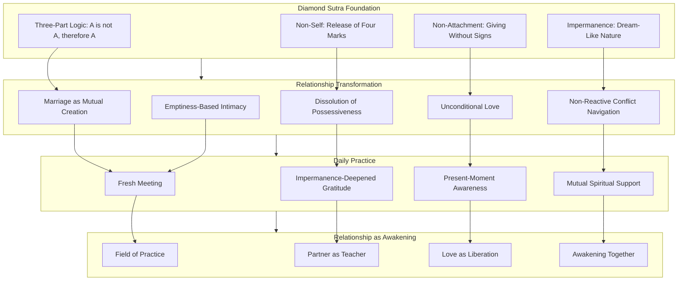

This diagram illustrates how the Diamond Sutra's foundational teachings (three-part logic, non-self, non-attachment, impermanence) inform the transformation of relationship dynamics (understanding marriage, dissolving possessiveness, cultivating unconditional love, navigating conflict, deepening intimacy), which are embodied through daily practices (fresh meeting, impermanence-deepened gratitude, present-moment awareness, mutual spiritual support), ultimately revealing intimate relationship as a field of awakening where partners serve as teachers for each other, love becomes liberation, and awakening happens together.

---

In summary, the Diamond Sutra's application to marriage and intimate relationships reveals that **ancient wisdom directly addresses the deepest challenges of romantic love**. The sutra's three-part logic—"husband and wife, not husband and wife, therefore called husband and wife"—provides a framework for understanding marriage as a dynamic process of mutual creation rather than the discovery of pre-formed ideal partners. The teaching on non-self dissolves the possessive patterns that transform love into suffering, revealing that genuine love requires releasing the notion that the partner is an extension of self to be controlled and protected. The instruction on giving without attachment to signs points toward unconditional love—love that does not depend on the partner's behavior, appearance, or reciprocation—while the Middle Way maintains appropriate boundaries. The teaching on the ungraspable mind transforms conflict navigation, enabling partners to engage with disagreements without ego-driven escalation. And the recognition of emptiness paradoxically deepens intimacy by enabling partners to meet each other freshly, without the accumulated concepts and expectations that create barriers to genuine connection.

The integration of these teachings into daily relationship life transforms intimate partnership from a source of personal satisfaction into **a field of mutual awakening**. When partners practice together—meeting freshly, appreciating impermanence, navigating conflicts with equanimity, supporting each other's development—they discover that the Diamond Sutra's promise applies to love itself: **non-attached love generates happiness "like the vastness of space—it cannot be conceived of or measured."** This is the fruit of applying the Diamond Sutra's wisdom to marriage and intimate relationships: love that is both deeply committed and genuinely free, intimacy that embraces impermanence as its very foundation, and partnership that serves both conventional flourishing and ultimate liberation.

## 11 Application to Parenting and Child Development

This chapter applies the Diamond Sutra's core teachings—non-attachment, emptiness, non-self, and the recognition of impermanence—to the specific challenges of raising children. Building upon the philosophical foundations established in earlier chapters and the relational applications explored in marriage and intimate relationships, this chapter examines how the sutra's wisdom can transform parenting from an ego-driven endeavor focused on producing specific outcomes into a compassionate practice of nurturing children's authentic development while modeling the very qualities of equanimity, presence, and non-grasping that constitute awakened living.

### 11.1 Parenting Without Attachment to Outcomes: The Three-Part Logic Applied to Child-Rearing

The Diamond Sutra's characteristic paradoxical formula—**"A is not A, therefore it is called A"**—offers profound insight into the nature of the parent-child relationship. Just as the sutra teaches that "husband and wife, not husband and wife, therefore called husband and wife," this same logic illuminates the essential truth about children and parenting: **children are not children, therefore they are called children**. This three-part structure reveals how releasing attachment to specific developmental outcomes paradoxically creates the conditions for children to flourish authentically.

#### The Three-Part Structure Applied to Children and Parenting

The Diamond Sutra's logic can be applied to the parent-child relationship through a careful examination of each component:

**First Component: "Children are children"**

This initial affirmation acknowledges the **conventional reality of parenthood**. When a child is born or enters a family, that child genuinely becomes one's son or daughter at the conventional level. The relationship is real, significant, and arises through causes and conditions—what Buddhism calls **dependent origination**. Parents have genuine responsibilities; children have genuine needs; the relationship matters profoundly.

This first component validates the importance of parenting without dismissing it as mere illusion. The relationship exists at the conventional level—it involves genuine care, responsibility, guidance, and love. The Diamond Sutra does not deny conventional reality but seeks to reveal its true nature.

**Second Component: "Yet they are not truly children"**

This negation reveals the **conditioned, evolving nature of children and the parent-child relationship**. Although a person is designated as "your child," they are not a fixed, static entity that belongs to you as a possession. The teaching parallels what the sutra says about marriage: the child you encounter today is not identical to the child you encountered yesterday; the relationship is constantly transforming.

This component addresses one of the most common sources of suffering in parenting: **the expectation that children should conform to parental visions of who they should become**. Parents often unconsciously project onto children their own unfulfilled dreams, their concepts of success, their fears and hopes. The child becomes not a unique being to be discovered but a canvas for parental projection.

The Diamond Sutra's teaching reveals that **children do not exist as pre-formed entities matching parental expectations**. Rather, children are dynamic processes of interdependent arising, constantly changing, never the same from moment to moment. The "child" we think we know is largely our concept of the child—our accumulated expectations, memories, and projections—rather than the actual, living being who stands before us.

**Third Component: "Therefore they are called children"**

This re-affirmation acknowledges that "child" is a **conventional designation** for a relationship that exists through dependent origination and will continue to evolve through conditions. The designation serves practical purposes—it identifies responsibilities, establishes relationships, and enables communication—while remaining empty of the fixed, independent existence we typically attribute to it.

The teaching that **"gathering and parting, union and separation, all depend upon the mind"** applies to the parent-child relationship as much as to marriage. Children grow, change, and eventually establish independent lives. The relationship transforms from total dependency through increasing autonomy to adult connection. Recognizing this evolution as natural rather than threatening enables parents to engage fully with each stage without clinging to previous forms.

#### Releasing Attachment to Specific Outcomes

The Diamond Sutra's three-part logic has direct implications for how parents relate to outcomes—academic achievements, behavioral expectations, developmental milestones, and life trajectories:

**The conventional importance of outcomes**: At the conventional level, outcomes matter. Parents appropriately care about their children's education, health, social development, and future prospects. The sutra does not teach indifference to these concerns but transforms the **quality of relationship** to them.

**The empty nature of outcomes**: The Diamond Sutra's teaching that all conditioned phenomena are like **"dreams, illusions, bubbles, shadows, dew, and lightning"** applies to parenting outcomes. Academic achievements, career success, social status—all are conditioned phenomena arising from causes, existing temporarily, and subject to change. They lack the permanent, defining significance we typically attribute to them.

**The Middle Way in parenting**: The sutra's Middle Way navigates between two extremes:

| Extreme | Description | Problem |
|---------|-------------|---------|
| **Outcome-attachment** | Defining parental success by children's achievements | Creates pressure, anxiety, and conditional love |
| **Outcome-indifference** | Abandoning appropriate guidance and support | Neglects genuine parental responsibility |

The Middle Way allows parents to **care deeply about children's development while recognizing the empty, conditioned nature of specific outcomes**. Parents can provide guidance, support, and structure without their psychological well-being depending on children achieving particular results.

#### The Paradox of Non-Attached Parenting

The Diamond Sutra reveals a profound paradox that applies directly to parenting: **releasing attachment to outcomes often produces better outcomes**. This paradox operates through several mechanisms:

**Reduced pressure enables authentic development**: When children feel that parental love is conditional on achievement, they experience anxiety that often undermines performance. When love is unconditional, children can explore, fail, learn, and grow without the paralyzing fear of losing parental approval.

**Clear perception enables appropriate guidance**: Attachment to specific outcomes distorts parental perception. Parents may push children toward goals that serve parental ego rather than children's genuine interests and capacities. Non-attachment enables clearer perception of who the child actually is and what they actually need.

**Modeling equanimity teaches resilience**: Children learn primarily through observation. Parents who model equanimity in facing outcomes—celebrating success without inflation, accepting disappointment without devastation—teach children the emotional resilience that serves them throughout life.

The sutra's teaching on giving without attachment to signs applies directly: **"When bodhisattvas practice generosity, they do not rely on any object—any form, sound, smell, taste, touch, or object of mind to practice generosity."** In parenting, this means offering guidance, support, and love without relying on specific outcomes to validate the parenting effort. The parent gives fully without calculating return.

#### Practical Guidance for Non-Attached Parenting

Several practical approaches support parenting without attachment to outcomes:

**1. Distinguishing Aspiration from Attachment**

Parents can maintain **aspirations** for their children—hopes for their flourishing, wishes for their happiness—without **attachment** to specific forms those aspirations must take. The distinction lies in whether parental well-being depends on the aspiration being fulfilled in a particular way.

**2. Recognizing Projection**

Parents can regularly examine: "Am I responding to who my child actually is, or to my concept of who they should be? Are my expectations serving my child's genuine development, or my own unfulfilled needs?"

**3. Celebrating Process Over Outcome**

Rather than focusing exclusively on achievements, parents can **celebrate the process of growth**—the effort, the learning, the development of character—regardless of specific outcomes. This shifts attention from external validation to internal development.

**4. Practicing Equanimity with Results**

When outcomes arrive—whether favorable or unfavorable—parents can practice the Diamond Sutra's teaching: "This outcome is a conditioned phenomenon, arising from causes and subject to change. It does not define my child's worth or my success as a parent."

**5. Holding the Long View**

The sutra's teaching on impermanence supports taking a long view of child development. Current struggles may become future strengths; current successes may prove less significant than they appear. Recognizing this prevents overreaction to any particular moment in a child's development.

### 11.2 The Four Marks in Parenting: Releasing Self-Image, Control, and Legacy-Building

The Diamond Sutra's teaching on releasing the four marks—**no notion of self, no notion of person, no notion of sentient being, no notion of life-span**—has profound implications for transforming common parenting patterns. These four marks, when applied to the parent-child relationship, reveal how ego-investment, control, boundary-making, and legacy-building create suffering for both parents and children while obscuring the genuine connection that parenting can embody.

#### The First Mark: Ego-Investment in Children's Achievements

The **notion of self (ātman/我相)** manifests in parenting as **ego-investment in children's achievements**. Parents unconsciously treat children's successes and failures as reflections of their own worth. When a child excels, the parent feels validated; when a child struggles, the parent feels ashamed or inadequate.

This pattern has been observed across cultures and contexts. Parents often experience their children's achievements as **extensions of their own identity**—the child's academic success becomes "my successful parenting," the child's social difficulties become "my failure as a parent." This identification creates several problems:

**Conditional love**: When parental self-worth depends on children's achievements, love becomes implicitly conditional. Children sense that they are loved for what they accomplish rather than for who they are.

**Pressure and anxiety**: Children carrying the weight of parental self-image experience enormous pressure. Their struggles become not merely their own difficulties but threats to their parents' sense of self.

**Distorted perception**: Parents whose ego is invested in outcomes cannot perceive children clearly. They see what they need to see—evidence of success that validates them, or evidence of failure that threatens them—rather than the actual child.

The Diamond Sutra's teaching provides the remedy: **"If a bodhisattva still has the notion of a self, a person, a living being, or a life span exists, that person is not a true bodhisattva."** Applied to parenting, this means that parents who act primarily to reinforce their self-image through children's achievements are not yet parenting from genuine compassion but from subtle self-attachment.

The teaching emphasizes: **"When we give while attached to notions, we cannot gain great merit, just as when we attempt to liberate others while attached to the notion of self, we cannot develop compassion for those we liberate."**[^14] In parenting, this means that guidance offered to enhance parental self-image cannot generate the genuine benefit that arises from selfless care.

#### The Second Mark: Treating Children as Extensions of Parental Identity

The **notion of person (pudgala/人相)** manifests in parenting as **treating children as extensions of parental identity** rather than as separate beings with their own nature, needs, and trajectory. This pattern involves:

- **Projecting parental preferences**: Assuming children should share parental interests, values, and goals
- **Living vicariously**: Seeking through children the experiences parents missed or desired
- **Defining children by relationship**: Seeing children primarily as "my son" or "my daughter" rather than as unique individuals

The Diamond Sutra's teaching on **interdependence** transforms this pattern. The sutra reveals that all beings, including children, are **"empty of inherent, unchanging self"**—they exist as dynamic processes of interdependent arising rather than as fixed entities to be molded according to parental design.

This recognition does not mean parents should have no influence on children's development. Rather, it means recognizing that children are **not blank slates for parental inscription** but unique beings with their own nature that unfolds through interaction with conditions—including parental influence, but not limited to it.

The teaching on how the Buddha instructed his son Rahula provides a model: **"The Buddha's approach to teaching his son Rahula offers insights into mindful child-rearing. He tailored his teachings to match developmental stages: focusing on virtue at age 7, meditation in adolescence, and liberating wisdom at 20."**[^61] This approach recognizes the child's evolving nature and meets them where they are rather than imposing a fixed parental agenda.

#### The Third Mark: Rigid Boundaries Between 'My Child' and Others

The **notion of sentient being (sattva/众生相)** manifests in parenting as **rigid boundaries** that separate "my child" from other children, creating possessive patterns and competitive dynamics:

- **Possessive concern**: Caring intensely about one's own children while remaining indifferent to others
- **Competitive comparison**: Measuring one's children against others to establish superiority
- **Tribal loyalty**: Defending one's children regardless of their behavior while judging other children harshly

The Diamond Sutra's teaching on **liberating all beings** challenges this pattern. The bodhisattva vows to liberate **"innumerable, immeasurable, infinite"** beings without discrimination. Applied to parenting, this suggests that genuine parental compassion—while naturally focused on one's own children—does not create rigid boundaries that exclude concern for all children.

The sutra's teaching on the **"four notions"** that must be released includes this insight: **"The second kind of notion is the notion of 'a human being.' When we look at a human being, we see human ancestors, animal ancestors, plant ancestors, mineral ancestors. A human being is made of non-human elements."**[^37] This teaching reveals that the rigid boundary between "my child" and "other children" is a conceptual construction rather than an ultimate reality.

Practically, this means parents can **love their own children intensely while recognizing the fundamental connection between all children**. The capacity for love is not diminished by extension; rather, the love for one's own children can become a gateway to compassion for all children.

#### The Fourth Mark: Attachment to Creating Legacy Through Children

The **notion of life-span (jīva/寿者相)** manifests in parenting as **attachment to creating lasting legacy through children**—the desire to perpetuate oneself, one's values, one's family name, or one's achievements through the next generation:

- **Immortality project**: Using children to achieve a sense of permanence beyond one's own death
- **Value transmission**: Insisting children adopt parental beliefs, values, and traditions
- **Family continuity**: Pressuring children to maintain family businesses, names, or status

The Diamond Sutra's teaching on **impermanence** directly addresses this pattern. The sutra teaches that **"our true nature is the nature of no-birth and no-death"**[^37]—not because we persist as individuals but because the very concepts of birth and death are **"ideas, wrong perceptions"** that do not apply to ultimate reality.

This teaching liberates parents from the anxiety of legacy-building. Children are not vehicles for parental immortality; they are **unique expressions of the same interdependent arising** that constitutes all phenomena. Parents can share values, traditions, and wisdom with children without the desperate attachment that transforms sharing into imposition.

The sutra's teaching that **"the fourth kind of notion is the notion of a 'life span.' We believe there is time, we are born at one point in time and we die at another point in time. But when we look deeply, we see this is a notion, a wrong perception"**[^37] applies directly. When parents recognize that their "life span" is a conventional designation rather than an ultimate reality, the desperate need to extend themselves through children naturally relaxes.

#### Practical Transformation of the Four Marks in Parenting

The following table summarizes how each mark manifests in parenting and how the Diamond Sutra's teaching transforms it:

| Mark | Parenting Manifestation | Sutra Teaching | Transformed Approach |
|------|------------------------|----------------|---------------------|
| **Self** | Ego-investment in achievements | No fixed self to be validated | Love without needing validation |
| **Person** | Treating child as extension | Child is unique interdependent process | Respect child's own nature |
| **Being** | Rigid boundaries, competition | All beings interconnected | Compassion extends to all children |
| **Life-span** | Legacy-building through children | No-birth, no-death | Share without imposing |

**Practical guidance for releasing the four marks**:

**1. Regular self-examination**: Parents can regularly ask: "Am I parenting to serve my child's genuine flourishing, or to reinforce my self-image, extend my identity, establish boundaries, or create legacy?"

**2. Recognizing the child's independent nature**: The teaching that **"we must make use of this temporary self in order to find the true self of prajna"**[^14] applies to children as well. Parents can support children in discovering their own nature rather than imposing parental concepts.

**3. Extending compassion beyond one's own children**: Parents can consciously cultivate concern for all children, recognizing that the capacity for love expands rather than diminishes through extension.

**4. Releasing the demand for continuity**: Parents can share values, traditions, and wisdom as gifts rather than demands, allowing children to receive what serves them and release what does not.

### 11.3 Compassionate Discipline Without Ego-Investment: The Middle Way in Setting Boundaries

The Diamond Sutra's Middle Way philosophy provides essential guidance for one of parenting's most challenging domains: **discipline**. How can parents set appropriate boundaries and address problematic behavior without falling into either permissive indulgence or ego-driven punishment? The sutra's teaching on navigating between extremes, combined with its emphasis on wisdom and compassion, offers a framework for discipline that serves children's genuine development rather than parental ego-needs.

#### The Two Extremes in Discipline

The Diamond Sutra's Middle Way navigates between two problematic approaches to discipline:

**Extreme 1: Permissive Indulgence**

This extreme avoids all discipline under the guise of "unconditional love" or "respecting the child's autonomy." It fails to provide the structure and guidance children need for healthy development. As one Buddhist parent reflected: **"Any form of discipline, such as a time-out or taking away a toy, usually results in crying or upset. This is creating 'suffering' for the child. However, I have seen kids in public places that have clearly not been disciplined, and they act out."**[^62]

This extreme misunderstands non-attachment as non-engagement. The Diamond Sutra does not teach that parents should abandon appropriate guidance but that guidance should be offered without ego-attachment to outcomes.

**Extreme 2: Ego-Driven Punishment**

This extreme disciplines primarily from parental frustration, embarrassment, or need for control rather than from wisdom about what serves the child. Discipline becomes a vehicle for parental emotional discharge or ego-protection rather than child development.

The teaching identifies this pattern: **"The journey of parenthood is tumultuous, and unexpected child behaviors can ignite emotions that manifest as bullying, insults, or physical aggression towards children, highlighting a dangerous asymmetry of power."**[^61] When discipline arises from parental reactivity rather than wisdom, it harms rather than helps.

The Buddha's teaching is explicit: **"Since each person loves himself best, one who knows this should not harm others."**[^61] Discipline that harms children—physically, emotionally, or psychologically—violates this fundamental principle regardless of how it is justified.

#### The Middle Way in Discipline: Wisdom and Compassion

The Diamond Sutra's teaching on **giving without attachment to signs** applies directly to discipline. Just as bodhisattvas give without relying on specific outcomes, parents can discipline without attachment to immediate compliance, ego-validation, or emotional discharge.

The teaching emphasizes that **"discipline should be approached with wisdom and compassion, keeping calm and firm, viewing it as an act of kindness with the purpose of the child's best long-term interests."**[^62] This orientation transforms discipline from punishment to teaching, from ego-expression to compassionate guidance.

Key principles for Middle Way discipline include:

**1. Discipline as teaching, not punishment**

The word "discipline" derives from "disciple"—one who learns. The purpose of discipline is **education**, not retribution. One Buddhist parent shared: **"Rather than punishing, I try to communicate with the child to help them understand the consequences of their actions. This is more effective than simple punishment."**[^62]

**2. Arising from wisdom, not reactivity**

The Diamond Sutra's teaching on the **non-abiding mind** applies to disciplinary moments. Parents can pause before responding, allowing reactive emotions to settle, and respond from wisdom rather than reactivity. The teaching states: **"A restless mind makes erratic decisions. But if you calm your mind, you can lead with clarity."**

**3. Maintaining compassion throughout**

Even when setting firm boundaries, parents can maintain **compassion for the child's experience**. The child who misbehaves is often a child who is struggling—with emotions, with understanding, with impulse control. Recognizing this maintains connection even while addressing behavior.

**4. Focusing on long-term development**

The teaching emphasizes that **"discipline should focus on the child's long-term benefit—accepting present difficulty for future good—and teaching non-attachment through setting limits."**[^62] This long view prevents overreaction to immediate behavior and keeps focus on developmental goals.

#### The Buddha's Example: Teaching Rahula

The Buddha's approach to disciplining his son Rahula provides a model for compassionate discipline. When eight-year-old Rahula lied, the Buddha **"addressed his dishonesty with patience and wisdom, explaining the consequences of lying and emphasizing truthfulness."**[^61]

The Buddha's teaching was explicit but not harsh: **"He taught that when someone is not ashamed to tell a deliberate lie, there is no evil they would not do, and one should train not to utter a falsehood even as a joke."**[^61] This approach:

- **Named the problematic behavior clearly** (lying)
- **Explained the consequences** (lying leads to further wrongdoing)
- **Provided positive guidance** (train not to lie even in jest)
- **Maintained the relationship** (continued teaching and connection)

The Buddha further advised a **reflective approach**: **"Before any physical, verbal, or mental activity, one should reflect on whether it will bring harm to oneself or others; if it brings harm, it is unfit to do, and if it is fit if it brings benefit."**[^61] This teaching gives children a framework for self-regulation rather than mere compliance with external rules.

#### Practical Framework for Compassionate Discipline

The following framework integrates the Diamond Sutra's teachings with practical discipline:

**Before discipline**:
- **Pause**: Allow reactive emotions to settle
- **Examine motivation**: Am I responding from wisdom or from ego-need?
- **Consider the child**: What is driving this behavior? What does the child need?

**During discipline**:
- **Stay calm**: Model the equanimity you wish to teach
- **Be clear**: Name the problematic behavior specifically
- **Explain consequences**: Help the child understand cause and effect
- **Maintain connection**: Discipline the behavior, not the child's worth
- **Provide guidance**: Offer positive alternatives

**After discipline**:
- **Reconnect**: Ensure the child knows they are loved
- **Reflect**: Was this discipline effective? What can I learn?
- **Release**: Don't hold onto the incident; allow fresh starts

The teaching on **"healthy respect for discipline"** acknowledges that young children (approximately ages 3-7) may need to experience consequences to learn boundaries, but this should be **"a valuable learning tool that helps children avoid behaviors that lead to suffering"**[^62] rather than a vehicle for parental emotional discharge.

#### Addressing the Challenge of 'No Tears Discipline'

One Buddhist parent raised the question of whether discipline can be accomplished without causing any distress to the child. The response acknowledged: **"Discipline by its very nature will go against a child's wishes, resulting in tears and 'suffering,' so there may be no such thing as 'discipline without tears.'"**[^62]

The Diamond Sutra's teaching on the **First Noble Truth**—that suffering exists—applies here. Discipline may involve temporary distress for the child. The question is not whether distress occurs but whether the discipline serves the child's genuine long-term welfare and arises from wisdom rather than parental ego-needs.

The Middle Way recognizes that **appropriate discipline is itself an act of compassion**. Failing to set boundaries is not kindness but neglect. The teaching emphasizes: **"Setting limits teaches children non-attachment and is an act of compassion for their long-term benefit."**[^62]

However, the teaching is equally clear that **physical punishment is never appropriate**: **"I am absolutely against corporal punishment."**[^62] The Diamond Sutra's emphasis on non-harm applies unconditionally to the parent-child relationship.

### 11.4 Teaching Impermanence and Resilience: Helping Children Understand the Dream-Like Nature of Experience

The Diamond Sutra's concluding verse—comparing all conditioned phenomena to **"dreams, illusions, bubbles, shadows, dew, and lightning"**—offers profound resources for building emotional resilience in children. Rather than shielding children from the reality of impermanence, parents can help them understand and embrace this fundamental truth in developmentally appropriate ways, providing philosophical resources for navigating life's inevitable difficulties.

#### The Challenge of Teaching Impermanence to Children

A thoughtful parent might wonder: Should children be exposed to teachings about impermanence and the dream-like nature of phenomena? Won't this create anxiety or nihilism? The Diamond Sutra's teaching, properly understood, addresses these concerns.

One parent reflected on this tension: **"I try to face the pain of the dharma, yet with children, parents build a mythic world of safety, solidity, and surety, a world where identity is solid and death is an abstraction, so they can be free from fear for the first dozen years of their lives."**[^63]

This reflection acknowledges that parents often protect children from difficult truths. However, the same parent questioned whether this protection serves children: **"Parents lie to their children; they conceal the basic truths of life—the insatiability of desire, the truth of impermanence, the ubiquity of suffering—while simultaneously teaching them to construct a strong self based on desire."**[^63]

The Diamond Sutra suggests a middle path: **introducing impermanence not as a source of anxiety but as a source of appreciation, resilience, and freedom**.

#### Impermanence as the Foundation of Appreciation

The sutra's teaching on impermanence, when properly understood, **deepens appreciation rather than creating despair**. The teaching states: **"An awareness of our children's temporariness informs and enriches every moment with them."**[^63]

One parent described this experience: **"No one will ever see my son's face as I saw it that night at eight months old; that vision exists only in my memory. While I have never come to terms with this truth, sitting with it is transforming my life and my way of being a father."**[^63]

This recognition—that each moment with a child is precious precisely because it is impermanent—transforms parenting. Rather than taking children for granted or projecting into an imagined future, parents can **be fully present to the child who exists right now**, knowing that this particular moment will never return.

Children can learn this same appreciation. When a child experiences the end of a pleasant activity, a parent can acknowledge: "This was wonderful, and it's over now. We can appreciate what we had and look forward to what comes next." This teaches children to **embrace impermanence as the condition for appreciation** rather than fighting against it.

#### Developmental Approaches to Teaching Impermanence

The Diamond Sutra's wisdom can be introduced at different developmental stages:

**Early Childhood (Ages 3-7)**

At this stage, children naturally experience impermanence—toys break, ice cream melts, playdates end—but may not have language for their experience. Parents can:

- **Name impermanence simply**: "Everything changes. That's how life works."
- **Model acceptance**: When things change, demonstrate equanimity rather than distress
- **Celebrate cycles**: Point out natural cycles—seasons, day and night, growth—as examples of change
- **Comfort without denying**: When children grieve losses, comfort them while acknowledging that loss is part of life

**Middle Childhood (Ages 7-12)**

Children at this stage can engage with more explicit teaching. The Buddha's instruction to Rahula at age 7 focused on **virtue and the consequences of actions**—developmentally appropriate for this stage. Parents can:

- **Discuss cause and effect**: Help children see how conditions lead to outcomes
- **Explore the nature of emotions**: Emotions arise, exist briefly, and pass away—like bubbles
- **Introduce the concept of change**: Everything in life changes; this is natural, not threatening
- **Practice gratitude**: Appreciate what we have, knowing it won't last forever

**Adolescence (Ages 12-18)**

Adolescents can engage with more sophisticated philosophical content. The Buddha's instruction to Rahula in adolescence focused on **meditation**[^61]—the direct investigation of experience. Parents can:

- **Discuss the constructed nature of identity**: The "self" we think we are is constantly changing
- **Explore attachment and suffering**: How clinging to things creates suffering
- **Introduce meditation**: Direct observation of the arising and passing of experience
- **Discuss the Diamond Sutra's metaphors**: Dreams, illusions, bubbles, shadows, dew, lightning

**Young Adulthood (Ages 18+)**

The Buddha's instruction to Rahula at age 20 addressed **"liberating wisdom"**[^61]—the deepest teachings on non-self. Young adults can engage with:

- **The full Diamond Sutra teaching**: Emptiness, non-self, non-attachment
- **The four marks**: Releasing notions of self, person, being, life-span
- **The paradox of non-self**: How releasing self-concepts deepens rather than diminishes life

#### Building Resilience Through Impermanence Understanding

The Diamond Sutra's teaching on impermanence directly supports emotional resilience:

**Resilience in facing loss**: When children understand that all phenomena are impermanent, loss becomes **a natural part of life rather than a catastrophic aberration**. The teaching that all conditioned phenomena are like dew—present briefly, then evaporating—provides a framework for accepting loss without being devastated.

**Resilience in facing failure**: When children understand that outcomes are conditioned phenomena, failure becomes **a temporary situation rather than a permanent identity**. The child who fails a test has not become "a failure"—they have experienced a conditioned outcome that will change as conditions change.

**Resilience in facing change**: When children understand that change is the nature of existence, transitions become **opportunities rather than threats**. Moving to a new school, ending a friendship, growing up—all are expressions of the impermanence that characterizes all phenomena.

The teaching on **impermanence as a key to reality** emphasizes: **"Impermanence is a key that can open the door of reality. We must keep the insight of impermanence alive. When we touch anything, we should be able to see the impermanence in it."**[^37]

#### The Teaching on Dharmic Parenting and Impermanence

One parent articulated how awareness of impermanence transforms parenting: **"The central Buddhist insight of impermanence, which I had previously associated abstractly with loss, was illustrated by my children. I realized that impermanence means loss is not accidental but part of the very identity of love. To love children is to lose them over and over again on a daily basis as they grow; moment to moment they become other than they were."**[^63]

This recognition leads to a profound question: **"The challenge is how to love our children when each moment of doing so is by definition a moment of loss."**[^63] The Diamond Sutra's answer is that **love informed by impermanence is deeper, not shallower**—more present, more appreciative, more real.

The teaching suggests that **"dharmic parenting might involve shedding light on children's experience with the simple truths of Buddhist insight, showing them the possibility of freedom from fear not by pretending the world is safe, but by showing the illusoriness of both safety and danger."**[^63]

This approach does not burden children with anxiety but provides them with **philosophical resources for navigating life's inevitable difficulties**. Children who understand impermanence are not more fearful but more resilient—they have a framework for accepting change that children without this understanding lack.

### 11.5 Fostering Independence Through Non-Attachment: The Paradox of Letting Go to Stay Connected

The Diamond Sutra's teaching on non-attachment reveals a profound paradox in parenting: **releasing the need to control children's development actually deepens rather than diminishes the parent-child bond**. This paradox mirrors the sutra's teaching on intimate relationships—that releasing attachment to fixed concepts of self and other enables genuine connection—and has specific applications to the developmental task of fostering children's independence while maintaining authentic relationship.

#### The Paradox of Non-Attachment in Parenting

The conventional understanding of parental love often involves **holding on**—maintaining closeness, ensuring safety, preserving connection. The fear of "letting go" suggests that non-attachment means losing the child, becoming distant, or abandoning parental responsibility.

The Diamond Sutra's teaching reveals the opposite: **attachment creates distance while non-attachment enables closeness**. This paradox operates through several mechanisms:

**Attachment creates pressure**: When parents are attached to children remaining close, children feel the pressure of parental need. This pressure often drives children away—the very outcome the attachment sought to prevent.

**Attachment distorts perception**: When parents are attached to a particular image of the child or the relationship, they cannot perceive the child clearly. They relate to their concept of the child rather than to the actual child who is present.

**Attachment blocks growth**: When parents cling to earlier stages of the relationship, they block the natural evolution that keeps relationships alive. The relationship becomes frozen rather than dynamic.

**Non-attachment creates space**: When parents release attachment, children have space to develop authentically. This space paradoxically draws children closer—they are not fleeing parental need but freely choosing connection.

The teaching on non-attachment in relationships states: **"Being non-attached toward the self limits incongruence between experience and the self-concept, allowing an individual to move through their life with greater flexibility, an understanding of the ever-changing nature of the self and a view of self that is free from expectation and fixation."**[^64] Applied to parenting, this means that parents who release attachment to fixed concepts of their children and the relationship can engage with greater flexibility and presence.

#### The Developmental Task of Fostering Independence

Parenting inherently involves a **progressive release** of control as children develop increasing capacity for autonomy:

- **Infancy**: Total dependency; parents provide all care
- **Early childhood**: Beginning autonomy; children make simple choices
- **Middle childhood**: Increasing independence; children navigate social worlds
- **Adolescence**: Emerging adulthood; children make significant decisions
- **Young adulthood**: Full autonomy; children establish independent lives

Each transition requires parents to **release control appropriate to the previous stage** while maintaining connection appropriate to the new stage. Parents who cannot release control at each transition create developmental obstacles for children and relationship difficulties for both.

The Diamond Sutra's teaching supports this progressive release. The sutra's instruction that bodhisattvas should **"give rise to a mind that dwells nowhere"** applies to the parental relationship with children's development. Parents can be fully present to each stage without clinging to previous stages or grasping at future stages.

#### Milarepa's Teaching and the Parent-Child Relationship

The Tibetan master Milarepa's words, quoted in the context of non-attachment and family relationships, offer challenging wisdom: **"When you look at your child / Firstly he is a soft-spoken young god. / Then he is a distant-hearted neighbour. / Finally he is an enemy and creditor. / So I let go of children."**[^65]

This teaching might seem to counsel abandonment of parental responsibility. However, the commentary clarifies: **"We cannot separate Buddhist doctrine and practice from how Buddhists actually live in the world. Most Buddhists in Asia demonstrate great affection for their families."**[^65] Teachers like Sakya Trizin Rinpoche are described as **"a wonderful example of a father and grandfather who is also an unflagging source of kindness to his students."**[^65]

The teaching continues: **"However, we must let go of some level of attachment in our personal relationships. Attachment is a self-centered way of relating to others, seeing them only in terms of what use they can be to me, which leads to destructive behavior."**[^65]

This clarification distinguishes between **love and attachment**. Love is genuine care for another's welfare; attachment is self-centered relating that sees others in terms of personal use. Parents can love children deeply while releasing attachment—the self-centered grasping that sees children as extensions of parental identity.

#### The Love We Feel as Precondition for Wider Love

The teaching offers a profound insight about parental love: **"The love we already feel for our parents or children is actually the precondition for a wider love."**[^65] Rather than being an obstacle to spiritual development, family love can be a gateway to universal compassion.

The teaching explains: **"Although we aim at an all-inclusive lovingkindness unrestricted by partiality, it needs to start with simple, uncontrived loving feelings toward those closest to us. Otherwise, our attitude may be a vague abstraction, a love for everybody in general and no one in particular."**[^65]

This insight transforms the understanding of parental love. The intense love parents feel for their children is not a spiritual obstacle but **a training ground for compassion**. By learning to love one child deeply, parents develop the capacity to extend that love to all children, all beings.

However, the teaching adds a crucial qualification: **"Without detachment, genuine love remains out of reach. Even within families, effective love requires a measure of detachment."**[^65] This means that the progression from parental love to universal compassion requires releasing the attachment that would limit love to one's own children.

The teaching provides a specific example: **"Wise parents set aside attachments to their own ambitions for their children's benefit."**[^65] Non-attachment in parenting means releasing parental agendas that serve parental needs rather than children's genuine welfare.

#### Practical Guidance for Fostering Independence Through Non-Attachment

Several practical approaches support the paradox of letting go to stay connected:

**1. Supporting autonomy appropriate to developmental stage**

Parents can consciously support children's increasing autonomy at each developmental stage, releasing control that was appropriate earlier but is no longer needed. This requires ongoing assessment: "What can my child now do for themselves that I was previously doing for them?"

**2. Releasing parental agendas**

Parents can examine and release agendas that serve parental needs rather than children's welfare. The question becomes: "Am I guiding my child toward what serves their genuine flourishing, or toward what serves my ego, my fears, or my unfulfilled dreams?"

**3. Maintaining connection through presence**

As control is released, connection is maintained through **presence**—being genuinely available, listening deeply, and responding to the child's actual needs rather than parental projections. Non-attachment does not mean absence but a different quality of presence.

**4. Trusting the child's nature**

The Diamond Sutra's teaching on emptiness applies to children's development. Children are not blank slates to be written upon but **dynamic processes with their own nature** that unfolds through interaction with conditions. Parents can trust this unfolding while providing appropriate guidance.

**5. Embracing the evolution of relationship**

Rather than clinging to earlier forms of relationship, parents can **embrace each stage as it arrives**. The relationship with an adolescent is different from the relationship with a toddler; both can be deeply meaningful. Non-attachment allows appreciation of each stage without mourning the loss of previous stages.

### 11.6 Integrating Practice: Modeling Non-Attachment and Cultivating Mindful Family Life

This section synthesizes the chapter's teachings into practical methods for integrating Diamond Sutra wisdom into daily family life. The analysis provides contemplative practices parents can engage in individually and with children, guidance for applying non-attachment principles during routine interactions and challenging parenting moments, and frameworks for creating family cultures that support both children's development and parents' spiritual growth.

#### Modeling as Primary Teaching

The Diamond Sutra's wisdom is transmitted to children primarily through **modeling** rather than explicit instruction. Children learn not from what parents say but from what parents do—how they respond to stress, handle disappointment, navigate conflict, and relate to impermanence.

The teaching emphasizes: **"As Buddhist parents, the key is to be a good role model and set a good example for children. Setting limits and discipline are necessary."**[^62] This modeling includes:

- **Equanimity in facing outcomes**: Children observe how parents respond to success and failure
- **Non-reactivity in conflict**: Children learn conflict resolution by watching parents
- **Acceptance of impermanence**: Children learn to embrace change by seeing parents do so
- **Compassion in difficulty**: Children develop empathy by experiencing parental compassion

The teaching on **equanimity (Upekkha)** provides the foundation for modeling: **"Equanimity means not to be ruled by passion, likes, dislikes, and desires... it is evenness of mind, unshakeable freedom of mind, a state of inner equipoise that cannot be upset by gain and loss, honor and dishonor, praise and blame, pleasure, and pain."**[^61]

Parents who embody this equanimity—remaining stable through the inevitable fluctuations of family life—provide children with a living example of the Diamond Sutra's teaching.

#### Contemplative Practices for Parents

Several contemplative practices support parents in integrating the Diamond Sutra's wisdom:

**1. Morning intention-setting**

Before beginning the day, parents can set intention: "Today I will parent from wisdom rather than reactivity, from love rather than ego-need, from presence rather than projection. I will meet my children freshly, recognizing their impermanent, evolving nature."

**2. Contemplation of the concluding verse**

Parents can regularly contemplate the Diamond Sutra's concluding verse in relation to parenting:

> *All conditioned phenomena are like a dream, an illusion, a bubble, a shadow,*
> *like dew or a flash of lightning; thus we shall perceive them.*

This contemplation can be applied to:
- **Children's behavior**: This tantrum is like a bubble—arising from conditions, existing briefly, passing away
- **Parenting challenges**: This difficulty is like morning dew—present now, evaporating soon
- **Children's achievements**: This success is like lightning—brilliant and momentary
- **The parent-child relationship**: This precious connection is impermanent; I will appreciate it fully

**3. Mindful breathing in challenging moments**

When parenting challenges arise, parents can practice **mindful breathing** before responding. The teaching states: **"Breathing mindfully helps us handle strong emotions, like anger, fear, anxiety and despair."**[^37] A few conscious breaths create space between stimulus and response, allowing wisdom rather than reactivity to guide action.

**4. Evening reflection**

At day's end, parents can reflect: "Where did I parent from ego-need today? Where did I parent from wisdom? What patterns do I notice? What can I release?" This reflection supports ongoing growth without creating attachment to being a "perfect parent."

#### Practices for Families

Several practices support family-wide integration of the Diamond Sutra's wisdom:

**1. Family mindfulness moments**

Families can establish brief mindfulness practices—perhaps before meals, at transitions, or at bedtime. These need not be explicitly "Buddhist" but can simply involve **pausing, breathing, and being present together**. Children learn mindfulness through practice, not lecture.

**2. Gratitude practice**

Families can establish gratitude practices that acknowledge impermanence: "What are we grateful for today? Let's appreciate these gifts, knowing they won't last forever." This teaches children to embrace impermanence as the foundation of appreciation.

**3. Discussing change and loss**

When change occurs—a pet dies, a friend moves away, a season ends—families can discuss it openly: "Everything changes. This is sad, and it's also how life works. We can be grateful for what we had." This normalizes impermanence without dramatizing it.

**4. Modeling conflict resolution**

When parents conflict, they can model the Diamond Sutra's teaching by **pausing before reacting, listening without defending, and seeking understanding rather than victory**. Children who observe this learn more than from any explicit instruction.

#### Applying Non-Attachment in Routine Interactions

The Diamond Sutra's teaching on non-attachment can be applied throughout daily family life:

**Morning routines**: Parents can practice presence during morning activities—helping children dress, preparing breakfast, getting ready for school—without the mind racing ahead to the day's tasks. Each moment with children is precious and impermanent.

**Homework and academics**: Parents can support children's learning without attachment to specific outcomes. The focus shifts from "Did you get the right answer?" to "What did you learn? How did you approach this problem?"

**Extracurricular activities**: Parents can support children's interests without ego-investment in children's performance. The question becomes "Are you enjoying this? Is this serving your growth?" rather than "Are you the best?"

**Bedtime**: The transition to sleep offers opportunity for connection and presence. Parents can be fully present to this moment of closeness, recognizing its impermanent, precious nature.

#### Avoiding Attachment to Being 'Buddhist Parents'

A subtle trap awaits parents who embrace the Diamond Sutra's teachings: **attachment to being "Buddhist parents"** or to raising "Buddhist children." This creates a new form of ego-identification that contradicts the sutra's teaching.

The teaching warns against this pattern: the sutra teaches that even attachment to the Dharma itself is attachment. **"If you are caught in the idea of the Dharma, you are also caught in the ideas of a self, a person, a living being, and a life span."**[^37]

Practically, this means:

- **Holding Buddhist parenting lightly**: Parents can apply the sutra's wisdom without creating identity around being "spiritual parents"
- **Respecting children's own path**: Children may or may not embrace Buddhist teachings; parents can share without imposing
- **Avoiding spiritual comparison**: Comparing one's family to "less spiritual" families creates the very ego-attachment the teachings dissolve
- **Practicing without performance**: The sutra's wisdom is lived, not displayed; children learn from authentic practice, not spiritual performance

The teaching on **Free Flow Parenting** captures this balance: **"Ultimately, embracing a Buddhist approach to parenting fosters a nurturing environment where children can thrive authentically. By practicing equanimity, compassion, and non-attachment, parents can cultivate deeper connections and support their children's growth, leading to more harmonious family relationships and a fulfilling parenting journey."**[^61]

#### The Ultimate Gift: Tools for Inner Transformation

The Diamond Sutra's teaching on the Buddha's instruction to his son Rahula reveals the ultimate purpose of Buddhist parenting: **"The Buddha led his 20-year-old son Rahula on a transformative journey. He skillfully guided Rahula through a series of thought-provoking questions designed to unravel the illusion of self, helping him to loosen the grip of ego and identity. With patience and wisdom, he led his son towards the liberating realization of 'not-self.'"**[^61]

The teaching concludes: **"This lesson was the ultimate gift: the path to lasting peace and freedom from suffering, a reminder that the most precious legacy a parent can offer is the tools for inner transformation and genuine happiness."**[^61]

This is the Diamond Sutra's vision for parenting: not producing children who achieve particular outcomes, not creating legacy through children, not extending parental identity through the next generation—but **offering children the tools for their own liberation**. Parents who embody the sutra's teaching of non-attachment, who model equanimity and compassion, who respect children's own nature while providing appropriate guidance, give their children the most precious gift: the possibility of freedom from suffering.

The teaching on non-attachment in parenting summarizes: **"Wholesome things arise from non-attachment, no matter how much you think otherwise. Love arising from attachment leads to suffering, while love arising from true understanding, compassion, and non-self is true love."**[^66] This is the Diamond Sutra's promise for parenting: love freed from attachment becomes true love—love that liberates rather than binds, that supports growth rather than control, that embraces impermanence rather than fighting it.

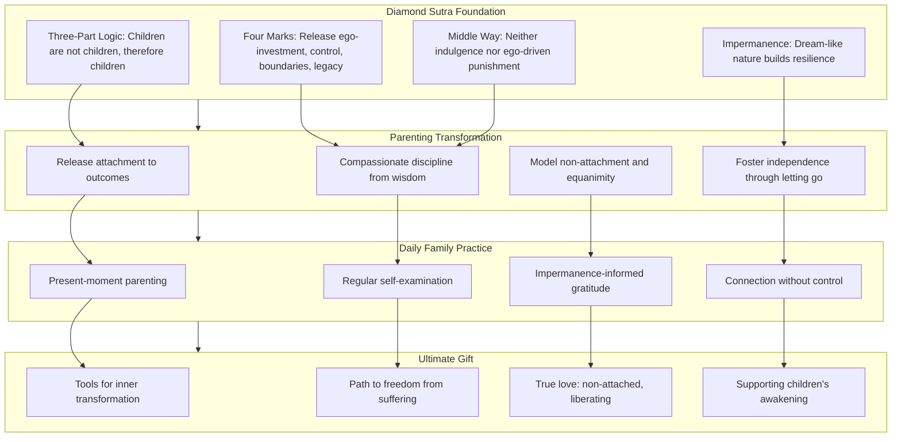

This diagram illustrates how the Diamond Sutra's foundational teachings (three-part logic, four marks, Middle Way, impermanence) inform the transformation of parenting patterns (releasing outcome-attachment, compassionate discipline, fostering independence, modeling non-attachment), which are embodied through daily family practices (present-moment parenting, self-examination, impermanence-informed gratitude, connection without control), ultimately enabling parents to offer children the ultimate gift: tools for inner transformation, the path to freedom from suffering, true non-attached love, and support for children's own awakening.

---

In summary, the Diamond Sutra's application to parenting and child development reveals that **ancient wisdom directly addresses the deepest challenges of raising children**. The sutra's three-part logic—"children are not children, therefore they are called children"—provides a framework for understanding children as dynamic processes of interdependent arising rather than fixed entities to be molded according to parental design. The teaching on releasing the four marks dissolves the ego-investment, control, boundary-making, and legacy-building that transform parenting into a source of suffering for both parents and children. The Middle Way guides compassionate discipline that neither indulges harmful behavior nor punishes from ego-driven reactivity. The teaching on impermanence provides children with philosophical resources for building resilience and embracing change. And the paradox of non-attachment reveals that **releasing the need to control children's development actually deepens the parent-child bond** while creating space for authentic independence.

The integration of these teachings into daily family life transforms parenting from an ego-driven endeavor focused on producing specific outcomes into **a compassionate practice of nurturing children's authentic development**. Parents who embody the Diamond Sutra's wisdom—modeling equanimity, practicing presence, releasing attachment while maintaining love—give their children the most precious gift: not achievements, not legacy, not the fulfillment of parental dreams, but **the tools for inner transformation and genuine happiness**. This is the Diamond Sutra's vision for parenting: love that liberates rather than binds, guidance that supports rather than controls, and relationship that embraces impermanence as the very foundation of connection.

## 12 Application to Emotional Well-Being and Mental Health

This chapter examines how the Diamond Sutra's core teachings—emptiness, non-self, non-attachment, and the ungraspable nature of mind—can be systematically applied to address emotional suffering including anxiety, depression, anger, and general emotional turbulence. Building upon the philosophical foundations established in earlier chapters and the practical applications explored in daily life, workplace, relationships, and parenting contexts, this chapter investigates the therapeutic implications of the sutra's wisdom for mental health, exploring how understanding the constructed nature of emotional states, practicing non-identification with thoughts and feelings, and recognizing that 'past mind, present mind, future mind cannot be grasped' can cultivate inner peace and psychological resilience.

### 12.1 The Constructed Nature of Emotional States: Emptiness Applied to Anxiety, Depression, and Anger

The Diamond Sutra's teaching on emptiness (śūnyatā) provides a profound philosophical foundation for understanding and transforming our relationship with difficult emotions. Rather than treating anxiety, depression, and anger as fixed, inherent realities that define who we are, the sutra reveals these emotional states as **conditioned phenomena arising through dependent origination**—appearing vividly in experience while lacking the substantial, permanent existence we typically attribute to them. This recognition does not deny the reality of emotional suffering but transforms our relationship to it in ways that contemporary psychology is increasingly recognizing as therapeutically powerful.

#### The Emptiness of Emotional States: Neither Denial Nor Reification

The Diamond Sutra's concluding verse offers a direct instruction for perceiving all conditioned phenomena, including emotional states: **"All conditioned phenomena are like a dream, an illusion, a bubble, a shadow, like dew or a flash of lightning; thus we shall perceive them."** When applied to emotions such as anxiety, depression, and anger, this teaching reveals several crucial insights.

**Emotions arise through dependent origination**. No emotion appears from nowhere or exists independently. Anxiety arises from the intersection of external circumstances, past conditioning, present mental state, physical condition, and countless other factors. Depression emerges through a complex web of biological, psychological, social, and situational conditions. Anger is triggered by perceived threats or injustices interacting with personal history and current vulnerabilities. **No emotion exists independently or permanently**; each is a temporary configuration of conditions that will inevitably change as those conditions shift.

The sutra's six metaphors illuminate different aspects of emotional experience:

| Metaphor | Application to Emotions | Therapeutic Insight |
|----------|------------------------|---------------------|
| **Dream** | Emotions appear real during the experience but are recognized as mind-created upon reflection | We can wake up from emotional states without denying they occurred |
| **Illusion** | Emotions seem substantial but lack the fixed reality they appear to have | The solidity of depression or anxiety is an appearance, not an essence |
| **Bubble** | Emotions arise quickly and can dissolve just as quickly when conditions change | Even intense emotions are inherently fragile and temporary |
| **Shadow** | Emotions depend entirely on conditions and have no independent existence | Changing conditions changes emotions |
| **Dew** | Emotions exist briefly; morning dew evaporates as the sun rises | Current emotional states will not persist indefinitely |
| **Lightning** | Emotions can be intense but are inherently momentary | Even the most overwhelming feeling is a passing event |

This understanding navigates the **Middle Way** between two problematic extremes in relating to emotions:

**Extreme 1: Treating emotions as permanent, defining realities**. This approach reifies emotional states, treating depression as "who I am" rather than "what I am experiencing." When we believe "I am an anxious person" rather than "anxiety is arising," we solidify temporary states into permanent identities. This reification intensifies suffering by adding the weight of permanence to what is actually impermanent.

**Extreme 2: Denying or suppressing emotions**. This approach attempts to eliminate emotions through avoidance or suppression, treating them as enemies to be defeated. The Diamond Sutra does not teach that emotions are unreal in the sense of being non-existent—they appear, they function, they affect experience. Denial creates additional suffering through the tension of fighting against what is actually present.

The sutra's wisdom offers a third way: **recognizing emotions as conventionally real experiences that lack inherent, independent existence**. This recognition allows us to experience emotions fully without being overwhelmed by them, to respond appropriately without being controlled by them, and to allow them to pass without clinging to them or pushing them away.

#### The Buddhist Understanding of Emotional Suffering

The Buddhist analysis of emotional suffering provides a sophisticated framework that complements contemporary psychological understanding. **Emptiness wisdom, also known as the "view of emptiness," originates from Mahayana Buddhism and is a profound insight into the non-self-existence, impermanence, and dependent origination of all things.** This view posits that **nothing in the world is absolutely constant or independent, including our thoughts, emotions, beliefs, and even the "self."**[^67]

The connection between self-grasping and emotional suffering is particularly significant. **Self-denial often stems from excessive identification with oneself, viewing transient emotions, others' evaluations, and social labels as the eternal self.** The teaching reveals that **these phenomena are temporary, changeable, and not absolute, which helps resolve attachment, enhance awareness, and promote self-acceptance.**[^67]

This understanding has been validated through contemporary experience. Consider the case of **Engineer A-Zhe, a 35-year-old senior engineer who fell into severe self-denial after a failed promotion.** The phrase from the Diamond Sutra—**"one should not dwell on anything"**—helped him realize that **his feelings of inferiority were not his entirety.** Through mindfulness meditation training, he began to recognize and accept emotional fluctuations, regaining his passion for life within six months.[^67]

Similarly, **single mother Shu-Juan, 43, suffered from family and social prejudices leading to inferiority.** During a meditation course, the instructor's sharing that **"the self is just a series of changing thoughts and memories"** resonated with her. She learned to view thoughts as **"passing travelers,"** which helped her accept her imperfect self and regain confidence.[^67]

These cases illustrate how the Diamond Sutra's emptiness teaching transforms emotional suffering not by eliminating emotions but by **changing the relationship to them**. When we recognize that emotions are conditioned, impermanent, and empty of fixed self-nature, we create space between the emotion and our response to it.

#### Anxiety Through the Lens of Emptiness

Anxiety represents one of the most common forms of emotional suffering in contemporary life. From the Diamond Sutra's perspective, anxiety can be understood as **a conditioned phenomenon arising from the mind's projection into an imagined future combined with attachment to specific outcomes**. The sutra's teaching on the ungraspable nature of future mind directly addresses this pattern.

The teaching states: **"The past mind cannot be grasped, neither can the present mind or the future mind."**[^68] Anxiety typically involves grasping at future mind—attempting to control, predict, or protect against what has not yet occurred. This grasping creates suffering because the future mind being grasped is itself ungraspable; it does not yet exist and may never exist in the form imagined.

**Young Wei-Hao, 27, was caught in an endless anxiety of "not trying hard enough."** After encountering the concept of "emptiness" in an online course and practicing breathing observation, **he began to see his anxiety as just a "state," not his entirety.** This practice helped him break free from persistent reincarnation anxiety.[^67]

The therapeutic insight is that anxiety, when recognized as a conditioned phenomenon rather than an accurate prediction of reality, loses its power to overwhelm. The anxious thoughts are still present, but they are held differently—as passing mental events rather than as truths requiring immediate response.

#### Depression Through the Lens of Emptiness

Depression often involves **dwelling on past mind**—ruminating on losses, failures, regrets, and missed opportunities. The Diamond Sutra's teaching that past mind cannot be grasped addresses this pattern directly. The past that depression dwells upon no longer exists; what remains is a mental construction being perpetuated in the present moment.

The sutra's teaching on the four marks has particular relevance for depression. When we have a **"notion of self"** that is defined by past failures or current inadequacies, we create a fixed identity around suffering. The teaching that **"the self is like a dream, an illusion, a bubble, a shadow"** reveals that this suffering self is not a permanent essence but a temporary configuration of conditions.

Research supports this understanding. **Mindfulness-Based Cognitive Therapy (MBCT) is an 8-week group treatment for prevention of relapse in unipolar depression.** Qualitative analyses suggest that one characteristic of the new relationship to mental contents it fosters is **the development of skills in decentering, allowing patients to observe their thoughts and feelings as temporary, objective events in the mind, instead of seeing them as being true or descriptive of self.**[^69]

This decentering directly parallels the Diamond Sutra's teaching. When depressive thoughts are recognized as **"temporary, objective events in the mind"** rather than as accurate descriptions of self and reality, their power to perpetuate suffering diminishes.

#### Anger Through the Lens of Emptiness

Anger typically arises when we perceive a threat to self or a violation of how things "should" be. The Diamond Sutra's teaching on non-self directly addresses the root of anger: **if there is no fixed self to be threatened, the foundation for anger dissolves**. This does not mean that injustice should not be addressed or that boundaries should not be maintained, but that the reactive, ego-driven quality of anger can be transformed.

The sutra's teaching that all phenomena are empty applies to the object of anger as well as to the self that feels angry. The person who triggered anger is also a conditioned phenomenon, arising through causes and conditions, lacking fixed self-nature. This recognition naturally gives rise to compassion—understanding that the person who caused harm is also suffering, also caught in conditioned patterns.

The teaching on the bodhisattva's compassion illuminates this transformation: **"When we give while attached to notions, we cannot gain great merit, just as when we attempt to liberate others while attached to the notion of self, we cannot develop compassion for those we liberate. Only when we develop great compassion that is unattached to the notion of self does it become possible to broadly liberate all living beings."** Applied to anger, this means that responding to harm from non-self awareness enables compassionate response rather than reactive escalation.

#### The Healing Effects of Emptiness Wisdom

The therapeutic power of emptiness understanding operates through several mechanisms:

**1. Liberation from identification with emotional states**

When we recognize that emotions are conditioned phenomena rather than fixed aspects of self, we are freed from the additional suffering of identification. The thought "I am depressed" carries more weight than "depression is arising." The first formulation creates identity; the second acknowledges experience without solidifying it.

**2. Recognition of impermanence as ally**

The Diamond Sutra's teaching on impermanence, often experienced as threatening, becomes an ally in emotional healing. If current suffering were permanent, there would be no hope for change. Because suffering is impermanent—like dew, like lightning—change is not only possible but inevitable. **Professor Lin Yi-Chun from the Department of Psychology at National Taiwan University states that the emptiness perspective combines mindfulness awareness and self-acceptance, which are core spirits of modern therapies like Cognitive Behavioral Therapy (CBT) and Acceptance and Commitment Therapy (ACT).** She adds that **many international studies show that meditations incorporating the emptiness perspective can effectively improve self-denial, anxiety, and depression tendencies.**[^67]

**3. Creation of space for response rather than reaction**

Recognizing the constructed nature of emotional states creates space between stimulus and response. In that space, wisdom can arise. Rather than being carried away by the momentum of emotion, practitioners can observe, assess, and respond appropriately.

**4. Dissolution of the framework that perpetuates suffering**

Perhaps most profoundly, the Diamond Sutra's teaching dissolves the very framework within which emotional suffering perpetuates itself. When the self that suffers, the emotion that causes suffering, and the situation that triggered the emotion are all recognized as empty of inherent existence, the rigid structure of suffering becomes fluid and workable.

The following diagram illustrates the transformation of relationship to emotions through emptiness understanding:

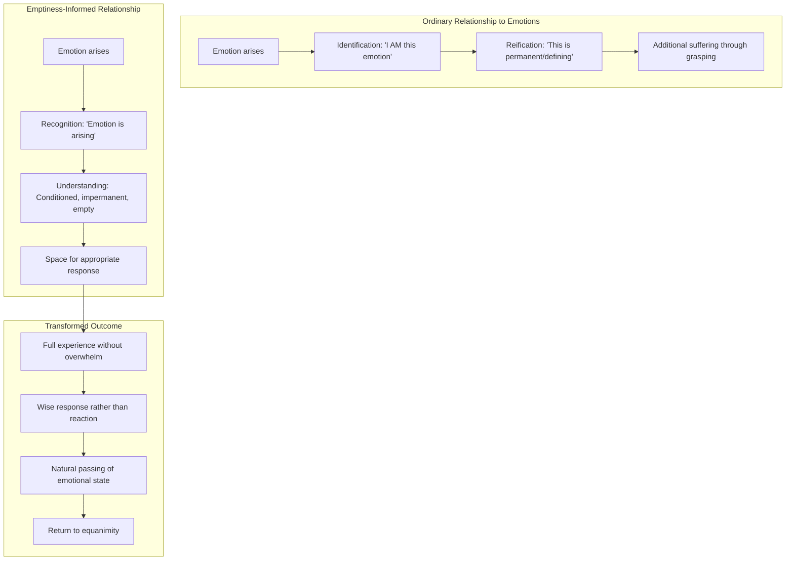

This diagram shows how the ordinary relationship to emotions (identification, reification, additional suffering) is transformed through emptiness understanding into a relationship characterized by recognition, understanding of conditioned nature, space for response, and eventual return to equanimity.

### 12.2 Non-Identification with Thoughts and Feelings: The Diamond Sutra's 'Four Marks' and Cognitive Defusion

The Diamond Sutra's teaching on releasing the four marks—**no notion of self, no notion of person, no notion of sentient being, no notion of life-span**—provides a sophisticated framework for what contemporary psychology calls **cognitive defusion** or **decentering**. This section explores the remarkable convergence between ancient Buddhist wisdom and evidence-based therapeutic techniques, demonstrating how the sutra's instruction enables practitioners to observe thoughts and emotions without identification while maintaining compassionate awareness.

#### The Four Marks and Their Psychological Significance

The Diamond Sutra repeatedly emphasizes that bodhisattvas should have **"no notion of self, no notion of others, no notion of sentient beings, and no notion of longevity."** These four marks represent progressively subtle forms of self-grasping that, when released, fundamentally transform the relationship to mental content.

**The notion of self (ātman/我相)** in psychological terms represents **identification with thoughts and feelings as "mine" or as defining "who I am."** When we have a strong notion of self, every thought and emotion becomes personal—"my anxiety," "my depression," "my anger." This identification intensifies suffering by adding the weight of self-reference to every mental event.

**The notion of person (pudgala/人相)** establishes **subject-object duality in mental experience**. We become the "subject" who is thinking or feeling, and the thoughts and emotions become "objects" that we either embrace or resist. This duality creates the very structure within which psychological struggle occurs.

**The notion of sentient being (sattva/众生相)** creates **categorical boundaries** that separate "my" experience from universal human experience. When we believe our suffering is uniquely ours, we feel isolated in our pain. Releasing this notion reveals that anxiety, depression, and anger are universal human experiences—we are not alone in our suffering.

**The notion of life-span (jīva/寿者相)** manifests as **temporal fixation**—believing that current mental states will persist indefinitely, that "I have always been this way" or "I will always feel this way." This notion traps us in a sense of permanence that contradicts the actual impermanent nature of all mental states.

The sutra's teaching on these four marks directly addresses the cognitive processes that perpetuate emotional suffering. By releasing these notions, practitioners create **psychological distance from mental content** without dissociating from experience.

#### Cognitive Defusion: The Contemporary Psychological Parallel

**Cognitive fusion** in Acceptance and Commitment Therapy (ACT) refers to **the state where an individual becomes overly entangled with their thoughts, particularly negative or self-critical ones, as if these thoughts were literal truths.** When fused with a thought, **it may feel like it is your identity.** This psychological process **decreases psychological flexibility, making it harder for individuals to respond to life's challenges in a healthy, value-driven way.**[^70]

**Cognitive defusion** is the process of **loosening the grip that thoughts have on identity by creating distance from thoughts and cultivating mindful observation, thereby promoting psychological flexibility.** Defusion encourages **examining thoughts objectively rather than being immersed in them, cultivating the skill of observing thoughts without becoming entangled in them, and embracing a mindset that allows thoughts to come and go naturally without grasping or clinging.**[^70]

The parallel to the Diamond Sutra's teaching is striking. The sutra's instruction to release the four marks is essentially an instruction in cognitive defusion—creating distance from thoughts and feelings by recognizing their constructed, impermanent nature. ACT teaches that **the problem is not the thoughts themselves, but how you deal with them.** Defusion is essentially **changing our relationship to thoughts by observing them rather than engaging with them.**[^70]

The convergence is not coincidental. Research has demonstrated that **the philosophical foundations of both ACT and Dialectical Behavioral Therapy (DBT) contain important elements equivalent to Nāgārjuna's philosophy of emptiness.** Both therapies are based on worldviews that **reject the idea that things—particularly psychological phenomena like thoughts, feelings, and the self—have an intrinsic, unchanging essence.** Instead, they view these as **dependently arisen and context-dependent, which aligns with Nāgārjuna's view that all things are empty of inherent existence.**[^71]

#### The Diamond Sutra's Logic Applied to Thoughts and Feelings

The Diamond Sutra's characteristic logical formula—**"A is not A, therefore it is called A"**—applies directly to mental content. Applied to thoughts, this becomes: **"What is called mind is not mind, therefore it is called mind."** This paradoxical formulation points toward the cognitive defusion that contemporary therapy seeks to cultivate.

When we recognize that "what is called mind is not mind," we are recognizing that our thoughts and feelings are not the solid, defining realities they appear to be. They are conventional designations for flowing mental events that lack inherent existence. This recognition creates the **psychological distance** that allows us to observe thoughts without being captured by them.

The sutra's teaching that **"the mind of someone who practices the Prajñāpāramitā is then a mind free from fixed substantialist or 'self' concepts"** describes precisely the state that cognitive defusion aims to cultivate. The practitioner can experience thoughts and feelings without treating them as fixed truths about self or reality.

#### Specific Cognitive Defusion Techniques and Their Buddhist Parallels

Contemporary cognitive defusion techniques have remarkable parallels to Buddhist practices:

**1. The "I'm Having the Thought..." Technique**

ACT teaches practitioners to preface distressing thoughts with "I'm having the thought that..." For example, transforming "I'm not good enough" into "I'm having the thought that I'm not good enough." This simple linguistic shift **creates distance between the self and the thought content.**[^72]

The Diamond Sutra's teaching parallels this technique. The sutra instructs practitioners to recognize that **"what is called a self is not a self, therefore it is called a self."** When we recognize that the "self" in "I'm not good enough" is itself a conventional designation rather than a fixed reality, the thought loses its power to define us.

**2. Observing Thoughts Like Clouds**

A common defusion metaphor involves **observing thoughts as clouds passing through the sky of awareness.** The practitioner learns to **allow thoughts to pass without being overwhelmed by them.**[^70]

This metaphor directly parallels the Diamond Sutra's teaching on the nature of mind. The sutra describes awakened awareness as **like space in all directions—boundless, accommodating, unchanging.** Thoughts arise within this space like clouds, appearing and passing without affecting the space itself.

**3. Thanking the Mind**

ACT teaches practitioners to **thank their mind when unhelpful thoughts arise**, recognizing that the mind is attempting to help (even if ineffectively). This practice transforms the relationship to thoughts from adversarial to accepting.[^70]

The Diamond Sutra's teaching on compassion supports this approach. When we recognize that all mental phenomena—including unhelpful thoughts—arise through dependent origination, we can meet them with understanding rather than hostility.

**4. The "Zoom Out" Technique**

Thought defusion techniques include the **"Zoom Out" approach, which asks clients to imagine floating high above the earth, where everything below looks tiny and insignificant.** From this distance, **problems and worries appear less threatening.**[^73]

This technique parallels the Diamond Sutra's teaching on the vastness of space. The sutra asks whether space in all directions can be measured, establishing that it cannot. This recognition of vastness provides perspective on the relative significance of any particular thought or feeling.

The following table summarizes the parallels between the Diamond Sutra's teachings and contemporary defusion techniques:

| Diamond Sutra Teaching | Contemporary Defusion Technique | Shared Mechanism |
|-----------------------|--------------------------------|------------------|
| "What is called mind is not mind" | "I'm having the thought that..." | Creating distance from thought content |
| Four marks: no notion of self | Observing thoughts as passing events | Non-identification with mental content |
| All phenomena like dreams, illusions | Thoughts as clouds passing | Recognizing impermanent nature |
| Mind like space in all directions | Zoom out technique | Perspective through vastness |
| Compassion for all beings | Thanking the mind | Non-adversarial relationship to thoughts |

#### Decentering: The MBCT Parallel

**Mindfulness-Based Cognitive Therapy (MBCT)** explicitly cultivates **decentering**, defined as **the ability to step back and see thoughts as passing events in the mind rather than accurate reflections of reality.**[^74] Research has demonstrated that **only patients receiving MBCT showed significant increases in the ability to monitor and observe thoughts and feelings,** specifically in **Decentering—a shift away from identifying personally with thoughts and feelings to observing their movement in a wider field of awareness.**[^69]

The study found that **changes in Wider Experiences and Curiosity predicted lower depression scores at a 6-month follow-up.** Wider Experiences refers to **the ability to observe one's thoughts and feelings as temporary events,** while Curiosity involves **an attitude of approaching and investigating one's experience without judgment.**[^69]

These findings directly support the Diamond Sutra's teaching. The sutra's instruction to observe all phenomena as dreams, illusions, bubbles, and shadows cultivates precisely this capacity for decentering—observing mental events without identification, with curiosity rather than judgment.

The sutra's teaching that **"form is emptiness and emptiness is form"** from the related Heart Sutra points toward this integration. Thoughts and feelings are real (form) while simultaneously lacking inherent existence (emptiness). This recognition enables practitioners to **experience thoughts fully while recognizing their empty nature**—the essence of decentering.

#### Practical Methods for Non-Identification

The Diamond Sutra's wisdom can be applied through specific practices that cultivate non-identification with thoughts and feelings:

**1. Recognition Practice**

When a distressing thought or emotion arises, practice recognizing: "This is a thought arising in awareness" or "This is an emotion arising through conditions." This simple recognition implements the sutra's teaching on dependent origination while creating distance from the mental content.

**2. Contemplation of the Four Marks**

When caught in identification with mental content, contemplate the four marks:
- **No notion of self**: "This thought/feeling is not 'me'—it is a conditioned phenomenon"
- **No notion of person**: "There is no solid 'thinker' separate from the thought"
- **No notion of sentient being**: "This experience is part of universal human experience"
- **No notion of life-span**: "This state is impermanent; it will change"

**3. The Concluding Verse Applied to Mental Content**

Apply the Diamond Sutra's concluding verse directly to thoughts and emotions:

> *This thought is like a dream—appearing real but mind-created*
> *This feeling is like a bubble—arising quickly, dissolving quickly*
> *This mental state is like dew—present now, evaporating soon*
> *Thus I shall perceive all mental content*

**4. Observing Without Grasping**

The sutra teaches that **"the past mind cannot be grasped, neither can the present mind or the future mind."** Practice observing thoughts and feelings without trying to grasp, hold, push away, or change them. Allow them to arise, exist, and pass in their own time.

**5. Maintaining Compassionate Awareness**

Non-identification does not mean coldness or disconnection. The Diamond Sutra's teaching on compassion applies to our relationship with our own mental content. Meet thoughts and feelings with the same compassion you would offer to a suffering friend—acknowledging their presence, understanding their causes, and allowing their natural passing.

### 12.3 'Past Mind, Present Mind, Future Mind Cannot Be Grasped': Therapeutic Implications of the Ungraspable Mind

The Diamond Sutra contains one of its most therapeutically significant teachings in the statement that **"the past mind cannot be grasped, neither can the present mind or the future mind."**[^68] This teaching directly addresses the temporal patterns of rumination and worry that characterize anxiety and depression, offering a profound philosophical foundation for liberation from the mental habits that perpetuate emotional suffering.

#### The Story of Deshan: Awakening Through the Ungraspable Mind

The Diamond Sutra preserves an ancient story that illuminates the teaching on the ungraspable mind. **Deshan, a scholar who claimed expertise in the Diamond Sutra, encountered an old woman selling rice cakes on his way to challenge Zen teachers.** When Deshan asked to buy cakes to "refresh his mind" (点心, literally "to dot the mind"), **the old woman said she had heard the Diamond Sutra teaches that "past mind cannot be grasped, present mind cannot be grasped, future mind cannot be grasped."** She asked Deshan: **"Which mind will you use to buy these cakes—past mind, present mind, or future mind?"** Deshan was speechless.[^75]

This story reveals the **practical, experiential nature of the teaching**. The ungraspable mind is not an abstract philosophical concept but a direct pointer to the nature of experience. When we try to locate "the mind" that thinks, feels, or decides, we cannot find it. **The past has already vanished, no longer existing; the future has not yet arrived, existing only as potential; and the present flows so rapidly that we cannot grasp it.**[^68]

The teaching continues: **"In our zazen (sitting meditation), we can experience the completeness of time flowing, being present here, witnessing and participating in all phenomena flowing in multiple directions. Mind and reality are truly inconceivable. Our human capacity for perception and conceptualization cannot possibly capture the complexity of reality."**[^68]

#### Rumination and the Grasping of Past Mind

**Rumination**—the repetitive dwelling on past events, losses, and regrets—represents one of the primary cognitive patterns in depression. From the Diamond Sutra's perspective, rumination involves **attempting to grasp past mind**, which the sutra teaches is impossible. The past mind we ruminate about no longer exists; what we are actually doing is **creating present mental constructions about a past that is no longer accessible**.

Research on MBCT confirms this understanding. **Rumination is the endless playing of tapes in your mind on a continuous loop.** Nolen-Hoeksema's research found that **rumination is a driver of depression.** If you can **shift attention to the present moment, it helps break the cycle of rumination, which in turn helps improve mood.**[^76]

The Diamond Sutra's teaching provides the philosophical foundation for this shift. When we recognize that **past mind cannot be grasped**, we recognize that rumination is not engaging with actual past events but with present mental constructions. This recognition does not dismiss the significance of the past but transforms our relationship to it.

The teaching on impermanence supports this transformation. **"Impermanence is a key that can open the door of reality. We must keep the insight of impermanence alive."** When we recognize that the past moment has already passed—has already become like a dream, an illusion, a bubble—we are freed from the compulsion to keep grasping at it.

#### Worry and the Grasping of Future Mind

**Worry**—the anxious anticipation of future events, catastrophes, and losses—represents the primary cognitive pattern in anxiety disorders. From the Diamond Sutra's perspective, worry involves **attempting to grasp future mind**, which the sutra teaches is equally impossible. The future mind we worry about does not yet exist; what we are actually doing is **creating present mental constructions about a future that may never arrive in the form imagined**.

The sutra's teaching directly addresses this pattern. When we recognize that **future mind cannot be grasped**, we recognize that worry is not engaging with actual future events but with present mental projections. The anxious scenarios we construct are not predictions but imaginings—present mental events masquerading as future realities.

**MBCT helps with anxiety disorders because it brings your focus to the present moment, letting go of looking at the past or the future.** If you are **focused on your breath in this moment, you cannot be focused on past losses or future catastrophes.**[^76] The Diamond Sutra's teaching provides the deeper philosophical understanding: the future we fear is not graspable because it does not exist. Only the present moment is accessible, and even that flows too rapidly to be grasped.

#### The Present Mind: Equally Ungraspable

Perhaps most surprisingly, the Diamond Sutra teaches that **present mind is also ungraspable**. This teaching might seem to undermine the therapeutic emphasis on present-moment awareness. However, the teaching points toward something more subtle: **the present moment is not a static thing that can be captured but a dynamic flow that can only be participated in**.

The teaching explains: **"While focusing on the present is better than dwelling on past or future, one should not make an ideal of the present and cling to it, as it is ever-changing. One must let go even of the present moment because it is fleeting."**

This prevents practitioners from creating a new attachment—attachment to "being present." The goal is not to grasp the present moment but to **participate in the flow of experience without grasping at any moment**. This is the non-abiding mind that the Diamond Sutra teaches: **"A bodhisattva should develop a mind that functions freely, without depending on anything or any place."**

The therapeutic implication is profound. The goal of mindfulness practice is not to achieve a particular state called "presence" but to **release the habit of grasping at any temporal location**—past, present, or future. This release is itself the freedom that the sutra points toward.

#### Therapeutic Applications of the Ungraspable Mind Teaching

The Diamond Sutra's teaching on the ungraspable mind has specific therapeutic applications:

**1. For Rumination**

When caught in rumination, practitioners can recognize: "I am attempting to grasp past mind, which cannot be grasped. The past I am dwelling on no longer exists. What exists is this present moment of ruminating—and even this is flowing and changing."

This recognition does not forcefully stop rumination but **transforms the relationship to it**. The rumination is seen as a present mental activity rather than an engagement with actual past events. This shift often naturally reduces the intensity and duration of ruminative episodes.

**2. For Worry**

When caught in worry, practitioners can recognize: "I am attempting to grasp future mind, which cannot be grasped. The future I am anxious about does not yet exist. What exists is this present moment of worrying—and even this is flowing and changing."

This recognition reveals that worry is not protective planning but present suffering about imagined futures. The anxious scenarios are recognized as mental constructions rather than predictions. This often naturally reduces the intensity of anxiety.

**3. For Present-Moment Fixation**

Even practitioners who have learned to focus on the present can become attached to "being present" as an achievement or identity. The sutra's teaching that present mind is also ungraspable prevents this attachment. The goal is not to achieve presence but to **release grasping in all temporal directions**.

**4. For Temporal Flexibility**

The teaching supports what might be called **temporal flexibility**—the ability to engage with past, present, and future as needed without becoming trapped in any temporal location. We can learn from the past without ruminating, plan for the future without worrying, and engage with the present without grasping.

#### The Ungraspable Mind and the Bodhisattva Precepts

The Diamond Sutra connects the teaching on the ungraspable mind to ethical conduct through the bodhisattva precepts. **"Because we are interconnected through the 'ten worlds' (past, present, and future of past, future, and present themselves, plus the combination of these nine), we need the guidance of the bodhisattva precepts."** These precepts encourage us to **"turn toward Buddha or awakening; not cause harm but support life and vitality; include all beings in our care and goodwill, not just those we like or have special connections with."**[^68]

The teaching continues: **"We cannot ignore our karma, both personal and collective social karma. We must recognize causation in all times and our connection to those times."** This recognition of temporal interconnection does not contradict the teaching on ungraspable mind but complements it. We recognize that past actions have present consequences and present actions will have future consequences—while simultaneously recognizing that past, present, and future mind cannot be grasped as fixed entities.

The practical implication is that **we have the capacity to respond and the responsibility to engage with all times.** This responsibility is the work of awakening practice. **"Everything happening around us is the product of countless causes and conditions in the 'ten worlds.' And everything we do or say will have effects in the future and other places in time. The future is not predetermined, so our activity and awareness can always have great impact on the future and present."**[^68]

This teaching transforms the relationship to time from one of grasping and anxiety to one of **engaged participation**. We are not trapped by the past, not threatened by the future, not grasping at the present—but fully participating in the flow of time with awareness and responsibility.

#### Integration: The Ungraspable Mind as Liberation

The Diamond Sutra's teaching on the ungraspable mind ultimately points toward **liberation from the very framework within which temporal suffering occurs**. When we recognize that past, present, and future mind cannot be grasped, we are freed from:

- **The compulsion to fix the past** through rumination
- **The compulsion to control the future** through worry
- **The compulsion to capture the present** through grasping

What remains is **open, responsive awareness**—the non-abiding mind that the sutra describes as the essence of awakened practice. This awareness can engage with past, present, and future as needed without being trapped by any temporal location.

The teaching does not deny the conventional reality of time or the significance of temporal experience. Rather, it transforms our relationship to time from one of grasping to one of **fluid participation**. We can remember without ruminating, plan without worrying, and be present without grasping—because we recognize that none of these temporal locations can be captured as fixed realities.

This is the therapeutic liberation that the Diamond Sutra offers: **freedom from the mental habits that perpetuate suffering across time**, combined with the capacity for engaged, compassionate response to whatever arises in the flow of experience.

### 12.4 Cultivating Inner Peace Through Emptiness Understanding: From Intellectual Insight to Embodied Transformation

The Diamond Sutra's emptiness wisdom offers more than intellectual understanding—it provides a path to **embodied emotional transformation and lasting inner peace**. This section examines the mechanisms by which contemplating emptiness produces psychological benefits, addresses potential risks such as nihilistic misinterpretation, and provides practical contemplative methods for applying the sutra's wisdom to emotional healing.

#### Mechanisms of Psychological Benefit from Emptiness Understanding

Research and practice have identified several mechanisms through which the Diamond Sutra's emptiness teaching produces psychological benefits:

**1. Liberation from Treating Painful Thoughts as Inherently Real**

One of the primary mechanisms is **recognizing that thoughts causing suffering are not inherently real**. This recognition itself is therapeutic. Research on ACT and DBT has found that **both therapies emphasize that a significant source of psychological suffering is mistakenly treating language, thoughts, emotions, and the self as inherently existing, unchanging entities.** The therapeutic goal is to help clients recognize that **these phenomena are actually dependently arisen and lacking inherent essence—that is, empty.**[^71]

The Diamond Sutra provides the philosophical foundation for this recognition. When we contemplate that all phenomena are like dreams, illusions, bubbles, and shadows, we naturally begin to hold our thoughts more lightly. The thought "I am worthless" loses its power when recognized as a conditioned mental event rather than an accurate description of reality.

**2. Dissolution of Rigid Self-Concepts**

The sutra's teaching on non-self dissolves the **rigid self-concepts that perpetuate emotional suffering**. Research has found that **the Buddhist notion of non-self refers to the realization that the self is absent of intrinsic existence.** Buddhism asserts that **the individual comprises five aggregates (form, feelings, perceptions, mental formations, and consciousness) and that an inherently existing self may not be found within them.**[^77]

When rigid self-concepts dissolve, emotional flexibility increases. The person who believes "I am an anxious person" is trapped by that identity. The person who recognizes that anxiety arises through conditions—and that no fixed "anxious self" exists—has space to change.

**3. Emergence of Equanimity**

The Diamond Sutra's teaching naturally produces **equanimity**—a stable, balanced state of mind not shaken by external circumstances. This equanimity arises not through suppression of emotions but through **understanding their nature**. When we recognize that all conditioned phenomena are impermanent and empty of inherent existence, we naturally hold them more lightly.

The sutra describes this equanimity through the teaching on the Tathāgata who **"neither comes nor goes."** The awakened mind does not fluctuate based on what comes and goes in experience but remains stable in recognition of suchness while responding appropriately to whatever arises.

**4. The "Freeing" Quality of Emptiness**

Research has identified that **recognizing the empty nature of phenomena has a "freeing" quality**. The teaching states that **"to be unsupported is to recognize that all phenomena are empty. This unsupportedness is freeing and joyful."** When we recognize that the things we grasp at are empty of the substantial existence we attributed to them, grasping naturally relaxes—and with it, the suffering that grasping creates.

#### Research on Emptiness Meditation

Empirical research on emptiness meditation provides evidence for these mechanisms. A study of **25 advanced Buddhist meditators compared emptiness meditation against a mindfulness meditation control condition.** The results showed that **compared to the mindfulness control condition, emptiness meditation resulted in significantly greater improvements in non-attachment to self and environment, mystical experiences, compassion, positive affect, and negative affect.**[^78]

**Qualitative outcomes demonstrated that participants combined concentrative and investigative meditation techniques to induce emptiness, elicited spiritually meaningful insights both during and following the meditation on emptiness, and retained volitional control over the content and duration of the meditation.** The researchers concluded that **cultivating emptiness appears to be a means of reconnecting advanced Buddhist meditators to what they deem to be the innermost nature of their minds and phenomena.**[^78]

These findings support the Diamond Sutra's teaching that emptiness meditation produces genuine psychological and spiritual benefits. The improvements in non-attachment, compassion, and affect demonstrate that emptiness understanding translates into measurable psychological change.

#### Addressing Potential Risks: Nihilistic Misinterpretation

The Diamond Sutra's emptiness teaching carries potential risks if misunderstood. The primary risk is **nihilistic misinterpretation**—understanding emptiness as meaning that nothing matters, that actions have no consequences, or that the world should be rejected.

Research has identified this concern: **"Emptiness could be misunderstood as moral nihilism, potentially leading to despair or harmful behavior."** However, the Diamond Sutra explicitly addresses this risk. The Buddha warns: **"Do not think that when one gives rise to the highest, most fulfilled, awakened mind, one needs to see all objects of mind as nonexistent, cut off from life. Do not think in that way."**

The sutra's Middle Way navigates between two extremes:

| Extreme | Description | Problem |
|---------|-------------|---------|
| **Eternalism** | Treating phenomena as permanent, inherently existing | Creates attachment and suffering through grasping |
| **Nihilism** | Treating phenomena as completely non-existent | Undermines ethics; contradicts observable appearance |

The Diamond Sutra's teaching that **"emptiness is dependent origination"** prevents nihilistic interpretation. Because phenomena are empty—arising through conditions rather than existing independently—they can change. This is the very basis for the Buddhist path: if suffering had inherent existence, it could not be transformed. **It is precisely because everything is empty that suffering can arise and, being contingent, can be caused to cease.**

To mitigate the risk of nihilistic misinterpretation, both the Diamond Sutra tradition and contemporary therapies **emphasize the importance of ethical conduct as a practical foundation**. Research notes that **"Nāgārjuna and DBT both prescribe adherence to a set of conventional moral behaviors as a practical step toward wisdom, similar to Buddhist precepts."** This ethical grounding prevents emptiness understanding from becoming an excuse for harmful behavior.[^71]

#### Practical Contemplative Methods for Emotional Healing

The Diamond Sutra's wisdom can be applied through specific contemplative practices that support emotional healing:

**1. Daily Contemplation of the Concluding Verse**

Regular contemplation of the Diamond Sutra's concluding verse transforms the habitual tendency to treat emotions as fixed realities:

> *All conditioned phenomena are like a dream, an illusion, a bubble, a shadow,*
> *like dew or a flash of lightning; thus we shall perceive them.*

Practice applying this verse specifically to emotional states:
- "This anxiety is like a dream—appearing real but mind-created"
- "This depression is like a bubble—arising from conditions, dissolving when conditions change"
- "This anger is like lightning—intense but momentary"

**2. Mindful Breathing with Emptiness Awareness**

**Ways to practice emptiness in daily life include mindful breathing daily for 5-10 minutes, observing thoughts as not the self, reading relevant classics such as the Diamond Sutra and Heart Sutra, and joining sitting/meditation courses.**[^67]

During breathing practice, observe thoughts and emotions arising without identification:
- "Breathing in, I am aware of this emotion arising"
- "Breathing out, I recognize this emotion as a conditioned phenomenon"
- "Breathing in, I observe without grasping"
- "Breathing out, I allow natural passing"

**3. Contemplation of the Four Marks During Emotional Difficulty**

When experiencing emotional difficulty, contemplate the four marks:

**No notion of self**: "This suffering is not 'me'—it is a conditioned phenomenon arising in awareness"

**No notion of person**: "There is no solid 'sufferer' separate from this experience—subject and object are both empty"

**No notion of sentient being**: "This suffering is part of universal human experience—I am not alone in this"

**No notion of life-span**: "This state is impermanent—it has arisen and will pass"

**4. The Non-Abiding Mind as Foundation for Well-Being**

The Diamond Sutra teaches that bodhisattvas should **"give rise to an intention with their minds not dwelling anywhere."** This non-abiding mind becomes the foundation for stable psychological well-being.

Practice cultivating the non-abiding mind:
- When pleasant emotions arise, experience them fully without grasping
- When unpleasant emotions arise, experience them fully without pushing away
- When neutral states arise, remain present without seeking stimulation
- In all states, maintain awareness that dwells nowhere in particular

**5. Integration of Understanding and Compassion**

The Diamond Sutra's teaching integrates wisdom (understanding emptiness) with compassion (caring for suffering beings). Apply this integration to your own emotional experience:
- Meet your suffering with the same compassion you would offer a friend
- Recognize that your difficult emotions, like all phenomena, are worthy of understanding
- Allow the recognition of emptiness to deepen rather than diminish your care for yourself and others

The teaching emphasizes: **"Emptiness wisdom is not an unreachable philosophy but a life attitude that everyone can experience daily. It helps individuals see through the illusions of self-denial and anxiety, leading to inner liberation."**[^67]

#### From Intellectual Insight to Embodied Transformation

The transformation from intellectual understanding to embodied realization occurs through **sustained practice**. The Diamond Sutra's teaching is not meant to be merely understood but to be **contemplated, practiced, and lived**. The sutra repeatedly emphasizes that even understanding a four-line verse and explaining it to others generates immeasurable merit—not because of the words themselves but because of the transformation they point toward.

The process of embodiment involves:

**1. Repeated contemplation**: Returning again and again to the sutra's teachings, allowing them to penetrate deeper levels of understanding

**2. Application in difficulty**: Applying the teachings specifically when emotional suffering arises, not just in calm moments

**3. Recognition of change**: Noticing how the relationship to emotions transforms over time through practice

**4. Integration with daily life**: Allowing the sutra's wisdom to inform every aspect of experience, not just formal practice periods

**5. Patience with the process**: Recognizing that embodied transformation takes time and that the teachings work gradually to transform deeply conditioned patterns

The Diamond Sutra's promise is that this practice leads to **genuine liberation from emotional suffering**—not through suppression or denial but through understanding the true nature of emotions as conditioned, impermanent, and empty of inherent existence. This understanding, when fully embodied, becomes the foundation for **lasting inner peace and psychological resilience**.

### 12.5 Integration with Contemporary Mental Health Approaches: Buddhist-Derived Interventions and Clinical Applications

The Diamond Sutra's teachings have been implicitly and explicitly integrated into contemporary evidence-based mental health interventions, creating a remarkable convergence between ancient wisdom and modern therapeutic science. This section examines how Buddhist principles of emptiness and non-self operate within therapies such as ACT, DBT, and MBCT, addresses integration challenges, and provides guidance for practitioners seeking to incorporate the sutra's insights into comprehensive approaches to emotional well-being.

#### The Implicit Presence of Emptiness in Contemporary Therapies

Research has demonstrated that **the philosophical foundations of both ACT and DBT contain important elements equivalent to Nāgārjuna's philosophy of emptiness, even though neither therapy explicitly uses the term "emptiness."**[^71] This implicit presence reveals that the Diamond Sutra's wisdom has found its way into mainstream psychology, reaching far more people than traditional Buddhist pathways.

**In ACT, developed by Steven Hayes, the underlying philosophy of "functional contextualism" focuses on the whole event, the role of context, and a pragmatic truth criterion.** This view **rejects a "mechanist" perspective that posits a pre-organized world of intrinsic parts, arguing instead that such a view makes therapeutic change impossible.** Hayes identifies **human language and symbolic reasoning as primary sources of suffering, creating a false sense of inherent reality.** ACT's therapeutic methods, including mindfulness and "cognitive defusion," aim to **help clients see the empty, constructed nature of language-created reality.**[^71]

**In DBT, developed by Marsha Linehan, the core philosophy is "dialectics," which emphasizes interrelatedness and wholeness, polarity, and continuous change.** This view holds that **reality consists of opposing forces in constant flux, and that nothing has a single, unchanging, intrinsic essence.** DBT uses this framework to **challenge the rigid, absolutist thinking characteristic of Borderline Personality Disorder, helping patients see that psychological states are not inherently real.**[^71]

The convergence is significant. Research concludes that **"emptiness is an implicit component of ACT and DBT. This integration means that Nāgārjuna's philosophical insights are being disseminated to a wide audience through secular psychotherapy, potentially influencing more people than are reached through traditional Buddhist pathways."**[^71]

#### Clinical Operationalization of Buddhist Concepts

The clinical operationalization of Buddhist concepts has progressed significantly, though challenges remain. Research has proposed **classifying Buddhist principles and derivative interventions according to categories of wisdom, meditation, and ethical awareness as a unified operational approach.** These three principles, collectively known as "the three trainings," encompass the entire spectrum of Buddhist practices.[^77]

**Within the Wisdom category, key terms frequent in the mental health literature include non-self, impermanence, interconnectedness, and emptiness.** The clinical utilization of these concepts has progressed more slowly than mindfulness or compassion-based approaches, but several interventions have begun to integrate them explicitly.[^77]

**Meditation Awareness Training (MAT)** provides an example of explicit integration. MAT is **an 8-week, group-based secular intervention grounded in the three Buddhist principles of wisdom, meditation, and ethical awareness.** It includes **practices to cultivate ethical awareness, patience, generosity, loving kindness, and compassion, and integrates concentrative and insight meditation techniques to encourage familiarity with concepts like impermanence and emptiness.**[^77]

In a controlled pilot trial, participants demonstrated **significant improvements in psychological distress and dispositional mindfulness.** Notably, **participants attributed a greater willingness to relinquish rigid behavioral patterns to preliminary meditative-born insights into emptiness and impermanence.**[^77]

#### Decentering as Clinical Mechanism

**Decentering** has emerged as a key clinical mechanism that parallels the Diamond Sutra's teaching on non-identification with mental content. MBCT research has found that **decentering—the ability to step back and see thoughts as passing events in the mind rather than accurate reflections of reality—is a treatment-specific change that may underlie MBCT's effectiveness.**[^69]

The research found that **during the maintenance phase of treatment, only patients receiving MBCT showed significant increases in the ability to monitor and observe thoughts and feelings.** Specifically, there was a **significant increase in Decentering and in Wider Experiences (the ability to observe one's thoughts and feelings as temporary events).** In contrast, these variables did not change in patients receiving antidepressant medication or placebo.[^69]

The study also found that **changes in Wider Experiences and Curiosity predicted lower depression scores at a 6-month follow-up,** suggesting that these meta-cognitive skills are not merely byproducts of symptom improvement but may be **active mechanisms of therapeutic change.**[^69]

This finding directly supports the Diamond Sutra's teaching. The sutra's instruction to observe all phenomena as dreams, illusions, bubbles, and shadows cultivates precisely this capacity for decentering. The clinical research validates what the sutra has taught for centuries: **changing the relationship to thoughts—rather than changing the thoughts themselves—is a powerful path to emotional healing.**

#### Integration of ACT Defusion with Diamond Sutra Wisdom

A case study of integrated CBT/ACT treatment for Generalized Anxiety Disorder illustrates how Diamond Sutra-aligned techniques function in clinical practice. **The patient, "Fred," began practicing mindfulness and acceptance of his anxious thoughts and emotions, acknowledging thoughts as separate from himself.** He practiced **the ACT defusion technique of repeating the word "relationship" to disentangle the negative meaning he had placed on the word and create space to act according to his values.** He also practiced using the phrase **"I'm having the thought…" to separate himself from thoughts that evoked painful emotions.**[^79]

The results were significant: **Pre- to post-treatment analyses showed significant decreases in anxiety symptoms, worry, depressive symptoms, and emotion dysregulation.** The patient **developed flexibility in utilizing coping skills, choosing which approach (e.g., cognitive restructuring or acceptance) felt most beneficial in the moment.**[^79]

This case illustrates how the Diamond Sutra's wisdom—creating distance from thoughts, recognizing their constructed nature, acting according to values rather than being controlled by mental content—operates effectively in clinical treatment.

#### Addressing Integration Challenges

The integration of Buddhist principles into clinical practice faces several challenges that must be addressed:

**1. Risk of Misapplication**

Research notes that **due to the rapid assimilation of Buddhism into the mental health setting, issues relating to the misapplication of Buddhist terms and practices have arisen.** There is **a degree of confusion within the clinical literature relating to the appropriate usage of certain Buddhist terms and practices.** This confusion can lead to **superficial or distorted applications that miss the depth of the original teachings.**[^77]

**2. Potential Conflict with Client Beliefs**

The emptiness teaching may conflict with some clients' deeply held beliefs. Research acknowledges that **"emptiness philosophy may conflict with theistic clients' core beliefs"** and that **"there is an 'epistemological cost' to the emptiness view that may be unacceptable to many clients."**[^71]

**3. Risk of Nihilistic Misinterpretation**

As discussed earlier, emptiness can be misunderstood as nihilism. Research emphasizes that **"concepts such as non-self and emptiness are subtle and complex; if misunderstood, they could accentuate delusional schemas or give rise to nihilistic beliefs. Additional caution is recommended for patients with cognitive impairment or reality-distortion complexes."**[^77]

**4. Need for Dialogue Between Traditions**

Research concludes that **"there is a need for greater dialogue between experienced Buddhist teachers and mental health clinicians to establish robust operational foundations and a unified approach for Buddhist-derived interventions. Such dialogue will safeguard the ethical values, efficacy, and credibility of these interventions and help preserve the authenticity of the Buddhist teachings."**[^77]

#### Practical Guidance for Integration

For practitioners seeking to incorporate the Diamond Sutra's insights into mental health approaches, several guidelines emerge:

**1. Ground Integration in Evidence-Based Practice**

The Diamond Sutra's wisdom should complement rather than replace evidence-based interventions. Research supports the **integration of Buddhist principles with established therapeutic frameworks** such as CBT, ACT, and DBT, rather than treating Buddhist teachings as standalone treatments.

**2. Adapt to Client Context**

The Diamond Sutra's teaching on **Skillful Means (upāya)** emphasizes context-sensitive application. Practitioners should adapt the presentation of Buddhist concepts to client background, beliefs, and readiness. For some clients, explicit Buddhist language may be appropriate; for others, the same principles may be more effectively presented through secular psychological terminology.

**3. Emphasize Experiential Practice Over Intellectual Understanding**

The Diamond Sutra emphasizes that its teachings must be **practiced, not merely understood**. Clinical application should emphasize experiential practices—mindfulness, defusion exercises, contemplation—rather than philosophical instruction alone.

**4. Maintain Ethical Foundation**

Both the Diamond Sutra tradition and clinical research emphasize that **emptiness understanding must be grounded in ethical conduct**. The sutra's teaching on compassion and the bodhisattva precepts provides this grounding. Clinical applications should similarly emphasize values-based action and ethical behavior.

**5. Address Potential Risks Proactively**

Practitioners should be aware of potential risks—nihilistic misinterpretation, conflict with client beliefs, inappropriate application to certain populations—and address them proactively through careful assessment, appropriate client selection, and ongoing monitoring.

#### The Broader Significance: Ancient Wisdom Meeting Modern Need

The integration of the Diamond Sutra's teachings with contemporary mental health approaches represents a significant development in both Buddhist and psychological traditions. Research notes that **"given that the number of Americans receiving psychotherapy far exceeds the number who self-identify as Buddhists, these therapies represent a major pathway for the establishment of Nāgārjuna's emptiness therapy in twenty-first century America."**[^71]

This integration suggests that the Diamond Sutra's wisdom—developed over fifteen centuries of Buddhist practice—addresses something fundamental about human psychological suffering. The convergence between ancient contemplative insight and modern clinical research validates both traditions while opening new possibilities for emotional healing.

The Diamond Sutra's promise remains as relevant today as when it was first taught: **understanding the constructed, impermanent, empty nature of emotional states transforms our relationship to them, creating space for genuine healing and lasting inner peace.** Contemporary psychology is increasingly recognizing this truth, creating unprecedented opportunities for the sutra's wisdom to benefit those who suffer.

The following diagram illustrates the integration of Diamond Sutra teachings with contemporary mental health approaches:

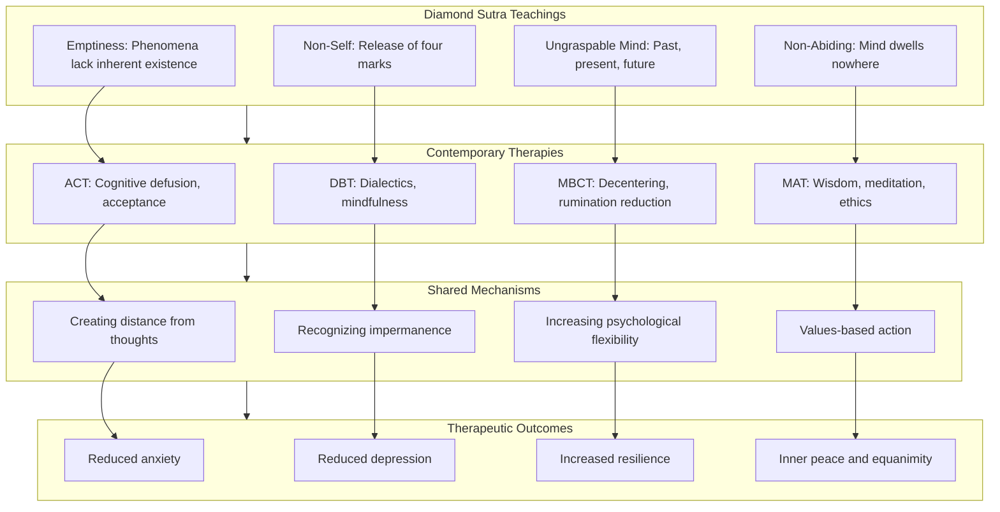

This diagram illustrates how the Diamond Sutra's foundational teachings (emptiness, non-self, ungraspable mind, non-abiding) inform contemporary therapies (ACT, DBT, MBCT, MAT), which operate through shared mechanisms (creating distance from thoughts, recognizing impermanence, increasing psychological flexibility, values-based action), ultimately producing therapeutic outcomes (reduced anxiety and depression, increased resilience, inner peace and equanimity).

---

In summary, the Diamond Sutra's application to emotional well-being and mental health reveals that **ancient wisdom directly addresses the root causes of psychological suffering**. The sutra's teaching on emptiness transforms our relationship to emotions by revealing their constructed, conditioned, impermanent nature—neither denying their reality nor treating them as permanent truths. The teaching on non-identification with thoughts and feelings parallels and deepens contemporary cognitive defusion techniques, providing philosophical foundation for creating distance from distressing mental content. The teaching that past, present, and future mind cannot be grasped directly addresses the temporal patterns of rumination and worry that characterize anxiety and depression, liberating practitioners from dwelling on past regrets and future fears.

The cultivation of inner peace through emptiness understanding moves from intellectual insight to embodied transformation through sustained contemplative practice. The mechanisms of psychological benefit include liberation from treating painful thoughts as inherently real, dissolution of rigid self-concepts, and the emergence of equanimity. Potential risks such as nihilistic misinterpretation are addressed through the sutra's Middle Way teaching and emphasis on ethical conduct.

The integration of the Diamond Sutra's teachings with contemporary evidence-based therapies such as ACT, DBT, and MBCT demonstrates that **Buddhist wisdom and psychological science converge on fundamental truths about emotional suffering and healing**. The implicit presence of emptiness philosophy in these therapies means that the sutra's wisdom is reaching far more people than traditional Buddhist pathways, offering hope for those who suffer from anxiety, depression, anger, and emotional turbulence.

The Diamond Sutra's ultimate promise for mental health is **liberation from the very framework within which emotional suffering perpetuates itself**. When the self that suffers, the emotions that cause suffering, and the situations that trigger suffering are all recognized as empty of inherent existence, the rigid structure of suffering becomes fluid and workable. This is not escape from emotional experience but **transformation of our relationship to it**—creating space for genuine healing, lasting inner peace, and the psychological resilience that enables full engagement with life.

## 13 Application to Interpersonal Dynamics and Social Harmony

This chapter examines how the Diamond Sutra's core teachings—emptiness, non-self, non-attachment, and the four marks—can be systematically applied to transform interpersonal relationships and foster social harmony. Building upon the philosophical foundations established in earlier chapters and the practical applications explored in emotional well-being, this chapter investigates how understanding the emptiness of self and other dissolves the ego-based patterns that create interpersonal friction, how the sutra's 'antilogic' structure transforms fixed perceptions of others, and how non-attached compassion enables genuine connection beyond judgment and projection.

### 13.1 The Emptiness of Self and Other: Dissolving the Subject-Object Duality in Relationships

The Diamond Sutra's teaching on non-self (anātman) and the four marks provides a profound foundation for transforming the fundamental structure of interpersonal relating. At the root of most interpersonal conflict lies a **subject-object duality**—the perception that a fixed, independent "self" encounters fixed, independent "others" in a world of separate entities. This dualistic structure, which we typically take for granted as the basic reality of social life, is precisely what the Diamond Sutra reveals as a conceptual construction that generates suffering and prevents genuine connection.

#### The Subject-Object Structure of Ordinary Relating

In ordinary interpersonal experience, we relate to others through a framework that assumes:

- **A fixed self**: "I" am a stable entity with definite characteristics, needs, preferences, and boundaries
- **Fixed others**: "They" are stable entities with their own definite characteristics that I must navigate around
- **Transactional exchange**: Relationship involves negotiating between these separate entities to maximize self-interest while managing the interests of others

This structure creates what might be called **ego-based relating**—interaction driven by the need to protect, enhance, and gratify the sense of self. When we encounter others from this framework, we unconsciously ask: "How does this person affect my self-image? Do they threaten or support my identity? What can I get from them? What must I defend against?"

The Diamond Sutra identifies this pattern through its teaching on the four marks. When we have a **"notion of self" (ātman/我相)**, we approach every interaction as a self encountering non-selves. When we have a **"notion of person" (pudgala/人相)**, we treat others as fixed objects to be managed rather than as dynamic processes to be engaged. When we have a **"notion of sentient being" (sattva/众生相)**, we create rigid boundaries between "us" and "them." When we have a **"notion of life-span" (jīva/寿者相)**, we treat relationships as possessions to be maintained rather than as flowing connections that naturally evolve.

The sutra's teaching is unequivocal: **"If, Subhuti, a bodhisattva still has the notion of a self, a person, a living being, or a life span exists, that person is not a true bodhisattva."**[^80] This statement applies directly to interpersonal relating. When we approach others while holding these four notions, we cannot engage in genuine bodhisattva activity—compassionate action that serves awakening. Instead, we remain trapped in the ego-based patterns that perpetuate suffering for ourselves and others.

#### The Diamond Sutra's Teaching on Perceiving Beings

The sutra provides explicit instruction regarding how bodhisattvas should perceive other beings: **"A bodhisattva who creates a perception of a being cannot be called a bodhisattva."**[^80] This teaching directly addresses the subject-object duality in relationships. When we "create a perception of a being," we construct a mental image of the other person—a concept that we then relate to as though it were the actual person.

This constructed perception includes:

- **Fixed characteristics**: "She is always critical," "He is unreliable," "They are difficult"
- **Categorical judgments**: "This type of person," "Someone like that," "People who..."
- **Past-based expectations**: "Based on what they did before, they will probably..."
- **Self-referential interpretations**: "They did that because they don't respect me"

The sutra reveals that **a bodhisattva does not see beings through reified concepts such as "person," "soul," or "self," but sees them through the lens of perfect understanding, as empty of inherent, unchanging self.**[^80] This transformed perception does not mean that others become invisible or irrelevant. Rather, it means that we perceive others **as they actually are**—as dynamic processes of interdependent arising, constantly changing, never fixed in the way our concepts suggest.

The teaching on **"interbeing"** illuminates this recognition. The term describes **our deep interconnection to everything else and the fact that we do not exist independently. When we look deeply into ourselves, we can see our parents and ancestors, and the cultures, plants, and minerals in us, and how our selves are made of non-self elements.**[^81] This same recognition applies to how we perceive others. The person standing before us is not a separate, self-contained entity but a **nexus of relationships**—shaped by their parents, their culture, their experiences, their conditions. Recognizing this transforms how we relate to them.

#### From Dualistic Perception to Mutual Participation

The Diamond Sutra's teaching points toward a fundamental shift in how we experience interpersonal relating—from **subject-object duality** to **mutual participation**. This shift can be understood through several dimensions:

**From encountering objects to participating in processes**: When we recognize that both self and other are empty of fixed essence, we no longer encounter others as objects to be managed. Instead, we participate together in the ongoing process of interdependent arising. The relationship itself becomes a dynamic flow rather than a static structure.

**From defending boundaries to recognizing interconnection**: The rigid boundaries we typically maintain between self and other are revealed as conceptual constructions rather than ultimate realities. This does not mean that conventional boundaries disappear—we still have different bodies, different perspectives, different responsibilities. But we recognize that these boundaries are **functional distinctions within a deeper interconnection** rather than absolute separations between independent entities.

**From transactional exchange to genuine meeting**: When ego-protection is no longer the primary orientation, we can actually **meet** the other person rather than merely negotiating with them. This meeting involves presence, openness, and responsiveness to who they actually are in this moment rather than to our accumulated concepts about them.

The following table contrasts dualistic and non-dualistic approaches to interpersonal relating:

| Aspect | Dualistic Relating | Non-Dualistic Relating |
|--------|-------------------|----------------------|
| **View of self** | Fixed entity with definite boundaries | Dynamic process, empty of fixed essence |
| **View of other** | Fixed object to be managed | Dynamic process, interconnected with self |
| **Relationship structure** | Transaction between separate entities | Mutual participation in shared arising |
| **Primary orientation** | Ego-protection and gratification | Genuine meeting and compassionate response |
| **Perception of conflict** | Clash between opposing interests | Opportunity for deeper understanding |
| **Goal of interaction** | Maximize self-interest | Serve mutual flourishing |

#### Practical Implications for Interpersonal Transformation

Understanding the emptiness of self and other has immediate practical implications for transforming interpersonal dynamics:

**1. Releasing fixed perceptions of others**

The Diamond Sutra's teaching invites us to **release the accumulated concepts** we hold about others. The person we argue with is not the fixed entity our concepts suggest—they are a flowing process, shaped by countless conditions, capable of change. When we release our fixed perception, we create space for them to be different than we expected.

**2. Recognizing our own empty nature in relationships**

Just as others are empty of fixed essence, so are we. The "self" we defend in interpersonal conflicts is itself a conceptual construction. Recognizing this does not mean we have no preferences, needs, or boundaries—but that these are **functional aspects of our conventional existence** rather than a fixed essence requiring protection.

**3. Meeting freshly in each interaction**

The teaching on impermanence applies to relationships. The person we encounter today is not identical to the person we encountered yesterday. Each meeting is an opportunity to perceive freshly rather than through the lens of accumulated history.

**4. Responding to conditions rather than reacting to concepts**

When we perceive others through fixed concepts, we react to those concepts rather than responding to actual conditions. Releasing concepts enables us to **respond appropriately to what is actually present** rather than to our mental constructions.

The sutra's teaching on the **wisdom eye** (prajñā-cakṣu) illuminates this transformed perception. The wisdom eye **"uproots attachment and aversion by seeing that ultimately there are no subjects or objects with any independent fixed self-natures."**[^80] This seeing does not eliminate relationship but transforms its quality—from ego-driven transaction to compassionate participation.

#### The Paradox of Connection Through Emptiness

The Diamond Sutra reveals a profound paradox: **recognizing the emptiness of self and other actually deepens rather than diminishes connection**. This paradox operates through several mechanisms:

**Emptiness dissolves the barriers that separate**: When we hold fixed concepts of self and other, these concepts function as barriers. We relate to our concept of the other rather than to the actual person. Releasing these concepts removes the barriers, enabling genuine encounter.

**Emptiness reveals interconnection**: The recognition that neither self nor other exists independently reveals the **profound interconnection** that was always present but obscured by dualistic perception. We discover that we were never as separate as we thought.

**Emptiness enables compassion**: When we recognize that others, like ourselves, are conditioned beings without fixed essence—subject to suffering, seeking happiness, shaped by circumstances beyond their control—compassion naturally arises. The teaching states: **"Through deep looking and recognizing that the other person also suffers a lot of pain, when someone suffers and cannot handle their pain, they spread it around, and you become a victim."**[^82] This recognition transforms our response from defensive reaction to compassionate understanding.

The Diamond Sutra's teaching thus provides the foundation for a **radical transformation of interpersonal relating**—from the subject-object duality that generates conflict to the mutual participation that enables genuine connection and social harmony.

### 13.2 Transforming Communication Through Non-Attached Speech: Speaking Without Dwelling on Signs

The Diamond Sutra's teaching on giving without attachment to signs has profound implications for how we communicate with others. Speech is one of the primary ways we engage in interpersonal exchange, and the quality of our communication directly shapes the quality of our relationships. When we speak from attachment—to being right, to recognition, to winning, to controlling others' perceptions—our communication becomes distorted and creates the very friction it often seeks to resolve. The sutra's wisdom offers a path to **truthful, non-manipulative communication** that serves genuine understanding rather than ego-gratification.

#### The Distortions of Attached Speech

Ordinary communication is frequently distorted by various forms of attachment that the Diamond Sutra identifies:

**Attachment to being right**: We speak not to communicate but to establish our correctness. Conversation becomes debate; dialogue becomes combat. We listen not to understand but to find weaknesses in the other's position. This attachment arises from the **notion of self**—the need to protect and enhance self-image through being right.

**Attachment to recognition**: We speak to be seen, acknowledged, and validated. We share not because the information serves the listener but because sharing establishes our importance, knowledge, or status. This attachment transforms communication into performance.

**Attachment to winning**: We approach conversations as competitions to be won. The goal is not mutual understanding but victory—having the last word, making the stronger argument, leaving the other person without response. This orientation destroys the possibility of genuine dialogue.

**Attachment to controlling perception**: We speak to manage how others see us, situations, or events. Communication becomes manipulation—selecting information, framing narratives, and crafting impressions to serve our interests. This attachment fundamentally corrupts the communicative relationship.

**Attachment to outcomes**: We speak with specific outcomes in mind—getting the other person to agree, to comply, to change their behavior. When communication is oriented toward predetermined outcomes, we cannot actually hear what the other person is saying; we are too busy strategizing our next move.

Each of these attachments corresponds to the **four marks** the Diamond Sutra teaches us to release:

| Attachment in Speech | Corresponding Mark | How It Distorts Communication |
|---------------------|-------------------|------------------------------|
| Being right | Notion of self | Makes conversation about ego-validation |
| Recognition | Notion of person | Creates performance rather than dialogue |
| Winning | Notion of sentient being | Establishes adversarial dynamic |
| Controlling perception | Notion of life-span | Corrupts communication into manipulation |

#### The Tathāgata's Model of Truthful Speech

The Diamond Sutra provides a model for non-attached speech through its description of how the Buddha communicates: **"The Tathāgata is one who speaks of things as they are, speaks what is true, and speaks in accord with reality. He does not speak deceptively or to please people."**[^80]

This description identifies several qualities of awakened speech:

**Speaking of things as they are**: Communication that accurately represents reality rather than distorting it to serve self-interest. This requires releasing attachment to how we want things to be perceived and simply describing what is.

**Speaking what is true**: Truthfulness as the foundation of communication. This goes beyond not lying to include not exaggerating, not minimizing, not selectively presenting information to create false impressions.

**Speaking in accord with reality**: Alignment between speech and actuality. Our words correspond to how things actually are rather than to how we wish they were or fear they might be.

**Not speaking deceptively**: Absence of manipulation. We do not use speech as a tool for controlling others' perceptions or behaviors. Communication serves understanding rather than advantage.

**Not speaking to please**: Freedom from the need for approval. We speak what is true and helpful regardless of whether it will be well-received. This does not mean being harsh or uncaring—it means that the desire to please does not override truthfulness.

The sutra adds a crucial qualification: **"In the awakened Dharma, there is no truth or deception."**[^80] This paradoxical statement points toward a level of communication that transcends the ordinary categories of true and false—speech that arises from awakened awareness rather than from conceptual calculation.

#### Releasing the Four Marks in Conversation

The Diamond Sutra's teaching on the four marks can be directly applied to transform communication:

**No notion of self as speaker**: When we release the notion of a fixed self who is speaking, we are freed from the need to use speech for self-protection or self-enhancement. We can speak simply to communicate—to share information, to express care, to respond to what is needed—without the overlay of self-reference that distorts ordinary conversation.

The practice involves recognizing: "There is no fixed 'I' who must be defended through this communication. Speech is arising through conditions; let it serve the situation rather than the ego."

**No notion of person as listener**: When we release the notion of the listener as a fixed person, we stop relating to our concept of them and can actually perceive who they are in this moment. We speak to the actual person present rather than to our accumulated expectations about them.

The practice involves recognizing: "This person is not the fixed entity my concepts suggest. They are a dynamic process, capable of change, worthy of fresh perception. Let me speak to who they actually are."

**No notion of sentient beings as audience**: When we release the notion of sentient beings as a category separate from ourselves, we dissolve the adversarial structure that often characterizes communication. We are not "us" speaking to "them" but participants in a shared process of understanding.

The practice involves recognizing: "We are not separate entities negotiating across a divide. We are interconnected beings participating in communication together. Let speech serve our mutual understanding."

**No notion of life-span as legacy**: When we release attachment to creating lasting impressions or building legacy through our words, we are freed to speak what is appropriate to this moment without concern for how it will be remembered or what it will establish.

The practice involves recognizing: "This conversation will pass like all phenomena. I need not use it to create permanent impressions. Let me speak what serves this moment."

#### Practical Methods for Non-Attached Communication

Several practical methods support the cultivation of non-attached speech:

**1. Pausing before speaking**

The Diamond Sutra's teaching on the non-abiding mind applies to speech. Before speaking, pause. In that pause, notice any attachment that might be driving the impulse to speak. Is this speech arising from the need to be right, to be recognized, to win, to control? If so, can the attachment be released before speaking?

**2. Examining motivation**

The teaching on **examining intention at all times** applies directly to communication. **"As aspiring Bodhisattvas who have generated bodhicitta (a mind that vows to help all beings alleviate suffering and achieve peace and freedom), we should examine our intention at all times."**[^82] Before speaking, ask: "What is my motivation? Am I speaking to serve understanding, or to serve ego?"

**3. Speaking from presence rather than reaction**

Non-attached speech arises from presence—from actually being here, perceiving what is, and responding appropriately. Reactive speech arises from conditioned patterns—from accumulated grievances, defensive habits, and ego-protection strategies. The practice is to speak from presence: "What does this moment actually call for? What would genuinely serve?"

**4. Listening as the foundation of speaking**

The Diamond Sutra's teaching on the non-abiding mind applies to listening as well as speaking. When we listen without dwelling on our own thoughts, reactions, and planned responses, we can actually hear what the other person is communicating. This deep listening naturally gives rise to appropriate speech.

**5. Releasing attachment to response**

Non-attached speech does not require a particular response from the listener. We speak what is true and helpful, then release attachment to how it is received. The other person's response is their own arising, shaped by their conditions. We cannot control it, and attempting to do so corrupts our communication.

#### The Transformation of Difficult Conversations

The Diamond Sutra's wisdom has particular relevance for difficult conversations—those involving conflict, criticism, or challenging topics:

**Giving feedback without attachment**: When we need to offer criticism or correction, non-attached speech allows us to do so without the edge of judgment or the need for the other person to respond in a particular way. We speak the truth as clearly and kindly as we can, then release.

**Receiving criticism without defensiveness**: When we receive criticism, the non-self teaching allows us to hear it without the defensive reaction that typically arises when "self" feels attacked. We can consider the feedback on its merits rather than reacting to protect ego.

**Addressing conflict without escalation**: In conflict situations, non-attached speech prevents the escalation that occurs when each party speaks from attachment to being right. When we release this attachment, we can speak to understand and resolve rather than to win.

**Expressing needs without manipulation**: We can express our needs clearly and directly without manipulating the other person to meet them. Non-attached expression presents what is true without the overlay of strategies designed to produce specific responses.

The teaching on **"near enemies"** of compassion illuminates a subtle trap in communication: **"A far enemy of compassion can be apathy, while a near enemy can be pity, which looks like compassion but is not true selfless compassion."**[^82] Similarly, speech that appears caring but is actually manipulative, or feedback that appears helpful but is actually critical, represents the "near enemy" of truthful communication. The Diamond Sutra's teaching helps us recognize and release these subtle distortions.

### 13.3 Conflict Resolution Through the Diamond Sutra's Antilogic: 'A is Not A, Therefore It Is Called A'

The Diamond Sutra's characteristic paradoxical formula—**"A is not A, therefore it is called A"**—offers a powerful framework for transforming interpersonal conflicts. Conflicts typically arise from and are sustained by **fixed perceptions**—of self, of other, and of situation. Each party holds firmly to their position: "I am right, you are wrong." "This is what happened." "You are the one who caused this." The sutra's "antilogic" dissolves these rigid positions by revealing that the concepts we cling to do not possess the fixed, inherent existence we attribute to them.

#### How Fixed Perceptions Generate and Sustain Conflict

Interpersonal conflicts are rarely about the surface issues they appear to address. Beneath the presenting problem lies a structure of **fixed perceptions** that generates and sustains the conflict:

**Fixed perception of self**: "I am the one who was wronged." "I am right." "I deserve better treatment." These self-perceptions establish a position that must be defended, creating the adversarial structure of conflict.

**Fixed perception of other**: "You are the one who wronged me." "You are wrong." "You are the problem." These perceptions of the other establish them as opponent, enemy, or obstacle—someone to be defeated rather than understood.

**Fixed perception of situation**: "This is what happened." "This is the truth." "This is unacceptable." These perceptions of the situation establish a narrative that must be validated, leaving no room for alternative understandings.

**Fixed perception of resolution**: "You must apologize." "You must change." "You must admit you were wrong." These perceptions of what resolution requires make resolution impossible unless the other party capitulates completely.

The Diamond Sutra's teaching reveals that **all of these perceptions are conceptual constructions** rather than fixed realities. The "self" that was wronged, the "other" who did wrong, the "situation" as we understand it, and the "resolution" we demand—all are designations we create, not independently existing facts we discover.

#### The Sutra's Antilogic Applied to Conflict

The Diamond Sutra repeatedly uses statements in the form: **"What is called X is not really X, and therefore it is truly X."**[^82] This structure can be directly applied to conflict situations:

**"The opponent is not the opponent, therefore they are called the opponent"**

This formulation reveals that the person we perceive as our opponent in a conflict is not the fixed entity our perception suggests. They are a conditioned being, shaped by circumstances, responding to their own suffering and confusion. When we recognize that "the opponent is not the opponent"—that they lack the fixed, inherent "opponent-nature" we attribute to them—we can relate to them freshly. And yet, at the conventional level, they are still "called the opponent"—we acknowledge the conflict without reifying it.

**"The conflict is not the conflict, therefore it is called the conflict"**

The conflict itself is a conditioned phenomenon, arising through causes and conditions, empty of inherent existence. It is not a fixed reality that must persist; it is a temporary configuration that can transform as conditions change. Recognizing this creates space for resolution that seemed impossible when the conflict was perceived as fixed.

**"The grievance is not the grievance, therefore it is called the grievance"**

The hurt, anger, or sense of injustice we carry is itself a conditioned phenomenon—arising through our perception, our history, our interpretation. It is not a fixed truth about what happened but a response shaped by countless factors. Recognizing this does not invalidate our experience but holds it more lightly, creating space for healing and resolution.

The sutra explains the purpose of this antilogic: **"The sutra seems to be saying that the way we see A is bounded by our concepts of A, but this is not really what A is. When we truly see A for what it is, it is because we have let go of our concepts, or preconceptions about it."**[^80] Applied to conflict, this means that **true resolution becomes possible when we release our fixed concepts** about self, other, and situation.

#### The Encounter-Logic of the Diamond Sutra

The sutra's paradoxical structure has been described as **"encounter-logic"** because it enables genuine encounter with what is actually present rather than with our concepts about it. **"The Diamond Sutra uses encounter-logic, contradicting the law of identity. Repeatedly statements appear in the form 'A is not A, therefore it is A.'"**[^80]

This encounter-logic transforms conflict resolution by:

**Dissolving fixed positions**: When both parties recognize that their positions are conceptual constructions rather than fixed truths, the rigid structure of conflict begins to soften. Neither party needs to "win" because there is no fixed position to defend.

**Enabling fresh perception**: Releasing concepts about the other person enables us to perceive them freshly—not as the fixed opponent of our narrative but as the actual person present in this moment. This fresh perception often reveals possibilities for connection that were invisible through the lens of conflict.

**Creating space for transformation**: When the conflict is recognized as a conditioned phenomenon rather than a fixed reality, transformation becomes possible. The conflict can evolve, resolve, or dissolve as conditions change.

**Moving from debate to dialogue**: The encounter-logic shifts interaction from debate (where fixed positions compete) to dialogue (where understanding emerges through mutual exploration). In dialogue, the goal is not to win but to understand.

#### Practical Framework for Applying Antilogic to Conflicts

The Diamond Sutra's antilogic can be applied to conflict situations through a practical framework:

**Step 1: Recognize fixed perceptions**

Begin by identifying the fixed perceptions that are sustaining the conflict. What am I certain about? What do I "know" about the other person, about the situation, about what must happen for resolution? These certainties are the concepts that the antilogic will address.

**Step 2: Apply the three-part formula**

For each fixed perception, apply the Diamond Sutra's formula:

- "This perception of the other person is not really this perception—it is a concept I have constructed. And yet, at the conventional level, this is how I perceive them."
- "This understanding of the situation is not really this understanding—it is shaped by my perspective, my history, my interests. And yet, this is my current understanding."
- "This sense of being wronged is not really this sense of being wronged—it is a conditioned response, not a fixed truth. And yet, this is what I am experiencing."

**Step 3: Rest in the space created**

The antilogic creates space—space between our concepts and reality, space for fresh perception, space for transformation. Rest in this space rather than immediately filling it with new concepts. Allow understanding to emerge rather than forcing conclusions.

**Step 4: Engage from released perception**

From this released state, engage with the other person and the situation. Notice what becomes possible when you are not defending fixed positions. Notice what you can perceive about the other person that was invisible before. Notice what possibilities for resolution emerge.

**Step 5: Allow conventional resolution**

The Diamond Sutra's teaching does not prevent conventional resolution—apologies, agreements, changed behaviors. But these arise naturally from released perception rather than being extracted through conflict. Resolution that emerges from mutual understanding is more stable than resolution imposed through victory.

#### The Teaching on Removing Fixed Impressions

The Diamond Sutra explicitly addresses how fixed impressions obstruct genuine encounter: **"True open communication depends on removing obstructions—our own fixed impressions of 'A.' When we are no longer dominated by this symbol, we can perceive the thing itself more directly."**[^80]

This teaching has direct application to conflict resolution. The "fixed impressions" we hold about the other person, about the situation, and about ourselves obstruct genuine communication and resolution. When we release these impressions—not by pretending they don't exist but by recognizing their constructed nature—we can **"perceive the thing itself more directly."**

The teaching acknowledges that this is difficult: **"This is difficult to do in practice, especially in challenging relationships dominated by fear or hatred, but it points to the path of more direct, less ego-centric engagement."**[^80] The Diamond Sutra does not promise that releasing fixed perceptions is easy—particularly in conflicts involving deep hurt or long history. But it points toward the possibility of transformation that becomes available when we are willing to release our certainties.

### 13.4 Reducing Judgment Through Emptiness Understanding: From Projection to Compassionate Perception

The habitual tendency to judge others represents one of the most persistent obstacles to genuine connection and social harmony. We constantly evaluate, categorize, and assess the people we encounter—finding them wanting, superior, threatening, or useful. The Diamond Sutra's teaching on emptiness provides a profound foundation for transforming this judgmental pattern, revealing that the fixed characteristics we attribute to others are conceptual constructions rather than inherent realities, and opening the possibility of **compassionate perception** that sees others as they actually are.

#### The Structure of Judgmental Perception

Judgment arises from a specific perceptual structure that the Diamond Sutra identifies and addresses:

**Treating others as fixed entities**: Judgment assumes that others possess fixed, inherent characteristics that can be evaluated. "She is selfish." "He is incompetent." "They are untrustworthy." These judgments treat the other person as a static entity with definite properties rather than as a dynamic process shaped by conditions.

**Projection of concepts onto others**: Much of what we "perceive" in others is actually projection—our concepts, expectations, and interpretations overlaid onto the actual person. The Diamond Sutra's teaching that **"in a place where there are signs, in that place there is deception"**[^80] applies directly. The "signs" we perceive in others are often our own mental constructions.

**Categorical thinking**: Judgment typically involves placing others in categories—good/bad, competent/incompetent, friend/enemy, us/them. These categories simplify the complexity of actual persons into manageable but distorted concepts.

**Self-referential evaluation**: We often judge others in relation to ourselves—better than me, worse than me, threatening to me, useful to me. This self-referential structure makes judgment about ego rather than about accurate perception.

The Diamond Sutra addresses this structure through its teaching on the four marks. When we have a **"notion of person"** (pudgala), we treat others as fixed entities to be judged. When we have a **"notion of sentient being"** (sattva), we create categorical boundaries that enable judgment. The sutra's instruction to release these notions directly addresses the perceptual structure that generates judgment.

#### The Buddha's Five Eyes and Transformed Perception

The Diamond Sutra's teaching on the Buddha's five eyes illuminates different modes of perceiving others:

**The physical eye (māṃsa-cakṣu)** sees the colors and forms of the physical world—the surface appearance of others. This is the level at which most judgment operates: we see someone's appearance, behavior, or expression and form judgments based on these surface perceptions.

**The heavenly eye (divya-cakṣu)** perceives beyond ordinary physical vision, understanding the karmic patterns that govern beings' arising and passing. This eye sees the **conditions** that have shaped a person—their history, their circumstances, their struggles. When we perceive others through this lens, judgment naturally softens because we understand the causes of their behavior.

**The wisdom eye (prajñā-cakṣu)** is the eye of emptiness. This eye **"uproots attachment and aversion by seeing that ultimately there are no subjects or objects with any independent fixed self-natures."**[^80] When we perceive through the wisdom eye, we recognize that the fixed characteristics we attribute to others are conceptual constructions. There is no inherently "selfish" person—there are conditioned behaviors arising through causes and conditions.

**The dharma eye (dharma-cakṣu)** recognizes phenomena as provisionally existent while seeing their ultimate emptiness. It **"knows the spiritual progress of all beings,"** discerning their capacities and needs.[^80] This eye enables us to perceive others with both wisdom (recognizing emptiness) and compassion (responding to their actual situation).

**The buddha eye (buddha-cakṣu)** integrates all four previous eyes into unified awakened awareness. It perceives others fully—their surface appearance, their conditioning, their empty nature, and their needs—without being captured by any single perspective.

The progression through these five eyes represents a **transformation of perception** from judgmental evaluation to compassionate understanding. We begin by seeing surface appearances and forming judgments. As perception deepens, we see the conditions that shape behavior, then the empty nature of the characteristics we judged, and finally the full reality of the person in all their dimensions.

#### Emptiness as the Antidote to Judgment

The Diamond Sutra's emptiness teaching directly dissolves the basis for harsh judgment:

**Recognizing the conditioned nature of behavior**: When we understand that behavior arises through conditions rather than from fixed character, judgment transforms into understanding. The person who acts harmfully is not inherently harmful—they are responding to conditions, often including their own suffering. The teaching states: **"Through deep looking and recognizing that the other person also suffers a lot of pain, when someone suffers and cannot handle their pain, they spread it around."**[^82]

**Recognizing our own conditioned nature**: The same understanding applies to ourselves. We are not inherently superior to those we judge—we are also conditioned beings, shaped by circumstances, capable of the same behaviors under different conditions. This recognition naturally generates humility that dissolves judgmental superiority.

**Recognizing the impermanent nature of characteristics**: The Diamond Sutra's teaching on impermanence reveals that the characteristics we judge are not permanent. The person who is "selfish" today may be generous tomorrow. The person who is "incompetent" may develop skill. Judgment freezes people in our perception; emptiness understanding allows for change.

**Recognizing the constructed nature of categories**: The categories we use to judge—good/bad, competent/incompetent, worthy/unworthy—are conceptual constructions rather than features of reality. The Diamond Sutra's teaching that **"all dharmas are dharma-less"**[^83] applies to these categories. They are conventional designations, not inherent truths.

#### Practical Methods for Transforming Judgmental Patterns

Several practical methods support the transformation from judgment to compassionate perception:

**1. Applying the concluding verse to perceptions of others**

When judgment arises, apply the Diamond Sutra's concluding verse to the perception:

> *This perception of this person is like a dream—appearing real but mind-created*
> *This judgment is like a bubble—arising quickly, capable of dissolving quickly*
> *This categorization is like a shadow—dependent on conditions, not independently real*
> *Thus I shall perceive my perceptions of others*

This contemplation does not deny that we have perceptions and reactions to others. It transforms our relationship to these perceptions by recognizing their constructed, impermanent nature.

**2. Contemplating the conditions behind behavior**

When we encounter behavior we would typically judge, practice contemplating the conditions that gave rise to it. What circumstances might have shaped this person? What suffering might they be carrying? What needs might they be trying to meet through this behavior? This contemplation naturally generates understanding that softens judgment.

**3. Recognizing projection**

Practice noticing when judgment is actually projection—when what we "see" in others reflects our own fears, insecurities, or shadow aspects. The Diamond Sutra's teaching on the four marks applies: the "self" that judges and the "other" who is judged are both conceptual constructions. What we judge in others often reveals what we have not accepted in ourselves.

**4. Practicing "just like me"**

When judgment arises, practice recognizing: "This person, just like me, wants to be happy. This person, just like me, wants to avoid suffering. This person, just like me, is doing their best with their current understanding and circumstances." This practice dissolves the separation between self and other that enables harsh judgment.

**5. Returning to direct perception**

The Diamond Sutra's antilogic points toward perceiving "the thing itself" rather than our concepts about it. Practice returning to direct perception of the person before you—their face, their voice, their presence—before the overlay of judgment. What do you actually perceive when you release your concepts?

#### From Judgment to Compassionate Engagement

The transformation from judgment to compassionate perception does not mean abandoning discernment or accepting harmful behavior. The Diamond Sutra's **dharma eye** perceives both emptiness and provisional existence—it sees that characteristics are not inherent while also recognizing that behaviors have consequences and that appropriate response is needed.

Compassionate perception enables:

**Clear seeing without condemnation**: We can perceive harmful behavior clearly without condemning the person as inherently bad. We see the behavior as conditioned, the person as capable of change, and the situation as calling for appropriate response.

**Appropriate response without reactivity**: When we are not caught in judgmental reaction, we can respond appropriately to situations. Our response arises from wisdom about what is needed rather than from ego-driven judgment.

**Boundaries without hatred**: We can maintain appropriate boundaries with people whose behavior is harmful without hating them. The boundary protects us; the absence of hatred protects our own peace of mind.

**Engagement without superiority**: We can engage with others' limitations without positioning ourselves as superior. We recognize our own limitations, our own conditioning, our own capacity for the same behaviors under different circumstances.

The Diamond Sutra's teaching thus transforms judgment from a habitual pattern that creates separation into an opportunity for developing compassion—compassion that sees clearly, responds appropriately, and maintains connection even across difference.

### 13.5 Cultivating Selfless Compassion in Social Interactions: The Bodhisattva's Way of Relating

The Diamond Sutra's bodhisattva ideal provides a transformative model for social interaction—one that moves from ego-driven exchange to **compassionate engagement** that genuinely serves others' welfare. The sutra's teaching that **"only when we develop great compassion that is unattached to the notion of self does it become possible to broadly liberate all living beings"**[^80] reveals that authentic compassion requires releasing the self-reference that typically distorts our attempts to help others. This section examines how the sutra's wisdom enables the cultivation of selfless compassion in everyday social interactions.

#### The Distinction Between Attached and Selfless Compassion

The Diamond Sutra distinguishes between compassion that arises from self-reference and compassion that is genuinely selfless:

**Attached compassion** operates through the framework of the four marks:
- **Notion of self as helper**: "I am helping you"—the act of helping reinforces the helper's sense of identity
- **Notion of person as helped**: "You are the one being helped"—the helped person becomes an object of the helper's activity
- **Notion of sentient beings as recipients**: "They need my help"—a categorical separation between helper and helped
- **Notion of life-span as legacy**: "My helping will create lasting benefit"—attachment to the results of helping

This attached compassion, while potentially beneficial, is limited by its self-referential structure. The sutra teaches: **"When we give while attached to notions, we cannot gain great merit, just as when we attempt to liberate others while attached to the notion of self, we cannot develop compassion for those we liberate."**[^80]

**Selfless compassion** releases these attachments:
- No fixed self who is helping—compassionate action arises naturally without self-reference
- No fixed person being helped—we respond to conditions rather than to our concepts about others
- No categorical separation—helper and helped are recognized as interconnected
- No attachment to outcomes—we act compassionately without requiring specific results

The sutra's promise is that selfless compassion is not only more beneficial for others but also more fulfilling for ourselves: **"If bodhisattvas practice generosity without relying on signs, the happiness that results cannot be conceived of or measured."**[^80]

#### The Concept of "Near Enemies" in Compassionate Relating

The Diamond Sutra's teaching illuminates a subtle trap in compassionate social interaction: the **"near enemies"** of genuine compassion. The teaching explains: **"A far enemy of compassion can be apathy, while a near enemy can be pity, which looks like compassion but is not true selfless compassion."**[^82]

**Apathy** is the obvious opposite of compassion—not caring about others' suffering. This "far enemy" is relatively easy to recognize.

**Pity**, however, is the "near enemy"—it resembles compassion but maintains the separation between self and other. When we pity someone, we look down on them from a position of superiority. We feel sorry for them rather than feeling with them. Pity reinforces the ego of the one who pities while diminishing the dignity of the one who is pitied.

Other near enemies of compassion include:

**Helping to feel good about ourselves**: When we help others primarily to feel good about ourselves, the help is genuine but the motivation is self-centered. This creates a subtle dynamic where others become means to our emotional satisfaction.

**Helping to be seen as helpful**: When we help others to establish our reputation as caring or generous, the help serves our image rather than the other person's genuine welfare.

**Helping to control**: When we help others in ways that create dependency or obligation, compassion becomes a tool for maintaining control over relationships.

**Helping to avoid our own suffering**: Sometimes we focus on others' problems to avoid facing our own. This "compassion" is actually a form of escape.

The Diamond Sutra's teaching on non-self addresses all of these near enemies. When there is no self seeking gratification, recognition, control, or escape, compassion can flow purely in response to what is actually needed.

#### The Three Types of Generosity Applied to Social Interactions

The Diamond Sutra outlines **three types of generosity** that can be applied to everyday social interactions:

**1. Material generosity (antidote to greed)**

**"The antidote to greed is material generosity, such as food, medicine, etc."**[^80] In social interactions, material generosity includes sharing resources, offering practical help, and providing tangible support. This generosity addresses physical needs and demonstrates care through concrete action.

Applied to daily life, material generosity might include:
- Sharing food, time, or resources with those who need them
- Offering practical assistance without expecting return
- Contributing to others' material welfare within our capacity

**2. Generosity of protection and kindness (antidote to hatred)**

**"The antidote to hatred is kindness, protection, and listening."**[^80] This type of generosity addresses emotional and relational needs. It involves creating safety, offering emotional support, and providing the gift of genuine attention.

Applied to daily life, this generosity includes:
- Listening deeply to others without judgment or agenda
- Offering emotional support during difficult times
- Creating environments where others feel safe and valued
- Protecting others from harm when possible

**3. Spiritual guidance and instruction (antidote to delusion)**

**"The antidote to delusion is spiritual guidance and instruction."**[^80] This generosity addresses the deepest level of suffering—the confusion and misunderstanding that perpetuate suffering. It involves sharing wisdom, offering perspective, and supporting others' awakening.

Applied to daily life, this generosity includes:
- Sharing insights that might help others see their situations more clearly
- Offering perspective during confusion or difficulty
- Supporting others' growth and development
- Modeling awakened qualities in our own behavior

The Diamond Sutra's teaching on giving without attachment to signs applies to all three types: **"When bodhisattvas give a gift they should not be attached to a thing, when they give a gift they should not be attached to anything at all."**[^80] We offer material support, kindness, and guidance without attachment to recognition, gratitude, or specific outcomes.

#### Selfless Compassion in Challenging Social Situations

The Diamond Sutra's teaching on selfless compassion has particular relevance for challenging social situations:

**Responding to hostility**: When we encounter hostility from others, selfless compassion enables us to respond without reactive defensiveness. We recognize that the hostile person is suffering—**"when someone suffers and cannot handle their pain, they spread it around"**[^82]—and we respond from understanding rather than from wounded ego.

**Helping those who don't appreciate help**: Selfless compassion does not require appreciation. When we help without attachment to recognition, we can offer support even to those who do not acknowledge it. The help is given because it is needed, not because it will be rewarded.

**Maintaining compassion for difficult people**: The Diamond Sutra's teaching on non-self enables compassion even for people we find difficult. When we recognize that their difficult behavior arises from conditions—including their own suffering—we can maintain compassion without condoning harmful behavior.

**Setting boundaries with compassion**: Selfless compassion does not mean accepting harm. We can set appropriate boundaries while maintaining compassion for the person whose behavior necessitates the boundary. The boundary protects; the compassion remains.

#### Practical Methods for Cultivating Selfless Compassion

Several practices support the cultivation of selfless compassion in social interactions:

**1. Examining intention before helping**

Before offering help, examine motivation: "Am I helping to serve this person's genuine welfare, or to serve my own ego?" This examination does not require perfect motivation—near enemies can be skillful means that motivate beneficial action. But awareness of motivation prevents self-deception and supports the gradual purification of compassion.

**2. Making intention concrete**

The teaching suggests: **"One helpful practice offered was to start meditation by bringing a specific person to mind and making vows to practice for the alleviation of that person's suffering, making the intention concrete and real."**[^82] This practice can be extended to social interactions: before engaging with someone, consciously set the intention to serve their welfare.

**3. Practicing "giving rise to intention with mind not dwelling anywhere"**

The Diamond Sutra teaches that bodhisattvas should **"give rise to an intention with their minds not dwelling anywhere."**[^82] In social interactions, this means having clear intention to help while not dwelling on outcomes, recognition, or self-image. We act from intention, then release.

**4. Recognizing interconnection**

The teaching on interbeing supports selfless compassion by revealing that helping others is not separate from helping ourselves. When we recognize that **"we are made of non-self elements,"**[^81] the separation between self-interest and other-interest dissolves. Compassion becomes natural rather than effortful.

**5. Grounding compassion in current context**

The teaching emphasizes: **"The practice of wisdom and compassion must be grounded within our current social context. Just as fish learn from water and birds from the sky, if we want to learn about healing, we need to understand suffering—the strong live in the storm without worshipping the storm."**[^82] Selfless compassion is not abstract idealism but engaged response to actual suffering in actual contexts.

### 13.6 Integrating Practice: From Understanding to Embodied Social Harmony

This section synthesizes the chapter's teachings into practical methods for integrating Diamond Sutra wisdom into daily social life. The transformation from intellectual understanding to embodied social harmony requires sustained practice, skillful application, and honest self-examination. The analysis provides contemplative practices for transforming interpersonal patterns, guidance for applying non-attachment principles during challenging social situations, and frameworks for cultivating communities of practice that support mutual awakening.

#### The Continuity of Practice in Social Life

The Diamond Sutra's wisdom is not meant to remain confined to formal meditation or philosophical study but to **permeate every social interaction**. The sutra opens with the Buddha engaged in ordinary activities—dressing, eating, washing—demonstrating that awakened awareness is not reserved for special circumstances but characterizes all of life. This principle applies directly to social life: the sutra's teachings can inform every conversation, every encounter, every moment of interpersonal engagement.

The teaching emphasizes that **"apart from life, there is no prajna nor emptiness. Prajna emerges in ordinary daily activities: eating, walking, sitting, sleeping, dealing with others."**[^84] The phrase "dealing with others" explicitly includes social interaction within the domain of awakened practice. Every encounter becomes an opportunity for practicing non-attachment, recognizing emptiness, and cultivating compassion.

#### Contemplative Practices for Transforming Interpersonal Patterns

Several contemplative practices support the transformation of interpersonal patterns:

**1. Daily contemplation of the four marks in relationships**

Each day, contemplate the four marks as they appear in your social interactions:

- **No notion of self**: "Today, how did I use interactions to reinforce my self-image? Where did I seek validation, recognition, or ego-gratification through relationships?"
- **No notion of person**: "Today, how did I treat others as fixed objects rather than dynamic processes? Where did I relate to my concepts about people rather than to the people themselves?"
- **No notion of sentient being**: "Today, how did I create separation between 'us' and 'them'? Where did categorical thinking prevent genuine connection?"
- **No notion of life-span**: "Today, how did I cling to relationships as possessions or use interactions to build legacy? Where did attachment to permanence distort my relating?"

This daily contemplation brings awareness to patterns that typically operate unconsciously, creating the possibility of transformation.

**2. Applying the concluding verse to social situations**

Before, during, or after challenging social situations, contemplate the Diamond Sutra's concluding verse:

> *This interaction is like a dream—appearing significant but impermanent*
> *This conflict is like a bubble—arising from conditions, capable of dissolving*
> *This person's behavior is like dew—present now, changing soon*
> *This relationship is like lightning—vivid and momentary*
> *Thus I shall perceive all social phenomena*

This contemplation transforms the relationship to social situations by recognizing their conditioned, impermanent, empty nature.

**3. Fresh meeting practice**

Before engaging with someone—particularly someone with whom there is history or difficulty—practice consciously releasing accumulated concepts:

"I release what I think I know about this person. I release my expectations about how this interaction will go. I release my grievances from the past and my anxieties about the future. I open to meeting this person freshly, as they actually are in this moment."

This practice implements the Diamond Sutra's teaching on perceiving without fixed concepts.

**4. Compassion contemplation before difficult interactions**

Before engaging in a difficult interaction, contemplate:

"This person, like me, wants to be happy. This person, like me, wants to avoid suffering. This person, like me, is doing their best with their current understanding and circumstances. This person, like me, is a conditioned being shaped by countless factors beyond their control. May this interaction serve both of our welfare."

This contemplation establishes a compassionate foundation for the interaction.

#### Applying Non-Attachment During Challenging Social Situations

The Diamond Sutra's teaching on non-attachment can be applied in real-time during challenging social situations:

**During conflict**: When conflict arises, practice recognizing: "I am holding fixed positions about myself, about the other person, and about the situation. These positions are conceptual constructions. Can I hold them more lightly? Can I be curious about the other person's perspective rather than defending my own?"

**During judgment**: When judgment arises, practice recognizing: "I am treating this person as a fixed entity with inherent characteristics. They are actually a conditioned being, capable of change, shaped by circumstances I may not understand. Can I see them more completely?"

**During reactivity**: When reactive emotions arise, practice the Diamond Sutra's teaching on the ungraspable mind: "This reaction is arising through conditions. It is not a fixed truth about the situation. The past mind that was triggered cannot be grasped; the present mind that is reacting cannot be grasped; the future mind that fears consequences cannot be grasped. Can I rest in this ungraspability rather than being carried away by reaction?"

**During the desire to control**: When the desire to control others arises, practice recognizing: "I am attached to specific outcomes from this interaction. I want this person to respond in particular ways. This attachment is creating suffering. Can I release attachment to outcomes while still engaging skillfully?"

#### Addressing Common Obstacles

Several obstacles commonly arise when attempting to apply the Diamond Sutra's teachings to social life:

**Obstacle 1: Using teachings to judge others**

A subtle trap awaits those who embrace the Diamond Sutra's wisdom: using the teachings to judge others. "They're so attached." "They don't understand emptiness." "They're caught in ego." This judgment contradicts the very teachings being invoked.

*Guidance*: The Diamond Sutra's teachings are for one's own practice, not for evaluating others. When tempted to judge others through the lens of the teachings, redirect attention to your own patterns. The teaching on the four marks applies to the judging mind as much as to any other phenomenon.

**Obstacle 2: Spiritual bypassing of genuine relational issues**

Another trap involves using non-attachment teachings to avoid addressing genuine relational issues. "It's all empty anyway, so why discuss this problem?" "I should just release my attachment to how they're treating me." This misuse of the teachings allows harmful patterns to continue unchallenged.

*Guidance*: The Diamond Sutra's Middle Way applies. Non-attachment does not mean avoiding engagement with genuine issues. It means engaging without being controlled by ego-driven reaction. Appropriate boundaries, honest communication, and addressing harmful patterns are all consistent with the sutra's wisdom.

**Obstacle 3: Expecting immediate transformation**

Interpersonal patterns are deeply conditioned and do not transform overnight. Practitioners may become discouraged when old patterns persist despite understanding the teachings.

*Guidance*: The Diamond Sutra's teaching on patience applies to social transformation. Old patterns took time to develop and will take time to transform. The practice is not to achieve perfect relating but to bring awareness to patterns, release attachment where possible, and gradually allow transformation to occur.

**Obstacle 4: Isolation from community**

Some practitioners may use the teachings to justify withdrawal from social engagement. "People are too caught in ego." "Social interaction is just samsara." This isolation contradicts the bodhisattva ideal that the Diamond Sutra teaches.

*Guidance*: The Diamond Sutra's teaching on liberating all beings requires engagement with beings. Social interaction is not an obstacle to practice but its very field. The teaching emphasizes that **"the practice of wisdom and compassion must be grounded within our current social context."**[^82]

#### Cultivating Communities of Practice

The Diamond Sutra's wisdom can be supported and deepened through **communities of practice**—groups of people who share commitment to applying the teachings in their lives:

**Sangha as support**: Traditional Buddhist teaching emphasizes the importance of sangha (spiritual community) as one of the Three Jewels. Practicing with others provides support, accountability, and the opportunity to learn from each other's experience.

**Mutual practice**: Communities can engage in shared practices—group meditation, Dharma discussion, contemplation of the Diamond Sutra—that deepen understanding and strengthen commitment.

**Honest feedback**: Trusted community members can offer feedback on blind spots and patterns that are difficult to see in oneself. This feedback, offered with compassion and received with openness, accelerates transformation.

**Modeling**: Community members model for each other what it looks like to apply the teachings. Seeing others navigate difficult situations with wisdom and compassion provides inspiration and practical guidance.

**Collective intention**: When a community shares intention to practice the Diamond Sutra's wisdom in social life, this collective intention creates a field of support that strengthens individual practice.

The teaching on **bodhicitta** (the awakening mind) applies to community: **"As aspiring Bodhisattvas who have generated bodhicitta (a mind that vows to help all beings alleviate suffering and achieve peace and freedom), we should examine our intention at all times."**[^82] Communities of practice support the ongoing cultivation of this intention.

#### Social Harmony as Awakening Field

The Diamond Sutra's teaching ultimately reveals that **social life itself can become a field of awakening**. Every interaction offers an opportunity to practice non-attachment, to recognize emptiness, to cultivate compassion. The difficulties of social life—conflict, judgment, miscommunication—are not obstacles to practice but its very material.

The teaching states that the Buddha **"does not think 'I will give a teaching.' Do not think that way. Why? If anyone says that the Tathāgata has something to teach, that person slanders the Buddha because he does not understand what I say. Subhuti, giving a Dharma talk in fact means that no talk is given. This is truly a Dharma talk."**[^80] Similarly, practicing social harmony does not mean imposing harmony on situations but allowing harmony to emerge naturally when ego-based patterns are released.

When we release the four marks in social interaction—no notion of self to defend, no notion of person to manipulate, no notion of sentient being to categorize, no notion of life-span to immortalize—**what remains is natural, responsive, compassionate engagement**. This is not a special achievement but the natural state of relating when conceptual overlay is removed.

The Diamond Sutra's promise for social life is that **releasing attachment does not undermine relationship but enables it**. When we are not defending ego, we can actually meet others. When we are not projecting concepts, we can actually perceive others. When we are not grasping at outcomes, we can actually respond to what is needed. This is the fruit of applying the Diamond Sutra's wisdom to interpersonal dynamics: **genuine connection, authentic communication, and social harmony that arises naturally from awakened awareness**.

The following diagram illustrates the integration of Diamond Sutra teachings into social harmony:

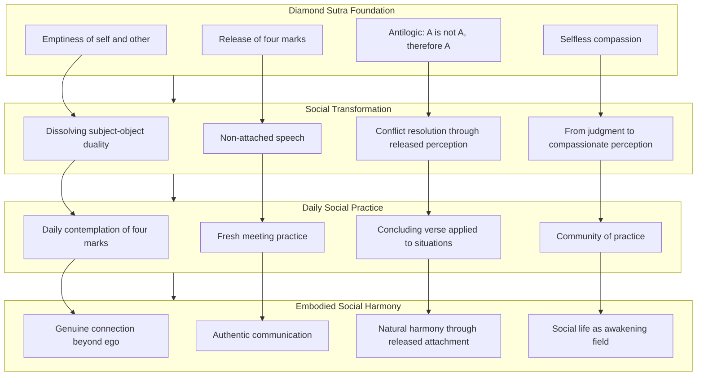

This diagram illustrates how the Diamond Sutra's foundational teachings (emptiness, four marks, antilogic, selfless compassion) inform the transformation of social patterns (dissolving duality, non-attached speech, conflict resolution, compassionate perception), which are embodied through daily practices (contemplation, fresh meeting, verse application, community), ultimately producing social harmony characterized by genuine connection, authentic communication, natural peace, and social life as a field of awakening.

---

In summary, the Diamond Sutra's application to interpersonal dynamics and social harmony reveals that **ancient wisdom directly addresses the root causes of social friction and disconnection**. The teaching on the emptiness of self and other dissolves the subject-object duality that underlies most interpersonal conflict, enabling a shift from ego-based transaction to genuine mutual participation. The instruction on non-attached speech transforms communication from a vehicle for ego-gratification into an expression of truthfulness and care. The sutra's antilogic—"A is not A, therefore it is called A"—provides a powerful framework for dissolving the fixed perceptions that sustain conflicts, enabling fresh encounter and genuine resolution. The emptiness teaching transforms the habitual tendency to judge others by revealing that the fixed characteristics we attribute to them are conceptual constructions rather than inherent realities. And the bodhisattva ideal provides a model for selfless compassion that serves others' genuine welfare without the distortions introduced by self-reference.

The integration of these teachings into daily social life transforms interpersonal relationships from sources of friction into **fields of awakening**. When we release the four marks in social interaction—no notion of self to defend, no notion of person to manipulate, no notion of sentient being to categorize, no notion of life-span to immortalize—what remains is natural, responsive, compassionate engagement. This is the Diamond Sutra's promise for social life: **not the imposition of harmony through effort but the emergence of harmony through the release of what obstructs it**. When ego-based patterns are recognized and released, genuine connection, authentic communication, and social harmony arise naturally as expressions of our fundamental interconnection.

## 14 Integration: Embodying the Diamond Sutra in Contemporary Life

This chapter synthesizes the Diamond Sutra's applications across all life domains into a coherent framework for ongoing practice, examining how regular study and contemplation progressively transform consciousness from intellectual understanding to embodied wisdom. The analysis provides guidance for developing personalized practice that integrates the sutra's teachings on emptiness, non-attachment, and non-self into daily life, workplace, relationships, parenting, emotional well-being, and social harmony, while addressing common obstacles, misconceptions, and the gradual nature of transformation.

### 14.1 Synthesizing the Applications: A Unified Framework for Practice Across Life Domains

The preceding chapters have explored the Diamond Sutra's wisdom across diverse contexts—from daily mindfulness to workplace challenges, from intimate relationships to parenting, from emotional healing to social harmony. While these applications may initially appear as separate techniques for distinct life domains, they share a **fundamental unity rooted in the sutra's core teachings**. This section integrates these diverse applications into a coherent framework that reveals their underlying interconnection, enabling practitioners to move from compartmentalized techniques toward a unified understanding that naturally adapts to whatever situation arises.

#### The Core Teachings as Universal Principles

The Diamond Sutra's essential teachings operate as **universal principles** that apply across all life contexts rather than as domain-specific techniques. Understanding this universality transforms practice from a collection of separate tools into a **single orientation of awareness** that naturally expresses itself appropriately in each situation.

**Emptiness (Śūnyatā)** functions identically across all domains. Whether we are facing workplace stress, marital conflict, parenting challenges, or emotional turbulence, the teaching remains the same: all phenomena—including the situations we face, the people involved, our own reactions, and the outcomes we fear or desire—are **conditioned, impermanent, and empty of inherent self-nature**. The workplace deadline that seems so solid and threatening is like a dream; the partner whose behavior frustrates us is like an illusion; the child who disappoints our expectations is like a bubble; the anxiety that grips us is like morning dew. Recognizing this does not diminish the conventional reality of these situations but transforms our relationship to them, creating space for wise response rather than reactive suffering.

**Non-Self (Anātman)** applies universally to all interpersonal dynamics. In the workplace, we release identification with professional success and failure. In marriage, we release possessive attachment that treats the partner as extension of self. In parenting, we release ego-investment in children's achievements. In emotional life, we release identification with thoughts and feelings. In social interactions, we release the subject-object duality that generates conflict. The same teaching—that no fixed, independent self exists requiring protection—operates across every domain, dissolving the ego-based patterns that create suffering in each context.

**Non-Attachment (Apratiṣṭhita-citta)** expresses itself through the **mind that dwells nowhere**—fully engaged with each situation while not captured by any particular outcome, recognition, or self-image. This non-abiding awareness manifests as stress resilience in the workplace, as unconditional love in relationships, as patient guidance in parenting, as equanimity in emotional life, and as genuine connection in social interactions. The same quality of awareness—present, responsive, and free—serves awakening in every context.

**The Four Marks** provide a consistent framework for examining any situation. In every domain, we can ask: Where am I reinforcing a notion of self? Where am I treating others as fixed persons rather than dynamic processes? Where am I creating rigid boundaries between "us" and "them"? Where am I clinging to permanence and legacy? These questions apply equally to career decisions, relationship dynamics, parenting choices, emotional responses, and social interactions. Releasing these four notions transforms our engagement with any situation.

**The Concluding Verse** offers a universal contemplation applicable to any phenomenon:

> *All conditioned phenomena are like a dream, an illusion, a bubble, a shadow,*
> *like dew or a flash of lightning; thus we shall perceive them.*

This verse applies to workplace outcomes, relationship dynamics, children's behavior, emotional states, and social conflicts. In each case, the contemplation transforms our relationship to the phenomenon by revealing its conditioned, impermanent, empty nature.

#### The Unified Framework: One Practice, Many Expressions

The following framework synthesizes the applications across all domains, revealing their underlying unity:

| Core Teaching | Daily Life | Workplace | Relationships | Parenting | Emotional Well-Being | Social Harmony |
|---------------|------------|-----------|---------------|-----------|---------------------|----------------|
| **Emptiness** | All activities are conditioned, dream-like | Outcomes lack inherent significance | Partners are dynamic processes | Children are not fixed entities | Emotions are conditioned phenomena | Others' characteristics are constructions |
| **Non-Self** | No fixed self performing activities | No professional identity to protect | No possessive extension of self | No ego-investment in children | No identification with mental content | No subject-object duality |
| **Non-Attachment** | Engage fully without grasping | Work without outcome-attachment | Love without conditions | Guide without controlling | Experience without being controlled | Connect without defending |
| **Four Marks** | Release self-reference in activities | Release career-based identity | Release possessiveness | Release legacy-building | Release identification | Release judgment |
| **Concluding Verse** | Activities are like dreams | Success/failure are like bubbles | Relationships are like shadows | Children's achievements are like dew | Emotions are like lightning | Conflicts are like illusions |

This table reveals that **the same wisdom operates across all domains**. The practitioner who understands emptiness in one context can recognize it in all contexts. The practice is not to learn separate techniques for each life domain but to **deepen understanding of the core teachings** until they naturally inform every situation.

#### From Compartmentalized Techniques to Unified Awareness

Many practitioners initially approach the Diamond Sutra's applications as **separate tools for separate problems**: "When I'm stressed at work, I'll use the workplace teachings; when I'm having relationship difficulties, I'll use the marriage teachings." This compartmentalized approach, while potentially helpful, misses the deeper unity that the sutra offers.

The transformation from compartmentalized techniques to unified awareness involves recognizing that:

**The same patterns operate across domains**: The ego-protection that creates workplace stress is the same ego-protection that creates relationship conflict, parenting difficulties, emotional turbulence, and social friction. Addressing this pattern in one domain naturally benefits all domains because the root is the same.

**The same release applies across domains**: Releasing attachment to outcomes in one area of life creates capacity for releasing attachment everywhere. The practitioner who learns to hold career outcomes lightly develops the same capacity that enables holding relationship dynamics, parenting results, emotional states, and social interactions lightly.

**The same awareness serves all situations**: The non-abiding mind that the Diamond Sutra cultivates is not a special state for meditation but the natural condition of awareness when conceptual grasping relaxes. This awareness naturally responds appropriately to whatever situation arises—workplace, relationship, parenting, emotional, or social—without requiring separate techniques.

**The same transformation unfolds across life**: As understanding deepens through practice, transformation occurs not in isolated domains but across the whole of life. The practitioner does not become wise at work while remaining reactive at home; wisdom that develops in one context naturally expresses itself in all contexts.

#### The Integrated Life as Field of Awakening

The Diamond Sutra's vision is not compartmentalized spiritual practice alongside ordinary life but **the integration of awakened awareness into every moment of existence**. The sutra opens with the Buddha engaged in ordinary activities—dressing, eating, washing—demonstrating that awakening is not separate from daily life but expressed through it.

This integration means that:

**Every domain becomes practice**: The workplace is not an interruption of spiritual life but its very field. Relationships are not obstacles to awakening but opportunities for it. Parenting is not a distraction from practice but practice itself. Emotional challenges are not enemies of peace but teachers of wisdom. Social interactions are not departures from the path but the path itself.

**Practice becomes seamless**: Rather than moving between "spiritual practice" and "ordinary life," the practitioner discovers that no such boundary exists. The awareness cultivated in meditation is the same awareness that engages with work, relates to partners, guides children, meets emotions, and connects with others. Practice becomes continuous rather than episodic.

**Transformation becomes holistic**: As the core teachings are understood more deeply, transformation occurs across all domains simultaneously. The practitioner does not need to work on each area separately; deepening understanding of emptiness, non-self, and non-attachment naturally transforms every aspect of life.

The following diagram illustrates the unified framework:

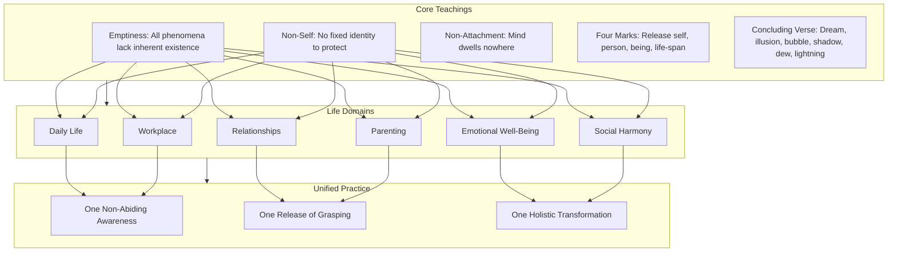

This diagram shows how the core teachings inform all life domains, which in turn express the unified practice of one non-abiding awareness, one release of grasping, and one holistic transformation.

#### Practical Integration: Moving Between Domains with Unified Awareness

The unified framework enables practitioners to move fluidly between life domains while maintaining the same essential practice:

**Morning transition from home to work**: Rather than shifting from "home mode" to "work mode," the practitioner maintains the same non-abiding awareness. The loving presence offered to family members is the same quality of presence brought to colleagues. The non-attachment to how family members respond is the same non-attachment to workplace outcomes.

**Evening transition from work to home**: Rather than carrying workplace stress into home life or suppressing it through compartmentalization, the practitioner recognizes that workplace concerns, like all phenomena, are conditioned and impermanent. The same awareness that engaged with work now engages with family—fully present, not dwelling on what has passed.

**Moving between parenting and personal practice**: Rather than treating parenting as interruption of practice, the practitioner recognizes parenting itself as practice. The patience cultivated in meditation is the same patience needed with children. The non-attachment developed in contemplation is the same non-attachment that releases ego-investment in children's achievements.

**Navigating emotional challenges across contexts**: Whether emotional difficulty arises at work, in relationships, in parenting, or in social situations, the same understanding applies: emotions are conditioned phenomena, arising through causes, existing temporarily, and passing away. The same non-identification with emotional content serves healing in every context.

This unified approach transforms the Diamond Sutra from a collection of domain-specific applications into **a single, integrated practice that naturally adapts to whatever life presents**.

### 14.2 Progressive Transformation: From Intellectual Understanding to Embodied Wisdom

The Diamond Sutra's wisdom does not transform consciousness immediately upon first reading. The sutra itself acknowledges this through its emphasis on **repeated study, contemplation, and practice** as the means by which its teachings become embodied. This section examines the gradual process by which intellectual understanding deepens into direct recognition and eventually into fully embodied realization—the natural expression of awakened awareness in every moment of life.

#### The Stages of Transformation

The journey from first encountering the Diamond Sutra to fully embodying its wisdom unfolds through recognizable stages, though these stages are not rigidly sequential and often overlap:

**Stage 1: Initial Encounter and Intellectual Comprehension**

The practitioner first encounters the sutra's teachings and develops **conceptual understanding** of key terms and ideas. Emptiness is understood as a philosophical concept; non-self is grasped as a doctrine; non-attachment is recognized as a recommended orientation. At this stage, the teachings remain primarily intellectual—ideas about reality rather than direct recognition of it.

This stage is valuable and necessary. The Diamond Sutra's teachings are subtle and easily misunderstood; accurate conceptual understanding provides the foundation for deeper realization. However, the sutra itself warns against stopping at this stage. Intellectual understanding alone does not liberate; it can even become a new form of attachment—attachment to correct views about emptiness.

**Stage 2: Application and Initial Experience**

The practitioner begins **applying the teachings to actual life situations**. When workplace stress arises, they remember that outcomes are empty of inherent significance. When relationship conflict occurs, they recall that both self and other lack fixed essence. When emotional turbulence appears, they recognize it as a conditioned phenomenon.

At this stage, application requires **conscious effort**. The practitioner must deliberately recall the teachings and apply them to situations. There is often a gap between understanding and experience—the practitioner knows intellectually that phenomena are empty but still experiences them as solid and threatening. This gap can be frustrating, but it is a natural part of the process.

Initial experiences of the teachings' truth begin to arise. In moments of stress, the practitioner may briefly recognize the conditioned nature of the situation and experience a corresponding release of tension. In moments of conflict, they may glimpse the constructed nature of their fixed perceptions and feel the possibility of fresh engagement. These glimpses, though brief, provide **experiential confirmation** that the teachings point to something real.

**Stage 3: Deepening Recognition**

Through sustained practice, recognition becomes **more frequent and more stable**. The practitioner no longer needs to consciously recall the teachings in every situation; recognition begins to arise more naturally. The gap between understanding and experience narrows.

At this stage, the sutra's paradoxical logic begins to make experiential sense. The formula "A is not A, therefore it is called A" is no longer merely puzzling but points toward a direct recognition: phenomena are and are not what they appear to be. The practitioner can hold both conventional appearance and ultimate emptiness simultaneously without contradiction.

The transformation extends beyond specific situations to **underlying patterns**. The practitioner begins to recognize the same ego-protection operating across different contexts, the same attachment to outcomes appearing in various forms, the same identification with mental content manifesting in different ways. This recognition of underlying patterns accelerates transformation because addressing the root transforms all its expressions.

**Stage 4: Embodied Integration**

Recognition becomes **increasingly spontaneous and effortless**. The practitioner no longer applies the teachings to situations; the teachings have become the natural lens through which situations are perceived. Non-abiding awareness is no longer something to be cultivated but the natural condition of awareness when conceptual grasping has relaxed.

At this stage, the distinction between practice and non-practice dissolves. The practitioner does not "do" non-attachment; non-attachment is simply how they engage with life. They do not "apply" emptiness understanding; emptiness is directly recognized in every phenomenon. The sutra's wisdom has become **embodied**—expressed through action, speech, and presence rather than merely understood intellectually.

This does not mean the practitioner has achieved a final state beyond which no further development is possible. The Diamond Sutra's teaching is inexhaustible; there is always deeper understanding available. But the relationship to the teachings has fundamentally shifted from something external to be applied to something internal that naturally expresses itself.

**Stage 5: Continuous Unfolding**

The journey does not end with embodied integration but continues as **ongoing deepening**. The same teachings reveal new dimensions as understanding matures. Situations that once seemed fully understood reveal subtler layers. The practitioner discovers that emptiness is deeper than they realized, non-self more radical, non-attachment more complete.

This continuous unfolding is not a problem to be solved but the nature of awakened life. The Diamond Sutra's wisdom is not a fixed truth to be acquired but a living teaching that responds to the practitioner's evolving understanding. Each return to the sutra reveals new meaning; each life situation offers new opportunity for recognition; each moment invites deeper embodiment.

#### The Role of Repetition and Sustained Practice

The Diamond Sutra emphasizes the importance of **repeated engagement** with its teachings. The Buddha states that understanding and teaching even a four-line verse generates immeasurable merit—not because the words themselves are magical but because repeated engagement with the teachings progressively transforms consciousness.

**Repetition works through multiple mechanisms**:

**Imprinting**: Regular contemplation of the sutra's teachings gradually imprints them on consciousness. What initially requires conscious recall becomes increasingly automatic. The practitioner develops what might be called "emptiness reflexes"—spontaneous recognition of the conditioned, impermanent nature of phenomena.

**Deepening**: Each encounter with the teachings reveals new dimensions. The same verse that seemed fully understood on first reading reveals additional meaning on the hundredth reading. Repetition is not merely reinforcement but progressive deepening.

**Integration**: Repeated practice integrates the teachings across different contexts and states of mind. The practitioner who contemplates emptiness when calm develops capacity to recognize emptiness when agitated. The understanding developed in formal study becomes available in the midst of daily challenges.

**Transformation of habitual patterns**: Ego-based patterns are deeply conditioned through years of repetition. Transforming them requires sustained counter-conditioning. Regular practice with the Diamond Sutra's teachings gradually rewires habitual responses, replacing reactive patterns with awakened awareness.

The sutra's structure supports this repetitive engagement. Key themes appear multiple times throughout the text, each repetition introducing progression or refinement. The practitioner who reads the sutra repeatedly encounters the same teachings in different formulations, each encounter deepening understanding.

#### The Relationship Between Conceptual Understanding and Direct Recognition

A crucial aspect of the transformation process involves the relationship between **conceptual understanding** (intellectual grasp of the teachings) and **direct recognition** (immediate perception of their truth). The Diamond Sutra navigates this relationship with characteristic subtlety.

**Conceptual understanding is necessary but not sufficient**. The sutra's teachings are subtle and easily misunderstood. Accurate conceptual understanding prevents misinterpretation—particularly the nihilistic misreading that treats emptiness as meaning nothing matters. However, conceptual understanding alone remains at the level of ideas about reality rather than direct recognition of reality itself.

**Direct recognition transcends but includes concepts**. When the practitioner directly recognizes that a phenomenon is empty—not merely believes it intellectually but perceives it directly—this recognition transcends conceptual understanding while including it. The concept of emptiness is not abandoned but is seen through to what it points toward.

**The sutra's paradoxical logic facilitates the transition**. The formula "A is not A, therefore it is called A" cannot be resolved through ordinary conceptual analysis. It points beyond concepts while using concepts. The practitioner who contemplates this formula repeatedly finds that conceptual understanding reaches its limit and something else begins—direct recognition that cannot be captured in concepts but is not separate from them.

**Practice bridges understanding and recognition**. The gap between intellectual understanding and direct recognition is bridged through practice—repeated application of the teachings to actual life situations. Each application creates opportunity for recognition; each recognition deepens understanding; the spiral continues until understanding and recognition merge.

The Diamond Sutra describes this process through its teaching on the **"wisdom eye" (prajñā-cakṣu)**, which sees that ultimately there are no subjects or objects with any independent fixed self-natures. This seeing is not conceptual analysis but direct perception—yet it is informed by and expressed through conceptual understanding.

#### How Paradoxical Logic Progressively Dissolves Conceptual Frameworks

The Diamond Sutra's characteristic logical structure—"A is not A, therefore it is called A"—functions as a **progressive dissolver of conceptual frameworks**. This dissolution is not immediate but unfolds through sustained engagement.

**Initial encounter**: The practitioner first encounters the paradoxical formula and finds it puzzling or contradictory. The formula violates ordinary logic; it seems to assert both A and not-A simultaneously. This puzzlement is appropriate—the formula is designed to challenge ordinary thinking.

**Intellectual resolution attempts**: The practitioner may attempt to resolve the paradox intellectually, developing explanations for how the formula makes sense. These attempts are valuable—they deepen conceptual understanding—but they do not exhaust the formula's meaning. Each explanation captures part of the truth but leaves something unexplained.

**Recognition of the formula's function**: The practitioner begins to recognize that the formula is not primarily making a logical claim but **pointing toward a mode of perception**. The formula uses concepts to point beyond concepts. It is not meant to be resolved intellectually but to facilitate a shift in how phenomena are perceived.

**Direct application**: The practitioner applies the formula directly to phenomena: "This workplace stress is not workplace stress, therefore it is called workplace stress." "This relationship conflict is not relationship conflict, therefore it is called relationship conflict." Each application creates opportunity for the conceptual framework to relax and direct recognition to arise.

**Progressive dissolution**: Through repeated application, the conceptual frameworks that ordinarily structure experience progressively dissolve. The practitioner no longer automatically perceives phenomena through fixed categories. Space opens for perceiving phenomena directly, as they actually are, without the overlay of conceptual construction.

**Embodied paradox**: Eventually, the practitioner embodies the paradox rather than merely contemplating it. They engage with phenomena fully (acknowledging their conventional reality) while recognizing their empty nature (not grasping at inherent existence). This is not intellectual balancing of two views but a unified mode of engagement that transcends the apparent contradiction.

The Diamond Sutra's repetitive use of this formula throughout the text supports this progressive dissolution. Each repetition addresses a different phenomenon—dharmas, merit, enlightenment, the Buddha—but the underlying movement is the same: dissolving the conceptual framework that reifies the phenomenon while preserving its conventional functionality.

### 14.3 Developing Personal Practice: Customizing the Sutra's Wisdom for Individual Circumstances

While the Diamond Sutra's core teachings are universal, their application must be **adapted to individual circumstances**. Practitioners differ in temperament, life situation, challenges, and capacities. This section provides practical guidance for developing a personalized practice that integrates the sutra's wisdom across all life domains while respecting individual differences.

#### Establishing Daily Contemplation Routines

Regular engagement with the Diamond Sutra provides the foundation for transformation. Establishing a sustainable daily routine ensures that the teachings remain active in consciousness rather than being forgotten between occasional readings.

**Morning contemplation**: Beginning the day with contemplation of the sutra sets intention for the day ahead. This need not be lengthy; even five minutes of focused engagement can be transformative. Options include:

- Reading a section of the sutra with full attention
- Contemplating the concluding verse and setting intention to perceive phenomena in this way
- Recalling the four marks and examining where they might arise during the day
- Practicing mindful breathing while holding the teaching on non-abiding awareness

**Evening reflection**: Ending the day with reflection on how the teachings manifested (or were forgotten) supports learning and integration. Questions for reflection include:

- Where did I recognize the conditioned, empty nature of phenomena today?
- Where did I grasp at outcomes, recognition, or self-image?
- Where did the four marks appear in my experience?
- What opportunities for practice did I miss, and what can I learn from this?

**Transition practices**: Brief practices during transitions between activities maintain continuity of awareness throughout the day:

- Before meetings or difficult conversations, recall that all participants are empty of fixed self-nature
- During moments of stress, contemplate that this situation is like a dream, a bubble, a shadow
- When emotional reactivity arises, recognize it as a conditioned phenomenon that will pass
- In moments of success or recognition, recall that these too are impermanent

**Weekly deeper engagement**: In addition to daily practice, weekly periods of deeper engagement support progressive understanding:

- Reading through a longer section of the sutra
- Studying commentary or interpretation
- Journaling about how the teachings are manifesting in life
- Discussing the teachings with fellow practitioners

#### Selecting Practices Appropriate to Current Challenges

Different life situations call for emphasis on different aspects of the Diamond Sutra's teaching. Practitioners can customize their practice by selecting emphases appropriate to their current challenges:

**For workplace stress and career challenges**: Emphasize the teaching on non-attachment to outcomes and the empty nature of professional identity. Contemplate that career success and failure are like dreams—appearing significant but lacking inherent existence. Practice the non-abiding mind during work activities, engaging fully without grasping at results.

**For relationship difficulties**: Emphasize the teaching on non-self and the dissolution of subject-object duality. Contemplate that both self and partner are dynamic processes rather than fixed entities. Practice releasing the four marks in relationship—no self to defend, no person to possess, no rigid boundaries, no demand for permanence.

**For parenting challenges**: Emphasize the teaching on giving without attachment to signs. Contemplate that children are not extensions of parental identity but unique beings with their own nature. Practice releasing ego-investment in children's achievements while maintaining compassionate guidance.

**For emotional turbulence**: Emphasize the teaching on the ungraspable nature of mind and the constructed nature of emotional states. Contemplate that past, present, and future mind cannot be grasped. Practice non-identification with thoughts and feelings, recognizing them as conditioned phenomena that arise and pass.

**For social friction and conflict**: Emphasize the teaching on the emptiness of self and other and the sutra's antilogic. Contemplate that the fixed perceptions sustaining conflict are conceptual constructions. Practice fresh perception of others, releasing accumulated concepts and meeting them as they actually are.

The following table provides guidance for selecting practice emphases:

| Current Challenge | Primary Teaching Emphasis | Key Practice |
|------------------|--------------------------|--------------|
| Workplace stress | Non-attachment to outcomes | Engage fully without grasping at results |
| Career anxiety | Empty nature of professional identity | Recognize career as conventional designation |
| Relationship conflict | Non-self and interdependence | Release subject-object duality |
| Possessiveness in love | Giving without attachment | Love without conditions or expectations |
| Parenting frustration | Release of four marks | Guide without ego-investment |
| Children's disappointments | Impermanence and emptiness | Recognize outcomes as conditioned |
| Anxiety | Ungraspable future mind | Release grasping at imagined futures |
| Depression | Ungraspable past mind | Release dwelling on past constructions |
| Anger | Emptiness of self and other | Recognize conditioned nature of trigger and response |
| Social judgment | Constructed nature of characteristics | Practice compassionate perception |
| Interpersonal conflict | Antilogic: A is not A | Release fixed perceptions |

#### Balancing Formal Study with Informal Application

Effective practice balances **formal study** (dedicated time for reading, contemplation, and meditation) with **informal application** (bringing the teachings into daily activities). Neither alone is sufficient; both are necessary for transformation.

**Formal study provides**:
- Accurate understanding of the teachings
- Depth of contemplation not possible amid daily activities
- Progressive deepening through repeated engagement
- Foundation for informal application

**Informal application provides**:
- Testing of understanding against actual experience
- Integration of teachings into habitual patterns
- Opportunities for recognition in the midst of life
- Transformation of daily activities into practice

**Signs of imbalance toward formal study**:
- Extensive knowledge of the sutra with little change in daily behavior
- Ability to explain the teachings without ability to embody them
- Practice confined to meditation periods with ordinary reactivity between them
- Growing gap between "spiritual life" and "ordinary life"

**Signs of imbalance toward informal application**:
- Superficial understanding leading to misapplication
- Using teachings as techniques without grasping their depth
- Plateau in development due to lack of deepening study
- Gradual forgetting of the teachings' subtleties

**Creating balance**:
- Establish regular formal study periods that are protected from interruption
- Consciously carry insights from formal study into daily activities
- Reflect on daily experiences in light of the teachings during formal periods
- Allow formal study and informal application to inform each other

#### Creating Sustainable Long-Term Engagement

The Diamond Sutra's wisdom unfolds over a lifetime of practice. Creating sustainable engagement requires attention to pacing, avoiding burnout, and maintaining freshness.

**Pacing**: The sutra's teachings are profound and cannot be fully absorbed quickly. Practitioners benefit from pacing that allows deep engagement with each teaching before moving to the next. Rushing through the sutra to "complete" it misses its depth; the sutra is meant to be returned to repeatedly, not finished and set aside.

**Avoiding burnout**: Intense initial enthusiasm often leads to burnout if not moderated. Sustainable practice is moderate but consistent—daily engagement that can be maintained over years rather than intensive practice that cannot be sustained. The practitioner who reads one verse daily for a year transforms more deeply than one who reads the entire sutra in a week and then abandons it.

**Maintaining freshness**: Long-term engagement risks becoming routine and stale. Maintaining freshness involves:
- Approaching the sutra with "beginner's mind," as if encountering it for the first time
- Exploring different translations and commentaries
- Applying familiar teachings to new life situations
- Engaging with fellow practitioners whose perspectives offer fresh insight
- Allowing the teachings to surprise rather than assuming they are already understood

**Integrating with other practices**: The Diamond Sutra can be integrated with other contemplative practices rather than practiced in isolation:
- Mindfulness meditation provides the calm, focused awareness that supports contemplation
- Loving-kindness practice develops the compassion that the sutra's wisdom serves
- Ethical practice provides the foundation that prevents misuse of emptiness understanding
- Community practice offers support, accountability, and shared wisdom

#### Adapting to Life Changes

Life circumstances change, and practice must adapt accordingly. The practitioner who developed their practice during a period of relative stability may need to adjust when facing major life transitions—new career, marriage, parenthood, illness, loss.

**During periods of stability**: Practice can emphasize deepening understanding, exploring subtleties, and developing consistency. The relative calm of stable periods provides opportunity for sustained contemplation that may not be possible during turbulent times.

**During periods of transition**: Practice may need to emphasize practical application over theoretical deepening. The teachings on impermanence and non-attachment become immediately relevant during major changes. Simplified practice that can be maintained amid disruption serves better than elaborate routines that collapse under pressure.

**During periods of difficulty**: Practice may focus on specific teachings that address current challenges. The practitioner facing illness might emphasize the teaching on the empty nature of the body; the practitioner facing loss might emphasize the teaching on impermanence; the practitioner facing conflict might emphasize the teaching on non-self.

**During periods of growth**: Practice can expand to include new applications as life expands. The practitioner who becomes a parent can integrate the parenting applications; the practitioner who takes on leadership responsibilities can integrate the leadership applications; the practitioner whose social circle expands can integrate the social harmony applications.

The Diamond Sutra's unified framework supports this adaptation. Because the same core teachings apply across all domains, the practitioner does not need to learn entirely new material when life circumstances change. They simply apply familiar wisdom to new contexts.

### 14.4 Common Obstacles and Misconceptions: Navigating Challenges in Applying the Teachings

The path of embodying the Diamond Sutra's wisdom is not without challenges. Practitioners commonly encounter obstacles that can derail practice or lead to misapplication of the teachings. This section identifies the most common obstacles and provides specific guidance for recognizing and working skillfully with each.

#### Nihilistic Misinterpretation of Emptiness

Perhaps the most serious obstacle is **misunderstanding emptiness as meaning that nothing matters, that actions have no consequences, or that the world should be rejected**. This nihilistic interpretation contradicts the sutra's actual teaching and can lead to harmful behavior justified by pseudo-spiritual reasoning.

**How this obstacle manifests**:
- Using "it's all empty anyway" to justify harmful actions or neglect of responsibilities
- Becoming indifferent to suffering—one's own or others'—because "suffering is just an illusion"
- Abandoning ethical conduct because "good and bad are just concepts"
- Withdrawing from engagement with life because "nothing is real"

**Why this is a misinterpretation**:
The Diamond Sutra explicitly warns against this error. The Buddha states: "Do not think that when one gives rise to the highest, most fulfilled, awakened mind, one needs to see all objects of mind as nonexistent, cut off from life. Do not think in that way." The sutra's teaching is that phenomena are **empty of inherent existence**, not that they are non-existent. Emptiness means dependent origination—phenomena arise through conditions and therefore can be transformed. This is the very basis for the Buddhist path; if suffering had inherent existence, it could not be ended.

**How to work with this obstacle**:
- Return to the sutra's explicit warnings against nihilistic interpretation
- Recognize that emptiness and dependent origination are two aspects of the same truth
- Understand that emptiness enables compassion rather than negating it—precisely because beings are empty of inherent suffering, they can be helped
- Ground emptiness understanding in ethical conduct, which the sutra tradition consistently emphasizes

#### Spiritual Bypassing of Genuine Issues

**Spiritual bypassing** involves using spiritual concepts to avoid addressing genuine psychological, relational, or practical issues. The Diamond Sutra's teachings on non-attachment can be misused in this way.

**How this obstacle manifests**:
- Using "non-attachment" to avoid addressing harmful relationship patterns
- Claiming "it's all empty" to dismiss legitimate concerns raised by others
- Treating genuine emotional wounds as merely "attachments to be released" without actual healing
- Avoiding necessary practical action because "outcomes don't matter"

**Why this is problematic**:
The Diamond Sutra's Middle Way does not teach avoidance of engagement but **engaged action freed from attachment**. The bodhisattva vows to liberate all beings—this is profound engagement, not withdrawal. Non-attachment means acting without being controlled by ego-driven grasping, not refusing to act at all.

**How to work with this obstacle**:
- Distinguish between genuine non-attachment (engaging fully without grasping) and avoidance disguised as non-attachment
- Recognize that the sutra's teachings support skillful engagement with life's challenges, not escape from them
- Address genuine issues at their appropriate level—psychological issues through psychological work, relational issues through relational engagement, practical issues through practical action
- Use the teachings to transform how we engage with issues, not to justify not engaging

#### Attachment to Non-Attachment

A subtle obstacle involves becoming **attached to the idea of being non-attached**—creating a new form of ego-identity around spiritual progress.

**How this obstacle manifests**:
- Pride in one's non-attachment: "I'm more non-attached than others"
- Anxiety about whether one is sufficiently non-attached
- Using non-attachment as a standard for judging self and others
- Trying to force non-attachment rather than allowing it to arise naturally

**Why this is problematic**:
The Diamond Sutra teaches that even attachment to the Dharma itself is attachment. The sutra states: "If you are caught in the idea of the Dharma, you are also caught in the ideas of a self, a person, a living being, and a life span." Attachment to non-attachment is still attachment—it still involves grasping at a concept and using it to reinforce ego-identity.

**How to work with this obstacle**:
- Recognize that genuine non-attachment includes non-attachment to non-attachment
- Notice when "non-attachment" has become another ego-project
- Hold the teachings lightly, as skillful means rather than as identity
- Allow non-attachment to arise naturally through understanding rather than forcing it through effort

#### Using Teachings to Judge Others

Another common obstacle involves **using the Diamond Sutra's teachings as a lens for judging others** rather than for transforming one's own patterns.

**How this obstacle manifests**:
- Mentally criticizing others: "They're so attached," "They don't understand emptiness"
- Feeling superior to those who haven't encountered the teachings
- Using spiritual concepts to dismiss others' perspectives: "You're just caught in ego"
- Teaching others without being asked, from a position of assumed superiority

**Why this is problematic**:
The Diamond Sutra's teachings are for one's own transformation, not for evaluating others. Using the teachings to judge others directly contradicts their content—judgment reinforces the very ego-structures that the teachings aim to dissolve. The practitioner who judges others as "attached" is demonstrating their own attachment to being right and superior.

**How to work with this obstacle**:
- Redirect attention from others' patterns to one's own whenever judgment arises
- Recognize that judging others through spiritual concepts is itself a form of attachment
- Practice the sutra's teaching on compassionate perception rather than judgmental evaluation
- Remember that the same teachings that reveal others' limitations also reveal one's own

#### Expecting Immediate Transformation

Many practitioners become discouraged when **immediate transformation does not occur** after understanding the teachings intellectually.

**How this obstacle manifests**:
- Frustration that old patterns persist despite understanding the teachings
- Doubt about the teachings' validity because they haven't "worked" quickly
- Abandoning practice because results are not immediate
- Oscillating between enthusiasm when insights arise and despair when old patterns return

**Why this is problematic**:
The Diamond Sutra's teachings address patterns that have been conditioned over a lifetime (and, in Buddhist understanding, over countless lifetimes). Transformation is gradual; expecting immediate results sets up inevitable disappointment. The sutra itself emphasizes repeated study and practice over time.

**How to work with this obstacle**:
- Recognize that transformation is gradual and that setbacks are part of the process
- Celebrate small shifts rather than expecting dramatic breakthroughs
- Maintain consistent practice regardless of perceived progress
- Trust the process while releasing attachment to specific timelines

#### Creating Spiritual Identity

A final obstacle involves **creating a new ego-identity around being a "Diamond Sutra practitioner"** or a "spiritual person."

**How this obstacle manifests**:
- Defining oneself by spiritual practice: "I am someone who studies the Diamond Sutra"
- Using spiritual affiliation for social identity or status
- Comparing one's spiritual path favorably to others' paths
- Feeling that spiritual practice makes one special or different

**Why this is problematic**:
The Diamond Sutra's teaching on non-self applies to spiritual identity as much as to any other identity. Creating a "spiritual self" is still creating a self—still grasping at a fixed identity that must be protected and enhanced. The sutra's teaching is not to replace ordinary identity with spiritual identity but to recognize the empty nature of all identity.

**How to work with this obstacle**:
- Notice when spiritual practice is being used to reinforce ego rather than dissolve it
- Hold spiritual identity lightly, as a conventional designation rather than an essential truth
- Recognize that the practitioner who truly embodies the teachings does not need to be identified as a practitioner
- Practice the sutra's teaching on non-self regarding one's own spiritual self-concept

#### Summary Table of Obstacles and Responses

| Obstacle | Manifestation | Root Problem | Skillful Response |
|----------|---------------|--------------|-------------------|
| **Nihilistic misinterpretation** | "Nothing matters" | Confusing emptiness with non-existence | Return to sutra's explicit warnings; ground in ethics |
| **Spiritual bypassing** | Avoiding genuine issues | Using teachings as escape | Distinguish non-attachment from avoidance; engage skillfully |
| **Attachment to non-attachment** | Pride in being non-attached | New form of ego-grasping | Include non-attachment in what is released |
| **Judging others** | "They're so attached" | Using teachings for ego-superiority | Redirect attention to own patterns |
| **Expecting immediate transformation** | Frustration with slow progress | Attachment to outcomes | Trust gradual process; celebrate small shifts |
| **Spiritual identity** | "I am a practitioner" | New ego-identity | Apply non-self teaching to spiritual self |

### 14.5 The Living Sutra: Ongoing Engagement and the Inexhaustible Nature of the Teaching

The Diamond Sutra is not a text to be mastered and set aside but a **living teaching** that reveals new dimensions as understanding deepens. This concluding section addresses the inexhaustible nature of the sutra's wisdom and the nature of ongoing engagement throughout a lifetime of practice.

#### The Same Verses Revealing New Meaning

One of the remarkable qualities of the Diamond Sutra is that **the same verses reveal new meaning as understanding matures**. The practitioner who returns to the sutra after years of practice does not merely remember what they previously understood; they discover dimensions that were invisible before.

This phenomenon occurs because the sutra's teachings are **multi-layered**. The surface meaning accessible to a beginning student is genuine but partial. Deeper meanings become accessible only as the practitioner's understanding develops. The sutra has not changed, but the practitioner's capacity to receive its teaching has expanded.

**Examples of deepening understanding**:

The concluding verse—"All conditioned phenomena are like a dream, an illusion, a bubble, a shadow, like dew or a flash of lightning; thus we shall perceive them"—initially may be understood as a general statement about impermanence. With deeper practice, the same verse reveals specific applications to emotional states, relationships, and self-concept. With still deeper practice, the verse becomes a direct pointing-out instruction that can trigger recognition of emptiness in any moment.

The teaching on the four marks—no notion of self, person, sentient being, or life-span—initially may be understood as philosophical doctrine. With deeper practice, the same teaching reveals subtle ways these notions operate in daily experience. With still deeper practice, the teaching becomes a continuous examination that progressively dissolves ego-structures.

The paradoxical formula—"A is not A, therefore it is called A"—initially may seem merely puzzling. With deeper practice, the formula reveals its function as a dissolver of conceptual frameworks. With still deeper practice, the formula becomes a lived reality—the practitioner naturally perceives phenomena as both conventionally real and ultimately empty.

This progressive revelation means that **the sutra is never exhausted**. No matter how many times it is read, no matter how deeply it is understood, there is always more to discover. This inexhaustibility is not a limitation but a gift—the sutra remains a living teacher throughout a lifetime of practice.

#### The Sutra as Living Teaching

The Diamond Sutra functions not as a static text but as a **living teaching that responds to the practitioner's evolving questions**. The same words speak differently depending on what the practitioner brings to them.

**The sutra responds to life situations**: When the practitioner faces workplace stress, the sutra speaks to that situation. When they face relationship difficulty, the sutra addresses that challenge. When they face emotional turbulence, the sutra offers relevant wisdom. The text has not changed, but its relevance to current circumstances becomes apparent.

**The sutra responds to developmental stages**: The practitioner at the beginning of their journey receives teachings appropriate to that stage. As they develop, the same sutra offers more advanced teachings. The sutra meets practitioners where they are while pointing toward where they might go.

**The sutra responds to questions**: The practitioner who approaches the sutra with genuine questions finds that it addresses those questions—not always directly, but in ways that illuminate the underlying issues. The sutra functions as a wise teacher who responds to the student's actual needs rather than merely delivering a fixed curriculum.

This living quality means that **engagement with the sutra is relationship rather than mere study**. The practitioner does not simply extract information from the text but enters into dialogue with it. The sutra teaches; the practitioner learns; the sutra teaches further; the practitioner deepens. This dialogue continues throughout a lifetime.

#### Embodiment as Continuous Unfolding

The goal of Diamond Sutra practice is not a final state of achievement but **continuous unfolding of awakened awareness**. Embodiment is not a destination to be reached but an ongoing process of deepening integration.

**There is no endpoint**: The sutra does not describe a final state after which no further development is possible. Even the Buddha's awakening is described in terms that prevent reification—there is no independently existing phenomenon called "awakening" that someone called "the Buddha" acquired. Awakening is not a thing to be possessed but a continuous recognition to be lived.

**Depth is inexhaustible**: No matter how deeply the practitioner has embodied the teachings, there is always deeper embodiment available. The recognition of emptiness can always become more complete; non-attachment can always become more thorough; compassion can always become more inclusive. This inexhaustibility is not frustrating but liberating—there is always more to discover, always further to go.

**Each moment is complete**: While depth is inexhaustible, each moment of recognition is also complete in itself. The practitioner need not wait for some future attainment to experience the sutra's benefits. Each moment of recognizing emptiness, each release of attachment, each expression of compassion is itself the fruit of practice. The journey and the destination are not separate.

#### The Sutra in Every Moment of Contemporary Life

The Diamond Sutra's ultimate teaching is that **awakened awareness is available in every moment of contemporary life**. The sutra does not point toward a special state accessible only in retreat or through extraordinary practices. It points toward the nature of experience itself—always available, always present, waiting to be recognized.

**Every situation is opportunity**: The workplace meeting, the conversation with a partner, the moment with a child, the arising of an emotion, the encounter with a stranger—each is an opportunity to recognize emptiness, release attachment, and respond with compassion. The sutra's wisdom is not confined to formal practice but is relevant to every moment.

**Ordinary life is the field of awakening**: The Diamond Sutra opens with the Buddha engaged in ordinary activities—dressing, eating, washing. This is not mere scene-setting but profound teaching: awakening is expressed through ordinary life, not apart from it. The practitioner who embodies the sutra's wisdom does not transcend ordinary life but transforms it from within.

**Contemporary challenges are contemporary opportunities**: The specific challenges of contemporary life—workplace stress, relationship complexity, parenting pressures, emotional turbulence, social friction—are not obstacles to practice but its very material. Each challenge offers opportunity to apply the sutra's wisdom and to discover its relevance to situations the historical Buddha never encountered.

The Diamond Sutra's promise for contemporary life is not escape from its challenges but **transformation of our relationship to them**. When we recognize that workplace outcomes are like dreams, that relationship dynamics are like illusions, that parenting results are like bubbles, that emotional states are like shadows, that social conflicts are like dew, that all conditioned phenomena are like lightning—we are freed to engage fully with life while not being controlled by it.

This is the living sutra: not words on a page but **awakened awareness expressing itself through every moment of contemporary existence**. The practitioner who truly embodies the Diamond Sutra does not merely study it or practice it; they become it—a living expression of the wisdom that cuts through illusion and reveals reality as it is.

#### Final Contemplation: The Diamond Sutra's Invitation

The Diamond Sutra concludes with an invitation that remains as relevant today as when it was first offered:

> *All conditioned phenomena are like a dream, an illusion, a bubble, a shadow,*
> *like dew or a flash of lightning; thus we shall perceive them.*

This is not merely a philosophical statement but a **direct invitation to transformed perception**. The sutra invites us to see our workplace challenges as dreams, our relationship difficulties as illusions, our parenting struggles as bubbles, our emotional turbulence as shadows, our social conflicts as dew, our entire conditioned existence as a flash of lightning—vivid, momentary, empty of the substantial permanence we attribute to it.

And in this seeing, we discover not nihilistic despair but **profound liberation**. When phenomena are recognized as empty, grasping naturally relaxes. When grasping relaxes, suffering diminishes. When suffering diminishes, compassion naturally arises. When compassion arises, we can serve others without the distortions of ego. When we serve without ego, we fulfill the bodhisattva vow that the Diamond Sutra teaches.

This is the integration that the Diamond Sutra offers: **not a technique to be applied but a way of being to be embodied**; not a philosophy to be understood but a reality to be recognized; not a practice separate from life but life itself transformed by awakened awareness.

The sutra's final teaching is that this transformation is available now—not in some future attainment but in this very moment of reading, contemplating, and recognizing. The diamond that cuts through illusion is not something to be acquired but the nature of awareness itself, always present, waiting to be recognized.

Thus we shall perceive all phenomena. Thus we shall live our contemporary lives. Thus the Diamond Sutra continues to teach, to transform, and to awaken—in every moment, in every situation, in every practitioner who opens to its inexhaustible wisdom.

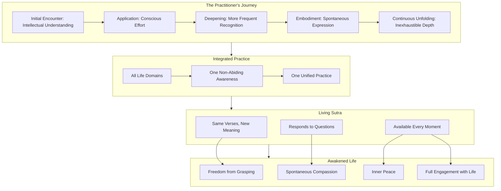

This diagram illustrates the complete journey of Diamond Sutra practice: from initial encounter through progressive stages of transformation, into integrated practice across all life domains, engaging with the sutra as a living teaching that continues to reveal new meaning, and ultimately manifesting as awakened life characterized by freedom, compassion, peace, and full engagement with contemporary existence.

---

In summary, the Diamond Sutra's application to contemporary life represents not a collection of separate techniques but **a unified practice of awakened awareness** that naturally adapts to whatever situation arises. The same core teachings—emptiness, non-self, non-attachment, the four marks, the concluding verse—operate across all life domains, enabling practitioners to move from compartmentalized applications toward integrated embodiment. The transformation from intellectual understanding to embodied wisdom unfolds progressively through sustained practice, with the sutra's paradoxical logic serving to dissolve the conceptual frameworks that perpetuate suffering. Personal practice can be customized to individual circumstances while maintaining connection to the universal principles that inform all applications.

The obstacles that arise—nihilistic misinterpretation, spiritual bypassing, attachment to non-attachment, judging others, expecting immediate transformation, and creating spiritual identity—can be navigated through skillful application of the very teachings that the obstacles distort. And the sutra itself remains a living teaching, inexhaustible in its depth, responsive to practitioners' evolving questions, available in every moment of contemporary life.

The Diamond Sutra's ultimate invitation is to recognize that **awakened awareness is not a distant goal but the ever-present nature of experience itself**. The workplace, the relationship, the family, the emotional life, the social world—all are fields of awakening when perceived through the lens of the sutra's wisdom. All conditioned phenomena are like dreams, illusions, bubbles, shadows, dew, and lightning. Thus we shall perceive them. Thus we shall live. Thus the ancient wisdom of the Diamond Sutra continues to illuminate the path of contemporary practitioners, cutting through illusion and revealing the freedom that was always available, always present, waiting only to be recognized.

# 参考内容如下：
[^1]:[Diamond Sutra](https://en.wikipedia.org/wiki/Diamond_Sutra)
[^2]:[Buddhist texts: The Diamond Sutra](https://idp.bl.uk/learning/buddhism-on-the-silk-roads/articles/buddhism-on-the-ground/buddhist-texts-the-diamond-sutra/)
[^3]:[Prajnaparamita Teachings, Oral Transmission of Diamond ...](https://www.lamayeshe.com/article/chapter/day-10-prajnaparamita-teachings-oral-transmission-diamond-cutter-sutra-continued)
[^4]:[The Diamond Sutra](https://tricycle.org/article/the-diamond-sutra/)
[^5]:[The world's earliest dated printed book: The Diamond ...](https://www.cabinet.ox.ac.uk/worlds-earliest-dated-printed-book-diamond-sutra-868-ce)
[^6]:[A Study of the Diamond Sūtra and its Different Versions](https://www.atlantis-press.com/article/125939324.pdf)
[^7]:[Buddhism Wisdom](http://www.buddhismwisdom.org/)
[^8]:[The Diamond Sutra: The Perfection of Wisdom](https://www.amazon.com/Diamond-Sutra-Perfection-Wisdom/dp/1582430594)
[^9]:[The Diamond Sutra 01 | English Discourse](https://oshoworld.com/the-diamond-sutra-01)
[^10]:[Wandering Around in the Diamond Sutra, Part I](https://everydayzen.org/teachings/wandering-around-in-the-diamond-sutra-part-i/)
[^11]:[Structure and Meaning in the Vajracchedikā Prajñāpāramitā](https://religion.tcu.edu.tw/wp-content/uploads/2025/11/6-C2_SHAN-WELSH_Structure-and-Meaning-in-the-Vajracchedika-Prajnaparamita.pdf)
[^12]:[Turn design, resonance and epistemic stance in the ...](https://aclanthology.org/2023.paclic-1.75.pdf)
[^13]:[Madhyamaka Buddhist Philosophy](https://iep.utm.edu/madhyamaka-buddhist-philosophy/)
[^14]:[Wisdom and Emptiness of The Diamond Sutra](https://www.fgsitc.org/wp-content/uploads/2025/05/B4-Wisdom-and-Emptiness-of-the-Diamond-Sutra-2019.pdf)
[^15]:[From Emptiness to Conviviality. The Diamond Sutra ...](https://kleong54.medium.com/from-emptiness-to-conviviality-cf03d838e28f)
[^16]:[Desire and Emptiness: Rethinking Fantasy Through the ...](https://www.mdpi.com/2409-9287/10/6/131)
[^17]:[Where Is The Self? - FoGuangPedia](https://foguangpedia.org/blog-post/where-is-the-self/)
[^18]:[The Diamond That Cuts through Illusion](https://plumvillage.org/library/sutras/the-diamond-that-cuts-through-illusion)
[^19]:[The Logic of the Diamond Sutra: A is not A, therefore it is A](http://www.thezensite.com/ZenEssays/Philosophical/Logic_of_Diamond_Sutra.pdf)
[^20]:[Seung-Jin Choi, Understanding the Diamond Sutra ...](https://philarchive.org/rec/CHOUTD-3)
[^21]:[Eternalism, Nihilism and the Middle Way](http://www.awakeningtoreality.com/2012/06/eternalism-nihilism-and-middle-way_17.html)
[^22]:[The Mind That Abides Nowhere](https://throssel.org.uk/throssel-blog/the-mind-that-abides-nowhere/)
[^23]:[Diamond Sutra Non-Abiding](https://luminousdharma.org/diamond-sutra-non-abiding/)
[^24]:[Wandering Around in the Diamond Sutra, Part II](https://everydayzen.org/teachings/wandering-around-in-the-diamond-sutra-part-ii/)
[^25]:[Diamond Sutra](http://www.acmuller.net/bud-canon/diamond_sutra.html)
[^26]:[Diamond Sutra: Chapter 04](https://diamond-sutra.com/read-the-diamond-sutra-here/diamond-sutra-chapter-4/)
[^27]:[The Diamond Sutra](https://www.lastelladelmattino.org/wp-content/uploads/2021/02/Sutra-Diamante-Conze.pdf)
[^28]:[Giving Dharma](https://foguangpedia.org/blog-post/giving-dharma/)
[^29]:[The Diamond Perfection of Wisdom Sutra tr. by Lu K'uan ...](https://terebess.hu/zen/mesterek/Diamond.html)
[^30]:[The Diamond Sutra - The Buddha Journey](https://buddhajourney.net/the-diamond-sutra/)
[^31]:[The Piercing Thunderbolt of the Perfection of Wisdom](https://www.sraddhapa.com/vajra)
[^32]:[Five Eyes, Three Bodies, Four Lands and Many Buddhas](https://www.nichirenbayarea.org/five-eyes-three-bodies-four-lands-and-many-buddhas)
[^33]:[339. The Five Eyes of Practice](https://glasgowzengroup.com/339-the-five-eyes-of-practice/)
[^34]:[四句偈| Fo Guang Shan Institute of Humanistic Buddhism](https://www.fgsihb.org/dictionary/search-result/00404/?__locale=en)
[^35]:[Commentaries on the Prajnaparamita Diamond Sutra (book)](https://grokipedia.com/page/the_diamond_that_cuts_through_illusion_commentaries_on_the_prajnaparamita_diamond_sutra_(book))
[^36]:[Key Teachings](https://plumvillage.org/about/thich-nhat-hanh/key-teachings)
[^37]:[Dharma Talk: Throwing Away – The Mindfulness Bell](https://www.parallax.org/mindfulnessbell/article/dharma-talk-throwing-away/)
[^38]:[Free from Notions: The Diamond Sutra](https://plumvillage.org/library/dharma-talks/free-from-notions-the-diamond-sutra)
[^39]:[Chapter 1: The Practice](https://plumvillage.uk/wp-content/uploads/2021/02/Manual-of-Practice-Section-1-revised-2-.pdf)
[^40]:[Mindfulness at Work: Building Resilience, Well-Being & ...](https://www.niroga.org/blogs/professionals/mindfulness-at-work-building-resilience?srsltid=AfmBOopbENfBZWedBeEs4rJwko4gTQMW_EWEqAYSghXVbYjlXPiBzpDo)
[^41]:[Business Management Wisdom in "Diamond Sutra"](https://www.e3s-conferences.org/articles/e3sconf/pdf/2021/29/e3sconf_eem2021_02061.pdf)
[^42]:[Non-Attachment in Buddhism: Exploring the Buddhist ...](https://shambhala.org/community/blog/non-attachment-in-buddhism-exploring-the-buddhist-teachings-on-attachment/)
[^43]:[Bring Your Non-self to Work? The Interaction Between Self ...](https://pmc.ncbi.nlm.nih.gov/articles/PMC8556827/)
[^44]:[Nonattachment at Work on Well-being Among ...](https://pmc.ncbi.nlm.nih.gov/articles/PMC9441328/)
[^45]:[Mindful Leadership: What Leaders Can Learn from Buddhism](https://executiveacademy.at/en/knowledge/leadership/mindful-leadership-by-buddha)
[^46]:[Search Inside Yourself Program Results Report with data ...](https://www.siyglobal.com/results)
[^47]:[Search inside yourself: investigating the effects of a widely ...](https://pmc.ncbi.nlm.nih.gov/articles/PMC10817720/)
[^48]:[Wilson Luna: From Detachment to Nonattachment: A ...](https://medium.com/@WilsonLunaTV/wilson-luna-from-detachment-to-nonattachment-a-leaders-guide-to-true-neutrality-neutrality-81dd6c3a6756)
[^49]:[Buddhist Social Work: A Case Study of the Samrong General ...](https://www.undv.org/vesak2012/iabudoc/03PetcharatFINAL.pdf)
[^50]:[Emptiness and Innovation](https://ideascale.com/blog/emptiness-and-innovation/)
[^51]:[The Beginner's Mind: What Business Can Learn from Zen ...](https://globis.eu/what-business-can-learn-from-zen-philosophy/)
[^52]:[Giving With No Strings Attached - Play Nice In The Sandbox](https://pennytremblay.com/giving-with-no-strings-attached/)
[^53]:[Diamond Sutra Chapter 4 - In the practice of compassion and ...](https://www.diamond-sutra.com/diamond_sutra_text/page4.html)
[^54]:[Buddhist economics as a return to rational model of ...](https://hal.science/hal-03760219v2/file/New%20Zinchenko%20Boichenko.pdf)
[^55]:[Buddhist Economics](https://centerforneweconomics.org/publications/buddhist-economics/)
[^56]:[Buddhism and the Business World – Six Standards in a ...](https://www.luminouswisdom.org/index.php/publications/paper-tiger/2105-buddhism-and-the-business-world-six-standards-in-a-corporate-culture?readmode=1&tmpl=component)
[^57]:[从金刚经理解婚姻的本质- 日记](https://m.douban.com/note/835502855/)
[^58]:[How Non-Attachment Can Benefit Your Relationship](https://tinybuddha.com/blog/how-non-attachment-can-benefit-your-relationship/)
[^59]:[Ask A Buddhist: Balancing romance and non-attachment](https://www.sarahconover.com/spokane-faith-and-values/balancing-romance-and-non-attachment)
[^60]:[Embracing Impermanence: Twin Flames and the Wisdom ...](https://medium.com/@elara369/embracing-impermanence-twin-flames-and-the-wisdom-of-the-diamond-sutra-fe7611f38482)
[^61]:[Free Flow Parenting](https://www.thedhammarenaissance.com/post/free-flow-parenting)
[^62]:[Buddhist Parenting and Discipline - Daily Buddhism](https://www.dailybuddhism.com/archives/1096)
[^63]:[Children and Dharma: An Introduction](https://tricycle.org/magazine/children-and-dharma-introduction/)
[^64]:[Letting Go of Self: The Creation of the Nonattachment to Self ...](https://pmc.ncbi.nlm.nih.gov/articles/PMC6300706/)
[^65]:[Bringing It All Back Home: Lama Jampa Thaye on ...](https://tricycle.org/article/bringing-it-all-back-home-nonattachment/)
[^66]:[Let it Go, Let it Go! Understanding Attachment in Buddhism](https://alanpeto.com/buddhism/understanding-attachment/)
[^67]:[Why can "emptiness wisdom" heal self-denial? Three ...](https://bodhi.lawtw.com/en/news/20250720171656f71cf9)
[^68]:[Ungraspable Mind, Deep Time, and the Bodhisattva Precepts](https://www.ancientdragon.org/2019/02/10/ungraspable-mind-deep-time-and-the-bodhisattva-precepts/)
[^69]:[Treatment Specific Changes in Decentering Following ...](https://pmc.ncbi.nlm.nih.gov/articles/PMC3365628/)
[^70]:[Cognitive Defusion Techniques and Exercises](https://cogbtherapy.com/cbt-blog/cognitive-defusion-techniques-and-exercises)
[^71]:[Reflections of a Second Century Buddhist Philosopher in ...](https://dash.harvard.edu/bitstreams/06e60228-70cf-4355-9a74-f55595390fcd/download)
[^72]:[ACT defusion techniques](https://www.firstpsychology.co.uk/files/Defusion-techniques-AK.pdf)
[^73]:[Thought Defusion: Cognitive distancing techniques](https://www.therapistaid.com/therapy-worksheet/thought-defusion-techniques)
[^74]:[MBCT: A Root-Cause Approach to Mood & Anxiety Disorders](https://ndnr.com/mindbody/mbct-a-root-cause-approach-to-mood-anxiety-disorders/)
[^75]:[18 On 'The Mind Cannot Be Grasped'](http://www.thezensite.com/ZenTeachings/Dogen_Teachings/Shobogenzo/018shinFukatoku2.pdf)
[^76]:[Does MBCT Help Other Problems Besides Depression?](https://www.psychologytoday.com/us/blog/when-antidepressants-aren-t-enough/201909/does-mbct-help-other-problems-besides-depression)
[^77]:[The Emerging Role of Buddhism in Clinical Psychology](https://www.apa.org/pubs/journals/features/rel-a0035859.pdf)
[^78]:[A Quantitative and Qualitative Study of Advanced Meditators](https://pubmed.ncbi.nlm.nih.gov/30660506/)
[^79]:[A Case Study of an Adult Man With Generalized Anxiety ...](https://pmc.ncbi.nlm.nih.gov/articles/PMC9403529/)
[^80]:[The Heart Sutra and the Diamond Sutra: by Jake Lyne](https://westernchanfellowship.org/dharma/library/article/the-heart-sutra-and-the-diamond-sutra/)
[^81]:[Knowing Our True Self and Transforming Suffering toward ...](https://www.mdpi.com/2077-1444/13/5/403)
[^82]:[Selfless Compassion + the Antilogic of the Diamond Sutra](https://chicagomeditation.org/selfless-compassion-the-antilogic-of-the-diamond-sutra/)
[^83]:[If you have time for only one Buddhist Practice — recite ...](https://buddhaweekly.com/if-you-have-time-for-only-one-buddhist-practice-reciting-diamond-sutra-or-vajra-cutter-sutra-explains-the-four-main-points-of-mahayana-practice-unlimited-merit-according-to-many/)
[^84]:[Living the Diamond Sutra - Dharma Teachings](https://www.hsintao.org/en/teachings/yong-jin-gang-jing-sheng-huo)
