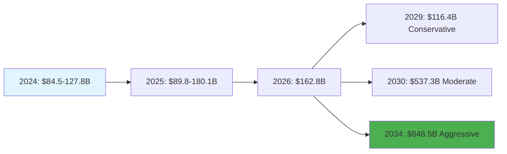
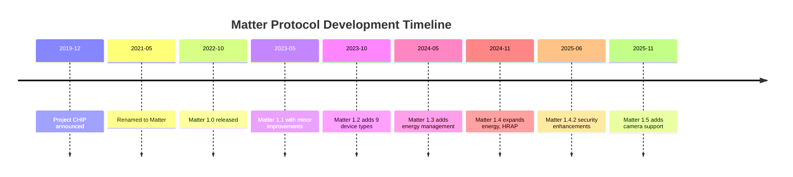
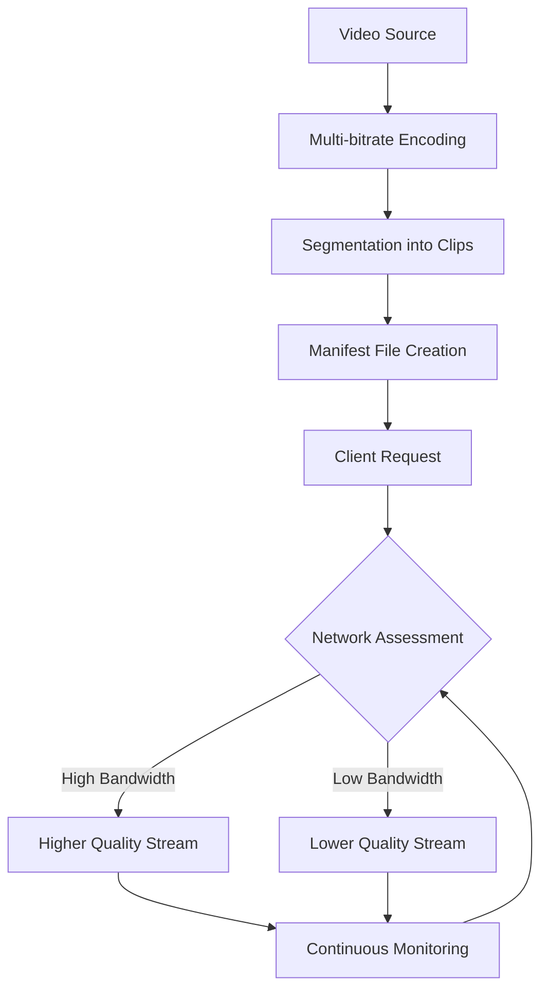
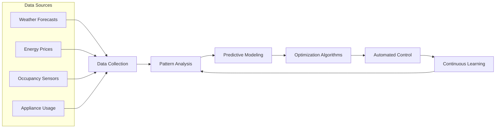
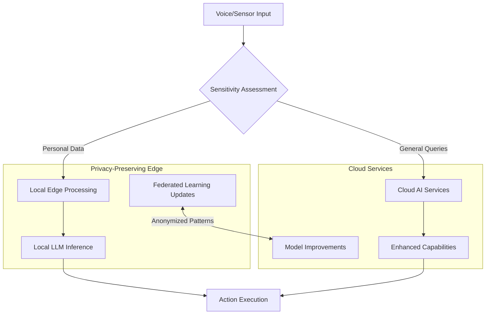
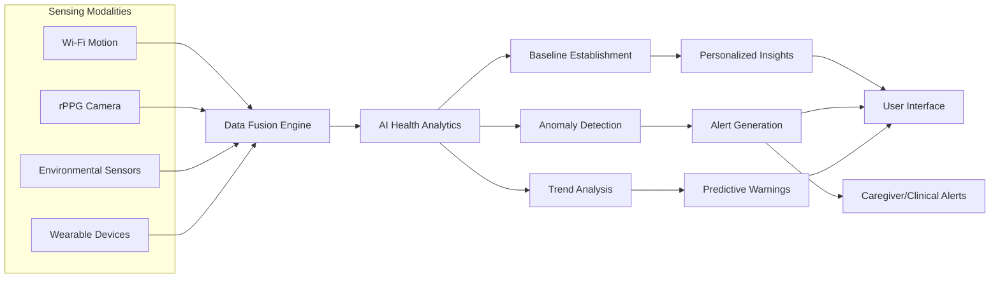
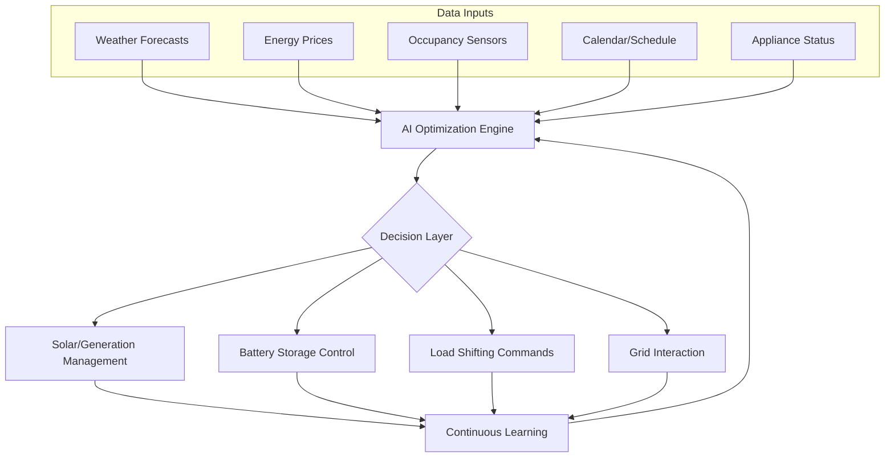
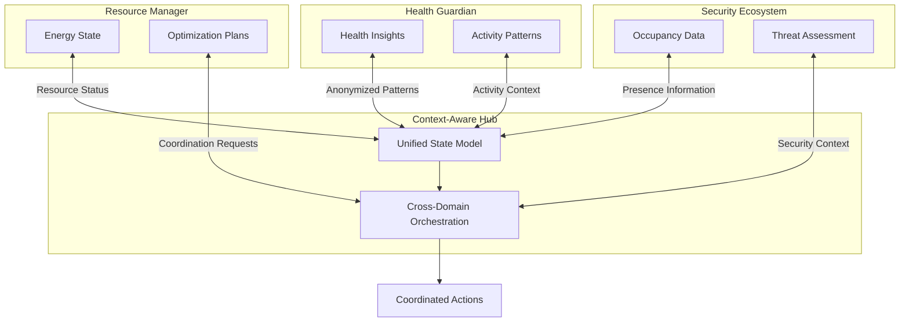

# The Future of Living: An Analysis of Product Development Trends in the Smart Home Industry
## 1 Foundations and Current Landscape of the Smart Home Industry

This chapter establishes the analytical foundation for examining product development trends in the smart home industry. It defines the smart home ecosystem's core components and boundaries, analyzes current market size and growth trajectories across key segments, examines the primary value propositions driving consumer adoption, and maps the competitive landscape of major industry players. This foundational analysis provides the baseline context necessary for understanding how product development trends are evolving in subsequent chapters.

### 1.1 Defining the Smart Home Ecosystem

The smart home ecosystem encompasses a comprehensive network of interconnected devices, communication protocols, computing platforms, and service layers that collectively enable automated and remote control of residential environments. At its core, **smart home technology allows homeowners to control and automate various devices and systems in their home**, including lighting, heating and cooling, security, entertainment, and other appliances[^1]. This technology connects via wireless networks and the Internet, using software, sensors, and hardware to monitor and control the home, allowing remote access[^2].

The ecosystem architecture typically comprises four fundamental layers that work in concert to deliver smart home functionality. The **sensing and actuator layer** forms the foundation, incorporating environmental and wearable sensors that collect data on everything from temperature and motion to physiological parameters[^3]. The **communication network layer** utilizes various protocols to transmit data between devices, with each protocol offering distinct advantages for different use cases. The **computing platform layer** processes and analyzes collected data, leveraging cloud services and increasingly edge computing for decision-making. Finally, the **service layer** delivers the actual functionality to end users, from automated climate control to healthcare support[^3].

**Communication protocols serve as the backbone of interconnected devices** and represent a critical differentiator in smart home system design[^4]. The following table summarizes the key protocols currently deployed in smart home environments:

| Protocol | Range | Power Consumption | Best Use Cases | Key Characteristics |
|----------|-------|-------------------|----------------|---------------------|
| Wi-Fi | Unlimited (via router) | High | High-bandwidth devices (cameras, streaming) | Fast speeds, may overload routers, some devices require cloud services |
| Bluetooth | ~10m | Low | Short-range pairing, smart bulbs | Fully local, limited range |
| Zigbee | ~10-100m | Low | Sensors and switches | Mesh networking, supports up to 65,000 devices, 250 kb/s throughput |
| Z-Wave | ~30-100m | Low | Security systems | Mesh networking, supports up to 232 devices, 900 MHz spectrum for less interference |
| Thread | ~10-30m per node | Very Low | Battery-powered devices | IPv6-based, multiple hub support, energy efficient |
| Matter | Depends on underlying protocol | Varies | Interoperable devices | Unifying standard backed by Apple, Google, Amazon, Samsung |

The emergence of **Matter protocol represents a breakthrough in universal smart home connectivity** by solving interoperability challenges that have historically fragmented the market[^5]. Developed by the Connectivity Standards Alliance and backed by major technology companies including Apple, Google, Amazon, and Samsung, Matter aims to unify ecosystems through end-to-end encryption, local operation for faster responses, and backward compatibility where existing Zigbee devices can be updated[^4]. Over 550 technology companies worldwide are developing Matter-compatible products, signaling a significant industry shift toward standardization[^5].

It is important to delineate the boundaries between smart home technology and adjacent domains. While smart homes focus on residential automation and personal living environments, **smart cities rely on deployment of IoT devices and sensors** at a municipal scale to manage urban infrastructure[^6]. The smart home ecosystem interfaces with but remains distinct from smart building technologies used in commercial settings and broader smart city initiatives, though the underlying technologies increasingly overlap as interoperability standards mature.

### 1.2 Global Market Size and Growth Dynamics

The global smart home market demonstrates robust growth dynamics, though market valuations vary depending on scope definitions and methodological approaches employed by different research organizations. According to one comprehensive analysis, **the global smart home market size was valued at USD 147.52 billion in 2025** and is projected to grow from USD 180.12 billion in 2026 to USD 848.47 billion by 2034, exhibiting a CAGR of 21.40% during the forecast period[^7]. Alternative assessments place the 2024 market value at USD 127.80 billion, projecting growth to USD 537.27 billion by 2030 at a CAGR of 27.0%[^8]. A more conservative estimate values the market at USD 84.5 billion in 2024, projecting growth to USD 116.4 billion by 2029 at a CAGR of 6.6%[^9].

These variations in market sizing reflect differences in how analysts define the smart home ecosystem's boundaries, whether including or excluding certain product categories, service revenues, and installation costs. The following visualization illustrates the projected market trajectory based on different analytical frameworks:

Despite variations in absolute figures, **all projections converge on sustained double-digit growth rates** ranging from 6.6% to 27.0% CAGR, underscoring the market's fundamental expansion trajectory. This growth is propelled by the increasing number of internet users, the rising adoption of smart devices, and growing disposable incomes in emerging economies[^9]. The smart home revolution has reached a critical tipping point, with over 57% of US households expected to have at least one smart home device by 2026, representing a dramatic acceleration from just 28% in 2020[^5].

Several structural factors are driving this expansion. **Key technologies such as AI, GenAI, and IoT are enhancing convenience and personalization**, driving demand for smart home solutions[^9]. The integration of IoT and AI is creating new monetization models through data analytics and subscription services[^7]. Investment in smart home technology is increasing, with key players like Amazon (Alexa), Google (Nest), and Apple (HomeKit) growing their ecosystems through strategic acquisitions and R&D, while startups such as Wyze and Ecobee are attracting venture capital for innovative, affordable solutions[^7].

Additional growth catalysts include declining device costs that lower adoption barriers, improved wireless connectivity infrastructure, and supportive government initiatives promoting energy-efficient homes[^9]. The market's growth is further fueled by declining device costs, improved wireless connectivity, and supportive government initiatives promoting energy-efficient homes[^9]. A key growth driver is the rising awareness of energy efficiency, with 75% of homeowners expressing interest in smart home technologies that reduce energy consumption[^10].

### 1.3 Market Segmentation by Product and Application

The smart home market exhibits distinct segmentation patterns across product categories and application areas, with varying growth rates and market shares reflecting different stages of maturity and consumer adoption priorities. Understanding this segmentation is essential for identifying where product development trends are most likely to emerge and which categories present the greatest opportunities for innovation.

**The security and access control segment dominates the current market landscape**, capturing over 28% of the U.S. market share in 2024[^11]. This segment is witnessing rapid growth as homeowners increasingly prioritize safety, surveillance, and convenience, driven by the rising adoption of smart door locks, video doorbells, motion detectors, and integrated alarm systems[^11]. Smart Security Systems are currently leading the USA market due to increasing concerns about home safety and security[^10].

The following table presents a comprehensive breakdown of major product segments and their market characteristics:

| Product Segment | Key Products | Market Position | Growth Drivers |
|-----------------|--------------|-----------------|----------------|
| Security & Access Control | Smart cameras, video doorbells, smart locks, alarm systems | Market leader (~28% share) | Safety concerns, remote monitoring capability |
| Consumer Electronics | Smart TVs, streaming devices, speakers, refrigerators | Largest projected share | Increasing adoption of connected products |
| HVAC/Climate Control | Smart thermostats, sensors, smart vents | Strong growth | Energy efficiency focus, utility cost savings |
| Lighting Control | Smart lights, relays, switches, occupancy sensors, dimmers | Established segment | Convenience, energy savings (7-27% potential) |
| Smart Appliances | Washing machines, water heaters, vacuum cleaners | Growing segment | Automation, convenience |
| Smart Kitchen | Refrigerators, dishwashers, cooktops, microwaves | Highest CAGR projected | Connected appliance adoption |
| Home Healthcare | Remote monitoring, fall detection, vital signs tracking | Fastest CAGR (>30%) | Aging population, chronic illness management |

The **consumer electronics segment is projected to dominate the market** by capturing the largest share during the forecast period due to increasing adoption of smart products such as refrigerators, televisions, locks, smart lights, and lighting controls[^1]. Meanwhile, **the energy and water segment is projected to register the highest CAGR** due to the surging trend of environmental protection and the need to reduce carbon footprints[^1].

From an application perspective, the market segments into distinct use cases that often overlap in practice. Home security remains the primary application driving adoption, followed by energy management, home automation, health monitoring, and entertainment[^10]. **The home healthcare segment is expected to witness the fastest CAGR of over 30% from 2025 to 2030**, fueled by the aging population and chronic illness management needs[^11]. This represents a significant emerging category that is reshaping product development priorities across the industry.

The smart kitchen segment deserves particular attention as **it is expected to grow at the highest CAGR during the forecast period**, driven by the increasing adoption of connected kitchen appliances[^9]. This growth reflects broader consumer trends toward whole-home automation and the integration of smart functionality into previously unconnected appliance categories.

### 1.4 Regional Market Distribution and Characteristics

The global smart home market exhibits significant regional variation in market share, growth rates, and adoption drivers, reflecting differences in economic development, technological infrastructure, regulatory environments, and consumer preferences. Understanding these regional dynamics is crucial for identifying where product development trends originate and how they may propagate across markets.

**North America maintains market leadership**, holding a significant share of 25-39% of the global market depending on the specific product categories included in the analysis[^8][^12]. The region's market is driven by increasing consumer demand for convenience, energy efficiency, and security, supported by high disposable income and strong consumer spending that enables early adoption of smart home technologies[^8][^9]. Within North America, **the U.S. smart home market dominated the region and held the highest share of 72% in 2024**[^8].

The U.S. market specifically was estimated at USD 23.72-28.30 billion in 2024, with projections ranging from USD 54.25 billion in 2025 to USD 99.40 billion by 2032[^11][^1][^12]. The industry is experiencing significant growth driven by a heightened focus on energy efficiency and sustainability, with consumers increasingly adopting smart thermostats, lighting systems, and energy monitoring devices to manage utility expenses and optimize energy consumption[^11]. Government incentives and initiatives promoting energy efficiency and sustainability are further fueling market growth[^8].

**Europe represents the second-largest regional market** and is expected to grow at a CAGR of over 26% from 2025 to 2030[^8]. The European market is characterized by a strong emphasis on sustainability and energy savings, with consumers seeking smart thermostats, energy management tools, and eco-friendly appliances[^8]. The UK smart home market is propelled by a growing focus on energy efficiency, sustainability, and home security, accelerated by the UK's commitment to reducing carbon emissions[^8]. Germany's market is driven by a strong emphasis on automation and energy efficiency, with government incentives encouraging the adoption of energy-efficient technologies[^8].

**Asia Pacific is emerging as the fastest-growing regional market**, with projected CAGRs ranging from 8% to 28% depending on the analytical framework[^8][^9][^6]. The following table summarizes regional market characteristics:

| Region | 2024-2025 Market Share | Projected CAGR | Key Growth Drivers |
|--------|------------------------|----------------|-------------------|
| North America | 25-39% | 7.0-23.4% | High disposable income, early adoption, energy efficiency focus |
| Europe | Second largest | 26%+ | Sustainability mandates, energy efficiency, carbon reduction goals |
| Asia Pacific | Third largest | 8-28% | Rapid urbanization, smart city initiatives, growing middle class |
| South America | Smaller share | Moderate | Corporate strategies, mergers and acquisitions |
| Middle East & Africa | Smaller share | Moderate | Infrastructure development |

The Asia Pacific market is primarily driven by rapid urbanization, rising disposable incomes, and a growing middle-class population[^9]. Additionally, strong government smart city initiatives, expanding broadband and 5G infrastructure, and a heightened focus on energy efficiency and security are accelerating adoption across the region[^9]. **China is rapidly expanding**, propelled by technological advancements, a growing middle class, and government initiatives supporting smart cities[^8]. Japan's market is gaining traction, driven by a strong demand for advanced technology and innovation, with a particular focus on home security and energy efficiency[^8]. In India, voice assistant adoption shows Apple Siri leading with 40.1% of users, followed by Google Assistant with 30.9% and Amazon Alexa with 17.1%[^6].

### 1.5 Core Value Propositions Driving Adoption

Consumer adoption of smart home technologies is driven by a hierarchy of value propositions that vary in importance across different market segments and demographic groups. Understanding these motivations is essential for predicting which product features and capabilities will drive future development trends and market success.

**Security and safety features represent the primary driver of smart home adoption**, with smart cameras, video doorbells, motion detectors, and integrated alarm systems forming the cornerstone of many consumers' initial smart home investments[^11]. Security concerns are a key factor fueling the growth of the industry, particularly through the demand for smart cameras, video doorbells, and integrated alarm systems[^11]. The emphasis on home safety reflects fundamental consumer priorities around protecting family members and property.

**Convenience and lifestyle enhancement constitute the second major value proposition**, with voice assistants and automated controls transforming how consumers interact with their living environments. The industry is being significantly transformed by the integration of AI-powered voice assistants such as Amazon Alexa, Google Assistant, and Apple Siri, which enhance convenience and user experience for entertainment and other devices[^11]. A U.S. survey identified the main benefits of device interconnection as making life easier (71%), providing convenience (42%), and entertainment (30%)[^13].

**Energy efficiency and sustainability benefits offer substantial economic value**, with smart home technologies demonstrating potential savings of 10-30% on household energy consumption. Research indicates that smart home technology can reduce home energy use by nearly 30%[^13]. More specifically, smart thermostats can save households up to $200 annually on energy bills[^10], while comprehensive smart home systems can achieve savings ranging from 5-22% per home[^2]. The following breakdown illustrates potential energy savings by technology category:

| Technology Category | Potential Energy Savings | Key Mechanisms |
|--------------------|-------------------------|----------------|
| Smart Thermostats | 8% heating, 10% cooling | Automated scheduling, learning algorithms |
| Smart Lighting | 7-27% of lighting energy | Automatic dimming, reduced operating hours |
| Smart Outlets/Power Strips | Up to 50% in some households | Cutting power to unused devices |
| Smart Window Coverings | 11-20% heating/cooling, 3% lighting | Solar heat management, daylight optimization |
| Smart HVAC Systems | Up to 10% heating/cooling | Multiple sensors, remote control |
| Smart Water Heating | 15% of water heating energy | Usage pattern learning, time shifting |
| Home Energy Management Systems | 5-22% overall | Central control, user feedback |

However, **it is crucial to recognize that non-energy benefits typically drive initial adoption**, while energy savings serve as a valued secondary benefit. Consumer research revealed that many consumers, including early adopters, are not fully aware of the home energy management possibilities afforded by smart home products[^14]. Although non-energy benefits related to nurturing and protecting one's household are driving adoption, customers almost universally appreciate energy and cost savings as a secondary benefit[^14]. Without such practical benefits, consumers often see smart home products as frivolous[^14].

Survey data confirms this hierarchy of motivations. Among current smart home users, 26% purchased their first device to increase convenience, improve quality of life, or enhance efficiency; 10% sought to make their home safer; another 10% cited affordability; and **only 6% of current users identified energy savings as their primary purchase motivation**[^13]. This insight has significant implications for product development, suggesting that energy efficiency features must be bundled with more immediately compelling benefits to drive adoption.

**Health and wellness capabilities represent an emerging value proposition** with significant growth potential. Smart homes for elderly healthcare incorporate environmental and wearable medical sensors, actuators, and modern communication technologies to enable continuous and remote monitoring of elderly health and wellbeing at a low cost[^3]. These systems allow the elderly to stay in their home environments instead of healthcare facilities, while healthcare personnel can track their physiological condition in real-time[^3]. The elderly population in the U.S. is steadily growing, with an estimated 82 million Americans expected to be over 65 by 2050, driving demand for home-based care solutions[^15].

### 1.6 Competitive Landscape and Key Industry Players

The smart home industry features a diverse competitive landscape comprising technology giants building ecosystem platforms, industrial conglomerates leveraging automation expertise, security specialists, lighting leaders, and consumer electronics manufacturers. Understanding the strategic positioning and competitive dynamics of these players provides insight into how product development trends are likely to evolve.

**Technology giants dominate the ecosystem platform layer**, with Amazon, Google, and Apple establishing voice assistant-centric smart home ecosystems that serve as integration hubs for third-party devices. Investment in smart home technology is increasing, with key players like Amazon (Alexa), Google (Nest), and Apple (HomeKit) growing their ecosystems through strategic acquisitions and R&D[^7]. These companies leverage their existing consumer relationships, cloud infrastructure, and AI capabilities to create sticky ecosystems that encourage device proliferation.

**Industrial conglomerates bring deep automation expertise** to the smart home market, applying decades of experience in building management and industrial control systems to residential applications. Key players include Johnson Controls Inc., Honeywell International Inc., Schneider Electric, Siemens, ABB, and Robert Bosch[^9]. These companies possess diversified product portfolios and strong global sales and marketing networks, having operated in adjacent markets for several years[^9]. Siemens AG is known for its technological leadership in automation, electrification, and digitalization, while Schneider Electric is a global player in energy management and automation[^8].

The following table profiles the major competitive segments and representative companies:

| Competitive Segment | Key Players | Strategic Focus |
|--------------------|-------------|-----------------|
| Ecosystem Platforms | Amazon, Google, Apple, Samsung | Voice assistants, cloud services, ecosystem lock-in |
| Industrial Automation | Honeywell, Siemens, Schneider Electric, ABB, Bosch | Building management, energy systems, professional installation |
| Security Specialists | ASSA ABLOY, ADT, SimpliSafe | Access control, monitoring services, subscription models |
| Lighting Leaders | Signify (Philips), Legrand | Smart lighting, connected switches, building integration |
| Consumer Electronics | LG Electronics, Sony, Samsung, Panasonic | Appliances, entertainment systems, displays |

**Strategic acquisitions and partnerships are reshaping the competitive landscape**. Key industry developments include acquisitions and partnerships aimed at expanding capabilities and geographic reach[^7]. In January 2025, ABB acquired Lumin, a U.S.-based provider of energy management systems, to expand the company's home energy management abilities in the North American residential sector[^7]. In October 2024, ABB and Austrian-based Zumtobel Group partnered to innovate smart building solutions[^7]. In October 2024, Develco Products acquired Datek Smart Home, with the two companies now offering dedicated white-label cloud services and IoT hardware for home care, smart energy, and security providers in North America[^7].

**Security-focused acquisitions demonstrate the strategic importance of access control**. In October 2022, ASSA ABLOY acquired Bird Home Automation GmbH, a German company specializing in IP door intercoms, which was crucial for ASSA ABLOY's expansion into the growing smart home market[^7]. More recently, ASSA ABLOY acquired Level Lock in September 2024, while Legrand acquired Cogelec at an estimated valuation of approximately €254 million in July 2025[^16].

The M&A landscape reveals several strategic themes shaping industry evolution. The industry is experiencing a transition from broad consolidation to high-conviction, thesis-driven acquisitions[^16]. Key factors influencing deal activity include recurring revenue composition, distribution and control points, and interoperability standards[^16]. Ecosystem control, recurring revenue, and channel leverage are primary drivers of M&A activity[^16]. Financial investors such as GTCR and Triton have shown interest in subscription security platforms and enterprise divestiture assets, as evidenced by GTCR's September 2025 announcement to acquire SimpliSafe and Triton's December 2024 agreement to acquire Bosch's security and communications products business[^16].

**Players are upgrading existing solutions and innovating new ones** to expand their business and meet customer needs, with enhancement and expansion of current product portfolios raising the position of vendors in the market[^7]. Startups such as Wyze and Ecobee are attracting venture capital for innovative, affordable solutions[^7], indicating that the competitive landscape remains open to disruptive entrants despite the dominance of established players. This dynamic creates opportunities for product innovation across all market segments, setting the stage for the emerging trends analyzed in subsequent chapters.

## 2 Macro Drivers and Technological Enablers Shaping Future Development

This chapter analyzes the external macro forces and internal technological enablers that are collectively shaping product development trajectories in the smart home industry. It examines how demographic shifts, regulatory pressures, and evolving consumer expectations create market opportunities, while dissecting how advances in connectivity protocols, artificial intelligence, and computing architectures are transitioning from standalone features to foundational platforms for next-generation smart home products.

### 2.1 Demographic and Socioeconomic Forces Driving Smart Home Demand

The smart home industry's growth trajectory is fundamentally shaped by powerful demographic and socioeconomic forces that are creating unprecedented demand for intelligent residential technologies. These macro drivers operate across global markets with varying intensity, establishing the market conditions within which product development must evolve.

**Rapid urbanization represents one of the most significant structural forces driving smart home adoption**, particularly in emerging markets where the pace of urban transformation is accelerating. The World Bank estimated that 54% of the world's population lived in cities, a figure predicted to rise to 80% by 2045[^17]. The number of cities with populations of at least 10 million people rose from 10 in 1990 to 28 in 2014 and is projected to reach 41 by 2030[^17]. This urban concentration creates both challenges and opportunities for smart home technology. As experts have reported that future cities would collapse if they did not become more competent, the integration of innovative technology into residential environments becomes not merely convenient but essential[^17]. Smart homes represent a critical component of this urban evolution, offering solutions for space optimization, resource management, and quality of life enhancement in increasingly dense living environments.

The **Asia Pacific region exemplifies how urbanization drives smart home market expansion**, with the region expected to grow fastest at 8.4% CAGR, fueled by rapid urbanization, changing consumer lifestyles, and increasing disposable incomes in developing countries[^9]. The Asia Pacific smart home market is projected to reach USD 41.05 billion by 2030 from USD 27.77 billion in 2025, at a CAGR of 8.1%[^9]. China's smart home market provides a particularly striking illustration, with volume sales increasing from RMB 200 billion in 2016 to RMB 500 billion in 2022, with urbanization fueling the demand for home renovations and improvement[^18]. China's smart home market revenue is expected to exceed USD 36 billion in 2025, building on a 23% annual growth rate observed in 2023 and projected to surge further to USD 75 billion by 2030[^19]. IDC reported shipment of over 260 million smart home units in 2023, with more than 60% of new Chinese homes incorporating smart technology features[^19].

**The aging population represents a demographic force with profound implications for smart home product development**, particularly in developed economies where healthcare systems face mounting pressure. The elderly population in the U.S. is steadily growing, with projections indicating significant increases in the over-65 demographic by mid-century. By 2034, more people will be over 65 than under 18, fundamentally reshaping housing requirements[^20]. This demographic shift creates substantial demand for aging-in-place solutions that enable older adults to maintain independence while ensuring safety and access to care. Following the pandemic, consumers have had an increased interest in monitoring their health, and smart homes offer practical solutions to support the older generation and vulnerable individuals living independently[^18]. Features like automated alerts for maintenance needs and scheduling appointments could shape the future of the smart home market for an older demographic[^18].

Research on smart home technology adoption among older adults reveals nuanced patterns that inform product development priorities. A survey of 445 older adults aged 60 and above found that respondents were profiled into three groups based on their adoption of 13 smart home devices: **brisk adopters (37%), emerging adopters (33%), and slow adopters (30%)**[^21]. On average, respondents owned three of the 13 devices surveyed. The devices with the highest rates of ownership were carbon monoxide alarms (81.5%), manually programmable thermostats (47.5%), autoset thermostats (43.8%), and motion sensor lights (35.8%)[^21]. Significantly, respondents who were women, in the age group of 60 to 70 years, living in a two-level home, with a body function impairment, with a fall history, and experienced in information and communication technology were significantly more likely to be "brisk adopters" of smart home technology[^21].

A broader AARP survey confirms that **older Americans are welcoming technology to enable them to live in their home as long as possible and have peace of mind**. More than 6 in 10 use some kind of smart device to help with security, utilities, appliances and lighting[^22]. About half (46 percent) have safety devices, such as alarms and door or drive cameras, and another 40 percent expressed interest in owning them[^22]. For the 70 percent of older Americans who manage chronic health conditions and 27 percent of those over age 50 who are caregivers, advances in technology and digital services have made a significant difference[^22]. Caregivers are embracing or are interested in GPS devices and motion sensors, along with digital services for food delivery, communication, shopping, and medical assistance[^22].

**Post-pandemic lifestyle shifts have fundamentally elevated consumer expectations for home functionality**, creating lasting changes in how people relate to their living spaces. The pandemic undoubtedly played a significant role in the rise of smart homes, as after spending extended periods of time inside, consumers have a greater appreciation for what "home" is[^18]. Three in five American consumers see making their home comfortable as a priority, and eight in ten British consumers think "the home is central to their wellbeing"[^18]. As work, school, medical visits, fitness, and shopping all moved under one roof during the pandemic, demand for a suite of connected home devices and services exploded[^20].

The pandemic has also modified the requirements of home automation in specific ways. Ventilation systems accounted for 30% of energy use in buildings according to the IEA, while remote working has had a significant impact on energy use in households[^23]. This shift toward the home as a multi-functional space—simultaneously serving as office, classroom, gym, and entertainment center—has created demand for smart home products that can adapt to diverse and changing usage patterns throughout the day. The smarter the homes of today are, the greater capacity we will have to tackle the challenges of tomorrow[^23].

**Rising middle-class disposable incomes in emerging economies are expanding the addressable market** for smart home technologies beyond early adopters in developed markets. The increasing number of internet users and growing adoption of smart devices serve as key drivers of market expansion[^9]. China's rapid expansion is propelled by technological advancements, a growing middle class, and government initiatives supporting smart cities[^19]. Internet penetration in China has reached more than 1.08 billion internet users as of June 2023, combined with explosive adoption of 5G technology now reaching over 50% of mobile connections[^19]. These infrastructure improvements and demographic shifts are creating favorable conditions for smart home adoption across previously underserved markets.

### 2.2 Sustainability Mandates and Regulatory Frameworks

Government policies, energy efficiency regulations, and sustainability mandates are increasingly shaping smart home product development requirements, creating both compliance obligations and market opportunities for manufacturers. These regulatory frameworks are transitioning smart home technology from a convenience-focused luxury to an essential component of sustainable building practices.

**The European Union's Ecodesign for Sustainable Products Regulation (ESPR)** represents the most comprehensive regulatory framework affecting smart home product development. The ESPR came into force on July 18, 2024, and is the EU's core approach to making products more environmentally sustainable and circular[^24]. The regulation aims to significantly improve the sustainability of products placed on the EU market by enhancing their circularity, energy performance, recyclability, and durability[^24]. Critically, while the original Ecodesign Directive only applied to energy-related products, **ESPR expands the scope to cover almost all physical products**[^24].

The ESPR enables the setting of performance and information rules—"ecodesign requirements"—for almost all categories of physical goods, including requirements for: improving product durability, reusability, upgradability and repairability; enhancing the possibilities for product maintenance and refurbishment; making products more energy and resource efficient; addressing the presence of substances that inhibit circularity; increasing recycled content; making products easier to remanufacture and recycle; setting carbon and environmental footprint rules; limiting the generation of waste; and improving the availability of product sustainability information[^24].

The following table summarizes the ESPR's priority products and indicative timelines for adoption:

| Product Category | Indicative Timeline | Key Requirements |
|------------------|---------------------|------------------|
| Furniture | 2028 | Durability, repairability, recyclability |
| Mattresses | 2029 | Circularity, material efficiency |
| Repairability (horizontal) | 2027 | Consumer electronics, small household appliances |
| Recyclability of EEE | 2029 | Electrical and electronic equipment |
| Mobile phones and tablets | 2030 | Software support, spare parts availability |

The European Commission published its first working plan under ESPR for the period 2025 to 2030 on April 16, 2025[^25]. The plan identifies priority product groups including horizontal requirements for **repairability (2027)**, with a product scope that could include consumer electronics and small household appliances, and **recycled content and recyclability of electrical and electronic equipment (2029)**[^25]. Every priority product category will need to have a **digital product passport (DPP)**, providing data access for businesses, consumers and public authorities[^25].

For smartphones and tablets specifically, the ESPR introduces stringent requirements that establish precedents for smart home devices. **Devices will need to meet stricter requirements for resistance to drops, dust, and water ingress**[^26]. Battery performance requirements mandate that smartphones must maintain at least 80% of their initial capacity after 800 charge cycles[^26]. Repairability requirements ensure that critical spare parts, including batteries, screens, cameras, charging ports, and buttons, remain available for at least seven years after a product is discontinued and must be delivered within a maximum of 10 working days[^26]. Software upgrades must be available for at least five years after a device is discontinued[^26].

**New Ecodesign regulations are directly impacting smart home climate control products**. On July 1, 2025, a new EU Ecodesign regulation (EU 2024/1103) came into effect, introducing stricter requirements for energy efficiency and functionality of local space heating products, including electric underfloor heating systems and thermostats[^27]. Under these requirements, all space heating systems must now be regulated using thermostats, and electric heating systems may only be installed with thermostats that comply with the new Ecodesign requirements[^27]. The specific requirements include time control with weekly programming, open window function that automatically reacts to sudden heat loss, remote control via app or internet, and adaptive start functionality that ensures the room is warm at the desired time without using unnecessary energy[^27].

The ESPR also introduces measures to address the **destruction of unsold consumer products**, prohibiting the destruction of unsold textiles and footwear and opening the way for similar bans in other industries[^24]. Large and eventually medium-sized companies across all product sectors will be required to disclose annual information on their discarded unsold consumer products on their websites[^24]. The regulation includes provisions for **green public procurement**, with EU public authorities spending approximately €1.8 trillion annually on works, goods, and services. ESPR will help steer these funds in a more sustainable direction by setting mandatory green public procurement rules for specific products[^24].

Beyond the EU, **environmental regulations affecting refrigerants and materials** are shaping product development globally. Under the Montreal Protocol, both developing and developed countries have binding commitments to reduce the use of substances including fluorinated gases (F-gases), which are widely used as refrigerants[^28]. The EU is promoting a steeper hydrofluorocarbons (HFCs) phase-down from 2039 onward, with HFC production and consumption to be completely phased out by 2050[^28]. The U.S. Environmental Protection Agency lists substitutes through its Phasedown of Hydrofluorocarbons and Significant New Alternatives Policy Program[^28]. These regulations directly affect smart HVAC systems and refrigeration appliances.

**Favorable government regulations promoting green buildings create significant market opportunities** for smart home energy management solutions. A green building uses environmentally responsible and resource-efficient processes, incorporating specifications for local green building materials, reduction of loads, system optimization, and on-site renewable energy generation[^9]. Buildings use up to 40% of total energy while greenhouse gas emissions from buildings represent 30% of the global source of these gases, according to the United Nations Environment Program[^9]. The concept of green buildings has been supported by various initiatives across the globe, creating regulatory pull for smart home products that contribute to building efficiency[^9].

**Fiscal incentives such as tax rebates are proving effective at accelerating smart home adoption** while addressing geographic disparities. Research examining factors affecting smart thermostat adoption found that policy implementation is positively correlated with smart thermostat promotion, with tax rebate policies being most effective in mitigating adoption differences between urban and rural areas[^29]. The State Energy Efficient Appliance Rebate Program (SEEARP), which provides direct tax rebates to individuals who choose to replace traditional appliances with smart alternatives, showed a positive and statistically significant correlation with the likelihood of installing smart thermostats[^29]. Importantly, the interaction between SEEARP policy and urban residence was negative, indicating that **SEEARP policy helps narrow the urban-rural gap** in smart thermostat adoption[^29].

In California, the aim is to reach a potential figure of 100,000 new homes with zero emissions per year, demonstrating how regional policy targets can drive smart home adoption[^23]. The U.S. Department of Energy has calculated that households and commercial buildings accounted for 39% of the country's total energy consumption in 2017, which is why authorities in many parts of the world have decided to encourage and promote programs to increase efficiency in homes[^23].

### 2.3 Evolution of Connectivity Protocols Toward Universal Interoperability

The evolution of connectivity standards represents a pivotal technological enabler for smart home product development, as historical fragmentation has been one of the most significant barriers to mainstream adoption. The convergence of Matter, Thread, and Wi-Fi 7 protocols is creating a unified foundation that promises to resolve interoperability challenges and enable a new generation of seamlessly integrated smart home products.

**Matter protocol represents the industry's most ambitious attempt to solve smart home fragmentation**, promising a future where devices seamlessly communicate across different systems. Developed by the Connectivity Standards Alliance and backed by tech giants including Amazon, Apple, Google, and Samsung, Matter is a technical standard for smart home and IoT devices that aims to improve interoperability and compatibility between different manufacturers and security, while always allowing local control as an option[^30]. Matter is described as "one protocol to connect compatible devices and systems with one another" and represents "an industry-unifying standard that is a promise of reliable, secure connectivity and a seal of approval that devices will work seamlessly together both today and tomorrow"[^31].

The protocol originated in December 2019 as Project Connected Home over IP (CHIP), when Amazon, Apple, Google, Samsung SmartThings, and the Zigbee Alliance announced their collaboration[^32]. The goal was to simplify development for manufacturers while increasing product compatibility for consumers. Matter operates on Internet Protocol (IP) fundamentals and functions via one or more controllers that connect and manage devices within your local network, eliminating the need for multiple proprietary hubs[^30]. The first specification release of the Matter protocol runs on Wi-Fi and Thread network layers and uses Bluetooth Low Energy for commissioning[^31].

The following timeline illustrates Matter's development trajectory:

**Matter 1.3, released in May 2024, was particularly significant** as it added support for kitchen appliances, EV chargers, energy management, water management hardware, and laundry devices, influencing devices showcased at CES 2025[^33]. Matter 1.4, published in November 2024, introduced new device types like solar panels, batteries, heat pumps and water heaters, along with improvements to Multi-Admin mode and Thread network creation[^34][^32]. These additions, along with improvements to the energy management and thermostat clusters, pave the way for smarter, more automated energy management within the home along with better management of credential sharing using HRAP, Enhanced Multi-Admin, and Long Idle Time[^34].

**Matter 1.5, announced on November 20, 2025, represents a major milestone** by officially introducing support for camera streaming, utilizing a side-channel protocol like RTSP over Wi-Fi or ethernet[^34]. This long-awaited feature opens the door for a new generation of interoperable smart home cameras. Major smart home platforms like Amazon Alexa, Google Home, Apple HomeKit, and Samsung SmartThings all support Matter, though integration differs slightly[^33]. The Matter protocol is officially supported by the likes of Google Home, Nest, Amazon Echo, and Apple TV, and is already rolling out to millions of smart home devices through software updates from brands like Amazon, Apple, Google, and Samsung SmartThings[^31].

Despite progress, **Matter has faced implementation challenges** that the industry is actively working to address. A key insight into the industry occurred at IFA Berlin 2024, where the Connectivity Standards Alliance's Tobin Richardson and the Wi-Fi Alliance's Kevin Robinson agreed that Matter is a significant step towards universal smart home interoperability, though the development relies on considerable collaboration between hardware manufacturers[^33]. A shortfall has been the delay between specification releases and their implementation in consumer devices, which is an issue for manufacturers[^33].

The companies behind Matter acknowledge these challenges and have committed to resolving them. **"2025 is going to be a really important year. We're looking to really hit reliability and make sure that things just work,"** says Tobin Richardson, president and CEO of the CSA[^35]. "It's going to be a year of focusing on fixing these reliability and performance issues in Matter." According to Richardson, the "promised land" of Matter working reliably is "months, not years away," potentially within the next 12 months[^35].

**The Matter HRAP (Home Routers and Access Points) initiative** represents a critical solution for improving reliability. The initiative aims to embed software in home routers to ensure Matter and Thread devices connect seamlessly, specifically addressing issues with multicast discovery in many home routers that can break Matter's discovery mechanism and lead to a poor user experience[^35]. One of the challenges today is the way routers implement their multicast discovery can be broken, which leads to a bad experience for users, as Matter relies on that discovery mechanism[^35]. HRAP will ensure features like IPv6 and multicast discovery are consistent and reliable across routers[^35].

**Thread protocol serves as Matter's solution for low-power, battery-operated devices** and has undergone significant evolution to address early implementation challenges. Thread is a reliable, secure and energy-saving network protocol delivering fast response times and extended coverage to elevate smart home experiences[^36]. As an IP-based open standard, Thread allows home automation devices such as lighting, thermostats, door locks, sensors and smart speakers to securely, reliably and simply integrate into the smart home and connect directly to the cloud[^36].

A Thread network is formed with battery-operated devices, devices acting as mesh extenders, and one or more Thread Border Routers[^36]. The mesh network is resilient and reliable, getting stronger with wider coverage as more devices are added[^36]. Thread was built from the ground up to support small IoT devices and uses proven technologies such as the IEEE 802.15.4 low-power radio to deliver a lower energy footprint, significantly extending the battery life of devices like door locks and sensors[^36].

**Thread 1.4, published in September 2024, introduces six significant new features and enhancements** that address critical interoperability challenges[^37]. Key features include:

| Feature | Description | Impact |
|---------|-------------|--------|
| Thread Credentials Sharing | Secure way to grant temporary administrative access using a nine-digit OTPC | Enables cross-manufacturer mesh formation |
| Enhanced Internet Connectivity | Robust support for both IPv6 and IPv4 via NAT64/DNS64 | Broader network compatibility |
| Enhanced Network Diagnostics | Detailed information on topology, data flows, device details | Better troubleshooting capabilities |
| Thread-over-Infrastructure | Uses existing IP networks alongside IEEE 802.15.4 radio | Reduces network partitioning |
| TCAT Commissioning | Certificate-based TLS session for secure commissioning at scale | Enables enterprise deployments |
| Mesh Robustness Enhancements | Larger address cache, reduced Network Data size, prioritized CSL | Improved reliability and scalability |

**Thread 1.4 is expected to solve the critical problem where border routers from different manufacturers don't necessarily talk to each other well**[^35]. Vividh Siddha, president of Thread Group, states that "2025 is really pivotal for us to get all those issues resolved, to get all these product experiences to be more robust and reliable"[^35]. The deployment of Thread 1.4 is being accelerated by sunsetting earlier versions of Thread[^35]. Once the infrastructure is robust with Thread 1.4, the acceleration of products will happen, leading to wider adoption of Thread[^35].

Additionally, **Thread 1.4 supports native Thread commissioning**, which could potentially replace Bluetooth for onboarding Thread devices, simplifying products and reducing costs[^35]. For the first time, major ecosystems like Apple and Google are sharing real-world deployment data with the Thread Group to help prioritize and resolve issues[^35].

**Wi-Fi 7 (IEEE 802.11be) introduces transformative capabilities** for high-bandwidth smart home applications. Wi-Fi 7 marks a significant upgrade, building on the advancements introduced by Wi-Fi 6 and Wi-Fi 6E[^38]. Beyond headline speed increases, Wi-Fi 7 introduces several nuanced enhancements that significantly improve its ability to support the growing diversity and density of today's smart spaces[^38].

Key Wi-Fi 7 advancements include:

| Feature | Specification | Benefit for Smart Homes |
|---------|---------------|------------------------|
| 4096-QAM (4K-QAM) | 20% higher modulation density | Faster data rates, quicker transmissions |
| Channel Width | Up to 320 MHz (double Wi-Fi 6) | Doubled potential throughput |
| Multi-Link Operation (MLO) | Simultaneous 2.4/5/6 GHz bands | Reduced latency, improved reliability |
| Multiple Resource Unit (MRU) | More than one RU per user | Better spectrum efficiency |
| Preamble Puncturing | Selective channel portion ignoring | Reliable wider channel deployment |
| Restricted Target Wake Time | Multilink mechanism for latency-sensitive traffic | More predictable latency, improved jitter |

**Multi-Link Operation (MLO) is a fundamental change** that permits the distribution of traffic across multiple bands (2.4, 5, or 6 GHz), which increases transfer speeds and reduces latency while providing improved reliability and efficiency[^38]. MLO provides redundant paths for traffic, minimizes latency for more-consistent timing during real-time control, and improves performance under load by distributing traffic across multiple bands[^39]. This feature is especially beneficial for latency-sensitive applications such as augmented reality/virtual reality (AR/VR) and real-time home automation control[^38].

For smart homes specifically, Wi-Fi 7's expanded bandwidth ensures sufficient data for all connected devices, meaning users can connect more devices without sacrificing speed or experiencing interruptions[^40]. With 4K-QAM, users can achieve up to 20% faster speeds than Wi-Fi 6, which is beneficial for bandwidth-intensive applications common in households with IoT devices[^40]. Wi-Fi 7 addresses connectivity challenges with its MLO capability, which improves connectivity, enhances reliability, and reduces overall latency and the likelihood of dropped signals—a common issue in smart homes with many connected devices[^40].

Wi-Fi 7 also comes equipped with updated security protocols designed to better protect IoT devices, which are often vulnerable to cyber threats[^40]. All Wi-Fi 6E and beyond technologies require the use of Wi-Fi Protected Access 3 (WPA3) at a minimum, which has been mandatory for all certified infrastructure devices since 2020[^38].

**The convergence of Matter, Thread, and Wi-Fi 7 creates a unified foundation** for cross-ecosystem device communication. The HRAP initiative, by incorporating Thread border router functionality into access points, is expected to make the underlying technology agnostic to the end user[^35]. Once access points support border router functionality, most people will have Thread functionality in their home, and manufacturers will choose the best technology for their product[^35]. Matter chose Thread and Wi-Fi because they are IP-based, capturing known use cases. Wi-Fi is already in every connected smart home device, while Thread captures over 90 percent of other use cases[^35]. The two protocols are seen as complementary; for example, a camera might use Wi-Fi for high-definition streaming but Thread for control functions to reduce Wi-Fi congestion[^35].

### 2.4 AI and Generative AI Integration as a Foundational Platform

Artificial intelligence is undergoing a fundamental transition in the smart home industry, evolving from a supplementary feature into the core enabling platform for next-generation products. This shift is creating opportunities for products that move beyond simple automation toward predictive, adaptive, and genuinely intelligent living environments.

**The AI in Smart Home Technology market demonstrates explosive growth**, valued at USD 15.3 billion in 2024 and predicted to reach USD 104.1 billion by 2034 at a 21.3% CAGR during the forecast period[^41]. This growth rate significantly outpaces the broader smart home market, indicating that AI integration is becoming a primary differentiator for product development. Automation, ease, and efficiency are all increased when artificial intelligence is integrated into smart home devices and systems[^41]. AI-powered smart home technology uses various techniques, including data analytics, machine learning, and natural language processing, to create more personalized and easy-to-use user interfaces[^41].

Market growth is being driven by several factors, including technological advancements, increased consumer demand for convenience, advancements in AI and ML, growing adoption of IoT devices, energy efficiency and sustainability concerns, and integration with voice assistants[^41]. The AI in smart home technology market is segmented based on type, application, connectivity and end user, with key product categories including smart speakers with AI integration, AI-enabled smart thermostats, AI-powered smart lighting systems, AI-integrated security cameras and systems, AI-enhanced smart appliances, AI-driven home assistants, and virtual companions[^41].

**The evolution from basic voice control to context-aware natural language processing** represents a fundamental advancement in how users interact with smart home systems. Companies like Google, Amazon, and Apple are bringing their advanced AI models to the consumer space, allowing for more conversational and natural language voice control of devices[^42]. Future voice assistants will be able to understand context, nuances, and even execute multi-step instructions based on conversational interactions[^43]. As AI advances, voice control will become more refined, with natural language processing algorithms enhancing understanding of complex instructions, handling follow-up queries, and adapting to individual preferences, speech patterns, and specific household habits[^43].

Amazon has practically applied this concept, announcing in February 2025 the integration of LLMs into its new Alexa+[^44]. Unlike traditional voice assistants, Alexa+ uses Amazon's advanced LLM, called Nova, to understand everyday natural language and context, allowing for more natural interaction[^44]. Alexa+ also has "agentic capabilities," meaning it can take actions like ordering groceries by navigating the web, demonstrating the practical application of LLMs in handling complex tasks[^44]. Josh.ai is an early adopter, using large language models with its JoshGPT feature for device control and as an AI companion for tasks like answering trivia or telling bedtime stories[^42].

Research on integrating Large Language Models with smart home technologies demonstrates significant performance improvements. A study testing different LLMs on how well they handled natural language requests with user-specific data found that one of the top models, Starling 7B Alpha, **performed 52.3% better and was 35.6% faster than a basic model** that did not consider user preferences[^44]. It even outperformed bigger models lacking personalization while running almost 20 times faster[^44]. This research validates the potential for LLM-powered smart homes to deliver substantially improved user experiences.

**Predictive automation capabilities that learn user behaviors and anticipate needs** represent the next frontier of smart home AI. Artificial intelligence has enabled smart home equipment to perform tasks autonomously based on user choices, habits, and external conditions[^41]. Using sensors and historical data, AI can predict when you're likely to return home and pre-condition the environment—turning on lights, adjusting temperature, and playing music[^45]. It also identifies energy usage patterns and suggests optimizations, like running high-consumption appliances during off-peak hours[^45]. This anticipatory control is a hallmark of next-generation smart homes[^45].

Modern smart thermostats like Nest and Ecobee analyze user habits, weather forecasts, and energy preferences to automatically optimize heating and cooling[^46]. Predictive security systems use behavioral analysis to discover unusual activity, learning family patterns and alerting on anomalies[^46]. Smart home energy systems predict usage patterns and adjust to maximize efficiency, such as running dishwashers during off-peak hours[^46]. Connected appliances now monitor performance and predict maintenance needs, such as smart washing machines detecting abnormal vibrations[^46].

**AI-driven energy optimization is achieving substantial consumption reductions** of 15-30%, representing one of the most tangible value propositions for AI-powered smart home products. AI-powered smart home systems maximize energy efficiency and cut expenses, drawing users in both residential and business settings[^41]. AI-powered smart lighting systems maximize energy consumption by modifying brightness in response to occupancy and ambient light[^41]. In the UK, AI-powered smart homes can save up to £2.5 billion by 2030[^45].

AI will analyze energy usage patterns, weather conditions, and occupancy situations to control thermostats, shades, and other devices[^43]. By learning historical data, AI will understand residents' energy usage patterns and suggest adjustments to reduce waste[^43]. Predictive analytics should help forecast the impact of weather conditions, enabling proactive adjustments to thermostat settings and utilizing natural light through automated shades[^43]. AI also interacts with occupancy sensors to detect whether anyone is present, thereby intelligently adjusting energy usage, such as turning off lights, optimizing temperature settings, and shutting down non-essential devices[^43].

Case studies demonstrate these capabilities in practice. SmartHome Innovations deployed an advanced AI-driven home management system that used machine learning to analyze user behavior patterns and environmental data from IoT sensors, resulting in a **40% reduction in energy usage** and significant enhancement in home security and comfort levels[^47]. EcoGuard Technologies implemented a dual-purpose AI system using predictive analytics to learn from household patterns, achieving **up to a 50% reduction in monthly energy bills** along with improved security features[^47]. GreenTech Innovations' "EcoSmart" AI system used predictive analytics to understand household energy patterns and automatically adjust heating, cooling, and lighting, resulting in an **average reduction in energy consumption by 30%**[^47].

**Intelligent security systems with behavioral analysis and anomaly detection** represent a high-growth application area for AI in smart homes. AI-enabled video analytics and facial recognition, smart locks with biometric and mobile access, environmental sensors for smoke, gas, and water leaks, real-time alerts via smartphones and wearables, and integration of safety systems with automation platforms are key trends[^48]. Modern security systems integrate AI, cloud storage, and mobile connectivity for proactive protection[^48].

AI-powered cameras and sensors can detect unauthorized activity around the home and immediately inform the owner[^49]. The AI sensor detects unknown movements or any suspicious activity, and AI-powered security systems automate the security process[^49]. Smart AI activates sirens or sends messages to authorities or the homeowner in case of a security breach, and some smart AI can make automatic decisions such as locking down important areas of the house[^49]. AI tools can recognize faces and voices, providing perfect security locks for the main door of the home[^49].

In December 2023, LG Electronics debuted its cutting-edge AI agent for smart homes at CES 2024[^41]. LG's smart home AI agent can move, learn, comprehend, and carry on sophisticated conversations using robotic, artificial intelligence, and multimodal technologies[^41]. LG's smart home AI assistant has a sophisticated "two-legged" wheel design that allows it to move around the house on its own[^41].

**Generative AI is poised to redefine the smart home experience** by creating environments that are not only adaptive but also intuitively responsive to their inhabitants' needs. By integrating generative AI, smart home systems can evolve and learn from user behaviors, preferences, and routines[^50]. Future directions for generative AI in smart home automation will likely see even more advanced predictive capabilities. By harnessing vast amounts of data and sophisticated algorithms, AI systems will be able to generate highly accurate predictions about various aspects of home life[^50].

For example, future AI-driven systems could predict maintenance needs for appliances based on usage patterns and generate proactive maintenance schedules[^50]. Similarly, AI could forecast changes in household routines and adjust home settings in anticipation of those changes[^50]. Generative AI is expected to revolutionize user interaction and engagement with smart home systems, with voice assistants and chatbots powered by generative AI becoming more conversational and capable of understanding nuanced user requests[^50].

The integration of generative AI with emerging technologies will open new possibilities for smart home automation. The combination of generative AI with augmented reality (AR) could enable users to visualize and interact with their smart home systems in entirely new ways, such as using AR glasses to see a virtual overlay of home automation settings[^50]. Integration with blockchain technology could enhance security and privacy by generating secure, decentralized systems for managing smart home data[^50].

**However, it is critical to note that current consumer priorities place reliability above AI sophistication**. According to a report from Vivint based on a survey of 5,000 U.S. homeowners, **only 12% of homeowners cited AI as a priority** for their smart home purchases, ranking lowest among any feature[^51]. Homeowners want reliability over intelligence—they want security, power continuity and energy savings more than the typical "smart" features[^51]. AI just isn't a selling point yet for mainstream consumers[^51].

The industry recognizes that AI is still in its infancy, especially regarding predicting homeowner activities. Brad Hintze, executive vice president of global marketing at Crestron, warns that moving too quickly can ruin the experience, as homeowners value predictability and reliability[^42]. He notes that an AI might accurately predict a user's desires 60% or 70% of the time, but the first time it is wrong, the homeowner will lose trust[^42]. Alex Capacelatro, CEO of Josh.ai, emphasizes that when done right, AI can suggest or automatically play the right music, adjust thermostats, or close shades based on learned habits, but manufacturers and integrators must tread lightly to respect experience and privacy[^42].

### 2.5 Advances in Sensor Technology and Edge Computing Architectures

Advancements in sensor capabilities and edge computing architectures are enabling new product functionalities and improved system responsiveness, creating the technical foundation for ambient intelligence and context-aware automation. These technologies address critical requirements for privacy, latency, and reliability that are essential for mainstream smart home adoption.

**The proliferation of environmental, occupancy, and health monitoring sensors is creating richer data inputs** for smart home systems, enabling more nuanced understanding of home environments and occupant needs. Sensors embedded in smart home systems collect data on temperature, humidity, pressure, vibrations, and other parameters, which is processed by AI models to detect anomalies and potential malfunctions[^52]. This data collection forms the foundation for predictive maintenance, energy optimization, and health monitoring applications.

Environmental sensing capabilities have expanded significantly. Smart thermostats can control the flow of energy that maintains homes at ideal temperatures, with each U.S. household spending around $661 per year on gas[^23]. Smart lighting systems adjust the lighting demand to what is really needed at any given time, with the U.S. Energy Department recognizing that lighting accounts for 5% of household energy use[^23]. Devices like Apple HomeKit or Google Nest analyze air quality, CO2 levels, and humidity, sending alerts to prevent risks, including automatic air quality alerts, integration with purifiers and humidifiers, and sleep and physical activity monitoring[^53].

Health monitoring sensors represent a particularly significant advancement. AI-powered remote health monitoring systems provide continuous surveillance using data from wearables, smart home sensors, and voice assistants[^54]. Machine learning establishes baseline health patterns and detects anomalies, while predictive analytics can identify early indicators of health concerns[^54]. Systems can automatically alert emergency services and provide personalized health recommendations[^54]. Generative AI has the potential to drive advancements in health and wellness within smart homes, with future systems generating personalized health and wellness plans based on data from wearable devices and smart home sensors[^50].

**The shift toward local edge processing addresses critical concerns** around latency, privacy, and reliable operation independent of cloud connectivity. Predictive functionality relies on edge computing (processing done locally on smart home devices) and cloud computing (for complex analysis)[^46]. Edge computing allows for rapid, local decision-making in energy management applications[^54]. Machine learning algorithms enable continuous improvement of energy prediction and optimization strategies[^54].

Research demonstrates the practical implementation of edge computing for smart home applications. A study using a Raspberry Pi3 (64bit) with temperature-humidity, pressure, and vibration sensors processed data in real-time to detect anomalies, with alerts triggered if parameters deviated significantly from the normal range[^52]. The trained AI models achieved an **accuracy rate of 90% in predicting equipment failures**, demonstrating the efficacy of integrating AI and IoT in reducing downtime and extending equipment lifespan[^52]. This research serves as a foundation for future enhancements, including more complex AI models and integration with cloud-based IoT platforms[^52].

**Open-source frameworks are democratizing access** to edge computing capabilities for smart home development. Open-source libraries and frameworks for developing smart home applications include openHAB, Home Assistant, Node-RED, OpenCV, and hardware platforms like Raspberry Pi and Arduino[^54]. The top recommendations for open-source LLMs for smart homes in 2026 include GLM-4.5-Air, Qwen3-30B-A3B-Instruct-2507, and Meta-Llama-3.1-8B-Instruct—each chosen for their outstanding features, versatility, and ability to power smart home voice assistants, device control, and home automation logic[^55].

For always-on smart home voice assistants running on edge devices, Meta-Llama-3.1-8B-Instruct is recommended as the best choice due to its compact 8B parameter size and 33K context length, which allows it to run efficiently on edge devices[^55]. At just $0.06/M tokens for both input and output, it is the most cost-effective option for continuous smart home voice interaction[^55]. Its lightweight design makes it ideal for always-on smart home voice assistants that need to run locally on edge devices[^55].

**Privacy-preserving architectures are becoming essential** for smart home products, particularly as AI capabilities expand. Data privacy and security are central concerns in AI-powered smart homes. Crestron is committed to keeping data local rather than in the cloud, which is essential for high-end clients with privacy concerns[^42]. Savant's Chris Hall notes market hesitancy towards extensive monitoring, stating he wouldn't want that level of surveillance in his own home[^42]. Josh.ai designs its models to offer benefits without requiring personal data sharing, but users can choose to open access to a local model for a more personalized experience, with the decision entirely up to the user[^42].

Federated learning techniques allow for model improvement while preserving privacy in intelligent security systems[^54]. Blockchain can enhance the integrity of security logs[^54]. The integration of generative AI with blockchain technology could enhance security and privacy by generating secure, decentralized systems for managing smart home data[^50].

**These technologies combine with AI to enable real-time predictive maintenance** capabilities that represent a significant advancement in smart home functionality. AI-driven predictive maintenance forecasts appliance failures by analyzing data from sensors that track parameters like temperature, vibration, and energy consumption, allowing homeowners to address issues proactively[^45]. Unlike traditional reactive maintenance, AI algorithms monitor equipment condition and predict potential failures before they occur, reducing downtime, minimizing costs, and enhancing device reliability[^52].

AgeCare Technologies developed an AI-driven platform called "SeniorSafe" that used machine learning to learn users' daily patterns and needs, resulting in a **75% reduction in home accidents among users and a 50% improvement in emergency response times**[^47]. This demonstrates how the combination of sensors, edge computing, and AI can create transformative outcomes for specific user populations.

### 2.6 Consumer Adoption Barriers and the Path to Mainstream Acceptance

Despite the technological advances and market growth described in previous sections, significant barriers continue to impede mainstream smart home adoption. Understanding these challenges is essential for identifying how product development must evolve to achieve widespread acceptance.

**Interoperability frustrations and complexity concerns represent primary barriers** deterring mainstream consumers from smart home adoption. Homeowners report several recurring frustrations, including **limited interoperability across devices and hubs (35%), unforeseen technical issues (34%), and short battery life (18%)**[^56]. These findings highlight the importance of a more intentional approach to smart home integration[^56]. Complexity has actively hurt smart home adoption, with **20% of homeowners saying "too many apps" is a barrier, and 18% complaining about the lack of compatibility with existing devices**[^51].

In the UK, around two in five consumers using smart home technology find it frustrating to get devices to work together[^18]. This barrier is particularly deterring for older consumers[^18]. The smart home market is fragmented, with competing manufacturers developing different smart home systems using various technologies[^9]. While it is easy to integrate devices from the same manufacturer, it is quite hard to integrate disparate systems offered by different manufacturers, resulting in limited functionalities and unreliable services[^9]. The lack of interoperability is a major obstacle to the acceptance of smart home technology solutions[^9].

**Data privacy and security apprehensions constitute significant barriers**, particularly among older demographics. Concern over data privacy is the biggest barrier to tech adoption, according to one-third of older Americans polled[^22]. Two-thirds of Canadians have data hacking concerns and a quarter of American consumers don't think their data will be safe[^18]. Participants in focus group research feared data being used against them (e.g., to deny insurance coverage or increase premiums)[^20]. Both caregivers and care recipients were sensitive to the boundaries of when too much information might be shared with caregivers[^20].

Security concerns are expected to hinder market growth during the forecast period, as interoperability challenges and security concerns present ongoing challenges[^41]. As IoT devices proliferate, Wi-Fi 7 comes equipped with updated security protocols designed to better protect IoT devices, which are often vulnerable to cyber threats[^40]. With smart home devices often targeted by hackers, these robust security measures are essential[^40].

**Cost barriers and the perception of smart home technology as luxury rather than necessity** continue to limit adoption, particularly among lower-income households. A significant restraint is that the market is convenience-driven rather than necessity-driven[^9]. Smart homes provide convenience and sophisticated measures to operate electronic products in the household, but these products are usually assumed to simplify daily activities rather than solve energy-efficiency issues[^9]. The technology is often viewed as a luxury, affordable only to some affluent stratum of society[^9].

Cost is another reason for the reluctance to adopt, which is particularly evident in lower-income households[^18]. In the US, the top reason why consumers won't buy a smart home device is cost[^18]. Similarly in Japan, over half of consumers claim the high cost of smart home devices is a major barrier to purchase[^18]. To get complete home automation, the buyer has to further invest in displays, software, sensors, and analytical solutions[^9]. An average homeowner is often reluctant to learn the information and processes necessary for the installation and operation of hardware devices[^9].

**The gap between AI hype and current consumer priorities** presents a significant challenge for product development strategies. As noted earlier, only 12% of homeowners cited AI as a priority for smart home purchases[^51]. Homeowners more value reliability over intelligence, prioritizing **ease of use (54%), real-time alerts and notifications (38%), battery backup during power outages (36%), remote access and convenience (33%), voice or app control (33%), and security (29% among millennials)**[^51].

The report from Vivint points out that more than half of consumers are "show me" types who won't purchase anything brand new unless it has a proven good track record[^51]. Smart home devices' purchase and ownership cycle differs from typical consumer electronics, as items in the home typically stay until something goes wrong, presenting challenges for the industry[^51]. This suggests that product development should prioritize reliability and proven functionality over cutting-edge AI features.

**Industry initiatives are working to simplify setup, improve reliability, and build consumer trust** through standards and certifications. Standards and certifications play distinct yet complementary roles in the smart home space, with standards establishing foundational guidelines for smart home product safety, reliability, and interoperability, while certifications verify compliance through rigorous testing and assessment[^57]. Research reveals that **certification marks and labels (32%) indicating compliance to standards now match consumer trust ratings for traditional indicators like brand reputation (32%) and expert reviews (29%)**[^57].

Nine in ten (92%) senior executives believe that following industry standards and obtaining certifications helps their companies innovate more effectively[^57]. Companies can gain measurable advantages by certifying their products to industry standards, with 44% reporting competitive and innovation benefits[^57]. Product certifications serve as both an innovation catalyst and trust signal—**69% of consumers express greater confidence in certified products**[^57]. Market response reinforces this approach: 77% of companies report earning pricing premiums with products certified to standards, and 69% achieve additional advantages through multiple certifications[^57].

Early technology adopters demonstrate the strongest interest in certification, with 32% willing to pay more for certified products compared to mainstream (17%) and late adopters (16%)[^57]. The importance of specific certifications varies markedly by device category. In a direct comparison of safety vs. environmental considerations, safety certifications (38%) outweigh environmental (26%) ones in CO/smoke detectors adoption, while the opposite is true for smart appliances (32% for environmental vs. 29% for safety)[^57].

**Adoption patterns among different demographic groups provide insights** for targeted product development. 85% of Americans own at least one smart home device, but 15% still have no smart home devices at all[^51]. The most common smart home devices include smart TVs (58% ownership), smart speakers (38%), and smart thermostats (29%)[^51]. Younger generations are more likely to own smart home devices: **96% of Gen Z and 93% of Millennials own at least one smart home device**[^51]. 20% of Americans "can't imagine life without smart home devices"[^51].

For those 15% of homeowners who have no smart home devices at all, the reasons may be cost-consciousness, privacy concerns, or simply being unconvinced that today's smart home value proposition outweighs the friction[^51]. Most older adults think technology is not designed with their age in mind, although that sentiment is down slightly from 2023 (59% in 2024 compared to 64% in 2023)[^22]. Respondents are very interested (71% of those 50-plus) in a tech support service that would be especially tailored to older users[^22].

The path to mainstream acceptance requires addressing these barriers through improved interoperability via Matter and Thread protocols, enhanced security and privacy protections, cost reduction through manufacturing scale and standardization, simplified setup and operation, and building trust through standards compliance and certification. The technological enablers described in this chapter—Matter protocol convergence, Thread 1.4 improvements, Wi-Fi 7 capabilities, and AI integration—are specifically designed to address many of these barriers, suggesting that the industry is on a trajectory toward resolving the fundamental challenges that have limited adoption to date.

## 3 Emerging Product Development Trends Across Core Smart Home Categories

This chapter conducts a comprehensive category-by-category analysis of evolving product development trends across the four core smart home segments. It examines how technological enablers and macro drivers identified in previous chapters are manifesting in specific product innovations, feature enhancements, and new value propositions within each category. The analysis identifies convergent patterns across categories while highlighting category-specific trajectories that will shape the competitive landscape and consumer adoption through 2030 and beyond.

### 3.1 Security Systems: From Passive Monitoring to Proactive AI-Driven Protection

The home security segment is undergoing a fundamental transformation, evolving from systems that merely record incidents for post-event review to intelligent platforms capable of **predicting, preventing, and autonomously responding to threats in real-time**. This shift represents one of the most significant product development trajectories in the smart home industry, driven by advances in artificial intelligence, machine learning, and multi-sensor integration.

#### 3.1.1 The AI-Powered Security Paradigm Shift

Traditional CCTV systems suffer from inherent limitations that modern AI-powered surveillance is designed to overcome. Conventional systems require constant human monitoring for effectiveness, yet research indicates that **operators lose 95% of their attention after just 20 minutes of monitoring**, rendering passive surveillance largely ineffective for real-time threat detection[^58]. These legacy systems are primarily useful only for post-incident investigation, offering little value in preventing security breaches as they occur.

AI video surveillance represents a revolutionary evolution that utilizes artificial intelligence to analyze video feeds in real-time, detecting specific objects, behaviors, and anomalies as they occur[^58]. The convergence of artificial intelligence and video surveillance technology has created a paradigm shift from reactive monitoring to proactive threat prevention, with modern AI-enhanced systems delivering measurable improvements in detection accuracy, response times, and operational efficiency[^58].

The following table illustrates the core AI detection capabilities now achievable in advanced home security systems:

| Detection Capability | Accuracy Rate | Response Time | Primary Application |
|---------------------|---------------|---------------|---------------------|
| Weapon Detection | 95%+ | <2 seconds | Threat prevention |
| Person Down/Medical Emergency | 99%+ | <5 seconds | Safety response |
| Fighting/Violence Detection | 97%+ | <3 seconds | Incident prevention |
| Unauthorized Access | 98%+ | <2 seconds | Perimeter security |

These capabilities transform passive recording devices into active monitoring systems capable of immediate threat detection and response coordination, fundamentally transforming how organizations and homeowners approach security operations[^58].

#### 3.1.2 Behavioral Analysis and Predictive Threat Detection

**AI behavioral detection technology takes surveillance beyond mere observation by recognizing potential threats before they occur**[^59]. Using advanced machine learning and video analytics, these systems identify unusual movement, behavior, and activity patterns in real-time, enabling a proactive approach that helps prevent incidents and enhances situational awareness[^59].

The key functionalities enabling this transformation include:

- **Object Recognition**: Algorithms distinguish between different objects such as people, animals, or vehicles to dramatically reduce false alarms[^60]
- **Behavior Analysis**: Systems analyze movement patterns to detect suspicious activities like loitering or unusual approach vectors[^60]
- **Facial Recognition**: Technology identifies and differentiates between known household members, expected visitors, and unknown individuals[^60]

AI-powered behavioral detection solutions are built to learn and evolve by continuously analyzing behavior patterns, entry activity, and environmental factors, providing intelligent alerts for faster decision-making[^59]. The system features continuous learning, where machine learning enhances detection accuracy over time by adapting to specific activity patterns unique to each household[^59].

Research from CPI demonstrates practical implementations of these technologies, including Package Detection technology with video doorbells and IVAN Technology (Intelligent Video Activity Notifications), which enables cameras to distinguish between people, vehicles, and animals[^61]. In 2024 and beyond, predictions include more significant strides in AI and machine learning applications, leading to improved accuracy in threat detection and identification, with the integration of these technologies improving system effectiveness and **reducing false alarms by up to 90%**[^62].

#### 3.1.3 Integration with Environmental and Safety Sensing

A significant product development trend involves the **convergence of security systems with comprehensive environmental monitoring**, creating unified home safety ecosystems rather than siloed security products. Modern security systems are expanding their scope to include devices monitoring environmental conditions that could put residents' health and safety at risk[^63].

Environmental monitoring capabilities being integrated into security platforms include:

| Sensing Category | Parameters Monitored | Safety Applications |
|------------------|---------------------|---------------------|
| Air Quality | VOCs, CO2, particulates | Health hazard detection |
| Gas Detection | CH4, butane, propane, ammonia, methane | Leak prevention |
| Climate Monitoring | Temperature, humidity, pressure | Comfort and safety |
| Fire Detection | Smoke, heat signatures, flame presence | Emergency response |

Bosch Sensortec's family of environmental sensors exemplifies this integration trend, offering highly integrated four-in-one gas sensors that add gas measurement for air quality monitoring to improve health and well-being[^64]. These sensors detect a broad range of gases including Volatile Organic Compounds for air quality monitoring in smart homes[^64]. The Halo Smart Sensor provides another example, continuously monitoring air quality, detecting harmful pollutants, particulates and environmental changes to support healthier indoor spaces while providing real-time air quality insights[^65].

The SecurHome system demonstrates how environmental sensing integrates with behavioral monitoring for elderly care applications. The device collects data through multiple integrated sensors including temperature and humidity sensors, barometric pressure sensors, photo sensors, gas sensors, motion sensors, fire sensors, and shock sensors[^66]. The system creates rules for an expert system to detect unusual behavior, with permanent rules (e.g., send an alert if gas is present) and modifiable rules that adapt to the user's habitual behavior over time[^66].

#### 3.1.4 Cybersecurity and Privacy-Preserving Architectures

As security systems become more sophisticated and connected, **cybersecurity has emerged as a pivotal aspect of home security product development**[^67]. The rise in connected homes places greater emphasis on implementing robust firewalls, utilizing encrypted Wi-Fi systems, and conducting consistent software updates to defend against potential digital intrusions[^67].

Home routers and connected IoT devices present vulnerabilities that can be exploited to attack home networks, potentially attacking other customers and clogging operator networks through DDoS traffic or malware distribution[^68]. The prplWare framework represents an industry response to these challenges, serving as a key enabler for protecting smart homes from cyber threats[^68].

A comprehensive prpl network security application should provide multiple protection layers including:

- **Brute Force Protection**: Temporarily suspending device access after failed password attempts
- **DDoS Protection**: Detecting and blocking identified DDoS traffic patterns
- **Deep Packet Inspection**: Detecting and blocking malware
- **Anomaly Detection**: Flagging unusual connection patterns (e.g., when a device attempts to connect to unexpected servers)
- **Sensitive Data Protection**: Automatically blocking devices from sending credit card details, GPS coordinates, or credentials unencrypted
- **Parental Controls**: Content filtering and access management[^68]

The prplWare architecture provides core home router security hardening independent of any security application, with sandboxing that isolates individual containers and low-level APIs ensuring malicious or misbehaving containers cannot affect other containers[^68].

#### 3.1.5 Standards and Certification as Trust Signals

For security-critical devices, **standards certifications play an increasingly important role in building consumer trust**. Research reveals that certification importance varies markedly by device category, especially for safety-critical devices[^57]. In a direct comparison of safety versus environmental considerations, safety certifications (38%) outweigh environmental certifications (26%) in CO/smoke detector adoption decisions[^57].

These category-specific patterns are reinforced by certification awareness levels, which peak for safety-critical devices such as connected sensors (61%) and smart locks (57%)[^57]. Two-thirds (67%) of smart home device owners are willing to invest in products certified to comply with standards, and **69% of consumers express greater confidence in certified products**[^57].

The evolving role of standards in smart home security innovation is highlighted by ULSE standards designed to mitigate critical safety, security, and sustainability issues in smart home products, along with standards on connected devices, cybersecurity, AI-driven products, and energy efficiency managed by the Consumer Technology Association[^57].

### 3.2 Entertainment: Immersive Multi-Room Experiences and Context-Aware Content Delivery

The home entertainment segment is evolving from standalone devices toward **unified, whole-home ecosystems that deliver immersive, personalized experiences** adapting to user context, preferences, and environmental conditions. This transformation is driven by advances in wireless connectivity, AI-powered content recommendation, and the integration of entertainment systems with broader smart home automation platforms.

#### 3.2.1 Multi-Room Wireless System Evolution

Multi-room wireless systems have emerged as a cornerstone of modern home entertainment, offering versatility in speaker placement and the ability to fill entire homes with synchronized or zone-specific audio content[^69]. The market has matured significantly, with several established platforms offering comprehensive solutions that balance sound quality, ease of use, and ecosystem integration.

The following table summarizes the leading multi-room audio system options available in 2025:

| System | Key Strength | Sound Quality | Ecosystem Integration | Price Position |
|--------|-------------|---------------|----------------------|----------------|
| Sonos | Breadth of choice, simplicity | Very good | Multi-platform | Premium |
| Audio Pro | Value proposition | Fantastic at price | Limited (no soundbar) | Affordable |
| Apple HomePod 2/Mini | iOS integration | Full, rich sound | Apple-only | Premium |
| Bluesound Gen 2i | Audiophile quality | Excellent | Open ecosystem | Mid-premium |
| Amazon Echo | Voice integration | Good | Amazon ecosystem | Entry-level |

Sonos remains the benchmark for multi-room offerings, with two significant advantages: breadth of choice and simplicity of use[^69]. In the time its rivals have been playing catch-up, Sonos has launched a whole family of products, though the company has faced challenges including a disastrous app relaunch[^69]. For those seeking value, Audio Pro delivers great sound and ease of use with speakers that are significantly more affordable than rival systems, making whole-home deployment substantially more accessible[^69].

Control4 represents the professional installation segment, offering multi-room audio systems that create immersive experiences with expert installation and custom tuning[^70]. The system enables effortless ambiance by allowing automation to trigger music upon returning from work, activating scenes combining audio and lighting with a keypad press, or starting a playlist by voice[^70]. Control4 supports integration with 12 streaming platforms and Airplay 2, with capability for streaming high-resolution 24-bit/192kHz audio for high-fidelity experiences[^70].

The technical infrastructure supporting these systems has become increasingly sophisticated. Russound offers controller series including the SMZ8 (8-Source/8-Zone Controller Amplifier with built-in high-res streamer) featuring 7-Band Graphic EQ DSP, 6 amplified zones at 50 watts per channel, and HDMI Input (ARC) for TV connection[^71]. The SMZ16-PRE provides a 16x16 Matrix Pre-Amplifier expandable up to a 16x96 matrix, demonstrating the scalability now available for whole-home audio distribution[^71].

#### 3.2.2 Adaptive Streaming and Quality Optimization

**Adaptive bitrate streaming has become the foundational technology** enabling optimal viewing experiences across the diverse devices and network conditions found in modern homes. This technique works by detecting a user's bandwidth and CPU capacity in real-time, adjusting the quality of the media stream accordingly, resulting in minimal buffering, faster start times, and good experiences for both high-end and low-end connections[^72].

The technology operates by encoding source content at multiple bit rates, with each stream segmented into small multi-second parts[^72]. The player client switches between streaming the different encodings depending on available resources:

Several adaptive bitrate algorithm types are in commercial use: throughput-based algorithms use recent download throughput for decision-making, buffer-based algorithms use only the client's current buffer level, and hybrid algorithms combine both types of information[^72]. The world's largest streaming services, including those operated by Netflix, Disney, NBC Universal, Warner Bros. Discovery, Apple, Google, and Amazon, have all been actively using adaptive bitrate technology for many years, making it standard practice for high-end streaming providers[^72].

The three most popular streaming protocols supporting adaptive bitrate streaming are HTTP Live Streaming (HLS), Dynamic Adaptive Streaming over HTTP (DASH), and HTTP Dynamic Streaming (HDS)[^73]. HLS works for on-demand and live streaming, requiring H.264 or H.265 encoding format, and while originally compatible only with Apple devices, it is now device-agnostic[^73]. DASH (also known as MPEG-DASH) is the only adaptive bit-rate HTTP-based streaming solution that is an international standard, published as ISO/IEC 23009-1:2012[^72].

#### 3.2.3 AI-Powered Personalization and Content Discovery

**AI and machine learning are transforming entertainment experiences by enabling hyper-personalized content recommendations** that address the challenge of content overload. In the information-saturated era, bringing joy back to entertainment requires helping people find and meaningfully interact with content that is relevant to them[^74].

The AI boom in entertainment personalization is enabled by vast amounts of data and recent advancements in processing power, including complex modeling and powerful, compact chips[^74]. These developments help understand the content people want to consume, as well as how, when, and where they want to consume it, **transferring the mental load of finding content from the individual to the technology**[^74].

AI is addressing specific pain points in entertainment consumption. For audio, understanding dialogue in films and shows has become increasingly difficult. AI-powered solutions tap into technology that explores finite details in digital audio data, teaching algorithms to decipher and separate dialogue from all other sounds in a recording—independent of language or format[^74]. This allows consumers to control dialogue volume separately from other audio elements, enabling customization previously unavailable.

For content discovery, AI provides highly relevant recommendations by layering extremely detailed metadata with information about viewer content preferences[^74]. Advanced voice control features enable more intuitive navigation, with these technologies extending to automotive environments where AI can finetune offerings based on listener behavior, such as anticipating a morning news habit[^74].

The integration of AI extends to advertising, where algorithms analyze data to provide more relevant consumer experiences as advertising shifts toward streaming apps, making it easier for ad platforms to reach tailored audiences with content of genuine interest[^74]. This creates a virtuous cycle where improved personalization increases engagement, generating more data for further refinement.

#### 3.2.4 Scene-Based Integration and Context Awareness

A significant trend in entertainment product development involves the **integration of audio-visual systems with broader smart home automation** to create scene-based experiences that adapt to context and activity. Control4 exemplifies this approach, enabling audio to be combined with lighting to create scenes activated from an app or keypad—for example, playing a romantic playlist with dimmed lights[^70].

Voice assistants are becoming more advanced, understanding natural language better and integrating with more devices, while gesture control is emerging as a new way to interact with smart home systems, providing an additional layer of convenience[^75]. The emergence of complete smart home ecosystems from Apple, Google, and Amazon has revolutionized the market, with their platforms providing comprehensive solutions for managing multiple smart devices, including entertainment, via voice commands and apps[^75].

The home entertainment ecosystem has evolved to include multiple interconnected digital products. A typical living room now features a 50-inch+ TV, gaming console, and smart speaker with AI voice assistant[^76]. The main types of home entertainment systems from a hardware perspective include Smart TV, Mobile Phone/Tablet, Streaming Device, Soundbar, Video Game Console, Projector, and VR Headset, while software includes Streaming Services, Mobile Apps, Web-based Platforms, Smart TV Apps, and Social Media Platforms with Entertainment Features[^76].

#### 3.2.5 Market Trajectory and Emerging Technologies

The home entertainment product market reached **USD 323.22 billion in 2025** and is forecast to hit USD 412.37 billion by 2030, reflecting a 4.99% CAGR[^77]. By product segment, video products dominated the market with a 72% share in 2024, yet gaming consoles are on pace for a 7% CAGR to 2030[^77]. By connectivity technology, wired solutions accounted for 55% of the market in 2024, while wireless links are anticipated to advance at a near-7% CAGR[^77].

Key market drivers include the proliferation of smart-home ecosystems, declining average selling prices of 4K/OLED TVs, a content-streaming boom elevating media-player demand, and cloud and subscription gaming fueling console uptake[^77]. Premium televisions, soundbars, and consoles now launch as gateways to bundled subscriptions and targeted advertising, tying hardware profits to recurring digital revenue streams[^77].

Key trends shaping future entertainment product development include:

- **Artificial Intelligence**: Personalized recommendations and adaptive experiences
- **Augmented Reality**: Enhanced gaming and immersive content experiences
- **Cloud Gaming**: Making high-quality gaming more accessible without expensive hardware
- **Smart Home Integration**: Creating user-centric entertainment environments
- **Form Factor Evolution**: Devices trending smaller, bigger, or thinner based on use case[^76]

By 2025, smart home technology is redefining how people manage daily routines, with unified smart ecosystems facilitated by the Matter standard promising interoperability across brands[^78]. Augmented and Virtual Reality will be used for virtual walkthroughs and immersive control panels, representing the next frontier of entertainment integration[^78].

### 3.3 Energy Management and Appliances: Hyper-Efficiency, Grid Interaction, and Autonomous Optimization

The energy management segment represents one of the most dynamic areas of smart home product development, driven by the convergence of sustainability mandates, rising energy costs, and technological advances that enable **autonomous optimization of household energy consumption**. Products in this category are evolving from simple monitoring tools to sophisticated platforms that integrate renewable generation, storage, and grid interaction.

#### 3.3.1 Market Growth and AI-Driven Energy Optimization

The Smart Home Energy Management System (HEMS) market demonstrates robust expansion, valued at **USD 5.6 billion in 2024 and projected to reach USD 12.3 billion by 2033**, reflecting a strong upward trajectory with an expected CAGR of 9.5% from 2026 to 2033[^79]. This growth is supported by rising household energy consumption, increasing adoption of smart home ecosystems, and enhanced consumer awareness around sustainability and cost-efficient energy management[^79].

The market is expanding rapidly as consumers increasingly prioritize energy efficiency, lower utility bills, and sustainable living practices[^79]. Smart energy systems empower users to manage consumption through intuitive mobile applications, AI-based recommendations, and integration with smart meters to maximize savings[^79].

**Artificial intelligence and machine learning are transforming the market by enabling predictive energy analytics and automated decision-making**[^79]. AI-powered systems can forecast consumption patterns, adjust appliance loads based on occupancy, weather forecasts, and time-of-day rates, and suggest optimal energy-saving strategies[^79]. The following diagram illustrates the AI-driven energy optimization process:

Research demonstrates substantial savings achievable through AI-powered energy management. Simulations conducted by Schneider Electric across several countries reveal significant impacts: in homes equipped with solar panels, electric water heaters, and EV chargers, Wiser Home AI delivered **16% savings in France, 19% in Spain and Germany, and up to 25% in Australia** compared to baseline scenarios without AI optimization[^80]. These results underscore the importance of dynamic energy management, with homes having higher electricity consumption and flexible loads benefiting most[^80].

#### 3.3.2 Home Energy Management System Capabilities

Modern HEMS platforms bring transparency to energy use by making energy flows visible in real-time, including tracking consumption from all sources—solar panels, the grid, or home batteries—and managing loads such as HVAC systems, water heaters, and electric vehicle chargers[^80]. With sensors, energy meters, and connected devices, HEMS collects granular data to monitor home energy consumption at both whole-home and individual appliance levels[^80].

The capabilities of AI-powered HEMS extend across multiple dimensions:

| Capability | Function | Benefit |
|------------|----------|---------|
| Predictive Analytics | Anticipates energy needs by analyzing weather forecasts and historical production | Aligns energy-intensive tasks with optimal periods |
| Self-Learning | Identifies patterns in appliance usage | Adjusts schedules for cheaper or cleaner energy windows |
| Deep Learning | Understands interplay between devices | Detects inefficiencies, adjusts operations in real-time |
| Dynamic Tariff Response | Monitors minute-by-minute pricing | Capitalizes on negative pricing opportunities |

Schneider Electric's Wiser Home AI combines cutting-edge artificial intelligence with deep expertise in energy management, autonomously optimizing energy use for key household loads including EV chargers, water heaters, and HVAC systems[^80]. The system operates through three core functions: data monitoring (sensors and meters collect real-time information), load control (automating loads and managing energy flow), and energy optimization (proprietary algorithms process data locally and in the cloud)[^80].

Dynamic tariffs amplify savings by incentivizing energy use during periods of low demand. In some markets, spot price volatility creates opportunities for consumers to benefit from negative pricing[^80]. While no human can monitor tariffs minute-by-minute to determine optimal energy use, AI-powered HEMS automates this complexity[^80].

#### 3.3.3 Renewable Integration and Grid-Interactive Buildings

The combination of smart energy management systems with renewable energy solutions such as rooftop solar, battery storage, and EV charging stations is **driving major transformations in modern residential energy consumption**[^79]. These systems help homeowners maximize self-consumption of solar-generated electricity, manage charging times for EVs, and stabilize loads when multiple devices operate simultaneously[^79].

A research study investigating IoT-driven hybrid renewable energy systems demonstrated that integrated systems combining solar panels, wind turbines, and energy storage, optimized through IoT sensors and controllers, significantly outperform conventional energy systems[^81]. Results showed an **improvement in average system efficiency by up to 72.3%**, with the solar-wind-storage configuration achieving 80% efficiency[^81]. Furthermore, the system reduced energy costs by up to 61% and lowered CO₂ emissions by more than 61% compared to traditional systems[^81].

The U.S. Department of Energy's Building Technologies Office envisions a future in which buildings operate dynamically with the grid to make electricity more affordable and integrate distributed energy resources while meeting occupant needs[^82]. Buildings consume approximately 75% of U.S. electricity and drive as much as 80% of peak power demand in some regions, yet they can also be part of the solution to peak demand issues[^82].

Grid-interactive efficient buildings (GEBs) are characterized by four key attributes:

1. **Energy Efficient**: High-quality construction, high-performance appliances, and optimized designs reduce net consumption and peak demand
2. **Connected**: Ability to send and receive signals enables response to time-dependent grid needs
3. **Smart**: Analytics supported by sensors and controls optimally manage multiple behind-the-meter distributed energy resources
4. **Flexible**: Building energy loads can be dynamically shaped and optimized across generation, EV, and storage[^82]

Communities using grid-interactive building technologies are proven to consume **more than 40% less energy** than similarly constructed homes[^83]. The Alabama Power Smart Neighborhood at Reynolds Landing demonstrated this potential, with sixty-two high-performance homes equipped with hybrid electric water heaters, EV charging capability, intelligent thermostats and controls, achieving 40% less energy consumption than similar homes[^83].

#### 3.3.4 Autonomous Home Energy Management Progression

The evolution toward fully autonomous home energy management can be understood through a framework of progressive capability levels, similar to autonomous driving classifications:

| Level | Capability | Description | Potential Savings |
|-------|------------|-------------|-------------------|
| Level 0 | Historical Data | Home energy reports and visualization tools | ~2% |
| Level 1 | Real-Time Monitoring | Live view of electricity consumption | Moderate |
| Level 2 | Active Management | Control devices using energy, set rules | Significant |
| Level 3 | Insight-Assisted | Technology learns patterns, suggests optimizations | High |
| Level 4 | Autonomous Optimization | Personalized automatic optimization engine | Maximum |

At Level 0, homeowners receive historical energy data through home energy reports or online visualization tools, achieving at best 2% energy savings[^84]. Level 1 provides real-time energy consumption monitoring through devices like AMI meters with Zigbee or current transformer clamps, empowering homeowners to make energy-efficient decisions[^84].

Level 2 offers true home energy management, bridging the gap between seeing real-time consumption and controlling devices, made possible through connected devices using protocols such as Z-Wave, Zigbee, and Wi-Fi[^84]. Level 3 earns the "smart" designation, with technology automatically learning patterns within a home to find and suggest ways to control devices and save energy[^84].

**Level 4 represents Autonomous Home Optimization**, using real-time energy, connected devices, and performance heuristics to coordinate a personalized and automatic optimization engine[^84]. Balancing comfort and energy efficiency, learning patterns and understanding specific situations and occupancy, the home takes everything into consideration automatically[^84]. While the industry hasn't fully achieved Level 4, beginning stages of Level 3 solutions are already available, with Level 4 potentially representing the biggest leap forward in energy since the first power lines were installed[^84].

Research on adaptive energy management demonstrates practical implementation of advanced optimization. A model integrating demand-responsive loads, energy storage systems, solar PV panels, and bidirectional EVs with grid-to-vehicle and vehicle-to-grid capabilities achieved **up to 53% savings in home electricity expenses** while maintaining computational efficiency under 60 seconds, making it suitable for real-time applications[^85].

#### 3.3.5 Regulatory Frameworks and Standards Evolution

Regulatory frameworks are increasingly shaping energy management product development. Washington, Oregon, and California are leading requirements for grid-interactive functionality in specific product categories, with electric storage water heaters (including heat pump water heaters) being a primary focus[^86].

Washington State House Bill 1444 requires that electric storage water heaters sold in the state comply with the ANSI/CTA–2045-A communication interface standard, making them "grid-ready" to enable grid management during high-demand periods[^86]. Oregon's 2020 Energy Efficiency Standards rule requires electric water heating equipment to integrate demand response technology with CTA-2045 compliant communication ports, with the state citing potential equivalent to 301 megawatts of peak plant resources by 2039[^86].

California's Senate Bill 49 (Clean Power, Smart Power Act) requires the California Energy Commission to develop appliance standards promoting flexible demand technology deployment[^86]. The state's 2019 Building Energy Efficiency Standards include "demand management mandatory requirements" covering demand response controls, zone HVAC controls, lighting controls, and electronic display controls[^86].

The Matter protocol's expansion into energy management device types supports this regulatory trajectory. Matter 1.3 added support for EV chargers, energy management, and water management hardware[^87], while Matter 1.4 introduced new device types including solar panels, batteries, heat pumps, and water heaters, paving the way for smarter, more automated energy management[^87].

### 3.4 Health and Wellness: Ambient Assisted Living, Sleep Optimization, and Integrated Health Monitoring

The smart home healthcare segment represents the **fastest-growing category** within the smart home ecosystem, driven by demographic shifts toward aging populations, increasing prevalence of chronic diseases, and technological advances enabling non-intrusive, continuous health monitoring. This nascent but rapidly expanding market is transforming homes into proactive health management environments.

#### 3.4.1 Market Trajectory and Growth Drivers

The global smart home healthcare market demonstrates exceptional growth potential, valued at **US$ 27.46 billion in 2024 and estimated to surpass US$ 194.51 billion by 2033 at a CAGR of 24.3%**[^88]. This growth rate significantly exceeds the broader smart home market, indicating healthcare as a primary driver of future industry expansion.

The growth is strongly influenced by the increasing number of aging individuals who prioritize maintaining independence while managing their health, as smart home healthcare technologies offer convenient, non-intrusive ways to monitor health remotely[^88]. Alongside demographic changes, the growing prevalence of chronic diseases serves as a major catalyst, with smart health devices and remote monitoring platforms providing real-time data and personalized insights[^88].

The broader ambient assisted living and smart home market was estimated at **USD 132.12 billion in 2024 and is projected to reach USD 645.19 billion by 2030**, growing at a CAGR of 30.8%[^89]. Within ambient assisted living specifically, the safety and security segment held the largest revenue share of 21.1% in 2024, aimed at improving safety and independence[^89]. The WHO reports around 684,000 falls globally per year, with a majority of victims above 60, driving demand for smart fall detection sensors[^89].

North America commands the largest global market share, driven by highly developed digital health infrastructure, comprehensive reimbursement frameworks, and extensive broadband connectivity[^88]. Approximately **48.9 million households in the United States currently utilize at least one connected health device**[^88]. Federal policy plays a critical role, with the Centers for Medicare & Medicaid Services establishing reimbursement for over seventy remote care codes, and the FCC's Connected Care Pilot committing US$ 566 million to improve rural broadband infrastructure[^88].

#### 3.4.2 Ambient Assisted Living and Behavioral Monitoring

Smart home health care is transforming how we manage wellness, connect with physicians, and track vital signs by equipping homes with connected sensors and devices that continuously monitor physical condition, automatically send data to the cloud and medical teams, and help detect issues early, ultimately reducing unnecessary hospital visits[^90].

The smart home care system architecture comprises multiple technical layers:

| Layer | Components | Function |
|-------|------------|----------|
| Sensing & Communication | Blood pressure monitors, smartwatches, sleep rings, activity sensors, fall detectors, contactless cameras | Data collection |
| Data Analysis & AI | Machine learning algorithms, rPPG technology, pattern recognition | Anomaly identification |
| Service & Integration | Hospital systems, clinic connections, emergency services | Action triggering |

Ambient sensing technologies are reshaping the senior care market through a growing convergence between demographic demand, technological innovation, and evolving expectations[^91]. In 2025, **30 million households report currently caring or planning to care for someone in the next five years**, with 16.3 million households now using assistive technologies, up from 14.4 million in 2022[^91].

Cognitive Systems uses ordinary Wi-Fi signals to detect motion and behavior patterns without cameras or wearables[^91]. By translating changes in Wi-Fi signal patterns into meaningful insights—like when a senior wakes up, moves around, or becomes inactive—these technologies offer a continuous, privacy-preserving layer of care[^91]. This proactive approach aligns with a key shift: **moving from reactive care (responding to emergencies) to predictive, preventative care**[^91].

Looking ahead, as Wi-Fi sensing becomes standardized across chipsets and devices, capabilities will expand beyond motion detection to subtle biometric indicators—potentially even tracking breathing or other vital signs through microscopic motion[^91]. The future is proactive: by recognizing changes early—less movement, fewer kitchen visits, restless sleep—interventions can occur before problems escalate[^91].

#### 3.4.3 Contactless Vital Sign Monitoring Technologies

A breakthrough trend in smart home healthcare involves **contactless vital sign monitoring using remote photoplethysmography (rPPG) technology**. FaceHeart exemplifies this approach, using standard cameras (phone, tablet, or laptop) to capture subtle changes in facial color invisible to the human eye[^90]. These changes are analyzed to reconstruct pulse waveforms, allowing estimation of heart rate, respiratory rate, blood pressure trends, and other vital signs[^90].

From a user's perspective, the process is simple and contactless: open the app or camera, sit still and face the camera for about 50 seconds, and complete a full vital signs measurement without wearing additional devices[^90]. FaceHeart Vitals™ has received **U.S. FDA 510(k) clearance as a software medical device (SaMD)** for performing contactless measurements[^90].

FaceHeart enables practical use cases for smart home health monitoring:

- **Daily Health Check for Elderly**: A one-minute morning routine where users look at their phone's camera for 30-50 seconds to measure heart rate, respiratory rate, and stress indicators
- **Low-Friction Monitoring for Chronic Conditions**: Integration into everyday routines, with gentle reminders to look at the camera during regular phone use
- **Long-Term Stress and Sleep Tracking**: Combining rPPG with heart rate variability (HRV) indicators for nightly checks paired with breathing exercises[^90]

All scenarios share one important feature: **no extra medical devices are required**. A camera and screen that people already use every day are sufficient to deliver medical-grade, continuous health monitoring at home[^90].

#### 3.4.4 Wearable Health Integration and Edge AI Processing

Wearable health monitors have fundamentally transformed the market by shifting the paradigm from reactive treatment to proactive health management, contributing to the impressive **global shipment volume of 487 million wearable health devices in 2024**[^88]. Modern wearables provide continuous glucose monitoring, electrocardiogram (ECG) readings, blood oxygen saturation measurements, and detailed sleep pattern analysis[^88].

Innovation in 2024 is closely tied to the maturation of low-power edge artificial intelligence, which shifts critical data processing from centralized cloud servers directly onto on-device neural accelerators[^88]. A notable example is Qualcomm's QCC730 dual-core system-on-chip, which processes photoplethysmography waveforms at a high 256-hertz resolution while consuming a mere 1.3 milliwatts of power[^88].

Testing, screening, and monitoring products captured a commanding **76.90% share of revenue** in the smart home healthcare market in 2024, driven by rapid adoption of advanced biosensor technologies and integration of AI-powered predictive analytics[^88]. For example, Withings' Body Scan identified potential heart issues in 347,000 users in 2024 alone[^88].

The digital health monitoring devices market is projected to grow from **USD 5.36 billion in 2025 to approximately USD 30.86 billion by 2035**, expanding at a CAGR of 19.13%[^92]. Key technological shifts driving this growth include:

| Technology Shift | Impact |
|------------------|--------|
| AI-Driven Insights | Early detection and personalized health monitoring |
| Advanced Wearable Sensors | Real-time, continuous vital tracking |
| IoT and Cloud Connectivity | Seamless remote monitoring and data sharing |
| Mobile Health Integration | Smartphones as central health hubs |
| Miniaturized, Energy-Efficient Chips | Improved battery life and comfort |
| Non-Invasive Monitoring | Replacing traditional invasive methods |

The sleep technology market specifically demonstrates substantial growth potential, projected to grow from **USD 3,655.8 million in 2025 to USD 20,818.6 million by 2035** at a CAGR of 19.0%[^93]. The period between 2025 and 2030 represents the peak growth phase, driven by wider integration of sleep tracking into mainstream healthcare, increasing consumer awareness of sleep quality, and strong adoption of connected devices[^93].

#### 3.4.5 AI-Powered Predictive Health Analytics

The convergence of Artificial Intelligence and Remote Patient Monitoring marks a pivotal shift toward predictive, continuous, and patient-centric healthcare[^94]. The AI in Remote Patient Monitoring market was valued at approximately USD 2 billion in 2024, projected to grow at a CAGR of 27.13% from 2025 to 2032, reaching approximately USD 13 billion by 2032[^94].

AI-driven systems continuously adapt to patient baselines, learning individual physiological patterns[^94]. Modern AI-RPM frameworks combine sensor, imaging, behavioral, and contextual data for holistic health assessment, with future AI systems incorporating speech tone, gait, and micro-expressions as digital biomarkers[^94]. **RPM will evolve into "ambient health ecosystems," where smart homes equipped with AI sensors monitor residents' wellness passively**, sharing data with care teams via secure networks[^94].

Advanced health monitoring systems involve multiple sensor integration (CO2, temperature, humidity, particulate matter, VOCs), providing real-time health insights with smartphone alerts and automated responses like air purification[^5]. The global market for smart health and fitness devices is projected to reach $29.4 billion by 2026[^5]. Looking at industry predictions for 2027-2029, **health monitoring integration is expected to be present in 60% of homes**[^5].

#### 3.4.6 Privacy, Security, and Regulatory Considerations

Smart homes face significant security challenges in health applications, and regulators are stepping in with initiatives like the **U.S. Cyber Trust Mark** and the UK ICO Guidance on Smart Devices and Privacy[^90]. A key risk is privacy and cybersecurity, with 84% of users highly valuing data security in HEMS applications[^80].

The development of advanced health monitoring systems must address valid concerns before people entrust AI to manage their homes' health monitoring with confidence[^80]. Today, 44% of consumers are hesitant to rely on AI for household tasks, and 41% prefer to avoid it[^80]. Smart systems should provide clear explanations of how AI-driven decisions are made and allow homeowners to override automated actions at any time[^80].

Trust, privacy, and dignity remain central to adoption in ambient assisted living applications[^91]. When asked how to engage seniors who may resist new technology, industry experts agree that clear communication about benefits and privacy is essential[^91]. Ambient sensing, which operates invisibly through existing Wi-Fi, can overcome resistance to intrusive cameras or complex wearables, with responsibility with data serving as a cornerstone of trust[^91].

Deep learning models for anomaly detection and face recognition in IoT devices demonstrate promising capabilities for enhancing security and privacy in smart homes[^95]. The LR-HGBC-CNN model achieved an accuracy of 94%, precision of 91%, recall of 96%, F1 score of 93%, and AUC-ROC of 0.96 for anomaly detection[^95]. These findings underscore the potential of deep learning approaches for enhancing security and privacy in smart home health applications[^95].

## 4 Synthesis: Archetypes of Future-Defining Smart Home Products

The preceding chapters have established a comprehensive foundation for understanding the smart home industry's trajectory—from its current market structure and competitive dynamics through the macro drivers and technological enablers reshaping product possibilities, to the category-specific trends transforming security, entertainment, energy management, and health monitoring. This chapter synthesizes these insights to propose **four concrete product archetypes** that represent the most promising development trajectories for the next generation of smart home innovation.

By mapping the convergence of connectivity protocols (Matter, Thread, Wi-Fi 7), artificial intelligence capabilities (generative AI, predictive analytics, behavioral analysis), sensor technologies (environmental, biometric, motion), and evolving consumer needs (security, efficiency, health, convenience), the analysis constructs detailed profiles of archetypal products expected to define industry direction through 2030 and beyond. Each archetype is examined through multiple dimensions: core feature sets, user experience paradigms, enabling technologies, target user segments, and potential development pathways from current capabilities to future maturity. The chapter concludes by examining how these archetypes interconnect within mature deployments and assessing practical implementation considerations that will determine market success.

### 4.1 The Context-Aware Home Hub: Unified Intelligence Platform

The fragmentation that has historically plagued the smart home industry—with competing ecosystems, incompatible protocols, and siloed device experiences—is giving way to a new paradigm centered on **unified intelligence platforms** capable of orchestrating the entire home environment. The Context-Aware Home Hub archetype represents the culmination of protocol convergence, generative AI integration, and edge computing advances, serving as the central nervous system for next-generation smart homes.

#### 4.1.1 Architectural Foundation and Protocol Integration

The Context-Aware Home Hub fundamentally differs from current smart speakers and home controllers by operating as a **true multi-protocol translation layer** rather than an ecosystem-specific gateway. Where today's hubs require devices to speak their particular language—whether Alexa, Google Home, or HomeKit—the future hub embraces the Matter protocol's promise of universal interoperability while extending capabilities beyond Matter's current scope.

The architectural requirements for this archetype emerge directly from the protocol evolution analyzed in Chapter 2. Matter's IP-based foundation, combined with Thread's low-power mesh networking and Wi-Fi 7's high-bandwidth capabilities, creates the technical substrate for unified device orchestration. The hub must simultaneously support:

| Protocol Layer | Function | Hub Capability |
|----------------|----------|----------------|
| Matter | Universal device communication | Native Matter controller with bridge capabilities |
| Thread | Low-power device mesh | Thread Border Router with 1.4 credential sharing |
| Wi-Fi 7 | High-bandwidth streaming | Multi-Link Operation for latency-sensitive control |
| Bluetooth LE | Device commissioning | Seamless onboarding across manufacturers |
| Legacy protocols | Backward compatibility | Zigbee/Z-Wave translation bridges |

The Matter HRAP (Home Routers and Access Points) initiative described in Chapter 2 points toward embedding this functionality directly into network infrastructure, potentially making standalone hubs obsolete for basic interoperability. However, the Context-Aware Home Hub transcends mere protocol translation by adding an **intelligence layer** that transforms raw device connectivity into contextual understanding and proactive automation.

#### 4.1.2 Generative AI Integration for Natural Interaction

The integration of Large Language Models represents the most transformative capability distinguishing future hubs from current voice assistants. As analyzed in Chapter 2, Amazon's Alexa+ demonstrates the practical application of LLMs for understanding everyday natural language and context, moving beyond rigid command structures toward genuinely conversational interaction.

The Context-Aware Home Hub leverages generative AI across multiple interaction modalities:

**Natural Language Understanding**: Rather than requiring precise syntax ("turn off the living room lights"), the hub interprets intent from conversational requests ("it's getting too bright in here for the movie"). Research demonstrated that personalized LLM systems performed 52.3% better than baseline models lacking user context, validating the importance of learning individual household patterns and preferences.

**Multi-Step Task Execution**: The hub's agentic capabilities enable complex request fulfillment without explicit step-by-step instructions. A request like "prepare the house for our dinner party" triggers coordinated actions across lighting, climate, entertainment, and security systems based on learned preferences and contextual understanding of "dinner party" scenarios.

**Proactive Assistance**: Moving beyond reactive response, the hub anticipates needs based on behavioral patterns, calendar integration, and environmental sensing. The system might suggest adjusting the thermostat before a scheduled video call, recognizing that the home office tends to get warm during extended meetings.

**Contextual Scene Management**: The hub creates and adapts scenes dynamically rather than relying solely on pre-programmed configurations. Understanding that "movie night" means different things on a Tuesday evening versus a Saturday with guests, the system adjusts ambiance, seating arrangements (via motorized furniture integration), and content recommendations accordingly.

#### 4.1.3 Edge-Based AI Processing for Privacy Preservation

A critical architectural decision for the Context-Aware Home Hub involves the balance between cloud-based AI capabilities and local edge processing. As Chapter 2 established, consumer concerns about data privacy represent significant adoption barriers, with one-third of older Americans citing privacy as their primary hesitation regarding smart home technology.

The hub addresses these concerns through a **hybrid processing architecture** that keeps sensitive data local while leveraging cloud resources for capabilities requiring extensive computational power or broad knowledge bases:

Open-source LLMs such as Meta-Llama-3.1-8B-Instruct, identified in Chapter 2 as optimal for edge deployment, enable sophisticated natural language processing on local hardware. The hub's edge AI handles routine commands, personal schedule management, and sensitive health or security data entirely locally, with cloud connectivity reserved for complex queries, software updates, and anonymized pattern learning that improves the broader AI model without compromising individual privacy.

#### 4.1.4 User Experience Paradigms: Ambient Intelligence

The user experience paradigm for the Context-Aware Home Hub centers on **ambient intelligence**—technology that recedes into the background while proactively enhancing daily life. This represents a fundamental shift from the current model where users must actively engage with apps, voice commands, or physical controls to achieve desired outcomes.

Key UX principles defining this archetype include:

**Invisible Automation**: The hub learns household rhythms and automates routine adjustments without requiring explicit commands. Morning routines, departure sequences, and bedtime preparations occur seamlessly based on detected patterns and contextual cues rather than scheduled triggers.

**Graceful Degradation**: When automation predictions prove incorrect, the hub learns from corrections without creating friction. Industry insights emphasize that AI systems may be accurate 60-70% of the time, but the first incorrect prediction can erode user trust. The hub must therefore provide easy override mechanisms and transparent explanations for its decisions.

**Multi-Modal Interaction**: Beyond voice, the hub responds to presence, gesture, gaze, and implicit behavioral signals. Integration with environmental sensors enables the system to detect when occupants are engaged in activities that shouldn't be interrupted, adjusting its proactive suggestions accordingly.

**Personalized Adaptation**: The hub maintains distinct profiles for household members, adapting its behavior based on who is present, their individual preferences, and the social context of multi-person interactions.

#### 4.1.5 Target Demographics and Development Pathways

The Context-Aware Home Hub addresses multiple user segments with varying feature emphases:

**Tech-Forward Families**: Early adopters seeking seamless integration across their diverse device ecosystems, prioritizing convenience and sophisticated automation capabilities. This segment values the hub's ability to unify previously incompatible devices and create coordinated whole-home experiences.

**Accessibility-Focused Users**: Individuals with mobility limitations, visual impairments, or cognitive challenges who benefit from natural language interaction and proactive assistance. The hub's ambient intelligence reduces the physical and cognitive burden of home management.

**Privacy-Conscious Consumers**: Users who have hesitated to adopt smart home technology due to data concerns find reassurance in the hub's edge-processing architecture and transparent data handling policies.

The development pathway from current capabilities to the fully realized Context-Aware Home Hub archetype spans several phases:

| Phase | Timeline | Key Capabilities | Enabling Developments |
|-------|----------|------------------|----------------------|
| Foundation | 2025-2026 | Matter integration, basic LLM interaction | Matter 1.4/1.5 deployment, Thread 1.4 adoption |
| Integration | 2026-2027 | Multi-protocol orchestration, contextual scenes | HRAP router integration, edge AI maturation |
| Intelligence | 2027-2028 | Predictive automation, behavioral learning | Improved LLM efficiency, federated learning |
| Ambient | 2028-2030 | Invisible automation, multi-modal interaction | Advanced sensor fusion, trust establishment |

### 4.2 The Holistic Health Guardian: Ambient Wellness Monitoring Suite

The convergence of demographic pressures, technological capabilities, and evolving healthcare delivery models is creating unprecedented opportunity for smart home products that transform residential environments into **continuous health monitoring and wellness optimization platforms**. The Holistic Health Guardian archetype synthesizes ambient assisted living technologies, contactless vital sign monitoring, wearable integration, and AI-powered predictive analytics into a cohesive product vision addressing the fastest-growing segment of the smart home market.

#### 4.2.1 Multi-Modal Sensing Architecture

The Holistic Health Guardian distinguishes itself from discrete health monitoring devices through **comprehensive multi-modal sensing** that captures health indicators across multiple data streams simultaneously. This approach enables more accurate health assessment than any single sensing modality while providing redundancy that ensures continuous monitoring even when individual sensors are unavailable.

The sensing architecture integrates four primary modalities:

**Wi-Fi Motion Detection**: As described in Chapter 3, technologies like Cognitive Systems use ordinary Wi-Fi signals to detect motion and behavior patterns without cameras or wearables. By analyzing changes in Wi-Fi signal patterns, the system detects when residents wake up, move around, or become inactive—providing a continuous, privacy-preserving layer of care. Future capabilities may extend to detecting subtle biometric indicators including breathing patterns through microscopic motion analysis.

**Remote Photoplethysmography (rPPG) Camera Analysis**: Building on FaceHeart's FDA-cleared technology, the system uses standard cameras to capture subtle facial color changes invisible to the human eye, reconstructing pulse waveforms to estimate heart rate, respiratory rate, blood pressure trends, and stress indicators. The contactless nature eliminates compliance barriers associated with wearable devices.

**Environmental Monitoring**: Integrated sensors track air quality (CO2, VOCs, particulates), temperature, humidity, and atmospheric pressure—factors that directly impact health outcomes, particularly for respiratory conditions and sleep quality. The system correlates environmental conditions with health metrics to identify triggers and optimize living conditions.

**Wearable Data Aggregation**: The platform serves as a hub for data from smartwatches, fitness trackers, continuous glucose monitors, and other wearable health devices, synthesizing information across sources to create comprehensive health profiles.

#### 4.2.2 AI-Powered Predictive Health Analytics

The intelligence layer of the Holistic Health Guardian transforms raw sensor data into **actionable health insights** through continuous AI-powered analysis. As Chapter 3 established, AI-RPM systems continuously adapt to patient baselines, learning individual physiological patterns to detect deviations that may indicate emerging health concerns.

The predictive analytics capabilities encompass:

**Baseline Establishment**: The system learns each resident's normal physiological patterns—typical heart rate ranges throughout the day, usual sleep architecture, characteristic movement patterns—creating personalized baselines against which deviations are measured.

**Anomaly Detection**: Machine learning algorithms identify unusual patterns that may indicate health issues before they become clinically apparent. Reduced movement, changes in sleep patterns, elevated resting heart rate, or altered bathroom frequency can signal emerging illness, medication side effects, or chronic condition progression.

**Trend Analysis**: Beyond immediate anomaly detection, the system tracks long-term trends that may indicate gradual health changes. Slowly declining activity levels, progressive sleep quality deterioration, or subtle vital sign shifts trigger proactive interventions before reaching critical thresholds.

**Predictive Warnings**: By correlating multiple data streams with historical patterns and external factors (weather, air quality, seasonal illness prevalence), the system generates predictive warnings. A combination of reduced activity, elevated heart rate, and poor air quality might prompt a recommendation to consult a healthcare provider before symptoms fully manifest.

Research from AgeCare Technologies demonstrates the potential impact: their AI-driven platform achieved a **75% reduction in home accidents** among users and a **50% improvement in emergency response times** through proactive pattern recognition and early intervention.

#### 4.2.3 User Experience: Invisible Monitoring with Dignity Preservation

The user experience paradigm for the Holistic Health Guardian prioritizes **invisible monitoring that preserves dignity and autonomy** while providing meaningful health insights and appropriate intervention when needed. This balance is particularly critical for the aging-in-place demographic, where resistance to intrusive monitoring can undermine adoption.

Key UX principles include:

**Ambient Operation**: The system operates continuously in the background without requiring active user engagement. Unlike wearables that must be remembered and charged, or apps that must be opened, the ambient sensing infrastructure provides continuous coverage with zero user burden.

**Privacy-Preserving Design**: Wi-Fi motion detection and environmental sensing capture health-relevant data without cameras or microphones in private spaces. When camera-based rPPG is used, clear indicators show when analysis is occurring, and data processing happens locally rather than streaming video to external servers.

**Actionable Insights Over Data Overload**: Rather than presenting raw metrics, the system translates health data into clear, actionable recommendations. Instead of displaying "HRV decreased 15% over the past week," the interface might suggest "Your stress indicators have been elevated—consider the guided breathing exercise or scheduling some relaxation time."

**Graduated Alert Escalation**: The system employs tiered alerting that matches response intensity to concern severity. Minor deviations prompt gentle suggestions to the user; moderate concerns may notify designated family members or caregivers; acute emergencies trigger immediate professional response.

**User Control and Transparency**: Despite ambient operation, users maintain full control over data sharing, alert thresholds, and intervention preferences. The system explains its reasoning when generating alerts, building trust through transparency.

#### 4.2.4 Target Segments and Clinical Integration Pathways

The Holistic Health Guardian addresses three primary market segments with distinct value propositions:

**Aging-in-Place Seniors**: The largest and fastest-growing segment, comprising older adults who wish to maintain independence while ensuring safety and health monitoring. The AARP survey finding that **more than 6 in 10 older Americans use smart devices for security, utilities, and lighting** indicates readiness for health-focused extensions. This segment values non-intrusive monitoring that doesn't feel like surveillance while providing peace of mind to both themselves and concerned family members.

**Chronic Disease Management**: Individuals managing conditions such as diabetes, heart disease, COPD, or hypertension benefit from continuous monitoring that detects early warning signs of condition changes. The system's ability to correlate multiple health indicators with environmental factors and medication schedules enables more nuanced condition management than periodic clinical visits alone.

**Proactive Wellness Consumers**: Health-conscious individuals seeking to optimize sleep, stress management, and overall wellness represent a growing segment willing to invest in comprehensive health monitoring. This demographic, often younger and more tech-savvy, values the data richness and trend analysis capabilities for lifestyle optimization rather than medical necessity.

The development pathway toward clinical integration proceeds through several stages:

| Phase | Clinical Integration Level | Regulatory Status | Key Capabilities |
|-------|---------------------------|-------------------|------------------|
| Consumer Wellness | Informational only | General wellness device | Trend tracking, lifestyle insights |
| Remote Monitoring | Data sharing with providers | FDA Class II clearance | Vital sign transmission, alert protocols |
| Care Coordination | Integrated care team access | Healthcare system integration | EHR connectivity, care plan alignment |
| Predictive Medicine | AI-driven clinical decision support | Advanced regulatory approval | Diagnostic assistance, intervention recommendations |

The Centers for Medicare & Medicaid Services' establishment of reimbursement for over seventy remote care codes, combined with the FCC's $566 million Connected Care Pilot for rural broadband, creates favorable conditions for clinical integration pathways.

### 4.3 The Autonomous Resource Manager: Intelligent Energy and Utility Optimization System

The convergence of sustainability mandates, rising energy costs, renewable energy adoption, and AI-driven optimization capabilities is creating market conditions for smart home products that achieve **fully autonomous resource management**. The Autonomous Resource Manager archetype represents the culmination of the energy management evolution described in Chapter 3, progressing from basic monitoring through active management to truly autonomous optimization without manual intervention.

#### 4.3.1 System Architecture for Autonomous Optimization

The Autonomous Resource Manager operates as a **closed-loop optimization system** that continuously monitors, analyzes, and adjusts home energy consumption, generation, and storage without requiring user input for routine operations. This architecture integrates multiple subsystems into a coordinated whole:

**Energy Monitoring Layer**: High-resolution sensors and smart meters capture real-time consumption data at both whole-home and individual circuit/appliance levels. This granular visibility enables precise load identification and optimization targeting.

**Generation Management**: For homes with solar PV or other distributed generation, the system monitors production in real-time, forecasts output based on weather predictions, and optimizes self-consumption versus grid export based on current and predicted conditions.

**Storage Orchestration**: Home battery systems (including EV batteries through vehicle-to-home capabilities) are managed dynamically to store excess generation, provide backup during outages, and arbitrage time-of-use rate differentials.

**Load Control**: Connected appliances, HVAC systems, water heaters, EV chargers, and other controllable loads receive automated commands to shift consumption to optimal periods based on generation availability, grid prices, and household occupancy patterns.

**Grid Interaction**: The system participates in demand response programs, responds to dynamic tariffs, and potentially provides grid services through coordinated load management and storage dispatch.

#### 4.3.2 AI-Driven Predictive Energy Analytics

The intelligence enabling autonomous operation relies on **sophisticated predictive analytics** that anticipate energy needs, generation capacity, and optimal timing for various loads. As Chapter 3 documented, Schneider Electric's Wiser Home AI achieved savings of 16-25% across different markets through dynamic optimization—results that validate the substantial value of AI-driven energy management.

The predictive capabilities encompass multiple time horizons:

**Real-Time Optimization**: Moment-to-moment decisions about which loads to activate or defer based on current generation, storage state, and grid conditions. The system might delay starting the dishwasher by 30 minutes to coincide with peak solar production rather than drawing from the grid.

**Daily Planning**: Each morning, the system generates an optimized schedule for controllable loads based on weather forecasts (affecting both HVAC needs and solar production), occupancy predictions, and time-of-use rate structures. The plan adapts throughout the day as conditions change.

**Seasonal Adaptation**: The system learns seasonal patterns in energy consumption and generation, adjusting baseline assumptions and optimization strategies as conditions evolve through the year.

**Anomaly Response**: When consumption patterns deviate from predictions—perhaps due to unexpected occupancy, equipment malfunction, or weather extremes—the system rapidly re-optimizes to maintain efficiency despite changed conditions.

Research on adaptive energy management demonstrated that integrated systems combining demand-responsive loads, storage, solar, and bidirectional EVs achieved **up to 53% savings in home electricity expenses** while maintaining computational efficiency suitable for real-time applications.

#### 4.3.3 Grid-Interactive Building Capabilities

The Autonomous Resource Manager positions homes as **active participants in the broader energy grid** rather than passive consumers. This capability becomes increasingly valuable as renewable energy penetration increases grid variability and utilities seek flexible demand resources to maintain stability.

Grid-interactive capabilities include:

**Demand Response Participation**: The system automatically responds to utility signals requesting load reduction during peak periods, shifting deferrable loads and discharging storage to reduce grid strain while earning incentive payments.

**Dynamic Tariff Optimization**: In markets with real-time or time-of-use pricing, the system monitors rates continuously and adjusts consumption patterns to minimize costs. As Chapter 3 noted, some markets experience negative pricing during periods of renewable oversupply—opportunities that no human could monitor and exploit manually but that AI systems capture automatically.

**Frequency Regulation**: Advanced systems with sufficient battery capacity can provide grid frequency regulation services, earning revenue by responding to moment-to-moment grid balancing needs.

**Virtual Power Plant Participation**: Aggregated with other similarly equipped homes, the system can participate in virtual power plant programs that coordinate distributed resources to provide grid services at scale.

The U.S. Department of Energy's vision for grid-interactive efficient buildings, combined with state-level requirements for grid-ready appliances (Washington's HB 1444, Oregon's CTA-2045 requirements, California's SB 49), creates regulatory tailwinds for this archetype's development.

#### 4.3.4 User Experience: Automation with Transparency

The user experience paradigm for the Autonomous Resource Manager balances **maximum automation with appropriate transparency and override capabilities**. Research indicates that consumers value reliability over intelligence, and the system must therefore operate flawlessly in the background while providing clear explanations when users want to understand its decisions.

Key UX principles include:

**Set-and-Forget Operation**: After initial configuration of preferences (comfort boundaries, cost versus environmental priorities, participation preferences for grid programs), the system operates autonomously without requiring ongoing user attention.

**Transparent Decision Explanation**: When users inquire about system behavior, clear explanations are available. "The dishwasher started at 2 PM because solar production peaked and electricity would have cost $0.35/kWh if we waited until your usual 7 PM time."

**Easy Override Mechanisms**: Users can override automated decisions at any time with simple commands. "Run the dryer now" executes immediately regardless of optimization considerations, with the system adapting its plans accordingly.

**Progress and Savings Visibility**: Dashboards display cumulative savings, environmental impact, and system performance over time, reinforcing the value proposition and building user confidence in autonomous operation.

**Comfort Guarantee**: The system never compromises comfort boundaries defined by the user. If maintaining temperature within specified ranges conflicts with energy optimization, comfort takes priority.

#### 4.3.5 Target Segments and Regulatory Alignment

The Autonomous Resource Manager addresses several market segments:

**Sustainability-Focused Homeowners**: Environmentally motivated consumers seeking to minimize their carbon footprint find value in the system's ability to maximize renewable self-consumption and minimize grid dependence during high-carbon periods.

**Solar and Storage Adopters**: Homes with existing renewable generation and/or battery storage represent the highest-value segment, as the optimization opportunities are greatest when multiple resources can be coordinated.

**Cost-Conscious Consumers**: In markets with significant time-of-use rate differentials or demand charges, the system's ability to shift loads and optimize consumption timing delivers substantial bill savings.

**Grid-Interactive Participants**: Early adopters interested in participating in demand response programs, virtual power plants, or other grid services find the system's automated participation capabilities compelling.

Development pathways align with the autonomous home optimization levels described in Chapter 3:

| Level | Capability | Development Phase | Market Readiness |
|-------|------------|-------------------|------------------|
| Level 2 | Active Management | Current | Widely available |
| Level 3 | Insight-Assisted | Near-term (2025-2026) | Emerging products |
| Level 4 | Autonomous Optimization | Mid-term (2027-2029) | Advanced platforms |
| Level 4+ | Grid-Interactive Autonomy | Long-term (2029-2031) | Full ecosystem integration |

### 4.4 The Proactive Security and Safety Ecosystem: Predictive Protection Platform

The transformation of home security from passive recording to **proactive threat prevention** represents one of the most significant product development trajectories in the smart home industry. The Proactive Security and Safety Ecosystem archetype synthesizes AI-powered behavioral analysis, multi-sensor fusion, environmental hazard monitoring, and cybersecurity hardening into an integrated protection platform that anticipates and prevents incidents rather than merely documenting them.

#### 4.4.1 AI-Powered Behavioral Analysis Architecture

The core capability distinguishing this archetype from conventional security systems is **real-time behavioral analysis** that identifies potential threats before they materialize. As Chapter 3 documented, traditional CCTV operators lose 95% of their attention after just 20 minutes of monitoring—a fundamental limitation that AI surveillance overcomes through tireless, consistent analysis.

The behavioral analysis architecture processes multiple data streams simultaneously:

**Video Analytics**: AI algorithms analyze camera feeds in real-time, detecting specific objects (people, vehicles, packages, weapons), recognizing faces, and identifying behavioral patterns such as loitering, unusual approach vectors, or aggressive movements. Detection accuracy exceeds 95% for key threat categories.

**Audio Analysis**: Sound recognition algorithms detect breaking glass, raised voices, gunshots, or other acoustic signatures of security incidents, providing an additional sensing modality that works even when visual coverage is limited.

**Motion Pattern Analysis**: Beyond simple motion detection, the system analyzes movement patterns to distinguish between routine activity (family members moving through the home) and anomalous behavior (unfamiliar movement patterns, unusual timing, suspicious approach routes).

**Contextual Interpretation**: The system interprets sensor data within context—a person approaching the front door at 3 PM when a delivery is expected receives different treatment than the same approach at 3 AM with no expected visitors.

| Detection Capability | AI Accuracy | Response Time | False Alarm Reduction |
|---------------------|-------------|---------------|----------------------|
| Person Recognition | 98%+ | <1 second | 90% vs. motion-only |
| Behavioral Anomaly | 97%+ | <3 seconds | 85% vs. rule-based |
| Weapon Detection | 95%+ | <2 seconds | N/A (new capability) |
| Package Detection | 99%+ | <2 seconds | 95% vs. motion-only |

#### 4.4.2 Environmental Safety Integration

The Proactive Security and Safety Ecosystem extends beyond intrusion detection to encompass **comprehensive environmental hazard monitoring**, recognizing that threats to home safety include fire, gas leaks, water damage, and air quality issues alongside security breaches.

Integrated environmental monitoring includes:

**Fire and Smoke Detection**: Advanced sensors detect smoke, heat signatures, and flame presence, with AI analysis reducing false alarms from cooking or steam while ensuring rapid response to actual fire conditions.

**Gas Leak Detection**: Sensors monitor for natural gas (methane), propane, carbon monoxide, and other hazardous gases, triggering alerts and potentially automated responses (shutting off gas supply, activating ventilation) when dangerous levels are detected.

**Water Leak Detection**: Sensors placed near water heaters, washing machines, and other potential leak sources detect moisture accumulation before significant damage occurs, enabling rapid intervention.

**Air Quality Monitoring**: Continuous monitoring of VOCs, CO2, particulates, and humidity levels protects occupant health and can trigger automated ventilation or air purification responses.

The integration of environmental and security monitoring creates synergies: the same AI platform analyzing camera feeds for intruders can detect smoke or unusual heat signatures; the same motion sensors tracking occupancy for security purposes inform evacuation status during emergencies.

#### 4.4.3 Unified Physical-Cyber Security Management

As smart homes become increasingly connected, **cybersecurity emerges as an essential component** of comprehensive home protection. The Proactive Security and Safety Ecosystem addresses both physical and digital threats through unified security management.

Cybersecurity capabilities include:

**Network Monitoring**: Continuous analysis of network traffic identifies unusual patterns that may indicate compromised devices, data exfiltration attempts, or botnet recruitment.

**Device Authentication**: Strict authentication protocols ensure that only authorized devices connect to the home network, preventing rogue device insertion.

**Anomaly Detection**: AI algorithms establish baseline network behavior and flag deviations that may indicate security breaches, such as devices communicating with unexpected external servers.

**Automatic Threat Response**: When threats are detected, the system can automatically isolate compromised devices, block malicious traffic, and alert homeowners to take remedial action.

The prplWare framework described in Chapter 3 provides architectural guidance for this integration, including brute force protection, DDoS protection, deep packet inspection, and sensitive data protection capabilities.

#### 4.4.4 Autonomous Response Coordination

Beyond detection, the Proactive Security and Safety Ecosystem provides **automated response coordination** that takes appropriate action without requiring human intervention for time-critical situations.

Response capabilities include:

**Graduated Alerting**: Minor anomalies generate notifications for homeowner review; moderate concerns trigger more urgent alerts; severe threats initiate emergency response protocols automatically.

**Automated Deterrence**: When potential intruders are detected, the system can activate deterrence measures such as exterior lighting, audible warnings, or recorded announcements indicating surveillance is active.

**Emergency Service Coordination**: For confirmed emergencies, the system can automatically contact appropriate services (police, fire, medical) with relevant information including location, nature of emergency, and real-time sensor data.

**Occupant Guidance**: During emergencies, the system provides guidance to occupants—evacuation routes during fire, shelter locations during severe weather, lockdown instructions during security threats.

**Evidence Preservation**: When incidents occur, the system automatically preserves relevant sensor data, camera footage, and system logs for subsequent investigation or insurance purposes.

#### 4.4.5 Privacy-Preserving Security Design

The sophisticated surveillance capabilities of this archetype create inherent tension with privacy concerns. The system addresses this through **privacy-by-design principles** that provide robust protection while respecting occupant privacy:

**Local Processing**: Facial recognition, behavioral analysis, and other sensitive processing occur on local edge devices rather than cloud servers, ensuring that biometric data never leaves the home.

**Configurable Zones**: Homeowners define which areas are monitored and at what intensity, with options to disable cameras in private spaces while maintaining environmental and audio monitoring.

**Family Member Recognition**: The system distinguishes between household members and visitors, applying different monitoring and alerting rules based on identity.

**Guest Privacy Modes**: When guests are present, the system can automatically reduce monitoring intensity or disable certain capabilities to respect visitor privacy.

**Transparent Operation**: Clear indicators show when cameras are active, and homeowners can review all data collected by the system.

#### 4.4.6 Target Segments and Development Pathways

The Proactive Security and Safety Ecosystem addresses multiple market segments:

**Security-Conscious Families**: Households prioritizing safety find value in the system's comprehensive protection capabilities, particularly the proactive threat detection that goes beyond traditional alarm systems.

**Remote Property Owners**: Owners of vacation homes, rental properties, or other properties they don't occupy continuously benefit from autonomous monitoring and response capabilities.

**Elderly Care Providers**: Families caring for aging relatives find value in the environmental monitoring and emergency response capabilities that can detect falls, health emergencies, or safety hazards.

**High-Value Property Owners**: Owners of valuable properties or those with elevated security concerns appreciate the sophisticated behavioral analysis and deterrence capabilities.

The development pathway progresses from current reactive systems toward truly predictive protection:

| Phase | Capability | Key Technologies |
|-------|------------|------------------|
| Current | Reactive monitoring with smart alerts | AI object detection, cloud processing |
| Near-term | Behavioral analysis and anomaly detection | Edge AI, pattern recognition |
| Mid-term | Predictive threat assessment | Advanced ML, multi-sensor fusion |
| Long-term | Autonomous prevention and response | Integrated AI, coordinated automation |

### 4.5 Cross-Archetype Integration and Ecosystem Convergence

While each archetype addresses distinct functional domains, the full potential of next-generation smart homes emerges from **seamless integration across archetypes**. The mature smart home ecosystem operates as a unified whole where health monitoring informs energy management, security systems support wellness objectives, and the central hub orchestrates all domains toward occupant-centric outcomes.

#### 4.5.1 Shared Technological Foundations

The four archetypes share common technological foundations that enable integration:

**Matter Protocol Interoperability**: All archetypes rely on Matter's universal device communication standard, ensuring that devices across functional domains can exchange data and coordinate actions. A security sensor detecting occupancy informs the energy management system; a health monitoring alert triggers lighting and pathway clearing; the central hub orchestrates cross-domain responses.

**Edge AI Processing Infrastructure**: Each archetype requires substantial local AI processing capability, creating opportunity for shared edge computing infrastructure that serves multiple functions. A single high-performance edge processor might simultaneously run security analytics, health pattern recognition, and energy optimization algorithms.

**Common Sensor Infrastructure**: Many sensors serve multiple purposes across archetypes. Motion sensors inform security monitoring, occupancy-based energy optimization, and activity-level health tracking. Environmental sensors support both safety monitoring and health-relevant air quality analysis. This sensor sharing reduces deployment cost and complexity while improving data richness.

**Unified Data Architecture**: A common data platform enables insights from one domain to inform decisions in others. The system maintains consistent representations of home state, occupant presence and identity, environmental conditions, and activity patterns that all archetypes can access and contribute to.

#### 4.5.2 Emergent Cross-Domain Capabilities

Integration across archetypes enables capabilities that no single archetype could provide independently:

**Health-Aware Energy Optimization**: The energy management system adjusts its optimization strategies based on health monitoring insights. If a resident is experiencing elevated stress indicators, the system might prioritize comfort over efficiency, maintaining optimal temperature and lighting conditions even at higher energy cost. During illness, air quality and humidity optimization take precedence over energy savings.

**Security-Informed Wellness Monitoring**: Security system occupancy tracking enhances health monitoring accuracy. The system knows which family members are home, enabling personalized health baseline comparisons. Unusual nighttime activity patterns detected by security sensors might trigger health alerts about sleep disturbances.

**Context-Driven Resource Allocation**: The central hub coordinates resources across domains based on holistic context understanding. When the home transitions from "away" to "occupied" mode, the hub orchestrates security system adjustments, climate pre-conditioning, lighting activation, and health monitoring initialization as a coordinated sequence rather than independent actions.

**Emergency Response Coordination**: During emergencies, all archetypes coordinate their responses. A fire detection triggers security system evacuation guidance, energy system shutdown of HVAC to prevent smoke spread, health monitoring alerts for occupants with respiratory conditions, and hub-coordinated emergency service notification with comprehensive situational data.

#### 4.5.3 Data Flows and Privacy Considerations

Cross-archetype integration requires careful management of data flows to maintain privacy while enabling beneficial coordination:

Privacy-preserving integration principles include:

**Minimal Data Sharing**: Each archetype shares only the abstracted insights necessary for coordination rather than raw sensor data. The health system shares "elevated stress detected" rather than detailed vital sign readings; security shares "occupant in living room" rather than continuous location tracking.

**Local Integration**: Cross-archetype coordination occurs on local infrastructure rather than cloud services, ensuring that the comprehensive picture of home life never leaves the premises.

**User-Controlled Sharing**: Homeowners configure which cross-domain integrations are enabled, with clear explanations of how data flows between systems and what benefits each integration provides.

### 4.6 Implementation Considerations and Market Readiness Assessment

The realization of these product archetypes depends on technological maturation, regulatory alignment, consumer acceptance, and competitive dynamics. This section assesses the practical feasibility and market readiness of each archetype, identifying critical enablers and potential barriers.

#### 4.6.1 Technological Maturity Assessment

Each archetype requires specific technologies to reach varying levels of maturity:

| Archetype | Critical Technologies | Current Maturity | Gap to Full Realization |
|-----------|----------------------|------------------|------------------------|
| Context-Aware Hub | Matter 1.5+, Edge LLMs, HRAP | Medium | Protocol deployment, LLM efficiency |
| Health Guardian | rPPG, Wi-Fi sensing, AI analytics | Medium-High | Clinical validation, integration standards |
| Resource Manager | AI optimization, grid protocols | Medium | Regulatory frameworks, utility integration |
| Security Ecosystem | Behavioral AI, edge processing | High | Privacy frameworks, consumer trust |

The **Context-Aware Home Hub** faces the most significant technology gaps, primarily related to Matter protocol deployment timelines and edge LLM efficiency. While Matter 1.4 and 1.5 specifications exist, widespread device adoption and reliable cross-manufacturer interoperability remain works in progress. The CSA's commitment to making 2025 "a year of focusing on fixing reliability and performance issues" suggests these gaps may close within 12-18 months.

The **Holistic Health Guardian** benefits from relatively mature sensing technologies (rPPG has FDA clearance, Wi-Fi sensing is commercially deployed) but faces integration challenges. No unified standard exists for aggregating data across sensing modalities, and clinical integration pathways remain fragmented across healthcare systems.

The **Autonomous Resource Manager** has strong technological foundations but faces regulatory and utility integration barriers. While AI optimization algorithms are proven effective, participation in grid programs requires utility cooperation and regulatory frameworks that vary significantly by jurisdiction.

The **Proactive Security Ecosystem** represents the most technologically mature archetype, with AI video analytics, behavioral analysis, and environmental sensing all commercially available. The primary barriers are consumer trust and privacy concerns rather than technological limitations.

#### 4.6.2 Consumer Acceptance Barriers

Each archetype must overcome specific consumer acceptance challenges:

**Context-Aware Hub Barriers**:
- Complexity concerns: 20% of homeowners cite "too many apps" as a barrier; the hub must simplify rather than add complexity
- Privacy apprehensions: One-third of consumers cite data privacy as their primary smart home hesitation
- Trust in AI: Only 12% of homeowners prioritize AI capabilities; reliability matters more than intelligence

**Health Guardian Barriers**:
- Intrusiveness perceptions: Continuous monitoring may feel like surveillance, particularly for older adults
- Data sensitivity: Health information carries heightened privacy concerns
- Clinical skepticism: Healthcare providers may be slow to integrate consumer-grade monitoring data

**Resource Manager Barriers**:
- Upfront cost: Comprehensive energy management systems require significant initial investment
- Complexity: Autonomous systems must prove reliability before consumers trust them with critical home functions
- Utility coordination: Benefits depend on utility programs and rate structures that vary by location

**Security Ecosystem Barriers**:
- Privacy concerns: Advanced surveillance capabilities create inherent tension with privacy expectations
- False alarm history: Consumers have experienced frustration with unreliable security systems
- Subscription fatigue: Professional monitoring services add ongoing costs

#### 4.6.3 Competitive Landscape Dynamics

The competitive landscape for each archetype involves different player configurations:

**Context-Aware Hub**: Dominated by ecosystem platform providers (Amazon, Google, Apple) with industrial automation companies (Honeywell, Schneider Electric) and networking specialists (Eero, Netgear) as potential disruptors. The HRAP initiative may shift hub functionality into routers, potentially commoditizing standalone hub hardware.

**Health Guardian**: Fragmented market with healthcare technology companies (Withings, Omron), consumer electronics firms (Apple, Samsung), and specialized startups (FaceHeart, Cognitive Systems) competing. Integration with healthcare systems may favor players with existing clinical relationships.

**Resource Manager**: Industrial energy companies (Schneider Electric, Siemens, ABB) compete with solar/storage specialists (Enphase, Tesla) and utility-backed solutions. Regulatory requirements for grid-interactive functionality may favor established players with utility relationships.

**Security Ecosystem**: Traditional security companies (ADT, SimpliSafe) compete with technology giants (Google Nest, Amazon Ring) and industrial players (Bosch, Honeywell). Recent M&A activity (GTCR acquiring SimpliSafe, Triton acquiring Bosch security business) suggests consolidation.

#### 4.6.4 Development Timeline and Investment Requirements

Based on technological maturity, regulatory alignment, and market readiness, the following timeline estimates emergence of fully realized archetypes:

| Archetype | Initial Products | Mainstream Adoption | Full Realization |
|-----------|-----------------|---------------------|------------------|
| Context-Aware Hub | 2025-2026 | 2027-2028 | 2029-2030 |
| Health Guardian | 2025-2026 | 2028-2029 | 2030-2032 |
| Resource Manager | 2026-2027 | 2028-2029 | 2030-2031 |
| Security Ecosystem | 2025 (current) | 2026-2027 | 2028-2029 |

The **Security Ecosystem** archetype is closest to market readiness, with core capabilities already available in advanced products. Full realization requires primarily consumer trust building and privacy framework establishment rather than fundamental technology development.

The **Context-Aware Hub** depends critically on Matter protocol maturation and edge AI advancement. Initial products incorporating LLM capabilities are emerging (Alexa+), but seamless multi-protocol orchestration awaits broader Matter deployment.

The **Health Guardian** faces the longest path to full realization due to clinical integration requirements and regulatory approval processes for medical-grade functionality. Consumer wellness versions will emerge sooner, with clinical integration following.

The **Resource Manager** timeline depends heavily on regulatory developments and utility program expansion. Jurisdictions with favorable frameworks (California, Germany, Australia) will see earlier adoption than regions lacking grid-interactive infrastructure.

Investment requirements vary significantly across archetypes, with the Health Guardian requiring the most extensive R&D investment due to clinical validation requirements, while the Security Ecosystem can build largely on existing technology platforms with incremental AI enhancement.

#### 4.6.5 Strategic Implications for Industry Participants

The archetype analysis suggests several strategic imperatives for industry participants:

**For Ecosystem Platform Providers**: The Context-Aware Hub archetype represents both opportunity and threat. Success requires genuine commitment to Matter interoperability (potentially enabling competitor devices) while differentiating through superior AI capabilities and user experience.

**For Industrial Automation Companies**: Cross-archetype integration capabilities represent a competitive advantage. Companies with expertise spanning energy management, security, and building automation (Honeywell, Siemens, Schneider Electric) can offer integrated solutions that pure-play competitors cannot match.

**For Healthcare Technology Companies**: The Health Guardian archetype requires clinical credibility that consumer electronics companies lack. Partnerships with healthcare systems and investment in clinical validation create defensible positions.

**For Security Specialists**: The evolution toward proactive, AI-powered security requires significant technology investment. Companies unable to develop or acquire advanced AI capabilities risk commoditization as platform providers expand security offerings.

**For Startups**: Opportunities exist in specialized capabilities that can integrate into larger ecosystems—advanced sensing technologies, specialized AI algorithms, or novel interaction modalities. The Matter protocol's interoperability promise potentially lowers barriers to ecosystem participation.

The synthesis of these four archetypes—the Context-Aware Home Hub, Holistic Health Guardian, Autonomous Resource Manager, and Proactive Security Ecosystem—represents the most significant product development trajectories shaping the smart home industry's future. Their successful realization will transform homes from collections of disconnected smart devices into truly intelligent, adaptive living environments that anticipate and respond to occupant needs across security, health, efficiency, and convenience dimensions.

## 5 Strategic Implications and Conclusion

This chapter synthesizes the preceding analysis to articulate actionable strategic imperatives for industry stakeholders navigating the smart home market's evolution. It examines the critical success factors for manufacturers, service providers, and ecosystem participants, addressing the strategic necessity of open standards adoption, partnership ecosystem development, and privacy-centric design philosophies. The chapter further evaluates the systemic challenges—including data security vulnerabilities, ethical AI deployment considerations, and digital equity gaps—that must be resolved to ensure sustainable industry growth. The conclusion consolidates key findings from the entire report, reaffirming the most consequential product development trajectories and offering a forward-looking perspective on the smart home's transformation from fragmented device collections into cohesive, intelligent, and adaptive living environments.

### 5.1 Strategic Imperatives for Manufacturers and Solution Providers

The smart home industry's trajectory toward unified, intelligent ecosystems demands a fundamental recalibration of strategic priorities for manufacturers and solution providers. Success in this evolving landscape requires embracing open standards, prioritizing reliability over sophistication, and aligning product development with demonstrated consumer preferences rather than technological possibility alone.

#### 5.1.1 Matter Protocol Adoption as a Market Access Requirement

**The adoption of Matter protocol has transitioned from a competitive differentiator to a foundational requirement for market participation**. Matter, created by the Connectivity Standards Alliance with backing from Apple, Google, Amazon, and Samsung, represents the industry's most ambitious attempt to solve smart home fragmentation[^96]. For manufacturers, adopting Matter dramatically streamlines product development and support—instead of engineering and certifying separate versions of a device for different ecosystems, vendors can invest in a single Matter integration and certification that covers all platforms[^96]. This reduces engineering effort, testing, and maintenance overhead while simplifying inventory since one SKU can serve all markets.

The strategic imperative extends beyond cost reduction to market access itself. Matter is backed by all the industry giants and governed by an alliance, making it poised to be the long-term foundation for smart home connectivity[^96]. Its open, evolving nature means new device types and improvements are regularly added—Matter 1.4 in late 2024 expanded support to more categories like home appliances and energy management devices[^96]. Every major smart home platform has rolled out support for Matter, and hundreds of products across many categories are quickly becoming Matter-compatible[^96]. Manufacturers who delay Matter adoption risk exclusion from the dominant ecosystems that define consumer purchasing decisions.

The interoperability investments required for Matter compliance yield substantial returns through reduced consumer friction and expanded addressable markets. A significant challenge to growth in the US smart home market has been the escalating complexities surrounding interoperability, which hinders the seamless integration of various smart home devices[^97]. More than 70% of new product developments in the US smart home market now focus on enhancing user experience and addressing interoperability challenges[^97]. The implementation of open standards is improving compliance with industry regulations, ensuring products meet the latest safety and security standards while enabling operational efficiency gains of up to 15% when devices communicate seamlessly with each other and with third-party devices[^97].

#### 5.1.2 Reliability Over AI Sophistication: Aligning with Consumer Priorities

**A critical strategic insight emerging from consumer research is that reliability and ease of use dramatically outweigh artificial intelligence sophistication in driving purchase decisions**. According to a report from Vivint drawing from a survey of 5,000 U.S. homeowners, artificial intelligence is the lowest priority homebuyers have for their smart home purchases, with just 12% of homeowners citing it as a priority[^51]. The most valued features are ease of use (54%), real-time alerts and notifications (38%), battery backup for power outages (36%), remote access and convenience (33%), and voice or app control (33%)[^51].

This finding carries profound implications for product development strategy. Homeowners want reliability over intelligence—they want security, power continuity, and energy savings more than typical "smart" features[^51]. Complexity has actively hurt smart home adoption, with 20% of homeowners saying "too many apps" is a barrier, and 18% complaining about the lack of compatibility with existing devices[^51]. The study reveals a clear direction for smart home providers to offer devices that integrate together and create a level of personalization, convenience, and accessibility without overwhelming users with unnecessary complexity.

The following table summarizes the alignment between consumer priorities and strategic product development focus areas:

| Consumer Priority | Percentage Citing | Strategic Development Implication |
|-------------------|-------------------|-----------------------------------|
| Ease of use | 54% | Simplified interfaces, intuitive setup |
| Real-time alerts | 38% | Reliable notification systems |
| Battery backup | 36% | Power resilience features |
| Remote access | 33% | Robust connectivity infrastructure |
| Voice/app control | 33% | Mature, stable control interfaces |
| AI capabilities | 12% | Lower priority; reliability first |

Industry trends at the CEDIA smart home technology expo confirm this strategic direction, with professionals noting that technology should serve lifestyle, not dominate it[^98]. Products are becoming slimmer, finishes more refined, and integration more seamless[^98]. The industry's language is also shifting, with technology no longer seen just as 'gadgets' but as part of the design conversation, allowing tech to disappear into design[^98]. This shift toward open standards represents a strategic advantage, as the industry catches up to the idea that technology should serve lifestyle rather than require constant user attention.

#### 5.1.3 Multi-Functional Product Development and Seamless Integration

**The trend toward multi-tasking technology that serves multiple priorities simultaneously represents a significant product development opportunity**. Technology that serves different priorities in a client's home—security, comfort, entertainment, and energy management—working together with their lifestyle is increasingly demanded[^98]. For example, smart shading products can address security (running on schedule while owners travel), comfort (automatically shading rooms during peak heat), and energy management simultaneously[^98]. Entertainment products are also achieving multi-functionality, such as art televisions that display artwork and nature scenes when not actively in use[^98].

The CEDIA-NKBA report notes that 77% of respondents see "smart surfaces," like countertops with integrated device chargers, as an emerging trend[^98]. This convergence of functionality into single products or unified systems reduces the complexity that consumers cite as a barrier while delivering enhanced value propositions. Manufacturers who successfully integrate multiple capabilities into cohesive products will capture market share from those offering single-purpose devices requiring separate management interfaces.

### 5.2 Ecosystem Partnership Models and Value Chain Reconfiguration

The smart home value chain is undergoing significant restructuring as the industry matures, with partnerships, collaborations, and strategic acquisitions reshaping competitive dynamics. Understanding these evolving partnership architectures is essential for stakeholders positioning themselves within the emerging ecosystem structure.

#### 5.2.1 Strategic Approaches: Open Versus Curated Ecosystems

Manufacturers face a fundamental strategic choice between open and curated ecosystem approaches, each carrying distinct advantages and risks. Industry analysis identifies two primary approaches for manufacturers: an Open strategy that maximizes compatibility and market reach, and a Curated strategy that prioritizes controlled user experience and ecosystem lock-in[^99]. The strengths and weaknesses of each approach must be evaluated against specific market positions, technical capabilities, and strategic objectives.

**The open ecosystem approach**, exemplified by Matter adoption, offers broader market access and reduced development costs but requires competing primarily on product quality and features rather than ecosystem exclusivity. Companies such as ABB, Alphabet, Samsung, and Emerson are engaging in partnership, collaboration, mergers, and acquisitions activities to expand their business and geographical presence while upgrading existing solutions and innovating new ones to expand their business and meet customer needs[^7].

**The curated ecosystem approach** maintains tighter control over user experience and enables deeper integration but risks limiting market reach and creating consumer frustration with incompatibility. The expansion of partnerships represents a significant industry trend, with integrators becoming more open to collaborating with designers, making it easier to serve clients[^98]. Designers see it as their responsibility to stay current with technology to act as a bridge between the client and the technologist, particularly valuable for clients concerned with privacy and user-friendliness[^98].

#### 5.2.2 Value Chain Integration Strategies

The value chain integration strategy presents another critical strategic decision, with options spanning vertically integrated systems and bundled component solutions[^99]. Vertically integrated systems offer comprehensive control over the user experience and potentially higher margins but require substantial investment across hardware, software, and services. Bundled component solutions enable specialization and partnership leverage but create dependencies on ecosystem partners.

Recent M&A activity illustrates the strategic importance of value chain positioning. In January 2025, ABB acquired Lumin, a U.S.-based provider of energy management systems, to expand the company's home energy management abilities in the North American residential sector[^7]. In October 2024, ABB and Austrian-based Zumtobel Group partnered to innovate smart building solutions[^7]. In October 2024, Develco Products acquired Datek Smart Home, offering dedicated white-label cloud services and IoT hardware for home care, smart energy, and security providers in North America[^7].

#### 5.2.3 Telcos and Retailers as Ecosystem Enablers

**Telcos and retailers are emerging as critical enablers within the smart home ecosystem**, providing distribution reach, bundling capabilities, and consumer relationships that pure-play manufacturers often lack. Hardware remains the bedrock of consumer tech ecosystems, but services and subscriptions are advancing faster[^100]. Ecosystem partnerships are emerging as the critical framework powering growth from hardware to services.

Vendors are repositioning devices as "experience platforms" powered by services, with telcos and retailers packaging devices with streaming, connectivity, and insurance bundles[^100]. Telco-led deals typically see operators bearing most of the cost, while vendor-led offers use service trials as marketing expenses[^100]. The outcome benefits all parties: telcos defend average revenue per user and reduce churn by locking users into layered bundles, vendors differentiate their offerings, and service providers gain distribution reach.

The partnership imperatives are clear: vendors must shift marketing from specifications to experiences, telcos must expand bundles beyond ultra-premium to mid-tier segments, retailers must evolve from hardware traders to ecosystem gateways, and content providers must prioritize telco and vendor distribution[^100]. These partnerships create win-win outcomes where every device sold can potentially become a recurring revenue stream through subscription-anchored ecosystems.

### 5.3 Privacy-by-Design Frameworks and Data Governance Requirements

**The strategic necessity of embedding privacy and security considerations into product development from inception has become a defining characteristic of successful smart home products**. Privacy by Design is a framework that emphasizes the integration of privacy and data protection from the initial stages of product development, particularly crucial in the context of the Internet of Things where devices often collect and transmit vast amounts of personal data[^101].

#### 5.3.1 Privacy by Design Principles for Smart Home Development

The Privacy by Design framework establishes foundational principles that must guide smart home product development. These principles include being proactive rather than reactive—anticipating and preventing privacy risks before they occur—and ensuring privacy as the default setting so that personal data is automatically protected in any given system or business practice[^101]. Design must incorporate privacy features from the outset, with full lifecycle protection considering privacy throughout the entire data lifecycle from collection to deletion[^101].

Implementing Privacy by Design in IoT requires specific technical and organizational measures. Manufacturers should conduct privacy impact assessments to evaluate potential privacy risks associated with IoT devices, integrate encryption using strong methods to protect data in transit and at rest, and limit data collection to only what is necessary for device functionality[^101]. Enabling user controls that provide clear options to manage privacy settings and regularly updating software to address security vulnerabilities are equally essential[^101].

**Privacy by Design should be repeated like a mantra alongside Security by Design**, which is a known best practice for IoT companies[^102]. Unlike Security by Design, which falls solely to development teams, Privacy by Design requires a broad stakeholder group consisting of a cross-functional team[^102]. This team should address questions such as: Why are we collecting this data? How are we communicating this transparently to our customers? Under what terms are we going to keep it and not keep it? Where are we going to keep it and for how long?[^102] These questions must be addressed at each phase of the development cycle—during requirements, design, development, testing, and release.

#### 5.3.2 Regulatory Compliance Landscape

The regulatory environment governing smart home data practices has become increasingly complex, requiring manufacturers to navigate a patchwork of federal, state, and international requirements. **United States privacy law is a complex patchwork of national, state, and local privacy laws and regulations with no comprehensive national privacy law**[^103]. However, the US does have sector-specific privacy and data security laws at the federal level, as well as many more at the state and local levels.

California alone has more than 25 state privacy and data security laws, including the comprehensive CCPA, which provides definitions and broad individual rights and imposes requirements and restrictions on the collection, use, disclosure, and processing of personal information of California residents[^103]. The CCPA is unique among existing state comprehensive privacy laws in that it applies not only to personal information related to consumers but also in the HR and B2B context[^103]. Enforcement of updated CCPA regulations commenced on March 29, 2024, by the newly established California Privacy Protection Agency[^103].

Beyond California's CCPA, additional comprehensive state privacy laws have taken effect across numerous states including Colorado, Connecticut, Delaware, Florida, Iowa, Montana, Nebraska, New Hampshire, New Jersey, Oregon, Texas, Utah, and Virginia[^103]. The pace of state privacy legislation has continued to accelerate, with Tennessee (effective July 1, 2025), Minnesota (effective July 21, 2025), Maryland (effective November 1, 2025), Indiana (effective January 1, 2026), Kentucky (effective January 1, 2026), and Rhode Island (effective January 1, 2026) also passing their own comprehensive privacy laws[^103].

**Smart home device manufacturers must comply with various regulations, such as the General Data Protection Regulation (GDPR) and the California Consumer Privacy Act (CCPA), which require companies to protect user data and inform users of any data breaches**[^104]. The GDPR has become the gold standard for data privacy laws worldwide, requiring organizations to minimize data collection, obtain explicit user consent, and ensure secure data handling for IoT devices[^105].

#### 5.3.3 Consumer Trust and Competitive Differentiation Through Privacy

**Consumer trust has emerged as a key differentiator for players in the connected home space**. Parks Associates research reports that 72% of smart home product owners are concerned with the security of the personal data collected by their devices[^106]. Among all US internet households, nearly one-half report experiencing at least one privacy or security issue in the past year[^106]. Consumers' homes are becoming more complex and, in turn, more vulnerable to privacy and security breaches, with many consumers not knowing how to properly manage and secure these devices[^106].

Companies can provide customers with easy-to-use tools to identify risks and protect their identities and data. Significantly, 59% of US internet households, when presented with guarantees such as the right to approve data collection or who can access it, rated at least one of these solutions as highly effective in relieving their privacy and security concerns[^106]. Steps consumers can take to protect themselves include reviewing privacy policies and settings, registering with manufacturers to update software and disable remote access, segregating devices onto a separate Wi-Fi network, enabling two-factor authentication and password managers, and enrolling in identity theft and personal cyber protection services[^106].

#### 5.3.4 Technical Architectures for Privacy Preservation

Privacy-preserving technical architectures represent a critical area of product development focus. The future landscape of IoT privacy will be shaped by edge computing for enhanced security, blockchain integration for tamper-resistant storage, AI-driven threat detection, and enhanced user empowerment demanding greater control over personal information[^105]. Edge computing allows sensitive data processing to occur locally rather than in cloud environments, significantly reducing exposure risk.

Strategies for securing connected devices include comprehensive data encryption such as end-to-end encryption and secure key management, regular security updates to patch vulnerabilities, and a "privacy by design" approach that embeds privacy considerations into the development process[^105]. User-friendly consent mechanisms and industry-wide standardization efforts are also important components of privacy-preserving architectures[^105].

### 5.4 Addressing Data Security Vulnerabilities and Cybersecurity Challenges

**The escalating cybersecurity threats facing smart home ecosystems represent one of the most significant challenges to sustainable industry growth**. Cybersecurity and data protection concerns restrict market growth, with attacks on smart home products having increased by 124% in 2024 according to SonicWall[^7]. Understanding these threats and implementing comprehensive security measures has become a strategic imperative for all industry participants.

#### 5.4.1 The Expanding Attack Surface and Threat Landscape

The proliferation of IoT devices has dramatically expanded the attack surface available to malicious actors. Each connected device serves as a potential entry point for unauthorized access to personal information, with data collected including sensitive information about habits, preferences, and location[^105]. As the number of connected devices increases, so does the complexity of managing privacy and security[^105].

The risks and vulnerabilities of connected devices stem from weak security designs, inconsistent standards, and complex interdependence between devices and cloud infrastructure[^105]. Key vulnerabilities include a lack of standardized security protocols, weak device-level security, always-on connectivity, cloud dependency risks, and cascading security failures where a single compromised device can trigger vulnerabilities across an entire network[^105].

Common security breaches in the IoT era include unauthorized access and hijacking, often due to weak default passwords; data interception and Man-in-the-Middle attacks exploiting unencrypted communication; botnet attacks like Mirai that use hijacked devices for Distributed Denial of Service attacks; firmware and software exploits; physical tampering; supply chain threats; and ransomware[^105].

**Active exploitation of vulnerabilities demonstrates the real-world threat to smart home devices**. Shortly after details of CVE-2025-55182 became public, large volumes of exploitation attempts were observed across endpoint and network sensors[^107]. The scale of attacks involved more than 150,000 blocked exploit attempts per day, with attack attempts directed at a wide variety of device types including smart plugs, smart phones, NAS devices, surveillance systems, routers, development boards, as well as various smart TVs and consumer electronics[^107]. The vulnerability offers attackers a straightforward path from web request to system-level command execution, with exploitation attempts being automated and indiscriminate, targeting any publicly exposed service running a vulnerable implementation[^107].

#### 5.4.2 Industry Standards and Security Certification Frameworks

**Industry standards and security certifications play a crucial role in establishing baseline security requirements and building consumer trust**. The ioXt Alliance is recognized as the Global Standard for IoT Security and one of the nation's leading Cybersecurity Labeling Authorities[^108]. The alliance comprises forward-thinking companies making the Internet of Secure Things a priority by joining the conversation to set baseline security requirements and build a safer IoT world[^108].

The ioXt Alliance's transition to a paid membership program is intended to strengthen the U.S. Cyber Trust Mark and security standards[^108]. The approval of authorized labs within the ioXt Certification Program, such as TAC Security, empowers organizations to conduct advanced security testing and risk assessments for IoT devices, ensuring adherence to the highest global standards of security, transparency, and upgradability[^109].

NIST has published guidance on mitigating cybersecurity and privacy risks in smart home integration, including the final version of NIST Cybersecurity White Paper 34, "Mitigating Cybersecurity and Privacy Risks in Telehealth Smart Home Integration"[^110]. The guidelines draw upon several NIST publications including the NIST Cybersecurity Framework (CSF 2.0), the NIST Privacy Framework (PF 1.0), and NIST Internal Report 8425, Profile of the IoT Core Baseline for Consumer IoT Products[^110].

#### 5.4.3 Consumer Awareness-Action Gap and Education Requirements

**A significant gap exists between consumer awareness of IoT security risks and actual protective behavior**. Research investigating the susceptibility of IoT devices indicates a notable awareness of IoT security risks (76%), yet only a minority engage in regular software updates (24%) or possess a plan to address vulnerabilities (29%)[^111]. While 53% of respondents have taken proactive measures to enhance security, concerns remain regarding data collection by IoT devices (79% confirmed data collection)[^111]. This mixed engagement highlights a critical gap between awareness and action.

IoT devices contain security gaps due to weak passwords, firmware vulnerabilities, and network security weaknesses, with many devices lacking robust encryption, effective authentication, and secure communication protocols[^111]. Forecasts predict the quantity of connected objects will surpass 207 billion by the conclusion of 2024, with an estimated average of 25 vulnerabilities existing in every IoT device[^111]. Consumers often make assumptions about a device's security based on trust in the manufacturer, yet there is no legal requirement for manufacturers to follow specific security practices[^111].

Recommendations for addressing these challenges include implementing automatic updates, enhancing manufacturer accountability, and promoting user-friendly privacy features[^111]. Best practices for protecting privacy include securing devices and networks by changing default passwords, using strong encryption like WPA3, and applying regular updates; understanding data collection and usage by reading privacy policies and minimizing data sharing; segmenting networks by creating a guest network for IoT devices; implementing strong access controls like multi-factor authentication; and being cautious with third-party integrations[^105].

### 5.5 Ethical AI Deployment and Algorithmic Fairness Considerations

**The integration of artificial intelligence into smart home products introduces significant ethical challenges that must be addressed through responsible development practices**. AI bias refers to systematic and unfair discrimination in the outputs of an artificial intelligence system due to biased data, algorithms, or assumptions[^112]. If an AI is trained on data that reflects human or societal prejudices, it can learn and reproduce those same biases with potentially harmful consequences.

#### 5.5.1 Algorithmic Bias Risks in Smart Home Applications

The risks of algorithmic bias extend across multiple domains relevant to smart home applications. A major study published in Nature and reported by Stanford University in October 2025 found that large language models carry deep-seated biases against older women in the workplace[^112]. When asked to generate resumes for hypothetical female candidates, the AI consistently portrayed them as younger and less experienced than their male counterparts, and when rating those resumes, it gave higher scores to older men than to older women with identical qualifications[^112].

A report in BMC Medical Informatics and Decision Making in August 2025 detailed how researchers found gender-related AI bias in social care decisions[^112]. After testing AI-generated summaries where only the gender was altered, the AI tool described men's health issues with terms like "disabled," "unable," and "complex" significantly more often than women's, who were often framed as more independent despite similar needs[^112]. A test using major AI tools revealed that when evaluating images, braids and natural Black hairstyles were more likely to receive lower "intelligence" and "professionalism" scores, biases rarely seen with white women's hair[^112].

**In the smart home industry specifically, bias can extend into emerging technologies like autonomous vehicles and smart city infrastructures**. AI-powered self-driving cars may struggle to recognize pedestrians with darker skin tones, and AI-driven surveillance tools in smart cities risk reinforcing systemic inequalities if based on biased historical data[^113]. These biases present both ethical concerns and potential legal liability for manufacturers.

#### 5.5.2 Frameworks for Responsible AI Development

**The ethical operation of smart home systems is guided by frameworks such as Responsible Research and Innovation and the IEEE Ethically Aligned Design**, which embed core values such as autonomy, justice, and explicability from inception through development[^114]. The European General Data Protection Regulation informs design principles by emphasizing "Data Protection by Design and by Default," requiring companies to implement robust data protection from the outset[^114].

Ethical smart home systems must be inclusive, especially concerning vulnerable groups such as the elderly, children, and neurodivergent individuals[^114]. Systems need to provide non-intrusive monitoring for elderly users to ensure safety without sacrificing independence, children's privacy requires tailored consent modules that involve guardians adequately, and neurodivergent users benefit from flexible interfaces capable of adjusting to unique interaction needs[^114].

AI biases present a series of basic ethical challenges forming the acronym IBATA: Injustice, Bad output/outcome, Autonomy loss, Transformation of basic concepts and values, and Accountability weakening[^115]. Biases increase harm risk and reduce safety, can lead to discrimination and unfairness, and bring cognitive problems such as understanding difficulties due to AI systems' black-box nature, challenging transparency, autonomy, and accountability principles[^115].

#### 5.5.3 Bias Mitigation Tools and Strategies

**Multiple methods have been developed to identify, measure, and mitigate AI biases**. Notable tools to detect and eliminate AI bias include Google's What-If Tool, an open-source interactive visualization tool for fairness evaluation; Aequitas, an open-source toolkit for auditing machine learning models for bias and fairness; Amazon SageMaker Clarify, which helps detect and mitigate AI bias by analyzing datasets and models for biases related to sensitive attributes; Microsoft Fairlearn, an open-source Python toolkit to assess and improve fairness; IBM AI Fairness 360, an open-source Python toolkit with over 70 fairness metrics and bias mitigation algorithms; and Credo AI, a governance platform that monitors AI models for fairness and compliance[^112].

Mitigating AI bias requires strategies such as rebalancing training data for fair representation, adversarial debiasing in machine learning models, and using differential privacy and federated learning for ethical AI[^113]. Human oversight, diverse and inclusive AI teams, and third-party AI audits with continuous monitoring are also crucial[^113]. Regulatory frameworks like the EU AI Act and the U.S. Algorithmic Accountability Act are being developed to enforce fairness[^113].

**However, despite significant efforts, biases appear impossible to eliminate completely from AI systems**[^115]. A systematic review of electronic health record models showed that 80% of identified bias mitigation research reported improved performance after mitigation, yet typical mitigation measures are specific and fragmented, potentially overlooking a range of specific and overarching biases[^115]. Bias measurement and mitigation methods themselves may be biased, meaning residual biases remain despite great efforts, bringing unavoidable cognitive challenges and profound ethical implications[^115]. Scientists and ethicists need to work closely together to ensure AI's benefits outweigh its harms.

#### 5.5.4 Balancing Personalization Benefits with Privacy Concerns

**A key actuarial consideration in AI-powered smart home applications is the potential for bias against users who do not adopt certain technologies**. A hypothetical case study examining smart home devices for insurance applications notes there is potential for bias against homeowners who do not install sensors to be introduced in pricing models[^116]. Ways to address this may include introducing discrimination protections against low-income customers or against older homes and homeowners that may not be in a position to install sensors[^116]. The evaluation of models for bias, directly and through indirect proxies, is expected to naturally extend to new data sources, with actuarial teams working to ensure appropriate data privacy safeguards are in place[^116].

### 5.6 Digital Equity and Inclusive Access Imperatives

**The digital divide challenges risk excluding significant populations from smart home benefits**, creating both ethical concerns and market limitations that industry stakeholders must address. Digital inclusion strategies are essential to ensure that digital technology advances, rather than undermines, equity objectives[^117].

#### 5.6.1 Affordability Barriers and Connectivity Gaps

**Every state plan created under the Digital Equity Act identified the lack of affordable access as the leading barrier to digital equity**[^118]. Price, not availability, is one of the leading obstacles to unconnected households getting home broadband services[^118]. For low-income households and people living on fixed incomes, such as many people age 60 and older, the price burden of internet results in them being cut off from the benefits that a high-speed connection can provide[^118].

The termination of the Affordable Connectivity Program on June 1, 2024, due to a lack of additional funding from Congress, has created significant challenges[^119]. The ACP had provided a discount of up to $30 per month toward internet service for eligible households and up to $75 per month for households on qualifying Tribal lands[^119]. The program helped over 20 million households before ending[^119]. After ACP benefits ended, 36% of recipients discontinued telehealth or remote monitoring and 39% reduced food spending to stay connected[^117].

Several states are exploring options for statewide broadband affordability subsidies. California will develop a state-led affordable broadband offer, Minnesota will explore models for a statewide broadband subsidy program, Puerto Rico will develop a device and service subsidy program for low-income residents, South Carolina will explore options to create public and private affordability programs to replace ACP, and Wisconsin plans to develop a statewide program to ensure that low-income households have access to home broadband for less than $30 per month[^118].

#### 5.6.2 Accessibility Considerations for Aging Populations and People with Disabilities

**Smart home technologies hold promise for supporting older adults and people with disabilities, but adoption remains limited due to usability, accessibility, and privacy concerns**[^120]. A narrative review examining smart home technologies and their impact on older adults' mental health found that interface complexity, cognitive overload, high costs, and privacy concerns are significant barriers to adoption[^120]. A total of 18 studies (67%) highlighted interface complexity as a chief barrier, noting that multi-step menus, small fonts, and cluttered displays induced cognitive overload[^120]. Twelve studies (44%) emphasized physical or sensory impairments—notably reduced vision and dexterity—as major obstacles to sustained system use[^120].

Economic and infrastructure barriers also limit adoption. Nine studies (33%) indicated that high device and subscription costs limited adoption among fixed-income older adults, particularly in rural areas where broadband coverage was unreliable[^120]. Key facilitators for user acceptance include user-centric design, personalization, participatory co-development, and cultural adaptations[^120].

**For seniors and people with disabilities, smart home technology can be a game-changer for quality of life** by making homes safer, more comfortable, and easier to manage[^121]. The three pillars of an accessible smart home are independence, safety, and peace of mind[^121]. Smart technology empowers people to perform tasks without assistance, such as using voice-activated assistants to turn on lights or adjust the thermostat[^121]. A survey revealed that 60% of smart home device owners in the U.S. say they definitely feel safer[^121].

Matching technology to specific needs is crucial. For mobility impairments, the focus should be on voice control and automation to eliminate physical effort[^121]. For visual impairments, voice assistants and tactile controllers are key, paired with automated routines for a predictable environment[^121]. For hearing impairments, visual and vibrating alerts, such as flashing smart bulbs for doorbells or alarms, are invaluable[^121]. For cognitive or memory support, automation is most important, including automated reminders, simplified interfaces, and sensor-based automations that reduce the need to remember steps[^121].

#### 5.6.3 Inclusive Design as Market Expansion Strategy

**The World Health Organization estimates that 2.2 billion people have a vision impairment, with 1.3 billion having a significant vision disability, representing 16% of the global population**[^122]. With global population aging and an increase in non-communicable diseases, around 3.5 billion people are estimated to need assistive technology by 2050[^122]. Statistical data predicts the global number of smart home users will increase by 424.5 million users (+117.69%) between 2023 and 2028[^122]. This convergence of demographic need and market growth creates substantial opportunity for manufacturers who prioritize inclusive design.

The link between smart home accessibility and web accessibility is critical. The apps and web dashboards controlling smart devices must be accessible, following the four core WCAG principles: Perceivable (e.g., a doorbell that chimes and flashes a light), Operable (providing voice commands as an alternative to buttons), Understandable (simple, logical control apps), and Robust (devices that work reliably across different platforms)[^121]. When smart home platforms adopt these standards, it ensures people with diverse abilities can use the technology without help[^121].

Usability research suggests that technologies should account for the visual, auditory, language barriers, cognitive declines, and other limitations of older persons[^123]. Technologies should be adaptive and customizable to allow end-users with a variety of capabilities, needs, and preferences to maximize their benefits, which could improve access and prevent the exacerbation of the digital divide[^123].

### 5.7 Synthesis of Key Findings and Product Development Vectors

The comprehensive analysis presented throughout this report reveals several convergent themes and product development vectors that will define competitive success in the smart home industry through 2030 and beyond. This section consolidates the principal findings into a coherent strategic framework for industry stakeholders.

#### 5.7.1 Market Dynamics and Growth Trajectory

**The global smart home market demonstrates robust growth dynamics**, valued at USD 147.52 billion in 2025 and projected to grow to USD 848.47 billion by 2034, exhibiting a CAGR of 21.40% during the forecast period[^7]. North America dominated the market with a share of 31.70% in 2025[^7]. The integration of advanced technologies with smart home appliances is a crucial market driver, enabling devices to connect and communicate with each other for seamless control and automation[^7].

The smart home market and connected home market together define the future of residential living. While the smart home market focuses on automation, intelligence, and user-controlled systems, the connected home market emphasizes seamless device connectivity, interoperability, and real-time data exchange[^124]. The combined growth is driven by rising digital adoption, improving connectivity infrastructure, and growing consumer demand for convenience and efficiency[^124].

Key growth drivers include rising demand for home automation and remote monitoring, growing awareness of energy efficiency and sustainability, increased adoption of IoT-enabled connected devices, integration of AI and machine learning, and expansion of broadband and wireless connectivity[^124]. A major application area and growth factor is energy management, where connected meters, sensors, and appliances provide real-time energy usage data while smart systems analyze this data to optimize consumption patterns[^124].

#### 5.7.2 Technological Enablers Reaching Maturity

**The convergence of Matter, Thread, and Wi-Fi protocols is creating a unified foundation for cross-ecosystem device communication**. Matter has gained significant momentum since its launch in late 2022, with every major smart home platform rolling out support and hundreds of products becoming Matter-compatible[^96]. The protocol's open-source, royalty-free SDK lowers licensing costs and provides a common foundation to build on, while its evolving nature means new device types and improvements are regularly added[^96].

The impact of Generative AI is unlocking unprecedented opportunity, fueling innovation and growth in the smart home ecosystem[^7]. The integration of Gen-AI into smart homes has the potential to make everyday life more effective, practical, and pleasant[^7]. Companies are introducing new smart home products by incorporating advanced technologies, such as ZTE Corporation launching a new home network product range at MWC Barcelona including AI-equipped products[^7].

#### 5.7.3 Category-Specific Trends and Product Archetypes

The analysis identifies four primary product archetypes representing the most significant development trajectories:

**The Context-Aware Home Hub** represents the unified intelligence platform integrating multiple protocols and AI for seamless whole-home orchestration. This archetype addresses the fragmentation that has historically plagued the industry by serving as the central nervous system for next-generation smart homes.

**The Holistic Health Guardian** suite for ambient wellness monitoring addresses the fastest-growing segment of the smart home market. The home healthcare segment is expected to witness the fastest CAGR of over 30% from 2025 to 2030, fueled by the aging population and chronic illness management needs.

**The Autonomous Resource Manager** for energy and utilities leverages AI-driven optimization to achieve substantial consumption reductions. The Smart Home Energy Management System market is valued at USD 5.6 billion in 2024 and projected to reach USD 12.3 billion by 2033, reflecting a strong CAGR of 9.5%.

**The Proactive Security and Safety Ecosystem** transforms passive monitoring into predictive protection. Security is a top feature for technology integration, with Precedence Research predicting global demand for smart home security will grow at a compound annual growth rate over the next nine years[^98].

#### 5.7.4 Convergent Themes Defining Competitive Success

The following table summarizes the convergent themes that will define competitive success across all smart home categories:

| Theme | Strategic Implication | Product Development Focus |
|-------|----------------------|---------------------------|
| Interoperability | Matter adoption as market access requirement | Universal protocol support |
| AI-Driven Personalization | Predictive automation and contextual awareness | Edge AI processing, LLM integration |
| Sustainability Optimization | Energy efficiency as core value proposition | Autonomous resource management |
| Privacy Preservation | Trust as competitive differentiator | Privacy-by-design architectures |
| Reliability Over Sophistication | Consumer priorities over technological possibility | Proven functionality, seamless operation |
| Multi-Functional Capabilities | Products serving multiple priorities | Integrated security-comfort-efficiency features |

### 5.8 Forward-Looking Perspective: The Intelligent Adaptive Living Environment

**The future outlook points toward a fully unified smart and connected home ecosystem**, where AI-driven automation, predictive analytics, and deeper integration with smart city infrastructure will enable homes that are not only connected and automated but also adaptive, secure, and sustainable[^124]. This concluding section offers a forward-looking vision of the smart home's evolution and strategic recommendations for stakeholders positioning themselves for long-term success.

#### 5.8.1 The Trajectory Toward Ambient Intelligence

The smart home is evolving from a collection of discrete smart devices toward an integrated intelligent living environment that anticipates and adapts to occupant needs without requiring explicit commands or constant management. This trajectory is enabled by the convergence of several technological and market forces:

**Protocol standardization through Matter** creates the interoperability foundation necessary for seamless cross-device coordination. The HRAP initiative, by incorporating Thread border router functionality into access points, is expected to make the underlying technology agnostic to the end user, enabling manufacturers to choose the best technology for their products while ensuring universal compatibility.

**Edge AI maturation** enables sophisticated processing to occur locally, preserving privacy while delivering responsive, personalized experiences. Open-source LLMs optimized for edge deployment allow natural language interaction without cloud dependency, addressing the privacy concerns that have historically limited adoption.

**Sensor fusion and ambient sensing** technologies enable comprehensive environmental awareness without intrusive monitoring. Wi-Fi motion detection, contactless vital sign monitoring, and environmental sensing create rich data inputs that support proactive automation while preserving occupant dignity and privacy.

#### 5.8.2 Implementation Challenges and Adoption Barriers

Despite the promising trajectory, significant challenges must be overcome for the vision of intelligent adaptive living environments to be realized at scale:

**Reliability and trust establishment** remain paramount. The industry's commitment to making 2025 "a year of focusing on fixing reliability and performance issues" in Matter acknowledges that seamless interoperability remains a work in progress. Consumer trust must be earned through consistent, reliable operation before sophisticated autonomous capabilities can be embraced.

**Privacy and security concerns** continue to represent significant adoption barriers. With 72% of smart home product owners concerned about the security of personal data collected by their devices, manufacturers must demonstrate genuine commitment to privacy-preserving architectures and transparent data practices.

**Digital equity challenges** risk creating a two-tiered market where the benefits of smart home technology accrue primarily to affluent, technically sophisticated consumers. Addressing affordability barriers, accessibility requirements, and digital literacy gaps is essential for sustainable industry growth and equitable access to smart home benefits.

**Regulatory complexity** across jurisdictions creates compliance challenges for manufacturers operating in global markets. The patchwork of federal, state, and international privacy regulations requires sophisticated compliance capabilities and may favor larger players with resources to navigate regulatory complexity.

#### 5.8.3 Strategic Recommendations for Long-Term Success

Based on the comprehensive analysis presented throughout this report, the following strategic recommendations are offered for stakeholders positioning themselves for long-term success in the transformed residential technology landscape:

**For Manufacturers:**
- Prioritize Matter protocol adoption as a foundational requirement for market access, investing in interoperability capabilities that reduce consumer friction and expand addressable markets
- Align product development with demonstrated consumer priorities—reliability, ease of use, and proven functionality—rather than pursuing AI sophistication for its own sake
- Embed privacy-by-design principles from product inception, recognizing that consumer trust is a critical competitive differentiator
- Invest in security-by-design architectures and commit to ongoing vulnerability management and security updates throughout product lifecycles
- Design inclusive products with simplified interfaces and adaptive features that address the needs of aging populations and people with disabilities

**For Platform Providers:**
- Balance ecosystem openness with differentiation through superior AI capabilities and user experience
- Invest in edge AI infrastructure that enables privacy-preserving local processing while maintaining cloud connectivity for enhanced capabilities
- Develop partnership models that create value for all ecosystem participants, recognizing that sustainable growth requires collaborative approaches

**For Service Providers and Integrators:**
- Expand partnership networks to deliver cohesive consumer experiences that span hardware, software, and services
- Develop expertise in privacy-preserving architectures and security best practices to address growing consumer concerns
- Create bundling strategies that transform hardware sales into recurring service relationships, aligning incentives for ongoing customer value delivery

**For Policymakers and Standards Bodies:**
- Continue developing comprehensive privacy frameworks that protect consumer interests while enabling beneficial innovation
- Support digital equity initiatives that ensure smart home benefits are accessible across socioeconomic groups
- Promote security standards and certification programs that establish baseline requirements and build consumer confidence

#### 5.8.4 The Human-Centric Imperative

**The ultimate measure of success for smart home technology is not technological sophistication but human benefit**. The most consequential product development vectors identified in this report—unified intelligence platforms, ambient health monitoring, autonomous energy management, and proactive security systems—share a common characteristic: they enhance human wellbeing, safety, and quality of life while reducing the cognitive and physical burden of home management.

As the industry evolves from fragmented device collections toward integrated intelligent living environments, the imperative of human-centric design becomes ever more critical. Technology should serve lifestyle, not dominate it. Products should be slimmer, integration more seamless, and technology should disappear into design while delivering meaningful value. The homes of tomorrow will be defined not by the number of connected devices they contain but by how effectively those devices work together to anticipate needs, enhance comfort, ensure safety, and promote wellbeing—all while respecting privacy, preserving autonomy, and remaining accessible to all.

The smart home industry stands at an inflection point where the technological foundations for truly intelligent, adaptive living environments are reaching maturity. The strategic choices made by industry stakeholders in the coming years—regarding standards adoption, privacy practices, security investments, and inclusive design—will determine whether this potential is realized in ways that benefit consumers broadly or create new forms of digital divide and exclusion. The path forward requires not just technological innovation but ethical leadership, collaborative partnership, and unwavering commitment to the human-centric imperative that should guide all smart home development.

# 参考内容如下：
[^1]:[U.S. Smart Home Market Growth & Statistics Report [2032]](https://www.fortunebusinessinsights.com/u-s-smart-home-market-107731)
[^2]:[Energy Impacts of Smart Home Technologies](https://www.aceee.org/sites/default/files/publications/researchreports/a1801.pdf)
[^3]:[Smart Homes for Elderly Healthcare—Recent Advances and ...](https://pmc.ncbi.nlm.nih.gov/articles/PMC5712846/)
[^4]:[Smart Home Protocols Explained: Wi-Fi, Zigbee, Z-Wave, ...](https://sonoff.tech/en-us/blogs/news/smart-home-protocols-explained-wi-fi-zigbee-z-wave-matter-more?srsltid=AfmBOoqGunsOC3UY-i-Xto5aNigs6zmXKl3f4qu4_MVJfy61sCnVX1Ya)
[^5]:[Smart Home Tech 2026: Revolutionary Trends Unveiled!](https://digitalholics.com/the-future-of-smart-home-technology/)
[^6]:[APAC Smart Home Market Size, Growth | Trends Analysis, ...](https://www.fortunebusinessinsights.com/apac-smart-home-market-107728)
[^7]:[Smart Home Market Size And Trends Report [2026-2034]](https://www.fortunebusinessinsights.com/industry-reports/smart-home-market-101900)
[^8]:[Smart Home Market Size And Share | Industry Report, 2030](https://www.grandviewresearch.com/industry-analysis/smart-homes-industry)
[^9]:[Smart Homes market Industry Report 2025](https://www.marketsandmarkets.com/Market-Reports/smart-homes-and-assisted-living-advanced-technologie-and-global-market-121.html)
[^10]:[USA Smart Home Market | 2019 – 2030](https://www.kenresearch.com/usa-smart-home-market)
[^11]:[U.S. Smart Home Market Size, Share | Industry Report, 2030](https://www.grandviewresearch.com/industry-analysis/us-smart-home-market-report)
[^12]:[Smart Home Devices Market Size, Share](https://www.fortunebusinessinsights.com/smart-home-devices-market-112792)
[^13]:[Case Study - Barriers to Intelligent Efficiency – Smart Homes](https://www.iea-4e.org/wp-content/uploads/publications/2018/03/Case_Study_HEMS_Final_Report.pdf)
[^14]:[Smart Home Energy Management: use cases and savings ...](https://seechangeinstitute.com/wp-content/uploads/2020/12/2018-ACEEE-Use-Cases-paper.pdf)
[^15]:[Elderly Care Technology: 6 Trends Shaping Home Health ...](https://www.mindbowser.com/elderly-care-technology-in-home-health-care/)
[^16]:[Smart Home Devices M&A Multiples, Trends and Statistics](https://mergersandacquisitions.net/insights/smart-home-mergers-and-acquisitions)
[^17]:[IoT in urban development: insight into smart city applications ...](https://pmc.ncbi.nlm.nih.gov/articles/PMC12190393/)
[^18]:[The Rise of Smart Home Technology: Opportunities for ...](https://www.mintel.com/insights/technology/the-rise-of-smart-home-technology/)
[^19]:[China's Smart Home Market In 2025: Growth, Innovation, And ...](https://hrone.com/blog/chinas-smart-home-market-in-2025-growth-innovation-and-opportunities-unveiled/)
[^20]:[Smart Home technology for Older Adults](https://agetechcollaborative.org/wp-content/uploads/2024/04/ATC_-Smart-Home-Report_R1.2.pdf)
[^21]:[Profiles and Predictors of Smart Home Technology ...](https://pmc.ncbi.nlm.nih.gov/articles/PMC7042636/)
[^22]:[Tech Adoption Continues Among Older Adults](https://www.aarp.org/pri/topics/technology/internet-media-devices/2025-technology-trends-older-adults/)
[^23]:[Smart homes: small changes with a big impact on cities](https://www.tomorrow.city/smart-homes-small-changes-with-a-big-impact-on-cities/)
[^24]:[Ecodesign for Sustainable Products Regulation](https://commission.europa.eu/energy-climate-change-environment/standards-tools-and-labels/products-labelling-rules-and-requirements/ecodesign-sustainable-products-regulation_en)
[^25]:[European Commission Releases List of Priority Products ...](https://www.sidley.com/en/insights/newsupdates/2025/04/european-commission-releases-list-of-priority-products)
[^26]:[The EU Ecodesign Legislation: A Strategic Shift for ...](https://www.idc.com/resource-center/blog/the-eu-ecodesign-legislation-a-strategic-shift-for-smartphone-manufacturers/)
[^27]:[New Ecodesign Requirements](https://devi.com/en/service-and-support/new-ecodesign-requirements)
[^28]:[What's New in Electronic Product Sustainability Regulations](https://www.ul.com/resources/whats-new-electronic-product-sustainability-regulations)
[^29]:[Role of Policy Strategies in Closing Urban-Rural Gap](https://scholarspace.manoa.hawaii.edu/bitstreams/a90e4c2a-4658-44dd-ae63-4088af4dcd4a/download)
[^30]:[Matter Protocol Explained for Smart Homes](https://thinkrobotics.com/blogs/learn/matter-protocol-explained-for-smart-homes-complete-guide-2025?srsltid=AfmBOooy2pZXa8916UNCF96kGdY8QATjGCCnLim7X9lvsqrJL0OvEPkQ)
[^31]:[Build With Matter | Smart Home Device Solution - CSA-IOT](https://csa-iot.org/all-solutions/matter/)
[^32]:[Timeline: The Matter development at a glance](https://matter-smarthome.de/en/timeline/)
[^33]:[2024: The Year Smart Home Interoperability Began to Matter](https://www.matteralpha.com/explainer/2024-the-year-smart-home-interoperability-began-to-matter)
[^34]:[Matter Release Timeline](https://www.matteralpha.com/matter-timeline)
[^35]:[Matter will be better in 2025 — say the people who make it](https://www.theverge.com/24349390/matter-csa-thread-group-wifi-alliance-interview-2025)
[^36]:[Smart Home - Thread in Homes](https://www.threadgroup.org/BUILT-FOR-IOT/Smart-Home)
[^37]:[Thread 1.4 Features white paper](https://www.threadgroup.org/Portals/0/Documents/Thread_1.4_Features_White_Paper_September_2024.pdf)
[^38]:[Wi-Fi 7 and the Growing Future of Wireless Design Guide](https://www.cisco.com/c/en/us/products/collateral/networking/wireless/wifi7-future-of-wireless-dg.html)
[^39]:[How Wi-Fi 7 Is Powering the Next Wave of Industrial IoT ...](https://www.synaptics.com/company/blog/wifi-7-powering-iot-innovation)
[^40]:[The Impact of Wi-Fi 7 on the Future of IoT](https://www.iotforall.com/the-impact-of-wi-fi-7-on-the-future-of-iot)
[^41]:[AI in Smart Home Technology Market Forecast ...](https://www.insightaceanalytic.com/report/ai-in-smart-home-technology-market/2704)
[^42]:[Understanding the True Potential of AI in Smart Homes - CEPRO](https://www.cepro.com/news/understanding-the-true-potential-of-ai-in-smart-homes/142696/)
[^43]:[The Impact of AI on Home Automation: Revolutionizing ...](https://hrenow.com/resources/the-impact-of-ai-on-home-automation/)
[^44]:[A Smart Home That Actually Gets You: The Power of LLMs](https://medium.com/@adrinabiju1/a-smart-home-that-actually-gets-you-the-power-of-llms-5d92d924c098)
[^45]:[AI Smart Home | Transforming Smart Home Automation](https://www.intuz.com/blog/smart-homes-with-ai)
[^46]:[The Rise of Predictive Smart Homes: What's Next?](https://homeagenius.sg/blog/the-rise-of-predictive-smart-homes-whats-next/)
[^47]:[AI in Home Automation: 5 Case Studies [2026]](https://digitaldefynd.com/IQ/ai-in-home-automation/)
[^48]:[Smart Home Technology Trends Shaping the Future of Living](https://www.marketsandmarkets.com/ResearchInsight/smart-home-technology-trends.asp)
[^49]:[The Role of Artificial Intelligence in Smart Home Systems](https://www.hdatasystems.com/blog/the-role-of-ai-in-smart-home-systems)
[^50]:[Generative AI for Smart Home Automation: Current Trends ...](https://moschip.com/blog/generative-ai-for-smart-home-automation-current-trends-and-future-directions/)
[^51]:[AI Is Absolutely Last On The Smart Home Priority List: Report](https://www.forbes.com/sites/johnkoetsier/2025/12/18/report-ai-is-absolutely-last-on-the-smart-home-priority-list/)
[^52]:[Predictive Maintenance with AI for Smart Homes](https://ijsret.com/wp-content/uploads/2024/11/IJSRET_V10_issue6_607.pdf)
[^53]:[7 Case Studies of AI Agents in Smart Homes](https://www.tuvidigital.com/en/7-case-studies-of-ia-agents-in-smart-homes/)
[^54]:[How to Integrate AI Into Smart Home Application for Smarter ...](https://labs.lamatic.ai/p/how-to-integrate-ai-into-smart-home-application/)
[^55]:[The Best Open Source LLM for Smart Home in 2025](https://www.siliconflow.com/articles/en/best-open-source-LLM-for-Smart-Home)
[^56]:[Inside Smart Home Adoption Trends .. ...](https://www.greenbuildermedia.com/blog/inside-smart-home-adoption-trends)
[^57]:[Enhancing Consumer Trust and Innovation in Smart ...](https://ulse.org/insight/news-enhancing-consumer-trust-and-innovation-smart-homes-through-standards/)
[^58]:[Transforming Security Through Intelligent Technology](https://volt.ai/the-complete-guide-to-ai-video-surveillance-transforming-security-through-intelligent-technology)
[^59]:[AI Behavioral Detection](https://surveillanceinternational.com/services/ai-behavioral-detection)
[^60]:[AI-Powered Smart Cameras for Advanced Home Security](https://www.praossolutions.com/blog/the-future-of-home-surveillance-integrating-ai-with-smart-security-cameras-for-proactive-threat-detection/)
[^61]:[6 Smart Home Security Trends for 2024](https://cpisecurity.com/blog/home-security-trends-2024/)
[^62]:[AI Surveillance System Trends You Can't Ignore in 2025](https://www.vortexcloud.com/resource/blog/surveillance-system)
[^63]:[Home Security Trends To Follow in 2024 -](https://aeonsystems.net/home-security-trends-to-follow-in-2024/)
[^64]:[Environmental Sensors Overview](https://www.bosch-sensortec.com/products/environmental-sensors/)
[^65]:[Smart Air Quality Monitor and Sensor](https://www.pelco.com/sensors/air-quality-monitoring)
[^66]:[Development of an Anomaly Alert System Triggered by ...](https://pmc.ncbi.nlm.nih.gov/articles/PMC8400924/)
[^67]:[Home Security in 2024: Navigating the Latest Innovations ...](https://www.alert360.com/blog/home-security-2024-navigating-latest-innovations-and-trends)
[^68]:[Smart Home Security at Scale using prpl White Paper](https://www.bitdefender.com/en-us/partners/subscriber-protection-platform/resources/files/smart-home-security-at-scale-using-prpl.pdf)
[^69]:[Best multi-room wireless systems 2025: all tested by expert ...](https://www.whathifi.com/best-buys/streaming/best-multi-room-systems)
[^70]:[Multi-Room Audio Systems for the Smart Home](https://www.control4.com/solutions/audio)
[^71]:[Multi Room Controllers](https://russound.com/products/audio-systems/multi-room-controllers)
[^72]:[Adaptive bitrate streaming](https://en.wikipedia.org/wiki/Adaptive_bitrate_streaming)
[^73]:[What is adaptive bitrate streaming?](https://www.cloudflare.com/learning/video/what-is-adaptive-bitrate-streaming/)
[^74]:[AI Is Personalizing Our Entertainment Experiences In Big ...](https://www.forbes.com/councils/forbestechcouncil/2024/11/08/ai-is-personalizing-our-entertainment-experiences-in-big-ways/)
[^75]:[Smart Home Evolution & Future Trends](https://expanice.com/article/smart-home-evolution-future-trends)
[^76]:[Home Entertainment: Trends, Innovations, Investments - RedCat](https://redcat.dev/home-entertainment-trends-innovations-investments/)
[^77]:[Home Entertainment Product Market Size & Share Analysis](https://www.mordorintelligence.com/industry-reports/home-entertainment-product-market)
[^78]:[2025 Smart Home Trends: How Connected Tech Is ...](https://www.vivint.com/resources/article/smart-home-trends-2025)
[^79]:[Smart Home Energy Management System Market to Reach ...](https://finance.yahoo.com/news/smart-home-energy-management-system-155000730.html)
[^80]:[The rise of smarter homes: harnessing AI for energy ...](https://www.se.com/ww/en/insights/electricity-4-0/digitalization/the-rise-of-smarter-homes-harnessing-ai-for-energy-efficiency-and-resilience/)
[^81]:[Empowering smart homes by IoT-driven hybrid renewable ...](https://pmc.ncbi.nlm.nih.gov/articles/PMC12644738/)
[^82]:[Grid-interactive Efficient Buildings](https://www.energy.gov/eere/buildings/articles/grid-interactive-efficient-buildings-fact-sheet)
[^83]:[Demonstrating energy savings, grid resiliency in connected ...](https://www.ornl.gov/success-story/demonstrating-energy-savings-grid-resiliency-connected-neighborhoods)
[^84]:[The 4 Levels of Autonomous Home Energy Management](https://sepapower.org/knowledge/the-4-levels-of-autonomous-home-energy-management/)
[^85]:[Adaptive energy management in smart homes through ...](https://www.nature.com/articles/s41598-025-26377-3)
[^86]:[Emerging Codes and Standards for Grid-Interactive Buildings](https://neep.org/sites/default/files/media-files/grid_final_formatted.pdf)
[^87]:[Smart Home Trends 2024](https://www.legrand.ca/ideas/blogs/smart-home-trends-2024)
[^88]:[Smart Home Healthcare Market Outlook 2025-2033](https://finance.yahoo.com/news/smart-home-healthcare-market-outlook-154300223.html)
[^89]:[Ambient Assisted Living & Smart Home Market Report, 2030](https://www.grandviewresearch.com/industry-analysis/ambient-assisted-living-smart-home-market-report)
[^90]:[Smart Home Health Care: A New Model of ...](https://faceheart.com/blog_detail.php?id=703)
[^91]:[The Future of Senior Care: How Ambient Sensing is ...](https://www.parksassociates.com/blogs/digital-health/the-future-of-senior-care-how-ambient-sensing-is-transforming-aging-in-place)
[^92]:[Digital Health Monitoring Devices Market Size 2025 to 2035](https://www.precedenceresearch.com/digital-health-monitoring-devices-market)
[^93]:[Sleep Tracking and Optimization Products Market](https://www.futuremarketinsights.com/reports/sleep-tracking-and-optimization-products-market)
[^94]:[AI in Remote Patient Monitoring | Predictive & Personalized ...](https://www.delveinsight.com/blog/artificial-intelligence-in-remote-patient-monitoring)
[^95]:[Enhancing Smart Home Security: Anomaly Detection and ...](https://pmc.ncbi.nlm.nih.gov/articles/PMC10422449/)
[^96]:[Future‑Proof, Secure, and Interoperable Smart Homes](https://www.blazeautomation.com/post/why-matter-matters-future-proof-secure-and-interoperable-smart-homes)
[^97]:[US Smart Home Market Analysis, Size, and Forecast 2025- ...](https://www.technavio.com/report/smart-home-market-size-in-us-industry-analysis)
[^98]:[Industry Expo And Pros Cite Five 2025 Smart Home Trends](https://www.forbes.com/sites/jamiegold/2025/10/07/industry-expo-and-pros-cite-five-2025-smart-home-trends/)
[^99]:[Smart Home: A Roadmap for Strategic Planning](https://www.parksassociates.com/products/smart-home-products-and-services/smart-home-roadmap)
[^100]:[From devices to experiences: ecosystem partnerships drive ...](https://omdia.tech.informa.com/blogs/2025/oct/from-devices-to-experiences-ecosystem-partnerships-drive-sustainable-growth-in-meas-consumer-tech-market)
[^101]:[Integrating Privacy by Design Framework into IoT Strategies ...](https://www.endpointbc.com/post/integrating-privacy-by-design-framework-into-iot-strategies-for-a-safer-digital-future)
[^102]:[Privacy by Design in the Internet of Things](https://www.iot-inc.com/privacy-by-design-in-the-internet-of-things-podcast/)
[^103]:[Data protection laws in the United States](https://www.dlapiperdataprotection.com/?c=US)
[^104]:[Matter and Why Smart Home Device Manufacturers Should ...](https://www.kudelski-iot.com/insights/matter-and-why-smart-home-device-manufacturers-should-take-security-seriously)
[^105]:[IoT Data Privacy 2024: Secure Connected Devices & Best ...](https://www.trustcloud.ai/privacy/dominate-iot-data-privacy-strong-safeguards-for-connected-devices-in-2025/)
[^106]:[72% of smart home product owners are concerned with ...](https://www.parksassociates.com/blogs/pr-smart-home/72-of-smart-home-product-owners-are-concerned-with-personal-data-security)
[^107]:[CVE-2025-55182 Exploitation Hits the Smart Home](https://www.bitdefender.com/en-us/blog/labs/cve-2025-55182-exploitation-hits-the-smart-home)
[^108]:[ioXt - The Global Standard for IoT Security](https://www.ioxtalliance.org/)
[^109]:[TAC Security Approved as an Authorized Lab by the ioXt ...](https://www.iotevolutionworld.com/iot/articles/461548-securing-confidence-iot-developers-tac-security-approved-an.htm)
[^110]:[Now Available! NIST Cybersecurity White Paper: Mitigating ...](https://www.nist.gov/news-events/news/2025/12/now-available-nist-cybersecurity-white-paper-mitigating-cybersecurity-and)
[^111]:[Addressing IoT Vulnerabilities in Smart Homes - ISU ReD](https://ir.library.illinoisstate.edu/cgi/viewcontent.cgi?article=1010&context=fptech)
[^112]:[16 Real AI Bias Examples & Mitigation Guide](https://www.crescendo.ai/blog/ai-bias-examples-mitigation-guide)
[^113]:[AI Bias and Fairness: The Definitive Guide to Ethical AI](https://smartdev.com/addressing-ai-bias-and-fairness-challenges-implications-and-strategies-for-ethical-ai/)
[^114]:[Ethical Smart Home Systems](https://www.emergentmind.com/topics/ethical-smart-home-systems)
[^115]:[Biases in AI: acknowledging and addressing the inevitable ...](https://pmc.ncbi.nlm.nih.gov/articles/PMC12405166/)
[^116]:[AI Case Studies: Smart Homes, Smarter Insurance](https://www.actuaries.digital/2025/03/26/ai-case-studies-smart-homes-smarter-insurance/)
[^117]:[Digital Inclusion Pathways To Health Equity](https://www.healthaffairs.org/content/briefs/digital-inclusion-pathways-health-equity)
[^118]:[Every State Identifies Broadband Affordability as Primary ...](https://www.pew.org/en/research-and-analysis/articles/2024/10/04/every-state-identifies-broadband-affordability-as-primary-barrier-to-closing-digital-divide)
[^119]:[Affordable Connectivity Program](https://www.fcc.gov/acp)
[^120]:[Evaluating Smart Home Usability and Accessibility in Early ...](https://www.mdpi.com/2673-9259/5/1/3)
[^121]:[Smart Home Accessibility: A Guide for Seniors and People ...](https://www.accessibilitychecker.org/blog/smart-home-accessibility/)
[^122]:[Empowering People with Disabilities in Smart Homes ...](https://pmc.ncbi.nlm.nih.gov/articles/PMC11723427/)
[^123]:[Benefits and barriers associated with the use of smart home ...](https://pmc.ncbi.nlm.nih.gov/articles/PMC10865618/)
[^124]:[Smart Home and Connected Home Market](https://www.marketsandmarkets.com/ResearchInsight/smart-connected-home-market.asp)
