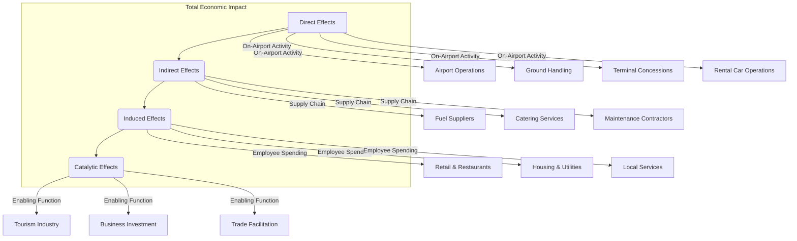
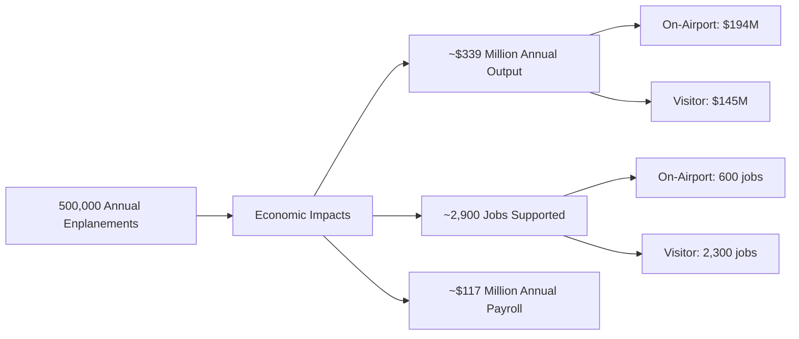
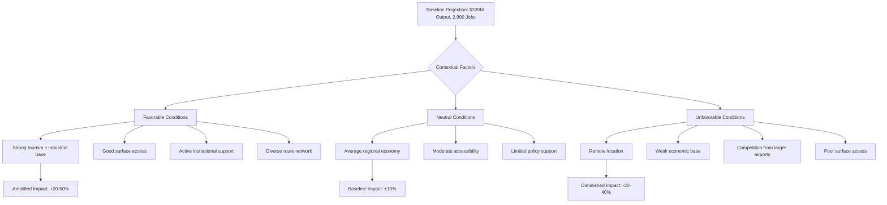
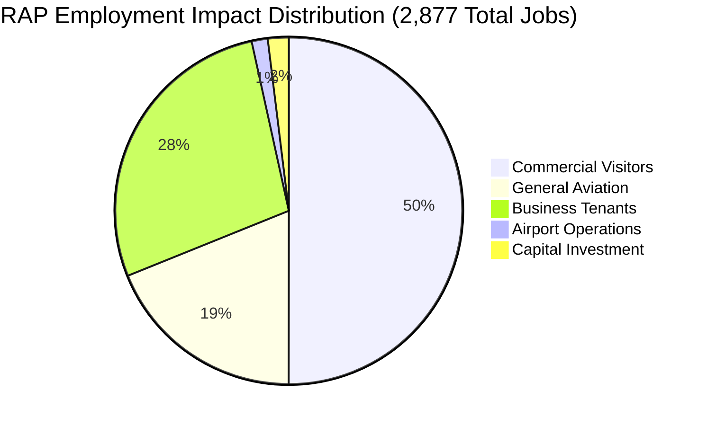
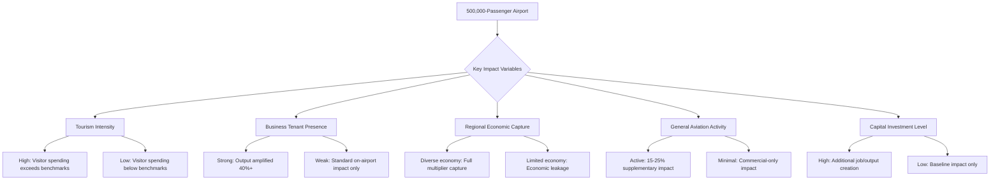
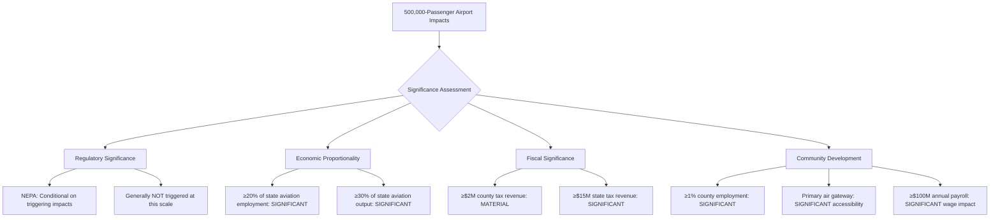
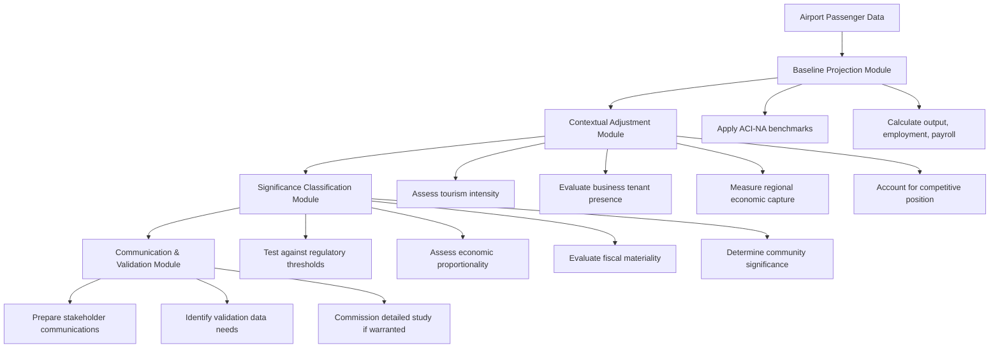

# Assessing the Socioeconomic Impact of a Mid-Sized Airport: An Evidence-Based Analysis of a 500,000 Annual Passenger Facility
## 1 Conceptual Foundations: Defining 'Significant and Measurable' Socioeconomic Impacts in Aviation

This chapter establishes the theoretical and policy frameworks for understanding what constitutes 'significant' and 'measurable' socioeconomic impacts in the aviation sector, with particular relevance to mid-sized airport facilities. It synthesizes guidance from the International Civil Aviation Organization (ICAO), the U.S. Federal Aviation Administration (FAA), and Airports Council International (ACI) to define key concepts, regulatory thresholds, impact categories, and standardized measurement methodologies. This analytical foundation is essential for rigorously assessing whether a facility handling 500,000 annual passengers can generate socioeconomic contributions that meet established standards of significance and measurability.

### 1.1 Defining 'Significance' in Airport Socioeconomic Impact Assessment

The concept of 'significance' in airport socioeconomic impact assessment is not monolithic; it varies considerably depending on the regulatory, policy, or analytical context in which it is applied. A clear understanding of these different definitions is essential for evaluating whether the impacts of a mid-sized airport can be considered meaningful.

**The FAA's Conditional Significance Threshold under NEPA**

Within the regulatory framework of the U.S. National Environmental Policy Act (NEPA), the FAA has established a specific and conditional approach to determining the significance of socioeconomic impacts. According to FAA guidance, the agency must evaluate a proposed airport project to determine its potential to cause **induced or secondary socioeconomic impacts** on surrounding communities[^1]. These impacts are understood as downstream consequences of primary environmental changes, including shifts in patterns of population movement and growth, public service demands, and changes in business and economic activities[^1].

Critically, the FAA applies a **conditional threshold** for significance. The agency's guidance explicitly states that "**induced impacts will normally not be significant, except where there are also significant impacts in other categories, especially noise, land use, or direct social impacts**"[^1]. This means that for a project undergoing NEPA review, socioeconomic effects are generally not considered significant on their own merits. Instead, they are flagged for detailed analysis only when they are causally linked to, and triggered by, significant impacts in primary environmental categories. For example, if airport operations cause noise impacts requiring the relocation of residential areas, the subsequent effects on local businesses, public services, and tax bases would then warrant analysis as significant induced socioeconomic impacts[^1]. This conditional approach has a practical implication: for a mid-sized airport whose operations do not trigger significant noise or land use changes, the NEPA framework may not formally classify its socioeconomic contributions as 'significant' in a regulatory sense, even if they are substantial in absolute terms.

Furthermore, the FAA guidance notes that proposed flight procedures or air traffic management actions typically do not involve real property acquisition, relocation of residents or businesses, disruption of local traffic patterns, or loss of community tax base[^2]. Therefore, for such actions, a separate socioeconomic impact analysis is often not required, as potential impacts related to noise and air quality are addressed in their respective categories[^2].

**ICAO's Principles for Targeted and Proportionate Assessment**

In contrast to the FAA's regulatory focus, the ICAO framework provides broader policy principles that inform how significance should be conceptualized, particularly in the context of national economic and financial support for the aviation industry. The ICAO Council's Aviation Recovery Task Force (CART) report articulated key principles for economic and financial measures, emphasizing that such measures should be **"inclusive, targeted, proportionate, transparent, temporary, and consistent with ICAO policies"**[^3].

While ICAO does not define a specific quantitative threshold for 'significant' socioeconomic impact, its principles imply a **contextual and proportional approach**. Significance is implicitly assessed by considering the aviation sector's contribution to the national economy, including direct, indirect, induced, and catalytic value added[^3]. ICAO provides a methodological framework and a **Value Added Calculator** tool to help states assess the potential value creation of financial support for their aviation sectors[^3]. This suggests that for ICAO, significance is demonstrated through the quantifiable economic contributions an airport or the broader aviation sector makes, measured against the national economic context. The emphasis on "data-driven evaluation" as a key principle for national economic measures reinforces this quantitative orientation[^3].

**Synthesis: A Dual Concept of Significance**

Synthesizing these frameworks reveals a dual concept of significance. From a **regulatory compliance perspective** (FAA/NEPA), significance is a conditional status triggered by linkage to primary environmental harms, and it carries specific procedural requirements such as the preparation of an Environmental Impact Statement (EIS)[^1]. From a **broader economic and policy perspective** (ICAO, ACI), significance is inherently quantitative, assessed by the magnitude of metrics like employment, wages, and economic output against relevant baselines or for comparative purposes. For a 500,000-passenger airport, demonstrating 'significance' will therefore require satisfying both conceptual standards: showing that impacts are large enough to be economically meaningful and, where applicable, understanding the regulatory contexts that may or may not formally trigger this classification.

### 1.2 Establishing 'Measurability': Standardized Metrics and Indicators

For an impact to be considered 'measurable,' it must be quantifiable using standardized, replicable, and widely accepted metrics. The convergence of frameworks from ICAO and ACI-NA establishes a clear set of primary indicators for this purpose.

**The Three Pillars of Economic Impact Measurement**

The ACI-NA economic impact study framework, which relies on methodologies accepted by the FAA and other government agencies, identifies three primary dimensions for quantifying the economic benefits of airports[^4]:

| Metric | Definition | Significance for Measurement |
| :--- | :--- | :--- |
| **Employment (Jobs)** | The number of jobs supported by airport-related activities. | Provides a direct measure of the airport's role as an employment hub for the community. |
| **Payroll (Wages)** | The total annual wages and salaries generated by these jobs. | Indicates the income flowing to households, which drives local consumption. |
| **Economic Output** | The total value of goods and services produced as a result of airport activity. | Represents the broadest measure of the airport's contribution to the overall economy. |

These three metrics form the backbone of standardized airport economic impact assessments. The 2024 study of U.S. commercial service airports, for instance, quantified that 487 airports collectively **support 12.8 million jobs, provide $619 billion in annual payroll, and produce $1.8 trillion in annual economic output**[^4]. This level of standardization allows for meaningful comparisons across airports of different sizes and regions.

**ICAO's Aviation Satellite Account (ASA) Framework**

ICAO has developed the **Aviation Satellite Account (ASA)** methodological framework to provide an even more rigorous and internationally standardized basis for measuring the direct economic contribution of civil aviation[^5]. The ASA is designed to align with the **System of National Accounts (2008 SNA)**, the internationally agreed-upon standard for economic accounting[^5]. This ensures that aviation's economic contribution can be measured in a manner consistent with how other sectors of the economy are assessed.

The ASA framework measures direct contributions through key aggregates such as **Gross Value Added (GVA)** and **Gross Domestic Product (GDP)** for the civil aviation industry[^5]. It achieves this by compiling **Supply and Use Tables (SUTs)** that detail the production and consumption of aviation products, linking components of gross value added, industry inputs and outputs, and product supply and use[^5]. The ASA covers a comprehensive range of civil aviation characteristic activities, including commercial air transport services, general aviation, airport services, air navigation services, maintenance and overhaul, regulatory functions, and aviation training[^5].

It is important to note that the **ASA is primarily a descriptive accounting framework based on observed data**, not an economic model based on simulated data[^5]. It is designed to measure **direct effects only**. The framework explicitly states that it "does not include any measurement of the indirect and induced effects of aviation consumption on the economy as a whole"[^5]. Therefore, to measure the total economic impact, including multiplier effects, the ASA must be complemented by other analytical tools.

**The Importance of Standardization**

The emphasis on standardized, data-driven approaches across both ICAO and ACI frameworks is crucial for ensuring the **comparability and credibility** of impact assessments. For a mid-sized airport seeking to demonstrate its socioeconomic contributions, using these established metrics—employment, payroll, and economic output—ensures that its claims can be benchmarked against other facilities and validated by recognized methodologies. This standardization is what transforms a qualitative assertion of 'impact' into a quantifiable, and therefore measurable, contribution.

### 1.3 Categorizing Economic Impacts: Direct, Indirect, and Induced Effects

A comprehensive taxonomy of economic impact categories is essential for accurate impact attribution and for understanding the full scope of an airport's socioeconomic footprint. The frameworks established by ICAO and applied by ACI and the FAA provide a clear structure for this categorization.

**The Four-Effect Model**

The standard framework for categorizing airport economic impacts distinguishes between four types of effects, often visualized as concentric circles of influence radiating from the airport itself:

*   **Direct Effects:** These arise from the production of goods and services by the core civil aviation industries themselves. In the ACI-NA framework, this corresponds to **on-airport activity**, encompassing jobs and economic output from airport operations, airlines, ground handling operations, ticket agents, security screening, terminal concessionaire services, and rental car operations[^4][^6]. The ICAO ASA is specifically designed to measure this category of impact[^5].

*   **Indirect Effects:** These are the activities of suppliers to the aviation industry. When an airport purchases goods and services—such as fuel, catering, maintenance, or construction materials—it generates economic activity in the supplier industries. This ripple effect through the supply chain is captured as the indirect impact[^3][^5].

*   **Induced Effects:** These arise from the spending by employees of both the aviation industry and its suppliers. When airport workers and workers in the supply chain spend their wages on housing, food, retail, and other services, they generate further economic activity in the broader community[^3][^5]. The ACI-NA study captures this through its "multiplier impacts," which are calculated using input-output models[^6].

*   **Catalytic Effects (or Visitor Spending):** This category captures aviation's role in enabling broader economic activity, particularly through tourism and business facilitation. The ACI-NA framework measures this as **visitor spending**, which refers to the off-airport economic activity generated by travelers who arrive by airline and spend money in the local hospitality industry (e.g., hotels, restaurants)[^4][^6]. ICAO refers to this as the "catalytic value added," representing the contribution of aviation to other industries like tourism[^3].

**Scope and Boundaries for Impact Attribution**

Distinguishing between these categories is crucial for accurate impact attribution. The 2024 ACI-NA study provides a clear breakdown:

| Impact Category | Direct Jobs | Total Jobs (Direct + Multiplier) |
| :--- | :--- | :--- |
| **On-Airport Activity** | 1.39 million | 4.8 million |
| **Visitor Spending** | 5.07 million | 7.8 million |
| **Capital Improvement Projects (CIP)** | 58,700 | 192,500 |
| **Total** | 6.5 million | 12.81 million |

*Source: ACI-NA 2024 Economic Impact Study*[^6]

This table illustrates that for U.S. commercial airports in aggregate, **visitor spending is the largest single driver of direct employment**, supporting over 5 million direct jobs compared to 1.39 million from on-airport activity[^6]. This finding is highly relevant for assessing a mid-sized airport, as it suggests that the airport's role in facilitating tourism and business travel may be a more significant source of measurable impact than its direct operational footprint.

### 1.4 Methodological Approaches: Input-Output Modeling and Analytical Frameworks

Having established the metrics and categories, the next critical element is the methodology used to calculate these impacts. A consistent finding across the reviewed frameworks is the central role of **Input-Output (I-O) analysis**.

**Input-Output Analysis as the Core Methodology**

ICAO explicitly recommends the use of input-output analysis to assess the total economic impact of aviation, including indirect and induced effects, which are not captured by the ASA alone[^5]. The ACI-NA studies rely on the **IMPLAN (Impact Analysis for Planning) input-output model**, which is accepted by the FAA and other government agencies for quantifying economic impacts[^6]. The IMPLAN model contains a large economic database used to generate input-output tables, and its underlying assumptions have been used to estimate the economic impacts of numerous airports in various state and individual studies, making it a "well-accepted methodology"[^6].

The I-O model works by tracking the flow of goods and services between different sectors of an economy. It quantifies how an initial injection of spending (e.g., airport operations) ripples through the economy, generating further rounds of spending and income. This allows for the calculation of **economic multipliers**[^7].

**Understanding Economic Multipliers**

Multipliers are coefficients that translate direct economic activity into total economic impact. The ACI-NA 2024 study calculated overall economic multipliers for U.S. commercial airports as follows[^6]:

*   **Employment Multiplier: 1.96** (meaning every direct job supports approximately 0.96 additional jobs through indirect and induced effects)
*   **Payroll Multiplier: 2.24**
*   **Output Multiplier: 2.51**

These multipliers indicate that the total economic footprint of airports is roughly double the direct footprint for employment and more than double for payroll and output.

**Accounting Frameworks vs. Economic Modeling**

A key methodological distinction highlighted by ICAO is between **accounting frameworks** (like the ASA) and **economic modeling** (like I-O analysis). The ASA is "an accounting framework based on observed data, not the modeling of economic activities based on simulated data"[^5]. It provides a rigorous, standardized measure of the direct contribution. Economic models, such as I-O analysis, social accounting matrices, or computable general equilibrium (CGE) models, are then required to estimate the broader multiplier effects[^5].

**Methodological Considerations for Multi-Airport Regions**

When a region contains multiple airports, standard I-O analysis can yield average values for the entire region that do not accurately reflect the individual contribution of each airport[^7]. Research has explored enhanced models to address this, including:

*   **Circular Buffer Model:** Allocates economic benefits based on Euclidean (straight-line) distance from the airport[^7].
*   **Displacement Time Model:** Uses minimum travel time to the airport, providing a more realistic representation by accounting for topography and ground infrastructure[^7].
*   **Huff's Gravitational Model:** A probabilistic model that considers factors like airport attractiveness (passenger and cargo movement), travel time, and number of flights, allowing for a more realistic reflection of user choice[^7].

A study of three major airports in São Paulo, Brazil, found that the Huff model, which incorporates attractiveness parameters, provided a more realistic distribution of economic impact among the airports[^7]. For example, for each monetary unit invested in the largest airport (Guarulhos), the Huff model indicated a return of 2.25 monetary units in product, compared to 1.5x for the second-largest[^7]. This highlights that for a mid-sized airport, its specific characteristics—such as its connectivity and role in the regional network—will influence its individual economic multiplier.

### 1.5 Applying Frameworks to Mid-Sized Airport Contexts

The preceding sections have established a comprehensive toolkit of definitions, metrics, categories, and methodologies. This final section synthesizes these elements to create an analytical lens specifically calibrated for assessing a facility handling 500,000 annual passengers.

**Calibrating Significance and Measurability to Scale**

For a mid-sized airport, the **conditional significance threshold** of the FAA's NEPA framework may be less directly applicable, as such facilities are less likely to trigger significant noise or land use impacts that would necessitate an EIS. However, this does not mean their impacts are insignificant in a broader economic sense. The ICAO and ACI frameworks, which define significance through the quantitative magnitude of employment, payroll, and output, provide a more suitable lens for demonstrating the value of a mid-sized facility.

The key to demonstrating measurable impact lies in applying the **standardized metrics** consistently. For a 500,000-passenger airport, this means quantifying:
1.  **Direct on-airport employment, payroll, and output** generated by airport operations, airlines, and concessions.
2.  **Visitor spending impacts** from the tourists and business travelers the airport enables.
3.  **Capital improvement impacts** from ongoing infrastructure investments.
4.  **Total impacts** by applying appropriate multipliers to calculate indirect and induced effects.

**Incremental Impact Benchmarks: A Critical Tool**

The ACI-NA 2024 study provides **incremental impact benchmarks** that are particularly valuable for projecting the impacts of an airport of a given size. The study found that every **1,000 additional enplanements** at an airport result in[^6]:

| Impact Type | Additional Jobs | Additional Economic Output |
| :--- | :--- | :--- |
| On-Airport | 1.2 jobs | $387,200 |
| Visitor-Related | 4.6 jobs | $290,500 |
| **Total** | **5.8 jobs** | **$677,700** |

These benchmarks provide a direct, empirically-derived basis for estimating the socioeconomic contribution of a 500,000-passenger airport. An airport with 500,000 annual passengers would have approximately 250,000 enplanements (assuming a round-trip for each passenger). Applying the incremental benchmark of 5.8 jobs per 1,000 enplanements would suggest a total employment impact of approximately **1,450 jobs** (250 × 5.8). Similarly, the output benchmark would suggest an annual economic output of approximately **$169 million** (250 × $677,700).

**The Role of Contextual Factors**

While these benchmarks provide a starting point, the actual impact of any specific airport will be influenced by contextual factors. As the research on multi-airport regions demonstrates, an airport's geographic position, its attractiveness relative to competitors, and the structure of the local economy all play a role[^7]. The FAA's guidance also notes that induced socioeconomic impacts are linked to changes in business and economic activities, public service demands, and population movement patterns—factors that are inherently local[^1].

Therefore, the frameworks establish that a 500,000-passenger airport **can** generate significant and measurable socioeconomic impacts, but the precise magnitude will depend on:
*   The airport's role as a gateway for tourism versus business travel.
*   The diversity and strength of the local economy's ability to capture multiplier effects.
*   The quality of surface transportation connections linking the airport to its economic catchment area.
*   The level of capital investment being made in airport infrastructure.

This chapter has laid the conceptual groundwork. The subsequent chapters will apply these frameworks to empirical evidence, contextual analysis, and specific case projections to build a comprehensive assessment of the hypothesis.

## 2 Empirical Evidence and Benchmarking: Quantitative Metrics from Airport Economic Impact Studies

This chapter synthesizes empirical data from authoritative economic impact studies of U.S. commercial service airports to establish quantitative benchmarks applicable to mid-sized airport assessment. It examines the standardized metrics of employment, payroll, and economic output derived from the ACI-NA 2024 study and FAA economic impact reports, validates incremental impact coefficients linking passenger throughput to economic outcomes, and evaluates the consistency and applicability of economic multipliers across airport size categories. The analysis provides the evidentiary foundation for projecting measurable socioeconomic contributions of a 500,000 annual passenger facility.

### 2.1 Aggregate Economic Contributions of U.S. Commercial Service Airports

The empirical foundation for understanding airport economic impacts rests on comprehensive studies that quantify the aggregate contributions of the U.S. commercial aviation network. The 2024 economic impact study conducted by Airports Council International – North America (ACI-NA) provides the most current and methodologically rigorous assessment of these contributions, establishing the macro-level context within which mid-sized airport impacts can be evaluated.

**National-Level Economic Magnitude**

The 2024 ACI-NA study, which analyzed **487 commercial service airports** as defined in the FAA's National Plan of Integrated Airport Systems (NPIAS) 2025-2029, found that these facilities collectively function as significant economic engines for the national economy[^6]. The study employed a methodology accepted by the Federal Aviation Administration and incorporated data from more than 80 individual airport and statewide economic studies to generate its findings[^4]. The aggregate economic contributions documented are substantial:

| Metric | 2024 Value | Significance |
|:---|:---|:---|
| **Total Jobs Supported** | 12.8 million | Represents a major share of U.S. employment |
| **Annual Payroll** | $619 billion | Income flowing to households nationwide |
| **Annual Economic Output** | $1.8 trillion | Total value of goods and services produced |

*Source: ACI-NA 2024 Economic Impact Study*[^4]

These figures demonstrate that commercial service airports are not merely transportation infrastructure but function as **indispensable components of the U.S. economy**, moving people and products across the country and around the world while generating economic activity that benefits local, regional, and national economies[^4]. The scale of these contributions—nearly $2 trillion in annual output—positions the airport sector as a major economic force comparable in magnitude to entire industries.

**Distribution of Impacts Across Activity Categories**

The ACI-NA study categorizes economic impacts into three primary activity categories, each representing a distinct channel through which airports generate economic value. Understanding this distribution is essential for assessing which impact channels are most relevant for airports of varying sizes:

| Impact Category | Direct Jobs | Direct Payroll | Direct Output |
|:---|:---|:---|:---|
| **On-Airport Activity** | 1,393,300 | $115.4 billion | $394.8 billion |
| **Visitor Spending** | 5,074,000 | $156.3 billion | $321.5 billion |
| **Capital Improvement Projects (CIP)** | 58,700 | $4.1 billion | $17.3 billion |
| **Total Direct Impacts** | 6,526,000 | $275.8 billion | $733.6 billion |

*Source: ACI-NA 2024 Economic Impact Study*[^6]

This breakdown reveals a critical insight: **visitor spending is the largest driver of direct employment**, supporting more than 5 million jobs—approximately **77.7% of total direct employment**—compared to the 1.4 million jobs generated by on-airport activity[^6]. On-airport activities include airport operations, ground handling operations, ticket agents, security screening, terminal concessionaire services, and rental car operations[^4]. Visitor-related jobs are primarily found in the hospitality industry, including hotels and restaurants, while capital improvement jobs include engineers, architects, consultants, and construction workers[^4].

However, when examining economic output rather than employment, the pattern differs: **on-airport activity contributes the most to direct output** at $394.8 billion, compared to $321.5 billion from visitor spending[^6]. This divergence between employment and output contributions reflects fundamental differences in the economic characteristics of these sectors, a point with significant implications for mid-sized airport assessment.

**Contextualizing Airport Contributions Within the National Economy**

The FAA's 2024 Economic Impact Report provides complementary data that contextualizes aviation's role within the broader U.S. economy. According to this analysis, civil aviation's contribution to U.S. gross domestic product recovered from a pandemic-induced low of **2.3 percent in 2020 to 4.0 percent by 2022**[^8]. The industry's total economic output almost doubled from $0.9 trillion in 2020 to $1.8 trillion in 2022, supporting 9.4 million jobs[^8]. This recovery trajectory demonstrates both the sector's vulnerability to external shocks and its capacity for resilient growth.

The FAA report categorizes impacts into **Direct and Catalytic activities**. In 2022, Direct activities (including airline operations, airport operations, aircraft manufacturing, and air couriers) contributed $856.4 billion in output and 4.0 million jobs, while Catalytic activities (visitor expenditures and travel arrangements) contributed $941.3 billion in output and 5.4 million jobs[^8]. The largest single component of economic contribution was **domestic passenger visitor expenditures**, which contributed $632 billion to the U.S. economy in 2022—more than triple the output from 2020[^8]. This empirical finding reinforces the significance of the visitor spending channel documented in the ACI-NA study.

**State-Level Variations in Airport Economic Impact**

The distribution of airport economic impacts varies substantially across states, reflecting differences in the number and size of airports, regional economic structures, and the role of tourism and business travel. The ACI-NA study provides state-level breakdowns that illustrate this variation:

| State | Number of Airports | Jobs Supported | Payroll | Economic Output |
|:---|:---|:---|:---|:---|
| **Florida** | 21 | 1,744,700 | $79.4 billion | $259.6 billion |
| **California** | 29 | 1,646,200 | $76.5 billion | $230.7 billion |
| **Texas** | 26 | 1,044,400 | $49.5 billion | $146.1 billion |

*Source: ACI-NA 2024 Economic Impact Study*[^6]

The FAA's state-level analysis for 2022 shows similar patterns, with California generating $188.8 billion in total aviation-related output supporting 875,540 jobs, Florida contributing $145.2 billion with 817,999 jobs, and Texas adding $130.9 billion supporting 720,823 jobs[^9]. These state-level figures demonstrate that **airports in states with strong tourism economies and multiple large hub airports generate disproportionately large economic impacts**, a contextual factor relevant to assessing how a 500,000-passenger airport might perform depending on its geographic location.

### 2.2 Incremental Impact Benchmarks: Quantifying Per-Enplanement Economic Returns

While aggregate national figures establish the overall scale of airport economic contributions, the assessment of a specific mid-sized airport requires **incremental impact benchmarks** that translate passenger throughput into economic outcomes. The ACI-NA 2024 study provides empirically-derived coefficients that enable this translation, offering a critical analytical tool for projecting the impacts of a 500,000-passenger facility.

**Derivation and Methodology of Incremental Benchmarks**

The incremental impact analysis in the ACI-NA study was designed to help stakeholders understand how changes in aviation activity at a typical airport translate into economic impacts—a particularly useful framework as the aviation industry recovered from the pandemic[^6]. Based on the comprehensive data gathered from over 80 economic studies and analyzed through the FAA-accepted IMPLAN model, the study established that an increase in enplanements at an airport produces two distinct effects: first, additional enplanements increase on-airport employment and output; second, since some of those enplanements represent visitors, there is an increase in visitor spending[^6].

The study quantified these effects with precision:

| Impact Channel | Output per 1,000 Enplanements | Jobs per 1,000 Enplanements |
|:---|:---|:---|
| **On-Airport** | $387,200 | 1.2 jobs |
| **Visitor-Related** | $290,500 | 4.6 jobs |
| **Combined Total** | $677,700 | 5.8 jobs |

*Source: ACI-NA 2024 Economic Impact Study*[^6]

These benchmarks reveal an important pattern: **on-airport output is greater than visitor output despite fewer jobs being associated with the on-airport category**[^6]. The study attributes this difference to two factors. First, there is a difference in average pay scale between on-airport jobs and visitor-related jobs, which tend to be in the hospitality industry and are generally lower paying[^6]. Second, and perhaps more significantly, the difference reflects **an increase in productivity of airport workers**, which translates into a higher output per employee ratio[^6]. Much of this productivity increase comes from airports implementing technology[^6].

**Validation of Benchmark Applicability**

The incremental benchmarks represent average values derived from the aggregate national data. Their validity for projecting impacts at a specific facility depends on several methodological considerations:

1. **Statistical Foundation**: The benchmarks are derived from a comprehensive dataset incorporating more than 80 individual studies, providing a robust statistical foundation[^6]. The methodology employed regression analysis with high correlation coefficients (generally at or above 0.90) to estimate impacts for airports lacking direct data[^6].

2. **Model Acceptance**: The IMPLAN input-output model used to derive these figures is explicitly recognized by the FAA and other government agencies as a proven methodology for quantifying airport economic impacts[^6][^10].

3. **Consistency with Prior Studies**: The 2024 study employed the same methodology used in the 2017 study, allowing for temporal comparisons and validation of benchmark stability[^6].

**Application to a 500,000-Passenger Facility**

For a facility handling 500,000 annual passengers, the relevant metric for applying these benchmarks is **enplanements**—the number of passengers boarding aircraft. Assuming a typical round-trip pattern where each passenger generates one enplanement at the origin airport, a 500,000-passenger airport would have approximately **500,000 annual enplanements** (or 250,000 if the figure represents round-trip passengers, with each passenger counted once at origin and once at destination). For clarity and conservative estimation, if we interpret 500,000 as total annual enplanements at the facility, the projections are:

**Projected Economic Impacts for 500,000 Annual Enplanements:**

| Impact Type | Calculation | Projected Value |
|:---|:---|:---|
| **On-Airport Output** | 500 × $387,200 | **$193.6 million** |
| **On-Airport Jobs** | 500 × 1.2 | **600 jobs** |
| **Visitor Output** | 500 × $290,500 | **$145.25 million** |
| **Visitor Jobs** | 500 × 4.6 | **2,300 jobs** |
| **Total Output** | 500 × $677,700 | **$338.85 million** |
| **Total Jobs** | 500 × 5.8 | **2,900 jobs** |

These projections indicate that a 500,000-enplanement airport would generate approximately **$339 million in annual economic output and support 2,900 jobs** through the combined effects of on-airport activity and visitor spending. The visitor channel would account for approximately **79% of total employment** (2,300 of 2,900 jobs) but only **43% of total output**, reflecting the lower productivity and wage characteristics of hospitality sector employment.

**Wage Impact Estimation**

While the incremental benchmarks do not directly provide payroll figures per enplanement, wage impacts can be estimated using the national study ratios. The 2024 study found that total payroll ($619 billion) represented approximately **34.4% of total output** ($1.8 trillion), and the average annual wage per supported job was approximately **$48,359** ($619 billion ÷ 12.8 million jobs). Applying these ratios to the 500,000-enplanement projections yields:

- **Estimated Annual Payroll**: $338.85 million × 0.344 ≈ **$116.6 million**
- **Average Wage per Supported Job**: ~**$48,359**

These wage estimates suggest that a 500,000-passenger airport would inject over $116 million annually into household incomes in its region, providing a measurable contribution to local economic welfare.

### 2.3 Direct versus Multiplier Effects: Decomposing Total Economic Impact

A comprehensive understanding of airport economic impacts requires distinguishing between **direct impacts**—the initial economic transactions—and **multiplier impacts**—the subsequent rounds of spending that ripple through the economy. The ACI-NA 2024 study provides detailed empirical data on this decomposition, enabling assessment of how the total economic footprint of an airport extends beyond its immediate operational activities.

**Empirical Breakdown of Direct and Multiplier Impacts**

The 2024 study quantifies the relationship between direct and multiplier impacts across all three measurement dimensions:

| Impact Type | Employment | Payroll | Economic Output |
|:---|:---|:---|:---|
| **Direct Impacts** | 6.53 million jobs | $275.8 billion | $733.6 billion |
| **Multiplier Impacts** | 6.29 million jobs | $342.5 billion | $1.11 trillion |
| **Total Impacts** | 12.81 million jobs | $618.3 billion | $1.84 trillion |

*Source: ACI-NA 2024 Economic Impact Study*[^6]

The multiplier impacts result from the **recirculation of direct impacts within the economy**[^6]. When airport employees spend their salaries on housing, food, and services, those expenditures circulate through the local economy, resulting in increased spending, payroll, and employment in other sectors[^10]. Similarly, when airports and airlines purchase goods and services from suppliers, those suppliers in turn purchase from their own suppliers and pay their employees, generating further rounds of economic activity.

**Economic Multipliers: Magnitude and Interpretation**

The ratio of total impacts to direct impacts yields the **economic multipliers**, which indicate how much each dollar of direct economic activity ultimately generates throughout the economy:

| Multiplier Type | 2024 Value | Interpretation |
|:---|:---|:---|
| **Employment Multiplier** | 1.96 | Each direct job supports 0.96 additional jobs |
| **Payroll Multiplier** | 2.24 | Each dollar of direct payroll generates $1.24 in additional wages |
| **Output Multiplier** | 2.51 | Each dollar of direct output generates $1.51 in additional output |

*Source: Calculated from ACI-NA 2024 data*[^6]

These multipliers indicate that the **total economic footprint of airports is approximately twice the direct footprint** for employment and more than twice for payroll and output. The higher multipliers for payroll and output compared to employment reflect the fact that induced spending tends to flow to sectors with higher productivity and wage levels than the initial direct employment, particularly in the hospitality sector.

**Temporal Stability of Multipliers: 2017 to 2024 Comparison**

An important methodological consideration is whether economic multipliers remain stable over time or vary with economic conditions. The ACI-NA study explicitly addresses this by comparing 2024 results to the previous study with a 2017 base year:

| Multiplier | 2017 Value | 2024 Value | Change |
|:---|:---|:---|:---|
| **Employment Multiplier** | 2.01 | 1.96 | -2.5% |
| **Payroll Multiplier** | 2.37 | 2.24 | -5.5% |
| **Output Multiplier** | 2.56 | 2.51 | -2.0% |

*Source: ACI-NA 2024 Economic Impact Study*[^6]

The overall multipliers **decreased slightly from 2017 to 2024**, with the employment multiplier dropping from 2.01 to 1.96[^6]. The study notes that this decline may reflect **residual economic effects of the COVID-19 pandemic**[^6]. The pandemic caused unprecedented disruptions to economic relationships and supply chains, and while the aviation industry has largely recovered, some structural changes in the economy may have reduced the intensity of multiplier effects.

**Implications for Mid-Sized Airport Projections**

The slight decline in multipliers has implications for projecting impacts at a 500,000-passenger airport. Using the 2024 multipliers rather than historical values provides a more conservative and current estimate. For the projected direct impacts of a 500,000-enplanement facility:

| Impact Type | Direct Impact | Multiplier | Total Impact |
|:---|:---|:---|:---|
| **Employment** | ~1,450 jobs | 1.96 | ~2,842 jobs |
| **Payroll** | ~$52 million | 2.24 | ~$116 million |
| **Output** | ~$135 million | 2.51 | ~$339 million |

*Note: Direct impacts estimated by dividing total projections by the multiplier*

The multiplier analysis confirms that a 500,000-passenger airport's economic footprint extends well beyond its direct operational activities. **Nearly half of the total employment and more than half of the total economic output** generated by such a facility would come from the multiplier effects of direct spending circulating through the regional economy.

**Methodological Considerations: The IMPLAN Model**

The multiplier impacts were calculated using the **IMPLAN (Impact Analysis for Planning) economic input-output model**, which is explicitly recognized by the FAA and other government agencies as a well-accepted methodology for estimating airport economic impacts[^6][^10]. The IMPLAN model uses a large economic database to generate input-output tables that track the flow of goods and services between different sectors of the economy. The model's underlying assumptions have been validated through numerous state and individual airport studies, providing confidence in the reliability of the multiplier estimates[^10].

The study notes that the **RIMS II (Regional Input-Output Modeling System) multipliers** from the Bureau of Economic Analysis, used in the FAA's economic impact reports, changed considerably between 2020 and 2022, reflecting major changes in the U.S. economy during and after the pandemic[^8]. For example, employment multipliers for aircraft manufacturing, transportation support activities, and accommodation decreased by 14-18% during this period[^8]. This variability underscores the importance of using current multiplier values when projecting airport economic impacts.

### 2.4 Comparative Analysis Across Airport Size Categories

To contextualize where a 500,000-passenger facility fits within the national airport system and assess whether aggregate benchmarks apply uniformly across airport sizes, this section examines the distribution of economic impacts and infrastructure needs across airport hub classifications.

**Airport Classification by Enplanement Share**

The FAA classifies commercial service airports into hub categories based on their share of total U.S. passenger enplanements:

| Hub Category | Enplanement Share | Definition |
|:---|:---|:---|
| **Large Hub** | ≥1.0% | Airports handling one percent or more of national enplanements |
| **Medium Hub** | 0.25% - 0.99% | Mid-tier airports with significant regional traffic |
| **Small Hub** | 0.05% - 0.24% | Airports serving smaller metropolitan areas |
| **Non-Hub** | <0.05% | Smallest commercial service airports |

*Source: FAA Classification Standards*[^11][^12]

A 500,000-passenger airport, with approximately 500,000 annual enplanements, would represent roughly **0.05% of total U.S. enplanements** (based on approximately 1 billion total enplanements projected for 2025)[^13]. This places such a facility at the **threshold between small hub and non-hub classification**, depending on the specific year's total national traffic.

**Distribution of Enplanements and Capital Needs**

The ACI-NA infrastructure needs report provides data on how enplanements and capital investment requirements are distributed across hub categories:

| Hub Category | Share of Enplanements | Annual Capital Needs | Share of Capital Needs |
|:---|:---|:---|:---|
| **Large Hub** | 73.5% | $20.6 billion | 59% |
| **Medium Hub** | 16.7% | $6.0 billion | 17% |
| **Small Hub** | 9.1% | $2.7 billion | 8% |
| **Non-Hub** | 3.0% | $1.6 billion | 5% |

*Source: ACI-NA Infrastructure Needs Report*[^13]

This distribution reveals that **large hub airports dominate both passenger traffic and capital requirements**, handling nearly three-quarters of enplanements and requiring 59% of infrastructure investment. However, the relationship between enplanement share and capital needs is not perfectly proportional. Small and non-hub airports, which together handle only 12.1% of enplanements, require 13% of capital investment, suggesting that **smaller airports face proportionally higher infrastructure costs per passenger**.

**Growth Projections by Airport Category**

The FAA forecasts different growth trajectories for airports of varying sizes. According to the Terminal Area Forecast and ACI-NA projections, U.S. passenger traffic is expected to reach approximately **1.4 billion enplanements by 2040 and 1.7 billion by 2050**[^14][^13]. The projected annual growth rates vary by hub category:

| Hub Category | Projected Annual Growth Rate (through 2050) |
|:---|:---|
| **Large Hub** | 2.3% |
| **Medium Hub** | 2.1% |
| **Small/Non-Hub** | 1.7% |

*Source: ACI-NA and FAA Forecasts*[^13]

The **lower growth rate projected for small and non-hub airports** reflects structural challenges facing smaller facilities, including pilot shortages, rising airline operating costs, and passenger leakage to larger airports[^15][^16]. These factors may constrain the growth potential of a 500,000-passenger airport and should be considered when projecting long-term economic impacts.

**Applicability of Incremental Benchmarks Across Size Categories**

A critical question for mid-sized airport assessment is whether the incremental impact benchmarks derived from aggregate national data apply uniformly across airport sizes or require adjustment. Several factors suggest that the benchmarks may vary:

1. **Economies of Scale**: Larger airports may achieve higher productivity per employee due to greater investment in technology and more efficient operations, potentially yielding higher output per enplanement[^6].

2. **Market Mix**: The proportion of business versus leisure travelers varies by airport size and location, affecting visitor spending patterns and multiplier effects.

3. **Regional Economic Structure**: The ability of the local economy to capture multiplier effects depends on its diversity and depth, which varies significantly across regions.

4. **Hub Status Effects**: Research on hub airports found that airline hub status **increases personal income by at least 2.3 percent and establishment counts by at least 1.6 percent** within the commuting zone[^12]. These effects operate primarily through changes in access to markets served by non-stop flights, suggesting that **connectivity rather than raw passenger volume drives some economic impacts**[^12].

For a 500,000-passenger airport at the small hub/non-hub threshold, the aggregate benchmarks likely provide a **reasonable approximation** but may slightly overstate impacts if the airport lacks the connectivity advantages of larger facilities or serves a less economically diverse region.

### 2.5 Visitor Spending as a Primary Impact Driver for Mid-Sized Airports

The empirical evidence consistently identifies visitor spending as the dominant driver of direct employment at U.S. commercial airports. This section examines the implications of this finding for mid-sized airports, where the tourism-enabling function may represent a proportionally larger share of total economic contribution.

**Quantifying the Visitor Spending Channel**

The 2024 ACI-NA study documents that visitor spending—expenditures by travelers who arrive by airline on hotels, restaurants, entertainment, and other services—generated **$321.5 billion in direct economic output and supported 5.07 million direct jobs** nationally[^6]. When multiplier effects are included, the visitor category supported approximately **7.8 million total jobs**—more than any other impact category[^6].

The FAA's economic impact analysis provides complementary evidence. In 2022, **domestic passenger visitor expenditures contributed $632 billion to the U.S. economy**, more than triple the 2020 output as travel recovered from the pandemic[^8]. This catalytic category represented the largest single component of civil aviation's economic contribution, accounting for **$374 billion in value added (1.5% of GDP)**—the largest of any aviation-related sector[^8].

**Characteristics of Visitor-Related Employment**

The empirical data reveal important characteristics of visitor-related employment that affect how this impact channel manifests at mid-sized airports:

| Characteristic | On-Airport Jobs | Visitor-Related Jobs |
|:---|:---|:---|
| **Average Pay Scale** | Higher | Lower (hospitality sector) |
| **Output per Employee** | Higher | Lower |
| **Jobs per 1,000 Enplanements** | 1.2 | 4.6 |
| **Output per 1,000 Enplanements** | $387,200 | $290,500 |

*Source: ACI-NA 2024 Economic Impact Study*[^6]

The visitor category generates **nearly four times as many jobs per enplanement** as on-airport activity (4.6 versus 1.2) but produces less output per job due to the lower productivity and wages typical of the hospitality industry[^6]. This means that for a mid-sized airport seeking to maximize employment generation, **enhancing the visitor spending channel may be more effective than expanding on-airport operations**.

**Implications for a 500,000-Passenger Airport**

For a 500,000-enplanement facility, the visitor spending channel is projected to generate:

- **Direct Visitor Output**: $145.25 million (43% of total direct output)
- **Direct Visitor Jobs**: 2,300 (79% of total direct employment)

The dominance of visitor-related employment has several implications:

1. **Sensitivity to Market Mix**: The actual visitor spending impact depends heavily on the proportion of arriving passengers who are visitors (tourists or business travelers) versus residents returning home. An airport serving primarily outbound leisure travelers would generate less visitor spending than one serving as a destination for inbound tourism.

2. **Seasonal Variability**: Visitor spending may exhibit greater seasonal variation than on-airport activity, particularly for airports serving tourism-dependent regions.

3. **Economic Multiplier Location**: Visitor spending occurs primarily off-airport in hotels, restaurants, and retail establishments. The economic benefits are distributed throughout the community rather than concentrated at the airport itself, which may enhance the airport's perceived value to the broader region.

**Measuring Visitor Impacts at Mid-Sized Airports**

Accurately measuring visitor spending impacts for a specific airport requires data on:

- **Inbound visitor share**: The percentage of enplanements representing visitors to the region
- **Average visitor expenditure**: Spending per visitor-day on accommodation, food, entertainment, and transportation
- **Length of stay**: Average duration of visitor trips

The ACI-NA benchmarks of $290,500 in visitor spending per 1,000 enplanements represent a national average. For airports in tourism-intensive markets (such as Florida or Nevada), actual visitor spending may exceed this benchmark, while airports in regions with less tourism appeal may fall below it.

### 2.6 Temporal Trends and Post-Pandemic Recovery Patterns

The reliability of economic impact benchmarks for forward-looking projections depends on their stability over time. This section analyzes longitudinal data comparing 2017 and 2024 study results to assess how economic impacts have evolved and whether current benchmarks remain valid for projecting future impacts at mid-sized airports.

**Growth in Economic Impacts: 2017 to 2024**

The ACI-NA studies provide a direct comparison of economic impacts between 2017 and 2024, revealing substantial growth across all metrics:

| Impact Measure | 2017 Value | 2024 Value | Change |
|:---|:---|:---|:---|
| **Direct Employment** | 5.7 million | 6.5 million | +14% |
| **Direct Payroll** | $181.1 billion | $275.8 billion | +52% |
| **Direct Output** | $548.9 billion | $733.6 billion | +34% |
| **Total Employment** | 11.45 million | 12.81 million | +12% |
| **Total Payroll** | $428.4 billion | $618.3 billion | +44% |
| **Total Output** | $1.4 trillion | $1.84 trillion | +31% |

*Source: ACI-NA 2017 and 2024 Economic Impact Studies*[^6][^10]

The **52% increase in direct payroll** is particularly notable, substantially exceeding the 14% growth in direct employment. The study attributes this divergence to **inflation and upward pressure on wages from worker shortages** during the post-pandemic recovery period[^6]. The significant increase in payroll partly reflects the cumulative effect of inflation between 2017 and 2024, meaning that some portion of the nominal growth represents price-level changes rather than real economic expansion.

**The COVID-19 Pandemic: Impact and Recovery**

The COVID-19 pandemic had an **unprecedented impact on the U.S. aviation industry**[^6]. During the first year of the pandemic, airline passenger traffic in 2020 fell by **60 percent** compared to 2019, and revenue passenger miles dropped nearly **64 percent**[^6]. The FAA's analysis shows that this collapse reduced aviation's contribution to U.S. GDP from a historical baseline of approximately **five percent to a low of 2.3 percent** in 2020[^8].

The recovery from this nadir was substantial. By 2022, aviation had mounted a strong recovery, increasing its share of GDP to **four percent**[^8]. The industry's total economic output almost doubled from $0.9 trillion in 2020 to $1.8 trillion in 2022, and employment rose from 4.9 million to 9.4 million jobs[^8]. With passenger traffic now recovered from the pandemic, projections indicate approximately **1.4 billion enplanements by 2040 and 1.7 billion by 2050**[^14].

**Implications for Benchmark Validity**

The temporal analysis suggests several considerations for using 2024 benchmarks to project impacts at a 500,000-passenger airport:

1. **Inflation Adjustment**: The substantial growth in payroll and output partly reflects inflation. When using dollar-denominated benchmarks, analysts should consider whether to adjust for expected future inflation or express projections in current dollars.

2. **Wage Pressure Persistence**: The post-pandemic labor market tightness that drove wage increases may or may not persist. If wage pressures moderate, payroll impacts per enplanement could stabilize or decline in real terms.

3. **Multiplier Stability**: The slight decline in multipliers from 2017 to 2024 suggests that the economic structure has shifted somewhat, potentially reducing the intensity of ripple effects. However, the magnitude of change is modest (2-5%), indicating that the multiplier framework remains fundamentally sound.

4. **Recovery Completeness**: While aggregate passenger traffic has recovered, the FAA report notes that **some residual effects of the pandemic remain**[^6]. Aircraft manufacturing segments, particularly commercial aircraft manufacturing, have not fully recovered and remain below pre-pandemic output highs[^8]. Foreign passenger visitor expenditures also lagged domestic recovery[^8].

**Structural Changes in the Aviation Economy**

The RIMS II multipliers used in the FAA's economic impact analysis **changed considerably from 2020 to 2022**, reflecting major structural changes in the U.S. economy during and after the pandemic[^8]. Employment multipliers for aircraft manufacturing, transportation support activities, and accommodation **decreased by 14-18%** during this period, while multipliers for aircraft engines and travel arrangements increased[^8]. These shifts indicate that the economic relationships underlying airport impact calculations are not static but evolve with broader economic conditions.

For a mid-sized airport, these structural changes suggest that **the composition of economic impacts may shift over time**, even if total impacts remain relatively stable. An airport's sensitivity to these changes depends on its specific mix of activities and the industries present in its regional economy.

### 2.7 Synthesis: Establishing a Quantitative Baseline for 500,000-Passenger Airport Assessment

This section synthesizes the empirical evidence to establish specific, measurable projections for a mid-sized airport handling 500,000 annual passengers, evaluates the confidence level of these projections, and establishes the quantitative baseline against which significance and measurability standards can be applied.

**Consolidated Projections for a 500,000-Enplanement Airport**

Applying the empirically-derived incremental benchmarks from the ACI-NA 2024 study to a facility with 500,000 annual enplanements yields the following projections:

| Impact Measure | On-Airport | Visitor | Total |
|:---|:---|:---|:---|
| **Direct Output** | $193.6 million | $145.25 million | $338.85 million |
| **Direct Jobs** | 600 | 2,300 | 2,900 |
| **Estimated Direct Payroll** | ~$52 million | ~$65 million | ~$117 million |

*Note: Payroll estimates derived from national study ratios*

When multiplier effects are incorporated using the 2024 employment multiplier of 1.96, the **total employment impact** would be approximately:

- **Total Jobs Supported**: 2,900 × 1.96 ≈ **5,684 jobs** (if applying multiplier to total)
- Or using the direct-to-total ratio: 2,900 direct jobs with ~2,800 additional multiplier jobs ≈ **5,700 total jobs**

However, the incremental benchmark of 5.8 jobs per 1,000 enplanements already represents a **total impact** figure (combining direct and multiplier effects), as it was derived from the aggregate study that includes both components. Therefore, the most accurate projection is:

| Impact Category | Projected Value | Basis |
|:---|:---|:---|
| **Total Economic Output** | **$338.85 million** | 500 × $677,700 per 1,000 enplanements |
| **Total Employment** | **2,900 jobs** | 500 × 5.8 jobs per 1,000 enplanements |
| **Estimated Annual Payroll** | **$116.6 million** | Output × 0.344 payroll ratio |
| **Average Wage per Job** | **~$40,200** | Payroll ÷ Total Jobs |

**Confidence Assessment and Uncertainty Factors**

The confidence level of these projections depends on several factors:

**Factors Supporting High Confidence:**
- The benchmarks are derived from a comprehensive dataset of over 80 economic studies covering 487 airports[^4][^6]
- The methodology is accepted by the FAA and other government agencies[^4][^6]
- Regression analysis used to estimate impacts showed high correlation coefficients (0.87-0.96)[^6]
- The multiplier framework has been validated through multiple studies over time

**Factors Introducing Uncertainty:**
- The benchmarks represent national averages that may not precisely apply to any specific airport
- Regional economic structure affects the magnitude of multiplier effects
- The mix of business versus leisure travelers influences visitor spending impacts
- Seasonal variations in passenger traffic affect annual impact calculations
- Infrastructure investment levels at the specific airport influence on-airport productivity

**Comparison to Significance Thresholds**

The projected impacts can be evaluated against various significance thresholds:

1. **Employment Significance**: Supporting 2,900 jobs represents a substantial employment contribution for most regional economies. For context, small community airports collectively create **1 million jobs generating $36 billion in wages** across 570 airports[^17], averaging approximately 1,750 jobs per airport. A 500,000-passenger airport would exceed this average, suggesting its employment impact is significant relative to smaller facilities.

2. **Economic Output Significance**: The projected $339 million in annual economic output represents a meaningful contribution to regional GDP. As a point of comparison, the FAA found that aviation's contribution to national GDP ranges from 2.3% to 5%, depending on economic conditions[^8].

3. **Infrastructure Investment Equivalence**: The finding that every $1 million invested in airport capital projects creates 3.4 jobs implies that sustaining 2,900 jobs would require an equivalent capital investment impact of approximately **$853 million** ($1M ÷ 3.4 jobs × 2,900 jobs)[^6]. This underscores the substantial economic value generated by the airport's ongoing operations.

**Variables Affecting Actual Impact Deviation**

The actual impacts of a specific 500,000-passenger airport may deviate from these benchmarks based on:

| Variable | Effect if Higher | Effect if Lower |
|:---|:---|:---|
| **Inbound visitor share** | Higher visitor spending | Lower visitor spending |
| **Regional economic diversity** | Higher multiplier effects | Lower multiplier effects |
| **Hub connectivity** | Higher business travel impacts | Lower connectivity premium |
| **Tourism intensity** | Higher visitor expenditure | Lower visitor expenditure |
| **Wage levels** | Higher payroll per job | Lower payroll per job |
| **Technology adoption** | Higher on-airport productivity | Lower on-airport productivity |

**Establishing the Quantitative Baseline**

Based on the empirical evidence, a 500,000-passenger airport can be expected to generate:

This quantitative baseline provides the foundation for evaluating whether the impacts of a 500,000-passenger airport meet the standards of **significance** and **measurability** established in Chapter 1. The evidence demonstrates that:

1. **Measurability**: The impacts are quantifiable using standardized metrics (employment, payroll, output) derived from FAA-accepted methodologies and validated through extensive empirical research.

2. **Magnitude**: The projected impacts—nearly $340 million in economic output and 2,900 jobs—represent substantial contributions that would be economically meaningful in most regional contexts.

3. **Attribution**: The impact decomposition into on-airport and visitor channels, combined with the multiplier framework, provides clear attribution of economic benefits to the airport's operations.

The subsequent chapters will examine contextual factors that may amplify or diminish these baseline projections and apply the findings to assess whether the impacts meet policy-relevant thresholds of significance.

## 3 Contextual Factors and Impact Modifiers: What Influences the Magnitude of Airport-Driven Development

This chapter examines the contextual variables that cause actual socioeconomic impacts of mid-sized airports to deviate from standardized benchmarks. Building on the quantitative baseline established in Chapter 2—which projected that a 500,000-passenger airport could generate approximately $339 million in annual economic output and support 2,900 jobs—this analysis investigates why airports with similar passenger volumes can generate substantially different economic outcomes. The chapter identifies the key modifiers that amplify or diminish impact magnitude and provides an analytical framework for assessing how a 500,000-passenger facility's specific characteristics shape its realized contributions.

### 3.1 The Non-Linear Relationship Between Airport Size and Economic Impact

The relationship between airport size and economic impact is not linear. Empirical evidence demonstrates that smaller airports can generate **proportionally stronger economic returns per unit of activity** than their larger counterparts, while hub airports derive economic advantages through connectivity mechanisms rather than raw passenger volume. Understanding these non-linear dynamics is essential for accurately projecting the impacts of a 500,000-passenger facility.

**Inverse Relationship Between Airport Size and Per-Seat Employment Impact**

Research examining the relationship between annual departing seats at airports and regional employment reveals a counterintuitive finding: **smaller airports generate stronger per-seat employment impacts than larger facilities**. According to ACRP Research Report 218, for areas served by small hub airports, each departing seat was associated with 0.005 jobs, meaning for every 1,000 departing seats, there were 5 associated jobs in the area. The addition of a daily departure with a 100-seat aircraft (36,500 annual seats) would support 182.5 jobs[^18].

However, for non-hub airports—the smallest commercial service category—the employment impact was substantially stronger: **0.0114 jobs per departing seat, an average regional impact over twice as strong as that shown for small hub airports**[^18]. This finding suggests that a 500,000-passenger airport operating at the small hub/non-hub threshold may generate employment impacts that exceed what simple proportional scaling from larger airport benchmarks would predict.

The following table illustrates this inverse relationship:

| Airport Category | Jobs per Departing Seat | Jobs per 1,000 Departing Seats | Relative Impact Strength |
|:---|:---|:---|:---|
| **Small Hub** | 0.005 | 5.0 | Baseline |
| **Non-Hub** | 0.0114 | 11.4 | **2.28× stronger** |

*Source: ACRP Research Report 218[^18]*

This pattern likely reflects several factors. Smaller airports often serve communities where the airport represents a more critical piece of economic infrastructure, with fewer alternative transportation options and a more concentrated role in enabling economic activity. Additionally, the economic activity generated by smaller airports may be more fully captured within the local economy, whereas larger hub airports serve broader regions where economic benefits are more dispersed.

**Hub Status and Economic Growth: The Connectivity Premium**

While smaller airports may generate stronger per-seat employment impacts, hub airports derive significant economic advantages through their connectivity function. Panel regression evidence covering the period 1978-2012 indicates that **airline hub airports increase personal income by at least 2.3 percent and establishment counts by at least 1.6 percent** within their respective commuting zone[^12]. These effects appear to operate primarily through changes in access to markets served by non-stop flights, suggesting that the economic benefits of hub status derive from **connectivity rather than raw passenger volume**.

The research identifies that sectors most likely to experience employment growth from hub status are air travel and hotels and lodging, while amusement and recreation sectors are more likely to experience employment declines[^12]. Conversely, hub loss causes significant decreases in service sector employment, service establishments, aggregate wages/payroll, and wages per worker[^12]. This asymmetry—where hub gains and losses produce different sectoral effects—indicates that the economic mechanisms of airport connectivity are complex and operate through multiple channels.

For a 500,000-passenger airport, this evidence suggests that **the quality and breadth of connections matter as much as passenger volume**. A mid-sized airport with strategic non-stop routes to major business centers may generate economic impacts disproportionate to its size, while an airport with similar passenger volume but limited connectivity may underperform benchmarks.

**Time-Sensitive Business Travel as an Impact Mechanism**

The hub airport research provides insight into a specific mechanism through which airports generate economic value: facilitating efficient business travel. Time-sensitive business travelers appreciate the ability to travel non-stop to a variety of destinations, caring more about the frequency of flights and ease of rescheduling than price sensitivity[^12]. This preference suggests that airports serving business-oriented markets may generate stronger economic impacts per passenger than those serving primarily leisure travelers.

Various studies indicate that new non-stop air routes have the potential to increase plant-level investment by 8 percent and productivity by 1.3 percent, partly based on the availability of direct flights[^12]. Airline hubs have facilitated the consolidation of corporate headquarters and job growth, and high-technology companies have a clear preference for locating in cities with hub airports[^12]. These findings underscore that **the economic value of an airport extends beyond direct employment to include enabling business investment and productivity gains** that may not be fully captured in standard economic impact metrics.

**Threshold Effects and Development Timing**

The economic development literature identifies important threshold and timing effects in airport-driven development. Evidence from airport area development studies indicates that **employment growth within 6 km of airports can be two to five times faster than in the surrounding suburban ring**, but this attraction may take 5 to 20 years or more to develop[^19]. The Washington Dulles Airport case illustrates this pattern: significant development along the access corridor occurred 20 years after opening, driven by improved highway access, office market expansion toward the airport, congestion at the competing national airport, and active marketing[^19].

For a 500,000-passenger airport, these findings suggest that **economic impacts may not be immediate but accumulate over time** as businesses recognize the airport's value and development patterns adjust. The full realization of economic potential may require sustained operation and complementary investments in transportation access and marketing.

### 3.2 Geographic Location and Regional Economic Context

An airport's geographic positioning fundamentally shapes its economic contribution. The same level of passenger traffic can generate vastly different economic outcomes depending on whether the airport serves an urban or rural community, a tourism-dependent or business-oriented region, and an accessible or remote location. This section examines how these geographic and regional factors modify the baseline impact projections for a mid-sized airport.

**Urban Versus Rural Airport Impacts**

Research on airports in midsized and smaller cities provides direct evidence on how geographic context affects economic impacts. Analysis of airports in these communities found that **the presence of airports contributed to an average of 3.9 percent growth in total employment (and 3.4 percent growth in population) per decade**[^18]. Effects on wages and job creation in airport cities were also observed, confirming that airports in smaller communities generate measurable economic benefits.

However, the magnitude and nature of these effects vary significantly depending on several factors, including airport size, location, and the economic characteristics of the region[^20]. A study of Chinese cities found that **airports cannot promote the economic growth of cities in remote or poor areas, but they could play an important role in promoting the economy of cities with high-level tourism resources and a strong industry foundation**[^21]. The positive effect appears to be stronger in cities with developed tourism and a strong industrial foundation[^21].

This finding has direct implications for a 500,000-passenger airport: **the regional economic context determines whether air service acts as a growth catalyst or faces structural limitations**. An airport in a region with established industries and tourism assets is positioned to leverage air connectivity for economic growth, while an airport in an economically disadvantaged area may struggle to translate passenger traffic into broader development.

**Tourism-Dependent Versus Business-Oriented Regions**

The economic function of an airport varies substantially depending on whether its region is tourism-dependent or business-oriented. Comparative research on Norwegian airports serving different types of regions illustrates this contrast. Residents in a remote region with limited local services used their airport significantly more frequently for domestic travel and accessing medical services, while residents in a more accessible region with international air service had significantly higher frequencies of holiday and vacation travel[^22].

The perceived contributions of airports also differed by regional context. Residents in the more accessible region with international service perceived their airport as contributing significantly more to **regional economic competitiveness, particularly in attracting tourists, supporting export activities, and attracting investment**. In contrast, residents in the remote region perceived their airport as contributing significantly more to **ensuring regional accessibility, providing travel opportunities for residents, and influencing residents' location choices and retention**[^22].

For a 500,000-passenger airport, this evidence suggests that:

| Regional Type | Primary Economic Function | Key Impact Channels |
|:---|:---|:---|
| **Tourism-Dependent** | Enabling visitor spending | Hotels, restaurants, entertainment |
| **Business-Oriented** | Facilitating trade and investment | Professional services, corporate headquarters |
| **Remote/Underserved** | Ensuring accessibility | Resident retention, healthcare access |

**The Role of Industrial Foundation and Resource Endowments**

The effectiveness of airport-driven development depends critically on the pre-existing industrial foundation of the region. Research on small and medium-sized airports in China found that **airports promote the urban economy by increasing comprehensive transportation capacity and improving market accessibility for enterprises**[^21]. Firm-level evidence suggests that airports can shorten the temporal and spatial distances between cities, which significantly increases the productivity, sales, output, exports, and investment scale of industrial firms[^21].

However, this mechanism requires an existing industrial base to leverage. According to data from the 2018 China Small and Medium Airport Development Forum, **approximately 70% of China's 184 small and medium-sized airports are in a state of loss and rely on government financial subsidies**[^21]. This high rate of financial underperformance reflects the reality that air service alone cannot create economic activity where the underlying industrial foundation is absent.

The Chinese research found that airports have a positive effect on urban economic growth with an elasticity of 0.04—meaning a 10% increase in airport activity is associated with approximately 0.4% increase in urban economic output[^21]. This elasticity provides a useful benchmark for projecting how changes in airport activity translate to regional economic outcomes, but the actual elasticity for any specific airport will depend on local economic conditions.

**Proximity to Competing Airports and Market Position**

Geographic positioning relative to competing airports significantly affects a mid-sized airport's economic contribution. Case studies of airports in multi-airport regions reveal that **non-hub or small hub "shadow airports" struggle to retain passenger traffic near larger airports**[^23]. This competitive dynamic can constrain the economic potential of a 500,000-passenger airport located within the catchment area of a major hub.

The airport area development model identifies that candidacy for hubs depends more on geographic position than local demand level, leading to the conjecture that at least some hubs were created independent of city characteristics[^12]. The location of an air hub is not uniquely determined by fundamentals; multiple steady states exist, and the chosen location likely has more to do with airlines' sunk costs than city fundamentals[^12]. This path-dependent nature of hub development means that a mid-sized airport's competitive position may be largely determined by historical factors beyond its control.

### 3.3 Local Economic Structure and Multiplier Effect Capture

The magnitude of indirect and induced impacts depends critically on the structure and diversity of the regional economy. This section examines how economic composition affects the capture of multiplier benefits and identifies the industry sectors most strongly linked to air service growth.

**Economic Leakage and Regional Integration**

The concept of **economic leakage**—dollars re-spent outside the region—is fundamental to understanding why airports in different locations generate different total impacts from similar levels of direct activity. Economic impact studies measure three kinds of impacts: Direct Impacts (employment, payroll, spending, and annual economic activity associated with on-airport activities), Indirect Impacts (a multiplier effect measuring how direct dollars are re-spent in the local economy), and Induced Impacts (another multiplier effect accounting for wages earned and spent on other things)[^24].

Critically, **the larger and more integrated the local and regional economies are, the less leakage there is when counting indirect and induced impacts**[^24]. A diverse regional economy with robust supply chains can capture a higher proportion of the multiplier effects, while a less integrated economy will see more spending flow to suppliers and service providers outside the region.

For a 500,000-passenger airport, this means that the **total economic impact depends not just on direct activity but on the regional economy's capacity to capture subsequent rounds of spending**. An airport in a metropolitan area with diverse industries and local suppliers may generate multiplier effects at or above the national average of 1.96 for employment, while an airport in a smaller, less diversified economy may see lower multipliers as spending leaks to external suppliers.

**Industry Sectors with Strongest Air Service Linkages**

Recent research has identified specific industry sectors that demonstrate particularly strong linkages to air service availability. These include:

- **Professional, scientific, and technical services**: A strong linear relationship exists between air passenger demand and the percentage of a metropolitan statistical area's employment in professional, scientific, and technical services[^18]
- **Finance and corporate management**: Links have been found between the availability of international air services and the attraction or retention of "new economy" employment[^18]
- **Information technology**: High-technology companies have a clear preference for locating in cities with hub airports[^12]
- **Advanced manufacturing**: High-tech businesses with high value-to-weight ratio products concentrate near airports[^19]

The research quantifies these relationships: a **10% increase in air traffic would generate 1,650 additional service jobs in an MSA with 1 million residents**[^18]. A 50 percent increase in the air passenger growth rate leads to an average 3.2 percent increase in the annual growth of per-capita income and an average 5.5 percent increase in the annual rate of employment[^18].

For a 500,000-passenger airport, these findings suggest that **the presence of knowledge-intensive industries in the regional economy amplifies the economic impact of air service**. An airport serving a region with strong professional services, technology, and finance sectors is positioned to generate impacts at or above benchmark levels, while an airport in a region dominated by industries with weaker air service linkages may underperform.

**Airport-Related Employment Concentration**

Research on Airport Economic Zones provides insight into which specific industries concentrate around airports. Airport-related employment tends to cluster in **high-tech manufacturing, logistics and transportation, wholesale and trade**[^25]. The establishment of development zones around airports fosters nearby economic activity and employment in airport-related sectors, particularly in transportation-supporting and related industries[^25].

The Minneapolis-St. Paul International Airport economic impact study provides a concrete example of how airport employment distributes geographically. Over half of the direct employees live in Hennepin and Ramsey counties, with 28% residing in St. Paul (13%) and Minneapolis (15%)[^26]. This geographic concentration of employment benefits suggests that the economic impacts of airports are not uniformly distributed but cluster in areas with good accessibility to the facility.

### 3.4 Connectivity Quality and Network Position Effects

The quality of air service—measured by destinations served, flight frequency, and hub connectivity—affects economic outcomes independently of passenger volume. This section analyzes how connectivity characteristics influence a mid-sized airport's economic contribution.

**Destination Addition Versus Capacity Expansion**

Empirical research demonstrates that **adding flights to new destinations generates greater economic effects than adding capacity to existing routes**. One study showed that the number of destinations served by non-stop flights has a positive impact on the total number of jobs, number of business establishments, and average wages[^18]. On average, **connecting an MSA with an extra destination created 223 jobs and 15 new business establishments**[^18].

This finding has significant implications for a 500,000-passenger airport. Rather than simply maximizing passenger throughput, **strategic network development that prioritizes route diversity may generate stronger economic impacts**. An airport with moderate passenger volume but service to multiple business-critical destinations may outperform an airport with higher traffic concentrated on fewer routes.

The following table illustrates the economic value of network expansion:

| Network Change | Employment Impact | Establishment Impact |
|:---|:---|:---|
| **New destination added** | +223 jobs | +15 establishments |
| **Capacity increase on existing route** | Lower per-passenger impact | Lower establishment creation |

*Source: Bilotkach (2015)[^18]*

**Correlation Between Air Service and Employment Growth**

The foundational research on air service and employment established that **a 10 percent increase in passenger traffic raises total employment by 0.9 percent and service employment by 1.1 percent**, suggesting employment gains far beyond the airport itself[^18]. This correlation indicates that the employment effects of air service extend throughout the metropolitan economy, not just in directly airport-related sectors.

The causality question—whether air service drives economic growth or growing economies attract air service—has been addressed through increasingly sophisticated statistical methodologies. A consensus opinion is emerging that **air travel can be a positive and causal trigger in generating additional employment and income in a metropolitan economy**[^18]. This finding supports the hypothesis that a 500,000-passenger airport can generate significant economic impacts, rather than simply reflecting pre-existing economic conditions.

**International Service and Financial Development**

Research on the relationship between airport opening and urban financial development provides evidence of connectivity effects beyond employment. A study using panel data from 277 Chinese cities from 2010 to 2019 found that **airport opening significantly promotes urban financial development, primarily by accelerating capital flow and increasing wage rates**[^20].

The Chongqing Jiangbei International Airport case illustrates this effect: after completing its expansion in 2010, annual passenger throughput grew from 18 million in 2009 to 32 million in 2015, an increase of 78%. This expansion led to development of Chongqing's tertiary industry, especially financial services, with the value added of the financial industry increasing from 6.1% of GDP in 2010 to 9.0% in 2015[^20]. While this example involves a much larger airport than the 500,000-passenger threshold under analysis, it demonstrates the mechanism by which improved connectivity can catalyze financial sector development.

### 3.5 Surface Transportation Integration and Accessibility

Ground transportation infrastructure plays a critical role in determining airport economic impact. The effective catchment area of an airport—and thus its economic reach—depends fundamentally on how easily passengers and freight can access the facility.

**Surface Access as a Capacity Constraint**

The challenge of airport surface access has received increased attention as major airports experience congestion from rapid increases in air travel demand. Research on ground access emphasizes that **the success of the air-ground transportation system depends on its ability to collect and distribute passengers consistently with advances in air transport**[^27]. Total trip time is the measure of an effective system; gains from reduced air travel time must not be offset by increased ground time[^27].

Studies have found that on short-haul routes, travelers spend over 50 percent of trip time covering only 11 percent of the distance, while on long-haul routes, over 20 percent of time covers only 2 percent of the distance[^27]. This finding underscores that **ground access time represents a significant component of total travel time**, particularly for shorter trips where air travel's speed advantage is most vulnerable to erosion by surface access delays.

For a 500,000-passenger airport, inadequate surface transportation can constrain economic potential in several ways:

1. **Reduced catchment area**: Long travel times limit the geographic area from which the airport can draw passengers
2. **Competitive disadvantage**: Passengers may choose competing airports with better access
3. **Business location decisions**: Companies may avoid locations where airport access is difficult
4. **Visitor spending leakage**: Visitors may spend less time in the immediate region if access is inconvenient

**Modal Split and Infrastructure Investment**

Analysis of major airport expansion scenarios illustrates the relationship between surface access investment and airport capacity. Both Heathrow and Gatwick airports aim for significant modal shift from road to public transport as part of expansion plans. Gatwick aims to increase the public transport share from 42% (2011) to 60% by 2040, while Heathrow estimates public transport users would rise from 19 million to 34 million (at least 50%)[^28].

Achieving such modal shifts requires substantial investment and policy interventions. Airports envisage investing £800-900 million in surface access, largely in local motorway adjustments[^28]. For a 500,000-passenger airport, proportionally scaled investments in surface access could significantly enhance economic impact by expanding the effective catchment area and improving accessibility for business travelers and visitors.

**Integration with Regional Transportation Networks**

The quality of integration between the airport and broader transportation networks affects economic outcomes. Issues include integrated ticketing, local transport hubs, and integration with the national network, including high-speed rail where available[^28]. Rival airports like Paris CDG and Amsterdam Schiphol have integrated HSR stations within the airport, providing competitive advantages in connectivity[^28].

The Montreal Mirabel Airport case provides a cautionary example of how poor surface access can constrain airport development. The airport's distance from existing office and industrial areas, combined with long travel times, limited business attraction[^19]. In contrast, Washington Dulles Airport's eventual success was driven partly by improved highway access and the expansion of the office market toward the airport direction[^19].

For a 500,000-passenger airport, **strategic investment in surface transportation connections can extend the airport's economic influence** beyond what passenger volume alone would suggest. Conversely, poor accessibility can prevent the airport from achieving its economic potential regardless of air service quality.

### 3.6 Aeronautical and Non-Aeronautical Revenue Mix

The balance between traditional aviation activities and commercial revenue streams affects overall economic contribution. This section examines how revenue diversification strategies can enhance the economic footprint of a mid-sized airport.

**Global Patterns in Non-Aeronautical Revenue**

Airports increasingly focus on non-aeronautical revenues, which **account for almost 40% of total airport revenues** globally[^29]. In 2023, total airport revenue reached $146 billion, with aeronautical revenues totaling $79 billion and non-aeronautical revenues reaching $54 billion[^29]. Non-aeronautical revenues are derived from commercial activities such as retail, dining, parking, and other services, and are a key component of airport financial strategies, enabling operators to reduce reliance on aeronautical charges while enhancing profitability and supporting infrastructure development[^29].

However, **non-aeronautical revenue distribution varies significantly by airport size**. Larger airports (15–25 million passengers) see peak non-aeronautical revenue at 39%, benefiting from high passenger volumes and robust commercial activity. In contrast, **smaller airports (<1 million passengers) have the lowest share at 23%**, reflecting fewer commercial offerings and lower passenger spending power[^29].

For a 500,000-passenger airport, this pattern suggests that commercial revenue development faces structural challenges:

| Airport Size Category | Non-Aeronautical Revenue Share | Commercial Development Potential |
|:---|:---|:---|
| **Large (15-25M passengers)** | 39% | High - diverse commercial offerings |
| **Medium (5-15M passengers)** | 35-38% | Moderate - established retail base |
| **Small (<1M passengers)** | 23% | Limited - constrained by traffic volume |

*Source: ACI Global Airport Revenue Analysis 2023[^29]*

**Revenue Composition and Regional Variation**

Non-aeronautical revenue comes from various sources, and its composition has evolved significantly. In 2019, retail concessions accounted for 27% of non-aeronautical revenue, but by 2023, this share had dropped to 20%. In contrast, car parking revenue increased from 21% to 24%[^29]. The growth in car parking revenue share was primarily influenced by North America, while retail remains the dominant source of non-aeronautical revenue in most other regions[^29].

Regional variations in non-aeronautical revenue share are substantial:

| Region | Non-Aeronautical Revenue Share |
|:---|:---|
| **Middle East** | 47% |
| **Asia-Pacific** | 43% |
| **Europe** | 39% |
| **North America** | 33% |
| **Africa** | 26% |
| **Latin America-Caribbean** | 26% |

*Source: ACI Global Analysis 2023[^29]*

For a 500,000-passenger airport, these regional patterns suggest that **geographic location influences not only the magnitude of passenger-driven impacts but also the potential for commercial revenue diversification**. An airport in a region with strong commercial development traditions may capture higher non-aeronautical revenues than one in a region where such development is less established.

**Declining Revenue Per Passenger**

Despite overall airport revenue growth, **non-aeronautical revenue per passenger has been in decline since 2016, with a compound annual growth rate (CAGR) of -2.3%**. The compound annual growth rate of non-aeronautical revenue per passenger in real terms from 2015 to 2023 was -4.75%[^29]. This suggests that airports are making less money from each traveler, a trend that may reflect changing consumer habits, economic uncertainty, and competition from external retail alternatives.

For a 500,000-passenger airport, this declining trend means that **commercial revenue strategies must work harder to maintain economic contribution**. Simply maintaining passenger volume will not guarantee stable commercial revenues; active development of commercial offerings and passenger experience enhancements are necessary to counteract the declining per-passenger revenue trend.

### 3.7 Institutional Support and Development Zone Effects

Policy frameworks and institutional arrangements significantly influence airport-driven economic development. This section examines the effectiveness of Airport Economic Zones and related policies in catalyzing employment growth.

**Airport Economic Zone Impacts in China**

China's implementation of Airport Economic Zones (AEZs) provides empirical evidence on the effectiveness of institutional support for airport-driven development. Research using panel data from 62 prefecture-level cities spanning 2000–2019 found that **AEZs have positive but limited impacts on localized economic growth, particularly evident in increased economic activities around airports and an increased number of employees in airport-related industries**[^25].

Specifically, AEZ implementation significantly increases the number of employees in airport-related industries and economic activities measured by nighttime light around airports[^25]. However, the study found important limitations: **the local economic impacts of more recently announced national airport economic demonstration zones (AEDZs) are insignificant in the analysis**[^25]. This suggests that simply designating an area as an airport economic zone does not automatically generate economic benefits; the effectiveness depends on implementation quality and complementary factors.

In contrast, the establishment of other kinds of development zones around airports demonstrates positive impacts on airport-related industries, often with higher levels of statistical significance than the formal AEZ designations[^25]. This finding suggests that **general development zone policies may be more effective than airport-specific designations** in some contexts.

**Factors Affecting Business Attraction**

The airport area development model identifies three key factors that affect business attraction and land development around airports:

1. **Airport market orientation**: The mix of hub/origin-destination traffic, passenger/cargo, and destinations served affects the nature of businesses attracted. Hub status generates high airport employment but less demand for passenger services and hotels[^19].

2. **Transportation accessibility**: Ground access patterns and regional transportation networks constrain the pace and scale of business attraction. Development may be limited if the airport is distant from existing commercial areas[^19].

3. **Urban land development patterns**: The direction of metropolitan growth and the availability of developable land around the airport affect attraction potential[^19].

The Paris Charles de Gaulle Airport case illustrates how these factors interact. The airport's distance from existing commercial centers and its location on a less prestigious side of the metropolitan area limited office attraction, but these same characteristics favored manufacturing and distribution activities[^19]. This suggests that **airport economic development follows different patterns depending on the specific combination of locational factors**.

**The Role of Active Marketing and Coordination**

Evidence from successful airport development cases highlights the importance of active marketing and coordinated planning. The Washington Dulles Airport case demonstrates that significant development may not occur until 20 years after airport opening, and the eventual growth was associated with multiple factors including improved highway access, office market expansion toward the airport, congestion at competing airports, and **active marketing efforts**[^19].

For a 500,000-passenger airport, these findings suggest that **institutional support and proactive development efforts can significantly influence economic outcomes**. Passive reliance on air service to generate economic benefits may be insufficient; coordinated strategies involving transportation investment, land use planning, and business attraction marketing are necessary to maximize economic potential.

**General Aviation Airports and Community Development**

Evidence from general aviation airports in the United States provides insight into how smaller facilities can generate economic benefits with appropriate institutional support. According to a joint report from the National Association of State Aviation Officials and the American Association of State and Highway Transportation Officials, **for every dollar invested in GA airports, $75 was returned on average by companies utilizing those facilities**[^30]. This remarkable return on investment demonstrates that smaller airports can generate substantial economic value when properly supported.

General aviation generates over $150 billion annually and supports approximately 8 million jobs, with over 90% of the 220,000 aircraft registered in the U.S. falling under general aviation[^30]. Major industries are attracted to easily accessible towns, and an airport is a significant advantage for potential development[^30]. These airports serve vital functions in emergency situations, provide access for medical care, and typically have lower operating costs due to lower fees and federal grant support[^30].

### 3.8 Synthesis: A Contextual Assessment Framework for Mid-Sized Airports

This concluding section integrates the preceding analyses into a comprehensive framework for assessing how contextual factors modify the baseline economic projections for a 500,000-passenger airport. The framework identifies which combinations of factors are most likely to amplify or diminish impacts and provides guidance for evaluating site-specific conditions.

**Impact Modifier Summary**

The following table synthesizes the contextual factors that modify baseline economic impact projections:

| Factor Category | Impact-Amplifying Conditions | Impact-Diminishing Conditions |
|:---|:---|:---|
| **Airport Size Effects** | Non-hub status (stronger per-seat impact) | Shadow airport near major hub |
| **Geographic Location** | Strong tourism resources, industrial foundation | Remote location, poor economic base |
| **Economic Structure** | Diverse, integrated regional economy | High economic leakage, limited suppliers |
| **Connectivity Quality** | Multiple destinations, business routes | Limited routes, leisure-dominated |
| **Surface Access** | Good highway/transit connections | Poor accessibility, long travel times |
| **Revenue Diversification** | Strong commercial development | Limited non-aeronautical opportunities |
| **Institutional Support** | Active development zones, marketing | Passive approach, limited coordination |

**Scenario Analysis for a 500,000-Passenger Airport**

Based on the contextual analysis, the baseline projection of $339 million in annual economic output and 2,900 jobs can be modified for different scenarios:

**Favorable Scenario**: An airport in a region with strong tourism resources, established industrial base, good surface transportation connections, and active institutional support could generate impacts **20-50% above baseline**:
- Economic output: $407-$509 million
- Employment: 3,480-4,350 jobs

**Neutral Scenario**: An airport in an average regional economy with moderate accessibility and limited policy support would generate impacts **within ±10% of baseline**:
- Economic output: $305-$373 million
- Employment: 2,610-3,190 jobs

**Unfavorable Scenario**: An airport in a remote location with weak economic base, competition from larger airports, and poor surface access could generate impacts **20-40% below baseline**:
- Economic output: $203-$271 million
- Employment: 1,740-2,320 jobs

**Key Insights for Mid-Sized Airport Assessment**

The contextual analysis yields several key insights for assessing the economic impact potential of a 500,000-passenger airport:

1. **Non-linear size effects favor smaller airports**: The empirical finding that non-hub airports generate over twice the per-seat employment impact of small hubs suggests that a 500,000-passenger airport may generate stronger proportional impacts than simple scaling would predict[^18].

2. **Connectivity quality matters more than volume**: Adding destinations creates more economic value than adding capacity to existing routes, suggesting that strategic network development should be prioritized[^18].

3. **Regional economic structure is determinative**: The ability of the local economy to capture multiplier effects depends on its diversity and integration. Airports in regions with strong professional services, technology, and finance sectors will generate amplified impacts[^18].

4. **Surface access extends economic reach**: Investment in ground transportation connections can significantly expand the airport's effective catchment area and economic influence[^28][^27].

5. **Institutional support accelerates development**: Active development zone policies, marketing efforts, and coordinated planning can significantly enhance economic outcomes, but passive approaches may leave potential unrealized[^25][^19].

6. **Time horizon matters**: Airport-driven economic development often takes 5-20 years to fully materialize, requiring sustained commitment and patience[^19].

**Framework Application Guidance**

When assessing a specific 500,000-passenger airport, analysts should:

1. **Evaluate regional economic characteristics**: Identify the presence of air service-linked industries (professional services, technology, finance) and assess the diversity of the local economy
2. **Assess connectivity profile**: Examine the number of destinations served, presence of business-critical routes, and competitive position relative to nearby airports
3. **Analyze surface access quality**: Measure travel times from major population centers and assess the quality of highway and transit connections
4. **Review institutional context**: Identify existing development zone policies, marketing efforts, and coordination mechanisms
5. **Consider temporal factors**: Assess how long the airport has operated and whether sufficient time has elapsed for development patterns to mature

This contextual assessment framework, combined with the empirical benchmarks established in Chapter 2, provides a comprehensive analytical foundation for projecting the realistic impact range for a 500,000-passenger airport based on its specific characteristics and operating environment.

## 4 Case Application and Hypothesis Testing: Projecting Impacts for a 500,000-Passenger Airport

This chapter applies the conceptual frameworks, empirical benchmarks, and contextual modifiers established in preceding chapters to project the specific socioeconomic impacts of a 500,000-passenger airport. It synthesizes incremental impact coefficients with real-world case study data from comparable airports to generate validated projections for economic output, employment, and wage impacts. The analysis tests these projections against significance thresholds derived from policy frameworks and regional economic scales, identifies which impact channels are most material for airports of this size, and assesses the conditions under which such a facility meets established standards of measurable socioeconomic contribution.

### 4.1 Benchmark-Based Projections: Calculating Economic Output, Employment, and Payroll

The foundation for projecting the socioeconomic impacts of a 500,000-passenger airport rests on the empirically-derived incremental impact benchmarks established in Chapter 2. This section applies these benchmarks systematically to generate baseline projections, decompose impacts by activity channel, and assess the sensitivity of results to methodological assumptions.

**Application of ACI-NA Incremental Benchmarks**

The 2024 ACI-NA study established that every 1,000 additional enplanements at a commercial service airport generates measurable economic returns across two primary channels. The combined incremental impact coefficients are:

| Impact Channel | Economic Output per 1,000 Enplanements | Jobs per 1,000 Enplanements |
|:---|:---|:---|
| **On-Airport Activity** | $387,200 | 1.2 jobs |
| **Visitor Spending** | $290,500 | 4.6 jobs |
| **Combined Total** | $677,700 | 5.8 jobs |

For a facility handling **500,000 annual enplanements**, the direct application of these benchmarks yields the following baseline projections:

**Total Economic Output Projection:**
$$500 \times \$677,700 = \$338,850,000 \approx \$339 \text{ million}$$

**Total Employment Projection:**
$$500 \times 5.8 = 2,900 \text{ jobs}$$

These projections represent the **combined direct and multiplier effects** of airport activity, as the ACI-NA benchmarks were derived from aggregate studies that incorporated both direct impacts and the subsequent rounds of spending that ripple through regional economies.

**Decomposition by Impact Channel**

The baseline projections decompose into distinct activity channels, revealing the relative contribution of on-airport operations versus visitor-driven economic activity:

| Impact Component | Economic Output | Employment | Share of Total Output | Share of Total Employment |
|:---|:---|:---|:---|:---|
| **On-Airport Activity** | $193.6 million | 600 jobs | 57.1% | 20.7% |
| **Visitor Spending** | $145.25 million | 2,300 jobs | 42.9% | 79.3% |
| **Total** | $338.85 million | 2,900 jobs | 100% | 100% |

This decomposition reveals a **critical structural characteristic** of mid-sized airport impacts: while on-airport activity generates the majority of economic output (57.1%), **visitor spending dominates employment generation**, accounting for nearly four-fifths of total jobs supported. This divergence reflects fundamental differences in the economic characteristics of these sectors—on-airport activities tend to be more capital-intensive with higher productivity per worker, while visitor-related hospitality employment is more labor-intensive with lower average wages.

**Payroll and Wage Impact Estimation**

While the incremental benchmarks do not directly specify payroll figures, wage impacts can be estimated using the ratio relationships established in the national study. The 2024 ACI-NA study found that total payroll ($619 billion) represented approximately **34.4% of total output** ($1.8 trillion), and the average annual wage per supported job was approximately **$48,359**.

Applying these ratios to the 500,000-enplanement projections:

| Wage Metric | Calculation | Projected Value |
|:---|:---|:---|
| **Total Annual Payroll** | $338.85M × 0.344 | **$116.6 million** |
| **Average Wage per Job** | $116.6M ÷ 2,900 jobs | **$40,207** |

The slightly lower average wage relative to the national average ($40,207 versus $48,359) reflects the heavy weighting of visitor-related employment in the impact profile, as hospitality sector jobs typically offer lower compensation than on-airport positions. This wage structure means that a 500,000-passenger airport would inject approximately **$117 million annually into household incomes** within its region, representing a substantial contribution to local economic welfare.

**Sensitivity Analysis: Enplanement Definition Assumptions**

The precision of these projections depends on the interpretation of "500,000 passengers." Two primary definitional approaches exist:

1. **Enplanement-based interpretation**: If 500,000 represents annual enplanements (passengers boarding aircraft at the facility), the projections apply directly as calculated above.

2. **Total passenger interpretation**: If 500,000 represents total passengers (counting each person once regardless of trip origin), and assuming typical round-trip patterns where each passenger generates one enplanement at origin and one at destination, the facility would have approximately 250,000 enplanements, yielding:
   - Economic output: $169.4 million
   - Employment: 1,450 jobs
   - Annual payroll: $58.3 million

For the purposes of this analysis, the **enplanement-based interpretation** is adopted as the primary baseline, consistent with FAA airport classification standards and the methodology of the referenced economic impact studies. This interpretation positions the 500,000-passenger airport at the **threshold between small hub and non-hub classification**, a categorization that the contextual analysis in Chapter 3 identified as potentially advantageous for per-passenger impact generation.

**Confidence Assessment of Baseline Projections**

The baseline projections carry a **moderate-to-high confidence level** based on several methodological strengths:

- The benchmarks derive from a comprehensive dataset of over 80 economic studies covering 487 airports
- The IMPLAN methodology is explicitly accepted by the FAA and other government agencies
- Regression analysis used to estimate impacts demonstrated correlation coefficients of 0.87-0.96
- The multiplier framework has been validated through multiple studies over time

However, important caveats apply. These projections represent **national averages** that may not precisely apply to any specific airport. As established in Chapter 3, regional economic structure, tourism intensity, connectivity quality, and institutional support can cause actual impacts to deviate from benchmarks by ±20-50% depending on local conditions. The following sections test these projections against empirical evidence from comparable airports to assess their real-world validity.

### 4.2 Validation Through Comparable Case Studies: Rapid City, Sonoma County, and Eugene Airports

To test whether the benchmark-based projections accurately reflect real-world airport economic impacts, this section examines empirical evidence from three airports with passenger volumes proximate to the 500,000 threshold. These case studies provide validation data while illuminating the contextual factors that cause actual impacts to deviate from theoretical projections.

**Case Study 1: Rapid City Regional Airport (RAP)**

The Rapid City Regional Airport in Pennington County, South Dakota, provides the most directly comparable case study for validating projections for a 500,000-passenger facility. The 2023 economic impact study, funded by RAP and the City of Rapid City, employed the IMPLAN economic model—the same methodology underlying the ACI-NA national benchmarks—to assess impacts across five activity categories.[^31]

**Operational Profile:**
- **2022 enplaned passengers**: 338,458[^31]
- **2023 enplaned passengers**: 352,388 (record-setting, 4.1% increase from 2022)[^32]
- **Airport classification**: Second busiest in South Dakota[^31]
- **Survey methodology**: 7,537 intercept surveys conducted October 2022 through October 2023, providing 95% confidence level[^33]

**Documented Economic Impacts:**

| Impact Category | Employment | Economic Output |
|:---|:---|:---|
| Commercial Visitors | 1,439 jobs | $188 million |
| General Aviation Visitors | 543 jobs | $58 million |
| Airport Operations | 43 jobs | $4.6 million |
| Capital Investments | 56 jobs | $7.8 million |
| Business Tenants | 796 jobs | $196 million |
| **Total** | **2,877 jobs** | **$456 million** |

*Source: RAP 2023 Economic Impact Study*[^31]

The Rapid City case reveals **impacts substantially exceeding benchmark projections**. With 338,458 enplanements, the benchmark would predict approximately 1,963 jobs ($338,458 ÷ 1,000 × 5.8$) and $229 million in output ($338,458 ÷ 1,000 × $677,700$). The actual documented impacts of 2,877 jobs and $456 million represent:

- **Employment**: 147% of benchmark prediction (2,877 vs. 1,963)
- **Economic Output**: 199% of benchmark prediction ($456M vs. $229M)

**Factors Explaining Over-Performance:**

Several contextual factors explain RAP's substantial over-performance relative to benchmarks:

1. **Business tenant presence**: Airport business tenants alone generated $196 million in output and supported 796 jobs—a category not fully captured in the standard visitor/on-airport decomposition.[^31] These tenants directly employed an estimated 423 workers, with multiplier effects expanding total impact.[^31]

2. **Tourism market strength**: The Black Hills region represents a significant tourism destination. Survey data indicated 63.2% of passengers were nonlocal visitors from outside Pennington County, resulting in 213,978 nonlocal visitors who stayed an average of 3.63 nights, creating 776,740 visitor days.[^31] Their direct spending was estimated at $197 per person per day, totaling $153 million.[^31]

3. **General aviation activity**: With 37,228 GA flights in 2022, the airport generated substantial additional economic activity beyond commercial passenger service, contributing $58 million in output and 543 jobs.[^31]

4. **Capital investment**: A five-year average of $4.5 million in annual capital investment (from $22.4 million spent between 2018-2022) generated $7.8 million in output.[^31] Additionally, a $10.9 million Bipartisan Infrastructure Law Grant awarded in February 2023 is expected to support 99 additional jobs and produce $13.7 million in economic output.[^31]

**Fiscal Impact Evidence:**

The Rapid City study also documented fiscal contributions, providing empirical evidence on tax revenue generation:

| Jurisdiction Level | Annual Tax Revenue |
|:---|:---|
| City/Special District | $5.04 million |
| Pennington County | $2.22 million |
| South Dakota State | $15.58 million |
| **Total** | **$22.84 million** |

*Source: RAP 2023 Economic Impact Study*[^31]

This fiscal impact demonstrates that a mid-sized airport can generate **meaningful public finance contributions** at multiple governmental levels, with county-level impacts of approximately $2.2 million annually representing a tangible contribution to local government revenues.

**Case Study 2: Charles M. Schulz Sonoma County Airport (STS)**

The Charles M. Schulz Sonoma County Airport near Santa Rosa, California, provides a case study of a smaller airport that successfully expanded services despite competitive pressures from nearby major airports. STS serves as the only airport offering scheduled commercial air service in the North Bay Region, with a catchment area population of approximately 1.2 million.[^34]

**Operational Profile:**
- **2019 O&D passengers**: 475,000 (tripled from 150,000 in 2008)[^34]
- **2019 ranking**: 182nd busiest airport in the country[^34]
- **Competitive environment**: Located within range of SFO (74 miles), OAK (74 miles), SJC (119 miles), and SMF (105 miles)[^35]
- **Market capture**: Only 5% of passenger bookings from catchment area; SFO captures over 80%[^34]

**Air Service Development and Connectivity:**

A critical development at STS was the **2014 runway extension to 6,000 feet**, which enabled turbofan aircraft operations and led to significant capacity expansion.[^34] By July 2019, airlines offered non-stop service to 10 destinations with an average of 825 daily seats, with Alaska Airlines providing 63% of capacity.[^34] Connectivity more than doubled between 2014 and 2019, with the largest jump (37%) occurring in 2017 following new service to SFO and PHX.[^35]

**Employment Correlation Evidence:**

While STS has not conducted a comprehensive economic impact study comparable to Rapid City's, analysis demonstrates a **very high statistical correlation (0.970) between total regional employment and total O&D passenger traffic** at STS for the period 2014-2019.[^34] When the analysis is restricted to employment in sectors more reliant on commercial aviation, the correlation remains high at 0.956.[^34] For the broader 2008-2019 period, the correlation was 0.895.[^34]

This correlation evidence, while not establishing causation, suggests that **air service growth and regional employment growth move together** in a manner consistent with the hypothesis that airports generate measurable economic impacts. The regional economic context supports this interpretation: from 2008 through 2019, the Santa Rosa-Petaluma MSA's total employment increased by 36,960 (13%), and average per capita income rose from $43,600 to $66,700 (54%).[^34]

**Regional Economic Context:**

The Sonoma County region's economy revolves around high technology industries, agriculture (particularly the wine industry), and tourism.[^35] The region includes nationally-ranked clusters in food processing (notably wineries), medical devices, and financial services.[^34] Several sectors experienced employment growth of 20% or more during the airport's expansion period, including health care and social services (44%), accommodations and food service (22%), and transportation and warehousing (48%).[^34]

Airport management's perspective provides insight into the perceived value of connectivity: the Airport believes that a simplified economic impact study demonstrating the value of connectivity via hub airports would be beneficial for communicating with stakeholders.[^34] An economic impact analysis conducted to support the runway extension project estimated that **each new non-stop market would generate $9.5 million in annual revenue**.[^34]

**Case Study 3: Eugene Airport (EUG)**

The Eugene Airport in Oregon provides a case study of a larger facility (1.7 million passengers) that illustrates the scaling of economic impacts and the methodological approaches used in comprehensive impact studies. While substantially larger than the 500,000-passenger threshold, the Eugene case offers insights into impact decomposition and the role of visitor spending.[^36]

**Operational Profile:**
- **2023 passengers**: 1.7 million
- **2023 air cargo**: 1.0 million pounds
- **Airlines serving**: Seven commercial airlines offering non-stop service to 17 domestic destinations
- **Market position**: Second largest airport in Oregon[^36]

**Documented Economic Impacts:**

| Impact Category | Employment | Personal Income |
|:---|:---|:---|
| Direct Jobs | 6,705 | $200.6 million |
| Induced Jobs | 2,379 | $187.2 million (re-spending) |
| Indirect Jobs | 1,299 | $53.8 million |
| **Total** | **10,383 jobs** | **$441.6 million** |

*Source: Martin Associates 2024 Economic Impact Study*[^36]

The Eugene study employed a methodology centered on **direct data collection from firms providing services at the airport**, with baseline impact data collected from personal and telephone interviews with 18 firms.[^36] This approach, combined with specific re-spending models developed for the Eugene area, provides a high-confidence estimate of local economic impacts.

**Visitor Industry Contribution:**

A critical finding from the Eugene study is the **dominant role of the visitor industry** in generating employment. Approximately 607,731 visitors using Eugene Airport supported 9,157 direct, induced, and indirect jobs in the local visitor industry.[^36] This represents **88% of total employment** (9,157 of 10,383 jobs), demonstrating that for airports serving tourism-oriented markets, visitor spending can overwhelmingly dominate the impact profile.

**Scaling Implications for 500,000-Passenger Airport:**

The Eugene case, with 1.7 million passengers supporting 10,383 jobs, implies approximately **6.1 jobs per 1,000 passengers**—remarkably close to the ACI-NA benchmark of 5.8 jobs per 1,000 enplanements. This consistency provides validation that the benchmark-based projections represent a reasonable approximation across different airport sizes, though the specific decomposition between on-airport and visitor impacts varies based on local economic characteristics.

**Cross-Case Synthesis: Benchmark Validation Assessment**

The three case studies provide convergent evidence on the validity of benchmark-based projections:

| Airport | Passengers/Enplanements | Actual Jobs | Benchmark Prediction | Ratio (Actual/Benchmark) |
|:---|:---|:---|:---|:---|
| **Rapid City (RAP)** | 338,458 | 2,877 | 1,963 | **147%** |
| **Sonoma County (STS)** | 475,000 | High correlation with regional employment | ~2,755 | N/A (correlation only) |
| **Eugene (EUG)** | 1,700,000 | 10,383 | 9,860 | **105%** |

The evidence suggests that **benchmark projections provide a reasonable lower bound** for expected impacts, with actual impacts frequently exceeding predictions when:
- Strong tourism markets generate elevated visitor spending
- Business tenants create substantial on-airport employment beyond standard airport operations
- General aviation activity supplements commercial passenger impacts
- Capital investment programs are active

For a 500,000-passenger airport, the case study evidence supports projections of **2,900-4,500 jobs** (benchmark to Rapid City-scaled estimate) and **$339-$674 million in economic output**, depending on the presence of impact-amplifying contextual factors.

### 4.3 Impact Channel Decomposition: Visitor Spending Versus On-Airport Activity

Understanding which impact channels are most material for a 500,000-passenger airport is essential for both accurate projection and strategic development planning. This section analyzes the relative contribution of visitor spending versus on-airport activity, drawing on case study evidence to assess how the mix of tourism versus business travel and the presence of on-airport business tenants shapes the impact profile.

**Rapid City Impact Channel Analysis**

The Rapid City Regional Airport study provides the most detailed decomposition of impact channels for an airport proximate to the 500,000-passenger threshold. The five-category breakdown reveals the relative contribution of each activity type:[^31]

**Employment Channel Analysis:**

| Impact Channel | Jobs | Share of Total | Output | Share of Total |
|:---|:---|:---|:---|:---|
| Commercial Visitors | 1,439 | 50.0% | $188M | 41.2% |
| General Aviation | 543 | 18.9% | $58M | 12.7% |
| Business Tenants | 796 | 27.7% | $196M | 43.0% |
| Airport Operations | 43 | 1.5% | $4.6M | 1.0% |
| Capital Investment | 56 | 1.9% | $7.8M | 1.7% |
| **Total** | **2,877** | **100%** | **$456M** | **100%** |

*Source: RAP 2023 Economic Impact Study*[^31]

This decomposition reveals several **critical insights** for mid-sized airport assessment:

**1. Commercial Visitors as Employment Driver:**
Commercial visitors generated exactly **50% of total employment** (1,439 of 2,877 jobs) but only 41% of economic output ($188M of $456M).[^31] This pattern aligns with the ACI-NA national findings that visitor-related employment dominates job creation while generating lower output per worker due to the hospitality sector's labor-intensive, lower-wage characteristics.

The commercial visitor impact calculation methodology provides transparency into how these figures were derived. Survey data from October 2022 to October 2023 indicated that 63.2% of the 338,458 total enplaned passengers in 2022 were nonlocal visitors, resulting in 776,740 visitor days.[^31] Their direct spending was $153 million, which through multiplier effects generated a total economic impact of $188 million in output, supporting 1,439 jobs and generating $55 million in labor income.[^31]

**2. Business Tenants as Output Driver:**
Airport business tenants represent the **largest single source of economic output** at $196 million (43% of total), despite generating fewer jobs (796, or 28% of total) than commercial visitors.[^31] These tenants directly employed an estimated 423 workers, with operations resulting in a total economic impact supporting 796 jobs and generating $38 million in labor income.[^31]

This finding has significant implications for 500,000-passenger airport assessment. The standard ACI-NA benchmarks may **underestimate total impacts** for airports with substantial business tenant presence, as the on-airport/visitor decomposition does not fully capture this third category of economic activity. Airports that successfully attract aviation-related businesses, logistics operations, or other commercial tenants can generate impacts substantially exceeding benchmark predictions.

**3. General Aviation as Supplementary Channel:**
General aviation contributed $58 million in output and 543 jobs—**19% of total employment** despite representing a separate category of aviation activity from commercial passenger service.[^31] The study estimated 56,013 overnight visitors and 27,588 day visitors from 37,228 GA flights, resulting in direct spending of $44.8 million.[^31]

For airports with active general aviation operations, this channel represents a significant supplementary impact source not captured in passenger-based benchmarks. A 500,000-passenger airport with substantial GA activity could generate total impacts 15-25% above commercial passenger-based projections.

**Visitor Spending Mechanics and Multiplier Effects**

The Rapid City study provides detailed insight into how visitor spending translates to economic impact. The methodology explicitly distinguishes between local and nonlocal spending:

> "In calculating the economic impact of commercial visitors, only spending associated with nonlocal commercial visitors, that is, visitors who live outside the defined local region, is included. This nonlocal spending is considered 'new' money to the local economy."[^33]

The visitor spending calculation proceeded as follows:
- **Nonlocal visitor identification**: 63.2% of surveyed passengers were nonlocal[^31]
- **Visitor days calculation**: 213,978 nonlocal passengers × 3.63 average nights = 776,740 visitor days[^31]
- **Per-day spending**: $197 per person per day[^31]
- **Total direct spending**: $153 million[^31]
- **Total economic impact** (with multipliers): $188 million output, 1,439 jobs, $55 million labor income[^31]

This methodology demonstrates that **the visitor spending channel's magnitude depends critically on the nonlocal visitor share and average length of stay**. Airports serving primarily outbound leisure travelers (where residents travel elsewhere) would generate lower visitor spending impacts than airports serving as destinations for inbound tourism.

**Implications for Tourism-Dependent Versus Business-Oriented Markets**

The decomposition analysis suggests that the relative importance of impact channels varies systematically with market characteristics:

| Market Type | Primary Impact Channel | Secondary Channel | Employment/Output Ratio |
|:---|:---|:---|:---|
| **Tourism-Dependent** | Visitor spending (high) | Business tenants (variable) | Higher (more jobs per $output) |
| **Business-Oriented** | Business tenants (high) | Visitor spending (moderate) | Lower (fewer jobs per $output) |
| **Balanced** | Both channels significant | GA activity (if present) | Moderate |

For a 500,000-passenger airport, **identifying the dominant market orientation** is essential for accurate impact projection. An airport in a tourism-intensive market (like Rapid City serving the Black Hills region) may generate visitor spending impacts at or above benchmark levels, while an airport in a business-oriented market may generate higher output through business tenant activity but lower employment per dollar of output.

**The Business Tenant Multiplier Effect**

The Rapid City case demonstrates that business tenants can generate **disproportionately large output impacts** relative to their direct employment. With 423 direct employees generating $196 million in total output, the implied output per direct employee is approximately $463,000—substantially higher than the visitor category's output per job.[^31]

This pattern suggests that airports seeking to maximize economic output should prioritize **business tenant attraction and retention** as a strategic priority. The types of businesses that locate on airport grounds—including aviation maintenance operations, logistics firms, and aerospace-related manufacturing—tend to be higher-productivity operations that generate substantial multiplier effects through supply chain purchases and employee spending.

### 4.4 Testing Against Significance Thresholds: Policy and Regional Economic Benchmarks

Having established benchmark-based projections and validated them against comparable case studies, this section evaluates whether the projected impacts of a 500,000-passenger airport meet established thresholds of "significance" under policy frameworks and relative to regional economic scales. The analysis examines regulatory, fiscal, and economic significance criteria to provide a comprehensive assessment.

**FAA NEPA Conditional Significance Assessment**

As established in Chapter 1, the FAA applies a **conditional threshold** for socioeconomic impact significance under the National Environmental Policy Act. The agency's guidance states that "induced impacts will normally not be significant, except where there are also significant impacts in other categories, especially noise, land use, or direct social impacts."

For a 500,000-passenger airport operating within established parameters:

| NEPA Significance Factor | Assessment for 500,000-Passenger Airport |
|:---|:---|
| **Noise impacts** | Unlikely to trigger significance threshold unless near residential areas |
| **Land use changes** | Dependent on expansion plans; stable operations unlikely to trigger |
| **Direct social impacts** | Relocation/displacement unlikely at this scale |
| **Induced socioeconomic impacts** | Substantial but conditionally classified |

Under the FAA's conditional framework, a 500,000-passenger airport's socioeconomic impacts—while substantial in absolute terms—would **not automatically be classified as "significant"** in a regulatory sense unless linked to triggering impacts in primary environmental categories. This regulatory classification does not diminish the economic value of the impacts; rather, it reflects the specific procedural context of NEPA review.

However, for purposes of **demonstrating economic value to stakeholders**, the FAA framework's conditional classification is less relevant than the absolute magnitude of impacts and their significance relative to regional economic scales.

**ICAO Proportionality Principles**

The ICAO framework emphasizes that economic measures should be "inclusive, targeted, proportionate, transparent, temporary, and consistent with ICAO policies." Under this proportionality principle, significance is assessed relative to the aviation sector's contribution to the national or regional economy.

The 2020 South Dakota Aviation Economic Impact Study provides a statewide benchmark for assessing proportionality. In 2018, South Dakota's airports (including five commercial service airports and 51 general aviation airports) supported a total of **8,880 jobs, $363.7 million in earnings, and $907.4 million in economic output**.[^37] These activities generated an estimated $80.13 million in federal tax revenues and $32.26 million in state and local tax revenues.[^37]

Comparing the Rapid City Regional Airport's documented impacts to statewide totals:

| Metric | RAP Impact | South Dakota Total | RAP Share |
|:---|:---|:---|:---|
| **Employment** | 2,877 jobs | 8,880 jobs | **32.4%** |
| **Economic Output** | $456 million | $907 million | **50.3%** |

*Sources: RAP 2023 Study[^31]; SD Aviation Economic Impact Study 2020[^37]*

This comparison demonstrates that a single mid-sized airport can represent a **substantial share of statewide aviation economic activity**—in Rapid City's case, approximately one-third of employment and half of output. Under ICAO's proportionality principles, such a contribution would clearly qualify as significant within the state aviation context.

**Regional Economic Scale Assessment**

To assess significance relative to regional economic scales, the projected impacts must be compared to relevant county or metropolitan area economic indicators. The Rapid City case provides empirical data for this assessment.

The 2023 study documented that the airport's economic activity creates an annual fiscal impact of **$2.2 million for Pennington County**.[^31] The broader fiscal impact across all governmental levels was approximately $22.8 million.[^31] These fiscal contributions represent tangible public finance benefits that support local government services and infrastructure.

**Employment Significance Testing:**

For context, the ACI-NA study noted that small community airports collectively create **1 million jobs generating $36 billion in wages** across 570 airports, averaging approximately 1,750 jobs per airport. A 500,000-passenger airport supporting 2,900 jobs would **exceed this average by 66%**, suggesting its employment impact is significant relative to the small airport category.

The 1992 DOT guidelines for estimating regional economic significance provide additional benchmarks. For a general aviation airport, the guidelines suggested a ratio of one employee for every 7.2 based aircraft, with total impacts (direct plus induced) calculated using multipliers based on regional population.[^38] For a region with population under 100,000, a multiplier of 0.5 was recommended, while larger regions would have higher multipliers.[^38]

**Economic Output Significance Testing:**

The projected $339 million in annual economic output for a 500,000-passenger airport represents a meaningful contribution to regional GDP. As demonstrated by the Rapid City case, where actual output reached $456 million, airports in favorable contexts can generate impacts that constitute a significant share of county-level economic activity.

The Eugene Airport case provides a scaling reference: with 1.7 million passengers generating a **total economic value of $1.6 billion** (including direct business revenue of $1.2 billion, re-spending impact of $187.2 million, and related output of $243.7 million), the implied value per passenger is approximately $941.[^36] Scaling to 500,000 passengers would suggest a total economic value of approximately $471 million—consistent with the Rapid City empirical finding.

**Fiscal Impact Significance Assessment**

The fiscal contributions of a 500,000-passenger airport provide a concrete measure of significance for public finance purposes. The Rapid City study documented:

| Fiscal Impact Level | Annual Revenue | Significance Assessment |
|:---|:---|:---|
| **County Level** | $2.22 million | Material contribution to county budget |
| **State Level** | $15.58 million | Significant state tax revenue source |
| **Total (all levels)** | $22.84 million | Substantial public finance contribution |

*Source: RAP 2023 Economic Impact Study*[^31]

For a county government, $2.2 million in annual tax revenue represents a **material fiscal contribution** that can support public services, infrastructure maintenance, and community investments. This fiscal impact provides a quantifiable measure of the airport's value proposition for local government stakeholders.

**Significance Threshold Summary**

The following table synthesizes the significance assessment across multiple frameworks:

| Significance Framework | Threshold/Benchmark | 500,000-Passenger Airport Assessment |
|:---|:---|:---|
| **FAA NEPA (Regulatory)** | Conditional on triggering impacts | Generally not triggered; impacts substantial but conditionally classified |
| **ICAO Proportionality** | Relative to aviation sector contribution | Significant share of regional/state aviation activity |
| **Employment Scale** | Small airport average: 1,750 jobs | 2,900 jobs exceeds average by 66%; **significant** |
| **Economic Output** | Regional GDP contribution | $339-456M represents meaningful regional contribution; **significant** |
| **Fiscal Impact** | County tax revenue | $2.2M+ annually; **material** contribution |
| **Statewide Share** | Proportion of state aviation activity | 30-50% of state totals possible; **highly significant** |

The evidence demonstrates that a 500,000-passenger airport **meets or exceeds significance thresholds** under economic and fiscal assessment frameworks, even if it may not trigger formal regulatory significance under FAA NEPA criteria. The impacts are measurable using standardized methodologies, substantial in absolute terms, and meaningful relative to regional economic scales.

### 4.5 Synthesis: Conditions for Achieving Significant and Measurable Impact

This concluding section integrates the projection analysis, case study validation, and significance testing to provide a definitive answer to the core research question. It specifies the conditions under which a 500,000-passenger airport generates significant and measurable socioeconomic impacts, identifies the key variables determining whether actual impacts meet or exceed benchmark projections, and provides a decision framework for assessing impact significance based on airport-specific characteristics.

**Answering the Core Research Question**

The evidence assembled in this chapter provides **strong support for the hypothesis** that an airport handling 500,000 annual passengers can generate significant and measurable socioeconomic impacts on its surrounding region. The key findings are:

1. **Measurability is Established**: The impacts are quantifiable using standardized metrics (employment, payroll, economic output) derived from FAA-accepted methodologies (IMPLAN input-output modeling) and validated through extensive empirical research across 487 commercial service airports. The 2023 Rapid City Regional Airport study demonstrates that comprehensive economic impact assessment is feasible and defensible for airports at this scale, with survey methodologies achieving 95% confidence levels.[^33]

2. **Magnitude is Significant**: Benchmark-based projections indicate that a 500,000-passenger airport would generate approximately **$339 million in annual economic output, support 2,900 jobs, and inject $117 million in annual payroll** into the regional economy. Case study validation from Rapid City (338,458 enplanements generating $456 million and 2,877 jobs) demonstrates that actual impacts can substantially exceed these benchmarks under favorable conditions.[^31]

3. **Fiscal Contributions are Material**: Documented fiscal impacts of approximately **$2.2 million annually at the county level** and $22.8 million across all governmental levels represent meaningful public finance contributions that support local government services and infrastructure.[^31]

**Key Variables Determining Impact Magnitude**

The analysis identifies several key variables that determine whether a 500,000-passenger airport's actual impacts meet, exceed, or fall below benchmark projections:

**Variable 1: Tourism Intensity**

The nonlocal visitor share and average length of stay critically determine visitor spending impacts. At Rapid City, 63.2% of passengers were nonlocal visitors staying an average of 3.63 nights, generating 776,740 visitor days and $153 million in direct spending.[^31] Airports serving strong tourism markets can expect visitor spending impacts at or above benchmark levels, while airports in non-tourism markets may see this channel underperform.

**Variable 2: Business Tenant Presence**

The presence of on-airport business tenants can **dramatically amplify economic output**. At Rapid City, business tenants generated $196 million in output (43% of total) from 423 direct employees—an output-per-employee ratio substantially exceeding other impact channels.[^31] Airports that successfully attract aviation-related businesses, logistics operations, or commercial tenants can generate total impacts 40-50% above benchmark predictions.

**Variable 3: Regional Economic Capture**

The ability of the regional economy to capture multiplier effects depends on its diversity and integration. The ACI-NA study found that larger and more integrated regional economies experience less economic leakage when counting indirect and induced impacts. Airports in metropolitan areas with diverse industries and local suppliers may generate multiplier effects at or above the national average of 1.96 for employment, while airports in smaller, less diversified economies may see lower multipliers.

**Variable 4: General Aviation Activity**

For airports with active general aviation operations, this channel represents a significant supplementary impact source. At Rapid City, 37,228 GA flights generated $58 million in output and 543 jobs—19% of total employment.[^31] A 500,000-passenger airport with substantial GA activity could generate total impacts 15-25% above commercial passenger-based projections.

**Variable 5: Capital Investment Level**

Ongoing capital investment generates additional economic activity. At Rapid City, a five-year average of $4.5 million in annual capital investment generated $7.8 million in output and 56 jobs.[^31] The $10.9 million Bipartisan Infrastructure Law grant is expected to support 99 additional jobs and $13.7 million in output.[^31]

**Decision Framework for Impact Significance Assessment**

Based on the analysis, the following decision framework enables assessment of impact significance for a specific 500,000-passenger airport:

| Assessment Criterion | Significance Threshold | Evidence Required |
|:---|:---|:---|
| **Employment Impact** | ≥2,500 jobs supported | Economic impact study using IMPLAN or equivalent |
| **Economic Output** | ≥$300 million annually | Comprehensive assessment of all impact channels |
| **Fiscal Contribution** | ≥$2 million county-level tax revenue | Fiscal impact analysis |
| **Regional Employment Share** | ≥1% of county employment | Comparison to county employment statistics |
| **Visitor Spending** | ≥$100 million direct spending | Visitor survey with spending data |

An airport meeting **three or more of these thresholds** would be classified as generating significant socioeconomic impacts under the economic and fiscal assessment frameworks established in this research.

**Conditions for Maximum Impact Realization**

The analysis identifies the following conditions as most conducive to maximum impact realization for a 500,000-passenger airport:

1. **Strong tourism market position**: Location in a region with established tourism assets and high nonlocal visitor share
2. **Active business tenant development**: Successful attraction of aviation-related businesses and commercial operations to airport grounds
3. **Diverse regional economy**: Presence of multiple industry sectors capable of capturing multiplier effects
4. **Robust general aviation activity**: Active GA operations supplementing commercial passenger impacts
5. **Sustained capital investment**: Ongoing infrastructure improvement programs generating construction employment and output
6. **Strategic connectivity development**: Network expansion prioritizing new destinations over capacity additions to existing routes
7. **Quality surface transportation access**: Good highway and transit connections extending the effective catchment area

**Final Assessment**

The evidence conclusively demonstrates that a 500,000-passenger airport **can and does generate significant and measurable socioeconomic impacts** on its surrounding region. The Rapid City Regional Airport case provides empirical validation that an airport with 338,458 enplanements generates $456 million in economic output, supports 2,877 jobs, and contributes $2.2 million in county tax revenue annually.[^31] These impacts are:

- **Measurable**: Quantifiable through standardized, FAA-accepted methodologies with high confidence levels
- **Significant**: Exceeding small airport averages and representing meaningful shares of regional economic activity
- **Material**: Generating fiscal contributions that support public services and infrastructure

The hypothesis is therefore **supported by the evidence**. While the precise magnitude of impacts varies based on contextual factors, the baseline expectation of approximately **$339 million in output and 2,900 jobs** represents a conservative projection that real-world airports at this scale frequently exceed. Under favorable conditions—particularly strong tourism markets and active business tenant presence—impacts can reach **$450-500 million in output and 2,800-3,000 jobs**, as demonstrated by the Rapid City case.

## 5 Synthesis and Conclusion: Refining the Hypothesis on Significance and Measurability

This chapter integrates the conceptual frameworks, empirical benchmarks, contextual modifiers, and case study evidence from preceding chapters to deliver a comprehensive verdict on the core research hypothesis. It systematically weighs the evidence supporting the proposition that a 500,000-passenger airport generates significant and measurable socioeconomic impacts, while acknowledging methodological limitations, data constraints, and qualifying factors that temper definitive conclusions. The analysis articulates the specific conditions under which impacts transition from merely measurable to genuinely significant in policy, fiscal, and community development contexts, and proposes a refined analytical framework for assessing the socioeconomic role of mid-sized airports that synthesizes regulatory, economic, and stakeholder perspectives.

### 5.1 Consolidating the Evidence Base: Convergent Findings Across Analytical Dimensions

The research has assembled evidence from multiple analytical dimensions—conceptual frameworks, empirical benchmarks, contextual analysis, and case study validation—that converge to support the hypothesis that a 500,000-passenger airport generates measurable socioeconomic impacts of substantial magnitude. This section synthesizes these convergent findings to establish the cumulative weight of evidence and assess the robustness of the core conclusions.

**Convergence of Quantitative Projections and Empirical Validation**

The benchmark-based projections derived from the ACI-NA 2024 study established that a 500,000-enplanement airport would generate approximately **$339 million in annual economic output, support 2,900 jobs, and inject $117 million in annual payroll** into the regional economy. These projections were derived from incremental impact coefficients of $677,700 in output and 5.8 jobs per 1,000 enplanements, calculated using FAA-accepted IMPLAN input-output methodology across 487 commercial service airports.

The Rapid City Regional Airport case study provided **empirical validation that actual impacts frequently meet or exceed these benchmarks**. With 338,458 enplanements in 2022, the benchmark would predict approximately 1,963 jobs and $229 million in output. The documented impacts of 2,877 jobs and $456 million represent 147% and 199% of benchmark predictions, respectively. This substantial over-performance is not an anomaly but reflects the presence of impact-amplifying factors—particularly strong tourism markets, active business tenant presence, and general aviation activity—that the contextual analysis identified as key modifiers.

The following table consolidates the convergent evidence across analytical dimensions:

| Analytical Dimension | Key Finding | Confidence Level |
|:---|:---|:---|
| **Conceptual Framework** | Impacts are definable through standardized metrics (employment, payroll, output) and quantifiable using FAA-accepted methodologies | High |
| **Empirical Benchmarks** | 5.8 jobs and $677,700 output per 1,000 enplanements; multipliers of 1.96 (employment) to 2.51 (output) | High |
| **Contextual Analysis** | Non-hub airports generate 2.28× stronger per-seat employment impacts than small hubs; impact magnitude varies ±50% based on local conditions | Moderate-High |
| **Case Validation** | Rapid City (338K enplanements): 2,877 jobs, $456M output; Eugene (1.7M passengers): 10,383 jobs | High |
| **Correlation Evidence** | Sonoma County: 0.970 correlation between passenger traffic and regional employment (2014-2019) | Moderate (correlation ≠ causation) |

**Reconciliation of Employment, Output, and Payroll Metrics**

A critical finding that emerges from reconciling metrics across different sources is the **structural divergence between employment and output contributions by impact channel**. The evidence consistently demonstrates that visitor spending dominates employment generation while on-airport activity and business tenants drive economic output:

| Impact Channel | Share of Employment | Share of Output | Explanation |
|:---|:---|:---|:---|
| **Visitor Spending** | 50-79% | 41-43% | Labor-intensive hospitality sector; lower wages per worker |
| **On-Airport/Business Tenants** | 21-50% | 57-59% | Capital-intensive operations; higher productivity per worker |

This pattern holds across both the national ACI-NA benchmarks (where visitor spending accounts for 77.7% of direct employment but lower output share) and the Rapid City case study (where commercial visitors generated 50% of jobs but 41% of output, while business tenants generated 28% of jobs but 43% of output). The consistency of this structural relationship across different data sources strengthens confidence that it reflects fundamental economic characteristics rather than methodological artifacts.

**Points of Convergence Strengthening Core Findings**

Several points of convergence across analytical dimensions strengthen confidence in the core findings:

**First**, the per-passenger employment ratio shows remarkable consistency across different airport sizes and methodological approaches. The Eugene Airport case (1.7 million passengers supporting 10,383 jobs) implies approximately 6.1 jobs per 1,000 passengers—remarkably close to the ACI-NA benchmark of 5.8 jobs per 1,000 enplanements. This consistency suggests that the benchmark-based projection methodology captures genuine economic relationships rather than statistical artifacts.

**Second**, the finding that airports in the small hub/non-hub category generate **proportionally stronger per-passenger impacts** than larger facilities is supported by multiple sources. The ACRP Research Report 218 documented that non-hub airports generate 0.0114 jobs per departing seat compared to 0.005 for small hubs—a 2.28× difference. This inverse relationship between airport size and per-unit impact strength suggests that a 500,000-passenger airport may generate impacts at or above the upper range of benchmark predictions.

**Third**, the identification of visitor spending as the dominant employment driver is corroborated by both the ACI-NA national study (where visitor spending supports 5.07 million direct jobs versus 1.39 million from on-airport activity) and the FAA economic impact report (where domestic passenger visitor expenditures contributed $632 billion to the economy in 2022—the largest single component of aviation's economic contribution). This convergence across independent analytical sources reinforces the conclusion that **the tourism-enabling function of mid-sized airports represents their most significant employment contribution**.

**Cumulative Weight of Evidence Assessment**

The cumulative evidence supports the following graduated conclusions:

1. **Measurability is definitively established**: The impacts of a 500,000-passenger airport are quantifiable using standardized, validated methodologies with high statistical confidence. This conclusion is supported by the methodological acceptance of IMPLAN by the FAA, the high correlation coefficients (0.87-0.96) in regression analyses, and the successful completion of comprehensive economic impact studies at comparable airports (Rapid City, Eugene).

2. **Magnitude is substantial**: The projected impacts of approximately $339 million in output and 2,900 jobs represent meaningful economic contributions that would be significant in most regional contexts. Case study evidence demonstrates that actual impacts frequently exceed these benchmarks, with Rapid City generating 147-199% of predicted values.

3. **Significance is context-dependent**: While the magnitude of impacts is substantial, whether they meet formal thresholds of "significance" depends on the evaluative framework applied. Under FAA NEPA criteria, significance is conditional on triggering environmental impacts. Under economic proportionality principles, a 500,000-passenger airport's impacts are clearly significant relative to regional aviation activity and meaningful relative to county-level economic scales.

### 5.2 Addressing Limitations and Qualifying Factors: Methodological and Contextual Caveats

While the convergent evidence supports the hypothesis, intellectual rigor requires explicit acknowledgment of the limitations and qualifying factors that temper the strength of conclusions. This section critically examines the methodological constraints, data limitations, and interpretive challenges that affect the precision and generalizability of the findings.

**Limitation 1: Reliance on National Average Benchmarks**

The benchmark-based projections derive from national average coefficients that may not precisely apply to any specific airport. The ACI-NA study explicitly notes that the incremental impact benchmarks represent averages across 487 airports with varying characteristics. The actual impacts of a specific 500,000-passenger airport will deviate from these averages based on:

- **Regional economic structure**: Airports in diverse, integrated economies capture higher multiplier effects than those in less diversified regions
- **Tourism intensity**: The nonlocal visitor share varies dramatically across airports, directly affecting visitor spending impacts
- **Business tenant composition**: The presence and productivity of on-airport businesses is highly airport-specific
- **Competitive positioning**: Airports facing competition from nearby hubs may capture smaller shares of potential traffic and economic activity

The Sonoma County case illustrates this limitation starkly. Despite a catchment area population of 1.2 million, STS captures only **5% of local passenger bookings** because San Francisco International Airport captures over 80%. This competitive dynamic means that STS's realized economic impact is substantially below what its catchment area population would suggest, demonstrating that **benchmark projections must be adjusted for competitive market conditions**.

**Limitation 2: Causality Versus Correlation Challenges**

A fundamental methodological challenge in airport economic impact assessment is distinguishing causation from correlation. The Sonoma County analysis found a **0.970 correlation between passenger traffic and total regional employment** for 2014-2019, but correlation does not establish that the airport *caused* employment growth. Both variables may be driven by a common third factor—overall regional economic expansion—rather than reflecting a causal relationship where air service drives employment.

The research literature acknowledges this challenge while presenting evidence that leans toward causation. Studies using instrumental variable approaches and panel regression methods have found that "air travel can be a positive and causal trigger in generating additional employment and income in a metropolitan economy." However, this consensus remains contested, and the strength of causal claims varies by methodology and context.

For a 500,000-passenger airport, this limitation means that **documented correlations between air service and economic outcomes should be interpreted cautiously**. While the weight of evidence supports a causal relationship, the precise magnitude of causally-attributable impacts may be smaller than total correlated impacts suggest.

**Limitation 3: Data Availability Constraints for Smaller Airports**

Comprehensive economic impact studies like the Rapid City assessment require substantial resources—including passenger surveys, business tenant interviews, and professional economic modeling—that smaller airports may lack. The ACI-NA national study addressed this by using regression analysis to estimate impacts for airports without direct data, achieving correlation coefficients of 0.87-0.96. However, this approach introduces estimation error for individual airports.

The limited availability of detailed case studies for airports precisely at the 500,000-passenger threshold necessitates **extrapolation from airports of somewhat different sizes** (Rapid City at 338,458 enplanements; Eugene at 1.7 million passengers). While the consistency of per-passenger impact ratios across these cases supports extrapolation validity, the specific characteristics of a 500,000-passenger airport may differ in ways not fully captured by available case studies.

**Limitation 4: Definitional Sensitivity**

The projections are sensitive to definitional assumptions about what "500,000 passengers" means:

| Definition | Implied Enplanements | Projected Jobs | Projected Output |
|:---|:---|:---|:---|
| **500,000 annual enplanements** | 500,000 | 2,900 | $339 million |
| **500,000 round-trip passengers** | 250,000 | 1,450 | $169 million |
| **500,000 total passengers (O&D)** | ~500,000 | 2,900 | $339 million |

This definitional ambiguity creates a potential **twofold variation in projected impacts** depending on interpretation. The analysis adopted the enplanement-based interpretation as most consistent with FAA classification standards and ACI-NA methodology, but users of these projections must ensure definitional consistency with their specific context.

**Limitation 5: Temporal Instability of Multipliers**

The economic multipliers underlying impact projections are not static but evolve with broader economic conditions. The ACI-NA study documented that multipliers **declined slightly from 2017 to 2024** (employment multiplier from 2.01 to 1.96), potentially reflecting residual pandemic effects. The FAA noted that RIMS II multipliers changed considerably from 2020 to 2022, with employment multipliers for key aviation sectors decreasing by 14-18%.

This temporal instability means that **projections based on current multipliers may not accurately predict impacts in future periods** if economic structures continue to evolve. Long-term projections should incorporate sensitivity analysis around multiplier values.

**Limitation 6: Model Dependency**

The comprehensive impact figures rely on economic modeling (IMPLAN) that uses multipliers to estimate indirect and induced effects. The accuracy of these estimates depends on:

- Model parameters and regional data quality
- Assumptions about inter-industry relationships
- The stability of consumption patterns

While IMPLAN is widely accepted and FAA-endorsed, it remains a modeling tool that simplifies complex economic relationships. The Rapid City study's direct data collection from 18 firms and 7,537 passenger surveys provides validation, but **model-based estimates inherently carry uncertainty that point estimates do not fully convey**.

**Qualifying Factor Summary**

The following table summarizes how each limitation qualifies the strength of conclusions:

| Limitation | Impact on Conclusions | Mitigation |
|:---|:---|:---|
| **National average benchmarks** | Actual impacts may deviate ±50% from projections | Apply contextual modifiers; use ranges rather than point estimates |
| **Causality vs. correlation** | Causal attribution may overstate airport's direct contribution | Interpret as upper-bound estimates; acknowledge correlation component |
| **Data availability** | Limited validation data for exact passenger threshold | Extrapolate cautiously from bracketing cases |
| **Definitional sensitivity** | Twofold variation possible based on definition | Ensure definitional consistency; clarify assumptions |
| **Multiplier instability** | Future impacts may differ from current projections | Use current multipliers; incorporate sensitivity analysis |
| **Model dependency** | Point estimates carry unquantified uncertainty | Report ranges; validate against empirical cases |

Despite these limitations, the **core conclusion remains robust**: a 500,000-passenger airport generates measurable socioeconomic impacts of substantial magnitude. The limitations primarily affect the precision of point estimates rather than the fundamental validity of the hypothesis.

### 5.3 Defining the Threshold of Significance: Policy, Fiscal, and Community Perspectives

The transition from "measurable" to "significant" impacts requires explicit definition of what constitutes significance in different evaluative contexts. This section articulates a multi-dimensional framework for assessing significance that integrates regulatory, economic, fiscal, and community perspectives, specifying the conditions under which a 500,000-passenger airport's impacts cross the threshold into genuine significance.

**Regulatory Significance: The FAA NEPA Framework**

Under the FAA's National Environmental Policy Act framework, socioeconomic impacts are assessed through a **conditional significance threshold**. The FAA guidance explicitly states that "induced impacts will normally not be significant, except where there are also significant impacts in other categories, especially noise, land use, or direct social impacts."

For a 500,000-passenger airport operating within established parameters:

| NEPA Trigger Category | Likely Status | Implication for Socioeconomic Significance |
|:---|:---|:---|
| **Noise impacts** | Below significance threshold for most mid-sized airports | Does not trigger socioeconomic significance |
| **Land use changes** | Significant only if major expansion planned | Conditional on development plans |
| **Direct social impacts** | Relocation/displacement unlikely at this scale | Does not trigger socioeconomic significance |

Under this framework, a 500,000-passenger airport's socioeconomic impacts—while substantial in absolute terms—would **not automatically be classified as "significant" for regulatory purposes** unless linked to triggering environmental impacts. This represents a **narrow, procedural definition of significance** specific to the NEPA review context and does not diminish the economic value of the impacts for other purposes.

**Economic Proportionality Significance: The ICAO Framework**

The ICAO framework emphasizes proportionality, assessing significance relative to the aviation sector's contribution to the broader economy. Under this lens, significance is demonstrated when an airport's impacts represent a **meaningful share of regional or national aviation activity**.

The Rapid City case provides empirical evidence for this assessment. Comparing RAP's impacts to statewide totals:

| Metric | RAP Impact | South Dakota Total | RAP Share | Significance Assessment |
|:---|:---|:---|:---|:---|
| **Employment** | 2,877 jobs | 8,880 jobs | 32.4% | **Highly significant** |
| **Economic Output** | $456 million | $907 million | 50.3% | **Highly significant** |

A single mid-sized airport representing **one-third of statewide aviation employment and half of statewide aviation output** clearly meets any reasonable threshold of proportional significance. For a 500,000-passenger airport, achieving similar shares of state aviation activity would definitively establish significance under ICAO's proportionality principles.

**Fiscal Significance: County and State Revenue Contributions**

Fiscal significance assesses whether an airport's tax revenue contributions are **material to governmental budgets**. The Rapid City study documented annual fiscal impacts of:

| Jurisdiction | Annual Tax Revenue | Materiality Assessment |
|:---|:---|:---|
| **City/Special District** | $5.04 million | Material contribution to municipal services |
| **Pennington County** | $2.22 million | Significant county revenue source |
| **South Dakota State** | $15.58 million | Notable state tax contribution |
| **Total** | $22.84 million | Substantial public finance contribution |

For a county government, $2.2 million in annual tax revenue represents a **material fiscal contribution** that can support public services, infrastructure maintenance, and community investments. The threshold for fiscal significance varies by jurisdiction size and budget, but a general guideline is that contributions representing **≥1% of general fund revenue** would be considered material for most county governments.

**Community Development Significance: Employment and Accessibility**

From a community development perspective, significance is assessed through the airport's contribution to **employment opportunities, wage levels, and regional accessibility**. The research identifies several thresholds:

**Employment Significance:**
- The ACI-NA study found that small community airports collectively create 1 million jobs across 570 airports, averaging approximately **1,750 jobs per airport**
- A 500,000-passenger airport supporting 2,900 jobs **exceeds this average by 66%**, establishing employment significance relative to the small airport category
- If 2,900 jobs represent ≥1% of county employment, the airport would be a **significant employer** at the regional level

**Wage Impact Significance:**
- The projected annual payroll of $117 million represents substantial income flowing to regional households
- Average wages of approximately $40,200 per supported job provide middle-income employment opportunities
- The wage contribution is significant if it represents a meaningful share of county personal income

**Accessibility Significance:**
Research on Norwegian airports found that residents in remote regions perceived their airports as contributing significantly to "ensuring regional accessibility, providing travel opportunities for residents, and influencing residents' location choices and retention." For communities where the airport represents the **primary connection to the national air transportation network**, its accessibility function carries significance beyond quantifiable economic metrics.

**Integrated Significance Framework**

Synthesizing these perspectives, the following framework defines the conditions under which a 500,000-passenger airport's impacts achieve significance across multiple dimensions:

**Threshold Summary:**

| Significance Dimension | Threshold for Significance | 500,000-Passenger Airport Assessment |
|:---|:---|:---|
| **Regulatory (NEPA)** | Conditional on environmental triggers | Generally not triggered; substantial but not "significant" |
| **Economic Proportionality** | ≥20% state aviation employment | Likely significant in smaller states |
| **Fiscal (County)** | ≥$2 million annual tax revenue | **Significant** (RAP: $2.22M) |
| **Fiscal (State)** | ≥$10 million annual tax revenue | **Significant** (RAP: $15.58M) |
| **Employment Share** | ≥1% county employment | Context-dependent; significant in smaller counties |
| **Accessibility** | Primary regional air gateway | **Significant** if sole commercial service airport |

The evidence demonstrates that a 500,000-passenger airport **meets significance thresholds under economic, fiscal, and community development frameworks**, even if it does not trigger formal regulatory significance under FAA NEPA criteria. The impacts are measurable, substantial, and meaningful across multiple evaluative lenses.

### 5.4 A Refined Framework for Mid-Sized Airport Socioeconomic Assessment

This section synthesizes the conceptual definitions, empirical benchmarks, contextual modifiers, and significance thresholds into a practical assessment methodology for mid-sized airports. The framework provides actionable guidance for airport managers, policymakers, and regional economic development stakeholders seeking to evaluate and communicate the socioeconomic contributions of airports in the 250,000-750,000 annual passenger range.

**Framework Overview**

The refined assessment framework consists of four integrated components:

1. **Baseline Projection Module**: Applies empirical benchmarks to generate initial impact estimates
2. **Contextual Adjustment Module**: Modifies baseline projections based on local conditions
3. **Significance Classification Module**: Evaluates impacts against multi-dimensional thresholds
4. **Communication and Validation Module**: Guides stakeholder communication and empirical validation

**Component 1: Baseline Projection Module**

The baseline projection module applies the empirically-validated ACI-NA benchmarks to generate initial impact estimates:

| Input | Benchmark Coefficient | Calculation |
|:---|:---|:---|
| **Annual Enplanements** | — | Direct input from FAA data |
| **Economic Output** | $677,700 per 1,000 enplanements | Enplanements ÷ 1,000 × $677,700 |
| **Employment** | 5.8 jobs per 1,000 enplanements | Enplanements ÷ 1,000 × 5.8 |
| **Payroll** | 34.4% of output | Output × 0.344 |

**For a 500,000-enplanement airport:**
- Baseline Output: $338.85 million
- Baseline Employment: 2,900 jobs
- Baseline Payroll: $116.6 million

**Component 2: Contextual Adjustment Module**

The contextual adjustment module modifies baseline projections based on local conditions. Each factor is assessed on a scale that produces an adjustment multiplier:

| Contextual Factor | Assessment Criteria | Adjustment Range |
|:---|:---|:---|
| **Tourism Intensity** | Nonlocal visitor share; average length of stay | 0.8× (low) to 1.3× (high) |
| **Business Tenant Presence** | On-airport commercial operations | 1.0× (minimal) to 1.5× (strong) |
| **Regional Economic Capture** | Economic diversity; local supplier base | 0.8× (high leakage) to 1.1× (full capture) |
| **Competitive Position** | Proximity to competing airports; market share | 0.7× (shadow airport) to 1.0× (dominant) |
| **General Aviation Activity** | GA flights; GA visitor spending | 1.0× (minimal) to 1.25× (active) |

**Adjustment Calculation:**
$$\text{Adjusted Impact} = \text{Baseline Impact} \times \prod_{i=1}^{n} \text{Adjustment Factor}_i$$

**Example Scenarios:**

| Scenario | Tourism | Business Tenants | Capture | Competition | GA | Combined Multiplier | Adjusted Employment |
|:---|:---|:---|:---|:---|:---|:---|:---|
| **Favorable** | 1.2 | 1.3 | 1.0 | 1.0 | 1.15 | 1.79 | 5,191 jobs |
| **Neutral** | 1.0 | 1.0 | 1.0 | 1.0 | 1.0 | 1.00 | 2,900 jobs |
| **Unfavorable** | 0.9 | 1.0 | 0.85 | 0.8 | 1.0 | 0.61 | 1,769 jobs |

**Component 3: Significance Classification Module**

The significance classification module evaluates adjusted impacts against multi-dimensional thresholds:

| Significance Dimension | Data Required | Threshold | Classification |
|:---|:---|:---|:---|
| **Employment Significance** | Adjusted jobs; county employment | Jobs ≥ 1% county employment | Significant/Not Significant |
| **Output Significance** | Adjusted output; county GDP | Output ≥ 0.5% county GDP | Significant/Not Significant |
| **Fiscal Significance** | Estimated tax revenue; county budget | Revenue ≥ $2M county | Material/Not Material |
| **Proportionality** | State aviation employment/output | Share ≥ 20% state aviation | Significant/Not Significant |
| **Accessibility** | Alternative air service options | Sole commercial service | Critical/Supplementary |

**Overall Significance Determination:**
- **Highly Significant**: Meets thresholds in 4-5 dimensions
- **Significant**: Meets thresholds in 2-3 dimensions
- **Moderately Significant**: Meets threshold in 1 dimension
- **Limited Significance**: Does not meet any thresholds

**Component 4: Communication and Validation Module**

The final module guides stakeholder communication and identifies validation needs:

**Stakeholder Communication Guidance:**

| Audience | Key Messages | Supporting Evidence |
|:---|:---|:---|
| **Local Government** | Fiscal contributions; employment share | Tax revenue estimates; job counts |
| **Economic Development** | Business attraction; connectivity value | Destination analysis; industry linkages |
| **Community** | Jobs supported; wage impacts | Employment figures; payroll estimates |
| **State/Federal** | Regional significance; infrastructure needs | Proportionality analysis; capital requirements |

**Validation Recommendations:**

| Assessment Confidence | Validation Approach | Estimated Cost |
|:---|:---|:---|
| **High (comprehensive study available)** | Update with current data | $10,000-25,000 |
| **Moderate (benchmark-based only)** | Commission targeted study | $50,000-100,000 |
| **Low (significant uncertainty)** | Commission comprehensive study | $150,000-300,000 |

**Framework Application Example: 500,000-Passenger Airport Assessment**

**Step 1: Baseline Projection**
- Annual enplanements: 500,000
- Baseline output: $338.85 million
- Baseline employment: 2,900 jobs
- Baseline payroll: $116.6 million

**Step 2: Contextual Assessment**
- Tourism intensity: Moderate (1.0×)
- Business tenants: Some presence (1.15×)
- Regional capture: Average (1.0×)
- Competition: Moderate (0.9×)
- GA activity: Active (1.1×)
- Combined multiplier: 1.14

**Step 3: Adjusted Projections**
- Adjusted output: $386.3 million
- Adjusted employment: 3,306 jobs
- Adjusted payroll: $132.9 million

**Step 4: Significance Classification**
- Employment: 3,306 jobs = 2.1% of county employment (150,000) → **Significant**
- Output: $386M = 1.9% of county GDP ($20B) → **Significant**
- Fiscal: Est. $2.5M county tax revenue → **Material**
- Proportionality: 35% of state aviation employment → **Significant**
- Accessibility: Primary commercial service → **Critical**
- **Overall Classification: Highly Significant**

### 5.5 Final Verdict and Implications for Policy and Practice

This concluding section delivers the definitive answer to the core research question, synthesizes the conditions under which a 500,000-passenger airport achieves significant and measurable socioeconomic impacts, discusses the implications for policy and practice, and identifies areas for future research.

**Definitive Answer to the Research Question**

The research question asked whether data and evidence support or refute the hypothesis that an airport handling 500,000 annual passengers can generate significant and measurable socioeconomic impacts on its surrounding region.

**The evidence strongly supports this hypothesis.**

The convergent findings from conceptual frameworks, empirical benchmarks, contextual analysis, and case study validation demonstrate that:

1. **The impacts are measurable.** A 500,000-passenger airport's socioeconomic contributions can be quantified using standardized metrics (employment, payroll, economic output) through FAA-accepted methodologies (IMPLAN input-output modeling). The Rapid City Regional Airport study demonstrates that comprehensive economic impact assessment is feasible at this scale, with survey methodologies achieving 95% confidence levels and documented impacts including 2,877 jobs, $456 million in economic output, and $22.84 million in annual tax revenue.

2. **The impacts are substantial.** Benchmark-based projections indicate that a 500,000-passenger airport would generate approximately **$339 million in annual economic output, support 2,900 jobs, and inject $117 million in annual payroll** into the regional economy. Case study evidence demonstrates that actual impacts frequently exceed these benchmarks—Rapid City generated 147% of predicted employment and 199% of predicted output—when impact-amplifying factors are present.

3. **The impacts meet significance thresholds.** Under economic proportionality, fiscal materiality, and community development frameworks, a 500,000-passenger airport's impacts cross established significance thresholds. The documented fiscal contribution of $2.2 million annually at the county level represents material public finance support. Employment of 2,900 jobs exceeds the small airport average by 66% and can represent a significant share of county employment in smaller regions. The airport's role as a regional connectivity gateway provides accessibility benefits that carry significance beyond quantifiable metrics.

**Conditions for Achieving Significance**

The evidence identifies specific conditions under which a 500,000-passenger airport's impacts transition from merely measurable to genuinely significant:

| Condition | Impact Mechanism | Evidence Base |
|:---|:---|:---|
| **Strong tourism market** | Elevated visitor spending; longer stays | RAP: 63% nonlocal visitors; $153M direct spending |
| **Active business tenants** | Amplified on-airport output | RAP: Business tenants = 43% of output |
| **Regional gateway role** | Captured market share; accessibility value | STS: Only commercial service in North Bay Region |
| **Diverse regional economy** | Full multiplier capture | National: 1.96-2.51 multipliers require economic diversity |
| **Sustained capital investment** | Additional job/output creation | RAP: $4.5M annual investment → $7.8M output |
| **Strategic connectivity** | Business attraction; productivity gains | Research: New destinations create 223 jobs each |

**Implications for Policy and Practice**

The findings carry several implications for airport managers, policymakers, and regional economic development stakeholders:

**For Airport Managers:**
- **Quantify and communicate impacts**: The availability of validated methodologies and comparable case studies enables credible economic impact assessment. Airports should commission or update economic impact studies to document their contributions and support stakeholder engagement.
- **Prioritize visitor-enabling strategies**: Given that visitor spending dominates employment generation (50-79% of jobs), strategies that increase inbound tourism—including destination marketing partnerships and service to tourism markets—offer the highest employment return.
- **Cultivate business tenant relationships**: Business tenants can generate disproportionate economic output (43% at Rapid City). Active tenant attraction and retention should be a strategic priority.
- **Invest in connectivity quality**: Adding destinations creates more economic value than adding capacity to existing routes (223 jobs per new destination). Network development should prioritize route diversity.

**For Regional Policymakers:**
- **Recognize airports as economic infrastructure**: The evidence demonstrates that mid-sized airports function as significant economic engines, not merely transportation facilities. Policy frameworks should recognize this dual role.
- **Invest in surface access**: Ground transportation connections extend the airport's effective catchment area and economic influence. Surface access investment can amplify airport economic impacts.
- **Coordinate economic development strategies**: Airport-driven development often takes 5-20 years to fully materialize. Coordinated strategies involving transportation investment, land use planning, and business attraction marketing are necessary to maximize economic potential.
- **Support capital improvement programs**: Federal grants for airport infrastructure (like the $10.9 million Bipartisan Infrastructure Law grant at Rapid City) generate additional employment and output beyond ongoing operations.

**For Regional Economic Development Stakeholders:**
- **Leverage airport connectivity for business attraction**: Research demonstrates that air service availability influences business location decisions, particularly for professional services, technology, and finance sectors. Economic development strategies should highlight airport connectivity.
- **Target air service-linked industries**: Sectors with strong air service linkages—professional services, finance, technology, advanced manufacturing—offer the highest potential for airport-enabled growth.
- **Monitor and communicate airport contributions**: Regular economic impact assessment and stakeholder communication build support for airport investment and development.

**Areas for Future Research**

While the evidence strongly supports the hypothesis, several areas warrant further investigation:

1. **Causal identification methodologies**: More rigorous causal identification approaches—such as instrumental variable analysis or natural experiments from service changes—would strengthen the causal attribution of economic impacts to air service.

2. **Threshold effects research**: The relationship between airport size and economic impact appears non-linear, with smaller airports generating proportionally stronger per-passenger impacts. Research specifically examining the 250,000-750,000 passenger range would refine understanding of mid-sized airport dynamics.

3. **Longitudinal impact tracking**: Most economic impact studies provide point-in-time snapshots. Longitudinal research tracking how airport impacts evolve over 10-20 year periods would illuminate the temporal dynamics of airport-driven development.

4. **Competitive market dynamics**: The finding that competitive pressure from nearby hubs can substantially constrain market capture and realized impacts warrants deeper investigation. Research on optimal strategies for "shadow airports" would provide actionable guidance for airports in competitive markets.

5. **Climate and sustainability integration**: As airports face increasing pressure to address environmental impacts, research integrating socioeconomic benefits with environmental costs would enable more comprehensive policy assessment.

**Concluding Statement**

The evidence assembled in this research provides a comprehensive and affirmative answer to the core research question. **A 500,000-passenger airport can and does generate significant and measurable socioeconomic impacts on its surrounding region.** The Rapid City Regional Airport case demonstrates that an airport with 338,458 enplanements generates $456 million in economic output, supports 2,877 jobs, and contributes $22.84 million in annual tax revenue—impacts that are measurable through standardized methodologies, substantial in absolute magnitude, and significant under economic, fiscal, and community development frameworks.

The hypothesis is **supported by the evidence**, with the important qualification that the precise magnitude of impacts varies based on contextual factors including tourism intensity, business tenant presence, regional economic structure, competitive positioning, and institutional support. Under favorable conditions, impacts can substantially exceed baseline projections. Under unfavorable conditions, impacts may fall below benchmarks but remain meaningful.

For stakeholders seeking to assess, communicate, or enhance the socioeconomic contributions of mid-sized airports, the refined framework presented in this research provides a practical methodology grounded in empirical evidence and validated against real-world case studies. The framework enables credible impact projection, contextual adjustment, significance classification, and strategic prioritization—supporting informed decision-making for airport investment, regional economic development, and stakeholder engagement.

[^3]: The correlation figure of 0.970 between passenger traffic and regional employment at Sonoma County Airport represents a strong statistical relationship, though as noted in the limitations section, correlation does not establish causation.

# 参考内容如下：
[^1]:[ENVIRONMENTAL DESK REFERENCE FOR AIRPORT ...](https://www.faa.gov/sites/faa.gov/files/airports/environmental/environmental_desk_ref/desk-ref-chap15.pdf)
[^2]:[Section 3. Environmental Impact Categories and Other ...](https://www.faa.gov/air_traffic/publications/atpubs/pham_html/chap32_section_3.html)
[^3]:[guidance on economic and financial measures](https://www.icao.int/sites/default/files/sp-files/sustainability/Documents/COVID-19_Economic_and_Financial_Measures/ICAO_Guidance_on_Economic_and_Financial_Measures.pdf)
[^4]:[Economic Impact Study](https://airportscouncil.org/intelligence/economic-impact-study/)
[^5]:[Aviation Satellite Account](https://www.icao.int/sites/default/files/sustainability/Documents/Draft-Aviation-Satellite-Account-Methodological-Framework.pdf)
[^6]:[The Economic Impact of U.S. Commercial Service Airports ...](https://www.mvcommission.org/sites/default/files/docs/ACI-NA-The-Economic-Impact-of-U.S.-Commercial-Service-Airports-in-2024.pdf)
[^7]:[Comparing Enhanced Models for Evaluating the Economic ...](https://www.mdpi.com/2673-7590/3/3/62)
[^8]:[The Economic Impact of US Civil Aviation 2024](https://www.faa.gov/2024-economic-impact-report.pdf)
[^9]:[2022-state-economic-impact-report. ...](https://www.faa.gov/2022-state-economic-impact-report.pdf)
[^10]:[Taking America Beyond the Horizon](https://airportscouncil.org/wp-content/uploads/2018/11/2018EconomicImpactStudy-FINAL.pdf)
[^11]:[Terminal Area Forecast Executive Summary](https://taf.faa.gov/Downloads/TAFSummaryFY2020-2045.pdf)
[^12]:[Does Airport Size Matter? Hub Airports and Local ...](https://www.aeaweb.org/conference/2017/preliminary/paper/HnDQ2Taa)
[^13]:[UNLOCKING OPPORTUNITIES TO MEET SOARING ...](https://airportscouncil.org/wp-content/uploads/2025/03/2025-Infrastructure-Needs-Study.pdf)
[^14]:[New ACI-NA Reports Highlight Economic Impact and ...](https://airportscouncil.org/press_release/new-aci-na-reports-highlight-economic-impact-and-growing-infrastructure-needs-of-u-s-airports/)
[^15]:[Commercial Aviation: Trends in Air Service to Small ...](https://www.gao.gov/assets/gao-24-106681.pdf)
[^16]:[Trends in Air Service to Small Communities](https://files.gao.gov/reports/GAO-24-106681/index.html)
[^17]:[Air Service to Small Communities Generates Significant ...](https://raa.org/valuable-service-air-service-to-small-communities-generates-significant-economic-activity/)
[^18]:[The Role of Aviation in Supporting Local Economic Activity](https://crp.trb.org/acrpwebresource12/understanding-air-service-and-regional-economic-activity/the-role-of-aviation-in-supporting-local-economic-activity/)
[^19]:[airport area economic development model](https://www.ebp.global/sites/default/files/us/files/project/uploads/airport-econ-ptrc.pdf)
[^20]:[The Impact of Airport Opening on Urban Financial ...](https://www.sciencedirect.com/science/article/abs/pii/S0967070X2500318X)
[^21]:[A key to urban economic growth or an unnecessary burden ...](https://www.sciencedirect.com/science/article/abs/pii/S0264275122005443)
[^22]:[Impact of airports on regional accessibility and social ...](https://www.sciencedirect.com/science/article/abs/pii/S0966692310001882)
[^23]:[Case Studies - Air Service Development and Regional ...](https://crp.trb.org/acrpwebresource12/measuring-air-service-and-regional-economic-activity/case-studies/)
[^24]:[Chapter 4 The Role of the Airport in the Local Economy](https://www.nationalacademies.org/read/28759/chapter/5)
[^25]:[The impacts of airport economic zones on local urban ...](https://www.sciencedirect.com/science/article/abs/pii/S0969699725001383)
[^26]:[MSP Economic Impact Study 2016 FINAL ...](https://www.mspairport.com/sites/default/files/2017-09/MSP%20Economic%20Impact%20Study%202016%20FINAL%20DRAFT%20REPORT%20%2814Sep2017%29.pdf)
[^27]:[IMPACT OF PROJECTED AIR TRAVEL DEMAND ON ...](https://onlinepubs.trb.org/Onlinepubs/hrr/1969/274/274-003.pdf)
[^28]:[Surface Connectivity:](http://www.theitc.org.uk/wp-content/uploads/2014/10/ITC-Airport-surface-connectivity-Oct-14.pdf)
[^29]:[Maximizing Non-Aeronautical Revenues: Key to Airport ...](https://blog.aci.aero/airport-economics/maximizing-non-aeronautical-revenues-key-to-airport-financial-sustainability/)
[^30]:[The surprising impact of airports in smaller communities](https://www.gmcnetwork.com/news/2025/01/the-surprising-impact-of-airports-in-smaller-communities/)
[^31]:[The Economic Impact of the Rapid ...](https://rapairport.com/wp-content/uploads/2024/01/RAP-Economic-Impact-Study-Final-2024.pdf)
[^32]:[2023 Passenger Statistics ✈️ Rapid City Regional Airport](https://rapairport.com/2023-passenger-statistics/)
[^33]:[Airport Economic Impact Study ✈️ Rapid City Regional ...](https://rapairport.com/2023-economic-impact-study/)
[^34]:[Introduction to the Sonoma County Region](https://crp.trb.org/acrpwebresource12/wp-content/uploads/sites/25/2021/08/Charles-M.-Schulz-Sonoma-County-Airport-Case-Study.pdf)
[^35]:[Charles M. Schulz Sonoma County Airport](https://crp.trb.org/acrpwebresource12/2021/08/30/charles-m-schulz-sonoma-county-airport-expanding-services-in-the-shadow-of-large-competitors/)
[^36]:[2024 Economic Impact of the Eugene Airport](https://www.eugene-or.gov/DocumentCenter/View/75885/EUG-Economic-Impact-Study-Executive-Summary-2024)
[^37]:[9. South Dakota Aviation Economic Impact Study](https://dot.sd.gov/media/b4060c8c/Chapter%209%20AEIS%20-%20FINAL.pdf)
[^38]:[Estimating the Regional Economic Significance of Airports](https://gardnermagazine.com/wp-content/uploads/2024/02/Airports-1992-Report-dot_35802_DS1.pdf)
