# Innovation in the Craft: A Technical and Formulation Analysis of Modern Non-Alcoholic Cocktails
## 1 Defining the Domain: From Temperance Drinks to Sophisticated Craft

This chapter establishes the foundational context for understanding modern non-alcoholic cocktail innovation by tracing the historical evolution of alcohol-free mixed drinks and examining the contemporary terminological landscape. The transformation of this category—from simple temperance-era beverages and Prohibition alternatives into today's sophisticated craft movement—provides essential definitional clarity for the technical and formulation analysis that follows. Understanding this evolution reveals how historical necessity and social reform movements created the infrastructure, techniques, and consumer expectations that now underpin a rapidly growing, billion-dollar industry characterized by complex production methodologies and premium positioning.

### 1.1 Terminological Landscape and Definitional Debates

The vocabulary used to describe non-alcoholic mixed drinks has become a subject of significant industry debate, reflecting the category's maturation from novelty to legitimate craft discipline. The ongoing discourse between terms such as **'mocktail,' 'zero-proof cocktail,' 'spirit-free,' and 'non-alcoholic cocktail'** carries substantial implications for consumer perception, marketing strategy, and the category's professional standing within the broader beverage industry.

The term **"mocktail"** remains the most widely recognized descriptor among the general public, offering the advantage of being universally understood to mean a mixed drink resembling a cocktail but without alcohol[^1]. From a practical standpoint, "mocktail" is an efficient two-syllable term compared to the seven-syllable "nonalcoholic cocktail," making it more accessible for everyday communication[^1]. However, critiques present since at least 2016 in publications like The New York Times argue that the word "mock" implies mockery, deceit, or that something is of little importance, potentially adding to the stigma faced by people who do not drink alcohol[^1].

Alternative terminologies have emerged to address these concerns, though each carries its own limitations. Terms like **"spirit-free," "zero-proof," or "virgin"** lack universal clarity among consumers[^1]. The debate extends to whether the distinction matters primarily for hospitality professionals or for the broader consumer base. As one industry perspective notes, clarity on whether a drink contains alcohol is a **significant and consequential distinction** for many people, particularly those in recovery, pregnant individuals, or those with health conditions that preclude alcohol consumption[^1].

The following table summarizes the key terminological options and their associated connotations:

| Term | Advantages | Disadvantages | Industry Adoption |
|------|-----------|---------------|-------------------|
| Mocktail | Universally understood; concise; accessible | Implies mockery or lesser status; perceived as antiquated | High consumer recognition; debated among professionals |
| Zero-Proof | Emphasizes absence of alcohol; sophisticated | Assumes consumer knowledge of "proof" terminology | Growing in premium segments |
| Spirit-Free | Focuses on what's present, not absent; inclusive | Less universally clear; longer phrasing | Preferred by some craft establishments |
| Non-Alcoholic Cocktail | Technically accurate; neutral connotation | Lengthy; somewhat clinical | Standard in formal contexts |
| No-ABV Cocktail | Technical precision | Requires knowledge of ABV terminology | Limited to industry-savvy consumers |

The argument for linguistic evolution suggests that **words change in meaning over time**—"literally" now commonly means its opposite, and "computer" was once a job title[^1]. Language represents a consensus, and its rules describe how users implement it, as evidenced by the Oxford English Dictionary's approximately 1,000 annual updates[^1]. This perspective advocates that the industry can collectively decide that "mocktail" means something good, just as the word "cocktail" contains potentially objectionable syllables yet faces no opposition[^1].

The terminological debate ultimately reflects the category's evolution from simple imitation to respected craft. According to the Merriam-Webster dictionary, the definitions of both "cocktail" and "mocktail" remain vague and open to interpretation, with no real ingredient that must be included to consider it a mocktail versus cocktail—only what must **not** be present: alcohol[^2]. This definitional flexibility has allowed the category to expand beyond basic substitution toward sophisticated, standalone beverages that merit consideration on their own terms rather than as mere approximations of alcoholic counterparts.

### 1.2 Origins in the Temperance Movement and Early Non-Alcoholic Beverages

The historical roots of non-alcoholic mixed drinks extend far deeper than commonly recognized, with **ancient origins in beverages like Sharbat from Egypt**, considered one of the earliest mocktails known to humankind[^3]. Sharbat was made from fruit juice mixed with water, establishing a foundational template for alcohol-free refreshment that would evolve across centuries[^3]. During the Middle Ages, physicians began incorporating herbs and spices into such drinks to create non-alcoholic tonics intended to alleviate various ailments—these were often referred to as **temperance drinks** and served as the foundational beverages for modern mocktails[^3].

The formalization of alcohol-free drinking culture emerged most prominently through the **19th-century temperance movement**, which fundamentally transformed the social landscape of beverage consumption in the United States and Britain. Temperance bars—establishments that did not serve alcoholic beverages—became common in many high streets and shopping areas, particularly in the North of England[^4]. Originally, these establishments advocated a moderate approach to life, especially concerning alcohol consumption, but later moved toward complete abstinence[^4]. The temperance movement had a massive following, fueled mainly by **nonconformist Christian denominations such as Methodists**[^4].

The **Woman's Christian Temperance Union (WCTU)**, organized in 1873, wielded enormous influence over American drinking culture[^5]. The organization's impact extended beyond social advocacy into practical product development, as the use of wine in Christian sacraments was considered offensive to temperance groups[^5]. This religious imperative drove one of the most significant innovations in non-alcoholic beverage history: the creation of preserved grape juice.

**Dr. Thomas Bramwell Welch**, a Wesleyan Methodist, applied Louis Pasteur's pasteurization process to Concord grapes in 1869, producing the first preserved, unfermented grape juice[^5]. The process involved pressing grapes and heating the juice to 140 degrees Fahrenheit, creating what was initially marketed as **"Temperance Wine" or "Dr. Welch's Unfermented Wine"**[^5]. This innovation solved a critical practical problem: raw grape juice ferments without refrigeration, which was not available for home use until 1913[^5]. By 1876, WCTU members were refusing the sacrament with alcoholic wine, dramatically increasing demand for Temperance Wine[^5]. Welch's son, Charles E. Welch, revived and expanded the business in 1875, marketing it aggressively through temperance magazines and renaming it "Welch's Grape Juice" in 1893[^5].

The temperance bars themselves served as **early distribution channels for beverages that would become global brands**. Temperance bars were the first outlet for drinks like Coca-Cola and Vimto in the early 20th century[^4]. Popular temperance drinks included cream soda, dandelion and burdock, sarsaparilla, and Vimto, among others[^4]. In the past, these establishments quite often asked patrons to sign a pledge of temperance, meaning they would abstain from intoxicating liquors[^4].

The temperance movement's influence extended into military policy as well. On June 1, 1914, U.S. Secretary of the Navy Josephus Daniels instituted **General Order 99**, banning alcohol on all Navy vessels and making grape juice the beverage of choice for sailors during World War I[^5]. This official adoption demonstrated how temperance-era innovations created practical alternatives that could function in institutional settings where alcohol was prohibited.

The following timeline illustrates key developments in early non-alcoholic beverages:

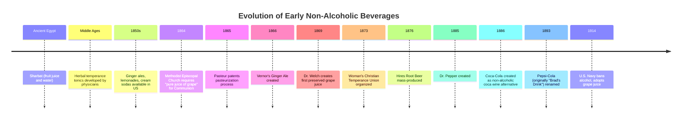

The trauma of the Civil War also contributed to the creation of new drinks by druggists, many of whom were former medical doctors[^5]. They used carbonated water techniques to develop new sodas, using ingredients like cocaine, kola nuts, caffeine, lithium, amaretto, ginger, and sugar[^5]. **John Pemberton created Coca-Cola in 1886 as a non-alcoholic version of coca wine**, marketed as a patent medicine claiming to cure ailments including morphine addiction[^5]. Prior to the Harrison Narcotics Tax Act of 1914, all drugs sold at pharmacies were over-the-counter, and drinks containing cocaine were legal[^5]. This regulatory environment meant that early "temperance" beverages often contained stimulants and other active ingredients that would later be controlled substances.

### 1.3 Prohibition-Era Innovation and the Birth of Soda-Based Cocktails

The enactment of **Prohibition in the United States (1920-1933)** served as an unprecedented catalyst for innovation in non-alcoholic beverages, forcing the beverage industry to adapt, diversify, and ultimately create new product categories that would outlast the constitutional amendment itself. When Prohibition took effect on January 17, 1920, American breweries, distilleries, and wineries faced existential challenges—yet many enterprises survived by pivoting to alternative products, establishing patterns of innovation that continue to influence the non-alcoholic beverage industry today[^6].

The modern mocktails familiar to contemporary consumers **gained significant attention during the Temperance Movement and Prohibition era**[^3]. This historical context prompted bartenders to develop alternative non-alcoholic drinks, with the goal of mimicking the taste and drinking experience of cocktails by mixing fruit juices, syrups, and various sodas to create a more diverse range of modern mocktails[^3]. The period effectively birthed the **soda-based cocktail** as a distinct category, transforming the soda fountain from a simple refreshment counter into a sophisticated social venue.

The rise of **soda fountains at local pharmacies** as alternatives to saloons represented one of the most significant social transformations of the era[^5]. These establishments used new fizzy and sweet sodas as mixers for ice cream sodas and milkshakes, creating an entirely new culture of social beverage consumption[^5]. By the time Prohibition was enacted, these sodas were used with bootleg and medicinal liquor at the soda fountain, leading to the birth of the soda-based cocktail[^5]. The commercial infrastructure that had developed around temperance drinks suddenly became the primary venue for legal social drinking.

The statistical impact on the soft drink industry was dramatic: **in the first six months of Prohibition, soda sales leaped by 200 percent**[^5]. By the 1920s, there were 8,000 bottling plants in America[^5]. Canada Dry, sold in champagne-style bottles from 1922, saw sales jump from 1.7 million bottles a year in 1922 to over 50 million by 1926, as it became a popular mixer for bootleg liquor[^5]. The Orange Crush Company, founded in 1916, added juice to its formula by 1921[^5]. Charles Leiper Grigg created 7 Up in 1929, just before the stock market crash[^5].

Breweries demonstrated remarkable adaptability during this period, developing **ten categories of alternative products** that kept their operations viable[^6]:

| Product Category | Key Examples | Market Application |
|-----------------|--------------|-------------------|
| Barley Malt Syrup | Anheuser-Busch, Schlitz, Miller | Sold to confectioners, bakeries; widely used for home brewing |
| Brewing Yeast | Anheuser-Busch (5-pound cakes) | Baking; contained chromium and increased alcohol content |
| Near-Beer & Soft Drinks | Bevo, Pablo, Famo, New Style Lager | Legal beverages (<0.5% ABV); ginger ale, sarsaparilla, fruit sodas |
| Candy | Blatz (gum), Coors (malted milk for Mars) | Confectionery market |
| Ceramics | Coors Porcelain | Laboratory equipment, dinnerware, promotional items |
| Ice Cream | Stroh, Anheuser-Busch, Yuengling | Leveraged refrigeration and pasteurization equipment |
| Truck Bodies | Anheuser-Busch | Refrigerated trucks, ice cream cabinets, recreational vehicles |
| Artificial Ice | Narragansett Brewing Company | Ice production and cold storage |
| Frozen Eggs | Anheuser-Busch | Commercial baking and food service |
| Processed Cheese | Pabst (Pabst-ett) | Retail cheese market; later sold to Kraft |

The **"near-beer"** category—non-alcoholic beer with alcohol content below 0.5% by volume—was legal under the Volstead Act and represented many breweries' primary strategy for maintaining their core business[^6]. Brands like Anheuser-Busch's Bevo, Pabst's Pablo, and Schlitz's Famo provided consumers with beverages that approximated the beer experience within legal constraints[^6]. This category established the regulatory framework and production methodologies that would later inform modern non-alcoholic beer production.

During Prohibition, **restaurant drinks featured fruit punches and juices** like grape, loganberry, and orange as healthy alternatives[^5]. The period established a precedent for sophisticated non-alcoholic beverage service in hospitality settings, demonstrating that consumers would pay premium prices for well-crafted alcohol-free options in social environments. This historical pattern directly connects to contemporary "occasion-based" consumption strategies employed by modern non-alcoholic beverage brands.

The Prohibition era also highlighted the **relationship between regulatory frameworks and beverage innovation**. The Harrison Narcotics Tax Act of 1914 had already banned cocaine and opiates in over-the-counter products, fundamentally changing the composition of many popular sodas[^5]. Prohibition further changed the soda fountain's role to serving "soft drinks" as its primary function[^5]. These regulatory pressures forced the industry to develop new formulations, flavoring techniques, and production methods—establishing a pattern of innovation-through-constraint that continues to characterize the non-alcoholic beverage industry.

### 1.4 From Mid-Century Decline to the Modern Craft Renaissance

Even after the end of Prohibition in the United States, the popularity of mocktails did not wane[^3]. During the latter half of the 20th century, mocktail popularity increased as changing social norms led people to place greater emphasis on health and well-being, resulting in a quick rise in non-alcoholic beverage options[^3]. Consequently, mocktails became a popular choice in bars, restaurants, and various social gatherings[^3]. However, the category remained largely stagnant in terms of innovation until the early 21st century, when a confluence of factors sparked what can only be described as a **craft renaissance**.

The modern transformation of non-alcoholic cocktails began in earnest with the founding of **Seedlip in 2014** by Ben Branson, widely recognized as the "Founding Father of Non-Alc"[^7]. Branson's journey began with market research that revealed a significant gap: when he emailed the 500 best bars, restaurants, and hotels in the UK in late 2013 and early 2014 asking about non-alcoholic options, the poor responses revealed a market opportunity[^7]. At that time, the non-alcoholic space consisted essentially of O'Doul's and Beck's Blue in the UK[^7]. Branson correlated this gap with a shift in societal values towards wellness and decided to create a grown-up non-alcoholic option[^7].

Seedlip's approach drew inspiration from historical precedent—specifically, a 1651 herbal remedy book called "The Art of Distillation"[^8]. The brand produces its products from peels, barks, herbs, and spices, with each ingredient distilled through copper pot distillation, a technique also used to make gin[^9]. This technical approach established that **non-alcoholic spirits could employ the same production methodologies as traditional spirits**, legitimizing the category as a craft discipline rather than a simple substitution. Seedlip has since been named the #1 Top Trending Non-Alcoholic Brand and the #1 Best-Selling Non-Alcoholic Spirits Brand by Drinks International in 2025[^8].

The **"sober curious" movement**, a term coined by author Ruby Warrington in her 2018 book, has become the primary cultural driver of the modern renaissance[^10]. This movement is about mindful drinking rather than complete abstinence, representing a fundamental shift in how modern consumers think about alcohol consumption[^10]. The demographic leading this change is notably younger: **Generation Z is spearheading the sober curious trend**, with nearly two in three (65%) Gen Zers planning to drink less in 2025, and 39% planning to adopt a dry lifestyle for all of 2025[^11].

The statistical evidence for this generational shift is compelling. Nearly one in two (49%) Americans are trying to drink less alcohol in 2025, representing a **44% increase since 2023**[^11]. Thirty percent of Americans are taking part in Dry January in 2025, a 36% increase from 2024[^11]. Currently, 19% of Gen Z don't drink any alcohol at all, primarily because they just don't want to drink[^11]. The motivations driving reduced consumption include improving physical health, saving money, making lifestyle changes, improving mental health, and losing weight[^11]. Among Gen Z specifically, 58% plan to drink less to improve their mental health, representing a 45% increase from the prior year[^11].

The market response to these consumer shifts has been extraordinary. The non-alcoholic beverage category has achieved **$925 million in off-premise sales with 22% growth year-over-year**, and is on track to exceed $1 billion by the end of 2025[^12]. Sales at FreshDirect demonstrate even more dramatic growth: overall sales surged 71% in 2024, alcohol-free wines skyrocketed by 192%, and non-alcoholic spirits and ready-to-drink cocktails have seen an extraordinary **350% increase**[^10]. Online sales have surged 208% compared to the previous year[^12].

A critical insight from current market data reveals that **92% of non-alcohol buyers also purchase alcohol-containing products**[^12]. This statistic fundamentally reframes the category: the modern non-alcoholic cocktail market is about expanding choices rather than replacing alcohol entirely. Consumers are seeking sophisticated options for occasions when they prefer not to drink—whether for health reasons, driving responsibilities, or simple preference—while maintaining their relationship with alcoholic beverages for other occasions.

The following diagram illustrates the key factors driving the modern craft renaissance:

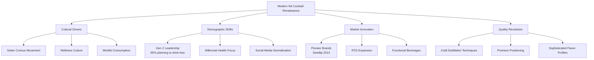

In recent years, bartenders have elevated mocktails to a new level by focusing on **innovative mixing and artistic presentation**[^3]. Today, mocktails boast complex flavors and are presented in various glass styles with diverse ice forms[^3]. The increasing use of social media has contributed to mocktails' growing popularity, as bartenders often showcase their creative concoctions[^3]. Over one in three Gen Z and millennials say social media is the most effective advertising channel for new NA beverages[^11], and 43% of Gen Z are more likely to try a new drink product if it's marketed to align with the sober curious lifestyle[^11].

The industry structure has evolved rapidly, with Ben Branson noting that **80% of brands have launched in the past three years**[^7]. While this creates significant market noise, he predicts a second wave of shakeout and consolidation, with the cream rising to the top[^7]. He believes consumers and retailers do not need so many brands and that approximately 25 amazing, well-funded brands are doing a great job[^7]. After consolidation, the category is expected to premiumize properly with a focus on quality—the pathway to building a long-term profitable category[^7].

The trajectory from temperance drinks to sophisticated craft represents more than historical curiosity; it establishes the **foundational understanding necessary for analyzing contemporary innovation**. The patterns established in the 19th and early 20th centuries—innovation through constraint, the creation of dedicated social spaces, the importance of production methodology, and the role of cultural movements in driving demand—continue to shape the modern non-alcoholic cocktail landscape. Today's formulation challenges and production techniques, explored in subsequent chapters, build directly upon this historical foundation while pushing the boundaries of what alcohol-free beverages can achieve.

## 2 Landscape of Innovation: Market Analysis and Product Archetypes

The contemporary non-alcoholic cocktail market represents one of the most dynamic and rapidly evolving segments within the broader beverage industry, characterized by unprecedented growth, substantial capital investment, and remarkable product innovation. This chapter provides a comprehensive analysis of the market's current state, examining the distinct product archetypes that have emerged to satisfy diverse consumer demands for sophisticated alcohol-free options. Building upon the historical foundations established in Chapter 1—from temperance-era innovations through Prohibition adaptations to the modern "sober curious" movement—this analysis maps the competitive landscape and identifies the technical and formulation strategies that differentiate market leaders from emerging challengers. The three primary innovation archetypes examined—ready-to-drink canned mocktails, non-alcoholic spirit bases, and functional beverages incorporating adaptogens or nootropics—represent fundamentally different approaches to the central challenge of creating adult-oriented beverages that deliver complexity, satisfaction, and social relevance without ethanol.

### 2.1 Market Scale, Growth Dynamics, and Investment Landscape

The non-alcoholic beverage market has definitively transitioned from niche curiosity to mainstream category, with market data confirming a trajectory of sustained, accelerating growth that has attracted significant institutional investment. According to NielsenIQ research, **non-alcoholic beer, wine, and spirits achieved $925 million in off-premise sales with 22% year-over-year growth**, positioning the category to exceed $1 billion by the end of 2025.[^12] This milestone represents a fundamental validation of the category's commercial viability and signals its permanent establishment within the beverage landscape rather than a temporary trend tied to events like Dry January.

The broader market context reveals even more substantial opportunity. The global non-alcoholic beverage industry is expected to grow from $1.1 trillion (2018) to **$3.8 trillion by 2034**, with the U.S. market projected to reach $225.62 billion by 2030, representing an annual compound growth rate (CAGR) ranging from 4.7% to 7.75%.[^13] The functional beverage segment specifically is projected to reach $250 billion by 2030, creating substantial overlap opportunities for non-alcoholic cocktails that incorporate health-enhancing ingredients.[^14]

Within the non-alcoholic category, **market segmentation reveals distinct growth patterns across product types**. NA beer dominates the broader category, accounting for 83% of NA sales, compared to 11.2% for NA wine and 5.7% for spirits (including ready-to-drink mocktails).[^15] However, the spirits/RTD/mocktail segment, while representing the smallest current market share, demonstrates the most explosive growth trajectory—**70% growth between 2024 and 2025, with the RTD segment specifically up 123% year-over-year**.[^15] This growth differential indicates that while beer established the category's foundation, spirits and RTD mocktails represent the frontier of innovation and consumer interest.

The following table summarizes the market segmentation and growth dynamics:

| Category | Market Share | Growth Rate | Key Characteristics |
|----------|-------------|-------------|---------------------|
| NA Beer | 83% | Steady, established | Category leader; Athletic Brewing dominant |
| NA Wine | 11.2% | 192% at select retailers | Growing premiumization |
| NA Spirits/RTD | 5.7% | 70-123% YoY | Fastest growing; highest innovation |
| Functional Overlap | Significant | Projected $250B by 2030 | Converging with better-for-you segment |

**Investment activity has accelerated dramatically**, reflecting institutional confidence in the category's long-term potential. In July 2024, General Atlantic led a **$50 million equity financing round for Athletic Brewing at an $800 million valuation**, establishing the company as the dominant player in NA beer and validating premium valuations for category leaders.[^15] The faster-growing RTD segment has attracted particularly noteworthy institutional interest: in October 2025, Recess closed a **$30 million Series B led by CAVU Consumer Partners**, capitalizing on its position as a leader in both functional beverages and RTD mocktails with presence in over 15,000 stores.[^15]

Strategic investments from traditional alcohol companies signal the category's maturation and the potential for consolidation. **Diageo's acquisition of Ritual Zero Proof in September 2024** represented a landmark transaction, bringing a leading NA spirits brand under the umbrella of a major multinational with extensive distribution capabilities.[^15] Constellation Brands made a minority investment in Hiyo in February 2025, while Stoli Group invested $3.6 million in non-alcoholic spirits brand Pathfinder in September 2025.[^15] Earlier investments include Aplós's $5.5 million Series A led by McCarthy Capital in June 2023 for its adaptogen and amino acid-infused RTD beverages.[^15]

Despite this investment enthusiasm, **the market faces significant fragmentation and distribution challenges**. Hundreds of small brands compete across overlapping categories, each with limited scale and scattered retail distribution.[^15] Scaling beyond direct-to-consumer channels proves difficult due to varying state regulations—for example, in New York State, non-alcoholic beverages cannot be sold in wine and liquor stores.[^15] These challenges create consolidation opportunities, particularly for traditional alcohol brands with established distribution networks seeking diversification into the non-alcoholic space. As one industry analysis notes, partnerships with established players "could provide the distribution muscle and regulatory know-how needed to turn today's fragmented non-alcoholic beverage market into a mainstream category."[^15]

The investment landscape ultimately reflects a market in transition—from entrepreneurial proliferation toward consolidation around quality-focused brands with sustainable competitive advantages. Online sales growth of **208% compared to the previous year** demonstrates the category's digital-native characteristics and suggests that brands capable of building direct consumer relationships while simultaneously securing retail distribution will be best positioned for long-term success.[^12]

### 2.2 Ready-to-Drink Canned Mocktails: Convenience Meets Craft

The ready-to-drink mocktail segment represents the intersection of convenience culture and craft sophistication, emerging as the fastest-growing archetype within the non-alcoholic spirits category. This format addresses a fundamental consumer need articulated through market research: people want to drink less alcohol **without sacrificing the flavor and taste experience associated with cocktail flavors**.[^16] The RTD mocktail market size reached $8.26 billion in 2023 and continues growing at an exponential rate, with the North American mocktail market estimated to surpass **$30 billion USD in 2025**.[^16][^17]

**Flavor innovation drives the RTD mocktail category**, with brands competing to deliver authentic cocktail experiences in convenient portable formats. Retail innovation data reveals the most frequently launched flavor profiles: Bloody Mary, Piña Colada, Margarita, Mojito, Sangria, Gin & Tonic, Spicy Bloody Mary, Negroni, Paloma, and Cosmo.[^16] Innovation in non-alcoholic beverages with cocktail flavors demonstrates a **5-year 19% compound annual growth rate (CAGR), with new launches up 7% in the year ending June 2025**.[^16] This innovation extends across categories—North American launches of cocktail flavors in flavored waters increased by 50% in the year ending July 2025, while functional beverages with cocktail flavors showed **75% growth in the last year**.[^16]

The production methodology for RTD mocktails emphasizes consistency, shelf stability, and scalable manufacturing while maintaining flavor authenticity. Brands like **Naked Life**, an Australian non-alcoholic RTD cocktail brand now available in over 800 Target stores nationwide, exemplify the premium positioning strategy: their Cosmopolitan and Margarita offerings are "crafted with real botanicals to deliver a true-to-cocktail experience without alcohol or sugar, and only five calories."[^18] This formulation approach—emphasizing botanical authenticity, minimal calories, and zero sugar—reflects the health-conscious positioning that resonates with target demographics.

Sales data from specific retailers demonstrates the category's explosive growth trajectory. At FreshDirect, non-alcoholic spirits and ready-to-drink cocktails have seen an **extraordinary 350% increase**, significantly outpacing the overall NA category growth of 71% in 2024.[^19] This disproportionate growth in the RTD segment confirms consumer appetite for convenient, premium-positioned mocktail options that deliver sophisticated flavor experiences.

**Target consumption occasions for RTD mocktails span multiple use cases**, addressing the insight that 92% of NA buyers also purchase alcohol-containing products.[^12] This statistic reveals that the market serves consumers seeking occasion-based moderation rather than complete abstinence. RTD formats address specific occasions including:

- **Grab-and-go convenience**: Portable formats for outdoor events, picnics, and travel
- **Social gatherings**: Premium options that allow participation in drinking occasions without alcohol
- **At-home entertaining**: Consistent quality without bartending skills or ingredient investment
- **Wellness moments**: Daytime refreshment without alcohol's effects on productivity or health goals

The appeal of RTDs lies in their **ultimate convenience**: grab-and-go cocktails require no bartending skills and no extra ingredients.[^20] Unlike the sugary alcopops of the past, today's RTDs often boast premium ingredients and authentic flavors, elevating them to a more sophisticated choice.[^20] Consumers appreciate the ability to enjoy a craft-quality margarita or other cocktail straight from the can, with innovations including barrel-aged classic cocktails in cans, craft brewery hard seltzers with real fruit, and collaborations where distillers partner with bartenders to can signature recipes.[^20]

The following diagram illustrates the RTD mocktail value proposition:

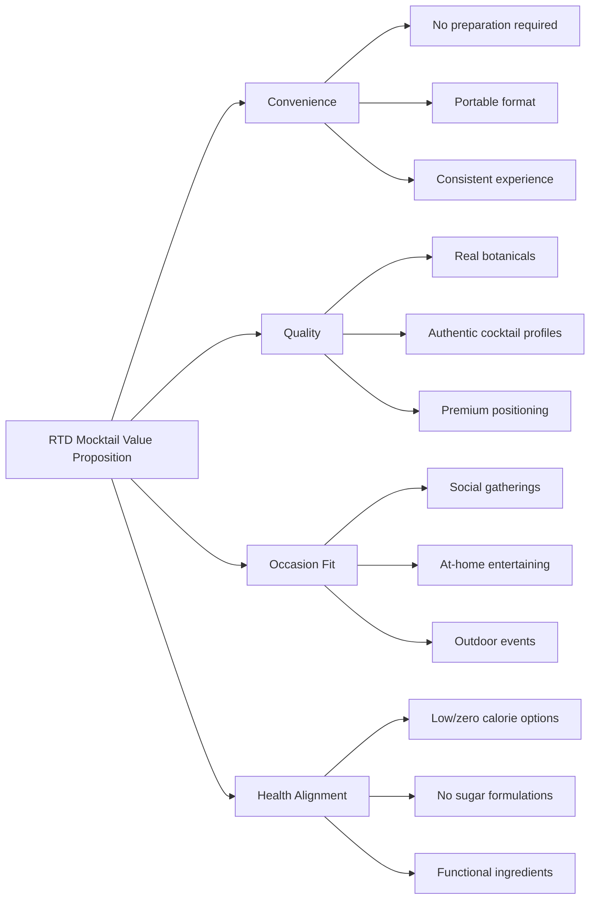

**Premiumization represents a critical success factor** in the RTD mocktail segment. In the UK, canned cocktails have become very popular, offering high-end cocktail "bar-level" service at more affordable price points.[^21] Small, beautifully packaged cans serve as attractive impulse purchases, combining visual appeal with the promise of sophisticated flavor experiences. Brands like Mingle Mocktails are reimagining classics with unique flavor profiles like Blood Orange Elderflower Mimosa and Cranberry Cosmo, while Mockly offers distinctive combinations like basil and tangerine or rose and blueberry.[^22]

The RTD category has evolved beyond mere convenience to become a platform for innovation. As one industry analysis notes, "RTD is no longer just about what's in the can—it's about how quickly you can bring new products to market, how scalable your operations are, and how unique your identity is."[^21] Brands that embrace occasion-based messaging, premium positioning, and strategic partnerships will be best positioned to lead as the category continues its rapid expansion.[^12]

### 2.3 Non-Alcoholic Spirit Bases: Replicating Complexity Through Distillation

Non-alcoholic spirits designed to serve as cocktail bases represent the most technically sophisticated archetype in the NA beverage landscape, employing advanced production methodologies to replicate the complexity, depth, and sensory characteristics of traditional spirits. These products address the fundamental challenge articulated by industry experts: creating beverages that deliver the structure, mouthfeel, and flavor layering that ethanol naturally provides, without the alcohol content. The production approaches divide into **two primary methodologies**: alcohol-then-removal processes and never-alcohol approaches, each with distinct technical characteristics and flavor outcomes.

**The alcohol-then-removal methodology** involves first creating a traditional alcoholic spirit, then employing specialized techniques to extract the ethanol while preserving flavor compounds. Spiritless Kentucky 74 exemplifies this approach: the non-alcoholic bottled whiskey is made with full-strength neutral grain spirit, subsequently processed using a technique called **"reverse distillation"** to remove alcohol, achieving a final ABV below 0.5%.[^23][^24] This methodology leverages alcohol's superior capability as a flavor solvent—extracting and carrying aromatic compounds more effectively than water—before removing the ethanol through carefully controlled processes that preserve those captured flavors.

The reverse distillation process requires precise technical control. As one analysis explains, "Some distillers first distill botanicals in alcohol because alcohol is an excellent flavor carrier, then cleverly re-distill or use vacuum processes to completely remove that alcohol."[^25] Spiritless focuses on recreating whiskey's warmth: "Their Kentucky 74 starts with neutral grains and oak char. The base mash is processed under precisely controlled temperature and pressure, simulating the expensive and time-consuming barrel aging of traditional whiskey. After extraction, re-distillation ensures alcohol is removed, leaving behind the essential oils and tannins that mimic whiskey's mouthfeel and warmth."[^25]

**The never-alcohol methodology** employs botanical water distillation from the outset, meaning alcohol content never exceeds 0.5% ABV throughout the production process. Seedlip pioneered this approach, with each ingredient distilled through copper pot distillation—the same technique used to make gin—but using water rather than alcohol as the extraction medium.[^23] Bax Botanics similarly "starts with botanical flavors, distilling these flavors individually and then carefully blending them to create complex flavor profiles."[^23][^24] This approach requires longer production times and different extraction techniques but avoids the complexity of dealcoholization.

The never-alcohol approach exemplified by brands like **Almave** (founded by Sir Lewis Hamilton) skips the fermentation process entirely. As the brand's co-founder and chief distiller explains: "We don't need to extract alcohol because we don't allow alcohol to form in the first place. In traditional tequila production, the fermentation process converts sugars into alcohol. We completely skip this step, meaning no dealcoholization is needed."[^9] The brand then uses multiple distillation processes to concentrate compounds carrying aroma and flavor, utilizing the resulting hydrolate to enhance mouthfeel, stability, and texture.[^9]

**Replicating the structural characteristics of alcoholic beverages** requires sophisticated ingredient combinations and processing techniques. Producers employ several strategies to achieve complexity:

| Structural Element | Traditional Source | NA Spirit Solution | Example Brands |
|-------------------|-------------------|-------------------|----------------|
| Mouthfeel/Body | Ethanol viscosity | Plant-based gums, glycerol | Almave, Seedlip |
| Warmth/Burn | Ethanol irritation | Capsicum, chili, ginger | Spiritless, Lyre's |
| Tannin Structure | Barrel aging, grapes | Tea, chocolate, coffee extracts | Ritual, Three Spirit |
| Aromatic Depth | Alcohol solvent effect | Multiple infusions, maceration | Bax Botanics, Wilderton |
| Spicy Notes | Ethanol heat | Sichuan pepper, black pepper, vinegar | Monday, Caleño |

As Almave's formulation demonstrates, achieving alcohol-like characteristics requires layered ingredient strategies: "We retain natural agave sugars to add mouthfeel and depth. For spiciness, we use natural ingredients extracted from chili peppers to bring the subtle burning or stinging sensation that alcohol typically provides. For texture and weight, we add plant-based gums and glycerol to increase viscosity and create a heavy sensation in the mouth, mimicking the structure that alcohol imparts to spirits."[^9]

**Category leaders have established distinct positioning strategies** based on their production methodologies and target use cases. The following comparison examines leading brands:

- **Seedlip**: Pioneer brand using copper pot distillation of individual botanicals in water, then blending. Positioned as a refined, botanical-forward experience rather than spirit replication. Named #1 Top Trending and #1 Best-Selling Non-Alcoholic Spirits Brand by Drinks International in 2025.

- **Lyre's**: Uses ingredient combinations to replicate the taste of spirits it replaces, combining flavors like lemon and lime with sugar to provide comparable taste to alcoholic versions. The brand's European, UK, and Middle East market manager explains the goal is "trying to make the flavors stand out."[^9]

- **Ritual Zero Proof**: Acquired by Diageo in September 2024, offering whiskey, tequila, and rum alternatives. Focuses on 1:1 substitution for classic cocktail recipes.

- **Monday**: Produces non-alcoholic gin and mezcal alternatives, with gin offerings that are "fruity, juniper-heavy, and very much leaning into the traditional flavor profile of gin."[^23]

- **Spiritless**: Specializes in whiskey alternatives using reverse distillation, including the Kentucky 74 and Kentucky 74 "Spiced" variants.

The technical challenge of producing NA spirits extends beyond flavor to **shelf stability and preservation**. As Diageo's innovation director explains: "Alcohol is a natural preservative and disinfectant. Without it, we must develop new technologies and processes to ensure our non-alcoholic products have stable, excellent taste experiences and quality over time."[^9] This preservation challenge adds production complexity and cost, contributing to the premium pricing typical of quality NA spirits.

**Advanced dealcoholization technologies** are enabling increasingly sophisticated NA spirit production. The GoLo Dealcoholization System, Alfa Laval's all-in-one module, and AI solutions for optimizing flavor profiles help achieve 0.0% alcohol content while preserving taste, tannins, and complex mouthfeel.[^13] The technological challenge lies in maintaining the sugar-acidity-bitterness balance without the presence of alcohol.[^13] Artificial Intelligence plays an emerging role in R&D, analyzing and predicting tastes, virtually testing flavor combinations, and enabling real-time monitoring of residual alcohol content to fine-tune each batch's quality.[^13]

Non-alcoholic spirits represent the category's most direct engagement with traditional cocktail culture, offering bartenders and home mixologists the building blocks for creating sophisticated alcohol-free versions of classic recipes. As the category matures, the distinction between spirits attempting faithful replication (Spiritless, Ritual, Lyre's) and those offering novel botanical experiences (Seedlip, Wilderton, Pentire) provides consumers with choices aligned to their specific preferences and use cases.[^23]

### 2.4 Functional Beverages: Adaptogens, Nootropics, and Beyond-Alcohol Innovation

The functional non-alcoholic beverage category represents a paradigm shift from alcohol replication toward delivering specific health and mood benefits, positioning these products as purposeful alternatives rather than mere substitutes. This archetype combines the appeal of social drinking with added benefits like **stress relief, gut health, and mental focus**, creating a category that overlaps significantly with the $24.5 billion "better-for-you" functional beverage segment.[^14][^15] The convergence of declining alcohol consumption and growing demand for functional food and beverage benefits has created explosive growth potential, with the global functional drink market projected to reach **$250 billion by 2030**.[^14]

**Five primary functional ingredient categories** define the formulation landscape for these beverages:

| Ingredient Category | Key Ingredients | Primary Benefits | Example Products |
|--------------------|-----------------|------------------|------------------|
| Adaptogens | Ashwagandha, rhodiola, ginseng, reishi, maca | Stress relief, resilience | Three Spirit, Kin Euphorics, Curious Elixirs |
| Nootropics | L-theanine, caffeine, guayusa, lion's mane | Focus, energy, cognitive function | Hiyo, Aplós, Recess |
| Botanicals | Gentian root, lemon balm, chamomile, valerian | Calm, digestion, relaxation | Ghia, Three Spirit Nightcap |
| Probiotics/Prebiotics | Kombucha cultures, kefir, prebiotic fiber | Gut health, immunity | Poppi, Mocktail Club |
| Electrolytes/Minerals | Sodium, potassium, magnesium | Hydration, recovery | Athletic recovery mocktails |

Functional non-alcoholic spirits exemplify this innovation direction, mimicking traditional spirits while incorporating health-boosting botanicals and adaptogens. **Three Spirit** offers functional non-alcoholic spirits including Livener (energizing with caffeine and guayusa) and Nightcap (calming with valerian root and lemon balm).[^14] **Ghia** produces a bitter aperitif with gentian root and citrus for mood enhancement.[^14] These formulations demonstrate how functional ingredients can be integrated into sophisticated flavor profiles that deliver both sensory pleasure and perceived wellness benefits.

**Aplós** exemplifies the adaptogen-forward approach, producing RTD beverages containing adaptogens and amino acids like lion's mane mushroom extract, L-theanine, magnesium, moringa, and ginseng.[^15] The brand raised a $5.5 million Series A led by McCarthy Capital in June 2023, demonstrating investor confidence in the functional NA beverage thesis.[^15] The Zero Proof's 2025 product rankings highlight Aplós Non-Alcoholic Chili Margarita as "a functional product infused with adaptogens and nootropics for a naturally stimulating, elevating effect."[^26]

**Recess** has emerged as a category leader in the functional RTD space, closing a $30 million Series B in October 2025. The brand has evolved its product offerings to encompass functional beverages and supplements, "offering relaxation, stress-relief and mood benefits with ingredients such as L-theanine, lemon balm, and Guayusa."[^15] Recess has scaled significantly since launching in 2018 and is currently sold in over 15,000 stores nationwide.[^15]

The formulation strategy for functional NA beverages addresses specific consumption occasions and desired mood states:

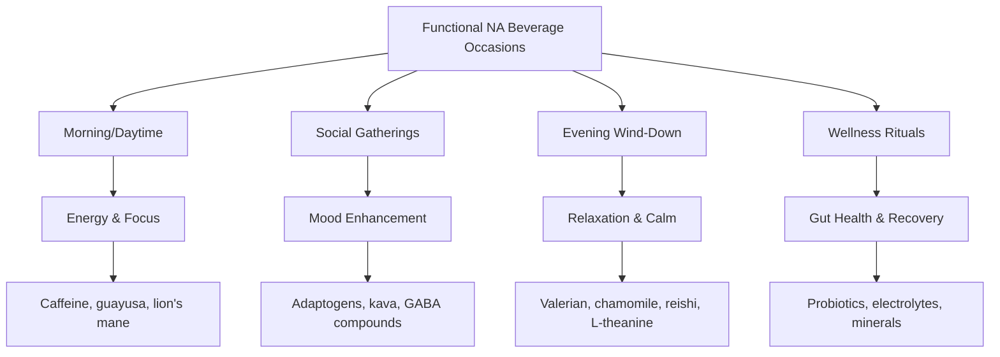

**Kin Euphorics** represents the premium end of functional NA beverages, infusing products with botanicals like Damiana and Schisandra to deliver mood-enhancing effects.[^22] The brand positions itself explicitly as delivering the social loosening and mood elevation associated with alcohol through alternative biochemical pathways. Similarly, **De Soi** offers adaptogen-enriched aperitif-style beverages, connecting to the resurgent apéritif culture while adding functional benefits.[^22]

The emergence of **kava-based beverages** introduces another functional pathway. Kava, derived from the root of the Piper methysticum plant, has been shown in some studies to have therapeutic effects on anxiety.[^27] Brands like Melo Sparkling Kava and Leilo offer kava-infused drinks formulated for "clarity, calm, and connection."[^26][^27] However, kava products require careful sourcing and dosing—medical professionals advise against mixing kava with alcohol, and liver toxicity concerns exist with doses above 250 milligrams of active kavalactones.[^27]

**Sentia Spirits** represents a scientifically-grounded approach to functional alcohol alternatives, developed by British neuropsychopharmacologist David Nutt. The GABA spirits are designed to increase activity of the neurotransmitter GABA, "which is responsible for that initial pleasant feeling you get after a drink or two."[^27] The formulation combines barks, flower extracts, and herbs including magnolia, ashwagandha, and licorice, demonstrating how functional beverages can target specific neurological pathways to deliver relaxation effects without intoxication.[^27]

The functional beverage category's growth trajectory is supported by broader wellness trends. UK retailer Ocado reported **functional beverage sales up 54% year-over-year**, indicating clear, sustained consumer demand.[^21] The category addresses consumers searching for NA options "that feel appropriate for social occasions or when winding down for the evening. They want selections that help promote a sense of relaxation without the next-day hangover. They're looking for purpose-driven beverages that deliver relaxation, mental clarity or mood support."[^22]

**CBD and THC-infused beverages** represent an adjacent category reshaping the adult NA space, offering mood enhancement and relaxation without alcohol's disruptive effects.[^22] While regulatory frameworks vary significantly by jurisdiction, these products demonstrate the broader trend toward beverages that deliver specific psychoactive or mood-modifying effects through non-alcohol pathways. The February 2022 funding of THC-infused drink brand Cann at $27 million Series A illustrates investor interest in this adjacent space.[^15]

The functional NA beverage category ultimately represents the category's evolution from "what can replace alcohol" to "what can alcohol-free beverages uniquely offer." By delivering specific, science-backed benefits unavailable from traditional alcoholic beverages, functional NA products create value propositions that transcend substitution toward genuine innovation in the social drinking experience.

### 2.5 Comparative Analysis: Sensory Experience and Occasion Mapping

A systematic comparison of the three product archetypes—RTD canned mocktails, non-alcoholic spirit bases, and functional beverages—reveals distinct strategies for addressing the fundamental challenge of delivering adult sophistication without ethanol's functional properties. Each archetype deploys different technologies and formulation approaches to achieve mouthfeel, complexity, and occasion-appropriate positioning, with varying degrees of success in replicating or transcending the traditional alcoholic cocktail experience.

**Sensory replication capabilities vary significantly across archetypes**. Non-alcoholic spirits demonstrate the highest fidelity to traditional cocktail experiences, employing advanced distillation techniques and sophisticated ingredient combinations to replicate alcohol's structural contributions. The challenge of achieving proper mouthfeel remains central: research on carbonation-related properties indicates that **significantly fewer bubbles form in glasses filled with non-alcoholic beer than alcoholic beer**, and this parameter serves as a good predictor of how consumers perceive bubble intensity in their mouths.[^28] While bubble sizes and CO2 content show minimal differences, the lower bubble formation in NA beverages contributes to perceived quality gaps that formulators must address through alternative texture strategies.

The following comparative table synthesizes key performance dimensions across archetypes:

| Dimension | RTD Mocktails | NA Spirit Bases | Functional Beverages |
|-----------|---------------|-----------------|---------------------|
| **Mouthfeel Replication** | Moderate; relies on carbonation, sweeteners | High; uses gums, glycerol, tannins | Variable; depends on formulation focus |
| **Burn/Warmth** | Limited; some use ginger, capsicum | High; employs chili, pepper, acids | Low priority; focus on other effects |
| **Flavor Complexity** | Good; pre-balanced formulations | Excellent; designed for cocktail building | Good; botanical-forward profiles |
| **Convenience** | Highest; ready to consume | Low; requires mixing | Moderate; some RTD, some mixing |
| **Customization** | None; fixed recipes | High; cocktail base flexibility | Moderate; occasion-specific products |
| **Shelf Stability** | Engineered for retail | Challenging without alcohol | Variable; some require refrigeration |
| **Price Point** | $2-4 per serving | $30-40 per bottle | $3-6 per serving |

**Occasion mapping reveals distinct positioning strategies** for each archetype. The insight that 92% of NA buyers also purchase alcoholic products[^12] confirms that the market serves occasion-based moderation rather than complete abstinence. Each archetype addresses different consumption moments:

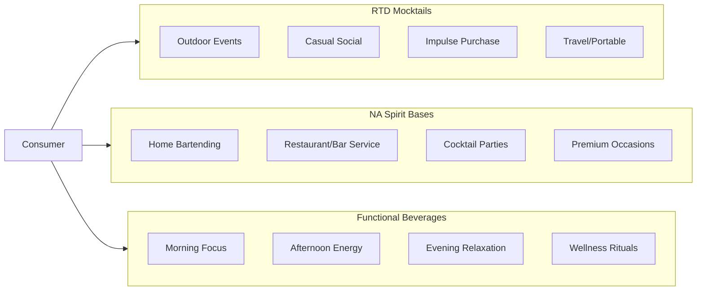

**Advanced technologies are deployed differently across archetypes** to address formulation challenges. For NA spirits, vacuum distillation and rotating cone column distillation enable precise separation of volatile flavor compounds from alcohol, while low-temperature re-distillation preserves delicate aromatics.[^25] AI-driven flavor optimization is emerging across all categories, with applications in "analyzing and predicting tastes, virtually testing flavor combinations," and automating quality control through real-time monitoring of residual alcohol content.[^13]

Texture engineering represents a critical technical frontier. Formulators employ several strategies to create desirable mouthfeel: **more intense sweeteners, glycerin, gums, or starches** can add body, while flavors sourced from spicy ingredients like chilis or cayenne help mimic the burn of strong drinks.[^16] The goal is achieving what industry experts describe as "the viscosity of the beverage and the experience while drinking, including sweetness, tartness, astringency, and burn."[^16]

**The alcohol preservation challenge** affects all archetypes differently. Alcohol functions as a natural preservative and disinfectant; without it, brands must develop alternative technologies and processes to ensure stable quality over time.[^9] RTD formats address this through industrial processing and packaging technologies optimized for shelf stability. NA spirits face greater challenges, often requiring refrigeration after opening or shorter shelf lives. Functional beverages vary based on ingredient composition—probiotic-containing products may require cold chain logistics, while adaptogen-infused beverages may achieve longer ambient stability.

**Price positioning reflects production complexity and target occasions**. NA spirits command premium prices ($30-40 per bottle) due to sophisticated production processes, premium ingredients, and smaller production batches compared to traditional alcohol brands.[^23] As one analysis explains, "Without alcohol, flavor and texture become more important than ever. To achieve the ideal flavor profile, production often requires larger quantities and higher quality ingredients, as well as special maceration, distillation, and infusion techniques."[^23] RTD mocktails offer more accessible price points ($2-4 per serving) through manufacturing scale, while functional beverages span a range depending on ingredient costs and positioning.

The comparative analysis reveals that **no single archetype dominates across all dimensions**—rather, each serves distinct consumer needs and occasions. RTD mocktails excel in convenience and accessibility; NA spirits provide the flexibility and complexity required for sophisticated cocktail creation; functional beverages deliver unique value propositions unavailable from traditional alcoholic options. The market's continued growth suggests consumers increasingly recognize and appreciate these distinctions, selecting products based on specific occasion requirements rather than treating the category as monolithic.

As the category matures, **convergence between archetypes is accelerating**. RTD formats increasingly incorporate functional ingredients, NA spirits are being canned in ready-to-drink formats, and functional beverages are adopting cocktail-inspired flavor profiles. This convergence suggests that future market leaders will likely excel across multiple dimensions—delivering convenience, complexity, and functional benefits in formats optimized for specific consumption occasions. Brands that can navigate this convergence while maintaining clear positioning and quality differentiation will be best positioned to capture value as the non-alcoholic cocktail market continues its trajectory toward mainstream acceptance and billion-dollar scale.

## 3 Deconstructing the Build: Advanced Ingredients and Component Innovation

This chapter provides a comprehensive technical analysis of the innovative ingredients and components that form the foundation of modern non-alcoholic cocktail formulation. Building upon the market archetypes and production methodologies introduced in Chapter 2, this section examines how formulators engineer complexity, mouthfeel, and balance in the absence of ethanol through strategic deployment of non-alcoholic spirits, acid systems, bittering agents, sweeteners, and functional botanicals. The analysis reveals the scientific principles underlying each component category and demonstrates how their interactions create sophisticated sensory experiences that rival traditional cocktails. The core relationship driving innovation in this space is one of **compensation and synergy**: ingredients are engineered to fill specific sensory gaps left by the absence of ethanol, and techniques are adapted to maximize their effectiveness in creating adult-oriented beverages that transcend mere sweetness.

### 3.1 Non-Alcoholic Spirits as Cocktail Foundations: Production Methodologies and Substitution Strategies

Non-alcoholic spirits represent the most technically sophisticated ingredient category in alcohol-free cocktail formulation, employing advanced production methodologies to replicate the complexity, depth, and sensory characteristics that traditional spirits provide. Understanding how these products are manufactured—and their appropriate application as cocktail foundations—is essential for achieving professional-quality results in non-alcoholic mixology.

#### Production Methodologies: Extracting Flavor Without Ethanol

The production of non-alcoholic spirits follows two fundamentally different pathways, each with distinct technical characteristics and flavor outcomes. The first approach involves **creating a traditional alcoholic spirit and subsequently removing the ethanol**, while the second approach **never introduces alcohol into the production process**. Both methodologies face the same central challenge: alcohol is an exceptional flavor solvent and aroma carrier, and without it, flavors can become flat or taste like sweetened water.[^29]

**Distillation remains critical even in zero-alcohol production** because the precise interaction of heat, pressure, and time with botanical ingredients determines whether the final product achieves the "adult" character and satisfaction associated with quality spirits.[^29] The key distinction from traditional spirits production lies in the intended outcome: rather than pursuing high alcohol concentration, non-alcoholic distillers focus on capturing essential oils, tannins, and pure essences that provide depth to the drink.[^29]

The following table summarizes the primary production methodologies employed by leading non-alcoholic spirit producers:

| Methodology | Process Description | Advantages | Challenges | Example Brands |
|-------------|---------------------|------------|------------|----------------|
| **Water-Based Distillation** | Botanicals distilled directly in water using copper pot stills, similar to brewing concentrated tea | No dealcoholization required; preserves delicate compounds | Longer extraction times; less efficient flavor capture | Seedlip, Wilderton |
| **Alcohol Distillation + Removal** | Botanicals first distilled in alcohol, then ethanol removed via low-temperature re-distillation | Leverages alcohol's superior solvent properties | Complex process; risk of flavor loss during removal | Seedlip (some products) |
| **Vacuum Distillation** | Distillation under reduced pressure allowing lower boiling temperatures | Preserves volatile and heat-sensitive compounds; energy efficient | Specialized equipment required | Wilderton, premium producers |
| **Reverse Distillation** | Full-strength spirit produced, then alcohol systematically removed | Authentic spirit character; familiar flavor profiles | Technical complexity; quality control challenges | Spiritless |
| **Maceration/Infusion** | Botanicals soaked in water or non-alcoholic base to extract flavors | Simple process; accessible to smaller producers | Limited extraction depth; longer production times | Various craft producers |

**Seedlip's methodology** exemplifies the alcohol-first approach: each botanical ingredient is distilled individually using copper pot stills, with some botanicals first extracted in alcohol because it serves as an excellent flavor carrier. The alcohol is then removed through low-temperature re-distillation, producing complex, authentic flavor layers.[^29] This approach acknowledges that while the final product contains no alcohol, the production process benefits from ethanol's unique properties as a solvent.

**Wilderton employs the opposite strategy**, focusing on water as the primary extraction medium from the outset. Their process resembles tea brewing—using water to extract botanical flavors—followed by high-tech vacuum distillation using a spinning cone column distiller. This technology produces pure botanical concentrates without ever introducing significant alcohol into the system.[^29] The advantage lies in avoiding the complexities of dealcoholization while still achieving concentrated, sophisticated flavor profiles.

**Spiritless represents the reverse distillation approach**, particularly with their Kentucky 74 whiskey alternative. The process begins with neutral grain and oak char, processing the base mash under precisely controlled temperature and pressure to simulate traditional barrel aging. After extraction, re-distillation ensures alcohol removal while preserving the essential oils and tannins that mimic whiskey's characteristic mouthfeel and warmth.[^29]

Beyond distillation, several additional extraction techniques contribute to non-alcoholic spirit production:

- **Maceration** involves soaking botanicals in a liquid base, allowing gradual extraction of flavors, colors, and aromas to form concentrated essences. This method enables deep flavor extraction and experimentation with various botanical combinations.[^30]

- **Infusion** is similar to maceration but typically involves gentle heat application, accelerating the release of flavors and aromatic compounds while preserving volatile substances that might be lost at higher temperatures.[^31]

- **Percolation** operates like coffee brewing, with distilled water passing through a cone filter filled with ground botanicals. Using tinctures or mash rather than raw materials allows water to pass more slowly, extracting greater quantities of natural oils and producing deeper, more complex flavors than maceration alone.[^32]

- **Cold pressing** extracts flavor oils from ingredients like fruits, herbs, or spices under powerful mechanical pressure, with the resulting oils added to the distilled base.[^32]

- **Cryo-maceration** involves freezing botanicals before maceration, causing ice crystals to form within plant cells. When the botanicals thaw during maceration, cell walls rupture, releasing concentrated flavors. This newer technique intensifies aromas, reduces oxidation, and contributes unique mouthfeel characteristics.[^30]

#### Substitution Strategies and Practical Application

The question of whether non-alcoholic spirits function as **1:1 substitutes** for their alcoholic counterparts requires nuanced consideration. While many products are marketed as direct replacements, practical experience suggests that formulators should approach substitution strategically rather than literally.

Non-alcoholic spirits are designed to mimic the taste, smell, and complexity of traditional spirits but contain no ethanol or extremely reduced ethanol content, typically less than 0.5% ABV.[^31] The production process—from botanical selection through extraction and blending—aims to replicate flavor profiles of specific spirit categories. However, **the absence of alcohol fundamentally changes how these products interact with other cocktail components**.

Several critical considerations affect substitution strategies:

**Concentration and dilution dynamics** differ significantly between alcoholic and non-alcoholic spirits. Traditional spirits contain 40% or more ethanol, which affects both flavor perception and the dilution mathematics of cocktail preparation. Non-alcoholic alternatives, being primarily water-based, respond differently to shaking, stirring, and ice interaction. Professional guidance suggests **starting with half the amount of non-alcoholic spirit specified in traditional recipes** and adjusting upward based on taste, as these products are often not good 1:1 substitutes.[^33]

**Flavor intensity and balance** require recalibration when substituting. Without alcohol's unifying effect on flavor compounds, each ingredient in a non-alcoholic cocktail plays a larger role in the overall taste profile.[^34] This means that successful substitution often requires adjusting not just the spirit quantity but also the proportions of other ingredients to achieve proper balance.

**Shelf stability concerns** affect how non-alcoholic spirits are stored and used. Unlike traditional spirits, which benefit from alcohol's preservative properties, non-alcoholic alternatives typically have shorter shelf lives—often 3-4 months after opening—and may require refrigeration.[^33] This practical consideration affects both commercial bar programs and home use.

**The most effective approach combines multiple non-alcoholic spirits** to achieve the depth and complexity that a single traditional spirit provides. Sometimes achieving the desired "wow" factor and mouthfeel contribution requires combining two or more different alcohol-free spirits.[^35] This layering strategy acknowledges that no single non-alcoholic product perfectly replicates all the functional properties of ethanol.

The following diagram illustrates the relationship between production methodology and application strategy:

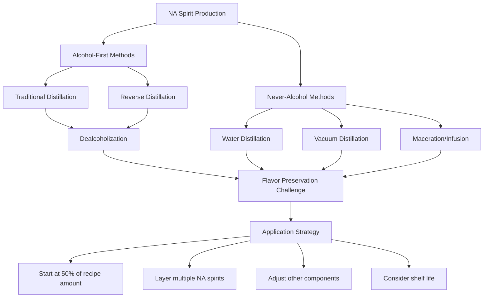

Understanding these production methodologies and their implications for substitution enables formulators to make informed decisions about ingredient selection and recipe development. The most successful non-alcoholic cocktails typically result from treating NA spirits as distinct ingredients with their own characteristics rather than as perfect facsimiles of their alcoholic inspirations.

### 3.2 Acid Architecture: Engineering Sourness and Brightness Beyond Citrus

Acidity represents one of the fundamental building blocks of cocktail construction, providing the **sour component** that balances sweetness and creates the refreshing, palate-cleansing quality essential to well-crafted drinks. In non-alcoholic cocktail formulation, the strategic deployment of acid systems becomes even more critical because without alcohol's unifying effect, each flavor element carries greater weight in the overall sensory experience. Modern mixologists have developed sophisticated approaches to acid architecture that extend far beyond traditional citrus juices.

#### The Foundation: Fresh Citrus and Its Limitations

Fresh citrus juice—lemon, lime, grapefruit, and orange—remains the most common source of acidity in cocktail construction.[^33] Citrus provides not only sourness but also aromatic complexity, with volatile compounds contributing brightness and freshness that pure acid cannot replicate. The workhorse status of citrus in non-alcoholic cocktails is well established, as these fruits deliver predictable acidity levels alongside familiar flavor profiles that consumers recognize and appreciate.[^34]

However, citrus-based acidity presents several limitations for advanced formulation:

- **Flavor specificity**: Citric acid imparts a distinct citrus tang that may not suit all cocktail profiles, particularly those attempting to replicate whiskey-based or botanical-forward drinks.[^36]
- **Variability**: Fresh citrus varies in acidity and flavor intensity based on variety, ripeness, and seasonality, creating consistency challenges for commercial production.
- **Perishability**: Fresh-squeezed juices deteriorate rapidly, limiting their utility in ready-to-drink formats and requiring careful inventory management in bar settings.

These limitations have driven innovation in alternative acid systems that provide greater control over sourness characteristics while enabling novel flavor development.

#### Advanced Acid Systems: Beyond Citrus

**Acid phosphate** represents one of the most significant rediscoveries in modern non-alcoholic mixology. Originally created in 1868 as a health tonic, acid phosphate became a key ingredient in soda fountain drinks due to its pleasant acidity.[^37] Unlike citric acid, which imparts distinct citrus character, acid phosphate offers a **"blank palate" sour flavor**—pure sourness without influencing the drink's overall flavor profile.[^37] This characteristic makes it particularly valuable for acidifying drinks without adding citrus character.

The chemical properties of acid phosphate distinguish it from simple diluted phosphoric acid. It is partially neutralized phosphoric acid buffered with calcium, magnesium, and potassium salts, resulting in a pH between 2.2 and 2.4—less acidic than freshly squeezed lime juice (pH 1.9) yet delivering a more intense sour sensation due to the unique chemistry of phosphoric acid and its phosphate salts.[^37] For practical application, a dash balances sweetness while a teaspoon provides sourness equivalent to a medium lime's juice.[^37]

Phosphoric acid's sensory characteristics differ meaningfully from organic acids. It provides a **sharp, clean acidity** that is less fruity than citric acid and less pungent than acetic acid, making it especially suitable for balancing sweetness in carbonated beverages.[^36] Research from London's White Lyan bar demonstrated that phosphoric acid produces an almost effervescent acidity that gives drinks an immediate boost and brings flavors into relief.[^38] The acid was even used creatively to dissolve a chicken bone for a tincture providing acidity, minerality, and a dry finish in their Bone Dry Martini.[^38]

**Lactic acid** offers distinctly different sensory properties, best known as the agent giving yogurt and kefir their characteristic tang. As a milder acid with slightly higher pH than citric or malic acid, lactic acid **adds a fuller, creamy mouthfeel** to cocktails while enhancing savory flavors and rounding off harsh edges.[^38] This mouthfeel contribution makes lactic acid particularly valuable in non-alcoholic formulations seeking to replicate alcohol's textural properties.

The following table compares key acid types used in non-alcoholic cocktail formulation:

| Acid Type | Flavor Character | pH/Intensity | Mouthfeel Contribution | Ideal Applications |
|-----------|------------------|--------------|------------------------|-------------------|
| **Citric** (citrus) | Bright, tangy, citrus-forward | High acidity | Clean, refreshing | Margaritas, daiquiris, citrus-forward drinks |
| **Phosphoric** | Clean, neutral sourness | Moderate pH, intense perception | Effervescent quality | Colas, botanical drinks, non-citrus profiles |
| **Lactic** | Mild, rounded, slightly creamy | Higher pH, milder | Fuller, creamy mouthfeel | Savory cocktails, Bloody Marys, creamy drinks |
| **Malic** | Tart, apple-like, persistent | Moderate acidity | Lingering finish | Fruit-forward cocktails, wine-style drinks |
| **Tartaric** | Sharp, wine-like, crisp | High acidity | Dry, astringent | Wine-based mocktails, aperitif styles |
| **Acetic** (vinegar) | Pungent, robust, savory | Variable | Tangy bite | Shrubs, savory cocktails, condiment-style drinks |

**Vinegar-based shrubs** represent a traditional acid delivery system experiencing renewed popularity in non-alcoholic mixology. Shrubs combine vinegar with fruit and sugar, creating concentrated syrups that provide both acidity and complex flavor.[^34] These preparations offer unexpected ways to create light, refreshing drinks while adding depth through fermentation-derived compounds.

**Verjus**—the pressed juice of unripe grapes—provides another non-citrus acid source with wine-like characteristics. Its mild acidity and grape-forward flavor make it particularly suitable for aperitif-style non-alcoholic cocktails and drinks seeking sophisticated, European-inspired profiles.[^34]

#### Formulation Strategies for Precise Acid Control

Achieving optimal acidity in non-alcoholic cocktails requires understanding both the target pH range and the sensory impact of different acid combinations. Professional formulation typically targets **pH 3.0-3.6** to balance flavor perception with microbial stability.[^39] This range provides sufficient acidity for tartness and preservation while avoiding excessive harshness.

The interplay between different acids enables sophisticated flavor engineering. Formulators often combine:

- **Citric acid for lift and brightness**—providing the immediate "pop" of sourness
- **Malic acid for persistence**—extending the sour sensation across the palate
- **Tartaric acid for wine-like crispness**—adding elegance to aperitif styles[^39]

Salt serves as a critical flavor enhancer in acid systems, with usage rates of 0.05-0.15% helping to amplify overall flavor perception without being detectable as saltiness.[^39] This technique, borrowed from culinary practice, helps non-alcoholic cocktails achieve the flavor intensity that alcohol would otherwise provide.

For special sourness enhancement without adding flavor or dilution, **acid phosphate drops** can be added to increase acidity while maintaining flavor neutrality.[^40] This old-fashioned ingredient, once standard in soda fountains, provides a powerful tool for precise pH adjustment in modern formulation.

The strategic deployment of acid systems ultimately enables formulators to create non-alcoholic cocktails with the **balanced acidity and body** essential to satisfying drinks.[^34] By understanding how different acids contribute distinct sensory characteristics, mixologists can engineer sourness profiles tailored to specific cocktail styles and flavor goals.

### 3.3 Bittering Agents and Complexity Builders: From NA Bitters to Botanical Extracts

Bitterness serves as one of the most critical differentiators between sophisticated adult beverages and simple sweet drinks. In traditional cocktails, bitters and bitter spirits provide structure, intention, and the slower sipping pace associated with mature drinking experiences.[^35] The challenge of delivering comparable bitterness in non-alcoholic formats has driven significant innovation in extraction techniques, stabilization chemistry, and alternative bitter compound sources.

#### The Technical Challenge of Non-Alcoholic Bitters

Traditional cocktail bitters rely on alcohol as both a solvent for extracting bitter compounds from botanicals and a medium for keeping those compounds in stable solution. The fundamental problem is that **oil and water do not mix**—simply soaking herbs in water does not effectively extract the flavor oils that carry bitter character.[^41] This chemical reality explains why truly non-alcoholic bitters remained rare until recent innovations addressed the solubility challenge.

The solution involves multiple technical approaches working in concert:

**Essential oil extraction** through distillation or CO2 extraction provides the aromatic compounds that define bitters character. Access to 100% pure steam-distilled or CO2-extracted essential oils has become increasingly available, enabling formulators to work with concentrated aromatic compounds rather than attempting direct water extraction.[^41]

**Alternative solvents** replace alcohol's role in keeping essential oils dispersed in solution. The most effective alternative is **caramel coloring**—heavily caramelized sugar that takes on bitter flavor characteristics while serving as a medium for dispersing essential oils.[^41] Glycerin works but presents issues; caramel coloring provides superior results.

**Gum arabic stabilization** helps maintain essential oil dispersion in the water-based final product. This natural plant-derived gum is indispensable for creating stable non-alcoholic bitters that remain homogeneous rather than separating.[^41]

**Polysorbate 80**, a food-grade solubilizer, can be added optionally to further enhance oil dispersion and prevent cloudiness in finished cocktails.[^41]

A practical formulation for non-alcoholic aromatic bitters demonstrates these principles:

| Component Category | Ingredients | Function |
|-------------------|-------------|----------|
| **Aromatic Oils** | Cinnamon (4 drops), Nutmeg (2), Black Pepper (2), Allspice (2), Bitter Orange (4), Cardamom (1), Clove (1) | Provide aromatic complexity |
| **Solvent/Dispersant** | 1 tablespoon caramel coloring | Disperses oils, adds bitterness |
| **Stabilizer** | 1 teaspoon gum arabic + 2 tablespoons sugar | Maintains emulsion stability |
| **Bittering Agents** | 2 teaspoons gentian root, 2 teaspoons dried orange peel, optional 3g caffeine | Provide bitter backbone |
| **Base** | 150ml water, brought to boil with botanicals | Extracts water-soluble compounds |

The process involves boiling gentian root and orange peel in water, straining into the sugar-gum arabic mixture, then combining with the essential oil-caramel mixture.[^41] The result is bitter, aromatic bitters that do not cloud cocktails—though preservatives like sulfites or sodium benzoate should be added for extended storage.

#### Commercial Non-Alcoholic Bitters Products

The market has responded to demand for alcohol-free bitters with several commercial offerings that eliminate the need for DIY formulation:

**All The Bitter** produces a line of non-alcoholic cocktail bitters handmade in small batches using whole organic plants with no extracts, flavors, or added colors.[^42] Their product range includes Old Fashioned Aromatic, Orange Cardamom, New Orleans Spiced Cherry, Lavender Chamomile, Coffee & Cherry, and Fig & Walnut varieties.[^42] These bitters contain 0.0% alcohol and are positioned as adding depth and balance to drinks while helping balance sweet and sour flavors with layers of spice and complexity.[^42]

The All The Bitter Aromatic Bitters specifically combine deep, earthy flavors with warm spices like cinnamon, nutmeg, and clove, framed within a sharp backbone of gentian root and ginger.[^43] The formulation includes functional botanicals like milk thistle seed, dandelion root, and holy basil, which may support digestion, liver health, and detoxification.[^43] The product is vegan, has no added sugar, is preservative-free, and is gluten-free.[^43]

**Fee Brothers** produces bitters that are generally non-alcoholic, providing another commercial option for alcohol-free cocktail construction.[^34]

#### Botanical Sources of Bitterness

Beyond commercial bitters products, several botanical ingredients contribute bitter complexity to non-alcoholic cocktails:

**Gentian root** stands as the most important bittering botanical, described as "one of the most bitter of the bitter digestive tonics" and appropriately called "bitter root."[^44] The plant has a distinct dusty, bittersweet scent and flavor describable as fresh soil, dandelion, citrus pith, anise, tarragon, and acetone with earthy mustiness.[^44] Gentian features prominently in the classic French aperitif Suze and was the foundation of the first documented bitters beverage in the late 1700s.[^44] Modern applications include premium alcoholic and non-alcoholic beverages, with supercritical CO2 extraction providing concentrated forms for post-distillation addition.[^44]

**Quinine** provides the characteristic bitterness of tonic water and serves as a backbone for restoring aperitif structure in non-alcoholic formulations.[^39] However, in the United States, beverage use of quinine is regulated, requiring careful attention to dosage limits.[^39] Typical formulation ranges fall between 10-40 ppm.[^39]

**Tea tannins** offer another pathway to bitterness while simultaneously contributing astringency and body. Black tea introduces tannins that provide dryness and grip, while hibiscus adds floral sharpness and acidity.[^35] The adaptability of tea makes it an excellent mixer—adjusting brew times or concentration allows precise control over intensity.[^35] Tea also enhances mouthfeel, giving alcohol-free cocktails a more rounded, substantial character.[^35]

**St. John's Wort extract**, produced through supercritical CO2 extraction, provides a distinctly herbal aromatic profile with light floral and grassy notes.[^45] The extract is explicitly suitable for non-alcoholic spirits, kombucha, herbal lemonades, and other drinks seeking natural herbal taste with a slightly bitter finish.[^45]

The following diagram illustrates the relationship between bittering agents and their sensory contributions:

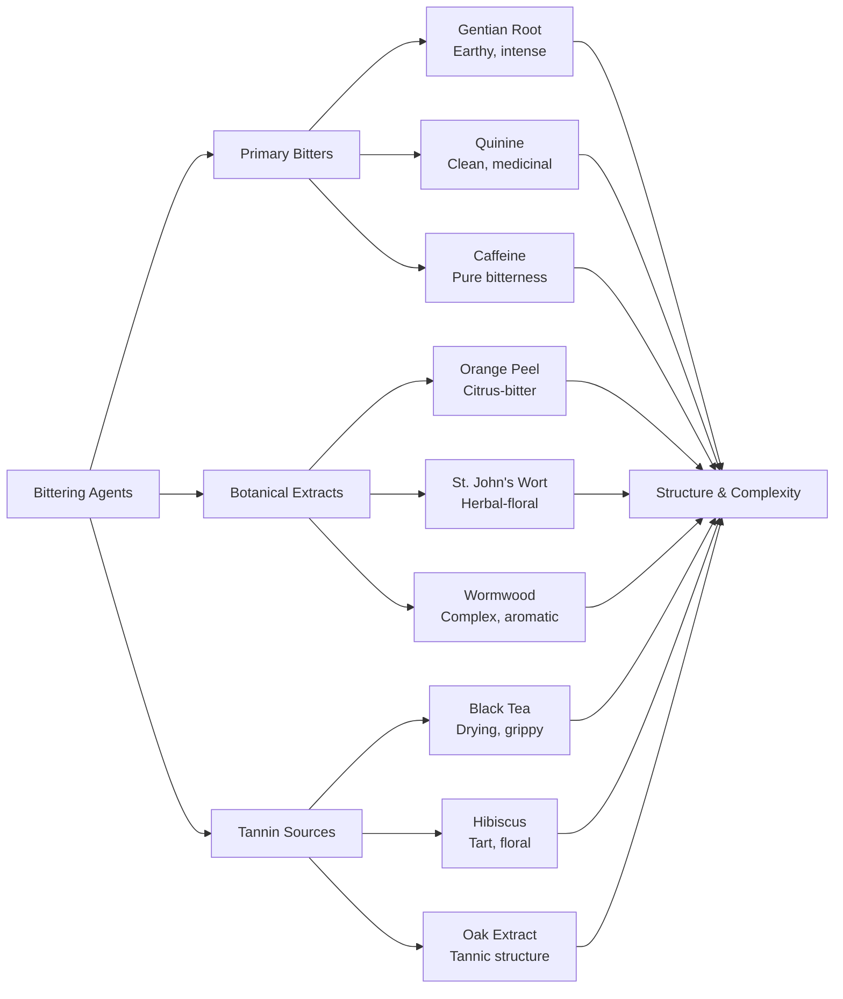

#### The Functional Role of Bitterness

Beyond flavor contribution, bitterness serves critical functional roles in non-alcoholic cocktail design. Many people associate bitterness with maturity in drinks because it adds structure, intention, and a slower sipping pace.[^35] This psychological association means that appropriate bitterness helps non-alcoholic cocktails feel "adult" rather than childishly sweet.

Alcohol provides a mild harshness that forces slower drinking; without it, zero-proof cocktails should incorporate something herbal or slightly bitter to create a similar brake on consumption speed.[^34] Ingredients like mauby—a Caribbean bark drink with root beer sweetness, anise notes, and a bitter medicinal finish—exemplify how bitterness can add complexity while moderating drinking pace.[^34]

The integration of bitterness also enables **balanced flavor architecture**. Every good alcohol-free cocktail should include at least two of the fundamental components—sweet, sour, bitter, and bold base flavor—to achieve the push-and-pull contrast that defines a cocktail.[^35] Bitterness specifically lends complexity and prevents the cloying sweetness that can plague poorly formulated non-alcoholic drinks.[^35]

### 3.4 Sweetener Systems and Mouthfeel Engineering: Replicating Ethanol's Structural Role

Sweeteners in non-alcoholic cocktail formulation serve dual functions that extend far beyond providing sweetness. They contribute **body, viscosity, and mouthfeel** that partially replicate ethanol's structural contributions to traditional cocktails. Understanding how different sweetener systems perform these functions—and the trade-offs involved in sugar-free formulation—is essential for creating satisfying non-alcoholic beverages.

#### Traditional Sweeteners and Their Functional Properties

Simple syrup (1:1 sugar to water ratio) remains the most common sweetener in cocktail construction, providing predictable sweetness alongside meaningful mouthfeel contribution.[^40] Beyond basic simple syrup, several traditional sweetener options offer distinct characteristics:

| Sweetener Type | Sweetness Profile | Mouthfeel Contribution | Flavor Notes |
|----------------|-------------------|------------------------|--------------|
| **1:1 Simple Syrup** | Clean, neutral | Moderate body | None |
| **2:1 Rich Syrup** | Intense, concentrated | Substantial body | Slight caramel |
| **Honey Syrup** | Complex, lingering | Rich, coating | Floral, variable by source |
| **Demerara Syrup** | Warm, molasses-like | Full body | Caramel, toffee |
| **Maple Syrup** | Distinctive, earthy | Medium body | Woody, complex |
| **Agave Nectar** | Clean, quick | Light body | Neutral to vegetal |

These syrups provide not only sweetness but also **layers of flavor** that contribute to overall cocktail complexity.[^40] The choice of sweetener significantly impacts the final drink's character, with darker syrups adding warmth and complexity while lighter options maintain cleaner profiles.

#### Alternative Sweeteners for Sugar-Free Formulation

The global sugar-free beverage market reached $72.78 billion in 2024 and is projected to grow to $275.5 billion by 2033, driven by diabetes prevalence and low-carbohydrate diet adoption.[^46] This market pressure has accelerated innovation in alternative sweetener systems for non-alcoholic cocktails.

**Allulose** has emerged as a particularly valuable sweetener for cocktail applications. A rare sugar naturally occurring in figs, raisins, maple syrup, and molasses, allulose is chemically similar to table sugar with similar taste, texture, and browning properties.[^47] At approximately 70% the sweetness of sugar with one-tenth the calories, allulose provides several advantages for cocktail formulation:

- **Clean flavor profile**: Unlike stevia or monk fruit, allulose does not become bitter or leave metallic aftertastes when combined with alcohol, acids, and ice[^48]
- **Mouthfeel contribution**: Allulose provides body and sucrose-like smoothness without adding to "added sugars" declarations[^39]
- **Regulatory advantage**: The FDA allows allulose to be excluded from total and added sugars declarations on Nutrition Facts labels[^47]
- **Functional properties**: Allulose contributes to freezing point control and provides the "smoothness" characteristic of sugar-based cocktails[^39]

The combination of allulose with high-intensity sweeteners enables sophisticated sweetness architecture. A typical formulation strategy uses **3-6% allulose for volume, freezing point, and smoothness**, combined with Reb M stevia (80-140 ppm) for clean, delayed-melt sweetness, and monk fruit (20-60 ppm) for lift in citrus systems.[^39]

**Erythritol** functions as a bulking agent and mouthfeel contributor, with a glycemic index of zero and no impact on blood sugar.[^46] At 70% the sweetness of sugar, erythritol lacks any "off" taste and is often blended with other low-calorie sweeteners to balance taste and texture.[^47] The sugar alcohol remains stable in acidic environments (pH 2.5-4.0) without crystallizing, making it suitable for carbonated and acidified beverages.[^46]

**Stevia**, extracted from Stevia rebaudiana leaves, provides 200 times the sweetness of sugar with zero calories.[^47] However, stevia interacts with both bitter and sweet taste receptors—with 25 different bitter receptors versus only one sweet receptor—resulting in bitter aftertaste for some consumers.[^47] High-temperature pasteurization (85-95°C) can reduce stevia's sweetness intensity by 10-15%, requiring formulation adjustments.[^46] Modern stevia products like Reb M provide cleaner taste profiles than earlier stevia extracts.

**Monk fruit** (lo han guo) delivers sweetness 150-250 times greater than sucrose through compounds called mogrosides, with negligible calories.[^47] Due to its intensity, monk fruit requires minimal quantities and is often paired with bulking agents like erythritol for proper dispersion.[^47] Monk fruit exhibits excellent thermal stability but requires careful dosing to avoid residual bitterness—typical ratios mix monk fruit with other sweeteners at 1:3.[^46]

The following table compares key alternative sweeteners for non-alcoholic cocktail formulation:

| Sweetener | Relative Sweetness | Glycemic Impact | Mouthfeel | Key Considerations |
|-----------|-------------------|-----------------|-----------|-------------------|
| **Allulose** | 70% of sugar | Minimal | Excellent, sugar-like | FDA excludes from sugar declarations |
| **Erythritol** | 70% of sugar | Zero | Good bulking | Cooling effect possible |
| **Stevia (Reb M)** | 200x sugar | Zero | None | Can have bitter notes |
| **Monk Fruit** | 150-250x sugar | Zero | None | Requires careful dosing |

#### Texture-Building Agents Beyond Sweeteners

Achieving satisfying mouthfeel in non-alcoholic cocktails requires ingredients beyond sweeteners. Several compounds specifically address the textural gap left by alcohol's absence:

**Glycerin (glycerol)** provides a slick, sweet smoothness that mimics alcohol's coating sensation.[^49][^39] Plant-derived glycerin adds smooth, round texture that coats the palate, helping non-alcoholic wines and spirits deliver body and structure.[^49] In formulation, glycerin contributes to the overall viscosity and drinking experience without adding sweetness at typical usage levels.

**Gum arabic** serves dual functions as both a stabilizer and texture modifier. Beyond its role in keeping essential oils dispersed in bitters formulations, gum arabic contributes body and mouthfeel to the final beverage.[^41]

**Soluble fibers** like tapioca fiber add body while maintaining clean label status.[^39] These ingredients increase viscosity without contributing sweetness or significant calories, enabling formulators to build substantial mouthfeel in sugar-free products.

**Beta-glucans and dextrins** play key roles in creating body and enhancing mouthfeel, particularly in non-alcoholic beer formulation. Research shows that maltodextrin contributes to smoother mouthfeel while β-glucan increases viscosity.[^50] These macromolecules interact to shape the sensory profile of beverages, with their distribution depending heavily on processing methods.

#### Clean-Label Formulation Challenges

Consumer expectations have evolved beyond basic sugar reduction toward beverages providing additional health benefits.[^46] The 2024 functional beverage landscape emphasizes gut health, protein delivery, and fortification alongside sugar reduction. Formulating sugar-free non-alcoholic cocktails that meet clean-label expectations while delivering satisfying sensory experiences presents significant challenges:

**Cost considerations** impact ingredient selection, as natural sweeteners cost 5-8 times more than sugar—stevia at $80-120 per kilogram and monk fruit extract at $150-200.[^46] Cost management strategies typically employ sweetener blending, with erythritol providing volume and mouthfeel while high-intensity sweeteners like stevia or monk fruit provide sweetness, typically at 7:3 ratios.[^46]

**Flavor masking** becomes necessary when functional ingredients introduce challenging taste profiles. Caffeine bitterness, botanical off-notes, and mineral metallic tastes require customized flavor enhancement and bitter-blocking systems.[^46] Allulose effectively masks the sweet aftertaste and bitterness of high-intensity sweeteners, improving overall sensory quality.[^51]

**Stability considerations** affect formulation choices. Allulose combined with rutin (a flavonoid) synergistically improves vitamin stability in nutritional beverages, reducing color change and degradation during storage.[^51] These interactions demonstrate how sweetener selection impacts not just taste but overall product quality and shelf life.

### 3.5 Functional Botanicals and Sensory Modifiers: Warmth, Tannins, and Beyond

The absence of ethanol removes not only alcohol's intoxicating effects but also its distinctive sensory contributions—warmth, burn, and the "bite" that signals a drink's potency. Innovative formulators have developed sophisticated approaches using functional botanicals and sensory modifiers to recreate these experiences through alternative biochemical pathways. This section examines the ingredients and extraction methods that enable non-alcoholic cocktails to deliver adult-oriented sensory complexity.

#### Recreating Alcohol's Warmth and Burn

Ethanol activates and sensitizes TRPV1 receptors—the same pain/heat pathway targeted by capsaicin—producing the characteristic "sipping burn" of alcoholic beverages.[^39] This trigeminal sensation can be mimicked through calibrated botanical ingredients that stimulate the same receptors without alcohol.

**Capsaicin and chili oleoresin** provide the most direct pathway to alcohol-like burn. The oral detection threshold for capsaicin is approximately 1-2 ppm; beverages feel "warm" long before they register as "hot," enabling subtle warmth without obvious spiciness.[^39] Formulation guidance suggests starting with very low doses (0.2-0.8 ppm) and adjusting upward, as carbonation amplifies trigeminal signals—capsaicin reads hotter in carbonated systems than still beverages.[^39]

**Ginger** provides warm, throat-centered heat that differs qualitatively from capsaicin's broader mouth burn. Dried ginger reads warmer than fresh ginger, offering formulators control over heat character.[^39] Ginger extract usage typically ranges from 0.02-0.10% depending on desired intensity.[^39]

**Piperine** (from black pepper) and **sanshool** (from Sichuan pepper) add tingling and buzzing sensations that complement heat with textural complexity.[^39] These compounds expand the sensory palette beyond simple warmth toward more nuanced trigeminal experiences.

The following table summarizes heat-building ingredients and their characteristics:

| Ingredient | Sensation Type | Detection Threshold | Application Notes |
|------------|---------------|---------------------|-------------------|
| **Capsaicin/Chili Oleoresin** | Broad mouth burn | 1-2 ppm | Start low; carbonation amplifies |
| **Ginger Extract** | Throat-centered warmth | 0.02-0.10% | Dried warmer than fresh |
| **Piperine (Black Pepper)** | Sharp, lingering heat | Variable | Adds complexity to heat profile |
| **Sanshool (Sichuan Pepper)** | Tingling, buzzing | Variable | Unique numbing quality |

A practical example demonstrates heat integration: the "Spicy Lime Margarita" non-alcoholic RTD formula uses diluted chili oleoresin at sub-ppm levels to produce throat heat mimicking tequila's trigeminal burn.[^39] The strategy works because allulose provides volume and smoothness, soluble fiber adds body, and the low capsaicin dose creates warmth without detectable spiciness.

#### Tannic Structure and Astringency

Tannins create the drying, grippy sensation associated with red wine and barrel-aged spirits, contributing structure and complexity that extends drinking time. Without alcohol, these compounds become even more important for creating adult beverage character.

**Tea tannins** offer accessible astringency with additional flavor complexity. Black tea introduces tannins providing dryness and grip comparable to wine, while the brew time and concentration enable precise control over intensity.[^35] Tea also contributes caffeine (providing subtle bitterness) and aromatic compounds that enhance overall complexity.

**Oak-derived compounds** replicate the tannic structure of barrel aging. Some non-alcoholic spirit producers incorporate oak extracts or process their products with oak char to capture the vanilla, caramel, and tannic notes associated with aged spirits.[^29] Spiritless Kentucky 74 exemplifies this approach, using oak char processing to simulate barrel aging's flavor contributions.[^29]

**Grape skin extracts** provide wine-like tannin structure for non-alcoholic wine production and wine-based mocktails. Careful dealcoholization methods can preserve these tannins, adding structure and depth to the final product.[^49] Kolonne Null Cuvée Rouge No. 02 demonstrates that soft tannins and dark fruit flavors remain achievable without alcohol.[^49]

Tea tannins specifically can add **"barrel-like grip"** to non-alcoholic formulations, creating the astringent sensation that slows drinking pace and signals complexity.[^39]

#### Adaptogens, Nootropics, and Functional Mood Modifiers

Beyond recreating alcohol's sensory properties, functional botanicals can deliver mood-modifying effects through entirely different biochemical pathways. This innovation direction moves non-alcoholic cocktails from mere substitution toward unique value propositions unavailable from traditional alcoholic beverages.

**Adaptogens** are herbs and mushrooms that help the body adapt to stress and maintain homeostasis. Key adaptogens used in functional non-alcoholic beverages include:

- **Ashwagandha**: Soothes and unwinds; featured in Three Spirit products[^52]
- **Lion's Mane mushroom**: Supports cognitive function and mood[^52]
- **Reishi mushroom**: Promotes calm and relaxation
- **Rhodiola**: Supports energy and resilience

**Nootropics** target cognitive function, focus, and mental clarity:

- **L-theanine**: Promotes relaxation without drowsiness; often combined with caffeine for focused energy[^46]
- **Caffeine** (from natural sources): Provides alertness and energy
- **Guayusa**: Delivers balanced, sustained energy[^52]
- **Ginkgo biloba**: Supports cognitive function[^46]

**Three Spirit** exemplifies the adaptogen-forward approach, offering botanical elixirs designed to enhance mood, rhythm, and mind. Their products are crafted by plant scientists, bartenders, and winemakers using adaptogenic plants and nootropics.[^52] Specific functional ingredients include Lion's Mane mushroom for cognitive function and mood, cacao for feeling good, green tea for focus and relaxation, and hops for calm.[^52]

The functional beverage category addresses consumers seeking **purpose-driven beverages** that deliver relaxation, mental clarity, or mood support.[^53][^54] Products like Aplós Calme (infused with broad-spectrum hemp), Drømme Awake (containing adaptogens and nootropics), and Three Spirit Nightcap demonstrate how functional ingredients create value propositions distinct from alcohol replication.[^55][^54]

#### Extraction Methods for Functional Botanicals

The effectiveness of functional botanicals depends significantly on extraction methodology. Several advanced techniques maximize the bioavailability and flavor contribution of these ingredients:

**Supercritical CO2 extraction** represents the gold standard for preserving delicate aromas and biologically active substances. This gentle, highly technological procedure operates without solvents or high temperatures, maintaining the integrity of sensitive compounds.[^45] St. John's Wort extract produced via this method retains its herbal aromatic profile with light floral and grassy notes while preserving bioactive substances like flavonoids and phytosterols.[^45]

**Steam distillation** provides access to pure essential oils from aromatic botanicals. This traditional method enables the production of non-alcoholic bitters using 100% pure steam-distilled essential oils.[^41]

**Cold infusion** preserves heat-sensitive compounds that would be destroyed by traditional extraction. This method proves particularly valuable for delicate floral and herbal ingredients where volatile aromatics contribute significantly to the final product.

**Vacuum distillation** operates at reduced pressure, allowing boiling and distillation at lower temperatures. This approach preserves delicate botanical flavors that would be damaged by conventional distillation temperatures.[^31][^30]

The choice of extraction method directly impacts both the functional efficacy and flavor contribution of botanical ingredients, making extraction technology a critical consideration in formulation development.

### 3.6 Component Integration and Balance Principles: Building Complete Non-Alcoholic Cocktails

The preceding sections have examined individual component categories—spirits, acids, bitters, sweeteners, and functional botanicals—in isolation. However, the art of non-alcoholic cocktail formulation lies in **integrating these components into cohesive, balanced drinks** that deliver the complexity and satisfaction associated with traditional cocktails. This section synthesizes the technical knowledge into practical principles for building complete non-alcoholic beverages.

#### The Fundamental Balance Framework

Like any good cocktail, a quality mocktail requires **harmonious balance of taste elements**.[^34] Every good alcohol-free cocktail should include at least two of the fundamental components—sweet, sour, bitter, and a bold base flavor—to achieve the push-and-pull contrast that defines a cocktail.[^35] The best drinks contain at least three components for the most rounded and complete flavor experience.[^33]

The essential building blocks and their sources in non-alcoholic formulation include:

| Component | Function | Primary Sources |
|-----------|----------|-----------------|
| **Sweet** | Provides body, rounds flavors, balances acidity | Simple syrups, honey, allulose, fruit juices, fresh fruit |
| **Sour** | Adds brightness, cuts sweetness, refreshes palate | Citrus juice, acid phosphate, shrubs, verjus, organic acids |
| **Bitter** | Builds complexity, slows drinking, adds structure | NA bitters, gentian, tea tannins, quinine, herbal extracts |
| **Base/Spirit** | Provides foundation, depth, aromatic complexity | NA spirits, botanical infusions, tea bases |
| **Dilution** | Blends and mellows flavors, controls intensity | Ice (shaking/stirring), water, soda |

**Without the presence of alcohol, each ingredient plays a larger role** in the overall flavor profile.[^34] This heightened ingredient prominence requires more precise measurement and balance than traditional cocktail making, where alcohol's unifying effect can mask minor imbalances.

#### The Role of Dilution and Carbonation

Proper dilution is essential for blending and mellowing flavors in any cocktail.[^33] Shaking or stirring over ice integrates ingredients while adding the water content necessary for palatability. However, non-alcoholic cocktails present unique dilution challenges:

**Over-dilution risk** increases with water-based NA spirits, which already contain more water than their alcoholic counterparts. Common guidance suggests measuring just 2-3 ounces of seltzer to top drinks, as excessive carbonated water can thin flavor profiles unacceptably.[^33]

**Carbonation serves multiple functions** beyond dilution. A splash of soda or sparkling element helps even out tart and sweet flavors, creating more balanced, refreshing drinks.[^34] Effervescence also enhances perception of body and brings lift and energy to every sip.[^49] In NA sparkling wines and aperitifs, bubbles contribute meaningfully to mouthfeel, not just visual appeal.[^49]

**Carbonation amplifies trigeminal signals**, meaning heat-building ingredients like capsaicin read stronger in carbonated systems.[^39] Formulators must account for this interaction, reducing heat component doses in sparkling applications compared to still drinks.

#### Practical Formulation Framework

A clean-label, low-sugar formulation framework for non-alcoholic cocktails targets the following parameters:[^39]

- **Added sugars**: 0 grams per 355mL serving (using allulose + stevia/monk fruit)
- **Brix**: 6-9 °Bx (measuring dissolved solids for body)
- **pH**: 3.0-3.6 (balancing flavor and microbial stability)
- **Carbonation**: 2.2-2.7 volumes CO2 (for sparkling applications)

**Sweetness architecture** typically begins with:
- 3-6% allulose for volume, freezing point control, and smoothness
- Reb M stevia at 80-140 ppm for clean, extended sweetness
- Monk fruit at 20-60 ppm for lift in citrus systems[^39]

**Acid and mineral balance** combines:
- Citric acid for immediate lift
- Malic acid for lingering persistence
- Tartaric acid for wine-like crispness
- Salt at 0.05-0.15% for flavor enhancement[^39]

**Bitter/heat combinations** require ppm-level precision:
- Quinine: 10-40 ppm (within regulatory limits)
- Capsaicin: 0.2-0.8 ppm
- Ginger extract: 0.02-0.10%[^39]

**Processing sequence matters**: dissolve acids first, then allulose, glycerin, salt, flavors, sweeteners, and finally heat agents. Adjust pH to target before calibrating sweeteners to avoid over-sweetening.[^39]

#### Case Study: Building a Non-Alcoholic Negroni

The Negroni—famous for its balance of gin, Campari, and sweet vermouth—illustrates how component integration principles apply to specific cocktail recreation. The goal is replicating the bold, bittersweet profile and satisfying complexity using alcohol-free ingredients.[^35]

**Component mapping for NA Negroni:**

| Traditional Component | NA Substitute | Function Provided |
|----------------------|---------------|-------------------|
| Gin | Juniper-forward NA spirit | Botanical aromatics, base |
| Campari | Bitter NA aperitif | Bitterness, color, complexity |
| Sweet Vermouth | NA sweet vermouth | Sweetness, herbal depth, body |

The key to success is ensuring **robustly flavored ingredients represent each of the three pillars**.[^35] Sometimes combining multiple NA spirits achieves the depth that a single product cannot provide. The bitter component proves particularly critical—Campari's intense bitterness defines the Negroni character, requiring an NA aperitif with comparable intensity.

Products like Roots Divino Rosso Aperitif (featuring bitter orange, gentian, and wormwood), ISH Non-Alcoholic Spritz (achieving perfect bittersweet citrus balance), and various NA vermouths provide the building blocks for authentic Negroni construction.[^55]

#### Integration Principles Summary

The following diagram synthesizes component integration principles:

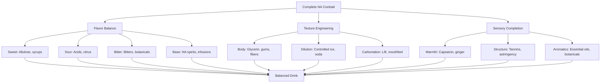

What makes a great non-alcoholic cocktail mirrors what makes any cocktail great: **balance, creativity, and quality ingredients**.[^35] By thoughtfully combining sweet, sour, bitter, and aromatic elements—and leveraging the innovative ingredients now available—formulators can build alcohol-free drinks as complex as any traditional mixed drink. The key insight is that successful non-alcoholic cocktails are not merely subtractive (removing alcohol) but constructive, deliberately building each sensory dimension through strategic ingredient selection and precise integration.

## 4 The Technical Craft: Production Methods and Mixology Techniques

This chapter provides a comprehensive technical examination of the specialized production and mixology techniques that distinguish professional non-alcoholic cocktail preparation from traditional cocktail making. Building upon the ingredient foundations established in Chapter 3—where the strategic deployment of non-alcoholic spirits, acid systems, bittering agents, sweeteners, and functional botanicals was analyzed—this section examines how formulators and bartenders adapt, modify, and innovate upon classical techniques to address the unique challenges posed by alcohol-free formulation. The core relationship between ingredients and techniques in non-alcoholic cocktail crafting is one of **compensation and synergy**: techniques are specifically adapted to maximize the effectiveness of ingredients engineered to fill sensory gaps left by ethanol's absence. The analysis reveals both the convergences and divergences between traditional and non-alcoholic methodologies, demonstrating how constraints have driven creative innovation in the craft.

### 4.1 Dilution Dynamics and Integration Strategies

The management of dilution represents one of the most critical technical differences between alcoholic and non-alcoholic cocktail preparation. While traditional cocktails rely on controlled water addition through shaking or stirring to integrate flavors and achieve proper balance, non-alcoholic formulations face fundamentally different dilution dynamics that require substantial technique modification. Understanding these differences—and mastering the compensatory strategies developed by professional mixologists—is essential for achieving professional-quality results in alcohol-free cocktail preparation.

#### The Fundamental Dilution Challenge

Traditional spirits contain 40% or more ethanol, which affects both flavor perception and the dilution mathematics of cocktail preparation. Non-alcoholic spirits, by contrast, are **primarily water-based**, meaning they arrive at the mixing stage already significantly more diluted than their alcoholic counterparts. This compositional difference creates a cascade of technical challenges: the same shaking or stirring time that properly integrates a traditional cocktail will over-dilute its non-alcoholic equivalent, resulting in watery, flat-tasting drinks that lack the intensity and satisfaction of well-crafted beverages.

As professional guidance emphasizes, **non-alcoholic cocktails require more cautious handling regarding dilution** because NA spirits' high water content makes them prone to over-dilution[^56]. Water is explicitly described as a **mocktail's worst enemy**, capable of killing flavor through dilution from melting ice[^57]. This fundamental constraint drives virtually every technique adaptation discussed in this section.

#### Shortened Shake Times and Large Ice Strategies

The most direct response to over-dilution risk involves modifying the physical parameters of cocktail preparation. Professional recommendations suggest **shaking for only 6-8 seconds** rather than the 10-15 seconds typical for traditional cocktails[^56]. This abbreviated shake time achieves adequate chilling and integration while minimizing water transfer from melting ice.

Ice selection proves equally critical. Using **large ice cubes for shaking** reduces surface area relative to volume, slowing melt rate and limiting dilution during the mixing process[^56]. The physics are straightforward: smaller ice pieces melt faster due to their greater surface-area-to-volume ratio, releasing more water into the cocktail during the same shake duration. Large cubes maintain their structural integrity longer, providing chilling without excessive dilution.

**Stainless steel shakers** offer an additional advantage, as they conduct heat more efficiently than glass alternatives, cooling the cocktail faster and thereby reducing the total shake time required to reach optimal serving temperature[^56]. This faster cooling translates directly to less ice melt and better flavor preservation.

The following table summarizes key dilution management strategies:

| Strategy | Traditional Cocktails | Non-Alcoholic Adaptation | Rationale |
|----------|----------------------|--------------------------|-----------|
| **Shake Duration** | 10-15 seconds | 6-8 seconds | Reduces water transfer from ice melt |
| **Ice Size** | Standard cubes | Large cubes | Lower surface-area-to-volume ratio |
| **Shaker Material** | Glass or metal | Stainless steel preferred | Faster heat transfer, shorter shake time |
| **Ingredient Temperature** | Room temperature acceptable | Pre-chilled preferred | Reduces mixing time required |
| **Service Ice** | Standard cubes | Large, clear cubes | Slower post-service dilution |

#### Pre-Chilling and Ingredient Sequencing

Beyond modifying shake parameters, professional technique emphasizes **pre-chilling non-alcoholic ingredients** before mixing to reduce the total time required for shaking or stirring[^57]. When ingredients enter the shaker already cold, less ice contact time is needed to reach serving temperature, directly reducing dilution.

The sequencing of ingredient addition also matters: **adding liquid components to the shaker before ice** ensures that the ice begins melting only when the cocktail is ready for mixing, rather than during the ingredient assembly process[^56]. This seemingly minor procedural detail can meaningfully impact final dilution levels, particularly in high-volume service environments where cocktails may sit partially assembled.

An alternative approach involves **freezing the mocktail itself into ice cubes**, which can then replace standard ice in the drink[^57]. When these mocktail ice cubes melt, they release concentrated flavor rather than plain water, maintaining or even intensifying the drink's character over time. This technique proves particularly valuable for drinks intended to be sipped slowly, where standard ice would progressively dilute the flavor profile.

#### Rich Syrups and Concentrated Sweeteners

The use of **rich syrup (2:1 sugar-to-water ratio)** rather than standard simple syrup (1:1 ratio) provides another dilution management tool[^56]. Rich syrup achieves equivalent sweetness with less liquid volume, reducing the total water content of the final cocktail. This technique aligns with the broader principle of maximizing flavor intensity per unit volume in non-alcoholic formulations.

The mathematics are straightforward: achieving a given sweetness level with rich syrup requires half the liquid volume compared to standard simple syrup. In a cocktail where sweetener contributes meaningfully to total liquid volume, this substitution can reduce overall dilution by several percentage points—a significant improvement in drinks already challenged by their water-heavy base spirits.

#### Mixer Ratios and Carbonation Management

Traditional highball ratios typically call for **1 part spirit to 3 parts mixer** (e.g., gin and tonic), but non-alcoholic spirits often perform better at **1:1 ratios** with carbonated mixers[^58]. This adjustment compensates for the lower flavor intensity of NA spirits, ensuring that the base spirit's character remains perceptible against the mixer's contribution.

Professional guidance specifically recommends **measuring just 2-3 ounces of seltzer or soda** when topping drinks, rather than filling the glass freely[^59]. Excessive carbonated water thins flavor profiles unacceptably, transforming what should be a sophisticated cocktail into something resembling flavored sparkling water.

The following diagram illustrates the dilution management decision framework:

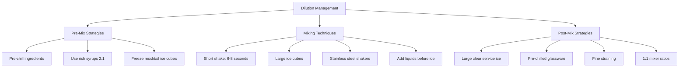

#### Integration Without Over-Dilution

Achieving proper flavor integration while avoiding over-dilution requires understanding that **dilution serves a purpose beyond mere water addition**. In traditional cocktails, dilution mellows harsh alcohol burn, blends disparate flavor components, and adjusts the drink's overall intensity to palatable levels. Non-alcoholic cocktails still benefit from some dilution for flavor integration, but the optimal amount is substantially lower.

The goal is achieving what professionals describe as proper "marriage" of ingredients—the point at which individual components cease to taste distinct and instead contribute to a unified flavor experience. In non-alcoholic applications, this integration can often be achieved through **vigorous but brief shaking** that aerates and combines ingredients without excessive ice contact. The dry shake technique (shaking without ice) can pre-integrate ingredients before a brief final shake with ice provides chilling with minimal additional dilution.

### 4.2 Flavor Layering and Building Complexity

The absence of alcohol fundamentally changes the architecture of flavor construction in cocktail preparation. Ethanol serves not merely as an intoxicant but as a **powerful solvent and flavor carrier** that unifies disparate taste elements into coherent wholes. Without this unifying agent, non-alcoholic cocktail formulators must develop systematic approaches to building multi-dimensional flavor profiles through alternative means. This section examines the techniques and principles that enable sophisticated flavor layering in alcohol-free applications.

#### The Solvent Gap and Its Implications

Alcohol's role as a flavor solvent cannot be overstated. Ethanol dissolves both water-soluble and oil-soluble compounds, extracting and carrying aromatic molecules that water alone cannot access. When this solvent is absent, **each ingredient in a non-alcoholic cocktail plays a larger role** in the overall taste profile, with no alcoholic "glue" to bind disparate elements together[^58].

This heightened ingredient prominence creates both challenges and opportunities. The challenge lies in achieving coherent flavor integration; the opportunity lies in the potential for more nuanced, distinct flavor profiles where each component can be individually perceived and appreciated. Professional non-alcoholic cocktail preparation embraces both aspects, treating ingredient selection and layering as the primary creative tools.

The foundational principle is that **every ingredient must be robustly flavored and high-quality** since there is no alcohol to mask deficiencies[^56]. Substandard ingredients that might be acceptable in traditional cocktails—where alcohol's intensity can overwhelm subtle off-notes—become unacceptably prominent in non-alcoholic applications. This quality imperative extends from base spirits through sweeteners, acids, and garnishes.

#### Combining Multiple NA Spirits for Depth

One of the most effective techniques for building complexity involves **using multiple non-alcoholic spirits in combination** rather than relying on a single product to provide all base-spirit characteristics. Professional guidance explicitly notes that achieving the desired "wow" factor and mouthfeel contribution sometimes requires combining two or more different alcohol-free spirits[^58].

This layering approach acknowledges that no single non-alcoholic product perfectly replicates all the functional properties of ethanol. Different NA spirits excel at different aspects: one might provide excellent botanical aromatics while another contributes better mouthfeel; combining them captures both strengths. The technique mirrors traditional cocktail practices like split-base drinks, but serves a different purpose—compensation for individual product limitations rather than creative flavor exploration.

Practical implementation requires understanding each NA spirit's strengths and weaknesses:

| NA Spirit Type | Primary Strength | Common Limitation | Layering Strategy |
|---------------|------------------|-------------------|-------------------|
| **Botanical-forward** (Seedlip-style) | Aromatic complexity | Limited body/mouthfeel | Combine with texture-focused products |
| **Spirit-replica** (Ritual, Lyre's) | Familiar flavor profiles | May lack depth | Layer with botanical products |
| **Functional** (adaptogen-infused) | Unique effects | Flavor may be secondary | Use as accent rather than base |
| **Texture-focused** | Body and mouthfeel | May lack aromatic interest | Combine with aromatic products |

#### Strategic Deployment of Verjus and Soft Acidity

**Verjus**—the pressed juice of unripe grapes—provides a valuable tool for introducing soft acidity without the assertive citrus character of lemon or lime juice[^56]. Its wine-like quality makes verjus particularly suitable for aperitif-style non-alcoholic cocktails and drinks seeking sophisticated, European-inspired profiles.

Unlike citric acid's bright, immediate sourness, verjus delivers **gentle, rounded acidity** that integrates smoothly with other flavor elements. This characteristic makes it valuable for drinks where aggressive sourness would be inappropriate—wine-based mocktails, vermouth-style preparations, and subtle botanical compositions. The grape origin also contributes flavor compounds beyond mere acidity, adding complexity that pure acid solutions cannot provide.

Professional technique recommends verjus as a **bridge ingredient** between sweet and bitter elements, providing the acidic backbone that prevents cloying sweetness while maintaining the elegance appropriate to sophisticated preparations.

#### Shrub Integration for Concentrated Complexity

**Shrubs**—concentrated preparations of fruit, sugar, and vinegar—represent one of the most powerful flavor-building tools available to non-alcoholic cocktail formulators. These preparations deliver multiple flavor dimensions simultaneously: fruit character, sweetness, and the tangy, robust acidity that vinegar provides[^57].

The vinegar component proves particularly valuable because it provides **"bite" to a drink that would otherwise rely on alcohol**[^57]. Acetic acid's sharp, pungent character creates a sensation analogous to alcohol's burn, helping non-alcoholic cocktails achieve the adult character that distinguishes them from simple fruit beverages.

Shrub preparation involves macerating fruit with sugar to extract juices, then combining with vinegar and allowing the mixture to mature. The result is a concentrated syrup that can be deployed in small quantities to dramatic effect. Professional guidance notes that shrubs typically work best in cocktails **without additional citrus elements**, as the vinegar already provides substantial acidity[^58].

#### Tea Infusions for Tannic Structure

The strategic use of **over-steeped teas** provides tannic structure reminiscent of barrel-aged spirits, contributing the drying, grippy sensation that slows drinking pace and signals complexity[^58]. Black tea proves particularly effective, introducing tannins that create mouthfeel characteristics similar to those found in whiskey, brandy, or aged rum.

The technique requires deliberate over-extraction: teas should be brewed **stronger than would be palatable for drinking**, creating concentrated preparations whose tannin intensity can withstand dilution in the final cocktail[^58]. A tea that tastes pleasantly balanced when sipped will contribute little tannic character when combined with other cocktail ingredients; only concentrated preparations provide meaningful structural contribution.

Different tea varieties offer distinct characteristics:

- **Black tea**: Strong tannins, malty notes, whiskey-like structure
- **Pu-erh tea**: Earthy, complex, aged spirit character[^56]
- **Lapsang Souchong**: Smoky notes, mezcal-like qualities[^56]
- **Green tea**: Lighter tannins, grassy notes, gin-like freshness

Professional preparation typically involves brewing concentrated tea, **cooling to room temperature** before use, and storing refrigerated for up to one week[^58].

#### The Push-and-Pull Principle

The fundamental principle underlying all flavor layering in non-alcoholic cocktails is achieving **push-and-pull contrast**—the dynamic tension between opposing taste elements that creates interest and satisfaction. Every good alcohol-free cocktail should include at least two of the fundamental components (sweet, sour, bitter, bold base flavor), with the best drinks incorporating three or more[^58].

This principle reflects the basic architecture of successful cocktails across all categories: sweetness without acidity becomes cloying; acidity without sweetness becomes harsh; bitterness without balance becomes unpleasant. The interplay between these elements creates the complexity that distinguishes cocktails from simple beverages.

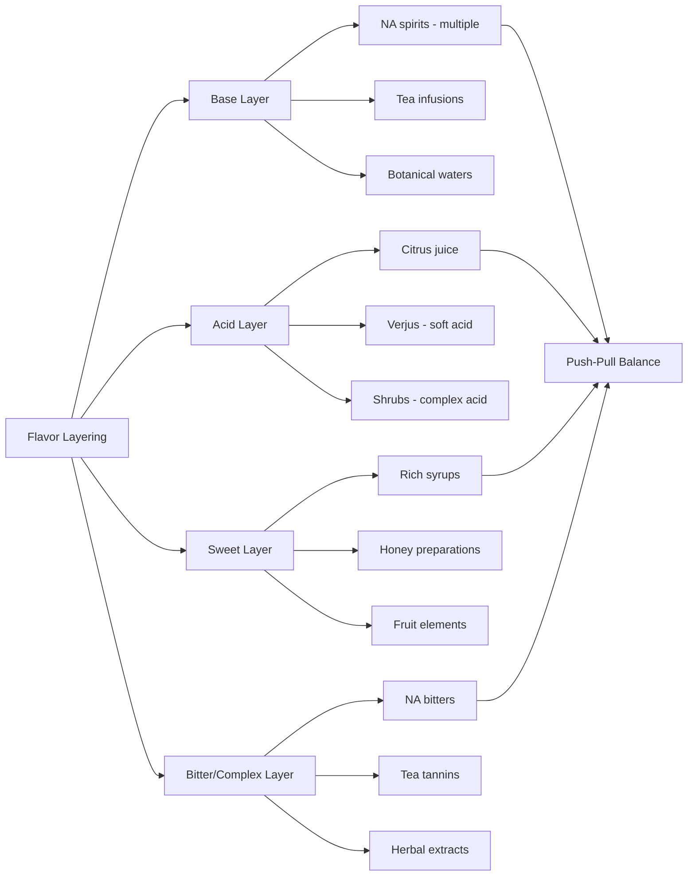

### 4.3 Clarification Techniques: Milk Washing and Beyond

Clarification represents one of the most sophisticated technique categories in advanced cocktail preparation, transforming cloudy, tannic beverages into crystal-clear preparations with enhanced mouthfeel and refined flavor profiles. The **milk punch clarification technique**—dating to the 18th century—has been successfully adapted for non-alcoholic applications, offering formulators a powerful tool for creating elegant, shelf-stable preparations that rival the complexity of traditional spirits.

#### The Science of Milk Clarification

The milk punch clarification process relies on the interaction between **milk proteins (particularly casein) and tannins/polyphenols** present in the beverage being clarified[^60]. When milk meets acid (such as citrus juice or citric acid), it curdles—but more importantly, the casein proteins bind to compounds responsible for bitterness, astringency, and cloudiness. Once bound, these curds can be strained away, leaving behind a **clear, soft, and stable liquid** with a rounder mouthfeel and refined flavor[^60].

The technique's applicability to non-alcoholic beverages stems from a crucial insight: **alcohol is not essential to the clarification process**[^61]. The key agents are the dairy proteins and the acid that causes curdling—citrus juice or citric acid solutions work regardless of whether alcohol is present. This means that tea-based preparations, fruit juices, and other non-alcoholic bases can all be clarified using the milk punch method.

The groundbreaking "Liar's Gambit" cocktail, developed by Matthew Garcia for Death & Co. Denver in 2018, demonstrated this principle using **Seedlip non-alcoholic distillate** as the base[^61]. The resulting clarified milk punch achieved the silky texture and visual clarity associated with traditional preparations while containing no alcohol.

#### Critical Procedural Details

The most important procedural element in milk clarification is the **order of mixing**: the punch mixture (containing acid and tannins) must be **poured into the milk, not vice versa**[^60]. This sequence ensures proper curd formation as proteins react instantly with acid and tannins upon contact. Reversing the order—adding milk to punch—produces inferior results with incomplete curdling and reduced clarification effectiveness.

The complete process involves several stages:

1. **Prepare the punch base**: Combine tea (or other tannin source), sweetener, and acid (citrus juice or citric acid solution)
2. **Adjust water content**: Account for any evaporation during preparation to maintain proper concentration
3. **Initiate curdling**: Pour the punch mixture into whole milk, stir gently 3-4 times, and allow to rest undisturbed
4. **First filtration**: Strain through fine mesh, collecting curds separately
5. **Second filtration**: Pour the initially filtered liquid back through the collected curds for enhanced clarity
6. **Storage**: Refrigerate the clarified preparation until use

A specific non-alcoholic recipe demonstrates these principles[^60]:

| Component | Amount | Function |
|-----------|--------|----------|
| Mao Feng green tea | 1.125g | Tannin source |
| Distilled water | 250g (heated to 176°F) | Extraction medium |
| Whole milk | 958.5g | Clarifying agent |
| Granulated sugar | 181g | Sweetener |
| 6% citric acid solution | 116.5g | Curdling agent |

The tea provides tannins that bind with casein during clarification, while the citric acid solution triggers the curdling reaction. The result is a **clear, silky preparation** with the tea's gentle florality preserved but its astringency removed[^60].

#### Probiotic Yogurt Clarification

An innovative variation uses **probiotic yogurt** rather than whole milk for clarification, as demonstrated in the "Puppy Pose" non-alcoholic milk punch[^62]. This approach offers several advantages: yogurt's existing acid content (from lactic acid produced during fermentation) can reduce the amount of additional acid required, while probiotic cultures may contribute subtle flavor complexity.

**Yogurt whey**—the watery liquid that separates from strained yogurt—provides another rapid method for adding richness to non-alcoholic preparations[^62]. Ryan Chetiyawardana's "Whey Punch" uses filtered full-fat yogurt whey to quickly add body, achieving "the silky smoothness you want to drink" through a faster process than traditional milk clarification[^62].

#### Non-Dairy Clarification Alternatives

For vegan applications or situations where dairy is unavailable, several **non-dairy alternatives** have been developed, though each requires modified techniques:

**Coconut milk** can clarify beverages but presents challenges due to its relatively low fat content compared to dairy milk. Deepali Gupta at Sidecar in New Delhi produces coconut milk-clarified Piña Coladas, sometimes adding coconut oil to increase fat content and improve clarification results[^62].

**Soy milk** (particularly ultra-concentrated versions like Pacific Foods Ultra Soy) has proven effective, though non-dairy clarification typically requires **longer processing times**—practitioners advise "setting aside a weekend" for the process[^62]. The protein structure of soy differs from dairy casein, requiring experimentation to achieve optimal ratios and timing.

**Oat milk** represents another option, with testing suggesting that barista-style oat milks (designed for foaming) may perform better than standard varieties due to their modified protein content[^63].

**Silken tofu with lactic acid** offers an accelerated non-dairy approach. Giancarlo Quiroz Jesus adds lactic acid solution to silken tofu to speed the clarification process for his "Always Disco" preparation[^62].

**Powdered milk** provides a unique alternative that eliminates the need for citrus-based acidification. Daniel Villa developed a method using rehydrated milk powder that can clarify beverages without additional acid, enabling clarification of drinks like Vieux Carré that traditionally contain no citrus[^62]. An additional benefit: the powdered milk can be toasted before rehydration, producing cocktails that taste "like a milk punch and a brown butter fat wash at the same time"[^62].

The following table compares clarification media:

| Medium | Advantages | Challenges | Best Applications |
|--------|------------|------------|-------------------|
| **Whole milk** | Reliable, well-documented | Dairy allergen | Traditional preparations |
| **Probiotic yogurt** | Added complexity, existing acid | Variable results | Experimental preparations |
| **Yogurt whey** | Fast, adds richness | Less clarification effect | Quick body enhancement |
| **Coconut milk** | Vegan, tropical character | Low fat, smaller yield | Tropical-style drinks |
| **Soy milk (ultra)** | Vegan, good protein content | Longer processing time | General vegan applications |
| **Silken tofu + acid** | Accelerated process | Requires acid addition | Time-sensitive applications |
| **Powdered milk** | No citrus needed, toastable | Requires rehydration | Non-citrus preparations |

#### Advanced Clarification Techniques

Professional bartenders have developed several refinements to accelerate and improve clarification:

**Increased surface area** speeds the process significantly. Wes Meyn at Night on Earth uses wide, shallow hotel pans for clarification rather than deep containers, increasing surface area to form larger curds and accelerate filtration[^62].

**Tannin-containing ingredients** help "break down" fats and proteins in non-dairy clarifications. Adding tannic components (tea, grape skins, or other polyphenol sources) improves results when working with coconut milk or other plant-based alternatives[^62].

**Post-processing thickening** can restore body lost during clarification. A "pre-hy" solution (pre-hydrated xanthan gum, vacuum-sealed to remove air bubbles) at 10% by weight transforms clarified preparations into **maple syrup-like viscosity** suitable for plating, mixing, or glazing[^60].

### 4.4 Fat-Washing Adaptations for Non-Alcoholic Bases

Fat-washing represents one of the most innovative techniques in modern mixology, using fats and oils to impart distinctive flavors and textures to spirits. The technique gained prominence through Don Lee's iconic "Benton's Old-Fashioned" at PDT around 2007-2008, which combined bourbon with bacon fat[^64][^65]. Adapting this technique for non-alcoholic applications presents significant challenges, as fat-washing fundamentally relies on **alcohol's solvent properties** to extract aromatic compounds from fats. This section examines both the limitations and the creative workarounds that enable fat-washing principles to enhance alcohol-free beverages.

#### The Fundamental Challenge

Fat-washing works because **alcohol is an excellent solvent** for both water-soluble and oil-soluble flavor compounds[^65]. When fat is combined with a spirit and allowed to infuse, alcohol dissolves aromatic molecules from the fat, carrying them into solution. After chilling (which solidifies the fat for easy removal), the spirit retains the fat's flavor characteristics without the actual fat content—creating a transformed spirit with enhanced depth and silky mouthfeel[^66].

The challenge for non-alcoholic applications is clear: **water cannot replicate alcohol's solvent action** on fat-soluble compounds. Simply combining fat with water or water-based NA spirits will not achieve the flavor transfer that makes fat-washing effective with alcoholic spirits. The fat and water will separate rather than exchange aromatic compounds.

As Monica Berg, Campari Academy Creative Director, explains: fat-washing utilizes **fat's excellent ability to carry flavor**—much like alcohol, fat has the power to lock in flavor and transport it, but unlike alcohol, it often preserves more volatile and delicate nuances[^67].

#### The Four Applications of Fat-Washing

Understanding the purposes fat-washing serves helps identify which applications can translate to non-alcoholic contexts:

**1. Adding Flavor**: Oils like olive oil, hazelnut oil, walnut oil, or coconut oil add their distinctive flavors to infused spirits[^67]. The oil can also be pre-infused with herbs, spices, chili, or other aromatics before fat-washing, using the oil as a flavor carrier[^67].

**2. Adding Texture**: Fats solid at room temperature—butter, duck fat, beef dripping—wrap the spirit in "a veil of indulgence, richness and softness," neutralizing sharp edges and creating a rounded, mellow character[^67]. This textural transformation represents one of fat-washing's most valued effects.

**3. Adding Acidity**: Cultured butter specifically provides not only rich, creamy flavor and decadent texture but also a **tangy finish from lactic acid**[^67]. This acidity contribution adds another dimension to fat-washed preparations.

**4. Taming Heat**: When showcasing hot chilis without overwhelming heat, fat-washing proves invaluable. By first infusing chili in oil, then fat-washing, the **fruity notes are preserved while heat is controlled**[^67]. This technique enables featuring chilis' complex flavor profiles without their full Scoville intensity.

#### Adaptation Strategies for Non-Alcoholic Applications

While direct fat-washing of water-based NA spirits faces fundamental limitations, several **alternative approaches** can achieve similar results:

**Infused Oil Additions**: Rather than fat-washing an NA spirit, prepare a flavored oil separately and add it in small quantities to the final cocktail. The oil will float on the surface, providing aromatic impact and visual interest. This approach works particularly well for garnishing and aromatic enhancement, though it doesn't achieve the full integration of traditional fat-washing.

**Emulsification Techniques**: Using emulsifiers (lecithin, gum arabic, or egg yolk) can create stable dispersions of flavored oils in water-based beverages. These emulsions distribute fat-derived flavors throughout the drink rather than leaving them floating on top. The technique requires careful formulation to achieve stability without undesirable texture.

**Fat-Washed Syrups**: Prepare a traditional fat-washed spirit, then use it to create a syrup or extract that can be added to non-alcoholic cocktails. This approach preserves the fat-washing effect in a form compatible with NA applications. The small amount of alcohol in the syrup (diluted in the final drink) may be acceptable for some applications.

**Sous Vide Fat Infusions**: Using immersion circulators to infuse fats with flavoring ingredients at precisely controlled temperatures, then incorporating the flavored fat through emulsification or surface application. Sous vide equipment provides **unprecedented consistency** in temperature and timing, preventing the fat burning that can introduce undesirable flavors[^66].

The standard fat-washing process for spirits involves:

1. **Combine fat and spirit**: Recommended ratio of 1 part fat to 5 parts alcohol, adjustable based on fat intensity[^66]
2. **Infuse**: Allow to sit at room temperature for several hours to several days
3. **Freeze**: Chill until fat solidifies and rises to top (12 hours to overnight)
4. **Strain**: Remove solidified fat through fine strainer or coffee filter
5. **Store**: Fat-washed spirit keeps for approximately three months[^68]

For non-alcoholic adaptations, the infusion and freezing steps can be applied to flavored oils that are subsequently incorporated through emulsification or surface application.

#### Practical Applications and Limitations

The most successful non-alcoholic applications of fat-washing principles focus on **aromatic and surface effects** rather than full flavor integration:

**Aromatic oils** expressed over the drink's surface provide immediate sensory impact. Olive oil, nut oils, or infused oils can be applied in small quantities (a few drops) to create aromatic complexity without requiring dissolution in the base liquid.

**Butter-washed preparations** can contribute to non-alcoholic cocktails through **cultured butter's lactic acid content**, which survives the fat-washing process and can be incorporated through emulsification. The tangy character adds complexity while the residual fat provides textural enhancement.

**Temperature considerations** matter significantly: Monica Berg advises **never using heat when working with fats**, as heat often destroys the subtle nuances that make fat-washing valuable[^67]. This guidance applies equally to non-alcoholic adaptations.

The honest assessment is that fat-washing's full transformative effect—the complete flavor integration and textural modification achieved with alcoholic spirits—**cannot be fully replicated** in water-based non-alcoholic applications. However, the principles underlying fat-washing (using fat as a flavor carrier, texture modifier, and heat controller) can inform creative approaches that achieve partial effects through alternative techniques.

### 4.5 Sophisticated Syrups, Infusions, and Flavor Extractions

The preparation of sophisticated syrups, infusions, and flavor extractions represents the foundation of professional non-alcoholic cocktail craft. These preparations enable bartenders to capture, concentrate, and deploy flavors that would otherwise be inaccessible in alcohol-free formats. Because non-alcoholic cocktails lack alcohol's natural flavor-extraction and carrying capabilities, **advanced preparation techniques become even more critical** than in traditional cocktail making.

#### Oleo Saccharum: Capturing Citrus Aromatics

**Oleo saccharum**—Latin for "oil sugar"—describes the process of using sugar to extract aromatic oils from citrus peels[^57]. This technique directly addresses a significant limitation of non-alcoholic drinks: their tendency to lack the aromatic intensity that alcohol naturally provides.

The process exploits osmosis: sugar draws moisture from citrus peel cells while simultaneously dissolving the aromatic oils contained within. The result is a **citrus-infused syrup** that captures volatile compounds often lost in juicing or simple syrup preparation.

The preparation method involves:

1. **Muddle citrus peels with sugar**: Combine fresh peels (avoiding bitter white pith) with granulated sugar
2. **Seal and rest**: Place in an airtight container or vacuum bag, removing air
3. **Wait**: Allow several hours (or overnight) for oils to extract
4. **Collect**: The sugar will have transformed into a citrusy, oily syrup

Oleo saccharum provides **aromatic depth** that standard citrus juice or simple syrup cannot match. The technique captures essential oils that evaporate during juicing, preserving the bright, complex character of fresh citrus peel. For non-alcoholic cocktails, where every flavor component must work harder to create complexity, oleo saccharum offers a powerful tool for aromatic enhancement.

#### Fruit and Herb-Infused Syrups

Infusing syrups with fruits and herbs represents one of the most accessible yet effective techniques for adding extra flavor dimensions to drinks[^68]. Two primary methods dominate professional preparation: **blender method** and **heat infusion**.

**Blender Method for Fruit Syrups** (example: Blackberry Syrup)[^68]:
- Combine 2 cups fresh fruit, 1.5 cups filtered water, and 1.5 cups granulated sugar
- Blend on high for 90 seconds
- Allow to settle for 90 seconds
- Strain through semi-fine mesh
- Store refrigerated (2-3 weeks) or frozen (6 months)

**Blender Method for Herb Syrups** (example: Basil Syrup)[^68]:
- Combine 1 cup filtered water and 1 cup sugar, blend 90 seconds
- Add 15 fresh herb leaves, blend on medium 10 seconds
- **Strain immediately** to prevent oxidation and bitterness
- Store refrigerated (2-3 weeks) or frozen (6 months)

The blender method offers speed and efficiency while preserving fresh flavor character. The brief blending time for herbs prevents the chlorophyll breakdown that causes bitterness and color degradation.

**Homemade Orange Syrup** demonstrates heat-infusion technique[^59]:
- Combine ½ cup sugar, zest of 3 oranges, 2-3 thumb-sized orange peel slices (with pith for slight bitterness), ¼ cup orange juice, and ½ cup water
- Bring orange juice, water, and zest to gentle simmer
- Add sweetener, dissolve completely
- Remove from heat, steep orange peels (optional: fresh jalapeño for spice)
- Cool, strain, and store

This recipe illustrates how **intentional bitterness** (from orange pith) creates more complex, adult-oriented preparations than purely sweet syrups.

#### Shrub Preparation and Integration

**Shrubs** combine fruit, sugar, and vinegar to create concentrated preparations delivering sweetness, fruit character, and tangy acidity simultaneously[^57]. The vinegar base makes shrubs particularly valuable for non-alcoholic cocktails, providing the "bite" that would otherwise come from alcohol.

Traditional shrub preparation involves:

1. **Macerate fruit with sugar**: Allow sugar to draw out fruit juices (24-48 hours)
2. **Add vinegar**: Combine fruit-sugar mixture with vinegar (apple cider, white wine, or other varieties)
3. **Age**: Allow flavors to meld (1-2 weeks minimum)
4. **Strain and bottle**: Remove solids for clear, concentrated syrup

The resulting shrub can be deployed in small quantities—typically 0.5-1 oz per drink—to dramatic effect. Professional guidance notes that shrubs work best in cocktails **without additional citrus**, as the vinegar already provides substantial acidity[^58].

#### Cold Infusion and Heat-Sensitive Botanicals

**Cold infusion** preserves delicate compounds that heat would destroy, making it essential for working with heat-sensitive botanicals like fresh herbs, delicate flowers, and certain fruits. The technique involves extended steeping at refrigerator temperatures (typically 24-72 hours) rather than heat-accelerated extraction.

Cold infusion proves particularly valuable for:
- **Fresh mint and basil**: Heat causes rapid oxidation and bitterness
- **Cucumber**: Heat destroys fresh, vegetal character
- **Delicate flowers**: Heat evaporates volatile aromatics
- **Certain fruits**: Heat can create "cooked" flavors inappropriate for fresh applications

The trade-off is time: cold infusion requires patience that heat-based methods avoid. Professional bar programs often maintain multiple cold infusions at various stages, ensuring continuous availability of these delicate preparations.

#### Cryo-Maceration for Intensified Extraction

**Cryo-maceration** involves freezing botanicals before maceration, causing ice crystals to form within plant cells. When the botanicals thaw during maceration, cell walls rupture, releasing concentrated flavors that standard maceration cannot access.

This technique provides several advantages:
- **Intensified aromas**: Cellular rupture releases compounds trapped within intact cells
- **Reduced oxidation**: Freezing slows enzymatic browning
- **Unique mouthfeel**: The extraction process produces distinct textural characteristics

Cryo-maceration represents a newer technique in cocktail preparation, borrowed from winemaking where it's used to enhance color and flavor extraction from grape skins.

#### Sous Vide and Precision Temperature Control

**Immersion circulators** (sous vide equipment) enable precise low-temperature infusions that maximize flavor extraction while preserving volatile compounds that higher temperatures would destroy[^58]. The technique involves vacuum-sealing ingredients and maintaining exact temperatures for extended periods.

Sous vide advantages for syrup and infusion preparation:
- **Consistency**: Precise temperature control produces reproducible results
- **Efficiency**: Vacuum sealing maximizes ingredient contact
- **Preservation**: Low temperatures protect delicate compounds
- **Safety**: Controlled conditions reduce contamination risk

The technique proves particularly valuable for **extracting original flavors** from botanicals while avoiding the flavor changes that occur at higher temperatures[^58].

#### Lactic Acid Enhancement

Adding **lactic acid to syrups** enhances mouthfeel by contributing the rounded, creamy character associated with dairy fermentation[^58]. This technique addresses the textural gap left by alcohol's absence, adding body and smoothness that sugar alone cannot provide.

Lactic acid integration typically involves:
- Adding small quantities (0.1-0.5% by weight) to finished syrups
- Adjusting to taste, as lactic acid's character differs from citric acid
- Balancing with sweetness to avoid excessive tanginess

The result is syrups that contribute not only sweetness and flavor but also enhanced mouthfeel that helps non-alcoholic cocktails achieve satisfying body.

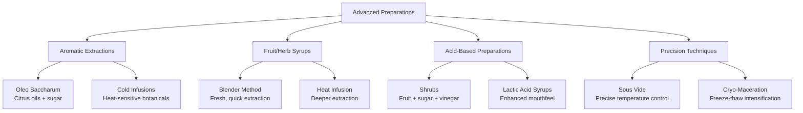

### 4.6 Technique Adaptations: Shaking, Stirring, Muddling, and Carbonation

The fundamental bartending techniques—shaking, stirring, muddling, and carbonation—require thoughtful modification for non-alcoholic applications. While the basic mechanical actions remain similar, their purposes, durations, and expected outcomes differ significantly when alcohol is absent from the equation. This section examines how each technique functions differently in non-alcoholic contexts and provides guidance for optimal execution.

#### Muddling: Releasing Essential Oils and Juices

**Muddling** serves to release essential oils and juices from fresh ingredients, enhancing overall flavor and aroma[^69]. The technique involves gently pressing ingredients (typically herbs, citrus, or fruits) against the bottom of a mixing glass or shaker to rupture cell walls and liberate their contents.

In non-alcoholic applications, muddling takes on heightened importance because **there is no alcohol to extract and carry aromatic compounds**. The mechanical action of muddling must accomplish what alcohol's solvent action would otherwise achieve—releasing volatile oils that contribute aromatic complexity.

Proper muddling technique for non-alcoholic cocktails:
- **Use gentle pressure**: Aggressive muddling releases bitter compounds from herbs (chlorophyll from over-crushed leaves) and excessive pith bitterness from citrus
- **Focus on aromatic release**: The goal is liberating oils, not pulverizing ingredients
- **Muddle before adding other ingredients**: This ensures maximum contact between muddler and target ingredients
- **Consider ingredient-specific approaches**: Soft herbs (mint, basil) require lighter pressure than firmer ingredients (citrus, cucumber)

The aromatic contribution of properly muddled ingredients proves particularly valuable in non-alcoholic cocktails, where every source of complexity must be maximized.

#### Shaking: Aeration, Integration, and Texture

**Vigorous shaking** serves multiple purposes: rapid mixing of ingredients, aeration (incorporating air for lighter texture), chilling, and dilution[^69]. For non-alcoholic cocktails, the technique requires modification to achieve integration without excessive dilution.

The key adaptations for non-alcoholic shaking include:

**Shortened duration**: As discussed in Section 4.1, shaking for **6-8 seconds** rather than the traditional 10-15 seconds reduces dilution while still achieving adequate mixing and chilling[^56].

**Dry shaking for foam**: When using egg whites or aquafaba for foam development, a **dry shake (without ice) for thirty seconds** followed by a brief shake with ice produces optimal frothy texture[^59]. The dry shake develops the protein foam without dilution, while the subsequent ice shake provides chilling.

**Texture considerations**: Techniques from classic cocktails—using pasteurized egg whites, gomme syrup, aquafaba, and whole milk powder—still apply for adding body, air, and viscosity to shaken mocktails[^59]. These textural elements help compensate for alcohol's absent contribution to mouthfeel.

#### Stirring: Clarity and Layered Flavors

**Gentle stirring** differs fundamentally from shaking in its purposes and outcomes[^69]. Where shaking aerates and vigorously integrates, stirring maintains clarity while gently combining ingredients. Stirring is more appropriate for **layered drinks** where preserving the distinctness and intensity of bottom-layer flavors matters[^69].

For non-alcoholic applications, stirring presents fewer adaptation challenges than shaking because its gentler action produces less dilution. However, the same principles of **shortened duration and large ice** apply to minimize water transfer.

Stirring proves particularly appropriate for:
- Spirit-forward style drinks where clarity matters
- Layered preparations where distinct flavor strata are desired
- Drinks served up (without ice) where excessive dilution would be apparent

#### Carbonation Management

**Carbonation** serves multiple functions in non-alcoholic cocktails: providing lift and energy, enhancing mouthfeel perception, and contributing the effervescent quality associated with celebratory beverages. However, carbonation requires careful management to avoid overwhelming delicate flavors.

Key carbonation considerations:

**Amplification effects**: Carbonation intensifies certain sensory perceptions. As noted in Chapter 3, capsaicin and other trigeminal stimulants read **stronger in carbonated systems** than in still beverages. Formulators must account for this amplification when balancing heat-building ingredients.

**Volume control**: Professional guidance recommends measuring **specific quantities of carbonated mixer** rather than free-pouring. Two to three ounces of seltzer or soda typically suffices; excessive carbonation dilutes flavor and creates overly fizzy drinks that lack sophistication.

**Carbonation levels**: Different carbonation intensities suit different drink styles. Light carbonation (2.0-2.5 volumes CO2) suits delicate, aperitif-style drinks; moderate carbonation (2.5-3.0 volumes) works for highballs and spritzers; higher carbonation (3.0+ volumes) suits bold, refreshing applications.

#### Temperature Control Strategies

**Temperature management** extends beyond ice selection to encompass the entire preparation and service environment:

**Pre-chilled glassware** reduces the thermal load on the cocktail, meaning less ice melt is required to bring the drink to serving temperature[^56]. Glasses can be chilled in freezers or filled with ice water while preparing the cocktail.

**Fine straining** removes small ice shards that would continue melting in the served drink, contributing to post-service dilution[^56]. Double-straining through a fine mesh (Hawthorne strainer plus fine strainer) produces cleaner drinks with more controlled dilution.

**Large, clear service ice** melts more slowly than standard cubes, extending the window during which the drink maintains optimal concentration[^56]. The visual appeal of clear ice also enhances presentation.

**Ingredient temperature**: Serving temperature recommendations suggest **38-42°F (3-6°C)** for optimal flavor perception[^70]. At this temperature, flavors are perceptible but not muted by excessive cold.

| Technique | Traditional Purpose | NA Adaptation | Key Modification |
|-----------|--------------------|--------------|--------------------|
| **Muddling** | Release oils/juices | Same, heightened importance | Gentle pressure, aromatic focus |
| **Shaking** | Mix, aerate, chill, dilute | Same, reduced dilution | 6-8 seconds, large ice |
| **Dry Shaking** | Foam development | Same | 30 seconds without ice |
| **Stirring** | Gentle integration, clarity | Same | Shortened duration |
| **Carbonation** | Lift, mouthfeel | Same, careful management | Measured additions, 2-3 oz |
| **Temperature Control** | Proper serving temp | Same, critical for dilution | Pre-chill everything |

### 4.7 Comparative Analysis: Traditional Versus Non-Alcoholic Methodologies

This section synthesizes the preceding technical discussions into a systematic comparison of traditional cocktail preparation and non-alcoholic adaptations. Understanding which classic cocktail structures translate successfully—and which require creative reformulation—enables bartenders and formulators to make informed decisions about recipe development and technique selection.

#### Cocktail Structures That Translate Successfully

Certain classic cocktail categories translate more readily to non-alcoholic formats because their **inherent structure already incorporates elements** that compensate for alcohol's functional properties. These categories succeed because citrus, syrup, soda, and other non-alcoholic components already provide significant flavor intensity, sweetness, and textural interest.

**Sours** (spirit + citrus + sweetener) translate well because the acid-sweet balance creates immediate complexity[^56]. The sour structure provides the push-and-pull contrast essential to satisfying cocktails without relying heavily on spirit character. NA sours succeed when the base spirit provides adequate botanical or flavor interest to anchor the preparation.

**Collins** (spirit + citrus + sweetener + soda) benefit from carbonation's textural contribution and the inherent dilution that soda provides[^56]. The longer format means spirit intensity matters less than in concentrated drinks.

**Mules** (spirit + ginger beer + citrus) succeed because ginger beer provides both carbonation and the spicy "bite" that mimics alcohol's warmth[^56]. The bold ginger character can carry drinks even when the base spirit lacks intensity.

**Spritzes** (spirit + sparkling wine + soda) translate effectively because the format already emphasizes lightness and refreshment over spirit intensity[^56]. NA aperitifs and sparkling elements can replicate the spritz experience with high fidelity.

The following table summarizes cocktail structure adaptability:

| Structure | Key Components | NA Translation Ease | Success Factors |
|-----------|---------------|---------------------|-----------------|
| **Sours** | Spirit, citrus, sweet | High | Acid-sweet balance provides complexity |
| **Collins** | Spirit, citrus, sweet, soda | High | Carbonation adds texture; diluted format |
| **Mules** | Spirit, ginger beer, citrus | High | Ginger provides heat and character |
| **Spritzes** | Spirit, sparkling, soda | High | Light format; aperitif style |
| **Highballs** | Spirit, mixer | Moderate | Depends on mixer quality |
| **Old Fashioneds** | Spirit, sugar, bitters | Low | Spirit-forward; requires creativity |
| **Manhattans** | Spirit, vermouth, bitters | Low | Spirit-forward; complex reformulation |
| **Martinis** | Spirit, vermouth | Very Low | Extremely spirit-dependent |

#### Spirit-Forward Drinks: The Reformulation Challenge

**Spirit-forward drinks**—Old Fashioneds, Manhattans, Negronis, Martinis—present the greatest challenges for non-alcoholic adaptation[^56]. These cocktails derive their character primarily from the base spirit, with other ingredients serving supporting roles. When the spirit's flavor intensity and structural contribution disappear, the entire drink architecture collapses.

The challenge is fundamental: **non-alcoholic spirits lack the flavor impact** of 40-50% ABV traditional spirits[^56]. A bourbon's caramel, vanilla, and oak notes; a gin's juniper-forward botanical complexity; a whiskey's smoky depth—these characteristics define spirit-forward cocktails, and NA alternatives cannot fully replicate them.

Successful NA versions of spirit-forward drinks typically require **creative reformulation** rather than direct substitution:

- **Combining multiple NA spirits** to build complexity that no single product provides
- **Increasing bitter and tannic elements** to create structure and slow drinking pace
- **Adding textural components** (glycerin, gums, rich syrups) to provide the body alcohol would contribute
- **Emphasizing aromatic elements** through garnishes, expressed oils, and aromatic bitters

The honest assessment is that NA Old Fashioneds and Manhattans will never taste identical to their alcoholic originals. The goal shifts from replication to **creating satisfying drinks that evoke similar experiences** through alternative means.

#### Additional Demands of NA Cocktail Preparation

Non-alcoholic cocktail preparation imposes **greater demands** on time, precision, and ingredient quality compared to traditional methods:

**Time investment**: Many NA techniques require advance preparation—infusions, clarifications, and specialized syrups cannot be made à la minute. Bar programs must plan ahead, maintaining inventories of prepared components.

**Precision requirements**: Without alcohol's forgiving nature, **every measurement matters more**. Small imbalances that alcohol might mask become prominent in NA drinks. Professional preparation requires accurate measurement tools and consistent technique.

**Ingredient quality**: As emphasized throughout this chapter, **every ingredient must be robustly flavored and high-quality**[^56]. Substandard ingredients that might be acceptable in traditional cocktails become unacceptably prominent in non-alcoholic applications.

**Knowledge demands**: NA cocktail preparation requires understanding not just traditional techniques but also their modifications, the science behind clarification and fat-washing, and the properties of specialized ingredients. The learning curve exceeds that of traditional bartending.

#### Principles for Successful Technique Transfer

Several principles guide successful adaptation of traditional techniques to non-alcoholic contexts:

**1. Understand the technique's purpose**: Before adapting any technique, identify what it accomplishes in traditional applications. Dilution management, flavor extraction, texture development, and visual presentation each require different adaptation strategies.

**2. Identify the alcohol-dependent elements**: Determine which aspects of the technique rely on alcohol's properties (solvent action, preservation, mouthfeel contribution) and which are alcohol-independent (mechanical mixing, temperature change, aeration).

**3. Develop compensatory strategies**: For alcohol-dependent elements, identify alternative approaches—different solvents, emulsification, extended extraction times, or alternative ingredients that achieve similar outcomes.

**4. Accept limitations**: Some techniques cannot be fully replicated without alcohol. Acknowledge these limitations and focus on achieving the best possible results within constraints rather than pursuing impossible perfection.

**5. Embrace innovation**: Constraints drive creativity. The most successful NA cocktail programs develop **novel techniques** that achieve results impossible in traditional contexts, rather than merely adapting existing methods.

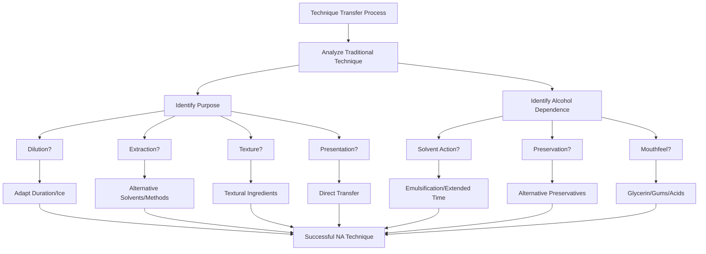

The comparative analysis reveals that non-alcoholic cocktail preparation represents not merely a subset of traditional bartending but a **distinct discipline** with its own technical requirements, creative possibilities, and quality standards. Success requires both deep understanding of traditional methods and willingness to innovate beyond them, treating constraints as opportunities for creative problem-solving rather than insurmountable obstacles.

## 5 Formulation Challenges and Sensory Design

This chapter provides a systematic technical analysis of the core formulation challenges inherent in creating premium non-alcoholic cocktails that deliver adult-oriented sensory experiences. Building upon the ingredient foundations and production techniques established in Chapters 3 and 4, this section examines how formulators address the fundamental sensory gaps created by ethanol's absence—specifically the replication of warmth, bite, viscosity, and aromatic solvent effects. The analysis evaluates current solutions including capsicum-based heat delivery, glycerol-mediated body enhancement, and advanced bittering systems, assessing their effectiveness both individually and in combination. The chapter synthesizes scientific understanding of alcohol's multi-sensory contributions with practical formulation strategies, demonstrating how sophisticated ingredient selection and precise calibration can create balanced flavor profiles that transcend mere sweetness to achieve the complexity consumers expect from premium beverages.

### 5.1 Deconstructing Ethanol's Sensory Contributions: The Multi-Dimensional Challenge

Understanding why alcohol removal creates such significant formulation challenges requires examining the **multiple simultaneous sensory functions** that ethanol performs in traditional cocktails. Ethanol is not merely an intoxicant—it serves as a structural agent, flavor carrier, and sensory modifier that fundamentally shapes the drinking experience. The challenge for non-alcoholic formulators lies not simply in replacing one property but in addressing an interconnected system where each function reinforces the others.

#### The Four Pillars of Ethanol's Sensory Contribution

Ethanol's sensory contributions can be categorized into four primary dimensions, each presenting distinct formulation challenges when removed:

**1. Warming Burn (Trigeminal Sensation):** Alcohol activates and sensitizes TRPV1 receptors—the same pain/heat pathway targeted by capsaicin—producing the characteristic "sipping burn" of alcoholic beverages[^71]. Research has demonstrated that ethanol potentiates the response of TRPV1 to capsaicin and protons while lowering the threshold for heat activation from 42°C to approximately 34°C, which is near the temperature of the tongue[^71]. This provides a mechanistic explanation for the ethanol-induced sensory responses that occur at body temperature. The warming sensation is not merely incidental—it signals potency, encourages slower sipping, and contributes to the overall perception of a "serious" adult beverage.

**2. Viscosity and Body:** Alcohol contributes significantly to the mouthfeel of traditional spirits, and without it, non-alcoholic alternatives can feel thin or watery[^72]. This structural contribution affects how flavors are perceived and how satisfying the drinking experience feels. Research on non-alcoholic beers has quantified this effect: dealcoholization from 5% to 0% ABV results in a viscosity loss of approximately 0.17 mPa∗s, which significantly impacts perceived palate fullness[^73].

**3. Aromatic Solvent Effect:** Alcohol serves as a solvent, carrier, and structural agent—its removal creates a challenge because without ethanol's solvent power, some extracts lack diffusion[^74]. Alcohol helps showcase volatile compounds, and the absence of alcohol in mocktails makes it more challenging to achieve the same aromatic intensity[^75]. This solvent function enables traditional spirits to extract, carry, and release aromatic compounds more effectively than water-based systems.

**4. Astringent Bite and Structure:** The absence of alcohol's gentle thermal sensation means no "heat," and without its slight numbing effect, bitterness can read as harsh[^74]. Alcohol provides a mild harshness that forces slower drinking; without it, beverages lack the structural "brake" that signals complexity and encourages contemplative consumption.

#### The Synergistic Challenge

The critical insight for formulators is that these four properties **do not operate independently**—they interact synergistically in traditional cocktails to create a unified sensory experience. Alcohol's warming sensation masks some bitterness while its viscosity contribution affects how other flavors are perceived. Its solvent action releases aromatics that complement the trigeminal burn. When all four properties are simultaneously absent, the deficits compound rather than simply add together.

This synergistic relationship explains why **single-ingredient solutions consistently fail** to replicate the complete alcohol experience. Adding capsaicin alone provides heat but cannot address body, aromatics, or structural balance. Glycerol adds viscosity but does nothing for warmth or aromatic release. The multi-dimensional challenge requires multi-component solutions that address each deficit while maintaining overall balance.

The following diagram illustrates ethanol's interconnected sensory contributions:

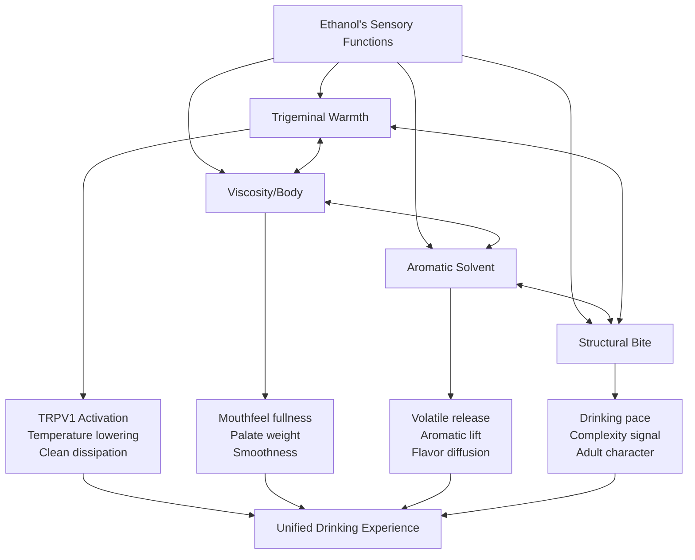

The practical implication is clear: **replicating alcohol's sensory profile is a multi-dimensional problem requiring coordinated solutions**. The core challenges—loss of warmth/bite, viscosity/body, aromatic solvent effect, and bitterness modulation—must be addressed through a matrix of targeted ingredients and adapted techniques, forming a new formulation architecture that compensates for each deficit while maintaining harmonious integration.

### 5.2 Replicating Warmth and Burn: Trigeminal Stimulation Strategies

The characteristic warming sensation of alcoholic beverages represents one of the most challenging aspects to replicate in non-alcoholic formulations. This trigeminal experience—the gentle burn that spreads across the palate and throat—signals potency and sophistication, distinguishing adult beverages from simple sweet drinks. Current approaches utilize compounds that activate the same neural pathways as ethanol, though each presents unique challenges in achieving alcohol's specific temporal profile and clean finish.

#### Capsaicin and Chili Oleoresin: Primary Heat-Building Agents

**Capsaicin**, the active compound that gives chili peppers their characteristic heat, has emerged as the most widely adopted solution for mimicking alcohol's thermal sensation. Arkay Beverages exemplifies this approach, infusing its non-alcoholic gin, rum, vodka, whisky, and tequila alternatives with capsaicin to help mimic the kick of traditional alcohol and also add a tingling sensation[^76]. The scientific basis for this approach is sound: capsaicin activates TRPV1 receptors, the same pathway through which ethanol produces its warming effect[^71].

The **optimal dosing range for capsaicin** in non-alcoholic beverages typically falls between **0.2-0.8 ppm**—far below the threshold where spiciness becomes detectable as "hot." At these sub-threshold levels, capsaicin provides warmth without introducing obvious chili character. As formulation guidance indicates, beverages feel "warm" long before they register as "hot," enabling subtle warmth without obvious spiciness.

However, capsaicin presents several formulation challenges:

| Challenge | Description | Mitigation Strategy |
|-----------|-------------|---------------------|
| **Temporal Profile** | Capsaicin's burn tends to build and linger rather than dissipating cleanly like alcohol | Combine with cooling agents; precise dosing |
| **Residual Accumulation** | Heat can accumulate across multiple sips | Lower initial dosing; balance with fat or acid |
| **Off-Flavor Risk** | Higher doses introduce detectable chili character | Stay within 0.2-0.8 ppm range |
| **Carbonation Amplification** | Effervescence intensifies capsaicin perception | Reduce dosing 20-30% in sparkling applications |

The challenge of **matching alcohol's clean dissipation pattern** remains significant. Current attempts to mimic alcohol's sensory effects using ingredients like chili usually result in strong residual flavors, or fail to capture alcohol's clean dissipation and balanced progression[^77]. Ethanol's warmth builds quickly, peaks, then fades smoothly—a temporal profile that capsaicin struggles to replicate.

#### Alternative Trigeminal Stimulants

Beyond capsaicin, several compounds offer distinct trigeminal sensations that can complement or substitute for chili-based heat:

**Ginger extract** provides warm, throat-centered heat that differs qualitatively from capsaicin's broader mouth burn. Beverage developers use ginger as one of several ingredients to simulate the same pain receptors as alcohol[^75]. Dried ginger reads warmer than fresh ginger, offering formulators control over heat character. Typical usage ranges from 0.02-0.10% depending on desired intensity.

**Piperine** from black pepper delivers sharp, lingering heat with a distinct bite. A well-placed note of black pepper extract can trigger the same neural response as ethanol's warmth if dosed precisely[^74]. Piperine's sensation differs from capsaicin in its sharpness and persistence, making it valuable for creating layered heat profiles.

**Sanshool** from Sichuan pepper introduces a unique tingling and buzzing sensation rather than pure heat. This numbing quality adds textural complexity that pure heat compounds cannot provide, contributing to the multi-layered experience that sophisticated consumers expect.

**Cinnamon** offers warming spice notes that complement other heat-building ingredients. Beverage developers use cinnamon alongside capsaicin and ginger to simulate alcohol's sensory effects[^75]. Its aromatic contribution adds complexity beyond mere thermal sensation.

The following table compares trigeminal stimulants:

| Compound | Sensation Type | Onset | Duration | Best Application |
|----------|---------------|-------|----------|------------------|
| **Capsaicin** | Broad mouth burn | Moderate | Long, building | Spirit alternatives |
| **Ginger** | Throat-centered warmth | Quick | Moderate | Mules, spiced drinks |
| **Piperine** | Sharp, lingering bite | Quick | Long | Dark spirit styles |
| **Sanshool** | Tingling, numbing | Slow | Extended | Complex cocktails |
| **Cinnamon** | Warm spice | Moderate | Moderate | Autumn/winter drinks |

#### Carbonation Interactions and Dosage Adjustments

A critical consideration for formulators is the **interaction between carbonation and heat perception**. Trigeminal sensations activate the trigeminal nerve, a major pathway responsible for perceiving temperature, irritation, and other tactile cues[^76]. Carbonation also stimulates this pathway, creating an amplification effect when combined with heat-building compounds.

Practically, this means that **capsaicin reads hotter in carbonated systems than in still beverages**. Formulators must reduce heat component doses by approximately 20-30% when working with sparkling applications to maintain the same perceived warmth. A dosage that produces pleasant warmth in a still cocktail may create excessive, uncomfortable heat when the same formula is carbonated.

The strategic layering of multiple trigeminal compounds—combining low-dose capsaicin with ginger and perhaps a touch of black pepper—can create more nuanced heat profiles than any single ingredient alone. This approach mirrors how traditional spirits achieve complexity through multiple flavor compounds rather than relying on any single dominant note.

### 5.3 Engineering Body and Mouthfeel: Viscosity Compensation Techniques

The loss of alcohol's contribution to beverage body represents one of the most immediately perceptible deficits in non-alcoholic formulations. Without alcohol, non-alcoholic alternatives can feel thin or watery[^72], lacking the palate weight and fullness that consumers associate with premium beverages. Addressing this challenge requires understanding both the specific viscosity contribution alcohol provides and the multi-component strategies necessary to compensate for its absence.

#### Glycerol: The Primary Mouthfeel Enhancer

**Glycerol (glycerin)** has emerged as the most important single ingredient for building body in non-alcoholic beverages. Glycerol contributes to the beverage body and fullness and influences the flavor intensity[^78]. Its effectiveness stems from multiple mechanisms: glycerol provides viscosity, adds a subtle sweetness, and creates the smooth, coating sensation associated with quality spirits.

Research on non-alcoholic beer has established effective concentration ranges: glycerol addition across a range from **0.3% to 2.0%** improved body and fullness[^73]. At approximately **10 g/L (1%)**, glycerol's effects on perceived viscosity become noticeable, contributing to "mouth-feel," "viscosity," "density," "smoothness" and "roundness"[^78].

Glycerol's benefits extend beyond simple viscosity enhancement:

**Flavor Retention:** Glycerol was found to increase the worty off-flavor retention for non-alcoholic beer; glycerol at levels as low as 0.5% and 4.5% retained up to 40% of investigated aldehydes, having an ethanol-mimic effect[^78]. This flavor-binding property helps non-alcoholic beverages maintain aromatic intensity that would otherwise dissipate.

**Smoothness and Balance:** Glycerol confers a degree of "smoothness" and "roundness" on the palate by balancing alcoholic strength and astringency[^78]. In non-alcoholic applications, this smoothing effect helps integrate disparate flavor elements and reduces harsh edges.

**Flavor Enhancement:** The overall flavor intensity was positively influenced by glycerol (10 g/L), especially when the volatile concentration was low[^78]. This enhancement proves particularly valuable in non-alcoholic formulations where aromatic intensity is already challenged.

In alcoholic beverages, particularly liqueurs and cream-based drinks, glycerol serves as a natural thickener, enhancing the body and mouthfeel of the product. It adds a smooth, syrupy consistency without the need for artificial thickeners[^79]. This same functionality transfers directly to non-alcoholic applications.

#### Complementary Texture-Building Agents

While glycerol provides the foundation for mouthfeel enhancement, **viscosity alone cannot fully compensate for dealcoholization-induced mouthfeel loss**. Research has demonstrated that increasing beer viscosity by itself could not fully compensate for palate fullness loss due to dealcoholization. Viscosity is a good, though not the only, predictor of the palate fullness of beer[^73]. This finding necessitates multi-component approaches.

**Xanthan Gum:** A powerful thickening agent used in small quantities (typically 0.1-0.3%) to build viscosity and richness. Ingredients like xanthan gum can add complexity and viscosity to a mocktail[^75]. Xanthan gum's shear-thinning properties mean it provides body at rest but flows smoothly when drinking, avoiding the "gummy" sensation that excessive thickening can create.

**Gum Arabic:** Serves dual functions as both a stabilizer and texture modifier. Beyond its role in keeping essential oils dispersed in bitters formulations, gum arabic contributes body and mouthfeel to the final beverage.

**Dextrins and Arabinoxylans:** Research has specifically examined these carbohydrates for non-alcoholic beer enhancement. The addition of purified dextrin and arabinoxylan (AX) isolates revealed that 30 g/L dextrin or 1.5 g/L high-molecular-weight AX (HMW AX) was required to compensate for the dealcoholization-induced viscosity loss[^73]. Critically, dextrin and HMW AX combined significantly increased palate fullness, while solely increasing either was insufficient to achieve this effect[^73].

The following table summarizes texture-building agents and their applications:

| Agent | Typical Usage | Primary Effect | Considerations |
|-------|---------------|----------------|----------------|
| **Glycerol** | 0.5-2.0% | Body, smoothness, flavor retention | Sweet at high levels |
| **Xanthan Gum** | 0.1-0.3% | Viscosity, richness | Can be gummy if overdosed |
| **Gum Arabic** | 0.5-1.0% | Stability, body | Subtle effect |
| **Dextrin** | 2-3% | Palate fullness | Best combined with AX |
| **Arabinoxylan** | 0.1-0.15% | Palate fullness | Requires dextrin synergy |

#### Multi-Component Formulation Strategies

The research finding that **neither dextrin nor arabinoxylan alone suffices** for palate fullness restoration points toward a broader principle: successful mouthfeel engineering requires strategic combination of multiple agents working synergistically. Adjusting NAB production to elevate HMW AX and dextrin levels simultaneously emerges as a viable strategy for improving palate fullness[^73].

A practical multi-component approach might include:

1. **Glycerol (1.0%)** as the foundation for smoothness and flavor retention
2. **Xanthan gum (0.15%)** for additional viscosity without excessive thickness
3. **Dextrin (2%)** combined with **arabinoxylan (0.1%)** for synergistic palate fullness

This layered approach acknowledges that alcohol's mouthfeel contribution is multi-faceted—affecting viscosity, coating sensation, and flavor perception simultaneously—and therefore requires multi-faceted compensation.

### 5.4 Aromatic Intensity and Volatile Compound Delivery

Achieving adequate aromatic intensity without alcohol's solvent and carrier properties presents one of the most technically challenging aspects of non-alcoholic cocktail formulation. Ethanol's unique ability to dissolve both water-soluble and oil-soluble compounds enables superior extraction and release of volatile aromatics—a capability that water-based systems inherently lack. Understanding this limitation and the strategies developed to address it is essential for creating non-alcoholic beverages with the aromatic complexity consumers expect.

#### The Solvent Gap

Alcohol serves as a solvent, carrier, and structural agent in traditional spirits[^74]. This solvent function operates on multiple levels: during production, alcohol extracts aromatic compounds from botanicals more efficiently than water; in the finished beverage, alcohol helps release volatile compounds into the headspace above the drink, enhancing perceived aroma; and during consumption, alcohol's volatility carries aromatics to the olfactory system.

Since alcohol helps showcase the volatile compounds, the absence of alcohol in mocktails makes it more challenging to achieve the same aromatic intensity[^75]. This challenge manifests in several ways:

**Reduced Extraction Efficiency:** Some distillers first distill botanicals in alcohol because alcohol is an excellent flavor carrier[^74]. Water-based extraction captures fewer aromatic compounds, particularly oil-soluble terpenes and essential oil components that define many botanical profiles.

**Diminished Aromatic Release:** In traditional cocktails, alcohol's volatility helps "lift" aromatic compounds from the liquid surface into the air above the drink. Without this lifting effect, aromatics remain trapped in the liquid, reducing perceived fragrance.

**Flavor Diffusion Challenges:** Without ethanol's solvent power, some extracts lack diffusion[^74], meaning that flavors may not integrate as smoothly or present as coherently across the palate.

#### Compensatory Strategies for Aromatic Enhancement

Formulators have developed several approaches to maximize aromatic impact in the absence of alcohol:

**Light Carbonation for Aromatic Lift:** Light carbonation can help lift volatile compounds[^75], providing some of the aromatic release that alcohol would otherwise enable. The bursting of CO2 bubbles at the liquid surface carries aromatic molecules into the headspace, partially compensating for alcohol's absence. This technique proves particularly valuable for aperitif-style drinks where fragrance is essential to the experience.

**Botanical Distillates and FTNS Products:** Natural botanical distillates produced using traditional batch distillation methods give products their unique, aromatic twist. For non-alcoholic spirit solutions in particular, FTNS ("from the named source") botanical solutions feature an outstanding taste profile and can precisely replicate the taste properties of spirits[^80]. These concentrated preparations deliver aromatic intensity that standard infusions cannot achieve.

**Clear Botanical Emulsions:** Clear botanical emulsions made from juniper berries, cardamom, coriander, sage, rosemary, tarragon and nutmeg are completely soluble and lend spirits the highest authenticity and the best possible taste thanks to their essential oil components[^80]. These emulsions solve the oil-water solubility problem by creating stable dispersions that deliver aromatic oils without separation.

**Steam Distillation and Hydrosols:** Preparing hydrosols by steam distilling fresh herbs or citrus peels enables precise aromatic delivery[^81]. These water-based aromatic preparations capture volatile compounds in a form compatible with non-alcoholic formulations.

**Aromatic Expression Techniques:** Zero-proof spirits demand thoughtful application: reinforce aroma by expressing citrus oils directly over the drink[^74]. This garnishing technique adds aromatic impact at the moment of service, compensating for reduced aromatic release from the liquid itself.

#### Top-Note Excellence and Mid-Palate Gaps

Current non-alcoholic spirits demonstrate a characteristic pattern in their aromatic performance: they excel in aroma and top-note complexity but can have gaps in mid-palate weight and finish[^74]. This pattern reflects the success of advanced extraction and emulsion techniques in capturing volatile aromatics while highlighting the ongoing challenge of replicating alcohol's structural contribution to flavor development.

The top-note excellence results from sophisticated botanical extraction and formulation techniques that effectively capture and deliver volatile compounds. The mid-palate gaps reflect the absence of alcohol's contribution to flavor persistence and body—a challenge addressed through the viscosity and mouthfeel strategies discussed in Section 5.3.

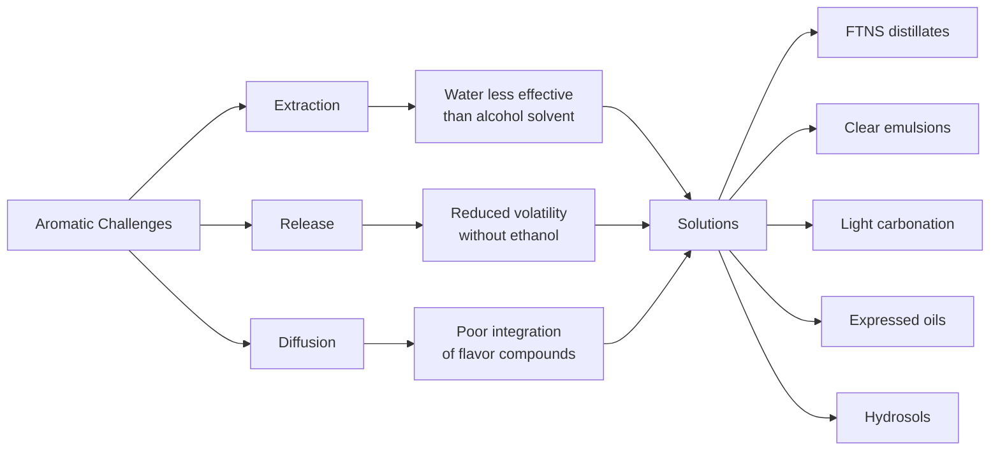

The practical implication for formulators is that **aromatic intensity requires deliberate engineering** rather than emerging naturally as it does in alcohol-based systems. Each aromatic element must be selected, prepared, and integrated with attention to how it will perform in a water-based matrix—a more demanding process than traditional spirit formulation but one that can achieve excellent results when executed skillfully.

### 5.5 Bitterness Architecture and Complexity Building

Bitterness serves as perhaps the most critical differentiator between sophisticated adult beverages and simple sweet drinks. In traditional cocktails, bitter compounds provide structure, signal maturity, and create the slower sipping pace associated with contemplative drinking. For non-alcoholic formulations, **bitterness architecture becomes even more important** because without alcohol's unifying effect, each flavor element carries greater weight—and without appropriate bitterness, drinks risk becoming cloying or juvenile.

#### The Role of Traditional Bittering Botanicals

The foundation of bitterness in premium non-alcoholic beverages rests on the same botanical sources that have defined bitter spirits for centuries. TheBitterNote exemplifies this approach, crafted from an infusion of 36 botanicals with a vibrant mix of 7 aromatic notes: bitter (wormwood, gentian, cinchona), spicy (angelica root, cinnamon, juniper), fresh (mint, star anise), herbal (artichoke, aloe, chamomile), sweet (chamomile, sweet orange), balsamic (liquorice, angostura), and citrus (bitter orange)[^82].

**Gentian root** stands as the most important bittering botanical, providing the intense, earthy bitterness that anchors many aperitif-style formulations. Non-alcoholic bitters like Old Fashioned Aromatic Bitters are handmade from organic botanicals including dandelion root, gentian root, ginger root, cinchona bark, and numerous spices[^83]. Gentian's dusty, bittersweet character—describable as fresh soil, dandelion, citrus pith, and earthy mustiness—provides the backbone for complex bitter profiles.

**Cinchona bark** (the source of quinine) contributes the characteristic bitterness of tonic water and many aperitif formulations. Its clean, medicinal bitterness differs from gentian's earthiness, enabling formulators to create layered bitter profiles.

**Wormwood** adds aromatic complexity alongside its bitterness, contributing the herbal, slightly medicinal character associated with vermouth and absinthe-style preparations.

#### The Harshness Challenge Without Ethanol

A critical formulation consideration is that **bitterness perception differs significantly without ethanol's smoothing effect**. Without alcohol's slight numbing effect, bitterness can read as harsh[^74]. This perceptual shift means that bitter compounds requiring careful balance in traditional cocktails may become aggressive or unpleasant in non-alcoholic applications.

Their bitterness balance can be aggressive without ethanol's smoothing effect, so pairing with fat or acid is recommended[^74]. This guidance points toward the multi-component balancing strategies essential for successful bitter formulation:

**Acid Balancing:** Layered acidity from multiple sources (citric, malic, tartaric, acetic) helps soften bitter edges while adding complexity. The interaction between bitter and sour creates more palatable bitterness than either element alone.

**Fat Integration:** Fat-based ingredients or emulsified preparations can round harsh bitterness, providing the smoothing effect that alcohol would otherwise contribute.

**pH Adjustment:** Some non-alcoholic spirits can taste medicinal or soapy because they rely on bittering agents and citrus peels rich in compounds also found in antiseptics; skilled formulators balance these with supporting notes and precise pH adjustment[^74].

**Salt Enhancement:** A 2% saline solution (2g sea salt per 100g water) helps shape savory depth and soften bitter edges[^81], providing another tool for bitter modulation.

#### Functional and Psychological Roles of Bitterness

Beyond flavor contribution, bitterness serves **critical functional roles** in non-alcoholic cocktail design:

**Drinking Pace Modulation:** Alcohol provides a mild harshness that forces slower drinking; without it, beverages should incorporate something herbal or slightly bitter to create a similar brake on consumption speed. Bitterness encourages contemplative sipping rather than rapid consumption.

**Maturity Signaling:** Many people associate bitterness with maturity in drinks because it adds structure, intention, and a slower sipping pace. This psychological association means that appropriate bitterness helps non-alcoholic cocktails feel "adult" rather than childishly sweet.

**Complexity Building:** Every good alcohol-free cocktail should include at least two of the fundamental components—sweet, sour, bitter, and bold base flavor—to achieve the push-and-pull contrast that defines a cocktail. Bitterness specifically lends complexity and prevents the cloying sweetness that can plague poorly formulated non-alcoholic drinks.

The following table summarizes key bittering agents and their characteristics:

| Bittering Agent | Character | Intensity | Best Applications |
|-----------------|-----------|-----------|-------------------|
| **Gentian Root** | Earthy, dusty, intense | Very High | Aperitifs, amaro-style |
| **Cinchona Bark** | Clean, medicinal | High | Tonic-style, quinine notes |
| **Wormwood** | Herbal, aromatic | Moderate-High | Vermouth-style, complex |
| **Orange Peel** | Citrus-bitter | Moderate | Versatile, bright bitterness |
| **Artichoke** | Vegetal, complex | Moderate | Italian-style aperitifs |
| **Dandelion Root** | Earthy, rooty | Moderate | Digestive-style drinks |

### 5.6 Astringency and Tannic Structure: Creating Grip and Finish

Astringency—the drying, puckering sensation that creates "grip" on the palate—contributes essential structure and complexity to sophisticated beverages. In traditional cocktails, this sensation comes from barrel aging, grape-derived tannins, and alcohol's inherent astringent properties. Replicating this structural element in non-alcoholic formulations requires understanding both the sources of astringency and the delicate balance required to achieve pleasant rather than unpleasant dryness.

#### Natural Tannin Sources

Astringency is a key mouthfeel attribute in many cocktails, imparting a dry or puckering sensation. To replicate this sensation in mocktails, beverage brands can draw on natural sources of tannins, such as black tea, grape skins and certain botanicals[^75]. Each source offers distinct characteristics:

**Black Tea:** Provides accessible astringency with additional flavor complexity. Tea tannins can add "barrel-like grip" to non-alcoholic formulations, creating the drying sensation that slows drinking pace and signals complexity. The adaptability of tea makes it an excellent mixer—adjusting brew times or concentration allows precise control over intensity.

**Grape Skins:** Offer wine-like tannin structure particularly valuable for non-alcoholic wine production and wine-based mocktails. These tannins provide the sophisticated dryness associated with red wine and vermouth-style preparations.

**Oak-Derived Compounds:** Replicate the tannic structure of barrel aging. Some non-alcoholic spirit producers incorporate oak extracts or process their products with oak char to capture the vanilla, caramel, and tannic notes associated with aged spirits. Infusions or extracts obtained from oakwood, green walnut shells, almond shells or plums are added during traditional brandy production and can be adapted for non-alcoholic applications[^80].

**Hibiscus:** Adds floral sharpness alongside mild astringency, contributing both flavor complexity and structural grip.

#### Balance Requirements

The critical challenge with astringency is achieving **pleasant dryness without unpleasant harshness**. It is important to use astringent ingredients judiciously and balance them with sweetness and acidity[^75]. This balance requirement reflects the fundamental principle that no single element should dominate—astringency must integrate with other flavor components rather than standing alone.

Several strategies enable successful astringency integration:

**Sweetness Counterbalance:** Sufficient sweetness prevents astringency from becoming harsh or mouth-drying. The interaction between tannins and residual sugars creates a more pleasant perception than either element alone.

**Acidity Integration:** Acid helps "lift" astringent sensations, preventing them from feeling heavy or oppressive. The combination of tannins with bright acidity creates sophisticated complexity.

**Gradual Building:** Rather than relying on a single high-intensity tannin source, layering multiple mild sources creates more nuanced astringency. Combining black tea with a touch of oak extract and hibiscus, for example, produces more interesting structure than any single source at higher concentration.

#### Structural and Temporal Effects

Tannic structure extends drinking time and enhances the perception of sophistication through several mechanisms:

**Palate Cleansing:** Astringency creates a "reset" effect between sips, preventing flavor fatigue and maintaining interest throughout the drinking experience.

**Finish Extension:** Tannins contribute to the lingering finish that distinguishes premium beverages from simple refreshments. This extended finish signals quality and encourages contemplative appreciation.

**Complexity Signaling:** The presence of appropriate astringency communicates that a beverage is intended for adult appreciation rather than casual consumption, supporting the psychological positioning essential for premium non-alcoholic cocktails.

### 5.7 Integration and Balance: Multi-Component Formulation Strategies

The preceding sections have examined individual sensory challenges—warmth, body, aromatics, bitterness, and astringency—in relative isolation. However, the art of premium non-alcoholic cocktail formulation lies in **integrating these elements into cohesive, balanced drinks** where each component enhances rather than competes with the others. This synthesis requires understanding not just individual ingredients but their interactions and the principles governing successful multi-component formulation.

#### The Principle of Coordinated Compensation

The comprehensive analysis reveals that replicating alcohol's sensory profile is a multi-dimensional problem requiring coordinated solutions. The core challenges—loss of warmth/bite, viscosity/body, aromatic solvent effect, and bitterness modulation—must be addressed through a matrix of targeted ingredients and adapted techniques, forming a new formulation architecture.

This architecture differs fundamentally from traditional cocktail formulation, where alcohol provides a unifying structural foundation. In non-alcoholic formulations, **each sensory dimension must be deliberately constructed** through specific ingredient selection and precise calibration. The challenge is not merely additive—combining warmth, body, and bitterness—but integrative, ensuring that these elements work together harmoniously.

The following table synthesizes challenge-solution effectiveness:

| Challenge | Solution Category | Effectiveness | Key Limitation |
|-----------|------------------|---------------|----------------|
| **Warmth/Bite** | Trigeminal agents | Moderate | Temporal profile mismatch |
| **Viscosity/Body** | Glycerol + texturizers | High | Requires multi-component approach |
| **Aromatic Intensity** | Distillates, emulsions, carbonation | Moderate-High | Mid-palate gaps persist |
| **Bitterness Balance** | Botanical blends + acid/salt modulation | High | Requires careful calibration |
| **Astringency/Structure** | Tannin sources | High | Balance-dependent |

#### Formulation Sequencing and Iterative Adjustment

Successful non-alcoholic cocktail formulation requires attention to **ingredient addition sequence** and commitment to iterative refinement:

**Processing Sequence:** Dissolve acids first, then allulose or other sweeteners, glycerin, salt, flavors, and finally heat agents. Adjust pH to target before calibrating sweeteners to avoid over-sweetening. This sequence ensures proper dissolution and integration of each component.

**Iterative Refinement:** The key to successful non-alcoholic cocktails lies in iterative experimentation and careful adjustment to recreate the sensory experience of classic cocktails[^81]. No formula succeeds on the first attempt—each component's contribution must be evaluated and adjusted in context.

**Balance Verification:** After initial formulation, systematic tasting should verify that:
- Sweetness does not overwhelm other elements
- Bitterness integrates rather than dominates
- Heat builds appropriately without lingering excessively
- Body provides satisfaction without heaviness
- Aromatics present clearly without chemical or artificial character

#### The Integration Challenge

The primary gap in current formulation approaches is not in solving discrete problems but in **integrating the solutions into a seamless, temporally accurate, and architecturally simple whole** that perfectly mimics the unitary experience provided by ethanol. Each compensatory ingredient adds complexity to the formulation, increasing the potential for off-notes or imbalance.

This integration complexity represents the frontier of non-alcoholic cocktail innovation. Current approaches are highly effective at solving individual sensory challenges—particularly for mouthfeel and bitterness—through a pattern of ingredient-technique synergy. Future innovation should focus on:

**Temporal Engineering:** Research into novel trigeminal agents or encapsulation techniques that can be triggered sequentially to mimic ethanol's specific onset, peak, and dissipation profile.

**Multi-Functional Ingredients:** Development of ingredients that simultaneously address multiple sensory gaps—providing mild warmth, body, and flavor-carrying properties in a single component.

**Simplified Systems:** Creation of "base builder" ingredient systems that provide stable, multi-functional platforms akin to a spirit base, reducing the number of individual components required for successful formulation.

#### Practical Integration Framework

A practical framework for multi-component non-alcoholic cocktail formulation targets the following parameters:

**Structural Foundation:**
- Glycerol: 0.5-1.5% for body and smoothness
- Texturizer (xanthan gum): 0.1-0.2% for additional viscosity
- Dextrin + arabinoxylan: Combined for synergistic palate fullness

**Sensory Enhancement:**
- Heat agent (capsaicin or ginger): Sub-threshold dosing for warmth
- Botanical distillates or emulsions: For aromatic intensity
- Light carbonation: For aromatic lift and mouthfeel

**Complexity and Balance:**
- Bittering blend: Multiple botanicals for layered bitterness
- Tannin source: Tea or oak for structural grip
- Acid system: Multiple acids for brightness and balance
- Salt: 0.05-0.15% for flavor enhancement

**Final Calibration:**
- pH adjustment to 3.0-3.6 range
- Sweetness calibration after acid adjustment
- Heat component fine-tuning based on carbonation level

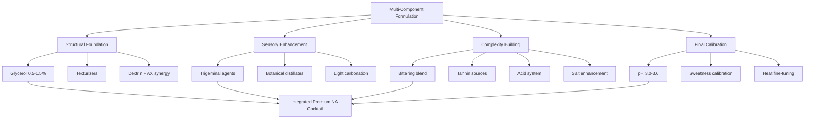

#### Assessment of Current Approaches

The honest assessment of current formulation approaches reveals both **significant achievements and persistent gaps**:

**Achievements:**
- Mouthfeel engineering has reached high effectiveness through glycerol and multi-component texturizing strategies
- Bitterness architecture successfully creates adult-oriented profiles when properly balanced
- Aromatic delivery through advanced distillates and emulsions achieves excellent top-note complexity
- Trigeminal stimulation provides recognizable warmth, even if temporal profiles differ from alcohol

**Persistent Gaps:**
- The precise temporal progression of alcohol's warmth—its specific onset, peak, and clean dissipation—remains imperfectly replicated
- Integration of multiple compensatory ingredients increases formulation complexity and potential for imbalance
- The shift to flavor- and texture-led architecture creates dependency on precision, with small errors more pronounced than in alcohol-based systems
- Many effective techniques remain resource-intensive and require specialized knowledge, limiting scalability

The path forward for premium non-alcoholic cocktail formulation lies not in discovering single "magic bullet" ingredients but in **refining the integration of existing solutions** into increasingly seamless, balanced, and accessible formulations. The foundational tools exist; the ongoing challenge is their artful combination into beverages that deliver the complete sensory satisfaction consumers expect from premium drinks.

## 6 Synthesis and Future Trajectories: The Path Forward for NA Craft

This concluding chapter synthesizes the technical and formulation insights developed throughout the preceding analysis to project the future evolution of non-alcoholic cocktail innovation. Drawing upon the historical foundations, market dynamics, ingredient science, production methodologies, and sensory design principles examined in Chapters 1-5, this section identifies the convergent forces reshaping the category and articulates the emerging trajectories that will define the next phase of NA craft development. The analysis addresses how technological integration, functional ingredient convergence, regulatory evolution, and shifting consumer expectations will collectively transform both the creative possibilities and commercial landscape of alcohol-free mixology.

The overarching pattern emerging from comprehensive research integration reveals a sector in fundamental transition: **from simple alcohol substitution to a new paradigm of sophisticated, multi-functional beverage design**. This shift is driven by three interconnected forces—consumer-led demand for holistic wellness, technology as an enabler of precision and personalization, and the compensatory formulation imperative that has spawned a flavor- and texture-led architectural model. The projected market trajectory, with the global NA beverage market approaching $2 trillion by 2030 and the functional drinks segment reaching $250 billion, confirms that products are evolving into customizable wellness tools rather than mere alcohol alternatives[^14]. The following sections examine the specific innovation vectors that will shape this transformation.

### 6.1 Technological Integration and Hyper-Personalization

Artificial intelligence and digital technologies are fundamentally reshaping how non-alcoholic cocktails are developed, produced, and experienced by consumers. This technological integration operates across multiple dimensions—from laboratory formulation through commercial service to at-home consumption—creating new possibilities for personalization while raising important questions about the preservation of artisanal craft traditions.

#### AI-Driven Recipe Generation and Flavor Optimization

The application of artificial intelligence to beverage development has moved beyond experimental curiosity to become a **powerful tool for accelerating innovation cycles and predicting consumer preferences**. Companies implementing AI-driven flavor development report 20-33% reductions in time-to-market, with traditional R&D processes requiring months of iterative testing now capable of screening thousands of ingredient combinations within days to identify optimal formulations[^84]. The global AI in food and beverages sector is projected to grow from $10.8 billion to approximately $50.6-84.75 billion by 2030, representing a compound annual growth rate of 29.6-39.1%[^84].

Machine learning models have demonstrated remarkable capabilities in predicting flavor outcomes and consumer appreciation. **FlavorMiner**, an advanced ML platform, combines Random Forest and K-Nearest Neighbors algorithms with Extended Connectivity Fingerprint molecular descriptors to predict seven flavor categories: floral, fruity, sour, sweet, bitter, off-flavor, and nutty[^84]. Research analyzing 250 commercial Belgian beers measured more than 200 chemical properties and conducted quantitative descriptive sensory analysis with trained panels, integrating data from over 180,000 consumer reviews to train machine learning models using Gradient Boosting algorithms[^84]. According to a Nature Communications study published in 2024, beer flavor prediction models significantly outperformed conventional statistical approaches, not only predicting flavor profiles but also identifying specific compounds driving consumer preference[^84].

For non-alcoholic beverage formulation specifically, AI offers particular value in addressing the multi-dimensional sensory challenges examined in Chapter 5. AI simultaneously processes data from electronic nose (E-nose), electronic tongue (E-tongue), and gas chromatography-mass spectrometry (GC-MS) instruments, enabling comprehensive flavor profiling that would be impossible through human assessment alone[^84]. Givaudan's ATOM platform leverages AI and data science techniques to dramatically reduce trial-and-error processes in formulation development—in a cheese snack salt reduction project, ATOM rapidly identified an ideal recipe achieving 33% sodium reduction while maintaining original flavor characteristics, demonstrating methodologies directly applicable to sugar and alcohol reduction challenges[^84].

The following table summarizes key AI applications in NA beverage development:

| Application Area | Technology/Platform | Capability | Demonstrated Results |
|-----------------|---------------------|------------|---------------------|
| **Flavor Prediction** | FlavorMiner, Gradient Boosting | Predict 7+ flavor categories from molecular data | High accuracy in cocoa, beer applications |
| **Formulation Optimization** | Givaudan ATOM | Reduce trial-and-error in recipe development | 33% sodium reduction with maintained flavor |
| **Consumer Preference** | Multi-sensor fusion | Process E-nose, E-tongue, GC-MS data | Outperforms conventional statistics |
| **Regional Adaptation** | Tastewise, social analytics | Identify culturally specific flavor patterns | Guides formulation for local markets |
| **Time-to-Market** | Various platforms | Screen thousands of combinations | 20-33% reduction in development time |

AI plays a crucial role in regionalized flavor development, particularly valuable for NA cocktails seeking to capture local market preferences. When launching beverages in Southeast Asia that align with local flavor preferences, AI guides formulation toward popular regional profiles like lychee, calamansi, or tamarind—with the right balance of sweet, sour, and aromatic notes[^84]. AI analyzes regional sales data, social media trends, and local recipes, identifying culturally specific flavor preference patterns that would require extensive market research to uncover through traditional methods[^84].

#### Consumer-Facing AI Applications

Beyond laboratory applications, AI is increasingly deployed in consumer-facing tools that enable personalized non-alcoholic cocktail experiences. Several brands have developed AI-driven recipe generators, enabling consumers to create personalized non-alc cocktails based on their specific preferences and available ingredients[^85].

**Seedlip's Virtual Concierge, Elli**, represents an attempt to engage consumers with personalized non-alcoholic cocktail recommendations through a sophisticated interface[^85]. However, critical assessment reveals limitations: the tool is laser-focused on Seedlip products, and the focus on recipe recommendations featuring Seedlip's non-alcoholic spirits feels at odds with the brand's core messaging of simplicity[^85]. This tension illustrates a broader challenge—balancing brand promotion with genuine consumer utility.

**TÖST Beverages' TÖST Maker** demonstrates a more successful approach by using AI to address a specific consumer challenge: finding the right words to toast life's special moments[^85]. The microsite generates tailored toasts based on user input about the occasion, tone, and relationship to the recipient—a simple yet useful application of AI that integrates directly with the brand's identity while addressing a common pain point[^85]. This initiative stands out because it goes beyond novelty to provide practical value for consumers and aligns with TÖST's broader focus on fostering meaningful connections[^85].

The potential for AI in non-alcoholic consumer experiences is vast, but it requires thoughtful execution. Brands that focus on utility and relevance are more likely to create lasting value, while those pursuing AI as mere novelty risk disappointing consumers[^85]. The key will be balancing innovation with genuine usefulness—a principle that applies equally to professional and home applications.

#### AI-Powered Bartending Systems

The emergence of AI-powered bartending machines represents a significant development in how non-alcoholic cocktails may be prepared and served in both commercial and home settings. At CES 2026, multiple companies showcased AI bartender systems that demonstrate the current state and future potential of automated mixology[^86][^87][^88].

**Breakreal's R1** exemplifies the home-focused AI cocktail machine category. Marketed as an "AI bartender," the R1 uses generative AI to create personalized recipes from user requests, featuring a companion app that analyzes taste preferences, spirit choices, and even current mood to generate tailored drink formulas[^86][^87]. The machine uses natural language processing to interpret requests like "make me something tropical and refreshing," scans ingredients for freshness via QR codes, and integrates with smart home ecosystems allowing voice commands through assistants like Alexa or Google Home[^87]. Critically for the NA category, the R1 can suggest low-alcohol or non-alcoholic alternatives based on user profiles[^87].

**AI Barmen**, showcased at CES 2026, demonstrates more sophisticated contextual awareness through facial recognition technology. The machine scans users' faces to estimate age, automatically switching into a non-alcoholic mode offering zero-proof cocktails and juices if the system believes the user is under 21[^88]. The company claims AI Barmen can theoretically generate thousands of drink combinations based on mood, taste preferences, and conversation—designed for "convo bartending" where users describe their desired flavors and the AI crafts drinks while explaining its choices in real-time[^88].

The commercial implications extend beyond novelty. Industry analysts predict such devices could spur growth in the smart kitchen sector, projected to reach $50 billion by 2030[^87]. For non-alcoholic cocktail service specifically, AI systems offer several advantages:

- **Consistency**: Automated systems eliminate variation in preparation technique
- **Personalization at scale**: AI can maintain individual preference profiles across thousands of customers
- **Efficiency**: Reduced preparation time enables higher service volumes
- **Accessibility**: Complex formulations become achievable without extensive bartender training

However, significant questions remain about the balance between technological augmentation and human craftsmanship. The 2026 mixology landscape is characterized by the understanding that **AI enhances creativity rather than replacing human artistry**[^89]. New platforms analyze acidity, sweetness, aromatic intensity, and viscosity to recommend micro-adjustments, making cocktails feel more tailored—especially valuable at large events[^89]. Venues adopting predictive systems report increased guest satisfaction and reduced waste[^89].

AI also improves operational foresight: weather-driven predictions help determine spritz popularity, corporate demographic data informs spirit selection, and TikTok trend mapping identifies which colors perform well on camera[^89]. This represents **data-driven, human-centered mixology**—AI provides analytical support while human bartenders maintain creative control and guest relationships[^89].

#### Hyper-Personalization Through Data Analytics

The convergence of AI capabilities with consumer data creates unprecedented opportunities for hyper-personalized beverage experiences. Alcohol brands have started experimenting with AI in their mixology, using it to evaluate consumer data to formulate new drink recipes tailored to their target audience's preferences[^90]. AI can leverage machine learning to assess key characteristics like flavor, aroma, and texture to determine ideal ingredient combinations[^90]. AI will also allow brands to seamlessly deliver personalized drink recommendations to consumers by using consumer data like purchase history, behaviors, and interactions[^90].

Looking forward, **personalization will become a key differentiator** in the NA beverage category. Projected innovations include AI-driven recommendations, functional blends tailored to mood or activity, and subscription models that deliver curated wellness experiences[^14]. The hospitality industry is entering an era where connection, emotion, and customization define loyalty—AI-powered profiling, smart menu design, and digital guest notes allow bars to tailor experiences, though the true differentiator remains human: emotional memory[^91].

The path forward requires recognizing that technology serves as enabler rather than replacement for craft expertise. As one industry analysis notes, the 2026 beverage landscape will feature less discussion of "signature drinks" and more focus on "signature data"—favorite drinks may be determined by aggregated sensory preferences, then personalized further[^89]. For non-alcoholic cocktails specifically, where formulation complexity already exceeds traditional preparation, AI-assisted optimization offers particular value in navigating the multi-component balancing required for premium results.

### 6.2 Functional Wellness Convergence and Function Stacking

The integration of functional ingredients into non-alcoholic cocktail formulations represents one of the most significant innovation trajectories reshaping the category. This convergence transforms NA beverages from simple alcohol alternatives into **purpose-driven products offering unique value propositions unavailable from traditional alcoholic options**—a fundamental repositioning with profound implications for product development, consumer positioning, and market growth.

#### The Rise of Function Stacking

The biggest trend defining the next phase of NA innovation is **Function Stacking**—the consumer expectation that beverages deliver multiple benefits simultaneously[^92]. Consumers are increasingly looking for beverages that do double or triple duty: they aren't seeking a standard non-alcoholic beer but one with added electrolytes for recovery; they don't want a simple soda but gut-health benefits combined with a caffeine kick[^92]. This paradigm shift moves the category beyond single-benefit positioning toward comprehensive wellness delivery.

Function stacking presents significant formulation challenges. For R&D teams, the question becomes how to stack functional ingredients—adaptogens, nootropics, vitamins—without creating what industry observers describe as a "chemical soup"[^92]. The solution increasingly centers on **fermented bases as bio-available delivery systems**. A robust fermented base acts as a delivery platform that provides a "base layer" of gut health (through acetic and gluconic acids) while creating a "halo effect" for other functions[^92]. This approach enables multiple functional benefits within a clean-label framework.

The functional beverage market trajectory validates this innovation direction. The global functional drinks market is projected to reach $250 billion by 2030[^14], while the prebiotic and probiotic soda market specifically is projected to reach $766.1 million by 2030, growing at 8.2% annually[^93]. Growth in the U.S. functional beverage segment is tied to preventative health behaviors, with 62% of consumers selecting foods and beverages with health in mind[^90]. The functional food and beverage market overall is projected to grow by 10.33% by 2032, reaching $793.6 billion[^90].

#### Key Functional Ingredient Categories

The top five functional ingredient categories driving NA cocktail innovation reflect distinct consumer wellness priorities[^14][^94]:

| Category | Key Ingredients | Primary Benefits | Market Indicators |
|----------|-----------------|------------------|-------------------|
| **Adaptogens** | Ashwagandha, rhodiola, ginseng, reishi, maca | Stress relief, resilience, mood support | Instagram interest up 254.3% YoY[^95] |
| **Nootropics** | L-theanine, caffeine, guayusa, lion's mane | Focus, energy, cognitive function | Linked to 28% citing mood as most important[^93] |
| **Botanicals** | Gentian root, lemon balm, chamomile, valerian | Calm, digestion, relaxation | Core to premium NA spirit positioning |
| **Probiotics/Prebiotics** | Kombucha cultures, kefir, prebiotic fiber | Gut health, immunity | Market reaching $766M by 2030[^93] |
| **Electrolytes/Minerals** | Sodium, potassium, magnesium | Hydration, recovery | Magnesium searches up 1,000% YoY[^95] |

Spate data reveals dramatic growth in consumer interest for functional ingredients: adaptogen drinks show Instagram interest up 254.3% year-over-year, TikTok up 64.7% YoY, and Google Search up 48.3% YoY between December 2024 and November 2025[^95]. Individual ingredients demonstrate even more explosive growth—magnesium searches increased over 1,000% YoY while Lion's Mane mushroom rose 963.8% YoY[^95]. Consumers look for beverages that calm the mind, improve focus, and support mood, aligning with everyday wellness practices[^95].

#### Functional Beverages as Alcohol Alternatives

Functional beverages will become the most dynamic category in NA for 2026 and beyond[^96]. Consumers are increasingly choosing beverages that help them unwind, feel sharp, stay calm, or recover—often looking for several benefits at once in a "function stacking" mindset[^96]. The prediction is for more beverages built with kava, kanna, adaptogens, botanicals, hydration blends, and gentle-focus nootropics[^96]. As hemp-derived THC drinks face increased regulation, many brands will prioritize legal plant ingredients that support mood and wellbeing without intoxication[^96].

The critical insight is that **consumers will buy based on how they want to feel**[^96]. This represents a fundamental shift from the traditional alcohol value proposition (intoxication and social lubrication) toward targeted mood modification through alternative biochemical pathways. Products like Curious Elixirs, ranked as the best overall non-alcoholic option for 2026, exemplify this approach—each elixir is crafted with premium botanicals, herbs, and adaptogens to provide mood-elevating benefits including stress relief through adaptogens like ashwagandha, reishi, and lion's mane[^97].

The functional ingredient landscape extends to THC and CBD beverages, which are growing in popularity as part of the "California sober" trend[^95]. Google searches for THC drinks rose 77.7% YoY, with these products offering stress relief and mindful consumption without hangover effects[^95]. However, THC sits in a regulatory gray area due to misalignment between federal hemp laws, state laws, and food regulation—the FDA maintains that THC is not permitted in foods or beverages and has yet to establish clear enforcement pathways[^95]. This regulatory uncertainty may accelerate focus on legal adaptogenic alternatives.

#### Formulation Challenges in Functional NA Cocktails

Integrating functional ingredients into NA cocktails while maintaining taste excellence presents substantial formulation challenges. A 2025 study confirms that **taste remains consumers' top priority** when choosing non-alcoholic spirits[^98]. This creates tension between functional loading and sensory quality—adding too many active ingredients can compromise flavor balance, while insufficient dosing may fail to deliver perceptible benefits.

The fermented base approach offers a promising solution pathway. Using a robust fermented base provides:
- Bio-available delivery of functional compounds
- Natural preservation without synthetic additives
- Clean-label positioning through "Naturally Fermented" claims
- Foundation for stacking additional functional ingredients[^92]

Brands successfully navigating this challenge include **Aplós**, which secured $5 million in funding after achieving 400% growth by positioning as "functional spirits" with mood-altering effects rather than attempting taste mimicry[^92]. **Three Spirit** similarly sells a feeling of relaxation through formulations featuring valerian root and lemon balm[^92]. These brands demonstrate that functional positioning can drive premium pricing and consumer loyalty when executed with attention to taste quality.

The winners in the functional NA market are those offering a **genuine "adult" experience through complex fermentation or functional benefits**[^92]. This insight points toward the future trajectory: functional NA cocktails will succeed not by replicating alcohol's effects but by offering distinct value propositions—targeted mood modification, cognitive enhancement, or recovery support—that alcohol cannot provide.

### 6.3 Regulatory Evolution and Standardization Frameworks

The regulatory landscape governing non-alcoholic spirits and cocktails is evolving rapidly, creating both constraints and opportunities for innovation. Understanding the current framework—and anticipating its likely evolution—is essential for brands navigating formulation choices, labeling strategies, and market positioning in an increasingly complex compliance environment.

#### FDA and TTB Jurisdictional Considerations

The regulatory treatment of non-alcoholic beverages in the United States involves **overlapping jurisdiction between the FDA and the Alcohol and Tobacco Tax and Trade Bureau (TTB)**, creating complexity that affects labeling, production, and distribution strategies. Under federal regulations, beverages containing less than 0.5% alcohol by volume (ABV) can generally be marketed as "non-alcoholic," but products labeled as "alcohol-free" or "zero alcohol" typically must be 0.0% ABV[^99].

Because non-alcoholic wines and spirits fall below 0.5% ABV, they are generally regulated by the FDA rather than the TTB[^99]. This means different rules for ingredient disclosures, nutrition facts, allergen statements, and claims apply under FDA's food labeling framework[^99]. However, if the base product is produced at a bonded winery or brewery and then dealcoholized, the TTB may still regulate production records, formula requirements, and operational rules, even if the final product is under 0.5% ABV[^99].

The FDA's compliance policy guide CPG Sec 510.400 establishes specific labeling requirements for dealcoholized beverages[^100]:

| Requirement | Specification |
|-------------|---------------|
| **Statement of Identity** | "Dealcoholized" or "alcohol-removed" must immediately precede "wine" or standard designation |
| **Letter Size** | Qualifying words must equal size of "wine" on principal display panel |
| **Alcohol Declaration** | Must state "contains less than 0.5 percent alcohol by volume" |
| **"Non-alcoholic" Claim** | Permitted as additional claim but cannot replace "dealcoholized" |
| **"Alcohol-free" Claim** | May only be used when product contains no detectable alcohol |

Non-alcoholic beverages under FDA's labeling jurisdiction generally must include a Nutrition Facts panel, ingredients list, allergen disclosure, statement of identity, net contents, and the name and address of the responsible party[^99]. Health and wellness claims such as "hangover-free," "stress relieving," or "boosts immunity" can be risky and may require scientific substantiation[^99].

The non-alcoholic beverage market is projected to reach $1.6 trillion by 2026, yet these products do not have their own special rulebook—they fall under the same general FDA guidelines that govern conventional foods and beverages[^101]. This means adherence to FDA regulations concerning ingredient safety, labeling, manufacturing practices, and marketing claims[^101]. Making health claims is a regulated area; stating that a beverage "boosts immunity" or "detoxifies" can lead to issues unless there is solid scientific evidence to back those claims[^101].

#### EU Regulatory Developments and Terminology Restrictions

A landmark ruling from the Court of Justice of the European Union (CJEU) in November 2025 significantly impacts how non-alcoholic spirits can be marketed in Europe. The court held that **the sale of nonalcoholic beverages under the name "gin" is prohibited** by article 10, paragraph 7 of the EU Spirit Drinks Regulation (Regulation 2019/787)[^102].

The case involved a German company advertising and selling a beverage named "Virgin Gin Alkoholfrei" declared as "nonalcoholic gin"[^102]. The CJEU ruled that the Spirit Drinks Regulation prohibits businesses from advertising nonalcoholic beverages as "nonalcoholic gin" because the product does not comply with the definition of gin in the regulation's annex—gin must be "a juniper-flavoured spirit drink produced by flavouring ethyl alcohol of agricultural origin with juniper berries" with an alcoholic strength of at least 37.5%[^102]. A nonalcoholic beverage produced by flavoring water rather than ethyl alcohol cannot use the legal name "gin" even with qualifiers like "non-alcoholic"[^102].

The court acknowledged that this prohibition infringes on the freedom to conduct business under article 16 of the Charter of Fundamental Rights but held that **this infringement is justified by consumer protection and fair competition objectives**[^102]. Using the name "gin" without fulfilling requirements would mislead consumers and lead to unfair competition[^102].

This ruling has significant implications for non-alcoholic spirit brands operating in or exporting to the EU. Brands like Lyre's have already begun transitioning product names to reference their classic cocktail counterparts more clearly—for example, "Dry London Spirit" becomes "Gin Alternative," and "American Malt" becomes "Bourbon Alternative"[^103]. This naming evolution reflects both regulatory compliance and the strategic goal of improving shopper clarity.

#### State-Level Regulatory Variations

In the United States, while the FDA sets federal guidelines, **states often have their own additional rules** that create a patchwork of compliance requirements[^101]. Some states have specific rules even for non-alcoholic beverages containing up to 0.5% alcohol by volume:

- **California** has stringent laws on labeling and sale of non-alcoholic beer, including restrictions on where it can be sold and how it is advertised[^101]
- Certain states may require additional warnings about allergens or specific disclaimers[^101]
- Some states require special permits to manufacture or sell non-alcoholic versions of traditionally alcoholic beverages[^101]
- In some regions, "dry counties" restrict the sale of any beverage that mimics alcohol, even if it's non-alcoholic[^101]

These variations create significant distribution challenges. As noted in market analysis, scaling beyond direct-to-consumer channels proves difficult due to varying state regulations—for example, in New York State, non-alcoholic beverages cannot be sold in wine and liquor stores. This regulatory fragmentation advantages brands with established distribution networks and regulatory expertise.

#### Health Claims and Functional Ingredient Regulation

The intersection of functional ingredients and regulatory compliance creates particular challenges for NA cocktail brands seeking to communicate wellness benefits. Policy shifts influence recipes and on-pack language—some additives like Red Dye 3 are being restricted, while new front-of-pack labeling rules are proposed to highlight added sugars, sodium, and saturated fats[^94]. These changes guide design and formulation decisions[^94].

The FDA introduced a natural blue color from gardenia fruit and encouraged faster removal of Red No. 3, accelerating industry-wide reformulation ahead of the 2027 transition[^104]. Kraft Heinz reported that about 90% of its U.S. portfolio is already free from synthetic dyes and intends to complete remaining reformulations by 2027[^104]. These clean-label pressures extend to the NA beverage category, where consumer expectations for natural, recognizable ingredients are particularly high.

For functional ingredients specifically, **regulatory and labeling considerations are key**—every claim must meet regulatory expectations[^94]. Proposed front-of-pack nutrition labels emphasizing sugars, sodium, and saturated fats will influence sweetness levels and other formulation choices[^94]. Transparency in labeling builds credibility[^94].

#### Future Regulatory Trajectory

The regulatory landscape for NA beverages will likely evolve toward greater clarity and standardization, driven by several factors:

**Industry-Led Standards Development:** The patchwork of global regulations will spur industry-led efforts for standardization in labeling and claims. As the category matures and consolidates, leading brands have incentive to establish quality and authenticity standards that differentiate premium products from lower-quality alternatives.

**Increased Scrutiny of Health Claims:** As functional NA beverages proliferate, regulatory attention to health claims will intensify. Brands making specific wellness claims will face pressure to provide scientific substantiation, potentially driving investment in clinical research and ingredient validation.

**International Harmonization Pressure:** The EU ruling on spirit terminology will influence regulatory thinking in other jurisdictions. Brands operating globally will push for clearer, more consistent rules that enable efficient international marketing while protecting consumer interests.

The World Health Organization has warned that non-alcoholic and low-alcohol products' labeling and marketing guidelines lack consistency, potentially misleading consumers and giving companies potential risk exposure for deceptive marketing practices[^105]. Additionally, some non-alcoholic and low-alcohol alternatives may contain high sugar content, presenting other health risks if consumed excessively[^105]. These concerns will likely drive regulatory attention toward both labeling clarity and nutritional standards.

### 6.4 Production Innovation and Scalability Imperatives

The non-alcoholic cocktail category faces a critical challenge: **demand is spiking while retail patience is thinning**[^92]. Brands can win retail listings but lose the war because they cannot scale production fast enough to meet velocity requirements[^92]. This tension between craft authenticity and industrial scalability defines one of the most pressing innovation imperatives for the category's continued growth.

#### Advanced Dealcoholization Technologies

Significant technological advances are enabling more efficient and higher-quality alcohol removal while preserving the flavor compounds essential to premium NA beverages. **Alfa Laval's De-alc module** uses a low-temperature, single-pass vacuum stripping system to remove alcohol and reinject aroma compounds, preserving beer's original body and balance in the non-alcoholic version in under a minute[^98]. Royal Unibrew adopted this technology and scaled up its alcohol-free beer production by 5 times[^98].

**Givaudan S.A.** employs fractional vacuum distillation to separate ethanol from volatile aroma components in alcoholic spirits under vacuum pressure, which reduces boiling points to avoid flavor degradation[^98]. The separated aroma components are recombined with water, non-volatile compounds, and mouthfeel enhancers to create low-alcohol versions of whiskey, rum, and tequila that retain the signature profile[^98].

**Smartflow Technologies** offers a patented multi-step process for producing non-alcoholic wines and beer, controlled by a central automation system[^98]. The process includes:
1. Clarification (microfiltration, ultrafiltration, or nanofiltration)
2. Reverse osmosis separation into RO Permeate (water and alcohol) and RO Retentate (flavor and color compounds)
3. Microorganism reduction
4. Alcohol/water separation for ethanol recovery
5. Recombination of retentate with water, carbonation, and optional flavor additives

This produces beer and wine with ABV ≤0.5% or <0.05%[^98].

**Brew-Food ApS** has patented a method for manufacturing beer-based concentrate involving fermentation to over 60%, then concentration using physical processes like evaporation, distillation, or reverse osmosis at low temperatures (45°C to 65°C) to avoid Maillard browning and oxidation[^98]. The resultant concentrate can be mixed with beer, wort, or water to make beverages with ABV as low as 0.05%, adding body without off-flavors[^98].

Recent research highlights additional advancements including nitrogen-assisted distillation and membrane-based pervaporation for aroma concentration in non-alcoholic beer, wine, and whiskey[^98].

#### Fermentation Innovation and Engineered Yeast

**Berkeley Yeast** offers engineered yeast strains that represent a fundamentally different approach to NA beverage production—limiting alcohol formation during fermentation rather than removing it afterward. The company markets strains such as Tropics™, Fresh™, and Galactic™ to deliver enhanced flavor profiles in non-alcoholic beers[^98]. Their patented maltose/maltotriose-negative strains like NA CLASSIC™ and NA CABANA™ limit fermentation to approximately 21% of wort sugars, keeping ABV below 0.5%[^98]. Other strains like SUPERBLOOM™ and SUMMERSTONE™ impart fruity, floral, and citrus notes[^98]. In 2018, Berkeley Yeast received an SBIR Phase II grant of $750,000 from the National Science Foundation to engineer yeast strains for enhanced flavor production[^98].

This fermentation-control approach offers several advantages over dealcoholization:
- No post-production alcohol removal required
- Flavor compounds never exposed to extraction processes
- Simpler production workflow
- Potential cost advantages at scale

#### The Scalability Imperative

Traditional brewing and distillation cycles are a bottleneck for meeting rapidly growing demand[^92]. The solution advocated by industry observers is **elastic capacity**—using high-strength, long-aged ingredient bases that can reduce lead times from weeks to 24 hours, enabling agility in a competitive market[^92]. In a market where shelf space is a battleground, agility is the best inventory strategy[^92].

The competitive landscape reflects this scalability pressure. Major alcohol companies are entering the space through acquisition and investment, bringing established production and distribution capabilities. Diageo's acquisition of Ritual Zero Proof in 2024 and LVMH's investment in French Bloom validate the sector while signaling consolidation pressure on smaller brands[^92]. These "Titans" compete alongside "Challengers" like Aplós and Three Spirit who differentiate through functional positioning and craft authenticity[^92].

**Cocktail-on-tap systems** represent another scalability solution for commercial service. Systems like the Flo-Smart allow automatic dispensing of pre-made cocktails in under six seconds, ensuring consistent quality while dramatically increasing service capacity[^106]. Industry experts believe these systems will become more popular in 2026, particularly for high-volume events where manual preparation cannot meet demand[^106]. The technology is compatible with a wide range of chilled, non-carbonated beverages including mocktails, enabling venues to adapt to the growing no-low trend using existing infrastructure[^106].

#### Clean-Label Requirements and Formulation Constraints

The 2026 consumer backlash against ultra-processed foods (UPF) makes **clean labels a hard requirement for retail listings**[^92]. Consumers are scrutinizing labels for gums, stabilizers, and synthetic acids, creating formulation constraints that complicate the multi-component approaches discussed in Chapter 5.

Fermentation emerges as the antidote to this clean-label challenge. It allows brands to replace synthetic preservatives and flavor enhancers with a natural process[^92]. Using a fermented kombucha base for acidification, instead of lab-created acids, allows for a "Naturally Fermented" claim that neutralizes the "processed" stigma and provides a clear path to compliance for quality and safety assurance[^92].

Simplified beverage formulations are redefining wellness as consumers adopt low-sugar formulations with short ingredient lists[^104]. The simplified-ingredient segment has shifted from niche to mass market[^104]. This trend reinforces the importance of developing multi-functional base systems that achieve sensory complexity through natural processes rather than additive accumulation.

### 6.5 Sustainable Packaging and Environmental Positioning

Sustainability has moved from differentiator to baseline requirement in the beverage industry, with particular implications for non-alcoholic cocktails targeting health-conscious consumers who increasingly expect packaging choices to reflect broader environmental values. The transition toward sustainable packaging intersects with the technical requirements of NA formulations, creating both challenges and opportunities for innovation.

#### The Shift Away from Traditional Packaging

Beverage companies are rapidly transitioning from traditional plastic packaging to biodegradable, fiber-based, and highly recyclable alternatives, driven by consumer demand, regulatory mandates, and the urgent need to reduce plastic waste and carbon emissions[^107]. Surveys show **78% of global shoppers prioritize sustainable packaging**, while beverage giants like Coca-Cola and PepsiCo report that eco-friendly packs boost sales by 20-30% in test markets[^107].

Stringent regulations are accelerating this transition. The EU's Packaging and Packaging Waste Regulation targets a 5% reusable packaging share by 2030, while single-use plastic directives phase out items like straws and cutlery[^107]. In the U.S., states like California and New York enforce extended producer responsibility laws, holding companies accountable for packaging lifecycle impacts[^107]. The UK's Extended Producer Responsibility (EPR) laws impose fees based on packaging type and weight, with hefty fees on heavier materials like glass potentially spurring brands to switch to alternatives[^108].

#### Fiber-Based and Biodegradable Innovations

**Paper-based bottles** represent a breakthrough for single-serve beverages. Made from molded pulp with thin plastic or aluminum liners, these containers achieve 80-90% fiber content[^107]. Danone's Evian launched paper bottles in 2023, scaling to millions of units by 2025 and cutting plastic by 85% per bottle[^107]. Cartons for juices, plant milks, and RTD coffees are evolving as well—Tetra Pak and SIG Combibloc now offer mono-material fiber structures with peelable liners enabling full recyclability, reducing carbon footprints by 30-50% compared to PET[^107].

**Biodegradable options** target markets where recycling infrastructure lags. PLA (polylactic acid) from corn starch forms bottles and caps that break down in industrial composters within 90 days, ideal for non-carbonated beverages[^107]. Nestlé's rollout of PLA-lined paper bottles for Pure Life water demonstrates scalability[^107]. Carlsberg's Green Fiber Bottle, a barley-based prototype, entered commercial trials in 2025, blending wood fiber with a PEF inner layer that's both recyclable and home-compostable[^107].

Emerging materials include mushroom-based mycelium packaging and algae-derived bioplastics for secondary uses like multipacks and trays[^107]. These innovations expand the sustainable packaging toolkit available to NA beverage brands.

#### Aluminum and Recyclability

**Canned and ready-to-drink beverages are booming**, offering convenience and sustainability benefits as they are lightweight and highly recyclable[^108]. Ring-pull aluminum cans with infinite recyclability now dominate beer and seltzers, with Ball Corporation reporting 70% recycled content in 2025 production runs[^107]. Label-free and shrink-sleeve-free designs further boost recyclability—direct printing on clear PET or embossed fiber bottles eliminates contamination[^107].

The mindful drinking trend has driven brands to invest in canned formats and RTD lines[^108]. Many producers are redesigning their packaging mix, with cans and lighter materials gaining share as glass use declines[^108]. Aluminum cans are fully recyclable and have low shipping weight, making them attractive for both environmental and economic reasons[^108].

#### Glass Packaging for Premium Positioning

Despite the shift toward lighter materials, **glass remains the packaging of choice for premium NA drinks**[^109]. Glass offers an inert, airtight, and light-resistant barrier, making it well suited for complex or living beverages[^109]. It helps safeguard flavor stability and quality throughout distribution and shelf life[^109].

For non-alcoholic spirits, wines, and botanical drinks—often produced using advanced extraction, fermentation, or blending techniques—glass packaging addresses critical product integrity requirements[^109]. Many NA drinks are vulnerable to oxygen, light, and temperature variations; preserving shelf life while maintaining taste, aroma, and quality is a key technical challenge that glass helps address[^109].

The bottle is often the first point of contact with the consumer. A well-designed glass bottle reinforces premium positioning, supports brand storytelling, and helps products stand out at point of sale[^109]. Health-conscious consumers increasingly expect packaging choices to reflect broader values—glass bottles are fully recyclable and increasingly part of reuse and circular models[^109].

**Lyre's Non-Alcoholic Spirits** exemplifies the evolution in premium NA packaging. Since July 2025, all non-alcoholic spirits moved to lighter saver-glass bottles—cutting each bottle's weight nearly in half and lowering carbon emissions in production and shipping[^103]. A new ROPP closure improves packaging integrity and reduces plastic waste[^103]. This demonstrates that glass can be retained for premium positioning while addressing sustainability concerns through lightweighting.

#### Environmental Impact and Brand Positioning

Life-cycle assessments confirm dramatic environmental gains from packaging innovation. A fiber bottle emits 2.5 kg CO2e per 500ml unit versus 3.8 kg for PET[^107]. PepsiCo's shift to rPET and fiber hybrids in Aquafina cut Scope 3 emissions by 15% from 2020-2025 baselines[^107]. Lighter packaging—fiber bottles weigh 20-40% less than traditional alternatives—reduces fuel consumption in shipping[^107].

By 2030, projections see **50% of beverage packaging as fiber-based or biodegradable, with 90% recyclable rates**[^107]. This shift not only curbs an estimated 200 million tons of annual plastic pollution but positions beverages as sustainability frontrunners[^107].

For NA cocktail brands, sustainability storytelling is key to communicating packaging innovations[^108]. The alignment between health-conscious consumption and environmental responsibility creates natural messaging opportunities—consumers choosing mindful drinking often hold broader wellness and sustainability values that packaging choices can reinforce.

### 6.6 Consumer Behavior Evolution and the Zebra-Striping Paradigm

Understanding evolving consumer behavior patterns is essential for projecting NA cocktail innovation trajectories. The most significant behavioral shift reshaping the category is the **rise of "zebra-striping"**—the practice of alternating between alcoholic and non-alcoholic options within single occasions. This moderation-focused consumption pattern has profound implications for product development, positioning strategy, and the competitive relationship between NA and traditional alcoholic beverages.

#### The Zebra-Striper Demographic

The most exciting demographic for 2026 is the Zebra Striper—the consumer who alternates between full-strength alcohol and NA options throughout a single night[^92]. Data confirms that **78% of Gen Z now actively alternate between alcoholic and non-alcoholic rounds** to pace their night[^92]. This represents a fundamental shift from the binary choice between drinking and abstaining toward fluid, occasion-based moderation.

The zebra-striping phenomenon reflects broader changes in drinking culture. The most notable consumer shift is the rise of flexible consumption patterns where consumers alternate between alcoholic and non-alcoholic choices depending on mood or occasion[^96]. This approach will fuel NA category growth in 2026 and beyond as consumers seek sophisticated options for the moments when they prefer not to drink while maintaining their relationship with alcoholic beverages for other occasions[^96].

The critical insight for product development is that **92% of NA buyers also purchase alcohol-containing products**. This statistic fundamentally reframes the category: NA cocktails are not replacing alcohol but expanding consumer choice. Success requires products that can seamlessly integrate into drinking occasions alongside traditional options—demanding equivalent complexity, mouthfeel, and "adult" character.

#### Formulation Implications for Zebra-Striping

To win the zebra-striper, beverages need complexity—including the "burn," the tannin, and the length that only fermentation can provide[^92]. Using a long-aged fermented base mimics the complexity of alcohol without the ABV[^92]. This requirement validates the multi-component formulation strategies examined in Chapter 5: capsicum for warmth, glycerol for body, tannic structure for grip, and sophisticated bittering for complexity.

The demand for seamless alternation means NA cocktails must **stand alongside alcoholic options without seeming inferior or juvenile**. This requires:
- Equivalent aromatic intensity and complexity
- Satisfying mouthfeel that doesn't feel thin or watery
- Adult-oriented flavor profiles with appropriate bitterness and structure
- Visual presentation matching traditional cocktail standards
- Pricing that signals quality without creating value perception gaps

#### Generational Differences in Drinking Culture

Gen Z is leading the shift toward mindful consumption, with alcohol consumption declining 25% over four years among this demographic[^93]. Nearly **49% of Gen Z say reducing alcohol will be important to their health in 2026**[^93]. They're redefining social drinking occasions—23% are more likely than older generations to choose tea or tea-based beverages during happy hour[^93].

The "sober curious" movement has evolved from niche lifestyle choice to commercial powerhouse, with experiential concepts like soft clubbing gaining traction[^93]. Eventbrite reported **478% growth in coffee clubbing**, putting a caffeinated spin on social gatherings[^93]. These alternative social formats create new consumption occasions for sophisticated NA beverages.

Gen Z drives customization, with **75% using beverages as self-expression** through sweeteners, creamers, and syrups[^93]. They prefer plant milks, non-alcoholic drinks, and coffee-based beverages that look good and deliver health benefits[^93]. This generation enthusiastically embraces no-low functionality and global botanicals, influencing everything from menu design to brand strategy and accelerating the shift toward mindful drinking[^91].

#### Mainstreaming Beyond Seasonal Events

The days of "Dry January" being the only peak in the NA calendar are long gone[^92]. The market is witnessing a fundamental restructuring of how people drink, rather than simply what they drink[^92]. For beverage manufacturers, this shift is no longer about offering a single alcohol-free SKU to tick a box—it's about engineering liquids that fit into the complex, high-performance lives of modern consumers[^92].

Alcohol-free consumption is moving past one-month abstinence, with consumers increasingly adopting **year-round moderation and mindful drinking as part of holistic health routines**[^95]. This shift sustains demand for beverages that combine flavor with functional benefits[^95]. Consumers increasingly see moderation as part of taking better care of their physical and mental health, rather than framing sobriety as deprivation[^95].

The market is maturing—the novelty phase is over, and the industry is now in the optimization phase[^92]. Retailers are actively looking for functional, sophisticated liquids to fill the gap left by shrinking wine and beer sections[^92]. Major grocers like Waitrose report a 32% surge in no/low sales in a single summer, while global alcohol volumes are projected to decline by -0.4% in 2025, with wine taking the hardest hit at -2.4%[^92].

#### Strategic Positioning for the Moderation Market

Success in 2026 will come from professionals and brands who personalize every interaction, transforming data and human insight into emotional loyalty, and who **integrate no-low with confidence, treating it as a creative opportunity**[^91]. No-low is no longer a niche but a fully established part of the drinks economy[^91].

Advances in dealcoholization and flavor engineering mean non-alcoholic spirits, aperitifs, and cocktails can now deliver real structure, texture, and aromatic length[^91]. In 2026, expect no-low to be featured throughout menus rather than confined to a separate section[^91]. No-low innovation is increasingly overlapping with the savoury and functional trends shaping modern drinking culture[^91].

Corporate events, wellness retreats, and fashion launches are increasingly requiring zero-proof pairing menus[^89]. Drinks featuring ashwagandha, lion's mane, vitamin C foams, and nootropic tinctures are appearing in forward-thinking bars[^89]. The narrative is shifting from "sober" to "selective"—low-ABV options like vermouth spritzes, amaro, and fortified wines offer complexity without excessive intoxication, a trend appealing to premium weddings and high-end brand events[^89].

### 6.7 Innovation Frontiers and Unresolved Technical Challenges

This concluding section identifies the remaining technical frontiers in NA cocktail formulation and projects the research and development priorities that will define the next phase of category evolution. While the preceding chapters have documented substantial progress in addressing alcohol's sensory contributions, significant gaps persist that represent opportunities for breakthrough innovation.

#### Persistent Technical Gaps

The comprehensive analysis reveals that current approaches are highly effective at solving individual sensory challenges—particularly for mouthfeel and bitterness—through a pattern of ingredient-technique synergy. However, **the primary gap is not in solving discrete problems but in integrating the solutions into a seamless, temporally accurate, and architecturally simple whole** that perfectly mimics the unitary experience provided by ethanol.

**Temporal Profile Mismatch:** Current attempts to mimic alcohol's sensory effects using ingredients like chili usually result in strong residual flavors, or fail to capture alcohol's clean dissipation and balanced progression. Ethanol's warmth builds quickly, peaks, then fades smoothly—a temporal profile that capsaicin and other trigeminal stimulants struggle to replicate. Research into novel trigeminal agents or encapsulation techniques that can be triggered sequentially to mimic ethanol's specific onset, peak, and dissipation profile represents a critical innovation frontier.

**Integration Complexity:** Each compensatory ingredient adds complexity to the formulation, increasing the potential for off-notes or imbalance. The multi-component approaches required to address warmth, body, aromatics, bitterness, and astringency simultaneously create formulation challenges that scale with ambition. Simplifying this complexity without sacrificing sensory quality remains an unresolved challenge.

**Mid-Palate Gaps:** Current NA spirits excel in aroma and top-note complexity but can have gaps in mid-palate weight and finish. This pattern reflects the success of advanced extraction and emulsion techniques in capturing volatile aromatics while highlighting the ongoing challenge of replicating alcohol's structural contribution to flavor development and persistence.

#### Future Innovation Directions

Based on comprehensive research integration, several innovation directions emerge as priorities for the next phase of NA cocktail development:

**Holistic System Design Over Discrete Solutions:** The next wave will move beyond layering individual compensatory ingredients toward **integrated "base builder" systems**. These will be multi-functional platforms providing body, mild warmth, and solvent capacity that simplify formulation and improve temporal accuracy of the sensory experience. Development of ingredients that simultaneously address multiple sensory gaps—providing mild warmth, body, and flavor-carrying properties in a single component—would represent a significant advancement.

**Context-Aware and Adaptive Beverages:** Leveraging AI and IoT, products will evolve to respond dynamically to real-time user data (biometrics, calendar, environment) to recommend or even auto-adjust functional ingredient stacks[^90]. A focus blend for work transitioning to a calming blend for evening represents the kind of personalization that technology enables. Brands will use AI for drink ideation and recommendations, evaluating consumer data to formulate new drink recipes tailored to audience preferences[^90].

**Democratization of Sophistication:** To bridge the technique accessibility gap, there will be a rise in **consumer-grade, pre-engineered ingredient systems**—shelf-stable clear emulsions, encapsulated trigeminal agents, pre-clarified bitter bases. This will allow home enthusiasts to achieve bar-quality, complex NA cocktails with minimal technical skill. The success of AI-powered recipe generators and smart bartending devices points toward this democratization trajectory[^85][^110].

**Tea-Based and Clean-Energy Alternatives:** Tea-based and clean-energy drinks will redefine the afternoon lift[^96]. Sparkling teas, matcha tonics, yerba maté, and guayusa blends will gain momentum as drinkers look for steady focus rather than caffeine spikes[^96]. Expect more sparkling teas with layered aromatics, more clean-energy tonics built around gentle caffeine and L-theanine, and more beverages designed to be savored[^96].

#### The Path to Seamless Formulation

The future trajectory points to a mature category where non-alcoholic cocktails are **personalized, functionally sophisticated, sensorially precise, and seamlessly integrated into daily wellness and social rituals**, supported by a backbone of advanced but increasingly accessible technology.

If recent years were about proving non-alcoholic options belonged, 2026 will be about defining what they can become[^96]. The category is adapting toward macro-trends of health and wellness, true craftsmanship, and transparency[^96]. Success will depend on making the right choices early—not only in formulation but also in packaging, positioning, and technology integration[^109].

The non-alcoholic category will continue to evolve, driven by innovation, regulation, and rising quality expectations[^109]. For producers, success will depend on:
- Embracing technology as an enabler of precision and personalization
- Integrating functional benefits that create unique value propositions
- Navigating regulatory complexity while building consumer trust
- Achieving production scale without sacrificing craft authenticity
- Aligning packaging choices with sustainability expectations
- Developing products that serve zebra-striping consumers seeking seamless alternation

The foundational tools for premium NA cocktail creation exist; the ongoing challenge is their artful combination into beverages that deliver the complete sensory satisfaction consumers expect from premium drinks. The path forward lies not in discovering single "magic bullet" ingredients but in refining the integration of existing solutions into increasingly seamless, balanced, and accessible formulations.

The message for the industry is clear: **success in 2026 and beyond requires products that nourish the body, comfort the soul, and create memorable experiences—all while tasting delicious**[^93]. Non-alcoholic cocktails are evolving from niche to mainstream, reshaping social rituals and creating unprecedented opportunities for brands willing to innovate at the intersection of craft, technology, and wellness.

# 参考内容如下：
[^1]:[It's OK to Call Nonalcoholic Cocktails “Mocktails” - PUNCH](https://punchdrink.com/articles/mocktail-nonalcoholic-cocktail/)
[^2]:[The mocktail vs. zero proof, no-ABV cocktail debate!](https://www.tratap.com/post/the-mocktail-vs-zero-proof-no-abv-cocktail-debate?srsltid=AfmBOopO4jhs7Gt0wMeZkuHWOWW86Ti9cYOXtMfQaUWJIcQ_Jmb0xTwn)
[^3]:[Mocktail History: Non-Alcoholic Drinks Go Mainstream](https://www.rimping.com/blog/7786/history-of-mocktail)
[^4]:[Temperance bar](https://en.wikipedia.org/wiki/Temperance_bar)
[^5]:[Temperance and Prohibition Stimulated New Beverages](https://winehistoryproject.org/temperance-and-prohibition-stimulated-new-beverages/)
[^6]:[Ten alternative products made by breweries during ...](https://themobmuseum.org/blog/ten-alternative-products-made-by-breweries-during-prohibition/)
[^7]:[Interview with Ben Branson, Founder of Seedlip and Seasn](https://www.dryatlas.com/articles/interview-with-ben-branson-founder-of-seedlip-and-seasn-cocktail-bitters/)
[^8]:[Distilled Non Alcoholic Spirits | Seedlip](https://www.seedlipdrinks.com/en-us/home?srsltid=AfmBOooViEaEes8su7o-iBNe84q1E39xbHeGayAT1SIhQGVx3jICHzru)
[^9]:[How are non-alcoholic spirits made?](https://www.foodnavigator.com/Article/2025/03/06/how-are-non-alcoholic-spirits-made/)
[^10]:[The Rise of Non-Alcoholic Beverages in 2025](https://www.freshdirect.com/blog/non-alcoholic-beverages-2025/?srsltid=AfmBOopOcIFZ2FPaNrkbQdrqo9NN3PMH4bFr3KDHQ3Vn5cPQd6lT0rIa)
[^11]:[Alcohol Statistics 2025 – Sober Curious Nation & Beverage ...](https://www.circana.com/post/sober-curious-nation-alcohol-survey)
[^12]:[Non Alcohol Is No Longer a Niche—It's a Billion-Dollar ...](https://nielseniq.com/global/en/insights/report/2025/non-alcohol-is-no-longer-a-niche-its-a-billion-dollar-movement/)
[^13]:[Non-Alcoholic Beverage Trends 2025: Complete Analysis](https://blackthornsdesign.com/en/blog/happy-hour/non-alcoholic-beverage-trends/)
[^14]:[Functional non-alcoholic drinks: Innovation, opportunity ...](https://www.foodnavigator.com/Article/2025/11/26/functional-non-alcoholic-drinks-innovation-opportunity-and-growth/)
[^15]:[Investors Tap Into The Zero Proof and Non-Alcoholic ...](https://www.forbes.com/sites/shimiteobialo/2025/11/10/investors-tap-into-the-zero-proof-and-non-alcoholic-beverage-market/)
[^16]:[How Cocktail Flavors are Shaking Up Beverage Innovation](https://flavorsum.com/cocktail-flavors-raising-the-bar-non-alc-beverage-innovation/)
[^17]:[Crafting Nonalcoholic Beverage Options](https://www.bevsource.com/news/beverage-industry-insights/rise-of-the-mocktail-crafting-sophisticated-non-alcoholic-beverage-options)
[^18]:[Target Adds Non-Alcoholic and Functional Beverages to ...](https://www.convenience.org/Media/Daily/2026/January/7/5-Target-Non-Alcoholic-Functional-Beverages_HO)
[^19]:[The Rise of Non-Alcoholic Beverages in 2025](https://www.freshdirect.com/blog/non-alcoholic-beverages-2025/?srsltid=AfmBOoqCzUOZ9wviSW8z7L-VJblMyE3Rfd5Mosq_GRJt0ghNaxR-y6Xb)
[^20]:[Top Alcohol Industry Trends for 2025: Low/No ...](https://www.learnbrands.com/post/low-no-alcohol-rtds-and-premiumization-top-alcohol-industry-trends-for-2025)
[^21]:[The top RTD trends of 2025: From ingredients to functional ...](https://hardtank.com/2025/09/09/top-rtd-trends-2025/)
[^22]:[Trends in Adult Nonalcoholic Beverages](https://www.bevsource.com/news/trends-in-non-alcoholic-beverages)
[^23]:[Your 2025 Guide to Non-Alcoholic Spirits - No & Low](https://drinknolow.com/blogs/news/2024-guide-non-alcoholic-spirits?srsltid=AfmBOopeyVlN-4nC4OIAJhyQksWdTm2E-tVGjAZuotpRPjuahH_31boC)
[^24]:[Your 2025 Guide to Non-Alcoholic Spirits - No & Low](https://drinknolow.com/blogs/news/2024-guide-non-alcoholic-spirits?srsltid=AfmBOopDIkIjlNPUMer-y-C9aHktikjdF_NRFGS9vQOvbXrMcZff1eeY)
[^25]:[How Non-Alcoholic Spirits Are Made: Zero-Proof Distillation](https://www.betterrhodes.com/blogs/all-together/how-to-distill-non-alcoholic-spirits?srsltid=AfmBOooHKtx2P7QyB-6TC3zYiSihZiO4Ay2tNUX1yTe551bkvNqobQAG)
[^26]:[The Zero Proof's Top 20 Products of 2025: Rising Stars and ...](https://thezeroproof.com/blogs/the-distiller/the-zero-proofs-top-20-products-of-2025-what-everyones-really-ordering?srsltid=AfmBOoqNXpSuP9TFOdJ8RT88vtGgJMaxue8vnN8JoFRV0D_orwPHEZpy)
[^27]:[Best Adaptogen Drinks and Functional Drinks of 2025](https://www.wired.com/gallery/best-adaptogen-drinks/)
[^28]:[Understanding the relationship between carbonation ...](https://www.sciencedirect.com/science/article/abs/pii/S0950329325001715)
[^29]:[How Non-Alcoholic Spirits Are Made: Zero-Proof Distillation](https://www.betterrhodes.com/blogs/all-together/how-to-distill-non-alcoholic-spirits?srsltid=AfmBOoqHmtmGkhr2WlZpMKZR67m3h0gjNByvinmY5KF6f2fO-iWkX-2o)
[^30]:[How are non-alcoholic drinks made? - 8 common methods](https://www.moju-zero.com/blog/how-are-non-alcoholic-drinks-made-8-common-methods)
[^31]:[Non Alcoholic Distilled Spirits: A Guide](https://www.bartendercompany.com/2024/01/16/2155/)
[^32]:[How Non-Alcoholic Spirits Are Made](https://www.amli.com/blog/how-non-alcoholic-spirits-are-made)
[^33]:[How to Make a Better Mocktail](https://simplegoodnesssisters.com/blogs/recipes/how-to-make-a-better-mocktail-the-simple-goodness-recipe-formula-for-nonalcoholic-drinks-sober-friendly?srsltid=AfmBOorcQSr1JQoMGpcTZcGuDZYdhtOa9mX9eBRX-K9JyUjuff3xjejc)
[^34]:[How to Create Delicious Mocktails](https://www.liquor.com/articles/how-to-create-delicious-mocktails/)
[^35]:[Non-Alcoholic Cocktail: What Makes It Great](https://stagrestis.com/blogs/negroni-mocktail/what-makes-a-great-non-alcoholic-cocktail-inside-the-ingredients-that-matter?srsltid=AfmBOop7VVd26o79x3XGUU88yiTUqwabzBfb_snn2QsHTmYJBsQhfYZ7)
[^36]:[Comparing Phosphoric Acid with Citric and Acetic Acid](https://www.decachem.com/food-grade-acids-comparing-phosphoric-acid-with-citric-and-acetic-acid)
[^37]:[Horsford Acid Phosphate](https://www.artofdrink.com/soda/acid-phosphate)
[^38]:[Drink Science With Team Lyan: Acidity Without Citrus - PUNCH](https://punchdrink.com/articles/drink-science-with-team-lyan-acidity-without-citrus/)
[^39]:[All the Buzz, None of the Booze](https://www.iconfoods.com/all-the-buzz-none-of-the-booze/)
[^40]:[How to Create Impressive Alcohol-Free Cocktails (9 Pro Tips)](https://www.thehumblegarnish.com/blog/tips-for-creating-alcohol-free-cocktails/)
[^41]:[Non-Alcoholic Bitters Recipe](https://www.artofdrink.com/bitters/non-alcoholic-bitters-recipe)
[^42]:[All The Bitter | Non-Alcoholic Cocktail Bitters](https://allthebitter.com/?srsltid=AfmBOoopxe9cZXcg1CQAjNEM4hDeqSd5Z0BCxfAIF9gPU_1Fwt8zsu3W)
[^43]:[All The Bitter - Alcohol-Free Aromatic Bitters](https://thenewbar.com/products/all-the-bitter-aromatic-bitters?srsltid=AfmBOopzCW4BKBwy-95NmJqEvQAawd4VYrs3ZSjZEsHRpi7zAVS1IqhZ)
[^44]:[Gentian Root | Bextract™ DS | Gentiana Lutea](https://beerco.com.au/products/gentian-root-bextract-ds-gentiana-lutea?srsltid=AfmBOoqBFY7VuVYqgqwupSNNGj1erap-zNCAFjj4YeM0e73qzO1mbT5_)
[^45]:[St. John's wort natural CO2 supercritical extract for drinks](https://biosef.com/st-johns-wort-natural-co2-supercritical-extract-for-drinks02?srsltid=AfmBOoohTL9TkV4C31_x2RQ9uv8ZdXZ7PJlXiPVJM2g7Yn-tNh04jkd_)
[^46]:[Sugar-Free and Keto-Friendly: Formulating Guilt- ...](https://store.yenchuan.co/blog/sugar-free-keto-friendly-drinks/)
[^47]:[Selecting a Winning Sweetener For Your Beverage](https://www.bevsource.com/news/selecting-winning-sweetener-your-beverage)
[^48]:[The Real Guide to Zero-Sugar Cocktail Mixers](https://escapehatchdallas.com/2025/12/the-real-guide-to-zero-sugar-cocktail-mixers-snd-margaritas/)
[^49]:[How NA Drinks Create Body Without Booze - Boisson](https://boisson.co/blogs/news/how-na-drinks-create-body-without-booze?srsltid=AfmBOoqz31sLYegSStaWGJTMDesyJHQRdo_t3VOM7u5Gc1Jqr7A61oCo)
[^50]:[Mouthfeel in Non-Alcoholic Beer: Key Factors](https://impossibrew.co.uk/blogs/journal/mouthfeel-in-non-alcoholic-beer-key-factors?srsltid=AfmBOopa9PzvUbeEaDmyyVwW2Ge0vnp5ep997yYoN8kW3RBluenGqJXj)
[^51]:[CA3109108C - Nutritional drink](https://patents.google.com/patent/CA3109108C/en)
[^52]:[Three Spirit US | Non-Alcoholic Drinks | Functional Drinks](https://us.threespiritdrinks.com/)
[^53]:[Non-Alcoholic Adaptogenic and Nootropic Drinks & Elixirs](https://thezeroproof.com/collections/functional?srsltid=AfmBOooyDHHwD88SvKcSs0CYAZVhWSBHPYy8saykAER41W8uSqRGT5nI)
[^54]:[Non-Alcoholic Functional Beverages - Cheeky & Dry](https://www.cheekyanddry.com/collections/functional-beverages?srsltid=AfmBOoqT9UJSErD1NI6np-TuyHT973HqPbCKz1jQ0HmfF3TQJrwIfgrO)
[^55]:[Zero Proof](https://www.bittersandbottles.com/collections/alcohol-free?srsltid=AfmBOoomNTCn9Xzzntekifcs0J2zOJeTsQWdK-e_dnyRDcnFZ91d3WrB)
[^56]:[Crafting a Non-Alcoholic Cocktail Program](https://allthebitter.com/a/blog/crafting-a-non-alcoholic-cocktail-program?srsltid=AfmBOop7obhHUeFpThI9lS3_wLCiLjfM4ASt2SRgdGPDYWX7kpNWGQ_n)
[^57]:[A Beginners Guide to Crafting Non-Alcoholic Cocktails](https://abarabove.com/mocktails-beginners-guide/)
[^58]:[A Guide to Making Better Non-Alcoholic Cocktails at Home](https://www.liquor.com/best-alcohol-replacements-cocktails-7091288)
[^59]:[Mocktails: Making Non-Alcoholic Drinks with Juices and ...](https://chefs-garden.com/mocktails-making-non-alcoholic-drinks-with-juices-and-herbs/)
[^60]:[The Science of Clarified Milk Punch—And a Rare Non- ...](https://chefsquire.com/post/the-science-of-clarified-milk-punch-and-a-rare-non-alcoholic-recipe/)
[^61]:[Go Ahead, Clarify Your N/A Cocktail - PUNCH](https://punchdrink.com/articles/go-ahead-clarify-your-n-a-cocktail/)
[^62]:[Build a Better Milk Punch](https://punchdrink.com/articles/clarified-milk-punch-techniques-recipes/)
[^63]:[A Guide to VEGAN MILK CLARIFICATION: Which Alternative ...](https://www.youtube.com/watch?v=pr04dWDDW70)
[^64]:[Fat-Washing Alcohol: No Longer Just Used For Cocktails](https://guide.michelin.com/en/article/features/on-trend-fat-washing-alcohol-gives-restaurant-dishes-a-new-edge)
[^65]:[What Is Fat Washing? The Hottest Trend in Mixology](https://bottleraiders.com/article/what-is-fat-wash-spirit/)
[^66]:[A Guide to Fat-Washing Spirits and Cocktails](https://www.foodandwine.com/fat-washed-spirits-guide-8788215)
[^67]:[Extracting flavour series: Monica Berg on the fundamentals ...](https://www.campariacademy.com/inspiration/extracting-flavour-series-monica-berg-on-the-fundamentals-of-fat-washing/)
[^68]:[Fancy Bartending Techniques: How to Fat Wash, Infuse ...](https://www.thrillist.com/drink/nation/fancy-bartending-techniques-how-to)
[^69]:[Non‑Alcoholic Aperitif: Crafting Fresh Flavors](https://drinkdesoi.com/blogs/non-alcoholic-aperitif/crafting-non-alcoholic-drinks-with-bold-flavors-fresh-ingredients?srsltid=AfmBOop0PTM_AQR7xBpdu-Rt-aoZb8EKmjMbx-qG4bDgWUluvhsMlxXk)
[^70]:[The Bartender's Guide to Non-Alcoholic Drinks for Dinner ...](https://www.casamaraclub.com/blogs/hospitality/bartenders-guide-non-alcoholic-drinks-dinner-parties?srsltid=AfmBOopbW3LfJLZBaxe8aIRNkjB9YF76d9luOWV9-e7nu7MtVyuJ0lUI)
[^71]:[The Salty and Burning Taste of Capsaicin](https://pmc.ncbi.nlm.nih.gov/articles/PMC2234081/)
[^72]:[Navigating the Non-Alcoholic Spirits Landscape - Imbibe](https://imbibeinc.com/technical-industry-guidance/navigating-the-non-alcoholic-spirits-landscape)
[^73]:[Enhancing the mouthfeel of non-alcoholic beers](https://www.sciencedirect.com/science/article/abs/pii/S0268005X24009160)
[^74]:[Non Alcoholic Spirits Vs Regular Liquor Do Zero Proof ...](https://www.alibaba.com/product-insights/non-alcoholic-spirits-vs-regular-liquor-do-zero-proof-options-really-satisfy.html)
[^75]:[Making Mocktails Feel Like Cocktails](https://www.bevsource.com/news/making-mocktails-feel-like-cocktails)
[^76]:[Cooling, Tingling, Other Trigeminal Sensations Deliver ' ...](https://foodinstitute.com/focus/cooling-tingling-other-trigeminal-sensations-deliver-feelable-flavor/)
[^77]:[Novel approaches mimicking the sensory attributes of alcohol](https://halo.science/research/food/novel-approaches-mimicking-the-sensory-attributes-of-alcohol)
[^78]:[Flavor impacts of glycerol in the processing of yeast ...](https://pmc.ncbi.nlm.nih.gov/articles/PMC4648866/)
[^79]:[Glycerin:A Comprehensive Guide to This Multifunctional ...](https://www.ficchem.com/glycerina-comprehensive-guide-to-this-multifunctional-compound/)
[^80]:[Alcohol-free indulgence with full taste](https://www.doehler.com/en/news-media/details/alcohol-free-indulgence-with-full-taste.html)
[^81]:[How To Make Non-alcoholic Versions Of Classic Cocktails ...](https://www.alibaba.com/product-insights/how-to-make-non-alcoholic-versions-of-classic-cocktails-taste-genuinely-good.html)
[^82]:[TheBitterNote Creates A Non-Alcoholic Italian Herbal Liqueur](https://cocktailsdistilled.com/thebitternote-creates-a-non-alcoholic-italian-herbal-liqueur/)
[^83]:[Old Fashioned Aromatic Bitters | Non-Alcoholic](https://allthebitter.com/products/old-fashioned-aromatic-bitters?srsltid=AfmBOooSiR68DiBErOvI0HyCgMEltq4eHdqgAgr6wVETdhlP_vWTiYgS)
[^84]:[AI in Beverage R&D: How Technology is Speeding Up ...](https://store.yenchuan.co/blog/ai-in-beverage-rd/)
[^85]:[AI in the Non-Alc Consumer Experience](https://www.dryatlas.com/articles/ai-in-the-non-alc-consumer-experience/)
[^86]:[Extremely Silly AI Bartender Debuts At CES 2026](https://www.vice.com/en/article/extremely-silly-ai-bartender-debuts-at-ces-2026/)
[^87]:[CES 2026: Breakreal Debuts R1 AI Cocktail Machine for ...](https://www.webpronews.com/ces-2026-breakreal-debuts-r1-ai-cocktail-machine-for-personalized-mixes/)
[^88]:[CES 2026: This AI bartender called me old, but it makes ...](https://mashable.com/article/ai-barmen-drink-station-demo-ces-2026)
[^89]:[2026 Mixology Trends: AI Cocktails - Experiential Bars](https://mixologyinsider.co.uk/2026-mixology-trends-ai-cocktails-zero-proof-luxury-experiential-bars/)
[^90]:[2026 Alcohol Trends: What to Expect in the Coming Year](https://ansira.com/blog/2026-alcohol-trends/)
[^91]:[The Global Drinks Industry in 2026: what's next for bars, ...](https://italspirits.com/the-global-drinks-industry-in-2026/)
[^92]:[Non-Alc Trends 2026: The Volume Shift & Function Stacking](https://www.goodcultureingredients.com/blog/consumption-habits-non-alc-trends-2026)
[^93]:[2026 Drink Trends: Non-Alcoholic Beverages & Nostalgic ...](https://botrista.com/resources/blog-post/2026-drink-trends-non-alcoholic-beverages-nostalgic-comfort/)
[^94]:[Top Functional Beverage Ingredient Driving Innovation for ...](https://harriswoolfalmonds.com/functional-beverage-ingredients/)
[^95]:[Alcohol-free beverages become part of the wellness diet](https://www.foodnavigator-usa.com/Article/2026/01/21/functional-alcohol-free-beverages-driving-wellness/)
[^96]:[Predictions for NA in 2026: Six Forces That Will Shape ...](https://thezeroproof.com/blogs/the-distiller/predictions-for-na-in-2026-six-forces-that-will-shape-the-year-ahead?srsltid=AfmBOor80NYUOdCVsu566OHnl1VXNSSwwMJdfgkaJSvIQtuj1QBbtoiL)
[^97]:[10 Best NonAlcoholic Drinks for Dry January 2026](https://curiouselixirs.com/blogs/curious-elixirs-blog/non-alcoholic-drinks-for-dry-january?srsltid=AfmBOoreovlvY9AGdKuxdTrJZCffOoDQL8oetCIczpQFyh0AtdbKUzn2)
[^98]:[Top Non-Alcoholic Spirits Flavor Innovations in 2026 - GreyB](https://greyb.com/blog/non-alcoholic-spirits-flavor-innovations/)
[^99]:[Seven Things You Didn't Know About Non-Alcoholic Products ...](https://www.winelawonreserve.com/seven-things-you-didnt-know-about-non-alcoholic-products-from-a-compliance-perspective/)
[^100]:[CPG Sec 510.400 Dealcoholized Wine and Malt Beverages](https://www.fda.gov/regulatory-information/search-fda-guidance-documents/cpg-sec-510400-dealcoholized-wine-and-malt-beverages-labeling)
[^101]:[Non-Alcoholic Beverage Boom: FDA and State Regulations](https://www.bustoslawgroup.com/post/navigating-the-non-alcoholic-beverage-boom-fda-and-state-regulations-plus-common-pitfalls-to-avoid)
[^102]:[European Union: EU Court of Justice Prohibits Sale ...](https://www.loc.gov/item/global-legal-monitor/2026-01-05/european-union-eu-court-of-justice-prohibits-sale-of-beverages-as-nonalcoholic-gin/)
[^103]:[Lyre's Non-Alcoholic Spirits launches new packaging design](https://www.bevindustry.com/articles/97992-lyres-non-alcoholic-spirits-launches-new-packaging-design)
[^104]:[2026 Beverage Industry Trends](https://clarkstonconsulting.com/insights/2026-beverage-industry-trends/)
[^105]:[Tapping Into the Rise of No- and Low-Alcohol](https://www.sustainalytics.com/esg-research/resource/investors-esg-blog/tapping-into-the-rise-of-no--and-low-alcohol--opportunities-and-risks-for-beer--wine--and-spirits-companies)
[^106]:[Why you need a cocktail on tap system in 2026](https://flo-smart.com/2026/01/19/cocktail-on-tap-system-2026/)
[^107]:[Accelerated shift to biodegradable, fiber‑based, and highly ...](https://foodscience.com/2026/01/05/accelerated-shift-to-biodegradable-fiber-based-and-highly-recyclable-beverage-packaging-to-cut-plastic-use-and-carbon-footprint/)
[^108]:[2026: The Year of Cans, Conscious Drinking, and Premium ...](https://www.hicork.com/news/2026-the-year-of-cans-conscious-drinking-and-premium-value)
[^109]:[The rise of non-alcoholic beverages: quality, complexity ...](https://gaaschpack.eu/news/the-rise-of-non-alcoholic-beverages-quality-complexity-and-the-role-of-packaging)
[^110]:[Become a mocktail-making expert with AI](https://www.microsoft.com/en-us/microsoft-365-life-hacks/everyday-ai/become-a-mocktail-making-expert-with-ai)
