# Light-Based Therapies in Aesthetic Medicine: Current Applications and Scientific Advancements for Photoaging, Skin Brightening, and Hyperpigmentation Treatment
## 1 Fundamental Principles and Definitions of Light-Based Therapies in Aesthetic Medicine

Light-based therapies have revolutionized aesthetic medicine by offering non-invasive to minimally invasive treatment options for photoaging, hyperpigmentation, and skin rejuvenation. Understanding the fundamental scientific principles that distinguish laser, Intense Pulsed Light (IPL), and Light-Emitting Diode (LED) technologies is essential for appreciating their therapeutic applications and clinical efficacy. This chapter establishes the foundational framework by examining the physical properties of therapeutic light, the unique characteristics of each modality, and the core principles—particularly **selective photothermolysis** and **photobiomodulation**—that govern their interaction with cutaneous tissues. These principles determine how each technology targets specific chromophores within the skin and ultimately shapes their suitability for treating conditions ranging from pigmented lesions to signs of photoaging.

### 1.1 Physical Properties of Light in Aesthetic Applications

The therapeutic application of light in aesthetic medicine relies on a precise understanding of fundamental optical physics. Light exists as electromagnetic radiation, and the wavelengths relevant to dermatological applications span from the visible spectrum through the near-infrared range, approximately **400 to 1400 nanometers (nm)**[^1]. This therapeutic window encompasses wavelengths capable of penetrating skin to varying depths while interacting with specific tissue components.

**Wavelength** represents the distance between two subsequent peaks or troughs of a light wave and is typically expressed in nanometers[^2]. The wavelength of light directly determines both its depth of penetration into tissue and its interaction with specific chromophores. A fundamental relationship exists between wavelength, frequency, and photon energy: shorter wavelengths correspond to higher frequencies and higher energy photons, while longer wavelengths correlate with lower frequencies and lower energy photons[^2]. This relationship is expressed by the equation **E=hV**, where E represents energy, h is Planck's constant, and V denotes frequency[^2].

Several quantitative parameters are essential for characterizing light-based treatments and understanding their biological effects:

| Parameter | Definition | Unit | Clinical Significance |
|-----------|------------|------|----------------------|
| **Wavelength** | Distance between wave peaks | nm | Determines chromophore targeting and penetration depth |
| **Fluence** | Energy delivered per unit area | J/cm² | Determines whether threshold for tissue effect is achieved |
| **Power Density (Irradiance)** | Power per unit area | W/cm² | Influences rate of energy delivery |
| **Pulse Duration** | Length of energy delivery | ms, μs, or ns | Must match thermal relaxation time of target |
| **Spot Size** | Diameter of treatment beam | mm | Affects penetration depth; larger spots penetrate deeper |

**Fluence**, measured in joules per square centimeter (J/cm²), describes the total energy delivered per unit area and represents a critical parameter determining whether sufficient energy reaches the target to achieve therapeutic effect[^2][^1]. IPL devices can deliver fluence up to 40 J/cm², while pigmented lesions are typically treated with fluences of 16 to 20 J/cm²[^1]. **Power density** or irradiance, measured in watts per square centimeter (W/cm²), describes the rate at which energy is delivered[^2].

**Spot size** significantly influences treatment outcomes because it affects the depth of light penetration. When a small spot is used, scattered photons disperse into surrounding tissue. However, with larger spot sizes, scattered photons collide and redirect themselves in the direction of the original beam, effectively increasing penetration depth[^2]. Therefore, **larger spot sizes enable deeper penetration**, though the selection must also consider the power generation capability of the system and the depth of the target chromophore from the skin surface.

### 1.2 Laser Technology: Principles of Coherent Monochromatic Light

The term **LASER** is an acronym for "Light Amplification by Stimulated Emission of Radiation," a concept rooted in Einstein's quantum theory of radiation[^2]. The first functional laser was produced by Theodore H. Maiman on July 7, 1960, using ruby as the lasing medium stimulated by high-energy flashes of intense light[^2]. Since this pioneering development, laser technology has expanded dramatically, with more than ten different laser types invented during the 1960s alone using solid, gaseous, semiconductor, and liquid lasing media[^2].

Laser light possesses four defining characteristics that distinguish it from other light sources and enable its precise therapeutic applications:

**Monochromaticity** refers to the emission of light waves at a single wavelength with uniform energy. This property allows precise targeting within tissue while sparing adjacent structures that do not absorb that specific wavelength[^2][^3]. Unlike broadband light sources, a laser's single-wavelength output enables highly selective chromophore targeting.

**Coherence** describes the property whereby all emitted photons vibrate in phase agreement both spatially and temporally. Coherence represents a measure of waveform precision, and highly coherent laser beams can be more precisely focused onto target tissues[^2][^1]. This phase synchronization distinguishes laser light from the non-coherent light produced by IPL and LED devices.

**Collimation** refers to the unidirectional travel of all photons in a parallel beam. Within the laser apparatus, efficient collimation results in minimal beam divergence—approximately 1 mm for every meter traveled[^2]. This directionality allows the laser beam to be focused onto very small spot sizes, concentrating energy precisely where needed.

**Brilliance** describes the extreme intensity of the emitted light beam. This property can be enhanced through techniques such as pulsing and Q-switching, where extremely high peak power is delivered in nanoseconds[^2].

The mechanism of laser generation involves three essential components: an **energy source** that provides the excitation, a **laser medium** (also called the lasing medium or gain medium) that determines the specific wavelength emitted, and an **optical resonator** that amplifies the light through multiple reflections[^3]. The lasing medium may be solid (ruby, Nd:YAG), gaseous (CO₂), liquid (dye), or semiconductor, with each medium producing characteristic wavelengths suited to different clinical applications.

Different laser wavelengths are selected based on their absorption characteristics for target chromophores. For example, **Nd:YAG lasers at 1064 nm** penetrate deeply and target hemoglobin and melanin, making them suitable for deeper vascular lesions and hair removal in darker skin types[^2][^3]. **Alexandrite lasers at 755 nm** demonstrate high melanin absorption and are commonly used for hair removal and pigmented lesions[^2][^3]. **Q-switched lasers** deliver energy in nanosecond pulses, enabling photomechanical fragmentation of tattoo pigments and melanosomes through acoustic wave generation[^2][^3].

### 1.3 Intense Pulsed Light: Broadband Polychromatic Technology

Intense Pulsed Light (IPL) therapy was first developed in **1992** for the treatment of leg telangiectasias, with proof-of-concept studies conducted on rabbit ear veins demonstrating the ability to thermocoagulate vessels with minimized purpura and epidermal damage[^1]. The first FDA-approved IPL device entered the market in **1995**, and since then, continuous innovation has significantly expanded clinical applications[^1].

IPL technology differs fundamentally from laser in several critical aspects. While lasers emit **monochromatic, coherent, and collimated** light, IPL devices employ flashlamps to produce **polychromatic, non-coherent light** across a broad wavelength spectrum of approximately **400 to 1400 nm**[^1]. This broadband emission allows for greater versatility in treating various skin types and conditions[^1].

The following table summarizes the key distinctions between laser and IPL technologies:

| Characteristic | Laser | IPL |
|---------------|-------|-----|
| **Light Type** | Monochromatic (single wavelength) | Polychromatic (multiple wavelengths) |
| **Coherence** | Coherent (waves in phase) | Non-coherent |
| **Collimation** | Collimated (parallel waves) | Non-collimated |
| **Wavelength Range** | Single specific wavelength | ~400-1400 nm spectrum |
| **Targeting** | Highly selective | Simultaneous multiple chromophores |
| **Equipment Cost** | Generally higher | Generally lower |
| **Recovery Time** | Variable | Typically shorter |

**Cut-off filters** represent a defining feature of IPL technology, allowing clinicians to adjust the wavelength of light reaching the patient by preventing delivery of wavelengths shorter than the desired value[^1]. This customization enables selective targeting of specific chromophores via selective photothermolysis. For instance, filters in the **590-645 nm range** allow targeting of vascular lesions and pigmentation, while longer wavelength filters may benefit patients with darker skin types by reducing melanin absorption in the epidermis[^1].

The underlying mechanism of IPL therapy involves four crucial parameters: **wavelength, pulse duration, fluence, and spot size**[^1]. When selecting a wavelength, healthcare providers must consider **competing chromophores** within the treatment area. Epidermal melanin, for example, may shield targeted chromophores located in deeper skin layers—a concept particularly important when treating patients with darker skin types, as melanin tends to absorb light at shorter wavelengths[^1]. Selecting longer wavelengths that penetrate deeper while sparing the epidermis benefits patients with darker skin, whereas shorter wavelengths effectively treat pigmented lesions in patients with lighter skin[^1].

**Pulse duration selection** is based on the thermal relaxation time (TRT) of the target chromophore—defined as the time required for heated tissue temperature to decrease to 37% of its peak[^1]. To minimize thermal damage to surrounding tissue, pulse duration should be shorter than the target tissue's TRT[^1]. Some IPL devices produce only single pulses, while others generate multiple sequential pulses with delay times routinely set at 10-12 ms to accommodate epidermal TRT, with 20-40 ms delays advised for patients with darker skin types[^1].

IPL's ability to target multiple chromophores simultaneously—including melanin for pigmented lesions, hemoglobin for vascular conditions, and water for skin texture improvement—makes it an invaluable tool for comprehensive photorejuvenation[^4][^5]. The FDA has approved IPL therapy for hyperpigmentation, lentigines, ephelides, and melasma[^1].

### 1.4 LED Therapy: Low-Level Light and Photobiomodulation Mechanisms

Light-Emitting Diode (LED) therapy represents a fundamentally different approach to light-based treatment, operating through **photobiomodulation (PBM)** rather than the photothermal tissue destruction employed by lasers and IPL. LED devices produce **non-coherent, non-collimated light** at specific wavelengths, delivering low-level light energy that generates very little heat[^6][^7][^8].

The mechanism of LED therapy centers on photobiomodulation, a process whereby low-energy photons are absorbed by **mitochondrial chromophores**, specifically **cytochrome c oxidase**[^7]. This absorption activates second messenger cascades including reactive oxygen species (ROS), adenosine triphosphate (ATP), nitric oxide, and cyclic AMP, which modulate cellular processes including proliferation, inflammation, and tissue repair[^7]. Unlike selective photothermolysis, which destroys target tissues through heat, photobiomodulation stimulates cellular function and regeneration without causing thermal damage.

Different LED wavelengths penetrate to varying skin depths and produce distinct biological effects:

| LED Wavelength | Color | Penetration | Primary Applications |
|----------------|-------|-------------|---------------------|
| **446 nm** | Blue | Superficial | Acne (bacterial reduction) |
| **590 nm** | Yellow | Moderate | Photoaging, redness reduction |
| **633 nm** | Red | Moderate-deep | Collagen stimulation, skin rejuvenation |
| **830 nm** | Near-infrared | Deep | Wound healing, deeper tissue effects |
| **1072 nm** | Near-infrared | Deep | Skin texture improvement |

**Red light therapy (RLT)** typically falls within the wavelength range of **620-740 nm**, with wavelengths between 630-660 nm penetrating skin effectively to stimulate cellular processes[^7]. Near-infrared wavelengths between **780-980 nm** penetrate deeper tissues[^7]. Clinical studies have demonstrated that combining **830 nm and 633 nm** wavelengths yields significant wrinkle reduction (up to 36%) and improved skin elasticity (up to 19%)[^6][^7].

Critical treatment parameters for LED therapy include wavelength, power density, and fluence[^7]. **Power density** around **20-100 mW/cm²** has been identified as favorable for skin healing and rejuvenation[^7]. The efficacy of LED therapy is significantly influenced by treatment protocols, with cumulative effects from repeated treatments (typically 2-3 times weekly for several weeks or months) enhancing results[^7].

A systematic review of randomized controlled trials on LED therapy for skin rejuvenation found that LED red light (633 nm, 126 J/cm²) used twice weekly for 4 weeks improved wrinkles by 26% and elasticity by 14%, while LED near-infrared light (830 nm, 66 J/cm²) improved wrinkles by 33% and elasticity by 19%[^6]. Combination therapy improved wrinkles by 36% and elasticity by 16%, while sham placebo showed no difference[^6].

LED therapy has also demonstrated potential for addressing hyperpigmentation. Studies on post-procedural recovery found that combination LED-RL (633 nm) and LED-nIR (830 nm) resulted in fewer incidences of post-inflammatory hyperpigmentation compared to control groups[^6]. Research on photobiomodulation for melasma using **940 nm** near-infrared LED with specific pulsing protocols showed statistically significant pigment reduction, with MASI scores decreasing from 11.4 to 4.7[^9].

### 1.5 Selective Photothermolysis: The Governing Principle of Targeted Light Therapy

**Selective photothermolysis**, described by Anderson and Parrish in **1983**, revolutionized laser therapy by explaining a method of producing localized tissue damage while sparing surrounding structures[^2][^3]. This principle forms the theoretical foundation for most laser and IPL applications in aesthetic medicine and enables the precise treatment of pigmented lesions, vascular abnormalities, and unwanted hair.

The concept can be understood through its literal meaning: "Photo" represents light, "Thermo" represents heat, and "Lysis" represents destruction—thus selective photothermolysis means "using light to selectively heat and destroy targets"[^10]. The precision of this approach is analogous to using a magnifying glass to focus sunlight on a small point[^10].

Three critical variables must be manipulated to achieve selective photothermolysis:

**Wavelength Selection**: The chosen wavelength must be preferentially absorbed by the chromophore in the target tissue rather than by surrounding structures[^2][^3]. Wavelength has a dual impact attributable to its absorption coefficient in different chromophores and the depth of penetration from the skin surface, which generally increases as wavelength increases in the visible and near-infrared spectrum[^2].

**Pulse Duration**: The energy must be delivered in a pulse duration that is **less than or equal to the thermal relaxation time (TRT)** of the target[^2][^3]. TRT is defined as the time required for an object to cool to 50% of the initial temperature achieved[^2]. If delivery time exceeds the TRT, the target does not achieve sufficient damage; instead, energy dissipates to surrounding tissues, causing collateral injury[^2].

**Fluence**: Even when delivery occurs within TRT limits, the fluence reaching the target (after accounting for reflection and scattering losses) must **equal or exceed the threshold fluence** to cause tissue destruction[^2]. **Threshold fluence** represents the minimum energy density required to achieve the desired tissue effect.

The relationship between target size and TRT is particularly important: **larger targets have longer TRTs** because larger objects take more time to cool[^2]. This principle explains why different pulse durations are required for treating different-sized structures—extra coarse hair requires longer pulse durations than fine hair, even though both contain melanin as the chromophore[^2].

**Multiple synchronized pulsing** represents an advanced technique for protecting competing chromophores, particularly epidermal melanin in darker skin types[^2]. This approach involves delivering two to five pulses with delays between them. The first pulse heats both the target and epidermis just below the threshold limit of the epidermis, preventing epidermal damage. During the delay, both structures cool, but because the target cools more slowly (longer TRT), it retains residual heat while the epidermis cools completely. Subsequent pulses progressively elevate target temperature from this higher baseline until the threshold for destruction is exceeded[^2].

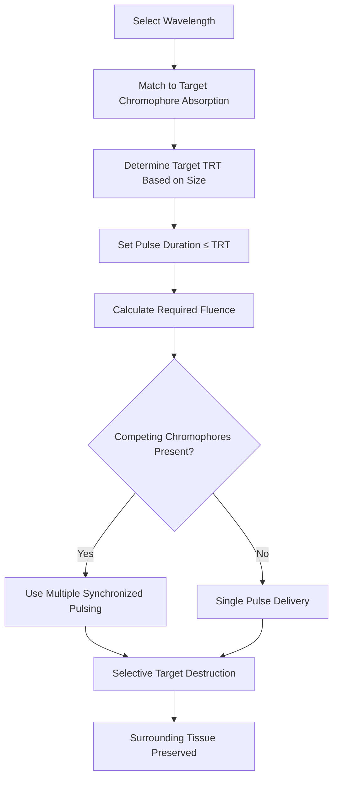
```mermaid
flowchart TD
    A[Select Wavelength] --> B[Match to Target Chromophore Absorption]
    B --> C[Determine Target TRT Based on Size]
    C --> D[Set Pulse Duration ≤ TRT]
    D --> E[Calculate Required Fluence]
    E --> F{Competing Chromophores Present?}
    F -->|Yes| G[Use Multiple Synchronized Pulsing]
    F -->|No| H[Single Pulse Delivery]
    G --> I[Selective Target Destruction]
    H --> I
    I --> J[Surrounding Tissue Preserved]
```

### 1.6 Chromophore-Light Interactions in Cutaneous Tissue

**Chromophores** are materials that absorb particular wavelengths of light depending on their absorption coefficient[^2]. Understanding chromophore-light interactions is fundamental to selecting appropriate treatment modalities and parameters for different clinical indications. The skin contains both **endogenous chromophores** (naturally present) and may contain **exogenous chromophores** (introduced from outside, such as tattoo ink)[^2].

The three primary endogenous chromophores relevant to aesthetic medicine are:

**Melanin** exhibits a broad absorption spectrum spanning from ultraviolet (250 nm) through infrared (1200 nm), with absorption gradually decreasing as wavelength increases[^2][^3]. This wide absorption range provides flexibility in wavelength selection for treating pigmented lesions but also means melanin acts as a **competing chromophore** that can absorb energy intended for other targets. Epidermal melanin poses particular challenges when treating deeper structures in darker skin types, as it may absorb significant energy before light reaches the intended target[^2][^1].

**Hemoglobin** (including oxyhemoglobin, deoxyhemoglobin, and methemoglobin) demonstrates an absorption curve with peaks at **418 nm, 524 nm, 577 nm, and 1064 nm**[^2]. The first two peaks coincide with high melanin absorption and therefore cannot be used clinically. However, the spectrum between **580-595 nm** is useful for treating vascular lesions, making pulsed dye lasers at 585-595 nm the gold standard for conditions such as port wine stains[^2][^3].

**Water** serves as the primary chromophore for ablative resurfacing lasers. CO₂ lasers at **10,600 nm** and Er:YAG lasers at **2940 nm** target water in tissue, with Er:YAG demonstrating stronger water absorption and reduced thermal damage compared to CO₂[^2][^3].

The following diagram illustrates the general relationship between wavelength and chromophore absorption:

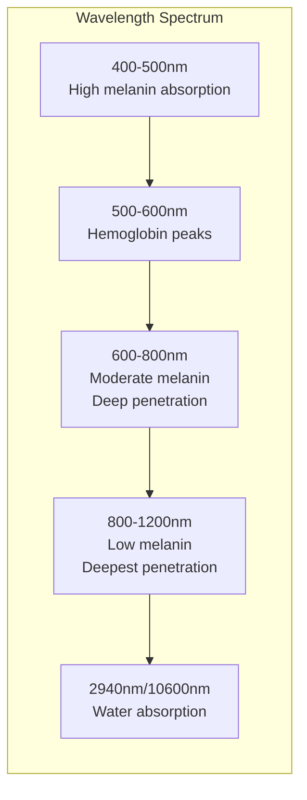
```mermaid
graph LR
    subgraph Wavelength Spectrum
    A[400-500nm<br>High melanin absorption] --> B[500-600nm<br>Hemoglobin peaks]
    B --> C[600-800nm<br>Moderate melanin<br>Deep penetration]
    C --> D[800-1200nm<br>Low melanin<br>Deepest penetration]
    D --> E[2940nm/10600nm<br>Water absorption]
    end
```

When selecting wavelengths for treatment, clinicians must consider the **Fitzpatrick skin phototype classification**, which categorizes skin based on epidermal melanin concentration and response to sun exposure[^2]:

| Skin Type | Skin Color | Burns | Tans | Laser Considerations |
|-----------|------------|-------|------|---------------------|
| Type I | White | Always | Never | Low competing melanin; shorter wavelengths safe |
| Type II | White | Usually | With difficulty | Low competing melanin |
| Type III | White | Sometimes | Averagely | Moderate caution needed |
| Type IV | Moderate brown | Rarely | Easily | Longer wavelengths preferred |
| Type V | Dark brown | Very rarely | Easily | Significant competing melanin; longer wavelengths essential |
| Type VI | Black | Never | Very easily | Highest risk; longest wavelengths and careful parameters required |

For darker skin types (IV-VI), shorter wavelengths like Ruby (694 nm) and Alexandrite (755 nm) carry unacceptable complication rates including epidermal burns and post-treatment hyperpigmentation due to strong competing epidermal melanin[^2][^3]. Longer wavelengths such as Diode (800 nm) and Nd:YAG (1064 nm), despite having lesser affinity for melanin, prove more effective due to deeper penetration and reduced epidermal absorption[^2].

### 1.7 Comparative Analysis of Light Delivery Mechanisms and Tissue Effects

The fundamental differences among laser, IPL, and LED technologies translate into distinct therapeutic profiles, mechanisms of action, and clinical applications. Understanding these distinctions enables appropriate modality selection based on the specific condition being treated, patient skin type, and desired outcomes.

**Mechanism Comparison**:

| Aspect | Laser | IPL | LED |
|--------|-------|-----|-----|
| **Primary Mechanism** | Selective photothermolysis / Photomechanical (Q-switched) | Selective photothermolysis | Photobiomodulation |
| **Tissue Effect** | Thermal coagulation / Fragmentation | Thermal coagulation | Cellular biostimulation |
| **Light Characteristics** | Monochromatic, coherent, collimated | Polychromatic, non-coherent | Non-coherent, non-collimated |
| **Energy Level** | High | Moderate-high | Low |
| **Heat Generation** | Significant | Moderate | Minimal |
| **Tissue Damage** | Targeted destruction | Targeted destruction | None (non-ablative) |

**Photothermal effects**, characteristic of both laser and IPL therapies, cause tissue destruction through heat generation. When chromophores absorb light energy, the resulting temperature elevation causes **vaporization, coagulation, or protein denaturation** depending on the energy level and tissue characteristics[^3]. This mechanism underlies treatments for vascular lesions (hemoglobin targeting), pigmented lesions (melanin targeting), and hair removal (follicular melanin targeting).

**Photomechanical effects** occur when high-energy photons are delivered in ultra-short pulses of nanoseconds, as achieved through Q-switching technology[^2][^3]. The rapid heating and material expansion generate **shock waves, cavitation, or rapid thermal expansion** that physically fragment target structures such as tattoo particles or melanosomes[^2]. The immediate clinical endpoint is tissue whitening due to melanosome rupture and gas bubble formation[^2].

**Photobiomodulation**, the mechanism underlying LED therapy, represents a fundamentally different approach that does not involve tissue destruction. Instead, low-level light absorption by mitochondrial chromophores triggers beneficial cellular responses including enhanced ATP production, modulation of inflammatory pathways, and stimulation of collagen synthesis[^6][^7]. This mechanism makes LED therapy suitable for skin rejuvenation, wound healing support, and as adjunctive therapy following more aggressive treatments.

The **depth of penetration** varies significantly among modalities and influences their therapeutic applications:

- **LED light** penetrates superficially to moderately, depending on wavelength, with red light (630-660 nm) reaching the dermis and near-infrared (830 nm) penetrating deeper[^7][^8]
- **IPL** can reach deeper skin layers than LED due to higher energy delivery, with penetration depth adjustable through wavelength filter selection[^1][^8]
- **Lasers** achieve the most precise and potentially deepest penetration, with 1064 nm Nd:YAG reaching up to 8 mm depth for treating deep vascular lesions[^2]

**Safety profiles** differ considerably based on mechanism and energy levels. LED therapy carries the lowest risk profile, being safe for all skin types with minimal adverse effects[^6][^8]. IPL requires careful parameter selection for darker skin types to avoid epidermal damage[^1]. Laser treatments carry risks including pigmentary changes, scarring, and ocular injury, with darker Fitzpatrick skin types (IV-VI) at increased risk for complications such as post-inflammatory hyperpigmentation[^3].

**Clinical outcome expectations** also vary by modality. Laser treatments typically produce the most dramatic results for specific indications but may require longer recovery periods. IPL offers versatility with shorter recovery times and lower equipment costs compared to lasers[^1]. LED therapy produces gradual improvements through cumulative effects, typically requiring multiple sessions over weeks to months, but offers convenience and safety that support home-based use and maintenance protocols[^7].

In summary, the selection among laser, IPL, and LED technologies depends on the specific clinical indication, target chromophore, patient skin type, desired treatment intensity, acceptable downtime, and cost considerations. **Lasers provide the highest precision** for specific chromophore targeting and are essential for conditions requiring photomechanical effects. **IPL offers versatility** for treating multiple concerns simultaneously with moderate intensity. **LED provides a safe, non-invasive option** for cellular biostimulation and is particularly valuable for skin rejuvenation and as adjunctive therapy in comprehensive treatment protocols.

## 2 Classification and Clinical Presentation of Target Skin Conditions

The effective application of light-based therapies in aesthetic medicine fundamentally depends on accurate identification and classification of target skin conditions. Understanding the pathophysiology, clinical manifestations, and chromophore characteristics of photoaging, hyperpigmentation disorders, and skin dullness enables clinicians to select appropriate treatment modalities and optimize therapeutic parameters. This chapter systematically examines these conditions, establishing the diagnostic framework that informs treatment decisions and identifies the specific tissue targets—melanin, hemoglobin, collagen, and water—that laser, IPL, and LED technologies aim to address. By correlating condition severity, histological depth, and patient skin type with therapeutic approaches, this analysis provides the essential foundation for evidence-based treatment planning discussed in subsequent chapters.

### 2.1 Photoaging: Pathophysiology and the Glogau Classification System

Photoaging represents the cumulative consequence of chronic exposure to solar irradiation, encompassing ultraviolet (UV), visible, and infrared wavelengths that cause progressive structural degradation and aesthetic deterioration of the skin[^11]. Unlike intrinsic chronological aging, which proceeds at a genetically determined pace, **photoaging is largely preventable and treatable**, making it a primary target for light-based aesthetic interventions. The clinical manifestations and underlying mechanisms of photoaging provide essential context for understanding how different light therapies can address specific tissue damage patterns.

#### Molecular Mechanisms of Photoaging

The pathophysiology of photoaging involves complex interactions at the molecular, cellular, and tissue levels. **Solar UV radiation damages human skin by inducing matrix metalloproteinases (MMPs)** that degrade dermal collagen, leading to the characteristic loss of skin resilience and formation of wrinkles[^12]. This process occurs through UV activation of cell surface receptors, which triggers intracellular signaling cascades culminating in increased MMP gene expression. The transcription factor **c-Jun** plays a critical role in this process, as its accumulation is required for MMP gene expression and subsequent collagen destruction.

The molecular cascade of photoaging can be understood through the following sequence:

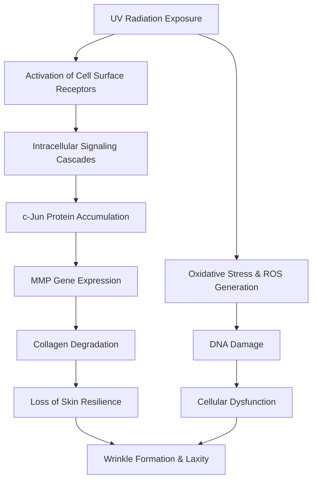
```mermaid
flowchart TD
    A[UV Radiation Exposure] --> B[Activation of Cell Surface Receptors]
    B --> C[Intracellular Signaling Cascades]
    C --> D[c-Jun Protein Accumulation]
    D --> E[MMP Gene Expression]
    E --> F[Collagen Degradation]
    F --> G[Loss of Skin Resilience]
    G --> H[Wrinkle Formation & Laxity]
    A --> I[Oxidative Stress & ROS Generation]
    I --> J[DNA Damage]
    J --> K[Cellular Dysfunction]
    K --> H
```

Beyond collagen degradation, photoaging involves **cumulative oxidative damage** from reactive oxygen species (ROS) generated during UV exposure. This oxidative stress contributes to DNA damage, lipid peroxidation, and protein modification, accelerating cellular senescence and tissue deterioration. The resulting clinical manifestations include leathery texture, wrinkles, mottled pigmentation, laxity, and sallowness[^12].

Importantly, the hallmarks of photoaging vary significantly by skin phototype. **Skin of color tends to exhibit dyschromia** and features associated with intrinsic aging such as volume loss, while **white skin is more prone to extrinsic aging characteristics** including rhytides and elastosis[^11]. This differential presentation has important implications for treatment selection, as the primary concerns and chromophore targets may differ substantially between patient populations.

#### The Glogau Photoaging Classification System

The **Glogau Wrinkle Scale**, developed by Dr. Richard Glogau, provides a standardized classification system for assessing photoaging severity and guiding treatment selection[^13][^14]. This system categorizes photoaging into four progressive types based on wrinkle development, pigmentation changes, and associated skin alterations, enabling clinicians to match patients with appropriate therapeutic interventions.

| Glogau Type | Descriptor | Typical Age | Clinical Manifestations | Key Features |
|-------------|------------|-------------|------------------------|--------------|
| **Type I** | "No Wrinkles" | 20s-30s | Early photoaging with minimal to no wrinkling | Mild pigment changes, no age spots, no keratosis, minimal makeup coverage needed[^14][^15] |
| **Type II** | "Wrinkles in Motion" | 30s-40s | Moderate photoaging with dynamic wrinkles | Wrinkles appear only when face moves, early brown age spots, pores more prominent, skin texture changes beginning[^13][^14] |
| **Type III** | "Wrinkles at Rest" | 40s-50s | Advanced photoaging with static wrinkles | Wrinkles present even at rest, prominent brown pigmentation, visible age spots, telangiectasia, visible keratosis[^14][^15] |
| **Type IV** | "Only Wrinkles" | 60s-70s | Severe photoaging | Wrinkles everywhere at rest or moving, yellow-gray skin color, prior skin cancers, actinic keratosis[^13][^14] |

**Type I photoaging** represents the earliest stage, typically observed in individuals in their twenties to early thirties. Clinical manifestations include minimal pigment changes, few if any wrinkles or scars, and keratosis that is not yet visible[^15]. These patients require minimal makeup coverage and represent ideal candidates for preventive interventions and maintenance protocols using LED photobiomodulation or gentle IPL treatments.

**Type II photoaging** marks the transition to moderate damage, characterized by the emergence of **wrinkles in motion**—lines that appear around the eyes (crow's feet) and mouth during facial expression but disappear at rest[^13][^14]. Early brown age spots begin to appear, skin pores become more prominent, and early changes in skin texture develop. Keratosis becomes palpable but remains not visible[^15]. This stage represents an optimal intervention point where light-based therapies can address emerging pigmentation and stimulate collagen remodeling before more severe structural damage occurs.

**Type III photoaging** indicates advanced damage with **wrinkles at rest**—static lines visible even without facial movement. Brown pigmentation becomes prominent, age spots are clearly visible, and small blood vessels (telangiectasia) become apparent[^14]. Visible keratosis develops, and the need for makeup coverage becomes more apparent[^15]. Patients at this stage often require combination approaches including both ablative and non-ablative laser treatments, IPL for pigmentation and vascular concerns, and LED therapy for ongoing collagen stimulation.

**Type IV photoaging** represents severe damage characterized by pervasive wrinkling throughout the face regardless of expression. The skin develops a characteristic **yellow-gray, sallow color** with a dull, flaky, and dry appearance[^14][^15]. Pre-cancerous skin changes (actinic keratosis) may be present, and patients may have a history of skin cancers[^13]. Dynamic gravitational lines become apparent, and there is little to no sign of normal skin[^15]. Treatment at this stage requires aggressive intervention with ablative resurfacing lasers, often combined with medical management of pre-cancerous lesions.

#### Correlation with Light-Based Treatment Strategies

The Glogau classification directly informs treatment intensity and modality selection. For **Types I-II**, non-ablative approaches including LED photobiomodulation, low-fluence IPL, and non-ablative lasers can effectively address early changes while stimulating preventive collagen remodeling. For **Type III**, more aggressive interventions including fractional lasers, higher-fluence IPL, and combination protocols become appropriate. For **Type IV**, ablative laser resurfacing may be necessary to address severe textural damage, though the presence of pre-cancerous changes requires careful medical evaluation before aesthetic treatment.

The key tissue targets in photoaging treatment include **dermal collagen** (stimulated through photobiomodulation and fractional laser-induced wound healing), **elastin** (addressed through similar mechanisms), **melanin deposits** (targeted via selective photothermolysis with IPL or pigment-specific lasers), and **vascular components** (treated with IPL or pulsed dye lasers targeting hemoglobin). Understanding these targets enables precise treatment parameter selection based on the specific manifestations present at each Glogau stage.

### 2.2 Melasma: Etiology, Classification, and Clinical Patterns

Melasma represents one of the most challenging hyperpigmentation disorders in aesthetic medicine, characterized as a **progressive, macular, nonscaling hypermelanosis** affecting sun-exposed areas of the skin, primarily the face and dorsal forearms[^16]. Its recalcitrant nature, tendency toward treatment-induced exacerbation, and complex pathophysiology demand thorough understanding for effective management with light-based therapies.

#### Etiology and Predisposing Factors

The etiology of melasma is **multifactorial**, involving hormonal influences, UV exposure, genetic predisposition, and inflammatory components. The condition is usually associated with pregnancy (chloasma or "mask of pregnancy"), oral contraceptive use, or anticonvulsant medications such as phenytoin, though it may also be idiopathic[^16]. **Melasma affects women nine times more often than men**, reflecting the significant hormonal component in its pathogenesis.

Importantly, melasma is **more prominent in patients with Fitzpatrick skin types IV to VI**[^16], presenting particular challenges for light-based treatments due to the higher baseline melanin content and more reactive melanocytes in these skin types. The increased susceptibility of darker skin types to post-inflammatory hyperpigmentation (PIH) following light-based procedures creates a therapeutic paradox where the treatments intended to reduce pigmentation may potentially worsen it if parameters are not carefully optimized.

#### Histological Classification and Wood Lamp Examination

Three histological subtypes of melasma exist, distinguished by the depth of melanin deposition and their appearance under Wood lamp examination[^16]:

| Melasma Subtype | Melanin Location | Clinical Appearance | Wood Lamp Enhancement | Treatment Implications |
|-----------------|------------------|---------------------|----------------------|------------------------|
| **Epidermal** | Basal and suprabasal epidermis | Light brown | Enhances (becomes more visible) | More responsive to treatment; superficial targets accessible to shorter wavelengths |
| **Dermal** | Dermis (melanophages) | Grayish | Non-enhancing | More persistent; requires longer wavelengths for deeper penetration; often more resistant |
| **Mixed** | Both epidermis and dermis | Dark brown | Variable enhancement | Requires combination approaches targeting multiple depths |

**Epidermal melasma** tends to be light brown in color and enhances under Wood lamp examination, indicating superficial melanin deposition that is more accessible to treatment[^16]. This subtype generally responds better to light-based therapies because the target chromophore (melanin) is located within the treatment range of most devices.

**Dermal melasma** appears grayish in color and does not enhance under Wood lamp examination[^16]. The melanin in this subtype has been engulfed by dermal macrophages (melanophages), creating deposits that are deeper and more resistant to treatment. The blue-gray hue results from the Tyndall effect—the scattering of light by deeper pigment particles. This subtype often requires longer wavelengths capable of deeper penetration, such as 1064 nm Nd:YAG lasers.

**Mixed melasma**, the most common presentation, features dark brown coloration with variable Wood lamp enhancement, indicating melanin deposits at multiple depths[^16]. Effective treatment typically requires combination approaches that address both superficial and deep pigment.

#### Distribution Patterns

Melasma typically presents in one of three characteristic distribution patterns, which may influence treatment planning and outcomes[^16]:

- **Centrofacial pattern (63%)**: Affects the forehead, cheeks, nose, upper lip, and chin—the most common presentation
- **Malar pattern (21%)**: Confined to the cheeks and nose
- **Mandibular pattern (16%)**: Affects the jawline and chin

The condition is usually bilateral, though not always, and is typically asymptomatic[^16]. Recognition of these patterns assists in treatment planning and helps distinguish melasma from other pigmentary disorders.

#### Implications for Light-Based Treatment

The challenges of treating melasma with light-based therapies stem from several factors. First, the **chronic, recurrent nature** of the condition means that even successful treatment may be followed by relapse, particularly with continued sun exposure or hormonal influences. Second, the **reactive melanocytes** in affected individuals may respond to the inflammation induced by light-based treatments by producing additional melanin, potentially worsening the condition. Third, the **variable depth of melanin deposition** in mixed-type melasma requires careful wavelength selection and often combination approaches.

Recent research has demonstrated that laser therapy can be effective for melasma, with a meta-analysis of 16 randomized controlled trials showing a **pooled standardized mean difference of 0.88** in Melasma Area and Severity Index (MASI) scores, indicating significant improvement post-laser therapy[^17]. Studies using low-fluence 730-nm picosecond laser showed **33.7% reduction in MASI scores** in Chinese patients with Fitzpatrick skin Types II-IV[^18]. However, post-inflammatory hyperpigmentation remains a concern, with one study reporting PIH in 18.2% of patients using a picosecond alexandrite laser[^17].

LED therapy offers a gentler approach for melasma treatment, working through photobiomodulation mechanisms that reduce oxidative stress, increase cell turnover, and inhibit tyrosinase—the enzyme responsible for melanin production[^19]. Studies using **amber LED light (590 nm)** have shown effectiveness in reducing melasma by decreasing new blood vessel growth and recycling melanocytes, while **660 nm red LEDs** have demonstrated tyrosinase inhibition[^19]. For darker skin types, **near-infrared light (800-1000 nm)** is preferred as it bypasses epidermal melanin, reducing the risk of hyperpigmentation[^19].

### 2.3 Solar Lentigines and Ephelides: Differential Characteristics and Chromophore Targets

Solar lentigines and ephelides represent two of the most common benign pigmented lesions encountered in aesthetic practice. While both involve melanin as the primary chromophore, their **distinct pathogenic mechanisms, clinical characteristics, and treatment responses** necessitate careful differentiation for optimal therapeutic outcomes.

#### Pathogenic Mechanisms: A Fundamental Distinction

The critical distinction between solar lentigines and ephelides lies in their underlying pathophysiology[^16][^20]:

**Ephelides (freckles)** result from **increased melanin production without proliferation of melanocytes**. The number of melanocytes remains normal, but they produce excess melanin in response to UV stimulation. This mechanism explains why ephelides fade during winter months when UV exposure decreases—the melanocytes reduce their melanin output in the absence of the UV stimulus[^20].

**Solar lentigines (liver spots, age spots)** result from a **local proliferation of basal melanocytes and subsequent increase in melanization**[^16]. This represents a structural change in the skin with an actual increase in the number of pigment-producing cells. Because the melanocyte population itself is increased, solar lentigines tend to persist year-round and do not fade significantly in the absence of UV stimulation[^20].

This pathogenic distinction has important implications for treatment. Ephelides may respond to treatments that reduce melanin production or increase melanin turnover, while solar lentigines require treatments capable of destroying or removing the excess melanocytes themselves.

#### Comparative Clinical Features

| Characteristic | Ephelides (Freckles) | Solar Lentigines (Age Spots) |
|---------------|---------------------|------------------------------|
| **Size** | Small, 1-2 mm, sharply defined[^16] | Larger, 1-3 cm (few mm to several cm)[^16][^20] |
| **Color** | Red to tan to light brown, uniform[^16] | Light yellow to dark brown, often variegated[^16] |
| **Border** | Sharply defined[^16] | Well-circumscribed, sharply defined[^20] |
| **Seasonal Variation** | Fade considerably or disappear in winter[^20] | Persist year-round, may fade but do not disappear[^20] |
| **Age of Onset** | Childhood, after sun exposure[^16] | Middle age (common after 40)[^20] |
| **Distribution** | Face, neck, chest, arms[^16][^21] | Face, hands, forearms, chest, back, shins[^16] |
| **Underlying Mechanism** | Increased melanin production[^16] | Melanocyte proliferation + increased melanization[^16] |
| **Skin Types Affected** | Very common in fair-skinned, especially red-haired[^20] | White or Asian persons, skin types I-III[^16] |

**Ephelides** are very common in fair-skinned individuals, especially children with red hair[^20]. They appear as small (typically less than 3 mm), sharply defined macular lesions of uniform color ranging from red to tan to light brown[^16]. Their number can vary from a few to hundreds[^16]. The lesions are asymptomatic and arise from early childhood onward after sun exposure[^16]. A defining characteristic is their **seasonal variation**—they are more prominent in summer but fade considerably or disappear in winter[^20].

**Solar lentigines** are macular, hyperpigmented, well-circumscribed lesions that vary in size from a few millimeters to several centimeters[^16][^20]. They vary in color from light yellow to dark brown and often have a variegated appearance[^16]. The most common locations include the face, hands, forearms, chest, back, and shins—areas with significant cumulative sun exposure[^16]. Unlike ephelides, solar lentigines **tend to persist for long periods and do not disappear in winter**, although they may fade somewhat[^20]. They are most likely to develop in white or Asian persons, especially those with skin types I to III and a tendency to freckle[^16].

#### Differential Diagnosis Considerations

When evaluating pigmented lesions, clinicians must distinguish ephelides and solar lentigines from other conditions[^20]:

- **Actinic keratosis**: Tends to be more scaly and thickened than solar lentigines
- **Seborrheic keratosis**: More scaly and thickened, with a "stuck-on" appearance
- **Pigmented actinic keratosis**: Distinguished by absence of epidermal hyperkeratosis in lentigines
- **Lentigo maligna**: A premalignant lesion requiring careful differentiation
- **Melasma**: A chronic pigmentation disorder with different distribution patterns
- **Juvenile lentigines**: 2-10 mm lesions that arrive later in life than ephelides but earlier than solar lentigines

Solar lentigines must be differentiated from premalignant lesions such as pigmented actinic keratoses or lentigo maligna[^16]. Clinical features and dermoscopy can assist in this differentiation, but biopsy may be required for uncertain lesions.

#### Chromophore Targeting and Treatment Considerations

**Melanin serves as the primary chromophore** for treating both ephelides and solar lentigines. The FDA has approved IPL therapy for these conditions, recognizing IPL technology as an ideal tool for treating various pigmented lesions[^1]. The principle of selective photothermolysis applies directly: light energy is absorbed by melanin, converted to heat, and causes controlled destruction of pigmented cells through thermocoagulation[^1].

Treatment efficacy varies by modality. A systematic review of treatments for solar lentigines found the following success rates[^22]:

| Treatment Modality | Success Rate |
|-------------------|--------------|
| Intense Pulsed Light (IPL) | 74.6%-90% |
| Picosecond Laser | 67.9%-93.02% |
| Q-Switched Laser | 36.36%-76.6% |
| Pulsed Dye Laser (PDL) | 27%-57% |
| Topical (mequinol 2% + tretinoin 0.01%) | 52.6% to >80% |
| Cryotherapy | 37%-71.4% |
| Chemical Peels (TCA) | 12%-46% |
| Fractional CO2 Laser | 8%-23% |

**IPL demonstrates particularly high efficacy** for solar lentigines, with success rates of 74.6% to 90%[^22]. The broad-spectrum light allows simultaneous targeting of melanin at various depths, and the treatment mechanism involves darkening of pigmented spots initially, followed by flaking off over several days as the body's immune system clears damaged tissue and pigment[^5].

For laser treatment, the **Q-switched Nd:YAG laser at wavelengths of 1064 or 532 nm** and the **Alexandrite laser at 755 nm** are predominantly used for pigmentation[^23]. Photodamage with lentigines often responds well to the Nd:YAG laser[^23]. A case report demonstrated that **low-level laser therapy (LLLT) using a red diode laser (660 nm)** at 15.6 mW/cm² and 5.6 J/cm² effectively reduced both ephelides and solar lentigines over 12 sessions, with no reported side effects or lesion recurrence during one-year follow-up[^24].

When selecting wavelengths, clinicians must consider competing chromophores. Melanin in the epidermis may shield targeted chromophores in deeper layers[^1]. Since melanin absorbs light preferentially at shorter wavelengths, selecting longer wavelengths benefits patients with darker skin by penetrating deeper while sparing the epidermis. Conversely, shorter wavelengths effectively treat pigmented lesions in patients with lighter skin[^1].

### 2.4 Post-Inflammatory Hyperpigmentation: Mechanisms and Risk Stratification

Post-inflammatory hyperpigmentation (PIH) represents both a common dermatological condition and a significant complication risk for light-based aesthetic treatments. Understanding its pathophysiology, clinical presentation, and risk factors is essential for both treating existing PIH and preventing its occurrence as an adverse effect of laser, IPL, and other procedures.

#### Pathophysiology of PIH

**Post-inflammatory hyperpigmentation is a common acquired cutaneous disorder occurring after skin inflammation or injury**[^25]. It results from overproduction and irregular dispersion of melanin in the epidermis or dermis, triggered by various skin insults including acne, eczema, trauma, or dermatologic procedures[^25].

The pathophysiology involves complex interactions between inflammatory mediators, melanocytes, and keratinocytes[^25]:

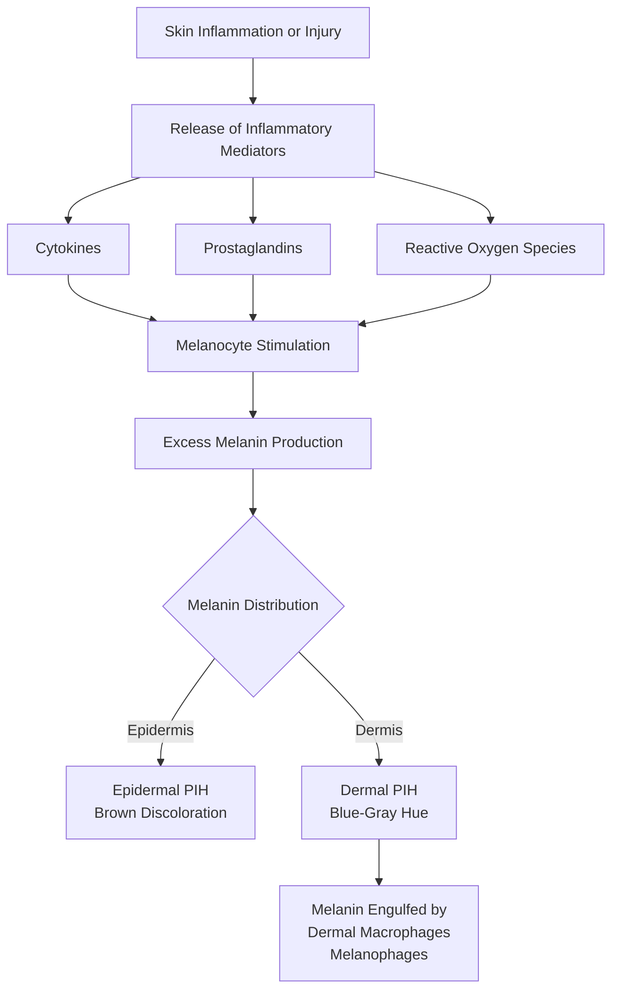
```mermaid
flowchart TD
    A[Skin Inflammation or Injury] --> B[Release of Inflammatory Mediators]
    B --> C[Cytokines]
    B --> D[Prostaglandins]
    B --> E[Reactive Oxygen Species]
    C --> F[Melanocyte Stimulation]
    D --> F
    E --> F
    F --> G[Excess Melanin Production]
    G --> H{Melanin Distribution}
    H -->|Epidermis| I[Epidermal PIH<br>Brown Discoloration]
    H -->|Dermis| J[Dermal PIH<br>Blue-Gray Hue]
    J --> K[Melanin Engulfed by<br>Dermal Macrophages<br>Melanophages]
```

When inflammation occurs, the release of inflammatory cytokines, prostaglandins, and reactive oxygen species stimulates melanocytes to produce excess melanin[^25]. This melanin is then transferred to surrounding keratinocytes in the epidermis and, in some cases, leaks into the dermis where it is engulfed by macrophages.

#### Epidermal versus Dermal PIH

The distinction between epidermal and dermal PIH has critical implications for prognosis and treatment response[^25]:

| Characteristic | Epidermal PIH | Dermal PIH |
|---------------|---------------|------------|
| **Clinical Appearance** | Brown discoloration | Blue-gray hue |
| **Melanin Location** | Basal and suprabasal epidermis | Dermis (within melanophages) |
| **Histopathology** | Melanin accumulation in epidermal layers | Melanin granules phagocytosed by dermal macrophages |
| **Prognosis** | Typically resolves within 6-12 months | Improves slowly, may be permanent |
| **Treatment Response** | More responsive to topical and light-based treatments | More resistant; requires treatments with deeper penetration |

**Epidermal PIH** occurs when melanin accumulates within the basal and suprabasal layers of the epidermis, presenting as brown discoloration[^25]. This form typically resolves or significantly improves within 6 to 12 months and is more amenable to treatment.

**Dermal PIH** results from melanin escaping into the dermis, where it is phagocytosed by dermal macrophages (melanophages)[^25]. The deeper location of pigment creates a characteristic blue-gray hue due to the Tyndall effect. This form improves slowly and may be permanent, presenting a greater therapeutic challenge.

#### Risk Factors and Susceptibility

Several factors influence the likelihood and severity of PIH development[^25]:

**Fitzpatrick Skin Type**: Individuals with darker skin types (Fitzpatrick III to VI) are significantly more susceptible to PIH due to their higher baseline melanin production and more reactive melanocytes[^25]. The incidence of PIH in individuals with darker skin tones with acne can be as high as 65%[^25].

**Degree of Inflammation**: The severity and persistence of PIH depend on the degree of inflammation and the depth of melanin deposition[^25]. More intense or prolonged inflammatory responses increase the risk of significant PIH.

**Treatment Parameters**: For light-based therapies, higher fluences, longer pulse durations, and inappropriate wavelength selection for a given skin type may increase the likelihood of adverse events including PIH[^1].

#### PIH as a Complication of Light-Based Therapies

The paradoxical risk of PIH following light-based treatments designed to reduce pigmentation represents a critical consideration in aesthetic medicine. Multiple studies have documented this complication:

- IPL therapy can cause PIH, particularly in darker-skinned individuals, where shorter wavelengths are absorbed by melanin and lead to pigmentation changes[^1]
- Q-switched Nd:YAG laser treatment for melasma resulted in PIH in some patients[^17]
- Picosecond alexandrite laser caused PIH in 18.2% of patients in one study[^17]
- Conventional IPL for melasma treatment resulted in at least one case of PIH[^17]

**Risk mitigation strategies** include:

1. **Appropriate patient selection**: Careful evaluation of Fitzpatrick skin type and history of PIH
2. **Parameter optimization**: Using longer wavelengths, lower fluences, and longer pulse durations for darker skin types[^26]
3. **Pre-treatment preparation**: Use of bleaching agents (e.g., hydroquinone cream) before and after laser resurfacing can reduce PIH risk[^26]
4. **Epidermal cooling**: Pre- and post-treatment cooling can help prevent pigment abnormalities[^26]
5. **Post-treatment care**: Strict sun avoidance and gentle skincare following procedures[^27]
6. **Combination approaches**: Applying epidermal growth factor-containing ointment after Q-switched 532 nm Nd:YAG laser treatment significantly reduced PIH incidence (7.14% vs. 37.5%)[^22]

### 2.5 Skin Dullness and Textural Irregularities: Contributing Factors and Assessment

Skin dullness and textural irregularities represent multifactorial concerns that frequently accompany photoaging and pigmentary disorders. While less precisely defined than specific pigmented lesions, these conditions significantly impact patient satisfaction and represent important targets for light-based aesthetic interventions.

#### Contributing Factors to Skin Dullness

Skin dullness results from multiple interrelated factors that reduce the skin's natural luminosity and healthy appearance:

**Reduced Cell Turnover**: As skin ages, the rate of keratinocyte turnover decreases, leading to accumulation of dead cells on the skin surface. This creates a barrier that scatters light irregularly rather than reflecting it uniformly, diminishing the skin's natural radiance.

**Accumulated Surface Debris**: Dead skin cells, sebum, and environmental pollutants accumulate on the skin surface, further contributing to light scattering and dull appearance.

**Impaired Microcirculation**: Photoaging affects dermal vasculature, reducing blood flow to the skin surface. Healthy microcirculation contributes to skin's natural color and vitality; when compromised, the skin appears sallow and lifeless.

**Decreased Collagen Density**: UV-induced MMP activation leads to collagen degradation[^12], reducing dermal structural integrity. This affects the skin's ability to reflect light uniformly and contributes to textural irregularities.

**Mottled Pigmentation**: Uneven distribution of melanin—whether from photoaging, melasma, or other causes—creates areas of varying light absorption and reflection, contributing to an overall dull, uneven appearance.

#### Photoaging Contributions to Textural Irregularities

Photoaging manifests in multiple textural changes beyond wrinkle formation:

- **Pore prominence**: Skin texture changes with pores becoming more visible, noted as early as Glogau Type II photoaging[^14]
- **Leathery texture**: Advanced photoaging produces characteristic textural changes[^12]
- **Rough, scaly patches**: Particularly in severe photoaging (Glogau Type IV)[^15]
- **Loss of skin elasticity**: Contributing to surface irregularities and uneven light reflection
- **Telangiectasia**: Visible small blood vessels that disrupt skin uniformity[^14]

#### Clinical Assessment Parameters

Assessment of skin quality for treatment planning involves evaluation of:

1. **Surface texture**: Smoothness, pore visibility, presence of rough patches
2. **Skin tone uniformity**: Presence of pigmentation irregularities, redness, or sallowness
3. **Luminosity**: Overall skin radiance and light reflection
4. **Hydration status**: Skin moisture levels affecting surface quality
5. **Elasticity**: Skin firmness and resilience

#### Cellular and Structural Targets for Light-Based Improvement

Light-based therapies address skin dullness and textural irregularities through several mechanisms:

**Keratinocyte Turnover**: LED photobiomodulation stimulates cellular activity, potentially accelerating the natural turnover of keratinocytes and promoting fresher skin surface cells.

**Dermal Vasculature**: IPL and certain laser wavelengths targeting hemoglobin can address visible telangiectasia while potentially improving overall microcirculation.

**Collagen Architecture**: Both LED photobiomodulation and fractional laser treatments stimulate collagen synthesis and remodeling. A systematic review found that combination LED-RL (633 nm) and LED-nIR (830 nm) improved wrinkles by 36%, while LED-nIR alone improved skin texture by 32% according to patient assessment[^6].

**Melanin Distribution**: IPL and pigment-targeting lasers address mottled pigmentation, creating more uniform light reflection and improved overall skin brightness.

The body's natural healing processes play a role in these improvements. Following IPL treatment, the body's immune system helps clear damaged tissue and pigment while stimulating collagen production in deeper layers of skin, leading over time to more even pigmentation, reduced redness, and smoother tone and texture[^5].

### 2.6 Fitzpatrick Skin Phototype: Implications for Condition Presentation and Treatment Planning

The **Fitzpatrick Skin Type Scale** represents the most widely used classification system in dermatology and aesthetic medicine for categorizing skin based on its response to UV exposure and predicting treatment outcomes[^28]. Originally described by Thomas B. Fitzpatrick in 1972, this system has become essential for estimating appropriate doses for UV-based treatments and, critically, for predicting and preventing adverse events from laser and light-based therapies[^26].

#### The Fitzpatrick Classification System

The Fitzpatrick scale categorizes skin into six types based on natural skin tone and the tendency to burn or tan with sun exposure[^28]:

| Fitzpatrick Type | Skin Color | Burns | Tans | Melanin Content | Laser Sensitivity |
|-----------------|------------|-------|------|-----------------|-------------------|
| **Type I** | Very fair, pale white | Always burns | Never tans | Very low | Highly sensitive to UV/laser; conservative settings required[^28] |
| **Type II** | Fair, white | Burns easily | Tans minimally | Low | Low melanin allows effective treatment; critical sun protection[^28] |
| **Type III** | Light to medium, beige | May burn initially | Tans gradually | Moderate | Versatile but requires sun avoidance pre/post treatment[^28] |
| **Type IV** | Medium to olive | Rarely burns | Tans easily | Increased | Customized settings; cautious progression to avoid pigmentation changes[^28] |
| **Type V** | Deep brown | Very rarely burns | High | Best with longer wavelengths and conservative protocols[^28] |
| **Type VI** | Very deep, darkest brown to black | Never burns | Highest | Requires advanced technology and expert oversight[^28] |

#### Structural and Functional Differences by Skin Type

Beyond the clinical classification, important **structural and functional differences** exist between skin types that directly impact treatment outcomes[^26]:

- **Darker skin types typically have more epidermal melanin**
- **Melanosomes are larger and more widely distributed** in darker skin
- **Fibroblasts are more reactive** in darker skin types

These biological characteristics mean that higher Fitzpatrick skin types have **increased melanin content and epidermal distribution**[^26]. Since epidermal melanin acts as a chromophore, it absorbs more laser energy, increasing the risk of epidermal damage and adverse events in darker-skinned individuals[^26].

#### Differential Presentations of Pigmentary Disorders

Fitzpatrick skin type significantly influences both the prevalence and presentation of pigmentary disorders:

**Melasma** is more prominent in patients with skin types IV to VI[^16], reflecting the higher melanocyte reactivity in these populations. The condition may present with deeper dermal involvement in darker skin types.

**Post-inflammatory hyperpigmentation** shows dramatically increased susceptibility in skin types III to VI, with incidence in darker-skinned individuals with acne reaching as high as 65%[^25].

**Solar lentigines** are most likely to develop in white or Asian persons with skin types I to III who have a tendency to freckle[^16].

**Ephelides** are very common in fair-skinned individuals (types I-II), especially those with red hair[^20].

#### Treatment Parameter Modifications by Skin Type

The critical importance of skin type assessment lies in its implications for treatment safety and efficacy. **Laser and light-based treatments work by interacting with melanin in the skin**, making correct skin type identification essential for maximizing effectiveness, minimizing irritation or burns, and preventing hyper- or hypopigmentation[^28].

**For Fitzpatrick Types I-III**:
- Lower melanin content allows effective treatment with a wider range of wavelengths
- Shorter wavelengths (Ruby 694 nm, Alexandrite 755 nm) can be used safely
- IPL photofacials are often ideal for these skin types[^28]
- Standard treatment parameters typically appropriate
- LED red light (620-660 nm) is safe and effective for superficial concerns[^19]

**For Fitzpatrick Types IV-VI**:
- **Longer wavelengths are recommended** (Diode 800 nm, Nd:YAG 1064 nm) to reduce epidermal melanin absorption[^26]
- **Lower fluences and longer pulse durations** reduce thermal injury risk[^26]
- IPL requires special precautions including patch testing, lower energy settings, specialized filters, and enhanced patient education[^29]
- Types V-VI are often not ideal candidates for IPL; alternative treatments may be recommended[^28]
- **Near-infrared LED light (800-1000 nm) is preferred** over red light, as it bypasses epidermal melanin[^19]
- Pre- and post-treatment bleaching agents can reduce PIH risk[^26]
- Pulsed LED therapy minimizes overheating and melanin overstimulation[^19]

#### IPL Considerations for Different Skin Types

IPL therapy presents particular challenges for darker skin types because melanin content determines how much light energy the skin absorbs[^29]. The following precautions are essential for Fitzpatrick types IV-VI[^29]:

1. **Patch testing on facial skin** before full treatment
2. **Lower energy settings** to limit heat buildup
3. **Specialized filters** to narrow the wavelength range
4. **Enhanced patient education** about risks

When IPL is not ideal for darker skin tones, **alternative treatments such as chemical peels, microneedling, or tailored laser options** may be suggested[^29].

#### Clinical Decision Framework

The following decision framework integrates Fitzpatrick skin type assessment into treatment planning:

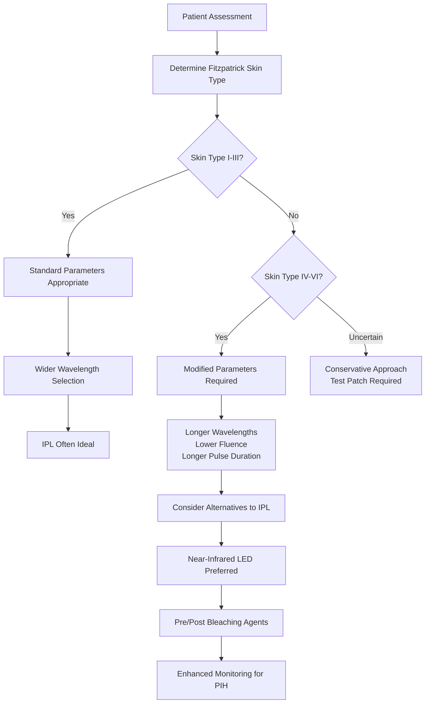
```mermaid
flowchart TD
    A[Patient Assessment] --> B[Determine Fitzpatrick Skin Type]
    B --> C{Skin Type I-III?}
    C -->|Yes| D[Standard Parameters Appropriate]
    D --> E[Wider Wavelength Selection]
    E --> F[IPL Often Ideal]
    C -->|No| G{Skin Type IV-VI?}
    G -->|Yes| H[Modified Parameters Required]
    H --> I[Longer Wavelengths<br>Lower Fluence<br>Longer Pulse Duration]
    I --> J[Consider Alternatives to IPL]
    J --> K[Near-Infrared LED Preferred]
    K --> L[Pre/Post Bleaching Agents]
    L --> M[Enhanced Monitoring for PIH]
    G -->|Uncertain| N[Conservative Approach<br>Test Patch Required]
```

**Baseline Fitzpatrick type does not change**, but current skin condition can vary due to temporary changes like recent tanning, sunburn, or self-tanner use, which may require postponing or adjusting treatments[^28]. Beyond skin type alone, experienced providers also consider hair characteristics, skin sensitivity, and medical history to ensure safe, effective care[^28].

In summary, the Fitzpatrick classification system serves as an essential tool for **patient stratification, treatment parameter selection, and risk prediction** in light-based aesthetic medicine. The heightened susceptibility of skin types IV-VI to adverse pigmentary outcomes necessitates customized treatment approaches, longer wavelengths, lower energy settings, and often alternative modalities to achieve safe and effective results. Understanding the interplay between skin phototype, condition presentation, and treatment response enables clinicians to optimize outcomes while minimizing complications across the full spectrum of patient skin types.

## 3 Laser Technologies: Types, Mechanisms, and Clinical Applications

Laser technologies represent the most precise and powerful modalities in light-based aesthetic medicine, offering targeted treatment solutions for photoaging, hyperpigmentation disorders, and skin rejuvenation. Building upon the foundational principles of selective photothermolysis established in Chapter 1—whereby specific wavelengths, pulse durations, and fluences enable selective destruction of target chromophores while sparing surrounding tissue—and the clinical classifications of target conditions outlined in Chapter 2, this chapter provides comprehensive analysis of the major laser categories employed in contemporary aesthetic practice. Each technology offers distinct advantages based on its wavelength characteristics, pulse parameters, and tissue interaction mechanisms, enabling clinicians to match therapeutic approaches to specific patient presentations and skin types.

### 3.1 Ablative Laser Resurfacing: CO2 and Erbium:YAG Technologies

Ablative laser skin resurfacing describes the process of **removing the epidermal and superficial dermal layers of the skin** to reduce cutaneous signs of photoaging through controlled tissue vaporization[^30]. This approach utilizes the principle of selective thermolysis, delivering light energy that is absorbed by the skin's primary chromophore—**water**—resulting in thermal energy emission that destroys surrounding tissue in a controlled manner[^30]. The technique represents one of the most effective methods for addressing severe photoaging manifestations including deep wrinkles, significant textural irregularities, and advanced photodamage corresponding to Glogau Types III-IV.

#### Carbon Dioxide (CO2) Laser Technology

The evolution of ablative laser resurfacing began with **continuous-wave carbon dioxide lasers in the 1980s**, subsequently advancing through the implementation of pulsed delivery systems that improved precision and safety[^30]. CO2 lasers emit photons at a wavelength of **10,600 nm**, which is absorbed by water within cutaneous tissue[^30]. This wavelength produces substantial thermal effects that extend beyond the immediate ablation zone.

The tissue effects of CO2 laser treatment are characterized by the following parameters:

| Parameter | CO2 Laser Characteristics |
|-----------|--------------------------|
| **Wavelength** | 10,600 nm |
| **Primary Chromophore** | Water |
| **Vaporization Depth (First Pass)** | 20-60 μm |
| **Thermal Damage Depth** | 100-150 μm |
| **Re-epithelialization Time** | ~8 days |
| **Erythema Duration (Fractional)** | ~2 weeks |
| **Erythema Duration (Non-fractional)** | Several weeks to months |

The **deeper thermal damage zone** produced by CO2 lasers serves a dual purpose[^30]. While it necessitates longer healing times, this thermal injury causes **immediate contraction of the ablated areas by denaturing existing collagen** and subsequently stimulates new collagen production[^31]. This collagen remodeling effect accounts for the significant skin tightening observed following CO2 laser treatment, making it particularly effective for addressing skin laxity and deep rhytides.

Clinical studies have demonstrated impressive outcomes with CO2 laser ablation, with improvement in rhytides documented at **up to 90%**[^30]. The CO2 laser system is particularly well suited for alleviating fine wrinkles and addressing severe sun damage[^32]. However, these dramatic results come with considerations regarding recovery and adverse effects.

**Adverse effect profile of CO2 lasers** includes:
- Post-inflammatory hyperpigmentation (PIH)
- Infection risk
- Delayed wound healing
- Potential scarring
- Prolonged skin redness
- Milia formation
- Hypopigmentation[^31]

Critically, **CO2 lasers are associated with a higher rate of dyspigmentation compared with Er:YAG lasers**[^30]. The skin typically requires **2 to 4 weeks to heal** following treatment[^31]. These considerations make CO2 lasers best suited for **lighter skin tones** (Fitzpatrick Types I-III), as there is a significantly higher risk of pigmentation changes in darker skin[^32].

#### Erbium:YAG Laser Technology

The **erbium-doped yttrium aluminum garnet (Er:YAG) laser** was developed in the 1990s and gained popularity in the late 1990s, representing a significant advancement in ablative resurfacing precision[^30]. Operating at a wavelength of **2,940 nm**, the Er:YAG laser demonstrates fundamentally different tissue interaction characteristics compared to CO2 systems.

The critical distinction lies in water absorption efficiency: **energy absorption by water is 12 to 18 times greater with the Er:YAG laser than with the CO2 laser**[^30]. This enhanced absorption results in several clinically significant differences:

| Parameter | Er:YAG Laser Characteristics |
|-----------|------------------------------|
| **Wavelength** | 2,940 nm |
| **Water Absorption** | 12-18× greater than CO2 |
| **Vaporization Depth (First Pass)** | 3-5 μm |
| **Thermal Damage Depth** | 10-40 μm |
| **Re-epithelialization Time** | ~5 days |
| **Erythema Duration** | 3-4 weeks |

The **significantly reduced heat dispersion** achieved by Er:YAG lasers leads to less thermal damage to surrounding tissues[^31]. This translates directly into clinical advantages including **quicker recovery times, reduced redness, and significantly lower risks of hyperpigmentation and hypopigmentation**[^31]. Recovery after Er:YAG laser treatment is shorter than after CO2 laser therapy, with less edema and a reduced incidence of adverse effects[^30].

However, the minimal thermal damage characteristic of Er:YAG lasers means they **do not penetrate as deeply into the tissues as the CO2 laser**[^31]. Consequently, the Er:YAG laser typically has **less skin tightening effect and less of a coagulative effect** than the CO2 laser[^30]. For clinical applications requiring significant collagen contraction—such as treatment of acne scars—the effects of fractional CO2 cannot be reproduced with Er:YAG lasers due to its shallower penetration[^31].

**Side effects of Er:YAG lasers** are generally milder and include:
- Mild erythema
- Burning sensation
- Itching
- Post-inflammatory hyperpigmentation (at lower rates than CO2)[^31]

#### Comparative Analysis and Patient Selection

The choice between CO2 and Er:YAG lasers depends on multiple factors including the specific skin condition, aesthetic goals, patient skin type, and acceptable recovery time[^32]:

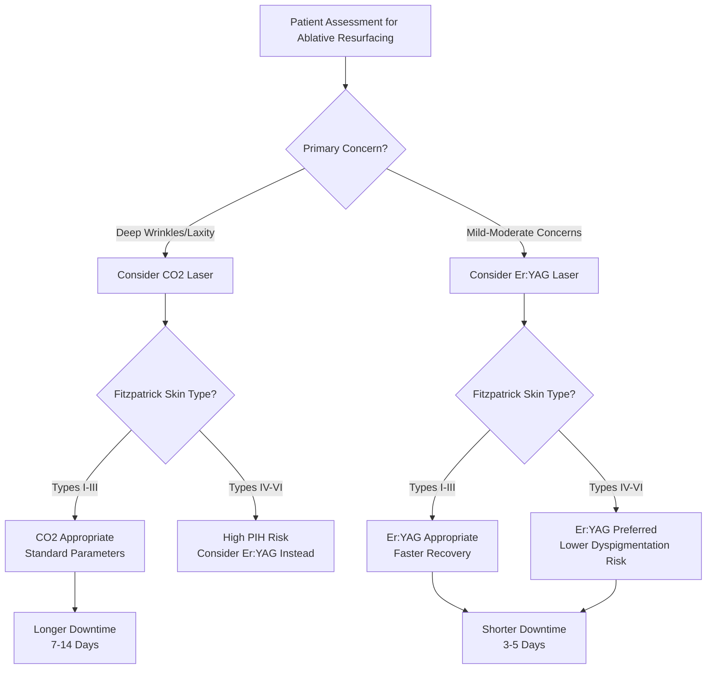
```mermaid
flowchart TD
    A[Patient Assessment for Ablative Resurfacing] --> B{Primary Concern?}
    B -->|Deep Wrinkles/Laxity| C[Consider CO2 Laser]
    B -->|Mild-Moderate Concerns| D[Consider Er:YAG Laser]
    C --> E{Fitzpatrick Skin Type?}
    D --> F{Fitzpatrick Skin Type?}
    E -->|Types I-III| G[CO2 Appropriate<br>Standard Parameters]
    E -->|Types IV-VI| H[High PIH Risk<br>Consider Er:YAG Instead]
    F -->|Types I-III| I[Er:YAG Appropriate<br>Faster Recovery]
    F -->|Types IV-VI| J[Er:YAG Preferred<br>Lower Dyspigmentation Risk]
    G --> K[Longer Downtime<br>7-14 Days]
    I --> L[Shorter Downtime<br>3-5 Days]
    J --> L
```

**For patients at high risk for dyspigmentation (Fitzpatrick skin types IV-VI), the use of the Er:YAG laser is preferred over the CO2 laser**[^30]. For Asian skin, which is particularly vulnerable to post-inflammatory hyperpigmentation, CO2 laser treatment carries a significantly higher risk; therefore, **Er:YAG lasers are preferred as they can reach the necessary ablative depth to treat deep scar tissue with a much lower risk of the side effects associated with CO2 lasers**[^31].

In clinical practice, **a combination of erbium and CO2 lasers can provide comprehensive treatment** by addressing both superficial imperfections with the erbium laser and deeper concerns for enhanced collagen remodeling with the CO2 laser[^32]. This combination approach allows clinicians to optimize outcomes while managing risk profiles.

Indications for ablative laser resurfacing include photoaging, facial wrinkles, scarring, actinic keratoses, and seborrheic keratoses[^30]. **Ablative laser therapy represents a primary means for providing safe, effective non-surgical facial rejuvenation** when appropriate patient selection criteria are applied[^30].

### 3.2 Non-Ablative Laser Rejuvenation: Mechanisms and Applications

Non-ablative laser rejuvenation represents a fundamentally different approach to skin improvement, utilizing laser energy to **create heat in the skin without injuring the surface**[^33]. This technology addresses the clinical need for effective treatment with minimal disruption to patients' daily activities, offering outcomes that, while more gradual than ablative approaches, require significantly less recovery time.

#### Mechanism of Action

The underlying mechanism of non-ablative laser treatment involves **delivering a controlled thermal injury into the deeper layers of the skin without physically harming the epidermis**[^34]. This selective dermal heating process destroys targeted tissues and stimulates new collagen production, resulting in a thickened dermis with improved texture[^34].

The energy produced by non-ablative lasers is absorbed by **intradermal water**, raising the intradermal temperature and delivering a thermal injury that **denatures collagen and initiates a wound response**[^34]. The improvement in skin texture is due to new collagen formation and subsequent dermal thickening[^34]. This mechanism produces gradual but meaningful improvements in skin quality without the extended downtime associated with ablative procedures.

**The principal difference between ablative and non-ablative lasers** is the extent to which superficial skin layers are affected[^34]. While ablative lasers cause destruction of the top layer, non-ablative lasers leave the epidermis intact. This accounts for the greater skin resurfacing results possible with ablative laser but also the greater downtime and risk of unwanted side effects associated with those procedures[^34].

#### Technical Parameters and Wavelengths

Non-ablative lasers employ various wavelengths and delivery mechanisms to achieve dermal heating while preserving epidermal integrity:

| Parameter | Non-Ablative Laser Characteristics |
|-----------|-----------------------------------|
| **Main Wavelength** | Long pulse 1064 nm |
| **Maximum Penetration Depth** | ~3 mm into dermis |
| **Delivery Methods** | Non-continuous pulse or fractional |
| **Epidermal Effect** | Preserved intact |
| **Dermal Effect** | Controlled thermal injury |

The **main wavelength for non-ablative lasers is a long pulse of 1064 nm**, with some devices capable of reaching a depth of around **3 mm into the dermis**[^34]. The desired depth is determined by the location of the target, and laser units offer adjustable depths to optimize treatment for specific conditions[^34].

Non-ablative lasers can be categorized into **fractionated and non-fractionated** systems[^34]. Fractionated lasers divide the light into thousands of microscopic treatment zones without affecting the surrounding skin, while non-fractionated systems create uniform thermal damage to the dermis while sparing the epidermis[^34].

#### Clinical Applications and Efficacy

Non-ablative laser treatment improves the appearance of various skin conditions through its collagen-stimulating mechanism:

- **Sun-damaged skin** and mild-to-moderate photodamage
- **Fine lines and wrinkles**
- **Scarring** (including acne scars)
- **Rosacea** and facial redness
- **Spider veins and facial telangiectasias**
- **Unwanted or abnormal pigment**
- **Tattoo removal**
- **Hair removal**[^34]

The technology is particularly suited for patients experiencing **early signs of photodamage and aging**. The ideal patient is generally **35 to 50 years of age**[^34]. Older patients or those with advanced laxity and deep wrinkles are more suited to ablative laser resurfacing, as non-ablative approaches may not provide sufficient improvement for severe photoaging[^34].

**Because non-ablative laser does not remove the top layer of skin, it may not be as effective for skin resurfacing as an ablative laser**[^34]. However, it is the **preferred method for mild photoaging in patients 30 to 50 years of age**[^34]. This makes it an excellent option for patients seeking preventive treatment or those unwilling to accept the extended downtime of ablative procedures.

#### Recovery and Results Timeline

The primary benefits of non-ablative laser treatment are **minimal downtime and fast recovery**[^34]:

- Makeup can generally be applied immediately after treatment
- Any edema or redness is generally resolved within three days
- Patients are encouraged to keep the treated area well-moisturized and apply sunscreen
- Results are generally seen very quickly but will continue to evolve over several months[^34]

**Multiple sessions are needed in most cases** to achieve optimal outcomes[^33]. The gradual nature of improvement reflects the biological timeline of collagen synthesis and dermal remodeling. Improvement is gradual and can take several months to take full effect[^33].

The **longevity of results depends on lifestyle choices** including healthy eating, exercise, and sun protection[^34]. Repeated non-ablative laser treatments can produce good results with limited downtime. Once the desired outcome is achieved, **results may last 3-5 years**[^34].

#### Safety Profile

Provided the patient is a good candidate, non-ablative laser procedures are **very safe and represent fewer risks for post-treatment complications compared to ablative lasers**[^34]. Possible risks include:

- Temporary lightening or darkening of the skin
- Scarring (rare)
- Swelling
- Redness
- Infection[^33]

The procedure may not be appropriate for people with certain chronic health conditions or unrealistic expectations[^33]. A topical anesthetic is usually applied to minimize discomfort, and pain is usually minimal[^33]. Discomfort varies depending on the area treated, the laser type, and the patient's pain threshold, though innovations have significantly improved the patient experience[^34].

### 3.3 Fractional Laser Technology: Ablative and Non-Ablative Approaches

Fractional laser technology represents a paradigm shift in laser resurfacing, introduced in the early 2000s as a refinement of traditional ablative approaches[^30]. This innovation fundamentally changed the risk-benefit calculation for laser treatment by creating **microscopic treatment zones surrounded by untreated tissue**, enabling faster healing while maintaining therapeutic efficacy.

#### Fractional Delivery Mechanism

Fractional lasers deliver energy through thousands of tiny, deep columns known as **microthermal treatment zones (MTZs)** with intervening normal untreated skin[^33]. The fractional approach allows the skin to heal much faster because the islands of untreated tissue serve as reservoirs of healthy cells that facilitate rapid re-epithelialization[^33].

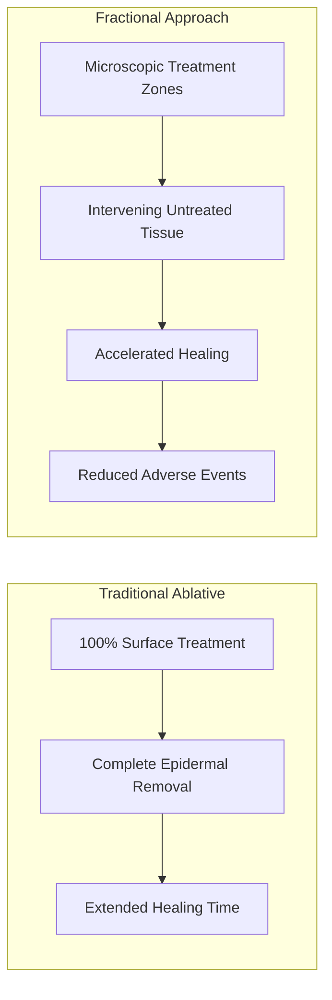
```mermaid
flowchart LR
    subgraph Traditional Ablative
    A[100% Surface Treatment] --> B[Complete Epidermal Removal]
    B --> C[Extended Healing Time]
    end
    subgraph Fractional Approach
    D[Microscopic Treatment Zones] --> E[Intervening Untreated Tissue]
    E --> F[Accelerated Healing]
    F --> G[Reduced Adverse Events]
    end
```

This concept applies to both ablative and non-ablative laser systems, creating two distinct categories of fractional treatment:

| Fractional Type | Mechanism | Examples | Clinical Characteristics |
|----------------|-----------|----------|-------------------------|
| **Fractional Ablative** | Creates microscopic columns of vaporized tissue | Fractional CO2, Fractional Er:YAG | More aggressive; addresses deeper concerns; moderate downtime |
| **Fractional Non-Ablative** | Creates microscopic zones of coagulation | 1550 nm devices, Clear + Brilliant®, Fraxel® | Gentler; minimal downtime; gradual improvement |

#### Fractional Ablative Lasers

**Fractional ablative laser therapy for CO2 lasers was first available in 1998**[^30]. This technology maintains the collagen-stimulating benefits of traditional CO2 resurfacing while significantly reducing recovery time and adverse effect rates.

Fractional delivery of Er:YAG laser energy was developed similarly to CO2 lasers, with **cosmetic outcomes found to be similar to traditional, non-fractional Er:YAG laser delivery**[^30]. Importantly, **adverse outcomes are less frequent with Er:YAG lasers than with CO2 lasers** in both fractional and non-fractional modes[^30].

Following fractional CO2 treatment, **erythema persists for approximately two weeks**, compared to several weeks to months after non-fractional resurfacing[^30]. This substantial reduction in recovery time makes fractional ablative treatment accessible to patients who cannot accommodate the extended downtime of traditional resurfacing.

#### Fractional Non-Ablative Lasers

Examples of fractional non-ablative lasers include **Clear + Brilliant®, the Fraxel® suite of lasers, the M22™ module and ResurFX™ by Lumenis, and the Icon™ by Cynosure**[^34]. These devices create controlled thermal injury in microscopic columns while leaving the epidermis intact and surrounding tissue unaffected.

A significant milestone in fractional non-ablative technology was the **FDA approval in 2005 of non-ablative laser delivered fractionally at 1550 nm for treating melasma**[^34]. This approval recognized the potential of fractional delivery to address pigmentation disorders with reduced risk of post-inflammatory hyperpigmentation compared to traditional approaches.

#### Clinical Applications

Fractional laser technology addresses multiple aesthetic concerns:

- **Photoaging** across Glogau Types II-IV
- **Scarring** including acne scars and surgical scars
- **Skin texture improvement**
- **Pigmentation disorders** including melasma
- **Fine lines and wrinkles**

For skin rejuvenation applications, Er:YAG lasers allow **control over the thermal damage**, enabling superficial treatments with almost no downtime and less risk of PIH[^31]. This controllability makes fractional Er:YAG particularly valuable for patients with darker skin types who require careful management of thermal effects.

In the treatment of acne scars, **CO2 lasers produced more significant results in textural issues**, but the Er:YAG laser is well-tolerated with less downtime[^31]. This trade-off between efficacy and recovery time allows clinicians to match treatment intensity to patient needs and tolerance.

### 3.4 Q-Switched Lasers: Nanosecond Pulse Technology for Pigmentation

Q-switched lasers represent a specialized category of devices designed to deliver **extremely high peak power in nanosecond pulses**, enabling photomechanical destruction of pigmented targets through a mechanism distinct from the photothermal effects of continuous-wave and long-pulse systems. The "Q" in Q-switched refers to the quality factor of the laser's optical resonator, which is rapidly switched to release stored energy in ultra-short bursts.

#### Mechanism of Subcellular Selective Photothermolysis

Q-switched lasers operate through **subcellular selective photothermolysis**, a refinement of the selective photothermolysis principle that targets structures smaller than individual cells[^35]. The laser energy-induced photothermal effect targets **melanosomes and shatters them into tiny particles**, facilitating the clearance of melanin particles by phagocytes[^35].

The extremely short pulse duration—typically in the range of **5 to 20 nanoseconds**—concentrates energy delivery into a timeframe shorter than the thermal relaxation time of melanosomes[^36]. This rapid energy deposition creates mechanical stress that fragments pigment particles rather than simply heating them, producing the characteristic immediate tissue whitening observed during treatment.

#### Q-Switched Nd:YAG Laser: Dual Wavelength Capability

The **Q-switched 1064/532 nm Nd:YAG laser** offers versatility through its dual-wavelength capability, enabling treatment of both superficial and deeper pigmentation:

| Wavelength | Target Depth | Primary Applications | Absorption Characteristics |
|------------|--------------|---------------------|---------------------------|
| **532 nm** | Superficial (epidermal) | Lighter lesions, epidermal pigmentation | Higher melanin absorption |
| **1064 nm** | Deep (dermal) | Darker lesions, dermal pigmentation | Deeper penetration, less epidermal absorption |

A preliminary study assessing the safety and effectiveness of Q-switched 1064/532 nm Nd:YAG laser for removing benign hypermelanosis in dark-skinned individuals (Fitzpatrick skin types IV-VI) demonstrated significant efficacy[^37]. Treatment parameters were adjusted based on lesion characteristics:

- **For lighter lesions or those in the process of clearing**: Picosecond 532 nm wavelength with fluence of 0.4-0.8 J/cm², frequency of 1-2 Hz, spot size of 3-6 mm
- **For darker lesions**: Nanosecond 532 nm wavelength with fluence of 0.8-1.4 J/cm², frequency of 1-2 Hz, spot size of 3-6 mm[^37]

**Clinical outcomes three months after final treatment** showed:
- **53% achieved excellent clearance** (75-100% improvement)
- **30% achieved good to moderate clearance** (50-75% improvement)
- **10% achieved slight clearance** (25-50% improvement)
- **7% did not respond**[^37]

No serious adverse events occurred, with transient side effects including oedema and erythema resolving in 1-2 days, and lesions becoming darker before exfoliating[^37]. Only two patients reported prolonged purpura, which resolved spontaneously in two weeks[^37]. The study concluded that **Q-switched 1064/532 nm laser is a key tool for treating benign hypermelanosis in all skin types, including dark-skinned persons**[^37].

#### Q-Switched Lasers for Melasma Treatment

For melasma treatment, **large-spot and low-fluence Q-switched Nd:YAG 1064 nm laser (QSNYL) has been widely used and proved effective**[^35]. A systematic review and network meta-analysis selecting 59 randomized controlled trials showed that **QSNYL ranked first in efficacy** and was worthy of being used as a monotherapy or in combination therapy for melasma[^35].

However, the thermal effect associated with Q-switched delivery could cause damage and inflammation to surrounding tissues, potentially resulting in a **high incidence of side effects such as post-inflammatory hyperpigmentation (PIH) and hypopigmentation**[^35]. This limitation has driven the development of picosecond laser technology, which offers enhanced photomechanical effects with reduced thermal damage.

#### Specialized Q-Switched Wavelengths

Beyond the standard Nd:YAG wavelengths, specialized Q-switched systems address specific clinical challenges. A case report demonstrated the efficacy of **Q-switched 650-nm wavelength laser** for treating complex hyperpigmentation containing both hemosiderin and melanin[^36].

The rationale for this wavelength selection relates to chromophore absorption characteristics: **hemosiderin has an absorption peak in the 660-680 nm range**, and wavelengths between 595-700 nm are indicated for treating dermal hemosiderin[^36]. In the reported case, prior treatments with pulsed-dye laser (595 nm), alexandrite laser (755 nm), and Q-switched 1064 nm Nd:YAG laser were unsuccessful, while the Q-switched 650-nm wavelength produced **striking diminution of the pigmentation** that was maintained at 5-month follow-up[^36].

This case suggests the **Q-switched 650-nm wavelength may be effective for hyperpigmented lesions in the brown-rust-yellow spectrum** containing hemosiderin, such as those seen in stasis dermatitis, pigmented purpuras, and postsclerotherapy hyperpigmentation[^36].

### 3.5 Picosecond Lasers: Advanced Photomechanical Pigment Treatment

Picosecond lasers represent the most recent advancement in pigment-targeting technology, delivering laser energy in increments of **picoseconds (1×10⁻¹² seconds)**—a thousand times shorter than nanosecond Q-switched systems[^38]. This ultra-short pulse duration fundamentally changes the mechanism of tissue interaction, emphasizing photomechanical over photothermal effects.

#### Photomechanical Mechanism

The **photomechanical effect** occurs when laser power is concentrated into an extremely short time frame, causing a rapid temperature change that forms an **acoustic shockwave**[^38]. This shockwave breaks down tissue mechanically rather than thermally. Because laser light is selectively absorbed, surrounding tissue is spared from excessive heat exposure[^38].

The clinical significance of this mechanism relates directly to safety in darker skin types:

> A shorter pulse duration results in less time the skin is exposed to heat, a side effect of laser energy. Excessive heat during laser treatment can lead to unwanted side effects like hyperpigmentation. Therefore, **treatment with a picosecond laser carries less risk of negative side effects than treatment with a nanosecond laser, especially for darker skin types (IV, V, VI)** that are more prone to hyperpigmentation[^38].

**Picosecond lasers produce a more photomechanical than photothermal effect**, causing pigment fragmentation more efficiently while minimizing thermal damage to the surrounding tissue[^35]. This enhanced fragmentation efficiency means smaller pigment particles are produced, potentially facilitating faster clearance by the body's immune system.

#### Wavelength Options and Applications

Different picosecond lasers offer various wavelength options:

| Laser System | Available Wavelengths | Primary Applications |
|--------------|----------------------|---------------------|
| **General Pico Lasers** | 1064 nm, 532 nm | Pigmentation, skin rejuvenation |
| **PicoSure/PicoSure Pro** | 1064 nm, 532 nm, 755 nm | Pigmentation, melasma |
| **Discovery Pico** | 1064 nm, 532 nm, 694 nm | Pigmentation, tattoo removal |

For **1064 nm treatment of rhytids (wrinkles), enlarged pores, acne scarring, or scar revision**, especially in darker skin types, **Pico laser is preferential over nanosecond lasers like Q-Switch 1064 nm lasers**[^38]. Pico laser toning can also help fade post-inflammatory hyperpigmentation in certain cases[^38].

Applications include:
- Freckles, age spots, and other sunspots
- Melasma (case-dependent; some individuals may be better treated by nanosecond lasers or other modalities)
- Post-inflammatory hyperpigmentation
- Skin rejuvenation and texture improvement[^38]

#### Comparative Efficacy: PSNYL versus PSAL for Melasma

A landmark randomized, controlled, assessor-blinded trial compared the efficacy and safety of **picosecond Nd:YAG laser (1064 nm)** (PSNYL), **picosecond alexandrite laser (755 nm)** (PSAL), and **2% hydroquinone cream** in treating melasma in patients with Fitzpatrick skin types III-IV[^35].

**Treatment parameters were as follows:**

| Parameter | PSNYL Group | PSAL Group |
|-----------|-------------|------------|
| **Wavelength** | 1064 nm | 755 nm |
| **Pulse Duration** | 450 ps | 750 ps |
| **Mode** | Non-fractional | Non-fractional |
| **Spot Size** | 7 mm | 6-8 mm |
| **Fluence** | 0.75-0.90 J/cm² | 0.40-0.71 J/cm² |
| **Repetition Rate** | 8 Hz | 10 Hz |
| **Passes per Treatment** | 2 | 2 |
| **Treatment Sessions** | 3 | 3 |
| **Interval** | 4 weeks | 4 weeks |
| **Endpoint** | Mild erythema | Mild erythema |

**Key findings at week 24 (4 months after final treatment):**

| Outcome Measure | PSNYL Group | PSAL Group | HQ Group |
|-----------------|-------------|------------|----------|
| **MASI Improvement Rate** | **35.9%** | 25.5% | 24.0% |
| **Recurrence Rate** | 5.0% | 10.0% | 5.3% |
| **PIH Incidence** | 5.0% | 5.0% | 5.3% |

The **MASI score in the PSNYL group showed the greatest improvement** compared to both the PSAL group (p=0.016) and HQ group (p=0.018)[^35]. The PSAL group showed comparable improvement to the HQ group (p=0.998)[^35].

The researchers offered mechanistic explanations for PSNYL's superior performance:

> The longer wavelength of 1064 nm PSNYL is associated with **less epidermal melanin absorption and deeper penetration in the dermis**, which is probably one of the reasons why it was more effective than 755 nm PSAL. Additionally, the pulse duration of PSNYL was 450 ps, which was shorter than the 750 ps of PSAL. **A shorter pulse duration contributes to a higher photomechanical effect** on the target chromophore and may be more effective for the destruction of the target[^35].

This finding has important clinical implications: **non-fractional PSNYL may have better efficacy than non-fractional PSAL for melasma patients with Fitzpatrick skin types III-IV**[^35]. The safety profiles were similar across all three treatment groups, with PIH resolving spontaneously within 1 to 6 months[^35].

#### Safety Considerations for Darker Skin Types

The reduced thermal damage associated with picosecond delivery makes these lasers **safer for darker skin types** than nanosecond alternatives. While the photoacoustic effect is exclusive to Pico lasers, they can also be operated in nanosecond settings depending on the desired outcome[^38].

For melasma pigmentation treatment, **the best laser varies on a case-by-case basis**; certain individuals are not good candidates for Pico lasers and may be better treated by nanosecond lasers, other lasers with different wavelengths, or non-laser therapies[^38]. This underscores the importance of individualized treatment planning rather than universal protocol application.

### 3.6 Pulsed Dye Lasers: Vascular Targeting and Photorejuvenation

Pulsed dye lasers (PDL) represent the **gold standard for the treatment of vascular lesions**, particularly port wine stains and hemangiomas[^39]. Operating on the principle of selective photothermolysis with hemoglobin as the target chromophore, PDL technology has evolved significantly since its introduction, expanding applications beyond vascular lesions to include scar treatment and facial rejuvenation.

#### Historical Development and Technological Evolution

The development of pulsed dye lasers traces directly to the theory of Selective Photothermolysis introduced by Anderson and Parrish in the mid-1980s[^39]. The first commercialized pulsed dye laser was designed to deliver **450 microsecond pulses at a wavelength of 585 nm**—parameters closely matching the ideal specifications for selective vascular destruction[^39].

These early systems enabled treatment of pediatric port wine stains, hemangiomas, facial telangiectasia, rosacea, warts, striae, and scars[^39]. However, they caused **intense purpura or bruising** that, while acceptable to port wine stain patients, deterred many cosmetic patients with facial telangiectasia[^39].

**Key technological developments** have transformed PDL capabilities:

| Innovation | Clinical Impact |
|------------|-----------------|
| **Dynamic Cooling Device (DCD)** | Epidermal protection; higher fluences possible; reduced discomfort |
| **Extended Wavelength (595 nm)** | Deeper penetration; improved response for deeper lesions |
| **Extended Pulse Duration (up to 10+ ms)** | Purpura-free treatments; larger vessel targeting |
| **Micropulse Technology** | Enables very long pulse durations through pulse stacking |

**Dynamic cooling**, developed by Stuart Nelson of the Beckman Institute, delivers a short spurt of cryogen to the skin prior to the laser pulse to cool and protect the epidermis[^39]. This innovation provides multiple benefits: decreased discomfort during treatment, ability to utilize higher laser fluences, and the capability to treat large port wine stains more quickly in both adults and children[^39].

#### Wavelength and Pulse Duration Optimization

Clinical research demonstrated that **longer wavelengths (595-600 nm) and larger spot sizes** allow for deeper penetration into skin and vessels, enabling improved clinical responses[^40][^39]. The 595 nm wavelength has become accepted as the desirable wavelength for many applications due to its deeper penetration[^39].

The extension of pulse duration from 450 microseconds to **1500 microseconds (1.5 ms) and beyond** represented another critical advancement[^39]. The Vbeam system utilizes **micropulses that can be strung together to reach 10 milliseconds and beyond**, dramatically reducing the effective peak power delivered to the skin[^39].

From a clinical perspective, this led to the development of **purpura-free procedures for facial telangiectasia and rosacea**[^39]. Cosmetic patients previously opposed to pulsed dye laser treatment due to associated purpura became candidates for treatment[^39].

#### Clinical Applications and Efficacy

A study evaluating the efficacy of **595 nm Pulsed Dye Laser** in managing facial flat angiomas (Port-Wine Stains) in Fitzpatrick skin types I to III demonstrated excellent outcomes[^40]:

**Treatment parameters:**
- Wavelength: 595 nm
- Fluence: 6.5 J/cm²
- Spot size: 12 mm
- Pulse duration: 0.5 ms
- Sessions: 6-8 at 20-30 day intervals

**Results (assessed 6 months after final session):**
- **71% achieved excellent clearance** (75-100% improvement)
- **29% achieved good-moderate clearance** (50-75% improvement)
- No significant side effects except prolonged erythema resolving in 7-10 days[^40]

A larger cohort study of 71 patients with diverse vascular lesions treated with flash-lamp pulsed-dye laser (FPDL) showed[^41]:
- **70.4% achieved excellent clearance** of lesions
- **16.9% showed moderate-good clearance**
- **9.9% showed slight clearance**
- **2.8% showed minimal or no improvement**

High patient satisfaction correlated with effective lesion reduction and manageable side effects, primarily post-operative purpura[^41]. The study underscored **FPDL's selective efficacy for hemoglobin-rich lesions and its safety profile**[^41].

#### Expanded Applications: Facial Rejuvenation

Beyond vascular lesion treatment, pulsed dye lasers have demonstrated efficacy for **facial rejuvenation**[^39]. Patients can have blood vessels and diffuse facial redness removed while simultaneously stimulating the production of new collagen in the dermis[^39].

New collagen deposition has been shown to **smooth the surface of the skin, filling imperfections and softening wrinkles** over a series of treatments[^39]. Patients are able to return to normal activities within an hour of the procedure[^39].

The modern Vbeam represents the most used laser in many practices, treating all types of vascular lesions: from port wine stains and hemangiomas to facial redness, spider veins, scars, striae, leg veins, and facial rejuvenation[^39].

### 3.7 Wavelength Selection and Parameter Optimization by Skin Type

The successful application of laser technology across diverse patient populations requires systematic consideration of chromophore absorption characteristics, penetration depth requirements, and individual skin type factors. This section synthesizes the principles discussed throughout this chapter into practical guidelines for wavelength selection and parameter optimization.

#### Chromophore-Based Wavelength Selection

The fundamental principle guiding wavelength selection is **matching the laser wavelength to the absorption characteristics of the target chromophore** while considering competing chromophores that may absorb energy intended for the target:

| Target Chromophore | Optimal Wavelength Range | Laser Examples | Clinical Applications |
|-------------------|-------------------------|----------------|----------------------|
| **Melanin (superficial)** | 532-755 nm | Q-switched 532 nm, Alexandrite 755 nm | Epidermal pigmentation, freckles |
| **Melanin (deep)** | 1064 nm | Nd:YAG 1064 nm, Pico 1064 nm | Dermal pigmentation, melasma |
| **Hemoglobin** | 585-595 nm | Pulsed Dye 595 nm | Vascular lesions, rosacea |
| **Water** | 2940 nm, 10600 nm | Er:YAG, CO2 | Ablative resurfacing |

For pigmentation treatment, wavelength selection must account for **melanin's broad absorption spectrum** that decreases as wavelength increases. Shorter wavelengths (532-755 nm) demonstrate higher melanin absorption but also greater absorption by competing epidermal melanin, increasing risk in darker skin types. Longer wavelengths (1064 nm) show lower melanin absorption but deeper penetration with reduced epidermal effects.

#### Skin Type-Specific Guidelines

**For Fitzpatrick Types I-III:**
- Wider range of wavelengths can be safely employed
- Shorter wavelengths (532 nm, 755 nm) appropriate for superficial pigmentation
- Standard fluence parameters typically well-tolerated
- Lower risk of PIH allows more aggressive treatment

**For Fitzpatrick Types IV-VI:**
- **Longer wavelengths strongly preferred** (1064 nm) to minimize epidermal melanin absorption
- Lower fluences with longer pulse durations reduce thermal injury risk
- Picosecond delivery preferred over nanosecond for reduced thermal damage[^38]
- Er:YAG preferred over CO2 for ablative procedures[^30][^31]
- Extended inter-treatment intervals allow assessment of delayed pigmentary responses

#### Parameter Optimization Strategies

Beyond wavelength selection, several parameter adjustments optimize outcomes across skin types:

**Fluence Adjustment:**
- Higher fluences achieve more dramatic results but increase adverse effect risk
- Darker skin types require lower fluences to reduce epidermal heating
- Fluence must exceed threshold for target destruction while remaining below damage threshold for epidermis

**Pulse Duration Selection:**
- Must be less than or equal to the thermal relaxation time (TRT) of the target
- Longer pulse durations reduce peak power and thermal damage
- Picosecond pulses (300-900 ps) minimize thermal effects compared to nanosecond (5-20 ns) pulses[^35]

**Spot Size Considerations:**
- Larger spot sizes enable deeper penetration through photon collision effects
- Selection must balance penetration needs with device power capabilities
- Larger spots may reduce treatment precision for small lesions

**Multiple Synchronized Pulsing:**
- Delivers 2-5 pulses with delays between them
- First pulse heats target and epidermis below epidermal damage threshold
- During delay, epidermis cools completely while target retains residual heat
- Subsequent pulses progressively elevate target temperature to destruction threshold
- Particularly valuable for darker skin types with significant competing epidermal melanin

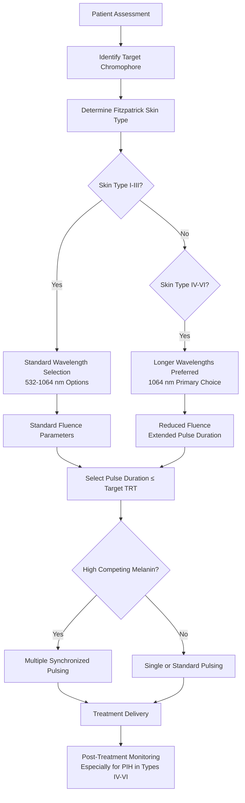
```mermaid
flowchart TD
    A[Patient Assessment] --> B[Identify Target Chromophore]
    B --> C[Determine Fitzpatrick Skin Type]
    C --> D{Skin Type I-III?}
    D -->|Yes| E[Standard Wavelength Selection<br>532-1064 nm Options]
    D -->|No| F{Skin Type IV-VI?}
    F -->|Yes| G[Longer Wavelengths Preferred<br>1064 nm Primary Choice]
    E --> H[Standard Fluence Parameters]
    G --> I[Reduced Fluence<br>Extended Pulse Duration]
    H --> J[Select Pulse Duration ≤ Target TRT]
    I --> J
    J --> K{High Competing Melanin?}
    K -->|Yes| L[Multiple Synchronized Pulsing]
    K -->|No| M[Single or Standard Pulsing]
    L --> N[Treatment Delivery]
    M --> N
    N --> O[Post-Treatment Monitoring<br>Especially for PIH in Types IV-VI]
```

#### Integration of Evidence-Based Selection

The clinical evidence reviewed throughout this chapter supports several key principles for laser selection:

1. **For melasma in darker skin types**: Picosecond 1064 nm Nd:YAG demonstrates superior efficacy (35.9% MASI improvement) compared to 755 nm alexandrite (25.5%)[^35]

2. **For ablative resurfacing in darker skin types**: Er:YAG lasers are preferred over CO2 due to significantly lower dyspigmentation risk[^30][^31]

3. **For vascular lesions**: 595 nm pulsed dye laser remains the gold standard with 70-71% excellent clearance rates[^40][^41]

4. **For benign hypermelanosis across all skin types**: Q-switched 1064/532 nm Nd:YAG demonstrates 53% excellent clearance even in Fitzpatrick types IV-VI[^37]

5. **For patients requiring minimal downtime**: Non-ablative fractional approaches offer gradual improvement with 3-5 year result longevity[^34]

The selection process must ultimately integrate condition characteristics, patient skin type, acceptable downtime, and treatment goals to identify the optimal laser modality and parameters for each individual case. This personalized approach, grounded in the scientific principles of selective photothermolysis and informed by clinical evidence, maximizes therapeutic outcomes while minimizing adverse effects across the full spectrum of patient presentations.

## 4 Intense Pulsed Light (IPL) Therapy: Technology and Therapeutic Applications

Intense Pulsed Light (IPL) therapy has established itself as one of the most versatile and widely utilized non-ablative modalities in contemporary aesthetic medicine since its initial development in 1992 for treating leg telangiectasias[^1]. Unlike laser systems that emit monochromatic, coherent light at a single wavelength, IPL devices employ flashlamps and bandpass filters to produce **polychromatic, non-coherent light** across a broad spectrum, typically ranging from 400 to 1400 nm[^1]. This fundamental technological distinction enables IPL to simultaneously target multiple chromophores—melanin, hemoglobin, and water—within a single treatment session, making it an invaluable tool for addressing the multifaceted manifestations of photoaging, hyperpigmentation disorders, and vascular abnormalities. The versatility afforded by adjustable wavelength filters, combined with customizable fluence, pulse duration, and spot size parameters, allows clinicians to tailor treatments to specific patient presentations and skin types while maintaining favorable safety profiles. This chapter provides comprehensive analysis of IPL technology, examining its scientific principles, clinical applications across diverse dermatological conditions, and evidence-based strategies for optimizing therapeutic outcomes.

### 4.1 IPL Technology Fundamentals: Broadband Light Generation and Delivery Systems

The technological foundation of IPL therapy rests upon the generation of high-intensity, broad-spectrum pulsed light through sophisticated flashlamp systems combined with precision optical components. Understanding these fundamental hardware elements and their operational principles is essential for appreciating how IPL achieves its therapeutic effects and how it differs mechanistically from laser-based approaches.

#### Flashlamp-Based Polychromatic Light Generation

IPL devices utilize **high-output flashlamps** as their primary light source, producing polychromatic light within a wavelength spectrum of approximately 400 to 1400 nm[^1]. This broad spectral output distinguishes IPL fundamentally from laser systems, which emit light at a single, specific wavelength. The flashlamps emit non-coherent light, meaning the photons are not synchronized in phase, and the light is non-collimated, spreading rather than traveling in parallel beams[^42]. These characteristics result in energy delivery that is inherently **weaker and less focused** than laser energy, but this apparent limitation becomes an advantage when treating conditions requiring simultaneous targeting of multiple chromophores at various tissue depths[^43].

The generation process involves electrical discharge through a gas-filled tube, producing intense bursts of light across the visible and near-infrared spectrum. Modern IPL systems have evolved considerably since the first FDA-approved device entered the market in 1995, incorporating **higher-intensity flashlamps, advanced cut-off filters, and sophisticated cooling systems**[^1]. These technological refinements have enabled more specific targeting with increased accuracy and reduced light scattering, expanding both the efficacy and safety profiles of contemporary devices.

#### Distinction from Laser Technology

The fundamental differences between IPL and laser systems extend beyond their light generation mechanisms to influence their clinical applications and treatment outcomes:

| Characteristic | IPL Technology | Laser Technology |
|----------------|----------------|------------------|
| **Light Type** | Polychromatic (multiple wavelengths) | Monochromatic (single wavelength) |
| **Coherence** | Non-coherent (photons not in phase) | Coherent (photons synchronized) |
| **Collimation** | Non-collimated (divergent beam) | Collimated (parallel beam) |
| **Wavelength Range** | 400-1400 nm spectrum | Single specific wavelength |
| **Energy Focus** | Broader, less concentrated | Highly focused, precise |
| **Chromophore Targeting** | Multiple simultaneous targets | Single specific target |
| **Treatment Versatility** | Multiple conditions per device | Condition-specific devices |
| **Recovery Time** | Generally shorter | Variable by type |

This polychromatic nature allows IPL to treat **various targets with the same device by applying different filters**, providing exceptional versatility in clinical practice[^42]. While lasers offer superior precision for specific chromophore targeting, IPL's ability to address pigmented lesions, vascular abnormalities, and textural concerns within a single treatment protocol makes it particularly valuable for comprehensive photorejuvenation.

#### Hardware Components and Safety Systems

Modern IPL systems incorporate several critical hardware components that enable safe and effective energy delivery:

**Optical Resonators and Reflectors**: These components collimate and direct the emitted light toward the treatment area, optimizing energy transfer to target tissues[^44]. The design of these optical elements influences beam quality and treatment consistency across the spot size.

**Cooling Systems**: Contact cooling represents the most common epidermal protection mechanism in IPL devices, with optimal cooling temperatures between **15-25°C**[^45]. These systems are crucial for safety and patient comfort, enabling delivery of higher fluences while protecting the epidermis from thermal damage. Importantly, excessive cooling (such as 3°C) can actually diminish therapeutic efficacy by reducing target chromophore heating[^45].

**Interchangeable Aperture Pieces**: Spot size is controlled through interchangeable apertures, allowing clinicians to select appropriate treatment areas based on anatomical location and lesion characteristics[^1]. Larger spot sizes minimize scattering and enable deeper light penetration, while smaller spot sizes provide precision for treating areas with complex contours such as the nose and perioral region[^45].

The evolution of IPL technology has been marked by continuous refinement of these components, resulting in devices that offer **greater specificity, improved safety profiles, and enhanced clinical outcomes** compared to earlier generations[^1].

### 4.2 Bandpass Filter Technology and Wavelength Customization Strategies

The ability to customize spectral output through bandpass filter technology represents one of IPL's most significant therapeutic advantages. Cut-off filters enable clinicians to selectively modify the wavelength range delivered to tissue, optimizing treatment for specific chromophores while minimizing energy absorption by competing structures.

#### Mechanism of Cut-Off Filter Function

Cut-off filters function by **blocking emission of shorter wavelength light** while allowing longer wavelengths to pass through to the treatment area[^42]. When a filter is applied, it prevents delivery of light with wavelengths shorter than the specified cut-off value, effectively narrowing the broad IPL spectrum to target specific chromophores more selectively[^1]. This dichroic filtering mechanism enables the same IPL device to address vastly different clinical indications by simply changing the filter configuration.

The wavelength of light that reaches the patient can thus be precisely adjusted, allowing certain tissues to be targeted via selective photothermolysis while sparing others[^1]. This customization capability is particularly valuable when treating patients with competing chromophores—for example, when targeting dermal vascular lesions in a patient with significant epidermal melanin content.

#### Available Filter Options and Clinical Applications

Contemporary IPL systems offer a range of cut-off filters, each optimized for specific clinical applications:

| Filter Wavelength | Primary Applications | Target Chromophore | Clinical Notes |
|-------------------|---------------------|-------------------|----------------|
| **515 nm** | Superficial pigmentation, freckles on fair skin | Melanin | Most aggressive for pigment; higher melanin absorption |
| **550 nm** | Pigmented lesions, light skin types | Melanin | Standard option for pigmentation |
| **560 nm** | Skin rejuvenation, standard freckle removal | Melanin/Hemoglobin | Versatile first-line choice |
| **570 nm** | Pigmentation with mild vascular component | Melanin/Hemoglobin | Balanced targeting |
| **590 nm** | Complex pigmentation, vascular lesions | Melanin/Hemoglobin | Covers hemoglobin peaks; good for solar lentigines |
| **615 nm** | Darker skin types, deeper pigmentation | Melanin | Reduced epidermal absorption |
| **640 nm** | Hair removal, deeper lesions, skin rejuvenation | Melanin | Combined rejuvenation and pigment treatment |
| **645 nm** | Vascular lesions, darker skin | Hemoglobin | Deeper penetration |
| **690 nm** | Deep vascular lesions | Hemoglobin | Minimal melanin interference |
| **755 nm** | Hair removal, deep targets | Melanin | Maximum penetration |

The selection rationale follows fundamental principles of chromophore absorption and tissue penetration. **Shorter wavelengths (515-560 nm) are most effective for treating superficial pigmentation** such as freckles and ephelides in patients with lighter skin, as melanin demonstrates strong absorption across the 400-700 nm range[^44]. However, these same wavelengths carry increased risk in darker skin types because epidermal melanin absorbs significant energy before it reaches deeper targets[^1].

For vascular treatments, filters in the **530-650 nm waveband** are particularly suitable as they cover the blood hemoglobin absorption peaks at approximately 540 nm and 577 nm, enabling precise targeting of superficial telangiectasias and facial erythema[^44]. The 590 nm filter offers particular versatility, being absorbed by both melanin and hemoglobin, making it suitable for complex pigmentation with both pigment and vascular components such as solar lentigines and melasma[^46].

#### Wavelength Selection for Skin Type Optimization

The critical importance of filter selection becomes especially apparent when treating patients across the Fitzpatrick skin type spectrum. Since melanin tends to absorb light at shorter wavelengths, **selecting longer wavelengths that penetrate deeper and spare the epidermis benefits patients with darker skin**[^1]. This principle guides clinical decision-making:

**For Fitzpatrick Types I-II (lighter skin):**
- Filters with wavelengths of 515 nm or 560 nm can be safely employed
- Higher melanin contrast between lesions and surrounding skin enables effective targeting
- Standard fluence parameters typically appropriate

**For Fitzpatrick Type III-IV (medium skin):**
- Filters with wavelengths between 590 and 615 nm are preferred
- Moderate caution required to balance efficacy with safety
- Extended pulse durations recommended

**For Fitzpatrick Types V-VI (darker skin):**
- Filters with wavelengths of 640 nm or higher should be selected
- Longer wavelengths minimize competing epidermal melanin absorption
- Conservative parameters essential to prevent dyspigmentation[^46]

The rationale for these recommendations relates directly to the physics of light-tissue interaction. When healthcare providers select a wavelength, they must consider that **melanin in the epidermis may shield targeted chromophores located in deeper layers of the skin**[^1]. By choosing longer wavelength filters for darker skin types, clinicians can achieve therapeutic effects on target lesions while minimizing the risk of epidermal thermal injury and subsequent post-inflammatory hyperpigmentation.

### 4.3 Critical Treatment Parameters: Fluence, Pulse Duration, and Spot Size Optimization

The clinical success of IPL therapy depends upon the precise optimization of four interrelated parameters: wavelength (addressed through filter selection), fluence, pulse duration, and spot size. Understanding the scientific principles governing each parameter and their interactions enables clinicians to maximize therapeutic efficacy while maintaining acceptable safety profiles across diverse patient presentations.

#### Fluence: Energy Density and Therapeutic Thresholds

**Fluence**, or energy density, describes the amount of energy delivered per unit area, measured in joules per square centimeter (J/cm²)[^1]. This parameter directly determines whether sufficient thermal energy reaches target chromophores to achieve the desired clinical effect. IPL devices are capable of delivering fluence up to **40 J/cm²**, though pigmented lesions are typically treated with considerably lower fluences of **16 to 20 J/cm²**[^1].

The selection of appropriate fluence depends on multiple factors:

| Factor | Fluence Consideration |
|--------|----------------------|
| **Target Depth** | Higher fluence may be required for deeper targets to compensate for energy loss through scattering and absorption |
| **Lesion Pigmentation** | Darker, more heavily pigmented lesions require lower fluence; lighter lesions require higher fluence |
| **Skin Type** | Fitzpatrick Types IV-VI require reduced fluence to minimize epidermal heating |
| **Treatment Area** | Facial treatments typically use 1-2 J/cm² lower than non-facial areas |
| **Lesion Thickness** | Thinner lesions respond to lower fluence; thicker lesions may require higher settings |

**Side effects tend to occur more frequently at higher fluences and in darker-skinned individuals**[^1]. This relationship underscores the importance of conservative initial settings, particularly when treating patients with increased melanin content. Cooling devices assist with the delivery of higher fluences while protecting the epidermis, enabling clinicians to achieve therapeutic thresholds while maintaining safety[^1].

For clinical application, the approach should involve **starting with conservative settings and gradually increasing fluence** based on tissue response. A test spot should be performed, beginning with a low energy level and gradually increasing until the treated area becomes slightly red and target lesions show appropriate endpoint reactions[^46].

#### Pulse Duration: Thermal Relaxation Time Principles

**Pulse duration** selection is based on the thermal relaxation time (TRT) of the target chromophore—the time required for heated tissue to cool to approximately 50% of its peak temperature[^1]. To achieve selective destruction while minimizing collateral thermal damage, **pulse duration should be shorter than or equal to the target tissue's TRT**[^1].

The practical application of TRT principles in IPL treatment follows established guidelines:

| Skin Type/Target | Recommended Pulse Parameters |
|------------------|------------------------------|
| **Standard epidermal TRT** | 10-12 ms delay times between sequential pulses |
| **Darker skin types (IV-VI)** | 20-40 ms TRT recommended to accommodate epidermal cooling |
| **Superficial pigmentation** | Shorter pulse widths (3-8 ms) |
| **Darker skin or thicker lesions** | Extended pulse widths (8-12 ms) |
| **Vascular lesions** | Longer pulse durations (15-50 ms) for vessel coagulation |

Allowing appropriate TRT between pulses is critical for safety, as it **prevents epidermal temperatures from rising above 70°C**, the threshold for significant thermal injury[^1]. This principle becomes especially important when treating darker skin types, where extended inter-pulse delays enable epidermal cooling while target structures retain residual heat.

**Shortening pulse width can enhance treatment efficacy** without necessarily increasing fluence. For example, reducing pulse width from 20 ms to 10 ms causes target temperatures to rise more rapidly at the same energy level, potentially achieving more effective vessel coagulation than simply increasing energy density[^45]. This approach may be safer than fluence escalation, particularly in patients at risk for adverse events.

#### Spot Size: Penetration Depth and Energy Distribution

**Spot size** refers to the diameter of light emitted from the flashlamp, controlled through interchangeable aperture pieces[^1]. This parameter significantly influences treatment outcomes through its effects on light penetration and energy distribution.

**Increased spot size allows light to penetrate deeper** because scattering is minimized—when using larger spot sizes, scattered photons collide and redirect themselves in the direction of the original beam rather than dispersing into surrounding tissue[^1]. Conversely, a smaller spot size requires higher fluences to effectively target deeper dermal structures.

Practical spot size selection considerations include:

- **Anatomical location**: Smaller spot sizes (e.g., 15mm × 15mm) are appropriate for areas with complex contours such as the forehead, nose, and perioral region to ensure optimal tissue contact and avoid adverse events[^45]
- **Target depth**: Larger spot sizes should be selected when treating deeper lesions to maximize penetration
- **Device capabilities**: Spot size selection must balance penetration requirements with the power generation capability of the system
- **Treatment efficiency**: Larger spot sizes cover more area per pulse, improving treatment efficiency for diffuse conditions

The interrelationship between spot size and fluence is clinically important: when using smaller spot sizes, clinicians must compensate with higher fluence settings to achieve equivalent energy delivery to deeper targets, which may increase the risk of adverse events in susceptible patients.

#### Multi-Pulse Delivery Modes

Modern IPL systems offer **multi-pulse delivery modes** that enhance safety while maintaining efficacy, particularly for patients with competing chromophores. This approach delivers sequential pulses with controlled delays, allowing epidermal cooling between energy bursts while target structures with longer TRTs retain residual heat[^44].

The multi-pulse technique works as follows: the first pulse heats both the target chromophore and the epidermis to just below the epidermal damage threshold. During the inter-pulse delay (typically 10-12 ms for standard treatments, 20-40 ms for darker skin), the epidermis cools completely while the larger target structure—with its longer TRT—retains significant residual heat. Subsequent pulses progressively elevate target temperature from this higher baseline until the destruction threshold is exceeded[^44].

This delivery mode is particularly valuable for:
- Treating patients with Fitzpatrick skin types IV-VI
- Targeting deep vascular structures while protecting superficial melanin
- Achieving vessel coagulation without purpura
- Treating heavily pigmented lesions that require careful energy titration

### 4.4 Photorejuvenation Applications: Addressing Dyschromia, Erythema, and Textural Concerns

IPL photorejuvenation has emerged as a cornerstone treatment for addressing the multifaceted manifestations of photodamaged skin. The ability to simultaneously target pigmentation irregularities, vascular abnormalities, and dermal collagen makes IPL uniquely suited for comprehensive facial rejuvenation protocols that address the three key photoaging concerns: dyschromia, diffuse erythema with telangiectasia, and alterations in skin texture.

#### Comprehensive Photorejuvenation Mechanism

The FDA has approved IPL therapy for photorejuvenation, recognizing its efficacy in treating the constellation of changes associated with chronic sun exposure[^1]. IPL achieves photorejuvenation through multiple simultaneous mechanisms:

**Pigmentation Correction**: IPL wavelengths in the 500-600 nm range target melanin in dyspigmented areas, causing selective photothermolysis of melanin-rich structures and subsequent clearance of excess pigmentation[^44]. The mechanism relies on absorption of light energy by melanin within melanosomes, leading to rapid thermal disruption and fragmentation of these organelles.

**Vascular Improvement**: Wavelengths targeting oxyhemoglobin absorption peaks (540 nm and 577 nm) enable selective heating of abnormal blood vessels, causing vessel contraction and reduction of facial redness[^44]. This addresses diffuse erythema, telangiectasia, and the vascular component of rosacea.

**Collagen Stimulation**: Higher wavelengths within the IPL spectrum (particularly around 1200 nm) are absorbed by water in the dermis, triggering cytokine reactions that stimulate formation of new collagen I, III, and elastin[^42]. This thermal stimulation of dermal fibroblasts results in increased synthesis of extracellular matrix proteins, improving skin texture and firmness.

**Histological analyses support remodeling effects beyond pigment and vessel clearance**, indicating neocollagenesis and dermal matrix reorganization following IPL treatment[^47].

#### Clinical Evidence for Photorejuvenation Efficacy

A comprehensive real-world study evaluating long-term, regular IPL therapy for facial skin rejuvenation provides robust evidence for treatment efficacy[^48]. This retrospective analysis included 236 patients who underwent six or more IPL sessions between 2020 and 2025, with outcomes quantified using VISIA imaging for objective assessment.

**Quantitative improvements demonstrated in the regular treatment group:**

| Parameter | Baseline (Median) | Post-Treatment (Median) | Statistical Significance |
|-----------|-------------------|------------------------|-------------------------|
| **Erythema Area** | 640.00 mm² | 372.40 mm² | p < 0.05 |
| **Pigmentation Area** | 577.54 mm² | 370.61 mm² | p < 0.001 |
| **Hyperpigmentation Concentration** | 7.62% | 5.75% | p = 0.001 |
| **Wrinkle Index Improvement** | — | 123.5 (median improvement) | p < 0.05 |

These results demonstrate IPL's capacity to achieve **significant, multidimensional improvements** across erythema, pigmentation, and wrinkle parameters simultaneously. The integration of VISIA-based imaging provided objective evidence confirming subjective clinical assessments.

**Subgroup analysis revealed differential responses by indication:**
- Rosacea patients exhibited the **largest erythema reduction**
- Cosmetic subjects demonstrated **balanced improvement across all three parameters**
- Acne patients showed improvements in both inflammatory and textural components

#### Treatment Protocols for Photorejuvenation

The cumulative nature of IPL effects necessitates structured treatment protocols. **The effect of pulsed light is cumulative, routinely requiring 3 to 6 treatments every 2 to 4 weeks for the full clinical effect to be achieved**[^1]. Initial treatment intervals of 4-6 weeks are typical for the first three sessions, with subsequent treatments extended to 6-8 week intervals[^48].

Treatment parameters should be adjusted based on skin type and clinical presentation. For photorejuvenation using the Lumenis M22 system, energy density is adjusted according to Fitzpatrick skin type: **12-18 J/cm² for Types I-III** and **10-15 J/cm² for Type IV**[^48].

The Light & Bright™ treatment protocol, combining SWT® IPL with non-ablative fractional technology, has demonstrated excellent outcomes with **95% of subjects reporting satisfaction** (60% extremely satisfied, 35% satisfied) after three sessions at one-month intervals[^49]. This combination approach efficiently targets redness and pigmentation simultaneously while the fractional component addresses textural irregularities.

#### Advantages Over Traditional Approaches

Compared with laser devices, IPL is associated with **shorter recovery time** and the ability to address multiple concerns within a single treatment session[^1]. The broad-spectrum light allows for treatment of both pigmented and vascular components of photoaging without requiring multiple device changes or separate treatment sessions.

The patented dual-filter technology in advanced IPL systems (such as the SWT® handpieces) blocks harmful wavelengths, allowing treatments on photodamaged skin with **reduced fluence, fewer sessions, and no active cooling** compared to traditional broadband IPL technologies[^49].

### 4.5 Treatment of Pigmented Lesions: Solar Lentigines, Ephelides, and Hyperpigmentation

IPL therapy has established itself as a highly effective treatment modality for benign pigmented lesions, with FDA approval specifically for hyperpigmentation, lentigines, ephelides, and melasma[^1]. The mechanism relies on selective photothermolysis targeting melanin, causing controlled destruction of hyperpigmented cells while preserving surrounding tissue.

#### Mechanism of Pigmented Lesion Treatment

When pigmented lesions are exposed to IPL energy, the high concentration of melanin within these structures absorbs light preferentially, causing **rapid temperature elevation sufficient to destroy melanin-containing cells**[^50]. The wavelengths most effective for pigmented lesion treatment fall within the 500-670 nm range, where melanin demonstrates strong absorption while maintaining reasonable tissue penetration[^42].

The clinical sequence following IPL treatment of pigmented lesions proceeds through predictable stages:

1. **Immediate response**: Lesions darken or appear gray due to melanin coagulation
2. **Days 1-7**: Treated areas form superficial crusts or "coffee ground" appearance
3. **Days 7-14**: Crusts naturally exfoliate as the body clears damaged tissue
4. **Weeks 2-4**: New, normally pigmented skin emerges from surrounding untreated areas
5. **Ongoing**: Body's immune system continues clearing residual pigment; collagen remodeling improves overall skin quality

**Treatment endpoint identification** is critical for optimal outcomes. The desired endpoint reaction includes erythema around the lesions and graying or darkening of the treated pigmented areas[^46]. Achieving this endpoint without excessive surrounding tissue reaction indicates appropriate energy delivery.

#### Clinical Efficacy Data

IPL demonstrates impressive efficacy for pigmented lesion treatment across multiple clinical studies:

**Clearance rates for benign pigmented lesions:**

| Study/Device | Clearance Rate | Sessions Required | Notes |
|--------------|----------------|-------------------|-------|
| **General IPL studies** | 70-90% | 3-5 sessions | Standard pigmented lesion treatment |
| **Dye-VL applicator** | >75% (mean score 3.2/4) | 1-5 sessions | Fitzpatrick Types II-III |
| **Long-term regular IPL** | 35.8% area reduction | 6+ sessions | Measured by VISIA imaging |

A retrospective case series evaluating the Dye-VL IPL applicator for facial pigmented lesions demonstrated a **mean lesion clearance score of 3.2 ± 0.58** on a 4-point scale, indicating more than 75% clearance[^47][^51]. Notably, statistical analysis revealed **no significant correlations between lesion clearance and patient age, skin type, or number of treatment sessions**, suggesting consistent efficacy across patient populations when appropriate parameters are selected.

The consistency of outcomes across indication types supports IPL's versatility in aesthetic dermatology. **Facial lesions may respond more rapidly than those in other anatomical areas**, with significant improvement sometimes achieved after a single session[^47].

#### Treatment Protocols for Specific Pigmented Conditions

**Solar Lentigines and Age Spots:**
For early-stage seborrheic keratosis and solar lentigines (localized hyperpigmentation without surface elevation), IPL can achieve therapeutic effects comparable to laser therapy[^46]. Treatment parameters typically include:
- Pulse width: 3-8 ms (extended to 8-12 ms for darker skin or thicker lesions)
- Number of pulses: 2-3
- Filter selection: 560-590 nm for superficial pigmentation; 640 nm for combined rejuvenation and pigmentation treatment
- Treatment endpoint: Lesion deepening, immediate whitening, and epidermal exfoliation if hyperplasia is present

**Ephelides (Freckles):**
Filter selection should be based on patient skin tone[^46]:
- Fitzpatrick Type II: 515 nm or 560 nm filters
- Fitzpatrick Type IV: 590-615 nm filters
- Fitzpatrick Types V-VI: 640 nm or higher filters

The number of sub-pulses is selected based on freckle color: typically two pulses are standard, with single pulses for lighter freckles and three pulses for darker skin or reduced color contrast between lesion and surrounding tissue[^46].

**Hyperpigmentation:**
IPL treatment for general hyperpigmentation follows similar principles, with **lesions that are more heavily pigmented potentially requiring a higher number of treatment sessions**[^1]. The broad spectrum of IPL allows absorption by both superficial and deeper melanin deposits, though multiple sessions are typically required for complete clearance.

#### Comparative Effectiveness

When compared with other treatment modalities for solar lentigines, IPL demonstrates competitive efficacy:

| Modality | Success Rate Range |
|----------|-------------------|
| **IPL** | 74.6% - 90% |
| **Picosecond Laser** | 67.9% - 93.02% |
| **Q-Switched Laser** | 36.36% - 76.6% |
| **Pulsed Dye Laser** | 27% - 57% |
| **Cryotherapy** | 37% - 71.4% |

These data position IPL among the most effective treatments for solar lentigines, with the additional advantage of treating broader areas efficiently and addressing concurrent vascular concerns.

### 4.6 Vascular Lesion Management: Telangiectasia, Rosacea, and Facial Erythema

IPL therapy offers highly effective treatment for vascular lesions through selective targeting of hemoglobin chromophores within abnormal blood vessels. The technology has demonstrated particular success in treating facial telangiectasias, rosacea-associated erythema, and diffuse facial redness, with some patients achieving near-complete clearance after minimal treatment sessions.

#### Mechanism of Vascular Lesion Treatment

IPL targets vascular lesions by **selectively heating abnormal blood vessels through absorption by hemoglobin chromophores**[^44][^47]. Oxyhemoglobin and deoxyhemoglobin exhibit strong absorption peaks at approximately **540 nm and 577 nm**, allowing IPL devices with appropriate cut-off filters to deliver light in this spectrum while minimizing damage to surrounding tissues[^44].

The treatment mechanism involves:

1. **Light absorption**: Hemoglobin within blood vessels absorbs IPL energy
2. **Thermal conversion**: Absorbed light converts to heat within the vessel
3. **Vessel coagulation**: Temperature elevation causes protein denaturation and vessel wall damage
4. **Vessel contraction**: Damaged vessels contract and become non-functional
5. **Vessel clearance**: Body's immune system gradually removes coagulated vessels

For optimal vascular treatment, the **530-650 nm waveband is particularly suitable** as it covers the blood hemoglobin absorption peaks, enabling precise targeting of superficial telangiectasias and flushing[^44].

#### Parameter Optimization for Vascular Lesions

Vascular lesion treatment requires different parameter settings compared to pigmented lesion treatment:

| Parameter | Vascular Lesion Settings | Rationale |
|-----------|-------------------------|-----------|
| **Fluence** | 30-40 J/cm² | Higher energy required for vessel coagulation |
| **Pulse Duration** | 15-50 ms | Longer pulses match vessel TRT; avoid purpura |
| **Filter Selection** | 530-650 nm range | Covers hemoglobin absorption peaks |
| **Spot Size** | Standard to large | Adequate penetration for superficial vessels |

The technique employs **higher fluences combined with longer pulse durations** to achieve vessel coagulation while avoiding purpura or bruising[^44]. The extended pulse duration allows heat to distribute throughout the vessel wall rather than causing explosive vaporization, which would result in purpura formation.

For vascular lesions treated with the Dye-VL applicator, typical parameters include a **pulse width of 10-12 ms and fluence of 10 J/cm²**[^47]. When combining IPL with Nd:YAG for resistant vascular lesions, the Nd:YAG component uses a 2 mm spot size, 10 ms pulse width, and fluence of 180-190 J/cm².

#### Clinical Outcomes for Vascular Lesions

Clinical studies consistently demonstrate high efficacy for IPL treatment of vascular lesions:

**Vascular lesions showed the highest individual clearance scores** among all indications treated with IPL, with **some patients achieving 76-100% clearance after a single session**[^47]. This rapid response reflects the high selectivity of hemoglobin targeting and the effectiveness of vessel coagulation when appropriate parameters are employed.

The comprehensive facial rejuvenation study demonstrated that **rosacea patients exhibited the largest erythema reduction** among all treatment subgroups[^48], with median erythema area decreasing from 640.00 mm² to 372.40 mm² (a 42% reduction).

Earlier studies using various IPL configurations have reported similarly impressive outcomes:
- Campolmi et al. (2011): **81% marked improvement** in rosacea/poikiloderma cases using 500-550 nm cut-off filters with fluences up to 25 J/cm²[^47]
- Rusciani et al. (2008): **Over 75% clearance in 81%** of poikiloderma of Civatte cases using 515-590 nm cut-offs with fluences of 32-38 J/cm²[^47]
- Avdulaj (2024): High efficacy and safety using narrowband IPL (450-600 nm)[^47]

#### Safety Considerations for Vascular Treatment

The primary adverse effect associated with vascular IPL treatment is **transient erythema and edema**, reported in approximately 16% of patients in one case series[^47]. These effects typically resolve without intervention within 48 hours. Importantly, **no other adverse effects such as post-inflammatory hyperpigmentation or scarring were observed** in well-controlled studies, underscoring IPL's favorable safety profile for vascular indications.

The technique of using longer pulse durations (15-50 ms) rather than shorter pulses significantly reduces the risk of purpura, making IPL vascular treatment acceptable for patients who cannot tolerate the extended bruising associated with some pulsed dye laser protocols.

### 4.7 Melasma Treatment: IPL Efficacy, Combination Protocols, and Recurrence Management

Melasma represents one of the most challenging pigmentary disorders in aesthetic medicine, characterized by its chronic, recurrent nature and complex pathophysiology involving both epidermal and dermal melanin deposition. IPL therapy offers a unique advantage in melasma treatment through its ability to simultaneously address the **pigment and vascular components** of this condition, though optimal outcomes typically require combination approaches and careful attention to recurrence prevention.

#### IPL Mechanism in Melasma Treatment

IPL's effectiveness in melasma relies on the principle of selective photothermolysis targeting melanin, but its **broad spectrum of light allows for absorption by both hemoglobin and melanin**, making it effective for both the pigment and vascular components of melasma[^52]. This dual-targeting capability is particularly relevant given the recognized vascular contribution to melasma pathophysiology.

Furthermore, due to its ability to penetrate multiple skin layers, **IPL is efficacious in treating both epidermal and dermal melasma**[^52]. This represents an advantage over some laser modalities that may be limited to specific depths of penetration.

#### Monotherapy Efficacy

IPL is generally regarded as **moderately effective for melasma treatment**, with studies demonstrating MASI score reductions ranging from 43% to 70%[^52]:

| Study | Treatment Protocol | MASI Improvement | Notes |
|-------|-------------------|------------------|-------|
| Ertam Sagduyu et al. | 2-3 IPL sessions | 43% average | 46% with 3 sessions vs. 33% with 2 sessions |
| Li et al. | 4 OPT IPL sessions | 70% | 58 female patients |
| Zoccali et al. | 3-5 IPL sessions | 47% excellent, 29% good | 38 patients |
| Bae et al. | Low-current, short-duration | Greater reduction at 13 J vs. 10 J | Not statistically significant |

**Epidermal melasma exhibits a more favorable response to IPL treatment** compared to dermal or mixed types[^52]. Hassan et al. demonstrated a remarkable 61% improvement in MASI scores with IPL, with **superiority noted in patients with epidermal and vascular melasma**.

A combination treatment approach using IPL with advanced optimal pulse technology (AOPT) and human-like collagen repair dressing demonstrated impressive outcomes in 10 melasma patients[^53]:
- Baseline mMASI score: 8.6 ± 3.8 points
- Post-treatment (8 sessions): 3.0 ± 1.8 points (p = 0.001)
- 4-month follow-up: 3.3 ± 2.2 points (no significant difference from post-treatment)
- Total effectiveness rate: **100% after 8 treatments**
- Patient satisfaction score: 7.2 ± 1.4 points

#### Combination Therapy Approaches

The literature predominantly supports combination therapy for optimal melasma outcomes. Studies comparing IPL with topical agents and laser combinations demonstrate enhanced efficacy:

**IPL Combined with Kligman Formula:**
- Goldman et al.: Significant improvement on the side receiving both Kligman formula and IPL compared to IPL alone[^52]
- Shakeeb et al.: MASI reductions of 69% (Kligman alone), 62.5% (IPL alone), and **93.8% (combination)**[^52]
- Figueiredo Souza et al.: IPL group showed 49.4% MASI decrease at 6 months versus only 2.4% decrease with Kligman alone[^52]

**IPL Combined with Laser Modalities:**
- Tong et al.: Q-switched ruby laser + IPL achieved 22% melanin index decrease and **61% MASI decrease**[^52]
- Na et al.: IPL followed by Q-switched Nd:YAG achieved **59% MASI decrease**[^52]
- Vachiramon et al.: Combined therapy achieved **60% MASI reduction** versus 40% with monotherapy[^52]
- Yun et al.: Fractionated IPL + Q-switched Nd:YAG achieved **47% MASI reduction** versus 15% with IPL alone[^52]

**Sequential Laser Therapy:**
Sequential approaches combining IPL with other laser wavelengths can more effectively target different types of dermal pigmentation[^54]. A study of 122 Indian patients (Fitzpatrick Types III-IV) with various pigmentation conditions showed sustained improvement at six-month follow-up using sequential laser protocols.

#### Recurrence Management

**Recurrence is a significant concern in melasma treatment**, with post-treatment relapse rates of 40-50% reported at 6-12 months for some modalities[^54]. The combination of IPL with AOPT and collagen repair dressing showed **lower risk of relapse after discontinuation of treatment**, with mMASI scores remaining stable at 4-month follow-up[^53].

Key strategies for recurrence prevention include:
- **Strict sun protection**: Non-negotiable for all melasma patients
- **Maintenance therapy**: Periodic IPL sessions to address early recurrence
- **Topical agents**: Continued use of hydroquinone or other depigmenting agents
- **Combination approaches**: Integrating IPL with topical treatments optimizes long-term outcomes

Wang et al. demonstrated that combining IPL with topical treatment (hydroquinone cream) achieved **40% reduction in melanin index** versus only 12% reduction with hydroquinone alone[^52], supporting the value of multimodal approaches.

#### Safety Considerations in Melasma Treatment

While IPL is generally considered safe for melasma, with reported side effects including edema, erythema, purpura, crusting, and blistering typically lasting up to 2 days, **post-inflammatory hyperpigmentation or hypopigmentation may develop**[^52]. This risk is particularly relevant in melasma patients, who often have darker skin types with reactive melanocytes.

The study combining IPL with AOPT reported that **none of the patients experienced discomfort, pain, burning, tingling, scaling, or itching during treatment**[^53], suggesting that optimized protocols can achieve both efficacy and excellent tolerability.

### 4.8 Skin Type Considerations and Safety Profile Optimization

The safe and effective application of IPL therapy across the full spectrum of Fitzpatrick skin types requires careful attention to parameter modification and risk stratification. While IPL offers significant advantages for treating pigmented and vascular lesions, **darker skin types (Fitzpatrick IV-VI) present particular challenges** due to competing epidermal melanin absorption and increased susceptibility to adverse pigmentary outcomes.

#### Fitzpatrick Skin Type as a Treatment Predictor

Clinical evidence has established Fitzpatrick skin type as a significant predictor of IPL treatment response. Multivariate logistic regression analysis from a large real-world study identified **Fitzpatrick Type IV skin as a negative predictor of favorable response**, with an odds ratio of 0.12[^48]. This finding indicates that patients with Type IV skin are significantly less likely to achieve optimal outcomes compared to lighter skin types when standard protocols are employed.

The biological basis for this differential response relates to the **increased melanin content and epidermal distribution** in darker skin types. Since epidermal melanin acts as a competing chromophore, it absorbs substantial IPL energy before light reaches intended targets, potentially causing epidermal thermal injury while reducing therapeutic efficacy for deeper lesions[^1].

#### Parameter Modifications for Darker Skin Types

Successful treatment of patients with Fitzpatrick Types IV-VI requires systematic parameter modifications:

| Parameter | Standard Setting | Darker Skin Modification | Rationale |
|-----------|------------------|-------------------------|-----------|
| **Wavelength Filter** | 515-560 nm | 615-755 nm | Longer wavelengths bypass epidermal melanin |
| **Fluence** | 16-20 J/cm² | 10-15 J/cm² | Reduced energy minimizes epidermal heating |
| **Pulse Duration** | 10-12 ms | 20-40 ms | Extended duration allows epidermal cooling |
| **Inter-pulse Delay** | 10-12 ms | 20-40 ms | Accommodates longer epidermal TRT |
| **Cooling Temperature** | 15-20°C | Lower settings | Enhanced epidermal protection |
| **Treatment Intervals** | 2-4 weeks | 4-6 weeks | Allows assessment of delayed pigmentary response |

**Since melanin tends to absorb light at shorter wavelengths, selecting longer wavelengths that penetrate deeper and spare the epidermis benefits patients with darker skin**[^1]. This principle guides the recommendation for filters of 615 nm or higher in Types V-VI patients.

The extended pulse duration recommendation (20-40 ms) directly applies thermal relaxation time principles. **Delay times between sequential pulses of 20-40 ms are advised for patients with darker skin types** to accommodate the longer epidermal cooling requirements[^1].

#### Adverse Event Profile and Prevention

The most common adverse events associated with IPL treatment include **pain and erythema**, which are generally transient and self-limiting[^1]. More concerning adverse effects include:

**Pigmentary Changes:**
- Post-inflammatory hyperpigmentation (PIH)
- Hypopigmentation
- Paradoxical darkening

IPL is **particularly challenging to use on dark-skinned individuals**, as shorter wavelengths are absorbed by melanin and can lead to pigmentation changes[^1]. However, device-related cooling technology and parameter optimization have helped minimize these side effects.

**Thermal Injury:**
- Blistering
- Crusting
- Scarring (rare)

**Higher fluences and darker skin types may increase the likelihood of adverse events** such as pigmentation changes[^1]. The relationship between fluence, skin type, and adverse outcomes underscores the importance of conservative initial settings with gradual escalation based on tissue response.

#### Risk Mitigation Strategies

Comprehensive risk mitigation for IPL treatment involves multiple strategies:

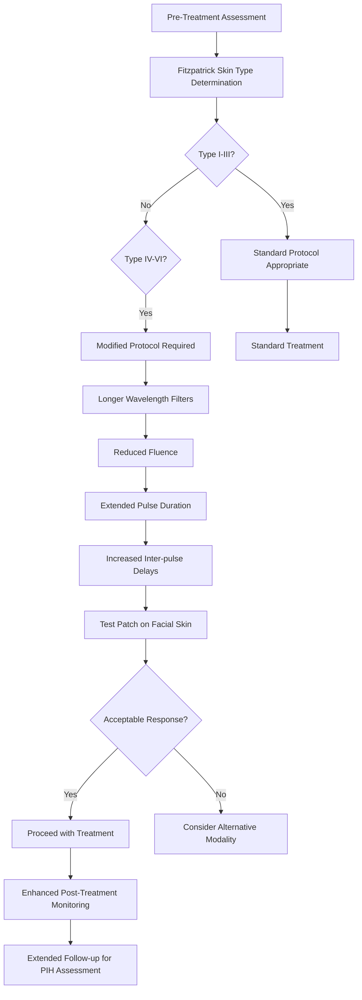
```mermaid
flowchart TD
    A[Pre-Treatment Assessment] --> B[Fitzpatrick Skin Type Determination]
    B --> C{Type I-III?}
    C -->|Yes| D[Standard Protocol Appropriate]
    C -->|No| E{Type IV-VI?}
    E -->|Yes| F[Modified Protocol Required]
    F --> G[Longer Wavelength Filters]
    G --> H[Reduced Fluence]
    H --> I[Extended Pulse Duration]
    I --> J[Increased Inter-pulse Delays]
    J --> K[Test Patch on Facial Skin]
    K --> L{Acceptable Response?}
    L -->|Yes| M[Proceed with Treatment]
    L -->|No| N[Consider Alternative Modality]
    D --> O[Standard Treatment]
    M --> P[Enhanced Post-Treatment Monitoring]
    P --> Q[Extended Follow-up for PIH Assessment]
```

**Specific risk mitigation measures include:**

1. **Patch testing**: Performing test spots on facial skin before full treatment, particularly for Types IV-VI[^1]
2. **Conservative initial settings**: Starting with lower energy and gradually increasing based on response
3. **Specialized filters**: Using longer wavelength filters to narrow the spectrum and reduce epidermal absorption
4. **Enhanced patient education**: Ensuring patients understand risks and post-treatment care requirements
5. **Strict sun avoidance**: Both pre- and post-treatment sun protection is essential
6. **Extended treatment intervals**: Allowing adequate time between sessions to assess delayed pigmentary responses

For patients in whom IPL is not ideal due to skin type considerations, **alternative treatments such as chemical peels, microneedling, or tailored laser options** may be recommended[^1].

### 4.9 Treatment Protocols and Outcome Optimization: Session Frequency and Cumulative Effects

The optimization of IPL treatment outcomes requires understanding the cumulative nature of therapeutic effects and implementing evidence-based protocols that maximize efficacy while maintaining safety. Clinical research has identified specific factors that predict favorable responses, enabling clinicians to develop structured treatment plans tailored to individual patient needs.

#### Cumulative Treatment Effects

A fundamental principle of IPL therapy is that **the effect of pulsed light is cumulative, routinely requiring 3 to 6 treatments every 2 to 4 weeks for the full clinical effect to be achieved**[^1]. This cumulative response reflects the biological processes underlying IPL's therapeutic mechanisms:

- **Progressive pigment clearance**: Each session destroys a proportion of melanin-containing cells; multiple sessions achieve progressively greater clearance
- **Collagen remodeling**: Dermal collagen synthesis continues for months following treatment, with cumulative stimulation producing enhanced results
- **Vascular reduction**: Sequential treatments progressively reduce vessel density and caliber
- **Immune-mediated clearance**: The body's immune system requires time to clear damaged tissue and pigment between sessions

**Lesions that are more heavily pigmented may require a higher number of treatment sessions**[^1] to achieve complete clearance, as the melanin burden requires multiple treatment cycles for full resolution.

#### Evidence-Based Predictors of Favorable Response

Multivariate logistic regression analysis from comprehensive clinical studies has identified independent predictors of favorable IPL treatment response (defined as GAIS ≥ 4):

| Predictor | Odds Ratio | Interpretation |
|-----------|------------|----------------|
| **Regular treatment intervals** | 13.62 | Strongest positive predictor; adherence to scheduled sessions critical |
| **Total number of IPL sessions** | 3.80 | Higher session count associated with better outcomes |
| **Fitzpatrick Type IV skin** | 0.12 | Negative predictor; darker skin types less likely to achieve optimal response |

The **striking odds ratio of 13.62 for regular treatment intervals** demonstrates that adherence to structured treatment schedules is the single most important modifiable factor in achieving optimal outcomes[^48]. Patients who maintain consistent treatment intervals are over 13 times more likely to achieve favorable responses compared to those with irregular attendance.

Similarly, the **odds ratio of 3.80 for total session number** confirms the cumulative nature of IPL effects—patients completing more sessions achieve progressively better outcomes[^48].

#### Recommended Treatment Protocols

Based on clinical evidence, the following protocol structure optimizes IPL treatment outcomes:

**Initial Treatment Phase (Sessions 1-3):**
- Treatment interval: 4-6 weeks
- Purpose: Establish treatment response, identify parameter requirements
- Assessment: Evaluate tissue response, adverse events, patient tolerance
- Adjustment: Modify parameters based on observed outcomes

**Consolidation Phase (Sessions 4-6):**
- Treatment interval: 6-8 weeks
- Purpose: Build on initial improvements, achieve target outcomes
- Assessment: Quantitative evaluation using imaging (e.g., VISIA)
- Adjustment: Fine-tune parameters for optimization

**Maintenance Phase (Ongoing):**
- Treatment interval: 3-6 months
- Purpose: Maintain achieved improvements, prevent recurrence
- Assessment: Monitor for early signs of relapse
- Adjustment: Address new concerns as they arise

For specific indications, treatment requirements may vary:

| Indication | Typical Sessions Required | Interval | Expected Outcome |
|------------|--------------------------|----------|------------------|
| **Photorejuvenation** | 3-6 | 4-6 weeks | Comprehensive improvement in erythema, pigmentation, texture |
| **Pigmented lesions** | 3-5 | 2-4 weeks | 70-90% clearance |
| **Vascular lesions** | 1-5 | 2-5 weeks | 76-100% clearance possible |
| **Melasma** | 5-8+ | 4-6 weeks | 43-70% MASI improvement; maintenance required |

#### Objective Assessment and Outcome Quantification

The integration of objective assessment tools enhances treatment planning and outcome documentation. **VISIA-based imaging combined with clinical assessment** has established IPL as a reliable, evidence-based comprehensive skin rejuvenation method[^48].

Objective assessment provides multiple benefits:
- **Baseline documentation**: Quantitative measurement of pretreatment status
- **Progress tracking**: Objective evidence of improvement between sessions
- **Parameter optimization**: Data-driven adjustment of treatment settings
- **Patient communication**: Visual evidence supporting treatment value
- **Research applications**: Standardized outcomes for clinical studies

The comprehensive facial rejuvenation study utilized VISIA Complexion Analysis System imaging with ultraviolet photographs for hyperpigmentation assessment, and ImageJ software for quantitative analysis recording Total Area (mm²) and Mean Gray Value[^48]. This methodology provided objective evidence of IPL's efficacy for pigmented lesions and supported the conclusion that long-term, regular IPL therapy achieves significant pigment correction.

#### Long-Term Outcome Considerations

The longevity of IPL treatment results depends on multiple factors:

- **Sun protection adherence**: Strict photoprotection is essential for maintaining results
- **Maintenance treatments**: Periodic sessions address new damage and prevent relapse
- **Lifestyle factors**: Overall skin health practices influence result durability
- **Underlying condition**: Chronic conditions like melasma require ongoing management

For photorejuvenation, results can be maintained for extended periods with appropriate sun protection and periodic maintenance treatments. For melasma, the chronic nature of the condition necessitates ongoing vigilance and maintenance therapy to prevent recurrence.

The study combining IPL with AOPT demonstrated that **results remained stable at 4-month follow-up** with no significant difference between immediate post-treatment and follow-up mMASI scores[^53], suggesting that well-designed protocols can achieve durable outcomes with appropriate maintenance.

In summary, IPL therapy represents a versatile and effective modality for treating photoaging, hyperpigmentation, and vascular lesions when applied according to evidence-based protocols. **The keys to optimal outcomes include adherence to regular treatment intervals, completion of adequate session numbers, appropriate parameter selection for skin type, and integration of objective assessment tools for treatment planning and outcome documentation**. By understanding the cumulative nature of IPL effects and implementing structured treatment protocols, clinicians can achieve significant, multidimensional improvements in skin quality while maintaining favorable safety profiles across diverse patient populations.

## 5 LED Phototherapy: Photobiomodulation Mechanisms and Aesthetic Applications

Light-Emitting Diode (LED) phototherapy represents a fundamentally distinct approach within the spectrum of light-based aesthetic treatments, operating through **photobiomodulation (PBM)** rather than the photothermal tissue destruction mechanisms that characterize laser and Intense Pulsed Light (IPL) technologies. Whereas lasers and IPL achieve therapeutic effects by selectively heating and destroying target chromophores through the principle of selective photothermolysis, LED therapy delivers low-level light energy that stimulates beneficial cellular responses without causing thermal damage or tissue ablation. This non-destructive, biostimulatory mechanism positions LED therapy as a unique modality capable of enhancing cellular function, promoting tissue regeneration, and modulating inflammatory processes—applications that complement rather than duplicate the capabilities of higher-energy light-based treatments. The historical roots of photobiomodulation trace to 1967, when Hungarian physician Endre Mester discovered an unexpected acceleration of hair regeneration while researching the effects of laser light exposure on cancer cells in a mouse model, inadvertently establishing the foundation for a therapeutic field that has since expanded dramatically in scope and clinical application[^55].

The contemporary understanding of LED phototherapy encompasses a sophisticated appreciation of how specific wavelengths interact with cellular chromophores to trigger cascades of beneficial biological effects. From stimulating collagen synthesis for anti-aging applications to modulating inflammatory responses for wound healing enhancement and exerting antimicrobial effects for acne treatment, LED therapy offers a versatile therapeutic platform with an exceptionally favorable safety profile. This chapter provides comprehensive analysis of the molecular mechanisms underlying photobiomodulation, examines wavelength-specific tissue penetration and biological effects, evaluates clinical evidence for LED therapy across aesthetic indications, and establishes practical frameworks for integrating LED into comprehensive treatment protocols.

### 5.1 Photobiomodulation Fundamentals: Molecular Mechanisms and Cellular Chromophore Interactions

Photobiomodulation represents a therapeutic approach fundamentally distinct from the selective photothermolysis that governs laser and IPL treatments. While selective photothermolysis achieves clinical effects through controlled thermal destruction of target tissues, PBM operates through **non-thermal, non-cytotoxic activation of endogenous chromophores** that stimulates beneficial biological functions without causing tissue damage[^55]. This mechanistic distinction is critical for understanding LED therapy's unique therapeutic niche and its complementary relationship with other light-based modalities.

#### The Primary Chromophore: Cytochrome C Oxidase

The central molecular target of photobiomodulation is **cytochrome c oxidase (CCO)**, a key enzyme complex within the mitochondrial electron transport chain. CCO serves as the terminal enzyme in the respiratory chain, catalyzing the reduction of molecular oxygen to water while facilitating proton pumping across the inner mitochondrial membrane—processes essential for ATP synthesis. When photons of appropriate wavelengths are absorbed by CCO, they trigger a cascade of intracellular events that modulate cellular metabolism and function[^55].

The absorption of light by CCO is mediated through its metal centers and associated chromophores. **Protoporphyrin IX**, a chromophore present within the mitochondrial electron transport chain, increases the sensitivity of cytochrome C and cytochrome C oxidase to specific wavelengths, particularly in the blue light spectrum[^55]. Upon activation, these enzymes strengthen the process of cellular respiration by interacting with the final two complexes of the electron transport chain and adjusting ATP production[^55].

The following diagram illustrates the photobiomodulation mechanism at the cellular level:

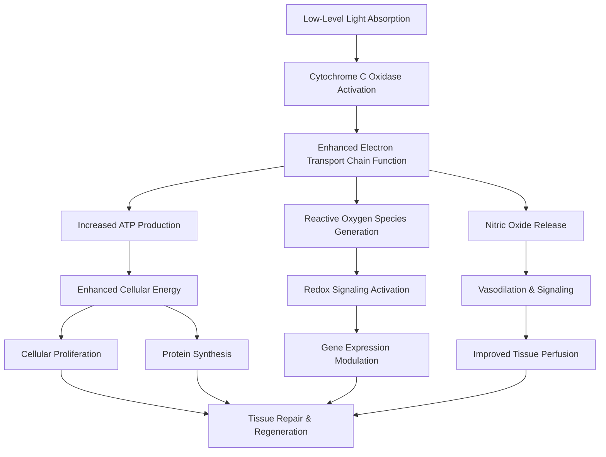
```mermaid
flowchart TD
    A[Low-Level Light Absorption] --> B[Cytochrome C Oxidase Activation]
    B --> C[Enhanced Electron Transport Chain Function]
    C --> D[Increased ATP Production]
    C --> E[Reactive Oxygen Species Generation]
    C --> F[Nitric Oxide Release]
    D --> G[Enhanced Cellular Energy]
    E --> H[Redox Signaling Activation]
    F --> I[Vasodilation & Signaling]
    G --> J[Cellular Proliferation]
    G --> K[Protein Synthesis]
    H --> L[Gene Expression Modulation]
    I --> M[Improved Tissue Perfusion]
    J --> N[Tissue Repair & Regeneration]
    K --> N
    L --> N
    M --> N
```

#### Second Messenger Cascades and Downstream Effects

The activation of mitochondrial chromophores by PBM triggers multiple second messenger cascades that translate the initial photochemical event into sustained biological responses. These cascades include:

**Adenosine Triphosphate (ATP) Production**: Enhanced mitochondrial function directly increases ATP synthesis, providing cells with the energy required for proliferation, protein synthesis, and repair processes. This energetic boost is particularly significant in compromised or stressed cells where mitochondrial function may be suboptimal.

**Reactive Oxygen Species (ROS) Modulation**: PBM induces controlled, dose-dependent stimulation of ROS production[^55]. While excessive ROS causes oxidative damage, the moderate levels generated by PBM serve as signaling molecules that activate transcription factors and modulate gene expression. Research by Magni et al. demonstrated that under blue light exposure, ROS are stimulated dose-dependently and mitochondria undergo morphological changes[^55].

**Nitric Oxide (NO) Release**: PBM promotes the release of nitric oxide, a gaseous signaling molecule with multiple biological effects including vasodilation, enhanced blood flow, and modulation of inflammatory processes. NO release contributes to improved tissue perfusion and has been implicated in the wound healing benefits of phototherapy[^55].

**Cyclic AMP (cAMP) Activation**: The activation of adenylate cyclase and subsequent cAMP production represents another downstream effect of PBM, influencing cellular processes including gene transcription, ion channel function, and metabolic enzyme activity.

#### Distinction from Photothermal Mechanisms

The fundamental characteristic distinguishing PBM from laser and IPL treatments is the **direct interaction of continuous wave light at specific wavelengths with tissue endogenous chromophores** without generating significant thermal effects[^55]. This non-thermal mechanism means that PBM does not cause the tissue destruction, coagulation, or vaporization that characterize photothermal treatments.

| Characteristic | Photobiomodulation (LED) | Selective Photothermolysis (Laser/IPL) |
|----------------|--------------------------|----------------------------------------|
| **Primary Mechanism** | Chromophore activation, biostimulation | Thermal destruction of targets |
| **Tissue Effect** | Cellular function enhancement | Tissue coagulation/ablation |
| **Temperature Change** | Minimal (non-thermal) | Significant (controlled heating) |
| **Target Chromophore** | Cytochrome c oxidase, mitochondria | Melanin, hemoglobin, water |
| **Cellular Outcome** | Enhanced proliferation, repair | Selective cell/tissue destruction |
| **Recovery Time** | None to minimal | Variable (hours to weeks) |
| **Adverse Effects** | Extremely rare | Burns, pigmentation changes possible |

The non-destructive nature of PBM enables its application for conditions where tissue preservation and cellular enhancement—rather than destruction—are the therapeutic goals. This makes LED therapy particularly valuable for anti-aging applications, wound healing support, and as adjunctive therapy following more aggressive treatments.

### 5.2 Wavelength-Specific Penetration and Biological Effects: Red, Blue, and Near-Infrared Light

The therapeutic effects of LED phototherapy are critically dependent on wavelength selection, as different wavelengths demonstrate distinct absorption characteristics, tissue penetration depths, and biological effects. Understanding these wavelength-specific properties enables clinicians to select appropriate protocols for specific clinical indications and optimize treatment outcomes.

#### Chromophore Targets and Penetration Principles

The three main chromophores in the skin—**melanin in the epidermis, hemoglobin in the dermis, and water throughout all skin layers**—demonstrate wavelength-dependent absorption characteristics, with longer wavelengths generally achieving deeper penetration[^55]. This relationship between wavelength and penetration depth forms the basis for selecting appropriate LED wavelengths for different therapeutic targets.

**Red light (620-700 nm)** targets melanin and hemoglobin, achieving moderate-depth penetration into the dermis where fibroblasts, collagen networks, and vascular structures reside[^55]. This penetration profile makes red light particularly suitable for collagen stimulation and dermal rejuvenation applications.

**Near-infrared (NIR) light (700-1440 nm)** targets water molecules in deeper tissue layers, achieving the greatest penetration depth among therapeutic wavelengths[^55]. NIR light can reach the deep dermis and subcutaneous tissues, making it valuable for applications requiring effects at greater tissue depths.

**Blue light (400-500 nm)** is absorbed primarily by the heme group found in hemoglobin and cytochromes, as well as by porphyrins produced by certain bacteria[^55]. While blue light demonstrates the shallowest penetration among therapeutic wavelengths, its strong absorption by specific chromophores makes it valuable for superficial applications including antimicrobial effects and sebaceous gland modulation.

The following table summarizes wavelength-specific characteristics:

| Wavelength Range | Color | Primary Chromophores | Penetration Depth | Primary Applications |
|------------------|-------|---------------------|-------------------|---------------------|
| **400-500 nm** | Blue | Heme groups, porphyrins, cytochromes | Superficial (epidermis) | Antimicrobial, acne treatment, sebum regulation |
| **620-700 nm** | Red | Melanin, hemoglobin, CCO | Moderate (dermis) | Collagen stimulation, anti-aging, wound healing |
| **700-1440 nm** | Near-Infrared | Water, CCO | Deep (deep dermis, subcutaneous) | Deep tissue effects, wound healing, inflammation |

#### Red Light: Dermal Rejuvenation and Collagen Stimulation

Red light therapy (RLT), typically delivered at wavelengths between **630-660 nm**, represents the most extensively studied LED wavelength for aesthetic applications. Photons at these wavelengths penetrate effectively into the dermis, where they are absorbed by mitochondrial chromophores within fibroblasts, stimulating cellular processes that enhance collagen synthesis and tissue repair.

The mechanisms by which red light promotes dermal rejuvenation include:

- **Fibroblast activation**: Enhanced mitochondrial function increases fibroblast metabolic activity and proliferative capacity
- **Collagen synthesis upregulation**: Activated fibroblasts demonstrate increased production of type I and type III collagen
- **Matrix metalloproteinase (MMP) reduction**: Red light exposure has been associated with decreased expression of collagen-degrading enzymes
- **Growth factor release**: Stimulated cells release paracrine factors that amplify regenerative signals

Clinical studies have demonstrated that **red light at 633 nm delivered at 126 J/cm² twice weekly for 4 weeks improved wrinkles by 26% and elasticity by 14%**, establishing a foundation for evidence-based anti-aging protocols.

#### Blue Light: Antimicrobial and Sebaceous Effects

Blue LED technology, developed in the early 1990s, has found significant applications in dermatological treatment due to the high absorption rate of biological molecules and chromophores in the UV/blue region of the spectrum[^55]. The therapeutic mechanisms of blue light involve multiple chromophore targets:

**Heme group absorption**: Blue light is absorbed primarily by the heme group found in hemoglobin and cytochromes[^55]. This absorption can trigger intracellular signaling pathways with biological effects including wound healing modulation.

**Porphyrin-mediated effects**: Protoporphyrin IX and other porphyrins demonstrate strong absorption in the blue spectrum, sensitizing cytochrome C and cytochrome C oxidase to blue light activation[^55]. This mechanism is particularly relevant for antimicrobial applications, where endogenous porphyrins in bacteria serve as photosensitizers.

**Flavin activation**: Flavins, which stimulate ROS synthesis and participate in signal transduction in numerous cellular pathways involved in tissue repair, also contribute to blue light's therapeutic effects[^55].

Despite its therapeutic benefits, **blue light is considered very close to ultraviolet light** and has been associated with potential deleterious effects on the skin[^55]. This proximity to UV wavelengths necessitates careful consideration of exposure parameters and appropriate patient selection.

#### Near-Infrared Light: Deep Tissue Penetration

Near-infrared (NIR) light at wavelengths between **700-1440 nm** achieves the deepest tissue penetration among therapeutic LED wavelengths, targeting water molecules in the deeper layers of the epidermis and dermis[^55]. This penetration profile enables NIR light to influence cellular processes at tissue depths inaccessible to shorter wavelengths.

Clinical evidence supports NIR light's efficacy for skin rejuvenation applications. Studies have demonstrated that **LED near-infrared light at 830 nm (66 J/cm²) improved wrinkles by 33% and elasticity by 19%**, outperforming red light alone for these parameters. The deeper penetration of NIR light may account for its enhanced effects on dermal matrix remodeling.

NIR light offers particular advantages for treating patients with darker skin types, as its longer wavelength **bypasses epidermal melanin** more effectively than shorter wavelengths, reducing the risk of adverse pigmentary outcomes in susceptible individuals.

#### Combination Protocols: Synergistic Effects

The distinct penetration depths and biological effects of different wavelengths provide a rationale for combination protocols that target multiple tissue layers simultaneously. Research has demonstrated that **combination therapy using both 830 nm (NIR) and 633 nm (red) wavelengths improved wrinkles by 36% and elasticity by 16%**, suggesting synergistic effects when multiple wavelengths are employed.

The scientific basis for combination approaches relates to the complementary chromophore targeting achieved by different wavelengths:

- Red light (633 nm) effectively stimulates superficial to mid-dermal fibroblasts
- NIR light (830 nm) penetrates to deeper dermal and subcutaneous layers
- Combined delivery ensures comprehensive treatment across tissue depths

Studies comparing different wavelength protocols have found that **both red light and NIR had effective and significant wrinkle reduction**, with NIR demonstrating superior effects on skin elasticity while red light showed advantages for melanin-related concerns[^55]. These findings support wavelength selection based on specific clinical goals and patient presentations.

### 5.3 Collagen Synthesis Stimulation and Anti-Aging Applications

LED phototherapy has emerged as a valuable modality for addressing photoaging manifestations through its capacity to stimulate collagen production and enhance dermal matrix quality. The non-invasive, non-ablative nature of LED treatment makes it particularly attractive for patients seeking anti-aging benefits without the recovery time associated with ablative laser resurfacing or the potential adverse effects of more aggressive interventions.

#### Molecular Pathways of Collagen Stimulation

The mechanisms by which PBM stimulates collagen synthesis involve multiple interconnected pathways activated by mitochondrial chromophore excitation. Research has demonstrated that LED light therapy can modulate the metabolism and growth of human fibroblasts, with effects on both proliferation and extracellular matrix production[^55].

**Fibroblast activation and proliferation**: Exposure to appropriate LED wavelengths enhances fibroblast metabolic activity through increased ATP production, providing the cellular energy required for protein synthesis and cell division. Studies examining human fibroblasts derived from healthy skin demonstrated that blue LED light can modulate cell proliferation and metabolism, with effects persisting for at least 48 hours after treatment[^55].

**Collagen and elastin production**: In vitro research by Wen-Hwa Li demonstrated that treatment of human fibroblasts with red and infrared light for 10 minutes each day at an intensity of 0.3 J/cm² induced greater expression of collagen and elastin[^55]. This finding provides mechanistic support for LED therapy's clinical anti-aging effects.

**Matrix metalloproteinase regulation**: Beyond stimulating new collagen synthesis, LED therapy has been shown to reduce the expression of matrix metalloproteinases (MMPs)—enzymes responsible for collagen degradation. Research by Barolet et al. demonstrated that exposure of human fibroblasts to 660 nm LED increased the secretion of procollagen while decreasing MMP expression[^55]. Similarly, studies on human keratinocytes showed decreased MMP-9 expression after application of red laser (635 nm), favoring conservation and production of new extracellular matrix[^55].

**Transcription factor activation**: The collagen-stimulating effects of LED therapy have been attributed to changes in mitochondrial membrane potential that promote activation of specific signaling pathways and transcription factors, primarily **AP-1 and NF-kB**. This activation increases expression of genes related to collagen synthesis, anti-inflammatory signaling, cell migration and proliferation, as well as production of anti-apoptotic proteins and antioxidant enzymes[^55].

#### Clinical Evidence for Anti-Aging Efficacy

Multiple clinical trials have evaluated LED phototherapy for wrinkle reduction and skin rejuvenation, with results supporting its efficacy when appropriate treatment parameters are employed. The following table summarizes key clinical findings from published studies:

| Study/Year | LED Wavelength | Patients | Protocol | Results |
|------------|----------------|----------|----------|---------|
| Weis 2005[^55] | 590 nm (amber) | N=90 | 8 treatments in 4 weeks | 90% reduced photoaging signs; 90% improved Collagen I |
| Russell 2005[^55] | 630 nm + 830 nm | N=31 | 9 treatments | 52% reduced photoaging signs; 81% improved periocular wrinkles |
| Goldberg 2007[^55] | 630 nm + 830 nm | N=36 | 9 treatments in 12 weeks | Significant improvement in softness, smoothness, firmness |
| Yoon-Lee 2007[^55] | 630 nm + 830 nm | N=112 | 8 sessions, 4 weeks | Both RL and NIR effective for wrinkle reduction; NIR better for elasticity |
| Wunsch 2014[^55] | 611-650 nm vs 570-850 nm | N=136 | 30 treatments | Both treatments significant for wrinkles; no difference between wavelengths |
| Rocha-Mota 2023[^55] | 660 nm vs 590 nm | N=137 | 10 sessions, 4 weeks | Significant periocular wrinkle reduction: 31.6% (RL), 29.9% (AL) |

The Yoon-Lee study (2007) provided particularly valuable comparative data by randomizing 112 patients into four groups: NIR alone, red light alone, NIR combined with red light, and placebo[^55]. Results demonstrated that **both red light and NIR achieved effective and significant wrinkle reduction**, with skin elasticity improvements more pronounced in the NIR and NIR+RL groups. Notably, red light showed superior effects on melanin reduction, suggesting wavelength-specific advantages for different aspects of photorejuvenation.

#### Treatment Parameters for Optimal Anti-Aging Outcomes

The clinical evidence supports specific parameter ranges for achieving optimal anti-aging outcomes with LED therapy:

**Wavelength selection**: Red light (630-660 nm) and near-infrared (830 nm) have demonstrated the strongest evidence for anti-aging applications. Combination protocols using both wavelengths may provide synergistic benefits by targeting multiple tissue depths.

**Fluence (energy density)**: Clinical trials have employed fluences ranging from 0.1 J/cm² to 126 J/cm², with most successful protocols utilizing fluences in the range of **3.8-126 J/cm²**[^55]. The optimal fluence depends on the specific wavelength and treatment goals.

**Power density**: Research has identified power density around **20-100 mW/cm²** as favorable for skin healing and rejuvenation.

**Treatment frequency and duration**: Most clinical trials demonstrating significant anti-aging effects employed protocols of **2-3 sessions per week for 4-12 weeks**. The cumulative nature of LED therapy's effects necessitates multiple treatment sessions to achieve optimal outcomes.

**Session duration**: Individual treatment sessions typically range from 10-30 minutes depending on the device power output and treatment area coverage.

#### Histological Correlates of Clinical Improvement

Clinical improvements observed following LED therapy are supported by histological evidence of dermal remodeling. The Weis study (2005) demonstrated that 90% of patients showed improved Collagen I expression with a 4% decrease in MMP-I following treatment with 590 nm amber light[^55]. These histological findings provide mechanistic validation for the clinical observations of reduced wrinkles and improved skin texture.

The photorejuvenation effects of LED therapy are mediated through the wound healing response pathways activated by controlled photostimulation. Unlike ablative treatments that achieve collagen remodeling through injury and subsequent repair, LED therapy stimulates fibroblast activity and collagen synthesis directly through mitochondrial activation, achieving rejuvenation effects without the tissue damage and recovery requirements of more aggressive approaches.

### 5.4 Anti-Inflammatory Effects and Wound Healing Enhancement

LED phototherapy demonstrates significant capacity to modulate inflammatory responses and enhance wound healing through multiple mechanisms including cytokine regulation, immune cell modulation, and direct effects on cells involved in tissue repair. These properties make LED therapy valuable both as a standalone treatment for wound healing applications and as adjunctive therapy following more aggressive aesthetic procedures.

#### Mechanisms of Inflammatory Modulation

The anti-inflammatory effects of PBM involve complex interactions with multiple components of the inflammatory response:

**Cytokine modulation**: LED therapy influences the production and release of inflammatory cytokines, promoting a shift from pro-inflammatory to anti-inflammatory signaling. Research has demonstrated that PBM can induce **anti-inflammatory cytokine release and bacterial load reduction** while stimulating granulation tissue formation[^55]. The modulation of ROS levels by PBM causes a controlled increase in inflammatory functions that facilitates the transition from the inflammatory phase to the proliferative phase of wound healing[^55].

**Macrophage phenotype transition**: One of the key mechanisms by which PBM modulates inflammation involves promoting the **macrophage phenotypic transition from M1 to M2**[^55]. M1 macrophages are associated with pro-inflammatory responses and tissue destruction, while M2 macrophages promote tissue repair and resolution of inflammation. This phenotypic shift represents a critical mechanism by which LED therapy redirects the wound environment toward healing.

**Immune system activation**: Photodynamic and photobiomodulation approaches can cause an acute inflammatory response primarily related to immune system activation[^55]. This controlled inflammatory stimulus can be beneficial in chronic wounds where the normal healing cascade has stalled.

#### Effects on Wound Healing Phases

LED therapy influences all phases of the wound healing process, from initial hemostasis through final remodeling:

**Inflammatory phase**: PBM modulates the inflammatory response by regulating cytokine production and promoting appropriate resolution of inflammation. Blue light has demonstrated effects on **anti-inflammatory cytokine release, bacterial load reduction, and granulation stimulation**[^55].

**Proliferative phase**: During the proliferative phase, LED therapy enhances fibroblast activity, promoting both migration and proliferation of these key wound healing cells. Research has shown that PBM not only causes new fibroblasts to diversify but also fosters close relationships between fibroblasts and mast cells, which contain TNF-α and Fibroblast Growth Factor (FGF) in their granules[^55]. This cellular interaction supports fibroblast recruitment and differentiation.

**Remodeling phase**: According to research by Fraccalvieri et al. and Orlandi et al., LED light helps injured tissue by regulating its energy supply during the phases of proliferation and remodeling, establishing tissue repair with a decrease in scar tissue and the likelihood of developing keloids, as well as stimulating angiogenesis[^55].

The comprehensive influence of LED therapy on wound healing is summarized in the following diagram:

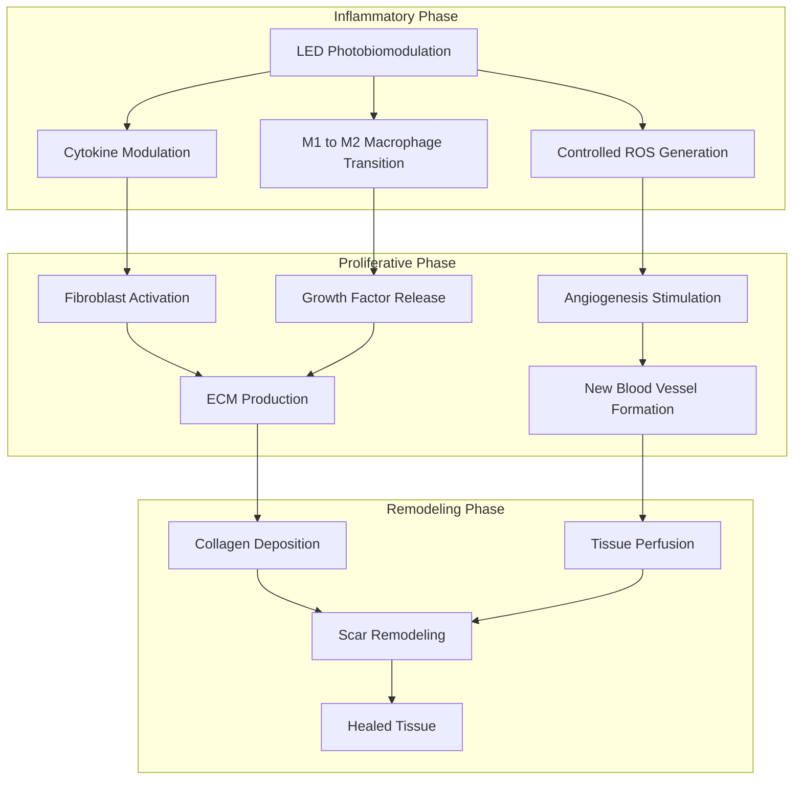
```mermaid
flowchart TD
    subgraph Inflammatory Phase
    A[LED Photobiomodulation] --> B[Cytokine Modulation]
    A --> C[M1 to M2 Macrophage Transition]
    A --> D[Controlled ROS Generation]
    end
    
    subgraph Proliferative Phase
    B --> E[Fibroblast Activation]
    C --> F[Growth Factor Release]
    D --> G[Angiogenesis Stimulation]
    E --> H[ECM Production]
    F --> H
    G --> I[New Blood Vessel Formation]
    end
    
    subgraph Remodeling Phase
    H --> J[Collagen Deposition]
    I --> K[Tissue Perfusion]
    J --> L[Scar Remodeling]
    K --> L
    L --> M[Healed Tissue]
    end
```

#### Blue Light in Wound Healing

Blue light therapy has demonstrated particular efficacy in wound healing applications through multiple mechanisms:

**Enhanced healing outcomes**: Compared to wounds not treated with blue light, treated wounds exhibit a quicker healing process as well as improved dermal collagen deposition and morphology[^55]. The modulation of the inflammatory response is better in wounds that have been treated with blue light.

**Photochemical mechanisms**: The wound healing benefits of blue light are attributed to photochemical effects including **nitric oxide release and fibroblast activation**, which promote re-epithelialization[^55]. Additionally, blue light helps establish tissue repair with decreased scar tissue formation and reduced likelihood of keloid development.

**Proangiogenic effects**: In animal models of chronic ulcers, blue light treatment has demonstrated proangiogenic effects, suggesting that blue light therapy may be helpful throughout the entire tissue repair process[^55].

#### Applications in Post-Procedural Recovery

LED therapy's anti-inflammatory and wound healing properties make it particularly valuable as adjunctive therapy following more aggressive aesthetic procedures:

**Post-laser recovery**: Following ablative laser treatments, LED therapy can accelerate healing, reduce erythema duration, and potentially decrease the risk of adverse pigmentary outcomes. The anti-inflammatory effects help modulate the post-procedural inflammatory response while the collagen-stimulating properties support dermal repair.

**Post-inflammatory hyperpigmentation prevention**: Studies have demonstrated that combination LED therapy (red light at 633 nm and near-infrared at 830 nm) resulted in **fewer incidences of post-inflammatory hyperpigmentation** compared to control groups following procedures. This protective effect is particularly valuable for patients at elevated risk for PIH.

**Reduction of treatment-related adverse effects**: The capacity of LED therapy to modulate inflammatory responses can help minimize common adverse effects following aesthetic procedures including prolonged erythema, edema, and discomfort.

### 5.5 Blue Light Applications: Antimicrobial Activity and Sebaceous Gland Modulation

Blue light LED therapy has established a distinct therapeutic niche in aesthetic dermatology through its antimicrobial effects and capacity to modulate sebaceous gland activity. These properties make blue light particularly valuable for treating inflammatory acne, where bacterial overgrowth and excessive sebum production contribute to disease pathogenesis.

#### Antimicrobial Mechanisms

The antimicrobial effects of blue light are mediated primarily through photochemical reactions involving endogenous chromophores within target microorganisms:

**Porphyrin-mediated photoinactivation**: *Cutibacterium acnes* (formerly *Propionibacterium acnes*), the bacterium primarily implicated in acne pathogenesis, produces endogenous porphyrins as metabolic byproducts. These porphyrins function as photosensitizers that absorb blue light energy and generate reactive oxygen species[^55]. Research by Cho et al. observed the photoinactivation effect of light irradiation on *C. acnes* at wavelengths of 370 nm, 385 nm, 395 nm, 405 nm, and 470 nm, while no photoinactivation effect was observed at wavelengths of 505 nm, 590 nm, 630 nm, or 880 nm[^55].

**ROS-mediated bacterial destruction**: When blue light is absorbed by bacterial porphyrins, the resulting photochemical reaction generates reactive oxygen species with potent bactericidal effects, effectively reducing the population of acne-causing bacteria on the skin[^55]. This mechanism enables selective destruction of porphyrin-producing bacteria without requiring exogenous photosensitizers.

**Broad-spectrum antimicrobial potential**: Research has demonstrated that bacteria (Gram-positive, Gram-negative, mycobacteria), fungi (yeasts and filamentous fungi), viruses (DNA and RNA), and parasites can be effectively destroyed by light in the 400-470 nm range[^55]. Furthermore, antimicrobial efficacy appears not to be affected by microbe resistance to antibiotics, nor does it lead to resistant microbes after repeated sublethal light applications[^55].

#### Sebaceous Gland Modulation

Beyond its antimicrobial effects, blue light influences sebaceous gland function:

**Sebum production regulation**: LED therapy has been shown to reduce skin sebum and transepidermal water loss[^55]. Clinical research by Jung et al. demonstrated that red LEDs (630 nm) reduce lipid production, while studies have also shown effects of blue light on sebaceous gland activity[^55].

**Keratinization normalization**: Research by Li et al. demonstrated normalization of keratinization within sebaceous glands after exposure to red LEDs[^55]. This effect on follicular keratinization may help prevent the comedone formation that initiates acne lesions.

#### Clinical Evidence for Acne Treatment

Multiple clinical studies support blue light's efficacy for inflammatory acne:

**Inflammatory lesion reduction**: Ash et al. analyzed the effect of blue LED light on reducing inflammatory lesions in 41 patients with mild to moderate acne vulgaris, finding that all subjects in the treatment cohort achieved a reduction in inflammatory lesion counts after 12 weeks, compared to the control group using only a facial cleanser[^55].

**Comparison with conventional treatments**: In a study comparing blue LED treatment (15 minutes daily for 4 weeks) with topical benzoyl peroxide (5%) twice daily, short-term blue light irradiation significantly reduced inflammatory acne compared to the topical treatment[^55].

**Interleukin modulation**: Low-dose blue light LED exposure (415 + 470 nm) reduced the production of interleukin 8 in patients with acne, and after this exposure, microcysts, pustules, and inflammatory nodules almost disappeared with a lasting effect[^55].

**Red light for acne**: One study revealed a reduction in inflammatory acne of 87.7% after a 12-week follow-up treatment with red LED (660 nm) in 14 participants[^55].

#### Safety Considerations

While blue light demonstrates therapeutic benefits, its proximity to ultraviolet wavelengths necessitates careful consideration:

**Proximity to UV spectrum**: Blue light (400-500 nm) is considered very close to ultraviolet light, and concerns exist regarding potential deleterious effects on the skin without modulatory benefits when used inappropriately[^55]. This consideration underscores the importance of appropriate dosing parameters and treatment protocols.

**Appropriate clinical parameters**: The wavelength range of 402-420 nm is the most effective for antimicrobial purposes, while wavelengths of 455 nm and 470 nm have antimicrobial potential for specific bacterial species (e.g., *S. aureus*)[^55]. Selection of appropriate wavelengths and exposure parameters helps maximize therapeutic benefit while minimizing potential risks.

### 5.6 LED Therapy for Hyperpigmentation and Skin Brightening

LED phototherapy is emerging as a valuable modality for addressing hyperpigmentation disorders and promoting overall skin brightening. While the evidence base for LED therapy in pigmentation treatment is less extensive than for anti-aging applications, research supports multiple mechanisms by which PBM can influence melanogenesis and melanocyte function.

#### Mechanisms of Pigmentation Modulation

LED therapy influences skin pigmentation through several interconnected pathways:

**Tyrosinase inhibition**: Tyrosinase is the rate-limiting enzyme in melanin synthesis, and research has demonstrated that certain LED wavelengths can inhibit its activity. Studies using **660 nm red LEDs have demonstrated tyrosinase inhibition**, suggesting a direct mechanism for reducing melanin production[^55].

**Oxidative stress reduction**: Photobiomodulation reduces oxidative stress within treated tissues, and since oxidative stress can stimulate melanogenesis, this reduction may contribute to decreased pigmentation. The antioxidant enzyme production stimulated by LED therapy helps maintain cellular redox balance.

**Cell turnover enhancement**: LED therapy stimulates cellular proliferation and turnover, potentially accelerating the clearance of existing melanin from the epidermis through enhanced keratinocyte replacement.

**Vascular component modulation**: Studies using **amber LED light (590 nm)** have shown effectiveness in reducing melasma by decreasing new blood vessel growth and recycling melanocytes[^55]. This vascular effect addresses the recognized vascular contribution to melasma pathophysiology.

#### Wavelength Selection for Different Skin Types

The selection of appropriate LED wavelengths for pigmentation treatment must account for patient skin type and the associated risk of adverse pigmentary outcomes:

**Near-infrared for darker skin types**: For darker Fitzpatrick skin types (IV-VI), **near-infrared light (800-1000 nm) is preferred** as it bypasses epidermal melanin, reducing the risk of hyperpigmentation[^55]. The longer wavelength achieves therapeutic effects on target cells while minimizing absorption by competing epidermal melanin.

**Red light applications**: Red light (620-660 nm) demonstrates moderate melanin absorption and can effectively treat pigmentation in lighter skin types while requiring more careful parameter selection in darker skin.

**Pulsed delivery for melanin management**: Pulsed LED therapy minimizes overheating and melanin overstimulation, providing an additional safety margin when treating patients at risk for adverse pigmentary responses.

#### Clinical Evidence for Melasma Treatment

Research on LED therapy for melasma has demonstrated promising results:

**Near-infrared LED for melasma**: Studies using **940 nm near-infrared LED** with specific pulsing protocols showed statistically significant pigment reduction, with MASI scores decreasing from 11.4 to 4.7. This represents a substantial improvement achieved through a non-invasive, low-risk modality.

**Post-procedural PIH prevention**: Combination LED therapy (red light at 633 nm and near-infrared at 830 nm) has demonstrated capacity to reduce post-inflammatory hyperpigmentation incidence following procedures, suggesting a protective role in susceptible patients.

#### Integration with Comprehensive Pigmentation Protocols

LED therapy's favorable safety profile and complementary mechanisms make it well-suited for integration into comprehensive pigmentation treatment protocols:

- **Pre-treatment conditioning**: LED therapy may help prepare skin for more aggressive treatments by optimizing cellular function and reducing baseline inflammation
- **Post-treatment support**: Following laser or IPL treatment for pigmentation, LED therapy can accelerate healing and potentially reduce PIH risk
- **Maintenance therapy**: The non-invasive nature of LED therapy makes it suitable for ongoing maintenance to prevent pigmentation recurrence

### 5.7 Adjunctive Therapy Integration: LED in Comprehensive Aesthetic Protocols

LED phototherapy's unique mechanism of action—stimulating cellular function rather than causing tissue destruction—positions it as an ideal adjunctive therapy within multimodal aesthetic treatment approaches. The capacity to enhance healing, reduce inflammation, and stimulate collagen synthesis without additional tissue trauma makes LED valuable for both pre-treatment conditioning and post-procedural recovery.

#### Combination with Laser Treatments

LED therapy can enhance outcomes and reduce adverse effects when combined with laser treatments:

**Post-ablative laser recovery**: Following CO2 or Er:YAG ablative resurfacing, LED therapy can accelerate re-epithelialization and reduce the duration of post-treatment erythema. The wound healing enhancement provided by PBM supports faster recovery without compromising treatment results.

**Post-fractional laser support**: After fractional laser treatments, LED therapy can enhance the collagen remodeling response while reducing inflammation-related adverse effects. The synergistic stimulation of fibroblast activity may amplify the rejuvenation benefits of fractional treatments.

**PIH risk reduction**: For patients at elevated risk for post-inflammatory hyperpigmentation following laser treatments, LED therapy's anti-inflammatory effects and capacity to modulate melanocyte activity may provide protective benefits.

#### Combination with IPL Therapy

LED therapy complements IPL treatments through several mechanisms:

**Enhanced photorejuvenation outcomes**: While IPL addresses pigmentation and vascular concerns through selective photothermolysis, LED therapy stimulates collagen synthesis through photobiomodulation. Combining these modalities addresses photoaging through complementary mechanisms.

**Post-IPL recovery support**: LED therapy following IPL treatment can help resolve post-treatment erythema and support dermal healing, potentially reducing the time between treatment sessions.

#### Combination with Other Aesthetic Procedures

LED therapy integrates effectively with various aesthetic interventions:

**Chemical peels**: Following chemical peels, LED therapy can accelerate healing and support dermal regeneration while reducing inflammation and PIH risk.

**Microneedling**: The controlled micro-injuries created by microneedling trigger wound healing responses that can be enhanced by LED therapy's effects on fibroblast activity and collagen synthesis.

**Injectable treatments**: LED therapy may help reduce post-injection bruising and inflammation through its anti-inflammatory and vascular effects.

#### Protocol Considerations for Combination Therapy

When integrating LED therapy into comprehensive treatment protocols, several factors warrant consideration:

**Timing of LED treatment**: LED therapy can be applied immediately before procedures (pre-conditioning), immediately after (acute recovery support), or in the days following treatment (ongoing healing enhancement).

**Wavelength selection**: The choice of LED wavelength should complement the primary treatment's mechanism and address specific post-procedural concerns. Red and NIR wavelengths are generally preferred for post-procedural applications due to their wound healing and anti-inflammatory effects.

**Treatment frequency**: Post-procedural LED therapy is typically delivered in multiple sessions during the recovery period, with frequency adjusted based on the aggressiveness of the primary treatment and patient healing response.

### 5.8 Treatment Parameters, Device Considerations, and Clinical Protocol Optimization

The clinical success of LED phototherapy depends upon appropriate selection of treatment parameters and devices, as well as implementation of evidence-based protocols tailored to specific clinical indications. Understanding the critical variables that influence treatment outcomes enables clinicians to optimize LED therapy across diverse patient presentations.

#### Critical Treatment Parameters

Several key parameters determine the biological effects and clinical outcomes of LED therapy:

**Power density (irradiance)**: Power density, measured in mW/cm², describes the rate of energy delivery to tissue. Research has identified power density around **20-100 mW/cm²** as favorable for skin healing and rejuvenation. Insufficient power density may fail to achieve therapeutic thresholds, while excessive power density could potentially cause adverse effects.

**Fluence (energy density)**: Fluence, measured in J/cm², represents the total energy delivered per unit area and is calculated from power density and treatment duration. Clinical trials have demonstrated efficacy with fluences ranging from **3.8-126 J/cm²** depending on wavelength and indication.

**Treatment duration**: Session duration is determined by the relationship between power density and desired fluence. Lower-powered devices require longer treatment times to deliver equivalent energy doses. Typical treatment sessions range from 10-30 minutes.

**Session frequency**: The cumulative nature of LED therapy's effects necessitates multiple treatment sessions. Evidence supports protocols of **2-3 sessions per week** for most indications, with treatment courses typically spanning 4-12 weeks.

**Wavelength selection**: As detailed in Section 5.2, wavelength selection should be based on the target chromophore, desired penetration depth, and specific clinical indication.

The following table provides parameter guidelines for common indications:

| Indication | Recommended Wavelength | Power Density | Fluence | Session Frequency | Course Duration |
|------------|----------------------|---------------|---------|-------------------|-----------------|
| **Anti-aging/Wrinkles** | 633 nm + 830 nm | 20-100 mW/cm² | 60-130 J/cm² | 2-3x weekly | 8-12 weeks |
| **Acne (inflammatory)** | 415-470 nm (blue) | 40-80 mW/cm² | 15-40 J/cm² | Daily to 3x weekly | 4-8 weeks |
| **Wound healing** | 630-660 nm | 20-50 mW/cm² | 4-10 J/cm² | Daily to 3x weekly | Until healed |
| **Post-procedural** | 633 nm + 830 nm | 20-50 mW/cm² | 10-30 J/cm² | Daily for 3-7 days | As needed |
| **Pigmentation** | 830-940 nm (NIR) | 20-60 mW/cm² | 20-60 J/cm² | 2x weekly | 8-12 weeks |

#### Device Considerations

The selection of appropriate LED devices involves evaluation of several factors:

**Professional versus home-use devices**: Professional-grade LED devices typically offer higher power output, multiple wavelength options, and larger treatment areas compared to home-use devices. While home devices can provide maintenance benefits, professional treatments generally achieve more significant initial results due to superior technical specifications.

**Wavelength options**: Devices offering multiple wavelengths (red, blue, NIR) provide greater versatility for addressing diverse clinical indications. Single-wavelength devices may be appropriate for focused applications.

**Power output**: Higher-powered devices deliver therapeutic fluences in shorter treatment times, improving clinical efficiency. However, device power must be balanced against safety considerations.

**Treatment area coverage**: Panel-based devices covering larger areas improve treatment efficiency for facial applications, while smaller handpieces may be preferred for targeted treatment of specific areas.

**Delivery method**: LED light delivery can be continuous or pulsed at different frequencies. Pulsed delivery may offer advantages for certain applications, particularly in patients at risk for adverse effects.

#### Comparison of LED and Laser Light Sources for PBM

The distinction between LED and low-level laser light (LLLT) sources for photobiomodulation applications warrants clarification:

| Characteristic | LED | Low-Level Laser |
|----------------|-----|-----------------|
| **Light coherence** | Non-coherent | Coherent |
| **Bandwidth** | 1-2 nm | Single wavelength |
| **Energy delivery** | Lower intensity, longer duration | Higher intensity, shorter duration |
| **Treatment time** | Longer sessions | Shorter sessions |
| **Equipment cost** | More affordable | More expensive |
| **Handling requirements** | Simple, no specialized training | May require specialized handling |
| **Coverage area** | Larger treatment areas | Spot-by-spot treatment |

Despite the technical differences, **numerous studies currently support the idea that LEDs are another valid option for applying PBM**[^55]. The choice between LED and laser sources for PBM applications should be based on practical considerations including cost, treatment efficiency, and available equipment rather than assumed differences in therapeutic efficacy.

#### Protocol Optimization Strategies

Optimizing LED therapy protocols involves several considerations:

**Initial assessment**: Evaluate patient skin type, specific concerns, and treatment goals to guide wavelength selection and parameter settings.

**Test treatments**: For patients at elevated risk for adverse effects, initial test treatments at conservative parameters can help establish individual tolerance and response.

**Progressive adjustment**: Treatment parameters may be adjusted over the course of therapy based on patient response and tolerance.

**Combination approaches**: Consider integrating LED therapy with other modalities for comprehensive treatment of complex presentations.

**Maintenance protocols**: Following initial treatment courses, maintenance sessions at reduced frequency can help sustain achieved improvements.

The evidence base for LED phototherapy continues to expand, and while **standardized recommendations for PBM treatments across skin conditions and different skin types are lacking in the literature**[^55], the principles outlined in this chapter provide a framework for evidence-based clinical application. The development of standard protocols represents an important area for ongoing research, with the goal of optimizing therapeutic outcomes across diverse patient populations and clinical indications.

## 6 Comparative Effectiveness Analysis Across Light-Based Modalities

The preceding chapters have established the fundamental mechanisms, clinical applications, and evidence base for laser, IPL, and LED technologies as individual therapeutic modalities. However, clinicians and patients alike face the practical challenge of selecting among these options—or determining optimal combinations—for specific clinical presentations. This chapter addresses that challenge through systematic comparative analysis, synthesizing head-to-head clinical evidence to establish relative efficacy hierarchies, evaluating practical parameters that influence treatment selection, and developing evidence-based frameworks that integrate condition characteristics, patient factors, and economic considerations into coherent decision-making algorithms.

The comparative analysis presented here recognizes that **no single modality represents the universally optimal choice** across all indications and patient populations. Rather, each technology offers distinct advantages and limitations that must be weighed against specific clinical goals, patient skin type, tolerance for downtime and discomfort, and economic constraints. By systematically examining these factors across photoaging, hyperpigmentation, and skin rejuvenation indications, this chapter provides the analytical foundation for personalized treatment selection that maximizes therapeutic outcomes while appropriately managing risks and resources.

### 6.1 Treatment Efficacy Comparison for Photoaging and Skin Rejuvenation

The treatment of photoaging represents one of the most common indications in aesthetic medicine, encompassing manifestations ranging from fine lines and wrinkles to textural irregularities, dyschromia, and skin laxity. Each light-based modality addresses these concerns through distinct mechanisms—selective photothermolysis with controlled tissue damage (lasers), simultaneous multi-chromophore targeting (IPL), and cellular biostimulation without tissue destruction (LED)—resulting in fundamentally different efficacy profiles, recovery requirements, and outcome expectations.

#### Laser Efficacy for Photoaging: Ablative Versus Non-Ablative Approaches

Ablative laser resurfacing, particularly with CO2 systems, has historically demonstrated the most dramatic improvements for advanced photoaging. Clinical studies have documented **wrinkle improvement rates of up to 90%** following CO2 laser ablation, establishing this modality as the gold standard for severe rhytides corresponding to Glogau Types III-IV photoaging[^6]. The mechanism underlying these impressive results involves both immediate collagen contraction through thermal denaturation and subsequent neocollagenesis during the wound healing response.

However, the efficacy of ablative approaches must be weighed against their substantial recovery requirements and adverse event profiles. Er:YAG lasers offer a more conservative ablative option, achieving cosmetic outcomes similar to traditional non-fractional delivery while producing **significantly less thermal damage** and faster recovery times[^6]. The reduced heat dispersion characteristic of Er:YAG technology translates into quicker healing, reduced erythema duration (3-4 weeks versus several weeks to months for CO2), and lower rates of dyspigmentation.

Non-ablative laser rejuvenation addresses the clinical need for effective treatment with minimal disruption to daily activities. By delivering controlled thermal injury to the dermis while preserving epidermal integrity, non-ablative approaches stimulate collagen remodeling without the extended downtime of ablative procedures. Studies indicate that non-ablative treatment is **preferred for mild photoaging in patients 30 to 50 years of age**, with results that continue to evolve over several months as collagen synthesis progresses[^7]. The longevity of non-ablative results typically extends **3-5 years** with appropriate maintenance and sun protection.

Fractional laser technology has fundamentally altered the risk-benefit calculation by creating microscopic treatment zones surrounded by untreated tissue, enabling faster healing while maintaining therapeutic efficacy. Following fractional CO2 treatment, **erythema persists for approximately two weeks** compared to several weeks to months after non-fractional resurfacing, making this approach accessible to patients who cannot accommodate extended recovery periods[^6].

#### IPL Efficacy for Photorejuvenation

IPL therapy has established itself as a cornerstone treatment for comprehensive photorejuvenation, offering the unique advantage of simultaneously addressing pigmentation irregularities, vascular abnormalities, and textural concerns within a single treatment session. The FDA has approved IPL for photorejuvenation, recognizing its efficacy in treating the constellation of changes associated with chronic sun exposure[^56][^57].

A comprehensive retrospective study evaluating long-term IPL therapy demonstrated **effective rates between 88.24% and 96.45%** for treating photoaging, with the study concluding that IPL therapy can truly have an effect on reversing the signs of photodamage on skin[^56]. The study analyzed outcomes from over 2,500 patients receiving minimum three IPL treatments, with many receiving yearly treatments over periods up to 12 years.

Randomized controlled trial evidence provides more granular assessment of IPL's efficacy for specific photoaging parameters. A split-face trial evaluating IPL for skin rejuvenation found that **blinded clinical evaluations demonstrated significant improvements in skin texture** on treated versus untreated sides at 1, 3, and 9 months after treatment (P<.006)[^57]. The greatest improvement occurred at 1 month, when 82% of patients showed better appearance on the treated side. However, the same study found **no significant differences for rhytides (wrinkles)** on treated versus untreated sides by clinical, photographic, or patient assessments at any time point, with 68% of patients reporting uncertain or no efficacy on rhytides[^57].

This finding highlights a critical distinction: **IPL demonstrates superior efficacy for pigmentation and vascular components of photoaging compared to wrinkle reduction**. The study confirmed significant improvements in telangiectasia (79%-89% of patients, P<.001) and irregular pigmentation (59%-77% of patients, P<.03) at all assessment timepoints[^57].

#### LED Efficacy for Anti-Aging Applications

LED phototherapy achieves skin rejuvenation through fundamentally different mechanisms—photobiomodulation rather than selective photothermolysis—resulting in gradual, cumulative improvements without tissue destruction. A systematic review of randomized controlled trials on LED therapy for skin rejuvenation assigned a **grade of recommendation C** based on six RCTs, indicating moderate evidence supporting efficacy[^6].

The clinical evidence demonstrates wavelength-specific effects on photoaging parameters:

| LED Protocol | Wrinkle Improvement | Elasticity Improvement | Study Details |
|--------------|--------------------|-----------------------|---------------|
| **Red light (633 nm) alone** | 26% | 14% | 126 J/cm², 55 mW/cm², twice weekly × 4 weeks |
| **Near-infrared (830 nm) alone** | 33% | 19% | 66 J/cm², 55 mW/cm², twice weekly × 4 weeks |
| **Combination (633 + 830 nm)** | 36% | 16% | Both wavelengths, twice weekly × 4 weeks |
| **Near-infrared (1072 nm)** | 32% texture improvement | — | Daily for 8-10 weeks, patient self-assessment |

These data from a placebo-controlled RCT of 112 patients demonstrate that **combination LED therapy using both red and near-infrared wavelengths achieved the greatest wrinkle reduction (36%)**, while near-infrared alone showed superior effects on skin elasticity (19%)[^6]. The clinical recommendation emerging from this evidence indicates that **daily LED-nIR with LED-RL for 8-10 weeks has the best efficacy in improving rhytides**[^6].

A prospective, randomized, controlled trial comparing two polychromatic LED light sources (red light technology at 611-650 nm versus energizing light technology at 570-850 nm) against controls demonstrated statistically significant improvements in all measured parameters including skin complexion, skin feeling, skin roughness, and collagen density (P<0.001)[^58]. Blinded clinical evaluation of photographs confirmed significant wrinkle improvement, with **69% of the red light group and 75% of the broader spectrum group rated as "better"** compared to only 4% of controls[^58]. Ultrasonographic measurement revealed increased intradermal collagen density in treatment groups, providing objective histological correlation for clinical observations[^58].

#### Comparative Analysis: Head-to-Head Evidence

Direct comparative studies between modalities provide the most valuable evidence for treatment selection. A randomized, controlled, split-face trial comparing **long-pulse pulsed dye laser (LPDL) versus IPL** for photoaged skin found that both modalities improved telangiectasia and irregular pigmentation, but **LPDL demonstrated superior vascular clearance** in side-to-side comparisons (P≤0.031 at 3 and 6 months)[^59]. Notably, **neither LPDL nor IPL treatment produced wrinkle reduction** on treated sides, consistent with the understanding that these modalities primarily address pigmentation and vascular components rather than dermal structural changes[^59].

A comparison of **1064-nm fractional picosecond laser versus IPL** for facial rejuvenation enrolled 38 participants randomized to receive three sessions of either treatment[^60]. The study evaluated Global Skin Photoaging (GSP) scores, skin roughness, pigmentation, and erythema through blinded dermatologist assessment and quantitative imaging analysis, providing rigorous comparative data for these commonly employed modalities[^60].

The following table synthesizes comparative efficacy data across modalities for photoaging treatment:

| Modality | Wrinkle Reduction | Texture Improvement | Pigmentation Improvement | Vascular Improvement | Evidence Quality |
|----------|-------------------|--------------------|--------------------------|--------------------|------------------|
| **Ablative CO2 Laser** | Up to 90% | Excellent | Good | Moderate | High |
| **Fractional CO2 Laser** | 50-70% | Very Good | Good | Moderate | High |
| **Er:YAG Laser** | 40-60% | Good | Moderate | Limited | Moderate |
| **Non-ablative Laser** | 20-40% | Moderate | Limited | Limited | Moderate |
| **IPL** | Minimal (not significant) | Moderate (58% report improvement) | 59-86% | 79-89% | High |
| **LED (combination)** | 36% | 32% | Limited direct evidence | Not applicable | Moderate |

This analysis reveals that **modality selection should be guided by the primary photoaging concern**: ablative lasers for severe wrinkles and textural damage, IPL for pigmentation and vascular irregularities, and LED for gradual collagen stimulation in patients unable or unwilling to tolerate more aggressive approaches.

### 6.2 Comparative Outcomes for Pigmented Lesion Treatment and Hyperpigmentation

Hyperpigmentation disorders represent a particularly challenging treatment area where modality selection significantly impacts both efficacy and adverse event risk. The comparative analysis must consider not only clearance rates but also recurrence patterns and the critical concern of treatment-induced post-inflammatory hyperpigmentation, particularly in patients with darker skin types.

#### Laser Efficacy for Pigmented Lesions

Q-switched and picosecond lasers represent the most targeted approaches for pigmented lesion treatment, operating through photomechanical fragmentation of melanosomes. A systematic review of treatments for solar lentigines documented the following clearance rates by modality[^7]:

| Treatment Modality | Success Rate Range |
|-------------------|-------------------|
| **Intense Pulsed Light (IPL)** | 74.6% - 90% |
| **Picosecond Laser** | 67.9% - 93.02% |
| **Q-Switched Laser** | 36.36% - 76.6% |
| **Pulsed Dye Laser (PDL)** | 27% - 57% |

These data position both IPL and picosecond lasers as highly effective for solar lentigines, with IPL demonstrating consistently high clearance rates and picosecond lasers showing the widest efficacy range potentially reflecting variability in treatment parameters and patient populations.

A preliminary study assessing Q-switched 1064/532 nm Nd:YAG laser for benign hypermelanosis in **Fitzpatrick skin types IV-VI** demonstrated encouraging results: **53% achieved excellent clearance (75-100% improvement)**, 30% achieved good-to-moderate clearance (50-75%), and only 7% showed no response[^7]. No serious adverse events occurred, with transient side effects including edema and erythema resolving within 1-2 days. This evidence supports Q-switched Nd:YAG as **a key tool for treating benign hypermelanosis across all skin types, including dark-skinned persons**[^7].

For melasma specifically, the evidence hierarchy differs substantially from benign pigmented lesions. A systematic review and network meta-analysis of 59 randomized controlled trials found that **large-spot, low-fluence Q-switched Nd:YAG 1064 nm laser (QSNYL) ranked first in efficacy** and was worthy of use as monotherapy or combination therapy for melasma[^61]. However, the thermal effects associated with Q-switched delivery can cause surrounding tissue damage and inflammation, resulting in **high incidence of post-inflammatory hyperpigmentation and hypopigmentation**[^61].

A landmark randomized, controlled, assessor-blinded trial comparing **picosecond Nd:YAG laser (1064 nm) versus picosecond alexandrite laser (755 nm) versus 2% hydroquinone cream** for melasma in Fitzpatrick skin types III-IV demonstrated significant differences in efficacy[^7]:

| Treatment Group | MASI Improvement at Week 24 | Recurrence Rate | PIH Incidence |
|-----------------|----------------------------|-----------------|---------------|
| **Picosecond Nd:YAG (1064 nm)** | **35.9%** | 5.0% | 5.0% |
| **Picosecond Alexandrite (755 nm)** | 25.5% | 10.0% | 5.0% |
| **2% Hydroquinone Cream** | 24.0% | 5.3% | 5.3% |

The **MASI score in the picosecond Nd:YAG group showed statistically significantly greater improvement** compared to both the alexandrite group (p=0.016) and hydroquinone group (p=0.018)[^7]. The researchers attributed this superiority to the longer wavelength (1064 nm) being associated with **less epidermal melanin absorption and deeper dermal penetration**, combined with the shorter pulse duration (450 ps versus 750 ps) contributing to a **higher photomechanical effect** on target chromophores[^7].

#### IPL Efficacy for Pigmented Lesions and Melasma

IPL therapy demonstrates strong efficacy for benign pigmented lesions, with the systematic review documenting success rates of **74.6% to 90%** for solar lentigines[^7]. The broad-spectrum light enables absorption by melanin at various depths, and the treatment mechanism involves initial darkening of pigmented spots followed by crusting and natural exfoliation over several days.

For melasma, IPL is generally regarded as **moderately effective**, with studies demonstrating MASI score reductions ranging from 43% to 70%[^61]:

- Ertam Sagduyu et al.: 43% average improvement with 2-3 IPL sessions (46% with 3 sessions versus 33% with 2 sessions)
- Li et al.: 70% improvement with 4 OPT IPL sessions in 58 female patients
- Zoccali et al.: 47% excellent results, 29% good results with 3-5 IPL sessions

The evidence strongly supports **combination therapy for optimal melasma outcomes**. Studies comparing IPL with topical agents demonstrate enhanced efficacy:

| Study | Treatment Arms | Outcomes |
|-------|---------------|----------|
| **Goldman et al.** | IPL + Kligman formula vs. IPL alone | Significant improvement on combination side |
| **Shakeeb et al.** | Kligman alone vs. IPL alone vs. Combination | MASI reductions: 69%, 62.5%, **93.8%** |
| **Wang et al.** | IPL + hydroquinone vs. hydroquinone alone | Melanin index reduction: **40%** vs. 12% |

A critical consideration for IPL melasma treatment is the **high recurrence rate unless aggressive topical treatment is maintained post-procedure**. Studies report recurrence rates of approximately 24% within 24 weeks, with the recommendation that topical therapy continue for at least 6-12 months following IPL treatment[^61]. **Epidermal melasma responds more favorably to IPL treatment** compared to dermal or mixed types, and IPL is best suited for **Fitzpatrick skin types I-III** due to the risk of targeting endogenous pigment in darker skin[^61].

#### LED Efficacy for Hyperpigmentation

LED phototherapy represents an emerging approach for hyperpigmentation treatment, operating through mechanisms distinct from the photothermolysis employed by lasers and IPL. Studies using **660 nm red LEDs have demonstrated tyrosinase inhibition**, suggesting a direct mechanism for reducing melanin production[^7]. Additionally, **amber LED light (590 nm)** has shown effectiveness in reducing melasma by decreasing new blood vessel growth and recycling melanocytes[^7].

A pilot study evaluating **940 nm near-infrared LED** with pulsed delivery for dermal melasma demonstrated statistically significant results[^9]:

- MASI scores decreased from **11.4 to 4.7** (approximately 59% improvement)
- Melanin index scores significantly reduced
- Treatment involved weekly sessions for 8 weeks with microdermabrasion pre-treatment

The researchers proposed multiple mechanisms for the observed effects: near-infrared wavelengths may effectively inhibit melanin biosynthesis through cellular signaling pathways affecting tyrosinase expression, and PBM photons may downregulate hyperactive melanocytes through the p53 cell signaling pathway[^9]. Importantly, the study suggested that PBM may also produce a **photoprotective effect**, helping skin develop resistance to future UV damage[^9].

For patients with darker skin types at elevated PIH risk, **near-infrared LED light (800-1000 nm) is preferred** over red light, as longer wavelengths bypass epidermal melanin more effectively[^7]. Pulsed LED delivery further minimizes overheating and melanin overstimulation in susceptible individuals.

#### Comparative Recurrence Patterns

The recurrence patterns for melasma treatment differ significantly across modalities, representing a critical factor in treatment selection:

| Modality | Typical Recurrence Timeline | 3-Month Recurrence Rate | Notes |
|----------|----------------------------|------------------------|-------|
| **Q-switched Laser** | Fastest recurrence | 64% - 100% | Multiple weekly treatments required |
| **IPL** | Intermediate | ~24% at 24 weeks | Requires maintenance topical therapy |
| **Non-ablative Fractional Laser** | Longest interval | ~50% at 6 months | May offer more durable response |
| **LED (NIR)** | Under investigation | Lower relapse risk suggested | Results maintained at 4-month follow-up |

The review of laser and light therapy in melasma concludes that **approximately 50% of patients experience some degree of recurrence within 3-6 months** regardless of modality[^61]. Non-ablative fractional laser treatment appears to offer the **most durable response**, with recurrence occurring between 3-6 months but at intervals longer than IPL or Q-switched lasers[^61].

### 6.3 Session Requirements and Treatment Course Duration

The number of treatment sessions required to achieve optimal outcomes varies substantially across modalities and represents a critical practical consideration for both treatment planning and patient counseling. Understanding these requirements enables realistic expectation-setting and appropriate resource allocation.

#### Laser Session Requirements

Laser treatment requirements vary dramatically based on the specific technology and indication:

**Ablative Lasers**: Traditional ablative resurfacing with CO2 or Er:YAG lasers typically achieves significant results with **1-2 sessions**, though the trade-off is extended recovery time (2-4 weeks for CO2, 3-5 days for Er:YAG)[^6]. The dramatic single-session improvement comes at the cost of substantial downtime.

**Fractional Lasers**: Fractional approaches generally require **3-6 sessions** spaced 4-8 weeks apart to achieve cumulative improvement. Non-ablative fractional lasers at 1550 nm approved for melasma typically require **four to six treatments**[^61].

**Q-switched Lasers for Melasma**: Low-fluence Q-switched Nd:YAG treatment requires **multiple weekly sessions (typically 8-10)** with high recurrence rates, representing a significant treatment burden[^61]. Studies confirm the need for repeated treatments, with one protocol showing improvement after 9 weekly sessions but 64% recurrence at 3 months[^61].

**Picosecond Lasers**: The randomized trial comparing picosecond modalities employed **3 sessions at 4-week intervals**, demonstrating that picosecond technology may require fewer sessions than Q-switched approaches while achieving superior outcomes[^7].

#### IPL Session Requirements

IPL therapy demonstrates a consistent pattern of cumulative effects requiring multiple sessions. The clinical evidence establishes that **the effect of pulsed light is cumulative, routinely requiring 3 to 6 treatments every 2 to 4 weeks for the full clinical effect to be achieved**[^56][^57].

Session requirements vary by indication:

| Indication | Typical Sessions Required | Interval | Expected Outcome |
|------------|--------------------------|----------|------------------|
| **Photorejuvenation** | 3-6 | 4-6 weeks | Comprehensive improvement |
| **Pigmented lesions** | 3-5 | 2-4 weeks | 70-90% clearance |
| **Vascular lesions** | 1-5 | 2-5 weeks | 76-100% clearance possible |
| **Melasma** | 4-6+ | 4-6 weeks | 43-70% MASI improvement |

Multivariate analysis has identified **total number of IPL sessions as an independent predictor of favorable response** (odds ratio 3.80), confirming the cumulative nature of treatment effects[^56]. Patients completing more sessions achieve progressively better outcomes, with the strongest predictor being **regular treatment intervals** (odds ratio 13.62)[^56].

For acne treatment, IPL typically achieves **90% clearance within six sessions**, with treatments spaced every 3-4 weeks[^62]. This represents a moderate treatment burden compared to other modalities.

#### LED Session Requirements

LED phototherapy requires the most extensive treatment protocols due to its non-destructive, biostimulatory mechanism. Evidence supports protocols of **2-3 sessions per week for 4-12 weeks** for most indications[^6][^7].

The systematic review of LED therapy for skin rejuvenation documented the following protocols from successful studies:

| Study | Sessions | Frequency | Duration | Outcomes |
|-------|----------|-----------|----------|----------|
| Weis 2005 | 8 | 2x weekly | 4 weeks | 90% reduced photoaging signs |
| Russell 2005 | 9 | Variable | — | 52% reduced photoaging; 81% improved periocular wrinkles |
| Wunsch 2014 | 30 | 2x weekly | 15 weeks | Significant wrinkle improvement |
| Rocha-Mota 2023 | 10 | Variable | 4 weeks | 31.6% periocular wrinkle reduction |

The substantial session requirements for LED therapy are offset by several practical advantages: **no recovery time between sessions**, the ability to combine LED with other activities, and the availability of home-use devices for maintenance. Professional LED sessions typically last **20-45 minutes**, while home devices may require **10-20 minutes daily**[^63][^64].

#### Comparative Session Burden Analysis

The following framework summarizes session requirements across modalities:

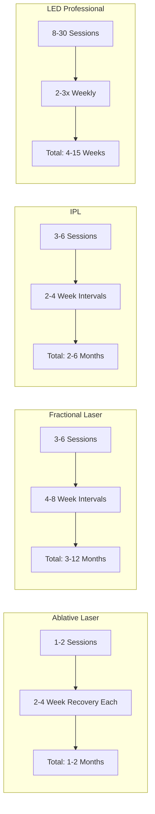
```mermaid
flowchart LR
    subgraph Ablative Laser
    A[1-2 Sessions] --> B[2-4 Week Recovery Each]
    B --> C[Total: 1-2 Months]
    end
    
    subgraph Fractional Laser
    D[3-6 Sessions] --> E[4-8 Week Intervals]
    E --> F[Total: 3-12 Months]
    end
    
    subgraph IPL
    G[3-6 Sessions] --> H[2-4 Week Intervals]
    H --> I[Total: 2-6 Months]
    end
    
    subgraph LED Professional
    J[8-30 Sessions] --> K[2-3x Weekly]
    K --> L[Total: 4-15 Weeks]
    end
```

### 6.4 Onset of Results and Duration of Treatment Benefits

The timeline for observable clinical improvements and the longevity of treatment results represent critical factors influencing patient satisfaction and treatment value. These parameters vary substantially across modalities based on their underlying mechanisms of action.

#### Immediate Versus Gradual Onset of Effects

**Ablative Laser Resurfacing**: Produces the most rapid visible changes, with immediate tissue effects visible following treatment. However, the true clinical result emerges only after the healing process completes—typically **2-4 weeks for CO2 lasers** and **3-5 days for Er:YAG lasers**[^6]. The final rejuvenation outcome continues to improve over **3-6 months** as collagen remodeling progresses.

**IPL Therapy**: Demonstrates a biphasic response pattern. For pigmented lesions, **immediate darkening occurs** followed by crusting and exfoliation over **7-14 days**[^56][^57]. For photorejuvenation, results are generally seen quickly but continue to evolve over several months as collagen production increases in deeper skin layers[^56]. The split-face trial demonstrated that **the greatest improvement was observed at 1 month** after the final treatment, with effects persisting through 9-month follow-up[^57].

**LED Phototherapy**: Requires the longest timeline for appreciable improvement due to its mechanism of cellular biostimulation rather than tissue destruction. Clinical evidence indicates that **most people notice improvements after 6-12 consistent sessions**[^65], with results continuing to develop over **8-16 weeks of consistent adherence**[^63]. The gradual nature of improvement reflects the biological timeline of collagen synthesis and dermal remodeling.

#### Duration of Treatment Benefits

The longevity of results varies considerably by modality and is influenced by patient lifestyle factors, particularly sun protection:

| Modality | Typical Result Duration | Maintenance Requirements | Key Factors |
|----------|------------------------|-------------------------|-------------|
| **Ablative CO2 Laser** | 5-10+ years | Minimal | Sun protection critical |
| **Fractional Laser** | 2-5 years | Periodic touch-ups | Sun protection, skincare |
| **Non-ablative Laser** | 3-5 years | Periodic treatments | Lifestyle choices |
| **IPL** | 6-12 months (pigmentation) | Maintenance sessions recommended | Sun protection essential |
| **LED** | Requires ongoing use | 2-3x weekly for maintenance | Consistent adherence |

For non-ablative laser treatment, **results may last 3-5 years** once the desired outcome is achieved, with longevity depending on healthy eating, exercise, and sun protection[^7]. The gradual improvement achieved through non-ablative approaches reflects the biological timeline of collagen synthesis.

**IPL results for pigmentation** may last from six months to a year depending on the condition treated, skin type, lifestyle, and skincare routine[^66]. To maintain results, daily sunscreen (SPF 30 or higher), sun avoidance, consistent skincare, and **maintenance IPL sessions as recommended** are essential[^66].

**LED therapy benefits** vary by individual, with many users noticing relief or improvement lasting from several days to a few weeks after treatment[^67]. To maintain results, **regular maintenance sessions are recommended, often multiple times per week initially**[^67]. This ongoing requirement distinguishes LED from other modalities but is offset by the treatment's convenience and safety.

#### Recurrence Patterns by Condition

For melasma specifically, recurrence patterns differ significantly across modalities and represent a critical consideration in treatment selection:

- **Q-switched laser**: 64-100% recurrence at 3 months; fastest recurrence among modalities[^61]
- **IPL**: Approximately 24% recurrence within 24 weeks; intermediate timeline[^61]
- **Non-ablative fractional laser**: Approximately 50% recurrence at 6 months; longest interval before recurrence[^61]

The review concludes that **non-ablative fractional laser treatment offers the most durable response** for melasma, with IPL showing intermediate durability and Q-switched lasers demonstrating the fastest recurrence[^61]. However, all modalities require ongoing maintenance strategies to prevent relapse.

### 6.5 Patient Comfort, Tolerability, and Adverse Event Profiles

Patient experience parameters including treatment-associated discomfort, recovery requirements, and adverse event profiles significantly influence treatment acceptability and selection. The comparative analysis reveals substantial differences across modalities that must be weighed against efficacy considerations.

#### Pain and Discomfort During Treatment

**Laser Treatments**: Pain levels vary considerably by laser type and treatment parameters. Ablative laser resurfacing typically requires **topical anesthesia or nerve blocks** due to significant discomfort during treatment. The randomized split-face trial comparing LPDL versus IPL found that **IPL treatment-associated pain scores (median 7-8) were significantly higher than LPDL (median 4.75-5.5)** (P<0.001)[^59]. This finding indicates that even among non-ablative approaches, significant pain variation exists.

**IPL Therapy**: The sensation during IPL treatment is commonly described as a **quick snap or flick, similar to a rubber band against the skin**, but is generally mild and tolerable[^66][^68]. Most patients experience minimal discomfort, and cooling methods are used to enhance comfort[^68]. However, pain levels vary by treatment area and parameters, with some patients withdrawing from studies due to treatment-related discomfort[^57].

**LED Phototherapy**: Offers the most favorable comfort profile, being described as **painless** with patients often experiencing only a **gentle warming sensation** during the procedure[^69]. The non-thermal nature of photobiomodulation means that LED therapy does not cause the tissue heating associated with laser and IPL treatments. Red light therapy is characterized as **non-invasive and painless, with no downtime or discomfort** during or after sessions[^67].

#### Recovery Time and Downtime Requirements

The recovery requirements following treatment represent one of the most significant practical differences among modalities:

| Modality | Typical Downtime | Return to Normal Activities | Key Recovery Considerations |
|----------|------------------|----------------------------|----------------------------|
| **Ablative CO2 Laser** | 2-4 weeks | 2-4 weeks | Extended erythema, wound care required |
| **Ablative Er:YAG Laser** | 3-5 days | 5-7 days | Shorter healing, less erythema |
| **Fractional CO2 Laser** | ~2 weeks | 1-2 weeks | Reduced versus non-fractional |
| **Non-ablative Laser** | 0-3 days | Immediate to 3 days | Minimal; makeup can often be applied immediately |
| **IPL** | Minimal | Immediate | Mild redness/swelling for hours to days |
| **LED** | None | Immediate | No recovery required |

**Ablative laser resurfacing** requires the most extensive recovery, with skin typically requiring **2-4 weeks to heal** following CO2 treatment[^6]. During this period, patients must follow strict wound care protocols and cannot engage in normal social or professional activities.

**IPL therapy** offers minimal downtime, with most clients able to **resume daily activities immediately** after treatment[^70]. Side effects including redness, swelling, and mild peeling typically resolve within days[^62].

**LED therapy** requires **no recovery time**, allowing patients to resume daily activities immediately after each session[^69][^67]. This characteristic makes LED uniquely suitable for patients who cannot tolerate any downtime.

#### Adverse Event Profiles

The safety profiles of light-based therapies differ substantially, with implications for patient selection and risk counseling:

**Laser Adverse Events**:
- **Ablative lasers**: Post-inflammatory hyperpigmentation, infection risk, delayed wound healing, potential scarring, prolonged erythema, milia formation, hypopigmentation[^6]
- **CO2 lasers specifically**: Higher rate of dyspigmentation compared with Er:YAG lasers[^6]
- **Q-switched lasers for melasma**: High incidence of PIH and hypopigmentation due to thermal effects[^61]

**IPL Adverse Events**:
Common temporary side effects include skin sensitivity, redness, and mild swelling[^70]. The split-face trial reported:
- Slight erythema and edema in all patients immediately after treatment
- Photo darkening of lentigines and freckles during the first week in all patients
- **One patient developed an atrophic scar** on the chin
- Three patients withdrew due to treatment-related pain
- No reported incidences of purpura or persistent pigmentary changes[^57]

**LED Adverse Events**:
LED therapy demonstrates the most favorable safety profile. The systematic review reported adverse events for skin rejuvenation studies as **none, no adverse events, or ocular symptoms in one study**[^6]. The controlled trial of polychromatic LED therapy reported **no severe adverse events** during the study or follow-up period, with only one volunteer noticing increased visibility of facial telangiectasia and another experiencing temporary reddening of old scar tissue[^58].

#### Fitzpatrick Skin Type Considerations

Safety profiles vary significantly by patient skin type, with darker skin types (Fitzpatrick IV-VI) at substantially elevated risk for adverse pigmentary outcomes:

| Modality | Risk in Skin Types I-III | Risk in Skin Types IV-VI | Key Considerations |
|----------|-------------------------|-------------------------|-------------------|
| **Ablative CO2 Laser** | Moderate | High | Er:YAG preferred for darker skin |
| **Q-switched Laser** | Low-Moderate | Moderate-High | 1064 nm safer than shorter wavelengths |
| **IPL** | Low | Moderate-High | Longer wavelength filters required |
| **LED** | Very Low | Very Low | NIR wavelengths preferred for darker skin |

For patients with **Fitzpatrick skin types IV-VI**, Er:YAG lasers are preferred over CO2 due to significantly lower dyspigmentation risk[^6]. IPL is **particularly challenging to use on dark-skinned individuals** as shorter wavelengths absorbed by melanin can lead to pigmentation changes[^70]. LED therapy, particularly with **near-infrared wavelengths (800-1000 nm)**, offers the safest option for darker skin types as longer wavelengths bypass epidermal melanin[^7].

### 6.6 Cost-Effectiveness and Economic Considerations

The economic dimensions of treatment selection encompass per-session costs, total treatment course investments, equipment considerations for practices, and long-term cost-effectiveness. These factors significantly influence treatment accessibility and value propositions for both patients and providers.

#### Per-Session Cost Comparison

Professional treatment costs vary substantially across modalities and geographic locations:

| Treatment Type | Per-Session Cost Range | Notes |
|---------------|----------------------|-------|
| **Laser Therapy (general)** | $50 - $150 | Class IV lasers cost more than LLLT[^69][^71] |
| **IPL Photofacial** | $300 - $700 (average); up to $700 - $1,200 | Varies by treatment area and provider[^70][^72] |
| **Professional Red Light Therapy** | $25 - $100 (basic); $75 - $125 (typical); $200 - $400 (medical-grade) | Varies by equipment quality[^63][^64][^73][^65][^67] |
| **Professional Blue Light Therapy** | $50 - $150 | For acne treatment[^62] |

**Laser therapy** sessions in the US typically cost between **$50 and $150 per session**, with several factors influencing cost including laser type (Class IV lasers penetrating deeper cost more), session duration (10-30 minutes), provider expertise, geographic location, and equipment quality[^69]. Package deals often reduce per-session costs, with 6-session packages ranging from $240-$600 ($40-$100 per session) and 12-session packages from $480-$1,200[^69].

**IPL treatment** costs demonstrate significant variability. The average cost of an IPL photofacial session ranges from **$300 to $600**, though costs can reach **$700 to $1,200 per session** depending on provider credentials, treatment area size, and geographic location[^70][^72]. IPL has a **79% Worth It Rating** on RealSelf with an average cost around $650[^70].

**Red light therapy** at clinics or spas costs between **$50 and $200 per session**, with most conditions requiring 2-3 sessions per week for 1-4 months[^64]. Medical-grade systems like the Contour Light System typically cost **$200-$400 per session** at med-spas and doctor's offices, though membership programs can reduce costs substantially[^67].

#### Total Treatment Course Investment

The cumulative cost of achieving optimal outcomes varies based on session requirements:

| Modality | Sessions Required | Per-Session Cost | Total Course Cost |
|----------|-------------------|------------------|-------------------|
| **IPL (full course)** | 3-6 sessions | $300-$700 | **$900 - $3,600** |
| **Professional LED (single condition)** | 12+ sessions | $50-$200 | **$600 - $7,300** |
| **Laser (package)** | 6-12 sessions | $40-$100 (package) | **$240 - $1,200** |

For IPL, investing in a **package typically offers 10-20% discount** compared to purchasing individual sessions[^72]. A series of 3-5 sessions spaced 4 weeks apart is typically required for optimal results[^72].

For red light therapy, the **minimum cost for one month's treatment (12 sessions) is $600** at $50 per session, while full-body treatment for 3 months can cost up to $7,300[^64]. For chronic conditions, lifetime costs can exceed $10,000[^64].

#### At-Home Device Economics

At-home devices present an alternative economic model with higher upfront investment but lower long-term costs:

| Device Type | Initial Investment | Ongoing Costs | Break-Even Point |
|-------------|-------------------|---------------|------------------|
| **At-home LED (basic)** | $200 - $600 | Minimal (electricity) | ~3-6 months of clinic visits |
| **At-home LED (professional-grade)** | $1,000 - $5,500 | Minimal | ~15 clinic sessions |
| **Diode Laser (clinic equipment)** | $15,000 - $200,000+ | Maintenance $2,000-$5,000/year | — |
| **IPL System (clinic equipment)** | $8,000 - $80,000 | Lamp replacement $800-$2,000 | — |

A home LED device requires a **one-time investment**; for instance, a MitoPRO+ panel costs $1,169, which roughly equates to approximately **15 clinic sessions** priced at $80 each[^63]. After the initial purchase, home sessions incur only minimal electricity costs[^63].

At-home red light therapy devices range from **$200-$600 for basic panels** to **$5,499 for full-body treatment systems**[^64]. Compared to clinical visits, at-home devices offer advantages in comfort, convenience, privacy, control over treatment intensity and frequency, and time savings[^64].

#### Cost-Effectiveness Analysis

When evaluating cost per outcome achieved, several considerations emerge:

**IPL Cost-Effectiveness**: Although the upfront expense may seem high, IPL treatment offers long-lasting results that **reduce the need for expensive follow-up sessions**[^68]. Because IPL consolidates multiple skin treatments on one platform, this option saves time and decreases cumulative costs of separate therapies[^68]. Compared to more invasive treatments such as laser resurfacing or surgical facelifts, **IPL is less expensive but effective**, with minimal downtime avoiding indirect costs of recovery[^68].

**LED Cost-Effectiveness**: Membership programs significantly improve LED therapy economics. One provider offers unlimited red light therapy membership for **$65 per month**, compared to $360 for eight individual sessions[^65]. For frequent users (2-30 times monthly), memberships provide substantial savings[^65].

**Laser Therapy Value Proposition**: A 2016 review noted that laser therapy may offer **minimal to no adverse effects, improved quality of life and functional status**, providing patients a non-invasive and cost-effective treatment option[^71]. For certain conditions, savings of **30% to 86%** compared to alternative treatments have been documented[^71].

#### Equipment Investment Comparison for Practices

For aesthetic practices evaluating technology investments:

| System Type | Entry-Level | Mid-Range | High-End |
|-------------|-------------|-----------|----------|
| **Laser Systems** | $15,000-$30,000 | $40,000-$80,000 | $100,000-$200,000+ |
| **IPL Systems** | $8,000-$15,000 | $20,000-$40,000 | $50,000-$80,000 |

**Return on investment analysis** shows laser systems generating monthly revenue potential of **$8,000-$15,000** with break-even timelines of 8-15 months and annual ROI of 200-400%[^74]. IPL systems generate monthly revenue potential of **$5,000-$10,000** with break-even timelines of 6-12 months and annual ROI of 150-300%[^74].

### 6.7 Optimal Treatment Selection Framework by Condition and Patient Profile

Synthesizing the comparative evidence into practical decision frameworks requires integration of multiple variables: condition type and severity, patient skin type, tolerance for downtime and discomfort, treatment goals, and economic constraints. The following frameworks provide structured approaches to treatment selection for common clinical scenarios.

#### Framework for Photoaging Treatment Selection

The selection of modality for photoaging should be guided primarily by **severity (Glogau classification)** and **patient tolerance for downtime**:

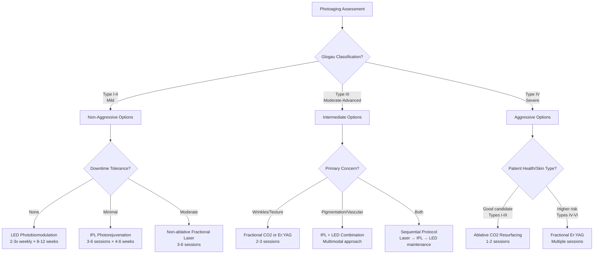
```mermaid
flowchart TD
    A[Photoaging Assessment] --> B{Glogau Classification?}
    B -->|Type I-II<br>Mild| C[Non-Aggressive Options]
    B -->|Type III<br>Moderate-Advanced| D[Intermediate Options]
    B -->|Type IV<br>Severe| E[Aggressive Options]
    
    C --> F{Downtime Tolerance?}
    F -->|None| G[LED Photobiomodulation<br>2-3x weekly × 8-12 weeks]
    F -->|Minimal| H[IPL Photorejuvenation<br>3-6 sessions × 4-6 weeks]
    F -->|Moderate| I[Non-ablative Fractional Laser<br>3-6 sessions]
    
    D --> J{Primary Concern?}
    J -->|Wrinkles/Texture| K[Fractional CO2 or Er:YAG<br>2-3 sessions]
    J -->|Pigmentation/Vascular| L[IPL + LED Combination<br>Multimodal approach]
    J -->|Both| M[Sequential Protocol<br>Laser → IPL → LED maintenance]
    
    E --> N{Patient Health/Skin Type?}
    N -->|Good candidate<br>Types I-III| O[Ablative CO2 Resurfacing<br>1-2 sessions]
    N -->|Higher risk<br>Types IV-VI| P[Fractional Er:YAG<br>Multiple sessions]
```

**For mild photoaging (Glogau I-II)**: LED photobiomodulation represents an excellent first-line option for patients seeking gradual improvement without downtime. IPL photorejuvenation offers faster results with minimal recovery for those willing to accept brief post-treatment effects. Non-ablative fractional lasers provide intermediate intensity.

**For moderate-advanced photoaging (Glogau III)**: Treatment selection should be guided by the primary concern. If wrinkles and texture predominate, fractional ablative approaches offer the best efficacy. If pigmentation and vascular changes are primary, IPL addresses these concerns effectively. Combination protocols utilizing multiple modalities often achieve the most comprehensive results.

**For severe photoaging (Glogau IV)**: Ablative CO2 resurfacing remains the gold standard for dramatic improvement, though patient selection must carefully consider skin type, health status, and ability to comply with extended recovery protocols. For patients with darker skin types or those unable to tolerate extended downtime, fractional Er:YAG offers a safer alternative with good efficacy.

#### Framework for Pigmentation Treatment Selection

Pigmentation treatment selection must integrate **lesion type, depth, skin type, and PIH risk**:

| Clinical Scenario | First-Line Recommendation | Alternative Options | Key Considerations |
|-------------------|--------------------------|--------------------|--------------------|
| **Solar lentigines, Fitzpatrick I-III** | IPL (74.6-90% success) | Picosecond laser, Q-switched laser | IPL offers excellent efficacy with minimal downtime |
| **Solar lentigines, Fitzpatrick IV-VI** | Q-switched Nd:YAG 1064 nm | Picosecond 1064 nm | Longer wavelengths minimize PIH risk |
| **Epidermal melasma, lighter skin** | IPL + topical combination | Picosecond 1064 nm | Combination therapy superior to monotherapy |
| **Dermal/mixed melasma** | Low-fluence Q-switched Nd:YAG or NAFL | Picosecond 1064 nm, LED (NIR) | Expect multiple sessions; high recurrence |
| **Melasma, darker skin types** | Picosecond Nd:YAG 1064 nm | LED (940 nm NIR) | Avoid shorter wavelengths; PIH risk significant |
| **Post-inflammatory hyperpigmentation** | LED (NIR) + topicals | Low-fluence laser with caution | Prioritize safety over speed |

**For benign pigmented lesions**: IPL demonstrates consistently high efficacy (74.6-90%) and represents the first-line option for lighter skin types. For darker skin types, Q-switched or picosecond lasers at 1064 nm provide effective treatment with acceptable safety profiles.

**For melasma**: The evidence strongly supports combination therapy over monotherapy. IPL combined with topical agents achieves MASI reductions up to 93.8% compared to 62.5% with IPL alone[^61]. Picosecond Nd:YAG 1064 nm demonstrated superior efficacy (35.9% MASI improvement) compared to shorter wavelengths in randomized trials[^7]. LED therapy with near-infrared wavelengths offers a gentler option with lower PIH risk, particularly valuable for maintenance or in PIH-prone patients.

#### Framework for Skin Type-Based Selection

Fitzpatrick skin type represents a critical variable influencing both efficacy and safety:

| Fitzpatrick Type | Preferred Modalities | Modalities Requiring Caution | Contraindicated/High-Risk |
|------------------|---------------------|-----------------------------|-----------------------------|
| **Types I-II** | All modalities appropriate | — | — |
| **Type III** | IPL, LED, most lasers | Ablative CO2 (moderate caution) | — |
| **Type IV** | LED (NIR), Nd:YAG 1064 nm, Picosecond 1064 nm | IPL (requires parameter modification) | Short-wavelength lasers, aggressive IPL |
| **Types V-VI** | LED (NIR), Nd:YAG 1064 nm | Q-switched lasers (careful parameters) | IPL, short-wavelength lasers, ablative CO2 |

**For lighter skin types (I-III)**: The full range of modalities is available, with selection based on condition characteristics, desired outcomes, and practical considerations.

**For darker skin types (IV-VI)**: Treatment selection must prioritize safety, favoring longer wavelengths that bypass epidermal melanin. LED therapy with near-infrared wavelengths offers the safest option. When laser treatment is indicated, 1064 nm Nd:YAG or picosecond lasers with appropriate parameter modifications provide acceptable safety profiles. IPL requires significant parameter adjustment and carries elevated risk.

#### Combination and Sequential Protocol Recommendations

The evidence supports multimodal approaches for comprehensive treatment of complex presentations:

**Photorejuvenation Protocol**:
1. **Initial phase**: IPL for pigmentation and vascular correction (3-6 sessions)
2. **Enhancement phase**: Fractional laser for texture and wrinkle improvement (2-3 sessions)
3. **Maintenance phase**: LED photobiomodulation (2-3x weekly ongoing) + periodic IPL

**Melasma Management Protocol**:
1. **Pre-treatment**: Topical tyrosinase inhibitors for 2-6 weeks
2. **Active treatment**: Picosecond 1064 nm or low-fluence Q-switched Nd:YAG (3-6 sessions)
3. **Post-treatment**: Immediate topical corticosteroids + tyrosinase inhibitors
4. **Maintenance**: LED (NIR) therapy + ongoing topical agents + strict sun protection

**Post-Procedural Enhancement**:
Following aggressive laser treatments, LED photobiomodulation can accelerate healing, reduce erythema duration, and potentially decrease PIH risk through its anti-inflammatory and wound healing enhancement properties.

#### Decision Algorithm Summary

The following comprehensive algorithm integrates all key decision variables:

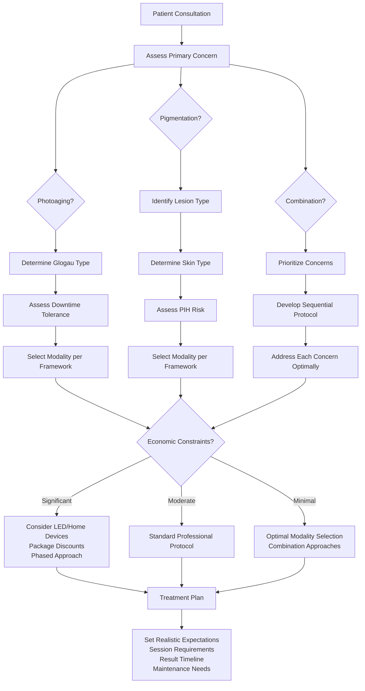
```mermaid
flowchart TD
    A[Patient Consultation] --> B[Assess Primary Concern]
    B --> C{Photoaging?}
    B --> D{Pigmentation?}
    B --> E{Combination?}
    
    C --> F[Determine Glogau Type]
    F --> G[Assess Downtime Tolerance]
    G --> H[Select Modality per Framework]
    
    D --> I[Identify Lesion Type]
    I --> J[Determine Skin Type]
    J --> K[Assess PIH Risk]
    K --> L[Select Modality per Framework]
    
    E --> M[Prioritize Concerns]
    M --> N[Develop Sequential Protocol]
    N --> O[Address Each Concern Optimally]
    
    H --> P{Economic Constraints?}
    L --> P
    O --> P
    
    P -->|Significant| Q[Consider LED/Home Devices<br>Package Discounts<br>Phased Approach]
    P -->|Moderate| R[Standard Professional Protocol]
    P -->|Minimal| S[Optimal Modality Selection<br>Combination Approaches]
    
    Q --> T[Treatment Plan]
    R --> T
    S --> T
    
    T --> U[Set Realistic Expectations<br>Session Requirements<br>Result Timeline<br>Maintenance Needs]
```

In conclusion, the comparative analysis reveals that **optimal treatment selection requires individualized assessment** integrating condition characteristics, patient factors, and practical constraints. No single modality represents the universally superior choice; rather, each technology offers distinct advantages that must be matched to specific clinical scenarios. **Laser technologies provide the most dramatic results** for severe photoaging and resistant pigmentation but require careful patient selection and carry higher adverse event risks. **IPL offers excellent versatility** for comprehensive photorejuvenation with moderate recovery requirements. **LED photobiomodulation provides the safest option** with the most favorable comfort profile, though requiring extended treatment courses for optimal outcomes. The integration of multiple modalities through combination and sequential protocols often achieves the most comprehensive results, particularly for complex presentations involving multiple photoaging manifestations or treatment-resistant conditions.

## 7 Safety Profiles, Contraindications, and Risk Management

The therapeutic efficacy of light-based aesthetic treatments must be balanced against their potential for adverse outcomes, making comprehensive safety assessment an essential component of clinical practice. Building upon the mechanistic foundations established in preceding chapters—where selective photothermolysis and photobiomodulation govern tissue interactions—this chapter systematically examines the safety considerations that determine appropriate patient selection, treatment parameters, and risk mitigation strategies across laser, IPL, and LED modalities. The analysis recognizes that **complications can be classified as operator-dependent (faulty parameters, poor technique) or patient-dependent (skin type, hormonal status, inadequate sunscreen)**, with both categories requiring systematic attention to minimize adverse outcomes[^75]. By integrating evidence from clinical trials, registry studies, and expert consensus guidelines, this chapter provides the analytical framework necessary for clinicians to maximize therapeutic benefits while appropriately managing risks across diverse patient populations and clinical presentations.

### 7.1 Adverse Event Classification and Incidence Across Light-Based Modalities

A systematic approach to adverse event classification enables clinicians to anticipate, prevent, and manage complications effectively. The temporal classification framework proposed in the literature categorizes complications as **immediate (up to 7 days), transient (1-6 weeks), and persistent (after 6 weeks)**[^75], providing a practical structure for patient counseling and follow-up scheduling. This framework acknowledges that many post-treatment effects represent expected sequelae rather than true complications requiring intervention, while establishing clear timelines for when persistent changes warrant concern.

#### Temporal Classification and Expected Sequelae

Understanding the distinction between expected post-treatment effects and true adverse events is fundamental to appropriate clinical management. Following light-based treatments, patients commonly experience predictable tissue responses that reflect the therapeutic mechanism rather than treatment failure or complication.

| Temporal Category | Duration | Expected Sequelae | True Adverse Events |
|-------------------|----------|-------------------|---------------------|
| **Immediate** | 0-7 days | Erythema, mild edema, warmth, treatment-site sensitivity | Blistering, severe burns, immediate allergic reactions |
| **Transient** | 1-6 weeks | Crusting, peeling, temporary pigment darkening, mild PIH | Infection, prolonged erythema, significant blistering |
| **Persistent** | >6 weeks | Gradual improvement continuing | Scarring, permanent dyspigmentation, textural changes |

For **IPL treatments**, expected post-treatment effects include appearing "sunburned" or very red immediately after treatment, with this fading over hours to days[^76]. Over 2-3 weeks, darkening of brown spots, purplish/black pigment, and crusting may all occur as part of normal post-treatment healing[^76]. These predictable responses reflect the selective photothermolysis mechanism targeting melanin and should be distinguished from complications requiring intervention.

**LED phototherapy** demonstrates a fundamentally different adverse event profile due to its non-ablative, non-thermal mechanism. When used alone without topical photosensitizers, **LEDs are nonablative and nonthermal and do not cause damage to the epidermis or dermal tissue**[^77]. Clinical studies consistently report that patients do not experience redness, peeling, blistering, swelling, or pain with LED monotherapy[^77][^78]. In acne treatment studies using 415nm blue light, adverse events were mild and transient, including only mild erythema, skin dryness, and pruritis[^77][^78].

#### Modality-Specific Adverse Event Profiles

The adverse event profiles differ substantially across light-based modalities, reflecting their distinct mechanisms of tissue interaction:

**Laser Complications** vary by laser type but commonly include pain, erythema, edema, crusting, and the potential for more serious complications. For **laser hair reduction**, documented complications include pain, edema, crusting, burning sensations, blistering, folliculitis, acneform eruptions (occurring in **6% of patients**), post-inflammatory hyperpigmentation, hypopigmentation, paradoxical hypertrichosis (**0.6-10% of patients**, more common after IPL), leukotrichia, and ocular injury[^75].

**Pigment laser complications** (e.g., Q-switched Nd:YAG) include pain, erythema, edema, blistering, acute compartment syndrome, allergic reactions (eczematous reactions, urticaria, anaphylaxis), and hypertrophic scars (**0.28% in one study**)[^75]. **Ablative and fractional resurfacing laser** complications include reactivation of herpes simplex virus, prolonged redness, post-inflammatory hyperpigmentation (**26-36% of patients**), and scarring[^75].

**Vascular laser complications** (e.g., pulsed dye laser) include purpura, edema, crusting, textural changes, pyogenic granulomas, and "laser imprints" (atrophic scars)[^75]. The incidence of purpura with PDL can reach **up to 10% of patients**, though this typically resolves spontaneously[^79].

**IPL adverse events** demonstrate a more moderate profile. A comparative study of PDL, IPL, and radiofrequency for erythematotelangiectatic rosacea found significant differences in adverse event incidence: **100% for the PDL group, 27.5% for the IPL group, and 5% for the RF group** (P<0.001)[^80]. The PDL group exhibited higher rates of transient purpura and erythema/edema, which were self-limiting[^80]. Average treatment-related pain scores were **5.03±0.83 for PDL, 1.02±0.89 for IPL, and 0.38±0.54 for RF** (P<0.001)[^80].

A comparison of PDL, narrow-band IPL (NB-IPL), and broad-band IPL (BB-IPL) for rosacea treatment revealed that **pigmentation changes were more frequent in the BB-IPL group (21.05%, n=8) compared to the NB-IPL group (2.63%, n=1)**, with borderline statistical significance (P=0.050)[^81]. The incidence of blistering was **10.53% (n=4) in the BB-IPL group** compared to 2.78% (n=1) in the PDL group and 2.63% (n=1) in the NB-IPL group[^81]. PDL presented fewer adverse effects overall, while NB-IPL demonstrated superior efficacy in erythema reduction[^81].

#### Parameter Influence on Adverse Event Likelihood

Treatment parameters significantly influence adverse event probability across all modalities. Key parameter relationships include:

**Fluence**: Burns can result from excessive fluence, with the risk higher for continuous-beam lasers compared to pulsed or fractionated ones[^82]. An indication of excessive fluence during non-ablative vascular treatments, particularly pulsed-dye therapy, is **graying of the tissue**; the procedure should then be stopped[^82].

**Pulse Duration**: Long pulse durations increase thermal damage risk. Multi-pass treatment with extended pulse width (40 ms) may be effective without producing purpura for PDL treatments[^83].

**Cooling**: Cold air cooling can be useful to reduce the incidence of side effects and improve patient satisfaction in facial telangiectasia treatment[^83]. Proper cooling availability before, during, and after procedures is essential to avoid side effects[^83].

For **fractional CO2 laser** treatment of hypertrophic scars, a multicenter cohort study reported adverse effects in **28% of high-energy patients versus 9% in the low-energy group**[^84]. High-energy settings demonstrated superior short-term clinical efficacy but were offset by increased risk of prolonged post-treatment erythema, edema, pain, and post-inflammatory hyperpigmentation, especially in patients with Fitzpatrick skin types IV-VI[^84].

### 7.2 Dyspigmentation Complications: Hyperpigmentation and Hypopigmentation Risk Factors

Dyspigmentation represents the most clinically significant category of adverse events in light-based aesthetic treatments, encompassing both hyperpigmentation and hypopigmentation. These complications can significantly impact patient satisfaction and quality of life, making their prevention and management critical priorities in clinical practice. **Dyspigmentation, including hyper- and hypopigmentation, is a frequent complication**, with hyperpigmentation occurring more commonly[^82].

#### Post-Inflammatory Hyperpigmentation: Pathophysiology and Incidence

Post-inflammatory hyperpigmentation (PIH) develops when light-induced tissue injury triggers melanocyte activation and excessive melanin production. The pathophysiology involves inflammatory mediator release, melanocyte stimulation, and subsequent melanin deposition in either the epidermis (brown discoloration) or dermis (blue-gray hue due to the Tyndall effect).

**Incidence rates vary substantially by modality and skin type**:

| Modality | PIH Incidence | Key Risk Factors |
|----------|---------------|------------------|
| **Ablative/Fractional Resurfacing Lasers** | 26-36% | Darker skin types, aggressive parameters |
| **High-Energy Fractional CO2** | 28% adverse effects overall | Fitzpatrick IV-VI, high fluence |
| **Low-Energy Fractional CO2** | 9% adverse effects overall | Conservative approach reduces risk |
| **Q-switched Lasers for Melasma** | Variable, often high | Thermal damage to surrounding tissue |
| **BB-IPL** | 21.05% pigmentation changes | Higher energy density requirements |
| **NB-IPL** | 2.63% pigmentation changes | More controlled wavelength delivery |

The **risk is highest in darker-skinned (Fitzpatrick skin type III-VI) or excessively tan individuals**[^82]. This elevated risk reflects the higher baseline melanin content and more reactive melanocytes characteristic of darker skin types. The thermal effect associated with Q-switched delivery can cause damage and inflammation to surrounding tissues, potentially resulting in a **high incidence of side effects such as post-inflammatory hyperpigmentation (PIH) and hypopigmentation**[^85].

For **LED therapy**, the safety profile regarding PIH is substantially more favorable. However, dose-dependent effects have been observed. In the STARS 1 trial evaluating high-fluence LED-red light, **hyperpigmentation occurred in 33.3% of subjects in the LED-RL group at 320 J/cm²**, though this resolved within three months after the last treatment[^86]. Hyperpigmentation was **clinically more prominent in darker skin**[^86].

#### Hypopigmentation: Delayed Presentation and Treatment Challenges

Hypopigmentation represents a more challenging complication than hyperpigmentation due to its **delayed presentation, potential permanence, and limited treatment options**. While hyperpigmentation typically lasts no longer than three to four months and responds to topical treatments, hypopigmentation is rarer, can be delayed, and is more difficult to treat[^82].

**Hypopigmentation may be caused by excessive fluence or too many treatments**[^82]. The mechanism involves thermal destruction of melanocytes, which may not regenerate adequately. For IPL treatments, hypopigmentation may be permanent as a result of thermal destruction of melanocytes[^83].

Treatment options for hypopigmentation are limited and include topical tacrolimus or 65% trichloroacetic acid[^75], though outcomes are often unsatisfactory. Prevention through appropriate patient selection and conservative parameter settings remains the primary strategy.

#### Fitzpatrick Skin Type as Primary Risk Determinant

The Fitzpatrick classification system serves as the primary tool for predicting dyspigmentation risk, with **skin types IV-VI demonstrating substantially elevated susceptibility** to adverse pigmentary outcomes.

| Fitzpatrick Type | PIH Risk Level | Hypopigmentation Risk | Key Considerations |
|------------------|----------------|----------------------|---------------------|
| **Types I-II** | Low | Low | Standard parameters generally safe |
| **Type III** | Moderate | Low-Moderate | Sun avoidance critical pre/post treatment |
| **Type IV** | Elevated | Moderate | Parameter modification required |
| **Types V-VI** | High | Elevated | Longer wavelengths essential; conservative approach |

**Individuals with Fitzpatrick skin types IV-VI (the three darkest skin tones) may be more susceptible to pigmentation changes under the influence of light**[^87]. Emerging reports suggest that these individuals may be more prone to post-inflammatory hyperpigmentation or uneven skin tone after repeated light therapy use[^87].

#### Prevention and Management Strategies

**Prevention strategies** for dyspigmentation include:

1. **Parameter optimization**: Using lower fluences, longer pulse durations, and longer wavelengths for darker skin types
2. **Sun avoidance**: Avoiding sun exposure before and after treatment and using fractionated lasers or cooling devices[^82]
3. **Pre-treatment preparation**: Priming with topical lightening agents and sunscreens should begin 3-4 weeks prior to ablative fractional CO2 laser treatment for pigmented scars[^88]
4. **Adjuvant therapies**: Chemical peels and low-fluence Q-switched Nd:YAG laser toning can reduce photodamage and pigment at the scar base[^88]

**Management of established hyperpigmentation** includes:
- **Topical hydroquinone (4%)**: Standard first-line treatment[^82]
- **Kojic acid or glycolic acid creams**: Alternative or adjunctive agents[^75]
- **Strict sunscreen use**: Essential throughout treatment course
- **Topical corticosteroids**: For early intervention in laser burns[^75]

For **post-procedural PIH prevention**, combination LED therapy (red light at 633 nm and near-infrared at 830 nm) has demonstrated capacity to result in fewer incidences of post-inflammatory hyperpigmentation compared to control groups. Post-procedural delivery of vitamin C, antioxidants, and platelet-rich plasma (PRP) facilitates better healing[^88].

### 7.3 Thermal Injury, Scarring, and Rare Adverse Events

While dyspigmentation represents the most common complication category, thermal injury, scarring, and rare adverse events constitute the most serious potential outcomes of light-based treatments. Understanding the risk factors for these complications enables appropriate prevention strategies and timely intervention when they occur.

#### Thermal Injury and Burns

**Burns can result from long pulse durations, excessive fluence, and improper cooling**[^82]. The mechanism involves excessive thermal energy accumulation in tissue, exceeding the capacity for heat dissipation and causing uncontrolled tissue damage beyond the intended target.

Risk factors for thermal injury include:
- **Continuous-beam versus pulsed lasers**: The risk is higher for continuous-beam lasers compared to pulsed or fractionated ones[^82]
- **Inadequate cooling**: Proper cooling must be available before, during, and after the procedure[^83]
- **Parameter errors**: Excessive fluence or inappropriate pulse duration selection
- **Overlapping treatment areas**: Avoiding excessive overlap prevents cumulative thermal damage

**Nd:YAG lasers penetrate deeper than PDL with a higher potential for destroying tissue** due to higher amounts of energy and heat[^83]. This deeper penetration necessitates particular attention to cooling and parameter selection.

**Management of thermal injury** requires early intervention:
- **Laser burns should be treated early with a moderate potency topical steroid**[^75]
- Immediate cooling compresses
- Topical emollients for mild burns
- Topical antibiotics if infection risk is present
- **Urgent care for significant blistering, peeling, signs of infection, or severe pain lasting more than 48 hours**[^89]

#### Scarring Risk Factors and Prevention

**Scarring can result from burns, abnormal healing, or infections**[^82]. The risk varies by treatment location and patient factors:

- **The risk is higher on the neck than on the face**[^82]
- History of keloid formation significantly elevates risk
- Aggressive parameters increase complication risk[^75]
- Infection during healing can lead to scarring

For **fractional CO2 laser** treatment, histological analyses show that high-energy treatments generate deeper columns of coagulative necrosis, reaching the mid to deep reticular dermis, which correlates with increased neocollagenesis but also **prolonged dermal inflammation**[^84]. This prolonged inflammation increases scarring risk, particularly in susceptible patients.

**Prevention strategies** include:
- Proper technique and conservative settings[^82]
- Adequate cooling protocols
- Appropriate patient selection (avoiding those with keloid history)
- Eliciting history of oral isotretinoin use, which should be discontinued 6-12 months prior due to historic reports of keloid formation with ablative procedures[^88]
- Post-procedural care with emollients, sunscreens, and prophylactic antivirals or antibiotics when indicated[^88]

**Management of hypertrophic scars** includes intralesional triamcinolone acetonide injection[^75].

#### Rare Adverse Events

Several rare but significant adverse events require awareness for appropriate prevention and management:

**Paradoxical Hypertrichosis**: This counterintuitive complication involves increased hair growth in treated areas rather than the expected reduction. Incidence ranges from **0.6-10% of patients, more common after intense pulsed light** than laser[^75]. Treatment involves using a higher fluence in subsequent sessions[^75].

**Allergic Reactions**: Pigment laser treatment can trigger eczematous reactions, urticaria, and rarely anaphylaxis[^75]. These reactions may be related to tattoo ink components or other factors.

**Infection**: Infection is common, especially after ablative resurfacing[^82]. **Herpes simplex virus (HSV) reactivation is frequently seen, particularly after perioral resurfacing**, suggesting antiviral prophylaxis (e.g., valacyclovir for 7-14 days) is indicated[^82]. Bacterial infections (e.g., *Staphylococcus aureus*, *Pseudomonas aeruginosa*) and candidal infections can also occur[^82]. Antiviral prophylaxis with valacyclovir is mandatory for at-risk patients undergoing ablative procedures[^75].

**Ocular Injury**: **Ocular injury can occur to patients and personnel from direct or reflected laser beams**[^82]. Ablative lasers (e.g., CO2) can damage the cornea, while vascular and pigment lasers (e.g., Nd:YAG) can cause retinal damage[^82]. All parties must wear wavelength-specific eye protection, and laser eye injuries are emergencies that can cause permanent blindness[^82].

**Acneform Eruptions**: These occur in approximately **6% of patients** following laser hair reduction and may be treated with oral doxycycline[^75].

### 7.4 Fitzpatrick Skin Type-Based Contraindications and Parameter Modifications

The Fitzpatrick skin phototype classification system serves as the cornerstone for risk stratification and parameter optimization in light-based aesthetic treatments. **The Indian skin, ranging from type IV to VI on the Fitzpatrick scale with its high melanin content, is more prone to injury**[^75], exemplifying the critical importance of skin type assessment in treatment planning.

#### Pathophysiological Basis for Increased Risk in Darker Skin Types

The elevated risk in darker skin types stems from the fundamental physics of light-tissue interaction. **Epidermal melanin acts as a competing chromophore**, absorbing light energy intended for deeper targets. This competing absorption produces two adverse consequences: first, reduced energy delivery to the intended target (decreased efficacy); second, thermal injury to the melanin-rich epidermis (increased adverse events).

For **LED therapy**, clinical trials have established differential maximum tolerated doses by skin type. In the STARS 1 trial, **dose-limiting adverse events (including blistering and prolonged erythema) occurred at 480 J/cm² in one African American subject**[^86]. Consequently, **320 J/cm² was determined to be the maximum tolerated dose for all races and ethnicities**[^86]. In the STARS 2 trial enrolling only non-Hispanic Caucasian subjects, dose-limiting adverse events occurred at 640 J/cm², establishing **480 J/cm² as the maximum tolerated dose for non-Hispanic Caucasian individuals**[^86].

These findings demonstrate that **LED-RL may exert differential cutaneous effects depending on race and ethnicity, with darker skin being more photosensitive**[^86]. The maximum safe fluence for skin of color is **320 J/cm²**, while for non-Hispanic Caucasian individuals it is **480 J/cm²**[^90].

#### Wavelength Selection by Skin Type

Wavelength selection represents the primary parameter adjustment for treating darker skin types safely:

| Skin Type | Recommended Wavelengths | Wavelengths to Avoid | Rationale |
|-----------|------------------------|---------------------|-----------|
| **Types I-III** | Full range available | None specifically | Low competing melanin |
| **Type IV** | 1064 nm preferred; 755 nm with caution | 532 nm, 694 nm | Moderate competing melanin |
| **Types V-VI** | 1064 nm strongly preferred | 532 nm, 694 nm, 755 nm | High competing melanin |

**Nd:YAG lasers have the lowest risk of dyspigmentation for dark-skinned patients**[^82]. The longer 1064 nm wavelength demonstrates reduced epidermal melanin absorption while maintaining adequate penetration to reach dermal targets.

For **IPL treatments**, the wavelength considerations are particularly critical. **IPL treatment is limited to individuals over 18 years of age. For hair reduction, treatment is only applicable for Fitzpatrick skin types 1-5. Advanced treatments are for Fitzpatrick scale 1-3, moving to type 4 only if the practitioner is experienced**[^91]. **Very dark skin types are listed as absolute contraindications** for certain IPL applications[^92].

#### Parameter Modifications for Darker Skin Types

Beyond wavelength selection, multiple parameter adjustments optimize safety in darker skin types:

**Fluence Reduction**: Lower energy settings limit heat buildup in the melanin-rich epidermis. For fractional CO2 laser treatment, low-energy settings (≤20 mJ/MTZ) were associated with **fewer adverse effects** compared to high-energy settings (≥30 mJ/MTZ)[^84].

**Extended Pulse Duration**: Longer pulse durations allow epidermal cooling between energy delivery, reducing cumulative thermal injury. For IPL, **20-40 ms delay times are advised for patients with darker skin types** to accommodate longer epidermal thermal relaxation times.

**Enhanced Cooling**: Pre-, intra-, and post-treatment cooling provides additional epidermal protection. **Always make sure that proper cooling is available before, during, and after the procedure to avoid side effects**[^83].

**Treatment Interval Extension**: Extended intervals between sessions (4-6 weeks rather than 2-4 weeks) allow assessment of delayed pigmentary responses that may not be apparent immediately.

**Conservative Approach**: Expert consensus and guidelines recommend **starting with lower energy in darker skin types or facial scars, with gradual escalation**[^84]. The individualized approach must consider anatomical location, scar maturity, prior treatments, and skin type to optimize therapeutic outcomes while minimizing treatment-related risks[^84].

#### IPL-Specific Considerations for Darker Skin Types

IPL presents particular challenges for darker skin types due to its broad-spectrum output. **IPL is particularly challenging to use on dark-skinned individuals**, as shorter wavelengths are absorbed by melanin and can lead to pigmentation changes[^83].

Precautions for IPL treatment in Fitzpatrick types IV-V include:
1. **Patch testing on facial skin** before full treatment[^91]
2. **Lower energy settings** to limit heat buildup
3. **Specialized filters** to narrow the wavelength range (615 nm or higher)
4. **Enhanced patient education** about risks

For patients in whom IPL is not ideal due to skin type considerations, **alternative treatments such as chemical peels, microneedling, or tailored laser options** may be recommended.

### 7.5 Medical Condition Contraindications and Disease-Related Considerations

Comprehensive patient assessment must identify medical conditions that contraindicate light-based treatments or require special precautions. These contraindications reflect the potential for treatment to exacerbate underlying disease, cause systemic complications, or produce unacceptable adverse outcomes.

#### Absolute Contraindications

Certain conditions represent absolute contraindications where treatment must not proceed:

**Photosensitive Disorders**: Diseases characterized by abnormal light sensitivity pose significant risks. **Photosensitivity is a condition where the skin has an abnormally high sensitivity to light**[^93]. Conditions including **lupus, rosacea, porphyria, polymorphous light eruption, and vitiligo** are examples of photosensitive diseases that contraindicate phototherapy[^94].

Research demonstrates the severity of this risk: **A clinical study analyzing 100 lupus patients found that 93% showed abnormal reactions to UV AND visible light**[^87]. Another photobiological study confirmed that **all visible light can trigger lesion formation in lupus patients**[^87]. The International Porphyria Network warns that **patients with cutaneous porphyrias experience rapid, painful skin reactions from visible light exposure**[^87].

**Active Malignancy**: **If you have active cancer or a history of skin cancer, you should not use LED therapy devices**[^93]. For IPL, **cancer, specifically if a patient is undergoing Radiation or Chemotherapy due to a weakened immune system**, is an absolute contraindication, and **patients must be 6 months in remission** before treatment[^91].

**Epilepsy**: The light/flash from IPL and laser devices can potentially trigger seizures. **Epilepsy, as the light/flash can trigger a fit**, is listed as an absolute contraindication[^91]. Diseases that may be stimulated by light include **Lupus, Porphyria, Dermatomysositis and Epilepsy**[^76].

**Autoimmune Conditions**: **Autoimmune diseases such as Lupus, Multiple Sclerosis, Vitiligo, and Psoriasis** contraindicate treatment because the immune system is compromised and IPL can cause koebnerization, making the condition worse[^91].

The following table summarizes absolute contraindications across modalities:

| Condition | Rationale | All Modalities Affected |
|-----------|-----------|------------------------|
| **Porphyria** | Allergy to light; rapid painful skin reactions | Yes |
| **Lupus (SLE)** | 93% show abnormal reactions to visible light | Yes |
| **Active Cancer/Radiation/Chemotherapy** | Compromised immune system; healing impairment | Yes |
| **Epilepsy** | Light can trigger seizures | IPL, Laser (LED unclear) |
| **Active Skin Infection** | Risk of spread and aggravation | Yes |
| **History of Keloid Scarring** | Risk of additional scarring | Ablative procedures |

#### Relative Contraindications Requiring Assessment

Several conditions require careful evaluation and potentially modified treatment approaches:

**Diabetes**: Listed as a contraindication due to **compromised healing and heightened sensitivity**[^91]. Diabetic patients may experience delayed wound healing and increased infection risk following ablative procedures.

**Cardiovascular Conditions**: **Heart Conditions, including those with a Pacemaker**, contraindicate treatment because electromagnetic energy can interact with cardiac devices[^91]. Patients with **high/low blood pressure** require careful management as they can become lightheaded, requiring more time post-treatment[^91].

**Bleeding Disorders and Anticoagulation**: **Bleeding or凝血 disorders and anticoagulation treatment** require careful consideration due to increased bruising and bleeding risk[^95].

**Kidney or Liver Disease**: These conditions are listed as absolute contraindications for IPL **due to compromised healing and risk of pigmentation**[^91].

**Hepatitis/HIV/AIDS**: Listed as contraindications **because of a compromised immune system and healing**, though written medical consent and full PPE may allow proceeding in some cases[^91].

#### Pregnancy and Lactation Considerations

**Currently, there is not enough dedicated scientific research to confirm that LED light therapy is completely safe for use during pregnancy or while breastfeeding**[^93]. Because of this lack of data, **the general recommendation from the medical community is to avoid use** during pregnancy and lactation[^93].

For IPL, **pregnancy or breastfeeding** is listed as a contraindication[^76]. The absence of definitive safety data necessitates a conservative approach, with treatment deferred until after pregnancy and lactation are complete.

#### Condition-Specific Treatment Area Restrictions

Certain anatomical areas require avoidance or special precautions regardless of patient health status:

**Areas requiring extreme caution or avoidance**:
- Below the eyebrow or within the bony orbit of the eye
- Over moles
- Red part of the lip or vermillion border
- Open wounds or incisions
- Over or around unsightly vessels on hypertrophic or keloid scars
- Over tattoos or semi-permanent makeup
- Inside the nose, mouth, or ear canal
- Over the areola
- External genitalia and genital/labial mucosa[^95]

**Moles, hyperpigmentation, hypopigmentation, and birthmarks should be avoided or covered with a white pencil** due to the risk of causing cell changes and the presence of conflicting chromophores[^91].

### 7.6 Medication-Induced Photosensitivity and Drug Interaction Management

Medication history represents a critical component of pre-treatment screening, as numerous drugs can induce photosensitivity that dramatically increases adverse event risk. **Certain prescription and over-the-counter drugs can increase your skin's sensitivity to light, a side effect known as drug-induced photosensitivity**[^93]. Using light-based treatments while taking these medications could make skin more vulnerable to reactions.

#### Categories of Photosensitizing Medications

**Antibiotics**: Particularly tetracyclines and fluoroquinolones represent significant photosensitizers. **Antibiotics such as tetracycline or doxycycline** are commonly cited examples[^87]. Oral antibiotics including **DOXYCYCLINE, MINOCYCLINE, ERYTHROMYCIN, CIPROFLOXACIN, LEVOFLOXACIN, DAPSONE, BACTRIM** require discontinuation at least 2 weeks prior to IPL treatment[^76].

**Retinoids**: Both oral and topical retinoids significantly increase photosensitivity. **Retinoids (including oral acne medications like isotretinoin and topical treatments like tretinoin)** are important photosensitizers[^93]. **Recent or current use of ISOTRETINOIN (e.g., ACCUTANE) within the last 6 months** is a contraindication for IPL[^76]. Patients should **discontinue use of all tretinoin and OTC retinol products for 2 weeks** before treatment[^76].

**Psychiatric Medications**: **Psychiatric medications like lithium or certain antipsychotics** can cause photosensitization[^87].

**Cardiovascular Medications**: **Some diuretics, blood pressure medications** including hydrochlorothiazide, and **thiazide diuretics** are photosensitizing[^93][^94].

**NSAIDs**: **Non-steroidal anti-inflammatory drugs (NSAIDs)** including aspirin, ibuprofen, and related medications can increase photosensitivity[^93][^76].

**Herbal Supplements**: **St. John's Wort** is a significant photosensitizer requiring **3 months of discontinued use** before IPL treatment[^91]. **Homeopathic, Chinese, or herbal remedies require discontinuation for 6 weeks**[^91].

#### Evidence-Based Waiting Periods

The following table summarizes recommended waiting periods following medication discontinuation:

| Medication Category | Specific Examples | Waiting Period | Reference |
|--------------------|-------------------|----------------|-----------|
| **Isotretinoin (oral)** | Accutane, Roaccutane | 6 months | [^92][^91][^76] |
| **Topical Retinoids** | Tretinoin, Retin-A, Differin | 2-6 weeks | [^88][^76] |
| **Oral Antibiotics** | Doxycycline, Minocycline | 72 hours minimum; 2 weeks recommended | [^91][^76] |
| **St. John's Wort** | — | 3 months | [^91] |
| **Oral/Injected Steroids** | — | 6 months | [^91] |
| **Topical Steroids** | — | 1 month | [^91] |
| **Anti-coagulants** | Warfarin, Heparin | 3 months | [^91] |
| **Herbal Remedies** | Chinese herbs, homeopathic | 6 weeks | [^91] |

**Drugs causing marked whole-body sensitivity are a contraindication, requiring a 6-month wait; drugs causing marked localized light sensitivity require a 6-week wait**[^91].

#### Specific Drug Considerations

Certain medications warrant particular attention:

**Amiodarone**: Carries a **risk of hyperpigmentation and photosensitivity**[^91].

**Minocycline (Minocin)**: Carries a **risk of hyperpigmentation**, with recommendation to stop **4 weeks prior to treatment**[^91].

**Methotrexate, Plaquenil (hydroxychloroquine), Lamisil (terbinafine)**: These medications should be discussed with the provider before proceeding with IPL treatment[^76].

**Topical Vitamin C (Ascorbic Acid)**: Should be discontinued before IPL treatment[^76].

#### Patch Testing Requirements

**If a client starts a named photosensitizer, a repeat patch test is required**[^91]. For any medication or herbal remedy, a careful initial patch test is advised with appropriate waiting periods (4-7 days for hair removal, 4-6 weeks for vascular/pigmented treatments)[^91].

The increased risk of hyperpigmentation/photosensitivity should be emphasized and documented if the client wishes to proceed after being informed of medication-related risks[^91].

### 7.7 Pre-Treatment Assessment and Patient Selection Protocols

Comprehensive pre-treatment evaluation forms the foundation of safe light-based therapy administration. **All patients considering laser or IPL treatment must be fully assessed by a trained practitioner and complete a full health questionnaire**[^95]. This systematic approach ensures identification of contraindications, appropriate patient selection, and realistic expectation setting.

#### Required Elements of Patient Consultation

The pre-treatment consultation must address multiple domains:

**Medical History Review**: Comprehensive evaluation of current and past medical conditions, with specific attention to conditions listed as contraindications. **If a patient answers "yes" to any contraindicated condition, action must be taken as per guidance**, such as obtaining a letter from the patient's GP or specialist regarding the medical condition[^95].

**Medication Review**: Complete inventory of prescription medications, over-the-counter drugs, and supplements, with particular attention to photosensitizing agents. The consultation should specifically ask about history of herpes simplex (cold sores) given the risk of reactivation with perioral treatments[^76].

**Previous Treatment History**: Documentation of prior light-based treatments, responses, and any adverse events experienced.

**Skin Assessment**: Determination of Fitzpatrick skin type through standardized assessment. **Incorrect patient selection, i.e., skin color or ethnicity, is an important reason for adverse effects** as there may be variations in melanin content in different people[^83].

**Sun Exposure Evaluation**: Assessment of recent sun exposure, tanning bed use, or self-tanner application. **Tanned skin in treatment area (including self-tanner) OR dark natural skin type** is a contraindication for IPL[^76]. Treatment of recently sun-exposed areas should be avoided, with recommendations to wait **up to 4 weeks after UV exposure** before treating[^95].

#### Skin Assessment Requirements

Accurate Fitzpatrick typing requires systematic evaluation:

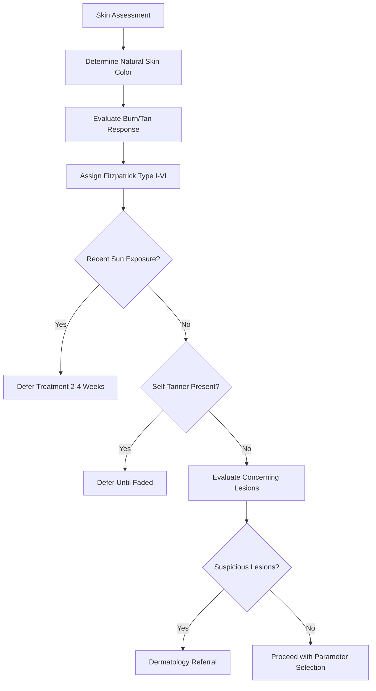
```mermaid
flowchart TD
    A[Skin Assessment] --> B[Determine Natural Skin Color]
    B --> C[Evaluate Burn/Tan Response]
    C --> D[Assign Fitzpatrick Type I-VI]
    D --> E{Recent Sun Exposure?}
    E -->|Yes| F[Defer Treatment 2-4 Weeks]
    E -->|No| G{Self-Tanner Present?}
    G -->|Yes| H[Defer Until Faded]
    G -->|No| I[Evaluate Concerning Lesions]
    I --> J{Suspicious Lesions?}
    J -->|Yes| K[Dermatology Referral]
    J -->|No| L[Proceed with Parameter Selection]
```

**Baseline Fitzpatrick type does not change**, but current skin condition can vary due to temporary changes like recent tanning, sunburn, or self-tanner use, which may require postponing or adjusting treatments.

#### Documentation and Informed Consent

Proper documentation protects both patient and practitioner:

- **Written post-procedural instructions are necessary**[^75]
- Patient education regarding expected outcomes and potential complications
- Documentation of all identified risk factors
- Informed consent acknowledging risks and alternatives
- Photographic documentation of baseline condition

**Before each treatment, existing patients must be risk-assessed using the review section of the health questionnaire**[^95]. This ongoing assessment ensures identification of interval changes that might affect treatment safety.

#### Realistic Expectation Setting

Patient counseling must establish realistic expectations regarding:

- Number of sessions required for optimal outcomes
- Timeline for visible improvement
- Potential for adverse events and their management
- Maintenance requirements for sustained results
- Limitations of treatment for specific conditions

For conditions like melasma, patients must understand the chronic, recurrent nature and the need for ongoing maintenance therapy regardless of treatment modality selected.

### 7.8 Test Patch Protocols and Parameter Optimization Strategies

Test patch procedures represent a fundamental risk mitigation strategy, enabling assessment of individual patient response before full treatment. **A test patch is a critical part of the guidelines**[^91], providing essential information for parameter optimization and adverse event prediction.

#### Test Patch Protocol Requirements

**Appropriate Test Patch Locations**: Test patches should be performed on representative skin in the treatment area. For facial treatments, **patch testing on facial skin before full treatment** is recommended, particularly for Fitzpatrick types IV-VI[^91].

**Waiting Periods by Treatment Type**:

| Treatment Type | Waiting Period | Rationale |
|---------------|----------------|-----------|
| **Hair Removal** | 4-7 days | Assessment of immediate and early reactions |
| **Vascular Treatments** | 4-6 weeks | Delayed pigmentary changes may occur |
| **Pigmented Lesion Treatments** | 4-6 weeks | PIH may not be apparent for weeks |

**Interpretation of Test Patch Outcomes**: The test patch should be evaluated for:
- Immediate reactions (erythema, edema, blistering)
- Delayed reactions (pigmentation changes, textural changes)
- Patient-reported symptoms (pain, itching, burning)

**If in doubt, do not treat**[^91]. Conservative decision-making based on test patch results protects patients from potentially serious adverse outcomes.

#### Parameter Optimization Strategies

**Starting Conservative**: Initial treatments should employ conservative parameters with gradual escalation based on response. For darker skin types, **starting with lower energy in darker skin types or facial scars, with gradual escalation** is recommended[^84].

**Fluence Escalation Protocol**: Begin with fluence at the lower end of the recommended range for the patient's skin type. Increase by 10-20% increments in subsequent sessions if prior treatment was well-tolerated without adverse events.

**Cooling Optimization**: Ensure adequate cooling before, during, and after treatment. **Cold air cooling can be useful to reduce the incidence of side effects**[^83]. Optimal cooling temperatures for IPL are typically **15-25°C**.

**Pulse Duration Adjustments**: Longer pulse durations reduce peak power delivery and allow epidermal cooling. For darker skin types, extended pulse widths (20-40 ms) are preferred over shorter durations.

**Spot Size Considerations**: Larger spot sizes enable deeper penetration through reduced scattering, potentially allowing lower fluence settings while maintaining efficacy.

#### Repeat Patch Testing Requirements

Patch testing must be repeated when clinical circumstances change:

- **When patients begin photosensitizing medications**: New medication requires new patch test[^91]
- **After significant sun exposure**: Temporary increase in melanin may alter response
- **Extended treatment intervals**: If more than 6 months between sessions
- **Change in treatment parameters**: Significant parameter increases warrant re-testing

### 7.9 Post-Treatment Care and Adverse Event Management Protocols

Comprehensive post-treatment care optimizes outcomes and enables early intervention when complications arise. **General considerations include the necessity of written post-procedural instructions, patient education, adequate priming with sunscreens and topical agents, and frequent follow-ups to manage complications early**[^75].

#### Expected Post-Treatment Sequelae and Patient Counseling

Patients must be counseled regarding expected post-treatment effects to distinguish normal healing from complications:

**IPL Post-Treatment Expectations**:
- Appearance of "sunburned" or very red skin immediately after treatment, fading over hours to days[^76]
- Over 2-3 weeks: darkening of brown spots, purplish/black pigment, and crusting as part of normal healing[^76]
- Some redness and swelling may appear more briefly[^76]

**Critical Patient Instructions**:
- **Moisturize only; do not pick** (picking will cause white scars)[^76]
- **Avoid sun exposure** and anything that heats the skin (hot tubs, saunas, intense exercise) for 3 days minimum[^76]
- Apply broad-spectrum sunscreen (SPF 30 or higher) consistently
- Keep treated area well-moisturized

#### Management Algorithms for Common Complications

**Erythema Management**:
- Expected: Mild erythema resolving within hours to days
- Concerning: Erythema persisting beyond 24-48 hours
- Management: Cooling compresses, topical emollients, topical steroids if prolonged

**Edema Management**:
- Expected: Mild swelling resolving within 24-48 hours
- Management: Cold compresses, elevation, topical steroids if significant

**Burns and Blistering**:
- **Laser burns should be treated early with a moderate potency topical steroid**[^75]
- Topical antibiotics to prevent secondary infection
- **Immediate blistering is managed with topical steroids and antibiotics**[^75]
- **Urgent care for significant blistering, peeling, signs of infection, or severe pain lasting more than 48 hours**[^89]

**Early PIH Signs**:
- Begin topical hydroquinone (4%) at first signs of hyperpigmentation[^82]
- Strict sun avoidance
- Consider topical kojic acid or glycolic acid as adjuncts[^75]

#### Role of Topical Agents in Prevention and Treatment

**Prophylactic Agents**:
- **Pre-treatment bleaching agents (hydroquinone)**: Can reduce PIH risk when used before and after laser resurfacing[^82]
- **Sunscreens**: Essential pre- and post-treatment
- **Antiviral prophylaxis**: Valacyclovir for 7-14 days for ablative procedures, especially perioral treatment[^82]

**Treatment Agents**:
- **Topical hydroquinone (4%)**: First-line for hyperpigmentation[^82]
- **Topical tacrolimus or 65% TCA**: For hypopigmentation (limited efficacy)[^75]
- **Topical steroids**: For burns, prolonged erythema, inflammation
- **Emollients**: For maintaining skin barrier and promoting healing

#### Referral Criteria for Severe Adverse Events

Immediate referral is indicated for:
- Suspected infection (increasing pain, purulent discharge, fever)
- Severe burns with extensive blistering
- Signs of allergic reaction (urticaria, angioedema, anaphylaxis)
- Ocular injury (immediate ophthalmology referral)
- Scarring or textural changes not responding to conservative management

**A thorough knowledge of laser physics and strict protocol adherence are keys to safe practice**[^75].

### 7.10 Modality-Specific Safety Comparisons and Clinical Decision Framework

Synthesizing the safety evidence across modalities enables development of an integrated clinical decision framework that balances efficacy requirements against safety considerations. This framework positions each technology on a risk-benefit spectrum, facilitating individualized treatment selection.

#### Comparative Safety Profiles

**LED Phototherapy** demonstrates the most favorable safety profile among light-based modalities. **LED phototherapy alone is free of adverse events and displays an excellent safety profile**[^77]. When used alone, LEDs are nonablative and nonthermal and do not cause damage to the epidermis or dermal tissue[^77]. Studies consistently report no adverse events or only mild, transient effects such as mild erythema, skin dryness, and pruritis[^77][^78].

The contrast with photodynamic therapy (PDT) using photosensitizers is stark: **PDT with the photosensitizer 5-aminolevulinic acid (ALA) is associated with adverse effects**, including stinging and burning pain during and after irradiation, with a mean pain score of 6.95[^77][^78]. Higher concentrations of ALA caused severe erythema, some ulceration and pigmentation, and adverse textural skin changes[^77].

**IPL Therapy** occupies an intermediate position on the safety spectrum. Adverse event incidence varies by treatment parameters and patient factors, with studies reporting rates from 5% (RF) to 27.5% (IPL) to 100% (PDL) depending on the comparison[^80]. IPL's broad-spectrum output creates particular challenges for darker skin types, where shorter wavelengths absorbed by melanin can lead to pigmentation changes[^83].

**Laser Therapy** demonstrates the widest range of safety profiles depending on the specific technology:
- **Ablative lasers (CO2, Er:YAG)**: Highest risk profile with PIH rates of 26-36%, infection risk, and potential for scarring
- **Non-ablative lasers**: Intermediate risk with minimal downtime
- **Q-switched/Picosecond lasers**: Variable risk depending on wavelength and parameters

#### Integrated Clinical Decision Framework

The following framework integrates safety considerations with efficacy requirements:

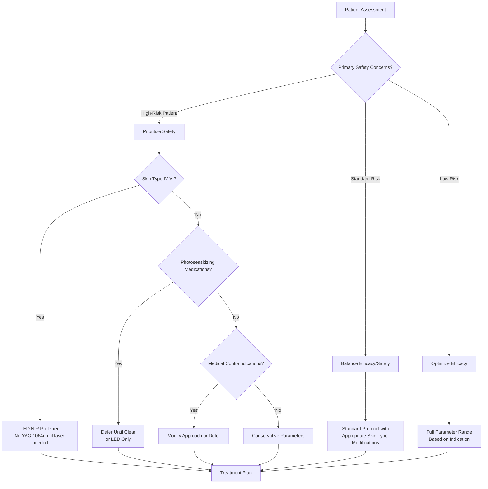
```mermaid
flowchart TD
    A[Patient Assessment] --> B{Primary Safety Concerns?}
    B -->|High-Risk Patient| C[Prioritize Safety]
    B -->|Standard Risk| D[Balance Efficacy/Safety]
    B -->|Low Risk| E[Optimize Efficacy]
    
    C --> F{Skin Type IV-VI?}
    F -->|Yes| G[LED NIR Preferred<br>Nd:YAG 1064nm if laser needed]
    F -->|No| H{Photosensitizing Medications?}
    H -->|Yes| I[Defer Until Clear<br>or LED Only]
    H -->|No| J{Medical Contraindications?}
    J -->|Yes| K[Modify Approach or Defer]
    J -->|No| L[Conservative Parameters]
    
    D --> M[Standard Protocol with<br>Appropriate Skin Type Modifications]
    
    E --> N[Full Parameter Range<br>Based on Indication]
    
    G --> O[Treatment Plan]
    I --> O
    K --> O
    L --> O
    M --> O
    N --> O
```

#### Safety-Efficacy Trade-offs by Indication

| Clinical Scenario | Safety Priority | Efficacy Priority | Recommended Approach |
|-------------------|-----------------|-------------------|---------------------|
| **Photoaging, Fitzpatrick I-III** | Moderate | High | IPL or fractional laser; LED for maintenance |
| **Photoaging, Fitzpatrick IV-VI** | High | Moderate | LED, conservative laser parameters |
| **Melasma, any skin type** | Very High | Moderate | Combination approach; avoid aggressive parameters |
| **Pigmented lesions, light skin** | Moderate | High | IPL or Q-switched laser |
| **Pigmented lesions, dark skin** | High | Moderate | Nd:YAG 1064nm; avoid short wavelengths |
| **Vascular lesions** | Moderate | High | PDL or IPL with appropriate parameters |
| **Post-procedural support** | High | Moderate | LED photobiomodulation |

#### Key Safety Principles

1. **Patient selection is paramount**: Appropriate patient selection, conservative settings, test patches, and strict sun avoidance are critical to minimizing adverse effects[^82].

2. **Skin type determines approach**: For all patients, but especially darker-skinned individuals, proper patient selection and conservative settings are essential[^82].

3. **Parameter optimization reduces risk**: Starting with lower energy in darker skin types or sensitive areas, with gradual escalation, minimizes complications[^84].

4. **LED offers the safest option**: When safety is the primary concern, LED photobiomodulation provides therapeutic benefit with minimal risk.

5. **Documentation and follow-up are essential**: Frequent follow-ups to manage complications early represent a key component of safe practice[^75].

6. **Training and protocol adherence matter**: Complications can be classified as operator-dependent or patient-dependent, with proper training and strict protocol adherence being keys to safe practice[^75].

In conclusion, the safety profiles of light-based aesthetic therapies vary substantially across modalities, with LED demonstrating exceptional safety, IPL occupying an intermediate position, and laser technologies showing the widest range of risk profiles. **The selection of appropriate modality and parameters must integrate patient-specific factors—particularly Fitzpatrick skin type, medical history, and medication use—with the efficacy requirements of the clinical indication**. By applying the systematic assessment protocols, contraindication frameworks, and risk management strategies detailed in this chapter, clinicians can maximize therapeutic outcomes while appropriately safeguarding patients across the full spectrum of presentations and skin types.

## 8 Recent Scientific Advancements and Emerging Technologies

The landscape of light-based aesthetic medicine has undergone substantial transformation in recent years, driven by technological innovations that address longstanding limitations in treatment efficacy, safety profiles, and applicability across diverse patient populations. Building upon the established mechanisms of selective photothermolysis and photobiomodulation detailed in preceding chapters, this chapter examines how cutting-edge developments—including refined picosecond laser systems, narrow-band IPL technologies, synergistic combination protocols, and enhanced LED delivery platforms—are reshaping clinical practice. These advancements are particularly significant for expanding safe and effective treatment options for patients with Fitzpatrick skin types IV-VI, who have historically faced elevated risks of adverse pigmentary outcomes, and for addressing recalcitrant conditions such as melasma and dermal hyperpigmentation that have challenged clinicians for decades. The integration of artificial intelligence, real-time feedback mechanisms, and home-use device innovations further signals a paradigm shift toward personalized, accessible light-based therapies that promise to democratize aesthetic treatment while maintaining rigorous safety standards.

### 8.1 Picosecond Laser Technological Innovations and Clinical Advancements

Picosecond laser technology represents one of the most significant evolutionary advances in aesthetic laser medicine, delivering energy in increments of **trillionths of a second (10⁻¹² seconds)**—approximately one thousand times shorter than the nanosecond pulses of Q-switched predecessors[^96]. This ultrashort pulse duration fundamentally alters the mechanism of tissue interaction, emphasizing **photomechanical effects over photothermal damage**, thereby enabling more efficient pigment fragmentation with reduced collateral thermal injury to surrounding structures[^97]. The global market for picosecond lasers reflects this technological significance, with projections indicating growth from approximately **$227 million in 2020 to $455 million by 2025**, representing a compound annual growth rate of approximately **15.5%**[^96].

#### Ultrafast Pulse Technology and Photomechanical Mechanisms

The fundamental advantage of picosecond pulse delivery lies in its capacity to generate **intense acoustic shock waves** through rapid temperature changes within targeted chromophores. When laser power is concentrated into these extremely brief time frames, the resulting photomechanical stress exceeds the rupture threshold of melanosomes and pigment particles, causing fragmentation without the extensive thermal diffusion characteristic of longer-pulse systems[^55]. This mechanism—termed **photo-thermo-mechanical disruption (PTMD)** for non-fractionated beams—produces more efficient pigment breakdown into smaller particles that are more readily cleared by the body's phagocytic system[^55].

The clinical significance of this photomechanical predominance extends directly to safety considerations for darker skin types. Because picosecond lasers generate **less thermal damage** during energy delivery, the risk of post-inflammatory hyperpigmentation is substantially reduced compared to nanosecond alternatives[^55]. Research has demonstrated that treatment with picosecond lasers carries **less risk of negative side effects than treatment with nanosecond lasers, especially for darker skin types (IV, V, VI)** that are more prone to hyperpigmentation[^55].

#### Advanced Fractional Optics and Delivery Systems

Contemporary picosecond laser systems incorporate sophisticated optical technologies that fractionate energy delivery into microscopic treatment zones, enabling **laser-induced optical breakdown (LIOB)** while preserving intervening tissue for accelerated healing[^55]. Three primary fractional optical delivery technologies have emerged:

| Optical Technology | System Example | Characteristics | Clinical Applications |
|-------------------|----------------|-----------------|----------------------|
| **Diffractive Lens Array (DLA)** | 755 nm PicoSure | Hexagonal lenses with 500 μm pitch; concentrates energy into high-fluence microbeams | Acne scars, skin rejuvenation, pigmentation |
| **Micro-Lens Array (MLA)** | 1064/532 nm PICOPLUS | 4-mm spot generating zones of high-intensity damage | Dermal remodeling, wrinkle reduction |
| **Holographic Optical Matrices** | Various platforms | Creates precise fractional patterns | Tattoo removal, pigmentation treatment |

These fractional delivery systems divide picosecond pulses into columns of high fluence that irradiate approximately **10% of the target area**, while surrounding tissue receives lower-fluence pulses[^55]. The sites receiving high-fluence irradiation absorb approximately **20-fold more energy** than background regions, promoting collagen and elastin synthesis through photothermal and photomechanical effects without surface ablation[^55]. Histological studies have confirmed that melanin and hemoglobin serve as primary chromophores for LIOB after fractional picosecond laser irradiation, with the resulting photomechanical stress permeating into the dermis to stimulate fibroblast proliferation and collagen regeneration[^55].

#### Multi-Wavelength Platforms and Expanded Clinical Applications

Modern picosecond laser systems offer multiple wavelength options that enable treatment of diverse pigmentation depths and chromophore targets:

| Wavelength | Primary Target | Penetration Depth | Clinical Indications |
|------------|---------------|-------------------|---------------------|
| **532 nm** | Superficial melanin | Epidermal | Lighter pigmented lesions, ephelides |
| **730 nm** | Mid-depth melanin | Dermo-epidermal | Freckles, solar lentigines |
| **755 nm** | Melanin | Mid-dermal | Melasma, pigmentation, acne scars |
| **1064 nm** | Deep melanin | Deep dermal | Dermal pigmentation, darker skin types |

A randomized, controlled, assessor-blinded trial comparing **picosecond Nd:YAG (1064 nm)** versus **picosecond alexandrite (755 nm)** for melasma treatment demonstrated the clinical significance of wavelength selection. The 1064 nm system achieved **35.9% MASI improvement** compared to **25.5%** for the 755 nm system (p=0.016), with researchers attributing this superiority to the longer wavelength's **reduced epidermal melanin absorption and deeper dermal penetration**, combined with the shorter pulse duration (450 ps versus 750 ps) contributing to enhanced photomechanical effects[^55].

The **730 nm picosecond laser** represents a newer wavelength option specifically optimized for pigmented lesion treatment. Clinical evaluation of this wavelength for freckles and solar lentigines demonstrated **clearance rates of 78.4%** after two treatment sessions, with **90% of patients reporting ≥95% lesion reduction** at six-month follow-up[^55]. Histological analysis revealed that the 730 nm wavelength produces **dispersed, focal vacuolization (5-10 μm)** of the epidermis with mild erythrocyte extravasation—substantially less disruption than the diffuse epidermal vacuolization with vacuole coalescence (20-100 μm) observed with 755 nm nanosecond pulses[^55].

#### Clinical Evidence for Pigmentation and Rejuvenation Applications

The clinical efficacy of picosecond lasers across multiple indications has been substantiated by robust evidence:

**Tattoo Removal**: A study published in the *Journal of Cosmetic Dermatology* reported **80% improvement in tattoo clearance** after just three sessions with picosecond technology, demonstrating the enhanced efficiency of photomechanical fragmentation[^96].

**Melasma Treatment**: For this challenging condition, a non-fractional 755 nm picosecond alexandrite laser can improve clearance rates by **up to 70%** compared to older technologies[^96]. The randomized trial data confirm that picosecond 1064 nm Nd:YAG demonstrates superior efficacy for Fitzpatrick skin types III-IV, with recurrence rates of only **5.0%** and PIH incidence of **5.0%**[^55].

**Acne Scarring**: Research utilizing the 755 nm alexandrite picosecond laser with diffractive lens array demonstrated **27% mean reduction in scar volume** after six treatment sessions, with histopathological evaluation revealing increased elastic and collagen fibers in the dermis[^55]. Long-term follow-up studies have documented sustained improvement visible at least **six months post-treatment and remaining significant until 28 months** after treatment completion[^55].

**Skin Rejuvenation**: Picosecond lasers effectively address fine lines, wrinkles, and skin texture through collagen stimulation mechanisms. The fractional delivery systems generate microscopic zones of LIOB that trigger dermal remodeling responses, with clinical studies demonstrating improvements in skin firmness, smoothness, and overall photoaging parameters[^55].

#### Safety Profile Advancements

The safety advantages of picosecond technology are particularly pronounced for patients with elevated melanin content. Clinical studies consistently demonstrate that picosecond lasers offer **greater patient comfort** compared to traditional treatments, with **over 75% of patients reporting discomfort during traditional laser treatments** while picosecond alternatives produce substantially less treatment-associated pain[^96]. The reduced thermal damage translates directly to lower adverse event rates, with PIH incidence in controlled trials ranging from **5.0%** for both picosecond Nd:YAG and alexandrite systems treating melasma in Fitzpatrick III-IV patients[^55].

The integration of **artificial intelligence** represents an emerging trend in picosecond laser development, with manufacturers developing systems that promise **enhanced treatment accuracy and personalized patient experiences**[^96]. These AI-assisted platforms aim to optimize parameter selection based on real-time tissue response assessment, potentially further improving safety and efficacy outcomes.

### 8.2 Narrow-Band IPL Technologies and Enhanced Spectral Selectivity

The evolution of Intense Pulsed Light technology has progressed toward increasingly refined spectral selectivity, with narrow-band IPL (NB-IPL) systems representing a significant advancement over traditional broad-band platforms. By constraining light output to specific wavelength ranges through advanced filtering technology, NB-IPL achieves **enhanced chromophore targeting** with reduced energy absorption by competing structures, translating to improved efficacy and safety profiles for specific clinical indications[^98].

#### Technical Principles of Narrow-Band Filtration

Traditional broad-band IPL (BB-IPL) systems emit light across wavelength ranges of approximately **590-1200 nm**, providing versatility but potentially compromising selectivity[^99]. In contrast, NB-IPL systems utilize advanced filtering technology to restrict output to narrower wavelength bands—typically **500-600 nm** for vascular applications—enabling more focused energy delivery to target chromophores[^99].

The clinical significance of this spectral refinement relates directly to the absorption characteristics of primary skin chromophores. Hemoglobin demonstrates strong absorption peaks at approximately **540 nm and 577 nm**, making the 500-600 nm wavelength range optimal for vascular lesion treatment[^99]. By concentrating energy within this absorption spectrum while excluding longer wavelengths that may be absorbed by competing chromophores such as melanin, NB-IPL achieves **enhanced target specificity** with reduced risk of collateral damage[^98].

#### Comparative Clinical Evidence: NB-IPL Versus BB-IPL

A comprehensive comparative study evaluating **pulsed dye laser (PDL), narrow-band IPL (NB-IPL), and broad-band IPL (BB-IPL)** for erythematotelangiectatic rosacea treatment provides robust evidence for NB-IPL's advantages[^98][^99]:

| Outcome Parameter | NB-IPL | BB-IPL | PDL | Statistical Significance |
|-------------------|--------|--------|-----|-------------------------|
| **Post-treatment CEA Score** | 2.01 ± 0.27 | 2.26 ± 0.25 | 2.18 ± 0.28 | p < 0.001 (NB vs BB) |
| **VISIA Red Zone Score** | 20.15 ± 3.32 | 22.68 ± 5.47 | — | p = 0.019 |
| **Porphyrin Level Reduction** | 3.59 ± 1.16 | 4.38 ± 1.34 | — | p = 0.020 |
| **Pigmentation Changes Incidence** | **2.63%** (n=1) | **21.05%** (n=8) | — | p = 0.050 |
| **Energy Density Used** | 8.76 ± 0.61 J/cm² | 16.57 ± 1.21 J/cm² | 8.4-10.6 J/cm² | — |

These data demonstrate that NB-IPL achieved **significantly superior erythema reduction** compared to BB-IPL while utilizing substantially lower energy densities. The **Clinical Erythema Assessment (CEA) score** of 2.01 ± 0.27 in the NB-IPL group was significantly lower than the 2.26 ± 0.25 observed in the BB-IPL group (p < 0.001)[^98]. Similarly, VISIA red zone scores showed NB-IPL achieving 20.15 ± 3.32 compared to 22.68 ± 5.47 for BB-IPL (p = 0.019)[^98].

#### Safety Advantages of Narrow-Band Spectral Delivery

The most clinically significant finding from comparative studies relates to **adverse pigmentary outcomes**. The incidence of pigmentation changes was **dramatically higher in the BB-IPL group (21.05%, n=8) compared to the NB-IPL group (2.63%, n=1)**, representing a nearly eight-fold difference in this critical adverse event category[^98][^99].

The researchers attributed this safety advantage to the **focused energy delivery** of NB-IPL within the 500-600 nm wavelength range, which enhances target specificity for oxyhemoglobin while minimizing absorption by epidermal melanin[^99]. In contrast, the broad wavelength spectrum of BB-IPL (590-1200 nm) may lead to **non-selective photothermal effects**, potentially increasing the risk of adverse events such as post-inflammatory hyperpigmentation[^98].

Additional safety findings include:

- **Blistering incidence**: 2.63% (n=1) for NB-IPL versus 10.53% (n=4) for BB-IPL[^99]
- **Pain scores**: No significant differences among groups despite BB-IPL using significantly higher energy densities[^99]
- **Recurrence rates**: No statistically significant differences among the three modalities over 18-month follow-up[^98]

#### Sebum Regulation and Secondary Effects

While NB-IPL demonstrated superior efficacy for erythema reduction, BB-IPL showed advantages for certain secondary outcomes. BB-IPL produced the **most pronounced reduction in sebum levels**, decreasing to 70.31 ± 11.26 μg/cm² (p < 0.001 versus other groups)[^98]. This finding suggests that the broader wavelength spectrum may engage additional chromophores or tissue structures involved in sebaceous gland regulation.

The differential effects observed across modalities support the clinical principle that **treatment selection should be guided by primary indication**: NB-IPL for erythema-predominant presentations where safety and vascular selectivity are paramount, and BB-IPL potentially reserved for cases where sebum reduction represents a significant treatment goal, provided appropriate precautions for pigmentation risk are implemented.

#### Clinical Integration and Protocol Optimization

The evidence supports integrating NB-IPL technology into clinical practice for vascular and erythematous conditions, particularly in patients at elevated risk for pigmentary complications. Key protocol considerations include:

1. **Patient selection**: NB-IPL is particularly advantageous for patients with Fitzpatrick skin types III-IV where BB-IPL's higher pigmentation change incidence poses unacceptable risk
2. **Energy optimization**: NB-IPL achieves superior outcomes with lower fluences (8.76 J/cm² versus 16.57 J/cm²), reducing thermal load and adverse event potential
3. **Indication matching**: NB-IPL demonstrates optimal efficacy for erythema-predominant conditions; BB-IPL may be considered when sebum regulation is a treatment priority

### 8.3 Combination Therapy Protocols: Synergistic Multi-Modal Approaches

The recognition that complex aesthetic conditions often involve multiple pathophysiological mechanisms has driven development of combination therapy protocols that integrate different light-based modalities or combine light therapies with complementary treatments. These synergistic approaches leverage the distinct mechanisms of individual therapies—selective photothermolysis, photobiomodulation, mechanical stimulation, and topical agent delivery—to achieve outcomes exceeding those attainable with monotherapy[^55][^100].

#### IPL Combined with Microneedling and Postbiotic Formulations

A recent clinical trial evaluated the efficacy of combining **IPL with microneedling and a postbiotic formulation** containing Lactobacillus fermentation lysate for treating mixed-type melasma in Fitzpatrick phototypes III-IV[^55][^101]. This multidimensional approach targets melasma through complementary mechanisms:

- **IPL**: Photothermal effect targeting melanin and vascular components
- **Microneedling**: Mechanical stimulation promoting epidermal renewal and enhanced topical penetration
- **Postbiotic formulation**: Anti-inflammatory effects, tyrosinase inhibition, skin barrier restoration

The study randomized 30 female patients (mean age 40.5 ± 5.25 years) to either IPL monotherapy (every 4 weeks for 12 weeks) or combination therapy (alternating IPL and microneedling every 2 weeks, with postbiotic application immediately following microneedling)[^55][^101].

**Efficacy Outcomes**:

| Parameter | IPL Monotherapy | Combination Therapy | Significance |
|-----------|-----------------|---------------------|--------------|
| **mMASI Score Improvement** | Significant reduction | **Greater improvement** | p < 0.05 |
| **Excellent Improvement (n)** | — | 13/15 patients | — |
| **Significant Improvement (n)** | — | 1/15 patients | — |
| **Patient Satisfaction (satisfied/very satisfied)** | — | **73.3%** | — |

VISIA skin analysis confirmed significant reductions in **speckle, brown speckle, red region, and UV speckle scores** in the combination therapy group, indicating improvements across pigmentation, inflammation, and photoaging parameters[^55][^101].

**Safety Outcomes**: The combination therapy group demonstrated a **significantly lower incidence of adverse reactions**, particularly post-treatment hyperpigmentation, with shorter skin recovery times compared to IPL monotherapy[^55][^97]. All patients experienced mild post-treatment redness and swelling, but the combination approach's anti-inflammatory postbiotic component appeared to mitigate treatment-related inflammation.

The researchers concluded that this combination protocol achieves **multidimensional synergistic effects** through IPL's photothermal action and microneedling's mechanical stimulation promoting melanin breakdown, epidermal renewal, and collagen regeneration, while the postbiotic formulation reduces inflammation, inhibits melanogenesis, and restores skin barrier function[^101].

#### Laser and Light Combination Protocols for Melasma

A systematic review and meta-analysis evaluating **laser or light-based therapy combined with topical agents** for melasma synthesized evidence from 11 randomized controlled trials encompassing 461 participants[^100]. The analysis revealed important temporal patterns in combination therapy efficacy:

| Timepoint | Standardized Mean Difference | Clinical Interpretation |
|-----------|------------------------------|------------------------|
| **4 weeks** | No significant benefit | Insufficient time for synergistic effects |
| **8 weeks** | SMD: -0.58 | Statistically significant improvement |
| **12 weeks** | SMD: -0.72 | Continued improvement |
| **16 weeks** | SMD: **-0.89** | Maximum observed benefit |
| **Overall** | SMD: -0.55 (95% CI: -0.74 to -0.36) | p < 0.00001 |

These findings demonstrate a **cumulative therapeutic effect** of combination therapy, with benefits increasing progressively over treatment duration. The overall analysis showed significant improvement in the combination group with moderate heterogeneity (I² = 64%)[^100].

**Safety Considerations**: The meta-analysis revealed a **significantly higher risk of adverse events** in combination therapy groups (Odds Ratio: 8.96; 95% CI: 3.71-21.64), with erythema and post-inflammatory hyperpigmentation being the most frequently reported adverse events[^100]. This finding underscores the importance of careful patient selection, appropriate parameter optimization, and enhanced post-treatment monitoring when implementing combination protocols.

Specific combination approaches evaluated in the included studies:

- **IPL + Triple Combination Cream** (hydroquinone 4%, tretinoin 0.05%, fluocinolone acetonide 0.01%): Single IPL session combined with topical fixed-dose formulation[^100]
- **IPL + Topical Triple Combination**: 2 IPL sessions at 2-week intervals with ongoing topical therapy[^100]

#### Multi-Wavelength LED Combination Approaches

The combination of multiple LED wavelengths within single treatment protocols represents another synergistic approach supported by clinical evidence. Research has demonstrated that **combining 830 nm (near-infrared) and 633 nm (red) wavelengths** achieves superior outcomes compared to either wavelength alone for skin rejuvenation applications[^96].

A randomized controlled trial comparing LED protocols found:

| LED Protocol | Wrinkle Reduction | Elasticity Improvement |
|--------------|-------------------|----------------------|
| **Red light (633 nm) alone** | 26% | 14% |
| **Near-infrared (830 nm) alone** | 33% | 19% |
| **Combination (633 + 830 nm)** | **36%** | 16% |

The researchers recommended using the **combination of both red light and near-infrared** when treating photoaging, as the complementary penetration depths and chromophore targeting of these wavelengths provide comprehensive treatment across tissue layers[^97].

Novel multi-wavelength combinations are under active investigation, including devices combining **three wavelengths (1064 nm, 810 nm, and 755 nm)** to leverage the synergistic absorption and penetration properties of each wavelength[^97]. Another study demonstrated efficacy in treating oral mucositis through PBM combination of **635 nm and 815 nm** wavelengths[^97].

#### Sequential Laser Therapy Protocols

Sequential laser protocols that combine different laser modalities in structured treatment sequences represent an emerging approach for complex pigmentation disorders. The rationale for sequential therapy relates to the ability to target **different chromophores, tissue depths, and pathophysiological mechanisms** through carefully timed interventions.

For dermal hyperpigmentation conditions, sequential approaches combining IPL with Q-switched Nd:YAG or fractional lasers have demonstrated enhanced efficacy compared to single-modality treatment. The combination addresses both superficial and deep pigment deposits while stimulating dermal remodeling processes that may facilitate long-term pigment clearance.

### 8.4 Enhanced LED Delivery Systems and Optimized Photobiomodulation Parameters

LED phototherapy technology has undergone substantial refinement in recent years, with advances in device engineering, parameter optimization, and delivery system design expanding clinical applications and improving treatment outcomes. These developments address previous limitations in treatment standardization while enabling both professional and home-based applications with enhanced efficacy and safety profiles[^96][^102].

#### Multi-Wavelength Combination Devices

Modern LED devices increasingly incorporate multiple wavelengths within single platforms, enabling comprehensive treatment protocols that target different chromophores and tissue depths simultaneously. The **Omnilux Clear** device exemplifies this approach, combining **415 nm (blue)** and **633 nm (red)** wavelengths in a wearable facial mask designed for home use[^102][^26].

A 7-week open-label study evaluating this dual-wavelength LED device for mild-to-moderate acne enrolled 30 patients aged 14-45 years who applied treatment **4 times weekly for 10 minutes per session**[^102][^26]. The results demonstrated:

| Outcome Measure | Result | Statistical Significance |
|-----------------|--------|-------------------------|
| **Inflammatory Lesion Reduction** | Mean decrease of 13.07 lesions | p < 0.0001 |
| **Non-inflammatory Lesion Reduction** | Mean decrease of 14.73 lesions | p < 0.0001 |
| **≥1-grade IGA Reduction** | **86%** of patients | Exceeded 50% success threshold |
| **Acne Quality of Life** | Significant improvements in all 19 items | — |

The mechanistic basis for this combination approach relates to the complementary actions of blue and red light: **blue light (415 nm)** generates nitric oxide and reactive oxygen species targeting bacterial porphyrins with bactericidal effects on *Cutibacterium acnes*, while **red light (633 nm)** penetrates deeper to target sebaceous glands and downregulate lipid production, producing anti-inflammatory effects[^102].

#### Home-Use Wearable Systems

The development of wearable LED devices for home use represents a significant advancement in treatment accessibility. A multi-center, randomized, double-blind, sham-controlled clinical trial evaluated a **home-used LED and IRED mask** emitting light at 630 nm (LED, max 10 mW/cm²) and 850 nm (IRED, max 10 mW/cm²) for crow's feet wrinkle improvement[^51].

The study enrolled 60 individuals of Asian descent (Fitzpatrick skin types II-V) who applied the device for **9 minutes, 5 times per week for 12 weeks**[^51]. Key findings included:

- **Primary endpoint**: 86.2% (25/29) of the experimental group showed improved periorbital wrinkles (CFGS score decrease ≥1 point) at 12 weeks, compared to only 16.7% (5/30) in the control group (p = 0.000)[^51]
- **Per-protocol analysis**: 89.3% (25/28) improvement rate in the experimental group[^51]
- **GAIS scores**: Significant improvements at 8, 12, and 16 weeks as assessed by investigators[^51]
- **Safety**: Only 4 adverse events among 60 participants (6.67%), none serious or definitively device-related[^51]

The study concluded that LED and IRED phototherapy at 630 nm and 850 nm represents an **effective, safe, well-tolerated, and painless treatment** for skin rejuvenation suitable for home application[^51].

#### Parameter Optimization Strategies

Recent research has focused on identifying optimal treatment parameters for different clinical indications, addressing the historical challenge of protocol variability across studies[^96]. Key parameter considerations include:

**Wavelength Selection**: Red light between **630-660 nm** penetrates skin effectively to stimulate cellular processes, with systematic reviews confirming that this wavelength range enhances collagen synthesis and increases production of collagen precursors[^96]. Near-infrared wavelengths between **780-980 nm** penetrate deeper tissues, offering advantages in wound healing and inflammation reduction[^96].

**Power Density Optimization**: Research has identified moderate power densities around **20-100 mW/cm²** as yielding the most favorable results for skin healing and rejuvenation[^96]. The relationship between power density and biological outcomes follows a **biphasic dose-response** pattern, where an optimal dose exists beyond which therapeutic benefits can diminish due to excessive reactive oxygen species or nitric oxide release[^96].

**Fluence Thresholds**: Clinical trials have employed fluences ranging from approximately **4 J/cm² to 130 J/cm²** depending on wavelength and indication. For skin rejuvenation, protocols using **60-130 J/cm²** have demonstrated significant improvements in wrinkles and elasticity[^96].

**Pulsed Versus Continuous Wave Delivery**: The method of light delivery influences efficacy, with pulsed delivery offering potential advantages for certain applications. Research on transdermal light therapy demonstrated that pulsed wave irradiation achieved **lower skin surface temperatures (42.5°C)** while delivering equivalent fluence to deep tissues compared to continuous wave delivery[^81]. The "quench periods" in pulsed delivery allow thermal dissipation, enabling safe use of higher peak power densities[^81].

| Delivery Mode | Skin Temperature (300s) | Deep Tissue Fluence | Safety Threshold |
|---------------|------------------------|---------------------|------------------|
| **Continuous Wave (30W)** | ~76°C | 4.2 J/cm² | Exceeds safety limits |
| **Pulsed (60W peak, 10% duty)** | **42.5°C** | 4.2 J/cm² | Below 43°C threshold |

**Treatment Frequency**: Cumulative effects from repeated treatments enhance results, with recommendations for frequency ranging from **2-3 times per week over several weeks or months**[^96]. The systematic review of LED therapy for skin rejuvenation found that protocols employing **twice-weekly sessions for 4-15 weeks** demonstrated significant improvements[^96].

#### Protocol Standardization Challenges

Despite promising outcomes, **variability in treatment parameters** such as wavelength, power density, fluence, and treatment regimens remains a significant challenge[^96]. Inconsistencies in device specifications, treatment protocols, and study design preclude the standardization of treatment protocols that would enable more consistent clinical application[^96].

Future research priorities include:

- Long-term trials with standardized protocols
- Temperature-matched controls to isolate photobiomodulation effects from thermal effects
- Detailed parameter reporting enabling protocol replication
- Development of evidence-based guidelines for specific indications and skin types

### 8.5 Safety Advancements for Darker Skin Types and Expanded Treatment Indications

The historical underrepresentation of patients with Fitzpatrick skin types IV-VI in light-based therapy research has contributed to elevated adverse event rates and limited treatment options for these populations. Recent technological and protocol advancements specifically address these disparities, enabling safer and more effective treatment across diverse skin types through optimized wavelength selection, refined parameter protocols, and enhanced understanding of differential photosensitivity[^103][^81].

#### Wavelength Selection for Darker Skin Types

The fundamental principle guiding safe treatment of darker skin types relates to **minimizing epidermal melanin absorption** while maintaining therapeutic efficacy for target chromophores. Longer wavelengths achieve this goal through reduced melanin absorption coefficients and deeper tissue penetration that bypasses the melanin-rich epidermis[^103][^81].

| Wavelength | Melanin Absorption | Penetration Depth | Safety for Skin Types IV-VI |
|------------|-------------------|-------------------|----------------------------|
| **532 nm** | Very High | Superficial | **Contraindicated** |
| **694 nm** | High | Moderate | High risk |
| **755 nm** | Moderate-High | Moderate | Use with caution |
| **1064 nm** | Low | Deep | **Preferred** |

The clinical evidence strongly supports **Nd:YAG lasers at 1064 nm** as having the **lowest risk of dyspigmentation for dark-skinned patients**[^103][^81]. The longer wavelength demonstrates reduced epidermal melanin absorption while maintaining adequate penetration to reach dermal targets. For picosecond applications, the 1064 nm wavelength achieved **35.9% MASI improvement** in Fitzpatrick III-IV patients compared to 25.5% for the 755 nm wavelength, with equivalent safety profiles (5.0% PIH incidence for both)[^55].

#### Parameter Modifications and Protocol Optimization

Beyond wavelength selection, multiple parameter adjustments optimize safety in darker skin types:

**Fluence Reduction**: Lower energy settings limit heat accumulation in the melanin-rich epidermis. For fractional CO2 laser treatment, low-energy settings (≤20 mJ/MTZ) were associated with **fewer adverse effects (9%)** compared to high-energy settings (≥30 mJ/MTZ, 28% adverse effects)[^55].

**Extended Pulse Duration**: Longer pulse durations allow epidermal cooling between energy delivery. For IPL, **20-40 ms delay times are advised for patients with darker skin types** to accommodate longer epidermal thermal relaxation times[^103].

**Enhanced Cooling**: Pre-, intra-, and post-treatment cooling provides additional epidermal protection. Optimal cooling temperatures between **15-25°C** enable delivery of higher fluences while protecting the epidermis[^103].

**Pulsed LED Delivery**: For LED therapy, pulsed delivery modes minimize overheating and melanin overstimulation in susceptible individuals. Research has demonstrated that pulsed wave irradiation achieves equivalent tissue fluence with **significantly lower skin surface temperatures** compared to continuous wave delivery[^81].

#### Differential Photosensitivity and Maximum Tolerated Doses

Recent clinical trials have established that **skin of color demonstrates differential photosensitivity** to light-based therapies, necessitating skin type-specific dosing guidelines[^97][^104]. A clinical trial demonstrated that skin of color presents **higher photosensitivity to visible light**, showing differences of **up to 50%** in the maximum tolerated dose of LED red light when compared to lighter skin types[^104].

The STARS clinical trial program specifically evaluated LED red light therapy across racial and ethnic groups:

| Population | Maximum Tolerated Dose | Dose-Limiting Events |
|------------|----------------------|---------------------|
| **All races/ethnicities** | **320 J/cm²** | Blistering, prolonged erythema at 480 J/cm² in African American subject |
| **Non-Hispanic Caucasian** | **480 J/cm²** | Events at 640 J/cm² |

These findings establish that **LED-RL exerts differential cutaneous effects depending on race and ethnicity, with darker skin being more photosensitive**[^97]. The maximum safe fluence for skin of color is **320 J/cm²**, while for non-Hispanic Caucasian individuals it is **480 J/cm²**[^97].

#### Expanded Indications for Darker Skin Types

Technological advancements have enabled expansion of treatment indications for patients with Fitzpatrick IV-VI skin types who were previously considered poor candidates for light-based therapies:

**Pigmented Lesion Treatment**: A preliminary study assessing Q-switched 1064/532 nm Nd:YAG laser for benign hypermelanosis specifically in **Fitzpatrick skin types IV-VI** demonstrated that **53% achieved excellent clearance (75-100% improvement)**, with no serious adverse events[^55]. The study concluded that Q-switched Nd:YAG is **a key tool for treating benign hypermelanosis across all skin types, including dark-skinned persons**[^55].

**Melasma in Darker Skin**: The picosecond 1064 nm Nd:YAG laser has demonstrated superior efficacy for melasma in Fitzpatrick III-IV patients, with **35.9% MASI improvement** and only **5.0% PIH incidence**[^55].

**Acne Treatment**: Studies of LED therapy specifically in patients with Fitzpatrick Skin Type IV demonstrated **final mean percentage improvements of 34.2% for non-inflammatory and 77.9% for inflammatory lesions**[^105].

**Skin Rejuvenation**: Research on fractional picosecond lasers in darker skin types has confirmed efficacy for acne scarring and skin texture improvement with acceptable safety profiles when appropriate parameters are employed[^55].

#### Near-Infrared LED for Darker Skin Types

For LED phototherapy applications, **near-infrared light (800-1000 nm)** is specifically recommended for darker skin types as it **bypasses epidermal melanin** more effectively than shorter wavelengths, reducing the risk of hyperpigmentation[^97]. Studies using **940 nm near-infrared LED** with pulsed delivery for dermal melasma demonstrated statistically significant pigment reduction (MASI scores decreasing from 11.4 to 4.7) with favorable safety profiles[^97].

### 8.6 Artificial Intelligence Integration and Future Technological Directions

The integration of artificial intelligence, development of novel wavelength applications, and advancement of portable device technologies represent the frontier of light-based aesthetic medicine. These emerging directions address current limitations in treatment standardization, enhance precision medicine approaches, and expand accessibility of effective treatments to broader patient populations[^96][^97].

#### Artificial Intelligence for Treatment Optimization

The integration of artificial intelligence into light-based therapy systems represents a **notable trend** in device development, with manufacturers developing platforms that promise **enhanced treatment accuracy and personalized patient experiences**[^96][^97]. AI integration addresses several current challenges in light-based therapy:

**Parameter Optimization**: AI algorithms can analyze patient characteristics (skin type, condition severity, treatment history) to recommend optimal treatment parameters, potentially reducing operator-dependent variability and adverse events.

**Real-Time Feedback Mechanisms**: Advanced systems incorporating real-time tissue response monitoring can enable dynamic parameter adjustment during treatment, ensuring appropriate energy delivery while avoiding excessive thermal accumulation.

**Treatment Personalization**: Machine learning approaches can identify patient subgroups most likely to respond to specific protocols, enabling precision medicine approaches that match treatments to individual patient profiles.

**Outcome Prediction**: AI systems trained on large clinical datasets may enable more accurate prediction of treatment outcomes and adverse event risk, supporting informed patient counseling and treatment planning.

#### Novel Wavelength Applications

Research continues to explore wavelengths beyond traditional therapeutic spectra:

**Extended Infrared Wavelengths**: New research seeks to advance development of technologies applying light radiation with wavelengths not previously used, including infrared wavelengths beyond the near-infrared range[^97]. These longer wavelengths may offer advantages for deep tissue applications while further minimizing epidermal effects.

**Multi-Wavelength Synergistic Combinations**: Novel devices combining multiple wavelengths (such as 1064 nm, 810 nm, and 755 nm) leverage the synergistic absorption and penetration properties of each wavelength[^97]. Research has demonstrated efficacy of **dual NIR treatment using 810 nm pulsed and 904 nm superpulsed PBM lasers** for wound healing applications[^97].

**Optimized Wavelengths for Specific Chromophores**: The development of the **730 nm picosecond laser** exemplifies targeted wavelength optimization, with this wavelength demonstrating superior pigment selectivity and minimal disruption to the dermo-epidermal junction compared to traditional alternatives[^55].

#### Portable Device Innovations and Home-Based Treatment

Innovation in device design has focused on **portability and the inclusion of new technologies** that contribute to greater accessibility and versatility[^104]. Key developments include:

**Miniaturization of Light Sources**: Advances in LED and laser diode technology enable compact devices with sufficient power output for therapeutic applications.

**Wearable Designs**: Devices such as LED facial masks designed for home use enable convenient treatment integration into daily routines. Clinical trials have validated the efficacy and safety of these home-use systems for conditions including acne and skin rejuvenation[^102][^51].

**User-Friendly Interfaces**: Simplified controls and automated treatment protocols reduce the technical expertise required for effective treatment, expanding accessibility beyond professional settings.

**Smart Device Integration**: Connectivity with smartphones and other smart devices enables treatment tracking, protocol reminders, and potentially remote monitoring by healthcare providers.

**Longer-Lasting Batteries**: Improved battery technology enables portable devices to deliver adequate treatment sessions without frequent recharging[^104].

#### Market Projections and Research Priorities

The continued growth of light-based aesthetic medicine is reflected in market projections across multiple technology segments:

| Market Segment | Current Value | Projected Value | Growth Rate |
|----------------|---------------|-----------------|-------------|
| **Global Laser Aesthetics** | — | ~$5.77 billion by 2025 | — |
| **Picosecond Laser Market** | $227 million (2020) | $455-600 million by 2025-2027 | ~15.5% CAGR |
| **Global Medical Laser** | — | $13.68 billion by 2032 | — |
| **Excimer Laser (Dermatology)** | $609.6 million (2024) | ~$1.6 billion by 2034 | — |

Research priorities shaping future development include:

1. **Protocol Standardization**: Development of evidence-based guidelines with standardized parameters for specific indications and skin types
2. **Long-Term Outcome Studies**: Extended follow-up trials documenting durability of treatment effects and long-term safety
3. **Comparative Effectiveness Research**: Head-to-head trials comparing emerging technologies with established modalities
4. **Mechanism Elucidation**: Deeper understanding of photobiomodulation pathways to optimize treatment protocols
5. **Combination Therapy Optimization**: Systematic evaluation of multi-modal approaches to identify optimal combinations and sequencing

#### Addressing Current Limitations

Future technological development must address several recognized limitations:

**Treatment Standardization**: Despite promising outcomes, **variability in treatment parameters remains a challenge**, with inconsistencies in device specifications and protocols precluding standardization[^96]. Future research must address these limitations through rigorous methodology, including long-term trials, temperature-matched controls, and detailed parameter reporting[^96].

**Skin Type-Specific Guidelines**: The recognition that **existing evidence suggests skin of color may be more susceptible to adverse effects from PBM wavelengths** necessitates development of comprehensive, evidence-based guidelines for treating diverse patient populations[^104].

**Home Device Efficacy**: While home-use devices offer convenience and accessibility, ensuring adequate therapeutic efficacy compared to professional-grade equipment remains an ongoing challenge. Professional versions of devices are likely to provide **better dose control** than consumer alternatives[^106].

**Integration of Modalities**: Optimizing combination therapy protocols requires systematic research to identify which modality combinations, sequencing strategies, and parameter settings achieve maximum synergistic benefit with acceptable safety profiles.

In conclusion, the landscape of light-based aesthetic medicine continues to evolve rapidly, with technological innovations expanding treatment efficacy, safety profiles, and accessibility. **Picosecond laser refinements, narrow-band IPL technologies, synergistic combination protocols, and enhanced LED delivery systems** collectively represent a new era in aesthetic treatment capability. The particular significance of these advancements for patients with darker skin types—who have historically faced limited options and elevated risks—cannot be overstated. As artificial intelligence integration, novel wavelength applications, and portable device innovations continue to advance, the field moves toward increasingly personalized, accessible, and effective light-based therapies that promise to benefit an ever-broader patient population.

## 9 Evidence-Based Treatment Protocols and Clinical Recommendations

The translation of scientific understanding into effective clinical practice requires systematic protocols that integrate mechanistic knowledge, comparative effectiveness data, and safety considerations into actionable treatment frameworks. Building upon the foundational principles of selective photothermolysis and photobiomodulation established in preceding chapters, the comparative efficacy analyses across laser, IPL, and LED modalities, and the comprehensive safety evaluations that inform patient selection, this chapter synthesizes current clinical guidelines and evidence-based protocols for utilizing light-based therapies in treating photoaging, hyperpigmentation, and skin brightening goals. The protocols presented herein reflect the recognition that **optimal outcomes depend not only on selecting appropriate technologies but on implementing structured treatment regimens** that account for cumulative therapeutic effects, individual patient characteristics, and the critical importance of maintenance strategies for sustained results.

The evidence base informing these recommendations derives from systematic reviews, randomized controlled trials, and meta-analyses that have established varying levels of confidence across different indications and modalities. The Oxford Centre for Evidence-based Medicine levels of evidence provide a framework for understanding the strength of recommendations, with Grade B recommendations indicating good evidence from well-designed clinical studies, while Grade C and D recommendations reflect more limited evidence requiring additional research validation. This hierarchical approach enables clinicians to counsel patients appropriately regarding expected outcomes and the certainty of available evidence while implementing protocols most likely to achieve therapeutic goals.

### 9.1 LED Phototherapy Protocols: Wavelength Selection, Parameter Optimization, and Treatment Regimens

LED phototherapy has established itself as a valuable modality in aesthetic medicine through its capacity to stimulate beneficial cellular responses without causing tissue destruction. The systematic review of randomized controlled trials on LED therapy in dermatology provides the foundation for evidence-based protocol development, with recommendations stratified by indication and supported by clinical trial data demonstrating efficacy across multiple applications.

#### Evidence Grades and Indication-Specific Recommendations

The systematic analysis of 31 randomized controlled trials identified varying levels of evidence supporting LED therapy across different dermatological conditions:

| Indication | Evidence Grade | Number of RCTs | Clinical Recommendation |
|------------|---------------|----------------|------------------------|
| **Acne Vulgaris** | Grade B | 8 RCTs | LED-BL or LED-RL with power densities of 6-40 mW/cm² or 8-100 mW/cm², respectively, for 20 minutes, twice weekly for 4-8 weeks |
| **Herpes Simplex/Zoster** | Grade B | 3 RCTs | LED-nIR (1072 nm) as adjunct to standard antiviral medications; thrice daily for 3 days may reduce healing time by 2-3 days |
| **Acute Wound Healing** | Grade B | 5 RCTs | Daily LED-YL (590 nm) or LED-nIR (830 nm) until wound resolution may reduce healing time and erythema |
| **Skin Rejuvenation** | Grade C | 6 RCTs | Daily LED-nIR with LED-RL for 8-10 weeks has efficacy in improving rhytides |
| **Psoriasis** | Grade C-D | Limited | Preliminary evidence for combination 830 nm and 630 nm LED |
| **Atopic Dermatitis** | Grade C-D | Limited | Emerging evidence for anti-inflammatory effects |

The **Grade B recommendation for acne vulgaris** reflects substantial clinical evidence supporting LED therapy's efficacy. One RCT of 41 patients using LED blue light (414 nm, 17.6 J/cm²) every other day for 8 weeks demonstrated a **52% reduction in lesion count**[^77]. Another study of 20 patients found that twice-weekly LED-BL (405 nm, 7.2 J/cm²) for 4 weeks reduced lesion count by **71.4%**, compared to only 19.5% with LED-RL (630 nm, 11.52 J/cm²)[^77]. The combination of blue and red light has demonstrated synergistic effects, with one study showing that twice daily combination LED-BL (420 nm) and LED-RL (660 nm) for 4 weeks reduced inflammatory lesions by **77%**[^107].

For **skin rejuvenation**, the Grade C recommendation indicates moderate evidence requiring additional validation. A placebo-controlled RCT of 112 patients found that twice-weekly treatments for 4 weeks with LED-RL (633 nm, 126 J/cm²) improved wrinkles by **26%**, LED-nIR (830 nm, 66 J/cm²) by **33%**, and the combination by **36%**[^77]. These findings establish that combination LED therapy using both red and near-infrared wavelengths achieves superior outcomes for photoaging treatment.

#### Wavelength-Specific Protocol Parameters

The selection of appropriate LED wavelengths depends on the specific clinical indication and target tissue depth. The following evidence-based parameters guide clinical application:

**Blue Light (415-470 nm) Protocols for Acne:**

Blue light therapy operates through activation of endogenous porphyrins in *Cutibacterium acnes*, generating reactive oxygen species with bactericidal effects[^108]. The antimicrobial effect involves inhibition of bacterial proliferation through the absorption of light by porphyrins, which triggers a photochemical reaction generating reactive oxygen species[^78]. Clinical protocols should employ power densities of **6-40 mW/cm²** with session durations of **15-20 minutes**, administered **twice weekly to daily** over treatment courses of **4-8 weeks**. Expected outcomes include **52-77% reduction in inflammatory lesions** based on RCT evidence[^77][^108].

One open-label study using blue light (409-419 nm) showed a mean percent reduction in inflammatory lesions of **25% at Week 5, 53% at Week 8 (p<0.001), and 60% at Week 12 (p<0.001)**[^108]. A combined protocol alternating 415 nm blue light and 633 nm red light demonstrated **46% lesion reduction at four weeks (p=0.001) and 81% at 12 weeks (p=0.001)**[^109].

**Red Light (630-660 nm) Protocols for Skin Rejuvenation:**

Red light therapy operates through photobiomodulation, stimulating fibroblast proliferation and collagen synthesis by activating cellular mitochondrial respiratory pathways[^110]. The result is lifting and tightening lax skin and the reduction of rhytides through enhanced extracellular matrix production. Clinical protocols should employ power densities of **20-100 mW/cm²** with fluences of **96-126 J/cm²** over session durations of **12-20 minutes**, administered **2-3 times weekly** for **8-12 weeks**. Expected outcomes include **26-36% wrinkle improvement** and increased collagen density[^77][^107].

Research has demonstrated that LED phototherapy at 633 nm (96 J/cm²) administered as 20-minute treatments three times weekly for three weeks produces improvements including reduction in fine lines and wrinkles and softer, smoother skin, with no adverse events reported[^110]. A randomized, double-blind, controlled study of 76 subjects found that the proportion of improved subjects receiving 830 nm alone (95.2%), 633 nm alone (72.3%), and the combination (95.5%) were much greater than sham-treated subjects (13.3%)[^109]. Tissue assay results showed **increased collagen throughout the entire dermis** in active treatment groups[^109].

**Near-Infrared (830-940 nm) Protocols:**

Near-infrared wavelengths achieve the deepest tissue penetration among therapeutic LED wavelengths, making them particularly valuable for dermal remodeling applications. NIR light targets water in the deeper layers of the epidermis and dermis[^78]. Clinical protocols should employ power densities of **55 mW/cm²** with fluences of **33-66 J/cm²** over session durations of **10-20 minutes**, administered **2-3 times weekly or daily** for **8-12 weeks**. Expected outcomes include **33% wrinkle improvement and 19% elasticity improvement**[^77].

Studies have demonstrated that LED-nIR at 830 nm outperforms red light alone for skin elasticity improvement (19% versus 14%)[^77]. For wound healing applications, combination LED-RL (633 nm) and LED-nIR (830 nm) following laser resurfacing resulted in **50% faster healing time**[^107].

#### Comprehensive Skin Rejuvenation Protocol

A detailed clinical protocol for skin rejuvenation using red light photobiomodulation has been validated through prospective study[^111]:

**Protocol Parameters:**
- Device: Red LED mask emitting 630±10 nm
- Power output: 15.6 J/cm² per session
- Session duration: 12 minutes
- Frequency: Two sessions per week, spaced 72 hours apart (to respect cellular energy digestion time)
- Course duration: 3 months (approximately 24 sessions)

**Progressive Results Timeline:**

| Timepoint | Key Improvements Observed |
|-----------|--------------------------|
| **1 Month (D28)** | 15.6% decrease in crow's feet wrinkle depth; 5.4% decrease in facial oval sagging score; 13.6% decrease in R0 value (increased firmness); 26.4% increase in dermal density; 6.8% decrease in cheek roughness; 28.5% decrease in pore diameter; 34.9% decrease in sebum rate |
| **2 Months (D56)** | Further improvements noted; significant 12.5% increase in skin elasticity (R5 value); 32.7% increase in complexion homogeneity |
| **3 Months (D84)** | 38.3% decrease in wrinkle depth; 24.8% decrease in sagging score; 23.6% decrease in R0 value; 18.7% increase in R5 value; 47.7% increase in dermal density; 23.8% decrease in roughness; 34.9% increase in homogeneity; 32.8% decrease in pore diameter; 70.3% decrease in sebum rate; 23.2% decrease in porphyrin-containing pores |
| **Post-Treatment (14-28 days)** | Results maintained at same level as 3-month outcomes[^111] |

This study demonstrated that **100% of volunteers found the mask significantly improved their skin's overall condition**, with measurements confirming lasting efficacy up to one month after treatment cessation, indicating lasting structural and functional skin rejuvenation[^111].

#### Safety Profile and Treatment Tolerability

LED treatments demonstrate an exceptionally favorable safety profile across all studied indications. The systematic review reported that adverse events were **mild and included pigment changes, dryness, erythema, desquamation, and stinging**, with **no severe adverse events reported**[^77][^112]. This safety profile enables LED therapy to be recommended for patients who cannot tolerate more aggressive treatments or as adjunctive therapy following procedures.

The non-thermal, non-ablative nature of LED photobiomodulation means that treatments **do not cause damage to the epidermis or dermal tissue** when used without photosensitizers[^113]. LED phototherapy displays an excellent safety profile and can be effectively used alone or in combination with other therapies[^109]. When used alone (without photosensitizers), it is nonablative, nonthermal, and free of adverse events, causing no damage to the epidermis or dermal tissue[^108].

Due to few adverse events, affordability, and encouraging clinical results, the systematic review authors recommend that **physicians use LEDs in clinical practice and researchers continue to explore their use for treating skin conditions**[^77][^112].

### 9.2 Combination Therapy Approaches: Integrating Light-Based Modalities with Topical Agents

The recognition that complex pigmentary disorders involve multiple pathophysiological mechanisms has driven development of combination therapy protocols integrating light-based treatments with topical agents. Meta-analytic evidence demonstrates that these combination approaches achieve superior outcomes compared to monotherapy, though the enhanced efficacy must be balanced against increased adverse event risk.

#### Meta-Analytic Evidence for Combination Therapy Efficacy

A systematic review and meta-analysis encompassing **11 randomized controlled trials with 461 participants** provides robust evidence for combination therapy in melasma treatment[^112]. The analysis evaluated laser or light-based therapy combined with topical agents including fixed-dose triple combination creams (hydroquinone 4%, tretinoin 0.05%, fluocinolone acetonide 0.01%), azelaic acid 20%, tranexamic acid, kojic acid with vitamin C, Kligman's formula, methimazole 5%, and niacinamide 4%[^114].

**Temporal Pattern of Efficacy:**

| Timepoint | Standardized Mean Difference | 95% Confidence Interval | Clinical Significance |
|-----------|------------------------------|------------------------|----------------------|
| **4 Weeks** | No significant benefit | — | Insufficient time for synergistic effects |
| **8 Weeks** | SMD: -0.58 | -0.98 to -0.19 | p = 0.004; significant improvement |
| **12 Weeks** | SMD: -0.72 | — | Continued cumulative benefit |
| **16 Weeks** | SMD: -0.89 | — | Maximum observed therapeutic effect |
| **Overall** | SMD: -0.55 | -0.74 to -0.36 | p < 0.00001[^112][^113] |

These findings demonstrate a **cumulative therapeutic effect** of combination therapy, with benefits progressively increasing over treatment duration. The lack of significant benefit at 4 weeks indicates that adequate treatment duration is essential for realizing combination therapy advantages. Sensitivity analysis excluding parallel-design studies confirmed the robustness of efficacy outcomes, with similar effect size (SMD: -0.45) and reduced heterogeneity (I² ≈ 41%)[^115].

The included studies utilized various laser and light therapies, such as **intense pulsed light (IPL), Q-switched Nd:YAG laser (QSNYL), fractional CO2 laser, pulse-dye laser, fractional Er:YAG laser, and picosecond laser**[^114]. The certainty of evidence was rated as **moderate for efficacy outcomes**, supporting clinical implementation with appropriate monitoring[^115].

#### Specific Combination Protocol Evidence

**IPL Combined with Triple Therapy:**

A study evaluating triple therapy with **oral tranexamic acid (250 mg twice daily), low-fluence IPL (two sessions per month), and weekly alternating glycolic acid peels** demonstrated significantly superior outcomes compared to dual treatment without GA[^116]:

- **Triple therapy (TA + IPL + GA)**: 60.70 ± 10.9% mean percentage improvement in mMASI scores
- **Dual therapy (TA + IPL)**: 46.81 ± 11.1% mean percentage improvement in mMASI scores
- **Statistical significance**: p < 0.05
- **Recurrence rate**: 5% in triple therapy group versus 20% in dual therapy group

Both groups underwent a total of 8 IPL sessions over 4 months. The study found that combining low-fluence IPL and GA with oral TA resulted in better cosmetic improvement and lower recurrence than treatment without GA[^116].

**Tranexamic Acid Combination Protocols:**

Tranexamic acid has been investigated extensively in combination with light-based therapies due to its mechanisms of reducing melanogenesis, inhibiting angiogenesis, and exerting anti-inflammatory effects[^117]. Multiple studies support its combination use:

| Combination Protocol | Outcome | Evidence Source |
|---------------------|---------|-----------------|
| **Oral TXA + IPL** | Significant reduction in DPASI, melanin index, and erythema index | Riehl's melanosis study[^117] |
| **Microneedling + 10% topical TXA** | More pronounced clinical and dermoscopic improvements than TXA alone | Split-face study for erythematotelangiectatic rosacea[^117] |
| **1927 nm fractional laser + topical TXA** | 16% complete clearance, 68% excellent clearance, 16% good clearance for PIH | Retrospective analysis[^117] |
| **IPL + 3% topical TXA** | Significantly higher effective rate than IPL alone for facial erythema | Randomized study of 56 patients[^118] |

A randomized clinical trial comparing oral TXA (250 mg twice daily) versus topical TXA (5% cream twice daily) for 12 weeks demonstrated that **both forms achieved significant MASI reductions** (oral: 58.86%; topical: 50.88%; p = 0.001 for each), with no statistically significant difference between groups[^119]. The study concluded that both forms of TXA are effective with low side effects, and the choice can depend on patient preference and convenience[^119].

**Topical TXA with Fractional Laser or Microneedling:**

A study comparing topical TXA alone versus combination with fractional CO2 laser or microneedling for melasma demonstrated that **combining TXA with either modality yielded significantly better improvement** than TXA alone[^120]:

- Group A: Fractional CO2 laser + immediate topical TXA 5% solution + daily TXA 5% cream
- Group B: Microneedling + immediate topical TXA 5% solution + daily TXA 5% cream
- Group C: Topical daily TXA 5% cream alone
- **Result**: Significantly better improvement in groups A and B than group C; no significant difference between groups A and B
- **Caution**: Fractional CO2 laser carries the risk of PIH in patients with skin types III and IV[^120]

#### 5-Aminolevulinic Acid Photodynamic Rejuvenation

The combination of topical 5-aminolevulinic acid (5-ALA) with light-based therapy represents a specialized combination approach with demonstrated efficacy for photoaging:

A prospective, randomized, controlled, split-face study investigated **5-ALA combined with intense pulsed light** for treating photoaging. Twenty subjects received three split-face treatments where one half was pretreated with 5-ALA followed by IPL, and the other half received IPL alone[^121].

**Results:**
- **Global photoaging improvement**: 80% of subjects (16/20) showed greater improvement on the 5-ALA-pretreated side versus 45% (9/20) on IPL-alone side (p=0.008)
- **Mottled pigmentation**: 95% of subjects (19/20) improved on combination side versus 60% (12/20) on IPL-alone side (p=0.008)
- **Fine lines**: 60% achieved successful results on 5-ALA side versus 25% on IPL-alone side (p=0.008)
- **Investigator cosmetic evaluations**: Significantly better for 5-ALA-pretreated side (p=0.0002)
- **Subject satisfaction scores**: Significantly better for combination side (p=0.005)[^121]

Both treatments were well tolerated, with the 5-ALA plus IPL-treated sides showing more intense erythema, scaling and dryness, and edema 48 hours after the first treatment, but **without a significant increase in overall adverse effects**[^121].

For photodynamic therapy with ALA, a clinical study on 294 actinic keratosis lesions reported a **six-week complete response rate of 84.3%**. However, the most common adverse event (100%) was stinging and burning pain during and after irradiation, with a mean pain score of 6.95[^108]. This underscores the distinction between PDT (which uses photosensitizers) and LED phototherapy alone, which is free of such adverse events[^108].

#### Safety Considerations in Combination Therapy

The meta-analysis revealed a **significantly higher risk of adverse events in combination therapy groups** (Odds Ratio: 8.96; 95% CI: 3.71-21.64)[^112][^113]. The most frequently reported adverse events were **erythema and post-inflammatory hyperpigmentation**, especially in patients with Fitzpatrick skin types III-V[^122][^108]. Other common adverse effects included burning sensations and discomfort[^112].

The certainty of evidence was rated as **moderate for efficacy outcomes and very low for safety outcomes**, with both judged critically important for clinical decision-making[^115]. These findings emphasize that:

1. **Careful patient selection is essential** when implementing combination protocols
2. **Enhanced monitoring** is required due to elevated adverse event risk
3. **Skin type considerations** must guide protocol selection, with darker skin types requiring particular caution
4. **Lower fluences and protective post-procedure regimens** should be employed for patients at elevated PIH risk[^122]

The review specifically highlights that patients with **Fitzpatrick skin types IV-VI are at greater risk for PIH** and should be treated with caution, preferably using lower fluences, fewer passes, and protective post-procedure regimens. The type of melasma (epidermal, dermal, or mixed) should also guide therapeutic decisions[^122].

### 9.3 Sequential and Multi-Modal Treatment Protocols for Complex Presentations

Complex aesthetic presentations often require sequential or multi-modal treatment approaches that leverage the complementary mechanisms of different light-based modalities. The evidence supports structured protocols that combine technologies targeting different chromophores, tissue depths, and pathophysiological mechanisms to achieve comprehensive outcomes exceeding those attainable with single-modality treatment.

#### Fractional Radiofrequency Combined with Ablative Fractional Laser

A prospective study evaluated the combination of **Fractional Microneedle Radiofrequency (FMR) with Ablative Fractional Laser (AFL)** versus AFL alone for treating acne and acne scars in 23 Korean patients[^123].

**Treatment Protocol:**
- Design: Split-face, single-blind, randomized controlled study
- Duration: 20 weeks with three treatment sessions at 4-week intervals
- FMR+AFL side: Combined fractional microneedle RF followed by ablative fractional laser
- AFL side: Ablative fractional laser alone

**Efficacy Outcomes:**

| Parameter | FMR+AFL Side | AFL Alone Side | Significance |
|-----------|--------------|----------------|--------------|
| **Inflammatory lesion reduction** | 46.3% decrease (20.1 to 10.8) | 12.0% decrease (18.9 to 16.7) | Significant |
| **Non-inflammatory lesion reduction** | 32.3% | 13.6% | Significant |
| **Scar volume reduction** | 8.09→6.33 mm³ | 7.96→7.69 mm³ | Significant between groups |
| **Patient satisfaction (much/very much improved)** | 82.6% | 60.9% | — |
| **Investigator satisfaction (much/very much improved)** | 91.3% | 17.9% | — |

Histological analysis revealed that FMR+AFL treatment **significantly increased the nucleo-cytoplasmic ratio of FoxO1A and the staining intensity of PPAR-γ** at week 20 compared to both baseline and the AFL side. Sebum secretion on the FMR+AFL side significantly reduced from 83.3±14.4 µg/cm² to 72.9±20.7 µg/cm², while it slightly increased on the AFL side. Side effects like transient erythema, edema, and crusting were minimal and well-tolerated in both groups, with no serious adverse events reported[^123].

#### Combined Microneedle and Sublative Fractional Radiofrequency

A prospective study evaluated **combined microneedle fractional radiofrequency (MFRF) and sublative fractional radiofrequency (SFRF)** for photoaging management in 12 subjects with Fitzpatrick skin types III-IV[^124].

**Treatment Protocol:**
- Device: Dermatrix Duo with dual-mode fractional RF at 1.15 MHz
- Sessions: Three consecutive treatments at 1-month intervals
- Regimen: Three passes per cosmetic unit—first pass with MFRF handpiece (49 insulated-coated needles, 0.5 mm depth, 6-12J), second pass with MFRF at shallower depth (0.5 mm), third pass with needle-free SFRF handpiece (64 multi-electrode pins, 2-4J)

**Clinical Outcomes:**

| Parameter | Improvement Range | Statistical Significance |
|-----------|-------------------|-------------------------|
| **Skin tightening** | 76-82% | p = 0.005 |
| **Skin texture** | 70-85% | p = 0.003 |
| **Wrinkle reduction** | 85-96% | p = 0.0004 |
| **Patient satisfaction** | 86-97% | p = 0.0002 |

Histological and immunohistochemical analyses revealed objective improvements including **significant increase in epidermal thickness** (41.80 ± 4.51 µm after vs. 29.53 ± 4.86 µm at baseline, p < 0.0001), **significant increase in collagen type I** (57.83 ± 4.35% after vs. 47.08 ± 4.27% at baseline, p = 0.001), and **significant reduction in abnormal dermal elastin** (18.25 ± 2.05% after vs. 22.67 ± 2.81% at baseline, p = 0.0005), with restoration of normal-appearing elastic fibers[^124].

The study concluded that the combined MFRF and SFRF approach provides a new therapeutic option for photoaged skin by **synergistically targeting multiple skin layers**. The MFRF component induces precise deep dermal damage for dermal matrix improvement, while the SFRF component addresses superficial irregularities with induced epidermal healing[^124].

#### Mesotherapy Combined with Energy-Based Devices

The combination of mesotherapy with energy-based devices represents an emerging multi-modal approach targeting different biological pathways for synergistic effects[^111]. Mesotherapy targets different biological pathways compared to EBDs, allowing for a synergistic effect that improves both skin tone and texture and amplifies the benefits of both modalities.

**Protocol Strategies by Indication:**

| Condition | Combination Protocol | Rationale |
|-----------|---------------------|-----------|
| **Melasma** | Pico laser toning + mesotherapy with tranexamic acid and vitamin C | Laser targets pigment while mesotherapy delivers depigmenting agents |
| **Chronic post-acne erythema** | IPL (hemoglobin-selective wavelengths) + mesotherapy via microneedling with TXA and vitamin C | IPL addresses vascular component; microneedling enhances agent delivery |
| **Age-related concerns (decreased elasticity, fine lines, enlarged pores)** | Hyaluronic acid mesotherapy + monopolar RF or HIFU | Mesotherapy hydrates while RF/HIFU tightens |
| **Hyperpigmentation (prone patients)** | Pre-conditioning mesotherapy with TXA → energy-based therapy | Mesotherapy improves dermal microenvironment before aggressive treatment[^111] |

A pilot study demonstrated that **combined bipolar RF with hyaluronic acid mesotherapy** yielded greater improvements in skin hydration and firmness compared to RF alone. The combination treatment seemed to improve keratinocyte differentiation, as well as increase epidermal thickness and density, indicating a synergistic effect on epidermal homeostasis and barrier function[^111].

For hyperpigmentation-prone patients, clinical experience suggests **avoiding aggressive energy-based therapies as first-line intervention**. Instead, a preconditioning strategy utilizing mesotherapy delivers active ingredients like tranexamic acid to improve the dermal microenvironment, reduce inflammatory activity, and minimize adverse effects associated with subsequent energy-based devices. One protocol begins with microneedling and compound sodium hyaluronate solution administered every 4-6 weeks, with pulsed-dye 590 nm laser therapy for vascular targeting between mesotherapy sessions[^111].

#### Stacking RF Microneedling with Fractional CO2 Laser

The combination of RF Microneedling with Fractional CO2 Laser, known as "stacking," provides comprehensive skin rejuvenation by targeting different skin layers through distinct mechanisms[^125]:

**Mechanistic Complementarity:**
- **RF Microneedling**: Fine, insulated microneedles penetrate skin to deliver radiofrequency energy deep into the dermis, creating controlled micro-injuries while heating underlying tissues to stimulate collagen and elastin production—promoting skin tightening, scar reduction, and pore minimization
- **Fractional CO2 Laser**: Targets superficial layers by creating tiny columns of thermal damage surrounded by healthy tissue that accelerates healing—reducing surface imperfections like fine lines and sun damage, improving texture, and enhancing skin clarity[^125]

**Benefits of Combined Approach:**
- Multi-layer tissue repair: RF Microneedling focuses on deep dermal remodeling while Fractional CO2 addresses surface renewal
- Enhanced collagen production across different layers for more resilient skin structure
- Potentially reduced overall downtime compared to separate treatments
- Customizable protocols tailored to specific concerns[^125]

**Treatment Considerations:**
- Discomfort managed with local anesthesia or topical numbing agents
- Potential side effects include redness, swelling, sunburn sensation, pinpoint bleeding from RF Microneedling, and peeling and sensitivity from Fractional CO2 Laser, generally subsiding within a few days to a week
- Recovery requires diligent aftercare routine with gentle cleansers, soothing moisturizers, and sun protection to ensure smooth recovery and prevent complications like hyperpigmentation[^125]

#### Microneedling Combined with Phototherapy for Melasma

A comprehensive review of microneedling applications in melasma assessed clinical data on its effectiveness when combined with other therapies including phototherapy[^126]. Based on analysis of 64 clinical studies involving over 1000 patients, the review concluded that **microneedling has tremendous potential and can significantly improve treatment outcomes, especially when paired with additional therapies**.

Key findings regarding combination approaches:

- **Microneedling + Q-switched Nd:YAG laser**: Combined treatment group exhibited significantly superior improvement in MASI scores compared to laser treatment alone. The combination works because laser heat promotes dermal blood circulation, boosting microneedle mechanical activity and enhancing transdermal absorption of co-applied agents
- **Microneedling + 25% trichloroacetic acid (TCA) stripping**: Better mMASI scores in combined group; TCA removes excess melanin while microneedling enhances TCA absorption and stimulates dermal repair
- **Microneedling + topical TXA (4 mg/mL or 0.4%)**: Safe and effective with satisfactory results
- **Microneedling + 20% ascorbic acid**: Significantly enhances skin quality and diminishes melasma lesions[^126]

Microneedling offers advantages including short recovery time, enhanced percutaneous drug absorption, and high tolerability. It exhibits few side effects, with the most prevalent being transient redness and mild discomfort. Unlike some traditional therapies, microneedling preserves epidermal integrity, promotes basement membrane regeneration, and does not significantly stimulate melanocyte proliferation, thereby reducing the risk of hyperpigmentation[^126].

### 9.4 Skin Type-Stratified Treatment Protocols and Safety Optimization

The critical importance of Fitzpatrick skin type in determining treatment safety and efficacy necessitates differentiated protocols that maximize therapeutic outcomes while minimizing adverse pigmentary events. The evidence demonstrates that patients with darker skin types (IV-VI) require specific modifications to wavelength selection, energy parameters, and treatment approach.

#### Protocol Differentiation by Fitzpatrick Skin Type

**Fitzpatrick Types I-III: Standard Protocol Options**

Patients with lighter skin types have access to the broadest range of treatment options with standard parameters:

| Modality | Recommended Parameters | Key Considerations |
|----------|----------------------|-------------------|
| **LED Therapy** | Red light (620-660 nm) effective and safe; standard fluences up to 480 J/cm² | Less melanin to absorb light minimizes overheating risk[^127] |
| **IPL** | Standard filters (515-590 nm); fluences 12-18 J/cm² | Low competing melanin allows effective targeting |
| **Laser** | Full wavelength range available; standard fluences | Lower PIH risk enables broader parameter selection |

For fair skin (Fitzpatrick I-III), **red light (620-660 nm) penetrating 2-3 mm is effective and safe** as there is less melanin to absorb the light, minimizing overheating risk. A study by Schroeder et al. (2009) showed red light therapy effectively treated pigmentation in fair-skinned individuals without increasing hyperpigmentation risk[^127].

**Fitzpatrick Types IV-VI: Modified Protocol Requirements**

Patients with darker skin types require systematic parameter modifications to ensure safety:

| Modality | Required Modifications | Evidence Base |
|----------|----------------------|---------------|
| **LED Therapy** | Near-infrared (800-1000 nm) preferred; maximum fluence 320 J/cm²; pulsed delivery recommended | NIR bypasses epidermal melanin; clinical trials established MTD for skin of color[^78][^127] |
| **IPL** | Longer wavelength filters (615-755 nm); reduced fluence (10-15 J/cm²); extended pulse duration (20-40 ms) | Minimizes epidermal melanin absorption |
| **Laser** | 1064 nm Nd:YAG strongly preferred; lower fluences; enhanced cooling | Longest wavelength offers lowest dyspigmentation risk |

For darker skin tones (Fitzpatrick IV-VI), **near-infrared light (800-1000 nm) is preferred** as NIR light penetrates deeper without being absorbed by epidermal melanin, reducing the risk of overstimulating melanocytes. Research by Goldberg and Alexiades-Armenakas found NIR light more effective for pigmentation disorders in darker skin tones[^127]. Energy settings should be kept **low to moderate (2-10 J/cm²)** to prevent deeper tissue overheating[^127].

#### Maximum Tolerated Dose Guidelines for LED Therapy

Clinical trial evidence has established differential maximum tolerated doses based on skin type, reflecting the recognition that **skin of color may be more susceptible to adverse effects** due to higher melanin absorption[^78]:

| Population | Maximum Tolerated Dose | Basis for Determination |
|------------|----------------------|------------------------|
| **All races/ethnicities (inclusive)** | **320 J/cm²** | Dose-limiting adverse events (blistering, prolonged erythema) occurred at 480 J/cm² in African American subject |
| **Non-Hispanic Caucasian only** | **480 J/cm²** | Dose-limiting events occurred at 640 J/cm² in this population |
| **Difference** | 50% lower for skin of color | Demonstrates differential photosensitivity[^78] |

These findings demonstrate that **LED-RL may exert differential cutaneous effects depending on race and ethnicity, with darker skin being more photosensitive**[^78]. The maximum safe fluence for skin of color is **320 J/cm²**, representing a **50% reduction** compared to the 480 J/cm² maximum for non-Hispanic Caucasian individuals.

#### Pulsed LED Delivery for Darker Skin Types

**Pulsed LED therapy is a game-changer, particularly for darker skin**. It emits light in bursts (optimal frequency 10-100 Hz), minimizing overheating risk by allowing the skin to cool between pulses[^127].

A split-face trial by Barolet using pulsed NIR light (940 nm) combined with microdermabrasion significantly improved melasma. Research by Brondon demonstrates pulsed LED's advantage for penetrating melanin-rich skin[^127].

**Summary Recommendations by Skin Type:**
- **Fair skin (Fitzpatrick I-III)**: Use red light alone; standard parameters appropriate
- **Darker skin (Fitzpatrick IV-VI)**: Use NIR light, preferably pulsed, to reduce PIH risk
- **Pulsed LED**: Enhances light penetration and allows skin cooling—crucial for melanin-rich skin[^127]

#### Melasma Treatment Protocols by Skin Type

The type of melasma and patient skin phototype should guide therapeutic decisions[^114]:

**Epidermal Melasma (Light Skin Types):**
- More responsive to treatment with shorter wavelengths
- IPL with appropriate filters effective
- Combination with topical depigmenting agents enhances outcomes

**Dermal/Mixed Melasma (All Skin Types):**
- Requires longer wavelengths for deeper penetration
- 1064 nm picosecond Nd:YAG demonstrated superior efficacy (35.9% MASI improvement)[^128]
- Multiple treatment sessions required
- High recurrence rates necessitate maintenance therapy

**Melasma in Darker Skin Types (IV-VI):**
- **Greater risk for PIH** requires cautious approach[^122]
- Lower fluences, fewer passes, and protective post-procedure regimens essential
- Near-infrared LED (940 nm) offers gentler alternative with demonstrated efficacy
- Pre-conditioning with mesotherapy containing tranexamic acid may reduce adverse effects[^111]

#### Energy-Based Device Safety for Skin of Color

A review evaluating safety and efficacy of energy-based devices for treating facial skin conditions in patients with Skin Phototypes III-VI provides important guidance[^129]:

**Key Findings:**
- Development of devices utilizing energies not specifically absorbed by melanin (microfocused ultrasound, fractional radiofrequency) has expanded non-invasive treatment options for patients with darker skin types due to lower PIH risk
- For acne scars, combination of fractional non-ablative lasers and fractional RF may optimize outcomes with minimal adverse effects
- Split-face study of 26 SPT III-IV patients showed combination treatment with 1550-nm erbium-doped laser and RF microneedling was significantly more effective than laser alone, with minimal downtime and **no pigmentary changes**
- Fractional RF treatment alone effective for various acne scar morphologies, with associated PIH being **more transient (lasting less than one month)** compared to ablative and non-ablative lasers
- Microfocused ultrasound with visualization (MFU-V) for skin tightening appears safe for skin of color, as its energy is not absorbed by melanin; safety analyses in SPT III-VI report adverse effects that resolved within one month, with **no reports of significant dyspigmentation**[^129]

**Limitation**: A significant limitation is the paucity of studies focusing exclusively on SPT V-VI, making it difficult to draw specific conclusions for these darkest skin types[^129].

### 9.5 Maintenance Protocols and Long-Term Treatment Planning

The chronic, recurrent nature of many aesthetic conditions—particularly melasma and photoaging—necessitates structured maintenance protocols that sustain treatment outcomes and prevent relapse. Evidence demonstrates that treatment success depends not only on initial therapeutic intervention but on ongoing maintenance strategies tailored to specific conditions and individual patient factors.

#### Critical Importance of Regular Treatment Intervals

Multivariate logistic regression analysis has identified **regular treatment intervals as the strongest predictor of favorable treatment response**, with an odds ratio of **13.62**. This striking finding indicates that patients who maintain consistent treatment schedules are over 13 times more likely to achieve favorable outcomes compared to those with irregular attendance. Similarly, the **total number of treatment sessions** demonstrated an odds ratio of **3.80**, confirming the cumulative nature of light-based therapy effects[^107].

These findings establish that **adherence to structured treatment schedules is the single most important modifiable factor** in achieving optimal outcomes. Patients must understand that light-based therapies produce cumulative effects requiring commitment to complete treatment courses and ongoing maintenance.

The effect of pulsed light is cumulative, **routinely requiring 3 to 6 treatments every 2 to 4 weeks for the full clinical effect to be achieved**[^107]. This principle applies across modalities, with LED therapy requiring even more extended treatment courses due to its gentler, biostimulatory mechanism.

#### Condition-Specific Maintenance Recommendations

**Photoaging/Skin Rejuvenation:**

| Phase | Protocol | Frequency | Duration |
|-------|----------|-----------|----------|
| **Initial Treatment** | LED combination (633 nm + 830 nm) or IPL photorejuvenation | 2-3x weekly (LED); 4-6 week intervals (IPL) | 8-12 weeks (LED); 3-6 sessions (IPL) |
| **Consolidation** | Continue primary modality with parameter optimization | Gradual reduction in frequency | 4-8 weeks |
| **Maintenance** | Periodic LED sessions; annual IPL as needed | 1-2x weekly (LED); 3-6 monthly (IPL) | Ongoing |

For LED therapy, **results remained at the same level as those obtained after 3 months of use** when measured 14 and 28 days after stopping mask use, demonstrating lasting efficacy[^111]. However, for sustained long-term benefits, **regular maintenance sessions are recommended, often multiple times per week initially**.

A study determining efficacy of combination LED light therapy (633 nm and 830 nm) for facial skin rejuvenation found that at 12-week follow-up, **52% of subjects showed 25-50% improvement in photoaging scores**, and **81% of subjects reported significant improvement in periocular wrinkles**[^130][^131]. The profilometric results (Sq, Sa, Sp, St) showed statistically significant differences at 12-week follow-up compared to baseline[^131].

**Melasma Maintenance:**

Melasma presents particular maintenance challenges due to high recurrence rates. Key maintenance strategies include:

1. **Strict sun protection**: Non-negotiable for all melasma patients; essential for preventing recurrence
2. **Ongoing topical therapy**: Continued use of depigmenting agents (hydroquinone, tranexamic acid, kojic acid) post-treatment
3. **Periodic maintenance sessions**: IPL or laser treatments at 3-6 month intervals to address early recurrence
4. **Combination approaches**: Integrating light-based treatments with topical agents optimizes long-term outcomes

A study combining IPL with AOPT and collagen repair dressing showed **lower risk of relapse after discontinuation of treatment**, with mMASI scores remaining stable at 4-month follow-up (3.3 ± 2.2 points versus 3.0 ± 1.8 points immediately post-treatment)[^113].

**Acne Maintenance:**

For acne treatment with LED therapy, maintenance protocols should account for the chronic nature of the condition:

- **Initial treatment course**: 8-12 weeks of regular sessions (2-3x weekly)
- **Transition phase**: Gradual reduction to 1-2x weekly
- **Maintenance phase**: 1-2 sessions weekly as needed to prevent flares
- **Combination with topical agents**: Continued use of appropriate topical treatments enhances outcomes

#### Adjunctive Therapies for Sustained Results

**Sun Protection:**

The importance of photoprotection cannot be overstated for maintaining treatment outcomes. Patients should:
- Apply broad-spectrum sunscreen (SPF 30 or higher) daily
- Use sunscreen with titanium dioxide or zinc oxide[^132]
- Reapply every 2 hours during sun exposure
- Use physical sun protection (hats, clothing) when possible
- Avoid peak sun hours (10 AM - 4 PM)

**Topical Maintenance Agents:**

- **Retinoids**: Evidence supports long-term use for maintaining photoaging improvements; a 2-year placebo-controlled clinical trial demonstrated that long-term use of 0.05% tretinoin emollient cream is safe and effective[^133]. Tretinoin is considered the gold standard for clinically effective topical retinoids used in antiaging treatments, with the strongest clinical evidence of antiaging activity[^133].
- **Antioxidants**: Vitamin C at 20% concentration inhibits tyrosinase and lightens pigmentation[^120]. A randomized controlled trial is investigating the efficacy of topical antioxidants (Selenium 0.5%, Vitamin C 1%, Vitamin E 0.5%, Vitamin A 1%) compared to tretinoin 0.05% for photoaging treatment[^134].
- **Depigmenting agents**: Continued use of hydroquinone, kojic acid, or tranexamic acid for pigmentation maintenance

**Home-Use Device Integration:**

Home-use LED devices can support maintenance between professional treatments:
- Validated devices (e.g., wearable LED masks) enable convenient home application
- Clinical trials have demonstrated efficacy of home-use LED for acne (86% achieving ≥1-grade IGA reduction)[^108]
- Professional-grade devices likely provide better dose control than consumer alternatives
- Consistent use is important for best results; results from light therapy can be seen after only a few weekly treatments[^120]

### 9.6 Pre-Treatment Preparation and Post-Treatment Care Protocols

Comprehensive pre-treatment preparation and post-treatment care protocols optimize outcomes and minimize complications across all light-based therapy modalities. Evidence-based recommendations address skin preparation, medication management, sun avoidance requirements, and post-procedural care specific to each treatment type.

#### Pre-Treatment Preparation Protocols

**General Pre-Treatment Requirements:**

| Preparation Element | Recommendation | Timing | Rationale |
|--------------------|----------------|--------|-----------|
| **Sun avoidance** | Avoid excessive sun exposure and tanning beds | ≥2 weeks before treatment | Reduces competing melanin; minimizes PIH risk[^116] |
| **Skin cleansing** | Remove makeup, sunscreen, lotions, oils | Day of treatment | Ensures optimal light penetration[^117][^116] |
| **Medication review** | Identify photosensitizing medications | Initial consultation | Determines waiting periods or contraindications |
| **Topical retinoid discontinuation** | Stop tretinoin, retinol products | 2-6 weeks before | Reduces skin sensitivity |
| **Isotretinoin clearance** | Discontinue oral isotretinoin | 6 months before | Historic reports of keloid formation with ablative procedures[^135] |

**Specific Pre-Treatment Protocols by Modality:**

*LED Phototherapy:*
- Cleanse skin thoroughly before session to remove any makeup, lotions, or oils
- Inform provider about medications or supplements that may increase light sensitivity
- Remove jewelry, contact lenses, or metallic objects from treatment area
- Disclose any skin conditions or sensitivities[^116]
- Protective eyewear for both client and operator during LED exposure to maintain safety standards[^117]

*Photodynamic Therapy (PDT):*
- Come to appointment with freshly cleansed face; remove all sunscreen, moisturizers, lotion, and makeup
- Bring wide-brimmed hat, bandana or scarf, long-sleeved shirt, and/or gloves to protect treated area from sun after treatment
- Incubation time of 1-3 hours while ALA is absorbed into skin; may wait in clinic or leave wearing wide-brimmed hat
- Illumination time to Blue Light is 16 minutes 40 seconds
- Normal to experience some heat and burning sensation during treatment; less fan use correlates with better treatment outcomes[^132]

*Fractional CO2 Laser:*
- Priming with topical lightening agents and sunscreens should begin 3-4 weeks prior to treatment for pigmented scars
- Antiviral prophylaxis with valacyclovir is mandatory for at-risk patients
- Over 90% of expert panel members use bacterial and viral prophylaxis
- 95% of panel members consider active facial infection a contraindication
- Burns, recent sun exposure, and pregnancy/lactation also considered contraindications (67% of panel)[^135]

#### Post-Treatment Care Protocols

**General Post-Treatment Requirements:**

| Care Element | Recommendation | Duration | Rationale |
|--------------|----------------|----------|-----------|
| **Gentle skincare** | Use soothing, non-active formulations | ≥24-48 hours | Allows skin recovery |
| **Hydration** | Apply effective moisturizing barrier cream | As needed, ≥2x daily | Maintains skin barrier; promotes healing |
| **Sun protection** | Broad-spectrum SPF 30+ with zinc oxide or titanium dioxide | Ongoing | Prevents PIH; maintains results |
| **Activity restrictions** | Avoid heat exposure (hot tubs, saunas, intense exercise) | 24-72 hours | Reduces inflammation risk |
| **Avoid irritants** | No alpha hydroxy acids, retinoids, benzoyl peroxide | ≥2 weeks | Prevents irritation during healing[^132] |

**PDT-Specific Post-Treatment Care:**

The 48-hour photosensitivity period following PDT requires specific precautions. The medication (5-aminolevulinic acid) applied to skin during PDT will make patients photosensitive for up to 48 hours after treatment. **Sun exposure, even indirect, can cause increased swelling, redness and discomfort. Sunscreen during this time will not protect from skin reaction**[^132].

*Day 1-7 After Treatment:*
- Stay indoors and avoid sunlight or bright indoor light for 48 hours (cloudy days equally harmful)
- Avoid shaving treated areas
- Wash treated areas with cool water at bedtime; use only cool water for first 12 hours
- Apply moisturizing barrier cream (CeraVe cream), Aquaphor ointment, Vaseline, or natural aloe at least twice daily
- After 12 hours, begin using mild cleanser
- Take oral antihistamine (Claritin, Zyrtec, Benadryl) to reduce swelling
- Continue over-the-counter pain medication as needed; apply ice packs to alleviate discomfort and swelling (usually subsides 48-72 hours)
- Minimize sun exposure by restricting outdoor activities to early morning or late evening; wear hat or protective clothing; avoid mid-day sun
- May apply makeup once crusting has healed; area may be pink for 2-4 weeks[^132]

*Helpful Tips for PDT Recovery:*
- If stinging, redness, or irritation occurs, apply Aquaphor ointment or aloe gel and cool water-soaked cloth
- Ice packs can be applied over cold water-soaked cloth for 20 minutes every hour; after applying, pat dry and apply Vaseline
- Diphenhydramine (Benadryl) 25mg tablets may be taken an hour before sleep if significant itching
- If clear "water blisters" form, compress with clean washcloth soaked in solution of 1 teaspoon white vinegar and 1 cup cold water (5-10 minutes as often as necessary)
- Do not apply alpha hydroxyl/Retin-A/benzoyl peroxide, self-tanners, or exfoliating products to treated areas for at least 2 weeks
- Do not pick, rub, or have facial, waxing, or exfoliating treatments for at least 2 weeks
- Do not shave until swelling has resolved
- Do not swim in chlorinated or salt water for at least 7 days; avoid hot tub
- Contact care team for severe pain, open weeping skin, severe crusting and pustules, temperature >100.5°F, or hives[^132]

**LED Phototherapy Post-Treatment:**

LED therapy requires minimal post-treatment care due to its non-ablative nature:
- Gentle skincare with soothing, non-active formulations for 24 hours
- Hydration and sun protection to protect new collagen and reduce oxidative stress
- Avoid heat or vigorous activity immediately after treatment
- Follow-up protocols: Sessions often scheduled 2-3 times weekly for several weeks depending on clinical objectives
- Adherence to post-session steps enhances visible improvements in tone, texture, and recovery outcomes[^117]

**Ablative Laser Post-Treatment:**

Recovery after ablative treatments requires more intensive care:
- Skin typically requires 2-4 weeks to heal following CO2 treatment
- Re-epithelialization occurs in 8-42 days post-surgery
- Clean skin gently following provider instructions
- Apply ointment as instructed for 7-10 days to keep face moist and speed healing
- Take prescribed medications (antibiotics, antivirals)
- Contact provider for fever, bleeding, or excessive pain
- Follow up to monitor healing
- Avoid sun exposure; use sunscreen daily
- After re-epithelialization, 76% of panel members recommend continuing standard skincare routine including active ingredients
- 81% recommend adjunctive treatments to maximize effects, including neuromodulators (76%), pre/post IPL (61%), and injectable therapies (48%)[^135][^136]

### 9.7 Clinical Decision Algorithms for Treatment Selection and Protocol Design

The synthesis of mechanistic understanding, comparative effectiveness data, safety considerations, and evidence-based protocols enables development of integrated clinical decision frameworks that guide practitioners through treatment selection and protocol design. These algorithms incorporate condition characteristics, patient factors, practical considerations, and treatment goals to optimize individualized treatment planning.

#### Primary Decision Framework: Modality Selection by Indication

The initial treatment selection should be guided by the primary clinical indication and its characteristics:

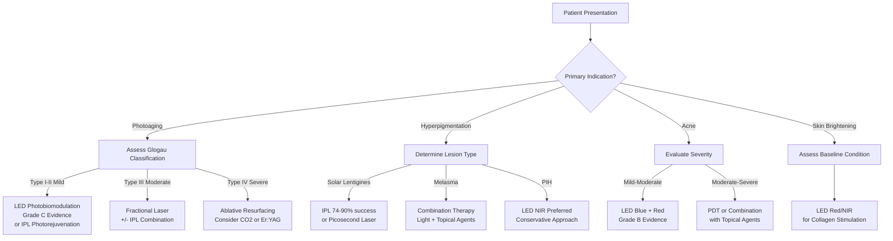
```mermaid
flowchart TD
    A[Patient Presentation] --> B{Primary Indication?}
    B -->|Photoaging| C[Assess Glogau Classification]
    B -->|Hyperpigmentation| D[Determine Lesion Type]
    B -->|Acne| E[Evaluate Severity]
    B -->|Skin Brightening| F[Assess Baseline Condition]
    
    C -->|Type I-II Mild| G[LED Photobiomodulation<br>Grade C Evidence<br>or IPL Photorejuvenation]
    C -->|Type III Moderate| H[Fractional Laser<br>+/- IPL Combination]
    C -->|Type IV Severe| I[Ablative Resurfacing<br>Consider CO2 or Er:YAG]
    
    D -->|Solar Lentigines| J[IPL 74-90% success<br>or Picosecond Laser]
    D -->|Melasma| K[Combination Therapy<br>Light + Topical Agents]
    D -->|PIH| L[LED NIR Preferred<br>Conservative Approach]
    
    E -->|Mild-Moderate| M[LED Blue + Red<br>Grade B Evidence]
    E -->|Moderate-Severe| N[PDT or Combination<br>with Topical Agents]
    
    F --> O[LED Red/NIR<br>for Collagen Stimulation]
```

#### Skin Type Integration Algorithm

Following initial indication assessment, Fitzpatrick skin type determines parameter modifications:

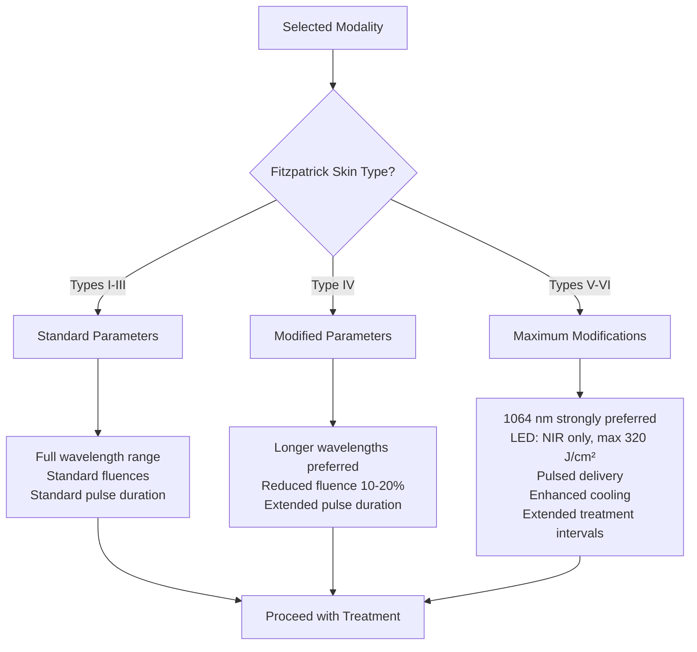
```mermaid
flowchart TD
    A[Selected Modality] --> B{Fitzpatrick Skin Type?}
    B -->|Types I-III| C[Standard Parameters]
    B -->|Type IV| D[Modified Parameters]
    B -->|Types V-VI| E[Maximum Modifications]
    
    C --> F[Full wavelength range<br>Standard fluences<br>Standard pulse duration]
    
    D --> G[Longer wavelengths preferred<br>Reduced fluence 10-20%<br>Extended pulse duration]
    
    E --> H[1064 nm strongly preferred<br>LED: NIR only, max 320 J/cm²<br>Pulsed delivery<br>Enhanced cooling<br>Extended treatment intervals]
    
    F --> I[Proceed with Treatment]
    G --> I
    H --> I
```

#### Combination Versus Monotherapy Decision Framework

The decision to employ combination therapy versus monotherapy should consider efficacy requirements, safety tolerance, and patient factors:

| Factor | Favors Monotherapy | Favors Combination Therapy |
|--------|-------------------|---------------------------|
| **Condition severity** | Mild | Moderate to severe |
| **Prior treatment response** | Treatment-naïve or good responder | Partial responder or recurrent |
| **Skin type** | Types I-III | Types I-III (with caution for IV-VI) |
| **PIH risk tolerance** | Low tolerance | Acceptable with monitoring |
| **Treatment timeline** | Extended acceptable | Faster results desired |
| **Melasma subtype** | Epidermal | Dermal or mixed |

**Evidence-Based Decision Points:**

For **melasma**, the meta-analytic evidence demonstrates that combination therapy achieves superior outcomes (SMD: -0.55) compared to monotherapy, with benefits increasing progressively over 8-16 weeks[^112]. However, the significantly elevated adverse event risk (OR: 8.96) necessitates careful patient selection[^113]. The conclusion emphasizes that **combination therapy can effectively enhance melasma treatment, but careful patient selection and monitoring are crucial due to the risk of side effects**[^137].

For **photoaging**, combination approaches targeting multiple tissue layers (e.g., RF microneedling + fractional CO2) achieve comprehensive improvements exceeding single-modality results[^124][^125].

For **acne**, LED combination therapy (blue + red light) demonstrates synergistic effects, with one study showing **81% lesion reduction at 12 weeks** with alternating wavelengths[^108][^109].

#### LED Protocol Design Algorithm

| Decision Point | Options | Selection Criteria |
|---------------|---------|-------------------|
| **Wavelength** | Blue (415 nm), Red (633 nm), NIR (830 nm), Combination | Based on indication and skin type |
| **Power density** | 20-100 mW/cm² | Higher for rejuvenation; moderate for sensitive skin[^107][^128] |
| **Fluence** | 66-126 J/cm² (light skin); ≤320 J/cm² (skin of color) | Based on skin type MTD[^78] |
| **Session duration** | 10-20 minutes | Based on device output and target fluence |
| **Frequency** | 2-3x weekly | Grade B evidence for twice weekly[^77] |
| **Course duration** | 4-12 weeks | Minimum 8 weeks for rejuvenation |

#### Integrated Clinical Pathway

The following comprehensive pathway integrates all decision elements:

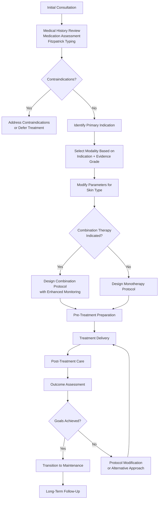
```mermaid
flowchart TD
    A[Initial Consultation] --> B[Medical History Review<br>Medication Assessment<br>Fitzpatrick Typing]
    B --> C{Contraindications?}
    C -->|Yes| D[Address Contraindications<br>or Defer Treatment]
    C -->|No| E[Identify Primary Indication]
    E --> F[Select Modality Based on<br>Indication + Evidence Grade]
    F --> G[Modify Parameters for<br>Skin Type]
    G --> H{Combination Therapy<br>Indicated?}
    H -->|Yes| I[Design Combination Protocol<br>with Enhanced Monitoring]
    H -->|No| J[Design Monotherapy Protocol]
    I --> K[Pre-Treatment Preparation]
    J --> K
    K --> L[Treatment Delivery]
    L --> M[Post-Treatment Care]
    M --> N[Outcome Assessment]
    N --> O{Goals Achieved?}
    O -->|Yes| P[Transition to Maintenance]
    O -->|No| Q[Protocol Modification<br>or Alternative Approach]
    Q --> L
    P --> R[Long-Term Follow-Up]
```

#### Summary of Evidence-Based Recommendations

The systematic review of LED therapy in dermatology concluded that **due to few adverse events, affordability, and encouraging clinical results, physicians should consider using LEDs in clinical practice for conditions with a grade B recommendation, and researchers should continue to explore their use**[^107]. The technology has demonstrated beneficial effects across a range of medical and aesthetic conditions with an excellent safety profile[^129][^138].

For combination therapy approaches, the meta-analysis concluded that **combination therapy can effectively enhance melasma treatment, particularly in patients who do not respond adequately to topical treatments alone**[^112]. However, **careful patient selection and monitoring are crucial due to the increased risk of side effects**, and further large-scale studies with standardized protocols are recommended to validate findings and optimize treatment strategies[^115][^109].

The development of personalized treatment protocols based on individual patient characteristics—including Fitzpatrick skin type, condition severity, and treatment goals—represents the current standard of care. As research continues to refine optimal parameters and combination approaches, clinicians can leverage the evidence-based frameworks presented in this chapter to maximize therapeutic outcomes while appropriately managing risks across the full spectrum of patient presentations and skin types.

## 10 Future Directions and Research Frontiers in Light-Based Aesthetic Medicine

The field of light-based aesthetic medicine stands at a transformative inflection point, with converging advances in artificial intelligence, photonic engineering, regenerative medicine, and precision diagnostics poised to fundamentally reshape treatment paradigms over the coming decade. Building upon the established mechanisms of selective photothermolysis and photobiomodulation that have governed clinical practice for over four decades since Anderson and Parrish's seminal 1983 description, emerging technologies now promise unprecedented levels of treatment personalization, safety optimization, and therapeutic efficacy across diverse patient populations. The recognition that **approximately 50% of melasma patients experience some degree of recurrence within 3-6 months regardless of modality**, combined with the persistent challenge of post-inflammatory hyperpigmentation in darker skin types, underscores the urgent need for innovation that addresses current limitations while expanding treatment accessibility[^139]. This chapter examines the evolving landscape of light-based aesthetic therapies, analyzing emerging technologies, ongoing clinical investigations, and anticipated paradigm shifts that will shape the field, while identifying critical gaps in current scientific understanding that must be addressed to advance treatment efficacy, safety, and accessibility across the full spectrum of patient presentations.

### 10.1 Artificial Intelligence Integration in Light-Based Therapy Optimization

Artificial intelligence has expanded into aesthetic dermatology as a transformative force, offering the potential to integrate objective approaches with the aesthetic judgment of dermatologists while fundamentally enhancing treatment precision, safety, and personalization[^140]. The application of AI in light-based therapies encompasses treatment trajectory optimization, dynamic parameter adjustment, robotic delivery systems, and comprehensive skin analysis platforms that collectively promise to address longstanding challenges in protocol standardization and outcome prediction.

#### Robotic Laser Delivery Systems and Intelligent Path Planning

The development of robotic systems for skin photo-rejuvenation represents one of the most significant advances in laser delivery precision. A novel robotic system calculates and segments the facial surface into seven regions, ensuring these areas are **evenly filled with laser irradiation through intelligent path planning**[^140]. Compared with human practitioners, this system achieves **20% more coverage area and a more uniform, non-overlapping laser distribution**, addressing the operator-dependent variability that has historically contributed to inconsistent treatment outcomes and adverse events.

To overcome the limitations of hard-coded robotic movements, researchers have proposed neural network-based frameworks utilizing **robot imitation learning**, which extracts and transfers laser motion patterns from human experts to robots[^140]. This approach enables seamless adaptation for new treatments, allowing robotic systems to learn the nuanced techniques developed by experienced practitioners while eliminating the fatigue-related inconsistencies inherent in manual delivery. The clinical implications extend beyond simple automation to include the potential for standardized treatment protocols that can be replicated across clinical settings with unprecedented consistency.

#### Neural Network-Based Treatment Parameter Prediction

Personalizing laser treatment parameters with AI addresses one of the most challenging aspects of clinical practice, where factors such as **target size, location, patient skin type, and treatment response** create complex optimization problems that have traditionally relied on clinician experience and iterative adjustment[^140]. Early studies have demonstrated the feasibility of using neural networks to predict clinical responses to laser treatment, with one investigation focusing on excimer laser treatment in vitiligo successfully identifying responders and estimating treatment duration based on variables including skin phenotype and lesion characteristics such as location, duration, and size.

The integration of AI with phototherapy extends to smart LED therapy systems that combine **deep learning with Internet of Things (IoT) platforms**[^140]. These systems detect acne regions and severity, dynamically adjust LED light power density and wavelength, and provide personalized red and blue light therapy based on real-time assessment. Advanced iterations of this technology have expanded diagnostic scope to include acne, herpes simplex virus lesions, and hyperpigmentation while leveraging IoT platforms to record patient data for personalized laser treatments with optimized wavelengths and dosages.

#### Real-Time Thermal Monitoring and Safety Enhancement

Laser treatment safety remains a critical concern that AI-based monitoring systems are uniquely positioned to address. Deep operator networks capable of **predicting subcutaneous temperatures enable real-time monitoring** during treatment delivery[^140]. Similarly, the integration of infrared thermal imaging with convolutional neural networks allows classification of skin thermal responses to laser irradiation, offering valuable insights for optimizing clinical applications and enhancing patient safety.

These temperature control technologies address the fundamental challenge of delivering sufficient energy to achieve therapeutic effects while avoiding thermal damage to surrounding tissues. The ability to monitor and predict temperature distribution in real-time enables dynamic parameter adjustment that can prevent the burns, blistering, and pigmentary changes that have historically limited treatment intensity, particularly in patients with darker skin types.

#### AI-Powered Skin Analysis and Consultation Enhancement

AI-driven skin analysis tools have become integral to many dermatology practices, with applications including **three-dimensional facial reconstruction and models for predicting clinical outcomes**[^141]. The VISIA Skin Analysis System exemplifies current capabilities, evaluating eight skin characteristics including wrinkles, UV damage, texture, pores, general spots, brown spots, red areas, and porphyrins[^141]. These objective assessment tools enable standardized baseline documentation, progress tracking, and data-driven parameter optimization.

Computer vision and deep learning models are increasingly used in cosmetic dermatology to **identify and classify facial rhytides before treatment** with neuromodulators or soft tissue fillers[^141]. The development of iOS-based AI skincare facial analysis systems has been validated in clinical studies, with one HIPAA-compliant system using AI trained with expert grading by dermatologists to examine 14 skin concerns, effectively simulating an in-office visit[^141].

The emergence of sophisticated AI skin analysis platforms is exemplified by **Arora AI**, unveiled at EXPO 2025 Japan as an intelligent assistant integrated into medical-grade skin analysis services[^142]. This system delivers precision analysis across dermatological indications including psoriasis, atopic dermatitis, rosacea, hidradenitis suppurativa, alopecia, onychomycosis, chronic wounds, vitiligo, radiation-induced dermatitis, and injection site reactions. Critically, the system **adapts to different skin types, lighting conditions, and imaging devices**, ensuring reliable results across clinical settings, decentralized trials, and remote home environments[^142].

#### Critical Challenges and Research Priorities

Despite promising developments, critical challenges remain that must be addressed for successful clinical translation of AI in light-based therapy. These include **improving model generalizability and explainability, establishing unified evaluation standards, ensuring data diversity and multimodal interoperability, and addressing security concerns**[^140]. The "black box" problem of AI decision-making poses particular challenges in healthcare settings where clinicians and patients require transparency regarding treatment recommendations.

Algorithmic bias represents a significant concern if models are trained on non-diverse datasets, potentially perpetuating or exacerbating existing disparities in treatment outcomes across different skin types and ethnic populations[^143]. The regulatory landscape continues to evolve, with bodies like the European Commission proposing frameworks such as the Artificial Intelligence Act for high-risk AI systems in healthcare[^143]. Future research must prioritize the development of AI systems trained on diverse, representative datasets with transparent decision-making processes that can be validated across clinical settings.

### 10.2 Advanced Imaging Technologies and Precision Treatment Guidance

The evolution toward precision light-based therapy depends critically on advanced imaging technologies that enable accurate characterization of treatment targets, real-time monitoring of tissue response, and individualized risk stratification. Emerging modalities including optical coherence tomography, hyperspectral imaging, and AI-powered comprehensive scanning systems promise to transform treatment planning from empirical parameter selection to data-driven precision protocols.

#### Optical Coherence Tomography for Treatment Guidance

Optical coherence tomography (OCT) offers the potential to provide critical information about skin lesion characteristics that can inform laser parameter selection. A clinical trial sponsored by the University of California, Irvine, investigated the utility of **OCT imaging in guiding laser treatment of skin lesions** including vascular lesions, scars, and inflammatory conditions such as port-wine stain, rosacea, telangiectasia, and angioma[^144].

The OCT device provided information about lesion characteristics including **lesion depth, depth of the most superficial part of the lesion, and the size and density of blood vessels**[^144]. The goal was to use this information to optimize laser treatment by enabling the laser surgeon to select settings based on OCT measurements rather than standard-of-care visual assessment alone. The study employed lasers including intense pulsed light, pulsed dye lasers, long-pulse 755nm lasers, long-pulse 1064nm lasers, and non-ablative and ablative fractional resurfacing lasers.

While this particular trial was terminated due to pandemic-related follow-up challenges, the conceptual framework it established—using objective imaging data to guide treatment parameter selection—represents a critical research priority. The potential to match laser wavelength, fluence, and pulse duration to specific lesion characteristics based on imaging data could substantially improve treatment outcomes while reducing adverse events.

#### Hyperspectral Imaging and Reflectance Confocal Microscopy

For conditions such as melasma where treatment selection depends critically on pigment depth and distribution, **hyperspectral imaging and reflectance confocal microscopy** offer non-invasive methods to identify depths of pigmentation and vascularity that can guide treatment modifications[^145]. These technologies enable differentiation between epidermal, dermal, and mixed melasma subtypes without requiring biopsy, potentially improving treatment selection and outcome prediction.

The ability to characterize the vascular component of melasma, increasingly recognized as a significant contributor to disease pathophysiology, represents another advantage of advanced imaging. By quantifying both pigmentary and vascular contributions to lesion appearance, clinicians can design combination protocols that address multiple pathophysiological mechanisms simultaneously.

#### AI-Powered Total Body Scanners

The year 2025 has witnessed the launch of major pilot programs in Europe and Australia using **full-body 3D imaging combined with AI lesion tracking**[^146]. These scanners monitor every mole, rash, and skin change over time, flagging abnormalities instantly. AI tools can now **detect new lesions down to the millimeter and compare them with past scans** to identify the earliest signs of concerning changes[^146].

While initially developed for melanoma surveillance, these technologies have significant implications for aesthetic applications. The ability to objectively document treatment response across multiple visits, identify subtle changes in pigmentation or texture, and track long-term outcomes provides the foundation for evidence-based protocol optimization. UK clinics are adopting this technology particularly for high-risk patients, and expansion into routine aesthetic practice appears likely as costs decrease and accessibility improves.

#### The Photonic Risk Index: Quantitative Risk Stratification

A significant conceptual advance in precision treatment planning is the proposed **Photonic Risk Index (PRI)**, a quantitative instrument designed to stratify patients based on their risk of adverse photonic effects and recurrence when receiving laser or light-based treatment[^145]. The PRI considers **patient-specific, lesion-specific, and treatment-specific factors** to produce a composite risk score that aids in individualized treatment planning, energy delivery optimization, and safety enhancement.

This approach represents a paradigm shift from empirical parameter selection based on general guidelines to precision protocols tailored to individual patient characteristics. By integrating factors such as Fitzpatrick skin type, lesion depth and distribution, treatment history, and device-specific parameters, the PRI framework enables systematic risk-benefit optimization that could substantially improve outcomes while reducing complications.

Future research priorities in this area include validation of imaging-based biomarkers as predictors of treatment response, development of standardized protocols for integrating imaging data into clinical decision-making, and establishment of evidence-based thresholds for parameter adjustment based on imaging findings.

### 10.3 Novel Wavelength Applications and Photonic Engineering Innovations

The continuous evolution of light-based therapy depends on innovations in wavelength selection, energy delivery mechanisms, and device engineering that expand treatment capabilities while enhancing safety profiles. Recent advances include novel wavelengths optimized for specific chromophore targets, heat-minimizing engineering solutions, three-dimensional micro-LED technologies, and precision phototherapy devices with real-time feedback capabilities.

#### Emerging Wavelengths for Pigmentation and Dermal Remodeling

The **675 nm fractional laser** has emerged as a promising tool for melasma treatment, targeting both pigment and dermal remodeling while improving skin elasticity and photoaged texture[^139]. This wavelength offers a balance between melanin absorption and penetration depth that may optimize treatment of mixed-depth pigmentation while stimulating dermal regeneration.

**Low-fluence picosecond lasers at 730 nm and 1064 nm** deliver ultrashort energy pulses that fragment melanin granules with **minimal thermal diffusion**, reducing the risk of post-inflammatory hyperpigmentation that has historically limited treatment of darker skin types[^139]. The photomechanical predominance of picosecond delivery enables efficient pigment fragmentation without the extensive thermal damage characteristic of longer-pulse systems, expanding safe treatment options for patients with Fitzpatrick skin types IV-VI.

Heat-minimizing engineering represents a critical frontier in device development. The recognition that **heat-mediated melanogenesis** contributes to treatment-induced hyperpigmentation has driven development of systems that rationally engineer cooling mechanisms to reduce thermal accumulation while maintaining therapeutic efficacy[^145]. These engineering solutions address the fundamental paradox that the thermal energy required for selective photothermolysis can simultaneously stimulate the melanocyte activity that treatment aims to suppress.

#### Three-Dimensional Micro-LED Technologies

A paradigm-shifting advance in LED phototherapy is the development of **three-dimensional micro light-emitting diodes (3D µLEDs)** that overcome the structural limitations of conventional two-dimensional photonic devices[^147]. These systems offer three key functionalities that maximize phototherapeutic effect:

| Functionality | Mechanism | Clinical Advantage |
|--------------|-----------|-------------------|
| **Shape morphing** | Origami-inspired designs conform to complex 3D curvatures | Efficient light delivery through conformal contact |
| **Self-adaptation** | Real-time adaptation to dynamic shape deformations | Sustained high-efficiency irradiation during tissue changes |
| **Multilayered spatiotemporal mapping** | Multisite mapping regardless of anatomical depth | Comprehensive treatment across tissue layers |

A clinical trial of a face-fit surface-lighting µLED (FSLED) mask with face-shaped origami design demonstrated remarkable results for skin rejuvenation: **deep skin elasticity improvement reaching up to 340%, and wrinkle and sagging improvements up to 270%** compared to conventional LED mask groups[^147]. These dramatic improvements are attributed to the FSLED mask's ability to deliver light more effectively through conformal contact with facial contours.

The technology extends beyond cosmetic applications to demonstrate potential for medical treatment. A shape-morphing µLED developed for pancreatic cancer treatment demonstrated self-adaptive capabilities during continuous tumor volume changes over a four-week photodynamic therapy period, achieving a **64% reduction in pancreatic ductal adenocarcinoma volume** while avoiding harmful effects on surrounding tissues[^147].

#### Precision Phototherapy with Real-Time Feedback

Phototherapy is undergoing a precision upgrade with the development of **LED-based devices capable of targeting individual lesions with pixel-level precision**[^146]. Rather than irradiating broad areas of skin, these machines deliver highly localized treatment, minimizing unnecessary exposure while boosting results.

The combination of light therapy with **real-time feedback systems** represents another significant advance. Newer phototherapy units now include infrared sensors that **monitor skin response on the fly and automatically adjust dosage**[^146]. This capability improves both safety and efficacy by preventing overtreatment while ensuring adequate energy delivery to achieve therapeutic thresholds.

**Wearable phototherapy patches** are in development that would enable patients to receive continuous targeted treatment during daily activities[^146]. These small devices deliver UVB or red light directly to affected areas, potentially transforming maintenance therapy for chronic conditions by enabling convenient, consistent treatment outside clinical settings.

#### Advanced Multi-Application Platforms

Contemporary device development emphasizes versatility and precision through multi-application platforms. The **Stellar M22 with XPL Technology** exemplifies this trend, combining four advanced technologies including Expert Pulsed Light with eight wavelength ranges, sub-pulsing technology, and proprietary Advanced Pulse Design for precision and control[^148]. Clinical data demonstrate **clearance rates of 76 to 100% for both vascular and pigmented lesions** after a single XPL session, with single-pass treatments achieving 51 to 75% clearance[^148].

Technologies like **CoolPeel** represent innovation in ablative resurfacing, using CO2 laser technology to deliver benefits of traditional treatment with reduced downtime[^149]. By precisely targeting only damaged skin cells while protecting surrounding tissue, these systems improve skin texture, reduce fine lines, and minimize sun damage with faster recovery than conventional ablative approaches.

### 10.4 Regenerative Aesthetics and Combination Therapy Frontiers

The convergence of light-based therapies with regenerative medicine approaches represents one of the most promising frontiers in aesthetic dermatology. The integration of exosome therapy, laser-assisted drug delivery, and biostimulatory treatments with established light-based modalities offers the potential for synergistic effects that address multiple pathophysiological mechanisms simultaneously while enhancing tissue repair and regeneration.

#### Fractional Laser Combined with Exosome Therapy

A cutting-edge approach involves **fractional CO2 laser combined with exosome therapy**, which enhances pigment clearance and accelerates dermal repair[^139]. Exosomes are tiny extracellular vesicles naturally produced by cells that carry proteins, lipids, and RNA to facilitate intercellular communication. In aesthetic applications, exosomes are being studied for their ability to promote **collagen production, tissue repair, skin regeneration, and reduction in inflammation**[^150].

The mechanism underlying this combination approach leverages the microchannels created by fractional laser treatment to enhance exosome penetration into target tissues. Exosomes applied after laser or microneedling treatments penetrate through these microchannels, promoting collagen generation, increasing cell turnover, and reducing inflammation to **amplify the skin's repair process**[^151]. Patients report that adding exosomes produces smoother, clearer, more firm skin with faster post-treatment recovery.

The interest in exosomes reflects a broader shift toward **regenerative aesthetics and bio-rejuvenation**, moving away from temporary fixes toward long-term, cellular-level solutions[^150]. While exosomes are not yet FDA-approved for cosmetic use, they are generating significant interest in clinical research, with searches for "exosome therapy" increasing dramatically in recent years[^152].

Clinical protocols for exosome therapy are emerging, with treatment packages typically including:

| Package Type | Components | Primary Indications |
|--------------|------------|---------------------|
| **Exosome Facial Boost** | Topical exosome application | Glow, hydration, early aging |
| **Exosome + Microneedling** | Combined mechanical and regenerative | Texture repair, scars, enlarged pores |
| **Exosome Full Protocol** | Multiple sessions with comprehensive approach | Anti-aging + deep rejuvenation |

The exosomes pipeline is robust, with over **80 active companies working to develop 100+ pipeline therapies**[^153]. Leading companies include Capricor Therapeutics, Regeneus, Aegle Therapeutics, and Direct Biologics, with promising therapies including ExoFlo (an acellular human bone marrow mesenchymal stem cell-derived extracellular vesicle product) and AGLE-102 (an allogeneic-derived extracellular vesicle product from normal donor mesenchymal stem cells)[^153].

#### Laser-Assisted Drug Delivery

**Laser-assisted drug delivery** uses fractional lasers to create microchannels that enhance penetration of topical agents like tranexamic acid or hydroquinone, potentially increasing efficacy while minimizing side effects[^145]. This approach addresses a fundamental limitation of topical therapy—the barrier function of intact stratum corneum that limits drug penetration to therapeutic concentrations.

For melasma treatment specifically, the combination of fractional laser with tranexamic acid delivery represents a promising approach that targets both the pigmentary and inflammatory components of disease pathophysiology. The microchannels created by fractional treatment enable direct delivery of depigmenting agents to the dermis, where they can act on melanocytes and the vascular components that contribute to melasma persistence.

The integration of fractional CO2 lasers with exosome or tranexamic acid delivery illustrates how **procedural and biologic innovations are converging to create next-generation combination therapies**[^139]. These approaches hold promise for addressing the multiple pathophysiological mechanisms underlying recalcitrant conditions while potentially reducing the treatment burden and adverse event risk associated with aggressive monotherapy.

#### Biostimulators and Energy-Based Device Integration

**Biostimulators such as poly-L-lactic acid (PLLA) and calcium hydroxylapatite (CaHA)** are becoming increasingly popular as adjuncts to light-based therapy[^154]. These substances are injected into the skin to stimulate production of collagen and other extracellular matrix components, complementing the collagen remodeling effects of laser and LED treatments.

**Polynucleotide treatments** are gaining traction for their ability to enhance overall skin health and appearance through promotion of cellular activity and tissue regeneration[^154]. **Amino acid injectables** use amino acids to stimulate collagen production and improve skin elasticity, representing part of a broader trend toward treatments that support the body's natural regenerative processes[^154].

The combination of these biostimulatory approaches with energy-based devices creates opportunities for synergistic protocols that address skin quality from multiple angles. Many providers are finding that **combining collagen-stimulating injections with energy devices produces impressive effects** that exceed those achievable with either approach alone[^151].

#### Research Priorities for Regenerative Combination Therapies

Despite promising preclinical and early clinical data, significant challenges remain in translating exosome-based therapies into validated clinical protocols. These include **regulatory uncertainties, lack of standardized potency assays, and complexity of reproducible large-scale manufacturing**[^155]. Future research must address these challenges while establishing optimal protocols for combining regenerative approaches with established light-based modalities.

Priority research areas include:
- Standardized protocols for exosome preparation and quality control
- Optimal timing and sequencing of regenerative and energy-based treatments
- Long-term safety and efficacy data for combination approaches
- Identification of patient populations most likely to benefit from regenerative adjuncts

### 10.5 Addressing Treatment Gaps in Diverse Skin Types and Recalcitrant Conditions

The historical underrepresentation of patients with Fitzpatrick skin types IV-VI in light-based therapy research has contributed to elevated adverse event rates and limited treatment options for these populations. Addressing these disparities represents a critical priority for the field, requiring development of devices utilizing energies not specifically absorbed by melanin, refined photobiomodulation protocols, biomarker-driven personalization approaches, and clinical trials enrolling diverse participant populations.

#### Devices Utilizing Non-Melanin-Absorbed Energies

The development of devices utilizing energies not specifically absorbed by melanin has expanded non-invasive treatment options for patients with darker skin types due to lower PIH risk. **Microfocused ultrasound** and **fractional radiofrequency** represent technologies that achieve therapeutic effects through mechanisms independent of melanin absorption, enabling treatment of patients who would be at unacceptable risk with traditional laser or IPL approaches.

For acne scars in patients with skin phototypes III-VI, the combination of **fractional non-ablative lasers and fractional RF** may optimize outcomes with minimal adverse effects. Split-face studies have demonstrated that combination treatment with 1550-nm erbium-doped laser and RF microneedling was significantly more effective than laser alone, with minimal downtime and **no pigmentary changes**. Fractional RF treatment alone has proven effective for various acne scar morphologies, with associated PIH being **more transient (lasting less than one month)** compared to ablative and non-ablative lasers.

**Microfocused ultrasound with visualization (MFU-V)** for skin tightening appears particularly safe for skin of color, as its energy is not absorbed by melanin. Safety analyses in skin phototypes III-VI report adverse effects that resolved within one month, with **no reports of significant dyspigmentation**.

#### Refined Photobiomodulation Protocols

**Refined PBM protocols** utilizing setups with low energy and short re-treatment intervals offer promise for treating hyperpigmentation in darker skin types while avoiding heat damage[^145]. By adjusting fluence, wavelength, and re-treatment interval, these protocols address melanocyte processes without triggering the inflammatory responses that lead to PIH.

An international multidisciplinary panel of experts has created consensus guidelines on the safe and effective use of photobiomodulation, establishing that **PBM is a safe treatment modality for adult patients and red light PBM does not induce DNA damage**[^156]. The therapeutic efficacy of PBM is primarily attributed to modulation of mitochondrial cytochrome c oxidase activity, with efficacy on target tissue relying on optimization of parameters including light source, wavelength, energy density, light structure, and duration of application[^156].

For patients with darker skin types, **near-infrared wavelengths (800-1000 nm) are specifically recommended** as they bypass epidermal melanin more effectively than shorter wavelengths. Pulsed LED delivery further minimizes overheating and melanin overstimulation in susceptible individuals.

#### Biomarker-Driven Personalization

**Biomarker-driven personalization** represents an emerging approach that holds promise for improving long-term outcomes by addressing pigmentation, inflammation, and photoaging simultaneously[^139]. Deep learning models integrating genetic markers, metabolic parameters, and clinical characteristics can predict treatment response with increasing accuracy.

For psoriasis treatment, deep learning models integrating **HLA-C*06:02 genotype, body mass index, and insulin resistance status** predict IL-17 inhibitor response with 83.5% accuracy[^157]. Similar approaches could be developed for predicting response to light-based therapies for pigmentation disorders, enabling treatment selection based on individual patient characteristics rather than empirical trial.

**Digital twin technology** represents another frontier, with applications already demonstrated in simulating drug pharmacokinetics and reducing dosage adjustments[^157]. Extension of this technology to light-based therapy could enable virtual testing of treatment protocols before clinical application, optimizing parameters based on predicted individual response.

#### Clinical Trial Diversity Requirements

A significant limitation in current evidence is the **paucity of studies focusing exclusively on skin phototypes V-VI**, making it difficult to draw specific conclusions for these darkest skin types. The beauty industry is increasingly embracing values of diversity and inclusivity, with clinical trials for aesthetic medicine procedures expected to reflect this trend by **enrolling diverse ranges of participants**[^154].

Future research must prioritize:
- Dedicated trials in Fitzpatrick V-VI populations
- Standardized outcome measures validated across skin types
- Long-term safety monitoring for PIH and other pigmentary complications
- Development of skin type-specific treatment guidelines

### 10.6 Smart Photoprotection and Maintenance Strategy Innovations

The high relapse rates characteristic of melasma and photoaging underscore the critical importance of maintenance strategies that extend beyond periodic professional treatments. Next-generation approaches to treatment maintenance include smart photoprotection technologies, AI-guided home-use devices, and integrated digital monitoring systems that address the multifactorial nature of recurrence.

#### Smart Photoprotection Technologies

**Smart Photoprotection 2.0** represents advances in photoprotection including next-generation approaches such as **wearable light sensors that alert patients to harmful sun exposure**, iron oxide-embedded textiles, and adaptive SPF software[^145]. These technologies provide immediate protection while reducing recurrence through digital monitoring and enhanced protective ingredients.

The recognition that **UV radiation is one of the most well-established environmental triggers of melasma** has driven development of comprehensive photoprotection strategies that extend beyond traditional sunscreen application[^139]. UV exposure leads to formation of reactive oxygen species causing oxidative stress that activates signaling pathways stimulating melanogenesis. Smart photoprotection addresses this mechanism through real-time monitoring and adaptive protection.

Iron oxide-embedded textiles represent a particularly promising innovation, providing physical barrier protection that does not require reapplication and maintains efficacy regardless of sweating or water exposure. These textiles can be incorporated into everyday clothing, hats, and accessories, enabling comprehensive protection during daily activities.

#### AI-Guided Home-Use Devices

The development of home-use devices with AI-guided protocols represents a significant advance in maintenance therapy accessibility. **Smart skin devices** incorporating AI analyze skin characteristics and create customized treatment routines that can be reassessed periodically[^158]. The device market is projected to have an annual growth rate of 12%, reflecting growing consumer interest in technology-enabled skincare[^158].

AI-powered LED devices can customize light output based on assessment of skin needs through phone applications that use consumer-completed questionnaires to determine necessary program modifications and document improvement[^158]. These systems enable personalized maintenance protocols that adapt to changing skin conditions and treatment response.

**Teledermatology platforms** are evolving beyond simple video consultations to integrate dermatoscopic imaging, AI triage, and home skin scanners[^146]. Some systems now allow patients to take high-resolution images of skin lesions using specially designed phone attachments, with images analyzed by algorithms trained on millions of clinical images before review by consultant dermatologists. This technology enables remote monitoring of treatment response and early detection of recurrence.

#### Integrated Maintenance Strategies

Effective maintenance requires integration of multiple approaches addressing different aspects of recurrence risk:

| Component | Technology/Approach | Function |
|-----------|-------------------|----------|
| **Daily protection** | Smart photoprotection, iron oxide textiles | Prevent UV-triggered melanogenesis |
| **Topical maintenance** | AI-guided product selection | Maintain depigmenting effects |
| **Periodic professional treatment** | LED photobiomodulation, IPL | Address early recurrence |
| **Digital monitoring** | Home imaging, AI analysis | Detect changes requiring intervention |

The combination of these approaches creates a comprehensive maintenance ecosystem that addresses the multiple factors contributing to treatment failure. Research priorities include validation of integrated maintenance protocols, cost-effectiveness analysis, and identification of optimal monitoring intervals for different patient populations.

### 10.7 Clinical Trial Landscape and Regulatory Considerations

The translation of promising technologies into validated clinical applications requires robust clinical evidence and appropriate regulatory pathways. The current clinical trial landscape encompasses investigations of novel laser and LED applications, combination protocols, and AI-assisted treatment systems, while regulatory frameworks continue to evolve to address breakthrough technologies.

#### Current Clinical Trial Activity

The exosomes pipeline exemplifies the robust research activity in regenerative aesthetics, with **80+ companies and 100+ pipeline drugs** under investigation[^153]. Notable ongoing studies include evaluation of PEP-TISSEEL combined with standard of care for non-healing diabetic foot ulcers, with potential applications extending to aesthetic indications[^153].

**AI clinical trial optimization** is transforming pharmaceutical research, with predictive analytics models achieving **85% accuracy in forecasting trial outcomes** and digital biomarkers enabling **90% sensitivity for adverse event detection** through continuous monitoring[^143]. These capabilities could substantially accelerate development of light-based therapy protocols by improving patient recruitment, site selection, and outcome prediction.

The use of **digital twins**—AI-generated virtual patient populations—represents a frontier in clinical trial design that could reduce the need for large placebo groups while enabling simulation of patient responses to treatments[^143]. This approach could be particularly valuable for light-based therapy research, where ethical considerations may limit placebo-controlled designs for conditions with established effective treatments.

#### Regulatory Pathways and Challenges

Breakthrough laser technologies are likely to require testing via the **Investigational Device Exemption (IDE) route** rather than through the 510(k) program due to their innovative nature[^154]. The FDA's draft guidances for the 510(k) program released in September 2023 emphasize the need for robust clinical data, particularly for non-surgical body contouring and sculpting technologies[^154].

**Exosome-based treatments face particular regulatory challenges** due to their unique mechanisms of action, lack of standardization, and safety concerns[^154]. The rapid advancement of regenerative technologies has outpaced regulatory frameworks, leading to uncertainty over product quality and future safety and efficacy requirements.

The importance of testing and regulation in maintaining consumer trust cannot be underestimated. **Globally recognized contract research organizations play crucial roles** in determining effectiveness and safety of products and devices, providing necessary evidence for regulatory approval while helping set realistic expectations for practitioners and patients[^154].

#### Standardized Outcome Measures and Long-Term Safety Data

A critical gap in current evidence is the lack of standardized outcome measures and long-term safety data for advanced modalities. The variability in treatment parameters, outcome assessment methods, and follow-up duration across studies precludes meaningful comparison and meta-analysis.

Priority areas requiring robust clinical evidence include:
- Long-term safety of picosecond laser technology across skin types
- Durability of exosome-enhanced treatment outcomes
- Comparative effectiveness of AI-guided versus standard protocols
- Optimal maintenance strategies for preventing recurrence

The development of standardized protocols represents an important area for ongoing research, with the goal of optimizing therapeutic outcomes across diverse patient populations and clinical settings.

### 10.8 Priority Research Areas and Knowledge Gaps Requiring Investigation

The synthesis of current scientific understanding reveals critical gaps that limit optimal application of light-based therapies. Addressing these gaps requires coordinated research efforts spanning basic mechanism studies, clinical protocol development, and establishment of evidence-based guidelines for personalized treatment planning.

#### Mechanistic Understanding of Photoaging and Melanogenesis

While substantial progress has been made in understanding the pathophysiology of melasma, **significant gaps remain regarding the precise molecular mechanisms by which hormonal fluctuations influence melanogenesis**[^139]. Although oxidative stress and inflammatory responses induced by UV radiation are known to play significant roles, the exact pathways linking photoaging with melanocyte activation and pigment deposition are not completely elucidated.

Emerging evidence indicates that melasma reflects features of both photoaging and **intrinsic, chronological skin aging**[^139]. Senescent dermal fibroblasts release paracrine mediators that enhance melanogenesis, and oxidative stress acts as a unifying mechanism between intrinsic and photo-induced aging. However, the full spectrum of these aging-related mechanisms and their interplay with light-induced damage requires further exploration.

Research priorities include:
- Elucidation of paracrine signaling between senescent fibroblasts and melanocytes
- Characterization of the vascular contribution to melasma pathophysiology
- Understanding of hormonal receptor expression and signaling in affected melanocytes
- Investigation of the role of the microbiome in skin pigmentation

#### Treatment Protocol Standardization

On the therapeutic front, **there is still no universally effective therapy for melasma, and relapse rates remain high**[^139]. Current laser therapies can be ineffective or exacerbate pigmentation in certain skin types, and there is a lack of consensus on the most effective treatment regimens. The risk of post-inflammatory hyperpigmentation remains a significant barrier, particularly for patients with darker skin types.

Despite promising outcomes with various modalities, **variability in treatment parameters** such as wavelength, power density, fluence, and treatment regimens remains a significant challenge. Inconsistencies in device specifications, treatment protocols, and study design preclude the standardization that would enable more consistent clinical application.

Priority research areas for protocol standardization include:
- Head-to-head comparative trials of different modalities for specific indications
- Identification of optimal combination therapy sequences and timing
- Development of skin type-specific parameter guidelines
- Establishment of standardized outcome measures for clinical trials

#### Evidence-Based Guidelines for Personalized Treatment

The development of evidence-based guidelines integrating **patient-specific, lesion-specific, and treatment-specific factors** represents a critical priority for advancing personalized treatment planning[^145]. Current guidelines often provide general recommendations that do not adequately account for individual variation in treatment response and adverse event risk.

The proposed Photonic Risk Index framework offers a model for integrating multiple factors into treatment planning, but validation studies are needed to establish its clinical utility. Similarly, AI-based prediction models require validation across diverse patient populations before clinical implementation.

Future directions identified in the literature include:
- **Regenerative technologies** addressing multiple pathophysiological mechanisms
- **Biomarker-driven personalization** enabling treatment selection based on individual characteristics
- **AI-assisted assessment** improving outcome prediction and treatment optimization
- **Integration of fractional lasers with biologic innovations** for next-generation combination therapies[^139]

#### Addressing Disparities in Evidence Base

A fundamental priority is addressing the disparities in evidence quality across different patient populations. The paucity of studies focusing exclusively on skin phototypes V-VI limits the ability to develop evidence-based guidelines for these populations. Clinical trials must prioritize enrollment of diverse participant populations to ensure that treatment guidelines are applicable across the full spectrum of skin types.

The recognition that **existing evidence suggests skin of color may be more susceptible to adverse effects from certain wavelengths** necessitates dedicated research establishing safe and effective protocols for these populations. Development of maximum tolerated dose guidelines specific to skin of color, based on rigorous clinical trial data, represents a critical priority.

In conclusion, the future of light-based aesthetic medicine lies at the intersection of technological innovation, precision medicine, and regenerative biology. The integration of artificial intelligence, advanced imaging technologies, novel wavelengths, and regenerative approaches promises to transform treatment capabilities while addressing longstanding limitations in safety and efficacy across diverse patient populations. Realizing this potential requires coordinated research efforts addressing current knowledge gaps, development of standardized protocols validated across skin types, and establishment of regulatory frameworks that enable responsible innovation while ensuring patient safety. The field stands poised for transformative advances that will expand treatment accessibility, improve outcomes for recalcitrant conditions, and ultimately deliver on the promise of personalized, effective light-based therapy for all patients seeking aesthetic improvement.

# 参考内容如下：
[^1]:[Intense Pulsed Light (IPL) Therapy - StatPearls - NCBI Bookshelf](https://www.ncbi.nlm.nih.gov/books/NBK580525/)
[^2]:[Overview of lasers - PMC - PubMed Central - NIH](https://pmc.ncbi.nlm.nih.gov/articles/PMC2825126/)
[^3]:[Lasers: Principles, Clinical Applications, & Complications](https://www.theplasticsfella.com/lasers/)
[^4]:[Intense pulsed light therapy (IPL, flashlamp)](https://dermnetnz.org/topics/intense-pulsed-light-therapy)
[^5]:[The Science Behind Intense Pulsed Light Therapy](https://www.privvyhealth.com/the-science-behind-intense-pulsed-light-therapy/)
[^6]:[Light‐emitting diodes in dermatology: A systematic review ...](https://pmc.ncbi.nlm.nih.gov/articles/PMC6099480/)
[^7]:[Optimizing Low-Level Light Therapy for Skin Rejuvenation](https://digitalcommons.kansascity.edu/cgi/viewcontent.cgi?article=2015&context=studentpub)
[^8]:[Choosing the Right Light-Based Treatment: LED, Laser, or ...](https://discoverheirloom.com/blogs/blog/choosing-the-right-light-based-treatment-led-laser-or-ipl?srsltid=AfmBOoqAbEMNAfxA-wuMvUfDiGOzkrkxD_bK_FwdobbMnk1kvMtcRjD_)
[^9]:[Dual Effect of Photobiomodulation on Melasma](https://jcadonline.com/effect-photobiomodulation-melasma/)
[^10]:[What Is Selective Photothermolysis and how does it affect ...](https://www.theparlourmiami.com/post/what-is-selective-photothermolysis-and-how-does-it-affect-my-laser-treatment)
[^11]:[Photoaging: Current Concepts on Molecular Mechanisms, ...](https://pubmed.ncbi.nlm.nih.gov/40072791/)
[^12]:[Molecular Mechanisms of Photoaging in Human Skin ...](https://pubmed.ncbi.nlm.nih.gov/10048311/)
[^13]:[Glogau Wrinkle Scale](https://sfderm.com/glogau-wrinkle-scale/)
[^14]:[Where Do You Sit on the Glogau Wrinkle Scale Today?](https://www.dermapenworld.com/en-us/blog/skin-ageing-glogau-scale)
[^15]:[Why The Glogau Scale Is The Holy Grail Of Anti Ageing](https://thenakedchemist.com/photoageing-and-the-glogau-scale/?srsltid=AfmBOooeDNZJDE0GtYI6_8n35yi3D8Z8pquZGj_5uFtgovAm4mV-Vkfl)
[^16]:[Common Pigmentation Disorders](https://www.aafp.org/pubs/afp/issues/2009/0115/p109.html)
[^17]:[The Efficacy of Laser Therapy in Melasma Treatment](https://pmc.ncbi.nlm.nih.gov/articles/PMC12696807/)
[^18]:[Efficacy and Safety of Low-Fluence 730-nm Picosecond ...](https://journals.lww.com/dermatologicsurgery/fulltext/2025/02000/efficacy_and_safety_of_low_fluence_730_nm.11.aspx)
[^19]:[Treating Melasma with LED Light Therapy - Maysama](https://maysama.com/blogs/news/using-led-therapy-for-treating-melasma?srsltid=AfmBOoq0hCO_tGkc9NQSiqvPG1GzwUMnAuqD0wPm67br6GlaD-aIAzzl)
[^20]:[Brown spots, lentigos and freckles](https://dermnetnz.org/topics/brown-spots-and-freckles)
[^21]:[The Different Types of Hyperpigmentation: Understanding ...](https://www.dermdoctorsnva.com/blog/1191999-the-different-types-of-hyperpigmentation-understanding-melasma-post-inflammatory-hyperpigmentation-and-more/)
[^22]:[Treatment of Solar Lentigines: A Systematic Review ...](https://pmc.ncbi.nlm.nih.gov/articles/PMC11948172/)
[^23]:[Lasers and the skin](https://www.thepmfajournal.com/features/post/lasers-and-the-skin)
[^24]:[A Case Report of Ephelides and Lentigines in Syrian Women](https://pmc.ncbi.nlm.nih.gov/articles/PMC12358231/)
[^25]:[Postinflammatory Hyperpigmentation - StatPearls - NCBI - NIH](https://www.ncbi.nlm.nih.gov/books/NBK559150/)
[^26]:[Laser Fitzpatrick Skin Type Recommendations - NCBI - NIH](https://www.ncbi.nlm.nih.gov/books/NBK557626/)
[^27]:[The Short and Long-Term Side Effects of IPL (Intense ...](https://www.schraderplasticsurgery.com/blog/ipl-long-term-side-effects)
[^28]:[Why Your Skin Type Matters for Laser & Aesthetic Treatments](https://denverdreammedspa.com/blog/fitzpatrick-skin-types-explained-why-your-skin-type-matters-for-laser-aesthetic-treatments?srsltid=AfmBOoqoqR3GH_cIRKUSRvBKQ3-Dsa88ziG2p1_VE_2mMT0QUz3t_DdI)
[^29]:[IPL for Different Skin Types - EyeCare Consultants of NJ](https://eyecareconsultantsnj.com/article/ipl-for-different-skin-types/)
[^30]:[Ablative Laser Resurfacing - StatPearls - NCBI Bookshelf - NIH](https://www.ncbi.nlm.nih.gov/books/NBK557474/)
[^31]:[Fractional Erbium Laser Vs CO2 Laser - What is the ...](https://ensoulclinic.com/fractional-erbium-laser-vs-co2-laser-which-is-better/)
[^32]:[Erbium Vs CO2 Laser: Which Is Better For Your Needs?](https://www.avanta3.com/blog/erbium-vs-co2-laser/?srsltid=AfmBOooGZTd95k4YRFSlq1ICTDF-0Fb0nJEgYpizL6hTLN3fQLRdTM1i)
[^33]:[Non-ablative Laser Rejuvenation](https://www.asds.net/skin-experts/skin-treatments/non-ablative-laser-rejuvenation)
[^34]:[Non-Ablative Laser Resurfacing](https://www.skinceuticals.com/professional-treatments/non-ablative-laser.html)
[^35]:[Comparison of the efficacy and safety of picosecond Nd:YAG ...](https://pmc.ncbi.nlm.nih.gov/articles/PMC10086227/)
[^36]:[Q-Switched 650-nm Wavelength Laser Treatment](https://jamanetwork.com/journals/jamadermatology/fullarticle/1913666)
[^37]:[Efficacy and Safety of Q-Switched 1064/532 nm Nd:YAG ...](https://pmc.ncbi.nlm.nih.gov/articles/PMC10971304/)
[^38]:[Pico Laser 101](https://dscbeauty.com/2025/02/06/pico-laser-101/)
[^39]:[Pulsed-Dye-Laser-Development-Clinical- ...](https://fortecmedical.com/wp-content/uploads/Pulsed-Dye-Laser-Development-Clinical-Study.pdf)
[^40]:[595 nm Pulsed Dye Laser: Efficacy Assessment](https://pmc.ncbi.nlm.nih.gov/articles/PMC10576172/)
[^41]:[Dye Laser Applications in Cosmetic Dermatology: Efficacy ...](https://www.mdpi.com/2079-9284/11/6/227)
[^42]:[Current Trends in Intense Pulsed Light | JCAD](https://jcadonline.com/current-trends-in-intense-pulsed-light/)
[^43]:[IPL vs Laser Treatment: Which is Best for Cosmetic Skincare?](https://mcosmeticsurgery.com/ipl-vs-laser-treatment-which-is-best/)
[^44]:[Intense pulsed light](https://grokipedia.com/page/Intense_pulsed_light)
[^45]:[Fundamentals of Pulsed Light](https://aestheticmedicalpractitioner.com.au/features/cosmetic-practice/fundamentals-of-pulsed-light/)
[^46]:[IPL Laser Clinical Treatment Details Guide](https://www.litonlaser.com/ipl-laser-clinical-treatment-details-guide/)
[^47]:[IPL-Treatment-of-Vascular-and-Pigmented-Lesions-in- ...](https://www.gavinpublishers.com/assets/articles_pdf/IPL-Treatment-of-Vascular-and-Pigmented-Lesions-in-Clinical-Practice-A-Retrospective-Case-Series.pdf)
[^48]:[Comprehensive Facial Skin Rejuvenation With Long‐Term ...](https://pmc.ncbi.nlm.nih.gov/articles/PMC12833585/)
[^49]:[Photorejuvenation: Light & Bright™ treatment for enhanced ...](https://www.thepmfajournal.com/education/case-reports/post/photorejuvenation-light-bright-treatment-for-enhanced-skin-quality)
[^50]:[IPL Laser for Benign Pigmented or Vascular Lesions](https://www.dermatologymidwest.com/contents/our-services/cosmetic-services/ipl-laser-for-benign-pigmented-or-vascular-lesions)
[^51]:[IPL Treatment of Vascular and Pigmented Lesions in ...](https://www.gavinpublishers.com/article/view/ipl-treatment-of-vascular-and-pigmented-lesions-in-clinical-practice-a-retrospective-case-series)
[^52]:[Efficacy of Intense Pulsed Light Treatment in Melasma](https://journals.lww.com/ijd/fulltext/2026/01000/efficacy_of_intense_pulsed_light_treatment_in.8.aspx)
[^53]:[Treatment of melasma by a combination of intense pulsed ...](https://pmc.ncbi.nlm.nih.gov/articles/PMC9351870/)
[^54]:[IPL & Alex 755 Laser Treatment: Related Efficacy Rates for ...](https://www.iconiclaser.com/blog/ipl-alex-755-laser-treatment-related-efficacy-rates-for-pigment-correction)
[^55]:[Unlocking the Power of Light on the Skin - PubMed Central - NIH](https://pmc.ncbi.nlm.nih.gov/articles/PMC11049838/)
[^56]:[A retrospective study on the clinical efficacy of the intense ...](https://pubmed.ncbi.nlm.nih.gov/26734811/)
[^57]:[Skin Rejuvenation Using Intense Pulsed Light](https://jamanetwork.com/journals/jamadermatology/fullarticle/407425)
[^58]:[A Controlled Trial to Determine the Efficacy of Red and ...](https://pmc.ncbi.nlm.nih.gov/articles/PMC3926176/)
[^59]:[a randomized split-face trial with blinded response evaluation](https://pubmed.ncbi.nlm.nih.gov/18563775/)
[^60]:[Comparative Study of a 1064-nm Fractional Picosecond ...](https://clinicaltrials.gov/study/NCT07122310)
[^61]:[A review of laser and light therapy in melasma - PMC](https://pmc.ncbi.nlm.nih.gov/articles/PMC5418955/)
[^62]:[Blue Light Therapy vs IPL for Acne and Sun Damage](https://orangecountyplasticsurgery.com/blue-light-therapy-vs-ipl-for-acne-and-sun-damage-which-treatment-is-right-for-your-skin/)
[^63]:[Home vs. Clinic Red Light Therapy: Performance, Safety, ...](https://mitoredlight.com/blogs/mito-red-blog/home-vs-clinic-red-light-therapy-performance-safety-and-cost-comparison?srsltid=AfmBOop_5_FxWEvyGO0lrNjbd3RGPyObtm0lsyyZR-i6aAXJThGj0T3q)
[^64]:[How Much Will You Pay For Red Light Therapy? 2024 Cost ...](https://www.blockbluelight.com/blogs/news/red-light-therapy-cost-breakdown?srsltid=AfmBOorndN3IYrOSeNoxpL1Chb6U9nnQZ_g50t7j3IKACaw37voTGvBg)
[^65]:[How Much Is Red Light Therapy? Cost Per Session & ...](https://sunsuptanningcenters.com/how-much-is-red-light-therapy/)
[^66]:[Intense Pulsed Light (IPL) Laser Skin Treatment](https://saguaroderm.com/services/cosmetic-dermatology/intense-pulsed-light/)
[^67]:[How Much Does Red Light Therapy Cost? Your Complete ...](https://redlightmethod.com/how-much-does-red-light-method-cost/)
[^68]:[Cost-Effective Beauty: Evaluating the Worth of IPL Treatment](https://laserskinmedspa.com/ipl-treatments/cost-effective-beauty-evaluating-the-worth-of-ipl-treatment/)
[^69]:[Average Costs of Laser Therapy: Budgeting for Treatment](https://loucilchiro.com/laser-therapy-costs/)
[^70]:[IPL Treatment Cost: An Honest Review of Prices](https://spablack.com/ipl-treatment-cost/)
[^71]:[How much does laser therapy cost?](https://www.lasertherapyinstitute.org/post/how-much-does-laser-therapy-cost)
[^72]:[How Much Does an IPL Laser Facial Cost?](https://bodyandbeautylab.com/how-much-does-an-ipl-laser-facial-cost/)
[^73]:[Light Lounge Red Light Therapy Pricing](https://lightlounge.life/pricing)
[^74]:[Laser vs IPL: Complete Technology Selection Guide for ...](https://certifa-aesthetics.com/2025/07/09/laser-vs-ipl-guide/)
[^75]:[Complications of laser and light-based devices therapy in ...](https://ijdvl.com/complications-of-laser-and-light-based-devices-therapy-in-patients-with-skin-of-color/)
[^76]:[IPL (Intense Pulsed Light)](https://whalenderm.com/wp-content/uploads/2023/12/IPL-CONTRAINDICATIONS-FINAL.pdf)
[^77]:[Phototherapy with Light Emitting Diodes: Treating a Broad ...](https://jcadonline.com/phototherapy-light-emitting-diodes-feb2018/)
[^78]:[Phototherapy with Light Emitting Diodes](https://pmc.ncbi.nlm.nih.gov/articles/PMC5843358/)
[^79]:[Pulsed dye laser treatment](https://dermnetnz.org/topics/pulsed-dye-laser-treatment)
[^80]:[Comparison of the efficacy and safety of pulsed dye laser, ...](https://www.dovepress.com/comparison-of-the-efficacy-and-safety-of-pulsed-dye-laser-intense-puls-peer-reviewed-fulltext-article-CCID)
[^81]:[Comparison of the efficacy and safety of pulsed dye laser ...](https://pmc.ncbi.nlm.nih.gov/articles/PMC12351582/)
[^82]:[Laser Complications - StatPearls - NCBI Bookshelf - NIH](https://www.ncbi.nlm.nih.gov/books/NBK532248/)
[^83]:[Light-Based Devices for the Treatment of Facial Erythema and ...](https://pmc.ncbi.nlm.nih.gov/articles/PMC8611125/)
[^84]:[High-energy versus low-energy fractional CO 2 laser in the ...](https://cosmoderma.org/high-energy-versus-low-energy-fractional-co2-laser-in-the-treatment-of-hypertrophic-scars-a-comparative-review-of-efficacy-safety-and-tissue-remodeling/)
[^85]:[Advancements in Laser Therapies for Dermal ...](https://pmc.ncbi.nlm.nih.gov/articles/PMC11012689/)
[^86]:[Safety of light emitting diode-red light on human skin](https://pmc.ncbi.nlm.nih.gov/articles/PMC8887049/)
[^87]:[Who Should Not Use Red Light Therapy? Risks & Safety 101](https://www.foreo.com/mysa/who-should-not-use-red-light-therapy-rtl?srsltid=AfmBOopfUimNFLAE-Cz6ki8IsvWYQbMcM0fNMTPTFsIqZSshUCgnua4_)
[^88]:[Fractional Carbon Dioxide Laser: Optimizing Treatment ...](https://jcasonline.com/fractional-carbon-dioxide-laser-optimizing-treatment-outcomes-for-pigmented-atrophic-acne-scars-in-skin-of-color/)
[^89]:[Phototherapy Safety and Risk Management](https://bdng.org.uk/wp-content/uploads/2017/02/03-Phototherapy-Safety-and-Risk-Management-.pdf)
[^90]:[What are the guidelines for using red light therapy ...](https://www.droracle.ai/articles/656790/what-are-the-guidelines-for-using-red-light-therapy)
[^91]:[IPL Contraindications, Medications & Treatment Waiting Times](https://support.skinbase.co.uk/portal/en/kb/articles/ipl-contraindications-medications-treatment-waiting-times)
[^92]:[Laser Skin Treatments Contraindications & After Care](https://www.ecoskinclinic.co.uk/post/laser-skin-treatments-contraindications-aftercare)
[^93]:[LED Face Mask Contraindications: Who Should Avoid ...](https://www.solawave.co/blogs/led-light-therapy/led-face-mask-contraindications)
[^94]:[A Practical Approach to Home UVB Phototherapy for the ...](https://pmc.ncbi.nlm.nih.gov/articles/PMC4151182/)
[^95]:[treatment guidelines for the use of laser and intense](https://bmla.co.uk/wp-content/documents/BMLA-Treatment-Guidelines-May-2019.pdf)
[^96]:[Unveiling the Top Innovations in Best Picosecond Laser ...](https://www.bilensmedical.com/blog/top-innovations-in-picosecond-laser-device-technology/)
[^97]:[Efficacy of the Combination Therapy of Intense Pulsed Light ...](https://pmc.ncbi.nlm.nih.gov/articles/PMC12679679/)
[^98]:[IPL Narrow Spectrum and Broad Spectrum PAE therapy](https://www.dovepress.com/comparative-efficacy-between-intense-pulsed-light-narrow-spectrum-and--peer-reviewed-fulltext-article-CCID)
[^99]:[M22 IPL and Laser Skin Resurfacing Machine](https://lumenis.com/aesthetics/products/m22/)
[^100]:[Challenges and opportunities in next-generation LED ...](https://www.nature.com/articles/s41377-025-01990-z)
[^101]:[A 7-Week, Open-Label Study Evaluating the Efficacy and ...](https://jcadonline.com/evaluating-the-efficacy-and-safety-of-phototherapy/)
[^102]:[Red light therapy for skin care - Harvard Health](https://www.health.harvard.edu/staying-healthy/red-light-therapy-for-skin-care)
[^103]:[Laser and light-based therapies combined with topical agents ...](https://pmc.ncbi.nlm.nih.gov/articles/PMC12795099/)
[^104]:[Current Trends in Intense Pulsed Light - PMC](https://pmc.ncbi.nlm.nih.gov/articles/PMC3390232/)
[^105]:[Best Red Light Therapy Masks for Aging Skin & Acne](https://www.healthcentral.com/skin-health/best-red-light-therapy-masks-to-treat-skin-concerns)
[^106]:[Comparative Analysis of Pulsed and Continuous Wave ...](https://pmc.ncbi.nlm.nih.gov/articles/PMC12245496/)
[^107]:[Energy-Based Devices for the Treatment of Facial Skin ...](https://pmc.ncbi.nlm.nih.gov/articles/PMC11189641/)
[^108]:[Randomized Clinical Trial on the Efficacy of Oral Tranexamic ...](https://pmc.ncbi.nlm.nih.gov/articles/PMC12418907/)
[^109]:[Efficacy and Safety of Topical Tranexamic Acid Alone or in ...](https://www.dpcj.org/index.php/dpc/article/view/3102)
[^110]:[LED Light Therapy for Hyperpigmentation: Complete Guide](https://ledesthetics.com/blogs/skin-care/led-light-therapy-for-hyperpigmentation?srsltid=AfmBOopSPNG1B8l5RpQhNZmifhn2QfcbYomcd5bVcal61scTHs5oYnjS)
[^111]:[Comprehensive Skin Rejuvenation: The Power of Stacking ...](https://www.rclinic.com.au/blog/comprehensive-skin-rejuvenation-the-power-of-stacking-radiofrequency-microneedling-factional-co2-for-multi-layer-tissue-repair/)
[^112]:[Smart Skin Synergy: Pairing Mesotherapy with Energy ...](https://www.prime-journal.com/smart-skin-synergy-pairing-mesotherapy-with-energy-devices/)
[^113]:[Lasers and Energy-Based Devices for Treatment ...](https://journals.lww.com/dermatologicsurgery/fulltext/9900/lasers_and_energy_based_devices_for_treatment_of.1334.aspx)
[^114]:[Combined Laser Strategies for Scar Treatment](https://www.mdpi.com/2306-5354/12/12/1368)
[^115]:[Oral Tranexamic Acid and Laser for Treatment of Melasma](https://www.clinicaltrials.gov/study/NCT03686787?term=AREA%5BBasicSearch%5D(AREA%5BBasicSearch%5D(and%201927))&rank=2)
[^116]:[A study to determine the efficacy of combination LED light ...](https://pubmed.ncbi.nlm.nih.gov/16414908/)
[^117]:[Systematic Review of the Efficacy and Safety of Topical ...](https://jcadonline.com/efficacy-safety-topical-glutathione/)
[^118]:[How Does LED Light Therapy Work?](https://hawkinsaesthetics.com/led-light-therapy-explained/)
[^119]:[PDT-Pre and Post Care](https://youngdermed.com/wp-content/uploads/2023/03/PDT-Pre-and-Post-Care-New.pdf)
[^120]:[Tranexamic Acid for the Treatment of Hyperpigmentation ...](https://pmc.ncbi.nlm.nih.gov/articles/PMC11439988/)
[^121]:[Treating Melasma with LED Light Therapy - Maysama](https://maysama.com/blogs/news/using-led-therapy-for-treating-melasma?srsltid=AfmBOop1raxE5eujmrYM_Yzfg8OngA9NBq_seHDUrkrSyL3YREw6DvgA)
[^122]:[Expert Consensus on Clinical Recommendations for ...](https://pubmed.ncbi.nlm.nih.gov/39434507/)
[^123]:[A study to determine the efficacy of combination LED light ...](https://cellumaaustralia.com.au/wp-content/uploads/2020/06/A-study-to-determine-the-efficacy.pdf?srsltid=AfmBOooehTqAN0_v74TWu2m7xSQwbrrIwC7eXAsB0gGqUGhdhWtZ34kS)
[^124]:[Oral tranexamic acid, low-fluence intense pulsed light, and ...](https://journals.lww.com/md-journal/fulltext/2025/06130/oral_tranexamic_acid,_low_fluence_intense_pulsed.27.aspx)
[^125]:[Light Therapy and Tranexamic Acid Reduce Facial Redness](https://www.emjreviews.com/dermatology/news/light-therapy-and-tranexamic-acid-reduce-facial-redness/)
[^126]:[Review of Applications of Microneedling in Melasma - PMC](https://pmc.ncbi.nlm.nih.gov/articles/PMC11680975/)
[^127]:[Pre-Treatment Guide For Light Therapy](https://www.elanskinandlaser.com/pre-treatment-guide-for-light-therapy/)
[^128]:[Reverse skin aging signs by red light photobiomodulation](https://pmc.ncbi.nlm.nih.gov/articles/PMC10311288/)
[^129]:[A New Approach with Combined Microneedle and ...](https://pmc.ncbi.nlm.nih.gov/articles/PMC11965193/)
[^130]:[Efficacy of Topical Antioxidants in Tretment of Photoaging](https://www.clinicaltrials.gov/study/NCT04835259)
[^131]:[Use of Retinoids in Topical Antiaging Treatments](https://pmc.ncbi.nlm.nih.gov/articles/PMC9618501/)
[^132]:[A Pilot Randomized Split-face Clinical Study](https://medicaljournalssweden.se/actadv/article/view/43611)
[^133]:[Photopneumatic Technology Used in Combination with ...](https://jcadonline.com/photopneumatic-technology-used-in-combination-with-profusion-therapy-for-the-treatment-of-acne/)
[^134]:[NCT00756288 | Photo-therapy With a Topical Retinoid ...](https://clinicaltrials.gov/study/NCT00756288)
[^135]:[The Effect of Multiple Sequential Light Sources to Activate ...](https://jcadonline.com/the-effect-of-multiple-sequential-light-sources-to-activate-aminolevulinic-acid-in-the-treatment-of-actinic-keratoses-a-retrospective-study/)
[^136]:[Phototherapy Before and After Care: How to Get the Best ...](https://aestheticbureau.com.au/phototherapy-before-and-after-care/?srsltid=AfmBOoqOhQGmqk3dwamlTklPOJ0d7MAnGlqXeblUB3_h3KAdN6CIbj3u)
[^137]:[Hyperpigmentation and Red Light Therapy](https://joovv.com/blogs/joovv-blog/hyperpigmentation-faqs-with-cherie-callahan?srsltid=AfmBOoqfsDTlg-26rf2oliBjOtWrg_mayJSBMyE2n8eMgy83FKK_S2a9)
[^138]:[Treatment Combinations Sequencing for the Best and Most ...](https://www.lajollalaser.com/treatment-combinations-sequencing-best-enduring-results/)
[^139]:[Targeting Melasma: Innovations in Pigment Deposition and ...](https://pmc.ncbi.nlm.nih.gov/articles/PMC12783984/)
[^140]:[Transforming Aesthetic Dermatology: The Role of Artificial ...](https://pmc.ncbi.nlm.nih.gov/articles/PMC12256394/)
[^141]:[Artificial intelligence in cosmetic dermatology: An update ...](https://www.sciencedirect.com/science/article/abs/pii/S0738081X23002675)
[^142]:[Introducing Arora AI: Our Next-Gen Skin Analysis Assistant ...](https://www.scarletred.com/news/introducing-arora-ai-our-next-gen-skin-analysis-assistant-unveiled-at-expo-2025)
[^143]:[AI Clinical Trial Optimization: Revolutionary 2025](https://lifebit.ai/blog/ai-clinical-trial-optimization-guide-2026/)
[^144]:[NCT04336163 | Skin Imaging to Inform Laser Treatments](https://www.clinicaltrials.gov/study/NCT04336163)
[^145]:[Photonic frontiers in melasma: Navigating layers, risks, and ...](https://cosmoderma.org/photonic-frontiers-in-melasma-navigating-layers-risks-and-the-future-of-light-based-therapeutics/)
[^146]:[Latest Breakthroughs Research in Dermatology (in 2025)](https://www.london-dermatology-centre.co.uk/blog/lastest-breakthroughts-in-dermatology/)
[^147]:[Human‐Centric, Three Dimensional Micro Light‐Emitting ...](https://pmc.ncbi.nlm.nih.gov/articles/PMC11905057/)
[^148]:[The Aesthetic Edge: December 2025](https://www.dermatologytimes.com/view/the-aesthetic-edge-december-2025)
[^149]:[7 New Innovations In Dermatology Of 2025 That Will ...](https://doralhw.org/innovations-in-dermatology-in-2025-you-should-know-about/)
[^150]:[Exosomes in Skincare: 2025's Top Anti-Aging Trend](https://evolvehealthfl.com/blog/the-rise-of-exosomes-in-2025/)
[^151]:[Most Popular Aesthetic Treatments in 2025](https://tanjaphillips.com/most-popular-aesthetic-treatments-in-2025-whats-new-and-what-really-works/)
[^152]:[Exosome Therapy Dubai 2025 | Regenerative Aesthetics & ...](https://genomedpolyclinic.com/blog/exosome-therapy-regenerative-aesthetics-dubai-2025/)
[^153]:[Exosomes Pipeline Outlook 2025: Clinical Trial Studies ...](https://www.barchart.com/story/news/34460128/exosomes-pipeline-outlook-2025-clinical-trial-studies-ema-pdma-fda-approvals-moa-roa-nda-ind-and-companies)
[^154]:[Medical Aesthetics Trends, Treatments and Technology 2025](https://ethicacro.com/medical-aesthetics-treatments-trends/)
[^155]:[Smart nanocarriers for cancer: harnessing exosomes and lipid ...](https://pmc.ncbi.nlm.nih.gov/articles/PMC12575245/)
[^156]:[Evidence-based consensus on the clinical application of ...](https://www.sciencedirect.com/science/article/abs/pii/S0190962225006590)
[^157]:[Digital technologies in psoriasis management: from precision ...](https://pmc.ncbi.nlm.nih.gov/articles/PMC12641434/)
[^158]:[Is AI Transforming Skin Care?](https://www.dermatologytimes.com/view/is-ai-transforming-skin-care-)
