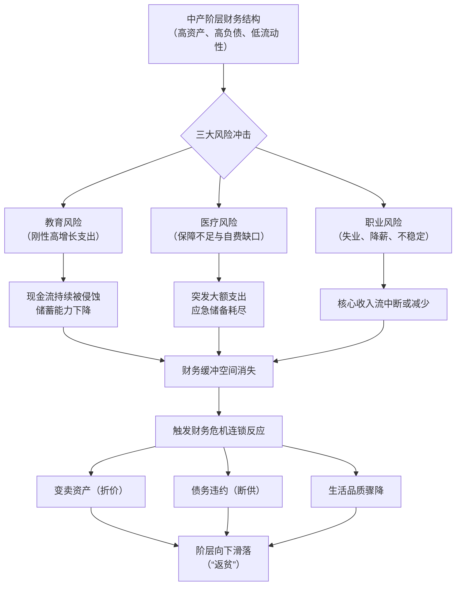
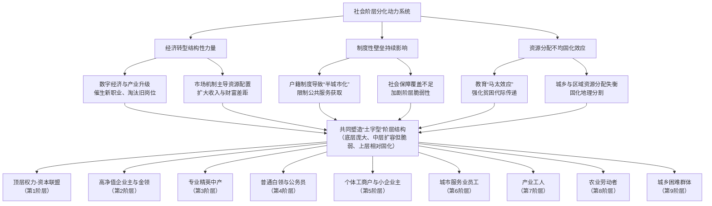

# 当代中国社会九大阶层财务画像与中产阶层深度研究报告
## 1 绪论：研究框架、数据基础与阶层划分模型构建

本章作为研究报告的起点，旨在明确研究的整体架构与逻辑基础。首先，将阐明本报告的核心目标——系统描绘当代中国社会的财务分层图景并深度剖析中产阶层，并概述所采用的研究路径与分析方法。其次，将系统梳理和评估所提供的章节参考资料，包括《中国家庭财富分配全景快讯》、《中国财富分层统计》、《当代中国社会阶层研究报告》等，分析其数据来源（如胡润报告、国家统计局、社科院调查）、时间区间（主要为2024-2025年数据）及观点边界，为后续分析提供可信的数据支撑和理论参考。最后，本章的核心任务是整合参考资料中呈现的多种分层理论（如基于资产规模的九档财富层级、陆学艺提出的以职业为基础的十大社会阶层、国家统计局的收入五等分分组），构建一个适用于本报告分析的、融合了经济资源（收入与资产）、组织资源（权力）、文化资源（职业与教育）的多维度综合分层模型，明确划分出九大阶层，为后续各章节的详细财务画像与深度分析奠定清晰、统一且资料驱动的逻辑框架。

### 1.1 研究目标、路径与核心数据源评估

本报告的核心目标是全景式描绘当代中国社会基于财务和职业特征的阶层结构，并特别聚焦于中产阶层，深入剖析其定义、规模、财力状况、生活特点及其面临的流动性与脆弱性挑战。为实现这一目标，研究将遵循整合性分析的路径：首先，系统梳理并评估来自权威报告、学术研究和官方统计的多元化数据；其次，构建一个能够融合财富、收入、职业与权力等多维度的综合分层模型；最后，在此模型框架下，对各阶层进行深度财务剖析与比较研究。

研究的数据基础主要来源于2024年至2025年期间发布的权威报告和统计数据。其中，**《中国家庭财富分配全景快讯》**（搜索结果-1, 3, 5, 7, 9, 11）提供了基于资产规模划分的九档层级图谱，其核心数据援引自《2024胡润财富报告》、福布斯中国2025年富豪榜以及国家统计局2025年一季度数据[^1]。该资料清晰地勾勒了从“资产1亿元以上”的塔尖群体到“50万-1000万”的小康主体家庭的资产区间、户数规模及典型人群特征，是本研究划分财富层级、分析高净值及中产精英群体财务状况的核心依据[^1]。

**《中国财富分层统计》**（搜索结果-13, 14, 15）则从更宏观的视角整合了胡润百富报告、中国人民银行调查及西南财经大学中国家庭金融调查等多源数据，提供了从“基础层”到“高净值层”的财富金字塔结构、显著的地域与城乡差异（如城市家庭净资产中位数289万元，农村仅87万元），以及关键的资产结构特征（如全国城镇家庭资产中房产占比高达69.3%）[^2]。该资料与《全景快讯》在核心数据上相互印证，并补充了关于资产配置失衡、收入来源差异等重要细节，但需注意其在“小富阶层”等具体群体定义上可能存在口径差异[^2]。

在职业与社会结构维度，**《当代中国社会阶层研究报告》**（搜索结果-21, 62, 65）提供了由陆学艺主持的中国社会科学院课题组的经典研究成果[^3]。该报告以职业分类为基础，以组织资源、经济资源、文化资源的占有状况作为划分标准，提出了影响深远的“十大社会阶层”分类法[^3][^4]。尽管其基准调查数据较早（1999-2002年），但其分析框架对于理解当代中国社会地位的分化、各阶层的职业构成与社会功能具有不可替代的理论价值，是本模型构建中整合权力与职业维度的基石[^3]。

在收入流量维度，**国家统计局发布的2025年居民收支数据**（搜索结果-43, 45, 47）提供了权威的居民人均可支配收入、中位数及按收入五等分分组的数据[^3]。这些数据是校准各阶层收入范围、理解收入分配差距（如2025年全国居民人均可支配收入43377元，中位数36231元）的关键官方来源[^3]。同时，参考资料中关于“中间群体”和“中等收入群体”的讨论（搜索结果-25），也为我们理解政策语境下的中产定义提供了重要背景[^5]。

**需要明确的是，不同数据源在统计口径上存在差异**，例如，财富数据多针对“家庭”总资产或可投资资产，而收入数据则常以“人均”可支配收入呈现；普通家庭调查对最富裕人群的覆盖可能存在不足，而富豪榜数据则主要聚焦于顶层。本报告在后续分析中将充分说明这些数据边界，并在交叉比对中审慎使用，力求构建一个既反映宏观格局又贴近现实复杂性的分析框架。

### 1.2 多元分层理论的梳理与整合

当代中国社会分层研究呈现出多元视角并存的格局，主要参考资料揭示了三种具有代表性的理论模型，它们各有侧重，共同构成了本报告综合分析的基础。

**首先是基于财富存量的“金字塔”模型。** 此模型以家庭拥有的资产或净资产为核心指标，进行直观的层级划分。例如，《中国家庭财富分配全景快讯》将家庭划分为资产1亿元以上、5000万-1亿元、1000万-5000万元、300万-1000万元等九个档位[^1]；《中国财富分层统计》则划分为贫困型（≤10万元）、温饱型、小康型、富裕型、小富阶层、高净值及超高净值家庭等层级[^2]。**该模型的优势在于直接量化了社会成员的经济实力差距，揭示了财富高度集中的现实（如全国亿元资产家庭仅13万户，财富总额却占600万以上资产家庭总财富的58%）[^1]。** 然而，其局限性在于过于侧重经济结果，未能充分揭示财富背后的权力关系、职业地位和文化资本等结构性成因。

**其次是以职业和资源占有为基础的“十大阶层”模型。** 由陆学艺领衔的课题组在《当代中国社会阶层研究报告》中提出，该模型以职业分类为基础，综合考量组织资源（权力）、经济资源（财富）、文化资源（知识）的占有状况，将社会划分为国家与社会管理者、经理人员、私营企业主、专业技术人员、办事人员、个体工商户、商业服务业员工、产业工人、农业劳动者、城乡无业失业半失业者等十个阶层[^3][^4]。**该模型的深刻之处在于超越了单一的经济维度，从社会结构的角度揭示了不同群体在社会运行中的功能、地位及资源获取能力的差异[^3]。** 其不足在于，作为一项本世纪初的研究，其提供的具体经济数据（如各阶层收入、资产的具体数值）已显陈旧，且对当前财富分化的极端情况（如亿万富豪群体）覆盖有限。

**第三是基于收入流量的“五等分”分组模型。** 国家统计局常规发布的居民收入五等分数据，将所有调查户按人均可支配收入从低到高平均分为五组：低收入组、中间偏下收入组、中间收入组、中间偏上收入组、高收入组[^6]。**该模型提供了清晰的收入分布比例，是衡量收入不平等和界定“中等收入群体”的重要官方标准[^5]。** 但其缺陷在于，它仅反映了年度收入流量，无法体现资产积累、负债状况等更为稳定的财务全貌，且与职业、权力的关联不够直接。

**这些模型之间存在着深刻的互补性与内在张力。** 互补性体现在：财富金字塔描绘了“结果”，十大阶层模型解释了“结构”，收入五等分则反映了“流量”，三者结合才能更完整地刻画一个人的社会经济地位。然而，它们之间的冲突点也极为明显，集中体现在对“中产阶层”的界定上。例如，根据胡润财富报告，总资产在300万元以上的家庭全国只有约3320万户，仅占家庭总数的一小部分[^1]；而按照国家统计局以收入为主的宽松标准（如家庭年收入10-50万元），对应的中等收入群体人口则超过4亿[^7]。**这种数量级的巨大差异（“3320万户”与“超4亿人”的对比）[^1][^7]，暴露出单一收入标准可能掩盖了高负债、低净资产的“虚假富裕”问题，而单一的资产标准又可能忽略了收入稳定但资产积累不足的职业群体[^7]。** 这提示我们，任何试图用单一维度（无论是收入、资产还是职业）来定义和划分当代中国社会阶层的尝试，都可能失之偏颇。因此，构建一个能够融合这些多维度的综合模型，对于准确理解社会分层的复杂现实至关重要。

### 1.3 多维度综合九大阶层分析模型的构建

基于对多元分层理论的梳理与整合，本研究构建了一个适用于深度剖析当代中国社会财务分层图景的 **“九大阶层综合模型”** 。该模型的核心在于，**以职业类型和资源占有（组织、经济、文化）为定性框架，以家庭资产规模和收入水平为定量校准，将社会成员聚类为九个既反映社会地位又明确财务边界的阶层。** 模型构建过程中，我们审慎处理了不同资料间的冲突，尤其在对“中产”的界定上，区分了“财务达标”与“职业身份”两个常被混淆的维度，以揭示其内在的脆弱性。

以下表格系统呈现了本报告所采用的九大阶层划分标准、核心特征及量化参考。此模型将作为后续所有章节分析的统一框架。

| 阶层序号 | 阶层名称 | 划分标准与核心特征 | 资源占有概况 | 量化参考（基于参考资料） |
| :--- | :--- | :--- | :--- | :--- |
| **1** | **顶层权力-资本联盟** | **核心**：掌握核心政治权力或掌控巨量经济资本，两者高度融合。包括高级别国家与社会管理者、超大型私营企业主及资本代理人。 **特征**：主导政策与核心资源配置，财富积累具有极强的代际传递性和隐蔽性。 | **组织资源**：极高（权力核心或与权力深度绑定）。 **经济资源**：极高（资产通常在亿元乃至数十亿元以上）。 **文化资源**：通常较高，但非决定性因素。 | 对应“资产1亿元以上”群体。据《2024胡润财富报告》，全国亿元资产家庭13万户；福布斯2025年数据显示可投资资产超1亿元家庭约8.95万户，占总人口仅0.017%[^1]。财富高度集中，占600万以上资产家庭总财富的58%[^1]。 |
| **2** | **高净值企业主与金领** | **核心**：成功的中大型企业所有者，或担任大型企业高级管理职务的专业人士（金领）。 **特征**：财富主要来源于企业经营利润或高级管理薪酬，资产配置多元化（房地产、股票基金、私募股权等），地域上高度集中于长三角、粤港澳大湾区等经济发达区域。 | **经济资源**：高（资产在数千万至近亿元）。 **组织资源**：中高（企业内部管理权及社会影响力）。 **文化资源**：中高（通常具备高等教育背景或专业技能）。 | 对应“5000万-1亿元”及“1000万-5000万”资产区间的上层。胡润2025年数据显示，全国约有185万户家庭处于可投资资产1000万以上层级（含），占总人口0.36%[^1]。资产配置呈现“不动产+金融资产”双轮驱动[^1]。 |
| **3** | **专业精英中产** | **核心**：依靠高级专业知识与技能获得高收入的群体，如资深专家、教授、企业高级技术人员、部分自由职业精英等。 **特征**：职业收入是主要财富来源，普遍拥有较高学历，在大城市拥有房产，金融资产占比提升。但面临高昂生活成本（房贷、教育）压力，财务安全感与“财务自由”尚有距离。 | **文化资源**：高（核心资本）。 **经济资源**：中高（可投资资产在300万-1000万元区间）。 **组织资源**：中等（依赖职位而非权力）。 | 对应“300万-1000万”资产区间。据国家统计局2025年一季度数据，可投资资产300万-1000万元的中产精英家庭约580万户，占比1.1%[^1]。资产构成中房产占比仍达35%左右[^1]。 |
| **4** | **普通白领与公务员** | **核心**：在各类组织中从事常规性、事务性工作的受薪者，包括普通办事人员、基层公务员、教师、银行职员等。 **特征**：工作稳定，收入中等，是“稳定中产”的基干。但上升通道狭窄，易陷入“教育军备竞赛”和“35岁职业瓶颈”焦虑，财富积累缓慢。 | **文化资源**：中等（通常需大专或本科学历）。 **组织资源**：中低（体制内岗位提供一定稳定性）。 **经济资源**：中等（年收入多在10-30万元区间）。 | 对应陆学艺模型中的“办事人员阶层”（约占4.8%）及部分“专业技术人员阶层”[^1]。是“中等收入群体”中规模较大的组成部分。 |
| **5** | **个体工商户与小企业主** | **核心**：拥有少量生产资料，自主经营小规模生意或微型企业的群体。 **特征**：收入完全依赖市场经营，波动性大，工作强度高，抗风险能力弱。其账面资产与真实净资产（扣除负债后）可能存在巨大差距。 | **经济资源**：中低且不稳定（家庭总资产多在50-200万元区间，但负债可能很高）。 **文化资源与组织资源**：通常较低。 | 对应“50-200万元资产家庭”，约1.07亿户，占比33.4%[^1]。也是陆学艺模型中“个体工商户阶层”（占4.2%）的主体[^1]。高负债率家庭（负债率>100%）占比达10.8%[^1]。 |
| **6** | **城市服务业员工** | **核心**：在商业、服务业从事一线服务工作的员工，如店员、服务员、客服、前台、低阶销售等。 **特征**：工作可替代性强，流动性大，收入依赖计时或计件工资，社会保障覆盖不足。是城市中典型的“悬浮”群体。 | **三种资源占有均较少**。 收入处于城市中下水平，月收入多在3000-6000元范围。 | 对应陆学艺模型中“商业服务业员工阶层”（约占12%）[^1]。在平台经济中，如外卖骑手、网约车司机等“新蓝领”也属此阶层，工作稳定性差[^8]。 |
| **7** | **产业工人** | **核心**：在制造业、建筑业等第二产业从事体力或半体力劳动的生产工人，包括传统产业工人和大量农民工。 **特征**：劳动强度大，职业技能面临自动化升级冲击。收入与服务业员工相近，但工作环境更具刚性。 | **三种资源占有均较少**。 经济上完全依赖体力劳动收入，议价能力弱。 | 陆学艺模型中“产业工人阶层”占22.6%[^1]。月均收入约6043元，但50岁以上劳动力岗位选择有限[^9]。 |
| **8** | **农业劳动者** | **核心**：以农业种植、养殖为主要职业和收入来源的劳动者。 **特征**：收入微薄且受自然和市场风险影响大，是制度性贫困风险较高的群体。城乡二元结构导致其享有的公共服务资源远少于城市居民。 | **经济资源**：很低（人均年收入远低于全国平均水平）。 **文化资源与组织资源**：匮乏。 | 据早期研究，农业劳动者占比从1978年的70%以上降至1999年的44%[^1]。2025年农村居民人均可支配收入为24456元，仅为城镇居民的43%[^3]。城乡家庭净资产中位数差距达3.3倍[^2]。 |
| **9** | **城乡困难群体** | **核心**：处于劳动年龄但长期无稳定职业（失业、半失业），或丧失劳动能力，依赖社会救济、临时工作及家庭支持的群体。 **特征**：处于社会最边缘，生存脆弱性极高，基本被排除在正规经济与社会保障体系之外。 | **三种资源均极度匮乏**。 收入低于当地最低生活保障标准。 | 对应陆学艺模型中“城乡无业、失业、半失业者阶层”（约占3.1%）[^1]。是收入五等分中“低收入组”的底层部分。 |

**模型总结与后续应用说明：**
1.  **结构判断**：本模型显示，当前中国社会阶层结构仍呈现 **“底层庞大（第6、7、8、9阶层）、中间层（第3、4、5阶层）初步发育但内部差异显著、顶层（第1、2阶层）高度固化”** 的特征，整体形态介于“金字塔型”与“土字型”之间，距离理想的“橄榄型”社会仍有相当距离[^9]。
2.  **核心洞察**：模型特别揭示了 **“中产阶层”概念的复杂性**。财务达标（如资产300万以上）的群体（第3阶层及部分第2、4阶层）与基于职业和收入定义的“中等收入群体”（主要覆盖第4、5阶层及部分第3阶层）在规模和特征上存在显著错位[^7]。这指向了中产阶层 **“高资产表象”与“高负债、高支出、低流动性”并存**的脆弱性现实，将成为后续章节深入剖析的重点[^1][^7]。
3.  **应用指引**：在后续章节中，我们将以此九阶层框架为基础，逐层深入分析其财务状况（第2章）、聚焦中产特点与规模争议（第3章）、比较阶层间流动与财力虚实（第4章），并最终探讨其形成机制与社会影响（第5章）。本模型力求在理论整合与数据支撑之间取得平衡，为理解当代中国社会分层的财务维度提供一个清晰、系统且可操作的分析工具。

## 2 全景扫描：九大阶层的实际收入与财务状况深度剖析

本章将严格依据第一章构建的九大阶层综合模型，对每个阶层的实际财务状况进行逐层、数据驱动的深度剖析。通过系统整合《中国家庭财富分配全景快讯》、《中国财富分层统计》、国家统计局2025年居民收支数据等参考资料，本章将以家庭为单位，重点揭示各阶层在收入范围、资产规模与结构、负债水平以及整体财务安全边际上的核心差异与结构性特征。分析将特别关注不同资料间的数据冲突，并揭示“资产表象”与“真实净资产”的差距，从而清晰勾勒出从顶层权力-资本联盟到城乡困难群体的财务梯度与脆弱性分布，为后续聚焦中产阶层奠定坚实的实证基础。

### 2.1 顶层权力-资本联盟：财富高度集中与隐蔽性配置

**顶层权力-资本联盟**（第1阶层）构成了中国社会财富金字塔的绝对“塔尖”。其核心特征是权力与巨量资本的深度融合与高度集中。根据《2024胡润财富报告》数据，全国资产在1亿元以上的超高净值家庭仅为13万户，同比减少1.7%，其中拥有亿元可投资资产的家庭为7.8万户[^7]。福布斯中国2025年富豪榜的补充数据显示，可投资资产超过1亿元的家庭约8.95万户，仅占总人口的0.017%[^7]。这一群体的财富总额高达87万亿元，占600万以上资产家庭总财富的58%，财富集中度持续提升[^7]。

在财富构成上，此类人群以大型企业控股者、资本市场赢家为主，80%为企业主，其企业资产占总资产的73%[^7]。他们的资产配置具有极强的全球化和隐蔽性特征。以长三角地区一位54岁的制造业集团创始人为例，其家族可投资资产超过5亿元，除核心产业股权外，还配置了31%的海外资产和18%的保险产品，其子女教育年均投入高达268万元，远超全球平均水平[^7]。这种配置逻辑不仅是为了财富增值，更涉及税务优化和财富的代际安全传承。从财务安全边际看，该阶层完全脱离了普通家庭的债务压力，其财富的“安全垫”无限高，财务决策的核心在于资本全球布局与风险隔离，而非基本生计。

### 2.2 高净值企业主与金领：多元化资产与向上流动瓶颈

**高净值企业主与金领**（第2阶层）是高净值人群的核心组成，是连接顶层与广大中产的关键层级。据胡润研究院2025年数据，全国约有185万户家庭处于可投资资产1000万元以上的层级（含更高区间），占总人口的0.36%[^7]。结合中国社会科学院与国家统计局联合发布的《中国家庭财富分级报告》推算，资产在1000万至5000万元区间的家庭规模超过1100万户[^10]。

该阶层的典型代表是成功的企业创始人、资深投资者或顶级专业人士。例如，一位50岁、经营年营收3亿元制造企业的王先生，其个人可投资资产约4500万元[^7]。他们的资产配置呈现显著的“不动产+金融资产”双轮驱动特征：42.7%配置于房地产，23.5%投入股票和基金，18.3%参与私募股权投资[^7]。地域分布高度不均衡，仅长三角和粤港澳大湾区两大区域就占据了该群体总数的53.8%，北京、上海、广州等一线城市占比显著领先[^7]。

**然而，这一阶层的向上流动正面临显著瓶颈。** 数据显示，2020年至2025年间，从小康型家庭跃升至富足型（可对应本阶层）的家庭比例仅为1.7%，低于此前五年的3.2%[^10]。这表明，尽管该阶层资产配置多元、生活富足，但想要进一步突破至顶层权力-资本联盟的通道已非常狭窄，增长天花板效应明显。他们的财务安全边际极高，主要风险可能来自宏观经济周期对其企业经营或投资组合的冲击。

### 2.3 专业精英中产：高收入表象下的高支出与财务脆弱性

**专业精英中产**（第3阶层）是理解“中产”财务虚实的关键群体，他们处于高收入与高负债、高资产与高支出的矛盾交汇点。据国家统计局2025年一季度数据，可投资资产在300万至1000万元的中产精英家庭约有580万户，占总家庭数的1.1%[^7][^10]。这一群体多为企业高管、高级专家或成功的小企业主，普遍在大城市拥有房产。

以一位35岁、在深圳某科技公司担任技术主管的李工程师为例，其年薪85万元加上投资收益，家庭年收入约110万元，家庭总资产约600万元[^7]。尽管已迈入中产精英行列，但他们普遍面临高昂的财务压力：高昂的房贷、子女教育（尤其是国际教育路径）以及父母养老构成了主要支出项。其资产构成中，房产占比仍达35%左右，金融资产配置以股票、基金和银行理财为主，风险偏好相对稳健[^7]。

**这一阶层的核心特征在于“高资产表象”与“真实财务脆弱性”并存。** 尽管家庭总资产数字可观，但扣除高额负债（主要是房贷）后的净资产可能大幅缩水，且每月现金流被刚性支出严重挤压。因此，他们虽在收入上远超平均水平，但距离真正的“财务自由”尚远，对失业、疾病或行业衰退等风险的抵御能力并不如账面资产显示的那么强。**这直接导致了依据严格资产标准（如胡润报告的“总资产300万元以上”）衡量的中产家庭数量（约3320万户）[^4]，远少于依据宽松收入标准（如家庭年收入15-30万元）界定的“中等收入群体”规模（数亿人），揭示了中产阶层内部巨大的财力分化。**

### 2.4 普通白领与公务员：稳定收入与缓慢的财富积累

**普通白领与公务员**（第4阶层）构成了“稳定中产”的基干，其财务状况以收入稳定但财富积累缓慢为特征。根据国家统计局2025年居民收入五等分分组数据，该阶层主要对应“中间收入组”（人均可支配收入35536元）和“中间偏上收入组”（55586元）[^11]。参考《年中国家庭收入分层研究报告》的官方标准，“中等收入群体”指家庭年收入15-30万元[^12]，这大致划定了该阶层的收入范围。

在职业上，他们主要包括普通公务员、程序员、高校讲师、企业普通办事人员等，依赖学历与专业技能获得相对稳定的工资性收入[^13]。然而，其上升通道通常较为狭窄，且易面临“35岁职业瓶颈”的焦虑[^8]。在资产方面，他们可能处于“50-200万元资产家庭”区间的中下端[^10]。尽管拥有房产，但很可能背负着较高的房贷。

**该阶层的财务脆弱性体现在：稳定的收入被大城市高昂的生活成本，尤其是“教育军备竞赛”所侵蚀。** 参考资料中一份“海淀区典型中产家庭账单”显示，仅学区房房贷、课外辅导、素质教育和国际夏令营四项，月均支出就高达5.67万元，年增长率从5.2%到31.5%不等[^8]。这种支出结构使得许多家庭虽位列“中等收入群体”，但实际可自由支配的储蓄有限，财务缓冲空间狭窄，抗风险能力较弱，一场大病或短暂的失业就可能击穿其脆弱的资产负债表[^4]。

### 2.5 个体工商户与小企业主：高负债率下的资产泡沫风险

**个体工商户与小企业主**（第5阶层）的财务状况具有典型的“高杠杆”和“高波动性”特征，是“中产边缘”群体的代表。据《中国家庭财富分配全景快讯》数据，资产在50-200万元的家庭约有1.07亿户，占比33.4%[^10]，其中包含了大量该阶层家庭。然而，其账面总资产往往严重高估了真实的财务健康度。

**该阶层面临的核心风险是极高的负债率。** 数据显示，负债率大于100%（即资不抵债）的家庭占比达到了10.8%[^4]。许多家庭的情况符合“虚假富裕”的描述：例如，一套市值300万元的房产，可能背负着200万元的房贷，实际净资产仅100万元，且房产的流动性差，变现困难[^4]。他们的收入完全依赖市场经营，波动性大，抗风险能力弱。正如《中国财富分层统计》所指出的，对于所谓“小富阶层”（家庭存款50万-150万元），必须扣除负债后计算净存款，一线城市高负债家庭的实际可支配财富可能远低于账面数值[^14]。

因此，该阶层的财务安全边际非常薄。他们极易受到经济下行、消费萎缩或行业政策变动的影响。一旦经营现金流断裂，不仅无法维持现有生活水平，还可能因资产价格下跌（如房价回落）而迅速陷入净资产为负的困境，导致阶层滑落。他们的财务状况凸显了在评估阶层地位时，区分“总资产”与“净资产”的极端重要性。

### 2.6 城市服务业员工与产业工人：低储蓄与抗风险能力匮乏

**城市服务业员工**（第6阶层）与**产业工人**（第7阶层）共同构成了社会结构中依赖体力或低技能劳动的庞大基层，其财务状况以低收入、低储蓄和极弱的抗风险能力为标志。根据国家统计局2025年数据，全国居民按收入五等分，**“低收入组”**人均可支配收入为10150元，**“中间偏下收入组”**为22702元[^11]，该群体主要分布于此。

具体案例数据显示其收入困境：长三角电子厂普工月薪仍徘徊在4500-6000元；外卖骑手需日均配送12小时、月跑单量1500单才能保底；网约车司机扣除平台抽成和油费后，月净收入可能仅剩5800元左右[^8]。他们的工作强度大，可替代性强，且社会保障往往覆盖不足。

在资产方面，他们属于《中国财富分层统计》中定义的**“基础层”**，净资产普遍在10万至50万元以下，甚至更少[^14]。户均存款很可能低于8万元[^15]。**其财务状态是典型的“生存驱动”模式：收入几乎全部用于当期生活支出（食品、房租、基本医疗），难以形成有效储蓄。** 任何意外的支出，如家庭成员的疾病、事故或短暂的失业，都可能立即将其推向贫困边缘。他们缺乏财务安全边际，是社会安全网需要托底的核心群体。

### 2.7 农业劳动者与城乡困难群体：制度性贫困与生存脆弱性

**农业劳动者**（第8阶层）与**城乡困难群体**（第9阶层）处于中国社会财务分层结构的最底层，其生存状态集中体现了制度性贫困和深度脆弱性。**城乡收入鸿沟是其中最显著的标志**：2025年，农村居民人均可支配收入为24456元，实际增长6.0%；而城镇居民人均可支配收入为56502元，实际增长4.2%。农村居民收入绝对值仅为城镇居民的43%[^16][^11]。在财富层面，差距更为悬殊：城市家庭净资产中位数为289万元，而农村家庭仅为87万元，差距达3.3倍[^14]。

农业劳动者收入微薄且高度依赖自然与市场条件。更为严峻的是**城乡困难群体**，包括城乡无业、失业、半失业者，以及丧失劳动能力、依赖社会救济的人群。他们面临“半城市化”困境（如2亿农民工难以享受完整市民待遇）、社会保障网络覆盖不足（灵活就业者社保覆盖率仅68%）等多重制度性壁垒[^9]。其收入极不稳定，远低于当地最低生活标准，基本生活严重依赖家庭支持或政府转移支付（如低保）。

**该阶层的财务安全边际几乎为零，处于绝对生存线边缘。** 他们没有能力进行任何意义上的资产积累或风险对冲，任何微小的负面冲击都可能导致生存危机。这一阶层的存在与规模，是衡量社会整体发展水平与公平性的关键指标。

### 2.8 财务梯度总览：从资产结构、负债压力到安全边际的阶层对比

综合以上各阶层的深度剖析，可以清晰地勾勒出中国社会九大阶层在核心财务指标上的梯度差异与结构性特征。为直观呈现这一全景，以下表格系统对比了各阶层的财务状况：

| 阶层 | 名称 | 典型家庭年收入区间 (参考) | 家庭资产/净资产特征 | 资产结构核心特征 | 负债水平与压力 | 财务安全边际 |
| :--- | :--- | :--- | :--- | :--- | :--- | :--- |
| **1** | 顶层权力-资本联盟 | 极高（亿元级收益） | 资产≥1亿元，财富极度集中 | 企业股权（73%）+海外资产（31%）+保险；全球化配置 | 无实质性债务压力，杠杆用于资本运作 | 无限高，关注财富传承与风险隔离 |
| **2** | 高净值企业主与金领 | 数百万至数千万 | 可投资资产1000万-1亿元，净资产高 | “不动产+金融资产”双轮驱动；私募股权参与度高 | 可能有经营性杠杆，但资产覆盖充分，压力小 | 极高，抗风险能力强，但向上流动遇瓶颈 |
| **3** | 专业精英中产 | 30万-150万元 | 可投资资产300万-1000万，总资产可观但负债高 | 房产占比仍高（~35%），金融资产配置提升 | **高房贷负债**，月供占收入比高，现金流紧张 | **中等偏脆弱**，依赖持续高收入，抗失业、大病风险能力不足 |
| **4** | 普通白领与公务员 | 10万-30万元 | 资产50-200万区间，积累缓慢 | 房产为主要资产，金融资产有限 | 房贷是主要负债，偿债压力大 | **较低**，易被教育、医疗支出击穿，储蓄缓冲薄 |
| **5** | 个体工商户与小企业主 | 波动大，15-50万可能 | 总资产50-200万，但**净资产可能很低** | 资产与经营捆绑，流动性差 | **负债率极高（部分>100%）**，经营风险与债务风险叠加 | **非常脆弱**，极易因经营问题导致阶层滑落 |
| **6** | 城市服务业员工 | 3.6万-7.2万元（月薪3-6K） | 净资产≤10万元，储蓄微薄 | 几乎无投资性资产，存款为主要形式 | 较少有房贷，但可能有消费贷，偿债能力弱 | **极低**，依赖当月收入，无应对突发风险能力 |
| **7** | 产业工人 | 3.6万-7.2万元（月薪3-6K） | 净资产≤10万元，资产积累困难 | 同服务业员工，财产性收入近乎为零 | 同服务业员工 | **极低**，职业风险较高，保障不足 |
| **8** | 农业劳动者 | < 3万元（人均） | 净资产中位数远低于城市，城乡差距3.3倍 | 土地、农具等生产性资产为主，变现难 | 可能有生产性小额贷款 | **近乎为零**，受自然和市场双重风险冲击 |
| **9** | 城乡困难群体 | 低于当地低保标准 | 净资产为负或近乎为零 | 无实质性资产 | 可能陷入“以贷养贷”恶性循环 | **为零**，生存完全依赖外部救济，极度脆弱 |

**核心梯度特征总结：**

1.  **资产结构与流动性**：从顶层到底层，资产配置从**多元化、全球化、金融化**向**单一化、本地化、实物化（房产）** 演变，最终至**无实质性资产**。流动性随之急剧下降，底层资产变现能力极差。
2.  **负债性质与压力**：中上层（第2、3、4、5阶层）的负债以**房贷**为核心，但性质不同。第3、4阶层负债压力最大，现金流紧绷；第5阶层负债风险最高，常与经营风险交织。顶层负债是工具，底层负债（如消费贷）则是生存枷锁。
3.  **收入来源与稳定性**：收入来源从**资本利得、经营利润**为主，向**专业技能薪酬**过渡，最终完全依赖**体力劳动报酬**。稳定性依次递减，波动性和风险性递增。
4.  **财务安全边际**：呈现一条陡峭的下降曲线。从顶层的**无限充裕**，经过中产层的**看似坚实实则脆弱**，迅速跌落至基层的**极其薄弱**，最终在底层归于**生存线边缘的零边际**。**中产阶层（特别是第3、4、5阶层）的“财力”存在显著的“虚实脱节”**，高资产、高收入表象下隐藏着高负债、高支出和低流动性的真实脆弱性。

本章通过逐层的数据剖析与系统对比，清晰揭示了九大阶层之间深刻的财务鸿沟以及各阶层内部，尤其是所谓“中产”内部的复杂性与脆弱性。这为下一章专门聚焦中产阶层的定义、特点与规模争议，提供了详实而有力的实证基础。

## 3 焦点深研：中产阶层的定义争议、多维特点与真实规模

本章将依据前文构建的九大阶层模型与财务全景，对中产阶层进行深度聚焦。通过系统整合参考资料，本章将首先梳理并对比当前界定中产的多重标准，揭示其内在冲突；其次，从收入、资产、负债、消费、保障及地域等多维度，深入剖析中产阶层的具体特点与内部异质性；最后，综合评估不同口径下的中产实际规模，并解释数据巨大差异的根源，从而完成对中产阶层从概念到现实的全面、数据驱动的深度剖析。

### 3.1 定义标准的多元冲突：从收入区间、资产门槛到四维综合

当前，对于“中产阶层”的界定并无统一标准，主要存在三类相互冲突的衡量体系，它们基于不同的逻辑和维度，直接导致了规模认知的巨大分裂。

**第一类是宽松的收入流量标准，以国家统计局为代表。** 该标准将三口之家年收入在10万元至50万元之间界定为中等收入家庭[^17][^18]。若按此单一收入口径计算，对应的群体规模超过4亿人[^17]。然而，这一标准存在明显缺陷：它完全忽略了家庭资产存量、负债水平以及地域生活成本的巨大差异。例如，在一线城市，月入3000元（年收入3.6万元）的个人，即便家庭结构“合理”使其被统计为中等收入群体，其实际生活体验也与“中产”的体面预期相去甚远，面临房租上涨、医疗负担等现实压力，形成普遍的“体感落差”[^17][^19]。**这揭示了仅以收入流量为标准，会将大量高负债、低净资产、生活拮据的“夹心层”纳入统计，从而严重高估了财务稳健的中产规模。**

**第二类是严格的资产存量标准，以胡润财富报告为代表。** 该标准将家庭总资产在300万元以上的家庭划定为新中产[^3]。根据此标准，全国符合该条件的家庭仅有约3320万户，这与收入标准下的“超4亿人”形成了数量级的悬殊对比[^3]。这一标准的优势在于反映了财富积累的结果，但其核心问题在于未区分“总资产”与“净资产”。在中国家庭资产结构严重依赖房产的背景下（历史峰值占比达70%），许多家庭虽有市值300万元的房产，却可能背负着200万元甚至更高的房贷，实际净资产仅100万元，甚至因房价波动而资不抵债[^3]。**因此，严格的资产标准可能掩盖了“虚假富裕”现象，将高杠杆、高风险的家庭也计入中产，同时又将收入稳定但资产积累不足的专业人士排除在外。**

**第三类是综合的抗风险能力标准，以2025年《中国中等收入群体发展报告》为代表。** 该报告提出了一个更为严谨的四维综合标准，要求同时满足：1) 家庭年可支配收入20-50万元（税后）；2) 家庭净资产100-500万元（扣除所有负债）；3) 保障体系齐全（社保全覆盖、配置至少3种商业保险、应急储备金覆盖6-12个月家庭开支）；4) 至少一人拥有本科以上学历或专业技能证书[^20]。根据此标准，全国达标家庭约3300万户，仅占全国家庭总数的8.9%[^20]。这一标准试图超越单一的经济指标，融合了收入、净资产、风险保障和人力资本，更接近于“财务健康中产”的定义。然而，其极高的门槛也反映了当前中国中产阶层规模的有限性，以及地域间的巨大差异——例如，一线城市的中产门槛（家庭年可支配收入35-50万元，净资产至少200万元，自有住房价值300万元以上）远高于三四线城市（年收入20-25万元，净资产100-150万元）[^21][^20]。

**综上所述，定义标准的冲突本质上是“流量统计”、“存量表象”与“综合抗风险能力”之间的衡量错位。** 宽松的收入标准描绘了一个庞大的“潜在中产”或“中等收入群体”，而严格的资产或综合标准则揭示了一个规模小得多、但财务结构相对坚实的“核心中产”。这种分裂正是理解后续中产特点与规模迷雾的关键起点。

### 3.2 收入、资产与负债：中产财务结构的虚实解剖

中产阶层的财务状况远非其“高收入”、“高资产”的表象那么简单，其内部存在着收入来源单一、资产结构畸形、负债高度集中的脆弱性结构。

**首先，收入来源高度依赖工资性收入，稳定性与增长性面临挑战。** 2025年，全国居民人均可支配收入中，工资性收入占比为56.6%，是其最主要的来源[^22]。对于中产阶层而言，这一依赖更为显著。典型的中产精英，如深圳的科技公司技术主管，其家庭年收入约110万元，主要构成是年薪和投资收益，本质上仍属于劳动报酬[^1]。然而，财产性收入（如利息、红利、租金）占比普遍偏低，2019年中等收入群体财产性净收入占比约9.1%，远低于发达国家水平[^23]。**这种收入结构意味着中产阶层的财富积累和生活水平维系，极度依赖于持续就业和职场晋升，抗失业、抗行业周期风险的能力薄弱。** 一旦主要劳动力收入中断，其看似稳固的财务大厦便可能迅速动摇。

**其次，资产结构严重向房产倾斜，金融资产配置不足，流动性风险突出。** 中国城镇家庭资产中，住房资产占比的峰值曾高达70%，这在全球范围内都处于较高水平[^3][^24]。对于一般中产家庭，房产占家庭总资产的比重平均高达76.5%，而金融资产（存款、股票、基金等）仅占19.3%，远低于德国（58%）和美国（63%）的水平[^23]。这种“不动产依赖症”导致家庭财富的流动性极差。数据显示，43%的家庭表示在紧急情况下无法快速筹措到50万元资金[^25]。**房产作为账面资产，其价值受市场波动影响大，且变现过程漫长，无法有效应对突发的大额支出需求，构成了中产财务安全的重大隐患。**

**最后，负债高度集中于住房抵押贷款，家庭杠杆率高企，净资产脆弱。** 房贷是中国中产家庭负债的绝对主体，占家庭总负债的比例超过75%[^24][^25]。许多所谓“资产300万”的中产家庭，其财务状况实则是“高总资产、高负债、低净资产”的典型。根据2025年的家庭财富报告，尽管无负债家庭占比为49.2%，但负债率大于100%（资不抵债）的家庭仍占到了10.8%[^3]。这意味着，超过十分之一的负债家庭，其总负债已超过总资产。即使未到资不抵债的程度，高额月供也严重挤压了家庭现金流。一线城市家庭房贷占收入比常常超过40%，使其生活品质紧绷，储蓄能力受限[^25]。**因此，房价的轻微下跌或家庭收入的暂时减少，都可能迅速侵蚀其本不厚实的净资产，甚至导致负资产，这正是中产阶层“财务虚实脱节”最核心的体现。**

为了更清晰地揭示中产阶层内部不同群体财务结构的梯度差异，以下表格整合了九大阶层模型中与中产相关的三个阶层（第3、4、5阶层）的核心财务特征：

| 对应阶层 | 群体描述 | 收入来源与稳定性 | 资产结构核心特征 | 负债核心特征与风险 |
| :--- | :--- | :--- | :--- | :--- |
| **第3阶层** | 专业精英中产（核心财务达标群体） | 高工资性收入与部分财产性收入，稳定性较高但依赖特定行业。 | 总资产300-1000万元，房产占比约35%，金融资产配置提升但占比仍不足。 | 高额房贷为主，月供压力大，现金流紧张。抗失业、大病风险能力不足。 |
| **第4阶层** | 普通白领与公务员（稳定中等收入群体） | 稳定的工资性收入，增长缓慢，上升通道狭窄。 | 资产50-200万元，房产为主要资产，金融资产有限。 | 房贷是主要负债，偿债压力挤压消费与储蓄，易被教育医疗支出击穿。 |
| **第5阶层** | 个体工商户与小企业主（高负债边缘群体） | 经营收入波动性大，完全依赖市场景气。 | 总资产50-200万元，但资产与经营捆绑，流动性极差，净资产可能很低。 | 负债率极高（部分>100%），经营风险与债务风险叠加，极易因经营问题导致阶层滑落。 |

**该对比清晰地表明，即便同被泛称为“中产”，其财务健康度存在天壤之别。** 第3阶层虽面临压力，但具备一定的资产基础；第4阶层稳定但积累困难，脆弱性高；第5阶层则处于破产风险的边缘。这种内部异质性是任何单一中产定义标准都无法涵盖的复杂现实。

### 3.3 消费、保障与地域分化：中产生活模式与压力图谱

中产阶层的生活模式与压力，鲜明地体现在其消费行为、保障投入和深刻的地域分化之中，共同勾勒出一幅焦虑与追求并存的复杂图景。

**在消费行为上，呈现出“结构性升级”与“总体性降级”并存的矛盾态势。** 一方面，中产阶层是消费升级的核心驱动力，追求品质生活。其教育文化娱乐支出增长迅速（2025年人均支出3489元，增长9.4%），在食品饮品、美妆时尚、新能源汽车等领域表现出高消费意愿和能力[^22][^26][^27]。另一方面，宏观经济压力导致普遍的“消费降级”倾向。超过半数的中产家庭表示整体消费有所减少，尤其是在汽车、电子产品等大件商品上更为谨慎[^28][^29]。然而，**教育支出展现出极强的刚性**，超过90%的受访者教育支出未减少或反而增加，被视为“最值得的投入”[^28][^29]。一项针对中产家庭的调研显示，家庭年收入20-50万的家庭，平均教育投入约10-12万元，且体制外教育路径（国际学校、留学）的支出显著高于体制内[^28]。这种“再穷不能穷教育”的心态，使得教育成为挤压其他消费、加剧财务压力的核心因素。

**在保障体系上，存在显著短板，加剧了财务脆弱性。** 尽管社会保障是基础，但覆盖深度不足，而商业保险的补充作用并未充分发挥。数据显示，中产家庭的商业保险覆盖率不足40%，年均保费支出仅占年收入的6%-8%，保障缺口明显[^25]。对于更灵活的就业形态，如平台经济从业者，社保覆盖率仅68%，使其暴露在更大的风险之中[^30]。同时，应急储备金普遍不足。健康的财务状态要求储备金覆盖6-12个月的家庭开支，但许多中产家庭现金储备仅能维持3-6个月，甚至更短[^25]。**保障体系的薄弱，意味着中产家庭应对疾病、意外、失业等风险的“安全网”并不牢靠，任何一项风险事件都可能直接冲击其本就紧绷的现金流，导致生活水平骤降甚至阶层滑落。**

**在地域分化上，不同城市级别的中产面临着截然不同的门槛、成本与生存状态，这是中国中产内部最显著的分裂线之一。** 这种差异绝非收入数字可以简单抹平。

为直观呈现一线城市与全国标准之间的巨大鸿沟，以下表格对比了不同标准下的中产门槛：

| 维度 | 国家统计局宽松标准 (全国) | 一线城市典型市场标准 (如北京、上海) | 核心差异与影响 |
| :--- | :--- | :--- | :--- |
| **家庭年收入** | 10万 - 50万元[^17][^18] | 50万元以上（甚至更高）[^21][^20] | 一线门槛是全国上限的起点，收入数字相同但购买力天差地别。 |
| **核心资产（房产）** | 未明确要求 | 自有住房价值不低于600万元[^21]；或无贷款房产[^20] | 一线房产资产是定义中产的关键硬指标，且要求无贷或低贷，这与全国许多有房但高贷家庭形成对比。 |
| **家庭净资产** | 未明确要求 | 至少200万元[^20] | 强调了扣除负债后的真实财富，排除了“虚假富裕”。 |
| **生活成本体验** | 统计上“达标” | **月薪过万仍难立足**，房租收入比常超50%，教育、医疗支出高昂[^19][^21] | 高收入被高成本侵蚀，体感上远离“中产”安全感。 |

具体来看，在广州月薪1万可能活得像个中产，但在深圳却只够温饱[^31]。一线城市的中产，不仅需要满足极高的收入门槛（如家庭年收入50万以上），更关键的是需要拥有核心区无贷款或低贷款的自有住房（价值通常在600万元以上），这已将绝大多数依靠工资收入、背负高额房贷的“白领”排除在外[^21]。高昂的生活成本是另一重挤压：北京、上海的房租收入比超过50%，一碗普通牛肉面均价35元，私立幼儿园年费超10万元，课外补习每小时300元以上[^19]。**因此，许多在一线城市拥有高薪工作的年轻人，尽管收入数字远超全国标准，却因房价和刚性支出而深感焦虑，无法获得中产的体感认同，形成了“收入中产”与“生活无产”的奇特并存。**

相比之下，三四线城市的中产门槛（家庭年可支配收入20-25万元，净资产100-150万元）看似较低，但当地高薪岗位稀缺，收入增长面临瓶颈，且资产增值速度远慢于一线城市[^20]。这种地域分化导致的中产内部巨大的生活品质落差，是理解其群体心态和消费行为不可忽视的背景。

### 3.4 规模迷雾的解析：统计口径、财务健康与体感认同的鸿沟

关于中国中产阶层的规模，存在着从“3320万户”到“超4亿人”的巨大数据迷雾。这种迷雾并非统计错误，而是不同定义标准所衡量的不同社会现实之间深刻鸿沟的直观反映。

**首先，直接对比不同统计口径下的数据冲突：**
*   **严格资产/综合标准下的“核心中产”**：依据胡润报告的家庭总资产300万元以上标准，规模约为**3320万户**[^3]。依据2025年四维综合标准，达标家庭约**3300万户**，占全国家庭8.9%[^20]。这两个数据高度接近，描绘的是一个拥有相当资产存量、一定抗风险能力的“财务健康中产”群体。
*   **宽松收入标准下的“中等收入群体”**：依据国家统计局三口之家年收入10-50万元的标准，对应的群体规模超过**4亿人**[^17]。这描绘的是一个基于年度收入流量划定的庞大“潜在中产”或“中等收入者”集合。

**其次，深入解析差异产生的根源：**
**规模迷雾的本质，是“流量统计”与“存量健康”、“单一维度”与“综合抗风险能力”之间的衡量错位。** 宽松的收入标准如同一张广撒的网，捕获了大量符合收入区间但财务状况迥异的家庭：其中包括了资产雄厚、无负债的真正中产，但更多是背负沉重房贷、净资产微薄的“房奴”，以及收入刚达标但无任何资产积累的年轻家庭[^17][^18]。它无法区分财富的“虚实”。相反，严格的资产或综合标准则试图测量家庭的财务“体质”，它排除了高负债的“虚假富裕”家庭，但也可能将收入稳定、注重消费而非积累的部分专业人士排除在外。因此，两者统计的根本不是同一个群体。

**最后，基于九阶层模型和参考资料，我们可以提出一个更分层的规模评估框架，以厘清这团迷雾：**

1.  **宽口径统计中产（中等收入群体）**：此群体主要对应九阶层模型中的**第4阶层（普通白领与公务员）**、**第5阶层（个体工商户与小企业主）** 以及收入达标但资产未达标的第3阶层部分人群。其界定以国家统计局收入标准为主，规模约**4亿人**。**其核心特点是：收入达标，但财务结构脆弱性高，资产积累不足或负债率高，是“中产”的预备队或边缘群体。**

2.  **窄口径财务健康中产（核心中产）**：此群体主要对应九阶层模型中的**第3阶层（专业精英中产）**，并包括部分资产结构稳健的第2阶层（高净值企业主与金领）和第4阶层家庭。其界定以胡润资产标准或四维综合标准为参考，规模约**3000-3500万户**（折合人口约1亿左右）。**其核心特点是：在收入、净资产、保障和人力资本多个维度达到较高标准，具备一定的财务韧性和抗风险能力，是社会消费升级和稳定的中坚力量。**

3.  **体感认同中产（主观中产）**：这一规模无法精确统计，但无疑更小。它取决于个人对生活稳定性、未来预期、社会地位和安全感的主观认同。正如白岩松的反问所揭示的，许多被统计为“中等收入”的人拒绝承认自己是中产，因为他们缺乏对未来的稳定预期，深感焦虑[^17]。**体感中产的规模，深刻反映了经济增长成果与民众实际获得感、安全感之间的差距。**

**结论：**
中国中产阶层的规模并非一个固定数字，而是一个依定义而变的谱系。**“超4亿人”反映了收入维度上达到一定水平的庞大人口基数，而“约3300万户”则揭示了符合综合财务健康标准的核心群体规模。** 两者之间的巨大落差，正表明了有大量家庭的财务状况处于“达标”与“健康”之间的灰色地带——他们拥有中产的收入或资产表象，却因高负债、高支出、低保障而缺乏中产应有的安全感和稳定性。这种规模迷雾与财务虚实，共同构成了当代中国中产阶层最根本的张力与挑战。

## 4 比较与定位：中产阶层的财力虚实、脆弱性及阶层间流动

本章在九大阶层框架内，通过系统比较中产阶层（核心为第3、4、5阶层）与上下相邻阶层的财务边界与流动性，深度剖析中产阶层“财力”的虚实本质与脆弱性结构。本章将综合利用《中国家庭财富分配全景快讯》的资产分层数据、《中国财富分层统计》的负债与流动性分析、《中国社会当今阶层报告》关于流动性与“土字型”结构的论述，以及《央行数据揭秘》等资料中关于房贷压力、家庭债务的具体数据，重点揭示中产阶层高资产表象下的高负债现实（尤其是房贷对现金流的挤压）、资产流动性不足导致的“虚假富裕”现象，以及教育、医疗、失业等风险对其财务稳定性的冲击。同时，本章将分析当前中产阶层向上流动的通道（如教育、创业）与日益狭窄的壁垒（如行业天花板、资本门槛），以及向下滑落（“返贫”）的关键风险因素（如“返贫三件套”、职业不确定性、资产价格波动），从而全面揭示其作为社会“夹心层”的独特处境与深层焦虑根源，完成对中产阶层在整体社会结构中的精准定位。

### 4.1 财力虚实辨析：高资产、高负债与流动性陷阱

中产阶层（以第3、4、5阶层为核心）的财务健康状况存在深刻的“虚实”矛盾，其核心特征在于“高资产表象”与“真实脆弱性”的并存。这种虚实脱节，通过与顶层（第1、2阶层）和基层（第6、7、8、9阶层）的对比，显得尤为突出。

首先，从资产门槛看，中产阶层具备一定的财富积累表象。根据国家统计局2025年一季度数据，可投资资产在300万至1000万元的中产精英家庭（第3阶层）约有580万户，占比1.1%[^1]。若以家庭总资产为标准，全国资产在300万元以上的家庭规模约3320万户[^32]。这一资产规模使其与底层（净资产中位数仅87万元的农村家庭或存款不足5万元的城市服务业员工）拉开了显著差距[^33]。然而，这种资产表象背后是高度畸形的资产结构。中国城镇家庭资产中，房产占比的峰值曾高达70%以上，一线城市家庭平均房产占总资产比例甚至达到78%[^34]。对于中产家庭而言，房产普遍是其最主要的资产形式，这种“不动产依赖症”直接导致了资产流动性的严重匮乏[^35]。房产作为大宗固定资产，其变现周期长达6-12个月，且交易成本（税费、中介费等）高达房价的8%-10%[^34]。这意味着，许多中产家庭虽拥有可观的账面资产，但在面临突发性大额支出（如重大疾病、子女紧急教育费用）时，难以迅速转化为可支配的现金，陷入 **“有钱没现金”的流动性陷阱**[^35]。

其次，支撑这一高资产表象的，往往是与之匹配的高额负债，且负债结构高度集中于住房抵押贷款。央行数据显示，全国23.7%的家庭月供超过收入的40%，远超国际公认的30%合理警戒线[^36]。在一线城市，这一现象更为严峻，北上广深约52%的年轻购房者月供占收入比例超过50%[^36]。以深圳为例，购买一套100㎡住房贷款800万元，月供约3.85万元，而家庭月收入中位数仅3.5万元，月供收入比超过100%，形成典型的 **“收入-房贷倒挂”**[^36]。这种高杠杆不仅存在于购房环节，也蔓延至购车等消费领域。腾易研究院数据显示，作为中产主力的85后与90后购车家庭，户均负债均超过80万元，负债渗透率接近80%[^37]。高额、刚性的月供支出严重挤压了家庭现金流，导致非必要消费大幅下降。数据显示，每月房贷支出超收入40%的群体，其非必要消费支出比2020年下降了约27%，家庭储蓄率下降了约32%[^36]。这使得中产家庭的实际可支配财富和财务缓冲空间远小于其总资产所显示的规模。

为了更清晰地揭示中产阶层内部及与相邻阶层的财务虚实差异，以下表格进行了系统性对比：

| 阶层 | 名称 | 资产/负债核心特征 | 现金流与流动性状况 | 财务健康度本质 |
| :--- | :--- | :--- | :--- | :--- |
| **第1、2阶层** | 顶层与高净值 | 资产规模巨大（千万至亿元级），配置多元化、全球化；负债多为经营性杠杆，偿债压力小。 | 现金流充裕，资产流动性强，可快速应对各类支出。 | **实：** 财富雄厚，抗风险能力极强，安全边际无限高。 |
| **第3阶层** | 专业精英中产 | 总资产300-1000万，但房产占比高（~35%）；负债以高额房贷为主。 | 月供压力大，现金流紧张；资产流动性差，应急变现困难。 | **虚多实少：** 账面资产可观，但高负债、低流动性导致真实财务脆弱。 |
| **第4阶层** | 普通白领与公务员 | 资产50-200万，主要形式为房产；背负中等至较高额房贷。 | 收入稳定但增长慢，月供挤压消费与储蓄，缓冲能力弱。 | **虚：** 收入达标但净资产积累不足，易被刚性支出击穿。 |
| **第5阶层** | 个体工商户与小企业主 | 总资产50-200万，但资产与经营深度捆绑；负债率极高（部分>100%）。 | 经营收入波动大，偿债能力高度不确定，极易陷入负资产。 | **极虚：** 资产表象与经营风险交织，财务状态极不稳定。 |
| **第6、7、8、9阶层** | 城市基层与困难群体 | 资产极少（存款不足5万）或为负；负债多为生存性小额消费贷。 | 现金流仅够维持基本生存，无资产可流动，抗风险能力近乎为零。 | **无虚实可言：** 处于生存边缘，财务安全边际为零。 |

**核心结论**：中产阶层的“财力”存在严重的结构性虚实脱节。其与顶层的本质区别不在于资产数字的绝对值，而在于**资产构成的质量（多元化 vs. 单一房产依赖）和负债的性质（发展性杠杆 vs. 生存性挤压）**。与底层相比，中产拥有资产“表象”，但其财务内核因高负债、低流动性而异常脆弱。**这种“虚假富裕”状态，即高总资产、高负债、低净资产、弱流动性的复合体，是中产阶层财务困境的根源，使其在光鲜的账面数字下，隐藏着极易被风险击穿的现实**[^35]。

### 4.2 脆弱性冲击：教育、医疗与职业风险的财务穿透

中产阶层的财务脆弱性并非静态存在，而是通过教育、医疗和职业三大核心风险源的持续冲击而动态显现。这三重风险如同三把利刃，精准穿透其看似稳固的资产负债表，暴露其“夹心层”的尴尬与不安。

**教育风险：吞噬现金流的刚性“军备竞赛”**
教育支出已成为中产家庭财务结构中最刚性且增长最快的部分，构成其向下滑落的首要风险因素。数据显示，北上广深中产家庭年均教育支出达28.7万元，占家庭收入比重高达47%，远超国际警戒线[^38]。这种压力在“双减”政策后并未缓解，反而催生了更隐蔽、更高成本的投入模式。一项针对523个中产家庭的调研显示，53%的家庭在2024年增加了教育支出，教育成为消费降级浪潮中唯一逆势增长的领域[^39]。对于选择国际教育路径的家庭，财务压力呈指数级上升。民办国际学校年均学费达28.7万元，是公立学校的15倍，且以每年8%-12%的速度增长[^34]。以深圳某科技公司项目经理家庭为例，其大女儿就读国际学校年学费28万元，叠加其他教育投入，成为家庭现金流断裂的直接诱因[^40]。**教育已从人力资本投资异化为维持阶层地位的“门票”，其高昂且刚性的支出严重挤占了家庭储蓄、保障投入和其他消费，大幅削弱了财务弹性，使中产家庭在面对其他风险时几无招架之力**[^41]。

**医疗风险：社会保障网下的隐性缺口**
尽管中国构建了覆盖全民的基本医疗保障网（参保率长期稳定在95%以上），但对于中产阶层而言，医疗风险依然构成重大威胁[^35]。风险主要来自两个方面：一是社会保障的覆盖深度不足，自费项目和高额特需医疗费用可能瞬间击穿家庭财务。三甲医院特需门诊挂号费已突破千元，而医保报销比例对许多重大疾病和先进疗法的覆盖有限[^42]。二是特定群体保障缺失。灵活就业者（包括大量新经济从业者）社保覆盖率仅68%，使其暴露在巨大的医疗风险之下[^30]。一场重大疾病不仅意味着高昂的直接医疗支出，还可能导致家庭主要劳动力收入中断，形成“因病致贫”的双重打击。许多背负高额房贷的家庭坦言，最恐惧的便是家人生病，因为医疗账单可能成为压垮财务的最后一根稻草[^43]。

**职业风险：收入流根基的动摇与断裂**
职业稳定性是中产阶层财务安全的生命线，然而这条生命线正变得日益脆弱。多重因素交织，使得职业风险成为中产向下滑落最直接的导火索。
1.  **年龄歧视与“35岁红线”**：在互联网、金融等行业，“35岁优化”已成为普遍现象。许多资深白领在职业黄金期后面临裁员风险，再就业时面临薪资折损和岗位稀缺的双重困境[^44]。数据显示，35岁以上职场人失业周期平均达8.7个月，这对月供占收入比超40%的家庭而言是毁灭性的[^34]。
2.  **灵活用工与就业不安全**：平台经济的兴起催生了大量缺乏劳动合同、社会保障不健全的灵活就业岗位。网约车司机、外卖员的负债渗透率已突破80%，其工作强度极高但稳定性极差，任何政策调整或平台规则变化都可能使其收入骤降[^37]。
3.  **技术替代与产业转型**：AI和自动化技术正加速替代常规性、重复性劳动岗位。研究指出，AI技术可能替代2.8亿低技能岗位，迫使大量产业工人转型，而中产白领的许多岗位也面临被优化重组[^30]。职业寿命缩短、技能迭代压力增大，使得收入增长的可持续性面临严峻挑战。

为了直观呈现这三大风险对中产财务的冲击路径与后果，以下流程图揭示了其传导机制：

**结论**：教育、医疗、职业风险并非孤立存在，而是相互叠加、共振，精准打击中产阶层财务结构中最脆弱的环节——现金流。**其财务安全的本质，是建立在“持续高收入”这一脆弱假设之上的纸牌屋。一旦收入流因职业风险动摇，或被教育、医疗的刚性支出击穿，整个财务体系便可能迅速崩塌，从“中产”滑向基层，这正是其普遍焦虑与不安全感的现实根源**[^42]。

### 4.3 流动通道与壁垒：向上攀爬的瓶颈与向下滑落的陡坡

在九大阶层框架内，中产阶层（第3、4、5阶层）的流动性格局呈现出鲜明的非对称性：**向上流动的通道日益狭窄、壁垒高企，而向下滑落的陡坡却处处可见、触发点多**。这种“向上难、向下易”的处境，精准定义了其作为社会“夹心层”的窘境。

**向上流动：日益收窄的通道与固化的壁垒**
传统上，教育与创业被视为阶层跃迁的两大核心通道，但对于当代中产而言，这两条路均面临严峻瓶颈。
1.  **教育通道的“马太效应”与回报率递减**：教育作为关键流动机制，其公平性正在减弱。农村学生进入顶尖高校的比例不足5%，贫困代际传递概率高达48%[^30]。这意味着，底层家庭通过教育实现跃迁的难度极大。而对于已处于中产的家庭，其对子女教育的巨额投入（如国际学校、海外留学）正面临边际效益锐减的风险。海归毕业生起薪优势已从2015年的45%大幅收窄， “海归变海待”成为新常态，高昂的教育投资可能无法换来预期的职业回报和阶层巩固[^38]。
2.  **行业天花板与资本门槛**：对于中产精英（第3阶层）而言，晋升为企业核心决策层或通过创业进入高净值群体（第2阶层）的通道极为狭窄。数据显示，2020-2025年间，从小康型家庭跃升至富足型家庭的比例仅为1.7%，远低于此前五年[^1]。创业成功并积累可观资本的门槛极高，且风险巨大，失败可能导致从中产直接跌落。**资本性收入与工资性收入之间的鸿沟，已成为一道难以逾越的壁垒**。高收入群体通过资产配置（房产、金融产品）固化优势，其财富增长模式与依赖薪资的中产有本质不同[^30]。

**向下滑落：多重风险下的“自由落体”**
与向上攀爬的艰难形成尖锐对比的，是向下滑落风险的普遍性与易发性。中产阶层，尤其是其边缘群体（第5阶层及部分高负债的第4阶层），处于极易被击穿的“斩杀线”边缘。
1.  **“返贫三件套”的聚合风险**：同时具备“高房贷、单薪养家、子女国际教育”特征的家庭，其抗风险能力较普通中产低47%，遭遇重大变故时陷入财务危机的概率是后者的3.2倍[^34]。这三者共同作用，极大降低了财务容错率，使家庭对收入中断或意外支出的承受能力变得极其脆弱。
2.  **资产价格波动的“负资产”陷阱**：当房地产市场进入调整期，高度依赖房产的中产家庭面临资产缩水风险。成都某餐饮老板2017年高位购房，四年后房价下跌三分之一，卖掉房子还需倒贴银行12万元，陷入“负资产”困境[^40]。这种因主要资产贬值导致的净资产蒸发，是中产滑落的重要经济机制。
3.  **职业不确定性的直接引爆**：失业、降薪或灵活就业导致的收入中断，是击穿中产财务防线的直接导火索。2024年申请破产的中产群体中，40%因失业导致现金流断裂[^40]。对于月供占收入比超50%的家庭，失去收入意味着立即面临断供风险。

**阶层流动格局的定位与比较**
通过与上下阶层的比较，可以更清晰地定位中产阶层的流动处境：

| 比较维度 | **顶层（第1、2阶层）** | **中产层（第3、4、5阶层）** | **基层（第6、7、8、9阶层）** |
| :--- | :--- | :--- | :--- |
| **向上流动** | 已处于顶端，流动表现为巩固与扩张（如全球化配置、政治影响力延伸）。 | **通道狭窄，壁垒高企**。主要壁垒：资本门槛、行业天花板、教育回报递减。跃迁至支配阶层概率极低。 | **通道存在但异常艰难**。主要依赖教育突破，但面临严重的资源不均和“马太效应”。 |
| **向下流动** | **风险极低，结构性固化**。财富以资本形式传承，抗风险能力极强。 | **风险极高，触发点多**。核心风险：失业、大病、教育支出、资产贬值。财务结构脆弱，极易被击穿。 | **已处于底层，下滑表现为陷入绝对贫困或生存危机**。 |
| **核心流动特征** | **固化与传承**。 | **“夹心”窘境：向上遇瓶颈，向下无缓冲**。是最活跃也最脆弱的流动层。 | **艰难攀升与生存挣扎**。 |

**结论**：中产阶层处于社会流动格局中最具张力与焦虑的“夹心层”。**其向上流动的通道已被资本和资源壁垒实质性收窄，而向下滑落的陡坡却因高负债、高刚性支出和职业不确定性而变得异常平滑**。这种流动性格局不仅定义了个体的命运轨迹，也深刻影响着社会结构的稳定与活力。中产阶层普遍的“悬浮感”与不安全感，正是对这种“上不去、易下来”处境的直接反映。打破向上流动的壁垒与构筑向下滑落的防护网，是缓解中产焦虑、推动社会向“橄榄型”健康结构转型的关键[^30][^42]。

## 5 机制与挑战：阶层分化动力、社会影响与未来趋势

本章将系统剖析塑造当前九大阶层财务格局的核心驱动机制，并探讨其广泛的社会影响与未来演变趋势。首先，整合《中国社会当今阶层报告》等资料，从经济转型的结构性力量（如数字经济催生新服务阶层、AI替代低技能岗位）、制度性壁垒（如户籍制度导致的‘半城市化’、社保覆盖不足）以及资源分配不均（如教育‘马太效应’、区域分化）三个维度，深入解析阶层分化的动力系统。其次，基于《有效释放中等收入群体消费潜能》、《中国青年网民社会心态调查报告》等资料，分析此种分化格局对消费潜力（如中等收入群体贡献率与制约）、社会心态（如普遍焦虑、相对剥夺感）及社会整合带来的深刻影响。最后，结合《“十四五”规划<纲要>解读文章之32|优化收入分配结构》等政策动向，研判各阶层尤其是中产阶层财务状况的未来演变趋势，识别其面临的潜在挑战，如向上流动瓶颈、向下滑落风险及政策调整的机遇与不确定性，从而完成从现象描述到深层动因与未来展望的完整研究闭环。

### 5.1 分化动力系统：经济转型、制度壁垒与资源分配的三重驱动

当代中国社会阶层分化的格局并非偶然形成，而是由经济转型的结构性力量、制度性壁垒的持续影响以及资源分配不均的固化效应这三重核心驱动力共同塑造的结果。这些机制相互交织、彼此强化，共同塑造了当前“土字型”的社会结构特征[^30]。

**首先，经济转型的结构性力量是阶层分化的根本引擎。** 自改革开放以来，中国从计划经济体制逐步迈向社会主义市场经济体制，市场机制成为资源配置的核心[^45]。这一转型打破了原有的平均主义格局，催生了私营企业主、个体工商户等新阶层，同时使原有群体因市场竞争而发生显著分化[^46]。数字经济与产业升级是当前经济转型最突出的表现。数字经济催生了新服务阶层，平台经济从业者（如快递员、网约车司机）规模已达4000万人，其收入介于传统蓝领与白领之间，但普遍缺乏稳定的社会保障[^30]。制造业升级推动了蓝领技能化，月均收入可达6043元，但50岁以上的劳动力仍集中在高强度体力岗位，职业选择范围缩小[^30]。与此同时，**AI和自动化技术正替代约2.8亿低技能岗位，迫使大量产业工人转型，这加剧了职业结构的极化，使得技能溢价和“数字鸿沟”成为新的分化逻辑**[^30]。新兴的互联网、金融、科技行业凭借高附加值，创造了大量高收入岗位，而传统制造业、农业等行业的从业者则面临收入增长缓慢甚至就业不稳定的困境[^45]。这种由经济结构变迁驱动的职业与收入分化，是社会阶层重塑的基础性力量。

**其次，制度性壁垒的持续影响是阶层流动的结构性障碍。** 其中，户籍制度是最具代表性的制度性壁垒。尽管户籍制度改革取得进展，例如2025年《农村集体经济组织法》允许四类人回迁农村户口，但仍有约2亿农民工面临“半城市化”困境，无法享受与迁入地户籍人口同等的教育、医疗、住房保障等基本公共服务[^30][^47]。这种城乡二元分割的制度安排，深刻固化了城乡居民在机会获取和资源占有上的不平等。此外，社会保障体系覆盖不足加剧了阶层的脆弱性。数据显示，灵活就业者的社保覆盖率仅为68%，农村中等收入群体中有42.2%属于“脆弱中产”，极易因疾病、失业等意外冲击而返贫[^30]。**这些制度性缺陷不仅直接限制了特定群体（如农民工）的阶层上升通道，还通过固化既有的资源分配格局，使得社会流动的“门槛”居高不下。**

**最后，资源分配不均，尤其是教育资源分配的“马太效应”，是阶层固化的关键机制。** 教育本应是社会流动的关键通道，但在现实中却呈现出强化阶层再生产的作用。数据显示，农村学生进入顶尖高校的比例不足5%，贫困代际传递概率高达48%，即穷人子女仍为穷人的可能性近半[^30]。职业教育也面临结构性矛盾，61.9%的职业院校学生因“工作枯燥”拒绝进入制造业基层，导致“技工荒”与青年失业并存[^30]。这种教育机会的不平等，使得优势阶层的文化资本得以代际传递，而底层群体则难以通过教育实现跃迁。资源分配不均还体现在显著的地域差异上。例如，城镇居民收入是农村居民的2.27倍，且金融、科技行业的高收入群体高度集中于一线城市[^30][^48]。大城市近郊农村可能通过土地股份化实现财富积累，而偏远农村则仍陷于贫困，这种地域分化进一步强化了阶层的地理分割[^30]。

为了更清晰地呈现这三重驱动力的相互作用及其对九大阶层的影响路径，以下流程图揭示了其系统性传导机制：

**核心结论**：经济转型、制度壁垒与资源分配不均这三重驱动力并非孤立运作，而是构成了一个相互强化的动力系统。经济转型创造了分化的基础，制度壁垒固化了分化的结构，而资源分配不均则确保了分化的代际传递。**这一系统共同作用的结果，便是形成了一个“底层庞大、中层扩容但内部高度分化且普遍脆弱、上层相对固化”的“土字型”社会结构**，各阶层（从第1至第9阶层）在这一动力系统中被塑造并定位，流动通道与壁垒也因此被深刻界定。

### 5.2 社会影响图谱：消费潜力抑制、普遍焦虑与社会整合挑战

当前深刻的社会阶层分化格局，已对中国社会的经济运行、群体心态及整体整合产生了广泛而深远的多维冲击。这些影响相互关联，共同构成了社会发展面临的严峻挑战。

**在消费经济层面，分化格局显著抑制了内需潜能的释放，而中等收入群体（中产阶层）的消费困境是这一问题的核心。** 研究显示，约占我国总人口数量30%的中等收入群体贡献了近50%的居民消费支出，是扩大内需的关键人群[^49]。然而，这一群体的消费能力受到多重结构性制约。**首先，其总量规模仍然较小，低于发达国家50%-75%的水平，距离理想的“橄榄型”社会结构尚有较大差距**[^49]。其次，收入增长面临瓶颈，且收入来源过度依赖工资性收入（占比达93%），财产性收入渠道狭窄[^50]。最为关键的是，**高负债与刚性支出严重挤压了其消费空间**。家庭负债率高达62%，还贷、子女教育、购物占据日常开销的前三名，真正用于娱乐消遣和个人发展的支出占比很低[^30][^50]。教育支出尤其展现出刚性特征，许多家庭年教育投入达10-12万元，且选择体制外教育路径（国际学校、留学）的成本更高[^50]。这种财务状况使得中等收入群体虽有意愿但无力进行大规模的消费升级，导致消费市场出现“升级”与“降级”并存的矛盾态势，整体消费对经济增长的拉动作用因此受到制约[^51]。

**在社会心态层面，普遍存在的焦虑感、不安全感及“相对剥夺感”构成了突出的社会情绪特征。** 根据《中国社会当今阶层报告》，73%的中产人士自认处于不稳定状态，这一群体在消费升级中扮演关键角色，但抗风险能力薄弱[^30]。《新锐中产现状调研报告》进一步揭示，迷茫和焦虑更易成为中产阶层工作和生活中的主旋律，有95%的人表示会感到经常或偶尔焦虑，压力指数高达3.94（满分5分），主要来源于收入低于预期、职业规划不清以及对未来的不确定性[^50]。青年网民的社会心态则呈现出寻求精神放松与“宅”化的特点，游戏类和生活类视频最具影响力，这从侧面反映了现实压力下的心理逃避需求[^52]。更广泛地，社会分化的加剧使普通人感到无力，《社会分化加剧，普通人如何自处》一文指出，从毕业生到中年人，似乎每个人都在为经济压力、就业困难、生活成本上涨而发愁，这种普遍的“相对剥夺感”可能削弱社会的奋斗精神和内在凝聚力[^53]。

**在社会整合与治理层面，阶层分化与固化带来了深刻的挑战，可能激化社会矛盾并侵蚀信任基础。** 中国的社会结构在历史上长期由政治权力主导，而非完全由经济结构决定[^54]。当前，尽管市场经济深化，但政治与行政权力仍在强化其塑造社会阶层的力量，例如通过资源分配影响城市层级和城乡分割[^54]。阶层固化导致社会流动受阻，底层向上流动的通道收窄，“寒门难出贵子”的现象加剧了社会不公平的体感[^30][^55]。这种状况容易激化社会矛盾，历史上，被排除在主流社会结构之外的边缘阶级常常成为社会动荡的力量[^54]。在治理层面，分化格局使得公共政策难以兼顾各阶层的利益诉求，容易产生偏差。例如，若政策制定受优势阶层影响，可能加剧资源分配不公[^56]。同时，阶层间的隔阂与不信任可能削弱社会合作的基础，增加社会治理的复杂性和成本。**维持社会公平、促进有效整合，成为在分化格局下确保社会长期稳定的关键难题。**

为了系统呈现阶层分化带来的多维社会影响及其内在关联，以下表格进行了总结性梳理：

| 影响维度 | 核心表现与特征 | 关键数据/现象支撑 | 潜在后果 |
| :--- | :--- | :--- | :--- |
| **消费经济影响** | 中等收入群体消费潜能受抑制，内需拉动乏力。 | 1. 中等收入群体贡献近50%消费，但规模仅占人口30%[^49]。 2. 家庭负债率62%，教育等刚性支出挤压消费空间[^30][^50]。 3. 消费市场呈现“升级”与“降级”并存的分化态势[^51]。 | 制约经济内循环，影响经济增长的可持续性和转型升级。 |
| **社会心态影响** | 普遍焦虑、不安全感与“相对剥夺感”蔓延。 | 1. 73%的中产自认不稳定，95%感到焦虑[^30][^50]。 2. 青年网民心态“宅”化，追求精神放松[^52]。 3. 公众普遍对收入差距、就业困难感到担忧和无力[^53]。 | 削弱社会凝聚力与奋斗精神，可能引发群体性心理危机，影响社会活力。 |
| **社会整合与治理影响** | 阶层固化加剧矛盾，增加整合难度，侵蚀社会信任。 | 1. 政治权力与资源分配持续塑造社会结构[^54]。 2. “寒门难出贵子”强化不公平感[^30][^55]。 3. 政策制定可能产生偏差，难以平衡各方利益[^56]。 | 增加社会治理成本与复杂性，威胁社会长期稳定，可能阻碍共同富裕目标的实现。 |

**核心结论**：社会阶层分化已超越单纯的经济分配问题，其影响渗透至消费市场活力、国民心理状态以及社会整合效能等多个核心领域。**中等收入群体的财务脆弱性成为抑制消费升级和经济内循环的关键节点；普遍的社会焦虑与不安全感构成了潜在的社会心态风险；而阶层固化则对社会公平、信任与稳定治理构成了长期挑战。** 这些影响相互交织，表明缓解阶层分化、促进社会流动不仅是经济议题，更是关乎社会长治久安的根本性社会命题。

### 5.3 未来趋势研判：中产演变、流动瓶颈与政策调整的机遇风险

展望未来，中国社会各阶层，尤其是中产阶层的财务状况与流动性格局，将在既有分化动力、社会影响与外部政策干预的复杂互动中演变。其趋势充满张力，既蕴含政策引导下的改善机遇，也面临结构性瓶颈与不确定性的严峻风险。

**首先，中产阶层的规模与内部结构将呈现“量增”与“质稳”的矛盾运动，分化可能进一步加剧。** 政策层面明确将“扩大中等收入群体”作为重要目标，旨在推动社会结构向“橄榄型”转变[^57]。因此，从统计口径看，符合宽松收入标准（如家庭年收入10-50万元）的群体规模有望继续增长。然而，**规模扩张未必等同于财务健康度的同步提升**。当前中产阶层内部已呈现显著的“公职-市场”二元分化：公职新中产（党政机关、国企员工）占比达38.9%，具有较强政策依赖性和稳定性；而市场新中产（私营企业白领）则面临更大的市场风险、高房价压力和社会保障不足的挑战[^30]。未来，这种内部分化可能因经济波动、行业兴衰而进一步拉大。市场新中产的脆弱性使其在经济增长放缓时，更易面临收入下降或失业风险，从而滑向中产边缘甚至跌落；而公职新中产的稳定性则可能使其阶层地位相对固化。**因此，中产阶层可能呈现“总体规模缓慢扩大，但核心健康群体增长乏力，边缘脆弱群体波动显著”的复杂图景。**

**其次，阶层流动的瓶颈将持续存在，甚至在某些维度上更加凸显，而向下滑落的风险点依然密集。** 教育作为传统核心流动通道，其“筛选”功能正以更隐蔽和综合化的方式强化。例如，有资料提及上海重点小学要求家长提供雅思7分证明，将阶层优势包装为“素质教育”门槛，这使得底层家庭通过教育实现代际跃迁的路径愈发狭窄[^58]。与此同时，**“寒门难出贵子”的现象与高达48%的贫困代际传递概率，预示着底层向上流动的阻力巨大**[^30]。在向下流动方面，风险因素并未减弱。职业不确定性，如“35岁红线”在部分行业的压力、平台经济从业者的工作稳定性差，持续威胁着中产及边缘群体的收入根基[^30]。高负债家庭（尤其是第5阶层个体工商户）对资产价格波动（如房价调整）极为敏感，极易陷入“负资产”困境。此外，教育、医疗等刚性支出的持续增长，将继续挤压家庭财务缓冲空间，使许多家庭处于“风险击穿”的边缘。**向上通道收窄与向下陡坡平滑并存，意味着社会流动的“焦虑感”短期内难以缓解。**

**最后，政策调整在提供机遇的同时，也面临效果与不确定性的双重考验。** 为应对分化挑战，一系列政策正在或有望出台。在财税领域，通过优化个人所得税专项附加扣除政策、降低特定商品税率等方式，旨在增加居民可支配收入，特别是提振中低收入群体的消费[^59]。在社会保障与户籍改革方面，推行由常住地登记户口提供基本公共服务的制度，加快农业转移人口市民化，是打破制度壁垒、促进社会融合的关键方向[^47][^60]。这些政策如能有效落地，将有助于扩大中等收入群体、增强其财务韧性、并促进社会公平。然而，**政策效果面临多重制约**：首先，政策执行需要克服中央与地方政府之间的激励不相容问题[^60]。其次，在经济增长面临新常态、人口结构呈现老龄化与少子化的宏观背景下，财政空间和资源分配面临压力[^60][^61]。再者，全球经济的波动性与技术变革的加速，可能带来新的、难以预见的就业与收入冲击。因此，未来趋势将是市场自发分化力量与政策整合力量持续角力的结果。

为了更清晰地把握未来演变中的关键变量与可能情景，以下表格从机遇与风险两个维度进行了前瞻性分析：

| 分析维度 | 机遇与积极趋势 | 风险与潜在挑战 |
| :--- | :--- | :--- |
| **中产规模与结构** | 1. **政策驱动规模扩张**：共同富裕目标下，中等收入群体规模有望持续扩大[^57]。 2. **部分群体质态改善**：产业升级可能催生更多高技能、高收入的“专业精英中产”（第3阶层）。 | 1. **“虚假富裕”持续**：高负债下的资产表象可能掩盖真实的财务脆弱性，规模增长不等于健康度提升。 2. **内部分化加剧**：“公职中产”与“市场中产”因风险抵御能力不同，财富与生活状态差距可能拉大。 |
| **社会流动通道** | 1. **职业教育价值重估**：产业升级与“技工荒”可能提升技能型人才的职业地位与收入，为部分群体提供新通道。 2. **数字技术赋能**：在线教育等工具有助于缓解教育资源的地域不均，提供更多学习机会。 | 1. **教育固化强化**：优质教育资源的竞争与门槛可能进一步隐蔽化、资本化，强化阶层再生产[^62]。 2. **资本壁垒高企**：财富的代际传递使得通过创业或投资实现阶层跃迁的资本门槛越来越高。 |
| **政策干预效果** | 1. **再分配机制完善**：税收、社保等政策的优化有望直接增加低收入者收入，缩小差距[^59][^56]。 2. **制度性障碍破除**：户籍制度改革深化可直接促进农业转移人口市民化，提升其保障水平[^47][^60]。 | 1. **执行效能不足**：政策在地方落实中可能打折扣，或产生新的扭曲（如户籍改革中的隐性门槛）。 2. **宏观环境制约**：经济下行压力可能压缩政策空间，同时加剧就业与收入风险，抵消部分政策效果。 |
| **外部环境与冲击** | 1. **新经济形态创造新岗位**：数字经济、绿色经济等领域可能产生新的职业机会和财富增长点。 | 1. **技术性失业风险**：AI与自动化对中低技能岗位的替代效应可能加速，冲击中产及基层就业[^30]。 2. **全球不确定性传导**：国际经贸环境变化、金融市场波动等可能通过产业链和资产价格影响国内阶层财务状况。 |

**核心结论与展望**：未来中国社会阶层格局的演变，将是一场关于公平与效率、市场与政府、分化与整合的持续博弈。**中产阶层作为关键的“稳定器”与“消费引擎”，其规模能否健康壮大、结构能否趋于稳定，是衡量社会是否向“橄榄型”迈进的核心标志。** 然而，这一进程面临内部分化、流动瓶颈和外部不确定性的多重挑战。政策的决心、精准度与执行力将成为关键变量。若系统性改革（如户籍、社保、税收、教育）能够有效推进，打破资源垄断和制度壁垒，则有望逐步缓解固化趋势，扩大财务健康的中产群体，增强社会韧性。反之，若分化动力持续强化而政策干预滞后或失效，则“土字型”结构可能进一步固化，社会矛盾与心态焦虑有加剧风险。因此，未来趋势并非单一线性，而是取决于多重力量的动态平衡。持续关注并推动深层次制度改革，是引导社会结构向更加公平、活力与稳定方向发展的根本路径。

## 6 结论与展望：核心发现总结与研究启示

本章作为研究报告的总结，将系统归纳基于九大阶层模型的全景财务画像与中产阶层深度分析的核心发现，提炼出关于社会结构、阶层流动与财务健康度的关键结论。在此基础上，本章将从社会政策制定、个人财务规划以及学术研究三个维度，提出具有实践指导意义的研究启示与展望。同时，本章将明确指出本研究在数据整合、模型构建与动态分析方面的局限性，并为未来相关研究的深化与拓展指明具体方向。

### 6.1 核心研究发现总结：九大阶层财务格局与中产虚实本质

本报告基于对多元化权威资料的整合与分析，构建了融合财富、收入、职业与权力维度的九大阶层综合模型，并以此框架对当代中国社会的财务分层格局进行了全景扫描与深度剖析。核心研究发现可归纳为以下三个递进的层面：

**首先，中国社会的财务分层呈现出“财富高度集中、底层规模庞大、中间层初步发育但内部分化显著”的“土字型”结构特征。** 通过整合《中国家庭财富分配全景快讯》与《中国财富分层统计》的数据，研究发现财富的顶端集中度极高：全国资产1亿元以上的家庭仅约13万户，其财富总额却占600万以上资产家庭总财富的58%[^1]。与之形成鲜明对比的是，资产在50万元以下的家庭构成了社会基座的主体，其中农村家庭净资产中位数（87万元）仅为城市家庭（289万元）的30%，城乡财务鸿沟达3.3倍[^2][^63]。处于中间位置的群体，其内部财务健康度差异巨大，远未形成稳定、同质的“橄榄型”中间层。

**其次，关于“中产阶层”的规模存在显著的“统计迷雾”，其根源在于不同定义标准衡量了截然不同的社会现实。** 研究发现，若采用国家统计局宽松的“三口之家年收入10-50万元”口径，对应的“中等收入群体”规模超过4亿人[^5]。然而，若依据更严格的财务健康标准，如胡润报告的家庭总资产300万元以上，或2025年《中国中等收入群体发展报告》提出的四维综合标准（要求同时满足特定收入、净资产、保障体系和学历要求），达标的核心中产家庭规模仅约3300万户，占全国家庭总数的8.9%[^1][^5]。**这种从“超4亿人”到“约3300万户”的数量级落差，深刻揭示了单一收入标准可能将大量高负债、低净资产、生活拮据的“夹心层”纳入统计，从而严重高估了财务稳健的中产规模。**

**最后，也是本报告最核心的发现：中国中产阶层（以九大模型中的第3、4、5阶层为核心）普遍存在“财力虚实脱节”的结构性脆弱性。** 其“虚”表现在高资产（尤其是高房价下的房产市值）和高收入的表象；其“实”则指向隐藏在表象之下的高风险财务内核。具体而言：
1.  **高负债挤压现金流**：房贷是中产家庭负债的绝对主体，全国23.7%的家庭月供超过收入的40%，一线城市比例更高[^2]。高额刚性月供严重侵蚀了家庭储蓄和消费能力。
2.  **资产结构畸形与流动性陷阱**：城镇家庭资产中房产占比峰值曾达70%，导致家庭财富流动性极差，43%的家庭无法快速筹措50万元应急资金[^2][^63]。账面资产难以转化为应对风险的即时支付能力。
3.  **抗风险能力薄弱**：教育、医疗、失业三大风险构成精准打击。教育支出呈现刚性高增长，北上广深中产家庭年均教育支出达28.7万元，占收入47%；灵活就业者社保覆盖率仅68%；“35岁职业红线”和AI技术替代威胁收入稳定性[^2][^5]。一旦风险发生，极易击穿其脆弱的财务缓冲垫。

**因此，中产阶层普遍的焦虑感与社会心态不稳，并非主观臆想，而是其“高总资产、高负债、低净资产、弱流动性”这一矛盾财务结构的客观反映。** 许多被统计为“中等收入”的群体，因深感财务脆弱而拒绝认同“中产”身份，形成了独特的“体感落差”。

### 6.2 研究启示：对社会政策、个人规划与学术深化的多维指引

基于上述核心发现，本研究从社会政策、个人财务规划及学术研究三个层面，提出以下具有实践指导意义的多维启示：

**对社会政策制定的启示：**
1.  **目标应从“扩大中等收入群体”转向“培育财务健康的中产阶层”**。政策设计需超越单一的收入指标，建立涵盖家庭净资产、债务安全线、社会保障覆盖率和应急储备金水平的综合性监测与扶持体系[^5]。
2.  **着力破解导致脆弱性和固化的制度性壁垒**。核心在于深化户籍制度改革，加快农业转移人口市民化，确保其平等享有公共服务，破解“半城市化”困境[^2]。同时，必须扩大社会保障网，特别是提高灵活就业者的社保覆盖率，构筑社会安全底线。
3.  **精准施策缓解中产核心压力点**。通过优化房地产长效机制、增加普惠性教育与医疗供给、提供职业技能培训与就业支持等方式，针对性降低中产家庭在住房、教育、医疗和职业转型方面的刚性支出负担与不确定性风险。

**对个人与家庭财务规划的启示：**
1.  **清醒定位，穿透表象**：个体需理性评估自身在九大阶层中的真实位置，核心是审视“净资产”（资产减负债）而非被房价裹挟的“总资产”，警惕“虚假富裕”的心理陷阱[^2]。
2.  **优化结构，控制杠杆**：财务健康的关键在于降低对单一房产的依赖，逐步建立多元化资产配置。**必须严格控制家庭杠杆率，尤其是房贷月供占家庭收入的比例，谨防“收入-房贷倒挂”**。
3.  **构筑防线，抵御风险**：优先建立覆盖6-12个月家庭开支的应急现金储备。在此基础上，合理配置商业保险（重疾、医疗、意外险），弥补社保缺口，以应对疾病、意外等突发风险对财务的冲击[^5]。

**对学术研究深化的启示：**
1.  **构建动态、精细的阶层监测指标体系**：未来研究需致力于开发能够实时追踪各阶层收入、资产、负债、消费及主观心态变化的综合指数，为社会治理提供精准数据支持。
2.  **深化对新兴动力机制的研究**：应重点探究数字经济、人工智能等技术变革对职业结构极化、收入分配和阶层流动的长期影响机制，以及平台经济从业者等新社会群体的财务特征与保障需求。
3.  **加强比较研究与跨学科整合**：通过国际比较，借鉴不同社会结构下扩大中产、促进流动的政策经验。同时，融合经济学、社会学、心理学等多学科视角，更全面地理解阶层分化的成因与社会影响。

### 6.3 研究局限与未来展望

本研究在力求全面与深入的同时，也存在若干局限性，这些局限也为未来的研究指明了方向。

**本研究的主要局限性体现在：**
1.  **数据整合的挑战**：研究主要依赖2024-2025年的截面数据及部分历史经典研究（如陆学艺报告）。不同数据源（如胡润报告、国家统计局、社科院调查）在统计口径（家庭总资产 vs. 可投资资产 vs. 人均收入）、覆盖范围（对顶层富豪的统计可能不全）上存在差异，虽经审慎交叉比对，但仍可能影响部分结论的精确度。
2.  **模型构建的静态性**：九大阶层综合模型虽融合了多维度，提供了一个有力的分析框架，但对阶层内部更细微的分化（如“公职中产”与“市场中产”的深刻差异）、以及一线城市与三四线城市之间悬殊的“中产”门槛与生活状态的刻画，仍有待进一步深化。
3.  **动态演变分析的不足**：报告虽分析了阶层流动的机制与风险，但受限于截面数据，对各阶层财务状况随经济周期、技术浪潮、人口结构变迁和政策调整而动态演变的长期路径，缺乏追踪数据支撑，更多是基于机制的推断。

**基于此，未来研究可在以下方向深化与拓展：**
1.  **推动建立多源融合的动态数据库**：倡导整合住户调查、税收数据、金融资产登记等多源信息，建立能够全景式、动态追踪中国家庭资产负债与收入流动的数据库，为阶层研究提供更坚实的数据基础。
2.  **开展深度案例与追踪研究**：针对“脆弱中产”、高负债个体工商户、平台经济从业者等特定群体，开展长期的质性访谈与追踪调查，深入揭示其财务决策逻辑、风险应对策略与生活轨迹，弥补宏观数据的不足。
3.  **拓展研究视野与变量**：在关注传统经济、制度变量的同时，应关注气候变化、全球产业链重构、地缘政治等新兴宏观变量对社会分层可能产生的长远而深刻的影响。
4.  **强化政策评估与模拟研究**：利用模型模拟等方法，对不同收入分配政策、社会保障改革方案的效果进行前瞻性评估，为科学决策提供参考。

**总结而言，理解当代中国复杂的社会阶层与财务格局，是一项持续深入的课题。** 本研究通过构建九大阶层模型，揭示了财富高度集中、中产规模迷雾及其背后深刻的财力虚实矛盾。化解这些矛盾，推动社会结构向更加公平、稳健、充满活力的“橄榄型”转变，需要精准的社会政策、理性的个人规划与不懈的学术探索共同发力。这不仅是经济问题，更是关乎国家长治久安与人民幸福感的根本社会命题。

# 参考内容如下：
[^1]:[中国家庭财富分配全景快讯:九档层级勾勒贫富格局,差距明显](https://baijiahao.baidu.com/s?id=1853541820372606264&wfr=spider&for=pc)
[^2]:[中国居民收入的五档划分,从数据看差距](https://weibo.com/ttarticle/p/show?id=23093504866165678670049)
[^3]:[新中产及格线出炉,只有3320万户!你达标了吗?](https://baijiahao.baidu.com/s?id=1853562912360275506&wfr=spider&for=pc)
[^4]:[2025中国社会各阶层分析](https://baijiahao.baidu.com/s?id=1823612530767723353&wfr=spider&for=pc)
[^5]:[国家数据](https://data.stats.gov.cn/easyquery.htm?cn=C01&zb=A0A09&sj=2022)
[^6]:[2025年居民收入和消费支出情况 ](https://www.stats.gov.cn/sj/zxfbhjd/202601/t20260119_1962321.html)
[^7]:[2025年居民收入和消费支出情况 ](https://www.gov.cn/lianbo/202601/content_7055181.htm)
[^8]:[Sina Visitor System](https://weibo.com/6240641523/PyU2g19hS)
[^9]:[根据陆学艺主持编写的《当代中国社会阶层研究报告》,社会分层以职业分类为基础,当然还要参考你的经济资源、文化资源、组织资源... - 雪球](https://xueqiu.com/3927146543/221235879)
[^10]:[中国财富分层统计](https://baijiahao.baidu.com/s?id=1852136435846478425&wfr=spider&for=pc)
[^11]:[中国社会阶层研究](https://baijiahao.baidu.com/s?id=1824998650514708569&wfr=spider&for=pc)
[^12]:[学术论文_社会学视野网](http://sociologyol.ruc.edu.cn/shxdt/zxxx/yjcg/xslw/43e1f50b4caf417d879118d849795713.htm)
[^13]:[家庭存款8级大曝光,50%的人难以跨越第四层,你在哪一层?](http://user.youth.cn/article/abk?signature=rzOqw7m0y9YWX6kGodPMBBQkwh9035gG1lJ2MAE5b3x4K8NLgD)
[^14]:[社会阶层九大层级全景解析:你处于金字塔哪一层?普通人破局机会在哪? ](https://mp.weixin.qq.com/s?__biz=MzAxNzY2MTYzNA==&mid=2652323551&idx=1&sn=27200fedbcab530e6bd7cfe9641c6755&chksm=8155799230befcddc52952a2d33113af7071b086060f4487690b6360de786604fb1f3cc7815e&scene=27)
[^15]:[世界阶层分析](https://baijiahao.baidu.com/s?id=1840058333929870226&wfr=spider&for=pc)
[^16]:[2025年中国家庭净资产10个等级,你在哪一层?](https://xueqiu.com/9926299616/363832288)
[^17]:[专家说月入3000已经进入中等收入,白岩松反问专家](https://www.163.com/dy/article/KJNQOKRJ05568720.html)
[^18]:[专家称在中国,月入3000就算中产,拒绝承认!真的是丢不起这个人 ](https://gov.sohu.com/a/843182741_122159963)
[^19]:[月薪过万仍难立足?中国打工生活成本最贵的十大城市深度解析](https://baijiahao.baidu.com/s?id=1826216639290482267&wfr=spider&for=pc)
[^20]:[中产家庭新标准发布,全国约3300万户符合四类条件](https://www.sohu.com/a/957390276_121608585)
[^21]:[北京中产VS上海中产:2025年,谁的门槛更高?](https://baijiahao.baidu.com/s?id=1854642794798615959&wfr=spider&for=pc)
[^22]:[2025年居民收入和消费支出情况 ](https://www.stats.gov.cn/sj/zxfb/202601/t20260119_1962321.html)
[^23]:[中产定义与标准揭秘](http://mbd.baidu.com/newspage/data/dtlandingsuper?nid=dt_4169885127306979472)
[^24]:[央行报告显示:中产家庭的房价依赖度过度!](http://baijiahao.baidu.com/s?id=1664957544322090225&wfr=spider&for=pc)
[^25]:[典型的家庭资产负债表特征 ](https://caifuhao.eastmoney.com/news/20251112103608204428000)
[^26]:[中国中产阶级消费趋势研究报告](https://wenku.baidu.com/view/870238534328915f804d2b160b4e767f5acf809b.html)
[^27]:[中国中产阶级消费特点及消费趋势调研分析报告.pptx - 人人文库](https://www.renrendoc.com/paper/319468121.html)
[^28]:[523个中产家庭晒账单:被孩子套牢的爸妈,不敢消费降级 ](https://mp.weixin.qq.com/s?__biz=MjM5MDQ0NTkwMw==&mid=2650639674&idx=1&sn=901c52d74a961e6fd7379d23991a4d09&chksm=bfe8b24c35c0f97c13632c7e24fae70f65341ad3dc3dc811eb5694fee3697fb4463ac899f008&scene=27)
[^29]:[502个中产家庭晒账单:不想卷的人变多了](https://mp.weixin.qq.com/s?__biz=MjM5MDQ0NTkwMw==&mid=2650643602&idx=1&sn=918f9b75622b9d191048b55d734f5188&chksm=bf097b0f3f6743d4ab636af407abd2b7476d85ec747fe5eedf668f2ac778ea87e7c96bd93c94&scene=27)
[^30]:[中国社会当今阶层报告:“土”型已成](https://baijiahao.baidu.com/s?id=1833481107178945554&wfr=spider&for=pc)
[^31]:[广州VS深圳:两座一线城市的生活成本大PK](https://baijiahao.baidu.com/s?id=1850895701680668538&wfr=spider&for=pc)
[^32]:[“中产阶级”及格线诞生!全国只有3320万户,你达标了吗?](http://finance.sina.com.cn/roll/2026-01-01/doc-inhewqnv2256212.shtml)
[^33]:[一个家庭有多少存款,能挤进全国前10%?银行员工透露:达到这个数](https://baijiahao.baidu.com/s?id=1855248018586688232&wfr=spider&for=pc)
[^34]:[中产家庭的财务警戒线:解析“返贫三件套”背后的生存逻辑](https://baijiahao.baidu.com/s?id=1832836090752227816&wfr=spider&for=pc)
[^35]:[全球中产的滑落风险中美差异何在,高成本崩塌与流动性困局如何突围](https://baijiahao.baidu.com/s?id=1853622661767209288&wfr=spider&for=pc)
[^36]:[央行数据揭秘:23.7%家庭月供超收入40%,喘不过气的不只你一个](https://baijiahao.baidu.com/s?id=1849468605657565361&wfr=spider&for=pc)
[^37]:[腾易研究院:多维度透视购车家庭负债结构与社会经济韧性](https://baijiahao.baidu.com/s?id=1855022770139974568&wfr=spider&for=pc)
[^38]:[教育金黑洞:中产家庭的新贫困陷阱](https://baijiahao.baidu.com/s?id=1823910622281551992&wfr=spider&for=pc)
[^39]:[523个中产家庭晒账单:被孩子套牢的爸妈,不敢消费_腾讯新闻](https://new.qq.com/rain/a/20240830A050HY00)
[^40]:[向上之路越来越窄,向下之路越来越宽,中产该如何避免返贫?](https://baijiahao.baidu.com/s?id=1838361854273127492&wfr=spider&for=pc)
[^41]:[中产阶级财务脆弱性分析:四大典型风险模式及其规避策略](https://wenku.baidu.com/view/5823fa68ab1ffc4ffe4733687e21af45b307fe4e.html)
[^42]:[悬浮的中产,无数的陷阱:谁在慢慢滑出 “中产” 的队伍](https://baijiahao.baidu.com/s?id=1838360878333709756&wfr=spider&for=pc)
[^43]:[负债几十万、几百万的人,他们每天都是怎么过日子的?过来人说出了真实情况](https://baijiahao.baidu.com/s?id=1855073601554602063&wfr=spider&for=pc)
[^44]:[中产阶层该如何优化资产配置 应对“斩杀线”挑战](https://news.china.com/socialgd/10000169/20251230/49123139_all.html)
[^45]:[当代中国社会阶层分化的多维审视与影响探究.docx 26页](https://m.book118.com/html/2025/1211/5211233000013032.shtm)
[^46]:[试析改革开放以来中国社会阶层分化的原因。](https://easylearn.baidu.com/edu-page/tiangong/bgkdetail?id=0fc87bc4d5bbfd0a79567313&fr=search)
[^47]:[加快农业转移人口市民化,如何深化户籍制度改革? ](https://www.gov.cn/zhengce/202408/content_6966337.htm)
[^48]:[2025年中国居民收入格局:上海领跑,区域分化与消费升级并行](https://baijiahao.baidu.com/s?id=1855307673393895849&wfr=spider&for=pc)
[^49]:[有效释放中等收入群体消费潜能](https://www.cssn.cn/skgz/bwyc/202404/t20240416_5746378.shtml)
[^50]:[新锐中产现状调研报告发布,他们大多很“宅”](https://www.thepaper.cn/newsDetail_forward_1669385)
[^51]:[消费领域分化加剧,消费潜力空间在哪?](http://baijiahao.baidu.com/s?id=1743114312759233230&wfr=spider&for=pc)
[^52]:[中国青年网民社会心态调查报告(2024)](https://fddi.fudan.edu.cn/ef/72/c19047a716658/page.htm)
[^53]:[社会分化加剧,普通人如何自处](https://baijiahao.baidu.com/s?id=1808905551120005779&wfr=spider&for=pc)
[^54]:[中国的制度安排与社会阶层](https://maimai.cn/article/detail?fid=1599134755&efid=IXEiPBVfL9NRkb0v4XXfBw)
[^55]:[苏皑. 高等教育促进社会阶层流动功能的新趋势探讨——一个经济学的理论解释框架[J]. 现代教育论丛, 2025, (5): 80-92.](http://xdjylc.scnu.edu.cn/article/id/6ef5c7f7-1b4d-402b-9a0d-d7f5924798ab?viewType=HTML)
[^56]:[阶层?固化?对社会影响?贪富差距?怎么缩小?靠什么?](https://baijiahao.baidu.com/s?id=1851918767133831341&wfr=spider&for=pc)
[^57]:[“十四五”规划《纲要》解读文章之32|优化收入分配结构](https://www.ndrc.gov.cn/fggz/fzzlgh/gjfzgh/202112/t20211225_1309720.html)
[^58]:[深度分析当下社会各阶层](https://baijiahao.baidu.com/s?id=1827201130635549496&wfr=spider&for=pc)
[^59]:[统筹推进财税改革 助力经济高质量发展](http://news.10jqka.com.cn/20260119/c674110863.shtml)
[^60]:[蔡昉:户籍制度改革的效应、方向和路径](https://www.zgxcfx.com/sannonglunjian/122185.html)
[^61]:[秦玉友等:“十五五”时期优化区域基础教育资源配置研究](https://new.qq.com/rain/a/20260122A01W0800)
[^62]:[2026年“读书无用论”死灰复燃,这次和之前的有些差别!](https://baijiahao.baidu.com/s?id=1855030126539053205&wfr=spider&for=pc)
[^63]:[最新!我国将收入群体划分五等份,你在哪个等份? ](https://mp.weixin.qq.com/s?__biz=MzA5ODUyNjE3Nw==&mid=2651174946&idx=2&sn=f1d869d01dc2c68affbb1a3aba5203d8&chksm=8b612eacbc16a7ba47562300a5fdfb8f78921946d523dc3adc8195a9041f09d4167b51c763e7&scene=27)
