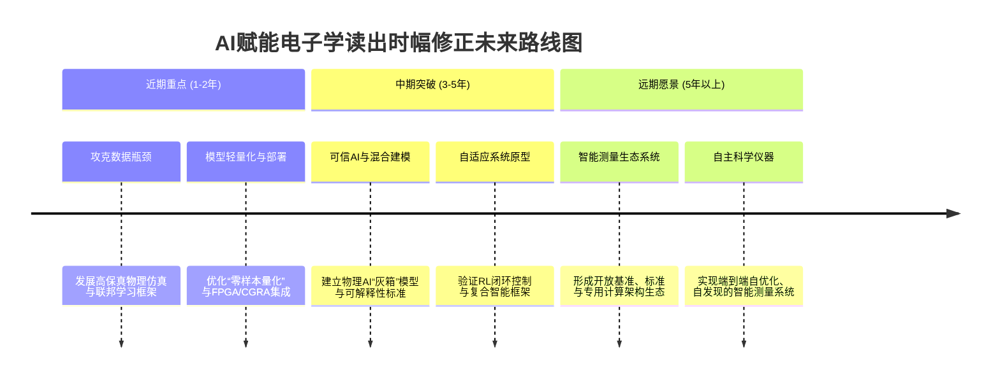

# AI算法赋能电子学读出时幅修正：潜力、路径与挑战研究
## 1 引言：电子学读出时幅修正的核心问题与AI机遇

电子学读出系统是现代科学仪器与工业设备的核心，负责将物理世界中的现象（如粒子撞击、光谱信号、雷达回波）转换为可量化、可分析的电子信号。在这一转换过程中，信号的“时间”与“幅度”信息是表征物理事件本质的关键参数。然而，由于电子器件固有的非理想性、环境噪声的干扰以及信号传输过程中的畸变，直接读出的时幅信息往往存在系统性误差与随机扰动。因此，“时幅修正”成为提升电子测量系统性能不可或缺的一环。本章旨在清晰界定时幅修正的技术内涵与核心目标，深入剖析现有方法面临的根本性瓶颈，并基于人工智能（AI）技术的最新进展，系统阐述其为解决这些经典难题所带来的范式变革与潜在机遇。

### 1.1 电子学读出时幅修正的内涵、目标与典型场景

“测量是以确定量值为目的的操作”，其本质在于将被测量与选定的标准单位进行比较，从而获得由数值和单位共同表示的、具有物理意义的量值[^1]。在电子测量领域，这一过程具体表现为对各种电量、电信号及电路元器件特性与参数的量化[^1]。而“时幅修正”正是这一量化过程中的校准与优化步骤，其广义内涵是：在电子学读出系统中，对原始采集信号的时间戳（时）和电压/电流幅值（幅）进行系统的校准、补偿、滤波或重建处理，以消除或减少系统误差、环境干扰及随机噪声的影响，从而更真实、精确地还原被测量的物理本质。

时幅修正的核心目标直接服务于电子测量的终极追求——**高保真与高精度**。具体而言，其目标可归纳为：**第一，提升时间分辨率**，即精确判定事件发生的时刻，对于区分快速连续事件至关重要；**第二，提高定量精度**，即准确测量信号的幅度，这直接关系到粒子能量、物质浓度等物理量的反演准确性；**第三，保障整体数据质量**，通过抑制噪声、剔除野值、补偿非线性，确保后续数据分析的可靠性与有效性[^1]。

电子学为当代各种信息作业提供了强有力的技术手段，其应用贯穿于信息采集、变换、传输、处理与再现的全链条[^2]。时幅修正技术因而广泛存在于众多高精尖领域。例如，在**粒子物理与核探测**中，用于精确测量粒子到达时间与能量沉积；在**质谱分析**中，用于校正离子飞行时间或信号强度，以提升物质鉴别与定量能力；在**雷达系统**中，用于修正回波信号的时间延迟与幅度衰减，实现精准测距与目标识别；在**医学成像设备（如CT、PET）**中，对于光子到达时间与能量的精确修正，直接关系到图像的空间分辨率与对比度[^3]。这些场景的共同特点是信号微弱、噪声复杂、对实时性与精度要求极高，使得时幅修正成为系统性能提升的关键瓶颈之一。

### 1.2 现有修正方法的技术路径与核心瓶颈

现有的电子学读出时幅修正方法，已形成一套结合硬件设计与算法处理的综合技术体系。从方法论上看，主要遵循直接测量、比较测量（如零位法、替代法）和间接测量等经典路径[^1]。在硬件层面，通过精心设计脉冲成形电路、采用高精度模数转换器（ADC）与时间数字转换器（TDC）混合架构，从物理上优化信号质量[^3]。在算法层面，则大量依赖于基于精确物理模型的推导或预设的固定参数处理流程，例如：基于幅度的定时修正算法（如恒比定时）、数字滤波成形技术（如梯形滤波、高斯滤波）以优化信噪比与定时点、以及针对特定已知干扰（如电波折射、相对论效应）的传统补偿模型[^1]。

尽管这些传统方法在许多场景下取得了成功，但其核心设计哲学——**依赖先验知识与静态规则**——在面对日益复杂的应用需求时，暴露出诸多难以逾越的瓶颈。综合相关资料，可将这些瓶颈归纳为以下三个方面：

**首先，对复杂动态环境的适应性严重不足。** 传统方法通常基于信号与噪声平稳、线性的假设。然而，真实场景中的噪声往往是**非平稳**（如突发性关门声、间歇性电器干扰）且与信号频谱**高度重叠**的[^4]。固定参数的滤波器或阈值处理难以应对这种动态变化，导致在噪声特性变化时性能急剧下降。《小智AI音箱环境噪声自学习优化》中明确指出，固定降噪模型在应对家庭环境动态噪声时面临显著挑战[^4]。类似地，电子学读出系统也常受复杂电磁环境、温度漂移等时变因素影响，传统静态修正模型难以实现持续最优。

**其次，参数调优高度依赖专家经验，且面临“维度灾难”。** 电子学系统包含大量可调参数（如滤波时间常数、甄别阈值、成形参数），这些参数之间还存在强关联性[^5]。寻找最优参数组合本质上是一个在高维连续空间中的优化问题。传统上，这严重依赖工程师的“试错”经验和耗时漫长的仿真测试，效率低下且难以保证全局最优。《基于机器学习的数据库系统参数优化方法综述》将此类问题描述为NP-Hard问题，并指出启发式算法在高维空间中难以在多项式时间内找到合适配置[^5]。这种对人工经验的强依赖，成为系统优化与快速部署的主要障碍。

**最后，缺乏实时在线的自适应学习与优化能力。** 传统方法一旦部署，其行为模式便已固定。当系统工作负载发生变化、器件老化或遇到训练数据中未涵盖的未知扰动时，系统无法自主调整策略以适应新环境，必须依赖人工干预进行重新校准或算法更新，响应周期长[^6]。这与《AI驱动的电子系统优化》所指出的，传统方法在处理系统复杂性和动态性问题时存在明显局限性的论断完全吻合[^7]。这种僵化性限制了系统在长期运行中的可靠性与性能保持能力。

### 1.3 AI算法赋能：范式变革与潜在机遇

人工智能，特别是机器学习分支的迅猛发展，为解决上述瓶颈提供了一种全新的、数据驱动的范式。AI不再依赖于手动编写精确的物理方程或固定规则，而是通过从数据中自动学习信号与噪声的特征、系统畸变的模式以及环境变化的规律，来构建自适应、智能化的修正策略。这种范式转变主要从以下几个方向带来了突破性的机遇：

**第一，强化学习（RL）为动态序贯决策优化提供了强大框架。** 强化学习的核心在于智能体通过与环境的持续交互，根据获得的奖励或惩罚信号，自主学习出一套能最大化长期累积回报的行为策略[^8]。这非常契合时幅修正中需要根据实时信号状态动态调整滤波参数、补偿策略的需求。例如，可以构建一个以修正后信号质量指标（如信噪比提升、定时抖动减小）为奖励的智能体，使其在仿真或实际数据流中自主学习最优的实时处理策略。AlphaGo、AlphaZero在棋类博弈中通过自我对弈实现超越人类的策略，已证明了强化学习在复杂序贯决策问题上的巨大潜力[^8][^9]。这预示着RL有望使时幅修正系统具备**在线自进化**的能力。

**第二，元学习与自动化机器学习（AutoML）有望降低算法设计门槛。** 当前，不仅AI的应用需要专家，AI模型本身的设计也高度依赖专家经验。而元学习（学会学习）的突破，使得AI能够学习如何更高效地设计或优化学习算法本身[^10]。近期研究已展示，元学习算法能够自主发现性能超越人类设计的新型强化学习算法[^10]。类比到时幅修正领域，这意味着未来有可能通过元学习，针对特定的探测器类型、噪声环境自动生成或优化出专用的、高性能的修正算法，大幅减少对领域专家手工调参的依赖，实现**算法设计的自动化**。

**第三，深度学习在特征学习与端到端优化上展现独特优势。** 卷积神经网络（CNN）擅长提取信号的局部与空间特征，循环神经网络（RNN）及其变体（如LSTM）则擅长建模时间序列的长期依赖关系[^11]。这些模型可以端到端地从原始波形数据中直接学习出最优的时幅修正映射函数，省去了传统方法中复杂的特征工程与多级处理模块。例如，《AI降噪技术实战指南:基于RNNoise的实时音频处理解决方案》展示了如何利用RNN混合架构，实时预测噪声概率并生成降噪掩码，有效处理稳态、瞬态等多种噪声[^11]。这种技术路径可以直接迁移至电子学读出信号的噪声抑制与波形恢复任务中，实现更精细、更自适应的处理。

**第四，从“数据时代”迈向“经验时代”，构建持续学习的智能系统。** 当前AI大模型的发展遭遇了高质量人类数据枯竭的瓶颈，被批评为“只会模仿，不会创造”[^9]。突破方向在于让AI智能体通过与环境互动获取“一手经验”来学习[^9]。这对于时幅修正极具启发性：未来的修正系统可以不再仅仅依赖离线标注的“干净”数据训练，而是作为一个智能体，在**实际运行中持续与信号环境互动**，通过预测自身修正动作带来的结果（如信号质量的改善）来不断优化内部模型。这将使系统能够适应缓慢的环境漂移，甚至发现未知的误差模式，实现**永不停止的自主性能提升**。

综上所述，AI算法通过其强大的数据驱动特征学习、复杂环境下的自适应决策以及自动化优化能力，为解决电子学读出时幅修正中长期存在的适应性差、调优难、僵化等问题提供了充满希望的变革性路径。这不仅是技术的叠加，更是一次从“基于模型”到“基于数据与学习”的范式跃迁，有望在提升测量精度、系统鲁棒性和运维自动化水平上开启新的篇章。

## 2 现有电子学读出时幅修正方法的技术体系剖析

电子学读出系统的时幅修正性能，根植于其硬件架构与算法处理的协同设计。现有技术体系已发展出一套成熟但边界清晰的方法论，旨在从物理信号层面到数字处理层面，系统性地提升时间分辨率与定量精度。本章将深入剖析这一技术体系，首先从硬件基础——脉冲成形与混合读出架构入手，进而解析其核心算法——数字滤波成形与定时修正，最后探讨辅助性的噪声抑制与物理补偿手段。通过对各层面方法原理、优势及适用条件的系统梳理，本章将明确揭示其在应对动态复杂环境时的根本局限性，为理解AI算法可能带来的突破奠定对比基线。

### 2.1 硬件架构：脉冲成形与ADC/TDC混合读出

硬件架构是时幅修正的物理基础，其设计直接决定了信号原始质量的上限及后续算法处理的可行性。现有体系中的关键硬件技术主要包括脉冲成形电路与模数/时间数字转换器（ADC/TDC）的混合读出架构。

**脉冲成形技术**是核电子学及类似高精度测量领域的基石。其核心在于通过特定的滤波电路，将探测器输出的快前沿但带有长尾的电荷信号（通常为指数衰减形）整形为更利于后续采集与分析的波形，如钟形脉冲或梯形脉冲[^12]。这一过程的关键可控参数是**成形时间常数**，它直接描述了脉冲信号成形过程的时间特征，用于控制波形的上升时间与平顶时间[^13]。成形时间常数的选择是一个典型的权衡过程：较短的成形时间可以减少信号堆积，适应高计数率场景；较长的成形时间则有利于抑制高频噪声，提升信噪比和能量分辨率[^12]。现代数字化系统（如多道谱仪）已能实现对该参数的精密调节，典型调节范围为0.8微秒至23微秒，调节步进精度可达0.2微秒，并支持计算机自动优化算法在数十秒内搜索最优参数组合[^13]。**然而，这种优化通常是离线或基于预设条件进行的，其“最优”状态对应的是特定的、假设平稳的噪声环境。**

**ADC/TDC混合读出架构**代表了在系统成本与性能之间寻求平衡的经典方案。传统飞行时间质谱仪等设备为了同时获得高时间分辨率和高定量精度，往往需要依赖昂贵的高速ADC（采样率通常在1GSPS以上）进行全波形采样，或依赖复杂的恒比定时（CFD）电路来改善定时精度[^14]。一种创新的混合方案则结合了脉冲前沿时间测量与脉冲成形采样：它利用直接的脉冲前沿甄别电路（替代CFD）和TDC来高精度测量事件发生的初始时刻，同时利用一个成本低得多的中低速ADC（约100MSPS）对经过成形电路处理后的脉冲进行采样，以获取其幅度信息[^14]。**该方案的精髓在于，利用ADC采样得到的精确幅度信息，对TDC测得的、可能受幅度影响（时间游动效应）的前沿时间进行修正，从而在显著改善时间分辨率的同时，也保障了基于幅度的定量分析性能**[^14]。这种架构在粒子探测器读出电路及多道脉冲幅度分析器中得到具体实现，其核心任务是将代表粒子能量的脉冲幅度通过ADC转换为数字量（道址），并进行分类计数以形成能谱[^15][^16]。

**尽管上述硬件方案设计精巧，但其性能边界受限于固有的物理约束和预设参数。** 脉冲成形电路的响应特性是固定的，ADC和TDC的精度与线性度也存在物理极限。更重要的是，整个硬件链路的优化（如成形时间常数、甄别阈值）依赖于对信号和噪声特性的先验知识。当实际工作环境偏离设计假设时，硬件系统自身无法动态调整以适应变化，这构成了其适应性的第一道屏障。

### 2.2 算法核心：数字滤波成形与定时修正

在硬件提供的数字化信号基础上，一系列算法被用于进一步提取和修正时幅信息。这些算法构成了传统方法体系的核心智能，主要围绕数字滤波成形和基于模型的定时修正展开。

**数字滤波成形算法**在数字域延续并扩展了硬件脉冲成形的目标。其中，**梯形滤波成形算法**被理论证明，在只考虑电压噪声和电流噪声、且探测器电荷收集时间不为零的条件下，是能够实现最高信噪比的最优滤波器[^17]。该算法旨在将前置放大器输出的指数衰减信号转换为具有清晰上升沿、平顶和下降沿的梯形脉冲。其设计通常采用模块化思想，将复杂的传递函数分解为多个子模块（如差分、延迟、积分单元）进行级联实现，以降低运算复杂度和资源消耗，并谨慎安排模块顺序以避免数据溢出和量化噪声放大[^17]。梯形滤波器的性能关键取决于其参数设置：上升沿宽度（斜边长度k）需要根据具体的噪声环境进行调整，而平顶宽度则与探测器的电荷收集时间密切相关[^17]。**这再次凸显了参数对专家经验和离线标定的依赖。**

更广泛地看，数字滤波算法家族还包括有限冲激响应（FIR）和无限冲激响应（IIR）滤波器等。FIR滤波器因其绝对稳定性和可设计的线性相位特性而备受青睐，尤其适用于生物电信号等需要保持波形形状的应用[^18]。然而，为了实现陡峭的滤波特性，FIR滤波器往往需要很高的阶数（如32阶、64阶），这意味着每次输出都需要进行数十次乘累加运算，对嵌入式微控制器（MCU）的计算资源和内存构成巨大压力，在便携式低功耗设备中可能难以实现[^18]。IIR滤波器可以用较低的阶数实现较好的频率选择性，但存在相位非线性和潜在不稳定的风险。这些通用数字滤波算法，如同梯形滤波一样，其系数设计基于对信号和噪声频谱特性的稳态假设。

**基于幅度的定时修正算法**是另一类核心算法，其典型代表即前述ADC/TDC混合架构中的修正环节。该算法的原理是：由于定时甄别电路（如前沿甄别器）的触发时刻会随输入脉冲幅度的变化而移动（时间游动），因此可以通过独立测量到的脉冲幅度值，依据一个预先标定好的幅度-时间偏移关系函数，对TDC输出的原始时间戳进行补偿修正[^14]。这种方法本质上是一种**基于物理模型的查表或插值补偿**，其有效性完全依赖于标定过程的准确性和标定关系在运行期间的稳定性。一旦探测器响应特性或电子学增益发生漂移，而修正模型未随之更新，修正精度就会下降。

### 2.3 辅助处理：噪声抑制与特定物理效应补偿

除了核心的成形与定时算法外，传统技术体系还包含一系列辅助处理手段，旨在进一步提升数据质量或补偿已知的系统性误差。

**针对噪声与野值的处理**主要依靠一系列规则简单、计算量较小的数字滤波算法。例如：
*   **限幅滤波**：通过设置合理的幅度阈值，剔除因突发干扰产生的异常高或低的野值点。
*   **中值滤波**：对滑动窗口内的采样点取中值，能有效抑制脉冲状的毛刺噪声，同时较好地保持信号边缘。
*   **算术平均滤波与递推平均滤波**：通过对多个采样点取平均来平滑随机噪声，提高信噪比，适用于对信号变化速度要求不高的场合[^19]。

这些方法在应对工频干扰、随机白噪声和偶发毛刺时非常有效，且易于在资源受限的系统中实现[^19][^18]。**然而，它们的共同特点是采用固定的处理窗口、阈值或系数。** 当噪声统计特性发生变化（例如，噪声能量在不同频段波动，或出现新的噪声类型）时，这些固定参数的滤波器可能不再是最优选择，甚至可能对信号造成不必要的失真。

**针对特定物理效应的补偿模型**则属于更高层次的系统误差修正。例如，在大气遥感或卫星测距中，需要根据电波折射模型对信号传播延迟进行修正；在高能物理实验中，可能需要考虑相对论效应对粒子飞行时间的影响。这类补偿通常基于精确的物理方程，通过输入实时的环境参数（如温度、压力、湿度）来计算修正量[^1]。**这种方法的优势在于其物理明确性和在模型适用范围内的极高精度。但局限性同样明显：它完全依赖于物理模型的完备性和输入参数的准确性。** 对于模型未涵盖的效应（“未知的未知”）或传感器测得的参数存在误差时，补偿将失效，且系统自身无法检测到这种失效。

### 2.4 性能边界与根本局限性分析

综合硬件与算法层面的剖析，现有电子学读出时幅修正方法的技术体系呈现出清晰的性能边界与内在局限性。

**在理想或平稳条件下的优势是显著的：**
1.  **高确定性精度**：基于精确物理模型（如折射模型、幅度-时间标定）的补偿方法，在模型适用范围内可提供接近理论极限的修正精度。
2.  **最优滤波性能**：在平稳噪声假设下，诸如梯形滤波器等被证明是理论最优的，能够最大化信噪比[^17]。
3.  **稳定性与可靠性**：尤其是FIR等无反馈的滤波算法，具有绝对的稳定性，行为可预测[^18]。
4.  **成本与性能的工程化平衡**：如ADC/TDC混合架构所示，通过巧妙的系统设计，能够在控制成本的同时满足多项性能指标[^14]。

**然而，当面对引言中所述的现实世界复杂性时，其根本局限性便暴露无遗，这些局限性是体系性的：**

| 局限性维度 | 具体表现与例证 | 根本原因 |
| :--- | :--- | :--- |
| **动态适应性不足** | 固定参数的成形电路（时间常数）和数字滤波器（系数）无法实时适应非平稳噪声。例如，搜索结果20描述的测试信号中包含了随机噪声、毛刺、长周期干扰等多种时变噪声组合，固定滤波器难以全程最优。 | 方法设计基于**信号与噪声特性平稳**的先验假设。系统缺乏感知环境变化并自主调整内部参数的能力。 |
| **参数调优依赖专家经验，面临“维度灾难”** | 成形时间常数需在0.8-23μs范围内选择[^13]；梯形滤波器的斜边长度k需根据噪声环境调整[^17]；多个滤波器级联时存在级联次序的优化问题[^17]。这些多参数、高维度的联合优化没有解析解，严重依赖工程师经验和耗时的离线仿真或实验扫描。 | 优化问题本质上是**高维、非线性、非凸的**，传统优化方法（如网格搜索、启发式算法）在有限时间内难以找到全局最优，且无法在线进行。 |
| **缺乏在线学习与应对未知扰动的能力** | 所有基于固定模型（物理方程、标定曲线）或固定规则（滤波系数、阈值）的方法，在部署后其行为模式即固化。当遇到训练数据未涵盖的未知扰动、器件老化或缓慢的环境漂移时，系统性能会逐渐退化，且无法自行发现并纠正。 | 系统是**开环的、非自适应的**。它不具备从运行数据中持续学习、更新内部模型以跟踪系统状态变化的能力。 |
| **处理非线性、频谱重叠噪声的能力有限** | 当噪声与信号在频域上严重重叠时，传统线性滤波器在滤除噪声的同时会不可避免地损伤信号。对于非高斯、非平稳的复杂噪声，传统方法缺乏有效的建模和分离手段。 | 方法大多建立在**线性系统理论**和**平稳随机过程**的框架内，对复杂非线性关系的建模能力薄弱。 |

**这些局限性并非偶然，而是源于现有技术体系的核心范式——它依赖于预先定义的、固定的物理模型和信号处理规则。** 系统就像一个执行精密流程的“自动机”，其所有应对策略都必须在设计阶段被完全预见和编程。在面对动态、复杂且可能存在未知因素的真实世界时，这种范式的僵化性便成为性能进一步提升的瓶颈。正是这些根本性的不足，构成了探索AI算法这一数据驱动、自适应学习新范式的强烈动因。AI的潜力在于，它有望使系统获得从数据中学习复杂模式、实时调整策略并适应未知变化的能力，从而突破上述边界。

## 3 AI算法在信号处理与数据修正领域的应用范式与案例

为探究AI算法提升电子学读出时幅修正性能的潜力，必须首先系统梳理AI在信号处理与数据修正领域已得到验证的应用范式。本章将严格依据参考资料，深入分析监督学习、无监督学习、深度学习以及集成与复合范式在解决相关技术问题上的核心机理、成功案例及其明确的适用边界。这些分析将为后续论证AI赋能时幅修正的具体路径提供坚实的范式依据与案例支撑。

### 3.1 监督学习范式：从误差预测到参数校准

监督学习是AI算法中最为经典和应用广泛的范式，其核心在于利用带有明确标签（即“正确答案”）的数据集训练模型，学习从输入特征到目标标签的映射函数。在信号处理与数据修正领域，这一范式被直接应用于**系统误差的预测与补偿**以及**处理流程的参数自动校准**，其本质是对传统标定与建模方法的自动化与智能化升级。

一个极具代表性的案例来自芯片物理设计领域。在《基于机器学习的快速时序校准方法》研究中，针对布局布线工具与时序签核工具之间因寄生参数估算差异导致的时序分析不一致问题，研究者明确提出并验证了基于机器学习的解决方案[^20]。该研究收集数据样本后，分别采用**Lasso线性回归、BP神经网络和随机森林算法**来训练寄生参数预测模型，旨在通过预测值来校准工具间的差异，减少迭代次数并促进时序收敛[^20]。**这一案例清晰地验证了监督学习模型，特别是非线性模型（如神经网络和随机森林），在预测复杂、高维物理参数（类比时幅修正中的系统性畸变或环境干扰）方面具备有效潜力**[^20]。其成功的关键在于将“工具A的提取值”与“工具B的提取值（作为真实值参考）”构成监督学习所需的标签对，从而让模型学习两者之间复杂的、非线性的映射关系。

在更基础的传感器数据修正层面，监督学习的线性形式与传统方法一脉相承。《数据修正》中提到，对于传感器非线性误差的修正，可以采用基于镜像原理结合**最小二乘法**进行拟合，例如将霍尔式位移传感器的非线性误差从6.79%大幅降低至0.02%[^21]。同样，《修正算法》中描述了ADC校正算法通过建立`Y=KX+b`的数学模型，利用精准电源信号计算增益系数K和偏移量b，从而将采样误差从超过15%降至接近实际值[^21]。**这些方法本质上都是线性回归，是监督学习的最基础形式。AI范式的延伸在于，当误差模型不再是简单的线性关系时，可以通过更复杂的神经网络等模型来自动学习这种非线性映射，无需人工推导复杂的补偿公式。**

然而，监督学习范式存在明确的边界与前提。**其性能高度依赖于大量、高质量标注训练数据的获取**。无论是芯片时序参数还是传感器校正数据，都需要精确的“测量值-真实值”配对[^20][^21]。在电子学读出系统中，获取大量“带有时幅误差的原始信号”及其对应的“绝对真实时幅值”本身就是一个巨大挑战。此外，监督学习模型通常在训练数据分布范围内表现最优，**对于训练集中未出现过的、全新的误差模式或极端工况，模型的预测和修正能力可能显著下降甚至失效**。这要求应用该范式时，必须充分考虑训练数据的完备性与代表性。

### 3.2 无监督学习范式：异常检测与特征发现

在许多实际工程场景中，获取大量带有精确标签的数据成本高昂甚至不可行。例如，设备的各种故障状态难以穷尽，或正常运行与早期故障的界限模糊。此时，**无监督学习**范式展现出独特价值。它不依赖于数据标签，而是通过分析数据本身的内在结构、分布和关系，来**发现潜在模式、识别异常点或进行特征降维**。这对于时幅修正中在线监测未知扰动和早期故障迹象至关重要。

根据《故障诊断中的无监督学习》和《用于汽车卡车异常检测的无监督深度学习:综述》，无监督学习特别适用于那些**难以获取标签数据**的场景，例如设备的正常运行状态和故障状态之间的界限不明确，或者故障类型多种多样且难以穷尽[^22][^23]。在这些场景下，无监督学习方法可以有效地识别出设备运行中的异常行为，为后续的故障诊断提供重要参考[^22]。

无监督学习在信号修正领域的主要技术路径包括：
1.  **聚类算法**：如K-means、DBSCAN等，通过将数据点分组到不同的簇中，识别出不同类型的运行状态[^22]。在故障诊断中，聚类可用于区分正常运行状态与各种故障状态[^22]。对于时幅信号，聚类可以用于发现不同的噪声模式或信号畸变类型，将偏离主要“正常信号簇”的数据点标记为异常。
2.  **降维算法**：通过降低数据的维度，发现数据的主要特征，简化问题的复杂度[^22]。例如，对高维的波形数据进行主成分分析（PCA）或t-SNE，可以在低维空间直观观察信号的聚集和离群情况，辅助异常检测。
3.  **深度异常检测框架**：针对更复杂的数据（如卡车在多工况、多设计变体下的传感器数据），传统的统计方法或专家知识可能失效。为此，研究提出了融合时空特征的**深度异常检测框架**，利用无监督深度学习直接从无标签数据中学习正常行为的表示，并检测偏离此表示的异常[^23]。**这种方法的核心优势在于能够处理高维、序列化的传感器数据，并自动提取具有判别力的时空特征**，非常适合处理时间序列形式的读出信号。

**无监督学习范式的核心能力是“发现异常”而非“精确修正”**。它能够为系统提供一个在线监测的“哨兵”，当信号特征偏离学习到的正常模式时发出警报，或初步定位异常时段[^23][^22]。例如，在电子学读出系统中，一个训练于正常工况信号的无监督模型，可以实时检测由突发电磁干扰、传感器瞬时故障或环境剧变引起的信号畸变。然而，它通常不直接给出“这个脉冲的时间戳应该修正多少”或“这个幅度值应调整为多少”的答案。因此，无监督学习常作为预处理或辅助模块，与监督学习或深度学习模型结合，构成一个更完整的智能修正系统。

### 3.3 深度学习范式：自适应噪声抑制与端到端波形恢复

深度学习，作为机器学习的一个强大分支，通过构建具有多层非线性变换的神经网络模型，展现出**自动学习数据层次化特征**和**端到端优化**的非凡能力。在信号处理领域，卷积神经网络（CNN）和循环神经网络（RNN）及其变体（如长短期记忆网络LSTM）已成为噪声抑制和信号恢复的核心技术范式。

传统噪声抑制方法，如维纳滤波、卡尔曼滤波等，往往依赖于对信号和噪声先验知识的假设，在实际复杂多变的环境中适应性受限[^24][^25]。相比之下，**神经网络凭借其强大的非线性映射能力、自学习能力和自适应能力，无需预先了解信号和噪声的具体统计特性，即可通过对数据的学习实现有效的噪声抵消**[^24][^25]。这直接针对了传统时幅修正方法对动态复杂环境适应性不足的根本瓶颈。

以下案例具体揭示了深度学习在此领域的应用深度：
*   **自适应噪声抵消**：《基于神经网络的自适应噪声抵消技术》原理文档详细阐述了神经网络如何替代传统方法，在通信、音频、生物医学信号处理中，自适应地学习噪声特征，实现更鲁棒的去噪效果[^24]。其核心在于模型的**自适应学习机制**，能够跟踪噪声特性的变化。
*   **时间序列信号去噪**：《利用神经网络对脑电图(EEG)降噪》提供了一个极具参考价值的实操案例。该研究使用**LSTM模型**去除EEG信号中的眼电（EOG）伪迹噪声[^26]。LSTM因其能捕捉时间序列中的长期依赖关系而被选用。研究进一步引入了短时傅里叶变换（STFT）层，让模型在时频域特征上进行训练，从而在低信噪比条件下提升了去噪性能[^26]。**这个案例完美验证了RNN类模型处理非平稳、具有时序相关性噪声的有效性，其“时频特征分析+深度学习”的复合思路对时幅修正具有直接借鉴意义。**
*   **图像/信号去噪与特征提取**：《神经网络信号噪声辨识去除》则从CNN视角进行阐释。文中指出，高斯卷积核能有效抑制噪声、平滑图像，而CNN通过带权值的卷积核自动提取重要特征[^27]。深度卷积神经网络通过学习从含噪信号到干净信号的映射，能够忽略噪声部分，提取关键信息[^28]。**这表明CNN在提取信号局部形态特征、分离信号与噪声方面具有天然优势，适用于基于波形局部特征的修正任务。**

**深度学习范式最显著的贡献在于实现了“端到端”的修正流程**。与传统方法需要串联脉冲成形、滤波、定时甄别、幅度修正等多个独立模块不同，一个设计良好的深度神经网络（如结合CNN和LSTM的混合模型）可以**直接输入原始的、含噪的数字化波形，并输出修正后的时间戳、幅度值，甚至直接生成恢复后的“干净”波形**[^28][^25]。这种方式减少了多级处理带来的误差累积，并且通过全局优化损失函数，使各个修正目标（如时间精度和幅度精度）得以协同优化。当然，这一范式的挑战同样突出：深度模型通常需要**海量的训练数据**和**显著的计算资源**进行训练和推理，将其部署到资源受限的嵌入式读出电子学系统中是工程实现的关键难点。

### 3.4 集成与复合范式：提升鲁棒性与泛化能力

单一的AI模型可能在特定数据集上表现优异，但面对复杂多变的真实世界信号时，其泛化能力和鲁棒性可能面临挑战。为此，**集成学习**与**多范式复合**的AI框架被提出，旨在通过结合多个模型的优势，构建出更稳定、更强大的智能修正系统。

集成学习的核心思想是“博采众长”。《数据修正》中明确指出，在神经网络集成领域，可以采用**目标数据修正的差异性学习方法**。该方法通过控制集成模型中个体网络之间的误差相关度（例如，利用`gupdate=25`等参数设置），促使每个网络学习数据的不同方面或对误差有不同的敏感性，从而通过集成平均来降低整体方差，提高修正的准确性和鲁棒性[^29]。**这为解决单一模型可能存在的过拟合问题或对某些罕见噪声模式失效的问题提供了有效策略。**

更进一步，前沿研究开始探索深度融合不同AI范式以解决复杂约束问题。《英伟达提出ReaSyn》虽然聚焦于分子合成领域，但其框架设计思想极具启发性。该研究提出的ReaSyn框架，为了破解分子“可生成但不可合成”的难题，创新性地采用了**反应链（Chain-of-Reaction, CoR）表示法**，将合成路径类比为大语言模型的**思维链（Chain-of-Thought, CoT）**进行推理[^30]。同时，该框架集成了**定制化的强化学习（RL）微调**与计算扩展方案，以大幅提升模型在庞大化学空间中的探索效率和优化性能[^30]。**这个案例展示了一种高级的复合范式：用深度学习进行表示学习和初步生成，用强化学习进行面向复杂目标（如可合成性）的在线优化与决策。** 对于时幅修正，可以构想类似的复合系统：利用无监督学习实时监测信号健康状态并触发警报；利用深度学习模型（如CNN-LSTM）作为主干修正网络；同时，采用一个元学习或强化学习模块，根据实时性能反馈（如输出信号的信噪比、定时抖动）动态调整主干网络的参数或在不同子模型间进行选择，以实现在线自适应优化。

**这些集成与复合范式代表了AI赋能复杂工程系统的高级阶段，其目标是构建出能够自我调整、应对未知情况、且决策更稳健的智能体**。然而，这种能力的提升是以**显著增加的模型设计复杂度、训练难度和系统集成开销**为代价的。它要求研究者不仅精通多种AI算法，还需深刻理解电子学读出系统的物理约束与性能指标，是推动AI从实验室走向实际工程应用必须攻克的课题。

## 4 AI算法提升时幅修正性能的潜在路径与机理分析

在剖析了现有技术体系的局限性并梳理了AI的应用范式后，本章将深入论证AI算法赋能电子学读出时幅修正的具体技术路径与内在机理。基于参考资料，AI的潜力主要体现在其**数据驱动的自适应学习能力**和**对复杂非线性关系的建模能力**上。本章将系统分析其在智能噪声滤除、高精度误差补偿、自适应参数优化及端到端系统校正四个关键环节的潜在路径，并与传统方法进行机理对比，明确其解决核心瓶颈的优势与约束。

### 4.1 智能噪声建模与动态滤除：超越固定滤波器的自适应机制

传统降噪技术（如谱减法、维纳滤波）在面对非稳态噪音时存在显著局限性。非稳态噪音具有时间维度上的剧烈波动特性，其频谱分布、强度变化、出现规律均呈现高度不确定性，例如交通环境中的车辆鸣笛、施工场地的机械冲击声等[^31]。这类噪声的统计特征随时间快速改变，导致基于静态阈值或固定滤波器的传统方法失效。实验数据显示，在非稳态噪声场景下，传统方法的信噪比提升通常不超过5dB，且易引入音乐噪声等二次失真[^31]。

**AI降噪技术的突破性在于构建了动态适应机制。** 其核心机理是通过深度学习算法，实现对噪声特征的实时学习和精准抑制，这为解决电子学读出中复杂的、时变的电磁干扰与背景噪声提供了新路径。

*   **时空特征的自适应提取**：卷积神经网络（CNN）能够自动从信号的时频谱中提取噪声的局部时空特征[^31][^32]。这替代了传统方法中需要人工设计滤波器频率响应的过程。通过训练，CNN可以学习到噪声与信号在时频域上的复杂分布模式，从而生成更精准的滤波掩码。
*   **时序依赖关系的动态捕捉**：针对噪声的时变特性，循环神经网络（RNN）及其变体（如LSTM、GRU）被用于捕捉噪声参数在时间序列上的依赖关系和变化轨迹[^31][^33]。这使得模型能够“记忆”噪声的短期历史并预测其短期变化，实现对突发、瞬态噪声（如电子学系统中的脉冲型干扰）的快速响应。某实时通信系统采用的CRN（Convolutional Recurrent Network）模型，在CPU上实现了10ms级的处理延迟，满足了实时交互需求[^31]。
*   **复杂噪声特性的深层建模**：通过堆叠更深的网络层，如深度残差网络（ResNet），AI模型能够精准建模更加复杂的噪声动态特性[^31]。其跳过连接结构有效缓解了梯度消失问题，使网络可以学习到更深层次、更抽象的信号与噪声表征。

**这种“数据驱动特征学习+动态时序建模”的机制带来了显著的性能提升。** 测试表明，采用AI降噪后，非稳态噪声场景下的语音清晰度指数（CSI）提升可达12dB，同时将失真率控制在3%以内[^31]。这远优于传统方法不超过5dB的提升且易失真的表现。将此机理迁移至电子学读出信号处理，意味着AI有望实现对与信号频谱高度重叠、统计特性时变的复杂噪声进行更有效、更保真的滤除，从而为后续高精度的时幅信息提取提供更“干净”的基底信号。

**然而，这一路径的成功实施依赖于关键前提：大规模、多样化的噪声样本数据库。** 训练阶段需要构建涵盖不同场景下的稳态与非稳态噪声样本，并常辅以数据增强技术（如添加高斯噪声、时间拉伸）来扩充数据多样性[^31]。对于特定的电子学读出系统，构建这样一个具有代表性的噪声-信号配对数据集是首要挑战。

### 4.2 高精度误差预测与实时补偿：从离线标定到在线学习

传统时幅修正中的系统误差补偿（如基于幅度的定时修正、传感器非线性校正）严重依赖离线标定获得的固定模型或查找表。一旦工作环境变化或器件老化，标定模型失效，精度便会下降，且重新标定成本高、周期长。

**AI算法，特别是结合边缘计算（端侧AI），为实现高精度、自适应的在线误差预测与补偿提供了可行路径。** 其机理核心在于将监督学习模型部署于数据采集的源头，实现“感知-决策-执行”的闭环。

*   **实时本地算力与零延迟补偿**：借鉴端侧AI六维力传感器的设计理念，通过在传感器或前端读出电路中内置轻量化的AI处理单元，可以实现对系统误差的即时数据清洗与补偿，无需依赖云端，从而实现“误差修正零延迟”[^34]。例如，在汽车焊接场景中，内置AI的力传感器能在10毫秒内（比人类眨眼快50倍）识别力道偏差并触发调整，从源头避免不良品产生[^34]。对于时幅修正，这意味着时间游动、基线漂移等误差可以在信号数字化后立即得到预测和修正，极大提升了系统的实时响应能力。
*   **自适应场景学习与模型进化**：与传统传感器的固定参数模式不同，端侧AI具备“会学习的大脑”特性[^34]。它能够记忆不同工况下的误差特征，并随着运行过程中持续输入的新数据，动态优化内部的误差预测模型。例如，在机床加工中，AI可以学习不同材质带来的力反馈特征变化；在康复机器人场景，可根据患者肌肉张力变化动态调整感知阈值[^34]。迁移至电子学读出，这意味着修正模型能够自适应不同的粒子能量范围、环境温度区间或探测器工作点，实现“越用越智能”，从而克服传统固定标定曲线在环境漂移时的失效问题。
*   **从监督学习到持续学习**：该路径本质上是将一种高效的监督学习（如非线性回归神经网络）模型部署在边缘端。初始模型通过历史标定数据训练获得。在运行过程中，系统可以利用可获取的局部“真实值”反馈（如通过定期校准脉冲、物理约束或多传感器一致性校验），对模型进行在线微调（Online Learning），使模型持续跟踪系统状态的变化[^34]。

**该路径已展现出显著的工程效益。** 资料显示，采用端侧AI方案的六维力传感器将测量精度误差提升至0.2%满量程（千分之二），并通过成本优化，将传感器价格较市场同类产品降低50%[^34]。在工业质检中应用后，某汽车工厂的焊接坏件率从5.2%大幅降至0.3%，年减少损失达数百万元[^34]。这证明了**将AI与专用硬件深度集成，不仅能提升精度，还能通过智能化实现降本增效**。

**实施该路径需关注：初始模型的精度、在线学习算法的稳定性与收敛性，以及如何在不引入偏差的前提下获取有效的在线学习信号。**

### 4.3 自适应参数优化与闭环控制：替代专家经验的自主调参

如第二章所述，传统电子学系统中的关键参数（如脉冲成形时间常数、滤波系数、甄别阈值）优化是一个高维、非线性问题，严重依赖专家经验与离线扫描，无法在线自适应调整。

**AI算法，特别是与系统辨识和自适应控制理论相结合，为实现参数的自主、动态优化提供了框架。** 其机理是将整个或部分信号处理链路视为一个待实时辨识和控制的系统。

*   **基于实时数据的递推参数辨识**：采用基于梯度校正的递推参数辨识方法，可以将信号处理模块（如一个数字成形滤波器）的参数估计问题转化为在线优化问题[^35]。考虑模型 \(y(k) = \varphi^T(k)\theta(k) + e(k)\)，其中 \(\theta(k)\) 为待辨识的参数向量。通过最小化预测误差 \(e(k)\) 的指标 \(J\)，参数学习公式可以写为 \(\hat{\theta}(k+1) = \hat{\theta}(k) + R(k+1)\varphi(k)(y(k) - \varphi^T(k)\hat{\theta}(k))\)[^35]。这意味着，系统可以持续利用最新的输入输出数据 \(\varphi(k)\) 和 \(y(k)\) 来更新参数估计值 \(\hat{\theta}\)，使滤波器参数始终逼近当前信号与噪声环境下的最优值。
*   **模型参考自适应控制（MRAC）的应用**：自适应控制的核心优势在于其对未知或时变系统参数的适应能力[^36]。在时幅修正的语境下，可以设计一个“参考模型”来表征理想的时幅响应特性（例如，一个具有最优信噪比和最小定时抖动的系统输出）。实际读出系统作为“可调系统”，其控制器（即包含待优化参数的处理算法）参数由自适应机构根据实际输出与参考模型输出之间的误差动态调整[^36]。这使得系统能够自动适应内部器件特性漂移或外部干扰的变化，始终保持接近理想的性能。
*   **从开环配置到闭环优化**：传统参数设置是开环的、一次性的。而自适应参数优化路径引入了一个**闭环**。系统性能的实时度量（如输出信号的信噪比、过零时间抖动、能量分辨率）作为反馈信号，驱动参数调整算法，形成一个以性能指标为目标的持续优化环。这实质上是将工程师的“试错”经验自动化、实时化。

**该路径直指传统方法“维度灾难”与缺乏在线适应能力的核心痛点。** 它使得系统不再需要预先为所有可能工况存储多套参数，而是具备了一种“自配置”能力。当探测器计数率剧烈变化、环境温度导致电路响应改变时，系统能够自动收敛到新的参数最优解，保障性能稳定。

**该路径的挑战在于系统的可辨识性、自适应算法的收敛速度与鲁棒性。** 在强噪声或非平稳环境下，算法可能难以稳定收敛或收敛过慢。此外，需要精心设计性能评价指标，使其能够准确、快速地反映时幅修正质量。

### 4.4 端到端系统辨识与校正：从模块化处理到全局映射学习

传统时幅修正流程通常是模块化的：脉冲成形、滤波、定时甄别、幅度提取、误差补偿等步骤依次串联。这种设计可能导致误差累积，且每个模块的优化目标可能并非全局最优。

**深度学习范式支持一种更为激进的路径：端到端系统辨识与校正。** 其核心思想是绕过中间模块，利用深度神经网络直接学习从原始含噪数字化波形到最终精确时间戳和幅度值的复杂映射函数。

*   **将整个链路视为“黑箱/灰箱”系统**：借鉴多传感器时间同步校准中将外参标定问题转化为模型优化问题的思路[^37]，可以将整个电子学读出链路的综合畸变（包括探测器响应、电子学噪声、非线性、时间游动等）视为一个待辨识的系统。深度神经网络的任务就是逼近这个系统的逆模型，即从畸变的输出（原始波形）反演出纯净的输入（物理事件的真实时幅）。
*   **深度网络的联合表征与优化能力**：卷积神经网络（CNN）擅长提取波形的局部形态特征，循环神经网络（RNN/LSTM）擅长建模波形的时间演化序列[^31][^33]。通过构建CNN与RNN的混合架构（如CRN），模型可以同时利用波形的空间和时间信息，端到端地联合优化时间分辨率和幅度精度目标[^31][^32]。这种方式减少了多级处理间的信息损失和误差传递潜力。
*   **数据驱动的全局最优**：在端到端框架下，所有可训练参数都朝着最小化最终输出误差（如与参考真值的差异）的方向协同优化。这有可能发现传统模块化设计中难以企及的、更优的全局处理策略。

**然而，这一路径面临严峻挑战：**
1.  **海量高质量配对数据需求**：训练这样的端到端模型需要极其大量的“原始含噪波形—真实时幅值”配对样本[^31]。获取“真实值”在电子学测量中本身就是核心难题，成本极高。
2.  **模型复杂性与计算开销**：高性能的深度模型通常参数量大、计算复杂，难以直接部署在资源受限的嵌入式读出电子学（如FPGA、低功耗MCU）中，难以满足实时性要求。
3.  **可解释性与可靠性风险**：端到端模型作为“黑箱”，其内部决策逻辑难以解释。在要求高可靠性的科学测量或工业检测中，这种不可解释性可能带来接受度障碍和潜在风险。

**因此，端到端路径更可能在与物理模型结合的“灰箱”框架下，或是在云端进行离线数据精密分析等场景中率先取得应用。** 对于在线实时处理，更可行的方案可能是采用**轻量化设计**的专用网络，或利用**迁移学习**、**元学习**将在其他领域或仿真环境中预训练好的模型，用少量实际数据快速适配到特定系统，以缓解数据和算力压力。

### 4.5 路径对比与综合洞察

为清晰对比上述AI赋能路径与传统方法的核心差异，以下表格从原理、优势、挑战及适用性方面进行了总结：

| 技术路径 | 核心机理（AI vs. 传统） | 关键优势 | 主要挑战/前提 | 适用场景倾向 |
| :--- | :--- | :--- | :--- | :--- |
| **智能噪声建模与滤除** | **动态自适应学习** vs. 固定滤波器。利用CNN/RNN学习噪声时频特征与时序变化。 | 有效处理**非平稳、频谱重叠**噪声，信噪比提升潜力大，保真度高。 | 依赖**大规模多样化噪声样本**训练；模型需要一定计算资源。 | 噪声环境复杂、多变，且对信号保真度要求高的场景。 |
| **高精度误差预测与补偿** | **在线学习与实时补偿** vs. 离线标定固定模型。端侧AI实现即时误差修正与模型进化。 | 实现**零延迟**补偿，适应**环境漂移**，降低长期维护成本，提升可靠性。 | 需要**初始高精度模型**；在线学习算法需稳定；需设计有效的反馈信号。 | 系统误差显著且时变，或要求长期免维护、高可靠运行的场景。 |
| **自适应参数优化** | **闭环反馈优化** vs. 开环经验调参。采用系统辨识/自适应控制理论在线调整算法参数。 | 解决**参数“维度灾难”**，实现系统**自配置**与**持续最优**，减少对专家经验的依赖。 | 要求系统**可辨识**；自适应算法需保证**收敛速度与稳定性**；需定义准确的性能指标。 | 系统工作状态（如计数率、温度）动态范围大，需要参数频繁调整的场景。 |
| **端到端系统校正** | **全局映射学习** vs. 模块化串联处理。深度网络直接学习从原始波形到时幅结果的复杂函数。 | **联合优化**时幅目标，减少级联误差，可能发现超越传统设计的全局最优解。 | **海量精准配对数据**需求；**模型复杂、计算开销大**；**可解释性差**，可靠性风险。 | 数据充足、算力允许的**离线精密分析**，或与物理模型结合的“灰箱”**混合建模**场景。 |

**综合而言，AI算法提升时幅修正性能的机理根植于其“数据驱动”和“自适应”两大特性。** 它并非简单地替代某个传统模块，而是引入了一种新的系统优化范式：从依赖先验模型和静态规则，转向从运行数据中持续学习动态模式并实时调整策略。**不同路径之间并非互斥，而是可以分层、组合应用。** 例如，可以在前端采用轻量化的智能噪声抑制，在中端采用自适应参数优化的滤波成形，在末端采用基于端侧AI的误差补偿，共同构成一个智能化的时幅修正流水线。选择何种路径或组合，需综合考虑具体的性能需求、数据条件、计算资源约束以及工程实现的复杂度。

## 5 可行性、挑战与局限性评估

将人工智能算法引入电子学读出时幅修正领域，虽然展现出突破传统方法瓶颈的巨大潜力，但其从理论验证走向工程实践的过程，必然面临一系列现实约束与严峻挑战。本章旨在系统评估这一技术融合的可行性边界，深入剖析其在数据、算力、模型可信度及系统工程化四个核心维度上面临的局限性。评估将严格依据参考资料，审慎界定AI方案在当前技术条件下的适用范围，为后续的技术路径选择与工程实践提供一份基于事实的风险评估与决策依据。

### 5.1 数据需求：高质量标注数据的获取与生成瓶颈

人工智能，尤其是监督学习和深度学习范式，其性能的基石在于大规模、高质量的训练数据。然而，在电子学读出时幅修正这一特定领域，构建满足AI模型训练需求的数据集面临根本性挑战，这构成了AI方案可行性的首要制约因素。

**高质量科学数据的稀缺性是普遍性难题。** 正如《赛迪前瞻:AI for Science崛起的机遇、挑战与建议》所指出的，高质量数据稀缺是AI for Science面临的核心挑战之一[^38]。这一论断直接映射到时幅修正任务中：AI模型训练所需的核心数据是“原始含噪波形”与对应的“绝对真实时幅值”的精确配对。获取“真实值”本身即是高精度测量的终极目标，往往依赖于更精密、更昂贵的基准仪器或复杂的物理标定流程，其成本极高、效率低下，难以大规模生成。现代科学实验虽能产生海量原始波形数据，但将其转化为标注准确、可用于监督学习训练的结构化数据集，面临着巨大的物理极限与经济成本障碍[^38]。

**数据偏差与覆盖不足将直接导致算法偏见与性能退化。** 《如何提高 AI 的安全性和可靠性?》中揭示的案例极具警示意义：某医疗AI公司的诊断系统对特定种族群体误诊率偏高，根源在于训练数据中该群体样本占比不足5%且病症类型单一[^39]。类似地，在时幅修正场景中，如果训练数据未能充分覆盖所有可能的工况（如极端温度、不同粒子能量范围、各类突发性电磁干扰模式），训练出的模型在面对这些“数据分布外”的情况时，性能将出现显著下降甚至产生系统性误判[^39]。例如，一个仅在实验室平稳电磁环境下训练的噪声抑制模型，在部署到工业现场复杂的时变噪声环境中时，其滤除效果可能大打折扣，甚至错误地滤除有用信号特征。

**仿真数据与数据增强技术存在固有局限。** 为弥补真实数据不足，常采用物理仿真生成数据或对现有数据进行增强（如添加噪声、变换幅度）。然而，仿真模型本身是对现实的简化，其生成的数据与真实系统采集的数据之间必然存在“仿真到现实的鸿沟”（Sim-to-Real Gap）。依赖仿真数据训练的模型，在真实场景中的泛化能力存疑。数据增强技术虽能增加样本多样性，但无法创造训练集中完全不存在的、本质性的新特征或新模式。因此，**高质量真实标注数据的获取瓶颈，是制约数据驱动AI模型在时幅修正中走向成熟应用的第一道，也可能是最严峻的关卡。**

### 5.2 计算资源与实时性：嵌入式约束下的算力平衡

电子学读出系统，特别是用于高能物理、质谱分析等前沿领域的系统，通常对实时性、功耗和成本有严格限制，其硬件平台多采用嵌入式处理器、现场可编程门阵列（FPGA）或专用集成电路（ASIC）。将计算密集型的AI模型，尤其是参数量庞大的深度学习模型，部署到此类资源受限的平台，面临着深刻的算力供需矛盾。

**模型推理的实时性要求与硬件处理能力之间存在紧张关系。** 高计数率粒子探测或快速扫描质谱仪等应用，要求系统在微秒甚至纳秒量级内完成单个事件信号的时幅修正与读出。然而，复杂的深度神经网络（如Transformer架构）进行一次前向推理可能需要数百万甚至数十亿次乘加运算。在嵌入式CPU上运行此类模型，其延迟很可能无法满足实时处理的要求。即便在FPGA上通过并行化设计进行加速，也需要消耗大量的逻辑单元、存储块和DSP资源，可能与系统其他关键功能（如高速数据采集、触发判选）争夺有限的硬件资源，增加系统设计的复杂度和成本。

**模型存储与内存带宽构成另一重约束。** 大型神经网络的权重参数可能达到数百MB甚至GB级别，远超典型嵌入式设备（如微控制器）的片上存储容量。将权重存放于外部慢速存储器又会引入访问延迟，成为性能瓶颈。此外，模型运行时的中间激活值也会占用大量内存，对系统的内存带宽提出挑战。

**为了在资源受限平台上实现部署，必须进行深度的模型轻量化与优化：**
*   **剪枝与量化**：移除网络中冗余的权重（剪枝）并将权重与激活值从高精度浮点数转换为低精度定点数（量化），能大幅减少模型尺寸和计算量，但可能带来一定的精度损失。
*   **知识蒸馏**：用一个大模型（教师模型）指导一个小模型（学生模型）进行训练，旨在让小模型获得与大模型相近的性能。
*   **专用硬件加速**：集成神经处理单元（NPU）或利用FPGA的定制化AI加速IP核，可以显著提升能效比和推理速度，但这会增加系统的硬件成本、设计复杂度和功耗。

**因此，AI方案的算力可行性边界取决于对模型性能、推理延迟、功耗和成本之间进行的精密权衡。** 对于实时性要求极高的场景，可能只能部署极度轻量化的模型；对于允许一定延迟的离线或近线处理场景，则可以应用更复杂的模型。这要求算法设计必须与硬件架构协同优化，而非简单地进行软件移植。

### 5.3 模型可解释性、可靠性与安全风险

人工智能模型，特别是深度神经网络，常被诟病为“黑箱”，其内部决策逻辑难以理解。在要求高可靠性、高可信度的科学测量与工业检测领域，这种不可解释性带来了严重的接受度障碍与潜在风险。

**“幻觉”问题是模型可靠性的直接威胁。** 如《拆解AI黑箱,深度解读“机制可解释性”》所述，大语言模型普遍存在“幻觉”问题，即生成看似合理但实则虚构或错误的信息[^40]。在时幅修正任务中，这意味着AI模型可能输出一个在统计上“看起来”正确，但物理上完全错误的时间戳或幅度值。例如，一个用于修正粒子飞行时间的模型，可能因训练数据缺陷或自身机制问题，凭空“想象”出一个不符合任何物理规律的时间修正量。这种错误在科学实验中可能导致错误的数据分析结论，在工业检测中可能导致漏检或误判，后果严重[^40][^39]。

**模型黑箱特性阻碍了故障诊断与系统调试。** 当AI修正模块输出异常结果时，工程师很难像分析传统算法（如检查滤波器系数、甄别阈值）那样，追溯问题根源是源于输入数据的异常、模型内部特定神经元的错误激活，还是训练阶段引入的偏见。这使得系统的调试、验证和维护变得异常困难，降低了其在关键系统中的可接受度[^40]。

**为应对这些挑战，可解释性AI（XAI）与安全增强技术成为研究焦点：**
*   **机制可解释性（MI）的探索**：如《拆解AI黑箱》中介绍，Anthropic等机构正通过“电路追踪”（Circuit Tracing）和构建“归因图谱”（Attribution Graphs）等方法，试图像用显微镜观察一样，理解大模型内部哪些神经元或神经元组合对应特定概念，以及信息如何流动[^40]。这为从内部计算机制层面诊断模型错误、区分“真实对齐”与“表面成功”提供了潜在工具[^40]。
*   **提升模型鲁棒性的技术**：包括**对抗训练**（用精心构造的对抗样本来训练模型，增强其抗干扰能力）、**输入净化**（预处理输入数据以过滤潜在恶意扰动）等，旨在增强模型面对异常或恶意输入时的稳定性[^39]。
*   **算法偏见与数据安全风险**：训练数据偏差不仅影响性能，还可能引发算法歧视，如在贷款审批、保险定价中产生不公平决策[^41]。同时，AI系统的研发和应用过程可能因数据处理不当、非授权访问或恶意攻击导致敏感数据泄露[^41]。**联邦学习**等技术虽能在不共享原始数据的前提下联合训练模型，保护数据隐私，但也可能引入新的安全漏洞和模型性能挑战[^39]。

**综上所述，模型的可解释性、抗“幻觉”能力和安全性是AI赋能时幅修正必须跨越的门槛。** 在将这些模型应用于关键任务之前，必须建立严格的验证、测试与监控体系，并积极探索将可解释性工具与安全防护机制融入AI系统的生命周期。

### 5.4 系统集成、工程化与全生命周期治理

将AI模块从实验室原型转化为电子学读出系统中稳定、可靠的组成部分，是一项复杂的系统工程，涉及硬件、软件、安全、运维等多个层面的深度整合与持续治理。

**系统集成面临技术复杂度的显著提升。** 首先，需要将通常使用Python框架（如PyTorch, TensorFlow）开发的AI模型，高效地转换为可在FPGA或嵌入式处理器上高效执行的代码（如HLS代码、C代码或专用指令）。这一转换过程不仅要保证功能等价，还需优化以满足严格的时序、资源和功耗约束。其次，AI处理流水线必须与传统数字信号处理模块（如数字成形滤波器、定时甄别算法）无缝衔接，确保数据流同步、接口匹配，并处理可能存在的反馈或控制环路。此外，系统的测试与验证范式需要革新。传统基于确定逻辑的测试方法难以覆盖AI模型在所有可能输入空间下的行为，必须引入基于统计的测试、对抗性测试以及利用可解释性工具进行的关键路径分析，这大大增加了验证的复杂性和成本。

**全生命周期安全风险治理至关重要。** 《人工智能给数据安全带来哪些新挑战?》明确指出，人工智能系统的安全风险贯穿设计、研发、训练、部署、使用、维护等生命周期各环节[^41]。在集成AI模块后，系统可能面临新的攻击面，例如：通过**对抗性样本**诱导模型做出错误修正；利用模型窃取攻击获取敏感的训练数据或模型知识产权；在**跨系统通信或共享数据**过程中，因保护水平不一导致数据泄露[^41]。传统的网络安全威胁，如网络钓鱼和DDoS攻击，同样会对集成AI的电子学系统构成严重威胁[^41]。因此，必须在系统设计之初就纳入安全考量，实施数据分类分级、访问控制、安全审计等一系列措施。

**持续的监控、维护与模型进化带来长期运维挑战。** AI模型并非“部署即终结”。探测器性能会漂移，工作环境会变化，可能会出现训练时未见的噪声模式。因此，系统需要具备在线性能监控能力，能够检测模型输出的置信度或与物理约束的一致性，并在性能退化时触发警报。更进一步，系统可能需要支持**在线学习或定期模型更新**，利用新积累的数据对模型进行微调，以适应变化。这涉及到模型版本管理、无缝热更新、回滚机制以及确保更新后模型性能与安全的验证流程，对运维团队提出了更高要求。

**最终，引入AI所带来的额外复杂度、成本和安全风险，必须与其带来的性能提升收益进行审慎权衡。** 对于性能要求已达到极限、且运行环境高度稳定的传统应用，沿用经过充分验证的经典方法可能是更经济可靠的选择。而对于那些受限于复杂非线性、动态噪声或急需实现自适应优化的前沿应用，则值得投入资源去攻克AI集成与治理的难题，以换取性能的阶跃式提升。

## 6 前沿研究方向与未来展望

在系统论证了AI算法赋能电子学读出时幅修正的潜力、路径与挑战后，本章将聚焦于该领域最前沿的探索方向，并展望未来的关键研究趋势。综合参考资料，前沿研究正沿着多个维度展开，旨在攻克数据、算力、可信度与系统集成等核心瓶颈。这些方向并非孤立，而是相互交织、协同演进，共同指向一个更具适应性、高效性与可靠性的智能测量未来。本章将深入剖析轻量化模型设计、小样本/无监督学习、强化学习自适应控制、物理AI混合建模以及专用计算架构集成这五大前沿方向，分析其内在机理、适用条件与挑战，为后续的技术突破与工程实践提供前瞻性的路线图参考。

### 6.1 面向边缘部署的轻量化神经网络模型设计

电子学读出系统，尤其是用于粒子探测、便携式质谱仪等场景的系统，对功耗、体积和实时性有近乎苛刻的要求。将计算密集的深度神经网络直接部署于资源受限的嵌入式平台（如FPGA、低功耗MCU）是当前面临的主要工程挑战之一。因此，**设计高效、轻量化的神经网络模型，实现模型压缩与加速，成为AI在边缘侧落地的关键技术路径**。

清华大学研究团队在物体检测任务上提出的“零样本量化”技术，为解决这一难题提供了极具启发性的思路[^42]。传统量化方法需要大量真实训练数据来确定最优的压缩参数，这在数据隐私保护日益重要的今天成为瓶颈。清华团队的创新在于，**不再使用通用的合成图像，而是生成专门包含物体位置、大小和类别信息的“任务特定”合成图像，作为量化训练的替代数据**[^42]。这种方法的核心优势在于，它绕过了对原始真实数据的依赖，在保护数据隐私的同时，实现了模型的高效压缩。测试结果显示，其性能甚至超过了使用完整真实数据训练的传统量化方法[^42]。这为电子学读出系统提供了一种范式：**可以在不暴露敏感原始波形数据的前提下，利用基于物理模型生成的“任务特定”仿真信号（如模拟不同能量粒子产生的脉冲波形及其畸变），来训练和压缩用于时幅修正的专用神经网络模型**。

模型轻量化不仅限于算法层面的优化，更需与底层硬件架构的演进协同。AI加速器芯片的技术发展，特别是**高带宽存储器（如HBM4E）和存算一体（CIM）技术**，正为边缘AI推理提供强大的硬件支撑[^43]。例如，基于忆阻器的存算一体设计方案，通过自适应量化方案，可使系统总能耗降低57.2%[^43]。这些技术通过减少数据搬运开销和提升计算能效，直接缓解了嵌入式系统的算力与功耗压力。未来的研究方向在于，**根据时幅修正算法的具体计算模式（如卷积为主的波形特征提取，或循环网络为主的时序建模），协同设计专用的轻量化网络架构与底层存算或近存计算单元**，实现从算法到硬件的端到端能效优化。

然而，该方向面临的挑战在于**性能与效率的权衡**。激进的模型压缩（如量化至4位甚至更低）可能损害模型对复杂非线性畸变和细微噪声特征的建模能力，导致修正精度下降。因此，研究需要聚焦于开发更智能的压缩感知训练方法，以及设计本身就具有高稀疏性、低计算复杂度的新型网络架构（如神经架构搜索NAS针对边缘设备的设计），在确保模型“轻”的同时，不丢失其“智能”的核心。

### 6.2 数据稀缺场景下的小样本与无监督学习策略

高质量标注数据的稀缺性是制约AI赋能时幅修正的根源性瓶颈。在科学测量领域，获取大量“含噪原始信号-绝对真实时幅值”的精准配对样本成本极高，甚至不可行。因此，**研究如何在有限甚至无标签数据条件下进行有效学习，成为突破数据枷锁的前沿焦点**。

**小样本学习（FSL）** 正是一种旨在让AI模型通过使用极少量的标记示例就能做出准确预测的机器学习框架[^44]。其核心目标是模仿人类从少量实例中学习的能力。FSL并非特指某一种算法，而是一类方法，其主流技术路径围绕**迁移学习和元学习**构建[^44]。迁移学习通过利用在类似任务上预训练好的模型，将其特征提取能力迁移至新的时幅修正任务，只需用少量新数据微调即可。元学习则更进一步，旨在训练模型掌握“如何学习”的能力，使其能够快速适应仅提供少量样本的新任务。这对于电子学读出系统意义重大：**可以为某一类探测器（如硅像素探测器）预训练一个基础模型，当部署到具体某个实验装置时，仅需用该装置采集的少量校准数据，就能快速适配出高性能的专用修正模型**，大幅降低对标注数据量的需求。

与此同时，**无监督学习**在应对完全无标签或标签模糊的场景中展现出独特价值。它通过分析数据内在结构来发现模式或识别异常。艾伦人工智能研究所（AI Institute）在提升文档识别准确率的研究中，采用了一种创新的训练范式——**用“单元测试”来训练AI模型**[^45]。这种方法为模型设计了一套可验证的“考试题库”，例如检查关键文本是否存在、阅读顺序是否自然、数学公式渲染是否一致等[^45]。模型通过反复练习这些“单元测试”并接收反馈（奖励），从而在强化学习框架下变得更聪明。**这种思路可以迁移至时幅修正：我们可以定义一系列物理上可验证的“单元测试”作为奖励信号，例如修正后的信号应满足能量守恒、时间分布应符合已知的物理过程统计特性、相邻通道信号应具备一致性等**。通过这种方式，AI模型可以在没有“标准答案”（真实时幅值）的情况下，通过与这些物理约束的交互来自主学习修正策略，这本质上是一种结合了生成式数据增强（通过仿真生成测试用例）与强化学习反馈的混合方法。

该方向的挑战在于**任务相似性度量与奖励函数设计的科学性**。迁移学习的效果高度依赖于源任务与目标任务之间的相关性；元学习的训练过程复杂且需要精心设计元任务。而无监督学习或基于“单元测试”的强化学习，其成功的关键在于所设计的奖励函数能否全面、无偏地反映“修正质量”这一复杂概念。一个设计不当的奖励函数可能导致模型学到取巧而非真正解决问题的策略。因此，如何将领域知识（物理规律）形式化为有效的学习信号，是这一研究方向的核心课题。

### 6.3 基于强化学习的在线自适应与闭环控制

传统时幅修正系统参数固化，无法应对动态变化的环境与未知扰动。**强化学习（RL）为解决这一难题提供了天然的框架，其核心在于智能体通过与环境的持续交互，根据奖励信号自主学习最优决策策略，从而实现系统的在线自适应与闭环控制**。

AI Institute在文档识别上的突破为此提供了直接例证。他们采用 **“基于可验证奖励的强化学习”** ，通过一套精心设计的六类“单元测试”（如文本存在性、自然阅读顺序、表格准确性、数学公式准确性测试）作为奖励信号，来训练模型[^45]。系统识别准确率因此提升至82.4%[^45]。**这一案例的精髓在于，它将复杂的、多目标的性能评价（识别准确性）分解为一组可计算、可验证的原子奖励函数，从而为强化学习智能体提供了清晰、稳定的学习目标**。

将这一范式迁移至电子学读出时幅修正，可以构想一个**以时幅修正系统为环境、以修正算法或其参数为智能体动作、以信号质量指标为奖励**的强化学习框架。具体路径包括：
1.  **自适应参数优化智能体**：智能体的动作空间是数字滤波器系数、成形时间常数、甄别阈值等关键参数的调整量。环境状态是当前的信号统计特征（如基线、噪声功率谱估计）。奖励信号则可定义为信噪比的提升、能量分辨率的改善或定时抖动的减小。智能体通过在线交互，学习在不同噪声背景下动态调整参数以最大化累积奖励的策略。
2.  **异常应对与模式切换智能体**：当无监督学习模块检测到未知扰动或异常信号模式时，可触发强化学习智能体。智能体的动作可以是切换到另一套预训练的修正子模型，或调整处理流程。奖励信号则基于异常处理后信号恢复“正常”的程度。

**该方向的最大优势在于赋予了系统“自进化”的潜力**。系统不再是被动执行固定程序，而是能主动探索环境、评估行动后果、并持续优化自身行为。然而，挑战同样显著：**首先是奖励函数的稀疏性与延迟性问题**，一次参数调整对最终测量精度的影响可能不会立即显现；**其次是样本效率**，在真实系统上进行大量试错学习成本高昂且可能破坏测量；**最后是训练稳定性**，确保在线学习过程收敛且不引发系统性能震荡。因此，结合仿真环境进行预训练、采用离线强化学习或模仿学习从专家策略中初始化、以及设计更稳定的策略梯度算法，是未来的研究重点。

### 6.4 物理规律与AI融合的混合建模与可解释性增强

AI模型的“黑箱”特性及其可能产生的“幻觉”输出，是其在关键测量系统中应用的主要障碍。为解决可信度与可靠性问题，**将已知的物理规律和认知机理深度融入数据驱动的AI模型，构建“物理信息神经网络”或“灰箱”模型，已成为提升可解释性和性能的前沿方向**。

这一方向拥有坚实的理论与实践基础。在理论层面，香港中文大学（深圳）的周凯教授提出了 **“Physics for AI”** 的理念，指出现代AI的诸多底层算法，如扩散模型、大语言模型的基本模块，其核心逻辑可追溯至统计物理学原理[^46]。这意味着，**利用物理学的底层逻辑来约束或指导AI模型的设计，不仅能提升模型的可解释性，还可能启发更高效、更鲁棒的算法架构**。

在实践层面，华南理工大学徐向民教授团队的工作提供了成功范例。他们在视觉计算模型中**融入成像物理规律（如透射率估计）和人类视觉认知机理**，显著提升了图像去雾、特征计算等任务的性能[^47]。例如，通过建立有雾图像与透射率图之间的物理关系模型，并融入端到端深度网络，让图像从“看不清”变成“看得清”[^47]。**这种方法的核心机理在于，物理规律为模型优化提供了明确的边界和约束，减少了搜索空间的复杂度，从而让模型更快收敛到物理上合理的解，并增强了在多变环境下的泛化能力**。

对于时幅修正，混合建模的具体路径包括：
*   **物理约束损失函数**：在训练神经网络的损失函数中，加入基于物理方程的惩罚项。例如，对于粒子探测器，修正后的能量沉积应与电荷收集模型预测值一致；对于定时修正，修正后的时间分布应符合已知的物理过程（如粒子飞行时间分布）。
*   **物理先验网络结构**：将探测器响应函数、信号传输方程等已知的物理变换过程，直接设计为神经网络中的特定层或模块。例如，用可微分的物理仿真层作为网络的一部分，确保数据流经该层后必然满足特定物理规律。
*   **可解释特征提取**：引导网络学习与物理量直接相关的、可解释的中间特征，例如脉冲的上升时间、积分面积等，而非完全黑箱的抽象特征。

**这一方向的终极目标是实现“可解释的智能”**，使AI修正决策能够追溯其物理依据，从而让科研人员和工程师能够信任并理解模型的输出。挑战在于如何将复杂的、有时是隐式的物理知识有效地编码到机器学习框架中，以及如何平衡数据驱动学习与模型驱动约束之间的权重，避免因物理模型本身的近似性而限制了AI发现新规律的能力。

### 6.5 专用AI计算架构与读出系统的软硬件协同设计

随着AI算法复杂度的提升和对实时性、能效要求的日益严苛，通用处理器（CPU/GPU）已难以满足所有场景的需求。**为AI赋能的电子学读出系统设计或集成专用的计算架构，实现从算法、编译器到硬件的全栈优化，是支撑其走向大规模应用的底层基石和未来趋势**。

当前，AI芯片正沿着两条主要路径并行演进：**一是在指令集层面，由通用架构向领域专用架构（DSA）发展；二是在电路层面，发展以FPGA为代表的细粒度可重构和以CGRA为代表的粗粒度可重构计算**[^48]。DSA（如Google TPU、华为昇腾）围绕AI负载对执行单元和存储进行定向优化，在特定任务下能效比显著。而**可重构计算芯片（CGRA）**，如清微智能所采用的架构，被国际半导体技术路线图定位为“未来最具前景芯片架构技术”之一[^49]。其原理是像“变形金刚”一样，能在纳秒级时间内动态配置芯片上的晶体管，构造最适配当前计算任务的硬件架构，实现“软件定义硬件”，兼具高能效、高灵活性和高扩展性[^49]。这对于算法可能需随探测器状态或实验条件动态调整的时幅修正应用极具吸引力。

同时，**存算一体（CIM）技术**通过将计算单元嵌入存储器阵列，彻底消除了数据搬运瓶颈，为能效带来革命性提升。香港大学团队基于忆阻器的设计方案使系统总能耗降低57.2%[^43]。**高带宽存储器（HBM）** 的持续演进（如HBM4E）则为满足大模型在边缘设备部署的带宽需求提供了关键支持[^43]。

未来的前沿研究将聚焦于**根据时幅修正算法的特定计算模式和数据流特征，进行软硬件协同设计**。例如：
*   对于以局部卷积操作为主的波形特征提取，可以设计高度并行的脉动阵列处理单元。
*   对于具有强时序依赖的循环网络模型，可以优化片上存储层次以减少访存延迟。
*   对于需要动态切换算法的场景，可重构计算架构（CGRA）可提供硬件灵活性。
*   整个系统将呈现**异构计算**形态，由CPU负责控制调度，DSA或CGRA负责AI推理加速，FPGA可能负责高速数据采集和预处理，通过高效的互连和统一的软件栈进行协同[^48]。

**该方向的终极目标是让芯片的能力开始与处理复杂、实时信号的需求相匹配，甚至让高度复杂的AI模型也能在尺寸、重量和功耗严格受限的嵌入式读出设备上高效运行**[^43]。挑战在于极高的设计复杂度、漫长的研发周期、高昂的流片成本，以及如何构建好用的编译器工具链，将高级AI算法描述自动、高效地映射到底层专用硬件上。因此，基于先进封装技术的Chiplet（小芯片）设计、开源硬件生态以及产学研深度合作，将成为推动这一方向发展的关键力量。

## 7 结论与建议

本研究系统性地探讨了人工智能算法在提升电子学读出时幅修正方法方面的潜力、路径与挑战。通过对现有技术体系局限性的深度剖析、AI应用范式的全面梳理，以及对赋能机理与实施难点的严谨论证，可以得出明确的结论：**AI算法为解决传统时幅修正方法的核心瓶颈提供了革命性的新范式，展现出巨大的应用潜力，但其全面落地仍面临数据、算力与可信度等多重现实约束，需要分层、务实的策略予以推进。**

### 7.1 核心研究发现与潜力评估

综合前文分析，本研究的主要发现与潜力评估如下：

**首先，AI算法在解决现有方法根本性瓶颈方面具备显著且独特的潜力。** 传统电子学读出时幅修正方法依赖于固定的物理模型和静态处理规则，在面对非平稳噪声、复杂非线性畸变以及动态变化的环境时，暴露出适应性不足、参数调优依赖专家经验（面临“维度灾难”）以及缺乏在线学习能力的核心局限[^8]。AI算法，凭借其**数据驱动的自适应学习能力**和**对复杂非线性关系的强大建模能力**，为突破这些局限提供了全新的路径。具体而言，其核心优势领域体现在：
1.  **智能噪声建模与动态滤除**：利用卷积神经网络（CNN）和循环神经网络（RNN）等深度学习模型，能够超越固定滤波器，自适应地学习并抑制与信号频谱高度重叠、统计特性时变的复杂噪声，在非稳态噪声场景下展现出远超传统方法的信噪比提升潜力（可达12dB以上）[^1]。
2.  **高精度误差预测与实时补偿**：通过将轻量化AI模型与边缘计算（端侧AI）深度集成，可实现系统误差（如时间游动、传感器非线性）的零延迟预测与补偿。更重要的是，模型能够在线学习，自适应环境漂移与器件老化，从而降低长期维护成本并提升系统可靠性，已在实际工业案例中将产品坏件率从5.2%降至0.3%[^1]。
3.  **自适应参数优化与闭环控制**：借鉴系统辨识与自适应控制理论，AI（特别是强化学习）能够构建闭环反馈优化系统，替代繁琐的人工调参，使数字成形、滤波等关键算法参数随信号状态动态调整，实现系统的“自配置”与持续性能最优[^1]。

**其次，AI潜力的实现面临三大关键障碍，决定了其当前应用的边界与节奏。**
1.  **数据瓶颈**：高质量、大规模标注训练数据的稀缺是首要制约。获取“含噪原始信号-绝对真实时幅值”的精准配对样本成本极高，且数据覆盖不全易导致模型偏见与性能退化[^1]。
2.  **算力与实时性约束**：复杂的AI模型（尤其是深度学习）对计算资源和内存带宽需求巨大，与电子学读出系统常见的嵌入式平台（如FPGA、低功耗MCU）的有限资源存在深刻矛盾，难以满足微秒乃至纳秒级的实时处理要求[^1]。
3.  **可信度与可靠性风险**：AI模型的“黑箱”特性使其决策逻辑难以解释，且存在输出“幻觉”（即物理上不合理的结果）的风险。这在要求高可靠性的科学测量与工业检测中构成了显著的接受度障碍和安全隐忧[^1]。

**结论性评估是：AI算法为电子学读出时幅修正带来了范式变革的机遇，其技术路径清晰且处于快速发展中。对于性能要求已达极限、工况复杂多变的高价值系统，引入AI具有很高的必要性和综合价值。然而，其应用落地必须审慎评估数据、算力和可信度门槛，采取与场景深度匹配的技术策略。**

### 7.2 分层技术选型与实施策略建议

基于不同应用场景的性能需求、资源约束和可靠性要求，我们提出分层、组合式的技术选型与实施策略建议，旨在为工程实践提供清晰的决策依据。

| 应用场景层级 | 典型特征 | 核心挑战 | 优先推荐的技术路径 | 关键实施要点 |
| :--- | :--- | :--- | :--- | :--- |
| **层级一：资源高度受限的实时前端** | 高速粒子触发、便携式设备前端；微秒/纳秒级延迟要求；严苛的功耗与成本约束。 | 嵌入式算力与实时性矛盾最为突出；数据获取困难。 | **轻量化AI模型与硬件深度集成**：采用经“零样本量化”等先进技术压缩的微型CNN或RNN，专注于智能噪声滤除或关键误差项的实时补偿[^1]。模型需转换为高度优化的FPGA IP核或专用指令，与现有数字逻辑（如成形滤波器、TDC）紧耦合。 | 1. **算法-硬件协同设计**：从设计之初就考虑目标平台的资源特性。   2. **利用仿真数据**：通过物理模型生成“任务特定”的仿真信号用于模型训练与压缩，规避真实数据瓶颈[^1]。   3. **性能-资源精确权衡**：通过剪枝、量化在可接受的精度损失下换取延迟和功耗的实质性降低。 |
| **层级二：具备算力与数据条件的近线/离线系统** | 实验室质谱分析、离线数据处理、性能验证平台；允许百毫秒至秒级延迟；具备一定的数据存储与计算能力。 | 需要平衡模型性能与训练数据需求；提升模型在真实场景中的泛化能力与可信度。 | **小样本学习与物理AI混合建模**：采用“预训练-微调”的迁移学习范式。首先利用大规模仿真数据或公开数据集预训练一个基础模型，然后使用本系统采集的少量真实校准数据进行微调[^1]。在模型设计中融入物理规律约束（如能量守恒、已知响应函数），构建“灰箱”模型以增强可解释性。 | 1. **构建高质量仿真流水线**：开发尽可能贴近真实物理的探测器与电子学仿真模型，缩小仿真到现实的鸿沟。   2. **建立持续数据积累机制**：系统化地收集运行数据与对应的标定结果，用于模型迭代。   3. **引入可解释性工具**：在验证阶段使用特征可视化、归因分析等方法，辅助理解模型决策，建立信任。 |
| **层级三：追求长期自适应与高可靠的复杂系统** | 长期运行的空间科学载荷、无人值守的工业监测设备、对未知扰动需快速响应的关键系统。 | 需应对缓慢的环境漂移和未预见的故障模式；要求系统具备自诊断、自优化能力，最大限度减少人工干预。 | **复合智能框架**：结合**无监督学习**进行在线健康监测与异常检测，当发现偏离正常模式时，触发**基于可验证奖励的强化学习（RL）**模块。RL的奖励函数由物理可验证的规则（如信号一致性、符合统计分布）定义，驱动系统自主调整参数或切换处理策略，实现闭环自适应优化[^1]。 | 1. **设计鲁棒的奖励函数**：将领域知识形式化为稳定、无偏的奖励信号，这是RL成功的关键。   2. **仿真环境预训练**：在部署前，利用高保真仿真环境对RL智能体进行大量预训练，提升样本效率与安全性。   3. **建立安全边界与人工接管机制**：为AI决策设置物理合理性边界，并保留在极端情况下的人工介入或切换至传统稳健模式的通道。 |

**通用实施原则：**
*   **软硬件协同设计**：摒弃先开发算法再移植的旧思路，从项目初期就统筹考虑算法复杂度、硬件架构与系统指标。
*   **全生命周期治理**：将数据安全、模型安全、系统安全贯穿于设计、开发、部署、运维、更新和退役的全过程，建立相应的管理制度与技术防护措施[^1]。
*   **跨学科团队建设**：成功的实施强烈依赖于同时精通电子学、信号处理和AI技术的复合型人才，以及高效的跨部门协作机制。

### 7.3 未来研究与实践路线图

为推动AI赋能电子学读出时幅修正从潜力走向成熟应用，未来的研究与实践应聚焦于以下关键方向，形成清晰的演进路线图。

**研究层面需持续攻关的核心课题：**
1.  **突破数据枷锁**：大力发展基于物理的高保真、可微分仿真技术，以生成高质量、多样化的训练与测试数据。同时，探索**联邦学习**等隐私计算技术，在保护各实验机构数据隐私的前提下，实现多源数据的协同训练，提升模型泛化能力[^1]。
2.  **深化物理与AI融合**：系统性地研究如何将已知的物理规律、约束条件以及探测器响应模型编码到神经网络架构和损失函数中，构建可解释、可信赖的“物理信息机器学习”模型。这是提升模型在数据稀缺场景下性能、并确保其输出符合物理规律的根本途径[^1]。
3.  **发展新型学习范式**：强化**基于“单元测试”或物理规则奖励的强化学习**、**元学习**以及**自监督学习**，减少对大量标注数据的依赖，使系统能够通过与环境的交互和内在的物理一致性检查来自主进化[^1]。

**工程实践层面应着力构建的基础能力：**
1.  **专用计算架构协同设计**：与芯片设计领域深度合作，推动**可重构计算芯片（CGRA）、存算一体（CIM）** 等新型架构在读出电子学中的定制化集成。研发高效的编译器工具链，实现从高级AI模型描述到底层硬件配置的自动、优化映射[^1]。
2.  **开放生态与标准建设**：推动建立开放的时幅修正**基准数据集**（包含仿真与部分真实数据）、**算法评测标准**以及**模型安全与可信度评估流程**。这有助于统一研究基线，加速技术迭代，并促进工业界对AI方案的接受。
3.  **全栈优化与系统工程**：培养从算法、软件框架、硬件描述语言到PCB设计的全栈优化能力，将AI模块的集成、测试、监控和更新作为系统工程的重要环节，确保智能系统的长期稳定运行。

**最终，通过持续的研究创新与严谨的工程实践，AI算法有望从辅助工具演进为电子学读出系统的核心智能，催生出能够自主适应环境、在线优化性能、甚至发现新测量模式的下一代智能科学仪器与工业设备。**

# 参考内容如下：
[^1]:[电子测量与仪器基本概念](https://www.hxedu.com.cn/hxeduRes/simplecharacter/1505457115831.pdf)
[^2]:[电子学](http://baike.eepw.com.cn/baike/show/word/电子学)
[^3]:[模拟电子技术基础](https://lib.sie.edu.cn/lib-file/wendang/zijian/xkzyk/dianli/dzjs/hcy518.pdf)
[^4]:[小智AI音箱环境噪声自学习优化-CSDN博客](https://blog.csdn.net/weixin_35835018/article/details/154186143)
[^5]:[基于机器学习的数据库系统参数优化方法综述](http://gxb.zzu.edu.cn/upload/html/202303051.html)
[^6]:[突破AI人工智能深度学习的瓶颈](https://download.csdn.net/blog/column/12538810/147856860)
[^7]:[AI驱动的电子系统优化-洞察及研究](https://www.renrendoc.com/paper/502417445.html)
[^8]:[深度|2026年AI系列专题2:强化学习应用落地场景与商业价值](https://baijiahao.baidu.com/s?id=1855084445136915216&wfr=spider&for=pc)
[^9]:[当前AI的“瓶颈”​](https://blog.csdn.net/Listennnn/article/details/148702615)
[^10]:[AI开始自己设计算法了,AI是否已踏入机器自主进化的门槛?【生态学时空 | 一起读顶刊 | 人工智能】](https://new.qq.com/rain/a/20260126A01VAC00)
[^11]:[AI降噪技术实战指南:基于RNNoise的实时音频处理解决方案](https://blog.csdn.net/gitblog_00033/article/details/157340299)
[^12]:[滤波与成形](https://baike.baidu.com/item/滤波与成形/17569319)
[^13]:[成形时间常数](https://baike.baidu.com/item/成形时间常数/53955765)
[^14]:[一种基于脉冲前沿时间测量和幅度修正算法的飞行时间质谱仪电子学读出方法](http://d.wanfangdata.com.cn/Patent_CN201110131019.6.aspx)
[^15]:[基于LPC2134的多道脉冲幅度分析器设计 ](http://www.chinaaet.com/article/26340)
[^16]:[ADC&TDC 模拟&时间/数字转换器的应用 ](https://roll.sohu.com/a/654932125_100124343)
[^17]:[粒子探测器读出电路数字滤波器设计 ](http://www.chinaaet.com/article/97677)
[^18]:[数字滤波处理去除噪声影响](https://blog.csdn.net/weixin_42608299/article/details/154762320)
[^19]:[通用数字滤波算法](https://blog.csdn.net/u010182136/article/details/130978281)
[^20]:[基于机器学习的快速时序校准方法*](http://gia.ac.cn/scipub/scipublist/y2022/P020250718578040728998.pdf)
[^21]:[修正算法](https://baike.baidu.com/item/修正算法/20812061)
[^22]:[故障诊断技术:基于机器学习的故障诊断_20.故障诊断中的无监督学习.docx 14页](https://m.book118.com/html/2025/1111/8035013062010007.shtm)
[^23]:[用于汽车卡车异常检测的无监督深度学习:综述](https://www.ebiotrade.com/newsf/2025-11/20251108171745810.htm)
[^24]:[基于神经网络的自适应噪声抵消技术:原理、应用与展望.docx 23页VIP](https://m.book118.com/html/2025/1230/7126110151011032.shtm)
[^25]:[信号处理算法:神经网络在信号处理中的应用_(15).神经网络在噪声抑制中的应用.docx](https://m.book118.com/html/2025/1203/8013057007010016.shtm)
[^26]:[利用神经网络对脑电图(EEG)降噪------开源的、低成本、低功耗微处理器神经网络模型解决方案](https://www.cnblogs.com/mcu-ai-QH/p/18168646)
[^27]:[神经网络信号噪声辨识去除 神经网络噪声是什么](https://blog.51cto.com/u_16099169/7726997)
[^28]:[探索神经网络的噪声应用:加噪与降噪技术的力量](https://developer.baidu.com/article/details/2683851)
[^29]:[数据修正](https://baike.baidu.com/item/数据修正/22127707)
[^30]:[英伟达提出ReaSyn,借鉴思维链类比分子合成,实现超高重建率与路径多样性 ](https://www.kepuchina.cn/article/articleinfo?business_type=100&classify=0&ar_id=637405)
[^31]:[AI降噪:破解非稳态噪音困局的技术革命](https://developer.baidu.com/article/detail.html?id=5416954)
[^32]:[AI降噪革命:智能消除非稳态噪音的技术突破与应用](https://developer.baidu.com/article/detail.html?id=5416737)
[^33]:[AI降噪:破解非稳态噪音难题的技术利器](https://developer.baidu.com/article/detail.html?id=5417025)
[^34]:[端侧 AI 六维力传感器 解锁千亿级场景价值,掀起边缘智能革命](https://baijiahao.baidu.com/s?id=1843311093431888292&wfr=spider&for=pc)
[^35]:[自适应控制-系统辨识部分-Part2](https://blog.csdn.net/RioiiRichard/article/details/137155710)
[^36]:[系统辨识与自适应控制:MATLAB仿真详解](https://blog.csdn.net/weixin_28949937/article/details/150394036)
[^37]:[激光雷达与摄像头不同步?深度解析多传感器时间同步校准难题-CSDN博客](https://blog.csdn.net/AlgoInk/article/details/156050674)
[^38]:[赛迪前瞻:AI for Science崛起的机遇、挑战与建议](https://baijiahao.baidu.com/s?id=1850545125203575985&wfr=spider&for=pc)
[^39]:[如何提高 AI 的安全性和可靠性?AI 失控离我们多远?从 2 亿诈骗到 5 小时救场,揭秘安全防线搭建密码!](https://baijiahao.baidu.com/s?id=1845108454934597212&wfr=spider&for=pc)
[^40]:[拆解AI黑箱,深度解读“机制可解释性”|2026年十大突破性技术](https://baijiahao.baidu.com/s?id=1854180493410616357&wfr=spider&for=pc)
[^41]:[人工智能给数据安全带来哪些新挑战?应如何治理?](https://www.scdsjzx.cn/scdsjzx/2407hydt/2025/6/18/42f62b8b243c419b8f28f686a02998f8.shtml)
[^42]:[清华大学团队揭秘AI视觉识别"轻装上阵"的秘密:无需真实数据也能让神经网络变聪明](https://news.qq.com/rain/a/20250728A04BAJ00)
[^43]:[人工智能(AI)加速器芯片](https://baike.baidu.com/item/人工智能(AI)加速器芯片/65103631)
[^44]:[什么是小样本学习? ](https://www.ibm.com/cn-zh/think/topics/few-shot-learning?mhsrc=ibmsearch_a&mhq=few-show%20Learning)
[^45]:[AI Institute突破:单元测试训练提升文档识别至82.4%准确率](https://baijiahao.baidu.com/s?id=1851746831370877444&wfr=spider&for=pc)
[^46]:[AI新星系列报道之十一 | 周凯:“Physics for AI”物理与人工智能的双向融合](https://www.cuhk.edu.cn/zh-hans/article/15235)
[^47]:[【创新基石】融合物理规律与认知机理 推动AI应用取得新突破 ](https://mp.weixin.qq.com/s?__biz=MzA3NzMwNTYwMw==&mid=2652632315&idx=1&sn=2cf3cdda47fdc7553f16695a450e0e37&chksm=8530fa3ae2758d04c9f7957237e6a78bea5aa8bca416a2e96a80e0591d372211e8ce7f6ebe8a&scene=27)
[^48]:[AI芯片技术演进的双轨路径:从通用架构到领域专用的并行演进](https://baijiahao.baidu.com/s?id=1854709669100447187&wfr=spider&for=pc)
[^49]:[AI 时代的清华电子力量|清微智能尹首一:致力于将硬核技术与工程落地完美结合](https://www.ee.tsinghua.edu.cn/info/1076/4919.htm)
