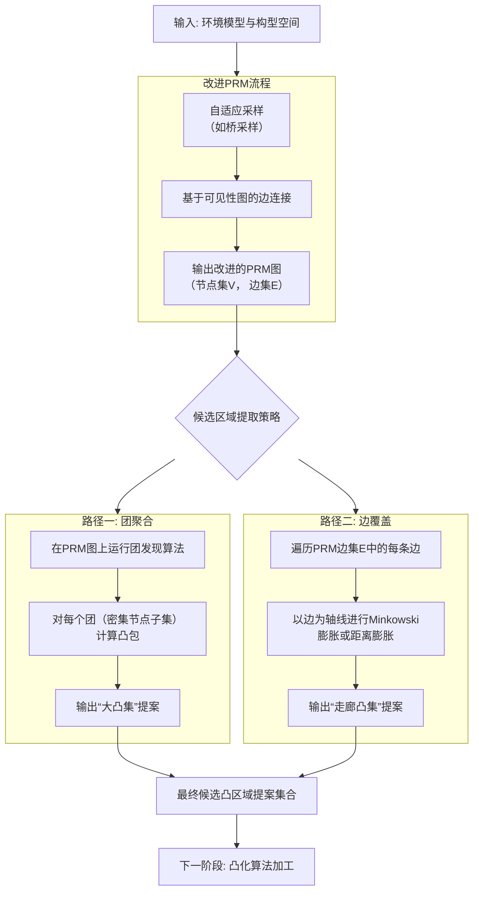

# 基于凸集图（GCS）的运动规划算法优化研究：面向安全区域自动化生成的路径探索
## 1 GCS算法核心原理与安全凸集的关键作用剖析

机器人运动规划在复杂、高维环境中面临的核心挑战在于，传统的轨迹优化方法虽然能处理丰富的代价和动力学约束，但本质上是基于梯度的局部优化，易陷入局部极小值；而基于采样的规划方法（如PRM、RRT）虽具有概率完备性，却难以处理连续的微分约束（如曲率、速度限制），且在高维空间中效率低下，生成的路径通常需要后处理平滑，而平滑过程可能破坏原有的无碰撞保证[^1]。

为了融合两类方法的优势，麻省理工学院的研究团队提出了一种名为**凸集图**的通用优化框架[^1][^2]。GCS的核心思想在于，**将连续轨迹优化问题嵌入到一个离散的图搜索框架中**，从而同时获得全局搜索能力和处理连续约束的能力。其实现路径并非在构型空间中采样孤立的点，而是将每个采样点扩展为一个**凸的安全区域**。这些凸区域覆盖了无碰撞的构型空间，并作为图的顶点。连接两个凸区域的边，则代表机器人可以在这两个区域之间规划一条连续的、满足约束的轨迹。GCS算法随后在该图上搜索从起点区域到终点区域的路径，并对路径所经过的每个凸区域内的连续轨迹段进行联合优化[^1]。

本章将深入剖析GCS算法的基本框架、求解机制，并重点论证**安全凸集**在整个算法链条中扮演的不可替代的关键角色。

### 1.1 GCS算法框架：从配置空间分解到凸集图构建

GCS算法的第一步是对机器人的无碰撞构型空间进行凸分解。这并非简单的几何划分，而是一种旨在为后续优化创造有利条件的结构化预处理。传统的概率路线图方法在构建阶段仅验证采样点之间直线段的碰撞情况，这导致在线查询得到的是一条分段线性的路径。当引入动力学约束或对路径进行平滑时，无法保证优化后的连续曲线仍然无碰撞[^1]。

GCS对此做出了根本性改变：采样过程不再仅仅向图中添加构型点，而是为每个采样点生成一个**尽可能大的凸区域**。这一步骤通常在离线阶段完成，虽然需要一定的计算成本，但其回报是巨大的：首先，它允许构建一个更稀疏的图，因为少数大区域就能覆盖大片自由空间，这有助于算法扩展到更高维度；其次，也是更关键的，它为在线优化提供了充足的灵活性——只要连续轨迹保持在预先计算的凸区域内，其无碰撞性就得到了保证[^1]。

那么，如何生成这些凸区域呢？对于构型空间仅涉及平移，或机器人几何形状旋转不变（如点机器人、球形机器人）的情况，问题相对简单，可以通过计算采样点与障碍物之间的最小欧几里得距离，将点膨胀为适当半径的球体来形成凸区域[^1]。为了获得体积更大、形状更规则的区域，GCS的实现（如在Drake机器人工具箱中）采用了**迭代区域膨胀算法**[^1]。IRIS算法通过交替进行两个步骤来“吹胀”一个初始种子区域：一是寻找分离该区域与所有障碍物的超平面；二是在该超平面定义的半空间内，寻找一个最大体积的椭圆来近似区域边界。通过迭代，IRIS能在局部最大化凸区域的体积[^1]。

**凸集图**的构建随之而来。每个生成的凸安全区域成为一个顶点。如果两个凸区域在空间上相邻或可达，则在它们之间添加一条边。起点和终点也被表示为特殊的凸集（可以是单点集）。至此，一个复杂的、连续的轨迹规划问题，被转化为在一个由凸集构成的图上，寻找一条从起点顶点到终点顶点的路径问题[^1][^2][^3]。这个图不仅编码了空间的离散连通性，其每个顶点还关联了一个连续的、凸的优化子空间。

### 1.2 基于混合整数凸优化与贝塞尔曲线的轨迹求解机制

在构建凸集图之后，GCS需要解决两个耦合的问题：一是选择图上的哪条离散路径（即经过哪些凸集）；二是在这条路径的每一个凸集内，如何参数化具体的连续轨迹段，并使其在区域边界处平滑连接。GCS通过将其形式化为**凸集图上的最短路径问题**，并利用**贝塞尔曲线**的特性，将二者统一为一个混合整数凸优化问题[^3][^4]。

SPP问题在GCS中的形式化如下：给定一个有向图 \(G=(V, E)\)，其中每个顶点 \(v \in V\) 关联一个有界凸集 \(X_v\)。对于每条边 \((u,v) \in E\)，其“长度”或成本由一个凸函数 \(\ell_{uv}(x_u, x_v)\) 定义，其中 \(x_u \in X_u, x_v \in X_v\)。问题的目标是找到一条从起点顶点s到终点顶点t的路径，并选择每个途经顶点凸集内的一个点，使得路径上所有边的成本之和最小[^3]。这自然引入了整数变量（选择哪条边）和连续变量（每个凸集内的点），因此是一个混合整数凸规划问题。

**贝塞尔曲线**的引入是GCS能够高效求解MICP问题的关键。贝塞尔曲线具有两个极其优雅的特性：第一，**整条曲线完全位于其控制点所构成的凸包内部**；第二，**贝塞尔曲线的导数（速度、加速度等）仍然是低一阶的贝塞尔曲线**，其控制点可由原曲线控制点通过线性运算得到[^5]。

GCS利用第一个特性来处理无碰撞约束。由于算法已经将安全空间预处理为一系列凸区域 \(Q_i\)，要保证一段贝塞尔曲线轨迹完全位于某个凸区域 \(Q_i\) 内，只需施加一个简单的、有限的约束：**让该段曲线的所有控制点都落在 \(Q_i\) 内部**[^5]。这就将原本需要检查曲线上无穷多个点是否碰撞的难题，转化为对有限个控制点的成员约束，而后者是凸的线性或二次约束。

第二个特性则用于处理动力学约束。速度、加速度限制可以方便地转化为对其对应低阶贝塞尔曲线控制点的范数约束。同时，为了确保轨迹在穿越不同凸区域边界时的连续性（例如位置、速度连续），只需约束相邻两段贝塞尔曲线在连接处的控制点满足特定的线性等式关系即可[^5]。所有这些约束——安全约束、平滑约束、动力学约束——最终都转化为关于贝塞尔曲线控制点的**线性等式或不等式**。同样，用于优化轨迹长度、时间和能量的目标函数，也是关于这些控制点的凸函数[^5]。这使得整个复杂的运动规划问题，被转化为一个纯粹的、以控制点为决策变量的凸优化问题（在给定路径的情况下）或MICP问题（在同时优化路径的情况下）。

### 1.3 安全凸集的核心作用：无碰撞性、凸性与解质量保障

安全凸集并非GCS中一个普通的组成部分，而是整个算法得以成立和高效的基石。其核心作用主要体现在以下三个方面：

**1. 轨迹无碰撞性的根本保证**：这是安全凸集最直接的作用。GCS方法可靠性的根基在于，只要轨迹段的贝塞尔曲线控制点被约束在某个凸安全区域 \(Q_i\) 内，那么根据贝塞尔曲线的凸包特性，整条曲线段都必然位于 \(Q_i\) 内，从而严格保证无碰撞[^5]。**这种保证是确定性的，而非基于采样的概率性保证**。凸集的几何凸性在此与贝塞尔曲线的数学特性完美结合，将复杂的几何碰撞检测问题，简化为凸集内的成员资格检验问题。

**2. 维持优化问题凸性的关键**：在存在障碍物的环境中，轨迹优化问题本质上是非凸的，因为需要避开非凸的障碍物区域，这导致了非凸的约束。传统轨迹优化方法在此处容易失败或陷入局部极小[^3][^4]。GCS的巧妙之处在于，它通过**离线的凸分解**，将非凸的自由空间表示为多个凸区域的并集。在在线优化时，算法通过选择一条由凸区域构成的路径，实际上将非凸的“避障”约束“吸收”进了离散的路径选择中。而在选定的这条路径上，每一段轨迹的优化都被限制在一个凸区域内，所有约束（基于控制点）都是凸的，目标函数也是凸的。因此，**在给定路径下的连续轨迹优化子问题是一个凸优化问题，可以高效、可靠地求解到全局最优**[^5]。

**3. 影响最终解质量的核心因素**：安全凸集的质量直接决定了GCS最终生成的轨迹质量。首先，凸集的大小和形状影响了图搜索阶段可选路径的多样性和质量。更大、形状更规则的凸集意味着机器人在该区域内有更大的机动空间，可以规划出更平滑、更节能的轨迹。其次，凸集之间的连接关系（图的拓扑）决定了是否存在可行的全局路径。最后，也是GCS方法的一个重要优势：其凸松弛通常非常紧密。通过比较凸松弛解的成本与最终求解的轨迹成本，GCS可以**自动提供一个关于轨迹全局最优性的紧致下界**，这是许多其他规划方法无法提供的[^3][^4]。而凸松弛的紧致性，很大程度上依赖于凸集本身的质量和它们构成的图结构。

综上所述，对安全凸集存在明确的几何与拓扑要求：**几何上**，它们必须是凸的、有界的，并且尽可能覆盖大的自由空间体积；**拓扑上**，它们构成的图必须能连通起点和终点，并且其连接关系应能反映构型空间的实际可达性。当前，这些凸集的生成高度依赖IRIS等算法以及**人工提供的初始种子点**，这构成了GCS方法实现全自动化应用的一个主要瓶颈[^1]。如何自动化、智能化地生成高质量的安全凸集，是提升GCS算法泛化能力和实用性的关键研究方向。

## 2 现状审视：人工介入的凸集生成模式及其局限性

在GCS算法框架中，安全凸集的生成是连接离散图搜索与连续轨迹优化的桥梁，其质量直接决定了算法的性能上限。然而，当前实践中，这一关键环节尚未实现完全自动化，高度依赖人工介入与特定算法的手动调优。本章将系统梳理当前主流的凸集生成方法，深入剖析其核心工作流程，并基于现有研究揭示其在实现GCS算法全自动化、高效处理复杂动态环境时所面临的根本性瓶颈。

### 2.1 主流方法剖析：IRIS系列算法及其人工初始化依赖

目前，在GCS及相关运动规划框架中，生成碰撞自由凸多面体的主流方法是**迭代区域膨胀算法**及其变体。其中，**IRIS-NP** 是应用于机器人构型空间的一个代表性算法[^6]。IRIS-NP的核心目标是从一个初始的“种子”区域开始，通过迭代过程将其膨胀为一个尽可能大的凸区域，同时严格保证该区域完全位于自由（无碰撞）构型空间内。

IRIS-NP的工作流程高度依赖两个关键环节：**非线性规划** 与 **初始化策略**[^6]。在每一次迭代中，算法需要寻找位于当前凸区域边界之外、自由构型空间边界上的构型点。IRIS-NP通过求解一个非线性规划问题来寻找这样的点。然而，NLP求解器的成功启动和收敛严重依赖于初始猜测。为此，IRIS-NP采用了**均匀随机初始化**的策略，即从当前区域边界附近均匀随机采样多个点作为NLP求解的初始猜测，以期至少有一个能收敛到有效的边界构型[^6]。这个“均匀随机初始化”步骤，正是当前模式中“人工介入”或“半自动化”特征的集中体现。在实际应用中，为了确保生成的凸集能够有效覆盖关键通道或连通起止区域，操作者往往需要凭借经验手动放置多个初始种子点，或者精心设置随机采样的范围与密度。此外，算法中的诸多参数，如膨胀步长、NLP求解器的容忍度、迭代终止条件等，都需要根据具体的环境复杂度和机器人构型进行手动调优，以平衡凸集质量与计算时间。

**这种对人工初始化与参数调优的深度依赖，被明确认为是应用GCS等更强运动规划框架的“主要障碍”** [^6]。它使得凸集生成过程无法成为一个鲁棒、黑盒的预处理模块，严重制约了GCS算法在更广泛场景中的部署和应用。

### 2.2 核心瓶颈评估：全自动化、效率与复杂环境适应性

基于对IRIS-NP工作模式的分析，并结合相关研究指出的改进方向，可以系统地评估当前人工介入凸集生成模式的多重局限性。

首先，在**全自动化与初始化鲁棒性**方面，均匀随机初始化是一个脆弱环节。在未知或结构复杂的构型空间中，随机采样可能完全无法命中那些狭窄但关键的通道边界，导致NLP求解失败或区域膨胀过早终止。其结果是，生成的凸集可能体积小、形状不规则，甚至无法形成连通起点和终点的凸集图。**这要求系统必须依赖操作者的先验知识来提供“好”的初始种子，从根本上阻碍了GCS端到端自动化流程的实现。**

其次，在**计算效率与可扩展性**方面，IRIS-NP模式存在显著瓶颈。NLP问题的求解本身计算代价高昂，尤其是在高维构型空间（如多关节机械臂）中。同时，依赖随机采样来寻找边界点是一种统计策略，可能需要大量采样和NLP调用才能成功，导致算法运行时间较长且不可预测。正是为了应对这些效率问题，新的研究提出了改进算法。例如，**IRIS-NP2** 通过更智能地利用采样点来提升NLP的使用效率，而 **IRIS-ZO** 则尝试完全规避NLP，采用大规模并行的零阶优化策略[^6]。这些改进方向从侧面印证了原始IRIS-NP在“运行时间”和“扩展到复杂环境”方面存在不足[^6]。当环境障碍物密集、自由空间支离破碎时，传统方法的计算负担会急剧增加，难以扩展到实际的复杂场景中。

最后，该模式在**处理动态或未知环境**时存在固有缺陷。GCS的经典应用模式是在离线阶段生成静态的凸集图。然而，对于动态变化的环境或完全未知需要在线探索的环境，离线预计算的凸集将立即失效。虽然理论上可以在线重新运行IRIS-NP，但其高昂的计算成本和对手动初始化的依赖，使得这种在线重生成在实时性要求高的机器人任务中几乎不可行。因此，当前模式将GCS的应用范围很大程度上限制在了静态、先验已知的环境中。

### 2.3 挑战总结：从方法局限到应用约束

综上所述，当前以IRIS-NP为代表、依赖人工介入的凸集生成模式，给GCS运动规划的实际应用带来了一系列系统性的挑战。

从**方法本身**来看，其局限性包括：1) **强先验依赖**：算法启动和效果严重依赖人工提供的初始种子和参数设置，缺乏自适应性；2) **计算成本高**：基于NLP和随机采样的迭代过程在高维和复杂环境中效率低下，可扩展性差；3) **质量不确定性**：生成凸集的体积、形状和连通性受初始化影响大，难以保证一致的高质量输出；4) **环境假设强**：主要针对静态、已知环境设计，难以应对动态变化。

这些方法上的局限性直接转化为**上层应用的约束**：1) **阻碍在线与动态应用**：使得GCS难以应用于需要实时重规划的服务机器人、自动驾驶等动态场景；2) **限制泛化与实用性**：提高了算法部署门槛，要求每个新环境都进行耗时的人工干预和参数调整，不利于长期自主运行；3) **抬高系统成本**：增加了整个运动规划系统的开发、调试和维护成本。

因此，**突破人工介入的凸集生成瓶颈，实现自动化、高效、自适应的安全区域构造，是释放GCS算法全部潜力、推动其从先进理论框架走向广泛工程实践的关键所在**。后续章节将围绕这一核心目标，探寻可行的优化思路与技术路径。

## 3 优化思路提出：PRM与凸算法融合的自动化路径

当前，GCS算法框架在运动规划领域展现出融合连续优化与离散搜索的强大潜力，但其核心前提——高质量安全凸集的生成——仍严重依赖人工介入与手动初始化，这构成了其迈向全自动化、高适应性应用的根本瓶颈[^1]。为解决这一关键问题，本章提出一个核心优化思路：**将概率路线图（PRM）算法与凸化处理技术深度融合，构建一条从环境感知到凸集图构建的端到端自动化路径**。该思路旨在利用PRM算法自动探索构型空间连通性所生成的静态路线图作为“骨架”，通过后续的几何凸化处理，将其转化为符合GCS要求的、体积尽可能大的凸安全区域，从而彻底摆脱对人工种子点的依赖，并有望提升算法在复杂、动态环境中的适应性与计算效率。

### 3.1 PRM作为自动化骨架：从离散采样点到连通区域基础

选择PRM算法作为自动化凸集生成的起点，是基于其在处理高维构型空间路径规划问题中所展现出的固有特性与能力，这些特性在参考资料中被系统阐述[^7]。PRM是一种基于采样的算法，其核心工作流程明确分为两个阶段：**离线学习阶段**与**在线查询阶段**[^8]。在学习阶段，算法通过在机器人的配置空间（C-space）中进行大量随机采样，生成候选构型点，并经过严格的碰撞检测筛选出位于自由空间（C-free）中的有效节点[^9]。随后，算法为每个有效节点寻找其邻近节点（通常基于欧氏距离的k近邻或固定半径），并尝试用简单的局部规划器（如直线连接）验证连接边的无碰撞性，从而构建一个描述自由空间基本连通性的无向图，即概率路线图[^8][^9]。在查询阶段，给定具体的起点和终点，算法在该图上运用图搜索算法（如A*或Dijkstra）快速找到一条可行的离散路径[^9][^10]。

**本优化思路的关键洞察在于，我们并非直接使用PRM查询得到的离散路径作为最终运动轨迹，而是将其学习阶段的产物——由无碰撞采样点集和连通边集构成的静态路线图——视为自动化构造凸集图的宝贵“原材料”或“骨架”**。这一选择具有坚实的逻辑基础：首先，PRM算法被证明能够有效应对高维空间问题，其复杂度“主要依赖于寻找路径的难度，跟整个规划场景的大小和构形空间的维数关系不大”[^7]，这为将其应用于复杂机器人系统的构型空间探索提供了理论支持。其次，PRM的离线学习过程本质上是**对自由空间进行的一次自动化、概率完备的探索**，它产出了大量分布在可行区域内的点以及它们之间的可达性关系。这恰好可以替代当前IRIS-NP等凸区域生成算法中最为脆弱、最依赖人工经验的环节——初始种子点的提供[^1]。

然而，参考资料也明确指出，标准PRM算法存在显著缺陷：它**高度依赖于采样密度**，在采样不足时可能无法覆盖整个可行域，而在狭窄通道环境中，其采样效率会变得非常低下，难以建立连通路径[^11][^12]。此外，PRM生成的路径是分段线性的，不满足连续动力学约束的要求[^1]。**这些缺点正是本思路需要面对和克服的挑战，而非否定PRM作为起点的理由**。我们的目标不是完美无缺的PRM路径，而是利用其探索结果作为引导后续凸化过程的、自动生成的结构化信息。这个静态联通图定义了潜在安全区域的“中心”位置和基本的拓扑连接关系，为完全自动化地生成凸集奠定了至关重要的基础。

### 3.2 凸化处理构想：从图结构到合格凸安全区域

获得了PRM生成的静态路线图后，核心任务是将这个由离散点和边构成的图结构，转化为GCS优化框架所要求的、关联于每个图顶点的**有界凸集**[^1][^3]。这一过程称为“凸化处理”。基于参考资料中关于计算几何和现有凸化算法的信息，我们提出几种可能的技术构想路径，旨在以PRM的输出为输入，自动化地产生合格的安全凸区域。

**构想一：基于节点邻域的凸包构造与膨胀。** 此方法以每个PRM采样点（图节点）为核心。首先，根据图中定义的邻接关系或设定一个几何半径，收集该节点的所有邻居节点[^9]。然后，计算这些节点构型点所构成的**凸包**[^13]。这个凸包形成了一个初始的、保守的凸多面体区域。为了扩大区域体积，可以借鉴IRIS算法的核心思想，但使用自动化流程：以该节点或凸包中心作为种子，利用半定规划迭代地寻找分离障碍物的超平面并最大化内接椭球的体积，从而“膨胀”该区域[^1]。**这种方法的关键优势在于完全自动化，PRM节点直接提供了分布在整个自由空间的初始种子，无需人工指定。**

**构想二：基于边路径的凸分解与区域生成。** 此方法更侧重于PRM图中边所定义的连通“管道”。对于一条连接两个PRM节点的边（通常对应一段无碰撞的直线段），可以将其视为一个细长区域的轴线。以此轴线为基础，通过几何膨胀（例如Minkowski和运算）生成一个覆盖该线段的凸柱体区域[^14]。对于由多条边构成的路径，其所覆盖的空间可能形成非凸的弯曲管道。此时，可以引入**凸分解**技术[^15][^16]。该技术旨在将非凸多边形分解为多个凸多边形的并集。通过将路径覆盖的管道空间进行适当的离散化和边界提取，然后应用凸分解算法（如通过绘制对角线消除凹角[^16]），可以得到一系列沿着路径的凸子区域，这些子区域自然继承了路径的连通性。

**构想三：基于图团覆盖的密集区域凸化。** PRM图中可能存在一些节点密集连接的子图，这些子图往往对应着构型空间中较为开阔的自由区域。可以利用图论中的**团覆盖**算法来识别这些密集连接的部分[^17]。每个识别出的团（clique）包含一组相互之间均有边直接连接的节点。以这些节点集合为基础，计算其凸包，有很大概率能直接得到一个较大的凸区域，因为节点间的密集连接暗示了它们所处的局部空间连通性较好。对于未被团覆盖的边或狭窄通道，则采用更精细的基于单条边的凸化方法进行补充。

**这些构想共同的核心是，将PRM的探索能力与凸几何的处理工具相结合。** PRM解决了“在哪里生成凸集”的初始化问题，而凸包计算、IRIS膨胀、凸分解等技术则解决了“如何生成合格的凸集”的形状优化问题。参考资料指出，IRIS-NP等现有方法在复杂环境中面临扩展性和运行时间的挑战[^4][^18][^4]。本思路通过利用PRM的预计算图来引导凸化过程，有望将计算资源更集中地用于有希望的区域，并规避反复的、无导向的非线性规划求解，从而可能带来更高效、更可预测的凸集生成流程。

### 3.3 核心问题靶向：实现全自动化、提升质量与适应性的逻辑闭环

所提出的“PRM+凸化”融合思路，并非一个孤立的技术拼凑，而是针对第二章所系统揭示的当前凸集生成模式根本瓶颈的、具有内在逻辑的解决方案。下面将详细分析该思路如何精准靶向并有望解决这些核心问题。

**首先，彻底解决全自动化与初始化鲁棒性问题。** 当前IRIS-NP类方法的“主要障碍”是依赖人工提供初始种子点[^1]。本思路通过**将PRM的离线学习阶段作为全自动的种子生成器**，从根本上移除了这一障碍。PRM的随机采样策略虽然可能无法均匀覆盖所有狭窄通道[^12]，但它确实提供了一种无需先验知识的、对自由空间进行广泛探索的自动化机制。生成的采样点图构成了大量候选位置，后续凸化算法可以在此基础上工作，无需任何人工干预。对于PRM在狭窄通道采样困难的问题，本思路中的凸化处理环节（如构想二中对边管道的凸化）提供了补偿机制——即使通道内采样点稀少，但只要有一条边穿过通道，就可以基于该边生成一个细长的凸区域来表征通道，这比单纯依赖随机点命中通道的概率更高。

**其次，潜在提升计算效率与系统可扩展性。** IRIS-NP的计算瓶颈在于其迭代中需要求解非线性规划问题，且依赖随机初始化，导致运行时间较长且不确定[^1]。本思路将工作流程重构为：1) 运行一次PRM进行全局探索（其复杂度与路径难度相关[^7]）；2) 对PRM输出的图结构进行确定性更强的几何处理（凸包计算、分解、膨胀）。虽然PRM采样本身也有成本，但它是预计算的，且其图结构为后续凸化提供了明确的处理范围，可能避免了许多盲目的搜索和失败的NLP求解。**这种“探索（PRM）与优化（凸化）解耦”的架构，可能使整体计算更模块化、更可预测，有利于扩展到高维和复杂环境**，因为每个步骤都可以针对其特点进行独立优化（例如，使用高效的KD-tree进行PRM邻居查询[^9]，使用专门的凸优化求解器进行IRIS膨胀）。

**最后，为适应动态与未知环境开辟了新途径。** 经典的GCS和PRM都主要针对静态环境进行离线预处理。然而，本思路所依赖的两阶段架构（学习/构建 + 查询/优化）本身就蕴含着在线适应的潜力。可以设想一种**增量式或局部更新的策略**：当环境发生已知的局部变化时，系统无需从头开始。它可以局部更新PRM图（例如，在变化区域重新采样和连接），然后仅对受影响部分的凸集进行重新生成或调整。这种“动态凸集图”的维护，虽然具有挑战性，但为解决GCS在动态场景（如移动障碍物、部分未知环境）中的应用约束提供了理论上的可能性框架，这是完全依赖固定、人工生成凸集的传统模式所难以企及的。

**综上所述，“结合PRM生成静态联通图以自动构造凸集”的优化思路，在理论逻辑上直接回应了当前GCS凸集生成模式的核心痛点。** 它利用PRM实现自动化初始化，利用凸化技术保证输出质量，并通过流程重构潜力提升效率与适应性。当然，这一思路的成功实施面临诸多具体挑战，例如如何设计PRM采样策略以更好地服务于凸化、如何高效处理高维空间的凸包与分解、如何权衡凸集数量（图规模）与单个凸集体积、以及如何确保最终凸集图满足GCS的连续性约束等。这些挑战正是后续章节需要进行深入可行性论证和技术展开的重点。但无论如何，该思路为打破GCS算法自动化应用的瓶颈，指明了一条清晰且富有潜力的技术路径。

## 4 可行性深度论证：理论依据、技术环节与潜在挑战

本章旨在从理论与技术层面，系统论证第三章提出的“PRM与凸算法融合”优化思路的可行性。首先，基于参考资料中对PRM算法特性的明确阐述，论证其生成的静态路线图如何为自动化凸集生成提供理想的“骨架”和初始化种子，从而在理论上解决当前IRIS-NP等方法对人工初始化的依赖。其次，将深入探查将PRM定义的离散图结构转化为GCS所需凸安全区域的具体技术路径，并初步评估其计算复杂度。最后，本章将系统性地识别并分析该融合思路在实施中可能面临的核心挑战，从而为后续的技术实现与实验设计划定清晰的边界与待攻克的关键问题。

### 4.1 理论依据：PRM图结构作为凸集生成基础的可证性

PRM算法作为一种成熟的基于采样的运动规划方法，其内在特性使其成为自动化生成GCS所需凸集的理想理论起点。其可行性主要建立在两个核心论据之上：一是其**自动化探索与覆盖能力**，二是其**连通性信息对凸化过程的引导价值**。

首先，PRM算法通过其离线学习阶段，能够以可控的计算成本对高维构型空间进行概率完备的探索[^3]。该算法的复杂度“主要依赖于寻找路径的难度，跟整个规划场景的大小和构形空间的维数关系不大”[^3]。这一特性意味着，即使在高维空间中，PRM也能通过随机采样生成一系列分布在自由空间（C-free）中的无碰撞节点。**这些节点本身就构成了凸区域生成算法（如IRIS）所需的、分布广泛的初始“种子点”集合**[^1][^5][^4]。在当前的GCS实践中，为IRIS算法提供高质量的初始种子点被明确认为是实现全自动化的“主要障碍”，因为它严重依赖人工经验和手动干预[^1]。而PRM的自动化采样过程，恰好能够系统性地、无偏地提供这些种子，从而在理论上彻底移除了这一关键瓶颈。

其次，PRM算法不仅提供点，还通过验证边的无碰撞性，构建了一个描述自由空间基本连通性的图结构[^3]。这个由节点和边构成的静态联通图，为后续的凸化处理提供了至关重要的拓扑引导信息。具体而言，图中连接两个节点的边，意味着在这两点之间存在一条至少是分段线性（通常为直线）的无碰撞通道[^3]。**这条通道定义了一个潜在的、可供机器人穿行的“安全管道”**。即使在某些狭窄通道区域，PRM的随机采样可能因为“效率低下”而无法放置足够多的节点[^3]，但只要有一条边成功穿过该通道，它就为基于该边进行凸化（例如构造一个细长的凸柱体）提供了明确的几何轴线。因此，PRM的图结构不仅解决了“在哪里播种”的问题，还通过边的连接关系，初步勾勒出了安全区域之间应具备的连通性骨架，这是人工指定种子点难以系统实现的。

**综合来看，PRM算法以自动化方式完成了对非凸自由空间的离散覆盖与连通性建模，其输出——节点集和边集——恰好为需要“种子”和“区域间连接关系”的凸集生成算法提供了近乎完美的输入基础**。这使得“PRM先行探索，凸化后续加工”的融合思路在理论逻辑上是自洽且有力的，它直接针对并有望解决当前GCS预处理环节中最核心的自动化缺失问题。

### 4.2 技术路径探查：从PRM图到凸集的具体转化方法

在确立了理论可行性后，需要进一步探查将PRM图转化为GCS可用凸集的具体技术路径。这些路径旨在利用PRM的输出（节点和边），通过一系列几何算法加工，生成体积尽可能大、形状规则且相互连通的凸多面体区域。以下分析几种可能的技术路径及其复杂度。

**路径一：基于节点邻域的凸包构造与迭代膨胀**
此方法以每个PRM节点为核心。首先，根据图中定义的邻接关系（如k近邻）或设定一个几何半径，收集该节点的所有邻居节点，形成一个局部点集。随后，计算该点集的**凸包**，形成一个初始的、保守的凸多面体区域。凸包计算（如QuickHull算法）在最坏情况下的复杂度为O(n log n)到O(n^2)，其中n为点集大小，在实际应用中通常是可接受的。为了扩大区域体积，可以借鉴并自动化执行IRIS算法的核心流程[^1][^5][^4]。以该节点或凸包中心作为种子，算法交替进行：1）寻找分离当前区域与所有障碍物的超平面；2）在该超平面定义的半空间内，寻找一个最大体积的椭圆（通过半定规划求解）来近似并膨胀区域边界。这个过程迭代进行，直至区域无法继续膨胀。**该路径的优势是完全自动化，且生成的凸区域以节点为中心，可能获得较大的体积。** 其计算成本主要来自IRIS的迭代优化，尤其是在高维空间中进行半定规划求解可能代价较高。

**路径二：基于边路径的凸覆盖与分解**
此方法更侧重于PRM图中边所定义的连通“管道”。对于一条连接两个节点的无碰撞边，可以将其视为一个细长安全区域的轴线。一种直接的思路是构造一个**凸柱体**，例如通过计算该线段与障碍物之间的最小距离，进行Minkowski和膨胀。更一般化的方法是构建**可见性图**[^19][^20]。可以将PRM的节点和障碍物的顶点共同作为顶点集，然后检测所有顶点对之间的“可见性”（即连线是否无碰撞）。PRM中存在的边，是可见性子集。基于此可见性图，可以生成一个覆盖所有可见边（即PRM边）的凸多边形集合，作为安全区域。对于由多条边构成的非凸弯曲路径，则需要引入**凸分解**技术，将该路径覆盖的非凸区域分割为多个凸多边形的并集。凸分解算法（如耳切法）的复杂度通常为O(n^2)或更高。**该路径能紧密贴合PRM探索出的可行通道，尤其适合表征狭窄走廊，但可能产生大量小凸区域，增加图的复杂度。**

**路径三：基于图团（Clique）的密集区域聚合**
PRM图中可能存在节点密集连接、形成团（clique）的子图，这些区域往往对应构型空间中开阔的自由空间。可以运用图论算法识别这些最大团或密集子图。以每个识别出的团所包含的所有节点构型点为基础，计算其凸包。由于团内节点相互连通，它们空间上通常聚集在一起，其凸包有很大概率形成一个较大的凸区域，并能有效覆盖该开阔区域。对于连接这些大凸区域的边（可能穿过狭窄通道），则采用路径二中的方法生成细长的凸区域进行桥接。**该路径的洞察在于利用图结构信息自动识别“哪里适合生成大凸集”，有望在控制图规模的同时提升区域质量。** 团发现本身是NP难问题，但对于实际规模的PRM图，存在有效的启发式或近似算法。

为了更清晰地对比上述技术路径，以下表格总结了其核心思想、关键操作及潜在优缺点：

| 技术路径 | 核心思想 | 关键操作/算法 | 潜在优点 | 潜在挑战/缺点 |
| :--- | :--- | :--- | :--- | :--- |
| **节点邻域凸包与膨胀** | 以每个PRM节点为核心，聚合邻居形成凸区域并最大化。 | 凸包计算、IRIS迭代区域膨胀（半定规划）。 | 完全自动化，区域可能较大，以节点为中心分布均匀。 | IRIS迭代计算成本高；区域可能保守，未充分利用边信息。 |
| **边路径凸覆盖与分解** | 沿PRM边定义的“管道”构建凸覆盖，对弯曲路径进行凸分解。 | 可见性图构建、凸分解（如耳切法）、Minkowski膨胀。 | 紧密贴合实际可行通道，特别适合狭窄区域。 | 可能产生大量小凸区域；凸分解计算复杂；图规模可能庞大。 |
| **图团聚合** | 识别图中密集连接的节点子图（团），为其生成大凸集。 | 团发现算法、凸包计算。 | 自动识别开阔区域，生成大凸集，有助于控制图规模。 | 团发现是NP难问题；对狭窄通道的覆盖需要额外处理。 |

**计算复杂度初步评估**：整体融合流程的计算成本是PRM构建成本与凸化处理成本之和。PRM的构建成本与其采样点数、碰撞检测和局部规划器的复杂度相关，但被认为是应对高维空间的可行方法[^3]。凸化处理是主要的新增成本。其中，凸包计算和简单的几何膨胀（如基于边的柱体生成）相对高效。而IRIS迭代和通用的凸分解算法则计算代价更高，尤其是在高维空间。因此，在实际实施中，可能需要根据环境特点（开阔/狭窄）和维数，**混合采用上述路径**，例如在开阔区域使用团聚合或节点膨胀，在狭窄通道使用边覆盖，以在效率和质量间取得平衡。

### 4.3 潜在挑战系统识别与影响分析

尽管“PRM+凸化”融合思路在理论和技术上具备可行性，但其实施过程必将面临一系列严峻挑战。系统性地识别并分析这些挑战，是评估该思路实际价值、指导后续研究的关键。

**挑战一：凸化处理固有的保守性与解质量损失**
GCS的优越性建立在将轨迹约束于凸安全区域内。然而，将PRM探索出的、可能形状复杂的自由空间（如弯曲的狭窄通道或非凸的开阔区）强制分解为凸区域的并集，这一过程本质上是**近似和保守的**。生成的“安全凸走廊”可能比实际的自由空间体积更小、路径更迂回。例如，一个L形的拐角可能需要两个凸区域来覆盖，导致轨迹必须在拐点处从一个区域切换到另一个区域，这可能限制了轨迹优化的灵活性，迫使产生不必要的减速或转向，从而**损失了最终轨迹的最优性（如增加长度或能量消耗）**。这是用凸性换取问题可解性所必须付出的代价，需要在算法设计中通过优化凸分解的紧致性来尽量缓解。

**挑战二：高维空间下凸集质量与数量的权衡难题**
参考资料指出，GCS的一个优势在于能用**少量的大凸区域覆盖大部分构型空间**，从而构建稀疏的图，利于扩展到高维[^1][^5]。然而，在高维构型空间中，自由空间的几何结构极其复杂，“维度灾难”使得生成体积大的凸区域本身变得非常困难。基于PRM的凸化方法很可能产生两种不利结果：一是生成大量体积很小的凸区域，以确保对自由空间的覆盖，但这会导致凸集图（GCS的底层图）规模庞大，显著增加后续混合整数凸优化问题的复杂度；二是为了控制数量，被迫接受一些体积大但形状不规则、或对自由空间覆盖不全的凸区域，这可能遗漏关键的可行通道。**因此，如何设计PRM采样策略和凸化算法参数，以在“凸集数量”（计算复杂度）和“凸集质量/覆盖度”（解的存在性与质量）之间取得最佳权衡，是一个核心的算法设计挑战。**

**挑战三：满足GCS轨迹连续性的几何约束**
GCS利用贝塞尔曲线进行轨迹优化，要求相邻曲线段在共享边界处满足位置、速度（甚至更高阶导数）的连续性[^4]。这转化为对相邻凸区域几何关系的严格要求：**两个区域必须在边界处有足够的重叠，或者其边界具有特定的相对位置和法向，以确保能够选择一组控制点，使得前一段曲线的末尾控制点和后一段曲线的起始控制点满足连续性条件**。从PRM图自动生成的凸集，虽然继承了节点间的连通性（边存在），但并不能自动保证其几何形状满足这种平滑过渡的要求。例如，两个凸区域可能仅以一个点或一条很窄的边相交，这难以支撑一条平滑、动力学可行的轨迹穿过。因此，凸化算法不能只关注单个区域的体积最大化，还必须考虑区域间连接面的“质量”，这大大增加了算法设计的复杂性。

**挑战四：对动态与未知环境的适应性局限**
本思路目前主要针对静态环境设计，其优势在于一次性离线生成凸集图。然而，机器人实际作业环境常常是动态变化或部分未知的。虽然理论上可以构想局部更新策略（当环境变化时，局部更新PRM图并重新生成受影响凸集），但凸区域的重新生成本身涉及几何计算和可能的优化求解，并非轻量级操作。在障碍物快速移动的实时场景中，这种“感知-更新PRM-凸化-重新优化GCS”的闭环可能难以满足严格的实时性要求。因此，该融合思路在**动态环境中的适用性仍有待深入研究**，可能需要与增量式建模、预测规划等其他技术结合。

**结论性分析**：上述挑战并非不可逾越，但它们清晰地定义了从“可行思路”到“高效实用算法”之间必须跨越的鸿沟。挑战一和二是算法性能的固有约束，需要通过优化凸化算法的紧致性和设计智能的权衡策略来应对。挑战三是确保算法正确性的关键，必须在区域生成阶段引入相应的几何约束。挑战四则指出了该思路的应用边界，并提示了未来可能的研究方向。**总体而言，这些挑战的存在并未否定融合思路的可行性，而是为其技术实施划定了需要重点攻关的问题域。** 成功应对这些挑战，将有望实现一个真正自动化、高效且能生成高质量轨迹的GCS规划器。

## 5 实施蓝图：从PRM图到GCS凸集的具体技术展开

本章旨在将第四章论证的可行性转化为一套具体、可操作的技术实施蓝图。我们将围绕参考资料中关于GCS对凸集图（顶点为有界凸集）的定义、PRM算法特性、可见性图方法以及凸化工具（如IRIS）的论述，结构化地设计一个从自动化PRM图构建到高质量GCS凸集生成的完整流程。具体而言，本章将首先探讨如何设计一个改进的PRM流程，使其生成的静态路线图（节点和边）更利于后续凸化处理；其次，分析如何从该图中智能提取候选区域（如利用图团覆盖算法识别密集连接子图，或基于可见性边构建初始凸覆盖）；然后，深入探讨采用何种凸化算法（如基于半定规划的IRIS迭代膨胀）对这些候选区域进行加工，以生成体积尽可能大、形状规则的凸安全区域；最后，研究如何将这些生成的凸集自动构建为GCS所需的图结构，并解决起点、终点作为特殊凸集的嵌入问题，确保整个流程的端到端自动化。

### 5.1 改进PRM流程设计：面向凸化的图结构生成

本子章节将基于参考资料中关于PRM算法“高度依赖于采样密度”且在狭窄通道中“效率低下”的明确论述[^18]，设计一个改进的PRM流程，旨在生成更利于后续凸化处理的图结构。具体技术展开包括：

1.  **自适应采样策略**：标准PRM的均匀随机采样在高维空间中效率低下，且难以覆盖狭窄通道[^18]。为生成更利于凸化的节点分布，应采用非均匀的自适应采样。一种有效策略是**桥采样**，该策略重点在自由空间与障碍物边界相交的狭窄区域进行采样，从而提升在这些关键瓶颈区域生成节点的概率。这些节点将成为后续凸化算法生成覆盖通道的细长凸区域的理想种子。在开阔的自由空间区域，则可以适当降低采样密度，以控制整体图的规模，避免生成大量重叠的小凸区域。

2.  **基于可见性图的边连接增强**：标准PRM通常基于欧氏距离的k近邻或固定半径进行边连接，这可能遗漏一些重要的长距离可见连接。为了丰富图的连通性并直接为凸化提供几何轴线，可以借鉴参考资料中**可见性图**的原理[^19][^20]。具体而言，将PRM的无碰撞节点与环境中障碍物的多边形顶点（若几何模型可用）共同作为候选顶点集合。然后，遍历所有顶点对，检测两点之间的连线（视线）是否完全位于自由空间且不与任何障碍物相交。若可见，则在这对顶点间建立一条边。**这种方法构建的边本身就是无碰撞的直线段，它们清晰地勾勒出了自由空间中可直接通行的“安全走廊”**，这些线段可以直接作为后续构建凸柱体或凸覆盖区域的精确轴线，极大地简化了凸化步骤。

3.  **考虑几何规则的连接策略**：在边连接阶段，除了基于距离，还可以引入几何启发式规则，以生成更“胖”、形状更规则的潜在凸区域基础。例如，可以优先连接那些连线方向与局部自由空间主方向（可通过分析节点邻域点云的协方差矩阵获得）一致的节点对。这样的连接更可能位于开阔区域的“内部”，而非贴近障碍物边界，从而以其为轴线生成的凸区域（如凸包）可能具有更大的体积和更规则的形状，更符合GCS对高质量凸集的要求。

**这些改进的核心目标是生成一个节点分布更贴合自由空间几何结构、边连接更能反映实际安全通道的PRM图。** 这样的图不仅继承了PRM算法自动化探索构型空间连通性的能力[^18]，其输出（节点和边）更成为了后续凸化算法可直接利用的、富含几何与拓扑信息的优质“骨架”，为完全自动化地生成GCS凸集奠定了坚实基础。

### 5.2 候选区域智能提取：从图结构到初始凸集提案

在获得改进的PRM图后，下一步是智能地从中提取生成凸安全区域的候选种子或初始区域提案。本阶段的目标是将离散的图结构转化为一组覆盖其连通性的、大小和形状各异的初始凸区域集合。我们将依据参考资料中的信息，设计并对比两种协同工作的主要提取路径：

1.  **基于图团覆盖的密集区域聚合**：参考资料指出，GCS的一个优势在于能用**少量的大凸区域**覆盖大部分构型空间[^21]。为了实现这一点，我们可以利用图论中的团发现算法。在PRM图中，节点密集互连的子图（即团）通常对应构型空间中开阔、连通性良好的自由区域。通过运行（近似）最大团发现算法（如Bron–Kerbosch算法或其启发式变种），我们可以识别出这些密集连接的区域。对于每个识别出的团，将其包含的所有PRM节点的构型点作为输入，计算它们的**凸包**。由于团内节点空间上聚集且相互可见，其凸包有很大概率直接形成一个较大的、覆盖该局部开阔区域的凸多面体提案。**这种方法能自动识别出哪里适合生成大凸集，有助于控制最终凸集图（GCS）的顶点规模，提升后续优化效率。**

2.  **基于边路径的凸覆盖生成**：PRM图中那些连接不同开阔区域的边，尤其是长边或连接度数较低节点的边，往往对应于穿越狭窄通道的路径。对于这些边，我们需要确保其代表的通道能被凸区域覆盖。参考资料中可见性图构建安全路网的思路为此提供了直接方案[^20]。我们可以将每条通过碰撞检测的PRM边视为一个细长安全区域的轴线。一种直接的方法是进行**Minkowski和运算**：将这条直线段与一个代表安全裕度的小球体（或超球体）进行Minkowski和，生成一个“凸柱体”区域。另一种方法是计算该线段到最近障碍物的距离，以此作为半径进行膨胀。这些操作生成的细长凸柱体，能够紧密贴合并完全覆盖该条边所定义的安全通道，确保机器人在此通道内运动的无碰撞性。

**这两种路径是互补的**：团聚合负责生成覆盖开阔区域的“大节点”，而基于边的凸覆盖则负责生成连接这些大节点的“走廊边”。通过结合两者，我们可以从PRM图中自动导出一个初步的、覆盖了所有探索出的可行通道的凸区域提案集合。这个集合为下一阶段的精细化加工提供了明确的、自动化的输入。

为了更清晰地展示从PRM图到候选区域提取的流程与数据转换，以下Mermaid流程图描述了其核心步骤与逻辑关系：

### 5.3 凸化算法加工：体积最大化与形状规则化

提取出的候选区域提案（凸包或凸柱体）虽然已经是凸的且无碰撞，但可能体积不够大、形状不够规则，未能充分利用局部自由空间。本阶段的核心任务是采用成熟的凸化算法对这些提案进行精细化加工，以生成符合GCS要求的、体积尽可能大且形状规则的有界凸集。我们将主要采用并适配参考资料中明确提及的**IRIS（迭代区域膨胀）算法框架**[^21]。

具体技术展开如下：

1.  **以候选区域为自动化种子启动IRIS**：IRIS算法需要一个初始的“种子”区域或点来开始迭代膨胀。在传统GCS应用中，这需要人工指定。**在我们的流程中，上一阶段提取的每个候选凸区域的中心点（或内部任意一点）将自动作为IRIS的初始种子**。例如，对于从团聚合得到的大凸包提案，以其重心为种子；对于基于边生成的凸柱体，以其轴线的中点为种子。这彻底消除了对人工播种的依赖，实现了流程的完全自动化。

2.  **自动化障碍物分离与半定规划求解**：IRIS算法的核心是一个迭代过程，每一步包含两个子问题：a) 寻找一个超平面，将当前凸区域与所有障碍物分离开；b) 在该超平面定义的半空间交集内，寻找一个最大体积的**内接椭球**。子问题b通常通过**半定规划**求解。在我们的自动化流程中，算法将自动加载环境障碍物信息，并为每个种子循环执行这两个步骤。椭球的体积直接代表了凸区域在该迭代方向上的“膨胀”潜力，最大化椭球体积等价于在局部最大化凸区域的体积。迭代持续进行，直到区域无法进一步显著膨胀或达到迭代次数上限。

3.  **针对不同提案类型的处理策略**：为了应对参考资料中指出的IRIS在“复杂环境”中扩展性的挑战[^21]，我们需要根据提案类型进行差异化处理。对于从开阔区域提取的“大凸集”提案，由于其所在空间宽敞，可以给予更多的IRIS迭代预算，并允许其在多个方向上自由膨胀，以追求最大可能的体积。对于基于边生成的“走廊凸集”提案，其形状本应细长。在应用IRIS时，可能需要**约束膨胀方向**，例如主要沿通道轴线方向进行膨胀，而限制垂直于轴线方向的膨胀，以保持其走廊形状，避免与周围障碍物相交。在某些情况下，对于非常狭窄的通道，基于简单几何膨胀生成的凸柱体可能已经足够“紧致”，无需运行计算代价更高的IRIS迭代，可以直接作为最终凸集使用。

**本节加工过程的输出是一组高质量的安全凸区域**。每个区域都严格满足：1) 凸性；2) 有界性；3) 完全位于自由空间内（无碰撞）。并且，通过以自动化种子启动的IRIS加工，这些区域的体积得到了最大化，形状也更加规则，为GCS后续的轨迹优化提供了充足的可行空间和高质量的图顶点。

### 5.4 GCS图自动构建与起终点嵌入

在获得一组加工后的凸安全区域后，最后一步是将其自动构建为GCS优化框架可直接使用的**凸集图**，并妥善处理规划任务特定的起点和终点。本阶段将严格遵循参考资料中对GCS的形式化定义：一个顶点关联有界凸集的有向图，并求解其上的最短路径问题[^4]。

具体技术展开包括：

1.  **基于几何邻接的图边构建**：GCS图的顶点集 \(V\) 由每个加工后的凸安全区域构成。边集 \(E\) 的构建取决于顶点所关联凸集之间的几何可达性。**核心判定规则是：如果两个凸集 \(X_u\) 和 \(X_v\) 在空间上有非空交集（即几何相邻或重叠），则在它们对应的顶点 \(u\) 和 \(v\) 之间添加一条双向边 \((u, v)\) 和 \((v, u)\)**[^4]。这种交集关系可以通过计算几何中的凸多边形/多面体相交检测算法（如分离轴定理）来高效判断。此外，为了增加图的连通性鲁棒性，可以设定一个阈值：即使两个凸集没有直接相交，但如果它们中心点之间的距离小于一个预设值，且连线方向无碰撞，也可以添加边。边的存在意味着机器人可以在两个区域间规划一条连续的、完全位于两区域并集中的轨迹。

2.  **边成本函数的定义**：在GCS的最短路径问题形式化中，每条边 \((u,v)\) 关联一个由凸函数 \(\ell_{uv}(x_u, x_v)\) 定义的成本[^4]。为实现自动化，我们可以定义简单的、易于计算的成本函数。一种常见且有效的选择是使用两凸集**中心点之间的欧氏距离的平方**作为该边的固定成本，即 \(\ell_{uv} = \|c_u - c_v\|_2^2\)，其中 \(c\) 代表凸集的中心。更精确的做法是将其定义为需要在线优化的变量，但固定成本在构建阶段足以用于评估路径的粗略代价。

3.  **起点与终点作为特殊凸集的嵌入**：用户指定的起点 \(q_{start}\) 和终点 \(q_{goal}\) 构型需要被嵌入到凸集图中。我们将它们分别视为退化的凸集——**单点集**。嵌入流程如下：
    *   **查找相交区域**：遍历凸集图的所有顶点（区域），使用点-凸集成员测试，找到所有包含 \(q_{start}\)（或 \(q_{goal}\)）的凸区域。如果找到，则将该单点集顶点与这些区域顶点直接连接（添加边）。
    *   **处理无交集情况**：如果起点或终点不位于任何已生成的凸区域内（可能由于采样未覆盖），则需要一个快速的补救步骤。可以以该点为中心，运行一个**小范围、快速的局部IRIS膨胀**（或简单几何膨胀），生成一个小的、包含该点的凸集。然后，将这个新生成的小凸集作为新的顶点加入图中，并按照上述几何邻接规则，将其与主图中相邻的凸集连接起来。

**经过以上步骤，我们最终输出一个完整的、数据结构化的凸集图**。该图的顶点是高质量的安全凸集，边编码了区域间的可达性与代价，起点和终点已成功嵌入。**这标志着从原始环境模型到GCS规划问题形式化的全自动化流程的完成。** 生成的凸集图可以直接输入到GCS求解器中，利用其将运动规划表述为凸集图上的最短路径问题（SPP）并转换为混合整数凸优化问题（MICP）进行求解的机制[^4]，结合贝塞尔曲线快速生成全局最优的无碰撞轨迹。

## 6 视野拓展：其他基于GCS的优化思路探析

前文已详细论证了结合PRM与凸化算法以实现安全区域自动化生成的可行性及技术路径。然而，优化GCS算法的思路不应局限于此单一方向。本章旨在超越PRM融合框架，系统性地探索其他潜在的、能够实现安全区域自动化生成或优化GCS算法整体性能的技术路径。我们将严格依据参考资料中关于GCS框架、机器学习方法（如强化学习、生成模型）以及动态规划算法的论述，结构化地分析三类替代方案：1）基于机器学习直接预测或优化凸集布局；2）面向动态环境的增量式凸集生成策略；3）GCS与分层规划框架的融合及区域自动划分。本章的核心作用是拓宽研究视野，通过对比分析不同思路的核心理念、潜在优势与适用条件，为GCS算法的未来优化提供多元化的技术储备和方向指引。

### 6.1 基于机器学习的凸集布局预测与优化

传统的几何算法（如IRIS）在复杂高维构型空间中面临计算效率与初始化鲁棒性的挑战[^18]。机器学习方法，特别是强化学习和生成模型，为直接学习自由空间的几何结构并生成凸集布局提供了新的可能性。这类方法的核心理念是**将凸集生成问题转化为一个数据驱动的建模或优化问题**，旨在规避传统迭代优化中的高昂计算成本，并直接从经验中学习高效的区域构造策略。

**强化学习路径**将凸集的生成过程视为一个序贯决策问题。智能体（规划器）的“状态”可以是当前已构建的部分凸集图及环境感知信息，“动作”可以是选择下一个种子点、决定凸集的膨胀方向与幅度，或合并相邻区域等。智能体通过与环境（构型空间模型）交互，获得与凸集质量相关的“奖励”信号，例如生成凸集的总体积、对自由空间的覆盖率、区域间连接的平滑度等。通过最大化长期累积奖励，RL算法可以学习到一个直接输出高质量凸集布局的策略[^22]。**这种方法的潜在优势在于其“端到端优化”能力**，它可以直接针对GCS最终轨迹的质量（如长度、能量）这一终极目标来调整凸集生成策略，而无需人工设计复杂的中间启发式规则。然而，其挑战也同样显著：训练一个有效的RL策略需要大量的仿真交互，可能涉及昂贵的碰撞检测；策略的稳定性和可解释性难以保证；并且，将高维连续的构型空间和凸集形状编码为适合RL的离散状态表示本身就是一个难题。

**生成模型路径**则借鉴了深度学习在数据生成方面的强大能力。参考资料中提及的GCS-HDLC模块利用生成对抗网络（GANs）来合成高光谱样本，以增强分类器评估的多样性[^23]。类似地，我们可以构想训练一个生成模型（如条件GAN或变分自编码器），其学习目标是：给定环境障碍物的几何描述（如点云或体素网格），直接输出一组覆盖自由空间的安全凸区域。训练数据可以来自大量在各类环境中运行传统凸化算法（如IRIS）生成的“凸集图-环境”配对样本。一旦模型训练完成，在新环境中可以快速前向推理生成凸集提案，极大加速预处理过程。**该思路的核心潜力在于“快速推理”和“隐式学习复杂分布”**，它可能捕捉到人类难以显式描述的、自由空间与凸集形状之间的复杂映射关系。但该方法的成功高度依赖于大规模、高质量训练数据的获取，且生成的凸集在几何上的精确性和无碰撞保证需要严格的验证。

**综合分析**，基于机器学习的凸集生成思路为处理高维复杂几何提供了一条与经典几何算法截然不同的道路。它不依赖于显式的迭代优化和手工初始化，而是试图从数据中直接学习解决方案。然而，这类方法目前仍处于探索阶段，面临数据依赖、训练成本、可靠性验证等核心挑战。**一个可行的折中方向是“学习辅助的几何算法”**，例如，使用轻量级神经网络快速预测优质种子点位置或初始膨胀方向，为IRIS等算法提供智能化的启动参数，从而结合学习的速度与几何算法的精确保证。

### 6.2 面向动态环境的增量式凸集生成策略

当前GCS方法的一个主要局限在于其通常假设环境是静态且先验已知的，凸集图在离线阶段一次性生成[^18]。然而，现实中的机器人作业环境常常是动态变化或部分未知的。为了将GCS的强大优化能力应用于此类场景，借鉴动态路径规划中的增量式重规划思想成为一种自然的优化方向。

参考资料中详细介绍了**D* Lite算法**，它是一种经典的增量式路径规划算法[^24][^25]。其核心思想是：当环境中出现障碍物变化时，算法并不重新进行全局搜索，而是通过高效地反向传播代价变化信息，仅局部更新受影响的路径段。这种机制保证了在动态环境中的快速响应能力。基于此原理，我们可以构想一种**增量式凸集生成与更新策略**。

该策略的实施构想如下：系统首先在初始（或上一次已知）环境状态下，构建一个基础的凸集图。当机器人通过传感器（如激光雷达、视觉）实时检测到环境的局部变化时（例如，一个障碍物移动或出现了一个新物体），算法会执行以下步骤：
1.  **影响区域标记**：快速确定哪些现有的凸集与发生变化的障碍物区域相交或相邻。这可以通过维护凸集与障碍物的空间索引（如包围盒树）来实现。
2.  **局部凸集失效与移除**：将这些受影响的凸集标记为“失效”，并从当前凸集图中暂时移除。同时，识别出因这些凸集移除而可能断裂的图连通分量。
3.  **局部重生成与连接**：在环境变化区域及其周边，启动一个轻量级的、快速的局部凸化流程。这可以是一个计算预算受限的IRIS迭代，或者基于最新感知数据重新采样并构建一个小范围的PRM子图并进行凸化。新生成的凸集将作为新的顶点加入图中。
4.  **图结构更新**：按照几何邻接规则，将新凸集与图中未受影响的原有凸集进行连接测试，重建全局连通性。对于起点、终点，也需要重新检查其嵌入关系。

**这种增量式策略的核心优势在于其“计算效率”和“实时适应性”**。它避免了每次环境变化都进行全局性的、昂贵的凸集重建，而是将计算资源集中在真正发生变化的局部，这与D* Lite在路径规划中的优势一脉相承[^25]。这直接针对了GCS应用于动态场景（如移动机器人避障、与人协同作业）的关键瓶颈。然而，其挑战在于如何设计高效的局部凸化算法，以及如何维护凸集图在多次增量更新后的一致性和质量，避免误差累积。此外，在环境剧烈或快速变化时，局部更新的频率和范围可能急剧增加，对实时性构成压力。

### 6.3 GCS与分层规划框架的融合及区域自动划分

另一种优化GCS计算效率的思路是将其嵌入到一个分层规划框架中。该思路的动机在于：在非常庞大或复杂的构型空间中，一次性生成覆盖全局的、精细的凸集图可能计算量过大，且许多区域在单次规划任务中可能根本不会被用到。分层规划通过在不同抽象层次上工作，可以有效地分配计算资源。

构想一个**两层规划架构**，其核心思想是“粗粒度导航，细粒度优化”：
*   **顶层（导航层）**：使用一种快速、轻量的空间分解方法，将整个构型空间初步划分为若干个大的、拓扑性的“导航单元”或“超级区域”。这些单元可以是非凸的，其划分依据可以是空间的几何结构（如使用四叉树/八叉树递归细分直到单元内障碍物复杂度低于阈值）、自由空间的连通分量、或者基于任务语义的聚类。每个超级区域的目标是粗略地表征一片具有相似可达性特征的空间。在这一层，规划问题简化为在这些超级区域之间找到一条连通序列，这可以通过非常高效的图搜索完成。
*   **底层（执行层）**：当机器人的规划路径需要进入某个特定的超级区域时，再在该区域的局部范围内，动态地、按需地运行GCS的精细凸分解算法。此时，输入空间从全局缩小为该超级区域，计算复杂度和所需凸集数量都大大降低。在该局部凸集图上，GCS可以生成满足所有动力学约束的平滑、最优轨迹。

**这种“分层-细化”思路的潜在优势主要体现在“计算负载的分布与延迟”**。它将最昂贵的凸化计算从全局预处理阶段剥离，转化为按需执行的局部过程。这特别适合部分未知环境或任务目标频繁变化的场景，因为不需要为未探索或未使用的区域预先支付计算成本。同时，顶层粗略的导航保证了全局的探索和引导，避免了在局部细节中迷失方向。然而，其挑战在于如何设计顶层划分算法，以确保划分出的超级区域在几何上便于底层进行凸分解（例如，避免区域形状过于奇异），以及如何管理两层规划之间的信息传递与一致性（如局部凸集图如何与全局导航路径对接）。

为了更直观地对比本章探讨的三种主要优化思路及其与基准（当前人工介入模式）的关系，以下表格从核心理念、目标优势、主要挑战和适用场景四个维度进行了总结：

| 优化思路 | 核心理念 | 目标优势 | 主要挑战 | 典型适用场景 |
| :--- | :--- | :--- | :--- | :--- |
| **PRM融合（前文）** | 利用PRM自动化探索结果作为凸化算法的初始化骨架。 | 实现全自动化，移除人工种子依赖；流程清晰，结合成熟技术。 | 凸化保守性；高维下质量/数量权衡；需保证连续性约束。 | 静态已知环境，追求端到端自动化预处理。 |
| **机器学习生成** | 从数据中学习凸集布局的生成策略或直接生成模型。 | 端到端优化潜力；快速推理；能处理复杂高维几何关系。 | 大量训练数据需求；模型可靠性与可解释性；训练成本高。 | 数据丰富的相似环境类型；作为传统方法的加速或初始化器。 |
| **增量式更新** | 借鉴D* Lite思想，局部更新受环境变化影响的凸集图。 | 适应动态/未知环境；计算高效，避免全局重建；实时响应潜力。 | 局部凸化算法设计；更新后图的一致性与质量维护；快速变化下的压力。 | 动态环境（移动障碍物）；在线重规划任务。 |
| **分层规划融合** | 在粗粒度图上导航，在细粒度局部按需生成凸集图。 | 分布与延迟计算负载；平衡全局探索与局部优化；适合大规模复杂空间。 | 顶层区域划分算法设计；两层间的信息对接与一致性管理。 | 大规模、部分未知环境；任务目标多变的场景。 |

**结论与方向指引**：本章的探讨表明，优化GCS算法远不止“PRM+凸化”这一条路径。基于机器学习的方法致力于从根本上改变凸集的生成范式，增量式策略聚焦于动态适应性，而分层融合则着眼于计算资源的宏观调度。这些思路并非互斥，而是可以相互结合。例如，可以使用轻量级学习模型预测动态环境变化的热点区域，从而指导增量式更新的重点；或者，在分层框架的底层，采用增量式策略来应对局部环境的细微变动。未来的研究应基于具体应用场景的需求（如对实时性、环境动态性、计算资源、数据可得性的要求），选择最具潜力的单一或复合技术路径进行深入攻关，从而推动GCS算法从一种强大的理论框架，演进为适应各种复杂现实挑战的实用化运动规划引擎。

## 7 综合对比、结论与未来研究方向

本章旨在对本研究提出的“PRM融合”优化思路及其替代方案进行系统性评估，并基于此得出明确结论与未来展望。首先，我们将构建一个多维评估框架，对PRM融合、机器学习生成、增量式更新及分层规划融合四种思路进行结构化对比，明确各自的优势、局限与适用场景。其次，基于对比分析，对“结合PRM自动生成凸集”思路的可行性给出最终结论，并指明最具潜力的实施方向与关键技术问题。最后，将超越当前研究的范畴，提出一系列推动GCS算法向更通用、自适应方向发展的未来研究方向。

### 7.1 多思路综合对比评估

为了全面评估不同优化思路的潜力与适用性，我们构建了一个涵盖自动化程度、计算效率、解的质量和实现难度四个维度的评估框架。以下表格对PRM融合思路（本研究核心）与第六章探讨的三种替代思路进行了结构化对比。

| 评估维度 | PRM融合思路 | 机器学习生成思路 | 增量式更新思路 | 分层规划融合思路 |
| :--- | :--- | :--- | :--- | :--- |
| **自动化程度** | **高**。核心优势在于利用PRM的随机采样过程自动生成分布广泛的无碰撞节点，作为凸集生成（如IRIS算法）的种子，实现了从环境感知到凸集图构建的端到端自动化流程，无需手动指定初始区域[^3][^4]。 | **高（潜力）**。旨在通过数据驱动模型（如生成模型、强化学习）直接预测或优化凸集布局，理论上可实现高度自动化。但其自动化程度高度依赖于训练数据的完备性与模型质量。 | **中高**。在静态初始凸集图基础上，能自动检测环境变化并触发局部更新，减少了动态环境下的人工干预。但初始图的构建可能仍需一次离线自动化或半自动化过程。 | **中**。顶层粗粒度区域的自动划分（如基于空间细分）可实现一定自动化，但底层精细凸集的按需生成仍需自动化算法支持。整体流程的自动化依赖于两层衔接的设计。 |
| **计算效率** | **离线计算成本中高，在线求解效率高**。离线阶段需完成PRM建图和凸集生成，有一定计算开销但可并行。在线规划阶段，由于构建了凸集图（GCS），其凸松弛紧，通过求解一次凸优化（如SOCP）加廉价舍入即可快速得到高质量轨迹，在线计算效率很高[^3][^5][^4]。 | **训练成本极高，推理速度快（潜力）**。模型训练需要海量数据和大量计算资源。一旦训练完成，在新环境中的前向推理生成凸集可能非常快速。但可靠性和验证仍需额外计算。 | **在线更新效率高，但依赖变化频率**。借鉴D* Lite思想，仅局部更新受影响的凸集，避免了全局重建，在环境变化不剧烈时能保持高效响应。快速或大范围变化可能导致更新负担加重。 | **计算负载分布，整体效率提升**。将昂贵的精细凸化计算延迟并限制在局部导航单元内，避免了全局一次性预处理的高成本，适合大规模场景。但增加了分层架构的管理开销。 |
| **解的质量** | **高**。在凸集图上进行优化，得益于紧凸松弛，能以高概率获得全局最优或近似全局最优的连续轨迹。通过贝塞尔曲线参数化，自然保证轨迹任意阶导数的连续性，非常适合机器人执行[^3][^5][^4]。 | **不确定，依赖模型能力**。解的质量完全取决于生成模型的性能。理想情况下可学习到最优的凸集布局，但存在生成区域不精确、无法严格保证无碰撞或几何质量低的风险，需要后验证。 | **与初始方法相当，可能局部优化**。在静态环境下解的质量取决于初始凸集图生成方法。在动态环境下，通过局部更新维持解的可行性，但频繁的局部修补可能使整体轨迹偏离全局最优。 | **全局引导，局部最优**。顶层规划提供全局连通性保证，底层GCS在局部保证轨迹高质量和连续性。解的质量取决于顶层划分的合理性和局部凸化的质量。 |
| **实现难度** | **中高**。需要集成两种相对成熟的算法：实现PRM采样与建图，并衔接凸集生成算法（如IRIS）。涉及图结构转换、凸优化问题建模与求解，技术栈较复杂但路径清晰[^3][^4]。 | **极高**。需要机器学习专业知识，面临数据收集与标注、模型架构设计、训练稳定性、以及将几何约束融入损失函数等一系列挑战。可靠性验证和部署集成难度大。 | **高**。需要设计高效的局部凸集失效检测、移除和重生成机制，并维护增量更新后图结构的一致性与质量。对实时感知-规划闭环系统的设计要求高。 | **中高**。需要设计合理的顶层空间分解算法和两层规划器之间的接口。确保顶层导航路径在底层有对应的、可被凸集覆盖的可行通道是关键挑战。 |

**对比分析的核心洞察**：
*   **PRM融合思路**在**自动化程度、在线求解效率和解的质量方面取得了良好的平衡**。它通过引入离线预处理（PRM种子生成+凸分解）来克服传统凸优化方法初始化的难题，并利用GCS框架的紧凸松弛特性，大幅提升了在线求解速度和质量，避免了纯采样方法轨迹质量差和传统MICP计算不可行的问题。虽然实现难度高于基础采样算法，但其技术路径清晰，依赖的组件（PRM、IRIS、凸优化求解器）相对成熟。
*   **机器学习生成思路**展现了**端到端优化和快速推理的潜力**，可能从根本上改变凸集生成范式。然而，其目前面临数据依赖、训练成本高昂、模型可靠性难以保证等根本性挑战，距离工程实用化尚有距离。
*   **增量式更新思路**和**分层规划融合思路**并非与PRM融合思路互斥，而是针对**特定应用场景瓶颈的补充优化**。增量式更新主要解决动态环境的适应性问题，而分层规划旨在应对大规模场景下的计算可扩展性问题。它们可以与PRM融合（或其他基础方法）结合，形成更强大的复合方案。

**技术经济性综合评估**：从开发与运行成本、性能收益及适用场景分析，PRM融合思路具有显著优势。其开发成本虽高于纯采样方法，但低于研发复杂的机器学习模型或全新的增量式系统。运行成本上，它将主要计算负担前置到离线阶段，在线高效，利于在算力有限的嵌入式系统部署。其性能收益在于，以中高的离线预处理成本，换取了在线阶段极高的求解速度、高质量的连续轨迹以及强大的高维问题处理能力。因此，**PRM融合思路非常适合高维状态空间、需要高质量连续轨迹、环境相对静态或已知、可进行离线预处理的场景**，如机械臂精密装配、无人机预设航线规划、数字化工厂中的机器人调度。

### 7.2 核心结论与实施方向

基于前文的理论论证、技术展开及综合对比分析，现对“结合PRM自动生成凸集以优化GCS算法”这一核心研究问题给出明确结论与实施建议。

**核心结论**：**该优化思路在理论上是自洽且技术上可行的。** 它精准地回应了当前GCS算法中安全凸集生成依赖人工介入这一核心瓶颈。通过利用概率路线图（PRM）算法对构型空间进行自动化、概率完备的探索，其输出的节点与边构成的静态联通图，为后续凸化算法（如IRIS）提供了分布广泛、富含拓扑信息的初始化“骨架”或种子集合。这一融合有效移除了对人工指定种子的依赖，为实现从环境模型到GCS凸集图构建的端到端自动化提供了一条最直接、技术风险相对可控的路径。尽管面临凸化保守性、高维权衡、连续性保证等挑战，但这些均属于算法设计层面可被系统化研究和优化的问题，而非原理性的障碍。

**最具潜力的实施方向**：
为实现一个鲁棒、高效的自动化凸集生成系统，建议沿着以下三个方向展开技术攻关：

1.  **混合候选区域提取策略**：采用“**团聚合为主、边覆盖为辅**”的策略。首先利用图论中的团发现算法，在PRM图中自动识别节点密集互连的子图，并计算其凸包，生成覆盖开阔区域的大体积凸集提案，以控制最终凸集图的规模。对于连接这些大凸集的边，特别是穿越狭窄通道的边，则采用基于Minkowski和或距离膨胀的方法生成细长的“走廊凸集”提案，确保对关键通道的覆盖。这种混合策略能有效平衡图稀疏性与空间覆盖的完备性。

2.  **高效高维凸化算法变体**：开发面向高维构型空间的、计算高效的凸化算法。鉴于IRIS迭代中半定规划求解可能成为瓶颈，可探索以下优化：a) **学习辅助的种子筛选**：使用轻量级神经网络对PRM节点进行质量评估，优先对位于开阔区域中心的优质节点进行充分膨胀，对边缘节点进行简化处理。b) **约束方向膨胀**：对于基于边生成的走廊提案，约束IRIS的主要膨胀方向沿通道轴线，以快速得到形状紧致的凸区域，避免不必要的计算。c) **参数化形状近似**：研究使用参数化形状（如超椭球、多面体）来近似最大体积内接凸集，以替代通用的半定规划，可能提升计算速度。

3.  **连续性约束的显式集成**：在凸化加工阶段，必须显式考虑GCS轨迹连续性的要求。这需要在优化目标或约束中引入对**凸集间连接面质量**的度量。例如，在膨胀两个相邻的候选区域时，可以添加约束鼓励它们的交集体积不小于某个阈值，或鼓励连接面的法向尽可能对齐，以确保有足够的空间来放置满足平滑过渡条件的贝塞尔曲线控制点。这将把几何连通性提升为支持动力学可行的拓扑连通性。

**需优先解决的关键技术问题**：
1.  **高维空间下的质量-数量自动权衡机制**：需要设计自适应算法，能根据构型空间局部几何特征（如开阔度、曲率），动态决定是生成少量大凸集还是多个小凸集，并建立评估该权衡对最终轨迹质量影响的指标。
2.  **保证连接面质量的凸化算法设计**：这是确保算法正确性的核心。需要研究如何将连接面几何约束（如最小重叠体积、法向一致性）融入IRIS等区域膨胀或凸分解的优化流程中。
3.  **整体流程的计算效率优化**：对PRM采样密度、凸化算法迭代预算、团发现算法的近似度等关键参数进行敏感性分析，并建立参数自适应调整策略，以在给定时间预算内获得最优的凸集图。

### 7.3 未来研究方向展望

GCS算法及其自动化预处理技术的演进远未止步。基于本研究的发现，未来可在以下几个方向进行深入探索，以推动运动规划系统向更智能、更自适应、更实用的方向发展。

1.  **动态与未知环境下的自适应凸集生成**：当前PRM融合思路主要针对静态环境。未来的研究应重点探索如何将其与**增量式更新策略**深度结合。这包括：开发轻量级的局部PRM更新算法，当传感器检测到环境变化时，仅在被影响区域重新采样和连接；设计高效的凸集图局部修复机制，能够快速移除失效凸集并插入新生成的凸集，同时维持图的全局一致性；进一步地，可以研究**基于预测的凸集图维护**，利用短期运动预测来提前调整凸集布局，为动态障碍物预留安全空间，实现更前瞻性的规划。

2.  **与机器学习方法的深度融合**：摒弃“替代”思维，转向“增强”思维。探索将机器学习作为PRM融合流程中的智能组件，例如：使用**生成模型**（如扩散模型）快速合成局部复杂几何区域的凸集提案，作为IRIS算法的高质量初始输入，大幅减少其迭代次数；利用**强化学习**优化PRM的采样策略，使其不再均匀随机，而是直接学习如何采样能最有利于生成体积大、连接性好的凸集，从源头提升效率；开发**学习型凸集质量评估器**，快速筛选和合并冗余凸集，简化图结构。

3.  **面向特定任务与硬件的凸集图优化**：GCS的通用性使其可适配多种机器人。未来研究可定制化凸集生成准则：针对**无人机**的敏捷飞行，凸集生成可优先考虑空域垂直维度的畅通性；针对**机械臂**的精密操作，则需精细处理末端执行器姿态空间和关节限位约束。同时，可根据**任务目标**（时间最优、能耗最优、抖动最小）反向指导凸集的形状偏好（如鼓励长直走廊或宽阔区域）。此外，研究如何为不同的**计算硬件**（GPU、嵌入式CPU）设计差异化的凸化算法，实现软硬件协同优化。

4.  **理论边界的探索与夯实**：在追求实用性的同时，需加强理论基础研究。包括：深入分析**凸分解的紧致性理论极限**，即对于给定的自由空间，用凸集并集逼近的最优效率如何；研究**GCS混合整数凸优化问题（MICP）的可扩展性边界**，探索更紧的凸松弛或更高效的整数变量处理策略；为自动化流程建立**概率完备性或性能保证**的理论框架，明确在何种条件下算法能以高概率返回可行或高质量解。

这些研究方向共同指向一个远景：构建一个能够**自动感知环境几何与语义、自主生成适应任务与机器人的安全“运动走廊”、并实时求解出全局最优且动力学可行轨迹**的新一代运动规划内核。PRM与凸优化的融合思路为实现这一目标奠定了坚实的第一步，而持续的跨领域研究（几何、优化、机器学习、系统）将使其不断进化，最终广泛应用于从工业自动化到自主无人系统的各个领域。

# 参考内容如下：
[^1]:[Graphs of Convex Sets (GCS) 介绍](https://blog.csdn.net/weixin_39233204/article/details/134525921)
[^2]:[机器人运动规划的新优化框架](http://www.360doc.com/content/23/1126/02/1105308170_1105308170.shtml)
[^3]:[入选Science机器人子刊:机器人如何更聪明地躲避障碍?凸集图给出轨迹规划最优解 ](https://mp.weixin.qq.com/s?__biz=MzU2NjU3OTc5NA==&mid=2247588473&idx=1&sn=697586fbc8fba2b16bf979f946dbe878&chksm=fde6401aac9eb8202f9948d016eae325767a084272a390333a958501c18d47fb09a019b55d40&scene=27)
[^4]:[开源| Science子刊 | GCS轨迹优化方法](https://blog.csdn.net/2403_86993842/article/details/142992812)
[^5]:[分析GCS代码以更好的理解论文](https://blog.csdn.net/m0_51098223/article/details/152123689)
[^6]:[Faster Algorithms for Growing Collision-Free Convex Polytopes in Robot Configuration Space](https://arxiv.org/pdf/2410.12649v2)
[^7]:[PRM](https://baike.baidu.com/item/PRM/10392135)
[^8]:[实用指南:运动控制教学——5分钟学会PRM算法!](https://www.cnblogs.com/yxysuanfa/p/19199066)
[^9]:[概率路线图法(PRM)路径搜索算法详解(附案例)](https://blog.csdn.net/weixin_44682244/article/details/153251951)
[^10]:[机器人路径规划中的概率路线图(PRM)方法研究](https://wenku.baidu.com/view/5573d1d580254b35eefdc8d376eeaeaad1f316d0.html)
[^11]:[PRM算法 ](https://wiki.cnki.com.cn/HotWord/488854.htm)
[^12]:[PRM算法的优缺点及改进](https://wenku.csdn.net/answer/6fkbktoiev)
[^13]:[凸函数在计算几何中的应用:理论与实践](https://blog.csdn.net/universsky2015/article/details/135794441)
[^14]:[无人机在机间避障都膨胀成什么形状](https://wenku.csdn.net/answer/6ihpoxe0p3)
[^15]:[凸分解](https://baike.baidu.com/item/凸分解/53344202)
[^16]:[图形几何-如何将凹多边形分解成若干个凸多边形](https://blog.csdn.net/qq_32813921/article/details/141940700)
[^17]:[基于凸剖分技术的最优路径规划算法研究](https://www.renrendoc.com/paper/448460487.html)
[^18]:[穿越凸障碍物的运动规划优化(GCS)](https://blog.csdn.net/Tangsong_xu/article/details/135617339)
[^19]:[运动规划实战案例 | 基于可视图的路径规划算法(附ROS C++/Python仿真)](https://blog.csdn.net/FRIGIDWINTER/article/details/146117544)
[^20]:[强化学习路径规划代码 路径规划和路径优化](https://blog.51cto.com/u_16213618/10631375)
[^21]:[运动规划问题中的可见性图方法(Visibility graph)](https://wenku.csdn.net/answer/7kz2gprxap)
[^22]:[深度|2026年AI系列专题2:强化学习应用落地场景与商业价值](https://baijiahao.baidu.com/s?id=1855084445136915216&wfr=spider&for=pc)
[^23]:[生成式数据驱动的高光谱图像动态深度学习分类器选择框架及其在遥感应用中的性能验证](https://www.ebiotrade.com/newsf/2025-12/20251219172822096.htm)
[^24]:[机器人路径实时规划](https://wenku.csdn.net/answer/3kyja9gitf)
[^25]:[动态环境中机器人如何实时重规划路径?,详解D* Lite与Field D*算法-CSDN博客](https://blog.csdn.net/InitFlow/article/details/155908498)
