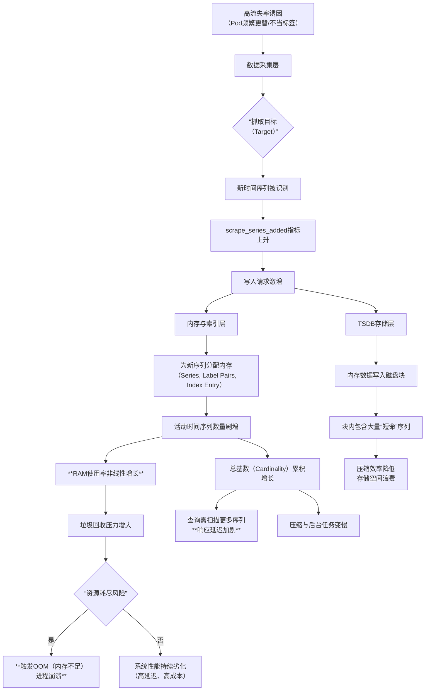

# Prometheus高流失率问题深度剖析：影响、系统解决方案与云厂商实践
## 1 引言：研究背景与核心问题界定

在云原生与人工智能技术迅猛发展的当下，构建稳定、高效的可观测体系已成为保障业务连续性的基石。Prometheus，作为云原生监控领域的事实标准，凭借其强大的多维度数据模型和灵活的查询语言，被广泛应用于从传统微服务到前沿的大模型训练、智能驾驶等复杂场景[^1]。然而，随着应用架构的动态性和复杂性急剧增加，一个被称为“高流失率（High Churn Rate）”的深层技术挑战日益凸显，它直接威胁着监控系统自身的稳定性与可靠性。本章旨在系统性地界定Prometheus高流失率问题的研究背景与核心概念，阐明其技术内涵、成因场景，并确立本报告的分析框架，为后续深入探讨其影响与解决方案奠定基础。

### 1.1 Prometheus高流失率的技术定义与核心概念

要理解高流失率的影响，首先必须清晰界定其在Prometheus监控体系中的技术定义及其相关核心概念。在Prometheus的语境下，**时间序列（Time Series）** 是由其名称和一组标签（labels）唯一标识的、按时间戳排序的一系列数据点[^2]。存储在时间序列数据库（TSDB）中的唯一时间序列的数量，被称为**基数（Cardinality）**[^2]。高基数意味着系统需要处理海量的时间序列，这本身就是一项重大挑战。

**高流失率**则是高基数问题中一种特殊且极具破坏性的形态。它特指时间序列新旧更替速率极高的现象[^2]。具体而言，当一个**活动时间序列（Active Time Series）**（即最近被Prometheus抓取到新数据的时间序列）停止接收新样本（例如，其对应的Kubernetes Pod被销毁），它就会变为非活动状态。与此同时，新的时间序列（通常由于标签值的变化，如新的Pod名称）不断产生[^2]。**这种旧时间序列被新时间序列替代的速率就是流失率**[^2]。显然，**高流失率会直接导致基数（Cardinality）的快速增长**[^2]。

Prometheus在内存中维护活动时间序列的样本，因此其内存使用率在很大程度上取决于活动时间序列的数量[^2]。当高流失率引发活动时间序列数量激增时，会对系统资源（尤其是RAM）造成巨大压力，这是理解其负面影响的关键起点。

### 1.2 动态云原生环境与高流失率的关联性分析

高流失率并非凭空产生，其根源深深植根于现代动态的云原生基础设施，尤其是在Kubernetes环境中。Kubernetes的动态资源调度和容器生命周期管理特性，使得Pod等资源的创建、销毁和滚动更新变得极为频繁[^3][^4]。这种动态性直接传导至监控层面，成为高流失率的主要诱因。

一个典型的例子来自大模型训练和智能驾驶领域。在这些场景中，模型训练往往涉及大量的任务（Kubernetes Job），部分任务的生命周期甚至只有几分钟[^1]。这些任务的频繁创建导致关联的Pod被快速迭代。在Prometheus的指标中，`pod_name`通常作为一个关键的标签。**Pod的频繁创建与销毁，使得`pod_name`标签值的变化非常剧烈，从而产生了高流失率**[^1]。每一次Pod的更新，对于附着其上的监控指标而言，都意味着一条旧时间序列的“死亡”和一条新时间序列的“诞生”。这种快速更替在宏观上就表现为监控系统内部时间序列的“流失”。

此外，微服务架构、无服务器函数（Serverless）、定时任务（CronJob）等具有短暂生命周期的应用模式，都在不同程度上加剧了这一问题[^4]。Prometheus虽然通过服务发现机制来动态适应这种环境变化[^3][^4]，但底层存储引擎（TSDB）在处理极高流失率时仍面临严峻考验。因此，**高流失率问题是云原生动态特性在可观测性领域的直接映射，是Prometheus在监控现代弹性应用时必须面对的核心挑战之一**。

### 1.3 研究范围、目标与报告分析框架

基于上述分析，本报告将研究范围明确聚焦于由**Prometheus高流失率所引发的一系列系统性挑战及其应对方案**。高流失率作为因，其直接结果是时间序列基数（Cardinality）的爆炸式增长，而这将给监控系统带来全方位的影响。参考资料明确指出，高基数会导致监控系统成本上升（CPU、内存、存储资源消耗增加）、指标读写响应时间变慢，并容易超出多租户系统为保障稳定性而设置的读写配额上限[^1][^5]。当基数达到数百万甚至更高时，Prometheus可能开始工作缓慢，或在数据摄取、查询和压缩期间消耗大量资源，最终威胁系统自身的可用性[^2]。

因此，本报告的核心目标是：第一，系统性地评估高流失率对Prometheus性能、成本及监控有效性的具体影响；第二，归纳并分析从指标设计、配置优化到架构演进的全链路系统性解决方案；第三，探查主流云服务商如何在其托管Prometheus服务中应对这一挑战，为实践选型提供参考。

为达成上述目标，本报告遵循以下分析框架展开：
1.  **问题根源与形成机制**：深入剖析导致高流失率的技术成因。
2.  **负面影响评估**：全面验证高流失率对监控体系造成的性能冲击与风险。
3.  **系统性解决方案**：从预防、缓解到架构演进，梳理多层次的技术应对策略。
4.  **云厂商方案对比**：分析托管服务如何通过底层优化解决高流失率难题。
5.  **总结与展望**：提炼关键原则，展望未来监控体系的发展方向。

通过这一框架，本报告旨在为面临Prometheus高流失率挑战的架构师和运维工程师提供一份兼具理论深度与实践指导意义的系统性参考。

## 2 Prometheus高流失率的技术根源与形成机制

Prometheus高流失率问题并非孤立现象，而是由现代基础设施的动态特性、应用架构的演进趋势以及监控实践中的设计决策共同作用的结果。本章将系统性地剖析这一问题的技术根源，从外部诱因到内部传导机制，构建一个从“因”到“果”的完整技术链路图景。理解这些根源与机制，是制定有效应对策略的前提。

### 2.1 动态云原生环境下的标签值频繁变更

动态云原生环境，特别是以Kubernetes为代表的容器编排平台，是引发Prometheus高流失率的首要且最直接的根源。其核心机制在于，基础设施资源的快速创建与销毁，直接导致了监控指标标签值的剧烈、频繁变更。

在Kubernetes中，Pod作为应用部署的最小单元，其生命周期受到滚动更新、自动扩缩容、任务调度（Job/CronJob）等多种因素影响，变得极其短暂和不稳定。**一个典型的高流失率场景出现在AI大模型训练和智能驾驶领域**。在这些场景中，模型训练通常涉及大量并行的、生命周期可能只有几分钟的Kubernetes Job任务[^1]。这些任务的频繁创建与完成，导致关联的Pod被快速迭代。由于`pod_name`是Prometheus通过服务发现（如Kubernetes SD）自动附加到监控指标上的一个关键标签，Pod的每一次更新都意味着`pod_name`标签值的变化[^1][^2]。

从Prometheus时间序列的视角来看，**每一次`pod_name`标签值的变更，都意味着一条旧时间序列的“死亡”（变为非活动状态）和一条新时间序列的“诞生”**。这种旧时间序列被新时间序列替代的速率，即被定义为流失率（Churn Rate）[^2]。当数以千计的Pod在短时间内频繁更替时，就会产生极高的流失率。这种动态性通过Prometheus的服务发现和抓取机制无缝传导至监控系统内部，使得监控数据模型不得不与基础设施的弹性保持同步，从而埋下了性能隐患。Prometheus自身提供的`rate(prometheus_tsdb_head_series_created_total[5m])`等指标，正是观测这种序列创建（即流失）速率的关键工具[^2]。

### 2.2 应用架构模式与短暂生命周期应用的驱动

除了基础设施的动态性，现代应用架构模式本身也在系统性驱动高流失率的产生。**具有短暂生命周期的应用模式，其内在的数据生成逻辑与Prometheus基于持久化时间序列的模型存在根本性冲突**。

这种冲突在多种场景下显现：
1.  **批量计算与训练任务**：如前所述的AI训练Job，其特点是任务驱动、计算密集、完成后即释放资源。
2.  **无服务器函数（Serverless/FaaS）**：函数实例随请求而创建，执行完毕后迅速销毁，生命周期可能以秒计。
3.  **定时任务与工作流**：CronJob或工作流引擎中的每个任务实例都是独立且短暂的。
4.  **用户会话与请求链路**：如果将每个用户会话（`session_id`）或单个请求的唯一标识符（`request_id`）作为指标标签，那么随着会话结束或请求完成，对应的时间序列也将失效[^6]。

这些模式的共同点是，它们所代表的**业务实体（任务实例、函数实例、会话）本身是短暂且高并发的**。当这些实体的唯一标识符被用作监控指标的标签时，监控系统就被迫为每一个短暂的实体单独维护一条时间序列。实体生命周期的结束直接导致时间序列的“流失”，而新实体的不断产生则带来新序列的持续涌入。这种模式与传统的、长期运行的服务（如数据库、Web服务器）的监控模式截然不同，后者产生的时间序列相对稳定。因此，在采纳这些现代架构模式时，如果不加思考地沿用传统的监控标签设计，就会不可避免地陷入高流失率的困境。

### 2.3 指标与标签设计不当的催化与放大效应

如果说动态环境和短暂生命周期应用是产生高流失率的“土壤”，那么不当的指标和标签设计则是使问题急剧恶化的“催化剂”。**许多高流失率问题并非技术必然，而是源于监控实践中的设计缺陷**。

根据参考资料，高基数（进而高流失率）的一个关键成因是指标涵盖了具有高流失率的标签，例如不可枚举的业务标签，如`userID`、完整的`URL`路径等[^1]。以下表格归纳了常见的设计反模式及其放大效应：

| 设计反模式 | 具体表现 | 造成的后果与放大效应 |
| :--- | :--- | :--- |
| **使用不可枚举/无限域标签** | 将`user_id`、`session_id`、含参数的完整`URL`、`order_id`等作为标签。 | 标签值域近乎无限，任何新值的出现都会立即创建一条全新的、可能很快失效的时间序列，导致基数爆炸式、不可预测地增长[^6]。 |
| **忽视标签组合爆炸** | 单个标签基数尚可，但多个标签维度组合后产生巨大基数。例如，一个HTTP请求指标包含`cluster`、`service`、`endpoint`、`method`、`resp_code`等多个标签，其总基数是各标签值数量的乘积[^1]。 | 即使基础设施相对稳定，不当的维度组合也会将基数推高至难以管理的水平，任何维度的轻微变化（如新增一个`service`）都会导致总基数大幅跃升。 |
| **缺乏聚合与规范化** | 直接暴露原始、细粒度的数据，而未设计用于聚合和查询的汇总指标。例如，为每个API端点单独暴露指标，而非通过一个统一指标附加`path`标签。 | 使得查询和分析必须面对海量原始序列，加剧查询压力，并使得基于记录规则（Record Rules）的预聚合难以实施。 |

**这些设计反模式与动态环境因素会产生叠加效应**。例如，在一个频繁发布微服务的Kubernetes环境中，如果还为每个HTTP请求附加了`user_id`标签，那么流失率将呈现灾难性的增长。Prometheus的TSDB存储引擎针对处理相对较少数量的时间序列进行了优化[^2]，当上述设计缺陷与高动态环境结合，产生的时间序列基数轻易就能达到几百万甚至更高，从而迅速突破TSDB的处理能力边界，引发系统性风险。

### 2.4 在Prometheus数据流与存储引擎中的表现机制

高流失率的外部诱因和设计问题，最终会在Prometheus内部的数据处理流水线中转化为具体的性能瓶颈和资源压力。其冲击贯穿从数据采集、内存索引到持久化存储的每一个环节。

为了更直观地理解高流失率在Prometheus内部的传导路径与影响，以下流程图揭示了其核心表现机制：



**1. 采集层压力显现**：当抓取目标（Target）暴露的指标因标签值变化而包含新序列时，`scrape_series_added`指标会显著上升[^2]。Prometheus需要为这些新序列解析和初始化元数据，增加了单次抓取的耗时和复杂度。

**2. 内存与索引层承受核心冲击**：这是高流失率造成最严重影响的环节。Prometheus在内存中为每个活动时间序列维护一套数据结构，包括唯一的Series ID、标签键值对以及用于快速查询的倒排索引条目[^2]。**高流失率导致大量新序列在短时间内涌入内存，使得活动时间序列数量激增，直接导致RAM使用率非线性飙升**[^2]。同时，旧序列不会立即从内存中清除，其元数据可能仍被保留，直到相关数据块被持久化。这种新旧序列元数据在内存中的堆积，不仅占用大量空间，还加重了垃圾回收（GC）的负担。最终，极有可能触发内存不足（OOM）错误，导致Prometheus服务器崩溃[^2]，这在故障排查的关键时刻将是灾难性的。

**3. 存储层效率与性能受损**：内存中的数据会定期写入磁盘，形成持久化的块（Block）。高流失率产生的“短命”序列使得数据块中包含大量仅有个别数据点的时间序列，严重降低了存储压缩效率，造成磁盘空间的浪费。更重要的是，所有曾经出现的时间序列都会计入总基数（Cardinality）。即使序列已不活跃，高基数仍会拖慢查询速度，因为查询引擎需要扫描更多的序列索引；同时，后台的压缩（Compaction）等操作也会变得异常缓慢[^2]。**这形成了一个恶性循环：高流失率推高基数，高基数拖慢系统，缓慢的系统更难及时处理新的流失，稳定性持续恶化**。

## 3 高流失率对Prometheus系统与监控体系的负面影响评估

高流失率（High Churn Rate）作为Prometheus监控体系中的核心挑战，其影响绝非仅限于单一指标的增长。它通过一系列连锁反应，对系统的稳定性、性能、成本及核心监控功能的可靠性构成了系统性威胁。本章将依据参考资料，深入剖析并量化评估高流失率在资源消耗、查询性能、存储效率以及数据与告警质量四个关键维度造成的具体冲击，全面揭示其对监控体系根基的侵蚀作用。

### 3.1 内存与CPU资源的非线性消耗与OOM风险

高流失率对Prometheus服务器最直接、最危险的冲击体现在对内存和CPU资源的非线性消耗上，这直接威胁到系统自身的稳定性。

**首先，内存消耗呈现非线性飙升，根源在于活动时间序列元数据的海量堆积。** Prometheus将采集到的监控样本存储在内存中，直到达到一定条件后才持久化到磁盘[^7]。每一个活动的时间序列都需要在内存中维护其元数据，包括唯一的Series ID、完整的标签键值对（Label Pairs）以及用于快速查询的索引结构[^7][^8]。**高流失率的本质是活动时间序列数量的激增**，这直接导致上述内存数据结构的总量急剧增加。更严重的是，每个新时间序列的标签（如`pod_name="pod-xyz"`）作为字符串，其存储开销是固定的，大量短暂序列的快速创建与销毁，使得内存中充斥着大量“短命”的标签字符串和索引条目，且旧序列的元数据不会立即释放[^8]。这种累积效应使得内存占用（RAM）随序列流失率呈非线性增长，极易触及系统上限。

**其次，内存管理的“锯齿效应”与垃圾回收（GC）压力剧增，加剧了系统的不稳定性。** Go语言运行时内存分析器揭示的“锯齿效应”，描述了内存使用随时间积累、然后被垃圾收集器回收的循环过程[^8]。在高流失率环境下，时间序列及其标签元数据的快速、大量更替，使得垃圾对象生成速率极快，显著加重了垃圾收集器的负担[^7]。频繁且耗时的GC操作会导致Prometheus进程出现明显的“卡顿”，影响数据采集和查询的实时性。**当内存消耗的“锯齿”峰值超过系统可用内存时，便会触发内存溢出（OOM），导致Prometheus服务器崩溃**[^7]。监控系统自身的不可用，在业务故障时将是灾难性的，完全违背了“业务系统都挂了，监控也不能挂”的基础设施设计原则[^9]。

**再者，CPU资源瓶颈从数据采集延伸至存储压缩，形成复合性能压力。** 高流失率不仅增加数据采集和指标解析的CPU开销[^7]，更对TSDB（时序数据库）的后台处理造成巨大压力。大量“短命”序列被写入磁盘块（Block），使得每个数据块中包含大量仅有个别样本的序列，严重降低了数据压缩效率[^7]。为了处理这些低效的数据块，TSDB的压缩（Compaction）过程需要消耗大量的CPU计算资源[^7]。同时，用于保证数据持久性的预写日志（WAL）在重放时，也需要处理更多序列的元数据，消耗额外的I/O和CPU[^7]。**因此，高流失率在推高内存使用的同时，也通过加重采集、解析、压缩和WAL重放等过程的负担，导致CPU使用率持续居高不下，形成资源消耗的恶性循环。**

### 3.2 查询性能劣化与响应延迟加剧

高流失率通过显著增加查询处理的复杂度，直接导致PromQL查询性能劣化和响应延迟加剧，严重影响监控数据的可读性与实时性。

**查询性能的核心决定因素在高流失率环境下全面恶化。** 根据分析，PromQL查询速度主要取决于四个外部因素：查询选择的时间序列数量、需要扫描的原始样本数、查询的时间范围以及数据库中的总时间序列数（基数）[^10][^11]。**高流失率是推高总基数的元凶**。即使旧序列已不活跃，只要在查询时间范围内存在过，查询引擎在匹配序列时仍需扫描其索引条目。基数越高，查找匹配序列的速度就越慢[^10][^11]。例如，一个看似简单的`up`查询，在匹配选定时间范围内数十万个具有数百亿样本的时间序列时，可能需要数十秒并消耗数GB的RAM才能完成[^10]。

**查询时间范围与样本扫描量因序列流失而被放大。** 当用户或仪表板（如Grafana）需要查看较长时段的历史趋势时，较长的查询时间范围意味着必须从数据库中读取更多数据[^10]。在高流失率场景下，**“序列流失率”会放大这一问题**：较长的时间范围会捕获更多已经“死亡”并被新序列替代的旧序列，从而同时增加需要扫描的样本总数和需要匹配的时间序列总数，导致查询延迟显著增加[^10][^11]。

**实时查询接口（Instant Queries）承受更高性能负载。** Instant queries允许用户立即查询时间序列的当前值，但其缺点在高流失率环境下被放大[^12]。大量的并发实时查询需要Prometheus服务器即时计算海量动态变化的时间序列数据，这会急剧增加服务器的负载[^12]。**在高流失率导致的CPU和内存高占用背景下，额外的实时查询负载极易引发性能雪崩，导致查询响应时间变慢、超时，甚至影响核心的数据采集任务**，使得监控数据的实时性无法得到保障[^12]。

### 3.3 存储成本攀升与数据管理效率降低

高流失率对存储系统的影响是长期且经济性的，它直接导致存储成本的不必要攀升，并降低了数据管理的整体效率。

**存储空间因数据碎片化而被低效占用。** Prometheus TSDB将数据持久化到磁盘块中。高流失率产生的大量生命周期极短的时间序列，使得每个数据块内充斥着大量仅包含少数几个样本的序列记录。这种高度碎片化的数据存储模式，使得TSDB的数据压缩算法难以发挥效用，压缩比显著降低[^7]。**其直接后果是，存储相同时间跨度的监控数据，需要占用更多的磁盘空间**。无论是使用本地SSD还是远程对象存储（如与Thanos方案结合），这种低效的存储方式都直接转化为更高的存储成本。

**后台数据管理操作效率严重下降。** TSDB的关键后台维护操作，如数据压缩（Compaction），其性能与时间序列的总基数密切相关。高流失率累积形成的高基数，使得压缩操作需要处理更多的序列元数据和索引，过程变得异常缓慢[^7]。这不仅延长了维护窗口，也可能在压缩期间占用大量I/O和CPU资源，影响线上查询性能。此外，高基数也使得数据删除（根据保留策略）或跨实例数据去重（如在Thanos中）等操作变得更加复杂和耗时，降低了整个监控数据管线的管理效率。

### 3.4 数据准确性风险与告警有效性连锁冲击

高流失率最隐蔽却最致命的负面影响，在于它侵蚀了监控数据的准确性，并由此引发对告警系统有效性的连锁冲击，动摇了监控体系的可信根基。

**核心滚动函数的计算结果面临失真风险。** `rate()`和`increase()`等函数是PromQL中进行速率计算的核心，它们通过分析一个时间窗口（范围向量）内的样本变化来工作[^13]。**在高流失率环境下，作为计算基础的时间序列本身可能是不稳定或中断的**。例如，一个Pod在存活期内产生了一些指标样本，随后被销毁，紧接着一个同名但实际为新实体的Pod被创建。对于Prometheus，这可能是两条不同的时间序列（如果其他标签如`container_id`变化）。当使用`rate(metric_name[5m])`进行计算时，在序列更替的边界，函数可能因为样本不连续或窗口内样本数过少而产生反直觉的结果，如突降为零或产生异常尖峰[^9]。这种计算偏差会直接影响对系统吞吐量、错误率等关键业务指标的判断。

**告警系统的及时性与准确性遭受双重打击。** 告警规则本质上是定时执行的PromQL查询。首先，如3.2节所述，查询性能的劣化会导致告警规则评估（Evaluation）超时或延迟，可能使告警无法在故障发生的临界窗口内触发，造成漏报[^7]。其次，基于可能失真的`rate()`等计算结果设定告警阈值，极易引发误告警（False Positive）或漏告警（False Negative）。例如，由于序列更替导致的`rate()`计算尖峰，可能触发不必要的“流量突增”告警；而计算结果的低估则可能掩盖真实的性能下降问题。

**最终，监控的基本原则被破坏。** 参考资料中强调的监控原则指出：“需要处理的告警才发出来，发出来的告警必须得到处理”[^9]。高流失率通过损害数据质量和查询性能，使得告警可能基于不准确的数据、或在错误的时间被触发，导致大量无关紧要或错误的告警产生。这不仅使运维人员陷入“告警疲劳”，更严重的是，它可能让真正关键的告警被淹没，导致响应延误。**因此，高流失率不仅是一个技术性能问题，更是一个直接危及业务稳定性和运维有效性的系统性风险。**

## 4 系统性解决方案架构：从预防、缓解到架构演进

面对由高流失率引发的Prometheus系统性能危机，单一的补救措施往往捉襟见肘。一个稳健的监控体系需要构建一个多层次、系统性的解决方案框架。本章将整合参考资料中的关键信息，从源头预防、链路缓解、查询优化、存储调优到架构演进，系统地梳理应对高流失率挑战的技术方案，为不同规模和动态性的环境提供清晰的解决路径。

### 4.1 源头预防：指标与标签设计的最佳实践

**最有效且成本最低的解决方案，是在指标暴露的源头就杜绝高流失率的产生。** 这要求开发、运维和SRE团队共同遵循一套清晰的指标与标签设计规范。参考资料明确指出，高流失率的一个常见原因是**指标涵盖了不可枚举的业务标签，如`userID`、完整的`URL`等**[^1]。因此，预防策略的核心在于设计稳定、可枚举的标签维度。

首先，必须严格禁止将具有无限或极高值域的动态标识符作为指标标签。这包括但不限于：
*   **基础设施标识**：如Pod名称（`pod_name`）、容器ID。虽然Prometheus服务发现会自动附加这些标签，但在设计自定义指标时，应避免主动引入它们，除非有明确的聚合路径。
*   **业务实体标识**：如用户ID（`user_id`）、会话ID（`session_id`）、订单号（`order_id`）。
*   **请求详情**：如含参数的完整URL路径、具体的SQL语句。

这些信息更适合通过日志（Logs）或分布式追踪（Tracing）系统记录，而非作为监控指标的标签。**监控指标的标签应服务于聚合、分组和筛选，其值域应是有限且相对稳定的**，例如环境（`env=prod`）、服务名（`service=checkout`）、HTTP方法（`method=POST`）、状态码（`code=500`）等。

其次，在指标命名和设计上应遵循最佳实践，以提升可读性和可维护性。参考资料建议指标命名的整体结构为`name_unit_suffix`，并符合正则`[a-zA-Z_][a-zA-Z0-9_]*`[^14]。例如，`http_requests_total`清晰地表明了指标含义、单位（请求数）和类型后缀（Counter）。对于Counter类型，必须使用`_total`后缀[^14]。同时，应避免在指标名称中携带环境或应用名，这些元信息应由Prometheus在抓取时通过标签自动附加[^14]。

一个关键的实践是**优先暴露原始指标，而非在应用端进行计算**。例如，应埋点记录请求总量和错误量两个Counter，在查询时通过PromQL（如`rate(errors_total[5m]) / rate(requests_total[5m])`）计算错误率[^14]。这赋予了监控系统最大的灵活性。此外，应积极采用如RED（Requests, Errors, Duration）用于在线服务、USE（Utilisation, Saturation, Errors）用于资源的方法论来指导核心监控指标的选取[^14][^15]。

通过建立并执行这些设计规范，可以从根本上大幅减少时间序列的无序增长和无效更替，为监控系统的长期稳定运行奠定坚实基础。

### 4.2 链路缓解：Relabel配置与指标采集优化

当高流失率问题已经存在于生产环境时，立即在数据采集链路中进行过滤和优化是快速降低系统负载、恢复稳定性的有效缓解手段。**Prometheus的`relabel_config`功能是实现这一目标的核心工具**，它允许在抓取（scrape）时对指标和标签进行过滤、修改或删除[^16]。

根据Grafana官方指南，主要通过两种策略来减少发送到监控后端（如Prometheus或Grafana Cloud）的活动序列数量[^16]：
1.  **允许清单（Allowlisting）**：保留一套明确定义的“重要”指标和标签，丢弃其他一切。这需要使用`keep`和`labelkeep`动作。
2.  **拒绝清单（Denylisting）**：丢弃一组明确定义的“不重要”指标，保留其他。这需要使用`drop`和`labeldrop`动作。

这两种策略都依赖于对现有指标使用情况的精确分析。一个高效的实践是使用**Grafana Mimirtool**。该工具可以从Grafana仪表板（通过API）和Prometheus告警规则文件中提取实际被使用的指标列表，然后与Prometheus实例中的活动序列进行比较，输出已使用（used）和未使用（unused）的指标清单[^17]。基于这份清单，运维人员可以 confidently 地配置`relabel_configs`，仅保留必要的指标。

以下是一个基于分析结果配置允许清单的简化示例，它可以在`scrape_configs`的`metric_relabel_configs`中实现：

```yaml
metric_relabel_configs:
  # 仅保留指标名称为`http_requests_total`或`http_request_duration_seconds`的序列
  - source_labels: [__name__]
    regex: 'http_requests_total|http_request_duration_seconds'
    action: keep
  # 丢弃可能由某些exporter引入的高基数调试标签`debug_id`
  - regex: 'debug_id'
    action: labeldrop
```

参考资料中提供了一个惊人的实战效果：通过此类精细化过滤，活动序列从**270,336个成功精简至61,055个，精简率接近5倍**[^17]。这直接降低了Prometheus内存索引的压力、后续查询扫描的基数以及存储成本，是应对已爆发的高基数问题的“外科手术式”解决方案。

### 4.3 查询优化：记录规则（Recording Rules）与预聚合策略

当查询，尤其是那些用于Grafana仪表板和频繁评估的告警规则的查询，因涉及复杂计算和大范围数据扫描而变得缓慢时，**记录规则（Recording Rules）** 是提升性能的关键武器。预聚合的核心思想是**将查询时的计算压力转移到数据写入时的定期批处理中**。

记录规则允许用户预先定义PromQL表达式，Prometheus会以固定的时间间隔（如60秒）执行这些表达式，并将结果作为一个全新的时间序列存储起来[^18][^19]。这样，仪表板和告警规则可以直接查询这个新的、已经计算好的、基数更低的序列，从而获得毫秒级的响应速度。

例如，一个直接查询原始数据计算5分钟请求速率的PromQL `rate(http_requests_total[5m])` 可能涉及扫描海量序列。我们可以为其定义一条记录规则：

```yaml
groups:
  - name: http_request_rules
    interval: 60s
    rules:
      - record: instance_path:http_requests:rate5m
        expr: rate(http_requests_total[5m])
```

执行后，将生成名为`instance_path:http_requests:rate5m`的新指标。后续查询和告警直接使用此指标即可。

为了保持规则组织的清晰和可维护性，社区推荐采用 `level:metric:operations` 的命名格式[^18][^19]：
*   `level`：表示聚合级别和输出标签（如`instance_path`表示保留了实例和路径标签）。
*   `metric`：原始指标名称。
*   `operations`：应用于指标的操作列表（如`rate5m`）。

通过系统地为核心业务指标和复杂查询创建记录规则，可以**将查询端的计算复杂度降至最低，有效解决查询慢和配置复杂的问题**，尤其在大规模集群和复杂业务场景下收益显著[^18]。

### 4.4 存储与采集层调优：配置参数与联邦架构

在考虑大规模架构演进之前，充分挖掘和优化现有Prometheus单实例或小规模集群的潜力是必要的。这涉及对关键配置参数的调整以及对内置联邦（Federation）架构的合理运用。

首先，需要对单机Prometheus的容量有清晰的认识。参考资料给出了一个经验估算：一个配置合理的Prometheus实例，每秒处理**80万个数据点（samples per second）是一个较为健康的上限**[^20]。基于此，可以推算其监控能力。例如，若每台服务器通过node-exporter暴露约800个指标，抓取间隔为15秒，则平均每秒产生约53个数据点，单实例可支持监控约1.5万台服务器（800,000 / 53）[^20]。这为容量规划提供了基准。

基于容量评估，可以实施**垂直分片（Vertical Sharding）**，即按功能域（如基础设施监控、应用监控、中间件监控）或团队边界，部署多个独立的Prometheus实例[^21]。这是扩展Prometheus最简单、最推荐的首选方式，它能有效隔离故障域和性能影响。

对于需要从多个分散的Prometheus实例获取汇总视图的场景，可以使用Prometheus内置的**联邦（Federation）机制**。边缘Prometheus实例通过暴露`/federate`接口提供数据，中心Prometheus则从中抓取。**关键在于，中心端不应拉取所有数据，而应通过`match[]`参数仅抓取经过预聚合的关键摘要指标**[^20]。例如，中心端只拉取以`aggr:`开头的、由记录规则生成的聚合指标：

```yaml
scrape_configs:
  - job_name: 'federate'
    honor_labels: true
    metrics_path: '/federate'
    params:
      'match[]':
        - '{__name__=~"aggr:.*"}'  # 仅拉取聚合指标
    static_configs:
      - targets: ['edge-prometheus-1:9090', 'edge-prometheus-2:9090']
```

**联邦架构适用于构建全局视图，但中心节点仍是瓶颈，并非真正的无限水平扩展方案**。它解决了数据孤岛问题，但未解决单个Prometheus实例的存储和计算上限。

此外，调优抓取间隔（`scrape_interval`）、评估间隔（`evaluation_interval`）、TSDB数据保留时间等参数，也能在资源消耗和数据粒度之间取得平衡。

### 4.5 架构演进：面向大规模动态环境的解决方案选型

当垂直分片和联邦架构仍无法满足需求，即监控规模达到千万甚至亿级时间序列，且面临严重的存储爆炸、查询变慢和长期存储成本压力时，就必须考虑更彻底的架构演进。此时，**“Prometheus增强组件三巨头”——Thanos、Cortex（及其演进版Grafana Mimir）和VictoriaMetrics——成为主流选择**[^22]。

这些方案的核心目标是突破单机Prometheus的局限，提供无限扩展、全局查询、多集群数据合并和长期低成本存储的能力。下表基于参考资料，对比了它们的关键特性与适用场景：

| 特性/方案 | Thanos | Cortex / Grafana Mimir | VictoriaMetrics (集群版) |
| :--- | :--- | :--- | :--- |
| **核心定位** | Prometheus的“黄金外挂”，无侵入式扩展[^22]。 | 真正的云原生、分布式TSDB，为超大规模SaaS设计[^22]。 | 高性能、高压缩率的时序数据库，追求极致资源效率[^23]。 |
| **存储后端** | 依赖对象存储（如S3、GCS）作为唯一事实存储，Prometheus本地磁盘可视为缓存[^22]。 | 依赖对象存储作为主要存储[^22]。 | 专用分布式存储，也可配置对象存储。 |
| **查询模式** | 通过Query组件对多个Prometheus/存储桶进行联邦查询，提供全局视图[^22]。 | 通过微服务化的Query组件进行分布式查询[^22]。 | 通过专用查询组件（vmselect）进行分布式查询。 |
| **部署复杂度** | **相对简单**，组件清晰，易于在现有Prometheus上叠加[^22]。 | **较高**，完整的微服务架构，组件较多[^22]。 | **中等**，组件比Cortex少，架构清晰。 |
| **适用规模** | 中大型，混合云环境，需要长期存储和全局查询的场景[^22]。 | 超大型，百万实例级别，强多租户SaaS平台[^22]。 | 高写入量，对性能和资源消耗敏感的场景[^22]。 |
| **解决高流失率痛点的机制** | 将历史数据卸载到对象存储，降低Prometheus本地TSDB压力；通过降采样和压缩降低长期存储成本。 | 彻底分布式架构，将写入和查询负载分散到多个节点；内置多租户隔离。 | 专有的高压缩算法大幅降低存储开销；优化的写入和查询路径应对高吞吐。 |

**Thanos** 因其对原生Prometheus几乎无侵入的特性而最受欢迎。它通过Sidecar组件与Prometheus集成，将数据备份到对象存储，并通过Query组件实现全局查询。**它特别适合需要将历史监控数据长期保留并随时可查的场景**，有效解决了Prometheus本地存储周期短和跨集群查询难的问题[^22]。

**Cortex/Grafana Mimir** 走得更远，它不再依赖Prometheus本地TSDB，而是将其彻底分布式化，所有组件都以微服务方式运行，并深度依赖对象存储。**它适合构建企业级、多租户的监控即服务（Monitoring-as-a-Service）平台**，能够支撑前所未有的规模[^22]。

**VictoriaMetrics** 则以其卓越的性能和惊人的存储压缩比（声称可达10倍于Prometheus）著称。它提供了与Prometheus兼容的API，既可以作为远程存储后端，也可以完全替代Prometheus。**对于追求以最小硬件资源消耗监控最大规模动态环境的团队，VictoriaMetrics是一个极具吸引力的选择**[^23]。

选择哪种方案，取决于组织的具体规模、技术栈、团队运维能力和长期规划。共同点是，它们都通过架构革新，为应对由高流失率引发的高基数、存储和查询性能瓶颈提供了生产级别的系统性解决方案。

## 5 云厂商托管Prometheus服务方案对比分析

随着Prometheus在高动态云原生环境下面临的高基数与高流失率挑战日益严峻，各大云服务商纷纷推出了托管Prometheus服务，旨在通过底层架构优化和增强功能，帮助用户应对这些复杂问题。本章将系统性地对比分析阿里云、AWS和Google Cloud三大主流云厂商的托管Prometheus服务方案，重点剖析其针对高流失率问题的核心优化技术、性能表现与成本模型，为企业在不同业务场景下的技术选型提供清晰、可验证的决策依据。

### 5.1 阿里云Prometheus服务的增强架构与性能优化

阿里云Prometheus服务相较于开源版本，在易用性、扩展性和性能方面均有大幅度提升，并针对高基数与高搅动率（High Churn Rate）场景进行了专项优化[^24]。其核心优化思路体现在两个方面：一是依靠时序存储本身的能力或更优秀的架构来“硬抗”压力；二是提供了开源版本所不具备的完整预聚合/预计算功能，用于主动降低基数[^24]。

在架构层面，阿里云服务通过优化的分布式存储和查询引擎，显著提升了承载高流失率的能力。根据其官方基准测试，在模拟的高搅动率场景下，阿里云Prometheus服务能够稳定承载高达约1434万条时间线，远超同场景下自建开源Prometheus的极限（约2300万条即内存耗尽）[^24]。开源版本在面对时间线爆炸时，资源消耗呈非线性增长，垂直扩容效率低下，而阿里云服务通过弹性扩展机制，有效避免了性能瓶颈和OOM风险。这种增强的架构能力，使得阿里云服务特别适合存在大量Pod频繁创建销毁（高流失率）的Kubernetes环境。

在查询优化方面，阿里云服务提供了深度查询优化能力，如算子下推、降采样等，显著提升了复杂查询的性能[^24]。例如，在长周期、并发查询场景下，阿里云服务的优势明显。一个7天跨度的10个并发查询，总体耗时约为开源版本的1/4（13秒 vs 53秒）[^24]。这种性能提升对于依赖复杂历史数据分析进行故障排查和趋势预测的企业至关重要。

**更为关键的是，阿里云服务提供了完整的预聚合/预计算功能**[^24]。这一功能允许用户通过配置记录规则（Recording Rules），在数据写入阶段就对高基数指标进行聚合计算，并将结果作为新的、基数更低的指标存储起来。后续的仪表板查询和告警规则可以直接使用这些预聚合指标，从而**大幅减少了查询时需要扫描的时间序列数量，从根本上缓解了高流失率带来的查询延迟和资源消耗问题**。这一能力是开源版本Prometheus所不具备的，也是阿里云方案在应对高基数挑战时的一项显著优势。

### 5.2 AWS Managed Service for Prometheus (AMP) 的成本与扩展性策略

AWS Managed Service for Prometheus (AMP) 是一项高度可用且安全的托管式监控服务，专为大规模容器化环境设计[^25]。AMP的核心优势在于其自动扩展能力和对高基数数据（如视频流、网络应用程序和IoT设备数据）的专项设计[^25]。

AMP采用灵活的按需付费模型，其成本主要由以下几个部分构成：托管采集器（可选）的运行时长和样本收集量、指标摄入的样本数量、存储的数据量以及查询时处理的样本数量[^26]。根据AWS的实践经验，**指标摄入通常是AMP总成本的最大比重**，因此，优化指标摄入策略成为控制AMP成本的关键[^26]。AMP通过其自动扩展特性，能够在摄取和查询需求增长时无缝扩展，并在大型容器部署中保持一致的响应时间，这使其非常适合工作负载波动大、天生具有高基数监控数据的业务场景，如IoT和电商[^25]。

AWS官方博客提供了一个通过优化配置显著降低成本的实验案例。在该实验中，通过分析和优化配置，成功减少了**64%的AMP费用**[^26]。其核心优化策略包括：
1.  **选择性采集**：通过配置Prometheus的服务发现和重标记（relabeling）规则，精确控制采集范围，过滤掉未在告警规则或仪表板中使用的指标[^26]。
2.  **源头控制**：调整抓取间隔（scrape interval），避免过度采样；同时，禁用不必要的Exporter收集器，从源头减少指标暴露[^26]。
3.  **持续优化**：定期审查指标的实际使用情况，并据此动态调整采集策略，确保监控成本与业务价值相匹配[^26]。

这种以成本为导向的精细化优化思路，使得AMP用户能够在保障关键监控能力的同时，有效控制由高流失率带来的成本飙升。AMP与AWS其他安全服务的深度集成，也满足了企业级的安全性与合规性要求，进一步降低了运营复杂度[^25]。

### 5.3 Google Cloud Managed Service for Prometheus 的成本控制机制

Google Cloud的托管Prometheus服务作为Cloud Monitoring的一部分，其设计哲学强烈侧重于成本的控制与透明度[^27][^28]。该服务采用按样本摄入量和API读取请求量计费的模型，并且明确指出，**摄入的样本数量是用户成本的主要贡献者**[^27]。

这种独特的计费模型将成本与高基数问题直接挂钩，形成了强大的优化激励。用户为了控制费用，会自然地将技术手段集中于减少不必要的样本摄入。优化策略因此聚焦于源头治理，例如：
*   **精确的指标暴露**：在应用端或Exporter配置中，仅暴露业务真正需要的指标，避免导出调试性或低价值的指标。
*   **优化的抓取配置**：在Prometheus抓取配置中，利用`metric_relabel_configs`丢弃高基数且无用的标签（如`instance_id`, `pod_name`等），或者直接过滤掉整个不必要的指标。
*   **合理的采样频率**：根据监控指标的敏感度和业务需求，设置恰当的抓取间隔，避免过高频率采样带来的数据量膨胀。

Google Cloud通过其定价模型，迫使用户持续审视和优化其监控实践，适合那些对监控成本敏感、追求精细化运营和成本清晰挂钩的团队[^28]。然而，这也要求用户具备更高的指标治理能力。与AWS AMP类似，Google Cloud的方案也强调了与生态的集成，但其成本控制机制更为直接和显性，优化行为能立即反映在账单上，这对于需要严格预算控制的环境是一个重要考量因素。

### 5.4 核心能力对比：优化技术、性能与成本效益

为清晰呈现三大云厂商方案在应对高流失率挑战时的核心差异，以下从优化技术、性能表现和成本效益三个维度进行综合对比分析。

| 对比维度 | **阿里云 Prometheus** | **AWS Managed Service for Prometheus (AMP)** | **Google Cloud Managed Service for Prometheus** |
| :--- | :--- | :--- | :--- |
| **核心优化技术** | **1. 增强架构硬抗**：水平分片、深度查询优化（算子下推、降采样）、弹性扩展的分布式存储。<br>**2. 主动降低基数**：提供**完整的预聚合/预计算功能**（Recording Rules），开源版本不具备此完整能力[^24]。 | **1. 自动扩展**：服务随摄取和查询需求自动扩展，保持响应时间。<br>**2. 精细化采集优化**：通过服务发现、重标记规则进行选择性采集，调整采样频率，从源头控制成本[^26]。 | **1. 成本模型驱动**：采用**按样本摄入量计费**，成本控制机制直接激励减少样本摄入[^27]。技术优化自然聚焦于源头指标治理。 |
| **性能表现侧重** | **高承载与复杂查询性能**：基准测试显示在高搅动率下承载能力远超开源版（1434万 vs 2300万线），长周期复杂查询响应速度显著提升（可达开源版4倍）[^24]。 | **弹性与一致性**：强调在大规模容器部署中，面对波动负载时能自动扩展并保持一致的查询响应时间，适合原生高基数业务[^25]。 | **成本效率**：性能优化与成本控制深度绑定，鼓励用户通过优化配置实现高性能与低成本的平衡。 |
| **成本模型与效益** | 基于存储、读写等资源使用量计费。效益源于**性能提升带来的运维简化**和**通过预聚合间接降低数据量**，避免了自建的高硬件与人力成本。 | 按需付费（摄入、存储、查询）。效益源于**自动扩展提升的资源利用率**和**通过精细化过滤实现的直接成本节约**（实验可降64%费用）[^26]。 | 按样本摄入量和API读取请求计费。效益模型最直接，**优化行为（减少样本）能立即降低账单**，追求极致的成本透明度与控制力[^27][^28]。 |
| **适用场景** | 对**查询性能、大规模集群监控稳定性要求极高**的场景，尤其是存在高流失率的K8s环境及需复杂历史数据分析的企业。 | **原生高基数领域**（IoT、视频流、电商），且希望服务能**无缝弹性扩展**，无需担心底层资源瓶颈的场景[^25]。 | 已深度使用Google Cloud生态，**对监控成本敏感、希望成本与用量清晰挂钩**，并愿意为此调整监控实践的用户。 |

**总结与洞察**：
*   **阿里云**在架构扩展性和查询性能优化上投入最深，其提供的预聚合能力是应对高基数查询的利器，适合对监控系统性能有极致要求的场景。
*   **AWS AMP**的强项在于其云服务的成熟弹性与精细化成本管控工具，特别适合业务天生具有高基数特性且运行在AWS生态内的用户。
*   **Google Cloud**通过独特的计费模型，将成本控制变成了用户的首要优化目标，适合追求高度成本可控和透明度的团队。

**三家厂商的方案都表明，应对高流失率没有银弹，需要结合架构优化（硬抗）和数据治理（软降）两种手段**。阿里云和AWS提供了更丰富的主动优化工具，而Google Cloud则通过经济杠杆引导用户行为。

### 5.5 选型建议与未来趋势展望

基于以上对比分析，企业可以根据自身业务特征、技术栈和运维目标，做出更明智的托管Prometheus服务选型。

**选型建议**：
1.  **追求极致性能与稳定性**：如果业务负载复杂多变，存在严重的高流失率问题（如AI训练集群），且对监控查询的实时性和稳定性有严苛要求，**阿里云Prometheus服务**因其增强的架构和预聚合能力，是强有力的选择。
2.  **深度AWS集成与弹性扩展**：如果业务属于IoT、流媒体等原生高基数领域，且已深度依赖AWS生态系统，希望获得无缝的自动扩展能力和精细化的成本优化工具，**AWS AMP**是更自然和针对性的选择。
3.  **成本透明与精细化控制**：如果团队将监控成本管控置于极高优先级，希望账单能清晰反映用量，并愿意建立严格的指标治理规范，**Google Cloud的托管服务**因其直接的计费模型，可能带来更大的长期成本效益。
4.  **混合云与特定功能需求**：还需要考虑对混合云监控的支持、与特定可观测生态（如OpenTelemetry）的集成度、告警管理功能的强弱等因素。

**未来趋势展望**：
云厂商的托管Prometheus服务仍在快速演进，以更好地解决高流失率等挑战。未来可能呈现以下趋势：
*   **智能数据治理**：集成机器学习能力，自动识别并建议过滤低价值或高基数指标，实现智能降采样和指标生命周期管理。
*   **深度可观测性融合**：进一步打破指标（Metrics）、日志（Logs）、追踪（Traces）的壁垒，提供关联分析能力，使高基数指标能快速关联到具体的日志和请求链路，加速根因定位。
*   **无服务器化与极致弹性**：监控服务本身向更彻底的无服务器架构演进，实现按毫秒级实际消费计费，为用户提供极致的弹性与成本优化空间。
*   **增强的预计算与流式处理**：提供更强大、灵活的实时流式预聚合能力，支持更复杂的窗口函数和即时分析，进一步降低查询端压力。

无论选择哪家厂商的方案，成功的关键都在于将云服务的增强能力与良好的监控实践相结合：遵循合理的指标与标签设计规范、实施按需采集、定期进行使用情况审计与优化。对于极端动态场景，可积极采用云厂商提供的预聚合、写入侧过滤等高级功能，构建一个既稳健又经济的可观测体系。

## 6 总结与展望：构建稳健的Prometheus监控体系

本报告系统性地剖析了Prometheus在动态云原生环境中面临的高流失率（High Churn Rate）挑战，从技术根源、负面影响、解决方案到云厂商实践进行了全面探讨。高流失率问题本质上是现代基础设施弹性与监控数据模型持久性之间矛盾的集中体现，它直接导致时间序列基数爆炸式增长，进而威胁监控系统自身的稳定性、性能与成本效益。本章旨在综合前文分析，提炼构建稳健监控体系的关键原则与方案组合，并基于技术演进趋势，对未来监控体系的发展方向进行前瞻性展望，为企业的技术决策与长期规划提供指引。

### 6.1 应对高流失率的关键原则与方案组合

构建一个能够抵御高流失率冲击的稳健Prometheus监控体系，需要遵循一套多层次、系统性的关键原则，并根据实际场景灵活组合技术方案。这些原则与方案根植于对问题本质的深刻理解，并已在开源生态与商业实践中得到验证。

**首要原则是源头预防与设计治理。** 这是成本最低且最有效的防线。参考资料明确指出，高流失率的一个关键成因是指标涵盖了具有高流失率的标签，例如不可枚举的业务标签[^29]。因此，必须建立并严格执行指标与标签设计规范：**严格禁止将`pod_name`、`user_id`、`session_id`等高动态、无限值域的标识符作为核心监控标签**；指标命名应清晰（如`http_requests_total`），并优先暴露原始Counter，通过PromQL在查询时计算速率[^29]。这要求开发、运维与SRE团队协同，从应用埋点阶段就杜绝高基数序列的产生。

**核心优化手段是链路过滤与查询预聚合。** 当高流失率问题已存在时，在数据采集链路中进行精细化过滤是快速缓解压力的有效方法。通过Prometheus的`relabel_configs`（特别是`metric_relabel_configs`），结合工具（如Grafana Mimirtool）分析出的实际使用指标清单，配置允许清单（Allowlisting）或拒绝清单（Denylisting），可以大幅削减活动序列数量[^29]。同时，为应对复杂查询导致的性能瓶颈，必须积极采用**记录规则（Recording Rules）进行预聚合**。预聚合将查询时的计算压力转移到写入时的定期批处理，生成新的、低基数的汇总指标，使仪表板和告警规则能获得毫秒级响应[^29]。这是提升大规模监控查询性能的核心策略。

**架构演进是应对超大规模动态环境的终极方案。** 当垂直分片和基础优化无法满足需求时，需考虑架构层面的彻底革新。这主要分为两条路径：
1.  **采用增强型开源架构**：对于追求控制力与定制化的团队，Thanos、Cortex（Grafana Mimir）和VictoriaMetrics是主流选择。Thanos通过侧车模式与对象存储集成，提供全局查询和长期存储能力；Cortex/Mimir是真正的分布式TSDB，为超大规模SaaS设计；VictoriaMetrics则以卓越的压缩比和性能著称[^29]。它们共同解决了单机Prometheus的存储、扩展和查询瓶颈。
2.  **选用云厂商托管服务**：对于希望降低运维复杂度、快速获得生产级能力的用户，云托管服务是理想选择。如阿里云Prometheus服务通过增强的分布式存储和**完整的预聚合功能**，显著提升了高搅动率下的承载能力和查询性能[^29]；AWS AMP强调自动扩展和精细化成本控制；Google Cloud则通过按样本摄入量计费模型驱动源头治理。这些服务将底层架构的复杂性抽象化，让用户更专注于监控本身的价值。

以下表格总结了面向不同场景的推荐方案组合，为选型提供清晰路径：

| 场景特征 | 核心挑战 | 推荐方案组合 | 关键收益 |
| :--- | :--- | :--- | :--- |
| **中小规模，动态性一般** | 初步出现基数增长，查询偶尔变慢。 | 1. **源头治理**：推行指标标签设计规范。<br>2. **垂直分片**：按功能域部署独立Prometheus实例。<br>3. **基础优化**：配置关键记录规则。 | 以最低成本维持系统稳定，建立良好监控实践基础。 |
| **中大规模，高动态环境（如频繁发布的K8s集群）** | 高流失率导致内存压力大，告警与查询延迟明显。 | 1. **链路过滤**：使用`relabel_configs`进行精细化指标过滤。<br>2. **深度预聚合**：为核心业务指标全面配置记录规则。<br>3. **架构增强**：引入Thanos实现长期存储与全局查询，或评估VictoriaMetrics替换。 | 显著降低资源消耗，恢复查询性能，获得跨集群视图能力。 |
| **超大规模，业务原生高基数（如AI训练、IoT、电商）** | 序列基数达数百万甚至千万级，自建系统濒临极限，成本失控。 | 1. **全面治理**：结合上述所有优化手段。<br>2. **托管服务选型**：根据技术栈和成本模型，选用**阿里云Prometheus**（追求极致性能与预聚合）、**AWS AMP**（深度AWS集成与弹性）或**Google Cloud托管服务**（成本透明驱动）。<br>3. **可观测平台**：考虑观测云等全面兼容Prometheus生态的一站式平台，获取开箱即用的增强能力[^30]。 | 获得近乎无限的扩展性，将运维重心从维护基础设施转向挖掘数据价值，实现总拥有成本（TCO）优化。 |

**最终，方案的选择必须与企业的业务架构、团队技能、合规要求及长期技术演进目标深度对齐**。例如，面临信创改造或混合云环境监控需求的企业，需要评估方案对国产化芯片、操作系统的兼容性以及多云统一管理的能力[^31]。

### 6.2 未来监控体系的发展趋势与前瞻

监控技术正随着云原生、人工智能等技术的演进而经历深刻变革。未来的监控体系将不再仅仅是数据的被动收集器，而会进化为具备智能洞察、全栈关联和自然交互能力的运维中枢。基于参考资料，以下几个方向尤为值得关注。

**趋势一：可观测性深度融合与统一平台化。**
单一的指标监控已无法满足复杂分布式系统排障的需求。未来的趋势是**指标（Metrics）、日志（Logs）、追踪（Traces）乃至事件（Events）数据的深度融合与关联分析**。新一代可观测性平台（如观测云）通过全面兼容Prometheus生态，实现了从数据采集、存储、查询到可视化的全链路无缝对接，同时解决了原生Prometheus在高可用、长期存储和多维度分析上的局限性[^30]。这种融合使得运维人员能够从一个异常指标快速下钻到关联的日志详情和请求链路，极大加速根因定位。**统一的可观测性平台将成为企业构建监控体系的标配**，它提供了超越单一工具组合的整体效能和一致性体验。

**趋势二：智能运维（AIOps）驱动运维范式革新。**
大模型等AI技术的引入正在重构智能运维的技术栈。传统基于阈值的告警方式易漏报误报，而大模型通过语义理解、逻辑推理和知识迁移能力，能够实现更精准的异常检测与根因分析[^32]。例如，某金融企业通过微调Llama-2模型，将告警压缩率从65%提升至89%，平均修复时间（MTTR）缩短40%[^32]。未来的监控系统将深度集成AI能力，实现从“被动响应”到“主动预测与自愈”的转变。具体场景包括：
*   **智能异常检测**：利用LSTM等模型学习指标正常模式，实现动态阈值告警，减少误报[^33]。
*   **自然语言根因分析**：运维人员可直接用自然语言提问（如“为什么昨晚订单系统响应变慢？”），系统基于融合的观测数据给出分析建议[^32]。
*   **自动化修复与预案生成**：系统检测到故障后，可自动生成并执行修复脚本（如调整K8s配置），或从知识库推荐最优处理流程[^32]。

然而，AIOps的落地也面临数据质量、模型可解释性、成本与信任度等挑战，需要建立“人机协同”的机制来逐步推进[^32]。

**趋势三：交互范式变革与“氛围运维”（Vibe Ops）兴起。**
大模型不仅改变分析能力，更在重塑运维人员与系统的交互方式。基于**MCP（Model Context Protocol）等协议**，出现了“氛围运维”（Vibe Ops）的新范式[^34]。其核心是**通过自然语言对话直接操作系统、查询监控数据、诊断故障**，将复杂的命令行和查询语言转化为直观的对话交互。例如，在集成了Prometheus MCP Server和Milvus MCP Server的环境中，运维人员可以像与专家对话一样询问：“查看一下过去一小时GPU利用率最高的三个Pod”，系统会自动解析、查询并呈现结果[^34]。这种“沉浸式运维”体验**极大地降低了运维门槛，提升了效率，并使知识传承更加自然**。尽管该技术尚处早期，在成熟度、安全性和集成复杂度方面存在挑战，但它代表了运维工作从“人找工具”到“工具懂人”的终极演进方向。

### 6.3 结论：从技术治理到价值创造

通过对Prometheus高流失率问题的全方位研究，我们可以得出一个明确的结论：**高流失率是现代云原生监控体系必须正视和系统化治理的核心挑战**。它并非一个孤立的性能问题，而是动态基础设施特性在可观测性领域的直接映射，其影响贯穿资源、性能、成本和数据可信度等多个维度。

应对这一挑战，没有放之四海而皆准的“银弹”，而是需要一套贯穿“设计、采集、存储、查询、架构”全链路的**系统性治理框架**。企业应当从推行严格的指标与标签设计规范开始，筑牢预防的堤坝；进而通过Relabel配置和记录规则进行链路的精细化过滤与查询优化；最后，根据实际规模与动态性，在自建增强架构（Thanos/VictoriaMetrics）、第三方可观测性平台与云厂商托管服务之间做出审慎的技术选型与组合。**成功的选型必须与业务场景、团队能力和长期战略相匹配**。

展望未来，监控体系的演进正沿着**深度融合、智能驱动、自然交互**的轨迹快速发展。可观测性平台将整合多类数据提供统一洞察；AIOps将赋予系统预测与自愈能力；而像MCP这样的交互协议，则有望让运维工作变得更加直观和高效。这些趋势共同指向一个目标：将运维团队从繁重、重复的“救火”任务中解放出来。

因此，解决高流失率等监控挑战的终极意义，**在于实现从被动技术治理到主动业务价值创造的跨越**。一个稳健、高效、智能的监控体系，不仅是系统稳定性的守护者，更是业务性能的优化师、容量规划的决策支持者，以及创新效率的加速器。它让运维团队能够更专注于保障业务连续性、提升用户体验和驱动业务增长，从而在数字化转型的浪潮中，真正成为企业核心竞争力的关键支撑。

# 参考内容如下：
[^1]:[Prometheus 性能调优:大模型和智能驾驶可观测的高基数问题](https://developer.volcengine.com/articles/7490493002389929996)
[^2]:[【博客645】prometheus监控体系中的重要概念](https://blog.csdn.net/qq_43684922/article/details/131095243)
[^3]:[使用Prometheus 高效监控 Kubernetes 应用:从部署到实战指南](https://developer.baidu.com/article/detail.html?id=4067630)
[^4]:[Kubernetes 排障实战:用 Prometheus 提升集群可用性和排障效率](https://cloud.tencent.com/developer/article/2495420)
[^5]:[对比开源丨Prometheus 服务多场景存储压测全解析](https://developer.aliyun.com/article/1165145)
[^6]:[Prometheus 性能调优 - 什么是高基数问题以及如何解决?](https://developer.aliyun.com/article/1436635)
[^7]:[Prometheus性能调优:内存和CPU的资源优化](https://blog.csdn.net/gitblog_00685/article/details/152349426)
[^8]:[30次PR实现Prometheus内存使用减半-腾讯云开发者社区-腾讯云](https://cloud.tencent.com/developer/article/2402331)
[^9]:[监控神器Prometheus用不对,也就是把新手村的剑](https://www.cloud.tencent.com/developer/article/1660745)
[^10]:[【博客644】How to optimize PromQL and MetricsQL queries](https://blog.csdn.net/qq_43684922/article/details/131095135)
[^11]:[如何优化 PromQL 和 MetricsQL 查询](https://flashcat.cloud/blog/how-to-optimize-promql-and-metricsql-queries/)
[^12]:[prometheus的查询接口Instant queries 的缺点 ](https://developer.aliyun.com/article/1506563)
[^13]:[Prometheus的函数和计算公式](https://blog.csdn.net/wc1695040842/article/details/107013799/)
[^14]:[开源监控系统 Prometheus 最佳实践](https://cloud.tencent.com/developer/article/1902178)
[^15]:[深度好文:Prometheus Metrics 设计的最佳实践和应用实例!](http://baijiahao.baidu.com/s?id=1709256859922616647&wfr=spider&for=pc)
[^16]:[「译文」通过 Relabel 减少 Prometheus 指标的使用量](https://developer.aliyun.com/article/1436633)
[^17]:[如何精简 Prometheus 的指标和存储占用](https://cloud.tencent.com/developer/article/2183178)
[^18]:[配置RecordingRule.yaml设置预聚合规则-可观测监控 Prometheus 版-阿里云](https://help.aliyun.com/document_detail/356529.html)
[^19]:[预聚合概述](https://cloud.tencent.com/document/product/1416/56005)
[^20]:[Prometheus监控系统存储容量优化攻略,让你的数据安心保存!](https://cloud.tencent.com/developer/article/2278068)
[^21]:[最佳实践参考](https://help.aliyun.com/document_detail/123733.html)
[^22]:[Prometheus 撑不住了?上 Thanos、Cortex、M3!一篇给你讲明白大规模监控的江湖-腾讯云开发者社区-腾讯云](https://cloud.tencent.com/developer/article/2596059)
[^23]:[突破Prometheus存储瓶颈:VictoriaMetrics高性能替代方案全解析](https://blog.csdn.net/gitblog_01046/article/details/152350544)
[^24]:[对比开源丨Prometheus 服务多场景存储压测全解析](https://developer.aliyun.com/article/1153027)
[^25]:[Amazon Managed Service for Prometheus](https://aws.amazon.com/cn/prometheus/)
[^26]:[优化Amazon EKS 集群的 Amazon Managed Service for Prometheus 成本 | 亚马逊AWS官方博客](https://aws.amazon.com/cn/blogs/china/taking-control-of-amp-spending-on-amazon-eks-clusters-strategies-for-cost-optimization/)
[^27]:[Learner Reviews & Feedback for Reduce Costs for the Managed Service for Prometheus Course | Coursera](https://pt.coursera.org/learn/googlecloud-reduce-costs-for-the-managed-service-for-prometheus-81tr5/reviews)
[^28]:[Pricing | Google Cloud Observability | Google Cloud](https://cloud.google.com/stackdriver/pricing?authuser=1&hl=de)
[^29]:[深度解析:Prometheus云原生监控体系构建与最佳实践](https://cloud.baidu.com/article/3823268)
[^30]:[观测云与Prometheus生态深度融合:可观测性方案的全面升级](https://cloud.baidu.com/article/4067702)
[^31]:[2025运维监控系统选型指南:6大主流IT运维监控系统核心特性与场景适配](https://cloud.tencent.com/developer/article/2571372)
[^32]:[2024大模型时代:智能运维的革新路径与实践指南](https://cloud.baidu.com/article/3826438)
[^33]:[如何用Prometheus和AI优化你的监控系统](https://blog.csdn.net/GoldenleafRaven13/article/details/156635051)
[^34]:[未来已来!基于 MCP 打造 Milvus 智能运维新范式,一文带你体验氛围运维(Vibe Ops)的效率革命!](https://cloud.tencent.com/developer/article/2532725)
