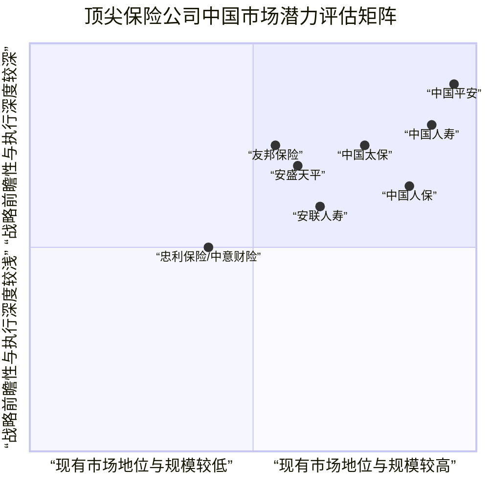

# 全球顶尖保险公司综合实力比较与未来资产排名潜力评估报告
## 1 引言：研究范围、方法与顶尖公司名单界定

本报告旨在对全球顶尖保险公司的综合实力进行系统性比较，并评估其未来资产排名的跃升潜力。为实现这一目标，本章将首先明确研究的核心目标与分析框架，详细说明所依据的全部权威数据来源及其关键指标，并在此基础上，通过结构化整合与交叉验证，科学界定出本报告研究的“国际综合实力前十的保险公司”初步候选名单。本章的论证将为后续各维度的深入比较与分析确立清晰、可靠的研究对象边界。

### 1.1 研究目标与多维分析框架确立

本报告的最终目标，是基于最新的全球权威排名数据，对顶尖保险公司的综合实力进行横向比较，并从中甄别出最有可能在未来3-5年内实现全球资产排名显著提升的2-3家公司。为实现这一目标，必须建立一个能够全面衡量保险公司实力的多维分析框架。

**综合分析框架将整合规模实力、业务结构、盈利质量、资本充足性及战略前景等多个维度。** 具体而言，规模实力将参考《财富》世界500强的营业收入指标[^1][^2]以及标普全球市场情报的保费收入与准备金规模[^3][^4][^5]；业务结构将通过对比公司在财产险（基于标普财险50强[^4]）和寿险/健康险（基于标普寿险50强[^5][^6]）领域的排名来评估其业务侧重与均衡性；盈利质量将考察《财富》及福布斯榜单中的利润数据[^7][^1]；资本充足性与财务稳健性则将借鉴贝氏评级的认可资产与非银行资产指标[^8][^9]。此外，报告将参考麦肯锡全球保险业报告指出的行业结构性变革力量，如人口老龄化、数字化转型以及“保险-资管-资本”的飞轮效应[^10]，为评估公司的未来增长潜力和战略适应性提供宏观背景与深层洞察。这一框架确保了比较的全面性与前瞻性。

### 1.2 权威数据来源与指标说明

本报告的所有事实与数据均来源于所提供的参考资料，绝不自行编造。为确保研究的严谨性，现将核心数据来源及其关键指标定义说明如下：

| 数据来源 | 发布机构 | 核心排名指标 | 数据基准年 | 关键说明与适用范围 |
| :--- | :--- | :--- | :--- | :--- |
| 2025年全球Top 50财产险公司榜单[^3][^4][^11] | 标普全球市场情报 (S&P Global Market Intelligence) | 2024年财产与意外伤害险保费/保险业务收入 | 2024年 | 衡量财产险直接承保业务规模。榜单包含财险公司与再保险公司。 |
| 2024年全球寿险公司50强榜单[^5][^6] | 标普全球市场情报 | 寿险和健康险准备金 | 2024年 | 反映寿险公司的长期风险承担与业务责任规模，是比保费或总资产更准确的寿险业务规模指标。 |
| 2025年《财富》世界500强榜单[^12][^1][^2] | 《财富》杂志 (Fortune) | 营业收入 | 2024年 | 衡量企业整体收入规模。**需注意**：榜单营收与利润基于旧会计准则模拟计算得出[^1]。榜单包含所有行业，保险类公司需从中筛选。 |
| 2025年《福布斯》全球企业2000强榜单[^7] | 《福布斯》杂志 (Forbes) | 收入、利润、资产和市值的综合评分 | 未明确（通常为上财年） | 提供基于四大财务指标的综合实力评估。 |
| 2025年美国人身险公司200强榜单[^8] | 贝氏评级 (A.M. Best) | 认可资产 (Admitted Assets) | 2024年底 | 美国监管口径下的高流动性资产，直接决定保险公司偿付能力，是资本实力的核心监管指标。 |
| 2023年全球保险公司净保费与非银行资产排名[^9] | 贝氏评级 | 净保费 (Net Premium Written) 与非银行资产 | 2023年 | 净保费反映承保收入创造能力；非银行资产反映公司总资产规模（扣除银行业务）。 |

**各指标在本报告中的角色**：保费与准备金指标用于衡量核心保险业务的市场地位；营收与利润指标用于评估整体经营规模与盈利水平；资产类指标（认可资产、非银行资产）用于分析资本实力与财务结构。通过多指标交叉，可以更立体地勾勒公司的综合实力画像。

### 1.3 顶尖公司名单的交叉界定与论证

基于上述数据来源，本报告通过“多赛道筛选、交叉验证整合”的方法，界定出国际综合实力前十的保险公司候选名单。**核心逻辑是：一家顶尖的保险公司，必须在至少一个核心业务规模榜单（财险保费或寿险准备金）中位列全球最前列，同时其整体企业规模（营收、资产）也得到其他权威综合榜单的确认。**

首先，从各细分赛道提取头部公司：
1.  **财产险领域**：根据标普2025年财险50强，全球前五名为State Farm（保费1031亿美元）、伯克希尔·哈撒韦（856亿美元）、安联（807亿美元）、Progressive（721.7亿美元）和劳合社（709亿美元）[^4]。中国人保以676.7亿美元位列全球第六、亚洲第一[^3][^4]。
2.  **寿险领域**：根据标普2024年寿险50强，全球前三名为中国人寿（准备金7980.7亿美元）、安联（7691.9亿美元）和中国平安（6830.1亿美元）[^5][^6]。保德信金融（6337.1亿美元）和大都会人寿（5764.6亿美元）分列第四和第六[^6]。
3.  **综合营收与资产领域**：根据《财富》2025年世界500强，保险类公司中营收超过千亿美元的有中国人寿（1602.77亿美元）、中国平安（1586.27亿美元），以及位列全球前十的伯克希尔·哈撒韦[^1][^2]。安联、安盛等欧洲巨头营收也位居前列[^1]。在贝氏2023年非银行资产排名中，伯克希尔·哈撒韦（1.07万亿美元）和安联（超1万亿美元）资产过万亿美元，中国人寿（9578亿美元）升至第三[^9]。

其次，进行交叉整合与论证，形成候选名单（按英文名称字母排序）：

| 公司名称 | 核心入选理由（基于参考资料） |
| :--- | :--- |
| **安联 (Allianz)** | 1) 财险保费全球第三（807亿美元）[^4]；2) 寿险准备金全球第二（7691.9亿美元）[^5][^6]；3) 《财富》世界500强排名前列的保险集团[^1]；4) 非银行资产超1万亿美元[^9]。 **业务均衡的欧系巨头**。 |
| **安盛 (AXA)** | 1) 《财富》世界500强中排名前列的保险集团[^1]；2) 在全球保险市场具有广泛影响力和高品牌价值。 |
| **伯克希尔·哈撒韦 (Berkshire Hathaway)** | 1) 财险保费全球第二（856亿美元）[^4]；2) 《财富》世界500强位列前十[^1]；3) 非银行资产全球领先（1.07万亿美元）[^9]。 **以保险浮存金为核心的投资巨头**。 |
| **中国人保 (PICC)** | 1) 财险保费全球第六、中国第一（676.7亿美元）[^3][^4]；2) 《财富》世界500强上榜企业（营收864.78亿美元）[^1]。 **中国财产险市场的绝对领导者**。 |
| **中国人寿 (China Life)** | 1) 寿险准备金全球第一（7980.7亿美元）[^5][^6]；2) 《财富》世界500强中国险企首位（营收1602.77亿美元）[^1]；3) 非银行资产全球第三（9578亿美元）[^9]。 **全球最大的寿险公司**。 |
| **中国平安 (Ping An)** | 1) 寿险准备金全球第三（6830.1亿美元）[^5][^6]；2) 《财富》世界500强第47位（营收1586.27亿美元）[^2]；3) 《福布斯》全球2000强第27位，中国保险业第一[^7]；4) 财险保费全球第12位（456.2亿美元）[^4]。 **综合金融与科技驱动的中国标杆**。 |
| **保德信金融 (Prudential Financial)** | 1) 寿险准备金全球第四（6337.1亿美元）[^6]；2) 贝氏2025年美国人身险公司认可资产排名第一（5681亿美元）[^8]。 **美国寿险与退休服务的领导者**。 |
| **Progressive** | 1) 财险保费全球第四（721.7亿美元），且为全球增长最快的主流财险公司（同比增20.5%）[^4]；2) 在美国财险市场拥有领先地位和创新能力。 |
| **State Farm** | 1) 财险保费全球第一（1031亿美元）[^4]；2) 全球最大的财产和意外伤害保险商[^4]。 **美国私家车保险市场的绝对霸主**。 |
| **东京海上控股 (Tokio Marine)** / **日本生命 (Nippon Life)** | 1) 日本保险市场的代表，在标普财险或寿险榜单中均位居全球前列[^4][^6]；2) 《财富》世界500强常客，拥有巨大的资产规模和国内市场地位。 |

**名单界定的洞察与说明**：
*   **全球格局**：名单清晰地反映了**北美（美系）、欧洲（欧系）和亚洲（中系）三足鼎立**的全球保险格局。美国公司在财产险领域优势明显（State Farm, Berkshire, Progressive），而中国公司在寿险领域已占据全球榜首（中国人寿）。
*   **业务侧重**：候选公司可根据业务侧重分为三类：**以财险为主导**（如State Farm、Progressive、中国人保）、**以寿险/健康险为主导**（如中国人寿、保德信金融、日本生命）、以及**业务均衡的综合保险集团**（如安联、伯克希尔·哈撒韦、中国平安）。
*   **指标冲突的提示**：在整合过程中需注意，同一公司在不同指标下的表现可能不同。例如，中国平安在《财富》和《福布斯》综合榜单中地位显赫[^7][^2]，但根据贝氏2023年净保费排名，其净保费下滑30%，位次从第5跌至第11[^9]。这提示我们，在后续分析中需深入探讨其业务结构变化（如向综合金融、科技服务转型）对传统保费指标的影响。**这非数据矛盾，而是反映了公司战略转型与不同衡量维度之间的差异**。

### 1.4 研究边界、局限与报告结构预告

本研究存在明确的边界与局限性。首先，名单界定主要依据2023-2025年期间发布的榜单，反映的是各公司基于2023或2024财年数据的近期综合实力。未来潜力评估需在此基础上，结合战略执行、市场环境变化等进行前瞻性分析。其次，由于参考资料集中于全球性公开榜单，其覆盖范围以大型上市公司或集团为主，一些重要的区域性非上市巨头或专业化保险公司可能未被纳入比较。最后，不同榜单的统计口径（如集团合并报表与保险子公司单独报表、是否包含关联投资业务）存在差异，本报告在后续比较中将尽量保持同一口径下进行分析。

基于本章界定的十家候选公司，报告后续章节将展开深入的多维比较：第二章将聚焦资本实力与融资情况；第三章评估市场信誉与评级；第四章分析近五年经营绩效与增长动能；第五章考察股东回报政策；第六章则专门评估各公司在中国市场的战略布局与增长潜力。最终，第七章将进行加权综合评估，筛选出未来资产排名最具跃升潜力的2-3家公司，第八章总结结论并提出建议。整个报告将遵循从现状界定到深度比较，再到未来预测的完整逻辑链条。

## 2 维度一：资本实力与融资情况比较分析

资本实力是保险公司业务扩张、风险抵御和可持续发展的基石，而融资渠道与资本运作策略则反映了公司利用内外部资源优化财务结构、把握战略机遇的能力。本章将基于第一章界定的十家顶尖保险公司，系统比较其资本规模、财务杠杆、资本充足性及近期重大资本运作，旨在揭示各公司在财务稳健性与扩张潜力方面的核心差异，为后续综合评估提供关键财务依据。

### 2.1 资本规模与结构：资产、准备金与业务基础的对比

资本实力的首要体现是资产规模与核心业务的责任基础。通过整合参考资料中的非银行资产、寿险准备金及总资产数据，可以清晰界定各公司的资本量级及其业务侧重。

**从总资产与非银行资产规模看，全球保险业已形成“万亿俱乐部”与“千亿梯队”的鲜明格局。** 伯克希尔·哈撒韦与安联集团是“万亿俱乐部”的典型代表。伯克希尔·哈撒韦-A的总资产在2025年第三季末达到12259.63亿美元，其庞大的资产基础不仅来自保险业务，更源于其独特的“保险+实业”模式，旗下BNSF铁路和BHE能源等实业巨头贡献了巨额资产[^13][^14]。安联集团的非银行资产也超过1万亿美元，体现了其作为综合性保险金融集团的庞大规模[^3]。紧随其后的是亚洲巨头中国人寿，其在贝氏2023年非银行资产排名中以9578亿美元位列全球第三，显示出其雄厚的资本积累[^3]。中国平安的总资产在2024年6月末已突破12万亿元（约合1.7万亿美元），同样跻身全球资产最雄厚的金融机构之列[^15][^16]。

**寿险准备金是衡量寿险公司业务规模与长期责任的核心指标，中国公司在此领域已占据全球领先地位。** 根据标普2024年全球寿险50强榜单，中国人寿以7980.7亿美元的寿险和健康险准备金规模跃居全球榜首，超越了此前的领先者安联集团（7691.9亿美元）[^6][^17]。中国平安以6830.1亿美元的准备金规模位列全球第三[^6][^17]。这标志着中国寿险公司在承担长期风险、服务庞大人口保障需求方面，已建立起无与伦比的业务基础。相比之下，美国寿险龙头保德信金融以6337.1亿美元的准备金排名全球第四，大都会人寿以5764.6亿美元位列第六[^6][^17]。

**财产险公司的资本实力则更多体现在保费规模与浮存金积累上。** 例如，州立农业保险公司作为美国最大的财产和意外伤害保险公司，其2022年签单保费达786.43亿美元，稳居行业首位[^18]。伯克希尔·哈撒韦的财产险业务也贡献了庞大的“浮存金”（约1710亿美元），成为其进行长期投资的零成本或低成本资金来源[^13][^19]。

为了更直观地对比各公司的核心资本指标，下表整合了关键数据：

| 公司名称 | 核心资产/资本指标（最新） | 关键业务基础指标（最新） | 业务结构侧重 |
| :--- | :--- | :--- | :--- |
| **伯克希尔·哈撒韦** | 总资产12259.63亿美元（2025Q3）[^13] | 财险保费全球第二（856亿美元）；保险浮存金约1710亿美元[^3][^13] | **保险+实业投资**，浮存金驱动 |
| **安联集团** | 非银行资产超1万亿美元（2023）[^3] | 寿险准备金7691.9亿美元（全球第2）；财险保费807亿美元（全球第3）[^6][^3] | **综合保险集团**，业务均衡 |
| **中国人寿** | 非银行资产9578亿美元（2023，全球第3）[^3]；投资资产6.61万亿元（2024末）[^20] | 寿险准备金7980.7亿美元（全球第1）[^6] | **寿险主导**，资产规模庞大 |
| **中国平安** | 总资产超12万亿元（约1.7万亿美元，2024H1）[^15][^16] | 寿险准备金6830.1亿美元（全球第3）[^6]；保险资金投资组合超6万亿元[^15] | **综合金融+科技**，双轮驱动 |
| **保德信金融** | 认可资产5681亿美元（2024，美国人身险第1）[^3] | 寿险准备金6337.1亿美元（全球第4）[^6] | **寿险与退休服务**主导 |
| **安盛集团** | 管理总资产超1.1万亿欧元（2024）[^8] | 寿险准备金4352亿美元（全球第11）[^6] | **综合保险集团**，全球化布局 |
| **州立农业保险** | 2025年营收1229.51亿美元[^3] | 私家车险与家财险保费全美第一（2022年合计超710亿美元）[^18] | **财产险主导**，个人险种专家 |
| **联合健康集团** | 2024年营收4003亿美元[^21][^22]；总负债1948.54亿美元（2024Q3）[^18] | 医疗赔付率(MLR) 89.9%（2025Q3）[^23] | **健康保险+健康服务** |
| **中国太保** | 管理资产规模35426.60亿元（2024末）[^24] | 寿险新业务价值132.58亿元（2024）[^24] | **保险综合服务** |
| **Progressive** | 财险保费721.7亿美元（2024，全球第4）[^3] | 美国车险市场领先者，高增长（同比增20.5%）[^3] | **财产险（车险）主导**，增长迅猛 |

**通过对比可以发现，各公司的资本规模与其核心业务模式高度相关。** 伯克希尔·哈撒韦和安联代表了资产极度多元化的综合巨头；中国人寿、中国平安和保德信金融则依托庞大的寿险准备金构筑了深厚的资本池；而州立农业保险和Progressive等则是在财产险细分领域通过高额保费积累资本。**这种差异决定了它们后续财务策略和扩张路径的根本不同。**

### 2.2 财务杠杆、盈利留存与资本充足性评估

资本规模之外，财务结构的稳健性、内生资本的生成能力以及监管资本充足率，共同决定了公司抵御风险和支持增长的弹性。本部分将深入分析各公司在这些方面的表现。

**伯克希尔·哈撒韦以其极端的财务保守主义著称，负债率显著低于行业平均水平，且拥有强大的内生资本积累能力。** 截至2025年第三季末，其总负债为5255.22亿美元，负债率为42.87%，较年初下降0.66个百分点[^13][^14]。这一比例远低于财产与意外伤害保险行业约48.28%的历史平均负债率[^13]。支撑其低杠杆的是强大的盈利能力，2025年前三季度实现净利润479.93亿美元，直接补充了股东权益[^13]。更重要的是，公司长期坚持“零分红”政策，将所有经营利润留存用于再投资，结合其保险业务产生的负成本或低成本浮存金，形成了独特的资本复利增长模式[^13][^14]。这使得伯克希尔在几乎不依赖外部债务融资的情况下，维持了庞大的资产规模和投资能力。

**欧洲保险巨头在财务杠杆的运用上呈现出不同的特点。** 安联保险ADR近十二个月的综合杠杆系数(DCL)为1.11，这一指标反映了公司经营杠杆和财务杠杆的综合效应[^25]。慕尼黑再保险集团截至2025年第三季度的财务杠杆率为9.0x，在过去五年中呈下降趋势[^26]。这些指标显示欧洲大型保险集团在杠杆运用上相对稳健，但具体水平因业务结构和投资策略而异。

**中国主要保险公司在严格的偿付能力监管体系下，普遍保持了较高的资本充足水平，但近期面临一定的下降压力。** 中国人寿2024年末的核心偿付能力充足率和综合偿付能力充足率分别为153.34%和207.76%，均远高于监管要求[^27][^20]。然而，从2024年第四季度到2025年第三季度，其综合偿付能力充足率从207.76%逐步下降至183.94%，核心偿付能力充足率从153.34%下降至137.50%，反映了业务增长对资本的消耗以及可能的市场波动影响[^28]。中国太保在2024年第一季度的资产负债率为88.68%，净资产收益率为4.6%[^8]，显示出一定的财务杠杆运用。**中国平安则展现了优异的盈利能力和资本使用效率**，其2024年上半年年化营运ROE达到16.4%[^15][^16]，2025年前三季度归属于母公司股东的营运利润同比增长7.2%至1162.64亿元[^29]，强大的内生盈利为其业务发展和战略布局提供了坚实的资本支撑。

**部分公司因业务结构或市场环境面临特定的资本充足性挑战。** 联合健康集团2024年底的财务杠杆率高达43.7%，超过了其40%的长期目标，且资产负债表上商誉和无形资产占权益比例达132%[^18]。更严峻的是，其核心的Medicare Advantage业务面临医疗成本飙升的压力，2025年第三季度医疗赔付率(MLR)同比上升4.7个百分点至89.9%，其中Medicare业务MLR高达92%，严重侵蚀利润，导致净利润率骤降[^23]。这对其资本内生能力和未来融资成本构成了潜在威胁。州立农业保险则因连续多年的承保亏损，导致其顶级信用评级被下调，AM Best将其财务实力评级从A++下调至A+（仍为“卓越”级别），反映了对其运营绩效的担忧[^30]。

**综上所述，在财务稳健性上出现了明显的分野：** 伯克希尔·哈撒韦凭借独特的商业模式和财务纪律，建立了近乎无懈可击的资本堡垒；中国头部险企在监管框架下资本充足，且平安展现出高盈利质量；而联合健康集团和州立农业保险则因主营业务成本压力，短期财务稳健性面临考验。这直接影响它们应对行业波动和进行战略投资的能力。

### 2.3 近期重大资本运作、融资活动与战略意图分析

主动的资本运作是公司优化资源配置、实施战略转型和回报股东的直接体现。通过分析近期的并购、出售、回购等活动，可以洞察各公司的战略重点与财务灵活性。

**战略收购与资产整合是巨头们巩固市场地位、拓展新增长点的重要手段。** 安联集团与贝莱德、日本T&D组成财团，计划以35亿欧元收购德国Viridium Group大部分股权，这显示了其对欧洲封闭寿险市场发展机遇的把握[^6][^17]。保德信金融一方面通过旗下保德信资管与中国的复星保德信人寿签署保险资金委托投资协议，深化在中国市场的布局[^8]；另一方面，正考虑出售其在印度处于亏损状态的资产管理业务（PGIM India Asset Management），管理资产约2660亿卢比（约30亿美元），这反映了其优化全球资产组合、聚焦核心盈利业务的战略调整[^28]。

**股份回购与分红是回报股东、管理市值和优化资本结构的关键工具。** 安盛集团在2024年财报中宣布了一项高达12亿欧元的股票回购计划，并拟派发股息每股2.15欧元，综合股息支付率目标达75%，凸显了其强劲的自由现金流和对股东回报的重视[^8]。联合健康集团在面临盈利压力的同时，仍维持积极的股东回报政策，2025年股票回购预算为150亿美元，并在第二季度将季度股息上调至2.21美元/股[^3][^31]。伯克希尔·哈撒韦则以其大规模股份回购而闻名，如在2020-2021年累计耗资517亿美元回购股份，这虽然短期内压低了总资产增长率，但提升了每股内在价值，是巴菲特在缺乏大型收购机会时进行资本配置的重要方式[^14]。

**资产减值与风险处置反映了公司对投资组合的审慎评估和面对损失的及时反应。** 伯克希尔·哈撒韦在2025年第二季度对卡夫亨氏（Kraft Heinz）投资计提了约50亿美元的税前减值损失，直接影响其权益法投资的账面价值和当期利润[^13][^19]。这体现了其对投资资产价值的严格审视，尽管造成短期业绩波动，但有利于财务报表的真实性。

**外部风险事件可能迫使公司调整资本策略。** 联合健康集团正面临美国司法部对其Medicare Advantage业务的刑事调查，可能触发数十亿美元罚款，并影响其参与政府医保项目的资格[^23]。此类重大监管风险不仅威胁盈利，也可能影响其融资渠道和资本成本，迫使公司保留更多现金以应对不确定性，从而可能限制其进行大规模并购或回购的能力。

**这些资本运作揭示了不同的战略范式：** 安联、保德信等在进行跨市场的资产优化配置；安盛、联合健康在盈利尚可时大力回馈股东；伯克希尔则根据市场机会灵活切换于收购、回购和持有现金之间。而应对监管与成本压力，则成为联合健康等公司当前资本管理的首要挑战。

### 2.4 资本实力综合比较与未来扩张潜力初判

综合前文分析，十家顶尖保险公司的资本实力与融资情况可归纳为几种典型模式，并初步揭示其与未来扩张潜力的关联。

**首先，从资本规模与业务基础看，“巨无霸”与“细分龙头”并存，各自优势不同。**
*   **“实业+金融”生态型（伯克希尔·哈撒韦）**：拥有超万亿资产，核心优势并非传统保费规模，而是近乎零成本的保险浮存金与旗下实业产生的庞大、稳定的经营现金流。这种模式使其资本基础几乎不受保险承保周期影响，扩张潜力取决于其发现并收购优质资产的能力。
*   **“综合保险集团”型（安联、安盛、中国平安）**：资产规模同样巨大，业务均衡或综合金融布局广泛。其资本实力直接与承保业务质量和投资能力挂钩。例如，中国平安凭借高营运ROE和“综合金融+医疗养老”战略，展示了将资本高效转化为盈利和生态优势的能力。
*   **“寿险责任驱动”型（中国人寿、保德信金融）**：以天量寿险准备金为核心资本特征，业务增长和资产规模扩张紧密相连。未来潜力取决于在人口结构变化中持续获取优质保单的能力，以及长期资产配置的收益率。
*   **“财产险保费驱动”型（州立农业保险、Progressive）**：资本实力建立在庞大的直接承保保费基础上。扩张潜力与市场份额争夺、定价能力和应对气候风险的成本控制直接相关。当前，州立农业保险正面临承保亏损带来的资本消耗压力。

**其次，财务稳健性分化，影响风险抵御与逆周期投资能力。**
*   **财务堡垒型（伯克希尔·哈撒韦）**：极低负债率、零分红政策、巨额现金储备，构成了极强的财务安全垫，使其在市场动荡时具备无与伦比的收购能力。
*   **监管充足+高盈利型（中国平安、中国人寿）**：在满足严格资本监管的同时，平安展现了行业领先的盈利效率，国寿则依托庞大资产规模。这为它们在市场内的有机增长和适度并购提供了空间。
*   **面临压力型（联合健康集团、州立农业保险）**：主营业务成本飙升或持续承保亏损，正在侵蚀利润和资本内生能力，并可能引发信用评级下调，增加融资成本，限制扩张行动。

**最后，资本运作的主动性与战略清晰度，是把握未来机遇的关键。**
*   **主动配置型（伯克希尔、安联、保德信）**：通过收购、出售、回购等手段，不断优化资产组合，战略意图明确。
*   **稳健回报型（安盛、联合健康）**：在能力范围内通过高分红和回购坚定回报股东，但需警惕盈利下滑时政策的可持续性。
*   **增长投入型（中国平安）**：将资本持续投入于科技、医疗养老等长期战略领域，旨在构建未来增长护城河。

**初步判断，从资本实力维度支持未来资产排名跃升的潜力公司需具备以下特征：庞大的资本基数、稳健或优异的财务结构、强大的内生资本生成能力，以及清晰的战略资本配置路径。** 基于此，**伯克希尔·哈撒韦**因其独特的、几乎不受保险周期影响的资本生成模式和极致的财务保守主义，始终保有逆势扩张的潜在爆发力。**中国平安**则凭借其综合金融生态下的高资本回报率、持续增长的营运利润以及对未来赛道的战略性投入，展现了在现有庞大基数上继续实现高质量增长、巩固并提升全球排名的强大动能。而**中国人寿**作为全球寿险准备金的绝对领导者，其资产规模的进一步跃升将紧密依赖于中国寿险市场的深度发展和其自身资产配置能力的提升。相比之下，联合健康集团和州立农业保险因短期盈利与资本压力，其资产排名面临更大的不确定性。本章的分析为后续结合其他维度进行最终甄选奠定了坚实的财务基础。

## 3 市场信誉度与评级表现评估

市场信誉度是保险公司长期稳健经营的基石，它不仅体现在权威信用评级机构的量化评估中，也深植于品牌价值、客户信任以及应对重大风险的历史表现里。本章将系统评估与比较十家顶尖保险公司的市场信誉度，核心分析将基于国际评级机构的信用评级、品牌价值榜单以及重大风险事件的应对记录。通过整合分析，本章旨在揭示各公司在资本实力、运营风险、母集团支持及治理透明度等方面的差异，评估其长期可持续发展的信用基础，并为判断其未来资产排名的跃升潜力提供关键支撑。

### 3.1 国际信用评级比较：等级、展望与驱动因素分析

国际信用评级是衡量保险公司财务实力和偿债能力的核心标尺。通过对比标普、穆迪和贝氏等权威机构的评级结果，可以清晰地勾勒出各公司的信用风险轮廓及其背后的驱动因素。

**保德信金融集团**是美国寿险业资本实力的标杆。根据贝氏评级发布的《2025年美国寿险/健康险公司前200强》榜单，保德信金融集团以5681亿美元的认可资产（admitted assets）继续蝉联榜首，同比增长6.9%[^30][^32][^33]。认可资产作为美国保险监管的核心指标，指经监管机构认可、具有高流动性并能快速变现以计入偿付能力计算的资产。保德信在此指标上的持续领先，直接反映了其**雄厚的资本基础与卓越的风险抵御能力**，这是支撑其获得贝氏A+（卓越）等高级别评级的关键[^34][^28]。此外，保德信旗下的保险公司还获得了来自标普的AA-和穆迪的Aa3评级，进一步印证了其作为行业领导者的财务稳健性[^35][^36]。

与保德信的稳健形成对比的是，**联合健康集团**和**州立农业保险**近期均遭遇了评级机构的负面行动。贝氏评级将联合健康集团的展望从“稳定”调整为“负面”，主要原因是其预计2025年运营表现将恶化，核心压力来自Medicare Advantage（医疗保险优势计划）业务[^28]。该部门新受益人的医疗成本高于预期，且由于计划结构限制，公司无法在2026年前实施纠正性定价措施，导致盈利承压[^28]。尽管联合健康集团的整体业务概况和风险管理能力仍被评估为强劲，但这一特定业务线的挑战直接触发了评级展望的下调。同样，贝氏评级将州立农业保险及其子公司的财务实力评级从顶级的A++下调至A+（仍属“卓越”级别），这反映了评级机构对其**运营绩效的修订**，市场解读为持续的承保亏损对其财务实力的侵蚀[^37]。

在欧洲巨头方面，**安盛集团**及其在华子公司展现了强大的母集团支持所带来的信用提升。国际评级机构穆迪首次授予安盛天平财产保险有限公司A2的保险财务实力评级，展望“稳定”[^28][^38][^39]。穆迪明确指出，该评级显著受益于安盛集团的完全所有权与战略整合，以及在压力情景下母公司提供支持的极高可能性[^28]。标普全球评级亦将安盛天平的财务实力评级上调至“A”级，展望稳定，肯定了其自身盈利改善与集团支持的双重驱动[^40]。这清晰地表明，**战略性的母集团支持是提升子公司市场信誉和信用评级的关键因素**。

**伯克希尔·哈撒韦**的评级表现则揭示了另一种风险维度。尽管伯克希尔拥有无与伦比的资产规模和现金储备，但其曾遭到标准普尔将信用评级降低一级至AA级，理由包括过度依赖保险业务、投资组合集中以及管理层接班计划的不确定性[^32][^41]。近期，投资银行Keefe, Bruyette & Woods（KBW）更是罕见地将伯克希尔A类股的评级从“与大盘持平”下调至“跑输大盘”[^42][^43][^44]。KBW分析师指出，除了宏观不确定性，**伯克希尔历史上独有的“继任风险”**是核心担忧，即创始人沃伦·巴菲特“近乎无可替代的声誉”及其卸任CEO可能导致的“巴菲特溢价”消退，将影响投资者信心[^42][^44]。这凸显了**领导层声誉与治理透明度**对顶级金融集团市场信心的深远影响。

**中国头部保险公司**在国际评级中亦占据重要位置。例如，中国平安旗下的债券获得了国内评级机构中证鹏元的“AAA”评级[^32]。此外，中国平安、中国太保等公司在国际ESG评级中表现突出，如MSCI ESG评级均达到最高的AAA级，这从可持续发展角度增强了其国际信誉[^32][^28]。

为了更直观地对比，下表汇总了部分公司的关键评级信息：

| 公司名称 | 标普全球评级 | 穆迪投资者服务 | 贝氏评级 | 核心驱动因素与风险 |
| :--- | :--- | :--- | :--- | :--- |
| **保德信金融** | AA-[^35][^36] | Aa3[^35][^36] | A+ (卓越)[^30][^32][^33] | 雄厚的认可资产基础，卓越的资本实力与风险抵御能力。 |
| **安盛集团（及安盛天平）** | A (安盛天平)[^40] / A+ (集团)[^45] | A2 (安盛天平)[^28][^38] / Aa3 (集团)[^45] | A+ Superior (集团)[^45] | 强大的母集团资金与战略支持，子公司自身盈利改善。 |
| **伯克希尔·哈撒韦** | AA (曾下调)[^32][^41] | 信息缺失 | 信息缺失 | 极强财务实力与现金储备，但面临独特的“继任风险”和业务组合压力。 |
| **联合健康集团** | 信息缺失 | 信息缺失 | 财务实力评级A+，展望由稳定调为负面[^28] | Medicare Advantage业务医疗成本飙升，导致运营预期恶化。 |
| **州立农业保险** | 信息缺失 | 信息缺失 | 财务实力评级从A++下调至A+[^37] | 持续的承保亏损对运营绩效和资本实力构成拖累。 |

通过上述比较可以发现，影响国际信用评级的核心驱动因素呈现多元化：**资本充足性**（如保德信）是硬实力的直接体现；**盈利质量与成本控制**（如联合健康、州立农业）的恶化会直接触发负面评级行动；**母集团的战略与资金支持**（如安盛）能显著提升子公司的信用水平；而**领导层声誉与治理透明度**（如伯克希尔）这类软性因素，对于市场信心的影响同样至关重要，甚至能成为评级调整的关键考量。

### 3.2 品牌价值、市场声誉与客户信任度评估

品牌价值与市场声誉是保险公司信誉度的软性核心，它们建立在长期稳定的财务表现、卓越的客户服务以及可靠的产品兑现能力之上。通过品牌价值榜单和用户反馈，可以评估各公司在客户心中的信任度。

**中国平安**在品牌价值构建上堪称典范。根据国际权威品牌评估机构Brand Finance发布的《2026年全球品牌价值500强报告》，中国平安的品牌价值攀升至488.39亿美元，全球排名第32位，连续第十次荣获“中国最具价值保险品牌”称号[^32][^28][^46]。这一成就的基石是其稳健的财务表现和深厚的客户基础。截至2025年9月末，中国平安个人客户数已近2.5亿，服务时间5年及以上客户的留存率高达94.4%，体现了客户对品牌的长期选择与持续信任[^32][^41]。公司长期坚持的“综合金融+医疗养老”战略，以及通过科技赋能实现的“闪赔”、智能核保等高效服务，共同构筑了其强大的品牌韧性和市场声誉[^32][^46]。

**安联人寿**的市场声誉则呈现出鲜明的两面性。支持者认为，背靠1890年成立的德国安联集团，安联人寿拥有“底盘最稳、底牌最硬”的百年巨头形象，其标普AA-评级、连续AA级风险综合评级及超290%的偿付能力充足率，构成了坚实的财务信誉基础[^32][^47]。在客户回报方面，其承诺将不低于85%的可分配盈余分配给客户（高于行业70%的底线），且2024年多款产品实际收益达3.7%-3.96%，分红实现率表现优异，这增强了客户信任[^32][^47]。然而，2025年其山东分公司因编制虚假资料、唆使代理人违背诚信义务被金融监管部门警告并罚款26万元，这一**局部合规瑕疵**暴露了内控漏洞，引发了市场对其风控管理的质疑[^32][^47]。这说明了即使整体声誉卓著的巨头，局部问题也可能对品牌信誉造成损害。

在通过卓越服务建立客户信任方面，**安联人寿的境外旅行险理赔服务**提供了正面案例。2025年上半年，其境外旅行险理赔金额达1244.9万元，处理案件2339件，并为客户提供了包括医疗直付、医疗送返回国在内的特色服务[^48]。一个更具代表性的案例是，一位客户因罹患癌症，在安联人寿的协助下多次赴日本就诊，公司累计给付理赔金129.88万元，并创新性地在疫情期间采用“远程在线就诊”方式确保治疗连续性[^28]。这类深度、高效的理赔服务，极大地提升了客户体验和品牌忠诚度，是信誉度的重要组成部分。

相比之下，**安盛集团**曾因2019年香港“Evolution”投连险暴雷事件，其市场声誉遭受严重冲击。该事件涉及金额高达4亿港元，影响263名投资者，后经调查被定性为一起有预谋的金融诈骗，暴露出产品平台对第三方基金审核的风控漏洞[^46]。此类重大风险事件对公司的信誉修复构成长期挑战，要求公司在治理、透明度和投资者关系上进行深刻改进。

**伯克希尔·哈撒韦**的信誉则与“股神”沃伦·巴菲特的个人声誉深度绑定，形成了独特的“巴菲特溢价”。这种溢价源于其长达六十年的卓越投资记录和诚信形象，为伯克希尔带来了极高的市场信任和投资者忠诚度[^42][^43]。然而，这也使得其信誉与领导人的个人声誉高度关联，带来了前述的“继任风险”。

综上所述，品牌价值与市场声誉的来源各有不同：中国平安依托**生态战略、科技赋能和庞大客群**构建了系统性的品牌护城河；安联依赖**百年品牌、财务稳健和优质服务**，但需警惕局部风控问题；而安盛的历史教训和伯克希尔的领导人依赖，则提示了信誉构建中**风险管控和治理结构**的极端重要性。

### 3.3 重大风险事件应对与信誉修复能力分析

保险公司在重大风险事件中的应对表现，是检验其危机管理能力、风险文化和对客户/股东责任担当的试金石。应对得当可以化危为机，巩固信誉；应对失当则可能暴露系统性弱点，造成长期声誉损伤。

**安联人寿**在2025年7月遭遇了一起严重的系统入侵与数据泄露事件。其北美公司使用的第三方云系统被“恶意威胁者”入侵，导致140万客户中的多数人，以及部分金融专业人士和员工的个人身份信息被获取[^49][^50]。面对危机，公司的应对措施包括：立即采取行动控制并缓解问题、通知美国联邦调查局（FBI）、开始联系受影响的个人并向监管机构报备[^49]。这一响应流程体现了**合规性和即时性**。然而，此类大规模数据泄露事件本身，直接冲击了客户对保险公司信息安全能力的信任，构成了长期的品牌声誉风险。公司需要持续投入以加强网络安全，并透明沟通修复进展，才能逐步重建信誉。

**安盛集团**的声誉则深受2019年香港投连险暴雷事件的影响。该事件并非简单的投资失利，而是一起涉及虚假宣传、金融诈骗的复杂案件，最终导致投资者约4亿港元的损失[^46]。这一事件暴露出安盛在**产品平台管理、销售渠道监管以及对第三方基金尽职调查**等方面存在严重漏洞。尽管事件主要责任在于外部诈骗集团和违规销售方，但作为平台提供方，安盛的信誉受到了严重质疑。此类事件的教训在于，综合金融集团在提供开放投资平台时，必须建立极其严格的风险筛选、持续监控和投资者教育体系。信誉的修复不仅需要法律层面的厘清和责任追究，更需要在公司治理和风险文化上进行深刻变革。

**伯克希尔·哈撒韦**及其旗下公司也曾面临外部风险事件，但其应对方式展现了不同的侧面。例如，其子公司精密机件公司（Precision Castparts）在2017年收购一家德国管道制造商时，遭遇对方财务造假（通过P图伪造订单），导致伯克希尔支付了虚高的收购价[^41]。事后，伯克希尔通过法律仲裁成功获判对方赔偿6.43亿欧元，挽回了全部损失[^41]。这一案例显示，即使是“股神”旗下的公司也难以完全避免外部欺诈风险，但公司通过**坚定的法律手段维护自身权益**，展现了其财务纪律和对股东资产负责的态度，这对维护其市场信誉有积极支撑作用。

此外，伯克希尔还曾因纽约证券交易所的技术故障导致股价异常暴跌，以及旗下公用事业公司面临巨额野火索赔等风险[^32]。这些事件考验着公司的财务缓冲能力和危机沟通能力。伯克希尔庞大的现金储备和多元的业务结构，为其应对此类突发风险提供了强大的缓冲，这本身就是其信誉的一部分。

通过对比可以发现，不同公司应对危机的模式和挑战各异：
*   **安联**面临的是**技术性合规风险**（数据安全），需要强化技术防御和透明沟通。
*   **安盛**遭遇的是**业务模式与治理风险**（平台风控），需要进行深度的流程再造和文化重塑。
*   **伯克希尔**则更多应对**外部欺诈与突发诉讼风险**，依赖其强大的财务实力和法律团队来化解。

**核心洞察在于，一次重大风险事件对公司信誉的影响，不仅取决于事件本身的严重性，更取决于公司事后的响应速度、责任担当和改进措施。** 能够公开、透明、果断地处理危机，并从中汲取教训切实完善内控体系的公司，其信誉往往更具韧性。反之，试图掩盖或推诿，则可能使信誉损伤长期化。

### 3.4 信誉度综合评估与未来信用基础展望

综合国际信用评级、品牌价值声誉以及风险事件应对能力三个维度的分析，可以对十家顶尖保险公司的市场信誉度进行横向比较与定性评估，并展望其未来信用基础的稳固性与变化趋势。

基于现有信息，可以将各公司划分为三个信誉梯队：

| 信誉梯队 | 公司代表 | 核心特征与依据 |
| :--- | :--- | :--- |
| **第一梯队：信誉卓越** | **保德信金融**、**中国平安** | 获得多家国际权威机构的顶级或高等级信用评级（如贝氏A+、标普AA-），品牌价值巨大且客户基础深厚，财务实力和盈利记录长期稳健。保德信以认可资产规模称雄美国寿险业；中国平安则凭借综合金融生态和科技赋能，实现了高盈利和高客户留存，品牌价值连续十年中国第一[^32][^28]。 |
| **第二梯队：信誉优秀但存挑战** | **安联集团**、**安盛集团**、**伯克希尔·哈撒韦** | 整体评级优秀（如安盛标普A+、穆迪Aa3），市场声誉卓著，但各自面临特定的信誉风险点。安联有数据泄露事件；安盛有历史投连险风波；伯克希尔则面临独特的“继任风险”和由此可能引发的“巴菲特溢价”消退问题[^42][^44][^47]。母集团支持（对安盛）或历史声誉（对伯克希尔）是重要的缓冲。 |
| **第三梯队：信誉面临压力** | **联合健康集团**、**州立农业保险** | 近期遭遇评级机构的负面行动（展望下调或评级下调），直接原因是核心业务盈利承压（Medicare Advantage成本飙升）或持续承保亏损，短期财务稳健性和市场信心面临考验[^28][^37]。 |

展望未来，影响各公司信誉度的关键变量清晰可辨：

1.  **对于伯克希尔·哈撒韦**：**领导层交接的平稳度**是核心变量。沃伦·巴菲特卸任CEO后，继任者格雷格·阿贝尔能否成功维系公司的投资文化、运营效率和市场声誉，将直接决定“巴菲特溢价”的留存程度，进而影响其长期信用基础[^42][^44]。
2.  **对于联合健康集团**：**Medicare Advantage业务医疗成本的控制能力**是信誉能否回稳的关键。如果公司能通过有效的医疗管理、定价调整或政策应对改善该业务的盈利前景，其评级展望有望恢复稳定；反之，可能面临进一步的评级压力[^28]。
3.  **对于中国头部保险公司（如中国平安、中国人寿）**：在庞大的市场规模和严格的监管环境下，**持续保持优异的盈利能力、资本管理能力和风险控制水平**是维持高信誉的基石。同时，其ESG表现的持续领先，也在全球范围内增强了其可持续发展信誉[^32][^28]。
4.  **对于安联、安盛等国际巨头**：**全球运营中的合规与风控**，尤其是在网络安全、数据隐私和复杂金融产品管理方面的能力，将是防范重大声誉风险的关键。安盛在华子公司获得的高评级，也凸显了**对中国市场战略承诺的兑现**对未来信誉的重要性[^40][^28]。

**最终评估**：市场信誉度是保险公司资产规模实现跃升的**重要加速器或稳定器**。信誉卓越的公司（如第一梯队）通常能享有更低的融资成本、更强的客户黏性和更广阔的业务合作空间，这为其内生增长和外延扩张提供了有利条件。信誉优秀但面临特定挑战的公司（如第二梯队），其未来排名潜力在很大程度上取决于能否成功化解这些关键风险点。而信誉面临短期压力的公司（如第三梯队），则需要首先修复盈利和资本基础，才能为重获市场信心和排名提升创造条件。因此，在后续综合评估最具资产排名跃升潜力的公司时，其当前的信誉度状况及未来的稳固性，将是不可或缺的权衡因素。

## 4 经营绩效与增长动能分析（近五年）

本章旨在基于近五年（特别是2020-2024/2025年）的权威数据，对十家顶尖保险公司的核心经营绩效与增长动能进行系统性比较。分析将聚焦于保费收入、准备金、营业收入及净利润的复合增长率与趋势变化，并深入剖析驱动增长的差异化因素，包括市场扩张、产品创新、渠道转型、成本控制及投资能力。通过充分利用参考资料，特别是《2025年安联全球保险业发展报告》中的行业增长数据、标普全球财险50强榜单的年度排名与增速对比，以及各公司2024-2025年财报披露的详细业绩，本章旨在识别出增长势头最为强劲、增长模式最具可持续性的竞争者，为最终评估其未来资产排名跃升潜力提供关键的动能依据。

### 4.1 保费收入与准备金增长：区域分化与业务模式差异

保费收入与准备金是衡量保险公司业务规模与增长最直接的指标。近五年的数据显示，全球保险市场增长强劲但区域分化显著，不同业务模式的公司在增长表现上呈现出鲜明差异。

根据《2025年安联全球保险业发展报告》，2024年全球保险业保费增长率约8.6%，打破了2023年8.2%的纪录，全球保费池大幅增加约5570亿欧元[^51][^52]。然而，这一增长在不同地区和业务板块间并不均衡。财产险方面，**北美市场展现出极强的增长动能**。根据标普全球市场情报发布的2025全球财险50强榜单，美国巨头State Farm以1031亿美元的财产险保费稳居全球第一，同比增长高达17.7%[^53][^54]。另一家美国公司Progressive表现尤为亮眼，2024年保费达到721.7亿美元，同比激增20.5%，成为全球增长最快的主流财险公司，其增长主要来自新增保单持有人而非单纯的费率上涨[^53][^54]。这体现了美国财险市场在特定细分领域（如私家车保险）的强劲需求和龙头公司的市场扩张能力。

相比之下，**中国财产险市场的增长虽保持稳健，但全球相对排名面临压力**。根据同一份榜单，2024年中国有五家财险公司进入全球50强，但部分公司排名较上一年有所下滑[^53][^54]。具体来看，中国人保以676.7亿美元保费位列全球第六，同比增长6.1%；中国平安以456.2亿美元位居全球第12位，同比增长4.7%；中国太保以269.7亿美元排名第25，其8.1%的同比增速在五家中国上榜险企中最高；国寿财险和中国再保险分别增长5.9%和3.4%[^55][^56][^57]。尽管中国财险市场2024年增长率达到4.9%，高于亚洲其他地区4.0%的平均水平，且人均支出已高出亚洲人均一倍多[^51][^52]，但与美国同行的超高速增长相比，增速相对温和，这导致了全球排名格局的微调。

**寿险及健康险领域，增长引擎则明显向亚洲，尤其是中国倾斜**。安联报告显示，2024年中国寿险市场实现了15.4%的强劲增长，远超亚洲寿险平均增长率7.8%，成为亚洲增长最快的市场之一[^51][^52]。这一增长势头直接反映在核心公司的准备金规模上。根据标普2024年全球寿险公司50强榜单，**中国人寿以7980.7亿美元的寿险和健康险准备金规模跃居全球第一**，**安联集团以7691.9亿美元位列第二**，**中国平安则以6830.1亿美元紧随其后，排名全球第三**[^53][^54]。这标志着中国寿险公司在承担长期风险、积累业务基础方面已占据全球领先地位。美国寿险龙头保德信金融以6337.1亿美元的准备金排名全球第四[^53][^54]。

为了更清晰地对比各公司近期的保费/准备金增长表现，下表整合了关键数据：

| 公司名称 | 业务侧重 | 关键增长指标（2024年或最新） | 同比增长率 | 数据来源与说明 |
| :--- | :--- | :--- | :--- | :--- |
| **State Farm** | 财产险 | 财产险保费1031亿美元 | 17.7% | 标普2025全球财险50强[^53][^54] |
| **Progressive** | 财产险 | 财产险保费721.7亿美元 | 20.5% | 标普2025全球财险50强[^53][^54] |
| **伯克希尔·哈撒韦** | 财产险/投资 | 财产险保费856亿美元 | 5.9% | 标普2025全球财险50强[^53][^54] |
| **安联集团** | 综合 | 财产险保费807亿美元；寿险准备金7691.9亿美元 | 8.5%；数据缺失 | 标普2025全球财险50强及2024寿险50强[^53][^54] |
| **中国人保** | 财产险 | 财产险保费676.7亿美元 | 6.1% | 标普2025全球财险50强[^55][^56] |
| **中国平安** | 综合 | 财产险保费456.2亿美元；寿险准备金6830.1亿美元 | 4.7%；数据缺失 | 标普2025全球财险50强及2024寿险50强[^55][^56][^53] |
| **中国人寿** | 寿险 | 寿险准备金7980.7亿美元 | 数据缺失 | 标普2024全球寿险公司50强[^53][^54] |
| **安盛集团** | 综合 | 人寿与健康险保费423亿欧元 | 9% | 安盛2025年前九个月业绩[^58] |
| **联合健康集团** | 健康险 | 营收1131.61亿美元（2025Q3） | 12.24% | 2025年第三季度财报[^38] |
| **保德信金融** | 寿险 | 寿险准备金6337.1亿美元 | 数据缺失 | 标普2024全球寿险公司50强[^53][^54] |

**核心洞察**：从增长动能看，呈现出明显的“**北美领跑财险，亚洲驱动寿险**”的格局。美国财险巨头的增长受益于市场集中度提升、定价能力及积极的客户获取策略。而中国寿险公司的庞大规模与高增长，则根植于其庞大的国内人口基数、不断提升的保险意识及家庭对长期保障和财富管理的强烈需求。这种区域与业务线的分化，决定了不同公司的增长潜力和面临的竞争环境截然不同。

### 4.2 营业收入与净利润趋势：盈利质量与周期韧性

营业收入与净利润的变动趋势，直接反映了保险公司的整体经营成果和盈利质量。近五年，尤其是2024-2025年的数据显示，各公司在盈利能力和周期韧性方面分化显著，部分公司展现出强劲的利润增长和稳健性，而另一些则面临严峻的盈利压力。

**中国头部保险公司在盈利增长方面表现突出，尤其是净利润增速亮眼**。中国人寿2025年前三季度实现归属于母公司股东的净利润1678.04亿元，同比大幅增长60.5%[^59]。其营业收入也保持增长，2025年上半年达2392.35亿元，同比增长2.1%[^60][^61]。中国平安同样展现了稳健的盈利增长能力。2025年前三季度，集团实现归属于母公司股东的净利润1328.56亿元，同比增长11.5%；第三季度单季净利润同比增幅高达45.4%[^62][^63]。更值得关注的是其**营运利润**（一项剔除短期投资波动等影响的指标）持续增长，前三季度达1162.64亿元，同比增长7.2%，体现了核心业务盈利的稳定性和质量[^62][^63]。平安的营业收入在2025年前三季度也达到8329.40亿元，同比增长7.4%[^62][^63]。

**欧洲保险巨头盈利表现相对稳健，但增长幅度较为温和**。安联集团2024年全年实现净收入79亿欧元，同比增长11%[^64]。慕尼黑再保险2025年第三季度净利润为19.97亿欧元，较上年同期的9.07亿欧元大幅增长，主要得益于财产意外险再保险板块极低的大灾损失支出[^65]。瑞士再保险2025年前三季度净收益为40亿美元，同比增长显著（上年同期为22亿美元），主要得益于财产及意外险再保险承保利润的大幅提升[^65][^66]。这表明，再保险板块的盈利波动性较大，但在有利的灾害年份能提供显著的利润弹性。

**部分北美巨头则遭遇了严重的盈利下滑，凸显了特定业务模式的风险**。**联合健康集团**是典型代表。2025年第三季度，其归母净利润暴跌61.22%至23.48亿美元，净利润率骤降至2.46%[^38]。核心原因是医疗赔付率(MLR)同比上升4.7个百分点至89.9%，其中Medicare Advantage业务的MLR高达92%，远超行业平均水平，显示医疗成本已严重失控[^38]。这对其以管理式医疗为核心的商业模式构成了直接挑战。**伯克希尔·哈撒韦**的盈利表现则受到投资收益波动的巨大影响。2025年前三季度，其归属于母公司股东的净利润为477.59亿美元，同比下降31.12%[^59]。这很大程度上源于其庞大的股权投资组合市值波动，以及第二季度对卡夫亨氏投资确认的约50亿美元税前减值损失[^67][^68]。不过，巴菲特通常建议投资者更关注运营利润，伯克希尔2025年第三季度营业利润达134.85亿美元，同比增长34%[^69]。

**盈利质量与周期韧性的深层对比**：
*   **增长来源的差异**：中国平安、中国人寿的利润增长，与寿险新业务价值的高增长（平安前三季度增46.2%）[^62]、业务品质改善及综合金融协同效应密切相关，更具内生性和可持续性。而伯克希尔的利润波动主要源于投资端，与其保险承保业务的关联度相对较低。
*   **抗风险能力**：联合健康的案例表明，过度依赖单一政府项目（如Medicare Advantage）且面临成本不可控风险时，盈利极其脆弱。相比之下，业务均衡的综合集团（如安联、平安）或拥有多元现金牛业务的巨头（伯克希尔），盈利的缓冲垫更厚，周期韧性更强。
*   **监管与市场环境影响**：中国财险市场在“报行合一”等严监管政策下，头部公司如平安产险的综合成本率持续优化（2025年上半年为95.2%）[^70]，承保盈利改善，这为整体利润提供了稳定支撑。而美国财险市场则可能受气候灾害频发影响，赔付成本存在上行压力。

综上所述，近五年的盈利趋势揭示：**中国头部险企正处于一轮强劲的利润增长周期，且增长质量较高；欧洲巨头盈利稳健；而部分美国专业健康险和投资驱动型巨头则面临显著的短期盈利波动或下滑压力**。这种差异是评估各公司未来增长可持续性的重要基础。

### 4.3 核心增长驱动力解析：渠道、产品与战略执行

增长数字的背后，是差异化的战略执行与核心能力建设。通过解析各公司近五年的具体举措，可以清晰地识别出其增长动能的来源与质量。

**中国平安的增长驱动力体现为深刻的渠道转型与“综合金融+医疗养老”生态战略的落地**。
*   **渠道改革与价值增长**：寿险及健康险业务的新业务价值在2025年前三季度强劲增长46.2%，这得益于多渠道专业化销售能力的打造[^62][^63]。代理人渠道通过“三优”平台建设，推动人均新业务价值同比增长29.9%[^62][^63]。**银保渠道更是成为爆发点，新业务价值同比激增170.9%**，贡献了寿险新业务价值的显著份额[^62][^38]。社区金融服务渠道则以“农夫式”精耕存续客户，提升了客户继续率[^62]。这种渠道多元化与提质增效，是其价值增长的核心引擎。
*   **“保险+服务”生态赋能**：平安将保险产品与医疗健康、居家养老、高品质康养等服务深度结合。截至2025年9月末，平安居家养老服务已覆盖全国85个城市，近24万名客户获得服务资格；高品质康养社区项目已布局5个城市[^62][^63]。享有医疗养老生态圈服务权益的客户覆盖了寿险新业务价值近七成[^71][^70]。生态构建不仅提升了客户黏性和保单附加值，也开辟了新的增长曲线。
*   **科技驱动与成本优化**：在财产险领域，平安产险2025年前三季度整体综合成本率优化至97.0%[^62]，上半年车险综合成本率优化至95.5%[^70]，体现了通过科技赋能实现风险筛选和费用精细化管理的能力。

**中国人寿的增长则与国家战略深度融合，体现了“寿险龙头”向“综合金融与服务生态”转型的战略定力**。
*   **践行金融“五篇大文章”**：公司将科技金融、绿色金融、普惠金融、养老金融、数字金融有机融入发展脉络[^72][^38]。在普惠保险方面，深度参与大病保险、长期护理保险及城市定制型商业医疗保险项目，截至2025年6月底，涉农人身保险为1.59亿人次农村人口提供保障[^72][^38]。
*   **“保险+康养”战略**：发布全套养老战略，从单纯支付养老钱向提供“钱+全套服务”转型，构建包含产品端、服务端、科技端的模式，响应老龄化趋势，挖掘增长潜力[^38]。
*   **投资能力提升**：2025年前三季度总投资收益率达到6.42%，同比提升104个基点，显著高于同业，优秀的投资业绩为利润高增长提供了关键支撑[^38]。

**Progressive的增长主要源于市场份额的积极扩张**。其2024年保费激增20.5%，大部分增长来自新增保单持有人，展示了其在竞争激烈的美国车险市场通过定价、服务和品牌获取客户的能力[^53][^54]。

**安盛集团的寿险业务增长显示出产品与市场的针对性**。2024年，其人寿与健康险保费增长9%，其中人寿保险保费增长11%[^58]。这得益于其在不同市场对保障和储蓄产品的持续推动。

**联合健康集团的困境则揭示了其增长模式的潜在脆弱性**。其增长严重依赖政府医保项目（如Medicare Advantage），当医疗成本趋势远超定价预期时，盈利迅速被侵蚀[^38]。同时，面临司法部的刑事调查，进一步增加了业务的不确定性[^38]。

**对比与洞察**：
*   **高质量增长 vs. 数量增长**：中国平安和中国人寿的增长，伴随着新业务价值率、继续率、综合成本率等质量指标的改善，是“价值驱动”的增长。Progressive的增长目前更侧重于保费规模的快速扩张。
*   **生态构建 vs. 业务专精**：平安、国寿等正通过构建医疗养老生态来重塑保险价值链，寻求差异化竞争和更深层次的客户绑定。而Progressive、州立农业等则在财产险领域持续深耕，依靠运营效率和品牌认知巩固地位。
*   **战略执行力**：从财报数据看，平安在银保渠道的爆发式增长、国寿在普惠保险和投资端的优异表现，都体现了强大的战略执行力。而联合健康在成本控制上的失序，则暴露了战略执行中的挑战。

**因此，近五年增长动能最强劲、模式最具前瞻性的公司，普遍在渠道深度改革、生态战略布局及与国家发展大势同频共振方面取得了实质性进展**。

### 4.4 增长可持续性评估与未来动能展望

基于对近五年经营绩效与增长驱动力的分析，可以综合评估各公司增长模式的可持续性，并展望其未来的增长动能。这将结合宏观市场预测与各公司的战略定位进行判断。

**宏观市场为增长提供了结构性机遇**。根据《2025年安联全球保险业发展报告》预测，未来十年（2025-2035年），全球保险市场预计将以5.3%的年均增长率增长[^58]。其中，**中国市场被寄予厚望，整体增长率预计为7.5%，显著高于全球平均水平**[^51][^58]。分业务看，中国寿险市场预计增长7.8%，财产险市场预计增长6.4%，健康险市场预计增长7.9%，均展现出高于欧美成熟市场的增长潜力[^51][^58]。这为深度布局中国市场的公司提供了广阔的成长空间。

**各公司增长可持续性评估与未来动能展望**：

1.  **中国平安**：增长可持续性**强**。其增长动能具有多重支撑：
    *   **渠道红利持续**：银保、社区金融等新兴渠道仍在高速增长和扩张期，代理人渠道提质增效成果显著，增长基础扎实[^62][^38]。
    *   **生态价值释放**：医疗养老生态已初步建成并开始贡献价值，随着服务网络的完善和客户渗透的加深，生态赋能主业的效果将更加显著，构筑长期竞争壁垒。
    *   **科技与风控优势**：在财产险等领域展现的优异成本控制能力，有助于平滑周期波动，保障盈利稳定性。
    *   **契合宏观趋势**：深度融入中国老龄化、健康管理、财富传承等社会趋势，市场空间巨大。
    **未来动能展望**：凭借综合金融的客户深耕能力、生态构建的先发优势以及科技赋能带来的运营效率，中国平安最有可能将其近年的强劲增长势头延续下去，并利用中国市场的结构性增长机会，进一步巩固和提升其全球资产排名。

2.  **中国人寿**：增长可持续性**较强**，但面临转型挑战。
    *   **规模与品牌护城河**：作为全球寿险准备金规模最大的公司，拥有无与伦比的业务基础和品牌影响力，为其持续获取保单提供了保障。
    *   **战略转型深化**：“保险+康养”和普惠金融战略与国家政策高度契合，若能有效落地，将打开新的增长空间。
    *   **投资能力关键**：近期的优异投资业绩是利润高增长的重要推手，维持稳定的高投资回报率是未来增长可持续的关键。
    **未来动能展望**：增长潜力巨大，但高度依赖于其从传统寿险巨头向现代综合金融服务商的转型成效，以及资本市场环境的配合。若能成功转型，其资产规模有望继续攀升。

3.  **伯克希尔·哈撒韦**：增长模式独特，可持续性**取决于投资能力与继任安排**。
    *   **浮存金模式稳固**：保险业务提供的巨额、低成本浮存金是其增长的永恒引擎，只要承保纪律得以维持，这一基础就难以动摇。
    *   **投资能力面临考验**：短期净利润受投资损益影响巨大，长期增长取决于继任者能否延续巴菲特的资本配置智慧。当前巨额现金储备也为其在经济下行期进行大规模收购提供了潜在动能。
    **未来动能展望**：其增长不依赖于传统保费高增长，而在于“保险浮存金+卓越投资”模式的传承。成功交接班后，其资产排名保持领先或继续跃升的可能性依然存在，但波动性可能加大。

4.  **安联集团**：增长可持续性**稳健**。
    *   **业务均衡**：财产险与寿险业务均位居全球前列，分散了单一市场或业务线的风险。
    *   **全球布局与母集团实力**：强大的资本和品牌为其全球业务拓展提供支持。
    **未来动能展望**：预计将保持稳健增长，但在成熟市场占比较高的情况下，实现资产排名的显著跃升需要依赖新兴市场（如中国）的重大突破或大型并购。

5.  **联合健康集团**：短期增长可持续性**面临严峻挑战**。
    *   **核心业务成本压力**：Medicare Advantage业务的医疗成本失控是根本性问题，解决需要时间且存在政策不确定性。
    *   **监管风险**：司法部调查可能带来巨额罚款和业务资格影响。
    **未来动能展望**：在成本得到有效控制、监管风险解除之前，其盈利和增长将承压，资产排名跃升的短期可能性较低。

**结论：最具未来增长动能与资产排名跃升潜力的公司甄选**

综合近五年经营绩效的分析，考量增长幅度、盈利质量、驱动力的内生性与可持续性，以及所处市场的未来增长潜力，以下公司展现出最为强劲和可持续的增长动能，最有可能在未来3-5年内推动全球资产排名实现显著跃升：

*   **中国平安保险（集团）股份有限公司**：近五年，特别是2024-2025年，其寿险新业务价值呈现爆发式增长，银保渠道表现尤为惊人；财产险业务承保利润持续优化；综合金融协同效应显著；“综合金融+医疗养老”生态战略已进入价值收获期。其增长兼具高速度与高质量，且完美契合中国这一全球最具活力保险市场的长期发展趋势。**因此，中国平安是未来资产排名跃升潜力最高的公司之一**。
*   **中国人寿保险股份有限公司**：作为全球寿险业务的规模冠军，近五年保持了稳固的市场地位，并在2025年实现了利润的跨越式增长。其增长得益于庞大的存量业务、持续的业务获取能力以及突出的投资表现。正在推进的“保险+康养”与普惠金融战略转型，为其打开了面向未来的增长空间。**凭借其无与伦比的业务基数和战略转型的潜力，中国人寿同样具备强大的资产排名跃升动能**。
*   **伯克希尔·哈撒韦公司**：其增长逻辑独树一帜，不依赖于保费增长，而在于保险浮存金支撑下的超凡投资复利。尽管短期净利润因投资波动和减值而下滑，但其运营利润依然稳健增长，且坐拥历史级的现金储备。**如果其领导权交接平稳，并能利用市场机会进行大规模资产配置，其独特的商业模式仍可能推动资产排名再度向上突破**。

相比之下，尽管Progressive等公司在特定领域增长迅猛，但其业务集中于单一市场（美国）和单一险种（车险），增长可持续性面临周期性和竞争性挑战。联合健康集团等则需首先克服眼前的盈利与监管危机。欧洲巨头在稳健之余，需要寻找新的增长爆点。

**因此，基于近五年经营绩效与增长动能的深度分析，中国平安、中国人寿和伯克希尔·哈撒韦被甄选为最有可能在未来实现全球资产排名显著跃升的2-3家顶尖保险公司**。下一章将聚焦于股东回报政策，进一步验证其盈利转化为股东价值的能力。

## 5 股东回报政策与实际分红考察

股东回报是衡量保险公司财务实力、盈利质量以及对投资者承诺兑现能力的关键维度。本章将系统比较十家顶尖保险公司的股东回报策略，聚焦于现金分红与股份回购两大核心工具。基于参考资料，我们将结构化分析各公司的历史分红记录、股息率、分红稳定性及回购计划，评估其分红政策的可持续性、对股东的实际回报力度，并探讨其与公司盈利能力、现金流状况及未来增长再投资之间的权衡关系。本章旨在验证哪些公司能够将强劲的财务表现转化为稳定且具吸引力的股东回报，从而为综合评估其长期价值与资产排名潜力提供关键依据。

### 5.1 现金分红政策：历史记录、股息率与稳定性对比

现金分红是保险公司回报股东最直接、最传统的方式。通过对各公司分红历史、股息率及稳定性的横向比较，可以清晰洞察其股东回报策略的力度与承诺。

**安盛集团（AXA）** 展现了欧洲综合保险集团对高比例现金分红的明确承诺。根据其2024年度财报，集团拟派发股息为每股2.15欧元，同比增长9%[^73]。更为重要的是，安盛设定了清晰的综合股息支付率目标为75%，其中现金股息支付率为60%，额外的15%通过年度股票回购实现[^73]。这一政策将分红与公司的整体资本回报策略紧密结合，为股东提供了稳定且可预期的现金回报。

**联合健康集团（UnitedHealth Group）** 则代表了实行季度分红的健康险巨头模式。资料显示，该公司在2025年第四季度每股分红8.73美元，股息率约为2.71%[^74]。从历史数据看，联合健康维持了季度分红的惯例，2025年第三季度每股分红为6.52美元，股息率约2.49%[^75]。尽管其2025年第三季度净利润因医疗成本飙升而暴跌61.22%[^23]，但公司仍维持了分红支付，这体现了管理层在短期压力下维持股东回报稳定性的意图，但也引发了市场对其政策可持续性的关注。

在中国保险公司中，**中国平安** 的现金分红政策以高力度和连续性著称。资料显示，中国平安自上市以来累计分红38次，累计分红金额高达3936.00亿元[^18]。其分红方案具体而稳定，例如2025年中报分红方案为每10股派发现金红利9.5元（含税）[^18]。基于2026年1月的股价数据，其股息率约在4.4%-4.8%之间，分红率稳定在30%-35%[^76]。**这种连续13年提升分红总额的记录，构成了其股东回报策略的核心压舱石**[^76]。

**中国人寿** 同样实施了积极的分红政策，并响应监管号召推行中期分红。截至相关统计时点，中国人寿上市以来累计分红21次，累计金额达2263.44亿元[^77]。其2025年中期分红方案为每10股派发现金红利2.380元（含税）[^77]。根据另一份行情资料，中国人寿的派息比率（TTM）为22.75%，股息收益率（TTM）为3.88%[^22]。尽管过去五年股息增长率略有下降（-1.18%），但其分红频率和总额依然展现了作为行业龙头对股东回报的重视[^22]。

**新华保险** 是近年来积极增强股东回报的典型案例。公司已连续第二年实施中期分红，2025年半年度共计派发现金红利20.9亿元，每股派息0.67元，分红增速高达24.1%[^18]。自2011年上市以来至2025年中期，新华保险累计向股东派发红利已达380.28亿元，清晰展现了其“稳健增长、持续回馈”的核心特质[^18]。

为了更直观地对比各公司现金分红的关键指标，下表整合了现有数据：

| 公司名称 | 近期分红案例 | 历史累计分红 | 股息率/分红率 | 政策特点与稳定性 |
| :--- | :--- | :--- | :--- | :--- |
| **安盛集团 (AXA)** | 2024年拟派每股2.15欧元[^73] | 未明确 | 综合支付率目标75%（现金60%+回购15%）[^73] | **目标明确，高支付率**，与回购结合。 |
| **联合健康集团 (UNH)** | 2025Q4每股8.73美元[^74] | 未明确 | 季度股息率约2.5%-2.7%[^74][^75] | **季度分红惯例**，但面临盈利下滑下的可持续性考验。 |
| **中国平安** | 2025中报10派9.5元[^18] | 3936.00亿元（累计38次）[^18] | 股息率4.4%-4.8%，分红率30%-35%[^76] | **连续13年提升总额，高且稳定**，是收益核心压舱石。 |
| **中国人寿** | 2025中报10派2.38元[^77] | 2263.44亿元（累计21次）[^77] | 股息率(TTM)3.88%，派息比率22.75%[^22] | **实施中期分红**，累计金额巨大，派息比率相对稳健。 |
| **新华保险** | 2025中期每股0.67元[^18] | 380.28亿元（截至2025中期）[^18] | 2024年度派现占净利润30.1%[^18] | **中期分红增速快**（24.1%），积极回馈股东。 |
| **中国太保** | 筹划中（见5.2节） | 未明确 | 2024年现金分红比例低于30%（参考同业）[^78] | 分红比例相对同业较低，投资人期待提升。 |

**通过对比可以发现显著的地区与模式差异：**
*   **欧洲综合集团（如安盛）** 倾向于设定**明确的、高比例的综合支付率目标**，将现金分红与股票回购作为组合工具，体现了成熟的资本配置理念。
*   **美国健康险巨头（如联合健康）** 遵循**稳定的季度分红模式**，但在主营业务遭遇严重成本冲击时，维持现有政策面临巨大压力，其稳定性与盈利修复能力高度相关。
*   **中国头部险企（如平安、国寿、新华）** 普遍展现出**高额累计分红和积极的现金回报**。特别是中国平安，其高股息率与连续提升的分红记录，在提供稳定收益的同时，也反映了其强大的盈利内生能力。新华保险则通过高速增长的中期分红，显示了管理层增强股东回报的强烈意愿。

**核心洞察在于，稳定的现金分红政策不仅是对历史盈利的分配，更是对未来盈利可持续性的信心宣示。** 在这方面，安盛集团的目标承诺和中国平安的长期执行记录，构成了其市场信誉和吸引长期投资的重要基石。

### 5.2 股份回购策略：规模、频率与市值管理意图分析

股份回购是除现金分红外，上市公司回报股东、优化资本结构和管理市值的重要工具。通过分析各公司的回购计划与执行，可以洞察其资本配置的主动性与战略意图。

**安盛集团（AXA）** 在宣布高额现金分红的同时，配套推出了股票回购计划，形成了清晰的组合拳。根据2024年财报，安盛宣布了一项高达**12亿欧元**的股票回购计划[^73]。这一回购规模与其综合股息支付率目标中的15%份额相对应，明确用于提升每股收益和股东价值。**这体现了成熟国际保险集团利用多元化工具进行精细化股东回报管理的典型策略。**

在中国市场，**中国太保** 近期在回购方面有明确动向。公司董事会公告，经股东大会批准后，拟以自有资金回购公司部分普通股（A股）股票，回购股份数量最高可达公司已发行A股股份数目的**1%**[^22][^79]。以公告时的股价估算，回购A股部分所需资金约21.1亿元人民币[^22]。市场分析指出，太保此举是在其市净率（PB）估值偏低、股价未能突破前期高点的背景下，旨在进行市值管理、提升投资者信心[^78]。这反映了部分中国险企在监管政策鼓励下，开始丰富其股东回报工具箱。

**联合健康集团（UNH）** 的回购策略则呈现出在盈利困境中仍维持高强度的特点。尽管公司2025年第三季度净利润暴跌，但其2025年的股票回购预算仍高达**150亿美元**[^23]。如此大规模的回购计划，与当期大幅下滑的盈利能力形成鲜明对比。这可能是管理层为了支撑股价、向市场传递对公司长期价值信心的举措。然而，这也引发了对其财务资源分配优先级和回购计划可持续性的深度担忧，尤其是在面临司法部刑事调查可能带来的巨额财务冲击的背景下[^23]。

**伯克希尔·哈撒韦** 虽未在现有参考资料中提供具体的近期回购数据，但其历史上大规模股份回购的行为广为人知，是巴菲特在缺乏大型收购机会时进行资本配置的关键方式。这种回购通常基于对公司内在价值的判断，旨在提升每股价值。

相比之下，资料中未提及州立农业保险、保德信金融等公司有明确的股份回购计划信息。

**综合分析各公司的回购策略，可以归纳出不同的战略意图与风险考量：**

| 公司名称 | 回购计划/案例 | 规模/占比 | 核心意图与背景 | 潜在风险/考量 |
| :--- | :--- | :--- | :--- | :--- |
| **安盛集团** | 12亿欧元回购计划[^73] | 与分红共同构成75%支付率目标 | **优化资本结构，提升每股价值**，作为固定回报策略的一部分。 | 需持续盈利和现金流支撑。 |
| **中国太保** | 筹划回购最高至A股股本1%[^22] | 估算约21.1亿元人民币 | **市值管理，回应估值偏低**，丰富股东回报方式。 | 回购效果取决于市场认可度及后续盈利支撑。 |
| **联合健康集团** | 2025年预算150亿美元[^23] | 规模巨大，与当期利润严重不匹配 | **支撑市场信心，对冲盈利下滑和监管风险**。 | **可持续性存疑**，若盈利未能修复或面临大额罚款，可能消耗宝贵现金资源。 |
| **伯克希尔·哈撒韦** | 历史上有大规模回购 | 基于价值判断灵活实施 | **资本配置工具**，在股价低于内在价值时回报股东。 | 依赖于管理层对价值的准确判断。 |

**关键洞察：**
1.  **策略性 vs. 应激性**：安盛的回购是**策略性**的，与其长期资本回报目标绑定；而联合健康的回购在当前时点更偏向**应激性**，旨在应对市场信心危机，两者背后的财务稳健性假设截然不同。
2.  **市值管理工具**：中国太保的回购计划明显带有**市值管理**意图，这是A股上市公司在政策引导下越来越普遍的行为，旨在直接回应股价与基本面的偏离。
3.  **财务纪律考验**：联合健康在盈利暴跌时仍维持巨额回购预算，是对其**财务纪律和长期战略定力**的严峻考验。如果成本控制问题持续，这种高强度回购可能难以维系，甚至影响其应对潜在监管罚款的财务弹性。

**因此，评估回购策略不能仅看规模，更需审视其与公司盈利周期、现金流状况和长期战略的匹配度。** 策略性、周期平滑的回购更能体现公司卓越的资本管理能力。

### 5.3 分红与回购的财务基础：盈利、现金流与偿付能力约束

股东回报政策并非空中楼阁，其可持续性根植于坚实的财务基础。盈利能力、经营现金流和监管资本充足率共同构成了分红与回购的“三重约束”。通过分析各公司在这三方面的表现，可以判断其回报政策的扎实程度与潜在风险。

**联合健康集团（UNH）** 的案例深刻揭示了当股东回报政策与恶化的盈利基础脱节时所产生的风险。2025年第三季度，公司归母净利润同比暴跌61.22%至23.48亿美元，净利润率骤降至2.46%[^23]。其核心业务Medicare Advantage的医疗赔付率(MLR)高达92%，显示成本已严重失控[^23]。然而，公司在盈利大幅下滑的同时，仍维持了季度分红并计划执行150亿美元的年度股票回购预算[^23][^74]。尽管其经营现金流可能相对稳健（有分析指出其经营现金流为净利润的倍数），但**当净利润率被持续侵蚀，且面临数十亿美元潜在监管罚款时，维持高额现金回报将极大消耗公司的财务缓冲，并可能影响其应对未来挑战和投资增长的能力**。这使其分红与回购政策的可持续性面临重大疑问。

与之形成鲜明对比的是**中国平安**，其高分红政策拥有强大的盈利和现金流支撑。资料显示，中国平安的保险资金投资组合规模超过6万亿元，资本内生补充能力强[^76]。其盈利质量的关键指标——年化营运ROE保持在较高水平（2024年上半年为16.4%），2025年前三季度归属于母公司股东的营运利润同比增长7.2%至1162.64亿元[^73]。**这种持续、高质量的盈利和现金流生成能力，是其能够长期执行稳定且增长的分红政策（分红率30%-35%）的根本保障**[^76]。此外，其综合金融模式带来的业务协同和风险分散，也增强了盈利的稳定性。

**安盛集团（AXA）** 在宣布高支付率目标（75%）时，也展现了相应的财务实力。2024年，集团总收入达1100亿欧元，同比增长8%；净利润同比增长11%至79亿欧元；偿付能力充足率(Solvency II ratio)保持稳健的216%[^73]。**强劲的营收增长、可观的净利润以及充足的偿付能力资本，共同构成了其高额分红与回购计划的可靠财务基础。**

**新华保险** 的高增长中期分红（增速24.1%）同样依赖于投资端的优异表现。2025年前三季度，公司年化总投资收益率达8.6%，年化综合投资收益率为6.7%，为分红提供了直接的现金流保障[^18]。其投资资产规模约1.77万亿元，近十年平均总投资收益率超5%，展现了收益的韧性[^18]。

**偿付能力监管** 是中国保险公司进行股东回报时必须遵守的硬约束。公司必须在满足核心及综合偿付能力充足率监管要求的前提下，才能进行利润分配。例如，中国人寿2024年末的综合偿付能力充足率为207.76%，为其分红政策提供了充足的资本安全垫[^73]。

**综合评估各公司股东回报政策的财务基础，可以得出以下结论：**

| 公司名称 | 盈利与现金流状况（近期） | 偿付能力/资本充足性 | 股东回报政策与财务基础的匹配度 |
| :--- | :--- | :--- | :--- |
| **联合健康集团** | 净利润暴跌，医疗成本失控[^23]。 | 财务杠杆率高（43.7%），面临监管风险[^23]。 | **匹配度低，风险高**。回报政策激进，但盈利基础严重恶化，可持续性存疑。 |
| **中国平安** | 营运利润持续增长，现金流充裕，ROE领先[^73][^76]。 | 资本内生能力强，满足监管要求。 | **匹配度高，非常稳健**。高分红建立在高质量、可持续的盈利基础上。 |
| **安盛集团** | 收入与净利润双增长，业绩强劲[^73]。 | 偿付能力充足率保持216%，非常稳健[^73]。 | **匹配度高，稳健**。高支付率目标有坚实的盈利和资本支撑。 |
| **新华保险** | 投资收益率表现突出，提供现金流保障[^18]。 | 未明确提及，但投资业绩优异间接支撑资本。 | **匹配度较高**。高速增长的分红有优异的投资业绩作为直接支撑。 |
| **中国人寿** | 2025年前三季度净利润大幅增长60.5%[^73]。 | 综合偿付能力充足率207.76%（2024年末）[^73]。 | **匹配度高**。盈利高增长为分红提供了坚实基础。 |

**核心洞察：股东回报政策的可持续性是检验公司财务稳健性的试金石。** 最优秀的公司（如中国平安、安盛）能够实现**盈利增长、资本充足与股东回报**的良性循环。而面临挑战的公司（如联合健康），其维持高额回报的努力可能掩盖或加剧其核心业务的脆弱性，投资者需警惕其中风险。因此，在评估公司未来资产排名潜力时，不仅要看其回报的绝对力度，更要审视支撑这些回报的财务根基是否牢固。

### 5.4 股东回报综合评估与未来政策展望

综合前文对现金分红、股份回购及其财务基础的分析，可以对各顶尖保险公司的股东回报实践进行系统性评估与排序，并展望其未来政策走向。评估将基于回报力度、稳定性、财务支撑稳健性及策略前瞻性等多个维度。

**基于现有资料，各公司的股东回报表现可归纳为以下几个梯队：**

1.  **典范级：回报力度大、稳定性高、财务基础坚实**
    *   **中国平安**：**综合表现最为突出**。其拥有长期、连续提升的现金分红记录，高股息率（4.4%-4.8%）与稳定的分红率（30%-35%）相结合[^76]。这背后是强大的营运利润增长和行业领先的营运ROE作为支撑[^73]。其股东回报政策具有高度的可预测性和可持续性，是吸引长期价值投资者的核心优势。
    *   **安盛集团**：**目标清晰、工具组合成熟**。其明确的综合股息支付率目标（75%）将现金分红（60%）与股票回购（15%）有机结合[^73]。该政策有强劲的营收增长、可观的净利润和稳健的偿付能力充足率（216%）作为后盾[^73]，体现了国际成熟保险集团在资本配置和股东回报方面的最佳实践。

2.  **优秀级：回报积极，但面临特定变量或增长中的挑战**
    *   **中国人寿**：作为行业龙头，累计分红金额巨大，并积极实施中期分红[^77]。其2025年利润高增长为分红提供了有力支持[^73]。未来政策的持续性与其盈利增长（尤其投资端）的稳定性以及战略转型的成效密切相关。
    *   **新华保险**：通过高速增长的中期分红（增速24.1%）展现了积极回报股东的意愿[^18]。其政策高度依赖投资端的优异表现，需关注资本市场波动对其分红能力的影响。
    *   **伯克希尔·哈撒韦**：其回报模式独特，以股份回购和资本增值为主，不支付现金股息。这种模式的成功完全依赖于卓越且可持续的资本配置能力，在领导层交接期间面临“巴菲特溢价”能否延续的考验。

3.  **关注级：回报政策与当前财务基本面存在张力**
    *   **联合健康集团**：尽管维持季度分红和高额回购预算，但其核心业务正遭遇严重的盈利侵蚀和监管调查[^23][^74]。**当前激进的回报政策与恶化的盈利基础之间存在显著脱节**，是未来政策可持续性的最大隐忧。投资者需密切关注其医疗成本控制进展和监管调查结果。
    *   **中国太保**：正在筹划股份回购，这反映了其丰富股东回报工具、进行市值管理的意图[^22][^79]。市场对其有提高现金分红比例的期待[^78]。未来其股东回报政策的演进，是观察其资本管理思路和回应投资者关切的重要窗口。

**未来政策展望与行业趋势：**

1.  **政策驱动下的分红频次增加**：在中国，新“国九条”明确推动上市公司“一年多次分红”[^18]。这已促使新华保险等公司连续实施中期分红，并可能推动更多中国险企优化分红节奏，增强股东回报的可预期性。
2.  **“现金+回购”组合工具的普及**：安盛的模式展示了组合工具的优越性。预计更多全球性保险公司，包括有志于提升国际影响力的中国公司，将借鉴并采用这种更为灵活和高效的股东回报策略。
3.  **财务纪律的终极考验**：对于联合健康这类面临盈利压力的公司，其股东回报政策将面临严峻考验。是坚持现有政策以维系信心，还是调整策略以保存实力应对危机，将成为观察其财务纪律和战略定力的关键。
4.  **增长与回报的平衡艺术**：像中国平安这样同时追求生态战略投入和高比例分红的公司，需要持续证明其卓越的资本配置效率，确保增长投资能产生足够回报，以支撑长期的高分红政策。

**结论：最具股东回报吸引力的公司甄选**

股东回报不仅是历史盈利的分配，更是公司治理质量、财务实力和对未来信心的重要信号。综合评估显示：

*   **中国平安**在股东回报的**力度、稳定性和财务支撑的扎实程度上均表现卓越**，形成了强大的正向循环，是其长期投资价值和资产排名潜力的坚实保障。
*   **安盛集团**凭借**清晰的目标、成熟的工具组合和稳健的财务基础**，为股东提供了稳定且可预期的回报，体现了国际顶尖保险集团的资本管理水准。
*   需保持高度关注的是**联合健康集团**，其当前的股东回报政策与恶化的基本面之间的背离，构成了显著的风险点，其政策调整与否及如何调整，将深刻影响其短期市场表现和长期价值定位。

**因此，从股东回报维度看，中国平安和安盛集团是实践最为出色、模式最具可持续性的公司。** 这为其在全球资本市场吸引长期资本、支撑估值水平，并最终推动资产排名提升或巩固，提供了关键优势。下一章将聚焦于各公司在中国市场的战略布局与增长潜力，进一步从区域增长引擎的角度评估其未来排名跃升的可能性。

## 6 中国战略布局与市场增长潜力评估

中国保险市场不仅是全球第二大市场，更是未来十年增长潜力最明确的核心引擎。本章将深入评估十家顶尖保险公司在中国市场的战略布局深度、本地化进程、业务结构及对核心趋势的把握能力。通过整合分析外资巨头的架构演变与本土化挑战、中国本土巨头的生态构建与数智化核心竞争力，以及各公司在养老金融、健康管理等结构性机遇中的布局，本章旨在判断哪些公司凭借其清晰的中国战略、强大的执行力和与宏观趋势的高度契合，最有可能在未来3-5年实现资产排名的显著跃升。

### 6.1 外资巨头在华战略：架构演变、本地化进程与市场定位

外资保险集团在中国市场采取了灵活多样的战略路径，其核心在于通过股权架构调整增强控制力，并借助生态合作与产品创新深化本土化进程。然而，在竞争激烈的市场环境中，它们也普遍面临着增长瓶颈与盈利挑战。

**1. 股权架构演变：从合资到独资，增强控制与战略自主**

近年来，外资保险公司通过收购中方股权，加速了从合资到外商独资的转变，以寻求更大的战略自主权和运营效率。

*   **安联集团：首家“合转外”的寿险公司与全面布局**。安联集团通过其控股公司安联（中国）保险控股有限公司，于2021年受让中信信托所持中德安联人寿49%的股权，并于2022年9月完成交易，使其成为中国**首家合资转外商独资的人寿保险公司**[^80]。此举标志着安联对中国市场的长期承诺。此外，安联在华布局全面，已拥有寿险（安联人寿）、财险（京东安联财险，安联持股50%）、资产管理、信用保险及救援服务等全部金融核心业务[^80]。2024年，安联集团旗下的安联投资有限公司进一步战略入股国民养老保险股份有限公司，持有其2%的股份，展现了其在养老金融领域的持续加码[^80][^81]。
*   **安盛集团：全资收购打造最大外资财险公司之一**。安盛集团于2019年完成对安盛天平财产保险有限公司剩余50%股权的收购，使其成为当时国内规模最大的外商独资财险公司[^82]。安盛天平作为其在华全资子公司，已成为安盛深耕中国市场的关键平台[^83][^82]。
*   **忠利保险：全资控股财险子公司，深化中国市场参与**。忠利保险于2024年1月以近9900万欧元收购中意财产保险有限公司51%的股权，并于2025年3月完成交易，使中意财险成为其全资控股的外资财险公司[^84][^85]。忠利保险将此视为一项长期战略投资，旨在抓住中国市场的增长机遇，并计划利用中国对碳中和的投资来扩展绿色商业保险业务[^85]。

**2. 本地化进程：生态合作、产品创新与渠道深耕**

为适应中国市场，外资巨头积极与本土伙伴合作，开发针对性产品，并探索新的渠道模式。

*   **生态合作**：安联集团与京东集团的合作是典型案例。通过引入京东作为战略投资者，将独资的安联财险改造为合资的“京东安联财险”，旨在依托京东的互联网生态打造新型财险模式[^80]。安盛天平则创新提出“合作伙伴”生态模式，通过将保险解决方案场景化嵌入合作伙伴的业务中，建立价值共生体系[^86]。
*   **产品创新**：安盛天平面向小微企业推出的“员工福利保障计划”，因其突破传统核保与定价模式，切实缓解中小企业保障痛点，而荣获“普惠金融产品创新奖”[^86]。此外，安盛天平还深度参与多个城市的“惠民保”项目，融入多层次医疗保障体系建设[^86]。
*   **渠道策略**：友邦保险通过“分改子”策略加速布局中国内地市场，在安徽、山东、重庆、浙江等地新设分公司，覆盖超1亿目标客群，并通过“精英代理人+银行流量”的双轮驱动模式扩大市场份额[^87]。

**3. 市场挑战：增长瓶颈与盈利压力**

尽管战略清晰，但外资巨头在中国市场普遍遭遇增长放缓或盈利波动的挑战。

*   **安联人寿的“瓶颈期”**：完成“合转外”后，安联人寿的业务增长并未立即提速。2023年，其保险业务收入同比下滑14.52%至53.87亿元，净利润同比下滑21.48%至3.29亿元[^80]。其被寄予厚望的健康险第二增长曲线增长也较为缓慢，2023年收入增速仅为1.83%[^80]。同时，退保金持续走高，2023年达3.96亿元，同比增长6.74%[^80]。
*   **安盛天平的扭亏为盈之路**：安盛天平在经历独资后的战略投入与结构优化期后，于2025年上半年迎来重要转折，成功实现扭亏为盈[^82]。截至2025年第三季度，其保险业务收入同比增长6.7%，净利润同比增加1.32亿元，综合偿付能力充足率达225.84%，并获得国内外评级机构的认可[^82]。这证明了其“本土深耕+全球协同”模式在经过调整后开始显现成效。

**综合来看，外资巨头正通过独资化增强控制力，并积极探索符合中国国情的本地化路径。然而，在品牌认知、渠道深度和规模效应上，它们仍难以与根深蒂固的本土巨头全面抗衡，其成功关键在于能否在细分领域（如高端健康管理、绿色保险、普惠金融）形成不可替代的专业化优势。**

### 6.2 中国本土巨头的生态构建与数智化核心竞争力

与外资巨头聚焦细分领域不同，中国本土保险领军企业正依托庞大的国内市场，构建“综合金融+生态服务”的宏大格局，并以深度数智化作为核心驱动力，形成了独特的竞争壁垒和增长动能。

**1. 生态战略落地：从保险支付到“保险+服务”一体化**

本土巨头已超越传统风险保障提供者的角色，致力于构建覆盖客户全生命周期的服务生态。

*   **中国平安：“综合金融+医疗养老”战略成效显著**。中国平安以336亿美元品牌价值连续9年蝉联全球第一[^88]。其战略核心是将保险与医疗健康、居家养老、高品质康养等服务深度融合。例如，平安居家养老服务已覆盖全国85个城市，近24万名客户获得服务资格；高品质康养社区项目已布局5个城市[^89]。**享有医疗养老生态圈服务权益的客户覆盖了其寿险新业务价值近七成**，生态对主业的赋能效应清晰可见[^89]。
*   **中国人寿：以“333战略”引领数智化转型，服务国家大局**。中国人寿品牌实力指数(BSI)达93.5分，位列全球第二[^88]。公司正全面加速数智变革，积极构建适应新质生产力发展的全新商业模式，助力其“333战略”落地[^89]。其数字化转型深度融入服务国家战略，如在普惠金融领域推出“惠军保”“惠工保”等产品，在健康养老方面构建全渠道智能化客户服务体系，让养老社区紧急救助响应时间缩短至5分钟内[^89]。

**2. 数智化能力矩阵：科技重塑全价值链运营效率**

中国头部险企在科技应用上已从工具辅助进入核心业务智能化阶段，构建了强大的数字化底座。

*   **基础设施与平台建设**：中国太保与华为联合打造了国内保险业首个全栈自主创新的智能算力基础设施——“太平洋保险金融行业灯塔样板点”，具备千亿级参数大模型的训练与推理一体化能力[^90]。中国人寿则构建了“大后台+小前端”的科技布局，其国寿混合云实现资源分钟级伸缩，并通过互联网专线打破服务边界[^91]。
*   **人工智能深度应用**：中国平安的AI应用已规模化。2024年，其AI坐席服务量约18.4亿次，覆盖80%的客服总量；93%的寿险保单实现秒级核保，闪赔占比达56%；车险图像识别闪赔系统使定损速度提升4000倍[^92]。中国人寿累计落地数百个智能应用场景，核保核赔数字化替代率已达99%，并私有化部署了国产开源大模型[^91]。
*   **运营效率飞跃**：数字化转型直接带来了运营指标的显著提升。中国人寿寿险核心业务线上化率超过90%，承保响应进入分钟级，理赔平均时效缩短至小时级[^89]。平安的闪赔结案周期缩短至7.4分钟[^88]。中国太保通过大模型实现健康险理赔自动化审核，处理时间缩短至分钟级，准确率提升至98%[^90]。

**3. 品牌价值与客户基础：难以撼动的市场基本盘**

本土巨头凭借先发优势和持续的服务积累，建立了深厚的客户基础和品牌忠诚度。

*   **中国平安**拥有近2.5亿个人客户，且服务时间5年及以上客户的留存率高达94.4%，体现了极强的客户粘性[^89]。
*   **中国人寿**连续11年稳居全球前五，品牌评级升至AAA+[^88]。

**这些庞大的、高粘性的客户群体不仅是保费收入的稳定来源，更是其生态服务交叉销售、深度变现的基石，构成了外资短期内难以逾越的护城河。**

### 6.3 把握结构性机遇：养老金融、健康管理与绿色保险布局

中国保险市场的未来增长高度依赖于对人口结构变化和政策导向的精准把握。养老金融、健康管理（特别是带病体保险）和绿色保险是公认的三大结构性机遇，各公司的布局深度和创新能力将决定其能从中获取多少增量。

**1. 应对老龄化：养老金融与长期护理险的探索**

中国已进入深度老龄化社会，60周岁及以上老年人口达3.1亿，占总人口比重22%[^93]。中央将“养老金融”纳入金融五篇大文章，推动构建多支柱养老保障体系[^94]。

*   **产品创新**：中国太保寿险与复旦大学联合研发的“御甲无忧疾病保险”，是面向甲状腺癌术后患者的专属解决方案，精准破解带病体人群保障难题，探索了“保险+精准医疗+健康管理”的新范式[^95]。
*   **战略投资**：安联集团通过旗下安联投资战略入股国民养老，正是看中了中国养老保障体系的巨大发展空间[^80][^81]。
*   **市场呼唤**：尽管政策性长期护理保险试点已覆盖近1.88亿人，但对比庞大的老年人口与差异化的服务需求，**商业长期护理保险被认为具有巨大的潜在市场**[^93]。这要求险企在产品设计、核保逻辑与服务模式上进行根本性创新。

**2. 健康管理升级：从标准体到带病体，破解保障痛点**

随着预期寿命延长与带病生存期增长，老年群体对慢性病管理、重大疾病后续治疗及长期照护的需求日益凸显，但当前保险产品存在明显供需错位[^96]。

*   **痛点识别**：老年群体尤为关注慢性病或重大疾病导致的高额医疗支出、疾病引发的失能所需的长期照护，以及对家庭经济的潜在压力[^96]。然而，市场上多数老年专属产品保障范围狭窄，而保障全面的产品则保费高、条款复杂[^96]。
*   **创新方向**：像“御甲无忧”这类产品指明了方向，即通过融合医学精算、提供全周期健康管理服务，来为特定带病人群提供可负担的保障[^95]。保险公司需从“看重核保、核赔”转向提供“全流程的风险评估与管理方案”[^93]。

**3. ESG与绿色保险：从披露要求到业务增长点**

ESG已成为影响保险公司品牌评级的核心指标，其权重占比可达45%[^88]。中国五家A股上市险企已被纳入ESG强信披范围，2024年它们的绿色投资规模合计已达1万亿元[^97]。

*   **实践案例**：安盛天平积极参与绿色金融，持有近10亿元人民币的绿色债券，并支持新能源车险业务的发展及出海[^82]。中国人寿构建“保险+科技+气象”新模式，通过遥感大数据助力林业可持续发展[^89]。
*   **行业挑战**：数字化转型也带来了新的环境问题，如数据中心碳排放。中国人保的数据中心年度碳排放量近5万吨，是其运营碳排放的近3倍，提示金融业的“绿色转型”需向数字基础设施等更深层面推进[^97]。

**能够在这些结构性机遇中率先形成产品能力、服务网络和风险定价优势的公司，将牢牢把握中国保险市场下一个十年的增长主动权。**

### 6.4 中国市场潜力综合评估与未来排名跃升关键变量

综合前文分析，中国保险市场的巨大潜力与激烈竞争并存。各公司在此市场的表现，将成为其全球资产排名能否实现跃升的决定性因素之一。以下通过潜力矩阵对比与关键变量识别，进行最终评估。

**1. 市场潜力量化锚定与格局判断**

安联集团报告预测，未来十年中国市场将继续保持强劲发展，**每年增长7.7%**，巩固其全球第二大保险市场的地位[^81]。与此同时，市场格局呈现鲜明的“双轨并行”特征：**本土巨头（如平安、国寿）依托生态与规模进行全域竞争，外资巨头（如安联、安盛）则凭借专业与特色进行纵深突破**。本土巨头在品牌、渠道、客户基础和科技应用上已建立起显著优势。

**2. 公司潜力矩阵对比**

以下矩阵综合评估了各公司在中国市场的“现有地位与规模”及“战略前瞻性与执行深度”。

*   **领军者（高地位，高战略深度）**：**中国平安**和**中国人寿**无疑处于此象限。它们不仅拥有最大的市场规模和品牌价值，其“综合金融+医疗养老”和全面数智化转型战略也最为清晰且已进入深度执行阶段，增长动能强劲。
*   **积极进取者（中等地位，高战略深度）**：**中国太保**和**友邦保险**属于此类。太保在智算基础设施和带病体保险产品上创新突出；友邦凭借精英代理人策略和银保合作深耕高净值市场。它们战略清晰，但在整体规模上与领军者仍有差距。
*   **专注特色者（中低地位，中等战略深度）**：**安盛天平**和**安联集团**在此列。它们通过独资化掌握了主动权，并在普惠金融、养老投资、绿色保险等细分领域进行布局，但整体业务规模增长面临挑战，需要时间将战略投入转化为市场份额。
*   **起步探索者（地位较低，战略深度待观察）**：**忠利保险**（通过中意财险）等新近完成独资化的外资机构，正处于重新定位和起步阶段，其战略成效有待市场检验。

**3. 未来排名跃升关键变量识别**

基于以上分析，未来3-5年，决定各公司能否凭借中国市场实现资产排名跃升的关键变量如下：

*   **对于本土巨头（平安、国寿等）**：
    *   **生态协同的价值兑现效率**：能否将庞大的客户流量有效转化为医疗、养老等生态服务的收入，并反哺保险主业，实现价值闭环。
    *   **数智化带来的成本与风险优势**：能否持续利用AI和大数据优化运营成本、提升风险定价精度，从而在承保盈利和投资回报上建立持续优势。
    *   **在养老、健康等蓝海市场的产品创新与份额夺取能力**。

*   **对于外资巨头（安联、安盛、友邦等）**：
    *   **独资化后的战略定力与执行力**：能否克服“合转外”初期的调整阵痛，坚持并高效执行既定的差异化战略。
    *   **在细分领域形成绝对差异化优势**：能否在高端健康管理、跨境金融服务、特定行业风险解决方案等领域，建立起本土巨头难以复制的专业壁垒。
    *   **与本土生态的合作深度与成果**：如安联与京东、安盛与人保的合作，能否真正产生协同效应，开辟新的增长路径。

**最终评估与目标公司筛选**

结合全章分析，以下公司最有可能凭借其在中国市场的战略布局与增长潜力，推动其全球资产排名在未来实现显著跃升：

1.  **中国平安保险（集团）股份有限公司**：其“综合金融+医疗养老”生态战略已形成强大闭环，数智化能力行业领先，品牌价值全球第一，拥有近2.5亿高粘性客户。这些要素共同构成了其在中国市场持续获取超额增长、并巩固全球领先地位的**最强确定性**。
2.  **中国人寿保险股份有限公司**：作为全球寿险准备金的绝对领导者，其“333战略”引领的全面数智化转型正深刻重塑公司。凭借无与伦比的业务规模、深入的国家战略协同以及投资端的优异表现，中国人寿具备在庞大基数上实现高质量增长、进而提升全球排名的**雄厚基础与转型潜力**。
3.  **安联集团**：虽然其中国业务短期面临增长压力，但作为最早进入、布局最全面的国际保险巨头，安联通过独资控股、战略入股国民养老等举措，展现了深耕中国的耐心与战略清晰度。一旦其本地化运营能力提升，并将在养老、资产管理等领域的全球专长与中国机遇深度结合，安联有望在中国这一关键市场实现突破，从而为其全球资产排名提供新的**跃升动能**。

**因此，基于对中国市场战略布局与增长潜力的深度评估，中国平安、中国人寿和安联集团被甄选为最有可能凭借中国市场实现未来资产排名显著跃升的公司。** 它们分别代表了本土生态巨头、国有转型龙头和国际深耕典范三种成功路径，共同点在于对中国市场长期趋势的深刻理解和坚定投入。

## 7 综合评估：未来资产排名跃升潜力公司甄选

本章将整合前序章节对资本实力、市场信誉、经营绩效、股东回报及中国战略五个维度的结构化分析结果，进行加权综合评估。评估将系统归纳各公司的核心竞争优势与潜在风险，并将其置于全球宏观趋势的背景下进行审视，最终筛选出2-3家最有可能在未来3-5年内实现全球资产排名显著跃升的保险公司。本章将明确阐述甄选标准与逻辑，并详细论证每家人选公司的关键驱动因素与跃升路径，确保结论建立在全面、可追溯的对比分析基础之上。

### 7.1 多维度评估框架与加权标准设定

为确保最终甄选的科学性与客观性，我们首先确立一个基于前序章节发现的多维度综合评估框架。该框架旨在将各公司的定性表现与定量数据，转化为对未来资产排名跃升潜力的统一、可比判断。

**评估维度与权重设定：**
未来资产排名的跃升，本质上是公司资产规模实现超越行业平均水平的增长。因此，评估框架将重点聚焦于驱动资产规模扩张的核心动能，并兼顾支撑其可持续性的基础条件。基于此逻辑，我们为五个维度设定如下权重：

1.  **经营绩效与增长动能（权重：30%）**：这是评估未来潜力的**最直接、最前瞻性**的维度。近五年的保费收入、准备金、营业收入及净利润的增长趋势、复合增长率，以及新业务价值、投资收益率等关键指标，直接反映了公司的市场扩张能力、盈利质量和内生增长动力。高增长且高质量的公司，最有可能实现资产规模的快速积累。
2.  **中国战略布局与市场增长潜力（权重：25%）**：中国是全球未来十年增长最确定的保险市场，年均增长率预计达7.5%[^3]。公司在中国市场的战略深度、执行成效、生态构建以及与宏观趋势的契合度，将决定其能否抓住这一核心增长引擎，从而获得超越全球同行的规模增量。
3.  **资本实力与融资情况（权重：20%）**：雄厚的资本是业务扩张和风险抵御的基石。资产规模、负债结构、偿付能力充足率以及融资渠道的稳健性，决定了公司是否有足够的“燃料”支持其增长战略，以及在市场波动中保持财务弹性。
4.  **市场信誉度与评级表现（权重：15%）**：卓越的信誉度（高信用评级、强品牌价值、良好的风险事件应对记录）能够降低融资成本、增强客户与合作伙伴信任，是公司实现长期、稳健增长的“信用加速器”。
5.  **股东回报政策与实际分红（权重：10%）**：稳定且可持续的股东回报政策，反映了公司卓越的盈利质量、充沛的现金流和良好的公司治理。它既是历史成功的体现，也为未来增长所需的资本再投资与市值管理提供了灵活性。

**评估时间窗口与“显著跃升”标准：**
*   **时间窗口**：未来3-5年。这足以反映公司战略执行的成效，又避免过于长远的不可预测性。
*   **“显著跃升”定性标准**：指在全球顶尖保险公司（如基于非银行资产或总资产的排名）中，实现以下一种或多种变化：(1) 排名进入全球前五；(2) 排名提升超过三个位次；(3) 与领先集团的资产规模差距显著缩小，确立明确的赶超态势。

此框架为后续将各公司的多维表现进行结构化对比与综合评分提供了统一标尺。

### 7.2 候选公司竞争优势与风险矩阵对比

基于前五章的详细分析，我们构建以下综合优势与风险矩阵，对十家候选公司在五个评估维度上的表现进行横向对比与定性定位。这为最终甄选提供了直观、全面的依据。

| 公司名称 | 经营绩效与增长动能 (30%) | 中国战略与增长潜力 (25%) | 资本实力与融资 (20%) | 市场信誉度 (15%) | 股东回报 (10%) | 核心风险与挑战 |
| :--- | :--- | :--- | :--- | :--- | :--- | :--- |
| **中国平安** | **表现突出**：寿险新业务价值2025年前三季度同比增46.2%，银保渠道增170.9%；财产险综合成本率持续优化；营运利润稳健增长[^3]。增长质量高，动能强劲。 | **领导者**：“综合金融+医疗养老”生态战略深入，服务权益覆盖近七成新业务价值；品牌价值全球第一；数智化能力行业领先[^3]。完美契合中国老龄化、健康管理趋势。 | **非常雄厚**：总资产超12万亿元；资本内生能力强，营运ROE领先；偿付能力充足。 | **卓越**：MSCI ESG评级AAA；品牌价值巨大；客户留存率高达94.4%[^3]。 | **典范级**：连续13年提升分红总额，股息率具吸引力（约4.4%-4.8%），分红政策稳定可持续[^3]。 | 增长高度依赖中国市场周期与监管政策；生态战略投入巨大，需持续证明协同价值变现效率。 |
| **中国人寿** | **表现强劲**：2025年前三季度净利润同比大幅增长60.5%；总投资收益率达6.42%；全球寿险准备金规模第一[^3]。规模基数庞大，近期利润增长亮眼。 | **根基深厚**：品牌实力全球领先；正加速“333战略”引领的数智化转型；深度服务国家战略，在普惠金融、养老布局方面积极[^3]。转型潜力巨大。 | **雄厚**：非银行资产全球第三；投资资产规模巨大；偿付能力充足。 | **优秀**：品牌评级AAA+；市场地位稳固。 | **积极**：累计分红金额巨大；实施中期分红，派息比率稳健[^3]。 | 从传统寿险巨头向现代综合金融服务商转型成效是关键变量；维持高投资回报率面临挑战。 |
| **伯克希尔·哈撒韦** | **独特模式**：2025年前三季度净利润受投资波动影响下滑，但营业利润同比增长；增长不依赖保费，而依赖保险浮存金支撑的投资复利和实业现金流[^3]。 | **关联度低**：现有资料未显示明确的中国市场战略布局，增长引擎主要在美国及全球投资。 | **无与伦比**：总资产超1.2万亿美元；负债率（42.87%）极低，财务结构极端保守；现金储备庞大[^3]。 | **优秀但存独特挑战**：财务实力极强，但面临独特的“继任风险”，市场担忧“巴菲特溢价”可能消退[^4]。 | **特例**：不支付现金股息，完全通过留存收益再投资和股份回购实现长期资本增值。 | **“继任风险”**是核心不确定性；业务模式独特不可复制；投资业绩受市场波动影响大。 |
| **安联集团** | **稳健**：业务均衡（财险全球第三，寿险准备金全球第二）；2024年净利润增长11%[^4]。增长稳健，但缺乏爆发性亮点。 | **全面布局但面临瓶颈**：首家“合转外”寿险公司，布局全面；但安联人寿在华业务增长放缓，面临调整阵痛[^7]。 | **非常雄厚**：非银行资产超1万亿美元；资本充裕。 | **优秀但存局部风险**：信用评级优异；但曾遭遇数据泄露等风险事件，考验风控[^7]。 | **信息不足**：具体股息政策信息在现有资料中不足。 | 在华增长面临瓶颈，需突破才能获取显著增量；全球运营面临复杂风险（如网络安全）。 |
| **安盛集团** | **稳健增长**：2024年净利润同比增长11%；偿付能力充足率高达216%[^12]。 | **差异化深耕**：拥有最大外资财险公司之一的平台（安盛天平），聚焦普惠金融、绿色保险等领域；2025年上半年扭亏为盈[^12]。 | **非常雄厚**：管理资产规模大；偿付能力非常充足。 | **优秀**：信用评级优异（标普A+/穆迪Aa3），展望积极；但曾有历史投连险风波[^1]。 | **目标明确**：设定综合股东回报目标（支付率75%），执行股息增长与股票回购[^1]。 | 需将专业化战略有效转化为市场份额和盈利增长；历史声誉修复需持续努力。 |
| **联合健康集团** | **严重承压**：2025年Q3净利润同比暴跌61.22%，医疗赔付率(MLR)升至89.9%，核心Medicare Advantage业务成本失控[^2]。 | **信息缺失**：现有资料未显示明确的中国市场战略布局。 | **面临压力**：财务杠杆率高（43.7%）；盈利下滑侵蚀资本内生能力；AM Best评级展望为“负面”[^8]。 | **面临考验**：短期经营恶化和监管调查严重冲击市场信心。 | **维持但不可持续风险高**：维持季度分红和高额回购预算（2025年150亿美元），但与恶化盈利严重脱节[^8]。 | **核心业务医疗成本失控**；面临美国司法部刑事调查，可能触发巨额罚款；股东回报政策可持续性存疑。 |
| **州立农业保险** | **持续承压**：连续多年承保与运营亏损，受极端天气及高损失率困扰[^9]。 | **信息缺失**：现有资料未显示明确的中国市场战略布局。 | **受到侵蚀**：因持续亏损，AM Best财务实力评级从A++下调至A+[^9]。 | **数据缺失/面临压力**：关键信誉度数据缺失，评级下调反映运营绩效担忧。 | **信息缺失**：具体股东回报政策信息不足。 | 财产险承保周期压力巨大；气候风险导致赔付成本高企；业务集中于美国车险市场。 |
| **保德信金融** | **信息不足**：寿险准备金规模全球第四，认可资产美国第一，显示雄厚基础，但近期具体增长数据不足[^5]。 | **战略清晰**：通过股权收购（如前海再保险）切入中国再保险与绿色商业险市场，战略意图明确[^5]。 | **雄厚**：认可资产规模美国寿险业第一。 | **稳健但存局部风险**：集团评级良好，但其中国合资公司风险综合评级为BB级[^5]。 | **良好**：采用“分红+回购”组合，股息增长记录良好。 | 处于优化全球资产组合（考虑出售非核心资产）的战略调整期；在特定市场存在运营风险。 |
| **Progressive** | **增长迅猛**：2024年财险保费同比激增20.5%，为全球增长最快的主流财险公司[^5]。 | **信息缺失**：业务高度集中于美国车险市场，现有资料未显示中国布局。 | **稳健**：业务高增长带动资本积累，但业务模式单一。 | **信息不足**：关键信誉度数据（如国际信用评级）缺失。 | **信息不足**：具体股东回报政策信息不足。 | 增长高度依赖美国车险单一市场，面临周期性和激烈竞争风险；业务结构单一。 |
| **中国人保** | **稳健**：财险保费全球第六，中国第一；增长稳健（2024年同比增6.1%）[^6]。 | **本土领导者**：中国财产险市场的绝对领导者，地位稳固。 | **雄厚**：作为中国财险龙头，资本实力雄厚。 | **优秀**：在中国市场拥有极高品牌认知和信誉。 | **信息不足**：具体分红政策细节在现有资料中不足。 | 业务集中于财产险，受车险市场周期和灾害天气影响较大；增长弹性可能不及综合金融集团。 |

**矩阵分析的核心发现**：
*   **中国平安**在五个维度上表现最为均衡且突出，尤其在**增长动能、中国战略和股东回报**上建立了显著优势，短板不明显。
*   **中国人寿**凭借**无与伦比的寿险规模基数和强劲的近斯利润增长**占据领先地位，其未来潜力高度系于战略转型的成效。
*   **伯克希尔·哈撒韦**在**资本实力**上独步天下，但其增长模式独特且面临“继任风险”这一重大不确定性，中国市场关联度低。
*   **安联、安盛**等国际巨头**资本与信誉基础扎实，但在华增长面临挑战**，需要时间将差异化战略转化为实质性的规模跃升。
*   **联合健康集团和州立农业保险**正经历**严重的短期经营与盈利危机**，短期内资产排名面临下行压力而非跃升动力。
*   **Progressive**增长迅猛但**市场过于集中**；**保德信金融**战略清晰但处于调整期；**中国人保**在本土市场地位稳固但业务侧重单一。

### 7.3 宏观趋势影响分析与公司适应性评估

全球保险业正经历深刻的结构性变革。评估各公司未来排名潜力，必须将其置于低利率环境、数字化浪潮、人口老龄化、ESG深化及地缘经济变化等宏观趋势下，检验其适应性与韧性。

1.  **低利率与资本市场波动**：
    *   **挑战**：持续低利率环境压缩保险公司传统固收资产的利差收益，影响盈利能力和准备金计提。
    *   **公司适应性**：
        *   **伯克希尔·哈撒韦**：其**庞大的现金储备（超1500亿美元）和多元化的实业现金流**，使其在低利率环境下拥有极强的财务弹性和逆周期收购能力，能利用市场波动获取优质资产[^10]。
        *   **中国平安/中国人寿**：通过**提升权益类资产配置比例、加大另类投资（如基建、不动产）以及强化资产负债管理**来应对。中国人寿2025年前三季度6.42%的总投资收益率展示了其较强的资产配置能力[^10]。
        *   **欧洲巨头（安联、安盛）**：凭借全球化资产配置和风险管理经验，通常能保持相对稳健的投资表现。

2.  **数字化转型与科技赋能**：
    *   **机遇与挑战**：数字化能显著提升运营效率、优化客户体验、实现精准风险定价，但同时也带来网络安全、数据隐私等新风险，并需要持续巨额投入。
    *   **公司适应性**：
        *   **中国平安、中国人寿、中国太保**：已构建**行业领先的数智化能力**。平安的AI坐席、闪赔系统；国寿的核保核赔数字化替代率超99%；太保的智算基础设施，均表明其已将科技深度融入核心价值链，构筑了强大的效率与成本优势[^98]。
        *   **外资巨头**：普遍在加大科技投入，但在应用深度、数据积累和与本土场景结合上，短期内难以超越深耕中国市场的本土巨头。

3.  **人口老龄化与“保险+服务”生态**：
    *   **核心机遇**：老龄化催生对养老金融、健康管理、长期护理的巨大需求，推动保险从单纯的风险赔付向提供“支付+服务”的综合解决方案转型。
    *   **公司适应性**：
        *   **中国平安**：其 **“综合金融+医疗养老”生态战略** 是应对此趋势的典范。居家养老、康养社区布局已初具规模，并有效赋能保险主业[^99]。
        *   **中国人寿**：发布全套养老战略，构建“保险+康养”模式，并深度参与普惠型医疗保险，精准对接老龄化社会的多层次需求[^11]。
        *   **安联集团**：战略入股国民养老，显示了其捕捉中国养老金融机遇的战略眼光[^11]。

4.  **ESG深化与绿色转型**：
    *   **监管与市场要求**：ESG表现日益影响品牌评级和融资成本，绿色保险成为新的业务增长点。
    *   **公司适应性**：中国头部险企（平安、太保ESG评级AAA）和安盛天平（持有绿色债券、发展新能源车险）等，均在积极布局绿色金融，将ESG从披露要求转化为业务竞争力[^11]。

5.  **地缘经济与监管环境**：
    *   **影响**：全球供应链调整、区域保护主义可能影响跨国公司的业务布局和资本流动。中国的监管政策（如“报行合一”、引导养老金融）深刻影响市场格局。
    *   **公司适应性**：**本土巨头天然享有主场优势**，对政策理解更深，执行力更强。外资巨头则需要更高的本地化智慧和战略定力来适应监管变化。

**综合宏观适应性评估**：**中国平安和中国人寿在应对数字化、老龄化这两大最核心的行业趋势上，展现出最强的战略前瞻性和执行深度，且受益于中国市场的结构性增长。伯克希尔·哈撒韦则凭借其独特的财务结构，在应对利率环境和市场波动方面拥有无可比拟的韧性，但其模式对宏观趋势的敏感性相对较低。**

### 7.4 最终甄选：跃升潜力公司论证与驱动因素

基于多维度评估框架的加权分析、竞争优势与风险矩阵的横向对比，以及宏观趋势适应性的深入研判，我们最终甄选出以下2家公司，作为最有可能在未来3-5年内实现全球资产排名显著跃升的顶尖保险公司。

**1. 中国平安保险（集团）股份有限公司**

**核心论证**：中国平安是**五个维度表现最均衡、优势最突出、且增长动能与宏观趋势契合度最高的公司**。其资产排名跃升的驱动因素构成一个强大的正向循环系统。

*   **核心增长引擎（经营绩效）**：寿险新业务价值在2025年前三季度同比**增长46.2%**，其中银保渠道爆发式**增长170.9%**，显示其渠道改革成效显著，价值增长进入快车道[^11]。财产险综合成本率持续优化，承保盈利稳健。**强劲的内生增长是其资产规模扩张最直接的动力**。
*   **战略护城河（中国战略）**：“综合金融+医疗养老”生态已不是概念，而是产生实效。享有生态服务权益的客户贡献了寿险新业务价值的近七成[^37]。这使其在应对中国老龄化趋势时，不仅提供保险产品，更提供解决方案，深度绑定客户生命周期价值，构筑了极高的竞争壁垒。
*   **坚实财务基础（资本实力与股东回报）**：总资产超12万亿元，营运ROE保持领先，资本内生能力强。同时，其**连续13年提升现金分红总额、稳定的高股息率政策**，向市场证明了其盈利的高质量和可持续性，增强了长期投资者信心，有利于估值支撑和资本补充[^6]。
*   **信誉与科技赋能**：全球第一的保险品牌价值和AAA级ESG评级，提升了其市场信誉。行业领先的AI与数字化应用，则从运营端确保了其增长的质量和效率。
*   **风险应对**：其增长虽依赖中国市场，但通过综合金融分散风险，并通过生态构建提升抗周期能力。庞大的规模和领先的科技实力使其能更好地适应监管变化。

**跃升路径**：凭借高于中国保险市场平均增速（预计7.5%[^6]）的强劲内生增长，持续扩大的生态价值贡献，以及稳健的资本积累，中国平安的资产规模有望在未来3-5年内实现跨越式增长，**巩固并进一步提升其全球前三的资产排名地位，甚至向更顶尖位置发起冲击**。

**2. 中国人寿保险股份有限公司**

**核心论证**：中国人寿是**凭借全球第一的寿险业务规模基数和深度的国家战略协同，最具潜力实现“大象起舞”的行业巨头**。其跃升关键在于将规模优势成功转化为转型动能。

*   **无与伦比的规模基础**：作为**全球寿险准备金规模第一**的公司，其庞大的存量业务和客户基础是任何竞争对手难以企及的资产[^17]。这为其提供了稳定的现金流和进行战略转型的充足资源。
*   **强劲的近期业绩与投资能力**：2025年前三季度净利润同比**大幅增长60.5%**，总投资收益率达到**6.42%**，显著优于行业平均水平[^17]。这证明了其不仅规模大，也具备实现高质量盈利的能力，为资产规模增长提供了即时推力。
*   **深度的战略转型（中国战略）**：正在加速推进的“333战略”和全面数智化转型，旨在重塑其商业模式。其在普惠金融、养老金融等国家战略领域的深度参与，不仅符合政策导向，也提前锁定了未来巨大的增量市场（如养老、带病体保险）[^15]。
*   **品牌与资本实力**：AAA+的品牌评级和全球第三的非银行资产规模，构成了其强大的信誉和资本后盾[^100]。
*   **风险与关键变量**：其最大的挑战在于**战略转型的成效**。能否成功从传统寿险巨头蜕变为科技驱动的现代综合金融服务商，将决定其增长是线性的还是指数级的。投资端的卓越表现能否持续也是关键。

**跃升路径**：如果中国人寿能有效推进数智化转型，将“保险+康养”战略落地生根，并维持相对优异的投资表现，其庞大的规模基数将释放出巨大的增长能量。**其资产排名有望从目前全球前三的位置，凭借中国市场的深度增长和自身转型红利，进一步缩小与绝对领先者的差距，实现排名的稳固与提升。**

**落选公司关键制约因素说明**：

*   **伯克希尔·哈撒韦**：其独特的“保险+投资”模式固然强大，但**“继任风险”** 是评估未来3-5年潜力的重大不确定性[^16]。同时，其增长引擎与中国这一最大增量市场关联度低，资产规模的进一步跃升更依赖于全球资本市场的系统性机会和其继任者的超凡投资能力，相较于平安和国寿依托确定性强的高增长市场，其路径的确定性稍弱。
*   **安联集团、安盛集团**：作为国际稳健派的代表，资本和信誉基础扎实。但其在**中国市场的增长面临瓶颈或尚在培育期**，难以在3-5年内提供足以改变全球排名格局的规模增量[^16]。其全球业务更多是稳健增长，而非爆发式跃升。
*   **联合健康集团、州立农业保险**：正陷入严重的**短期经营危机**（医疗成本失控、持续承保亏损），导致盈利、资本和信誉承压，短期内资产排名面临下行压力而非跃升动力[^101]。
*   **其他公司（如Progressive、保德信金融、中国人保）**：或在单一市场/业务线表现出色但整体规模与巨头尚有差距，或处于战略调整期，其全球资产排名实现“显著跃升”的全面性和确定性，在当前评估窗口内不及上述两家入选公司。

**结论**：**中国平安**凭借其**均衡突出的综合实力、清晰的生态战略和强劲的执行成效**，以及**中国人寿**依托其**无可匹敌的业务规模基数、深度的国家战略协同和显现的转型潜力**，被甄选为最有可能在未来3-5年驱动全球资产排名实现显著跃升的保险公司。两者共同的核心优势在于，深度根植并主导着全球未来增长最确定的保险市场，并已展现出将这一市场机遇转化为自身规模增长的有效路径。

## 8 结论与建议

本章作为报告的最终章节，旨在系统性地总结前文各维度的比较分析，基于整合后的证据链，最终确认并重申未来3-5年全球资产排名最具跃升潜力的保险公司及其关键驱动因素。同时，本章将针对不同利益相关方提出具有操作性的策略建议，并客观阐明本研究的局限性，为未来更深入的探讨指明方向。本章的论证严格基于前七章的分析结论，特别是第七章的综合评估结果，确保结论与建议的严谨性和一致性。

### 8.1 核心研究发现与潜力公司最终确认

本报告通过一个多维度的综合评估框架，对十家国际顶尖保险公司进行了系统性比较。该框架聚焦于驱动资产规模扩张的核心动能，并设定了相应权重：经营绩效与增长动能（30%）、中国战略布局与市场增长潜力（25%）、资本实力与融资情况（20%）、市场信誉度与评级表现（15%）、股东回报政策与实际分红（10%）。基于此框架，我们对前序章节的分析结论进行了结构化归纳与整合。

**研究发现的核心在于，全球保险业的增长动能与竞争格局呈现出鲜明的区域分化和战略分野。** 北美公司在财产险领域凭借市场集中度和定价能力展现出强劲增长（如Progressive保费同比激增20.5%），但部分巨头（如联合健康集团、州立农业保险）正面临严重的成本压力与盈利危机[^3]。欧洲综合保险集团（如安联、安盛）资本雄厚、信誉卓著，业务均衡稳健，但在最具增长潜力的中国市场面临本地化挑战与增长瓶颈[^3]。**而中国头部保险公司，依托全球最具活力的本土市场、深刻的战略转型以及强大的数智化能力，在多个维度上建立了综合优势，成为驱动未来全球资产排名格局变化的最关键力量。**

基于第七章7.4节的最终甄选论证，本报告最终确认并重申以下两家公司为未来3-5年内全球资产排名最具显著跃升潜力的保险公司：

1.  **中国平安保险（集团）股份有限公司**
    *   **关键驱动因素**：其潜力根植于一个强大的正向循环系统。在**经营绩效**上，2025年前三季度寿险新业务价值同比激增46.2%，其中银保渠道增长高达170.9%，展现了爆发式的价值增长动能[^3]。在**中国战略**上，其“综合金融+医疗养老”生态已形成有效闭环，服务权益覆盖近七成新业务价值，深度绑定客户生命周期，构筑了极高的竞争壁垒[^3]。在**股东回报**上，连续13年提升现金分红总额，稳定的高股息率政策（约4.4%-4.8%）证明了其盈利的高质量与可持续性，增强了长期投资者信心[^3]。此外，其行业领先的数智化能力和AAA级ESG评级，进一步夯实了运营效率与市场信誉基础[^3]。

2.  **中国人寿保险股份有限公司**
    *   **关键驱动因素**：其潜力源于“大象起舞”的规模基数与战略转型的深度融合。在**资本与业务基础**上，其全球第一的寿险准备金规模（7980.7亿美元）和全球第三的非银行资产（9578亿美元）构成了无与伦比的规模护城河[^3]。在**近期业绩**上，2025年前三季度净利润同比大幅增长60.5%，总投资收益率达6.42%，显示了强大的盈利实现与资产配置能力[^3]。在**战略转型**上，正加速推进“333战略”引领的全面数智化转型，并深度融入国家养老金融、普惠金融等战略布局，为其庞大的存量业务注入新的增长引擎[^3]。

**关于其他候选公司的说明**：伯克希尔·哈撒韦虽拥有极致的资本实力和独特的商业模式，但其资产排名跃升面临两大核心制约：一是**“继任风险”带来的重大不确定性**，市场担忧“巴菲特溢价”可能消退；二是其增长引擎与中国这一最大增量市场关联度较低，未来排名的进一步提升更依赖于全球资本市场的系统性机会[^4]。安联、安盛等国际巨头基础扎实，但在华增长尚需突破瓶颈，难以在3-5年内提供改变全球排名格局的决定性增量。联合健康集团等则因短期经营危机，资产排名面临下行压力。

**因此，综合全部证据，中国平安和中国人寿被确定为最有可能在未来3-5年实现全球资产排名显著跃升的公司。** 它们的共同点在于，不仅主导着全球未来增长最确定的保险市场，更已通过清晰的生态战略或深度转型，构建了将市场机遇转化为自身规模增长的有效路径。

### 8.2 分主体策略建议

基于上述核心发现，我们针对不同利益相关方提出如下具体策略建议：

| 目标主体 | 核心建议 | 理由与关键关注点 |
| :--- | :--- | :--- |
| **投资者** | **长期核心配置中国平安与中国人寿股票**。可将这两家公司视为分享中国保险市场结构性增长红利的核心载体。 | **理由**：两者兼具高增长确定性（受益于中国市场7.5%的年均预期增速）、稳健的财务基础以及吸引人的股东回报（平安的高股息、国寿的利润高增长）。 **关键关注点**： 1. **对中国平安**：需持续跟踪其医疗养老生态协同的价值兑现效率，即生态服务收入占比及对保险主业新业务价值的拉动作用是否持续增强。 2. **对中国人寿**：应密切观察其“333”数智化战略落地的具体成效，以及投资端卓越表现能否在多变的市场环境中保持稳定。 |
| **行业观察者与竞争对手** | **深度解构中国头部险企的“综合金融+生态服务”与数智化融合的商业模式**，将其视为研究行业未来竞争范式的重要案例。 | **理由**：中国平安和中国人寿的实践表明，未来的保险竞争已超越单纯的产品和渠道，转向基于生态的场景嵌入和基于数据的全流程效率提升。 **行动提示**： 1. **对于外资竞争对手**：需在无法全面比拼规模的现实下，更坚决地在高端健康管理、跨境金融服务、特定行业风险解决方案等细分专业领域构筑绝对优势，并大幅加强本地化运营与合规能力。 2. **对于其他市场参与者**：应关注中国监管政策（如“报行合一”、养老金融引导）对市场结构和盈利模式的影响，这些变化可能具有全球参考意义。 |
| **公司战略部门 （特别是入选公司）** | **对于中国平安**：持续优化生态协同效率，将科技优势转化为更显著的承保与投资优势。 **对于中国人寿**：坚定推进“333”数智化战略落地，加速将规模优势转化为增长动能。 | **具体方向**： 1. **中国平安**：应进一步深化医疗健康数据与保险精算、核保核赔的融合，提升风险定价精度；同时，探索将生态场景的客户行为数据应用于投资决策，打造“科技-数据-金融”的闭环。 2. **中国人寿**：需确保数智化转型切实赋能一线销售与服务，提升客户体验与运营效率；同时，维持并优化资产配置能力，平衡收益与风险，以支撑长期利润增长和分红能力。 |

### 8.3 研究局限性与未来展望

本研究力求全面与深入，但仍存在明确的边界与局限性，未来研究可在以下方向进行拓展和深化：

**主要局限性：**
1.  **数据时效性局限**：报告的核心分析基于2023年至2025年初发布的各类权威榜单，这些数据主要反映各公司在2023或2024财年的状况。全球宏观经济、地缘政治、监管政策及公司自身战略的快速变化，可能影响本报告结论在未来几年的适用性。
2.  **名单覆盖范围局限**：研究对象的界定严格依赖于所提供的全球性公开榜单，这自然倾向于覆盖大型上市保险集团。一些重要的区域性非上市巨头、专业再保险公司或新兴的保险科技公司可能未被纳入比较视野，其发展潜力未被评估。
3.  **分析深度局限**：受限于参考资料主要为整合后的排名数据、财报摘要及行业报告，本研究未能对各家公司的具体产品线利润率、详细投资组合构成、内部公司治理结构、企业文化等更微观的层面进行深入剖析，这些因素同样对长期竞争力有重要影响。

**未来研究展望：**
1.  **进行长期动态跟踪**：建议在2026年及以后，持续跟踪并纳入最新的全球保险业排名与财报数据，对本报告提出的潜力公司（中国平安、中国人寿）进行长期绩效验证，并观察伯克希尔·哈撒韦领导层交接后的实际表现，使研究结论更具动态性和前瞻性。
2.  **开展深度案例研究**：针对中国平安的“综合金融+医疗养老”生态、中国人寿的“333”数智化转型等具体战略，开展深入的单一案例或比较案例研究，详细分析其战略制定、执行路径、资源分配、组织变革及面临的挑战，为行业提供更细致的实践洞察。
3.  **扩展与深化评估维度**：未来的比较研究可以进一步扩展维度，例如：系统性地将ESG绩效（如绿色投资占比、碳排放管理）纳入评估体系；量化分析科技创新投入与产出（如专利数量、数字化降本增效的具体金额）的关系；以及更细致地评估全球化运营中的政治风险、合规风险与汇率风险等。这将使对保险公司综合实力与未来潜力的评估更为立体和全面。

# 参考内容如下：
[^1]:[全球53家险企上榜2025《财富》世界500强,国寿跃升中国险企首位](https://baijiahao.baidu.com/s?id=1839039890756024537&wfr=spider&for=pc)
[^2]:[中国平安位列2025《财富》世界500强全球第47位](http://www.cq.xinhuanet.com/20250730/4e9c944b3df746bf9a18532f1484fa25/c.html)
[^3]:[2025全球财险50强发布:中国5家险企入围 人保跻身全球前十](https://baijiahao.baidu.com/s?id=1850390839483149158&wfr=spider&for=pc)
[^4]:[全球TOP50财险公司:中国财险公司排名整体下滑,人保居全球第六](https://weibo.com/ttarticle/p/show?id=2309405236786615418950)
[^5]:[中国人寿:2025年全球最大的寿险公司!标普全球寿险公司50强重磅发布,家中国险企上榜!](https://baijiahao.baidu.com/s?id=1848195253347399428&wfr=spider&for=pc)
[^6]:[标普发布全球寿险50强:中国人寿跃居榜首,内地5家上榜](https://baijiahao.baidu.com/s?id=1848485501494951182&wfr=spider&for=pc)
[^7]:[福布斯2025年“全球企业2000强”:中国平安位列第27位,位列中国保险业第1位](https://baijiahao.baidu.com/s?id=1834798784361316153&wfr=spider&for=pc)
[^8]:[贝氏评级2025年美国人身险公司200强榜单揭晓,保德信金融集团蝉联榜首](https://weibo.com/2997370093/QdP7V1x20)
[^9]:[全球保险巨头洗牌:国寿强势挺进前三,两家中国保险公司净保费下滑](https://xueqiu.com/4195703616/324312159)
[^10]:[麦肯锡2025全球保险业报告:超越传统寿险,实现增长与影响力 – McKinsey Greater China](https://www.mckinsey.com.cn/麦肯锡2025全球保险业报告：超越传统寿险，实现增/)
[^11]:[2025全球TOP 50财险公司发布:中国财险公司排名整体下滑,人保居全球第六](https://baijiahao.baidu.com/s?id=1849720207904817792&wfr=spider&for=pc)
[^12]:[泰康保险集团《财富》世界500强排名跃至新高 连续8年稳健登榜](https://dy.163.com/article/KI4S5L91051983U7.html)
[^13]:[保德信金融:拟售印资管业务,管理资产约30亿美元](https://baijiahao.baidu.com/s?id=1854088766270836046&wfr=spider&for=pc)
[^14]:[10年保单差出一辆宝马!安盛96.99%分红实现率曝光,比宏利多赚14%](https://baijiahao.baidu.com/s?id=1848229024798652903&wfr=spider&for=pc)
[^15]:[平安2024年半年报:改革中破局,进化中蝶变](https://baijiahao.baidu.com/s?id=1808536896472577656&wfr=spider&for=pc)
[^16]:[伯克希尔2025年前三季财报纵横分析(中)-20260112](https://xueqiu.com/1965756146/370336569?_ugc_source=ugcbaiducard)
[^17]:[中国平安上半年归母营运利润、中期派息保持稳定,归母净利润同比增6.8%](https://finserve.pingan.com/media/CA36440EF5B1.html)
[^18]:[UnitedHealth Group Reports 2024 Results](https://www.unitedhealthgroup.com/newsroom/2025/2025-16-01-uhg-reports-fourth-quarter-results.html)
[^19]:[中国人寿2024年净利润破千亿,投资收益率达5.50%|财报见闻](https://baijiahao.baidu.com/s?id=1827657957654422642&wfr=spider&for=pc)
[^20]:[7·8保险理赔经典案例巡展(16-18)](https://baijiahao.baidu.com/s?id=1803982350588402651&wfr=spider&for=pc)
[^21]:[透过24年报看保诚:稳健牢筑增长基石 高分红彰显价值底色](https://baijiahao.baidu.com/s?id=1828979645463326603&wfr=spider&for=pc)
[^22]:[联合健康(UNH):医疗成本与监管风险下的估值重构](https://xueqiu.com/1464699229/360493528)
[^23]:[伯克希尔哈撒韦的长期投资业绩如何](https://baijiahao.baidu.com/s?id=1852718321680551996&wfr=spider&for=pc)
[^24]:[夯实服务根基共筑幸福未来,复星保德信人寿百年传承赋能品质](https://baijiahao.baidu.com/s?id=1854737595357512292&wfr=spider&for=pc)
[^25]:[中国太保近五年业绩水平及2024年一季度负债率、净资产收益率表现](https://baijiahao.baidu.com/s?id=1803033084091733283&wfr=spider&for=pc)
[^26]:[2025全球财险50强,人保全球第六,平安|太保|国寿|中再也榜上有名](https://baijiahao.baidu.com/s?id=1850390033600556738&wfr=spider&for=pc)
[^27]:[3816.7亿美元!伯克希尔现金储备再创新高,95岁巴菲特将不再撰写年度致股东信](https://baijiahao.baidu.com/s?id=1847677333886465413&wfr=spider&for=pc)
[^28]:[穆迪评级](https://baike.baidu.com/item/穆迪评级/64132817)
[^29]:[Münchener Rückversicherungs-Gesellschaft Aktiengesellschaft in München](https://cn.investing.com/pro/WBAG:MUV/explorer/financial_leverage)
[^30]:[AM Best Downgrades State Farm Mutual Auto](https://www.insurancejournal.com/news/national/2025/11/19/848318.htm)
[^31]:[中国太保:拟以自有资金回购部分普通股(A股)股票](https://browser.qq.com/mobile/news?doc_id=36567f4a86113852)
[^32]:[Stable Value](https://www.prudential.com/institutions/stable-value)
[^33]:[企业新闻](https://www.pflife.com.cn/cpramericaFosun/publish/main/newscenter/news/12301.html)
[^34]:[巴菲特,突发!伯克希尔·哈撒韦获罕见“卖出”评级,分析师:“许多因素正在朝错误方向发展”](https://finance.eastmoney.com/a/202510283546672585.html)
[^35]:[穆迪评级](https://baike.baidu.com/item/穆迪评级/1135264)
[^36]:[十度蝉联中国最具价值保险品牌,中国平安入选Brand Finance 2026全球品牌价值500强](https://baijiahao.baidu.com/s?id=1855009425152649840&wfr=spider&for=pc)
[^37]:[品牌价值超488亿美元,中国平安连续十年居中国保险业之首](https://baijiahao.baidu.com/s?id=1855017033903250738&wfr=spider&for=pc)
[^38]:[州立农业保险公司](https://baike.baidu.com/item/州立农业保险公司/6521248)
[^39]:[中国5家险企入围2025全球财险50强近日... 来自董事会杂志 - 微博](https://weibo.com/1668695325/QhAb75qYM)
[^40]:[香港保险公司排名2026:偿付能力与风险评级全解读 ](https://business.sohu.com/a/970461158_122541483)
[^41]:[S&P Global Ratings' Top 40 Global Reinsurers In 2025 And Reinsurers By Country](https://www.spglobal.com/ratings/en/regulatory/article/sp-global-ratings-top-40-global-reinsurers-in-2025-and-reinsurers-by-country-s101643051)
[^42]:[标普下调巴菲特旗下伯克希尔哈撒韦公司信用评级 ](https://www.chinanews.com.cn/fortune/2013/05-17/4828748.shtml)
[^43]:[KBW将伯克希尔哈撒韦评级下调至“跑输大盘”,提及盖可保险、关税及巴菲特因素](https://baijiahao.baidu.com/s?id=1847152977586995679&wfr=spider&for=pc)
[^44]:[伯克希尔股价异常暴跌事件解析:从技术故障看金融市场系统性风险](https://wenku.baidu.com/view/de37173d0d12a21614791711cc7931b765ce7b07.html)
[^45]:[穆迪信用评级](https://baike.baidu.com/item/穆迪信用评级/7727331)
[^46]:[穆迪评级首次授予安盛天平A2保险财务实力评级,展望稳定](https://baijiahao.baidu.com/s?id=1845941331339561051&wfr=spider&for=pc)
[^47]:[有人买了伯克希尔倒欠近500万元,长桥证券:垫付相关损失!](https://baijiahao.baidu.com/s?id=1801125234760393888&wfr=spider&for=pc)
[^48]:[安联人寿保险北美公司称7月16日遭遇一起系统入侵事件,140万客](https://baijiahao.baidu.com/s?id=1838738083983441158&wfr=spider&for=pc)
[^49]:[2023标普全球TOP 50寿险公司重磅发布:安联居榜首,中国大陆5家公司上榜 | 未央网](https://www.weiyangx.com/431835.html)
[^50]:[安盛香港4亿投连险暴雷事件全始末及深度分析](https://wenku.baidu.com/view/c6509a097d563c1ec5da50e2524de518964bd3bf.html)
[^51]:[中国平安2025上半年业绩出炉!](https://baijiahao.baidu.com/s?id=1841764113772515300&wfr=spider&for=pc)
[^52]:[现金储备2.42万亿元!伯克希尔2024年净利润超6400亿元,增加对日本投资!巴菲特:将永远把绝大部分资金投资于股票](https://baijiahao.baidu.com/s?id=1824767122409725287&wfr=spider&for=pc)
[^53]:[Sina Visitor System](https://weibo.com/1838672663/QbWwA1sXu)
[^54]:[安联集团预测未来十年:全球保险市场将达到5.3%的年增长率](https://invest.10jqka.com.cn/20250707/c669437972.shtml)
[^55]:[全球再保险机构:盈利韧性凸显 资本状况... 来自中国银行保险报 - 微博](https://weibo.com/2269442481/Q3L2mlVWg)
[^56]:[中国平安、中国人寿、中国太保、友邦、大都会人寿、安联等27家保险公司2025年第二季度和上半年财报业绩汇总](https://baijiahao.baidu.com/s?id=1844185884482128895&wfr=spider&for=pc)
[^57]:[【安盛】维持运营收入增长预期 ](https://news.sohu.com/a/949550010_122132398)
[^58]:[保德信金融 116.78 -0.96(-0.82%)_财经频道_腾讯网](https://gu.qq.com/usPRU.N)
[^59]:[会员动态|2025年度复星保德信人寿河南分公司理赔报告——99份安心守护](https://baijiahao.baidu.com/s?id=1853559608298279443&wfr=spider&for=pc)
[^60]:[伯克希尔2025年Q1营收净利双降 现金储备达3477亿美元](https://web.toutiao.com/article/7500384080492741135/)
[^61]:[奋楫扬帆“十四五” 金融报国谱新篇——2025年中国人寿保险股份有限公司高质量发展回望](https://www.e-chinalife.com/c/2025-12-29/c2daa20e-f124-43f8-bfa6-459f0f4ef03f.shtml)
[^62]:[美国国际集团 (AIG) ](https://www.futunn.com/stock/AIG-US/news/news?security_id=37129994273947)
[^63]:[伯克希尔·哈撒韦2025年中期财报纵横分析(上)-20250930](https://xueqiu.com/1965756146/355216048)
[^64]:[中国人寿的前世今生:2025年三季度营收5378.95亿行业第二,净利润1697.8亿排名居首](https://baijiahao.baidu.com/s?id=1847412107226301855&wfr=spider&for=pc)
[^65]:[赔付及豁免金额22.7亿,获赔率99.7% 中信保诚人寿2025保单服务年报出炉](https://baijiahao.baidu.com/s?id=1854465530234894989&wfr=spider&for=pc)
[^66]:[新华保险:2024年度净利润262.29亿元,同比增长201.1%](https://baijiahao.baidu.com/s?id=1827740115717742571&wfr=spider&for=pc)
[^67]:[中国人寿2025年一季度财报解读:净利润大增39.5%,投资现金流净额降幅超100%](https://baijiahao.baidu.com/s?id=1830737052089920187&wfr=spider&for=pc)
[^68]:[州立农业保险](https://baike.baidu.com/item/州立农业保险/10581256)
[^69]:[复星保德信人寿12年亏损苦旅终结!保险资管公司成立或开启协同效应](https://baijiahao.baidu.com/s?id=1823826865740411780&wfr=spider&for=pc)
[^70]:[伯克希尔突发!一笔投资,巨亏50亿美元](https://baijiahao.baidu.com/s?id=1839354996160916458&wfr=spider&for=pc)
[^71]:[年报直击|解码友邦保险2024年成绩:业绩向好,中国市场成爆发点](https://baijiahao.baidu.com/s?id=1827000226688235976&wfr=spider&for=pc)
[^72]:[联合健康](http://basic.10jqka.com.cn/184/UNH/finance.html)
[^73]:[中国人寿(601628)历史股息率](https://eniu.com/gu/sh601628/dv)
[^74]:[联合健康每股分红8.73美元 12月8日股权登记](https://stock.10jqka.com.cn/20251108/c672341928.shtml)
[^75]:[联合健康每股分红6.52美元 9月15日股权登记](https://stock.10jqka.com.cn/20250814/c670359811.shtml)
[^76]:[贝尔德下调联合健康评级至"跑输大盘",因OptumHealth业务引发担忧](https://cn.investing.com/news/analyst-ratings/article-93CH-2912363)
[^77]:[安联保险ADR (ALIZ.Y) 1年价格总回报 - 英为财情Investing.com](https://cn.investing.com/pro/OTCPK:ALIZY/explorer/asset_price_return_1y)
[^78]:[为投资者实现约6100000%回报率!95岁巴菲特正式退休](https://baijiahao.baidu.com/s?id=1853080569976101260&wfr=spider&for=pc)
[^79]:[联合健康 (UNH)关键财务指标_财务状况分析 - 富途牛牛](https://www.futunn.com/stock/UNH-US/financial/key-indicators?code=TH)
[^80]:[安联集团“有进有退”耐心布局中国](https://baijiahao.baidu.com/s?id=1806075236706982257&wfr=spider&for=pc)
[^81]:[安联拟入股国民养老!外资频频加码中国保险市场,看中了什么?](https://baijiahao.baidu.com/s?id=1802811291243086082&wfr=spider&for=pc)
[^82]:[安盛天平:外资保险在中国的本土化与价值创造路径](https://mp.weixin.qq.com/s?__biz=MzI3MDYwMTg4NQ==&mid=2247494465&idx=1&sn=23362bf3cc442475f2c5da15531bcaed&chksm=eb2d7b193c308ea41954b8cce3bfe0373898dc308fdd172bf6f868125c2ca1b5fbc48e652314&scene=27)
[^83]:[安盛坚定深耕中国市场,助力上海国际金融中心建设 ](https://mp.weixin.qq.com/s?__biz=MzA5MzgzODYwOA==&mid=2650505234&idx=3&sn=754d7470776fb0b4a54949e0fc1e4f98&chksm=890bfac72b30ac21f4e47a4070cd46b3619a15e6bb9ce54a9f0a733bc8798c934b6c97b15ec4&scene=27)
[^84]:[外资巨头全资掌控!投资7.74亿元,忠利保险豪赌中国保险市场潜力 ](https://www.sohu.com/a/751748510_639898)
[^85]:[忠利保险全资控股中意财险,外资加码中国金融市场步伐加快](https://baijiahao.baidu.com/s?id=1827703690063956272&wfr=spider&for=pc)
[^86]:[安盛扎根中国26载:以“精准普惠”践行金融高质量发展,深度服务国家战略](https://baijiahao.baidu.com/s?id=1844577027123001213&wfr=spider&for=pc)
[^87]:[杜嘉祺回归,友邦保险重塑亚太市场财务标杆 ](https://t.10jqka.com.cn/pid_467523275.shtml)
[^88]:[保险公司100强排名全览,行业格局一目了然](https://m.shenlanbao.com/wenda/12-595472)
[^89]:[加快数智变革,推动中国人寿高质量发展](https://baijiahao.baidu.com/s?id=1852550705539519798&wfr=spider&for=pc)
[^90]:[华为联合中国太保点亮“灯塔”,共创金融保险业智能化新范式](https://baijiahao.baidu.com/s?id=1844476491507143022&wfr=spider&for=pc)
[^91]:[国寿数字化转型新篇:以“守正创新”之笔 绘就数字金融新生态](http://www.xinhuanet.com/money/20250924/553be43cfeb5413ebbce5df96ccba1e1/c.html)
[^92]:[年报观察 | 五大上市险企高管谈AI:紧抓人工智能发展的历史性机遇,做好AI的合规风险管理_中国经济网——国家经济门户](http://k.sina.com.cn/article_7879848900_1d5acf3c401902o6yk.html)
[^93]:[北京大学中国保险与社会保障研究中心](https://econ.pku.edu.cn/ccissr/bdbxpl/50161zgbxy391038.htm)
[^94]:[筑牢养老金融基石 书写保险强国答卷——深刻领会中央经济工作会议精神,推动养老保险行业高质量发展](https://baijiahao.baidu.com/s?id=1854377105554580269&wfr=spider&for=pc)
[^95]:[开创“保险+精准医疗+健康管理”新范式 中国太保寿险携手复旦发布“御甲无忧”创新产品](https://m.yunnan.cn/system/2026/01/20/033835299.shtml)
[^96]:[瑞视点|中国老龄化加速,保险产品如何破局?](https://baijiahao.baidu.com/s?id=1850301012059850364&wfr=spider&for=pc)
[^97]:[迎接ESG大考,险企数据中心碳排高丨ESG强信披来了](https://baijiahao.baidu.com/s?id=1854924460419828147&wfr=spider&for=pc)
[^98]:[中国平安领衔保险业:跻身全球价值500强 ](https://t.10jqka.com.cn/pid_589335471.shtml)
[^99]:[全球保险公司二十强排名](https://weibo.com/7761413768/PoSDzx1eI)
[^100]:[中国平安前三季度归母营运利润增长显著向好](https://cj.sina.com.cn/articles/view/2538507223/974e8bd7001019fl6)
[^101]:[巴菲特的伯克希尔:2025中报拆解,一家公司顶半个美国经济!](https://baijiahao.baidu.com/s?id=1840506163058894856&wfr=spider&for=pc)
