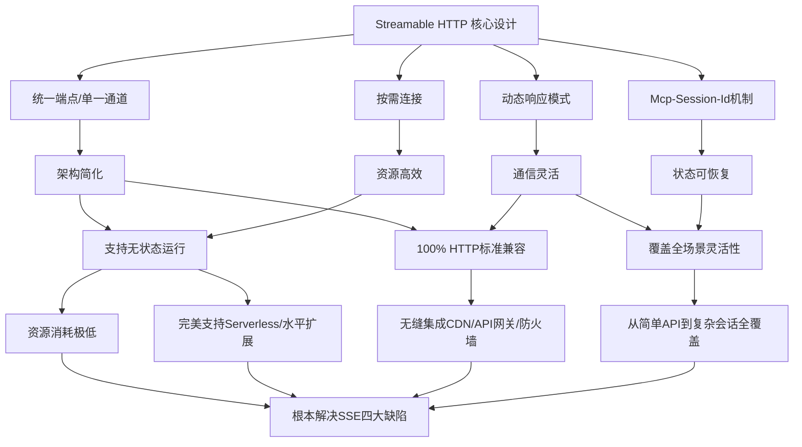
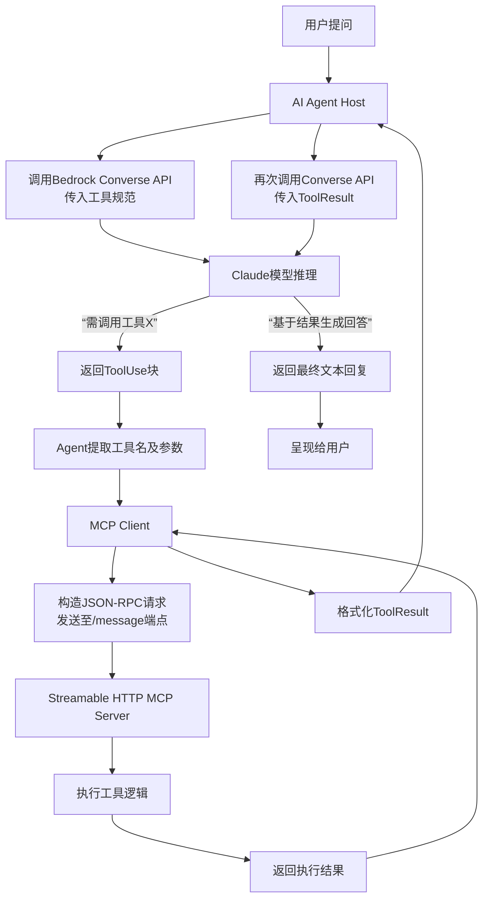

# Anthropic Streamable HTTP传输协议：技术原理、实现方案与架构影响深度研究
## 1 引言：MCP演进与Streamable HTTP的诞生

在现代人工智能应用生态中，大语言模型（LLM）与外部数据源、工具的有效集成是实现高级智能体（AI Agent）功能的关键。Model Context Protocol (MCP) 正是为解决这一核心挑战而诞生的开放标准。然而，其早期依赖的HTTP+SSE传输方案在实际生产环境中暴露出一系列结构性缺陷，严重制约了协议的广泛应用与系统可靠性。基于此，Anthropic于2025年3月26日做出了重大决策，在MCP规范中正式弃用SSE传输，全面转向全新的Streamable HTTP协议[^1]。本章旨在阐明MCP的核心目标，深入剖析原有传输方案的固有局限，并以此为基础揭示Streamable HTTP诞生的根本动机，从而界定本研究的核心价值与方向。

### 1.1 MCP协议的核心目标与架构角色

在MCP出现之前，若要让不同的AI模型（如Claude、ChatGPT）连接多样化的本地或远程数据源（如数据库、文件系统、API），开发者需要为每个模型和数据源的组合编写独立的“插件”或“适配器”，这导致了严重的碎片化、重复开发和兼容性问题[^1]。MCP的提出，旨在成为**AI时代的“USB协议”**，通过标准化模型与上下文提供者之间的通信接口，从根本上解决这一痛点[^1]。

MCP的核心设计理念是实现**标准化**与**解耦**[^1]。任何数据源只要实现了符合MCP标准的服务端（MCP Server），就能将其功能（通过Tools工具）或数据（通过Resources资源）暴露给任何支持MCP的客户端（MCP Client），而AI模型本身无需了解底层数据源的具体实现细节（如SQL或NoSQL）[^1]。在架构上，MCP通常采用Client-Host-Server模型：宿主应用（Host，如Claude Desktop或Cursor IDE）内嵌MCP Client模块，负责运行LLM并将自然语言指令转换为对远程或本地MCP Server的标准化调用[^1]。协议层基于轻量级、无状态的JSON-RPC 2.0，定义了请求、通知和结果等主要消息类型，确保了通信的简洁与高效[^1][^2]。因此，MCP在LLM生态中扮演着**上下文扩展与工具调用的标准化桥梁**角色，是实现AI Agent能力跨越的关键基础设施[^1]。

### 1.2 原有HTTP+SSE传输方案的关键限制剖析

在远程部署场景下，MCP早期采用HTTP+SSE作为其传输层实现。尽管SSE允许服务器通过持久化HTTP连接向客户端推送数据，实现了服务器到客户端的单向数据流，但其在MCP的高交互性、高可靠性要求场景下，暴露出以下四大核心弊端[^3][^4][^5]：

1.  **长连接带来的服务器资源压力与扩展性瓶颈**：SSE要求服务器为每个客户端维持一个长时间存活的连接。这导致服务器内存占用高，并发连接数受到显著限制，水平扩展能力有限[^3][^4]。如下表所示，与传统的短连接相比，SSE长连接在资源利用和扩展性上处于劣势[^3][^4]。

| 连接类型 | 内存占用 | 并发限制 | 扩展性 |
| :--- | :--- | :--- | :--- |
| 短连接 | 低 | 高 | 优秀 |
| SSE长连接 | 高 | 低 | 有限 |

2.  **连接不可恢复的挑战**：**SSE连接一旦因网络波动、客户端离线或服务器重启而中断，所有会话状态将完全丢失**[^5][^6]。客户端重连后，必须重新初始化整个会话，导致之前正在执行的任务（例如一个长时间运行的大文档分析或翻译）被迫完全中断，用户需要重新开始整个过程，这对用户体验和系统可靠性是毁灭性的打击[^6][^7]。

3.  **单向通信的局限性**：SSE本质上是服务器到客户端的单向数据流[^3]。在MCP交互中，即使对于简单的请求-响应交互，服务器也必须通过SSE通道返回信息，缺乏灵活性。当服务器需要根据实时数据主动向客户端发起询问或确认时，SSE无法满足这种灵活的双向交互需求，使得通信模式变得僵化且复杂[^5][^7]。

4.  **基础设施兼容性问题**：许多现有的网络中间件，如CDN、负载均衡器、API网关和企业防火墙，并非为处理长时间存活的HTTP连接而设计[^3][^6]。它们可能配置了连接超时策略，会主动关闭空闲的SSE连接，导致服务不可靠且难以诊断。这使得将基于SSE的MCP服务部署到现代云原生或边缘计算环境中变得异常困难[^7][^8]。

### 1.3 Streamable HTTP的推出动机与本报告价值

正是基于对HTTP+SSE方案上述深刻局限性的认识，Anthropic官方于2025年3月26日宣布对MCP传输机制进行重大升级，正式弃用SSE，并推出全新的“Streamable HTTP”传输方式[^1][^9]。这一变革的根本动机在于**彻底解决长连接依赖、状态丢失、单向通信和基础设施兼容性这四大痛点**，旨在使MCP协议变得更灵活、更易用、更具兼容性，从而能够支持更大规模的分布式部署和高并发场景[^9][^1]。

此次升级并非简单地替换技术栈，而是对MCP数据传输机制的一次重构。它将通信模式从“必须保持持续在线的长连接”转变为“按需建立、可灵活升级的请求-响应模式”，同时保留了在需要时进行流式数据传输的能力[^9]。这为MCP服务器实现无状态化、轻松集成到Serverless架构、以及与现有HTTP生态无缝协作开辟了道路[^9][^7]。

因此，本报告的核心价值在于，在MCP协议演进和AI Agent架构发展的关键节点上，对Streamable HTTP进行系统性、前瞻性的深度研究。我们将超越表面的特性介绍，深入解析其设计原理与技术规范，剖析从服务端到客户端的完整实现方案，并评估其对系统架构、开发范式及基础设施带来的深远影响。本研究旨在为开发者、架构师及行业实践者提供一份关于如何理解、采纳并高效利用Streamable HTTP构建下一代AI应用的权威参考。

## 2 协议深度解析：Streamable HTTP的设计原理与规范

本章节将系统性地解析Streamable HTTP协议的核心设计原理与技术规范，重点阐明其相对于HTTP+SSE方案的五大核心变更。我们将依据参考资料，首先剖析协议从双通道到统一端点的架构重构，解释移除专用/sse端点、统一使用/message端点进行双向通信的具体实现。其次，深入分析Mcp-Session-Id会话标识机制如何支持可选的状态管理与断线恢复，从而解决SSE连接不可恢复的致命缺陷。接着，探讨服务器如何根据请求性质动态选择响应模式（即时响应或升级为SSE流），实现按需流式传输的灵活性。最后，综合评估这些设计如何协同作用，使服务器能够实现无状态运行、大幅提升与现有HTTP基础设施（如CDN、负载均衡器、API网关）的兼容性，并支持从简单工具调用到复杂AI会话的多样化应用场景，从根本上克服了旧协议在资源效率、扩展性和可靠性方面的局限。

### 2.1 从双通道到统一端点：架构重构与通信模型

Streamable HTTP协议最显著的设计变革在于对通信架构的根本性重构。在传统的HTTP+SSE模式下，客户端与服务器之间的通信被强制拆分为两条独立且功能分离的通道[^9][^1]。具体而言，客户端通过标准的HTTP POST请求向一个端点（如`/messages`）发送工具调用请求，而服务器则通过一个专用的SSE端点（如`/sse`或`/events`）建立持久化的长连接，用于向客户端单向推送执行结果和进度更新[^9][^1]。这种设计在架构上被定义为“有状态”和“持久连接”模式[^1]。

**Streamable HTTP彻底摒弃了这种双通道分离的复杂模型，引入了单一、统一的端点设计。** 所有客户端到服务器的通信，无论是初始化、工具调用还是其他通知，均通过HTTP POST请求发送到同一个端点（当前官方SDK实现中通常为`/mcp`或`/message`）[^9][^1][^7]。服务器则根据请求内容，动态决定响应方式。这种架构被明确定义为“无状态”和“按需连接”模式[^1]。

为了清晰对比两种架构模式的本质差异，以下表格整合了参考资料中的关键信息：

| 特性维度 | HTTP+SSE 架构模式 | Streamable HTTP 架构模式 | 核心差异与影响 |
| :--- | :--- | :--- | :--- |
| **通道数量** | 2个独立通道：请求通道（HTTP POST）与响应通道（SSE GET）[^1][^9] | 1个统一通道（HTTP POST）[^1][^9] | **架构简化50%**，API设计更简洁[^1]。 |
| **连接模式** | 持久化长连接（用于SSE流）[^1][^9] | 按请求建立的短连接[^1] | **资源利用率大幅提升**，服务器无需维持大量空闲连接[^9][^10]。 |
| **状态管理** | 有状态，服务器需维护客户端连接状态[^1] | 无状态（默认），或通过会话ID实现可选状态管理[^1][^9] | **扩展性显著增强**，支持无服务器和水平扩展架构[^9][^11]。 |
| **协议复杂度** | 高，需同时处理标准HTTP和SSE协议[^9][^1] | 标准HTTP，可选择性升级到SSE[^1] | **兼容性达到100%**，与现有HTTP生态无缝集成[^1][^9]。 |
| **错误恢复** | 自定义重连逻辑，连接中断导致状态丢失[^1][^7] | 基于标准HTTP，支持通过会话ID恢复连接[^9][^1] | **可靠性根本改善**，解决了SSE最严重的缺陷[^9][^1]。 |

这种从“双通道”到“统一端点”的重构，不仅仅是技术实现的简化。它从根本上改变了MCP服务器与客户端之间的通信范式，将交互从一种需要预先建立并维持的“订阅-发布”关系，转变为更符合现代Web服务理念的“请求-响应”关系，同时保留了在需要时进行流式数据传输的能力。这为后续的会话管理、灵活响应和无状态部署奠定了坚实的基础。

### 2.2 Mcp-Session-Id：可选的会话管理与断线恢复机制

在HTTP+SSE架构中，最致命的缺陷之一是**连接中断导致的会话状态完全丢失**[^9][^1][^7]。由于SSE连接本身承载着会话上下文，一旦因网络波动、防火墙超时或服务器重启而断开，客户端必须重新建立连接并初始化整个会话，之前正在执行的长期任务（如大型文档分析）将被迫终止，严重损害用户体验和系统可靠性[^1][^11][^1]。

Streamable HTTP协议通过引入 **`Mcp-Session-Id` 会话标识机制**，优雅地解决了这一问题[^9][^1][^8]。该机制的核心在于将会话状态的管理从连接层剥离，变为一个可选的、基于标识符的应用层特性。

其工作流程如下：
1.  **会话初始化**：在通信开始时，客户端可以向服务器发送初始化请求。服务器可以选择性地生成一个唯一的会话ID（Session ID）并返回给客户端[^1][^7]。
2.  **会话标识**：在后续的所有请求中，客户端通过在HTTP请求头中携带 `Mcp-Session-Id: <session_id>` 来标识当前会话[^9][^1][^8]。
3.  **状态管理（可选）**：服务器端可以根据该会话ID，选择是否在内存或外部存储中维护与该会话相关的状态信息[^9][^12]。这使得服务器可以实现从完全无状态到有状态会话的灵活过渡。
4.  **连接恢复**：当网络中断导致连接丢失后，客户端可以使用之前获取的相同会话ID重新发起连接[^1][^11]。服务器在接收到带有有效会话ID的请求后，能够从存储中恢复之前的会话上下文，并从中断点继续处理，实现了**断线重连与状态恢复**[^11][^12]。

参考资料中详细描述了服务端为实现此机制可能采用的“事件存储与重放”组件。例如，`EventStore` 接口负责持久化会话过程中产生的事件流，当客户端携带 `Last-Event-ID` 头重新连接时，服务器可以调用 `replay_events_after` 方法，将中断后错过的历史事件重新发送给客户端，确保消息的连续性和完整性[^12]。

**这一设计的精妙之处在于其“可选性”**。对于简单的、无状态的工具API（如数学计算），服务器可以完全忽略会话ID，以纯无状态模式运行，享受极高的扩展性和资源效率[^11]。对于需要维护复杂上下文的多轮AI对话场景，服务器则可以利用会话ID实现有状态会话，并通过重连机制保障可靠性[^11]。这种灵活性是强制有状态的SSE方案所无法提供的。

### 2.3 动态响应模式：按需升级的流式传输能力

Streamable HTTP的另一项核心创新是其**动态响应模式**，它赋予了服务器根据请求的实时需求，灵活选择最佳响应方式的权力[^9][^1][^7]。这与SSE方案形成鲜明对比，在SSE中，无论响应内容简单或复杂，所有服务器到客户端的消息都被强制通过单一的、持久化的SSE通道推送，造成了不必要的开销和复杂性[^1][^7]。

Streamable HTTP支持两种主要的响应模式，服务器可以在处理请求时动态决定采用哪一种：

1.  **即时响应模式（标准HTTP响应）**：适用于简单的、可快速完成的请求，例如获取工具列表、执行一次计算等。服务器直接返回一个标准的HTTP 200响应，内容类型为 `application/json`，响应体中包含完整的JSON-RPC结果[^1][^11][^1]。这种模式与普通的REST API调用无异，高效且简单。
    ```
    HTTP/1.1 200 OK
    Content-Type: application/json

    {"jsonrpc": "2.0", "id": 1, "result": {"status": "completed"}}
    ```

2.  **流式响应模式（升级为SSE流）**：适用于耗时长、需要实时向客户端反馈进度的任务，例如大语言模型生成长文本、处理大型文件或执行复杂的数据分析。服务器通过将响应内容类型设置为 `text/event-stream`，并利用 `Transfer-Encoding: chunked`，将HTTP连接升级为一个SSE流[^1][^8]。随后，服务器可以分多次（chunk）向客户端推送包含部分结果或进度信息的事件，任务完成后自动关闭连接。
    ```
    HTTP/1.1 200 OK
    Content-Type: text/event-stream
    Transfer-Encoding: chunked

    data: {"content": "部分生成结果..."}\n\n
    data: {"content": "更多生成结果..."}\n\n
    data: {"result": {"status": "done"}}\n\n
    ```
    另一种更高效的数据格式是直接使用NDJSON（Newline Delimited JSON），即每行一个独立的JSON对象，无需SSE的 `data:` 前缀和双换行符，载荷有效率更高[^8]。
    ```
    {"response": "Hel"}
    {"response": "lo"}
    ```

**这种“按需流式传输”的能力是Streamable HTTP协议灵活性的关键体现。** 它意味着同一个MCP服务器可以同时处理海量的简单请求（使用轻量级的即时响应）和少量的复杂请求（使用流式响应），而无需为所有客户端预先支付维护长连接的成本。服务器资源得以被精细化利用，系统整体吞吐量和并发能力得到质的提升[^11]。

### 2.4 设计协同效应：无状态、兼容性与灵活性实现

Streamable HTTP协议的各项设计并非孤立存在，而是相互支撑、产生强大协同效应的有机整体。这种协同效应最终使其成功达成了协议升级的核心目标：**克服HTTP+SSE在资源效率、扩展性、可靠性和兼容性方面的根本局限**[^9][^10]。

以下将通过一个结构化分析，阐明这些设计特性如何协同作用：



**首先，统一端点和按需连接是支撑无状态运行和超高兼容性的基石。** 由于所有通信都基于标准的HTTP请求-响应周期，服务器在处理完一个请求后即可立即释放所有资源，无需背负长期连接的状态包袱。这使得MCP服务器能够以纯无状态模式运行，完美适配AWS Lambda、Google Cloud Functions等Serverless架构，并可以通过简单的负载均衡实现无限水平扩展[^9][^11][^13]。同时，标准HTTP协议确保了与全球现有网络基础设施的100%兼容，无论是用于加速和缓存的CDN、用于流量治理的API网关，还是配置了严格策略的企业防火墙，都能无障碍处理Streamable HTTP流量，彻底解决了SSE面临的基础设施兼容性陷阱[^1][^9][^1]。

**其次，动态响应模式与Mcp-Session-Id机制共同赋予了协议应对多样化场景的极致灵活性。** 动态响应模式确保了通信效率，简单任务快速返回，复杂任务流畅推送。Mcp-Session-Id机制则在需要时提供了会话连续性和可靠性保障。这两者结合，使得Streamable HTTP能够无缝覆盖所有MCP应用场景：
*   **无状态服务器模式**：适用于数学计算、文本处理等简单API。服务器直接返回HTTP 200响应，无需会话ID，部署极其简单[^11]。
*   **流式进度反馈模式**：专为大文件处理、长文本生成设计。服务器启动任务后，通过SSE流实时推送进度更新，最后发送结果。连接按需建立和关闭[^11]。
*   **复杂AI会话模式**：面向需要多轮交互、维护上下文的AI助手。系统初始化会话并分配ID，建立SSE流支持持续对话，服务器利用会话ID管理上下文[^11]。
*   **断线恢复模式**：应对网络不稳定的环境。客户端凭会话ID重连，服务器从事件存储中重放错过的事件，确保长期任务不因网络波动而失败[^11]。

**最终，这些协同效应直接且有力地回应了第一章所剖析的SSE四大缺陷。** 测试数据表明，在1000并发用户场景下，SSE方案需要维持上千个并发TCP连接，而Streamable HTTP仅需数十个连接，资源消耗降低一到两个数量级[^9][^10]。SSE连接中断导致任务失败的问题，被会话恢复机制彻底解决[^9][^1]。强制单向长连接的僵化模式，被动态双向的请求-响应流所取代[^1]。与防火墙、代理的兼容性问题，因采用标准HTTP而迎刃而解[^9][^7]。

**因此，Streamable HTTP并非一个简单的传输层替换，而是一次经过深思熟虑的、系统性的架构演进。** 它通过一系列相互关联的精巧设计，成功地将MCP协议的传输层从扩展性的瓶颈和可靠性的弱点，转变为了支持高并发、分布式、云原生AI应用的优势基础。

## 3 服务端实现方案：从Stdio/SSE到Streamable HTTP的无服务器改造

Streamable HTTP协议的引入，不仅是一次传输标准的升级，更是一次对MCP服务器架构范式的重塑。它使得MCP服务器能够摆脱对长连接和本地进程的依赖，无缝融入以无服务器计算为核心的现代云原生环境。本章将以AWS官方提供的GitHub MCP Server改造案例为蓝本，深入剖析将传统基于Stdio或SSE的MCP Server适配为Streamable HTTP协议的具体技术路径、核心代码变更以及云原生部署范式，为开发者提供一套清晰、可复用的实现指南。

### 3.1 改造核心：协议变更与无服务器架构适配

将传统MCP Server改造为支持Streamable HTTP的无服务器版本，其核心驱动力源于协议本身的重大变更，这些变更为适配无服务器架构扫清了根本性障碍。根据参考资料，Streamable HTTP相对于HTTP+SSE的核心变更包括：移除了专用的`/sse`端点，所有客户端与服务器间的消息（包括请求、响应和通知）都通过统一的`/message`端点（或类似如`/mcp`）进行传输[^14][^15][^16]。服务器不再强制要求维持SSE长连接，而是可以根据请求的性质，动态选择以标准HTTP 200响应即时返回结果，或将连接升级为SSE流以支持长时间的流式数据传输[^5][^16]。

**这些协议层面的变更与无服务器计算模型（特别是AWS Lambda）的特性形成了完美契合。** 首先，纯HTTP的实现使得MCP Server能够作为标准的Web服务运行，从而无缝兼容Amazon API Gateway、CloudFront CDN、Web应用防火墙等现有HTTP基础设施[^14][^15]。其次，**“按需连接”和“请求-响应”模式彻底消除了对持久化服务器进程和长连接状态的需求**，这正好匹配了AWS Lambda函数的短生命周期、事件驱动和无状态特性[^14]。Lambda函数在处理完单个HTTP请求后即可被冻结或销毁，无需为维护空闲的SSE连接支付任何成本，实现了极致的资源利用效率和成本效益[^15]。因此，改造的最终目标非常明确：将原有依赖本地进程间通信（Stdio）或服务器端长连接状态维护（SSE）的MCP Server，重构为一个基于标准HTTP、业务逻辑无状态、能够运行在Lambda函数中的云服务。

### 3.2 代码重构：基于Middy中间件的Lambda Handler实现

在明确了协议适配目标后，具体的代码重构路径变得清晰。AWS生态中一个关键的实现工具是`middy-mcp-adapter`中间件，它专为在AWS Lambda函数中集成MCP服务器而设计[^17][^18]。该中间件封装了将API Gateway代理事件转换为MCP Streamable HTTP传输的复杂逻辑，使开发者能够专注于MCP服务器本身的业务能力。

以下将基于参考资料中的示例代码，详细拆解重构的核心步骤：

1.  **创建MCP服务器实例**：与本地Stdio模式类似，首先需要创建`McpServer`实例，定义其名称和版本。这一部分业务逻辑可以完全复用[^18]。
    ```typescript
    import { McpServer } from '@modelcontextprotocol/sdk/server/mcp.js';
    const server = new McpServer({
      name: 'Lambda hosted MCP Server',
      version: '1.0.0'
    });
    ```

2.  **注册工具与资源**：MCP服务器核心能力的定义——即工具（Tools）和资源（Resources）的注册——同样可以保持基本不变。开发者需要确保工具处理函数是异步的，并且其实现不依赖于函数调用之外的持久化内存状态（除非借助外部存储如DynamoDB），以符合Lambda的无状态模型[^18]。
    ```typescript
    import { z } from 'zod';
    server.registerTool(
      'add',
      {
        title: 'Addition Tool',
        description: 'Add two numbers',
        inputSchema: { a: z.number(), b: z.number() },
        outputSchema: { result: z.number() }
      },
      async ({ a, b }) => {
        return {
          content: [{ type: 'text', text: JSON.stringify({ result: a + b }) }]
        };
      }
    );
    ```

3.  **使用Middy中间件包装Handler**：这是改造的关键环节。不再需要手动设置`StdioServerTransport`或处理SSE端点，而是使用`middy-mcp-adapter`中间件，将上一步创建的`server`实例注入其中。该中间件会自动处理传输层的适配，包括初始化`StreamableHTTPServerTransport`、转换HTTP事件格式等[^17][^18]。
    ```typescript
    import middy from '@middy/core';
    import mcpMiddleware from 'middy-mcp-adapter';
    import httpErrorHandler from '@middy/http-error-handler';

    export const handler = middy()
      .use(mcpMiddleware({ server })) // 核心适配器
      .use(httpErrorHandler()); // 建议配合错误处理中间件
    ```
    如代码所示，`mcpMiddleware`是连接MCP服务器协议与Lambda运行时环境的桥梁。它支持通过代理集成从API Gateway（REST API/v1和HTTP API/v2）以及ALB发送到Lambda的请求[^17]。

4.  **错误处理机制**：该中间件会抛出标准的HTTP错误，因此可以方便地与Middy生态中的`@middy/http-error-handler`等错误处理中间件配合使用，例如处理传输初始化失败（500错误）等情况，提升服务的健壮性[^18]。

**通过以上步骤，一个传统的MCP Server就被重构为了一个完全兼容Streamable HTTP协议、可在Lambda中执行的“无状态”函数。** 开发者无需深入理解Streamable HTTP与API Gateway事件模型之间的映射细节，极大地降低了实现门槛。这种模式也与其他云原生框架（如Spring AI MCP Server）的设计思想一致，即通过提供标准化的适配器或启动器，将MCP能力快速转换为可部署的Web服务[^19][^20]。

### 3.3 部署集成：API Gateway与无状态端点配置

代码重构完成后，需要将Lambda函数暴露为一个可通过HTTP访问的Streamable HTTP服务。AWS提供了两种主要方式：Lambda函数URL和Amazon API Gateway[^21]。根据官方资料的建议和案例实践，**对于需要构建生产级、功能完备的MCP服务，API Gateway通常是更优选择**[^14][^21]。

API Gateway作为全托管的API服务，提供了Streamable HTTP MCP Server所需的几个关键能力：
*   **统一的端点**：可以轻松配置一个POST方法，其资源路径即为`/message`或`/mcp`，这与Streamable HTTP协议要求的统一入口完全一致[^14][^15]。
*   **处理流式响应**：API Gateway支持与Lambda的代理集成，能够正确传递Lambda返回的流式响应（如SSE流）给客户端，这对于需要进度反馈的长时间任务至关重要。
*   **高级功能**：API Gateway还提供了丰富的身份验证（如IAM、Cognito）、请求验证、限流、缓存、自定义域名等高级功能，这些都是生产环境部署所必需的[^21]。
*   **向后兼容**：为了兼容期望使用SSE的旧版客户端，可以按照协议规范，额外配置一个对`/message`端点的GET方法。当客户端发送空GET请求时，服务器可以将其升级为SSE连接，从而实现平滑过渡[^5][^16]。

部署时，通常的架构是：客户端（如Claude Desktop）向`https://{api-id}.execute-api.{region}.amazonaws.com/{stage}/message`发送HTTP POST请求，API Gateway将请求转发给集成的Lambda函数。Lambda函数内部的`middy-mcp-adapter`中间件负责解包请求，交由MCP服务器实例处理，并将结果通过API Gateway返回给客户端。这种架构清晰地将协议处理、业务逻辑和API管理层分离，保证了系统的可维护性和可扩展性。

### 3.4 范式归纳：可复用的云原生MCP Server实现路径

综合以上分析，我们可以归纳出一套从传统MCP Server到云原生Streamable HTTP Server的通用实现与部署范式。这套范式不仅适用于AWS，其设计思想也适用于其他云平台。

以下表格总结了改造过程中的三个关键层次及其核心任务：

| 改造层次 | 核心任务 | 关键技术/工具 | 目标与收益 |
| :--- | :--- | :--- | :--- |
| **协议层适配** | 遵循Streamable HTTP规范，实现统一端点(`/message`)和动态响应模式（即时响应或SSE流）。 | MCP SDK (`@modelcontextprotocol/sdk`)，理解`StreamableHTTPServerTransport`。 | **解决兼容性与灵活性**，使服务能与标准HTTP生态无缝集成，并支持从简单到复杂的所有交互场景。 |
| **计算层重构** | 将MCP服务器业务逻辑封装为无状态、事件驱动的函数。 | 服务器适配器中间件（如`middy-mcp-adapter`）、无状态编程范式。 | **实现极致弹性与成本优化**，使服务能够运行在Lambda等Serverless计算平台上，按调用付费，自动伸缩。 |
| **部署层集成** | 通过API网关服务暴露HTTP端点，并配置安全、监控等生产级功能。 | Amazon API Gateway (HTTP/REST API)，函数URL（用于简单场景）。 | **提供稳定、安全、可管理的API服务**，简化运维，并便于与现有应用架构集成。 |

**具体可复用的实现路径如下：**

1.  **剥离传输层**：将原有代码中与Stdio或SSE传输直接相关的部分移除或注释掉。核心的`McpServer`实例创建、工具与资源注册逻辑应予以保留。
2.  **引入适配器中间件**：在项目中安装并导入对应的MCP服务器适配器（如`middy-mcp-adapter`）。使用该中间件包裹你的MCP服务器实例，创建出符合平台要求的Lambda Handler函数。
3.  **确保无状态性**：检查所有工具处理函数和回调，确保它们不依赖函数实例内存中的可变状态。对于需要跨请求持久化的会话数据，应借助`Mcp-Session-Id`机制和外部数据库（如DynamoDB）来实现。
4.  **配置部署设施**：在云平台控制台或使用IaC工具（如AWS CDK、Terraform）创建Lambda函数，并将上一步生成的Handler指定为其入口点。随后，创建API Gateway，配置指向该Lambda的POST `/message`代理集成。
5.  **测试与验证**：使用HTTP客户端（如`curl`或Postman）直接向API Gateway端点发送MCP格式的JSON-RPC请求，验证工具调用和流式响应是否正常工作。同时，也可使用支持MCP的客户端应用进行集成测试。

**最终，这一范式带来的根本性转变是：MCP Server从一个需要独立部署、维护和扩展的常驻进程，转变为一个高度抽象、按需运行、与云平台深度集成的“能力函数”。** 这不仅大幅降低了运维复杂度，还使得AI能力的提供能够充分利用云的弹性，以应对从零星测试到百名开发者同时触发的突发流量[^14][^15]。正如Spring AI等框架所倡导的，无状态、Streamable-HTTP的服务器已成为微服务架构和云原生AI服务部署的首选方案[^19][^20]，而本章所详述的路径，为开发者实践这一先进架构提供了切实可行的蓝图。

## 4 客户端适配策略：构建支持Streamable HTTP的MCP Client

随着Streamable HTTP协议在服务端的成功部署，构建与之匹配的客户端成为实现完整AI工作流的关键环节。在官方SDK对Streamable HTTP的支持尚处于过渡和完善阶段时，开发者需要理解协议规范，并基于标准HTTP库自行构建客户端适配逻辑。本章将深入剖析构建此类客户端的核心技术路径，涵盖从基础通信、会话管理到动态响应处理的全过程，并最终探讨如何将其与LLM应用（如Amazon Bedrock）集成，形成高效、健壮的AI Agent工具调用闭环。

### 4.1 通信基础：统一端点与标准HTTP请求构建

构建Streamable HTTP MCP Client的第一步，是确立其与服务器通信的基础模式。这完全不同于传统的HTTP+SSE方案，后者要求客户端同时管理一个用于发送请求的POST通道和一个用于接收响应的SSE长连接通道，架构复杂且对网络环境要求苛刻[^22]。

**Streamable HTTP协议的核心简化在于将所有通信收敛至单一端点。** 根据协议规范，客户端与服务器的所有交互，包括初始化握手、工具调用请求、通知接收等，都通过向同一个端点（通常是`/message`）发送标准的HTTP POST请求来完成[^22]。这彻底移除了对专用`/sse`端点的依赖，使得客户端的连接管理逻辑变得与调用普通REST API无异。**这种设计将客户端的架构复杂度降低了50%，使其能够轻松适应各种网络环境，包括那些对长连接不友好的企业网络或经过CDN、API网关代理的场景**[^22]。

在具体实现上，客户端需要使用诸如Python的`requests`、JavaScript的`fetch`或`axios`等标准HTTP库。通信的核心是构建符合JSON-RPC 2.0规范的请求体。一个典型的初始化请求示例如下：

```python
import requests

server_url = "https://your-api-gateway.execute-api.region.amazonaws.com/stage/message"

# 构建初始化请求
init_request = {
    "jsonrpc": "2.0",
    "id": 1,
    "method": "initialize",
    "params": {
        "protocolVersion": "2025-03-26",
        "clientInfo": {
            "name": "MyMCPClient",
            "version": "1.0.0"
        }
        # 其他可选参数...
    }
}

headers = {"Content-Type": "application/json"}
response = requests.post(server_url, json=init_request, headers=headers)

if response.status_code == 200:
    init_result = response.json()
    # 处理初始化结果，例如提取可选的 session_id
    session_id = init_result.get("result", {}).get("sessionId")
else:
    # 处理错误
    pass
```

**关键在于，客户端需要在所有后续请求的HTTP头部中，携带从服务器获取的`Mcp-Session-Id`（如果存在）**[^22]。这与会话管理机制紧密相关，是实现状态恢复的基础。通过这种统一的请求-响应模式，客户端能够以清晰、标准化的方式发起所有通信，为后续复杂的工具调用和流式处理奠定了坚实基础。

### 4.2 会话管理与状态恢复：Mcp-Session-Id的客户端实践

在HTTP+SSE架构中，连接中断即意味着会话终结和状态丢失，这是其最致命的缺陷之一。Streamable HTTP协议引入的`Mcp-Session-Id`机制，正是为了从根本上解决这一问题，而客户端是实现该机制不可或缺的一环[^22]。

**`Mcp-Session-Id`的本质是一个由服务器分配、用于标识唯一会话的字符串。** 在通信初始化阶段，服务器可以选择性地在`initialize`方法的响应中返回此ID。客户端的核心职责是妥善保管这个ID，并在后续与该服务器的所有交互中，将其置于HTTP请求头的`Mcp-Session-Id`字段中[^22]。例如：
```python
headers = {
    "Content-Type": "application/json",
    "Mcp-Session-Id": stored_session_id  # 从存储中读取
}
```
通过携带此ID，即使服务器本身是无状态的（例如运行在AWS Lambda上），它也能凭借该ID从外部数据库（如Amazon DynamoDB）中查询或重建出本次会话的上下文，从而实现**有状态的对话体验**。这使得服务器架构可以在“完全无状态”和“基于外部存储的可恢复状态”之间灵活选择，而客户端的行为保持一致。

**更为重要的是，这一机制赋予了客户端强大的断线恢复能力。** 当网络波动导致HTTP请求失败或SSE流中断时，客户端无需像在SSE方案中那样陷入“连接丢失，任务失败”的困境。相反，它可以简单地使用之前存储的`Mcp-Session-Id`，重新向`/message`端点发起一个新的请求。服务器在验证会话ID有效后，能够恢复之前的任务状态。对于流式任务，客户端还可以在重连请求中携带`Last-Event-ID`等头信息，请求服务器重放中断期间错过的数据块，从而确保用户感知到的数据流是连续且完整的。

**因此，客户端的会话管理实践可以归纳为三个关键动作：获取、存储、携带。** 这看似简单，却是在复杂网络环境下保障AI Agent任务可靠执行的关键。它使得长时间运行的任务（如大型代码库分析、多步骤数据处理）不再脆弱，极大地提升了最终用户体验和系统整体韧性。

### 4.3 动态响应处理：即时JSON与SSE流式升级

Streamable HTTP协议的另一大优势是服务器可以根据任务性质，动态选择最合适的响应方式。因此，一个健壮的MCP Client必须能够智能地处理这两种截然不同的响应模式：标准的即时JSON响应和升级后的Server-Sent Events (SSE)流式响应[^22]。

**客户端的处理逻辑始于对响应头`Content-Type`的检查。** 这是区分响应类型的唯一标准：
1.  **即时JSON响应** (`Content-Type: application/json`)：适用于快速完成的工具调用，如计算器、数据库查询等。客户端只需像处理普通API一样，解析HTTP响应体中的JSON数据即可。这是最直接、最高效的模式。
2.  **SSE流式响应** (`Content-Type: text/event-stream`)：适用于耗时长、需要实时反馈的任务，如大语言模型文本生成、复杂文件处理等。此时，客户端需要启动一个SSE解析器，持续读取服务器通过同一HTTP连接分块（chunk）发送过来的事件流。

处理SSE流式响应需要更复杂的客户端逻辑。服务器推送的数据格式可能是标准的SSE格式（以`data:`开头的行），也可能是更高效的NDJSON（Newline-Delimited JSON）格式。客户端需要持续读取响应体，按行解析，并实时将部分结果或进度信息反馈给上层应用（如更新UI进度条）。

这一模式与Amazon Bedrock的Converse API处理流式响应的方式高度相似。在Bedrock的示例中，客户端通过异步流（`ConverseStreamAsync`）接收模型生成的文本块，并实时处理[^5]。MCP Client在处理来自MCP Server的流式响应时，可以借鉴这种模式：

```python
# 类比 Bedrock Converse Stream 的处理思想
response = requests.post(server_url, json=tool_request, headers=headers, stream=True)

if response.headers['Content-Type'] == 'text/event-stream':
    for line in response.iter_lines():
        if line:
            # 解析SSE事件行或NDJSON行
            event_data = parse_event_line(line)
            # 实时处理部分结果，例如回调给LLM或更新UI
            on_partial_result(event_data)
```

**这种动态响应处理能力，使得MCP Client能够无缝适配从简单到复杂的所有应用场景。** 无论是毫秒级返回的简单工具调用，还是持续数分钟的文件处理任务，客户端都能以统一的方式发起请求，并以适配的方式处理响应，从而为上层AI应用提供了极大的灵活性和良好的用户体验。

### 4.4 与LLM应用集成：基于Bedrock Converse API的客户端模式

构建MCP Client的最终目的，是让其成为LLM（大语言模型）与外部世界交互的桥梁。一个典型的集成模式是：将MCP Client嵌入到作为“宿主”（Host）的AI Agent应用中，当LLM在推理过程中决定需要使用某个外部工具时，由MCP Client代为执行。

**Amazon Bedrock的Converse API为这种集成模式提供了优秀的范本。** Converse API不仅是一个统一的多模型调用接口，还原生支持**工具调用（Tool Use）** 功能[^23]。开发者可以在请求中定义一组工具规范（Tool Spec），模型在生成回复时，可以决定调用其中一个工具，并输出结构化的工具调用请求[^5]。这与MCP协议中Client调用Server工具的概念完全对应。

基于此，我们可以设计出清晰的集成架构：

1.  **工具规范同步**：AI Agent应用启动时，其内置的MCP Client需要向配置的Streamable HTTP MCP Server发起请求，获取服务器提供的工具列表（通过`tools/list`方法）。然后，将这些工具的描述、参数Schema等信息，转换为Bedrock Converse API所要求的工具规范格式，并在调用模型时传入。
2.  **工具调用拦截与转发**：当Bedrock中的模型（如Claude）决定使用工具时，它会在回复中返回一个`tool_use`块。AI Agent应用需要拦截这个块，提取出工具名称和参数。
3.  **MCP Client执行**：AI Agent应用将提取出的工具调用信息，构造为JSON-RPC格式的请求（`method`为`tools/call`），并通过已构建的MCP Client发送给远程MCP Server。
4.  **结果返回与继续对话**：MCP Client收到服务器返回的工具执行结果后，将其格式化为Bedrock要求的`tool_result`内容，并作为新一轮对话消息发送给模型。模型基于工具返回的结果，生成面向用户的最终回答。



**这种集成模式的优势在于解耦和复用。** LLM模型（Bedrock）专注于理解和规划，MCP Server专注于提供专业的数据或操作能力，而MCP Client则作为标准的、轻量化的适配层。这使得AI Agent的能力可以像搭积木一样，通过连接不同的MCP Server快速扩展，而无需修改核心的LLM调用逻辑。

### 4.5 实现路径归纳与健壮性考量

综合以上分析，我们可以归纳出一套从零开始构建健壮的Streamable HTTP MCP Client的可复用实现路径。同时，必须将健壮性设计贯穿始终，以应对生产环境中的各种挑战。

**核心实现路径步骤如下：**

1.  **配置与初始化**：配置目标MCP Server的`/message`端点URL。实现初始化握手流程，发送`initialize`请求，并处理响应，存储可选的`Mcp-Session-Id`。
2.  **工具发现**：实现调用`tools/list`方法，获取服务器暴露的工具列表，并缓存其规范，以备与LLM集成时使用。
3.  **请求构造器**：实现一个通用的JSON-RPC请求构造函数，能够封装不同的方法（如`tools/call`）和参数，并自动在请求头中添加`Content-Type: application/json`和存储的`Mcp-Session-Id`。
4.  **动态响应处理器**：实现一个发送请求并处理响应的核心函数。该函数需：
    *   检查响应状态码，处理HTTP层面的错误（如4xx， 5xx）。
    *   根据`Content-Type`头部，分支处理即时JSON响应或SSE流式响应。
    *   对于SSE流，实现一个解析器，能够处理标准SSE或NDJSON格式，并通过回调函数实时输出数据块。
    *   解析JSON-RPC响应体，处理其中的`result`或`error`对象。
5.  **LLM集成适配器**：封装上述功能，提供一个与特定LLM框架（如Bedrock SDK、LangChain等）对接的适配层。负责工具规范的转换、工具调用请求的拦截与转发、以及执行结果的格式化返回。

**健壮性设计的关键考量：**

*   **网络超时与重试**：必须为HTTP请求设置合理的连接和读取超时（例如参考Boto3客户端配置中的`connect_timeout`）[^5]。对于非幂等的操作需谨慎，但对于查询类工具调用或初始化请求，应实现指数退避等重试策略，以应对暂时的网络故障。
*   **错误处理**：建立分层的错误处理机制。包括处理网络异常、HTTP错误状态码、以及JSON-RPC响应体中的错误对象（包含错误码和详细信息）。客户端应能将这些错误转换为对上层应用友好的异常或错误消息。
*   **SSE流中断恢复**：当检测到SSE流异常关闭时，如果任务支持恢复（由服务器决定），客户端应能利用存储的`Mcp-Session-Id`和最后收到的事件ID，尝试重新建立连接并请求继续。
*   **会话生命周期管理**：实现会话的清理逻辑，在任务完成或应用退出时，主动发送`notifications/cancel`或类似的请求通知服务器释放资源，或至少本地清除过期的会话ID。

**当前基于标准HTTP库自行实现客户端是一种灵活且可控的过渡方案，它让开发者能够深入理解协议细节并应对早期生态的不完善。** 随着MCP协议的普及，可以预见官方SDK（如`@modelcontextprotocol/sdk`）将逐步提供对Streamable HTTP传输的完整、开箱即用的客户端支持。届时，开发者的工作重心将从底层通信转移到业务逻辑和工具集成的创新上。然而，本章所阐述的原理、模式和健壮性设计，将是理解和有效利用任何高层SDK的坚实基础。

## 5 综合评估：技术影响、挑战与未来展望

本章旨在对MCP协议中引入的Streamable HTTP传输机制进行全面、辩证的综合评估。通过系统性地对比分析、深入剖析其带来的架构范式变革，并正视当前面临的现实挑战，最终对其未来演进方向进行前瞻性研判，从而为理解和采纳这一关键技术提供完整的价值判断与行动参考。

### 5.1 技术方案对比：Streamable HTTP与SSE/WebSocket的优劣分析

Streamable HTTP协议并非凭空诞生，其设计直接针对了先前HTTP+SSE方案的固有缺陷，并在与WebSocket等替代方案的权衡中确立了自身优势。以下通过结构化对比，清晰呈现三种方案的核心差异。

首先，在**性能与扩展性**方面，HTTP+SSE方案的劣势最为突出。其核心问题在于必须为每个客户端维持一个持久化的长连接，这导致服务器资源被严重消耗。测试数据显示，在模拟1000个并发用户同时访问的场景下，SSE方案需要维持**上千个并发TCP连接**，而同等负载下，Streamable HTTP方案仅需**数十个连接**[^5]。这种数量级的差异直接源于协议设计：SSE是“连接即会话”的有状态模型，而Streamable HTTP是“按需连接”的无状态或轻状态模型。这种资源消耗的差异在高并发下会引发系统性风险，SSE的平均响应时间会从低并发时的18毫秒非线性飙升至1.5秒以上，完全无法满足实时交互需求，而Streamable HTTP则能保持稳定的低延迟[^5]。

其次，在**实现与开发复杂度**上，HTTP+SSE要求客户端管理**两条独立的通信通道**：一个是通过标准HTTP POST发送请求的`/message`端点，另一个是通过GET建立并监听服务器推送事件的专用`/sse`端点[^24][^5]。这种双通道设计迫使开发者编写复杂的连接管理、错误重连和消息同步逻辑。相比之下，Streamable HTTP将所有通信收敛至统一的`/message`端点，客户端仅需使用标准的HTTP库进行请求-响应交互，架构简化了约50%，显著降低了开发门槛和维护成本[^5]。

第三，**基础设施兼容性**是Streamable HTTP的决胜优势。许多企业网络环境中的防火墙、代理服务器和负载均衡器会主动终止长时间空闲的TCP连接，SSE默认的心跳机制不足以应对，导致服务频繁意外中断，可靠性难以保障[^5]。而Streamable HTTP作为纯标准HTTP实现，天然与CDN、API网关、现代云平台（如Vercel、Cloudflare Workers、AWS Lambda）无缝集成，部署和运维变得极为简单[^5][^15]。

最后，关于**协议适用性**，一个关键问题是为何不选择功能更强大的WebSocket。Anthropic的决策基于对MCP交互模式的深刻理解：MCP主要采用类似RPC的请求-响应模式，每个工具调用独立执行，无需维持全双工长连接。此外，WebSocket无法在握手后传输HTTP头部信息，使得基于Header的身份验证变得复杂；且其仅支持通过GET请求升级连接，与MCP主要使用的POST请求不兼容[^5]。因此，Streamable HTTP采用的“基于标准HTTP，按需动态升级到SSE流”的策略，在灵活性、兼容性和复杂度之间取得了最佳平衡，是更适合MCP企业级应用的通信标准[^5]。

为更直观地呈现核心差异，以下表格整合了关键对比维度：

| 对比维度 | HTTP + SSE | Streamable HTTP | WebSocket | 核心洞察 |
| :--- | :--- | :--- | :--- | :--- |
| **连接模型** | 持久化长连接（单向推送） | 按需短连接，可动态升级为SSE流 | 持久化全双工长连接 | **Streamable HTTP实现了连接资源的按需分配**，避免了长连接固有的资源浪费和扩展瓶颈。 |
| **服务器资源压力** | 极高，每客户端一长连接 | 极低，连接可复用，支持无状态 | 高，每客户端一长连接 | 在1000并发下，SSE需上千连接，Streamable HTTP仅需数十连接，资源效率提升1-2个数量级[^5]。 |
| **实现复杂度** | 高，需管理双通道及连接状态 | 低，统一端点，标准HTTP交互 | 中，需处理协议握手及帧解析 | **Streamable HTTP将开发焦点从传输层解放到业务逻辑**，显著提升开发效率。 |
| **基础设施兼容** | 差，易被防火墙/代理中断 | 优秀，与现有HTTP生态100%兼容 | 一般，可能受代理策略影响 | **Streamable HTTP是云原生和边缘部署的“通行证”**，而SSE则是“绊脚石”。 |
| **适用场景** | 简单服务器推送 | **MCP标准通信**，覆盖从简单API到复杂会话 | 实时双向交互（如聊天、游戏） | Streamable HTTP专为AI工具调用的RPC模式优化，是功能与复杂度权衡下的最优解[^5]。 |

**综上所述，Streamable HTTP并非一个微小的改进，而是针对生产环境痛点的系统性重构。** 它在性能、复杂度、兼容性三个关键维度上全面超越了HTTP+SSE，并通过更精准的协议设计避免了WebSocket的过度复杂性，从而确立了自身作为MCP企业级通信标准的相对优势。

### 5.2 架构范式革新：对微服务、Serverless与开发者体验的深远影响

Streamable HTTP协议的引入，其影响远不止于传输层性能的提升，更在于它从根本上重塑了AI服务的构建、部署和扩展方式，推动了整个开发范式的革新。

**首先，该协议是推动MCP服务器实现无状态化、从而拥抱Serverless架构的关键使能技术。** 传统的HTTP+SSE方案强制服务器维护客户端连接状态，这与Serverless函数短生命周期、事件驱动、无状态的核心特性背道而驰。Streamable HTTP通过统一端点和按需连接的设计，使服务器能够以纯无状态模式运行。这意味着每个HTTP请求都是独立的，服务器在处理完成后无需保留任何会话信息。这种特性使其能够完美适配AWS Lambda、Google Cloud Functions、Azure Functions等Serverless平台[^19][^15]。例如，在AWS的实践中，通过配合API Gateway和Lambda，MCP Server可以轻松获得**极致的弹性伸缩能力和按调用付费的成本模型**，从容应对从零到突发的高并发流量，而无需预置和管理服务器集群[^15][^20]。

**其次，Streamable HTTP极大地促进了AI能力向微服务架构的演进。** 在微服务理念中，每个服务应该是独立部署、可扩展和松耦合的。Streamable HTTP协议使得每个MCP Server可以专注于提供某一领域的专业能力（如数据库查询、文件操作、API集成），并通过标准的HTTP接口暴露。它可以轻松地与现有的微服务生态系统集成，包括REST API网关、GraphQL层、服务网格和负载均衡器[^5][^19]。这种设计使得AI能力的组合和创新变得前所未有的灵活，企业可以像组装乐高积木一样，将不同的MCP Server组合起来构建复杂的AI工作流。

**最后，也是最为直接的，是它对开发者体验的革命性简化。** 这主要体现在三个方面：
1.  **服务器实现极大简化**：开发者不再需要搭建和维护复杂的SSE服务器。**实现一个MCP Server变得如同开发一个普通的HTTP Web服务一样简单**，只需使用熟悉的Web框架（如Express、FastAPI、Spring Boot）并遵循MCP的JSON-RPC消息格式即可[^5][^19]。这大幅降低了AI工具集成领域的入门门槛。
2.  **部署门槛显著降低**：由于采用标准HTTP，部署到各种云平台和边缘环境变得异常容易。特别是对于Vercel、Cloudflare Workers等原本不支持长连接的Serverless平台，现在可以无障碍地托管MCP服务[^5]。
3.  **开发效率大幅提升**：以Spring AI MCP Server为例，框架提供了`spring-ai-starter-mcp-server-webmvc`或`-webflux`等启动器。开发者只需通过简单的依赖引入和属性配置，即可将用`@Bean`注解声明的工具快速转换为一个支持Streamable HTTP协议的可部署服务，实现了AI能力的“一键发布”[^19][^20]。这种高度的抽象和自动化，让开发者能更专注于业务逻辑的创新，而非底层通信协议的实现。

**因此，Streamable HTTP不仅仅是一个更快的协议，它更是一种新架构范式的催化剂。** 它通过技术设计上的巧思，将AI服务从笨重、有状态、难以扩展的旧模式，导向了轻量、无状态、云原生的新模式，从根本上提升了AI应用的生产力、可靠性和经济性。

### 5.3 现实挑战：状态管理、SDK生态与生产环境治理

尽管Streamable HTTP协议在技术上优势显著，但其在落地过程中，尤其是在企业级生产环境中，仍面临着一系列不容忽视的现实挑战与风险。正视这些挑战是成功采纳该技术的前提。

**首要挑战来自于协议“可选状态管理”设计所带来的架构复杂性。** Mcp-Session-Id机制在提供灵活性的同时，也将状态管理的决策负担转移给了服务器开发者。开发者必须审慎决定：哪些工具或会话需要维护状态？状态应存储在何处（内存、Redis、DynamoDB）？如何设计高效的事件存储与重放逻辑（如处理`Last-Event-ID`）以实现精确的断点恢复[^18]？**这种灵活性是一把双刃剑**，对于简单场景可能增加不必要的复杂度，而对于复杂场景则要求开发者具备分布式系统状态管理的专业知识。如果设计不当，可能导致状态不一致、恢复失败或引入性能瓶颈。

**其次，当前SDK与工具链生态的成熟度仍是制约广泛落地的一大因素。** 尽管MCP官方提供了Python、TypeScript、Java等多种语言的SDK，但业界反馈指出，MCP **“还未达到企业级准备状态”**[^18]。这种不成熟体现在多个层面：首先，官方SDK对Streamable HTTP这一新传输协议的支持可能仍处于过渡和完善期，开发者有时需要基于标准HTTP库自行构建客户端适配逻辑（如第四章所述），增加了集成成本。其次，围绕MCP的开发、调试、监控、测试等工具链尚未形成像传统Web开发那样完善的生态系统。例如，缺乏成熟的GUI调试工具、性能剖析套件或自动化测试框架，这给问题诊断和质量管理带来了挑战。

**最后，也是最严峻的挑战，来自于生产环境的安全与治理需求。** 随着MCP工具生态的快速增长，新的风险维度随之出现：
1.  **“即插即祈”的安全风险**：MCP的易用性可能被恶意利用。攻击者可能通过精心构造的提示词进行“提示注入”，诱导LLM调用危险工具或泄露敏感数据。若无严格的安全边界，MCP服务器可能成为攻击内部系统的跳板[^18][^25]。
2.  **工具过载与模型“幻觉”**：当LLM被授予访问大量外部工具的权限时，存在选择错误工具、误用工具或产生无关输出的风险，这不仅浪费Token，更可能引发业务错误[^18]。这要求实施精细化的工具暴露策略和调用审核机制。
3.  **集中式治理与编排的复杂度**：为解决安全和治理问题，引入集中式的“智能体网关”或管理平台（如Salesforce的Agentforce、阿里云百炼的MCP市场）成为趋势[^26][^18]。然而，这引入了新的复杂性：如何高效地纳管、编排、监控和审计一个由数十甚至数百个MCP工具组成的动态生态系统？如何实现细粒度的权限控制（RBAC）和合规性审计？这些是企业CIO在引入MCP时必须系统考虑的问题[^18][^25]。

**因此，Streamable HTTP协议的落地并非单纯的技术移植，而是一项涉及架构设计、安全工程和运维治理的系统性工程。** 开发者和企业需要在享受其技术红利的同时，积极应对这些伴随而来的挑战。

### 5.4 未来展望：协议演进、性能优化与生态融合趋势

基于当前的技术发展态势和已识别的挑战，可以对MCP协议及Streamable HTTP传输的未来演进方向进行前瞻性研判。其发展将不仅局限于协议本身的优化，更将深度融入更广阔的AI与云原生生态。

**首先，协议标准将持续向更安全、更强大、更易用的方向演进。** 参考MCP v2.0的更新蓝图，未来的协议版本可能会在以下几个关键领域深化：**强化安全机制**，例如引入多因素认证、基于属性的访问控制（ABAC）、端到端的请求/响应加密，以及更完善的审计日志规范[^27][^26][^20]。**增强异步与并发支持**，为长时间运行的任务和复杂的多步骤工作流提供更优雅的原生协议支持。**初步支持多智能体（Multi-Agent）协作**，定义智能体间通过MCP进行通信和任务协调的标准方式，以应对更复杂的现实问题[^27]。

**其次，性能与协议效率将得到深度优化，以适应更极致的应用场景。** 随着HTTP/3的普及，Streamable HTTP有望集成QUIC协议，进一步降低连接建立延迟并提升弱网环境下的传输可靠性。在数据格式层面，**NDJSON（Newline-Delimited JSON）** 因其更高的载荷效率和易于解析的特性，可能成为流式响应的首选甚至标准格式，取代传统的SSE文本格式[^5]。此外，为适应边缘计算场景，协议可能会进一步轻量化，减少握手开销，并优化对间歇性连接的支持。

**再者，生态融合与平台化将成为不可逆转的主流趋势。** 未来的MCP生态将超越简单的协议互通，向一体化的平台演进。这包括：**统一的工具市场与注册中心**，类似阿里云百炼已构建的包含超过110款MCP服务的平台，使工具发现、试用和集成变得像安装手机应用一样简单[^26]。**智能的编排与治理层**，通过AI驱动的方式，根据任务上下文自动推荐、组合和验证工具调用链，并实施动态的风险控制策略[^27][^18]。**深入的多技术栈融合**，例如将MCP Server编译为**WebAssembly（Wasm）** 模块，使其能够安全、高性能地在各种隔离环境中（如浏览器、边缘节点）运行，极大扩展了部署边界[^27]。

**最终，Streamable HTTP有望从一项优秀的通信协议，演进为连接AI模型与现实世界的“智能能力总线”。** 它通过标准化、无状态和云原生的设计，为构建安全、可靠、可扩展的分布式AI应用奠定了坚实的基础。随着生态的成熟和技术的迭代，它将成为推动AI Agent从概念验证走向规模化生产应用的核心基础设施之一。

# 参考内容如下：
[^1]:[收藏必备!大模型MCP协议深度解析:Streamable HTTP如何实现高效AI工具调用与通信机制全解析](https://blog.csdn.net/WANGJUNAIJIAO/article/details/155749614)
[^2]:[Anthropic发布MCP传输机制重大升级:告别长连接,迎接更灵活的“Streamable HTTP”](https://baijiahao.baidu.com/s?id=1826902562744060189&wfr=spider&for=pc)
[^3]:[Streamable HTTP:下一代实时通信协议,解决SSE的四大痛点 ](https://article.juejin.cn/post/7554222568267104291)
[^4]:[【蓝因子教育】为什么你的 MCP 服务应该升级到 MCP Streamable HTTP 协议 ](https://www.sohu.com/a/948115939_122247084)
[^5]:[MCP协议演进:从SSE到Streamable HTTP的技术革命](https://cloud.tencent.com/developer/article/2556166)
[^6]:[HTTP Streamable取代SSE - OrcHome](https://www.orchome.com/17435)
[^7]:[第三章 Streamable HTTP协议之流式传输-客户端处理](https://blog.csdn.net/sfdzhmr/article/details/153870933)
[^8]:[MCP协议重大升级,Spring AI Alibaba联合Higress发布业界首个Streamable HTTP实现方案](https://developer.aliyun.com/article/1661704)
[^9]:[MCP传输层自我革命 - Streamable HTTP协议深度解析_streamable协议-CSDN博客](https://blog.csdn.net/m0_64355285/article/details/152925259)
[^10]:[MCP 协议:为什么 Streamable HTTP 是最佳选择?](https://www.cnblogs.com/alisystemsoftware/p/18851650)
[^11]:[MCP(大模型上下文协议)流式HTTP协议的深度探索，结合相关的原理和流程进行详解_mcp 流式-CSDN博客](https://blog.csdn.net/weixin_42878111/article/details/147635544)
[^12]:[第三章 Streamable HTTP协议之协议模式连接恢复与事件存储-服务端事件重放机制](https://blog.csdn.net/sfdzhmr/article/details/153871129)
[^13]:[python开发Streamable HTTP MCP应用](https://www.cnblogs.com/xiao987334176/p/18872195)
[^14]:[Amazon Bedrock Runtime API 集成指南——从 Invoke Model API 迁移到 Converse API,简化生成式 AI 应用开发](https://xie.infoq.cn/article/1ac4aee13a421ab96db65f8df)
[^15]:[第三章 传输协议](https://blog.csdn.net/sfdzhmr/article/details/153869486)
[^16]:[MCP协议Streamable HTTP](https://www.cnblogs.com/xiao987334176/p/18845151)
[^17]:[Middy MCP适配器 - AWS Lambda与MCP服务器集成中间件-MCP服务](https://www.mcpworld.com/zh/detail/d3d476d63723ee2ceb808537d320ce8c)
[^18]:[使用Amazon Lambda 快速部署 Streamable HTTP Github MCP Server | 亚马逊AWS官方博客](https://aws.amazon.com/cn/blogs/china/deploy-streamable-http-github-mcp-server-using-amazon-lambda/)
[^19]:[MCP协议:“万能插头”与工程挑战 🚀](https://maimai.cn/article/detail?fid=1900432676&efid=OtYvzxX6JdGhIS-F2RLtjg)
[^20]:[SSE、长轮询与 WebSocket 连接资源对比及 Spring Boot 配置指南_sse和ws那个更耗资源-CSDN博客](https://blog.csdn.net/weixin_40979518/article/details/156794984)
[^21]:[实用指南：WebSocket和长轮询技术在实时性和资源消耗方面有哪些具体的数据对比？ - wzzkaifa - 博客园](https://www.cnblogs.com/wzzkaifa/p/19151229)
[^22]:[MCP 协议: Streamable HTTP 是最佳选择](https://developer.aliyun.com/article/1661971)
[^23]:[MCP官方文档:架构概述 ](https://article.juejin.cn/post/7536988874670784550)
[^24]:[MCP协议的生态系统现状如何?](https://cloud.tencent.com/developer/article/2507268)
[^25]:[MCP通信安全:认证、授权与加密机制的深度解析](https://blog.csdn.net/lxcxjxhx/article/details/156506005)
[^26]:[Spring AI MCP 无状态 Streamable-HTTP 服务器详解与最佳实践](https://guosy.blog.csdn.net/article/details/155036011)
[^27]:[Server-Sent Events (SSE) 协议详解：实现与优化指南_文心快码](https://comate.baidu.com/zh/page/v3v16mux9gm)
