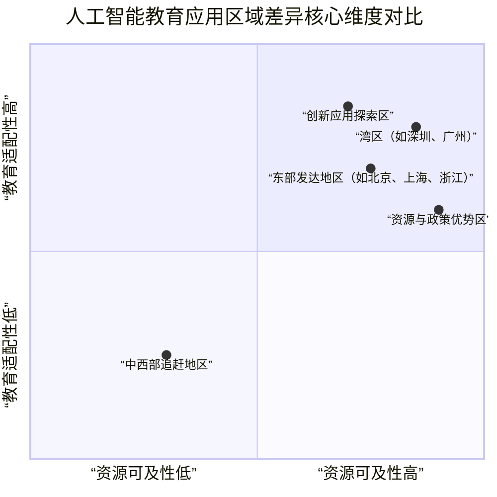

# 融合、重塑与赋能：人工智能在教育领域的应用现状、挑战与人才培养体系研究
# 1 研究导论：人工智能重塑教育生态的时代背景与核心议题

以生成式人工智能（AIGC）为代表的智能技术浪潮正以前所未有的广度和深度，重塑经济、社会与教育的形态与范式[^1]。人工智能不仅是驱动教育变革的核心技术力量，更是构建更加包容、公平且个性化教育生态的关键赋能者[^2]。在这一深刻变革的时代背景下，本报告旨在系统梳理人工智能与教育融合发展的宏观战略、现实图景与深层挑战，并聚焦于应用落地、人才培养等核心议题，为构建面向未来的智能教育新生态提供洞察与参考。

## 1.1 全球共识与国家战略：AI赋能教育的政策演进与顶层设计

人工智能与教育的融合发展，已成为全球性的战略共识。2019年，联合国教科文组织（UNESCO）发布《北京共识——人工智能与教育》，这是该领域首份纲领性指导文件[^3][^4]。该共识明确提出，各国应系统规划人工智能教育政策，利用人工智能加快建设开放灵活的教育体系，确保全民享有公平、优质且适合每个人的终身学习机会[^3][^4]。其核心精神在于坚持“以人为本”的伦理取向，强调人工智能的开发与应用应服务于人、增强人的能力，并确保合乎伦理、公平透明[^3]。这为全球范围内的AI教育实践奠定了共同的价值基准与行动框架。

在中国，人工智能与教育的深度融合被提升至国家战略高度。习近平总书记多次作出重要指示，明确提出要“积极推动人工智能和教育深度融合，促进教育变革创新”，并强调“推进人工智能全学段教育和全社会通识教育，源源不断培养高素质人才”[^2]。这一系列指示为教育现代化进程中的人工智能应用指明了根本方向。国家层面的顶层设计随之系统展开：《教育强国建设规划纲要（2024—2035年）》将“实施国家教育数字化战略”作为核心任务[^5]；2024年，教育部启动“人工智能赋能教育行动”，并印发《关于加强中小学人工智能教育的通知》[^2]；2025年，教育部基础教育教学指导委员会进一步发布《中小学人工智能通识教育指南（2025年版）》和《中小学生成式人工智能使用指南（2025年版）》，为全国基础教育阶段的人工智能教学与实践提供了标准化、科学化的政策指引[^2]。

**这些密集的政策部署清晰地表明，中国正以前所未有的力度，系统推动人工智能技术在教育全流程中的创新应用，致力于以科技创新开辟教育发展新赛道、塑造发展新优势[^6]。** 地方实践与国家战略同频共振，例如浙江省将“推动人工智能助力教育变革”纳入《浙江省加快建设教育强省规划纲要（2025—2035年）》，并印发《浙江省推进“人工智能+教育”行动方案（2025—2029年）》等一系列文件，形成了从中央顶层设计到地方创新实践的完整政策链条[^2]。全球共识与中国战略的深度契合，凸显了利用人工智能破解教育难题、实现教育现代化的共同追求，也确立了本报告立足中国实践、回应全球议题的研究定位。

## 1.2 发展图景与核心张力：AI教育应用的现状、趋势与深层挑战

在全球政策共识与国家战略的强力驱动下，人工智能教育应用正呈现出快速发展的总体趋势，但同时也暴露出深刻的现实矛盾与挑战。

从全球图景看，人工智能教育正经历从理念到实践的加速渗透。斯坦福大学《2025年人工智能指数报告》指出，自2019年以来，提供K-12计算机科学教育的国家数量已翻倍，非洲与拉丁美洲成为增长主力[^7]。然而，发展极不均衡，基础设施落后地区的学生接触计算机科学教育的机会依然稀缺[^7]。在应用层面，生成式人工智能的广泛应用正在重塑教学、评价与学习方式[^8]。联合国教科文组织倡导开发“可解释、可审查”的AI工具，并将伦理规范嵌入技术设计[^8]。经济合作与发展组织（OECD）的报告则指出，AI能有效支持个性化学习，但也面临认知负荷、设备鸿沟、网络欺凌、算法偏见以及教师准备度不足等多重挑战[^8]。这些全球性议题在中国情境下同样突出。

在中国，人工智能教育应用已从早期的工具辅助，迈向更深层次的模式探索与系统构建。例如，浙江省系统构建了支撑人工智能教育的基础设施与发展体系，包括探索建立全省教育系统算力统筹共享机制、分层分类开展从小学到高校的人工智能通识教育、以及启动实施“人工智能+教师队伍”行动等[^2]。高校层面，上海交通大学、北京大学等已发布“人工智能+教育教学”行动计划，将AI深度融入人才培养全过程，推动课程体系、教学模式与科研范式的系统性变革[^9][^6]。

然而，技术的快速演进与教育体系的渐进式改革之间，存在着根本性的张力，具体表现为三大核心矛盾：

1.  **规模化应用需求与高质量场景供给不足的矛盾。** 尽管政策鼓励应用，但真正能够深度融合学科教学、有效提升教育质量的典型场景仍然稀缺。政协委员曹先彬指出，当前面临“典型场景供给较少”的挑战，如果学校不进行有组织的设计与引导，人工智能的应用就容易陷入无序发展[^10]。这导致技术“落地难”，难以形成规模化、可持续的价值释放[^11]。
2.  **技术赋能潜力与现有体系适应性的矛盾。** 人工智能作为一种需要“长期订阅、持续优化”的服务，其财政支出模式与教育系统传统的“采购设备”的预算体系不匹配[^11]。同时，教师的人工智能素养普遍不足，成为制约技术深度应用的关键瓶颈[^8][^10]。
3.  **效率提升追求与教育本质坚守的平衡难题。** 人工智能在提升教学与管理效率的同时，也带来了学生可能过度依赖工具、导致“认知债务”和思维惰性的风险[^1][^10]。此外，算法偏见、数据隐私与安全等伦理问题，也对教育公平与安全构成了新的挑战[^8][^1]。

**这些矛盾深刻揭示了人工智能赋能教育已进入“深水区”和“关键期”[^10]，其成功不再仅仅取决于技术本身，更取决于教育系统的系统性变革能力、治理智慧以及对“育人为本”初心的坚守[^5]。**

## 1.3 问题聚焦与框架构建：本报告的核心关切与研究路径

基于对全球共识、国家战略以及现实图景与核心张力的综合分析，本报告将聚焦于以下三个相互关联的核心研究议题，并构建相应的分析框架：

| 核心议题层次 | 具体研究问题 | 关键支撑点（来自参考资料） |
| :--- | :--- | :--- |
| **应用落地与融合创新** | 人工智能技术如何在“教、学、评、管、研”全流程中实现从工具辅助到模式创新的深层次、规模化融合？典型应用场景的可持续供给与有效治理路径是什么？ | 浙江发布的45个典型应用场景[^2]；政协委员指出的“场景为王”挑战[^10]；高校“AI+教育”行动计划[^9][^6]。 |
| **风险应对与伦理治理** | 如何系统识别并应对AI赋能教育过程中引发的伦理风险（算法偏见、数据隐私）、公平性隐忧（数字鸿沟）以及可能导致的师生角色异化与“认知债务”？ | OECD报告指出的算法偏见等挑战[^8]；国际会议对隐私安全的担忧[^1]；专家对工具依赖的警示[^10]。 |
| **体系重塑与人才支撑** | 面对超过500万的人工智能人才缺口[^12]，现有的教育人才培养体系（包括通识教育、教师专业发展、学科专业设置及产教融合）应如何系统性重塑，以有效支撑AI时代的教育创新与产业高端人才供给？ | 浙江“人工智能+X”课程体系与教师素养框架[^2]；高校基础学科与AI双向赋能探索[^6]；企业界对应用型人才的迫切需求[^12]。 

围绕上述议题，本报告将遵循“**现状扫描—深度剖析—挑战诊断—体系探究—未来展望**”的逻辑主线展开：
*   **第二章**将对人工智能在全学段教育中的应用现状进行全景扫描，揭示其从渗透到创新的多层次发展特征。
*   **第三章**将深度剖析教学全流程中的核心落地场景，通过具体案例验证其效能与实现路径。
*   **第四章**将系统诊断阻碍AI教育深化应用的关键挑战与制约因素，探究其技术、伦理与系统融合的深层根源。
*   **第五、六章**将重点回应人才培养支撑问题，分别探讨教育目标与能力结构的重构，以及学校层面AI人才培养体系的构建路径。
*   **第七章**将总结核心发现，并提出构建育人为本的智能教育新生态的政策建议与未来展望。

通过这一完整的研究闭环，本报告旨在为政策制定者、教育实践者与产业界提供一份基于事实、洞察深刻、具有实践指导价值的系统性分析。

## 2 应用现状全景扫描：从工具辅助到模式创新的多层次渗透

人工智能技术正以前所未有的速度渗透至教育的各个角落，其应用已从早期的局部试点迈向规模化、系统化的深度融合阶段。本章基于详实的政策文件、区域实践与企业案例，系统扫描人工智能在全学段教育中的应用现状，旨在揭示其从广度拓展到深度演进的多层次渗透路径，并剖析由此形成的区域图景与市场生态，为理解当前AI赋能教育的现实图景提供全景式框架。

### 2.1 广度拓展：全学段工具性应用的普及与效能提升

当前，人工智能作为基础性效率工具，已在教育系统的“教、学、评、管”各环节实现广泛铺开，其核心价值在于对现有教学流程的“提质增效”与功能“补盲”[^13]。这种工具性应用的普及，构成了人工智能赋能教育最广泛、最直观的现状。

从政策与区域实践看，系统性布局已全面展开。在国家层面，教育部自2024年启动“人工智能赋能教育行动”以来，已取得显著阶段性进展[^14]。作为全国数字经济发展的先行区，浙江省的实践具有代表性。该省通过强化顶层设计，将“推动人工智能助力教育变革”纳入省级教育强省规划纲要，并印发《浙江省推进“人工智能+教育”行动方案（2025—2029年）》等一系列文件，统筹推进全学段人工智能教育一体化发展[^2]。尤为重要的是，浙江省发布了26个中小学人工智能典型应用场景和19个高校人工智能典型应用场景，为工具性应用的规模化推广提供了清晰指引和具体抓手[^2]。

**这些典型场景广泛覆盖了教学的核心环节，其共同特征是显著提升了教育工作的效率与精准度。** 在课堂教学环节，科大讯飞等企业推出的AI黑板、智能批阅机等产品，能够自动识别作业错因、生成讲解思路，将教师从重复繁琐的批改劳动中解放出来[^15]。例如，智能批阅系统可将原本需要90分钟的作业批改工作压缩至15分钟[^15]。在课后学习与辅导环节，松鼠AI的智能学习机、作业帮整合的巨型题库与认知地图技术，能够动态追踪学生学习过程、绘制学情画像，并生成个性化的复习计划与动态学习路径，帮助学生精准突破薄弱环节，同时也缓解了家长的辅导压力[^15]。

从应用广度看，工具性应用已实现全学段覆盖。在基础教育阶段，浙江省的浙教版信息科技教材已经系统覆盖1—9年级，深化了人工智能学习内容[^2]。在高等教育与职业教育领域，本科高校普遍构建“人工智能+X”多层次课程体系，开发系列通识课程；高职院校则形成“通识素养—专业技能—行业能力”递进式课程，突出实践导向[^2]。国家智慧教育公共服务平台上线“AI试验场”，汇聚了14个AI智能工具，并通过组织大规模培训（如覆盖全国2000余所高校50万名师生的线上培训），极大地推动了工具在师生中的普及与应用[^14]。

然而，这种广泛普及的工具性应用也面临内在局限。北京市政协委员余胜泉指出，目前教育领域“人工智能消费”的财政支出重点仍集中于硬件设备建设，这与人工智能服务“长期订阅、持续优化”的特征难以匹配[^16]。更重要的是，**技术与各学科教学场景的深度融合仍然不足**，许多应用仍停留在表层效率提升，未能深度触及学科核心素养培养与教学模式创新的本质[^16]。这预示着人工智能教育应用必须向更深层次演进。

### 2.2 深度演进：从场景融合到教学流程的系统性重构

超越基础的工具属性，人工智能正在深度融入教学的设计、实施与评价全流程，角色从“辅助者”向“协作者”乃至“创造者”转变，推动教育模式发生系统性重构[^17]。这种深度演进标志着AI赋能教育进入了以“融合创新”为特征的新阶段。

**人工智能正从教学工具转变为教学模式的“创造者”**[^17]。在高等教育领域，这一转变尤为明显。传统教学所依赖的固定课件、课程方式与教师队伍模式正在被打破，新兴实践尝试进行“全链条、全过程”的智能化设计[^17]。例如，智能系统可以对教师多年的教学表现进行评估，形成精准“画像”，从而辅助组建优势互补的教学团队，从源头优化教学过程[^17]。上海交通大学发布的“人工智能+教育教学”行动计划，着力促进AI与教学实践、管理服务的深度融合，推动教育领域从人类智慧的单维驱动，转向“AI+HI”（人工智能+人类智能）双轮驱动模式[^18]。清华大学则构建了“师—机—生”三元教学新模式，系统推动课程AI助手应用到课程活动中，已完成402门课程的AI建设[^14]。

高校案例教学的深刻变革，是AI深度重构教学流程的典范。传统静态、经典的案例教学正被AI推动迈向“动态生成、深度沉浸、个性支持”的新阶段[^19]。其突破主要体现在四个维度：

| 重构维度 | 传统模式 | AI赋能的新模式 | 具体实践案例 |
| :--- | :--- | :--- | :--- |
| **案例素材** | 静态文本 | 动态生成 | AI能紧扣教学目标与时事热点，即时生成高度逼真的模拟案例剧本，包括情境、对话、策略及理论依据[^19]。 |
| **学习体验** | 纸上推演 | 沉浸式体验 | 借助VR/AR和AI叙事技术，学生可“走进”案例现场（如智慧门店），与AI扮演的谈判对手互动，实现认知与情感的深度融合[^19]。 |
| **学习支持** | 群体讨论 | 个性化学习伙伴 | AI可身兼数据顾问、思维引导者、进程协调员等多职，并为每个学生提供定制化的背景阅读、概念解析与思考题，实现“千人千面”的精准辅导[^19]。 |
| **教学评价** | 结果评判 | 过程能力画像 | AI能全程记录并分析学生的操作逻辑、发言贡献度、批判性思维水平乃至团队协作情绪，最终生成详细的“能力发展画像”，而非单一分数[^19]。 

在深度应用过程中，教师的角色实现了关键性升维，而非被削弱。人机协同构建起“双主体”教学新模式：AI承担海量信息处理、情境生成、个性化分发等基础性工作，成为高效的执行者与数据洞察者；教师则转型为教学的**灵魂设计师与智慧赋能者**，其核心职责聚焦于顶层设计、价值塑造、深度干预与创新联结[^19]。这种分工释放了教师的教学生产力，使其能更专注于AI无法替代的育人关键环节。

不同教育机构根据自身定位，探索出多元的深度应用路径。宁波财经学院将AI深度嵌入“教、学、练、评”各环节，在互联网思维与创新等课程中，要求学生记录AI工具介入过程并附上对话截图，引导学生超越工具使用，走向批判与创新，实现了从“知识传授”向“人机协同素养培育”的转变[^20]。北京开放大学则针对成人学习者特点，引入AI学伴“小欧”，重构入学教育模式，将其从“短期集训”转变为“持续浸润”的系统性育人工程，使课程完课率提升28%，互动频次翻倍[^21]。这些案例表明，**深度应用的成功关键在于AI技术与特定教育场景、对象需求的精准匹配与创造性融合**。

### 2.3 区域图景与市场生态：应用渗透的不均衡性与发展格局

人工智能在教育领域的应用并非均衡展开，其渗透深度与广度呈现出显著的区域差异，并催生了特定的市场生态格局。理解这种不均衡性与发展格局，是把握应用现状全貌不可或缺的一环。

区域间的发展差距构成了潜在的“新一代数字鸿沟”风险[^22]。以粤港澳大湾区为代表的领先区域，在基础设施、课程渗透与政策协同上已建立起显著优势。

领先区域的优势具体体现在：在基础设施上，大湾区已实现5G教育专网全覆盖，并建立了政企校合作的算力统筹共享机制[^2][^22]。在课程渗透上，广东省发布了全国首个省级《中小学人工智能素养框架》，将AI素养课作为K12全学段必修内容；香港中学则开设了“AI道德与版权”课程，关注伦理认知[^22]。在应用深度上，湾区学校广泛采用AI备课工具，使教师行政工作时长减少30%以上，并实现了基于“智慧作业系统”的千人千面学习路径规划[^22]。

相比之下，中西部等资源薄弱地区面临严峻挑战。**核心矛盾从“技术代差”转向“资源可及性”与“教育适配性”的严重错配**[^22]。数据显示，这些地区的数字教材覆盖率不足东部的1/3，乡村学校AI课程开设率不足15%[^22]。挑战具体表现为：智能教室建设滞后、算力不足、现有数字资源与当地教学实际不适配，以及教师AI素养培训严重断层[^22]。例如，甘肃部分学校仅能依赖“科创讲堂”等临时项目接触AI，缺乏可持续性[^22]。

蓬勃发展的应用需求催生了规模可观且结构分化的市场生态。据行业数据，2024年中国智能教育行业市场规模约为3693.9亿元，产值约为3821亿元[^23]。其中，面向学校端（To B）的AI智慧教育市场在2023年规模为213亿元，预计到2027年可达476亿元，年复合增长率超过20%[^24]。在市场格局上，北京市政协委员曹先彬判断，AI教育企业将会形成**头部聚拢、中小企业另辟细分赛道**的局面[^13]。科大讯飞、百度等拥有核心技术的企业，以及好未来、作业帮等深耕教育场景的企业，凭借其技术创新能力与生态整合优势，占据市场头部位置[^15][^23]。大量中小企业则专注于垂直学科、特定学段或区域化解决方案等细分领域，寻求差异化发展[^13]。

然而，市场的快速扩张仍面临系统性瓶颈的制约。除了前述的区域资源不均，还包括：财政支出体系与AI服务特性不匹配，制约了服务的长期订阅与优化[^16]；教师素养普遍不足，56%的教师未接受过AI工具正式培训，成为技术深度应用的“最后一公里”障碍[^22]；以及“典型场景供给较少”导致的应用无序化风险，亟需构建可持续更新、可共享的“场景池”以引导有序、深度的融合[^13][^17]。这些因素共同塑造了当前人工智能教育应用在繁荣背后充满张力的复杂图景。

## 3 核心落地场景深度剖析：教学全流程的智能化实践与案例

人工智能与教育的深度融合，已从宏观战略构想步入微观实践验证的关键阶段。本章聚焦于“教、学、评、管、研”五大教育核心环节，深度剖析人工智能技术已验证或极具潜力的核心落地场景。通过整合国家政策导向、区域系统实践以及来自全国各级各类学校的获奖案例，本章将系统呈现智能技术如何具体重构教学流程、提升教育效能，并揭示其在规模化应用与价值释放过程中面临的技术实现、伦理约束与公平性挑战。

### 3.1 智能备课与教学设计：从经验驱动到数据与AI协同

教师的课前准备环节正经历从依赖个人经验向数据与人工智能协同驱动的深刻变革。这一转变的核心政策依据是教育部在2025年底发布的《教师生成式人工智能应用指引（第一版）》。该文件通过30个场景示例构建了鼓励应用的“正面清单”，明确覆盖了“学、教、育、管、评、研”六大方向，为教师使用AI进行备课划定了清晰的坐标系和操作路径[^25]。在实践层面，人工智能主要通过生成教学设计、整合多模态资源、构建知识图谱等方式，显著提升备课的精准度与效率。

**具体案例显示，AI能够针对传统教学痛点提供系统性解决方案。** 例如，开远市第四中学校黄美玲老师的“AI赋能高中生物教学备课案例”成功入选国家级创新案例，展示了AI在辅助学科备课中的实际价值[^26]。更系统的实践来自天津职业技术师范大学付强副教授的《基于多模态AI工具的“三阶贯通式”教学实践》案例。该案例聚焦“课前备课低效、课中互动断层、课后反馈滞后”三大痛点，构建了“知识图谱+AI工具链”双驱动的智能教学生态系统。通过大模型辅助教学设计，实现了备课流程的数字化重塑与效率提升[^27]。在基础教育领域，开封市祥符区第三实验小学在开发AI融合课例时，构建了“三阶引导”人机协同教学模式，其中“课前精准预学”环节由AI平台推送个性化预习任务并自动分析学情，为教师生成教学起点建议，使教学设计更加有的放矢[^28]。

然而，AI生成内容的可靠性问题构成了该场景应用的关键约束条件。**技术的高效性必须与教师的专业审核相结合，以规避“AI幻觉”与文化偏差风险。** 开封市第三实验小学的实践中就遇到了AI生成的“孔子”形象或历史场景与史实不符的问题。为此，学校建立了“文化审核机制”和“双审机制”，即由技术团队审核逻辑，学科专家审核文化内容，并采用本地化部署控制数据源，以确保AI生成内容符合历史真实与教育价值[^28]。天津职业技术师范大学的案例也特别强调，在发挥AI增效赋能作用的同时，必须注重教师对生成式AI内容的审核与优化，审慎应对大模型可能存在的“幻觉”风险，以保障教学内容的科学性、准确性及育人导向[^27]。这凸显了智能备课场景中“人机协同、教师主导”的根本原则。

### 3.2 个性化学习路径与AI学伴：实现规模化因材施教

实现规模化因材施教是教育领域的长期追求，人工智能技术，特别是“智能学伴”的出现，为这一目标提供了切实可行的路径。国务院于2025年8月印发的《关于深入实施“人工智能+”行动的意见》明确提出了“创新智能学伴、智能教师等人机协同教育教学新模式”的要求，标志着“智能学伴”已成为国家层面推动的关键性场景[^25]。其核心价值在于通过持续的数据追踪与智能分析，将标准化的教学转化为“千人千面”的个性化学习支持。

**北京交通大学的“北交AI学英语”平台是智能学伴规模化应用的典范。** 该平台通过自主研发的全链路AI数据系统，深度整合了“教、学、测、评、辅、赛”六大环节，形成了大学英语教学全流程的数字化闭环。在学生端，平台全过程记录学习数据，利用AI技术实现从“基础积累”到“实战冲刺”的全链路赋能。学生可以享受24小时在线的AI陪练以及“名师一对一教学”的线下预约服务，进行四六级、考研等试题的个性化练习。在教师端，平台通过对教学全流程的数字化重塑，助力教师从机械性事务中解放，将核心精力回归个性化辅导与育人本身[^29]。平台上线一年多已覆盖师生超4万人，支持超3000名学生口语考试，并累计生成模拟试卷180余套，充分验证了其规模化服务能力[^29]。

**智能学伴带来的不仅是便利，更是学习效率的实质性革命。** 华东师范大学智能教育实验室主任张治教授指出，以英语学习为例，传统从启蒙到通过大学四六级考试约需10000小时，而借助AI技术优化教学策略模型，实现完全的个性化教学，可以将这一时间压缩至3000小时左右，效率提升显著[^25]。这种效率提升源于AI对学习规律的深度把握，能够通过情景创设、语感培养和自适应难度调整，革除低效的教学模式。

然而，该场景的应用必须警惕技术可能导致的“思维惰性”与“认知外包”风险。**效率提升不能以牺牲学生独立思考与深度探究能力为代价。** 开封市第三实验小学在实践中就发现了部分学生直接复制AI答案、缺乏独立思考的问题。为此，学校设计了“AI仅作辅助”的任务流程，例如要求学生先手写思路再进行AI验证，并强化“提问—猜想—验证”的完整探究流程，以平衡技术赋能与思维培养[^28]。这为智能学伴的伦理化应用提供了重要的实践启示：技术工具的设计与使用必须始终以促进人的能力发展为最终目的。

### 3.3 自动化测评与过程性评价：超越分数的能力画像

教育评价正从单一的结果评判转向关注学生成长过程的综合性能力评估，人工智能技术是驱动这一转型的核心力量。教育部公布的首批“人工智能+高等教育”应用案例，以及《教师生成式人工智能应用指引》中对“评”的覆盖，共同为自动化测评与过程性评价的应用指明了方向[^30]。人工智能通过多模态数据采集、智能分析与知识图谱构建，能够为每位学生生成超越传统分数的、立体化的“能力发展画像”。

**知识图谱技术在此场景中扮演了关键角色，它使抽象的学习过程变得可视、可追踪、可量化。** 中国石油大学（华东）刘刚教授负责的“输油管道设计与管理知识图谱应用案例”是优秀范例。该案例针对知识点碎片化、规模化教学与个性化需求矛盾等问题，建设了学科知识图谱并应用于课程教学。系统基于知识图谱自动跟踪学情，动态推送资源，实现“千人千面”的精准教学，并构建了可量化的“技术+思政”教学范式，为高质量人才培养提供了新的评价支撑[^31]。在更广泛的应用中，如北京理工大学开发的系统，可通过知识图谱动态追踪学生知识掌握路径，识别思维断层，实现认知过程的可视化[^30]。

**对于作文、口语等非标准化评价任务，AI也展现出强大的辅助能力。** 龙岩市入选国家级案例的《从“经验评”到“数据评”——AI在六年级〈我的心愿〉作文评价的应用》具体展示了这一实践。上海交通大学的“EAP Talk”系统则通过语音识别技术分析学术英语讨论中的逻辑连贯性，自动生成多维评分报告[^30]。这些应用并非完全替代教师，而是将教师从繁重的重复性评判工作中解放出来，使其能够基于AI提供的详细过程性数据（如逻辑结构、批判性思维水平、协作情绪等），进行更有针对性的引导和干预。

尽管前景广阔，但AI赋能教育评价也面临严峻的伦理与公平性挑战，必须在应用中明确边界、筑牢底线。主要风险包括：
1.  **数据隐私与算法黑箱风险**：部分学校因过度依赖AI评分曾导致数据泄露争议。必须遵循相关法律法规，建立算法备案与透明机制，公开基本原理与决策逻辑[^30]。
2.  **算法偏见与公平性质疑**：AI模型的训练数据若存在偏差，可能导致评价结果不公。例如，美国某聊天机器人曾因训练数据问题导致对话歧视[^30]。
3.  **资源鸿沟加剧教育不公**：数据显示，农村学校的AI应用率不足城市的30%，若不能妥善解决，基于AI的先进评价模式可能反而拉大城乡教育差距[^30]。

因此，构建“全人发展”评价生态的未来方向，必须坚持政策引领、技术融合与伦理框架建设并重，发展人机协同的“双督导”模式，确保技术理性与教育温度并存[^30]。

### 3.4 数据驱动的精准治理与跨学科科研创新

人工智能的应用边界正从教学核心环节向教育管理（“管”）和科学研究（“研”）纵深拓展，致力于构建全域智能、协同创新的教育新生态。

在教育治理领域，**人工智能的核心价值在于破解跨部门数据壁垒，实现政务服务从“碎片化”到“一体化”的升级，从而提升监管效率与民生服务满意度。** 无锡市教育局的“智治引领”案例是此方面的典范。该局以“人民群众急难愁盼教育问题”为牵引，打造了“一核两翼三维”的教育民生“无锡解法”。其关键举措包括：升级“锡学通”教育专区，实现入学报名、中考服务等场景的线上全流程办理；以及创新搭建“智能问答”系统，启用基于大模型的无锡教育AI大模型，推出数字人“小锡老师”提供全天候服务，有效缓解了“家长跑断腿、学校磨破嘴”的传统困境[^32]。北京交通大学打造的“交小智”全域智能体应用则构建了以意图感知、强化学习反馈为核心的未来学习场景技术框架，实现了教学、科研、办公、生活全场景的智能覆盖，精准聚焦高校普遍面临的大规模个性化学习适配不足等痛点[^29]。这些实践表明，AI能够成为教育治理体系现代化的强大“智能中枢”。

在科研创新与高层次人才培养方面，**人工智能正催生“AI+学科”深度交叉融合的新范式，推动科研方法与人才培养体系的结构性变革。** 复旦大学的“AI大课”探索极具系统性。该校构建了本研融通的AI-BEST（基础、核心、进阶、应用）课程体系，目标实现AI课程覆盖全体本研学生、AI+教育覆盖全部一级学科、AI素养能力要求覆盖全部专业[^33]。以此为基础，学校获批设立23个“X+AI”双学士学位项目，并建设“学术型学科博士+专业型AI硕士”双学位项目，打通了AI与各学科高层次人才培养的通道[^33]。在具体学科层面，长江大学张静教授的“基于AI的物理思维训练与虚拟研讨式教学创新实践”项目入选全国高等教育“创新案例”。该项目聚焦物理学教学难点，利用AI技术对学生思维过程进行建模、生成个性化训练路径，并创设沉浸式虚拟研讨场景，突破了传统物理教学的时空与资源限制[^34]。

然而，AI在科研领域的深度融合也伴随着显著的学术伦理与质量控制挑战。耿强的研究文章指出，AIGC工具在高校的应用已非常广泛，能大幅提升科研效率（如将文献综述时间从数周缩短至数天），但同时也存在生成内容“学术严谨性”不足的问题。例如，有高校抽查发现AIGC生成的课件中存在12%的知识点偏差；此外，滥用AIGC生成论文内容引发的学术诚信案例也时有发生[^35]。因此，未来的发展必须建立“技术优化—伦理规制—制度保障”三位一体的应对策略，在鼓励创新的同时，筑牢学术诚信与质量保障的底线[^35]。

为了更清晰地呈现上述四大核心落地场景的关键要素、典型案例与核心约束，以下表格进行了系统性梳理与对比：

| 核心场景 | 政策与理念依据 | 关键技术/模式 | 典型实践案例与效能 | 核心约束与挑战 |
| :--- | :--- | :--- | :--- | :--- |
| **智能备课与教学设计** | 《教师生成式人工智能应用指引（第一版）》“正面清单”[^25] | 生成式AI、知识图谱、多模态资源整合 | **天津职业技术师范大学**：“知识图谱+AI工具链”驱动，解决备课低效痛点[^27]。 **开封市第三实验小学**：AI平台课前分析学情，生成教学建议[^28]。 | AI生成内容的“幻觉”与文化偏差风险；需建立“人工审核”机制[^28][^27]。 |
| **个性化学习路径与AI学伴** | 国务院《关于深入实施“人工智能+”行动的意见》提出“智能学伴”场景[^25] | 全链路数据系统、自适应学习、24小时AI陪练 | **北京交通大学“北交AI学英语”**：覆盖4万+师生，实现“千人千面”精准推送与全流程赋能[^29]。 **效能验证**：AI可将英语学习时间从10000小时压缩至约3000小时[^25]。 | 学生过度依赖导致思维惰性；需设计“AI辅助”而非“AI替代”的学习任务[^25][^28]。 |
| **自动化测评与过程性评价** | 教育部首批“人工智能+高等教育”应用案例导向[^30] | 多模态数据分析、知识图谱、自然语言处理 | **中国石油大学（华东）**：知识图谱跟踪学情，实现精准评估与资源推送[^31]。 **龙岩市案例**：AI应用于作文评价，实现从“经验评”到“数据评”转变[^36]。 | 数据隐私泄露风险；算法偏见；城乡资源鸿沟（农村应用率不足城市30%）[^30]。 |
| **数据驱动的精准治理与跨学科科研创新** | 教育数字化战略行动；AI赋能科研新范式 | AI大模型、全域智能体、虚拟研讨环境、学科交叉课程体系 | **无锡市教育局**：AI大模型数字人“小锡老师”提供智能问答，破解服务碎片化[^32]。 **复旦大学**：构建AI-BEST课程体系，设立“X+AI”双学位，推动学科深度融合[^33]。 **长江大学**：AI用于物理思维建模与虚拟研讨[^34]。 | AIGC生成内容存在知识点偏差；学术诚信风险；需加强伦理规制与制度保障[^35]。 |

**综上所述，人工智能在教育核心环节的落地已从点状尝试发展为系统性的场景创新。** 从赋能教师备课到伴学学生成长，从革新评价方式到优化治理体系，技术正在重塑教育的全流程。然而，每一个场景的深化与规模化，都紧密伴随着对技术可靠性、应用伦理和教育公平的拷问。成功的实践无一不遵循“育人为本”的核心原则，强调人机协同中教师的主导作用、学生思维能力的核心地位，以及技术应用中安全与公平的底线思维。这为后续章节探讨如何应对挑战、构建可持续的智能教育生态奠定了坚实的实践基础。

## 4 关键挑战与制约因素：技术、伦理与系统融合的深层困境

人工智能技术在教育领域的应用已展现出巨大潜力，但其深化与可持续发展正面临一系列交织的深层挑战。这些挑战已从早期的单一技术障碍，演变为技术可靠性、伦理风险与教育系统惯性相互作用的复杂困境。其根源在于技术迭代的“快节奏”与教育体系更新的“慢变量”之间存在根本性张力，以及“育人为本”的核心原则在技术赋能过程中面临实践偏移的风险。本章将系统诊断这些关键制约因素，整合来自权威研究报告、区域实践与专家观点的实证数据，揭示阻碍人工智能教育价值充分释放的深层壁垒。

### 4.1 高质量应用场景供给不足与需求转化断层

当前，人工智能教育应用面临的一个突出矛盾是，广泛的技术工具供给与高质量、深度融合的教学场景稀缺并存。尽管政策大力推动，但真正能够系统性提升学科教学质量、实现教育模式创新的典型应用场景仍然供给不足[^2]。这导致技术应用容易停留在表层效率提升，难以触及教育核心。

**应用呈现“工具性”依赖，人机协同深度不足。** 全国范围的调研数据揭示了这一现状。在职业教育领域，尽管56.8%的学生日常使用AI工具，且95%将其用于学习环节，但应用多偏重于资源查找、答案获取等工具性功能[^37]。学生的人机协同能力明显不足，对AI伦理规范的认知也较为薄弱，相关答题正确率仅为53%[^37]。在基础教育阶段，AI通识课的覆盖率极低，例如中职学校中仅4.7%覆盖所有专业[^37]。这反映出AI技术尚未有效转化为培养学生核心素养的常态化教学场景。

**需求对接存在“语言”与“逻辑”鸿沟，制约场景创新。** 高质量场景供给不足的背后，是校企协同中深刻的需求转化断层。企业侧拥有强大的技术工程能力，但往往缺乏对教育规律的系统性理解与真实教学场景的适配能力；学校侧虽掌握教学需求，却难以用技术语言进行精准表达和转化[^38]。正如企业代表所指出的，“老师不懂技术语言，企业不解教育逻辑”[^39]。这种认知鸿沟导致企业开发的产品可能功能强大但操作复杂，不符合教师日常教学习惯；而教师提出的深层育人需求，又可能因技术实现难度或成本问题而被搁置[^39]。其结果是，形成了“学校热情高、企业参与低、科教能力强、产品转化弱”的现象，技术供给与教育需求之间出现结构性失衡[^38]。

**迭代周期“剪刀差”加剧场景创新滞后。** 更深层次的矛盾在于，人工智能技术以月为单位的快速迭代周期，与教育体系通常需要5至10年的更新节奏之间，存在明显的“剪刀差”[^38]。高校的科研成果受限于场景、资金和转化渠道，难以快速走出实验室并应用于真实教学；而企业虽有产业化能力，却因缺乏持续、深度的教育场景牵引，其技术创新难以精准赋能教学核心环节[^38]。**这种速度与节奏的错配，使得教育场景的创新速度远远跟不上技术演进的步伐，成为制约AI教育价值规模化释放的核心瓶颈。**

### 4.2 数据治理困境：隐私安全、算法偏见与“AI幻觉”

人工智能教育应用的深化，高度依赖于数据的采集、处理与分析，但这同时也带来了严峻的数据治理与算法可靠性挑战。这些风险若不能得到有效管控，将直接动摇技术应用的信任根基。

**多维数字鸿沟与隐私泄露风险构成基础性威胁。** 联合国教科文组织明确指出，数字化加剧了从“接入互联网”到“接入质量、数字技能、使用机会”的全方位不平等[^40]。社会经济和地理鸿沟显著，全球范围内仍有大量青少年缺乏家庭互联网接入，农村地区网络覆盖率远低于城市，部分地区的学校甚至缺乏稳定的电力供应[^40]。在此背景下，AI系统需要采集学生个人信息、学习行为等敏感数据，若缺乏有效的加密与管理机制，极易引发数据泄露、篡改乃至被用于精准诈骗等恶性事件[^41][^42]。已有案例显示，某省教育平台因权限漏洞导致数十万学生信息被非法导出，造成恶劣影响[^42]。这要求必须建立符合法规的数据全生命周期管理制度，明确采集范围与使用权限[^41]。

**算法偏见与“AI幻觉”侵蚀教育公平与内容可靠性。** 更为复杂的挑战来自于算法本身。首先，**算法偏见**风险突出。如果AI模型的训练数据存在历史或文化偏差，可能导致评估结果不公，或生成带有歧视性的内容[^41]。经合组织（OECD）的报告也确认，算法可能放大偏见，这是AI教育的核心挑战之一[^8]。例如，在评估学生作业或进行学习路径推荐时，算法可能无意中固化对某些性别、地域或社会经济背景群体的刻板印象。其次，**“AI幻觉”**问题日益严重。一些大模型会“一本正经地胡说八道”，生成与现实完全矛盾或完全虚构的内容[^43]。在学术、法律等专业领域，这种生成虚假文献、错误整合信息甚至编造事实的现象，极易引发信任危机和决策误导，对教学内容的科学性与准确性构成直接威胁[^43]。

**教师信任与采纳意愿受风险认知制约。** 这些数据与算法风险直接影响了教育一线主体的态度。OECD的调查数据显示，教师对AI的担忧普遍存在。例如，在意大利，有67%的教师担心AI会助长学术不端行为，同时有32%的教师认为算法可能放大偏见[^44]。这种结构性分歧意味着，即便技术工具可用，若不能建立起可操作、可审查的伦理与安全框架，AI的制度化应用仍将受制于较高的信任门槛[^8]。**因此，构建“设计即隐私”、算法透明可追溯、内容严格审核的治理体系，是AI教育应用必须筑牢的底线。**

### 4.3 师生角色异化：素养鸿沟、思维惰性与评价滞后

人工智能的引入，不仅改变了教学工具，更对教育中的“人”——教师与学生——的角色、能力及相互关系提出了重塑的要求，同时也带来了角色异化与能力退化的风险。

**教师AI素养短板成为最核心的制约障碍。** 绝大多数中小学教师毕业于非AI相关专业，自身的人工智能知识、技能与教学法储备严重不足[^45]。调研数据提供了直观证明：在职业院校，教师AI基础知识的答题正确率甚至低于学生近10个百分点[^37]。尽管针对教师的数字化培训覆盖面在扩大，但接受过**AI专项培训**的教师比例仍然很低。在意大利，这一比例仅为26%，显著低于部分超过60%的国家水平[^44]。中国的情况也类似，针对在职教师的AI培训体系不完善、内容陈旧，无法满足实际教学需求[^45]。更严峻的是，仅少数学校（如调研中仅6.5%的职业院校）制定了系统的教师AI胜任力发展计划，且西部与中高职院校的教师素养差距明显[^37]。**师资队伍的质与量，已成为制约人工智能教育推广与深化的最大瓶颈**[^45]。

**学生过度依赖引发“思维惰性”与“认知外包”的普遍担忧。** 随着AI工具，特别是生成式AI在作业辅导中的广泛应用，学生“懒得动脑筋，让AI去想”的现象日益普遍[^46]。一项针对1334名受访者的调查显示，高达71.7%的人担心长期过度依赖AI会产生思维惰性，且年龄越小的受访者担忧比例越高[^46]。专家指出，AI擅长知识传授与讲解，但真正的能力培养仍需学生亲身实践。如果只靠AI“知道”而不去实际“做到”，那只是一种“虚假的聪明”[^47]。这种风险可能导致学生自主学习能力、批判性思维和深度记忆能力的退化，即所谓“AI诱导的认知萎缩”，与教育促进人的全面发展的根本目标背道而驰。

**传统评价体系滞后，难以衡量AI时代的教学与学习成效。** 现有的教育评价体系，尤其是教育管理部门的考核导向，与AI带来的教学创新严重脱节。教育局的考核多侧重于升学率等传统结果指标，而企业则关注产品用户活跃度和市场收益[^39]。这种差异导致面向AI教学场景的新评价体系难以建立。当前的评价方式仍多以知识考查和结果评价为主，**无法有效衡量学生在计算思维、创新能力、人机协作、伦理判断等核心素养上的成长**[^45]。教学与评价的脱节，使得教师使用AI进行教学创新的成果难以被科学评估和认可，学生借助AI获得的个性化学习成果也缺乏合理的衡量标准，这反过来挫伤了师生深入应用AI的积极性[^39]。

### 4.4 系统融合壁垒：投入成本、协同机制与结构性失衡

从宏观系统层面审视，人工智能与教育的融合绝非单纯的技术引入，而是涉及资源配置、机制创新和利益重构的系统工程。当前，一系列结构性壁垒正制约着智能教育生态的健康发展。

**基础设施与经费投入的硬约束依然突出。** 稳定的网络、充足的算力和适宜的终端设备是AI教育应用的基础。然而，现实差距巨大。OECD数据显示，意大利平均每7.1名学生才配备一台设备，远落后于北欧国家1:1的水平，且约42%的学校网络连接不稳定[^44]。在中国，AI课程作为“强资源依赖型”课程，需要相应的硬件和实验环境，但并非所有学校都能提供[^48]。更重要的是，人工智能作为一种需要“长期订阅、持续优化”的服务，其财政支出模式与教育系统传统的“采购硬件设备”的预算体系之间存在深刻矛盾[^2]。经费保障的欠缺，直接制约了AI应用场景的持续转化与深化[^37]。

**“政企校”协同机制不畅，科技成果转化路径阻塞。** 理想的智慧教育生态需要政府、学校与企业深度协同。然而，现实中的合作多停留在短期项目层面，缺乏系统性、长期性与可持续的利益闭环[^38]。校企之间因目标导向不同，常出现“数据孤岛”：企业渴求数据优化产品，学校则因安全与隐私顾虑严防数据流出，教育局在相关法规不完善时也处于两难境地[^39]。在科技成果转化方面，壁垒更为明显。根据国家知识产权局的数据，我国高校发明专利产业化率仅为3.9%，远低于发达国家水平[^38]。缺乏专业化的教育技术转移机构与中介平台，使得许多创新成果面临“转化难、应用少、落地弱”的困境[^38]。

**人才培养与流动存在体制机制壁垒。** 教育、科技与人才的协同最终要落实到人的培养与使用上。但目前存在三重障碍：一是**体制机制壁垒**，高校在编制、职称评定、科研考核上仍以传统学术导向为主，对产业化成果和跨界创新认可度低；企业人才进入高校则受学历、科研成果等门槛限制[^38]。二是**评价体系割裂**，高校侧重科研与教学，企业注重市场绩效，缺乏兼顾科技创新与教育贡献的综合评价机制[^38]。三是**流动保障机制缺位**，教师参与企业项目或离岗创业，在成果归属与收益分配上常存争议；企业人才入校任职则面临薪酬、职称与晋升通道不畅的问题[^38]。**这些壁垒使得既懂教育规律又通产业技术的“双师型”、“跨界型”人才难以涌现和流动，削弱了整体协同效能。**

**结论而言，人工智能赋能教育所面临的挑战是一个多维度、相互关联的复杂系统。** 下表综合概括了四大核心挑战的主要表现、关键数据/案例及其深层根源：

| 挑战维度 | 主要表现 | 关键数据/案例支撑 | 深层根源 |
| :--- | :--- | :--- | :--- |
| **高质量场景供给不足** | 1. 应用偏工具性，人机协同能力弱。 2. 校企需求对接错位，产品与教学实际脱节。 3. 典型、可推广的深度融合场景稀缺。 | 1. 职教学生AI工具使用率56.8%，但人机协同能力不足，伦理答题正确率53%[^37]。 2. “老师不懂技术语言，企业不解教育逻辑”[^39]。 3. 政协委员指出“典型场景供给较少”[^2]。 | 技术快迭代与教育慢更新的“剪刀差”；校企协同中认知与目标鸿沟。 |
| **数据治理困境** | 1. 数据隐私泄露与安全风险。 2. 算法偏见导致评估不公。 3. “AI幻觉”生成虚假错误内容。 | 1. 某省教育平台漏洞致数十万学生信息泄露[^42]。 2. OECD报告确认算法偏见为核心挑战[^8]。意大利32%教师担忧此点[^44]。 3. AI编造虚假文献、张冠李戴案例[^43]。 | 数据全生命周期管理缺位；算法“黑箱”与训练数据偏差；技术可靠性局限。 |
| **师生角色异化** | 1. 教师AI素养严重短缺，培训不足。 2. 学生过度依赖AI，引发思维惰性风险。 3. 传统评价体系滞后，无法衡量新素养。 | 1. 师资短板是“最核心障碍”[^45]。教师AI知识答题正确率低于学生[^37]。 2. 71.7%受访者担心过度依赖导致思维惰性[^46]。 3. 当前评价无法有效衡量计算思维、创新能力等[^45]。 | 教师职前教育与在职培训体系更新缓慢；技术工具设计导向偏重效率；教育评价改革滞后于技术变革。 |
| **系统融合壁垒** | 1. 硬件、网络、算力等基础设施不均。 2. 经费保障模式与AI服务特性不匹配。 3. 校企协同机制不畅，成果转化率低。 4. 人才跨界流动存在体制障碍。 | 1. 意大利平均7.1名学生一台设备，42%学校网络不稳[^44]。 2. AI课程属“强资源依赖型”，非所有学校能提供[^48]。 3. 高校发明专利产业化率仅3.9%[^38]。 4. 高校与企业评价体系割裂，流动保障缺位[^38]。 | 区域资源分配不均衡；财政预算体系僵化；利益共享与风险共担机制缺失；人事与评价制度改革滞后。 |

**这些挑战共同指向一个核心结论：人工智能的教育应用已进入“深水区”，其成功不再取决于单点技术的突破，而亟需一场涵盖理念更新、制度重构、资源重组与伦理共建的**系统性教育变革**。唯有破解这些深层困境，才能引导人工智能教育从“工具赋能”走向“生态重塑”，真正实现育人为本的初心。

## 5 教育对AI高端人才的支撑作用：需求变革与能力重构

人工智能的深度应用不仅重塑了教育的手段与场景，更对教育所要培养的人才提出了颠覆性的新要求。社会对兼具创新能力、批判性思维、跨学科认知及技术素养的复合型高端人才的需求日益迫切，这迫使教育体系必须进行一场从目标到路径的系统性变革。本章旨在探查人工智能时代人才能力需求的结构性重塑，并深入分析教育体系应如何通过目标转向、课程重构、评价革新与环境升级，以强化对AI高端人才的支撑作用，培养能够驾驭而非被AI驾驭的未来公民。

### 5.1 AI驱动的岗位能力需求结构性重塑

生成式人工智能的广泛应用正在对各行各业的人才能力结构进行系统性重构。大量研究表明，重复性强、规则明确、以数据处理和信息整理为主的任务正被自动化技术快速替代；而依赖创造力、批判性思维与情境判断的工作任务则相对不易被取代，其重要性显著提升[^49]。世界经济论坛（World Economic Forum）发表的《未来就业报告（2025）》进一步指出，需要经过多年教育且核心职能依赖于经验积累的职业也面临着AI的冲击[^49]。这种能力需求的结构性变化在多个关键岗位领域已得到实证数据的验证。

财务与审计类岗位是受AI技术影响最为显著的领域之一。经合组织（OECD）的《就业展望2023》明确指出，随着基础核算、合规检查等规则化工作任务被智能化，岗位对于财会人才业务理解、风险识别与沟通协调能力的需求持续上升，企业愈发需要财务人员能够基于数据分析结果参与跨部门协作，并为管理决策提供支持[^49]。

翻译行业是生成式AI重塑岗位能力结构的典型案例。根据《2025中国翻译行业发展报告》，截至2024年底，中国主营“机器翻译”或“人工智能翻译”的企业已增至1545家，比2023年增长706家，同比增长84%[^49]。这一数据表明，通用领域、规则性强的基础翻译任务正大规模被机器替代，初级译员的就业空间明显收缩。具备语言类专业背景已不足以构成岗位胜任的核心依据，法律、金融、医药等垂直领域对译者的专业理解、语境判断能力与风险意识等高阶能力提出了更高要求[^49]。

程序开发岗位的能力结构也在经历相似的改变。CSDN（中国开发者网络）对平台注册用户的调研显示，85%的受访者认为AI工具的发展会改变开发者的核心技能结构[^49]。重复的代码编写、简单测试等初级工作正被AI高效承接，原本专注单一模块开发的工程师，需向系统设计、需求拆解等方向转型。比起开发者是否掌握某一具体编程语言，岗位更重视其对业务场景的深度理解、对系统架构的精准设计能力[^49]。

麦可思蓝皮书对于毕业生的调研结果也印证了当前岗位能力需求正在被AI重构。从近五年本科毕业生对于基础工作能力重要度评价变化来看，高阶认知与决策能力（判断和决策、解决复杂问题、疑难排解）显著提升，软技能与沟通类能力（如人力资源管理、理解他人）重要度明显上升；传统技能（如电脑编程）的相对优势有所下降[^49]。同时，《未来工作报告》预测未来五年AI、大数据相关技能的重要性提升速度将快于其他任何技能[^49]。这些变化均释放出明确的信号：**岗位正在弱化对单一专业背景的依赖，转而更强调在复杂情境中综合运用多类能力（高阶认知、业务理解、人际协作）的“复合型”素养**[^49]。

### 5.2 从知识传授到“能力适配”：教育目标的根本性转向

面对上述颠覆性的岗位能力需求变革，教育体系的目标必须进行根本性转向，从传统的知识传授为主，转向以“能力适配”为核心的新范式。这一转向具有清晰的国家政策依据和深刻的教育逻辑必然性。

在政策层面，国家顶层设计已为教育目标的转向指明了方向。2025年年初，中共中央、国务院印发的《教育强国建设规划纲要（2024—2035年）》明确提出，要“完善人才培养与经济社会发展需要适配机制”，并着力实现人才培养的“能力素养适配”[^49]。同年8月颁布的《国务院关于深入实施“人工智能+”行动的意见》则进一步强调，“教育要从‘以知识传授为主’转向‘以能力培养为主’，尤其注重创造力的培养”[^25]。这两个标志性文件共同确立了“能力适配”作为新时代人才培养核心目标的战略地位。

在实践层面，人工智能技术的深度融入为教育目标的转向提供了关键场景与路径。华东师范大学智能教育实验室主任张治教授指出，《国务院关于深入实施“人工智能+”行动的意见》中提出的“智能学伴”和“智能教师”是两个极具标志性的关键场景[^25]。智能学伴意味着未来的学习陪伴要引入AI，而智能教师则引发对教学主体的重新思考。这标志着教育目标应聚焦于培养能够与AI协同、有效驾驭AI工具的复合型人才，而非仅仅是被动接收知识的个体。

从更深层的教育逻辑来看，传统教育模式在应对AI时代挑战时面临根本性局限。当前，我国教育仍面临着传统教育领域的“不可能三角”挑战：即在规模化、公平化与个性化之间寻求平衡的难度[^50]。传统以班级授课、知识灌输为主的教育模式，在规模化与公平化上已取得成就，但在实现真正的个性化教育、培养高阶能力方面力有不逮。人工智能的出现，为打破这一“不可能三角”带来了转机[^50]。它能够通过强大的数据处理与学习能力，在精细化辅导、个性化学习路径规划等方面为学生提供前所未有的支持，从而让教育能够更有效地从“补短”（弥补知识短板）转向“扬长”（激发个体潜能与创造力）[^50][^49]。因此，**教育目标的转向不仅是回应外部需求，更是教育体系利用技术突破自身发展瓶颈、回归育人本质的必然选择**。

### 5.3 课程体系重构：知识图谱、跨学科融合与分层设计

为支撑“能力适配”的教育目标，课程体系必须进行系统性重构，其核心方向是利用知识图谱实现内容的智能化重组、大力推动跨学科融合、并依据学段认知规律进行分层设计。

首先，知识图谱技术成为课程内容网络化、个性化重构的关键引擎。即将出台的2026年教育数字化新政明确要求“完善知识图谱，构建能力图谱”，以推动课程体系智能化升级[^51]。这意味着课程建设需要从传统的线性结构，转向能够清晰呈现知识点内在关联与能力发展路径的网络化结构。在实践中，如北京欧倍尔的AI智慧教案工具，已能通过结构化知识点选择，系统自动关联教学大纲要求，生成标准化的教案框架，并基于知识图谱动态推送相关教学资源，显著减轻教师备课负担[^51]。这种以知识图谱为核心的课程体系，能够帮助学生构建系统化、网络化的认知结构，为培养复杂问题解决能力奠定基础。

其次，“AI+X”跨学科融合课程成为培养复合型高端人才的核心载体。高校正积极探索将人工智能的理念、方法与技术创造性地融入各学科专业教学。例如，复旦大学构建了本研融通的AI-BEST（基础、核心、进阶、应用）课程体系，并设立了23个“X+AI”双学士学位项目，旨在实现AI与全部一级学科的深度交叉[^52]。人文学院也启动了“人工智能跨学科融合课程（‘AI+X’）”建设项目，鼓励围绕智能文本分析、数字人文等方向展开，并要求对原有教学内容进行不低于30%的实质性更新，实践教学学时建议占总学时的30%以上，以培养学生运用AI工具解决本领域问题的初步能力[^53]。**这些实践表明，跨学科课程的成功关键不在于简单叠加，而在于对学科核心内容与AI技术进行创造性的深度融合与重构。**

最后，课程体系需遵循学生认知发展规律，进行全学段衔接的分层设计。北京市发布的《中小学人工智能教育地方课程纲要（试行）（2025年版）》提供了清晰的范例：小学阶段通过体验式课程，引导学生初步理解AI概念并使用简单工具；初中阶段以认知类课程为主，培养进阶实践能力与伦理意识，能够使用生成式工具完成内容创作；高中阶段则以综合性和实践性课程为主，引导学生熟悉数据处理、机器学习算法原理，并掌握一定的开发实践能力[^54]。在课外教育领域，西瓜创客的《AI创想家》课程也体现了类似的分层逻辑，从基础应用到高阶能力培养，构建了系统化的青少年AI知识与应用课程体系[^55]。这种分层递进的设计，确保了能力培养的连续性、科学性与年龄适配性。

### 5.4 评价体系革新：从结果分数到过程性能力画像

与能力导向的培养目标相匹配，教育评价体系必须进行深刻革新，从依赖单一考试分数和学历文凭，转向基于多模态数据的过程性能力画像与循证评价。

政策与实践已明确指向评价体系的多元化与过程化。北京市规定，人工智能课程评价结果将纳入学生综合素质评价体系，并通过知识测试、项目汇报、作品展示、主题辩论等多元化模式，考查学生的AI应用能力、实践能力和创新思维[^54]。技术层面，如北京欧倍尔的AI在线测评与智能问卷系统，允许教师快速生成与教学目标强关联的测验题，并对结果进行深度分析，实现即时反馈[^51]。这标志着评价的核心开始从对学习结果的评判，转向对学习过程的伴随式数据采集与分析。

评价体系革新的紧迫性，源于对AI教育应用中潜在风险的防范。专家指出，学生利用大模型高效完成任务的同时，可能陷入“看不懂AI写的内容”的困惑，暴露出“认知脱钩”的风险，教育将面临一种导致学生因学习动机差异而更加两极分化的“平庸的诱惑”[^56]。同时，传统评价方式存在覆盖范围窄、主观性强、评价精度不足等弊端，难以科学衡量批判性思维、创造力、复杂问题解决等高阶能力[^57]。**因此，革新评价体系不仅是技术升级，更是规避技术负面效应、真实反映并促进学生核心素养发展的关键举措。**

先进的评价实践正在利用AI技术构建可量化、可视化的能力发展画像。例如，在高等教育中，通过构建学科知识图谱，系统可以自动跟踪学生的学习轨迹与知识掌握路径，识别思维断层，并基于动态学情数据推送个性化资源，实现对“技术+素养”的综合评估[^52]。这种评价方式不再输出一个简单的分数，而是生成一份详细描述学生知识网络、思维特点、能力短板与发展潜力的“能力发展画像”。它使评价真正服务于学生的个性化成长，并为教学改进提供科学依据，从而有效回应了第四章所揭示的评价滞后与师生角色异化挑战。

### 5.5 学习环境升级：虚拟平台、智能体协同与真实项目驱动

为有效培养AI时代所需的复合能力与实战素养，学习环境必须从传统的物理教室升级为虚实融合、人机协同、并与真实世界紧密连接的智慧生态。

虚拟仿真与数字孪生技术正在重塑高成本、高风险的技能实训场景。以低空经济人才培养为例，AI虚拟训练平台集成了数字孪生、多模态模型、三维建模与VR技术，能够为“飞手”提供无限重复、高度逼真且不受天气空域限制的实训操作机会，从根本上解决了传统培训成本高、周期长、风险大、机会少的痛点[^58]。这种虚实融合的环境，不仅大幅提升了培训的安全性与效率，更使得学生能够接触和演练在现实世界中难以复现的复杂场景与极端情况，为培养高端技术人才的深度实践能力提供了关键支撑。

“教育智能体”的兴起，正构建起人机协同的新型学习伙伴关系。智能体作为连接大模型与多元化教育场景的关键桥梁，融合了大模型的强大认知推理能力与智能体的精准任务执行能力，成为当前数字化教学模式转型的研发和应用热点[^52]。在实践中，它们可以扮演AI学伴、虚拟教师、数据顾问等多重角色。例如，西瓜创客的“AI双师”教学模式，其AI系统可全程追踪学员学习轨迹、答题反馈及项目创作细节，精准识别知识薄弱点，生成专属“个人学情数据档案”，并为真人教师提供定制化教学方案的决策支撑，实现了“千人千面”的自适应教学闭环[^55]。**这种深度的人机协作，将教师从重复性劳动中解放，使其更能专注于情感联结、思维激发与创新设计等AI无法替代的育人工作。**

最终，高端人才的培养必须扎根于解决真实世界复杂问题的土壤。产教深度融合与真实项目驱动成为不可或缺的一环。《AI时代网络安全产业人才发展报告》建议，企业应开放真实攻防日志，与高校共建联合实验室[^59]。高校自身也强调，在人工智能与高等教育深度融合中，必须更深刻地认识人所具有的躬行感知、共情理解、主动建构等“具身性”，推动学生在真实连接与实践中激发创造性和能动性[^60]。通过参与企业真实项目、攻克产业实际难题、在模拟实战环境中演练，学生才能将跨学科知识、技术工具与高阶思维转化为解决复杂问题的实战能力、风险应对的战略洞察力以及引领创新的领导力，从而真正成为能够驾驭智能时代挑战的栋梁之才。

## 6 学校AI人才培养体系探究：课程、师资与生态构建

人工智能技术浪潮的深化，对人才培养体系提出了系统性重构的要求。当前，人工智能发展的焦点正从技术竞争转向产品竞争与价值实现[^61]，这要求教育体系必须培养能够创造性地运用AI、实现人机共生共创的复合型人才。然而，全球范围内，高等教育机构在应用AI时普遍面临教师培训与指导滞后、缺乏日常教学具体支持的挑战[^62]。本章旨在系统剖析国内外教育机构，尤其是高校，在构建人工智能人才培养体系方面的核心要素与创新路径。通过整合课程体系创新、教师素养提升、产教深度融合以及生态协同构建等维度的实践案例，本章将比较不同路径的优劣与适用性，最终提炼出能够有效支撑AI时代复合型、创新型人才培养的可复制框架。

### 6.1 分层递进的课程体系：从通识核心到“AI+X”专业融合

构建贯通各学段、覆盖多领域的人工智能课程体系，是系统性培养AI人才的基础。成功的实践普遍遵循“分层分类、递进融合”的原则，旨在实现从面向全体学生的AI素养通识教育，到面向特定专业领域的深度交叉融合。

在高等教育阶段，顶尖高校率先探索了系统化的课程重构路径。南京大学创设了本科生“1+X+Y”人工智能通识核心课程体系，面向全体新生开设1门AI大课，并累计立项建设224门X层次人工智能素养课和Y层次人工智能前沿拓展课，实现了本科专业“AI+”课程全覆盖[^63]。该体系探索“集体授课+小班研讨+实习实践+AI助教+创新创业”的教学模式，推动形成人机互动的课堂新样式，并积极打通创新竞赛、科研训练与产业应用的场景边界，构建了贯穿学生发展全周期的人工智能素养教育教学体系[^63]。复旦大学则构建了本研融通的AI-BEST（基础、核心、进阶、应用）课程体系，并设立了23个“X+AI”双学士学位项目，旨在实现AI课程覆盖全体本研学生、AI+教育覆盖全部一级学科[^63]。其人文学院启动的“人工智能跨学科融合课程（‘AI+X’）”建设项目，明确要求对原有教学内容进行不低于30%的实质性更新，并建议实践教学学时占总学时的30%以上，以确保融合的深度与实效[^63]。

在国际层面，斯坦福大学以人为本的人工智能研究所（HAI）提供了跨学科课程创新的范例。HAI整合七所顶尖学院资源，开设了多门前沿课程，如“以人为本的人工智能”课程探讨AI系统的心理模型、伦理影响及可信设计；“人工智能辅助护理”课程聚焦计算机视觉和机器学习技术在解决医疗保健重大问题上的应用；“音乐和人工智能”课程则开发融合AI、人机交互和音乐的软件系统[^64]。这些课程共同的特点是**将AI技术与特定领域的核心问题深度结合，培养学生的跨界解决复杂问题的能力**。

在基础教育阶段，课程体系同样强调分阶段递进。上海市构建了“必修课+校本课+实践基地”的三维课程体系，四年级、七年级全面开设《人工智能基础》地方课程，内容设计遵循“小学阶段以感知体验为主、初中阶段侧重技术原理、高中阶段强化创新实践”的递进逻辑[^65]。浙江省的系统实践则表明，中小学在落实国家课程要求基础上深化人工智能学习内容，其浙教版信息科技教材已覆盖1—9年级，为全学段衔接奠定了基础[^2]。

综合上述实践，一个可复制的分层递进课程体系框架可归纳如下：

| 课程层次 | 目标群体 | 核心目标 | 内容与模式特点 | 典型案例 |
| :--- | :--- | :--- | :--- | :--- |
| **通识核心层** | 全体学生 | 普及AI基本素养与伦理意识 | 1门必修AI大课，采用集体授课与小班研讨结合，引入AI助教。 | 南京大学“1+X+Y”体系中的“1”[^63]；斯坦福大学“以人为本的人工智能”课程[^64]。 |
| **专业融合层 (AI+X)** | 各专业学生 | 推动专业智能化改造，培养跨学科解决能力 | 开发大量“AI+X”交叉课程，要求对原课程内容进行实质性更新，增加实践学时。 | 复旦大学“X+AI”双学士学位项目[^63]；斯坦福大学“人工智能辅助护理”课程[^64]。 |
| **前沿拓展层** | 学有余力或特定方向学生 | 培养创新与实践能力，对接科研与产业前沿 | 以前沿专题课、项目实践、科研训练、创新竞赛等形式开展，强调真实问题驱动。 | 南京大学“Y”层次前沿拓展课及多元实践场域[^63]；中小学“AI+非遗”等跨学科项目[^66]。 |

**这一框架的核心洞察在于，AI人才培养不能局限于单一的技术学院，而必须通过课程体系的系统性重构，将AI素养如同读写算一样，内化为所有专业学生的基本能力，同时为有潜力的学生提供通往创新前沿的通道。**

### 6.2 教师AI素养提升：专项培训体系与能力发展框架

教师是人工智能与教育深度融合的关键执行者和推动者，其AI素养的普遍不足已成为制约技术深度应用与人才培养质量提升的核心瓶颈[^62]。全球性挑战在于，高等教育机构提供的教师培训往往进展缓慢，缺乏针对日常教学工作的具体指导，导致教师多依靠自主学习或采取临时措施[^62]。因此，构建系统化、分层分类的教师AI素养提升体系至关重要。

在宏观政策与能力标准引领层面，浙江省的实践提供了范本。该省发布了《浙江省中小学教师人工智能素养框架（试行）》，为教师能力发展提供了清晰的标准化指引。同时，启动实施“人工智能+教师队伍”行动，形成了“校领导统筹力—骨干教师引领力—全体教师应用力”三位一体的教师专业发展体系[^2]。**这种“标准先行、分层推进”的策略，确保了教师培训目标明确、路径清晰，能够覆盖不同角色教师的需求**。

在具体培训实施与操作层面，出现了多样化的模式。国家层面，国家教育行政学院中国教育干部网络学院组织了“AI赋能高校教学科研专题网络培训班”。该培训设置了数字化意识培养、AI赋能教学资源建设、教学设计、课堂教学、课程建设及科研写作等模块，并通过“课程学习+主题研讨+研修总结”的混合式流程进行考核，要求学员完成不少于40学时的学习并提交心得[^67]。在高校层面，华中师范大学的专家团队为其他高校教师量身定制了“AI赋能教学能力提升专题培训”，内容涵盖智慧课程建设、以学生为中心的学习成绩评定、AI赋能课堂教学与学校管理、数字化教学工具应用等主题，通过理论讲解、案例剖析与实操演练相结合的方式，帮助教师系统掌握AI技术的使用方法[^68]。

以下表格对比了两种典型培训模式的核心要素：

| 培训模式 | 组织主体 | 目标对象 | 核心内容模块 | 实施形式与考核 | 核心优势 |
| :--- | :--- | :--- | :--- | :--- | :--- |
| **国家级网络专题培训** (资料-141) | 国家教育行政学院 | 高校教学管理人员、专任教师 | 数字化意识、AI赋能教学资源、教学设计、课堂教学、课程建设、科研写作。 | 在线自主选学、主题研讨、提交研修总结。过程性与获得感双重考核。 | **覆盖面广、体系完整、灵活自主**，适合大规模普及基础理念与技能。 |
| **高校定制化面授培训** (资料-140) | 高校邀请专家团队 | 本校教师及教学管理人员 | 智慧课程建设理念与路径、数智化评价、AI课堂与管理应用、智能工具实操。 | 理论讲座、案例剖析、实操演练、互动讨论。 | **针对性强、互动性好、实操性突出**，能紧密结合本校实际教学场景与问题。 |

**有效的教师培训体系必须超越单纯的技术工具操作讲解，而应深度融合教育理论与教学法，帮助教师理解如何将AI技术创造性地应用于教学设计、学生评价和课堂管理之中，最终实现从“会用工具”到“善用技术育人”的转变。**

### 6.3 产教深度融合：产业学院、项目式学习与协同育人机制

为破解人才培养与产业需求脱节、理论与实践分离的痛点，产教深度融合成为培养应用型、创新型AI人才不可或缺的路径。其核心在于将真实产业场景、技术标准与前沿问题引入教学过程，实现教育链、人才链与产业链、创新链的有机衔接[^69]。

产业学院是这一路径的核心载体，呈现出规模化、集群化发展的趋势。以武汉地区为例，仅2025年一年内，就有武汉大学科技与产业学院、武汉科技大学工业智能与数字孪生信创产业学院等10多所高校相继设立产业学院，且大多紧跟“数字”、“智能”、“智造”等国家急需的战略性新兴产业领域[^69]。这些产业学院打破了传统学科壁垒和校企界限，其鲜明特征是实施“双导师制”。例如，在武汉科技大学工业智能与数字孪生信创产业学院，自动化专业的学生在课堂上同时接受学校教授和企业工程师的联合指导，企业导师的讲授更侧重于实际应用[^69]。这种模式使学生“上课在校园，实训在车间，创新在园区”成为可能[^69]。

项目式与场景化学习是产教融合在教学模式上的具体体现。潍坊护理职业学院在口腔医疗领域构建了“虚拟仿真认知—校中厂实岗训练—临床诊疗现场—技术研创空间”的进阶式教学场景链[^70]。这种设计严格对接义齿数字化生产全价值链流程，确保学生所学即所用。同样，《AI时代网络安全产业人才发展报告（2025）》建议，企业应开放真实攻防日志，与高校共建联合实验室，让学生在最接近真实对抗的环境中锻炼实战能力[^71]。在基础教育阶段，东莞市长安实验中学通过“AI+非遗”等项目，引导学生利用图像识别技术分类传统文化，并设计“醒狮机器人”等作品，在真实问题驱动下培养计算思维与跨界创新能力[^66]。

“政产学研用”多方协同是保障产教融合深度与可持续性的生态基础。贵州工商职业学院创新“校会企政”协同育人模式，与商会、企业及地方政府签署战略合作协议，共同构建集人才培养、技术创新、社会服务于一体的产教融合新生态[^72]。中南财经政法大学在举办“数字人文与人工智能治理”国际会议期间，推动了“武汉市数据标注创新研究中心”揭牌及多项校企合作项目签约，搭建了政企学研精准对接的平台[^73]。浙江省则从省级层面强化顶层设计，通过跨部门协同形成合力，并发布数十个典型应用场景，引导产教融合向实处发展[^2]。

**产教深度融合的成功，关键在于构建了“人才共育、过程共管、成果共享、责任共担”的实体化运行机制，使产业前沿动态能持续反哺教学，学生创新能力能直接服务产业升级，形成良性循环。**

### 6.4 生态构建与评价革新：“政产学研用”协同与能力画像

学校AI人才培养体系的可持续发展，不仅依赖于内部的课程与教学改革，更需要有利的外部生态支撑和科学的内部评价导向。这涉及宏观的“政产学研用”协同生态构建和微观的、数据驱动的学生能力评价革新。

在生态构建方面，**政府引导、平台支撑、多元协同**成为可复制的范式。浙江省的实践表明，通过将人工智能教育纳入省级教育强省规划纲要，并印发系统性的行动方案，可以高位统筹，形成跨部门协同的强大合力[^2]。清镇职教城管委会则通过搭建政校企常态化对接平台，并依托“产学研用”一体化共享基地，推动教育资源与产业场景的深度融合[^72]。北京大学教育学院与腾讯研究院联合发布的《人机共育，向善而为：AI时代的教育变革探索指南》报告，呼吁凝聚政产学研力量，共同探索AI时代教育的新未来，为生态构建提供了价值共识与行动坐标[^74]。这些举措共同指向一个目标：汇聚政府政策、学校智力、企业技术、产业场景等多方资源，降低单一学校推进AI教育的门槛，形成协同创新的共同体。

在评价革新方面，为了克服传统评价体系无法有效衡量AI时代所需高阶能力（如创新、协作、复杂问题解决）的弊端，**基于数据的过程性“能力画像”评价模式正在兴起**。潍坊护理职业学院创新构建了“个人能力数字画像”综合评价体系。该系统通过智慧教学平台，全程采集学生在各实践场景下的操作行为、设计参数、作品质量及协作过程等多维度数据，结合企业导师等多方评价，运用分析模型动态生成每位学生在知识、技能、职业素养三个维度的立体成长轨迹图[^70]。评价结果从传统的“一刀切”分数，转变为聚焦个体增值、具备诊断与发展建议功能的“数字体检报告”，为教师精准干预和学生个性化发展提供了科学依据[^70]。

这种数据驱动的评价革新，与基础教育领域的多元化探索形成呼应。例如，北京市规定将人工智能课程评价结果纳入学生综合素质评价体系，并通过知识测试、项目汇报、作品展示、主题辩论等多种模式进行考查[^65]。虽然形式不同，但其核心精神一致：**评价的重点从学习结果转向学习过程，从衡量知识掌握转向刻画能力发展，从而更科学地引领人才培养方向，激发师生内生的创新动力。**

综上所述，一个健全的学校AI人才培养体系，是课程体系、教师发展、产教融合、生态协同与评价革新等多要素系统集成的结果。**未来的成功将属于那些能够以“育人为本”为核心，灵活整合“分层课程、赋能教师、深度产教、协同生态、科学评价”这五大支柱，并持续动态优化的教育机构。**

# 7 结论与展望：构建育人为本的智能教育新生态

本报告系统梳理了人工智能与教育融合发展的宏观背景、现实图景、深层挑战与人才培养路径。人工智能技术正以前所未有的深度和广度重塑教育生态，从工具辅助走向模式创新，从效率提升迈向能力重构。然而，技术的快速迭代与教育体系的渐进式改革之间存在着深刻张力，高质量场景供给不足、数据治理困境、师生角色异化及系统融合壁垒等挑战相互交织，制约着AI教育价值的充分释放。同时，社会对复合型高端人才的迫切需求，倒逼教育体系必须进行一场从目标到路径的系统性变革。本章旨在归纳全篇核心发现，并在此基础上，提出构建一个以“育人为本”为核心理念、以人机协同为基本特征的智能教育新生态的政策建议与未来展望。

## 7.1 核心发现归纳：趋势、瓶颈与启示

基于前六章的深度剖析，本报告的核心发现可归纳为三大方面：人工智能教育应用呈现清晰的演进趋势，但面临多重深层瓶颈的制约，而破解这些瓶颈、强化人才培养支撑则蕴含着深刻的系统性启示。

**首先，人工智能教育应用已呈现出从“广度拓展”到“深度演进”的清晰轨迹，但高质量、可规模化的深度融合场景供给仍是关键短板。** 如第二章所述，AI作为基础效率工具已在“教、学、评、管”各环节广泛铺开，显著提升了教学与管理的效率。以浙江省发布的45个典型应用场景为代表，工具性应用的规模化推广已具备政策与实践基础[^2]。然而，第三章的深度案例剖析揭示，真正的价值释放源于AI与教学流程的创造性融合。从高校案例教学的动态生成与沉浸式体验，到智能学伴实现的“千人千面”个性化学习，AI正从“辅助者”转变为教学模式的“创造者”[^2]。尽管如此，如第四章所指出，当前应用仍普遍存在“工具性”依赖，人机协同深度不足，且受制于校企之间的“需求转化断层”，导致能够系统性提升学科核心素养、实现教育模式创新的典型场景仍然稀缺[^2]。**这构成了当前AI赋能教育从“可用”迈向“好用”、“深用”的核心矛盾。**

**其次，技术赋能潜力的释放正遭遇技术可靠性、伦理风险与教育系统惯性的多重深层瓶颈。** 第四章的系统诊断表明，这些挑战已形成相互关联的复杂困境。在技术层面，“AI幻觉”生成虚假内容与算法偏见风险，直接威胁教学内容的科学性与评估的公平性[^2]。在伦理与治理层面，数据隐私泄露风险、因基础设施和资源不均而加剧的“新一代数字鸿沟”，以及滞后于技术变革的传统评价体系，共同构成了信任与公平的挑战[^75]。在系统融合层面，教师AI素养的普遍短缺被证实为“最核心障碍”，而人工智能服务“长期订阅、持续优化”的特性与教育系统传统的硬件采购预算模式之间存在深刻矛盾，加之“政企校”协同机制不畅与科技成果转化路径阻塞，形成了制约生态健康发展的结构性壁垒[^8]。**这些瓶颈共同指向一个结论：AI教育的深化已进入“深水区”，其成功不再取决于单点技术突破，而亟需一场涵盖理念、制度与资源的系统性变革。**

**最后，应对挑战、强化AI时代人才培养支撑，对教育体系的目标、内容与评价提出了根本性重构要求。** 第五章论证了社会岗位能力需求的结构性变化，高阶认知、业务理解与跨界协作等“复合型”素养的重要性显著提升[^8]。这要求教育目标必须从“以知识传授为主”转向“以能力培养为主”，尤其注重创造力的培养，实现从“补短”到“扬长”的范式转换[^1]。为支撑此目标，第六章的体系探究显示，课程体系需遵循“分层递进、交叉融合”原则，构建从通识核心到“AI+X”专业融合的立体化结构[^11]。同时，评价体系必须革新，从依赖结果分数转向基于多模态数据的“过程性能力画像”，以科学衡量和牵引学生高阶思维与创新能力的发展[^76]。而这一切变革的基础，在于拥有一支具备相应AI素养、能够驾驭人机协同新模式的教师队伍，以及一个能够有效连接产业需求与教育供给的产教融合生态。

## 7.2 政策与行动建议：五大支柱协同推进

为破解上述瓶颈，引导人工智能教育健康、可持续发展，并有效强化对高端人才的支撑作用，本报告提出构建智能教育新生态的五大协同支柱及相关政策行动建议。

| 支柱维度 | 核心目标 | 关键挑战应对 | 具体政策与行动建议 |
| :--- | :--- | :--- | :--- |
| **1. 场景创新与可持续供给** | 破解“高质量场景供给不足”矛盾，引导应用从表层效率走向深度融合。 | 应对需求转化断层、迭代周期“剪刀差”。 | 1. **建立国家级“AI+教育”典型场景库**：系统梳理、验证并动态更新如浙江省45个场景等优秀案例，形成可复制、可推广的“场景池”。 2. **创新校企协同机制**：设立“揭榜挂帅”项目，鼓励企业基于真实教学痛点进行产品研发，学校深度参与设计验证。 3. **设立专项研发基金**：支持面向学科核心素养（如科学探究、批判性思维）的AI融合教学工具与模式的创新研究。 |
| **2. 技术伦理与数据安全底线** | 筑牢应用信任根基，防范算法偏见、隐私泄露与内容失真风险。 | 应对“AI幻觉”、算法黑箱、数据安全威胁。 | 1. **加快制定教育AI伦理准则**：明确以人为本、公平非歧视、透明可解释、安全可控等基本原则。 2. **推行算法备案与审查制度**：要求进入校园的AI产品进行算法备案，并接受第三方对偏见和公平性的评估。 3. **强制实施“设计即隐私”与人工审核双机制**：借鉴开封市第三实验小学经验，要求产品内置数据最小化采集机制，并对关键生成内容建立“技术审核+学科专家审核”流程。 |
| **3. 师资队伍建设与专业赋能** | 补齐教师AI素养短板，使其成为人机协同教育模式的主导者。 | 应对教师素养“最核心障碍”、培训体系滞后。 | 1. **全面推广教师AI素养框架**：将类似浙江省的框架升级为国家标准，明确各学段、各学科教师应具备的AI知识、技能与教学法。 2. **将AI教学能力纳入教师发展全周期**：在职前培养中增设AI教育课程，在职培训中将其作为必修模块，并推广国家教育行政学院等组织的系统化专题培训模式。 3. **设立教学创新激励**：鼓励并奖励教师开展AI融合教学的实践探索与案例开发，将其成果纳入职称评定与绩效考核体系。 |
| **4. 人才培养体系与评价革新** | 推动教育体系系统性重塑，以有效培养AI时代所需的复合型人才。 | 应对评价体系滞后、课程与需求脱节。 | 1. **系统性实施“AI+X”课程融合**：在高等教育全面推广复旦大学、南京大学等校的“双学位”或课程覆盖模式，在基础教育深化项目式、跨学科学习（如“AI+非遗”）。 2. **大力推广“过程性能力画像”评价**：资助开发与推广类似潍坊护理职业学院的综合评价系统，利用多模态数据动态刻画学生在知识、技能、素养维度的成长轨迹。 3. **革新招生与考核导向**：在高校特殊类型招生、综合素质评价中，增加对计算思维、人机协作、创新实践等能力的考查权重。 |
| **5. “政产学研用”生态协同** | 构建多方共赢、可持续的智慧教育发展生态，破解系统融合壁垒。 | 应对协同机制不畅、成果转化率低、人才流动障碍。 | 1. **强化政府顶层设计与统筹**：建立跨教育、科技、工信、财政等部门的协同工作机制，统筹规划基础设施、经费保障与标准制定。 2. **搭建常态化产教对接平台**：支持地方建立类似清镇职教城的政校企对接平台，定期发布产业技术需求与教育成果。 3. **完善知识产权与利益共享机制**：明确校企合作中科技成果的归属与转化收益分配，破除教师参与产业创新、企业人才进入学校的体制机制障碍。 |

**上述五大支柱并非孤立存在，而是相互支撑、协同作用的有机整体。** 场景创新需要伦理底线和师资赋能的保障；评价革新引导着课程体系与人才培养方向；而健康的生态协同则为所有改革提供了土壤与动力。政策的制定与行动的推进，必须注重这五大支柱的系统性设计与联动实施。

## 7.3 未来展望：人机协同、因材施教与全域公平的生态图景

展望未来，在政策引导、技术演进与教育创新的共同驱动下，一个以“育人为本”为核心理念的智能教育新生态将逐渐清晰。这一生态将以人机协同为基本模式，以规模化因材施教为显著特征，并致力于实现全域的教育公平。

**首先，“人机协同”将成为教育的新常态与新范式。** 如第三章高校案例所示，AI将作为强大的“协作者”与“创造者”，高效承担知识传递、情境生成、个性化资源分发与过程性数据分析等任务[^5]。而教师的角色将实现关键性升维，从知识的权威讲授者，转型为教学的**灵魂设计师、价值的引导者、情感的联结者与创新的催化剂**。这将形成第一章所提及的“AI+HI”（人工智能+人类智能）双轮驱动模式，其中人类智能专注于顶层设计、伦理判断、创造性思维激发和情感关怀等AI无法替代的育人核心环节[^77]。教育将不再是教师或技术的单方面驱动，而是“师—生—机”三元互动、协同共创的智慧过程。

**其次，“规模化因材施教”将从理想照进现实，实质性破解教育的“不可能三角”。** 借助智能学伴（如北京交通大学“北交AI学英语”平台）和自适应学习系统，教育能够以前所未有的精细度理解每位学生的认知起点、学习风格与兴趣特长，并动态规划最适合其发展的个性化学习路径[^77]。如第五章所述，这种技术赋能使得教育能够兼顾规模、公平与个性，真正实现从弥补知识短板的“补短”教育，转向激发个体潜能与独特创造力的“扬长”教育[^10]。未来的课堂将是一个流动的、弹性的学习空间，标准化的教学内容被高度定制化的学习体验所取代，每个学生都能在其“最近发展区”获得最有效的支持。

**最后，智能教育新生态将致力于迈向“全域公平”的包容性图景。** 这意味着必须正视并着力弥合第四章所揭示的区域间、城乡间、校际间在基础设施、资源可及性与教育适配性上的“数字鸿沟”[^12]。通过国家政策的倾斜性支持、算力与优质数字教育资源的统筹共享，以及开发更普惠、更轻量、更贴合当地实际的技术解决方案，确保所有学生，无论其社会经济背景、所处地理位置或身体条件如何，都能平等地享有AI技术带来的教育红利。**技术的终极使命不是制造新的不平等，而是成为促进教育公平、实现人的全面发展最为有力的杠杆。** 这要求所有参与者——政府、学校、企业与社会——坚守“育人为本”的初心，在推动技术创新的同时，持续投入于基础条件的均衡化与包容性设计。

综上所述，人工智能与教育的融合是一场深刻而复杂的变革。它既带来了提升教育质量、实现个性化学习的空前机遇，也伴随着伦理、公平与系统适应的严峻挑战。本报告的核心论点是，成功的关键在于超越单纯的技术工具视角，进行一场以“人的发展”为中心的、涵盖理念、制度、课程、评价与生态的**系统性教育重塑**。唯有如此，我们才能驾驭技术浪潮，最终构建出一个既能彰显技术理性、又充满教育温度，真正服务于每个学习者终身成长与幸福生活的智能教育新生态。

# 参考内容如下：
[^1]:[AI将重塑全球教育图景](http://www.moe.gov.cn/jyb_xwfb/xw_zt/moe_357/2025/2025_zt06/pxhy/pxhy_szzl_56901/pxhy_szzl_mtbd/202505/t20250517_1190945.html)
[^2]:[舒培冬:构建育人为本的人工智能教育新生态](https://baijiahao.baidu.com/s?id=1855352354396282615&wfr=spider&for=pc)
[^3]:[北京共识——人工智能与教育](https://baike.baidu.com/item/北京共识——人工智能与教育/23714509)
[^4]:[北京共识](https://baike.baidu.com/item/北京共识/23499566)
[^5]:[把握教育数字化转型的五个关键点](https://baijiahao.baidu.com/s?id=1854705367037820899&wfr=spider&for=pc)
[^6]:[龚旗煌:从理念到实践:人工智能赋能下的高等教育创新探索](https://gaojiaosuo.gdqy.edu.cn/info/1024/2912.htm)
[^7]:[报告丨斯坦福报告:全球AI教育快速发展,应用型人才需求显现 ](https://mp.weixin.qq.com/s?__biz=MzA5NDAwMjA2OA==&mid=2674029241&idx=1&sn=acfa6b0a735f1aefe618324860d9f71a&chksm=8b08a250471647a7455586231992b874fa772a05498999cf380294ccd030b1449c244cbfa71e&scene=27)
[^8]:[2025全球教育关键词:AI赋能与公平驱动下的系统性转型](https://baijiahao.baidu.com/s?id=1854902378140926955&wfr=spider&for=pc)
[^9]:[丁奎岭:人工智能已成为大学教育改革的关键动力](https://baijiahao.baidu.com/s?id=1855254839224287211&wfr=spider&for=pc)
[^10]:[对话市政协委员曹先彬:“AI+教育”进入关键期](http://finance.sina.com.cn/jjxw/2026-01-26/doc-inhipzzi9701342.shtml)
[^11]:[政府工作报告首提全学段人工智能教育,北京市政协委员建言献策](https://baijiahao.baidu.com/s?id=1855361790396821581&wfr=spider&for=pc)
[^12]:[英特尔AI双赛走出的万名开发者,正在弥合AI人才缺口](https://baijiahao.baidu.com/s?id=1854755372056581832&wfr=spider&for=pc)
[^13]:[2026北京两会丨对话市政协委员曹先彬:“AI+教育”进入关键期,未来市场将呈头部聚集与垂直细分格局](http://finance.sina.com.cn/stock/t/2026-01-24/doc-inhimnnp3734608.shtml)
[^14]:[人工智能赋能教育5大进展,教育部发布会带你看](http://fx.xwapp.moe.gov.cn/article/202512/6953884199a3b1624de3eb3a.html)
[^15]:[人工智能与教育深度融合重塑教育场景](https://baijiahao.baidu.com/s?id=1855076976215719048&wfr=spider&for=pc)
[^16]:[政府工作报告首提全学段人工智能教育,北京市政协委员建言献策](https://baijiahao.baidu.com/s?id=1855363647780992211&wfr=spider&for=pc)
[^17]:[对话市政协委员曹先彬:“AI+教育”进入关键期](https://baijiahao.baidu.com/s?id=1855305821947679870&wfr=spider&for=pc)
[^18]:[丁奎岭:人工智能已成为大学教育改革的关键动力](https://baijiahao.baidu.com/s?id=1855174275558521090&wfr=spider&for=pc)
[^19]:[当案例教学邂逅AI:打造人机协同的智慧学习新生态](https://baijiahao.baidu.com/s?id=1854975673408705807&wfr=spider&for=pc)
[^20]:[大学生如何与AI共处?这所高校给出答案](https://www.jiemian.com/article/13929443.html)
[^21]:[北京开放大学:以AI学伴“小欧”重构入学教育新模式](https://www.163.com/dy/article/KK6KD2O40516QHFP.html)
[^22]:[湾区AI教育实验室比内地快三拍,区域差异会造就新一代数字鸿沟吗?](https://news.sina.cn/bignews/insight/2025-12-22/detail-inhcrpzq9387329.d.html)
[^23]:[2025年中国智能教育行业市场规模、产值、竞争格局及企业分析 ](https://caifuhao.eastmoney.com/news/20260119135406649732390)
[^24]:[2025人工智能引领中国教育变革 “AI+教育”市场迎来黄金发展期](https://browser.qq.com/mobile/news?doc_id=54868c28dba60252)
[^25]:[2025智能教育爆发!AI学伴让学习效率飙升](http://baijiahao.baidu.com/s?id=1855022093459530691&wfr=spider&for=pc)
[^26]:[开远市4件教师人工智能应用案例入选国家级推荐案例名单](https://mp.weixin.qq.com/s?__biz=MzIxNjcwMjg2MQ==&mid=2247631106&idx=1&sn=5d35ee82e314e448c62997accf479086&chksm=963fa1091d55723df672747c30380d4692b7c61639b842e3236a5cb7b2ad1ffd9a0da82144b0&scene=27)
[^27]:[我校教师撰写的案例成功入选教师人工智能应用案例名单](http://baijiahao.baidu.com/s?id=1853598961241696651&wfr=spider&for=pc)
[^28]:[河南省开封市祥符区第三实验小学人工智能教育案例](https://jtj.kaifeng.gov.cn/kfsjytyjwz/jytyjjtxw/pc/content/content_1996878201439895552.html)
[^29]:[继教育部后,北交大这一案例,再获新华网“点赞”!](https://baijiahao.baidu.com/s?id=1855151438383512986&wfr=spider&for=pc)
[^30]:[AI赋能教育评价:从“唯分数”到“全人发展”的转型路径](https://baijiahao.baidu.com/s?id=1830260837605319851&wfr=spider&for=pc)
[^31]:[2项案例获2025年度“人工智能+教学”应用案例奖](https://cj.upc.edu.cn/2026/0121/c3627a483035/pagem.htm)
[^32]:[【2024年度江苏省教育数字化十大创新案例(基教组)】无锡市教育局:智治引领、服务升级,教育民生"无锡解法"](https://www.jse.edu.cn/index.php?r=portal/content/view&id=17905)
[^33]:[复旦大学人工智能赋能“学—教—评—创”的探索与实践](https://mp.weixin.qq.com/s?__biz=MzA5NTEwNTM3NA==&mid=2247529679&idx=2&sn=1e0ee5487380ad64736d7deb47e97512&chksm=91d8ec69b75ca76f024444c2f826514e9f04f401c1521766c154f5152cfe22f0462111cceb92&scene=27)
[^34]:[长江大学张静教授项目入选2025年教师人工智能应用全国“创新案例” ](https://www.eol.cn/hubei/hubgd/202601/t20260120_2716655.shtml)
[^35]:[当“AI”碰上“教学科研”①丨AIGC在高校教师教学与科研中的融合路径](https://baijiahao.baidu.com/s?id=1847733075302911062&wfr=spider&for=pc)
[^36]:[国家级教师AI应用案例揭晓 龙岩15件案例及作品入选](http://finance.sina.com.cn/tjhz/2026-01-19/doc-inhhvwpt6842338.shtml)
[^37]:[职业教育人工智能应用成效与挑战——职业教育人工智能应用发展报告(2024-2025)解读-清华大学韩锡斌教授](https://baijiahao.baidu.com/s?id=1854609881745663924&wfr=spider&for=pc)
[^38]:[郑庆华:我国人工智能领域教育、科技、人才协同发展难点亟须破解](https://news.tongji.edu.cn/info/1003/92433.htm)
[^39]:[需求断层、数据孤岛、评价滞后！如何破解AI教育协同之困？](https://baijiahao.baidu.com/s?id=1837068679446043278&wfr=spider&for=pc)
[^40]:[联合国教科文组织|《人工智能与教育:保护学习者的权利》](https://mp.weixin.qq.com/s?__biz=MzI5OTQ5NDQyNg==&mid=2247559678&idx=1&sn=e152c4b20dff1f58139803830f622831&chksm=edd897f3788932c02b26b070b4024955a64ea7137d43386c6f8ae303573a9ab4bcdcfb6b29af&scene=27)
[^41]:[教师在教育教学中应用AI技术时需重点关注的安全风险及应对策略](http://www.gjzsx.cn/templ/content.php?id=20250411152733537213216)
[^42]:[教育数据安全如何保障?AI教学合规监测系统构建合规新标准](https://www.finereport.com/blog/article/691c0b90d2527e0eb702996c)
[^43]:[走出人工智能幻觉的“迷宫”](https://www.spp.gov.cn/spp/zdgz/202511/t20251110_710631.shtml)
[^44]:[OECD:人工智能在教育体系中的应用与采纳](http://finance.sina.com.cn/tech/roll/2026-01-19/doc-inhhuquf8226453.shtml)
[^45]:[报告:师资短板已成为制约我国中小学AI教育推广的最核心障碍](https://www.163.com/dy/article/KADLME9P0514R9P4.html)
[^46]:[超七成受访者担心过度依赖AI产生思维惰性](https://baijiahao.baidu.com/s?id=1854343161786573055&wfr=spider&for=pc)
[^47]:[长期用AI会让孩子变懒变笨吗?多位专家研讨AI与教育变革](https://baijiahao.baidu.com/s?id=1855088402567562701&wfr=spider&for=pc)
[^48]:[AI课,别偏离素养培育](https://baijiahao.baidu.com/s?id=1852168122078654989&wfr=spider&for=pc)
[^49]:[AI时代,人才培养走向“能力适配”](https://dy.163.com/article/KJSK149T05218435.html)
[^50]:[2024年人工智能+教育行业发展研究报告](https://www.jiemian.com/article/11549229.html)
[^51]:[2026年教育数字化新政解读:你的课程如何借力“AI+教育”东风?](https://baijiahao.baidu.com/s?id=1854190874156716233&wfr=spider&for=pc)
[^52]:[探寻人工智能时代的教育变革之路](http://www.jyb.cn/rmtzgjyb/202512/t20251230_2111431798.html)
[^53]:[人文学院关于申报2025年人工智能跨学科融合课程建设项目的通知](https://rw.zjnu.edu.cn/2025/1209/c2016a540602/page.htm)
[^54]:[中小学AI课程将全学段衔接 纳入学生综合素质评价体系](https://www.beijing.gov.cn/fuwu/bmfw/sy/jrts/202506/t20250630_4133821.html)
[^55]:[西瓜创客获评多鲸“2025年度AI教育口碑品牌”](https://baijiahao.baidu.com/s?id=1855356253524563872&wfr=spider&for=pc)
[^56]:[人工智能如何重塑教育底层逻辑](https://baijiahao.baidu.com/s?id=1854820238975406909&wfr=spider&for=pc)
[^57]:[聚“智”赋能:人工智能时代教师角色转型与核心素养培育路径](https://baijiahao.baidu.com/s?id=1853800053015803913&wfr=spider&for=pc)
[^58]:[2025年低空经济人才培养:AI技术如何填补复合型人才缺口](http://k.sina.com.cn/article_7879848900_1d5acf3c401902mnog.html)
[^59]:[网信数据|AI时代网络安全产业人才发展情况 ](https://www.ahwx.gov.cn/wlyj/202510/t20251029_8876916.html)
[^60]:[加快培养引领未来的拔尖创新人才](https://baijiahao.baidu.com/s?id=1854179519784815530&wfr=spider&for=pc)
[^61]:[白杨资讯 | 全球AI创造力发展报告2025: 智能浪潮下产业变革与人才培养](https://mp.weixin.qq.com/s?__biz=MzA4MDY4MTgzNw==&mid=2654001718&idx=4&sn=29dfde938f99f107e70d9c4a51070f97&chksm=859cc8f10e5583ba097f15b207625cfc8152c0e83a422e4b3c7028109d1936a39d3532d5ff9f&scene=27)
[^62]:[AI在高等教育中的应用国际比较报告:STEM学科中更普遍_腾讯新闻](https://news.qq.com/rain/a/20251222A01QU900)
[^63]:[南大“奋进行动”1.0答卷 | 拔尖创新人才培养改革全面深化](https://www.thepaper.cn/newsDetail_forward_32446504)
[^64]:[全球高校人工智能人才培养专题](https://untec.shnu.edu.cn/92/c3/c26039a824003/page.htm)
[^65]:[AI教育走进中小学:上海实践引领教育新变革](https://baijiahao.baidu.com/s?id=1854855237179214336&wfr=spider&for=pc)
[^66]:[“AI+X”课堂,科技成为育人密码](https://webzdg.sun0769.com/web/news/content/624638)
[^67]:[关于参加AI赋能高校教学科研专题网络培训班的通知](https://zzrsc.hxxy.edu.cn/info/1013/2685.htm)
[^68]:[学校举办AI赋能教学能力提升专题培训](https://baijiahao.baidu.com/s?id=1854796022236967572&wfr=spider&for=pc)
[^69]:[武汉高校频设产业学院,育人从“单打独斗”到“协同作战”](https://new.qq.com/rain/a/20260126A02ANK00)
[^70]:[潍坊护理职业学院:数智融合重塑育人范式 场景进阶赋能人才成长](https://baijiahao.baidu.com/s?id=1855344459255481855&wfr=spider&for=pc)
[^71]:[《AI时代网络安全产业人才发展报告(2025)》发布](https://wxb.xzdw.gov.cn/xxh/xxhgzdt/202509/t20250918_606185.html)
[^72]:[贵州工商职业学院携手政企商会共筑“产教融合·数智育才”新生态](https://baijiahao.baidu.com/s?id=1855340403814498279&wfr=spider&for=pc)
[^73]:[政产学研齐聚武汉 共探数字人文与AI治理新路径](https://baijiahao.baidu.com/s?id=1852735190701570429&wfr=spider&for=pc)
[^74]:[《人机共育,向善而为:AI 时代的教育变革探索指南》报告发布暨专家研讨会顺利召开](https://baijiahao.baidu.com/s?id=1853099560076100338&wfr=spider&for=pc)
[^75]:[2026,教育改革释放哪些信号?](https://baijiahao.baidu.com/s?id=1855363679984550508&wfr=spider&for=pc)
[^76]:[2026,教育改革释放哪些信号?](https://baijiahao.baidu.com/s?id=1855334799976056935&wfr=spider&for=pc)
[^77]:[推动高水平教育对外开放提质升级](http://www.moe.gov.cn/jyb_xwfb/xw_zt/moe_357/2026/2026_zt02/qgsdjyxw/10/202601/t20260122_1427236.html)
