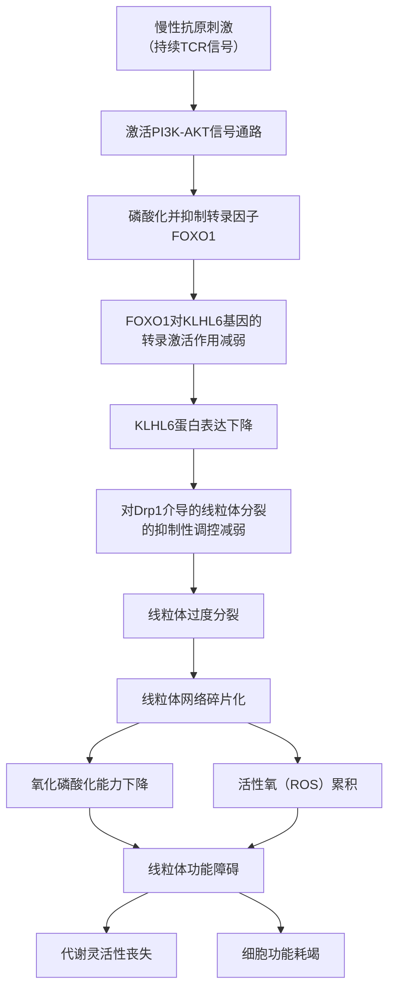

# 慢性抗原刺激下CD8+ T细胞线粒体动力学通过代谢-表观遗传互作网络调控终末耗竭与组织驻留记忆细胞命运分岔的机制研究与定量建模
## 1 引言：慢性抗原刺激下CD8+ T细胞命运抉择的代谢与表观遗传基础

在肿瘤与慢性感染等病理环境中，免疫系统的核心效应细胞——CD8⁺ T细胞面临着持续的抗原刺激。这种长期的“作战”压力，并未导向有效的免疫清除，反而常常迫使T细胞陷入功能失调的困境。深入理解这种功能障碍的根源，并寻找重塑其功能、诱导持久免疫记忆的途径，是当前免疫治疗领域突破瓶颈的关键。本报告旨在系统综述慢性抗原刺激下CD8⁺ T细胞命运抉择的生物学基础，特别聚焦于终末耗竭（Tex）与组织驻留记忆（Trm）细胞这一关键命运分岔点。我们将基于现有研究证据，阐明代谢重编程与表观遗传修饰作为协同调控者的核心作用，并揭示当前在连接特定线粒体动力学与代谢-表观遗传网络以精确解析命运分岔机制方面存在的知识缺口，从而明确本报告构建定量整合模型以解析该核心科学问题的必要性与创新性。

### 1.1 慢性抗原刺激下CD8+ T细胞的功能状态谱系与命运分岔

慢性抗原刺激下，CD8⁺ T细胞并非简单地“失活”，而是经历一个动态、线性的分化进程，最终走向功能严重受损的耗竭状态。这一过程被定义为“T细胞耗竭”，其核心特征包括效应功能渐进性丧失、增殖能力下降以及多种抑制性受体（如PD-1、TIM-3）的持续高表达[^1]。与急性感染后分化为效应细胞和记忆细胞的路径截然不同，耗竭是一个由转录、表观遗传和微环境信号共同驱动的独特分化程序[^1]。

**耗竭T细胞（Tex）遵循一个明确的三阶段分化连续体**：早期以Tex祖细胞（TCF1⁺）为代表，具有干细胞样特性，增殖能力强且功能相对完整，主要定位于淋巴组织，其耗竭状态具有可逆性；中期为中间Tex细胞（CX3CR1⁺），已获得细胞毒性功能，增殖能力进一步增强；晚期则是终末分化Tex细胞，高表达多种抑制性受体，完全丧失效应功能，其状态趋于不可逆[^1]。在癌症环境中，CD8⁺ T细胞先在肿瘤引流淋巴结形成Tex祖细胞，随后迁移至肿瘤微环境完成后续分化[^1]。

与耗竭谱系并行且常被混淆的，是经典的组织驻留记忆T细胞（Trm）。Trm通常在急性感染抗原清除后形成，表达组织驻留标志物（如CD69、CD103），具有抗原非依赖性的长期存活能力和强大的局部保护功能[^2][^3]。然而，在慢性抗原存在的组织（如肿瘤）中，大量表达CD69/CD103的T细胞，其本质并非经典Trm。近年来的突破性研究揭示，这些细胞实际上是一个独立的谱系——**组织驻留耗竭T细胞（TR-Tex）**，它由慢性抗原驱动产生，尽管表达驻留标志，但在发育来源、功能和对治疗的反应上与经典Trm存在根本区别[^2][^3]。

为了清晰对比这两个关键命运分支，下表整合了参考资料中的核心发现：

| 特征维度 | 终末耗竭T细胞 (Tex， 尤指TR-Tex) | 经典组织驻留记忆T细胞 (Trm) |
| :--- | :--- | :--- |
| **诱导条件** | 慢性抗原刺激（肿瘤、慢性感染）[^1][^2] | 急性感染，抗原清除后[^2][^3] |
| **核心功能** | 效应功能严重受损或丧失[^1][^3] | 效应功能强，可快速提供局部保护[^2][^3] |
| **关键表型** | 高表达PD-1、TIM-3、TOX等抑制性受体[^1][^2]；表达CD69/CD103（TR-Tex）[^2][^3] | 高表达CD69、CD103、Hobit等驻留标志[^2][^3] |
| **克隆构成** | 主要由肿瘤抗原反应性细胞组成[^3] | 主要由不识别肿瘤抗原的旁观者细胞，或与抗原隔离的肿瘤特异性细胞组成[^3] |
| **对PD-1/PD-L1阻断的响应** | **是主要效应细胞**，可被有效再激活并介导疗效[^2][^3] | **不响应**免疫检查点阻断疗法[^3] |
| **临床预后关联** | 富集与不良预后相关[^3] | 富集与患者良好预后相关[^3] |
| **可塑性/命运** | 终末态趋于不可逆；祖细胞具有一定可逆性[^1] | 形成稳定的记忆库，具有长期自我更新潜力[^2][^3] |

**上表的对比深刻揭示了慢性抗原刺激下CD8⁺ T细胞命运分岔的临床重要性**：一方面，终末耗竭（特别是TR-Tex）是免疫治疗需要克服的主要障碍；另一方面，诱导或维持类似Trm的功能状态，是建立持久抗肿瘤免疫的理想目标。因此，解析驱动细胞走向Tex而非Trm的分子机制，成为研究的核心。

### 1.2 代谢重编程与表观遗传修饰：T细胞命运决策的协同调控者

CD8⁺ T细胞的分化与功能状态与其深刻的代谢重编程紧密耦合。初始T细胞激活后，为满足快速增殖和效应功能的生物能量与合成需求，会上调糖酵解和谷氨酰胺分解；而记忆T细胞则更依赖氧化磷酸化和脂肪酸氧化以实现长期存活[^4]。在慢性抗原刺激和肿瘤微环境（TME）的营养压力下，T细胞的代谢程序发生紊乱，表现为**线粒体功能障碍、代谢灵活性丧失**，这不仅是能量危机，更是功能失调的上游驱动力[^5][^4]。

**代谢紊乱的核心影响之一，是直接驱动表观遗传重塑**。近年研究揭示，代谢与表观遗传通过一个紧密交织的网络协同调控T细胞命运。多种关键代谢中间体充当了表观遗传修饰的“原料”或“调节器”[^5][^4]：
*   **乙酰辅酶A**：作为组蛋白乙酰化的关键底物，其水平和来源（如来自乙酸的ACSS2通路或来自葡萄糖的ACLY通路）直接影响染色质开放状态和基因表达程序，进而决定T细胞是偏向于干细胞样/记忆状态还是终末效应/耗竭状态[^6]。
*   **α-酮戊二酸（α-KG）**：作为多种组蛋白去甲基化酶（如KDM6B）的辅因子，其水平影响抑制性标记（如H3K27me3）的去除，从而调控效应基因的表达[^4]。
*   **S-腺苷甲硫氨酸（SAM）**：作为主要的甲基供体，参与DNA和组蛋白的甲基化修饰，其可用性受TME中甲硫氨酸竞争的影响，进而影响T细胞功能相关信号通路（如STAT5）的活性[^4]。
*   **乳酸**：传统被视为代谢废物，现已被证明可诱导组蛋白乳酸化（如H3K18la），直接连接糖酵解代谢状态与染色质调控，影响能量代谢和效应功能相关基因的转录[^5][^4]。

**这一“代谢-表观遗传互作网络”将外部环境压力转化为稳定的细胞内在程序**。例如，线粒体丙酮酸载体（MPC）控制的丙酮酸代谢，通过影响乙酰辅酶A水平，调控组蛋白H3K27位点的乙酰化/甲基化平衡，从而决定CD8⁺ T细胞是向记忆型还是效应型分化[^7]。在营养匮乏的TME中，MPC抑制会改变表观遗传景观，最终导致抗肿瘤活性降低[^7]。这些证据共同表明，**代谢压力通过表观遗传机制，将CD8⁺ T细胞锁定在功能低下、难以逆转的失能轨道上**[^5]。而靶向关键表观遗传调节因子，如DNMT3A、TET2、ASXL1，已被证明可以延缓耗竭，增强T细胞的持久力和治疗响应[^8]，进一步验证了表观遗传层面对命运决定的关键调控作用。

### 1.3 知识缺口与研究命题：从关联到机制的定量整合

尽管我们对慢性抗原下CD8⁺ T细胞耗竭的代谢与表观遗传基础有了日益深入的认识，但要将这些分散的线索整合成一个能够精确解释命运分岔（Tex vs. Trm）的机制模型，仍面临显著的知识缺口。

首先，**线粒体作为细胞的能量和信号中枢，其动力学（融合/分裂平衡）和质量控制（如线粒体自噬）是代谢重编程的起点**。研究已证实，自噬调控的线粒体不对称遗传决定了CD8⁺ T细胞首次分裂后子代细胞的早期命运承诺：继承老旧线粒体的细胞记忆潜能降低，而线粒体更新快的细胞则具有更强的持久力和扩增能力[^9]。然而，这一早期决定机制如何与慢性抗原刺激下终末耗竭或组织驻留记忆的长期命运分岔相衔接？特定的线粒体形态（网状 vs. 碎片化）如何通过改变代谢物谱（如乳酸、乙酰辅酶A、α-KG的产量），进而定向影响下游的表观遗传修饰程序？这些动态的、因果性的联系尚未被阐明。

其次，虽然已有研究精准揭示了营养代谢通过特定酶（如ACSS2与ACLY）调控乙酰辅酶A来源，从而决定Tex祖细胞与终末Tex细胞命运的表观遗传机制[^6]，但这仅仅是代谢-表观遗传网络中的一个“快照”。我们缺乏在慢性抗原刺激全过程中，**线粒体动力学变化、关键代谢物波动与多层次表观遗传修饰（如组蛋白乳酸化、m6A RNA甲基化）动态演化的高分辨率时序图谱**。命运分岔的具体时间窗口、关键代谢物浓度阈值以及表观遗传修饰的级联响应顺序，目前都是模糊的。

最后，也是最为关键的，现有研究多为定性描述或静态关联分析。我们亟需一个**定量的、可计算的框架**，来整合“慢性抗原信号 → 线粒体动力学重塑 → 代谢物谱重编程 → 表观遗传修饰酶活性变化 → 靶基因表达程序改变 → 细胞命运输出”这一多层级的互作网络。这样的模型能够模拟在不同刺激强度、时长和微环境条件下网络的动态行为，预测导致Tex或Trm命运分岔的双稳态或多稳态，并理论评估针对关键节点（如DRP1、LDHA、METTL3）进行干预的潜在效果。

**因此，本报告的核心命题与创新性在于**：超越对代谢与表观遗传关联性的现象描述，致力于构建一个基于“线粒体动力学-代谢-表观遗传”互作网络的定量机制模型。该模型旨在系统解析在慢性抗原刺激这一特定条件下，上述网络如何通过动态相互作用，最终驱动CD8⁺ T细胞走向终末耗竭或组织驻留记忆这一根本性的命运分岔，从而为开发靶向该网络、精准调控T细胞命运的新型免疫治疗策略提供理论基础和预测工具。

## 2 慢性抗原刺激下CD8+ T细胞线粒体动力学的重塑与调控机制

在慢性抗原刺激的背景下，CD8⁺ T细胞的功能衰退并非孤立事件，而是始于其细胞能量与信号中枢——线粒体的深刻重塑。研究表明，无论是肿瘤相关的T细胞耗竭、慢性刺激诱导的应激性衰老，还是年龄相关的功能衰退，这些不同的CD8⁺ T细胞失能状态最终都高度收敛到一个共同的病理核心：**线粒体功能障碍与代谢灵活性丧失**[^5]。这提示我们，线粒体动力学的失衡是驱动细胞走向功能失调的上游关键事件。本章将系统解析在肿瘤微环境或慢性感染模型中，持续抗原刺激如何动态改变线粒体融合与分裂的平衡，并阐明其背后的关键调控机制，从而为理解后续的代谢重编程与表观遗传重塑奠定结构基础。

### 2.1 慢性抗原刺激对线粒体动力学蛋白表达与活性的动态影响

慢性抗原刺激通过持续激活T细胞受体（TCR）信号，引发一系列细胞内信号级联反应，最终导致线粒体动力学核心蛋白的表达与活性发生根本性改变。这种改变并非静态，而是随着刺激时间的延长呈现动态演化，最终导向线粒体网络的碎片化和功能衰退。

**核心发现表明，慢性刺激会驱动线粒体分裂机制的异常活跃与融合过程的相对抑制。** 一项关键研究揭示了泛素连接酶KLHL6在维持线粒体稳态中的核心作用。在功能正常的T细胞中，KLHL6如同一位“抗疲劳指挥官”，它通过调控PGAM5-Drp1信号轴，防止动力相关蛋白1（Drp1）介导的线粒体过度分裂，从而保证能量供应[^10]。然而，在肿瘤微环境的持续刺激下，KLHL6的表达量会大幅下降。其上游调控机制已被阐明：持续的TCR信号会激活PI3K-AKT通路，进而抑制转录因子FOXO1的活性；而FOXO1是直接结合并促进KLHL6基因转录的“上游开关”[^10]。因此，**慢性刺激通过“PI3K-AKT-FOXO1-KLHL6”信号轴的抑制，解除了对Drp1介导的过度分裂的刹车**，导致线粒体网络碎片化。

与此同时，负责线粒体融合的蛋白可能受到抑制。虽然参考资料未直接提供慢性刺激下融合蛋白（如MFN1/2, OPA1）动态变化的定量数据，但基于线粒体功能障碍的普遍观察[^6]以及线粒体融合促进生物能效应和稳定性的原理[^11]，可以合理推断，在耗竭进程中，融合蛋白的功能或表达可能未能有效抗衡增强的分裂活性，加剧了网络的解体。这种动力学失衡具有时序性：在耗竭早期或祖细胞阶段，失衡可能刚刚启动，细胞尚保留一定的代谢可塑性；而随着刺激持续，分裂优势不断累积，至终末耗竭阶段，线粒体已呈现严重的碎片化和功能衰竭，对应着代谢灵活性的彻底丧失[^5]。

为了更清晰地呈现这一动态调控过程，以下mermaid流程图整合了参考资料中揭示的关键信号通路与分子事件：



**该流程图揭示了一个从外部慢性刺激到内部线粒体结构功能崩溃的清晰因果链。** 其中，KLHL6的下游作用机制尤为关键，它一方面通过调控Drp1防止分裂过度，另一方面还能直接降解促耗竭的关键转录因子TOX蛋白[^10]。因此，KLHL6的表达下降具有双重破坏性：既导致线粒体结构损伤，又消除了一个对抗耗竭转录程序的重要因子。这凸显了**线粒体动力学调控与细胞命运决定程序之间存在直接的交联**。

### 2.2 终末耗竭前体与组织驻留记忆前体细胞的线粒体形态与功能差异

基于线粒体动力学失衡是功能失调共同起点的认识，一个合理的科学假设是：走向终末耗竭（Tex）与走向经典组织驻留记忆（Trm）这两条不同命运的CD8⁺ T细胞前体亚群，其线粒体的形态与功能在分岔早期即存在根本差异。然而，现有的参考资料主要集中于描述耗竭细胞的线粒体缺陷，对于经典Trm前体细胞的直接对比数据较为缺乏，这构成了一个重要的知识缺口。

**现有证据强烈指向Tex前体细胞倾向于拥有碎片化、功能受损的线粒体。** 如前所述，慢性抗原刺激通过特定信号轴导致Drp1活性失调和KLHL6表达下降，驱动线粒体过度分裂[^10]。这种碎片化的线粒体网络效率低下，表现为氧化磷酸化能力下降和活性氧累积[^5]。在耗竭T细胞中，这种代谢状态的改变是普遍观察到的特征，它们更依赖于糖酵解，并且丧失了在不同代谢通路间灵活切换的能力[^6]。因此，可以推断，在Tex分化路径上，即使是具有干细胞样特性的Tex祖细胞（TCF1⁺），其线粒体也可能已经开始呈现功能减弱或碎片化的趋势，为其后续向终末耗竭状态分化埋下伏笔。

**相反，经典Trm细胞的形成通常与急性感染后抗原清除相关，其代谢特征更偏向于依赖氧化磷酸化和脂肪酸氧化的安静记忆状态。** 虽然参考资料未提供Trm前体细胞线粒体形态的直接成像证据，但根据线粒体融合促进生物能效应和细胞稳定性的原理[^11]，可以合理推测，能够成功分化为持久、功能完整的Trm细胞的那些前体，更可能维持着一个相互连接、高效的网状线粒体网络。这种结构有利于高效的氧化磷酸化，提供稳定的能量和代谢中间产物，支持细胞的长期存活和快速应答潜能，即维持了“代谢灵活性”。

为了直观对比这两种假定状态，以下表格基于现有信息进行归纳与合理推测：

| 比较维度 | 终末耗竭前体细胞（如Tex祖细胞） | 经典组织驻留记忆前体细胞 |
| :--- | :--- | :--- |
| **线粒体形态** | **推测趋向碎片化**：受慢性刺激下分裂信号主导，网络连接性差。 | **推测为网状/融合态**：有利于能量和代谢物高效传递与利用。 |
| **核心代谢特征** | **氧化磷酸化减弱，糖酵解依赖增强**，代谢灵活性丧失[^6]。 | **推测以氧化磷酸化和脂肪酸氧化为主**，具备代谢可塑性。 |
| **功能输出关联** | 结构损伤导致功能衰退，与效应功能丧失、抑制性受体高表达相关联[^1]。 | 结构完整支持功能持久，与长期保护性免疫记忆相关联。 |
| **关键调控差异** | KLHL6表达被抑制，Drp1活性失调，可能伴随融合蛋白功能相对不足。 | **推测存在不同的信号和表观遗传程序**，维持融合与分裂的健康平衡。 |

**上表的对比揭示了线粒体形态很可能是细胞命运分岔的早期标志和物质基础。** **碎片化的线粒体不仅意味着“能量危机”，更通过改变代谢物谱（如减少用于乙酰化的乙酰辅酶A、增加乳酸等），为下游驱动耗竭的表观遗传重塑提供了特定的代谢环境**[^5]。而**网状的线粒体则可能支持一套完全不同的代谢-表观遗传程序，最终锁定记忆相关基因的表达**。未来研究亟需利用高分辨率活细胞成像等技术，在体内外模型中直接验证并量化这一形态学差异，从而填补这一关键知识缺口。

### 2.3 整合应激信号通路对线粒体动力学平衡的调控网络

慢性抗原刺激下的肿瘤微环境是一个多重压力汇聚的场所，包括持续的抗原信号、营养竞争、缺氧以及代谢废物堆积等[^5]。CD8⁺ T细胞必须整合这些应激信号，并通过一系列高度保守的信号通路来调整其线粒体动力学，以应对环境挑战。然而，在慢性刺激下，这种调控网络常常失灵，导致线粒体稳态不可逆地偏向分裂与功能障碍。

**持续抗原信号是引发线粒体动力学紊乱的始动和核心因素。** 如前文2.1节详细阐述的，“慢性TCR信号 → PI3K-AKT激活 → FOXO1抑制 → KLHL6表达下降 → Drp1介导的线粒体过度分裂”是一条已被实验证实的完整调控轴[^10]。这条通路直接将细胞外部的抗原刺激强度与细胞内部线粒体的结构命运联系起来。

**能量与营养感应通路（AMPK/mTOR）是调控线粒体动力学的关键枢纽。** 当肿瘤微环境中葡萄糖等营养被肿瘤细胞大量消耗时，T细胞内AMP/ATP比值升高，激活AMPK。正常情况下，AMPK可促进线粒体生物合成和脂肪酸氧化，并可能通过抑制Drp1活性或促进融合来维持线粒体健康[^11]。然而，在慢性刺激和持续PI3K-AKT信号的影响下，营养感应通路可能失调。例如，即使能量不足，异常的AKT信号也可能维持mTORC1的活性，而mTORC1的持续激活会抑制线粒体自噬和氧化代谢，并可能促进合成代谢和糖酵解，这与耗竭细胞的代谢特征相符[^6]。**因此，AMPK的激活不足与mTOR信号的失调，共同削弱了细胞应对代谢压力的能力，加剧了线粒体功能障碍。**

**内质网应激与未折叠蛋白反应（UPR）是连接蛋白质稳态与线粒体功能的重要桥梁。** 肿瘤微环境中的氧化应激和代谢紊乱可导致内质网中错误折叠蛋白累积，引发UPR。严重的或持续的ER应激会导致钙离子释放并进入线粒体，可能诱导线粒体通透性转换孔开放，导致线粒体肿胀和碎片化，甚至细胞凋亡。虽然参考资料中未详细展开此通路，但它是连接微环境压力与线粒体损伤的一个潜在重要途径。

综上所述，慢性抗原刺激下CD8⁺ T细胞线粒体动力学的重塑，是一个受多层次信号网络精密调控的过程。**持续的TCR信号通过PI3K-AKT-FOXO1轴发起对分裂抑制因子KLHL6的转录抑制，是启动分裂优势的核心驱动力**；而肿瘤微环境中的能量与营养压力则通过失调的AMPK/mTOR信号，进一步削弱了细胞维持线粒体融合与功能的能力。这些信号通路相互交织，共同将外部慢性刺激信号转化为线粒体网络碎片化的内在结构改变，为后续的代谢僵化和表观遗传程序锁定提供了物理基础。

## 3 线粒体动力学失衡对CD8+ T细胞代谢物谱的重编程作用

慢性抗原刺激通过重塑CD8⁺ T细胞的线粒体动力学，不仅改变了细胞的能量工厂结构，更深刻重编程了其内部的化学物质谱系——代谢物谱。这些代谢中间体不仅是能量货币或合成原料，更是调控细胞命运的关键信号分子和表观遗传修饰的底物。本章将系统解析线粒体动力学失衡（特别是过度分裂导致的碎片化）如何作为上游驱动力，迫使细胞代谢模式发生根本性转变，并定量改变乳酸、乙酰辅酶A、α-酮戊二酸及NAD⁺等核心代谢物的胞内浓度与动态平衡。通过整合肿瘤微环境（TME）的胁迫压力与衰老等慢性应激模型的数据，我们将构建一个从线粒体结构损伤到代谢物谱紊乱的清晰因果链条，为后续理解代谢物如何驱动表观遗传重塑并最终锁定细胞命运提供坚实的物质基础。

### 3.1 线粒体形态与核心代谢通路的因果关联：从碎片化到糖酵解依赖

线粒体动力学失衡对CD8⁺ T细胞代谢的重编程作用，其核心在于**线粒体网络的结构完整性直接决定了细胞的代谢模式与灵活性**。在肿瘤、慢性感染及衰老等病理状态下，CD8⁺ T细胞尽管诱因不同，但其功能障碍最终都高度收敛到一个共同的病理核心：**线粒体功能障碍与代谢灵活性丧失**[^5]。这种“代谢僵化”状态并非被动结果，而是由线粒体动力学失衡主动驱动的。

**慢性抗原刺激导致的线粒体过度分裂与碎片化，是氧化磷酸化（OXPHOS）能力下降和糖酵解通量增强的直接结构原因。** 碎片化的线粒体网络失去了高效的膜电位传导和代谢物交换能力，导致氧化磷酸化效率降低，同时活性氧（ROS）累积[^5]。随着这一“能量与信号中枢”的失衡，T细胞逐渐丧失了在不同代谢通路之间灵活切换的能力，无法根据环境需求在糖酵解、脂肪酸氧化和氨基酸代谢之间进行动态调整[^5]。**这种代谢灵活性的丧失，意味着细胞被锁定在一种僵化的、通常以糖酵解为主的代谢状态中，无法有效支持持久的效应功能和记忆形成。**

**相反，维持健康、融合的线粒体网络是支持高效氧化代谢和细胞功能持久性的基础。** 饮食限制（DR）的研究为此提供了有力的反向证据。DR通过提升循环和肿瘤组织中的酮体β-羟丁酸（β-OHB）水平，促进了CD8⁺ T细胞的线粒体酮体氧化代谢[^12]。这一过程增强了线粒体的氧化磷酸化（OXPHOS）活性和三羧酸循环（TCA）通量，提高了ATP产量和乙酰辅酶A的合成[^12]。功能上，这直接导致了肿瘤微环境中效应性CD8⁺ T细胞比例和细胞毒性的显著增加，同时耗竭标志物表达降低[^12]。**DR的效应清晰地表明，当线粒体功能得到改善和加强（可能伴随融合态优势），细胞能够有效地利用氧化代谢通路，从而获得并维持强大的抗肿瘤功能。**

为了更直观地对比这两种由不同线粒体状态驱动的代谢模式及其功能结局，以下表格进行了系统归纳：

| 比较维度 | **线粒体碎片化驱动的代谢僵化（慢性刺激/耗竭）** | **线粒体健康/融合支持的氧化代谢（如DR干预）** |
| :--- | :--- | :--- |
| **线粒体形态** | 过度分裂，网络碎片化，结构受损。 | 推测为融合态或健康网状，结构完整。 |
| **核心代谢特征** | **OXPHOS能力下降，糖酵解依赖增强**，代谢灵活性丧失，无法在通路间切换[^5]。 | **OXPHOS和TCA循环活性增强**，能有效利用酮体（β-OHB）等燃料进行氧化代谢[^12]。 |
| **关键代谢物变化** | 乳酸累积，乙酰辅酶A可能错误导向合成代谢，NAD⁺耗竭。 | β-OHB水平升高，乙酰辅酶A生成增加并用于能量产生和组蛋白乙酰化。 |
| **细胞功能输出** | 效应功能衰退，增殖能力下降，走向耗竭或衰老[^5]。 | 效应功能（如GZMB、IFN-γ分泌）增强，耗竭减少，抗肿瘤能力提升[^12]。 |
| **上游调控** | 慢性TCR信号抑制FOXO1-KLHL6轴，导致Drp1介导的过度分裂。 | DR激活SIRT1/AMPK等通路，提升酮体生成，促进线粒体氧化代谢。 |

**综上所述，线粒体动力学失衡是代谢模式重编程的“扳机”。** 慢性刺激下的碎片化线粒体强制细胞进入一种低效、不可持续的糖酵解依赖状态，而维持或恢复线粒体的融合与健康则能解锁高效的氧化代谢，为细胞功能的持久性提供能量和合成支持。这一定性关联为后续定量分析特定代谢物的变化奠定了逻辑基础。

### 3.2 关键代谢中间体的定量变化：乳酸、乙酰辅酶A与α-酮戊二酸的动态图谱

线粒体功能障碍所引发的代谢模式切换，最终体现为一系列关键代谢中间体在浓度、分布和流向上的定量改变。这些代谢物不仅是能量代谢的中间产物，更是连接线粒体状态与下游基因表达程序的关键信使。

**1. 乳酸：从代谢废物到多维度调控因子的演变**
在糖酵解依赖增强的背景下，乳酸的产生与命运成为核心。传统上，乳酸被视为糖酵解的终末废物，但近十年研究彻底重塑了其角色，确立了其在免疫调控中的三重功能：作为TCA循环的燃料、通过GPR81等受体的信号分子、以及通过组蛋白乳酸化修饰的表观遗传调节因子[^13]。
*   **生成与累积**：在肿瘤微环境中，Warburg效应的肿瘤细胞和糖酵解增强的免疫细胞大量产生乳酸。同时，异常的血管导致缺氧，进一步通过HIF-1α信号加剧糖酵解和乳酸生成[^5]。乳酸通过单羧酸转运蛋白（如MCT1）在细胞间传递和累积，形成酸性的免疫抑制微环境[^13]。
*   **浓度的精细调控**：乳酸的水平并非固定不变，而是受到特定代谢物的精确调控。例如，在异柠檬酸脱氢酶（IDH）突变的肿瘤中，致癌代谢物D-2-羟基戊二酸（D-2HG）能够通过抑制乳酸脱氢酶（LDH）的活性，直接降低乳酸/丙酮酸的比例，从而抑制CD8⁺ T细胞的糖酵解通量[^14]。**这证明乳酸生成是一个可被定量干预的节点，其胞内浓度变化直接影响T细胞的代谢状态和功能。**
*   **功能的多重性**：高浓度乳酸在TME中主要扮演免疫抑制角色，例如通过酸化环境、干扰代谢和上调PD-1表达来驱动T细胞耗竭[^5]。然而，研究也证实乳酸可被T细胞摄取并进入线粒体TCA循环氧化供能，提示其代谢流向具有可塑性[^13]。

**2. 乙酰辅酶A：代谢流向决定功能命运**
乙酰辅酶A是代谢网络的中心枢纽，其来源和去向深刻影响CD8⁺ T细胞的功能状态。
*   **来源一：酮体氧化（功能增强路径）**。饮食限制（DR）研究中，升高的β-OHB被T细胞摄取后，经BDH1等酶转化为乙酰辅酶A，进入TCA循环[^12]。这不仅增加了ATP产出，也提升了用于组蛋白乙酰化的乙酰辅酶A池，从而促进与效应功能和记忆形成相关的基因表达[^12]。**这代表了在健康线粒体支持下，乙酰辅酶A被导向能量产生和有益的表观遗传修饰。**
*   **来源二：葡萄糖代谢及错误分流（功能受损路径）**。在肿瘤微环境的代谢压力下，CD8⁺ T细胞的乙酰辅酶A代谢出现严重障碍。研究发现，肿瘤浸润CD8⁺ T细胞中乙酰辅酶A羧化酶（ACC）表达显著升高[^15]。ACC将乙酰辅酶A羧化为丙二酰辅酶A，进而促进脂肪酸合成，导致脂滴在胞质中异常累积[^15]。**这一过程错误地将本可用于能量产生的乙酰辅酶A导向了脂质储存，同时累积的脂滴还会进一步损害线粒体的脂肪酸氧化能力，形成“能量危机-功能受损”的恶性循环。**

**3. α-酮戊二酸（α-KG）：连接代谢与表观遗传的桥梁**
α-KG是三羧酸循环的关键中间体，同时也是多种α-酮戊二酸依赖性双加氧酶（如组蛋白去甲基化酶、DNA去甲基化酶）的必需辅因子[^5]。其细胞内水平直接受线粒体TCA循环通量的影响。当线粒体功能健全、氧化代谢活跃时，充足的α-KG可支持这些去甲基化酶的活性，有助于维持染色质的开放状态和激活与效应功能相关的基因程序。反之，线粒体功能障碍导致的TCA循环减缓可能降低α-KG水平，从而影响相关的表观遗传重塑过程。

为了清晰呈现这些关键代谢物在线粒体动力学失衡后的变化规律及其功能含义，以下表格进行了整合分析：

| 关键代谢物 | 主要变化趋势（线粒体功能障碍下） | 直接原因/调控机制 | 对CD8⁺ T细胞功能的核心影响 |
| :--- | :--- | :--- | :--- |
| **乳酸** | **胞外浓度显著累积**，胞内生成可能受特定信号调控（如D-2HG抑制LDH时降低）[^14]。 | TME中糖酵解增强、缺氧；通过MCT转运蛋白传递；受LDH活性等调控[^5][^13][^14]。 | **双重角色**：高浓度抑制细胞毒性、驱动耗竭；亦可作为燃料被氧化利用。是组蛋白乳酸化的直接底物[^13]。 |
| **乙酰辅酶A** | **代谢流向错误**：从OXPHOS和组蛋白乙酰化分流至脂肪酸合成，导致脂滴累积[^15]。 | ACC酶表达上调，将乙酰辅酶A导向脂肪酸合成途径；OXPHOS受损减少其消耗[^15]。 | 导致能量生成不足和合成代谢紊乱，削弱效应功能；影响组蛋白乙酰化水平。 |
| **α-酮戊二酸 (α-KG)** | **水平可能下降**（推断）。 | 线粒体TCA循环通量降低，导致生成减少。 | 可能限制去甲基化酶活性，影响染色质重塑和基因表达，不利于维持细胞活性。 |
| **β-羟丁酸 (β-OHB)** | **在DR干预下水平显著提升**（血清4倍，肿瘤组织3倍）[^12]。 | DR激活肝脏和脂肪组织的酮体合成通路（如SIRT1/AMPK）[^12]。 | 作为替代燃料增强线粒体OXPHOS和乙酰辅酶A生成，促进效应功能，抑制耗竭。 |

### 3.3 肿瘤微环境中的代谢胁迫与NAD⁺稳态失衡

肿瘤微环境（TME）并非一个被动的背景，而是一个主动施加多重代谢胁迫的“战场”，这些胁迫因素与细胞内在的线粒体缺陷相互叠加，共同加剧代谢物谱的异常。其中，烟酰胺腺嘌呤二核苷酸（NAD⁺）稳态的失衡尤为关键，它直接构成了连接线粒体功能障碍、代谢僵化与表观遗传失调的核心节点。

**TME的“代谢围剿”放大线粒体危机。** 在TME中，CD8⁺ T细胞面临多重打击：肿瘤细胞对葡萄糖和必需氨基酸的激烈竞争，使其难以获得基础营养；结构异常的肿瘤血管导致长期缺氧，激活HIF-1α通路，进一步扰乱线粒体代谢并促进糖酵解；PD-1等免疫检查点信号还会抑制线粒体自噬，使受损的线粒体无法被及时清除；此外，乳酸、氨等代谢废物在局部的持续堆积，不断加重细胞的代谢与氧化应激[^5]。**这些因素共同作用，使得已经因慢性刺激而碎片化的线粒体网络雪上加霜，彻底丧失了恢复代谢灵活性的可能，并将细胞推向功能衰竭的终局。**

**NAD⁺耗竭：衰老与慢性应激下的代谢崩溃点。** 在衰老（作为一种累积性慢性应激）的CD8⁺ T细胞中，NAD⁺水平的显著下降被确定为CAR-T疗效差的根源[^16]。这一现象很可能也存在于长期处于TME压力的耗竭T细胞中。NAD⁺稳态的失衡并非单一原因造成，而是“降解增加”与“消耗加剧”双重打击的结果：
1.  **降解增加**：衰老CD8⁺ T细胞高表达CD38，这是一种能够直接降解NAD⁺及其前体（如NMN、NR）的多功能酶，导致外源性补充效果不佳[^16]。
2.  **消耗加剧**：慢性应激累积的DNA损伤会激活聚ADP核糖聚合酶（PARP），而PARP是细胞内主要的NAD⁺消耗酶，其激活进一步加剧了NAD⁺的耗竭[^16]。

**NAD⁺耗竭引发下游连锁功能崩溃。** NAD⁺不仅是氧化磷酸化中的关键辅酶，也是SIRT家族去乙酰化酶的重要底物。其水平下降直接导致：
*   **线粒体功能全面障碍**：表现为膜电位降低、耗氧率（OCR）下降、线粒体嵴结构减少以及活性氧（ROS）积累[^16]。
*   **表观遗传调控失调**：SIRT酶活性受损，影响组蛋白去乙酰化等过程，进而干扰正常的基因表达程序。
*   **干细胞样特性丧失**：维持记忆T细胞潜能的關鍵基因（如TCF1）表达下调，细胞无法形成持久的免疫记忆[^16]。

**干预验证证明其中心地位。** 研究证实，采用CD38抑制剂联合补充NAD⁺前体（如NMN）的策略，可以有效恢复衰老CD8⁺ T细胞中的NAD⁺水平，并逆转其线粒体功能障碍和干细胞样特性丧失的表型[^16]。**这一成功的干预强有力地证明了NAD⁺稳态在代谢-功能调控网络中的核心枢纽地位。**

**因此，线粒体动力学失衡通过破坏代谢灵活性，导致以乳酸累积、乙酰辅酶A流向错误和NAD⁺耗竭为特征的代谢物谱重编程。** 这些特定的代谢环境，为后续通过表观遗传机制（如乳酸化、乙酰化、去乙酰化受阻）将细胞锁定在功能低下的状态，提供了必需的化学底物和信号条件。

## 4 代谢物介导的表观遗传重塑：聚焦m6A修饰与组蛋白乳酸化

慢性抗原刺激通过重塑线粒体动力学，深刻改变了CD8⁺ T细胞内部的代谢物谱。这些代谢中间体远非简单的能量载体或合成原料，而是直接作为信号分子和化学底物，精确调控着细胞的核心表观遗传程序。本章将深入解析由线粒体功能障碍所导致的关键代谢物（如乳酸、S-腺苷甲硫氨酸/SAM、α-酮戊二酸/α-KG）浓度变化，如何动态影响“写入”与“擦除”酶的活性，从而塑造组蛋白乳酸化和m6A RNA甲基化的修饰景观。这些表观遗传层面的重塑，最终将差异化的基因表达程序“写入”染色质和转录组，成为驱动细胞走向终末耗竭（Tex）或保留组织驻留记忆（Trm）潜能的关键分子开关。

### 4.1 乳酸驱动的组蛋白乳酸化修饰：从代谢废物到表观遗传指令

在慢性抗原刺激和肿瘤微环境（TME）的胁迫下，CD8⁺ T细胞的代谢向糖酵解依赖转变，导致乳酸生成大量增加。传统上被视为代谢废物的乳酸，其角色已被彻底重塑。近十年研究确立了乳酸的三重功能：作为三羧酸循环（TCA）的燃料、通过GPR81等受体的信号分子、以及**通过组蛋白乳酸化修饰直接参与表观遗传调控**[^13]。在CD8⁺ T细胞中，这一修饰机制将细胞的即时代谢状态转化为稳定的基因表达指令，深刻影响其功能命运。

**乳酸化修饰的分子通路始于乳酸的核内累积与活化。** 在缺氧或高糖酵解条件下，乳酸通过单羧酸转运蛋白（如MCT1/4）进入细胞核[^17][^18]。在核内，酰基辅酶A合成酶短链家族成员2（ACSS2）催化乳酸生成乳酰辅酶A，随后由组蛋白乙酰转移酶p300/CBP将乳酰基转移至组蛋白（或非组蛋白）赖氨酸残基的ε-氨基，形成赖氨酸乳酸化（Kla）修饰[^17][^18]。这一过程将乳酸这一代谢产物直接转化为表观遗传“书写”的化学底物。

**T细胞活化特异性驱动组蛋白乳酸化，并富集于转录起始位点以驱动基因表达。** 美国德克萨斯大学MD安德森癌症中心的研究提供了关键证据：活化的CD8⁺ T细胞相较于初始细胞，其组蛋白H3第18位赖氨酸乳酸化（H3K18la）和第9位赖氨酸乳酸化（H3K9la）水平显著升高，且这种增加具有抗原特异性[^19]。染色质免疫沉淀测序（ChIP-seq）分析表明，富含H3K18la或H3K9la标记的染色质区域在转录起始位点（TSS）和CpG岛近端显著富集，显示它们直接参与转录起始的调控[^19]。更重要的是，携带这些乳酸化标记的启动子和增强子区域显示出更高的RNA聚合酶II占有率，表明**H3K18la和H3K9la在驱动CD8⁺ T细胞关键基因转录方面具有协同效应**[^19]。这些基因的启动子区分别富集了Ets转录因子和锌指转录因子的结合基序，而这些转录因子在T细胞分化、稳态和功能中至关重要。

**不同乳酸化位点可能导向差异化的细胞命运程序。** 研究表明，H3K18la和H3K9la在CD8⁺ T细胞不同分化阶段中的富集模式与功能存在差异[^19]。例如，在初始T细胞中，H3K9la主要富集于维持细胞静止状态的基因上；而在活化状态下，H3K18la则与效应功能相关基因的激活更为密切[^19]。这提示我们，**乳酸化修饰并非均质化的激活信号，其位点特异性可能编码了不同的功能指令**。在慢性抗原刺激导致的持续高乳酸环境中，异常增强且可能失调的H3K18la修饰，可能过度驱动效应分化并最终锁定耗竭程序；而有利于记忆形成的表观遗传环境，可能需要不同的乳酸化修饰模式或与其他修饰（如特定乙酰化）的平衡。因此，乳酸化修饰的精确“书写”与“擦除”，成为连接代谢压力与Tex/Trm命运分岔的一个关键表观遗传层。

### 4.2 甲硫氨酸代谢与m6A RNA甲基化的动态调控网络

除了组蛋白修饰，信使RNA（mRNA）上的表观转录组修饰，特别是N6-甲基腺嘌呤（m6A），是调控CD8⁺ T细胞功能的另一核心机制。m6A修饰的动态平衡由“写入器”（甲基转移酶，如METTL3/METTL14）、“擦除器”（去甲基化酶，如FTO/ALKBH5）和“阅读器”共同调控[^20]。而这一平衡的支点，深深植根于细胞的甲硫氨酸代谢循环中，并受到微环境营养和外部干预的精细调节。

**S-腺苷甲硫氨酸（SAM）是m6A修饰经典的甲基供体。** METTL3-METTL14复合物催化mRNA上m6A修饰的形成，这一过程严格依赖SAM作为甲基供体[^20][^21]。因此，细胞内SAM的可用性直接决定了m6A修饰的全局水平。在肿瘤微环境中，肿瘤细胞对甲硫氨酸的激烈竞争可能限制T细胞内SAM的合成，从而潜在扰乱其正常的m6A修饰景观，影响与增殖、效应功能相关mRNA的稳定性、剪接或翻译效率。

**甲硫氨酸代谢通过非SAM依赖的新机制特异性调控m6A修饰。** 中山大学徐瑞华院士团队的研究揭示了一条全新的调控通路：甲硫氨酸代谢酶腺苷高半胱氨酸酶（AHCY）与腺苷（ADO）结合，形成AHCY-腺苷复合物[^21]。该复合物促进了AHCY的二聚化，而二聚化的AHCY能够阻碍去甲基化酶FTO与特定RNA序列（含VWDRACH基序）的结合，从而**特异性地上调部分mRNA（尤其是脂质生成基因ACACA和SCD1）的m6A修饰水平**，最终驱动脂肪酸合成和肿瘤发生[^21]。这一发现表明，甲硫氨酸代谢不仅能通过SAM供应全局影响m6A，还能通过酶复合物的变构调节，对特定基因群的m6A修饰进行精准干预。

**外部干预可通过重塑菌群-代谢轴影响m6A修饰与T细胞功能。** 广西医科大学的研究为此提供了范例：间歇性禁食（IF）通过重塑肠道菌群，降低了产甲硫氨酸菌群（如Alistipes）的丰度，导致宿主血清和脑中的甲硫氨酸及SAM水平下降[^22]。这进一步驱动了RNA m6A修饰水平的下调，并抑制了TGF-β信号通路，从而特异性抑制了TP53突变型胶质母细胞瘤的生长[^22]。这一“肠道菌群-甲硫氨酸-m6A-信号通路”轴清晰地展示了，外部环境与代谢物、表观遗传修饰及细胞命运之间存在着可干预的因果链条。

**在慢性抗原刺激下，代谢压力可能通过SAM可用性改变和AHCY-ADO等非经典通路的激活，共同导致m6A修饰景观的失衡。** 这种失衡可能表现为：促耗竭转录因子（如TOX）或信号通路相关mRNA的m6A修饰异常稳定，增强其表达；而维持记忆潜能（如TCF1）或效应功能的关键mRNA的修饰模式紊乱，导致其降解或翻译抑制。**因此，m6A修饰的动态变化构成了代谢压力影响CD8⁺ T细胞转录组稳定性和功能命运的又一关键表观遗传维度。**

### 4.3 代谢物互作与表观遗传修饰酶的变构调节

代谢物对表观遗传的调控并非孤立进行，而是通过一个复杂的互作网络，以协同、竞争或变构调节的方式，共同塑造最终的修饰景观。理解这些互作关系，是解析代谢-表观遗传网络整合调控逻辑的关键。

**α-酮戊二酸（α-KG）作为核心辅因子，连接线粒体功能与去甲基化酶活性。** α-KG是三羧酸循环的关键中间体，同时也是FTO、ALKBH5等m6A去甲基化酶以及多种组蛋白去甲基化酶发挥催化活性的必需辅因子[^20]。线粒体功能障碍导致的TCA循环减缓，可能降低细胞内α-KG的水平，从而**全局性限制这些“擦除器”酶的活性**。这会导致甲基化修饰（无论是m6A还是组蛋白甲基化）的异常累积，降低表观遗传的可塑性，可能将基因表达程序锁定在特定状态，例如推动耗竭。

**NAD⁺稳态失衡影响SIRT家族去乙酰化/去乳酸化酶的活性。** 如前所述，在衰老或慢性应激的CD8⁺ T细胞中，NAD⁺的耗竭是一个标志性事件。NAD⁺是SIRT家族蛋白（如SIRT1, SIRT3）的关键底物，这些酶具有去乙酰化甚至去乳酸化的活性[^18]。NAD⁺水平下降会直接抑制SIRT酶的活性，导致组蛋白乙酰化或乳酸化修饰的异常累积，干扰正常的基因表达程序。这构成了代谢压力（通过CD38等消耗NAD⁺）影响表观遗传“擦除”过程的另一条通路。

**代谢物对相同修饰位点存在竞争性调节。** 这种竞争性体现在多个层面。首先，乳酸化与乙酰化竞争组蛋白上相同的赖氨酸残基，由相同的酶（p300/CBP）催化，但使用不同的酰基-CoA底物（乳酰-CoA vs. 乙酰-CoA）[^18]。在乳酸富集的环境中，可能更倾向于发生乳酸化，从而改变染色质调控的结局。其次，不同的酰基-CoA分子（如乳酰-CoA、乙酰-CoA、巴豆酰-CoA）可能竞争p300/CBP的催化位点，微环境代谢物的相对浓度决定了哪种修饰占主导。例如，在肿瘤微环境中，乳酸富集可能抑制巴豆酰化同时促进乳酸化，从而驱动免疫抑制基因的表达[^18]。

为了整合上述复杂的互作关系，以下构建了一个简化的“代谢物-表观遗传修饰酶”调控网络图，以说明在慢性刺激导致的特定代谢物谱下，如何协同改变核心修饰的动态平衡：

```mermaid
graph TD
    subgraph “慢性刺激下的代谢物谱”
        A[高乳酸] --> C
        B[低α-KG/低SAM/低NAD+] --> D
        B --> E
        B --> F
    end

    subgraph “表观遗传修饰酶活性变化”
        C[p300/CBP催化活性] --> G[组蛋白乳酸化↑]
        D[FTO/ALKBH5去甲基化活性↓] --> H[m6A修饰累积↑]
        E[组蛋白去甲基化酶活性↓] --> I[组蛋白甲基化累积↑]
        F[SIRT去乙酰化/去乳酸化活性↓] --> J[组蛋白乙酰化/乳酸化累积↑]
    end

    subgraph “竞争与互作”
        A --竞争相同赖氨酸位点与酶--> K[组蛋白乙酰化↓?]
        L[不同酰基-CoA底物] --竞争p300/CBP--> C
    end

    G & H & I & J --> M[染色质与转录组景观改变]
    M --> N[基因表达程序锁定]
```

**该网络图揭示，慢性抗原刺激通过重塑代谢物谱，并非单一地增强或抑制某一种修饰，而是协同性地改变了一个互相关联的酶活性网络。** 高乳酸直接推动乳酸化“写入”；同时，α-KG、SAM、NAD⁺的不足分别抑制了m6A和组蛋白甲基化的“擦除”、以及乙酰化/乳酸化的“擦除”。这种“写入”增强与“擦除”减弱的组合效应，共同将染色质和转录组推向一个异常稳定、可塑性降低的状态，为耗竭等失能程序的锁定创造了表观遗传条件。

### 4.4 表观遗传重塑与Tex/Trm命运分岔的基因程序锁定

前述代谢物驱动的表观遗传重塑，其最终功能输出在于差异性地激活或沉默特定的基因表达程序，从而将CD8⁺ T细胞锁定在截然不同的命运轨道上——终末耗竭（Tex）或具有组织驻留记忆（Trm）潜能。本节将综合前文机制，系统阐述这一锁定过程。

**组蛋白乳酸化差异性地标记并驱动与效应/耗竭相关的基因程序。** 研究表明，在活化的CD8⁺ T细胞中，H3K18la富集于转录起始位点，并与高RNA聚合酶II占有率协同，驱动关键基因的转录[^19]。虽然具体靶基因谱在参考资料中未完全列出，但可以合理推断，在慢性抗原持续刺激、乳酸持续高水平的环境中，H3K18la可能过度驱动与效应分化、细胞增殖及激活相关基因的转录。然而，缺乏适当的“关闭”信号（如其他修饰的平衡或及时擦除）和持续的代谢压力，这种过度激活可能最终导致功能紊乱，并伴随抑制性受体（如PD-1, TIM-3）基因的表达上调——这正是耗竭T细胞的典型特征[^1]。因此，**失调的乳酸化修饰可能通过异常维持一个“高激活但功能失调”的转录程序，参与推动Tex分化。**

**m6A修饰的动态变化通过调控关键mRNA命运来影响细胞命运抉择。** m6A修饰可影响mRNA的稳定性、剪接、出核和翻译效率。在慢性刺激下，异常的m6A修饰景观可能通过多种方式推动耗竭：
1.  **稳定促耗竭转录程序**：例如，上调驱动耗竭的核心转录因子TOX或其下游靶基因mRNA的m6A修饰，增强其稳定性，从而持续激活耗竭程序[^23]。
2.  **抑制记忆/干性潜能**：下调维持记忆和干细胞样特性关键基因（如TCF7, IL7R, FOXO1）mRNA的m6A修饰，可能使其更易降解，从而削弱细胞的持久力和自我更新能力[^23]。
3.  **干扰关键信号通路**：通过改变STAT家族、TGF-β等信号通路相关元件的m6A修饰，扰乱正常的细胞因子响应和功能调控[^22][^23]。

**有利于Trm分化的表观遗传环境推测。** 与Tex路径相反，成功形成经典Trm细胞可能需要一套不同的表观遗传修饰模式。在急性感染后抗原清除、代谢转向高效氧化磷酸化的环境下，我们推测可能存在以下特征：1）**特定的组蛋白乙酰化模式**：由充足的乙酰辅酶A驱动，在记忆相关基因启动子区建立开放的染色质结构；2）**受控的乳酸化水平**：乳酸生成减少，且可能存在有效的去乳酸化机制（如SIRT酶活性正常），避免过度或持久的乳酸化修饰；3）**稳定的m6A修饰景观**：SAM供应稳定，m6A“写入”与“擦除”平衡，确保记忆相关转录程序mRNA的适度稳定和可调控的翻译。这种环境支持TCF1等关键转录因子的持续表达，将细胞锁定在长期存活、快速应答的记忆轨道上。

**本章揭示的代谢-表观遗传互作节点是定量建模的关键机制层。** 综上所述，慢性抗原刺激通过线粒体动力学失衡，重塑了乳酸、SAM、α-KG、NAD⁺等关键代谢物的浓度。这些代谢物作为底物、辅因子或变构调节剂，动态调控着p300/CBP（乳酸化）、METTL3/14（m6A写入）、FTO/ALKBH5（m6A擦除）以及SIRT（去乙酰化/去乳酸化）等核心表观遗传修饰酶的活性。酶活性的变化最终差异性地塑造了组蛋白乳酸化和m6A修饰的景观，从而选择性激活耗竭相关基因程序或维持记忆相关基因程序，完成细胞命运的锁定。**这些节点——包括特定的代谢物浓度、酶动力学参数、修饰位点分布与基因表达输出的定量关系——构成了连接上游线粒体状态与下游命运输出的、可计算的核心机制层。** 然而，当前参考资料在提供精确的浓度阈值、酶促反应动力学常数以及修饰-表达定量关联数据方面仍存在显著缺失，这为后续构建高保真定量模型指明了关键的数据需求方向。

## 5 表观遗传重塑对终末耗竭与Trm细胞基因程序的定向调控

在前期章节建立的“慢性抗原刺激 → 线粒体动力学失衡 → 代谢物谱重编程 → 表观遗传修饰酶活性变化”因果链条基础上，本章将聚焦于表观遗传重塑作为最终执行者，如何定向调控并锁定终末耗竭（Tex）与经典组织驻留记忆（Trm）细胞的基因表达程序。我们将系统整合参考资料，首先明确在慢性抗原刺激下，组蛋白乳酸化与m6A RNA甲基化在Tex与Trm谱系中的修饰特征差异。其次，深入剖析这些修饰如何通过招募特定阅读器或改变染色质可及性，分别稳定促耗竭或促Trm的转录程序。最后，本章将探讨表观遗传修饰间的互作及关键表观遗传调节因子的突变如何影响命运分岔的平衡，从而为构建定量模型提供关键的调控节点与逻辑关系。

### 5.1 组蛋白乳酸化在Tex与Trm谱系基因启动子区的差异化分布与功能

组蛋白乳酸化，特别是H3K18la和H3K9la，作为直接连接糖酵解代谢状态与染色质调控的新型表观遗传修饰，在CD8⁺ T细胞不同功能亚群中呈现出高度差异化的分布模式，这构成了其定向调控细胞命运分岔的分子基础[^24]。

**在终末耗竭T细胞（Tex）中，组蛋白乳酸化修饰呈现特征性的低水平或异常模式。** 研究表明，在终末耗竭CD8⁺ T细胞中，H3K18la和H3K9la这两种乳酸化修饰的富集程度都很低[^24]。这种低水平并非偶然，而是与终末耗竭细胞的代谢僵化和功能衰竭状态密切相关。当细胞因慢性抗原刺激而线粒体功能障碍、被迫依赖糖酵解时，虽然乳酸生成增加，但终末耗竭状态往往伴随着更深层次的代谢崩溃和转录活性全面受限，这可能导致乳酸化修饰的“写入”酶（如p300/CBP）活性受损，或“擦除”酶活性相对增强。**因此，终末耗竭细胞中关键功能基因启动子区乳酸化修饰的缺失，可能反映了其染色质转录活性区域的普遍压缩，是细胞丧失效应功能潜力的表观遗传标志之一。**

**相反，在活化的效应CD8⁺ T细胞和记忆CD8⁺ T细胞中，组蛋白乳酸化呈现出活跃且差异化的调控模式。** 活化后，CD8⁺ T细胞的H3K18la和H3K9la水平显著升高，且其富集模式与细胞代谢特征紧密联系[^24]。效应CD8⁺ T细胞中H3K18la和H3K9la水平均较高，而记忆CD8⁺ T细胞中H3K9la保持较高水平，但H3K18la水平相对较低[^24]。这种差异提示，**H3K9la可能更倾向于与细胞长期存活和记忆潜能的维持相关，而H3K18la则可能与急性效应功能的爆发性表达联系更紧密**。ChIP-seq与RNA-seq整合分析显示，H3K18la和H3K9la靶向多个T细胞特异性基因的启动子区，如 *Stat1*、*Cd28*、*Tcf7*、*Ccr7* 和 *Batf3* 等，这些基因在T细胞活化、分化、迁移和功能中至关重要[^24]。这些乳酸化修饰位点与RNA聚合酶II的结合呈正相关，表明它们直接促进了相关基因的转录起始[^24]。

**在慢性抗原刺激诱导组织驻留耗竭T细胞（TR-Tex）的背景下，乳酸化修饰可能被异常利用，驱动有害的基因程序。** 参考资料74-75在胃癌模型中的研究揭示了一个关键范例：肿瘤微环境中升高的组蛋白H3K18乳酸化，通过上调METTL3表达，进而介导CCT2分子的m6A修饰增强，最终抑制了CD8⁺ T细胞的存活和功能[^25]。**这一发现表明，在病理性的高乳酸环境中（如肿瘤微环境），乳酸化修饰可能被“劫持”，通过级联调控网络（乳酸化 → METTL3 ↑ → m6A修饰异常）来主动抑制抗肿瘤免疫，而非促进保护性免疫。** 这为理解慢性抗原刺激下，看似矛盾的“高乳酸环境”与“低乳酸化功能基因表达”提供了线索：乳酸可能被导向了抑制性通路的表观遗传调控。

**对于经典组织驻留记忆T细胞（Trm），其乳酸化修饰谱可能由不同的代谢环境塑造。** Trm通常在急性感染抗原清除后形成，其代谢更倾向于氧化磷酸化，乳酸生成相对较少。虽然参考资料未直接提供Trm细胞乳酸化修饰的图谱，但根据其代谢特征和功能需求，可以合理推测，Trm细胞可能维持着一种有利于长期存活和组织驻留基因（如 *CD69*、*CD103*、*Hobit*）表达的特定乳酸化修饰模式，例如以H3K9la为主导。这种模式可能由组织微环境中特定的细胞因子（如TGF-β、IL-15）通过影响代谢和招募特定修饰酶来塑造[^26]。

综上所述，组蛋白乳酸化在Tex与Trm谱系中的差异化分布与功能，深刻体现了代谢状态通过表观遗传机制对基因程序的精确调控。**在慢性抗原导致的病理环境中，乳酸化修饰的异常（过低或导向错误）是锁定耗竭程序的重要因素；而在生理性免疫记忆形成过程中，特定的乳酸化修饰模式则是建立和维持功能性Trm所必需的。**

### 5.2 m6A修饰动态对耗竭与Trm特征基因mRNA命运的差异性调控

m6A RNA甲基化作为转录后水平的核心调控机制，通过动态影响mRNA的稳定性、剪接、出核和翻译效率，在CD8⁺ T细胞命运抉择中扮演着“精细调度员”的角色。在慢性抗原刺激导致的特定代谢物谱扰动下，m6A修饰景观的失衡成为驱动细胞偏向耗竭程序的关键力量。

**m6A修饰通过“METTL14-YTHDF1/2/3轴”负向调控PD-1表达，其失调直接促进耗竭。** 东南大学高山教授团队的研究清晰揭示了这一机制：PDCD1（编码PD-1）基因的mRNA上存在m6A修饰富集[^27]。甲基转移酶METTL14和去甲基化酶ALKBH5共同动态调控PDCD1的m6A水平，而阅读蛋白YTHDF1/2/3以m6A依赖的方式介导PDCD1 mRNA的降解[^27]。因此，当METTL14功能正常时，它促进PDCD1 mRNA的m6A修饰并加速其降解，从而维持较低的PD-1表达，有利于T细胞功能。相反，METTL14缺失会导致PDCD1 mRNA的m6A修饰减少、稳定性增加，致使PD-1蛋白表达升高，CD8⁺ T细胞功能受损，肿瘤生长加速[^27]。临床数据分析进一步证实，METTL14表达与PDCD1表达呈负相关，且与PD-1免疫治疗耐药性相关[^27]。**这一机制表明，在慢性刺激环境下，维持METTL14的正常功能对于防止PD-1过度表达、延缓耗竭至关重要；而其功能受损则直接推动细胞进入高表达抑制性受体的耗竭状态。**

**代谢压力可通过交叉对话，使组蛋白乳酸化异常上调m6A“书写器”，进而抑制T细胞功能。** 如前文提及的胃癌模型研究提供了代谢-表观遗传层级互作的典型例证：肿瘤微环境中升高的组蛋白H3K18乳酸化，能够上调m6A甲基转移酶METTL3的表达[^25]。METTL3进而通过增强CCT2 mRNA的m6A修饰来促进其翻译，而高表达的CCT2蛋白会抑制CD8⁺ T细胞内的钙离子内流，从而减弱T细胞活性[^25]。**这一“乳酸化 ↑ → METTL3 ↑ → CCT2 m6A修饰 ↑ → T细胞功能 ↓”的级联通路，揭示了在病理代谢环境下，一种表观遗传修饰（乳酸化）可以异常激活另一种表观遗传修饰机制（m6A），共同协作将T细胞推向功能抑制状态。**

**关键表观遗传调节基因的突变通过影响染色质状态，间接改变细胞命运平衡，延缓耗竭。** 美国圣裘德儿童研究医院的研究发现，在骨髓增生异常综合征（MDS）患者中，克隆造血常见的DNMT3A、TET2和ASXL1基因突变，能使一部分T细胞长期保持干性，延缓其向终末耗竭（TEX）状态分化[^8]。在慢性抗原刺激下，携带这些基因突变的T细胞可存活超过1年，且保持数量稳定和干细胞样特征（如Ly108表达上升），而野生型细胞则在短期内数量锐减[^8]。机制上，例如ASXL1缺失会通过降低多梳抑制性去泛素化酶（PR-DUB）复合物稳定性，调控组蛋白H2AK119单泛素化（H2AK119Ub）等多种组蛋白修饰，从而改善染色质可及性，促进维持干细胞样特征和细胞毒效应关键基因的表达[^8]。**这些发现表明，DNMT3A、TET2、ASXL1等表观遗传“调节总开关”的突变，能够重塑染色质环境，打破常规的耗竭分化轨迹，使细胞更长久地停留在具有治疗响应潜力的祖细胞或中间状态，而不是迅速走向功能固化的终末耗竭。**

**基于上述机制，我们可以推断m6A修饰在Tex与Trm程序中的差异化调控模式：**
*   **在耗竭程序（Tex）中**：由于慢性刺激导致的代谢压力（可能影响SAM可用性）和异常信号（如乳酸化上调METTL3），m6A修饰景观发生紊乱。促耗竭基因（如 *TOX* 及其下游靶点）的mRNA可能通过异常稳定的m6A修饰得以持续高表达；而维持记忆和干性的关键基因（如 *TCF7*）的mRNA可能因修饰不足或错误识别而被降解。同时，抑制性受体如 *PDCD1* 的mRNA可能因METTL14等功能失调而逃脱m6A介导的降解，导致其蛋白水平持续升高。
*   **在Trm程序形成中**：在抗原清除、代谢恢复正常的条件下，m6A修饰网络可能更精确地运作。记忆相关基因的mRNA可能被赋予适当的m6A修饰，以平衡其稳定性和可诱导性，确保细胞在长期静息后仍能快速应答。抑制性受体基因的mRNA则被有效降解，防止不必要的功能抑制。

因此，m6A修饰的动态平衡是决定CD8⁺ T细胞转录组命运的关键闸门。慢性抗原刺激通过干扰这一平衡，使其向稳定耗竭程序、消解记忆潜能的方向倾斜。

### 5.3 表观遗传阅读器与染色质重塑协同锁定细胞命运

表观遗传标记的最终功能实现，依赖于特异性“阅读器”蛋白的识别以及由此引发的染色质三维结构的重塑。这些过程共同决定了基因的表达潜能是否能够转化为现实的转录活动，从而将细胞命运长期、稳定地锁定在特定状态。

**组织驻留记忆T细胞（Trm）与循环记忆T细胞（Tcirc）遵循截然不同的表观遗传发育轨迹，并受器官特异性因子调控。** 通过对来自多个非淋巴器官的CD8⁺ T细胞进行表观遗传谱分析，研究发现TRM细胞在表观遗传谱上与Tcirc细胞不同，并且它们沿着不同的表观遗传轨迹发育[^28]。例如，在急性LCMV感染过程中，肝脏中的TRM前体与Tcirc前体在早期就表现出表观遗传分化[^28]。这种分化以 *Fcgr2b* 基因座可及性和FcgRIIB蛋白表达的差异为标志，该差异影响了记忆前体细胞向肝脏TRM或Tcirc亚群分化的能力[^28]。此外，研究还确定了TRM细胞发育的器官特异性转录调控因子，包括FOSB、FOS、FOSL1和BACH2[^28]。**这些发现表明，Trm细胞的身份并非由单一信号决定，而是由组织微环境信号通过激活特定的转录因子，进而塑造独特的、稳定的染色质可及性景观来共同确立的。**

**Trm细胞的染色质开放特征与其功能定位高度匹配，并由微环境信号通过招募表观修饰酶来塑造。** 综述研究指出，TRM的染色质开放特征显著区别于循环T细胞[^26]。TRM前体在非淋巴组织中表现出驻留基因（如 *CD69*、*Nr4a1*）的染色质开放状态，而循环相关基因（如 *Klf2*、*S1pr1*）则处于封闭状态[^26]。有趣的是，不同组织的TRM呈现独特的可及性特征，例如小肠TRM特异性开放 *Ccr9* 启动子，而皮肤TRM则富集细胞毒性基因（如 *GZMB*、*PRF1*）增强子区域的开放状态[^26]。这些特征性的染色质开放状态是由组织微环境中的信号（如来自成纤维网状细胞的信号、IL-6、TGF-β、IL-15等）通过SMAD等复合物招募特定的表观遗传修饰酶（如EZH2、HDAC）来主动塑造和维持的[^26]。例如，转录因子Bcl11b通过维持 *Tcf7*、*Id3* 等多潜能基因位点的H3K27ac和H3K4me3激活标记，来促进相关染色质区域的开放[^26]。

**在耗竭T细胞中，染色质状态则倾向于形成一种功能抑制但结构稳定的“锁定”模式。** 虽然参考资料未直接描述Tex细胞的详细染色质可及性图谱，但根据其高表达抑制性受体和效应功能丧失的特征，可以推断其相关染色质区域可能呈现出一种矛盾状态：一方面，耗竭相关基因（如 *PDCD1*、*HAVCR2*（TIM-3）、*TOX*）需要被持续转录，因此其启动子/增强子区域可能保持一定的可及性；另一方面，这种可及性可能是通过一种异常稳定的、伴随抑制性组蛋白修饰（如由EZH2催化的H3K27me3）的模式来实现的，这种模式在允许基础转录的同时，却阻止了完全激活和功能爆发。这种状态一旦建立，便难以被逆转，解释了终末耗竭状态的不可塑性。**与Trm细胞由组织适应性信号动态维持的开放状态不同，Tex细胞的染色质状态可能更依赖于由持续抗原信号和内部耗竭转录程序（如TOX）自我强化的、相对固化的表观遗传记忆。**

**表观遗传阅读器（如YTHDF蛋白）是解码修饰信息、执行功能输出的关键效应器。** 在m6A修饰层面，阅读器蛋白如YTHDF1/2/3将m6A标记转化为不同的mRNA命运。YTHDF2识别m6A后招募CCR4-NOT复合物促进mRNA降解，这可能是控制PD-1等抑制性受体mRNA水平的主要机制[^27]。在耗竭状态下，该机制失效导致有害mRNA积累。在组蛋白修饰层面，含有Bromo域、Chromo域等特定结构域的阅读器蛋白，能够识别乙酰化、甲基化等修饰，并招募染色质重塑复合物或转录机器，从而激活或抑制基因表达。这些阅读器蛋白的特异性表达和活性，决定了相同的表观遗传标记在不同细胞语境下可能引发不同的转录输出。

综上所述，表观遗传阅读器与染色质重塑的协同作用，是将代谢压力驱动的修饰变化转化为长期、稳定基因表达程序的关键步骤。**Trm细胞通过器官特异性信号建立并维持一套适应其定位的功能性染色质开放图谱；而Tex细胞则可能发展出一套异常稳定、功能受限的染色质“锁定”状态。这两种截然不同的表观遗传“记忆”状态，从根本上决定了细胞是具备长期保护能力和可塑性，还是走向功能固化和不可逆的耗竭。**

### 5.4 代谢-表观遗传互作节点的整合与命运分岔的双稳态模型构建

基于前述章节的机制剖析，我们可以将慢性抗原刺激下CD8⁺ T细胞的命运分岔（Tex vs. Trm）理解为一个由“代谢-表观遗传”互作网络整合调控的动态系统。本子节旨在整合关键发现，构建一个概念性的双稳态模型框架，用以阐释表观遗传重塑如何作为核心整合器，接收上游代谢信号并输出离散的细胞命运。

**核心互作节点与反馈环的识别是建模的基础。** 从参考资料中，我们可以提炼出以下关键节点和关系：
1.  **代谢物节点**：乳酸（Lac）、乙酰辅酶A（Ac-CoA）、α-酮戊二酸（α-KG）、NAD⁺、S-腺苷甲硫氨酸（SAM）。它们在慢性刺激下呈现特定谱式：\[Lac\]↑， \[Ac-CoA\]流向错误， \[α-KG\]可能↓， \[NAD⁺\]↓， \[SAM\]可能受限。
2.  **表观遗传修饰酶节点**：
    *   **乳酸化**：写入酶p300/CBP活性受\[Lac\]和\[Ac-CoA\]竞争影响；擦除酶（如SIRT家族）活性受\[NAD⁺\]水平调节。
    *   **m6A修饰**：写入酶METTL3/14复合物活性可能受\[SAM\]供应和上游信号（如H3K18la）调控；擦除酶FTO/ALKBH5活性受\[α-KG\]水平调节。
    *   **其他修饰**：组蛋白去甲基化酶（依赖α-KG）、组蛋白乙酰化酶（依赖Ac-CoA）、去乙酰化酶（依赖NAD⁺）。
3.  **关键转录因子/基因节点**：
    *   **耗竭程序驱动者**：TOX（其表达可能受特定m6A修饰稳定）、PD-1（其mRNA受m6A-YTHDF轴降解调控）。
    *   **记忆/干性程序维持者**：TCF1（其表达可能受特定组蛋白乙酰化/乳酸化激活，并受其自身mRNA的m6A修饰调控）。
    *   **组织驻留程序决定者**：Hobit、Blimp1、组织特异性因子（如FOSB、BACH2），其表达受局部微环境信号通过染色质重塑调控。
4.  **反馈环**：
    *   **正反馈环（推动耗竭）**：TOX表达可进一步促进耗竭相关基因的染色质重塑，并可能抑制记忆相关基因，从而固化耗竭状态。PD-1高表达通过抑制信号进一步恶化代谢和功能。
    *   **正反馈环（维持记忆/干性）**：TCF1可促进其自身及下游记忆相关基因的表达，并可能抑制终末分化程序。
    *   **互作环**：乳酸化 ↑ → METTL3 ↑ → m6A修饰异常 → T细胞功能 ↓ → 代谢进一步恶化 → 乳酸化环境持续。

**基于节点互作构建概念性双稳态模型框架。** 我们可以将细胞状态想象在一个由多个变量（如TCF1水平、TOX水平、PD-1水平、特定染色质区域可及性）构成的高维空间中。该系统存在两个主要的“吸引子”状态，分别对应“记忆/干性/TRM潜能”态（Attractor M）和“终末耗竭”态（Attractor E）。

*   **向Attractor E（耗竭）的驱动**：当慢性抗原刺激强度（S）超过阈值S_E时，它通过“PI3K-AKT-FOXO1-KLHL6”轴导致线粒体碎片化（Mito_frag ↑）。这引发代谢物谱变化：\[Lac\]↑, \[NAD⁺\]↓, \[α-KG\]可能↓。这些变化协同作用：
    *   \[Lac\]↑ 可能驱动异常的H3K18la，上调METTL3。
    *   \[NAD⁺\]↓ 抑制SIRT去乙酰化/去乳酸化活性。
    *   \[α-KG\]↓ 抑制FTO/ALKBH5去甲基化活性。
    *   综合效应是：促耗竭基因（TOX, PDCD1）的转录被激活或mRNA被稳定，而记忆基因（TCF1）的转录被抑制或mRNA被降解。TOX的表达形成正反馈，进一步重塑染色质，使系统稳定在Attractor E。
*   **向Attractor M（记忆）的维持或回归**：当抗原刺激减弱或清除（S < S_M），且微环境提供支持性信号（如IL-15, TGF-β）时，线粒体功能可能恢复（Mito_fusion ↑），代谢转向氧化（\[Lac\]相对↓, \[Ac-CoA\]、\[α-KG\]、\[NAD⁺\]相对正常）。此时：
    *   正常的Ac-CoA支持记忆基因位点的组蛋白乙酰化。
    *   正常的α-KG和NAD⁺支持去甲基化和去乙酰化/去乳酸化活性，擦除异常修饰。
    *   特定的组织信号通过转录因子（如Bcl11b, BACH2）招募修饰酶，塑造开放的、Trm特异的染色质景观。
    *   TCF1的表达得以维持或恢复，并通过正反馈环稳定Attractor M。

**模型的关键分岔参数与治疗启示。** 在此框架中，慢性抗原刺激的强度与持续时间是核心输入参数。代谢物浓度（如\[Lac\]、\[NAD⁺\]）和关键酶活性（如METTL14、SIRT1、FTO）是系统内部的关键状态变量或调控参数。**系统的命运取决于这些参数是否能够突破将两个吸引子分隔开的“势垒”**。
这一模型具有明确的治疗启示：未来的免疫治疗策略应致力于“修复引擎”，即通过干预关键节点，将系统从耗竭吸引子（E）推向记忆吸引子（M）。例如：
*   **补充关键代谢物**：如补充NAD⁺前体（NMN）以恢复SIRT活性，或使用CD38抑制剂减少NAD⁺消耗。
*   **表观遗传干预**：使用METTL3-METTL14复合体降解剂（如WD6305）与抗PD-1抗体联用，以降低PD-1表达并可能重塑m6A景观[^27]；使用EZH2抑制剂或HDAC抑制剂以改变染色质状态。
*   **靶向关键调节因子**：干预DNMT3A、TET2、ASXL1等基因的功能，以延缓耗竭分化，维持干细胞样特性[^8]。

**综上所述，本章通过整合分析表明，表观遗传重塑是定向调控Tex与Trm基因程序的最终执行层。** 组蛋白乳酸化和m6A修饰的差异化分布、阅读器介导的功能输出以及染色质景观的稳定锁定，共同构成了将上游代谢紊乱转化为离散细胞命运的逻辑电路。构建的定性双稳态模型框架，将“线粒体动力学-代谢物-表观修饰酶-关键基因”网络整合为一个动态系统，为理解命运分岔提供了机制性解释，并为后续构建定量计算模型以模拟干预效果奠定了坚实的逻辑基础。未来的定量建模工作，需要基于本章识别的节点和关系，引入动力学参数，以模拟在不同刺激场景下网络的动态行为与命运输出。

## 6 整合与建模：构建代谢-表观遗传互作网络定量框架

本章旨在系统整合前五章所揭示的机制性发现，构建一个能够定量模拟慢性抗原刺激下CD8⁺ T细胞命运分岔的“线粒体动力学-关键代谢物-表观遗传修饰酶-靶基因-细胞命运”多层互作网络模型。我们将首先基于细胞命运决定的动力学理论确立定量模型的数学框架，其次将前序章节识别的关键生物学节点与关系进行结构化与参数化，进而模拟网络在不同刺激条件下的动态行为，预测导致终末耗竭（Tex）与组织驻留记忆（Trm）潜能分岔的双稳态或多稳态，并理论评估针对关键节点的干预对命运结局的潜在影响，从而为理解细胞命运决策原理和开发精准免疫治疗策略提供可计算的预测基础。

### 6.1 模型框架选择与生物学基础：从吸引子景观到网络动力学

为构建一个能够解释CD8⁺ T细胞命运分岔的定量模型，必须选择一个与生物学过程内在逻辑相匹配的数学框架。基于参考资料，**采用基于常微分方程（ODE）系统的动力学模型，并运用“吸引子”和“分岔”的语言来描述细胞命运，是本建模路径最合理的选择**[^29][^30]。

**吸引子理论为理解离散细胞状态提供了核心概念框架。** 在多细胞生物发育过程中，共享同一遗传密码的细胞需要在上百种不同的命运中进行“选择”[^29]。动力学模型使用“吸引子”这一概念来描述细胞命运的稳定状态。一个吸引子代表系统在状态空间中一个稳定的平衡点或周期轨道，细胞状态在其“盆地”内最终会演化至该稳定态。在CD8⁺ T细胞的语境下，**终末耗竭（Tex）和经典组织驻留记忆（Trm）可以被视为该高维动力系统中的两个离散吸引子**[^31]。细胞从初始状态出发，在外部信号（如慢性抗原刺激）和内部网络动力学的驱动下，其状态将最终落入其中一个吸引子的“盆地”，从而完成命运抉择。

**分岔理论解释了参数变化如何引发命运的根本性转变。** 细胞命运之间的转换（Cell fate transition）的动力学过程，可以是由参数变化驱动的分岔过程（Bifurcation）[^30]。在模型中，慢性抗原刺激的强度（S）和持续时间（t）可以被定义为核心控制参数。当这些参数连续变化并跨越某个临界值（分岔点）时，系统的稳定性结构会发生突变——例如，原有的稳定吸引子可能消失或变得不稳定，同时新的吸引子可能出现。**这种数学上的分岔，对应着生物学上细胞从一种功能状态（如具有记忆潜能）不可逆地转向另一种状态（如终末耗竭）的临界事件**[^32]。这与第五章末尾提出的定性双稳态模型框架在逻辑上完全一致。

**常微分方程（ODE）系统是模拟连续动态过程的理想工具。** ODE模型能够连续描述代谢物浓度、酶活性、基因表达水平等关键状态变量随时间演化的速率，其形式为 \( \frac{dX_i}{dt} = f_i(\mathbf{X}, \mathbf{p}) \)，其中 \( \mathbf{X} \) 是状态变量向量，\( \mathbf{p} \) 是参数向量[^31]。这种形式非常适合整合前文所述的因果链条：例如，线粒体功能障碍（作为参数或变量）影响糖酵解通量（变量），进而改变乳酸浓度（变量），乳酸浓度又通过影响p300/CBP的催化活性（函数）来调控组蛋白乳酸化水平（变量），最终反馈影响基因表达。**ODE框架允许我们模拟在确定性信号驱动下，系统如何从多能祖细胞状态，经由参数变化引发的分岔，最终稳定在Tex或Trm吸引子**[^30]。虽然细胞命运决定中也存在噪声驱动的模式，但鉴于慢性抗原刺激作为一种持续、强烈的外部信号，本模型将优先考虑信号驱动的确定性动力学作为核心模拟场景。

**已有成功范例验证了从核心内源网络构建动力学模型的可行性。** 在早期髓系发育的研究中，研究者从已有充分记录的基因调控和信号传导知识中构建了一个核心分子内源网络，并将其转化为一组动力学方程[^31]。通过计算，他们发现了几个结构上稳健的状态，这些状态与已知的细胞表型（如造血干细胞、中性粒细胞等）很好地对应，并揭示了连接这些稳定状态的发育路径。**这项研究为我们将“线粒体动力学-代谢-表观遗传”网络转化为可计算的ODE模型提供了直接的方法论参考和信心**，证明了基于机制的网络动力学模型能够定量解释细胞命运的组织与转变。

因此，本模型的数学框架旨在构建一个“Waddington景观”式的命运地形图，其中慢性抗原刺激作为核心参数持续改变景观的拓扑结构（如抬高耗竭吸引子的盆地，降低记忆吸引子的势垒），从而引导细胞状态落入不同的吸引子，完成Tex与Trm的命运分岔。

### 6.2 网络节点与互作关系的定量参数化

构建定量模型的核心步骤是将前序章节识别的生物学机制转化为模型中的具体变量、函数和数学参数。本子节将严格依据参考资料中的具体信息点，对网络各层级进行结构化参数化，并明确其生物学来源。

**1. 线粒体动力学与代谢重编程输入模块**
此模块将慢性抗原刺激对线粒体功能的破坏及其引发的代谢转换量化为模型的初始扰动。
*   **变量/参数**：
    *   `S`: 慢性抗原刺激强度（外源性输入参数）。
    *   `Mito_func`: 线粒体氧化磷酸化（OXPHOS）效率（状态变量），受`S`负向调控。基于KLHL6表达下降导致Drp1介导的过度分裂的机制[^33]，可建立`S`抑制`Mito_func`的函数关系。
    *   `HIF1a_active`: 活性HIF-1α水平（状态变量）。**线粒体功能障碍引起的氧化还原应激会抑制HIF-1α的蛋白酶体降解，导致其稳定和激活**[^34]。因此，`HIF1a_active`与`Mito_func`负相关。
    *   `Glycolysis_flux`: 糖酵解通量（状态变量）。`HIF1a_active`作为转录因子，正调控糖酵解相关基因表达，因此`Glycolysis_flux`是`HIF1a_active`的增函数。

**2. 关键代谢物动态平衡模块**
此模块模拟由代谢模式切换导致的几种核心代谢物浓度的变化。
*   **变量与动力学方程示例**：
    *   `[Lac]`: 乳酸浓度。生成速率正比于`Glycolysis_flux`，消耗速率包括被其他细胞摄取、进入TCA循环氧化以及作为组蛋白乳酸化底物。
    *   `[AcCoA]`: 乙酰辅酶A浓度。来源包括葡萄糖代谢、脂肪酸氧化等；去向包括进入TCA循环、用于组蛋白乙酰化、以及**被乙酰辅酶A羧化酶（ACC）催化分流至脂肪酸合成途径**[^35]。在耗竭T细胞中，ACC表达上调，因此模型中需设置一个受调控的、指向脂肪酸合成的分流项。
    *   `[αKG]`: α-酮戊二酸浓度。作为TCA循环中间体，其生成与`Mito_func`正相关；同时是FTO/ALKBH5等去甲基化酶的必需辅因子，因此会被消耗。
    *   `[NAD+]`: NAD⁺浓度。在衰老或慢性应激下，**CD38表达增加导致NAD⁺降解加剧，同时PARP激活也消耗NAD⁺**[^36]。模型中需包含受`S`或特定信号调控的降解项和消耗项。
    *   `[SAM]`: S-腺苷甲硫氨酸浓度。作为主要的甲基供体，其可用性可能受肿瘤微环境中甲硫氨酸竞争的影响[^35]。模型中可将其设为受营养压力调控的参数或变量。

**3. 表观遗传修饰酶动力学模块**
此模块建立代谢物浓度与核心表观遗传修饰酶活性之间的定量关系。
*   **函数关系示例**：
    *   `p300_activity_for_Kla = f([Lac], [AcCoA])`: p300/CBP催化组蛋白乳酸化的活性。该活性依赖于其底物乳酰辅酶A的浓度，而后者由乳酸经ACSS2催化生成。同时，**乙酰辅酶A与乳酰辅酶A可能竞争相同的酶催化位点**[^36]，因此该函数需反映这种竞争性抑制关系。
    *   `FTO_activity = g([αKG])`: FTO的去甲基化活性。作为α-酮戊二酸依赖性双加氧酶，其活性直接依赖于辅因子`[αKG]`的浓度，可采用米氏方程形式。
    *   `SIRT_activity = h([NAD+])`: SIRT家族去乙酰化/去乳酸化酶的活性。**NAD⁺是SIRT酶的关键底物**[^36][^37]，其活性与`[NAD+]`水平正相关。
    *   `METTL3_expression = k(H3K18la_level)`: METTL3的表达水平。研究表明，**肿瘤微环境中升高的组蛋白H3K18乳酸化能够上调METTL3的表达**[^38]，形成层级调控。因此，METTL3的丰度可建模为H3K18la水平的函数。

**4. 靶基因调控与命运输出模块**
此模块将表观遗传修饰的效应转化为基因表达变化，并映射到离散的细胞命运。
*   **变量与映射函数**：
    *   `Expr_TOX`: 转录因子TOX的表达水平。其mRNA的稳定性可能受m6A修饰调控（如METTL14缺失导致其m6A减少、稳定性增加[^33]），其转录可能受特定组蛋白修饰（如乳酸化）影响。因此，`d(Expr_TOX)/dt` 应包含受`METTL14_activity`、`H3K18la_level`等调控的项。
    *   `Expr_TCF1`: 转录因子TCF1的表达水平。作为维持干细胞样和记忆潜能的关键基因，其表达可能受有利于记忆的组蛋白乙酰化促进，并受其自身mRNA的m6A修饰动态调控。
    *   `Fate_index`: 命运指数。可定义为 `Expr_TOX / (Expr_TOX + Expr_TCF1)` 或类似的比例。通过设定阈值（如θ），将连续的`Fate_index`映射到离散命运：`Fate_index > θ` 对应 **终末耗竭（Tex）吸引子**；`Fate_index < θ` 对应 **组织驻留记忆（Trm）潜能吸引子**。

**参数化挑战与数据缺口**：
需要明确指出，当前参考资料在提供精确的动力学常数（如米氏常数Km、最大反应速率Vmax）、详细的反应计量系数以及精确的调控函数形式方面存在显著缺失。因此，在初始建模阶段，许多参数需要在合理的生物学范围内进行估计或设为待拟合变量。模型的可信度将高度依赖于未来与单细胞多组学时序数据、基因扰动实验表型等数据的比对与迭代优化。

### 6.3 动态行为模拟与命运分岔分析

利用构建的定量模型，我们可以通过数值模拟来揭示网络的核心动态特性，并验证其能否再现关键的生物学现象——即慢性抗原刺激下Tex与Trm的命运分岔。

**模拟场景设定**：
1.  **初始状态**：将系统初始化为一个代表多能性或初始激活状态的稳态，对应较低的慢性刺激（`S ≈ 0`）和均衡的代谢、基因表达谱。
2.  **刺激施加**：施加不同强度（`S`）和持续时间（`t`）的慢性抗原刺激信号。**刺激源可概念化为肿瘤相关巨噬细胞（TAM）的持续抗原呈递**[^38]，其强度`S`模拟抗原暴露的水平和持续性。
3.  **观测变量**：重点跟踪`Expr_TOX`、`Expr_TCF1`、`Fate_index`、`[Lac]`、`[NAD+]`等关键状态变量的时间演化轨迹。

**核心分析：双稳态识别与分岔点确定**
通过系统性地改变慢性刺激强度参数`S`（保持其他参数不变），并计算系统在每一个`S`值下的稳态解（即令所有微分方程为零求解），可以绘制关键命运变量（如`Fate_index`）随`S`变化的平衡曲线（分岔图）。

*   **预期结果**：在低`S`区域，系统应存在一个稳定的稳态，对应较高的`Expr_TCF1`和较低的`Expr_TOX`，即**Trm潜能吸引子**。随着`S`逐渐增加，该吸引子的稳定性可能减弱。当`S`超过一个临界值`S_c`（分岔点）时，系统可能出现两个新的稳定稳态：一个对应高`Expr_TOX`和低`Expr_TCF1`的**Tex吸引子**，另一个可能是不稳定的鞍点。原有的Trm吸引子可能消失或变得不稳定。**这 mathematically 对应一个叉型分岔（Pitchfork bifurcation）或折叠分岔（Fold bifurcation）**[^32]，生物学上对应命运分岔的发生。
*   **滞后效应与不可逆性**：模型可能展现出滞后现象，即从Trm态转向Tex态所需的分岔点`S_c1`，与从Tex态返回所需的分岔点`S_c2`不同（`S_c2 < S_c1`）。这意味着，一旦细胞进入Tex吸引子，即使将刺激强度`S`降低到略低于`S_c1`的水平，系统仍可能停留在Tex态，除非`S`大幅降低至`S_c2`以下。**这为理解终末耗竭状态的临床不可逆性提供了动力学解释**[^33]。

**细胞群体命运抉择动态模拟**：
除了分析稳态，还可以模拟一个初始同质的细胞群体在参数`S`随时间变化（如缓慢增加）下的命运分布演化。当`S`越过分岔点后，由于细胞间微小的初始差异或内在噪声，模拟的细胞状态将开始分化，一部分被吸引至Tex盆地，另一部分（可能逐渐减少）试图维持在Trm盆地附近。**这种模拟可以直观展示慢性感染或肿瘤进展过程中，肿瘤特异性CD8⁺ T细胞群体从具有异质性的功能状态逐渐向耗竭主导的群体转变的动态过程**。

**与已知生物学现象的一致性检验**：
*   **强持续刺激**：当模拟施加高强度、长时间的`S`时，模型应显示系统被快速且牢固地锁定在Tex吸引子，所有相关变量（高`[Lac]`、低`[NAD+]`、高`Expr_TOX`）均符合耗竭表型。
*   **抗原清除**：模拟在细胞进入早期或中期耗竭状态后，突然移除刺激（`S → 0`）。模型行为将检验细胞的“可塑性”：Tex祖细胞（对应模型中势垒较浅的状态）可能有机会返回Trm吸引子区域，而终末Tex细胞（对应深势阱）则可能无法逃逸，这与生物学认知一致[^33]。
*   **分岔类型识别**：参考**FatePredictor等先进算法的工作**[^32]，我们的模型框架具备区分不同分岔类型的潜力。例如，通过分析在分岔点附近系统雅可比矩阵的特征值，可以判断分岔是折叠型、叉型还是其他类型，这对于深入理解命运转变的突发性或平滑性至关重要。

### 6.4 干预策略的模拟预测与模型验证展望

构建定量模型的最终目的不仅在于解释现象，更在于预测干预效果并指导新策略的设计。本模型可以作为一个“数字沙盘”，用于理论评估针对网络不同层级关键节点的干预措施如何重塑细胞命运景观。

**理论干预策略的模拟**：
以下干预节点的选择均基于参考资料中提供的机制证据或实验线索。

| 干预靶点 | 模拟操作（模型中的体现） | 预期模拟结果（基于机制） | 生物学依据（参考资料） |
| :--- | :--- | :--- | :--- |
| **抑制线粒体过度分裂** | 提高模型中代表KLHL6活性的参数，或直接降低Drp1介导的分裂速率。 | 改善`Mito_func`，降低`Glycolysis_flux`和`[Lac]`，增强细胞落入或维持在**Trm潜能吸引子**的概率。 | KLHL6下调导致Drp1介导的线粒体过度分裂[^33]。 |
| **抑制糖酵解** | 降低模型中`Glycolysis_flux`的参数或直接添加一个抑制项（如模拟2-DG作用）。 | 直接减少`[Lac]`生成，可能缓解下游异常乳酸化，**维持T细胞的干性、寿命和功能**[^34]。 | 使用2-DG抑制糖酵解能在慢性感染和癌症免疫治疗中维持T细胞/CAR-T细胞干性[^34]。 |
| **恢复NAD⁺稳态** | 提升模型中`[NAD+]`的基准水平或降低其消耗速率（如模拟CD38抑制剂联合NMN补充）。 | 增强`SIRT_activity`，促进异常乙酰化/乳酸化的“擦除”，改善线粒体功能，逆转干细胞样特性丧失。 | CD38高表达和PARP激活导致NAD⁺耗竭；补充NMN和抑制CD38可恢复功能[^36]。 |
| **靶向m6A修饰** | **抑制METTL3功能**：降低模型中`METTL3_expression`或催化活性。 | 可能降低促耗竭基因（如CCT2）mRNA的m6A修饰和表达，缓解T细胞功能抑制。 | H3K18la上调METTL3，进而通过m6A修饰抑制T细胞功能[^38]。 |
| | **增强METTL14功能**：提高模型中`METTL14_activity`参数。 | 促进PDCD1等抑制性受体mRNA的m6A依赖降解，降低PD-1表达，延缓耗竭。 | METTL14缺失导致PDCD1 mRNA稳定性增加，PD-1表达升高[^33]。 |
| **清除/重编程TAM** | 降低模型中慢性抗原刺激参数`S`的强度或有效性。 | 减少驱动耗竭分岔的核心外部信号，可能使系统维持在或返回Trm吸引子附近。 | TAM的抗原呈递驱动T细胞从祖细胞耗竭向终末耗竭转变[^38]。 |
| **多靶点天然化合物** | 同时调节模型中多个参数，如抑制糖酵解酶（PFKFB3）、影响乙酰辅酶A代谢等。 | 协同干扰代谢网络，可能更有效地将系统从耗竭吸引子中“拉出”。 | β-桉叶烯、胡桃醌等能同时作用于多个代谢环节[^35]。 |

**模拟预测的输出与解读**：
通过运行上述干预场景的模拟，我们可以获得：
1.  **命运分布变化**：比较干预前后，模拟细胞群体中`Fate_index`的分布，量化落入Tex vs. Trm吸引子盆地的细胞比例变化。
2.  **动态轨迹改变**：观察单个“模拟细胞”在相空间中的轨迹如何因干预而改变路径，例如是否绕过或逃离了Tex吸引子。
3.  **临界参数偏移**：分析干预是否改变了分岔点`S_c`的位置。例如，补充NAD⁺可能提高系统耐受刺激的阈值，使`S_c`增大，从而在相同刺激下保护更多细胞免于耗竭。

**模型的验证、迭代与未来展望**：
一个有效的定量模型必须是一个开放、可迭代的框架，其价值在于生成可检验的假设。
*   **实验验证**：模型预测需要与未来的实验数据严格比对。例如，在动物模型中施加特定的代谢干预（如2-DG或NMN），同时进行单细胞转录组、表观组和代谢组时序分析，将观测到的命运分岔动态与模型模拟结果进行拟合，以修正参数、优化模型。
*   **与现有建模范式整合**：参考**基因组尺度代谢模型（GEMs）** 的构建与验证方法[^39]，我们的机制模型可以与之对接。GEMs提供的代谢通量约束可以作为本模型中代谢物动态方程的边界条件，实现从稳态代谢分布到动态命运调控的跨尺度整合。
*   **生成新假设**：模型可以用于探索非直观的联合干预策略。例如，模拟同时抑制乳酸生成和增强去乙酰化是否会产生协同效应，从而提出全新的联合治疗方案。
*   **迈向个性化预测**：未来，通过整合患者特异性数据（如肿瘤代谢特征、T细胞初始状态），模型有望发展为个性化工具，用于预测患者对特定免疫治疗（如联合检查点阻断与代谢调节剂）的响应可能性。

**结论**：本章构建的“代谢-表观遗传互作网络”定量模型框架，系统整合了从线粒体动力学到基因表达程序的级联调控机制。通过采用基于ODE和吸引子-分岔理论的动力学建模方法，该框架能够模拟慢性抗原刺激下CD8⁺ T细胞命运分岔的动态过程，并理论评估各类干预策略的效果。**尽管当前在精确参数化方面存在数据缺口，但该模型的核心价值在于提供了一个机制驱动的、可计算的研究范式，能够将分散的生物学发现串联成动态系统，并指引未来实验验证与精准免疫治疗策略的设计方向。**

## 7 讨论、挑战与未来展望

本报告通过系统整合现有研究证据，构建了一个从“慢性抗原刺激→线粒体动力学失衡→代谢物谱重编程→表观遗传修饰重塑→靶基因程序定向调控→细胞命运锁定”的连续因果逻辑链，旨在解析CD8⁺ T细胞在持续压力下走向终末耗竭（Tex）或保留组织驻留记忆（Trm）潜能的分岔机制。本章将总结这一整合框架的理论价值，客观分析当前研究范式与定量建模的局限性，并在此基础上，展望未来实验验证的关键方向、潜在治疗靶点以及通过多组学与智能计算优化模型的广阔前景。

### 7.1 机制整合的理论价值与对T细胞免疫学的贡献

本报告所构建的“线粒体动力学-代谢-表观遗传”互作网络框架，为理解慢性抗原刺激下CD8⁺ T细胞命运抉择提供了前所未有的系统性视角和机制深度，其理论贡献主要体现在以下三个方面。

**首先，该框架首次明确将线粒体动力学失衡置于驱动T细胞功能衰竭的“上游根源”地位，为理解多种慢性应激下功能衰退的“共同终点”提供了统一解释。** 研究表明，无论是肿瘤微环境、慢性病毒感染还是衰老过程，CD8⁺ T细胞的功能障碍最终都高度收敛于线粒体功能障碍与代谢灵活性丧失[^1]。本报告通过整合机制发现，例如慢性TCR信号通过抑制FOXO1-KLHL6轴导致Drp1介导的线粒体过度分裂[^1]，将外部持续刺激直接与细胞能量中枢的结构损伤联系起来。**这一视角将研究焦点从下游的功能表型前移至上游的细胞器结构与功能，强调了修复线粒体健康可能是逆转T细胞耗竭的根本策略之一。**

**其次，该框架系统阐明了代谢物作为关键信号分子和化学底物，如何精确桥接线粒体状态与表观遗传重塑，从而将即时的代谢压力转化为稳定的基因表达程序。** 报告详细解析了由线粒体碎片化所驱动的特定代谢物谱变化——如乳酸累积、乙酰辅酶A错误分流至脂肪酸合成、以及NAD⁺耗竭——如何动态调控核心表观遗传修饰酶的活性。例如，高乳酸环境可能通过p300/CBP驱动异常的组蛋白乳酸化（如H3K18la），而NAD⁺耗竭则抑制SIRT家族的去乙酰化/去乳酸化活性[^2]。同时，代谢物如α-酮戊二酸（α-KG）和S-腺苷甲硫氨酸（SAM）的可用性，直接影响了m6A等RNA修饰的“擦除”与“写入”平衡[^2]。**这种将代谢中间体定位为表观遗传调控直接效应物的整合，深刻揭示了细胞如何通过“代谢记忆”来锁定长期的功能状态。**

**最后，本报告提出的定量建模框架，为从动态系统层面理解命运分岔提供了可计算的理论工具。** 通过将生物学节点（如`Mito_func`、`[Lac]`、`Expr_TOX`）和关系参数化，并运用吸引子与分岔理论，该模型能够模拟在不同慢性刺激强度下，系统如何从多能状态演化并稳定在Tex或Trm潜能这两个离散的吸引子[^3]。**这超越了传统的定性描述或静态关联分析，使得预测干预效果、探索联合治疗策略成为可能，为免疫治疗从“试错”向“预测与设计”的范式转变提供了理论基础。**

综上所述，本报告不仅填补了连接线粒体动力学、代谢重编程与多层次表观遗传修饰的知识缺口，更构建了一个能够解释细胞命运决策原理、并具有预测潜力的整合性理论框架，对深化T细胞免疫学认知和指导精准免疫治疗发展具有重要价值。

### 7.2 当前研究范式与定量建模的局限性分析

尽管本报告构建的整合框架具有显著的理论前瞻性，但必须清醒认识到，其建立所依赖的现有研究范式以及由此衍生的定量建模尝试，仍面临多方面的局限性。这些局限性是未来研究必须正视和攻克的挑战。

**第一，模型系统的简化性与体内复杂性的差距。** 当前大多数机制研究依赖于体外T细胞活化模型或小鼠急性感染模型（如LCMV），这些系统难以完全模拟人体内肿瘤微环境（TME）或HIV潜伏感染中慢性抗原刺激的长期性、异质性和多重胁迫性[^7]。TME是一个由缺氧、酸中毒、营养竞争、抑制性细胞和信号分子构成的复杂生态系统，其对T细胞线粒体和代谢的影响是多维且动态的。本报告的模型框架虽然尝试整合关键信号，但无疑是对体内极端复杂网络的高度简化，可能遗漏了重要的调控环路或缓冲机制。

**第二，机制验证中“关联而非因果”的风险依然存在。** 虽然参考资料揭示了众多有说服力的关联，例如KLHL6下调与线粒体分裂、乳酸水平与组蛋白乳酸化、METTL14缺失与PD-1表达升高等，但在完整的生理或病理环境下，严格的体内因果性验证仍显不足[^1][^2]。例如，特定线粒体形态（碎片化）是否以及如何定量改变核内局部乳酰辅酶A的浓度，并直接驱动H3K18la在特定基因位点的沉积，这一空间分辨的因果链条尚缺乏直接证据。许多结论基于基因敲除或抑制剂处理后的表型变化推断，但脱靶效应和代偿机制可能混淆真实的因果关系。

**第三，定量建模面临的核心挑战：关键动力学参数的严重缺失。** 这是将定性框架转化为高保真预测模型的最大障碍。参考资料几乎未提供以下关键数据：
1.  **代谢物浓度阈值**：例如，胞内乳酸浓度需要达到何种水平才能显著影响p300/CBP对乳酰-CoA与乙酰-CoA的底物偏好？
2.  **酶促反应动力学参数**：如METTL3-METTL14复合物催化不同RNA底物的米氏常数（Km）和最大反应速率（Vmax），FTO去甲基化活性对α-KG浓度的具体依赖关系。
3.  **修饰-表达定量关联**：特定基因位点（如PDCD1启动子区）的m6A修饰水平每增加一个单位，其mRNA半衰期如何变化？H3K18la水平与RNA聚合酶II结合效率的定量函数是什么？
由于这些参数的缺失，模型中的许多方程不得不使用估计值或假设的简单线性关系，这极大地限制了模型的预测精度和在不同情境下的普适性。模型的可靠性高度依赖于未来与精细化实验数据的迭代拟合与验证。

### 7.3 未来实验验证的关键方向与因果链解析

为了克服上述局限性，并夯实“线粒体动力学-代谢-表观遗传”互作网络的理论基础，未来的研究必须聚焦于设计能够解析因果链的高分辨率实验。以下几个方向至关重要：

**方向一：在时序模型中直接观测并量化线粒体形态与局部代谢物的动态共演化。** 需要利用先进的活细胞成像技术（如表达mito-GFP的T细胞）结合亚细胞分辨率代谢组学或代谢物荧光报告系统。在慢性抗原刺激（如与表达肿瘤抗原的饲养细胞共培养）的体外系统或体内成像窗口中，纵向追踪单个CD8⁺ T细胞或其前体亚群（通过表面标志物区分Tex祖细胞与Trm前体）中线粒体网络从融合到碎片化的动态过程。同时，测量其胞质和核内乳酸、乙酰辅酶A、NAD⁺等代谢物的浓度变化。**此研究旨在直接验证“线粒体过度分裂先于并驱动特定代谢物谱形成”这一核心假设，并提供形态-代谢关联的定量数据。**

**方向二：通过精准的基因编辑与药理学干预，在体内验证关键节点的因果必要性。** 在荷瘤小鼠模型中，对肿瘤抗原特异性CD8⁺ T细胞进行条件性基因操作（例如，利用Cre-loxP系统在T细胞中特异性敲除Drp1、过表达ACSS2、或敲低METTL3），或施用特定抑制剂（如Drp1抑制剂Mdivi-1、LDHA抑制剂、或CD38抑制剂）。随后，通过多组学分析（单细胞RNA-seq、ATAC-seq、ChIP-seq针对特定修饰、靶向代谢组学）结合功能性检测，系统评估干预对下游代谢物谱、表观遗传景观、基因表达程序及最终抗肿瘤功效的影响。**这类实验能够明确鉴定网络中哪些节点是驱动耗懈或维持记忆潜能所必需的，为靶点筛选提供直接证据。**

**方向三：开发新型报告系统，实时监测代谢-表观遗传的动力学耦合。** 构建基于荧光共振能量转移（FRET）或荧光互补的基因编码报告系统，用于实时、活细胞监测特定代谢物（如乳酸）浓度波动与表观遗传修饰酶（如p300）催化活性之间的动态关系。或者，开发能够标记新生m6A修饰或组蛋白乳酸化的报告系统，以可视化这些修饰在刺激响应过程中的时空动力学。**这些工具将前所未有地揭示代谢物波动如何实时转化为表观遗传指令，为定量模型提供最直接的动力学参数和函数形式。**

### 7.4 基于互作网络的潜在治疗靶点与干预策略展望

本报告整合的网络揭示了多个层次上的调控节点，这些节点为开发新型免疫治疗策略提供了丰富的潜在靶点。干预策略的核心思路是：**通过纠正代谢-表观遗传网络的失衡，将CD8⁺ T细胞从耗竭（Tex）吸引子“推”向或“拉”回具有记忆和效应潜能的吸引子。**

| 干预层级 | 潜在靶点/策略 | 理论依据与预期效应 | 挑战与考量 |
| :--- | :--- | :--- | :--- |
| **线粒体动力学** | **抑制过度分裂**：使用Drp1抑制剂（如Mdivi-1）。<br>**促进融合**：开发MFN1/2或OPA1激动剂。 | 从源头逆转线粒体碎片化，改善OXPHOS能力，恢复代谢灵活性，为形成健康的表观遗传景观奠定基础[^1]。 | 需确保对T细胞的特异性，避免影响其他依赖线粒体动力学的正常细胞功能；最佳干预时机（早期 vs. 已耗竭）需明确。 |
| **关键代谢节点** | **抑制糖酵解**：使用2-脱氧-D-葡萄糖（2-DG）或PFKFB3抑制剂。<br>**恢复NAD⁺稳态**：联合应用NAD⁺前体（NMN/NR）与CD38抑制剂。<br>**纠正乙酰辅酶A分流**：使用ACC抑制剂。 | 直接改善代谢物谱：减少乳酸生成、增强SIRT活性、将乙酰辅酶A导向能量产生和有益乙酰化，从而延缓耗竭、增强持久力[^1][^2]。 | 代谢干预可能具有全身性效应，需平衡抗肿瘤效果与潜在毒性；肿瘤细胞可能共享相同代谢靶点，产生竞争或耐药。 |
| **表观遗传修饰酶** | **调节m6A修饰**：使用METTL3-METTL14复合物降解剂（如WD6305）与抗PD-1联用；或增强METTL14功能。<br>**改变染色质状态**：使用EZH2或HDAC抑制剂。 | 精准调控促耗竭基因（如PDCD1, TOX）或记忆基因（如TCF7）的表达稳定性与转录活性，直接重编程细胞命运[^2]。 | 表观遗传药物可能具有广泛、非特异的基因组效应，存在致癌风险；需要开发靶向T细胞或肿瘤微环境的递送系统以提高特异性。 |
| **微环境与抗原呈递** | **清除或重编程肿瘤相关巨噬细胞（TAM）**。 | 减少持续抗原刺激的来源，降低驱动耗竭分岔的核心外部信号参数`S`[^7]。 | TAM功能复杂，具有异质性，完全清除可能影响组织稳态；重编程为促炎表型是更可行的策略。 |

**联合治疗策略展望：** 鉴于网络的复杂性和代偿能力，单一节点干预可能效果有限或易引发耐药。未来最具前景的策略可能是**代谢调节剂与免疫检查点阻断（ICB）的联合**。例如，2-DG或NAD⁺增强剂与抗PD-1/PD-L1抗体联用，理论上可以从“内部修复引擎（代谢）”和“外部解除刹车（检查点）”两个层面协同作用，更有效地将耗竭T细胞再激活并转化为持久的功能状态。本报告构建的定量模型可以作为“数字沙盘”，预先模拟不同联合方案的潜在效果与毒性，指导临床试验设计。

### 7.5 多组学整合与智能计算模型优化的前景

要使本报告提出的定量模型从一个理论框架成长为精准的预测工具，必须深度融合前沿的多组学技术和智能计算方法。未来的发展路径将围绕数据驱动下的模型迭代与优化展开。

**核心路径是整合高维度的单细胞多组学时序数据。** 通过对慢性抗原刺激下（如肿瘤进展过程或慢性感染模型）的CD8⁺ T细胞进行纵向采样，并行开展单细胞转录组测序（scRNA-seq）、染色质可及性测序（scATAC-seq）、针对特定表观遗传标记（如H3K18la, H3K27ac, m6A）的测序、以及代谢组学或代谢流分析。这些数据将生成一幅网络中各变量（基因表达、染色质开放度、修饰水平、代谢物浓度）在单细胞分辨率下共演化的高分辨率图谱。

**这些数据将用于以下关键任务：**
1.  **参数约束与模型拟合**：将多组学数据作为“地面真值”，利用逆向工程算法（如基于常微分方程（ODE）的贝叶斯推断）来优化模型中的未知参数。例如，通过拟合代谢物浓度时间序列与相应酶活性变化的数据，可以更准确地确定代谢物调控酶活性的动力学函数形式与参数。
2.  **网络结构挖掘与扩充**：利用图神经网络（GNN）等机器学习方法，直接从高维共演化数据中识别变量间潜在的因果关系或协同调控模块。这有助于发现现有知识未涵盖的新节点（如新的非编码RNA、代谢酶）或新的互作关系，从而迭代地扩充和修正模型的网络结构，使其更贴近生物学现实。
3.  **构建患者特异性预测平台**：最终目标是开发一个可计算的患者特异性模型框架。通过输入患者肿瘤样本的单细胞基线多组学数据（刻画T细胞初始状态、肿瘤代谢特征、免疫微环境组成），模型可以模拟在不同治疗策略（如特定联合用药）扰动下的系统动态，预测T细胞命运分岔的走向和最终的抗肿瘤响应。**这将为真正的个性化免疫治疗——即“根据患者免疫代谢特征定制联合方案”——提供强大的理论指导和决策支持系统。**

**结论：** 本报告所揭示的“线粒体动力学-代谢-表观遗传”互作网络，为理解CD8⁺ T细胞在慢性压力下的命运抉择提供了一个系统而深刻的机制框架。尽管面临模型简化、因果验证不足和参数缺失等挑战，但它明确指出了未来实验探索的方向，并孕育了众多新颖的治疗靶点。通过拥抱多组学整合与智能计算，这一框架有望不断进化，最终从一个解释性的理论模型，发展成为能够指导精准免疫治疗设计的预测性引擎，为克服肿瘤和慢性感染中的免疫治疗瓶颈开辟新的道路。

# 参考内容如下：
[^1]:[解锁免疫 “战士” 疲惫密码:CD8⁺T 细胞耗竭调控机制](https://baijiahao.baidu.com/s?id=1852820258288671609&wfr=spider&for=pc)
[^2]:[Nat Immunol丨组织驻留耗竭T细胞的发现揭示免疫治疗靶向细胞的真实身份](https://www.163.com/dy/article/KJLDFAHD0532BT7X.html)
[^3]:[Nat Immunol | 抗原反应性定义了肿瘤中的组织驻留记忆性和耗竭性T细胞](https://www.163.com/dy/article/KJLDFCE40532BT7X.html)
[^4]:[综述:CD8+ T细胞应激源汇聚于共享的代谢-表观遗传网络](https://www.ebiotrade.com/newsf/2025-9/20250924082252079.htm)
[^5]:[徐颖茜/王建祥/Ping-Chih Ho团队TEM综述 | 代谢压力如何“写进”CD8⁺ T细胞的命运程序?](https://view.inews.qq.com/a/20260118A03UOA00)
[^6]:[Science | T细胞为何会“疲惫不堪”?代谢与表观遗传的答案 ](https://mp.weixin.qq.com/s?__biz=MzU2MTQ2MDE0Ng==&mid=2247579462&idx=1&sn=28f1c482dfff239ca62cb6747edec8ec&chksm=fd4dca31c353c731615bab6394d06ec9c45164f8d268d29434dd999e27828143eb2a0ebab15e&scene=27)
[^7]:[科研创新丨重庆大学附属肿瘤医院李咏生教授团队发表研究亮点:阐述线粒体丙酮酸载体作为代谢-表观遗传检查点调控T细胞分化的机制 ](https://mp.weixin.qq.com/s?__biz=MzI5MTE1NzYxMg==&mid=2649545526&idx=1&sn=9feabbc6225561b77ceda852ab7d38cb&chksm=f40c9835c37b11235138aca508a2bb2b8a9b389731a9f4daf1774907608d2368af06b26ef69f&scene=27)
[^8]:[《科学》重磅:让T细胞“不知疲倦”持续抗癌的秘诀,竟藏在调控克隆造血的表观遗传机制里! ](https://mp.weixin.qq.com/s?__biz=MzkzNzI0MjY0OA==&mid=2247515351&idx=2&sn=39b8ffc9acf1f21c83d02b37db4337d0&chksm=c29085a0f5e70cb6d174a67fcb6d712aebaef687351197578b348fd4f86b43f974ca43e1201b&scene=27)
[^9]:[Nat Cell Biol | 自噬调节线粒体不对称遗传并控制早期CD8⁺ T细胞命运](https://www.163.com/dy/article/KJ0GFDPF0532HZIO.html)
[^10]:[Nature|发现唤醒疲惫 T 细胞的 “关键开关”——KLHL6 蛋白](https://baijiahao.baidu.com/s?id=1854757796732026460&wfr=spider&for=pc)
[^11]:[文献速递 | 线粒体机制在调节性T细胞调控中的作用:对免疫治疗与疾病治疗的启示](https://mp.weixin.qq.com/s?__biz=MzkzNzIyNjUxOQ==&mid=2247491622&idx=1&sn=64eefe3bf8d8d515e4a9d9479f6aeac5&chksm=c3c3906158843a126f35ddca29421b96a5f69064b5832e52a4066eb75cc40e3bc07e9865045f&scene=27)
[^12]:[饮食限制可以重新编程CD8+ T细胞的命运,从而增强抗肿瘤免疫和免疫治疗反应](https://www.ebiotrade.com/newsf/2025-12/202512100018045642.htm)
[^13]:[Immunity 顶刊综述|乳酸:免疫反应的关键调节因子](https://baijiahao.baidu.com/s?id=1837583605895483963&wfr=spider&for=pc)
[^14]:[Science | 致癌代谢物D-2HG通过改变T细胞代谢损害CD8+ T 细胞功能! ](https://www.haodf.com/neirong/wenzhang/9392744969.html)
[^15]:[Cell Metab | 乙酰辅酶A羧化酶介导的脂质代谢调控肿瘤微环境中CD8+ T细胞的功能 ](https://mp.weixin.qq.com/s?__biz=MzU4OTY0NzE1NQ==&mid=2247584848&idx=1&sn=33d543bfd62d60133b783d1fdc5f5883&chksm=fc73bbe6a9cb356d8cec79b53cd1d0e202f8613a1743ff2199ce317ac9b0e614a224575e49fa&scene=27)
[^16]:[衰老个体CAR-T疗效差,诱因与破解__医脉通](https://news.medlive.cn/all/info-news/show-237220_166.html)
[^17]:[乳酸化专题|International Journal of Biological Sciences解读:乳酸代谢重编程与组蛋白乳酸化修饰在脓毒症中的作用](https://www.biomart.cn/news/16/3254020.htm)
[^18]:[综述:乳酸化修饰作为癫痫中代谢-表观遗传交汇点:机制与治疗意义](https://m.ebiotrade.com/newsf/2025-9/20250912002337919.htm)
[^19]:[Nat Immunol | MD安德森癌症中心揭示组蛋白乳酸化驱动T细胞代谢和功能 ](https://news.sohu.com/a/818532987_100258692)
[^20]:[研究进展|m6A RNA甲基化在肿瘤生物学中的作用](https://baijiahao.baidu.com/s?id=1737674409728234433&wfr=spider&for=pc)
[^21]:[Cell Res:徐瑞华院士团队等揭示甲硫氨酸代谢促进肿瘤发生的新机制](https://www.thepaper.cn/newsDetail_forward_32417344)
[^22]:[陈豪燕等Cell子刊:肥胖增效免疫治疗?揭示菌群-脂肪轴机制 | 热心肠日报](https://new.qq.com/rain/a/20260122A04F1L00)
[^23]:[Nature Metabolism综述:T细胞耗竭的代谢和表观遗传学调控 ](https://mp.weixin.qq.com/s?__biz=MzIyNDY0MjQ5Mg==&mid=2247546138&idx=1&sn=41be55aef9cee541fc83f9c5d7b75290&chksm=e809a1c9df7e28df6adad8fc2b22b3b025c1eb42aef3ee77fdd267cda3a442bccdf4347b72f1&scene=27)
[^24]:[糖酵解不止产能量!乳酸化改写CD8+ T 细胞命运,解锁肿瘤免疫新靶点!](https://www.163.com/dy/article/K1OPJFA105567H30.html)
[^25]:[组蛋白乳酸化通过上调METTL3蛋白,介导CCT2分子的m6A修饰,从而抑制胃癌中CD8+ T细胞的存活](https://www.ebiotrade.com/newsf/2025-11/20251127010504258.htm)
[^26]:[综述:组织驻留记忆T细胞的表观遗传调控](https://www.ebiotrade.com/newsf/2025-8/20250816001319526.htm)
[^27]:[Cancer Research | 高山教授团队在m6A修饰调控PD-1促进抗肿瘤免疫方面取得进展 ](https://ils.seu.edu.cn/2025/0902/c22920a538050/pagem.htm)
[^28]:[Immunity | 绘制组织特异性记忆性T细胞表观遗传谱 ](https://mp.weixin.qq.com/s?__biz=MzA3MzQyNjY1MQ==&mid=2652777806&idx=4&sn=fee954374d5ccb0f9ba8deb523d218d4&chksm=85877032ab8ce569d640a9e6fc25539d2d80c9801db543e91640e6d413833ce4cb0464893af1&scene=27)
[^29]:[细胞命运决定和多细胞生成中的数学模型|周二直播·生命复杂性读书会 ](https://mp.weixin.qq.com/s?__biz=MzIzMjQyNzQ5MA==&mid=2247698188&idx=2&sn=a3db0d8a81f54eea77469ecc0e80482a&chksm=e9c7543e55d0bcb20a9c326584adc17804e2f3e109c08f1022d40346a2de4e3d61744589adcc&scene=27)
[^30]:[从基因调控逻辑解码细胞命运决定的基本原理](https://cqb.pku.edu.cn/zyli/info/1041/1196.htm)
[^31]:[全面理解决定细胞命运的过程,从内源网络的动态解析早期髓系发育](https://www.163.com/dy/article/JKQB0H5205567BBF.html)
[^32]:[The Innovation | FatePredictor:AI赋能精准预测,破解细胞命运抉择密码](https://view.inews.qq.com/a/20250721A003ZS00)
[^33]:[解锁免疫 “战士” 疲惫密码:CD8⁺T 细胞耗竭调控机制](https://www.biomart.cn/news/16/3252740.htm)
[^34]:[Nature子刊:伍浩等人揭示线粒体功能障碍驱动T细胞耗竭](https://www.163.com/dy/article/IJIVOKJK053296CT.html)
[^35]:[多转录因子协同塑造前列腺癌代谢网络:从代谢重编程到表观遗传互作的新机制](https://mp.weixin.qq.com/s?__biz=MzU4MjQzNjAzMA==&mid=2247883004&idx=5&sn=7ca888dc65f38b18f4857d60feaf5826&chksm=fcfb760af9496fe120e26afcbc0de4ac4234dc24bd3ece07092c69d0c54af3f121b878f87f23&scene=27)
[^36]:[线粒体-细胞核交流——通过表观调控衰老](https://m.thepaper.cn/newsDetail_forward_18214846)
[^37]:[线粒体:卵巢衰老与长寿的表观遗传调控者 ](https://mp.weixin.qq.com/s?__biz=MzU2NTU0Nzc0Ng==&mid=2247519635&idx=1&sn=37adc852feefeb838a9d7321b175171d&chksm=fd77d36e3a247ed75b0daf044bee2140542b039c42560326fc9c3e04a0733e1001801e961f84&scene=27)
[^38]:[肿瘤相关巨噬细胞的抗原呈递,驱动了T细胞终末耗竭](https://www.thepaper.cn/newsDetail_forward_29790461)
[^39]:[乳酸菌基因组代谢网络模型的研究进展](https://www.btbuspxb.com/html/spkxjsxb/2021/3/20210301.html)
