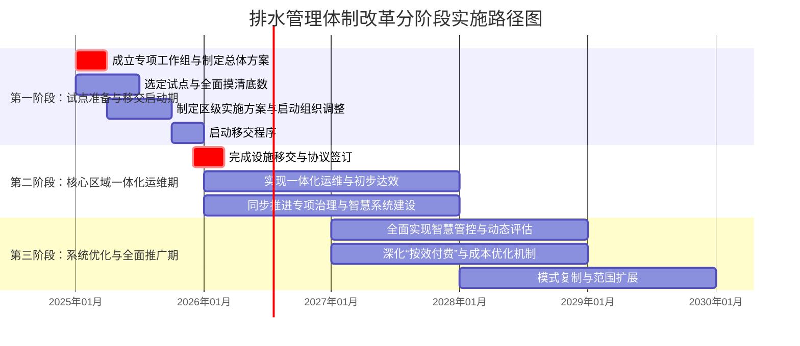

# 超越核拨制：市政排水系统高效协同与成本优化机制研究
## 1 现状审视：核拨制的运作逻辑、效率困境与协同挑战

本章旨在系统剖析市政排水与污水处理领域“核拨制”的核心运作机制及其效率困境。首先，基于《城镇排水与污水处理条例》及地方资金补助管理办法，界定核拨制在规划、建设、运营各环节的典型流程与资金流转逻辑。其次，结合典型案例，重点分析该机制在资金拨付滞后、运营激励不足、成本控制粗放等方面的具体表现。最后，深入揭示核拨制下因部门分割、规划建设时序脱节及考核导向偏差所引发的系统性协同挑战，为后续构建高效协同与成本优化机制提供精准的问题靶向。

### 1.1 核拨制的定义、政策依据与典型运作流程

“核拨制”在市政排水与污水处理领域，通常指政府根据规划、项目申报及投资评审结果，通过财政预算安排，对相关设施的建设、改造及运营维护进行资金核定与拨付的管理模式。其核心政策依据是《城镇排水与污水处理条例》[^1]。该条例确立了城镇排水与污水处理工作应纳入国民经济和社会发展规划，县级以上地方人民政府应加大设施建设和维护投入的基本原则[^1]。同时，国家鼓励采取特许经营、政府购买服务等多种形式吸引社会资金参与[^1]，这为核拨制与市场化运作的结合提供了政策接口。

在具体运作流程上，核拨制呈现出“先规划、后计划、再核拨”的典型特征。首先，依据条例，城镇排水主管部门需会同有关部门编制本行政区域的城镇排水与污水处理规划，明确设施规模、布局、建设时序等，并报本级人民政府批准后实施[^1]。其次，在规划指导下，形成年度资金计划。例如，温岭市规定，城镇污水治理补助资金实行年度计划管理，由项目业主单位统一申报，市住房和城乡建设局会同发改、财政等部门确定下一年度计划，未列入计划的原则上不予安排资金[^2]。最后，资金根据既定标准和方式进行核拨。常见方式包括按投资额比例补助（如温岭市对各类污水治理工程设定不同的建安费和其他费用补助比例）[^2]，以及依据用水量计征污水处理费（如太湖县规定，污水处理费按照缴纳义务人的用水量按月计收，使用公共供水的由供水企业代征，使用自备水源的由主管部门或其委托单位征收）[^3]。**这些流程共同构成了一个以政府规划和财政投入为主导，通过事前计划、事后核销来保障设施建设和基本运行的制度框架。**

### 1.2 资金效率困境：拨付滞后、激励扭曲与成本失控

核拨制在实际运行中，暴露出多方面的资金效率困境，集中体现在项目推进缓慢、运营激励不足和成本管控失序三个方面。

**首先，资金拨付与建设运营需求脱节，导致关键项目推进滞后，环境风险加剧。** 中央生态环境保护督察发现，福建省龙岩市中心城区的铁山污水处理厂早在2019年就已满负荷运行，但相关部门推动扩建工作进展缓慢，直到2023年6月才开工建设[^4]。在此期间，大量生活污水通过该厂进水总管的溢流口直排龙津河，仅2023年1至10月溢流量就达220万吨，严重污染水体[^4]。同样，泉州市污水集中收集率阶段性目标连续两年未完成，2022年目标为60%，实际仅为42.8%[^4]。这些案例表明，依赖计划审批和财政核拨的模式，在面对紧迫的设施能力缺口时，往往反应迟缓，无法及时匹配动态增长的处理需求，造成“项目等资金”的被动局面，最终以环境污染为代价。

**其次，运营维护资金来源单一且不稳定，激励传导机制扭曲，难以保障设施长效运行。** 这一问题在农村生活污水治理领域尤为突出。调研显示，各地设施运维资金主要依靠政府各级财政，且全国不足半数省份在相关文件中明确了资金来源，大多以县级财政投入为主[^5][^6]。在当前县级财政普遍困难的背景下，这种单一依赖导致资金保障的可持续性脆弱，部分设施因缺乏运维资金而“晒太阳”或运行不正常[^5][^6]。同时，核拨制下“重建设、轻运营”的倾向，使得运营方缺乏通过提升效率、节约成本来获取更多收益的正面激励，反而可能因成本节约导致下期预算被削减，形成“鞭打快牛”的逆向激励。

**最后，成本管控粗放，运维成本构成模糊，形成“糊涂账”。** 核拨制下，精细化的成本核算与管理基础薄弱。农村生活污水处理设施运维成本主要包括电费、人工费、药剂费等，其中电费和人工费占比通常超过60%，但各地实际运维成本差异巨大，从每吨水0.2元到12元不等[^5][^6]。不同地区政府、企业及运维人员甚至无法说清运维的具体价格、成本覆盖内容及执行标准[^5][^6]。这种成本的不透明和巨大差异，使得核拨标准难以科学制定，资金使用效益无法准确评估。类比核电企业的成本管理问题，其“不可控成本占比大”、“成本定额及标准体系较薄弱”等难点[^7]，在排水领域同样存在，反映出核拨制在驱动运营主体进行精益化成本管理方面存在内生动力不足的系统性缺陷。

### 1.3 系统协同挑战：部门分割、规划脱节与考核偏差

核拨制的效率困境，更深层次地源于其难以克服的系统内部及跨系统间的协同障碍，具体表现为管理分割、规划建设时序脱节以及考核机制导向偏差。

**第一，雨水与污水系统管理分割，导致“厂网河”协同失效，运行成本高昂且环境风险突出。** 上海市的典型案例揭示了这一问题的严重性。由于部分区域污水管网建设不完善，存在管网混接、雨污合流，导致雨天大量污水溢流外排[^8]。一方面，雨水进入污水处理系统，挤占处理空间，导致部分污水直接溢流排江，2023年全市经白龙港污水处理厂溢流口外排的污水就超过2500万吨[^8]。另一方面，污水进入雨水系统，混合后经防汛泵站直排河道，污染城市水环境，全市371座防汛泵站中有124座存在雨季排污问题[^8]。这种“水系统”内部的分割管理，使得本应协同的设施（管网、泵站、处理厂）在运行调度上难以形成合力，不仅增加了不必要的处理负荷和溢流污染，也推高了整体的社会成本。

**第二，规划、建设、改造各环节时序脱节，统筹性不足，造成重复投资和资源浪费。** 核拨制下，项目往往按条线、分阶段推进，缺乏全生命周期的统筹。福建省龙岩市污水管网建设改造不到位，老旧城区和40个城中村合计14.9平方公里区域雨污不分，占建成区总面积20%以上[^4]。泉州市直到2023年初才全面启动管网排查，致使改造修复工作严重滞后[^4]。这种“先建后查”、“头痛医头”的模式，导致后期不得不为前期规划设计的不足支付高昂的改造代价。农村地区同样存在此类问题，例如污水治理与改水改厕、房屋改造等工作衔接性差，容易出现管网或设施反复维修、升级改造的情况，显著增加后期运维成本[^5]。

**第三，配套考核机制存在“重过程、轻实绩”的导向偏差，加剧了基层负担，稀释了绩效目标。** 核拨制常伴随繁杂的考核程序。以遂宁市改革前的状况为例，全市考核指标曾多达3496个，其中包含大量开会、发文等过程性指标[^9]。一次考核需组建多个工作组，抽调近30人检查3-5天，基层单位需提前1个月准备上百份佐证材料，负担沉重[^9]。这种考核方式将大量精力导向“痕迹管理”，而非关注污水收集率、处理效率、污染物削减量等最终实效，导致管理行为与系统绩效目标脱节。**上海市正在推进的排水管理体制改革，其设定的“五个统一”（统一运维管理、统一技术标准、统一运行调度、统一服务质量、统一核算机制）目标[^10]，正是对上述分割、脱节、偏差等协同挑战的直接回应，旨在通过体制机制创新，重构系统化的管理框架。**

## 2 目标与原则：构建高效、协同、可持续排水系统的理论框架

本章旨在为超越传统的“核拨制”、构建新型市政排水系统确立清晰的价值导向与行动准则。基于公共管理、新公共治理及系统工程理论，并结合中国城镇化与生态文明建设的现实要求，本章将系统整合参考资料中的前沿理念与成功实践，构建一个逻辑自洽的理论框架。该框架旨在明确回答新系统应追求的核心目标，以及在具体方案设计中必须遵循的基本原则，从而为后续章节探讨机制创新、成本优化与系统协同提供坚实的价值基准与逻辑指引。

### 2.1 总体目标：从被动核拨到主动治理的系统性转型

超越“核拨制”并非简单的管理方式替换，而是一场旨在重塑排水系统内在逻辑的深刻变革。其总体目标应聚焦于实现从被动、分割、不可持续的旧模式，向主动、协同、可持续的新范式的系统性转型。具体而言，这一转型包含三个相互关联的核心目标：

**第一，实现系统运作的“高效化”，即从“人力密集、被动应对”转向“智慧集约、主动预判”。** 传统模式下，运维依赖大量人工巡检和事后处置，效率低下且响应滞后。新型系统的目标是通过数据融合与智能调度，显著提升运行效能。例如，连云港经济技术开发区通过构建覆盖“雨情—水情—工情”的全要素数字底座，并利用大数据算法模型动态预判内涝风险、生成最优调度方案，成功实现了排水治理从“被动应对”到“主动预判”的转型，汛期保障能力显著提升，并通过“无人值守、少人巡检”模式节约了大量人力成本[^11][^12]。同样，青岛西海岸新区的城乡供排水一体化智慧管控平台，通过整合物联网监测数据，使工作人员无需亲临现场即可全面掌握供水状况并快速处置问题，让整个系统在智能化加持下持续高效运转[^13]。**因此，高效运作的核心在于利用技术手段，将管理重心从事后补救前移至事前预警和事中优化，以更少的资源投入获取更稳定、可靠的服务输出。**

**第二，实现管理运行的“协同化”，即打破“九龙治水”的行政壁垒，构建“厂网站河”一体化的责任闭环。** “核拨制”下的部门分割是导致系统内部掣肘、成本高昂的根本原因之一。新系统的目标必须是通过体制机制创新，实现跨部门、跨层级的深度整合。重庆两江新区以“大综合一体化”为核心，通过整合水利、供水、排水等职能，构建大部制一体化运行体制，并融合河长制与网格化管理，成功破解了城市河湖治理难题[^14]。龙岩市则通过“厂网一体、市区一体、建管一体”的“三位一体”治理模式，系统性推进污水收集、处理、运维全链条攻坚，实现了从“末端兜底”到“系统治理”的跨越[^15]。镇江丹阳市的“厂网站”一体化治理项目，更是通过同步建设一体化管控平台，实现了从源头到末端的协同管控，将“多头管理”变为“一体运维”[^16]。**系统协同的目标，在于确保规划、建设、运维等各环节责任主体统一，设施功能互补，信息流转顺畅，从而形成治理合力，避免因分割管理导致的重复投资与效能内耗。**

**第三，确保系统发展的“可持续化”，即在环境、经济与社会三个维度上形成良性循环，支撑城市高质量发展。** 可持续性要求系统不仅能满足当下的环境治理需求，还必须具备长期稳定运行的经济基础与社会认同。在环境维度上，应追求像海南“十四五”水务发展那样，实现污水集中收集率、水质达标率等关键指标的持续提升[^17]。在经济维度上，必须建立稳定的资金保障与合理的成本分摊机制，确保系统“建得起、用得好、养得住”。在社会维度上，应借鉴常德武陵高山街社区的经验，通过构建政府、企业、社区、商户等多方参与的协商平台与责任分担机制，有效化解基层矛盾，提升公众对治理工作的理解与支持[^18]。**因此，良性循环与可持续的目标，意味着新系统必须是一个环境效益显著、财务健康稳健、且能得到社会各方拥护的有机生命体，能够为区域的高质量发展持续注入动力[^12]。**

### 2.2 核心原则一：全生命周期成本最优与绩效导向

为确保总体目标的实现，方案设计必须植根于两项基础性原则，它们直接回应了“核拨制”下成本失控与激励扭曲的核心弊端。

**第一，全生命周期成本最优原则。** 这一原则要求彻底摒弃“核拨制”下常见的“重初始投资、轻长期运营”的短视思维，将成本评估的视野扩展到设施从规划、设计、建设、运营、维护到最终报废或重置的完整周期。当前工业水处理领域已呈现出明确的理念革新，许多企业正从单纯追求“投资最低”转向评估“全生命周期综合价值最优”[^19]。在排水系统设计中，这意味着不仅要考虑管网和厂站的建设造价，还必须精细核算长期的能耗、药耗、人工巡检、预防性维护、故障修复、设备更新以及因管网渗漏或溢流导致的环境风险成本。例如，选择更耐腐蚀的管材或更高效的泵机可能初始投资较高，但能大幅降低后期的维修频率和能耗，在全生命周期内实现更优的经济性[^20]。**贯彻此原则是避免陷入“建设时省钱、运维时烧钱”恶性循环的关键，也是实现系统财务可持续的根本保障。**

**第二，绩效导向与激励相容原则。** 此原则旨在通过科学的考核与付费机制，将运营主体的利益与系统整体绩效目标紧密绑定，从而激发其提升效率、控制成本的内生动力。上海市在这方面提供了具体范例，其出台的《市属排水设施运行维护绩效考核办法》建立了详细的指标体系，涵盖泵站运维完成情况、截流与调蓄设施使用率、低水位运行情况、设备完好率等可量化指标，并将年度考核得分直接与支付的服务费用挂钩[^21]。这种“按效付费”机制能有效“压实运营单位主体责任”，驱动其从“应付考核”转向“追求绩效”。

然而，绩效设计本身也需遵循“激励相容”的深层逻辑，即制度安排必须与人的基本利益动机相一致。有行业专家指出，过于复杂或僵化的“全面绩效管理”可能部分违背激励相容原则，反而压制了运营方主动提高效率的动机[^22]。因此，绩效指标的设计必须精准、合理，聚焦于最终的环境效益（如污染物削减量、溢流控制效果）和运行效率（如单位处理成本），而非过多的过程性记录。同时，付费机制应确保运营方能够从其通过技术创新或管理优化所实现的成本节约中合理获益，形成“降本增效即有回报”的正向循环。**唯有建立这种绩效与激励相容的机制，才能从根本上扭转“核拨制”下的激励扭曲，使高效率、低成本成为运营方的自觉追求。**

### 2.3 核心原则二：厂网一体系统整合与数据驱动决策

在管理机制优化的基础上，系统自身的物理与信息架构必须遵循整合与智能的原则，这是实现高效协同的技术基础。

**第一，厂网一体系统整合原则。** 必须从根本上认识到，污水处理厂与收集管网（包括提升泵站、调蓄池等）是一个不可分割的有机整体。传统“厂网分离”的管理模式是导致“厂强网弱”、进水浓度低、运行效率不高的结构性原因。新型系统必须坚持规划、投资、建设、运维的一体化。龙岩市的实践表明，通过“修旧网、建新网、覆远网”三措并举，对管网进行系统性修复与新建，能直接促使污水处理厂进水BOD浓度提升40%，实现了收集与处理效能的双重飞跃[^15]。镇江丹阳的“厂网站”一体化治理，也是通过同步扩容污水处理厂与全面修复、新建管网，来系统性提升污水集中收集率[^16]。**这一原则要求打破资产归属和管理权限上的分割，将管网与厂站视为共同服务于“污染物全收集、全处理”目标的统一资产包进行管理和考核。**

**第二，数据驱动与模型辅助决策原则。** 现代排水系统的精细化、智能化运行，离不开全面、准确的数据支撑和科学的分析工具。首先，需要构建如连云港案例中那样的“全要素数字底座”，通过部署智能传感终端，实现关键节点数据的高精度采集[^11][^12]。更重要的是，要利用排水模型这一可视化智能辅助手段，将数据转化为洞察和决策依据。上海市的案例充分展示了模型的价值：在雨水系统，模型可用于评估不同降雨工况下的内涝风险，优化改造工程方案[^23]；在污水系统，模型能用于优化竹园片区干线输送的调度方案，实现进厂流量平稳化，或通过“四水分析”厘清地下水、雨水等外水渗入量，为管网修复提供精准靶向[^24]。**该原则强调，系统的规划、设计、运行调度与应急响应，都应从依赖经验判断转向基于实时监测数据与动态模型模拟的科学决策，从而实现精准投资、优化运行和前瞻性风险防控。**

### 2.4 核心原则三：雨污协同功能互补与多元共治

最后，系统设计还需处理好内部子系统的关系以及外部治理生态的构建，这涉及功能优化与治理模式的深层原则。

**第一，雨污协同与功能互补原则。** 雨水排涝系统与污水收集处理系统虽然在功能上各有侧重，但在城市水循环中紧密关联、相互影响。新系统的设计必须正视这种关联，致力于实现两个系统在规划、设计、运行层面的协同，以达到功能互补、整体成本最优。具体而言，应在保障城市防汛安全绝对优先的前提下，通过技术和管理手段减少两个系统的相互干扰。例如，上海市推行排水管网低水位运行，旨在降低管网中的地下水渗入，从而减少雨天污水厂的溢流污染[^21]。其开展的“四水分析”，核心目的之一就是量化评估并控制雨水和地下水对污水系统的渗入，这本身就是一种深刻的协同管理实践[^24]。在设施层面，可探索建设雨污调蓄共享设施，在暴雨时滞蓄雨水减轻内涝，雨后将混接污水送至处理厂，实现设施的多功能化利用。**本原则的终极目标，是让雨水系统和污水系统从“互相掣肘”变为“互相成就”，在保障水安全与水清洁的双重目标下，寻求整体资源配置的最优解。**

**第二，多元协同与责任明晰原则。** 复杂的城市排水问题无法仅靠政府单一力量解决，必须构建政府、企业、社区、公众等多元主体共同参与的治理格局。常德武陵高山街社区的成功案例提供了一个微观样板：面对餐饮油污堵塞导致的污水倒灌难题，社区发挥核心协调作用，联动市政、城管、警务室以及责任商户，通过多次协商不仅解决了当前堵塞，更建立了由商户出资定期清理并承诺未来责任的长效机制，有效化解了基层矛盾[^18]。这体现了多元共治在解决具体问题上的有效性。

将这一经验提升至宏观体制机制设计，则要求必须清晰界定各参与方的权责利边界。行业分析指出，“责任边界是厂网一体化面对难题中除经费保障之外的第二大考验”[^22]。特别是在推进“厂网一体”或“供排一体”改革时，必须明确划定政府监管责任、一体化运营企业的服务责任，以及涉及住宅小区内部管网等“最后一公里”时业主、物业公司的维护责任。清晰的责任界面是协同不扯皮、共治不推诿的前提。**因此，多元协同与责任明晰原则要求，在制度设计上既要搭建开放参与的治理平台，也要筑牢权责对等的制度篱笆，确保协同治理在法治化、规范化的轨道上运行。**

## 3 机制创新：从核拨到绩效合同与市场化运营的管理转型方案

本章旨在提出超越传统核拨制的具体管理机制转型方案。基于对多个成功案例的剖析，本章将系统阐述绩效合同、特许经营及区域一体化运维三种创新模式的核心机制、适用条件与实施效果。这些模式通过明确权责边界、引入市场竞争、将财政支付与可量化的环境绩效深度绑定，能够有效破解核拨制下激励扭曲、成本失控与协同失效的困境，为构建高效、协同、可持续的排水系统提供操作性强的管理转型路径。

### 3.1 绩效合同模式：从“按量付费”到“按效付费”的机制设计与实证

绩效合同模式是对核拨制“重过程、轻实绩”的直接革新，其核心是将服务提供方的报酬与可测量、可验证的最终绩效成果挂钩，实现“按效付费”。这种模式尤其适用于目标明确、节水量或污染物削减量可精确计量的场景，如供水管网漏损治理和污水处理效能提升。

**广州市自来水公司合同节水项目是“节水效益分享型”绩效合同的典范。** 该项目由节水服务企业浙江绍兴和达水务技术股份有限公司全额投资279.66万元[^25]。针对大坦沙岛和芳村地区漏损率高的问题，服务商确立了“物理控漏为主，计量控漏、管理控漏相辅”的技术路线，具体措施包括：开展分区计量（DMA）建设，加装流量计并利用远传大表数据进行分析；建立水量平衡表，将漏损精细分离为物理漏失、计量损失等类型；开展管网改造及智能检漏，布设LD18噪声监测仪并实现漏点高效修复[^25]。项目实施后成效显著：大坦沙岛漏损率从43.76%降至21.05%，芳村地区从29.97%降至16.17%，累计节水约517.5万立方米，产生节水效益约621万元[^25]。在商业模式上，合同期仅为1年，绍兴和达根据“在册产销差率的实际下降值”获得节水成效费，即每下降一个百分点支付相关费用，合同期满后设施由服务商回收[^25]。**这一案例清晰地展示了绩效合同如何通过“利益共享、风险共担”的机制，激励专业服务商投入资金与技术，快速解决特定痛点，并确保财政资金的使用直接关联于可量化的环境效益提升。**

**福州市城市供水漏损治理项目则展示了大规模、长周期绩效合同的风险管控与技术支持体系。** 该项目是全国首个窄带物联网（NB-IoT）技术规模商用的城市治理项目，采用节水效益分享型模式，初步估算投资7873万元，全部由节水服务企业福水智联有限公司承担[^26]。其投资回报机制明确：以节约的水量按照1.7元/立方米计算收益，合同期限为54个月，并设定了不超过72个月的总合同期上限以确保服务商收回保本收益[^26]。为确保绩效的真实可信，项目引入了福建省计量科学研究院作为独立的第三方检测评估机构，对节水效果进行监测、报告与核查[^26]。在技术层面，项目通过更换智能远传水表、压力变送器、流量计，并构建“禹之水”智慧漏损治理平台，实现了对供水管网漏损情况的持续监测与靶向治理[^26]。**该案例表明，对于投资大、周期长的项目，清晰的保本收益机制、独立的第三方核验以及强大的智慧化技术支撑，是保障绩效合同顺利实施、防范数据与支付风险的关键。**

**湖南省在全省范围内推行的污水处理“按效付费”改革，将绩效合同的核心逻辑成功应用于污水收集处理全链条。** 该省通过立法出台《湖南省城镇污水管网建设运行管理若干规定》，以法治形式推行“按效付费”管理制度[^27]。改革的核心是创新付费机制，将污水处理厂进水污染物浓度、污染物削减量和污泥无害化处理率等作为核心考核指标，构建以污染物削减绩效为导向的付费体系[^27]。实践成效令人瞩目：湘潭市通过实施“撇清水、挤外水、收污水”项目并结合“按效付费”，每年可节省资金5000多万元，并因效能提升而取消了原计划投资约3.5亿元的新建污水处理厂[^27]。长沙市采取“委托运营+绩效合同管理”模式，预计全市污水处理厂每年可节约资金约1.4亿元[^27]。**这些成果强有力地证明，将财政支付从传统的“按处理量付费”转向“按污染物削减效能付费”，能够倒逼运营主体关注整个收集处理系统的效率，有效减少外水入渗、提升进水浓度，从而实现财政资金使用效益和环境治理效果的双重提升。**

综合上述案例，绩效合同模式成功的关键在于设计科学的绩效指标体系、建立透明的监测核查机制、并构建与绩效结果紧密挂钩的浮动支付方案。它能够**快速、精准地驱动运营效率提升，是破解核拨制下激励不足、成本模糊等问题的有效利器。**

### 3.2 特许经营模式：BOT、TOT等市场化融资与运营的路径比较

特许经营模式通过授予社会资本方在一定期限内融资、建设、运营基础设施项目的权利，是吸引社会资本、缓解政府财政压力、引入专业运营能力的重要市场化路径。在排水领域，BOT和TOT是两种最为常见且经验成熟的模式。

**BOT（建设-运营-移交）与TOT（移交-运营-移交）在所有权归属和适用场景上存在核心差异。** BOT通常适用于新建项目，社会资本方负责项目的融资、建设，并在特许期内运营项目以收回投资并获取收益，特许期满后将项目资产**无偿移交给政府**[^28][^29]。TOT则主要应用于存量项目，政府将已建成的项目资产（如污水处理厂）的产权或经营权**有偿转让**给社会资本方，由其在一定期限内运营，期满后再移交回政府[^28]。此外，还有BOO（建设-拥有-运营）模式，即社会资本方永久拥有并运营项目，无需移交[^29][^30]。这些模式都属于广义的PPP（政府与社会资本合作）范畴[^31]。**选择何种模式，关键在于项目属性（新建或存量）、政府对于资产所有权的考量以及社会资本的风险收益预期。**

**TOT模式在盘活存量资产时，需特别关注资产估值、尽职调查与接收过程中的复杂问题。** 对已有污水处理厂项目采用TOT模式，可以充分发挥社会资本在运维技术和融资方面的优势[^28]。然而，实施过程充满挑战。在资产接收前，必须进行详尽的尽职调查，通常聚焦于财务角度，由专业评估公司采用收益法对项目资产进行估值，以平衡国有资产保值与社会资本投资积极性[^28]。正式接收时，可能面临原有国企职工安置、历史债务负担、因设计超前导致的资产闲置等一系列遗留问题，需要接收方提前制定周全的应对方案[^28]。同时，法律上需确保资产移交协议的有效性，并明确移交后的产权与责任分配[^28]。**因此，TOT的成功实施，高度依赖于前期严谨、专业的资产评估与交易结构设计，以及政府对历史遗留问题的妥善处理能力。**

**特许经营模式在带来资金与效率优势的同时，也伴随着长期风险，需要完备的合同机制予以规制。** 该模式的优点显著：能够有效筹集国内外资金，解决政府投入不足的问题；有利于推动行业市场化改革，引入先进技术和管理经验，提升运营效率；同时有助于政府从“运动员”向“监管员”转变职能[^31]。但其弊端亦不容忽视：特许经营期通常长达20-30年，社会资本方面临着对**政策长期稳定性的隐忧**，以及市场需求变化、利率波动等带来的风险[^31]。早期的固定回报模式也可能导致运营方缺乏持续降本增效的动力。**为应对这些风险，一份完备的特许权协议至关重要，其必须清晰界定特许范围、期限、服务标准、定价与调价机制、风险分担、移交标准以及争议解决方式等核心条款**[^30]。通过合理的风险共担（遵循“风险由最能控制的一方承担”的原则）和动态的调价机制，可以在政府与社会资本之间建立稳定、可持续的合作伙伴关系。

### 3.3 区域一体化运维：厂网河湖一体化的治理架构与协同机制

区域一体化运维是系统治理思想的最高体现，旨在彻底打破“厂网分离”、“条块分割”的管理壁垒，通过构建统一的权责主体，对“厂、站、网、源、河、湖”等涉水要素进行全链条、系统化的运营管理。这是实现成本最优、效能最大化的终极治理架构。

**重庆两江新区的改革实践，展示了通过行政整合实现“四个一体化”的系统价值。** 两江新区在全市率先实施河湖厂网一体化改革，其核心路径是推进**底图、管理、运维、执法四个一体化**[^32]。在管理上，整合排水管理职能，建立“网格化排查”与“专业化治理”相结合的“流域+区域”协同机制，形成区、街道、社区、网格四级联动的问题巡查治理体系[^32]。在运维上，依据相邻水系原则，由流域治理单位对河湖管网进行一体化全链条运维，并完善考核机制[^32]。这一改革有效解决了城市水务管理多头、链条长、投入大等问题，提升了管网精细化普查率，降低了运维成本，并成功策划包装项目争取到中央资金支持[^32]。**该案例表明，强有力的行政顶层设计和组织重构，是快速打破部门壁垒、实现物理设施与管理系统同步整合的有效手段。**

**“治水瀚蓝模式”则揭示了企业通过市场化演进，实现从“厂网一体”到“厂网源河一体”的升级路径及其内在逻辑。** 瀚蓝环境在佛山市南海区的实践历时二十年，从最初只运营水质净化厂（BOT模式），到2016年起统一运营全区污水管网，进入厂网一体化阶段，最终在2023年总结形成“厂网源河一体化”的瀚蓝模式[^33]。这一模式直指行业痛点：基础设施短板突出但资金使用效能低下，大量管网建成后运营缺失，以及“厂网分离”导致缺乏统一市场主体管控全过程[^33]。瀚蓝模式的三大特点是：**系统化**（构建治水全要素能力）、**智慧化**（以智慧平台提升管理效能）、**网格化**（将管理下沉到污水处理厂的纳污范围）[^33]。**其演进历程证明，系统化治理是按效付费的基础，而激活存量设施潜能、提升财政投入效率，必须依靠一个能够统筹全链条的一体化运营主体。**

**湖南省与杭州市的实践，进一步印证了一体化运维所需的法治保障、智慧支撑与绩效捆绑机制。** 湖南省通过省级立法为“厂网一体”和“按效付费”改革提供法治保障，并明确要求“一个统一市场责任主体”统筹管控污水处理全过程[^27]。杭州市余杭区在治理余杭塘河时，通过搭建流域水环境智慧管控平台，全域实现了 **“厂网河”一体化智能调度**，智慧化管养覆盖率达100%[^34]。这两者结合揭示了成功要素：**统一的权责主体**是前提，**融合的智慧平台**是技术基座，而**基于流域水质的断面考核**则是驱动一体化系统持续优化、实现“水清岸绿”最终目标的绩效指挥棒[^34][^27]。**区域一体化运维的本质，是将分割的设施、分散的管理和孤立的考核，整合为一个责任闭环、信息畅通、协同响应的有机生命体，最终达成社会成本最小化和环境效益最大化。**

### 3.4 转型路径与合同设计：适用条件、风险防范与关键条款

综合前三节的分析，从核拨制向新机制转型，需要地方政府基于本地实际情况，审慎选择模式，并依靠精细化的合同设计与风险管理来保障平稳过渡与长效运行。

**不同创新模式有其明确的适用条件，选择需因地制宜。** 为清晰对比与决策，现将三种主要模式的适用场景归纳如下表：

| 模式 | 核心特征 | 主要适用场景与条件 |
| :--- | :--- | :--- |
| **绩效服务合同** | 按效付费，服务效果与财政支付直接挂钩。 | 1. **存量设施提质增效**：如管网漏损治理、污水处理厂提标改造等目标明确、可量化的专项。 2. 政府希望引入专业技术与管理，但不愿或无法承担全部投资风险。 3. 合同期相对较短，追求快速见效。 |
| **BOT/TOT特许经营** | 社会资本负责融资、建设（BOT）或运营（TOT），特许期满移交。 | 1. **新建项目（BOT）**：政府财政压力大，需吸引社会资本投资建设。 2. **存量项目盘活（TOT）**：政府希望变现资产、引入专业运营能力，且能妥善处理人员、债务等历史问题。 3. 项目具有稳定现金流，能支撑长期投资回报。 |
| **区域一体化运维** | 打破条块分割，实现“厂、网、河、湖”等全链条系统治理。 | 1. **系统性问题突出**：如黑臭水体治理、流域水环境改善，需跨部门、跨设施协同。 2. **具备行政或市场整合基础**：如通过行政改革统一管理权，或由大型专业公司逐步整合运营。 3. 需要智慧化平台支撑全域监控与智能调度。 |

**成功转型必须前瞻性地识别并防范关键风险。** 不同模式面临的主要风险及控制要点各异：
*   **绩效合同**：需防范**绩效指标设计不合理**导致激励扭曲，以及**节水量或减排量数据核查争议**。控制措施包括科学设计KPI、利用物联网技术实现数据实时透明共享，以及引入权威第三方评估机构[^26]。
*   **特许经营（BOT/TOT）**：面临**长期政策与法律风险**、**市场需求与收费风险**（如水价调整），以及期满**资产移交状况不佳的风险**。需通过完备的特许权协议明确风险分担、建立与物价指数挂钩的调价机制，并严格约定移交标准与程序[^28][^30]。
*   **区域一体化运维**：最大的挑战在于**跨部门、跨层级整合与协同风险**，以及因系统庞大带来的**技术与管理复杂性风险**。控制关键在于强有力的顶层设计推动、构建统一的智慧水务管理平台，以及明确界定运营主体与政府、社区等其他相关方的责任边界[^33]。

**精细化的合同设计是锁定合作预期、保障各方权益的核心工具。** 无论采用何种模式，合同都应重点关注以下关键条款：
1.  **绩效指标与考核体系**：应参考PPP项目绩效考核的成熟经验，设计多层级、可量化的指标体系[^35][^36]。例如，可包含**可用性指标**（如设施完好率）、**运维质量指标**（如养护达标率）以及**核心环境效益指标**（如管网漏损率、进水污染物浓度、河道断面水质）。合同需明确各项指标的考核方法、频率、评分标准以及与付费挂钩的具体公式和比例。
2.  **风险分配矩阵**：以附件或专门章节的形式，系统性地识别项目全生命周期各阶段（融资、建设、运营、移交等）的潜在风险，并清晰划分政府方与社会资本方（或服务商）各自承担的风险范围，遵循“风险由最能控制的一方承担”的原则。
3.  **付费与调价机制**：明确付费的计算基础（如处理水量、节水量、污染物削减量）、支付周期和条件。必须建立公开、公平的调价公式，将服务费与消费者物价指数（CPI）、生产者物价指数（PPI）、电价、药剂价格等关键成本要素动态关联，并约定定期的调价复核周期。
4.  **争议解决与退出机制**：约定友好协商、专家裁决、仲裁或诉讼等递进式的争议解决路径。同时，设计包括期满移交、提前终止（含违约终止和协商终止）在内的各种退出情形下的资产处置、补偿计算和人员安置方案，确保项目平稳过渡。

**结论而言，从核拨制向市场化、绩效化机制的转型，是一个系统性的管理革命。** 地方政府需基于项目具体类型、财政状况、管理目标及市场成熟度，审慎选择“按效付费”的绩效合同、吸引长期资本的特许经营或追求系统最优的一体化运维等路径。无论选择哪条路径，成功的关键都在于：以**科学的项目设计**为前提，以**精细化的合同**为保障，以**强有力的政府监管与履约能力**为支撑，最终构建起激励相容、风险共担、可持续的排水系统治理新格局。

## 4 成本优化：全生命周期视角下的资金保障与分摊机制设计

本章旨在构建一个以全生命周期成本最优为目标的、可持续的市政排水系统资金保障与分摊机制。基于前文对核拨制下资金效率困境与协同挑战的分析，以及所确立的绩效导向与系统整合原则，本章将系统性地解决资金难题。首先，将建立精细化、标准化的成本核算框架，明确从建设到应急各环节的成本构成与敏感因素。其次，将探讨如何优化污水处理费定价机制，使其真正覆盖全成本并有效落实“污染者付费”原则。最后，将结合多元化融资与成本分摊的创新案例，设计一套旨在确保系统长期财务健康、实现从“被动核拨”到“主动保障、高效分摊”根本转型的综合方案。

### 4.1 全生命周期成本构成与精细化核算框架

实现成本优化的前提是建立科学、透明、可操作的成本核算体系，彻底改变核拨制下成本构成模糊、核算粗放的“糊涂账”局面。这需要一套覆盖设施全生命周期、并充分考虑设施差异与地域影响的标准框架。

**首先，排水系统的运维成本应进行结构化分解，形成清晰的核算模型。** 参考《给水排水设施运行维护成本核算标准》，运维成本可系统性地划分为三大类别：**直接成本**，包括设备维修、药剂消耗、能源支出等与生产运行直接相关的费用；**间接成本**，涵盖管理费、折旧费、安全监测等支撑性支出；以及**应急成本**，指应对突发故障、内涝灾害等紧急状况的处置费用[^37]。这种分类方法明确了成本核算的边界，为精细化管理和预算编制奠定了基础。

**其次，针对不同类型的排水设施，需建立差异化的估算指标体系。** 以上海市实践为例，其排水设施运维成本估算采用三级分类体系，按照设施类型、规模等级和技术特征进行差异化设置[^38]。例如，防汛泵站的基础运维成本（年度）可根据设计流量划分为大、中、小型，其人工费、电力费基准值（采用分时计价模式）和日常维护费（按设备原值的一定比例计提）均有明确区间[^38]。下表展示了这一差异化估算的典型框架：

| 规模等级 | 设计流量 (m³/s) | 人工费 (万元/年) | 电力费基准值 | 日常维护费计提标准 |
| :--- | :--- | :--- | :--- | :--- |
| **大型** | ≥10 | 85 - 120 | 0.78元/kWh | 设备原值的2.5% |
| **中型** | 3 - 10 | 55 - 85 | 0.82元/kWh | 设备原值的3.0% |
| **小型** | <3 | 30 - 55 | 0.85元/kWh | 设备原值的3.5% |

*表：上海市防汛泵站基础运维成本年度估算指标示例[^38]*

对于更为复杂的污水处理厂，成本估算则采用“处理规模+工艺类型”的二维矩阵。以采用AAO（厌氧-缺氧-好氧）工艺的20万吨/日规模厂区为例，其年度直接运行成本中位数约为3800万元，其中**电耗成本占比高达42%，污泥处置成本占18%**，这两项被明确识别为成本敏感因素，是成本控制的关键靶点[^38]。

**再者，成本核算必须引入动态修正机制，以反映设施老化与地域差异的影响。** 设施服役年限是影响维护成本的关键变量。根据相关技术规程，对使用超过15年的泵站等设施，应引入老化系数（α，取值区间0.015-0.025）进行修正，其调整后成本计算公式为：$ C_{adj} = C_{base} \times (1 + \alpha)^{t-15} $，其中t为使用年限[^38]。这意味着老旧设施的维护成本会呈指数增长，凸显了预防性维护和及时更新改造的重要性。同时，地域因素不容忽视，例如沿海区域需增加防腐专项经费，中心城区泵站需计入降噪措施成本，地下水位高于管底的区域应增加10-15%的结构维护预算[^38]。**这些精细化的参数与修正方法，共同构成了从“估算”走向“精准核算”的技术基础，使得全生命周期成本分析得以落地，为科学定价、预算编制和绩效比较提供了可靠的数据基准。**

### 4.2 污水处理费定价机制优化与“污染者付费”原则落实

污水处理费是排水系统运行维护最核心、最稳定的资金来源。优化其定价与征收机制，是落实“污染者付费”原则、确保系统财务可持续的基石。当前许多地区收费无法覆盖全成本、付费机制与绩效脱钩的问题，必须通过系统性改革予以解决。

**首先，必须明确污水处理费的法定属性与征收范围，确保资金归集与使用的规范性。** 根据《广东省污水处理费征收使用管理实施细则》，污水处理费是按照“污染者付费”原则，由排水单位和个人缴纳并专项用于城镇污水处理设施运行、建设和污泥处理处置的政府非税收入[^39]。它实行“全额上缴地方国库，纳入地方政府性基金预算管理”，确保了专款专用[^39]。在征收范围上，细则规定，凡向城镇排水与污水处理设施排放污水、废水的单位和个人均应缴纳[^39]。但对于单位或个人自建污水处理设施，处理后水质达标且未向城镇设施排水的，则免于缴纳，这体现了政策的精准性[^39]。计征方式主要依据用水量，使用公共供水的以水表显示值为准，这为收费提供了简便易行的计量基础[^39]。

**其次，污水处理费的征收标准必须基于全生命周期成本核算科学制定，并建立动态调整机制。** 细则规定，征收标准由县级以上地方发展改革、财政和排水主管部门提出意见，报同级人民政府批准后执行[^39]。这意味着，定价过程应充分吸纳4.1节所述的精细化成本核算结果，确保标准能够覆盖污水处理、污泥处置及配套管网运维等全部合理成本，并考虑合理收益。**只有建立覆盖全成本的收费机制，才能从根本上解决“建设靠财政、运维无保障”的困境，为系统良性循环提供稳定的现金流。**

**更为关键的是，必须推动污水处理费支付机制从“按量付费”向“按效付费”深刻转型。** 传统的按处理水量付费模式存在显著缺陷。专家指出，当进水污染物浓度（如BOD）很低时，污水处理厂处理难度小、投入少，但政府仍按水量支付相同费用，相当于“为没有达到的环境效益买单”，造成财政资金浪费[^40]。同时，在“厂网分离”模式下，污水处理厂没有动力去提升进水浓度，因为浓度提升可能导致来水量减少，反而影响其收入[^40]。因此，**引入“按效付费”机制是重大的机制创新，其核心是将污水处理服务费的支付与进水污染物浓度、污染物削减量、出水水质、污泥稳定化效果等绩效指标深度挂钩**[^40]。

南京市桥北污水处理厂的实践为此提供了成功范例。该厂实施“厂网一体运行维护按效付费”后，考核指挥棒从单一的“处理水量”转向以化学需氧量（COD）、生化需氧量（BOD）等污染物浓度为核心的多维效能指标[^41]。这一转变促使运营单位从被动接受污水转向主动排查管网、修复漏点，以提升进水浓度和系统运行健康度。实施后，该厂总进水量减少的同时，进水COD浓度相较往年提高了5.7%，出水水质更优[^41]。**这证明，“按效付费”能够将运营主体的经济利益与环境治理实效绑定，驱动其从“要我治”转向“我要治”，从而实现财政资金使用效益和环境治理效果的双重提升。** 优化后的污水处理费机制，应成为驱动整个排水系统高效、协同运行的核心经济杠杆。

### 4.3 多元化资金筹措与成本分摊机制创新设计

仅依靠优化后的污水处理费，仍难以完全满足排水系统庞大的建设、改造和应急资金需求，尤其是面对历史欠账和公益性强的项目。因此，必须构建一个多层次、创新性的资金筹措与成本分摊组合方案，形成“使用者付费、污染者付费、政府引导、市场参与”的多元保障格局。

**第一，优化内部成本结构，通过统筹管理显著降低运维总成本。** 针对清淤等高频作业，《市政排水管道清淤作业应急与常规成本统筹方案》提供了可借鉴的策略。该方案旨在通过统筹管理，将常规清淤成本占比控制在年度总预算的70%-75%，应急清淤成本压缩至25%-30%，从而实现年度总成本节省15%以上的目标[^42]。其核心策略包括：建立“常规储备+应急共享”的资源池，实现人员、设备、耗材的高效共享与调度；在预算编制上采用“常规成本固化+应急成本预留”模式，并根据季度节余动态调整；强化“预防性清淤”，在雨季前完成重点区域作业，从而减少成本高昂的应急作业频次（单次应急成本可达常规作业的3倍）[^42]。**这种将常规与应急成本联动管控的思路，可以推广至排水系统运维的各个方面，是实现降本增效的基础性管理工具。**

**第二，创新财政资金使用方式，提升公共资金使用效益。** 财政投入应从“补建设”为主，转向“补运营”和“以奖代补”。可以参考湖南省、南京市等地的改革实践，将财政补助资金与污水处理厂的进水浓度、污染物削减量等绩效指标挂钩。例如，可以设计绩效奖励基金，对通过精细化管理实现节能降耗、提升效能的运营单位给予额外奖励，形成正向激励。这改变了核拨制下财政资金被动投入、效益难以衡量的局面，使其成为驱动系统绩效提升的“催化剂”。

**第三，积极吸引社会资本，通过市场化模式弥补资金缺口并引入专业能力。** 这主要包括两种路径：
*   **PPP（政府与社会资本合作）模式**：适用于有稳定现金流预期的项目。海口市美舍河水环境综合治理PPP项目采用了“分15年按效付费”的机制，将政府支付与治理效果深度绑定，有效保障了项目的长期运维质量[^43]。设计此类项目时，关键是在特许经营协议中明确绩效标准、付费公式、风险分担和调价机制，建立长期稳定的合作伙伴关系。
*   **EOD（生态环境导向的开发）模式**：这是解决公益性项目融资难题的创新工具。黑龙江铁力市东方红水库清淤项目是典型范例。该项目将水库清淤产生的145.41万立方米淤积物，通过省级资源交易平台以6102.98万元的价格成功交易，实现了“点泥成金”[^44]。EOD模式的核心逻辑是，**将生态环境治理项目与关联产业（如生态农业、旅游、康养等）一体化规划、融合实施，用关联产业未来的增值收益来反哺前期的生态投入**，构建“治理—资源转化—产业发展—收益反哺”的闭环[^44][^45]。对于缺乏直接收费机制的管网修复、河湖治理等项目，EOD模式提供了市场化融资和实现资金平衡的全新可能。

**第四，探索建立市政排水设施更新改造专项基金，应对存量资产的老化挑战。** 随着大量排水设施进入“老龄化”阶段，其维护和更新改造需求激增，资金压力巨大。可以借鉴其他基础设施领域的经验，探索设立专项基金。资金可来源于每年计提的设施折旧费、土地出让收益的一定比例、上级财政补助以及社会捐赠等。该基金专款用于老旧管网改造、泵站设备更新、智慧化升级等，确保存量资产能够持续健康运行，避免因资金短缺而积累更大的安全与环境风险。

### 4.4 机制整合、风险防范与可持续性评估

前述各项优化机制并非孤立存在，必须进行系统性整合与协同设计，并前瞻性地评估其综合风险与长期可持续性，方能构建一个稳健可靠的资金保障体系。

**首先，需要构建一个整合性的全生命周期资金保障框架。** 该框架以**精细化成本核算**为基石，以**绩效挂钩的污水处理费**为核心稳定现金流，以**创新财政激励**为引导，以**PPP/EOD等市场化融资**为重要补充，并以**更新改造专项基金**作为应对资产老化的安全垫。智慧水务平台在此框架中扮演“神经中枢”角色，为成本核算、绩效监测和按效付费提供实时、准确的数据支撑。**这个框架的核心在于，它改变了核拨制下资金投入与系统绩效脱节的线性关系，形成了一个“绩效提升→成本优化→资金效益提高→进一步投入绩效提升”的增强回路，驱动系统向高效、协同、可持续的方向演进。**

**其次，必须识别并设计针对性的风险防范措施，保障新机制平稳运行。** 主要风险及应对策略包括：
1.  **“按效付费”的数据与核查风险**：绩效数据的真实性与公信力是机制生命线。可借鉴福州市供水漏损治理项目的经验，引入独立的第三方专业机构（如计量科学研究院）进行监测、报告与核查（MRV），确保数据客观公正，避免支付争议[^46]。
2.  **市场化合作的长周期风险**：PPP、EOD等项目合作期长，面临政策变化、市场需求波动、利率调整等风险。必须在合同协议中设计完备的**风险分担矩阵**和**动态调价机制**。调价公式应公开透明，与电价、药剂价格、人工成本指数等关键变量挂钩，并设置定期复核条款，以保障合作双方长期利益平衡。
3.  **财政支付能力与信用风险**：政府需确保在“按效付费”和可行性缺口补助方面的支付能力。应将相关支付义务纳入中长期财政规划，并探索通过设立政府支付保证金等方式，增强社会资本信心。
4.  **改革协同与执行风险**：从核拨制向新机制转型涉及多部门利益调整。必须依靠强有力的顶层设计推动，明确改革时间表、路线图和责任分工，并加强政策宣传与人员培训，确保改革理念深入人心，执行过程顺畅。

**最后，应建立一套财务可持续性评估模型，对资金保障方案进行长期压力测试。** 该模型可基于全生命周期成本分析，输入不同情景下的成本参数（如能源价格涨幅、设施老化速率）、收入参数（如污水处理费调整幅度、EOD关联产业收益）以及资金流入流出时序。通过模拟未来20-30年的现金流，可以评估方案是否能在各种不利情景下保持资金平衡，实现“覆盖成本、合理盈利、持续投入”的良性循环。**这种前瞻性评估是确保排水系统不仅解决当前困境，更能支撑未来城市高质量发展、从容应对气候变化等不确定挑战的关键。** 通过机制整合、风险防范与可持续性评估的三重保障，本章所设计的成本优化方案方能从蓝图转化为可落地、可持久、可推广的实践路径。

## 5 系统协同：污水收集处理与雨水排洪排涝的整合运作策略

传统“核拨制”下的部门分割与规划脱节，导致城市排水系统中污水与雨水两大子系统长期处于“九龙治水”、相互掣肘的状态。这不仅推高了建设和运维成本，更在雨天引发严重的溢流污染和内涝风险。为实现系统总成本最优与环境效益最大化，必须超越分割管理，构建一套深度整合的协同运作策略。本章基于“雨污协同与功能互补”的核心原则，系统吸收上海、天津、佛山、临沂等地的先进实践与技术方案，从规划布局、运行调度、应急响应、资源循环四个维度，提出一套旨在实现“厂网站河”一体化高效协同的具体策略与实施路径。

### 5.1 规划协同：空间统筹与设施共享的布局优化

规划层面的协同是系统整合的起点，旨在通过空间统筹与设施共享，从源头优化资源配置，降低土地占用和重复建设成本，并为后续运行协同奠定物理基础。

**首先，在顶层规划编制中，必须强制要求污水与雨水系统一体化设计，明确设施共建共享的导向。** 上海市规划和自然资源局在《关于持续加强本市公共排水泵站设施规划资源管理的工作规定》中明确提出，排水泵站的选址应遵循集约节约用地原则，**“鼓励与调蓄池、绿地、防汛屋、滨河驿站等其它市政设施结合设置”**[^47]。这一原则为打破传统独立设站、分散布局的模式提供了明确的政策依据。通过将排水泵站与公园绿地、公共广场等地上空间复合建设，或与地下调蓄池、管廊等设施一体化设计，能够显著节约宝贵的城市土地资源，实现功能复合与品质提升。

**其次，针对雨污合流这一历史顽疾，系统性的改造规划必须整合源头减排、过程控制与末端治理措施。** 天津市在《中心城区雨污合流治理攻坚行动实施方案（2026—2030年）》中，系统规划了“清淤疏通管道7178公里、改造老旧管道220公里，整治雨污串接混接点593处，升级473个庭院小区管网并建设地下调蓄池”等一系列工程[^48]。这体现了从源头（小区管网）到过程（管道清淤、混接整治）再到末端（调蓄池）的全链条协同治理思路。在规划设计中，应借鉴《污水管网与雨水排放系统协调方案》提出的技术措施，如在污水管网中**“增加雨水溢流控制设施”**，并**“设置雨水调蓄池”**以调节流量、减轻污水处理厂负担[^49]。同时，对雨水排放系统进行优化，如增加管径、建设雨水渗透设施，以增强排水能力与水土保持功能[^49]。

**再者，应积极推广低影响开发（LID）与海绵城市理念，将雨水源头消纳与利用设施纳入城市建设强制性标准。** 这不仅是减少径流污染和内涝风险的有效手段，也能间接降低污水系统的处理负荷和管网投资。德国的“洼地-渗渠系统”和澳大利亚的“水敏感城市设计（WSUD）”都是将雨水管理深度融入城市景观与生态系统的国际成功经验[^50]。在上海的实践中，城投宽庭光华社区项目通过应用**“透水铺装、植草沟引流+生物滞留设施”**等海绵技术，实现了年径流总量控制率80%、污染控制率65%的目标，年节水量达7500立方米，满足了社区绿化灌溉和冲洗需求[^51]。这表明，通过科学的规划整合，将雨水就地消纳、滞蓄、净化与利用，能够从源头上减轻下游排水管网和污水处理设施的压力，实现环境与经济的双重收益。

**规划协同的核心效益在于通过前瞻性、系统性的布局，以一次性的科学投资，避免后期高昂的、碎片化的改造代价，是实现全生命周期成本最优的关键前提。**

### 5.2 运行协同：基于模型预测的联合调度与智慧管控

在物理设施整合的基础上，运行层面的协同是实现动态优化、精准控制溢流污染与降低能耗的核心。这依赖于全面准确的数据感知、科学的模型预测与智能化的调度决策。

**第一，构建全域感知的“一张图”数字底座，是运行协同的数据基石。** 佛山市智慧排水系统的建设路径提供了典范。该市通过全市统一的排查，将管网长度、管径、材质、缺陷位置、雨污混接点等海量信息，按照统一标准录入系统，绘制出覆盖全市的排水设施数字地图[^52]。这张“图”并非静态档案，而是通过与日常运维数据联动实现动态更新，真正让地下管网“透明化”[^52]。基于此，系统能够根据泵站收水范围自动划定污水分区，并整合用水量、节点浓度等数据，识别出“水量大、外水多、浓度低”的优先治理片区，从而指导工程措施有的放矢[^52]。**这种“排查—设计—施工—验收—更新”的数据闭环，确保了治理成果得以固化，并为智能调度提供了权威、鲜活的数据底板**[^52]。

**第二，利用AI与大数据技术实现污水处理过程的精细化调控，是应对雨情冲击、节约运行成本的关键。** 上海临港供排水公司的实践展示了显著成效。其污水厂通过搭建智能化管控平台，依托大数据和AI模型对设备状态、水质参数、加药剂量进行实时监测与动态分析[^53]。其中，**智能曝气系统预计每年可节省电耗60.69万度，节约电费72.83万元，碳减排254.9吨；智能加药系统全年可节省药剂使用量902.2吨，节省成本74.39万元，碳减排850.09吨**[^53]。同样，如昼科技的“污水工艺AI数字员”能够将专家经验转化为可复用的数字资产，实现工艺参数的实时优化与异常工况的分钟级预警，从而在保障出水水质的前提下，有效降低能耗与药耗[^54]。这些技术使污水处理厂在降雨期间能够更灵活、更经济地调整运行模式。

**第三，建设覆盖“厂网站河”的一体化智能调度平台，是实现系统联合运行的中枢。** 天津市在其治理方案中明确提出，要**“以数字赋能建成覆盖‘管网、泵站、调蓄池、河道’的一体化排水设施管控平台”**[^48]。该平台应衔接气象预报系统，在雨前根据预测降雨量，自动生成并执行“预排空”指令，提前降低管网和调蓄池水位，腾出蓄水容量。在降雨过程中，平台基于实时监测的管网水位、流量数据和内涝模型模拟结果，智能调控雨水泵站的启停、河道闸坝的开闭，并动态协调污水处理厂的处理负荷。其核心目标是实现 **“浓度优先”输送**，即在保证防汛安全的前提下，优先将高浓度污水输送至污水处理厂，最大限度减少合流制溢流量和污染物入河总量。通过这种联合调度，可以显著提高整个排水系统的利用效率和应急响应能力。

**运行协同的本质，是将分割独立的设施运行，转变为数据驱动、模型辅助、全局优化的智能生命体，是挖掘系统潜能、实现降本增效的核心手段。**

### 5.3 应急协同：突发事件联动响应与资源互助机制

城市排水系统面临暴雨、管网破裂、设备故障等多种突发事件威胁。建立跨污水与雨水系统的应急协同机制，是快速有效处置险情、最大限度减少损失和环境影响的制度保障。临沂市制定的《临沂城区排水突发事件应急预案》为此提供了系统、可操作的框架范本[^55]。

**首先，应急协同必须建立在“统一领导、属地管理、分级负责”的组织原则之上。** 临沂预案明确规定，应急处置工作在市、区政府领导下，实行行政领导负责制，建立统一领导、综合协调、属地管理的机制[^55]。同时，根据事件等级实行分级响应：市级负责重大以上事件，区级负责较大和一般事件，街道（社区）负责先期处置和基层动员[^55]。这为在应急状态下快速整合水务、应急、城管、交通、公安等多部门力量，以及协调市、区两级排水管理单位和运营企业，提供了清晰的组织架构和权责划分依据。

**其次，建立规范、高效的信息报告与共享流程，是应急响应的神经脉络。** 预案要求建立健全信息报告制度，确保突发事件信息及时、准确上报[^55]。在智慧排水平台的支持下，这一过程可以更加自动化、可视化。当监测到管网水位异常飙升、泵站故障或河道水质突变时，预警信息应能同时推送至污水和雨水系统的运维指挥中心、相关政府部门及应急指挥部，实现信息同步、决策同步。

**再者，核心在于建立人员、装备、物资等应急资源的跨系统共享与互助调度机制。** 预案中强调了应急队伍保障、物资装备保障和排水调度保障[^55]。在实战中，这意味着：
*   **队伍共享**：一支专业的排水应急抢险队伍，应同时具备污水管网抢修和雨水排涝作业的能力，或在不同系统队伍间建立联合演练与统一指挥机制。
*   **装备互济**：大功率抽水泵车、管道检测机器人、应急发电设备等昂贵装备，不应按系统分割配置，而应建立区域性的应急装备储备库，根据事件性质统一调配使用。例如，处理污水管网冒溢和抢排道路积水，可能使用同类抽水设备。
*   **调度协同**：在暴雨内涝应急时，指挥中心可协调污水处理厂适当调整运行模式（如加大处理负荷或启用应急处理单元），同时指令雨水泵站全力抽排，并统筹河道闸坝的启闭以辅助蓄洪、错峰，形成“厂站网河”一体化的应急排水调度合力。

**最后，应急协同能力依赖于常态化的准备。** 必须将雨污系统联合应对纳入应急预案的培训和演练体系[^55]。定期开展针对不同情景（如特大暴雨、重要管网爆裂）的跨部门、跨系统联合演练，检验通讯联络、指挥协调、现场处置、资源调度的有效性，并持续修订完善预案，确保其可操作性。**应急协同机制是将系统在规划、运行层面的整合成果，转化为应对极端状况下城市韧性的最终体现。**

### 5.4 资源协同：雨水收集、再生水回用与生态补水的循环路径

最高层级的系统协同，是实现水资源的闭环循环与价值增值。通过将雨水、再生水等非常规水资源进行协同利用，不仅能创造直接的经济效益，还能替代部分传统排水功能，减轻系统负荷，实现环境、资源与经济的多赢。

**第一，雨水资源化利用是减轻城市排水压力、节约新鲜水资源的直接途径。** 上海市遴选的多个优秀案例提供了量化证据。宝山钢铁股份有限公司在原料场创新采用封闭大棚顶面雨水收集方案，构建了覆盖全面的收集网络，**每年可回收利用雨水约38万立方米，节省水费约130万元**，这些雨水主要用于料场洒水抑尘和生产烧结工序补水，有效降低了新鲜水消耗[^51]。在社区层面，城投宽庭光华社区通过海绵技术设施，预计**年节水量达到7500立方米**，满足了绿化维护和地面冲洗需求[^51]。汤始建华建材公司通过建设雨水收集池及处理系统，**每年可节约2万立方米的自来水**[^51]。这些实践表明，雨水收集利用具有显著的经济节水和生态效益，是从用户端源头削减进入市政排水系统径流量的有效手段。

**第二，污水处理厂自身的能源与物料资源化，是降低系统碳排放、实现“负碳”运行的重要方向。** 西安国开水环境有限公司运营的第二十二再生水厂是杰出代表。该项目采用分布式下沉再生水生态系统，并集成多项资源回收技术：利用**水源热泵技术**提取污水中的冷热能，为办公用房采暖制冷，年节约电耗约50万千瓦时，折合碳减排317吨；采用**光导照明技术**替代部分电源照明，年节电6.75万度，碳减排43吨；污泥经脱水干化后用于好氧堆肥制作园林绿化土，替代化学肥料，可实现**替碳1530吨**；此外，地上生态公园植被年固碳量约181.8吨[^56]。**这些技术叠加，使污水处理厂从一个纯粹的能源消耗和污染治理单元，转变为一个潜在的能源生产者、碳汇和资源工厂，极大地提升了排水系统的整体可持续性和经济性。**

**第三，将高品质再生水用于生态补水，是衔接污水与雨水系统、改善城市水环境的战略性协同路径。** 上海临港供排水公司构建了 **“中水双循环”** 路径，将水厂炭滤反冲洗水、砂滤池部分反冲洗水等生产废水直接回用至原水系统，同时将污水厂出水（再生水）广泛应用于厂区除臭喷淋、绿化及周边生态补水[^53]。这启示我们，经过深度处理达标的再生水，可以作为一种稳定、可靠的替代水源，用于补充城市河道、湖泊的生态基流，尤其在枯水期。此举具有多重效益：一是改善水体流动性与水质，提升城市景观与生态价值；二是在一定程度上替代了原本需要依赖天然降雨来维持的生态功能，减轻了对自然水文的压力；三是通过“污水—再生水—生态水体”的循环，实现了水资源的本地化循环利用。实施这一路径需要明确再生水用于生态补水的专用水质标准，并规划建设相应的再生水输配管网或泵站，与河道水系顺畅衔接。

**资源协同将排水系统从传统的“处理-排放”线性模式，升级为“收集-处理-再生-利用”的循环模式。** 它不仅在系统内部挖掘出节能降耗、物料回收的价值，更通过对外部的生态反哺，创造了显著的社会与环境效益，是推动城市排水系统实现良性循环与高质量发展的终极体现。

## 6 支撑体系：智慧赋能、标准规范与监管考核的配套建设

为确保从传统核拨制向绩效化、市场化、协同化新机制的成功转型，必须构建一套坚实、配套的支撑体系。本章节聚焦于三大核心支柱：一是利用先进技术构建智慧化赋能体系，为精细化管理和智能决策提供数据与工具基础；二是建立覆盖全生命周期的成本核算与绩效评价标准体系，为“按效付费”和成本控制提供统一、可量化的度量基准；三是设计贯穿项目全生命周期的监管考核体系，明确各方权责，形成有效的激励约束闭环。这三大体系相互关联、互为支撑，共同构成驱动排水系统高效、协同、可持续运行的技术工具与制度保障。

### 6.1 智慧赋能体系：构建“感知-分析-决策”一体化数字基座

现代排水系统的复杂性要求管理必须从依赖经验转向数据驱动。构建一个覆盖“源-网-站-厂-河”全链条的智慧赋能体系，是实现精准感知、智能分析和科学决策的核心技术基座。这一体系通过物联网、大数据、人工智能和数字孪生等技术的深度融合，能够显著提升系统运行效率、预警响应速度和协同调度能力。

**首先，构建全域覆盖、高精度的物联感知网络是智慧化体系的“神经末梢”，旨在解决传统模式下“看不见”的监测盲区。** 成功实践表明，感知网络的布设需兼顾关键节点与成本效益。成都市武侯区系统性构建全方位的水环境智能监管体系，通过部署视频AI识别、多参数水质传感、水文监测等**166套高精度物联感知终端**，实现了对河道、排口、管网等关键节点的全域动态覆盖，有效填补了地下管网水质监测、小微水体溯源等盲区[^57]。更进一步，宁波高新区探索了更具经济性和实用性的技术路径，其在全区**689个关键雨水管网节点部署电导率监测设备**，形成从污染源到排放口的全过程感知“脉络”[^58]。这种“分级布点、脉络成网”的思路，不仅实现了对水质异常信号的灵敏捕捉，其设备耐腐蚀、维护成本低的优势，也为大规模、高密度物联网组网提供了经济可行性[^58]。**这些实践共同指向一个核心：感知网络的建设必须服务于业务需求（如污染溯源、内涝预警），以合理的成本实现关键数据的实时、准确采集，为上层分析决策奠定坚实基础。**

**其次，在数据采集之上，利用人工智能与大数据技术构建智能分析层，是实现从数据到洞察、从事后处置到事前预警的关键跃升。** 数据分析的核心价值在于能够自动识别异常、精准溯源并预测风险。温州市公用集团排水公司自研创建了可识别排水管网CCTV检测视频病害的AI智能体，依托公司历年积累的《排水管网病害缺陷数据集》进行训练，实现对管网缺陷的精准识别，提升了管网病害问题报告出具效率约30%[^59]。北控水务在鹤山市的实践中，将智慧治水与城市智慧建设深度融合，基于BIM平台构建了河长制大数据中心及数据共享机制，形成了独具特色的“六个一体化”先进管控理念[^60]。更为深入的是，高新区在大量电导率监测数据的基础上，研发了 **“电导率波纹异常事件库”** ，通过机器学习算法对超过100种排污行为的特征波纹进行提取和模式识别，使得系统能在30秒内完成异常识别与初步归因[^58]。**这标志着智慧排水从简单的数据可视化，迈向了具备自主学习和诊断能力的“智慧大脑”阶段，能够极大提升运维效率和对污染事件的快速响应能力。**

**最后，集成化的数字孪生平台与智能决策支持系统是智慧赋能体系的“指挥中枢”，负责将数据洞察转化为优化调度和应急响应的具体行动。** 数字孪生通过构建物理系统的虚拟映射，实现了对复杂排水系统的仿真模拟与协同管控。信阳市供排水一体化智慧平台围绕“统一规划、统一建设、统一运维、统一监管”的要求，打造了覆盖供水、污水、雨水、再生水的 **“四网合一”数字管理体系**，并开发了排水防涝调度、管网健康诊断、供排水平衡分析等六大智慧应用场景，推动水务管理从“人防”向“技防”、“被动处置”向“主动预警”转型[^61]。成都市武侯区则通过多源异构数据融合引擎，整合成都e河长、防汛指挥系统等多类外部数据源，建成全流域联动的水环境质量数字孪生底座，推动监管模式从“离散式抽查”向“全要素实时评估”转型[^57]。这些平台的核心功能在于，能够基于实时数据和预测模型，自动生成并执行优化调度方案（如协调泵站、闸门、污水处理厂的运行），或在应急情况下快速启动联动响应流程。**智慧赋能体系的终极价值，在于将分割的设施、孤立的数据、依赖人工的经验决策，整合为一个能够自我感知、智能分析、协同响应的有机生命体，从而系统性提升排水系统的韧性、效率与可持续性。**

### 6.2 标准规范体系：全生命周期成本核算与绩效评价标准

科学、统一的标准规范是确保成本优化与绩效管理机制得以落地、可比较、可核验的基础。它旨在彻底改变核拨制下成本模糊、绩效导向不清的局面，为“按效付费”和精细化管理提供客观、公正的度量尺。

**第一，建立精细化、结构化的全生命周期成本核算框架，是打破成本“糊涂账”、实现资金科学配置的前提。** 成本核算必须超越传统的建设投资视角，覆盖从规划、建设、运营、维护到改造、应急、报废的全过程。参考《给水排水设施运行维护成本核算标准》，一个科学的成本构成分解模型应包括三大类：**直接成本**（如设备维修、药剂消耗、能源支出）、**间接成本**（如管理费、折旧费、安全监测）以及**应急成本**（如突发故障处理、灾害应对）[^37]。更重要的是，成本核算需充分考虑设施差异与地域影响，实现差异化估算。以上海市实践为例，其防汛泵站的基础运维成本根据设计流量（大、中、小型）设置了差异化的人工费、电力费基准值和日常维护费计提标准[^37]。对于污水处理厂，则采用“处理规模+工艺类型”的二维矩阵进行成本估算，并明确识别电耗和污泥处置为关键成本敏感因素[^37]。此外，还需引入动态修正机制，例如对服役超过15年的设施应用老化系数进行成本修正，并针对沿海防腐、中心城区降噪、高地下水位区域增加专项维护预算[^37]。**这套精细化核算框架的价值在于，它将隐性的、长期的运维成本显性化、标准化，为制定合理的污水处理费定价、编制精准的财政预算、评估不同运营方案的长期经济性提供了可靠的数据基础。**

**第二，设计以环境效益和运行效率为核心的多维度绩效评价指标体系，是实现“激励相容”、驱动运营主体追求系统最优的关键指挥棒。** 绩效标准必须超越简单的过程性考核，聚焦于最终的治理成效。参考《给排水管线工程绩效评估标准》，绩效评估应遵循系统性、客观性、实用性和导向性原则[^62]。在具体指标设计上，应充分吸收国内先进项目的实践经验。昆山市中环内市政道路及住宅小区雨污水管网养护项目，作为首批采用 **“按效付费”机制**的典范，在传统“按量计价”基础上，新增了 **“污染物浓度”** 作为核心考核指标，要求化学需氧量（COD）和生化需氧量（BOD）平均浓度大幅提升至远高于国家标准的水平，并将费用支付与考核结果直接挂钩[^63]。上海市的《市属排水设施运行维护绩效考核办法》则提供了更为详尽的指标体系范本，其防汛泵站考核项目包含了泵站运维工作完成情况、截流与调蓄设施使用率、低水位运行工作情况、设施设备完好率、监测站点在线率、清淤完成率及污泥处理处置合规性等**20项四级指标**，并明确将年度考核得分作为支付服务费用的唯一依据[^21]。**一个有效的绩效评价体系，应当融合产出指标（如运维计划完成率）、质量指标（如设备完好率、在线率）和效益指标（如污染物削减量、溢流控制率、公众满意度），形成对运营单位服务效能全面、量化的评价，并将评价结果刚性、透明地与财政支付挂钩，从而彻底扭转“重建设、轻运营”的惯性。**

**综合而言，标准规范体系通过成本核算与绩效评价两套相互关联的标准，共同构筑了管理转型的“游戏规则”。** 成本核算标准明确了“投入”的合理边界与构成，绩效评价标准则定义了“产出”的优劣尺度与价值。两者结合，使得“按效付费”得以建立在公平、可比、可审计的基础之上，既能有效控制公共财政支出，又能激励运营单位通过技术创新和管理优化来提升效能、降低成本，最终驱动整个排水系统步入良性循环的发展轨道。

### 6.3 监管考核体系：全过程闭环管理与多元协同监督

健全的监管考核体系是确保新机制有效运行、防范各类风险、保障公共利益的“防火墙”。它需要从事前、事中到事后形成管理闭环，并整合政府、企业、第三方与公众的力量，构建权责清晰、透明高效的协同监督网络。

**首先，强化项目前期与建设过程监管，是确保设施“先天健康”、避免新增历史欠账的关键环节。** 监管必须覆盖从规划、设计到施工、验收移交的全链条。昆山市的《进一步完善全市排水设施建设监管实施办法》为此提供了系统性的监管框架。在**项目前期**，要求包含排水设施建设的工程，其方案必须经水务部门审核，确保符合排水规划与相关标准，大型项目管线综合方案还需组织专家论证[^64]。在**施工过程**中，创新性地要求建设单位委托专业测绘单位开展排水管网的**同步跟踪测绘**，确保新建管网符合设计要求并与现有系统有效融合，此项费用纳入工程概算[^64]。对于不涉及排水设施建设但可能影响既有设施的项目（如道路翻新），也要求在施工前报备并做好保护，对造成的破损负责修复[^64]。**这种将监管触角前移并嵌入建设流程的做法，能够从源头上保证工程质量，为后续长达数十年的高效、低成本运维奠定坚实的物理基础，是实现全生命周期成本最优的重要保障。**

**其次，建立并严格执行运营期“按效付费”的绩效考核机制，是持续驱动运营主体提升服务效能的核心动力。** 绩效考核必须与合同约定和费用支付形成刚性关联。上海市的绩效考核办法是这方面的典范。其考核针对市属雨水排水设施运营单位，满分105分（含5分加分项），考核周期为年度，得分直接决定服务费用支付：90分以上（含）全额支付，90分以下每降低1分扣减年度核算服务费用**200万元**[^21]。考核内容不仅包括泵站运维、清淤完成率等常规工作，更强调截流设施使用率、调蓄设施使用率、低水位运行等体现系统协同与环境效益的指标[^21]。为确保考核的公正与严谨，办法还规定了运营单位需按时上报真实准确的数据并配合检查，遇不可抗力经书面说明认可后可免于扣分[^21]。**这种清晰、量化、强激励约束的考核机制，将管理重心从“过程合规”转向“结果导向”，能够有效“压实运营单位主体责任”，引导其资源投向最能提升系统整体绩效的环节。**

**最后，构建政府主导、企业主责、第三方核验、公众参与的多元协同监督网络，是提升监管公信力与有效性的必然要求。** 单一部门的监管往往存在盲区与能力局限，需要引入多方制衡与补充。在**政府协同**方面，珠江流域构建入河排污口长效监管体系的思路值得借鉴，其强调强化部门协作，建立联合监测、联合执法和信息共享机制[^65]。在**第三方核验**方面，福州市城市供水漏损治理绩效合同项目引入了福建省计量科学研究院作为独立的第三方检测评估机构，对节水效果进行监测、报告与核查，确保了绩效数据的公信力[^1]。在**社会监督**方面，成都市武侯区创新搭建了 **“武侯护水达人”全民共治平台**，通过“问题随手拍+积分兑奖”机制，形成“公众发现隐患-平台智能派单-部门限时整改-结果社会监督”的治理闭环，截至2024年12月，注册用户超670人，上报问题线索1.6万条，显著拓展了监管的广度与深度[^57]。**多元协同监督的本质，是将排水系统的管理从政府部门的“独角戏”，转变为全社会共同参与的“大合唱”，通过透明化、数据化的方式，筑牢监管防线，确保改革目标在长期实践中不走样、不变形。**

**综上所述，智慧赋能、标准规范与监管考核三大支撑体系，共同构成了从传统核拨制向现代化治理模式转型的“基础设施”与“运行规则”。** 智慧化提供了“眼睛”和“大脑”，标准规范提供了“尺子”和“标尺”，监管考核则提供了“鞭子”和“护栏”。三者协同作用，确保高效、协同、可持续的排水系统新蓝图，能够从理论构想扎实地转化为可操作、可考核、可持续的现实实践。

## 7 实施路径：分阶段推进策略、风险防范与政策建议

本章旨在将前文提出的机制创新、成本优化与系统协同方案，整合转化为一套面向政府管理部门的、可操作的行动纲领。本章将结构化吸收《上海市排水管理体制改革方案》及黄浦区实施方案中明确的“五个不变”前提、“五个统一”目标、分阶段移交任务与具体时间表，作为制定分阶段实施路径的核心依据。同时，结合《排水体制机制可持续发展探索》报告对“五大一体化”风险（尤其是财政可持续与责任边界挑战）的深刻剖析，以及《以案释法》系列案例揭示的执法监管短板，系统性地识别转型过程中的关键风险点，并设计针对性的防范与应对措施。最终，本章将从法规政策完善、组织架构优化、试点示范推广及公众参与深化等维度，凝练形成一套旨在保障从传统核拨制向高效协同新模式平稳过渡的系统性政策建议。

### 7.1 分阶段实施路径设计

为确保从传统核拨制向高效协同新模式平稳、有序转型，必须设计一个目标明确、步骤清晰、时间合理的分阶段实施路径。以上海市及黄浦区的改革实践为蓝本，一个为期3-5年的路径可以划分为三个核心阶段，每个阶段均有其特定的目标、关键任务与时间节点。

**第一阶段：试点准备与移交启动期（例如：第1-1.5年）**

本阶段的核心目标是完成顶层设计、摸清底数，并在选定区域启动移交程序，为全面改革奠定坚实基础。具体任务与时间节点如下：

*   **成立专项工作组与制定总体方案（第1季度）**：参照上海市的做法，成立由市政府牵头，水务、财政、发改、国资等多部门参与的改革领导小组（或推进专班），明确职责分工[^10]。同时，出台《排水管理体制改革方案》，明确改革目标、基本原则（“五个不变”与“五个统一”）、实施范围及核心政策框架[^10]。
*   **选定试点与全面摸清底数（贯穿全年，重点在前6个月）**：借鉴黄浦区的经验，在选定试点区域（如一个行政区或功能片区）编制公共排水设施移交清单，全面收集整理排水设施图纸、生产运行资料、设备机具、委托养护合同、人员档案、信息管理平台等所有相关纸质和电子资料[^66]。同时，将所移交设施设备的大中修、更新改造计划同步向拟定的统一运营主体（如上海城投集团）进行交底[^66]。
*   **制定区级实施方案与启动组织调整（第2-3季度）**：相关区政府需在市级方案指导下，于规定时间（如2025年6月）前完成本区排水管理体制改革实施方案的制定[^10]。同时，统一运营主体需同步完成内部组织架构调整，并建立“一区一工作小组”，开始参与相关区的运维管理业务[^10]。
*   **启动移交程序（第4季度）**：按照计划，于本阶段末期（如2025年10月）正式启动运维管理的移交接管工作[^10]。

**第二阶段：核心区域一体化运维期（例如：第1.5-3年）**

本阶段的核心目标是完成试点区域公共排水设施的平稳移交，并初步实现“厂站网”一体化运维管理，达成改革的核心效能指标。

*   **完成设施移交与协议签订（第2年初）**：按照上海市设定的时间表，在启动移交后（如2025年12月）完成试点区域的移交接管工作[^10]。此过程包括由运营主体开展设施设备的现场盘点、核实查验、清单锁定，以及细化并签订运维管理移交协议[^66]。同时，完成相关人员的意愿征询与接收方案[^66]。
*   **实现一体化运维与初步达效（第2-3年）**：移交完成后，由统一运营主体对试点区域内的雨污水公共排水设施实施厂站网一体化运维管理[^10]。改革过渡期（2025-2026年）内，运营主体需延续原有运维合同至期满，并执行统一的经费投入标准和服务质量[^10]。**到2026年底，核心区域应实现“五个统一”，并达到一系列明确的预期目标**，例如：管道养护抽查合格率95%以上、污水厂进厂BOD₅年均浓度大于100mg/L、中心城区道路标准以内降雨不发生积水、以及抢险指令下达后30分钟内抵达现场等[^10]。
*   **同步推进专项治理与智慧系统建设**：在过渡期内，雨污混接普查和整治、排水管道结构性病害修复等既定专项任务仍由原责任单位推进[^10]。同时，按计划推进排水感知体系及模拟评估系统的建设，为智慧管控奠定基础[^10]。

**第三阶段：系统优化与全面推广期（例如：第3-5年及以后）**

本阶段的目标是在巩固一体化运维成效的基础上，深化系统治理，优化运行机制，并将成功模式向更广泛区域复制推广。

*   **全面实现智慧管控与动态评估**：在前期建设基础上，全面完成并投运覆盖核心区域的排水感知体系及模拟评估系统，实现基于模型的运行评估、风险预警与智能调度，常态化开展动态评估工作[^10]。
*   **深化“按效付费”与成本优化机制**：在统一核算和绩效考核的基础上，进一步完善与污染物削减量、系统运行效率深度挂钩的“按效付费”机制。同时，基于全生命周期成本分析，持续优化运维成本结构，探索更可持续的价费调整路径。
*   **模式复制与范围扩展**：总结试点区域在体制机制、技术应用、协同管理等方面的成功经验，形成标准化、可操作的工作指南。随后，将改革模式逐步推广至其他城区、城乡结合部或新城开发区，最终建成与超大城市发展相适应的现代化城镇排水管理体系[^10]。

为清晰展示这一路径的核心任务与时间脉络，以下通过时间线图进行概括呈现：

### 7.2 关键风险识别与防范应对

排水管理体制的深刻变革伴随着多重风险，必须前瞻性地识别并设计周密的防范与应对策略，以确保改革平稳推进、目标顺利实现。综合参考资料，以下几类风险尤为关键：

**1. 财政可持续与经营压力风险**

这是改革面临的最根本挑战。行业分析尖锐指出，当前污水费价格水平仅能覆盖污水厂全成本的一半，管网费用很难纳入，且设施重置成本大多未考虑[^22]。在此背景下，推进厂网一体化，将庞大的管网运维责任转移给运营主体，若没有相应的资金保障机制，将给运营企业带来巨大的经营压力，甚至威胁其可持续性[^22]。

*   **防范应对策略**：
    *   **坚持“日常运维资金渠道不变”的过渡原则**：改革初期，应严格遵循上海市方案中“五个不变”的原则，确保原有排水养护财政资金渠道平稳过渡，为运营主体提供稳定的初期现金流[^10][^66]。
    *   **同步启动污水处理费定价机制改革**：这是治本之策。必须基于全生命周期成本核算，科学核定包含管网运维、改造重置在内的污水处理全成本，并制定分步调整收费标准的长期规划，使收费逐步反映全成本，保障系统长期财务健康[^22]。
    *   **探索多元化融资与成本分摊**：积极吸引社会资本，通过PPP、EOD等模式参与增量设施投资与运营，缓解当期财政压力。同时，优化财政资金使用方式，从“补建设”转向“补运营”和“以奖代补”，建立与绩效挂钩的财政激励机制。

**2. 责任边界模糊与协同失效风险**

“九龙治水”协调难是长期存在的体制痼疾。分析报告明确指出，责任边界是厂网一体化面对难题中除经费保障之外的第二大考验[^22]。在移交一体化运营后，如果政府监管职责、运营企业服务责任、以及小区内部管网等“最后一公里”的维护责任界定不清，极易产生推诿扯皮，导致协同失效，改革效果大打折扣。

*   **防范应对策略**：
    *   **在协议与合同中清晰界定权责界面**：移交协议及后续的运维服务合同必须详细规定运营主体与政府各部门（水务监管、环保、属地防汛）、住宅小区物业公司、排水户之间的责任边界。特别是要明确公共管网系统与小区内部管网等非公共设施的维护责任主体，避免运营企业背负不合理的无限责任[^22]。
    *   **建立常态化的跨部门协调机制**：依托改革推进专班，建立水务、财政、发改、城管、生态环境等多部门的联席会议制度，定期沟通协调，破解协同难题。
    *   **强化运营主体的“向上管理”能力**：运营主体应主动协助政府制定科学、可操作的考核自身的绩效标准，使监管要求与运营实际相结合。

**3. 人员安置与社会稳定风险**

改革涉及现有排水养护管理和作业人员的接收与安置，处理不当可能引发社会稳定问题。黄浦区方案明确要求上海城投集团“接收相关区国有养护企业在册排水运维管理和作业人员”[^66]。

*   **防范应对策略**：
    *   **制定透明公平的人员接收与安置方案**：在移交前，必须开展充分的人员意愿征询，明确人员移交方案。确保改革涉及人员的合法权益，提供合理的岗位安排、薪酬待遇和培训转岗机会。
    *   **明确政府部门的维稳责任**：相关区政府需负责做好社会稳定工作，市国资委等行业主管部门做好指导，共同确保改革过渡期的人员队伍稳定[^10]。

**4. 监管能力不足与执法风险**

一体化运营后，政府对运营绩效的监管和对危害排水设施安全行为的执法能力面临更高要求。执法案例显示，向市政管道倾倒施工泥浆导致管道淤堵（占管径高达45%）等违法行为，严重危及排水设施安全和城市防汛安全[^67][^68]。在雨污分流地区，建设单位将雨水管网与污水管网相互混接，也会导致污水入河、增加处理成本等一系列问题[^69]。

*   **防范应对策略**：
    *   **加强水务执法队伍建设与科技赋能**：必须提升执法队伍的专业能力，并充分利用CCTV管道检测、物联网监测等科技手段，提高对违法排污、破坏设施等行为的发现、取证和查处效率[^67][^69]。
    *   **强化普法宣传与案例警示**：落实“谁执法谁普法”责任制，通过公布典型案例、开展专项行动宣传等方式，提高建设单位、施工单位和公众的依法排水意识和保护排水设施的责任感[^67][^69]。
    *   **鼓励社会监督**：建立便捷的违法举报渠道（如小程序），凝聚社会力量共同守护城市“排水生命线”[^67]。

### 7.3 系统性政策优化建议

为确保改革的长效性与可推广性，需要在宏观制度层面进行系统性的政策优化与创新，为从核拨制向高效协同新模式的转型提供坚实的法治、组织和能力保障。

**第一，强化法规政策顶层设计，提供法治保障。**
*   **推动地方立法或规章修订**：建议借鉴湖南省以立法形式推行“按效付费”和明确“一个统一市场责任主体”的经验，推动修订地方城镇排水与污水处理管理条例或制定专门规章。新法规应**明确“厂站网一体化”运营模式的法律地位、实施主体的权责、绩效考核的核心指标体系、以及“按效付费”的具体实施流程**，为改革提供刚性的法律依据。
*   **完善污水处理费价费政策**：修订污水处理费征收使用管理办法，建立覆盖厂网全生命周期成本的定价机制，并明确与物价指数、能耗价格等关键成本要素动态挂钩的调价公式和定期复核机制，确保收费的可持续性和合理性。

**第二，优化组织架构与协同机制，破解管理分割。**
*   **建立高层次的改革推进专班**：在省/市级层面，成立由分管领导牵头，水务部门主导，财政、发改、国资、生态环境、住建、城管等多部门为成员的常态化工作专班。该专班负责改革的顶层设计、政策协调、进度督导和重大问题的裁决，**从根本上破解“九龙治水”的体制性障碍**。
*   **清晰界定国有资产监管责任**：在涉及国有排水资产和人员整合时，应明确国有资产监督管理机构（如国资委）的指导与监督责任，确保国有资产在改革中保值增值，人员安置平稳有序。

**第三，实施试点示范与梯度推广，确保改革实效。**
*   **精心打造综合改革示范区**：选择基础条件较好、问题具有代表性的区域作为综合改革示范区，系统集成“一体化运维、智慧管控、按效付费、多元融资、严格执法”等全套创新举措。通过集中资源、重点突破，打造一个**成效可视、模式可复制、经验可推广的样板工程**。
*   **建立标准化推广与培训体系**：及时总结示范区在技术路径、管理流程、合同文本等方面的成功经验，形成标准化工作指南和工具包。通过举办现场交流会、专题培训等方式，向其他有意愿、有条件的地区进行梯度推广，降低改革的学习与试错成本。

**第四，深化公众参与与能力建设，夯实治理基础。**
*   **构建多元共治的责任体系**：借鉴社区协商治理的成功经验，建立由政府、运营企业、社区、商户、物业等多方参与的协商平台。通过明确公众在源头减污（如餐饮油污预处理、垃圾分类）、爱护排水设施等方面的责任，将系统治理的触角延伸至社会末梢，形成共建共治共享的治理格局。
*   **系统性开展专业能力培训**：改革成功最终取决于人的能力。应加大对政府监管部门人员、运营企业管理人员和一线作业人员的系统性培训。培训内容应涵盖新体制机制、智慧水务技术应用、成本精细化管理、应急协同处置等，全面提升队伍适应和驾驭新系统的专业素养。

# 参考内容如下：
[^1]:[城镇排水与污水处理条例 ](https://www.fxxq.gov.cn/content/2025/747271.html)
[^2]:[温岭市人民政府办公室关于印发温岭市城镇污水治理资金补助管理办法的通知](https://www.wl.gov.cn/art/2023/7/12/art_1229558470_1687737.html)
[^3]:[太湖县人民政府办公室关于印发《太湖县城镇污水处理费征收使用管理办法》的通知_信息公开_太湖县人民政府](https://www.thx.gov.cn/public/2000002251/2030240972.html)
[^4]:[典型案例丨福建省龙岩泉州城区污水处理提质增效推进缓慢 污水直排问题依然存在](https://www.thepaper.cn/newsDetail_forward_25666555)
[^5]:[破解农村生活污水处理设施运维资金困境,应重视找内因强管理 ](https://sthjt.fujian.gov.cn/zwgk/ywxx/wrfz/202208/t20220823_5980617.htm)
[^6]:[破解农村生活污水处理设施运维资金困境,应重视找内因强管理 ](https://sthjt.fujian.gov.cn/zwgk/sthjyw/stdt/202208/t20220823_5980617.htm)
[^7]:[评论| 核电企业成本管理难点及对策探讨 ](https://mp.weixin.qq.com/s?__biz=MjM5MjA5Mzk2NA==&mid=2650890390&idx=2&sn=83152ba7b9a4c7be5bbb8404c8a49b56&chksm=bd5e42f58a29cbe354e5bea2f3bc7efb739747dba79bfe40d59cebdbdaa317a754e0d09dd277&scene=27)
[^8]:[典型案例 | 上海市一些地方污水收集处理设施建设仍有不足](https://www.thepaper.cn/newsDetail_forward_27521437)
[^9]:[遂宁市“效率革命行动”典型案例㉕|市委绩效办推进考核“瘦身提质”,推动基层减负增效](https://www.suining.gov.cn/xinwen/show/c705e88a84b0cae6bf61a6a9e268cf1f.html)
[^10]:[上海市人民政府关于印发《上海市排水管理体制改革方案》的通知 ](https://www.shanghai.gov.cn/nw12344/20250409/8a51f2a2f2d3462d8ddd7e6a22906a35.html)
[^11]:[连云港开发区排水智慧服务案例入选省级实践案例](http://news.10jqka.com.cn/20260119/c674117645.shtml)
[^12]:[开发区:数据驱动!泵站跑出智慧加速度](https://www.lyg.gov.cn/zglygzfmhwz/xqdt/content/f15c0eab-8d59-443b-8deb-534db6282365.html)
[^13]:[全国典型案例,新区+1](https://www.xihaian.gov.cn/ywdt/jjxq/202502/t20250210_8929790.shtml)
[^14]:[水美重庆丨重庆两江新区:河湖厂网一体化改革 绘就城市水生态新图景](https://mp.weixin.qq.com/s?__biz=MjM5NDkzMjY4MQ==&mid=2651025405&idx=1&sn=8087f882ee006c1c968f9e199511c4ff&chksm=bcdfffe4a22df3d9f8943bd84ba6356b48000613b0806d922c394541910f44f9f4685cbafe9d&scene=27)
[^15]:[“三位一体” 守护闽西清流——龙岩水发环境集团“厂网一体化”实践纪实](http://www.chinajsb.cn/html/202511/20/52994.html)
[^16]:[治污攻坚 | 从“地下”破题 向“源头”发力 “厂网站” 一体化治理为太湖输送更多“好水”](https://mp.weixin.qq.com/s?__biz=MzUzMzA2OTY5Nw==&mid=2247617379&idx=1&sn=2f487bb1c9b7da7d67012a095f75f0c7&chksm=fb4933a5887d1260b0b806d526728619b014b6664227d9cbb5440db17155d9de9989019fd039&scene=27)
[^17]:[“高标准建设海南自由贸易港”系列主题新闻发布会(第十场)——海南省水务系统“十四五”时期发展改革成效专场 ](https://www.hainan.gov.cn/hainan/szdf/202512/1d4661da733349d880a034d9d6b0df66.shtml)
[^18]:[常德武陵高山街社区:多元协同根治污水倒灌难题](https://baijiahao.baidu.com/s?id=1853465877816623131&wfr=spider&for=pc)
[^19]:[工业水系统如何“降本增效”? 技术应用评定由“投资最低”原则转向“全生命周期综合价值最优”](https://www.cenews.com.cn/news.html?aid=1095039)
[^20]:[格栅机选型指南:科学决策,精准匹配需求](https://baijiahao.baidu.com/s?id=1854711559548912957&wfr=spider&for=pc)
[^21]:[上海市水务局关于印发《上海市市属排水设施运行维护绩效考核办法(试行)》的通知 ](https://swj.sh.gov.cn/zcwj/20250427/15644d64d24a4f6ca03aa75225680142.html)
[^22]:[排水体制机制可持续发展探索—五大一体化风险与机会](https://www.h2o-china.com/news/355075.html)
[^23]:[排水科普丨排水模型应用实例(上)· 雨水系统篇](http://baijiahao.baidu.com/s?id=1772301372020098900&wfr=spider&for=pc)
[^24]:[排水科普丨排水模型应用实例(下)· 污水系统篇](http://baijiahao.baidu.com/s?id=1772377041461198089&wfr=spider&for=pc)
[^25]:[合同节水-【合同节水管理典型案例】广州市自来水公司合同节水管理项目](https://www.waterconserving.cn/htjs/Article/detail/1471)
[^26]:[【合同节水管理项目典型案例展播】福州市城市供水漏损治理合同节水管理项目案例 ](https://www.waterconserving.cn/htjs/Article/detail/643)
[^27]:[实施“厂网一体”“按效付费”](https://www.mohurd.gov.cn/xinwen/dfxx/art/2025/art_07ea3572e06943e5a3975d8ba321c7aa.html)
[^28]:[特许经营系列之——TOT](https://baijiahao.baidu.com/s?id=1787771602636285490&wfr=spider&for=pc)
[^29]:[BOT、BOO和BOOT模式简论](https://www.fanpusoft.com/project/fdc/105976.html)
[^30]:[特许权融资](https://baike.baidu.com/item/特许权融资/8954295)
[^31]:[【学习借鉴】EOD与PPP、BOT、TOT的区别与联系 ](https://mp.weixin.qq.com/s?__biz=MzAxMDc4NTg4MA==&mid=2651683840&idx=4&sn=e78a822496ad3e50c16ffdb802336f76&chksm=80b2d937b7c55021f21835c4affd2a63613bad15a309b20d81629b30f1e186b5bd9e9ca903f2&scene=27)
[^32]:[获评典型案例!两江新区这项“一体化”改革让水更清岸更绿](http://www.cq.gov.cn/ywdt/zwhd/bmdt/202506/t20250610_14698695.html)
[^33]:[效益最大化,社会成本最小化!瀚蓝治水的降本增效之道](https://stock.10jqka.com.cn/20250922/c671305019.shtml)
[^34]:[聚焦河湖长制 | 多元复合驱动河湖长效治理①](https://ls.hangzhou.gov.cn/art/2025/5/29/art_1229699371_59029579.html)
[^35]:[PPP项目绩效考核的三种类型分析——以水环境综合治理为例](https://mhuanbao.bjx.com.cn/mnews/20150911/864919.shtml)
[^36]:[本项目采用"基于可用性的绩效合同"方式开展 PPP 运作. 该方式是国际上通行的"绩效合同"方式(Performance Based Contracting)和"可用性合](https://www.sqq.gov.cn/userfiles/files/154416___河北省承德市双桥区大石庙东山道路工程PPP项目绩效指标.pdf)
[^37]:[给水排水设施运行维护成本核算标准.pptx 60页](https://m.book118.com/html/2025/0528/8106020117007071.shtm)
[^38]:[上海市排水设施运维成本估算体系解析与应用指南](https://wenku.baidu.com/view/24809509f58583d049649b6648d7c1c708a10b9e.html)
[^39]:[广东省住房和城乡建设厅 广东省财政厅 广东省发展和改革委员会关于印发污水处理费征收使用管理实施细则的通知 广东省人民政府门户网站](http://www.gd.gov.cn/zwgk/gongbao/2024/20/content/mpost_4494854.html)
[^40]:[污水处理“按效付费”势在必行,如何克服难题?另附两大成功案例](https://www.xianjichina.com/special/detail_541827.html)
[^41]:[野鸭“安家”污水处理厂,见证南京治水机制创新](http://shuiwu.nanjing.gov.cn/bmdt/202601/t20260121_5775103.html)
[^42]:[市政排水管道清淤作业应急与常规成本统筹方案](https://wenku.baidu.com/view/e103e50d94c69ec3d5bbfd0a79563c1ec5dad797.html)
[^43]:[海口市美舍河-沙坡水库水环境综合治理 PPP 项目](http://slwm.mwr.gov.cn/zhuanti/yjrh2020/alzs/hksmshspskshjzhzlpppxm/)
[^44]:[中国水利报丨点“泥”成金——黑龙江铁力市东方红水库淤积物资源化利用EOD模式实践观察](http://slt.hlj.gov.cn/slt/c114047/202511/c00_31887182.shtml)
[^45]:[EOD模式下水生态环境保护与治理策略案例分析](https://baijiahao.baidu.com/s?id=1810592062386822818&wfr=spider&for=pc)
[^46]:[PPP模式典型案例分析及启示——以洮水水库公益性水利项目为例 ](http://zbcggl.ctba.org.cn/web/showinfo?nkey=402882C9-5809-7D7E-0158-0A6E948A0000)
[^47]:[关于印发《关于持续加强本市公共排水泵站设施规划资源管理的工作规定》的通知 ](https://ghzyj.sh.gov.cn/zcwj/cxgh/20251210/19dbd258ca8c4be2b68870d8f82dbe2d.html)
[^48]:[【新华社】天津首个雨污合流治理方案获批实施](https://swj.tj.gov.cn/xwzx_17135/mtjj/202601/t20260121_7228189.html)
[^49]:[污水管网与雨水排放系统协调方案.docx - 人人文库](https://www.renrendoc.com/paper/385559272.html)
[^50]:[城市雨水利用](https://baike.baidu.com/item/城市雨水利用/12753072)
[^51]:[世界水日丨【云展示】2024年上海市雨水综合利用优秀案例(二)](http://baijiahao.baidu.com/s?id=1827565452199779912&wfr=spider&for=pc)
[^52]:[智慧赋能,系统治水!一起解码佛山排水管理的“数字中枢”](https://mp.weixin.qq.com/s?__biz=MzUxMjA1MjE2Mg==&mid=2247619126&idx=1&sn=8bd19e8621ce855e8167aea7ba449847&chksm=f8fc709bd172dad2879995a7516fef60ce9b3382a2a6135c245dcf9ff5d85fa3c07da0631421&scene=27)
[^53]:[减污降碳|上海第二批减污降碳案例⑥:智慧化全链条管控及资源回收利用供排水系统](https://mp.weixin.qq.com/s?__biz=MzA5ODU4MDI4OA==&mid=2654241429&idx=3&sn=656114bc91c280e7cdacb3fa4d1eb289&chksm=8ab04feb34b497c11a650c190f105f6ad9e90801aa7aae46eb4854a96081ac312f24978ca318&scene=27)
[^54]:[​告别“重投入、低回报”:AI如何重塑水务运营,实现安全、高效、高质价比的数字化转型?](https://news.sina.cn/sx/2026-01-26/detail-inhircnx8324521.d.html)
[^55]:[临沂市人民政府办公室关于印发临沂城区排水突发事件应急预案的通知-欢迎您来到临沂市人民政府](http://www.linyi.gov.cn/info/9319/323077.htm)
[^56]:[减污降碳协同创新优秀案例 分布式下沉再生水生态系统技术](http://www.xa.gov.cn/gk/sthj/lsdtfz/1993971475358969858.html)
[^57]:[【全国典型案例①】谋智慧治水新篇 探精细治理实践——](https://www.sc.gov.cn/10462/c108696/2026/1/19/d46e3962881740df82ed59c369e5d878.shtml)
[^58]:[河湖长制典型案例⑩ | 高新区构建入河排口整治智慧数字管护体系 ](http://slj.ningbo.gov.cn/art/2025/9/2/art_1229728441_58935224.html)
[^59]:[“智慧排水”平台优化升级,助力企业提质增效 ](https://wzgzw.wenzhou.gov.cn/col/col1221492/art/2026/art_60a4923433a94d968028dba3ac30123a.html)
[^60]:[水务运营赋能智慧治水:北控水务重塑城市水生态](https://baijiahao.baidu.com/s?id=1854892078958367887&wfr=spider&for=pc)
[^61]:[信阳供排水一体化改革全省推广,伏泰科技智慧水务平台筑牢技术支撑](https://baijiahao.baidu.com/s?id=1852807288628178906&wfr=spider&for=pc)
[^62]:[给排水管线工程绩效评估标准.docx 10页](https://m.book118.com/html/2025/1209/8023102045010020.shtm)
[^63]:[【城市更新典型案例】打造城市防线“昆山样板”](https://www.cscec.com/xwzx_new/zqydt_new/202601/3926559.html)
[^64]:[关于印发《进一步完善全市排水设施建设监管实施办法》的通知](http://www.ks.gov.cn/kss/zcwj/202403/b8ba9ae0e0bd437a9fe7e442182db0c0.shtml)
[^65]:[解读|紧盯节点着力抽查 构建入河排污口长效监管体系](https://cjjg.mee.gov.cn/xxgk/jied/202502/t20250211_1102049.html)
[^66]:[黄浦区人民政府关于印发《黄浦区排水管理体制改革实施方案》的通知 ](https://www.shanghai.gov.cn/nw12344/20250928/87eb7027782d45d79524b13b1a29f5c4.html)
[^67]:[以案释法丨守护城市“排水生命线”,严打违法排污行为——某建筑公司从事危及城镇排水与污水处理设施安全的活动案](https://www.jfdaily.com/sgh/detail?id=1669612)
[^68]:[以案说法](https://swj.sh.gov.cn/shsswjzfzd-yasf/20250811/734ba8c85c49482fabaf1ca54d9279eb.html)
[^69]:[以案说法](https://swj.sh.gov.cn/shsswjzfzd-yasf/20250804/90568901bc604f33ae839d96e4c74f83.html)
