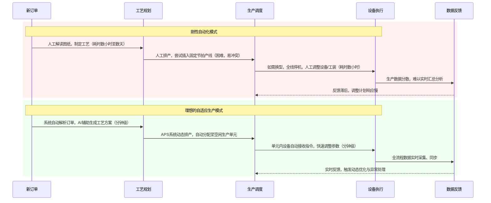
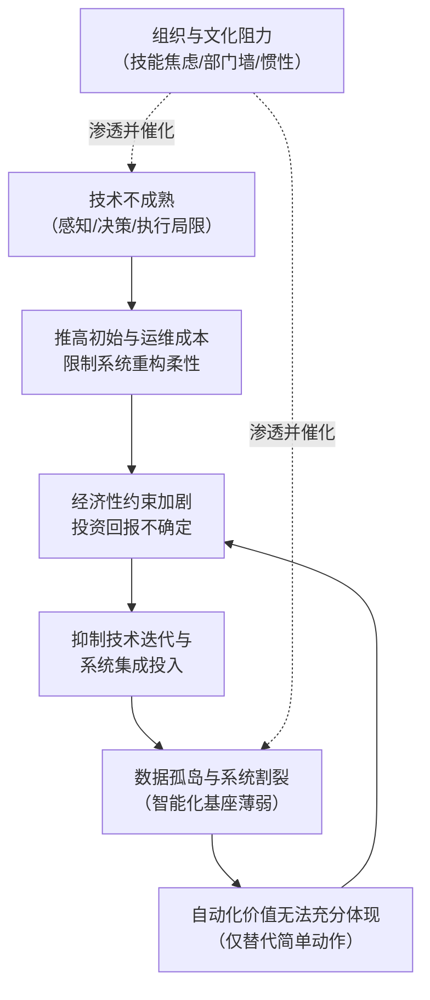

# 离散制造单件小批生产环节技能依赖型自动化转型的难度评估与挑战分析报告
## 1 绪论：研究背景、意义与核心问题界定

制造业的数字化转型浪潮正以前所未有的深度与广度重塑全球产业格局，其中“机器换人”与自动化升级被视为提升效率、降低成本、保障质量的关键路径[^1]。然而，在这一宏观趋势下，一个庞大而特殊的制造领域——离散制造中的单件小批生产模式——其自动化转型之路却显得尤为崎岖与复杂。本章旨在系统界定这一特定生产模式的核心特征，揭示其内在矛盾，并基于此明确本报告所要聚焦的核心研究问题，为后续的深度剖析奠定基础。

### 1.1 核心概念界定：离散制造与单件小批生产模式

清晰界定研究对象是任何深入分析的前提。本报告聚焦于“离散制造”范畴内的“单件小批生产”，两者在概念上紧密关联，共同定义了本研究的边界。

**离散制造**，又称离散式生产或装配生产，其根本特征在于产品由多个零部件构成，各零件的加工过程彼此独立、非连续地进行，最终通过部件装配和总装配形成成品[^2]。这种生产方式与物料连续通过相同路径的流程工业形成鲜明对比[^3]。离散制造的生产流程具有显著的间断性，工艺路线复杂多变，不同产品的工作中心序列往往不同[^2]。其生产管理高度依赖精确的物料清单（BOM）和工艺路线，生产计划的制订异常复杂，需要综合订单与市场预测[^2]。典型行业包括汽车、航空航天、机械制造、电子设备、船舶及家具等[^2]。

**单件小批生产**是离散制造中一种典型且极具挑战性的生产组织方式。它具备以下核心特征：首先，产品品种繁多，但每种产品的产量极小，甚至为单件，生产活动基本上按照用户的特定订货来组织，生产计划在很大程度上取决于订单[^4][^5]。其次，由于产品极少重复生产，导致产品结构与加工工艺存在较大差异，生产的稳定性和专业化程度很低[^4]。再次，为适应多品种的灵活生产，通常采用通用性设备，并按照工艺专业化原则（如车、铣、磨等工种）来组织生产单元，每个工作中心需要承担多种不同任务的加工[^4]。最后，这种模式直接导致了生产过程的间断时间、工艺路线和生产周期均显著延长[^4]。尽管存在这些效率上的挑战，单件小批生产以其出色的定制化能力和市场适应性，在高端装备、精密仪器、非标自动化设备及艺术品制造等领域牢牢占据着不可或缺的地位[^5]。

### 1.2 内在矛盾揭示：技能依赖的普遍性与管理挑战

单件小批生产模式在展现其灵活性与定制化优势的同时，也暴露出深刻的内在矛盾，其核心在于对人工技能的高度依赖及其引发的系列管理挑战。

**一方面，高技能人工是该模式得以运转的基石。** 由于产品非标准化、工艺路线多变、生产任务不重复，生产过程充满了不确定性。这要求操作人员不仅需要掌握设备操作，更必须具备根据实际情况灵活调整工艺参数、处理突发异常、进行复杂质量判断的能力。因此，**“操作人员的技术水平在很大程度上决定产品的质量和生产效率”** 成为该领域的普遍共识[^3][^2]。研究亦明确指出，单件小批生产对工人技术水平要求高，需要他们具备解决复杂问题的能力[^6]。为应对各环节的人工衔接与协调，该模式还需要吸纳复合型高技能人才[^3]。

**另一方面，这种对人工技能的深度依赖直接导致了该模式固有的管理难题。** 综合多项资料分析，单件小批生产的主要缺点可概括为：**周期长、成本高、用人多、质量不宜保证**[^7][^5]。具体而言，频繁的设备调整与工艺切换导致生产效率低下，生产周期漫长；无法形成规模效应，使得单位产品成本居高不下；生产过程依赖大量人工操作与监控，人力成本占比大；而由于标准化程度低，工艺执行依赖个人经验，产品质量容易产生波动，稳定性难以保证[^7]。

由此可见，单件小批生产陷入了一个两难境地：其赖以生存的灵活性与定制化能力，恰恰建立在难以标准化、规模化且成本高昂的高技能人工基础之上。这种“技能依赖”在保障生产进行的同时，也成为了制约其效率提升、成本控制和质量稳定的主要瓶颈。因此，探索通过自动化技术来替代或辅助这些高技能环节，成为产业升级的必然方向，但这条道路的独特性与艰巨性也由此凸显。

### 1.3 问题提出：技能依赖型环节自动化转型的难度与挑战

当前，中国制造业正处于重振与升级的关键阶段，国家政策导向与市场需求共同推动着智能化转型[^8]。柔性自动化产线被广泛视为破解多品种小批量生产瓶颈的关键[^9][^10]。与此同时，“机器换人”的趋势在提升生产效率的同时，也对传统产业工人的就业结构产生了冲击，部分低技能岗位被替代，市场对高技能、高素质产业工人的需求却在增加[^1]。这构成了本研究宏观的现实背景。

然而，前文的概念与矛盾分析清晰地表明，单件小批生产模式中的自动化，其对象并非简单重复的体力劳动，而是那些蕴含了人类经验、判断力、灵活性和学习能力的“技能型”工作。例如，针对一张新图纸进行工艺规划、为一次新换型调试设备参数、对一个复杂工件进行综合质量检测、或是在生产突发异常时快速诊断并解决问题等。这些环节的自动化，意味着机器需要在一定程度上模拟甚至超越人类的认知与决策能力。

因此，本报告的核心研究问题应运而生：**在离散制造的单件小批生产模式下，实现“技能依赖型环节”自动化转型的具体难度究竟有多大？其面临哪些多维度的、相互交织的深层挑战？**

这一问题不仅具有紧迫的现实意义——直接关系到大量传统制造企业能否成功跨越数字化转型的鸿沟；也具有重要的理论价值——有助于深入理解在高度不确定性、定制化和非结构化环境下，技术应用所面临的特殊约束与演进路径。后续章节将围绕此问题，从技术可行性、经济性、系统柔性、数据基础、组织变革等多个维度，进行系统性的评估与剖析。

## 2 技能依赖的根源：单件小批生产的本质特性与人工优势

自动化转型的难度，首先根植于其试图替代的对象本身——即单件小批生产模式所深度依赖的人类技能。这种依赖并非偶然，而是由该生产模式的本质特性所决定的。离散制造中的单件小批生产，其产品由多个零部件构成，各零件加工过程独立进行，最终通过装配形成成品[^2]。然而，与大批量标准化生产不同，单件小批生产在订单、工艺、过程控制等方面呈现出高度的异质性、复杂性和不确定性。本章将系统剖析这些本质特性，揭示它们为何共同将人类的经验、判断力、灵活性和学习能力推向了生产体系的核心地位，从而明确自动化所需替代的“技能”的具体内涵，为评估转型难度奠定认知基础。

### 2.1 订单异质性与非标定制：经验与判断力的核心地位

单件小批生产的首要特征在于其强烈的订单异质性。这种模式通常采用订货型生产（MTO）或按订单设计（ETO）策略，生产过程完全由客户特定的、多样化的需求驱动[^5][^11]。从生产角度看，这意味着一款产品往往对应一套独特的流程，产品“种类规格相当繁多”，但“订货批量非常小，甚至单件”[^11]。

这种高度个性化的生产模式，在实践中主要对应两类产品：复杂的标准定型产品（如高端数控机床）和完全的非标产品[^11][^12]。非标设备作为典型代表，其设计完全依据用户的特定工况和工艺要求，具有强烈的“设计个性化”和“生产单件性或小批量性”[^12]。**这导致了一个根本性的挑战：由于每个订单都是独特的，生产活动无法依赖预先固化、放之四海而皆准的标准化程序**[^12]。从解读千差万别的客户图纸与技术协议，到理解隐含的工艺需求与质量边界，再到为这次“唯一”的生产制定初始的工艺方案、选择加工参数、预判潜在风险，每一个环节都严重依赖操作人员或工艺师长期积累的经验库和现场判断力。

例如，面对一张新产品的复杂装配图，有经验的工人能够迅速识别出加工难点、装配干涉点以及需要特殊工装的部位，这种基于模式的快速识别与推理能力，是当前自动化系统难以具备的。因此，在单件小批生产的起点——订单转化与工艺初始化阶段，人类的经验与判断力就占据了核心地位，自动化系统首先需要跨越的是对非结构化任务进行认知和定义的鸿沟。

### 2.2 工艺复杂性与任务多变性：灵活调整与多任务协同能力

单件小批生产的另一核心特性是其工艺路线的复杂性与生产任务的多变性。离散制造的生产过程本身就被分解为多个独立的加工任务，通过非连续工序完成[^13]。而在单件小批场景下，由于产品品种多、极少重复，导致“产品结构与工艺有较大的差异”[^4]，进而使得“生产工艺由多个独立环节组成”，且“工作中心的序列不同”[^2][^13]。生产过程因此呈现出显著的“间断性”[^2]。

为了适应这种多品种、低重复的制造环境，企业通常采用通用性设备，并按照工艺专业化原则（如车、铣、磨、焊等）来组织生产布局，这使得“每个工作中心承担多种生产任务的加工”[^4][^13]。其结果是，生产流程不再是稳定不变的流水线，而是一个动态、离散的任务集合，需要根据不断变化的订单进行实时调度与资源分配。**这种动态性要求生产系统具备极高的柔性，而当前实现这种柔性的主要载体正是高技能的工人**。

操作人员需要能够根据排产计划，快速在不同类型的通用设备间切换，熟练地安装和调整各种工装夹具，并精准地设置加工参数[^2]。更重要的是，他们需要理解整个工艺链，能够协调前后工序的衔接，处理因任务切换、设备冲突或物料不齐套导致的生产间断。参考资料明确指出，离散制造过程中“各环节衔接主要依赖人工操作”，并且“需要吸纳复合型高技能人才进行生产流程协调”[^2]。这凸显了人类在复杂、多变的生产情境下，进行多任务协同、资源即时调度与现场微调的能力，这种能力源于对整体生产系统的深刻理解和丰富的实践经验，是刚性自动化系统难以模拟的。

### 2.3 异常频发与不确定性处理：直觉、诊断与快速学习能力

单件小批生产环境充满了内在的不确定性，导致生产过程中异常状况频发。由于产品不重复或极少重复，缺乏历史数据的充分积累，生产系统“控制具有很大的不确定性”[^11]。从原材料批次间的微小差异、机床设备的精度漂移、到复杂工件加工中的振动与变形，各种未预见的问题都可能发生。这些异常轻则影响单件产品质量，重则“扰乱生产调度安排和交货计划”[^11]。该模式普遍存在的“产品质量不易保证”的缺点，正是这种不确定性的直接体现[^5]。

处理这些突发异常，远非执行预设程序所能解决。它要求操作人员具备基于深厚经验的直觉，能够从细微的声响、切屑形态、仪表读数中感知异常；需要快速的诊断能力，像熟练的医生一样，将表面症状与可能的深层原因（如刀具磨损、夹具松动、程序错误）联系起来；更需要一种“试错”与快速学习的能力，能够通过有限的几次调整找到解决问题的方法，并将这次异常的处理经验内化为个人知识，用于防范或应对未来类似情境。

**这种在信息不完整、时间紧迫的压力下，进行快速推理、决策并从单次事件中学习的能力，构成了人类认知技能的巅峰，也是当前自动化技术实现“工业级稳健性”所面临的最大障碍之一**[^14]。机器视觉或传感器或许能检测到超出公差，但难以像老师傅一样判断这是系统性偏差还是偶然波动，更难以提出创造性的补偿方案。因此，在应对单件小批生产固有的不确定性方面，人类技能仍然扮演着不可替代的角色。

### 2.4 人机能力边界对比：明晰自动化替代的技能内涵

综合上述分析，我们可以清晰地对比在单件小批生产场景下，人机能力的天然边界，从而精准界定“技能依赖”的具体内涵。

以下表格总结了在单件小批生产的关键维度上，人类与当前主流自动化系统的典型能力对比：

| 能力维度 | 人类技能的优势体现 | 当前自动化系统的典型局限 |
| :--- | :--- | :--- |
| **任务结构化程度** | 擅长处理**非结构化、低重复性**任务，如解读新图纸、处理未知异常。 | 依赖**结构化、高重复性**的环境和输入，换型与调整成本高[^15]。 |
| **环境适应性** | 具备极强的**灵活性**，能根据现场情况快速调整工艺、工装和操作方式。 | **柔性不足**，产线重构耗时耗力，难以适应频繁的产品切换[^10]。 |
| **信息处理与决策** | 基于**经验与直觉**进行模式识别、综合判断和快速诊断，能在信息模糊下决策。 | 依赖**清晰规则与大量数据**，对于罕见案例和“灰色地带”判断力弱。 |
| **学习与进化** | 能够从**单次或少量经验**中学习，实现技能迁移和知识创造。 | 通常需要**海量标注数据**进行训练，增量学习和跨任务迁移能力有限。 |
| **协同与沟通** | 易于进行**跨工种、跨工序的即时沟通与协同**，解决界面问题。 | 系统**集成复杂**，跨设备、跨系统的无缝协同仍面临协议与接口挑战。 |

通过对比可知，传统刚性自动化（如为大批量生产设计的流水线）在单件小批生产场景下暴露出“换型成本极高”、“在制品积压严重”和“柔性极差”三大致命问题[^15]。而人类则展现出在“创造力”、“跨域学习”和完成“复杂工序”方面的独特优势[^14][^16]。

因此，本报告所探讨的自动化转型，其目标并非替代简单的重复性体力劳动，而是旨在替代或辅助那些**嵌入在单件小批生产本质特性中的、以复杂认知为基础的高级技能**。具体而言，这包括：
1.  **基于经验的模式识别与规划能力**：针对全新或相似度低的产品，快速形成可行工艺方案的能力。
2.  **动态环境下的实时调整与资源调度能力**：在多变、非连续的生产流中，保证任务顺畅衔接与资源高效利用的能力。
3.  **对模糊与异常情境的诊断与处置能力**：在缺乏明确规则和先例的情况下，快速定位问题根源并实施有效纠正的能力。
4.  **从有限样本中归纳学习的元认知能力**：能够在少量生产实践中积累经验，并优化未来操作策略的能力。

**正是这些难以被完全算法化和标准化的认知能力，构成了单件小批生产实现全面自动化的深层障碍，也定义了后续章节将要评估的技术、经济及系统挑战的标靶**。自动化系统若想有效替代这些技能，不仅需要在感知和执行层面取得突破，更需要在认知与决策智能上实现质的飞跃。

## 3 技术可行性挑战：现有自动化技术的适配性瓶颈

在明确了单件小批生产对高级人工技能的深度依赖后，一个关键问题随之浮现：当前主流的自动化技术是否已具备替代这些技能的能力？本章将系统评估协作机器人、机器视觉、AI工艺决策与数字孪生等旨在实现柔性生产的技术，在应对单件小批生产的核心特性——如小批量多品种、快速换型、复杂工艺判断及非结构化环境——时所暴露出的适配性瓶颈。尽管这些技术被寄予厚望，但深入分析表明，它们在感知、决策与执行层面的能力仍存在显著局限，难以完全覆盖和替代第二章所界定的人类高级技能。

### 3.1 柔性自动化硬件：协作机器人与柔性产线的能力边界

柔性自动化产线被视为破解多品种小批量生产瓶颈的关键，其核心逻辑并非单纯堆砌设备，而是以工艺重构为基础，通过模块化设计实现灵活换产[^10]。典型的硬件形态包括数控机床（NC）、加工中心（MC）、柔性制造单元（FMC）及柔性制造系统（FMS），它们通过可变编程实现加工流程的灵活控制，适用于多品种、中小批量生产[^17]。协作机器人作为其中的重要组成部分，因其高灵活性和相对低成本，尤其受到中小企业的青睐[^18]。

然而，这些硬件系统在应对单件小批生产的极致柔性需求时，其能力边界清晰可见。**协作机器人的最终目标被设定为“一对一换人”，但其适配范围主要局限于“繁重的重复性劳作”[^19]。** 这意味着，对于需要复杂判断、精细操作或频繁调整的非重复性任务，协作机器人的能力存在天花板。参考资料明确指出，协作机器人不能承担人类完成的所有任务，特别是在精细任务方面仍有局限性[^18]。例如，在需要复杂手眼协调的精密装配、对非标准工件进行灵巧抓取与操作等场景中，协作机器人难以像熟练工人一样灵活应对。

柔性产线虽然通过模块化设计（如配置CNC、EDM等单点自动化单元或组合工业机器人与柔性轨道线）旨在实现快速换产[^10]，但其“柔性”依然建立在一定的标准化和预设程序之上。当面对高度异质性、极少重复的订单时，频繁的换型意味着需要不断重新编程、调整工装夹具和工艺参数。这个过程即便有图形化编程或拖动示教等易用性技术的辅助[^20]，其耗时和复杂度依然可观，难以实现人类技能所具备的“秒级”适应与调整能力。此外，传统工业机器人部署成本高、灵活性差的痛点，在需要极致柔性的场景下并未被协作机器人完全克服[^19]。**因此，现有硬件系统的“柔性”更多体现在对“已知品种集”的快速切换上，而非对“完全未知任务”的即时适应，这与单件小批生产中订单高度异质、任务极少重复的本质特性形成了根本矛盾。**

### 3.2 感知瓶颈：机器视觉在非结构化环境下的识别困境

感知是自动化系统自主决策与执行的前提，而机器视觉常被视为系统的“眼睛”。在单件小批生产中，由于产品千差万别、生产环境相对开放，机器视觉系统面临的是典型的“非结构环境”。中国农业大学的研究将其定义为农田自然环境，其特征包括自然光照多变、待作业空间复杂多变、作业对象千姿百态、枝叶果实相互遮挡等[^21]。这些特征同样适用于许多离散制造车间：光照条件不稳定、工件姿态随机、种类繁多且可能相互遮挡。

在这种环境下，机器视觉的感知能力面临严峻挑战。**首要挑战是环境干扰的鲁棒性问题。** 在新能源汽车总装等场景中，多视觉技术在光照变化、粉尘干扰下，识别精度可能从99.9%骤降至95%以下，严重影响电子部件等精密装配的质量[^22]。自然光照的补偿与抑制一直是技术难点，需要构建复杂的光照波动控制模型来突破传统机器视觉缺乏环境适应性的瓶颈[^21]。**其次，缺陷或目标特征的多样性带来了巨大困难。** 工业缺陷检测需要应对表面划痕、污点、颜色不均、变形等多种复杂类型[^23]。在单件小批生产中，每一批新产品都可能带来前所未见的缺陷形态，要求检测系统具备极强的泛化能力和自适应性，而这正是当前算法的短板[^23]。

更为现实的问题是项目落地中的精度与可靠性鸿沟。算法工程师追求的“准确率99.9%”在产线主管眼中可能意味着不可接受的风险——0.1%的漏检在高速产线上会直接转化为每小时数个不良品，引发潜在的质量事故[^24]。此外，光学设计的高度定制化与数据标注的规范性要求，使得每个新项目的落地都异常繁琐。例如，针对不同批次表面粗糙度差异导致的成像对比度波动，可能需要定制多波段偏振光源并配合专用补偿算法[^24]。**这些挑战共同表明，在单件小批生产的非结构化环境下，实现高鲁棒性、高通用性且成本可控的精准感知，仍然是机器视觉技术亟待突破的核心瓶颈，严重制约了自动化系统在质量检测、引导抓取等关键环节的自主应用。**

### 3.3 决策智能瓶颈：AI工艺规划与动态调度的不成熟性

如果说感知是“眼睛”，那么决策就是“大脑”。在单件小批生产中，自动化系统需要替代的人类高级技能，很大程度上体现在基于经验的工艺规划、动态调度和异常诊断等认知密集型任务上。以模德宝为代表的方案提出了“AI+工艺重构+自动化赋能”的路径，强调AI在自动排产、优化工艺方面的作用[^10]。然而，当前AI技术在应对这类复杂决策时，其不成熟性暴露无遗。

**首要瓶颈是“决策黑箱”与可解释性缺失。** 主流AI模型，尤其是深度学习模型，其决策逻辑往往不可解释，行为依据不可判识，长期因果关系难以推论[^25]。在工业场景中，这种不可解释性带来了严重的安全与信任危机。例如，一个无法说明依据的工艺参数推荐或质量判定，一旦出错，不仅导致生产损失，更会引发合规风险，使得企业不敢将关键决策权完全交由AI[^25]。**其次，AI在复杂环境适应和动态上下文管理上能力不足。** 单件小批生产现场充满动态变化，AI难以像人类一样维持长期任务的状态记忆并进行跨步骤的协同推理。有专家指出，AI在执行多步骤协作任务时，可能因无法共享关键背景信息而失败，如同“失忆的高材生”[^25]。

在具体的工艺决策层面，面对一个全新的、缺乏历史数据积累的订单，AI算法难以进行人类工艺师那样的创造性规划。它可能依赖于有限的相似案例或通用规则，但无法融合对材料特性、设备状态、刀具磨损等隐性知识的综合判断。强化学习等试错方法虽具潜力，但在实际工业生产中试错成本极高，且奖励机制的设计偏差极易导致模型行为偏离实际目标[^25]。**因此，尽管AI在数据丰富的优化问题上表现卓越，但在单件小批生产所特有的“小数据”、“零样本”或“一次性”决策场景中，其认知与推理能力尚远未达到工业级可靠应用的水平，无法替代人类在非结构化问题解决中的核心作用。**

### 3.4 系统集成瓶颈：数字孪生与数据协同的落地难题

实现单件小批生产的自动化，远非孤立地应用几项技术，而是需要构建一个高度集成、协同响应的智能系统。数字孪生技术被寄予厚望，它通过构建物理工厂的虚拟映射，旨在实现全流程的可视化监控、仿真优化与协同调度[^26]。然而，正是这种系统级的集成应用，在单件小批生产场景下面临着巨大的落地难题。

**数据层是首要梗阻。** 数字孪生的有效性完全依赖于高质量、高流通性的数据。然而，许多工厂（尤其是中小企业）内部，MES、ERP、PLM等异构系统间接口不兼容、数据格式不统一，导致设计、生产、供应链数据无法实时互通，形成“数据孤岛”[^26]。某电子制造厂的案例显示，数据孤岛导致的生产排产偏差率高达12%[^26]。此外，传感器数据采集的滞后、失真或人工录入误差，使得虚拟模型无法精准复刻物理状态，在精密制造中可能导致8%-10%的产能损失[^26]。数据安全顾虑也进一步限制了关键数据的共享与协同优化[^26]。

**模型层则存在“精度短板”。** 构建能够精准指导生产的高保真数字孪生模型成本高昂、技术复杂。多数企业只能构建基础的几何模型，而无法融入物理属性、工艺规则和环境影响等多维特征，导致仿真结果与实际偏差巨大[^26]。例如，某家电工厂的模型因未考虑车间温湿度影响，其优化方案的实际效果缩水了60%[^26]。同时，模型缺乏动态迭代能力，无法跟随设备磨损、工艺调整等实时更新，逐渐与物理系统脱节[^26]。

**资源配置层的“适配失衡”同样突出。** 这包括“新平台+老设备”的兼容性问题，老旧设备数字化改造难度大；也包括在车型切换时，MES系统需同步海量数据可能引发的系统卡顿与生产暂停[^22]。边缘计算设备算力难以支撑多车型并行处理的需求，而云端计算又存在延迟[^22]。**这些数据、模型与资源配置层面的瓶颈相互交织，使得构建一个能够有效支持单件小批生产快速响应与优化决策的数字孪生系统异常困难。** 对于本就基础薄弱的中小离散制造企业而言，跨越从信息孤岛到决策协同的鸿沟，所需的技术、资金与管理投入，构成了一个几乎难以逾越的系统集成障碍。

## 4 经济性与投资回报难题：成本约束与规模效应缺失

在探讨单件小批生产自动化转型的技术可行性之后，一个更为现实且决定性的挑战浮出水面：经济性。即使技术路径在理论上可行，高昂的投入与难以预测的回报，往往在财务层面构成企业决策的首要障碍。本章将系统评估在单件小批生产场景下，自动化转型所面临的经济性挑战与投资回报（ROI）难题。核心观点在于，该模式固有的订单波动性、产品非标性与生产不连续性，使得自动化系统难以通过规模生产分摊高昂的初始投资与持续运维成本，导致投资回收期漫长且充满不确定性，从而在根本上制约了企业的转型意愿与能力。

### 4.1 高昂且复杂的初始投入：超越硬件采购的综合成本

自动化转型的初始投入远非简单的设备采购，而是一个涉及技术、人力与流程重构的综合性投资。其成本构成复杂，且无固定标准，核心取决于企业规模、行业属性及改造深度[^27]。在离散制造的单件小批场景下，这一初始投入尤为高昂和复杂。

首先，**技术采购与部署成本是显性投入的核心部分**。这包括自动化设备（如机械臂、传感器）、软件系统（如MES、排产引擎）的购置费用。对于制造业而言，这类硬件单价可从数万元到数百万元不等[^27]。然而，这仅仅是起点。系统安装、调试、数据迁移以及与现有老旧设备的硬件适配改造，还需投入大量人力与资金，这部分费用通常占技术采购成本的15%至30%[^27]。例如，一家印染企业在数字化转型中，除了软件系统，还需配套采购测色仪等先进设备，一套软硬件改造的总投入达到其年营业收入的2%左右，对于利润率本就微薄的行业而言，这需要极大的决心[^28][^29]。

其次，更为关键且容易被低估的是为适应“柔性”而产生的**深度定制与工艺重构成本**。单件小批生产的自动化，其核心逻辑并非单纯堆砌设备，而是以工艺重构为基础[^30]。这意味着企业需要对现有的、高度依赖人工经验的非标工艺流程进行彻底分析、标准化和模块化设计。例如，针对多品种加工，需要合并同类工序、优化装夹方案、梳理标准化作业流程，以构建能够兼容不同规格产品的生产单元[^30]。这种从源头进行的工艺再造，涉及大量的工程咨询、定制化设计和系统集成工作，其成本远超标准化流水线的采购与安装，构成了初始投入中难以量化的“隐性”部分。**因此，单件小批生产的自动化起点，不仅硬件成本高企，更伴随着高昂的、为追求柔性而必须支付的智力与设计成本**，这常常超出企业基于“机器换人”的简单预算预期。

### 4.2 持续运维与动态调适成本：柔性背后的财务负担

自动化系统上线并非投资的终点，相反，为维持其运行尤其是“柔性”能力，将产生持续且可能动态增长的运维成本。这对于订单波动大、换型频繁的单件小批生产而言，构成了长期的财务负担。

根据行业分析，系统上线后的年度运维成本约为初始技术投入的5%至10%。如果采用云服务模式，则需要按年支付弹性但长期累计可观的订阅费用[^27]。然而，在柔性制造场景下，运维成本的内涵更为复杂。为实现快速响应，系统必须配套**动态排产引擎、边缘计算节点、智能物流网络（如AGV、RFID）以及预测性维护体系**[^31][^32]。这些子系统本身就会产生持续的软件授权费、云计算资源租赁费、数据流量费以及专业的技术维护费用。

更为关键的成本源于生产的本质特性——**频繁的换型与动态调适**。正如案例所揭示的，小批量多品种已成常态，“订单量越来越小，品种却翻了三倍”，生产线刚调整完A产品，B产品的订单就接踵而至[^15]。自动化系统为应对每一次独特的产品切换，都可能需要执行以下工作：为机器人重新编程或示教、更换并校准专用的工装夹具、调整机器视觉系统的识别模板与参数、甚至为AI工艺决策模型注入新的数据或进行微调。这些工作无法完全自动化，需要工程师或技术人员的介入，从而产生持续的人工干预成本或第三方服务费用。**这种因“柔性”而生的动态调适成本，在单件小批生产中不是偶发现象，而是常规性支出，其波动性与不可预测性给企业带来了严峻的财务管理挑战**。

### 4.3 规模效应缺失与投资回收期测算困境

单件小批生产模式在经济性上最根本的弱点在于**规模效应的天然缺失**，这直接导致传统的投资回报率（ROI）计算模型在该场景下严重失效，投资回收期（PP）变得漫长且难以测算。

传统流水线是为“大批量单一品种”设计的，其经济性建立在通过海量稳定产出摊薄高昂固定成本的基础之上[^15]。而单件小批生产的特征恰恰相反：产品种类多、批量小、工艺流程复杂且不连续，生产任务多变，过程控制困难[^13]。这意味着，一套为应对柔性而投入巨资的自动化系统，无法通过稳定、大量的产品产出来快速回收成本。每一次新订单都可能意味着一次新的“定制化”生产，自动化设备的高利用率难以保证。

在ROI测算层面，这种矛盾尤为尖锐。自动化投资的收益通常通过“显性收益”如人工成本节约、缺陷早期发现减少的修复成本、以及生产周期压缩带来的价值来衡量[^33][^34]。其基础计算公式为：`ROI = (收益 - 成本) / 成本 × 100%`，并常辅以投资回收期（PP）、净现值（NPV）等关键指标进行综合评估[^33][^35]。

然而，将这些模型应用于单件小批生产时，会遇到根本性障碍：

| 收益测算维度 | 大规模生产场景的假设 | 单件小批生产场景的现实冲突 |
| :--- | :--- | :--- |
| **人工时间节约** | 基于高频重复执行的回归测试或固定工序，节约时间可稳定量化（如：每月执行2轮，每轮节约4人天）[^34][^36]。 | 产品极少重复，每次生产都是新任务，缺乏稳定的“手工耗时”基准进行比较，节约时间难以准确预测和累计。 |
| **缺陷预防收益** | 基于历史数据，能较准确预估在特定阶段发现并修复缺陷的成本节约（如：生产环境修复成本是测试环境的100倍）[^33]。 | 面对全新或相似度低的产品，缺乏历史缺陷数据，难以预估“提前发现”的缺陷数量及对应的成本节约。 |
| **周期压缩价值** | 稳定的生产节拍下，缩短周期可明确转化为产能提升或交付加速的收益。 | 生产周期本身因订单差异而波动巨大，自动化对周期的影响因产品而异，整体收益难以稳定量化。 |

因此，尽管有企业数字化转型后“效率提高了，收益很明显”的普遍化表述[^28]，但在单件小批的具体场景下，由于缺乏稳定的产量和重复的工艺作为收益计算的基石，自动化投资的边际收益呈现递减且不稳定的特征。这导致其投资回收期极有可能远超大规模生产场景（例如，某MES系统在汽车零部件企业实现1.5年回收[^35]），且测算本身充满假设与不确定性。**这种财务层面的不可预测性，严重削弱了企业，特别是抗风险能力较弱的中小企业，进行大规模自动化投资的信心与意愿**。

### 4.4 成本效益的权衡：局部自动化与分步实施的现实路径

面对严峻的经济性约束与规模效应缺失的困境，追求一步到位的“无人化”产线对于绝大多数单件小批生产企业而言既不现实也不经济。理性的选择是进行精准的**成本效益权衡**，采取务实的渐进式策略。

首先，企业必须**聚焦于投入产出比高的核心环节**，而非全面铺开。多项实践指南均建议遵循“二八定律”，优先自动化那些高频、重复性相对较高、或属于“脏、险、难”的作业环节[^27][^33][^34]。例如，在模具行业，可以从高频重复的CNC加工上下料环节实施单点自动化入手，逐步扩展，而非一开始就追求全流程自动化[^30]。这有助于用有限的资金，最快地获取确定性的回报，并积累经验。

其次，**单元化生产（Cellular Manufacturing）改造提供了一种极具参考价值的模块化实施路径**。它通过将工艺相似的产品归类为“产品族”，并为每个族建立独立的、紧凑布局的“生产单元”，将“长链路串行”改为“短链路并行”[^15]。这种模式的优势在于：1）**初始投资可控**：只需针对特定产品族改造或新建一个单元，而非整条产线；2）**换型效率提升**：单元内设备调整范围小，东莞某电子厂的案例显示换型时间可缩短60%以上[^15]；3）**库存与交付改善**：单元内工序衔接紧密，半成品积压减少，交货准确率提升[^15]。这实质上是将小批量多品种的复杂问题，分解为多个相对标准化、可管理的子问题，从而在经济和技术上都更具可行性。

最后，在技术选型上，应**高度重视系统的开放性与兼容性**，以降低长期的集成与迭代成本。选择支持开放协议控制器、提供完整API接口文档的设备与软件，可以确保现有设备的接入能力（案例显示可达75%）以及未来功能的灵活扩展[^31]。避免被单一供应商的封闭系统锁定，是控制全生命周期成本的关键。

**综上所述，单件小批生产自动化转型的经济性难题，根源在于其生产模式与规模化工业投资逻辑的内在冲突。破局之道不在于追求颠覆性的全面替代，而在于承认并接受这种冲突，转而采取一种聚焦、模块化、分步实施的渐进式路径。通过精准的成本效益分析，优先在价值最明确的环节实现自动化突破，并构建易于重构和扩展的生产单元，企业才能在控制财务风险的前提下，逐步积累能力，最终迈向更高水平的人机协同与智能化生产。**

## 5 系统柔性与可重构性障碍：从刚性自动化到自适应生产的鸿沟

单件小批生产的自动化转型，其核心挑战不仅在于替代具体的人工技能，更在于构建一个能够适应其多变、非连续、高度异质性特征的生产系统。这要求从传统为大批量设计、具有刚性特征的自动化范式，跨越到具备极致柔性与快速可重构能力的自适应生产范式。然而，深入分析表明，这一跨越面临着从底层逻辑到上层集成的系统性鸿沟。本章将系统剖析刚性自动化与柔性需求的本质冲突，梳理当前主流柔性化路径的技术内涵与实施瓶颈，并深入探讨在系统集成、数据协同以及稳定性保障方面所面临的深层障碍。

### 5.1 刚性自动化与柔性需求的本质冲突

单件小批生产实现自动化的首要障碍，源于其生产组织逻辑与大规模生产自动化范式之间的根本性矛盾。传统刚性自动化产线，其设计哲学是为“大批量单一品种”服务的，它采用自动流水线，包括物流设备和相对固定的加工工艺[^37]。这种模式追求的是标准化、专业化和高效率，其特征表现为：工序分散、节拍固定、物料采用顺序输送，并依赖高效的专用设备[^37][^38]。这种设计如同一套精密但僵化的高速齿轮系统，一旦设定，便以极高的效率重复同一流程。

然而，当这套系统遭遇小批量多品种的生产需求时，其内在的“死穴”便暴露无遗[^15]。**首先，换型成本极高。** 调整设备参数、更换模具夹具、培训员工操作等流程，耗时从数小时到一两天不等，期间生产线完全停摆，严重侵蚀了本就有限的生产时间窗口[^15]。**其次，在制品积压严重。** 由于工序按顺序排开，前道工序完成的半成品必须等待整条线流转到后道，导致中间环节堆积如山，不仅占用大量流动资金，还增加了质量风险和管理复杂度[^15]。**最后，系统柔性极差。** 一旦某道工序出现故障，整条产线便陷入瘫痪；面对紧急的小订单插单需求，传统流水线因无法快速调整而难以响应，只能眼睁睁看着交货期延误[^15]。这些痛点精准地揭示了刚性自动化在应对市场从“大规模标准化”转向“个性化定制”时的结构性失灵[^15]。

与之形成鲜明对比的是柔性制造模式的核心诉求。柔性制造模式的特征在于工序相对集中、没有固定的生产节拍、物料采用非顺序输送，其目标是将高效率与高柔性融为一体，以应对多品种、小批量的生产，并具备极强的灵活性和市场适应能力[^37]。**这种模式的核心优势在于其对变化的快速响应能力，而这恰恰是刚性模式的致命短板[^37]。** 因此，单件小批生产的自动化转型，首先是一场生产组织逻辑的范式革命，需要从追求静态效率的“刚性高速路”，转向追求动态适应的“柔性网络”，而这其中的鸿沟远非简单的设备升级所能填补。

### 5.2 柔性化路径的技术内涵与实施瓶颈

为弥合上述鸿沟，业界已探索出若干以“柔性化”为核心的技术路径，其中“单元化生产”、“模块化设计”和“工艺重构”是三种最具代表性的实践方向。这些路径旨在通过组织与技术的创新，赋予生产系统应对多变性的能力。

**单元化生产（Cellular Manufacturing）** 是对传统流水线进行“外科手术式”改造的经典方法。其核心思想是将原来分散在整条流水线上的工序，根据产品的工艺相似性，集中到一个独立的“生产单元”内，形成一个微型工厂[^15]。例如，将注塑、打磨、喷漆、质检四道工序的设备紧凑排列在一个小区域内，由少量员工负责全流程[^15]。这种模式将“长链路串行”改为“短链路并行”，带来了显著的柔性优势：换型时只需调整本单元设备，时间可缩短60%以上；单元内工序衔接紧密，半成品积压大幅减少，资金占用可降低40%左右；一个单元对应一类订单，插单时只需调度空闲单元，交货准确率可提升至95%以上[^15]。东莞某电子厂的案例证实，通过产品分组和U型设备布局改造，生产效率实现了显著提升[^15]。

**以工艺重构为核心的柔性自动化** 是另一条深化路径。其核心逻辑强调，柔性自动化绝非设备的简单堆砌，而必须以工艺重构为基础，通过AI与自动化技术的深度融合实现“随需而变”[^10]。例如，针对多品种加工，通过合并同类工序、优化装夹方案、梳理标准化作业流程，从根本上破解“一款产品一套流程”的低效困境，使重构后的工艺能够兼容不同规格零件的生产[^10]。在此基础上，借助AI进行自动排产和动态调度，并根据需求灵活配置CNC、EDM等单点自动化单元或组合成完整产线，实现快速换产[^10]。

**模块化设计与智能产线** 在具体行业应用中展现出强大潜力。在家电行业，某冰箱制造商将传统流水线拆解为12个独立模块化工作站，配备可编程控制器和RFID系统，能根据订单自动切换参数，接到50台定制订单时，系统在23分钟内完成工艺重组，换型时间节省82%，设备综合效率从63%大幅提升至89%[^39]。在装备制造业，杰克科技通过将2000余个零部件重组为23个功能模块，使产品配置组合从36种跃升至480种，同时大幅压缩研发周期[^40]。

尽管这些柔性化路径方向正确且成效显著，但其成功实施面临着不容忽视的瓶颈：

1.  **对前期分析与工艺沉淀要求极高**：单元化改造必须先完成所有产品的工艺路线统计与相似性分组；工艺重构需要深厚的行业Know-How和工程经验。这对于工艺管理粗放、数据基础薄弱的企业是首要难关。
2.  **依赖高水平的定制化集成**：无论是U型单元布局还是模块化产线，都需要根据具体产品和车间条件进行定制化设计与集成，而非购买即用的标准品，这拉高了技术门槛和初期投入。
3.  **需要持续的动态优化能力**：柔性系统上线后，其排产规则、物流路径、设备参数等需要随订单结构变化而持续优化，这对企业的持续运维和数据分析能力提出了长期要求。

**因此，柔性化路径的落地，本质上是一场对生产体系从流程到组织的深度再造，其难度远超单纯的技术采购，构成了许多企业转型道路上的实质性障碍。**

### 5.3 系统集成复杂度与数据协同壁垒

实现系统的柔性与可重构性，不仅需要单元或模块的物理柔性，更依赖于整个数字-物理系统的高度协同与无缝集成。然而，当前制造业，尤其是离散制造领域，在系统集成与数据协同层面存在着根深蒂固的壁垒。

**首先，设备与协议的“万国牌”状态导致集成异常复杂。** 一个现代化车间往往同时存在PLC、传感器、机器人、数控机床等数十种来自不同品牌、不同年代的设备，每类设备可能采用不同的通信协议，例如西门子的S7协议、施耐德的Modbus，部分国产设备甚至使用自研协议[^41]。这种“各自为政”的局面使得数据采集需要针对不同设备开发专用的网关和驱动，集成工作变得极其繁琐。现实案例表明，在包含多国设备的产线上，调试一个新设备的周期可能从预期的两天拉长至两周，IT部门需要维护十几种接入方案，成本高且故障率高[^41]。据分析，协议兼容性是工业物联网集成中排名首位的难点[^41]。

**其次，平台兼容性与厂商壁垒构筑了“数据孤岛”。** 许多设备厂商倾向于构建封闭的生态系统，其设备数据只优先或完全兼容自家平台，向第三方系统（如企业自主部署的MES、ERP）开放API时可能收费昂贵或功能有限[^41]。这使得企业希望整合所有设备数据到一个中央管理平台的愿望难以实现。IDC调研显示，超过60%的制造企业，其工业物联网数据无法完全打通到ERP和生产管理系统，导致自动化和智能分析能力严重受限[^41]。数据格式不统一、时序不一致等问题进一步加剧了协同的困难。

**再者，僵化的传统IT架构难以支撑敏捷重构的需求。** 许多企业现有的PLM、ERP、MES系统采用紧耦合的架构，模块间关联复杂[^42]。当企业为适应多品种小批量生产而需要对业务流程进行微调或新增功能时，往往面临“牵一发而动全身”的困境，必须投入巨额成本进行二次开发，甚至推倒重来[^42]。这种架构与单件小批生产所要求的快速迭代、灵活调整的业务模式产生了根本性冲突。

为了更清晰地展示从刚性自动化到自适应生产所需克服的系统集成与协同障碍，以下通过一个mermaid时序图对比两种模式下处理一个新订单的典型流程差异：

如图所示，理想的自适应生产模式要求订单、工艺、调度、执行与数据反馈各环节实现秒级或分钟级的快速联动与闭环。而现实中的“协议孤岛”、“平台壁垒”和“架构僵化”等问题，恰恰阻断了这种高效协同的数据流与指令流，使得系统难以根据新订单需求进行快速、平滑的重构。**因此，集成复杂度与数据协同壁垒是横亘在柔性化硬件与真正自适应生产系统之间的一道必须攻克的技术深壑。**

### 5.4 可重构系统的稳定性与可靠性风险

在追求系统柔性与快速重构能力的同时，一个至关重要且常被低估的挑战随之而来：如何保障系统的稳定性、可靠性与安全性。对于工业级生产而言，稳定性是生命线，而“可重构”在某种程度上意味着“可变”与“不确定”，两者之间存在内在的张力。

**第一，数据质量隐患直接威胁决策与监控的准确性。** 在复杂的集成环境中，采集到的生产数据可能面临丢包、延迟、格式错乱等问题[^41]。例如，传感器信号传输不稳定可能导致关键工艺参数（如温度、压力）的监控失真，进而影响产品质量判定甚至引发生产事故。缺乏统一、严谨的数据治理体系，难以形成可靠的数据分析基础，从而削弱了基于数据的智能优化和预测性维护等高级功能的价值[^41]。

**第二，网络安全风险因系统互联而急剧放大。** 工业物联网设备一旦接入网络，便暴露在潜在的网络攻击之下。2023年，全球工业物联网安全事件同比增长了38%，数据泄露、设备被植入恶意代码等案例屡见不鲜[^41]。对于可重构的生产系统，一次成功的网络攻击可能导致生产线停摆、工艺参数被恶意篡改，甚至造成物理设备损坏，带来巨大的经济损失和安全事故[^41]。

**第三，系统性能与稳定性面临严峻考验。** 单件小批生产的产品往往结构复杂，例如一台高端装备的零件数量可达十万甚至百万级[^42]。这对支撑生产的软件系统（如处理三维模型轻量化、大规模BOM解析、虚拟仿真渲染）提出了极高的性能要求。现实情况是，许多传统架构的软件系统在处理此类复杂任务时，经常出现响应迟缓、频繁卡顿甚至意外崩溃的情况，这直接打击了生产效率和工程师的使用信心[^42]。此外，频繁的产线重构与软件配置变更，可能引入新的、难以预见的兼容性问题和故障点。如果系统缺乏有效的故障隔离机制，局部问题极易扩散，引发系统性雪崩，导致大规模生产中断[^43]。

**第四，对运维保障能力提出前所未有的高要求。** 一个高度柔性、可重构的系统，其运维复杂度远高于固定产线。它要求运维团队不仅懂硬件、懂网络，还要深入理解不断变化的工艺逻辑、软件配置和系统间的交互关系。在发生故障时，快速定位问题的根源（是设备故障、程序错误、网络中断还是数据异常？）变得异常困难。人为的误操作，如在重构过程中错误配置参数，也可能导致严重的生产质量事故[^43]。

综上所述，**构建可重构的柔性生产系统，犹如驾驶一辆可以随时变形的赛车参加高速竞赛。虽然变形能力（柔性）带来了应对不同赛道的潜力，但每一次变形都可能引入结构风险（稳定性）、控制延迟（性能）和外部攻击点（安全）。** 企业必须在“求变”的敏捷性与“求稳”的可靠性之间找到精妙的平衡点。当前，确保高度可重构系统在长期运行中保持工业级稳定性的技术、管理和人才体系尚不成熟，这构成了单件小批生产自动化转型中一个深层次、系统性的风险维度。

## 6 数据、集成与智能化基础薄弱：从信息孤岛到决策协同的困境

单件小批生产的自动化转型，其终极目标在于替代或辅助那些依赖人类经验、判断力和灵活性的高级技能。然而，这一目标的实现严重依赖于一个坚实、贯通、智能化的数字基础。遗憾的是，大量离散制造企业，尤其是中小企业，正深陷于数据碎片化、系统孤岛化与集成复杂化的泥潭之中。本章将系统剖析，正是这些底层基础架构的薄弱，构成了从信息采集到智能决策的协同鸿沟，使得先进的自动化技术难以获得有效的数据驱动与决策支持，从而成为制约技能依赖型环节转型的关键瓶颈。

### 6.1 数据碎片化与主数据质量之殇

离散制造企业的数字化转型，首先遭遇的是数据层面的根本性挑战。数据并非天然的价值资产，当它们散落在各个孤立的系统中，缺乏统一的标准和质量保障时，反而会成为运营的负担和成本的源头。

**数据孤岛现象严重，直接导致高昂的经济损失与运营混乱。** 在许多企业中，ERP（企业资源计划）、MES（制造执行系统）、PLM（产品生命周期管理）等核心系统独立运行，彼此间数据标准不一，接口多样，形成了坚固的“数据壁垒”。这种割裂状态导致跨系统数据差异率可能高达30%[^44]。一个典型案例是，某汽车零部件企业因物料编码规则存在5种不同版本，同一供应商在采购、财务、生产等系统中被重复定义，最终导致年度采购冗余成本超过8000万元[^44]。这并非孤例，它折射出数据缺乏统一“语言”时，企业在供应链协同、库存管理、成本控制等方面所付出的巨大隐性代价。

**主数据质量低下，严重制约生产稳定性与响应速度。** 物料清单（BOM）和工艺路线是离散制造的“宪法”，其准确性与一致性直接决定生产能否顺畅进行。然而，现实情况是BOM错误频发，常引发工艺冲突，导致设备停机率增加25%[^44]。更严重的是，从设计变更到生产执行的指令传递存在严重延迟，在某些企业中这一延迟可达72小时之久[^44]。这意味着，设计部门发布的图纸更新后，制造车间可能仍在按过时、错误的BOM进行生产，极易导致物料错误、产线停线，甚至批量废品的产生。这种“数据脉络”的阻塞与断裂，使得企业无法构建起柔性、敏捷、可追溯的产品全生命周期管理体系[^42]。

**数据标准化程度低，是全流程追溯与优化决策的“先天缺陷”。** 主数据管理（MDM）被视为破解上述难题的钥匙，其核心在于构建“一物一码、统一分发”的数据中枢[^44]。这要求企业在编码规则、分类体系和属性规范三大维度上实现统一。例如，建立“大类-中类-小类-流水号”的层级编码结构，并定义50个以上的核心属性字段及校验规则[^44]。然而，对于长期依赖人工经验、流程非标化的单件小批生产企业而言，完成这项数据“地基”工程异常艰巨。缺乏标准化的数据，如同建造高楼没有统一的砖块规格，使得后续的智能排产、实时优化等高级功能因缺乏可靠、一致的数据输入而难以实现，自动化系统只能停留在处理局部、孤立任务的层面。

### 6.2 系统集成壁垒与“紧耦合”IT架构的桎梏

数据问题与系统架构问题紧密交织。即使企业意识到数据的重要性，僵化、孤立的“紧耦合”IT架构也如同沉重的枷锁，严重阻碍了数据的自由流通与业务的敏捷协同。

**异构系统间“各执一词”，导致“人工信息搬运”成为常态。** 在典型的离散制造流程中，研发部门使用CAD软件输出三维模型和二维图纸；工艺部门在CAPP系统中重新编制工艺路线；生产计划在ERP系统中制定；车间执行则依赖MES系统中的工单[^42]。这些系统往往来自不同供应商，数据标准和接口协议各异。一个微小的设计变更，无法自动、准确地贯穿至工艺、生产和采购环节，必须依赖大量的人工识别、转换和重复录入。这不仅效率低下，还人为增加了出错风险，可能导致车间生产出大量废品[^42]。以设计变更为例，设计师需要往返于CAD、BOM、CAPP、ERP、MES等多个独立系统进行反复录入、核对和业务推进，稍有遗漏就可能导致全流程衔接断层[^42]。**这种低效的“人工信息搬运”不仅耗费核心业务人员大量工时，更使他们陷入事务性重复劳动，无法聚焦于价值更高的创造性工作，最终导致整体响应速度迟缓。**

**传统“紧耦合”IT架构与敏捷业务需求产生根本性冲突。** 许多企业的现有系统架构形成于信息化早期，模块间耦合紧密，呈现出“牵一发而动全身”的刚性特征[^42]。当代制造业面临个性化、小批量、多品种的市场需求，业务模式需要快速迭代，生产组织需要灵活调整。然而，当企业试图新增一个功能或对现有流程进行微调时，往往面临需要投入巨额成本进行二次开发，甚至推倒重来的困境[^42]。这种僵化的架构极大地限制了企业的业务创新与敏捷响应能力，使本应赋能业务的数字化系统，反而异化为发展的桎梏。这与单件小批生产所要求的极致柔性背道而驰。

**系统集成面临技术与管理双重复杂性。** 除了架构问题，实际集成过程还面临数据格式和标准不统一、通信协议各异、系统架构不兼容等多重技术难题[^45][^46]。例如，企业的数据可能分散在SQL数据库、API接口、非结构化日志等多种异构数据源中，传统手工集成方式耗时且易出错[^45]。同时，安全和权限管理的统一协调也是一大挑战，要确保在集成过程中不影响各系统的独立安全性和稳定性并非易事[^46]。更普遍的现象是，许多工厂虽然采用了顶级的ERP系统和自动化生产线，但信息化系统与自动化系统“仿佛两个世界的人，相互并不认识，说的也是不同的语言”[^47]，这种“两化融合”的断层，使得数据无法在决策与执行间形成闭环，智能制造的愿景难以落地。

### 6.3 智能决策功能实现的“无米之炊”困境

前述的数据碎片化与系统集成壁垒，共同导致了单件小批生产自动化转型中最令人沮丧的困境：那些旨在替代人类高级认知技能的智能决策功能，因缺乏高质量、贯通的数据基础而沦为“无米之炊”，难以有效实施。

**智能排产（APS）因数据不准、系统不通而举步维艰。** 精准的生产计划是应对多品种、小批量、订单波动大的核心。然而，现实中许多企业仍依赖“拍脑袋排产”[^48]。车间接到订单后，工长凭经验分配任务，对于“现有物料够不够”、“前序工序何时完成”等信息，全靠口头询问，结果常导致设备等物料或工序堆积成“肠梗阻”[^48]。理论上，APS系统能够通过“订单-资源-工序”的精准匹配来盘活产能，但其高效运行的前提是获取实时、准确的设备状态、库存数据、工艺工时等主数据[^49]。当BOM数据错误、物料库存信息不实时、各系统数据无法同步时，APS的运算结果将严重失真，非但不能指导生产，反而可能引发更大的混乱。因此，排产管理的数字化落地，首要阻力往往不是算法本身，而是背后的“组织惯性”和“数据壁垒”[^49]。

**生产执行透明化与实时优化因信息断层而无法实现。** 许多工厂的车间对管理者而言是“看不见的黑箱”[^48]。工人领料后进车间，进度、物料消耗全靠下班汇报；工序问题要等成品送检才发现，导致返工成本高昂。实现透明化需要MES系统实时采集报工、质检、设备状态等数据[^50][^51][^52]。但如果MES与ERP的订单数据、与底层设备的控制参数无法无缝对接，就会形成新的信息断层。例如，生产进度数据无法实时同步至ERP系统，导致销售与生产部门对订单状态认知不一；工艺参数调整无法自动下发至设备，仍需人工干预。这使得实时在线优化（RTO）系统所依赖的“数据整合与标准化管理”基础无法夯实，高精度模拟与动态优化策略也就无从谈起[^53]。

**全流程质量追溯因数据链条断裂而无法闭环。** 当客户反馈产品质量问题时，快速、精准地追溯至问题源头（具体物料批次、生产工序、操作人员）是控制损失、厘清责任的关键。这要求构建从原材料入库到成品出库的完整数据链路，通过批次号、序列号将ERP的供应链数据与MES的生产过程数据紧密关联[^51][^52]。然而，数据孤岛使得这条链路处处是断点：来料检验信息可能独立于库存系统，工序检验记录可能未与生产工单绑定，最终导致追溯时“根本查不到是哪批物料、哪道工序出的错，只能全批次召回”[^48]。**因此，质量追溯不只是一个技术功能，更是企业数据治理与系统集成水平的终极检验。** 在数据基础薄弱的情况下，即使部署了MES等系统，也难以实现真正的全流程可追溯性。

### 6.4 破解困境：从治理到架构的协同演进路径

突破数据、集成与智能化基础薄弱的困境，没有一蹴而就的捷径，而是一场需要战略定力、持续投入并涉及业务流程再造的系统工程。基于行业实践，一条从数据治理到架构重构的协同演进路径逐渐清晰，但其挑战同样不容忽视。

**首要对策是实施“数据治理先行”，构建统一可靠的数据中枢。** 主数据管理（MDM）是夯实数据基础的必由之路。成功的实践往往采用分阶段推进的“渐进式改革”路径[^44]：首先，在3-6个月的试点验证期内，聚焦客商、组织等低复杂度数据，搭建最小可行性平台，目标是实现关键数据重复率的大幅下降（案例显示可达80%）[^44]。随后，进入12-18个月的全面推广期，将治理范围扩展至物料、BOM等核心数据，并建立集团级数据治理委员会，目标是将零部件编码错误率从高位（如35%）降至极低水平（如0.8%）[^44]。最终，进入持续优化期，引入AI质检规则，提升数据清洗效率。这一过程的核心是建立“清洗→汇聚→治理→分发→监控”的数据全生命周期管理闭环，通过统一编码、规范属性、建立质量看板，确保数据在源头的一致性与准确性，从而为上层应用提供可信的“唯一数据源”[^44]。

**关键方向是推动IT架构向“解耦的松散架构”转变。** 为适应敏捷业务需求，企业必须打破“紧耦合”的架构桎梏，转向模块化、服务化的松散架构[^42]。这要求在新系统选型或旧系统改造时，优先采用支持标准化API接口、具有良好开放性和扩展性的平台。例如，通过构建基于微服务的技术中台，将通用的数据服务、业务逻辑封装成可复用的组件，供前端应用灵活调用[^45]。同时，利用流式处理技术实现生产进度、设备状态等关键数据的秒级同步，支撑动态排产与资源调配[^45]。对于系统间的数据格式差异，可通过智能映射和规则引擎，自动建立统一数据模型并进行质量校验，消除人工转换的误差与延迟[^45]。

**然而，演进路径的实施面临严峻的现实挑战。** 参考资料明确指出，广大中小企业普遍面临“缺方案、不敢转”、“缺技术、不会转”、“缺数据、不能转”、“缺资金、不愿转”等多重困境[^54]。数据治理与架构重构需要持续的财力投入（如采购MDM平台、定制开发接口）、专业的IT与数据人才、以及高层推动业务流程标准化的决心。对于利润微薄、数字化基础薄弱的中小企业而言，这些要求构成了极高的门槛。因此，**外部赋能与生态协同显得尤为重要。** 实践中，一些地区通过政府购买服务为企业提供免费咨询诊断，或由龙头企业打造工业互联网平台，带动上下游供应商协同转型，成为帮助中小企业跨越基础能力鸿沟的重要路径[^55][^54]。

**最终，夯实数据与集成基础的本质，是一场深刻的组织与文化变革。** 它要求企业从基于部门职能、经验驱动的管理模式，转向流程驱动、数据驱动的精细化管理模式[^42]。这不仅仅是IT部门的任务，更需要业务部门的深度参与，打破部门墙，建立统一的数据责任体系。对于长期依赖人工技能的单件小批生产企业而言，这意味着要将那些隐含在老师傅头脑中的经验知识，尽可能地外化、标准化为结构化的数据与规则。**这是一个艰难但必须开启的过程，因为唯有跨越从信息孤岛到决策协同的鸿沟，自动化系统才能真正触及并赋能那些核心的“技能依赖型”环节，引领企业步入数字化转型升级的真正“深水区”。**

## 7 组织、人才与文化变革阻力：技能体系的迁移与重构

自动化转型的挑战远不止于技术与经济层面，更深层次的阻力潜藏于组织、人才与文化等软性维度。单件小批生产模式长期建立在对高技能人工的深度依赖之上，其背后是一整套与之适配的组织架构、技能体系、考核方式乃至企业文化。当自动化技术试图替代或重塑这些核心技能时，必然引发一场触及个体利益、群体关系和组织根本逻辑的深刻变革。本章将系统分析这种变革所遭遇的阻力，其根源不仅在于新技能的习得困难，更在于对既有权力结构、行为习惯和心理安全感的冲击。**这些涉及人的认知、利益与行为惯性的“软性”阻力，因其隐蔽性、复杂性和情感属性，往往比攻克技术硬件瓶颈更为艰难，成为自动化转型道路上必须跨越的“隐形高墙”**。

### 7.1 技能需求的结构性转变与人才缺口

自动化技术的演进正从根本上重塑制造业对劳动力的技能需求结构，这一转变在单件小批生产场景下表现得尤为剧烈和突然。自动化并非单一阶段的技术，而是经历了从替代体力劳动到替代脑力劳动，并最终迈向人机智能协同的演进过程[^56]。在早期的工业自动化阶段，机械臂等设备替代了高强度、高重复性的体力劳动，降低了对“基础操作技能”和“重复性动作熟练度”的需求，转而要求工人掌握基础的“设备操作与维护”技能[^56]。随着数字自动化阶段的到来，ERP、CRM等系统接管了规则明确的脑力劳动（如财务核算、订单处理），导致“标准化信息处理技能”需求下降，而“数据解读与决策支持”技能的重要性开始凸显[^56]。

当前，以人工智能、机器学习为标志的智能自动化阶段，正在冲击单件小批生产赖以生存的核心——人类的复杂认知与经验判断能力。灯塔工厂的实践表明，通过AI分析操作数据，可以将老师傅依赖直觉的隐性经验（如设备故障诊断、工艺参数调整）转化为算法模型，使新员工通过掌握系统操作就能达到老师傅的水平[^57]。这标志着技能需求的核心从“经验依赖”转向“数据驱动”，数字素养（如操作MES系统、使用设备监测工具、基础数据分析）成为工人的核心能力[^57]。

然而，这种结构性转变在单件小批生产领域造成了尖锐的“人才剪刀差”。一方面，低技能、重复性的岗位（如简单的重复性装配工）正快速缩减。数据显示，在灯塔工厂等先进制造场景中，此类岗位的缩减率可达30%[^57]。另一方面，能够驾驭新自动化系统、进行数据分析与决策支持的高技能岗位缺口却在持续扩大。例如，工业AI运维等岗位的年均缺口增长率高达25%[^57]。这种供需矛盾在单件小批生产企业中更为突出，因为它们原本就高度依赖工人的综合技能，自动化转型要求他们不仅要放弃熟悉的经验路径，还要在短时间内掌握全新的、跨领域的数字化技能。**这种从“经验工匠”到“数字技师”的跃迁，对员工的学习能力和企业的培训体系构成了前所未有的挑战，形成了转型初期最直接的人才阻力。**

### 7.2 组织架构与岗位职责的重构挑战

自动化转型不仅改变技能要求，更会引发组织架构与岗位职责的深刻重构，而这正是组织变革阻力集中爆发的领域。组织变革的阻力来源广泛，既包括个体层面的利益受损、对未知的恐惧、习惯依赖和对变革的误解，也包括组织层面的结构惯性、群体惯性、本位主义以及资源重新分配引发的冲突[^58][^59]。

在单件小批生产中，传统的组织架构往往围绕工艺专业化原则建立，如设立车工组、铣工组、装配组等，形成清晰的部门边界和权力结构。自动化，尤其是单元化生产模式的引入，要求打破这种壁垒。例如，单元化生产将多个工序集中到一个独立的“生产单元”内，由少数“多能工”负责全流程[^15]。这意味着一线员工需要跨越原有的工种界限，从“单一工序操作工”转变为能操作多台设备、覆盖多道工序的“微型工厂”成员，甚至承担“单元负责人”的协调管理职责[^15]。这种转变直接触动了部门利益和岗位权力，可能引发中层管理者的担忧，他们担心原有的管理权限被削弱，或对新系统数据的准确性持怀疑态度[^60]。

更深层次的阻力源于“结构惯性”——即组织现有的结构、制度和流程倾向于维持稳定，抵制变化[^59]。当企业试图从传统的串行流水线模式转向并行的柔性单元或模块化产线时，不仅物理布局要改变，与之配套的生产计划下达方式、物料配送路径、质量管控责任都需要重新定义。这种系统性重构会打破长期形成的、稳定的协作规范和人际关系网络，引发群体的不安和抵制[^59]。员工可能因担忧新流程下工作协调性变差、信息沟通不畅而消极应对。**因此，自动化转型中的组织重构，实质是一场利益与权力的再分配过程，其成功不仅取决于技术方案的优劣，更取决于能否有效管理由此产生的冲突、焦虑与不确定性。**

### 7.3 绩效考核与激励机制的适配困境

随着技能需求和岗位职责的重构，与之紧密挂钩的绩效考核与激励机制也必须进行相应调整，而这一过程充满复杂性和敏感性，极易成为新的矛盾焦点。传统的绩效考核体系在单件小批生产中可能基于计件、工时或简单的产出指标，但在智能化、自动化背景下，这种“各自为政”的考核方式已显露出严重弊端[^61][^62]。

一方面，自动化改变了价值创造的方式。例如，过去评价一个操作工可能主要看其加工零件的数量和合格率；但在引入自动化产线后，工人的核心职责可能转变为监控系统运行、处理异常报警、进行预防性维护和优化工艺参数[^56][^57]。如果绩效考核仍沿用旧指标，就会产生严重的“激励错位”，无法真实反映员工在新模式下的贡献，甚至可能鼓励与自动化目标背道而驰的行为（如为了追求产量而忽视设备保养）[^63]。

另一方面，自动化强调协同与系统优化，这要求绩效考核从关注个人产出转向兼顾团队协作和整体效益。例如，在单元化生产中，一个单元的效率取决于内部成员的紧密配合；在依赖智能排产的系统里，一个工序的延误会影响全局。因此，新的绩效体系需要引入能够衡量协作、创新、问题解决能力和学习成长等维度的指标[^64][^63]。然而，设计这样一套多维、动态且公平的考核体系极具挑战。它需要明确的数据支撑（如设备综合效率OEE、质量追溯数据、创新提案价值）、清晰的岗位价值评估以及与管理层的充分沟通。

实践中，绩效考核调整的困境常表现为：员工因“缺乏培训和帮助资源”而无法达到新指标要求，从而产生焦虑和抵触[^62]；管理层在变革初期难以设定科学合理的目标，导致考核流于形式或引发不满；新旧考核体系过渡期间，可能出现规则模糊、评价不公的情况，挫伤员工积极性。**因此，绩效考核与激励机制的适配，不仅是管理技术的更新，更是对管理智慧和变革领导力的考验，其滞后或失误会直接削弱员工参与转型的动力，甚至引发人才流失。**

### 7.4 企业文化重塑与员工心理疏导

最深层次，也是最难克服的变革阻力，根植于企业的文化基因和员工的集体心理。组织文化是固化的价值观和行为准则，单件小批生产长期形成的文化往往是“老师傅经验至上”、“灵活应对非标问题”、“重实践轻流程”。这种文化与自动化转型所倡导的“数据驱动决策”、“流程标准化”、“系统稳定性优先”的新文化可能产生剧烈冲突[^59]。

员工对变革的抵触情绪是这种文化冲突的直观体现。研究表明，国内制造业转型项目中，**超过63%的失败案例与员工抵触管理不到位直接相关**[^65]。员工的抵触远非简单的“不配合”，其背后是多维度的深层心理因素：**安全感受威胁**（担心技能过时、岗位不保）、**能力焦虑**（害怕学不会新系统）、**权力失衡感**（觉得原有影响力和自主权下降）、**归属感减弱**（原有团队和协作模式被打破）以及因**信息不透明**而产生的恐惧和猜疑[^65]。这些情绪如果得不到及时识别和疏导，极易演变为消极怠工、生产事故甚至集体抵制。

克服这种深层的文化与心理阻力，需要系统性的策略和细腻的管理艺术。理论界与实践总结出多种方法：加强**沟通与教育**，向员工充分说明变革的必要性、目标与益处，减少误解[^58]；鼓励**参与和投入**，让员工参与到变革方案的设计与试点中，增强其主人翁意识和认同感[^58][^60]；提供充分的**培训与支持**，帮助员工获得适应新环境所需的知识与技能，缓解能力焦虑[^58][^57]；以及通过**谈判与激励**，对利益受损者给予适当补偿，并设立奖励机制认可变革中的贡献[^58]。

更为专业的干预可以借鉴变革心理学模型。例如，根据库伯勒-罗斯变革曲线，员工面对变革会经历震惊否认、消极抵制、逐步接受和主动拥抱四个心理阶段，管理者或企业教练需要针对不同阶段采取相应的引导策略[^66]。在抵触期，通过“解构情绪-重构认知-设计行动”的沟通模型，将对抗性对话转化为建设性共创[^66]。对于经验丰富但转型困难的老员工，可以设立“老师傅智库”，将其隐性经验纳入AI训练数据集，并赋予其长期顾问角色，实现经验的传承与价值的重新认可[^57]。

**综上所述，自动化转型在组织、人才与文化层面引发的是一场触及根本的“软性革命”。它要求企业不仅更新设备与系统，更要重塑其技能体系、组织逻辑、管理方式和核心价值观念。** 这场革命的难度在于，它直指人性中对于稳定、安全和确定性的天然偏好，并与复杂的组织政治和利益格局交织在一起。因此，成功的转型领导者必须像重视技术蓝图一样，精心绘制组织与人的变革路线图，通过持续的沟通、赋能和激励，引导整个组织跨越心理与文化的鸿沟，共同迈向人机协同的新未来。

## 8 综合难度评估：多维障碍的相互作用与关键瓶颈识别

前序章节已从技术可行性、经济性、系统柔性、数据基础及组织文化等多个维度，系统剖析了离散制造单件小批生产在实现技能依赖型环节自动化转型时所面临的深层挑战。然而，这些挑战并非孤立存在，它们相互交织、彼此强化，共同构成了一个复杂且顽固的“转型困境循环”。本章旨在进行综合难度评估，不再重复各分项细节，而是聚焦于揭示这些多维障碍之间的耦合作用机制，并在此基础上，识别出制约转型进程最普遍、最核心的关键瓶颈。核心观点在于：转型的总体难度远非各维度挑战的简单线性叠加，而是其非线性耦合与自增强作用的结果。其中，**“数据基础与系统集成的系统性薄弱”**与**“严苛经济性约束下的投资试错空间匮乏”**构成了互为因果、相互锁定的底层关键瓶颈，是大多数企业，尤其是中小企业，在转型门口踌躇不前的根本原因。

### 8.1 多维挑战的耦合与自增强循环

要理解转型的综合难度，必须构建一个动态的“转型困境循环”模型。该模型清晰地展示了技术、经济、系统、数据及组织等维度的挑战如何相互作用，形成一个难以打破的负向循环。

**首先，技术不成熟直接推高成本并制约系统柔性。** 如第三章所述，现有自动化技术在应对非标、多变任务时存在显著瓶颈：机器视觉在非结构化环境下的识别鲁棒性不足，AI工艺决策存在“黑箱”问题且动态上下文管理能力弱[^3]。这些技术局限意味着，为实现特定功能的自动化，企业需要投入大量资源进行深度定制开发、频繁的调试与参数优化。这不仅导致了高昂的初始采购与部署成本（如第四章所述，占年营收可观比例），更产生了持续的动态调适与专业运维费用。同时，技术的不稳定性和对特定场景的强依赖，使得产线或生产单元难以快速、低成本地重构以适应新产品，从而与单件小批生产所需的极致柔性（第五章所述）产生根本冲突。**技术瓶颈因此成为推高经济成本、限制系统柔性的直接驱动力。**

**其次，高昂的成本与不确定的投资回报（ROI）反过来严重抑制技术迭代与系统集成。** 单件小批生产固有的规模效应缺失，使得企业（特别是中小企业）对任何长期、高不确定性的投资都极为敏感。当面对一个初始投入巨大、维护复杂且回收期难以测算的自动化方案时，企业的理性选择往往是观望或仅进行极其有限的试点。这种保守策略导致技术方案无法通过规模化应用来积累数据、优化算法、降低边际成本，从而长期停留在不成熟的“盆景”阶段。更严重的是，由于担心投资无法收回，企业会本能地回避那些需要前期大量投入但回报周期更长的基础性工作——即第六章深入剖析的数据治理与跨系统集成。**于是，经济性约束非但未能迫使技术走向成熟，反而冻结了技术迭代与系统深化的进程。**

**再者，系统集成与数据协同的壁垒放大了技术局限，并侵蚀投资价值。** 即使企业在局部环节引入了先进的自动化硬件或AI算法，如果这些系统无法与现有的ERP、MES、PLM等信息系统打通，无法获得高质量、实时的主数据（如准确的BOM、工艺路线）支持，那么其效能将大打折扣。例如，一个智能排产引擎如果无法获取准确的设备实时状态和物料库存信息，其排产计划必然失真；一个AI质量检测模型如果缺乏与生产工单、物料批次关联的标准数据，其判定结果也难以用于全流程追溯。这种“数据孤岛”与“系统割裂”的状态，使得自动化投资无法形成协同效应，整体价值被严重稀释[^3]。这反过来又为ROI测算增添了更多负面证据，进一步恶化了经济性评估，使得企业更不愿意进行后续投资，从而巩固了“系统不通-价值不高-不再投资”的恶性循环。

**最后，组织与文化阻力渗透并催化了上述所有维度的困难。** 如第七章所述，员工对不稳定、低价值系统的技能焦虑与抵触，管理层因部门墙和旧考核体系产生的变革惰性，会显著拉长技术落地周期，增加隐性管理成本，并使得跨部门的数据治理与流程重构举步维艰。组织惯性被认为是相关系统落地失败的首要根源之一[^3]。当“技术-经济-系统”的负向循环遭遇强大的组织与文化阻力时，其运转将更加稳固，突破的难度呈指数级增长。

综上所述，各维度挑战通过下图所示的“转型困境循环”紧密耦合、彼此强化：

这个循环揭示了转型难度的系统性本质：任何一个维度的短板，都会通过耦合作用被放大，并反噬其他维度的努力，最终使企业陷入“不转型等死，乱转型找死”的两难境地。

### 8.2 核心瓶颈识别：数据基础薄弱与投资试错困境

基于对“转型困境循环”的深入分析，可以识别出两个相互锁定、处于循环关键节点的核心瓶颈。正是这两个瓶颈，构成了从“局部自动化”迈向“系统性技能替代”难以跨越的鸿沟。

**第一个核心瓶颈是“数据基础与智能化基座的系统性薄弱”。** 这并非指企业没有数据，而是指数据处于碎片化、低质量、非标准的状态，且承载数据的各业务系统（PLM/ERP/MES）间集成度低，形成坚固的“数据壁垒”与“系统孤岛”[^3]。这一瓶颈的致命性在于，它直接卡住了自动化系统能力跃升的咽喉。单件小批生产自动化转型的终极目标，是替代或辅助那些依赖人类经验、判断与灵活性的高级技能，如工艺规划、动态调度、复杂异常诊断等。然而，这些高级智能功能的实现，无一不依赖于高质量、高流通性、全链路贯通的数据作为“燃料”和“语境”。没有可靠的主数据，AI无法进行准确的工艺推理；没有实时的设备与生产状态数据，动态排产系统就成了无本之木；没有标准化的数据模型与接口，数字孪生就无法构建高保真的虚拟映射以支持仿真优化。**因此，数据与集成基础的薄弱，使得自动化转型长期徘徊在“替代简单重复性体力劳动”的初级阶段，无法真正触及和赋能那些核心的“技能依赖型”环节，转型的价值天花板因此被牢牢锁定。**

**第二个核心瓶颈是“严苛经济性约束下的投资与试错空间匮乏”。** 单件小批生产模式天然缺乏规模效应，订单波动大，产品利润空间往往被高昂的定制化成本侵蚀。在此背景下，企业（尤其是抗风险能力弱的中小企业）对于任何固定资产投资都极为谨慎，要求清晰、快速且可观的投资回报。然而，自动化转型，尤其是旨在夯实数据基础、打通系统集成的转型，其投资回报具有鲜明的“J曲线”特征：前期需要大量投入进行数据治理、接口开发、平台建设，而收益（如效率提升、质量改善、决策优化）则需要系统整体贯通并运行一段时间后才能逐步显现，且初期往往难以量化[^3]。这种“先投入、后见效”的特性，与单件小批生产企业“现金流紧张、追求短期生存”的现实产生了尖锐矛盾。企业没有足够的财务冗余去承受长周期、高不确定性的试错过程。

**更为棘手的是，上述两个瓶颈相互锁定，形成了一个典型的“先有鸡还是先有蛋”的死结。** 企业认为：不先解决数据与集成问题，自动化系统的整体价值就无法充分释放，投资回报率（ROI）就算不过来，因而不愿投资；但另一方面，如果没有足够的资金和时间投入去进行数据治理、系统集成以及适应非标环境的算法培育，那么数据基础与智能化基座就永远无法建立起来，自动化价值也就永远停留在低水平。这种循环论证的困境，使得许多企业在转型决策面前陷入瘫痪，要么选择零敲碎打的“打补丁”式改造，要么干脆维持现状。**因此，“数据基础薄弱”与“投资试错困境”这一对互为因果的核心瓶颈，是离散制造单件小批生产实现自动化转型过程中最普遍、最根本的障碍。**

### 8.3 瓶颈的普适性与情境化差异

尽管上述核心瓶颈具有高度的普适性，但其具体表现形式、相对强度以及突破路径的可行性，在不同企业情境下存在显著差异。

**首先，瓶颈的普适性根植于生产模式本质。** 只要企业的生产活动符合单件小批的核心特征——即订单高度异质、工艺路线复杂多变、生产任务不重复、对高技能人工深度依赖——那么，在尝试用自动化替代这些技能时，就必然面临如何让机器“理解”并“处理”非结构化任务的问题。而解决此问题的前提，正是将隐含的人类经验与多变的生产状态转化为机器可理解、可处理的高质量数据流。同时，该模式下的规模效应缺失与成本敏感特性，也使得任何重大投资都面临严峻的经济性拷问。因此，无论企业规模大小、属于高端装备、精密模具还是非标自动化等细分行业，**数据与投资的双重挑战都是其自动化转型道路上无法绕开的“必修课”**。

**其次，瓶颈的情境化差异决定了破局策略的多样性。** 主要差异体现在以下几个方面：
1.  **企业规模与资金实力**：大型企业或作为“链主”的龙头企业，其投资约束相对宽松，可能更有能力组建专业团队、采购先进平台，在某个示范工厂或产线率先突破数据集成。然而，其挑战在于组织架构庞大、遗留系统（如多年积累的不同版本ERP、MES）错综复杂，内部部门墙坚固，使得跨系统、跨部门的流程重构与数据协同的**管理复杂度与政治阻力呈指数级增长**[^3]。相反，中小企业虽面临致命的投资约束，但其组织架构扁平、决策链条短、历史包袱轻。若能借助外部工业互联网平台提供的标准化数据连接工具与轻量化应用服务，或融入以“链主”为核心的供应链协同生态，它们有可能以较低成本，在某个特定痛点环节（如基于云视觉的来料检验）快速实现数据驱动的微创新，从而以小步快跑的方式积累能力。
2.  **产品特性与工艺复杂度**：产品标准化程度较高、工艺模块化潜力大的企业（如某些系列化非标设备制造商），其数据建模和流程标准化的基础相对较好，可能更容易找到突破口，优先实现设计-工艺-制造数据的初步贯通。而对于产品完全定制、每一单都需全新工艺规划的“按订单设计（ETO）”型企业，其数据与知识的非标程度极高，构建智能化基座的难度最大，对投资回报的测算也最为困难。
3.  **现有数字化基础**：已经初步应用了ERP、MES等系统，并有一定数据积累的企业，虽然可能面临严重的“数据孤岛”问题，但至少具备了数字化转型的“原始素材”。其突破瓶颈的关键在于“治理”与“集成”。而对于信息化基础几乎为零的企业，其挑战则是“从无到有”的建设，虽然起点低，但可能因为没有历史包袱而更容易采用云原生、平台化等新型架构。

**因此，识别核心瓶颈的普适性，有助于企业认清转型的长期性与系统性；而理解其情境化差异，则是制定务实、差异化破局策略的前提。**

### 8.4 破局思路：基于瓶颈识别的战略启示

面对相互锁定的核心瓶颈，追求一步到位的“颠覆式”转型对于绝大多数单件小批生产企业而言既不现实也不经济。基于前述分析，破局的基本战略思路在于采用**系统性思维和渐进式路径**，旨在打破“数据-投资”死循环，具体可从以下三个方向切入：

**思路一：采用“最小可行闭环”的迭代策略，以价值验证驱动投资。** 这是打破死循环的关键战术。企业不应再追求大而全的一步到位蓝图，而应转向寻找一个**价值明确、数据链条相对较短、且能快速看到效果的核心痛点环节**。例如，针对某类高频次、检测标准相对清晰的缺陷，部署一个机器视觉检测单元。项目的目标不仅是“上线一套系统”，更是要**打通从图像采集、AI分析、结果判定到与MES工单关联的完整数据闭环**。通过这个小型闭环，企业可以用有限的资源，快速验证技术方案的可行性与经济价值（如降低漏检率、减少返工成本）。一旦这个闭环跑通并产生了可见的收益，它就成为了说服内部、获取下一轮投资的最佳案例，从而支撑企业滚动式地拓展到下一个环节，逐步构建起数据能力与系统集成度。

**思路二：重新定义投资回报，从“成本节约”转向“价值创造”。** 在单件小批生产场景下，单纯计算“机器换人”节省了多少人工工时，往往难以覆盖高昂的自动化投资。因此，企业必须拓宽ROI的评估维度，更加关注自动化与数字化带来的**软性价值与长期竞争力提升**。这包括：**质量风险的系统性降低**（减少售后索赔与品牌损失）、**交付周期的显著缩短**（提升客户满意度与获取溢价能力）、**生产过程的透明化与可追溯**（满足高端客户与法规要求）、以及**将老师傅的隐性经验沉淀为企业的数字资产**（解决知识传承难题并赋能新人）。这些价值虽难以在短期财务报表中精确量化，但却是企业构筑持久竞争优势的关键。管理层需要建立与之对应的新的价值评估体系与决策机制。

**思路三：主动拥抱外部生态与新型技术范式，降低自身突破门槛。** 企业，尤其是中小企业，不应试图独自攻克所有技术堡垒。应积极寻求利用**工业互联网平台**、**行业云服务**等生态资源。这些平台通常提供标准化的设备连接协议、数据存储与计算服务、以及开箱即用的轻量化工业APP，能够大幅降低企业在数据采集、平台搭建和初级应用开发上的技术与资金门槛。同时，探索“云-边-端”协同的架构，将复杂的算法模型和数据分析放在云端，边缘侧负责实时控制与轻量推理，终端设备专注执行，这种模式有助于缓解本地算力不足和集成复杂度高的问题。通过融入更广阔的产业生态，企业可以更聚焦于自身核心工艺知识的数字化，而非底层技术设施的建设。

**综上所述，离散制造单件小批生产的自动化转型，其综合难度体现在一个由技术、经济、系统、数据、组织等多维障碍相互耦合形成的“转型困境循环”之中。破局之道，不在于寻找一劳永逸的“银弹”，而在于清醒认识“数据基础薄弱”与“投资试错困境”这一对核心瓶颈的相互锁定关系，并采取“最小可行闭环迭代”、“重估投资回报价值”以及“借力外部生态”的务实策略，以持续的、小步快跑的方式，艰难但坚定地推动系统性能力的渐进式构建。**

## 9 行业实践探索与部分解决方案

前序章节系统剖析了离散制造单件小批生产在实现技能依赖型环节自动化转型时所面临的技术、经济、系统、数据及组织等多维度的深层挑战。这些挑战相互交织，构成了一个顽固的“转型困境循环”。然而，产业界并未坐以待毙，而是积极进行着多元化的实践探索，试图在现有约束条件下寻找可行的突破口。本章旨在系统梳理与评估当前行业内涌现出的代表性实践路径与部分解决方案。基于参考资料，本章将重点分析四种核心探索方向：以“单元化生产”为代表的物理与组织模式重构、以“工业互联网平台”为载体的数据协同与资源共享、以“AI+工艺”为核心的特定工序智能化、以及以“链主”或平台方主导的供应链协同体系。本章将逐一剖析这些方案的运作机制、已验证的成效、其适用的前提条件与边界，并客观指出其局限性，从而为不同情境下的企业提供可借鉴、可评估的转型路径参考。

### 9.1 单元化生产改造：物理布局与组织模式的重构

面对传统流水线在小批量多品种生产场景下的“死穴”——换型成本极高、在制品积压严重、柔性极差[^15]，一种经典且有效的物理布局与组织模式重构方案是“单元化生产”（Cellular Manufacturing）。该方案的核心思想是，根据产品的工艺相似性，将原来分散在整条流水线上的工序，集中到一个独立的“生产单元”内，从而将“长链路串行”改为“短链路并行”，形成一个从原材料投入到成品产出的微型工厂[^15]。

**实施机制与核心优势**：单元化改造通常遵循两个关键步骤。第一步是**产品分组**，即统计所有产品的工艺路线，将工艺相似的归为同一“产品族”，并为每个产品族规划对应的生产单元。例如，东莞某电子厂将连接器产品按工艺路线分为6个产品组，对应建立6个生产单元[^15]。第二步是**设备布局优化**，将单元内设备从传统的直线型布局改为紧凑的U型布局。员工站在U型内部，可以同时操作多台设备，快速传递物料并即时沟通，显著减少了物料流转距离和沟通成本[^15]。这种模式带来了三个显著的柔性优势：1）**换型快**，由于每个单元只负责一类相似产品，换型时只需调整本单元设备，东莞案例显示换型时间能缩短60%以上；2）**库存少**，单元内工序衔接紧密，半成品几乎零积压，资金占用可降低40%左右；3）**响应灵**，一个单元对应一类订单，插单时只需调度空闲单元，交货期准确率能提升到95%以上[^15]。

**已验证的成效与组织变革**：实践案例提供了具体的数据验证。东莞某电子厂在实施单元化改造半年后，生产效率得到显著提升[^15]。另一汽车零部件制造商将冲压车间重组为12个微型利润中心（即阿米巴单元），每个单元配备完整工艺链并自主核算。实施后，模具切换时间从47分钟压缩至29分钟，废品率下降2.3个百分点[^67]。**这种模式的成功不仅依赖于物理布局的改变，更伴随着深刻的组织变革**。在阿米巴模式下，车间主任转变为“微型CEO”，其薪资的40%与单元净利润直接挂钩，一线班组长需要掌握经营会计技能，员工从“执行者”向“经营者”进化，从而激发了基层的主动优化意识[^67]。

**适用范围与局限性**：单元化生产改造适用于产品工艺可进行清晰分组、形成明确“产品族”的场景。它对前期工艺分析与数据沉淀要求极高，企业必须完成全面的工艺路线统计与相似性分析，这对许多工艺管理粗放的企业是首要难关。此外，改造可能面临组织架构调整的阻力，需要打破原有的部门墙和岗位职责划分。同时，单元化主要解决的是生产系统内部的柔性提升问题，对于更广泛的数据集成、智能决策以及供应链协同等挑战，其能力相对有限。

### 9.2 工业互联网平台赋能：数据协同与制造资源共享

对于数字化基础薄弱、技术能力与资金有限的中小企业而言，独立构建自动化与智能化体系难度巨大。工业互联网平台作为一种新型基础设施，提供了通过数据协同与资源共享来降低转型门槛的可行路径。工业互联网平台是支撑制造业数字化、网络化、智能化转型的“操作系统”，其核心价值在于集成数据采集、存储分析、工业知识复用，并实现制造能力的开放与共享[^68]。

**平台运作机制与核心价值**：平台通过边缘层、IaaS、PaaS和SaaS四层架构，向下对接海量工业设备，向上支撑工业应用的快速开发与部署，成为资源集聚共享的有效载体[^68]。其赋能模式主要体现在两个方面：一是**提供标准化、低门槛的技术工具**，如设备连接协议、数据存储计算服务和轻量化工业APP，帮助企业克服“缺技术、不会转”的困境；二是**构建“共享制造”生态**，将分散、闲置的研发、制造、销售资源集聚起来，弹性匹配给需求方[^69]。

**典型案例验证**：金华聚杰电器的转型历程极具代表性。作为一家面临利润空间压缩的传统电动工具制造企业，其自身“既无经验，也无技术”搭建平台[^69]。通过与国家级“双跨”平台卡奥斯COSMOPlat合作，双方于2023年7月联合开发并上线了“榕器共享智造工业互联网平台”。该平台设置了客户、供应商、生产制造、研发等多方入驻的界面，打通了从用户到制造的全环节数据链路，实现了共享设计、共享制造、共享销售和共享服务[^69]。**平台的价值在于，它让聚杰电器从一家封闭的制造企业，转型为开放的平台型企业**，成功跨界到机器人、3C打印等行业。截至目前，平台已合作50多个项目，孵化量产20多个创新产品，形成销售额超亿元，并获评国家级服务型制造示范项目[^69]。此外，平台还通过数字化技术赋能企业内部的协同与精益生产，例如管理其1200多套生产模具，优化资源利用率[^69]。

**发展挑战与风险警示**：尽管平台模式前景广阔，但当前发展仍面临深层挑战。官方解读指出，我国工业互联网平台存在“应用纵深度不够、生态协同性不强”等问题，平台体系需从“量多面广”向“质优效高”转变[^70]。同时，过度依赖外部平台蕴含显著风险。某电子制造企业将核心系统集中迁移到单一云平台后，在一次云服务商全国性网络故障中，生产执行系统（MES）、仓储管理等核心业务中断8-12小时，导致订单交付延迟、质量追溯困难，并暴露出数据控制权薄弱、缺乏离线应急能力等问题[^71]。这警示企业，在利用平台赋能时，需审慎评估技术依赖风险，并考虑多云、混合云等架构以保障业务连续性。

### 9.3 AI赋能特定工序：从智能质检到预测性维护

人工智能技术为替代或辅助那些高度依赖人类经验与判断的特定工序提供了新的工具。当前实践显示，AI在智能质检、工艺参数优化、预测性维护等场景已取得初步成效，但其应用深度和广度仍受限于数据、成本与技术成熟度。

**核心应用场景与原理**：AI在制造领域的价值主要体现在提高生产效率与质量、优化供应链管理及支持企业决策[^72]。在工序层面，其深度应用包括：
*   **智能质检**：利用计算机视觉和图像识别技术，对产品进行高精度自动检测，及时发现表面划痕、污点、装配错误等质量问题，替代传统效率低、易出错的人工目检[^72][^73]。
*   **预测性维护**：通过对设备运行数据的实时分析，AI模型可以预测潜在的故障风险，使维护从被动抢修转向主动预防，从而降低非计划停机时间、延长设备寿命[^72][^73]。数字孪生技术在此场景中尤为有效，它通过虚拟模型模拟实体资产，帮助优化性能并预测问题[^73]。
*   **工艺参数优化**：利用机器学习算法分析生产数据，自动寻找最优的工艺参数组合，以提升产品质量、稳定性和生产效率[^72]。

**深度应用案例解析**：亚太森博广东纸业有限公司的实践提供了AI与工业知识深度融合的范例。该企业以物联网技术为基座，在生产线上部署了数千个传感器，以毫秒级速度采集投浆量、烘缸温度、设备振动频率等核心数据[^74]。**其关键突破在于，将老师傅依赖直觉的隐性经验——例如在更换产品品种时如何快速确定烘缸温度、原料投放量等最佳参数——通过大数据分析构建为“技术模型”**。这一模型将非标准的个人经验转化为标准化的“智造”流程，使得换产效率提升了36%[^74]。这不仅解决了生产瓶颈，更深远的意义在于破解了传统制造业的“人才传承难题”，让新员工也能快速掌握复杂操作[^74]。格力金湾智能制造工厂也通过工业互联网平台构建数字孪生，实现质量信息全程秒级追溯，使生产效率提升200%[^68]。

**局限性客观分析**：尽管案例成功，但AI赋能特定工序仍面临显著局限。首先，**成功高度依赖高质量的数据基础与巨额投入**。亚太森博的案例建立在“全域传感器”部署和“海量生产数据”采集之上[^74]，这对于许多中小企业而言是难以跨越的成本与技术门槛。其次，**AI模型，尤其是复杂决策模型，存在“黑箱”问题**，其决策逻辑缺乏可解释性，这在要求高可靠性与安全性的工业场景中，可能影响工程师的信任与采纳[^73]。最后，AI的效能与泛化能力，与第六章揭示的普遍存在的“数据碎片化与主数据质量之殇”直接冲突。没有标准、一致、贯通的数据输入，AI模型难以发挥预期作用，甚至可能产生误导。

### 9.4 供应链协同与柔性交付：“链主”引领与生态构建

单件小批生产的挑战不仅限于工厂内部，更延伸至整个供应链。通过供应链层面的协同创新，构建柔性交付体系，成为应对外部订单多变性的重要策略。这一路径通常由“链主”企业或核心平台方主导，通过数字化工具整合上下游资源。

**协同模式与技术支持**：供应链协同管理通过整合上下游资源、优化流程衔接、共享信息与能力，旨在实现成本降低、响应速度提升和风险韧性增强[^75]。典型实践包括：
*   **需求预测协同（CPFR）**：品牌方、经销商与零售商共建预测平台，基于销售点（POS）数据等多源信息滚动更新预测，某食品企业借此将预测偏差从25%降至12%，缺货率下降18%[^75]。
*   **联合库存管理（JMI）与按需生产（MTO）**：通过建立联合库存中心，上下游企业共担库存风险与成本。数商云B2B平台的案例显示，通过AI订单拆分与智能排产，支持企业将大订单拆解为小批量柔性生产，使在制品库存降低60%，生产周期缩短50%，推动供应链从“推式”向“拉式”转变[^76]。
*   **技术使能透明化**：利用区块链技术记录全链路信息，实现防伪溯源（某跨境电商假货率从5%降至0.3%）；利用物联网传感器实时监控物流状态（某冷链企业货损率从8%降至1.5%）[^75]。

**“小单快反”的标杆实践**：米思米中国工厂的探索为小批量订单的柔性交付提供了清晰路径。其核心是重构生产逻辑，采用 **“模块化生产+动态调度”模式**，将单件需求纳入标准化流程，通过智能系统实时匹配产能与订单，实现“一件起订、准时交付”[^77]。2024年数据显示，其小批量订单平均交付周期比行业基准缩短35%[^77]。**为实现精准交付，米思米构建了“全链协同”的内部闭环体系**，自建从精密加工到表面处理的全流程，减少对外部协作的依赖，使交付稳定性提升至95%以上[^77]。同时，通过搭建智能平台为每个订单生成“数字孪生体”，实现进度实时可视，将客户备货的不确定性降低了60%[^77]。

**成功关键与生态依赖**：供应链协同方案的成功，远非技术工具部署那么简单。资料187总结，其本质是构建“战略-流程-技术-组织”四位一体的协同体系。**战略层的长期信任与利益共生机制是基石**，例如通过长期框架协议共担市场波动风险[^75]。这要求“链主”企业具备强大的生态号召力和合理的价值分配机制。因此，该方案的适用范围往往局限于已有紧密合作关系的供应链集群或产业生态圈。对于松散连接、信任度低的中小企业群体，构建深度协同难度极大。此外，在协同生态中，中小企业通常处于从属地位，其数字化转型节奏与方向可能受核心企业主导，自主性相对受限。

**综上所述，行业实践提供了多元化的破局思路，但每种方案均有其明确的适用边界与内在局限。单元化生产是提升内部柔性的有效手术，但依赖精细的工艺管理；工业互联网平台为中小企业提供了借船出海的机遇，但需警惕外部依赖风险；AI在特定工序上展现了替代高级技能的潜力，但其深度应用受制于数据基础与成本；供应链协同着眼于系统效率，但其成功依赖于坚实的生态信任关系。对于企业而言，没有普适的最优解，关键在于基于自身的产品特性、资源禀赋和生态位，选择性地借鉴、组合这些方案，以务实的态度开启渐进式转型旅程。**

## 10 结论与展望：迈向人机协同的渐进式转型路径

本报告通过系统性的剖析，深入揭示了离散制造单件小批生产模式在实现“技能依赖型环节”自动化转型时所面临的深刻挑战。研究证实，其难度并非源于单一的技术瓶颈或经济约束，而是根植于一个由技术、经济、系统、数据、组织等多维障碍相互耦合、彼此强化的“系统性困境循环”之中。面对这一复杂局面，追求一步到位的“无人化”蓝图既不现实也不经济。本章作为总论，旨在总结核心发现，提出以“人机协同”为核心的务实破局路径，并展望未来技术融合与管理创新可能带来的变革机遇，为企业在不确定性中探索确定性的转型方向提供战略指引。

### 10.1 核心发现总结：系统性困境与多维挑战的交织

本报告的核心发现清晰地表明，单件小批生产的自动化转型是一场涉及生产体系根本逻辑的系统性变革，其难度体现在多个相互关联的维度上，共同构成了一个难以轻易打破的困境循环。

**首先，技术可行性层面存在根本性适配瓶颈。** 现有旨在实现柔性的自动化技术，如协作机器人、机器视觉、AI工艺决策等，在应对单件小批生产“订单异质、工艺复杂、任务多变、异常频发”的本质特性时，暴露出显著局限[^3]。机器视觉在非结构化环境下的识别鲁棒性不足，AI模型在复杂决策中存在“黑箱”问题且动态上下文管理能力弱，而硬件系统则难以实现人类技能所具备的“秒级”适应与调整能力[^3]。**这些技术瓶颈意味着，自动化系统目前尚难以完全替代人类在非结构化任务中所依赖的高级认知、经验判断与灵活处置能力。**

**其次，严峻的经济性与投资回报难题构成了根本性的财务约束。** 单件小批生产模式固有的规模效应缺失与订单波动性，与自动化系统高昂的初始投入、持续的定制开发与动态调适成本形成了尖锐矛盾[^3]。由于缺乏稳定的产量作为收益计算的基石，投资回收期（PP）变得漫长且难以准确测算，这种财务层面的不可预测性严重削弱了企业，尤其是中小企业的投资意愿与能力[^3]。

**第三，系统柔性与可重构性面临从底层逻辑到上层集成的系统性鸿沟。** 传统为大批量设计的刚性自动化范式，在应对多变性需求时暴露出换型成本高、在制品积压、柔性极差的“死穴”[^3]。而向自适应生产范式的跨越，则遭遇设备协议“万国牌”、平台兼容性壁垒、以及“紧耦合”IT架构的严重桎梏，使得系统快速重构与协同响应的目标难以实现[^3]。

**第四，数据、集成与智能化基础薄弱是制约能力跃升的关键梗阻。** 企业普遍存在的数据碎片化、主数据（如BOM、工艺路线）质量低下、以及ERP、MES、PLM等系统间的“数据孤岛”，使得旨在替代高级技能的智能决策功能（如智能排产、实时优化）缺乏高质量、贯通的数据“燃料”与“系统语境”，沦为“无米之炊”[^3]。**这直接卡住了自动化系统从“替代简单动作”向“赋能复杂认知”跃升的咽喉。**

**第五，组织、人才与文化变革阻力构成了最深层的“隐形高墙”。** 自动化转型不仅要求员工从“经验工匠”向“数字技师”转变，引发尖锐的技能缺口与学习焦虑，更会触动既有的部门权力结构、岗位职责和绩效考核体系[^3]。深植于企业中的“经验至上”文化与数据驱动的新文化产生冲突，员工因安全感受威胁、能力焦虑而产生的抵触情绪，往往比技术硬件更难克服，成为转型失败的主要风险源之一[^3]。

**最终，这些多维挑战并非孤立存在，而是通过“转型困境循环”紧密耦合、彼此强化。** 技术不成熟推高成本并限制柔性，成本约束反过来抑制技术迭代与系统集成投入，而系统集成与数据协同的壁垒又放大了技术局限并侵蚀投资价值，组织文化阻力则渗透并催化了所有维度的困难[^3]。在这一循环中，**“数据基础与智能化基座的系统性薄弱”与“严苛经济性约束下的投资试错空间匮乏”构成了相互锁定、互为因果的核心瓶颈**，是大多数企业在转型门口踌躇不前的根本原因[^3]。

### 10.2 破局之道：构建务实的人机协同渐进式路径

面对上述系统性困境，破局的关键在于摒弃“技术万能”或“维持现状”的极端思维，采纳一种务实、渐进、以价值创造为导向的“人机协同”转型战略。该路径强调人类创造力与机器智能的优势互补，并通过以下三个相互支撑的实践原则来系统性突破瓶颈：

**第一，以“最小可行闭环”驱动迭代，用价值验证打破“数据-投资”死循环。** 企业不应追求大而全的一步到位方案，而应聚焦于一个**价值明确、数据链条相对完整、且能快速看到效果的核心痛点环节**进行突破[^3]。例如，针对某类高频次、检测标准清晰的缺陷，部署一个集成了图像采集、AI分析、结果判定并与MES工单关联的机器视觉检测单元。项目的核心目标是构建并跑通一个完整的“数据-决策-行动”小闭环。通过这个小型闭环，企业能够以有限的资源，快速验证技术的可行性与经济价值（如降低漏检率、减少返工成本）。**这个成功的闭环案例，将成为企业内部最有说服力的“价值证明”，为获取下一轮投资、扩展至下一个环节提供动力，从而形成“验证-投资-再验证”的良性滚动发展模式**[^3]。

**第二，重构投资回报（ROI）认知，从狭隘的“成本节约”转向全面的“价值创造”。** 在单件小批生产场景下，仅计算自动化替代了多少人工工时，往往难以覆盖高昂的综合投入。因此，企业必须建立更宽广的价值评估维度，高度重视自动化与数字化带来的**软性价值与长期竞争力提升**[^3]。这包括：
*   **质量风险的系统性降低**：减少售后索赔、品牌声誉损失及潜在的法律风险。
*   **交付周期的显著缩短与稳定性提升**：增强客户满意度，获取市场溢价能力。
*   **全流程透明化与可追溯**：满足高端客户、行业监管与合规性要求。
*   **隐性经验的知识沉淀**：将老师傅的宝贵经验转化为企业可传承、可复用的数字资产，破解人才断层难题。

管理层需要据此建立新的决策机制与绩效考核体系，认可并激励那些虽难以短期量化，但对构筑企业持久竞争优势至关重要的转型成果。

**第三，主动融入外部生态，采用新型技术范式以降低自身转型门槛。** 对于资源有限的中小企业而言，试图独立攻克所有技术堡垒是不现实的。应积极寻求利用**工业互联网平台**提供的标准化设备连接工具、数据存储计算服务以及开箱即用的轻量化工业APP[^3]。这些平台服务能大幅降低企业在数据采集、平台搭建和初级应用开发上的技术与资金门槛。同时，探索“云-边-端”协同架构，将复杂的算法模型训练与大数据分析放在云端，边缘侧负责实时控制与轻量推理，终端设备专注执行。这种模式有助于企业缓解本地算力不足、集成复杂度高以及IT运维压力大的问题。**通过融入更广阔的产业生态，企业可以更专注于自身核心工艺知识的数字化与创新，而非重复建设底层技术设施**[^3]。

### 10.3 未来展望：技术融合与管理创新的变革机遇

展望未来，技术的持续融合与管理模式的深刻创新，将为离散制造单件小批生产的自动化转型开启新的可能性，驱动其向更高阶的“人机协同”乃至“智能驱动”阶段演进。

**在技术融合方面，几项关键突破值得期待：**
1.  **生成式AI与工业知识的深度融合**：生成式AI有望在自动生成工艺方案、进行自然语言交互式故障诊断与维修指导、以及根据产品描述自动生成控制代码等方面发挥潜力，极大降低工艺规划与系统编程的门槛和时间。
2.  **具身智能（Embodied AI）与柔性机器人的进化**：更智能、具备多模态感知与强化学习能力的机器人，将能够在非结构化环境中通过试错自主学习复杂的装配、调试等灵巧操作，承担更接近人类技能水平的任务，实现更深层次的人机协作。
3.  **高保真数字孪生与仿真技术的成熟**：结合物联网数据与物理模型，构建能够精准映射和预测生产全流程的数字孪生，将成为企业进行产线虚拟调试、工艺优化、产能模拟和员工培训的“零成本”试错平台，大幅降低创新与重构的风险与成本。

**在管理创新与组织进化方面，变革同样深远：**
1.  **新型组织形态与分工模式**：管理重心将从监督工人转向设计人机交互流程、管理算法与数据。围绕“人机协作单元”的、高度自治的敏捷团队将成为主流，组织架构更加扁平化和网络化。
2.  **技能重塑与终身学习体系**：企业将与教育机构深度合作，建立针对数字孪生工程师、AI训练师、机器人协调员等新岗位的技能培训与认证体系。学习能力与数字素养将成为核心人才标准，企业内将形成持续学习的文化。
3.  **价值共创的生态协同**：基于工业互联网平台，将形成动态的制造能力交易市场与创新生态。企业竞争将从个体能力转向所在生态的协同效率与创新能力。“共享智造”、“分布式云工厂”等新模式将成为应对个性化、小批量需求的常态。

**最终，转型的范式将发生根本性转变：从“以机器替代人”的替代范式，彻底转向“以机器增强人”的增强范式。** 在这种范式下，自动化与智能化系统的核心目标不再是消除人的角色，而是将人类从重复、繁重、危险的劳动中解放出来，使其能够专注于更需要创造力、复杂判断、战略决策和情感交互的高价值活动。**未来的成功企业，必将是那些能够最有效整合人类独特智慧与机器智能，在开放、协同的生态中持续创新，从而实现“人机智能”深度融合与协同进化的组织**[^3]。

# 参考内容如下：
[^1]:[制造业数字化转型之问二:传统产业工人路在何方? ](https://www.gov.cn/zhengce/202407/content_6962162.htm)
[^2]:[离散式生产](https://baike.baidu.com/item/离散式生产/3386103)
[^3]:[生产类型的分类及其特点](https://www.fanpusoft.com/free/scgl/74489.html)
[^4]:[简述单件小批生产的特点。](https://easylearn.baidu.com/edu-page/tiangong/bgkdetail?id=d9088f7a27284b73f242502c&fr=search)
[^5]:[单件小批量生产](https://baike.baidu.com/item/单件小批量生产/9846640)
[^6]:[单件小批生产的特征是( )。](https://easylearn.baidu.com/edu-page/tiangong/questiondetail?id=1826520232623583289&fr=search)
[^7]:[单件小批量生产的缺点主要有( )。](https://easylearn.baidu.com/edu-page/tiangong/questiondetail?id=1833119269472581037&fr=search)
[^8]:[张丹丹:不容忽视的制造业的零工化趋势 ](https://mp.weixin.qq.com/s?__biz=MzIzNTc5MDIzMw==&mid=2247534695&idx=6&sn=89ce9c96f7d86459c02ffcd34dcff744&chksm=e964960bb8c92e2c771d619cc0dd8fcfaa19e254eeab7dad310ed22b0b5d942e30289989eb88&scene=27)
[^9]:[告别人海战术:柔性自动化产线重构模具加工效率](https://baijiahao.baidu.com/s?id=1855348148173115640&wfr=spider&for=pc)
[^10]:[模具柔性自动化产线:破解多品种小批量生产瓶颈的关键](https://baijiahao.baidu.com/s?id=1854827891403570267&wfr=spider&for=pc)
[^11]:[1.2 单件小批量生产的概念](https://xiaoshuo.qq.com/read/1050805449/6)
[^12]:[非标设备生产工艺管理研究。](https://www.douyin.com/note/7542454682138037530)
[^13]:[离散制造](https://baike.baidu.com/item/离散制造/9298719)
[^14]:[人机协作如何提高制造业的灵活性](https://wenku.baidu.com/view/55904dc0f211f18583d049649b6648d7c0c70871.html)
[^15]:[小批量多品种生产,如何用“单元化”破局?](https://baijiahao.baidu.com/s?id=1850002465160779037&wfr=spider&for=pc)
[^16]:[“技术再怎么发展,高素质的产业工人不可替代”](https://baijiahao.baidu.com/s?id=1759779438344750744&wfr=spider&for=pc)
[^17]:[柔性自动化](https://baike.baidu.com/item/柔性自动化/50899214)
[^18]:[协作机器人缺点及弊端有哪些?协作机器人的应用前景怎么样?](https://cloud.tencent.com/developer/news/926959)
[^19]:[艾利特CEO曹宇男:协作机器人的局限性已不在成本,5年内市场将迎来爆发](https://cloud.tencent.com/developer/news/999489)
[^20]:[协作机器人技术及应用](https://ubook.reader.qq.com/book-read/51245960/15)
[^21]:[突破机器视觉关键技术,助农业机器人“占领”果园、农田](https://www.bjcc.gov.cn/article/600093924.html)
[^22]:[新能源汽车总装工厂落地柔性化智能化生产的核心挑战](https://t.cj.sina.cn/articles/view/6363067504/17b44b47000101d1mm)
[^23]:[机器视觉缺陷检测目前面临着哪些挑战?](https://cloud.tencent.com/developer/news/1313904)
[^24]:[工业机器视觉缺陷检测项目落地到底有多繁琐? ](https://mp.weixin.qq.com/s?__biz=MjM5NTIxOTM2NQ==&mid=2652210929&idx=3&sn=b3f6f400d7a123b6545f25048fbc726f&chksm=bc01487b7e6306a4110e1d72758149ac3a8346eecb7b285325438aa784becd22256b2b67cb0a&scene=27)
[^25]:[AI在自主决策和复杂环境适应上的技术瓶颈是什么,如何突破?](https://news.sina.cn/bignews/insight/1970-01-01/detail-inhaiiyw1690793.d.html?type=reply)
[^26]:[数字孪生工厂2026年产能瓶颈分析](https://wenku.baidu.com/view/db8cab2694c69ec3d5bbfd0a79563c1ec5dad705.html)
[^27]:[自动化与营运精简措施的投入成本是多少? ](https://www.sohu.com/a/977378790_122611707)
[^28]:[制造业数字化转型之问一:投入与产出的效益账该怎么算? ](https://www.sc.gov.cn/10462/13241/2024/7/9/caad65451618423393f02d5589f34e66.shtml)
[^29]:[制造业数字化转型之问一:投入与产出的效益账该怎么算? ](https://www.gov.cn/zhengce/202407/content_6961993.htm)
[^30]:[模具柔性自动化产线:破解多品种小批量生产瓶颈的关键](https://m.163.com/dy/article/KJNQ0FRN0556GN2S.html)
[^31]:[柔性化制造如何帮企业快速应对订单变化?3个实战案例解析](https://u9cloud.yonyou.com/infoNew/2250916394131.html)
[^32]:[柔性化制造如何帮企业快速应对订单变化?3个实战案例解析](https://u9cloud.yonyou.com/infoNew/2250919255115.html)
[^33]:[自动化测试投资回报率(ROI)分析与实践指南](https://blog.csdn.net/2501_94449311/article/details/156025465)
[^34]:[自动化测试ROI的核心价值与计算逻辑](https://blog.csdn.net/2501_94449023/article/details/156093917)
[^35]:[MES选型如何计算ROI?2025年排行榜TOP5厂商投资回报周期深度解析](https://baijiahao.baidu.com/s?id=1851809791651263967&wfr=spider&for=pc)
[^36]:[自动化测试ROI计算实例:从成本量化到战略决策](https://blog.csdn.net/2501_94471289/article/details/156085351)
[^37]:[刚性制造模式与柔性制造模式的主要区别是什么?](https://easylearn.baidu.com/edu-page/tiangong/questiondetail?id=1828856849705395307&fr=search)
[^38]:[erp实训中自动生产线和柔性线有哪些不同 – PingCode](https://docs.pingcode.com/ask/239020.html)
[^39]:[柔性化制造如何帮企业快速应对订单变化?3个实战案例解析](https://u9cloud.yonyou.com/infoNew/2251022907126.html)
[^40]:[定制化生产发展趋势:制造业如何实现柔性转型](https://u9cloud.yonyou.com/infoNew/2251107358247.html)
[^41]:[工业物联网设备集成难在哪?流程优化提升生产效率方案](https://www.fanruan.com/blog/article/1802426/)
[^42]:[从0到1重塑数字化:复杂装备离散制造业的深水区突围战](http://www.gongkong.com/news/202512/446899.html)
[^43]:[系统稳定性建设的深度剖析与未来展望](https://blog.csdn.net/wwd0501/article/details/141402344)
[^44]:[离散制造主数据标准化与全生命周期管理:破解制造业数字化转型的核心难题](https://www.esensoft.com/industry-news/data-governance-50335.html)
[^45]:[多系统数据割裂:解码中小制造企业的集成困境与挑战 ](https://it.sohu.com/a/902323855_121724548)
[^46]:[厂区安全系统与DCS/ERP生产系统集成难题,你知道如何破解](https://m.163.com/dy/article/KK1GI1ID0556K65U.html)
[^47]:[智能制造六大制约因素](https://www.cechina.cn/m/article.aspx?ID=56858)
[^48]:[离散制造想盈利,先解这 3 个生产难题:从混乱到有序的管理逻辑](https://baijiahao.baidu.com/s?id=1852383336043110820&wfr=spider&for=pc)
[^49]:[排产管理落地过程中,企业常见的三大阻力及破解方法](https://www.jiandaoyun.com/news/article/68b9619c229b892d5268df1a)
[^50]:[MES系统如何实现生产追溯?一体化MES全流程记录方案](https://www.finereport.com/blog/article/696e063568fee269e96f4ed0)
[^51]:[ERP和MES系统如何实现产品质量追溯](https://m.163.com/dy/article/K5II41J705389D6O.html)
[^52]:[MES系统如何实现全流程追溯?生产执行系统提升透明度](https://www.finereport.com/blog/article/690b0107d2527e0eb73b186a)
[^53]:[力控工业领域RTO实时在线优化系统解决方案](http://c.gongkong.com/PhoneVersion/PaperDetail?paperId=108650)
[^54]:[破解难点痛点 推动企业加快“智改数转”](https://data.beijing.gov.cn/publish/bjdata/xydt/qtss/645d778f113c43a7a52d141e0aaff1b6.htm)
[^55]:[制造业数字化转型之问三:如何突破产业升级技术之困? ](https://www.gov.cn/zhengce/202407/content_6962291.htm)
[^56]:[自动化对技能需求影响.docx 10页VIP](https://m.book118.com/html/2025/1212/6154142134012025.shtm)
[^57]:[灯塔工厂的员工技能重塑计划如何改变传统制造业工人的职业路径?](https://news.sina.cn/bignews/insight/2025-12-17/detail-inhccfwi7147924.d.html?type=ssl)
[^58]:[试分析组织变革的阻力来源,并说明如何克服组织变革中的阻力?](https://easylearn.baidu.com/edu-page/tiangong/questiondetail?id=1825640334603046404&fr=search)
[^59]:[组织阻力](https://baike.baidu.com/item/组织阻力/5242959)
[^60]:[描述一个组织变革的案例,并分析变革过程中可能遇到的阻力及其应对策略。](https://easylearn.baidu.com/edu-page/tiangong/questiondetail?id=1802767196270087840&fr=search)
[^61]:[DevOps转型中常见的阻力有哪些?如何推动组织文化变革?](https://baijiahao.baidu.com/s?id=1833257219765127350&wfr=spider&for=pc)
[^62]:[抵制改变:7个原因及克服方法](https://www.meipian.cn/59luv3ih)
[^63]:[绩效考核指标调整](https://wenku.baidu.com/view/21d917c98fd63186bceb19e8b8f67c1cfad6ee79.html)
[^64]:[人才培养与绩效改进的闭环管理体系探索](https://www.xinrenxinshi.com/xinzhi/5872)
[^65]:[生产工序变革中员工抵触情绪如何缓解？心理疏导实操法 | 零代码企业数字化知识站](https://www.jiandaoyun.com/news/article/68b9728c229b892d526afc3f)
[^66]:[企业变革期员工抵触怎么办?教练 3 步激活团队「变革免疫力」 ](https://mp.weixin.qq.com/s?__biz=MzIzMTYzNzMzMg==&mid=2247522211&idx=2&sn=8b4fe1e04189234f8c97649a6e468574&chksm=e969625bb4d2848075ebd25a48638c1a40caceec03957649cbe672d9582776d5b01e548a28a4&scene=27)
[^67]:[阿米巴经营实践案例:看这家企业如何用"小组织"创造大效益](https://u9cloud.yonyou.com/infoNew/2251112638780.html)
[^68]:[工业互联网平台](https://baike.baidu.com/item/工业互联网平台/23735059)
[^69]:[抱团发展,共享智造,工业互联网让小企业聚起大能量](http://www.xinhuanet.com/tech/20251223/e773f40642804c55956cc40e939b0f2a/c.html)
[^70]:[《推动工业互联网平台高质量发展行动方案(2026—2028年)》解读 ](https://www.gov.cn/zhengce/202601/content_7054663.htm)
[^71]:[技术依赖风险案例](https://wenku.baidu.com/view/70a3ee2b3569a45177232f60ddccda38376be1ac.html)
[^72]:[人工智能在离散企业数字化里的深度应用:从自动化生产到智能预测](https://baijiahao.baidu.com/s?id=1824636011629006607&wfr=spider&for=pc)
[^73]:[AI 在制造领域的应用:综合指南](https://www.sap.cn/resources/ai-in-manufacturing)
[^74]:[每分钟1800米!响应“智造强基”,新会纸业龙头这样干](https://www.thepaper.cn/newsDetail_forward_32459367)
[^75]:[供应链协同管理实践与总结.docx - 人人文库](https://www.renrendoc.com/paper/502466931.html)
[^76]:[2026年制造业供应链协同新图景:数商云B2B平台如何实现“小单快反”与零库存?](https://baijiahao.baidu.com/s?id=1853797403663713381&wfr=spider&for=pc)
[^77]:[从“等单”到“智控”:制造业小批量订单的柔性破局](https://baijiahao.baidu.com/s?id=1853000063518823964&wfr=spider&for=pc)
