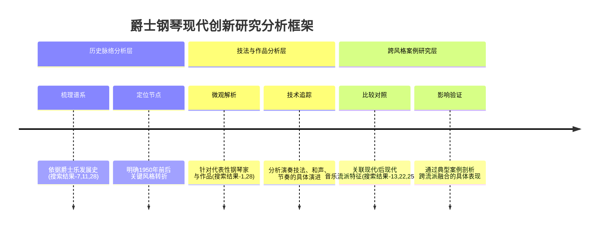

# 爵士钢琴在现代音乐创作中的创新与风格演变研究
# 1 绪论：研究背景、问题与框架

爵士钢琴（Jazz Piano）作为一种独特的艺术形式，兼具**演奏体裁**与**专用乐器**的双重属性[^1]。其声音特点鲜明，表现为低音浑厚饱满、中音柔美过渡自然、高音透亮，音域宽广，并极度注重和弦运用与即兴创作[^1]。这种艺术形式根植于19世纪末的布鲁斯与拉格泰姆音乐[^1][^2]，以其标志性的切分节奏和“主题—即兴—主题”的演奏结构，在百年间不断演化，成为爵士乐乃至整个现代音乐世界不可或缺的核心组成部分[^1][^3]。进入21世纪，爵士钢琴因其自由即兴的特点持续吸引着年轻群体，并通过各类专场演出（如2023年中国青岛的爵士钢琴专场）在全球范围内得到普及与推广[^1]。本研究旨在系统性地探讨爵士钢琴在1950年后的现代音乐创作语境中，如何通过内在创新与外部融合实现其风格的深刻演变，以填补当前系统性研究的不足，并为理解这一动态发展的艺术形式提供深入的分析视角。

## 1.1 爵士钢琴的艺术独特性与研究价值

爵士钢琴的独特性首先体现在其明确的定义与核心艺术特征上。它不仅指代一种钢琴音乐体裁，也常特指为演奏爵士乐而设计的钢琴类型，其手感偏重，具备鲜明的立体声表现力，在专业录音棚中使用广泛[^1]。**其最核心的艺术特征在于即兴演奏**，这要求演奏者基于功能谱进行充满个性的二次创作，而非机械复现乐谱[^1]。这种即兴传统与以丰富切分节奏为特征的演奏模式紧密结合，构成了爵士钢琴动态、互动且不可复制的艺术魅力[^1]。

从历史地位来看，爵士钢琴直接源自19世纪末的“拉格泰姆”（Ragtime，又称散拍乐）钢琴音乐[^1]。拉格泰姆从非洲民间音乐发展而来，以其“参差不齐的拍子”和切分节奏为早期爵士乐奠定了基石[^1]。与此同时，布鲁斯（Blues）作为另一种根源性音乐，为爵士乐贡献了即兴的声乐传统和独特的和声情感表达[^2][^3]。爵士钢琴正是在融合了拉格泰姆的节奏骨架与布鲁斯的和声及即兴精神后，逐渐发展成为爵士乐，特别是大乐队（Big Band）中与吉他、贝斯共同构成节奏声部的中坚力量[^1]。

本研究聚焦于爵士钢琴，具有重要的学术价值与现实意义。在学术层面，对其演奏技法（如大跨度奏法、布吉-乌吉、博普奏法等）的系统梳理与演进分析[^1]，能够深化对爵士乐乃至20世纪音乐发展内在逻辑的理解。在现实层面，爵士钢琴持续的艺术生命力与跨界吸引力（如2023年青岛的普及活动）[^1]，使其成为观察音乐全球化、文化融合与当代艺术创新的一个绝佳样本。因此，对其进行深入研究，不仅能够厘清其艺术发展的脉络，更能为未来的音乐创作与教育实践提供有价值的参考。

## 1.2 现代音乐创作的边界界定与时代背景

为进行精准的研究，必须对本报告所探讨的“现代音乐创作”在时间与风格上做出清晰的界定。本研究采纳音乐史分期的主流观点，将研究的时间焦点置于**1950年之后**。这一时间点位于西方音乐史分期中的“现代乐派”（约1900年后）范畴内[^4][^5]，并且恰逢第二次世界大战后，全球文化艺术思潮发生剧烈变革，各种先锋实验创作蓬勃兴起的时期。

在风格范畴上，本研究的“现代音乐创作”是一个复合型框架，主要涵盖以下三个相互交织的层面：

1.  **广义的现代/后现代艺术音乐思潮**：这包括以突破传统调性体系为核心特征的“现代音乐”（Modernist Music），其典型技法如无调性、十二音序列、复杂的节奏创新（如斯特拉文斯基《春之祭》）等[^5][^6]。同时，也包括20世纪中叶兴起的“后现代音乐”（Postmodern Music）思潮，它主张解构传统、反对欧洲中心主义，倡导多元文化平等共存，并通过拼贴、偶然音乐（如约翰·凯奇的《4分33秒》）、采样技术等手段模糊艺术与生活的界限[^7]。

2.  **爵士乐自身的后期流派发展**：爵士乐在1950年后并未停滞，而是衍生出一系列重要的新风格。这些风格本身就是爵士乐对现代音乐环境的回应与创新，包括注重松弛感与复杂编曲的**冷爵士**（Cool Jazz）、回归根源并强化节奏驱动的**硬波普**（Hard Bop）、打破形式和调性束缚的**自由爵士**（Free Jazz），以及广泛吸纳摇滚、放克等元素的**融合爵士**（Fusion Jazz）等[^2][^8]。

3.  **跨流派交互的实践领域**：本研究特别关注上述现代/后现代音乐思潮、爵士乐新流派与其他音乐形式（如古典音乐、摇滚乐、电子音乐、世界音乐）之间产生的具体融合与实践。例如，印象主义音乐对音色的探索、电子音乐的音效处理技术、摇滚乐的节奏与音色观念，如何与爵士钢琴的即兴传统发生化学反应[^5][^9]。

通过构建这一边界框架，本研究得以在一个既广阔又具体的语境中，审视爵士钢琴所参与的复杂音乐创新网络。

## 1.3 核心研究问题提出：创新、演变与影响

基于对研究对象的独特性和研究背景的界定，本研究旨在回答以下三个环环相扣的核心问题：

**第一，驱动爵士钢琴风格演变的内在机制是什么？** 爵士钢琴拥有悠久的技法传统，例如源自拉格泰姆的“大跨度”奏法（Stride Bass）、快速的布鲁斯风格“布吉-乌吉”（Boogie Woogie）、节奏旋律支离破碎的“博普”奏法，以及在慢速爵士中运用完整和弦与切分的松弛感奏法[^1]。本研究将探究，在1950年后的现代创作中，这些经典技法如何被继承、改造、融合或颠覆？和声语言（如对中古调式、全音阶、复杂和弦叠加的运用）与节奏观念（不规则节拍、复合节奏）的哪些革新，构成了其风格演进的内在动力？

**第二，跨流派影响如何具体重塑爵士钢琴的艺术表达？** 爵士乐自诞生起就具有强大的吸收与融合能力[^3]。本研究将深入分析，古典音乐（尤其是印象主义、表现主义、新古典主义）的结构观念与和声资源[^5][^6]、摇滚乐的乐队编制与电声美学、电子音乐的合成音色与制作技术[^9]、以及世界各地民族音乐的元素，如何被爵士钢琴家们吸纳，并具体地影响到其和声进行、节奏形态、音色追求乃至整体的美学哲学？

**第三，技术创新如何在拓展爵士钢琴艺术边界中发挥作用？** 超越纯粹的演奏技法，本研究将探查电钢琴、合成器、效果器等现代技术装备的引入，如何从根本上改变爵士钢琴的音色库与现场表现力[^1]。同时，电子音乐制作中的采样、循环、氛围营造等技术，如何与爵士钢琴的即兴创作流程相结合？这些技术创新不仅是工具的更迭，是否也催生了新的音乐思维与表演形式？

## 1.4 多层次分析框架构建

为系统性地回答上述研究问题，本研究设计并采用一个多层次的分析框架，该框架整合了历史梳理、微观技法和宏观比较等多种研究方法，确保分析的全面性与深度。

以下mermaid时序图直观展示了本分析框架的核心逻辑与工作流程：

**第一层：历史脉络分析层。** 本层旨在建立宏观的时间坐标。我们将依据爵士乐简明史[^2][^3][^8]，梳理爵士钢琴从拉格泰姆、新奥尔良爵士、摇摆乐、比波普到1950年后各种流派的发展轨迹。这一梳理不仅提供背景，更重要的是识别出风格革命的关键时间节点和外部动因（如社会文化变迁、技术革新），为后续的微观分析提供历史语境。

**第二层：技法与作品分析层。** 本层是研究的核心，聚焦于微观的技术细节。我们将以搜索结果中提及的代表性钢琴家（如奥斯卡·彼得森、埃罗尔·加纳等）及其作品或演奏风格为具体案例[^1][^8]，深入分析其演奏技法（如左手低音模式、右手旋律线条处理）、和声语言（和弦选择、进行逻辑）和节奏处理（切分、律动）的独到之处。通过对比不同时期、不同流派钢琴家的技术特征，揭示风格演变的内在技术逻辑。

**第三层：跨风格案例研究层。** 本层负责建立广泛的风格连接。我们将利用参考资料中关于现代音乐、后现代音乐及其他流派（如印象主义、表现主义、电子音乐）的风格特征总结[^7][^5][^9][^6]，选取那些明确体现了跨界融合的爵士钢琴作品或演奏实践作为典型案例。通过将这些作品与“纯”爵士传统作品、以及其他流派的典型作品进行对比分析，实证性地验证跨流派影响的具体路径、程度与艺术效果。

这三个分析层并非孤立运作，而是相互支撑、循环验证。历史脉络为技法和案例分析提供背景；技法分析为历史分期和案例比较提供实证细节；案例研究则验证历史趋势和技法融合的实际效果。这一框架将贯穿后续所有章节，确保本研究能够从多维度、立体化地阐明爵士钢琴在现代音乐创作中的创新动态与风格演变全貌。

## 2 历史脉络：从经典爵士到现代爵士的风格谱系

爵士钢琴的风格演变并非孤立发生，而是深深嵌入爵士乐整体的百年发展洪流之中。本章旨在依据《爵士乐简明史》等参考资料提供的宏观分期框架，系统梳理爵士钢琴自其拉格泰姆与布鲁斯起源，直至20世纪90年代新经典主义回归的完整风格演变轨迹。我们将重点聚焦于1950年后的风格革命，利用《硬波普爵士乐》资料界定硬波普（Hard Bop）的风格特征与时间区间，并借助赫比·汉考克（Herbie Hancock）的职业生涯资料，作为分析从硬波普到融合爵士（Fusion）转型的关键案例。通过对比分析艾灵顿公爵（Duke Ellington）、奥斯卡·彼得森（Oscar Peterson）与赫比·汉考克等不同时期代表性钢琴家的艺术实践，本章将结构化地探究风格演变的内在逻辑与外部动因，从而勾勒出爵士钢琴风格演变的清晰谱系，为后续章节的微观技法与案例研究奠定坚实的历史坐标。

### 2.1 起源与奠基：从拉格泰姆到摇摆乐的经典范式

爵士钢琴的源头，可以追溯至19世纪末美国南部港口城市新奥尔良的非裔美国人社区。其音乐根基主要来自两种黑人音乐传统：布鲁斯（Blues）和拉格泰姆（Ragtime）[^10]。布鲁斯作为一种世俗音乐形式，以其感性的旋律和独特的“忧郁”和声色彩，为爵士乐注入了深刻的情感表达力[^10]。而拉格泰姆，特别是被誉为“拉格泰姆之王”的斯科特·乔普林（Scott Joplin）的作品，则以其大量使用切分音、旋律迷人的特点，为早期爵士乐提供了鲜明的节奏骨架[^10][^11]。这两种传统的结合，诞生了一种“混血”的、全新的音乐表达形式[^10]。

20世纪初，爵士乐开始形成其早期形态。拉格泰姆钢琴与在新奥尔良盛行的集体即兴演奏相结合，构成了爵士乐的雏形[^2]。随后，以集体即兴演奏为主的“迪克西兰”（Dixieland）风格在1920年代兴起[^2]。这一时期，钢琴在小型乐队中通常扮演着提供和声支撑与节奏驱动的角色。

进入1930年代，**摇摆乐（Swing）成为主导美国主流舞曲的音乐形式**[^2]。摇摆乐通常由大型乐队（Big Band）演奏，其核心是稳定、强劲的四拍子舞蹈律动（Shuffle节奏）[^10]。在这一配置中，钢琴的角色得以进一步确立和专业化。它与吉他、贝斯共同构成乐队的节奏声部（Rhythm Section），负责维持稳定的和声进行与律动，为管乐声部的齐奏与独奏提供坚实的背景[^2]。**钢琴从早期较为随性的伴奏，转变为大乐队中不可或缺的、结构严谨的节奏引擎**。

在这一经典范式时期，艾灵顿公爵（Duke Ellington）的出现具有里程碑意义。他不仅是一位卓越的钢琴家，更是一位天才的作曲家与乐队指挥[^12]。艾灵顿公爵从小接受古典音乐训练，这为他打下了坚实的和声与作曲基础[^12]。他将古典音乐的严谨与爵士乐的即兴随性相融合，形成了独特的音乐风格[^12]。他领导的“埃林顿公爵乐队”是爵士乐史上最具影响力的乐队之一，他善于根据每位乐队成员的特点进行创作和编配，使乐队宛如一个有机的整体[^12]。他的早期作品如《火车》（Choo Choo, 1924）和《长号布鲁斯》（Trombone Blues, 1925）征服了当时的哈莱姆区，并让整个百老汇为之惊叹[^13]。**艾灵顿公爵的实践，将爵士钢琴从纯粹的节奏伴奏角色，提升到了参与甚至主导乐队整体音乐构筑的高度，为爵士乐注入了深厚的作曲思维与丰富的音色层次**，这一范式对后续所有爵士乐发展产生了深远影响[^12]。

### 2.2 现代性转折：比博普、冷爵士与硬波普的并存与分化

20世纪40年代，爵士乐经历了一次根本性的美学革命，其标志是**比博普（Bebop，又称博普）的兴起**。比博普是对摇摆乐商业化、舞蹈化倾向的一种艺术反叛[^2][^14]。它彻底改变了爵士乐的演奏逻辑：音乐重心从为舞蹈伴舞转向纯粹的听觉艺术，从大型乐队的整齐编曲转向小型组合的复杂即兴[^2]。

比博普的核心特征在于其高度复杂化的音乐语言。在和声上，它**突破传统和声结构，追求在第一流的和弦变化基础上进行即兴发挥**[^2][^14]。音乐家们使用快速的和弦替代、复杂的延伸音（如9音、11音、13音）与频繁的转调，极大提升了和声的密度与色彩[^14]。在节奏上，比博普打破了摇摆乐稳定均衡的律动，**将重拍置于非常规位置，大量使用复杂的切分音与快速的音符跑动**，使得节奏充满紧张感与智力挑战[^14]。这一转变也导致了演奏的彻底个体化，独奏者的即兴创作成为音乐的核心，节奏声部（包括钢琴）则需精准应对快速变化的和声进行[^14]。**比博普确立了现代爵士以复杂和声与快速即兴为核心的内在逻辑，是爵士钢琴现代性的起点**。

进入1950年代，爵士乐风格呈现多元化并存与分化的局面，主要形成了两种对比鲜明的流派：冷爵士（Cool Jazz）与硬波普（Hard Bop）。

冷爵士可以视为对比博普激烈、快速风格的一种“冷却”处理。它追求松弛、内敛的情绪表达，注重音乐的旋律性与复杂的编曲，音色往往更加柔和[^2]。冷爵士为爵士钢琴带来了对空间感、音色控制和内省式表达的重视。

与此同时，**硬波普（Hard Bop）作为比博普在50年代的重要进展而出现**。根据参考资料，硬波普被明确界定为“是bebop和cool jazz融合下产生的一种爵士乐风格”[^15]。它流行于美国东海岸，因此又被称为“东海岸爵士”（east coast jazz）[^15]。与比博普相比，硬波普在和声上进行了一定程度的简化，但其**最显著的特征是重新强化并深入融合了黑人音乐的根源——福音音乐（Gospel）和蓝调（Blues）**[^15]。这使得硬波普的情感表达更加深沉、直接且充满灵魂感。

硬波普对爵士钢琴产生了具体而深刻的影响。在演奏风格上，**钢琴（以及萨克斯）的演奏类似于早期节奏布鲁斯（R&B）音乐的风格**，更具律动感和歌唱性[^15]。节奏上，虽然比博普的复杂切分得以保留，但低音声部的演奏变得较为松散，不严格遵循固定的四拍子小节，整体表现形式更加自由狂放[^15]。硬波普延伸出了灵魂乐（Soul Jazz），并常以哈蒙德风琴的浓郁音色为特色[^15]。这一流派的代表人物中包括众多杰出的钢琴家，如汉克·琼斯（Hank Jones）、汤米·弗拉纳根（Tommy Flanagan）等[^15]。**硬波普在继承比博普现代和声语言的同时，通过回归蓝调与福音根源，为爵士钢琴注入了更强烈的节奏驱动与情感张力，巩固了其在小型爵士组合中的核心地位**。

### 2.3 边界突破与多元融合：自由爵士、融合爵士及后续发展

1960年代，爵士乐的探索走向了两个极端：一是向内彻底解构音乐的基本规则，二是向外广泛吸纳其他流行音乐的元素。

**自由爵士（Free Jazz）代表了向内解构的激进尝试**。它彻底打破了传统的调性规则与固定的和弦进行，甚至放弃了稳定的节拍与节奏型[^2]。在自由爵士中，**节奏与形式得到彻底解放**，演奏建立在集体自由即兴、不协和音的碰撞与极端的情感宣泄之上[^2]。这对钢琴家的即兴观念产生了革命性冲击，钢琴不再是和声与节奏的提供者，而是成为声音色彩、纹理与能量对话的平等参与者，其演奏完全脱离了传统的功能谱框架。

几乎在同一时期，面对摇滚乐在青年文化中的崛起对爵士乐市场的冲击，爵士乐开始了主动的跨界融合。**融合爵士（Fusion Jazz）在1970年代后蓬勃发展，它广泛吸纳了摇滚、放克（Funk）等音乐的元素**[^2]。这一转型的典型案例是钢琴家赫比·汉考克（Herbie Hancock）的职业生涯轨迹。

汉考克的音乐历程清晰地映射了从硬波普到融合爵士的演进路径。他于1963年加入迈尔斯·戴维斯（Miles Davis）的第二代五重奏，参与了戴维斯对模态爵士（Modal Jazz）和节奏自由的先锋探索，这些经历激发了他大胆的音乐概念[^16]。在60年代，他同时录制了大量的比波普和模态爵士作品，并创作了像《西瓜人》（Watermelon Man）这样的经典曲目[^16]。然而，**关键的转变发生在1970年代**。在参与了戴维斯的爵士摇滚实验后，汉考克开始领导自己的融合乐队[^16]。他**广泛使用电子键盘、合成器，从电钢琴到穆格合成器**，彻底改变了爵士钢琴的音色库[^16]。1973年，他创立的“猎头者乐队”（The Headhunters）及其同名专辑成为爵士乐史上最具影响力的融合爵士作品之一[^16]。1983年，专辑《未来冲击》（Future Shock）中的单曲《摇滚起来》（Rockit）更是融合了电子音乐与嘻哈元素，轰动一时[^16]。

**汉考克的实践表明，融合爵士不仅仅是风格的简单叠加，更是由技术创新（电声乐器、合成器）驱动的一场音色与创作思维的革命**。钢琴家从原声钢琴转向电子键盘，不仅获得了前所未有的音色可能性，其创作流程也开始与录音室技术、循环乐句（Riff）和强劲的放克/摇滚节奏紧密结合[^16]。这极大地拓展了爵士钢琴的表现力与受众范围。

到了1990年代，爵士乐发展出现了“新经典主义”（Neo-classicism）的回归趋势[^2]。这并非简单的复古，而是在经历了各种激进实验与跨界融合后，对摇摆乐、比波普等传统爵士语汇的重新审视与精致化演绎，标志着爵士乐风格演进进入一个反思与整合的新阶段。

### 2.4 谱系勾勒：代表性钢琴家的风格坐标与演进逻辑

为了更直观地呈现爵士钢琴百年风格演变的谱系，我们可以将艾灵顿公爵、奥斯卡·彼得森和赫比·汉考克三位标志性人物置于关键的历史坐标上进行对比分析。他们的艺术实践分别代表了作曲整合、传统即兴巅峰与电子化融合三个时代，其差异清晰揭示了演进的逻辑。

以下表格从多个维度对比了三位大师的核心艺术特征：

| 对比维度 | 艾灵顿公爵 (1899-1974) | 奥斯卡·彼得森 (1925-2007) | 赫比·汉考克 (1940- ) |
| :--- | :--- | :--- | :--- |
| **核心历史坐标** | 摇摆乐时代，大型乐队鼎盛期 | 硬波普时代，传统爵士钢琴技巧巅峰期 | 融合爵士时代，电子化与跨界融合期 |
| **主要角色** | 作曲家、编曲家、乐队指挥、钢琴家 | 钢琴家、即兴演奏家、乐队领队 | 钢琴家、作曲家、电子乐先锋、乐队领队 |
| **和声语言** | 将古典和声的严谨与布鲁斯色彩相结合，创造丰富的“埃林顿之声”[^12] | 基于标准曲（Standard）的复杂和弦变化，运用大量替代和弦与延伸音，体现比波普和声传统[^17][^18] | 从模态爵士、复杂和声转向电子和声、放克和声进行，大量使用合成器音色铺底[^16] |
| **节奏观念** | 稳固的摇摆（Swing）律动，为大型乐队提供节奏基石[^12] | 极其精准而富有推动力的摇摆律动，结合复杂的博普切分，技巧华丽流畅[^17][^18] | 引入摇滚、放克的强劲循环节奏（如《变色龙》），节奏组电子化，律动感彻底改变[^16] |
| **即兴范式** | 即兴通常服务于整体乐曲结构，更多体现在编曲的灵活性与乐队成员的独奏安排上[^13][^12] | **基于标准曲和弦进行的极致即兴变奏**，以无与伦比的速度、清晰度和创意著称[^17][^18] | **基于电子乐循环、合成器氛围和放克律动的即兴**，即兴与编曲、音色设计紧密结合[^16] |
| **音色追求** | 追求原声钢琴与大型管弦乐队融合的丰富色彩与层次感[^12] | 追求原声三角钢琴饱满、透亮、动态范围极广的经典音色[^17][^18] | **拓展至电钢琴、克拉维纳、模拟/数字合成器的广阔音色库**，音色本身成为创作要素[^16] |
| **代表影响** | 确立了爵士乐的作曲高度与乐队化范式[^12] | 代表了传统爵士钢琴 virtuosity（精湛技艺）的顶峰[^18] | 开创了爵士乐与电子音乐、流行文化融合的广阔道路[^16] |

通过以上对比，我们可以系统总结驱动爵士钢琴风格演变的核心机制：

**内在逻辑上**，演变遵循着音乐语言不断复杂化、解放与再平衡的自我驱动。从摇摆乐的稳定律动，到比波普对和声与节奏的复杂化突破，再到自由爵士的彻底解构，体现了“突破”的冲动。而硬波普对比波普的简化并向蓝调福音回归，冷爵士对比波普的冷却处理，以及新经典主义对传统的回归，则体现了“反拨”与“再平衡”。**融合则是持续的主题**，无论是硬波普融合比波普与根源音乐，还是融合爵士融合爵士与摇滚放克，都推动了风格的持续丰富。

**外部动因上**，社会文化变迁与技术革新起到了关键的塑造作用。摇摆乐的盛行与舞厅文化、大众娱乐需求直接相关；比波普的兴起包含了黑人音乐家争取艺术自主的诉求；自由爵士与1960年代民权运动的激进精神共鸣；而**融合爵士的诞生，直接源于爵士乐为应对摇滚乐冲击、争夺年轻听众而进行的主动跨界**[^16]。在技术层面，**电钢琴、合成器等电子乐器的普及，是赫比·汉考克等人实现融合爵士革命的物质基础**，它从根本上改变了乐器音色、演奏方式乃至音乐思维[^16]。

综上所述，爵士钢琴的风格谱系是一条从**集体舞蹈伴奏**（摇摆乐），走向**个体艺术表达**（比波普），并分化为**根源深化**（硬波普）、**形式解构**（自由爵士）与**跨界融合**（融合爵士）多条路径的演进史。艾灵顿公爵、奥斯卡·彼得森和赫比·汉考克三位大师，如同三座灯塔，分别照亮了这条长河的上游、中游与下游的关键航段，共同勾勒出一幅波澜壮阔、脉络清晰的爵士钢琴艺术演变全景图。

## 3 跨界融合：当代跨流派合作对爵士钢琴的艺术重塑

爵士钢琴自诞生以来，其核心魅力之一便是强大的吸收与融合能力。进入1950年代后，面对摇滚乐兴起带来的听众流失危机，以及全球化背景下日益频繁的文化交流，爵士钢琴家们主动开启了与古典、摇滚、电子、世界音乐等流派的深度对话。这种跨界合作并非简单的风格叠加，而是引发了一场从乐队配置、节奏观念、音色追求到即兴范式的全方位艺术重塑。本章将依据参考资料，通过分析融合爵士、古典对话、电子化融合及世界融合等具体实践，实证性地揭示跨流派影响如何深刻重塑了爵士钢琴的艺术表达，并评估其带来的艺术拓展与内在挑战。

### 3.1 融合爵士：危机驱动下的电声革命与角色转型

20世纪60年代，爵士乐面临严峻的生存危机。彼时，摇滚乐吸引了大量年轻听众，而传统的比博普、硬波普等风格在音乐上缺乏创新，导致爵士乐唱片销量下降，俱乐部被迫停业，听众数量急剧下降[^19]。正是在这种“爵士乐仿佛一夜之间失去了它的一切生存的土壤”的背景下，融合爵士（Fusion Jazz）作为一场深刻的音乐革新应运而生[^19]。这场革新的核心驱动力，是爵士音乐家为争夺年轻听众、寻求新的社会空间而主动吸收摇滚乐、放克（Funk）等流行音乐元素[^19]。

融合爵士对爵士钢琴艺术的重塑，首先体现在**乐队配置与音色库的根本性革命**上。它彻底打破了传统爵士乐队以原声乐器为主体的原则，大量使用电贝司、电子合成器及带有效果器的电吉他[^19]。钢琴本身也经历了从原声乐器到电声乐器的转变，电钢琴（如Rhodes、Wurlitzer）和合成器开始广泛取代传统三角钢琴[^19]。这一转变并非简单的工具更替，而是为爵士钢琴带来了前所未有的音色可能性，使其声音更具现代气息和电气化特征[^19]。

其次，融合爵士导致了**钢琴在乐队中角色的根本性转型**。在传统爵士乐中，钢琴主要承担和声铺垫与旋律即兴的双重功能。而在融合爵士中，为了制造“奔腾不息的节奏律动”，音乐家们经常加强鼓和贝司的力度，这使得钢琴（连同吉他）**从原来演奏旋律声部转变为节奏乐器**[^19]。钢琴的演奏开始更侧重于提供强劲、重复的节奏型（Riff）和厚重的和弦块，以支撑起被称为“爵士放克”（Jazz Funk）的独特律动[^19]。

**赫比·汉考克（Herbie Hancock）的职业生涯是诠释这一转型的完美案例**。作为最初以硬波普风格崭露头角的钢琴家，汉考克在1970年代领导了标志性的融合爵士乐队“猎头者”（The Headhunters）。他广泛使用电钢琴、穆格合成器等电子键盘，其音乐彻底拥抱了放克和摇滚的节奏驱动[^20]。在他的代表作中，钢琴不再是复杂和声线条的编织者，而是化身为节奏引擎的一部分，与电贝司和鼓共同构建出极具感染力的律动基底。**这场由危机驱动的电声革命，不仅拓展了爵士钢琴的音色光谱，更重塑了其音乐思维，即兴创作开始更多地围绕固定的节奏循环和电子音色氛围展开，标志着爵士钢琴进入了一个全新的发展阶段**[^19]。

### 3.2 古典对话：结构解构、和声资源与跨文化转译

与融合爵士向外吸收流行元素不同，爵士钢琴与古典音乐的对话，则是一场向内深挖、旨在提升艺术深度与叙事广度的“精英化”融合。这种对话并非让爵士钢琴模仿古典音乐的演奏方式，而是以爵士乐的即兴精神为核心，对古典音乐的结构、和声乃至文化意境进行解构、吸纳与创造性转译。

这种融合的典型路径之一，是**对古典经典作品的爵士化改编**。钢琴家兼作曲家米罗斯拉夫·斯科里克（Miroslav Skoryk）创作的钢琴四手联弹《贝多芬爵士改编组曲》是绝佳例证。在这部作品中，斯科里克并未抛弃贝多芬的经典旋律，而是**巧妙地将这些旋律与爵士和声相结合**，形成了既保留古典韵味又充满现代感的独特风格[^21]。更重要的是，他**通过引入爵士乐的即兴与自由节奏，为严谨的古典结构注入了活力**，使两种音乐的美学特质——古典的严谨与爵士的即兴——得以相得益彰[^21]。这种改编实践，本质上是将古典音乐的主题材料置于爵士乐的语法体系中进行重述，实现了深层的艺术对话。

另一条更具野心的路径，是**构建一个兼容并蓄的“玩转古典”框架**，将东西方古典音乐遗产均纳入爵士的即兴表达之中。被誉为“最具原创性的爵士天才”的钢琴家弗朗茨·冯·绍西（Franz von Chossy）的实践于此极具代表性。在他的“玩转古典”项目中，绍西运用爵士乐的想象力和电影画面感的语言，**将巴赫、贝多芬、拉赫玛尼诺夫等西方作曲家的经典作品，以及《小河淌水》、《彩云追月》等中国传统音乐，共同融合于特定的爵士乐框架中**[^22]。这不仅仅是曲目上的混合，更是音乐语言层面的深度融合。他作品中“富于挑战性的乐句、复杂精妙的即兴技巧、标准的旋律性以及精细的结构”，都服务于爵士乐的表达逻辑，从而为这些伟大的经典名作注入了新的语言和色彩[^22]。

**这种跨文化的古典对话，对爵士钢琴艺术产生了双重拓展**。一方面，它极大地丰富了爵士钢琴的和声与结构资源，使其能够借鉴古典音乐的严密逻辑和深厚的情感表达层次。另一方面，它推动了爵士钢琴的“文化转译”能力，使其成为连接不同音乐传统与美学体系的桥梁[^23]。通过这种深度融合，爵士钢琴不仅证明了其艺术形式的包容性与可塑性，更在全球化语境下，为自身开辟了一条兼具学术深度与文化广度的创新路径。

### 3.3 电子化与都市化：采样、嘻哈节奏与音色实验室

如果说与古典的对话提升了爵士钢琴的纵向深度，那么与电子音乐、嘻哈（Hip-Hop）文化的融合，则极大地拓展了其横向的都市化与当代性边界。这一潮流在20世纪80年代末至90年代汇聚成一股明确的力量，即**酸爵士（Acid Jazz，又称迷幻爵士）**。酸爵士起源于英国俱乐部文化，其名称本身就带有强烈的电子音乐印记（源于“Acid House”），它标志着爵士钢琴主动融入当时最前沿的青年流行文化[^24][^25]。

酸爵士对爵士钢琴的重塑，首先体现在**创作流程与声音素材的电子化**。它大量采用嘻哈音乐的编曲模式，尤其是**采样（Sampling）技术**，将经典的爵士钢琴乐句、唱片片段截取出来，作为可循环、拼贴的电子化素材重新使用[^24][^25]。这使得爵士钢琴的历史录音获得了新的生命，其声音被从原语境中剥离，融入全新的节奏律动与声音织体。同时，**DJ的“刮擦”（Scratching）等技术**也被引入，与现场钢琴的即兴演奏形成奇妙的声效互动，打破了传统乐器的声音界限[^24]。

其次，是**节奏框架的彻底革新**。酸爵士明确追求舞池适配性，因此具有“明显及清晰的节奏”[^25]。它吸收了放克、迪斯科乃至嘻哈音乐的节奏特点，强调**循环拍子（Loop）和强劲的节拍**，使爵士钢琴的律动从摇摆（Swing）的摇曳感，转向更为直接、现代的都市舞曲感[^24][^25]。在这种框架下，钢琴的演奏常常化繁为简，以重复性的节奏动机和和弦片段为主，服务于整体的律动引擎。

最后，这种融合将爵士钢琴置于一个**可无限扩展的“音色实验室”** 中。正如《爵士乐与电子音乐融合-洞察分析》所指出的，融合后的音乐在和声处理上往往更加复杂，并探索独特的调式结构[^26]。电子合成器、效果器为钢琴音色带来了变形、叠加、氛围化处理的全新可能。一个生动的案例是《秋叶》与《贝加尔湖畔》的跨界融合改编[^27]。在这场改编中，钢琴与萨克斯、单簧管等乐器在爵士的编曲思维下共鸣，钢琴负责铺垫流畅的和弦基底，如同“秋日的月光洒在湖面”，而整体的音乐氛围则巧妙融合了西方爵士的复古韵律与东方意境的静谧悠远[^27]。**这充分表明，电子化与都市化的融合，不仅改变了爵士钢琴的声音和节奏，更赋予其表达复杂、跨文化都市情感与意境的能力**，使其成为当代城市文化声音图景中的重要组成部分。

### 3.4 世界融合：非西方元素的注入与文化维度的拓展

超越欧美音乐体系的内部对话，爵士钢琴在更广阔的全球化图景中，积极吸纳来自世界各地的民族音乐元素，从而形成了**世界融合（World Fusion）** 这一充满生命力的分支。World Fusion被定义为“融合第三世界音乐与爵士乐形成的音乐流派”，其核心在于即兴爵士与传统民族韵律、和声及乐器的并置与交融[^28]。这种实践极大地拓展了爵士钢琴的文化维度与音乐语汇。

世界融合的路径丰富多元。一种路径是**吸收非西方音乐特有的节奏体系与律动**。例如，融合非洲复杂的打击乐节奏、印度塔拉（Tala）节奏循环，或是拉丁美洲的 clave 节奏，能够为爵士钢琴的节奏声部注入全新的生命力，创造出复杂而迷人的复合节奏[^28]。另一种路径是**引入非西方音乐的调式、音阶与和声观念**。中东音乐的马卡姆（Maqam）、印度音乐的拉格（Raga）所蕴含的微分音程和独特的旋律进行，为爵士钢琴的即兴旋律构造与和声色彩提供了无尽的灵感来源[^28]。

此外，**民族乐器的音色与演奏法也被间接或直接地融入钢琴演奏**。钢琴家可能通过特定的触键和踏板技巧来模仿乌德琴、西塔尔琴或中国古筝的音色韵味，也可能在编曲中直接与这些乐器进行对话与合作[^28]。中国音乐人朱哲琴的实践便是一个成功案例，其唱片通过“现代电子乐与古老民族音乐的混合”获得美国独立音乐大奖的World Fusion奖项，展示了民族音乐现代化的一种方向[^28]。

**世界融合的深刻意义在于，它使爵士钢琴超越了其美洲起源的文化语境，成为一种真正的全球性音乐语言**。通过融合实践，爵士钢琴不仅丰富了自身的节奏库、音阶库和音色想象力，更承担起促进跨文化音乐交流的使命[^28]。它允许音乐家从全球视角进行创作，表达更为多元和复合的文化身份认同。例如，一场音乐会可以既包含基于西方古典名作的爵士改编，又包含融合了中国民歌元素的即兴创作，这正是爵士钢琴在当代所展现出的文化包容性与艺术活力[^22]。因此，世界融合不仅是音乐元素的简单相加，更是爵士钢琴在全球化时代构建新的艺术表达与文化对话空间的关键策略。

## 4 技术驱动：音效处理、电子化与演奏媒介的创新

1950年后，爵士钢琴的艺术形态经历了一场由技术驱动的深刻变革。电声乐器、数字技术与音效处理技术的引入，不仅扩展了其音色库与表现力，更从根本上重构了其创作流程、现场表演范式乃至乐器本身的定义。本章将依据《爵士乐演奏技巧创新-深度研究》中界定的“和声创新”、“节奏创新”及“音色运用”等技巧维度，结合《融合爵士》与《推进现代数字技术与钢琴演奏的融合路径探析》等资料，系统分析技术创新如何具体作用于爵士钢琴的各个层面。通过剖析具体的技术产品（如Dexibell S10、Nord Piano 3、Ketron EVENT）与艺术家实践案例（如Thierry Maillard Trio、Jacob Karlzon），本章旨在实证性地揭示采样、循环、合成器、沉浸式音频等技术如何与爵士钢琴的即兴传统深度融合，并评估这些创新对拓展其艺术边界、催生新音乐思维与表演形式的核心推动作用[^29][^19][^30]。

### 4.1 音色革命：从原声到电声与合成的音色库拓展

爵士钢琴的音色革命始于对传统原声乐器主体原则的突破。融合爵士（Fusion Jazz）作为20世纪70年代兴起的流派，其核心特征之一便是“打破传统爵士乐队一直以原声乐器为主体的原则”，大量使用电贝司、电子合成器及带有效果器的电吉他，使音乐“更具现代气息”[^19]。在这一浪潮中，钢琴本身经历了从原声乐器到电声乐器的根本性转变。电钢琴（如Fender Rhodes、Wurlitzer）和合成器的广泛使用，不仅带来了新的音色，更标志着爵士钢琴音色库从单一、物理的声学特性，向多元化、可塑性的电子化特性拓展[^19]。

**这场音色革命的核心驱动力，在于数字采样、物理建模与合成技术的飞速发展，它们共同致力于解决电声乐器在“真实性”与“创造性”上的双重挑战。** 一方面，技术追求对原声钢琴音色与触感的极致模拟。例如，Dexibell S10电钢琴采用的T2L音色引擎，结合24bit/48kHz高精度采样与物理建模，其低音区采样延音长达15秒，使得音符衰减过程自然绵长，有效解决了普通电钢琴低音延音过短带来的“塑料感”，从而在音色质感上无限接近真正的三角钢琴[^31]。同样，Nord Piano 3通过“虚拟重锤键盘技术”模拟三角钢琴的音锤运动，提供出色的真实感和动态响应，其配备的1 GB专用钢琴库内存，允许演奏者从大量独家采样的声学和电钢琴音色中自由选择，实现了对传统钢琴音色细节与动态范围的深度复现与个性化配置[^32]。**这些技术突破表明，现代电钢琴已能够提供足以支撑严肃爵士演奏所需的音色真实性与触感反馈，为电子化转型奠定了坚实的听觉基础。**

另一方面，技术更开启了超越原声钢琴的、无限丰富的音色创造可能。正如《爵士乐演奏技巧创新-深度研究》所指出的，“音色运用是表现音乐风格和情感的重要手段”[^29]。现代技术将音色从乐器的物理属性解放出来，使之成为可编程、可编辑的艺术表达元素。Ketron EVENT编曲工作站提供了诸如“Honky Tonk + Pianissimo”等高品质的预设爵士钢琴音色，这些音色经过精心设计与采样，能够体现特定的音乐风格与情感[^33]。更重要的是，合成器的引入彻底颠覆了音色观念。合成器不仅能模拟现实乐器，更能“轻松创造出那些难以捉摸的声音”，无论是未曾听闻的奇特声响，还是梦境中的神秘旋律[^34]。这为爵士钢琴家提供了前所未有的调色板，使其能够根据音乐构思，自由选择或创造从温暖复古的电钢到冰冷未来的合成器铺底等任何音色。

**因此，技术驱动的音色革命，其深层意义在于改变了钢琴家对音色质感、持续时间和表现力的根本认知与追求。** 音色不再仅仅是演奏的副产品，而是可以预先设计、实时调制并承载特定美学意图的核心创作要素。爵士钢琴的音色库，从一个相对固定的原声集合，拓展为一个包含极致仿真相声钢琴、历史电钢琴型号、合成器纹理乃至任何个性化采样声音的、无边界的“声音宇宙”。这为爵士钢琴的风格融合与个性化表达提供了最基础的素材支持。

### 4.2 创作流程重构：采样、循环与数字制作技术的融合

数字技术的介入，不仅改变了爵士钢琴的声音，更深刻地重构了其音乐创作与编排的核心流程。传统的爵士钢琴创作与即兴，主要围绕乐谱（标准曲）的和弦进行，在现场或排练中通过乐队互动即时生成。而电子音乐制作技术的融合，引入了非线性、可编辑、基于声音素材拼贴的新范式，使得创作过程变得更加个人化、室内化与复杂化。

**数字音乐制作技术为爵士钢琴作品的创作提供了强大的辅助与拓展能力。** 正如《推进现代数字技术与钢琴演奏的融合路径探析》所述，利用数字音乐制作技术，钢琴演奏者能够将各种钢琴声音与不同乐器声音进行结合，进而打造具有特色的声音风格[^30]。例如，通过数字合成器，钢琴琴声可以与合成器的声音进行完美融合，通过改变参数创造出更具现代感、科技感的独特声音[^30]。同时，电脑音乐制作软件具备强大的动态处理与修改能力，使钢琴演奏者可以方便地对钢琴声部进行细致的编辑、调整与重组，这极大地降低了试错成本，提升了创作效率与精度[^30]。**这意味着，爵士钢琴的创作场所从排练房部分转移到了数字音频工作站（DAW）中，作曲家可以像画家调配色彩一样，精心构筑声音的层次、空间与动态。**

在这一新范式下，**采样（Sampling）与循环（Loop）技术成为关键的创作语法。** World Fusion的实践中就包含了“现代电子乐与古老民族音乐的混合”[^28]。爵士乐手可以采样一段传统的民族乐器旋律、一段经典的爵士钢琴独奏乐句，或任何环境声音，将其作为音乐的基础素材或装饰性元素，循环使用并与其他声部叠加。这种手法在酸爵士（Acid Jazz）及当代电子融合实践中非常普遍。例如，在《当爵士乐手遇上电子音乐……》的案例中，爵士乐手兼制作人千鹤，擅长运用Serum等软件合成器制作预制音色，并在编曲中融合电子音乐、Colorbass等风格，展现了将爵士即兴思维与电子音乐编曲流程相结合的能力[^35]。**采样与循环的运用，使得爵士钢琴的即兴创作不再仅仅依赖于对和弦进行的即时反应，而是可以建立在预先准备好的声音素材、节奏循环和氛围铺底之上，即兴演变为在既定声音织体上的旋律与和声互动。**

**这种创作流程的重构，催生了一种“制作人-演奏家”复合型角色。** 爵士钢琴家不再仅仅是演奏者，他们需要掌握音色设计、音频编辑、MIDI编程等技能，以独立或主导完成从灵感捕捉、声音设计、编曲到混音的完整音乐生产流程。Ketron EVENT这类“编曲工作站”正是为此类需求而生，它集成了海量的真实录制风格（包括鼓组、贝斯、和弦），允许演奏者一人即可构建出复杂、专业的乐队伴奏，并在此基础上进行即兴演奏[^33]。这标志着爵士钢琴的创作从依赖乐队集体即兴的“对话模式”，部分转向了由个体主导的、基于预制模块进行组合与演绎的“建筑师模式”。尽管集体互动仍是爵士的核心精神之一，但数字技术无疑为个人化、工作室化的创作开辟了广阔空间，极大地丰富了爵士钢琴作品的形态与复杂度。

### 4.3 现场表现力的延展：音效处理、交互技术与沉浸式体验

技术创新对爵士钢琴的影响同样深刻地体现在现场表演领域，音效处理器、交互式演奏技术及沉浸式音频系统极大地增强了其舞台表现力，并重塑了艺术家与观众之间的听觉关系。

**现场音效的实时控制与音色的动态变化，成为表演的重要组成部分。** 传统的原声钢琴在现场的音色变化相对有限，主要依靠触键力度与踏板技巧。而现代电钢琴与效果器的结合，为现场带来了前所未有的声音可塑性。Dexibell S10支持“无缝切换音色”功能，其强大的处理器确保在切换时零延迟且上一个音色的尾音能自然延续，这使得在现场演出中复杂、频繁的音色变化成为可能，而不会中断音乐情绪[^31]。此外，其“电动推子+参数变形”功能允许演奏者通过踏板实时调整混响、均衡等效果参数，为音乐注入动态的、戏剧性的色彩变化，将音效控制本身变成了富有表现力的表演动作[^31]。**这些技术将现场演奏从相对静态的音色呈现，转变为一场动态的声音旅程，增强了音乐的视觉与听觉双重冲击力。**

**技术也催生了新的乐队形态与现场声场融合。** Thierry Maillard Trio的实践是一个典范。该三重奏以“合成器、声学钢琴和真正的鼓”为基础，重新编排经典摇滚歌曲并创作原创作品，打造出被称为“电子爵士摇滚”的现场体验[^34]。在这里，Moog合成器等电子设备不再是辅助工具，而是与声学钢琴平等对话的主角，共同构建出一个融合了爵士即兴、摇滚能量与电子音景的复杂声场。**这种配置打破了传统原声爵士三重奏的听觉框架，证明了电子乐器与声学乐器可以在现场实现能量与情感上的深度交融，拓展了爵士钢琴在现场组合中的可能性。**

**最前沿的沉浸式音频技术，则从空间维度彻底革新了现场聆听体验，并反向影响了创作思维。** 瑞典爵士钢琴家Jacob Karlzon的案例极具代表性。在Aalener Jazzfest音乐节上，他利用d&b Soundscape沉浸式音响系统进行表演。该系统通过基于对象的音频混合（En-Scene）和在线房间仿真（En-Space），能够将钢琴等乐器的声音在三维声场中精确定位，并营造出华丽而包围的声学环境[^36]。Karlzon形容，借助Soundscape，“您可以真正从放置钢琴的地方听到音乐，而不是从音箱”，这创造了一种具有变革性的聆听和表演环境[^36]。这项技术消除了声音来源与视觉位置不匹配的不和谐感，让每位观众无论坐在何处都能获得一致且沉浸的体验。**更重要的是，正如Karlzon所言，这项技术改变了他的作曲方式，使他开始思考“创造不同类型的景观、运动和不同声音的位置”[^36]。这表明，空间音频技术不仅提升了传播保真度，更作为一种创作参数，激励艺术家构思声音在物理空间中的运动与交互，从而开创了爵士钢琴现场表演的新维度。**

### 4.4 媒介融合与艺术边界：新乐器哲学与跨领域创作

综合前述分析，技术创新对爵士钢琴的推动，最终汇聚成对乐器本质与艺术边界的整体性重塑。爵士钢琴正从一个具体的、物理的“乐器”，演变为一个集演奏、作曲、音色设计于一体的综合性“创作媒介”，其艺术实践的边界因此得到极大扩展。

**这种演变首先体现在乐器功能的集成与角色转型上。** 融合爵士时期，钢琴在乐队中的角色已开始从旋律乐器向节奏乐器转变[^19]。而现代技术将这一趋势推向极致，并赋予了乐器前所未有的独立性。例如，Dexibell S10的“音色分区+叠加”功能，最多支持4个独立音色分区，允许演奏者在一台琴上同时分配钢琴、贝斯、弦乐等不同音色，实现“左手弹贝斯，右手弹钢琴”，从而一人撑起整个乐队的声部[^31]。Ketron EVENT则更进一步，它作为一台“编曲工作站”，内置了由真实乐手录制的鼓组、贝斯与和弦库，提供了完整的自动伴奏体系[^33]。**这意味着，当代的电钢琴或键盘，本身就是一个具备强大编曲能力的微型音乐制作系统。演奏者同时承担着作曲家、编曲家、音色设计师和乐队指挥的多重角色，乐器成为个人音乐想法得以完整呈现的终极载体。**

**这种高度的媒介融合，模糊了传统音乐领域的界限，使爵士钢琴更自然地融入更广泛的跨领域创作。** 当爵士钢琴的声音可以方便地与其他电子音色融合，并能够被精细地编辑和空间化定位时，它便与电影配乐、电子音乐、现代舞伴奏、多媒体艺术安装等领域的创作需求无缝对接。其即兴的内核与复杂和声的传统，为这些领域提供了深厚的音乐内涵；而其技术化的外在形态，又保证了与其他现代艺术媒介的兼容性。**因此，爵士钢琴艺术不再局限于爵士俱乐部或音乐厅的特定场景，而是成为一种以声音创意和即兴思维为核心的、开放性的艺术实践，能够灵活地应用于各种当代艺术表达之中。**

**最终，技术创新推动爵士钢琴形成了一种新的乐器哲学。** 它不再被定义为拥有88个琴键和一套击弦机的特定物件，而是被理解为一种**以键盘为交互界面、以声音合成与处理为内核、以即兴创作为灵魂的创造性系统**。这个系统的边界是弹性的，可以根据艺术家的需要，整合硬件合成器、软件插件、效果器链乃至空间音频处理器。正如《推进现代数字技术与钢琴演奏的融合路径探析》所展望的，数字技术与钢琴演奏的融合，有助于“推动传统钢琴演奏的优化升级”[^30]。**这种“优化升级”的本质，是爵士钢琴在保留其即兴灵魂与和声精髓的前提下，积极拥抱技术变革，从而在音色、创作、表演三个维度上实现了艺术边界的系统性扩展，确保了其在现代音乐图景中的持续活力与前沿地位。**

## 5 核心技艺的当代演进：即兴创作与和声节奏体系的革新

爵士钢琴的风格演变，其最深层、最持久的驱动力源自其核心技艺体系的不断革新。进入1950年后的现代音乐创作语境，这种革新不再是零散的技巧叠加，而是对即兴创作范式、和声语言与节奏观念的系统性重构。本章将深入剖析这些内在的技术动力，揭示当代爵士钢琴家如何通过拓展音乐语法、富化和声资源与解放节奏观念，共同塑造了爵士钢琴丰富多元的现代面貌。我们将整合参考资料中关于即兴理论、和声体系与节奏复杂化的关键信息，并以布拉德·梅尔道（Brad Mehldau）和上原广美（Hiromi Uehara）等代表性钢琴家的实践作为案例，实证性地阐明技艺演进与风格塑造之间的深刻联系。

### 5.1 即兴语法的重构：从和弦-音阶到现代乐思演进

传统爵士即兴很大程度上建立在“和弦-音阶”对应的基础模式之上，即演奏者根据给定的和弦标记，选择相应的音阶来构建旋律线条[^37]。然而，当代爵士钢琴的即兴实践已远远超越了这一相对直接的对应关系，转向一种更为复杂、结构化且充满逻辑性的“乐思演进”范式。这种演进并非抛弃传统框架，而是在其基础上进行深度解构与智能化再创造。

**即兴创作的核心，首先在于对和声框架本身进行能动性的重构。** 经典的II-V-I和声进行（如Dm7-G7-Cmaj7）是爵士乐的通用语汇，但当代钢琴家通过一系列高阶变体技术，极大地拓展了其和声色彩与解决路径的多样性[^38]。例如，**三全音替代（Tritone Substitution）** 将属七和弦（如G7）替换为其三全音关系的另一个属七和弦（如Db7），构成Dm7-Db7-Cmaj7的进行。其声学原理在于两个和弦共享关键的导音（G7的B音与Db7的F音），它们以半音关系导向目标和弦（Cmaj7的C音与E音），从而创造出新颖而强烈的和声张力与解决感[^38]。另一种技术是**插入和弦（Interpolation）**，即在原有的和声进行中插入额外的ii-V链，如Dm7-Ebm7-Ab7-Db7-Cmaj7，以此延伸和声解决的路径，增加音乐的曲折性与期待感[^38]。此外，**调式混合（Modal Interchange）** 允许从平行调式（如和声小调、旋律小调）中借用和弦，例如在Dm7-G7后使用Cmaj7#11，引入了和声小调的属性，为终止式增添了独特的色彩[^38]。**这些技术表明，当代即兴不再是单纯地在既定和声上“填充”旋律，而是主动参与和声的塑造与流动，将即兴提升到了“即时作曲”的层面。**

**在旋律乐句的生成逻辑上，当代实践也呈现出高度的系统性与结构性。** 即兴演奏研究指出，通过运用“先现音和延留音”等创作技法，可以极大地丰富调式的选择与旋律的趣味性[^37]。更进一步，一种被称为“乐句生成的密码学”的方法被广泛应用[^38]。这种方法以某个原始音乐动机（如经典歌曲《Fly Me To The Moon》的主题片段）为种子，通过一套清晰的**变形算法**进行逻辑化发展。这些算法包括：**倒影（Inversion）**，即逆转原始动机的音程方向；**扩展（Augmentation）**，在旋律线条中插入9th、11th等延伸音以丰富和声内涵；以及**分裂（Fragmentation）**，截取原始动机的片段作为新的、独立的乐思起点[^38]。通过这种方式，一段简单朴素的旋律可以被演化成一系列复杂、连贯且富有内在逻辑的即兴乐句。**这标志着爵士钢琴即兴从依赖灵光一现的直觉反应，转向了基于音乐材料内在可能性的结构化构思与深层演进，极大地增强了即兴段落的艺术完整性与智力深度。**

### 5.2 和声体系的富化：延伸音、替代与调式音阶的融合

当代爵士钢琴令人着迷的音响色彩，其基石在于一套高度复杂与富化的和声体系。这套体系在传统功能和声的基础上发展而来，但其复杂程度已不可同日而语[^39]。其最根本的特征是**以七和弦为基础，通过叠加延伸音、运用替代和弦及融合多元调式音阶，构建出充满张力与即兴可能性的和声场域**[^39]。

**和弦张力的系统化运用是当代爵士和声最显著的标识。** 在七和弦（如Cmaj7、Dm7、G7）之上，更高位的和弦音——九音、十一音、十三音——被称为延伸音或扩展音[^39]。这些音本身及其变化形式（如b9、#9、#11、b13）共同构成了所谓的“和弦张力”[^39]。它们在和弦结构中制造了大量的不协和音，从而产生了丰富的紧张度与色彩变化。例如，一个属七和弦可以通过添加b9、#9、#5（b13）等变化延伸音，演变为极具冲突感和解决倾向的“变化属和弦”（Altered Dominant）[^39][^38]。**这种对张力的精细控制，使得单个和弦就能承载复杂的情感与色彩，为旋律即兴提供了异常丰富的和声背景。**

**替代和弦与调式互换技术则从进行逻辑的层面彻底革新了和声运动。** 替代和弦允许用同功能或同作用的和弦进行替换，例如用Db7替代G7，这直接关联到前述的三全音替代技术[^39]。**调式互换（Modal Interchange）** 则允许从平行大小调或其他调式中借用和弦，例如在大调乐曲中使用来自平行小调的IVm和弦，创造出瞬间的明暗色彩对比[^39]。这些技法打破了传统和声进行的预期，使得和声流动更加出人意料且个性化。

**更为深刻的是，这套富化的和声体系与一套扩展的调式音阶资源实现了深度融合。** 当代爵士钢琴家早已不局限于传统的大小调音阶。他们广泛运用**布鲁斯音阶**（带有降Ⅲ、降Ⅴ、降Ⅶ级特征音）、**中古调式**（如多利亚、混合利底亚）、**对称减音阶**（全/半或半/全结构）、**变化音阶**（Altered Scale）以及**全音阶**等[^39][^38]。这些音阶并非孤立存在，而是与特定的和弦类型和功能紧密关联。例如，变化音阶（如G7alt: G Ab Bb B Db Eb F）常被用于演奏变化属和弦（G7alt）的即兴，其音程结构（b9, #9, #5/b13）完美地体现了该和弦的张力特征，并为解决到主和弦提供了强烈的半音导向[^38]。减音阶则与减七和弦或作为属七和弦的替代方案（如G7b9）相关联[^38]。**这种“和弦-音阶”对应关系的极大扩展，意味着演奏者在任何一个和弦上都有多种音阶色彩可供选择，从而能够编织出极其复杂、色彩斑斓的旋律网络。** 研究甚至提及了对“微分音、负面和声”等更前沿理论的探索，这预示着和声体系的边界仍在不断被推向未知领域[^37]。

### 5.3 节奏观念的解放：不规则节拍、复合节奏与律动多元化

如果说和声的富化为爵士钢琴提供了纵向的色彩与张力，那么节奏观念的解放则为其注入了横向的活力、复杂性与不确定性。节奏的演进同样是爵士钢琴现代性的核心标志，其起点可追溯至比博普（Bebop）革命。比博普在节奏上的核心变革在于“采用更快速度、更多切分及不对称节奏，增强节奏复杂性”[^40]。这彻底打破了摇摆乐时代稳定、均衡的四拍子舞蹈律动，将重音置于非常规位置，创造出充满智力挑战与紧张感的节奏氛围。

**进入当代，这种节奏复杂化的趋势得到了空前深入和多元化的发展。** 首先，**不规则节拍**被广泛接纳并娴熟运用。5/4、7/8、11/8等非常规拍号不再仅仅是实验性的点缀，而是成为许多现代爵士钢琴作品结构的基础。这要求演奏者具备极强的内在律动感，能够在不对称的节拍框架中依然保持音乐的流畅与推动力。其次，**复合节奏**的运用达到新的高度。三对二、四对三、五对四等复节奏织体在双手之间、钢琴与节奏组之间交织进行，创造出多层次、立体化的节奏景观。这种节奏的“对话”与“对抗”，极大地丰富了音乐的纹理与动态。

**节奏的解放还体现在对多元化律动源的吸收与融合上。** 爵士钢琴的节奏声部不再固守于摇摆（Swing）这一种律动感觉。它积极地从其他音乐流派中汲取养分：**放克（Funk）** 音乐提供了强劲、循环的十六分音符律动与切分吉他般的钢琴节奏型；**摇滚乐**带来了直接的驱动感和重拍强调；**拉丁音乐**贡献了复杂的 clave 节奏、桑巴或波萨诺瓦的摇曳感；**世界音乐**则引入了非洲、印度等地独特的节奏循环与复合节拍[^41]。正如研究所指出的，爵士小乐队中和声的运用因风格不同而伴随着“不同的使用方法与节奏的变化”[^41]。**这意味着，特定的和声语言常常与特定的节奏形态绑定，共同定义一种子风格。** 例如，融合爵士（Fusion）中复杂的延伸和弦往往与放克或摇滚的强劲律动相结合；而一些世界融合（World Fusion）作品则可能将调式化和声与传统的民族节奏循环融为一体。

**因此，当代爵士钢琴的节奏观念是一种高度解放、高度融合且充满创造性的体系。** 它从稳定的脉冲演变为流动的、可变的、多层交织的网络。这种节奏上的解放与和声、旋律的创新相互作用：复杂的和声进行需要更精细、更自由的节奏来支撑和表达；而非常规的节奏又为和声与旋律的展开创造了新的时空结构。**节奏、和声、旋律三者协同深化，共同构成了爵士钢琴风格演变内在的、动态的技术三角，驱动其音响结构不断向更丰富、更不可预测的方向演进。**

### 5.4 案例整合：梅尔道、上原广美的技艺实践与风格塑造

理论上的革新最终需要通过艺术家的个体实践得以具象化。布拉德·梅尔道（Brad Mehldau）和上原广美（Hiromi Uehara）是两位享誉国际的当代爵士钢琴家，他们的音乐鲜明地体现了前述核心技艺的演进，并以此塑造出截然不同却同样深刻的个人风格。

**布拉德·梅尔道代表了内省、结构化与跨领域融合的技艺高峰。** 他六岁开始学习古典钢琴，拥有深厚的古典音乐功底，这深刻影响了他的爵士即兴语言[^42]。梅尔道的演奏**融合古典音乐对位结构与摇滚乐元素**[^42]。在即兴语法上，他擅长将巴赫式的复调思维引入爵士语境，让左右手演奏独立而又交织的旋律线条，展现出极高的结构性与逻辑深度[^42]。他的即兴段落听起来常常像精心构思的“瞬时赋格”，乐思的演进严密而富有说服力。在和声上，他不仅精通复杂的爵士和弦延伸与替代，更善于将摇滚乐队（如Radiohead、The Beatles）歌曲中的和声进行进行爵士化的重构与深化，赋予流行旋律以爵士的和声复杂性与即兴空间[^42][^43]。节奏上，他既能驾驭传统的摇摆律动，也能在其三重奏中创造出充满古典式张力和摇滚驱动感的独特律动。**梅尔道的实践证明了，通过对古典结构感的深度吸收与对流行和声资源的创造性转译，爵士钢琴可以达成一种内省、深刻且极具叙事性的艺术表达。**

**上原广美则展现了炫技、能量化与前瞻性融合的另一种极致。** 她同样毕业于伯克利音乐学院，并与Chick Corea、Stanley Clarke等融合爵士大师有过重要合作，其音乐根植于融合爵士的土壤[^44]。上原广美的技艺实践以令人惊叹的**技巧复杂度、电子化音色追求和充满戏剧性的节奏变化**为核心。她的即兴充满爆发力，音符密度极高，常常在极速跑动中精准地勾勒出复杂的和声轮廓，体现了对当代和声体系与音阶资源的绝对掌控。她广泛使用电钢琴、合成器，音色设计大胆前卫，音色本身成为她音乐中表达情感与概念的关键要素[^44]。在节奏层面，她的音乐是律动多元化的典范，强劲的放克节奏、复杂的奇数拍切换、以及令人眼花缭乱的复合节奏交织碰撞，创造出具有强烈视觉冲击力和澎湃能量的现场体验。她的专辑如《Voice》、《MOVE》往往围绕一个核心概念展开，音乐结构充满戏剧性的转折与对比[^44]。**上原广美的风格塑造表明，将极端的技术驾驭、电子化的音色实验与高度复杂、多元的节奏设计融为一体，可以推动爵士钢琴走向一种更具舞台张力、更贴近当代青年文化、且充满未来感的艺术形态。**

通过对比梅尔道与上原广美，我们可以清晰地看到，当代爵士钢琴核心技艺的演进并非通向单一终点，而是为艺术家提供了异常丰富的个性化表达工具包。**无论是向内深挖古典的结构与叙事，还是向外拥抱电声的炫技与能量，其底层都离不开对即兴语法的重构、和声体系的富化与节奏观念的解放这三大支柱的深刻掌握与创造性运用。** 正是这些内在技艺的持续革新，构成了爵士钢琴在现代音乐创作中风格演变最根本、最强劲的驱动力。

# 6 结论：全球视野下的创新总结与未来展望

综合前序章节对历史脉络、跨界融合、技术驱动及核心技艺的深入剖析，本研究得以在全球化视野下，对爵士钢琴自1950年以来的创新与风格演变进行系统性总结。其演进并非线性递进，而是由内在音乐逻辑、外部社会文化技术动因、跨流派融合实践以及系统性技艺革新等多重力量共同编织的动态网络。本章将提炼这一演进的主要路径与特征，评估其在当代全球音乐文化中的独特地位，并基于现有趋势，对其未来的创作方向、技术融合及理论研究提出前瞻性展望。

## 6.1 创新与演变的路径总结：从融合、解构到再定义

爵士钢琴的现代演进呈现出三条清晰且相互交织的核心路径，共同勾勒出其从特定娱乐形式演变为普适性个人化声音系统的全景图。

**第一条路径：风格谱系的辩证演进——“突破、反拨与再平衡”的内在逻辑。** 基于历史脉络分析，爵士钢琴的风格演变遵循着深刻的辩证循环规律。其现代性始于20世纪40年代的**比博普革命**，这是一次对摇摆乐商业化、舞蹈化倾向的彻底“突破”，确立了以复杂和声与快速个体即兴为核心的艺术性逻辑[^1]。随后，演进路径在20世纪50至60年代发生分化，形成了两种方向的“反拨”：**冷爵士**以松弛、内省的情绪反拨比博普的激烈与快速；而**硬波普**则在继承比博普和声复杂性的同时，通过强化蓝调与福音根源，反拨了其过于抽象的艺术倾向，回归更直接的情感表达[^1]。60年代的**自由爵士**则走向了极致的“突破”，试图解构所有传统音乐规则。然而，演变并未止步于解构。20世纪70年代兴起的**融合爵士**，以及后续的**新经典主义**回归，代表了“再平衡”与“融合”的新阶段。融合爵士通过主动吸纳摇滚、放克的节奏与电声美学，在艺术追求与市场生存间找到了新的平衡点；而新经典主义则是在经历各种激进实验后，对传统爵士语汇进行精致化再演绎的反思性平衡[^1]。**这种“突破-反拨-融合”的循环，构成了爵士钢琴风格演变内在的、自我驱动的核心机制。**

**第二条路径：跨界融合的多元重塑——艺术表达的全方位拓展。** 跨界融合并非简单的风格叠加，而是对爵士钢琴艺术语言从音色、节奏到美学哲学的全方位重塑。本研究验证了四种主要的融合模式：1) **与古典音乐的深度对话**，通过解构古典作品的结构、吸纳其和声资源并进行跨文化转译，极大地提升了爵士钢琴的叙事广度与艺术深度，使其成为连接不同音乐美学体系的桥梁[^1]。2) **与摇滚、放克的电声革命**，这直接源于应对市场危机的驱动，导致了乐队配置、音色库（电钢琴、合成器）的根本性变革，并使钢琴角色从旋律声部向节奏引擎转型，创造了极具感染力的现代律动[^1]。3) **与电子音乐、嘻哈的都市化融合**，采样、循环技术与俱乐部文化的结合，将爵士钢琴的创作流程非线性化，并赋予其表达复杂都市情感与意境的能力[^1]。4) **与世界音乐的全球化联结**，通过吸收非西方音乐的节奏体系、调式音阶与乐器音色，爵士钢琴超越了其美洲起源，成为一种真正的全球性音乐语言，承担起促进跨文化音乐交流的使命[^1]。**这些融合实践共同表明，爵士钢琴的创新具有强大的外向吸收与内向转化能力。**

**第三条路径：技术协同的系统性革新——构成风格演变的内在动力。** 风格演变最根本的驱动力，来自于技术创新与核心技艺革新的协同作用，二者构成了一个紧密互动的“技术三角”。在和声层面，**数字采样与物理建模技术**实现了对原声钢琴音色的极致模拟，同时**合成器技术**开启了无限的音色创造可能，这为和声的复杂色彩提供了物质基础[^1]。与之并行，核心技艺中的和声体系通过系统化运用延伸音、替代和弦及调式音阶而空前富化[^1]。在节奏层面，**数字音频工作站与编曲工作站**使得基于采样、循环的复杂节奏编排成为可能，而现场**音效处理器与沉浸式音频系统**则极大地延展了节奏的表现维度[^1]。同时，节奏观念本身也从稳定的摇摆律动，解放为不规则节拍、复合节奏与多元化律动（放克、拉丁、世界节奏）交织的复杂网络[^1]。在即兴创作层面，**电子乐器的实时控制与交互技术**催生了新的表演范式，而即兴语法本身也从“和弦-音阶”对应，演进为基于乐思动机进行逻辑化变形与结构化的“即时作曲”[^1]。**技术创新提供了新的工具与可能性，而核心技艺的革新则定义了如何艺术化地运用这些工具，二者协同深化，共同驱动了爵士钢琴音响结构与艺术思维的革命性变化。**

## 6.2 当代艺术地位评估：全球化语境下的文化节点与融合枢纽

在当代全球音乐文化图景中，爵士钢琴凭借其百年演进所积累的深度、广度与适应性，已确立起独特而关键的艺术地位。

**首先，爵士钢琴已成为连接多元音乐世界的“文化节点”与“融合枢纽”。** 其艺术实践天然地打破了流派、文化与媒介的壁垒。它既能与古典音乐的严谨架构进行深层次对话（如布拉德·梅尔道的实践），又能无缝融入电子音乐的现代声景与嘻哈的都市节奏（如酸爵士潮流）；既能在西方和声体系的极限处探索，又能真诚地吸纳并转译非西方音乐的哲学与语法（如世界融合）。这种独一无二的兼容性，使得爵士钢琴不再仅仅是爵士乐的一个分支，而**演变为一个活跃的、开放性的“音乐交换中心”**，各种音乐思潮、技术手段与文化元素在此交汇、碰撞并被创造性重组。它既是传统的守护者，也是前沿的探索者，这种双重属性使其在全球音乐创新网络中占据了一个枢纽位置。

**其次，代表性艺术家的全球影响力彰显了其兼具艺术深度与流行广度的独特价值。** 以赫比·汉考克、布拉德·梅尔道和上原广美为例，他们的职业生涯轨迹与艺术成就充分体现了爵士钢琴在当代的多元价值维度。赫比·汉考克从硬波普到融合爵士的转型，不仅是一次成功的风格跨越，更**证明了爵士钢琴通过技术创新（电声化）可以赢得广泛的年轻受众，并保持艺术的前瞻性**[^1]。布拉德·梅尔道将古典音乐的结构思维深度内化于爵士即兴，其作品展现了**极高的智力深度与情感叙事性**，吸引了大量追求艺术严谨性的听众，巩固了爵士钢琴在“高雅艺术”领域的地位[^1]。而上原广美则以极致的技巧、澎湃的能量与前瞻性的电子音色，将爵士钢琴推向一种**极具视觉冲击力与当代青年文化气息的舞台艺术形态**，拓展了其作为现场娱乐的边界[^1]。这三位大师分别代表了融合广度、古典深度与炫技能量的不同极致，他们的全球成功共同印证了爵士钢琴作为一种音乐形式，能够同时满足不同层次听众的审美需求，其价值谱系异常宽广。

**最后，爵士钢琴在维系传统与推动创新之间扮演着不可替代的平衡角色。** 在教育领域，其系统的和声、节奏与即兴训练体系，是理解现代音乐创作的重要基石。在全球各地的音乐节、俱乐部现场，爵士钢琴既是经典曲目致敬的载体，也是实验性新作首演的平台。在跨媒体合作中，其即兴的灵活性与丰富的和声色彩，使其成为电影配乐、现代舞、多媒体装置青睐的声音元素。**爵士钢琴的艺术生命力，正源于这种在“规则下的自由”哲学指引下，于坚守即兴对话、和声复杂性的精髓与开放拥抱一切新元素之间，所达成的永恒动态平衡。** 它既确保了爵士乐核心传统的延续，又为其注入了适应时代变化的持续活力，从而在全球音乐文化中保持了持久的相关性与影响力。

## 6.3 未来创作与技术融合的前瞻展望

基于当前的技术发展、文化融合趋势及艺术家的探索，爵士钢琴的未来将在以下几个方向迎来深刻的变革与拓展。

**在创作思维与交互模式上，人机共生与算法即兴将成为前沿课题。** 随着人工智能与机器学习在音乐生成领域的成熟，爵士钢琴家与AI的交互将从简单的伴奏或音色生成，升级为深度的“合作即兴”。未来，我们可能看到**基于算法的“虚拟乐队成员”**，能够实时分析钢琴家的演奏，并生成具有爵士逻辑的和声、对位或节奏回应，从而催生一种全新的人机对话即兴范式。同时，**算法作曲技术**可能被用来生成复杂的、超越人类直觉的和声进行或结构框架，钢琴家则在此框架内进行感性的即兴诠释，这将挑战并丰富传统的“作曲-即兴”关系。

**在技术融合与表演形态上，沉浸式、交互式与模块化系统将重塑体验。** 沉浸式音频技术（如d&b Soundscape）将从小众高端应用走向更广泛的现场与录音场景，激励钢琴家进行“**空间作曲**”，思考声音在三维声场中的运动、定位与交互，为听众创造包裹式的、具有方位感的聆听体验[^1]。**生物信号交互技术**（如脑机接口、肌电传感器）可能处于实验阶段，但已预示了未来即兴表演的一种可能：通过意念或手势直接控制合成器参数、效果器或生成性音乐算法，将生理状态转化为音乐表达，极大拓展表演的肢体语言与直接性。此外，**模块化合成器与软件乐器的深度个性化整合**将成为常态。每位钢琴家都可能构建自己独特的“**音色信号流**”系统，将原声钢琴的触感、合成器的无限可能性、效果处理链乃至空间音频处理器集成于一体，使乐器彻底进化为高度个人化的“声音创作工作站”。

**在文化融合的深度上，将从元素引用迈向语法与哲学层面的整合。** 对非西方音乐元素的融合，将超越对特定音阶、节奏型或乐器音色的表面化使用。未来的融合实践将更深入地探究这些音乐背后的文化哲学、即兴传统（如印度音乐的拉格体系）与审美观念，并尝试将其与爵士乐的即兴逻辑、和声思维进行深层次的语法杂交。这可能催生出真正意义上的、难以用现有流派标签定义的“**超流派**”或“**后文化**”爵士钢琴风格，其音乐逻辑本身即是多元文化深度对话的产物。

## 6.4 理论研究的深化方向与跨学科拓展

为跟上爵士钢琴日新月异的艺术实践，相关的学术理论研究也亟需在以下方向进行深化与拓展。

**首先，亟需建立系统化的当代音乐分析体系。** 传统的爵士乐分析理论（如基于“和弦-音阶”模式的分析）已难以充分描述当代作品中复杂的和声结构（如负面和声、微分音运用）、复合节奏网络以及基于采样、循环的非线性形式。因此，**发展一套能够整合音高、节奏、音色、空间及电子化处理等多维度的分析框架与术语体系**，是理论研究的当务之急。这需要音乐理论家与前沿的演奏家、作曲家紧密合作，从实践中提炼新的分析模型。

**其次，应大力推动基于认知科学与音乐心理学的实证研究。** 爵士即兴，特别是当代高度结构化的即兴，是人类创造性思维的杰出范例。通过脑成像、眼动追踪等实验手段，研究钢琴家在复杂和声进行中实时决策的认知机制、在高速演奏中运动控制的神经基础，以及聆听复杂爵士音乐时的审美反应，能够**从科学层面揭示爵士钢琴艺术魅力的深层原理**，并反哺音乐教育，优化即兴训练方法。

**再者，从文化研究与媒介理论视角进行批判性审视。** 技术不仅是工具，更深刻塑造了音乐的文化意义与创作主体性。未来的研究应深入探讨：数字音频工作站（DAW）如何改变了爵士钢琴的创作流程与“作品”观念？电钢琴、合成器的音色选择背后反映了怎样的时代审美与文化身份？社交媒体与流媒体平台如何影响了爵士钢琴音乐的传播与接受？**这些从媒介与文化角度切入的研究，将帮助我们更全面地理解爵士钢琴在当代技术社会中的角色演变。**

**最后，加强全球视野下的比较研究与本土化实践研究。** 爵士钢琴早已是一项全球性艺术。未来的研究应超越欧美中心视角，加强对亚洲、非洲、拉丁美洲等地爵士钢琴本土化实践的关注。比较不同文化背景的钢琴家如何将本地音乐传统与爵士语汇相结合，不仅能够**丰富全球爵士钢琴研究的图谱**，更能揭示音乐全球化进程中普遍性与特殊性交织的复杂动态，为世界音乐的交流与发展提供宝贵洞见。

**全局结论**：爵士钢琴在现代音乐创作中的演进，是一部在动态平衡中不断拓展边界的历史。其创新是音乐本体逻辑的自我驱动、社会文化语境的塑造、技术条件的赋能以及艺术家个体探索共同作用的结果。从明确的风格周期演进，到如今多元并存的网络化发展，爵士钢琴已证明其作为一种艺术形式具有强大的进化韧性。展望未来，在更深度的智能交互、更本质的文化融合以及更极致的个性化表达驱动下，爵士钢琴将继续向未知的声音宇宙演进。其永恒的生命力，正源于它始终拥抱“变化”这一唯一不变的核心，在继承与颠覆、规则与自由、个体与世界的永恒张力中，奏响属于未来的乐章。

# 参考内容如下：
[^1]:[爵士钢琴](https://baike.baidu.com/item/爵士钢琴/967077)
[^2]:[爵士乐简明史](https://baike.baidu.com/item/爵士乐简明史/847530)
[^3]:[迅速跻身现代音乐世界前沿的爵士乐,有怎样的发展故事?](https://baijiahao.baidu.com/s?id=1714570467180509976&wfr=spider&for=pc)
[^4]:[天天乐理,55《西方音乐史:浪漫时期到现代乐派》](https://mp.weixin.qq.com/s?__biz=MjM5MTI4MzM4NQ==&mid=2651328314&idx=2&sn=25b6bbe38b29f4c27b9ff7f3235b9280&chksm=bc17b2e5004799a24e098a4f14b4561992829b32e2265d6026b78936b5f5005a6b38aa59d543&scene=27)
[^5]:[现代音乐](https://baike.baidu.com/item/现代音乐/9518355)
[^6]:[总结印象主义音乐和现代主义音乐的风格特点。](https://easylearn.baidu.com/edu-page/tiangong/questiondetail?id=1839604098481302618&fr=search)
[^7]:[后现代音乐](https://baike.baidu.com/item/后现代音乐/4544938)
[^8]:[爵士课堂](https://www.bjcma.com/college/jslxy/xyjj/7603.html)
[^9]:[“现代音乐”知多少?戳这里带你一起了解! ](https://mp.weixin.qq.com/s?__biz=MjM5NzgzMTkxNA==&mid=2653555312&idx=3&sn=17485002857e9122b8c8c5e86787575c&chksm=bd0d5ff58a7ad6e3f3aada025957428cbacf598948a3391a3334d708f0cae6aaa9e018eb5f8d&scene=27)
[^10]:[爵士乐](https://baike.baidu.com/item/爵士乐/109495)
[^11]:[一曲爵士乐,半部美国史](https://www.jiemian.com/article/10647782.html)
[^12]:[埃林顿公爵:爵士星河中的永恒巨星](https://baijiahao.baidu.com/s?id=1822227864655716845&wfr=spider&for=pc)
[^13]:[《爵士乐十三大师》试读:五、艾灵顿公爵](https://book.douban.com/reading/40342839/)
[^14]:[博普爵士乐](https://baike.baidu.com/item/博普爵士乐/134438)
[^15]:[硬波普爵士乐](https://baike.baidu.com/item/硬波普爵士乐/863799)
[^16]:[赫比·汉考克](https://baike.baidu.com/item/赫比·汉考克/4220067)
[^17]:[奥斯卡·彼德森爵士钢琴即兴演奏浅析](http://qikan.cqvip.com/Qikan/Article/Detail?id=29781734)
[^18]:[爵士钢琴大师奥斯卡·彼得森百年华诞:谱写传奇的音乐之旅_泰拉克_合作_经典](http://www.sohu.com/a/868656409_122094386)
[^19]:[融合爵士](https://baike.baidu.com/item/融合爵士/3812968)
[^20]:[融合乐](https://baike.baidu.com/item/融合乐/54161496)
[^21]:[论米罗斯拉夫·斯科里克钢琴四手联弹《贝多芬爵士改编组曲》古典与爵士音乐元素的融合与演绎.docx](https://m.book118.com/html/2025/0424/8053006054007056.shtm)
[^22]:[“最具原创性的爵士天才”——玩转古典钢琴三重奏](http://baijiahao.baidu.com/s?id=1697731966059618397&wfr=spider&for=pc)
[^23]:[多元文化视域下高校钢琴教育探索“文化转译”新范式](http://www.cfgw.net.cn/epaper/content/202504/30/content_71355.htm)
[^24]:[酸爵士](https://baike.baidu.com/item/酸爵士/1487373)
[^25]:[迷幻爵士](https://baike.baidu.com/item/迷幻爵士/4273658)
[^26]:[爵士乐与电子音乐融合-洞察分析.pptx](https://m.taodocs.com/p-1151593305.html)
[^27]:[今晚上演 | 当《秋叶》邂逅《贝加尔湖畔》,这场爵士派对藏着冬日最浪漫的旋律 ](https://cul.sohu.com/a/979139895_121123842)
[^28]:[World Fusion](https://baike.baidu.com/item/World%20Fusion/7013071)
[^29]:[爵士乐演奏技巧创新-深度研究](https://www.renrendoc.com/paper/387638862.html)
[^30]:[推进现代数字技术与钢琴演奏的融合路径探析](https://baijiahao.baidu.com/s?id=1834504783559889123&wfr=spider&for=pc)
[^31]:[燃爆舞台!5 大亮点加持,这款电钢能让音乐人爱它爱到骨子里 ](https://it.sohu.com/a/884778541_121124710)
[^32]:[传统爵士三大件演奏!Nord Piano 3无论你到哪儿你都是绝角儿 ](https://www.sohu.com/a/215890220_100010427)
[^33]:[Ketron EVENT 温柔的爵士音色演示:Honky Tonk + Pianissimo ](https://news.sohu.com/a/662959351_121124710)
[^34]:[Thierry Maillard Trio:合成器演绎的现代爵士新浪潮](https://baijiahao.baidu.com/s?id=1824700886668648217&wfr=spider&for=pc)
[^35]:[当爵士乐手遇上电子音乐……#编曲 #音乐制作 #编曲教学 #合成器 #钢琴 ](https://post.smzdm.com/zz/p/anmo5443/)
[^36]:[d&b Soundscape重振Aalener Jazzfest的艺术家和观众体验.](https://www.dbaudio.com/cn/zh/applications/touring-and-festivals/db-soundscape-reinvigorates-the-artist-and-audience-experience-at-aalener-jazzfest/)
[^37]:[爵士钢琴音乐的即兴演奏研究](http://cdmd.cnki.com.cn/Article/CDMD-10183-1022528162.htm)
[^38]:[爵士即兴的深层语法:和声重构与乐思演进方法](https://weibo.com/ttarticle/p/show?id=2309405133658724892949)
[^39]:[爵士和声](https://baike.baidu.com/item/爵士和声/7896226)
[^40]:[简答题:bebop对爵士乐的变革主要有哪几方面?](https://easylearn.baidu.com/edu-page/tiangong/bgkdetail?id=cc6832ddce2f0066f533226a&fr=search)
[^41]:[爵士小乐队演奏中和声运用的多元性与即兴性研究](http://cdmd.cnki.com.cn/Article/CDMD-10320-1022495072.htm)
[^42]:[Brad Mehldau](https://baike.baidu.com/item/Brad%20Mehldau/10796960)
[^43]:[brad mehldau](https://www.kugou.com/singer/105088.html)
[^44]:[Hiromi Uehara](https://usa.yamaha.com/artists/h/hiromi_uehara_yq.html)
