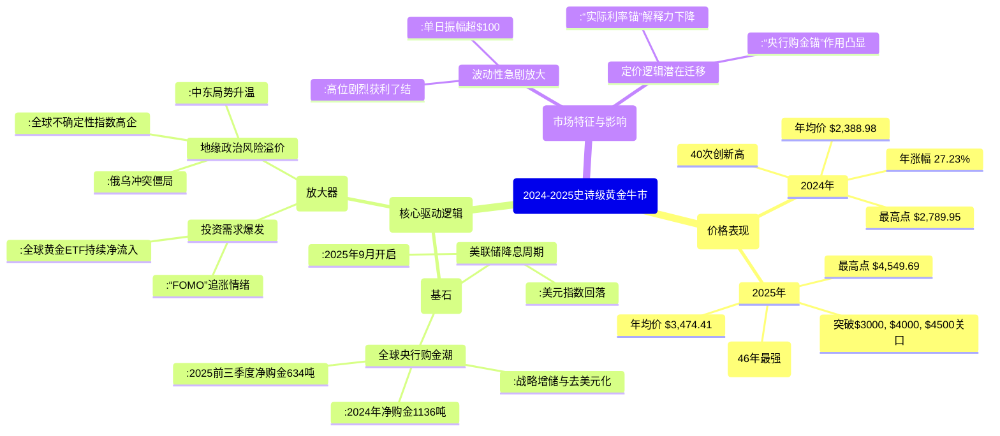

# 2010年至今黄金走势深度分析与未来趋势展望
## 1 历史走势全景回溯（2010-2025）

本章节旨在基于参考资料提供的2010年至2025年国际黄金价格（美元/盎司）详细数据，对这一时期进行结构化、阶段性的全景回溯。通过整合历史价格表中的年度平均价、最高点、最低点及年幅度数据，结合市场关键事件分析，可以清晰地划分出数个特征鲜明的价格周期。本章节的核心任务是客观呈现这些历史事实与周期划分，为后续章节的驱动因素和未来展望分析奠定坚实的数据基础。

### 1.1 牛市巅峰与漫长回调（2010-2015）

本阶段起始于后金融危机时代的货币宽松环境，黄金价格在避险与通胀预期推动下强劲上涨，于2011年触及周期顶峰，随后进入长达数年的深度回调与熊市。

2010年，国际黄金年均价报每盎司1,226.66美元，年度涨幅高达27.74%，显示出强劲的上涨动能[^1]。这一涨势在2011年达到高潮，当年金价最高触及1,896.50美元，创下当时的历史新高，年均价也达到1,573.16美元，年涨幅为11.65%[^1]。**2011年的高点标志着本轮由全球宽松货币政策和市场不确定性驱动的黄金牛市的顶峰**[^2]。

然而，顶峰之后是漫长的回调。2012年金价虽仍维持在相对高位（年均价1,668.86美元），但上涨动能已明显减弱（年涨幅5.68%）[^1]。真正的转折发生在2013年，当年金价暴跌27.79%，年均价回落至1,409.51美元[^1]。这轮深度下跌主要由市场对美联储即将结束量化宽松并开启加息周期的预期所驱动[^2]。回调趋势持续至2015年，当年金价年均价跌至1,158.86美元，年跌幅为11.59%，并在年内探至阶段低点1,049.60美元[^1]。**从2011年高点至2015年低点，黄金价格经历了约44.6%的最大回撤，历时约四年，构成了一个完整的牛市见顶后的深度调整周期**[^2]。

### 1.2 低位震荡与结构筑底（2016-2019）

在经历深度回调后，黄金市场并未立即开启新一轮单边牛市，而是进入了为期四年的低位宽幅震荡与结构性筑底阶段，为后续的突破积蓄力量。

2016年，金价从2015年的低点反弹，年均价回升至1,251.92美元，年涨幅为8.63%[^1]。此后三年，价格在一个相对明确的区间内反复波动。2017年和2018年的年均价分别为1,260.39美元和1,268.93美元，年幅度分别为12.57%和-1.15%，波动有所收窄[^1]。**这一时期的价格走势呈现出典型的“底部抬升、高点试探”的震荡筑底特征**。至2019年，筑底形态出现突破迹象，金价年均价显著上涨至1,393.34美元，年涨幅达到18.83%，年内最高点也上探至1,542.60美元[^1]。这一年的强势表现，标志着市场可能已逐步消化了美联储加息周期的影响，并为应对新的全球不确定性做好了准备。

### 1.3 危机避险与价格突破（2020-2021）

2020年，新冠疫情席卷全球，引发金融市场巨震，黄金作为终极避险资产的属性被极度强化，推动价格实现了对历史前高的决定性突破。

2020年，伦敦现货黄金价格最高触及每盎司2,058.40美元，首次突破2000美元大关，年均价也跃升至1,773.73美元，年涨幅为24.43%[^1][^3]。**这次突破意义重大，它打破了金价自2011年高点以来长达九年的压制，确立了新的价格基准**[^2]。驱动这轮行情的主要逻辑是“乱世买黄金”的避险需求，以及全球央行（尤其是美联储）为应对疫情冲击而实施的史无前例的货币宽松政策，后者引发了市场对纸币信用和长期通胀的深切担忧[^4][^2]。

价格创新高后，市场在2021年进入高位盘整。当年年均价为1,798.89美元，与2020年基本持平，但年幅度为-3.51%，显示多头动能暂时衰竭，市场需要时间消化前期巨大涨幅[^1]。这一时期，尽管地缘政治风险已开始累积，但美联储的货币政策转向预期开始对金价构成扰动。

### 1.4 地缘冲突助推与涨势重启（2022-2023）

2022年爆发的俄乌冲突，为黄金市场注入了新的、持久的避险动力，抵消了美联储激进加息的部分压力，使金价在高位展现出韧性，并最终在2023年重启涨势。

2022年初，俄乌冲突的爆发立即推升了黄金的避险需求。尽管当年美联储开启激进加息周期，美元走强，但金价仍在冲突初期剧烈波动中冲高至2,043.30美元[^1]。全年来看，年均价1,801.87美元，年幅度为-0.23%，表明多空力量在高位形成激烈博弈[^1]。**黄金在2022年展现了其独特的危机对冲价值，在美股（以标普500指数为代表）大幅下跌的环境下保持了价格韧性**[^2]。

进入2023年，地缘风险的持续化和央行购金行为的显性化，逐渐成为主导市场的力量。金价重拾升势，年均价上涨13.08%至1,943.00美元，并再次刷新高点至2,115.10美元[^1]。这一年的上涨，可以视为对新一轮结构性牛市的预热，市场开始更加关注央行购金和去美元化等长期主题。

### 1.5 史诗级牛市与定价逻辑变迁（2024-2025）

2024至2025年，黄金市场迎来了波澜壮阔的史诗级牛市，价格呈非线性暴涨，屡次刷新历史纪录。这轮行情的深度、广度以及背后的驱动逻辑，均与以往周期有显著不同，标志着黄金定价范式可能发生了结构性迁移。

2024年，黄金牛市正式进入主升浪。国际金价全年40次创下历史新高，最终年均价定格在2,388.98美元，年涨幅高达27.23%，年内最高触及2,789.95美元[^1][^5]。这一涨幅不仅巨大，而且是在2022-2023年连续上涨的基础上实现的，彰显了市场强大的买入力量[^5]。

2025年，涨势进一步加速并走向狂热。金价接连突破3000美元（3月）、4000美元（10月）和4500美元（12月）等重要心理关口[^3][^6]。全年数据极为惊人：年均价暴涨至3,474.41美元，年涨幅达到创纪录的65.54%；年内最高点更是触及4,549.69美元[^1]。**2025年黄金创下了自1979年（46年来）以来的最强年度表现**，其驱动因素呈现多重共振[^7][^3]。

为了更清晰地展示这一史诗级牛市的关键节点与驱动逻辑，以下通过思维导图进行结构化呈现：



如图所示，此轮牛市的核心驱动力已从传统的金融属性（如实际利率）主导，转向由**货币属性（央行购金、去美元化）和金融属性（投资需求、地缘避险）共同强化**的新范式[^8]。全球央行持续且大规模的购金行为（2024年1136吨，2025年前三季度634吨），为金价提供了坚实的结构性支撑[^9]。与此同时，美联储在2025年开启降息周期，叠加多极化且持续的地缘政治风险，共同点燃了私人部门的投资热情，导致“害怕错过”（FOMO）情绪蔓延，资金通过黄金ETF等渠道大量涌入[^10][^3][^9]。这种多重驱动力的共振，导致了金价涨幅巨大且波动性显著高于历史周期，例如在2025年出现了单日振幅超100美元、单周暴跌近400美元的极端行情[^7]。**这一切迹象表明，黄金市场可能正在经历一场深刻的定价逻辑变迁**，其作为“系统性价值储藏”工具的战略地位被重新定义[^9][^8]。

## 2 核心驱动因素的多维剖析

本章节旨在超越第一章的历史现象描述，系统性地解构2010年至今黄金价格波动的根本动力。黄金的价值并非由单一因素决定，而是由其独特的货币、金融、商品三重属性共同塑造，这三重属性在不同历史时期的主导地位及其交互作用，构成了金价波动的底层逻辑。本章将基于参考资料，深入剖析各历史阶段的主导驱动因素及其演变，重点揭示2024-2025年史诗级牛市背后，由全球央行战略性购金与私人部门投资需求爆发共振所引发的定价逻辑结构性变迁。

### 2.1 货币属性：美元信用、去美元化与央行购金的战略支撑

黄金的货币属性是其穿越千年的核心基因，它作为一般等价物和最终支付手段的地位，使其成为美元信用的天然对立面[^11]。当美元信用受损时，黄金的货币属性便会凸显，驱动其价格上行。当前，这一逻辑正以前所未有的强度主导市场。

**美元信用基础的动摇是黄金货币属性被强化的宏观背景。** 国际货币基金组织（IMF）数据显示，美元在全球外汇储备中的占比已跌破60%，截至2025年三季度更跌至56.9%，创下至少1995年以来的新低[^12][^13]。这并非短期波动，而是长期趋势的体现。美元信用的下滑源于美国经济实力的相对变化及其财政纪律的失守。2025年10月，美国债务规模首次突破38万亿美元，国债占GDP比例攀升至119%[^12][^14]。与此同时，标普、穆迪、惠誉三大国际评级机构均已下调美国的主权信用评级[^14]。**这些数据共同指向一个核心事实：作为全球储备货币基石的美元信用正在受到系统性侵蚀，这为黄金的价值重估提供了根本性的驱动力。**

**全球央行的战略性购金行为，是货币属性驱动金价最直接、最有力的体现，并正在成为新的定价锚。** 自上一轮金融危机以来，全球央行已连续15年成为黄金的净买家[^13]。特别是2022年至2024年，全球央行年度净购金量连续三年突破1000吨，其中2024年达到1044.6吨[^12][^13]。2025年前三季度，尽管购金步伐较去年同期有所放缓，但累计634吨的净购金量仍稳固于历史高位[^14][^15]。这种大规模、持续且对价格不敏感的购买行为，彻底改变了黄金市场的需求结构。世界黄金协会调研显示，高达95%的受访央行预计未来12个月将继续增持黄金，其中43%计划主动加大配置[^12][^16]。**这表明增持黄金已从周期性的避险选择，转变为结构性的、长期的战略配置方向。**

从购金主体来看，新兴市场央行是此轮购金潮的绝对主力。2022年至2024年，年度购金量排名前五的央行均来自新兴市场，包括土耳其、中国、波兰等[^13]。以中国央行为例，自2022年11月以来已进行两轮持续增持，截至2025年12月末，官方黄金储备约2306.32吨，全年累计增持约26.75吨[^13]。波兰央行更计划将黄金配置目标从总储备的20%提升至30%[^16]。相比之下，发达经济体央行增持记录寥寥。这种格局差异清晰地反映了**“去美元化”浪潮下，各国尤其是新兴市场国家，正通过增持黄金来优化外汇储备结构、对冲美元资产信用风险、并增强主权资产的安全性**[^14][^16]。截至2025年10月，按市值计算，美联储以外的全球央行持有的黄金总值（约3.92万亿美元）已超过其持有的美债总值（3.88万亿美元），这是30年来首次出现的格局性变化[^12]。**这标志着黄金已超越美债，成为全球央行事实上的第一大储备资产，其作为超主权“压舱石”的战略地位得到空前强化，并构成了本轮牛市最坚实的底部支撑。**

### 2.2 金融属性：实际利率、美联储政策与投资需求的动态博弈

黄金的金融属性使其像其他资产一样，受到利率、汇率、市场情绪和资金流动的深刻影响。然而，2022年以来，传统的金融属性定价框架遭遇了严峻挑战，新旧逻辑正在激烈博弈。

**美联储货币政策转向与美元走弱，是金融属性层面最直接的利好。** 2025年，美联储正式开启降息周期，累计降息三次，联邦基金利率目标区间共下调75个基点[^12]。与此同时，美元指数从年初的108.5下行至年末的98.3，贬值幅度达9.4%[^12]。由于国际黄金以美元计价，美元贬值直接降低了非美货币持有者的购买成本，刺激了全球需求。降息则压低了持有黄金的机会成本，提升了其相对于生息资产的吸引力。**利率与汇率这两大传统锚点同时朝着利好黄金的方向移动，为金价上涨提供了经典的金融动力**[^12]。

**然而，传统的“实际利率锚”定价模型解释力正在显著下降，揭示了更深层的市场逻辑变迁。** 过去半个世纪，黄金价格与美元实际利率（名义利率减去通胀预期）通常呈现稳定的负相关关系，因为实际利率代表了持有无息黄金的机会成本[^17][^11]。但2022年后，这一关系被打破。一个鲜明的例证是：2025年，尽管10年期美国国债实际收益率徘徊在1%以上，接近2015年以来的最高水平，本应给黄金带来下行压力，但金价却逆势持续暴涨[^16]。**这表明，市场对美元及美债本身的信心下降，已经超越了利率本身的计算，成为更主导的因素。** 投资者购买黄金不仅是为了对冲利率变化，更是为了对冲美元信用体系的系统性风险，这使得传统以实际利率为核心的定价模型部分失效。

**私人部门投资需求的爆发性增长，与央行购金形成共振，成为放大价格波动的核心金融力量。** 在央行购金奠定战略基调、美联储政策提供宽松环境的背景下，全球投资者情绪被空前点燃，“害怕错过”（FOMO）的追涨情绪推动资金大规模涌入黄金投资渠道。2025年前三季度，全球黄金ETF总持仓大幅增加619吨，推动总持仓量逼近2020年的历史最高水平[^16][^15]。以金额计，三季度黄金ETF流入约260亿美元，刷新季度纪录，其中北美地区基金流入领跑[^15]。中国市场同样狂热，2025年上半年，中国黄金ETF总规模从年初的730亿元飙升至2361亿元，增幅高达223%[^14]。金条与金币的实物投资需求同样强劲，2025年第三季度全球需求达316吨，创下2013年以来的最高季度纪录[^15]。**这种私人投资需求的“金融化”涌入，不仅放大了由央行购金奠定的上涨趋势，也显著加剧了市场的波动性，使得金价上涨呈现出更强的动量特征和情绪驱动色彩。**

### 2.3 商品属性与需求结构裂变：通胀、实物消费与投资替代

黄金的商品属性体现在其珠宝首饰和工业领域的应用，这部分需求相对刚性，但在高金价环境下正经历深刻的结构性变化。同时，市场对黄金抗通胀功能的认知也需要被重新审视。

**首先，必须澄清一个普遍误区：黄金并非完美的短期通胀对冲工具。** 历史数据表明，黄金价格与美国消费者价格指数的相关性很低[^18]。其与通胀的关系具有两个关键特征：**不连续性和滞后性**[^18]。不连续性意味着，只有当通胀率超过一定阈值（例如3%），对经济构成显著威胁时，黄金的抗通胀属性才会被激活。滞后性则指黄金价格反应往往慢于通胀的实际发生。例如，在1980年至2006年的26年间，黄金持续跑输通胀；又如2020年8月后，美国通胀从1.3%飙升至8.6%，但金价并未同步上涨，反而有所回调[^18]。**因此，将黄金简单视为“抗通胀资产”是一种认知简化。当前金价飙升的核心驱动力并非短期通胀预期，而是如前所述的美元信用风险和央行战略配置。**

**其次，高金价正在引发需求端的结构性裂变，突出表现为投资需求对消费需求的挤压与替代。** 根据世界黄金协会报告，2025年第三季度全球金饰消费量为371吨，同比出现两位数下滑，且为连续第六个季度下滑[^15]。中国黄金协会数据也显示，2025年前三季度，全国黄金首饰消费量同比大幅下降[^19]。然而，由于金价处于历史高位，金饰消费总金额却同比上升，呈现出典型的 **“量缩价增”** 现象[^15]。这背后的逻辑是：高昂的金价产生了“天花板效应”，抑制了以佩戴和婚嫁为目的的传统大克重金饰消费[^19]。

与此同时，投资性需求急剧膨胀。2025年上半年，中国金条及金币消费量逆势增长近24%[^19]。全球范围内，金条金币需求连续多个季度突破300吨[^15]。消费行为也发生转变，消费者要么彻底转向纯粹的投资金条以追求资产保值，要么在有限的预算内，将消费转向克重更轻、但设计感更强的“轻量化”饰品[^19][^20]。**这种“商品”与“资产”属性的撕裂，标志着黄金在消费者心智中的价值定位正在发生迁移：从一种以佩戴为主的“贵重商品”，日益转向一种以保值为核心的“金融资产”。** 这种需求结构的根本性变化，是黄金市场进入新范式的重要微观证据。

### 2.4 驱动因素的交织与范式变迁：聚焦2024-2025年牛市

2024-2025年的史诗级牛市，并非单一因素作用的结果，而是黄金三重属性在特定历史条件下深度交织、相互强化的产物。这场牛市揭示了黄金定价逻辑可能正在发生的深刻范式变迁。

**本轮牛市是“货币属性奠基”与“金融属性共振”的典型。** 其驱动模型可以概括为：**美元信用受损与去美元化浪潮（宏观背景）→ 全球央行战略性、持续性购金（货币属性，提供结构性支撑与新定价锚）→ 美联储降息周期开启与美元走弱（金融属性，提供流动性催化剂）→ 地缘政治风险持续高企（增加不确定性溢价）→ 私人部门“FOMO”情绪爆发，资金通过ETF等渠道大规模涌入（金融属性，放大价格波动与上涨趋势）→ 高金价抑制传统商品消费，部分转化为投资需求（需求结构重塑）。** 这个多重因素共振的模型，解释了为何本轮牛市的强度（2025年涨幅超64%，创1979年以来纪录）和波动性远超历史周期[^12][^14]。

与历史上两轮大牛市（1968-1980年，2001-2011年）相比，本轮行情既遵循了历史规律，又展现出新的特征。历史规律表明，**导致大级别黄金牛市启动的因素必然是货币属性，即美元信誉遭受冲击；而牛市结束的关键在于重塑国际社会对美元的信心**[^11]。本轮牛市无疑由美元信用担忧和央行购金（货币属性）奠基，符合这一规律。然而，其独特之处在于：**首先，央行购金的规模、持续性和战略性空前，使其从行情的“助推器”转变为“定盘星”。其次，金融属性的共振极为同步且猛烈，降息预期与投资热情在牛市早期便与货币属性形成强力叠加，而非滞后或交替主导。** 这使得上涨呈现非线性、加速暴涨的特征。

基于以上分析，可以明确一个核心结论：**黄金的定价逻辑正在经历一场静默革命，传统的“实际利率锚”逐渐失效，全球央行的大规模购金行为所代表的“去美元化”与“主权信用对冲”逻辑，正成为驱动金价的新核心动力**[^17]。市场正在从一个相对简单的、以美国金融变量（实际利率、美元指数）为核心的定价模型，向一个更复杂的、融合了 **“央行战略储备价值”（货币属性基石）、“全球地缘政治与信用风险溢价”（不确定性定价）以及“流动性驱动下的金融投机需求”（放大器）** 的多元范式迁移。在这一新范式下，黄金的价格不仅反映持有成本，更深刻反映了全球货币体系的重构压力与主权机构对长期安全资产的重新定义。这构成了理解当前及未来黄金走势最为关键的逻辑基点。

## 3 关键技术位识别与趋势分析

本章节旨在运用经典技术分析工具，对2010年至2025年的黄金价格走势进行结构化技术复盘，并评估当前（以2025年末至2026年初为基准）的技术趋势状态。本章将基于历史价格数据，结合趋势线、移动平均线、斐波那契回撤/扩展及波浪理论等工具，系统性地识别并验证过去十五年周期中的关键支撑与压力区域，分析不同周期的成本结构与趋势强度，并对当前技术形态与动量指标进行综合评估，从而为判断中期技术趋势的强弱提供严谨的技术框架。

### 3.1 历史关键支撑与压力区域的识别与验证

基于2010年至2025年的年度价格数据，可以清晰地识别出一系列在后续市场行为中被反复验证的关键技术位。这些价位通过前期高低点法和趋势线法，构成了黄金长期走势的技术骨架。

**前期高低点法**揭示，历史性的价格极值点往往在后续行情中扮演着重要的支撑或阻力角色。例如，2011年创下的历史高点1,896.50美元/盎司，在随后的近十年间构成了强大的阻力区域，直至2020年才被有效突破[^1]。一旦被突破，该区域便转化为重要的支撑基础，在2021年至2022年的回调中提供了关键支撑[^1]。同样，2015年形成的周期低点1,049.60美元，成为了此后长达数年牛市的坚实起点[^1]。2020年创下的新高2,058.40美元，在2022年初的俄乌冲突引发的上涨中成为重要阻力，但被短暂突破后，其附近区域在后续震荡中继续发挥技术作用[^1]。**这些历史高低点的相互转化，清晰地体现了“压力一旦被有效突破即转为支撑”这一经典市场规律**。

进入2023年至2025年的史诗级牛市，一系列新高点被迅速刷新，并迅速成为新的技术参考位。例如，2023年高点2,115.10美元、2024年高点2,789.95美元，以及2025年高点4,549.69美元，均在价格快速拉升过程中形成了短期的心理和技术关口[^1]。在急速上涨后的回调中，这些前期高点或整数关口（如4,000美元、4,500美元）附近区域，往往成为多空争夺和寻求支撑的焦点。

**趋势线法**则提供了界定长期趋势边界的视角。通过连接2015年（1,049.60美元）、2018年（1,176.70美元）及2022年（1,626.65美元）等主要周期低点，可以绘制出一条长期上升趋势线[^1]。这条趋势线构成了本轮超长期牛市的基础支撑线，只要价格维持在该线上方运行，则牛市的技术结构就保持完好。在2023年至2025年的暴涨行情中，价格大幅远离此基础趋势线，也印证了市场进入加速主升浪的特征。

综合来看，黄金市场的技术结构在突破2011年历史高点后发生了根本性升级。旧的强阻力区域被征服后，转化为新的支撑平台，为价格向更高维度迈进提供了阶梯。而持续上移的低点所构成的长期趋势线，则为整个上涨趋势提供了动态的“生命线”。

### 3.2 移动平均线系统与趋势强度分析

移动平均线（MA）是平滑价格波动、识别趋势方向与强度的核心工具。其中，**维加斯通道（Vegas Channel）**作为一种结合了特定周期指数移动平均线（EMA）的组合，在判断黄金中长期趋势上具有显著的参考价值。该通道通常由两组EMA构成：短期组（EMA144和EMA169）用于识别短期趋势方向，长期组（EMA576和EMA676）则用于界定长期趋势和动态支撑/压力[^21][^22]。其核心逻辑在于，当价格运行于通道上方时，市场处于上升趋势；反之则为下降趋势。

回顾历史走势，金价与关键移动平均线的位置关系清晰地刻画了趋势的演变。在2011年牛市见顶后的漫长回调中，价格多次反弹受阻于长期均线（如EMA576），并最终运行于所有主要均线之下，确认了熊市格局。而在2016年至2019年的筑底阶段，价格开始围绕这些长期均线反复震荡，尝试站稳其上，为后续突破积蓄能量[^1]。

**2024年至2025年的行情是移动平均线系统显示极端强势的典型范例**。在此期间，金价不仅持续运行于维加斯通道所有均线之上，而且短期、中期、长期均线呈现完美的多头排列（即周期较短的均线位于周期较长的均线上方）并向上发散。这种技术形态是**趋势强劲且处于加速阶段的明确信号**。例如，在2025年12月的行情中，即使出现冲高回落，价格也始终坚守在关键均线支撑之上（如4330美元附近的强支撑），随后再度拉升创出新高[^23]。截至2026年1月中旬的技术数据显示，短期均线MA5（4616.82）、MA10（4561.85）和MA20（4483.38）均位于长期均线MA20上方且向上发散，价格在其上运行，再次确认了短期多头趋势的主导地位[^24]。

然而，移动平均线分析方法也存在固有缺点，主要是**滞后性**。由于它是基于过去价格的平均值计算，对趋势反转的反应往往较慢，在市场快速转向时可能错过最佳买卖点[^25]。此外，在无趋势的震荡行情中，均线会频繁交叉，容易发出错误信号[^25]。尽管如此，在2024-2025年这种单边趋势极其明显的行情中，移动平均线系统，尤其是维加斯通道，在识别趋势方向和提供动态支撑参考方面发挥了巨大作用，其发出的看涨信号与基本面驱动形成了强力共振。

### 3.3 斐波那契与波浪理论下的结构定位

斐波那契回撤/扩展工具和艾略特波浪理论为分析黄金价格波动的潜在节奏和目标提供了更深层的结构视角。

**斐波那契工具**基于黄金分割比率，用于测算一波行情回调的潜在支撑位或上涨扩展的潜在目标位。在实际应用中，这些比率位（如38.2%、50%、61.8%）常与前期高低点、整数关口等重合，形成技术上的共振区域。例如，在2025年12月的行情分析中，分析师将金价自阶段性低点4170美元起涨至高点的波段进行分割，计算出0.886回撤位4191美元附近为重要支撑观察区，而行情后续的回调低点恰好落在4190美元附近，验证了该工具的有效性[^26]。同样，在展望未来上行目标时，基于前期上涨波段进行斐波那契扩展计算，得出的目标位（如161.8%扩展位）常成为重要的技术参考。

**艾略特波浪理论**则试图揭示市场群体心理驱动下的价格波动自然模式，其核心是一个由五浪驱动（顺应主趋势）和三浪调整（逆主趋势）构成的八浪循环[^27]。应用该理论分析自2015年低点启动的长期上涨，可以尝试进行波浪计数。一种可能的划分是：2015年至2020年的上涨为第一驱动浪，2020年至2022年的高位震荡为第二调整浪，而2023年至今（尤其是2024-2025年）的暴涨行情则可能属于强劲的第三驱动浪[^1]。根据波浪理论规则，第三浪通常是最长且最具爆发性的一浪，这与2025年创纪录的涨幅表现相符[^28]。如果当前处于第三浪中后期或某个延伸浪中，那么未来完成该浪后，市场将迎来第四浪调整。**关键的技术边界在于，根据理论规则，第四浪调整的底部不应低于第一浪的顶点**，这为未来的回调深度提供了一个重要的技术约束条件[^28]。

必须明确指出，无论是斐波那契位还是波浪计数，都存在多解性和主观性。它们提供的更多是概率性的参考区域和结构框架，而非精确的预测。市场不一定严格遵循这些数学比率或理想模型。因此，在实际应用中，需要结合其他技术工具和基本面信息进行综合判断。

### 3.4 当前技术形态、动量指标与趋势评估

综合前述分析，聚焦于2025年末至2026年初的即时技术状况，可以对当前黄金市场的趋势进行综合评估。

**当前技术形态显示市场处于历史高位震荡平台。** 2025年12月，金价在突破4500美元后，于4500-4700美元区间构筑了一个新的高位震荡平台[^23][^24]。进入2026年1月，价格延续强势，一度突破5000美元大关，创下5043.9美元的历史新高[^29]。随后价格有所回落，但整体维持在极高位置运行。布林带指标显示，价格近期冲高至接近上轨（4701.91）后回落，但目前仍运行于中轨（4483.38）上方，表明价格整体处于强势区间，但短期面临一定的回调压力[^24]。这种高位宽幅震荡的形态，是**市场在经历极端上涨后，进行筹码换手和消化超买压力的典型表现**。

**动量指标则一致指向市场短期过热，回调风险积聚。** 相对强弱指标（RSI）多次进入并维持在超买区域（>70），甚至在2025年10月、12月以及2026年1月创新高时出现极端超买水平（如接近或超过80）[^30][^24]。这明确警示市场短期买入力量过度消耗，技术性回调的概率显著增加。移动平均收敛发散指标（MACD）方面，在2025年四季度的上涨过程中，曾出现价格创新高而MACD柱状图未能同步创新高的顶背离现象，这是上涨动能可能减弱的潜在警告信号[^26]。然而，在强劲的单边趋势中，MACD快慢线持续位于零轴上方，表明上升动量依然占据主导。

为了更直观、结构化地呈现基于历史技术分析所推导出的未来关键位置与趋势情景，以下通过思维导图进行整合展示。该图融合了历史关键位转化逻辑、斐波那契测算、波浪结构定位以及当前技术状态评估，旨在为投资者提供一个清晰的技术分析框架。

```mermaid
mindmap
  root(黄金未来趋势技术分析框架)
    历史结构定位
      长期基础趋势线
        :连接2015, 2018, 2022年低点
        :牛市“生命线”，动态上移
      关键历史转化位
        $1,800 - $1,900区域
          :2011年顶，2020年后转为强支撑
        $2,000 - $2,100区域
          :2020年突破位，重要心理与技术区
    当前技术状态 (2026年初)
      价格位置
        :创历史新高后高位震荡
        :突破$5,000心理关口[^29]
      均线系统
        :维加斯通道上方，多头排列[^24]
        :EMA144/169为短期动态支撑
      动量指标
        :RSI持续超买，回调风险高[^30][^24]
        :MACD高位运行，关注顶背离信号[^26]
    未来关键支撑区域 (回调防线)
      第一防线: $4,680 - $4,800
        :近期突破平台及前期高点转化区
        :短期多头重要防守位
      第二防线: $4,300 - $4,500
        :2025年Q4主要震荡区间[^23][^24]
        :维加斯通道长期EMA组(576/676)支撑区
        :趋势强弱分水岭
      第三防线: $3,800 - $4,000
        :2025年突破的关键整数关口[^6]
        :斐波那契深度回撤位
        :牛市结构调整极限位 (不破长期趋势线)
    未来关键压力/目标区域 (上攻目标)
      近期目标: $5,200 - $5,400
        :斐波那契扩展位 (如161.8%)[^31]
        :机构预测集中区 (高盛: $5,400)[^31]
      中期展望: $6,000
        :心理与技术重大关口
        :乐观情景下的冲击目标[^29]
    趋势情景推演
      中性/基准情景 (概率较高)
        :高位($4,800-$5,400)震荡上行
        :伴随频繁且剧烈的技术性回调
        :“高波动成为常态”[^32]
      乐观情景
        :地缘或信用危机驱动
        :快速冲击$6,000关口[^29]
      悲观/深度回调情景
        :利多因素阶段性逆转
        :回踩$3,800-$4,000区域
        :视为牛市中的深度调整，非趋势反转
```

如图所示，当前黄金市场处于一个由**极度强势的长期趋势**与**积聚的短期超买风险**共同构成的复杂技术格局中。一方面，价格创下历史新高，均线系统呈完美多头排列，维加斯通道确认了强劲的牛市格局，任何回调首先将在**$4,300-$4,500**的近期核心平台区域寻找支撑[^23][^24]。另一方面，RSI等动量指标持续发出超买警告，表明市场需要通过回调或横盘震荡来修复过高的技术指标，释放短期压力。

**综合评估结论是：黄金的中长期技术趋势依然强劲，牛市的技术结构保持完好。** 然而，短期市场已进入高波动、高敏感度的状态，技术性回调的风险显著上升。未来走势的关键在于，回调能否在**$4,300-$4,500**乃至更高的**$4,680-$4,800**支撑区域上方获得有效承接[^24]。若能守住，则市场在经过整固后，有望向**$5,200-$5,400**乃至更高的目标区域发起新的冲击[^31]。若跌破关键支撑，则可能引发更深幅度的调整，向**$3,800-$4,000**区域寻找支撑，但这在目前的技术框架下仍被视为牛市中的调整而非反转[^6]。投资者需密切关注价格对这些关键技术位的反应，并结合基本面的演变进行动态判断。

## 4 未来趋势情景与关键位置推演

本章节旨在构建2026-2027年国际黄金价格的系统性情景分析框架。我们将基于参考资料中提炼的三大核心驱动因素（货币政策、央行购金与去美元化、地缘政治风险）的潜在演变路径，结合第三章的技术分析结论，推演出乐观、中性、悲观三种情景。每种情景将明确其核心假设、价格中枢路径、关键支撑与压力位（如5400美元、6000美元、4000美元、3800美元等），并识别各情景下需要重点监测的触发信号与风险点，为投资者提供兼具前瞻性与操作性的决策参考。

### 4.1 情景构建：基于核心驱动因素的多路径推演

未来黄金价格的演变，高度依赖于三大核心驱动因素的组合与强度变化。基于参考资料的分析，我们可以构建一个多路径情景框架，其核心逻辑在于评估货币政策、央行行为与地缘风险这三重维度的协同或背离状态。

**首先，美联储货币政策路径是影响金价最核心的宏观变量与流动性开关。** 当前市场普遍预期美联储的降息周期将持续至2026年[^6]。高盛预计，到2026年中期美联储将再降息100个基点[^6]。这种持续的货币宽松预期，构成了中性情景的基准假设，即政策按部就班地转向宽松，为金价提供支撑但非暴涨推力。乐观情景则假设货币政策超预期宽松，例如美联储降息至3%以下，导致美元指数大幅走弱、实际利率深度下行，从而极大降低黄金的持有成本并刺激投机需求[^33][^34]。悲观情景的触发点则在于货币政策推力减弱或逆转，例如通胀数据反弹导致降息节奏推迟、幅度不及预期，甚至市场重新计价加息可能，这将推动实际利率显著回升，压制金价[^32][^34]。

**其次，全球央行购金行为与“去美元化”进程是当前黄金牛市最坚实的结构性基石。** 2025年前三季度，全球央行净购金量达634吨，延续了自2022年以来的强劲趋势[^6]。世界黄金协会调查显示，高达95%的受访央行预计未来12个月将继续增持黄金[^10]。这种战略性、长期化的配置需求，为金价提供了强大的底部支撑，并正在成为新的定价锚[^12]。在中性及乐观情景中，这一趋势被假定为持续但节奏可能有所变化（例如年度购金量维持在900吨左右）[^35][^36]。而悲观情景的核心风险之一，在于这一结构性支撑可能松动，例如因新兴市场国内经济压力导致购金趋势显著放缓或阶段性逆转[^35]。

**最后，多极化且持续的地缘政治风险是黄金不确定性溢价的核心来源与价格波动的放大器。** 俄乌冲突陷入僵局、中东局势反复升温，以及全球范围内贸易摩擦等风险，共同推高了全球风险指数[^10][^6]。这些风险为黄金提供了持续的避险溢价。在乐观情景中，需要地缘冲突意外升级或新的重大风险事件爆发，作为价格冲击极端目标的直接催化剂[^33][^34]。中性情景则假定现有风险持续但未极端恶化。悲观情景的实现，则需要地缘政治出现阶段性、超预期的缓和迹象，从而削弱黄金的避险吸引力[^37]。

综合以上驱动因素的潜在组合，并参考机构给出的概率评估，我们可以构建如下三种核心情景：

| 情景类型 | 核心驱动因素组合假设 | 参考概率 | 主要依据 |
| :--- | :--- | :--- | :--- |
| **中性（基准）情景** | 1. 美联储有序降息（50-75基点）<br>2. 央行购金延续但节奏放缓<br>3. 地缘风险持续未恶化 | 约60% | 搜索结果-86的概率设定；搜索结果-80、-82、-91对政策与需求趋势的描述 |
| **乐观情景** | 1. 美联储超预期宽松（利率<3%）<br>2. 央行购金维持高位+私人部门“FOMO”<br>3. 重大地缘或债务风险事件催化 | 约20%-30% | 搜索结果-96的概率与触发条件；搜索结果-87、-91的极端驱动描述 |
| **悲观情景** | 1. 降息不及预期/通胀反弹<br>2. 央行购金趋势显著放缓<br>3. 地缘风险阶段性缓和<br>4. 大规模获利了结 | 约15%-20% | 搜索结果-86、-92的谨慎观点与风险假设；搜索结果-83、-96的风险提示 |

**这一情景框架的核心价值在于，它将模糊的“看涨”或“看跌”观点，转化为由具体可观测变量驱动的、具有概率权重的路径推演。** 投资者无需精确预测未来，而是可以通过持续跟踪上述驱动因素的实际数据，来判断市场更可能沿着哪条路径演进，从而做出相应的策略调整。

### 4.2 乐观情景：多重强驱动共振与极端目标冲击

乐观情景描绘了黄金市场在极端有利条件下可能实现的路径，其核心特征是**多重强驱动因素形成共振，导致价格呈现非线性加速上涨，并冲击历史性的高位目标**。该情景的发生需要一系列苛刻条件同时或相继满足。

**此情景的核心假设建立在驱动因素的极致强化之上：**
第一，**货币政策需要超预期宽松**。这要求美联储的降息节奏快于市场共识，联邦基金利率在2026年降至3%以下，同时美元指数因美国财政与债务问题而大幅走弱，推动以美元计价的黄金价格飙升[^33][^34]。第二，**需求端必须出现极致共振**。全球央行购金量需维持在月均60吨以上的高位，且私人部门的投资需求因“害怕错过”（FOMO）情绪而爆发性增长，导致黄金ETF出现持续、创纪录的资金净流入，与央行共同争夺有限的黄金供给[^36][^38]。第三，**需要重大风险事件作为价格“引爆点”**。例如，现有地缘冲突（俄乌、中东）急剧升级，或美国债务风险演变为市场恐慌，触发全球性的系统性避险需求[^10][^33]。第四，**供给刚性需进一步凸显**，即全球矿产金产量增长持续乏力，无法满足激增的需求，加剧供需失衡[^35]。

在此情景下，黄金价格的上涨将呈现明显的动量特征和加速形态。**关键的压力与目标位序列清晰可辨：**
短期而言，**5000美元/盎司**是一个重要的心理与技术关口，金价在突破此位置后可能出现反复争夺[^39][^40][^41]。中期核心目标指向**5400美元/盎司**，这是高盛在2026年1月最新上调的年末目标价，代表了主流乐观预期的基准[^36][^38]。极端冲击目标则看向**6000美元/盎司**乃至更高，摩根大通曾给出长期看涨至5400-6000美元的预测，而分析指出，若全球资产配置中仅有0.5%的资金从美元资产转向黄金，就足以推动金价达到6000美元[^34][^41]。更长期的展望中，星展银行等机构甚至给出了2030年**6600美元**的预测[^38]。

由于上涨过程迅猛，市场也会出现剧烈的技术性回调。**关键的支撑防线将随价格中枢上移而抬高：**
在冲击更高目标的过程中，**4800-4900美元区域**将成为首个实质性支撑带，该区域由近期高位震荡平台转化而来，买盘承接预计强劲[^40]。其下方，**4600美元附近**是另一个重要的趋势强弱分水岭，与周线级别的均线系统支撑相重合[^39]。

**监测此情景是否被触发的信号至关重要**，包括：美联储议息会议释放远超预期的鸽派信号（如点阵图显示更激进的降息路径）；地缘政治出现突发性升级事件；全球央行月度购金数据连续数月突破市场预期；以及黄金ETF单周资金流入规模创下历史纪录。**然而，此情景蕴含的最大风险恰恰来自于其巨大的涨幅**——市场累积的巨额获利盘可能导致任何利好出尽或轻微利空引发剧烈的获利了结，参考历史极端波动，**单日振幅可能达到±8%**，给追高者带来巨大风险[^34]。因此，即使在乐观情景中，交易策略也应侧重于趋势跟随与严格的风险控制，而非盲目追涨。

### 4.3 中性（基准）情景：高位震荡与中枢上移

中性情景代表了基于当前可见趋势线性外推、发生概率最高的路径。它既非狂热上涨，也非趋势反转，而是描绘了黄金市场在核心支撑犹存、但缺乏极端催化剂环境下，**价格中枢逐步上移，同时高波动成为常态的格局**。这也是多数主流金融机构的基准预测所锚定的路径。

**该情景的核心假设是当前驱动因素的“稳态”延续：**
货币政策方面，**美联储将实施有序、克制的宽松**，预计在2026年降息50-75个基点，美元指数温和走弱，实际利率维持在低位但未深度转负[^6][^32][^33]。这种“预防式降息”为黄金提供了流动性环境支持，但推力趋于温和[^41]。需求端，**全球央行购金趋势延续，但增持节奏可能较2024-2025年的峰值有所放缓**，预计年度净购金量维持在900吨左右的水平[^35][^36]。这为金价提供了坚实的“地板”，但不足以单独驱动价格暴涨。同时，地缘政治风险呈现“僵持”状态，既未显著缓和，也未急剧恶化，为黄金提供持续但稳定的溢价。私人投资需求（通过ETF等）与因高金价而受抑制的实物消费需求达成一种动态平衡，市场由战略配置资金和波段交易资金共同主导。

在此情景下，金价将难以重现2025年单边暴涨近65%的行情，更可能呈现“**进二退一**”的震荡上行态势[^38]。广发期货研究员叶倩宁指出，在宏观宽松预期、供需紧平衡下，黄金价格中枢将逐步上抬，同时**高波动将成为常态**[^32]。这意味着投资者既需要关注长期上涨趋势，也必须为频繁且可能剧烈的价格回撤做好准备。

**中性情景下的关键价格区域界定如下：**
- **价格中枢与目标**：2026年全年均价预计在**4400-4500美元/盎司**区间[^41]。年末目标价则呈现一个区间，主流机构预测集中在**4800美元至5400美元**之间，例如高盛给出的4900美元（后上调至5400美元）、摩根大通的5055美元以及瑞银的4800-5000美元预测，均落在此范围内[^36][^38][^41]。
- **关键支撑区域**：由于高波动特性，价格回调时将测试多层级支撑。第一道重要防线位于**4800-4900美元**，这是基于近期高位平台形成的技术支撑区[^40]。更强的支撑在**4600美元**附近，该位置兼具心理关口和技术意义[^39]。而决定中期趋势强弱的分水岭在**4350-4400美元**区域，此处汇集了维加斯通道长期均线组（如EMA576/676）等关键技术支撑，若被有效跌破，则市场可能向悲观情景过渡[^39]。
- **关键压力区域**：上行过程中，**5000-5100美元**是近期需要攻克的心理和技术双重阻力位[^40]。中期来看，**5400美元**附近是基准情景下的重要压力区，与高盛的目标价重合。

**投资者在此情景下的核心任务是监测驱动因素的“稳态”是否被打破。** 需要重点关注几类信号：美国通胀（尤其是核心PCE）和就业数据是否开始动摇市场对美联储降息路径的预期；全球央行（特别是中国、波兰等）月度购金数据是否出现趋势性衰减；以及黄金ETF的资金流是保持稳定流入，还是转为大幅波动甚至净流出。**此情景的主要风险点在于市场的双向高波动**。任何不及预期的数据或事件都可能引发快速的获利了结，而任何利好又可能刺激空头回补和新的买盘，导致价格在核心区间内宽幅震荡，交易难度显著加大[^32][^37]。

### 4.4 悲观情景：驱动逆转与深度回调风险

悲观情景描述了黄金牛市在遭遇一系列利空因素共振时可能出现的深度调整路径。**需要强调的是，基于长期结构性牛市的基础（央行战略购金、美元信用担忧），此情景在多数分析中被视为牛市中的一次大型回调或整理，而非长期趋势的反转**。它的发生意味着当前支撑金价的几大核心逻辑出现了阶段性、甚至局部性的逆转。

**触发此情景需要以下几项关键假设同时或相继成立：**
1.  **货币政策推力减弱或转向**：美国经济数据显示通胀更具粘性或就业市场依然强劲，导致美联储降息节奏显著推迟、幅度不及预期，甚至释放鹰派信号。这将推动实际利率快速回升，直接增加持有黄金的机会成本[^32][^34]。花旗、瑞银等机构曾提示，若降息不及预期，金价可能回调至3800-4000美元区间[^38]。
2.  **央行购金这一结构性支撑松动**：新兴市场国家可能因国内经济压力、外汇储备管理需要或其他政策考量，显著放缓甚至暂停购金步伐。参考资料中的悲观情景假设，央行购金量将低于当前水平[^35]。
3.  **地缘政治风险溢价消退**：主要地缘冲突出现明显的、超预期的缓和迹象，例如达成临时停火协议或开启实质性和谈，从而削弱黄金作为避险资产的紧迫性[^37]。
4.  **美元信用出现短期修复**：美国财政政策出现积极改革迹象，或债务上限问题得到顺利解决，市场对美元资产的短期信心有所恢复，推动美元走强[^35]。
5.  **引发大规模技术性抛售**：在上述基本面因素转变的背景下，金价高位回落触发程序化交易和多头止损，并与获利了结盘形成共振，导致连锁抛售[^42][^34]。

在此情景下，金价将面临显著的下跌压力，回调深度将成为关注的焦点。**关键的回调目标位（即支撑位）根据调整级别由浅至深排列如下：**
- **第一回调目标：4000-4200美元区域**。这是2025年第四季度被反复争夺并最终突破的关键心理与技术关口，曾被市场视为“牛熊分界线”[^10]。一旦价格回落至此，预计将吸引大量的逢低买盘和长期配置资金。
- **深度回调目标：3800美元附近**。该位置对应2025年第三季度震荡区间的上沿，是一个重要的技术支撑位。汇丰银行曾预测2027年金价可能回落至3600美元，世界银行在2026年《大宗商品前景报告》中给出的黄金均价预测为3575美元，均指向这一区域[^43][^38]。
- **极端调整目标：3400-3600美元**。这是基于更长期趋势线和斐波那契深度回撤位测算的区域，属于小概率的极端调整情景。若金价跌至此区域，则意味着市场可能过度计价了利空因素。

相应地，在下跌过程中的任何反弹都将面临重重压力。**关键的压力位将下移**，前期支撑转化为阻力，例如**4500美元**及**4600美元**关口将成为反弹的重要压制区域。

**对于投资者而言，识别悲观情景的早期预警信号至关重要**。这些信号包括：美国CPI或PCE通胀数据连续数月高于预期；非农就业数据持续强劲；美联储官员频繁发表鹰派言论；全球黄金ETF出现持续、大幅度的资金净流出；以及技术图表上形成明确的顶部形态（如双顶、头肩顶）。**此情景的核心启示在于风险控制**。对于趋势交易者，明确的关键支撑位（如4000美元）可以作为止损或减仓的参考；对于长期投资者，深度回调至3800-4000美元区域则可能被视为难得的战略加仓机会，因为长期牛市的基础逻辑（去美元化、主权资产重构）并未被证伪。

### 4.5 综合推演：关键位置地图与监测框架

综合前文对三种情景的详细推演，我们可以绘制出一张清晰的未来黄金价格“关键位置地图”，并建立一个与之配套的动态信号监测框架。这旨在将复杂的多路径分析，转化为投资者可跟踪、可决策的实用工具。

**首先，未来1-2年内黄金市场将围绕一系列关键价格区域展开博弈，这些区域构成了多空力量转换的潜在枢纽。**
为了直观展示这一多层次、动态的关键位置体系，以及其与不同情景的对应关系，以下通过整合思维导图进行结构化呈现：

```mermaid
mindmap
  root(黄金未来关键位置地图与情景框架 (2026-2027))
    核心驱动监测维度
      货币政策 (美联储)
        :降息节奏与幅度
        :通胀(CPI/PCE)数据
        :就业(非农)数据
        :点阵图与官员讲话
      央行行为与美元信用
        :全球央行月度购金数据
        :中国、波兰等国储备变化
        :美元指数走势
        :美国债务与财政动向
      地缘政治与市场情绪
        :俄乌、中东等地缘进展
        :全球不确定性指数
        :黄金ETF持仓变化(北美/欧洲)
        :投机仓位(CFTC)
    关键压力/目标序列 (由近及远)
      $5,000 - $5,100
        :心理与近期技术关口
        :中性/乐观情景的近期争夺区
      $5,200 - $5,400
        :机构基准目标集中区 (高盛: $5,400)
        :中性情景核心上沿，乐观情景中继站
      $6,000
        :重大心理与技术关口
        :乐观/极端情景冲击目标
        :触发条件苛刻 (0.5%资产转向)
    关键支撑/回调防线 (由上至下)
      $4,800 - $4,900
        :近期高位平台，动态强支撑
        :乐观/中性情景回调第一防线
      $4,600
        :趋势强弱分水岭
        :中性情景重要支撑，跌破则转弱
      $4,350 - $4,400
        :维加斯通道长期均线组
        :中期牛熊重要观察位
      $4,000 - $4,200
        :“牛熊分界线”，心理与技术强支撑
        :悲观情景第一目标，长期配置区
      $3,800 及以下 ($3,400-$3,600)
        :深度调整区域
        :极端悲观情景目标 (世界银行预测)
        :长期牛市结构极限测试位
    情景路径与对应关键位
      乐观情景 (概率: 20%-30%)
        :路径: 冲击$6,000
        :支撑锚: $4,800-$4,900
        :风险: 短期巨震(±8%)与获利了结
      中性情景 (概率: ~60%)
        :路径: $4,800-$5,400高位震荡上行
        :核心区间: $4,350 - $5,400
        :特征: “高波动成为常态”
      悲观情景 (概率: 15%-20%)
        :路径: 深度回调至$3,800-$4,200
        :性质: 牛市中的大型调整
        :压力位: $4,500-$4,600
```

如图所示，这张“地图”明确了自上而下的压力目标和自下而上的支撑防线。**压力目标序列**（5000美元→5400美元→6000美元）标识了市场上攻过程中需要逐一克服的障碍，其突破与否及突破后的表现，是判断市场强度是否升级（如从中性迈向乐观）的重要依据。**支撑防线序列**（4800-4900美元→4600美元→4350-4400美元→4000-4200美元→3800美元以下）则定义了市场回调时的潜在止跌区域，每一道防线的失守，都意味着市场情绪的转弱和向更悲观情景靠拢的可能性增加。

**其次，建立一个系统化的监测框架是动态调整情景判断的前提。** 投资者应持续跟踪以下四类信号：
1.  **政策信号**：这是最高优先级的指标。重点关注美联储议息会议的声明、经济预测摘要（点阵图），以及每月发布的美国PCE通胀和非农就业数据。任何持续偏离当前市场宽松预期的数据，都可能引发情景的重新评估。
2.  **需求信号**：重点监测世界黄金协会定期发布的全球央行购金数据，特别是主要购金国（如中国、波兰、土耳其）的行动。同时，观察全球主要市场的黄金ETF持仓变化，尤其是资金流量大、对价格敏感的北美和欧洲基金。
3.  **风险信号**：关注主要地缘冲突的新闻进展，以及反映全球恐慌情绪的VIX指数等。此外，美国国会关于债务上限和财政预算的辩论，也可能扰动市场对美元信用的短期看法。
4.  **技术信号**：观察金价在“关键位置地图”中标识的各个区域附近的表现。例如，在5000美元关口是遇阻回落还是放量突破？回调至4600美元时是获得支撑还是轻易跌破？这些价格行为本身是市场多空力量对比最直接的反映。

**最后，必须理解情景框架的动态性。** 乐观、中性、悲观并非固定不变的标签，而是随着驱动因素证据的积累而动态演变的概率分布。例如，一连串超预期的通胀数据可能使中性情景的概率权重下降，同时提升悲观情景的概率；反之，一场突发的重大地缘危机则可能迅速推高乐观情景的可能性。**投资者的策略不应僵化地绑定于某一种情景，而应基于监测框架的信号，灵活调整对主导情景的判断，并相应地在关键位置附近管理风险、寻找机会。** 这套“地图”与“框架”的结合，为在高度不确定性的市场中保持理性、纪律化的决策提供了有力的导航。

## 5 结论与策略启示

本章节旨在系统性地归纳前四章的核心研究发现，总结驱动2010-2025年黄金走势及未来趋势的主导逻辑与关键不确定性。基于历史周期回溯、多维驱动因素剖析、技术位识别及未来情景推演，本章将提炼出黄金定价逻辑的范式变迁结论，并明确指出未来市场的主要风险与监测要点。在此基础上，本章将结合关键支撑与压力位分析，为不同风险偏好（长期配置型、中期趋势型、短期交易型）的投资者，提供具有可操作性的资产配置与交易策略启示与具体建议。

### 5.1 核心研究发现与范式变迁总结

本研究报告通过对2010年至2025年黄金市场的全景分析，得出了若干相互印证、逻辑一致的核心结论，这些结论共同指向一个深刻的范式变迁。

首先，从历史走势看，黄金市场在十五年间经历了特征鲜明的周期演变。从2011年牛市见顶后的漫长回调与筑底，到2020年新冠疫情危机下的历史性突破，最终在2024-2025年迎来了史诗级的非线性暴涨。**2025年黄金创下了自1979年（46年来）以来的最强年度表现，涨幅高达65.54%，这标志着市场进入了一个强度与波动性均远超历史的新阶段**。

其次，驱动因素分析揭示了本轮史诗级牛市背后的根本动力。**黄金的定价逻辑正在发生结构性迁移，传统的以美国实际利率为核心的“金融属性锚”解释力显著下降**。取而代之的，是一个由三重属性深度交织、相互强化的新范式。其基石是全球央行持续、大规模的战略性购金行为（2024年净购1136吨，2025年前三季度634吨），这代表了“去美元化”与主权信用对冲的“货币属性”逻辑。这一结构性支撑与美联储降息周期（2025年开启）提供的流动性利好，以及地缘政治风险持续高企所引发的私人部门“FOMO”投资需求（如2025年三季度全球黄金ETF流入260亿美元创纪录）形成强力共振，共同驱动了价格的暴涨。

最后，技术分析与未来情景推演为理解当前格局和展望未来提供了清晰的框架。市场已确认处于强劲的长期牛市技术结构中，但短期面临极高的超买风险。未来价格将围绕一系列多层次的关键位置展开博弈。基于对驱动因素演变路径的推演，市场未来最可能（概率约60%）的路径是进入 **“高波动成为常态”的高位震荡上行格局**，核心价格区间将在**4800美元至5400美元**之间宽幅波动，并伴随频繁的技术性回调。下方**4000-4200美元**区域是决定牛市结构调整深度的关键防线，而上方的**6000美元**则是需要极端催化剂才能冲击的乐观目标。

### 5.2 未来趋势主导逻辑与不确定性

展望2026-2027年，黄金市场的趋势将由以下几大主导逻辑与关键不确定性共同塑造。

**主导逻辑方面，一个稳固的“基石-推力-波动”三元结构已经形成：**
1.  **结构性基石（货币属性）**：全球央行持续购金的长期趋势（95%的受访央行计划未来增持）与美元信用根基的长期受损（美元在全球外汇储备中占比已跌破60%，美国国债规模突破38万亿美元）构成了金价最坚实的底部支撑。这决定了黄金长期牛市的基调难以被轻易逆转。
2.  **周期性推力（金融属性）**：美联储的货币政策路径是影响金价最核心的宏观变量。市场普遍预期降息周期将持续至2026年（如高盛预计再降息100个基点），美元指数的温和走弱将为金价提供持续的流动性支持。
3.  **波动放大器（风险与情绪属性）**：持续的地缘政治僵局（如俄乌、中东）为黄金注入了稳定的不确定性溢价。同时，私人部门的投资情绪，尤其是通过黄金ETF的资金流动，将成为放大短期价格波动的关键力量。

**然而，未来市场也面临着明确的核心不确定性，这些是区分乐观、中性、悲观情景的关键变量：**
1.  **货币政策风险**：美国通胀（尤其是核心PCE）的粘性可能超预期，导致美联储降息节奏推迟、幅度不及预期，甚至引发市场对政策重新紧缩的担忧。这将直接逆转金融属性层面的利好，成为金价回调的主要推力。
2.  **需求端风险**：新兴市场央行可能因国内经济压力、外汇储备管理需要或其他政策考量而显著放缓甚至阶段性逆转购金节奏。若这一结构性支撑松动，将动摇本轮牛市最坚实的根基。
3.  **市场内部风险**：价格处于历史极端高位，积累了天量的获利盘。任何利好出尽或轻微利空都可能触发大规模的技术性抛售与获利了结，导致价格出现剧烈且快速的回调，重现2025年**单日振幅超100美元**的极端波动。

投资者必须持续监测这些不确定性变量的实际演变，以动态调整对市场主导情景的判断。

### 5.3 长期配置型投资者的战略启示

对于风险承受能力较强、注重资产保值和长期战略配置的投资者（如主权基金、家族办公室、高净值个人），核心启示在于应超越短期价格波动，从 **“主权资产重构”和“终极价值储藏”** 的战略高度来审视黄金。

具体策略建议如下：
1.  **配置逻辑**：将黄金视为对冲全球货币体系风险、特别是美元信用风险的核心非相关性资产。在整体投资组合中，应维持并可能提升黄金的战略性配置比例。可参考部分央行的做法，设定一个长期目标区间（例如占可投资资产的5%-15%，或参考波兰央行将黄金占储备比例提升至20%-30%的目标进行类比思考）。
2.  **入场策略**：鉴于当前价格处于历史高位，应避免情绪化追高。**最佳的增持时机出现在市场向悲观情景演进的深度回调过程中**。投资者应重点关注**4000-4200美元**区域（被视为“牛熊分界线”和心理强支撑）以及更下方的**3800美元**附近（长期趋势线及深度斐波那契回撤位），在这些关键强支撑区域附近，采取分批、阶梯式建仓或增持的策略，以平滑成本并控制风险。
3.  **持有形式**：优先选择实物金条、金币或具备百分之百实物黄金背书的交易所交易基金（ETF）。这种形式最大化了黄金作为终极支付手段和安全资产的属性，与长期配置的初衷最为契合。
4.  **监测要点**：长期投资者应淡化对美联储每次议息会议等短期噪音的过度反应。其监测重心应放在验证长期配置逻辑是否稳固上，主要包括：跟踪全球央行购金的长期趋势数据、评估美国财政健康状况与主权信用前景（债务/GDP比率、国际评级机构动向）、以及研判地缘政治格局的长期结构性演变。

### 5.4 中期趋势型投资者的战术框架

对于善于把握中期趋势、寻求资本增值的主动型投资者（如宏观对冲基金、部分公募基金），其战术操作应紧密围绕第四章构建的情景分析框架展开。

一个有效的战术框架包含以下核心要素：
1.  **基准情景锚定**：将**中性情景**（概率约60%，价格在4800-5400美元区间高位震荡上行）作为策略制定的基准和出发点。在此框架下，策略的核心思想是 **“顺大势（长期牛市）、逆小势（短期超买回调）”** 。具体而言，在确认长期牛市技术结构（例如价格稳定运行于维加斯通道长期均线组上方）完好的前提下，当价格因动量指标（如RSI）显示极端超买而接近关键压力区（如**5000-5100美元**、**5400美元**）时，可考虑部分减仓或使用期权进行对冲；当价格回调至关键动态支撑区（如**4800-4900美元**、**4600美元**、**4350-4400美元**）并出现企稳迹象时，则进行回补或加仓。
2.  **情景切换应对**：必须建立明确的信号监测清单，以应对市场主导逻辑从基准情景向乐观或悲观情景切换的可能性。
    *   **转向悲观警报**：若连续出现美国核心通胀数据超预期反弹、同时全球央行月度购金数据趋势性走弱，则应提高对深度回调（目标**4000-4200美元**）的警惕，主动降低多头仓位，并将止损位上提至更近的关键支撑下方。
    *   **转向乐观契机**：若发生重大地缘危机升级或美联储释放远超预期的宽松信号，则应评估市场向乐观情景（冲击**6000美元**）切换的潜力。此时可采取突破追势策略，例如在价格放量有效突破**5400美元**等重要技术关口时顺势加仓，但**必须**基于近期强势支撑位（如**4800美元**）设置严格的止损，以防范因获利了结导致的剧烈反转风险。
3.  **工具选择**：为有效执行上述战术，可优先选择流动性极佳的黄金期货合约、主流黄金ETF（如GLD、IAU）以及金矿股ETF（如GDX）。期权工具可用于在关键位置构建价差策略，以限定风险的同时获取方向性收益或时间价值。

### 5.5 短期交易型投资者的风控要点

对于专注于短期价格波动、交易频率较高的投资者（如日内交易者、量化基金），在当前的史诗级牛市背景下，**风险控制的重要性远超过机会识别**。市场已明确进入 **“高波动成为常态”** 的阶段，无视这一特征将导致毁灭性损失。

短期交易者必须恪守以下核心风控与机会识别要点：
1.  **波动率管理是生命线**：必须将显著高于历史水平的波动率预期纳入仓位计算的每一个环节。采用比以往更保守的杠杆倍数，并优先使用限价单而非市价单入场，以规避因流动性瞬间枯竭而产生的巨大滑点风险。
2.  **围绕关键位置进行交易**：将研究报告第三章和第四章系统识别的关键支撑与压力位作为短期交易的“地图”。价格在这些位置附近的行为（例如在**5000美元**关口出现假突破后反转，或在**4350-4400美元**区域获得支撑并伴随成交量放大）往往能提供高胜率的交易信号。交易应围绕这些关键位置的测试、突破或反弹来展开。
3.  **建立简洁的多空触发清单**：为了在快速波动的市场中迅速决策，应预设清晰的观察信号。
    *   **潜在多头信号**：价格在关键支撑位（如**4600美元**或**4350-4400美元**）出现明确的看涨K线组合（如锤子线、看涨吞没），且同期黄金ETF资金流数据由负转正。
    *   **潜在空头信号**：价格在关键压力位（如**5400美元**）多次上攻乏力，同时小时图或日线图RSI指标出现顶背离形态，或盘前公布的美国通胀数据大幅高于预期。
4.  **执行严格的交易纪律**：在波动剧烈的市场中，任何一笔交易都必须预设明确的入场点、止损位和止盈目标。止损通常应设置在所交易的关键位置外侧一定幅度，以过滤市场噪音。坚决避免在无明确技术信号或基本面催化剂的情况下，凭感觉进行方向性重仓赌博。在方向不明时，可更多考虑基于波动率的套利策略或市场中性的统计套利模型。

为了将以上所有结论、逻辑、情景与关键位置整合成一个清晰、直观、便于决策的总体框架，特提供以下综合思维导图。该图融合了历史范式变迁结论、未来主导逻辑、三层情景路径以及对应的多层次关键位置体系，旨在为所有类型的投资者提供一个一目了然的导航图。

```mermaid
mindmap
  root(黄金分析综合结论与策略导航图)
    历史核心发现与范式变迁
      周期特征: 2011年顶 → 长期筑底 → 2020年突破 → 2024-2025史诗级暴涨
      定价逻辑迁移
        :传统“实际利率锚”解释力下降
        :新范式: “央行购金锚” + “金融属性” + “风险溢价”共振
      2025年表现: 涨幅65.54%，46年来最强
    未来主导逻辑与不确定性
      主导逻辑 (三元结构)
        基石: 央行购金(货币属性)与美元信用担忧
        推力: 美联储降息路径(金融属性)
        波动: 地缘风险与私人投资情绪(放大器)
      核心不确定性 (风险源)
        货币政策风险: 通胀反弹导致降息不及预期
        需求端风险: 央行购金趋势显著放缓
        市场内部风险: 高位巨额获利盘引发技术抛售
    未来趋势情景与关键位置地图
      乐观情景 (概率: 20%-30%)
        路径: 冲击 $6,000
        触发: 地缘危机/美元信用危机 + 超预期宽松
        支撑锚: $4,800-$4,900
        风险: 短期巨震与获利了结
      中性(基准)情景 (概率: ~60%)
        路径: $4,800-$5,400 高位震荡上行
        特征: “高波动成为常态”
        核心区间: $4,350 - $5,400
        上沿目标: $5,400 (机构基准)
      悲观情景 (概率: 15%-20%)
        路径: 深度回调至 $3,800-$4,200
        性质: 牛市中的大型调整，非趋势反转
        触发: 利多因素(政策、需求)阶段性逆转
        关键支撑: $4,000-$4,200 (“牛熊分界线”)
    分类型投资者策略启示
      长期配置型 (战略视角)
        逻辑: 对冲美元信用风险的“终极价值储藏”
        行动: 在深度回调($3,800-$4,200)时分批战略配置
        形式: 实物金条/金币或实物背书ETF
        监测: 央行购金长期趋势、美国财政健康
      中期趋势型 (战术框架)
        基准: 锚定中性情景，顺大势、逆小势
        操作: 压力位($5,400)减仓/对冲，支撑位($4,350-$4,600)回补
        切换: 监测信号，应对向乐观/悲观情景转换
        工具: 黄金期货、主流ETF、期权
      短期交易型 (风控核心)
        前提: 承认并管理“高波动常态”
        关键: 围绕关键位置($5,000, $4,600, $4,400等)交易
        信号: 建立简洁的多空触发清单
        纪律: 严格预设止损止盈，避免情绪化赌博
```

# 参考内容如下：
[^1]:[歷年黃金價格表](http://www.jinjia.vip/History/)
[^2]:[根据2010年7月4日至2025年7月4日的十五年周期数据,黄金与](https://xueqiu.com/3446706652/341203244)
[^3]:[国际黄金](https://baike.baidu.com/item/国际黄金/6819980)
[^4]:[金价暴涨1315元/克!你当年买黄金是多少钱?历史价格对比太扎心](https://baijiahao.baidu.com/s?id=1850445216969021265&wfr=spider&for=pc)
[^5]:[金价创2010年以来最大年度涨幅,2025年是涨是跌? ](https://news.ycwb.com/2025-01/01/content_53157563.htm)
[^6]:[2025黄金投资年度盘点及未来金价展望](https://baijiahao.baidu.com/s?id=1850399160193516246&wfr=spider&for=pc)
[^7]:[历史正在重演?复盘黄金两次“史诗级见顶”后,发现主力撤退的三大共同信号 ](https://www.sohu.com/a/971830925_189372)
[^8]:[2025黄金狂潮:定价锚迁移背后,去美元化时代的投资真相! ](https://news.sohu.com/a/957675358_122014422)
[^9]:[世界黄金协会:2025年第三季度全球黄金需求趋势报告](http://finance.sina.com.cn/tech/roll/2025-12-26/doc-inheakcy1384036.shtml)
[^10]:[黄金要重演2010年大牛市?4000美元成关键胜负手!三大信号揭示历史性机遇](https://baijiahao.baidu.com/s?id=1850905651823045388&wfr=spider&for=pc)
[^11]:[金价涨跌的内在逻辑|国际](https://baijiahao.baidu.com/s?id=1854751320240211222&wfr=spider&for=pc)
[^12]:[金价狂飙45年纪录!央行抛弃美债藏玄机](https://baijiahao.baidu.com/s?id=1855175132430155366&wfr=spider&for=pc)
[^13]:[全球央行连续15年净购入黄金,如何重塑国际储备格局!中国外储优化:四年购金超350吨,官方黄金储备约2306.32吨](https://baijiahao.baidu.com/s?id=1854986067686819655&wfr=spider&for=pc)
[^14]:[2025黄金投资年度盘点及未来金价展望](https://www.gold.org.cn/sc1227/scsd/202512/t20251208_200312.html)
[^15]:[全球黄金需求趋势2025年三季度报告](https://baike.baidu.com/item/全球黄金需求趋势2025年三季度报告/67212180)
[^16]:[地缘、政策与需求的三重奏:黄金上涨动力解析](https://baijiahao.baidu.com/s?id=1850687230909738491&wfr=spider&for=pc)
[^17]:[2025黄金狂潮:定价锚迁移背后,去美元化时代的投资真相!](https://www.163.com/dy/article/KF44RKMP05568W0A.html)
[^18]:[国际金价持续上涨,有人却持续购买,黄金能抵消通胀吗?](https://baijiahao.baidu.com/s?id=1854357118410942675&wfr=spider&for=pc)
[^19]:[当黄金不再是“首饰”,消费逻辑改变时,老庙与老铺的生死抉择](https://baijiahao.baidu.com/s?id=1853007623709151071&wfr=spider&for=pc)
[^20]:[轻克重、重设计成为金饰消费新趋势](https://baijiahao.baidu.com/s?id=1854710631501065921&wfr=spider&for=pc)
[^21]:[手把手教你用四条线看懂黄金涨跌](https://baijiahao.baidu.com/s?id=1854465614020430709&wfr=spider&for=pc)
[^22]:[维加斯隧道交易法:掌握趋势交易的黄金分割法则](https://www.360doc.cn/article/67680123_1135982860.html)
[^23]:[瑞曜金:2025年12月行情分析总结(黄金加速冲刺,奠定2026年的强势基础)](https://weibo.com/1677636911/QlyYXc1gP)
[^24]:[黄金,从2025年12月15日至2026年1月15日的日线走势来看,黄金价格呈现_财富号_东方财富网](https://caifuhao.eastmoney.com/news/20260119110442465661060)
[^25]:[如何利用移动平均线分析黄金市场趋势?这种分析方法有何优缺点?](https://gold.hexun.com/2024-10-09/214877025.html)
[^26]:[12月15日国际黄金交易思路跟进 ](https://caifuhao.eastmoney.com/news/20251215175023322975550)
[^27]:[艾略特波段理论](https://baike.baidu.com/item/艾略特波段理论/7905959)
[^28]:[现货黄金投资理论](https://baike.baidu.com/item/现货黄金投资理论/8983413)
[^29]:[美国银行预测:2026春季金价将飙至6000美元!金价再创新高](https://news.china.com/socialgd/10000169/20260126/49196218.html)
[^30]:[今天(2025年12月8日)黄金价格走势分析](https://stock.10jqka.com.cn/20251208/c673030358.shtml)
[^31]:[突发公告:黄金价格未来走势!或将颠覆人生信仰!](https://baijiahao.baidu.com/s?id=1855194883620303659&wfr=spider&for=pc)
[^32]:[展望2026年黄金市场:价格中枢上移,高波动成常态](https://baijiahao.baidu.com/s?id=1854630963839877322&wfr=spider&for=pc)
[^33]:[黄金价格未来走势的基本面分析](https://baijiahao.baidu.com/s?id=1849848872730495444&wfr=spider&for=pc)
[^34]:[黄金价格有突破6000美元/盎司的可能,但并非基准情景,更偏向乐观/极端情景,需_COMEX黄金(ufcomexgc00y)股吧_东方财富网股吧](https://guba.eastmoney.com/news,ufcomexgc00y,1657512002.html)
[^35]:[2025-2030年黄金市场展望:储备资产重构下的投资机遇与风险](https://baijiahao.baidu.com/s?id=1844649844952501161&wfr=spider&for=pc)
[^36]:[高盛继续提高国际现货黄金目标价:2026年内,每盎司5400美元,私人部门成重要力量](https://baijiahao.baidu.com/s?id=1855157166882766289&wfr=spider&for=pc)
[^37]:[金价屡创新高 上下游企业2025年“成绩单”值得期待](https://baijiahao.baidu.com/s?id=1854971363652102567&wfr=spider&for=pc)
[^38]:[高盛预测2026年金价或达5400美元 ](https://k.sina.cn/article_7095179294_1a6e7d81e06802g5nc.html)
[^39]:[黄金周线价格展望:延续上涨势头](https://baijiahao.baidu.com/s?id=1853863029843107369&wfr=spider&for=pc)
[^40]:[金财:1.26 黄金5100关口成关键阻力 谨防回调压力](https://www.longau.com/article/2026-1-26/1769397083107.html)
[^41]:[金价剑指5000美元?机构集体喊话,2026年或迎“黄金时代”](https://baijiahao.baidu.com/s?id=1852846845085093082&wfr=spider&for=pc)
[^42]:[行情拐点已清晰明了,下周周一的话,金价大概会重演历史?](https://www.163.com/dy/article/KK6OS44T05566S53.html)
[^43]:[世界银行发出警告:2026年或是贵金属牛市“分水岭”,拐点信号已浮现](https://baijiahao.baidu.com/s?id=1854637657007221640&wfr=spider&for=pc)
