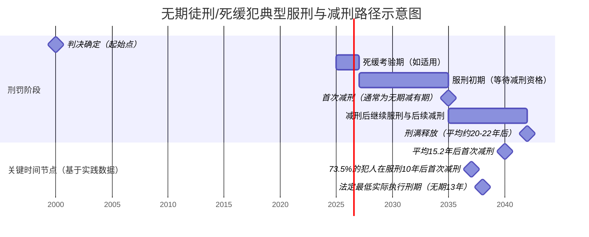

# 中国死刑、死缓及终身监禁的量化分析与废除死刑前景评估研究报告
## 1 研究背景、意义与方法论

本章旨在确立研究的宏观背景与微观基础。首先，将分析中国死刑制度改革的国际压力与国内动因。其次，阐述本研究在填补中国死刑、死缓及终身监禁系统性量化分析空白方面的学术价值，以及对评估中国刑事政策走向、回应国际社会关切的现实意义。最后，将系统说明本报告的方法论：明确界定核心概念；说明数据主要来源于公开的官方司法统计、工作报告及权威学术研究；阐述研究方法，包括对公开数据的量化趋势分析、基于政策文本的规范分析，以及结合国际比较的推断性评估；并勾勒报告的整体分析框架与潜在局限性。

### 1.1 研究背景：国际趋势与国内改革

中国死刑制度的改革与实践，是在特定的国际与国内双重背景下展开的。

**国际背景方面**，全球范围内限制和废除死刑已成为显著趋势。联合国大会多次通过决议，呼吁各国暂停执行死刑并最终废除死刑，这构成了国际人权领域的主流话语和重要道义压力。国际特赦组织等非政府机构的年度报告持续关注全球死刑执行数量，并将中国列为执行死刑数量最多的国家之一，这使得中国的死刑状况长期受到国际社会的审视与批评。这种外部环境促使中国在参与国际人权对话与合作时，必须面对并回应关于死刑问题的关切。

**国内背景方面**，中国官方确立了“保留死刑，但严格控制和慎重适用死刑”的基本刑事政策，其核心导向是“少杀、慎杀”。这一政策并非停留在宣示层面，而是通过一系列具体的立法与司法改革措施得以贯彻。在立法上，中国通过《刑法修正案》逐步削减了可适用死刑的罪名数量，特别是取消了部分非暴力经济犯罪的死刑。在司法实践中，最为关键的改革是自2007年起将死刑案件的核准权统一收归最高人民法院行使，这一举措极大地统一了死刑适用标准，在实践中显著减少了死刑立即执行的数量。最高人民法院历年工作报告及中国政府发布的《中国的司法改革》白皮书等官方文件，均反复强调并体现了这一限制死刑适用的政策立场与实践努力。

**国际与国内背景的互动**构成了中国死刑制度改革的基本语境。国内“少杀、慎杀”的刑事司法改革，既是对国内社会治理理念变化的反映，也在一定程度上回应了国际社会的普遍关切。理解这种互动关系，是客观评估中国死刑制度现状与未来走向的基础。

### 1.2 研究意义：学术价值与现实关切

本研究兼具重要的学术价值与现实意义。

**在学术价值层面**，目前对中国刑罚体系中死刑、死缓、无期徒刑（含终身监禁）的公开、系统性量化研究仍相对匮乏。官方通常不公布详细的年度死刑执行具体数字，相关数据散见于各类工作报告、学术研究及媒体报道中，且统计口径不一。本研究致力于系统收集、整合这些碎片化的公开信息与数据，尝试构建一个相对连贯的量化分析框架，以描绘这些关键刑罚的适用规模、内部结构及其随时间变化的趋势。这有助于填补该领域实证研究的空白，为法学界提供基于数据的讨论基础。

**在现实关切层面**，本研究具有双重意义。首先，对于国内刑事政策制定与司法实践而言，通过对死刑及其替代刑罚（死缓、无期徒刑）的量化考察，可以更客观地评估“少杀、慎杀”政策在司法实践中的实际效果，检视刑罚执行环节（如减刑、假释）的规范化程度，从而为未来进一步完善刑罚体系、优化刑罚执行效能提供参考。其次，对于国际对话而言，基于事实与数据的分析，有助于超越简单的意识形态争论，以更理性、更专业的方式回应国际社会对中国死刑状况的关切，促进建设性的交流与合作。

### 1.3 核心概念界定与数据来源

为确保研究的准确性与一致性，必须对核心概念进行清晰界定，并明确数据来源。

**核心概念界定如下：**
1.  **死刑立即执行**：指经最高人民法院核准后，对罪犯依法剥夺生命权的刑罚。
2.  **死刑缓期二年执行（死缓）**：指对于应当判处死刑但不是必须立即执行的犯罪分子，在判处死刑的同时宣告缓期二年执行。在二年缓期执行期间，若无故意犯罪，二年期满后减为无期徒刑；若有重大立功表现，二年期满后减为二十五年有期徒刑；若故意犯罪，情节恶劣的，报请最高人民法院核准后执行死刑。
3.  **无期徒刑**：指剥夺犯罪分子终身自由，实行强制劳动改造的刑罚。在实际执行中，符合减刑条件的无期徒刑罪犯，经过一次或几次减刑后，实际执行的刑期不能少于十三年。
4.  **“终身监禁”**：在中国现行法律框架下，并非一个独立的刑种。它特指《刑法修正案（九）》针对犯贪污、受贿罪，犯罪数额特别巨大，并使国家和人民利益遭受特别重大损失，被判处死刑缓期执行的犯罪分子，人民法院根据犯罪情节等情况可以同时决定在其死刑缓期执行二年期满依法减为无期徒刑后，**终身监禁，不得减刑、假释**。这是一种特殊的、极其严厉的死缓执行方式。

**数据来源说明：**
本报告的数据与分析主要基于以下公开渠道：
1.  **官方司法统计与报告**：包括最高人民法院每年向全国人大所作的工作报告（其中有时会提及死刑复核案件数量或“确保死刑只适用于极少数罪行极其严重的犯罪分子”等定性表述）、最高人民法院发布的《中国法院的司法改革》白皮书系列、国务院关于刑罚执行工作情况的报告，以及最高人民检察院关于刑罚执行监督工作的报告。
2.  **国家统计出版物**：如国家统计局发布的《中国统计年鉴》中关于“检察机关处理申诉案件情况”、“法院审理刑事案件情况”的宏观数据。
3.  **权威学术研究**：中国知网（CNKI）收录的法学核心期刊论文中，由知名学者基于有限公开数据或内部资料进行的分析与估算，这些研究提供了重要的参考视角和数据线索。
4.  **国际组织报告**：如国际特赦组织（Amnesty International）的年度死刑报告，其关于中国死刑数量的估算虽与中国官方立场不同，但可作为外部观察的参考。

**需要明确指出的是**，由于中国不系统公布死刑执行的具体数字，本报告所使用的数据多为间接估算、趋势性描述或基于政策文本的推断。官方数据通常具有聚合性和选择性披露的特点，例如，最高人民法院工作报告可能提及“核准死刑案件”的数量，但未必区分立即执行与死缓，也未必涵盖所有最终执行环节。这是本研究面临的基础性数据局限。

### 1.4 研究方法、分析框架与局限性

本研究采用多元方法，构建系统的分析框架，并坦诚其局限性。

**研究方法主要包括：**
1.  **量化趋势分析**：对能够获取的公开数据（如死缓判决比例、无期徒刑罪犯占比、减刑假释案件纠正数量等）进行整理、对比与趋势推断，以数量化的方式描述中国死刑及其替代刑罚的适用规模与结构变化。
2.  **政策文本分析**：深入解读《中华人民共和国刑法》及其修正案、最高人民法院发布的关于死刑复核、减刑假释等方面的司法解释与指导意见，分析立法与司法政策的意图、演变轨迹及其对实践可能产生的影响。
3.  **比较与推断分析**：在数据允许的范围内，进行刑罚内部结构的比较（如死刑立即执行与死缓的比例），并结合国际废除死刑的普遍路径（如先事实废止再法律废止），对中国死刑制度的未来走向进行审慎的推断性评估。

**报告的整体分析框架**遵循从现状描述到前景评估的逻辑：
*   **现状量化与制度剖析**：首先，基于现有数据量化分析死刑、死缓的规模与趋势（第三章），并深入考察无期徒刑及减刑实践的实际情况（第四章）。
*   **政策执行效能评估**：其次，结合刑罚执行层面的最新改革与数据，评估政策导向与实际执行效果的一致性（第五章）。
*   **改革路径与前景预测**：最后，综合以上分析，系统探讨中国废除死刑的可能路径、影响因素，并对时间表进行审慎评估（第六章）。

**本研究的潜在局限性：**
1.  **数据透明度限制**：如前所述，关键刑罚（尤其是死刑立即执行）的精确数据不可获得，研究很大程度上依赖于估算、间接数据和定性描述，这影响了分析的精确度。
2.  **政策解读的推断性**：对政策效果和未来走向的分析，是基于公开信息和逻辑推演得出的，可能与实际决策层的考量存在差异。
3.  **社会文化因素量化困难**：民意基础、政治考量等影响死刑存废的深层社会文化因素难以量化，本研究主要将其作为定性背景和影响因素进行讨论。
4.  **数据的时效性与完整性**：所引用的公开数据存在一定的滞后性，且不同来源的数据可能存在统计口径的差异，需要进行谨慎的交叉验证与整合。

尽管存在这些局限性，但通过系统整合现有公开信息，本研究仍旨在提供一个相对全面、基于事实的分析视角，以增进对中国当前刑罚体系中关键问题的理解。

## 2 法律框架与核心概念：死刑、死缓与无期徒刑

本章旨在系统梳理中国现行刑法中关于死刑（立即执行与缓期二年执行）、无期徒刑的法律框架与核心概念，为后续量化分析奠定精确的法律基础。本章将严格依据《中华人民共和国刑法》及相关司法解释，界定各刑罚的法定适用条件、法律后果及在刑罚体系中的定位，并重点剖析死缓制度的独特减刑规则及“终身监禁”的特殊含义。

### 2.1 死刑的法定适用条件与绝对排除情形

根据《中华人民共和国刑法》第四十八条，死刑（包括死刑立即执行与死刑缓期二年执行）的适用具有严格的法定门槛。其核心前提是“罪行极其严重”[^1]。这一标准要求同时满足主客观两方面的条件：在主观上，犯罪人的主观恶性极大，犯罪故意极其恶劣；在客观上，犯罪行为的社会危害性达到极其严重的程度，通常表现为手段残忍、后果严重、性质恶劣、社会影响极坏[^2][^1]。例如，故意杀人案中持械连续杀害多人，或以焚烧、活埋等极端手段致人死亡，可能被认定为“罪该处死”[^2]。

**然而，即便行为符合“罪行极其严重”的标准，法律也明确规定了绝对排除死刑适用的情形，这构成了“少杀、慎杀”政策的法律红线。** 根据《刑法》第四十九条，犯罪的时候不满十八周岁的人和审判的时候怀孕的妇女，不适用死刑[^3][^1]。对于未成年人，这一规定具有强制性和绝对性，无论其犯罪性质多么严重，只要实施犯罪行为时未满十八周岁，就一律排除死刑（包括死刑立即执行和死刑缓期执行）的适用[^3]。这一规定也与我国加入的《儿童权利公约》所承担的国际义务相衔接[^3]。此外，审判的时候已满七十五周岁的人，一般不适用死刑，但以特别残忍手段致人死亡的除外[^1]。

这些法定排除情形清晰地界定了死刑适用的人群边界，是评估中国死刑适用规模与趋势时必须首先考虑的法律前提。**它们表明，中国的死刑制度在立法层面已经对特定群体（未成年人、孕妇、绝大多数老年人）实现了“事实上的废除”，这是理解中国死刑改革渐进性的重要起点。**

### 2.2 死缓制度的双重门槛、法律后果与特殊执行方式

死刑缓期二年执行（简称“死缓”）是我国刑法中一项独特的刑罚制度，它构成了连接死刑立即执行与长期自由刑的关键枢纽。其适用需满足比死刑立即执行更为复杂的双重门槛。

首先，死缓的适用对象必须是“应当判处死刑”的犯罪分子，即其罪行必须达到“罪行极其严重”的标准[^2]。在此基础上，还必须满足第二个核心要件：“不是必须立即执行”[^2][^4]。**“非必须立即执行”是死缓制度发挥“少杀”政策功能的核心裁量空间。** 司法实践中，常见的“非必须立即执行”情形包括：犯罪后自首或立功；在共同犯罪中系非首要分子；案件起因中存在被害人过错；犯罪时智力发育不全，或审判时已满七十五周岁（非以特别残忍手段致人死亡）等[^2]。这些从宽情节的存在，使得法院可以对本应判处死刑的罪犯给予一个为期两年的考验期。

死缓的“两年考验期”是决定罪犯最终命运的关键阶段，根据《刑法》第五十条，其法律后果明确分为三种路径[^2][^4]：

1.  **减为无期徒刑**：在死刑缓期执行期间，如果没有故意犯罪，二年期满以后，减为无期徒刑[^2][^4][^5]。
2.  **减为二十五年有期徒刑**：如果确有重大立功表现，二年期满以后，减为二十五年有期徒刑[^2][^4][^5]。
3.  **执行死刑**：如果故意犯罪，情节恶劣的，报请最高人民法院核准后执行死刑[^2][^5]。

为了进一步实现刑罚的精准化与“严而不厉”，法律还为特定类型的死缓犯设置了更为严厉的特殊执行方式，大幅提高了其实际服刑的最低年限。

| 特殊执行方式 | 适用对象 | 法律后果（实际执行刑期下限） | 法律依据 |
| :--- | :--- | :--- | :--- |
| **限制减刑** | 1. 被判处死刑缓期执行的**累犯**。 2. 因**故意杀人、强奸、抢劫、绑架、放火、爆炸、投放危险物质或者有组织的暴力性犯罪**被判处死刑缓期执行的犯罪分子。 | - 缓期执行期满后**依法减为无期徒刑**的，实际执行刑期**不能少于二十五年**。 - 缓期执行期满后**依法减为二十五年有期徒刑**的，实际执行刑期**不能少于二十年**。 | 《刑法》第五十条第二款[^4][^5] |
| **终身监禁** | 因**贪污、受贿**罪，犯罪数额特别巨大，并使国家和人民利益遭受特别重大损失，被判处死刑缓期执行的犯罪分子。 | 死刑缓期执行二年期满依法减为无期徒刑后，**终身监禁，不得减刑、假释**。 | 《刑法》第三百八十三条第四款[^2][^6] |

**限制减刑制度体现了在总体限制死刑的背景下，对极少数人身危险性高、罪行特别严重的暴力犯罪和累犯的“精准从严”。而“终身监禁”则是针对特定职务犯罪设置的、比一般死缓更为严厉的特殊执行方式，其严厉性体现在彻底剥夺了减刑和假释的可能性。**

### 2.3 无期徒刑的定位、减刑规则与“终身监禁”辨析

无期徒刑是剥夺犯罪分子终身自由，实行强制劳动改造的刑罚，是我国刑罚体系中介于有期徒刑和死刑之间的主刑[^6]。它主要适用于那些罪行严重，但根据案件具体情况（如存在法定或酌定从宽情节）不必判处死刑（包括死缓）的犯罪分子[^6]。

**需要明确的是，无期徒刑的“终身”是法律上的名义刑期，在实际执行中，绝大多数罪犯可以通过减刑制度获得提前释放的机会。** 根据《最高人民法院关于办理减刑、假释案件具体应用法律的规定》，无期徒刑罪犯在刑罚执行期间，如果确有悔改表现或者立功表现的，执行二年以上，可以减刑[^6]。减刑后的刑期根据表现有所不同，例如，确有悔改表现或有立功表现的，可以减为二十二年有期徒刑[^6]。

**最关键的规定是，无期徒刑罪犯经过一次或几次减刑后，其实际执行的刑期不能少于十三年，起始时间自无期徒刑判决确定之日起计算**[^6]。这意味着，对于一名被判处无期徒刑的罪犯，其最终在监狱内实际服刑的时间存在一个法定的最低保障线——不少于十三年，但通过多次减刑，其实际刑期通常远高于此下限。这一规则是后续量化分析无期徒刑犯实际服刑期的基础。

最后，必须再次对“终身监禁”这一概念进行辨析，以澄清常见的误解。在中国现行法律体系中，“终身监禁”**并非一个独立的刑种**[^6]。如前文所述，它特指《刑法》第三百八十三条针对特大贪污、受贿罪死缓犯规定的一种特殊执行方式：即在其死刑缓期执行二年期满依法减为无期徒刑后，**终身监禁，不得减刑、假释**[^6]。这与许多国家将终身监禁作为独立刑种，且可能允许假释的情况有本质区别。**因此，本报告后续讨论的“终身监禁”，均严格限定在这一特定的法律语境和适用范围之内，它代表了中国当前刑罚体系中对极少数特定犯罪最严厉的自由刑惩戒形态。**

## 3 死刑与死缓的规模、结构与趋势分析

本章旨在基于现有公开资料，对中国死刑（包括立即执行与缓期执行）的适用规模、内部结构及长期趋势进行量化分析。本章将首先利用估算数据，结合严重暴力犯罪案件下降的趋势，勾勒死刑判决与执行的宏观数量级与历史变化。其次，重点分析死刑内部结构中立即执行与死缓的比例关系，以验证“少杀、慎杀”刑事政策在司法实践中的实际效果。最后，本章将评估死缓制度的广泛适用所带来的长期影响，即死缓犯的累计规模及其对监狱系统构成的深刻影响。

### 3.1 死刑判决与执行的宏观规模与历史趋势

中国死刑判决与执行的精确年度数据属于国家机密，未予系统公开。因此，对宏观规模的分析必须基于有限的估算数据、官方趋势性描述以及历史改革背景进行综合推断。

**当前数量级估算**：根据现有公开资料，2025年中国死刑判决数量估算约为100人左右[^4]。这一数据提供了一个观察当前死刑适用规模的参考基点，表明在严格的政策控制下，被判处死刑（包括立即执行与死缓）的罪犯数量已处于一个相对较低的水平。

**长期下降趋势显著**：死刑判决与执行数量的下降，并非孤立现象，而是与中国严重暴力犯罪发案率持续走低的宏观治安形势及明确的刑事政策改革相伴随。最高人民法院工作报告显示，2024年，全国法院审结故意杀人等严重暴力犯罪案件4.9万件5.8万人，同比下降5.8%，较10年前下降28.7%[^7]。严重暴力犯罪基数的减少，自然降低了适用死刑的前提条件。同时，公安机关的数据也印证了这一趋势，2024年中国每10万人命案发生数已降至0.44起[^8]。**犯罪率的显著下降，为“少杀、慎杀”政策的贯彻提供了坚实的社会基础**。

这一下降趋势是近二十年来一系列死刑制度改革的直接结果。其关键节点包括：2007年最高人民法院统一收回死刑核准权，从程序上严格了死刑适用标准；2011年及2015年的《刑法修正案》相继废除了22个非暴力犯罪的死刑罪名[^9]；司法实践中持续强调“宽严相济”和“确保死刑只适用于极少数罪行极其严重的犯罪分子”。国际观察也注意到了这一趋势，例如国际特赦组织的报告指出中国的死刑执行人数“逐年稳住”或“趋势下降”[^4]。因此，尽管缺乏精确的年度对比数据，但综合多方信息可以明确得出结论：**中国死刑的判决与执行数量已呈现长期、显著的下降趋势，这体现了立法与司法改革在控制死刑适用上的持续努力和实际成效。**

### 3.2 死刑内部结构：立即执行与死缓的比例关系分析

在死刑判决总量被严格控制的同时，其内部结构发生了根本性变化，死刑缓期二年执行（死缓）已取代死刑立即执行，成为死刑适用的最主要形式。这一结构性转变是“少杀、慎杀”政策最核心的司法实践体现。

**死缓适用率占据绝对主导地位**：量化数据显示，在应当判处死刑的案件中，绝大多数最终以死缓方式执行。例如，在故意杀人罪这一典型的死刑适用罪名中，2021年的死缓适用率高达82.21%，远超死刑立即执行[^4]。另一分析也指出，在司法实践中，死缓的适用比例远高于死刑立即执行，约在73.3%左右[^10]。尽管不同统计来源或时间点的数据略有差异，但都共同指向一个明确结论：**死缓已成为中国死刑判决的常态，而死刑立即执行则成为极其例外的特殊情形。** 这标志着司法实践已将“不是必须立即执行”作为对绝大多数罪该处死罪犯的裁量标准，死缓制度实质上发挥了“死刑立即执行的安全阀”作用。

**死刑立即执行的保留逻辑与政策平衡**：在死缓成为主流的同时，死刑立即执行并未被废除，而是在极端案件中予以保留，以体现刑罚的威慑力和对“罪大恶极”者的最严厉谴责。最高人民法院在工作报告中明确，对“挑战法律和道德底线的罪大恶极者，坚决依法从严从重从快惩处”，并列举了“对驾车冲撞行人的樊维秋、校园持刀行凶的徐加金等判处死刑”的案例[^7]。这揭示了当前死刑政策的内在平衡：**在整体上通过死缓实现“慎杀”和限制死刑实际执行的同时，对极少数社会危害性极大、情节特别恶劣、民愤极大的案件，保留并适用死刑立即执行，以实现“严惩”和维护社会公平正义的感知。** 这种“以死缓为主、以立即执行为例外”的结构，是中国现阶段死刑制度的鲜明特征。

**死缓制度的多重功能**：死缓的高比例适用不仅是为了减少死刑执行，其制度设计本身还具有多重价值。它构建了死刑与无期徒刑之间的科学刑罚梯度，为存在自首、立功、被害人过错等从宽情节的严重犯罪提供了恰当的量刑空间[^10]。同时，两年的缓期执行期也为可能的司法纠错提供了宝贵的时间窗口，有助于防范冤假错案[^10]。因此，死缓比例的上升，是刑罚精细化、人道化以及司法理性化发展的综合体现。

### 3.3 死缓犯累计规模及其对监狱人口结构的长期影响

死缓制度的大规模适用，在有效控制死刑立即执行数量的同时，也产生了一个重要的累积效应：形成了一个规模庞大的长期服刑人员群体，这对监狱系统的关押结构与改造资源分配产生了深远影响。

**死缓犯已形成超20万人的累积群体**：截至2023年，中国死缓犯的累计数量已经超过20万人[^4]。这一数据揭示了死缓制度运行的长期后果。由于死缓犯在考验期满后，绝大多数将减为无期徒刑或二十五年有期徒刑，并且根据法律规定，其实际执行刑期通常不少于20至25年（对于限制减刑者，刑期下限更高）[^4]，因此，这20余万人构成了监狱系统中刑期最长、管理最复杂的服刑人群之一。

**对监狱人口结构的深远影响**：将死缓犯规模置于中国监狱整体关押人口中考察，其影响更为清晰。中国监狱系统的关押总人数在164万至194万之间（不同统计口径所致）[^4]。以此计算，仅累计的死缓犯群体就可能占到监狱总人口的10%以上（以164万为基数计算约为12.2%）。**这意味着，每十名在押犯中至少有一名是死缓犯或其减刑后的长期犯。**

这一庞大群体对监狱系统的影响是多方面的：
1.  **人口结构老化**：由于刑期漫长，死缓犯群体将长期滞留于监狱，导致监狱内高龄服刑人员比例增加，进而对医疗、照护等资源提出特殊需求。
2.  **管理改造压力**：长期监禁可能带来独特的心理和行为管理挑战，监狱需要投入更多的教育和心理干预资源来维持监管秩序并促进其改造。
3.  **资源配置压力**：长期服刑人员消耗的监管、人力、物资成本远高于短期犯。死缓犯群体的固化，意味着监狱系统需要长期配置相当比例的资源用于应对这一群体。

**结论性洞察**：综上所述，中国的死刑适用呈现出 **“总量严控、结构转换、后果累积”** 的鲜明特征。死刑判决数量在低位徘徊且持续下降，内部结构上死缓已成为绝对主导形式，这有力验证了“少杀、慎杀”政策的实际执行效果。然而，政策成功的同时也带来了新的结构性课题：**死缓制度作为限制死刑的“转换器”，已将大量的极刑判决转化为长期自由刑，从而在监狱系统内部塑造了一个规模可观、刑期漫长的特殊服刑人口板块。** 这要求刑罚执行体系必须在确保惩罚效能的同时，不断提升对长期犯的管理科学化和改造专业化水平，以应对由此产生的长期挑战。

## 4 无期徒刑（终身监禁）与减刑实践的量化考察

本章旨在基于《中国刑罚执行状况白皮书》（2025）等官方公开资料，对无期徒刑（含特殊“终身监禁”）罪犯的规模、结构及其减刑实践进行系统量化分析。首先，利用司法部2025年数据界定无期徒刑罪犯的绝对规模与相对占比，分析其在刑罚体系中的结构性影响。其次，依据《刑法》及司法解释，详细拆解无期徒刑、死缓减为有期徒刑的实际最低执行刑期规则，并利用司法部实证数据评估“减刑率”的实际控制水平。最后，结合最高人民法院关于严格审查“三类罪犯”减刑假释的最新规定，对比分析不同犯罪类型在减刑机会与幅度上的差异待遇，揭示政策执行中的精准化与约束机制。

### 4.1 无期徒刑罪犯的规模、占比与监狱人口结构

本部分将基于2025年官方发布的《中国刑罚执行状况白皮书》及司法部监狱管理局数据，对无期徒刑罪犯的规模及其在监狱总人口中的结构位置进行量化界定。

截至2025年3月，全国服刑人员中无期徒刑罪犯占比约为3.8%，总数接近7万人[^11]。这一数据在2025年2月底的另一份报告中略有差异，显示无期徒刑服刑人员约占4.7%，总数约6.8万人[^12]。**这种细微的波动（3.8%-4.7%）可能源于统计时点、样本范围或定义口径的差异，但共同指向一个明确的规模量级：无期徒刑罪犯总数在6.8万至7万人之间，在监狱总人口中属于占比较小但绝对数量不容忽视的群体。**

将这一规模置于中国监狱系统的整体关押人口中进行考察，其结构性意义更为清晰。中国监狱关押总人数在164万至194万之间[^4]。以此计算，无期徒刑罪犯在监狱总人口中的实际比例约为3.6%至4.3%（以7万人/194万人和6.8万人/164万人为计算边界）。**尽管占比不高，但考虑到其“终身自由刑”的严厉名义和实际漫长的服刑期，这一群体构成了监狱系统中管理要求最高、改造难度最大、资源消耗最持久的服刑板块之一，是监狱工作的重点和难点[^11][^12]。**

为了更直观地展示无期徒刑罪犯在监狱人口结构中的位置及其与整体规模的关系，以下表格整合了关键量化数据：

| 指标 | 数据范围/数值 | 数据来源与说明 |
| :--- | :--- | :--- |
| **监狱关押总人数** | 164万 - 194万人 | 不同统计口径，可能包含已决犯与未决犯[^4]。 |
| **无期徒刑罪犯总数** | 6.8万 - 7万人 | 基于2025年3月及2月底的官方数据[^11][^12]。 |
| **无期徒刑罪犯占比** | 约3.8% - 4.7% | 占全国服刑人员的比例[^11][^12]。 |
| **计算得出的实际占比范围** | 约3.6% - 4.3% | （无期徒刑总数 / 监狱总人数）的估算区间。 |
| **结构性定位** | 长期刑、重刑犯核心群体 | 服刑期限长，管理改造要求高，资源消耗持久[^11][^12]。 |

**这一量化分析揭示了一个关键洞察：在“少杀、慎杀”政策下，死刑（立即执行）的适用被极度限缩，而作为重要替代刑罚的无期徒刑及其前身——大规模适用的死缓制度（缓期执行期满后多减为无期徒刑），共同塑造并维持了一个规模达数万人的长期监禁人口。** 这不仅是刑罚严厉性从生命刑向自由刑转移的体现，也对监狱系统的长期关押能力、分类管理、心理干预和技能培训提出了持续而专业的挑战。

### 4.2 减刑规则解析与实际最低执行刑期量化

无期徒刑及由死缓减刑而来的长期自由刑，其惩戒效力的关键不在于名义刑期，而在于通过减刑制度最终确定的“实际执行刑期”。本部分将系统解析相关法律规则，并利用司法实践数据，对实际服刑期限进行量化考察。

#### 4.2.1 法定最低执行刑期规则解析

中国《刑法》对减刑后的实际执行刑期设置了明确的法定下限，不同刑罚的规则如下表所示：

| 刑罚类型 | 减刑后的法定最低实际执行刑期 | 关键法律依据与说明 |
| :--- | :--- | :--- |
| **无期徒刑** | **不能少于十三年**。自无期徒刑判决确定之日起计算[^13][^14][^15][^16]。 | 根据《刑法》第七十八条，符合减刑条件的无期徒刑罪犯，减刑后实际执行刑期不得少于十三年[^13]。 |
| **死刑缓期执行（一般）** | 情况一：缓期执行期满减为**无期徒刑**的，实际执行刑期**不得少于二十五年**（自死缓判决确定之日起算）[^4][^13]。 情况二：缓期执行期满减为**二十五年有期徒刑**的，实际执行刑期**不得少于二十年**[^4][^13]。 | 根据《刑法》第五十条及第七十八条。需注意，此处的“实际执行刑期”包含了二年死缓考验期。 |
| **死刑缓期执行（限制减刑）** | 针对累犯及特定暴力犯罪被判处死缓的犯罪分子[^4]。 - 减为无期徒刑的：**实际执行刑期不少于二十五年**[^13][^17]。 - 减为25年有期徒刑的：**实际执行刑期不少于二十年**[^13][^17]。 | 由《刑法修正案（八）》增设，体现了对极少数罪行极其严重、人身危险性高的罪犯的“精准从严”[^4]。 |
| **有期徒刑** | 减刑后实际执行的刑期**不能少于原判刑期的二分之一**[^4][^13][^17]。 | 体现了“最高减刑比例不超过50%”的基本原则[^4]。 |

**需要特别强调的是“终身监禁”**：在中国法律中，它并非独立刑种，而是《刑法》第三百八十三条针对因贪污、受贿被判处死缓的特定罪犯规定的一种特殊执行方式，即在其死刑缓期执行二年期满依法减为无期徒刑后，**终身监禁，不得减刑、假释**[^11]。这是目前中国刑罚体系中最严厉的自由刑形态。

#### 4.2.2 实践中的平均服刑期与减刑率量化

法律规定了下限，而司法实践数据则揭示了罪犯实际服刑期的普遍水平。

**平均实际服刑期**：司法部2025年数据显示，无期徒刑罪犯**平均服刑15.2年后获得减为有期徒刑**，之后再服刑5-7年获得释放[^11]。这意味着，**大多数无期徒刑犯的实际总服刑期约为20至22年**，远高于法定的13年最低线，但与社会公众对“终身监禁”的直观印象有较大差距[^11]。

**年度减刑率与首次减刑时间分布**：2024年的实践数据提供了更细致的观察。当年，全国共有4216名无期徒刑犯获得减刑，占当年无期徒刑总人数的**6.2%**[^11]。这表明减刑机会是存在的，但并非普遍或频繁。从首次减刑的时间来看，服刑满10年后首次获得减刑的占73.5%，服刑满13年后的占18.7%，服刑满15年及以上的占7.8%[^11]。**这组数据清晰地表明，无期徒刑犯获得减刑需要经过漫长的服刑期（绝大多数在10年以上），且减刑审批非常审慎，年度减刑比例被控制在较低水平。**

为了综合呈现规则与实践，以下通过一个mermaid时序图来概括一名被判处无期徒刑（或由死缓减为无期徒刑）的罪犯，在理想化且表现良好的情况下的典型服刑与减刑路径：

**上图结合实践数据揭示的核心洞察是：** 中国的无期徒刑及长期刑执行，通过“**法定最低刑期 + 漫长平均服刑期 + 低年度减刑率**”的多重机制，在确保刑罚具备足够严厉性和惩戒效力的同时，又通过减刑制度为罪犯保留了改造自新的希望。这构成了中国当前死刑替代刑罚执行效能的基础逻辑。

### 4.3 减刑实践的规范化评估与“三类罪犯”差异分析

减刑制度的公正与效能，高度依赖于实践的规范化程度。近年来，中国通过司法解释和政策文件，不断收紧减刑、假释的实质条件和程序要求，并对特定犯罪类型实行差异化待遇。

**减刑实践的规范化与实质条件收紧**：减刑不再仅仅依据“认真遵守监规，接受教育改造，确有悔改表现”这一传统标准[^13]。最高人民法院近年来多次强调并修订相关规定，要求办理减刑、假释案件时必须**严格审查罪犯财产性判项（如罚金、没收财产、退赔被害人损失等）的履行情况**[^11]。**这意味着，履行经济惩罚和修复社会关系的能力与意愿，已成为衡量“悔改表现”不可或缺的硬性指标。** 这一规定显著提高了减刑的实质门槛，尤其对经济犯罪和职务犯罪罪犯构成强力约束，旨在防止“花钱买刑”或“权钱交易”，确保减刑的公正性与刑罚的严肃性。

**“三类罪犯”的差异化从严待遇**：在普遍规范化的基础上，政策对“三类罪犯”（职务犯罪、破坏金融管理秩序和金融诈骗犯罪、组织/领导/参加/包庇/纵容黑社会性质组织犯罪）的减刑、假释实施了**更为严格的限制**[^4]。这种差异待遇体现在多个层面：

1.  **更严格的适用条件**：对“三类罪犯”的悔改表现认定标准更高，要求更为严格。
2.  **更低的减刑幅度**：依法减刑时，对其减刑幅度原则上比照同类非“三类罪犯”罪犯从严掌握。
3.  **更长的减刑间隔**：两次减刑之间的时间间隔要求更长。
4.  **更严的审批程序**：其减刑、假释案件往往需要经过更高级别或更严格的审查程序。

**这种差异化政策揭示了当前减刑实践中的一个核心原则：在通过减刑激励普通罪犯积极改造的同时，对犯罪性质特殊、社会危害性大、或利用权力、金钱影响刑罚执行风险高的“三类罪犯”，保持高度警惕和“精准从严”的立场。** 这不仅是基于犯罪类型的风险管控，也是回应社会公平正义关切、维护司法公信力的重要举措。

**综合评估**：通过对无期徒刑规模、减刑规则与实践数据的量化考察，可以得出结论：中国的长期自由刑执行体系呈现出 **“规模固化、刑期漫长、减刑审慎、分类从严”** 的特征。死缓制度的大规模适用，源源不断地向无期徒刑群体输送长期犯；而严格的法定最低刑期、高于下限的平均实际服刑期以及较低的年度减刑率，共同保障了替代死刑的刑罚仍具备足够的惩戒力。同时，不断规范化的审查程序和对“三类罪犯”的特别限制，旨在确保减刑实践的公平、公正与透明。**这套复杂的制度安排，是中国在“少杀、慎杀”政策下，平衡刑罚威慑、罪犯改造与社会公正的集中体现，也为评估彻底废除死刑后的刑罚衔接与执行效能提供了现实的参照系。**

## 5 刑罚执行数据透视：政策导向与执行效能

本章基于《国务院关于刑罚执行工作情况的报告》（2025年）及《最高人民检察院关于人民检察院刑罚执行监督工作情况的报告》（2025年）等权威官方资料，对刑罚执行环节的最新政策、监督举措及量化成效进行结构化分析。本章旨在揭示，在“少杀、慎杀”政策导致死刑立即执行数量锐减、死缓和无期徒刑成为主要替代刑罚的背景下，国家如何通过强化刑罚执行环节的规范性与监督刚性，来确保这些长期自由刑的实际惩戒效力，从而为宏观刑事政策的持续深化提供坚实的制度保障。

### 5.1 制度框架与政策导向：全面规范“减假暂”与精准从严

当前中国的刑罚执行工作，是在一个以党的绝对领导为核心、以持续健全的法律制度为框架的严密体系下运行的。根据国务院向全国人大常委会所作的报告，刑罚执行被定位为刑事司法的重要环节，事关国家安全、社会稳定和司法公正，体现国家法治文明程度[^18]。在这一宏观定位下，近年来刑罚执行工作的政策导向呈现出鲜明的制度化和精准化特征，其核心聚焦于对减刑、假释、暂予监外执行（合称“减假暂”）这一关键环节的全面规范。

**首先，制度机制的持续健全为规范执行奠定了法律基础。** 在党中央集中统一领导下，刑罚执行重要基础性法律的立法修法工作取得重大进展[^18]。其中，《监狱法》的修订旗帜鲜明地坚持党的领导，并将党的十八大以来监狱工作的成功实践和经验明确为法律制度予以巩固[^18]。同时，《社区矫正法》的全面实施，进一步健全了监禁刑与非监禁刑相衔接的刑罚执行体系[^18]。公安部、司法部会同最高人民法院、最高人民检察院制定了一系列关于交付执行、刑罚执行变更、监狱民警现场执法、看守所执法的细则与规范，使得刑罚执行工作的制度体系不断完善[^18]。这一系列立法与规范性文件的出台，为严格依法执行刑罚提供了明确的规则指引。

**其次，“惩罚和改造相结合，以改造人为宗旨”的监狱工作方针得到全面落实。** 这一方针强调，监狱工作既是对罪犯执行刑罚，也是对其改造重塑，是真正尊重和保障人权[^18]。国家坚持把教育改造、社区矫正、安置帮教、纠纷化解、法治宣传作为整体来抓，其根本目的在于预防和减少重新犯罪[^18]。这一定位决定了刑罚执行并非单纯的惩罚，而是包含了教育、矫治和回归社会引导的综合性过程，为“减假暂”制度的适用提供了“以改造效果为核心”的价值导向。

**最为关键的政策举措，是对“减假暂”的全面规范与对特定犯罪类型的精准从严。** 报告明确指出，为彰显刑罚执行刚性，国家开展了两项具有里程碑意义的行动：第一，**经党中央批准，在2021年的政法队伍教育整顿中，对“减假暂”案件开展倒查，对问题案件逐一纠正**[^18]。这次系统性倒查确立了规范“减假暂”工作的历史起点和政策决心，旨在从源头上清理历史遗留问题。第二，在此基础上，**依法从严办理职务犯罪、破坏金融管理秩序和金融诈骗犯罪、黑社会性质组织犯罪这“三类罪犯”的“减假暂”案件**[^18]。这项政策的直接目标，是**坚决防止“纸面服刑”、“提钱出狱”问题的发生**[^18]。

**“纸面服刑”和“提钱出狱”的潜在风险，正是侵蚀死刑替代刑罚（死缓、无期徒刑）社会公信力的最大威胁。** 如果被判处死缓或无期徒刑的严重罪犯，能够通过伪造病情、权钱交易等方式不当获得暂予监外执行或大幅减刑，那么这些名义上的长期监禁刑罚的惩戒效力将在实质上被架空。因此，对“减假暂”的全面规范，特别是对“三类罪犯”的精准从严，其政策深意在于 **“筑牢刑罚执行的最后一公里”，确保法院作出的严厉判决能够不折不扣地转化为实际的、足额的监禁处罚，从而维护整个刑罚体系的严肃性和公正性**。这为评估后续监督效能提供了明确的政策基准。

### 5.2 监督效能量化分析：双向纠偏与职务犯罪查处

政策的生命力在于执行，而执行的有效性离不开强有力的监督。最高人民检察院关于刑罚执行监督工作的报告，以海量的量化数据实证揭示了监督机制在确保政策落地、纠正执行偏差方面的实际效能。2021年1月至2025年9月，全国检察机关共依法提出刑罚执行监督纠正意见等**97.1万件**[^19]。这一庞大的基数，充分说明了监督覆盖的广度与日常监督的强度。深入分析这些数据，可以发现监督工作呈现出 **“双向纠偏”的鲜明特征**，即同时着力防止“乱作为”和纠正“不作为”，并以查处职务犯罪作为保障监督刚性的利剑。

**第一，严防“乱作为”：强力整治“纸面服刑”、“提钱出狱”。** 针对刑罚变更执行中可能出现的违法违规问题，检察机关进行了持续高压的监督。2022年以来，检察机关对公安机关、司法行政机关提请或决定、法院裁定“减假暂”不当的，共提出纠正意见**7.5万件**[^19]。这一数据直接反映了监督机关对“减假暂”环节的实质性审查力度。监督的穿透力在具体案例中体现得更为深刻。例如，在河南省检察机关办理的郝某案中，罪犯郝某因贪污、受贿等罪被判处有期徒刑十六年，却通过伪造患有尿毒症终末期等严重疾病的病情，在2013年至2017年间先后5次被决定暂予监外执行[^20]。检察机关通过数据比对发现线索，并深入调查核实其医疗记录，发现其体表无手术疤痕或透析导管痕迹，最终揭穿了其病情完全伪造的真相[^20]。此案背后涉及多名监狱民警、鉴定机构及社会医院人员收受贿赂、伪造材料的犯罪链条，相关9人最终因徇私舞弊暂予监外执行罪被立案侦查并判处有期徒刑[^20]。**此类案例生动表明，监督不仅停留在程序纠错层面，更能深挖并斩断其背后的司法腐败利益链，从根本上压缩“提钱出狱”的空间。**

**第二，纠正“不作为”：依法保障“该减当减”、“该放当放”。** 刑罚执行监督并非一味从严，其另一重要维度是保障法律正确实施，维护罪犯的合法权益。检察机关在监督中同样关注“该减不减”、“该放不放”等消极执行问题[^19][^21]。例如，在社区矫正监督中，对于遵守规定、认罪悔罪、表现良好的社区矫正对象，检察机关致力于帮助他们更好融入社会[^19]。数据显示，2024年1月至11月，全国检察机关共针对“减假暂”提出纠正意见**1.8万余人**，其中包含了依法推动假释适用、纠正不当限制减刑的情况[^21]。同年，检察机关受理假释监督案件**1.4万余人**，同比上升**1.1倍**[^21]。这组数据表明，监督在激励罪犯积极改造、依法适用宽缓政策方面发挥了积极的平衡作用。通过完善调查核实、检察听证等制度，检察机关确保了符合法定条件的罪犯能够依法获得减刑、假释的机会，防止刑罚执行陷入僵化与严苛[^21]。

**第三，查处职务犯罪：清除害群之马，捍卫司法公正底线。** 监督的刚性最终体现在对违法犯罪的零容忍上。2021年1月至2025年9月，检察机关依法查处刑罚执行领域司法工作人员徇私舞弊“减假暂”、滥用职权、玩忽职守、私放在押人员等职务犯罪，共立案侦查**1735人**[^19]。这一数字清晰地传递出国家坚决整治刑罚执行领域司法腐败的坚定决心。查处职务犯罪不仅是对具体违法行为的惩罚，更是对整个刑罚执行队伍的深刻警示，是确保“减假暂”制度在阳光下运行、防止制度被异化的最有力保障。

为了更直观地呈现最高检监督报告中的核心量化成效，以下表格对关键数据进行了整合与分类：

| 监督维度 | 关键指标 | 数据（2021.1 - 2025.9，除非特别说明） | 核心效能解读 |
| :--- | :--- | :--- | :--- |
| **总体监督强度** | 提出各类纠正意见总数 | **97.1万件**[^19] | 反映了刑罚执行监督的常态化、全覆盖特征。 |
| **防止“乱作为”** | 纠正“减假暂”不当 | **7.5万件** (2022年以来)[^19] | 直接针对“纸面服刑”、“提钱出狱”风险，规范刑罚变更执行。 |
| **纠正“不作为”** | 纠正消极执行、违规终结执行等 | **28.4万件**[^19] | 保障财产刑等判决执行到位，维护裁判权威。 |
| | 纠正社区矫正机构不依法履职 | **15.4万件**[^19] | 防范社区矫正对象脱管漏管，同时帮助表现良好者融入社会。 |
| | 受理假释监督案件 | **1.4万余人** (2024年1-11月，同比升1.1倍)[^21] | 显示监督推动依法适用假释，激励改造的积极作用。 |
| **查处司法腐败** | 立案侦查刑罚执行领域职务犯罪 | **1735人**[^19] | 彰显监督刚性，清除侵蚀司法公正的“内鬼”，形成强大震慑。 |
| **保障罪犯权利** | 受理罪犯控告、举报、申诉 | **2.5万件**，监督纠正确有错误的裁判等**3312件**[^19] | 畅通服刑人员权利救济渠道，履行法律监督的纠错职能。 |
| **科技赋能监督** | 运用大数据模型发现线索 | **14.4万条**，监督成案**4.2万件**[^19] | 显示现代科技已深度融入监督实践，提升发现隐性违法问题的能力。 |

**综上所述，刑罚执行监督通过“双向纠偏”和严厉查处职务犯罪，构建了一个立体化、高效能的制约体系。** 它既像一道“防火墙”，竭力阻止刑罚被不当缩短或虚化；又像一把“校准尺”，确保宽严相济的刑事政策在执行环节得到不偏不倚的落实。这套监督体系的有效运行，是刑罚执行政策得以不折不扣贯彻的关键机制保障。

### 5.3 政策一致性评估：执行刚性如何支撑“少杀慎杀”

综合本章前两节的分析，可以清晰地看到一条从宏观政策到微观执行，再通过监督反馈强化政策效果的逻辑闭环。刑罚执行层面的严格化与规范化趋势，并非孤立的技术性改进，而是与“少杀、慎杀”的宏观刑事政策高度协同、互为支撑的系统性工程。

**首先，执行刚性是“少杀慎杀”政策得以持续深化的“信心基石”。** 如前文第三、四章所述，“少杀、慎杀”政策已在司法实践中取得显著成效，表现为死刑立即执行数量被极度限缩，而死缓成为死刑适用的绝对主流。这一政策转向的实质，是将大量原本可能被判处死刑立即执行的罪犯，转而判处死缓或无期徒刑等长期自由刑。然而，社会公众和决策层对减少死刑适用的一个潜在担忧在于：这些替代性的长期监禁刑罚，能否得到**实际、足额、公正**的执行？如果死缓犯和无期徒刑犯可以通过“纸面服刑”或“提钱出狱”等方式提前脱离监禁，那么“少杀”政策的社会效果和正义观感将大打折扣，甚至可能引发公众对司法公正的质疑。因此，**国务院报告强调“坚决防止‘纸面服刑’、‘提钱出狱’问题发生，刑罚执行刚性得以彰显”，以及最高检报告披露的巨量纠正意见和职务犯罪查处数据，正是对国家有能力确保长期自由刑执行刚性的公开宣示和实证回应**。这极大地增强了社会对“少杀”后刑罚体系仍能有效惩罚犯罪、维护正义的信心。

**其次，规范“减假暂”确保了替代刑罚的惩戒效力，为“慎杀”提供了现实可行的司法选项。** “慎杀”意味着法官在裁判时，对于“可杀可不杀”的罪犯，有底气选择不判处死刑立即执行。这种底气的来源，除了法律原则和司法理念，更依赖于一个可信的、严厉的替代刑罚体系。通过对“减假暂”的全面规范，特别是对“三类罪犯”的依法从严办理，国家确保了死缓减为无期徒刑或有期徒刑后，罪犯的实际服刑期能够达到一个足够漫长的年限（如平均20-22年，对于限制减刑者不少于25年）。这使得死缓和无期徒刑不再是一个可能被轻易“打折”的惩罚，而是一个具有实质威慑力和惩戒效果的严厉刑罚。**换言之，执行环节的严格化，夯实了死缓作为“死刑立即执行替代措施”的制度信誉，使得“慎杀”的司法裁量有了坚实可靠的刑罚后盾。**

**最后，监督效能与政策导向形成了强化闭环，共同指向提升国家治理能力与法治文明水平的长远目标。** 最高检的监督数据表明，国家不仅设定了规范“减假暂”的政策目标，更通过强大的法律监督机制确保其落地。这种“政策制定-监督落实-问题纠正”的闭环，体现了国家治理体系的自我完善能力。将刑罚执行置于如此严密的监督之下，其深层意义在于向国内外展示：中国正在致力于构建一个**更加公正、透明、文明**的刑事司法体系。这与“少杀、慎杀”所体现的刑罚人道主义精神和法治进步方向是完全一致的。**因此，刑罚执行数据的透视最终揭示：对执行环节的强化，是通过筑牢制度基础来为更大幅度的刑罚改革（包括进一步限制乃至废除死刑）积累条件、铺平道路。** 只有当死刑的替代刑罚被公认为足够严厉且执行可靠时，进一步削减死刑罪名、直至最终废除死刑的社会共识和政治决策，才具备稳固的现实基础与民意支持。

## 6 废除死刑的路径依赖、影响因素与时间评估

基于前文对死刑、死缓及无期徒刑的量化趋势与制度效能分析，中国废除死刑的进程已呈现出清晰的轨迹，但其最终实现将是一个复杂且长期的系统工程。本章将系统探讨这一进程的潜在路径、关键制约因素及时间前景。综合现有政策文本、学术观点与社会条件，可以明确：**中国的死刑废除遵循一条清晰的“渐进式”道路，其进程受到刑事政策连续性、复杂的民意基础、犯罪率变化、司法执行能力及国际压力等多重因素的交织影响，任何时间表的预测都需建立在审慎推断与多情景分析的基础之上，其长期性与高度情境依赖性是核心特征。**

### 6.1 渐进式废除的可能路径：从“限制”到“事实废止”再到“法律废除”

中国死刑制度的改革并非追求一蹴而就的激进变革，而是呈现出明确的“严格限制、逐步减少”的立法与司法趋势[^22]。基于此，并结合刑法学界的普遍共识，中国废除死刑的可能路径可以清晰地勾勒为三个循序渐进的阶段：持续立法削减、司法实践达成事实废止、最终完成法律废除。

**第一阶段：持续立法削减罪名，压缩死刑适用范围。** 这是当前正在推进且已被实践证明可行的路径起点。其核心策略是优先取消社会危害性相对有限、国际共识较强的罪名的死刑。2011年《刑法修正案（八）》取消13个非暴力经济犯罪死刑，以及2015年《刑法修正案（九）》再取消9个罪名的死刑，正是这一路径的典范[^22]。未来，这一路径将继续深化。学界主流观点认为，下一步应争取**把所有的非暴力犯罪，比如经济性犯罪废止完，同时把非致命的暴力犯罪也要逐步废止**[^23]。这一阶段高度依赖立法机关的持续行动与政治决断，其推进速度直接决定了死刑罪名“存量”的消减进度。

**第二阶段：司法实践达成“事实上的废止”，使死刑立即执行名存实亡。** 这是连接立法削减与最终法律废除的核心枢纽，也是当前最具现实基础的路径。其关键在于在保留死刑法律条文的前提下，通过司法裁量将死刑立即执行的适用压缩至近乎为零。如前文第三章所述，死缓适用率在故意杀人等核心罪名中已超过80%，这标志着司法实践已大幅倾向于“非必须立即执行”的认定[^22]。**这条路径的终点是使死刑立即执行在司法判决中成为极其罕见的例外，形成“事实上的废除”状态。** 这一过程并非被动等待，而是有积极的制度创新作为支撑。例如，针对贪污贿赂犯罪，《刑法修正案（九）》设立的“终身监禁”制度，被实务界解读为一种“从司法上尽量减少或者基本不适用死刑”的技术性替代方案，为在立法保留死刑的前提下实现司法上的实质废除铺平了道路[^24]。这表明，通过完善死缓及其配套执行制度（如限制减刑、终身监禁），可以极大地增强司法系统“慎用”乃至“不用”死刑立即执行的底气与能力。

**第三阶段：最终完成法律上的全面废除。** 这是渐进式改革的终极目标。当死刑罪名经过多轮立法削减所剩无几，且死刑立即执行在司法实践中已长期绝迹，社会公众对以长期自由刑（如不得减刑假释的终身监禁）替代极刑的刑罚体系产生广泛认同时，通过修改《刑法》正式废除所有死刑罪名的社会条件与政治条件便趋于成熟。正如著名刑法学家赵秉志教授所明确指出的：“**中国最终要全部废止死刑，我不赞成以后留一些死刑。**”[^23] 这代表了法学界对于改革最终方向的清晰共识。然而，从“事实废止”到“法律废除”的跨越，需要更长时间的社会观念沉淀与政治共识凝聚，其转换条件最为严苛。

综上所述，中国的死刑废除路径是一条**立法与司法双轮驱动、以司法实践引领立法变革**的渐进之路。其演进逻辑并非简单地取消法条，而是通过不断抬高死刑立即执行的司法适用门槛，同时夯实替代刑罚的执行效能，逐步完成死刑实际功能的替代与社会心理的迁移。

### 6.2 关键影响因素的多维评估：政策、民意、犯罪率与国际压力

废除死刑的进程并非在真空中进行，其速度与形态受到一系列内外因素的深刻制约与塑造。对这些因素进行系统评估，是理解中国死刑改革复杂性的关键。

**第一，刑事政策的连续性与内在平衡。** “少杀、慎杀”作为一项基本刑事政策，是当前限制与减少死刑适用的最核心驱动力[^25]。其长期稳定与深化，是废除死刑得以持续推进的根本保障。然而，这项政策在实践中必须与“宽严相济”的总体政策以及“依法严惩严重犯罪”的社会诉求取得平衡。例如，对“挑战法律和道德底线的罪大恶极者”，司法机关依然强调“坚决依法从严从重从快惩处”并适用死刑立即执行。**这种“以死缓为绝对主流，但保留对极少数案件适用死刑立即执行”的政策平衡术，在有效控制死刑总量的同时，也意味着废除进程的最终完成需要突破对极端个案的政治与社会心理依赖。** 任何因重大恶性犯罪引发的社会安全焦虑，都可能导致政策在“慎杀”与“严惩”之间出现阶段性回调，从而延缓进程。

**第二，民意基础的双重性、异质性及其缓慢演化。** 民意是影响死刑存废最深刻的社会心理因素，但其表现远非“支持”或“反对”那么简单。卢建平教授的研究精辟地指出，中国当前关于死刑的民意具有显著的“异质性”[^26]。这种异质性体现在两个层面：首先，在宏观立法层面，普遍的民意似乎反对废止死刑；然而在微观司法层面，针对具体个案所表达的民意“基本上都是要求枪下留人、免处死刑的”[^26]。其次，民众对宏观死刑政策的信息知悉不足，关注度低，但对特定区域内发生的、或与其有关系的司法个案关注度高、表达直接[^26]。这种割裂状态背后，是传统“杀人偿命”、“罪大恶极，死有余辜”的报应正义观念的深远影响[^22]。**因此，民意并非铁板一块，它既构成改革的阻力，也蕴含着推动“慎杀”的积极力量。民意的转变不是一个线性过程，而是随着法治教育、冤错案披露、以及替代刑罚公信力的建立而缓慢演化，其速度是决定改革步伐的关键变量。**

**第三，犯罪率态势与司法系统执行能力。** 社会治安状况是死刑存废讨论的现实背景。如前文所述，中国严重暴力犯罪案件数量呈持续下降趋势，这为减少对死刑的依赖提供了客观有利条件。一个稳定的低犯罪率社会环境，能够降低公众对死刑威慑力的心理需求，为改革创造宽松氛围。然而，与之同等重要的是司法系统的执行能力。彻底废除死刑的前提是，公众相信无期徒刑、终身监禁等替代刑罚能够被**足额、公正、不可规避地执行**。当前，无期徒刑在实践中存在“有期化”倾向，即通过减刑、假释，实际服刑期可能显著缩短，这削弱了其作为死刑替代措施的威慑力与公信力[^27]。尽管国家已通过规范“减假暂”、设立不得减刑假释的终身监禁制度来应对此问题，但能否在整个刑罚执行体系中普遍建立起足以替代死刑的、高度可信的长期监禁效能，是决定社会能否接受最终废除的关键技术性因素。

**第四，国际人权公约压力与对外对话。** 全球范围内限制与废止死刑已是明显趋势，截至2009年，超过三分之二的国家和地区已在法律上或事实上废止了死刑[^25]。中国作为负责任的大国，积极参与国际人权对话，其国内的死刑改革进程不可避免地受到这一国际潮流的影响。顺应限制与废止死刑的国际趋势，被视为刑罚人道化发展的共识[^25]。然而，中国的改革路径清晰地表明，其首要驱动力是**内生性的**，是基于本国社会发展阶段、治理需求与文化传统的主动调整，而非对外部压力的简单妥协。国际压力更多是作为一种背景性、促进性的因素存在，改革的节奏与具体形式主要由国内因素决定。

### 6.3 时间表预测与情景分析：基于专家观点与趋势数据的审慎推断

对中国彻底废除死刑的时间表进行预测，必须建立在整合权威专家观点、分析现有趋势数据，并充分考虑各种不确定性的基础之上。任何预测都应是区间性的、情景化的，而非一个精确的日期。

**首先，权威专家的预测共同指向一个长期的、以数十年为尺度的前景。** 多位重量级学者和专家的观点为时间评估提供了重要参考：
*   **李步云教授（人权专家）** 预测：“我认为正常情况下，起码在未来**20至30年**可能废除死刑。”[^28]
*   **魏东教授（刑法学者）** 在讨论《刑法修正案（九）》时提及，有专家称“**最快30年**废除所有死刑”[^29]。
*   **赵秉志教授（中国刑法学研究会会长）** 指出，对于致命性暴力犯罪的死刑废止，“怎么也得**几十年的时间**”[^23]。

这些观点虽然表述略有差异，但共同勾勒出一个大致的时间范围：**从现在（以2025年为基准）起算，大约需要20至50年，甚至更长的时间，才有可能实现法律上的全面废除。** 其中，21世纪40年代中期至50年代（即2040-2050年代）是一个被多次提及的潜在时间窗口。

**其次，可以基于渐进路径构建一个粗略的阶段性时间框架。** 结合前文分析，一个可能的演进时间线如下表所示：

| 阶段 | 大致时间范围（估算） | 核心任务与标志 | 关键依赖条件 |
| :--- | :--- | :--- | :--- |
| **深化立法削减与司法限缩** | 2025年 - 2035年 | 1. 立法上进一步取消剩余非暴力犯罪及部分非致命暴力犯罪的死刑。 2. 司法上将死刑立即执行的比例压缩至极低水平（如个位数或更低），死缓适用率接近100%。 3. “终身监禁”等替代制度的适用范围与执行刚性得到进一步验证与巩固。 | 政策连续性；犯罪率保持低位；司法执行能力持续提升。 |
| **实现并巩固“事实废止”** | 2035年 - 2045年 | 1. 死刑立即执行在司法实践中长期（如连续多年）为零或接近为零，形成稳定的“事实废止”状态。 2. 社会对以长期自由刑替代极刑的刑罚模式形成广泛接受。 3. 就进一步削减乃至最终废除死刑的法律条文展开深入学术与公众讨论。 | 社会观念显著转变；替代刑罚体系公信力牢固；政治领导层形成明确共识。 |
| **推动立法最终废除** | 2045年及以后 | 1. 启动并完成《刑法》修订，正式废除所有死刑罪名。 2. 建立完善的、与废除死刑相适应的最高等级自由刑执行与监督体系。 | 强大的社会共识与民意支持；成熟的政治决策时机。 |

**最后，必须进行多情景分析以应对未来的不确定性。** 基于对影响因素的评估，未来可能出现以下几种典型情景：

1.  **稳步推进情景（基准情景）**：国内“少杀、慎杀”政策保持稳定连贯，严重犯罪率持续处于低位，司法执行能力稳步增强，社会观念随着法治进步而逐步理性化。在此情景下，废除进程最有可能沿着上述阶段性时间框架演进，在21世纪中叶前后实现法律上的全面废除。

2.  **滞后与反复情景**：如果未来发生特别恶劣、引起全国性公愤的系列暴力犯罪，可能强烈刺激传统的报应民意，导致“严打”思维回潮，司法政策阶段性收紧，死刑立即执行数量出现反弹。立法削减进程也可能因此停滞。在此情景下，废除进程将被显著拉长，可能超出50年的范围，且路径更为曲折。

3.  **加速突破情景**：如果出现重大的政治决断，将废除死刑明确为国家法治文明建设的标志性目标，并配以强大的舆论引导和制度保障；或者中国在国际舞台上因死刑问题承受前所未有的压力并转化为内部改革动力。在此情景下，立法削减的步伐可能加快，“事实废止”到“法律废除”的转换期可能缩短，最终废除的时间点可能提前至2040年之前。

**综合而言，对中国彻底废除死刑的时间评估必须持高度审慎的态度。** 基于当前趋势和专家共识，一个相对合理的推断是：这是一个需要**以数十年为单位来度量的长期目标**，其最终实现很可能在21世纪中叶前后。然而，这一进程的最终时间表并非由单一因素决定，而是国内政策、社会观念、犯罪态势与国际环境复杂互动的结果，具有显著的不确定性。可以确定的是，**“逐步限制、司法先行、最终废除”的渐进式路径，将是中国死刑制度改革最可能遵循的内在逻辑。**

## 7 结论、政策建议与研究展望

本章旨在系统性地总结本报告的核心量化发现与制度演进逻辑，并基于对中国死刑适用已呈极度限缩态势、死缓成为主要替代机制以及刑罚执行刚性显著增强的全面评估，提出面向未来的、具有可操作性的政策建议。这些建议将聚焦于继续深化渐进式立法改革、完善死刑替代刑罚的执行与监督体系、加强实证研究的数据基础以及开展更具建设性的国际对话。最后，本章将坦诚指出本研究因数据透明度等客观条件所存在的局限性，并勾勒未来可深入探索的研究方向，为后续学术探讨与实践观察提供参考。

### 7.1 核心研究发现总结：极度限缩、结构转换与执行强化

本报告通过整合与分析现有公开资料，对中国刑罚体系中的死刑、死缓、无期徒刑及减刑实践进行了系统性量化考察，揭示了三个相互关联、层层递进的核心发现，共同描绘出中国死刑制度改革“严控、转换、强化”的清晰图景。

**第一，死刑立即执行的适用已呈极度限缩态势，并伴随长期下降趋势。** 基于对严重暴力犯罪率下降与“少杀、慎杀”政策效果的综合分析，报告指出，中国死刑判决与执行的数量级已被控制在极低水平（如2025年死刑判决估算约100人）。这一趋势是近二十年来立法削减罪名（累计取消22个非暴力犯罪死刑）、司法统一核准权（2007年最高人民法院收回死刑复核权）以及持续强调“宽严相济”刑事政策的直接结果。**“少杀、慎杀”已从政策宣示内化为司法实践中的结构性约束，使得死刑立即执行成为应对极少数“罪大恶极”者的例外手段，而非常规选项。**

**第二，死刑内部结构发生根本性转换，死缓成为绝对主导并塑造了庞大的长期监禁人口。** 报告的核心量化发现证实，在应当判处死刑的案件中，死缓适用率已占据绝对主导地位（如在故意杀人罪中高达82.21%），远高于死刑立即执行。**这一结构性转换标志着中国死刑制度的实践重心已从“执行生命刑”转向“适用长期自由刑”**。死缓制度的大规模适用，不仅直接减少了死刑立即执行的数量，更因其独特的法律后果（绝大多数减为无期徒刑或长期有期徒刑），累计形成了一个规模超过20万人的长期服刑群体。这一群体占监狱总人口的比例可观，深刻改变了监狱的人口年龄结构与资源需求，构成了中国刑罚执行体系中一个刑期漫长、管理复杂的核心板块。

**第三，刑罚执行刚性通过多重机制得以强化，为“少杀慎杀”政策提供了可信的制度保障。** 报告深入剖析了无期徒刑及死缓减刑后的实际执行规则与效能。分析表明，通过 **“法定最低刑期（如无期徒刑不少于13年，死缓转无期不少于25年）+ 漫长的平均实际服刑期（无期徒刑犯平均服刑约20-22年）+ 较低的年度减刑率（2024年无期徒刑犯减刑率为6.2%）”** 三重机制，确保了替代死刑的长期自由刑具备足够的惩戒力。更为关键的是，国家通过系统性倒查“减假暂”案件和依法从严办理“三类罪犯”的变更执行，并辅以强有力的法律监督，坚决防止“纸面服刑”、“提钱出狱”。最高人民检察院2021年至2025年9月间提出97.1万件纠正意见、立案侦查1735名刑罚执行领域司法工作人员职务犯罪的数据，实证了监督体系的“双向纠偏”效能与反腐刚性。**执行环节的规范化与监督的强化，筑牢了刑罚的“最后一公里”，使得死缓、无期徒刑等替代措施在社会心理和制度层面都能被视为足够严厉且可靠的惩罚，从而为持续减少乃至最终废除死刑扫除了最大的实践障碍。**

### 7.2 政策建议：深化渐进改革与夯实制度基础

基于上述研究发现，中国死刑制度的改革已步入深化与巩固的关键阶段。为进一步推动刑罚体系向更加文明、人道、高效的方向演进，并最终为废除死刑创造条件，本报告提出以下四方面具体、可操作的政策建议：

**第一，立法层面：坚持渐进路径，持续压缩死刑罪名存量。** 建议在未来《刑法》修正工作中，继续遵循“先易后难、逐步推进”的策略。**短期内，应优先推动废除所有剩余的非暴力犯罪（特别是经济犯罪、腐败犯罪等）的死刑罪名**，这符合国际共识且社会阻力相对较小。中长期内，应组织法学界、社会学界进行扎实论证，**逐步研究削减部分非致命的暴力犯罪的死刑**，进一步收窄死刑的立法适用范围。每一次立法削减，都是对“死刑依赖”的社会心理一次重要的松绑，也是向国际社会展示中国法治进步的具体行动。

**第二，司法与执行层面：完善替代刑罚体系，巩固执行刚性与透明度。**
*   **细化制度衔接**：建议最高人民法院通过发布指导性案例或司法解释，进一步明确死缓、限制减刑及“终身监禁”等制度的精细化适用标准，增强裁判的可预期性与统一性。特别是对于“终身监禁”的适用，应严格限定于法律明文规定的贪污、受贿犯罪情形，防止类推适用，确保刑罚法定的严肃性。
*   **强化科技监督与信息公开**：应全面推广和深化检察机关运用大数据模型监督“减假暂”的成功经验，将技术手段更深度地嵌入刑罚执行各环节，提升发现隐性、系统性违法问题的能力。同时，可在不涉及国家秘密和个人隐私的前提下，**适度增加刑罚执行状况的公开维度**，例如定期发布经脱敏处理的减刑假释总体数据、典型案例及监督成效，以公开促公正，提升司法公信力。
*   **应对长期监禁挑战**：针对死缓、无期徒刑犯累积形成的庞大长期服刑群体，监狱管理部门应前瞻性地研究并制定专门的管理、教育、心理干预和医疗保障方案，推动监狱工作科学化、专业化发展，切实履行“惩罚与改造相结合，以改造人为宗旨”的方针。

**第三，研究支撑层面：优化数据披露，夯实实证决策基础。** 建议国家司法机关和统计部门在确保国家安全与司法独立的前提下，**考虑优化司法统计数据的披露方式**。例如，可以借鉴发布《中国刑罚执行状况白皮书》的形式，定期发布更为系统、连续的刑罚适用趋势报告，涵盖不同刑种（尤其是死缓）的判决比例、减刑假释的宏观数据及变化趋势等。这不仅能为本国法学研究和政策评估提供宝贵的实证材料，也能以更客观、专业的方式回应国际社会的合理关切。

**第四，国际对话层面：基于事实阐释中国路径，促进建设性交流。** 中国在限制和减少死刑适用方面取得的实质性进展（如极高的死缓适用率、严格的刑罚执行监督体系）是开展国际对话的坚实基础。建议外交、司法部门及学术机构**主动、系统地基于这些量化成果和制度实践，参与国际人权与刑事司法对话**。通过专业研讨、报告分享等形式，阐释中国“渐进式”死刑改革的内在逻辑、实践成效与面临的独特社会文化情境，旨在增进理解、减少基于信息不对称的误解，同时也在交流中吸收国际社会的有益经验。

### 7.3 研究局限与未来展望

尽管本报告力求全面、深入地基于公开信息进行分析，但必须坦诚指出其固有的局限性，这些局限性也指明了未来研究可以突破的方向。

**本研究的核心局限性**首先也是最根本地源于**数据透明度约束**。由于死刑立即执行的具体数据不予公开，报告对死刑规模的量化描述在很大程度上依赖于学术估算、趋势推断和政策文本解读，这不可避免地影响了分析的精确度与时效性。其次，对于死刑存废至关重要的**民意基础、政治决策过程等深层社会文化因素**，本报告的探讨主要基于二手文献和逻辑推演，缺乏大规模、纵贯性的一手实证调查数据支持，使得相关分析难以触及观念演变的微观机制。

基于上述局限，未来研究可在以下方向进行深化与拓展：

1.  **数据与方法创新：构建间接指标与预测模型。** 鼓励研究者充分利用中国裁判文书网等公开的司法文书数据库，运用文本挖掘、自然语言处理等量化分析方法，对海量刑事判决书进行结构化解析。通过提取罪名、量刑情节、刑期等关键信息，可以构建更为精细的死刑（特别是死缓）适用率、刑罚梯度等间接指标，尝试建立中国死刑及替代刑罚适用趋势的追踪与预测模型，从而在数据有限的条件下开辟新的实证研究路径。

2.  **深化比较法研究：进行制度功能的跨国比较。** 中国的死缓、限制减刑及不得减刑假释的“终身监禁”制度，在功能上与其他法域的长期监禁刑（如美国的不得假释终身监禁、欧洲的长期刑期）存在可比性与差异性。未来研究应深入开展系统的比较法考察，分析这些制度在惩罚效能、改造效果、司法成本、人权保障以及社会接受度等方面的异同。这样的研究能为中国优化自身的死刑替代刑罚体系提供宝贵的国际视野与经验参照。

3.  **开展跨学科实证研究：透视死刑观念的社会心理机制。** 死刑存废最终是一个社会选择问题。未来需要融合法学、社会学、心理学、传播学的理论与方法，对中国公众死刑观念的异质性、其背后的报应正义、威慑认知等心理结构，以及观念如何通过媒体、司法个案、法治教育等渠道发生演化，进行长期、动态的实证跟踪研究。这类研究能够为科学引导民意、凝聚改革共识提供至关重要的学术支持。

**综上所述，中国的死刑制度改革是一条独具特色的渐进之路。** 它通过司法实践的结构性转换（死缓为主）和刑罚执行刚性的系统性强化，在有效控制死刑的同时，稳步为未来更深刻的变革积累条件。尽管前路漫长且受多重因素影响，但改革的方向已然明确，路径日益清晰。持续深化研究、推动制度完善、促进理性对话，将是推动中国刑罚文明持续向前发展的关键力量。

# 参考内容如下：
[^1]:[刑法中关于死刑的适用条件是什么](https://www.64365.com/zs/5833286.aspx)
[^2]:[死刑缓期两年执行的适用条件是什么?](https://baijiahao.baidu.com/s?id=1854075687387174707&wfr=spider&for=pc)
[^3]:[未成年人犯罪能适用死刑吗?法律边界与处置原则明确解答](https://baijiahao.baidu.com/s?id=1854978796045756419&wfr=spider&for=pc)
[^4]:[2025年死刑判决约100人左右,监狱关押总人数在164万至194万之间](https://baijiahao.baidu.com/s?id=1854735790204640809&wfr=spider&for=pc)
[^5]:[死缓犯减刑](https://baike.baidu.com/item/死缓犯减刑/22614693)
[^6]:[无期徒刑](https://baike.baidu.com/item/无期徒刑/1388771)
[^7]:[最高人民法院工作报告](http://gongbao.court.gov.cn/Details/560aa703efbd2617c67f4ec07a827e.html)
[^8]:[“十四五”公安工作“硬核”成绩单发布 我国是世界公认最安全国家之一 ](https://www.gov.cn/lianbo/bumen/202507/content_7033535.htm)
[^9]:[中国死刑这些年:数量下降,范围缩小](https://www.thepaper.cn/newsDetail_forward_2463308)
[^10]:[既然死缓死不了,那判死缓还有什么意义呢?](https://baijiahao.baidu.com/s?id=1833997446365175480&wfr=spider&for=pc)
[^11]:[被判“无期徒刑”的人,每天在监狱里干些什么?讲出来你可能不信](https://baijiahao.baidu.com/s?id=1836495785050679726&wfr=spider&for=pc)
[^12]:[被判“无期”的人,每天在监狱里干些什么?说出来你或许不信](https://baijiahao.baidu.com/s?id=1834628291550124408&wfr=spider&for=pc)
[^13]:[减刑最低服刑期限怎么算的](https://www.64365.com/zs/3607847.aspx)
[^14]:[2025无期徒刑一般要执行多少年](https://www.64365.com/tuwen/aamvotp)
[^15]:[2025年后无期徒刑一般要服刑多少年](https://www.64365.com/tuwen/aannifl/)
[^16]:[2025年无期徒刑一般是多少年](https://www.64365.com/special/18150182/)
[^17]:[刑事案件减刑最多减多少? ](https://www.sohu.com/a/979811176_122540182)
[^18]:[国务院关于刑罚执行工作情况的报告](http://www.npc.gov.cn/npc/c2/c30834/202510/t20251027_448984.html)
[^19]:[最高人民检察院向全国人大常委会报告刑罚执行监督工作](https://www.spp.gov.cn/spp/xfzxjdgzqkbg/index.shtml)
[^20]:[聚焦“减假暂”,着力守护公平正义——检察机关依法开展刑罚变更执行监督观察](https://www.spp.gov.cn/spp/zdgz/202510/t20251020_708965.shtml)
[^21]:[最高检:既监督“纸面服刑”“提钱出狱”又防止“该减不减”“该放不放”](https://www.spp.gov.cn/spp/zdgz/202502/t20250214_683400.shtml)
[^22]:[中国死刑存废之争:现状、困境与改革路径](https://wenku.baidu.com/view/9e030e5c37687e21af45b307e87101f69e31fb39.html)
[^23]:[赵秉志:中国最终要全部废止死刑](https://mp.weixin.qq.com/s?__biz=MzA5MjE1OTUwNg==&mid=206622136&idx=1&sn=182fc2f7f0f47c05ad5302c3ef4a6a5b&chksm=19d506c52ea28fd38e57cd7fcaf3976f87accbdac428cc111c375dad820245181c0893856920&scene=27)
[^24]:[刑九用终身监禁代替贪污罪死刑 此类死刑或将越来越少](https://m.jiemian.com/article/422976.html)
[^25]:[关于中国现阶段慎用死刑的思考](https://fmx.lncourt.gov.cn/article/detail/2025/11/id/9079117.shtml)
[^26]:[卢建平:死刑适用与“民意”](https://baijiahao.baidu.com/s?id=1783349920524045427&wfr=spider&for=pc)
[^27]:[无期徒刑如何发挥死刑的替代功能?](https://baijiahao.baidu.com/s?id=1796867439889924243&wfr=spider&for=pc)
[^28]:[人权专家预测 我国30年后废除死刑](https://news.ifeng.com/c/7fYxa0dhbPS)
[^29]:[刑法拟取消9项死罪 专家称最快30年废除所有死刑](https://cbgc.scol.com.cn/home/42229)
