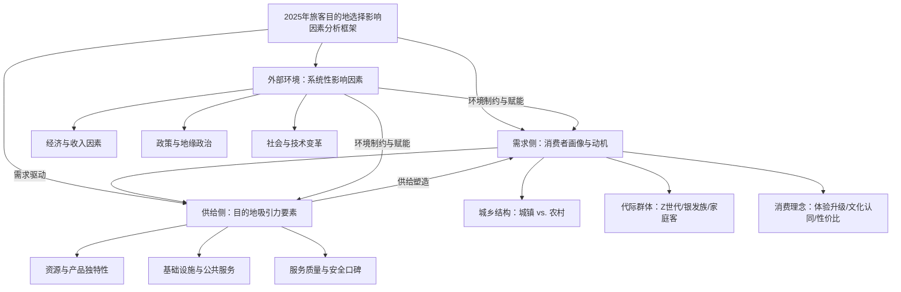

# 2025年旅客旅游目的地选择影响因素深度研究报告
## 1 研究背景、核心问题与分析方法

2025年，中国国内旅游市场在经历数年的波动与复苏后，迎来了标志性的转折点。根据文化和旅游部发布的抽样调查统计结果，全年国内居民出游人次达到65.22亿，较上年同期增加9.07亿，同比增长16.2%；国内居民出游总花费为6.30万亿元，同比增长9.5%[^1][^2][^3][^4]。**尤为关键的是，2025年的出游人次首次超过了2019年60.06亿的水平，标志着国内旅游业已从复苏周期全面转向高质量增长的新阶段**[^1][^3][^5]。这一宏观数据的背后，是市场结构、消费行为和产业逻辑的深刻变革。本报告旨在以此为背景，系统探究在2025年这一特定发展阶段，影响旅客选择不同旅游目的地的核心因素及其作用机制。

### 1.1 2025年旅游市场发展阶段与宏观特征界定

2025年中国旅游市场的宏观数据清晰地勾勒出其发展的新阶段与结构性特征。总量的超越仅是表象，其内部动力结构的变化更具洞察价值。

首先，从总量与历史对比来看，市场已确立增长新周期。文旅部发布的历年数据显示，2025年65.22亿的出游人次，不仅同比大幅增长16.2%，更是自2019年以来首次突破60亿大关并实现超越[^1]。同程研究院首席研究员程超功指出，这标志着国内旅游业已经从复苏周期全面转向增长周期，充分体现了大众旅游时代国内旅游经济的巨大潜力[^3]。旅游总花费6.30万亿元的规模也同步印证了市场的强劲活力[^1][^6]。

其次，**城乡市场的结构性分化是2025年最突出的宏观特征**，形成了“城镇稳基、农村提速”的双轮驱动格局[^7]。具体数据如下表所示：

| 市场分类 | 出游人次（亿） | 人次同比增长 | 出游花费（万亿元） | 花费同比增长 | 备注 |
| :--- | :--- | :--- | :--- | :--- | :--- |
| **全国总体** | 65.22 | 16.2% | 6.30 | 9.5% | 总量超越2019年 |
| **城镇居民** | 49.96 | 14.3% | 5.30 | 7.5% | 市场“压舱石”，占总花费84.1%[^7] |
| **农村居民** | 15.26 | 22.6% | 1.00 | 21.4% | **增长新引擎**，增速显著领先 |

上表数据来源于文旅部2025年统计结果[^1][^2][^7][^4]。数据显示，农村居民出游人次与花费的增速（分别为22.6%和21.4%）均显著高于城镇居民（14.3%和7.5%），农村市场正从“补充力量”升级为“关键增长极”[^7]。这种增速差并非偶然，它反映了城乡发展格局与生活方式的迭代，是乡村振兴战略推进、基础设施完善和农民收入提升等多重因素作用下的“消费觉醒”[^8][^9]。

最后，市场向高质量发展转型的特征日益鲜明。《2025中国旅游业发展报告》指出，国内旅游市场已稳步进入稳态繁荣阶段，消费端呈现鲜明升级特征：高达77.1%的城乡居民过去一年有出游经历，自由行占比达79.7%[^10]。游客需求正从传统的观光打卡转向深度体验、文化沉浸与亲子互动，同时对性价比的关注度显著提升[^10]。这倒逼旅游产品供给端加速创新和服务体系迭代升级，推动行业从粗放发展向精细化运营转型[^8]。

### 1.2 核心研究问题与报告边界明确

在上述宏观背景下，本报告的核心研究问题聚焦于：**在2025年中国旅游市场呈现结构性分化、并向高质量转型的特定阶段，究竟是哪些关键因素在影响和驱动着不同客群选择前往不同的旅游目的地？**

这一核心问题可进一步拆解为以下几个子问题：
1.  **城乡差异视角**：驱动城镇居民（追求品质、深度与文化体验）与农村居民（处于消费普及与升级并行阶段）做出目的地决策的核心影响因素（如产品独特性、性价比、交通便利性、社交属性等）有何不同？其权重如何分布？
2.  **代际与群体视角**：Z世代（18-35岁）、银发族（60岁以上）以及家庭游客等细分群体，其目的地选择的动机和考量因素（如社交驱动、康养需求、亲子友好性）有何显著差异？
3.  **供给与需求互动视角**：在游客消费理念从“观光购物”向“沉浸式生活体验”与“文化认同消费”升级的背景下[^9][^11]，目的地提供的资源独特性、业态创新（如非遗、赛事、AI+旅游）、服务质量等供给侧要素，如何响应并塑造了需求侧的选择？

为深入、聚焦地解答上述问题，本报告明确以下研究边界：
*   **时间范围**：主要聚焦2025年度的市场表现与影响因素，必要时引用2024年及疫情前（2019年）数据作为对比与参照。
*   **空间范围**：以中国国内旅游市场为核心研究对象，出境与入境旅游仅作为影响国内目的地选择的竞争或补充背景进行探讨。
*   **分析维度**：以文旅部官方数据揭示的“城乡二元结构”和“消费分级”为核心分析主线，同时纳入代际差异、科技融合、政策环境等关键维度。
*   **信息依据**：分析论证严格以文旅部发布的官方统计数据、权威行业研究报告（如《2025中国旅游业发展报告》）以及经过交叉验证的权威媒体报道和案例为依据。

### 1.3 分析框架、数据来源与论证逻辑

为系统性地解答核心研究问题，本报告构建了一个多层次、互动式的综合分析框架。该框架旨在整合消费者需求、目的地供给及外部环境三大系统，以揭示影响目的地选择的复杂机制。

**数据来源**方面，本报告坚持资料驱动原则，核心依据如下：
1.  **宏观定量数据**：主要来自文化和旅游部定期发布的《国内居民出游数据情况》，包括2025年全年及前三季度的总量、城乡结构、花费等核心指标[^1][^2][^12][^13]。历年数据（2019-2024年）用于趋势对比与阶段判断[^1]。
2.  **行业趋势与案例**：重点参考《2025中国旅游业发展报告》等权威研究成果中关于消费行为、市场细分、区域竞争力等方面的深度分析[^10]。同时，整合权威媒体报道中具有代表性的目的地案例、企业动态（如中青旅、宋城演艺的业绩与战略）及专家解读[^1][^8][^14][^11][^5]。
3.  **需求侧洞察**：关于不同客群（城乡、代际）的行为特征与动机描述，综合来源于行业报告、数据分析文章及包含具体行为观察的深度报道[^9][^10][^11]。

**论证逻辑**上，本报告将遵循“总-分-总”的结构展开：
1.  **总述定调（本章）**：基于宏观数据界定市场发展阶段、核心特征，并提出研究问题与分析框架。
2.  **分项深探（后续章节）**：将依次深入剖析外部环境因素（经济、政策、技术）的系统性影响，目的地供给侧各要素（资源、设施、服务）的吸引力构成，以及需求侧不同客群（城乡、代际）的决策行为逻辑。
3.  **综合归纳（结论章节）**：在分析各维度因素的基础上，揭示其动态博弈与相互作用如何重塑市场格局，最终形成关于2025年旅客目的地选择影响因素的综合性、层级化结论，并展望未来趋势与提出策略启示。

通过这一严谨的分析框架与论证逻辑，本报告旨在超越现象罗列，深入揭示2025年中国旅游市场在结构性变革期，影响旅客目的地选择的内在机理与深层逻辑。

## 2 宏观环境与结构性驱动因素分析

本章旨在系统性地剖析2025年影响旅客目的地选择的宏观环境与结构性驱动因素，超越具体目的地属性，揭示外部系统性力量如何塑造决策格局。这些因素构成了旅客决策的底层逻辑和约束条件，深刻影响着旅游市场的整体流向与消费结构。

### 2.1 经济因素：收入增长、消费分级与旅游预算的结构性变迁

经济基础是决定旅游消费能力与层级的根本前提。2025年，全国居民人均可支配收入同比增长5.0%，为旅游市场的繁荣奠定了坚实的“钱袋子”基础[^15]。然而，总量增长之下，城乡之间、群体内部呈现出显著的消费分级趋势，这种结构性变迁直接决定了不同客群的目的地选择范围与消费模式。

**城镇居民市场正经历从“规模扩张”到“价值深化”的转型**。2025年，城镇居民出游人次达49.96亿，占总人次的76.6%，其出游花费5.30万亿元，更占据了全国总消费的84.1%[^11]。**人均消费达1061元，是农村居民的2.3倍，这标志着城镇市场已成为追求品质与深度的核心消费力场**[^11]。其消费特征表现为个性化需求爆发，定制游、主题游、深度游占比提升至38%，冰雪旅游、邮轮旅游、低空旅游等新兴业态成为新宠[^11]。同时，文化认同驱动消费增长显著，2025年文化主题景区接待量突破12亿人次，同比增长25%[^11]。消费信心的增强也使得实际支出常超出计划，部分原计划保持预算不变的消费者最终增加了旅游开支，推动目的地选择向更高品质、更具独特体验的方向升级[^16]。

相比之下，**农村居民市场则实现了从“边缘群体”到“增长极”的跨越式觉醒**。2025年，农村居民出游人次达15.26亿，同比增长22.6%，增速是城镇居民的1.6倍；出游花费首次突破1万亿元，同比增长21.4%，消费增速领跑全国[^11][^17]。这一爆发式增长由多重经济因素共同驱动：
*   **收入水平实质性提升**：2025年农村居民人均可支配收入达2.3万元，较2020年增长68%，消费能力显著增强[^11]。
*   **“有闲”基础因科技普及而夯实**：农业机械化与智能化的普及，如电动疏果工具、水肥一体化设备、无人机植保等，大幅解放了农村劳动力，让农民拥有了可自主支配的闲暇时间[^17]。
*   **出行成本因基础设施完善而降低**：全国农村公路里程突破460万公里，高铁网络覆盖广泛，“1元城乡公交”、旅游专线等便捷廉价的交通方式，极大地降低了农村居民的出游门槛，扩大了其目的地选择半径[^11][^17]。

这种经济驱动的城乡消费分级，使得目的地市场必须提供差异化的产品供给：城镇市场需要深度文化体验、高端度假和科技赋能的新业态；而农村市场则对高性价比、交通便利、贴近自然的普惠型旅游产品需求旺盛。

### 2.2 政策与地缘政治：签证便利、国际关系与区域发展政策的动态重塑

政策与地缘政治作为外部环境中的强变量，在2025年对旅游目的地吸引力格局产生了剧烈且直接的动态重塑作用。其影响具有即时性、定向性和不可预测性，能够迅速改变客流的国际与国内流向。

**在国际层面，签证便利化政策释放出强大的正向驱动效应**。中国密集出台的高水平开放政策，大幅提升了入境自由化便利化水平。截至2025年底，我国已与29个国家实现全面互免签证，单方面免签和过境免签国家范围持续扩大[^18]。这一政策红利直接转化为市场热度。例如，在中国与新加坡、马来西亚、泰国等东南亚国家签证互免政策的推动下，东南亚游客赴华订单量同比增幅显著，其中新加坡游客赴华旅游订单用户数同比增长达138%[^19]。重庆因其独特的都市与自然复合体验，以年浏览量增长率359%成为东南亚游客眼中增长最快的黑马[^19]。同样，中俄两国互免普通护照签证的协定，对旅游交流产生了明显的促进作用，2025年中国赴俄罗斯旅游人数显著增长，俄罗斯酒店预订量同比增长43%[^20][^18]。**这些案例清晰表明，签证政策的松紧直接决定了目的地的“可及性”，成为短期内影响国际客流方向最有效的杠杆之一。**

**然而，地缘政治风险则构成严峻的负向冲击，其破坏力在“中日航线断链危机”中体现得淋漓尽致**。2025年11月，因日本首相发表涉台错误言论导致中日关系紧张，中国外交部及驻日使领馆多次提醒中国公民避免赴日[^21][^22]。这一政策信号迅速传导至市场：2025年12月，中国内地访日游客数量同比大幅下降45.3%[^22]；市场需求的结构性疲软（旅游需求集中于核心城市，商务需求因日本经济疲软与线上会议普及而萎缩）与运营成本上涨叠加，导致航司大规模取消航班[^21]。至2026年2月，已有49条中日航线取消全部航班，当月中国大陆赴日航班取消率攀升至47.2%[^21]。这一从“政治事件”到“政策提醒”，再到“需求萎缩”和“运力取消”的完整数据链，强有力地论证了地缘政治如何作为关键约束条件，能够迅速削弱甚至切断前往特定目的地的客流。

**在国内层面，区域发展政策发挥着定向刺激与资源再配置的关键作用**。乡村振兴战略的深入推进，通过专项资金、品牌建设、基础设施完善等政策工具，系统性刺激了县镇村旅游的发展。2024年，全国旅游百强县市实现旅游总收入1.9万亿元，约占全国旅游总收入的三成，接待游客达16.1亿人次[^23]。政策催生出五大典型发展模式：核心景区驱动型、乡村度假融合型、民俗体验赋能型、城郊休闲配套型、古城古镇复兴型，为不同资源禀赋的地区提供了可复制的发展路径[^23]。例如，江西通过强化政策保障、传承乡村文脉、完善公共服务体系，推动乡村旅游蓬勃发展，2024年接待游客3.47亿人次，有效促进了农民致富增收[^24]。**这些政策驱动的增长，使得大量曾经非主流的乡村旅游目的地被纳入旅客，特别是城镇旅客的选择集合，改变了国内旅游目的地的传统梯队格局。**

### 2.3 社会与技术因素：休假制度、远程办公与智能算法对决策路径的变革

社会生活方式演进与前沿技术应用的深度融合，正在从根本上变革旅客规划旅程与做出决策的路径。这些因素使得旅游行为更加灵活、个性化，并不断拓展着目的地的内涵与边界。

**休假制度的优化为旅游消费提供了更坚实且灵活的时间保障**。自2025年1月1日起，全体公民法定假日增加2天（春节、劳动节各增加1天），使全年法定假日由11天增至13天[^25][^26][^27]。此次调整不仅将除夕稳定纳入春节假期，更通过减少调休天数（2025年调休假期仅5天，较2024年的8天显著减少）降低了假期前后连续上班的压力[^27]。政策公布后，旅游平台搜索量激增，携程平台上2025年春节期间机票搜索量增长1.7倍，除夕当天更增长2.5倍[^25][^26]。专家指出，假期增加，特别是劳动节假期的延长，有利于推动全国旅游旺季尽快到来，并将经济发达的东部地区客源引向中西部地区，提升那里的旅游设施利用率[^26]。**这意味着，休假制度的改革不仅刺激了总出游意愿，更通过时间资源的再分配，潜在地影响了长途与短途、东部与中西部目的地之间的客流平衡。**

**远程办公的普及催生了“数字游民”这一新兴且高价值的旅游细分市场，重新定义了目的地选择的标准**。面对传统客源市场波动，泰国等目的地正战略性地将曼谷、清迈、普吉岛推广为理想的远程工作目的地，旨在吸引消费能力较强、停留时间更长的数字游牧民群体[^28]。这一趋势意味着，目的地对于这部分旅客而言，不再仅仅是短暂观光的地点，而是需要具备稳定高速网络、共享办公空间、宜居社区氛围及长期签证便利性的“生活-工作空间”[^29][^28]。尽管该群体面临签证续签、语言沟通、深层社交融合等挑战，但其增长潜力巨大，预计到2030年全球数量有望达到6000万[^29][^28]。**这要求目的地管理者超越传统的旅游设施建设，从城市综合功能与国际化生活配套的角度提升长期吸引力。**

**人工智能等智能技术已深度渗透旅游决策全链条，扮演着“赋能者”与“引导者”的双重角色**。2025年，超过六成的用户在旅行中曾主动使用AI辅助决策，在灵感激发与行程规划阶段，认为AI“有帮助”的用户比例均超过90%[^16][^30]。技术应用体现为三个层面：
1.  **智能行程规划**：如贵州省上线的“AI游贵州”智能体，能根据游客提问快速梳理信息，提供个性化定制推荐[^31]。DeepSeek等大模型已具备生成完整行程的能力，OTA平台的专业AI智能体支持人机协作规划[^30]。
2.  **场景化推荐与内容生成**：携程榜单通过“数据算法+真人验榜”双轮驱动，构建可信赖的推荐体系，并将重庆洪崖洞夜游等景点纳入“中国必打卡夜游景点”等主题榜单，引导消费兴趣[^19][^32]。
3.  **体验增强与效率提升**：AR导览、智能酒店、无接触服务等数字化应用普及，敦煌莫高窟的虚拟现实体验项目使游客停留时间显著延长[^11]。AI也开始被用于优化酒店内部运营流程，提升管理效能[^30]。

**然而，技术赋能仍有边界**。在需要即时判断与处理紧急问题的环节，用户对AI的深度信任与依赖度明显不足，反映出当前工具在复杂现实场景中解决能力的局限[^16]。同时，如何确保AI推荐信息的准确性、时效性，避免“AI幻觉”，仍是行业需要持续攻克的挑战[^31]。

综上所述，宏观环境与结构性驱动因素在2025年共同编织了一张影响旅客目的地选择的复杂网络。经济因素决定了消费的基本盘与层级分化，政策与地缘政治如同开关，瞬间改变特定方向的客流通道，而社会与技术变革则从底层重塑着人们规划与体验旅行的方式。这三重力量相互交织，为理解后续章节中目的地供给侧要素的效能与需求侧行为的逻辑，提供了不可或缺的系统性背景。

## 3 目的地供给侧吸引力要素深度探查

本章节旨在系统性地探查并验证构成2025年旅游目的地核心吸引力的供给侧关键要素。基于前一章对宏观环境的分析，本章将聚焦于目的地自身禀赋与建设，深入剖析其如何直接作用于旅客的选择决策。具体而言，本章将结构化吸收章节参考资料中的关键案例（如普洱、哈尔滨、张掖七彩丹霞、平潭、长岛民宿等）与行业报告框架，围绕三大核心维度展开：首先，分析资源与产品独特性（包括自然与文化遗产、新兴业态融合）如何成为吸引特定客群（如追求文化深度的城镇居民、偏好新奇体验的Z世代）的根本基石；其次，比较基础设施与公共服务（尤其是交通可达性与智慧旅游应用）在提升游客体验效率与满意度方面的关键作用，并揭示其对不同客群（如农村居民）目的地选择半径的约束或拓展；最后，探查服务质量与安全口碑（涵盖从业人员专业素养、个性化服务、食品安全监管等“软环境”）如何成为影响决策、构建品牌忠诚度的决定性因素。本章的分析将严格以参考资料中的具体数据、案例效果和行业观察为依据，揭示各要素在2025年市场分化背景下的差异化权重与作用机制。

### 3.1 资源与产品独特性：从核心禀赋到业态融合的吸引力构建

本节将深入分析目的地资源与产品独特性作为吸引力基石的构成与权重。首先，将利用普洱案例（资料64/67）来界定自然与文化遗产的复合吸引力：普洱凭借“暖冬气候”与“优质生态”叠加，精准契合现代游客对健康、舒适旅居的追求，2025年接待游客5809万人次，其围绕澜沧江、景迈山古茶林开发的生态观光、茶山研学等产品，成功将“舒适度”转化为市场“热度”，这支撑了“资源独特性是突破旅游季节限制核心竞争力”的论点。其次，将结合哈尔滨（资料68）、张掖七彩丹霞（资料109）和平潭（资料107）案例，剖析新兴业态的引流与价值提升作用：哈尔滨地铁客运强度（1.246万人次/公里日）与“冰雪+避暑”双季模式强相关；张掖七彩丹霞通过直升机观光、热气球嘉年华等“旅游+低空经济”产品，打造“现象级”样本并获“最佳低空旅游目的地”荣誉；平潭则通过“海陆空+文商旅”融合及举办亚洲棒球锦标赛等高端赛事，推动客源结构优化（省外游客占比突破50%）。这些案例共同论证了业态创新（冰雪、低空、体育赛事）在吸引特定客群、提升目的地综合价值方面的关键权重。最后，将参考《2025中国旅游业发展报告》（隐含于资料65）中指出的消费升级趋势（定制游、主题游占比提升至38%），说明独特产品如何响应城镇市场“价值深化”的需求。

**资源与产品独特性是旅游目的地吸引力的根本来源，其构成已从单一的自然或文化遗产，演变为“核心禀赋+业态融合”的复合体系。** 在2025年市场消费分级与体验升级的背景下，这一要素的权重和表现形式呈现出鲜明的差异化特征。

**首先，以自然与文化遗产为核心的复合型资源，是构建目的地长期、全季节吸引力的基石。** 普洱市的案例极具代表性。其吸引力远不止于冬季“避寒天堂”的气候条件，更深厚的优势在于“暖冬气候”与“优质生态”叠加形成的复合型资源[^33]。作为北回归线上保存完好的生态绿洲，其“天然氧吧”的生态禀赋精准契合了现代游客对健康、舒适、宁静旅居生活的追求，构成了其突破传统旅游季节限制的核心竞争力[^33]。普洱市着力推动“绿水青山”向“金山银山”转化，围绕澜沧江、景迈山古茶林、茶马古道等核心资源，开发出生态观光、茶山研学、森林康养、温泉疗愈、乡村旅居等一系列契合全季节旅游市场的产品，成功将气候与生态的“舒适度”转化为旅游市场的“热度”与消费的“黏度”[^33]。2025年，全市接待游客量突破5809万人次，实现旅游总收入超461亿元，同比增幅均接近7%[^33]。**这深刻揭示了，将独特的自然与文化禀赋系统性地转化为可体验、可消费的旅游产品，是实现“淡季不淡、旺季更旺”并精准对接品质旅居市场的关键路径。**

**其次，新兴业态的深度融合与创新，成为目的地实现差异化竞争、吸引特定细分客群并提升综合价值的核心引擎。** 这一趋势在冰雪旅游、低空经济和体育赛事等领域表现尤为突出。哈尔滨凭借“冰雪+避暑”双季互补的旅游模式，成功打破了单一季节的客流局限，其地铁客运强度在2025年达到1.246万人次/公里日，位居全国第三，直接印证了独特旅游产品对城市交通活力与客流规模的强劲拉动[^34]。张掖七彩丹霞景区则积极探索“旅游+低空经济”融合模式，通过布局直升机观光、热气球嘉年华、动力伞体验等立体化游览体系，打造了“空中看丹霞”这一特色产品，相关话题网络曝光量超10亿次，使其荣获“2025最佳低空旅游目的地”的荣誉，成为全国低空旅游的“现象级”样本[^35]。平潭国际旅游岛通过“海陆空+文商旅”的深度融合，不仅策划低空飞行、海上运动等新兴业态，更成功打造五大主题赛事矩阵，举办亚洲棒球锦标赛等30场品牌赛事，吸引了35个国家和地区的1.2万余名运动员参赛[^36]。这种“文旅+体育”的深度联动，有效推动了客源结构的优化，2025年平潭过夜游客占比达到60%，省外游客占比突破50%，标志着其从观光节点向深度度假目的地的成功转型[^36]。**这些案例共同表明，业态创新不仅是引流手段，更是重塑目的地品牌形象、延长游客停留时间、提升消费层级的战略性举措。**

**最后，产品独特性必须精准响应市场需求的结构性变化。** 2025年旅游市场的一个显著特征是城镇居民的消费从“规模扩张”转向“价值深化”，个性化、主题化的深度游需求旺盛[^11]。定制游、主题游、深度游等产品形态的占比已提升至38%[^11]。这意味着，目的地提供的产品不能停留在同质化的观光层面，而必须挖掘自身文化内核，提供如非遗体验、研学旅行、康养旅居等具有高知识附加值和文化认同感的产品。普洱的茶山研学、景迈山的非遗活化[^37][^38]，以及西双版纳古茶山的雨林徒步与民族文化体验[^39]，都是成功对接这一升级需求的典范。**因此，资源与产品的独特性，不仅在于“有什么”，更在于如何通过创新性的开发和组合，满足特定客群对“体验什么”和“获得何种价值”的深层期待。**

### 3.2 基础设施与公共服务完善度：交通可达性与智慧体验的效率革命

本节将重点比较基础设施与公共服务，特别是交通可达性与智慧旅游应用，对游客体验与目的地选择的关键影响。首先，将依据《2025年旅游交通便捷性对游客旅游体验的影响与改善措施研究》（资料71/74/77/80/83/86）中的核心观点，论证交通便捷性对游客满意度、活动选择及体验连续性的直接影响，并以此作为分析框架。其次，将利用哈尔滨地铁案例（资料68）作为“旅游驱动型”交通效率的实证：其客运强度全国第三，且2号线精准串联冰雪核心景点，实现“出站即达景”，这强有力地证明了高效内部交通网络对提升热门目的地游客体验和承载力的作用。第三，将分析智慧旅游技术对体验升级与管理增效的双重价值：引用杭州西湖“一部手机游杭州”案例（资料110），其使92%游客完成全流程无接触服务，将游览效率提升40%，并实现碳减排，这支撑了“智慧平台成为文旅基础设施”的论断；同时，引用扬州“下扬州”平台（资料108）和AR导览系统可行性研究（资料114/116），说明AI、AR技术如何帮助跨越“数字鸿沟”（如为听力不好老人提供无障碍服务）并提供沉浸式导览，满足个性化需求。本节将特别指出，基础设施的完善（如资料65中提到的农村公路里程突破460万公里）是农村居民出游增速领先（22.6%）的重要前提条件，从而揭示其对不同客群目的地选择半径的约束与拓展机制。

**基础设施与公共服务的完善度，尤其是交通可达性与智慧旅游应用，已从支撑性条件演变为直接影响游客决策、体验质量和目的地竞争力的核心要素。** 在2025年，这一领域的进步不仅关乎效率，更关乎包容性与可持续性，深刻重塑了旅游市场的可达性格局与体验范式。

**交通便捷性是影响游客满意度、活动选择及体验连续性的基石。** 研究表明，便捷的交通条件能够为游客提供更加舒适的出行体验，从而提高整体满意度；反之，交通拥堵、换乘不便等问题会直接导致负面情绪，影响对目的地的评价[^40]。更重要的是，交通便利性直接决定了游客的旅游活动选择范围。当目的地拥有发达的交通网络时，游客可以选择更广泛的深度游和特色体验；而交通不便则会限制其选择，甚至导致放弃某些计划[^40]。哈尔滨的实践为此提供了生动注脚。2025年，其地铁客运强度以1.246万人次/公里日位居全国第三，这鲜明地体现了“旅游驱动”的特征[^34]。地铁2号线作为冬季旅游专线，精准串联中央大街、冰雪大世界、太阳岛等核心冰雪景点，实现游客“出站即达景”，极大提升了游览的便捷性与体验的连续性[^34]。**这证明，针对热门旅游动线进行精准的交通基础设施规划与运营，是提升高客流目的地服务效能的关键。**

**智慧旅游技术的深度应用，正在引发一场从服务流程到文化体验的全面效率革命。** 智慧旅游已超越概念，成为文旅产业的基础设施。杭州西湖景区92%的游客通过“一部手机游杭州”小程序完成从预约入园到语音导览的全流程服务，这一模式将平均游览效率提升40%，并通过减少纸质票务实现年均300吨的碳减排，体现了“便利性”与“可持续性”的双重价值[^41]。此类智慧平台通过整合高频服务、提供AR实景导航与多语种讲解，不仅优化了游客动线，更显著提升了文化传播的效率[^41]。同时，技术应用正致力于实现“数字包容”。例如，江苏扬州打造的“下扬州”线上智慧旅游平台，通过AI数字人的语音文字互相转化功能，为听力不好的老年游客提供无障碍导览服务，还能根据兴趣偏好一键生成专属行程单，有效帮助特殊群体跨越“数字鸿沟”[^42]。增强现实（AR）导览系统的开发，则旨在通过虚拟叠加信息、动态复原历史场景，为游客提供沉浸式、交互性强的深度文化体验，满足个性化游览需求[^43]。**因此，智慧旅游的价值已从单纯的管理工具，升华为提升游客体验质量、拓展文化感知维度、促进服务普惠的重要载体。**

**基础设施的完善程度，直接塑造了不同客群的目的地选择半径与消费能力。** 这一点在城乡市场分化中表现得尤为清晰。2025年农村居民出游人次增速（22.6%）显著领先于城镇居民（14.3%），其背后关键驱动力之一便是全国农村公路里程突破460万公里，高铁网络广泛覆盖，使得“快进慢游”成为可能，大幅降低了农村居民的出游门槛[^11]。交通基础设施的完善，不仅让更多乡村景点变得可达，也释放了农村居民的旅游消费潜力。反观之，交通不便或设施不完善则会成为制约目的地发展的瓶颈，尤其是在偏远地区和旅游旺季[^40]。**这表明，基础设施不仅是物理通道，更是市场机会的调节阀，其均衡发展与智能化升级，对于释放下沉市场潜力、促进旅游消费公平具有重要意义。**

### 3.3 服务质量与安全口碑：从业人员素养与监管体系构成的软实力竞争

本节将系统探查服务质量与安全口碑等“软环境”因素在旅客决策中的关键作用，聚焦于从业人员素养与目的地安全监管。首先，将依据《2025年民宿服务质量提升与顾客体验优化研究报告》（资料104/106）和长岛民宿系列评测（资料89/92/94/96/98/100/102）构建的分析维度（硬件、餐饮、服务、特产），论证服务质量的多维构成及其对游客选择（如外地游客37.6%优先考虑位置与交通）的直接影响。以“长岛大美海岛渔家乐”为例，其提供免费接送、定制攻略、三天两夜全包套餐等一站式服务（评分9.4），是吸引并满足省心出游需求的关键。其次，将深入分析从业人员素养的核心作用：引用《2025高中旅游地理之旅游从业人员素养课件》（资料75）和一线导游观察（资料72），指出在AI普及背景下，导游的“温度”、文化深度解读能力、应急处理等不可替代价值愈发凸显，满足城镇游客“为知识付费”的升级需求。第三，将重点考察安全口碑的决定性影响：利用五台山（资料87）和呼和浩特（资料90）的食品安全监管案例，说明“严管”措施（如“十二道关”、“五亮”标准、拉网式排查）如何构建“餐桌上的安全”信任，这是吸引家庭游客、保障目的地声誉的底线要素。同时，结合前一章“中日航线断链危机”（资料65/69）的案例，指出地缘政治与安全提醒能瞬间削弱目的地吸引力，反向论证安全稳定环境的基础性地位。这些资料共同表明，在硬件趋同的竞争中，服务质量、专业素养与安全监管构成的软实力成为目的地脱颖而出的决定性因素。

**在旅游资源与基础设施的“硬实力”之外，由服务质量、从业人员素养与安全监管构成的“软实力”，正日益成为影响旅客目的地选择、构建品牌忠诚度与保障市场可持续发展的决定性因素。** 2025年，随着消费理性化与对深度体验需求的增长，游客对服务细节、文化解读和安全环境的敏感度空前提高。

**服务质量是一个涵盖硬件、餐饮、配套服务与个性化体验的多维体系，直接影响游客的决策与满意度。** 对长岛民宿市场的深度评测揭示了外地游客的核心关注维度：37.6%优先考虑位置与交通便利性，29.2%看重舒适度与设施，22.1%关注餐饮配套，11.1%在意一站式服务完善度[^44]。以评分高达9.4分的“长岛大美海岛渔家乐”为例，其核心竞争力不仅在于临海的硬件设施，更在于提供免费私家车队接送、三天两夜吃住行全包套餐、以及由经验丰富的经营者免费定制的专属旅游攻略等一站式服务[^44][^45]。**这种将交通、住宿、餐饮、行程规划深度整合的服务模式，精准契合了游客，尤其是家庭及省心出游客群对“无缝衔接”和“高确定性”体验的强烈需求，成为目的地吸引并留住游客的关键软实力。**

**在人工智能技术普及的背景下，旅游从业人员的专业素养与不可替代的“人性化服务”价值愈发凸显。** AI工具虽然帮助游客完成了大量的行前知识储备，但也对导游服务的准确性、时效性与拓展性提出了更高要求[^46]。这倒逼导游行业从简单的讲解执行者，向具备线路设计、文化精讲、应急处理和情感联结能力的“知识型导游”转型[^46][^47]。市场趋势显示，家庭亲子等客群愿意为高质量、有深度的文化讲解付费，而入境游市场的复苏使得掌握多语种成为硬通货[^46]。**因此，从业人员的核心价值已从信息传递，升华为提供有温度的文化解读、个性化的互动以及应对复杂情境的柔性处理能力，这些是技术无法替代的“体验内核”。**

**安全口碑，尤其是食品安全与整体治安环境，是目的地吸引力的基石和不可逾越的底线。** 负面安全事件对目的地声誉的打击是毁灭性的，如前章所述，因地缘政治风险导致的安全提醒能令赴日游客数量锐减[^11][^48]。反之，积极构建的安全监管体系能显著提升目的地信任度。五台山风景名胜区在2025年推行“十二道关”食品安全全过程管控，并实施“亮证照、亮标识、亮价格、亮承诺、亮监督”的“五亮”标准，覆盖2900余户经营主体，有效构建了透明、可信的消费环境[^49]。呼和浩特市市场监管局在旅游旺季对核心景区及周边餐饮单位展开“拉网式”排查，累计检查3351家次，着力守护“餐桌上的安全”[^50]。**这些系统性的“严管”措施，通过建立明确的责任体系和透明的监督机制，为游客（尤其是对安全高度敏感的家庭游客和银发族）提供了至关重要的心理保障，是目的地长期健康发展的“压舱石”。**

**综上所述，目的地的吸引力构建是一个系统工程。** 独特的资源与产品是吸引游客的“磁石”，完善的基础设施与智慧服务是保障体验流畅的“血管”，而高质量的服务与坚实的安全口碑则是留住游客、赢得口碑的“灵魂”。在2025年市场分化的背景下，三者缺一不可，且必须针对不同客群的需求进行精准配置与组合，才能形成可持续的核心竞争力。

## 4 旅客需求侧决策行为与细分市场研究

本章旨在深入剖析2025年旅游市场中不同旅客群体的决策逻辑与行为差异，系统验证市场细分趋势。基于前一章对宏观驱动因素的分析，本章将聚焦于旅客需求侧，通过整合参考资料中的关键数据与案例，揭示城乡、代际及不同消费理念群体在选择目的地时的核心考量与行为模式。分析表明，市场已形成鲜明的结构性分化，**城镇市场追求“价值深化”与情绪满足，农村市场处于“消费觉醒”与普惠需求阶段，而Z世代、银发族、家庭游客等细分群体则展现出迥异的诉求图谱，共同推动旅游消费从浅层观光向深度沉浸与文化认同的范式转变。**

### 4.1 城乡二元结构下的消费行为分化：品质深化与普惠觉醒

2025年中国旅游市场最显著的结构性特征，是城镇居民与农村居民在出游动机、消费能力和目的地偏好上呈现出的根本性分化。这种分化并非简单的消费层级差异，而是由经济基础、生活方式和基础设施完善度共同塑造的两种截然不同的旅游决策逻辑。

**城镇居民市场：从“规模扩张”到“价值深化”的品质升级。** 2025年，城镇居民出游人次达49.96亿，其出游花费5.30万亿元，占全国总消费的84.1%，人均消费达1061元，是农村居民的2.3倍[^11][^51]。这标志着城镇市场已超越规模增长，进入追求品质与深度的“价值深化”阶段。其消费决策的核心特征表现为：**个性化需求爆发**，定制游、主题游、深度游占比提升至38%，冰雪旅游、邮轮旅游、低空旅游等新兴业态成为新宠[^11][^51]。同时，**科技赋能体验**成为关键，AR导览、智能酒店、无接触服务等数字化应用普及，例如敦煌莫高窟的虚拟现实体验项目使游客停留时间延长至4小时以上[^11]。更深层次地，**文化认同驱动**消费增长显著，2025年文化主题景区接待量突破12亿人次，同比增长25%[^11]。这反映了城镇游客的消费重心已从“有没有”转向“优不优”，更注重旅行的娱乐、社交属性等情绪价值的满足[^52]。例如，北京作为国际文化与现代都市的代表持续受到关注，其文商旅体展融合发展，2025年接待游客达3.9亿人次，旅游总花费7159.1亿元[^53]。

**农村居民市场：从“边缘群体”到“增长极”的消费觉醒。** 与城镇市场的“价值深化”形成鲜明对比，农村市场在2025年展现出爆发式的“消费觉醒”。数据显示，2025年农村居民出游人次达15.26亿，同比增长22.6%，增速是城镇居民的1.6倍；出游花费首次突破1万亿元，同比增长21.4%，消费增速领跑全国[^11][^17][^51]。这一增长由多重因素驱动，构成了农村居民独特的决策逻辑：
*   **“有钱有闲”基础的夯实**：农业机械化与智能化的普及，如电动疏果工具、水肥一体化设备、无人机植保等，大幅解放了农村劳动力，让农民拥有了自主支配的闲暇时间[^17]。同时，增收渠道拓宽，例如江苏盱眙的种植大户徒忠香通过电商直播带货，年纯收入可观，使得旅游从“奢侈品”变为“日常消费”[^17]。
*   **基础设施完善打通“最后一公里”**：全国农村公路里程突破460万公里，高铁网络覆盖广泛，城乡公交、旅游专线覆盖范围扩大，低廉的票价与便捷的换乘极大降低了出游门槛[^11][^17]。山西高平老人崔随祥乘坐“1元城乡公交”前往王莽岭景区的案例，生动印证了交通便利性对释放农村旅游需求的关键作用[^17]。
*   **普惠型产品需求旺盛**：农村居民的出游决策高度依赖交通便利性与高性价比。他们更倾向于周末自驾县域游、假期跨省长线游，对“家门口的景点”和乡村旅游体验项目（如浙江安吉的民宿集群、贵州千户苗寨的非遗体验）表现出强烈兴趣[^11][^17]。

**城乡消费行为分化对比表**

| 对比维度 | 城镇居民市场 | 农村居民市场 |
| :--- | :--- | :--- |
| **市场定位** | 价值深化、品质升级 | 消费觉醒、普惠增长 |
| **核心驱动力** | 个性化、文化认同、情绪价值 | 收入提升、闲暇增加、交通便利 |
| **消费特征** | 人均消费高（1061元），追求定制、深度、科技体验 | 消费增速快（21.4%），注重性价比、便利性 |
| **目的地偏好** | 文化主题景区、都市休闲、新兴业态目的地 | 乡村旅游、自然景观、交通便捷的县域景点 |
| **决策关键** | 体验的独特性、文化内涵、社交属性 | 出行的可达性、成本可控性、产品实用性 |

**这种城乡二元分化的消费行为，构成了2025年目的地市场格局的基础性边界条件。** 目的地管理者必须认识到，面向城镇客群需提供高附加值、深体验、强互动的产品；而面向农村客群，则需构建普惠、便捷、友好的旅游服务体系，两者不可混淆或采用同一套供给策略。

### 4.2 代际与群体差异：Z世代、银发族与家庭游客的核心诉求图谱

超越城乡的地理划分，不同代际和特定群体的旅客在2025年展现出高度差异化的旅游诉求与决策行为。市场细分已从理论走向实践，深刻影响着目的地的产品设计与营销策略。

**Z世代（18-35岁）：社交驱动、体验优先与精明消费的“新三观”。** Z世代不仅是旅游市场的生力军（占比超45%），更是潮流与体验创新的定义者[^11]。他们的决策逻辑呈现三大鲜明特征：
1.  **强社交属性与“搭子文化”**：亲友聚会、参与社群活动是夜间出游的首要动机[^54]。爱彼迎数据显示，2025年国庆出境游中，25-29岁用户搜索热度增长近2倍，“双人或以上结伴出游”搜索热度最高，“搭子出行”成为平摊成本、放大快乐的聪明解法[^55]。
2.  **追求情绪价值与深度沉浸**：在Z世代的双十一情绪消费类目中，旅行相关消费以36.9%的占比强势登顶[^56]。他们不再满足于传统打卡，主流需求分化为“松弛疗愈型”（占21.33%）和“深度沉浸型”（占19.73%），仅11.43%仍偏好打卡式旅游[^55]。在节演展赛场景中，Z世代客流占比超80%[^57]。
3.  **“高低配”的精明消费模式**：他们愿意为关键体验（如一顿特别的晚餐、一晚高端酒店）支付溢价，同时敢于在其他环节（如交通、部分住宿）节省开支，体现了“体验价值”绝对优先于“面子消费”的理性决策[^55]。

**银发族（60岁以上）：康养、研学与舒适便捷的“慢旅行”需求。** 银发族是旅游市场中消费能力稳定且需求明确的群体，2025年占比达18%，人均消费达1500元[^11]。其核心诉求集中于：
*   **健康养生与兴趣研学**：康养旅游、研学旅游需求旺盛，海南三亚的“候鸟式”旅居、广西巴马的长寿文化体验是典型案例[^11]。
*   **对行程舒适性与安全性的极高要求**：他们需要慢节奏、少换乘的行程（如每日车程≤3小时），并高度重视无障碍设施、随队医疗支持等安全保障[^58][^59]。
*   **面临“数字鸿沟”与适老化供给不足的挑战**：当前旅游产品设计多以中青年为模板，线上服务对老年人不友好，线下设施适老化改造滞后，严重影响了高龄老人的出游体验与意愿[^58]。政策层面正推动“银发旅游列车”等专项产品开发，以应对这一巨大市场潜力[^60]。

**家庭游客（亲子游、三代同游）：安全、寓教于乐与全配套服务的“一体化”选择。** 家庭游市场持续扩容，亲子游、三代同游占比提升至32%[^11]。其决策逻辑以儿童需求和家庭整体体验为中心：
*   **安全与儿童友好性是首要底线**：家庭在选择目的地和旅行社时，91%将安全保障列为首要考量，对儿童安全座椅、防走失措施、适老适幼的住宿环境要求极高[^59]。专业的亲子旅行社（如四川的朋游国旅）通过配备专属亲子服务团队、应急包和定制化行程（每日车程≤3.5小时）来构建核心竞争力[^61]。
*   **追求“寓教于乐”的深度体验**：2025年暑期，户外探索类产品（露营、徒步、溯溪）搜索量同比上涨120%，非遗研学搜索量翻倍，显示家庭希望旅行兼具趣味性与教育意义[^62]。影视IP（如《浪浪山小妖怪》）对古建旅行热度的带动也印证了这一点[^62]。
*   **青睐高品质、全包式的服务**：66%的亲子家庭消费水平达四星级及以上，超过70%的预算分配于景点游玩与度假体验，对住宿（如主题亲子酒店）和交通（租车自驾订单同比增长98%）的品质要求明确[^62]。

**不同代际/群体核心诉求与目的地选择影响**

| 群体 | 核心诉求 | 对目的地选择的具体影响 | 代表性数据/案例 |
| :--- | :--- | :--- | :--- |
| **Z世代** | 社交互动、情绪价值、体验创新、精明消费 | 偏好社交场景丰富、潮流业态聚集、可深度互动、支持个性化组合的目的地。 | 旅行消费占情绪消费榜首（36.9%）[^56]；“搭子文化”盛行[^55]。 |
| **银发族** | 康养保健、文化研学、舒适安全、慢节奏 | 选择气候宜人、设施无障碍、文化内涵深厚、行程舒缓、医疗保障完善的康养旅居目的地。 | 人均消费1500元[^11]；国铁旅游列车老年游客占比近80%[^58]。 |
| **家庭游客** | 儿童安全、亲子互动、寓教于乐、省心全包 | 青睐主题公园、自然教育基地、提供一站式服务（交通、住宿、研学活动）且口碑安全的旅行社和目的地。 | 亲子游占比升至35%[^62]；租车自驾订单同比增98%[^62]。 |

### 4.3 消费理念升级：从“观光打卡”到“沉浸式生活”与文化认同

2025年，中国旅客的消费理念经历了深刻的升级，其核心从外在的“景观游览”和“物质购买”，转向内在的“生活体验”、“情感连接”与“文化认同”。这一转变彻底重塑了目的地吸引力的评价标准与产品创新的方向。

**“沉浸式”体验成为核心竞争力，游客从“旁观者”变为“参与者”。** 中国旅游研究院指出，“沉浸感”已成为游客的核心诉求，文旅消费正从“看热闹”向“入戏”转变[^52]。这一趋势在多个案例中得到印证：
*   **开封万岁山武侠城**通过“王婆说媒”等情景互动，让游客化身剧情中人，成功构建了从“旁观”到“参与”的沉浸式场景[^63]。
*   **山西运城关公故里文化旅游景区**运用XR全感交互技术，使游客戴上VR设备即可亲身经历“单刀赴会”等经典情节，通过数字科技实现了文化传承与深度体验[^52]。
*   抖音生活服务数据报告显示，**“乡村游”古村古镇**团购订单量同比增长102%，**“非遗游”**订单量同比增长45%，反映出游客对在地文化深度体验的强烈渴望[^63]。

**文化认同驱动消费，从“舌尖”到“心间”的深度连接。** 游客越来越愿意为能够引发文化共鸣和认同的体验付费。携程数据显示，2025年博物馆、非遗体验、人工讲解等文化产品订单量同比增长超一成，成交票量同比增长14%[^64]。典型案例包括：
*   **上海“Taste of CHINA 味”沉浸式文化体验餐厅**，通过七道菜串联中国地理人文叙事，超过85%的国际游客对背后的文化故事产生浓厚兴趣，实现了“餐厅即景点，用餐即旅行”[^64]。
*   **普洱“左手咖啡右手茶”文旅IP**，将地域特色产业转化为可体验的文化场景，通过咖啡庄园、茶山研学等吸引游客深度参与，2025年接待游客5809万人次，成为现象级的文旅融合样本[^65][^66][^67]。

**旅行成为“心灵处方”，松弛疗愈与深度沉浸成为主流。** 环球旅讯研究院调研发现，传统打卡式旅游的偏好者仅占11.43%，而“松弛疗愈型”（21.33%）和“深度沉浸型”（19.73%）已成为市场需求的主体[^55]。这具体表现为：
*   **“求治愈”、“想发呆”**成为年度增长最快的“心灵关键词”，59%的用户通过AI查询“想去祈福”，26%的用户“梦想旅居”[^57]。
*   国庆假期“窝囊式旅游”、冰雪季多日沉浸度假等模式流行，反映出游客在不同时节对逃离压力、寻求内心平静的强烈需求[^57]。
*   西南与东北地区形成的两大“沉浸式地理走廊”，以及西藏山南平均停留11天的数据，都印证了游客对静谧自然与深度体验的追求[^57][^68]。

**综上所述，2025年旅客需求侧呈现出复杂而清晰的结构性图景。** 城乡二元分化奠定了市场的基本盘，代际与群体差异描绘了细分的诉求图谱，而消费理念的全面升级则指明了产品创新的终极方向。**目的地竞争力的构建，必须从理解并精准响应这些深层、多元且动态变化的需求开始。**

## 5 动态博弈与市场格局重塑机制

在宏观环境与微观需求的双重作用下，2025年的中国旅游市场并非静态的图景，而是充满了动态博弈与结构性重塑。本章旨在深入探查这种动态调整的内在机制，重点分析由外部冲击引发的客流转移、供需之间的结构性矛盾，以及技术赋能带来的体验与效率革命。通过整合关键案例与数据，本章将揭示市场格局如何在多重因素的交织下被重新定义。

### 5.1 替代与竞争效应：地缘政治、成本与消费力差异驱动的客流转移

2025年，出境游市场经历了一场由地缘政治风险直接触发的剧烈震荡，其核心案例是“赴日游客锐减-东南亚及其他目的地承接”的完整链条。这一过程清晰地展示了外部强变量如何迅速改变目的地吸引力格局，并引发连锁式的市场调整。

**地缘政治风险作为客流“急刹车”的直接导火索。** 2025年11月，因日本领导人发表涉台错误言论，中国外交部及文化和旅游部相继发布赴日旅游安全提醒，建议中国公民近期避免或谨慎前往日本[^69]。这一政策信号立即被市场解读并迅速反应。数据显示，2025年12月，中国内地访日游客数量同比暴跌45.3%，创下历史最大跌幅[^70][^71]。市场层面的连锁崩塌效应显著：中日航班取消率峰值达到36%，上海浦东、北京大兴等机场取消超1200班次；大阪20家酒店的中国游客退订率高达50%-70%[^70]。零售业受到直接冲击，东京银座免税店销售额下滑23.9%，资生堂股价甚至出现单日暴跌11%的情况[^70][^72]。**这一系列从政治言论到市场数据的即时、剧烈反应，强有力地证明了在地缘政治成为显性风险时，游客会迅速用脚投票，相关目的地的吸引力会在短期内被严重削弱甚至切断[^73][^74]。**

**消费力鸿沟与政策便利性共同筛选替代目的地。** 中国游客的集体转向并非无序，而是受到消费能力和政策成本的双重筛选。中国游客曾是日本入境消费的支柱，贡献了其入境消费总额的42.65%，人均消费达1.6万元，是东南亚游客的3倍[^70]。因此，日本市场的缺失难以被单一地区完全填补。客流转移呈现出明显的分层特征：
*   **高端需求外溢**：部分原本计划赴日、追求高端购物、温泉滑雪等特色体验的游客，将需求转向了欧洲深度游（如北欧极光、法瑞意联游），数据显示欧洲长线游增长达90%[^70]。
*   **中低端消费转移**：对价格敏感、追求高性价比的游客则转向签证便利、消费水平较低的东南亚国家。泰国推出“安心游”认证并延长免签时效，越南富国岛实行30天免签，韩国对团客实施15天免签，这些政策红利迅速转化为客流。韩国元旦假期酒店预订量激增240%，俄罗斯因免签政策预计吸引的中国游客增长近6倍[^70]。

然而，这种替代存在明显的局限性。要完全弥补中国游客减少给日本带来的消费损失，理论上需要新增约700万消费能力相当的东南亚游客，这相当于该地区全年外国游客总量的四分之一，短期内无法实现[^70]。因此，出境游格局呈现的是 **“多极化”而非“东南亚中心化”的调整**。日本的缺失由欧洲、东南亚、俄罗斯等多个目的地共同填补，但无论在消费规模还是经济影响上，短期内都无法完全替代[^70]。

**2025年赴日游客锐减引发的市场格局调整示意表**

| 关键环节 | 具体表现与数据 | 影响与结论 |
| :--- | :--- | :--- |
| **触发事件** | 日本领导人发表涉台错误言论[^69]。 | 引发地缘政治紧张，成为市场变化的直接约束条件。 |
| **政策响应** | 中国外交部、文旅部发布赴日旅游安全提醒[^69]。 | 官方信号明确，引导民间消费决策，形成“用脚投票”。 |
| **市场反应** | 2025年12月中国内地访日游客同比暴跌45.3%；航班取消率峰值36%；酒店退订率50-70%[^70][^71][^75]。 | 需求侧迅速撤离，供给侧（航空、酒店、零售）连锁受创。 |
| **替代流向** | 1. **高端需求**：转向欧洲深度游（增长90%）[^70]。 2. **中低端需求**：转向东南亚（韩国、泰国、越南）及俄罗斯（免签吸引）[^70]。 | 客流根据消费能力和体验需求发生分层转移。 |
| **格局性质** | 消费力鸿沟导致东南亚无法完全填补日本损失；市场呈现“多极化”调整[^70]。 | **证明是“格局调整”而非“彻底重塑”**；未来竞争力取决于政策灵活性、服务适配性与安全口碑。 |

### 5.2 供需匹配与可持续发展矛盾：超载、闲置与文化商业化的平衡难题

与出境游市场的动态调整相呼应，国内旅游市场内部存在着深刻的供需结构性矛盾。这种矛盾一方面表现为热门景区的过度承载，另一方面则是大量潜在旅游资源的闲置与低效利用，同时在商业化开发与文化保护之间形成持续的张力。

**热门景区超载：体验恶化与安全风险的凸显。** 2025年国庆假期，山西雁门关景区因游客数量远超其瞬间承载量（1.2万人）和直接承载量（3万人），发生了严重的游客滞留事件，现场响起一片“退票”声[^76]。景区被迫启动客流管控，甚至建议游客选择其他景区游览。这一案例并非孤例，它揭示了在节假日集中出游的背景下，传统热门景区供给的刚性不足。当游客体验因排队时间过长、环境拥挤而急剧下降时，不仅损害了目的地口碑，更带来了潜在的安全隐患[^76]。**这反映了以“门票经济”为核心的粗放发展模式，在面临客流高峰时缺乏弹性调度和精细化管理能力的短板。**

**古镇同质化与商业化：文化原真性的侵蚀。** 在另一端，许多古镇面临着过度商业化与特色丧失的困境。例如，苏州平江路的店铺几乎全变为汉服体验馆和网红奶茶店，原本在河边洗衣的本地阿姨不见了踪影，评弹表演也可能变成了循环播放的录音[^77]。全国范围内，古镇旅游陷入“模板化”发展路径，充斥着雷同的义乌小商品、小吃和旅拍场景[^78]。这种商业化开发在短期内带来了经济效益，却以牺牲独特的历史人文底蕴和生活气息为代价，造成了供需匹配中的“价值扭曲”——游客寻求的“慢生活”与在地文化体验，被千篇一律的商业消费所替代[^78][^77]。

**乡村资源闲置：供需的空间错配。** 与景区超载形成鲜明对比的是，大量乡村旅游资源处于闲置或低效利用状态。据2024年文化和旅游部普查报告，全国约35%的村级旅游资源处于低效利用状态[^79]。许多乡村拥有老祠堂、竹林、非遗技艺等资源，却因缺乏系统盘点、品牌定位和精准推广而无法有效转化为旅游产品[^79]。这与2025年农村居民出游人次高达15.26亿、同比增长22.6%的旺盛需求形成了显著错配[^11]。**这凸显了旅游供给在地理空间和产品形态上的不平衡，以及将潜在资源转化为有效市场供给的机制缺失。**

**可持续发展下的平衡难题。** 上述矛盾共同指向旅游目的地发展中更深层的平衡难题：如何在追求经济效益的同时，保护生态环境承载力、维护文化原真性、并确保社区受益？一些正面案例提供了探索方向。例如，浙江在海岸带修复中践行“基于自然的解决方案”，温州洞头通过“滩面重塑+清淤利用”修复砂质海岸，不仅恢复了生态，还提升了防灾减灾功能和旅游吸引力[^80]。邵武和平古镇则尝试在白天接待游客与晚上保留村民生活场所之间取得平衡，并开发“古陶瓷研学游”等既有收益又能传承技艺的产品[^77]。**这些实践表明，解决供需矛盾需要超越简单的扩容或复制，转向基于本地资源禀赋的系统性设计、精细化管理以及追求经济、社会、文化、生态综合效益的可持续发展路径。**

### 5.3 科技赋能与体验创新边界：AI、大数据与沉浸式技术的应用评估

面对市场动态博弈与供需矛盾，以人工智能、大数据、虚拟现实为代表的科技力量，正深度介入旅游行业，试图从提升游客体验和优化运营效率两个维度寻找突破口。2025年是这些技术加速“场景落地”的一年，其应用效果与潜在边界日益清晰。

**AI重塑旅游信息服务：从行前规划到行中助手。** AI技术在游客服务端的应用已初见成效，正成为降低决策成本、提供个性化体验的重要工具。2025年，以豆包、千问为代表的AI应用在景点识别和真人感讲解方面取得进展[^81][^82]。更具代表性的是垂直场景的深度整合，例如西江千户苗寨与马蜂窝联合打造的“AI游西江”智能体。该智能体采用卡片式布局，围绕游客全流程提供景点推荐、行程规划、行李寄存配送（2025年配送7.5万件）乃至旅拍商家提示等服务，上线后用户量达20万，访问量130万人次[^83]。它不仅能回答游客提问，其沉淀的游客画像与行为数据还为景区资源调度和精准营销提供了科学依据[^83]。**这标志着AI正从通用的信息工具，进化为嵌入具体旅游场景、轻量化改变体验与运营模式的“智能体”。**

**大数据与物联网驱动智慧管理：从经验判断到数据研判。** 在景区和企业运营端，科技赋能的核心价值在于提质增效和风险管控。杭州西湖景区通过“一部手机游杭州”实现全流程无接触服务，其中“刷脸入园”使检票效率提升5倍[^84]。河北野三坡景区建设的智慧中心，运行一套覆盖500平方公里的高精度物联网系统，可实时监测人流、车辆、水文、地质等数据，一旦出现异常自动触发应急预案，实现从“经验判断”向“数据研判”的转变[^85]。这些应用表明，**科技正在将传统上依赖人力的管理流程数字化、智能化，从而提升应对大客流和突发事件的能效与安全性。**

**沉浸式技术拓展体验维度：从“看景”到“入景”。** 为满足游客对深度沉浸和文化认同的升级需求，VR、AR、裸眼3D等技术被广泛应用于文化体验场景。河北廊坊的“只有红楼梦·戏剧幻城”运用数控水帘、镜面膜等技术打造21场沉浸式演出，让观众从旁观者变为在场者[^85]。邯郸的成语文化AI体验馆则让游客通过VR设备“化身”历史人物，亲身体验成语故事[^85]。这些技术打破了时空限制，增强了互动性与趣味性，使传统文化得以更生动、更深刻地传达。中国旅游研究院报告显示，66.6%的游客愿意为智慧旅游产品和服务花更多的钱和时间[^85]。

**科技赋能的边界与挑战。** 尽管应用广泛，但科技赋能仍有其边界。首先，在需要复杂人际沟通、情感共鸣和应急处理的环节，技术尚无法完全替代人的温度与专业判断。其次，智慧化建设需要持续的资金投入和数据积累，对许多中小景区和传统企业构成挑战。第三，需警惕“为科技而科技”，确保技术应用真正回应游客核心诉求，而非制造体验泡沫。例如，如何平衡虚拟体验与真实文化场景的关系，避免技术对原真性的另一种形式的遮蔽，是行业需要持续思考的问题[^85]。**总体而言，2025年的实践表明，科技已成为驱动旅游行业创新不可或缺的引擎，但其最终价值取决于与产业痛点、人文关怀的深度融合程度。**

## 6 综合结论、趋势展望与策略启示

本章旨在系统性地整合前文分析，提炼出关于2025年旅客目的地选择影响因素的综合性、层级化结论。基于对宏观环境、供给侧要素、需求侧行为及动态博弈机制的深度探查，本章将首先构建一个核心因素体系，阐明其相互作用机制。其次，将基于当前市场结构性分化、技术渗透及外部环境不确定性，展望未来旅游市场演进的三大核心趋势。最后，本章将以前述结论与趋势为依据，为目的地管理机构、旅游企业及投资者提出具有系统性、前瞻性和可操作性的策略建议。

### 6.1 核心研究发现与层级化结论

综合前文分析，影响2025年旅客目的地选择的因素并非孤立存在，而是构成了一个由宏观结构性力量、中观供需互动机制以及微观动态博弈结果共同组成的多层次、动态演进的复杂系统。其核心发现可归纳为以下三个层级：

**第一层级：结构性驱动因素——决定市场基本盘与决策环境。**
这一层级是影响所有旅客决策的底层逻辑和外部约束条件，具有普遍性和系统性。
*   **经济因素奠定消费基础与层级**：全国居民人均可支配收入的持续增长为旅游市场繁荣提供了根本支撑。**关键的分化在于城乡二元结构**：城镇居民市场（人均消费1061元）已进入追求品质、深度与文化认同的“价值深化”阶段；而农村居民市场（出游人次增速22.6%）则处于“消费觉醒”的爆发期，对高性价比、交通便利的普惠型产品需求旺盛。这种消费分级直接决定了不同客群的目的地选择范围与消费模式。
*   **政策与地缘政治作为强变量动态重塑格局**：签证便利化政策（如与东南亚国家互免）能迅速提升目的地的“可及性”，释放正向客流。反之，地缘政治风险（如中日关系紧张引发的安全提醒）则构成即时、剧烈的负向冲击，能迅速削弱甚至切断特定方向的客流，如2025年12月中国内地访日游客同比暴跌45.3%的案例所示。国内区域发展政策（如乡村振兴）则定向刺激了乡村旅游等新兴目的地的崛起。
*   **社会与技术变革重塑决策路径与体验范式**：休假制度的优化（法定假日增加、调休减少）提供了更灵活的时间保障。远程办公的普及催生了“数字游民”这一高价值细分市场，重新定义了目的地的选择标准。**人工智能、大数据等技术的深度渗透**，已从行前灵感激发（AI行程规划）、行中体验增强（AR导览）到后端管理优化（智慧景区）全链条改变旅游业，超过六成用户在旅行中主动使用AI辅助决策。

**第二层级：供需互动机制——构成目的地吸引力的核心要素。**
这一层级是旅客进行具体目的地比较和选择的直接依据，体现了供给侧对需求侧的响应与塑造。
*   **资源与产品独特性是吸引力基石**：目的地的核心竞争力已从单一景观演变为“核心禀赋+业态融合”。例如，普洱凭借“暖冬气候+优质生态”开发全季节旅居产品，张掖七彩丹霞通过“旅游+低空经济”打造现象级体验。产品必须精准响应城镇市场对深度文化体验（如非遗研学订单增长45%）和农村市场对普惠便利的需求。
*   **基础设施与智慧服务是体验效率关键**：交通便捷性直接决定游客的活动选择与满意度，如哈尔滨地铁精准串联冰雪景点极大提升了游览效率。**智慧旅游平台（如杭州“一部手机游”）已成为文旅新基建**，通过整合服务、提升效率（游览效率提升40%）并促进数字包容（如为老年人提供无障碍服务），构建流畅的旅游体验。
*   **服务质量与安全口碑是构建忠诚度的决定性软实力**：在硬件趋同的竞争中，由从业人员专业素养（导游的文化深度解读、应急处理能力）、个性化服务（长岛民宿的一站式全包套餐）以及严格的安全监管（五台山食品安全“十二道关”）构成的软环境，成为影响决策和口碑的关键。安全稳定的环境是吸引家庭游客等敏感群体的绝对底线。

**第三层级：动态博弈结果——市场格局在矛盾与创新中调整。**
这一层级揭示了各因素相互作用下产生的市场现象与内在张力。
*   **替代与转移成为应对外部冲击的常态**：地缘政治等强变量引发的客流转移具有分层特征。高端需求可能转向欧洲，中低端消费则流向签证便利、性价比高的东南亚等地。然而，由于消费力鸿沟（中国游客人均在日消费是东南亚游客的3倍），这种替代是“多极化格局调整”而非“彻底重塑”。
*   **供需的结构性矛盾日益凸显**：市场同时存在“热门景区超载”（如雁门关游客滞留）与“乡村资源闲置”（全国约35%村级旅游资源低效利用）的尖锐矛盾。古镇的同质化与过度商业化则侵蚀了文化原真性，与游客追求的深度沉浸体验形成错配。
*   **科技赋能在提升体验与效率中探索边界**：AI智能体（如“AI游西江”）正深度嵌入旅游场景，改变服务模式；大数据物联网助力景区实现从经验管理到数据研判的智慧管控；VR/AR技术拓展了文化体验的维度。**然而，技术在复杂人际沟通、情感共鸣及保障文化原真性方面仍有其应用边界**，需警惕“为科技而科技”。

### 6.2 未来旅游市场发展趋势展望

基于2025年的市场动态与核心发现，未来中国旅游市场将沿以下三大趋势纵深演进：

**趋势一：市场格局多极化与消费分级深化。**
出境游市场将因地缘政治的高度不确定性而持续呈现分散化、多目的地替代的格局，单一目的地的风险敞口增大，游客将根据政策便利性、成本与安全口碑在更广泛的范围内进行选择。国内旅游市场则将持续深化城乡二元分化。**城镇居民市场将持续“价值深化”**，对基于文化认同、情绪满足、知识获取的深度体验产品需求更盛；**农村居民市场将在“普惠觉醒”基础上逐步升级**，对产品品质和体验丰富度的要求将随之提高，但高性价比与便利性仍是长期核心诉求。这种分化将推动目的地产品供给体系呈现更加鲜明的梯度化与差异化特征。

**趋势二：技术深度融合驱动的智能化与个性化。**
人工智能将从工具进化为贯穿旅程的“智能伴侣”。垂直场景的AI智能体将成为目的地和大型平台的标配，不仅提供信息，更深度参与行程定制、资源调度与即时服务。大数据与物联网的融合将使旅游管理从“事后响应”转向“事前预测与事中干预”，智慧景区建设将聚焦于提升承载力、安全性与运营效率。**沉浸式技术（VR/AR/XR）将成为文化传承与体验创新的关键载体**，通过构建虚实融合的叙事空间，满足游客对深度沉浸与互动参与的核心诉求。技术应用的竞争将从“有无”转向“体验优劣”与“数据价值挖掘深度”。

**趋势三：可持续发展成为核心竞争力。**
游客对“沉浸式生活”与文化原真性的追求，将倒逼目的地超越粗放式的商业化开发。**未来的竞争力将体现在基于本地自然与文化资源的系统性、创新性设计能力上**，例如浙江通过海岸带生态修复同步提升防灾功能与旅游吸引力。目的地发展必须寻求经济效益、生态承载力、文化保护与社区受益之间的动态平衡。应对热门景区超载、资源闲置与产品同质化等结构性矛盾，将依赖于贯穿规划、管理、营销全过程的可持续发展理念与实践。能够提供独特、真实、负责任的旅行体验的目的地，将获得更高的品牌忠诚度和长期价值。

### 6.3 面向各利益相关方的策略启示

基于上述结论与趋势，为不同利益相关方提出如下策略启示：

**对于目的地管理机构：**
1.  **实施基于客群细分的产品与业态创新战略**：
    *   **面向城镇客群**：深度挖掘本地文化遗产与生态资源，开发主题化、研学型、康养旅居类深度体验产品。积极融合低空旅游、体育赛事、数字艺术等新兴业态，打造独特卖点。
    *   **面向农村客群及普惠市场**：完善交通接驳体系，开发周末短途游、县域休闲产品，提供高性价比的“吃住行游”套餐，提升旅游服务的可及性与友好度。
2.  **推进基础设施智能化与服务数字化升级**：
    *   优化内部交通网络，实现热门景点与交通枢纽的高效衔接。
    *   建设或升级集成预约、导览、支付、反馈功能的智慧旅游平台，并将其作为目的地公共服务的重要组成部分。
    *   在智慧化建设中充分考虑适老化与无障碍设计，跨越“数字鸿沟”。
3.  **构建以安全与品质为核心的口碑与监管体系**：
    *   建立类似五台山“十二道关”的食品安全、服务质量全过程透明化监管机制。
    *   加强从业人员（尤其是导游）的常态化培训，提升其文化解读与应急处理能力。
    *   建立地缘政治等外部风险的监测预警机制，并制定完备的危机公关预案，维护目的地安全稳定的整体形象。

**对于旅游企业（旅行社、OTA、酒店、景区等）：**
1.  **深化数据驱动的精准营销与产品设计**：
    *   利用大数据分析，构建精细化的客群画像（如Z世代的社交与情绪诉求、银发族的康养与慢节奏需求、家庭游客的安全与教育需求）。
    *   针对不同画像设计定制化产品与服务套餐，例如为Z世代提供“社交+小众体验”产品，为家庭提供“安全+研学”一体化服务。
2.  **聚焦“人性化服务”与运营效率的平衡提升**：
    *   在利用AI优化预订、客服等流程的同时，必须强化一线员工提供有温度、专业化、个性化服务的能力，这是构建客户忠诚的关键。
    *   投资于智慧酒店、智能调度等系统，提升内部运营效率与能耗管理水平。
3.  **增强供应链韧性以应对不确定性风险**：
    *   避免过度依赖单一目的地或客源市场，建立多元化的产品供应链。
    *   密切关注国内外政策与安全动态，建立快速响应和产品调整机制，以缓冲类似“赴日游断链”的突发风险。

**对于投资者：**
1.  **关注科技创新赋能领域的投资机会**：重点考察在垂直旅游场景的AI智能体开发、沉浸式体验技术解决方案、旅游大数据分析平台以及智慧景区综合管理系统等领域具有核心技术和清晰商业模式的项目。
2.  **挖掘下沉市场与新兴业态的潜力**：关注在乡村旅游资源整合与品牌化运营、服务于“数字游民”的旅居产品与社区、康养旅游、体育旅游等新兴细分市场进行模式创新的企业。
3.  **将可持续发展能力纳入核心评估维度**：在投资决策中，不仅评估项目的短期经济效益，更应重点考察其生态友好性、文化保护举措、社区参与度以及长期运营的韧性，可持续性将成为资产保值增值的重要保障。

# 参考内容如下：
[^1]:[2025年国内居民出游人次保持增长 旅游企业业绩现分化](https://baijiahao.baidu.com/s?id=1855376514410660782&wfr=spider&for=pc)
[^2]:[文化和旅游部公布数据:2025年国内居民出游人次达65.22亿](https://baijiahao.baidu.com/s?id=1855360739753396675&wfr=spider&for=pc)
[^3]:[2025年中国国内居民出游人次65.22亿 同比增长16.2%](https://baijiahao.baidu.com/s?id=1855378715749220816&wfr=spider&for=pc)
[^4]:[同比增长16.2% 2025年国内居民出游人次超65亿](https://baijiahao.baidu.com/s?id=1855362221387261343&wfr=spider&for=pc)
[^5]:[网爆百万人围观:2025年国内居民出游人次超65亿](https://baijiahao.baidu.com/s?id=1855427660767638264&wfr=spider&for=pc)
[^6]:[文化和旅游部公布数据:2025年国内居民出游人次达65.22亿](https://baijiahao.baidu.com/s?id=1855363648097525250&wfr=spider&for=pc)
[^7]:[2025年国内出游人次突破65亿 农村市场成增长新引擎](http://finance.sina.com.cn/stock/zqgd/2026-01-26/doc-inhirqay6338935.shtml)
[^8]:[好评中国丨超65亿人次流动 见经济发展笃定信心](https://baijiahao.baidu.com/s?id=1855434934964947027&wfr=spider&for=pc)
[^9]:[65亿人次出游背后:中国旅游市场正在发生哪些结构性变化?](https://baijiahao.baidu.com/s?id=1855391343070574765&wfr=spider&for=pc)
[^10]:[《2025中国旅游业发展报告》发布 旅游业迈向高质量发展新阶段](https://baijiahao.baidu.com/s?id=1852556011443088377&wfr=spider&for=pc)
[^11]:[2025年中国旅游市场:65.22亿人次背后的城乡消费新格局](https://baijiahao.baidu.com/s?id=1855396581500674250&wfr=spider&for=pc)
[^12]:[2025年前三季度国内旅游市场数据情况 ](https://www.gov.cn/lianbo/bumen/202510/content_7045301.htm)
[^13]:[专家解读|2025年前三季度文化和旅游市场运行情况分析](https://baijiahao.baidu.com/s?id=1849946022002277250&wfr=spider&for=pc)
[^14]:[2025中国文旅迈入高质量发展新阶段](https://baijiahao.baidu.com/s?id=1852914488683674451&wfr=spider&for=pc)
[^15]:[2025年超65亿人次出游!学者解读“出游热”三大原因|宅男财经](https://baijiahao.baidu.com/s?id=1855370463611543996&wfr=spider&for=pc)
[^16]:[当旅行成为自我表达:2025-2026中国旅游消费趋势](https://view.inews.qq.com/a/20260116A070YQ00)
[^17]:[2025年国内居民出游人次超65亿,农村出游增速反超城镇,文旅市场藏新机遇!](https://baijiahao.baidu.com/s?id=1855403933798728948&wfr=spider&for=pc)
[^18]:[戴斌| 看见与相信——2025年旅游经济回顾与2026年展望](https://www.ctaweb.org.cn/zhuantiyanjiu/10365.html)
[^19]:[免签引爆东南亚 携程发布2025东南亚跨境旅游趋势指南](http://biz.ifeng.com/c/8ov1hxszgyD)
[^20]:[避开日本,奔向俄罗斯!中国游客“用脚投票”](https://baijiahao.baidu.com/s?id=1849936687563575121&wfr=spider&for=pc)
[^21]:[中日航线断链危机:49条航线取消背后的多重困局](https://baijiahao.baidu.com/s?id=1855398765483656504&wfr=spider&for=pc)
[^22]:[日本观光局:2025年12月中国内地访日游客数量同比大降](https://baijiahao.baidu.com/s?id=1854938626183383580&wfr=spider&for=pc)
[^23]:[全国旅游百强县镇村榜单发布:文旅融合激活城乡发展新动能](https://baijiahao.baidu.com/s?id=1854053410894529137&wfr=spider&for=pc)
[^24]:[省人民政府关于推进全省乡村文化旅游高质量发展工作情况的报告](https://jxrd.jxnews.com.cn/system/2025/10/09/021000301.shtml)
[^25]:[法定假期增加让旅游更有想象空间](http://yn.people.com.cn/n2/2024/1116/c378440-41044263.html)
[^26]:[高舜礼:全国放假的新政策有哪些利好?](http://travel.cnr.cn/dsywzl/20241114/t20241114_526974847.shtml)
[^27]:[旅游行业迎来新催化!明年起法定节假日增加2天,春节、劳动节各1天,调休上班压力减少](https://baijiahao.baidu.com/s?id=1815564766262554160&wfr=spider&for=pc)
[^28]:[押注“数字游牧民”填补中国客源空缺?泰国旅游业战略转向](https://m.guancha.cn/qiche/2025_07_03_781673.shtml)
[^29]:[随着全球各国的政策逐步完善基础设施持续... 来自南洋商报 - 微博](https://weibo.com/2603819637/Qo7SCksaR)
[^30]:[2026年,“AI+旅游”有哪些趋势?](http://wtgl.gswuwei.gov.cn/art/2026/1/8/art_581_1567786.html)
[^31]:[旅游大模型“卷”不动了,2025年AI大势将是智能体](https://baijiahao.baidu.com/s?id=1822026988784638888&wfr=spider&for=pc)
[^32]:[2025年旅游行业新趋势,你了解吗?](https://baijiahao.baidu.com/s?id=1853019450628085117&wfr=spider&for=pc)
[^33]:[“淡季不淡、旺季更旺” 普洱冬天为何这么“热”?——普洱文旅经济高质量发展综述](https://new.qq.com/rain/a/20260127A02GAM00)
[^34]:[哈尔滨地铁2025年客运强度居全国第三](https://baijiahao.baidu.com/s?id=1855180407388963281&wfr=spider&for=pc)
[^35]:[甘肃省公航旅集团张掖七彩丹霞旅游景区喜获“2025人气旅游景区”“2025最佳低空旅游目的地”双项荣誉](https://baijiahao.baidu.com/s?id=1855353705652318491&wfr=spider&for=pc)
[^36]:[“海陆空+文商旅”为平潭文旅发展注入新动能](https://baijiahao.baidu.com/s?id=1855103150712735425&wfr=spider&for=pc)
[^37]:[对普洱市政协五届四次会议第05040148号提案的答复函 ](https://www.puershi.gov.cn/info/18431/1944412.htm)
[^38]:[点茶成金,激活乡村新产能——以普洱市澜沧县景迈茶国家农村产业融合发展示范园建设为例](https://yndrc.yn.gov.cn/html/2025/benweidongtai_0929/23644.html)
[^39]:[特色产业蓬勃发展](https://www.thepaper.cn/newsDetail_forward_32461341)
[^40]:[2025年旅游交通便捷性对游客旅游体验的影响与改善措施研究.docx 27页](https://max.book118.com/html/2025/0903/7104163125010153.shtm)
[^41]:[无接触服务:后疫情时代的智慧景区新常态](https://www.163.com/dy/article/K7SPTJDA0538205Q.html)
[^42]:[“适老化”服务助力银发旅游品质提升](https://www.163.com/dy/article/KJ1585ME0514R9KQ.html)
[^43]:[2025年AR旅游导览系统项目可行性研究报告](https://www.renrendoc.com/paper/499605186.html)
[^44]:[助力游客精准选择 长岛优质民宿评测与体验](https://baijiahao.baidu.com/s?id=1855091301005378199&wfr=spider&for=pc)
[^45]:[针对旅游游客关注维度 长岛民宿综合评测](https://baijiahao.baidu.com/s?id=1855179961062162778&wfr=spider&for=pc)
[^46]:[用更开放的心态拥抱变化](https://baijiahao.baidu.com/s?id=1854969394445191222&wfr=spider&for=pc)
[^47]:[2025 高中旅游地理之旅游从业人员素养课件](https://www.renrendoc.com/paper/491859715.html)
[^48]:[戴斌| 看见与相信——2025年旅游经济回顾与2026年展望](https://mp.weixin.qq.com/s?__biz=MzI5ODIxNTI3OQ==&mid=2651200861&idx=2&sn=e9ca4931941e92c1b8a5e165e7347732&chksm=f6d87ed7e6c58f1623739f4b0d1bcc7b19ac951c13be68ab72a111d67817cbdaf420a4859aaf&scene=27)
[^49]:[山西五台山风景名胜区:以“严管”促“善治” 全力守护食品安全](https://www.cfsn.cn/news/detail/137/327259.html)
[^50]:[青城食安守护记:护航旅游季“餐桌上的安全”](https://www.cfsn.cn/news/detail/2084/302945.html)
[^51]:[2025年中国旅游市场：65.22亿人次背后的城乡消费新格局](https://baijiahao.baidu.com/s?id=1855396581500674250)
[^52]:[2025年国庆假期文旅消费观察丨从“打卡式旅游”到“沉浸式生活”的全面跃迁​](https://content-static.cctvnews.cctv.com/snow-book/index.html?item_id=2430206583769928874&track_id=f6f1fa27-1d9e-4527-8e29-f1e039e62c9c)
[^53]:[计划报告解读丨张晓敏:文商旅体展融合适应消费升级三大趋势](https://baijiahao.baidu.com/s?id=1855349290553312181&wfr=spider&for=pc)
[^54]:[从“看夜景”到“享夜境”](https://baijiahao.baidu.com/s?id=1855353909577686457&wfr=spider&for=pc)
[^55]:[Z世代旅行“新三观”:高低配、搭子社交与入心体验](https://www.163.com/dy/article/KJQ16DDA05118QUG.html)
[^56]:[Z世代双11报告:旅游消费居榜首,质疑“全年最低价”宣传](https://baijiahao.baidu.com/s?id=1848500914967468053&wfr=spider&for=pc)
[^57]:[要“省心”更要“开心” 2025旅游市场特征呈现多元化、体验深度化](https://baijiahao.baidu.com/s?id=1853754517767049553&wfr=spider&for=pc)
[^58]:[激活银发旅游消费潜力,培育经济发展新动能 ](https://www.mjshsw.org.cn/detailpage/jyxc-f746de80-67a5-42c8-a8c3-4b53ca1dc00a.html)
[^59]:[2026甘肃家庭游旅行社TOP10权威揭晓 全龄适配服务满意度满分](https://www.163.com/dy/article/KJVM20LU0556GR5P.html)
[^60]:[拆解2025 银发旅游政策图谱:20 + 新政密集发布,企业如何精准布局? ](https://mp.weixin.qq.com/s?__biz=MzI0MzA1NTg5MA==&mid=2659492391&idx=1&sn=63c057f19a97a3114ebbb744e38cdc07&chksm=f31683f9e760e0083683addf33b77c6d58b1a29efc5db63d04956c1f62ab8b1eae662b843ff2&scene=27)
[^61]:[2026四川亲子纯玩旅行社首选:朋游国旅专属服务,带娃出行无忧](https://www.163.com/dy/article/KJV70VGL0556JH6C.html)
[^62]:[《2025年度暑期亲子游出行报告》重磅发布!](https://baijiahao.baidu.com/s?id=1842037865474285907&wfr=spider&for=pc)
[^63]:[沉浸式旅游成主流:体验经济时代下的文旅新范式](http://imgs.xinhuanet.com/tech/20251231/2e28203b703044c8a21a4c17012fa5a6/c.html)
[^64]:[从舌尖到心间:中国文化如何借旅游走向世界](https://baijiahao.baidu.com/s?id=1855371530545618072&wfr=spider&for=pc)
[^65]:[镜头连中外|左手咖啡右手茶 两杯饮品折射出的文化交流 ](https://www.sohu.com/a/897446201_267106)
[^66]:[央视镜头里的昆明风华之绿色转型:左手咖啡右手茶 幸福像花儿一样](https://baijiahao.baidu.com/s?id=1838503432042679987&wfr=spider&for=pc)
[^67]:[普洱咖啡:从“云南小粒”缩影到“中国咖啡之都”的全链聚势发展之路——云南普洱探索咖啡产业高质量发展新模式 ](https://www.pes.gov.cn/info/14281/1834692.htm)
[^68]:[携程报告解码2025旅行经济新趋势:“回旋镖”航线走红,“沉浸走廊”崛起](https://baijiahao.baidu.com/s?id=1853170110911060303&wfr=spider&for=pc)
[^69]:[随着国家文旅部紧急发声提醒,赴日旅游订单暴跌](https://baijiahao.baidu.com/s?id=1850817757719489222&wfr=spider&for=pc)
[^70]:[赴日游客锐减45%,东南亚替代游能否重塑出境游格局?](https://news.sina.cn/bignews/insight/2026-01-27/detail-inhitacz7593133.d.html)
[^71]:[赴日中国游客骤减45%,日本转靠欧美游客填补缺口:破4000万大关](https://baijiahao.baidu.com/s?id=1854845905873730096&wfr=spider&for=pc)
[^72]:[中国游客减少,日本酒店价格崩了!](https://baijiahao.baidu.com/s?id=1852218959299075370&wfr=spider&for=pc)
[^73]:[日本旅游:冰火两重天下的现状与未来博弈](https://baijiahao.baidu.com/s?id=1850205369018692379&wfr=spider&for=pc)
[^74]:[中国重拳反击,日本旅游业“日子很难过”](https://baijiahao.baidu.com/s?id=1849454411044729032&wfr=spider&for=pc)
[^75]:[航班减、消费降……游客减少笼罩日本旅游业](https://baijiahao.baidu.com/s?id=1854293174548222451&wfr=spider&for=pc)
[^76]:[景区高喊“退票”背后的限流博弈,假期出游如何避坑?](https://baijiahao.baidu.com/s?id=1845198459115311048&wfr=spider&for=pc)
[^77]:[当古镇变成打卡点:旅游热背后的文化困境](https://baijiahao.baidu.com/s?id=1854205761703052104&wfr=spider&for=pc)
[^78]:[商业泛滥的古镇,该换种打法了](https://baijiahao.baidu.com/s?id=1853564595346328317&wfr=spider&for=pc)
[^79]:[乡村旅游资源闲置浪费怎么办万村乐智能系统打造特色品牌](https://www.163.com/dy/article/KC3IAHO10552T14F.html)
[^80]:[修复、保护、利用,浙江上演海岸带的动人故事](https://baijiahao.baidu.com/s?id=1855424856019252829&wfr=spider&for=pc)
[^81]:[人工智能驱动智慧旅游发展](https://baijiahao.baidu.com/s?id=1853550795787712437&wfr=spider&for=pc)
[^82]:[人工智能驱动智慧旅游发展](https://baijiahao.baidu.com/s?id=1853520181280820565&wfr=spider&for=pc)
[^83]:[一个苗寨景区如何用AI改变旅游体验](https://baijiahao.baidu.com/s?id=1855207292014301800&wfr=spider&for=pc)
[^84]:[巨有科技-智慧旅游应用:从技术赋能到体验重构的全场景革命](http://k.sina.com.cn/article_7879922979_1d5ae152301901kudi.html)
[^85]:[数据当导游，“看景”变“入景”](https://baijiahao.baidu.com/s?id=1854796882264887001&wfr=spider&for=pc)
