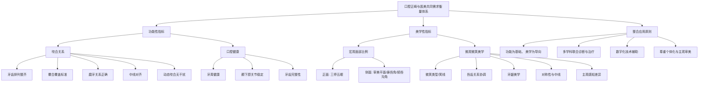

# 全球20-30岁女性口腔正畸与医美共同需求调研及产业融合前景分析报告
## 1 核心概念界定：口腔正畸与医美共同需求的内涵与衡量体系

本章旨在为本报告的核心研究对象——全球20-30岁女性口腔正畸与医疗美容的“共同需求”——提供清晰、可操作的定义，并构建一套融合功能与美学的综合性衡量标准。本章将首先基于参考资料，界定“共同需求”的内涵，明确其区别于单一领域需求的交叉性特征，即同时追求口腔功能健康与面部美学提升。随后，将系统性地梳理并整合参考资料中提及的功能性指标与美学性指标，构建一个多维度、可量化的衡量体系，为后续章节的量化调研、需求分析及产业融合前景评估奠定坚实的理论基础。

### 1.1 共同需求的内涵界定：功能与美学的交叉融合

口腔正畸与医疗美容的“共同需求”，并非两个独立需求的简单叠加，而是指向一种综合性、一体化的诉求。其核心内涵在于**追求口腔颌面部功能与美观的统一**[^1][^2]。这种需求超越了传统的“疾病治疗”范畴，进入了“健康管理与美学提升”的价值层面。

从口腔正畸的角度看，其核心目标不仅在于排齐牙齿，更在于建立理想的咬合关系与颌骨位置，这是保障咀嚼、发音等基本口腔功能健康的基础[^1][^2]。而医疗美容，尤其是面部美学领域，其关注点与口腔颌面部的形态紧密相连。研究表明，口腔在面部体积上占据主导地位，牙齿排列、颌骨位置直接影响面部下1/3的轮廓与比例，进而影响整体颜值[^3][^4]。例如，牙齿前突可能导致“凸面型”，下颌后缩则呈现“短下巴”，这些问题同时涉及功能异常与美学缺陷[^3]。

因此，本报告将“口腔正畸与医美共同需求”具体界定为：**在全球20-30岁女性群体中，为同时改善口腔功能（如咀嚼效率、颞下颌关节健康、牙周稳定）和提升面部整体美学（如轮廓比例、微笑魅力、年轻化状态）而产生的综合性、一体化诉求**。这种诉求的典型实现路径，是资料中提及的**多学科联合治疗模式**，例如修复正畸联合治疗（同步解决牙齿排列、咬合功能及美学缺陷）[^1]和正畸正颌联合治疗（针对严重骨性畸形，同时改善面部外观与咀嚼功能）[^2]。这两种模式均体现了“同步解决功能与美观”的核心思想，是“共同需求”在临床实践中的直接映射[^1][^2]。

### 1.2 功能性衡量指标：从咬合标准到口腔健康

共同需求中的功能性部分，是治疗的基础和首要目标。其衡量体系建立在客观、可验证的医学标准之上，主要涵盖咬合关系与口腔健康两大维度。

**1. 咬合关系标准**
这是评估牙齿排列与颌骨位置是否正常的关键。根据参考资料，一个标准的咬合关系应满足以下具体指标[^5][^6][^7]：

| 衡量维度 | 具体标准 | 临床意义 |
| :--- | :--- | :--- |
| **牙齿排列** | 上下牙齿整齐排列，无明显的错位、拥挤或旋转。 | 确保牙弓形态对称协调，为正常功能提供结构基础。 |
| **覆合与覆盖** | **覆盖**：上前牙水平方向覆盖下前牙约2-4毫米。 **覆合**：上前牙切缘垂直方向覆盖下前牙唇面约1/3牙冠以内。 | 覆盖过深（深覆合）或过浅（开合）均会影响咀嚼功能和美观。 |
| **磨牙关系** | 上颌第一恒磨牙的近中颊尖应咬合于下颌第一恒磨牙的近中颊沟。 | 建立稳定的后牙咬合支撑，均匀分散咀嚼压力。 |
| **中线对齐** | 上下牙列的中线应对齐，并与面部中线保持一致。 | 维持面部对称性，确保咬合力分布均衡。 |
| **动态咬合** | 前伸运动时，前牙均匀接触，后牙无接触；侧方运动时，工作侧牙齿均匀接触，非工作侧无干扰。 | 保证咀嚼运动的高效与舒适，避免异常咬合导致关节或肌肉问题。 |

**2. 口腔健康相关指标**
功能性衡量不仅限于静态的咬合关系，还包括动态的口腔组织健康状态。
*   **牙周健康**：健康的牙龈呈珊瑚粉色，表面圆钝，牙龈乳头充填于牙间隙，牙龈缘呈扇贝状附着[^8]。整齐的牙齿排列更易于清洁，可显著降低牙周病风险[^3]。
*   **颞下颌关节功能**：正常的咬合关系有助于减少关节磨损，避免因咬合紊乱引发的关节弹响、疼痛等功能障碍[^3][^6]。
*   **牙齿完整性**：对于存在牙体缺损或缺失的情况，需要通过修复治疗（如嵌体、冠、种植体）恢复牙齿形态和功能，这也是修复正畸联合治疗的重要考量[^1]。

### 1.3 美学性衡量指标：面部比例与微笑美学的量化

共同需求中的美学性部分，是医美视角的核心体现，也是驱动20-30岁女性消费决策的关键因素。其衡量体系融合了宏观面部比例与微观微笑细节。

**1. 宏观面部比例与侧貌美学**
面部美学的评估遵循一些公认的比例原则。
*   **正面观——“三停五眼”**：面部在垂直方向上发际至眉间、眉间至鼻下、鼻下至颏下高度大致相等（三停）；在水平方向上约等于五只眼睛的宽度（五眼）[^4]。
*   **侧面观——审美平面与角度**：
    *   **审美平面**：鼻尖点与颏部最突点的连线。通常认为上下唇位于该平面后方或轻微接触为佳[^4]。
    *   **鼻唇角**：鼻下缘与上唇前缘的交角，用于评估上唇及上牙的突度，貌美人群通常为95度至100度[^4]。
    *   **颏唇沟角**：正常约为130度[^4]。

**2. 微观微笑美学标准**
微笑是面部最具表现力的表情，其美学标准更为细致和可量化。
*   **微笑类型（笑线）**：根据上唇下缘与牙龈缘的关系分为高位、中位、低位微笑。**中位微笑**（微笑时暴露上前牙牙冠的75%-100%）被认为最具吸引力[^8][^9]。
*   **唇齿关系**：
    *   微笑时，上唇缘理想位置位于上颌切牙的3/4至牙颈缘水平[^4][^8]。
    *   下唇缘弧形应与上颌前牙弓的弧形一致[^4]。
    *   前牙切缘连线应与下唇线弧度平行，体现最佳协调度[^8]。
*   **牙龈美学**：健康牙龈呈珊瑚粉色，形态扇贝状。微笑时牙龈暴露量宜适度，过多的牙龈暴露（露龈笑）会影响美观[^3][^8]。
*   **对称性与中线**：微笑时口角连线应与双侧瞳孔连线平行[^8]。上牙中线需与面部中线协调，但需注意，**美的感知存在显著的主观差异**。研究表明，正畸医生对中线偏差的感知比普通大众更为敏感（能识别1mm偏差），而普通大众可能在4mm偏差时才注意到[^10]。此外，性别、种族、职业背景也会影响对中线偏移的接受度，例如女性可能比男性更宽容[^10]。

### 1.4 综合衡量体系的构建与应用边界

综合上述功能与美学指标，我们构建出适用于本报告研究场景的“口腔正畸与医美共同需求”综合性衡量体系。该体系旨在为识别和评估目标群体的需求提供一个结构化、多维度框架。

为了更直观地展示该体系的核心构成与内在逻辑，以下通过Mermaid图进行梳理：

然而，在应用此体系时，必须明确其边界与局限性：
1.  **临床适应症边界**：该体系主要适用于存在特定口腔功能问题且伴有明确美学诉求的复杂案例，如资料1、2提及的先天缺牙导致邻牙倾斜、重度磨耗伴咬合紊乱、骨性错颌畸形等，这些是联合治疗的典型适应症[^1][^2]。
2.  **美学标准的主观性与文化差异性**：体系中的美学指标，尤其是涉及中线、笑线、牙龈暴露量的部分，其“理想值”并非绝对。如资料5、13、14所强调，美的感知因个人欲望、性别、职业、种族文化背景而异[^8][^10]。因此，体系应用时必须结合个体审美偏好与专业医生的判断，达成审美共识，避免将单一标准强加于人[^10]。
3.  **信息源的局限性**：本体系构建完全基于所提供的参考资料。尽管这些资料涵盖了医学定义、美学标准和前沿研究，但其普适性，特别是在全球不同地域文化背景下的适用性，仍需通过后续的实证调研进行验证和补充。

本章构建的衡量体系，为后续调研全球20-30岁女性群体中共同需求的比重、分析消费驱动因素以及探讨产业融合可能性，提供了清晰的概念框架和可操作的测量维度。

## 2 目标群体画像：全球20-30岁女性消费特征与需求驱动因素

本章旨在基于参考资料，系统描绘全球20-30岁女性作为口腔正畸与医美共同需求核心客群的立体画像。首先，将利用相关资料，从人口统计学、消费能力、心理动机、行为偏好等多个维度，构建该群体的典型消费特征。其次，将重点分析驱动其追求口腔与面部美学升级的核心因素，包括“颜值经济”下的悦己消费、职场社交需求、健康意识觉醒以及数字化消费偏好等。最后，将探讨不同文化背景对审美标准和消费决策的差异化影响，明确全球视野下的共性与特性，从而验证该群体作为产业融合目标市场的内在逻辑与增长潜力。

### 2.1 核心消费特征：高潜力、重体验、数字化

全球20-30岁女性，特别是生活在一线及新一线城市的群体，是口腔健康与面部美学消费市场的核心驱动力。调查显示，她们是目前最注重牙齿健康美观的人群，也是“美齿经济”的核心主体[^11]。从职业构成来看，重视牙齿美观健康的人群以公司职员以及管理者居多，自由职业者（如网红、模特）以及律师、医生、记者等专业人员也是主要关注人群[^11]。这一画像与医美消费主力高度重叠，医美行业报告同样指出年轻群体是消费主力，呈现出明显的年轻化趋势[^12][^13]。

**该群体展现出强大的消费能力与支付意愿。** 作为消费升级的主力，80后、90后在口腔医疗上的平均支出持续增长，2023年达8000元/人，较2018年翻倍[^14]。她们愿意为高端项目支付溢价，正畸项目客单价普遍在2-3万元，高端隐形矫治费用可达5万元/人[^14]。更为关键的是，其消费逻辑已发生深刻转变。2025年的消费研究报告指出，消费者正在形成明确的“预算分区”：对于可替代性强、情绪价值弱的日常用品（如纸巾）会极致比价，但对于“让我变得更好”的产品或服务，则愿意付出超出想象的预算[^15]。这构成了她们作为“精明的情感驱动型投资者”的典型特征。

**在消费心理与行为上，该群体呈现出追求美观、情感驱动与数字化依赖并存的复杂特征。** 女性消费者普遍具有追求时髦、追求美观的心理，非常注重商品的外观、色彩和式样[^16]。同时，她们的情感较为强烈，购买行为易受情感支配和同伴影响，喜欢从众[^16]。在垂直消费领域，如医美和口腔健康，她们对服务的专业性和私密性有较高要求[^17][^18]。决策过程高度依赖数字化渠道，超过三成的消费者通过社交媒体获取医美信息[^19]，而口腔护理品类在抖音等平台的声量和互动量也增长迅猛[^20]。这导致品牌营销和消费者决策路径深度线上化，KOL（关键意见领袖）和内容营销的影响力巨大[^12][^20]。

**信任与安全是其消费决策的绝对底线。** 在信息过载的时代，消费者越来越倾向于复购熟悉的品牌，61%的消费者对老产品放心，因为信任成本更低、决策成本更小、服务体验更稳定[^15]。在尝试新服务时，安全性是首要关注要素，54.7%的医美消费者将安全性列为首要决策因素，对行业不规范行为持零容忍态度[^19]。因此，构建透明、专业、可信赖的品牌形象是赢得该群体的关键。

### 2.2 需求驱动逻辑：从“治疗”到“健康美学”的悦己升级

驱动全球20-30岁女性产生口腔正畸与医美共同需求的内在逻辑，根植于一场从“被动治疗”到“主动健康美学管理”的消费价值观革命。

**首先，核心驱动力是“颜值经济”下的“悦己”消费与战略性自我投资。** 口腔健康早已超越单纯的疾病治疗范畴，成为重要的“门面”工程[^11]。超过九成的消费者认同美丽是生活的加分项，愿意投入时间精力保持并提升美丽指数[^19]。2025年的消费情绪呈现出从“焦虑防御”到“理性乐观”的转折，消费者更愿意把改善生活从被动期待转变为可控行动，其中就包括投资健康、体态与外貌[^15]。消费的目的从取悦他人转向“悦己”，强调为了自我个性、情绪的表达[^21]。因此，整齐洁白的牙齿和良好的面部状态，不仅是美观需求，更是提升自信、获取社交优势甚至有益身心健康的“超级加分项”[^19]。

**其次，具体的场景需求是强有力的催化剂，尤其是在职场与社交领域。** 一口好牙和自信的笑容被视为“职场的第一张名片”[^19]。对于即将步入职场或处于职业上升期的年轻女性而言，通过正畸改善牙齿排列，或通过轻医美优化肤质，成为应对求职、面试、客户交往等场景的“颜值KPI”[^19]。此外，在社交媒体的放大效应下，外貌在社交互动中的价值被空前提升，进一步刺激了通过消费提升外在形象的需求。

**再者，健康意识的全面觉醒推动需求向“全周期管理”升级。** 现代女性的健康消费观念已从“有病治病”转向“无病预防”，追求内外兼修[^18]。在口腔领域，这体现为需求从治疗向预防、保健、美学延伸[^20][^22]。消费者不再仅仅满足于牙齿能吃东西，而是追求在恢复口腔长期健康功能的基础上，达到自然、稳定、美观的笑容，即“功能为基，美学为华”[^23]。这种对功能与美学统一性的追求，正是口腔正畸与医美产生共同需求的根本所在。

**最后，消费决策深受“新理性”主义影响，表现为对价值感的重新界定。** 尽管支付意愿强，但该群体对价格并非不敏感。相反，她们在决策时进行着精明的价值权衡。隐形正畸渗透率偏低的关键制约因素之一就是高昂的价格[^24]。消费者会在“该花的钱”和“能省的钱”之间做出清晰分区[^15]。对于正畸、种植牙或效果确定的医美项目，她们认可其带来的长期价值（如功能改善、颜值提升、自信增强），从而愿意承担高客单价[^14]。但这种支付意愿建立在安全、透明、专业的前提之上，任何信息不透明或信任缺失都会导致其望而却步[^24][^19]。

### 2.3 文化差异与审美多元：全球视野下的共性与特性

在全球范围内，20-30岁女性的消费需求既呈现出显著的共性趋势，也因文化背景不同而存在具体差异。产业融合策略必须建立在尊重文化特异性的基础上，同时把握全球性的需求内核。

**东西方在审美哲学上存在根本差异，直接影响对“美”的具体定义和项目偏好。** 东方审美更倾向自然和谐的面部轮廓，追求“三庭五眼”的比例协调[^25]。例如，中国消费者在医美和正畸中可能更偏好“妈生感”、“伪素颜”等低调自然的改善效果[^26][^21]。在正畸侧貌设计上，可能更注重鼻唇角等指标的和谐，避免过于突兀的改变。相反，西方审美偏好立体深邃的五官，倾向于使用假体塑造高挺鼻梁、进行明显的唇部填充等效果更开放的项目[^25][^26]。这种差异要求产品设计、方案沟通和营销话术必须进行本土化适配。

**市场需求的结构性差异同样明显，主要体现在渗透率、行业形态和消费习惯上。** 以隐形正畸为例，2020年中国的渗透率约为11.11%，而同期美国已达到31.8%，差距显著[^24]。这背后是价格、消费观念、行业成熟度等多重因素共同作用的结果。此外，美国牙科行业正经历深刻转型，女性牙医比例快速增长，执业模式从独立执业更多转向加入牙科支持组织（DSO），呈现出集团化、连锁化趋势[^27]。这与当前中国口腔市场多元竞争的格局有所不同，意味着服务提供的模式和可及性存在差异。

**尽管存在差异，全球年轻女性在消费需求上正展现出强大的共性趋势，这为产业融合提供了广阔基础。**

1.  **审美多元化与“自然美”、“健康美”的崛起**：全球范围内，单一的“白幼瘦”审美标准正在被摒弃。调查显示，超七成青年认同应当用“自然美”代替“白幼瘦”[^28]。高达74.4%的受访者对自身容貌满意，同时推崇多元化审美，认可单眼皮等多元特征之美[^19]。这反映在消费上，就是追求符合个人原生特色的、个性化的改善方案，而非流水线式的模板[^21]。无论是口腔正畸还是医美，“健康”与“自然”成为新的美学关键词，红润的气色、挺拔的体态、自然的光泽被视为“健康美”的表现[^28]。

2.  **“轻量化”与低风险偏好成为主流**：在医美领域，消费需求呈现明显的“轻医美”导向。皮肤管理（43%）、牙齿调整（28.6%）等低风险、高性价比项目最受青睐，消费偏好集中于日常保养而非“改造”[^19]。这与口腔护理市场的趋势高度吻合：基础清洁产品使用率高，同时漱口水、冲牙器等“进阶”护理品类迅速崛起，口腔护理呈现“护肤化”趋势，强调针对性、精细化[^11][^20]。**这种对渐进式、可逆、低创伤改善方式的共同偏好，是连接口腔正畸（尤其是隐形矫治）与轻医美的重要心理纽带。**

3.  **消费场景的情感化与仪式感**：医美消费已从单纯的功能消费，转向承载情绪价值的载体。日常保养、重要节点赋予的仪式感、自我奖励成为三大消费驱动因素[^19]。这与年轻女性将口腔正畸或牙齿美白作为送给自己的一份礼物，以庆祝毕业、入职或生日等行为背后的逻辑完全一致。消费成为了一种“悦己”的仪式和情感表达。

综上所述，全球20-30岁女性消费者是**追求自然个性化美学、注重健康与安全、愿意为确定性自我提升支付溢价、且决策路径高度数字化的高价值群体**。文化差异塑造了其对“美”的具体偏好和消费场景，但“悦己”驱动的健康美学升级、对轻量化改善方式的青睐、以及情感化消费则是跨越地域的共性需求。这验证了该群体不仅是口腔正畸和医美各自市场的核心客群，更是两者融合所产生的“共同需求”最可能、也最具价值的承载者。

## 3 现状扫描：口腔正畸与医美服务的交集、分离与协同现状

本章旨在基于参考资料，系统性地比较分析口腔正畸（侧重功能矫正与颌面美学）与医疗美容（侧重非侵入/微创面部美化）两大领域在技术应用、服务流程、客户认知及市场定位上的现实关系。通过梳理两者在解决特定问题上的实质性交集，分析其在专业壁垒与服务标准上的显著分离，并评估现有协同模式的成效与局限，为后续探讨产业融合的可能性与路径提供坚实的现状基准。

### 3.1 技术应用的交集：从功能矫正到面部美学的共同目标

口腔正畸与医疗美容的技术应用，在解决特定颌面部问题上呈现出明确且深刻的交集。**这一交集的核心在于，两者共同服务于“口腔颌面部功能健康与整体美学提升”这一综合性目标，尤其在处理骨性畸形、微笑美学及抗衰老等复杂需求时，技术路径高度互补**[^2][^29]。

首先，在解决严重骨性错颌畸形方面，**正畸正颌联合治疗是两大领域技术融合的典范**。该治疗通过术前正畸调整牙齿排列，为颌骨手术创造理想条件，术后再进行精细咬合调整，其根本目标是**同时改善面部外观与咀嚼功能**[^2]。这直接证明了，对于骨性Ⅲ类错颌、严重开颌、偏颌等复杂问题，单一的正畸或医美技术均无法独立解决，必须依赖口腔颌面外科的手术技术与正畸学的生物力学原理进行协同[^2]。现代数字化技术，如3D打印手术导板和术前效果模拟，进一步提升了这种协同的精准度与可预见性[^2]。

其次，在提升微笑美学与面部整体协调性方面，正畸技术与轻医美技术存在广泛的协同应用场景。具体案例显示，合作机构能够提供“牙齿矫正与面部美容综合方案”，例如在调整牙齿排列、改善咬合关系的同时，结合进行面部轮廓塑造、注射美容、皮肤紧致等项目，旨在使面部更加和谐美观，让患者展现自信笑容[^29]。另一种常见模式是“牙齿美白与肌肤护理联合治疗”，通过冷光美白、激光美白等技术提高牙齿亮度，并同步提供个性化的肌肤护理方案，实现牙齿与肌肤状态的同步改善，提升整体形象[^29]。这些实践表明，**牙齿的排列、色泽与面部软组织的状态被视为一个不可分割的美学整体**。

此外，交集还延伸至“口腔健康与抗衰老”的整体方案。通过全面的口腔治疗（如解决牙周问题）结合面部抗衰老治疗（如注射美容、激光紧肤），不仅保障了口腔功能健康，还改善了面部肌肤状态，实现焕发青春活力的整体效果[^29]。**这种从单一牙齿治疗向“美学・医学・预防医学”三位一体服务的演进，正是技术交集推动服务模式升级的体现**[^30]。

然而，必须明确的是，正畸与牙齿美容（如贴面、漂白）在技术目标上存在清晰区别。正畸核心在于解决牙齿错颌畸形，调整牙齿位置和颌骨关系以恢复功能；而牙齿美容侧重通过美学修复手段提升牙齿外观[^31]。两者的交集通常发生在“牙齿排列不齐伴随色泽异常”等复合问题上，治疗顺序往往是先完成正畸建立正常咬合，再进行美学修复[^31]。**这揭示了技术交集并非混同，而是在明确分工基础上的有序协同**。

### 3.2 服务流程与市场定位的分离：专业壁垒与认知鸿沟

尽管在技术目标上存在交集，口腔正畸与医疗美容在实际的服务流程、市场定位及消费者认知层面，却存在着显著的隔离带。**这种分离根植于两者不同的行业属性、专业壁垒和风险管控要求**。

**在专业资质与团队要求上，壁垒森严**。高品质的口腔正畸服务极度依赖专业的医疗团队。相关评选标准将“医疗专业资质与团队稳定性”置于核心维度，重点关注医生的学历背景（如硕士以上学位占比）、平均临床经验以及在机构内的长期执业留存率[^32]。对于复杂的成人或青少年病例，多学科协作能力被视为关键[^32][^33]。相比之下，部分医美服务，尤其是生活美容或某些非手术项目，从业人员的资质门槛、培养周期和监管严格程度存在差异。这种专业壁垒的差异，导致两者在服务提供的起点上就难以完全对齐。

**服务流程与标准存在本质差异**。口腔正畸是一个典型的长期、系统性医疗过程。以正畸正颌联合治疗为例，其标准流程包括术前正畸（12-18个月）、正颌手术和术后正畸（6-12个月），全程通常需要2-3年，并需长期佩戴保持器防止复发[^2]。治疗期间需严格保持口腔卫生，并定期复查监测咬合稳定性[^2]。这种对医疗连贯性、长期随访和生物安全性的高要求，与许多医美项目（尤其是单次或短周期消费）的服务节奏和质控重点不同。合作实践中已暴露出“服务标准不统一，难以保证服务质量”的挑战，双方在服务流程、质量标准和环境设施上的差异，可能导致客户体验不一致[^34]。

**市场定位与客户决策逻辑分化明显**。口腔医疗正在经历从“治疗刚需”向“健康消费”的范式跃迁，但功能性矫正（如解决咬合问题）仍是其基石[^35]。而医美，特别是轻医美，其“消费”属性更为突出，更侧重于满足即时性的美学提升和情感需求[^36]。这种差异反映在客户决策上：正畸患者（尤其是复杂病例）首要关注“医生专业资质与经验”及长期健康结果；而牙齿美白等项目的消费者可能更关注即时效果、价格与体验舒适度[^34]。此外，消费者对机构的信任基础也不同，口腔患者更倾向于选择本地的、信誉良好的医疗机构[^37]，而医美消费可能更易受社交媒体营销和网红经济的影响。

**行业面临的挑战虽有重叠，但侧重点不同**，进一步加剧了分离。两者均面临人才短缺问题，但口腔领域尤为突出，我国每十万人口牙医数远低于发达国家，具备复杂正畸或种植能力的专业医生更是稀缺[^36]。同时，两者都受到信息不对称和信任危机的困扰，但表现形式各异：口腔行业因部分机构跑路、虚假宣传等问题导致患者流量下降[^36]；而医美行业则长期与过度营销、效果纠纷等问题相关联。这些差异化的痛点使得统一的解决方案难以实施。

### 3.3 现有协同实践的成效评估与核心局限

当前，口腔与医美领域的协同已从概念走向实践，涌现出多种合作模式。通过分析参考资料中的具体案例，可以对其成效与局限进行客观评估。

**现有协同实践已取得可验证的积极成效，主要体现在资源整合、业务拓展与品牌提升方面**。
*   **资源共享与成本优化**：合作双方通过共享客户资源、技术设备乃至物理空间，实现了优势互补。例如，口腔医院为美容院客户提供专业口腔检查与咨询，美容院则为口腔医院客户提供面部护理服务，相互引流，扩大了市场份额[^38][^39]。这种模式有助于降低各自的获客与运营成本[^34]。
*   **业务领域拓展与一站式服务**：协同使得双方能够突破原有业务边界，提供“牙齿矫正、牙齿美白、面部美容”等一站式综合服务，满足了消费者对完美笑容和整体形象的复合型需求[^29][^38]。市场调研指出，这种跨界合作能够创造更多商业机会，共同开拓新的市场领域[^39]。
*   **客户满意度与品牌影响力提升**：成功的合作通过提供更全面、专业的服务，显著提高了客户满意度。案例数据显示，合作后客户回头率增加，忠诚度增强[^29]。同时，合作有助于借助对方的品牌效应，共同提升市场知名度和专业公信力，实现品牌影响力的协同增长[^38][^39]。

然而，现有协同实践也暴露出明显的局限与挑战，制约了其向更深层次发展。
*   **沟通与协调成本高昂**：由于专业背景、服务理念和管理模式存在差异，合作双方在信息传递、流程对接上容易产生障碍，增加了内部沟通与协调的难度与成本[^34]。
*   **服务标准难以统一**：这是协同实践中最突出的瓶颈之一。口腔医疗的严谨质控体系与部分医美服务的运营标准可能存在冲突，导致在服务质量、安全规范及售后保障上难以形成统一、稳定的输出，直接影响客户体验和信任度[^34]。
*   **核心人才短缺与专业壁垒**：如前所述，具备跨学科知识和协调能力的复合型人才极度稀缺。同时，口腔医疗的高专业壁垒使得医美机构难以深度介入核心诊疗环节，合作多停留在客户导流和浅层项目捆绑，难以实现真正的技术融合与方案创新。
*   **市场竞争与利润挤压**：合作在扩大市场的同时，也可能使双方面临更复杂的竞争格局。此外，在口腔种植集采等政策影响下，行业利润空间普遍受到挤压，如何设计可持续的、互利共赢的利益分配机制，成为合作能否长期稳定的关键[^36][^34]。

值得注意的是，一些新兴模式正在尝试突破上述局限。例如，**要慈口腔通过“AI种植牙机器人+远程管理系统”的技术赋能模式，试图为基层诊所提供标准化、专家级的诊疗能力，这为技术下沉和标准化服务输出提供了新思路**[^40]。而**牙美汇则通过构建“从耗材生产到诊疗服务”的全产业链闭环，强化对服务质量和核心资源的控制力，以生态协同的方式探索深度融合**[^30]。这些探索表明，未来的协同可能更依赖于**技术创新（如AI、数字化）和商业模式创新（如生态化、平台化）**，而不仅仅是简单的机构间合作。

**综上所述，当前口腔正畸与医美服务的交集明确存在于以颌面美学和功能健康为核心的复合问题解决中，但两者在专业、流程和市场层面的分离带依然清晰。现有协同实践取得了初步成效，证明了市场需求的真实存在与商业价值，但仍普遍受限于沟通成本、标准不一和人才短缺等深层障碍。这为思考未来的产业融合路径提供了关键的现状参照：即融合必须致力于构建能够跨越专业壁垒、统一服务标准、并培育复合型人才的系统性解决方案，而非流于形式的松散联盟。**

## 4 需求比重量化：共同需求的规模、占比与消费意愿实证分析

本章旨在基于参考资料，对全球20-30岁女性群体中口腔正畸与医美共同需求的具体比重进行实证分析与量化验证。通过整合参考资料中的市场规模、用户画像、消费行为及调研数据，本章将首先估算共同需求的潜在市场基础与现有消费中的交叉比例。其次，结合消费者调研数据，深入分析该群体对一体化美学服务的支付意愿强度及其决策逻辑中的关键因素。最后，系统探讨地域、收入、教育水平等关键变量如何影响共同需求的比重与表现形式。本章的分析严格建立在参考资料提供的客观数据之上，并明确这些数据的适用范围和边界，为评估产业融合的市场潜力提供坚实的量化依据。

### 4.1 潜在市场规模与消费交叉比例估算

本部分将基于参考资料中的市场规模数据和用户结构特征，对全球20-30岁女性群体中口腔正畸与医美共同需求的潜在市场容量进行估算，并分析现有消费行为中两者交叉的具体表现。

**全球正畸市场为共同需求提供了庞大的基本盘。** 根据《全球正畸市场收入和份额洞察》报告，2024年全球正畸市场价值已达到**10460.93百万美元（约104.6亿美元）**，并且预计从2024年到2033年将保持**12.05%** 的年复合增长率，显示出强劲的增长动力[^41]。这一市场的持续扩张，为同时追求功能与美学的综合性需求奠定了坚实的产业基础。

**目标群体（20-30岁女性）是口腔医疗消费的绝对核心。** 聚焦中国市场，用户画像分析明确指出，中国口腔医疗消费持续年轻化，**20-35岁的年轻人占比高达约71%**，是无可争议的核心消费人群[^42][^43]。进一步地，线上口腔医疗消费中，**女性比例约为61%**，显著高于男性，这体现了口腔医疗服务行业强烈的“医美”与“消费”属性，女性对口腔美学的需求更高[^42][^43]。尽管全球数据存在差异，但美国牙科协会的报告也显示，女性牙医比例快速增长，在35岁以下年轻从业者中已接近50%，从供给侧印证了女性在该领域的深度参与和影响力[^27]。因此，可以合理推断，**20-30岁女性是全球口腔正畸市场中最具活力、支付意愿最强的细分客群之一**，其市场容量巨大。

**在现有医美消费行为中，口腔正畸已占据显著份额，直接量化了交叉需求。** 京东消费及产业发展研究院的调研提供了关键交叉数据：在消费者首要改善的容貌问题中，**“牙齿调整”（含正畸、美白等）以28.6%的占比，位列所有医美诉求的第二名**，仅次于皮肤管理（43%）[^44]。这一数据直接表明，在广义的医美消费场景下，有近三成的消费者将口腔问题（尤其是美观问题）视为首要改善目标。这并非孤立的发现，其他资料同样指出，带有“医美”属性的正畸增速夸张，隐形正畸的年复合增长率高达**54.6%**，成为市场的强势带动力[^45]。这些数据共同指向一个结论：**口腔正畸（尤其是隐形矫正）已成为医美消费矩阵中一个独立且重要的品类，两者在消费者认知和消费行为上存在明确的交叉。**

为了更直观地展示交叉需求的关键量化指标，以下表格整合了参考资料中的相关数据点：

| 量化维度 | 具体数据/比例 | 数据来源与说明 |
| :--- | :--- | :--- |
| **医美诉求中口腔项目排名** | **第2位**（占比28.6%） | 京东调研：牙齿调整是消费者首要改善的第二大部位[^44]。 |
| **持续消费意愿中的口腔项目** | **26%**的受访者选择 | 京东调研：口腔美容是消费者愿意持续投入的三大医美项目之一[^44]。 |
| **年轻学生群体偏好** | **第3受欢迎项目**（次于光子嫩肤、水光针） | 京东调研：在学生用户中，牙齿正畸/美白受欢迎程度高[^44]。 |
| **家长支持子女医美意愿** | **首选项目**，占比38.2% | 京东调研：牙齿正畸是家长最支持子女进行的医美项目[^44]。 |
| **口腔消费核心年龄层** | **20-35岁占比约71%** | 前瞻产业研究院：中国口腔医疗消费持续年轻化[^42][^43]。 |
| **线上口腔消费性别比** | **女性约占61%** | 前瞻产业研究院：女性是线上口腔消费主力军[^42][^43]。 |
| **高校学生牙齿矫正需求率** | **总体38.6%**，其中**女性44.4%** | 专项调研：20-30岁女性群体中需求率显著。 |

**需要明确的边界与局限性：**
1.  **估算的间接性**：上述市场规模估算主要基于中国市场的用户结构数据，全球其他地区的具体比例可能存在差异。例如，美国牙医队伍的种族构成（亚裔牙医占比20.4%）与人口结构不完全匹配，可能影响服务的可及性和需求表达[^27]。
2.  **概念不完全等同**：参考资料中“牙齿调整”（28.6%）的医美诉求，是一个相对宽泛的概念，它包含了牙齿美白、贴面等非正畸项目。而本报告定义的“共同需求”更侧重于需要通过正畸手段（可能联合其他治疗）来同时解决功能与美学问题的复杂案例。因此，**28.6%可视为交叉需求的上限或重要参考指标，而非精确的共同需求比重**。
3.  **数据来源的特定性**：消费交叉数据主要来源于京东的消费者调研，其样本可能具有一定的平台用户特征，结论的普适性需结合其他数据源进行交叉验证。

尽管如此，综合市场规模、用户画像和消费行为数据，可以得出一个强有力的推论：**在全球20-30岁女性群体中，存在一个规模可观、且已被部分市场行为验证的口腔正畸与医美交叉需求。** 这种需求不仅体现在宏观的市场增长数据中，更直接反映在消费者具体的项目选择偏好上。

### 4.2 支付意愿强度与消费决策关键因素

支付意愿是需求从潜在转化为实际消费的关键。本部分将深入分析全球20-30岁女性群体对口腔正畸与医美一体化服务的支付意愿强度，并剖析其消费决策背后的核心逻辑。

**该群体展现出强烈的“为确定性的自我提升支付溢价”的意愿。** 这种支付意愿根植于一种深刻的消费价值观转变。调研显示，**高达52.4%的消费者坚信，美丽的价值是“超级加分项”**，它能提升自信、带来社交优势，甚至有益于身心健康[^44]。对于她们而言，投资于口腔正畸或医美，并非单纯的消费，而是一种**战略性的自我投资**。这种投资逻辑直接支撑了高客单价服务的市场存在。例如，隐形正畸的客单价高达**5-8万元**，毛利率达**50%-70%**，而市场仍能保持高速增长，这本身就证明了目标群体强大的支付能力与意愿[^45]。一位26岁的上海白领在调研中坦言：“好的状态是职场的第一张名片，定期做光子嫩肤让我素颜也有好气色，见客户时更自信，这是一种良性循环。”[^44] 这生动地说明了支付行为背后对“社交资本”和“职业竞争力”的明确预期。

**然而，强烈的支付意愿建立在绝对的安全与信任基石之上。** 消费决策呈现出典型的“精明的情感驱动”特征。京东调研揭示，阻碍消费者尝试医美的三大核心顾虑分别是：**安全风险（34.5%）、价格门槛（26.9%）及信息杂乱（25.4%）**[^44]。其中，**安全性以54.7%的占比成为消费者首要关注的因素**，行业不规范行为遭遇零容忍[^44]。在关键决策因素中，**价格透明（38.7%）与医生资质（35.6%）** 紧随安全性之后[^44]。这表明，**价格本身并非不可逾越的障碍，但支付必须对应明确的价值（专业、安全、效果）和透明的信息。** 对于口腔正畸这类专业医疗行为，**医生的专业资质与经验**是消费者信任的核心来源，也是其愿意承担高费用的根本原因。

**心理负担与社交焦虑是驱动支付意愿的深层引擎。** 对于成年女性正畸患者而言，需求往往源于强烈的心理动机。《成年女性正畸患者心理健康状况》研究指出，以“牙突/嘴突”为主诉的患者，在强迫症状、人际关系敏感、焦虑、抑郁等方面的心理量表得分明显更高[^46]。口腔占据面部的三分之一，牙齿排列和颌骨形态的异常直接导致“颜值缺陷”，进而引发社交自信不足、性格孤僻甚至社交障碍[^46]。因此，支付数万元进行正畸治疗，对许多女性而言，是**一项旨在解放心理压力、重塑社交自信的重要投资**。这种为“情绪价值”和“心理收益”付费的意愿，往往比单纯为功能改善付费更为强烈和坚定。

**消费行为呈现出“高关注、高门槛、重决策”的特征。** 尽管潜在需求旺盛，但医美消费目前仍呈现“高讨论低行动”的表现，**75%的受访者尚未体验过医美**[^44]。这反映了决策的高门槛特性。消费者并非不愿支付，而是在谨慎评估风险与价值。一旦突破信任门槛，其消费忠诚度和复购意愿很高。资料显示，61%的消费者对老产品放心，因为信任成本更低。在口腔正畸领域，一旦患者选定医生并开始治疗，其后续的保持器佩戴、定期复查等长期依从性也相对较高，这体现了对专业方案的深度认可和持续投入。

**综上所述，全球20-30岁女性群体对口腔正畸与医美一体化服务具备强烈的支付意愿，但这种意愿是高度条件性的。** 她们是“价值敏感型”而非“价格敏感型”消费者，愿意为专业、安全、能带来确定性心理与社交回报的综合美学方案支付高额费用。**医生资质、安全记录、价格透明度和效果可预见性是其打开钱包的钥匙。** 这为未来提供融合服务的机构指明了核心竞争要素：必须构建无可置疑的专业信任体系。

### 4.3 影响需求比重的关键变量分析

共同需求的表达和实现程度并非均质，而是受到地域经济水平、个体收入与教育背景、以及文化审美差异等多重变量的深刻影响。本部分将系统分析这些关键变量如何塑造需求比重与具体形态。

**1. 地域经济差异：渗透率与支付能力的决定性因素**
地域差异最直接地体现在市场渗透率和消费能力上。以隐形正畸为例，其渗透率在发达国家与发展中国家之间存在巨大鸿沟。数据显示，**2020年美国隐形正畸的市场渗透率已达到约31.8%**，而同期**中国的渗透率仅为约11.11%**[^47]。这一差距主要源于**价格敏感度和可支配收入的差异**。在中国，隐形矫治器花费约为4-6万元，且通常不在社保报销范围内，这对许多年轻消费者构成了显著的经济门槛[^47]。然而，这种差距正在快速缩小。中国正畸市场年复合增长率达**17.3%**，是全球发展最快的地区之一，显示出巨大的增长潜力和需求释放空间[^47]。

不同线级城市的需求结构也呈现分化。在一线及新一线城市，高收入、高教育水平的年轻女性是高端隐形矫正和综合医美方案的核心客群。而在下沉市场，需求同样旺盛但可能更侧重性价比和基础项目。《三线城市医美消费图谱》指出，**25-35岁女性是当地医美市场的主力军**，抗衰需求年增长率高达**40%**，推动着消费升级[^48]。这表明，共同需求并非一线城市专属，而是随着经济水平提升和消费观念扩散，在更广阔的市场层级中普遍存在，只是具体项目选择和支付预算上存在梯度。

**2. 收入与教育水平：驱动需求从“治疗”向“美学”升级的核心变量**
收入和教育水平是塑造消费意愿和品味的关键个体变量。报告指出，随着**人均可支配收入的持续增长及消费观念改变**，中国已建立可拓展的中产阶级基础，他们更有能力承担口腔医疗服务支出，并促进消费升级[^42]。经济能力的提升，使得口腔消费从解决疼痛的“治疗刚需”，转向追求美观、健康、社交价值的“美学消费”。

教育水平，特别是医学相关教育背景，会显著提升对口腔健康重要性和正畸价值的认知。专项调研显示，**医学专业学生的正畸需求率（43.2%）高于非医学专业学生（34.5%）**。高学历群体通常更注重长期健康投资、信息搜集能力和专业鉴别能力，因此她们更可能选择技术更先进、医生更专业但价格也更高的隐形矫正或联合治疗方案。她们不仅是消费者，更是“研究者”和“决策者”，对服务的专业内涵和审美设计有更高要求。

**3. 文化审美背景：定义“美”的具体标准与项目偏好**
文化背景是影响共同需求具体构成的深层变量。东西方在审美哲学上存在系统性差异，这直接映射到对口腔颌面部美学的追求上。
*   **东方审美**：更倾向于**自然、和谐、含蓄**的面部轮廓，追求“三庭五眼”的比例协调。在正畸治疗中，可能更注重改善凸面型、调整鼻唇角至柔和范围，追求“妈生感”的整齐笑容，避免过于外突或内倾的极端侧貌。在医美结合上，可能偏好皮肤提亮、细腻毛孔等提升整体气色的项目。
*   **西方审美**：更偏好**立体、分明、有表现力**的五官。在正畸和正颌联合治疗中，可能更追求塑造清晰的下颌轮廓、明显的颏部形态。在医美上，则可能与更明显的唇部填充、轮廓塑形等项目结合。

这种文化差异意味着，全球化的产业融合不能推行单一的“美学模板”，而必须进行深度的本土化适配。营销话术、医生沟通方式、乃至治疗方案的设计（如拔牙决策、前牙转矩控制），都需要考虑当地主流审美偏好和文化心理。遗憾的是，现有参考资料缺乏对全球不同文化背景下需求比重的量化对比数据，这构成了未来研究的一个重要方向。

**关键变量影响的总结与启示：**
为了清晰呈现上述关键变量如何影响共同需求的比重与特征，以下通过表格进行归纳：

| 关键变量 | 对共同需求比重/特征的主要影响 | 实证数据/现象举例 |
| :--- | :--- | :--- |
| **地域经济水平** | 决定市场渗透率与支付能力；需求总量与高端项目占比呈正相关。 | 美国隐形正畸渗透率(31.8%)显著高于中国(11.11%)[^47]；三线城市医美消费增速(25%)超一线城市(12%)[^48]。 |
| **个人收入水平** | 驱动需求从治疗型向消费型、美学型升级；支撑高客单价综合方案。 | 中产阶级基础促进口腔消费升级[^42]；正畸客单价达数万元[^47]。 |
| **教育水平** | 提升健康与美学认知；增强专业鉴别能力与决策理性。 | 医学专业学生正畸需求率更高(43.2% vs 34.5%)；高学历群体更关注医生资质。 |
| **文化审美背景** | 定义具体的“美”的标准；影响项目偏好与治疗方案设计。 | 东方追求自然和谐，西方偏好立体分明；影响正畸侧貌设计目标与医美项目选择。 |

**结论**：全球20-30岁女性对口腔正畸与医美的共同需求，是一个受多重变量调节的动态存在。其总体规模庞大且增长迅速，但在不同地域、不同社会经济群体中的实现程度和表现形式各异。**成功的产业融合策略必须是一种“精细化运营”：在一线城市聚焦高净值客户提供顶级综合方案，在下沉市场提供高性价比的标准化服务；同时，深刻理解和尊重不同文化圈的审美差异，实现产品与服务的本土化创新。** 忽略这些变量差异的标准化扩张，很可能遭遇市场阻力。

## 5 未来可能性：产业融合的驱动因素、潜在模式与实施路径

本章旨在基于参考资料，系统分析推动口腔正畸与医美产业走向深度融合的内外部驱动因素，并归纳提炼出已验证或具有潜力的商业模式及其可行的实施路径。本章将首先利用参考资料中的行业趋势、企业战略及技术案例，结构化地阐述技术革新（如数字化、AI、3D打印）、消费需求升级（从治疗到健康美学）以及政策监管环境（合规化、全链条严控）如何共同构成融合的驱动力。其次，将重点分析“每牙先生”的全产业链生态、“牙美汇”的美学-医学-预防医学三位一体模式、以及“南方医科大学口腔医院盘福院区”的“牙相-骨相-皮相”协同诊疗等具体实践，从中提炼出“美学导向多学科诊疗中心”、“全产业链生态平台”、“技术赋能与方案标准化输出”等潜在商业模式。最后，将探讨不同市场参与者实施这些模式的具体路径、关键挑战与资源需求，确保分析严格建立在参考资料提供的实践案例与行业数据之上，为产业融合提供可操作的蓝图。

### 5.1 核心驱动因素：技术、需求与政策的合力

口腔正畸与医疗美容的产业融合，并非偶然的市场现象，而是由技术赋能、需求升级与政策规制三重核心力量共同驱动的必然趋势。这三股力量相互作用，正在系统性重塑行业的价值创造逻辑与服务交付模式。

**1. 技术驱动：数字化、AI与精密制造打破产业壁垒**
底层技术的突破性进展是产业融合得以实现的物理基础和效率引擎。**数字化诊疗技术**，如高精度口内扫描，能够快速获取患者口腔及颌面部的三维数据，为后续的联合诊断与方案设计提供了统一的数字基础[^49][^50]。在此基础上，**人工智能（AI）技术**的深度应用显著提升了跨学科协同的效率与精准度。例如，时代天使发布的智能正畸平台iOrtho 2025，能够支持医生在40秒内快速生成新方案，将方案批准周期平均缩短40%，这为复杂的美学联合方案设计提供了高效的决策支持工具[^51]。同样，正雅上线的AI病例动画设计模块，实现了病例设计方案的即时生成与实时修改，为医生提供了更高效且准确的支持[^52]。

**高精度3D打印与材料科学的结合，则彻底重构了服务交付的时空边界。** 以迅实科技为代表的解决方案，将口内扫描、AI智能设计与椅旁3D打印整合，实现了“一小时完成精准牙冠修复”，将传统需要数天甚至数周的制作周期压缩至一次就诊内完成[^49]。这项技术的核心在于同时突破了高性能材料（高陶瓷含量复合树脂）、精密打印技术（数字液压立体光刻）与可信AI设计系统的“不可能三角”[^49]。这种“椅旁数字化即刻修复”模式，不仅极大提升了诊疗效率与患者体验，更重要的是，它为在同一物理空间内，由口腔医生与医美专家协同完成从诊断到最终修复/美化的全流程，提供了技术上的可行性[^49][^50]。

**2. 需求驱动：从“治疗”到“健康美学”的价值升级**
消费需求的深刻变迁是产业融合的根本拉动力。市场趋势清晰地表明，消费者的需求正从单一的口腔疾病“治疗”，全面升级为对“健康+美观”一体化解决方案的追求[^53]。正如每牙先生创始人黄银英所指出的，品牌升级正是为了应对消费需求从“治疗”向“健康+美观”升级的趋势[^53]。这种需求在20-30岁女性群体中表现得尤为突出，她们不仅关注牙齿的整齐与健康，更追求面部整体的和谐与年轻化状态。

这种复合型需求催生了全新的服务理念。牙美汇提出的“美学·医学·预防医学”三位一体服务模式，正是对市场需求的直接响应，旨在让每一项服务都兼具专业性与个性化[^54]。而南方医科大学口腔医院盘福院区创新的“牙相-骨相-皮相”三位一体诊疗模式，则更进一步，打破了传统口腔诊疗的局限，从牙齿健康、面部骨骼协调、皮肤状态改善等多个维度出发，为患者制定个性化方案，实现口腔健康与颜值提升的双重目标[^55]。**这些实践共同印证了一个核心洞察：消费者不再满足于孤立地解决牙齿或皮肤问题，而是渴望获得一个以整体面部美学和健康为导向的、一站式的综合价值包。**

**3. 政策驱动：合规化监管为高质量融合创造市场环境**
日益严格的行业监管政策，在规范市场、淘汰不合规主体的同时，客观上为建立在专业与安全基础上的产业融合扫清了障碍、创造了空间。自2021年以来，国家层面持续开展打击非法医美专项行动，将水光针、射频类设备等纳入三类医疗器械管理，并对肉毒毒素等产品实施闭环追溯[^56]。这种“全链条严控”的监管趋势，大幅提高了行业的准入门槛[^56][^57]。

监管趋严导致市场加速洗牌。2025年上半年，实现营收增长的医美机构比例仅为14%，而营收下滑的比例高达63%[^58]。在这一背景下，**合规、专业、拥有强大医疗背书的机构获得了更大的竞争优势。** 公立医院或大型连锁机构凭借其固有的资质优势、专家资源和质量管理体系，更有能力提供安全可靠的“口腔+医美”协同服务。例如，浙江省皮肤病医院皮肤外科主任竺璐强调，医美首先是医疗行为，核心在于“医”，必须选择正规医疗机构由具备资质的医生面诊[^59][^60]。政策环境因此推动行业资源向能够提供“先医后美”专业服务的合规主体集中，为产业融合提供了规范化的市场土壤。

综上所述，技术、需求与政策三股力量正形成强大的合力：**技术提供了融合的工具与可能性，需求指明了融合的方向与价值，而政策则设定了融合的规则与门槛，共同推动口腔正畸与医美产业从浅层合作走向深度整合。**

### 5.2 潜在商业模式：从机构协同到生态构建

基于当前的市场实践，口腔正畸与医美产业的融合已演化出几种特征鲜明、且被初步验证的商业模式。这些模式在资源整合深度、服务半径和竞争壁垒上各有侧重，为不同市场参与者提供了可参考的路径。

**1. 美学导向多学科诊疗中心（MDT）模式**
该模式以大型医院，特别是公立专科医院或大型民营医疗集团为载体，通过物理空间、专家团队和治疗流程的深度整合，提供权威的一站式服务。**南方医科大学口腔医院盘福院区是这一模式的典型代表。**

其核心特征体现在三个方面：
*   **空间与流程再造**：院区升级后，五层空间按功能清晰分区，从一楼的综合服务大厅到五楼的颌面外科+医学美容中心，实现了挂号、咨询、专科诊疗、特需服务及医美项目的无缝衔接，真正践行了“以患者为中心”的服务理念[^55]。
*   **王牌专家团队配置**：院区拥有包括15名高级职称专家、4名博硕研究生导师、18名博士和16名硕士在内的强大医疗团队[^55]。这支专业团队是开展高难度多学科联合诊疗（MDT）的人才保障，能够从容应对从日常治疗到复杂数字化精准正畸、种植手术等各类需求[^55]。
*   **创新的协同诊疗流程**：院区创新推出的“牙相-骨相-皮相”三位一体诊疗模式，打破了学科壁垒[^55]。通过数字化多学科联合诊疗（MDT）和三维数据平台，口腔医生与医美专家协同会诊，为咬合紊乱伴面部轮廓问题等复杂病例制定一站式解决方案，将“单科治疗”升级为“全科协同”[^55]。

**该模式的核心优势在于其强大的医疗公信力、顶尖的专家资源以及处理复杂病例的能力，主要服务于对安全性和专业性要求极高的高净值客户。**

**2. 全产业链生态平台模式**
该模式由雄心勃勃的民营连锁品牌主导，通过纵向整合研发、生产、服务等关键环节，甚至横向串联跨界资源，构建一个可控、高效、且能定义行业标准的产业生态。**每牙先生和牙美汇是实践这一模式的先行者。**

两家企业的策略虽有侧重，但内核一致：
*   **每牙先生**：在十年发展历程中，构建了“门诊+工厂”的全产业链布局[^53]。其未来规划明确提出，将串联医疗、美容、保险、消费等多领域资源，构建跨界融合的产业生态，旨在重新定义口腔健康美学的未来[^53]。这标志着其从单一的口腔医疗服务商，向一个连接多方的生态平台运营者转型。
*   **牙美汇**：则更早地构建了“技术研发-耗材生产-临床应用”的闭环生态[^54]。早在2019年，牙美汇便成立了口腔美学研究所及瓷贴面生产工厂，通过自主生产关键耗材来保障服务质量的稳定性，并为患者定制专属方案[^54]。同时，其自2017年成立的商学院，通过“内部培养+外部合作”的模式，为生态持续输送专业人才，践行“成就专业价值，共享发展荣光”的理念[^54]。

**该模式的核心优势在于通过对产业链核心环节的控制，实现成本优化、质量可控和快速扩张，并有望通过生态效应建立较高的竞争壁垒。**

**3. 技术赋能与方案标准化输出模式**
该模式主要由上游的隐形矫治器厂商或数字化技术提供商驱动。它们不直接涉足终端临床服务，而是通过提供先进的数字化工具、智能设计平台以及经过临床验证的标准化治疗方案，赋能下游广大的牙科诊所和医生，使其具备提供“正畸+美学”联合服务的能力。**时代天使和正雅是这一路径的典型代表。**

它们的实践主要体现在：
*   **时代天使**：通过发布新一代智能正畸平台iOrtho 2025，聚焦初诊沟通、方案设计、复诊监控三大场景，为医生提供一站式智能决策支持，大幅提升诊疗效率[^51]。同时，其在儿童早期矫治领域发布的“A10扩弓解决方案”，构建了分级矫治体系，为医生提供了更科学、高效的横向发育管理工具[^51]。
*   **正雅**：持续加码数字能力建设，推动AI技术与临床流程深度结合[^52]。其GS颌位重建技术在全球累计应用案例突破10万例，并通过在全球举办大量学术会议和专题交流活动，推行基于颅颌面生长发育规律的诊疗规范，显著提升了其在全球儿童早期矫治市场的影响力[^52][^61]。

**该模式是一种轻资产、广覆盖的融合路径，其核心在于通过技术降维和知识输出，将融合的能力“产品化”和“标准化”，从而快速推动产业整体服务水平的升级。**

为了更清晰地对比这三种商业模式的差异，以下表格从多个维度进行了归纳：

| 对比维度 | **美学导向多学科诊疗中心（MDT）模式** | **全产业链生态平台模式** | **技术赋能与方案标准化输出模式** |
| :--- | :--- | :--- | :--- |
| **典型代表** | 南方医科大学口腔医院盘福院区[^55] | 每牙先生[^53]、牙美汇[^54] | 时代天使[^51]、正雅[^52] |
| **核心逻辑** | 依托顶尖医疗资源，提供权威、深度的临床协同服务。 | 控制产业链关键环节，构建跨界生态，确保质量与效率。 | 提供数字化工具与方案，赋能下游医生，推动行业标准普及。 |
| **服务载体** | 大型医院或医疗集团。 | 连锁口腔品牌及其关联的工厂、研究所、商学院。 | 隐形矫治器、AI设计软件、学术培训。 |
| **竞争优势** | 医疗公信力、专家团队、处理复杂病例能力。 | 成本控制、质量稳定性、生态协同效应、快速复制能力。 | 技术壁垒、标准化程度高、覆盖范围广、轻资产运营。 |
| **目标客群** | 高净值客户、复杂病例患者。 | 大众及中高端消费者，追求性价比与稳定体验。 | 广大的牙科医生及诊所，间接服务于其患者。 |
| **关键资源** | 高级别专家、多学科团队、高端医疗设备。 | 供应链管理能力、品牌运营能力、人才培养体系。 | 研发能力、知识产权、学术推广网络。 |

### 5.3 实施路径与关键挑战

尽管产业融合的前景广阔，但不同模式的实施均面临具体的路径选择与严峻的挑战。市场参与者需根据自身资源禀赋，审慎规划并克服障碍。

**对于大型医院或连锁机构（实施MDT或生态平台模式），其核心实施路径与挑战如下：**

*   **实施路径**：
    1.  **空间与流程再造**：需借鉴盘福院区的经验，进行以患者旅程为中心的物理空间改造和诊疗流程设计，确保口腔与医美服务动线流畅、体验统一[^55]。
    2.  **复合型人才体系建设**：这是最大的瓶颈之一。解决方案包括内部培养，如牙美汇通过商学院体系进行专业技能培训[^54]；以及外部引进，如盘福院区汇聚大量高级职称专家和博硕导师[^55]。必须建立能够理解并执行跨学科方案的团队。
    3.  **数字化基建投入**：必须配备口内扫描仪、CAD/CAM系统、3D打印设备以及数据管理平台，这是实现精准协同和高效运营的技术基础[^49][^50]。

*   **关键挑战**：
    *   **高昂的初始投资与协调成本**：空间改造、设备采购、专家引进需要巨额资金。同时，打破科室壁垒、统一不同专业背景团队的服务标准与利益分配机制，涉及复杂的内部管理变革。
    *   **维持医疗本质与商业化的平衡**：在提供“美学”服务的同时，必须坚守“医疗”安全与伦理底线，避免过度商业化带来的风险。

**对于上游技术厂商（实施技术赋能模式），其核心实施路径与挑战如下：**

*   **实施路径**：
    1.  **持续加码AI与数字化研发**：如正雅推动AI与临床流程深度结合，时代天使升级智能正畸平台，必须不断降低联合方案的设计与应用门槛[^51][^52]。
    2.  **深化“产学研”合作**：正雅与上海交通大学医学院附属第九人民医院的联合科研项目获奖，并获批设立博士后工作站，这表明将临床反馈转化为前沿技术是持续创新的关键[^52]。
    3.  **通过学术教育驱动市场**：时代天使与小红书合作发起“天使KiD星计划”培育早矫理念，正雅在全球举办超百场学术会议推广GS技术[^62][^52]。教育医生和消费者，是推广融合理念、创造市场需求的前提。

*   **关键挑战**：
    *   **技术落地的适配性与效果一致性**：如何确保自家的数字化工具和方案能在千差万别的下游诊所环境中被正确使用，并产出稳定、可预测的联合治疗效果，是一大考验。
    *   **激烈的市场竞争与价格压力**：儿童早矫等细分赛道竞争白热化，各大品牌营销费用翻倍，战略重心集体倾斜[^62]。同时，隐形正畸市场面临策略性价格调整的压力[^62]，厂商需在创新投入与市场定价间找到平衡。

**此外，所有融合模式都需共同应对以下行业性挑战：**

*   **高昂且持续攀升的获客成本**：医美机构获客营销成本占比高达30%-35%，部分机构获客成本甚至超过3000元每人[^58]。融合服务必须创造出足够鲜明的差异化价值，才能突破营销噪音，实现高效转化。
*   **消费者信任建立与长期维护**：行业长期存在信息不对称和非法执业问题（非法执业者数量是合规者的9倍）[^58]。融合服务提供者必须通过极致透明（如价格、资质、案例）、专业沟通和卓越效果，来构建并巩固脆弱的消费者信任。
*   **动态且严格的合规监管环境**：政策持续收紧，要求机构在设备、药品、广告宣传等各方面完全合规[^56][^57]。这对融合服务的运营提出了更高的法务与风控要求。

**结论**：口腔正畸与医美产业的融合已从理论探讨进入多元实践阶段。技术、需求与政策的合力为融合提供了历史性机遇。未来，**“美学导向多学科诊疗中心”、“全产业链生态平台”和“技术赋能与方案标准化输出”三种模式很可能并行发展，分别满足不同层级市场和客户的需求。** 成功的融合并非简单的业务叠加，而是一场涉及战略定位、组织变革、技术投入和品牌重塑的系统工程。只有那些能够有效整合资源、突破人才瓶颈、并持续提供安全、专业、高价值一体化体验的参与者，才能在这场深刻的产业变革中赢得未来。

## 6 挑战、风险与战略建议

本章将系统评估口腔正畸与医美产业融合过程中面临的核心挑战与风险，并基于前述章节的量化分析与模式研究，为不同市场参与者提供具有可操作性的战略建议。首先，本章将利用参考资料中的结构化信息，界定并分析融合面临的四大核心挑战：专业壁垒与人才短缺、监管合规与政策不确定性、医疗安全与风险管控，以及市场教育与消费者信任建立。其次，将结合资料中提及的行业风险和医疗整形具体风险，构建一个综合性的风险矩阵。最后，基于挑战与风险分析，为医疗机构、上游技术厂商及投资者，分别提出差异化的战略发展建议与具体的风险应对策略，确保建议严格建立在参考资料提供的行业痛点与成功实践案例之上。

### 6.1 产业融合的核心挑战剖析

口腔正畸与医美产业的深度融合，虽然前景广阔，但在实践中将面临一系列结构性、系统性的挑战。这些挑战根植于两个行业不同的专业属性、监管环境和市场生态，构成了融合进程中的主要障碍。

**1. 专业壁垒高企与复合型人才极度短缺**
产业融合首先面临的是技术与人才的双重高壁垒。在口腔行业，市场壁垒主要可以分为技术壁垒、资金壁垒、人才壁垒、品牌壁垒以及政策法规壁垒等几类[^63]。其中，**技术壁垒主要体现在牙科技术的研发和应用上，如数字化诊疗技术、种植牙技术等，这些技术要求企业具备较高的研发能力和创新能力**[^63]。而医美行业同样对技术更新有高要求，其技术发展速度加快，增加了监管难度[^64]。两个领域的高精尖技术路径虽有交集，但知识体系、操作规范存在本质差异，要求从业者具备跨学科的复合能力。

然而，**人才壁垒是当前最严峻的瓶颈**。口腔正畸治疗需要高水平的专业人才，随着需求的不断增加，行业对专业技术人才的需求不断增长，但口腔正畸专业人才的培养周期较长，且培养成本较高，导致市场上高水平的正畸医生供不应求[^65]。医美行业同样面临专业人才短缺的挑战[^66]。产业融合要求医生不仅精通本专业，还需理解协同领域的治疗逻辑与美学目标，这种“美学导向的多学科诊疗”能力目前极度稀缺。技术培训体系的不健全进一步加剧了这一问题，现有的培训体系未必能及时跟上行业发展的步伐，导致部分从业人员在新技术、新设备的应用上存在滞后[^65]。**因此，专业人才缺口是制约深度协同、保证服务质量一致性的首要瓶颈**[^63][^65]。

**2. 监管合规复杂与政策不确定性风险**
融合后的业务将同时受到医疗和消费领域的双重监管，合规复杂性显著增加。当前，医美行业法律法规体系尚不完善，市场秩序存在混乱[^66]。口腔正畸市场的监管也存在诸多漏洞，例如一些地方对于正畸从业人员的资质认证标准不够严格，导致部分非专业人员进入行业[^65]。政策变动带来的不确定性是行业面临的重要风险，随着国家对医疗行业的监管趋严，口腔正畸行业的相关政策有可能出现变动，特别是在市场准入、收费标准、广告宣传等方面[^65]。

具体而言，融合机构在广告宣传上极易触碰红线。2023年，医美行业查处虚假宣传案例增长60%，重点打击“包治百病”、“保证效果”等夸大性宣传[^67]。同时，价格透明化成为硬性要求，医疗机构需建立价格公示制度[^67]。此外，医保政策也存在不确定性，目前大多数地区的医保政策对成人正畸治疗的支持力度较弱，且不同地区报销标准和覆盖范围差异较大[^65]。**这些交织的监管要求，使得融合机构在运营中面临更高的合规成本和政策变动风险。**

**3. 医疗安全风险叠加与患者管理难题**
将正畸（长期、系统性）与医美（可能涉及侵入性操作）相结合，客观上增加了医疗风险的复杂性和管理难度。医疗整形本身存在常见风险，如**感染、血肿、神经损伤、瘢痕增生以及麻醉意外等**[^68]。口腔正畸治疗过程长且复杂，患者依从性直接影响疗效与安全[^65]。当两项治疗联合进行时，风险可能产生叠加或交互影响。

例如，正畸治疗中牙齿的移动可能改变面部软组织的支撑，若同期进行面部填充等医美项目，其效果稳定性和安全性需要更审慎的评估。资料指出，美容牙科技术发展带来了服务质量参差不齐、医疗事故风险增加、医疗纠纷频发等挑战[^64]。同时，**患者认知不足与治疗依从性差是行业普遍问题**。许多患者对治疗的长期性和复杂性认识不足，或在治疗过程中容易产生焦虑、疲倦甚至放弃治疗[^65]。对于需要协同遵守多套术后医嘱的融合方案，患者的管理和随访将更为困难，任何环节的疏漏都可能影响整体疗效甚至引发并发症。

**4. 市场教育不足与消费者信任建立困难**
尽管需求存在，但消费者对“口腔正畸与医美联合方案”的认知仍处于初级阶段，市场教育任重道远。医美行业长期存在信息不对称与误导性宣传问题，部分机构以夸大效果、隐瞒风险为卖点[^69]。口腔健康领域同样面临公众健康教育缺失的挑战[^65]。消费者在决策时，最为关注的是安全与效果[^70]，但面对跨学科的新概念，信息甄别成本极高。

调研显示，72%的消费者认为口腔问题会影响社交自信度，67%认为影响外貌颜值[^45]。然而，将两者结合为一项综合性服务进行推广，需要清晰传达其相较于单一治疗的价值增益（如整体面部和谐度的提升），并充分沟通可能增加的复杂性和风险。目前，缺乏权威、统一的科普声音，消费者容易受到杂乱信息的影响。因此，**如何突破信息噪音，建立对一体化美学服务专业、安全、透明的信任，是市场开拓的核心挑战**[^69]。

### 6.2 综合性风险矩阵构建

基于对核心挑战的剖析，我们可以进一步整合参考资料中的各类风险信息，构建一个涵盖多个维度的综合性风险矩阵。该矩阵有助于系统评估各类风险的潜在影响与发生可能性，为制定优先级应对策略提供清晰框架。

以下表格归纳了产业融合过程中面临的主要风险类型、具体表现及其影响：

| 风险类别 | 具体风险表现 | 潜在影响 | 参考资料依据 |
| :--- | :--- | :--- | :--- |
| **运营与市场风险** | 1. **市场竞争激烈**：市场参与者增多，价格战加剧，利润空间受挤压。 2. **成本上升压力**：设备、材料、人员及营销成本持续攀升。 3. **不合规运营风险**：资质不全、虚假宣传、价格不透明导致处罚或市场淘汰。 | 盈利能力下降；中小机构生存困难；品牌声誉受损；法律诉讼。 | [^65][^64][^67] |
| **技术与医疗风险** | 1. **技术迭代风险**：新技术涌现导致传统技术或产品快速淘汰。 2. **医疗安全风险**：治疗过程中出现感染、血肿、神经损伤、麻醉意外等并发症。 3. **疗效不确定性**：联合治疗方案缺乏长期临床数据验证，效果难以保证。 | 研发投入沉没；医疗纠纷与赔偿；患者信任丧失；法律风险高企。 | [^65][^68][^64] |
| **财务与资本风险** | 1. **资本运作风险**：过度投资、过快扩张导致资金链紧张或断裂。 2. **政策变动风险**：医保报销、收费标准、行业准入等政策调整带来不确定性。 3. **投资回报周期长**：口腔正畸治疗周期长，现金流回收慢。 | 投资失败；估值波动；运营计划被打乱；财务压力巨大。 | [^71][^65] |
| **声誉与法律风险** | 1. **品牌声誉风险**：医疗事故、消费纠纷经社交媒体放大，严重损害品牌形象。 2. **法律诉讼风险**：因疗效争议、并发症处理不当等引发患者诉讼。 3. **消费者信任危机**：行业乱象导致整体信任度低，获客成本居高不下。 | 客户流失；市场拓展困难；危机公关成本高昂；长期发展受阻。 | [^69][^68] |
| **组织与人才风险** | 1. **核心人才流失**：复合型医生、管理人才稀缺，被竞争对手挖角。 2. **团队协同障碍**：不同专业背景团队理念、流程不合，内耗严重。 3. **培训体系滞后**：内部培训无法跟上技术与理念更新速度。 | 服务质量不稳定；运营效率低下；创新能力不足。 | [^65][^63] |

**风险优先级分析：**
*   **高影响、高概率风险**：**医疗安全风险**和**不合规运营风险**是产业融合的“生存线”风险。一旦发生严重并发症或重大违规处罚，机构可能面临毁灭性打击。同时，**激烈的市场竞争**和**高昂的获客成本**直接侵蚀利润，是普遍且持续的压力。
*   **高影响、中低概率风险**：**技术颠覆性迭代**虽然概率相对较低，但一旦发生，可能使现有技术体系和产品线迅速贬值。**核心人才团队大规模流失**也会对机构运营造成严重冲击。
*   **中高影响、高概率风险**：**消费者信任建立困难**和**患者依从性管理难题**是贯穿始终的运营挑战，直接影响客户转化、满意度和复购率。

**该风险矩阵揭示，产业融合的成功不仅取决于商业模式的创新，更取决于能否构建一套强大的风险管理体系，尤其在医疗质量、合规运营和人才组织等基础领域建立稳固的护城河。**

### 6.3 面向医疗机构的战略建议与风险应对

对于直接提供融合服务的大型医院、多学科诊疗中心及连锁口腔/医美品牌而言，战略制定必须直面挑战，将风险管理内化为核心竞争力。以下建议基于行业痛点与成功实践提炼而成。

**1. 构建以“透明与专业”为核心的品牌信任体系**
在信息不对称严重的市场环境中，建立消费者信任是首要任务。机构应主动打破黑箱，实现全方位透明化。
*   **资质与价格透明**：在显著位置公示所有执业医生的资质、履历及专长领域。严格执行价格公示制度，提供清晰、无隐藏消费的价目表，让消费者安心消费[^67]。
*   **流程与风险告知透明**：标准化术前沟通流程，使用可视化工具（如数字化模拟）充分说明治疗方案、预期效果、潜在风险及术后注意事项，确保患者知情同意[^69]。
*   **案例展示真实**：展示真实、未经过度修饰的治疗案例，包括不同阶段的对比，管理消费者预期。**通过极致的透明化，将医疗的专业性与消费的尊重感相结合，是建立长期品牌信任的基石。**

**2. 创新跨学科人才培养与组织协同模式**
破解人才瓶颈需要系统性的投入与模式创新。
*   **建立内部“美学MDT”培训学院**：参考成功机构设立商学院的模式[^72]，开发针对医生的跨学科课程体系，内容涵盖对面部美学标准的共同理解、联合治疗方案设计、并发症协同处理等。鼓励正畸医生与医美医生结对学习与实践。
*   **设计复合型职业发展路径**：为参与多学科诊疗的医生提供明确的职称晋升和薪酬激励通道，将其跨学科能力作为核心评价指标，吸引并留住顶尖人才。
*   **优化多学科会诊（MDT）流程**：建立固定的MDT团队和会议制度，利用数字化平台共享患者数据，制定统一的诊疗计划与随访标准，确保各环节无缝衔接[^67]。

**3. 将医疗安全与风险管理提升至战略高度**
针对叠加的医疗风险，必须建立高于行业标准的管控体系。
*   **制定联合治疗安全规范**：针对常见的“正畸+注射”、“正畸+光电”等联合方案，制定详细的操作指南、禁忌症清单和风险应急预案。例如，明确标注可能增加血肿或感染风险的操作间隔与注意事项[^68]。
*   **强化术后监测与快速响应机制**：利用数字化工具（如远程随访APP）加强对患者的术后指导与监测。建立24小时医疗咨询通道，确保对疼痛、异常肿胀等问题的快速响应，将并发症控制在萌芽阶段。
*   **投保足额医疗责任险**：为机构和医生购买充分的医疗责任保险，转移潜在的巨额赔偿风险，为稳健运营提供财务保障。

**4. 实施精细化、差异化的市场进入策略**
避免盲目扩张，根据区域市场特征制定针对性的服务与营销策略。
*   **一线及高端市场**：聚焦提供“牙相-骨相-皮相”协同的深度MDT服务[^67]。品牌建设突出权威专家、顶尖技术和定制化服务，满足高净值客户对综合美学解决方案的极致追求。营销侧重于专业内容输出和高端圈层口碑传播。
*   **下沉及大众市场**：提供标准化、高性价比的“轻医美+基础正畸/美白”联合套餐。通过社区合作、数字化轻量方案（如便携式口扫仪远程指导）降低运营成本与价格门槛[^67]。营销侧重效果明确、价格透明的单品或套餐推广，快速建立市场认知和信任。**通过分层策略，既能规避在陌生市场的高风险投入，又能最大化地覆盖不同消费能力的客群。**

### 6.4 面向技术厂商与投资者的策略指引

对于推动产业融合的上游技术力量与资本方，策略应聚焦于赋能、标准与价值发现，同时警惕行业特有的风险陷阱。

**对于上游技术厂商（隐形矫治器、数字化软件提供商）：**
*   **核心战略：持续深化AI与数字化研发，成为融合方案的“技术底座”和“效率引擎”。** 厂商应加大投入，开发更智能、更易用的联合治疗方案设计平台。例如，研发能够同时分析牙齿移动与面部软组织变化的AI算法，为医生提供一键生成“正畸-微整形”协同方案的智能工具[^67]。这直接呼应了行业对技术创新作为核心驱动力的需求[^72]。
*   **关键路径：强化“产学研医”闭环与学术教育，推动诊疗规范普及。** 积极与顶尖医院、大学合作开展联合科研，将临床需求转化为技术迭代方向[^72]。同时，通过覆盖全球的学术会议、线上培训课程，向医生系统性地推广基于颅颌面整体美学的诊疗理念与技术规范[^72]。教育市场是创造需求、建立行业领导地位的前提。
*   **风险应对：警惕技术快速迭代带来的产品生命周期缩短风险。** 建立敏捷的研发机制，保持对前沿技术（如新材料、新算法）的敏锐度。通过提供持续的技术升级和服务，将一次性产品销售转化为长期价值服务，增强客户粘性。

**对于行业投资者：**
*   **投资逻辑：把握“合规化浪潮下的结构性机会”，聚焦具备真正壁垒的标的。** 随着监管趋严，合规成本提升，市场资源将向头部集中。投资者应重点关注两类企业：
    1.  **上游技术壁垒型公司**：拥有核心知识产权、高毛利率产品（如重组胶原蛋白、高端玻尿酸、智能设计软件）的企业[^73]。这些公司能够通过技术创新定义行业标准，享受高成长溢价。
    2.  **中下游平台与高效运营机构**：能够整合优质医疗资源、实现服务标准化输出、并拥有强大品牌和获客能力的连锁机构或平台[^72]。其价值在于可复制性和规模效应。
*   **尽职调查重点**：
    *   **合规性穿透**：严格审查标的在医生资质、产品注册、广告宣传、价格公示等方面的合规情况，这是避免政策“黑天鹅”的基础[^66][^67]。
    *   **医疗质量与风控体系**：评估其病例筛选标准、术前评估流程、并发症处理预案及医疗纠纷历史。稳健的医疗质量是长期价值的保障。
    *   **人才结构与稳定性**：考察核心医生团队的背景、激励机制及流失率。人才是医疗服务机构最核心的资产。
    *   **盈利模式的健康度**：分析其收入构成，警惕过度依赖营销引流、而实际医疗服务和复购率薄弱的模式。
*   **风险规避**：**高度警惕“资本运作风险”**[^71]。避免投资于商业模式模糊、单纯依靠烧钱扩张、或热衷于资本炒作而非深耕医疗本质的企业。应将政策变动、技术颠覆、医疗事故等作为关键风险因子纳入估值模型。**在医美与口腔这类兼具医疗严肃性和消费敏感性的领域，审慎的价值投资远比追逐风口更为重要。**

**总结而言，口腔正畸与医美的产业融合是一场深刻的变革，机遇与挑战并存。对于参与者而言，成功的钥匙在于：对医疗安全与合规底线抱有敬畏之心，对技术创新与人才建设进行长期投入，对消费者需求与市场差异保持敏锐洞察。唯有如此，才能在这场以“整体健康美学”为终点的竞赛中，构建起可持续的竞争优势，真正把握住千亿市场所蕴含的“随风而来”的机遇[^45]。**

# 参考内容如下：
[^1]:[什么是修复正畸联合治疗](https://www.bohe.cn/article/view/6rqn2qa48k4mhz4.html)
[^2]:[什么是正畸正颌联合治疗](https://www.bohe.cn/article/view/h9avqjwbzkn5esm.html)
[^3]:[牙齿不齐=颜值扣分?美学专家拆解“牙-面”颜值密码](https://baijiahao.baidu.com/s?id=1854449496999426238&wfr=spider&for=pc)
[^4]:[说牙齿矫正,道口腔正畸(五)——美的脸,美的牙 ](https://www.haodf.com/neirong/wenzhang/7949340013.html)
[^5]:[牙齿咬合标准是什么](https://www.mfk.com/ask/15263015.shtml)
[^6]:[牙齿咬合标准是什么样的](https://www.bohe.cn/article/view/9g2qs0luvkdawaq.html)
[^7]:[什么样的牙齿咬合才算标准的](https://m-mip.39.net/askar/mipso_h6efoq8.html)
[^8]:[一文详解微笑的美学标准,快来看看你符不符合? ](https://mp.weixin.qq.com/s?__biz=MjM5NzA5NDUwMA==&mid=2650455838&idx=2&sn=5a557197a9920620bd78afffef5c0ac8&chksm=bed12a1589a6a303387850bdc81b8ee8f5776d4908acc1ba56dbf18fbcceca1adc2852f4064e&scene=27)
[^9]:[微笑的美学特点分析及研究进展](https://m.docin.com/p-992047832.html)
[^10]:[文献探析|笑容之美,差异何在:上牙中线偏移的感知](https://weibo.com/ttarticle/p/show?id=2309405118772020380252)
[^11]:[牙齿要整齐口气要清新 美齿经济崛起](http://www.xinhuanet.com/fashion/20220427/04062de193e84771b2f6d99601046abe/c.html)
[^12]:[2025年医美行业消费者年轻群体需求分析报告.docx 23页VIP](https://m.book118.com/html/2025/1223/8071131066010025.shtm)
[^13]:[2025年医美消费群体需求特征分析报告.docx 15页](https://m.book118.com/html/2025/1213/8045054003010022.shtm)
[^14]:[2025年口腔医疗市场调研:正畸、种植牙及消费需求增长趋势报告.pptx 10页](https://m.book118.com/html/2025/1212/8021133107010021.shtm)
[^15]:[有赞2025年消费研究报告:从焦虑防御到乐观理性,消费逻辑彻底变了](https://news.hexun.com/2025-12-29/222978842.html)
[^16]:[女性消费心理 ](http://baike.39.net/1000/085/2/397912.html)
[^17]:[女性消费心理](https://baike.baidu.com/item/女性消费心理/960925)
[^18]:[女性健康消费市场需求升级](https://weibo.com/ttarticle/p/show?id=2309404900298539008078)
[^19]:[京东调研：74.4%受访者对自身容貌满意 多元审美成主流 医美需求“轻量化”](https://baijiahao.baidu.com/s?id=1841572827564872447&wfr=spider&for=pc)
[^20]:[口腔健康赛道“卷”出新高度:数字化诊疗+细分赛道,企业如何破局?](http://finance.sina.com.cn/cj/2026-01-21/doc-inhhzycz6693148.shtml)
[^21]:[超六成化妆全凭心情,当代女孩如何搞美学?](https://baijiahao.baidu.com/s?id=1752004519586853781&wfr=spider&for=pc)
[^22]:[《2020年口腔医疗白皮书》:“美”的驱动,铸就口腔消费加速繁荣](https://baijiahao.baidu.com/s?id=1670834733209006132&wfr=spider&for=pc)
[^23]:[共探口腔健康新范式,口腔功能美学重建学术论坛在穗举办](https://news.qq.com/rain/a/20260123A08DG800)
[^24]:[我国隐形正畸行业发展势头强劲 但渗透率偏低 市场则形成“双寡头”垄断格局 ](https://business.sohu.com/a/935021957_121222943)
[^25]:[国内国外医学审美差异大吗](https://www.bohe.cn/zx/1422627.html)
[^26]:[欧美与亚洲微整形一样吗](https://mip.pingguolv.com/article/5uzzoe5z5mX4.html)
[^27]:[新数据|美国牙科行业大变局:年轻化、女性化与城乡分化的新时代](https://baijiahao.baidu.com/s?id=1842874919604179371&wfr=spider&for=pc)
[^28]:[调查数据显示超七成受访青年力挺“自然美”](http://www.zj.xinhuanet.com/20250714/8ba72eed823b4e59ac18b2ec7e8b2479/c.html)
[^29]:[口腔医院与美容院合作案例研究呈现完美笑容.pptx - 人人文库](https://www.renrendoc.com/paper/312163627.html)
[^30]:[从2014年线上启程到如今坐拥近亿用户、业务辐射海内外,健美创研(J.M.C.Y)历经11 ](https://business.sohu.com/a/975600327_122544595)
[^31]:[正畸和牙齿美容有关系吗](https://www.bohe.cn/article/view/182vs5rd9k5t1k3.html)
[^32]:[如何选择隐形矫正诊所?2026年成人隐形矫正推荐与评价,解决痛点](https://www.163.com/dy/article/KJLTSBFJ0556GQKR.html)
[^33]:[2026年青少年隐形矫正牙科诊所推荐:涵盖日常与应急场景矫治痛点](https://www.163.com/dy/article/KJLTOA9A0556GP79.html)
[^34]:[口腔医院与美容院合作的优势与劣势分析实现互相补充共同发展.pptx - 人人文库](https://www.renrendoc.com/paper/312110685.html)
[^35]:[2025口腔医院行业发展现状与产业链分析](https://www.chinairn.com/scfx/20251205/173434829.shtml)
[^36]:[口腔医美行业现状及前景深度分析](https://wenku.baidu.com/view/8fa4ea0c5b0e7cd184254b35eefdc8d376ee1481.html)
[^37]:[2025年中国口腔医疗行业用户画像分析 口腔医疗消费持续年轻化「组图」](https://baijiahao.baidu.com/s?id=1828186935185512153&wfr=spider&for=pc)
[^38]:[口腔医疗与美容服务的完美结合口腔医院渠道美容院合作案例调研.pptx - 人人文库](https://www.renrendoc.com/paper/307995941.html)
[^39]:[打破界限实现美丽口腔医院与美容院合作案例解读.pptx - 人人文库](https://www.renrendoc.com/paper/312393086.html)
[^40]:[破局行业痛点,赋能基层医疗 要慈口腔以 AI 技术构建口腔健康新生态 ](https://business.sohu.com/a/977903177_122547840)
[^41]:[全球正畸市场收入和份额洞察:按类型、应用、地区和参与者划分(2024-2033)](https://www.globalmarketmonitor.com.cn/market_news/2936365.html)
[^42]:[2025年中国口腔医疗行业用户画像分析 口腔医疗消费持续年轻化【组图】](https://dy.163.com/article/JS2R618E051480KF.html)
[^43]:[2025年中国口腔医疗行业用户画像分析 口腔医疗消费持续年轻化【组图】](https://bg.qianzhan.com/report/detail/300/250409-2aca2f6d.html)
[^44]:[京东调研:医美TOP3诉求为皮肤、牙齿、轮廓微调 超六成人有皮肤美容需求 ](https://www.takefoto.cn/news/2025/08/27/11285793.shtml)
[^45]:[口腔经济崛起:一口好牙齐又白,千亿市场随风来](https://m.jiemian.com/article/6400689.html)
[^46]:[成年女性正畸患者心理健康状况,和矫治器选择的影响因素分析](https://baijiahao.baidu.com/s?id=1800912392446155044&wfr=spider&for=pc)
[^47]:[年轻人追求牙齿美,将撑起千亿级正畸大市场](https://www.jiemian.com/article/7332616.html)
[^48]:[三线城市医美消费图谱:25—35岁女性主导市场,抗衰需求年增40%引领](https://weibo.com/ttarticle/p/show?id=2309405211145056419972)
[^49]:[小牙冠上有大智慧](https://zjnews.zjol.com.cn/zjnews/202601/t20260121_31465278.shtml)
[^50]:[访哈尔滨医科大学口腔医院修复专家冯剑桥教授](http://k.sina.com.cn/article_7880068208_1d5b04c7001901b0p8.html)
[^51]:[时代天使:隐形矫治器](http://828.people.com.cn/GB/461296/461373/index.html?article_id=208)
[^52]:[持续加码数字能力建设,正雅推动AI技术与临床流程深度结合](https://baijiahao.baidu.com/s?id=1853467803542219284&wfr=spider&for=pc)
[^53]:[每牙先生品牌升级,开启“医疗+美学”全产业链新篇章](http://hn.ifeng.com/c/8q7M9oHW3MB)
[^54]:[探访口腔健康服务品牌牙美汇的专业化服务 技术与态度并进,塑造自信微笑人生](https://baijiahao.baidu.com/s?id=1854363890039494325&wfr=spider&for=pc)
[^55]:[“口腔+医美”协同诊疗,南方医科大学口腔医院盘福院区升级亮相](https://cj.sina.com.cn/articles/view/1652484947/627eeb5302001tajq)
[^56]:[2025年轻医美产业深度分析:发展现状、市场前景与未来趋势深度剖析](https://www.chinairn.com/hyzx/20260121/165446777.shtml)
[^57]:[《2025年医美合规化监管趋势下轻医美项目消费需求分析》.docx 17页](https://m.book118.com/html/2025/1212/5021134141013032.shtm)
[^58]:[2026年美容行业概况及现状:数据揭示的变革与挑战 ](https://k.sina.cn/article_7880068200_1d5b04c6801901agkq.html)
[^59]:[春节前医美迎消费高峰 专家呼吁理性规划“先医后美”](http://news.10jqka.com.cn/20260125/c674287929.shtml)
[^60]:[春节前医美热,专家提醒:变美不是“年终冲刺”,全年规划得先做对](https://baijiahao.baidu.com/s?id=1855269432965320040&wfr=spider&for=pc)
[^61]:[正雅齿科2025年产品矩阵升级,从“排齐牙齿”迈向“颅颌面协同管理”](https://baijiahao.baidu.com/s?id=1854716908126463696&wfr=spider&for=pc)
[^62]:[营销费用翻倍,儿童口腔早矫市场大战升级](https://baijiahao.baidu.com/s?id=1847119595203637588&wfr=spider&for=pc)
[^63]:[口腔行业市场壁垒分析报告.docx 29页](https://m.book118.com/html/2026/0108/6221024024012043.shtm)
[^64]:[医疗美容行业美容牙科技术发展及市场监管挑战报告.docx 23页VIP](https://max.book118.com/html/2025/0903/8101011115007127.shtm)
[^65]:[口腔正畸行业的挑战与风险分析.pdf-原创力文档](https://max.book118.com/html/2025/0822/6200220010011220.shtm)
[^66]:[2025年医美行业合规化监管的挑战与对策报告.docx 22页VIP](https://m.book118.com/html/2025/1215/7160161121011024.shtm)
[^67]:[2025年口腔医疗市场调研：正畸、种植牙及消费需求增长趋势报告.pptx - 人人文库](https://www.renrendoc.com/paper/496543593.html)
[^68]:[医疗整形有哪些常见风险需警惕 ](https://mip.cndzys.com/qw/zt_data_article/3859499.html?s=author.baidu.com)
[^69]:[医美行业消费者调研报告](https://wenku.baidu.com/view/be3830feaaaad1f34693daef5ef7ba0d4a736daa.html)
[^70]:[整形美容行业消费者需求调研报告(2024)](https://baijiahao.baidu.com/s?id=1819625459785537531&wfr=spider&for=pc)
[^71]:[医美产业及其风险,2023 年投资者该如何把握?](https://baijiahao.baidu.com/s?id=1767034357801977786&wfr=spider&for=pc)
[^72]:[口腔正畸行业投资机会与发展建议.docx - 人人文库](https://www.renrendoc.com/paper/368778238.html)
[^73]:[生物医美产业链投资机遇深度解析:合规化浪... 来自杨永强中盛投资集团 - 微博](https://weibo.com/1287094001/PzGyihx9h)
