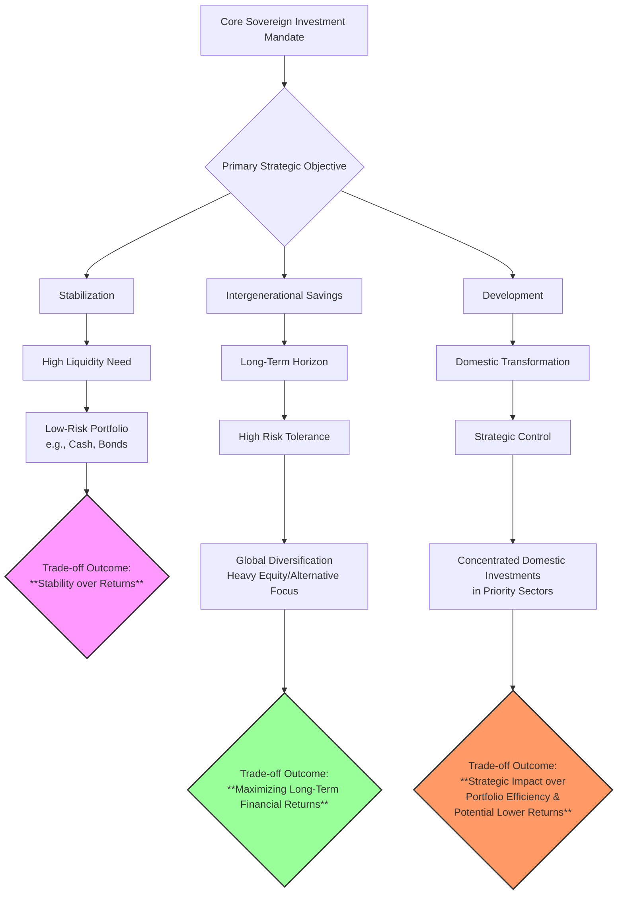

# Strategic Asset Allocation: Investment Practices and Portfolio Management of the World's Wealthiest Governments
## 1 Defining Governmental Wealth: Beyond GDP and Revenue

This chapter establishes a comprehensive, multi-dimensional framework for assessing governmental wealth, moving beyond traditional flow-based metrics like GDP per capita or government revenue. It analyzes the key components of the public sector balance sheet—total assets (financial, non-financial, and natural capital), liabilities (gross debt, pension obligations, and other non-debt liabilities), and net worth—as advocated by the IMF and World Bank. The chapter defines these concepts using data from the IMF's public wealth database and the World Bank's Changing Wealth of Nations project, while integrating the role of sovereign wealth fund assets and the Sovereign Asset and Liability Management (SALM) framework. This establishes the foundational metrics for identifying the 'wealthiest governments' and sets the stage for analyzing their strategic asset allocation practices in subsequent chapters.

### 1.1 The Limitations of Traditional Flow Metrics: GDP and Revenue

Traditional economic indicators, primarily Gross Domestic Product (GDP), have long been the standard for measuring national economic progress and, by proxy, governmental capacity. However, a growing body of evidence highlights their profound inadequacy for assessing true governmental wealth. **GDP is a flow metric that captures the value of goods and services produced within a period, but it entirely ignores the underlying stock of assets that enable that production and the liabilities that constrain future fiscal space.**[^1] Consequently, a government can report strong GDP growth while simultaneously depleting the natural resource base, degrading public infrastructure, or accumulating unsustainable future pension obligations—a pattern that fundamentally undermines long-term prosperity and intergenerational equity.

The World Bank's Changing Wealth of Nations project explicitly addresses this gap, arguing that GDP "fails to cover the full range of productive activities, particularly those reliant on nature, and fails to account for the 'hidden' costs of production such as human health, resource degradation, and environmental pollution."[^1] For example, global trends show that while per capita real wealth grew 21% from 1995 to 2020, driven by gains in human and produced capital, per capita renewable natural capital declined sharply[^1]. More critically, **over 25% of countries experienced a decline in per capita real wealth despite positive per capita GDP growth, indicating that their economic progress was financed by depleting the national asset base rather than expanding it**[^1]. This underscores that GDP growth alone is a poor indicator of sustainable development or durable governmental wealth.

Similarly, focusing narrowly on government revenue as a percentage of GDP provides only a snapshot of fiscal inflows without context for the government's full financial position. It says nothing about the value of publicly owned assets that could generate future revenue or be leveraged in a crisis, nor does it account for the massive non-debt liabilities that may loom on the horizon. Therefore, to identify the world's wealthiest governments—those with the greatest capacity to deliver services, absorb shocks, and invest for the long term—a shift from flow-based to stock-based, balance-sheet analysis is essential.

### 1.2 The Public Sector Balance Sheet Framework: Assets, Liabilities, and Net Worth

The public sector balance sheet (PSBS) framework provides the comprehensive, stock-based view necessary for a true assessment of governmental wealth. It entails a full accounting of everything a government owns (assets) and owes (liabilities), with the difference representing its net worth—a core measure of solvency and fiscal resilience[^1].

**Assets** encompass a broad range of holdings. According to IMF data covering 38 countries, total public sector assets are valued at $103 trillion, equivalent to 216% of global GDP[^2]. These are categorized into:
*   **Non-financial assets:** This includes public infrastructure like bridges and roads, buildings, and land.
*   **Financial assets:** Such as cash, deposits, and equity holdings in state-owned enterprises (SOEs).
*   **Natural resource reserves:** Subsoil assets like oil, gas, and minerals[^2].

**Liabilities** extend far beyond the standard measure of gross government debt. While the IMF dataset includes about $44 trillion in general government debt, it also captures $22 trillion in present pension obligations and SOE debt[^2]. Other potential liabilities include guarantees and other contingent claims. **This comprehensive view of liabilities is critical, as it reveals that a government with moderate debt levels may still face severe fiscal vulnerability due to large, underfunded pension systems.**

The central metric derived from this framework is **Public Sector Net Worth (PSNW)**, calculated as total assets minus total liabilities. For the 38 countries in the IMF dataset, aggregate net worth is $10 trillion, or 21% of GDP[^2]. A related and often more policy-relevant indicator is **Net Financial Worth** (financial assets minus liabilities). Empirical research demonstrates that these balance sheet strength metrics have significant macroeconomic implications. **Financial markets price sovereign bonds by considering government assets and net worth, not just liabilities.** A one percentage point of GDP increase in government net worth lowers sovereign bond yields by approximately 1.5 basis points, an effect comparable to the impact of gross debt[^3][^4]. Furthermore, economies with stronger public sector balance sheets experience shallower recessions and recover faster, as they possess greater fiscal space to implement countercyclical policies[^4][^5].

The following table summarizes key indicators of public sector balance sheet strength as identified in the research:

| Indicator | Definition | Purpose/Insight |
| :--- | :--- | :--- |
| **Size of Balance Sheet** | Sum of total assets and total liabilities (% of GDP) | Reflects the scale of government involvement in the economy through ownership and obligations. |
| **Net Worth** | Total assets minus total liabilities (% of GDP) | A broad measure of public sector solvency and intergenerational equity. |
| **Net Financial Worth** | Financial assets minus liabilities (% of GDP) | A more liquid measure of fiscal space, closely watched by financial markets. |
| **Net Liquid Assets** | Current assets minus current liabilities (% of GDP) | Measures short-term liquidity mismatch and rollover risk. |
| **Net Foreign Exchange Assets** | Foreign currency assets minus foreign currency liabilities (% of GDP) | Assesses sovereign exposure to currency risk. |
| **Degree of Natural Hedging** | Covariance between valuation changes in assets and liabilities | Indicates how well movements in asset values offset liability value changes, reducing net worth volatility. |

*Table: Key Indicators of Public Sector Balance Sheet Strength[^3][^4][^5]*

### 1.3 Incorporating Sovereign Wealth and the SALM Perspective

A complete picture of governmental wealth must account for dedicated sovereign investment vehicles and an integrated management philosophy. **Sovereign Wealth Funds (SWFs)** represent a critical and growing component of public assets. Defined as special purpose investment funds owned by the general government and created for macroeconomic purposes, SWFs hold, manage, or administer assets to achieve financial objectives[^6]. Based on the Santiago Principles taxonomy, they serve varied policy goals, such as stabilization (buffering budget revenues from commodity price swings), savings (transferring wealth across generations), development, or pension reserves[^7][^8]. Their scale is immense, with total assets under management estimated at about $3 trillion[^7]. Major examples include Norway's Government Pension Fund Global (GPFG, ~$2.0 trillion in assets), China Investment Corporation (CIC, $1.33 trillion), Saudi Arabia's Public Investment Fund (PIF, $912 billion), and the Kuwait Investment Authority (KIA, managing the Future Generations Fund among others)[^9][^10][^11].

The management of these vast assets, alongside sovereign liabilities, necessitates an integrated framework. **Sovereign Asset and Liability Management (SALM)** is an analytical approach that views the entire sovereign balance sheet as a consolidated portfolio[^12]. Its aim is to ensure sustainability by coordinating policies across different entities (e.g., finance ministry, central bank, SWF) to manage risks, minimize financing costs, and maximize asset returns within set risk limits[^12][^13]. The core insight is that optimizing isolated components (like debt or reserves) is sub-optimal; a holistic view can identify natural hedges and reduce vulnerabilities[^14].

For instance, Uruguay has institutionalized SALM through a Public Debt Coordination Committee between its Ministry of Finance and Central Bank. This framework allows for strategies like coordinated bond issuance and using currency forward contracts between the central bank and state-owned companies to manage foreign exchange exposures[^12][^13]. New Zealand, an early adopter, used SALM principles to guide public debt composition and its balance sheet was crucial in managing the fiscal impact of the Canterbury earthquakes, where a government-backed insurance scheme and reinsurance claims significantly limited the increase in public debt[^15]. **These cases illustrate that effective governmental wealth management requires not just measuring assets and liabilities, but actively coordinating them to strengthen the nation's overall financial position.**

### 1.4 Towards a Multi-Dimensional Assessment Framework

Synthesizing the preceding analysis, we propose a multi-dimensional framework for assessing governmental wealth that moves decisively beyond GDP and revenue. This framework integrates stock-based accounting, dedicated sovereign investment pools, and risk-aware management principles.

**The core dimensions of the framework are:**
1.  **Scale of Ownership:** Measured by the total size of the public sector balance sheet and the value of public assets (financial, non-financial, and natural), indicating the breadth of resources under government control.
2.  **Net Position:** Captured primarily by Public Sector Net Worth and Net Financial Worth, reflecting solvency and the net resources available for future public benefit or to absorb shocks.
3.  **Strategic Asset Portfolio:** Encompassing the scale and strategy of Sovereign Wealth Funds, which represent a government's proactive, long-term financial investment arm.
4.  **Risk and Resilience Profile:** Assessed through indicators like liquidity mismatches, currency exposures, and the degree of natural hedging between assets and liabilities, as advocated in SALM.

**However, applying this framework faces significant boundaries and challenges.** Data availability is a primary constraint; comprehensive PSBS data is available for only a limited set of countries[^2]. Valuation methodologies for non-financial and natural capital assets are complex and not standardized, creating comparability issues[^1]. The institutional capacity required for full SALM implementation—including formal coordination bodies and sophisticated risk quantification—is not present in all countries[^12][^13]. Furthermore, **a fundamental conceptual gap exists in the treatment of human capital**, which is a central component of national wealth in the World Bank's framework but is not recognized as an asset on the public sector balance sheet[^1].

Therefore, identifying the "wealthiest governments" requires a nuanced approach that considers both the comprehensive stock of assets and liabilities and the sophistication with which they are managed. This chapter establishes that wealth is not merely about current income flows or even gross asset holdings, but about **durable net worth, the strategic deployment of financial assets through vehicles like SWFs, and the integrated management of risks across the sovereign balance sheet**. This foundational understanding guides the subsequent analysis of how these wealthy governments construct and manage their investment portfolios.

## 2 The Composition of Public Investment Portfolios

This chapter provides a data-driven analysis of the asset allocation strategies that define the investment portfolios of the world's wealthiest governments, building upon the multi-dimensional wealth framework established in Chapter 1. It systematically examines the composition of these portfolios across key dimensions: asset class (equities, fixed income, real assets, alternatives), geography (domestic vs. international), and investment vehicle (sovereign wealth funds, direct holdings, state-owned enterprises). The analysis is anchored in detailed case studies of leading funds—including Norway's GPFG, Singapore's GIC and Temasek, China's CIC, and Kuwait's KIA—using their latest reported portfolio data to compare the strategies of commodity-based and non-commodity-based funds. The chapter also investigates direct government investments in critical infrastructure, both traditional and green, as a distinct form of long-term capital deployment. This comprehensive breakdown serves to operationalize the concept of governmental wealth by revealing how strategic asset allocation choices reflect underlying mandates, risk tolerances, and national economic objectives.

### 2.1 Strategic Asset Allocation: A Comparative Analysis of Leading Sovereign Wealth Funds

The strategic asset allocation of a sovereign wealth fund (SWF) is the primary expression of its mandate, risk tolerance, and investment horizon. A comparative analysis of the world's largest SWFs reveals distinct models that can be broadly categorized into two archetypes: resource-rich funds designed to convert finite commodity wealth into perpetual financial capital, and non-commodity funds that manage accumulated fiscal surpluses or foreign exchange reserves, often with a blend of financial and strategic objectives.

**Norway's Government Pension Fund Global (GPFG)** represents the quintessential resource-rich, intergenerational savings model with an exceptionally clear and disciplined allocation. As of the end of 2024, its portfolio was composed of **71.4% equities (14,113 billion kroner), 26.6% fixed income (5,253 billion kroner), 1.8% unlisted real estate (364 billion kroner), and 0.1% unlisted renewable energy infrastructure (25 billion kroner)**[^16]. This allocation is anchored in a long-term, high-conviction bet on global public equity markets, reflecting a mandate to maximize financial returns within controlled risk. The fund's strategic benchmark, set by the Ministry of Finance, targets 70% equities, 25% fixed income, and 5% unlisted real assets[^10]. Its management is characterized by low costs (approximately 0.05% of AUM) and a massive, diversified footprint across approximately 8,659 listed companies in over 70 countries[^16][^10]. **The GPFG is a clear outlier in its overwhelming reliance on public equities and minimal allocation to alternative investments, a strategy made possible by its pure financial mandate and strict separation from domestic policy.**

In contrast, **China Investment Corporation (CIC)** exemplifies a non-commodity fund with a pronounced tilt towards illiquid and alternative assets. As of year-end 2023, CIC's global portfolio was allocated **33.13% to public equity, 16.46% to fixed income, and a substantial 48.31% to alternative assets**[^17]. This high-alternative allocation is a defining feature, with the fund investing almost half of its assets in alternatives such as private equity, real estate, and infrastructure[^18][^19]. In 2024, CIC actively restructured its public equity portfolio and deepened its private markets partnerships to enhance resilience[^18][^11]. **CIC's strategy balances its role as a long-term financial investor seeking maximum returns with strategic objectives aligned with national priorities, such as energy transition investments tied to China's 'Dual Carbon Goals'**[^20][^11].

The Singaporean model presents a sophisticated, multi-entity approach covering a spectrum of risk and objectives. **GIC**, tasked with preserving and enhancing the international purchasing power of Singapore's reserves, maintains a balanced, diversified portfolio. As of 31 March 2025, its asset mix was **51% equities, 26% fixed income, and 23% real assets**[^20][^11]. This allocation sits within a long-term Policy Portfolio range of 40-70% for equities, 15-35% for fixed income, and 10-30% for real assets[^20]. **Temasek Holdings**, operating at the higher end of the risk spectrum with a mandate to maximize shareholder value, has a markedly different profile[^21]. As of 31 March 2025, its portfolio was heavily weighted towards unlisted and strategic holdings, with **46% in listed assets, 26% in unlisted assets, and 28% in liquidity and others**[^14]. By underlying exposure, its largest sector allocations were to Financial Services (22%), Telecommunications, Media & Technology (21%), and Transportation & Industrials (20%)[^14].

**The Kuwait Investment Authority (KIA)**, the world's oldest SWF, manages a dual-fund structure that reflects a hybrid strategy. The Future Generations Fund (FGF) invests exclusively outside Kuwait across traditional and alternative asset classes[^22][^9]. While precise public allocations are prohibited by law, estimates indicate a significant focus on private markets, with approximately **23% of KIA's total portfolio targeting alternative sectors** such as real estate, infrastructure, and private equity[^23]. The General Reserve Fund (GRF), in contrast, serves as the government's treasury and also invests domestically in priority sectors to support economic diversification[^22]. KIA's objective is to achieve a rate of return that, on a three-year rolling average, exceeds composite benchmarks[^22][^9].

The table below synthesizes the core asset allocation strategies of these leading SWFs, highlighting the fundamental differences between the archetypes.

| Sovereign Wealth Fund | Primary Archetype | Key Asset Allocation (Latest Reported) | Strategic Emphasis & Distinguishing Feature |
| :--- | :--- | :--- | :--- |
| **Norway GPFG** | Resource-Rich / Intergenerational Savings | 71.4% Equities, 26.6% Fixed Income, 2.2% Real Assets[^16] | **Ultra-high public equity focus**; Pure financial return mandate; Global diversification benchmark. |
| **Kuwait KIA (FGF)** | Resource-Rich / Intergenerational Savings | Significant allocation to alternatives (~23% of total portfolio)[^23] | **Dual-fund structure**; FGF is offshore & intergenerational; GRF has domestic development role. |
| **Singapore GIC** | Non-Commodity / Reserve Manager | 51% Equities, 26% Fixed Income, 23% Real Assets[^11] | **Balanced, resilient triad**; Mandate to preserve purchasing power; Operates within a Policy Portfolio range. |
| **Singapore Temasek** | Non-Commodity / Strategic Investor | 46% Listed, 26% Unlisted, 28% Liquidity & Others[^14] | **High unlisted/strategic exposure**; Active, bottom-up investor in sectors aligned with national development. |
| **China CIC** | Non-Commodity / Diversification & Strategy | 33% Public Equity, 16% Fixed Income, 48% Alternatives[^17] | **Leading alternative asset allocator**; Blends financial returns with strategic thematic investments (e.g., sustainable energy). |

*Table: Comparative Strategic Asset Allocation of Major Sovereign Wealth Funds*

**The comparative analysis reveals a clear pattern: while all funds pursue diversification, their starting points and constraints lead to divergent paths.** Resource-rich funds like Norway's GPFG, mandated to sterilize commodity income offshore, gravitate towards deep, liquid public markets. Non-commodity funds like CIC and Temasek, often with more complex mandates that may include domestic development or strategic sector exposure, build significant portfolios in less liquid, alternative assets where they can exert more control and capture illiquidity premia. GIC occupies a middle ground, balancing growth (equities), income (fixed income), and inflation protection (real assets) in a globally diversified portfolio designed for long-term resilience[^20][^24].

### 2.2 Geographic and Sectoral Exposure: Balancing Domestic Priorities with Global Diversification

The geographic and sectoral composition of a government's investment portfolio reveals a fundamental tension between the imperative for global risk diversification and the desire to channel capital towards domestic or regional strategic priorities. Leading SWFs navigate this tension in markedly different ways, shaped by their founding mandates and sources of capital.

**A clear divide exists between funds mandated to invest almost exclusively abroad and those with flexibility for significant domestic exposure.** Norway's GPFG is the purest example of the former, with its investments spanning **70 countries and 42 currencies**, deliberately avoiding the Norwegian economy to prevent overheating and maintain a purely financial focus[^16]. Similarly, Kuwait's Future Generations Fund (FGF) is constitutionally required to invest **outside Kuwait**[^22]. In contrast, funds like **Temasek** and **Saudi Arabia's Public Investment Fund (PIF)** are central instruments of national economic strategy. Temasek's portfolio is "anchored in Asia," with **66% exposure to developed economies** and a substantial **26% underlying exposure to its home market of Singapore**[^25]. Its major investments are predominantly in Singaporean state-linked enterprises such as DBS Group, Singapore Telecommunications, and Singapore Airlines[^25][^14]. PIF's strategy is even more domestically focused, with **80% of its assets allocated to local investments** as part of its direct mandate to diversify the Saudi economy away from oil under Vision 2030[^26].

The geographic preferences for international diversification also vary. **GIC** shows a strong tilt towards developed Western markets, with **49% of its portfolio in the Americas** (predominantly the US) as of March 2025, and another 20% in Europe, the Middle East, and Africa[^11]. The US remains GIC's largest market for capital deployment[^11]. **KIA** also maintains a significant focus on the United States, with reports indicating it has invested more than half of its assets there[^27]. **CIC**, with its global mandate, has expanded its office network to key financial centers including Hong Kong, New York, and London to support its worldwide investment activities[^20].

Sectoral exposure further differentiates fund strategies. **Temasek** has a concentrated sector profile, with the largest shares in **Financial Services (28%), Telecommunications, Media & Technology (21%), and Transportation & Industrials (19%)** as of March 2025[^25]. This reflects its role in holding strategic stakes in key sectors of the Singaporean economy. Furthermore, Temasek explicitly aligns its portfolio with long-term structural trends, with **39% exposure to 'Sustainable Living'** as of March 2025[^25]. **CIC**'s sectoral activities are deeply tied to its thematic investment approach, focusing on priority industries in private equity and private credit, and strengthening investments in infrastructure and sustainable energy[^20][^11].

A notable industry-wide trend is the growing interest in emerging markets, driven by geopolitical realignments and the search for growth. According to the 2024 Invesco Global Sovereign Asset Management Study, **Asia (ex-China) is the top regional priority for 83% of SWFs, followed by Latin America (53%)**[^28]. **India emerges as a particularly attractive destination, with 88% of SWFs expressing interest in increasing their exposure to Indian debt**[^28][^29]. This selective approach to emerging markets represents a strategic shift to capture diversification benefits and growth opportunities beyond traditional developed markets.

**In summary, the geographic and sectoral maps of these portfolios are not drawn solely by financial optimization algorithms but are heavily influenced by national economic blueprints.** Funds like PIF and Temasek are deliberate in using their capital to build domestic champions and seed new industries. Others, like GPFG and KIA's FGF, are designed as pure offshore diversification vehicles. GIC and CIC blend global diversification with strategic tilts—towards the Americas and inflation-resilient assets for GIC, and towards alternative assets and themes aligned with national policy for CIC.

### 2.3 Investment Vehicles and Liquidity Profiles: From Liquid Public Markets to Illiquid Direct Holdings

The choice of investment vehicles—from passively holding listed securities to actively managing direct stakes in private companies and projects—fundamentally shapes a portfolio's liquidity profile, operational complexity, and potential for value creation. Wealthy governments employ a diverse mix of these vehicles, reflecting a trade-off between liquidity for flexibility and illiquidity for higher potential returns and strategic influence.

**A spectrum of liquidity exists across major SWF portfolios.** At one end, **Norway's GPFG** is predominantly a liquid, public market investor. Its equity portfolio consists of ownership shares in about **8,500 listed companies worldwide**, and its fixed-income investments are in government and corporate bonds[^10]. While it has allocations to unlisted real estate and renewable energy infrastructure, these constitute a small fraction (~2.2%) of the total portfolio[^16]. This high-liquidity profile is consistent with its role as a fiscal buffer that may require assets to be sold to fund government budget deficits.

In the middle of the spectrum, **GIC** groups its holdings into three broad asset groups (Equities, Fixed Income, Real Assets) that cover both public and private markets[^20][^11]. This suggests a blended liquidity profile. **Temasek** provides a clearer view of this blend: as of March 2025, **48% of its S$389 billion portfolio was in liquid and listed assets**, while the remaining 52% was in large bloc holdings (≥20% share) and unlisted assets[^30]. This substantial illiquid portion is a direct result of its strategy as an active, bottom-up investor that takes significant, often controlling, stakes in companies[^31].

At the illiquid end of the spectrum, **China's CIC** stands out with its **48.31% allocation to alternative assets**, which are inherently less liquid[^17]. Its activities in private equity, direct infrastructure projects, and real estate require a long-term commitment of capital and specialized management expertise[^20].

The use of **external fund managers versus internal direct investment teams** is another key operational distinction. **KIA** primarily invests **through external fund managers**, though its London office (KIO) has a mandate to trade directly[^22][^9]. It has also established specialized standalone entities to excel in certain asset classes[^22]. This approach leverages external expertise while maintaining strategic oversight. Similarly, **Qatar Investment Authority (QIA)** cultivates partner-like relationships with top investment managers, using externally managed funds to generate co-investment opportunities and access non-core asset classes[^26]. In contrast, **Temasek** operates mainly as a **direct investor**, building deep capabilities in-house to invest in companies where it sees long-term growth potential[^31]. **CIC** employs a mixed model, expanding proprietary investment in public equities while also actively pursuing thematic opportunities and expanding co-investment partnerships in private markets[^11].

The strategic rationale for holding illiquid, direct holdings is multifaceted:
1.  **Pursuit of an Illiquidity Premium:** Long-term capital can be deployed into assets that are not readily tradable, with the expectation of earning a higher return as compensation for the lack of liquidity.
2.  **Strategic Control and Influence:** Direct stakes, especially large or controlling ones, allow the investor to influence corporate strategy, governance, and operations. Temasek's 51% stake in Singapore Technologies Engineering Ltd and 53% stake in Singapore Airlines are prime examples of strategic holdings in nationally important companies[^14].
3.  **Driving National Development:** Illiquid investments are often the vehicle for funding large-scale, long-horizon projects that are critical for economic transformation. Saudi Arabia's PIF is tasked with direct investments in giga-projects and new sectors as part of Vision 2030, a role that necessitates a patient, illiquid capital base[^10].

**The resulting liquidity profile is therefore a direct consequence of the fund's mandate.** Stabilization or liquidity-focused funds will prioritize publicly traded securities. Intergenerational savings funds with a long horizon, like GPFG, can tolerate some illiquidity but prioritize the transparency and governance of public markets. Strategic development funds and diversification funds like CIC and Temasek deliberately embrace illiquidity as a means to achieve higher returns, exert influence, and fulfill strategic objectives that cannot be met through passive portfolio investment.

### 2.4 Direct Government Capital Deployment in Critical Infrastructure

Beyond the portfolios of sovereign wealth funds, wealthy governments engage in direct capital deployment into critical infrastructure, constituting a distinct and strategic component of the public investment portfolio. These investments, often executed through specialized state-owned entities or dedicated budget allocations, serve a dual purpose: they provide essential public goods that underpin economic activity, and they act as long-term strategic assets that can stimulate growth, enhance competitiveness, and advance national policy goals.

This form of investment is characterized by its focus on **real assets with long economic lives and high social value**, such as transportation networks, energy grids, water systems, and digital connectivity. Unlike the financial-asset-focused SWF investments, direct infrastructure deployment is often motivated by a combination of economic, social, and strategic returns.

**Sovereign wealth funds themselves are increasingly major players in global infrastructure investment,** blurring the lines between financial and strategic deployment. For instance:
*   **Norway's GPFG** has been building a portfolio in **unlisted renewable energy infrastructure**, including wind and solar power projects, with allocations growing from 0.1% in 2024 to 0.4% by Q3 2025[^16][^10]. This aligns with a strategy to gain exposure to inflation-linked cash flows and sustainable sectors.
*   **China's CIC** explicitly focuses on infrastructure to "promote connectivity" and on sustainable energy in alignment with the national 'Dual Carbon Goals'[^20][^11]. Its real estate investments are also geared towards enhancing portfolio resilience against economic cycles[^11].
*   **GIC** classifies **Real Assets** as a core asset group (23% of its portfolio), which includes infrastructure, real estate, and other inflation-linked investments, highlighting their role in improving the portfolio's overall inflation resilience[^24][^11].

**At the national level, direct infrastructure investment is a core tool for economic transformation.** The most salient example is **Saudi Arabia's Public Investment Fund (PIF)**. As the "leading economic catalyst" for Vision 2030, PIF's program for 2021-2025 is a roadmap for direct capital deployment into giga-projects and new sectors such as **NEOM, renewable energy, tourism, and advanced manufacturing**[^10]. Its objective is to unlock new sectors, localize technology, and contribute **$320 billion to non-oil GDP**[^10]. This represents infrastructure investment not merely as public works, but as the foundational capital for building a post-oil economy.

The strategic rationale for such direct government investment in infrastructure includes:
*   **Addressing Market Failures:** Private capital may underinvest in large-scale, high-risk, or low-immediate-return projects that have significant long-term social benefits.
*   **Economic Stimulus and Job Creation:** Large infrastructure projects can provide immediate fiscal stimulus and create employment, especially during economic downturns.
*   **Enhancing Geopolitical and Economic Security:** Investments in energy infrastructure, ports, and digital networks can secure supply chains, enhance energy independence, and increase regional influence.
*   **Driving the Climate Transition:** 'Green' infrastructure investments in renewables, grid modernization, and sustainable transport are critical for meeting national and international climate commitments.

**In conclusion, direct investment in critical infrastructure represents a purposeful and often illiquid allocation of public capital towards shaping the physical and economic landscape of the nation (and beyond).** It complements the financial portfolio management of SWFs by focusing on assets that generate direct economic and strategic value. Whether through the thematic allocations of a fund like CIC or the nation-building projects of PIF, this channel of deployment demonstrates how wealthy governments use investment not just to preserve wealth, but to actively construct the platforms for future prosperity and resilience.

## 3 Frameworks for Managing Sovereign Wealth: SALM and Institutional Governance

This chapter examines the institutional frameworks and governance structures that enable or constrain the effective management of sovereign wealth, building directly on the portfolio compositions analyzed in Chapter 2. It focuses on the adoption and practical implementation of the Sovereign Asset and Liability Management (SALM) framework, which advocates for a holistic, risk-aware approach to the consolidated sovereign balance sheet. The analysis verifies the claimed benefits of SALM—such as lower financing costs, higher risk-adjusted returns, and greater macro-financial stability—against the significant institutional challenges governments face. These challenges include coordinating agencies with different mandates (e.g., central banks, debt management offices, SWFs), overcoming data gaps and valuation difficulties for non-financial assets, and building technical capacity. The chapter systematically compares advanced, integrated implementations (e.g., New Zealand, Denmark, Uruguay) with more fragmented or partial approaches, exploring how the degree of institutional sophistication influences a government's ability to optimize returns, ensure fiscal sustainability, and create policy buffers against economic shocks, including natural disasters.

### 3.1 The SALM Framework: Principles, Promised Benefits, and Implementation Spectrum

Sovereign Asset and Liability Management (SALM) is an expanded analytical framework applied to the sovereign balance sheet with the aim of ensuring its sustainability by addressing potential vulnerabilities, while attaining minimum financing costs and maximum asset returns within set risk limits[^32][^33]. This entails monitoring and quantifying the impact of key economic and financial risks, including movements in foreign exchange rates, interest rates, inflation, and commodity prices[^32][^33]. **The core principle of SALM is that optimizing isolated sovereign liability or asset balance sheets is considered "sub-optimal," and an integrated approach is necessary to achieve superior outcomes for the consolidated public sector portfolio**[^32][^34][^35].

The promised benefits of adopting a SALM framework are multifaceted. Primarily, it aims to achieve **lower financing costs, higher risk-adjusted returns, and greater macrofinancial stability**[^32]. From an analytical perspective, SALM provides crucial insights by revealing hidden vulnerabilities, such as currency mismatches where high foreign currency debt is not matched by foreign currency assets[^36]. It also helps capture the risks from contingent liabilities, whose materialization can significantly deteriorate the balance sheet[^37][^36]. Furthermore, the framework facilitates the evaluation of fiscal sustainability by considering assets, leading to more informative metrics like "Net Debt" and "Net Worth"[^36]. A key operational benefit is the identification and utilization of **natural hedges**—where the financial characteristics of certain assets inherently offset risks in liabilities—which can be implemented through borrowing policies or maintaining liquidity buffers without resorting to complex and costly financial derivatives[^38][^36].

However, the implementation of SALM varies widely across countries, creating a broad spectrum of practice. At one end are **fully integrated models**, where a single entity or closely coordinated entities manage both assets and liabilities on a consolidated balance sheet basis. At the other end are **partial or fragmented approaches**, where different institutions manage sub-portfolios with limited coordination. A World Bank survey of 28 countries found that while almost all produce a government balance sheet, **only six (21 percent) actually use that balance sheet to determine and monitor mismatches between sovereign assets and liabilities**[^39]. Many governments apply SALM principles in a limited scope, such as in the management of cash buffers by debt management offices[^39]. This spectrum sets the stage for understanding the significant institutional hurdles that separate conceptual benefits from practical reality.

### 3.2 Institutional Architecture and Coordination Challenges

The primary barrier to effective SALM implementation lies in the complex and fragmented institutional architecture of the public sector. **In almost every country, the institutions that manage the assets of a sovereign are different from those that oversee the liabilities, often with clearly separate mandates**[^40]. For example, foreign reserve management is typically the purview of an independent central bank, while government debt and cash reserves are managed by a Ministry of Finance or a dedicated Debt Management Office (DMO)[^39]. State-owned enterprises (SOEs) and sovereign wealth funds (SWFs) add further layers of management with their own objectives. This separation, while often designed to ensure policy effectiveness, creates profound coordination challenges for holistic risk management[^39].

The core challenges can be categorized as follows:
*   **Conflicting Mandates and Objectives:** Different entities have different primary goals (e.g., price stability for central banks, cost minimization for debt managers, return maximization for SWFs), making cooperation on integrated risk management difficult[^39].
*   **Operational and Data Hurdles:** Consolidating a sovereign balance sheet requires comprehensive, homogenous data, which is often lacking. Significant difficulties arise in the valuation of non-financial assets (e.g., infrastructure, natural resources) and future items like fiscal revenues[^38][^36]. Different accounting practices (accrual vs. cash-based) across institutions further complicate analysis[^41][^39].
*   **Technical and Institutional Capacity Gaps:** Effective SALM requires specialist staff and advanced systems for risk modeling (e.g., Value-at-Risk, Cost-at-Risk), which may be limited, especially in developing countries[^38][^36].

To overcome these challenges, countries have developed specific coordination mechanisms, which form a critical part of the SALM operational toolkit[^39]:
*   **Formal Coordination Committees:** Establishing cross-institutional committees is a common solution. For instance, Uruguay created a **Public Debt Coordination Committee (PDCC)** in 2016 between the Ministry of Finance and the Central Bank, which significantly improved the coordinated adoption of risk-mitigation strategies for the public-sector balance sheet[^32][^33]. Turkey established a Debt and Risk Management Committee in 2002 to set strategies within the SALM framework[^39].
*   **Dedicated ALM Units:** Some countries have established special units within their finance ministries or DMOs to spearhead SALM. South Africa has an Asset Liability Management division within its National Treasury[^39].
*   **Macro-Prudential Committees:** Broader committees comprising the central bank, supervisory authorities, and the Ministry of Finance (e.g., in Chile, Mexico, Turkey, the UK, and the US) facilitate information sharing and discussion on overall balance sheet risks[^39].

These mechanisms highlight that **successful SALM is less about a perfect model and more about designing pragmatic structures to bridge institutional divides**[^39].

### 3.3 Case Studies in Integrated Management: New Zealand, Denmark, and Uruguay

A detailed examination of countries with advanced SALM implementation reveals how principles are translated into practice, yielding tangible risk management benefits.

**New Zealand** is a pioneer of the fully integrated approach. The New Zealand Debt Management Office (NZDMO), an operating unit of the Treasury, manages both assets and liabilities using a comprehensive, accrual-based government balance sheet[^37][^27]. A cornerstone practice is **immunizing the Reserve Bank's foreign exchange reserves with NZDMO's foreign currency debt to maintain a net zero foreign-currency debt position**, creating a powerful natural hedge against currency risk[^37]. The effectiveness of this holistic framework was tested during the 2010–11 Canterbury earthquakes. The disaster caused an estimated NZD 40 billion in damage (20% of GDP)[^42]. However, a well-designed system involving a government-backed earthquake commission with substantial international reinsurance limited the negative macroeconomic impact. While the public sector's net worth was NZD 12.1 billion lower than if the earthquakes had not occurred, the establishment of specific recovery funds provided transparency and **shielded the government from additional borrowing that would have been significantly higher without the integrated risk buffer**[^42].

**Denmark** exemplifies a sophisticated coordinated model. Government debt management is a joint responsibility of the Ministry of Finance and Danmarks Nationalbank, with risk managed on a consolidated basis[^43][^44]. A key natural hedge is employed: **government funds' assets, which are largely invested in government bonds, act as a perfect hedge against corresponding liabilities**[^43][^44]. The consolidated portfolio's duration target is set using a Cost-at-Risk (CaR) model and managed via interest-rate swaps[^43][^44]. To mitigate refinancing risk, a liquidity buffer policy is maintained, with cash reserves sufficient to service one year of debt repayments[^43][^44]. This framework proved resilient during the global financial crisis. The Danish government funded large bank rescue programs using financial assets accumulated before the crisis, **avoiding the need to issue additional securities during a period of market stress and thus preventing further pressure on liquidity**[^43].

**Uruguay** provides a compelling case of institutionalizing SALM in an emerging market context. Authorities adopted an integrated SALM approach for the country's overall public sector portfolio, including SOEs and the central bank (BCU)[^32][^33]. The institutional anchor is the **Public Debt Coordination Committee (PDCC)**, which facilitates transactions and risk distribution across different public sector institutions[^32][^33]. Practical implementations include:
*   **Cross-Sectoral Natural Hedging:** Analysis revealed offsetting currency exposures between the central bank (exposed to appreciation) and non-financial SOEs (exposed to depreciation). This insight led to **currency forward contracts established between the BCU and state-owned electricity and oil companies to manage their FX exposures**[^33].
*   **Coordinated Market Operations:** Coordinated bond issuance and liability management operations between the sovereign and the BCU have supported the cost/return objectives of both entities[^32].

Uruguay's progress demonstrates that even in markets lacking deep hedging instruments, a coordinated SALM framework can identify and exploit natural hedges within the sovereign balance sheet to reduce vulnerabilities[^32][^33].

### 3.4 Fragmented Approaches and the Stepwise Path for Developing Economies

In contrast to the integrated models, most countries, particularly developing economies, operate with fragmented approaches to sovereign balance sheet management. The World Bank survey underscores this reality, showing limited systematic use of the balance sheet for mismatch analysis[^39]. The separation of monetary and fiscal policy institutions, combined with data limitations and underdeveloped financial markets, makes full SALM adoption exceptionally challenging in these contexts[^36][^39].

Consequently, a **gradual, stepwise implementation path is widely recommended for developing countries**[^38][^37][^44]. This pragmatic approach focuses on building capacity and achieving incremental improvements without requiring a full, model-based system from the outset.

The recommended steps are as follows:

| Implementation Phase | Core Activities & Focus Areas | Rationale & Tools |
| :--- | :--- | :--- |
| **Phase 1: Conceptual Foundation & Priority Identification** | Develop a conceptual sovereign balance sheet. Identify and assess priority areas from vulnerability and management perspectives. A practical starting point is focusing on **financial assets managed by the Debt Management Office (DMO), such as cash reserves or receivables**, along with known future liabilities[^38][^37][^36]. | Avoids being paralyzed by data gaps. Provides a qualitative understanding of key exposures and sets the stage for targeted analysis. |
| **Phase 2: Simplified Risk Analysis & Passive Hedging** | Apply simplified risk analysis to elaborate on identified mismatches (e.g., currency, refinancing). Determine and implement **passive hedging strategies**. These include: <ul><li>**Natural hedges for currency risk** (e.g., structuring debt to correlate with budget revenues, matching FX debt with FX assets)[^38][^36].</li><li>**Liquidity buffers** (maintaining sufficient cash reserves to service near-term debt)[^36][^44].</li><li>Using **net debt indicators** as a more informative metric than gross debt[^37][^36].</li></ul> | Suitable for limited technical capacity. Leverages structural features of the balance sheet without relying on complex derivatives or active trading. |
| **Phase 3: Strengthening Institutional Arrangements** | Establish new structures to address coordination and governance challenges. This can include:<ul><li>Creating an **Asset Liability Management Coordination Committee** with key institutions (DMO, Central Bank, Ministry of Finance)[^39].</li><li>Forming a dedicated **ALM unit within the DMO** to collect information and drive the process[^39].</li><li>Developing **financing guidelines** for SOEs and guarantees to manage overall government credit risk[^39].</li></ul> | Builds the institutional "plumbing" necessary for sustained information sharing and joint decision-making, which is a prerequisite for more advanced SALM. |

*Table: Stepwise SALM Implementation Path for Developing Economies*

This phased approach emphasizes that **simple analysis and passive hedging should be prioritized over complex models and active instruments in the initial stages**[^37][^44]. It allows countries to begin reaping the risk management benefits of a more holistic view without being overwhelmed by the institutional demands of a fully integrated system.

### 3.5 Linking Governance to Outcomes: Risk Mitigation, Fiscal Buffers, and Long-Term Resilience

The evidence from diverse country experiences allows for a clear assessment of how SALM governance frameworks translate into concrete outcomes for sovereign wealth management. **The primary value of integrated SALM is its proven effectiveness in creating robust policy buffers and enhancing long-term fiscal resilience.**

Integrated frameworks directly contribute to **risk mitigation and cost reduction**. By managing currency and interest rate risks on a consolidated basis, countries like New Zealand and Denmark explicitly lower the volatility of the government's net worth and reduce the expected cost of carrying risk[^32][^44]. The identification of natural hedges, as seen in Uruguay and Denmark, provides a cost-effective alternative to purchasing financial hedges in potentially shallow or expensive domestic markets[^32][^43].

Furthermore, SALM is instrumental in **building and deploying fiscal buffers against shocks**. New Zealand's experience with natural disasters demonstrates how pre-arranged structures (reinsurance, dedicated funds) within a holistic balance sheet view can absorb massive fiscal impacts, limiting the need for disruptive emergency borrowing[^42]. Similarly, Denmark's use of accumulated financial assets to fund bank rescues during the crisis highlights how **a strong net financial worth, managed with foresight, provides crucial flexibility during stress periods**[^43]. These cases show that SALM moves beyond theoretical optimization to deliver practical crisis preparedness.

However, the implementation of SALM faces persistent boundaries. **Full integration remains rare due to enduring institutional, political, and technical constraints**[^39]. The case studies themselves reveal that even advanced practitioners like Denmark manage certain risks jointly (FX) while finding others (interest rate risk measurement) difficult to fully integrate across institutions[^41]. Therefore, the most viable path for the majority of governments is not a binary choice between full SALM and fragmentation, but rather a **spectrum of evolving practice**. The stepwise model provides a roadmap for progression along this spectrum, allowing countries to strengthen coordination, improve data, and adopt more sophisticated tools over time.

In conclusion, the governance of sovereign wealth through frameworks like SALM is a critical determinant of a government's ability to preserve and enhance its fiscal base. While integrated models offer the most comprehensive approach to risk-return optimization and shock resilience, the reality of institutional fragmentation makes a gradual, capacity-sensitive implementation strategy the most prudent and effective path for most nations seeking to improve the management of their public wealth.

## 4 Strategic Objectives and Economic Impacts of Government Investments

This chapter analyzes the multifaceted strategic objectives that drive the investment decisions of wealthy governments, moving beyond pure financial return maximization. It systematically examines the core purposes of sovereign wealth funds—stabilization, intergenerational savings, pension reserve, reserve investment, and development—as defined by the IMF and other reference materials, and investigates how these mandates translate into distinct portfolio strategies and economic impacts[^45]. The analysis will assess the inherent trade-offs between pursuing financial returns, achieving domestic economic development goals, and advancing broader strategic or geopolitical objectives, using case studies from the reference materials (e.g., CIC's thematic investments, PIF's domestic diversification, GPFG's intergenerational mandate) to illustrate these tensions. This chapter synthesizes the wealth measurement (Chapter 1), portfolio composition (Chapter 2), and governance frameworks (Chapter 3) to provide a holistic view of how governmental wealth is strategically deployed to achieve national policy aims.

### 4.1 The Spectrum of Sovereign Investment Mandates: From Stabilization to Development

Sovereign wealth funds (SWFs) are not a monolithic group; their investment strategies are fundamentally shaped by their underlying strategic mandates. These mandates, which reflect a country's specific circumstances and policy priorities, create a spectrum of fund types, each with distinct investment horizons, risk tolerances, and liquidity requirements[^46][^45]. The IMF distinguishes five broad types based on primary objectives: stabilization funds, savings funds for future generations, pension reserve funds, reserve investment corporations, and development funds[^45].

**Stabilization funds** are designed as counter-cyclical fiscal tools to insulate government budgets and the domestic economy from macroeconomic shocks, most commonly volatile commodity prices[^46][^45]. Their primary purpose is to smooth government revenue streams, necessitating a short to medium-term investment horizon and a high appetite for liquidity. Consequently, their investable universe is largely limited to cash, money market instruments, and short- to long-dated bonds, with little to no allocation to equities or alternative assets[^46][^47]. For example, Russia's oil stabilization fund is mandated to mitigate the impact of low oil and gas prices on domestic budgets and exchange rates[^46]. Similarly, Kuwait's General Reserve Fund (GRF) serves as the government's treasury, consolidating state proceeds to finance expenditures and underpin fiscal flexibility against economic shocks[^11].

At the opposite end of the spectrum are **savings funds for future generations** (or intergenerational funds). Their core strategic objective is to convert finite resources, such as oil and gas, into a diversified portfolio of perpetual financial assets to preserve wealth for future generations[^46][^48]. This mandate grants them a transgenerational time horizon, making them the most risk-seeking type of SWF[^46]. They are structured to maximize long-term returns and can therefore aggressively overweight global equities and alternative investment classes to pursue alpha and illiquidity premiums[^46][^48]. **Norway's Government Pension Fund Global (GPFG) is the archetype**, with its 70% strategic equity allocation and pure financial return mandate[^49][^50]. Kuwait's Future Generations Fund (FGF) operates under a similar intergenerational savings mandate, investing exclusively outside Kuwait across various asset classes[^11].

**Development funds** have a strategic objective focused on catalyzing domestic economic transformation. Unlike savings funds that invest offshore to avoid double exposure to the domestic economy, development funds are instruments for channeling capital into priority sectors, infrastructure, and strategic national projects[^45]. This introduces a distinct set of trade-offs, as investments are often evaluated against their contribution to non-oil GDP, job creation, and technological localization, not just financial returns. **Saudi Arabia's Public Investment Fund (PIF)** epitomizes this model, with its explicit mandate under Vision 2030 to diversify the economy away from oil[^10]. As of December 2024, 80% of its portfolio was allocated to local investments aimed at unlocking new sectors and building strategic economic partnerships[^26].

**Reserve investment corporations** and **pension reserve funds** occupy intermediate positions. The former, like Singapore's GIC, are established to increase the return on excess official reserves, balancing the need for long-term purchasing power preservation with a degree of liquidity[^45][^9]. The latter, such as Australia's Future Fund, are established to meet specific future public pension liabilities, which dictates their investment horizon and risk profile[^26].

The following table synthesizes how these core mandates dictate portfolio characteristics:

| Fund Type (Primary Mandate) | Strategic Objective | Investment Horizon | Risk Tolerance & Liquidity Need | Typical Portfolio Emphasis |
| :--- | :--- | :--- | :--- | :--- |
| **Stabilization Fund** (e.g., Russia, Kuwait GRF) | Insulate budget/economy from commodity price/economic shocks[^46][^45]. | Short to medium-term[^45]. | Low risk tolerance, high liquidity need[^46][^47]. | Cash, government bonds, money market instruments[^46]. |
| **Savings/Intergenerational Fund** (e.g., Norway GPFG, Kuwait FGF) | Convert non-renewable resources into financial assets for future generations[^46][^48]. | Very long-term (transgenerational)[^46]. | High risk tolerance, low liquidity need[^46]. | Overweight global equities and alternative assets[^46]. |
| **Development Fund** (e.g., Saudi PIF) | Catalyze domestic economic diversification and development[^45][^10]. | Long-term, aligned with development plans. | Variable; accepts strategic risk, may sacrifice liquidity for control. | Concentrated in domestic sectors and strategic projects[^26]. |
| **Reserve Investment Corporation** (e.g., Singapore GIC) | Enhance returns on excess foreign exchange reserves[^45]. | Long-term (20-year rolling horizon)[^9]. | Moderate to high risk tolerance, balanced liquidity. | Diversified mix of equities, fixed income, and real assets[^11]. |
| **Pension Reserve Fund** (e.g., Australia Future Fund) | Provide for future contingent pension liabilities[^45][^26]. | Long-term, linked to liability timing[^47]. | Moderate to high risk tolerance. | Diversified, often using external managers[^26]. |

*Table: Sovereign Investment Mandates and Their Portfolio Implications*

**The fundamental insight is that a fund's strategic mandate is the primary determinant of its financial return profile.** Stabilization funds explicitly sacrifice higher returns for stability and liquidity, while intergenerational savings funds are structured to pursue maximum risk-adjusted returns over the long term[^46]. Development funds may accept commercial sub-optimality in pursuit of broader economic transformation goals[^10]. This mandate-driven calibration is the starting point for understanding the economic impacts and trade-offs explored in the following sections.

### 4.2 Driving Domestic Economic Transformation: Investment as a Catalyst

A central strategic objective for many governments, particularly those reliant on finite commodity wealth, is to use sovereign capital as a direct catalyst for domestic economic transformation. This involves deploying investments to diversify the economy, create jobs, develop new industries, and localize technology, often accepting trade-offs against pure financial optimization. The cases of Saudi Arabia's Public Investment Fund (PIF) and Singapore's Temasek Holdings provide powerful, albeit distinct, illustrations of this approach.

**Saudi Arabia's PIF** operates with an explicit, domestically-focused development mandate under Vision 2030. Its PIF Program 2021-2025 is a roadmap for economic diversification, with clear targets: a cumulative **$320 billion contribution to non-oil GDP**, the creation of **1.8 million direct and indirect jobs**, and increasing assets in new/growth sectors to 21% of its portfolio[^10]. The fund's asset allocation reflects this priority, with **80% invested locally** as of December 2024[^26]. The mechanism involves direct, large-scale capital deployment into "giga-projects" (e.g., NEOM) and strategic sectors such as automotive, renewable energy, tourism, and technology[^10]. This strategy aims not merely for financial returns but to build entire industrial ecosystems, secure supply chains, and transfer cutting-edge knowledge to the local economy.

However, such industrial policy-driven investment comes with significant trade-offs and risks, as highlighted in the reference materials. While targeted support can boost specific sectors, resources are drawn away from untargeted ones, which may shrink and lose productivity, **potentially delivering a negative impact on aggregate productivity** and leaving the economy worse off[^51]. Success is not guaranteed and depends on difficult-to-predict industry traits. Governments also incur substantial budgetary costs, and consumers can face higher prices for prolonged periods[^51]. The PIF's approach embodies these tensions, balancing the ambition for rapid structural change against the risks of misallocation and the challenge of translating sectoral gains into broad-based economic benefits.

**Singapore's Temasek** represents a more mature and globally integrated model of state-led catalytic investment. While it operates as a commercial investor seeking long-term shareholder value, its portfolio is strategically "anchored in Asia" with significant exposure to Singapore. It acts as a steward for key state-linked enterprises in sectors like financial services, telecommunications, and transportation, which are central to Singapore's economic infrastructure. Beyond stewardship, Temasek proactively aligns its portfolio with long-term trends such as "Sustainable Living," directing capital towards sectors deemed critical for future competitiveness. Its investment strategy is active and bottom-up, building deep capabilities to invest directly in companies with long-term growth potential[^31].

The governance and economic impact of these two models differ. PIF's strategy is top-down, directive, and heavily integrated with national planning, accepting a high degree of concentration risk in its domestic portfolio. Temasek, while ultimately state-owned, operates with greater managerial independence and a global portfolio that includes but is not limited to strategic domestic holdings. Both demonstrate that **sovereign investment can be a powerful tool for shaping economic structure, but its effectiveness hinges on institutional quality, clear objective-setting, and careful management of the inherent trade-offs between strategic development and financial portfolio efficiency.**

### 4.3 Pursuing Strategic and Geopolitical Aims Through Capital Deployment

Beyond domestic economic transformation, government investments are frequently deployed to advance broader strategic and geopolitical objectives. These aims include securing access to critical resources and technologies, building international influence, and creating economic interdependencies that enhance national security. The pursuit of these goals often involves a calculated trade-off, where financial returns may be secondary to, or balanced against, strategic value.

**China's Belt and Road Initiative (BRI)** is the most comprehensive contemporary case of using capital deployment for strategic ends. Officially announced in 2013, the BRI serves as an extension of China's "going global" strategy, responding to domestic policy needs by exporting capital and construction overcapacity while strengthening access to natural resources and developing new trade routes[^52]. Between 2013 and 2022, Chinese financiers committed nearly **$800 billion to low- and middle-income countries** under the BRI framework, financing infrastructure such as railways, ports, and power plants[^52]. The initiative blends economic, political, and strategic agendas, illustrated by flexible debt resolution approaches, including accepting payment in commodities or asset leases[^52]. Strategic objectives are particularly apparent in investments that align with developing access to ports along key waterways[^52].

However, evidence suggests significant trade-offs and challenges in this model. Research measuring China's geopolitical influence through UN voting alignment and foreign public opinion from 2005 to 2018 found that **despite massive capital outflows, there was an overall decline in foreign countries' willingness to vote with China at the UN and in positive public perception of China**[^53]. This indicates that the substantial financial investment has not reliably translated into increased soft power or diplomatic influence, questioning the efficiency of capital as a tool for pure political gain. Furthermore, the BRI faces challenges related to debt sustainability in recipient countries, governance concerns, and environmental impacts[^52].

Other funds also integrate strategic considerations. **China Investment Corporation (CIC)**, while a financial investor, aligns thematic investments with national priorities, such as strengthening energy transition investments in line with China's 'Dual Carbon Goals'[^54][^11]. Investments in sectors like semiconductors and technology also have clear strategic dimensions[^31]. **Norway's GPFG**, despite its financial mandate, incorporates ethical exclusions (e.g., on tobacco, certain weapons) based on product-based and conduct-based criteria, reflecting non-financial values that constrain the investment universe[^49].

The table below contrasts different strategic-geopolitical investment approaches and their associated trade-offs:

| Strategic Aim | Mechanism / Case Study | Potential Strategic Benefit | Associated Trade-off / Risk |
| :--- | :--- | :--- | :--- |
| **Resource & Supply Chain Security** | Direct investments in overseas mining, energy, ports (e.g., BRI port projects, CIC infrastructure)[^52]. | Secured access to critical inputs, diversified supply routes. | Projects may be commercially sub-optimal; can trigger host country backlash or geopolitical friction[^52]. |
| **Technological Advancement** | Investments in foreign tech firms, venture capital, joint ventures (e.g., CIC in tech, Mubadala in semiconductors)[^31][^55]. | Access to cutting-edge technology, knowledge transfer, fostering domestic champions. | High risk of investment loss; subject to foreign investment screening (e.g., CFIUS); may not yield controllable outcomes. |
| **Economic & Diplomatic Influence** | Large-scale infrastructure lending/ investment in developing regions (e.g., BRI)[^52]. | Building long-term partnerships, shaping rules and standards, expanding economic footprint. | Debt sustainability issues can damage reputation ("debt-trap" narrative); financial returns may be low; influence gains are uncertain[^52][^53]. |
| **Values-Based Foreign Policy** | Ethical investment exclusions and active ownership (e.g., GPFG's Council on Ethics)[^49]. | Promoting international norms, aligning investments with national values. | Reduces investment universe, potentially sacrificing returns; decisions can be politically contentious. |

*Table: Strategic-Geopolitical Aims and Investment Trade-offs*

**The pursuit of strategic and geopolitical aims through capital introduces a fundamental divergence from purely financial portfolio management.** Success is measured on a different axis—influence, access, or alignment—which may not correlate with risk-adjusted returns. As the BRI case illustrates, the translation of financial outlay into tangible strategic gain is complex and not guaranteed, highlighting the inherent risk in such trade-offs.

### 4.4 Navigating Inherent Trade-offs: Returns, Development, and Influence

The management of sovereign investment portfolios necessitates navigating a complex web of inherent trade-offs. Governments must continuously balance competing priorities: maximizing financial returns versus achieving domestic economic impact, allocating capital internationally for diversification versus domestically for development, and pursuing commercial objectives versus advancing strategic or geopolitical goals. The reference materials provide both conceptual frameworks and empirical evidence of these tensions.

**1. Financial Returns vs. Economic Development Impact:** This is the core trade-off for development-focused funds. Investing domestically in priority sectors or infrastructure may yield lower financial returns compared to a globally optimized portfolio[^51]. This represents an **opportunity cost**—the foregone returns that could have been earned offshore. For example, Saudi PIF's 80% local allocation likely accepts this trade-off in service of its Vision 2030 objectives[^26]. The conflict is also evident in governance literature: SWFs face pressure to spend excess reserves on domestic development for "internal legitimacy" versus the long-term objective of enhancing returns through internationalization[^48].

**2. Domestic vs. International Allocation:** Related to the above, this trade-off involves balancing the need to avoid double exposure (for commodity funds) or to seed new industries (for development funds) against the risk reduction benefits of global diversification. Intergenerational funds like Norway's GPFG are designed to invest exclusively abroad to sterilize commodity wealth and gain pure financial exposure[^49]. In contrast, a fund's search for "external legitimacy" in foreign markets can incentivize improved governance, but only after reaching certain thresholds of internationalization[^48].

**3. Financial Objectives vs. Strategic/Political Goals:** As analyzed in Section 4.3, investments aimed at securing resources, technology, or influence may not align with commercial optimality. Research on "joint financing" models confirms that **between monetary收益 and social (or strategic)效益, there is inevitably a权衡**, leading to potential conflicts of interest between profit-driven and motive-driven actors[^45]. The BRI's massive investments, which have not reliably improved China's international image, exemplify this trade-off[^53].

**4. Liquidity vs. Return (Illiquidity Premium):** This classic investment trade-off is acutely present for SWFs. Stabilization funds prioritize liquidity, limiting their universe to low-yielding assets[^46]. Long-horizon funds like GPFG or CIC can allocate to illiquid alternatives (real estate, infrastructure, private equity) to pursue higher long-term returns, accepting the constraint on their ability to quickly divest[^54][^49].

**5. Transparency/Accountability vs. Operational Flexibility:** SWFs, especially from non-democratic countries, may face a trade-off between maintaining opacity (which can allow for swift, strategic decisions) and improving transparency to gain market access and legitimacy[^46][^48]. Evidence suggests that changing a fund's transparency level is easier than changing a country's political institutions[^46].

The following mermaid graph synthesizes the key trade-off dynamics faced by a sovereign investor, illustrating how the core strategic mandate influences the balancing of competing priorities:

*Diagram: Mandate-Driven Trade-offs in Sovereign Investment Strategies*

**The fundamental conclusion is that there is no universally optimal portfolio for a sovereign investor.** The "best" allocation is entirely contingent on the government's clearly defined strategic objectives. A stabilization fund prioritizing liquidity is rationally structured differently from an intergenerational fund chasing illiquidity premiums, and both differ from a development fund willing to sacrifice some financial return for domestic job creation. Effective governance and clear communication of these mandates are crucial to managing stakeholder expectations and ensuring that the inevitable trade-offs are made consciously and consistently, aligning investment strategy with overarching national policy aims.

## 5 Risk, Performance, and the Sustainability of Public Wealth

This chapter provides a data-driven analysis of the multifaceted risks, performance measurement challenges, and long-term sustainability considerations inherent in managing large-scale sovereign wealth. Building on the strategic objectives (Chapter 4) and governance frameworks (Chapter 3), it systematically examines market, currency, liquidity, and political risks that threaten portfolio value and fiscal stability, drawing on specific case studies and data from reference materials. It critically evaluates the methodologies and benchmarks for measuring the performance of sovereign portfolios, particularly the complexities of assessing private and alternative investments. Finally, the chapter assesses the sustainability of public wealth in the face of structural pressures such as resource depletion, aging populations, and contingent liabilities, analyzing how comprehensive balance sheet metrics like Public Sector Net Worth (PSNW) serve as crucial anchors for intergenerational equity and long-term fiscal policy. This synthesis directly addresses the core topic by revealing how risk management and performance evaluation are integral to the enduring success of governmental wealth strategies.

### 5.1 Identifying and Mitigating Sovereign Portfolio Risks

The management of vast public wealth exposes governments to a complex array of financial and non-financial risks that can erode portfolio value and threaten fiscal stability. A holistic risk management framework must address these interconnected threats, from market volatility to governance failures.

**A primary systemic risk stems from foreign currency (FX) mismatches across the sovereign balance sheet.** These mismatches can arise in two forms: an **FX balance sheet mismatch**, where the currency denomination of a borrower's liabilities differs from that of its assets, affecting solvency through valuation changes; and an **FX maturity mismatch**, where FX liabilities coming due are not matched by readily available FX resources, creating liquidity risk[^48]. Both types can amplify the effects of financial shocks, such as a capital flow reversal or a sharp depreciation. The International Monetary Fund (IMF) proposes a two-step approach to assess these systemic risks. The first step evaluates the level of FX mismatches by examining the stock of FX liabilities, the denomination of assets and availability of hedges, and the maturity structure. If deemed high, the second step involves a granular assessment, ideally through stress tests, to determine if the resulting financial stability risks are elevated, considering amplifying factors like high domestic leverage or overvalued asset prices[^48].

**Mitigating these risks requires overcoming institutional fragmentation.** In most countries, international reserves and public debt are managed by different entities with separate objectives—the central bank focuses on liquidity and safety for reserves, while the debt office aims for low-cost funding[^48]. This traditional, siloed approach can lead to policy inefficiency, excessive hedging costs, or unintended exposure to currency shocks. **An integrated Sovereign Asset and Liability Management (SALM) framework is the prescribed solution.** This involves coordinating reserve and debt management to identify the sovereign's net FX exposure, executing natural hedges by matching the currency composition of inflows and outflows, and employing macro-hedging for residual mismatches[^48]. Such a joint risk management approach, supported by strong governance, can minimize uncovered liabilities, reduce costs, and improve the overall risk-adjusted return on national wealth.

**Beyond financial risks, political interference and governance failures pose a profound threat to the integrity and performance of sovereign portfolios.** Evidence shows that investments by Sovereign Wealth Funds (SWFs) are met with a significant market discount. Announcements of SWF investments are associated with a mean abnormal return of 0.38%, compared to 4.45% for private-sector investments, translating to an average "SWF discount" of -1.31% on firm market capitalization[^56]. **This discount is larger for SWFs from autarchic countries (-1.57%) than for those from democratic nations (-1.12%), reflecting market skepticism about political motives.** The market differentiates its reaction based on signals of the fund's stance: for autocratic SWFs, a passive stance (small stakes, no board seats) elicits a more favorable reaction, while an active, controlling stance increases the discount. Conversely, democratic SWFs benefit from signaling an active role[^56]. This highlights that **political risk is not abstract but is directly priced by financial markets, affecting the cost and effectiveness of sovereign capital deployment.**

The risks of political interference extend to central bank independence and reserve management. Scenarios where a government pressures the central bank for easier financing can undermine policy credibility, leading markets to price in higher inflation and term premiums[^57]. Furthermore, the opacity and state control of some SWFs create vulnerabilities to corruption and asset diversion, as tragically illustrated by the 1MDB scandal in Malaysia, where $4.5 billion was allegedly misappropriated[^56]. The use of SWFs for "sports-washing" or as off-budget vehicles for politically connected spending further erodes their fiduciary purpose and exposes national wealth to significant leakage[^56].

**Effective mitigation strategies must therefore address both technical and governance dimensions.** For financial risks, the adoption of a sovereign-wide ALM framework is critical. For political risks, funds—especially from autocratic countries—can benefit by credibly signaling a passive, commercial intent to reduce the market discount[^56]. At a systemic level, adherence to and strengthening of international standards like the Santiago Principles, coupled with robust transparency, independent auditing, and clear separation from political operatives, are essential to safeguard public wealth from corruption and misuse[^56]. **The overarching insight is that risk management for sovereign wealth is not merely a portfolio optimization exercise but a fundamental test of institutional integrity and governance quality.**

### 5.2 Measuring Performance: Benchmarks, Metrics, and the Illiquidity Challenge

Evaluating the success of sovereign investment portfolios is fraught with complexity, stemming from conflicting methodologies, inappropriate benchmarks, and the unique challenges of illiquid asset classes. A rigorous performance measurement framework is essential to distinguish skill from luck, align manager incentives, and ensure accountability for the stewardship of public wealth.

**A fundamental divide exists between the performance measurement of liquid public markets and illiquid private investments.** For public investments, time-weighted returns (TWR) are the standard, measuring the return on a hypothetical $1 invested at the start of a period, independent of cash flows. However, for private investments like private equity, real estate, and infrastructure, TWR can be "misleading" because it ignores the manager's critical capital deployment decisions—when to call and return capital[^57]. **The Internal Rate of Return (IRR), a money-weighted measure, is considered superior for assessing the ultimate performance of private funds** because it holistically considers the investment time horizon and all cash flows, capturing the impact of these timing decisions[^57]. However, IRR has limitations, including its sensitivity to the reinvestment rate assumption and the potential for it to be "managed." Therefore, best practice dictates that IRR must always be reviewed alongside cash-on-cash multiples, such as the Distributions to Paid-In Capital (DPI) and Total Value to Paid-In Capital (TVPI) ratios[^57].

**The illiquid nature of private assets necessitates an exceptionally long evaluation horizon.** Analysis of over 2,100 private investment funds shows that, on average, a fund needs about **six years to settle into its final quartile ranking** versus peers, with 80-90% of funds occupying at least three different quartiles during their lifecycle[^57]. Consequently, drawing conclusions about a manager's performance before five to six years into a fund's life can lead to incorrect decisions. For a portfolio with staggered commitments, meaningful benchmark comparisons should not be attempted until the investment program is at least eight years old[^57]. **This "patient capital" requirement is a defining feature of sovereign investing but creates significant challenges for short-term political accountability.**

The choice of benchmark is equally critical and can induce unintended behaviors. In public markets, the widespread use of **peer-group benchmarks** has been shown to distort incentives. In the UK, where the fund management industry is highly concentrated and manager fees are based on assets under management rather than value added, there is a strong incentive not to underperform the median manager. This leads to herding and "closet index matching," where genuine active management is scarce[^58]. Empirical evidence confirms this: the median UK pension fund underperformed the market index by only 15 basis points annually, with low return dispersion, indicating minimal active risk-taking. In contrast, the median US pension fund underperformed by a much wider 130 basis points but with significantly higher dispersion, suggesting more prevalent genuine active management[^58]. **This demonstrates that benchmark and fee structures can fundamentally shape portfolio strategy, potentially prioritizing safety relative to peers over the pursuit of absolute returns.**

Leading sovereign investors exemplify these measurement principles in their reporting:
*   **China Investment Corporation (CIC)** employs a **10-year investment horizon** and uses annualized rolling returns as its key performance metric. As of December 2024, its annualized cumulative 10-year net return was 6.92%, exceeding its target by 61 basis points[^11].
*   **Singapore's GIC** is mandated to preserve and enhance international purchasing power over the long term. It evaluates performance using the **rolling 20-year real rate of return**, which accounts for global inflation. For the 20-year period ending March 2025, its annualized real return was 3.8%[^11][^9].
*   **Norway's Government Pension Fund Global** uses a strategic benchmark set by the Ministry of Finance (70% equities, 25% fixed income, 5% unlisted real assets) and reports long-term real returns, aiming for a 3% real return over time[^10].

For comparing private investments to public market alternatives, the **Public Market Equivalent (PME)** analysis is recommended. This methodology constructs a hypothetical public index portfolio that mirrors the cash flows of the private investment, allowing for an apples-to-apples comparison of returns (e.g., IRR vs. IRR)[^57]. **This framework helps answer the fundamental question of whether allocating to illiquid private assets has provided adequate compensation for the loss of liquidity.**

The table below summarizes the core performance measurement challenges and recommended approaches for sovereign portfolios:

| Challenge | Description | Recommended Approach / Insight |
| :--- | :--- | :--- |
| **Illiquid Assets** | Capital calls and distributions are controlled by the manager, making TWR misleading. | Use **IRR** alongside cash multiples (DPI, TVPI). Performance only becomes meaningful after **5-8 years**[^57]. |
| **Benchmark Selection** | Peer-group benchmarks can incentivize herding and closet indexing. | Use custom benchmarks and PME analysis for privates. Fee structures must reward genuine alpha, not asset gathering[^58]. |
| **Time Horizon Mismatch** | Political cycles are short; optimal investment horizons are very long. | Adopt and report long-horizon metrics (e.g., 10-year annualized, 20-year real returns) to align decisions with the fund's true purpose[^11]. |
| **Integrated Assessment** | Evaluating the success of the entire sovereign balance sheet. | Move beyond portfolio-only metrics to assess **Public Sector Net Worth (PSNW)** as a measure of overall fiscal sustainability[^59]. |

*Table: Performance Measurement Challenges and Approaches for Sovereign Wealth*

### 5.3 Assessing Long-Term Sustainability: From Resource Depletion to Intergenerational Equity

The ultimate test of sovereign wealth management is its sustainability across generations. This requires navigating structural threats like resource depletion and demographic aging, while employing fiscal and investment frameworks that explicitly prioritize intergenerational fairness. The concept of sustainability thus expands from environmental concerns to encompass the enduring health of the public balance sheet.

**Intergenerational equity is the ethical cornerstone of sustainable sovereign wealth.** Economist James Tobin defined it in 1974, stating that trustees are "the guardians of the future against the claims of the present"[^60]. This principle mandates that wealth, particularly from finite resources, be managed to benefit both current and future citizens. **The challenge is acute for resource-rich nations and those with aging populations, where current policies can impose massive burdens on future generations.** Research on U.S. state pensions reveals the scale of this hidden transfer: promises already made have a 50% chance of resulting in an aggregate underfunding exceeding $750 billion (in 2005 dollars) within 15 years. On a risk-adjusted basis, this potential shortfall exceeds $2.66 trillion[^61]. This crisis is obscured by governmental accounting that allows liabilities to be discounted at expected asset returns, making plans appear healthier than they are[^61].

**Demographic aging directly pressures public wealth and investment behavior.** As the ratio of retirees to workers rises, pension systems face outflows that may exceed new contributions. In China, rapid population aging has been found to have a **positive correlation with pension fund risk-taking**[^62]. Faced with structural fiscal pressure, funds may be incentivized to "reach for yield" by increasing exposure to riskier asset classes to meet their financial obligations, a trend more pronounced in regions with lower economic development and birth rates[^62]. This creates a precarious dynamic where the need to fulfill promises to an aging population may push the custodians of public wealth to assume greater investment risk, potentially jeopardizing the very capital meant to support future beneficiaries.

**To counter these pressures, innovative fiscal and accounting frameworks are proposed, with Public Sector Net Worth (PSNW) as a central metric.** Unlike traditional debt-based rules, a PSNW target incorporates the value of public assets, providing a holistic view of the government's financial position. Modeling shows that compared to a debt anchor, a **PSNW anchor is more conducive to productive public investment and economic growth**, while preventing unsustainable debt dynamics and embodying the principle of intergenerational equity by aiming to increase public wealth for future generations[^59]. Proponents argue that managing to a net worth target reveals the true value of public assets (often vastly undervalued) and liabilities, encouraging better asset management and more transparent fiscal policy[^59].

However, this approach faces skepticism and operational hurdles. Critics, such as the UK's Institute for Fiscal Studies, argue that the benefits may be marginal ("a long walk for a small sandwich") and point to challenges like the volatility of asset valuations and the difficulty of measuring the productivity of public investments[^59]. Despite this, the debate underscores a critical evolution: **the sustainability of public wealth is increasingly assessed through the lens of the entire balance sheet, not just the debt side.**

**Sovereign investors are also actively integrating environmental and social sustainability into their strategies, recognizing it as a financial imperative.** The 2020 survey by the International Forum of Sovereign Wealth Funds (IFSWF) and the One Planet SWF (OPSWF) network found that **93% of responding SWFs recognize climate change as a risk and/or opportunity for their portfolios**, and 88% claim to consider it in their investment processes[^63]. Leading funds like Norway's GPFG and New Zealand Superannuation Fund have had formal climate strategies for over a decade[^63]. The Sustainability Disclosure Index (SDI) analysis, however, reveals a gap between recognition and comprehensive action: while a majority of SWFs disclose some sustainability criteria, only a small minority address a broad selection across environmental, social, economic, and governance pillars, with environmental criteria being the least met (18%)[^61].

**The convergence of these themes—intergenerational equity, demographic pressure, balance sheet management, and ESG integration—defines the modern sustainability challenge for public wealth.** A sustainable sovereign wealth strategy must therefore:
1.  **Adopt Honest Accounting:** Use frameworks that reveal the full scale of liabilities (like pensions) and the true value of assets, avoiding discount rate manipulations that hide future burdens[^61].
2.  **Implement Automatic Stabilizers:** Depoliticize adjustments to pension systems by linking retirement ages to life expectancy, as seen in Denmark and the Netherlands, to ensure intergenerational fairness[^62].
3.  **Anchor Policy in Net Worth:** Consider PSNW as a complementary fiscal target to incentivize productive public investment and provide a comprehensive measure of wealth passed to future generations[^59].
4.  **Systematize Sustainability:** Move beyond ad-hoc ESG considerations to develop and implement overarching sustainability strategies that address systemic long-term risks, particularly climate change[^63].

**In conclusion, the sustainability of public wealth is not guaranteed by the mere accumulation of assets. It is a deliberate outcome of governance structures that enforce long-term thinking, transparent measurement, and a fiduciary duty to both present and future citizens.** The most successful sovereign investors are those that institutionalize these principles, ensuring that today's wealth becomes a permanent foundation for tomorrow's prosperity.

## 6 Future Trends and Evolving Challenges in Sovereign Investing

This chapter synthesizes current trends and projects future developments in how wealthy governments invest, building upon the established frameworks of wealth measurement, portfolio composition, governance, and strategic objectives. The landscape is characterized by a profound structural shift towards sustainability, intensified geopolitical fragmentation, the emergence of new sovereign investment vehicles, and a strategic pivot towards frontier technologies. These forces are collectively redefining the core principles of portfolio resilience and demanding a reevaluation of governance frameworks to ensure sovereign wealth continues to serve long-term societal value in an era of heightened uncertainty.

### 6.1 The Structural Shift to Sustainable and Climate-Aligned Investing

The integration of environmental, social, and governance (ESG) factors into sovereign investment strategies has evolved from a peripheral consideration to a central, financially material pillar. This shift is no longer driven solely by ethical imperatives but is increasingly validated by performance data and institutionalized through global collaborative frameworks.

**Financial performance is now a key driver of this transition.** In the first half of 2025, sustainable funds generated median returns of 12.5%, significantly outperforming traditional funds at 9.2%[^64]. This marked the strongest period of outperformance since tracking began in 2019. A key factor was their greater allocation to global and European regions, which performed well during the period[^64]. This data provides a compelling argument that climate alignment and sustainability criteria can be engines of alpha generation, not merely a cost of compliance or a reputational safeguard.

**The institutionalization of climate finance is exemplified by the One Planet Sovereign Wealth Fund (OPSWF) initiative.** Launched in 2017, this network represents a collective effort to align sovereign capital with long-term climate goals and leverage shareholder influence for corporate decarbonization[^31]. Its significance is underscored by its scale; the 8th OPSWF CEO Summit in October 2025 convened over 80 institutions representing approximately **$48 trillion in assets**[^31]. The initiative promotes sophisticated tools, with surveys showing over a third of sovereign funds have now carbon footprinted their portfolios, a substantial increase from the previous year[^31]. Furthermore, climate-focused investments are expanding beyond traditional private equity and real estate into listed markets, including fixed income and catastrophe insurance-linked securities, which are gaining popularity as a resilience strategy[^31].

**Leading sovereign funds are actively operationalizing this strategic pivot.** Norway's Government Pension Fund Global (GPFG) has been systematically increasing its allocation to unlisted renewable energy infrastructure, which grew from 0.1% of the portfolio in 2024 to 0.4% by the third quarter of 2025[^10]. China Investment Corporation (CIC) has aligned its investment strategy with national 'Dual Carbon Goals,' explicitly strengthening its focus on energy transition investments[^11]. Similarly, Schroders' research indicates that 77% of North American institutional investors are currently investing in the energy transition or plan to do so shortly, primarily motivated by diversification and alpha generation[^11].

**However, significant challenges and gaps persist.** Despite growing assets under management in sustainable funds, their share of total fund assets remains below previous highs, and net inflows continue to lag behind traditional funds[^64]. More critically, a stark execution gap exists. Analysis indicates that on average, **less than 1% of sovereign funds' investments go to low-carbon solutions**[^65]. This highlights the distance between stated commitments and actual capital deployment. The path forward requires sovereign funds to undertake major investments in capacity building, develop the ability to engage portfolio companies on climate issues, and build expertise for direct investment in low-carbon infrastructure[^65].

### 6.2 Geopolitical Fragmentation and the Tightening Regulatory Screens

Sovereign investors now operate within an increasingly restrictive and complex global regulatory environment, where geopolitical tensions are directly translated into investment screening mechanisms. Navigating this landscape has become a core strategic challenge, demanding sophisticated risk management and potentially leading to significant reallocation of capital flows.

**The European Union's revised Foreign Direct Investment (FDI) screening framework epitomizes this trend toward stricter oversight.** The political agreement reached in December 2025 aims to create a more robust, coherent, and strategic system to protect security and public order[^11]. Key elements include making screening mechanisms mandatory for all Member States, establishing a common minimum scope covering critical sectors, and implementing harmonized procedural deadlines[^11]. The sectors of concern have expanded well beyond traditional defense, now explicitly encompassing semiconductors, artificial intelligence, quantum technologies, critical raw materials, and key digital and transport infrastructure[^11][^9]. This regulatory tightening is a response to growing concerns over investments guided by political and strategic considerations from certain foreign regimes[^11].

**The operational impact of these screens is substantial and growing.** Data from the European Commission's report shows that in 2023, 18 EU Member States notified **488 transactions** under the cooperation mechanism, an increase of 67 from the previous year[^9]. Notifications are highly concentrated, with 85% originating from just seven countries, and multijurisdictional deals account for 36% of all cases[^9]. The main sectors subject to review are information and communication technology (23%), manufacturing (21%), and wholesale and retail trade (19%)[^9].

**Geopolitical alignment is a clear factor in risk assessment.** The data on investor origins is telling: in 2023, the United States (33%) and the United Kingdom (11%) were the top sources of notified transactions, while investments from China accounted for 6%[^9]. National authorities are increasingly sensitive to the origin of capital, with Germany issuing or threatening an increasing number of prohibitions on transactions from China and Russia[^9]. This scrutiny creates a de facto higher barrier for sovereign investors from certain jurisdictions, influencing both deal sourcing and partnership strategies.

**This regulatory fragmentation necessitates a strategic response from sovereign investors.** The divergence in national approaches—ranging from mandatory versus voluntary filings to differing definitions of "sensitive" sectors—requires enhanced internal compliance capabilities and geopolitical risk analysis[^9]. The trend may accelerate a shift in investment focus towards regions perceived as more open or strategically aligned. For instance, prior research indicates strong sovereign interest in Asia (ex-China) and India as investment destinations, partly driven by the search for growth in a less restrictive geopolitical environment.

### 6.3 The Emergence of New Sovereign Investors and the AI/Technology Frontier

The sovereign investment landscape is being reshaped by two powerful, interconnected trends: the potential entry of major new state-backed investment vehicles and a strategic pivot by existing funds towards technology and artificial intelligence as the paramount frontier for capital deployment and national competitive advantage.

**The proposal for a United States sovereign wealth fund represents a significant potential development.** Following an executive order in February 2025, the U.S. administration directed the development of a plan to establish such a fund[^10][^26]. However, the proposal is marked by significant ambiguity and associated risks. The purpose and mandate remain unclear, oscillating between a savings fund, a development fund, and a strategic investment vehicle[^10]. Funding mechanisms suggested, such as channeling tariff revenues or monetizing federal assets, are controversial and raise concerns about fiscal sustainability[^66][^10]. Most critically, **governance structures are undetermined**, with experts warning that without robust safeguards like those in the Santiago Principles, a U.S. fund risks politicization, capture by special interests, and inefficient allocation of capital[^26]. This case underscores the governance challenges inherent in establishing new sovereign investment entities in a complex political environment.

**Concurrently, established sovereign investors are aggressively positioning themselves as leading financiers of the technology revolution.** They are transforming into "the new venture capitalists," providing patient, large-scale capital to startups in artificial intelligence, semiconductors, and advanced manufacturing[^9]. This global trend is evidenced by numerous high-profile initiatives:
*   The UAE's Mubadala and its affiliated AI investment company MGX were major investors in OpenAI's $6.6 billion funding round[^9][^55].
*   Saudi Arabia's Public Investment Fund (PIF) launched an AI-focused operational subsidiary, Humain, in 2025[^9].
*   Qatar Investment Authority (QIA), an investor in Anthropic, established a national AI company, Qai, under its auspices[^9].
*   China's sovereign investment apparatus has launched substantial national funds targeting AI and semiconductor development, including a 601 billion yuan (approx. $84 billion) national AI fund in 2025[^9].

**This pivot addresses a dual imperative for sovereign funds.** First, technology investments are pursued for **financial alpha**, filling a gap in traditional venture capital which is heavily skewed towards software, leaving a funding void for capital-intensive hardware and deep-tech startups[^9]. Second, they serve **strategic national objectives** related to technological sovereignty, supply chain security, and economic diversification[^31]. For instance, CIC's investment activities are intended to promote China's national interests alongside financial returns, including fueling the growth of the domestic tech and semiconductor sectors[^31].

**Furthermore, technology is not just an investment target but a transformative tool for fund management itself.** Analysis indicates that effective deployment of AI and data analytics can generate more than tenfold returns in areas such as new alpha generation strategies, dynamic portfolio construction, and streamlined investment operations[^10]. Leading sovereign investors like Mubadala are actively integrating AI to enhance operational efficiency and investment decision-making across the entire investment lifecycle[^55]. This creates a self-reinforcing cycle where sovereign funds invest in technology to improve their capacity to invest in technology.

### 6.4 Macroeconomic Transitions and the Redefinition of Portfolio Resilience

Sovereign investment strategies are undergoing a fundamental recalibration in response to a structural break from the post-financial crisis era of low interest rates and stable correlations. This new macroeconomic regime, characterized by persistent inflation, geopolitical uncertainty, and shifting asset relationships, is forcing a redefinition of what constitutes a resilient sovereign portfolio.

**The consensus among sovereign investors is that current conditions represent a permanent shift, not a temporary disruption.** The 2025 Global Sovereign Asset Management Study reveals that respondents increasingly view geopolitical tensions, interest rate unpredictability, and evolving asset correlations as long-term structural realities[^55]. This has led to a profound reassessment of traditional portfolio construction. **The classic role of fixed income as a diversifier to equities has diminished**, as the two asset classes have become increasingly correlated in a higher-inflation, higher-rate environment[^55]. This correlation shift undermines the foundational logic of the traditional 60/40 portfolio model that many institutions relied upon for decades.

**In response, sovereign wealth funds are strategically rebalancing their asset allocation to seek new sources of yield and diversification.** The 2025 study shows a net 24% of sovereign wealth funds plan to increase their exposure to fixed income, making it the second most favored asset class after infrastructure[^55]. This reflects a search for income in a normalized yield environment. Concurrently, **private credit has emerged as a key strategic pillar**, valued for its higher yields, bespoke structures, and lower correlation to volatile public markets[^55]. This shift signifies a deeper move into less liquid, alternative asset classes to achieve portfolio objectives that public markets can no longer reliably provide.

**Leading funds are explicitly adapting their frameworks to this new reality.** Singapore's GIC has articulated an investment outlook "characterized by elevated uncertainty," driven by policy unpredictability, trade tensions, and geopolitical risks[^11]. Its portfolio construction explicitly aims for resilience across a wide range of potential outcomes, relying on multi-dimensional diversification across assets, geographies, and time horizons[^11]. This agile and risk-aware approach is essential when traditional models are challenged.

**The climate transition is now intrinsically linked to this macroeconomic recalculation.** Investments in sustainable infrastructure and renewable energy are increasingly viewed not just as ethical allocations, but as strategic hedges against **physical climate risk** and **inflationary pressures**. For instance, infrastructure assets often provide inflation-linked cash flows, offering a natural defense against rising prices. Sovereign funds are recognizing this dual benefit. The growing allocation to catastrophe insurance-linked securities, rated as attractive by 55% of sovereign fund respondents, demonstrates a direct strategy to quantify and manage physical climate risk within the portfolio[^31]. Therefore, climate alignment is being woven into the very fabric of macroeconomic resilience strategy.

### 6.5 Policy Pathways: Enhancing Governance, Transparency, and Societal Value

The evolving challenges and trends in sovereign investing underscore the urgent need for robust policy frameworks that ensure public wealth is managed with integrity, foresight, and a clear focus on long-term societal benefit. The future effectiveness of sovereign capital hinges on strengthening governance, embracing transparency, and strategically aligning financial objectives with broader public goods.

**Fortifying governance through strict adherence to international standards is paramount.** The risks highlighted by the proposed U.S. sovereign wealth fund—politicization, unclear mandates, and lack of independent oversight—are not unique[^26]. The **Santiago Principles** provide a foundational blueprint to mitigate these risks by advocating for operational independence, clear legal mandates, and robust risk management frameworks[^9]. For any new fund, enacting legislation with statutory safeguards is critical[^66]. For existing funds, continuous governance review is essential. The case of Kuwait Investment Authority (KIA) demonstrates a structured approach, with a Board of Directors possessing complete independence, regular reporting to the National Assembly and independent audit bodies, and a dedicated Risk and Performance Unit reporting directly to the Managing Director[^9]. **Such governance structures are not bureaucratic formalities but essential defenses against the misuse of public capital.**

**Enhanced transparency is a non-negotiable pillar for accountability and market legitimacy.** Transparency builds public trust and reduces the "sovereign wealth fund discount" that markets apply due to suspicions of political motives[^26]. Leading funds like CIC and GIC set a standard through detailed annual reports disclosing portfolio allocations, performance metrics, and strategic priorities[^11]. Policy should mandate standardized, periodic public disclosure covering governance, investment strategy, performance, and adherence to strategic goals like climate alignment. The International Forum of Sovereign Wealth Funds (IFSWF) plays a key role in promoting such transparency through its annual review and climate reporting initiatives[^31].

**Strategic investment funds (SIFs) with 'double bottom line' objectives present a complementary model.** Unlike traditional SWFs focused purely on financial returns, SIFs explicitly combine financial objectives with the achievement of specific policy goals, such as domestic economic development or climate transition[^65]. They are designed to mobilize private capital for priority sectors. While currently small in scale, **SIFs could be strategically leveraged to channel sovereign capital towards addressing market failures and driving innovation in areas like green infrastructure**, where commercial returns alone may not suffice to attract sufficient investment[^65]. Sovereign funds could collaborate with or provide funding to SIFs to scale impactful investments.

**Fostering international collaboration is essential to address global challenges.** The OPSWF network exemplifies how sovereign investors can collectively raise standards, share best practices, and mobilize capital for global public goods like climate stability[^31]. The "Green Capital Bridge" co-investment platform, launched at the 2025 OPSWF summit with a target of deploying 131 GW of renewable capacity in Africa by 2030, demonstrates the practical potential of such collaboration[^31]. Policymakers should actively support and participate in these forums.

**In conclusion, the future of sovereign investing lies in navigating a triad of imperatives: achieving robust financial returns to preserve intergenerational wealth, managing unprecedented geopolitical and macroeconomic risks, and aligning capital with the urgent need for sustainable and inclusive development.** The sovereign investors that will thrive are those that evolve their governance to be unassailably independent, their strategies to be agile and forward-looking, and their purpose to explicitly encompass the long-term health of both their national balance sheets and the global commons. The policy pathway forward is clear—strengthen the foundations of trust and competence to harness sovereign wealth as a powerful, stabilizing force for prosperity in an uncertain world.

# 参考内容如下：
[^1]:[China Investment Corp. reports 18% growth, portfolio ...](https://www.pionline.com/institutional-investors/sovereign-wealth-funds/pi-china-investment-corp-2024-annual-report/)
[^2]:[A Global Picture of Public Wealth](https://www.imf.org/en/blogs/articles/2019/06/18/blog-a-global-picture-of-public-wealth)
[^3]:[Sovereign Wealth Funds: Aspects of Governance ...](https://www.imf.org/external/pubs/ft/wp/2013/wp13231.pdf)
[^4]:[Sovereign Asset-Liability Management](https://www.imf.org/external/np/pp/eng/2014/061014.pdf)
[^5]:[The Changing Wealth of Nations 2024](https://www.worldbank.org/en/publication/the-changing-wealth-of-nations)
[^6]:[Government Pension Fund Global Annual report 2024](https://www.nbim.no/contentassets/490f9f062cfc4694b12c45f4d04ab0a5/annual_report_2024.pdf)
[^7]:[Our Portfolio](https://www.temasek.com.sg/en/our-investments/our-portfolio)
[^8]:[CIC posts ten-year return of 6.92%](https://www.asiaasset.com/post/30357-cic-1215)
[^9]:[Saudi PIF to Set New Strategy With View to Local Investment](https://www.bloomberg.com/news/articles/2025-09-09/saudi-pif-to-set-new-strategy-with-view-to-local-investment)
[^10]:[Public Investment Fund (PIF)](https://www.top1000funds.com/asset_owner/public-investment-fund-pif/)
[^11]:[Mubadala: Forging Development in Abu Dhabi - Case](https://www.hbs.edu/faculty/Pages/item.aspx?num=35249)
[^12]:[Sovereign Asset and Liability Management](https://pubdocs.worldbank.org/en/123551510764803764/BRISK-Resources-2008BlommensteinKoc-SovereignAssetLiabilityManagement.pdf)
[^13]:[Public Sector Balance Sheet Strength and the Macro ...](https://www.aeaweb.org/conference/2022/preliminary/paper/5sGTZ9aA)
[^14]:[World Bank Document](https://www.publicdebtnet.org/export/sites/pdm/pdm/.content/attachments/Cook.pdf)
[^15]:[Natural Capital](https://www.worldbank.org/en/topic/natural-capital)
[^16]:[Invesco Global Sovereign Asset Management Study](https://www.invesco.com/content/dam/invesco/igsams/en/docs/Invesco-global-sovereign-asset-management-study-2024.pdf)
[^17]:[China Investment Corporation](https://www.china-inv.cn/chinainven/gszl/ExecutiveCommittee.shtml?tagid=cic)
[^18]:[PDF File - The Market Equity Risk Premium](https://www.treasury.govt.nz/sites/default/files/2007-11/tp-tmerp-may2005.pdf)
[^19]:[Asset and Liability Management (ALM): The case of New ...](https://thedocs.worldbank.org/en/doc/531561585575215103-0340022020/render/SovereignAssetandLiabilityManagementNewZealandTurkeyDenmark.pdf)
[^20]:[Sovereign Asset and Liability Management Framework for ...](https://unctad.org/system/files/official-document/gdsddf2014misc1_en.pdf)
[^21]:[In almost every country, the institutions that manage](https://thedocs.worldbank.org/en/doc/825031542726513603-0340022018/original/BRISKBrochureOct12V1FINAL.pdf)
[^22]:[Sovereign Wealth Funds Investment Strategies](https://www.toptal.com/management-consultants/market-research-analysts/sovereign-wealth-funds)
[^23]:[The Belt and Road Initiative: what impact on China and ...](https://www.economicsobservatory.com/the-belt-and-road-initiative-what-impact-on-china-and-the-global-economy)
[^24]:[Sovereign Asset-Liability Management - IMF eLibrary](https://www.elibrary.imf.org/view/journals/007/2014/078/article-A001-en.xml)
[^25]:[Sovereign Asset and Liability Management in ...](https://thedocs.worldbank.org/en/doc/309091568656967425-0340022019/related/Session1111Jonasson.pdf)
[^26]:[Case Study—Future Fund](https://www.achievinginvestmentexcellence.com/download/preview-aie-casestudy.pdf)
[^27]:[China Investment Corporation](http://www.china-inv.cn/chinainven/Investments/Portfolio_Management.shtml)
[^28]:[Sovereign Wealth Fund Investment Strategies - IMF eLibrary](https://www.elibrary.imf.org/downloadpdf/display/book/9781589069275/CH010.pdf)
[^29]:[Chapter 1 Demystifying Sovereign Wealth Funds in](https://www.elibrary.imf.org/display/book/9781589069275/CH001.xml?utm_source=miragenews&utm_medium=miragenews&utm_campaign=news)
[^30]:[China's Belt and Road: The new geopolitics of global ...](https://www.brookings.edu/articles/chinas-belt-and-road-the-new-geopolitics-of-global-infrastructure-development/)
[^31]:[How we invest](https://www.qia.qa/en/how-we-invest/Pages/default.aspx)
[^32]:[Measuring the Influence of China's Belt and Road Initiative](https://www.ni-u.edu/wp-content/uploads/2023/11/NIUShort_02162021_DNI202200751_China.pdf)
[^33]:[A Diverse Global Portfolio Built for the Long Term](https://www.adia.ae/en/investments)
[^34]:[Assessing Systemic Financial Stability Risks Due to Fx ...](https://www.elibrary.imf.org/view/journals/007/2022/008/article-A003-en.xml)
[^35]:[Mitigating Political Interference in Sovereign Wealth Funds ...](https://baffi.unibocconi.eu/sites/default/files/media/attach/Taming-Leviathan.pdf)
[^36]:[Population aging and pension fund risk-taking](https://www.sciencedirect.com/science/article/abs/pii/S1544612325023827)
[^37]:[A Framework for Benchmarking Private Investments](https://www.cambridgeassociates.com/insight/a-framework-for-benchmarking/)
[^38]:[Under Pressure: Checks and balances in central banks](https://am.vontobel.com/en/insights/under-pressure-checks-and-balances-in-central-banks)
[^39]:[Report on the Management of the Government's Portfolio](https://www.gic.com.sg/uploads/2025/07/GIC_AR_2024-25_PRINT.pdf)
[^40]:[Can Pension Funds Integrate Environmental, Social, and ...](https://pensionresearchcouncil.wharton.upenn.edu/blog/can-pension-funds-integrate-environmental-social-and-governance-principles/)
[^41]:[2025 Sustainable Investment Outlook: Top 8 trends for ...](https://www.schroders.com/en-us/us/intermediary/insights/2025-sustainable-investment-outlook-top-8-trends-for-north-america-in-the-year-ahead/)
[^42]:[Sovereign wealth fund governance: A trade-off between ...](https://amu.hal.science/hal-04231607/file/Sovereign%2520wealth%2520fund%2520governance_A%2520trade-off%2520between%2520internal%2520and%2520external%2520legitimacy_2023.pdf)
[^43]:[Norway's Sovereign Wealth Fund: $2.1T Global Leader](https://discoveryalert.com.au/norways-sovereign-wealth-fund-leader-2025-economic-strategy/)
[^44]:[The Case for Sovereign Wealth Funds in Resource-Cursed ...](https://sppe.lse.ac.uk/articles/69)
[^45]:[About – Kuwait Investment Authority](https://www.kia.gov.kw/about-kia/)
[^46]:[Kuwait Investment Authority](https://www.kia.gov.kw/investments/)
[^47]:[KIA's Implementation of the Santiago Principles [Generally ...](https://www.kia.gov.kw/wp-content/uploads/2018/10/KIA-IFSWF-CASE-STUDY-Presentation-18OCT2018-V2-1.pdf)
[^48]:[The fund's value - Investments](https://www.nbim.no/en/investments/the-funds-value/)
[^49]:[CIC Released the Annual Report 2023](https://www.china-inv.cn/chinainven/Media/2024-09/1002742.shtml)
[^50]:[A US sovereign wealth fund? A confused solution to an ...](https://www.piie.com/blogs/realtime-economics/2025/us-sovereign-wealth-fund-confused-solution-undefined-problem)
[^51]:[Foreign direct investment reviews 2025: European Union](https://www.whitecase.com/insight-our-thinking/foreign-direct-investment-reviews-2025-european-union)
[^52]:[Invested In Our Future](https://www.gic.com.sg/invested-in-our-future/)
[^53]:[PIF Program 2021-2025](https://www.pif.gov.sa/en/strategy-and-impact/the-program/)
[^54]:[Revision of the EU's Foreign Investment Screening Mechanism](https://policy.trade.ec.europa.eu/news/revision-eus-foreign-investment-screening-mechanism-2025-12-11_en)
[^55]:[Portfolio](https://www.qia.qa/en/portfolio/Pages/default.aspx)
[^56]:[THE INVESTMENT FUND OF THE FUTURE](https://www.mubadala.com/-/media/Files/alpha-intelligence-investment-fund-of-the-future.pdf?ver=latest)
[^57]:[Investment strategy](https://www.nbim.no/en/investments/investment-strategy/)
[^58]:[Sovereign Wealth Funds as Engines of Capital for the ...](https://pppescp.com/2025/10/27/sovereign-wealth-funds-as-engines-of-capital-for-the-climate-transition/)
[^59]:[SAFE IC (China) - Fund Profile](https://globalswf.com/fund/SAFE)
[^60]:[The Portfolio Construction of the Norwegian Sovereign ...](https://sites.duke.edu/finance/2025/06/06/norwegian-sovereign-wealth-fund/)
[^61]:[China Investment Corporation](https://en.wikipedia.org/wiki/China_Investment_Corporation)
[^62]:[Overall Performance Management of Temasek Holdings and ...](https://www.mof.gov.sg/news-resources/newsroom/overall-performance-management-of-temasek-holdings-and-gic/)
[^63]:[Sovereign Wealth Funds Climate Change](https://www.ifswf.org/document/publication/powering-change-building-resilience-transforming-climate)
[^64]:[Sovereign investors recalibrate for a transformed ...](https://www.invesco.com/apac/en/institutional/insights/market-outlook/sovereign-investors-recalibrate-transformed-investment-landscape.html)
[^65]:[A Plan for Establishing a United States Sovereign Wealth ...](https://www.whitehouse.gov/presidential-actions/2025/02/a-plan-for-establishing-a-united-states-sovereign-wealth-fund/)
[^66]:[Governance and Transparency in Sovereign Wealth Funds ...](https://papers.ssrn.com/sol3/papers.cfm?abstract_id=5211840)
