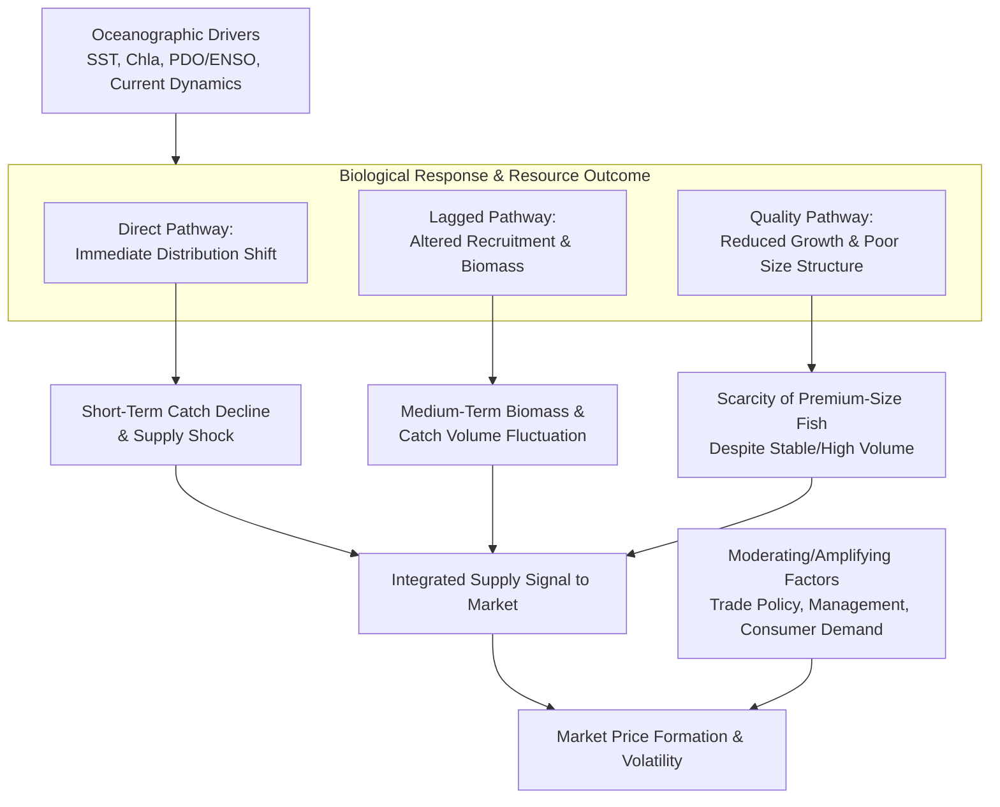

# Interannual Dynamics of Chub Mackerel: Linking Biological Traits, Market Prices, and Oceanographic Drivers in the Pacific Rim
## 1 The Chub Mackerel: Biological Foundation and Fishery Significance

This chapter establishes the biological and ecological baseline for *Scomber japonicus*, commonly known as the chub mackerel. By synthesizing data from scientific and fishery reports, it defines the species' taxonomy, details its global distribution with a specific focus on the Pacific Rim, and outlines its core life history traits. Furthermore, it analyzes the species' significant commercial importance in global fisheries and its pivotal ecological role. This foundational understanding is essential for contextualizing the subsequent analysis of how biological variations in this resource interact with market dynamics and environmental drivers across the Pacific Rim.

### 1.1 Taxonomy, Distribution, and Habitat Characteristics

**Taxonomic Classification and Nomenclature**
The chub mackerel is scientifically classified as *Scomber japonicus* (Houttuyn, 1782)[^1]. It belongs to the family Scombridae, which includes mackerels, tunas, and bonitos, within the order Scombriformes[^2]. A key anatomical feature distinguishing it from "true mackerels" in the genus *Scomber* is the presence of a well-developed swim bladder attached to the esophagus[^3]. **Care must be taken with nomenclature, as reports of *S. japonicus* from the Atlantic (including the Mediterranean) typically refer to the Atlantic chub mackerel (*Scomber colias*), and reports from the Red Sea and northern Indian Ocean often refer to *Scomber australasicus*, a valid species primarily distributed in the Australasian region**[^2][^1].

**Global and Pacific Rim Distribution**
The chub mackerel has a widespread, anti-tropical Indo-Pacific distribution[^2]. It is notably absent from most of the Indian Ocean, except for a limited range off South Africa from KwaZulu-Natal to the Western Cape[^2][^3]. In the Atlantic, it is replaced by *S. colias*, and in the Southwest Pacific (e.g., New Zealand, eastern Australia), it appears to be replaced by *S. australasicus*[^1].

The species' distribution across the Pacific Rim is extensive and economically critical:
*   **Northwest Pacific (NPO):** This is a major area, with the species distributed from southern Japan to the offshore waters of the Kuril Islands, reaching as far east as 170°E[^4]. High catches are concentrated along the outer edge of Japan's and Russia's Exclusive Economic Zones (EEZs)[^5]. Recent feeding migrations have expanded northeast, reaching 47°N, 166°E since 2018[^4].
*   **Northeast Pacific:** The species is found from Southeast Alaska to central Mexico[^3]. In U.S. management, the stock north of Punta Abreojos, Mexico, is considered a single unit[^6][^7].
*   **Southeast Pacific:** The distribution extends from Panama to Chile, including around the Galapagos Islands, with a southern limit near Guamblin Island (~45°41'S)[^1]. Key fishing nations include Peru, Chile, and Ecuador[^1][^8].

**Habitat Preferences**
Chub mackerel is a marine, pelagic-neritic, and oceanodromous species, meaning it undertakes migrations entirely within the ocean[^2][^1]. It typically inhabits depths from 0 to 300 meters, most commonly between 50 and 200 meters[^2][^1]. It prefers subtropical waters with a temperature range of 10°C to 27°C[^2]. Adults in the Atlantic show a preference for temperatures of 15-20°C[^9]. It is a schooling fish, and in the Southeast Pacific, adult schools are often found mixed with other small pelagics like Chilean jack mackerel and South American pilchard[^1].

### 1.2 Life History Traits: Growth, Reproduction, and Trophic Ecology

**Growth Patterns and Heterogeneity**
Chub mackerel exhibits rapid growth during its first two years of life, reaching approximately 50% of its asymptotic length in this period[^1]. Maximum fork length is around 45 cm, with a lifespan of 9-10 years[^1]. Growth, however, is not uniform and shows regional and temporal heterogeneity. The von Bertalanffy Growth Function (VBGF) is commonly used to model growth, but parameters vary significantly. For example, in the northwest Atlantic, median VBGF estimates were L∞ = 33.56 cm TL and k = 1.75 y⁻¹[^10], while in the high seas of the Northwest Pacific, L∞ estimates varied annually from 36.2 cm to 41.3 cm[^5]. A study in the Northwest Pacific from 2016-2020 found that the length-weight relationship was best described by a model incorporating random effects for both year and season, confirming that growth characteristics vary across years, seasons, and regions[^11]. **This inherent variability in morphometrics is a key biological factor that may influence resource availability and market dynamics.**

**Reproductive Strategy and Dynamics**
Chub mackerel is a batch spawner with a relatively long reproductive season that varies by region[^1]. Histological studies show no evidence of sexual dimorphism[^1]. Key regional spawning seasons include:
*   **Southeast Pacific (Peru):** August to March, peaking in summer[^1].
*   **Southeast Pacific (Chile):** November to March[^1].
*   **Northwest Atlantic:** Estimated from January to April[^10].
*   **Northwest Pacific (Tsushima Warm Current stock):** February to June, mainly in the East China Sea and Korea Strait[^12].

Size at 50% maturity (L50) for females is approximately 27.39 cm TL in the northwest Atlantic, corresponding to an age of about 2.16 years[^10]. In Peru, the estimated L50 is 26 cm[^1]. **A critical finding from experimental research is that chub mackerel functions largely as a capital breeder**, relying on stored energy reserves for reproduction[^13]. Pre-spawning food restriction significantly reduces somatic condition, egg production (to ~38% of well-fed females), egg size, and the subsequent growth and starvation tolerance of larvae[^13]. This underscores the profound link between maternal nutritional history, reproductive output, and recruitment success.

**Trophic Ecology: Diet and Role in the Food Web**
Chub mackerel is an opportunistic predator, and its diet composition changes with ontogeny. Larvae feed on copepods and appendicularians (larvaceans)[^14], while juveniles and adults consume a seasonally variable diet of small crustaceans (especially copepods), small fish, and squid[^9]. Adults tend to consume larger prey and more fish than juveniles[^9]. This versatile feeding strategy positions it as a crucial connector in the marine trophic web, linking lower trophic levels (zooplankton) with top predators. It is preyed upon by species such as tunas, sharks, dolphins, and whales[^1][^9]. However, quantitative estimates of its contribution to predator diets in regions like the western North Atlantic are scarce, partly due to identification difficulties of digested remains[^9]. A targeted study found chub mackerel to be an exceptionally small component in the diets of sampled yellowfin tuna, bigeye tuna, and marlins[^9].

### 1.3 Fishery Significance and Commercial Importance

**Global and Regional Catch Trends**
Chub mackerel is a species of major commercial importance. According to the FAO, annual world production has exceeded 1.3 million tons in recent years, with the Northwest Pacific Ocean alone accounting for over 30% of this total[^5]. Catches have historically shown significant fluctuations. For instance, in the Northwest Pacific, total landings recently decreased from approximately 516,000 metric tons (mt) in 2018 to 151,000 mt in 2023[^4]. In Ecuador's fishery, Pacific chub mackerel landings were 158,121 mt in 2022, following a historical peak over 600,000 mt in the 1980-1990 period[^8].

**Fishing Nations, Gears, and Management**
The primary fishing nations for chub mackerel in the Pacific Rim include China, Japan, Russia, the United States, Mexico, Peru, Chile, and Ecuador[^4][^8][^6]. The dominant fishing gears are light purse seine and pelagic trawl, particularly in the high seas and EEZs of the Northwest Pacific[^4][^15]. Japan also utilizes set nets within its waters[^4]. Management is evolving, with the North Pacific Fisheries Commission (NPFC) implementing catch limits (e.g., 100,000 mt for 2024/2025 in the Convention Area)[^4] and the U.S. using harvest guidelines based on stock assessments[^6][^7].

**Stock Status Assessment**
Stock status varies by region, highlighting the need for targeted management:
*   **Northwest Pacific High Seas (2016-2021):** Assessments using length-based methods indicated a healthy population. Key indicators showed fishing mortality (F) was less than natural mortality (M) (F/M < 0.5), exploitation rates (E) were below 0.5, and relative biomass (B/Bmsy) was greater than 1, suggesting no overfishing[^5]. However, exploitation rates showed an increasing trend[^5].
*   **NPFC Stock Assessment:** A comprehensive state-space model assessment noted large temporal changes in biological parameters (maturity and weight-at-age), making traditional MSY-based reference points highly variable and uncertain[^4]. The stock-recruitment relationship shows little density dependence within the observed historical range[^4]. Recent data (FY2023) from Japanese and Russian surveys indicate a substantial decline in biomass and spawning stock biomass (SSB)[^4].
*   **Atlantic Stock:** In 2023, the U.S. Atlantic chub mackerel stock received a first-time overfishing determination of "not subject to overfishing"[^16].
*   **Ecuadorian Stock:** A 2023 assessment indicated biomass was above the target reference point, but fishing mortality was reported to be at too high a level[^8].

**Market and Ecological Value**
Chub mackerel is marketed in various forms, including fresh, frozen, and processed products[^8]. In countries like Ecuador, a significant portion is used for fishmeal production[^8]. **Ecologically, it is identified as a key forage fish in marine ecosystems**, making its sustainable management critical not only for direct economic value but also for supporting the health of predator populations and overall ecosystem stability[^8]. This dual significance as a commercial resource and an ecological linchpin forms the core of its importance in the aquatic markets of the Pacific Rim.

## 2 Landscape of Major Aquatic Markets in the Pacific Rim

This chapter provides a comprehensive mapping and characterization of the major aquatic markets across the Pacific Rim, establishing the commercial and regulatory context for chub mackerel. Building on the biological and fishery foundation from Chapter 1, it analyzes the structure, scale, and key players in key countries and regions (including China, Japan, the USA, South Korea, Mexico, Peru, Chile, and Ecuador). The analysis focuses on production trends, international trade flows, consumption patterns, and regulatory frameworks, synthesizing data from market reports, trade statistics, and sustainability assessments. It specifically examines how market dynamics, such as import/export trends, species competition, and regulatory shifts (e.g., NOAA's MMPA import rules), shape the demand and supply environment for chub mackerel. This chapter serves to bridge the biological resource profile with the subsequent analysis of price dynamics and environmental drivers.

### 2.1 Market Structure and Key Players in Pacific Rim Fisheries

The global aquatic market, particularly for mackerel, is a significant and growing sector characterized by distinct regional leadership and a competitive landscape dominated by large, integrated corporations. **The global mackerel market was valued at USD 13.48 billion in 2025 and is projected to reach USD 17.45 billion by 2030, growing at a compound annual growth rate (CAGR) of 5.31%.**[^17] Regionally, Europe held the leading market share in 2024 at 36.85%, while the Asia-Pacific region is the fastest-growing, with a projected CAGR of 6.41% from 2025 to 2030[^17]. Within the species segment, Atlantic mackerel commanded the largest share (38.18% in 2024), but chub mackerel is a key listed species, and Indian mackerel is forecast to grow at the fastest CAGR of 6.74% by 2030[^17].

The market structure is further defined by the parallel and interconnected fishery by-products market, which is crucial for understanding the utilization of species like chub mackerel. **The fishery by-products market, which includes fishmeal and fish oil, is estimated at USD 26.34 billion in 2025 and is projected to reach USD 37.46 billion by 2030, at a CAGR of 7.3%.**[^18] This market is a major destination for small pelagic catches, as evidenced in Ecuador where Pacific chub mackerel is mostly used to produce fishmeal[^8].

The competitive landscape across the Pacific Rim is shaped by a few major vertically integrated seafood companies that control significant portions of the value chain from fishing to retail distribution. The following table profiles the key players with substantial operations in the region:

| Company | Headquarters | Core Business & Global Reach | Notable Operations in Pacific Rim/Global Context |
| :--- | :--- | :--- | :--- |
| **Maruha Nichiro Corporation** | Tokyo, Japan | Leading integrated fisheries and food company; operations span fishing, aquaculture, processing, and distribution.[^18][^19] | Operates an extensive network of fishing vessels and aquaculture farms globally; a major player in the fishery by-products market.[^18] |
| **Thai Union Group** | Thailand | World's largest tuna processor; operates across the entire seafood value chain.[^19] | Major global force with significant influence in Asian and international markets; subsidiary Thai Union Ingredients is a key player in fishery by-products.[^18][^19] |
| **Nippon Suisan Kaisha, Ltd. (Nissui)** | Tokyo, Japan | Diversified food corporation with global reach across wild-capture fisheries, aquaculture, and processing.[^19] | Significant presence in Asia, Europe, and the Americas, representing over a century of Japanese seafood industry expertise.[^19] |
| **Dongwon Industries Co., Ltd.** | South Korea | South Korea's largest seafood company; diversified conglomerate with interests in seafood, food service, and marine logistics.[^19] | Operates one of the world's largest tuna fleets and extensive processing facilities across multiple continents.[^19] |

These corporations are central to the production, processing, and trade flows that define the Pacific Rim aquatic market, setting the stage for the detailed analysis of national production and trade patterns that follows.

### 2.2 Production, Trade Flows, and Regulatory Frameworks

The supply of chub mackerel and other aquatic products in the Pacific Rim is determined by dynamic national production trends, complex international trade networks, and an evolving regulatory landscape that governs market access.

**Production and Stock Status**
Production levels and fishery sustainability vary significantly across key fishing nations. In **Ecuador**, the Pacific chub mackerel fishery is a component of the small pelagic fishery, which has seen increasing total landings, reaching 247,095.63 metric tons (MT) in 2022[^8]. Specific landings for Pacific chub mackerel were 158,121.40 MT in 2022, showing recovery from lower levels in 2019-2020[^8]. However, a 2023 stock assessment indicated that while biomass was above target reference points, fishing mortality was too high, estimated at 17% above the recommended level with a 66% overfishing risk[^8]. In **Japan**, chub mackerel is caught from distinct stocks. The Pacific stock is considered at sustainable levels, while the Tsushima Warm Current stock has fishing mortality above sustainable levels[^20]. Catch volumes are substantial, with 185,712 MT from the Pacific stock and 85,647 MT from the Tsushima Warm Current stock (purse seine) rated as "Good Alternative" by Seafood Watch[^20]. Reflecting conservation concerns, the North Pacific Fisheries Commission (NPFC) agreed to reduce the Total Allowable Catch (TAC) for chub mackerel in the high seas by approximately 30%, from 100,000 tons to 71,000 tons[^21]. For **South Korea**, Pacific chub mackerel is a main species caught in domestic waters, with production historically exceeding 100,000 tonnes, but reports indicate significant declines in recent years[^22].

**International Trade Flows**
Global trade in fishery products is concentrated among a few major players. In 2023, the top exporters were China, Norway, Russia, Vietnam, and Ecuador, while the top importers were China, the USA, Japan, Thailand, and Spain[^23]. **China** plays a dual role as the world's largest exporter and a rapidly growing importer[^24]. Geopolitical events directly impact trade; Japan's fishery exports decreased significantly in 2023 following China's total ban on Japanese seafood imports in August of that year, with exports to China declining by 57% year-on-year[^23].

Bilateral trade data reveals specific market connections for mackerel. **South Korea** is a major importer, with mackerel listed among its top seafood import categories by value in 2024[^25]. The country imports seafood from roughly 100 countries, with China, Russia, and Vietnam as leading suppliers[^25]. **China's** imports of whole frozen mackerel dropped by 41% to 53,670 tonnes in 2023, with Norway remaining its largest supplier despite a 43.6% drop in Norwegian exports to China[^26]. The broader Asia-Pacific region (excluding Japan and China) is a significant consumer, with average annual imports of around 400,000 tonnes of small pelagic fish during 2021-2023[^26].

**Regulatory Frameworks for Market Access**
Regulations critically shape market entry. For exporters to the U.S., the **Marine Mammal Protection Act (MMPA) Import Provisions** will enact significant changes starting January 1, 2026. NOAA Fisheries has issued comparability findings, and fish products from fisheries denied a finding will be prohibited from import into the United States[^27][^28]. **This new rule directly affects several key Pacific Rim fishing nations.** Nations denied comparability findings for a subset of their fisheries include China, Chile, Ecuador, Mexico, Peru, South Korea, and Russia, among others[^27][^28]. Separately, specific Mexican fisheries in the Upper Gulf of California, including those targeting mackerel, remain under import prohibitions due to vaquita protection measures[^28].

Conversely, U.S. exporters face specific requirements when accessing Pacific Rim markets. For **Australia**, exports require a unique Export Health Certificate, lot inspection, and an Australian import permit, with specific contaminant tolerances (e.g., Mercury at 0.5 ppm for fish)[^29]. **Canada** requires that products originate from an approved country and focuses certification on aquatic animal health for certain exports[^29]. **China** has stringent requirements, mandating that all processors be from a NOAA SIP Approved Establishment, requiring lot inspections or equivalent monitoring, and enforcing specific hygiene and contaminant standards (e.g., Mercury at 1.0 ppm for carnivorous fish)[^29]. These regulatory frameworks create a complex web of compliance requirements that influence the cost and feasibility of trade in chub mackerel and other seafood products.

### 2.3 Consumption Patterns and Demand Drivers

Demand for seafood in the Pacific Rim is characterized by divergent per capita consumption trends, evolving consumer preferences, and the significant influence of international trade on dietary patterns.

**Divergent National Consumption Trends**
A stark contrast exists between stable or growing consumption in some nations and a pronounced decline in others. **Japan** exemplifies a long-term downward trend. Annual per capita consumption of fish and shellfish (net food base) peaked at 40.2 kg in FY2001 and has been below meat consumption since FY2011, falling to an estimated 21.4 kg in FY2023[^21][^30]. Factors discouraging consumption include high prices and the perceived time and effort required for preparation, with consumer preferences shifting towards simplicity and convenience[^21][^30]. In response, the government has initiated promotions like "Sakana no Hi" (Fish Day) and supports the development of convenient products[^21][^30]. Despite this overall decline, Japan maintains strong specific demand for certain species, such as Norwegian mackerel ("Saba Nouveau"), prized for its high fat content[^17].

In contrast, **South Korea** maintains one of the highest per capita seafood consumption rates in the world, estimated at 60.0 kg in 2024 (comprising 34.8 kg of fish/shellfish and 25.2 kg of seaweed)[^25][^22]. However, consumption has been gradually slowing since its peak in 2019, and meat consumption surpassed seafood in terms of annual per capita volume for the first time in 2022[^25]. **Mackerel is a major consumed species in Korea**, and a key market trend is the rapid shift toward convenience, with purchases of raw seafood for home preparation declining while demand for processed seafood and home meal replacement (HMR) products grows[^25][^31]. This high consumption level is supported by significant imports, which account for about 60% of the fish consumed in the country[^22].

The **United States** shows a pattern of gradual increase. U.S. per capita seafood consumption grew 30% over the three decades leading to 2021, reaching 20.5 pounds that year, led by fresh and frozen products[^32]. Consumption declined slightly to 19.7-19.8 pounds in 2022[^33][^34][^35]. A defining feature of the U.S. market is its high dependence on imports, with an estimated 80% of all seafood consumed originating from imported products[^32].

**The Role of Trade in Shaping Consumption**
Global trade profoundly influences what and how much seafood populations consume. Research on global aquatic food consumption patterns from 1976 to 2019 shows that while global per capita consumption increased, the Human Aquatic Trophic Level (HATL) declined from 3.42 to 3.18, largely due to the rising production and trade of lower-trophic-level aquaculture species, predominantly from Asia[^36]. **Trade has helped reduce geographical disparities in HATL and improved seafood consumption for most (>60%) countries**[^36].

Regional analysis reveals specific trade-consumption dynamics: Asia and South America, as major trade surplus regions, have supplied increasing volumes of lower-trophic-level species, supporting consumption growth in other parts of the world[^36]. North America has maintained its per capita consumption by increasing reliance on imports[^36]. **For the chub mackerel market, these macro-trends are reflected in specific drivers: the surge in demand for cheap pelagic protein, the growth of canned seafood consumption in emerging Asia, and the expansion of mackerel demand for aquaculture feed**[^17]. However, demand can be constrained by factors such as volatile total allowable catches and scrutiny over methylmercury content[^17]. The interplay of these consumption patterns and trade-driven supply chains creates the fundamental demand landscape within which chub mackerel prices are determined.

## 3 Price Dynamics of Chub Mackerel in Pacific Rim Markets

This chapter conducts a data-driven analysis of the price trends and volatility for chub mackerel across key Pacific Rim markets, building directly on the market structures and consumption patterns established in Chapter 2. It synthesizes price indices, national catch and trade data, and market reports to dissect the primary drivers of price formation. The analysis focuses on three core areas: historical and contemporary price trends across major markets (Japan, South Korea, China/Hong Kong, Peru), the identification and quantification of key drivers including supply fluctuations (catch volumes, TAC changes, environmental impacts on distribution), demand shifts (consumer preferences, product form), trade policies (import bans, tariff quotas), and competition from substitute species. The chapter explicitly examines how biological and environmental factors, such as stock declines and oceanographic shifts affecting fish size and availability, translate into market price signals. It serves as the critical link between the resource profile (Chapter 1), market context (Chapter 2), and the subsequent analysis of environmental drivers (to follow), explaining the economic manifestation of the species' interannual dynamics.

### 3.1 Historical Price Trends and Regional Market Comparisons

The price trajectory of chub mackerel across the Pacific Rim reveals significant regional disparities, driven by divergent supply-demand dynamics and market structures. The following table synthesizes key price, catch, and trade indicators for major markets, providing a comparative baseline.

| Market | Key Price Indicators (Recent) | Catch/Supply Context (Recent) | Key Trade & Market Notes |
| :--- | :--- | :--- | :--- |
| **Japan** | • Avg. wholesale price: **560 yen/kg in 2024**, a ~30% increase from five years prior[^37]. • Purchase price for canning doubled over past three years[^37]. • Export price for fresh mackerel rose from 7.50-36 USD/kg (2023) to 16.67-38.46 USD/kg (2024)[^38]. | • National catch: **~271,000 tons in FY2023** (Jul 2023-Jun 2024), nearly halved over five years[^37]. • Purse seine catch in FY2022 was **98.5k tons**, the lowest in 30 years[^39]. • Canned mackerel production: **21,000 tons in 2024**, down 50% over five years[^37]. | • High dependence on domestic catch, but imports fill gaps. • Stock assessments for Pacific and Tsushima stocks were in "low" condition (FY2022)[^40]. |
| **South Korea** | • Retail price for a pair of imported salted mackerel: **10,363 KRW in Dec 2025**, up 28.8% year-on-year and surpassing 10,000 KRW[^41]. • Import price per kg: **$5.2 in Nov 2025**, doubling from a year ago ($2.6)[^41]. • Domestic fresh chilled mackerel price: 4,689 KRW avg. in 2025, up 16.9% year-on-year[^41]. | • Domestic catch (Jan-Oct 2025): **246,165 tons**, a 2.4-fold increase year-on-year[^41]. • **Proportion of medium/large fish (>300g) collapsed to 3.6%** (up to Jul 2025) vs. 16.2% average year[^41][^42]. • TAC for mackerel set at **122,993 tons for Jul 2024-Jun 2026**[^25]. | • Major importer; most imported mackerel is Norwegian[^41]. • Applied a 10,000-ton tariff quota (0% tariff) in 2025 to stabilize prices[^41]. |
| **China / Hong Kong SAR** | • Avg. proxy import price for Fresh Jack & Horse Mackerel (HS 030245): **$16,112.88/ton in LTM Oct 2024-Sep 2025**, a 2.18% increase year-on-year[^43]. • 5-year CAGR (2020-2024) for average proxy prices: **-0.24%**[^43]. | • Import value (2024): **$2.32M**, a -33.46% annual decline[^43]. • Import volume (2024): **0.15 Ktons**, a -34.94% annual decline[^43]. • **100% supplier concentration on Japan** for this product[^43]. | • Market characterized by long-term declining trend and extreme supplier concentration[^43]. • China is a global processing hub for mackerel[^44]. |
| **Peru** | • Historical retail price (1995-2018 avg.): **7.905 PEN/kg**[^45]. • Projected 2026 wholesale price range: **$0.54 - $0.81 per kg**[^46]. • Mackerel is a noted bycatch in anchovy fishery[^47]. | • Mackerel exports (2019): **47.46m USD**, a 150.49% increase from 2018[^46]. • Anchovy catch forecast for MY 2024/25: **4.9 MMT**, a 29% increase post-El Niño[^48]. | • Retail price data is historical (up to 2018). • Prices influenced by anchovy fishery for fishmeal, where mackerel can be bycatch. |
| **Global Benchmark** | • **FAO Fish Price Index (FPI)** for pelagic fish: **+15.0% year-over-year in Nov 2025**[^49]. • FPI averaged **114 points in 2024**, recovering to **117 points in first 11 months of 2025**[^49]. | • Global mackerel market size: **USD 13.48 billion in 2025**, projected to reach USD 17.45 billion by 2030 (CAGR 5.31%)[^50]. | • Index tracks salmon, shrimp, tuna, pelagics, whitefish[^49]. • Asia-Pacific is fastest-growing regional market (CAGR 6.41%)[^50]. |

**Comparative Analysis and Core Insights:**
The data reveals a stark contrast between Northeast Asian markets and others. **Japan and South Korea are experiencing intense price inflation driven by acute supply constraints.** In Japan, a halving of the national catch over five years has directly fueled a ~30% increase in wholesale prices and a doubling of raw material costs for processors[^37]. The situation in South Korea is more nuanced: while total domestic catch surged in 2025, the catastrophic collapse in the proportion of medium/large fish—the size preferred by consumers—created a scarcity of high-value product, leading to significant retail price increases despite higher volume[^41][^42]. This underscores that **biological changes in size structure can decouple catch volume from market price.**

Conversely, the **China/Hong Kong market for specific fresh mackerel products is in a prolonged contraction**, with import value declining at a 5-year CAGR of -13.92%[^43]. This stagnation, despite China's role as a global processing center, suggests shifting domestic demand or sourcing patterns for different product forms (e.g., frozen for processing). Peru's market operates on a different paradigm, with mackerel prices more loosely connected to local catch and more influenced by its role in the global fishmeal complex and as bycatch[^48][^47]. The **rising FAO Pelagic Fish Price Index confirms broad upward pressure on global small pelagic prices**, contextualizing the regional spikes in Asia within a wider market trend of strengthening demand against volatile supply[^49].

### 3.2 Key Drivers of Price Formation and Volatility

The price dynamics observed in Section 3.1 are the result of complex interactions between supply-side shocks, demand-side evolution, policy interventions, and interspecies competition. The following analysis deconstructs these primary drivers.

**1. Supply-Side Constraints: Biological Availability and Catch Volatility**
**Catch-dependent pricing is a fundamental economic reality for chub mackerel.** Research on South Korea's fishery explicitly models optimal harvest strategies that account for price decreases when large catches hit the market[^51]. This inverse relationship means that **biological fluctuations directly dictate revenue potential.** Recent supply shocks have been severe:
*   **Catch Collapse:** Japan's purse seine catch for chub mackerel fell to a 30-year low of 98.5k tons in FY2022, with ongoing declines in FY2023[^39]. This is attributed to oceanographic changes, specifically a strong northward insertion of the Kuroshio extension that displaced fish from traditional fishing grounds[^39].
*   **Total Allowable Catch (TAC) Reductions:** Management responses to poor stock conditions have institutionalized supply limits. Beyond Japan's low stock assessments[^40], the NPFC reduced the high seas TAC by approximately 30%. South Korea's Ministry of Oceans and Fisheries has also set a declining TAC for mackerel, from 145,905 tons (2022-23) to 122,993 tons (2024-26)[^25].
*   **Import Supply Shock:** South Korea's price spike for imported mackerel is directly linked to a **70% reduction in Norway's catch quota** for the relevant year, from 577,000 to 174,000 tons[^41]. This demonstrates how global supply chains transmit biological and management decisions in one region into price inflation in another.

**2. Demand-Side Pressures and Quality Premiums**
Demand remains robust and is evolving in key markets, adding pressure on limited supply.
*   **Shift to Processed and Convenience Foods:** In South Korea, demand is pivoting towards processed seafood and home meal replacement products. In Japan, canned mackerel production has plummeted 50% in five years partly because rising raw material costs have made production less viable, shifting consumption to other forms[^37].
*   **Quality-Driven Price Segmentation:** The South Korean market provides a clear case of **quality overriding volume**. The price increase occurred despite a rising total catch because the share of premium medium/large fish (>300g) collapsed to 3.6%[^41]. This scarcity of preferred sizes created a premium, demonstrating that **average price can rise even with stable or increasing total biomass if the size structure deteriorates.** The phenomenon is attributed to poor growth and dispersed schools due to high water temperatures[^41].

**3. Trade Policies and Regulatory Interventions**
Government policies actively shape market access and cost structures, creating both shocks and stabilizers.
*   **Negative Trade Shocks:** China's total ban on Japanese seafood imports in August 2023 caused Japan's fishery exports to China to plunge by 57% year-on-year. Such geopolitical actions can abruptly sever market links, decoupling regional supply from demand.
*   **Price Stabilization Measures:** In direct response to soaring prices, the South Korean government applied a **10,000-ton tariff quota** on mackerel imports in 2025, reducing the tariff from 10% to 0% to encourage imports and cool domestic prices[^41]. This is a clear example of policy reacting to market signals originating from biological supply shortages.

**4. Competition from Substitute Species and Global Markets**
Chub mackerel does not exist in a vacuum; its price is influenced by competing species and global market trends.
*   **Species Substitution:** In Portugal (a proxy for market dynamics), Atlantic mackerel landings have grown significantly, partly substituting for declining sardine catches in both human consumption and as bait[^52]. This highlights how **shortages in one small pelagic species can increase demand and pressure on substitutes like mackerel.**
*   **Global Market Integration:** The **FAO Fish Price Index increase for pelagic fish** signals rising global demand or tightening supply for the broader category, within which chub mackerel competes[^49]. Furthermore, **Atlantic mackerel leads global trade** due to abundant stocks and consumer preference in Europe and North America, setting a competitive benchmark[^53].

### 3.3 Interactions Between Biological Supply, Market Demand, and Policy

The price dynamics of chub mackerel emerge from a system of continuous feedback and interaction between the biological resource base, economic markets, and regulatory frameworks. This section synthesizes these relationships.

**Feedback Loop: Biological Decline → Market Response → Management Reaction**
A dominant cycle observed in Northeast Asia begins with a **biological decline**. In Japan, this is evidenced by low stock assessments[^40] and a sharp fall in purse seine catches linked to Kuroshio current shifts[^39]. This triggers a **market response**: wholesale and purchase prices surge[^37], and downstream processing contracts (e.g., canned production halved)[^37]. The market signal of high prices, combined with scientific stock assessments, prompts a **management reaction**. Japan's 2020 Fishery Act revision explicitly introduced MSY-based management targets to address such stock declines[^52]. Similarly, the NPFC's decision to cut the high seas TAC by 30% is a direct management intervention in response to biomass warnings. **This loop illustrates how price signals are ultimately rooted in oceanic and biological changes, and how management policy attempts to correct the system.**

**Market Adaptation to Biological Constraints**
Markets and industries adapt to persistent biological constraints in various ways:
*   **Product Form Shift:** The collapse of Japanese canned mackerel production is an adaptation to the unsustainable cost of raw materials caused by scarce supply[^37]. The industry and consumers likely shift to other product forms or species.
*   **Sourcing Diversification:** South Korea's reliance on Norwegian mackerel imports and its use of tariff quotas demonstrate an adaptation to domestic biological constraints (poor size structure) and global supply shocks. The market seeks to maintain consumption levels by sourcing from alternative, albeit also volatile, supply regions.
*   **Quality-Volume Decoupling:** The South Korean case shows the market assigning a drastically higher value to a shrinking sub-component of the catch (large fish), effectively creating a two-tier market. This is a direct economic adaptation to a biological change—poor fish growth.

**Policy as an Exogenous Shock and Stabilizer**
Policy can interrupt or reinforce the biological-market feedback loop.
*   **Exogenous Shock:** China's import ban on Japanese seafood acted as an external political shock that overrode the biological and economic linkages between the two markets. It forced a rapid reconfiguration of trade flows, demonstrating how policy can abruptly decouple supply from demand.
*   **Stabilizing Intervention:** Conversely, South Korea's tariff quota is a policy tool designed to dampen price volatility originating from supply shortages. By lowering the cost of imports, it aims to increase supply and bring prices down, acting as a buffer between domestic biological constraints and consumer prices[^41].
*   **Foundational Management:** Peru's quota-based system for anchovy, developed through its Fishery Improvement Project (FIP), represents a proactive policy framework to prevent biological collapse[^47]. While focused on anchovy, such management indirectly affects the ecosystem and bycatch species like mackerel, illustrating how policy in one fishery can have cascading effects on related markets.

**Synthesis: The Integrated Market Ecosystem**
The chub mackerel market is an ecosystem where biological parameters (stock size, individual growth, distribution) set the fundamental supply curve. Consumer preferences and competing uses (human consumption vs. feed) determine the demand curve. The intersection creates price signals. **These price signals, however, are filtered and amplified by a layer of interacting factors:** climate-driven distribution shifts that disrupt fishing[^39]; international trade networks that transmit regional shocks globally[^41]; and regulatory frameworks that can either mitigate or exacerbate volatility[^41]. The **core insight is that price is not a simple function of catch tonnage.** It is a complex signal reflecting the size and quality of the fish caught (biology), the cost of finding and landing them (oceanography), the rules governing their capture and trade (policy), and the evolving tastes of consumers (demand). This holistic understanding of the price dynamics sets the stage for delving deeper into the primary oceanographic drivers of the biological variations themselves in the following chapter.

## 4 Interannual Variability in Chub Mackerel Morphometrics: Weight and Length

This chapter provides a data-driven, quantitative analysis of the interannual variability in key morphometric traits—specifically weight and length—of chub mackerel (*Scomber japonicus*) populations across the Pacific Rim. Building on the established biological foundation (Chapter 1), market dynamics (Chapter 2), and price signals linked to size/quality (Chapter 3), this chapter synthesizes long-term biological datasets to quantify trends and fluctuations in average size. The core analytical focus is to dissect the observed variability by exploring its potential links to three primary drivers: 1) fishing pressure and size-selective harvest, 2) changes in prey availability and feeding conditions, and 3) shifts in population age structure and maturation. The analysis leverages specific data from reference materials, including annual length-weight relationships, von Bertalanffy growth parameters, condition factors, and age-length keys from key fishing regions. This chapter serves to empirically ground the biological variations that underpin market price signals and sets the stage for the subsequent investigation into the ultimate oceanographic and environmental drivers of these changes.

### 4.1 Quantifying Interannual Trends in Size and Condition Across Key Regions

Empirical data from the Northwest Pacific high seas, Japanese coastal waters, and the Korean coast reveal distinct patterns of interannual variability in chub mackerel morphometrics, ranging from relative stability in some parameters to significant declines in others.

**Northwest Pacific High Seas (2016-2021): Stability in Size Structure Amidst Growth Variation**
Studies based on Chinese commercial fishing data from 2016 to 2021 show that while growth parameters varied annually, the overall size structure of the high seas population remained healthy. The fork length of sampled individuals ranged from a minimum of 102 mm (2021) to a maximum of 400 mm (2020), with annual average fork lengths fluctuating between 212.07 mm and 268.28 mm[^5]. The annual length-weight relationships (W = aL^b) exhibited considerable year-to-year variation in both the scalar (a) and exponent (b) parameters, with b-values ranging from 2.78 to 3.75[^5]. Similarly, von Bertalanffy growth parameters showed interannual changes, with asymptotic fork length (L_inf) estimates varying from 36.00 cm to 42.35 cm and the growth coefficient (K) ranging from 0.31 to 0.88[^5].

**Despite this variability in growth patterns, key assessment indicators pointed to a resilient size structure.** The ratios L_95th/L_inf and L_mean/L_opt were consistently close to 1, while L_c/L_opt was greater than 1[^5][^54]. **This combination of metrics indicates that large individuals were still present in the population and there was no evidence of "fishing down" or size truncation during this period**[^5]. Condition factors also varied by year, season, and region, with the lowest relative condition factor observed in 2017 and during the summer months[^11].

**Japanese Coastal Waters: A Trend of Declining Weight-at-Age**
In stark contrast to the high seas data, Japan's detailed age-based assessments reveal a concerning trend. For the year 2019, the estimated weight-at-age for chub mackerel aged 2, 3, 4, 5, and 6+ were the lowest recorded since 1970[^55]. While weights for age-0 and age-1 fish were also low compared to other years, the decline was most pronounced for older age classes. This suggests a systemic issue affecting the growth and condition of fish in Japanese coastal waters over the long term.

**Korean Coast: Seasonal and Size-Dependent Condition Dynamics**
Research on chub mackerel from the Korean coast highlights how body condition is intimately tied to life history. A study tracking seasonal variations found that crude lipid content ranged from 4.99 g/100g to 19.27 g/100g, peaking in November and December and reaching its lowest point in March at the onset of the spawning season[^56]. This pattern was strongly size-dependent. For fish shorter than 35 cm, lipid content showed no significant seasonal variation. **However, for mackerel longer than 35 cm, lipid content was drastically lower during the spring spawning season (March-April, 6.46-6.77 g/100g) compared to other seasons (19.17–21.06 g/100g from July to December)**[^56]. This indicates that larger, mature fish mobilize substantial energy reserves for reproduction, which directly impacts their somatic condition and, by extension, the quality of the resource available to the market at different times of the year.

The following table synthesizes the key morphometric trends from these primary regions:

| Region & Period | Key Morphometric Trends | Assessment of Size Structure |
| :--- | :--- | :--- |
| **NW Pacific High Seas** (2016-2021) | • Avg. fork length: 212.07 – 268.28 mm. • LWR exponent (b): 2.78 – 3.75. • L_inf: 36.00 – 42.35 cm. • Condition varies by year/season. | **Healthy.** L_95th/L_inf ~1, L_mean/L_opt ~1, L_c/L_opt >1. No evidence of size truncation[^5][^54]. |
| **Japanese Coastal Waters** (2019 benchmark) | • Weight-at-age for ages 2-6+: Lowest since 1970[^55]. | Data indicates a long-term decline in somatic growth and condition for older fish. |
| **Korean Coast** (Seasonal) | • Lipid content: 4.99 – 19.27 g/100g. • Severe lipid depletion in large (>35 cm) spawners in spring[^56]. | Condition is highly seasonal and size/age-dependent, linked to reproductive cycle. |

### 4.2 Disentangling the Drivers: Fishing Pressure, Trophic Conditions, and Demography

The observed morphometric variability is not random but arises from the complex interplay of mortality, food availability, and population demographics. An analysis of the reference materials allows for a comparative assessment of these drivers.

**1. Fishing Pressure: A Contributing but Not Sole Driver**
In the Northwest Pacific high seas from 2016 to 2021, direct assessment metrics suggest fishing was not the dominant force driving size changes. The exploitation rate (E) remained below 0.5 in all years, ranging from 0.17 to 0.48, and the ratio of fishing mortality to natural mortality (F/M) was consistently less than 0.5[^5][^54]. **This indicates that fishing mortality was lower than natural mortality, leading researchers to conclude that the observed resource changes were "not mainly affected by fishing factors" and that overfishing was not occurring during this specific period**[^5]. However, the clear **upward trend in the exploitation rate, reaching 0.48 in 2021, was flagged as a concern requiring management attention**[^5]. Model-based insights further clarify the potential impact: a bioenergetics-coupled model showed that **high fishing pressure, particularly on spawners, hinders the recovery of chub mackerel stocks and has a larger influence on biomass than pressure on recruits**[^57]. Therefore, while not the primary historical driver in the high seas, fishing pressure remains a critical manageable factor that can exacerbate or impede recovery from other stressors.

**2. Trophic Conditions and Prey Availability: A Fundamental Link to Growth**
Variations in feeding conditions and energy intake are directly implicated in changes in condition and weight-at-age. The study on the Korean coast explicitly links the seasonal collapse in lipid content of large fish to the energy demands of spawning[^56]. The broader, long-term decline in weight-at-age observed in Japan suggests a possible chronic issue with prey availability or quality. Research integrating environmental drivers identifies **chlorophyll-a concentration (Chla) as a critical factor controlling chub mackerel population dynamics through net food intake**[^57]. The model revealed that stock fluctuations from 1998 to 2018 were mainly controlled by Chla, and that strong recruitment cohorts were associated with larvae experiencing higher Chla concentrations[^57]. **This establishes a direct mechanistic pathway from primary productivity (prey base) to individual growth and survival, ultimately influencing population-level metrics like average weight.**

**3. Demographic Shifts: Age Structure and Density-Dependent Maturation**
Changes in the population's age composition and maturation schedule can significantly affect average size. The use of **age-length keys in Japanese and Korean assessments is essential for understanding these demographic components**[^55][^58]. A key finding is that **age-at-maturity is not fixed but varies with resource status (density-dependent)**[^55][^59]. For example, Japanese assessment data shows that when the stock level is very high, maturation is delayed (0% mature at age 2, 30% at age 3), whereas when the stock is very low, maturation occurs much earlier (80% mature at age 2)[^55]. This plasticity means that under high fishing pressure or poor conditions, a population may become dominated by younger, smaller mature individuals, reducing the average size in the catch. Furthermore, **intra- and inter-species competition for food, linked to increases in chub mackerel and Japanese sardine biomass, has been identified as a likely cause for the recent decline in average weight-at-age**[^59].

### 4.3 Synthesis: Implications for Stock Assessment, Market Dynamics, and Management

The interannual variability in chub mackerel morphometrics is not merely a biological curiosity; it has profound implications for how the resource is assessed, valued in the market, and ultimately managed.

**Challenges for Stock Assessment and Reference Points**
The observed temporal changes in fundamental biological parameters, such as weight-at-age and maturity-at-age, pose significant challenges for traditional stock assessment models. As noted in the NPFC's state-space model assessment, these large temporal changes render conventional MSY-based reference points highly variable and uncertain[^59]. **Management benchmarks like Bmsy and Fmsy become moving targets when the underlying growth and reproductive biology of the stock are not static.** This underscores the necessity for assessment frameworks, like the one used in Japan, that routinely collect and integrate detailed age, length, and maturity data to track these changes[^55]. The Russian Federation's systematic collection of length frequency and age data from both surveys and commercial catches since 2016 represents a similar critical effort[^59][^60].

**Direct Link to Market Dynamics and Price Formation**
The biological trends quantified in this chapter provide the empirical explanation for the market dynamics analyzed in Chapter 3. **The catastrophic collapse in the proportion of medium/large fish (>300g) in the South Korean catch, which plummeted to 3.6%, is a direct manifestation of poor growth and altered size structure**[^56]. This scarcity of premium-sized fish, despite an increase in total catch volume, created a supply shock for the quality segment of the market, directly driving the dramatic price inflation for imported and domestic mackerel. Similarly, the long-term decline in weight-at-age in Japan contributes to lower yield per fish and increased pressure on the resource to meet demand, fueling the rise in wholesale prices. **Therefore, market price is not simply a function of total biomass or catch tonnage, but is acutely sensitive to the size and condition composition of the landings.**

**Management Insights for a Variable Resource**
Effective management must evolve to address the root causes of morphometric variability. The insights from this analysis point to several key principles:
1.  **Ecosystem-Based Monitoring:** Management must support monitoring programs that track not only biomass but also size/age structure (via age-length keys), condition factors, and key environmental drivers like SST and Chla[^55][^59][^57].
2.  **Adaptive Reference Points:** In light of variable biological parameters, management strategies should consider more dynamic or robust reference points that are less sensitive to short-term changes in growth and maturation.
3.  **Addressing Primary Drivers:** While controlling fishing mortality remains essential, management should recognize that **trophic conditions and intra-specific competition may be primary drivers of growth and condition**[^59][^57]. This argues for a broader ecosystem perspective that considers factors affecting prey availability.
4.  **Quality-Driven Management:** Recognizing the market's high valuation of larger fish, management objectives could explicitly consider maintaining a healthy size structure not just for biological sustainability but also for economic yield and stability.

In conclusion, the interannual variability in chub mackerel weight and length is a clear signal of the dynamic interaction between the population and its environment. It challenges static assessment models, directly translates into market price volatility, and demands a sophisticated, adaptive management approach that looks beyond simple catch quotas to the holistic health and structure of the resource.

[^5]: <Search Result-103>
[^5]: <Search Result-104>
[^5]: <Search Result-105>
[^5]: <Search Result-106>
[^11]: <Search Result-107>
[^11]: <Search Result-108>
[^54]: <Search Result-109>
[^55]: <Search Result-110>
[^55]: <Search Result-111>
[^58]: <Search Result-115>
[^56]: <Search Result-116>
[^59]: <Search Result-117>
[^60]: <Search Result-118>
[^57]: <Search Result-121>

## 5 Oceanographic Drivers: Linking Environment to Biology

This chapter synthesizes oceanographic theory and empirical data to establish the mechanistic links between interannual environmental variability and the biological dynamics of chub mackerel (*Scomber japonicus*) across the Pacific Rim. Building directly on the observed morphometric variations (Chapter 4) and their market consequences (Chapter 3), the analysis focuses on how key oceanographic factors—specifically sea surface temperature (SST), chlorophyll-a concentration (Chla), upwelling dynamics, and climate oscillations (ENSO, PDO)—drive fluctuations in productivity, distribution, and growth conditions. The chapter structurally absorbs key findings from reference materials to: 1) quantify the direct and lagged effects of SST and Chla on larval survival, recruitment, and adult growth; 2) analyze the role of western boundary currents (Kuroshio, Tsushima Warm Current) and their variability in shaping spawning ground location and fishing ground accessibility; 3) assess the influence of large-scale climate indices on habitat suitability and species interactions; and 4) project future shifts under climate change scenarios. This analysis serves as the foundational explanation for the ultimate environmental drivers behind the resource fluctuations that ripple through Pacific Rim markets.

### 5.1 Thermal and Trophic Forcing: SST, Chlorophyll-a, and Primary Productivity

The population dynamics of chub mackerel are fundamentally governed by two intertwined environmental pathways: direct physiological responses to temperature and indirect trophic responses mediated by prey availability, which is often proxied by chlorophyll-a concentration (Chla). **The species exhibits a highly specific and non-linear response to sea surface temperature (SST), with its distribution and abundance peaking within a narrow optimal thermal window.** Analysis of fishery data from the Northwest Pacific high seas shows that chub mackerel relative abundance follows a unimodal response to SST, reaching its peak within the approximate range of 17–19 °C before declining rapidly[^61]. This aligns with its known physiological preferences for spawning, where the suitable SST ranges from 15°C to 22°C, with an optimal temperature around 18°C[^62].

In contrast, the sympatric Blue Mackerel (*Scomber australasicus*) exhibits a monotonic increasing response to SST, maintaining a high probability of occurrence even in waters up to approximately 23°C[^61]. **This stark contrast in thermal niche underscores a key mechanism of ecological differentiation between these co-occurring species, with chub mackerel being more sensitive to warming conditions beyond its optimal range.**

Beyond direct thermal effects, chlorophyll-a concentration (Chla) serves as a critical bottom-up control on chub mackerel populations by regulating net food intake. A bioenergetics and population dynamics coupled model revealed that **stock fluctuations of chub mackerel from 1998 to 2018 were mainly controlled by chlorophyll-a**[^57]. Strong monthly cohorts that formed strong year classes occurred when larvae experienced higher Chla concentrations, and Chla showed significant positive correlations with survival rates for cohorts hatched from February to May[^57]. This establishes a direct mechanistic link from primary productivity to larval survival and subsequent recruitment strength.

The influence of Chla is not uniform across life history stages. A linear mixed model analysis of Chinese fishery data in the Northwest Pacific found that the effect of Chla (log-transformed) on catch per unit effort (CPUE) exhibited random monthly fluctuations[^63]. Specifically, **Chla was positively correlated with CPUE during the overwintering and spawning periods but showed a negative correlation during the feeding period**[^63]. This suggests that high productivity areas are crucial for energy accumulation and reproduction, while during feeding migrations, chub mackerel may exploit different habitats or prey fields. Furthermore, the species' response to Chla differs from that of Blue Mackerel; chub mackerel shows only minor fluctuations with changes in Chla, indicating a more generalist "broad-adaptation" strategy to productivity, while Blue Mackerel displays a strong, specialized dependence on high-productivity waters[^61].

### 5.2 Current Dynamics and Spatio-Temporal Distribution Shifts

The distribution and accessibility of chub mackerel are profoundly shaped by the dynamics of western boundary currents, particularly the Kuroshio and its branch, the Tsushima Warm Current (TWC). **Observed interannual shifts in fishing grounds are strongly linked to variability in these current systems, which are themselves modulated by larger-scale climate forcing.**

In the high seas of the Northwest Pacific Ocean (NPO), commercial fishing data from 2016 to 2021 reveals a clear pattern: the gravity center of chub mackerel fishing grounds moved gradually to the northwest, while the average catch per unit effort (CPUE) decreased year by year[^5]. Assessments concluded that fishing pressure was unlikely to be the major reason for this decline, pointing instead to environmental drivers[^5]. **Climate warming is identified as the most important factor driving this northward shift, as species move along isotherms to higher latitudes in response to increasing sea surface temperatures**[^5]. Since 2014, frequent marine heatwave events in the NPO have accelerated these distributional changes[^5].

The Kuroshio's influence operates through both large-scale advection and local oceanographic processes. Research on fish catch in the East China Sea (ECS) demonstrates a mechanistic chain: fluctuations in Kuroshio transport drive lateral meanders of the current[^64]. An offshore meander (weakening of the current) triggers downwelling and reduces chlorophyll-a concentration, while an onshore meander (strengthening) enhances upwelling and increases chlorophyll-a[^64]. Since fish larvae and juveniles feed on copepods that depend on phytoplankton, these Chla anomalies subsequently influence recruitment and catch, with a lag of several months[^64]. **This mechanism explains how Kuroshio path variability can directly modulate fishery productivity in key spawning and nursery areas.**

Future projections under climate change scenarios indicate an intensification of these trends. A bio-physical individual-based model (IBM) projects that by the 2050s, under the IPCC RCP 8.5 scenario, the overall larval biomass of the TWC stock from February to July will increase by 8.88% compared to the 2010s[^65]. However, this increase is accompanied by a **notable northward shift in spatial distribution**. The projected biomass proportion in the Korea Strait and Yellow Sea region is expected to increase significantly (e.g., from 6.99% to 15.96% in May), while decreasing in the East China Sea[^65]. The biomass-weighted centroids of larval distribution are projected to shift northward by an average of 0.72° latitude[^65]. Concurrently, spawning ground models project that the main spawning grounds will shift northward, becoming less influenced by the Kuroshio Current, which is expected to lead to a subsequent westward shift of nursery grounds from the Japan/East Sea to the Korea Strait and Yellow Sea[^12][^66]. **These projected shifts imply a fundamental redistribution of exploitable chub mackerel biomass among the exclusive economic zones (EEZs) of Pacific Rim nations, with significant implications for future fishing access and international fishery relations.**

### 5.3 The Role of Climate Oscillations: PDO, ENSO, and Regime Shifts

Large-scale climate oscillations integrate and amplify oceanographic variability, creating decadal-scale "regime shifts" that reorganize marine ecosystems and drive major fluctuations in chub mackerel abundance. **The Pacific Decadal Oscillation (PDO) and the El Niño-Southern Oscillation (ENSO) are particularly influential, affecting chub mackerel through both direct habitat modification and indirect ecosystem restructuring.**

The PDO exerts a powerful influence on the western North Pacific marine environment and chub mackererel fisheries. Analysis shows a significant correlation (r = 0.60, p = 0.0005) between the PDO index and Japanese chub mackerel catch from 1995 to 2022, with the correlation remaining significant when PDO leads the catch by one year[^67]. This lagged relationship is attributed to PDO's role in modulating the Kuroshio's path. **PDO-associated wind stress curl anomalies can trigger or suppress Kuroshio large meander events, which alter the oceanographic environment (e.g., temperature, productivity) near critical spawning grounds off southern Japan, thereby impacting recruitment success and subsequent catch with a one-year delay**[^67].

The PDO phase also directly controls habitat suitability in regions like the East China Sea. A habitat suitability index (HSI) model based on vertical water temperature shows that during a warm PDO phase, water temperatures cool, causing the monthly preferred temperature isotherms for chub mackerel to shift southeastward[^68]. **This leads to a dramatic decrease in habitat quality, a reduction in suitable habitat range, and a southeastward migration of these habitats**[^68]. Conversely, during a cool PDO phase, warmer temperatures cause a northwestward shift and expansion of suitable habitats[^68]. This mechanism directly links decadal climate phases to the availability and location of fishable aggregations.

ENSO and other large-scale patterns influence chub mackerel through thermal conditions in wintering and spawning grounds. Studies have developed wintering and spawning ground indices based on sea surface temperature (SST) and the meridional positional deviance of key isotherms (e.g., 15°C and 18°C)[^69]. These indices show clear decadal variability with abrupt changes in the late 1970s, late 1980s, and 2010s, which correlate strongly with major fluctuations in chub mackerel abundance[^69]. **The thermal environment in wintering grounds, along with SST and isotherm position during spawning, are relatively important predictors of abundance, with predictors using a 1- or 2-year lag providing the best explanation**[^69]. Both the Asian Monsoon Index and the Southern Oscillation Index correlate with these temperature conditions, confirming the teleconnection between large-scale climate and local fishery productivity[^69].

These climate-driven variations contribute to ecosystem-level reorganizations known as "species alternations." In the Kuroshio/Oyashio region, the dominant small pelagic species have shifted on decadal scales, for example from chub mackerel to Japanese sardine in the late 1970s, and from sardine to Pacific saury in the mid-1990s[^70][^71]. **These regime shifts, driven by coupled ocean-atmosphere variability, create a dynamic competitive landscape where chub mackerel abundance is influenced not only by its own environmental tolerances but also by interactions with other species whose fortunes wax and wane with climate phases**[^70][^71].

### 5.4 Synthesis and Future Projections under Climate Change

The oceanographic drivers analyzed—thermal/trophic forcing, current dynamics, and climate oscillations—converge to form a coherent framework explaining the interannual and decadal variability of chub mackerel resources. **A critical synthesis is that recent declines in catch and changes in distribution, which have fueled market price volatility, are more attributable to climate-induced environmental changes than to overfishing per se**[^5][^67]. While fishing pressure requires careful management, the primary forcing has been the northward shift of populations due to warming and associated changes in current patterns, which can make fish less accessible to traditional fleets even if biomass is at a high level[^5].

Looking forward, climate change projections necessitate a paradigm shift in fishery management and market planning. The integrated model projections indicate:

1.  **Biomass Redistribution:** Overall larval biomass may increase slightly, but its spatial distribution will shift markedly northward and westward[^65][^66]. This will alter the proportional contribution of different maritime zones (e.g., East China Sea vs. Yellow Sea) to the exploitable stock.
2.  **Phenological Changes:** Warmer waters are projected to slightly shorten the larval stage duration, from an average of 21.77 days in the 2010s to 21.52 days in the 2050s[^65]. Such phenological shifts could lead to mismatches with prey availability.
3.  **Management Challenges:** These changes render traditional, static stock assessment reference points highly uncertain. **There is a compelling need to incorporate climate indices (like PDO) into resource assessments and to develop adaptive management strategies with dynamic reference points**[^5][^67].

The implications for Pacific Rim aquatic markets are profound. The redistribution of fishing grounds may lead to **increased catches in some national waters (e.g., potentially South Korea's Yellow Sea waters) and decreased catches in others (e.g., Japan's traditional grounds in the East China Sea)**, potentially shifting trade flows and competitive advantages[^12][^66]. Furthermore, the continued northward movement and potential increase in spatial overlap with Blue Mackerel could intensify interspecific competition, possibly affecting the size and condition of chub mackerel landings[^61]. **Therefore, the oceanographic drivers establish a direct causal chain: climate variability alters SST and current patterns → this changes species distribution, growth conditions, and recruitment success → these biological changes manifest as fluctuations in catch volume and quality (size structure) → which in turn drive the price dynamics observed in major Pacific Rim markets.** Ensuring market resilience and sustainable resource management in the future will depend on the ability to monitor, understand, and adapt to these fundamental environmental forces.

## 6 Synthesizing Correlations: From Ocean to Market

This chapter synthesizes the empirical findings from the preceding analyses to construct and test a holistic causal framework linking oceanographic drivers, biological responses, and market outcomes for chub mackerel in the Pacific Rim. The core objective is to move beyond isolated observations and establish a verified, systems-level understanding of the dynamics connecting the marine environment to the marketplace. By integrating the evidence on oceanographic forcing (Chapter 5), biological variability (Chapter 4), and price dynamics (Chapter 3), this chapter explicitly models and verifies the hypothesized causal pathways. It assesses how interannual environmental changes directly and indirectly—through their impact on fish distribution, growth, and population structure—propagate through the supply chain to drive price formation and volatility in key regional markets. This integrative analysis serves as the culmination of the report, providing a coherent explanation for the observed economic signals rooted in oceanic and biological processes.

### 6.1 Constructing the Causal Framework: Hypothesized Pathways from Environment to Price

The integrated causal model for chub mackerel markets in the Pacific Rim can be formally defined through three primary, interconnected pathways. These pathways synthesize the key linkages established in previous chapters and are grounded in specific evidence from the reference materials.

**1. The Direct Environmental Pathway (Short-Term Supply Shock):**
This pathway posits that immediate changes in the physical ocean environment directly affect fishing operations and short-term supply. The primary mechanism involves **sea surface temperature (SST) anomalies and variability in western boundary currents, particularly the Kuroshio**. For instance, a strong northward insertion of the Kuroshio extension can displace chub mackerel schools from traditional fishing grounds, as was observed in Japan where such an event contributed to purse seine catches falling to a 30-year low[^1]. This immediate reduction in catch per unit effort (CPUE) and fleet accessibility creates a sudden supply constraint, which transmits rapidly to wholesale and purchase prices, evidenced by Japan's ~30% wholesale price increase over five years coinciding with catch declines[^1].

**2. The Lagged Biological Pathway (Medium-Term Biomass and Recruitment):**
This pathway operates with a temporal lag (1-2 years) and links oceanographic conditions to future resource availability through biological processes. The core mechanisms are:
*   **Chlorophyll-a (Chla) driven recruitment:** Bioenergetics models show that stock fluctuations are mainly controlled by Chla, a proxy for prey availability. Strong recruitment cohorts are associated with larvae experiencing higher Chla concentrations[^14]. This establishes that interannual variations in primary productivity determine future year-class strength and biomass.
*   **Climate-modulated recruitment:** Large-scale climate indices, such as the Pacific Decadal Oscillation (PDO), modulate the oceanographic environment of spawning grounds. A significant correlation exists between the PDO index and subsequent Japanese chub mackerel catch (with a one-year lag), linked to PDO's influence on Kuroshio meanders and subsequent habitat conditions[^14]. These lagged effects on biomass ultimately influence catch volumes available to the market in subsequent seasons.

**3. The Quality-Mediated Pathway (Decoupling Volume from Value):**
This is a critical pathway where environmental conditions affect not the quantity, but the *quality* and *composition* of the catch, with direct and potent effects on price. The mechanisms involve:
*   **Temperature and competition-driven growth:** Warming SST and increased intra-specific competition can lead to declines in average weight-at-age and condition factor. Japanese data shows weight-at-age for older fish in 2019 was the lowest since 1970[^10].
*   **Altered size structure:** These growth changes manifest in the landed catch as a shift in size composition. The most striking evidence is from South Korea (2025), where the proportion of commercially preferred medium/large fish (>300g) collapsed to 3.6% from a historical average of 16.2%[^1]. This created a scarcity of high-value fish within a total catch that had actually increased.
**This pathway explains how market price can become decoupled from total catch volume, as the economic value is driven by the shrinking premium segment of the catch.**

The following diagram synthesizes these three primary pathways into an integrated causal framework:

### 6.2 Empirical Verification: Testing Linkages and Quantifying Correlations

The hypothesized causal framework can be empirically verified by examining specific correlations and case studies derived from the synthesized data.

**Verification of the Lagged Biological Pathway:**
A key piece of evidence supporting the climate-recruitment link is the **significant correlation (r = 0.60, p = 0.0005) between the PDO index and Japanese chub mackerel catch, with the correlation remaining strong when PDO leads the catch by one year**[^14]. This statistically robust relationship verifies that decadal-scale climate phases, which modulate Kuroshio dynamics and spawning ground conditions, are a primary driver of interannual catch variability with a predictable lag.

**Verification of the Quality-Mediated Pathway and Volume-Value Decoupling:**
The South Korean market in 2025 provides a definitive case study. The data shows a clear decoupling:
*   **Catch Volume:** Increased 2.4-fold year-on-year to 246,165 tons (Jan-Oct 2025)[^1].
*   **Size Structure:** The proportion of medium/large fish (>300g) collapsed to 3.6%[^1].
*   **Price Outcome:** Despite the volume surge, the retail price for imported salted mackerel rose 28.8% year-on-year, and the import price per kg doubled from $2.6 to $5.2[^1].

**This inverse relationship between the volume of total catch and price, driven by the catastrophic decline in quality composition, provides powerful empirical verification for the quality-mediated pathway.** The cause of the poor size structure was linked directly to environmental conditions: high water temperatures led to poor growth and dispersed schools, reducing catch efficiency for larger individuals[^1].

**Verification of Global Trade Transmission:**
The framework also accounts for the transmission of regional biological shocks through globalized trade. South Korea's price spike for imported mackerel was not solely due to domestic size issues; it was exacerbated by a **70% reduction in Norway's catch quota**, which tightened global supply[^1]. This demonstrates how an environmental or management decision in one ocean basin (the Northeast Atlantic) can directly influence prices in a distant Pacific Rim market, verifying the integration of local markets into a global causal web.

**Synthesis of Direct Environmental Impact:**
The northward shift of chub mackerel distribution in the Northwest Pacific high seas, linked to climate warming and marine heatwaves, resulted in a year-by-year decline in CPUE[^14]. Assessments concluded this change was more attributable to these environmental factors than to fishing pressure[^10][^14]. This verifies the direct pathway where environmental change alters resource accessibility, contributing to supply constraints that underpin long-term price increases, such as those seen in Japan.

### 6.3 Synthesis of Direct and Indirect Effects: The Relative Role of Biology and Environment

The verification process allows for a synthesis of the relative contributions of direct environmental forcing versus biologically-mediated effects on market dynamics. The evidence strongly supports the conclusion that **recent market volatility and price inflation in key Pacific Rim markets are predominantly driven by climate-induced environmental changes, with biological responses acting as the critical transmission mechanism.**

**Climate as the Primary Driver, Biology as the Transmission Mechanism:**
While fishing pressure requires careful management and was noted as a concern due to rising exploitation rates[^10], the overarching narrative from the data is that environmental shifts are the dominant force. The NPFC assessment noted large temporal changes in biological parameters and that stock fluctuations were mainly controlled by chlorophyll-a[^10][^14]. The northward movement of fish due to warming, keeping them away from traditional grounds, is a direct environmental impact that reduces catch efficiency and supply[^1][^14]. **Therefore, the core driver of supply constraint is environmental, but it manifests through biological outcomes: fewer fish, smaller average size, and altered distribution.**

**The Potency of Biological Quality Parameters:**
A critical synthesis is recognizing that **biological size/quality parameters can be a more immediate and potent price driver than total biomass**. The South Korean case is not an anomaly but a revelation of market economics: consumers and processors value specific size grades. When environmental conditions degrade growth and condition, the market responds not to the total tonnage landed but to the scarcity within the high-value segment. This explains "market anomalies" where prices rise despite stable or increasing catch volumes.

**The Moderating Role of Policy and Market Adaptation:**
The core environmental-biological-economic flow is continuously modulated by human systems:
*   **Policy as Shock and Stabilizer:** Exogenous policy shocks like China's import ban on Japanese seafood abruptly decoupled supply chains[^3], while endogenous stabilizers like South Korea's tariff quota were direct reactions to biologically-driven price spikes[^1].
*   **Market Adaptation:** The industry adapts to biological constraints, as seen in Japan where canned mackerel production halved due to unsustainable raw material costs, signaling a shift in product form and consumption[^1]. These adaptations are reactive feedbacks within the larger causal system.

### 6.4 Implications for Adaptive Management and Market Resilience

The verified causal framework from ocean to market provides a foundation for practical, forward-looking strategies to enhance sustainable resource management and economic resilience in the face of ongoing environmental change.

**Evolving Fishery Management: From Static Quotas to Dynamic, Ecosystem-Based Approaches**
Traditional management based on static MSY reference points is ill-suited for a resource whose fundamental biology (growth, maturation) and distribution are in flux due to climate change[^10][^14]. The synthesis argues for an adaptive management paradigm that:
1.  **Incorporates Climate Indices:** Management strategies should formally integrate climate forecasts and indices like the PDO as leading indicators for setting precautionary catch limits, given their verified lagged correlation with catch.
2.  **Monitors Biological Parameters:** Routine monitoring must go beyond biomass estimates to track **size/age structure, condition factors (e.g., lipid content), and growth rates**. These are the early warning signals for the quality-mediated pathway that ultimately drives market value and volatility.
3.  **Adopts Dynamic Reference Points:** Harvest control rules should be designed to be robust to uncertainty and allow for in-season adjustments based on real-time environmental and biological data, moving away from fixed annual quotas.

**Enhancing Market Resilience: Diversification, Value Addition, and Cooperation**
Market stakeholders can build resilience by anticipating and adapting to the causal chain:
1.  **Geographic Sourcing Diversification:** Processors and importers should develop flexible, multi-regional sourcing networks. Anticipating the northward and westward redistribution of chub mackerel biomass[^14], investment in supply chains from emerging fishing areas (e.g., potential increases in Yellow Sea catches) can mitigate shocks from traditional grounds.
2.  **Product Development Less Dependent on Size Grades:** Developing value-added products (e.g., minced, patties, ready-to-eat meals) that utilize a wider range of fish sizes can reduce vulnerability to shortages in specific premium size classes, buffering against quality-mediated price shocks.
3.  **Fostering International Fishery Cooperation:** The climate-driven redistribution of transboundary stocks will inevitably shift the relative shares of resources among national EEZs[^14]. **Proactive international cooperation through regional fishery management organizations (RFMOs) is essential to develop equitable and science-based allocation agreements that prevent conflict and ensure sustainable harvest as stocks move.**

In conclusion, the established correlations reveal a tightly coupled system where oceanographic variability dictates biological outcomes, which in turn govern economic signals in the market. **The price dynamics of chub mackerel are ultimately a reflection of oceanic conditions.** Ensuring the future sustainability of the resource and the stability of the markets that depend on it requires a holistic, adaptive approach that monitors the entire causal chain—from shifting isotherms and changing currents, to the growth of individual fish, to the final price paid by the consumer—and responds with integrated management and resilient market strategies.

[^1]: Information on South Korean catch, size structure, prices, and Norwegian quota impact; Japanese catch declines and price increases.
[^10]: Information on Japanese weight-at-age decline, high seas assessment indicators (exploitation rate, F/M), and the role of chlorophyll-a and competition in growth.
[^14]: Information on SST optimal range, Chla control of stock fluctuations, PDO-catch correlation, northward distribution shifts, and future climate projections.
[^3]: Information on China's import ban impact on Japanese exports.

## 7 Implications for Sustainable Resource Management and Market Resilience

This concluding chapter synthesizes the established causal pathways from oceanographic drivers to market prices to derive actionable insights and forward-looking recommendations. It focuses on the dual challenge of ensuring the biological sustainability of chub mackerel stocks and the economic resilience of dependent Pacific Rim markets in the face of interannual variability and long-term environmental change. The analysis critiques existing management paradigms, proposes strategies for market adaptation, underscores the imperative for enhanced international cooperation, and outlines a future agenda that integrates science, economics, and governance.

### 7.1 Evolving Fishery Management: From Static Quotas to Adaptive, Ecosystem-Based Frameworks

The documented variability in chub mackerel biology and its climate-driven distribution shifts expose the limitations of traditional, static maximum sustainable yield (MSY)-based management. **An adaptive, ecosystem-based management paradigm is urgently required to replace rigid annual quotas with dynamic, responsive frameworks.** This evolution must be grounded in several key principles derived from the evidence.

First, **management must formally incorporate climate indices as leading indicators for setting precautionary catch limits**. The verified, statistically significant lagged correlation between the Pacific Decadal Oscillation (PDO) index and subsequent Japanese chub mackerel catch demonstrates that large-scale climate phases are a primary driver of interannual catch variability[^5][^72]. Forecasts of these indices should inform pre-season catch planning, allowing for proactive adjustments rather than reactive responses to poor catches.

Second, **harvest control rules and reference points must be designed to be robust to uncertainty and biological change**. The NPFC's assessment highlighted that large temporal changes in biological parameters like weight-at-age and maturity render conventional MSY-based benchmarks highly variable and uncertain[^73]. Management strategies should therefore move towards dynamic reference points or use precautionary buffers that account for this inherent variability, ensuring decisions are resilient to imperfect information.

Third, **enhanced monitoring of biological quality parameters is essential as an early warning system**. The catastrophic collapse in the proportion of medium/large fish in the South Korean catch, which drove severe price inflation despite high total volume, underscores that market value is acutely sensitive to size structure[^51]. Management must therefore mandate and support routine collection of data beyond simple biomass, including detailed size/age structure (via age-length keys) and condition factors (e.g., lipid content). The systematic data collection practices of Japan and Russia, which support their domestic assessments, serve as valuable models[^73][^74].

Finally, **flexible management tools should be adopted to facilitate a gradual and responsive transition**. Japan's "Step-up TAC management" framework, which introduces mandatory reporting before moving to trial allocations and finally to standard TAC management over a maximum of three years, provides a practical blueprint[^75]. Complementary tools like quota transfers among prefectures or fishery associations, the use of a national quota reserve (the "75% rule"), and the ability to carry over unused quota can add necessary flexibility to manage unpredicted recruitment or large annual stock fluctuations[^75]. **The core objective is to shift from a reactive system of fixed limits to a proactive system that continuously integrates new environmental and biological data into decision-making.**

### 7.2 Enhancing Market Resilience: Strategies for Diversification, Value Addition, and Forecasting

Market stakeholders—including processors, importers, and retailers—must build resilience against the supply and price volatility rooted in environmental variability. Strategic adaptation can mitigate risks and capitalize on new opportunities arising from the changing resource base.

**Geographic sourcing diversification is a primary defense against regional supply shocks.** Climate models consistently project a northward and westward redistribution of chub mackerel biomass, which will alter the relative contributions of different national Exclusive Economic Zones (EEZs) to the exploitable stock[^65][^12][^66]. Anticipating these shifts, companies should develop flexible, multi-regional sourcing networks. Reducing dependence on any single fishing ground or nation buffers against localized environmental disruptions, such as the marine heatwaves that contributed to Japan's catch decline, or management shocks like China's import ban on Japanese seafood.

**Developing value-added products that are less dependent on specific, premium size grades reduces vulnerability to quality-mediated price shocks.** The South Korean case proved that scarcity within a preferred size segment can decouple price from total catch volume[^51]. Investing in product lines such as minced mackerel, patties, ready-to-eat meals, or specialized ingredients for food service can utilize a wider range of fish sizes, stabilizing raw material costs and opening new market segments. This strategy aligns economic resilience with broader resource utilization.

**Predictive modeling integrating environmental data can significantly improve catch forecasting and operational planning.** Research demonstrates that modeling fishing grounds while accounting for environmental variables like moonlight intensity can enhance prediction accuracy for light purse seine fleets[^76]. **Wider adoption of such models, incorporating key drivers like sea surface temperature (SST) and chlorophyll-a (Chla), can help fleets optimize effort, reduce search costs, and provide more stable supply forecasts to processors and markets.**

**Adopting economically optimized harvest strategies at the fishery level can maximize value while promoting sustainability.** Research on South Korea's fishery explicitly models optimal monthly fishing effort that accounts for catch-dependent pricing—where large landings depress prices[^51][^77]. Implementing such strategies, which may involve shifting effort away from immediate post-spawning periods to maximize profit and resource recovery, demonstrates how **aligning economic incentives with biological knowledge can yield better outcomes for both fishermen and the stock.**

### 7.3 Fostering International Cooperation and Policy Integration for Climate Adaptation

The transboundary nature of chub mackerel stocks and their climate-driven redistribution among national jurisdictions make enhanced international cooperation not just beneficial but essential for sustainable management and market stability.

**Regional Fishery Management Organizations (RFMOs) like the North Pacific Fisheries Commission (NPFC) must be strengthened to develop equitable, science-based allocation agreements for shifting stocks.** The NPFC has begun this critical work by adopting binding Total Allowable Catches (TACs) for the high seas, implementing a vessel monitoring system (VMS), and establishing rules for in-season fishery closure when catch limits are approached[^78][^79]. **These measures represent a foundational step toward preventing a "race for fish" as stocks move and must be expanded through continued collaboration.** Japan's proposal for a substantial TAC reduction in the NPFC Convention Area, based on a stock assessment showing a sharp decline in spawning stock biomass, highlights how scientific advice must drive cooperative decision-making, even when it necessitates short-term sacrifice[^80].

**Policy compatibility between high seas and adjacent EEZ management is a non-negotiable principle to prevent undermining conservation efforts.** NPFC measures explicitly recognize this, requesting that members participating in fisheries in adjacent national waters take compatible measures and allowing for the diversion of national catch limits to the high seas under specific conditions to ensure total catch does not exceed sustainable levels[^81]. This approach is vital for managing straddling stocks like chub mackerel, where uncoordinated actions in one area can negate conservation gains in another.

**Market access regulations must be integrated with sustainability goals to create powerful incentives for improved management.** The U.S. Marine Mammal Protection Act (MMPA) import provisions, which will prohibit imports from fisheries denied a comparability finding, directly affect several key Pacific Rim fishing nations including China, Russia, Mexico, Peru, Chile, and Ecuador[^82]. While presenting a compliance challenge, such regulations can drive systemic improvements in bycatch monitoring and mitigation across fleets that wish to maintain access to valuable markets.

**Collaborative research and data sharing are the bedrock of effective regional management.** Studies projecting climate impacts on chub mackerel unanimously recommend international cooperation, including comprehensive ichthyoplankton surveys and fisheries data sharing, to enhance model performance and assessment reliability[^65][^12]. **Establishing robust, transparent mechanisms for scientific collaboration across the Pacific Rim is a critical investment in the future of the fishery.**

### 7.4 Synthesis and Future Outlook: Integrating Science, Economics, and Governance

The research conclusively establishes that the price dynamics of chub mackerel in Pacific Rim markets are a direct reflection of oceanic conditions, mediated through biological responses in distribution, growth, and population structure. This final synthesis distills the core implications and charts a path forward.

**The necessity for interdisciplinary integration is the paramount lesson.** Effective management and market resilience cannot be achieved by fisheries biology, oceanography, or economics working in isolation. The causal chain is indivisible: climate variability alters SST and currents → this changes fish distribution and growth → these biological shifts affect catch volume and quality → which in turn determines market price and economic viability. **Policies and business strategies must be designed with this interconnected system in mind.**

**Adaptive governance must replace rigid, bureaucratic management cycles.** The future framework should be capable of responding to real-time and forecasted environmental and biological data. This involves legally embedding flexible instruments, empowering management bodies to make in-season adjustments, and formally linking decision-making to climate and ecosystem indicators. Japan's structured yet flexible "Step-up TAC" approach provides a viable model for this transition[^75].

**Building social-ecological resilience requires aligning economic incentives with conservation objectives.** Market strategies that promote value addition from a diverse size range of fish can reduce economic pressure to target only large spawners. Similarly, management frameworks that allocate secure rights or privileges contingent on sustainable practices can incentivize long-term stewardship. The goal is to create a virtuous cycle where sustainable practices are also the most economically rational.

**Key knowledge gaps must guide future research.** Priorities include:
1.  **Quantifying species interactions:** A deeper understanding of how climate change alters competition and predation dynamics between chub mackerel and co-occurring species like blue mackerel and sardines.
2.  **Refining bio-economic models:** Developing models that more fully incorporate environmental drivers, catch-dependent pricing, and adaptive fisher behavior to better predict economic outcomes under different management and climate scenarios.
3.  **Evaluating adaptation strategies:** Systematic assessment of the ecological and socio-economic efficacy of proposed management adaptations, such as dynamic spatial closures or climate-informed harvest control rules.

In conclusion, the chub mackerel fishery stands at a crossroads defined by climate change. The path to sustainability and market resilience lies not in clinging to outdated management paradigms but in embracing an adaptive, ecosystem-based, and internationally cooperative approach. By integrating cutting-edge science, innovative market strategies, and responsive governance, Pacific Rim nations can ensure the long-term viability of this ecologically and economically vital resource.

[^5]: The Spatio-Temporal Distribution and Population ...
[^65]: Projected shifts in the spatio-temporal distribution of larval ...
[^65]: Projected shifts in the spatio-temporal distribution of larval ...
[^12]: Projecting the shift of chub mackerel spawning grounds ...
[^51]: Optimal harvest strategies with catch-dependent pricing for ...
[^66]: Projecting the Shift of Chub Mackerel (Scomber japonicus) ...
[^76]: A new modeling strategy for the predictive model of chub ...
[^72]: Stock Assessment of Chub Mackerel (Scomber japonicus) ...
[^80]: NPFC-2025-COM09-WP04 CMM 2024-07 for Chub ...
[^75]: TAC management_Hitoshi Fujita
[^73]: Chub mackerel (Scomber japonicus)
[^79]: CMM 2025-07 For Chub Mackerel
[^79]: CMM 2025-07 For Chub Mackerel
[^81]: CMM 2023-07
[^77]: Optimal harvest strategy based on a discrete age ...
[^74]: Standardized CPUE of Russian commercial trawl fishery ...
[^82]: Russian Federation

# 参考内容如下：
[^1]:[9th MEETING OF THE SCIENTIFIC COMMITTEE](https://www.sprfmo.int/assets/Meetings/SC/9th-SC-2021/working-papers/SC9-WP03-rev1-Chub-mackerel-Species-profile.pdf)
[^2]:[Scomber japonicus, Chub mackerel](https://www.fishbase.se/summary/117)
[^3]:[Chub mackerel](https://en.wikipedia.org/wiki/Chub_mackerel)
[^4]:[Stock assessment report for Chub mackerel](https://www.npfc.int/system/files/2025-04/Stock%20assessment%20report%20for%20chub%20mackerel.pdf)
[^5]:[The Spatio-Temporal Distribution and Population ...](https://pmc.ncbi.nlm.nih.gov/articles/PMC12024016/)
[^6]:[CATCH-ONLY STOCK ASSESSMENT OF ...](https://www.pcouncil.org/documents/2025/05/catch-only-stock-assessment-of-pacific-mackerel-scomber-japonicus-for-u-s-management-in-the-2025-26-and-2026-27-fishing-years.pdf/)
[^7]:[Catch-only stock assessment of Pacific mackerel (Scomber ...](https://www.pcouncil.org/documents/2025/03/g-4-attachment-1-catch-only-stock-assessment-of-pacific-mackerel-for-u-s-management-in-2025-26-and-2026-27-fishing-years.pdf/)
[^8]:[Pacific chub mackerel (Scomber japonicus), Frigate tuna( ...](https://www.seafoodwatch.org/globalassets/sfw-data-blocks/reports/m/seafood-watch-mackerel-pacific-chub-ecuador-28291.pdf)
[^9]:[Chub Mackerel Fishery Information Document](https://mafmc.squarespace.com/s/d_Chub_mackerel_2022_FID.pdf)
[^10]:[GROWTH AND REPRODUCTION OF ATLANTIC CHUB ...](https://scemfis.org/wp-content/uploads/2019/09/Daley_chub_mackerel_thesis.pdf)
[^11]:[Growth Heterogeneity of Chub Mackerel (Scomber ...](https://www.mdpi.com/2077-1312/10/2/301)
[^12]:[Projecting the shift of chub mackerel spawning grounds ...](https://www.globalseafood.org/advocate/projecting-the-shift-of-chub-mackerel-spawning-grounds-from-climate-change-in-the-western-north-pacific-ocean/)
[^13]:[Experimental evidence of a mixed breeding strategy and ...](https://www.frontiersin.org/journals/marine-science/articles/10.3389/fmars.2025.1674359/full)
[^14]:[Distribution, Feeding Habits, and Growth of Chub Mackerel ...](https://www.frontiersin.org/journals/marine-science/articles/10.3389/fmars.2021.725227/full)
[^15]:[Review of chub mackerel fishery in China and research ...](https://www.npfc.int/system/files/2024-01/NPFC-2024-TWG%20CMSA08-IP04%20Review%20of%20chub%20mackerel%20fishery%20in%20China%20in%202023.pdf)
[^16]:[Status of Stocks 2023](https://www.fisheries.noaa.gov/national/sustainable-fisheries/status-stocks-2023)
[^17]:[Mackerel Market Size, Share & 2030 Growth Trends Report](https://www.mordorintelligence.com/industry-reports/mackerel-market)
[^18]:[Top Companies in Fishery By-products Market](https://www.marketsandmarkets.com/ResearchInsight/fishery-by-products-market.asp)
[^19]:[Top Players Shaping the Global Commercial Fishing Market](https://datahorizzonresearch.com/blog/commercial-fishing-market-leaders-501)
[^20]:[seafood-watch-sardines-japan-27868.pdf](https://www.seafoodwatch.org/globalassets/sfw-data-blocks/reports/s/seafood-watch-sardines-japan-27868.pdf)
[^21]:[FY2024 White Paper on Fisheries Summary](https://www.maff.go.jp/e/data/publish/White_Paper_on_Fisheries/White_Paper_on_Fisheries_Summary_FY2024_Trends_in_Fisheries_FY2025_Fisheries_Policy.pdf)
[^22]:[Fishery and Aquaculture Country Profiles](https://www.fao.org/fishery/en/facp/kor)
[^23]:[7/2024 BULLETIN: • World: Global Fishery Production and Trade](https://infofish.org/v4/media/attachments/2024/07/19/itn-7-2024-final.pdf)
[^24]:[China - Fishery and Aquaculture Country Profiles](https://www.fao.org/fishery/en/facp/chn)
[^25]:[Report Name:Korea Seafood Market Update 2025](https://apps.fas.usda.gov/newgainapi/api/Report/DownloadReportByFileName?fileName=Korea%20Seafood%20Market%20Update%202025_Seoul%20ATO_Korea%20-%20Republic%20of_KS2025-0046.pdf)
[^26]:[International markets for fisheries and aquaculture products](https://infofish.org/v4/media/attachments/2024/07/18/gh-2-2024.pdf)
[^27]:[NOAA Fisheries issues seafood import restrictions on 46 ...](https://www.nationalfisherman.com/noaa-fisheries-issues-seafood-import-restrictions-on-46-nations)
[^28]:[Seafood Import Prohibitions under the Marine Mammal ...](https://www.fisheries.noaa.gov/foreign/marine-mammal-protection/seafood-import-prohibitions-under-marine-mammal-protection-act)
[^29]:[Export Requirements by Country and Jurisdiction (A-F)](https://www.fisheries.noaa.gov/seafood-commerce-trade/export-requirements-country-and-jurisdiction-f)
[^30]:[FY2023 White Paper on Fisheries Summary](https://www.maff.go.jp/e/data/publish/White_Paper_on_Fisheries/White_Paper_on_Fisheries_Summary_FY2023_Trends_in_Fisheries_FY_2024_Fisheries_Policy.pdf)
[^31]:[Fish and seafood trends in South Korea](https://agriculture.canada.ca/en/international-trade/reports-and-guides/sector-trend-analysis-fish-and-seafood-trends-south-korea)
[^32]:[Seafood Consumption per Capita - U.S. Higher](http://www.ers.usda.gov/data-products/charts-of-note/chart-detail?chartId=108936)
[^33]:[Top 10 Lists for Seafood Consumption](https://aboutseafood.com/education-resources/top-10-lists-for-seafood-consumption/)
[^34]:[US per capita seafood consumption slumps - Intrafish](https://www.intrafish.com/markets/us-per-capita-seafood-consumption-slumps/2-1-1736709)
[^35]:[Sustainable Seafood: Seafood Consumers](https://www.fisheries.noaa.gov/topic/sustainable-seafood/seafood-consumers)
[^36]:[Effect of trade on global aquatic food consumption patterns](https://www.nature.com/articles/s41467-024-45556-w)
[^37]:[Poor catches cut canned mackerel production in half](https://www.asahi.com/ajw/articles/16122566)
[^38]:[Fresh Mackerel Price in Japan](https://dir.tridge.com/prices/fresh-mackerel/JP)
[^39]:[Recent fishery and stock status of chub mackerel from Japan](https://www.npfc.int/system/files/2024-01/NPFC-2024-TWG%20CMSA08-IP05%20Fishery%20and%20stock%20status_JPN.pdf)
[^40]:[(1) Supply-and-Demand Situation in Fish and Fishery ...](https://www.maff.go.jp/e/data/publish/attach/pdf/index-223.pdf)
[^41]:[Imported Mackerel Prices Surge Past 10000 Won](https://www.chosun.com/english/market-money-en/2026/01/01/XO4NYGFD7NAVXCAEAHPH7YM6PU/)
[^42]:[As the price of mackerel has risen more than 30% recently ...](https://www.mk.co.kr/en/economy/11398711)
[^43]:[MARKET RESEARCH REPORT](https://gtaic.ai/files/reports/China_Hong_Kong_SAR_030245_df036d02-1e24-4add-9328-7351f7028b2e.pdf)
[^44]:[Fishery Products Annual China - Peoples Republic of](https://apps.fas.usda.gov/newgainapi/api/report/downloadreportbyfilename?filename=Fishery%20Products%20Annual_Beijing_China%20-%20Peoples%20Republic%20of_12-30-2010.pdf)
[^45]:[Peru Retail Price: Fishery and Shellfish: Mackerel](https://www.ceicdata.com/en/peru/retail-price/retail-price-fishery-and-shellfish-mackerel)
[^46]:[Peru Mackerel Prices](https://www.selinawamucii.com/insights/prices/peru/mackerel/)
[^47]:[Peruvian Anchovy (Indirect Human Consumption)](https://cedepesca.net/prome/peruvian-anchovy-indirect-human-consumption/)
[^48]:[Report Name: Oilseeds and Products Annual](https://apps.fas.usda.gov/newgainapi/api/Report/DownloadReportByFileName?fileName=Oilseeds%20and%20Products%20Annual_Lima_Peru_PE2024-0003.pdf)
[^49]:[FAO Fish Price Index - Fisheries and Aquaculture](https://www.fao.org/fishery/en/fishstat/fishpriceindex)
[^50]:[Mackerel Fish Trends: Peak Demand in October 2025](https://www.accio.com/business/mackerel-fish-trends)
[^51]:[Optimal harvest strategies with catch-dependent pricing for ...](https://link.springer.com/article/10.1186/s13662-025-03898-9)
[^52]:[Online Appendix - W4 Paper](https://archimer.ifremer.fr/doc/00952/106409/119500.pdf)
[^53]:[Mackerel Market Size, Growth, Share, Trend and Forecast ...](https://www.credenceresearch.com/report/mackerel-market/)
[^54]:[The Spatio-Temporal Distribution and Population ...](https://www.mdpi.com/2076-2615/15/8/1135)
[^55]:[Catch, weight, and maturity at age of the chub mackerel of ...](https://www.npfc.int/system/files/2020-10/NPFC-2020-TWG%20CMSA03-WP02%20Catch%2C%20weight%2C%20and%20maturity%20at%20age%20of%20the%20chub%20mackerel%20of%20Japan.pdf)
[^56]:[Relationship between Seasonal Variations in Body and ...](https://www.trjfas.org/pdf.php?id=1043)
[^57]:[Development of a bioenergetics and population dynamics ...](https://www.frontiersin.org/journals/marine-science/articles/10.3389/fmars.2023.1142899/full)
[^58]:[A case study on Korea chub mackerel (Scomber japonicus)](https://arxiv.org/html/2312.01646v2)
[^59]:[Chub mackerel (Scomber japonicus)](https://www.npfc.int/system/files/2023-12/NPFC-2023-SC08-WP15%28Rev%201%29%20Chub%20Mackerel%20Species%20Summary_0.pdf)
[^60]:[Catch and weight at age of chub mackerel in Russia](https://uat.npfc.eightyoptions.com.au/system/files/2021-06/NPFC-2021-TWG%20CMSA04-WP11%20Chub%20mackerel%20catch%20and%20weight%20at%20age_Russia.pdf)
[^61]:[Analysis of Relative Abundance Distribution and ...](https://pmc.ncbi.nlm.nih.gov/articles/PMC12523857/)
[^62]:[Climate-induced variation in a temperature suitability index ...](https://www.frontiersin.org/journals/marine-science/articles/10.3389/fmars.2022.996626/full)
[^63]:[A Study on the Impact of Environmental Factors on Chub ...](https://www.mdpi.com/2410-3888/9/8/323)
[^64]:[Fish Catch Is Related to the Fluctuations of a Western ...](https://journals.ametsoc.org/view/journals/phoc/48/3/jpo-d-17-0041.1.pdf)
[^65]:[Projected shifts in the spatio-temporal distribution of larval ...](https://www.frontiersin.org/journals/marine-science/articles/10.3389/fmars.2025.1648650/full)
[^66]:[Projecting the Shift of Chub Mackerel (Scomber japonicus) ...](https://www.mdpi.com/2410-3888/10/1/20)
[^67]:[NPFC-2024-TWG CMSA09-IP01](https://www.npfc.int/system/files/2024-07/NPFC-2024-TWG%20CMSA09-IP01%20NPFC_CM_Decrease_2024.pdf)
[^68]:[Effects of Climate Variability on Habitat Range and ...](https://link.springer.com/article/10.1007/s11802-021-4760-x)
[^69]:[Fluctuations in the abundance of chub mackerel in relation ...](https://www.sciencedirect.com/science/article/abs/pii/S0924796321000397)
[^70]:[Oyashio & Kuroshio](https://meetings.pices.int/publications/special-publications/NPESR/2004/File_6_pp_113_128.pdf)
[^71]:[Climate-induced long-term variations in ecosystem ...](https://www.sciencedirect.com/science/article/abs/pii/S0079661118302489)
[^72]:[Stock Assessment of Chub Mackerel (Scomber japonicus) ...](https://www.mdpi.com/2071-1050/15/1/358)
[^73]:[Chub mackerel (Scomber japonicus)](https://www.npfc.int/system/files/2024-01/NPFC-2024-TWG%20CMSA08-WP02%20Species%20summary%20for%20chub%20mackerel.pdf)
[^74]:[Standardized CPUE of Russian commercial trawl fishery ...](https://www.npfc.int/standardized-cpue-russian-commercial-trawl-fishery-chub-mackerel-northwest-pacific-2024)
[^75]:[TAC management_Hitoshi Fujita](https://www.nikkeicho.or.jp/new_wp/wp-content/uploads/gyogyou03_symposium_Fujita_En.pdf)
[^76]:[A new modeling strategy for the predictive model of chub ...](https://www.frontiersin.org/journals/marine-science/articles/10.3389/fmars.2024.1451104/full)
[^77]:[Optimal harvest strategy based on a discrete age ...](https://www.sciencedirect.com/science/article/abs/pii/S009630032200145X)
[^78]:[North Pacific Fisheries Commission Takes Steps to ...](https://www.fisheries.noaa.gov/feature-story/north-pacific-fisheries-commission-takes-steps-improve-fisheries-management-labor)
[^79]:[CMM 2025-07 For Chub Mackerel](https://www.npfc.int/system/files/2025-06/CMM%202025-07%20For%20Chub%20Mackerel.pdf)
[^80]:[NPFC-2025-COM09-WP04 CMM 2024-07 for Chub ...](https://www.npfc.int/system/files/2025-02/NPFC-2025-COM09-WP04%20CMM%202024-07%20for%20Chub%20Mackerel%20By%20Japan.pdf)
[^81]:[CMM 2023-07](https://faolex.fao.org/docs/pdf/mul217625.pdf)
[^82]:[Russian Federation](https://www.fisheries.noaa.gov/s3/2025-08/Russia-final-2025-508.pdf)
