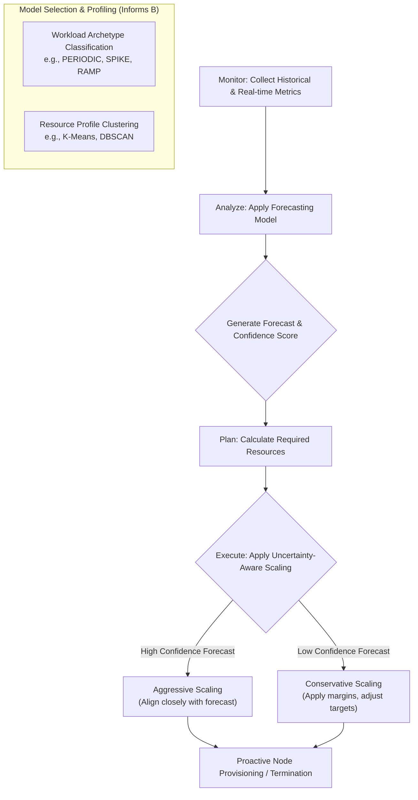

# Beyond Pending Pods: Strategies for Predictive and Scheduled Kubernetes Node Autoscaling
## 1 The Limitations of Standard Cluster Autoscaler for Proactive Scaling

This chapter establishes the foundational constraints of the standard Kubernetes Cluster Autoscaler (CA) that preclude its use for predictive or scheduled scaling. The CA is a core component designed for dynamic node management, but its operational principles are fundamentally misaligned with the need for proactive, business-metric-driven scaling[^1]. **Its design is inherently reactive, responding only to immediate scheduling failures rather than anticipating future demand.** This chapter systematically analyzes the CA's core mechanisms, revealing inherent limitations such as provisioning latency, lack of application insight, and conservative scale-down logic[^1]. It further examines how scheduling constraints and operational dependencies create additional barriers to efficient, timely scaling, setting the stage for exploring alternative strategies that can overcome these limitations.

### 1.1 Reactive Scaling Paradigm and Its Inherent Delays

The standard Cluster Autoscaler operates on a purely reactive paradigm, which is the primary architectural barrier to proactive scaling. Its fundamental trigger mechanism is the presence of pods that have failed to schedule due to insufficient resources (CPU, memory) on any existing node[^1]. The autoscaler runs a control loop, typically every 10 seconds (configurable via `--scan-interval`), monitoring for these unschedulable pods[^1][^2]. When detected, it simulates whether adding a node from a managed node group (e.g., an AWS Auto Scaling Group) would allow the pod to be scheduled, and if so, it triggers a scale-up operation[^1].

**This design results in inherent provisioning latency.** Scaling is initiated *after* a workload is already waiting, not before it arrives. This latency is compounded by cloud infrastructure processes. The CA's scaling actions are tied to the cold start times and scaling delays of underlying infrastructure like Auto Scaling Groups (ASGs)[^1]. For example, on AWS, launching a new EC2 instance and having it join the cluster can take several minutes. Consequently, applications experience delayed startup times during sudden load increases, directly conflicting with the goal of maintaining performance during business request spikes.

Furthermore, **the CA possesses no application-level insight or integration with Service Level Objectives (SLOs).** Its decisions are based solely on the declarative resource *requests* of pods, not on real-time utilization metrics, business traffic patterns, or performance targets[^1]. It cannot interpret metrics like HTTP request rates, queue depths, or custom business KPIs to anticipate scaling needs. This lack of contextual awareness means it is blind to the predictable daily, weekly, or seasonal cycles typical of business applications, making it incapable of pre-warming infrastructure for known peak periods.

### 1.2 Conservative and Constrained Scale-Down Mechanics

The Cluster Autoscaler's scale-down logic is deliberately conservative, prioritizing stability and safety over rapid cost optimization. This cautious approach, while preventing service disruption, often leads to inefficient resource utilization and delayed reclamation during traffic troughs. The mechanics are governed by a combination of configurable parameters and immutable scheduling constraints.

**Key configurable parameters enforce mandatory waiting periods and utilization thresholds:**

| Parameter | Default Value | Description | Impact on Proactive Scale-Down |
| :--- | :--- | :--- | :--- |
| `scale-down-delay-after-add` | 10 minutes | How long after a scale-up event that scale-down evaluation resumes.[^3][^4] | Prevents immediate scale-down after a transient spike, but adds fixed latency. |
| `scale-down-unneeded-time` | 10 minutes | How long a node must be consistently "unneeded" before it is eligible for removal.[^3][^2][^4] | Introduces a significant delay before reclaiming resources, even during predictable lulls. |
| `scale-down-utilization-threshold` | 0.5 (50%) | Node utilization level (sum of pod requests / allocatable) below which a node can be considered for scale-down.[^2][^4] | Decisions are based on **resource requests, not actual usage**. A node running pods that request 80% of resources but use only 20% will not scale down[^3]. |

**Scheduling safety constraints can permanently or temporarily block node removal,** even when the above thresholds are met. The autoscaler must ensure all pods on a candidate node can be safely moved elsewhere before draining it[^2]. Common blockers include:

1.  **PodDisruptionBudgets (PDBs):** This is the most frequent cause of blocked scale-down[^3]. A PDB with `maxUnavailable: 0` or `minAvailable` equal to the total number of replicas prevents the eviction of any pod, making its host node ineligible for removal.
2.  **Pods with Local Storage:** Pods using `emptyDir` or `hostPath` volumes are not evictable by default, as draining the node would cause permanent data loss[^3]. The autoscaler skips nodes with such pods unless configured otherwise (`--skip-nodes-with-local-storage=false`).
3.  **System Pods:** DaemonSet pods (e.g., `kube-proxy`, CNI plugins) run on every node. By default, the CA will not remove nodes running non-evictable system pods[^3]. This can be overridden globally or via annotations.
4.  **Node Affinity/Anti-Affinity Rules:** Strict (`requiredDuringScheduling`) affinity or anti-affinity rules can make it impossible to reschedule a pod to any other node, thereby pinning it and its node[^1][^3][^2].

**The scale-down process is also sequential and low-risk.** The CA terminates one non-empty node at a time to reduce the risk of creating new unschedulable pods[^2]. This careful, step-by-step approach further slows down the consolidation process during extended periods of low demand.

### 1.3 Scalability Bottlenecks and Operational Dependencies

Beyond its core design limitations, the Cluster Autoscaler faces practical scalability challenges and possesses critical operational dependencies that often lead to scaling failures in production environments, especially at scale.

**Algorithmic Complexity and Performance Tuning:** The CA loads the entire cluster's state (pods, nodes, node groups) into memory and simulates scheduling for each node group on every scan interval[^4]. **Its runtime complexity increases with the number of node groups and pods, which can degrade performance in large clusters (e.g., >1000 nodes)**[^4]. Tuning involves trade-offs:
*   **Vertical Scaling:** The CA deployment itself may require increased memory and CPU resources for large clusters, as its memory footprint can exceed a gigabyte[^4].
*   **Node Group Minimization:** A key best practice is to minimize the number of node groups, as many small groups are an anti-pattern that severely impacts scalability[^4]. Pod isolation should use namespaces, with node taints/selectors as exceptions.
*   **Scan Interval Trade-off:** Reducing the `scan-interval` (default 10s) improves responsiveness but exponentially increases API calls to the Kubernetes API and cloud provider APIs (e.g., AWS ASG), risking rate limiting and control plane load[^4]. Since node launch takes minutes on AWS, increasing the interval to 60s can reduce API calls by 6x for only a 38% slower scale-up[^4].

**Critical Infrastructure Dependencies and Failure Modes:** The CA's effectiveness is tightly coupled with external systems, and misconfigurations are a common root cause of silent failures[^1].
1.  **Cloud Integration:** In cloud environments like AWS, the CA relies on proper Auto Scaling Group (ASG) tagging (e.g., `k8s.io/cluster-autoscaler/<cluster-name>: owned`) for discovery[^1][^4]. If it cannot see the ASG, it will not manage it. Similarly, its IAM role must have precise permissions (e.g., `autoscaling:SetDesiredCapacity`, `autoscaling:TerminateInstanceInAutoScalingGroup`) to modify ASGs; otherwise, scale operations fail silently[^1].
2.  **Resource Exhaustion:** Scaling can fail due to cloud provider capacity limits, such as AWS Insufficient Capacity Errors (ICEs), particularly when using Spot Instances[^4]. A more severe failure mode is observed in Cluster API (CAPI) environments: if an infrastructure provider fails to provision a node due to capacity limits, the CA may not automatically scale down the requested node count after the workload subsides, requiring manual intervention[^5].
3.  **Strict Version Compatibility:** **The CA version must match the minor version of the Kubernetes cluster (e.g., CA 1.30.x for K8s 1.30.x). Cross-version compatibility is not tested or supported**[^2][^4]. Version mismatches can lead to reconciliation failures or undefined behavior[^6][^7]. Users are advised to always use the latest CA patch release for their cluster's minor version.

The following mermaid graph summarizes the key limitations and dependencies that make the standard Cluster Autoscaler unsuitable for proactive, business-driven scaling:

```mermaid
graph TD
    A[Standard Cluster Autoscaler Limitations] --> B1[Reactive Trigger];
    A --> B2[Conservative Scale-Down];
    A --> B3[Scalability & Dependencies];

    B1 --> C1[Scales up AFTER pods are pending];
    B1 --> C2[Provisioning latency <br> (ASG cold starts)];
    B1 --> C3[No application/SLO insight];

    B2 --> D1[Governed by fixed delays <br> (e.g., scale-down-unneeded-time: 10m)];
    B2 --> D2[Blocked by safety constraints <br> (PDBs, local storage, affinity)];
    B2 --> D3[Uses resource REQUESTS, <br> not actual usage];

    B3 --> E1[Performance degrades with <br> many node groups/large clusters];
    B3 --> E2[Fragile cloud integration <br> (ASG tags, IAM permissions)];
    B3 --> E3[Strict version compatibility <br> required];
    B3 --> E4[Vulnerable to resource exhaustion <br> & failed scale-up loops];

    C2 & C3 & D1 & D2 & D3 & E1 & E2 & E3 & E4 --> F[**Result: Cannot proactively scale <br> based on business metrics or schedules**];
```

In conclusion, the standard Kubernetes Cluster Autoscaler is an essential tool for managing cluster capacity reactively based on immediate pod scheduling needs. However, its fundamental design—reactive triggering, conservative and constraint-bound scale-down, coupled with scalability limits and operational fragility—renders it ineffective for scenarios requiring proactive scaling aligned with business cycles. These limitations create a clear imperative for alternative strategies, such as predictive or scheduled autoscaling, which can anticipate demand and orchestrate node resources ahead of time.

## 2 Predictive Node Autoscaling: Principles and Forecasting Methodologies

This chapter establishes the theoretical and methodological foundation for predictive node autoscaling, directly addressing the reactive limitations of the standard Cluster Autoscaler identified in the previous chapter. It systematically analyzes the core principles of using historical and real-time data to forecast future resource demand, enabling proactive infrastructure provisioning ahead of business load spikes. The chapter critically evaluates and compares different time-series forecasting methodologies, including statistical models and machine learning approaches, for their suitability in capturing complex business request patterns such as daily, weekly, and seasonal cycles. It also explores the role of workload profiling and the integration of uncertainty quantification to produce reliable and explainable scaling signals. This chapter serves as the analytical bridge between the problem of reactive scaling and the subsequent exploration of practical system architectures, by detailing how predictive intelligence can be generated to drive proactive node management.

### 2.1 Core Principles of Predictive Autoscaling and Demand Forecasting

The transition from reactive to predictive autoscaling represents a fundamental paradigm shift in managing Kubernetes infrastructure. **The core principle is to anticipate future resource demand by analyzing historical patterns and real-time signals, thereby provisioning nodes *before* application load spikes occur, rather than reacting to pending pods.** This approach directly targets the inefficiencies of the standard model, where studies show an average of only 13% of requested CPU is actually used, with 20–45% of requested resources powering workloads, leading BCG to estimate that up to 30% of cloud spending is wasted on over-provisioned resources and idle services[^8].

Predictive autoscaling addresses the inherent latency and lack of application insight in the Cluster Autoscaler (CA). While the CA scales based on trailing indicators like CPU and memory utilization—which are often poor proxies for actual business demand—predictive systems prioritize leading indicators. **A key strategy is to forecast using application-level metrics that directly reflect business demand, such as HTTP request rate, rather than indirect infrastructure metrics like CPU usage**[^9]. This aligns scaling actions with the actual drivers of load, such as user traffic on an e-commerce site or API call volume.

The operational framework for implementing this intelligence is often structured around the **Monitor-Analyze-Plan-Execute (MAPE) control loop**. This closed-loop architecture provides a systematic process for proactive scaling[^9]:
1.  **Monitor:** Continuously collect time-series data on key demand metrics (e.g., HTTP requests per second).
2.  **Analyze:** Apply forecasting models to the historical data to predict future demand for a defined horizon (e.g., the next 5-15 minutes).
3.  **Plan:** Translate the predicted demand into a required resource footprint, calculating the necessary number of nodes or pods.
4.  **Execute:** Issue scaling commands to the Kubernetes API to adjust the cluster's capacity accordingly.

This proactive model fundamentally changes the performance-cost trade-off. **Intelligent predictive systems learn historical patterns—such as Monday morning traffic versus Friday afternoon, end-of-month processing peaks, or predictable lulls in B2B weekend traffic—and can pre-warm infrastructure minutes before the anticipated load arrives**[^10]. This eliminates the traditional compromise between maintaining minimal replicas for cost and over-provisioning for peak performance, instead dynamically managing the resource baseline to prevent cold-start latency and ensure consistent, reliable performance during known business cycles[^10].

### 2.2 Comparative Analysis of Time-Series Forecasting Methodologies

Selecting an appropriate forecasting model is critical for accurate and timely predictions. The methodology must balance prediction accuracy, computational latency, and suitability for the specific patterns present in business workload data. Experimental evaluations on real-world datasets provide a clear basis for comparison.

**The Prophet-LSTM hybrid model has demonstrated superior accuracy for seasonal workload prediction.** Research using HTTP request traces from the NASA website and the 1998 FIFA World Cup compared a hybrid model combining Facebook Prophet and Long Short-Term Memory (LSTM) networks against single-model approaches like ARIMA, LSTM, and Bi-LSTM[^9]. The hybrid model leverages Prophet's strength in capturing seasonal and holiday patterns through nonlinear regression, while the LSTM component analyzes the complex, non-linear residuals (differences between observed and Prophet-predicted values)[^9]. The results were significant:
*   On the NASA dataset, the Prophet-LSTM hybrid showed **65.2% higher accuracy** (based on Mean Squared Error) compared to the best single model (Bi-LSTM with single-step prediction)[^9].
*   On the FIFA World Cup dataset, the accuracy improvement was even more pronounced at **90.8% higher** than the best single model (Bi-LSTM with 5-step prediction)[^9].

However, this gain in accuracy comes with a trade-off: **the hybrid model exhibits higher prediction latency (Total Prediction Time)** because the data must be processed sequentially through both the Prophet and LSTM components[^9]. This latency must be factored into the forecasting horizon to ensure scaling actions are completed before the predicted load arrives.

The performance of individual models varies based on data characteristics and implementation:

| Model | Core Characteristics | Strengths | Limitations & Trade-offs |
| :--- | :--- | :--- | :--- |
| **Facebook Prophet** | Additive model decomposing trend, seasonality, holidays, and error[^11]. | Excellent at capturing strong seasonal patterns with minimal hyperparameter tuning[^9][^11]. Designed for business time-series. | May struggle with highly irregular, non-seasonal spikes or complex non-linear patterns beyond its model components. |
| **LSTM / GRU** | Recurrent Neural Networks (RNNs) with gated memory cells for learning long-term dependencies in sequences[^9][^11]. | Powerful for modeling complex, non-linear temporal relationships where patterns are not strictly seasonal[^9]. | **Prone to overfitting on small datasets**, requiring careful tuning and substantial data[^11]. Higher computational cost and less interpretable than statistical models. |
| **ARIMA** | Classical statistical model (AutoRegressive Integrated Moving Average) requiring time-series stationarity[^11]. | Powerful and well-understood for stationary series. Can perform well with automated parameter selection (e.g., `auto_arima`)[^11]. | Requires data preprocessing (differencing) to achieve stationarity. Not inherently designed for multiple seasonality or holiday effects. |
| **Prophet-LSTM Hybrid** | Combines Prophet for seasonal decomposition and LSTM for residual analysis[^9]. | **Highest demonstrated accuracy for seasonal workloads** by leveraging strengths of both paradigms[^9]. | **Highest prediction latency** due to sequential model execution. Increased system complexity[^9]. |

**The choice of model is heavily dependent on the nature of the workload data.** For applications with clear daily/weekly seasonality (e.g., enterprise SaaS platforms, retail websites), Prophet or a Prophet-based hybrid is highly suitable. For workloads with less predictable, event-driven spike patterns, an LSTM might be more appropriate, provided sufficient historical data is available for training to avoid overfitting. The metric being forecast is also crucial; as research confirms, forecasting direct demand signals like HTTP request rate yields more responsive scaling than forecasting derived resource utilization[^9].

### 2.3 Workload Profiling, Pattern Recognition, and Uncertainty Integration

To build robust predictive autoscalers that are safe for production, advanced techniques in workload profiling and uncertainty handling are essential. These methods move beyond generating a simple point forecast to creating a context-aware, reliable scaling system.

**Workload archetype classification enables differentiated scaling strategies.** Research on the AAPA (Archetype-Aware Predictive Autoscaler) system demonstrates the value of automatically classifying workloads into distinct patterns—such as PERIODIC, SPIKE, RAMP, and STATIONARY_NOISY—using a weak supervision framework[^12]. Once classified, the system can apply tailored scaling logic optimized for each archetype. For instance, a periodic workload can leverage strong seasonal forecasts for precise pre-scaling, while a spike workload might require more conservative, uncertainty-aware scaling to balance responsiveness with cost[^12]. This classification can be informed by **clustering techniques like k-means and DBSCAN**, which group pods or applications based on similar resource consumption profiles, aiding in workload segmentation and planning[^13].

**Integrating uncertainty quantification is critical for preventing mis-scaling due to erroneous predictions.** The AAPA framework incorporates "Uncertainty-Aware Scaling," where a calibrated confidence score (c ∈ [0,1]) modulates scaling decisions[^12]. When prediction confidence is low, the system behaves conservatively:
*   It applies a **margin multiplier** (e.g., `1 + 0.5*(1-c)`) to calculated replica counts.
*   It adjusts CPU targets downward.
*   It increases cooldown periods between scaling actions[^12].

This mechanism ensures that the system does not aggressively scale up based on an unreliable forecast, which could lead to severe resource waste. Conversely, it also prevents under-provisioning when confidence is high. **This highlights a fundamental trade-off: while ML-driven predictive autoscaling can significantly reduce Service Level Objective (SLO) violations (e.g., by up to 50%) and improve response times, it can also demand substantially higher resource consumption (2-8x) compared to reactive HPA, particularly for unpredictable spike workloads**[^12]. Therefore, deploying such advanced systems is most justified for mission-critical services where SLO violations have a severe operational or financial impact.

The following diagram synthesizes the end-to-end predictive intelligence workflow, from data collection to a safeguarded scaling decision:



In conclusion, predictive node autoscaling is grounded in the principle of forecasting demand using application metrics within a MAPE control loop. The choice of forecasting methodology—whether a statistical model like Prophet, an ML model like LSTM, or a hybrid—depends on workload pattern characteristics and the latency-accuracy trade-off. To be production-ready, these systems must incorporate workload profiling for tailored strategies and, most importantly, integrate uncertainty quantification to safely modulate scaling actions, ensuring reliability and cost-effectiveness even when predictions are imperfect.

## 3 Implementation Architectures and Ecosystem Projects

This chapter provides a concrete analysis of implementation architectures and existing ecosystem projects that enable predictive and scheduled node scaling, directly addressing the limitations of the standard Cluster Autoscaler established in previous chapters. It focuses on the role of the Kubernetes Event-Driven Autoscaler (KEDA) as a central scaling bridge, detailing how its ScaledObject and new MetricPredictor CRDs integrate with forecasting models (e.g., Prophet) to trigger proactive node provisioning. The chapter systematically compares operator-based patterns for custom node pool management and examines cloud provider-specific predictive scaling services (e.g., AWS, Azure). For scheduled scaling, it verifies the practical use of KEDA's Cron scaler to enact pre-defined scaling plans aligned with known business cycles, analyzing configuration patterns and integration with node autoscalers like Karpenter. This chapter serves as a practical guide to selecting and deploying production-ready solutions for business-metric-driven scaling.

### 3.1 KEDA as the Scaling Bridge: From Event-Driven Pods to Predictive Nodes

Kubernetes Event-Driven Autoscaling (KEDA) serves as the foundational bridge that translates diverse metrics—including predictive forecasts—into concrete scaling actions for both pods and, by extension, nodes. **KEDA's core value lies in its ability to drive scaling based on custom event metrics from over 70 built-in scalers, moving far beyond the CPU and memory limitations of the native Horizontal Pod Autoscaler (HPA)**[^14][^15]. This makes it ideal for scenarios where workloads are triggered by external events like message queues, HTTP requests, or database operations[^15].

The primary mechanism for configuring scaling in KEDA is the `ScaledObject` Custom Resource Definition (CRD). This resource defines the target workload (e.g., a Deployment) and the triggers that govern its scaling behavior[^16]. Key configuration parameters include:
*   **`scaleTargetRef`**: References the Kubernetes resource (name, `apiVersion`, and `kind`) that KEDA will scale[^16].
*   **`pollingInterval`**: The interval at which KEDA checks each trigger source (default: 30 seconds)[^16].
*   **`cooldownPeriod`**: The wait time after the last trigger reported active before scaling the resource back to 0 (default: 300 seconds)[^16].
*   **`minReplicaCount` / `maxReplicaCount`**: Define the allowable replica range for the target resource[^16].

A powerful feature within the `ScaledObject` is the optional `advanced` section, which includes `scalingModifiers`. This allows the creation of a **composite metric** by defining a `formula` that can combine values from multiple triggers (e.g., `(realTimeMetric + predictedMetric)/2`), enabling sophisticated and smoothed scaling decisions[^16].

To integrate predictive intelligence, KEDA introduces a new CRD called **`MetricPredictor`**. This resource represents a forecasting model and its lifecycle[^17][^18]. Its specification typically includes:
*   **`source`**: Defines where historical metric data comes from. This can be a live `ScaledObject` and its trigger, or a one-shot CSV file for bootstrapping[^18].
*   **`model`**: Configures the forecasting method. The reference implementation uses **Facebook's Prophet** model for its robustness and ability to handle seasonality[^19][^17]. Key parameters include `defaultHorizon` (prediction range), `lookBackPeriod` (historical data duration), `retrainInterval` (how often to retrain the model), and seasonality settings[^18].

Once a `MetricPredictor` is trained, its forecasts can be consumed by a `ScaledObject` using a `kedify-predictive` trigger type[^17]. This trigger references the model by name and includes safety parameters like `modelMapeThreshold` (the acceptable Mean Absolute Percentage Error) and `highMapeDefaultReturnValue` (a fallback value if the model's error is too high), ensuring reliability[^19][^17].

**The complete predictive scaling stack is realized when KEDA is paired with a dynamic node autoscaler like Karpenter.** KEDA scales the application pods based on predictive or real-time event metrics, while Karpenter monitors the cluster for unschedulable pods and provisions just-in-time nodes to accommodate them[^15][^20]. This synergy ensures a highly responsive and cost-efficient environment; if KEDA triggers a rapid pod scale-up based on a forecast, Karpenter can quickly provision the necessary node capacity to handle the load[^15][^21].

### 3.2 Operator Patterns and Custom Controllers for Node Pool Management

Beyond using integrated projects like KEDA, a highly flexible approach to implementing predictive or scheduled scaling involves building custom **Kubernetes Operators**. Operators encapsulate human operational knowledge in code to automate the deployment and management of complex applications, including Day 2 operations like autoscaling[^22].

The operator pattern provides complete flexibility for scaling decisions. As evidenced in sample implementations, an operator can create a **CronJob resource that launches a standalone application** whose sole purpose is to make scaling decisions[^22]. This standalone application is not constrained by pre-defined scaler logic; it can ingest and analyze multiple cluster metrics, external business KPIs, or even outputs from dedicated machine learning services to arrive at a scaling recommendation, which it then enforces via the Kubernetes API[^22].

This pattern is particularly relevant for managing node pools proactively. Community discussions highlight that a bottleneck for event-driven scaling frameworks is often the node provisioning latency of the cluster autoscaler[^21]. A custom operator could address this by **previewing predictive pod scaling signals** (e.g., from a KEDA `MetricPredictor`) and acting as a coordination layer to trigger node pool adjustments minutes before the pods are scheduled to scale up[^21]. This effectively "warms up" the node infrastructure in advance, eliminating the cold-start delay that plagues purely reactive systems and solving the "slow node configuration" problem[^21].

While building a custom operator offers maximum control, it also introduces significant development and maintenance overhead. Therefore, this pattern is best suited for organizations with unique scaling logic that cannot be satisfied by off-the-shelf scalers, or for those needing deep integration between predictive pod-level forecasts and infrastructure-level node pool management.

### 3.3 Cloud Provider Predictive Scaling Services: AWS and Azure

Major cloud providers offer managed predictive scaling services at the infrastructure level, which can be leveraged alongside or in place of Kubernetes-native solutions. These services analyze historical usage patterns to forecast demand and proactively adjust capacity.

**AWS Predictive Scaling for EC2 Auto Scaling** analyzes historical load data (minimum 24 hours) to detect daily or weekly patterns[^23][^24]. It forecasts capacity needs for the next 48 hours, updating every 6 hours[^24]. It operates in two modes:
1.  **Forecast only**: Generates capacity forecasts without taking scaling actions, useful for evaluation[^24].
2.  **Forecast and scale**: Proactively increases the capacity of the Auto Scaling Group before forecasted load increases. **It is designed for scale-out only**; scale-in is managed by dynamic scaling policies[^23][^24].

Key considerations include its assumption of a **homogeneous instance group** for accurate forecasting and its requirement for a load metric that accurately represents the full application demand[^24].

**Azure Predictive Autoscale for Virtual Machine Scale Sets (VMSS)** uses machine learning to forecast overall CPU load based on historical CPU usage patterns, ensuring scale-out occurs in time to meet predicted demand[^25]. It requires a minimum of **seven days of history** and uses a rolling window of up to 15 days for optimal predictions[^25]. Similar to AWS, it offers a "Forecast only" mode and an "Enabled" mode, and it **supports scale-out only**, relying on standard autoscale rules for scale-in[^25].

A critical challenge arises when these infrastructure-level predictive services are used with Kubernetes-level autoscalers. **Potential conflicts can occur if both AKS cluster autoscaler (or Karpenter) and VMSS predictive autoscale are set to automatic**, as they may compete, leading to over-provisioning or erratic scaling behavior[^26]. The recommended practice is careful coordination—often using the cloud service for proactive scale-out based on broad patterns, while allowing the Kubernetes autoscaler to handle reactive, pod-driven scaling and consolidation—or selecting one layer to manage scaling based on workload characteristics[^26].

The table below summarizes the key attributes of these cloud services:

| Attribute | AWS Predictive Scaling (EC2 Auto Scaling) | Azure Predictive Autoscale (VMSS) |
| :--- | :--- | :--- |
| **Core Metric** | CloudWatch metric (e.g., CPU, Request Count) | Percentage CPU (Average) |
| **Min. Historical Data** | 24 hours | 7 days |
| **Forecast Horizon** | 48 hours | 24 hours |
| **Scale Direction** | Scale-out only | Scale-out only |
| **Evaluation Mode** | Forecast only, Forecast and scale | Forecast only, Enabled |
| **Key Limitation** | Assumes homogeneous instance groups | Only for VMSS; limited to CPU metric |

### 3.4 Scheduled Scaling with KEDA Cron Scaler: Configuration and Use Cases

For workloads with perfectly predictable traffic patterns, **scheduled scaling via KEDA's Cron scaler provides a simple and robust alternative to predictive models**. This approach allows teams to define explicit time windows for increased or decreased capacity, directly aligning infrastructure with known business cycles like daily commutes, lunch breaks, or weekend lulls[^27].

Configuring the Cron trigger requires specific metadata in the `ScaledObject`[^28]:
*   **`timezone`**: Must be a valid string from the IANA Time Zone Database (e.g., `America/New_York`)[^28][^27].
*   **`start`** & **`end`**: Cron expressions in Linux format (Minute Hour Day-of-month Month Day-of-week) defining the active window. The start and end must not be identical[^28].
*   **`desiredReplicas`**: The target number of replicas during the active window[^28].

**A crucial configuration pattern is to set `minReplicaCount: 0` in the `ScaledObject` and use the Cron trigger's `desiredReplicas` to define the scale-up target.** The `cooldownPeriod` (default 5 minutes) then controls how long after the `end` time the deployment scales back to zero[^28]. It is important to note that setting `desiredReplicas: "0"` in the cron trigger is typically an error[^28].

The Cron scaler excels in common operational scenarios:
*   **Handling Daily Traffic Spikes**: Pre-warming pods for morning user rushes (e.g., `start: "0 6 * * *"`, `end: "0 8 * * *"`)[^27].
*   **Promotional Campaigns**: Providing extra capacity during scheduled sales events[^27].
*   **Off-Hours Optimization**: Scaling down to minimal or zero replicas overnight to save costs[^27].

Furthermore, the Cron trigger can be **combined with other triggers in the same `ScaledObject`** to create hybrid scaling policies. For example, a Cron trigger can ensure a minimum of 1 replica during business hours, while a CPU trigger can scale up to a maximum of 4 replicas based on actual utilization within that window[^28]. This works because the Kubernetes HPA controller (which KEDA leverages) evaluates all metrics and chooses the one that requires the highest number of replicas (`max(metrics)`), making the `desiredReplicas` act as a dynamic minimum during the cron's active period[^28].

The following example illustrates a complete `ScaledObject` for scheduled scaling, ensuring 10 replicas from 6 AM to 8 PM in the Asia/Kolkata timezone, and scaling to zero otherwise[^27][^29]:

```yaml
apiVersion: keda.sh/v1alpha1
kind: ScaledObject
metadata:
  name: cron-scaledobject
spec:
  scaleTargetRef:
    name: my-deployment
  minReplicaCount: 0
  cooldownPeriod: 300
  triggers:
  - type: cron
    metadata:
      timezone: Asia/Kolkata
      start: "0 6 * * *"
      end: "0 20 * * *"
      desiredReplicas: "10"
```

## 4 Best Practices for Design, Integration, and Operations

This chapter synthesizes actionable best practices for designing, integrating, and operating a robust predictive or scheduled node autoscaling system in production Kubernetes environments. It addresses the practical challenges of moving from theoretical models to reliable operations, focusing on three core areas. First, it establishes best practices for metric selection, aligning scaling triggers with business KPIs (e.g., HTTP request rate) rather than indirect infrastructure metrics, and ensuring accurate resource request definitions for effective autoscaler decisions. Second, it provides strategies for safe integration with existing cluster infrastructure, including compatibility with PodDisruptionBudgets (PDBs), scheduling constraints, and fallback mechanisms to reactive scaling (e.g., Cluster Autoscaler or Karpenter) to ensure resilience during predictive model failures or unforeseen demand. Third, it defines operational practices for maintaining system reliability, encompassing continuous model training and monitoring for prediction drift (using metrics like MAPE), implementing safeguards like maximum node limits and cost controls to prevent runaway scaling, and leveraging instance diversification (e.g., with Spot Instances) for cost optimization without compromising availability. This chapter serves as the operational handbook, ensuring the proactive scaling system is not only intelligent but also stable, cost-effective, and seamlessly integrated into the broader Kubernetes ecosystem.

### 4.1 Metric Strategy and Business KPI Alignment

The foundation of an effective predictive or scheduled scaling system lies in a well-designed metric strategy that directly reflects business demand. **Moving beyond indirect infrastructure metrics like CPU and memory utilization to forecast direct business signals such as HTTP request rates is a critical best practice, as research indicates this yields more responsive and accurate scaling decisions**[^30]. This alignment ensures that infrastructure scales in anticipation of actual user activity, not as a lagging reaction to resource consumption.

A prerequisite for any node autoscaler to function correctly is the definition of accurate `resource requests` for every pod. **Both the standard Cluster Autoscaler and modern alternatives like Karpenter make scaling decisions based on the sum of pod resource *requests*, not on actual usage**[^3][^31]. If pods lack these requests, the autoscaler cannot accurately calculate node utilization, leading to suboptimal and often failed scaling operations. Therefore, a comprehensive audit and rightsizing of pod resource requests is an essential first step before implementing any proactive scaling strategy.

When implementing predictive scaling with tools like KEDA, advanced configuration enables sophisticated metric handling. The `ScaledObject` CRD's optional `advanced` section, specifically the `scalingModifiers`, allows the creation of a **composite metric via a `formula` that can combine values from multiple triggers** (e.g., blending a real-time metric with a predicted one). This can be used to smooth scaling decisions, preventing abrupt replica count changes due to transient spikes or prediction noise. Furthermore, tuning the `pollingInterval` (default 30 seconds) and `cooldownPeriod` (default 300 seconds) is crucial. A shorter `pollingInterval` increases responsiveness but also the load on metric sources and the Kubernetes API, while a well-configured `cooldownPeriod` prevents rapid thrashing when scaling down to zero replicas for event-driven workloads[^32].

The following table summarizes the key metric configuration best practices and their rationales:

| Best Practice | Configuration Example / Action | Rationale & Impact |
| :--- | :--- | :--- |
| **Forecast Business KPIs** | Predict HTTP request rate, queue length, or active user sessions. | Scales infrastructure ahead of user-perceivable demand, reducing latency and cold starts. |
| **Define Accurate Resource Requests** | Ensure all pods have `spec.containers[].resources.requests` for CPU and memory. | Enables node autoscalers (CA, Karpenter) to correctly calculate node utilization and make scaling decisions[^31]. |
| **Use Composite Metrics for Smoothing** | In KEDA `ScaledObject`: `advanced.scalingModifiers.formula: "(realTimeMetric + predictedMetric)/2"` | Reduces scaling jitter and creates more stable replica counts by averaging signals. |
| **Tune Polling and Cooldown Intervals** | Adjust `pollingInterval` (e.g., to 60s) and `cooldownPeriod` (e.g., to 600s) based on workload pattern and node launch time. | Balances scaling responsiveness with control plane load and prevents rapid, costly scale-up/down cycles. |

### 4.2 Safe Integration with Cluster Infrastructure and Fallback Mechanisms

Integrating a proactive scaling system into an existing Kubernetes cluster must be done with care to avoid conflicts with core scheduling and safety mechanisms. A primary consideration is ensuring compatibility with **PodDisruptionBudgets (PDBs)**, which are designed to limit voluntary disruptions to applications. **The most common mistake that blocks scale-down is setting a restrictive PDB like `maxUnavailable: 0`, which prevents the autoscaler from evicting any pods**[^3]. The best practice is to use percentage-based PDBs (e.g., `minAvailable: 75%`) that allow controlled, safe evictions during node consolidation, enabling the autoscaler to reclaim underutilized resources without violating application availability guarantees[^3][^2].

System pods, particularly those managed by DaemonSets, can also inadvertently prevent scale-down. By default, the Cluster Autoscaler will not remove nodes running non-evictable system pods. To address this, you can either configure the autoscaler globally with a flag like `--skip-nodes-with-system-pods=false` or, more surgically, annotate specific DaemonSets with `cluster-autoscaler.kubernetes.io/safe-to-evict: "true"`[^3]. Similarly, pods using local storage (`emptyDir`, `hostPath`) are non-evictable by default. They should either be annotated to allow eviction (if data is not critical) or scheduled onto nodes that are excluded from scale-down using the annotation `cluster-autoscaler.kubernetes.io/scale-down-disabled: "true"`[^2].

**Perhaps the most critical operational best practice is implementing a robust fallback mechanism to reactive scaling.** Predictive models can fail or become inaccurate due to concept drift or unprecedented traffic patterns. Systems like KEDA's `kedify-predictive` trigger incorporate this safety natively by defining a `modelMapeThreshold`. **If the model's prediction error (Mean Absolute Percentage Error) exceeds this threshold, the system automatically returns a predefined default value instead of using the unreliable forecast, ensuring the scaler remains stable**[^19]. Architecturally, this means the proactive scaling layer should be complementary to, not a replacement for, a reliable reactive autoscaler like Karpenter or the Cluster Autoscaler. The reactive autoscaler remains active, providing a safety net that ensures pods can always be scheduled, even if the predictive system fails to provision nodes in advance.

### 4.3 Operational Reliability, Cost Controls, and Continuous Learning

Sustaining a reliable and cost-effective proactive scaling system requires ongoing operational discipline centered on monitoring, safeguarding, and continuous improvement.

**Continuous model monitoring and retraining are non-negotiable.** Machine learning models in production are subject to "drift," where changes in input data or underlying patterns degrade prediction accuracy over time[^33]. The `MetricPredictor` CRD in predictive scaling systems should be configured with a sensible `retrainInterval` (e.g., every 6 hours) to keep the model aligned with current traffic patterns[^19]. Performance must be tracked using metrics like Mean Absolute Percentage Error (MAPE), and alerts should be configured for significant prediction drift. This process of continuous learning ensures the scaling intelligence adapts as business cycles evolve.

To prevent catastrophic over-scaling—whether due to a model error or a runaway feedback loop—**strict safeguards must be implemented at both the workload and cluster levels**. These include:
*   Setting absolute `maxReplicaCount` limits in `ScaledObject` or HPA definitions.
*   Defining maximum node counts in node pool configurations (e.g., `maxSize` in ASGs or `maxCount` in Karpenter `NodePools`).
*   Configuring scaling behavior policies to control the rate of change, such as stabilization windows and scaling step sizes, to prevent "flapping"[^34].

Cost optimization is a key driver for autoscaling. **A highly effective strategy is the intelligent use of Spot Instances, which can provide cost savings of up to 90% compared to On-Demand pricing**[^35][^36]. The best practice for resilience is diversification: using multiple node groups, each with a mix of instance types and spread across several Availability Zones. This creates numerous Spot capacity pools, significantly reducing the risk and impact of interruptions. Tools like Karpenter excel here, as they can natively implement a capacity-optimized allocation strategy, automatically launching Spot Instances into the most available pools[^36]. For stateful or critical system pods, a separate On-Demand node group should be maintained.

Finally, operational parameters require iterative tuning based on observed cluster behavior. While defaults like `scale-down-unneeded-time: 10m` and `scale-down-utilization-threshold: 0.5` provide stability, they may be too conservative for cost-sensitive environments[^3][^4]. **Adopting an iterative approach—starting with conservative settings, monitoring outcomes, and gradually adjusting parameters like thresholds and delays—allows you to find the optimal balance between cost reduction and application stability for your specific workloads**[^37].

```mermaid
graph TD
    subgraph "Operational Lifecycle"
        A[Deploy with Safeguards<br>Max Replicas, Max Nodes] --> B[Continuous Monitoring<br>Model Accuracy (MAPE), Cost, SLOs];
        B --> C{Drift or Error Detected?};
        C -- Yes --> D[Trigger Model Retraining<br>or Activate Fallback];
        C -- No --> E[Continue Proactive Scaling];
        D --> F[Iterative Tuning<br>Adjust scaling behavior parameters];
        F --> B;
    end

    subgraph "Core Safeguards (Always Active)"
        G[Cost Controls<br>Spot Diversification, On-Demand fallback];
        H[Infrastructure Compatibility<br>PDBs, Annotations for system pods];
    end

    B -.-> G;
    B -.-> H;
```

## 5 Evaluation, Challenges, and Future Directions

This chapter provides a critical assessment of predictive node autoscaling strategies, evaluating their potential benefits against the practical challenges and risks of implementation. It synthesizes evidence from reference materials to systematically analyze the expected improvements in resource efficiency, cost reduction, and application performance, while contrasting these gains with the increased operational complexity of managing forecasting models and data pipelines. Key challenges such as persistent cold-start latency, data dependencies, and the risks of prediction errors are examined in detail, highlighting the importance of safety mechanisms like uncertainty quantification. The chapter concludes by exploring emerging trends and future research directions, including the integration of advanced, uncertainty-aware AI/ML models, real-time adaptive forecasting, and the potential evolution of the Kubernetes ecosystem to natively support predictive intelligence for more autonomous and efficient infrastructure orchestration.

### 5.1 Benefit Analysis: Quantifying Gains in Efficiency, Cost, and Performance

Predictive autoscaling strategies offer substantial, quantifiable advantages over traditional reactive methods by aligning infrastructure capacity with anticipated demand. **The core benefit is a significant improvement in application performance and reliability, primarily through the preemptive mitigation of cold-start latency and Service Level Agreement (SLA) violations.** Experimental validation of a predictive autoscaling operator based on time-series forecasting demonstrated that after deployment, the minimum SLA—measured as the ratio of HTTP 200 responses—increased from 80.3% to 87%. Furthermore, the frequency of SLA fluctuations decreased dramatically from 24 times in a 15-minute period to just 4 times, representing an **83.3% reduction in instability**[^38]. This stability is achieved because the system proactively scales resources up before peak loads arrive and down during predictable troughs, smoothing the demand curve[^38].

**Cost reduction is a major driver for adopting predictive scaling, with documented savings ranging from 15-30% compared to purely reactive autoscaling methods**[^39]. These savings stem from optimized resource utilization, avoiding both over-provisioning during quiet periods and the performance penalties of under-provisioning during spikes. For workloads with highly predictable patterns, such as financial batch processing, the gains can be even more pronounced. A real-world example shows that autoscaling for nightly transaction batches, where data volume varies from 1GB to 100GB, can reduce costs by **80% compared to static provisioning**[^40]. This efficiency is achieved by provisioning resources only when needed, in anticipation of the workload, rather than maintaining a constant, oversized footprint.

The following table summarizes the key quantified benefits from reference materials:

| Benefit Category | Quantified Improvement | Evidence & Context |
| :--- | :--- | :--- |
| **Application Performance & Stability** | SLA increased from 80.3% to 87%; Fluctuation frequency reduced by 83.3%[^38]. | Deployment of a predictive autoscaling operator in a Kubernetes cluster. |
| **Cost Efficiency** | 15-30% cost reduction compared to reactive methods[^39]. | General advantage of predictive over reactive autoscaling. |
| **Cost Efficiency (Specific Workload)** | 80% cost reduction vs. static provisioning[^40]. | Financial services batch processing with variable data volumes. |
| **Resource Efficiency** | Minimizes excess resource buffer and reduces over-provisioning[^41]. | Headroom Reduction and Storage Autoscaling using predictive models. |
| **Forecasting Accuracy** | 65.2% to 90.8% higher accuracy for hybrid Prophet-LSTM vs. best single models[^9]. | Evaluation on NASA and FIFA World Cup HTTP request datasets. |

Beyond direct metrics, predictive scaling enables more intelligent resource management. **Workload profiling and predictive analysis allow for the maintenance of a minimal, dynamic resource buffer that is continuously optimized, contrasting with the static over-provisioning often required for reactive systems**[^41]. This approach ensures resources are available precisely when needed, improving overall cluster utilization. Furthermore, by forecasting direct business metrics like HTTP request rates instead of indirect infrastructure metrics like CPU, scaling decisions become more aligned with actual user demand, leading to more responsive and appropriate capacity adjustments[^39].

### 5.2 Implementation Challenges and Operational Risks

Despite its compelling benefits, the adoption of predictive autoscaling introduces significant complexity and risks that must be carefully managed in production environments. **A foundational challenge is the stringent dependency on high-quality, sufficient historical data.** Different systems and cloud services mandate minimum data collection periods before reliable forecasts can begin. For instance, AWS Predictive Scaling requires at least 24 hours of data, Azure Predictive Autoscale needs a history of seven days, and Google Cloud's predictive autoscaling for Managed Instance Groups (MIGs) requires three days of CPU-based autoscaling history[^24][^42]. **The quality of this data is equally critical; raw monitoring data often contains anomalies that can adversely affect model training if unaddressed, and studies confirm that models trained on cleansed datasets achieve substantially lower prediction errors**[^39]. Gaps in data, such as the "No Data" periods highlighted in the NASA dataset, are considered workload anomalies that can distort model behavior and induce errors[^9].

**The risk of prediction errors is the most consequential operational hazard, potentially leading to costly under-provisioning (performance degradation) or over-provisioning (unnecessary costs)**[^39]. Unpredictable traffic spikes or dataset abnormalities, like those in the FIFA World Cup 1998 dataset, can cause models to misinterpret patterns. For example, a Prophet model's seasonality capture might induce errors that a subsequent LSTM component must correct, visible as spikes in residual predictions[^9]. To mitigate this, robust systems incorporate **uncertainty quantification and automatic fallback mechanisms**. KEDA's `kedify-predictive` trigger, for example, uses a configurable `modelMapeThreshold` (Mean Absolute Percentage Error). If the model's error exceeds this threshold, the system automatically returns a predefined `highMapeDefaultReturnValue` instead of the unreliable prediction, gracefully degrading to a safer, more conservative scaling behavior[^17].

**Persistent cold-start latency remains a challenge, even with proactive signals.** While predictive scaling aims to initiate node provisioning before demand hits, the physical process of launching and initializing cloud instances (e.g., EC2, VMs) and having them join the cluster and become ready can still take several minutes[^23][^43]. This latency can negate the benefits of prediction if the forecast horizon is too short. Furthermore, **integrating predictive systems with existing cluster safety constraints adds complexity.** The predictive layer must remain compatible with PodDisruptionBudgets (PDBs), affinity/anti-affinity rules, and taints/tolerations that govern pod scheduling and node eligibility for removal[^34]. Conflicts can also arise if both infrastructure-level predictive services (e.g., AWS Predictive Scaling) and Kubernetes-level autoscalers (e.g., Karpenter) are set to automatic, potentially causing over-provisioning or erratic behavior[^24].

Additional operational complexities include:
*   **Computational Overhead:** Hybrid and deep learning models like LSTM and GRU have higher prediction latency and require significant training time and resources[^9][^38].
*   **Model Management:** Continuous retraining is necessary to prevent concept drift, requiring automated pipelines and monitoring of metrics like MAPE[^39][^17].
*   **Configuration Sensitivity:** Systems require careful tuning of parameters like forecast horizon, confidence intervals, and scaling policy aggressiveness to balance performance and cost[^39][^44].

### 5.3 Emerging Trends and Future Research Directions

The field of predictive autoscaling is rapidly evolving, driven by advances in AI/ML and the escalating demands of modern applications like 6G networks and large-scale microservices. **A significant trend is the move towards sophisticated, uncertainty-aware AI/ML models that explicitly quantify prediction confidence to inform safer scaling decisions.** Frameworks like MagicScaler exemplify this direction by employing a **Multi-scale Attentive Gaussian Process predictor**[^44]. This approach combines multi-scale attention mechanisms to capture complex, scale-sensitive temporal dependencies with Gaussian processes to provide accurate demand forecasts accompanied by quantified uncertainty levels. The scaling controller then internalizes this uncertainty, applying stochastic constraints to flexibly trade off between operational cost and QoS violation risk, a marked improvement over deterministic forecasting[^44].

**The integration of predictive intelligence across the entire stack, from compute to storage, and its deep embedding into orchestration platforms is another key trajectory.** Beyond compute resource forecasting, predictive scaling is being applied to optimize Persistent Volumes, dynamically adjusting capacity, IOPS, and throughput based on behavioral profiles of the instance file system[^41]. Looking further ahead, industry roadmaps such as the Kubernetes evolution for telecom project a future where **AI-driven predictive scaling and scheduling are built-in capabilities of the platform itself**. This vision includes "AI-driven scheduling and predictive autoscaling" by 2027-2028 to meet 6G application demands, evolving into a "federated AI-optimized orchestration" platform capable of autonomous, cross-cluster resource management and self-healing networks by 2029-2030[^45].

Future research and development are likely to focus on several open challenges and opportunities:

1.  **Real-time Adaptive Forecasting:** Enhancing models to dynamically adjust to concept drift in real-time, reducing the need for fixed retraining intervals and improving responsiveness to unprecedented traffic patterns.
2.  **Native Kubernetes API Support:** Evolving the Kubernetes autoscaling API (e.g., HPA, VPA, Cluster Autoscaler) to natively consume predictive signals and confidence intervals, moving beyond reliance on external operators and custom CRDs for a more standardized approach.
3.  **Explainability and Operational Transparency:** As models grow more complex, ensuring that scaling decisions remain interpretable to operators is crucial for trust and debugging. Techniques for model decomposition and clear logging of prediction context are essential[^39][^17].
4.  **Reducing Computational Footprint:** Investigating more efficient model architectures and training techniques to make advanced forecasting viable for resource-constrained edge environments and to lower the operational cost of the predictive system itself.
5.  **Holistic Self-Optimizing Systems:** The ultimate direction points towards fully autonomous orchestration, where predictive scaling is one component of a system that continuously learns from application behavior, performance metrics, and business objectives to self-tune for optimal efficiency, cost, and reliability without human intervention[^41][^45].

In conclusion, while predictive node autoscaling presents measurable benefits in performance, cost, and stability, its successful implementation requires navigating substantial challenges related to data, model accuracy, and operational integration. The future lies in embracing more intelligent, uncertainty-aware models and deeper platform integration, paving the way for truly proactive and autonomous Kubernetes infrastructure management.

# 参考内容如下：
[^1]:[Kubernetes Cluster Autoscaler: Best Practices, Limitations ...](https://scaleops.com/blog/kubernetes-cluster-autoscaler-best-practices-limitations-alternatives/)
[^2]:[autoscaler/cluster-autoscaler/FAQ.md at master](https://github.com/kubernetes/autoscaler/blob/master/cluster-autoscaler/FAQ.md)
[^3]:[Cluster Autoscaler Not Scaling Down: Insights & Best ...](https://www.groundcover.com/learn/cost-optimization/cluster-autoscaler-not-scaling-down)
[^4]:[Cluster Autoscaler - Amazon EKS](https://docs.aws.amazon.com/eks/latest/best-practices/cas.html)
[^5]:[[cluster-autoscaler] Autoscaler does not scale down after ...](https://github.com/kubernetes/autoscaler/issues/9120)
[^6]:[About Cluster Autoscaling - Broadcom Techdocs](https://techdocs.broadcom.com/us/en/vmware-cis/vcf/vsphere-supervisor-services-and-standalone-components/latest/managing-vsphere-kuberenetes-service-clusters-and-workloads/autoscaling-tkg-service-clusters/about-cluster-autoscaling.html)
[^7]:[autoscaler/cluster-autoscaler/README.md at master](https://github.com/kubernetes/autoscaler/blob/master/cluster-autoscaler/README.md)
[^8]:[Kubernetes Cost Optimization Guide 2025-26](https://sedai.io/blog/kubernetes-autoscaling)
[^9]:[Time series forecasting-based Kubernetes autoscaling ...](https://www.frontiersin.org/journals/computer-science/articles/10.3389/fcomp.2025.1509165/full)
[^10]:[Kubernetes Resource Optimization: 5 Proven Strategies for ...](https://scaleops.com/blog/5-kubernetes-resource-optimization-strategies-that-work-in-production/)
[^11]:[ARIMA vs Prophet vs LSTM for Time Series Prediction](https://neptune.ai/blog/arima-vs-prophet-vs-lstm)
[^12]:[Archetype-Aware Predictive Autoscaling with Uncertainty ...](https://arxiv.org/html/2507.05653v1)
[^13]:[Using Machine Learning for Analyzing Performance ...](https://www.ijsred.com/volume8/issue2/IJSRED-V8I2P143.pdf)
[^14]:[KEDA | Kubernetes Event-driven Autoscaling](https://keda.sh/)
[^15]:[Autoscaling in Kubernetes: KEDA, Karpenter, and Native ...](https://dev.to/hkhelil/autoscaling-in-kubernetes-keda-karpenter-and-native-autoscalers-1gpo)
[^16]:[ScaledObject specification](https://keda.sh/docs/2.18/reference/scaledobject-spec/)
[^17]:[Predictive Autoscaling: New Kedify Scaler Using Time ...](https://kedify.io/resources/blog/predictive-autoscaling/)
[^18]:[Kedify Predictive Scaler](https://docs.kedify.io/scalers/predictive-scaler/)
[^19]:[How Kubernetes Predictive AutoScaling Works](https://www.techopsexamples.com/p/how-kubernetes-predictive-autoscaling-works)
[^20]:[Scalable and Cost-Effective Event-Driven Workloads with ...](https://aws.amazon.com/blogs/containers/scalable-and-cost-effective-event-driven-workloads-with-keda-and-karpenter-on-amazon-eks/)
[^21]:[Integration with the Cluster Autoscaler #637 - kedacore/keda](https://github.com/kedacore/keda/issues/637)
[^22]:[Kubernetes Operators Patterns and Best Practices](https://alain-airom.medium.com/kubernetes-operators-patterns-and-best-practices-b7fbaa4cbd1)
[^23]:[Predictive scaling for Amazon EC2 Auto Scaling](https://docs.aws.amazon.com/autoscaling/ec2/userguide/ec2-auto-scaling-predictive-scaling.html)
[^24]:[How predictive scaling works - Amazon EC2 Auto Scaling](https://docs.aws.amazon.com/autoscaling/ec2/userguide/predictive-scaling-policy-overview.html)
[^25]:[Use predictive autoscale to scale out before load demands ...](https://learn.microsoft.com/en-us/azure/azure-monitor/autoscale/autoscale-predictive)
[^26]:[VMSS Predictive Autoscale and AKS](https://learn.microsoft.com/en-us/answers/questions/1659645/vmss-predictive-autoscale-and-aks)
[^27]:[KEDA CRON Scaling](https://notes.kodekloud.com/docs/Kubernetes-Autoscaling/Kubernetes-Event-Driven-Autoscaling-KEDA/KEDA-CRON-Scaling)
[^28]:[Cron](https://keda.sh/docs/2.18/scalers/cron/)
[^29]:[How to scale based on specified time in Kubernetes ...](https://medium.com/@farshadnick/how-to-scale-based-on-specified-time-in-kubernetes-keda-cron-658dd4d00604)
[^30]:[5 Types of Kubernetes Autoscaling, Pros/Cons & Advanced ...](https://codefresh.io/learn/kubernetes-management/5-types-of-kubernetes-autoscaling-pros-cons-advanced-methods/)
[^31]:[Guide to Kubernetes Autoscaling for Cloud Cost Optimization](https://cast.ai/blog/guide-to-kubernetes-autoscaling-for-cloud-cost-optimization/)
[^32]:[Autoscaling Workloads](https://kubernetes.io/docs/concepts/workloads/autoscaling/)
[^33]:[Machine learning model monitoring: Best practices](https://www.datadoghq.com/blog/ml-model-monitoring-in-production-best-practices/)
[^34]:[Horizontal Pod Autoscaling](https://kubernetes.io/docs/concepts/workloads/autoscaling/horizontal-pod-autoscale/)
[^35]:[Kubernetes Cluster Autoscaler: Basics and a powerful ...](https://www.flexera.com/blog/finops/kubernetes-cluster-autoscaler-features-limitations-and-comparisons-to-ocean-by-spot/)
[^36]:[Building for Cost optimization and Resilience for EKS with ...](https://aws.amazon.com/blogs/compute/cost-optimization-and-resilience-eks-with-spot-instances/)
[^37]:[Kubernetes Autoscaling and Best Practices for…](https://www.stormforge.io/kubernetes-autoscaling/)
[^38]:[A Time Series-Based Approach to Elastic Kubernetes Scaling](https://www.mdpi.com/2079-9292/13/2/285)
[^39]:[Predictive Autoscaling in Kubernetes Microservices with ...](https://jisem-journal.com/index.php/journal/article/download/14057/6696/23885)
[^40]:[The complete guide to Kubernetes autoscaling | Blog](https://northflank.com/blog/the-complete-guide-to-kubernetes-autoscaling)
[^41]:[How Predictive Scaling transforms K8s from reactive to proactive](https://zesty.co/blog/how-predictive-scaling-transforms-k8s-from-reactive-to-proactive/)
[^42]:[Scaling based on predictions | Compute Engine](https://docs.cloud.google.com/compute/docs/autoscaler/predictive-autoscaling)
[^43]:[AI Powered Kubernetes Autoscaler](https://medium.com/@shivangx27/ai-powered-kubernetes-autoscaler-1590a5207b4e)
[^44]:[MagicScaler: Uncertainty-aware, Predictive Autoscaling](https://www.vldb.org/pvldb/vol16/p3808-yang.pdf)
[^45]:[Complex Made Clear: The Kubernetes Evolution Roadmap](https://www.vamsitalkstech.com/kubernetes/complex-made-clear-the-kubernetes-evolution-roadmap-from-5g-optimization-to-6g-readiness/)
