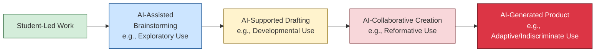

# AIGC in K-12 Classrooms: A Global Analysis of Practical Applications, Frameworks, and Educator Guidance
## 1 Introduction: Defining AIGC and Its Educational Imperative in K-12

The integration of Artificial Intelligence Generated Content (AIGC) into K-12 education represents a pivotal moment, offering both unprecedented opportunities and formidable challenges. This chapter establishes a foundational understanding of AIGC by defining its technical scope and analyzing the dual imperatives driving its adoption in schools. On one hand, AIGC holds the potential to address long-standing educational priorities such as personalized learning and teacher support at scale. On the other, its rapid deployment introduces urgent risks concerning equity, bias, and academic integrity that demand proactive governance. By framing AIGC as a transformative force requiring deliberate and ethical integration, this introduction sets the stage for a comprehensive exploration of its practical applications, implementation strategies, and future implications for teaching and learning.

### 1.1 Defining AIGC: Technical Scope and Generative Capabilities

Artificial Intelligence Generated Content (AIGC) refers to the broad category of digital artifacts—including text, images, audio, video, code, and 3D assets—created by artificial intelligence systems utilizing machine learning and deep learning models[^1]. This technological foundation is critical for understanding its potential in education. AIGC leverages a spectrum of generative models, each with distinct mechanisms for creating new content. These include autoregressive models (ARMs) that predict sequential elements, variational autoencoders (VAEs) that learn from continuous latent distributions, generative adversarial networks (GANs) known for synthesizing high-fidelity content, and denoising diffusion models (DMs) which enable state-of-the-art results in text-to-image and video generation[^1]. **The core technical capability of AIGC lies in its ability to learn patterns from vast datasets and generate novel, coherent outputs based on user prompts or conditions.**

The deployment architecture of AIGC systems is also evolving, moving from centralized cloud models to more distributed frameworks like edge-assisted and federated architectures to address latency and privacy concerns[^1]. The concept of AIGC-as-a-Service (AaaS) involves models hosted by service providers at the network edge, facilitating low-latency, personalized content generation[^1]. Furthermore, cross-modality AIGC systems support conditioning and translation across different domains, such as converting text prompts into images or music[^1]. This technical versatility underpins the diverse educational applications explored in this report, from generating lesson plans to creating interactive simulations.

### 1.2 The Educational Imperative: Potential Benefits and Driving Forces

The compelling drive to integrate AIGC into K-12 classrooms stems from its potential to address core educational challenges and enhance teaching and learning processes. Evidence from global case studies and policy analyses highlights several key benefits. **A primary driving force is the capacity of AIGC to enable personalized learning and adaptive instruction at scale.** For instance, AI-driven Intelligent Tutoring Systems (ITS) have been shown to provide personalized learning paths and immediate feedback, positively impacting student achievement, particularly when compared to traditional teacher-led instruction alone[^2].

AIGC also offers significant support for educators, acting as a powerful time-saving tool. Teachers can use generative AI to automate the creation of detailed lesson plans, assessments, and differentiated instructional materials in minutes, freeing up time for direct student interaction and pedagogical refinement[^3][^4]. In science education, AI can generate new lab ideas, modify assessments, and explain complex concepts at varying levels of depth, thereby deepening student engagement and supporting diverse learning needs[^5]. Furthermore, AIGC can provide students with immediate, detailed feedback on their writing, a task often prohibitive for a single teacher managing large classes[^6]. Beyond the classroom, AIGC applications can streamline administrative tasks such as communications, scheduling, and data analysis, improving overall operational efficiency within schools and districts[^7]. These potential benefits align with the broader educational goal of leveraging technology to achieve priorities in "better ways at scale," as emphasized by the U.S. Department of Education[^8].

### 1.3 The Urgent Challenges: Risks, Ethical Concerns, and Policy Urgency

Parallel to its benefits, the rapid diffusion of AIGC introduces significant and urgent challenges that necessitate careful governance. Policy reports from national and international bodies consistently highlight these systemic risks. **A foremost concern is the perpetuation and amplification of algorithmic bias, which can lead to discriminatory outcomes and undermine educational equity.** AI models are approximations of reality and can embed societal biases present in their training data, potentially disadvantaging certain student groups[^8][^9].

Data privacy and security present another critical vulnerability. The use of AIGC tools in schools involves student data, raising concerns under laws like FERPA and COPPA[^10]. Risks include unauthorized data collection, model inversion attacks, and the potential for AI systems to be used for increased student surveillance[^1][^8]. The threat to academic integrity is also pronounced, as students may use AIGC to plagiarize or complete assignments without genuine learning, complicating authentic assessment[^11][^12]. Furthermore, AIGC can generate convincing misinformation or "hallucinations"—factually incorrect but plausible-sounding content—posing risks to information literacy[^1][^13].

Perhaps most fundamentally, there is a risk that poorly integrated AIGC could exacerbate existing digital divides, creating inequities in access, quality of use, and design participation[^14][^8]. Over-reliance on AI tools may also diminish human agency, critical thinking, and the essential relational aspects of teaching and learning[^15][^14][^13]. These interconnected challenges underscore the policy urgency articulated by the U.S. Department of Education and UNESCO, calling for education-specific guidelines and guardrails that go beyond general data privacy laws to address algorithmic transparency, accountability, and fairness[^8][^9].

### 1.4 Synthesizing the Dual Imperative: Framing the Report's Core Inquiry

The preceding analysis reveals a dual imperative at the heart of AIGC's future in K-12 education: the need to actively harness its transformative potential while rigorously mitigating its associated risks. This tension defines the core inquiry of this report. The central question is not *whether* AIGC belongs in schools—its presence is already a reality—but *how* educational systems can achieve what researchers term "AI coherence," ensuring these tools align with educational goals, systems, and pedagogical practices[^14].

**The path forward requires moving beyond viewing AIGC as merely a functional technology and instead adopting human-centered frameworks that position AI as an augmentative partner under human guidance.** Models like the "Human Inquiry-AI Use-Human Empowerment" (H AI H) framework emphasize that AI use must begin with human curiosity and end with human reflection and insight[^15]. Success depends on building capacity, establishing clear ethical guardrails, and designing implementation models that preserve teacher agency and student well-being. This report will explore these pathways by categorizing practical applications, analyzing implementation strategies, and synthesizing evidence-based recommendations, all aimed at ensuring AIGC enhances, rather than disrupts, the fundamental mission of K-12 education.

## 2 Analytical Framework: Categorizing AIGC Applications in Classroom Practice

This chapter constructs a multi-dimensional analytical framework to systematically categorize and evaluate the practical applications of Artificial Intelligence-Generated Content (AIGC) in K-12 classrooms. Moving beyond simplistic functional lists, this framework synthesizes evidence from global case studies and reference materials to examine how AIGC integrates into and transforms core pedagogical practices, classroom structures, and the roles of educators and learners[^16][^17]. The framework is designed to absorb key insights from existing models, including the ILO Group's department-specific applications, the AI Coherence Pyramid, the 'Skills Before Tools' progression, and the Human-AI-Human (H-AI-H) model[^7][^16][^18][^19]. It analyzes applications across critical dimensions: the pedagogical purpose, the nature of student-AI collaboration, and the specific subject or support context. The goal is to provide a grounded, practical tool for educators and leaders to map, select, and critically assess AIGC tools based on their alignment with instructional goals and coherent implementation strategies.

### 2.1 Foundations for Categorization: Synthesizing Existing Frameworks and Evidence

To build a robust analytical framework, it is essential to first synthesize the theoretical and empirical foundations from key reference materials. These sources provide distinct but complementary lenses for understanding AIGC integration.

First, the **ILO Group's implementation framework** offers a pragmatic, department-specific view of AI applications[^7][^14]. It categorizes use cases by administrative and instructional functions—such as Curriculum & Instruction, Special Education, Student Support Services, and Human Resources—and explicitly links each to its potential value (e.g., tailored curriculum, increased accessibility) and associated risk profiles (e.g., bias, pedagogical risks)[^7]. This structure underscores that AIGC applications are not monolithic; their utility and challenges vary significantly depending on the operational context within a school system.

Second, the **AI Coherence Pyramid** developed by Child Trends establishes that effective integration requires more than just functional technology[^16][^20]. It proposes four hierarchical levels of coherence:
1.  **Technological Coherence:** The tool must be accurate, secure, transparent, and privacy-preserving.
2.  **Curricular Coherence:** The tool must align with a district’s specific curriculum content and sequence.
3.  **Pedagogical Coherence:** The tool must support the learning process, fostering skill development and critical thinking.
4.  **Implementation Coherence:** The tool must fit the unique conditions, resources, and culture of a school, supported by teacher training and community engagement[^16][^20].
**This pyramid is critical because it shifts the focus from *what* the tool does to *how well* it supports educational goals within a specific context.**

Third, Dr. Catlin Tucker’s **‘Skills Before Tools’ framework** introduces the critical dimension of developmental appropriateness and skill progression[^18][^21]. It argues that meaningful AI integration must begin with cultivating transferable student skills—such as questioning, evaluation, and ethical awareness—rather than starting with the tools themselves[^22][^23]. The framework outlines a gradual release of responsibility across grade bands: foundational skill-building without AI in K-3, guided interaction in safe environments in grades 4-6, application and critical evaluation in grades 7-9, and strategic, accountable use aligned with college and career readiness in grades 10-12[^18][^21]. This progression ensures that tool use is scaffolded by student readiness.

Finally, empirical patterns from the **systematic review of Generative AI in K-12 education** provide a reality check on current research and practice[^24][^25][^26]. The review reveals that existing studies predominantly focus on high school students and pre-service teachers, with a significant emphasis on STEM subjects like Mathematics and Physics, and heavy reliance on tools like ChatGPT[^24][^27]. It identifies substantial gaps in research involving in-service teachers, early childhood education, students with special needs, and parental involvement[^25][^26][^28]. **These findings highlight both the areas where application evidence is concentrated and the underserved contexts that any comprehensive framework must address.**

By integrating these perspectives—departmental utility, multi-level coherence, developmental progression, and empirical evidence—the following analytical framework is constructed to provide a holistic view of AIGC in classroom practice.

### 2.2 A Multi-Dimensional Framework for Classroom Application Analysis

The proposed framework analyzes AIGC classroom applications across three interconnected dimensions: Pedagogical Integration, Student-AI Interaction, and Contextual & Disciplinary Fit. This multi-dimensional approach allows for a nuanced evaluation that goes beyond surface-level functionality.

#### Dimension 1: Pedagogical Integration (The "What & Why")
This dimension classifies applications by their primary role in the teaching and learning process, drawing on evidence from various tools and case studies.

| Pedagogical Role | Core Function & Examples | Key Value Proposition (Based on References) |
| :--- | :--- | :--- |
| **Content & Resource Generator** | Automates the creation of instructional materials, lesson plans, assessments, and multimedia content.  • **Examples:** MagicSchool (lesson plans, differentiation)[^29], Curipod (interactive lesson PPTs)[^29], Fetchy (AI lesson plan generator)[^29]. | Saves teacher planning time, provides a starting point for curriculum design, enables rapid creation of differentiated and personalized materials[^7][^29]. |
| **Personalized Tutor & Feedback System** | Provides adaptive, one-on-one support, practice, and immediate feedback to students.  • **Examples:** Khanmigo (guided problem-solving)[^29], Quill's AI-powered writing feedback[^30], AI-powered math tutors (MathGPTPro)[^29]. | Offers scalable, individualized instruction; bridges learning gaps; provides instant feedback that supports skill development and metacognition[^7][^31][^32]. |
| **Assessment & Evaluation Tool** | Assists in generating, scoring, and analyzing student assessments.  • **Examples:** Gradescope (automated grading)[^29], Formative (test generation)[^29], AI for analyzing open-ended responses[^29]. | Increases efficiency in grading; provides data-driven insights into student performance; allows for more frequent formative assessment[^7][^29]. |
| **Collaborative Thinking & Creation Partner** | Supports project-based learning, research, brainstorming, and complex problem-solving.  • **Examples:** Inkwire for PBL design[^33][^34], AI for scientific data analysis (IBM Watson Discovery)[^31], tools for collaborative writing and revision[^35]. | Facilitates higher-order thinking, creativity, and interdisciplinary synthesis; acts as a "thought partner" to extend student ideas[^20][^33][^29]. |
| **Administrative & Operational Support** | Streamlines communication, scheduling, data management, and other non-instructional tasks.  • **Examples:** AI for drafting family communications[^7], optimizing transportation routes[^7], automating invoice verification[^36]. | Reduces administrative burden on educators and staff, freeing time for instructional priorities and relationship-building[^7][^33]. |

#### Dimension 2: Student-AI Interaction (The "How & How Much")
This dimension categorizes the nature and depth of collaboration between the student and the AI tool, directly linking to ethical use and academic integrity.

It is best visualized as a spectrum, informed by the **OSPI's 5-step scaffold** (from Level 1: No AI to Level 5: AI as Co-Creator)[^19][^31] and the **taxonomy for composition classrooms** (Exploratory, Developmental, Reformative, Adaptive, Indiscriminate use)[^35][^37].

**Interpretation:** The spectrum moves from ethical, student-centered uses to potentially unethical ones where student intellectual contribution diminishes[^35]. **Exploratory and Developmental uses** (e.g., generating research questions or outlines) are generally ethical as the AI's ideas do not directly enter the final product[^37]. **Reformative use** (e.g., AI editing student prose) is ethically ambiguous[^35]. **Adaptive and Indiscriminate use** (altering or directly copying AI output) are generally unethical as they circumvent student authorship and critical thinking[^35][^37]. Effective implementation requires setting clear expectations corresponding to appropriate levels on this spectrum.

#### Dimension 3: Contextual & Disciplinary Dimension (The "Where & For Whom")
This dimension maps applications to specific subject areas, student populations, and global contexts, acknowledging that utility is not universal.

*   **Subject-Specific Applications:**
    *   **STEM:** Use of AI-powered simulations (PhET), data analysis tools, and coding assistants[^31][^36]. Mathematics-focused tools like MathGPTPro for problem-solving[^29].
    *   **Humanities & Language Arts:** Tools for writing support, text analysis, historical simulation, and combating misinformation[^35][^31].
    *   **Cross-Disciplinary:** AI tools that facilitate project-based learning and interdisciplinary synthesis, as seen in higher education studies showing a 37% increase in interdisciplinary project outcomes[^20][^29].

*   **Student Support Contexts:**
    *   **Special Education & Accessibility:** AI for text-to-speech, speech-to-text, language learning assistance, and creating individualized instructional materials[^7][^32].
    *   **English Language Learners:** Language translation services, conversational practice tools, and modified textual content[^7][^31].

*   **Global & Regional Contexts:** Applications and challenges vary significantly. For example, China is systematically integrating AI into curricula with government guidance[^38][^39], while Latin American initiatives show a mix of private-sector tools focusing on language learning and teacher planning[^36][^32]. In Africa, projects confront foundational digital divide challenges while exploring uses like automated school selection systems in Kenya[^32].

### 2.3 Applying the Framework: Analysis of Exemplar Case Studies and Tools

To demonstrate the utility of the framework, we apply it to analyze specific, evidence-rich examples.

**Case Study 1: Quill.org’s "Building AI Knowledge" in STEM Coding Labs**
*   **Pedagogical Integration:** Primarily functions as a **Collaborative Thinking Partner** and **Personalized Feedback System**. Students engage in evidence-based writing about AI's societal impact[^30].
*   **Student-AI Interaction:** Likely aligns with **Developmental or Exploratory Use**. Students construct claims and use evidence, with AI providing feedback on their reasoning, supporting rather than replacing their writing process[^30].
*   **Contextual & Disciplinary Fit:** Implemented in **8th-grade computer science** in underserved Pennsylvania schools, addressing **STEM and literacy integration**. It tackles the contextual need for AI literacy within a technical curriculum[^30].

**Case Study 2: Lamont Elementary School District’s Innovation Cohort using Inkwire**
*   **Pedagogical Integration:** Inkwire acts as a **Content & Resource Generator** and **Collaborative Thinking Partner** for designing Project-Based Learning (PBL) units aligned with the district's "Portrait of a Learner"[^33][^34].
*   **Student-AI Interaction:** The tool is used by *teachers* for design, which precedes student interaction. The subsequent student use of AI would need to be defined using the interaction spectrum.
*   **Contextual & Disciplinary Fit:** Demonstrates **Implementation Coherence**. The tool was embedded with the district's foundational documents, and professional development (the Innovation Cohort) was provided, leading to high adoption rates (over 70% weekly use) and teacher-reported time savings[^34]. This aligns with the "Framework for the Future" vision.

**Comparative Analysis: AI for Personalized Learning in Different Regions**
*   **South Korea's AI Tutors:** Aim to provide **Personalized Tutoring** at scale, with systems adapting homework based on student behavior[^40]. This reflects a national, policy-driven **Contextual Fit**.
*   **Latin America's ¡IA Presente! Initiatives:** Many submitted solutions (e.g., literacy apps with speech recognition) also target **Personalized Learning**, but often within constraints of infrastructure and resource availability, highlighting different **Contextual** challenges like the digital divide[^36].
*   **Framework Insight:** While the *Pedagogical Integration* goal (personalization) is similar, the *Contextual & Disciplinary Dimension*—encompassing policy support, infrastructure, and equity challenges—critically determines the feasibility and design of the application.

### 2.4 Implications for Practice: Using the Framework for Selection, Implementation, and Evaluation

This framework is designed as a practical decision-making tool for educators and leaders.

**1. For Selecting AIGC Applications:**
Leaders and teachers can use the three dimensions as a checklist:
*   **Pedagogical Need:** Does the tool address a specific instructional challenge (e.g., need for differentiated materials, timely feedback)?
*   **Interaction Clarity:** What level on the Student-AI Interaction spectrum is appropriate for the learning task and student age? A clear policy, like requiring disclosure for Developmental use or prohibiting Indiscriminate use, should be established[^35][^38].
*   **Contextual Fit:** Does the tool align with our curriculum? Is it accessible to all students? Does it respect our community's cultural and ethical values? This step directly addresses equity and bias risks highlighted in the references[^41][^40].

**2. For Planning Implementation:**
Successful implementation requires attention to the "Implementation Coherence" layer of the AI Coherence Pyramid[^20].
*   **Professional Development (PD):** PD must move beyond tool mechanics to focus on *pedagogical integration*. As the systematic review strongly recommends, teachers need support to design learning activities that effectively incorporate AIGC[^25][^27]. PD should model the H-AI-H framework, starting with human inquiry into a pedagogical problem[^19].
*   **Classroom Protocols:** Develop clear guidelines for students, similar to the OSPI policy samples or the taxonomy of ethical use, to foster transparency and responsible engagement[^35][^31].

**3. For Evaluating Impact:**
The framework encourages moving beyond general satisfaction to assess specific outcomes aligned with its dimensions.
*   **Student Learning:** Has the use of the tool (e.g., as a Personalized Tutor) led to measurable improvements in specific skills, knowledge acquisition, or metacognition (e.g., critical thinking, creativity)[^42][^29]?
*   **Instructional Practice:** Has the tool (e.g., as a Content Generator) increased teacher efficiency or enabled more effective differentiation?
*   **Equity:** Has implementation proactively addressed the digital divide? Are all student groups benefiting equally, or are biases being introduced[^41][^32]?

**By applying this multi-dimensional framework, educators can transition from ad-hoc experimentation to strategic, coherent, and equitable integration of AIGC, ensuring these powerful tools genuinely enhance teaching and learning.**

## 3 Category Analysis I: AIGC for Enhancing Teaching Design and Content Delivery

This chapter provides a data-driven analysis of how Artificial Intelligence-Generated Content (AIGC) is applied to enhance the core tasks of teaching design and content delivery in K-12 education. It synthesizes evidence from case studies and experimental research to examine specific application approaches, including automated lesson planning, dynamic content generation, and the creation of adaptive, differentiated materials. The analysis critically compares the efficacy of these AIGC-assisted methods against traditional teaching approaches, focusing on measurable impacts on learning outcomes, student engagement, and teacher workload. It also dissects implementation challenges, such as ensuring content quality, avoiding problematic narratives, and maintaining pedagogical coherence. This chapter serves as a critical bridge between the theoretical framework established earlier and the practical realities of classroom implementation, grounding the discussion in verifiable evidence of AIGC's role as a design and delivery partner for educators.

### 3.1 Automating and Augmenting Lesson Planning: Evidence from Case Studies and Tools

This sub-chapter analyzes how AIGC tools are used to automate and augment the lesson planning process, drawing on specific case studies and tool evaluations. Evidence from district implementations demonstrates that AIGC can significantly streamline initial design work. In the Lamont Elementary School District, educators participating in a yearlong Project-Based Learning (PBL) Innovation Cohort used Inkwire, an AI-enabled PBL designer with the district's foundational documents embedded[^43][^44][^34]. A fifth-grade educator reported that Inkwire saved her **hours of time creating the initial project plan**, though she emphasized that her expertise was still essential to assess the output's quality[^43][^34]. Midway through the cohort, over 70% of participants were using AI tools like Inkwire weekly, and 88% were excited about AI's role in education[^43][^44]. Similarly, in the Escondido Union School District, the Learning Experience Accelerator (LEA) App, developed using Playlab, helped educators connect their lesson ideas to specific "Portrait of a Learner" competencies and state standards, providing success criteria and concrete teaching strategies[^44][^34].

However, research critically examining the quality of AI-generated lesson plans reveals significant limitations and the necessity of expert teacher oversight. A study evaluating ChatGPT, Microsoft Bing, and Google Bard found that **AI rarely produced fully satisfactory lesson plans from brief, generic prompts**[^45]. For topics like Martin Luther King Jr. and Indian Removal, even after up to five iterative attempts with more specific prompts, the best-generated plans often failed to meet all established academic standards derived from current scholarship[^45]. The study noted a pedagogical tendency for all AI-generated courses to follow a similar pattern (activating prior knowledge, introducing content, discussion, learning activities) and often provided vague instructional directions[^45]. This underscores that **AI cannot replace the professional judgment and complexity of human educators**, who must critically evaluate AI output for accuracy, appropriateness, and avoidance of problematic narratives[^45].

Practical experiences from frontline teachers corroborate both the efficiency gains and the need for vigilance. Teachers Janice Donaghy and Jean D’Aurio used applications like Diffit to generate adapted reading passages, summaries, and comprehension questions for a lesson on ancient Greek vases in seconds, a task that previously took hours[^46]. They also utilized AI to translate lesson plans for a new Spanish-speaking student[^46]. While these tools provided a "shortcut," the teachers were acutely aware of AI's potential for "hallucinations" (fabricating facts) and implemented strategies, such as instructing the tool to admit when it lacked information, to prevent misinformation[^46]. This comparative analysis reveals that AIGC-assisted planning offers unparalleled efficiency in generating initial drafts and differentiated materials, but its value is fully realized only when coupled with a teacher's curricular knowledge, pedagogical expertise, and critical review—positioning AI as a powerful, but subordinate, design partner.

### 3.2 Dynamic Content Generation for Engagement: Simulations, Stories, and Interactive Media

This sub-chapter explores AIGC applications for creating dynamic, engaging instructional content that moves beyond static text. A significant focus of existing research and practice is in STEM subjects, where AI excels at making complex concepts accessible[^27]. **AI-powered simulations allow students to perform virtual experiments without real-world constraints**, providing interactive, visual understanding. For example, in high school science, resources like PhET Interactive Simulations enable students to manipulate variables in a gas laws experiment and observe molecular behavior in real-time[^31]. In more advanced courses, AI tools like IBM Watson Discovery can assist students in analyzing large datasets, such as global temperature trends for a climate change project[^31].

Generative AI also enables the creation of rich, interactive narratives and explanatory media. Platforms like Curipod allow teachers to use generative AI to create interactive lesson presentations for any subject, where students can respond to questions and receive immediate AI feedback[^29]. This capability supports the generation of immersive learning experiences, such as simulating dialogues with historical figures or creating visual stories to explain abstract concepts[^15]. These applications align with the technical capacity of cross-modality AIGC systems to generate coherent outputs across text, image, and audio domains, fostering greater student interest and engagement[^15].

However, the use of such dynamic content carries inherent challenges. **The risk of inaccuracy or "hallucination" is amplified in generative narratives and simulations**, potentially leading to student misconceptions if not carefully vetted[^46][^40]. Furthermore, there is a concern that overly polished, AI-generated content might diminish opportunities for students to develop critical thinking and problem-solving skills by presenting pre-digested explanations[^40]. Ethical and cultural considerations are paramount; as noted in regional reports, most AI models are trained on Western data, which can lead to a lack of cultural relevance and the perpetuation of biases in generated content[^40][^32]. Therefore, while dynamic AIGC content offers powerful tools for engagement and conceptual demonstration, its implementation requires educators to actively curate, verify, and contextualize the material, ensuring it serves pedagogical goals rather than replacing the cognitive struggle essential for deep learning.

### 3.3 Developing Adaptive and Differentiated Teaching Materials

This sub-chapter investigates how AIGC enables the efficient creation of personalized and differentiated learning materials to meet diverse student needs. Specialized AI tools are designed explicitly for this purpose, dramatically reducing the time required for adaptation. For instance, MagicSchool offers a "Text Leveler Tool" that adjusts content to a target grade level and a "Make It Relevant Tool" that personalizes lessons by incorporating student interests[^29]. Similarly, Fetchy generates detailed lesson plans based on grade level and curriculum objectives[^29]. In practice, teachers have used applications like Diffit not only to generate a reading passage on Greek vases but also to **create multiple versions of that text adapted to different reading levels**—from second to tenth grade—within a single classroom[^46]. This capability is transformative for inclusive classrooms that combine general and special education students, allowing teachers to efficiently meet numerous Individualized Education Program (IEP) goals[^46].

The potential benefits for specific student populations are significant. For English Language Learners (ELLs), generative AI can provide translated materials and opportunities for conversational practice[^32]. For students with disabilities, AI can offer visual descriptions for those with visual impairments and leverage text-to-speech and speech-to-text features to improve access[^32]. These applications align with the broader opportunity identified in regional analyses for AI to **reduce educational inequalities by providing tailored support that bridges learning gaps**[^32].

Despite these advantages, a critical evaluation is necessary. The efficacy of AI-generated adaptive materials depends on the sophistication of the underlying algorithms and the quality of the training data. There is a risk that algorithmic personalization could inadvertently reinforce biases or limit student exposure to challenging, grade-level text if not carefully monitored[^15]. **The pedagogical appropriateness of AI-suggested modifications requires human oversight**; a tool might correctly adjust lexical complexity but fail to preserve the nuance or conceptual depth essential for learning[^45]. Therefore, while AIGC tools offer unprecedented scalability in creating differentiated resources, they function best as assistants that amplify a teacher's professional capacity to diagnose needs and craft appropriate supports, rather than as autonomous replacements for pedagogical judgment.

### 3.4 Comparative Efficacy and Impact: Learning Outcomes, Workload, and Challenges

This sub-chapter synthesizes experimental and survey data to conduct a comparative analysis of the efficacy and broader impact of AIGC in teaching design and delivery. Quantitative studies, primarily in higher education, provide indicative evidence of potential benefits. Research on AIGC integration showed a **37% increase in interdisciplinary project outcomes**, measured by collaborative problem-solving and cross-domain knowledge integration[^47][^48][^29]. Comparative analysis revealed statistically significant improvements in interdisciplinary communication (23.6%), creativity (17.4%), and knowledge acquisition (17.2%) for groups using AIGC tools strategically[^47][^29]. While not directly from K-12, these findings suggest AIGC's potential to enhance complex, skill-based learning outcomes when integrated within structured pedagogical frameworks.

In K-12 contexts, impact data often relates to teacher efficiency and perception. Surveys indicate that **AI tools can save educators substantial time on planning and administrative tasks**. Teachers report reducing lesson preparation time "from several hours to seconds"[^46], and a national survey found that 72% of educators see value in AI for reducing the time needed to analyze assessment data[^29]. The CEO of AI for Education noted that teachers typically spend 8-10 hours weekly on planning and administrative work, a burden AI can help alleviate[^46]. Furthermore, tools like Inkwire and the LEA App demonstrate that AI can help translate broad educational frameworks (like a "Portrait of a Learner") into concrete daily practice, fostering professional learning and instructional coherence[^44][^34].

However, these potential benefits are counterbalanced by significant, well-documented challenges. The following table summarizes the key comparative insights:

| Aspect | Potential Benefits & Efficacy (AIGC-Assisted) | Persistent Challenges & Risks |
| :--- | :--- | :--- |
| **Learning Outcomes** | Indications of improved interdisciplinary synthesis, creativity, and knowledge acquisition in structured settings[^47][^29]. Enhanced personalized learning paths and immediate feedback[^15]. | Research gaps in K-12; over-reliance may undermine critical thinking and socio-emotional development[^15][^40]. Quality of AI-generated content varies[^45]. |
| **Teacher Workload** | Significant time savings in initial lesson design, material differentiation, and administrative tasks[^43][^46][^29]. Acts as a brainstorming partner. | Requires substantial upfront investment in professional development[^47][^27]. Need for critical review of AI output to ensure quality and accuracy adds a new layer of cognitive labor[^45][^46]. |
| **Equity & Access** | Tools can support differentiation for diverse learners (ELL, Special Education)[^46][^32]. Potential to reduce inequalities through personalized support[^32]. | **Digital divide** is a major barrier; disparities in technology access and infrastructure (especially in rural/low-income areas) can exacerbate inequities[^15][^32]. Algorithmic bias risks perpetuating discrimination[^40][^32]. |
| **Academic Integrity** | Enables new forms of formative assessment and feedback[^29]. | Facilitates plagiarism and challenges traditional assessment methods[^20][^32]. |
| **Implementation** | Can enhance pedagogical coherence when aligned with district vision and frameworks[^44][^34]. | Requires clear policies, ethical guardrails, and ongoing support. Resistance to change among educators[^15]. |

The synthesis reveals a complex picture. **AIGC tools show strong promise in augmenting teacher capacity and personalizing student learning, but their effective and equitable integration is non-trivial.** Success depends on overcoming infrastructural barriers, investing in continuous teacher professional development focused on pedagogical integration—not just tool use—and establishing robust governance frameworks to manage ethical risks[^20][^27][^32]. The most effective path forward appears to be a blended approach, where AI handles time-consuming generation and adaptation tasks under the guidance of teachers, who then focus their expertise on curation, facilitation, mentorship, and addressing the higher-order needs of their students[^15][^34].

## 4 Category Analysis II: AIGC for Personalizing Learning and Student Engagement

This chapter provides a data-driven analysis of how Artificial Intelligence-Generated Content (AIGC) is applied to personalize learning pathways and enhance student engagement in K-12 education. It synthesizes empirical evidence from systematic reviews, meta-analyses, and case studies to examine specific applications, including AI-driven Intelligent Tutoring Systems (ITS), adaptive learning platforms, and generative tools for creating immersive experiences. The analysis critically evaluates the impact of these tools on key student outcomes, including motivation, metacognition, and the development of 21st-century skills such as critical thinking, creativity, and problem-solving. It also addresses implementation challenges such as ensuring equitable access, mitigating algorithmic bias, and fostering self-regulated learning. This chapter serves to concretely assess the efficacy and conditions for success of AIGC as a tool for personalization and engagement, grounding the discussion in verifiable research findings.

### 4.1 AI-Driven Tutoring and Adaptive Learning Platforms: Mechanisms and Efficacy Evidence

This sub-chapter analyzes the core mechanisms and empirical evidence for AI-driven Intelligent Tutoring Systems (ITS) and adaptive learning platforms. These systems leverage artificial intelligence to analyze student performance data—such as response time, accuracy, and engagement patterns—and dynamically adjust the difficulty, pacing, and sequence of instructional content to create a personalized learning journey[^23]. The architecture of a typical ITS includes four key components: a domain model containing the knowledge to be taught, a student model tracking the learner's progress, a tutoring model that determines the most effective instructional strategy based on the other models, and a user interface model facilitating interaction[^23].

Empirical evidence on the efficacy of these platforms is cautiously optimistic but highlights critical moderating factors. A systematic review of 28 studies on AI-driven ITSs in K-12 education found their effects on learning and performance are generally positive but are mitigated when compared to non-intelligent tutoring systems[^49]. In comparisons with traditional teacher-led instruction, seven out of eight studies reported a significant positive effect for ITSs, with medium to large effect sizes[^49]. **However, the most reliable and effective implementations consistently involve a "teacher-in-the-loop" model, which outperforms AI-only approaches**[^50][^51]. This underscores that these systems are most effective when used to support, not replace, teachers, collaborating to optimize student learning[^49].

The market for adaptive learning is growing rapidly, with projections valuing it at USD 5.13 billion for 2025 and nearly USD 12.7 billion by 2030[^52]. Leading platforms demonstrate measurable impacts:
*   **DreamBox Learning:** A K-8 math platform that uses AI to personalize learning pathways. A large-scale study of over 57,000 students found that completing more DreamBox lessons per week was significantly associated with higher spring NWEA MAP® math percentile scores, with positive associations holding across all race- and gender-based subgroups[^53]. For grades 4 and 5, students with moderate to high usage had significantly higher state end-of-grade mathematics assessment scores than those with low use[^53].
*   **ALEKS (Assessment and Learning in Knowledge Spaces):** Based on Knowledge Space Theory, this platform uses AI to map student knowledge and create a dynamic learning experience, showing improved pass rates and student retention in studies[^23].
*   **Khanmigo:** Khan Academy's AI tutor is designed to guide students through problem-solving with dialogue rather than providing direct answers, with its creator, Sal Khan, emphasizing that it augments, rather than replaces, classroom dialog[^52].

A synthesis of effectiveness data indicates that typical learning gains from these systems are approximately **0.3–0.6 standard deviations compared to business-as-usual instruction**, with the strongest effects observed in math/science and for struggling learners[^50][^51]. Key factors for successful deployment include not only the core AI components of personalization and immediate feedback but also features that support blended learning models and mastery-based learning[^49]. The duration of intervention also matters, with effectiveness varying based on student engagement and individual learner characteristics[^49].

### 4.2 Fostering Metacognition and 21st-Century Skills: Evidence from Generative AI Interventions

This sub-chapter examines how AIGC tools, particularly generative AI (Gen-AI), are used to scaffold metacognitive processes and develop higher-order thinking (HOT) skills, which are internationally recognized as core 21st-century competencies encompassing critical thinking, creative thinking, and problem-solving ability[^54]. Empirical evidence points to a conditional but positive impact.

A meta-analysis of 29 experimental and quasi-experimental studies revealed that Gen-AI exerts a **moderate positive overall effect (Hedges’s g = 0.609) on higher-order thinking**[^54]. The impact is differential across core dimensions: the most significant improvement was observed in **problem-solving abilities (Effect Size = 0.745)**, followed by **critical thinking (ES = 0.691)**, while the effect on **creativity was relatively more limited (ES = 0.444)**[^54]. This pattern suggests Gen-AI is particularly potent as a tool for structured reasoning and solution-finding.

The effectiveness of Gen-AI in fostering these skills is not automatic but is significantly influenced by instructional design and learner characteristics. **Self-regulated learning (SRL) ability emerges as a crucial moderator**. Learners with higher SRL capacities benefited substantially more (ES = 0.863) from Gen-AI interventions compared to those with lower SRL abilities (ES = 0.284)[^54]. This aligns with the human-AI collaboration theory, which posits that using AI effectively places high demands on metacognitive skills, as learners must engage in restating thoughts, rectifying erroneous information, and adjusting AI commands[^52]. Furthermore, intervention duration shows an **inverted U-shaped relationship with effectiveness**. The impact was strongest when interventions lasted **8–16 weeks**, with both shorter (0–8 weeks) and longer (>16 weeks) durations yielding weaker effects[^54].

Structured prompting is a key pedagogical strategy for unlocking Gen-AI's potential. A study in a geriatric nursing class implemented a Gen-AI-guided prompt-based learning approach, integrating design thinking methodology (empathize, define, ideate, prototype, test)[^52]. This structured process provided clear assistance, reduced task difficulty and cognitive load, and resulted in significant enhancements to students' critical thinking, metacognition, and problem-solving tendencies, as well as their ability to generate effective questions via prompts[^52]. This demonstrates that teaching students to pose clear, meaningful questions to AI can directly improve their problem-solving capacities.

Research on AI's role in scaffolding metacognition in STEM education indicates a shift in discourse from individual reflection to system-level regulation and distributed cognition[^55]. Tools like learning analytics, ITS, and Gen-AI platforms are increasingly positioned as co-regulators of learning, promoting both content mastery and reflective monitoring[^55]. However, concerns remain that if AI prioritizes automation over deep reflection, it could lead to cognitive overload, reduced learner autonomy, and algorithmic bias[^55].

### 4.3 Enhancing Engagement through Immersive and Interactive AIGC Experiences

This sub-chapter explores the use of AIGC to generate dynamic, immersive content aimed at boosting student interest and active participation. These applications move beyond traditional instruction to create experiential learning environments.

A primary category is **AI-powered simulations for virtual experiments**, which allow students to explore complex scientific concepts without real-world constraints. Resources like PhET Interactive Simulations enable students to manipulate variables—such as adjusting temperature and pressure in a gas laws experiment—and observe real-time molecular behavior[^31]. In advanced courses, tools like IBM Watson Discovery allow students to analyze large datasets, such as global temperature trends for climate change projects[^31]. These simulations make abstract concepts tangible and accessible.

Generative AI also enables **immersive historical and social science experiences**. Platforms like Hello History AI allow students to have life-like conversations with over 400 historical figures, receiving responses based on the figures' known beliefs and writings[^56]. Similarly, CharacterAI and interactive time-travel games like Time Portal place students at the center of historical inquiry through dialogue and quests[^56]. These tools personalize history, fostering deeper connection and inquiry.

The impact of such immersive AIGC on student engagement and motivation is supported by research. A systematic review of Gen-AI in middle school science found that AI-based technologies play a significant role in enhancing students’ interest, engagement, and motivation[^57]. The integration of Intelligent Tutoring Systems supported by Augmented Reality led to increased student participation, and even students with lower academic performance demonstrated greater interest[^57]. Students in AI-supported groups also reported higher levels of perceived competence and self-efficacy[^57].

Student perceptions align with these findings. A national survey of high school students found that nearly three-quarters (74%) believed their overall academic performance would improve at least a little because of using AI tools for schoolwork[^58]. Half (50%) thought their creativity would improve, though a quarter (28%) believed it would decline[^58]. This highlights the dual-edged nature of such tools: while they can make learning more engaging and accessible, there is a perceived risk that they might shortcut the creative struggle.

However, these applications carry inherent challenges. The risk of AI "hallucinations"—generating factually incorrect but plausible-sounding content—is a significant concern, especially in educational contexts where accuracy is paramount[^40]. Furthermore, there is a risk that overly polished, AI-generated immersive content could foster passive consumption rather than active, critical learning. As noted in regional analyses, most AI models are trained on Western data, which can lead to a lack of cultural relevance in generated simulations or historical narratives, potentially perpetuating biases[^40].

### 4.4 Implementation Realities: Equity, Access, and the Student Experience

This sub-chapter investigates the practical challenges and equity considerations that fundamentally shape the deployment and effectiveness of AIGC for personalization and engagement. The promise of these tools is unevenly distributed, and their implementation often confronts deep-seated systemic barriers.

**The digital divide remains a paramount obstacle.** Not all students have equal access to the necessary devices, reliable high-speed internet, or conducive learning environments at home[^59][^32]. This disparity is particularly acute in rural and low-income communities, both globally and within nations[^32]. **Without intentional design and policy support, AIGC tools risk widening existing educational inequalities rather than closing them**[^23]. For instance, a survey found that academically higher-achieving students were significantly more likely to use AI tools than their lower-achieving peers, potentially creating a "rich-get-richer" scenario in terms of access to personalized support[^58].

**Algorithmic bias and a lack of cultural relevance** pose significant risks to equitable personalization. AI models trained on narrow or unrepresentative datasets can perpetuate and amplify societal biases, leading to discriminatory outcomes or content that fails to resonate with diverse student populations[^40][^32]. As noted in an Asia-Pacific analysis, the predominance of Western training data can result in a lack of cultural relevance in AI-generated learning materials[^40]. This necessitates proactive measures such as bias audits, the use of locally calibrated models, and the development of culturally responsive content[^23].

The student experience with AIGC is mediated by cognitive and human-computer interaction (HCI) factors. An exploratory study extending the Technology Acceptance Model found that students' **AI intrinsic motivation, readiness, and confidence positively influenced their perception of AI's usefulness and ease of use**, while AI anxiety had a negative effect[^51]. Furthermore, the quality of the user interface, content, and learner-interface interactivity were significant positive predictors of perceived ease of use[^51]. **This underscores that the design of the AI tool itself, not just its algorithmic capabilities, is critical for student engagement and adoption.**

Case studies like Alpha School, an AI-driven micro-school, illustrate an attempt to balance technology with human-centric design. The model uses "AI tutors" for personalized math instruction in the morning, freeing up the afternoon for collaborative, project-based work with teachers and community partners[^23]. This intentional design aims to prevent the student isolation that can result from fully individualized learning. However, it also highlights new complexities, such as the need for educators to carefully interpret AI data to distinguish temporary difficulties from true learning gaps[^23].

Finally, **data privacy and security** are non-negotiable concerns. The use of AIGC involves the collection and processing of sensitive student data, raising risks under regulations like FERPA and COPPA[^59][^32]. Districts must insist on clear data-use agreements, encryption standards, and policies that forbid training models on identifiable student work without explicit consent[^52][^32]. Protecting student privacy is a foundational requirement for any ethical implementation.

The synthesis of these realities indicates that **the transformative potential of AIGC for personalization is contingent upon overcoming substantial infrastructural, ethical, and design challenges.** Successful implementation requires more than procuring software; it demands strategic investments in infrastructure, teacher professional development focused on equitable pedagogy, rigorous oversight of algorithms, and a steadfast commitment to designing tools and experiences that serve all students.

[^49]: Search Result-122
[^54]: Search Result-124
[^23]: Search Result-128
[^23]: Search Result-130
[^23]: Search Result-132
[^59]: Search Result-134
[^23]: Search Result-138
[^52]: Search Result-140
[^52]: Search Result-142
[^50]: Search Result-144
[^51]: Search Result-146
[^51]: Search Result-148
[^57]: Search Result-158
[^55]: Search Result-162
[^53]: Search Result-164
[^56]: Search Result-168
[^58]: Search Result-170
[^31]: Search Result-178
[^40]: Search Result-206
[^32]: Search Result-213
[^32]: Search Result-214
[^32]: Search Result-216

## 5 Category Analysis III: AIGC in Assessment, Feedback, and Administrative Support

This chapter provides a data-driven analysis of how Artificial Intelligence-Generated Content (AIGC) is transforming assessment, feedback, and administrative support in K-12 education. It synthesizes evidence from state guidance documents, systematic reviews, and case studies to examine specific applications, including automated essay scoring (AES), formative assessment feedback, question generation, and the automation of administrative workflows. The analysis critically evaluates the efficacy and reliability of these tools, comparing AI performance to human judgment across various criteria. It places a particular emphasis on the ethical and equity challenges inherent in automated assessment, such as algorithmic bias, fairness across demographic and cognitive subgroups, and data privacy. A core theme is the necessity of a 'human-in-the-loop' model to balance efficiency gains with the preservation of pedagogical judgment, academic integrity, and equitable outcomes. This chapter serves as a critical examination of the operational and ethical frontiers of AIGC integration beyond direct instruction.

### 5.1 Revolutionizing Formative Assessment: AI-Generated Feedback and Question Design

Generative AI is significantly enhancing the formative assessment process by making feedback more immediate, personalized, and by assisting teachers in the design of assessment tasks. A national survey on K-12 assessment found that **about 72% of educators are already using or considering using AI to improve assessment practices**[^29]. This adoption is driven by AI's ability to address persistent challenges in formative assessment, such as large class sizes, variability in teacher assessment literacy, and limited time for individualized feedback[^31].

**AI's primary value in formative assessment lies in providing immediate, descriptive, and individualized feedback to students.** Studies indicate that AI-generated feedback can align with rubric criteria and reduce the burden on teachers, though human feedback is still superior in accuracy and tone[^31]. This necessitates a **"human-in-the-loop" approach**, where AI serves as a tool to augment, not replace, teacher judgment. For instance, tools like MagicSchool, SchoolAI, and EnlightenAI provide students with automated feedback on their work, which is shaped and guided by prior teacher input[^34][^38]. The effectiveness of this approach is reflected in case studies; in a High School English class, the use of AI-generated feedback on student writing led to an increase in revision cycles, demonstrating its role in supporting the iterative learning process[^31].

Beyond feedback, AI is a powerful assistant for teachers in **designing formative assessment tasks and generating questions**. Tools like the Kent ISD “AI for Assessment” prompt library exemplify how AI can help educators generate formative tasks and create authentic prompts that are closely aligned with specific learning goals[^31]. Platforms such as Curipod allow teachers to quickly generate interactive lessons with embedded polls, word clouds, and questions, receiving immediate AI feedback on student responses[^40]. Furthermore, AI can support **student self-regulation and metacognition** by prompting reflective thinking and even acting as a simulated “peer” to provide feedback, thereby helping students develop critical evaluation skills[^31].

However, the integration of AI into formative assessment is not without barriers. The national survey identified that **the biggest challenge for educators in assessment is the excessive amount of classroom time it consumes**, a problem exacerbated by staff shortages[^29]. While AI can alleviate some time pressures, its effective use requires teachers to develop new competencies. Variability in teacher assessment literacy remains a hurdle, and equity considerations are paramount. AI outputs may inadvertently privilege dominant cultural norms, potentially disadvantaging English Language Learners[^31]. Therefore, successful implementation requires professional development that moves beyond tool mechanics to focus on pedagogical integration, ethical evaluation of AI outputs, and strategies to ensure all students benefit from AI-enhanced formative practices.

### 5.2 Automated Scoring and Summative Assessment: Efficacy, Bias, and Fairness

The application of AIGC in automated scoring, particularly for essays and open-ended responses, presents a promising avenue for efficiency but raises significant questions regarding reliability, bias, and fairness. Empirical research provides a nuanced picture of current capabilities.

**Closed-source Large Language Models (LLMs), such as OpenAI's GPT series, demonstrate moderate to good reliability in scoring compared to human raters, but with notable tendencies and limitations.** A comparative study evaluating LLMs on German student essays found that the novel o1 model achieved the strongest correlation with human teacher assessments (Spearman’s r=.74 for overall score) and high internal consistency[^38]. GPT-4 and GPT-3.5 also showed moderate to good reliability. However, these models **generally provided higher average scores than human raters across all criteria** and performed better on language-related features (e.g., spelling, verbal imagery) than on content-related aspects (e.g., plot logic, introduction quality)[^38]. This indicates that while AI can be a useful tool to support the evaluation of essays—especially for linguistic mechanics—it requires further refinement and human oversight to accurately assess content quality and depth of thought.

**Algorithmic fairness is the paramount ethical concern in automated scoring.** Research on Automated Essay Scoring (AES) systems shows that unfair scores related to demographic variables such as race, economic status, and English Language Learner status have been documented[^39]. A dedicated study on fairness using the German DARIUS corpus yielded critical insights. It found that **when trained on comprehensive and representative data, AES models (including shallow learning, deep learning, and LLMs) could produce fair scores across different demographic subgroups and levels of cognitive ability**[^39]. However, the study’s crucial finding was that **training models on skewed data subsets (e.g., only essays from students with high cognitive ability) introduced a bias, leading to lower performance and potentially unfair scores for student groups excluded from the training data**[^39]. This underscores that fairness is not an inherent feature of the algorithm but is contingent upon inclusive and representative training data.

Real-world consequences of bias are evident. Studies have shown AI scoring tools can disadvantage non-native English speakers and students using non-standard dialects[^36]. Furthermore, AI detection tools designed to identify AI-generated text have been found to be error-prone and disproportionately flag writing by non-native English speakers[^36]. These risks have prompted policy responses. For example, the Georgia Department of Education's guidance explicitly prohibits the use of AI for high-stakes evaluations such as setting IEP goals or conducting educator evaluations[^31]. Frameworks like the **AI Assessment Scale (AIAS)** have been developed to define permissible levels of AI assistance in academic work, with a pilot study showing its use led to a significant reduction in academic misconduct cases[^27].

**The path forward for AI in summative assessment is not full automation, but augmentation.** The most effective models are hybrid or "human-in-the-loop" systems. For instance, AI can handle initial scoring or flag essays for human review, thereby increasing efficiency while reserving final judgment and nuanced evaluation for educators. This approach balances the scalability of AI with the irreplaceable context, cultural understanding, and professional judgment of human teachers.

### 5.3 Streamlining Administrative Operations: From Communications to Resource Management

AIGC is proving to be a transformative force in automating the repetitive, time-consuming administrative tasks that burden K-12 educators and administrators, freeing them to focus on instructional leadership and direct student support. A 2024 survey of K-12 administrators found that **the most common use of generative AI by teachers was for generating lesson plans (67%), course activities (66%), and quizzes (59%)**[^39][^30]. Furthermore, 50% of administrators believed that using AI to create instructional materials was the most beneficial application for teachers[^30].

The range of administrative applications is extensive and impactful:
*   **Instructional Material and Planning:** Tools like MagicSchool (with 70+ AI tools), Fetchy, and Khanmigo's teacher features automate the creation of lesson plans, differentiated worksheets, project outlines, and even draft Individualized Education Programs (IEPs)[^34][^29]. This can reduce planning time from hours to minutes.
*   **Communication and Reporting:** Generative AI tools like ChatGPT and Grammarly assist in drafting clearer, more consistent communications to families and staff. AI can also automate the generation of routine reports by pulling and formatting data from student information systems[^30][^40].
*   **Operational Efficiency:** AI is being used to optimize core school operations. For example, genetic algorithms have been used to optimize school bus routes, resulting in significant cost savings[^30]. AI-powered systems can automate attendance tracking through facial recognition or smart cards, not only logging data but also analyzing it to identify trends in chronic absenteeism[^34]. Other use cases include automating the verification of school invoices and screening admissions applications[^34][^36].
*   **Student and Parent Support:** AI-powered chatbots, such as Georgia State University's "Pounce," have been successful in reducing "summer melt" by answering routine questions. In K-12 settings, similar chatbots can handle parent inquiries about schedules, events, or policies, providing 24/7 support[^30].

The benefits of these applications are substantial. A McKinsey report cited in the references suggests that **AI tools can help educators and administrators reclaim 20 to 40 percent of their time previously spent on routine tasks**[^30]. This translates into direct cost savings, more efficient resource allocation, and, most importantly, allows educators to redirect their energy toward personalized student interaction, pedagogical refinement, and strategic planning.

However, implementation is fraught with challenges. Key hurdles include **significant upfront costs for licenses and infrastructure upgrades, the need for comprehensive staff training, resistance to change, and complexities in integrating AI tools with existing, often siloed, data systems**[^30][^40]. Success requires a strategic, phased approach: starting with a pilot project to address a specific pain point (e.g., report generation), investing in professional development to build buy-in and competency, and ensuring robust data governance and privacy protections are in place before scaling.

### 5.4 The Imperative of Human Oversight: Policy Frameworks and Ethical Guardrails

The widespread adoption of AIGC in assessment and administration necessitates robust policy frameworks and ethical guardrails to ensure its use is safe, equitable, and educationally sound. **The consensus across global and state-level guidance is that human oversight must remain central.** As the Alabama State Department of Education's AI policy template mandates, AI systems must supplement, not replace, human instruction, and require human verification of AI-generated content[^31].

**Diverse state guidance documents in the U.S. provide a rich tapestry of models for governing AI integration.** These frameworks typically establish core principles and operational structures:
*   **Foundational Pillars:** Alabama's policy is organized around eight pillars: Strategy, Governance, Data Privacy and Security, Procurement, Implementation, Competency Development, Risk Management, and Utility and Effectiveness[^31].
*   **Human-Centered Frameworks:** Washington State's OSPI promotes the "Human Inquiry-AI-Human Empowerment" (H-AI-H) model and a detailed 5-step scaffolding scale for student AI use, ensuring AI application begins and ends with human critical thinking[^19][^31]. Similarly, Wisconsin uses a "Human > AI > Human" mnemonic[^31].
*   **Structured Implementation Roadmaps:** North Carolina provides a detailed AI implementation roadmap, while Michigan offers a three-stage maturity framework (Investigating → Implementing → Innovating) to guide districts through phased adoption[^31].
*   **Clear Use Classifications:** Louisiana employs a four-tier system (AI-Empowered, AI-Enhanced, AI-Assisted, AI-Prohibited), and Georgia uses a "Traffic Light" system (Red/Yellow/Green) to clearly communicate what uses are prohibited, permitted, or encouraged[^31].

A critical function of these policies is to **establish governance structures, such as AI Governance Committees, and mandate professional development.** For instance, Tennessee's model policy, mandated by state law, includes strict data privacy protections, mandatory professional development for staff, and requirements for annual accountability reporting[^31].

**Ethical integration must also address transnational and cultural contexts.** UNESCO's recommendations stress a human-centered approach, transparency, and strict data privacy[^40]. China's Ministry of Education guide emphasizes the principle of "training as the foundation and technology as a tool," and calls for adhering to educational equity and respecting student differences[^39]. Furthermore, guides like Alaska's strongly emphasize **cultural responsiveness**, aligning AI use with standards for culturally responsive schools[^31].

The synthesis of these frameworks reveals several non-negotiable ethical guardrails for assessment and administrative AI:
1.  **Bias Mitigation and Fairness:** Policies must require regular audits of AI tools for algorithmic bias and mandate the use of representative, inclusive training data to prevent discriminatory outcomes[^39][^36].
2.  **Transparency and Accountability:** There must be clarity on how AI tools make decisions, and humans must be accountable for final outcomes. This includes explaining AI-generated scores or recommendations[^30].
3.  **Data Privacy and Security:** Compliance with regulations like FERPA and COPPA is essential. Policies must govern data collection, storage, usage, and prohibit the use of student data to train commercial models without explicit consent[^19][^36].
4.  **Academic Integrity:** Policies must define acceptable and unacceptable uses of AI by students, using frameworks like the 5-step scaffold or AIAS, and promote assessments that measure genuine student capability and critical thinking[^19][^27].
5.  **Equity of Access:** Implementation plans must actively work to bridge the digital divide, ensuring all students have the devices, connectivity, and support needed to benefit from AI tools, preventing the widening of achievement gaps[^40].

In conclusion, **AIGC holds immense potential to make assessment more responsive and administration more efficient, but this potential can only be responsibly unlocked within a strong framework of human oversight, ethical principles, and deliberate policy.** The goal is not to automate education, but to strategically deploy AI to handle repetitive tasks and provide insights, thereby empowering educators to focus on the uniquely human aspects of teaching: mentorship, inspiration, and fostering deep, critical understanding.

## 6 Practical Implementation: Strategies, Challenges, and Human-AI Collaboration Models

This chapter synthesizes evidence-based strategies for the practical implementation of AIGC in K-12 classrooms, directly addressing the operational challenges and collaborative models identified in previous chapters. Drawing from state guidance documents, case studies, and expert frameworks, it analyzes successful implementation pathways that prioritize human agency and ethical considerations. The chapter systematically examines how to overcome systemic barriers such as digital inequity and algorithmic bias, and details models for structuring effective human-AI collaboration. By moving from theoretical application to actionable guidance, it provides school leaders and teachers with a roadmap for integrating AIGC in ways that enhance, rather than disrupt, meaningful teaching and learning.

### 6.1 Synthesizing Implementation Frameworks from Policy and Practice

Effective implementation of AIGC requires structured frameworks that guide both pedagogical integration and systemic planning. Key models from policy and practice provide complementary lenses for action.

**The Washington OSPI’s 5-Step Scaffolding Scale** offers a practical tool for defining and scaffolding student-AI interaction. This scale progresses from Level 1 (No AI Assistance) to Level 5 (AI as Co-Creator), with each level clearly defining the roles of the student and the AI in a task and emphasizing the necessity for transparency and citation of AI use[^15]. This framework helps educators **intentionally design assignments that match learning objectives with appropriate levels of technological support**, ensuring AI enhances rather than replaces student thinking.

Complementing this tool-based progression, the **‘Skills Before Tools’ framework** provides a developmental roadmap for AI integration across grade bands[^24]. It advocates for a gradual release of responsibility:
*   **Grades K-3:** Focus on foundational, transferable skills (curiosity, communication, reflection, problem-solving) without direct AI use.
*   **Grades 4-6:** Begin interacting with AI in safe, school-approved environments with teacher parameters and visibility.
*   **Grades 7-9:** Explicitly teach students how to apply skills as they transition to student-directed AI tools, practicing prompt construction and output evaluation.
*   **Grades 10-12:** Shift focus to strategic, transparent, and accountable use of AI, where students must use AI knowledgeably and their work must accurately reflect their own capabilities.

This progression underscores that **meaningful AI integration is contingent upon prior development of core human skills**, preventing technology from becoming a superficial add-on[^24].

For district-level planning, the **Oregon Department of Education’s policy development worksheet** provides a systematic, seven-goal structure[^60]. This backwards-design approach guides districts through critical steps including valuing community input, articulating alignment with mission, ensuring safety and equity, developing AI literacy, establishing assessment parameters, and creating monitoring mechanisms. This framework ensures implementation is grounded in local values and comprehensive planning.

These structured approaches contrast with and are enriched by the **systems-level, iterative model exemplified by Advanced Learning Partnerships (ALP)**. ALP’s ‘Year of Learning’ framework encourages districts to view AI integration as an ongoing process, prioritizing the building of human and organizational capacity over quick tool deployment[^49]. A key element is the formation of cross-functional leadership teams involving stakeholders from various departments to ensure AI enhances every aspect of the organization[^49]. **Successful implementation, therefore, is characterized not by the procurement of specific tools, but by the strategic development of people, policies, and collaborative structures**[^49].

### 6.2 Addressing Core Implementation Challenges: Equity, Bias, and Capacity

The promise of AIGC is tempered by significant implementation challenges that must be proactively addressed to prevent the widening of existing educational inequities.

**Equity and Access:** The digital divide remains a fundamental barrier. The U.S. Department of Education’s updated National Educational Technology Plan frames this challenge through the lens of **Three Digital Divides**: the Digital Use Divide (inequitable implementation of instructional tasks), the Digital Design Divide (inequitable access to professional learning for teachers), and the Digital Access Divide (inequitable access to connectivity, devices, and digital content)[^60]. These divides mean that without intentional policy and strategic resource allocation, AIGC tools risk exacerbating achievement gaps between resourced and under-resourced communities[^61]. Furthermore, access to AI coursework itself is inequitable, with Black, Hispanic, and Native American students having less access to computer science classes, creating a pipeline problem for AI literacy[^62].

**Algorithmic Bias:** The principle of **“bias in, bias out”** highlights a core ethical risk: AI systems trained on data reflecting societal biases will produce biased outputs[^62][^63]. These biases are not limited to race or gender but can extend to whether a student is an English learner, has learning differences, or is performing on grade level[^62]. For example, generative AI tools absorb predominantly English-language, Western-centric online content, leading to outputs that are more white-centered and male-centered[^62]. Historical biases can also be coded into software, as evidenced by research showing educators’ tendency to more closely observe Black students when expecting challenging behavior—a bias that can be replicated in AI systems[^64]. **Blindly trusting AI recommendations risks using technology to reinforce discrimination**[^62].

Mitigation requires a multi-faceted approach:
*   **Technical Strategies:** These include reweighting data samples, augmenting underrepresented classes, and using adversarial debiasing during model training[^64].
*   **Policy & Procurement:** Districts should demand transparency from vendors about how tools are assessed for bias and effectiveness with diverse student groups and conduct regular bias audits[^61]. Schools should be prepared to stop using tools shown to be biased, such as unreliable AI detectors that disproportionately flag non-native English speakers[^62].
*   **Inclusive Development:** Fostering diverse development teams and utilizing AI designed with equity in mind (e.g., models trained on underrepresented community archives) can help mitigate bias risks[^64].

**Professional Development and Capacity Building:** Teacher readiness is paramount. Professional learning must move beyond tool mechanics to focus on pedagogical integration, ethical evaluation, and bias recognition. Successful models, such as the **Spokane Public Schools AI Coach pilot**, demonstrate the value of providing safe, self-paced, and private opportunities for teachers to reflect on their practice using AI-guided video analysis, which builds confidence and pedagogical insight[^65][^66]. Programs like **Day of AI** offer pedagogy-focused workshops (e.g., “Demystifying AI,” “Adapting Assessments for Generative AI”) that strengthen teachers’ understanding of how AI can enhance teaching and learning[^67]. **Effective professional development builds trust, transparency, and the skills to weave AI into student-centered instructional models, avoiding the mistakes of past edtech rollouts where technology was merely layered onto existing practices**[^24][^68].

### 6.3 Models for Human-AI Collaboration in Teaching and Learning

The central question for classroom implementation is not whether to use AI, but *how* to structure the partnership between human educators and artificial intelligence. Several conceptual models provide guidance.

**The Human Inquiry-AI-Human Empowerment (H-AI-H) Model** serves as a foundational philosophy. This framework, emphasized by Washington State, dictates that **AI use must always begin with human inquiry and end with human reflection, human insight, and human empowerment**[^15][^69]. It positions AI as a tool in the middle of a learning process that is fundamentally driven by and accountable to human cognition and growth. This ensures technology enhances, rather than replaces, the critical thinking and relational core of education.

A complementary and practical framework for task analysis is the **Prosci AI Integration Framework**, which classifies work into three categories[^70]:
*   **Human-Only:** Tasks that must be led by humans (e.g., providing empathetic student counseling, making final grading judgments based on holistic understanding).
*   **With Me:** Tasks best done in collaboration with AI (e.g., brainstorming lesson ideas, generating draft quiz questions, analyzing student performance patterns for early intervention).
*   **For Me:** Tasks that can be fully automated by AI (e.g., formatting reports, transcribing notes, translating routine communications).

Applying this to teaching, lesson planning might be a “With Me” task, where AI generates a draft plan that the teacher critically adapts. Behavior monitoring could involve AI (“For Me”) flagging patterns from data, but the interpretation and intervention (“Human-Only”) remain with the educator.

Synthesizing these ideas leads to a **Complementary Intelligence Integration model**. Here, AI is leveraged for its strengths in efficiency, data processing, and pattern recognition—handling tasks like generating draft materials, providing initial feedback on grammar, or combing through attendance records[^71][^72]. This frees educators to focus on their irreplaceable human strengths: exercising professional judgment, building relationships, providing nuanced and empathetic feedback, fostering creativity, and adapting learning to the complex, contextual needs of each student[^71][^61]. The goal is a synergistic partnership where **AI handles the scalable, repetitive tasks, allowing teachers to dedicate more time to the higher-order, relational, and deeply human aspects of teaching**[^73][^71].

### 6.4 Integrating AIGC into Classroom Management and Administrative Workflows

AIGC offers transformative potential for streamlining the non-instructional burdens on educators, allowing them to reclaim time for direct student interaction.

**AI-Powered Classroom Management:** Tools utilizing behavior pattern recognition can analyze data from attendance, assignment completion, and behavioral observations to **identify concerning trends weeks earlier than traditional methods**[^72]. This enables proactive, preventive support instead of reactive crisis response. Real-time engagement monitoring can also help teachers maintain awareness of classroom attention patterns, allowing for immediate instructional adjustments[^72]. Furthermore, AI can assist in developing personalized reinforcement systems by analyzing what motivates individual learners[^72].

**Automating Administrative and Communication Tasks:** Generative AI can dramatically reduce the time spent on routine tasks. For example, AI can generate initial drafts of parent communications, progress reports, and compliance documentation, which teachers can then personalize[^72]. This can save educators an estimated **2-3 hours weekly on family outreach alone**[^72]. Multilingual translation features embedded in these tools also help remove language barriers that have historically excluded families from school communication, improving home-school collaboration[^72]. In instructional support, AI can assist in drafting IEPs, customizing curricula, and generating differentiated worksheets[^74].

A guiding principle for these applications is the **“80/20 principle”** suggested in policy guidance, where AI handles roughly 80% of a repetitive task (e.g., drafting, data compilation), and the human dedicates 20% of the effort to reviewing, refining, and applying professional judgment to the output[^60]. This ensures that **automation enhances efficiency without eroding human oversight, contextual understanding, and accountability**. The role of the educator shifts from being the sole creator of all materials to being a skilled curator, editor, and ethical overseer of AI-generated content and insights.

### 6.5 Building Sustainable Implementation Pathways: Policy, Co-Design, and Evaluation

Sustainable and ethical AIGC integration requires deliberate action at the system level, encompassing policy, collaborative design, and continuous evaluation.

**Developing Comprehensive AI Policy:** Districts should create policies that provide clear guardrails. Effective policies often integrate several key components found in state models:
*   **Governance Structures:** Establishing an AI governance committee with diverse stakeholders[^60].
*   **Core Principles:** Anchoring policy in values such as equity, transparency, safety, and human-centeredness[^69].
*   **Clear Use Classifications:** Adopting systems like a “Traffic Light” (Red/Yellow/Green) or tiered system (Prohibited/Permitted/Empowered) to communicate what is allowed[^60].
*   **Data Privacy & Security:** Ensuring compliance with FERPA, COPPA, CIPA, and other regulations, and prohibiting the input of sensitive student data into public AI tools[^15][^69].
*   **Academic Integrity:** Defining acceptable and unacceptable uses by students, requiring disclosure, and cautioning against unreliable AI detection tools[^69].

**Prioritizing Co-Design with Educators and Students:** To ensure tools are relevant and equitable, they must be developed and tested in partnership with end-users. The Digital Promise report on 28 exploratory projects highlights that **developers should prioritize human-centered design by actively involving educators, students, and communities**[^68]. For example, one project leveraged co-design with teachers to produce curriculum-aligned, customizable tools. This collaborative process builds trust, surfaces practical needs, and helps identify potential biases early on[^68].

**Implementing Mechanisms for Monitoring and Evaluation:** Sustainable implementation requires ongoing assessment of both impact and alignment with values. Evaluation should be multi-faceted[^60][^71]:
*   **Quantitative Measures:** Tracking time saved on administrative tasks, usage rates of AI tools, and potential impacts on student engagement data.
*   **Qualitative Outcomes:** Assessing the quality of human-teacher and peer-to-peer interactions, teacher confidence and satisfaction with AI tools, and student perceptions of learning.
*   **Equity Audits:** Regularly reviewing whether all student subgroups are benefiting equally and checking for discriminatory patterns in AI-generated outputs or recommendations.

The ultimate goal is to create a feedback loop where policy guides practice, co-design improves tools, and evaluation informs future policy and professional development. **By anchoring implementation in ethical frameworks, collaborative processes, and continuous learning, schools can navigate the complexities of AIGC and harness its potential to support deeper learning and greater equity for all students**[^73][^70].

## 7 Future Trends, Policy Implications, and Recommendations for Educators

This concluding chapter synthesizes evidence from state guidance, market forecasts, and comparative policy studies to project the future trajectory of AIGC in K-12 education and derive actionable guidance for all stakeholders. It analyzes key emerging trends, including the deepening integration of AIGC across disciplines, the maturation of adaptive learning systems, and the growing focus on AI literacy and misinformation discernment. The chapter critically examines the resulting policy imperatives for curriculum design, assessment reform, and teacher professional development, drawing on diverse state frameworks and the U.S. National Educational Technology Plan. Finally, it consolidates evidence-based, tiered recommendations for frontline educators, school leaders, and policymakers, focusing on strategic adoption, ethical implementation, and governance structures that prioritize human oversight, equity, and sustainable integration.

### 7.1 Forecasting Key Trends in AIGC for K-12 Education

The integration of AIGC in K-12 education is poised for transformative growth and evolution over the next 5-10 years. Market data, policy directions, and emerging research point to several dominant trends that will shape the educational landscape.

**1. Exponential Market Growth and Ubiquitous Adoption:** The global AI in K-12 education market is projected to grow from USD 539.7 million in 2025 to USD 13,617.0 million by 2035, representing a compound annual growth rate (CAGR) of 38.1%[^75]. This explosive expansion signifies that AI will transition from an experimental tool to a foundational layer within educational ecosystems. By 2030, AI-powered virtual classrooms, multilingual tutoring bots, and predictive student analytics are expected to be commonplace[^76]. Adoption rates are already high, with an October 2025 report noting that 85% of teachers and 86% of students used AI in the preceding school year[^77].

**2. Deepening Interdisciplinary and Project-Based Application:** Evidence from higher education, showing a **37% increase in interdisciplinary project outcomes when AIGC tools are strategically implemented**, provides a clear model for K-12[^16]. This trend will translate into more sophisticated project-based learning (PBL) in secondary schools, where AI acts as a collaborative partner for research, data analysis, creative design, and synthesis across subject boundaries. The most substantial improvements are forecast in interdisciplinary communication and creativity, skills critical for the future workforce[^16].

**3. Maturation of Adaptive Learning Pathway Engines:** Driven by teacher shortages and the demand for personalized instruction, adaptive learning technologies will become more sophisticated and evidence-based[^78]. These systems will move beyond basic skill practice to map student progress against structured competency frameworks like AI4K12's Five Big Ideas[^78]. The core value proposition will be shortening time-to-competency and providing teachers with actionable formative data to target interventions. However, their equitable deployment will remain contingent on solving device access, bandwidth, and sustained teacher professional development challenges[^78].

**4. AI Literacy and Misinformation Discernment as Core Curriculum:** As generative AI improves and can create highly convincing fake content, **misinformation literacy is predicted to remain a key skill**[^79]. The educational dialogue will shift from merely preventing cheating to actively teaching students how to critically evaluate AI-generated information, tell fact from fiction, and understand the limitations and biases of these tools. This aligns with frameworks like SHIFT (Start curiosity, Hone in on details, Identify context, Frame from a new perspective, Talk about what’s missing) designed to cultivate critical thinking in an AI-saturated world[^15].

**5. Potential for Technology Backlash and Opt-Out Movements:** Concurrent with adoption, 2026 may see a meaningful backlash movement against children's exposure to technology in the classroom[^79]. Signs include schools banning cellphones, lawsuits against social media companies, and congressional bills aiming to protect children online[^79]. This could fuel a political movement leading to extreme "singular solutions," such as district-wide bans on educational technology or policies allowing parents to opt their children out of using tech tools entirely[^79]. This trend underscores the critical need for transparent, ethical, and human-centered implementation to maintain public trust.

**6. Global Divergence in Implementation Models:** Growth will be global but uneven. North America currently leads in investment, while the Asia-Pacific region, particularly China and India, is witnessing the fastest growth rates due to large student populations and government-led digital initiatives[^76][^75]. Comparative studies show that while all major educational systems intend to integrate AI, their approaches differ: Finland and Singapore emphasize strong ethical and human-centered policies, while China and the U.S. lean more toward innovation and workforce development[^80]. These diverse models will offer critical lessons for future global frameworks.

### 7.2 Policy Imperatives and Governance Frameworks

The rapid trends outlined above create urgent policy imperatives. A synthesis of guidance from over 30 U.S. states and international bodies reveals a consensus on the need for structured governance to harness benefits and mitigate risks[^81][^82].

**Core Pillars of Effective AI Policy:** State guidance documents converge on several foundational pillars necessary for coherent governance:
*   **Human Oversight and Augmentation:** The universal principle is that AI must supplement, not replace, human instruction. Alabama's policy explicitly requires human verification of AI-generated content and grading, while Connecticut emphasizes the need for human oversight to address social and emotional risks[^81].
*   **Equity, Access, and Cultural Responsiveness:** Policies must actively close digital divides. Alaska's guidance includes a strong emphasis on cultural responsiveness aligned with its standards for culturally responsive schools[^81]. The 2024 National Educational Technology Plan (NETP) explicitly calls for bridging the Digital Access, Use, and Design divides[^83].
*   **Academic Integrity and Transparent Use:** States are developing clear frameworks to define acceptable use. Georgia employs a "Traffic Light" system (Red/Not Allowed, Yellow/Assistance, Green/Encouraged with citation), and New Mexico has introduced a five-level AI Assessment Scale for academic integrity[^81].
*   **Data Privacy and Security:** Compliance with FERPA, COPPA, and other regulations is non-negotiable. Tennessee's model policy mandates strict data privacy protections and annual accountability reporting[^81].

**Curriculum and Assessment Reform:** Policy must drive updates to what and how we teach and assess.
*   **Integrating AI Literacy:** AI literacy must be woven across all grade levels and subjects, not confined to computer science. North Carolina's guidance provides specific recommendations by grade span, and Wisconsin recommends AI literacy across grade spans[^81]. This includes understanding how AI works, its applications, and its ethical implications.
*   **Redesigning Assessment:** Reliance on traditional essays and problem sets is unsustainable. Policies must promote assessment innovation, such as oral defenses, project-based evaluations, and process portfolios. Crucially, **guidance from Massachusetts and others explicitly recommends against using unreliable AI detection tools for plagiarism**, as they are error-prone and can disproportionately flag non-native English speakers[^81].
*   **Professional Development as a Priority:** To close the "Digital Design Divide"—the gap in educator capacity to design learning with technology—policy must mandate and fund sustained, job-embedded professional learning[^83]. Federal Title II, Part A funds are a key but underutilized lever for this purpose[^84].

**Structured Governance Models:** Implementing these imperatives requires practical frameworks.
*   **The Ethical AI Governance Framework for Adaptive Learning (EAGFAL)** provides a comprehensive model, emphasizing human-in-the-loop governance, bias detection mechanisms, explainable AI, and robust data governance policies[^82].
*   **District-Wide Implementation Frameworks,** such as the ILO Group's model, provide a roadmap covering political, operational, technical, and fiscal dimensions, including forming steering committees, conducting technology audits, and developing risk profiles for different applications[^85].
*   **Cyclical Review Processes:** Effective policies are living documents. Montana's guidance is designed for biannual review, and Missouri outlines a seven-step cyclical policy development process[^81].

### 7.3 Actionable Recommendations for Stakeholders

Based on the synthesized evidence of trends and policy imperatives, the following tiered, practical recommendations are offered to guide stakeholders toward responsible and effective AIGC integration.

**For Frontline Educators: Focus on Pedagogical Integration & Critical Use**
1.  **Adopt a Scaffolded Approach to Student AI Use:** Utilize frameworks like the **5-Step Student Scaffolding Scale** to design assignments with clear roles for AI and students[^15]. Start with AI-assisted brainstorming (Level 2) and progress cautiously toward collaborative creation (Level 4), always requiring transparency and citation of AI use.
2.  **Prioritize Skill Development Before Tool Mastery:** Follow the 'Skills Before Tools' progression. Cultivate student skills in questioning, evaluation, communication, and ethical reasoning as a foundation for later, responsible AI tool use[^15].
3.  **Leverage AI for Efficiency, Not Replacement:** Use AIGC tools like MagicSchool to automate routine tasks such as generating lesson plan drafts, differentiated worksheets, and draft communications, reclaiming time for direct student interaction and high-level pedagogical planning[^86][^77]. **Critically evaluate all AI outputs for accuracy, bias, and appropriateness before use.**
4.  **Integrate AI Literacy and Critical Evaluation:** Proactively teach students to discern misinformation and understand algorithmic bias. Use the SHIFT framework or similar strategies to build critical thinking muscles specifically for the AI age[^15][^79].

**For School and District Leaders: Focus on Strategic Implementation & Support**
1.  **Establish Clear Governance Structures:** Form an inclusive AI steering committee with representatives from curriculum, instruction, special education, technology, and the community[^85]. Develop or update Acceptable Use Policies to include clear AI guidelines, using models like Georgia's Traffic Light system or Louisiana's tiered framework[^81].
2.  **Invest in Sustained, Pedagogy-Focused Professional Development:** Move beyond one-time tool training. Provide ongoing, job-embedded learning that helps teachers integrate AIGC within their instructional frameworks. Address the "Digital Design Divide" by protecting time and resources for this purpose[^84][^83].
3.  **Conduct Proactive Equity Audits and Procurement Reviews:** Before adopting any AI tool, rigorously assess its alignment with equity goals. Demand transparency from vendors about bias testing and data privacy practices. Ensure universal student access to necessary devices and connectivity as a prerequisite for any AI initiative[^87].
4.  **Develop Department-Specific Implementation Plans with Risk Mitigation:** Use frameworks that outline applications and associated risks for departments like Curriculum & Instruction, Special Education, and Student Support Services[^85]. For example, strictly prohibit AI for high-stakes decisions like setting IEP goals or final educator evaluations, as mandated in Georgia's guidance[^81].

**For Policymakers (State and Federal): Focus on Systemic Support & Guardrails**
1.  **Enact and Fund Legislation for Universal Connectivity and Digital Skills:** Sustain and expand programs like the Affordable Connectivity Program (ACP) to close the access divide[^87]. Pass legislation such as the **Artificial Intelligence Literacy Act** to ensure all students develop essential AI competencies[^87].
2.  **Mandate Independent Audits and Set Technical Standards:** Require third-party (not vendor self-) audits of educational AI tools for safety, effectiveness, bias, and privacy compliance[^88]. Support agencies like NIST in developing K-12-specific AI standards and guidelines.
3.  **Protect and Prioritize Funding for Teacher Capacity Building:** Ensure federal funds (e.g., Title II, Part A) are effectively used for long-term, high-quality professional development on technology integration, not just short-term workshops[^84]. Consider re-establishing or reinforcing a dedicated office for educational technology at the federal level[^88].
4.  **Promote Cross-Sector Collaboration for Ethical Frameworks:** Facilitate collaboration between educators, researchers, technologists, and civil rights advocates to establish dynamic, globally-informed ethical standards for educational AI[^82][^80]. Support the creation of "living" policy documents that are reviewed and updated regularly to keep pace with technological change[^81].

**Overarching Principle: Human Inquiry-AI-Human Empowerment (H-AI-H)**
All actions by every stakeholder must be guided by the core philosophy that **AI is a tool in service of human learning and growth**. Its use should begin with human curiosity and end with human reflection, insight, and empowerment[^15]. By anchoring integration in this human-centric model, investing in capacity building, and establishing robust ethical guardrails, the education community can navigate the complexities of AIGC and harness its potential to create more personalized, engaging, and equitable learning experiences for all students.

# 参考内容如下：
[^1]:[AIGC: AI-Generated Content Overview](https://www.emergentmind.com/topics/artificial-intelligence-generated-content-aigc)
[^2]:[A systematic review of AI-driven intelligent tutoring systems ...](https://pmc.ncbi.nlm.nih.gov/articles/PMC12078640/)
[^3]:[Generating a Mathematics Lesson Plan with AI and NERDC](https://www.jldiacademy.com/post/practical-example-generating-a-mathematics-lesson-plan-with-ai-and-nerdc?srsltid=AfmBOoo9ZCYKOm0k5BKMpL0RHZ2IdfLzlRWXvdgOPL8ePmVYJ5PqNZMX)
[^4]:[How to use AI to help write lesson plans (Step-by-step guide)](https://schoolai.com/blog/how-to-use-ai-help-write-lesson-plans/)
[^5]:[Integrating AI in the science classroom](https://amplify.com/blog/science-classroom/integrating-ai-in-the-science-classroom/)
[^6]:[AI Writing Feedback for Students](https://www.edutopia.org/article/ai-writing-feedback-students/)
[^7]:[Framework for Implementing Artificial Intelligence (AI) in K- ...](https://www.ilogroup.com/wp-content/uploads/2024/03/Framework-for-Implementing-Artificial-Intelligence-AI-in-K-12-Education_v1.0.pdf)
[^8]:[Artificial Intelligence and the Future of Teaching and ...](https://www.ed.gov/sites/ed/files/documents/ai-report/ai-report.pdf)
[^9]:[AI and education - Guidance for policy-makers](https://teachertaskforce.org/sites/default/files/2023-07/2021_UNESCO_AI-and-education-Guidande-for-policy-makers_EN.pdf)
[^10]:[State Guidance on the Use of Generative AI in K-12 ...](https://studentprivacycompass.org/state-guidance-on-the-use-of-generative-ai-in-k-12-education/)
[^11]:[Sample Guidance | AI Guidance for Schools Toolkit](https://www.teachai.org/toolkit-guidance)
[^12]:[Assessment Tools and Strategies in the Age of Artificial ...](https://mepli.gse.harvard.edu/our-fellows-at-work/assessment-tools-and-strategies-in-the-age-of-artificial-intelligence/)
[^13]:[A Systematic Review of Generative AI in K–12](https://www.mdpi.com/2079-8954/13/10/840)
[^14]:[Framework for Coherent AI Use in K-12 Education](https://www.childtrends.org/publications/framework-coherent-ai-use-education)
[^15]:[A Practical Guide the Classroom Implementing AI:](https://ospi.k12.wa.us/sites/default/files/2024-06/ai-guidance_classroom-considerations.pdf)
[^16]:[Integrating AI-generated content tools in higher education](https://www.nature.com/articles/s41598-025-10941-y)
[^17]:[AI in Education: The Rise of Intelligent Tutoring Systems](https://www.park.edu/blog/ai-in-education-the-rise-of-intelligent-tutoring-systems/)
[^18]:[Mapping a Multidimensional Framework for GenAI in ...](https://er.educause.edu/articles/2025/4/mapping-a-multidimensional-framework-for-genai-in-education)
[^19]:[7 AI Tools That Help Teachers Work More Efficiently](https://www.edutopia.org/article/7-ai-tools-that-help-teachers-work-more-efficiently/)
[^20]:[Generative AI use in K-12 education: a systematic review](https://www.frontiersin.org/journals/education/articles/10.3389/feduc.2025.1647573/full)
[^21]:[GenAI Literacy: A Framework for Higher Education Instructors](https://cee.ucdavis.edu/sites/g/files/dgvnsk5371/files/media/documents/GenAI%20Literacy_%20A%20Framework%20for%20Higher%20Education%20Instructors.pdf)
[^22]:[Generative Artificial Intelligence (AI) in K-12 Classrooms](https://www.oregon.gov/ode/educator-resources/teachingcontent/Documents/Generative%20Artificial%20Intelligence%20(AI)%20in%20K-12%20Classrooms%20v2.pdf)
[^23]:[Designing the Future: Case Studies Highlighting AI in ...](https://learnercentered.org/wp-content/uploads/2025/07/AI-case-study.pdf)
[^24]:[Skills Before Tools: A Path Forward for K-12 AI ...](https://catlintucker.com/2026/01/ai-implementation-schools/)
[^25]:[Guidance for generative AI in education and research](https://unesdoc.unesco.org/ark:/48223/pf0000386693)
[^26]:[A taxonomy of standardized terms for generative AI use in the ...](https://link.springer.com/article/10.1007/s44217-025-00655-8)
[^27]:[Using AI in Computer Science and Math Lessons](https://www.edutopia.org/article/using-ai-for-computer-science-math-lessons/)
[^28]:[Using Bloom's Taxonomy to understand AI Adoption in ...](https://onlinelearningconsortium.org/olc-insights/2025/10/blooms-for-ai-adoption/)
[^29]:[K-12 AI curricula: A mapping of government-endorsed AI ...](https://www.unesco.org/en/articles/k-12-ai-curricula-mapping-government-endorsed-ai-curricula)
[^30]:[Generative Artificial Intelligence (AI) in K-12 Classrooms](https://www.oregon.gov/ode/educator-resources/teachingcontent/Documents/ODE_Generative_Artificial_Intelligence_(AI)_in_K-12_Classrooms_2023.pdf)
[^31]:[How Nations Worldwide Are Approaching AI in Education](https://crpe.org/shockwaves-and-innovations-how-nations-worldwide-are-dealing-with-ai-in-education/)
[^32]:[Generative AI and LLM in Education: 25 Use Cases,14 ...](https://medium.com/@joycebirkins/generative-ai-and-llm-in-education-25-use-cases-14-applications-a93ff73260cf)
[^33]:[How AI Is Transforming Education in Latin America and the ...](https://www.iadb.org/en/blog/education/how-ai-transforming-education-latin-america-and-caribbean-lessons-193-solutions)
[^34]:[The arrival of AI in education in Latin America - ProFuturo](https://profuturo.education/wp-content/uploads/2025/07/en_the_arrival_of_ai_in_education_in_latin_america.pdf)
[^35]:[Case Study: How 2 Teachers Use AI Behind the Scenes to ...](https://www.the74million.org/article/case-study-how-2-teachers-use-ai-behind-the-scenes-to-build-lessons-save-time/)
[^36]:[The four biggest takeaways from a new national survey on ...](https://www.pearsonassessments.com/large-scale-assessments/blog-webinars/blog/2025/03/the-four-biggest-takeaways-from-a-new-national-survey-on-k12-assessments.html?srsltid=AfmBOopm-LjM_BDkvznwzKReIHNxsNjA4koAo5NUpsfFXBIkWIc1oPQa)
[^37]:[AI Guidance for Schools Toolkit](https://www.teachai.org/toolkit)
[^38]:[A scoping review of the integration of artificial intelligence ...](https://scielo.org.za/pdf/jed/n98/05.pdf)
[^39]:[The Role of Artificial Intelligence in African Education ...](https://cipit.org/wp-content/uploads/2024/09/The-Role-of-Artificial-Intelligence-in-African-Education-Systems-The-Use-of-Automated-Decision-Making-in-Form-One.pdf)
[^40]:[Integrating AI-generated content tools in higher education](https://pmc.ncbi.nlm.nih.gov/articles/PMC12267416/)
[^41]:[AI Education Tools in K–12: Choosing What Really Works](https://www.thethinkacademy.com/blog/edubriefs-ai-education-tools-in-k-12-choosing-what-really-works/)
[^42]:[AI In Education: Personalized Learning Platforms In 2025](https://elearningindustry.com/ai-in-education-personalized-learning-platforms)
[^43]:[Mapping the Scaffolding of Metacognition and Learning by AI ...](https://pmc.ncbi.nlm.nih.gov/articles/PMC12653222/)
[^44]:[What impact are AI chatbots having on writing skills?](https://www.k12dive.com/news/what-impact-are-ai-chatbots-having-on-writing-skills/804936/)
[^45]:[Generative AI in the K–12 Formative Assessment Process](https://aclanthology.org/2025.aimecon-main.12.pdf)
[^46]:[5 practical ways to integrate AI into high school science](https://www.eschoolnews.com/digital-learning/2025/03/18/5-practical-ways-integrate-ai-high-school-science/)
[^47]:[Frameworks for the 21st Century Skills Students Need to ...](https://www.edutopia.org/article/frameworks-fostering-skills-students-need-future/)
[^48]:[Exploring the 4 C's of 21st Century Learning](https://lanschool.com/blog/education-insights/exploring-the-4-cs-of-21st-century-learning)
[^49]:[Unlocking the Power of Generative AI in K-12 Education | ALP](https://alplearn.com/case-studies-genai/)
[^50]:[Can AI grade your essays? A comparative analysis of large ...](https://arxiv.org/html/2411.16337v1)
[^51]:[China is embracing AI in education. How are principals ...](https://world-education-blog.org/2025/09/04/china-is-embracing-ai-in-education-how-are-principals-coping/)
[^52]:[5 Sample Classroom AI Policies](https://hbsp.harvard.edu/inspiring-minds/sample-classroom-ai-policies)
[^53]:[Improve Management: AI Tools for School Administrators](https://www.higher-education-marketing.com/blog/transforming-management-with-ai-for-school-administrators)
[^54]:[How AI is Shaping the Future of K-12 Learning](https://www.kiddom.co/insights/how-ai-is-shaping-the-future-of-k12-learning)
[^55]:[Case Study: STEM Coding Lab & Quill Partner to Equip ...](https://www.quill.org/teacher-center/case-study-stem-coding-lab-partners-with-quillorg-to-equip-students-for-an-aipowered-future)
[^56]:[How to put data first in K–12 AI education by using ... - Noise](https://noise.getoto.net/2026/01/20/how-to-put-data-first-in-k-12-ai-education-by-using-data-case-studies/)
[^57]:[AI Joins China's Primary Schools](https://chinamediaproject.org/2025/05/19/ai-joins-chinas-primary-schools/)
[^58]:[How generative AI is reshaping education in Asia-Pacific](https://www.unesco.org/en/articles/how-generative-ai-reshaping-education-asia-pacific)
[^59]:[Generative AI Applications for the K–12 Classroom](https://avidopenaccess.org/resource/generative-ai-applications-for-the-k-12-classroom/)
[^60]:[Developing Policy for AI in classrooms](https://www.oregon.gov/ode/educator-resources/teachingcontent/Documents/Developing%20Policy%20and%20Protocols%20for%20the%20use%20of%20Generative%20AI%20in%20K-12%20Classrooms_March%202025.pdf)
[^61]:[Effective and Ethical AI Implementation: What Educators Need ...](https://education.jhu.edu/news/effective-and-ethical-ai-implementation-what-educators-need-to-know/)
[^62]:[AI and Equity, Explained: A Guide for K-12 Schools](https://www.edweek.org/technology/ai-and-equity-explained-a-guide-for-k-12-schools/2024/06)
[^63]:[Bias recognition and mitigation strategies in artificial ...](https://www.nature.com/articles/s41746-025-01503-7)
[^64]:[Thinking About Equity and Bias in AI](https://www.edutopia.org/article/equity-bias-ai-what-educators-should-know/)
[^65]:[Revolutionizing PD with AI for Teachers](https://www.edthena.com/revolutionizing-pd-with-ai-for-teachers/)
[^66]:[Using Artificial Intelligence to Enhance Instructional ...](https://www.gettingsmart.com/2025/05/29/using-artificial-intelligence-to-enhance-instructional-coaching-and-teacher-reflection/)
[^67]:[Professional Development](https://dayofai.org/professional-development)
[^68]:[Transforming K-12 Education with AI: A New Report ...](https://digitalpromise.org/2024/10/23/transforming-k-12-education-with-ai-a-new-report-with-insights-from-28-exploratory-projects/)
[^69]:[Human-Centered AI Guidance for K–12 Public Schools](https://ospi.k12.wa.us/sites/default/files/2024-08/comprehensive-ai-guidance.pdf)
[^70]:[Aligning AI in Academic Advising with UC Principles and ...](https://joesabado.substack.com/p/advising-with-intelligence-aligning?triedRedirect=true)
[^71]:[Balancing Human and AI Collaboration in Education](https://www.learningideasconf.org/blog/balancing-human-and-ai-collaboration-in-education)
[^72]:[7 Best AI classroom management strategies that actually ...](https://schoolai.com/blog/ai-classroom-management-strategies/)
[^73]:[Rethinking K-12 Education in the Age of AI](https://onlinelearningconsortium.org/olc-insights/2025/03/rethinking-k12-education-in-the-age-of-ai/)
[^74]:[Guidance for the Use of AI in the K-12 Classroom](https://www.sreb.org/sites/main/files/file-attachments/2025_ai_in_k-12classroom_guidance.pdf?1744905120)
[^75]:[AI In K-12 Education Market | Global Market Analysis Report](https://www.futuremarketinsights.com/reports/ai-in-k-12-education-market)
[^76]:[AI in Education Market Size & Growth by 2030](https://www.tshanywhere.org/post/ai-education-market-size-growth-2030)
[^77]:[Designing the 2026 Classroom: Emerging Learning Trends ...](https://www.facultyfocus.com/articles/teaching-with-technology-articles/designing-the-2026-classroom-emerging-learning-trends-in-an-ai-powered-education-system/)
[^78]:[How adaptive learning pathway engines reshape K-12 ...](https://www.aicerts.ai/news/how-adaptive-learning-pathway-engines-reshape-k-12-ai-education/)
[^79]:[Peering Into the Future: Look for These K-12 Education ...](https://www.edsurge.com/news/2026-01-15-peering-into-the-future-look-for-these-k-12-education-trends-in-2026)
[^80]:[AI policies in school education: a comparative study on China ...](https://www.emerald.com/jstpm/article/doi/10.1108/JSTPM-06-2024-0218/1302351/AI-policies-in-school-education-a-comparative)
[^81]:[State AI Guidance for K12 Schools](https://www.aiforeducation.io/ai-resources/state-ai-guidance)
[^82]:[The Governance of AI in Education: Developing Ethical ...](https://www.iiardjournals.org/get/IJASMT/VOL.%2011%20NO.%202%202025/The%20Governance%20of%20AI%20in%20Education%2071-88.pdf)
[^83]:[2024 NETP Recommendations for Tackling Digital Inequities](https://www.taotesting.com/blog/2024-netp-recommendations-for-tackling-digital-inequities/)
[^84]:[How K-12 leaders can tackle the 'digital use divide'](https://www.k12dive.com/news/how-k-12-leaders-can-tackle-the-digital-use-divide/804672/)
[^85]:[Framework for Implementing Artificial Intelligence (AI) in K- ...](https://www.ilogroup.com/wp-content/uploads/2024/03/Printable-Framework-for-Implementing-Artificial-Intelligence-AI-in-K-12-Education_v1.0.pdf)
[^86]:[Case Studies | MagicSchool](https://www.magicschool.ai/case-studies)
[^87]:[Sustaining Progress to Close the Digital Access Divide in K ...](https://www.setda.org/wp-content/uploads/2025/01/SETDA_UCI-Report-2025_Official.pdf)
[^88]:[How Policy Can Help Ensure the Proper Use of AI in K-12 ...](https://computing.mit.edu/wp-content/uploads/2024/08/AI-K-12_final-V3.pdf)
