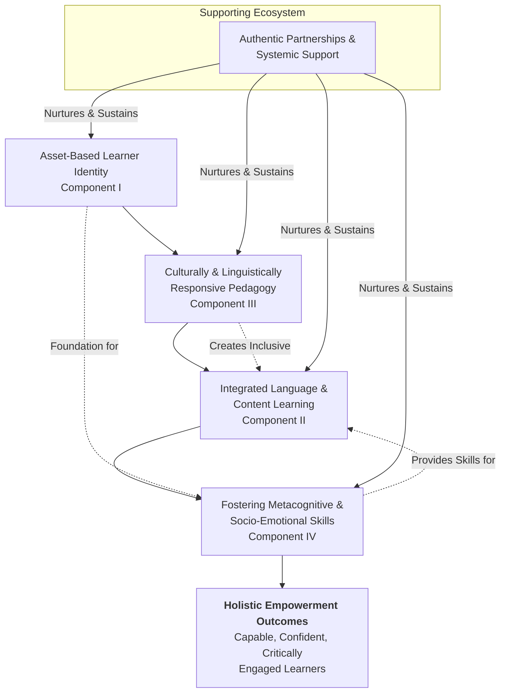

# Toward a New Paradigm: Holistic Empowerment in Elementary English Education
## 1 Introduction: The Imperative for a New Paradigm in Elementary English Education

Elementary English education stands at a critical juncture. For decades, traditional pedagogical approaches have dominated classrooms, shaping how language is taught and learned. However, a growing body of evidence and evolving societal demands reveal a profound misalignment between these established methods and the needs of today's diverse learners. This chapter establishes the foundational rationale for this research by critically examining the systemic limitations of mechanistic English Language Teaching (ELT) and analyzing the pressing, unmet needs of contemporary students. It synthesizes evidence to define a core problem: teacher-centered, rote-learning methods, often driven by standardized testing, fail to cultivate the critical thinking, authentic communicative competence, and holistic wellbeing essential for learners in the 21st century, particularly for English Language Learners (ELLs). By delineating the shortcomings of the past and the demands of the present, this introduction sets an urgent stage for proposing a transformative new framework centered on holistic empowerment.

### 1.1 The Systemic Shortcomings of Traditional and Mechanistic ELT Approaches

Traditional teaching methods, long the cornerstone of education, are characterized by a teacher-centered model where instruction focuses on textbooks, lectures, and the transmission of information[^1]. In the specific context of English language teaching, this has historically manifested as a strong emphasis on lecture-based instruction and textbook-oriented learning, with a particular focus on grammar rules and vocabulary memorization rather than the development of practical language skills[^2]. While such approaches may lay a foundational knowledge base, they are fraught with systemic shortcomings that hinder meaningful learning.

**A primary critique is the induction of passive learning.** In these environments, students often become mere recipients of information rather than active participants, which limits engagement and hinders deeper understanding and long-term retention[^1]. This passivity is compounded by a **lack of personalization**; the one-size-fits-all approach fails to cater to individual learning styles, paces, and the diverse abilities present in a modern classroom, making it particularly challenging for students with varied learning preferences[^1]. Furthermore, these methods **overemphasize memorization and the recall of facts** over the promotion of critical thinking and deeper comprehension[^1]. This rote learning, defined as acquiring knowledge through the memorization of facts and figures, is not conducive to developing a deeper understanding of concepts[^3]. It focuses on short-term memory retention and theoretical knowledge, which hampers students' ability to apply learning to real-world scenarios where adaptability and understanding are crucial[^3]. Consequently, creativity and independent problem-solving skills are often stifled, as students accustomed to memorizing facts may struggle to think critically or approach challenges creatively[^3].

The rigidity of traditional ELT is another significant flaw. These methods are often inflexible, making it difficult to adapt to the evolving needs of learners or to incorporate innovative pedagogical approaches[^1]. **The use of technology is typically limited**, a major disadvantage in an era where digital tools are integral to communication and learning[^1]. The lack of variety—primarily revolving around lectures and textbooks—can lead to student boredom, negatively affecting motivation and enthusiasm[^1]. Finally, traditional classrooms frequently **lack a real-world connection**, making it difficult for students to see the relevance of what they are learning, and they may not adequately address the development of essential life skills like collaboration and communication[^1]. The pre-pandemic ELT practices in contexts like the Philippines exemplify these issues: teacher-centered approaches with minimal student interaction, lessons devoid of cultural relevance, and sporadic, generalized feedback[^2]. This collection of shortcomings paints a clear picture of a pedagogical model ill-equipped for the demands of contemporary education.

### 1.2 The Evolving Landscape: Pressing Needs of Diverse Elementary Learners

In stark contrast to the rigid traditional model, the profile and needs of the elementary classroom have evolved dramatically, necessitating a responsive and adaptive approach to teaching. The student population is increasingly diverse, bringing a wealth of languages, cultures, and experiences that the curriculum must honor and integrate.

**The growing English Language Learner (ELL) population represents a central dimension of this diversity.** In the United States, ELLs constitute over 10% of the K-12 student population, numbering more than 4.8 million, and this figure continues to rise[^4]. These students have particular educational needs that extend beyond basic language instruction. Research underscores a critical distinction: while social English proficiency may develop in 3-5 years, **academic English proficiency—the language required for school success—takes 4-7 years to develop**[^5]. This timeline is even longer for students without prior schooling in their native language[^5]. Therefore, ELLs cannot afford to learn English fundamentals in isolation; they must be **applying their developing language skills to rich, grade-level academic content across all subjects from an early stage**[^4].

The COVID-19 pandemic acted as a catalyst, accelerating the need for pedagogical adaptability and innovation[^2]. The sudden shift to remote learning exposed the limitations of teacher-centered methods and highlighted the necessity for student-centered, technology-integrated practices[^2]. Post-pandemic innovations point toward an ELT approach that is tailored to students' varying proficiency levels and learning styles, fosters a welcoming atmosphere, balances all four language skills (with emphasis on oral communication), incorporates cultural awareness, and strategically integrates digital tools[^2]. This reflects a broader need for **asset-based teaching mindsets**. As advocated by equity leaders, the focus must shift from perceiving "achievement gaps" to recognizing and leveraging the "gifts" and talents students bring, including their multilingualism and unique cultural perspectives[^6]. Classrooms must celebrate this diversity, as it broadens all students' minds and opens doors to future possibilities[^6]. Furthermore, supporting the **social and emotional development** of all learners, especially ELLs who are navigating a new language and culture, is paramount for creating an environment where intellectual risk-taking is possible[^4][^6].

### 1.3 The Consequences: Stifled Engagement, Inequitable Assessment, and Inhibited Holistic Development

The misalignment between outdated teaching methods and contemporary learner needs yields tangible, negative consequences in three critical areas: student engagement, assessment equity, and holistic human development. These outcomes collectively underscore the non-negotiable imperative for pedagogical transformation.

**1. Stifled Engagement and Its Impact on Achievement:** The passive nature of traditional instruction directly correlates with lower student engagement, which has a measurable detrimental effect on academic outcomes. Research categorizing student engagement levels found that **lower-order engagement (including student disengagement) has a significantly stronger negative relationship with standardized test achievement than higher-order engagement has a positive one**[^7]. The impact of lower-order engagement was three to four times greater. For instance, in a study of elementary schools, the complete elimination of student disengagement was projected to lead to a four-percentage-point increase in Communication Arts achievement scores[^7]. This demonstrates that traditional, disengaging methods not only fail to inspire students but actively depress measurable academic performance.

**2. Inequitable and Invalid Assessment for ELLs:** The reliance on standardized testing, a hallmark of traditional, accountability-driven systems, creates profound equity issues for ELLs. A core problem is that **commercially developed standardized tests were designed for native English speakers, with very few ELLs included in norming samples**[^5]. When ELLs are required to take these English-only tests, the assessment confounds language proficiency with content knowledge. The complex language of the tests becomes a barrier, making it "impossible to distinguish between a lack of content knowledge and a lack of language proficiency"[^5]. This leads to invalid measurements, with reliability coefficients significantly lower for ELLs than for English-only students[^5]. Furthermore, accountability systems using a **"conjunctive model"** (requiring proficiency in all subjects) disproportionately penalize ELLs, who may have strength in one area like mathematical calculation but be hindered in reading by language demands[^5]. Such practices can decrease student self-esteem, lower academic engagement, and perpetuate systemic inequity.

**3. Inhibition of Holistic Development:** Beyond test scores and language barriers, traditional, narrow curricula fail to support the comprehensive development of the child. An inclusive education that values diverse perspectives is crucial not only for representation but for fostering empathy, critical thinking, and global awareness[^8]. More broadly, contemporary frameworks for wellbeing in schools argue for a holistic conception that includes **physical, psychological, social, creative, and even planetary wellbeing**[^9]. Joy and happiness are posited as the foundation of this wellbeing, closely linked to resilience and flourishing[^9]. Traditional, rigid, and grade-focused environments often neglect these dimensions. They may fail to create the conditions for joyful learning, do little to develop social-emotional or creative competences, and are disconnected from the interconnected well-being of communities and the planet[^9][^8]. This results in an education that is not only academically limited but also fails to prepare students for a fulfilling and responsible life.

**In conclusion**, the evidence is compelling. Traditional, mechanistic ELT approaches contribute to passive learning, fail to meet the needs of a diverse learner population, negatively impact engagement and achievement, perpetuate assessment inequities, and inhibit holistic development. This critical gap between prevailing practice and the requisite outcomes for modern learners establishes an undeniable imperative for a new paradigm—one that is student-centered, equitable, and designed to empower the whole child. The following chapters will construct this paradigm by synthesizing holistic education and empowerment theory into a coherent, practical framework for elementary English education.

[^1]: Search Result-1
[^2]: Search Result-2
[^7]: Search Result-3
[^5]: Search Result-4
[^9]: Search Result-5
[^8]: Search Result-6
[^3]: Search Result-7
[^3]: Search Result-8
[^4]: Search Result-9
[^6]: Search Result-10

## 2 Theoretical Foundations: Synthesizing Holistic Education and Empowerment Theory

To construct a robust and actionable new paradigm for elementary English education, it is essential to ground it in a coherent theoretical foundation. This chapter synthesizes two powerful, complementary frameworks: holistic education and empowerment theory. By analyzing their core principles and psychological mechanisms, we establish an integrated theoretical basis that moves beyond fragmented skill-building to foster the comprehensive development and active agency of every learner. This synthesis directly addresses the limitations of traditional, mechanistic ELT by providing both a vision for the whole child's growth and a roadmap for cultivating the internal drivers of that growth.

### 2.1 Core Principles of Holistic Education: Beyond Academic Achievement

Holistic education represents a fundamental shift from an education system that prioritizes academic achievement and intellectual development in isolation. It is defined as **an approach to learning which focuses on all aspects of an individual, rather than just their academic or intellectual development**[^10]. Its ultimate goal is to cultivate well-rounded, conscious, and practical individuals who are prepared not just for tests, but for their futures as critical thinkers, creative problem-solvers, and active community members[^10][^11].

Central to this philosophy is the understanding that all domains of child development are critically important and mutually reinforcing. As outlined by the National Association for the Education of Young Children (NAEYC), these domains include **physical development, cognitive development, social and emotional development, and linguistic development (including bilingual or multilingual development), as well as approaches to learning**[^12]. Each domain both supports and is supported by the others. For instance, physical activity and sufficient sleep promote the cognitive and social capacities needed for learning, while social interactions stimulate cognitive growth[^12]. This interconnectedness underscores a key critique of traditional primary education, which often prioritizes cognitive learning at the expense of physical, social, emotional, and linguistic development[^12].

The principles of holistic education that operationalize this whole-child focus can be synthesized as follows:

*   **Relevance and Meaning:** Learning should be relevant and meaningful to students' lives, connecting to their interests and experiences[^10]. This principle increases motivation by fostering a sense of purpose and agency[^12].
*   **Critical and Creative Thinking:** A strong emphasis is placed on nurturing creativity and critical thinking, encouraging students to question assumptions, think freely, and seek new perspectives[^10].
*   **Community and Collaboration:** Holistic education fosters a strong sense of community and collaboration, with students encouraged to work together through group projects, peer tutoring, and team-based activities[^10]. This builds interpersonal skills and a sense of belonging.
*   **Integrated Development:** Physical education and mindfulness practices (e.g., yoga, meditation) are considered crucial for developing self-awareness, self-regulation, and physical well-being[^10]. Furthermore, **spiritual and moral development**—framed not necessarily as religious instruction but as helping students find purpose, integrity, compassion, and responsibility—is another key component[^11].
*   **Play and Experiential Learning:** Play is recognized as essential for joyful learning that fosters self-regulation, language, cognitive, and social competencies[^12]. In the primary grades, this extends to **guided play** and experiential learning, where educators use children's interests to introduce concepts and provide meaningful, engaging experiences that build knowledge[^12][^10].

**In practice, holistic education employs models like experiential learning, self-guided learning, community-based learning, and interdisciplinary coursework**[^10]. The teacher's role transforms from a knowledge-dispenser to that of a **facilitator** who creates a supportive, stimulating environment, builds strong, trusting relationships, encourages self-confidence, and incorporates moments for emotional reflection[^10]. The benefits of this approach are comprehensive, leading to the development of emotional intelligence, confidence, social ability, compassion, responsibility, creativity, self-agency, and community belonging[^10].

### 2.2 Empowerment Theory: Psychological Dimensions and Learner Agency

While holistic education outlines the *what* and *context* of development, empowerment theory provides a detailed framework for the *psychological processes* that enable growth and agency. Grounded in positive youth development, **empowerment theory provides a framework for understanding and promoting** active engagement and competence[^13]. At its core is Zimmerman's multidimensional model of psychological empowerment (PE), which consists of three distinct, interrelated components[^13][^14]:

| Component | Definition | Key Elements (from references) |
| :--- | :--- | :--- |
| **Intrapersonal Empowerment** | Beliefs about one's own capabilities and value in effecting change. | Self-esteem; leadership efficacy (belief in ability to lead); civic efficacy (belief in ability to work with others for a common goal)[^13][^14]. |
| **Interactional Empowerment** | Understanding of and access to the resources and social systems needed to enact change. | Knowledge; social capital; adult mentorship; understanding of community resources; resource mobilization skills[^13][^14]. |
| **Behavioral Empowerment** | The actual engagement in actions and activities aimed at producing change. | Participation in leadership activities, extracurricular activities, community engagement, and school engagement[^13][^14]. |

Empirical research robustly supports the impact of these components on adolescent development. Studies have found that psychological empowerment predicts **increases in prosocial behavior, responsible decision-making, and social support giving, and decreases in delinquent behavior** over time[^13][^15]. These associations hold similarly for both males and females, indicating empowerment's broad relevance[^13][^15]. Crucially, the research shows that empowerment leads to positive behavioral changes, more so than behaviors leading to empowerment, highlighting the importance of proactively fostering these psychological assets[^13][^15].

In the educational context, empowerment theory manifests concretely as **learner agency**—the ability of students to make and act upon choices regarding their learning. This aligns with the holistic principle of relevance and is critical for motivation. As noted in child development principles, **encouraging each child’s sense of agency** is paramount, and opportunities for agency must be widely available[^12]. This can be achieved by engaging students in challenging yet achievable tasks that build on their interests and that they recognize as meaningful[^12].

Practical pathways to agency, particularly for multilingual learners (MLs), include:
*   **Goal Setting:** A transformative practice that cultivates belonging and self-efficacy. Co-constructing SMARTIE goals with students anchors learning in their personal language acquisition journey and empowers them to own their progress[^16][^17].
*   **Self-Regulated Learning (SRL):** Frameworks based on Zimmerman's work involve cycles where students set specific language goals, monitor their progress through tools like portfolios or journals, and engage in self-assessment and reflection[^18]. This process builds metacognitive skills and ownership.
*   **Student Voice and Choice:** This is a cornerstone of personalized and holistic models. For example, schools may promote **student voice and choice in language priority** (e.g., literacy in English or their primary language) and allow students choice in how they demonstrate understanding through projects[^19][^20].

### 2.3 Synthesis for a New Paradigm: Convergences and Complementary Strengths

Holistic education and empowerment theory are not parallel tracks but deeply interconnected frameworks whose synthesis creates a powerful, coherent foundation for the proposed paradigm. The table below illustrates key convergences:

| Holistic Education Principle | Empowerment Theory Mechanism | Synthesis for Holistic Empowerment |
| :--- | :--- | :--- |
| **Development of Social & Emotional Domains** | **Interactional Empowerment** (building social capital, community understanding) & **Intrapersonal Empowerment** (self-esteem) | Fostering a collaborative classroom community (holistic) actively builds the social capital and sense of belonging that constitute interactional empowerment, while supportive relationships boost intrapersonal self-worth. |
| **Critical & Creative Thinking** | **Intrapersonal Empowerment** (efficacy beliefs) & **Behavioral Empowerment** (taking intellectual action) | Encouraging students to question and solve problems (holistic) requires and builds the self-efficacy (intrapersonal) to engage in that critical inquiry (behavioral). |
| **Student-Centered, Relevant Learning** | **Learner Agency & Self-Regulated Learning** | Designing meaningful, interest-based projects (holistic) creates the context for students to exercise choice, set goals, and direct their learning—the very acts of agency and SRL. |
| **Community & Collaboration Emphasis** | **Interactional & Behavioral Empowerment** | Group projects and peer tutoring (holistic) are structured opportunities to practice mobilizing group resources (interactional) and engage in collective problem-solving (behavioral). |
| **Focus on Moral/Ethical Development** | **Intrapersonal & Behavioral Empowerment** | Exploring values like responsibility and compassion (holistic) strengthens the civic efficacy (intrapersonal) to make ethical decisions and engage in prosocial behavior (behavioral). |

**This synthesis demonstrates that holistic education and empowerment theory are mutually reinforcing.** Holistic education provides the comprehensive framework and pedagogical context—the "ecosystem" of learning that values all aspects of the child and prioritizes relationships, relevance, and integration. Empowerment theory, in turn, provides the specific psychological "engine" within that ecosystem. It details how the holistic environment can cultivate the intrapersonal beliefs, interactional competencies, and behavioral habits that lead students from passive reception to active ownership of their learning and development.

**Therefore, the combined theoretical foundation directly counteracts the shortcomings of traditional ELT identified in Chapter 1.** It replaces passive learning with active agency; swaps a one-size-fits-all model with personalized, relevant pathways; transcends rote memorization to foster critical thinking and application; and views assessment not as an external, inequitable pressure but as an integrated part of the learning and self-regulation process (e.g., formative language assessment for goal-setting[^16][^17]). By targeting both the structure of the learning environment and the internal psychological drivers of engagement, this synthesized theory establishes a robust basis for a paradigm that seeks not merely to instruct, but to holistically empower.

## 3 Defining the Holistic Empowerment Paradigm: Core Components and Framework

Building upon the critical imperative for change established in Chapter 1 and the synthesized theoretical foundations from Chapter 2, this chapter constructs the conceptual blueprint for a transformative approach to elementary English education. It moves from critique and theory to a clear, actionable definition and framework. The Holistic Empowerment Paradigm is presented as a student-centered, asset-based instructional framework designed to develop the whole child by integrating language acquisition with academic content, affirming cultural and linguistic identities, and systematically developing metacognitive and socio-emotional capacities within a supportive community[^1]. This paradigm directly counters the systemic shortcomings of traditional, mechanistic ELT by offering a structured model that translates the principles of holistic education and empowerment theory into a coherent guide for classroom transformation.

### 3.1 Synthesizing a Definition: Holistic Empowerment in Elementary English Education

The Holistic Empowerment Paradigm for elementary English education is defined as **a student-centered, asset-based instructional framework designed to develop the whole child**. It represents a fundamental shift from the transmission of discrete language skills to the cultivation of capable, confident, and critically engaged learners. This paradigm synthesizes the core principles from Chapter 2: it embraces the holistic education mandate to nurture all domains of a child’s development—physical, emotional, social, ethical, cognitive, and linguistic—while simultaneously activating the psychological engine of empowerment theory. This is achieved by fostering learner agency, building intrapersonal efficacy, developing interactional competencies, and encouraging behavioral engagement.

In stark contrast to the teacher-centered, rote-learning model critiqued in Chapter 1, this paradigm positions the student as an active agent in their learning journey. Its ultimate goal is to **empower learners as confident, critical, and compassionate communicators** who can adeptly apply their English language skills not merely for test-taking, but for authentic academic success, personal expression, and meaningful community engagement. It directly addresses the pressing needs of diverse learners by creating an educational experience that is relevant, responsive, and designed to leverage their unique strengths rather than remediate perceived deficits.

### 3.2 Core Component I: Cultivating an Asset-Based Learner Identity

The foundational component of this paradigm is a deliberate shift from a deficit to an **asset-based perspective**. This mindset, referenced in Chapter 1’s discussion of equity, is operationalized by consistently viewing students' home languages, cultures, prior knowledge, and lived experiences as foundational strengths and essential resources for learning. For multilingual learners, this means their native language is not a barrier to overcome but a cognitive asset and a bridge to acquiring English.

This component is the psychological and ethical cornerstone of holistic empowerment. **By affirming a student’s linguistic and cultural identity, educators directly foster intrapersonal empowerment**, boosting self-esteem, belonging, and linguistic self-efficacy. When a student feels their whole self is valued and welcomed in the classroom, they are more likely to take the intellectual risks necessary for language acquisition and content learning. This asset-based stance is a prerequisite for authentic student voice and choice, as it communicates to learners that their perspectives and backgrounds are integral to the classroom community. Practices stemming from this component include pronouncing names correctly, using multilingual resources, and intentionally drawing upon students' funds of knowledge to make content relevant.

### 3.3 Core Component II: Integrated Language and Content Learning (ICL) for ELLs

Addressing the critical need identified in Chapter 1 for ELLs to develop academic English proficiency while accessing grade-level content, **Integrated Language and Content Learning (ICL) forms the pedagogical core** of the paradigm. This approach synchronizes English Language Development (ELD) with academic instruction through a strategic dual focus[^1].

The ICL model is implemented via two complementary strands:
*   **Integrated ELD:** Language clarification, academic vocabulary development, and discourse support are seamlessly embedded within content-area instruction (e.g., Science, Math, Social Studies).
*   **Designated ELD:** Protected, focused instructional time is dedicated to teaching specific English language proficiency standards and skills.

This component is a direct application of holistic education’s principle of integrated development, rejecting the artificial separation of language learning from knowledge construction. **ICL drives both cognitive growth and interactional empowerment**, as students use English as a tool for authentic meaning-making, problem-solving, and knowledge construction within academic disciplines. Thematic, project-based units (e.g., investigating local ecosystems or designing a community market) provide a rich, authentic context for applying language skills in purposeful ways, thereby making learning relevant and rigorous for every learner.

### 3.4 Core Component III: Culturally and Linguistically Responsive Pedagogy (CLRP)

**Culturally and Linguistically Responsive Pedagogy (CLRP) is the essential, cross-cutting component** that operationalizes the asset-based identity and brings holistic principles to life in curriculum and instruction. CLRP ensures that instructional materials, curriculum content, teaching strategies, and classroom interactions consistently reflect, validate, and build upon the diverse cultural and linguistic backgrounds of all students.

This component involves deliberate strategies such as selecting literature that mirrors students’ experiences and windows into other worlds, facilitating cross-linguistic comparisons that deepen metalinguistic awareness, and designing tasks that allow for multiple forms of expression. **CLRP is crucial for building interactional empowerment**, as it helps students understand diverse social systems and communication styles, and fosters an inclusive community where every voice can be heard. By creating a learning environment that mirrors the real-world diversity students will navigate, CLRP supports the socio-emotional and linguistic development central to holistic wellbeing and prepares students for engaged citizenship.

### 3.5 Core Component IV: Fostering Metacognitive and Socio-Emotional Skills

This component explicitly targets the development of learners’ internal capacities for self-regulation and interpersonal growth, connecting directly to the holistic education domains of social-emotional development and approaches to learning. It involves the intentional teaching of **metacognitive strategies**—such as goal-setting, progress monitoring, self-assessment, and reflection—to promote Self-Regulated Learning (SRL). These practices are a key mechanism of learner agency and intrapersonal empowerment, as detailed in Chapter 2, enabling students to become managers of their own language acquisition and academic journey.

Concurrently, the paradigm calls for the systematic fostering of **socio-emotional skills** like collaboration, empathy, active listening, and resilience. This is achieved through structured cooperative learning groups, restorative dialogue circles, and peer-assisted learning protocols. **Developing these skills is intrinsically linked to behavioral and interactional empowerment**, as students learn to navigate group dynamics, support one another, and contribute productively to a collective goal. This focus ensures the classroom climate is not only academically challenging but also psychologically safe and supportive, creating the conditions necessary for holistic development and joyful learning.

### 3.6 The Interconnected Framework: Synergies and Systemic Impact

The true power of the Holistic Empowerment Paradigm lies not in its components in isolation, but in their dynamic interdependence. The framework functions as an integrated system where each component reinforces and amplifies the others.

The following mermaid diagram illustrates the synergistic relationships and systemic flow within the framework:

**The framework synergy is clear:** An asset-based identity (I) is nurtured and expressed through CLRP (III), which creates the inclusive, affirming environment essential for students to engage fully in the challenging work of ICL (II). Success in these complex, integrated tasks requires and simultaneously builds the metacognitive and socio-emotional skills (IV) that fuel further agency and deeper learning. This virtuous cycle ultimately produces the holistic empowerment outcomes of capable, confident, and critically engaged learners.

Furthermore, the framework’s sustainability relies on a supporting ecosystem of authentic family and community partnerships, along with systemic support through professional learning communities and supportive leadership[^1]. This conceptual framework establishes a clear vision that logically necessitates specific pedagogical practices, assessment models, and professional development approaches, which will be explored in the subsequent chapters of this report. Thus, this chapter serves as the pivotal link, transforming theory into a structured, actionable blueprint for empowering every elementary English learner.

[^1]: The core definition, key components, and description of framework synergy are synthesized from the provided Holistic Empowerment Paradigm Framework in the Other Reference Information. This synthesis integrates the theoretical foundations from Chapter 2 with the structured framework to define the new paradigm.

## 4 From Theory to Practice: Evidence-Based Strategies for the Classroom

The Holistic Empowerment Paradigm, as defined in the previous chapter, provides a powerful conceptual framework. However, its transformative potential is realized only when translated into concrete, actionable classroom practices. This chapter bridges the gap between theory and practice by analyzing a suite of evidence-based pedagogical strategies that directly operationalize the paradigm's core components. These strategies are not isolated techniques but interconnected tools designed to cultivate learner agency, affirm linguistic and cultural identities, integrate language with meaningful content, and systematically develop socio-emotional and metacognitive capacities. Synthesized from frontline research and practical models, the following sections detail how educators can move beyond traditional, mechanistic ELT to create a student-centered, asset-based, and genuinely empowering learning environment for all elementary English learners.

### 4.1 Strategic Language Development: Integrating and Designating ELD

A cornerstone of effective instruction for English Learners (ELs) within the Holistic Empowerment Paradigm is the strategic, dual-strand approach of Integrated and Designated English Language Development (ELD). This method directly addresses the critical need identified earlier for ELs to develop academic English proficiency while simultaneously accessing rigorous, grade-level content[^21].

**Integrated ELD** refers to the practice of embedding language clarification, academic vocabulary development, and discourse support directly within content-area instruction such as science, mathematics, history, and English language arts[^22][^21]. The goal is for ELs to learn both the content and the academic language necessary to engage with it. A powerful example is the Sobrato Early Academic Language (SEAL) model, which uses thematic, content-rich units to drive language and literacy development[^23]. In a Grade 2/3 classroom studying ocean animal adaptations, instruction is seamlessly woven into an immersive, language-rich environment. Students might begin with a chant about protecting the environment to introduce key vocabulary, engage in hands-on research at a center exploring oil spills, use sentence patterning charts to construct complex comparative sentences, and participate in a cooperative strip paragraph activity to collaboratively write and edit text about their learning[^23]. This approach ensures that language learning is never an abstract exercise but is always tethered to meaningful, inquiry-based exploration of the world, operationalizing the paradigm's Component II (Integrated Language and Content Learning).

**Designated ELD**, in contrast, is a protected time during the school day dedicated to focused instruction on state-adopted ELD standards[^21]. This time is used to develop the critical English language skills necessary for academic content learning. In the SEAL model example, while most of the class works independently on thematic centers, the teacher pulls a small group for designated ELD instruction. This group receives targeted scaffolding and direct support to formulate compare-and-contrast sentences about the same literature the whole class is studying, thereby building the specific linguistic tools needed to fully participate in the integrated unit[^23].

**The synergy of these two strands is not just recommended but is considered an integral part of a comprehensive EL program, mandated to be designed using evidence-based research[^21].** This integrated approach drives both cognitive growth and interactional empowerment. As students use English as a tool for authentic meaning-making and problem-solving within academic disciplines, they develop not only language proficiency but also the confidence and competence to navigate academic discourse. This stands in direct opposition to outdated models that pull students out for isolated language drills, instead ensuring they are active, supported participants in a rich, common instructional core.

### 4.2 Leveraging Linguistic Assets: Translanguaging as Pedagogy

Translanguaging is a pedagogical approach that powerfully operationalizes the asset-based foundation (Component I) and culturally responsive practices (Component III) of the Holistic Empowerment Paradigm. At its core, translanguaging recognizes and leverages the **natural way multilingual individuals use all their language practices fluidly to communicate, learn, and express themselves**[^24]. It moves beyond merely permitting the home language to actively viewing it as a critical cognitive and communicative resource for learning academic English and content.

**In practice, translanguaging involves deliberate strategies that encourage students to access their full linguistic repertoire.** For example, teachers can facilitate **multilingual brainstorming** where students generate ideas for a writing task in their home languages before drafting in English[^25]. Providing **writing prompts in multiple languages** ensures all students fully understand the task[^25]. A student reading a science text in English can be encouraged to annotate, think, or make connections in Spanish, using their home language as a vehicle to deepen comprehension of the English material[^26]. Other activities include creating **bilingual storybooks** or using **peer reviews in shared home languages** to provide deeper, more nuanced feedback[^25].

**The benefits of this approach are well-documented and directly counter deficit narratives.** Research indicates that translanguaging activities lead to increased student participation and engagement because students feel empowered to use their full linguistic toolkit[^26]. It affirms student identities, builds confidence, and encourages critical thinking by allowing for cross-linguistic analysis[^24]. Crucially, evidence shows that translanguaging **does not hinder English acquisition**; rather, providing more opportunities to use any language fosters greater language use and learning overall[^26]. In fact, by making connections between their linguistic resources and English, ELs can eventually develop more flexible and sophisticated language skills[^26]. This practice is a direct pathway to intrapersonal empowerment, as it validates a student's complete identity, and to interactional empowerment, as it builds metalinguistic awareness and the ability to navigate multiple communicative systems.

### 4.3 Assessment for Agency: Formative Practices and Student Goal-Setting

Within the Holistic Empowerment Paradigm, assessment is reimagined from a tool of judgment to a catalyst for growth and self-regulation. This shift is achieved through formative assessment practices and student-driven goal-setting, which together operationalize Component IV (Fostering Metacognitive and Socio-Emotional Skills).

**Formative assessments are low-stakes, ongoing "pulse checks" used during instruction to guide teaching and learning**[^27][^28]. Effective strategies are simple to administer and provide instant feedback. These include:
*   **Entry/Exit Tickets:** Brief questions at the start or end of a lesson to activate prior knowledge or summarize learning[^27][^29].
*   **Quick Checks:** Techniques like thumbs up/down/side, polls, or mini-whiteboard responses for real-time understanding[^27].
*   **Structured Peer & Self-Assessment:** Activities like "Think-Pair-Share," "Two Stars and a Wish," or written reflections where students analyze their own or a peer's work[^27][^29].

The key to making these formative is a **low-risk environment** where mistakes are framed as opportunities for learning, and feedback is actionable and timely[^28]. This approach allows teachers to differentiate instruction and, more importantly, gives students valuable information to adjust their own learning tactics[^29].

**Complementing formative assessment is the powerful practice of student-driven goal-setting.** For educators of ELs, frameworks like **SMART goals** (Specific, Measurable, Attainable, Relevant, Time-bound) provide structure[^30]. A goal might be: "By the end of the quarter, [Student] will use sentence frames to orally compare two characters from a story in 3 out of 4 opportunities, as measured by a teacher rubric." Tools like the **Language Learning Ladder** and the **WIDA Can Do Descriptors** help students and teachers collaboratively identify strengths, areas for growth, and set clear, step-by-step goals across listening, speaking, reading, and writing domains[^31].

**These interconnected practices are engines of intrapersonal empowerment.** When students track their own progress against personally meaningful goals and receive descriptive feedback, they build metacognition, a growth mindset, and a sense of ownership over their language acquisition journey[^31]. They move from being passive recipients of grades to active agents in their own learning, which is the essence of learner agency.

### 4.4 Building Community and Critical Dialogue: Restorative Circles

A safe, supportive, and inclusive classroom community is the essential bedrock upon which holistic empowerment is built. Restorative dialogue circles are a foundational practice for creating this environment while simultaneously developing socio-emotional skills and oral language proficiency—key aspects of Component IV.

**Restorative circles are a structured practice where participants sit in a circle, use a talking piece to ensure one person speaks at a time, and engage in guided dialogue based on shared norms like speaking from the heart and listening from the heart**[^32][^33]. Their purpose can be academic (e.g., discussing themes in a novel), social-emotional (building relationships), or restorative (addressing conflicts)[^33].

**Evidence from districts like Brazosport ISD in Texas demonstrates the profound impact of circles specifically for EL students.** The district implemented circles in ESL classrooms to address the need for "oracy"—structured speaking practice to support literacy development[^34]. Using culturally relevant picture books and sentence starters to scaffold discussion, teachers created a safe space for ELs to practice language. Over time, students in these circles showed **increased growth in language and confidence**, a **reduction in behavioral problems and discipline referrals**, and began to nurture each other and lead conversations independently[^34]. The circle format gave shy students the structured opportunity and confidence to find their voice[^34].

**This practice directly fosters the sense of belonging that leaders like Dr. Angela Mantie identify as the prerequisite for all learning**[^35]. Circles build interactional empowerment by teaching empathy, active listening, and collaborative problem-solving. They provide a low-risk venue for language practice, making them a powerful tool for developing both socio-emotional competence and communicative fluency. By proactively building relationships and collective responsibility, circles help create the psychologically safe climate necessary for academic risk-taking and holistic development.

### 4.5 Engaging the Whole Learner: Interactive and Game-Based Learning

To counteract the passivity and disengagement fostered by traditional, teacher-centered methods, the Holistic Empowerment Paradigm actively incorporates interactive and game-based learning. These strategies align with holistic education's emphasis on experiential, joyful learning and empowerment theory's focus on behavioral engagement by creating lively, low-pressure environments where students are motivated to participate and practice language authentically.

**Well-designed educational games and interactive activities provide impactful language practice that is both engaging and effective**[^36]. They help students retain information by associating language structures with enjoyable activities and reduce the affective filter, making students more comfortable speaking English and making mistakes[^37]. The following table categorizes examples of such activities and their targeted skills:

| Category | Example Activities & Games | Targeted Language & Skills |
| :--- | :--- | :--- |
| **Vocabulary Enhancement** | A to Z Scavenger Hunt, Synonym BINGO, Word Jar, Categories[^36][^37] | Word knowledge, semantic relationships, quick recall. |
| **Grammar & Structure** | Sentence Scramble, Grammar Detectives, Verb Charades[^36] | Sentence structure, parts of speech, grammatical accuracy. |
| **Speaking & Oral Fluency** | Describe and Guess, Story Circle, Tongue Twister Challenge, Interview a Friend[^36] | Descriptive language, narrative skills, pronunciation, question formation. |
| **Listening & Comprehension** | Follow the Leader, Whisper Challenge, Match the Sound[^36] | Following directions, auditory processing, sound-word association. |
| **Reading & Writing** | Story Puzzles, Character Conversations, Story Dice Roll, Picture Prompt Writing[^36] | Story sequencing, character analysis, creative writing, descriptive skills. |

**Implementation of these games should be strategic and student-centered.** For young learners, memory games like "What's Missing?" or high-energy relays like "Alphabet Relay" are effective[^37]. For older elementary or intermediate students, games that prompt productive language use, such as "Balloon Sentence Race" (forming questions) or "Never-Ending Story" (collaborative narration), are more appropriate[^37]. The common thread is that these activities **encourage students to speak up, collaborate, and use language for a clear, engaging purpose**, thereby increasing overall participation and making learning memorable[^37].

By integrating these playful yet purposeful interactions into the curriculum, teachers honor the holistic need for engagement and joy in learning. This approach transforms the classroom from a site of silent, individual labor into a dynamic community of practice, where language is lived, used, and enjoyed—a key step in empowering students as confident and capable communicators.

[^38]: Search Result-47
[^39]: Search Result-48
[^22]: Search Result-49
[^21]: Search Result-50
[^24]: Search Result-51
[^26]: Search Result-52
[^27]: Search Result-53
[^30]: Search Result-54
[^31]: Search Result-55
[^32]: Search Result-56
[^32]: Search Result-57
[^34]: Search Result-58
[^36]: Search Result-59
[^37]: Search Result-60
[^25]: Search Result-61
[^28]: Search Result-62
[^29]: Search Result-63
[^33]: Search Result-64
[^35]: Search Result-65
[^23]: Search Result-66

## 5 Cultivating the Empowered Learning Environment: The Role of Relationships and Community

The theoretical framework and pedagogical strategies of the Holistic Empowerment Paradigm cannot flourish in a vacuum. They require a specific type of ecosystem—one that is safe, inclusive, and relationally rich. This chapter operationalizes the paradigm by examining the foundational role of the learning environment, specifically the relational and communal structures that enable student agency, identity affirmation, and academic risk-taking. It synthesizes evidence to analyze four interconnected pillars: building strong, culturally responsive student-teacher relationships; designing effective peer collaboration and learning structures; fostering authentic, reciprocal family and community partnerships; and implementing trauma-informed practices to support the socio-emotional well-being of all learners, particularly English Learners (ELs). The chapter argues that a safe, supportive, and inclusive community is not merely a backdrop but the essential ecosystem in which the theoretical components of holistic education and empowerment theory are realized and sustained, directly countering the disengagement and inequity fostered by traditional, mechanistic models.

### 5.1 The Cornerstone of Trust: Building Strong, Culturally Responsive Student-Teacher Relationships

The foundation of an empowered learning environment is the quality of the relationship between teacher and student. Research consistently shows that positive teacher-student relationships are linked to better academic outcomes, including higher engagement, improved attendance, and reduced disruptive behavior[^40]. For ELs navigating a new language and culture, a trusting connection with their teacher is an indispensable bridge to the unknown school system[^41]. Building this trust requires deliberate, culturally responsive strategies that move beyond generic kindness to authentic recognition and respect.

**The process begins with fundamental gestures of respect.** Learning to pronounce and spell a student’s name correctly is a non-negotiable first step, signaling that their identity is valued[^42][^41]. Personalized greetings at the classroom door each day can significantly increase engagement[^40]. More deeply, teachers must actively seek to know individual students—their interests, hobbies, strengths, and the "funds of knowledge" they bring from their families and cultures[^42]. This can be achieved through surveys, projects about the meaning of names, and carving out time for individual or small-group interactions[^42]. **This asset-based approach, which views students' multilingualism and diverse experiences as gifts to leverage, is central to fostering intrapersonal empowerment and a positive learner identity**[^6].

**Cultural responsiveness transforms these actions from routine to meaningful.** It involves welcoming students' languages and cultures into the classroom by learning a few words, displaying flags, using multilingual materials, and inviting students to share family traditions[^42][^41][^43]. Effective communication requires active listening and language awareness, such as providing appropriate supports for ELs and demonstrating respect for their home language[^40]. As one educator notes, having a diverse group of students who speak different languages teaches empathy and compassion—a critical trait developed through these intentional relationships[^6].

**Even the strongest relationships can fracture, necessitating skilled repair.** In dysfunctional classrooms, traditional behavior management often fails because the core issue is a rupture in trust[^44]. The restorative approach requires teachers to stop escalating power struggles and instead initiate rebuilding. This begins with the adult modeling calm and emotional stability to create psychological safety[^44]. Teachers can then professionally acknowledge the relationship breakdown and collaborate with students to redefine expectations and co-construct a new classroom culture, temporarily making relationship repair the focus over academic pressure[^44]. This restorative practice, which invites students to reflect on what happened, who was affected, and how to make amends, rebuilds respect and shared ownership, demonstrating that the classroom community is resilient and worthy of maintenance[^44].

### 5.2 Structures for Collective Growth: Peer Collaboration and Assisted Learning

Within a relationally safe classroom, structured peer interaction becomes a powerful engine for language development, content mastery, and community building. **Peer learning is not merely a social activity but a critical pedagogical tool with strong empirical support.** For instance, the U.S. Department of Education recommends regularly scheduling about 90 minutes per week for structured peer-assisted learning activities, citing a "strong" evidence base from studies showing positive effects on reading achievement for ELs across elementary grades[^45]. These activities allow students to practice and extend taught materials, providing essential language rehearsal in a low-anxiety setting.

**Effective collaboration requires intentional design and scaffolding.** Most students, especially ELs, need clear guidance for group work[^46]. Teachers must model activities, provide explicit directions, and assign roles that match students' language abilities, promoting them to new roles as skills improve[^46]. A variety of collaborative frameworks can be employed:

| Framework Type | Key Examples & Methods | Primary Benefits for ELs |
| :--- | :--- | :--- |
| **Structured Discussions** | Think-Pair-Share, Listening Triangles, Talk Partners, Snowballing[^47]. QSSSA method (Question, Signal, Stem, Share, Assess)[^46]. | Provides routine, reduces anxiety, scaffolds oral participation. |
| **Information Exchange Tasks** | Jigsaw activities, Barrier games, Rainbowing[^47]. | Creates authentic need to communicate and clarify meaning. |
| **Shared Product Creation** | Matching/sorting/ranking tasks, cooperative projects, drama and role play[^47]. | Encourages use of curriculum vocabulary in a meaningful, co-operative context. |

**Strategic grouping and linguistic support are crucial.** Teachers should be intentional, giving ELs opportunities to work both with peers who share their home language and with supportive native English speakers[^46]. Encouraging the use of home languages for brainstorming or discussing complex topics can build comprehension, deepen understanding, and boost confidence before students report out in English[^46]. Furthermore, teachers must remember and respect the "silent period," a common stage in language acquisition, by being patient and providing opportunities for small, successful interactions with a trusted peer before expecting speech in larger groups[^46][^41].

**The benefits of well-structured peer collaboration are multifaceted.** It encourages exploratory talk, which is vital for language development, and allows learners to feel more confident using language for a genuine purpose[^47]. It also builds community and teaches empathy, as students learn from and support one another[^6]. For ELs, observing how peers learn and solve problems provides valuable modeling, and the interactive nature of collaboration directly increases comfort with using academic English[^46]. **This environment of mutual support operationalizes the interactional and behavioral empowerment central to the holistic paradigm, transforming the classroom into a community of practice.**

### 5.3 Beyond the Classroom Walls: Authentic Family and Community Engagement

Holistic empowerment extends beyond school walls, recognizing families and communities as essential partners in a child's education. Authentic engagement is not an add-on but a core component for promoting student identity, belonging, and learning[^48]. Moving beyond superficial outreach requires a shift to reciprocal, culturally sustaining partnerships that actively break down barriers.

**Frameworks provide a roadmap for this work.** The "ABCs of Family and Community Engagement" outline six key considerations: Awareness, Advocacy, Building Trust, Breaking Barriers, Collaboration, and Connecting to Learning[^48]. Similarly, Joyce Epstein’s widely cited framework categorizes involvement into six types: parenting, communicating, volunteering, learning at home, decision-making, and collaborating with the community[^49]. These models help educators move from sporadic events to systemic, integrated practice.

**Breaking barriers requires concrete, actionable strategies.** Engagement must be reciprocal, clarifying both school responsibilities (e.g., translating vital information as mandated by law) and ways parents can support learning at home[^50]. Schools must aim for authenticity by deeply understanding their community's demographics and fostering a visibly welcoming, inclusive environment[^50]. Practical steps include:
*   **Communication & Logistics:** Using translation services, simplifying paperwork, avoiding jargon, and scheduling events with cultural dates in mind[^50].
*   **Building Trust:** Conducting home visits, which provide insight into a student's life and lay a foundation of trust linked to improved academic progress[^50].
*   **Providing Guidance:** Offering not just opportunities (e.g., family nights) but clear guidance on *how* to participate, as immigrant families may lack prior knowledge of the school system[^51].
*   **Valuing Contributions:** Inviting family input on curriculum, sharing hopes and plans, and treating families as true partners in learning[^43].

**Developing a strategic plan ensures sustainability.** A effective starting point is soliciting ideas from the ELL community itself—staff, parents, and students—to identify pressing needs[^52]. This feedback, gathered through surveys and focus groups, should inform an action plan. Securing resources is critical; school leaders can pursue funding through Title I and Title III federal grants, as well as grants from foundations and corporations targeted at ELL, minority, and family literacy initiatives (e.g., the Toyota Family Learning Program)[^52]. **The case study of David A. Ellis Elementary School exemplifies the impact of deep engagement.** Coaches built trust through clear communication in Spanish and involved parents in decisions about their children's placement and progress, creating a collaborative culture that underpinned remarkable academic success for ELL students[^53].

### 5.4 Foundations for Healing and Resilience: Integrating Trauma-Informed Practices

For the holistic empowerment paradigm to be truly inclusive, it must address the reality that many ELs have experienced trauma, which can create significant barriers to learning. Trauma related to pre-migration, migration, or post-migration experiences, as well as stressors like discrimination and the COVID-19 pandemic, can adversely affect mental health, executive function, and language acquisition[^54][^51]. **Implementing trauma-informed practices is therefore not a specialist add-on but a fundamental aspect of creating a safe and responsive learning environment.**

**Trauma's impact on learning is neurologically and behaviorally profound.** It can alter brain structure and function, impairing executive functions (EF) like working memory, cognitive flexibility, and inhibitory control—skills essential for school[^51]. When triggered, the brain's survival response can flood the body with stress hormones, effectively "freezing" the EF skills needed for learning and putting the child in a constant state of alert[^51]. This may manifest as poor concentration, memory issues, loss of interest, or behaviors mistaken for defiance[^51].

**Classroom teachers can implement key strategies to support healing and resilience,** even in the absence of school-based mental health professionals[^51]. The following table synthesizes core approaches:

| Strategy Category | Specific Practices | Rationale & Connection to Empowerment |
| :--- | :--- | :--- |
| **Establishing Safety & Belonging** | Do not assume ELs feel safe; understand perceived vs. actual safety. Create predictable routines, use visual schedules. Foster belonging through inclusive classroom culture[^51]. | Addresses base of Maslow's hierarchy; belonging buffers trauma's effects and enables risk-taking (Intrapersonal Empowerment). |
| **Knowing the Individual** | Learn the student's story (within legal bounds), culture, and family context. Ask, "How is mom doing?" to tap into the importance of the maternal buffer[^51]. | Affirms identity (Asset-Based Learner Identity) and informs responsive support. |
| **Processing & Expression** | Allow time and space for processing through journaling (in any language), art, or theater[^51]. | Provides safe outlet for emotions, integrating socio-emotional development. |
| **Scaffolding Executive Function** | Embed EF supports into language lessons: use visual charts, checklists, rubrics, goal-setting, and explicitly model problem-solving steps and self-talk[^51]. | Directly counteracts trauma-induced EF impairment, building metacognitive skills and self-efficacy (Component IV). |
| **Strength-Based Lens** | View ELs through strengths: multilingualism, resilience, determination, family values. Celebrate these assets[^51]. | Counters deficit narratives, directly building intrapersonal empowerment and a positive identity. |
| **Understanding Behavior** | Recognize "survival skills" (e.g., hoarding food) as coping mechanisms, not intentional misbehavior. Explicitly teach how to handle situations[^51]. | Reduces punitive responses, maintains relationship trust, and teaches new skills. |

**Ultimately, trauma-informed practice is about systemically creating conditions for healing.** It requires blurring the lines between home and school by engaging with students' communities and integrating their cultures in respectful ways[^51]. It also necessitates teacher self-care to prevent compassion fatigue[^51]. When schools adopt these practices holistically, they create an environment where students who have experienced trauma can begin to heal, access learning, and move toward the holistic empowerment the paradigm envisions—becoming not only capable learners but resilient individuals.

[^6]: Search Result-68
[^42]: Search Result-69
[^46]: Search Result-70
[^41]: Search Result-71
[^43]: Search Result-72
[^45]: Search Result-73
[^55]: Search Result-74
[^52]: Search Result-75
[^48]: Search Result-76
[^50]: Search Result-77
[^54]: Search Result-78
[^51]: Search Result-79
[^51]: Search Result-80
[^51]: Search Result-81
[^44]: Search Result-82
[^40]: Search Result-85
[^47]: Search Result-87
[^49]: Search Result-89
[^53]: Search Result-90

## 6 Implementation Challenges and Sustainable Integration

The Holistic Empowerment Paradigm presents a compelling vision for transforming elementary English education. However, its transition from theory to widespread, effective practice is fraught with significant systemic obstacles. This chapter analyzes the practical barriers to adopting this student-centered, asset-based framework and proposes a coherent strategy for its sustainable integration. Drawing on evidence from teacher experiences, district case studies, and policy analyses, we identify that the primary challenges are not a lack of teacher will, but structural constraints related to **time, assessment pressures, and systemic support**. Successfully navigating these barriers requires moving beyond one-off workshops to establish **job-embedded professional learning, collaborative teacher structures, and supportive leadership policies**. This chapter serves as a critical bridge, outlining the systemic conditions necessary to translate the paradigm's pedagogical promise into lasting, equitable outcomes for all learners, particularly English Learners (ELs).

### 6.1 Identifying Systemic Barriers to Paradigm Adoption

The adoption of holistic, empowering practices is consistently hindered by a triad of interconnected systemic barriers. These obstacles, documented across diverse educational contexts, reveal a gap between pedagogical ideals and the daily realities of classroom teaching.

**1. Pervasive Time Constraints and Overwhelming Workloads:** The most frequently cited barrier is the severe limitation of time. Teachers operate under "demanding and stressful time constraints" due to the multitude of tasks encompassing lesson planning, grading, standardized test preparation, paperwork, meetings, and addressing individual student needs[^56]. This scarcity of time directly impedes the capacity to implement the paradigm's core strategies. For instance, **differentiated instruction and personalized assessments**, which are central to meeting diverse learner needs, require significant additional preparation[^57]. Teachers report that creating and managing creative, holistic assessments for large classrooms is a major challenge, consuming considerable time and effort[^58]. Furthermore, the paradigm's emphasis on **collaborative planning and reflective practice** is often the first casualty of a packed schedule. Without protected, dedicated time for such collaboration, the shift from isolated, teacher-centered practice to a cohesive, community-oriented approach is virtually impossible[^59][^60].

**2. Misalignment with Standardized Assessment Regimes:** A profound tension exists between the goals of holistic empowerment and the pressures of traditional, high-stakes assessment systems. Teachers perceive traditional assessments as **monotonous, test-centric, and overly focused on theoretical recall and memorization**[^58]. These systems are heavily centered on the cognitive domain, lacking a holistic view of skills like creativity, communication, and socio-emotional development[^58]. This creates a powerful disincentive for teachers to invest in transformative practices. The pressure to "teach to the test" can lead to a prioritization of rote preparation over the deeper, integrated language and content learning advocated by the paradigm. For ELs, this is particularly inequitable, as standardized tests often confound language proficiency with content knowledge, providing invalid measures of their academic growth[^58]. The persistence of these assessment systems forces teachers into a difficult balancing act between mandated accountability measures and pedagogically sound, empowering instruction.

**3. Systemic Deficiencies in Resources and Professional Support:** Effective implementation is further hampered by critical gaps in resources and systemic support. **Insufficient access to quality teaching materials, technology, and bilingual resources** is a widespread issue[^57][^61]. Teachers in under-resourced schools, which disproportionately serve EL populations, often lack the tools necessary for interactive, multimodal learning[^61][^62]. A related barrier is the **lack of sustained, job-embedded professional development**. Short, theoretical training sessions fail to create lasting change, leaving teachers without the ongoing coaching and mentorship needed to adapt complex strategies like translanguaging or integrated ELD to their specific classrooms[^61][^63]. This is compounded by **inadequate funding models**. While federal Title III funds are a key source for EL education, per-capita funding has not kept pace with EL population growth, and funding formulas can be inequitable, failing to direct sufficient resources to the schools and students with the greatest needs[^62]. Additionally, the **shortage of bilingual educators** qualified to teach in dual-language programs, a model aligned with the paradigm, presents a significant structural bottleneck to expanding access to these effective programs[^64].

**4. Pedagogical and Linguistic Challenges for Teachers:** At the classroom level, teachers face specific pedagogical hurdles. Maintaining consistent, comprehensible English instruction during interactive activities is difficult, with educators often reverting to students' home languages when explaining complex concepts[^61]. Adapting textbooks and developing engaging, level-appropriate materials for diverse proficiency levels requires creative skill and confidence that not all teachers possess[^61]. Furthermore, managing student behavior and engagement while facilitating student-centered, collaborative learning can be challenging, especially when students are unfamiliar with these interactive methods[^61][^56].

**In summary, the journey toward holistic empowerment is obstructed by a lack of time, conflicting assessment priorities, and a shortage of targeted resources and support.** These barriers collectively risk perpetuating a cycle where innovative practices remain aspirational rather than operational, ultimately failing to disrupt the inequitable outcomes associated with traditional, mechanistic ELT.

### 6.2 Strategies for Sustainable Integration and Systemic Support

Overcoming these barriers requires a systemic, multi-pronged strategy focused on building capacity, creating collaborative structures, and securing enabling policies. Sustainable integration hinges on moving from viewing the paradigm as a set of optional strategies to embedding it as the core operational philosophy of the school system.

**1. Job-Embedded, Continuous Professional Development:** Effective professional learning must be ongoing, collaborative, and directly connected to classroom practice, aligning with the federal Every Student Succeeds Act (ESSA) standards[^65]. Successful models demonstrate several key features:
    *   **Long-Term Coaching Cycles:** Programs like the SEAL (Sobrato Early Academic Language) model employ a **two-year professional learning cycle** integrated with instructional coaching. Coaches lead development, model lessons, and help teachers tailor instruction to students' linguistic and cultural needs, ensuring strategies are effectively implemented[^63].
    *   **Content-Focused Collaboration:** PD must be grounded in high-quality instructional materials and assessments. Teachers need regular, expert-led collaboration time in **shared-content teams** (e.g., grade-level teams) to plan and refine instruction[^60]. This shifts PD from abstract theory to practical, curriculum-specific application.
    *   **Innovative Formats to Maximize Time:** "Flipped" professional development models can be efficient. Teachers engage with core content asynchronously online, then use precious in-person meeting time for collaborative discussion, problem-solving, and planning within their Professional Learning Communities (PLCs)[^65].
    *   **Comprehensive Scope:** Training should address linguistic competency (especially for teachers with limited English proficiency), pedagogical skills for differentiated and interactive instruction, and the use of technology and digital tools[^61][^66].

**2. Designing Effective Collaborative Structures: PLCs and Instructional Impact Teams:** Protected time for teacher collaboration is not a luxury but a necessity for sustainable change. Research indicates that high-performing schools invest in structured collaborative time[^60]. The following table outlines the core design principles for effective teams:

| Design Principle | Operational Strategy | Supporting Evidence & Rationale |
| :--- | :--- | :--- |
| **Protected & Regular Time** | Schedule at least 90 minutes weekly for shared-content team meetings and 60 minutes for shared-student team meetings, embedded within the school day[^60]. Strategies include early release days, stacking planning time, or hiring floating teachers for coverage[^60]. | Without dedicated, non-negotiable time, collaboration is consistently deprioritized[^59]. |
| **Expert Facilitation & Teacher Leadership** | Meetings should be led by instructional coaches or trained teacher-leaders. Teacher-leader roles can be created with stipends, requiring time for leading meetings, observing peers, and participating in leadership teams[^60][^67]. | Expert facilitation ensures focus and pedagogical depth. Teacher leadership builds internal capacity and ownership[^67]. |
| **Focus on Student Learning Evidence** | The core agenda must center on examining student work, common assessment data, and observational notes to answer: "What do we notice? Where are students/teachers struggling? What instructional adjustments are needed?"[^68][^67] | This data-driven cycle of inquiry ensures collaboration is directly tied to improving student outcomes, particularly for EL subgroups[^68]. |
| **Clear Purpose & Autonomy** | Teams must be explicitly defined as the primary venue for instructional improvement—not "just another meeting." They should have agency to experiment with strategies and adjust instruction based on their findings[^67]. | A clear, empowered purpose increases teacher buy-in and transforms teams from compliance exercises into engines of innovation. |

These teams, sometimes reimagined as **Instructional Impact Teams**, become the engine for continuous improvement, where teachers collectively diagnose student needs, plan targeted interventions (like tutoring or counseling for attendance), and monitor progress toward growth targets in reading, math, and language acquisition[^68].

**3. Supportive Leadership and Equitable Policy Advocacy:** Sustainable integration requires leadership that creates enabling conditions and advocates for necessary resources.
    *   **Strategic Scheduling and Resource Allocation:** School and district leaders must creatively schedule to protect collaboration time and ensure access to necessary materials, including technology and bilingual resources[^60][^69]. This includes **intentionally planning around essential standards** to maximize instructional focus and using transitions effectively to build relationships and reinforce skills[^69].
    *   **Funding Advocacy and Equity:** Leaders must champion adequate and equitable funding. This involves leveraging multiple funding streams (Title I, Title II, Title III) to support EL services, advocating for state funding formulas that adequately weight EL student needs, and ensuring resources are proportionally invested in schools serving high EL populations[^62]. Stakeholders should engage in district improvement planning to ensure EL needs are prioritized[^62].
    *   **Cultivating a Culture of Reflection and Shared Accountability:** Leaders must model vulnerability and curiosity, fostering a school-wide culture where data is used for learning, not punishment. This includes implementing **holistic assessment frameworks** that value growth across cognitive, affective, and psychomotor domains, thereby aligning assessment with the paradigm's goals[^58]. Principals can support this by attending collaborative meetings not as evaluators, but as learners, reinforcing the team's purpose[^67].
    *   **Authentic Family and Community Engagement:** Sustainable change includes building genuine partnerships. Schools can provide on-demand interpretation services, translated materials, mobile welcome centers, and family literacy programs to break down communication barriers and engage families as true partners in their children's education[^70][^71].

**The path to holistic empowerment is iterative and requires systemic commitment.** By investing in job-embedded professional learning, architecting powerful collaborative structures, and pursuing supportive policies, schools can transform the identified barriers into catalysts for enduring change. This systemic support framework ensures that the paradigm moves from being the practice of a few dedicated teachers to the defining characteristic of an equitable and effective learning ecosystem for all elementary English learners.

[^57]: Search Result-92
[^58]: Search Result-93
[^58]: Search Result-94
[^61]: Search Result-95
[^59]: Search Result-96
[^60]: Search Result-97
[^65]: Search Result-98
[^70]: Search Result-99
[^68]: Search Result-100
[^66]: Search Result-101
[^56]: Search Result-102
[^63]: Search Result-103
[^64]: Search Result-104
[^71]: Search Result-105
[^69]: Search Result-106
[^72]: Search Result-107
[^67]: Search Result-108
[^62]: Search Result-109

## 7 Conclusion and Implications: A Roadmap for Novice Teachers and Future Research

This research has systematically constructed and examined a new paradigm for elementary English education, moving from a critical diagnosis of systemic failure to a coherent, actionable vision for transformation. The Holistic Empowerment Paradigm is not merely a collection of innovative strategies but a fundamental reorientation of purpose, pedagogy, and practice. This concluding chapter synthesizes the core findings into a clear statement of transformative potential, translates the framework into a practical, phased roadmap for novice teachers navigating real classroom constraints, and outlines essential directions for future research to validate and scale this approach, ensuring its evolution from a compelling theory to a widespread standard for equitable and effective education.

### 7.1 Synthesizing the Transformative Potential: From Critique to Coherent Vision

This report began by establishing an urgent imperative for change. Chapter 1 detailed the profound shortcomings of traditional, mechanistic English Language Teaching (ELT), which fosters passive learning, fails to personalize for diverse learners, overemphasizes rote memorization, and—most critically—creates inequitable outcomes that stifle engagement and inhibit holistic development. These methods are fundamentally misaligned with the needs of today’s classrooms, especially for the growing population of English Learners (ELs) who must develop complex academic English proficiency while mastering grade-level content.

In response, Chapters 2 and 3 synthesized a robust theoretical and conceptual alternative. By integrating **holistic education**—with its focus on developing the physical, emotional, social, ethical, cognitive, and linguistic domains of the whole child—and **empowerment theory**—which details the psychological pathways (intrapersonal, interactional, behavioral) to learner agency—we defined the **Holistic Empowerment Paradigm**. This student-centered, asset-based framework is built upon four interconnected components: cultivating an asset-based learner identity, implementing integrated language and content learning (ICL), enacting culturally and linguistically responsive pedagogy (CLRP), and fostering metacognitive and socio-emotional skills.

The transformative power of this paradigm lies in how it operationalizes this theory. Chapters 4 and 5 demonstrated that it is not an abstract ideal but a practical reality. Through evidence-based strategies like strategic Integrated/Designated ELD, translanguaging, formative assessment for goal-setting, restorative circles, and interactive learning, teachers can create classrooms where language acquisition is meaningful and embedded in rich inquiry. Furthermore, by intentionally building strong, culturally responsive relationships, designing structures for peer collaboration, engaging families as authentic partners, and integrating trauma-informed practices, educators cultivate the safe, inclusive, and relationally rich ecosystem essential for empowerment to flourish.

**Therefore, the core transformative argument of this research is that the Holistic Empowerment Paradigm systematically redefines elementary English education.** It shifts the focus from:
*   **Passive knowledge transmission to active learner agency and self-regulation.**
*   **Deficit-based remediation and one-size-fits-all instruction to asset-based affirmation and personalized, relevant learning pathways.**
*   **Isolated language skill drills to integrated language and content learning for authentic academic success.**
*   **Narrow academic achievement measured by standardized tests to holistic human development encompassing socio-emotional wellbeing, critical thinking, and confident self-expression.**

This paradigm directly counters the systemic failures outlined at the outset, offering a coherent, practical, and equitable alternative that prepares all students, particularly ELs, not just for tests, but for a future as capable, confident, and compassionate communicators.

### 7.2 A Practical Roadmap for Novice Teacher Implementation

For novice teachers inspired by this vision but facing the daunting realities of classroom management, time constraints, and assessment pressures identified in Chapter 6, implementation must be approached as a gradual, reflective journey, not an overnight overhaul. The following phased roadmap, distilled from the paradigm’s components and strategies, provides manageable starting points and a sustainable path forward.

**Phase 1: Foundation & Mindset (First 1-2 Months)**
*   **Core Starting Point:** Internalize the **asset-based perspective**. Your first and most powerful action is to see students’ home languages, cultures, and experiences as essential strengths.
*   **Concrete First Steps:**
    1.  **Identity Audit & Affirmation:** Learn to pronounce every student’s name correctly. Conduct a simple audit of your classroom: do books, posters, and labels reflect multiple languages and cultures? Integrate at least 3-5 multilingual resources.
    2.  **Routines for Safety:** Establish 2-3 predictable classroom routines focused on mutual respect and psychological safety (e.g., a welcoming morning greeting, a consistent signal for quiet).
    3.  **Initial Family Connection:** Send a positive, introductory note to families, translated if possible, to open a channel of communication.
*   **Success Indicators:** You can name and pronounce all students; your classroom environment visibly celebrates diversity; you have initiated positive contact with most families.

**Phase 2: Core Pedagogy Integration (Months 3-6)**
*   **Core Starting Point:** Begin integrating language and content. Choose one content area (e.g., science or social studies) for your initial focus.
*   **Concrete First Steps:**
    1.  **Plan One Thematic Unit:** Design a short, thematic unit (e.g., "Community Helpers," "Plant Life Cycles"). For each lesson, write both a content objective *and* a simple language objective (e.g., "Students will describe the lifecycle stage using the sentence frame: ‘The seed is ______ing.’").
    2.  **Implement One Collaborative Structure:** Introduce one consistent peer interaction protocol, such as Think-Pair-Share or Turn-and-Talk, and use it daily.
    3.  **Try One Translanguaging Strategy:** Allow students to brainstorm or discuss a complex concept in their home language before sharing in English, or provide key instructions in multiple languages.
*   **Success Indicators:** Your lesson plans show dual objectives; students regularly use the target language frames during discussions; collaborative tasks run smoothly.

**Phase 3: Empowering Learner Agency (Months 7-12)**
*   **Core Starting Point:** Systematically develop students’ ownership of their learning through metacognition.
*   **Concrete First Steps:**
    1.  **Co-Create Learning Goals:** For an upcoming unit, co-create simple, "I can..." statements with students (e.g., "I can write three sentences about my character using adjectives.").
    2.  **Launch a Weekly Reflection Habit:** Implement a simple exit ticket or 5-minute journal prompt where students reflect on their learning and effort.
    3.  **Scaffold a Student-Led Conference:** Prepare students to share one piece of work and one learning goal with their family in a heavily scaffolded, short conference.
    4.  **Design a Simple PBL Lite:** Launch a small, project-based activity like a "Classroom Hobby Fair" where students prepare a simple poster and presentation about a personal interest, applying language skills authentically.
*   **Success Indicators:** Student artifacts show evidence of self-reflection; students can articulate what they are learning and why; the PBL activity is completed with visible student engagement and language use.

**Phase 4: Sustaining & Deepening Practice (Year 2 Onward)**
*   **Core Starting Point:** Strengthen your practice through community and systemic support.
*   **Concrete First Steps:**
    1.  **Join or Form a PLC:** Actively participate in or advocate for a Professional Learning Community focused on strategies for multilingual learners. Share lesson artifacts and student work for collaborative analysis.
    2.  **Host a Family Engagement Showcase:** Plan an event where students present their projects (e.g., the Hobby Fair) to families, celebrating growth and process, not just products.
    3.  **Mentor a Peer:** Share your expertise in one component of the framework with another teacher, solidifying your own understanding and contributing to a culture of empowerment.
*   **Success Indicators:** You are an active contributor to a collaborative teacher community; family participation in classroom life increases; you can guide a colleague in implementing a specific strategy.

**Essential Teacher Mindsets for the Journey:**
*   **Cultural Humility:** Commit to being a lifelong learner about your students' cultures and communities.
*   **Growth Orientation:** View mistakes—your own and your students’—as essential data for learning, not as failures.
*   **Formative Focus:** Prioritize providing actionable, descriptive feedback that moves learning forward over assigning punitive grades.
*   **Reflective Practice:** Carve out time, even if just 5 minutes daily, to jot down what worked, what didn’t, and a question for tomorrow.

### 7.3 Directions for Future Empirical Research and Policy Advocacy

While the Holistic Empowerment Paradigm is grounded in established theory and promising practices, its widespread adoption and refinement require a robust program of future research and aligned policy advocacy. The following directions are critical to move the paradigm from a compelling framework to an evidence-based standard.

**1. Longitudinal Impact Studies:** Research must move beyond short-term case studies to track the long-term effects of this paradigm on diverse learner outcomes. Key questions include:
    *   What is the impact on the trajectory of **academic English proficiency development** for ELs compared to traditional pull-out or sheltered models?
    *   How does the paradigm influence **identity development, school belonging, and self-efficacy** over multiple years?
    *   What are the effects on **grade-level content mastery** in subjects like mathematics and science?

**2. Teacher Implementation and Development Research:** Understanding the teacher’s journey is crucial for effective professional development.
    *   **Action research** led by teachers should investigate the most effective scaffolds for developing metacognitive skills in young learners.
    *   Qualitative studies should explore the evolution of **teacher beliefs and self-efficacy** as they implement asset-based and responsive practices, identifying critical support points and potential resistances.

**3. Scalability and Systemic Integration Research:** To achieve equitable scale, research must address real-world constraints.
    *   Investigate **sustainable school-wide leadership and funding models** that support the intensive coaching and collaborative time the paradigm requires.
    *   Conduct comparative studies in **under-resourced settings** to identify the most high-leverage, cost-effective strategies within the framework.
    *   Research the paradigm’s potential effect on **reducing teacher burnout and increasing retention**, particularly in high-EL schools, by measuring teacher efficacy and job satisfaction.

**4. Assessment and Measurement Innovation:** Aligning assessment with the paradigm’s goals is a major frontier.
    *   Develop and validate **holistic assessment tools** that credibly measure growth in socio-emotional skills, learner agency, and communicative competence alongside academic knowledge.
    *   Research alternative accountability models that reward schools for demonstrating growth in these holistic domains, moving beyond conjunctive, test-only metrics.

**5. Policy Advocacy Levers:** Research must inform concrete policy changes to create enabling conditions.
    *   Analyze and advocate for adjustments to **state and federal funding formulas** (e.g., Title III) to ensure adequate, weighted funding follows EL students to support the required professional learning and resources.
    *   Evaluate and propose revisions to **teacher preparation and credentialing standards** to require demonstrated competency in integrated ELD, culturally responsive pedagogy, and trauma-informed practices.
    *   Promote policies that mandate and protect **job-embedded collaborative planning time** for all instructional staff, recognizing it as a non-negotiable component of effective teaching for diverse learners.

The transformative potential of the Holistic Empowerment Paradigm is to reconfigure elementary English education into a **capacity-building ecosystem**. This research provides its blueprint. The task ahead is to equip novice teachers with the practical roadmap to begin this work in their classrooms and to champion the research and policies that will allow this empowering vision to take root and flourish for every child.

# 参考内容如下：
[^1]:[Pros And Cons Of Traditional Teaching: A Detailed Guide](https://www.billabonghighschool.com/blogs/pros-and-cons-of-traditional-teaching-a-detailed-guide/)
[^2]:[English Language Teaching (ELT) Best Practices](https://www.preprints.org/frontend/manuscript/09b84483cf7c6678c864b78a36a6cbfd/download_pub)
[^3]:[Rote Learning: Advantages, Disadvantages, Types](https://www.21kschool.com/us/blog/rote-learning/)
[^4]:[6 Essential Strategies for Teaching ELLs](https://www.edutopia.org/article/6-essential-strategies-teaching-english-language-learners/)
[^5]:[Beyond Language Barriers - DigitalCommons@Hamline](https://digitalcommons.hamline.edu/cgi/viewcontent.cgi?article=2121&context=hse_cp)
[^6]:[5 Ways to Empower English Learners](https://www.curriculumassociates.com/blog/5-ways-to-empower-english-learners)
[^7]:[This paper is a working draft from the research of Justin ...](http://ipistudentengagement.com/PDFs/rsrch_mnscrpts/Student%20Engagement%20and%20Standardized%20Tests%20in%20Elementary%20Schools%209-11.pdf)
[^8]:[Towards a holistic education: Inclusive curriculum design for ...](https://my.chartered.college/impact_article/towards-a-holistic-education-inclusive-curriculum-design-for-student-growth/)
[^9]:[Towards a framework for conceptualising holistic wellbeing ...](https://internationaljournalofwellbeing.org/index.php/ijow/article/download/4473/1257/15837)
[^10]:[Holistic Education Guide for Teachers](https://www.teacheracademy.eu/blog/holistic-education/)
[^11]:[Holistic Education: Whole-Child Development for Lifelong ...](https://ed-rev.org/insights/holistic-education-nurturing-whole-child-development-for-lifelong-success/)
[^12]:[Principles of Child Development and Learning ...](https://www.naeyc.org/resources/position-statements/dap/principles)
[^13]:[Psychological empowerment as a route for positive ...](https://pmc.ncbi.nlm.nih.gov/articles/PMC12212102/)
[^14]:[Psychological Empowerment Among Urban Youth](https://pmc.ncbi.nlm.nih.gov/articles/PMC5161682/)
[^15]:[Psychological empowerment as a route for positive ...](https://www.sciencedirect.com/science/article/abs/pii/S0193397322000703)
[^16]:[Empowering Multilingual Learners](https://thecorecollaborative.com/empowering-multilingual-learners/)
[^17]:[Empowering MLs Through Goal Setting](https://thecorecollaborative.com/empowering-mls-through-goal-setting/)
[^18]:[A framework for self-regulated learning in an ESOL ...](https://contact.teslontario.org/a-framework-for-self-regulated-learning-in-an-esol-classroom/)
[^19]:[Case Study: Distinctive Schools Leads Personalized ...](https://aurora-institute.org/cw_post/case-study-distinctive-schools-leads-personalized-learning-for-english-language-learners-in-illinois-and-minnesota/)
[^20]:[7 Tips to Bring Holistic Learning to Your Classroom](https://blog.planbook.com/holistic-learning-classroom/)
[^21]:[Designated and Integrated ELD - Letters (CA Dept of Education)](https://www.cde.ca.gov/nr/el/le/yr19ltr1218.asp)
[^22]:[6 Things to Know about Integrated and Designated ELD ...](https://dataworks-ed.com/research/6-things-know-integrated-designated-eld-instruction/)
[^23]:[Transcript: Grade 2/3 Integrated & Designated ELD](https://www.cde.ca.gov/sp/ml/g2g3integdesigeld.asp)
[^24]:[A guide to translanguaging in the classroom - WIDA](https://wida.wisc.edu/news/guide-translanguaging-classroom)
[^25]:[6 Translanguaging Activities to Foster Writing for ...](https://www.tesol.org/blog/posts/6-translanguaging-activities-to-foster-writing-for-multilingual-learners-of-english/)
[^26]:[What Is Translanguaging and How Is It Used in the ...](https://www.edweek.org/teaching-learning/what-is-translanguaging-and-how-is-it-used-in-the-classroom/2023/07)
[^27]:[24 Formative Assessment Examples To Add to Daily Lessons](https://www.formative.com/read/formative-assessment-examples)
[^28]:[Effective Formative Assessments in the Classroom](https://www.edutopia.org/article/effective-formative-assessments-classroom/)
[^29]:[27 Easy Formative Assessment Strategies for Gathering ...](https://www.nwea.org/blog/2024/27-easy-formative-assessment-strategies-for-gathering-evidence-of-student-learning/)
[^30]:[Writing SMART Goals for English Learners](https://ellevationeducation.com/blog/writing-smart-goals-english-learners)
[^31]:[Empowering English Learners to Set Language Goals | Using ...](https://www.youtube.com/watch?v=dqz7VvMVCd4)
[^32]:[Building Community With Restorative Circles](https://www.edutopia.org/article/building-community-restorative-circles/)
[^33]:[Using Circle Practice in the Classroom - Edutopia](https://fe.prod.glef.io/article/using-circle-practice-classroom)
[^34]:[English Learners & Restorative Dialogue | Field Trip Podcast](https://www.frontlineeducation.com/field-trip-podcast/english-learners-restorative-dialogue/)
[^35]:[From Struggling Student to Education Leader: Dr. Angela ...](https://www.youtube.com/watch?v=46v122up8cY)
[^36]:[21 Effective Learning Games for ELA Classes](https://www.edutopia.org/article/21-learning-games-ela-classroom/)
[^37]:[16 Fun ESL Games and Activities for Kids & Teens - Bridge](https://bridge.edu/tefl/blog/esl-games-activities-kids-young-learners/)
[^38]:[Embracing a Holistic Approach to Supporting English ...](https://files.eric.ed.gov/fulltext/EJ1206491.pdf)
[^39]:[12 Ways to Support English Learners in the Mainstream ...](https://www.cultofpedagogy.com/supporting-esl-students-mainstream-classroom/)
[^40]:[Belonging Begins with You: How to Build Strong Student- ...](https://creditsforteachers.com/belonging-begins-with-you-how-to-build-strong-student-teacher-relationships/?srsltid=AfmBOoorrBG_PwWFqEaYQ8bwhsm3zW2aYn1EijY1xnpqb7rP3t3nH8D4)
[^41]:[How to Create a Welcoming Classroom Environment for ...](https://www.readingrockets.org/helping-all-readers/english-language-learners/creating-welcoming-classroom-environment-ells)
[^42]:[10 Strategies for Building Relationships with ELLs](https://www.colorincolorado.org/article/building-relationships-ells)
[^43]:[6 Tips to Create a Culturally Inclusive Classroom](https://www.tc.columbia.edu/articles/2024/september/tips-to-create-a-culturally-inclusive-classroom/)
[^44]:[When the Teacher Student Relationship Breaks Down](https://www.edutopia.org/article/when-student-teacher-relationship-breaks-down/)
[^45]:[Best Practice for ELLs: Peer-Assisted Learning](https://www.readingrockets.org/topics/english-language-learners/articles/best-practice-ells-peer-assisted-learning)
[^46]:[6 Strategies to Help ELLs Succeed in Peer Learning and ...](https://www.colorincolorado.org/article/6-strategies-help-ells-succeed-peer-learning-and-collaboration)
[^47]:[Great Idea: Collaborative Activities](https://www.bell-foundation.org.uk/resources/great-ideas/collaborative-activities/)
[^48]:[Engaging Families and Communities - WIDA](https://wida.wisc.edu/teach/engagement)
[^49]:[Best Practices in Measuring Parent Engagement.pdf](https://www.ohioschoolboards.org/sites/default/files/Best%20Practices%20in%20Measuring%20Parent%20Engagement.pdf)
[^50]:[6 Tips for Engaging the Families of English Language ...](https://www.edutopia.org/article/6-tips-engaging-families-english-language-learners/)
[^51]:[Helping General Education Teachers Integrate Trauma ... - ERIC](https://files.eric.ed.gov/fulltext/EJ1383519.pdf)
[^52]:[Creating a Plan of Action for ELL Family Engagement](https://www.colorincolorado.org/article/creating-plan-action-ell-family-engagement)
[^53]:[David A. Ellis Elementary School Case Study](https://scholarworks.umb.edu/cgi/viewcontent.cgi?filename=1&article=1156&context=gaston_pubs&type=additional)
[^54]:[Trauma's Effect On English Learners' Language Acquisition](https://digitalcommons.hamline.edu/hse_cp/636/)
[^55]:[4 Practical Ways to Make Instruction Accessible for ...](https://www.edutopia.org/article/4-practical-ways-make-instruction-accessible-multilingual-learners/)
[^56]:[Working with Teacher Time Constraints](https://www.voyagersopris.com/blog/edview360/when-there-isn%27t-enough-time-in-the-day-working-with-teacher-time-constraints)
[^57]:[Case Study: Implementing Strategies to Meet the Needs of ...](https://nsuworks.nova.edu/cgi/viewcontent.cgi?article=1731&context=fse_etd)
[^58]:[Multidimensional Holistic Assessment Framework (HAF)](https://files.eric.ed.gov/fulltext/EJ1462013.pdf)
[^59]:[Advocating for a holistic culture of school wellbeing—an ...](https://www.frontiersin.org/journals/education/articles/10.3389/feduc.2025.1675773/full)
[^60]:[Professional Learning Communities for Teachers](https://www.erstrategies.org/wp-content/uploads/2023/12/Professional_Learning_Communities_for_Teachers_FINAL.pdf)
[^61]:[Improving Elementary School Teachers' English Competence](http://psppjournals.org/index.php/jucep/article/download/551/650)
[^62]:[Funding English Learner Education](https://www.migrationpolicy.org/sites/default/files/publications/EL-insight-5_funding_final.pdf)
[^63]:[Three Ways to Transform a District to Support English ...](http://newamerica.org/education-policy/briefs/three-ways-to-transform-a-district-to-support-english-learner-students/)
[^64]:[Experts' Top Policy Priorities for English-Learner Education](https://www.edweek.org/teaching-learning/experts-top-policy-priorities-for-english-learner-education/2024/04)
[^65]:[K‑12 Professional Learning Strategies That Work](https://www.frontlineeducation.com/professional-learning-strategies/)
[^66]:[10 Strategies to Help Struggling English Language Learners](https://bridge.edu/tefl/blog/help-struggling-english-language-learners/)
[^67]:[Reimagining PLCs as Instructional Impact Teams](https://www.edutopia.org/article/using-plcs-instructional-impact-elementary-schools/)
[^68]:[Improve Student Achievement in Early Learning](https://www.spriglearning.com/improving-student-achievement-in-early-learning/)
[^69]:[Time Management Strategies for Teachers in Elementary ...](https://www.edutopia.org/article/time-management-strategies-teachers-elementary-school/)
[^70]:[Case Study: How Five Schools Have Enhanced Learning ...](https://www.languageline.com/blog/creating-inclusive-classrooms-how-five-schools-have-enhanced-learning-through-translation-and-interpretation)
[^71]:[English Learner Program Policies and Procedures](https://www.district7.net/apps/pages/index.jsp?uREC_ID=1571929&type=d&pREC_ID=1702478)
[^72]:[Professional Learning Communities Facilitator's Guide](https://ies.ed.gov/rel-southwest/2025/01/facilitators-guide)
