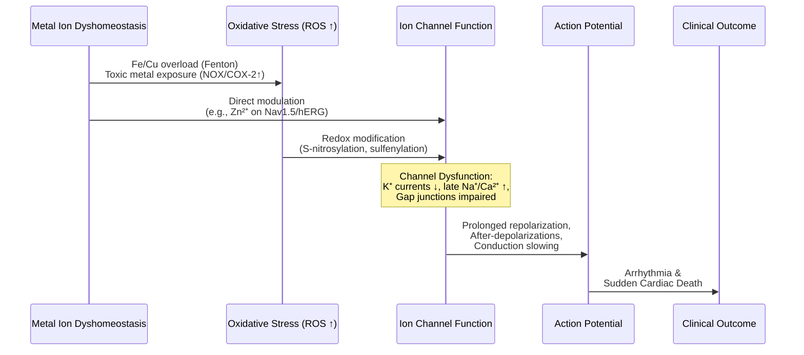

# Modulating Plasma Metal Ion Concentrations: A Strategic Review of Interventions for Cardiovascular Disease Prevention and Therapy
## 1 The Biological Nexus: Metal Ion Homeostasis and Cardiovascular Pathophysiology

This chapter establishes the foundational scientific rationale linking the dysregulation of metal ion homeostasis to the pathogenesis of cardiovascular diseases (CVDs). It synthesizes evidence from clinical and experimental studies to demonstrate how imbalances in essential (e.g., Magnesium, Zinc, Copper, Iron, Selenium) and non-essential/toxic (e.g., Lead, Cadmium, Mercury) metal ions disrupt core physiological processes. The analysis focuses on four interconnected pathological mechanisms: (1) the induction of oxidative stress and impairment of endogenous antioxidant systems, (2) the promotion of endothelial dysfunction, (3) the activation of specific cell death pathways such as ferroptosis and cuproptosis, and (4) the direct disruption of cardiac electrophysiology. By delineating these precise molecular and cellular consequences, this chapter provides the essential mechanistic basis for evaluating metal ion modulation as a potential therapeutic strategy, setting the stage for subsequent discussions on diagnostic approaches and clinical interventions.

### 1.1 Essential Metal Ions: Physiological Roles and Pathological Consequences of Imbalance

Essential trace elements are fundamental cofactors for enzymes and proteins critical to cardiovascular function. Their homeostasis is paramount, as both deficiency and excess can precipitate disease through distinct yet interconnected pathways.

**Magnesium (Mg)** acts as a physiological calcium antagonist, directly modulating vascular tone and cardiac excitability. It inhibits L-type and T-type calcium channels, reducing vascular smooth muscle contraction and coronary spasm[^1]. Clinically, **magnesium deficiency is strongly linked to arrhythmogenesis**. In patients undergoing coronary artery bypass grafting, magnesium supplementation significantly reduced the incidence of postoperative atrial fibrillation (2% vs. 21% in controls)[^1]. Furthermore, a randomized controlled trial in patients with stable coronary artery disease demonstrated that 6 months of oral magnesium therapy significantly improved endothelial function (as measured by flow-mediated dilation) and exercise tolerance, while reducing exercise-induced arrhythmias[^2]. Beyond arrhythmias, **both hypomagnesemia and hypermagnesemia are associated with an increased risk of cardiac arrest**, with population studies showing a higher risk of sudden cardiac death in individuals with the lowest serum magnesium levels[^3].

**Zinc (Zn)** and **Copper (Cu)** exemplify the delicate balance required for cardiovascular health. Zinc is crucial for antioxidant defense as a component of copper-zinc superoxide dismutase (Cu-Zn SOD) and exhibits anti-inflammatory properties by inhibiting NF-κB[^4]. Copper is an essential cofactor for cytochrome c oxidase (mitochondrial respiration) and lysyl oxidase (vascular maturation)[^5]. **Dysregulation of either element disrupts this balance**. Clinical studies show that serum metal mixtures containing Cu, Zn, and Se are positively associated with increased risks of diabetes, hypertension, and heart attack[^6]. Specifically, an imbalance in the Zn/Cu ratio is observed in patients with heart failure and idiopathic dilated cardiomyopathy[^5]. Mechanistically, zinc directly modulates cardiac ion channels, inhibiting sodium channels (Nav1.5) and several potassium channels (e.g., hERG, Kv1.5), which can prolong repolarization and increase arrhythmia risk[^7].

**Iron (Fe)** and **Selenium (Se)** are central to managing oxidative stress. Iron overload catalyzes the Fenton reaction, generating reactive oxygen species (ROS) that drive lipid peroxidation[^8][^9]. Selenium is incorporated into selenoproteins like glutathione peroxidase (GSH-Px), which are vital for neutralizing lipid peroxides[^8][^10]. **Selenium's role is particularly nuanced, possessing a narrow therapeutic window**. While deficiency weakens antioxidant defense, excess is also harmful. A large NHANES-based study found that serum selenium levels ≥122.74 μg/L were associated with a 29.96-fold increased risk of diabetes per unit increase, whereas levels <157.56 μg/L were linked to a dramatically increased risk of heart attack[^6]. This underscores that **both deficiency and excess of essential metals can be pathological**, necessitating precise homeostasis.

The following table synthesizes the dual roles and consequences of imbalance for key essential metals:

**Table: Essential Metal Ions in Cardiovascular Physiology and Pathophysiology**

| Metal | Key Physiological Roles | Consequences of Deficiency | Consequences of Excess |
| :--- | :--- | :--- | :--- |
| **Magnesium (Mg)** | Ca²⁺ channel blocker; stimulates NO/PGI₂ release; modulates K⁺/Na⁺ channels[^1][^4]. | Endothelial dysfunction, hypertension, arrhythmias, increased risk of sudden cardiac death and ACS[^1][^2][^3]. | Associated with cardiac arrest risk[^3]. |
| **Zinc (Zn)** | Antioxidant (Cu/Zn-SOD); modulates eNOS; anti-inflammatory (NF-κB inhibition); regulates cardiac ion channels (Na⁺, K⁺, Ca²⁺)[^4][^7]. | Impaired antioxidant defense, endothelial dysfunction, arrhythmias[^7]. Altered Zn/Cu ratio in heart failure[^5]. | Component of metal mixtures associated with increased CVD risk[^6]. Complex ion channel effects may be pro-arrhythmic[^7]. |
| **Copper (Cu)** | Cofactor for antioxidant enzymes (SOD1), mitochondrial respiration (CCO), vascular maturation (LOX)[^5]. | Mitochondrial dysfunction, impaired energy production, possible atherosclerosis[^5]. | Oxidative stress, cuproptosis, arrhythmias, atherosclerosis, heart failure[^8][^5]. |
| **Iron (Fe)** | Enzyme cofactor (e.g., lipoxygenase); oxygen transport. | Anemia, potential cardiovascular defects[^5]. | Ferroptosis, lipid peroxidation, oxidative stress contributing to atherosclerosis and heart failure[^8][^9]. |
| **Selenium (Se)** | Essential component of antioxidant selenoproteins (GPx, TrxR)[^8][^10]. | Reduced GPx activity, weakened antioxidant defense, increased CVD risk[^8]. | Associated with dramatically increased diabetes and heart attack risk at specific thresholds[^6]. |

### 1.2 Toxic Metal Exposure: Oxidative Stress as a Unifying Mechanism for Cardiovascular Toxicity

Environmental and occupational exposure to non-essential metals such as lead (Pb), cadmium (Cd), mercury (Hg), and aluminum (Al) is an established risk factor for cardiovascular diseases[^11]. **The unifying mechanism underlying their toxicity is the induction of oxidative stress**, which disrupts vascular homeostasis through several interconnected pathways.

**A primary mechanism is the upregulation of enzymatic sources of reactive oxygen species (ROS)**. These toxic metals stimulate NADPH oxidase (NOX) activity, often through protein kinase C (PKC) activation, leading to a burst of superoxide anion (O₂•⁻) production[^11]. Concurrently, they can activate the cyclooxygenase-2 (COX-2) isoform, increasing the synthesis of contractile prostanoids and further contributing to ROS generation[^11]. This oxidative onslaught has direct pathological consequences:

1.  **Endothelial Dysfunction:** The superoxide anion rapidly reacts with and inactivates nitric oxide (NO), a key vasodilator, reducing its bioavailability[^11]. For example, cadmium exposure promotes endothelial dysfunction in aortic segments partially due to this NO scavenging[^11]. Mercury exposure can also reduce NO synthesis by decreasing endothelial nitric oxide synthase (eNOS) activity[^4].
2.  **Increased Vascular Reactivity and Hypertension:** The loss of NO-mediated vasodilation, coupled with increased production of vasoconstrictive prostanoids from COX-2 and activation of the renin-angiotensin system (RAS), leads to heightened vascular tone[^11]. Lead exposure contributes to hypertension by altering the balance of vasoconstricting and vasodilating factors[^11]. Population studies provide strong evidence, inferring a causal relationship between lead exposure and high blood pressure[^11].
3.  **Acceleration of Atherosclerosis:** Chronic oxidative stress and endothelial dysfunction are initiating events in atherosclerosis. Toxic metals exacerbate this process. For instance, lead has a strong epidemiological correlation with increased risk of myocardial infarction and coronary heart disease[^11].

**The clinical challenge highlighted by this mechanism is the complexity of targeting oxidative stress therapeutically.** While antioxidant approaches seem logical, some large clinical trials with antioxidants like vitamin E have not shown benefit and may even increase mortality or cancer risk[^11]. This suggests that **simply administering generic antioxidants is insufficient**; interventions must address the specific source of metal-induced oxidative stress, underscoring the importance of reducing exposure or chelating the toxic metals themselves.

### 1.3 Metal-Mediated Cell Death: Ferroptosis and Cuproptosis in Cardiovascular Pathogenesis

Beyond general oxidative stress, dyshomeostasis of specific metals can activate unique, regulated cell death pathways that play direct roles in cardiovascular pathology. **Ferroptosis (iron-dependent) and cuproptosis (copper-dependent) have emerged as significant contributors to disease progression.**

**Ferroptosis** is driven by the iron-dependent accumulation of lipid peroxides beyond the capacity of the glutathione peroxidase 4 (GPX4) antioxidant system to neutralize them[^8][^9]. The process is fueled by redox-active iron (Fe²⁺), which catalyzes the Fenton reaction to generate hydroxyl radicals that peroxidize polyunsaturated fatty acids (PUFAs) in cell membranes[^9]. Enzymes like acyl-CoA synthetase long-chain family member 4 (ACSL4) prime PUFAs for this peroxidation, making them central to ferroptotic sensitivity[^9]. **In the cardiovascular system, ferroptosis is implicated in atherosclerosis**, where lipid peroxidation of aortic endothelial cells contributes to plaque development[^8][^9]. It is also involved in myocardial ischemia/reperfusion injury and heart failure[^5][^9].

**Cuproptosis** is a more recently identified form of cell death triggered by excessive intracellular copper. Unlike ferroptosis, it is not primarily mediated by lipid peroxidation. Instead, **excess copper (Cu⁺) binds directly to lipoylated proteins in the tricarboxylic acid (TCA) cycle**, such as dihydrolipoamide acetyltransferase (DLAT). This binding induces the oligomerization of these essential metabolic proteins, leading to proteotoxic stress and a loss of iron-sulfur cluster proteins, ultimately collapsing mitochondrial respiration[^5][^9]. The protein FDX1 is a key regulator, facilitating the reduction of copper and the lipoylation process[^9]. **Copper overload and cuproptosis are linked to cardiovascular diseases**, including atherosclerosis, where elevated serum copper levels correlate with carotid intima-media thickness and promote LDL oxidation[^5][^12]. Copper dysregulation also contributes to heart failure and arrhythmias[^5].

**These pathways do not operate in isolation but exhibit significant crosstalk.** Oxidative stress from one pathway can exacerbate the other. For instance, in pulmonary hypertension, interactions between ferroptosis and cuproptosis exacerbate vascular remodeling[^9]. Furthermore, proteins like NDRG1 act as stress sensors, responding to iron depletion and potentially buffering metal toxicity, while also playing a maladaptive role by amplifying inflammatory and thrombotic responses in the endothelium during atherosclerosis[^12]. **The discovery of these metal-specific cell death pathways provides novel, precise therapeutic targets** (e.g., GPX4 inducers, copper chelators) that move beyond broad antioxidant strategies.

### 1.4 Electrophysiological Disruption: Metal Ions and Redox-Sensitive Cardiac Ion Channels

Cardiac rhythm is exquisitely sensitive to the cellular redox state and the direct influence of specific metal ions. Disruption of this environment is a critical mechanism linking metal imbalance to arrhythmias and sudden cardiac death. **This occurs via two primary modes: 1) the direct modulation of ion channels by ions like Zn²⁺ and Mg²⁺, and 2) the redox modification of channel proteins by ROS generated from metal dyshomeostasis.**

**Direct ion modulation** is exemplified by zinc and magnesium. Zinc exerts complex, concentration-dependent effects on multiple cardiac ion channels. It inhibits the cardiac sodium channel (Nav1.5), reducing conduction velocity, and inhibits key potassium repolarizing currents like hERG (IKr) and Kv1.5 (IKur), which can prolong the action potential and promote arrhythmias[^7]. Conversely, it can activate other potassium channels (BK, KATP). **The net effect of zinc imbalance is a destabilization of the cardiac action potential**[^7]. Magnesium, as a natural calcium antagonist, inhibits L-type calcium channels, reducing calcium influx and stabilizing myocardial cells. This underpins its clinical utility in suppressing atrial fibrillation and other arrhythmias[^1].

**Redox-mediated modulation** is a broader mechanism where ROS (O₂•⁻, H₂O₂) generated from metal-induced oxidative stress chemically modify ion channel proteins. As detailed in Search Result-7, oxidative stress commonly:
*   **Reduces potassium currents** (e.g., by sulfenylation of Kv1.5), delaying repolarization.
*   **Enhances late sodium and calcium influx**, promoting after-depolarizations and calcium overload.
*   **Disrupts gap junction communication** (e.g., via oxidation of Connexin43), slowing conduction.

These changes create a potent pro-arrhythmic substrate. For example, prior mercury exposure in rats with myocardial infarction significantly increased mortality and arrhythmia rate, a effect linked to ROS generation from xanthine oxidase[^11].

**The following mermaid sequence diagram illustrates the cascade from metal ion dyshomeostasis to clinical arrhythmia, integrating both direct and redox-mediated mechanisms:**

**This integrated view establishes that metal ion imbalance, whether of essential or toxic elements, directly compromises the electrical stability of the heart.** It provides a clear mechanistic foundation for the observed epidemiological links between abnormal metal levels and arrhythmic outcomes, and highlights cardiac ion channels as potential therapeutic targets for mitigating metal-related cardiovascular toxicity.

## 2 Spectrum of Proposed Interventions: From Supplementation to Advanced Delivery

This chapter provides a systematic analysis and categorization of the diverse therapeutic strategies aimed at modulating plasma metal ion concentrations for cardiovascular disease (CVD) prevention and therapy. Building upon the mechanistic foundation of metal ion dyshomeostasis, it verifies and compares the distinct profiles of four major intervention classes: direct exogenous supplementation and dietary modification, pharmacological chelation and redistribution, engineered local delivery systems, and emerging redistribution strategies. The analysis is data-driven, detailing the mechanisms of action, specific molecular targets, current evidence base, and the relative advantages, limitations, and developmental stage of each approach. This structured comparison highlights the critical evolution from systemic to targeted interventions, framing the evaluation of their therapeutic potential and translational challenges.

### 2.1 Direct Supplementation and Dietary Modulation

The most foundational strategies involve directly supplementing essential metal ions or modifying dietary patterns to correct deficiencies or achieve therapeutic concentrations. These systemic approaches leverage the intrinsic biological roles of metals, aiming to restore homeostasis or provide a pharmacological effect.

**Mechanisms of Action and Specific Ion Effects:** Reference materials detail the therapeutic mechanisms of specific metal ions in CVD contexts. **Magnesium (Mg²⁺)** exhibits mild antioxidant properties, reversing diastolic dysfunction by increasing ATP and reducing mitochondrial reactive oxygen species (ROS) and calcium overload[^13]. **Strontium (Sr²⁺)** increases the activity of antioxidant enzymes catalase (CAT) and superoxide dismutase (SOD)[^13]. **Manganese (Mn²⁺)** activates the Keap1-Nrf2 pathway, upregulating antioxidant enzymes to clear ROS[^13]. **Zinc (Zn²⁺)** acts as an antioxidant to regulate cellular oxidative stress, where deficiency increases ROS production[^13]. **Copper (Cu²⁺)**, as a cofactor for SOD1, can enhance the intracellular antioxidant system by upregulating this enzyme[^13]. Beyond antioxidant effects, these ions promote **angiogenesis** (e.g., Cu²⁺ regulates HIF-1 and VEGF; Mg²⁺ increases VEGF, eNOS, and PDGF-BB secretion; Co²⁺ simulates hypoxia via HIF-1a)[^13] and **adjust ion channel functions** (e.g., Mg²⁺ regulates cation channels affecting myocardial contractility; Zn²⁺ regulates calcium and potassium channels, inducing vasorelaxation)[^13].

**Evidence from Clinical and Epidemiological Studies:** Clinical research supports some applications. Intravenous magnesium sulfate has been studied for reducing early mortality after myocardial infarction[^13]. A clinical trial in elderly subjects with low plasma zinc showed that supplementation significantly decreased plasma lipid peroxidation[^13]. However, the **narrow therapeutic window** is a significant constraint, as both deficiency and excess can be harmful[^14]. Large-scale epidemiological studies reinforce the importance of metal balance. An analysis of Scottish population health records found that abnormal plasma levels of magnesium, copper, and zinc were associated with a higher risk of Major Adverse Cardiovascular Events (MACE). Specifically, low magnesium, high copper, or low zinc were linked to increased risks of various circulatory diseases[^15][^16].

**Dietary Patterns as a Systemic Modulatory Approach:** Dietary modification represents a broader, preventive strategy. The **Mediterranean diet** (rich in fruits, vegetables, fish, olive oil, and whole grains) and the **DASH diet** (Dietary Approaches to Stop Hypertension) have demonstrated protective effects on heart failure incidence and cardiac function parameters[^17]. For instance, a randomized trial found a Mediterranean diet supplemented with extra-virgin olive oil or nuts decreased NT-proBNP levels compared to a low-fat diet[^17]. These diets modulate systemic metal ion intake (e.g., providing magnesium, potassium) alongside other beneficial nutrients, offering a synergistic, population-level preventive approach with gradual effects, in contrast to the acute, corrective nature of targeted supplementation[^14][^17].

**Limitations:** The primary limitations of direct supplementation are the risk of side effects from excessive intake, the challenge of achieving effective local concentrations at disease sites through systemic administration, and the complex, dose-dependent efficacy[^13]. **This underscores that while foundational, systemic modulation alone may be insufficient for treating established, localized cardiovascular pathology.**

### 2.2 Pharmacological Chelation and Redistribution

This class of interventions employs pharmacological agents to bind and remove toxic or excess metal ions (chelation) or to modulate their endogenous distribution, addressing specific pathologies of metal overload.

**Mechanisms and Agents:** Chelation therapy uses agents that form stable, excretable complexes with metal ions. **Ethylenediaminetetraacetic acid (EDTA)** chelation has been proposed for atherosclerotic CVD, with theories suggesting it lowers vessel calcification by removing calcium and reduces oxidative stress injury and inflammation in vessel walls[^18][^19]. For iron overload, agents like **deferoxamine** (DFO) and **deferiprone** (DFP) are standards of care. They bind non-transferrin bound iron, preventing its participation in the Fenton reaction and subsequent ROS generation and lipid peroxidation[^19][^20]. **Trientine** is used for acute copper intoxication and Wilson's disease, chelating excess copper[^19].

**Clinical Evidence and Controversy:** The evidence for chelation in CVD is mixed and highly specific to the agent and condition.
*   **Established Efficacy:** For transfusion-related iron overload in thalassemia, deferiprone significantly improves left ventricular ejection fraction and has an acceptable safety profile, representing an established therapy[^21]. Deferoxamine is FDA-approved for this indication[^20].
*   **Investigational and Controversial:** The evidence for **EDTA chelation in atherosclerotic CVD is conflicting and not guideline-recommended**. The large TACT trial reported a reduction in cardiovascular events for post-myocardial infarction patients, with a greater benefit in diabetics[^22][^23]. However, due to significant limitations like high dropout rates, its findings were not conclusive[^22][^19]. Critically, the subsequent TACT2 trial failed to replicate these benefits, finding no statistically significant difference between chelation and placebo groups[^22]. Consequently, policy statements consider this application investigational[^22][^23].
*   **Emerging Applications:** Novel applications are being tested in clinical trials. A Phase 2 study (NCT05604131) is evaluating the iron chelator **deferiprone** to reduce free iron in the hemorrhagic zone of acute myocardial infarction[^24]. Another trial found that periprocedural deferoxamine infusion ameliorated oxidative stress in STEMI patients, though it did not limit infarct size[^25].

**Safety and Side Effects:** Chelation carries significant risks. EDTA therapy can cause renal failure, arrhythmias, and hypocalcaemia[^19]. Deferiprone carries a black box warning for agranulocytosis[^22][^23]. Furthermore, **indiscriminate chelation risks depleting essential metals**, highlighting the need for precision[^19].

**Metal Redistribution Agents:** Beyond removal, emerging strategies aim to correct dysregulated intracellular distribution. This involves modulating **copper chaperones (e.g., Atox1)** and **transporters (e.g., CTR1, ATP7A)** to restore cellular metal homeostasis, a sophisticated approach currently in early experimental stages[^26].

### 2.3 Engineered Local Delivery Systems

To overcome the limitations of systemic administration—particularly the narrow therapeutic window and off-target effects—advanced biomaterial-based strategies have been designed for the controlled, localized release of metal ions directly at the disease site.

**These systems represent a paradigm shift towards spatial and temporal precision in metal ion therapy.** The primary carrier platforms are nanoparticles, hydrogels, and solid scaffolds.

**1. Nanoparticles:** Nanoparticles enhance drug targeting, retention, and protect payloads from degradation. They enable regulated release profiles for therapeutic ions like Zn²⁺, Cu²⁺, and Mn²⁺[^13]. Examples include:
*   **Metal-Organic Frameworks (MOFs):** Zeolite imidazole skeleton 8 (ZIF-8) achieves sustained release of Zn²⁺[^13].
*   **Composite Nanoparticles:** Cu-deposited cerium oxide nanoparticles (CuCe NPs) show synergistic antioxidant and angiogenic effects[^13].
*   **Protein Nanocages:** Ferritin (FTn) nanocages can be used to load metal ions[^13].

**2. Hydrogels:** Hydrogels are three-dimensional, hydrophilic polymer networks with high biocompatibility and tunable release profiles based on their composition and cross-linking density[^13]. They are particularly promising for myocardial repair.
*   **Mechanisms of Loading and Release:** Metal ions can be directly coordinated to ligands on the polymer backbone (e.g., alginate, bisphosphate, catechol) or embedded within the gel as metal-loaded nanoparticles[^13].
*   **Stimuli-Responsive Designs:** "Smart" hydrogels exploit the pathological microenvironment. **Ion-sensitive** hydrogels like alginate gel upon contact with divalent cations (e.g., Ca²⁺) in situ[^27]. **pH-sensitive** and **ROS-responsive** hydrogels release cargo in acidic or oxidative conditions present in infarcted tissue[^27].
*   **Therapeutic Examples and Clinical Translation:** A Mg²⁺-binding double-crosslinked hydrogel (GelMA/TCS/POSS-Mg) sustained release for over 15 days, promoting angiogenesis[^13]. Injectable Sr²⁺-containing hydrogels reduced cardiomyocyte apoptosis post-ischemia/reperfusion injury[^13]. Notably, **alginate-based hydrogels have reached Phase II clinical trials** for heart failure (Algisyl-LVR in AUGMENT-HF) and myocardial infarction (IK-5001 in PRESERVATION-1), showing safety and improvements in cardiac function or exercise tolerance[^27].

**3. Solid Scaffolds and Coatings:** These devices provide mechanical support while functioning as inherent ion reservoirs.
*   **Alloy Stents/Scaffolds:** Degradable alloys like **Zn-Mg-Cu** release therapeutic ions (Mg²⁺ for immunoregulation, Cu²⁺ for angiogenesis) during corrosion[^13].
*   **Surface Coatings:** Coatings such as metal-phenol networks on stents can improve hemocompatibility and enable localized ion release or catalytic activity (e.g., generating nitric oxide)[^13].

**Current Status:** While many applications remain preclinical, hydrogel platforms for cardiac repair are at the forefront of clinical translation for CVDs. However, reference materials note that **clinical research on local metal ion delivery specifically for CVDs is still lacking** compared to more established applications in bone and skin repair[^13].

### 2.4 Comparative Analysis and Developmental Trajectory

Synthesizing the evidence reveals a clear spectrum of interventions, each with a distinct profile in terms of mechanism, specificity, development stage, and risk-benefit balance. The following table provides a direct, evidence-based comparison of the four major strategies.

**Table: Comparative Analysis of Metal Ion Modulation Strategies for Cardiovascular Diseases**

| Intervention Category | Primary Mechanism & Target | Key Advantages | Major Limitations & Risks | Current Development Status (for CVD) |
| :--- | :--- | :--- | :--- | :--- |
| **Direct Supplementation & Dietary Modulation** | Systemic correction of deficiency / Pharmacological effect. Targets: Mg²⁺, Zn²⁺, Cu²⁺, etc. | Broad availability; foundational for prevention; multi-mechanistic (antioxidant, pro-angiogenic). | Narrow therapeutic window; systemic side effects from excess; limited local bioavailability. | **Established/Clinical:** IV Mg²⁺ post-MI; Mediterranean/DASH diets for prevention. **Experimental:** Sr²⁺, Mn²⁺, Co²⁺ supplementation. |
| **Pharmacological Chelation & Redistribution** | Binding and removal of toxic/excess metals (Fe, Cu, Ca) or intracellular redistribution. | Can address specific pathologies of metal overload (e.g., iron in thalassemia). | Systemic depletion risks; significant side effects (renal, agranulocytosis); unproven efficacy for atherosclerosis (EDTA). | **Approved:** Deferoxamine/deferiprone for transfusional iron overload. **Investigational:** EDTA for atherosclerosis; Deferiprone for hemorrhagic MI (Phase II). **Early Experimental:** Metal redistribution agents. |
| **Engineered Local Delivery Systems** | Controlled, localized release of metal ions via biomaterial carriers. | Maximizes local efficacy; minimizes systemic toxicity; enables spatiotemporal control. | Complexity of design/manufacturing; long-term safety/biodegradability data needed for some platforms. | **Phase II Trials:** Injectable hydrogels (Algisyl-LVR, IK-5001) for HF/MI. **Preclinical:** Nanoparticles (ZIF-8), alloy scaffolds, stimuli-responsive hydrogels. |

**Developmental Trajectory and Synthesis:** The intervention spectrum demonstrates a logical progression from **broad, systemic actions** (diet/supplements) to **more precise pharmacological interventions** (chelators for specific overload states) and finally to **highly sophisticated, spatially and temporally controlled engineering solutions** (advanced delivery systems). This evolution is driven by the need to overcome the fundamental challenge of the **narrow therapeutic window** intrinsic to metal ions.

*   **Systemic approaches** are crucial for primary prevention and correcting gross deficiencies but are poorly suited for treating localized, advanced disease without causing systemic side effects.
*   **Pharmacological chelation** is highly effective for its niche indications but is either controversial (EDTA for atherosclerosis) or limited to specific disease states (iron overload).
*   **Engineered local delivery** holds the highest potential for treating localized cardiovascular injuries (e.g., myocardial infarction, in-stent restenosis) by confining the therapeutic ions to the target tissue, thereby bypassing systemic toxicity barriers.

**Critical Gaps and Future Direction:** Reference materials consistently highlight two major gaps: (1) the **lack of robust clinical data for local metal ion delivery in CVDs**, with most clinical research still focused on systemic administration[^13], and (2) the need to **delineate precise effective and non-toxic concentration ranges** for different metal ions and specific CVDs[^13]. The future of this field lies in advancing the translational pathway for engineered delivery systems, developing personalized approaches based on patient-specific metal profiles, and designing definitive clinical trials to establish efficacy and safety for targeted applications.

## 3 Clinical and Epidemiological Evidence: Efficacy and Associations

This chapter critically evaluates the existing clinical and epidemiological evidence for the efficacy and feasibility of metal-modulating interventions in cardiovascular diseases (CVDs). Building upon the mechanistic foundations and intervention spectrum established in previous chapters, it synthesizes data from large-scale epidemiological studies linking plasma/serum metal levels and dietary intake to cardiovascular risk, and examines results from key clinical trials on supplementation and chelation. The analysis focuses on comparing the strength of evidence across different intervention types (e.g., magnesium, zinc, iron, copper, selenium) and specific cardiovascular conditions (e.g., arrhythmias, heart failure, atherosclerosis, post-MI care). It explicitly addresses conflicting trial results, delineates the boundaries of evidence based on study design and population, and identifies critical gaps where clinical data are insufficient or contradictory, thereby providing a data-driven assessment of the current translational landscape.

### 3.1 Epidemiological Links: Population Studies on Metal Levels and CVD Risk

Large-scale epidemiological studies provide crucial population-level evidence linking metal exposure—both dietary intake of essential metals and environmental exposure to toxic metals—to cardiovascular risk. These studies consistently reveal **nonlinear, often L-shaped or U-shaped relationships**, emphasizing the delicate balance between deficiency and excess.

For essential metals, the association with CVD risk is highly dependent on intake levels. A cross-sectional study of U.S. adults with diabetes mellitus found that **sufficient dietary zinc intake (≥11 mg/day for males, ≥8 mg/day for females) was associated with a 22-23% lower odds of having a high 10-year risk for atherosclerotic cardiovascular disease (ASCVD)**[^28][^29]. This protective association was particularly pronounced in diabetic patients with comorbid hypertension, dyslipidemia, or those on hypoglycemic agents[^28][^29]. Supporting this, a retrospective cohort study in Chinese adults identified an **L-shaped association between dietary zinc intake and new-onset CVD risk, with an inflection point at 13.66 mg/day**[^30]. This indicates that increasing intake is beneficial up to this level, but no significant additional risk reduction occurs beyond it.

The relationship for selenium is similarly nuanced. An analysis of U.S. adults showed a nonlinear association, where increasing dietary selenium intake was associated with a decreasing CVD risk up to an inflection point of **135.28 µg/day**, beyond which the protective effect weakened and higher intake may even increase risk[^31]. In contrast, evidence for copper suggests potential harm from excessive intake. A prospective cohort study in Chinese adults, whose average dietary copper intake (2.6 mg/day) was notably higher than the recommended nutrient intake, found that **higher intake (particularly above 2.45 mg/day) was associated with increased risks of a composite endpoint of mortality and major CVD, all-cause mortality, and stroke incidence**[^32].

Regarding toxic metals, epidemiological evidence robustly links environmental exposure to increased CVD risk. A review synthesizing evidence up to early 2022 confirms that global exposure to lead (Pb), cadmium (Cd), and inorganic arsenic (IAs) is **directly associated with increased CVD incidence and mortality in a dose-response manner**[^33]. A pilot study further highlighted that patients with pulmonary arterial hypertension (PAH) had significantly higher whole-blood levels of non-essential metals like Cd, chromium, and Pb compared to healthy controls[^33].

**The following table synthesizes key epidemiological findings on dietary metal intake and CVD risk:**

| Metal | Study Design & Population | Key Finding on CVD Risk | Inflection Point / Critical Threshold |
| :--- | :--- | :--- | :--- |
| **Zinc** | Cross-sectional (U.S. diabetics)[^28][^29] | Sufficient intake associated with **lower** 10-year ASCVD risk (OR ~0.78). | Sufficiency: ≥11 mg/d (M), ≥8 mg/d (F). |
| **Zinc** | Retrospective cohort (Chinese adults)[^30] | **L-shaped association**; increased intake reduces risk up to a point. | **13.66 mg/day**. |
| **Copper** | Prospective cohort (Chinese adults)[^32] | Higher intake associated with **increased** risk of composite outcome & mortality. | Increased risk above **~2.45 mg/day**. |
| **Selenium** | Cross-sectional (U.S. adults)[^31] | **Nonlinear relationship**; risk decreases then plateaus/increases. | Inflection at **135.28 µg/day**. |
| **Toxic Metals (Pb, Cd, As)** | Review of epidemiological evidence[^33] | Exposure **directly associated** with increased CVD incidence/mortality. | Dose-response relationship. |

**These epidemiological patterns establish a critical principle: the cardiovascular impact of metal ions is not monotonic.** For essential metals, both deficiency and excess can be detrimental, defining a narrow therapeutic window. For toxic metals, any exposure increment increases risk. This complexity underscores why a simplistic "more is better" supplementation approach is inadequate and highlights the necessity for precision based on individual baseline status and specific pathophysiology.

### 3.2 Clinical Trial Evidence for Supplementation: From Promise to Scrutiny

Clinical trial evidence for metal supplementation reveals a landscape of both strong efficacy and sobering null results, heavily dependent on the specific metal, clinical context, and patient population.

**Magnesium supplementation presents a case of highly context-dependent efficacy.** On one hand, a recent large nonrandomized clinical trial in ICU patients fundamentally challenged a long-standing practice. This study, analyzing over 478,000 treatment windows, found that **routine magnesium supplementation for patients with serum levels near common institutional cutoffs (1.6-2.0 mg/dL) showed no benefit in preventing ventricular or supraventricular tachyarrhythmias**, nor any association with reduced hypotension or death[^34][^35]. This suggests automatic correction of modest hypomagnesemia in critically ill patients may not be warranted.

Conversely, robust meta-analytic evidence supports magnesium's benefit in other cardiovascular domains. A systematic review of 38 RCTs concluded that **magnesium supplementation significantly reduces systolic and diastolic blood pressure, particularly in individuals with hypertension and those with hypomagnesemia**[^36][^37]. Furthermore, a separate meta-analysis of 24 RCTs in cardiac surgery patients found that **magnesium administration reduces the risk of new-onset postoperative atrial fibrillation (POAF)**, with high-certainty evidence from low-bias trials[^38].

**Intravenous iron therapy stands out for its strong and consistent evidence base in a specific patient population.** Meta-analyses of randomized controlled trials in patients with heart failure and iron deficiency demonstrate clear clinical benefits. Treatment with intravenous iron significantly **reduces the composite endpoint of recurrent heart failure hospitalizations and cardiovascular mortality** (risk ratio ~0.72-0.82), with benefits also seen for the individual components[^39][^40]. It also improves functional capacity, as measured by the 6-minute walking test[^40]. **The greatest treatment effects are observed in the first year and in patients with more pronounced iron deficiency (e.g., transferrin saturation <20%)**[^39][^40].

**Zinc supplementation shows promising evidence for cardiovascular risk factor modification, though hard endpoint data are lacking.** A comprehensive meta-analysis of 75 RCTs indicated that zinc supplementation significantly improves several cardiometabolic risk factors, including **lowering triglycerides, total cholesterol, fasting blood glucose, HbA1c, and inflammatory markers like C-reactive protein**[^41]. Another meta-analysis focused on type 2 diabetes patients confirmed these **beneficial effects on all components of the lipid profile**[^42]. While these findings are encouraging, they pertain to surrogate endpoints; large RCTs assessing the impact of zinc supplementation on primary cardiovascular events (e.g., myocardial infarction, stroke) are needed to confirm clinical utility.

**The divergent results for magnesium perfectly illustrate how clinical efficacy is dictated by precise indication and patient selection.** The null effect in general ICU patients for tachyarrhythmia prevention does not invalidate its proven benefits for POAF prophylaxis or blood pressure control in hypertensives. This underscores that **metal supplementation is not a generic therapy but a targeted intervention whose feasibility and efficacy must be evaluated within specific clinical contexts.**

### 3.3 The Chelation Controversy: Reassessing Evidence in Light of TACT2

The clinical evidence for chelation therapy in atherosclerotic cardiovascular disease has evolved significantly, moving from a signal of potential benefit to a definitive null result, highlighting the critical importance of replication in clinical research.

The controversy originated from the 2013 Trial to Assess Chelation Therapy (TACT), which reported an 18% reduction in cardiovascular events with edetate disodium (EDTA)-based chelation in post-myocardial infarction patients, with a pronounced effect in diabetics. This finding, though intriguing, was met with skepticism due to methodological limitations. The subsequent **TACT2 trial was designed as a rigorous replication study, specifically enrolling 1,000 patients with diabetes and a prior MI**[^43]. After a median follow-up of 48 months, the trial found **no statistically significant difference in the primary composite cardiovascular endpoint between the chelation and placebo groups** (adjusted hazard ratio 0.93; P = .53)[^43]. The 5-year cumulative incidence rates were nearly identical (45.8% vs. 46.5%)[^43].

A critical mechanistic finding from TACT2 was that **while chelation effectively reduced median blood lead levels by 61%, this biochemical effect did not translate into clinical cardiovascular benefit**[^43]. This result directly challenges the "lead hypothesis" of atherosclerosis that underpinned the rationale for EDTA chelation and suggests that reducing lead burden in stable, chronic CAD patients may not alter disease progression.

**The TACT2 results stand in stark contrast to the established and guideline-recommended use of chelation for other metal-overload pathologies.** As noted in previous chapters, iron chelators like deferoxamine and deferiprone are standard therapies for managing transfusion-related iron overload in conditions like thalemia, where they prevent organ damage from free iron. **This dichotomy underscores a fundamental principle: the clinical feasibility and efficacy of chelation are entirely contingent on the specific metal and pathophysiology being targeted.** Chelation is a high-precision tool effective for diseases of demonstrable metal accumulation (e.g., iron overload, Wilson's disease), but the TACT2 trial demonstrates it is not an effective broad-spectrum strategy for secondary prevention in typical atherosclerotic CVD.

### 3.4 Synthesis and Evidence Gaps: Toward a Precision-Based Framework

Synthesizing the clinical and epidemiological evidence reveals a spectrum of evidence strength and a clear set of prerequisites for translating metal-modulating interventions into practice.

**The evidence is most mature and compelling for two interventions: 1) intravenous iron for heart failure patients with iron deficiency, and 2) targeted magnesium supplementation for specific indications (POAF prophylaxis, hypertension in deficient individuals).** Both are supported by high-quality RCTs and meta-analyses showing improvements in hard clinical endpoints or validated surrogates. **Zinc supplementation** shows strong evidence for improving cardiometabolic risk profiles, positioning it as a promising preventive strategy, though it awaits confirmation from outcomes trials.

**In contrast, the evidence does not support the routine use of EDTA chelation for secondary CVD prevention or magnesium supplementation for tachyarrhythmia prevention in general ICU populations.** For other metals like copper and selenium, epidemiological data highlight the risks of imbalance and suggest optimal intake ranges, but interventional evidence for cardiovascular benefit is lacking.

**Critical evidence gaps must be addressed to advance the field:**

1.  **Lack of Clinical Data for Advanced Delivery Systems:** As identified in Chapter 2, while engineered local delivery systems (e.g., ion-releasing hydrogels, scaffolds) hold great preclinical promise for site-specific therapy (e.g., post-MI repair), **clinical research on these platforms specifically for CVDs remains sparse** compared to other fields.
2.  **Need for Precision in Supplementation Regimens:** For magnesium and zinc, future research must move beyond generic supplementation to define **precise, biomarker-guided dosing thresholds and optimal patient subgroups**. The failure of magnesium in the ICU trial versus its success in other settings underscores this need.
3.  **Long-Term Outcomes and Safety:** For intravenous iron and zinc supplementation, longer-term follow-up data from large trials are needed to fully establish sustained efficacy and safety profiles beyond 1-2 years.
4.  **Causality in Observational Associations:** For dietary copper and selenium, prospective observational studies suggest optimal ranges, but **randomized controlled trials are required to establish causality and therapeutic utility** for modulating intake within these narrow windows.

**In conclusion, the feasibility and efficacy of metal-modulating interventions are not uniform.** They are proven for specific metal-disease pairs (e.g., iron for HF-ID, Mg for POAF) but unproven or disproven for others. The path forward requires abandoning a one-size-fits-all approach. **Future translation depends on a precision-based framework that integrates individual patient biomarkers (e.g., serum metal levels, transferrin saturation), genetic predispositions, and specific cardiovascular pathophysiology to guide the selection of the right metal, the right intervention, and the right dose for the right patient.**

## 4 Challenges, Risks, and the Precision Medicine Imperative

This chapter critically analyzes the fundamental limitations and risks inherent in systemic metal ion modulation for cardiovascular diseases (CVDs), synthesizing evidence from genetic disorders, clinical trials, and advanced delivery studies to argue against a one-size-fits-all approach. It systematically examines the narrow therapeutic window of essential metals and the toxicity of non-essential metals, highlighting the dual risks of deficiency and excess. The chapter then investigates the role of individual genetic variability, focusing on mutations in genes like *ATP7B* and *HFE*, which dictate baseline metal handling and disease susceptibility. It further explores the pharmacokinetic and delivery barriers, including the challenge of achieving effective local concentrations. By integrating these challenges, the chapter establishes the imperative for a precision medicine framework, advocating for strategies that leverage patient-specific biomarkers, genetic profiles, and advanced targeted delivery systems to optimize therapeutic efficacy while minimizing risks.

### 4.1 The Narrow Therapeutic Window: Balancing Deficiency and Toxicity in Systemic Modulation

The therapeutic application of metal ions is fundamentally constrained by their **narrow therapeutic window**, a pharmacological challenge where the margin between beneficial and toxic concentrations is exceptionally small. This dual-risk profile applies to both essential metals, where both deficiency and excess are harmful, and non-essential toxic metals, where any exposure incrementally increases risk.

For essential metals, reference materials consistently detail that **both deficiency and excess are linked to adverse cardiovascular outcomes**. Magnesium ions (Mg²⁺) have antioxidant properties and promote angiogenesis, but excessive Mg²⁺ entering the circulatory system causes hypermagnesemia[^13]. Similarly, while copper (Cu²⁺) is a vital cofactor for antioxidant enzymes like superoxide dismutase 1 (SOD1)[^13], excessive supplementation is toxic and may lead to neurodegeneration[^13]. The relationship for selenium is particularly illustrative of a narrow window; epidemiological studies show a nonlinear, often L-shaped or U-shaped, association between intake and CVD risk, where both insufficient and excessive levels are detrimental. This principle is reinforced by mechanistic studies showing that different tissues and physiological states have different requisitions for the types and doses of metal ions, and that excessive supplementation has non-negligible side effects such as affecting enzyme activity and increasing hepatorenal burden[^13].

**The toxicity of non-essential metals like lead (Pb), cadmium (Cd), mercury (Hg), and arsenic (As) further exemplifies the danger of unmodulated metal accumulation.** Epidemiological evidence demonstrates a direct dose-response relationship between exposure to these metals and increased CVD incidence and mortality[^44]. Even low-level exposure is consequential; blood lead levels as low as 1–2 µg/dL contribute to hypertension and ischemic heart disease[^44]. The primary mechanism is the induction of oxidative stress, which disrupts endothelial function and promotes chronic inflammation—key drivers of atherosclerosis and hypertension[^44]. This establishes that for toxic metals, there is essentially **no safe threshold for systemic exposure** from a cardiovascular perspective.

The clinical trial evidence for supplementation, such as with magnesium, reveals that efficacy is highly context-dependent, underscoring the difficulty of hitting the narrow therapeutic target with a non-personalized, systemic approach. While intravenous magnesium sulfate reduced early mortality after myocardial infarction in one study[^13], routine supplementation in ICU patients with near-normal levels showed no benefit for preventing arrhythmias. This inconsistency highlights that **systemic, non-targeted administration is inherently risky and inefficient**, as it cannot reliably achieve therapeutic concentrations at the specific site of pathology without risking off-target toxicity or deficiency in other tissues.

### 4.2 Genetic Determinants of Metal Homeostasis: From Monogenic Disorders to Polygenic Risk

Individual genetic variation creates a foundational layer of complexity that dictates how an individual metabolizes, stores, and responds to metal ions, rendering uniform therapeutic interventions not only ineffective but potentially dangerous. This variability ranges from severe monogenic disorders to subtle polygenic and epigenetic influences.

**Monogenic disorders provide extreme but instructive examples of how genetic defects dictate pathological metal overload and specific cardiovascular risks.** Wilson's disease, caused by biallelic mutations in the *ATP7B* gene, leads to defective biliary copper excretion and systemic copper accumulation[^45][^46]. Cardiac involvement in Wilson's disease can manifest as cardiomyopathy, conduction abnormalities, arrhythmias, and even sudden cardiac death[^46]. Similarly, hereditary hemochromatosis, often linked to mutations in genes like *HFE* and *HJV*, results in pathological iron overload[^45][^47]. This iron excess promotes oxidative stress via the Fenton reaction and is a recognized risk factor for cardiovascular diseases including heart failure and atherosclerosis[^47]. These cases demonstrate that **individuals with such mutations have a fundamentally altered baseline for metal handling, making them exquisitely sensitive to further supplementation or incapable of tolerating standard environmental exposures.**

Beyond single-gene disorders, the phenotypic expression of metal-related diseases is influenced by genetic modifiers and epigenetic mechanisms, introducing further variability. In Wilson's disease, over 900 variants in the *ATP7B* gene exist, and there is a notable **lack of consistent correlation between genotype and clinical phenotype** (hepatic vs. neurological)[^46][^48]. Studies have investigated potential modifier genes, such as polymorphisms in *HFE* (e.g., p.H63D), though associations with disease severity or chelation response remain inconsistent[^46][^49]. This has shifted focus to **epigenetic regulation**. Excess copper inhibits enzymes in methionine metabolism (e.g., S-adenosylhomocysteine hydrolase, AHCY), leading to altered global DNA methylation patterns[^48][^49]. Genome-wide studies have identified distinct epigenetic signatures in Wilson's disease patients that can even discriminate between hepatic and neurologic symptoms[^48]. This evidence underscores that an individual's **epigenetic landscape, shaped by both genetics and environmental metal exposure, is a critical determinant of disease manifestation and likely therapeutic response.**

Therefore, a one-size-fits-all supplementation strategy is fundamentally flawed. An individual's genetic and epigenetic background dictates their unique "set point" for metal homeostasis, susceptibility to toxicity, and likely response to intervention. **Pre-intervention profiling is not merely beneficial but necessary** to avoid harming individuals with undiagnosed genetic predispositions to overload and to tailor therapy to those who are genuinely deficient.

### 4.3 Pharmacokinetic and Delivery Barriers: From Systemic Limitations to Targeted Solutions

Achieving therapeutic efficacy with metal ions requires delivering them at the right concentration, to the right location, and for the right duration. Systemic administration faces significant pharmacokinetic and delivery barriers that often prevent meeting these criteria while simultaneously introducing risks of off-target toxicity.

**A primary limitation of systemic supplementation is the difficulty of achieving effective local concentrations at the cardiovascular disease site.** Different tissues have varying sensitivities and requirements for metal ions[^13]. Oral or intravenous administration leads to widespread distribution, with only a fraction reaching the intended pathological tissue (e.g., an atherosclerotic plaque or infarcted myocardium). To achieve a therapeutic dose locally, systemic concentrations must often be raised, **increasing the risk of toxicity in other organs**, such as hepatorenal burden from excess metal processing[^13]. Furthermore, systemic administration offers little temporal control, which is problematic given that the therapeutic window for interventions like antioxidant therapy after ischemia/reperfusion may be very brief.

**Advanced delivery systems, as detailed in previous chapters, are engineered specifically to overcome these barriers by providing spatiotemporal control.** The reference materials contrast the limitations of systemic approaches with solutions like nanoparticles, hydrogels, and solid scaffolds[^13]. For instance, nanoparticles can increase drug targeting and retention, while hydrogels allow for tunable release profiles based on their composition and degradation rate[^13]. Solid scaffolds like intravascular stents or cardiac patches provide mechanical support while functioning as local, sustained-release reservoirs for metal ions[^13]. These systems aim to **maximize local efficacy while minimizing systemic exposure and side effects**.

The complex relationship between exposure route, concentration, and effect is highlighted by clinical studies on chronic, low-level metal ion release from orthopedic implants. A cardiac MRI study of patients with metal-on-metal hip prostheses found that **elevated blood cobalt and chromium levels from well-functioning implants were not associated with clinically meaningful impairment of cardiac function parameters**[^50]. This suggests that the **route (local implant degradation) and chronicity of exposure** result in a different biological impact compared to acute systemic administration, further emphasizing that generic supplementation cannot replicate the controlled pharmacokinetics needed for safe and effective therapy. These delivery challenges underscore that the method of administration is as critical as the choice of metal ion itself.

### 4.4 Toward a Precision Framework: Integrating Biomarkers, Genetics, and Advanced Delivery

Synthesizing the challenges of narrow therapeutic windows, genetic variability, and delivery barriers leads to an inescapable conclusion: the future of metal-based cardiovascular therapeutics lies in a **precision medicine framework**. This approach moves beyond cyclic, one-size-fits-all drug administration to personalized strategies that integrate diagnostic profiling, targeted intervention selection, and advanced delivery technologies.

**A proposed precision framework must integrate three core components:**

1.  **Baseline Biomarker and Phenotypic Profiling:** Initial assessment must define an individual's metal status and disease phenotype. This includes measuring serum/plasma levels of essential and toxic metals. For conditions like Wilson's disease, advanced biomarkers like the exchangeable copper (CuEXC) assay and relative exchangeable copper (REC) have shown high sensitivity and specificity for diagnosis and monitoring[^46]. Inflammatory markers and epigenetic signatures from blood may also help stratify disease subtypes and activity[^46][^48].

2.  **Genetic and Epigenetic Screening:** Proactive identification of genetic predispositions is crucial. Screening for mutations in genes like *ATP7B* and *HFE* can identify individuals at high risk for overload who would be harmed by supplementation. Furthermore, assessing epigenetic markers could provide insight into individual metabolic handling and predicted response to therapy, informing both the choice of agent and its dose.

3.  **Targeted Intervention Selection:** The therapeutic strategy must be matched to the specific pathophysiology revealed by profiling.
    *   For **systemic deficiency** (e.g., low serum magnesium in a hypertensive patient), oral or intravenous supplementation may be appropriate, with doses titrated to biomarker response.
    *   For **localized pathology** (e.g., post-myocardial infarction repair), **engineered local delivery systems** such as injectable ion-releasing hydrogels or coated stents should be prioritized to provide site-specific action without systemic burden[^13].
    *   For **systemic overload** (e.g., hereditary hemochromatosis, Wilson's disease), pharmacological chelation or redistribution agents are the indicated interventions[^45][^47].

The following table summarizes how this integrated framework addresses the key challenges identified in this chapter:

| Challenge | Precision Medicine Solution |
| :--- | :--- |
| **Narrow Therapeutic Window** | Biomarker-guided dosing to maintain levels within the individual's effective range; use of local delivery to confine therapy to target tissue. |
| **Genetic Variability** | Pre-emptive genetic screening to identify contraindications (e.g., *ATP7B*/*HFE* carriers) and guide therapy selection. |
| **Poor Local Bioavailability** | Selection of advanced delivery platforms (hydrogels, scaffolds) designed for sustained, localized release. |
| **Risk of Off-Target Toxicity** | Combined use of targeted delivery and personalized dosing to minimize systemic exposure. |

**Critical research gaps must be addressed to realize this framework.** Reference materials consistently note that **clinical research on local metal ion delivery for CVDs is still lacking**, with most studies focused on systemic administration[^13]. Future work must prioritize: 1) **Delineating precise effective and non-toxic concentration ranges** of metal ions for specific cardiovascular tissue injuries[^13]; 2) **Developing and validating "smart" delivery systems** (e.g., nanoparticles, hydrogels) that respond to real-time microenvironmental biomarkers (pH, ROS)[^51]; and 3) **Conducting robust clinical trials** that test biomarker- and genetics-stratified interventions against hard cardiovascular endpoints. Only through such a precision-based approach can the therapeutic potential of modulating metal ion concentrations be safely and effectively translated into clinical practice for cardiovascular diseases.

## 5 Synthesis and Future Directions: Integrating Evidence into Practice

This chapter synthesizes the comprehensive evidence presented throughout this report to deliver a conclusive assessment of the therapeutic potential and current translational status of metal ion modulation for cardiovascular diseases (CVDs). It moves beyond summary to propose a forward-looking, integrated framework for clinical application, prioritizing actionable research directions that address the critical gaps identified. The analysis underscores a fundamental paradigm shift: the transition from generic, systemic supplementation to precision-based, targeted strategies is not merely advantageous but essential to realize the therapeutic promise of metal ions while mitigating their inherent risks.

### 5.1 Conclusive Assessment: From Mechanistic Promise to Clinical Reality

Synthesizing the evidence reveals a landscape of significant therapeutic potential constrained by precise contextual requirements. The **biological rationale is robust and multi-faceted**, with specific metal ions (e.g., Mg²⁺, Zn²⁺, Cu²⁺, Fe) playing defined roles in combating oxidative stress, promoting angiogenesis, and regulating ion channel function—core pathways in CVD pathogenesis[^13]. This mechanistic foundation validates the exploration of metal ions as therapeutic agents.

However, the translation of this promise into clinical reality is sharply delineated by the **strength of interventional evidence and the narrow therapeutic window** inherent to metal ions. The clinical feasibility and efficacy are not uniform but are proven for specific metal-disease pairs:

*   **Areas of Proven Efficacy:** **Intravenous iron therapy** for patients with heart failure and iron deficiency is supported by high-quality RCTs demonstrating reductions in hospitalizations and improved functional capacity. **Targeted magnesium supplementation** shows clear benefit for specific indications such as prophylaxis of postoperative atrial fibrillation and reduction of blood pressure in hypertensive individuals with deficiency.
*   **Areas of Null Results or Controversy:** In contrast, the **TACT2 trial provided definitive evidence against the use of EDTA chelation for secondary prevention in atherosclerotic CVD**, even in diabetic patients[^13]. Similarly, routine magnesium supplementation in general ICU populations showed no benefit for preventing tachyarrhythmias, highlighting that efficacy is context-dependent.
*   **Promising but Incomplete Evidence:** **Zinc supplementation** demonstrates consistent benefits in improving cardiometabolic risk profiles (lipids, glucose) across numerous RCTs, positioning it as a strong candidate for cardiovascular risk reduction, though outcomes trials are needed.

**A central translational challenge consistently highlighted is the current reliance on systemic administration and the concomitant lack of clinical data for advanced local delivery systems in CVDs**[^13]. While systemic approaches work for correcting deficiencies or in specific pharmacological contexts (e.g., IV iron), they are poorly suited for treating localized cardiovascular injuries due to the risk of off-target toxicity and difficulty achieving effective local concentrations. The reference materials note that despite the promising preclinical development of nanoparticles, hydrogels, and scaffolds for metal ion delivery, clinical research in the cardiovascular field remains sparse compared to applications in bone or skin repair[^13].

**Therefore, the conclusive assessment is that metal ion modulation holds validated therapeutic potential, but its realization is strictly conditional.** It is effective not as a broad-spectrum strategy but as a **high-precision tool** applicable within narrowly defined clinical scenarios (specific deficiency states, localized pathologies with targeted delivery) and contraindicated in others (generic supplementation, non-targeted chelation). The future of this field hinges on overcoming the systemic toxicity barrier through precision.

### 5.2 A Precision Translation Framework: Integrating Biomarkers, Genetics, and Targeted Delivery

To address the challenges of the narrow therapeutic window, genetic variability, and delivery barriers, a move beyond cyclic drug administration is imperative. We propose a concrete, multi-component precision medicine framework to guide future application and research, structured around three integrated pillars:

**1. Baseline Multi-Parameter Profiling:** Initial assessment must move beyond single metal measurements. It should include:
    *   **Comprehensive Metal Panels:** Quantifying serum/plasma levels of both essential (Mg, Zn, Cu, Se, Fe status via ferritin/transferrin saturation) and toxic (Pb, Cd) metals to establish individual baseline homeostasis.
    *   **Pathology-Specific Biomarkers:** Incorporating markers of oxidative stress (e.g., lipid peroxides), inflammation (e.g., hs-CRP), and myocardial injury/hemodynamics (e.g., NT-proBNP, troponin) to link metal status to active disease pathways.

**2. Genetic and Epigenetic Stratification:** Proactive screening is crucial for safety and efficacy.
    *   **Identifying Contraindications:** Screening for mutations in genes like *HFE* (hemochromatosis) and *ATP7B* (Wilson's disease) can identify individuals at high risk for overload from supplementation.
    *   **Informing Therapeutic Response:** Assessing epigenetic signatures, which are altered by metal exposure and can discriminate disease phenotypes, may predict individual metabolic handling and therapeutic response[^13].

**3. Matched, Targeted Intervention Selection:** The therapeutic strategy must be precisely mapped to the identified profile and pathology.
    *   **For Systemic Deficiency/Need:** Conditions like hypomagnesemic hypertension or heart failure with iron deficiency warrant systemic (oral/IV) supplementation, with doses titrated to biomarker response.
    *   **For Localized Pathology:** The treatment of myocardial infarction, in-stent restenosis, or therapeutic angiogenesis should prioritize **engineered local delivery systems**. As detailed in reference materials, these platforms—such as injectable ion-releasing hydrogels, coated stents, or alloy scaffolds—are designed to provide spatiotemporal control, confining therapy to the target tissue and fundamentally bypassing the systemic toxicity constraint[^13].

This framework positions advanced delivery systems not as incremental improvements but as **essential enablers** for safe and effective metal ion therapy, directly addressing the core translational challenge identified in the conclusive assessment.

### 5.3 Priority Research Directions: Engineering, Combinations, and Trial Design

To operationalize the precision framework and advance the field, specific research priorities must be addressed, focusing on the critical gaps highlighted in the reference materials and previous chapters.

**1. Clinical Translation of Engineered Delivery Platforms:** The highest priority is to move promising biomaterial carriers from preclinical validation to human CVD trials. Research must focus on:
    *   **Safety and Pharmacokinetics:** Establishing the biodistribution, degradation profiles, and long-term local/systemic safety of metal ion-releasing nanoparticles, hydrogels (e.g., GelMA-based, alginate variants), and biodegradable alloy scaffolds (e.g., Zn-Mg-Cu)[^13].
    *   **Dose-Finding Studies:** Delineating the **effective and non-toxic concentration ranges** for specific metal ions (e.g., Sr²⁺, Cu²⁺, Mg²⁺) when delivered locally to cardiac or vascular tissue, a gap explicitly noted in the references[^13].

**2. Exploration of Rational Combination Therapies:** Research should investigate synergies between metal ion platforms and established CVD therapies.
    *   **Pharmacological Synergies:** Combining metal ion-releasing systems with drugs like statins, antiplatelet agents, or RAS inhibitors, with studies designed to understand potential interactions and enhanced mechanisms (e.g., combined antioxidant and anti-inflammatory effects).
    *   **Cell-Based and Biological Combinations:** Integrating ion-releasing scaffolds or hydrogels with stem cells or their exosome derivatives to create regenerative niches that enhance cell survival, differentiation, and tissue integration.

**3. Development of Dynamic, Multi-Parametric Biomarkers:** Beyond static metal level measurements, future research should develop:
    *   **Composite Biomarker Indices:** Validating ratios like Zn/Cu or novel assays such as relative exchangeable copper (REC) for better risk stratification and monitoring.
    *   **Responsive Biomarkers for "Smart" Systems:** Identifying and validating biomarkers (e.g., specific ROS forms, MMP levels) that can act as triggers for the next generation of stimuli-responsive "smart" delivery systems, enabling truly on-demand therapy.

**4. Design of Definitive, Biomarker-Stratified Clinical Trials:** Future trials must adopt sophisticated designs to provide clear answers:
    *   **Stratified Enrollment:** Enrolling patients based on precise biomarker profiles (e.g., heart failure patients stratified by iron deficiency status, post-MI patients by oxidative stress markers).
    *   **Platform-Specific Endpoints:** Comparing advanced local delivery systems (e.g., an injectable Mg²⁺-hydrogel) against standard care, with primary endpoints encompassing hard cardiovascular outcomes (e.g., heart failure hospitalization, mortality) and relevant functional improvements.
    *   **Long-Term Follow-Up:** Incorporating extended follow-up to assess the durability of therapeutic effects and long-term safety of locally implanted/resorbable metal-ion delivery devices.

### 5.4 Overarching Synthesis and Final Recommendations

In final synthesis, the investigation confirms that **therapeutic interventions aimed at modulating metal ion concentrations can represent effective strategies against cardiovascular diseases, but their application is inherently precision-dependent.** The potential is real, evidenced by proven therapies like intravenous iron, yet the risks of a non-targeted approach are significant, as demonstrated by the chelation controversy and the narrow therapeutic windows.

**Final recommendations for stakeholders are clear:**

*   **For Clinicians:** Adopt a **"diagnose-before-supplement" principle**. Utilize available biomarker panels (metal levels, iron status) to identify true deficiencies or specific pathological contexts before initiating supplementation, and remain guided by evidence-based indications for proven therapies.
*   **For Researchers:** Prioritize **interdisciplinary collaboration** bridging cardiovascular medicine, pharmacology, materials science, and genetics. Focus efforts on translating the most promising engineered delivery platforms into clinical testing for specific CVD indications, while developing the biomarker tools needed for patient stratification.
*   **For Policymakers and Regulators:** Recognize the unique nature of **combination products** (e.g., drug-eluting stents with metal ions, injectable therapeutic hydrogels) and engage in early dialogue to establish clear pathways for their clinical evaluation and approval.

The envisioned future paradigm is one where cardiovascular therapy is dynamically guided by a patient's molecular profile, including their metal ion homeostasis. In this paradigm, localized injuries are treated not with systemic drugs but with intelligent biomaterial systems that provide spatially and temporally precise release of therapeutic ions. By embracing this precision-focused framework, the field can move decisively from mechanistic promise to transformative clinical reality.

# 参考内容如下：
[^1]:[The Connection Between Magnesium and Heart Health](https://pmc.ncbi.nlm.nih.gov/articles/PMC11585403/)
[^2]:[Oral Magnesium Therapy Improves Endothelial Function in ...](https://www.ahajournals.org/doi/10.1161/01.cir.102.19.2353)
[^3]:[The role of magnesium in cardiac arrest](https://www.frontiersin.org/journals/nutrition/articles/10.3389/fnut.2024.1387268/full)
[^4]:[Effects of Micronutrients and Heavy Metals on Endothelial ...](https://www.mdpi.com/1467-3045/48/1/41)
[^5]:[Copper ions: The invisible killer of cardiovascular disease ...](https://www.spandidos-publications.com/10.3892/mmr.2024.13334)
[^6]:[Association between serum Copper-Zinc-Selenium mixture ...](https://pmc.ncbi.nlm.nih.gov/articles/PMC12041763/)
[^7]:[Importance of Zinc Homeostasis for Normal Cardiac Rhythm](https://pmc.ncbi.nlm.nih.gov/articles/PMC12060914/)
[^8]:[The role and mechanism of various trace elements in ...](https://www.sciencedirect.com/science/article/abs/pii/S1567576924017107)
[^9]:[Interaction of ferroptosis and cuproptosis in the perspective ...](https://www.frontiersin.org/journals/cardiovascular-medicine/articles/10.3389/fcvm.2025.1611449/full)
[^10]:[Elevated serum glutathione peroxidase levels reducing the ...](https://pmc.ncbi.nlm.nih.gov/articles/PMC12282211/)
[^11]:[Metals, cardiovascular risk, and the interplay with oxidative ...](https://pmc.ncbi.nlm.nih.gov/articles/PMC12184964/)
[^12]:[NDRG1 as a sensor and mediator of endothelial stress](https://pmc.ncbi.nlm.nih.gov/articles/PMC12618754/)
[^13]:[Exogeneous metal ions as therapeutic agents in ...](https://pmc.ncbi.nlm.nih.gov/articles/PMC10761210/)
[^14]:[The role of different nutrients in the prevention and treatment ...](https://pmc.ncbi.nlm.nih.gov/articles/PMC11116626/)
[^15]:[Abnormal Plasma/Serum Magnesium, Copper, and Zinc ...](https://pubmed.ncbi.nlm.nih.gov/40362756/)
[^16]:[Abnormal Plasma/Serum Magnesium, Copper, and Zinc ...](https://www.mdpi.com/2072-6643/17/9/1447)
[^17]:[Mediterranean Diet and Other Dietary Patterns in Primary ...](https://pmc.ncbi.nlm.nih.gov/articles/PMC5793286/)
[^18]:[Chelation Therapy in Patients With Cardiovascular Disease](https://www.ahajournals.org/doi/10.1161/JAHA.121.024648)
[^19]:[Chelation in Metal Intoxication - PMC - PubMed Central - NIH](https://pmc.ncbi.nlm.nih.gov/articles/PMC2922724/)
[^20]:[Deferoxamine - StatPearls - NCBI Bookshelf - NIH](https://www.ncbi.nlm.nih.gov/books/NBK557654/)
[^21]:[Efficacy and safety of deferiprone for thalassemia](https://pubmed.ncbi.nlm.nih.gov/41402903/?utm_source=FeedFetcher&utm_medium=rss&utm_campaign=None&utm_content=1rG1EERZjlGl8m5GtXrgud2E6Q90w2Cc_MV50FGe_H4-uSh5S3&fc=None&ff=20251218142310&v=2.18.0.post22+67771e2)
[^22]:[Chelation Therapy for Off-Label Uses](https://member.myhealthtoolkitks.com/web/public/brands/medicalpolicy/external-policies/chelation-therapy-for-off-label-uses)
[^23]:[Chelation Therapy - Medical Policies](https://www.lablue.com/-/media/Medical%20Policies/2020/08/03/17/33/ChelationTherapy.pdf)
[^24]:[Cardiac MRI-guided Deferiprone Therapy for Acute ...](https://clinicaltrial.be/en/details/82305?per_page=100&only_recruiting=0&only_eligible=0&only_active=0)
[^25]:[Effect of Iron Chelation on Myocardial Infarct Size and ...](https://www.ahajournals.org/doi/10.1161/circinterventions.111.966226)
[^26]:[Copper transporters and copper chaperones: roles in ...](https://pmc.ncbi.nlm.nih.gov/articles/PMC6139499/)
[^27]:[Recent advances in biomimetic hydrogel materials for ...](https://link.springer.com/article/10.1007/s43939-025-00440-2)
[^28]:[Dietary zinc intake and 10-year atherosclerotic ...](https://pmc.ncbi.nlm.nih.gov/articles/PMC11884122/)
[^29]:[Dietary zinc intake and 10-year atherosclerotic cardiovascular ...](https://link.springer.com/article/10.1186/s12959-025-00693-0)
[^30]:[L-shaped association between dietary zinc intake and the ...](https://pmc.ncbi.nlm.nih.gov/articles/PMC10064069/)
[^31]:[Association between dietary selenium intake and the risk of ...](https://pmc.ncbi.nlm.nih.gov/articles/PMC12008176/)
[^32]:[Associations of dietary copper intake with cardiovascular ...](https://pmc.ncbi.nlm.nih.gov/articles/PMC10726617/)
[^33]:[Overview of the cardiovascular effects of environmental metals](https://pmc.ncbi.nlm.nih.gov/articles/PMC9941893/)
[^34]:[Magnesium Supplementation and Tachyarrhythmias](https://pubmed.ncbi.nlm.nih.gov/41359319/?utm_source=FeedFetcher&utm_medium=rss&utm_campaign=None&utm_content=0nK-FGmcPzruPpJferMpyd8mRld7hsB1ra05TRUDXN6&fc=None&ff=20251208140431&v=2.18.0.post22+67771e2)
[^35]:[Do Magnesium Supplements Show Arrhythmia Benefit?](https://www.emjreviews.com/general-healthcare/news/do-magnesium-supplements-protect-against-tachyarrhythmias/)
[^36]:[Magnesium Supplementation and Blood Pressure](https://www.ahajournals.org/doi/10.1161/HYPERTENSIONAHA.125.25129)
[^37]:[Magnesium Supplementation and Blood Pressure](https://pubmed.ncbi.nlm.nih.gov/41000008/)
[^38]:[Magnesium for Prevention of New-onset Postoperative ...](https://pmc.ncbi.nlm.nih.gov/articles/PMC12285661/)
[^39]:[Systematic review and meta-analysis of intravenous iron ...](https://pubmed.ncbi.nlm.nih.gov/40159279/)
[^40]:[Intravenous Iron in Heart Failure Patients With Iron Deficiency](https://pubmed.ncbi.nlm.nih.gov/40810693/)
[^41]:[Zinc supplementation and cardiovascular disease risk factors](https://www.sciencedirect.com/science/article/abs/pii/S0946672X23001207)
[^42]:[The Effect of Zinc Supplementation on Lipid Profiles in ...](https://pmc.ncbi.nlm.nih.gov/articles/PMC10721485/)
[^43]:[Edetate Disodium–Based Chelation for Patients With a ...](https://jamanetwork.com/journals/jama/fullarticle/2822472)
[^44]:[Heavy metals and cardiovascular health: Uncovering links ...](https://www.sciencedirect.com/science/article/abs/pii/S0946672X25000616)
[^45]:[Genetic Disorders Associated with Metal Metabolism - PMC](https://pmc.ncbi.nlm.nih.gov/articles/PMC6952812/)
[^46]:[Wilson's Disease: Facing the Challenge of Diagnosing a Rare ...](https://pmc.ncbi.nlm.nih.gov/articles/PMC8471362/)
[^47]:[Iron homeostasis and ferroptosis in human diseases](https://www.nature.com/articles/s41392-024-01969-z)
[^48]:[Genetics and epigenetic factors of Wilson disease - Medici](https://atm.amegroups.org/article/view/23992/html)
[^49]:[Genetics and epigenetic factors of Wilson disease - PMC](https://pmc.ncbi.nlm.nih.gov/articles/PMC6531661/)
[^50]:[Cardiac MRI for Metal on Metal Hip Resurfacing](https://clinicaltrials.gov/study/NCT02892448)
[^51]:[Targeting Metal Ion Homeostasis for Regulated Cell Death ...](https://pmc.ncbi.nlm.nih.gov/articles/PMC12744870/)
