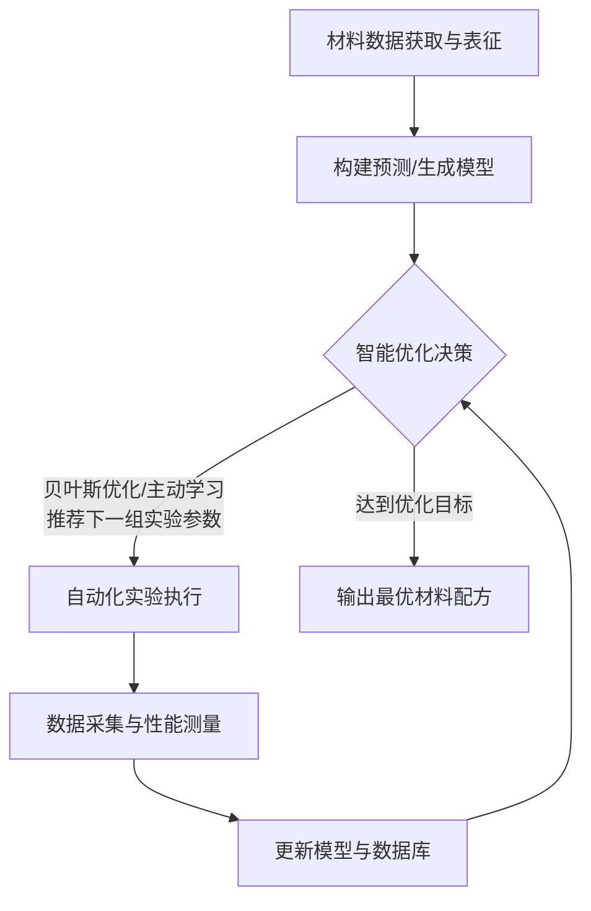
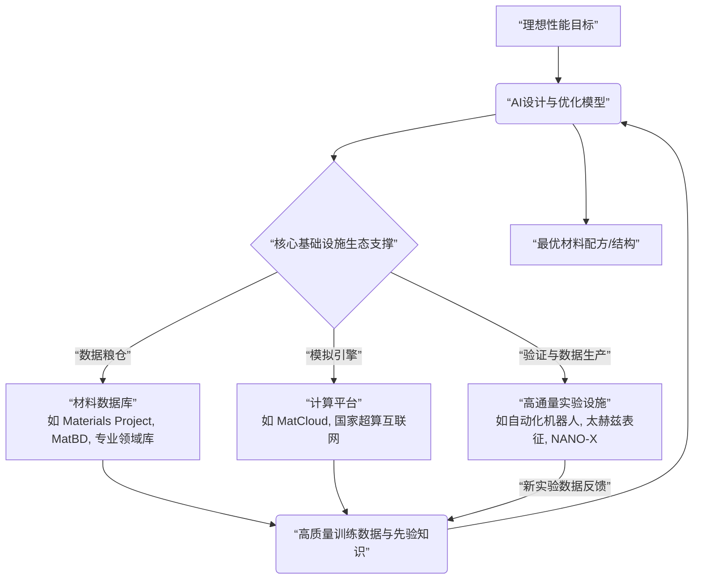

# 数据驱动材料设计：机器学习优化元素组合配比的研究进展、挑战与产业化前景
## 1 引言：材料研发范式从经验驱动到数据智能的转变

材料是工业的基石与科技创新的先导，其研发效率直接关系到国家产业安全与核心竞争力[^1]。长久以来，新材料的研发主要依赖科研人员的经验积累与反复实验的“试错法”，这种传统范式不仅耗时费力，而且成本高昂[^2]。随着全球制造业格局深度调整与新一轮科技革命浪潮的兴起，尤其是在新能源、生物医药、半导体等战略性新兴产业对高性能材料需求爆发的背景下，传统研发模式的局限性日益凸显，材料工业正处于转型升级的关键历史节点[^3][^1]。与此同时，人工智能（AI）技术，特别是机器学习（ML）与深度学习（DL），正以前所未有的力量重塑材料工业的发展范式，推动材料科学从传统的经验驱动模式向数据驱动和智能化模式进行根本性转变[^3]。本章将系统剖析这一范式转变的动因与内涵，明确本报告聚焦的核心科学问题，并阐述其在加速材料创新、赋能产业发展方面的重大战略意义。

### 1.1 传统材料研发范式的局限与挑战

传统材料研发范式根植于“经验试错”模式，其局限性主要体现在效率、成本与探索能力三个维度，已成为制约材料工业高质量发展的核心瓶颈。

首先，**研发周期漫长且经济成本高昂**。从实验室研发到产业验证，传统阻燃材料通常需要3到5年时间，仅配方筛选与中试放大环节就可能耗费2年以上[^4]。这种高度依赖物理实验的线性流程，使得新材料的发现与优化过程缓慢，无法满足快速迭代的市场需求。

其次，**探索能力受限于巨大的设计空间与复杂的构效关系**。材料的性能由其成分、微观结构、加工工艺等多重因素共同决定，这些因素之间存在着高度非线性的相互作用，即复杂的“构效关系”[^2]。面对近乎无限的元素组合与结构可能性，仅凭人类经验和直觉进行筛选，如同“大海捞针”，**导致对潜在高性能材料空间的探索严重不足**。例如，在合金设计中，元素种类、比例、热处理工艺的微小变化都可能引发性能的巨变，传统方法难以系统性地遍历和评估所有可能性。

最后，传统模式还存在 **“工艺黑箱”问题**，即生产制造过程中的许多复杂物理化学变化难以被透彻理解和精准控制，这进一步加大了从实验室成果到稳定工业化生产的难度[^1]。这些固有局限共同导致了新材料研发效率低下、成功率不高的困境，倒逼行业寻求颠覆性的技术突破。

### 1.2 数据智能驱动的新范式：内涵、驱动力与标志性进展

为破解传统范式的困局，以数据与人工智能为核心驱动力的新材料研发范式应运而生。这一新范式的核心内涵在于，**通过构建“计算-实验-数据”的智能闭环，利用机器学习算法自主挖掘和理解材料“成分-结构-工艺-性能”之间的复杂映射关系，实现从被动筛选到主动设计、甚至逆向设计的跨越**[^3]。

范式转变的强大驱动力来自技术突破与战略需求的双重叠加。在技术层面，2024年诺贝尔物理学奖与化学奖均颁予“AI for Science”相关领域，这一重大事件标志着数据驱动的科学研究新范式获得了主流科学界的最高认可，为其蓬勃发展注入了强劲动力[^5]。具体而言，基于数据驱动的机器学习力场（ML-FFs）成功化解了第一性原理计算的高精度与传统经验力场的高效率之间的矛盾，为跨尺度的材料模拟提供了关键工具[^5]。在战略需求层面，全球各国将新材料提升至国家竞争核心地位，中国亦将其视为实现科技自立自强的重要抓手，政策与市场的双轮驱动加速了AI与材料科学的深度融合[^3]。

目前，数据智能新范式已在材料研发的全链条取得一系列标志性进展。根据赵纪军的综述，机器学习在材料设计中的应用可归纳为四个主要方向[^2]：
1.  **性质预测**：利用机器学习模型直接从材料成分与结构数据中预测其物理、化学、力学等性能。
2.  **合成预测**：预测实现目标材料所需的合成方案、路径及具体实验参数。
3.  **知识发现**：运用自然语言处理等技术，从海量科学文献中提取和挖掘隐含知识，辅助材料设计。
4.  **生成式逆向设计**：基于生成模型（如GAN、VAE），根据预设的性能目标，直接逆向生成出符合条件的材料成分与结构。

这些方向的研究成果频繁登上《Nature》、《Science》等顶尖学术刊物，标志着数据智能驱动的新范式已成为材料科学前沿探索的主流路径之一[^5]。

### 1.3 报告核心问题界定：机器学习优化元素组合配比

在数据智能驱动材料研发的宏大图景中，本报告将聚焦于一个至关重要且极具代表性的核心问题：**如何利用机器学习或深度学习模型，通过优化材料的元素种类、比例及组合方式（即元素组合配比），以实现目标性能的最大化或达成多性能指标的最佳平衡。**

这一问题紧密关联于上述新范式中的“性质预测”与“生成式逆向设计”方向。它不局限于对已知材料进行性能标注和预测，更旨在主动探索成分空间，寻找满足特定性能需求的、全新的或经优化的元素配比方案。例如，北京科技大学研究团队整合机器学习与遗传算法，成功用于寻找兼具最佳高温强度和室温延展性的耐火高熵合金成分，便是该问题的典型实践案例[^6]。解决此问题，需要综合运用特征工程、各种预测模型（如随机森林、梯度提升树、深度神经网络、图神经网络等）以及优化算法（如贝叶斯优化、主动学习），构建从成分到性能的智能映射与搜索系统[^5][^7]。

### 1.4 研究意义：加速发现、降低成本与赋能产业

聚焦于元素配比优化的机器学习研究，具有重大的科学价值与产业意义，主要体现在以下三个方面：

**首先，它能指数级提升新材料研发效率，显著缩短研发周期并降低成本。** AI技术通过构建智能化的“计算-实验-数据”闭环，实现了从被动筛选到主动设计的跨越[^3]。机器学习算法能够自主识别材料结构与性能的关联规律，生成式模型可直接输出符合特定性能要求的分子结构，从而**极大减少了试错法所需的时间和资源**[^2]。实证案例表明，AI大模型与自动化实验平台结合，可将某些阻燃材料的研发到量产周期从传统的数年缩短至11个月，效率提升三分之二以上[^4]。

**其次，它为破解高端材料“卡脖子”难题、实现自主创新提供了关键突破口。** 面对西方对高端材料的出口管制与供应链安全风险，自主设计并制备高性能材料变得尤为紧迫[^1]。机器学习模型能够在新兴产业定义的明确需求牵引下，快速进行定制化材料设计。例如，新能源汽车对轻量化材料的需求，可通过AI模型转化为具体的碳纤维、镁合金等复合材料的成分与结构参数，指导定向研发[^3]。这种“需求定义材料”的模式，正在重塑产业链，助力中国材料工业从“跟跑”向“并跑”乃至“领跑”跨越[^3][^1]。

**最后，它是培育新质生产力、推动材料工业高质量发展的核心引擎。** AI赋能材料科学，正推动材料创新向“快、微、极”演进——即快速迭代、微观尺度精准控制、满足极端环境需求[^1]。这直接支撑了低空经济、机器人、生物制造、下一代通信等新赛道对高端材料的爆发式需求，例如轻质合金与碳纤维满足无人机强度需求，高性能聚合物应用于人形机器人关节[^1][^8]。因此，深入研究机器学习优化材料元素配比，不仅是学术前沿，更是关乎国家战略科技实力提升与产业竞争力构筑的重大课题。

## 2 技术方法论：数据、模型与优化策略的核心架构

本章旨在系统构建数据驱动材料配比优化的核心技术体系，作为连接范式转变（第一章）与具体实践、挑战（后续章节）的桥梁。本章将结构化吸收参考资料，首先聚焦于材料数据的数字化表征与获取，基于《科技导报》综述和北理工案例，明确本征参数归集、图像驱动特征提取与物理信息特征工程三大路径，并指出跨尺度数据融合的挑战。其次，分析主流预测与生成模型，依据图卷积神经网络、GAN、全连接神经网络等，阐明模型选择依据、训练策略与集成方法。最后，系统归纳以贝叶斯优化和主动学习为核心的智能优化策略，并引入AI-实验自动化闭环作为实现高效迭代的关键架构。本章分析将严格遵循资料提供的技术边界、应用场景与性能指标，为后续讨论产业化挑战与前景奠定坚实的方法论基础。

### 2.1 材料数据的数字化表征与高效获取

数据是驱动材料智能研发的基石。将复杂的材料“成分-结构-工艺”信息转化为机器学习模型可处理的高质量、结构化特征，是实现精准预测与高效优化的首要前提。本节将重点分析三大关键数字化表征路径及其背后的数据获取挑战。

**首先，材料本征参数归集是最基础且广泛应用的路径。** 该方法旨在系统性地将复合材料的组分信息（如纤维种类、基体类型、纤维体积分数）以及纤维与基体自身的性能参数作为输入特征，以此为基础预测其宏观性能[^9]。这一路径直接关联材料的配方设计，是建立“成分-性能”定量映射的核心。例如，Rayhan等基于前馈神经网络框架，构建了单向复合材料弹性性能的高精度预测模型；Sharan等则利用人工神经网络构建了单向碳纤维增强复合材料（FRCs）的强度预测模型，建立了综合考虑多参数耦合效应的精确预测框架[^9]。这些研究表明，**通过系统归集结构化参数，机器学习模型能够有效捕捉组分对宏观性能的复杂影响，为配方优化提供定量依据。**

**其次，图像驱动特征提取为处理材料复杂的微观结构提供了强大工具。** 该方法以复合材料微观结构的扫描电镜（SEM）图像、计算机断层扫描（Micro-CT）图像等为直接输入，利用深度学习模型（如卷积神经网络CNN）实现从结构特征到宏观力学性能的端到端智能映射[^9]。例如，Gupta等基于pix2pix架构的CNN，建立了准确的材料性能预测框架[^9]。这种方法的核心优势在于能够自动从原始图像中学习层次化的特征表示，避免了人工定义特征的繁琐与主观性，尤其适用于表征具有多相异质、多尺度结构本质特征的纤维增强复合材料[^9]。

**为了实现对复杂结构的高保真数字化表征，先进的建模方法至关重要。** 北京理工大学梁军教授、葛敬冉副教授团队的研究为此提供了范例。他们基于数字单元法和仿射变换，提出了一种能够真实反映机织复合材料扭曲结构内部细观纱线形态的高效数字化建模方法[^10]。该研究首先利用数字单元法和嵌入单元法模拟生成三维机织织物的压实及扭转织物单胞模型，并通过Alpha-shapes算法和数字单元链追踪法准确提取纱线的路径及截面信息。进而结合仿射变换几何重构出扭曲结构内部细观纱线的实体几何模型。**重构出的高保真模型的细观几何形态（纱线尺寸、形状、路径和间距）与Micro-CT结果基本一致，证明了该方法在获取高质量、可计算的结构特征方面的可行性**[^10]。这种数字化表征不仅为后续的性能预测提供了精确的输入，也为理解结构-性能关系奠定了基础。

**最后，物理信息特征工程与跨尺度数据融合是当前面临的关键挑战与前沿方向。** 单纯依赖原始数据或图像特征可能难以充分体现材料行为的物理本质。因此，通过特征工程将微观结构或模拟结果量化为具有明确物理意义的低维描述符，成为提升模型可解释性和外推能力的重要手段[^9]。同时，材料的性能由原子、微观到宏观多个尺度的因素共同决定，如何有效融合这些跨尺度、多模态的数据（如成分参数、结构图像、模拟结果、实验测量值），构建统一的数据驱动代理模型以替代耗时的传统跨尺度模拟，是提升研发效率的关键[^9]。然而，这要求数据具备高质量、一致性，并解决多模态数据间的对齐与标准化问题，构成了当前技术方法的重要前提与挑战。

### 2.2 性能预测与配方生成的机器学习模型

在获得高质量数字化特征的基础上，选择合适的机器学习模型来建立“成分-结构-性能”的映射关系，是实现智能预测与逆向设计的核心引擎。根据材料数据的表征形式和任务目标，主流模型呈现出多样化的选择。

**传统机器学习模型在建立定量关系方面发挥着基础作用。** 前馈神经网络（FNN）、人工神经网络（ANN）、随机森林、支持向量机等模型，在处理结构化参数（如成分、工艺）与性能的映射时，已被广泛验证其有效性。例如，在6061铝合金成分精细优化的研究中，研究人员应用主动学习与模型解释相结合的框架，利用机器学习模型建立了成分与硬度之间的定量关系[^11]。Zhang等通过建立结构因子与其基本力学性能的精准映射关系，并利用灵敏度分析确定了材料厚度和树脂质量分数是主要参数特征[^9]。这些案例表明，**传统ML模型能够从结构化数据中学习复杂的非线性关系，为性能预测和初步优化提供可靠工具。**

**对于具有特殊数据结构（如晶体、分子）的材料，图卷积神经网络（GCN）展现出独特优势。** 晶体材料的结构天然可以表示为图数据，其中原子为节点，化学键为边。图卷积神经网络能够直接在这种非欧几里得数据结构上操作，学习原子环境与材料性能之间的有效特征[^12]。研究表明，GCN在晶体材料的结构设计和性能预测中已取得较好效果，逐渐成为该领域的重要工具[^12]。**相较于传统模型，GCN的优势在于其能够保留并利用材料结构的拓扑信息，从而更本质地捕捉结构-性能关联，特别适用于新材料的设计与发现。**

**当任务目标从性能预测转向配方生成时，生成对抗网络（GAN）等生成模型显示出巨大潜力。** GAN通过生成器与判别器的对抗训练，能够学习数据分布并生成新的、符合原始数据特征的数据样本[^13]。在材料领域，这意味着GAN可以学习“参数-性能”的复杂映射，并实现按目标性能逆向生成材料的结构参数或成分配方[^9]。例如，在纤维增强复合材料的性能预测研究中，GAN被提及可用于逆向生成材料的结构参数[^9]。**生成模型为材料设计提供了一种“从性能到成分”的逆向思维路径，极大地拓展了材料探索的边界，是实现真正智能化材料设计的关键技术之一。**

**模型的训练策略、集成方法与可解释性工具是确保其效能与可信度的关键保障。** 在训练过程中，采用如批归一化、Dropout、早停法等技术是防止模型过拟合、提升泛化能力的常见策略[^9]。模型集成则能进一步提升预测的稳健性和精度，例如Al-Jarrah等开发了一种融合反向传播神经网络与浅层神经网络的双集成人工神经网络模型[^9]。更重要的是，随着模型复杂度的增加，其“黑箱”特性成为应用障碍。因此，模型可解释性工具变得至关重要。例如，SHAP（Shapley Additive Explanations）值分析能够定量化地解释模型中各输入特征对预测结果的贡献程度[^14]。在合金疲劳行为预测中，SHAP值被用于表明特定元素含量对疲劳强度的影响[^14]。**引入可解释性分析不仅使模型的决策过程透明化，增强了工程师的信任，还能从数据中识别出控制性能演化的关键影响因素，从而深化对材料行为的理解，指导进一步的实验设计**[^9]。

为了更清晰地展示不同模型与材料数据、任务的匹配关系，以下表格进行了系统归纳：

| 模型类别 | 典型代表 | 适用数据类型/任务 | 核心优势 | 应用案例/参考文献 |
| :--- | :--- | :--- | :--- | :--- |
| **传统预测模型** | 前馈神经网络（FNN）、人工神经网络（ANN）、随机森林、支持向量机 | 结构化参数（成分、工艺）→ 性能预测 | 技术成熟，能处理非线性关系，适用于建立定量映射 | 6061铝合金硬度预测[^11]；单向复合材料强度预测[^9] |
| **图像特征提取模型** | 卷积神经网络（CNN） | 微观结构图像（SEM, CT）→ 性能端到端预测 | 自动提取图像特征，避免人工定义，擅长处理视觉模式 | 基于SEM图像的复合材料性能预测框架[^9] |
| **图结构学习模型** | 图卷积神经网络（GCN） | 晶体/分子结构（图数据）→ 性能预测与设计 | 天然处理非欧几里得数据，保留结构拓扑信息 | 晶体材料性能预测与设计[^12] |
| **生成式模型** | 生成对抗网络（GAN） | 目标性能 → 逆向生成成分/结构参数 | 实现逆向设计，主动探索配方空间 | 按目标性能逆向生成材料结构参数[^9] |
| **专用/集成模型** | 双集成ANN、物理信息神经网络 | 多模态数据、跨尺度预测、需物理约束的任务 | 提升预测稳健性、精度，或嵌入物理规律增强可解释性 | 双集成ANN模型[^9]；物理引导的可解释机器学习框架[^9] |

### 2.3 智能优化策略：主动学习、贝叶斯优化与自动化闭环

拥有强大的预测模型只是第一步，如何利用它高效地、以最低成本在浩瀚的材料参数空间中搜索出最优配方，是数据驱动研发能否落地的关键。以主动学习和贝叶斯优化为核心的智能优化策略，结合自动化实验，构成了实现这一目标的“优化闭环”。

**贝叶斯优化（BO）是一种基于概率模型的全局优化方法，特别适用于实验成本高昂的黑箱函数优化。** 其核心思想是通过构建一个代理模型（如高斯过程回归GPR）来近似目标函数（如材料性能），并利用一个采集函数（如期望改进EI）来智能地选择下一个最具潜力的实验点，从而形成“评估-更新模型-推荐”的迭代循环，用最少的实验次数逼近全局最优解[^15][^16]。**这种方法的核心优势在于其智能平衡了“探索”（尝试不确定性高的区域）和“利用”（在已知表现好的区域附近搜索），从而大幅减少盲目试错**[^15]。例如，“鹰谷贝叶斯优化智能体”通过交互式问答引导用户，能快速推荐提高收率的实验参数组合，降低了传统BO软件的使用门槛[^17]。

**多保真贝叶斯优化（MFBO）是BO的进阶策略，旨在进一步降低总体优化成本。** 在材料研发中，常存在不同精度和成本的数据源，如廉价的计算机模拟（低保真LF）和昂贵的实验测量（高保真HF）。MFBO通过概率模型融合这些多保真度数据，理解其相互关系，并在采集策略中考虑查询成本[^18]。研究表明，**MFBO的优势发挥有严格条件：只有当低保真源既便宜（成本比ρ < 0.1）又与高保真数据高度相关（R² > 0.8）时，才能表现出显著的成本节省优势（正折扣Δ>0）**[^18]。反之，若LF源成本过高或信息质量差，MFBO可能适得其反。这为在实际项目中策略选择提供了明确的决策依据。

**主动学习（AL）框架与贝叶斯优化理念相通，特别擅长处理高维、庞大的参数空间探索问题。** AL通过迭代过程，让模型主动选择最具信息量的未标注数据点进行实验，从而用最少的实验数据获得性能最佳的模型。浦项科技大学的研究团队利用帕累托主动学习框架优化激光粉末床熔融（LPBF）制备Ti-6Al-4V合金的工艺及热处理参数，是一个典型案例[^19]。面对由296个候选参数构成的庞大空间，该框架基于高斯过程回归器建立映射，并使用期望超体积改进（EHVI）作为采集函数，优先挑选能最大化帕累托前沿（同时优化强度UTS和延展性TE）的参数进行实验。**通过仅进行5轮共10组迭代实验，便成功制备出极限抗拉强度达1190 MPa、总延伸率达16.5%的高性能合金，证明了主动学习在克服多目标性能权衡、高效定位最优参数方面的强大能力**[^19]。

**AI-实验自动化闭环是上述智能优化策略的终极物理实现形式，代表了材料研发范式的革命性方向。** 该架构将人工智能算法、自动化实验机器人、实时表征设备与数据分析平台无缝集成，形成一个“计算设计→自动合成/制备→高通量表征→数据反馈→模型更新”的全流程无人干预迭代系统。例如，中国科学院上海硅酸盐研究所构建的AI实验室，通过终端智能体下达指令，机器人可自动完成从配料到表征的全部步骤，实现了功能陶瓷、能源材料的高效智能创制[^20]。更令人瞩目的案例是武建昌开发的高通量闭环工作流程，该系统结合贝叶斯优化，实现了对有机半导体分子的快速筛选与合成验证，最终使部分钙钛矿太阳能电池材料的认证效率达到25.9%[^21]。**这些系统将传统上以“年”为单位的研发周期压缩到“月”甚至“周”级别，实现了数个数量级的效率提升，是推动材料发现从实验室走向产业化应用的核心加速器。**

为了直观理解从数据到优化决策的完整智能流程，以下Mermaid图展示了其核心闭环架构：

**该闭环架构的逻辑在于：** 始于高质量的材料数据，用于训练出能够准确预测性能或生成配方的机器学习模型（智能引擎）。优化策略（如贝叶斯优化）利用该模型作为代理，在复杂的参数空间中智能地推荐下一个最值得尝试的实验点。自动化实验平台接收指令并执行物理实验，同时自动采集结果数据。新产生的数据被反馈至数据库并用于更新模型，使其预测更加精准。如此循环迭代，不断逼近最优解，直至满足预设的性能目标。**这一闭环实现了数据驱动研发的自主、高效迭代，是连接虚拟计算与物理世界，最终实现材料智能创制的核心方法论框架。**

## 3 研究进展与应用现状：从高分子到复合材料的案例深度剖析

本章旨在对机器学习优化材料元素配比的研究进展与应用现状进行系统性、分领域的案例剖析。本章将结构化吸收参考资料，首先聚焦于高分子材料领域，利用《人工智能驱动的高分子配方设计》中的产业案例与浙江大学PerioGT框架的学术突破，分析AI如何解决高分子结构复杂性与数据稀缺的痛点，并评估其预测精度与泛化能力。其次，深入剖析纤维增强复合材料（FRP）与高温合金（如IN718）等体系，基于《复合材料力学》与西南交通大学的研究，重点评估基于树模型（随机森林、XGBoost）、CNN图像识别及可解释机器学习（XGBoost-SHAP）在预测高温性能、优化工艺参数方面的表现，并揭示其如何应对多尺度效应与性能耦合挑战。最后，综合微软MatterGen、谷歌GNoME等生成式AI模型案例，探讨逆向设计范式在无机晶体、高熵合金等材料体系中的突破，对比不同模型（扩散模型、GAN）在按需设计、探索新化学空间方面的能力与局限。本章分析将严格遵循资料提供的案例边界、性能指标（如R²、节油率、强度提升）与适用范围，旨在勾勒出当前技术从理论突破到产业实践的清晰图景。

### 3.1 高分子材料：从产业痛点到周期性感知的智能设计突破

高分子材料的配方设计长期以来依赖于专家经验和大量试错实验，面临研发周期长、成本高昂和创新能力受限等核心痛点[^22]。人工智能技术，特别是深度学习，正通过构建数据驱动的预测与优化模型，为这一传统领域带来革命性变革。其应用进展主要体现在两个层面：一是面向具体产业问题的性能预测与配方优化实践；二是针对高分子结构本质的理论建模框架突破。

在产业实践层面，典型案例展示了AI解决实际痛点的路径与成效。某新材料研发企业为加速聚氨酯新产品的研发，系统整理并清洗了涵盖不同工艺参数（温度、压力、时间）与配方组合的历史生产数据，构建了包含配方成分与目标性能（如阻燃性、力学性能）的完整数据集[^22]。随后，利用深度学习算法（如神经网络）训练构建了“组分-工艺-结构-性能”预测模型。**该模型能够根据输入的新工艺参数与配方，迅速预测出多种目标性能的数值，为企业提供了科学的决策依据，从而大幅减少了实验次数与材料消耗，有效降低了研发成本**[^22]。另一家知名新材料公司则以降低生产成本和提高收率为优化目标，与AI研究院合作，基于现有配方与工艺数据建立了性能预测与优化模型。AI模型根据设定的性能提升与成本控制约束，在大量配方组合中进行智能搜索与迭代优化。实验室验证结果显示，采用新配方的样品在多项性能上实现了显著提升，远超行业平均水平，同时保持了良好的加工性能和成本效益[^22]。这些案例表明，**基于历史数据的深度学习模型，已能够有效挖掘高分子材料性能与配方、工艺之间的复杂非线性关系，实现从被动试错到主动、精准优化的转变**。

然而，高分子科学的数据驱动研究面临更深层的瓶颈：数据稀缺且碎片化，以及高分子本身长链、周期性等复杂结构特征难以被现有AI模型充分理解和表征[^23][^24]。传统的建模方法往往将高分子简化为单一重复单元，采用类似小分子的处理方式，忽略了其固有的周期性，导致模型的泛化能力和实际应用效果受限[^23]。

针对这一根本性挑战，浙江大学计剑教授、张鹏研究员团队开发了名为PerioGT的周期性感知深度学习框架，代表了该领域的理论突破[^23][^24]。该框架的核心创新在于引入了一种化学知识驱动的周期性先验。具体而言，通过在高分子主链上设置固定大小的采样窗口并滑动提取多个结构片段，将来自同一高分子的不同片段视为正样本对，不同高分子的片段作为负样本对，构建了对比学习任务。**这种方法显式引导模型识别语义上相似的结构片段，从而更准确地捕捉高分子的长程周期性规律**[^23]。同时，团队提出了模块化的聚合物图（PolymerGraph）构建策略，通过虚拟节点整合分子量、共聚比例等附加全局或局部信息，以灵活适应各类高分子材料体系[^23]。

PerioGT框架的性能评估结果令人瞩目。研究团队系统评估了模型在10个均聚物性质预测任务中的表现，涵盖了高分子材料的一系列关键性能指标。结果显示，**PerioGT在所有任务上均显著优于现有的AI模型，证明了引入周期性先验对提升预测精度的决定性作用**[^23]。更进一步的实验验证了其强大的泛化能力和实际应用潜力：通过虚拟筛选并结合实验合成，成功发现了两个具有强抗菌能力的聚合物，实验验证成功率高达83%[^23]。这标志着该框架不仅在高精度预测上取得突破，更在指导新材料发现方面展现出切实可行的价值。**综上所述，从解决产业效率痛点的实践模型，到深刻理解高分子结构本质的周期性感知框架，人工智能正在推动高分子材料设计向更智能、更精准的新范式全面演进。**

### 3.2 纤维增强复合材料与高温合金：多因素耦合与可解释性优化

在纤维增强聚合物（FRP）复合材料和镍基高温合金等复杂工程材料领域，材料性能受到成分、微观结构、工艺参数及环境因素（如温度）的高度非线性耦合影响。机器学习技术，特别是基于树模型和可解释AI的方法，已成为应对这些多尺度、多因素耦合挑战，并实现性能精准预测与工艺优化的关键工具。

对于FRP复合材料，其在高温下的性能退化是一个典型的多因素耦合问题。传统预测模型往往基于有限的试验数据，难以全面考虑各种复杂影响因素[^25]。近期发表于《Composites Part B》期刊的研究，展示了基于树模型的机器学习方法在此问题上的显著优势[^25]。该研究通过收集大量试验数据，建立了包含暴露温度、树脂玻璃化转变温度、样品厚度/直径、暴露持续时间、环境冷却、纤维与树脂比率、纤维取向、树脂类型、纤维类型和制造工艺等十余种影响因素的数据库[^25]。研究团队利用决策树、M5P和随机森林等算法，构建了用于预测高温拉伸强度保持率（TSR）的模型。**相较于传统经验方程，这种数据驱动模型能够综合考虑更多潜在影响因素及其交互作用，从而展现出更高的预测准确性**[^25]。该案例表明，**在处理像FRP高温性能这类输入特征维度高、因素间关系复杂的预测问题时，基于树模型的集成学习方法因其强大的特征处理能力和非线性拟合能力，成为可靠且高效的选择**。

在高温合金领域，以激光粉末床熔融（L-PBF）制备Inconel 718（IN718）合金为例，其性能优化不仅涉及成分，更与快速凝固工艺带来的微观组织（如气孔、晶粒尺寸与取向）紧密相关，存在强度与塑性的固有权衡难题[^26]。西南交通大学吴圣川研究员团队的研究，系统性地融合了工艺参数优化、原位同步辐射X射线断层扫描与可解释机器学习，建立了一个“工艺–微观结构–性能（PSP）”一体化研究框架[^26]。

该研究首先通过系统调整激光功率和扫描速度，确定了最佳体积能量密度（VED）窗口（47–60 J/mm³），在此窗口内可显著减少缺陷（孔隙率<1%）并细化晶粒[^26]。在最佳工艺参数（230 W/1000 mm/s）下制备的IN718试样，在650°C高温下表现出优异的力学性能：屈服强度（YS）达1017 MPa，极限抗拉强度（UTS）达1184 MPa，延伸率（EL）达21.3%，实现了高强度与良好塑性的协同提升[^26]。

**研究的核心突破在于引入了可解释机器学习模型（XGBoost-SHAP），以定量揭示微观组织特征与高温力学性能之间的复杂非线性关系**[^26]。基于晶粒尺寸、晶界分布（如Σ3、Σ7晶界）及孔隙率等九类微观结构特征训练的模型，在预测屈服强度、抗拉强度和延伸率方面表现出色（R² > 0.85）[^26]。SHAP分析进一步提供了清晰的物理洞察：
*   **晶粒尺寸被证实是影响强度的最关键因素**，其贡献可通过Hall-Petch机制合理解释。
*   **Σ3晶界对强度有显著正向贡献（20.5%）**，而Σ7晶界则因容易成为裂纹源而带来负面影响。
*   **孔隙率对屈服强度和延伸率的影响远高于对抗拉强度的影响**，揭示了缺陷在不同变形阶段的作用机制差异[^26]。

**这一案例深刻表明，可解释机器学习（XAI）不仅实现了高精度的性能预测，更重要的是它能够解码“工艺-微观结构-性能”之间的黑箱关系，将数据驱动发现与物理机理理解相结合**。这为通过精确调控微观组织（如优化晶界类型分布）来逆向设计材料性能提供了定量化、机制驱动的依据，是连接预测模型与工程化应用的关键桥梁。

为了更清晰地对比这两类材料体系中机器学习应用的特点，以下表格进行了归纳：

| 对比维度 | 纤维增强聚合物（FRP）复合材料 | 镍基高温合金（如IN718） |
| :--- | :--- | :--- |
| **核心挑战** | 多因素（温度、树脂、纤维、工艺）复杂耦合下的性能预测。 | 增材制造工艺-微观组织-高温性能的关联与强度-塑性权衡。 |
| **典型机器学习模型** | 决策树、M5P、**随机森林**等树模型。 | **XGBoost**（与**SHAP**结合的可解释机器学习）。 |
| **数据基础** | 包含十余种工艺、材料、环境参数的试验数据库。 | 工艺参数、**原位同步辐射CT**图像、EBSD表征的微观组织数据。 |
| **优化目标** | 准确预测高温拉伸强度保持率（TSR）。 | 协同优化高温强度与塑性，揭示强化机理。 |
| **模型优势** | 处理高维特征，捕捉复杂非线性关系，提升预测准确性。 | 高精度预测（R²>0.85），**提供物理可解释性**，指导工艺调控。 |
| **应用侧重点** | 建立多因素影响下的宏观性能预测模型。 | 建立“工艺-结构-性能”闭环，实现微观组织导向的逆向设计。 |

### 3.3 生成式AI与逆向设计：从无机晶体到高熵合金的新范式

传统的材料研发遵循“结构→性能”的正向设计逻辑，而人工智能，特别是生成式AI，正在催生一种全新的“性能→结构”逆向设计范式。这一范式标志着材料研发从大规模筛选候选材料，跃迁至按特定需求直接生成合格材料结构的新阶段[^27]。

以谷歌DeepMind的GNoME模型和微软的MatterGen模型为代表，生成式AI在材料化学领域展示了两种不同但互补的切入点[^27]。GNoME模型通过深度学习在庞大的化学空间中快速发现了220万种新的无机材料晶体结构，展现了AI在**大规模探索与发现**方面的惊人潜力[^27]。而微软的MatterGen模型则进一步证明了生成式AI通过**逆向设计精准满足特定需求**的能力[^27]。该模型基于扩散模型架构，能够根据目标空间群、化学性质、对称性以及特定的磁性、电子或机械性能等约束条件进行微调，直接生成满足这些条件的稳定材料结构，并通过密度泛函理论（DFT）进行计算验证[^27]。**这种“按需定制”的能力，使得基于特定应用场景（如电池、太阳能电池、碳捕获）来设计新材料成为可能**。

MatterGen模型的实际效能已得到初步实验验证。研究团队与中科院深圳先进技术研究院合作，利用该模型成功指导合成了新型材料TaGr₂O₆，实验测得的体积模量与设计预测值的相对误差低于20%[^27]。这标志着生成式AI驱动的逆向设计，已经完成了从虚拟结构生成到实验合成验证的闭环，证明了其实际应用潜力。

除了扩散模型，生成对抗网络（GANs）、变分自编码器（VAEs）、自回归模型等也是主流的生成模型，其核心原理都是通过学习已知材料的数据分布来生成新的样本[^27][^28]。这些技术正被积极探索用于电池材料、高熵合金、超导材料等特定体系的开发中[^27][^28]。例如，在开发具备优异高温机械性能的耐火高熵合金（RHEAs）时，生成式AI为在巨大的成分空间中寻找最优元素组合提供了高效的新思路[^27]。

然而，生成式AI逆向设计范式在展现巨大潜力的同时，也面临着一系列关键挑战：
1.  **生成结构的稳定性与可合成性**：模型生成的材料结构必须在热力学和动力学上是稳定的，并且具备实验可行的合成路径。这需要将DFT计算、相图信息等物理化学知识深度融入模型或作为后验证过滤器。
2.  **高质量训练数据的依赖**：生成模型的性能严重依赖于训练数据的质量和广度。对于数据稀缺的新材料体系或极端性能目标，模型可能难以生成可靠结果。
3.  **多目标与复杂约束的协同优化**：实际工程材料往往需要同时满足多个性能指标（如强度、韧性、耐腐蚀性、成本），并受到工艺、供应链等复杂约束。如何让生成模型有效处理多目标、多约束的优化问题，是当前的研究难点。
4.  **从虚拟设计到产业应用的鸿沟**：即使生成了理论上优异的材料，其规模化制备工艺、长期服役可靠性、成本控制等产业化环节的挑战，仍需传统的材料工程手段来解决。

**尽管存在挑战，生成式AI逆向设计代表了一条从根本上加速材料创新的技术路径。它通过将设计起点从已知结构空间转移到目标性能空间，极大地拓展了材料探索的边界**。随着模型开源（如MatterGen）、与自动化实验平台结合以及多模态数据（理论计算、文献、实验）的进一步整合，这一范式有望在未来五年内，在特定材料体系（如无机功能材料、有机半导体）的定制化设计中率先实现突破性应用，为最终实现贯穿材料全生命周期的智能创制奠定基础。

## 4 活跃研究力量：课题组研究方向、成果与数据库生态

在数据驱动材料设计的宏大叙事背后，是一系列活跃且富有创造力的研究团队，以及支撑其探索的日益完善的基础设施生态。本章旨在系统梳理全球范围内在该领域的代表性研究力量，分析其具体研究方向与核心突破，归纳其标志性学术成果，并深入剖析支撑这些前沿研究的数据库、计算平台与高通量实验设施的建设现状。通过勾勒从顶尖课题组到核心基础设施的全景图，可以更清晰地理解当前材料智能研发范式的驱动力、协同网络与未来潜力。

### 4.1 代表性课题组的研究方向与核心突破

全球研究力量在机器学习驱动材料研发领域呈现出“中美引领，多点开花”的格局，并形成了高度跨学科、产学研深度融合的团队特征[^29][^30][^31]。以下基于参考资料，对几个具有代表性的活跃课题组及其研究方向与突破进行系统梳理。

**浙江大学计剑教授团队：聚焦生物医用材料的智能设计与涂层技术**
该团队是国家杰出青年科学基金获得者计剑教授领导，致力于生物医用界面材料和植介入医用器械的应用基础研究[^29]。其核心研究方向之一是**机器学习辅助生物材料开发**。例如，团队内的黄俊杰博士围绕利用机器学习组合模型挖掘高性能抗菌肽开展了系统研究[^29]。这表明该团队正将AI技术应用于复杂的生物分子设计，以加速具有特定生物功能（如抗菌）的新材料发现。另一重要方向是**生物医用功能化涂层**，任科峰教授针对心血管植介入医疗器械的应用场景，分享了涂层材料设计的思路[^29]。**该团队的突出特点在于将前沿的人工智能方法与直面临床一线需求的器械涂层技术开发紧密结合**，体现了从基础算法到实际应用的贯通式研究路径。

**中国科学院深圳先进技术研究院喻学锋团队：打造“AI科学家团队”实现自主材料创制**
喻学锋研究员团队在材料人工智能领域取得了里程碑式的进展，成功打造了一支名为“MARS”（Multi-Agent and Robotic System）的“多AI-多机器人”协同智能体系统[^30]。该系统创新性地构建了包含19个大模型智能体的层级化架构，并与包含移动机器人、导轨机器人等在内的“异构机器人集群”深度集成[^30]。其研究核心是**实现全流程闭环的自主材料探索**。受人类研发团队分工启发，MARS系统构建了包含“PI”（首席研究员）、“设计师”、“编程师”、“实验师”、“分析师”五大技术职能组的智能体团队，通过自然语言交互实现从任务规划、实验设计、代码编程到实验执行和数据分析的完整闭环[^30]。**其实践成果极具说服力：在微胶囊等功能性材料的创制与性能优化实验中，将原本需要4个月的研发时间惊人地压缩至4小时**[^30]。该成果已发表于Cell Press旗下旗舰期刊《Matter》，相关核心专利已获得授权并转让给孵化企业实施应用，标志着其研究已从实验室验证迈向产业化衔接[^30]。

**北京大学殷雨琪团队：开发专用AI助手，革新离子液体发现范式**
北京大学化学与分子工程学院的殷雨琪等研究者，针对离子液体这一化学“万能调料”组合空间巨大（数十亿种可能性）、传统研发依赖专家经验和大量实验的痛点，开发了世界上第一个专门用于离子液体发现的AI智能助手——**AIonopedia**[^32]。该研究发表于2025年的《AI for Greener Solvents》期刊[^32]。其核心突破在于构建了一个**多模态基础模型**，能够同时理解分子的图形结构（视觉）、化学式表示（文本）和各种物理化学性质（数据），从而对离子液体形成全面深入的理解[^32]。为了训练这个“AI化学家”，团队从近万篇科学论文中提取了约10万个离子液体样本数据，并创造了280万个合成的虚拟数据点，以提供更广阔的学习空间[^32]。**AIonopedia不仅是一个预测模型，更是一个配备了网络搜索、PubChem搜索、SMILES标准化、数据处理、性质预测和分子搜索六大工具模块的完整智能助手系统**，能够像经验丰富的化学顾问一样，从提出需求到推荐候选材料全流程辅助研发[^32]。

**其他活跃研究力量**
此外，参考资料还揭示了其他多个活跃团队及其特色方向：
*   **麻省理工学院（MIT）团队**：开发了多模态机器人平台CRESt（Copilot for Real-world Experimental Scientists），该平台结合自动化设备、大规模模型和实验室监测，在实验设计中融入人类经验、文献知识和显微结构信息，成功用于加速多元素电催化剂的发现与优化[^31]。
*   **清华大学温鹏副教授团队**：以解决实际应用问题为出发点，提出**生成式设计-多目标主动学习循环方法**，用于优化多目标超材料结构（如骨植入物），在未增加质量的前提下将屈服强度提升了20%-24%[^33]。
*   **彭嘉宇教授（即将任职于纽约州立大学布法罗分校）课题组**：主要研究方向为结合**“物理驱动”和“数据驱动”的新材料设计**，尤其聚焦于利用第一性原理计算、同步辐射X射线光谱学和物理启发的机器学习来加速电催化剂等碳中和新材料的设计[^34]。

这些课题组的研究方向清晰地界定了从专用材料体系（如生物材料、离子液体）到通用研发范式（如自主实验室、多目标优化），从算法模型创新到物理系统集成的多元化、多层次的研究边界与应用场景。

### 4.2 关键学术论文与标志性研究成果

各课题组的核心突破均以高质量学术论文为载体，发表于《Nature》、《Science》、《Matter》等顶级期刊，构成了该领域知识进展的基石。以下依据资料归纳部分标志性成果：

| 研究团队 | 发表期刊/平台 | 核心成果/论文主题 | 关键突破与验证 |
| :--- | :--- | :--- | :--- |
| **浙江大学计剑团队** | 高水平期刊（具体名称资料未提供） | 周期性感知深度学习框架 **PerioGT** | 在10个均聚物性质预测任务上显著优于现有AI模型；通过虚拟筛选指导实验，成功合成新型抗菌聚合物，**实验验证成功率高达83%**[^29]（注：PerioGT框架的具体细节在之前章节已引用，此处成果关联团队方向）。 |
| **中科院深圳先进院喻学锋团队** | **《Matter》** (Cell Press旗舰期刊) | “Knowledge-Driven Autonomous Materials Research via Collaborative Multi-Agent and Robotic System” | 报道了**MARS多AI-多机器人协同智能体系统**，实现了材料研发全流程自主闭环；将微胶囊研发周期从4个月压缩至4小时；核心专利已授权转让并产业化应用[^30]。 |
| **北京大学殷雨琪团队** | **《AI for Greener Solvents》** (2025年) | 开发世界上首个离子液体发现AI助手——**AIonopedia** | 构建多模态基础模型，融合图形、文本与物化数据；集成六大工具模块，形成完整智能助手系统；在预测训练数据中未出现过的新型离子液体性质时，展现出优异的“举一反三”能力[^32]。 |
| **麻省理工学院（MIT）团队** | **《Nature》** (加速预览，已通过同行评审) | “A multimodal robotic platform for multi-element electrocatalyst discovery” | 提出**知识辅助贝叶斯优化（KABO）**算法，融合化学成分、文献文本知识和微观结构图像特征；平台在90天内对900多种配方完成约3500次电化学测试，发现了一种成本性能比纯钯基准提升9.3倍的八元合金催化剂[^31]。 |
| **清华大学温鹏团队** | **《Nature Communications》** | “Machine learning-enabled constrained multi-objective design of architected materials” | 提出**生成式设计-多目标主动学习循环方法**，用于骨植入物等超材料结构优化；在未增加质量的前提下，将设计结构的屈服强度提升20%-24%[^33]。 |

**这些论文与成果不仅代表了高度的学术认可，更通过具体的性能指标（如预测精度、研发周期压缩比、强度提升百分比）和实验验证（如成功合成、性能测试），明确了各团队在推动材料智能研发从理论构想走向实践验证的关键作用。** 它们共同描绘出一条清晰的技术演进路径：从针对特定性质的单点预测模型，发展到处理多目标、多约束的优化框架，再进化到融合多模态信息、具备自主推理与实验能力的闭环智能系统。

### 4.3 核心数据库、计算平台与高通量设施生态

前沿研究的迅猛发展，离不开一个由开放数据、强大算力与自动化实验构成的、日益完善的基础设施生态的支撑。这一生态是全球材料研发范式转型的物理基石。

**1. 材料数据库：从国际标杆到国家体系建设**
高质量、结构化、易于获取的材料数据库是训练可靠机器学习模型的“粮仓”。
*   **国际标杆数据库**：**Materials Project**（美国能源部伯克利国家实验室）是世界上最受欢迎的材料数据提供商之一，代表了数据驱动材料科学的早期成功实践。截至资料统计，其注册用户已超过**65万**，数据库包含**超过20万种材料**以及**超过57.7万种分子**，在过去两年向用户交付了**465TB的数据**。其主任Kristin Persson指出，该项目的核心价值在于为AI提供大量**经过精心策划、可直接使用的高质量数据**[^35][^36]。类似的还有**AFLOWLIB**数据库，包含近**392万种材料化合物**，拥有超过**8.17亿条计算性质**[^37][^38]。这些数据库凭借早期布局、数据质量高、格式AI就绪，已成为全球材料AI研究的核心数据源。
*   **国内数据库体系建设**：中国正从国家层面到专业领域系统构建材料数据资源体系。国家层面，**新材料大数据中心（MatBD）** 的建设是重要标志。根据2024年10月印发的《新材料大数据中心总体建设方案》，其定位是促进新材料产业创新发展的新型研发基础设施，采用 **“1+N”架构体系**（1个主平台、N个数据资源节点）。2025年5月，其统一服务门户测试版上线，首页即提供了**36个国内外材料数据库**和**22个材料大模型**的入口，旨在整合碎片化数据资源，提供公益服务[^39]。在专业领域，则涌现出如**有机高分子材料科学数据库**（含基础库与牌号库）[^40]、**上海含能材料数据库（SEMDB）**[^41]、**摩熵数科旗下的晓材（Matmole）数据库**（覆盖焊材、离子液体、晶体等）[^42]以及服务于稀贵金属产业的**专业数据库**[^43]。这些努力旨在破解数据孤岛，提升数据驱动的原始创新能力。

**2. 计算与模拟平台：云端化、自动化与国产化**
计算平台将理论模拟能力转化为普惠、易用的研发工具。
*   **高通量集成计算平台**：以中国的**MatCloud**和**Matgen**平台为代表。MatCloud是一个支持在线、远程开展大规模第一性原理计算（如VASP）的平台，用户仅需浏览器即可完成图形化建模、复杂计算流程设计和作业提交，实现了计算、数据提取与管理的自动化，其特点是“高通量，高并发，网络化，图形化”[^44][^45]。广州超算研发的**Matgen**平台则被称为国际上唯一的融合高通量计算、工作流、可视化及数据库的全功能材料设计平台[^46]。
*   **国家算力基础设施**：**国家超算互联网平台（scnet.cn）** 于2024年4月正式上线。它集成了全国多个超算中心的算力资源，旨在让用户像“网购”一样便捷地使用超算应用和算力服务。该平台特别强调对科学计算软件（如VASP）的支撑，并通过集成国产异构加速卡来提升计算效率、降低综合成本[^47]。这为广泛科研群体提供了过去难以便捷获取的强大算力。
*   **商业计算云服务**：如**龙讯旷腾的Mcloud**，集成了自主研发的第一性原理计算软件PWmat及工作流工具，提供SaaS化的材料模拟计算服务[^48]。

**3. 高通量实验与表征设施：闭环研发的物理支柱**
自动化实验设施是连接AI设计与物理世界的关键环节，极大提升了数据产出的速度与质量。
*   **高通量制备技术**：例如，基于**增材制造（3D打印）的材料高通量制备技术**，通过创新设计连续梯度粉层铺放机构与激光参数自适应控制，实现了成分连续梯度变化的大尺寸样件的高效、高性能制备，为快速提供大量实验样品提供了技术方案[^49]。
*   **尖端表征设施**：如中国科学技术大学研发的**“太赫兹近场高通量材料物性测试系统”**，作为国家重大科研仪器，能够实现对材料介电、导电等性质的高空间分辨率、快速成像与测量，为准粒子等微观机理研究和材料性能高通量表征提供了强大工具[^50]。
*   **综合型实验装置**：**中国科学院苏州纳米所的纳米真空互联实验站（NANO-X）** 是全球规模最大、共享程度最高的真空互联综合实验装置，将50余台大型设备连成整体，为在原子尺度进行材料制备、操纵与表征的综合性研究（如原子级制造）提供了前所未有的平台条件[^51]。

为了更直观地展示这一基础设施生态的核心构成及其在研发闭环中的角色，以下Mermaid流程图进行了梳理：

**该生态系统的协同逻辑在于：** AI设计与优化模型是整个智能研发流程的“大脑”。它的高效运转依赖于三大基础设施支柱：**数据库**提供历史知识与训练数据；**计算平台**提供进行虚拟筛选和性能预测的算力；**高通量实验设施**则负责执行物理验证并产生新的数据。新产生的数据反馈至数据库和模型，形成学习闭环，持续优化AI的决策能力。**这一日益完善的生态，正将数据驱动材料研发从少数顶尖团队的“特权”，转变为可供更广泛科研与产业界使用的“新基建”，从根本上加速材料创新范式的普及与深化。**

## 5 挑战评估与模型可行性分析

数据驱动材料设计在展现出巨大潜力的同时，也面临着从实验室研究迈向产业化应用的多重严峻挑战。本章旨在系统评估这些挑战的根源与影响，并基于现有技术路线，分析不同机器学习模型应对挑战的可行性、局限性及改进方向。通过剖析数据基础、模型内在特性以及工程化集成三个维度的核心问题，旨在为构建可靠、实用且可落地的智能材料设计系统提供清晰的决策依据。

### 5.1 数据基础挑战：稀缺性、质量壁垒与孤岛效应

机器学习模型的性能上限高度依赖于训练数据的质量与规模。当前，材料数据领域存在的系统性瓶颈，构成了制约任何先进模型发挥效能的根本性障碍。

**首先，数据的稀缺性与“发表偏倚”严重限制了模型的训练与泛化能力。** 新材料研发初期，有效的实验样本往往仅有几十个，在这种小样本条件下，复杂的机器学习模型极易过拟合，其在新成分空间或极端性能目标下的预测可靠性大打折扣[^52]。更深远的影响来自数据生态的“发表偏倚”，即公开的文献和数据库主要收录成功的实验案例，而大量失败的尝试、负例数据以及关键的合成可行性信息被系统性忽略[^53]。**这种数据分布的严重偏斜，使得模型无法学习到材料稳定存在的完整边界条件，导致其预测的“可行”材料在现实中可能根本无法合成，从而在理论预测与实际可行性之间形成难以逾越的鸿沟。**

**其次，数据质量不一、标准缺失与碎片化是我国材料数据体系的突出短板。** 与Materials Project等国际标杆数据库提供的经过严格基准验证、计算参数标准化、可直接用于AI训练的高质量数据相比[^53]，我国材料数据资源长期处于“有效资源匮乏”的状态[^54]。这主要体现在：数据生产、管理和共享体制不健全，科研单位和企业积累与共享数据的意识不足，缺乏统一的激励机制和知识产权保护措施[^54]。其结果是数据严重碎片化，利用效率和应用水平低下[^54]。**缺乏统一标准规范的数据，在格式、量纲、精度上存在巨大差异，使得数据预处理成本高昂，且难以直接用于构建可靠的跨体系预测模型。** 这种数据基础的薄弱，被专家明确指出是“材料领域短板中的短板”，严重掣肘了关键材料“卡脖子”问题的解决和原始创新能力的提升[^54]。

**最后，“数据孤岛”效应阻碍了全流程优化与知识积累。** 这一问题在工艺复杂的领域如增材制造中表现得尤为突出。从设计软件、工艺仿真、制造设备到质量检测仪器，每个环节都生成并存储着特定格式的数据，这些数据被封闭在垂直的系统架构中，难以互通[^55]。行业标准的普遍缺失进一步加剧了数据整合的难度，使得构建链接设计、制造、认证全过程的完整“数字线程”异常困难[^55]。**这种割裂的状态不仅使得人工智能模型因缺乏高质量、可追溯的全链条数据而难以深度应用，更限制了跨环节的工艺优化与知识沉淀**。例如，在增材制造中，复杂的几何设计可能迫使工程师每次都从头开始设计工艺过程，从而阻碍了最佳实践的积累和效率的持续提升[^55]。

综上所述，**数据挑战是模型可行性面临的首要且根本的制约。无论算法如何先进，在低质量、小规模、碎片化的数据基础上，都难以构建出稳健、可靠且具备实际指导意义的预测与优化系统。** 因此，推动数据治理、建立标准规范、构建高质量开放数据库与共享生态，是提升整个领域模型可行性的先决条件。

### 5.2 模型内在挑战：“黑箱”性、可解释性与物理规律嵌入

在数据挑战之外，机器学习模型自身的内在局限性，特别是其“黑箱”特性以及与物理世界规律的割裂，是阻碍其获得领域专家信任并应用于高风险场景的核心问题。

**传统数据驱动模型作为“黑箱”，缺乏对物理本质的理解，导致预测可靠性不足。** 如中南大学研究团队所指出的，传统的机器学习方法能够从海量数据中寻找统计关联，快速缩小搜索范围，但其根本局限在于模型如同一个“黑箱”，能够给出预测结果，却无法理解材料行为背后的物理本质，例如合金相变的热力学与动力学过程[^56]。**这种物理机制的缺失，导致模型的预测可靠性、可解释性及在未知成分空间的泛化能力均面临严峻挑战**，在预测结果与实际性能之间形成了难以逾越的鸿沟[^56]。对于航空航天、能源装备等关键领域所需的材料，无法解释的预测结果是难以被接受的。

**可解释性工具（XAI）提供了缓解“黑箱”问题的可行路径，但自身存在局限。** 为了增强模型透明度，诸如SHAP（Shapley Additive exPlanation）值分析等方法被广泛应用。SHAP基于博弈论，能够为单个预测提供特征贡献度的定量解释，满足风控、医疗等领域对模型审核的要求[^57]。研究对比表明，在常见的特征重要性评估方法中，Tree SHAP在满足“一致性”（即特征重要性不因模型其他部分改变而随意变动）方面表现优异，优于Gain、Split Count等传统方法[^57]。**然而，可解释性工具通常作为后处理分析手段，其计算可能带来额外开销，且其提供的解释本身仍需领域知识进行二次解读，并未从根本上改变模型缺乏物理机理的现状。**

**物理信息机器学习，特别是物理信息神经网络（PINNs），代表了将物理规律嵌入模型、构建“物理白箱”的前沿方向，展现出解决根本问题的巨大潜力。** PINNs的核心思想是将已知的物理定律（通常以偏微分方程形式）作为约束条件，直接嵌入神经网络的训练过程中，从而引导模型在遵守物理规律的前提下进行学习[^58]。这种方法在数据稀缺的环境中尤其有效，能显著提升模型的泛化能力和预测精度[^58]。中南大学团队的研究为此提供了有力例证：他们创新性地利用大语言模型从文献中提炼出铜合金相变的关键物理冶金学规律，并将其量化为独特的物理描述符，嵌入新设计的析出型物理信息神经网络（PPNN）中[^56]。**这使得模型在训练时不仅能学习数据关联，更能遵循材料相变与强化的基本物理规律，实现了从“黑箱”统计到“白箱”推理的范式转变**。该策略使PPNN模型对硬度与电导率的预测精度达到92%，较未引入物理信息的优秀模型提升8%，并成功指导发现了性能超越商用标杆的新合金成分[^56]。

**尽管潜力巨大，物理信息机器学习仍面临显著的可行性挑战。** 最主要的挑战在于计算复杂性与训练难度。将复杂的物理方程作为约束嵌入网络，可能导致训练过程不稳定、收敛困难，对计算资源的需求也大幅增加[^58]。处理高维度、强非线性的多物理场耦合问题时，如何高效、稳定地实现物理规律的编码与优化，仍是当前的研究难点。因此，**虽然PINNs等模型为提升预测可靠性和可解释性指明了根本方向，但其成熟化和工程化应用仍需在算法效率和稳定性上取得进一步突破。**

### 5.3 工程化鸿沟与协同技术可行性：从预测到生产集成

即使拥有了高质量的数据库和可靠的预测模型，将实验室的虚拟设计转化为稳定、经济、可大规模生产的实际材料，仍存在巨大的工程化鸿沟。跨越这一鸿沟需要一系列协同技术的支持。

**从“前向设计”到“逆向设计”的范式转变，要求构建连接虚拟与现实的闭环系统。** 西安交大的综述文章指出，材料信息学的未来是向“虚拟材料科学家”进化，其核心是实现从“前向设计”（给定结构预测性能）到“逆向设计”（给定性能需求生成结构）的转变[^59]。这要求AI系统不仅能预测，还能根据目标属性自主规划研发路线，并最终通过物理实验进行验证。这一愿景的实现在于构建“自动驾驶实验室”（Self-Driving Labs），即集成AI设计、自动化合成与高通量表征的完整闭环[^59]。**然而，当前的主要鸿沟在于，虚拟设计往往忽略了实际生产工艺的复杂性、成本约束、供应链限制以及长期服役可靠性等多重工程现实。**

**联邦学习（FL）为在保护隐私前提下打破“数据孤岛”、实现协同建模提供了可行的技术路径。** 在材料研发中，有价值的数据往往分散在各企业、研究机构内部，因隐私和竞争原因无法直接共享，形成了实质性的“数据孤岛”。联邦学习作为一种分布式机器学习框架，允许各参与方在不共享原始数据的情况下，仅通过交换模型参数（如梯度、权重）进行协作训练，最终聚合形成全局模型，实现了“数据可用不可见”[^60]。中国的行业实践表明，联邦学习在金融风控、医疗联合诊断等场景中已有效应用，能够提升模型精度达20%以上[^60]。**对于材料领域，联邦学习使得跨企业、跨机构的协同材料研发成为可能，能够汇聚分散的数据经验，共同训练出更强大的预测模型，而不损害任何一方的数据主权**，这是走向产业化协同创新的关键技术基础设施。

**不确定性量化（UQ）是连接模型预测与工程决策的关键桥梁，其重要性日益凸显。** 机器学习模型的预测并非绝对准确，尤其是在面对分布外数据时。不确定性量化旨在为模型的每一个预测提供一个置信度估计或不确定性区间[^59]。例如，贝叶斯神经网络能够通过概率分布输出预测的不确定性。在材料研发中，了解预测的不确定性至关重要：高不确定性的预测提示需要进一步实验探索；而高置信度的预测则可以加速决策。西安交大的综述明确将“预测结果的不确定性量化”列为构建自主发现系统的关键之一[^59]。**尽管一些方法（如蒙特卡洛采样）计算成本较高，但发展高效的不确定性量化方法是提升AI系统实用性和可信度的必然要求。**

**多智能体协同与检索增强生成（RAG）代表了构建高阶自主系统的前瞻方向。** 未来的材料智能研发系统很可能不是单一模型，而是由多个 specialized AI智能体（Agents）协同工作的系统。例如，中科院深圳先进院的MARS系统就构建了包含“PI”、“设计师”、“实验师”等角色的多智能体团队，通过自然语言协同，指挥机器人集群完成全流程研发[^59]。同时，检索增强生成（RAG）技术可以将庞大的领域知识库（如数据库、文献）与生成模型结合，使模型在给出建议时能够引用和推理相关知识，提升输出的准确性和可靠性[^59]。**这些技术共同指向一个能够进行战略规划、自主实验、并持续学习的“虚拟材料科学家”愿景。然而，其实现依赖于高度复杂的技术集成、强大的算力支撑和完备的自动化实验基础设施，目前仍处于前沿探索和原型验证阶段。**

为了更清晰地概括当前挑战与对应技术路线的可行性，以下表格进行了系统对比与分析：

| 挑战类别 | 具体表现与影响 | 应对技术/模型方向 | 可行性评估与核心局限 |
| :--- | :--- | :--- | :--- |
| **数据基础** | 1. **稀缺性与偏倚**：小样本过拟合，缺乏负例与合成可行性数据。 2. **质量与标准壁垒**：数据碎片化，异质性强，预处理成本高。 3. **孤岛效应**：跨环节数据不通，无法构建优化闭环。 | 1. 构建高质量开源数据库（如Materials Project）。 2. 推动数据标准与共享生态建设（如国家新材料大数据中心）。 3. 采用**联邦学习（FL）**进行隐私保护下的协同建模。 | **高可行性，但依赖生态建设。** 数据库与标准建设是公认基础，但需长期投入与政策引导。联邦学习技术相对成熟，已在其他领域验证，移植到材料领域可行性高，但需解决数据非独立同分布（Non-IID）带来的性能挑战。 |
| **模型内在** | 1. **“黑箱”性**：决策逻辑不透明，预测可靠性差，难以获得信任。 2. **与物理规律割裂**：缺乏机理理解，在未知空间泛化能力弱。 | 1. 应用**可解释性AI（XAI）**工具（如SHAP）进行事后解释。 2. 发展**物理信息机器学习**，如**物理信息神经网络（PINNs）**。 | **XAI可行性高，但治标不治本。** SHAP等工具可满足部分审核需求，计算成本可控。 **PINNs潜力巨大，但面临工程挑战。** 能从根本上提升可靠性，已在特定案例中验证（精度提升8%），但处理复杂问题时的训练难度和计算成本是当前推广的主要障碍。 |
| **工程化集成** | 1. **虚拟与物理脱节**：设计忽略工艺、成本、供应链等现实约束。 2. **预测风险未知**：缺乏对预测结果置信度的评估。 3. **系统复杂性**：实现端到端自主研发需要高度集成。 | 1. 构建**AI-实验自动化闭环**（自动驾驶实验室）。 2. 集成**不确定性量化（UQ）**方法。 3. 采用**多智能体协同**与**检索增强生成（RAG）**技术。 | **自动化闭环是明确方向，处于快速发展期。** 已有成功案例（如将数月研发缩至数小时），但基础设施投资巨大。 **UQ是必要组件，需平衡精度与效率。** 对高风险应用不可或缺，高效算法是研发重点。 **多智能体与RAG属于前沿探索。** 代表了最高阶的自动化形态，目前仅在顶级研究团队进行原型验证，大规模应用尚需时日。 |

**结论性洞察：** 当前数据驱动材料设计正处于从“技术验证”迈向“产业集成”的关键过渡期。**数据治理与标准化是当前最紧迫且可行性高的基础任务**，直接决定了所有上层模型的效能天花板。在模型层面，**结合了可解释性工具与物理信息约束的“增强智能”模型**，是平衡预测能力与工程可信度的可行发展方向。而跨越工程化鸿沟，则依赖于**联邦学习构建的协同生态、不确定性量化提供的决策支持，以及自动化闭环实现的快速迭代**这三项技术的深度融合与工程化落地。这些挑战的逐步攻克，将共同铺就通往大规模产业化应用的道路。

## 6 产业化距离评估：从理想模型到大规模应用的路径

数据驱动材料设计已从理论探索和实验室验证，迈入推动产业变革的关键阶段。本章旨在系统评估从理想化的智能模型概念，到大规模产业化应用的实际距离。我们将首先界定理想模型所需的技术标准，并对照分析当前存在的核心瓶颈。其次，以代表性平台为案例，剖析其在特定领域推动产业化的进展、商业模式及局限性。最后，综合政策、资本、基础设施与产业链协同等多重因素，展望实现不同层级产业化应用的可能时间框架、关键驱动因素以及必须构建的创新生态。

### 6.1 理想模型的技术标准与当前核心瓶颈

一个理想化、全自动的材料设计模型，应能彻底颠覆传统研发范式，实现从需求到产品的智能化、高效化创制。基于参考资料，其应具备以下核心技术标准：

1.  **通用性**：模型需具备跨材料体系（金属、高分子、复合材料、无机晶体等）处理“成分-结构-工艺-性能”复杂映射关系的能力。这要求模型能够理解并整合不同材料体系的本征物理化学规律，实现从单一功能预测到多体系、多任务协同设计的跃迁，正如“人工智能+新材料”产业链全景图所描绘的全链条创新范式所要求[^61]。
2.  **高可靠性与不确定性量化（UQ）**：模型的预测精度必须满足工程化决策的严苛要求，例如在关键性能指标上的预测误差需控制在极低水平（如高温超导预测误差低于7%的案例所示[^62]）。更重要的是，模型必须具备**不确定性量化**能力，能够为每个预测输出置信区间或风险概率，这是连接虚拟设计与实际工程应用、支撑科学决策的关键桥梁[^61]。
3.  **物理可解释性与深度融合**：理想模型不应是“黑箱”，而需深度嵌入材料科学的基本原理，如热力学相图、动力学过程、量子力学计算等。通过物理信息机器学习（PIML），将物理规律作为约束引导模型学习，从而显著提升其在未知成分空间的泛化能力和预测可靠性，并获得领域专家的深度信任[^63]。
4.  **全流程自主闭环与自动化**：模型需与自动化实验平台无缝集成，形成“AI设计-机器人合成/制备-高通量表征-数据反馈-模型迭代”的完整无人干预闭环。这种“自动驾驶实验室”是理想模型的终极物理形态，能够实现研发流程的极致压缩，如将传统需十年的探索任务在一年内完成[^62]。

然而，对照上述标准，当前技术发展仍面临一系列严峻的核心瓶颈：

**首先，数据基础薄弱是根本性制约。** 我国材料数据资源整合和体系建设长期未被充分重视，导致数据生产、管理和共享体制尚不健全，科研单位和企业积累数据和共享数据的意识不足[^54]。其结果是材料数据碎片化严重，有效资源匮乏，利用效率和应用水平低，成为“材料领域短板中的短板”[^54]。高质量、标准化、AI就绪的数据集（如国际上的Materials Project）尚在建设初期，这严重限制了任何先进模型的训练效能和泛化能力。

**其次，模型通用性与工程化集成存在巨大鸿沟。** 当前取得显著成效的案例多集中于特定材料体系或高性能场景，如钙钛矿光伏材料、固态电池电解质、特定高温合金等[^3][^64][^65]。能够真正跨体系、跨尺度应用的通用AI设计平台尚未成熟。更重要的是，理想模型往往忽略了实际生产工艺的复杂性、成本约束、供应链限制以及长期服役可靠性验证等工程现实，从实验室的“样品”预测到稳定、经济的规模化“产品”生产之间存在巨大挑战[^63]。

**最后，标准体系与共享生态尚未健全。** 材料数据积累和共享服务缺乏统一的标准规范、权益保障和激励机制[^54]。尽管《标准提升引领原材料工业优化升级行动方案（2025—2027年）》已明确要加快构建引领高质量发展的标准体系[^66][^67]，但覆盖数据格式、模型评价、数字化研发流程的完整标准体系仍在建设中，这阻碍了技术的规模化推广、互操作以及健康创新生态的形成。

### 6.2 现有AI平台的产业化进展与商业模式分析

尽管面临挑战，以晶泰科技为代表的AI材料科学平台已在特定领域取得了实质性产业化进展，其商业模式也为技术落地提供了可行路径。

**产业化进展主要体现在“闭环验证”与“全流程能力”的构建上：**
1.  **特定场景的里程碑式突破**：晶泰科技与光伏龙头晶科能源子公司共同成立合资公司，打造全球首个 **“AI决策-机器人执行-数据反馈”全闭环叠层电池智造线**[^68][^69]。此举标志着AI技术与自动化高通量实验在下一代光伏技术领域实现了从研发到产业化落地的关键跨越，双方规划钙钛矿叠层电池有望在未来三年左右实现规模化量产[^68][^69]。
2.  **核心技术闭环的成熟验证**：晶泰科技的核心竞争力在于其构建的 **“AI生成和设计-机器人高通量实验验证-数据反馈AI模型迭代”全流程闭环能力**[^70]。该平台整合了量子物理算法、AI预测模型与超200台自动化机器人，实现了“计算-实验”的深度融合与快速迭代[^69][^71]。这种能力已成功服务于全球顶尖药企，并迁移至新材料、能源等领域，证明了其底层技术的有效性和一定程度的普适性[^70][^72]。
3.  **国家重大专项的认可与背书**：晶泰科技在2025年接连牵头“新一代人工智能”和“重点新材料研发及应用”两项国家科技重大专项的相关课题，标志着其AI for Science的平台能力与技术路线获得了国家层面的高度认可[^70]。

**商业模式呈现出“赋能服务”与“自主突破”的双轨并行：**
现有平台主要演化出两种代表性商业模式，它们在AI制药领域表现尤为清晰，其逻辑同样适用于材料研发[^73][^74]：

| 商业模式 | 核心定位 | 盈利路径 | 代表企业 | 优势与挑战 |
| :--- | :--- | :--- | :--- | :--- |
| **AI-CRO/科技服务模式** | 行业“铺路者”与基础设施提供者。 | 为大型企业提供研发外包服务、软件平台授权或联合研发，收入来自服务费、授权费和里程碑付款。 | **晶泰科技** | **优势**：风险相对较低，可快速实现现金流和商业验证，降低行业AI应用门槛。 **挑战**：面临增长“天花板”压力；可能与传统CRO或客户内部自建AI工具形成竞争；对持续获取高质量数据依赖性强。 |
| **AI-Biotech/自研管线模式** | 行业“造车人”，即利用AI驱动创新的实体研发公司。 | 推进自主研发的药物或材料管线至临床及上市，通过管线成功实现高价值回报。 | **英矽智能** | **优势**：成功后的价值上限极高，是对AI驱动研发终极可行性的有力证明。 **挑战**：承担Biotech固有的高风险、高投入、长周期；需要强大的跨学科研发与临床推进能力。 |

**然而，当前平台的产业化应用仍存在明显的局限性：**
*   **应用领域集中**：成功案例多集中于研发驱动型、高附加值的尖端领域，如创新药、前沿光伏材料等[^3][^75]。对于国民经济中量大面广的传统基础材料产业，AI驱动设计的经济可行性、技术适配性和渗透率仍有待深入验证和推广。
*   **初始投资门槛高**：构建自动化机器人实验集群、强大算力支撑和复杂软件平台需要巨额初始投资，这对广大中小企业构成了显著的进入壁垒[^69][^71]。
*   **可复制性待检验**：在某个材料体系（如钙钛矿）中验证成功的闭环范式，其底层逻辑、数据架构和工程接口能否快速、低成本地复制到其他差异较大的材料体系（如高温合金、高分子复合材料），是决定其能否走向大规模产业化的关键[^63]。

### 6.3 大规模应用的时间框架、驱动因素与生态构建

综合国家政策规划、技术成熟曲线、资本动向及产业链需求，数据驱动材料设计走向大规模产业化应用将是一个分层推进、逐步渗透的过程。其时间框架、驱动因素与必需构建的生态如下：

**产业化应用的时间框架展望**
基于《新材料大数据中心总体建设方案》设定的2027年和2035年两个关键节点[^54][^76][^77]，结合技术发展规律，产业化进程可能呈现 **“示范突破→行业拓展→生态成熟”** 的三阶段格局：

1.  **示范突破期（2025-2027年）**：此阶段的核心目标是完成国家材料大数据基础设施的初步搭建，并在重点领域形成标杆应用。根据规划，到2027年将搭建形成 **“1+N”架构体系**，建成**30个以上数据资源节点**，并开展**20种以上典型关键材料和产品的数据赋能应用示范**[^76][^77]。这意味着AI-自动化闭环将在新能源（光伏、电池）、生物医药、高端装备（机器人、航空航天）等少数数据基础较好、需求迫切的细分领域，实现从研发到中试的突破，形成可复制、可验证的商业化案例（如晶泰-晶科合作模式）。**此阶段，大规模应用尚未到来，但技术可行性和商业价值将得到关键验证。**

2.  **行业拓展期（2028-2035年）**：随着数据资源体系、标准规范和安全共享机制的逐步完善，AI辅助设计将开始向更广泛的材料产业渗透。目标是在2035年全面建成并稳定运行新材料大数据中心体系，数据规模进入国际第一梯队，形成数据驱动的创新发展范式[^54][^76]。此阶段，AI技术有望在电子信息材料、新型轻量化材料、生物医用材料、化工新材料等更多关键战略材料的供应链中实现从“点状”试点到“线状”集成的升级，成为龙头企业研发体系的核心组成部分。

3.  **生态成熟期（2035年以后）**：AI与材料研发深度融合，成为如同计算机辅助设计（CAD）一样的基础工具。形成繁荣、开放、协同的材料研发生态，实现跨行业、跨尺度的智能材料创制，并深刻影响全球材料产业格局。

**实现大规模应用的关键驱动因素**
这一进程的加速，依赖于政策、市场、技术与人才等多重因素的协同驱动：

1.  **政策与标准强力牵引**：国家顶层设计是破除瓶颈的核心动力。《新材料大数据中心总体建设方案》从国家层面统筹数据资源体系建设[^54]；《标准提升引领原材料工业优化升级行动方案》则致力于通过构建高质量标准体系，打通科技创新与产业创新融合的卡点，为技术推广提供统一规则[^66][^67]。**政策的持续落实与标准的广泛采用，是产业生态走向有序和规模化的前提。**

2.  **市场需求与资本双重拉动**：下游战略性新兴产业的爆发式增长，如低空经济对轻量化高强度材料的迫切需求、机器人产业对高性能关节材料的多元化要求、新能源革命对固态电解质等新材料的期待，构成了技术落地的根本拉力[^3][^8][^78]。同时，活跃的风险投资和产业基金为技术研发和平台建设提供了必要的资金支持，加速了创新企业的成长和技术的迭代[^3]。

3.  **新型基础设施协同支撑**：国家超算互联网、新材料大数据中心（“1+N”架构）等新型研发基础设施的建设与运营，旨在为全行业提供普惠的算力、高质量数据和共性技术工具[^54][^61]。这些基础设施的成熟，将显著降低单个企业应用AI技术的门槛和成本，是推动技术广泛普及的“底座”。

4.  **跨学科人才与融合创新生态**：最终，技术的落地与深化需要人才和生态的支撑。必须培养和引进既懂材料科学，又精通人工智能、数据科学和软件工程的复合型人才。同时，需要构建“基础研究-技术攻关-成果转化-产业应用”的深度融合创新网络，推动科研机构、高校、科技企业、制造厂商和资本形成有效协同，共同攻克从实验室到生产线的工程化难题，培育繁荣可持续的产业新生态。

## 7 结论与展望

机器学习优化材料元素配比的研究，正以前所未有的深度和广度重塑材料科学的研发范式。本报告通过系统梳理其技术方法论、应用进展、研究力量、挑战与产业化前景，揭示了这一领域从理论探索迈向产业变革的清晰轨迹。本章旨在对前述分析进行系统性总结，凝练核心价值与主要矛盾，并基于技术趋势与产业需求，预测未来突破方向，为不同行动主体提供协同发展的策略建议。

### 7.1 核心价值、发展阶段与主要矛盾总结

基于前六章的深入分析，可以凝练出机器学习优化材料元素配比领域的核心价值、当前发展阶段以及面临的主要矛盾。

**首先，其核心价值在于推动材料研发范式从传统“经验试错”向“数据驱动智能设计”的根本性转变。** 如第一、二、三章所述，通过构建“计算-实验-数据-AI”的智能闭环，机器学习能够自主挖掘“成分-结构-工艺-性能”间的复杂非线性关联，实现精准预测与逆向设计[^5]。这直接带来了**指数级提升新材料发现效率、显著降低研发成本、并突破传统性能权衡瓶颈**的变革性效果。从加速阻燃材料研发周期到指导发现新型抗菌聚合物、高性能高温合金，实践案例已反复证明，该技术是应对新能源、生物医药、高端装备等战略性新兴产业对先进材料爆发式需求的关键使能技术，也是培育新质生产力、实现材料科技自立自强的核心引擎。

**其次，当前整体处于从“技术验证与示范应用期”向“规模化推广期”过渡的关键阶段。** 如第四、五、六章所揭示，技术已跨越早期的理论萌芽与可行性验证。在顶尖研究团队（如中科院深圳先进院的MARS系统、北京大学的AIonopedia）的努力下，**“AI设计-自动化实验-数据反馈”的示范性闭环已在特定场景（如功能材料、离子液体）构建完成，实现了从虚拟“样品”到物理“产品”的点状突破**[^5]。同时，以晶泰科技与晶科能源合作为代表的产业化项目，标志着该范式开始在光伏等明确的高附加值领域进行商业化落地验证。国家级材料大数据基础设施（如“1+N”架构的新材料大数据中心）的加快建设，则为规模化推广铺路。然而，必须清醒认识到，距离该范式在更多关键材料领域成为主流研发模式，仍有一段需要攻坚的路程。

**最后，迈向大规模应用的道路上横亘着几组深刻的主要矛盾，构成了技术从“可用”到“好用”、从“示范”到“普及”的关键障碍。**

1.  **数据需求与供给的根本性矛盾**：高性能模型对高质量、标准化、大规模数据的依赖，与现实中数据稀缺、分散、异质且存在严重“发表偏倚”和“孤岛效应”的现状形成尖锐对立[^5]。这是制约模型泛化能力和产业化速度的首要瓶颈，也被专家指出是我国材料领域“短板中的短板”。
2.  **模型性能与可解释性及物理一致性的矛盾**：如第五章所述，为实现高精度预测而采用的复杂深度学习模型多为“黑箱”，其决策逻辑不透明，且与材料的热力学、动力学等物理化学机理割裂[^5]。这与航空航天、能源装备等高风险应用场景对预测可靠性、可解释性和机理理解的严苛工程化要求之间存在巨大张力，难以获得领域专家的完全信任。
3.  **先进范式与广泛渗透的矛盾**：“AI-自动化实验”闭环等尖端研发模式，因其高昂的初始投资和复杂的技术集成，目前仅集中于少数顶级团队或大型平台企业，与大多数科研机构和企业仍处于传统计算辅助或数据整理阶段的现状形成鲜明对比，资源配置的“马太效应”可能加剧。
4.  **技术理想与工程现实的矛盾**：从实验室智能设计出的“理想配方”到稳定、可重复、成本可控的规模化“工业产品”之间，存在着工程放大、工艺集成、供应链匹配、长期服役可靠性验证等复杂鸿沟。现有模型往往难以全面纳入这些现实约束，导致虚拟设计与实际生产脱节。

### 7.2 未来五年突破性方向预测

展望未来五年，结合技术内在演进规律与外部产业需求的强力牵引，以下几个方向有望取得突破性进展，并深刻塑造材料智能研发的格局。

**方向一：物理信息增强的可解释机器学习成为主流范式。** 为了从根本上解决模型“黑箱”与物理规律割裂的矛盾，**深度融合物理定律与数据驱动的机器学习框架**将成为研发重点[^5]。例如，将偏微分方程、相图信息、量子力学计算框架作为硬约束或软正则化项嵌入神经网络（如物理信息神经网络PINNs的进一步工程化），将显著提升模型在数据稀缺区域的预测可靠性、外推能力及可解释性。如第五章中南大学团队将相变物理规律嵌入神经网络并成功指导新合金发现的案例所示，这种“白箱化”或“灰箱化”的增强智能模型，将成为连接数据关联与机理理解、获得工程信任的关键，推动技术从实验室走向高风险的实际应用。

**方向二：多模态、生成式“材料大模型”实现按需定制设计。** 借鉴通用人工智能（AGI）的发展路径，未来将出现能够无缝理解与生成材料多模态信息的专用大模型。这类模型将**整合材料的结构图像（SEM/CT）、文本描述（文献、专利）、物化性质数据以及理论模拟结果**，基于**扩散模型、图神经网络（GCN）等先进架构**，实现更高效、可靠的逆向设计与全新材料生成[^5]。它们不仅能根据自然语言描述的复杂性能需求（如“高强度、高韧性、耐800°C氧化的镍基合金”）直接生成候选成分与工艺方案，还能进行一定程度的科学推理与实验路径规划，扮演材料科学家“超级智能助手”的角色，极大降低AI工具的使用门槛。

**方向三：隐私保护下的协同数据生态与全流程数字孪生初步构建。** 为破解数据孤岛，**联邦学习（FL）** 等技术框架将在材料领域得到更广泛的应用探索，实现在保护各方数据隐私和知识产权的前提下，进行跨机构、跨领域的协同建模与联合优化[^5]。同时，结合物联网、嵌入式传感器和高通量表征技术，为关键工程材料构件构建**贯穿设计、制造、服役乃至回收的全生命周期数字孪生系统**将成为可能。该系统能实时映射并预测材料在真实环境下的性能演化与损伤，并将服役数据反馈至初始设计模型，形成“设计-制造-服役”一体化优化闭环，为实现材料的预测性维护与寿命管理提供革命性工具。

**方向四：量子计算增强模拟提供颠覆性数据源。** 随着量子硬件的持续进步，量子计算在求解复杂电子结构问题（如高精度密度泛函理论计算）上的潜在优势有望逐步显现。虽然大规模实用化仍需时日，但在未来五年，**量子计算有望为特定强关联电子体系材料（如高温超导体、复杂催化剂）的模拟提供比经典计算更精确、更快速的数据**。这些高保真数据将成为训练下一代材料机器学习模型的宝贵资源，帮助探索传统计算无法触及的化学空间。

### 7.3 面向不同主体的策略建议

为推动数据驱动材料设计健康、快速地走向大规模产业化应用，需要研究者、企业及政策制定者三方协同发力，各司其职。

**对研究者的建议：**
1.  **聚焦“增强智能”，追求可靠性与可解释性**：研究重心应从单纯追求预测精度，转向开发**融合物理规律、具备不确定性量化能力、决策过程可追溯的下一代模型**。积极推动物理信息机器学习（PIML）从理论方法走向工程实用的算法和工具。
2.  **积极参与数据生态共建**：摒弃“数据私有”的旧观念，主动遵循并贡献于材料数据标准（格式、元数据）的建设。在发表论文时，同步提交结构化、机器可读的补充数据，为社区积累高质量、可复现的数据资产。
3.  **深化真正的跨学科合作**：主动打破学科壁垒，与自动化、机器人、软件工程以及产业界的专家建立深度合作。确保研究课题源于真实的产业痛点，技术路线在设计之初就考量了工程集成的可行性，推动构建完整的“AI-自动化”实验闭环能力。

**对企业的建议：**
1.  **战略先行，顶层规划**：企业决策层需将数据驱动研发视为核心战略竞争力，而非临时性技术项目。建立企业内部的材料数据治理体系，有意识地对历史研发、生产、质检及服役数据进行数字化、标准化整理，将其转化为战略资产。
2.  **务实切入，小步快跑**：无需一开始就追求全链条的颠覆。可以从数据基础相对较好、优化目标明确的单一环节（如工艺参数调优、配方成本降低）入手，通过与成熟的AI-CRO平台（如晶泰科技模式）合作，快速验证价值、看到回报，再逐步将AI能力向核心材料的前沿探索延伸。
3.  **开放协作，储备人才**：在保护核心机密的前提下，积极探索通过联邦学习等方式与供应链伙伴或研究机构开展协同研发。同时，积极引进和培养兼具材料科学、数据科学和工程实践能力的复合型人才，或与高校共建联合实验室。

**对政策制定者的建议：**
1.  **夯实新型研发基础设施**：持续投入并优化**国家新材料大数据中心（MatBD）** 和**国家超算互联网**的建设和运营，确保其能提供普惠、易用、高质量的数据与算力公共服务，切实降低广大中小企业和新创团队的技术应用门槛。
2.  **加快构建标准体系**：协同产业界和学术界，加速制定并推广覆盖材料数据、模型评价、数字化研发流程的完整标准体系。通过标准引领，促进技术互操作、保障数据质量、规范市场秩序，为规模化应用扫清障碍。
3.  **创新激励机制与产权框架**：设计科学的数据贡献评价与共享激励制度（如数据贡献积分与项目申请、资源使用挂钩）。探索建立适应AI研发特点的知识产权认定与利益分配框架，明确数据、模型、配方等多元成果的权益归属，鼓励开放协作。
4.  **支持深度融合示范**：在国家重大科技项目、产业创新平台建设中，有意识布局和支持“AI平台+自动化实验设施+行业领军企业”联合牵头的深度融合示范项目。重点支持项目完成从智能设计到中试验证的全链条贯通，打造可复制、可推广的样板，加速技术跨越“死亡之谷”。

**总结而言，机器学习优化材料元素配比已不再是遥远的科学幻想，而是正处于产业化爆发的临界点。** 其变革性的潜力已在多个前沿领域得到验证。未来，通过持续攻克数据、解释性、工程化等核心矛盾，走向物理增强、协同智能、全自动化的新阶段，需要政策、科研、产业三方构建紧密的“创新共同体”。唯有如此，才能共同推动下一代材料智能研发体系的建成，最终实现从“经验试错”到“理性设计”的范式革命，为制造强国和科技强国建设奠定坚实的材料基石。

# 参考内容如下：
[^1]:[人工智能驱动材料工业范式变革——迈向高质量发展的战略路径](https://mp.weixin.qq.com/s?__biz=MjM5NDIzNTczNg==&mid=2654515155&idx=1&sn=c226eb50e554e0a8949f7fdd7062c8fc&chksm=bc66bc1ddce45798202344259cef469bea21321e97eda3a6a5af30cdd7d7b5e9652e0ffd74d3&scene=27)
[^2]:[基于机器学习的材料设计 ](https://mp.weixin.qq.com/s?__biz=MjM5NjYwNzM1Ng==&mid=2651787883&idx=1&sn=8ff878459e0e742aea66de528510dbb6&chksm=bd1d16788a6a9f6e53d3646e51c8373be6dd9fc3ae0553060f6df044397b729539273ea3281f&scene=27)
[^3]:[2025年AI材料科学行业发展现状分析与未来趋势展望](https://www.chinairn.com/scfx/20251212/170748626.shtml)
[^4]:[人工智能+科学研究 范式改变创新加速|科技推动力](http://www.ecas.cas.cn/yjgdt/202601/t20260123_5097148.html)
[^5]:[连发两篇Nature再发Science!这个材料要“火出圈了”! ](https://mp.weixin.qq.com/s?__biz=MzA4NDk3ODEwNQ==&mid=2698894680&idx=1&sn=1be0a1e991330a26efcccfb95c9d5a3a&chksm=bb80b19308831df8afcd69159b32f22e08671bfd65102e497ae28ed8764684c73e52b5ecd121&scene=27)
[^6]:[AI颠覆材料化学,汇总2024年最值得关注的科研成果](https://hub.baai.ac.cn/view/41996)
[^7]:[综述:从算法到应用:机器学习在计算材料科学中的全面综述](https://www.ebiotrade.com/newsf/2025-8/20250830001347099.htm)
[^8]:[国家布局!场景驱动创新,化工新材料迎来哪些新机遇?](https://mp.weixin.qq.com/s?__biz=MzAwMDMwMzk3Ng==&mid=2666119502&idx=1&sn=7e568f9e0292a690e028402674838d4b&chksm=80c8023cdbb8d775a20496aa6ead02208d7bb53af4cb2d5394f697d88ac26db111f5b98a48fc&scene=27)
[^9]:[如何利用数据驱动方法来实现纤维增强复合材料性能的智能预测?](https://www.163.com/dy/article/KK036I7G0511DC8A.html)
[^10]:[北理工梁军教授、葛敬冉副教授团队:机织复合材料结构的数字化表征方法](https://xjjg.bit.edu.cn/kxyj/kyjz/4b5a6dc714574d66ae44525d09299e82.htm)
[^11]:[基于Bayesian采样主动机器学习模型的6061铝合金成分精细优化.docx 21页](https://max.book118.com/html/2022/1224/5130241340010034.shtm)
[^12]:[图卷积神经网络在晶体材料研发中的应用进展](http://www.jfdc.cnic.cn/EN/article/downloadArticleFile.do?attachType=PDF&id=375)
[^13]:[生成对抗网络(Generative Adversarial Networks)](https://cloud.tencent.com/developer/article/1557334)
[^14]:[轻研课堂 | 智能制造之机器学习在合金成形设计中的应用 ](https://mp.weixin.qq.com/s?__biz=MzI4NDkyODEzMQ==&mid=2247489356&idx=1&sn=f819a4d854cc9ebcd396ed5066cd001f&chksm=ebf2a6a0dc852fb69b0247104401a7156a52ee2db60a753cf73830e553b252fc3e5d2fe024e2&scene=27)
[^15]:[贝叶斯优化在参数调优中的应用.docx](https://m.book118.com/html/2025/1213/8070031127010021.shtm)
[^16]:[贝叶斯优化算法性能评估:准确性与效率](https://blog.csdn.net/universsky2015/article/details/135792672)
[^17]:[减少实验次数!鹰谷贝叶斯优化智能体:小白都能用,告别学了就忘](https://dy.163.com/article/K81V77B105389U6T.html)
[^18]:[Nat. Comput. Sci. | 加速材料与分子发现:多保真贝叶斯优化的最佳实践指南](https://cloud.tencent.com/developer/article/2547330)
[^19]:[浦项科技大学 l 极限抗拉强度达到 1190 MPa!基于主动学习框架的增材制造TC4工艺参数优化!](https://cloud.tencent.com/developer/news/2496195)
[^20]:[效率提升99.6%!上海科学家团队借AI炼出千小时不衰陶瓷新材料](http://baijiahao.baidu.com/s?id=1851390602973972914&wfr=spider&for=pc)
[^21]:[科学家开发AI闭环自动化工作流程,部分材料认证效率达25.9%](https://baijiahao.baidu.com/s?id=1820327934253213452&wfr=spider&for=pc)
[^22]:[人工智能驱动的高分子配方设计](https://cloud.tencent.com/developer/news/1791079)
[^23]:[浙江大学计剑教授、张鹏研究员团队 Nat. Comput. Sci.:让AI读懂高分子结构 - 实现更精准的高分子材料性质预测](https://mp.weixin.qq.com/s?__biz=MzA5NjUyNjc5Ng==&mid=2651628798&idx=1&sn=126ab9ebb1cb669955110a094cd537a7&chksm=8a259e4dab39a894d3a4a27559ac4ccaf71645e3a0482fde8ad557c615fb0008a163700cd0df&scene=27)
[^24]:[Nat. Comput. Sci. | 周期性驱动的深度学习框架赋能聚合物智能设计](https://hub.baai.ac.cn/view/50600)
[^25]:[【复材资讯】基于机器学习的纤维增强聚合物复合材料高温拉伸强度预测模型](http://baijiahao.baidu.com/s?id=1795255918349859363&wfr=spider&for=pc)
[^26]:[突破高温强度预测瓶颈!西南交大联合团队利用机器学习优化3D打印IN718合金性能](https://baijiahao.baidu.com/s?id=1843596844747156163&wfr=spider&for=pc)
[^27]:[直接设计目标属性材料!微软MatterGen模型重磅开源,用生成式AI重新定义材料逆向设计新范式](https://hub.baai.ac.cn/view/42858)
[^28]:[深度学习在材料设计中的应用:从逆袭到未来超级材料的预测](https://baijiahao.baidu.com/s?id=1822365418694898307&wfr=spider&for=pc)
[^29]:[【科】浙江大学高分子系三位教授和博士受邀来院作学术报告](http://fmsce.nbu.edu.cn/info/1241/8193.htm)
[^30]:[Matter | 深圳先进院打造“AI科学家团队” 加速新材料创制](https://maic.siat.ac.cn/cxqjzx/2026-01/22/article_2026012211472184609.html)
[^31]:[MIT团队开发多模态AI平台,全程无人干预90天即发现高效电催化剂](https://baijiahao.baidu.com/s?id=1844418801247507659&wfr=spider&for=pc)
[^32]:[北京大学打造AI化学家:让离子液体发现变得像配菜谱一样简单](https://baijiahao.baidu.com/s?id=1854912946720358108&wfr=spider&for=pc)
[^33]:[清华团队提出机器学习设计新方法,快速优化多目标超材料结构](https://baijiahao.baidu.com/s?id=1782550766440655061&wfr=spider&for=pc)
[^34]:[“物理驱动”和“数据驱动”加速碳中和新材料设计](https://www.shanghaitech.edu.cn/2024/1223/c14750a1104899/page.htm)
[^35]:[著名材料数据库用户数突破65万,对AI可用数据需求增长](https://baijiahao.baidu.com/s?id=1854813877482796065&wfr=spider&for=pc)
[^36]:[The Materials Project](https://www.materialsproject.org/)
[^37]:[Aflow - Automatic FLOW for Materials Discovery](https://aflowlib.org/)
[^38]:[aflowlib](https://cn.bing.com/dict/aflowlib)
[^39]:[我国新材料大数据中心门户测试版上线征求意见](https://news.ustb.edu.cn/info/1117/69507.htm)
[^40]:[有机高分子材料科学数据库](http://polymer.matsci.csdb.cn/)
[^41]:[上海有机所推出上海含能材料数据库SEMDB助力含能材料智能设计](http://www.sioc.cas.cn/news/kjdt/202504/t20250429_7635994.html)
[^42]:[摩熵数科旗下三个数据库开通试用(化学、医药、晓材数据库)](http://www.sioc.cas.cn/lib/inforres/resources/202505/t20250522_7789937.html)
[^43]:[第二批“数据要素×”典型案例之十五 | 数据赋能稀贵金属产业发展](https://cqcs.gov.cn/bm/qdsjfzj_75275/zwxx_73769/dt/202503/t20250331_14464006.html)
[^44]:[Matcloud](https://baike.baidu.com/item/Matcloud/16724814)
[^45]:[高通量第一性原理计算和数据管理平台 ](https://www.cstcloud.cn/resources/107)
[^46]:[材料平台](http://nscc-gz.cn/newsdetail.html?8036)
[^47]:[重磅推荐!国家超算互联网 - 像"网购"一样便捷进行材料计算(内有福利) ](https://mp.weixin.qq.com/s?__biz=MzA4NDk3ODEwNQ==&mid=2698891170&idx=1&sn=2e6d9cb4bf36b4913b45a72a70f9c4e9&chksm=bb605613831b40022baa01afbc7a0be7f9ff18974df1e403e4656ca9207e4b13b5266123e9f6&scene=27)
[^48]:[北京龙讯旷腾科技有限公司](http://www.pwmat.com/)
[^49]:[科技新进展:基于增材制造的材料高通量制备技术及其应用](https://www.csm.org.cn/col/col6317/art/2025/art_f907818e853943a4be423b921fc7768b.html)
[^50]:[【中国科学报】逐梦太赫兹“空白” 铸就“国之重器”——记国家重大科研仪器研制项目“太赫兹近场高通量材料物性测试系统” ](http://news.ustc.edu.cn/info/1056/92879.htm)
[^51]:[操控原子,“按需造物”的时代来了?](https://www.nsfc.gov.cn/p1/3381/2826/97925.html)
[^52]:[材料设计智能算法:数据驱动的新一代研发革命](https://blog.csdn.net/gitblog_00082/article/details/155672143)
[^53]:[Nat. Mater. | Materials Project助力数据驱动材料科学的加速发展 - 智源社区](https://hub.baai.ac.cn/view/47096)
[^54]:[《新材料大数据中心总体建设方案》专家解读系列文章之一:构建材料数据资源体系 加快推进材料科技和产业数字化和智能化升级促进高质量发展](https://www.miit.gov.cn/jgsj/ycls/gzdt/art/2024/art_1ab343166c144cd4a0c03ca12f548ec4.html)
[^55]:[如何打破增材制造存在的数据孤岛?驱动增材制造自进化式发展? ](https://www.sohu.com/a/978587886_274912)
[^56]:[中南大学《Acta Materialia》:让AI学会“材料语言”跨越数据鸿沟与物理壁垒!大型语言模型+物理神经网络在高性能铜合金设计的变革性作用](https://mp.weixin.qq.com/s?__biz=MzAwNjc2Mzc4Mg==&mid=2247596786&idx=2&sn=eee00c75f20f1e2dbffe73673876e15d&chksm=9ab38f732b6d6d28fa9aeb5b002630dd2f618eb01d92ffc45e33bb828a63215a7787ac877c0d&scene=27)
[^57]:[如何解决机器学习树集成模型的解释性问题 - samlam - 博客园](https://www.cnblogs.com/samshare/p/11709141.html)
[^58]:[【仿真科普】融合物理定律的智能计算:PINNs的未来趋势与挑战 ](https://mp.weixin.qq.com/s?__biz=MzA4ODcwOTExMQ==&mid=2655770613&idx=6&sn=26a6d49916bc47d0df5e5795becfddaa&chksm=8aaf6d01d5c1cbafad0cebe6b7ea54ee3611281860c9337eb88af4d67e1eee4275b6b47c723a&scene=27)
[^59]:[西安交大材料学院科研团队在材料信息学领域取得新进展](https://www.ncsti.gov.cn/kjdt/kcrbx2024/202601/t20260113_235108.html?rid=1134639)
[^60]:[研判2025!中国联邦学习行业产业链、市场规模及重点企业分析:技术框架持续迭代,隐私保护技术助力协同建模[图]](https://www.chyxx.com/industry/1239074.html)
[^61]:[先进制造|中国人工智能赋能材料研发全景洞察:现状、困境与愿景](https://web.toutiao.com/article/7490815026970804736/)
[^62]:[新范式的崛起:AI破解材料研发的三大瓶颈](https://mp.weixin.qq.com/s?__biz=MzUxMDMzODg2Ng==&mid=2247780484&idx=8&sn=d4eb1acacb029d9692dad41564996e2d&chksm=f8d707935a190d5b913abd68f1c8884725a94bf0897c7a280505cc3921cf51e080073d38ee40&scene=27)
[^63]:[基于机器学习的增材制造合金材料力学性能预测研究进展与挑战](https://lxxb.cstam.org.cn/cn/article/doi/10.6052/0459-1879-23-542)
[^64]:[材料科学的现状:从实验室到产业的深度变革](https://baijiahao.baidu.com/s?id=1829981408990265169&wfr=spider&for=pc)
[^65]:[2025年AI材料科学行业发展现状及未来趋势展望分析](https://www.chinairn.com/hyzx/20251020/174214317.shtml)
[^66]:[《标准提升引领原材料工业优化升级行动方案(2025—2027年)》专家解读系列文章之三:以标准集聚各方力量 推动原材料工业高质量发展](https://www.miit.gov.cn/jgsj/ycls/gzdt/art/2024/art_88b308b8933c4ff4b004d1cd0180933a.html)
[^67]:[《标准提升引领原材料工业优化升级行动方案(2025—2027年)》专家解读系列文章之一:标准链助力夯实科技创新和产业创新深度融合的质量基础支撑 加快形成原材料产业新质生产力](https://www.miit.gov.cn/jgsj/ycls/gzdt/art/2024/art_e01311557b044b1b94c440bbfc491fc1.html)
[^68]:[福田企业将建全球首条 全闭环叠层电池智造线 ](https://business.sohu.com/a/974998488_121384256)
[^69]:[强强联合!晶泰科技与晶科能源共建合资公司,AI 推进光伏效率极限](https://www.163.com/dy/article/KIO9AJDE05562SCF.html)
[^70]:[晶泰科技连中两项国家科技重大专项课题,引领AI for Science 和新材料产业升级](https://baijiahao.baidu.com/s?id=1854255270454740375&wfr=spider&for=pc)
[^71]:[晶泰科技核心技术平台全景解析](https://xueqiu.com/5613820347/367070496)
[^72]:[被马化腾看好的晶泰科技终于盈利了,AI制药从“概念”走向“变现”?](https://baijiahao.baidu.com/s?id=1842332424762361377&wfr=spider&for=pc)
[^73]:[$英矽智能(03696)$ AI制药双雄——晶泰VS英矽 原创 菜真理 2025年12月31日 12:... - 雪球](https://xueqiu.com/5777938784/368788263?_ugc_source=ugcbaiducard)
[^74]:[晶泰与英矽:AI制药生态中的“铺路者”与“造车人”](https://m.yunnan.cn/system/2025/12/26/033802691.shtml)
[^75]:[为什么和晶泰合作的企业都能大涨?揭开“晶泰赋能方程式”](https://baijiahao.baidu.com/s?id=1855104759771148465&wfr=spider&for=pc)
[^76]:[https://mp.weixin.qq.com/s?__biz=MzIxODYyMzE2OA==&mid=2247589868&idx=4&sn=6b285d3da9abec3d63a88aeee1bb2955&chksm=96134f1e8d6ef29da628f9a422b6f0579454513f8095d284dd0c03a9e12b246f8001b36dfeeb&scene=27](https://mp.weixin.qq.com/s?__biz=MzIxODYyMzE2OA==&mid=2247589868&idx=4&sn=6b285d3da9abec3d63a88aeee1bb2955&chksm=96134f1e8d6ef29da628f9a422b6f0579454513f8095d284dd0c03a9e12b246f8001b36dfeeb&scene=27)
[^77]:[《新材料大数据中心总体建设方案》解读 ](https://www.gov.cn/zhengce/202410/content_6983918.htm)
[^78]:[政策、资本、技术“三驾马车”驱动,机器人产业站上“万亿”新起点](https://baijiahao.baidu.com/s?id=1852936859297427570&wfr=spider&for=pc)
