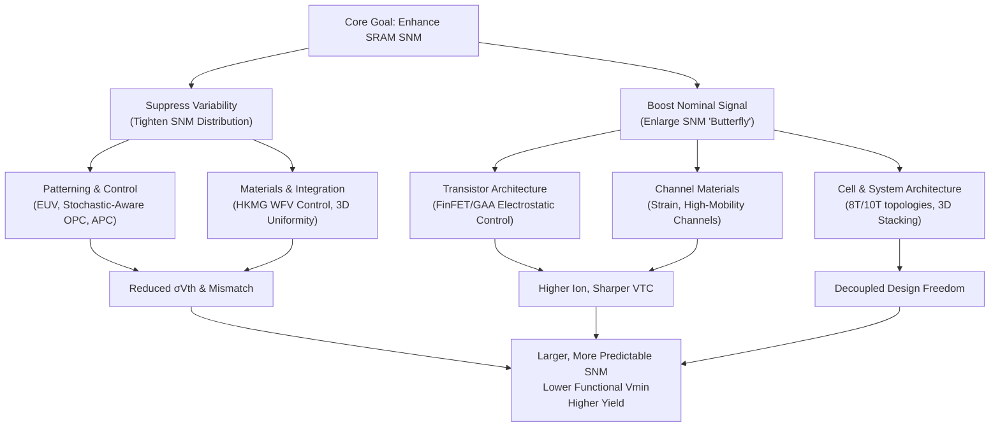

# Enhancing SRAM Stability: A Manufacturing-Centric Analysis of Static Noise Margin Improvement Strategies
## 1 The Critical Role of Static Noise Margin in SRAM Reliability

This chapter establishes the foundational importance of Static Noise Margin (SNM) as the core metric for assessing SRAM cell stability and data integrity. It systematically analyzes the definition and measurement methods of SNM, differentiating between hold, read, and write operational modes. The chapter synthesizes how inherent noise sources within integrated circuits directly degrade SNM and threaten data retention. Furthermore, it frames SNM as the critical performance baseline that manufacturing variations and aging effects inherently challenge, thereby setting the stage for subsequent analysis of improvement strategies.

### 1.1 Defining Static Noise Margin: The Cornerstone of SRAM Stability

Static Noise Margin (SNM) is the fundamental metric that quantifies the robustness of an SRAM cell. It is defined as **the maximum amount of static voltage noise that an SRAM cell can tolerate without losing or flipping its stored bit**[^1][^2]. This single-number value provides a straightforward method for designers to compare the stability of different cell designs and assess the inherent risk of data corruption[^1].

Crucially, the stability of an SRAM cell is not uniform across all its operational states. The reference materials consistently identify **three distinct types of SNM, each corresponding to a specific operational mode of the cell**[^1]:
*   **Hold Static Noise Margin (HSNM or SNM_hold)**: Measures stability when the cell is in a quiescent, data retention state with no active read or write operation.
*   **Read Static Noise Margin (RSNM or SNM_read)**: Measures stability specifically during a read access operation, which is typically the most vulnerable period for the cell.
*   **Write Static Noise Margin (WSNM or SNM_write)**: Measures the cell's ability to be successfully overwritten with new data during a write operation.

This tripartite classification is essential because the conflicting transistor strength requirements for read stability and write ability create a narrow design window that variations can easily violate[^3]. **SNM serves as the primary stability metric that encapsulates a cell's immunity to static disturbances, though it does not specify the characteristics of dynamic noise that could also cause a flip**[^1].

### 1.2 Measurement Methodologies: From Butterfly Curves to N-Curves

Accurately quantifying SNM is critical for design and validation. The reference materials detail two primary methodological approaches, each with its own advantages and limitations.

The **traditional "butterfly curve" graphical method**, pioneered by Seevinck et al., is used primarily for SNM_hold analysis[^1][^2]. It involves plotting the voltage transfer characteristics (VTC) of the two cross-coupled inverters that form the SRAM cell's core. The VTC of the second inverter is plotted with its axes swapped. The resulting superimposed curves create a butterfly-like shape. **The SNM is then determined as the length of the diagonal of the largest square that can be inscribed within the smallest lobe of this butterfly curve**[^1][^2]. For asymmetric inverters, the smaller of the two possible squares is chosen[^1]. A related simulation method involves sweeping a static DC noise voltage at the gate inputs to find the critical flipping point[^1].

However, research indicates significant limitations of the butterfly method, especially in advanced, low-voltage technologies. **The butterfly curve becomes severely distorted as supply voltage scales down, making it difficult to fit a square and leading to potentially inaccurate results**[^4]. The process is also time-consuming and not suitable for inline testing[^4].

In contrast, the **Noise-Curve (N-curve) method** is presented as a more robust and informative alternative. It is an inline measurement methodology that provides multiple stability parameters[^4]. The following table compares the two key methods based on the reference materials:

| Feature | Butterfly Curve Method | N-Curve Method |
| :--- | :--- | :--- |
| **Primary Output** | Static Noise Margin (diagonal of inscribed square) | Static Voltage Noise Margin (SVNM), Static Current Noise Margin (SINM), Write Trip Voltage (WTV) |
| **Low-Voltage Accuracy** | Poor; curves distort, leading to inaccuracies[^4] | Good; calculates more accurate noise margin at low voltage[^4] |
| **Testability** | Not suitable for inline testing[^4] | Designed for inline testing[^4] |
| **Additional Information** | Provides only voltage-based SNM[^4] | Provides current data, write margin (WTV), and can analyze power dissipation[^4] |
| **Reported RSNM (6T SRAM)** | 156 mV[^4] | SVNM of 278 mV[^4] |

**The N-curve method's ability to provide both voltage and current margins, along with writeability metrics like Write Trip Voltage (WTV), makes it a superior tool for comprehensive SRAM stability characterization in modern manufacturing flows**[^4].

### 1.3 Operational Vulnerabilities: Hold, Read, and Write Stability Challenges

Each operational mode presents unique stability challenges, directly linked to the corresponding SNM metric and specific failure mechanisms.

**Read Stability (RSNM) is often the most critical constraint.** During a read operation, the pre-charged bitline is connected to the storage node storing a '0'. This creates a voltage divider through the access transistor and the pull-down transistor, causing the '0' node voltage to rise[^2]. **If this voltage rises above the trip point of the opposite inverter, a destructive read upset occurs, flipping the cell's state**[^3]. The immunity to this is quantified by the Read Static Noise Margin (RSNM). The conflicting requirement is that for a successful write, the access transistor must be strong enough to overpower the pull-up transistor to pull a '1' node down[^3]. This fundamental trade-off creates a narrow design window.

**Write Ability (WSNM)** is challenged when the access transistor cannot pull the storage node voltage low enough against the pull-up transistor's action, preventing the cell from flipping to the new desired state[^3].

**Hold Stability (HSNM)** concerns data retention in standby mode, threatened by leakage currents or supply voltage (VDD) droops[^3]. Analysis for HSNM typically considers the core cross-coupled inverters without including the loading effect of access transistors connected to the bitlines[^1].

Comparative data highlights how architectural evolution addresses these vulnerabilities. An 8T SRAM cell, which employs a separate read buffer, **significantly improves read stability over a conventional 6T cell, with RSNM increasing from 156 mV to 304 mV as measured by butterfly analysis**[^4]. However, this improvement may come at a cost to write ability, as the same study found the Write Trip Voltage for the 8T cell (470 mV) was worse than for the 6T cell (548 mV)[^4].

### 1.4 Threats to SNM: Intrinsic Noise Sources and Environmental Degradation

The SNM of an SRAM cell is under constant assault from a variety of intrinsic noise sources and environmental factors that degrade its margin.

**Intrinsic circuit noise sources are pervasive in integrated circuits.** The reference materials categorize common noise sources that degrade timing and amplitude margins[^5]:
*   **Power Supply Noise**: Switching currents through the finite impedance of power distribution networks cause voltage variations that depend on time and physical location on the chip[^5]. This Simultaneous Switching Output (SSO) noise is proportional to the number of switching outputs[^5].
*   **Crosstalk**: Capacitive or inductive coupling from an "aggressor" signal to a "victim" signal, both on-chip and off-chip[^5].
*   **Receiver Offset**: Caused by random device mismatches (e.g., Vth variation) in sensing circuits like sense amplifiers[^5].
*   **Inter-symbol Interference (ISI) & Random Noise**: Signal dispersion and fundamental thermal/shot noise[^5].

**These noise sources collectively degrade and reduce the static noise margin, reducing confidence in accurately determining the cell's state**[^1].

Beyond operational noise, **long-term aging effects pose a chronic threat to SNM over the device's lifetime**. Bias Temperature Instability (BTI) is a dominant aging mechanism that increases transistor threshold voltage and reduces carrier mobility, directly degrading the SNM of SRAM cells[^6][^7]. Time-Dependent Dielectric Breakdown (TDDB), including Soft Breakdown (SBD), also contributes to performance degradation and SNM reduction over time[^7][^8]. **These aging effects make SNM a dynamic parameter that degrades, complicating the task of ensuring lifelong data integrity**[^6][^7].

### 1.5 SNM as the Manufacturing and Reliability Baseline

The preceding analysis culminates in positioning SNM as the fundamental baseline that chip manufacturing processes must target, control, and sustain. **Process variations are amplified by the SRAM's ratioed design, meaning a Vth shift as small as 30mV—well within normal process spread—can push a marginal cell into failure**[^3]. Consequently, achieving viable yield for a large memory array (e.g., 1Mb) requires extraordinarily low individual cell failure rates, below 1.05×10⁻⁷[^3]. This stringent requirement makes SNM a first-order determinant of manufacturing yield.

Furthermore, **real-world SRAM array behavior deviates significantly from idealized cell models, and these deviations profoundly impact SNM**. Key phenomena often omitted in academic models include:
*   **Distributed Parasitics**: Position-dependent behavior where cells at the far end of a bitline can experience 4–6× slower discharge rates[^3].
*   **Inter-cell Coupling**: Data-pattern dependencies where cumulative leakage from unselected cells on a bitline can degrade read margins by up to 12%[^3].
*   **Peripheral Circuit Variations**: Sense amplifier offset voltage (σ_V_OS ≈ 20mV) directly subtracts from the available read margin and can dominate yield loss[^3].

Validation studies show that omitting these effects leads to highly optimistic predictions. For instance, read access delay can be underestimated by 18.7× and read power by 16.7× when interconnect parasitics are ignored[^3]. **Therefore, high-fidelity modeling that includes array effects and peripheral circuits is not optional but essential for accurate SNM prediction and successful manufacturing**[^3].

Finally, SNM exists within a critical trade-off space. Design techniques to improve SNM, such as increasing the transistor sizing ratio (β-ratio), often come at the cost of increased write time delay and higher power consumption[^2]. **This intrinsic tension between Stability (SNM), Performance, and Power defines the core optimization challenge that advancements in chip manufacturing must seek to resolve**[^2]. The following chapters will explore how innovations in transistor architecture, materials, patterning, and integration can widen this narrow design window, pushing the baseline SNM upward while managing its associated trade-offs.

## 2 Transistor Architecture Evolution and Its Impact on SNM

This chapter provides a data-driven analysis of how successive transistor architectures—from planar CMOS to FinFET and Gate-All-Around (GAA) nanosheets—fundamentally improve SRAM Static Noise Margin (SNM). It focuses on the mechanisms linking enhanced electrostatic control, reduced short-channel effects (SCE), and improved drive current to sharper inverter voltage transfer characteristics and larger SNM. The analysis is structured around comparative evaluations of key metrics (subthreshold swing, DIBL, threshold voltage variation, effective width) across architectures, drawing directly from simulation and measurement data in the reference materials. It also examines the architectural trade-offs and design co-optimization (DTCO) opportunities each technology enables for balancing read, hold, and write SNM, setting the stage for understanding manufacturing-driven SNM enhancement.

### 2.1 Planar CMOS Limitations and the Drive for 3D Architectures

The scaling of planar bulk CMOS technology faces fundamental physical limits that severely degrade SRAM SNM, necessitating the transition to three-dimensional transistor architectures. **The primary challenge is the exponential increase in statistical variability as gate lengths shrink below 30 nm, which directly compresses the SNM and limits the minimum operating voltage (Vmin) of SRAM arrays**[^9].

A comprehensive variability study on a 20nm bulk planar CMOS node identifies the dominant sources of threshold voltage (Vt) variation: Random Discrete Dopants (RDD), Line Edge Roughness (LER), and Metal Gate Granularity (MGG)[^10]. Simulations combining these effects show that the standard deviation of threshold voltage (σVt) can range from 38 mV to 68.5 mV across the process variation space, with RDD being the major contributor[^10]. **This high σVt directly translates to a wide distribution of SNM values, causing significant yield loss**. For instance, at aggressively scaled gate lengths (L=17-20.25 nm), simulations indicate complete cell read failure even at -4 sigma, highlighting the need for stringent lithography and process control to manage critical dimension (CD) variation[^10]. Furthermore, leakage current variation spans three orders of magnitude with scaling, exacerbating static power dissipation concerns[^10].

While advanced planar technologies employ techniques like high-κ metal gates and assist circuits (e.g., Partially Suppressed Wordline for read, Bitline-length-tracked Negative-Bitline-Boosting for write) to improve Vmin by over 200mV[^11], these are mitigations for inherent limitations. **The core issue is the degraded electrostatic control in planar structures, leading to pronounced short-channel effects like Drain-Induced Barrier Lowering (DIBL), which necessitates higher channel doping and consequently worsens variability**[^12]. Quasi-planar bulk MOSFET structures represent an intermediate evolutionary step, demonstrated to reduce variation in 6T-SRAM read and write margins within a 28 nm technology[^9]. However, they do not solve the fundamental electrostatic problem.

Interestingly, planar CMOS cells exhibit a different vulnerability profile to aging effects compared to more advanced nodes. While Bias Temperature Instability (BTI) degrades performance, simulations show that **planar MOSFET-based SRAM cells are more resilient to BTI-induced Read SNM degradation (~8.34% degradation) compared to FinFET-based cells (~16.72% degradation)**[^13]. This suggests that while 3D architectures solve variability and scaling issues, they may introduce different reliability trade-offs that must be managed. The limitations of planar CMOS firmly establish it as the baseline, highlighting why the industry pivoted to FinFET and GAA architectures for continued SRAM scaling and SNM improvement.

### 2.2 FinFET: Enhanced Electrostatic Control and SNM Gains

The FinFET architecture emerged as a revolutionary solution, directly addressing the electrostatic shortcomings of planar transistors. **By wrapping the gate around a vertical silicon fin on three sides, the FinFET provides superior electrostatic control of the channel, substantially reducing short-channel effects (SCE) and leakage current**[^14][^15]. This improved control is the fundamental driver for SNM gains.

The direct impact on SRAM stability is significant. A conventional double-gated (DG) FinFET-based 6T SRAM cell with single-fin pull-down devices achieves a **30% improvement in Read Static Noise Margin (RSNM) compared to its planar bulk-Si counterpart**[^16][^17]. This improvement stems from a sharper subthreshold slope and reduced DIBL, which lead to more abrupt inverter voltage transfer characteristics—the very curves that define the SNM "butterfly." Further RSNM improvements of 37% are possible by upsizing the pull-down FinFETs, albeit with a 16.6% cell area penalty[^16].

**A key advantage of the FinFET for SNM optimization is the capability for independent gate operation**, achieved by electrically isolating the gates on either side of the fin[^16]. This enables innovative assist techniques that dynamically adjust transistor strengths during SRAM operations:
*   **Pass-Gate Feedback (PGFB)**: By connecting the storage node to the back gate of the pass-gate transistor, its strength is selectively decreased during a read. This simple connection, incurring no area penalty, achieves a **71% read margin improvement over the conventional DG design** at VDD = 1 V[^16].
*   **Pull-Up Write Gating (PUWG)**: Using independently gated FinFETs for the pull-up devices and connecting their back gate to a separate write word line allows the pull-up transistors to be weakened during a write operation. This can enable writing at approximately a **200-mV lower VDD** compared to the conventional design[^16].

These PGFB and PUWG techniques are complementary and can be combined, offering simultaneous read and write yield enhancements and enabling extremely high yields (almost 10 sigma for VDD > 0.6 V)[^16].

FinFET design optimization involves careful trade-offs within the Power-Performance-Area (PPA) framework, all of which impact SRAM cell design. Parameters like fin height, width, and pitch must be tuned to maximize drive current (performance) while minimizing leakage (power) and managing variability[^14]. For instance, increasing fin height improves drive current without increasing layout area, but may increase parasitic capacitance and process variability[^14]. **The interdependence of these factors means that FinFET-based SRAM design is a multi-dimensional co-optimization problem, where SNM is a critical outcome metric.**

### 2.3 Gate-All-Around Nanosheets: Pushing Electrostatic Control to the Limit

Gate-All-Around (GAA) nanosheet transistors represent the next evolutionary step, designed to overcome the scalability and electrostatic limits of FinFETs. **In a GAA structure, the gate material completely surrounds the channel on all four sides, providing the ultimate electrostatic control**[^15]. This architectural leap delivers quantifiable, superior benefits for SRAM SNM.

The enhanced electrostatic integrity is evidenced by key device metrics. GAA structures achieve a **near-ideal subthreshold swing (SS) of 62-68 mV/decade and significantly reduced Drain-Induced Barrier Lowering (DIBL) in the range of 30-50 mV/V**[^18]. This directly translates to sharper switching characteristics and superior read stability for SRAM cells. At the 3nm node, **GAA technology demonstrates a 10-15% SNM improvement over 7nm FinFET technology**, achieving SNM values of 140-170 mV at a lower supply voltage of 0.70V[^18].

Several mechanisms underpin these SNM gains:
1.  **Larger Effective Width and Higher Drive Current**: GAA nanosheets provide a larger effective channel width (Weff) per active footprint compared to FinFETs[^19]. This higher drive current allows SRAM cells to maintain stability at lower voltages. Production data from a 3nm GAA process shows a functional SRAM Vmin as low as **0.45-0.50V, approximately 70 mV lower than at the 5nm FinFET node**[^18].
2.  **Reduced Threshold Voltage Variability**: The superior gate control and improved dimensional uniformity of nanosheets lead to better control over work function granularity effects. This results in a **threshold voltage variability (σVth) of 22-30 mV, representing a 15-25% reduction compared to FinFETs**[^18]. Lower σVth is crucial for achieving high SNM yield in large arrays.
3.  **Design Flexibility for Ratio Optimization**: Unlike FinFETs, where drive current is quantized by the number of fins, **GAA nanosheets allow for continuous tuning of the nanosheet width**[^15]. This flexibility enables designers to optimize the transistor beta ratio (pull-down vs. access transistor strength) within the SRAM cell for an optimal trade-off between read SNM and write margin, free from fin quantization constraints[^18].

The advantages of GAA are further accentuated in low-temperature operation (e.g., 77K), which requires low power supply voltages. Due to superior SCE control, less variation, and higher drive current, **GAA nanosheets exhibit lower variability than FinFETs at 77K, making them more suitable for applications where threshold voltage variation requirements are extremely challenging**[^19]. This underscores GAA's fundamental strength in variability control, a direct enabler for robust SNM.

### 2.4 Comparative Analysis of Architectures: Metrics, Trade-offs, and DTCO

A structured comparison of planar, FinFET, and GAA architectures reveals a clear trajectory of improvement in the key parameters that govern SRAM SNM. The following table synthesizes data from the reference materials to highlight this evolution:

| **Architecture** | **Key Electrostatic Metric** | **Threshold Voltage Variability (σVth)** | **SRAM SNM & Vmin Performance** | **Primary SNM Advantage** |
| :--- | :--- | :--- | :--- | :--- |
| **Planar Bulk CMOS** | High DIBL, degraded SS at scaling | High (σVt up to 68.5 mV)[^10] | Limited Vmin scaling; requires complex assist circuits[^11] | Baseline; simpler manufacturing. |
| **FinFET** | Good SCE control (3-sided gate) | Reduced compared to planar | 30% RSNM improvement over planar[^16]; Vmin limited by fin quantization | Independent gates enable dynamic assist (PGFB, PUWG) for major margin gains[^16]. |
| **GAA Nanosheet** | Excellent control (4-sided gate); SS ~62-68 mV/dec, DIBL ~30-50 mV/V[^18] | Low (22-30 mV, 15-25% lower than FinFET)[^18] | 10-15% SNM gain over FinFET; Vmin as low as 0.45-0.50V[^18] | Variable width enables optimal beta ratio; highest drive current/width. |

**Each architectural advance solves specific SNM limiters but introduces its own trade-offs and design-technology co-optimization (DTCO) challenges.** For FinFETs, while independent gating offers powerful assist capabilities, the PGFB technique can degrade read performance (e.g., 15% read current degradation)[^16], and strengthening pull-down devices for read stability often shrinks the write margin[^17]. For GAA nanosheets, challenges include managing the N/P transistor mobility mismatch effect and performance degradation as the number of stacked nanosheet layers increases[^20].

DTCO becomes crucial to maximize the benefits of each architecture. For FinFETs, DTCO involves optimizing fin count, fin depopulation strategies, and leveraging multi-Vt cell libraries to balance power and performance on critical vs. non-critical paths[^14]. For GAA, DTCO exploits the variable nanosheet width to fine-tune transistor strengths. A novel structure like the **CombFET, which integrates FinFET and nanosheet advantages, demonstrates the power of architectural DTCO: it provides a ~55% increase in effective width, leading to a 15% read SNM improvement, a 25% write speed gain, or a 20% reduction in Vmin**[^20]. This shows that architectural innovation itself is a potent tool for SNM enhancement.

### 2.5 Architectural Implications for SNM Optimization and Future Scaling

The evolution from planar to FinFET to GAA architectures provides a clear blueprint for improving SRAM SNM through manufacturing advancements: **systematically enhance electrostatic gate control to suppress variability and short-channel effects, while maximizing drive current per footprint**. Each leap directly addresses the core degraders identified in Chapter 1. Planar technology fought inherent variability; FinFET introduced a new structural knob (the fin) for better control; GAA provides near-ideal electrostatic integrity and continuous width tuning.

This progression has shifted the design paradigm. The focus has moved from mitigating fundamental limitations to **exploiting new architectural degrees of freedom for optimization**. FinFET's independent gates are not just for switching but can be used for real-time stability management, such as compensating for BTI-induced Vth shifts to maintain SNM within a desired range (e.g., limiting degradation to 2% after one year of operation)[^21]. GAA's width variability allows the SRAM cell ratio to be treated as a continuous optimization parameter rather than a discrete choice.

Looking forward, research points to further architectural innovations that promise continued SNM gains. Structures like the **Dual-Channel Nanotube GAAFET (DC NT GAAFET) show a pathway to significantly boost on-current (64.8% gain vs. single-channel NT GAAFET) without sacrificing gate control or SCE performance**[^22]. Similarly, the **Ground Plane FinFET (GP-FinFET) introduces ground planes under source/drain regions to further reduce DIBL, demonstrating minimum standby power—a key factor for hold SNM—compared to SOI and bulk FinFETs**[^23]. **These future directions emphasize that the quest for perfect electrostatic control and variability reduction remains central to achieving stable, low-voltage SRAM, guiding the next generation of chip manufacturing process development.**

## 3 Advanced Materials and Process Integration for Enhanced Stability

This chapter provides a data-driven analysis of how advanced materials and their process integration directly enhance SRAM Static Noise Margin (SNM) by addressing the core degradation mechanisms of variability, parasitic effects, and drive current limitations. It systematically examines the impact of three key material innovations: (1) High-k metal gates for electrostatic control and variability suppression, (2) Strain engineering and novel channel materials (SiGe, III-V compounds) for carrier mobility enhancement, and (3) Advanced metallization (Cu, Ru) and low-k/air-gap dielectrics for mitigating interconnect parasitic RC and noise coupling. The analysis is anchored in specific performance metrics from the reference materials, such as threshold voltage variation (σVth), drive current gain, capacitance reduction, and their quantified effects on SNM and operating voltage (Vmin). The chapter synthesizes how these material-level advancements, when integrated into manufacturing processes, collectively widen the SRAM design window, directly building upon the architectural foundations established in Chapter 2 to achieve higher stability at scaled technology nodes.

### 3.1 High-k Metal Gates: Suppressing Variability and Enhancing Electrostatic Control

The introduction of High-k Metal Gate (HKMG) technology represents a pivotal material innovation that directly addresses two critical challenges for SRAM SNM: gate leakage and threshold voltage (Vth) variability. As CMOS transistor dimensions scaled, the traditional silicon dioxide (SiO2) gate dielectric became too thin (below ~1.4 nm), leading to significant electron tunneling and gate leakage current, which increases static power dissipation and can undermine data retention stability[^24]. **High-k dielectric materials (e.g., hafnium oxide, HfO2) possess a higher dielectric constant (K), allowing for a thicker physical layer at an equivalent electrical oxide thickness (EOT), thereby drastically reducing gate leakage**[^24]. When combined with metal gates, this technology provides superior electrostatic control of the channel, a benefit first introduced in high-volume manufacturing at the 45nm node with an EOT of 1.0 nm[^25]. For SRAM cells, this translates to lower static power and improved reliability, which are foundational for robust hold stability.

Beyond leakage control, HKMG technology is crucial for device scaling and fluctuation reduction[^26]. However, the use of metal gates introduces a new, significant source of random Vth fluctuation: **Work-Function Variation (WFV)**[^27]. WFV arises because the work function of a metal grain depends on its crystal orientation (e.g., for FCC crystals, Φ111 > Φ100 > Φ110). In modern scaled transistors, the gate area comprises only a small number of metal grains (tens to hundreds) with random orientations, making the overall gate work function—and consequently the transistor Vth—a probabilistic variable rather than a deterministic value[^27].

The impact of WFV on SRAM stability is severe and quantifiable. Statistical simulation of a 16nm-gate planar MOSFET SRAM cell shows that **WFV-induced SNM fluctuation (normalized standard deviation) can be as high as 48%**, comparable to the 80% fluctuation caused by Random Dopant Fluctuation (RDF)[^28]. This directly increases the probability of read/write failures. The magnitude of WFV is influenced by several factors:
*   **Gate Material**: The choice of metal significantly affects Vth fluctuation. Among common metal nitrides, TiN and WN result in lower Vth fluctuation for NMOS and PMOS devices, respectively[^27].
*   **Gate Area and Architecture**: The standard deviation of WFV is inversely proportional to the square root of the number of grains (N) in the gate. Therefore, transistors with larger gate area, such as FinFETs, are less affected by WFV compared to planar FD-SOI or bulk devices[^27]. This architectural advantage is confirmed by data showing that **6T SOI FinFET SRAM cells exhibit a dramatically reduced WFV-induced SNM fluctuation of only 2.3%**, compared to 48% in planar MOSFETs[^28].
*   **Grain Size and Orientation Control**: Increasing the proportion of grains with a preferred orientation (e.g., through optimized deposition conditions) can reduce WFV. For instance, to limit Vth variation to 10 mV in a 32nm TiN device, the preferred orientation ratio must reach at least 90%[^27].

The following table summarizes the impact of WFV and its mitigation across different architectures, based on reference data:

| **Transistor Architecture** | **Key Characteristics Regarding WFV** | **Reported WFV-induced SNM Fluctuation** | **Mitigation Strategy** |
| :--- | :--- | :--- | :--- |
| **Planar MOSFET (16nm)** | Small gate area contains few grains; high sensitivity. | 48%[^28] | Use low-fluctuation metals (TiN, WN); increase gate area if possible. |
| **FinFET** | Larger effective gate area due to 3D structure reduces WFV impact. | Significantly lower than planar (specific data for WFV not isolated, but total SNM fluctuation is low)[^27][^28]. | Inherent architectural advantage; further benefit from material selection. |
| **FD-SOI** | Planar structure but no RDF; WFV becomes a dominant variability source. | Higher than FinFET, lower than bulk planar[^27]. | Material optimization and process control for grain orientation. |

**Therefore, HKMG technology is not merely a scaling enabler but a critical material solution that must be co-optimized with transistor architecture and metal choice to suppress the statistical variability that directly compresses SRAM SNM.** Successful integration requires a statistical framework to model WFV and guide material selection and process development for targeted Vth control[^27].

### 3.2 Strain Engineering and Novel Channel Materials for Mobility-Driven SNM Gains

Enhancing carrier mobility is a direct pathway to increasing transistor drive current (Ion), which strengthens the SRAM cell's ability to maintain state during a read operation and switch state during a write, thereby improving both RSNM and WSNM. **Strain engineering has been a cornerstone mobility booster since its commercialization at the 90nm technology node**[^29]. The technique involves introducing controlled mechanical stress into the transistor channel to reduce carrier effective mass and scattering, thereby increasing mobility.

The application of strain is well-established and differentiated for nFET and pFET:
*   **nFETs**: Typically use a tensile silicon nitride (SiNx) capping layer to induce uniaxial tensile strain, enhancing electron mobility[^29].
*   **pFETs**: Employ embedded silicon-germanium (SiGe) source/drain stressors to create uniaxial compressive strain, enhancing hole mobility[^29].

The benefits of strain extend to novel channel materials and advanced architectures. Research on strained Germanium (Ge) NMOSFETs with SiGe source/drain stressors provides detailed insights. Three-dimensional stress simulations show that the stress state in the channel (with components Sxx-longitudinal, Syy-width, Szz-vertical) varies with device geometry[^30]. **For wide devices, the tensile stress along the channel direction (Sxx) dominates, leading to significant electron mobility enhancement—calculated to be a factor of 1.75 at a width of 10 μm**[^30]. As the width scales down to the sub-100nm range, the compressive stress in the width direction (Syy) increases and influences the overall mobility gain, which reduces to a factor of 1.61 at 50 nm width[^30]. This underscores the importance of geometry-aware strain engineering for scaled SRAM transistors.

Strain is effectively integrated into leading-edge transistor architectures to compound performance gains. A prime example is a **10nm gate-length Gate-All-Around (GAA) FET featuring an ultra-thin strained Si/SiGe/Si sandwich channel**. This device demonstrates a remarkable drive current of 1.516 mA/μm, which is **approximately 8 times higher than a comparable 10nm SOI FinFET** and far exceeds industry roadmap (IRDS) targets[^31]. The study attributes this gain to carriers being confined in the strained silicon layers, leading to reduced scattering and more ballistic transport[^31]. For SRAM specifically, such drive current enhancement directly translates to stronger pull-down and pass-gate transistors, which can significantly improve the write ability of a cell[^31].

Looking beyond silicon, novel channel materials offer even higher intrinsic mobilities. Monolayer transition metal dichalcogenides (TMDs) like MoS2 are promising for ultra-scaled, low-power applications. A CMOS-compatible strain technique using tunable-stress SiNx capping layers has been demonstrated on back-gated monolayer MoS2 transistors, yielding a **median increase in on-state current of up to 60%**[^29]. This approach is particularly beneficial for sub-50nm contact pitches[^29]. Furthermore, **these 2D materials are seen as key enablers for monolithic 3D (M3D) integration**, where n-type and p-type layers (e.g., n-MoS₂/p-WSe₂) can be vertically stacked to form ultra-dense, low-power SRAM cells with superior nominal stability and read/write performance compared to planar technology[^32].

The integration of high-mobility III-V compound semiconductors (e.g., GaAs, GaN) with silicon also holds potential, particularly for heterogeneous integration in 3D packages for specialized applications like satellite communications[^33]. However, challenges such as thermal management, mechanical fragility, and substrate compatibility must be addressed[^33][^34]. **The fundamental insight is that whether through strain in silicon, the use of high-mobility Ge, or the adoption of 2D materials, enhancing carrier mobility directly boosts drive current, which provides the "signal strength" needed to overcome noise and process variations, thereby expanding the SRAM's operating margins and improving SNM.**

### 3.3 Interconnect Evolution: Mitigating Parasitic RC and Noise with New Metals and Dielectrics

As transistor performance improves, the limiting factor for overall circuit speed and power, including SRAM access time and signal integrity, increasingly shifts to the Back-End-Of-Line (BEOL) interconnects. **Parasitic resistance (R) and capacitance (C) of interconnects lead to increased signal delay (RC delay), power dissipation, and crosstalk noise, all of which can degrade the timing and voltage margins critical for reliable SRAM operation**[^35]. Advancements in interconnect materials are therefore essential for preserving SNM at scaled nodes.

**The Challenge of Scaled Copper Interconnects:** For decades, copper (Cu) with low-k dielectrics has been the industry standard. However, as interconnect dimensions shrink below 20nm pitch, fundamental material limitations emerge:
1.  **Resistivity Rise:** Copper's resistivity increases dramatically due to enhanced electron scattering at surfaces and grain boundaries when the wire width approaches its electron mean free path (~40 nm)[^35][^36][^37].
2.  **Barrier/Liner Overhead:** Copper requires diffusion barrier layers (e.g., TaN) and liners (e.g., Co, Ta) to prevent electromigration and improve adhesion. **These layers, with poor conductivity, consume a significant portion of the tiny cross-sectional area—up to ~30% of a sub-25nm pitch line's width—further reducing the effective conductive area and increasing resistance**[^36][^37].
3.  **Capacitance and Thermal Issues:** The proximity of tightly packed wires increases line-to-line capacitance (C). While low-k dielectrics help, the low thermal conductivity of these materials, combined with rising current density, leads to elevated interconnect temperatures, threatening reliability[^35].

**Ruthenium as a Promising Alternative:** Ruthenium (Ru) is emerging as a leading candidate to replace or augment copper in advanced nodes. Its advantages are rooted in its material properties:
*   **Lower Size Sensitivity:** Ru has a shorter electron mean free path (~6-8 nm vs. Cu's ~40 nm), making its resistance less sensitive to dimensional scaling at nanometer widths[^36].
*   **High Cohesive Energy:** Ru's high cohesive energy (~6.7 eV/atom vs. Cu's ~3.5 eV/atom) grants it superior resistance to electromigration and lower diffusivity into dielectrics, potentially eliminating the need for a thick diffusion barrier[^36]. This allows for a larger conductive cross-section.
*   **Integration Flexibility:** Unlike Cu, which requires a dual damascene patterning process, **Ru can be patterned using subtractive etch, similar to older aluminum interconnects**. This enables more flexible integration schemes, including easier incorporation of air gaps[^36].

Demonstrations of Ru's benefits are concrete. At IEDM 2024, Intel presented a **subtractive Ru process integrated with air gaps, achieving up to a 25% reduction in line-to-line capacitance at pitches ≤25nm**[^36]. IBM and Samsung have demonstrated a **subtractive Ru top-via interconnect with embedded airgap at 18nm pitch, showing exceptional electromigration reliability with no failures observed up to 1800 hours under severe test conditions—a result superior to best-in-class copper**[^38]. Simulations also suggest that using Ru for the first few interconnect layers can reduce overall resistance by up to 60%[^39].

**Advancements in Dielectrics and Air Gaps:** To combat capacitance, the industry has long pursued low-k dielectric materials (k < 4.0) to replace silicon dioxide (k ~3.9)[^40]. These are typically carbon-doped oxides (SiCOH), but their integration is challenging due to vulnerability to plasma damage during patterning, which can increase their k-value[^40]. A significant innovation is the **low-k stress liner**, which replaces conventional Si3N4 (k~7) with a material like nitrogen-doped silicon carbide (SiC(N,H), k<4). This serves the dual purpose of inducing mechanical strain in the transistor channel for mobility gain while simultaneously reducing parasitic gate-to-gate and contact-to-gate capacitance by 10-12% or more[^41].

Pushing the k-value下限 further, **air gaps (k=1.0) represent the ultimate dielectric**. Integration schemes, such as selectively depositing a capping layer that "pinches off" to form a void between metal lines, can achieve **15-16% capacitance reduction**[^42]. The subtractive Ru process is particularly amenable to air gap integration[^43]. Research into even more exotic materials like Metal-Organic Frameworks (MOFs, e.g., ZIF-8 with k=2.2) is ongoing, offering a promising balance between low k-value and mechanical stability[^43].

**In summary, the co-evolution of interconnect metals (Cu→Ru) and dielectrics (SiO2→low-k→air gaps) is a critical front in the battle to maintain SRAM performance and stability. By reducing RC delay, power dissipation, and crosstalk noise, these BEOL material innovations help ensure that the clean, stable signals generated by robust transistor cells are not degraded as they travel through the interconnect network, thereby preserving overall system-level SNM.**

### 3.4 Process Integration and Co-optimization: From Material Innovation to Manufacturing Reality

The theoretical advantages of advanced materials can only be translated into realized SRAM SNM improvements through meticulous process integration and co-optimization. This stage confronts the practical challenges of combining disparate materials with different thermal, mechanical, and chemical properties into a reliable, high-yield manufacturing flow.

**Integration Challenges for Front-End Materials:**
*   **Strain Stability:** Introducing strain is futile if it relaxes during subsequent high-temperature process steps. Studies on strained silicon-on-insulator (SOI) fabricated via a Ge condensation method show that **careful control of thermal budget is essential**. One process demonstrated minimal strain relaxation of only 7-9% after ion implantation and a 1020°C rapid thermal anneal (RTA), preserving the mobility enhancement[^44]. Low thermal budget processes are therefore critical.
*   **Material Interdiffusion:** Integrating materials like Ge or SiGe risks diffusion into adjacent layers, which can degrade interfaces and device characteristics. In strained SOI structures, Ge diffusion at the strained-Si/SiGe interface was observed after MOSFET fabrication, which was linked to relatively large off-state leakage currents[^44]. Mitigation strategies involve low-temperature processing or the use of barrier layers.
*   **Defect Management:** The introduction of new materials often brings new types of defects. For instance, strain-relaxed SiGe-on-insulator (SGOI) substrates fabricated via Ge condensation exhibited an etch pit density of ~10⁶ cm⁻², correlating with lower carrier mobility[^44]. Optimizing growth and condensation conditions is necessary to minimize such defects.

**Integration Challenges for Back-End Materials:**
*   **Ruthenium Process Optimization:** Integrating Ru requires solving new problems. The deposition process (PVD, CVD, ALD) and underlying adhesion layer (e.g., TiN) strongly influence Ru's grain orientation, size, and resistivity[^39]. **Poorly controlled etch processes can lead to tapered profiles or "footing" at the base of Ru features, inadvertently reducing spacing between lines and causing leakage**[^39]. The industry is in the early stages of optimizing this full integration scheme[^39].
*   **Dielectric Damage and Patterning:** Nanoporous low-k dielectrics are fragile and susceptible to plasma-induced damage during etch and ash steps, which strips away hydrophobic methyl groups, increases the k-value, and degrades performance[^40]. Developing damage-resistant low-k materials or minimizing plasma exposure are key integration goals[^40]. Innovations like **photo-patternable low-k dielectrics**, which combine the functions of photoresist and interlayer dielectric, are being explored to simplify the BEOL integration flow and reduce damage[^40].

**Design-Technology Co-Optimization (DTCO):** The complexity of modern integration necessitates DTCO, where material and process choices are made in conjunction with circuit design and layout. A prime example is the **low-k stress liner**[^41]. A DTCO approach would not only select this material for its dual strain/capacitance benefit but also optimize the layout of nFET and pFET regions to maximize the stress effect while minimizing area impact. The process involves depositing a compressive low-k liner everywhere, then using a patterned UV blocking mask to protect pFET areas while exposing nFET areas to UV light, which converts the liner over nFETs to tensile stress[^41]. This single-material integration step simultaneously boosts both electron and hole mobility while reducing parasitic capacitance—a win achieved through close process-design collaboration.

**Heterogeneous Integration:** For materials like III-V compounds or 2D TMDs, integration often involves stacking or transferring them onto silicon substrates. The Kythrion 3D integration platform, for example, vertically stacks III-V devices with silicon technologies like FD-SOI[^33]. The challenges here are multifaceted: **thermal management** due to high power density, **mechanical stress** from differing coefficients of thermal expansion, and ensuring **electrical performance** without signal integrity loss[^33]. Robust packaging and advanced thermal solutions are integral parts of the material integration strategy.

**In conclusion, the journey from material innovation to SRAM stability enhancement is bridged by process integration. It requires a holistic, co-optimized approach that balances the electrical benefits of new materials with the practical constraints of thermal budgets, interfacial integrity, defect control, and manufacturability. Successful integration transforms the isolated advantages of HKMG, strain, high-mobility channels, and advanced interconnects into a synergistic combination that delivers the higher drive currents, lower variability, and reduced parasitics necessary for SRAM cells with robust Static Noise Margin at scaled technology nodes.**

## 4 Lithography, Patterning, and Variability Control

This chapter analyzes how advanced lithography and patterning technologies directly influence SRAM Static Noise Margin (SNM) by controlling critical dimension (CD) uniformity and suppressing layout-dependent variability. It establishes the fundamental link between lithography-induced dimensional variations and transistor mismatch, which degrades SNM. The analysis dissects the capabilities and challenges of Extreme Ultraviolet (EUV) lithography, including stochastic failures, and compares them with multi-patterning techniques like Self-Aligned Double/Quadruple Patterning (SADP/SAQP), evaluating their respective impacts on SRAM variability. The chapter further explores emerging patterning solutions such as Directed Self-Assembly (DSA) and the critical role of Design-Technology Co-Optimization (DTCO) and advanced process control in mitigating variability. Synthesizing these elements, the chapter demonstrates how advancements in patterning and control translate to higher, more predictable SNM values, directly addressing the manufacturing-centric goal of enhancing SRAM stability.

### 4.1 The Lithography-Variability-SNM Nexus: From Dimensional Errors to Cell Instability

The stability of an SRAM cell, quantified by its Static Noise Margin, is fundamentally threatened by imperfections introduced during the lithography and patterning stages of chip manufacturing. **The core issue is that lithography-induced dimensional variations directly translate into electrical parameter mismatches between the meticulously balanced transistors within the SRAM cell.** These mismatches degrade the cell's immunity to noise, compressing both Read Static Noise Margin (RSNM) and Write Static Noise Margin (WSNM).

The primary mechanisms linking patterning to variability are:
*   **Critical Dimension (CD) Variation:** Fluctuations in the printed width of transistor gates alter their drive strength and threshold voltage (Vth). In a 6T SRAM cell, the access transistor (PG) and the driver/pull-up transistors (PD/PU) are often on different polysilicon tracks. If these features are printed using separate masks in a multi-patterning scheme, systematic offsets between the masks can create a deterministic mismatch between adjacent devices[^45].
*   **Line Edge Roughness (LER):** As feature sizes shrink below 100nm, the roughness of the printed line edges becomes a significant contributor to Vth uncertainty. LER is particularly dominant for transistors with short channel lengths (e.g., 32 nm), where edge fluctuations represent a large fraction of the total gate length[^46].
*   **Pitch Walking:** A phenomenon specific to spacer-based multi-patterning (e.g., SADP/SAQP), where any misalignment or CD excursion in the initial mandrel pattern causes the pitch between final features to alternate rather than remain uniform[^47]. This introduces systematic spacing variations that can affect device matching and parasitic capacitances.

**These physical variations create a statistical distribution of electrical characteristics across the millions of identical SRAM cells in an array.** Each cell will have slightly different read current, write trip point, and SNM[^46]. For a large SRAM block (e.g., 1Mb), achieving acceptable yield requires failure rates for individual cells to be extraordinarily low, often demanding tolerance beyond five sigma[^46]. Consequently, even small increases in variability can cause catastrophic yield loss.

Experimental data quantifies this impact. An analysis of Double Patterning Lithography (DPL) on a 45nm CMOS test chip showed that DPL **doubled the standard deviation of the read margin distribution** compared to a hypothetical single exposure process[^45]. More critically, at the μ-3σ point of the distribution, **the probability of read failure increased by approximately 3.3× due to DPL**[^45]. This demonstrates how patterning complexity directly amplifies statistical variability, tightening the already narrow design window for SRAM stability and elevating the risk of bit flips.

### 4.2 EUV Lithography: Enabling Tighter Pitches and Confronting Stochastic Challenges

Extreme Ultraviolet (EUV) lithography, operating at a wavelength of 13.5 nm, was introduced to overcome the resolution limits of 193nm immersion lithography and reduce dependency on complex multi-patterning. **By enabling single-exposure patterning at much tighter pitches, EUV aims to eliminate the systematic mask-to-mask overlay errors inherent in multi-patterning, thereby reducing a major source of layout-dependent variability and improving SNM predictability.**

However, the transition to EUV in high-volume manufacturing (HVM) introduces a new set of practical challenges that can impact yield and stability. Key issues include equipment reliability, particularly of the complex laser-produced plasma source, and mask contamination[^48]. The **lack of a commercially viable pellicle** (a protective membrane for the mask) is a significant concern, as it forces a process flow where wafers may be held for mask qualification, disrupting production and potentially negating EUV's cycle-time advantages[^48].

**The most critical challenge for SRAM stability is the phenomenon of stochastic failures.** Due to the high absorption of EUV light, fewer photons are available per pixel during exposure. This photon shot noise, combined with the discrete nature of chemical reactions in the resist, leads to random variations[^48][^49]. In dense SRAM cells, these stochastic effects manifest as **line collapses, micro-bridges, and missing vias—defects that are not cosmetic but directly cause SRAM instability, scan-chain faults, and latent yield loss**[^49]. The problem intensifies with scaling; to keep variation per pixel constant, the required dose scales inversely with area, potentially needing to double every node (e.g., from 40 mJ/cm² at 7nm to 120 mJ/cm² at 3nm)[^48].

The industry response involves advancements on multiple fronts:
1.  **Resist Technology:** Development of higher-sensitivity resists, such as metal-oxide resists, to reduce the required dose and mitigate photon shot noise[^49].
2.  **Process Control:** Tighter control over post-exposure bake and development conditions is essential to manage stochastic variations[^49].
3.  **Stochastic-Aware Computational Patterning:** This represents a paradigm shift in mitigating variability. Traditional Optical Proximity Correction (OPC) optimizes for nominal conditions. In contrast, **stochastic-aware OPC embeds models of random variation directly into the correction algorithm**. Collaborative work between Siemens and imec has demonstrated that a **stochastic-aware OPC flow can achieve at least an order-of-magnitude reduction in the probability of stochastic defects for both SRAM and logic designs**[^50]. The method works by systematically sacrificing minor edge placement error in non-critical areas to gain dramatically lower failure rates in critical patterns, thereby directly enhancing the robustness and effective SNM of manufactured SRAM arrays.

### 4.3 Multi-Patterning Techniques: Trade-offs Between Density, Cost, and Variability

Multi-patterning techniques remain essential for defining the smallest features at advanced nodes, especially where EUV single exposure reaches its resolution limit or is cost-prohibitive. **These techniques, including pitch-splitting Double Patterning Lithography (DPL) and spacer-defined SADP/SAQP, enable feature density multiplication but introduce unique variability mechanisms that directly challenge SRAM SNM.**

The principle involves decomposing a layout into two or more masks (for DPL) or using a sacrificial mandrel and spacer deposition/etch cycles (for SADP/SAQP) to achieve pitches beyond the capability of a single exposure[^47]. While effective for density, they create systematic variability. As noted in Section 4.1, DPL causes devices printed on different masks to have correlated CD errors, leading to mismatch[^45]. Spacer techniques are plagued by **pitch walking**, where alternating line spacing destroys uniformity[^47].

The impact on SRAM is measurable and significant. The 45nm DPL test chip study exploited the mirrored layout of adjacent SRAM rows—where cells in even and odd rows have opposite orientations of transistors printed on different masks. Measurements at a low voltage (0.45V) to accelerate failures showed a **clear, statistically significant difference in write failure counts between even and odd rows** (approximately 14.5% for write '1' and 25% for write '0'), directly attributable to the systematic offset between the two DPL masks and not random Vth variation[^45]. This layout-dependent behavior creates a patterned vulnerability within the SRAM array.

The industry faces a complex trade-off between EUV and multi-patterning. **Manufacturers strongly prefer single-patterning EUV for lower cost and complexity, and have extended its use through scanner improvements, advanced OPC, and resist innovations**[^51]. However, for the tightest pitches at nodes like 3nm and below, EUV may require prohibitively high doses for good yield, making multi-patterning with lower dose per layer a viable alternative for throughput and cost[^51]. Furthermore, the industry has extensive knowledge of multi-patterning from immersion lithography, which can be leveraged for EUV-based multi-patterning[^51].

A direct response to patterning-induced variability is **DPL-aware SRAM sizing optimization**. This DTCO technique resizes the transistors within the 6T cell while explicitly modeling the distinct line-width distributions from the two DPL masks. For a given case, this optimization was shown to **shift the μ-3σ point of the read margin distribution by approximately 6.2%, decreasing the failure probability by 2.17×**[^45]. This demonstrates that co-designing the cell layout with knowledge of the patterning process can effectively reclaim some of the SNM margin lost to manufacturing variability.

### 4.4 Emerging Patterning and Control Solutions: DSA, Metrology, and APC

Beyond mainstream EUV and multi-patterning, next-generation solutions and enhanced control systems are being developed to push the limits of variability suppression.

**Directed Self-Assembly (DSA)** is a promising complementary technique that uses the inherent phase-separation of block copolymers (BCPs) to form periodic nanostructures. **DSA's key potential advantages for SRAM stability include achieving extremely low pitch (down to 10nm) and providing inherent immunity to pitch walking**[^52][^53]. It can also **fundamentally improve line edge roughness (LER) and local CD uniformity (LCDU)**. For instance, DSA rectification of a 24 nm pitch EUV line/space pattern improved LER from 1.88 nm to 1.70 nm and LWR from 2.71 nm to 1.40 nm[^53]. High-chi (Hχ) BCP materials have shown even greater improvements, reducing LCDU and pattern placement error by 28% and 30%, respectively, compared to conventional materials[^53]. DTCO assessments indicate feasibility for SRAM constructs[^52]. **However, the primary barrier to adoption is defect density, which currently far exceeds industry standards**[^53]. Mitigation efforts focus on material purity, interfacial energy matching, and thermal annealing optimization.

**Advanced Metrology** is critical for monitoring and controlling the variability that affects SNM. Traditional CD Scanning Electron Microscopy (CDSEM) has limitations in throughput and can damage sensitive photoresist. An innovative alternative uses **optical scatterometry combined with machine learning to measure Local CD Uniformity (LCDU)**. This method, validated on EUV contact holes, can measure LCDU post-lithography and post-etch with high accuracy (R² > 0.97), covering over 400,000 vias per measurement for statistically representative results without sample damage[^54]. Such high-throughput, non-destructive metrology is essential for implementing effective Advanced Process Control (APC).

**The synergy between Design for Manufacturing (DFM) and Advanced Process Control (APC)** forms the overarching framework for variability management. As process windows shrink, DFM activities—such as imposing restrictive design rules, using RET-aware layouts, and employing statistical timing analysis—work to enlarge the manufacturable design space[^55]. However, **DFM alone cannot guarantee yield; it must be coupled with APC, which provides the real-time, adaptive control of the manufacturing process to hit the narrow targets defined by DFM**[^55]. This closed-loop system, where design restrictions and process adjustments are co-optimized, is indispensable for achieving the high and predictable SNM required for reliable, high-yield SRAM production in advanced nodes.

### 4.5 Synthesizing Patterning Advances into SNM Improvement and Predictability

The evolution of lithography and patterning technology represents a concerted campaign against the dimensional variability that erodes SRAM Static Noise Margin. **The transition from DUV-based multi-patterning to EUV single patterning is fundamentally motivated by the need to reduce systematic, layout-dependent errors that cause transistor mismatch and compress SNM.** EUV's ability to pattern critical layers in one exposure eliminates mask-to-mask overlay errors, a significant step towards more uniform and predictable cell characteristics.

However, this advance introduces the new frontier of stochastic variability. The industry's response—through high-sensitivity resists, dose scaling, and, most importantly, **stochastic-aware computational lithography—directly targets the random defects that cause bit flips and latent failures**. The demonstrated order-of-magnitude reduction in stochastic failure probability through advanced OPC is a direct manufacturing pathway to improving SRAM stability[^50].

When EUV single patterning reaches its economic or resolution limit, advanced multi-patterning techniques and emerging solutions like DSA take over. The common thread is the relentless pursuit of improved **Critical Dimension Uniformity (CDU), Line Edge Roughness (LER), and pattern placement accuracy**. As reference data shows, improvements in these metrics (e.g., from DSA rectification or Hχ BCPs) directly lead to tighter electrical parameter distributions[^53]. **A lower σVth and reduced device mismatch directly translate to a larger and more consistent SNM across the SRAM array, enabling lower operating voltage (Vmin) and higher yield.**

Ultimately, the advancements chronicled in this chapter—from EUV and multi-patterning to DSA, and from stochastic OPC to DFM/APC integration—are not isolated improvements but interconnected elements of a holistic manufacturing strategy. **Their collective goal is to transform the SRAM design window from a statistically fraught narrow gap into a robust and manufacturable space.** By minimizing the random and systematic variations introduced during patterning, these technologies provide the foundational dimensional control upon which stable transistor operation and, consequently, high SNM can be reliably built. This sets the stage for leveraging these more predictable manufacturing outcomes in novel cell architectures and 3D integration schemes to further push the boundaries of SRAM stability.

## 5 Three-Dimensional Integration and Novel Cell Architectures

This chapter synthesizes the potential of three-dimensional (3D) integration and novel transistor-level SRAM cell architectures as direct manufacturing strategies to enhance Static Noise Margin (SNM). It first analyzes how 3D stacking technologies, such as monolithic 3D IC and hybrid bonding, enable superior SNM by decoupling density from transistor footprint, allowing for larger, more robust cells or dedicated noise isolation layers. The analysis draws on reference data quantifying area reduction and SNM performance in 3D designs. Second, the chapter conducts a comparative, data-driven evaluation of alternative cell topologies (6T, 8T, 10T, etc.), systematically assessing their SNM characteristics, power-delay trade-offs, and inherent sensitivity to process variations. It leverages specific simulation results from the reference materials to identify the architectural choices that best balance stability with manufacturability constraints. This chapter directly addresses the core research topic by exploring how architectural innovation at the cell and integration level provides a critical pathway to achieving higher, more predictable SNM in advanced manufacturing nodes.

### 5.1 3D Integration Technologies: Decoupling Density from Stability Constraints

Three-dimensional integration fundamentally alters the SRAM design paradigm by breaking the traditional two-dimensional trade-off between cell area and transistor size. By allowing the vertical separation of NMOS and PMOS devices onto different tiers, 3D stacking enables the use of larger, more robust transistors without increasing the planar footprint, directly addressing the stability limitations of aggressively scaled planar cells[^56][^57].

Monolithic 3D integration, which features nano-scale inter-tier vias, is a key enabler for ultra-dense SRAM. Studies using a compact 22nm 2D SRAM as a baseline show that simply splitting the NMOS and PMOS devices into two tiers achieves a **33% footprint area reduction**[^56][^57]. More advanced 3D cell designs exploit this vertical freedom for further optimization. For instance, a redesigned 2P4N (conventional 6T) cell with adjusted transistor sizing achieves a **44% area reduction** while maintaining a Static Noise Margin (SNM) statistically equivalent to its 2D counterpart, with a mean of 224.4 mV and a standard deviation of 38 mV from Monte Carlo simulations[^56]. A novel 3P3N cell structure, which replaces one NMOS pass-gate with a PMOS transistor, achieves a **45% area reduction**. This design requires single-ended read operations and write-assist techniques but delivers excellent read stability, with a Monte Carlo SNM mean of **265 mV**, outperforming the original 2D design (218.1 mV)[^56][^57]. Furthermore, a balanced 4P4N 8T SRAM cell demonstrates a **40% area reduction** while matching the SNM, write margin, and data retention voltage performance of a 2D 8T structure, achieving a high mean SNM of **503.5 mV**[^56][^57]. **These results demonstrate that 3D integration can simultaneously improve density and stability, a feat difficult to achieve in planar scaling.**

Hybrid bonding represents another transformative 3D integration technology, particularly for mitigating the interconnect parasitics that degrade signal integrity and effective SNM at the array level. This technology enables an ultra-high connection density of approximately **110,000/mm²**, which is hundreds of times denser than conventional microbump interfaces[^58][^59]. The resulting low-resistance, high-bandwidth vertical links allow for an SRAM-like interface to memory arrays, suppressing the latency and energy penalty typically associated with off-chip communication. A stacked embedded DRAM (SeDRAM) utilizing hybrid bonding achieved a remarkably low latency of **6 ns** from read clock to data and high energy efficiency of **0.88 pJ/bit**[^58]. **By drastically reducing the resistance-capacitance (RC) delay and noise coupling in the data path, hybrid bonding preserves the clean, stable signals generated by robust memory cells, thereby upholding system-level SNM and enabling high-performance, stable memory subsystems.**

### 5.2 Architectural Evolution: From 6T to 8T, 10T, and Beyond

Beyond integration schemes, the evolution of the SRAM cell's internal transistor network offers a direct architectural pathway to enhanced SNM. A comparative analysis of cell topologies reveals a clear trade-off between stability, power, area, and complexity.

The conventional 6T SRAM cell, while area-efficient, suffers from inherent read stability vulnerability. During a read operation, the pre-charged bitline connected to the storage node holding a '0' creates a voltage divider through the access and pull-down transistors, potentially raising the node voltage enough to trigger a destructive flip[^60]. This results in a relatively low Read SNM (RSNM). For instance, one study reported an RSNM of **104 mV** for a 6T cell at the 32nm node[^61]. **The core conflict between the transistor strength needed for read stability and that required for writeability creates a narrow design window that is highly sensitive to process variations.**

The 8T SRAM cell addresses this fundamental conflict by employing a **separated read path**. By isolating the storage nodes from the read bitline via a dedicated read buffer and access transistors, the cell achieves read-disturb-free operation[^60]. This architectural change yields substantial SNM gains. Comparative analyses show that an improved 8T cell can achieve **35.02% higher SNM** than a 6T cell[^62]. Other 8T variants demonstrate strong performance; a single-ended, robust 8T cell designed for low-voltage operation showed **2.33 times the read noise margin** of a standard 6T cell at 0.5 V[^63]. Furthermore, specialized 8T designs like the 8TP cell, which uses high-VT PMOS transistors, are engineered to be process variation resistant, demonstrating good stability with an SNM of **0.23242 V** at 0.8V[^64]. The trade-off is an increased transistor count, leading to a **13-30% larger cell area** compared to the 6T topology[^60].

The 10T SRAM cell represents a further step in architectural specialization for stability. These cells often incorporate complete isolation of read and write paths or integrate stability-enhancing circuits like Schmitt Trigger inverters. A Multi-Threshold CMOS (MTCMOS) based 10T cell demonstrated a high SNM of **379.456 mV** along with the lowest power consumption among compared designs[^65]. A novel Schmitt Trigger based differential 10T bitcell achieved **1.56x higher read SNM** at 400 mV VDD compared to a conventional 6T cell[^66]. Another near-threshold 10T design showed **51.64% higher read SNM** than a 6T bitcell[^67]. **The dedicated circuitry in 10T cells provides built-in noise immunity, making them particularly suitable for low-voltage, high-stability applications.** However, this comes at the cost of increased complexity and area, with one study reporting a 10T cell area of **1.5 μm²** compared to **1.0 μm²** for a 6T cell in 65nm technology[^68].

The following table synthesizes key performance metrics for different cell architectures based on data from the reference materials:

| **Architecture** | **Key Stability Feature** | **Reported SNM Advantage (vs. 6T)** | **Key Trade-offs & Notes** | **Source** |
| :--- | :--- | :--- | :--- | :--- |
| **6T** | Conventional, area-efficient. | Baseline (e.g., RSNM = 104 mV[^61]). | Vulnerable to read disturb; narrow design window. | [^61][^60] |
| **8T** | Separated read path (read-disturb-free). | +35.02% SNM[^62]; 2.33x RNM at 0.5V[^63]. | 13-30% area increase[^60]; improved RSNM. | [^62][^64][^60][^63] |
| **10T (MTCMOS)** | Dedicated read port & multi-Vt scheme. | SNM = 379.456 mV[^65]. | Low power, high stability; larger area. | [^65] |
| **10T (Schmitt Trigger)** | Differential with built-in hysteresis. | 1.56x higher read SNM at 0.4V[^66]. | Excellent variation tolerance; longer access time. | [^66] |
| **3D 4P4N 8T** | Monolithic 3D integration with balanced N/P. | Mean SNM = 503.5 mV[^57]. | 40% area reduction vs. 2D 8T; maintains high SNM. | [^56][^57] |

### 5.3 Process Variation Tolerance: A Comparative Analysis of Architectural Robustness

The ultimate test of any SRAM architecture in a manufacturing context is its robustness against process, voltage, and temperature (PVT) variations. Architectural choices profoundly influence a cell's statistical stability and yield.

The conventional 6T cell, with its minimum-sized transistors and ratioed design, is highly susceptible to variations. **Random dopant fluctuations (RDF) are a primary concern**, as they directly cause threshold voltage (Vth) mismatches between the cross-coupled inverters[^69]. Analysis shows that for a 6T cell with 30nm channel-length transistors, the ratio between the SNM value and its standard deviation approaches the minimum allowed design limits, representing a fundamental barrier to scaling[^69]. Furthermore, transistor mismatch, such as a 1% variation in driver transistor width, can measurably degrade SNM[^60]. **This high sensitivity means that achieving high yield for large 6T SRAM arrays requires extremely tight process control.**

Novel cell architectures explicitly incorporate features to mitigate variation sensitivity. The 8TP cell, using high-VT PMOS transistors, is designed as a **process variation resistant structure**. Monte Carlo simulations across a temperature range of -25°C to 100°C show it maintains a tight SNM distribution with a **6σ deviation**, indicating high robustness[^64]. Similarly, advanced 10T designs exhibit strong variation tolerance. The Schmitt Trigger based 10T bitcell shows a **tighter SNM distribution** and lower read failure probability compared to 6T/8T/10T cells, especially at ultra-low voltages like 150 mV[^66]. A near-threshold 10T cell was shown to meet the required **6σ value across all operations** even at VDD=0.5V[^67].

**Design optimization methodologies are crucial for maximizing the inherent robustness of these architectures.** For instance, a process sensitivity driven stability model was developed for a FinFET-based PPN 10T SRAM cell. Using an evolutionary optimization technique to select optimal transistor dimensions, the resulting design improved read margin, standby margin, and write margin by **4%, 4%, and 23%**, respectively, leading to an **overall yield improvement of 17%** compared to the nominal design[^70]. This highlights that architectural innovation must be coupled with statistical design and optimization to fully exploit its potential for stable manufacturing.

### 5.4 Synthesis: Integrating 3D and Novel Architectures for Optimal SNM

The combined application of 3D integration technologies and novel cell architectures presents a powerful, holistic strategy for overcoming the SRAM stability challenge in advanced manufacturing nodes. These approaches are not mutually exclusive but are highly synergistic.

**3D integration effectively neutralizes the primary penalty of complex, stable cells: area overhead.** As demonstrated, monolithic 3D designs can achieve **40-45% area reduction** for cells like the 8T and 3P3N while maintaining or even improving their SNM characteristics[^56][^57]. This makes architecturally robust but traditionally area-expensive cells like 10T designs more viable for high-density memory applications. Conversely, the adoption of variation-tolerant cell architectures ensures that the performance and density benefits of 3D stacking are not undermined by parametric yield loss due to increased variability in vertically stacked layers.

This synergy points toward a comprehensive Design-Technology Co-Optimization (DTCO) framework for future SRAM manufacturing. The framework involves co-designing the stacking technology with the cell topology and transistor-level design. Key considerations include:
*   **Tier Assignment and Transistor Sizing:** Determining which transistors (e.g., pull-up, pull-down, access) are placed on which tier to optimize performance, thermal management, and variation impact, as seen in the 3P3N and 4P4N designs[^56].
*   **Inter-tier Via Optimization:** Designing the density and placement of vertical connections to minimize parasitic resistance and capacitance, which is critical for preserving the speed and signal integrity benefits of stable cells.
*   **Variation-Aware Design for 3D:** Extending statistical models and optimization techniques to account for inter-tier and intra-tier process variations unique to 3D structures.

**In conclusion, the evolution from planar 6T cells to 3D-integrated, specialized architectures like 8T and 10T represents a paradigm shift in SRAM design.** It moves beyond merely scaling existing structures and instead leverages manufacturing advancements to create new topological solutions that directly target the root causes of instability—read disturb, write contention, and process variation. By decoupling density from transistor footprint and incorporating inherent noise immunity, these strategies provide a clear pathway to achieving the high, predictable Static Noise Margin required for reliable, low-voltage SRAM in the era of continued scaling.

## 6 Synthesis, Trade-offs, and Future Pathways

This concluding chapter synthesizes the findings from the preceding manufacturing-centric analysis to present a holistic view of the interdependencies between transistor architecture, materials, patterning, and 3D integration in enhancing SRAM Static Noise Margin (SNM). It evaluates the critical Power-Performance-Area-Cost (PPAC) trade-offs inherent in each advancement, analyzing how gains in stability often come at the expense of other metrics. The chapter proposes integrated co-optimization strategies that leverage synergies across different manufacturing domains to widen the SRAM design window. Finally, it outlines promising future research directions, identifying key challenges and potential breakthroughs for achieving robust, low-voltage SRAM in the next generation of technology nodes.

### 6.1 Holistic Synthesis: Interdependencies of Manufacturing Advancements on SNM

The preceding chapters have dissected individual manufacturing advancements. Their collective impact on SRAM SNM, however, is not merely additive but synergistic, forming a unified framework for stability enhancement. This synthesis reveals that all major improvements converge on two fundamental objectives: **enhancing the nominal signal strength of the SRAM cell and suppressing the statistical variability that erodes its noise margin.**

**Electrostatic control, provided by 3D transistor architectures (FinFET, GAA), is the foundational enabler.** The transition from planar to FinFET delivered a 30% improvement in Read SNM (RSNM), while GAA nanosheets pushed this further with a 10-15% SNM gain over FinFETs[^1]. This improvement stems directly from sharper subthreshold swing (SS ~62-68 mV/decade for GAA) and reduced Drain-Induced Barrier Lowering (DIBL ~30-50 mV/V), which produce the more abrupt, square-like voltage transfer characteristics (VTC) that define a larger SNM "butterfly."[^1] This architectural evolution directly combats the short-channel effects that degrade stability at scaled nodes.

**Advanced materials are the critical levers that amplify the benefits of superior architecture and mitigate its new challenges.** High-k metal gates (HKMG) enable the thin equivalent oxide thicknesses needed for scaling but introduce Work-Function Variation (WFV) as a new statistical variability source, which can cause up to 48% SNM fluctuation in planar devices[^1]. The 3D architecture of FinFETs inherently suppresses this WFV impact, demonstrating the material-architecture interdependence. Similarly, **strain engineering and novel channel materials (e.g., strained Si/SiGe, 2D TMDs) directly boost carrier mobility and drive current (Ion)**, providing the "muscle" for transistors to maintain state during a read or switch state during a write. A strained-Si GAA FET demonstrated an 8x higher drive current than a comparable SOI FinFET, directly translating to stronger cell stability[^1]. **Back-end materials like ruthenium (Ru) interconnects and low-k/air-gap dielectrics work to preserve this internal cell stability by minimizing parasitic RC delay and crosstalk noise** in the interconnect network, ensuring clean signal propagation to and from the cell[^1].

**Patterning and variability control technologies provide the dimensional precision required to realize the theoretical benefits of new architectures and materials.** The systematic mask misalignment in multi-patterning can double the standard deviation of read margin, while EUV lithography aims to eliminate this by enabling single-exposure patterning[^4]. However, EUV introduces stochastic variability, which **stochastic-aware computational lithography (OPC) directly targets, achieving an order-of-magnitude reduction in defect probability**[^4]. This control is essential because the SNM gains from GAA's superior electrostatics are contingent on its lower threshold voltage variability (σVth of 22-30 mV, 15-25% lower than FinFETs)[^1]. **Thus, patterning advancements do not merely enable feature scaling; they are the gatekeepers of parametric yield, ensuring the SNM distribution is tight and predictable.**

**3D integration and novel cell architectures represent a system-level rethinking that decouples traditional constraints.** Monolithic 3D integration allows the use of larger, more robust transistors or complex 8T/10T topologies without the planar area penalty, achieving a 40-45% footprint reduction while maintaining high SNM (e.g., mean SNM of 503.5 mV for a 3D 8T cell)[^4]. Architectures like the 8T cell, with its separated read path, directly attack the read-disturb mechanism, offering 2.33x the read noise margin of a 6T cell[^4]. These strategies are most powerful when combined: a 3D-integrated, variation-tolerant 10T cell represents the pinnacle of architectural co-design for stability.

The following diagram synthesizes these interdependencies into a holistic framework for SNM improvement:

**In essence, the journey from planar CMOS to 3D GAA with advanced materials and EUV is a coordinated campaign.** Architectural innovation provides a better "container" (electrostatic control), advanced materials provide a better "engine" (high mobility, low parasitics), and precision patterning ensures this engine is built with nanometer accuracy. 3D integration then allows these optimized components to be assembled in previously impossible configurations. The interdependence is clear: the full SNM potential of a high-mobility 2D material can only be realized if it is integrated into a gate-all-around structure for optimal control and patterned with EUV for minimal variability.

### 6.2 Critical PPAC Trade-offs in the Pursuit of Enhanced Stability

Every manufacturing advancement that improves SRAM SNM exists within a constrained Power-Performance-Area-Cost (PPAC) trade-off space. **SNM enhancement is rarely a free lunch; it is typically achieved by strategically reallocating resources from one PPAC dimension to another.** A comprehensive understanding of these trade-offs is essential for defining viable manufacturing pathways.

The most fundamental trade-off exists within the SRAM cell itself: the **read stability vs. write ability conflict**. Improving Read SNM (RSNM) typically requires strengthening the pull-down (PD) transistor relative to the access (PG) transistor (increasing the β-ratio). However, this directly weakens write ability, as a stronger PD transistor is harder for the PG to overpower. This forces a narrow design window. Architectural solutions like the 8T cell break this direct trade-off by using a separate read port, but they incur a **13-30% area penalty**[^4]. Similarly, FinFET-based assist techniques like Pass-Gate Feedback (PGFB) can improve read margin by 71%, but may degrade read current (performance) by ~15%[^1].

**Transistor architecture evolution embodies a complex PPAC exchange.** Moving from planar to FinFET to GAA delivers superior electrostatics and SNM, but at increasing process complexity and cost. GAA nanosheet fabrication, involving the precise stacking and release of multiple silicon sheets, is inherently more complex than FinFET formation. The area benefit of 3D integration (40-45% reduction) must be weighed against the cost of additional lithography, deposition, and etching steps for creating multiple device tiers and the dense nano-scale inter-tier vias[^4]. Furthermore, **3D stacking increases thermal density**, creating hotspots that can degrade reliability and performance if not managed by advanced thermal materials and design.

**Material innovations introduce integration challenges that impact yield, reliability, and cost.** High-k metal gates suppress gate leakage but introduce Work-Function Variation (WFV), a new yield limiter[^1]. Strain engineering boosts mobility but requires careful thermal budget control to prevent strain relaxation during processing[^1]. Advanced interconnects like subtractive ruthenium with air gaps reduce capacitance but face challenges with etch profiles and defect control[^1]. The pursuit of ultimate low-k dielectrics (e.g., air gaps, MOFs) often trades off mechanical strength and integration robustness for lower permittivity.

**Patterning technologies present a direct cost-performance-reliability triad.** EUV lithography reduces multi-patterning complexity and layout-dependent variability, enabling better SNM predictability. However, it carries high tool cost, source power challenges, and the critical issue of **stochastic failures**, which threaten latent yield[^4]. Mitigating stochastic effects requires higher dose, which reduces throughput and increases cost, or advanced resists and computational lithography, which add to R&D and process complexity.

The table below synthesizes key PPAC trade-offs associated with major SNM enhancement strategies:

| **Enhancement Strategy** | **SNM/Stability Benefit** | **Primary Trade-off(s)** | **Impact on PPAC** |
| :--- | :--- | :--- | :--- |
| **Increase Transistor β-ratio** | Improved Read SNM (RSNM). | Degraded Write Ability, slower write speed. | **Performance ↓** (Write delay), **Area ↑** (if transistors upsized). |
| **Adopt 8T/10T Cell Architecture** | Read-disturb-free operation, higher RNM (e.g., +35.02%). | Increased transistor count and cell area. | **Area ↑** (13-30% for 8T), **Design Complexity ↑**. |
| **Transition to FinFET/GAA** | Superior electrostatics, 30% RSNM gain (FinFET), 10-15% SNM gain (GAA). | Increased fabrication complexity and cost. | **Cost ↑**, **Process Complexity ↑**. |
| **Employ Strain/High-mobility Channels** | Higher drive current (Ion), stronger cell. | Integration challenges (defects, interdiffusion, thermal budget). | **Yield/Reliability Risk ↑**, **Process Complexity ↑**. |
| **Use Advanced Interconnects (Ru, Air gaps)** | Lower RC delay, reduced crosstalk noise. | New etch/process challenges, potential defect modes. | **Cost ↑**, **Integration Complexity ↑**. |
| **Implement EUV Lithography** | Reduced multi-patterning variability, better CD uniformity. | High tool cost, stochastic failure risk, throughput/cost at high dose. | **Cost ↑**, **Latent Yield Risk ↑**. |
| **Utilize Monolithic 3D Integration** | Decouples area from transistor size/architecture, enables high-SNM cells. | Multi-tier processing cost, thermal density, inter-tier via reliability. | **Cost ↑**, **Thermal/Power Density ↑**, **Complexity ↑**. |

**The central insight is that SNM is a lever in the PPAC optimization machine.** Pushing this lever up (improving SNM) almost invariably pushes one or more of the other levers in an unfavorable direction. The role of advanced chip manufacturing is not to eliminate these trade-offs but to **engineer more efficient trade-offs**—to get more SNM improvement for a given penalty in power, performance, area, or cost. This is the essence of co-optimization.

### 6.3 Integrated Co-optimization Strategies for the SRAM Design Window

Given the intricate PPAC trade-offs, the path forward lies not in optimizing individual domains in isolation, but in **integrated co-optimization across design, technology, and system levels.** The goal is to identify and exploit synergies where advancements in one domain alleviate the penalties incurred in another, thereby widening the effective SRAM design window.

**Design-Technology Co-Optimization (DTCO) must move beyond transistor sizing to embrace holistic process-design interaction.** A prime example is the **low-k stress liner**, a single material solution that simultaneously induces strain for mobility gain (boosting Ion and SNM) and reduces parasitic capacitance (improving performance and power)[^1]. This is DTCO in action: a process innovation conceived with circuit benefits in mind. Similarly, **DPL-aware SRAM sizing optimization** explicitly models the distinct CD distributions from two patterning masks to resize transistors, reclaiming ~6.2% margin at the μ-3σ point and reducing failure probability by 2.17x[^4]. For GAA nanosheets, DTCO exploits the **continuous width tunability** to optimize the cell beta ratio precisely for the best SNM/write margin trade-off, free from FinFET's fin quantization[^1]. Future DTCO should integrate **aging-aware design**, using models of BTI and TDDB to initially over-design cells or implement adaptive biasing that compensates for SNM degradation over the product's lifetime[^1].

**System-Technology Co-Optimization (STCO) leverages architectural freedom to break traditional constraints.** The most powerful example is using **3D integration to offset the area penalty of robust cell architectures**. A monolithic 3D 8T cell can achieve a 40% area reduction compared to a 2D 8T cell while maintaining a high mean SNM of 503.5 mV[^4]. This synergy transforms an area-expensive stability solution into a density-neutral or even density-improving one. At the system level, **hybrid bonding** enables an SRAM-like interface to vertically stacked memory, achieving 6 ns latency and 0.88 pJ/bit efficiency[^4]. This allows system architects to partition frequently accessed, stability-critical data into robust, on-chip SRAM while using dense, slower memory for bulk storage, optimizing the overall system PPAC.

**Cross-domain synergy must be actively engineered into the manufacturing flow.** The variability suppression from EUV patterning is a prerequisite for realizing the full SNM benefit of scaled GAA transistors[^1][^4]. Therefore, investments in **stochastic-aware computational lithography** are not just patterning improvements but direct enablers of transistor-level stability. Similarly, the development of **subtractive etch processes for ruthenium** is not merely a back-end innovation; it enables the integration of low-capacitance air gaps, which preserve the access time and power benefits of high-drive-current transistors built with strain engineering[^1]. **Thermal management materials and design must be co-developed with 3D integration schemes** to prevent the thermal density penalty from nullifying the performance and reliability gains of stable SRAM.

An integrated strategy for a next-generation SRAM might involve: a **GAA nanosheet-based 8T cell** (for optimal electrostatic control and read-write decoupling) designed with **DTCO-optimized nanosheet widths**, fabricated using **EUV with stochastic-aware OPC** for minimal variability, integrated with a **Ru/air-gap interconnect** to minimize RC delay, and **stacked monolithically** with logic to save area and reduce global interconnect parasitics. This approach would leverage synergies across all four manufacturing domains discussed in this report.

### 6.4 Future Pathways and Research Directions for Ultimate Stability

The relentless scaling of technology nodes will introduce new challenges that demand innovative research and development. Future pathways must build upon the co-optimization paradigm to sustain SRAM stability.

**Confronting Atomic-Scale Variability:** At sub-2nm nodes, stochastic effects and atomic-scale imperfections will dominate. Research must focus on:
*   **Next-Generation Computational Patterning:** Advancing machine learning and AI-driven OPC and inverse lithography to predict and correct for stochastic defects with even higher accuracy and efficiency.
*   **Material Purity and Interface Control:** Developing ultra-clean deposition processes and atomically precise interfaces to minimize defects in high-k dielectrics, metal gates, and channel materials that contribute to Vth variability.
*   **In-situ Metrology and Adaptive Process Control:** Integrating advanced sensors (e.g., optical scatterometry for LCDU) for real-time, wafer-level monitoring and feedback control to compensate for process drift and within-wafer variations.

**Integrating Post-Silicon Channel Materials:** The introduction of 2D materials (e.g., MoS₂, WSe₂) and III-V compounds offers high mobility but poses monumental integration challenges.
*   **Low-Temperature, CMOS-Compatible Processes:** Developing deposition and patterning techniques that allow these materials to be integrated on silicon or within monolithic 3D stacks without degrading underlying layers or the materials themselves.
*   **Contact Resistance and Doping:** Solving the fundamental challenge of achieving low-resistance ohmic contacts to 2D materials and effective doping schemes, which are critical for achieving the promised drive current gains.
*   **Heterogeneous 3D Integration Platforms:** Perfecting technologies like die-to-wafer hybrid bonding and wafer-to-wafer stacking to reliably combine optimized SRAM tiers (e.g., using 2D materials for low-power cache) with high-performance Si logic tiers.

**Architectural and System-Level Innovations:** Beyond the transistor, new paradigms can enhance effective stability.
*   **Approximate and In-Memory Computing:** Exploring SRAM cell designs and array architectures that are inherently tolerant to occasional bit errors for applications in machine learning and signal processing, thereby relaxing the absolute SNM requirement for portions of the memory.
*   **Advanced Error-Correcting Codes (ECC) and Resiliency Techniques:** Developing lightweight, low-latency ECC schemes tailored to the specific failure modes (e.g., read disturb, write failure) of advanced-node SRAM, providing a system-level safety net.
*   **Neuromorphic and Non-Binary Memory Cells:** Investigating fundamentally different storage concepts, such as memristor-based cells or multi-level SRAM, which may offer different stability-power-density trade-offs.

**Thermal and Reliability Co-Design:** As power densities increase, especially in 3D stacks, thermal integrity becomes a first-order constraint for stability.
*   **Advanced Thermal Interface Materials and Microfluidic Cooling:** Researching new materials and integrated cooling solutions to efficiently remove heat from 3D SRAM arrays.
*   **Electro-Thermal-Aging Co-Simulation:** Creating unified models that predict how localized heating accelerates aging mechanisms like BTI, which in turn degrades SNM, enabling proactive design and management.

**In conclusion, the quest for SRAM stability through chip manufacturing is a dynamic, multi-front endeavor.** It requires continuous innovation across a spectrum from atomic-scale material science to system architecture. The most promising pathway is not a single silver bullet but a **persistent, manufacturing-centric co-design philosophy**. By tightly coupling advancements in transistor architecture, materials engineering, precision patterning, and 3D integration within a holistic PPAC framework, the industry can continue to widen the SRAM design window. This will ensure that SRAM remains a reliable, high-performance, and scalable cornerstone of computing systems, even as we venture into the atomic era of semiconductor manufacturing.

# 参考内容如下：
[^1]:[What is SNM(Static Noise Margin) in SRAM?](https://electronics.stackexchange.com/questions/343484/what-is-snmstatic-noise-margin-in-sram)
[^2]:[NOISE MARGIN, CRITICAL CHARGE AND POWER- ...](https://etd.ohiolink.edu/acprod/odb_etd/ws/send_file/send?accession=case1307667225&disposition=inline)
[^3]:[: An Open-Source SRAM Yield Analysis and Optimization ...](https://arxiv.org/html/2508.04106v1)
[^4]:[Methods for noise margin analysis of conventional 6 T and ...](https://www.sciencedirect.com/science/article/abs/pii/S2214785323018722)
[^5]:[Lecture 20 - Noise Sources](https://people.engr.tamu.edu/spalermo/ecen689/lecture20_ee689_noise1.pdf)
[^6]:[On the Prevention of Coherence-Induced Static Noise ...](https://ieeexplore.ieee.org/iel8/10745285/10745375/10745400.pdf)
[^7]:[Read static noise margin aging model considering SBD ...](https://www.sciencedirect.com/science/article/abs/pii/S0026271416301470)
[^8]:[On Improving Reliability of SRAM-Based Physically ...](https://www.mdpi.com/2079-9268/7/1/2)
[^9]:[Quasi-planar bulk CMOS technology for improved SRAM ...](https://people.eecs.berkeley.edu/~bora/Journals/2011/SSE-2011.pdf)
[^10]:[Hierarchical Variability-Aware Compact Models of 20nm ...](http://in4.iue.tuwien.ac.at/pdfs/sispad2015/SISPAD_2015_325-328.pdf)
[^11]:[A 20nm 112Mb SRAM in High-к metal-gate with assist ...](https://ieeexplore.ieee.org/document/6487750/)
[^12]:[Analysis of static noise margin improvement for low voltage ...](https://www.sciencedirect.com/science/article/abs/pii/S0038110115001033)
[^13]:[Bias Temperature Instability analysis of FinFET based ...](https://past.date-conference.com/proceedings-archive/2014/PDFFILES/02.7_2.PDF)
[^14]:[FinFET Design Optimization: Best Practices And Standards](https://eureka.patsnap.com/report-finfet-design-optimization-best-practices-and-standards)
[^15]:[What is a gate-all-around transistor – Stories](https://www.asml.com/news/stories/2022/what-is-a-gate-all-around-transistor)
[^16]:[SRAM Read/Write Margin Enhancements Using FinFETs](https://people.eecs.berkeley.edu/~bora/Journals/2010/TVLSI-10.pdf)
[^17]:[FinFET-Based SRAM Design](https://websrv.cecs.uci.edu/~papers/islped05/PAPERS/2005/ISLPED05/PDFFILES/ISLPED05_002.PDF)
[^18]:[grep-v2-deepresearch-bench/reports/report_084.md at main](https://github.com/Parcha-ai/grep-v2-deepresearch-bench/blob/main/reports/report_084.md)
[^19]:[High Performance Nanosheet Technology Optimized for 77 K](https://www.mapyourshow.com/mys_shared/iedm23/handouts/2-4_Mon_12191.pdf)
[^20]:[On the SRAM with comb-shaped nano FETs advancing to ...](https://www.sciencedirect.com/science/article/abs/pii/S0026269223001556)
[^21]:[Analysis of the impact of spatial and temporal variations on ...](https://www.sciencedirect.com/science/article/abs/pii/S0743731513001354)
[^22]:[Double channeled nanotube gate all around field effect ...](https://www.sciencedirect.com/science/article/abs/pii/S0167931724000406)
[^23]:[Comprehensive Review of FinFET Technology: History ...](https://pmc.ncbi.nlm.nih.gov/articles/PMC11509352/)
[^24]:[Design and Implementation of SRAM Cells using High K- ...](https://nano-ntp.com/index.php/nano/article/download/2198/1681/4082)
[^25]:[[PDF] A 45nm Logic Technology with High-k+Metal Gate ...](https://www.semanticscholar.org/paper/A-45nm-Logic-Technology-with-High-k%2BMetal-Gate-9-Cu-Mistry-Allen/69b12b11611b2195920b103e627d3f576d335648)
[^26]:[Statistical Simulation of Static Noise Margin Variability in ...](https://ir.lib.nycu.edu.tw/bitstream/11536/31960/1/000283942900003.pdf)
[^27]:[Statistical Modeling of Metal-gate Work-function Variability ...](https://www.cecs.uci.edu/~papers/iccad08/PDFs/Papers/03D.1.pdf)
[^28]:[Statistical Simulation of Static Noise Margin Variability in ...](https://ieeexplore.ieee.org/document/5524022/)
[^29]:[CMOS-compatible strain engineering for monolayer ... - Eric Pop](https://poplab.stanford.edu/pdfs/Jaikissoon-CMOScompatibleMoS2strain-nelec24.pdf)
[^30]:[Strain engineering for electron mobility enhancement of ...](https://www.sciencedirect.com/science/article/abs/pii/S0167931715000222)
[^31]:[Enhanced Drive Current in 10 nm Channel Length Gate-All ...](https://pmc.ncbi.nlm.nih.gov/articles/PMC11677217/)
[^32]:[From bulk semiconductors to low-dimensional materials](https://www.sciopen.com/article/10.26599/NR.2025.94907225)
[^33]:[Chip, Packaging Issues For Satellite Communications](https://marklapedus.substack.com/p/chip-packaging-issues-for-satellite)
[^34]:[2024 Outside System Connectivity - IRDS - IEEE](https://irds.ieee.org/images/files/pdf/2024/2024IRDS_OSC.pdf)
[^35]:[The metal resistivity increase is an emerging concern as ...](https://nrl.ece.ucsb.edu/sites/default/files/2019-04/2005_AMC_Interconnect.pdf)
[^36]:[The Next Step in Interconnects for Advanced Logic Nodes?](https://www.viksnewsletter.com/p/is-ruthenium-the-next-step-in-interconnects)
[^37]:[The End Of Copper Interconnects?](https://semiengineering.com/the-end-of-copper-interconnects/)
[^38]:[Copper evolution and beyond: Developments in advanced ...](https://research.ibm.com/blog/beol-cu-interconnects-iedm)
[^39]:[Ruthenium Interconnects On Tap](https://semiengineering.com/ruthenium-interconnects-on-tap/)
[^40]:[Polymeric electronic materials for microelectronics ...](https://www.sciencedirect.com/science/article/abs/pii/S0032386123007255)
[^41]:[Structure and method to use low k stress liner to reduce ...](https://patents.google.com/patent/US7790540B2/en)
[^42]:[Reducing BEOL Parasitic Capacitance Using Air Gaps](https://semiengineering.com/reducing-beol-parasitic-capacitance-using-air-gaps/)
[^43]:[New Interconnect Metals Need New Dielectrics](https://semiengineering.com/new-interconnect-metals-need-new-dielectrics/)
[^44]:[Strain Stability and Carrier Mobility Enhancement in ...](http://www.cityu.edu.hk/phy/appkchu/Publications/2010/10.03.pdf)
[^45]:[Analyzing the Impact of Double Patterning Lithography on ...](https://blaauw.engin.umich.edu/wp-content/uploads/sites/342/2017/11/425.pdf)
[^46]:[Variability in Sub-100nm SRAM Designs](https://www.cs.york.ac.uk/rts/docs/SIGDA-Compendium-1994-2004/papers/2004/iccad04/pdffiles/05a_3.pdf)
[^47]:[Multiple patterning](https://en.wikipedia.org/wiki/Multiple_patterning)
[^48]:[EUV Lithography at the Threshold of High Volume ...](https://euvlitho.com/2018/P1.pdf)
[^49]:[EUV Lithography Issues Engineers Face](https://www.mckinsey-electronics.com/post/10-hidden-challenges-of-extreme-ultraviolet-euv-lithography-that-no-one-talks-about)
[^50]:[Siemens-imec collaboration reduces stochastic failures in ...](https://blogs.sw.siemens.com/calibre/2025/09/11/siemens-imec-collaboration-reduces-stochastic-failures-in-euv-lithography-by-orders-of-magnitude-in-wafer-level-experimental-validation/)
[^51]:[Single Vs. Multi-Patterning Advancements For EUV](https://semiengineering.com/single-vs-multi-patterning-advancements-for-euv/)
[^52]:[Using directed self-assembly to manufacture field-effect ...](https://www.spie.org/news/6442-using-directed-self-assembly-to-manufacture-field-effect-transistor-circuits)
[^53]:[Review of Directed Self-Assembly Material, Processing, and ...](https://pmc.ncbi.nlm.nih.gov/articles/PMC12194818/)
[^54]:[Measuring local CD uniformity in EUV vias with scatterometry ...](https://www.novami.com/wp-content/uploads/2023/04/measuring-local-cd-uniformity-in-euv-vias-with-scatterometry-and-machine-learning.pdf)
[^55]:[Design for manufacturing meets advanced process control](https://www.sciencedirect.com/science/article/abs/pii/S095915240800067X)
[^56]:[Opportunities and Challenges in SRAM Design with ...](https://gtcad.gatech.edu/www/papers/P060348.pdf)
[^57]:[Ultra-High Density 3D SRAM Cell Designs for Monolithic ...](https://gtcad.gatech.edu/www/papers/iitc12.pdf)
[^58]:[A True Process-Heterogeneous Stacked Embedded DRAM ...](https://www.mdpi.com/2079-9292/12/5/1077)
[^59]:[Understanding Hybrid Bonding and Designing a ... - Iscaconf.org](https://www.iscaconf.org/isca2024/slides/isca2024-Exploiting%20Similarity%20isca2024-Opportunity%20of%20Emerging%20AI%20Models%20on%203D%20Hybrid%20Bonding%20Architecture.pdf)
[^60]:[Performance Comparison of SRAM Cells Implemented in 6 ...](https://www.ece.ucdavis.edu/~ramirtha/EEC216/W08/mzhang_eec216report_public.pdf)
[^61]:[Stability Analysis of 6T SRAM at 32 Nm Technology](https://www.ijirset.com/upload/2014/may/108_Stability.pdf)
[^62]:[A Comparative Analysis of Improved 8T SRAM Cell With ...](https://www.ijera.com/papers/Vol5_issue4/Part%20-%206/S50406120127.pdf)
[^63]:[Single-ended, robust 8T SRAM cell for low-voltage operation](https://www.sciencedirect.com/science/article/abs/pii/S0026269213001031)
[^64]:[A low-power half-select free 8T SRAM cell with process ...](https://www.sciencedirect.com/science/article/abs/pii/S0167926025002433)
[^65]:[Low Power and Highly Stable 10T SRAM Cell Design ...](https://www.researchsquare.com/article/rs-7923985/latest.pdf)
[^66]:[A 160 mV Robust Schmitt Trigger Based Subthreshold SRAM](https://sites.utexas.edu/CRL/files/2018/11/5_ST1_JSSC.pdf)
[^67]:[A near-threshold 10T differential SRAM cell with high read ...](https://www.sciencedirect.com/science/article/abs/pii/S0167926017304054)
[^68]:[Design, Testing, and Validation of SRAM Cells: From 6T to ...](https://www.ijcesen.com/index.php/ijcesen/article/download/1336/722/6147)
[^69]:[Sensitivity of static noise margins to random dopant ...](https://www.sciencedirect.com/science/article/abs/pii/S0038110108002177)
[^70]:[A novel stability and process sensitivity driven model for ...](https://www.sciencedirect.com/science/article/abs/pii/S0026271415001195)
