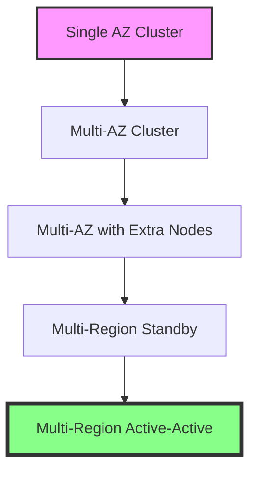

# Cloud-Based Train Control for Urban Rail Transit: Recent Developments and Key Technologies
## 1 Introduction: The Paradigm Shift to Cloud-Based Train Control

The urban rail transit industry stands at a critical inflection point. For decades, Communications-Based Train Control (CBTC) has been the technological backbone for enhancing safety and capacity, representing a significant leap from traditional fixed-block signaling[^1][^2]. However, the relentless growth in passenger demand, coupled with the limitations of legacy hardware-centric architectures, is driving a fundamental paradigm shift towards cloud-based train control systems[^3]. This transition is not merely an incremental upgrade but a radical re-architecting of how rail operations are managed, moving from isolated, proprietary subsystems to a unified, intelligent, and resilient digital ecosystem. This chapter establishes the foundational context for this transformation by examining the systemic constraints of traditional CBTC, defining the core concepts and drivers of the cloud-based paradigm, and outlining the scope and structure of this report.

### 1.1 Limitations of Traditional CBTC and the Imperative for Change

Traditional CBTC systems, while revolutionary in their time, are increasingly constrained by technical and operational limitations that hinder their ability to meet future demands. These constraints form the primary imperative for architectural evolution.

**A key networking challenge is achieving ultra-reliable, bi-directional train-to-wayside wireless communication.** Mission-critical CBTC operations impose stringent performance requirements: network latency must be below 500 milliseconds, wireless handover time under 50 milliseconds, and data packet loss less than 0.1 percent[^4][^2]. Maintaining this reliability is fraught with difficulties, including radio frequency interference, electromagnetic disturbances, signal congestion, and the physical limitations of installing radio equipment in complex environments like tunnels[^4][^2]. The system's heavy reliance on this wireless link makes it vulnerable to unpredictable signal interference and range restrictions, directly impacting operational stability[^4].

**Integration with legacy systems creates complex compatibility challenges and accumulating technical debt.** Modernizing signaling often involves bridging outdated, microprocessor-based legacy systems with modern CBTC components through obsolete protocols[^4]. This process typically requires specialized, custom-built transmission modules, adding complexity. A poignant example is the obsolescence of components like PCMCIA cards, once standard in programmable logic controllers (PLCs), for which replacement parts are now difficult to source[^4]. Over time, PLCs and their components become legacy products, and introducing new elements can cause unpredictable behavior in these older systems, creating a maintenance burden and hindering innovation[^4].

**Beyond communication and integration, traditional architectures face systemic limitations in resilience, standardization, and lifecycle management.** Despite employing redundancy at the subsystem level, the overall CBTC architecture remains vulnerable to rare but catastrophic complete system failures, such as from double faults or external events like fire or flood[^5]. Recovery from such events is difficult, a problem magnified as systems are increasingly designed for unattended operation[^5]. Furthermore, the industry suffers from a **lack of unified CBTC standards**, leading to significant interoperability issues between different vendors' systems in areas like onboard electronics and database management[^5]. This vendor lock-in creates technical debt and complicates system integration and long-term maintenance[^5]. Finally, the technology faces **continuous obsolescence**, as the lifecycle of its hardware and software components evolves faster than the typical lifespan of a railway system, posing persistent challenges for upgrades and sustainability[^5].

While CBTC provides significant safety advantages over conventional signaling, such as continuous speed supervision and high-precision positioning[^6], these inherent limitations in its traditional form underscore the urgent need for a more flexible, resilient, and efficient architectural paradigm.

### 1.2 Defining Cloud-Based Train Control: Concepts and Core Drivers

Cloud-based train control represents a fundamental shift from designing robust individual hardware components to architecting resilient systems where availability is ensured through software-defined agility and automated resource management. This paradigm is driven by a confluence of technological enablers and pressing business needs.

**The core driver is a paradigm shift in achieving system availability.** In traditional on-premises deployments, high availability focuses on minimizing hardware failures, with recovery processes potentially taking hours or days[^7]. In contrast, the cloud paradigm leverages virtualization to make hardware replaceable. The focus shifts to **designing for system resilience**, where the primary goal is minimizing failover time through the rapid detection and automated replacement of faulty virtual instances, often within minutes[^7]. This is achieved through strategies like geographical distribution of resources and increased redundancy of ready-to-deploy instances[^7].

**Technologically, this shift is enabled by cloud-native principles, virtualization, and microservices.** The Future Railway Mobile Communication System (FRMCS), the 5G-based successor to GSM-R, exemplifies this transition. Its architecture benefits from cloud computing, following cloud-native 5G core network designs based on **Network Function Virtualization (NFV)** and Software-Defined Networking (SDN)[^8]. NFV decouples network functions from proprietary hardware, enabling more flexible, agile management and cost-efficient software upgrades[^8]. Virtualization also enhances safety through task segregation, allowing critical and non-critical tasks to run independently on the same platform[^8].

**At the application level, the microservices architecture is key.** This approach decomposes monolithic applications into small, independent, and loosely coupled services. For railway cloud management, functionality like lifecycle orchestration is designed as RESTful microservices, enabling modular, rapid development and an open, extensible interface for uniform management of multi-vendor clouds[^9]. This stands in stark contrast to traditional metro systems where subsystems from different manufacturers are physically separated, leading to data silos, low resource utilization, and high interface complexity[^10].

**The business and operational drivers for this transition are compelling.** Rail operators seek to meet rising passenger demand without the prohibitive cost of building new lines. The solution lies in running more trains at shorter headways through greater automation[^3]. **Artificial Intelligence, cloud computing, and big data are the major technological drivers** for this automated train operation, requiring backend systems that are reliable and capable of efficient network-wide data sharing[^3]. Cloud-based architectures facilitate this by pooling resources, enabling on-demand allocation and flexible service expansion[^3]. Implementations like Huawei's Urban Rail Cloud demonstrate tangible benefits, including improved resource utilization (from 10% to over 50%), reduced IT procurement costs, and significant savings in equipment room space[^3]. Furthermore, the trend toward **converged multi-service network (MSN) architectures** supports both vital (e.g., CBTC) and non-vital applications on a common infrastructure, though this necessitates robust network segmentation and cybersecurity measures like a Zero Trust approach[^1].

### 1.3 Report Scope, Objectives, and Structural Overview

This report focuses on the recent and ongoing developments in cloudifying train control systems for urban rail transit, analyzing the key technologies that make this paradigm feasible and the challenges that must be overcome. The objectives are framed by the industry's transition from legacy hardware to software-defined, cloud-edge architectures.

**The scope is defined by several key industry trajectories:**
*   The evolution towards **cloud-native communication standards**, specifically the Future Railway Mobile Communication System (FRMCS), whose first edition specifications are expected by the end of 2026[^8].
*   The implementation of **unified cloud platforms** in live environments, such as Huawei's Urban Rail Cloud used by Shenzhen Metro and the deployment of LTE-M networks for converged train-to-ground communications, as seen in Shenyang Metro[^3][^11].
*   The architectural shift towards **microservices-based orchestration** and management of virtualized railway functions[^9][^10].
*   The integration of **advanced technologies** like AI, 5G, and edge computing to enable predictive maintenance, autonomous operations, and real-time optimization[^12].

**The core objectives of this report are to:**
1.  Analyze the **architectural foundations** of cloud-based train control, including system-level designs for resilience (e.g., geo-redundancy, cloud-edge collaboration) and the role of converged IP networks[^1][^7].
2.  Examine the **key enabling technologies**, such as 5G/FRMCS for connectivity, virtualization and containerization platforms, and microservices APIs for agile management[^8][^9][^11].
3.  Investigate the **functional transformation** of core subsystems (ATP, ATO, ATS, Interlocking) within a cloud paradigm and their integration modes[^10].
4.  Critically assess the **paramount challenges**, particularly in achieving certified functional safety (SIL4) in virtualized environments and addressing the expanded cybersecurity threat landscape in converged networks[^1][^2].
5.  Synthesize the **operational impact and benefits**, including quantified improvements in capacity, energy efficiency, and cost, while exploring future trends like digital twins and AI-driven autonomous control[^3][^12].

**The report is structured to provide a logical progression from context to technology, challenge, and impact.** Following this introductory chapter, Chapter 2 will review recent strategic initiatives and product developments from industry leaders. Chapter 3 will delve into the architectural models and core technologies. Chapter 4 will detail the transformation of specific train control functions. Chapter 5 will provide a critical analysis of safety and security challenges. Chapter 6 will evaluate operational benefits and future trajectories. Finally, Chapter 7 will offer a conclusive synthesis. Throughout, the report will address inherent challenges noted in references, such as management complexity, API latency[^8][^9], and performance under load[^9], providing a balanced and evidence-based perspective on the cloud-based future of urban rail signaling.

## 2 Recent Industry Developments and Strategic Initiatives

This chapter provides a data-driven analysis of the current competitive landscape and strategic trajectories within the cloud-based train control market. It focuses on dissecting the latest product launches, strategic investments, and collaborative initiatives from leading global suppliers, including Siemens Mobility, Hitachi Rail, Alstom, and CAF. The analysis will critically examine the technological features and claimed benefits of flagship solutions such as Siemens' Signaling X/Train2Cloud and Hitachi's SelTrac G9, anchoring these claims to specific project deployments and market reports. Furthermore, the chapter will synthesize common strategic directions, particularly the convergence of AI, 5G, edge computing, and cloud platforms, and assess their impact on operational efficiency, lifecycle costs, and market growth, as evidenced by the provided reference materials.

### 2.1 Analysis of Major Supplier Product Launches and Technological Roadmaps

The transition to cloud-based train control is being driven by concrete product innovations from major industry players. Their offerings reveal distinct yet converging architectural philosophies aimed at overcoming the limitations of traditional CBTC.

**Siemens Mobility: Cloud-Native Signaling Platforms**
Siemens Mobility has introduced two pivotal cloud-centric solutions: Train2Cloud and Signaling X. **Train2Cloud** represents a groundbreaking evolution from its Trainguard MT CBTC system to a **wayside-oriented, cloud-based approach**[^13]. Its foundational innovation is the **Distributed Smart Safe System (DS3) safety platform**, which enables Safety Integrity Level 4 (SIL4) applications to run on commercial off-the-shelf (COTS) servers[^13]. This allows operators to manage the CBTC system via high-performance COTS servers in on-premises signaling data centers, promising simplified maintenance, easy upgrades, and optimal capacity utilization with headways as low as 80 seconds[^13]. Building on this, **Signaling X** is a broader cloud platform based on Siemens Xcelerator that integrates various signaling systems for mainline and urban transit into a single, centralized Data Center[^13]. Also leveraging the DS3 platform, it runs safety-critical applications in a **geo-redundant, cyber-secure cloud environment**[^13]. Its claimed benefits are substantiated by live deployments; the system is already proven in Austria and Spain, with Finland as the latest adopter, delivering **up to 20% improvement in operational efficiency through reduced lifecycle costs**[^13].

**Hitachi Rail: Next-Generation CBTC and Integrated Cloud Ecosystems**
Hitachi Rail's strategy centers on advancing its SelTrac™ CBTC technology while deeply integrating cloud and AI. The company is investing over C$100 million to develop the **ninth generation (G9) of SelTrac CBTC**, which will integrate **Artificial Intelligence, 5G communications, and edge and cloud computing**[^14][^15]. This R&D initiative, based in Toronto, aims to offer operators lower costs, minimized carbon footprint, and enhanced passenger experience[^15]. Concurrently, Hitachi is deploying its **ALVEA™ platform**, a SCADA solution that offers modularity, scalability, maintainability, and cloud readiness, enabling a **seamless edge-to-cloud data flow**[^16]. This is being implemented in major projects like the Xizhi–Donghu (Xidong) - Nangang-Badu (Keelung) MRT in Taiwan, which will feature **private cloud-based signalling and train control supervision**[^16]. Furthermore, Hitachi is pioneering the integration of **5G for mission-critical train-to-ground communications**, a first in the industry, on projects in New York and Hong Kong, claiming significant reduction in trackside infrastructure and lifecycle costs[^17].

**Alstom: Onboard Intelligence and Cloud Control**
Alstom's approach emphasizes smart onboard systems and cloud-based traffic management. Its **Agate™ train control and information system** incorporates cutting-edge digital technologies including **Artificial Intelligence, Cloud and Edge Computing, and audio/video analytics**[^18]. The system creates a **"cloud on board the train,"** a highly innovative infrastructure that can host and run both third-party and operator applications to improve passenger information and infotainment[^19]. For network-wide control, Alstom's **Onvia Vision** is a cloud platform powering over 70 mainline control centres globally[^20]. Alstom is also innovating for specific use cases, as seen in its contract with Adif in Spain to trial a new ERTMS application for low-density lines that uses **satellite positioning and public telecommunications networks**, designed to significantly reduce trackside equipment while maintaining safety standards[^21].

**CAF: Data-Centric Fleet Management Platform**
While not a traditional signaling supplier, CAF's digital offerings exemplify the data-driven, cloud-based services enabled by new architectures. Its **LeadMind digital platform** is a comprehensive fleet management system built natively in the cloud on AWS[^22]. It centralizes data from onboard sensors and wayside inspection systems to provide real-time monitoring, condition-based maintenance, and advanced analytics[^23]. The platform has demonstrated tangible results, reportedly **extending the lifecycle of train components by 152%** and monitoring over 100 trains globally[^22].

The table below summarizes and compares the core cloud-based initiatives from these key suppliers:

| **Supplier** | **Core Cloud Product/Initiative** | **Key Technological Features** | **Primary Value Proposition** |
| :--- | :--- | :--- | :--- |
| **Siemens Mobility** | Train2Cloud & Signaling X | DS3 safety platform (SIL4 on COTS), geo-redundant cloud, centralized Data Center. | High operational efficiency (up to 20%), reduced lifecycle costs, simplified maintenance and upgrades[^13]. |
| **Hitachi Rail** | SelTrac G9 & ALVEA™ Platform | Integration of AI, 5G, edge/cloud computing; private cloud signaling; seamless edge-to-cloud data flow. | Lower costs, maximized capacity, future-proof networks, reduced trackside infrastructure[^17][^14][^16]. |
| **Alstom** | Agate™ System & Onvia Vision | Onboard "cloud", AI, edge computing; cloud-based traffic management; satellite positioning. | Enhanced passenger experience, operational efficiency, reduced infrastructure for secondary lines[^18][^20][^21]. |
| **CAF** | LeadMind Platform | Cloud-native (AWS), advanced analytics, IoT sensor integration, predictive maintenance modules. | Extended asset lifecycle, massive cost savings, optimized maintenance and fleet performance[^22]. |

### 2.2 Strategic Investments, Collaborations, and Market Consolidation Trends

Beyond standalone product development, the industry's evolution is being shaped by a wave of strategic investments, collaborations, and consolidation, aimed at accelerating innovation and capturing new value pools.

**Mergers, Acquisitions, and Portfolio Expansion**
A significant trend is market consolidation through acquisitions to gain scale and technological capability. The most notable recent example is **Hitachi Rail's acquisition of Thales' Ground Transportation Systems (GTS) business**, completed in May 2024[^17]. This move expanded Hitachi's footprint to 24,000 colleagues across 51 countries and significantly enhanced its portfolio and expertise in urban rail signalling[^17]. This acquisition directly supports its next-generation R&D, as the inherited engineering centre in Toronto is the site for the C$100 million SelTrac G9 development project[^15].

**Strategic Collaborations with Technology Giants**
Suppliers are increasingly partnering with leading cloud and AI technology firms to leapfrog development. **Hitachi Rail's collaboration with Google Cloud** is paradigmatic. Announced in October 2025, this technical alliance leverages **Google Cloud's Vertex AI platform, cybersecurity, and agentic AI technologies** to advance Hitachi's ambition for a "truly autonomous rail network"[^24]. This collaboration combines Hitachi's domain expertise with Google's AI leadership to develop optimized, energy-efficient solutions and unlock new levels of operational efficiency[^24]. Similarly, Knorr-Bremse's strategic minority stake in IoT specialist **Nexxiot** has led to a joint suite of smart products (Node, Hub, Cloud Services) for connected trains, creating the basis for new digital business models and projected revenue growth in the double-digit million-euro range by 2025[^25][^26].

**Public-Private Partnerships and Government Funding**
Government support is playing a catalytic role in de-risking large-scale R&D for next-generation technologies. Hitachi's SelTrac G9 development in Toronto is a prime example, receiving **C$4.5 million in supporting funds from the Ontario provincial government** through the Invest Ontario Fund[^15]. This partnership, which aims to create and retain high-skilled jobs, underscores the strategic national and regional interest in fostering leadership in digital rail technologies.

**Synthesis of Strategic Goals**
These initiatives collectively reveal a set of common strategic objectives:
1.  **Accelerating Digital Transformation:** Partnerships with firms like Google Cloud provide immediate access to cutting-edge AI and cloud capabilities that would be difficult and time-consuming to develop in-house[^24].
2.  **Expanding Solution Ecosystems:** Acquisitions like Hitachi-Thales GTS and collaborations like Knorr-Bremse-Nexxiot allow companies to offer more comprehensive, integrated digital solutions spanning signaling, rolling stock, and asset management[^17][^25].
3.  **Developing Service-Based Revenue Models:** The shift is evident from selling proprietary hardware to offering continuous digital services (e.g., predictive maintenance via CAF's LeadMind, data analytics via Knorr-Bremse's Cloud Services), creating recurring revenue streams[^22][^26].

### 2.3 Validation of Claimed Benefits through Project Deployments and Market Data

The promises of cloud-based train control are being tested and validated in real-world projects, while broader market data confirms the sector's growth trajectory.

**Validation through Specific Project Deployments**
*   **Operational Efficiency:** Siemens Mobility's claim of **up to 20% improvement in operational efficiency** for its Signaling X platform is backed by its proven deployments in Austria and Spain, with recent adoption in Finland[^13].
*   **Capacity and Headway Improvement:** Siemens' Train2Cloud is designed to support **headways as low as 80 seconds**, directly addressing the core need for increased line capacity[^13]. Furthermore, the world's first refurbishment of an existing GoA4 metro system to a new GoA4 CBTC system, showcased by Siemens, is aimed at significantly enhancing metro capacity[^27].
*   **Infrastructure and Cost Reduction:** Hitachi Rail's integration of 5G with SelTrac CBTC claims to **reduce trackside infrastructure significantly** by decreasing the number of radio access points needed compared to Wi-Fi solutions[^17]. This is being implemented in the high-profile New York Crosstown Line and Hong Kong Airport projects[^17]. Alstom's ERTMS trial for Adif aims to validate a system with **significantly reduced trackside equipment** for low-density lines, targeting lower capital expenditure[^21].
*   **Lifecycle and Maintenance Optimization:** CAF's LeadMind platform provides concrete data, reporting the **extension of train component lifecycle by 152%** through condition-based maintenance, translating directly into lower lifecycle costs[^22]. The platform's monitoring of over 100 trains globally demonstrates its operational scale[^22].

**Corroboration by Market Reports and Data**
Industry reports substantiate the strategic importance and growth of these technologies:
*   **CBTC Market Growth:** The global communication-based train control market was valued at **USD 2.4 billion in 2024** and is estimated to register a **Compound Annual Growth Rate (CAGR) of 8.1% between 2025 and 2034**[^28]. This growth is fueled by demand for safe, efficient, and high-capacity rail transit.
*   **Segment Dominance:** The **metros segment dominated the CBTC market**, generating revenue of around USD 1 billion in 2024, confirming that urban rail networks are the primary drivers for advanced signaling adoption[^28]. This aligns with numerous supplier projects focused on metro applications.
*   **Digital Railway Expansion:** The broader digital railway market is projected to grow from **USD 82.76 billion in 2025 to USD 127.54 billion by 2030**, at a CAGR of 9.0%[^29]. CBTC is listed as a key technology within this expanding market.
*   **Regional Hotspots:** The U.S. dominated the North American CBTC market in 2024 (USD 500 million revenue), while **Germany and China are predicted to witness tremendous growth from 2025-2034**, driven by smart infrastructure investments and metro network expansion, respectively[^28].

### 2.4 Synthesis of Convergent Strategic Directions and Future Market Implications

The analysis of product launches, strategic moves, and project validations reveals a powerful convergence of strategic directions that is fundamentally reshaping the urban rail signaling market.

**The dominant convergent strategic directions are:**
1.  **Platformization and Centralization:** Moving from disparate subsystems to unified, cloud-native platforms (Signaling X, Onvia Vision) that integrate mainline and urban transit operations into centralized data centers[^13][^20].
2.  **Deep Integration of Enabling Technologies:** **Artificial Intelligence** is being embedded for predictive analytics (CAF LeadMind, Alstom Agate) and autonomous operations (Hitachi-Google Cloud)[^24][^18][^22]. **5G connectivity** is becoming critical for high-bandwidth, low-latency train-to-ground communications, enabling infrastructure reduction[^17]. **Edge-to-cloud architectures** are standard, balancing real-time processing with centralized data intelligence (ALVEA™, Knorr-Bremse Node/Hub)[^16][^26].
3.  **Shift to Data-Driven Services:** The industry's business model is evolving from product sales to offering **outcome-based digital services**, such as predictive maintenance, energy management, and capacity optimization, enabled by cloud platforms and data analytics[^22][^26].

**Future Market Implications:**
*   **Competitive Landscape:** The market will favor large, integrated players like Siemens, Hitachi, and Alstom that can offer full-stack digital solutions. However, specialists like CAF in data analytics or Knorr-Bremse in component IoT will thrive through partnerships, creating a more collaborative ecosystem.
*   **Operator Procurement Strategies:** Rail operators will increasingly procure "capability-as-a-service" rather than capital equipment, focusing on total lifecycle cost, cybersecurity resilience, and system openness to avoid vendor lock-in.
*   **Persistent Challenges:** The reference materials implicitly highlight challenges that must be managed. The convergence of IT and OT in cloud environments **expands the cybersecurity threat landscape**, necessitating embedded security like that in the Hitachi-Google Cloud partnership[^24][^29]. Furthermore, the management of **complex, multi-vendor cloud environments** and ensuring deterministic performance for safety-critical applications remain critical hurdles to widespread adoption.

**In conclusion, the recent developments confirm an industry-wide pivot from incremental hardware upgrades to a foundational redesign centered on cloud, data, and open ecosystems.** This convergence aims to deliver the step-change improvements in efficiency, capacity, and flexibility required for the future of urban mobility, while simultaneously setting the stage for the fully autonomous rail network of tomorrow[^24].

## 3 Architectural Foundations and Core Technologies

This chapter provides a detailed, data-driven analysis of the core technological building blocks that enable the transition from traditional hardware-centric to software-defined, cloud-based train control systems. It dissects the specific architectural models and hardware/software components that constitute modern solutions, anchored in concrete technical specifications and performance data. The analysis critically examines how these technologies collectively address the limitations of legacy CBTC by enabling system-level resilience, centralized management, and flexible scalability, while also identifying inherent technical challenges such as management complexity and the stringent requirements for safety certification in virtualized environments.

### 3.1 Centralized System Architecture and Geo-Redundant Resilience

The foundational shift in cloud-based train control is the move from decentralized, proprietary hardware scattered along the trackside to a **centralized signaling data center**. This model, exemplified by Siemens Mobility's **Signaling X** and **DS3 platform**, creates an on-premise "signaling data center" within a homogenous environment, replacing disparate proprietary hardware with readily available components[^30][^31]. The DS3 platform is designed as a **country-wide data center**, capable of centralizing interlockings and Radio Block Centers (RBCs) for an entire customer, bundling their tasks into a single railway cloud[^32][^33]. This evolution progresses from digitalized signaling with centralized architecture to cloud-based signaling, which substantially reduces hardware components and achieves the highest availability through geo-redundancy[^33].

**Geo-redundancy is the core strategy for achieving high availability and business continuity in this centralized paradigm.** It is a security and safety protocol that physically separates servers into multiple geographical locations, providing a safeguard called geographical redundancy[^34][^35]. This approach moves beyond ensuring the robustness of individual hardware components to designing **system-level resilience**. The principle is that if one region is affected by a natural disaster or catastrophic event, operations can seamlessly failover to servers in another location, minimizing downtime[^34]. For cloud-based railway systems, this means creating architectures where complete backups and duplicates of the primary signaling data center exist in a separate geographic region, with fast failover protocols ensuring continuous operation[^35].

Different architectural options offer varying levels of availability and cost. Analysis for critical railway workloads in the cloud compares standard reference architectures[^36]:
*   **Single Cluster in One Availability Zone:** Similar to a traditional on-premise setup.
*   **Cluster Distributed Across Three Availability Zones within One Region:** Protects against failures in a single data center (Availability Zone).
*   **Cluster Across Three Zones with Extra Nodes:** Maintains full functionality even if an entire Availability Zone fails.
*   **Multi-Region with Standby Clusters:** Provides tolerance against the complete failure of an entire geographic cloud region, representing the highest level of resilience.

**The choice among these architectures directly impacts key availability metrics (e.g., "four nines" 99.99% or "five nines" 99.999%) and has significant cost implications.** For instance, achieving higher levels of availability (e.g., five nines) in a cloud environment can increase costs substantially compared to a basic architecture, as it requires more distributed resources and redundancy[^36]. This system-level approach to availability, enabled by cloud elasticity, is a fundamental departure from the hardware-centric model.

Enabling this centralized, modular ecosystem are **standardized APIs**. Signaling X is built on the promise of using standardized APIs to ensure seamless integration and interoperability across the entire system[^37][^38]. This allows both safety and non-safety applications to be managed from the centralized Data Center, streamlining operations and fostering a more connected railway system[^37].

### 3.2 Safety-Critical Virtualization: DS3 Platform and COTS Hardware

The critical enabler for cloud-based train control is the ability to run safety-critical functions with the highest Safety Integrity Level (SIL4) on virtualized, standardized hardware. This is achieved through specialized safety platforms that decouple safety logic from proprietary hardware.

**The Distributed Smart Safe System (DS3) platform from Siemens Mobility is a foundational technology in this domain.** DS3 is the first platform worldwide that enables the use of commercially available, state-of-the-art multicore CPUs to process safety-relevant logic applications for rail operations while maintaining SIL4[^32][^33]. It ensures flawless operation of critical CBTC applications like Automatic Train Protection (ATP) and interlocking[^30][^31]. The platform's method, enhanced with IT security features, allows safety-critical applications to run securely and redundantly on a scalable network[^31]. **This eliminates the need for the proprietary, single-vendor hardware previously required for interlockings, marking a radical shift in signaling system design**[^33].

The shift to **Commercial Off-The-Shelf (COTS) hardware** is central to the open signaling transformation. COTS refers to standard, industrial components such as PLCs or standard servers that are already available on the market[^1]. Utilizing COTS in signaling brings advantages including flexibility, vendor independence, cost efficiency, and scalability, making open signaling technically and commercially possible[^1]. Solutions like Train2Cloud and Signaling X explicitly leverage powerful off-the-shelf servers with a security-hardened operating system[^30][^31].

**However, this shift introduces a paramount challenge: the locus of safety validation moves from hardware to software.** When signaling hardware becomes open and interchangeable, and the principles are moved to software, much of the safety demonstration must move to software as well[^1]. This requires rigorous verification and validation methodologies. The use of **digital twins** is highlighted as an effective way to manage this transition, allowing infrastructure managers to test, validate, and verify the principles behind new COTS-based systems before deployment[^1]. Furthermore, formal methods—mathematical proof-based verification—are employed to ensure that safety-critical software behaves exactly as intended, regardless of the underlying hardware platform[^1].

This aligns with a broader paradigm shift in fault tolerance for cloud-based critical systems. The focus moves from preventing hardware failures (increasing Mean Time Between Failures) to **designing for rapid detection and automated recovery**. In the cloud, devices are easily configured and removed, so system resilience is achieved by building redundancy to minimize the risk of system failure due to device faults and to minimize recovery time[^36]. This design-for-resilience approach is key to meeting the functional safety requirements of standards like EN 50129 within a cloud infrastructure context[^36].

### 3.3 Cloud-Edge-End Collaborative Computing Models

To meet the stringent real-time demands of train control while leveraging centralized cloud intelligence, a distributed **cloud-edge-end collaborative architecture** is essential. This model balances low-latency processing at the edge with the scalable computational power and data fusion capabilities of the cloud.

The architecture is typically structured in three layers[^39][^40][^41]:
1.  **Edge Sensing and Acquisition Layer:** Comprises field devices like trackside cameras, IoT sensors, and onboard systems that collect raw, real-time data.
2.  **Cloud Data Fusion and Computation Layer:** A centralized platform that aggregates, integrates, and processes multi-source heterogeneous data. It hosts AI engines for complex analysis, prediction, and scheduling optimization.
3.  **Intelligent Application and Interaction Layer:** Delivers actionable insights, visualizations (e.g., via digital twins), and control commands back to operators and field systems.

**The operational workflow forms a closed-loop control system: Perception -> Fusion -> Prediction/Optimization -> Execution/Feedback**[^39][^42]. Edge devices collect on-site status, cloud middleware integrates the data, AI engines perform predictive analytics and optimization, and the digital twin layer validates strategies before dispatching execution commands[^41].

**The performance advantages of this model are quantifiable.** An integrated cloud-network-digital-intelligence platform for rail transit demonstrated an average response latency of **280 ms**, a peak throughput of **27,000 messages per second**, and over **95% closed-loop execution success rate** in field tests[^39][^40]. More strikingly, an Edge Intelligence-based equipment inspection system using a cloud-edge-end model reduced average end-to-end latency for anomaly detection by **45%** (28.5 ms vs. 52.1 ms) compared to a cloud-centric architecture[^43][^7]. Furthermore, by employing an event-triggered upload strategy (sending data only upon anomaly detection), it slashed daily bandwidth consumption by approximately **98.1%**[^43].

This architecture directly enables advanced use cases:
*   **AI-Driven Scheduling & Predictive Maintenance:** The cloud layer can run algorithms like Proximal Policy Optimization (PPO) for task scheduling, which reduced average task completion time by **27.4%** in tests[^40][^42]. Platforms like Alstom's HealthHub™ utilize such cloud-edge analytics for condition-based monitoring[^44].
*   **Digital Twins:** The cloud serves as the platform for creating and running high-fidelity digital replicas of the physical railway, used for simulation, strategy validation, and real-time monitoring[^39][^41].

**However, the distributed nature introduces significant management complexity.** Orchestrating resources, applications, and data flow across cloud and edge nodes requires sophisticated automation. Research into railway cloud management proposes designing orchestration functionality as **RESTful microservices** to create an open, extensible interface[^31][^45]. While validation showed a mean API latency of about **2 milliseconds**, peaks near **50 milliseconds** were observed under load, indicating that performance and synchronization are critical challenges that require careful design and mitigation[^45].

### 3.4 Converged IP Network and 5G/FRMCS Communication Infrastructure

The centralized cloud and distributed edge nodes are interconnected by a high-performance, ultra-reliable, and resilient communication infrastructure. This converged network is the nervous system of the cloud-based train control ecosystem, carrying both mission-critical safety data and operational information.

**The wired backbone for wayside and station connectivity relies on resilient, high-speed IP networks.** The Cisco Rail CBTC solution mandates full path redundancy at every level—from the Operations Control Center (OCC) to the train—using technologies like **Resilient Ethernet Protocol (REP) rings** in the wayside access and backbone networks[^35][^46]. Similarly, the Nokia digital station network blueprint employs **10 Gb/s Ethernet rings based on ITU-T G.8032 ERPS technology**, with access switches dual-homed to redundant gateway routers for comprehensive protection against link, node, and gateway failures[^30][^34]. This design ensures deterministic quality of service (QoS) for critical applications like voice communications and CCTV[^30].

**For train-to-wayside communication, 5G technology is becoming the cornerstone.** 5G offers Ultra-Reliable Low-Latency Communications (URLLC), which is essential for real-time CBTC functions like vehicle position and speed profile updates[^43]. It supports high-speed mobility, full coverage, and seamless handoffs, with reliability requirements as high as **99.9999%** for railway-specific 5G-R systems, compared to 99.999% for public 5G[^47]. The adoption of 5G enables infrastructure reduction, as seen in implementations claiming to decrease the number of radio access points needed compared to traditional Wi-Fi[^43].

The long-term standard for this wireless communication is the **Future Railway Mobile Communication System (FRMCS)**, the 5G-based successor to GSM-R[^1][^48]. FRMCS is designed to satisfy the high reliability, low latency, and enhanced security requirements for intelligent railway applications[^47]. The migration from GSM-R to FRMCS is underway, with the first commercial rollouts in Europe expected from 2024/2025 onwards, and a parallel operation phase lasting until at least 2030[^1]. **This transition is critical for supporting advanced automation and autonomous train operations.**

**Cybersecurity is integrated into the network design from the outset.** The Cisco guide references standards like IEC 62443 and outlines a zoning methodology to segment the network into security zones (e.g., vital signaling, operations)[^35]. The industry is evolving towards unified standards, with the new **IEC 63452** (evolving from CENELEC TS 50701) set to become the primary international standard for railway cybersecurity, providing a comprehensive framework[^49]. This "secure-by-design" approach is paramount as IT and OT networks converge in the cloud.

### 3.5 Orchestration, APIs, and Data Interoperability Standards

The agility, integration, and openness of cloud-based train control systems are realized through a software layer defined by orchestration engines, open APIs, and universal data standards. This layer manages the lifecycle of virtualized functions and enables data exchange across multi-vendor ecosystems.

**Orchestration of the railway cloud is increasingly designed using a microservices architecture.** Research proposes a Railway Management Automation and Orchestration (RMAO) platform where core orchestration functions—such as software updates, infrastructure scaling, and status queries—are implemented as **RESTful microservices**[^31][^45]. This approach aims to provide an open, extensible interface for uniform management of clouds from different vendors. Performance validation of such microservices APIs showed a mean latency of about **2 milliseconds**, though peaks near **50 milliseconds** under load highlight the need for careful design to manage complexity and ensure consistent performance[^45].

**Open APIs are fundamental for system integration and new service models.** Siemens' Signaling X promises the use of **standardized APIs** to ensure seamless integration and interoperability, managing both safety and non-safety applications from the centralized Data Center[^37][^38]. Furthermore, **Data-as-a-Service (DaaS)** is exemplified by the Railigent X **Train API**, which provides near real-time access to standardized fleet data—such as live vehicle position, status, occupancy, and configuration—enabling operators to build custom business applications[^50][^51]. This represents a shift towards platform-based, service-oriented business models.

**Data interoperability across different systems and organizations relies on robust standardization.** Key initiatives include:
*   **RailTopoModel® (RTM):** A generic railway data model developed by UIC for engineering and circulation activities, forming a common system architecture[^52][^53].
*   **railML®:** An open-source XML-based data exchange format specifically developed to be compliant with RTM. It handles infrastructure, timetable, rolling stock, and interlocking data, facilitating internal and external data exchange[^53].
*   **ERA-railML.org Collaboration:** The European Union Agency for Railways (ERA) and railML.org collaborate to improve railway data standardization. A key achievement is the publication of **ERA and railML ontologies**, which provide a common understanding across railway data subdomains, ensuring compatibility and consistency[^53][^54].

**The broader standardization landscape is governed by key international committees:**
*   **IEC Technical Committee 9 (TC 9):** Responsible for international standardization of electrical equipment and systems for railways, covering rolling stock, fixed installations, and management systems[^55][^56][^57].
*   **ISO Technical Committee 269 (TC 269):** Standardizes systems, products, and services specifically related to the railway sector, excluding electrotechnical aspects covered by IEC TC 9[^57].

These committees work closely with industry bodies like the International Union of Railways (UIC) to ensure technical harmonization and coherence across the global railway system[^55][^58]. **Together, orchestration software, open APIs, and data standards form the essential "glue" that binds the cloud-edge infrastructure into a cohesive, manageable, and interoperable next-generation train control system.**

## 4 Functional Integration and Subsystem Transformation

This chapter provides a detailed, data-driven analysis of how core train control functions—Automatic Train Protection (ATP), Automatic Train Operation (ATO), Interlocking, and Automatic Train Supervision (ATS)—are fundamentally re-architected within a cloud-based paradigm. Building on the architectural foundations established in Chapter 3, it critically examines the transformation of these subsystems from dedicated hardware to software-defined services, focusing on the consolidation of functions based on safety integrity levels (SIL) and real-time requirements. The analysis is anchored in specific technical implementations and integration modes described in the reference materials, such as the DS3 platform's ability to host mixed-SIL applications and the standardized cloud application of ATS. The chapter will dissect the implications for system design, including hardware reduction, centralized management, and the challenges of ensuring deterministic performance and safety in a shared-resource environment, thereby illustrating the practical realization of the cloud-edge collaborative model for vital and non-vital railway functions.

### 4.1 Transformation of Safety-Critical Subsystems: ATP, ATO, and Interlocking

The migration of Safety Integrity Level 4 (SIL4) functions—Automatic Train Protection (ATP), Automatic Train Operation (ATO), and Interlocking—to cloud data centers represents the most radical departure from traditional signaling architecture. This transformation is enabled by innovative safety platforms that decouple critical software from proprietary hardware, allowing them to run on Commercial Off-The-Shelf (COTS) servers within centralized data centers[^59][^60].

**The core enabler for this shift is the Distributed Smart Safe System (DS3) platform developed by Siemens Mobility.** DS3 is the first platform worldwide that allows safety-critical railway applications to operate on commercially available multicore CPUs while maintaining the stringent SIL4 certification[^60]. Its safety principle is based on a combination of **diversity, redundancy, and safe voting**. Each safety-critical software component runs in at least two parallel instances on separate CPUs, with "colored" (diverse) safety mechanisms instrumented into the source code[^61]. The results from these instances are continuously compared by a safe voting mechanism. For safety, a **2-out-of-2 voting** logic is used, ensuring any discrepancy or common cause failure is detected. To achieve high availability, a **third instance can be added, enabling a 2-out-of-3 voting** scheme, allowing the system to remain operational even if one instance fails[^61][^62]. This architecture runs on a security-hardened operating system (CoreShield S2L2 Linux), creating a virtualized safety computer platform[^61].

**This technological breakthrough facilitates a profound architectural shift from decentralized proprietary hardware to a centralized SIL4 data center model.** The vision, as articulated by Siemens, progresses towards concepts like "One country, one cloud" or "One city, one cloud," where multiple interlockings and other safety systems are consolidated into a single, centralized rail data center[^60]. This model directly addresses key challenges of traditional systems: it eliminates "radical copper cabling," enables unlimited control distance via IP networks, and simplifies the complicated obsolescence management associated with specific SIL4 hardware[^61][^62]. The Train2Cloud solution exemplifies this, creating an on-premise "signaling data center" that replaces proprietary hardware with readily available components to run critical CBTC applications like ATP and interlocking[^59].

**The benefits of this transformation are substantial and have been validated in operational pilots.** The consolidation of multiple safety systems onto shared COTS hardware leads to a significant **reduction in needed hardware, physical space, and energy consumption**[^61]. A pilot project in Achau, Austria, which migrated an existing interlocking to the DS3 platform, demonstrated **100% availability over four years of operation**[^61]. Furthermore, the platform's design supports **efficient maintenance**, allowing for IT security patches, hardware replacement, and software restarts during runtime without taking the system offline[^61]. The use of COTS components also future-proofs the system against obsolescence and enables **geographical redundancy**, where backup systems can be located in different geographic locations for complete resilience[^60].

**However, this transformation introduces significant challenges, primarily centered on safety validation and migration.** **The locus of safety assurance shifts decisively from hardware to software.** When hardware becomes interchangeable and principles are implemented in software, the safety demonstration must correspondingly move to rigorous software verification and validation[^63]. Migrating existing, approved application logic (e.g., interlocking software and data) to the new virtualized platform requires careful engineering to ensure functional equivalence and interface compatibility[^61]. The industry is addressing these challenges through methodologies like the use of **digital twins for testing and validation** and the application of **formal methods** to mathematically verify software behavior[^60].

### 4.2 Consolidation and Standardization of Non-Safety Applications: The Case of ATS

While the virtualization of safety-critical functions is groundbreaking, the cloud paradigm delivers perhaps its most immediate operational and economic benefits through the **consolidation and standardization of non-safety applications**, with Automatic Train Supervision (ATS) being the prime example.

**A fundamental design principle of cloud-based architectures is the co-hosting of safety and non-safety applications on the same physical server hardware.** Solutions like Siemens' Train2Cloud explicitly maximize efficiency by running non-safe applications like ATS on the same COTS servers that host the safety-critical ATP and interlocking functions, eliminating the need for physically separate systems[^59]. This represents a move away from the traditional state-of-the-art architecture where "each system [runs] on its own hardware"[^61]. Research into dual safety-oriented urban rail cloud signaling confirms this direction, identifying the **standardization of ATS subsystem cloud applications** as a core component of the cloud-edge collaborative solution[^64][^59][^65].

**The operational and economic benefits of this consolidation are quantifiable and dramatic, as demonstrated in real-world deployments.** The case of Wuhan Metro's Urban Rail Cloud Project, implemented in partnership with Huawei, provides compelling evidence. Prior to cloud integration, each of the more than 20 service systems in a new metro line constructed its own independent ICT systems, leading to **resource utilization of less than 50%**, high construction costs, and pervasive data silos[^66]. By deploying a unified cloud platform, Wuhan Metro eliminated the traditional siloed architecture. The results were transformative: the project **halved the cost of constructing station equipment rooms** for new lines, **improved IT resource utilization by approximately 50%**, and enabled secure data sharing across the organization, which helped **reduce the labor force by over 10%**[^66]. This cloud and big data platform now serves as the foundation for future smart services and advanced analytics.

**The technical realization of this consolidation requires sophisticated design to ensure logical isolation and service quality.** When applications of different criticality levels (e.g., SIL4 and non-SIL) share hardware, strict logical isolation mechanisms are paramount. Architectures like Huawei's TIAS (Traffic Control Integrated Automation System) create **logical isolation between services by using different security levels**, integrating systems like ATS, Building Automation (BAS), and power SCADA into virtual data centers[^67]. The DS3 platform also supports running **applications with different SIL on the same hardware**[^61]. Key design considerations include:
*   **Resource Allocation:** Implementing intelligent strategies to balance application performance, power consumption, and safety constraints, as explored in research on virtual machine placement for railway safety computing[^63].
*   **Quality of Service (QoS):** Guaranteeing network bandwidth and processing priority for critical functions within the shared environment.
*   **Security Segmentation:** Ensuring that non-safety applications cannot interfere with or compromise the integrity of safety-critical software and data.

**The standardization of ATS as a cloud application is a critical step towards vendor-agnostic, flexible operations management.** It allows the dispatching and supervisory functions to be delivered as scalable software services, accessible via cloud desktops from any authorized location, reducing dependency on fixed, specialized workstations[^67].

### 4.3 Cloud-Edge Functional Partitioning and Collaborative Mechanisms

To meet the stringent, real-time demands of train control while leveraging cloud intelligence, a clear **functional partitioning strategy across the cloud-edge-end hierarchy** is essential. This collaborative model determines which tasks are best performed centrally, at the network edge, or directly on the train.

**The partitioning is primarily driven by latency, reliability, and bandwidth requirements.** Safety-critical control loops with millisecond-level latency demands, such as immediate train braking commands from ATP, must be handled by onboard systems or very proximate edge devices. Supervisory optimization, historical data analysis, and network-wide scheduling, which can tolerate slightly higher latency, are ideal for the centralized cloud. Research into cloud-edge collaborative mechanisms specifically highlights the need to define the interaction between **onboard ATP/ATO subsystems and the cloud platform**[^64][^59][^65]. For instance, the train's onboard unit can execute immediate protection functions while continuously reporting its precise position and status to the cloud-based RBC (Radio Block Center) or interlocking, which then calculates and sends back movement authorities[^60].

**Different integration modes emerge based on this partitioning and the criticality of functions:**
*   **Fusion/Deep Integration:** Multiple safety-critical applications (e.g., interlocking, RBC) are fused onto a shared safety platform (like DS3) within the cloud data center, sharing underlying COTS hardware resources[^61].
*   **Integration with Logical Isolation:** SIL4 and non-safety applications (like ATS) are integrated onto the same cloud infrastructure but are strictly isolated in virtualized containers or separate virtual data centers[^67].
*   **Interconnection:** Discrete subsystems, particularly at the edge and onboard, are interconnected via high-performance, IP-based networks (including 5G) to form a cohesive system[^59][^60]. The data communication subsystem (DCS) is a key component that must be integrated with the cloud platform to enable this seamless connectivity[^64][^59].

**This distributed architecture is the enabler for advanced, data-driven use cases.** The cloud's computational power allows for **AI-driven predictive maintenance** and **energy-efficient driving profile optimization**. For example, a cloud-based system can calculate the most efficient speed for a train to reach a junction at an exact time, optimizing energy use—a capability particularly valuable with rising energy costs[^60]. The cloud also serves as the repository and processing engine for the **digital twin**, simulating operations and validating control strategies before they are executed in the physical world.

**However, managing this collaborative ecosystem introduces significant complexity.** Orchestrating software applications, data flows, and resource allocation across geographically distributed cloud and edge nodes requires sophisticated automation platforms. Ensuring deterministic performance and perfect data synchronization between the cloud's "world model" and the real-time state at the edge remains a paramount engineering challenge.

### 4.4 Implications for System Design, Safety, and Lifecycle Management

The functional integration and subsystem transformation described above have profound and wide-ranging implications for how railway signaling systems are designed, certified, operated, and maintained throughout their lifecycle.

**System design undergoes a fundamental paradigm shift from hardware-centric to software-defined and platform-based.** The primary artifact becomes a **centralized software platform** (e.g., Signaling X, DS3 ecosystem) capable of hosting a portfolio of applications, rather than a collection of discrete hardware boxes[^59][^60]. This shift enables unprecedented flexibility and scalability. Procurement models evolve accordingly, moving from purchasing proprietary hardware to licensing software capabilities and cloud services, potentially adopting "as-a-service" models for functions like ATS or predictive analytics.

**A cornerstone of this new design paradigm is interoperability through open standards.** The success of integrated, multi-vendor cloud ecosystems hinges on **open APIs and universal data models**. Siemens' Signaling X emphasizes the use of standardized APIs for seamless integration[^60]. Furthermore, data interoperability standards like **RailTopoModel (RTM)** and exchange formats like **railML®** become critical for ensuring that applications from different suppliers can share a common understanding of infrastructure, timetables, and rolling stock data, breaking down the data silos that plagued traditional systems[^66].

**The most significant implication is the evolution of safety assurance.** **Certification boundaries and methodologies must adapt to the virtualized, shared-resource environment.** Safety is no longer guaranteed by dedicated hardware but by the **system-level resilience** of the software platform and its orchestration mechanisms[^61]. This necessitates:
*   **New Validation Techniques:** Heavy reliance on **digital twins** for comprehensive testing and **formal methods** for verifying the correctness of safety-critical software[^60].
*   **Focus on Common Cause Failures:** The safety architecture (like DS3's diverse "colored" mechanisms) must be designed to identify failures within the non-safety-critical COTS hardware, operating system, or other software[^61].
*   **Continuous Assurance:** With the ability to apply IT security patches during runtime, safety cases must support the concept of continuous updates without re-certification of the entire platform[^61].

**Lifecycle management is revolutionized, offering both new efficiencies and new complexities.** Benefits include:
*   **Simplified Obsolescence Management:** COTS hardware can be refreshed using standard industry procurement, avoiding vendor lock-in on proprietary components[^60][^61].
*   **Centralized Maintenance:** Software updates, patches, and new application deployments can be rolled out from the data center to the entire network.
*   **Predictive Capabilities:** The integrated data platform enables condition-based and predictive maintenance models, optimizing resource use and preventing failures.

However, these benefits come with the **upfront complexity of integrating a multi-layered technology stack** (cloud, virtualization, networking, applications) and the **persistent, elevated challenge of cybersecurity**. Protecting a converged IT/OT cloud environment from increasingly sophisticated attacks requires a "secure-by-design" approach embedded at every layer, from the network to the application platform itself.

**In conclusion, the functional integration within cloud-based train control represents a validated, transformative approach.** It successfully balances the non-negotiable requirement for SIL4 safety with the compelling economic and operational benefits of consolidation and data centralization. While introducing new challenges in safety engineering and cybersecurity, the re-architected subsystem model lays the essential foundation for a more agile, efficient, and intelligent future for urban rail transit.

## 5 Critical Analysis of Safety, Security, and Implementation Challenges

This chapter provides a rigorous, data-driven critical analysis of the foremost challenges that must be overcome for the successful and safe adoption of cloud-based train control systems. It focuses on two intertwined pillars: 1) The paradigm shift in functional safety assurance, critically examining the mechanisms, validation methods, and certification pathways for achieving Safety Integrity Level 4 (SIL4) in virtualized, cloud-native environments. 2) The expanded and evolving cybersecurity threat landscape, synthesizing comprehensive guidance from industry standards, regulatory directives, and technical frameworks to analyze risks and protective strategies for converged IT/OT networks. The chapter also integrates analysis of operational resilience challenges, including cloud outage impacts, disaster recovery strategies, and proactive reliability models, thereby providing a holistic view of the barriers to implementation. This analysis serves as the crucial risk assessment component of the report, bridging the technological promise outlined in previous chapters with the practical realities of deployment.

### 5.1 Paradigm Shift in Functional Safety: Achieving SIL4 in Virtualized and Cloud Environments

The migration of safety-critical train control functions, such as Automatic Train Protection (ATP) and Interlocking, to cloud infrastructures necessitates a fundamental rethinking of functional safety assurance. The traditional model, where safety is intrinsically tied to dedicated, proprietary hardware, is challenged by the dynamic, shared-resource nature of cloud environments. The core challenge is to certify these virtualized applications to the highest Safety Integrity Level (SIL4) within a paradigm that prioritizes system resilience over component robustness[^68].

**The technical mechanism enabling this shift is exemplified by safety platforms like the Distributed Smart Safe System (DS3).** This platform allows safety-critical applications to run on Commercial Off-The-Shelf (COTS) multicore servers by implementing a sophisticated combination of **diversity, redundancy, and safe voting**[^68]. The safety principle involves running at least two parallel instances of the software on separate CPUs, with "colored" (diverse) safety mechanisms instrumented into the source code. A safe voter continuously compares the results. For fault tolerance, a **2-out-of-2 voting** logic ensures safety, while a **2-out-of-3 scheme** (with a third instance) can maintain high availability even if one instance fails[^68]. This architecture runs on a security-hardened operating system, creating a virtualized safety computer that decouples the safety logic from the underlying hardware.

**This decoupling forces a critical transition: the locus of safety validation moves decisively from hardware to software.** When hardware becomes interchangeable, the safety demonstration must rely on rigorous software verification and validation methodologies[^68]. This includes the application of **formal verification**, an automated, mathematics-based technique to prove that software behaves exactly as intended, regardless of the platform[^69]. Furthermore, **digital twins** are increasingly used as a comprehensive testing and validation environment before deployment, allowing infrastructure managers to verify the principles behind new COTS-based systems[^68].

A key conceptual framework for certifying cloud infrastructure is treating it as a **"pre-existing item"** within standards like EN 50129. This classification means the cloud platform (e.g., AWS) is integrated as a black-box component into the overarching safety-critical system[^68]. The certification burden shifts from validating the internal workings of the cloud to:
1.  Gathering information about the cloud provider's environmental controls and security certifications (e.g., data center protection policies).
2.  Understanding and mitigating the cloud's failure modes (e.g., instance failure, availability zone outage) through architectural resilience rather than component reliability.
3.  Ensuring quality, safety, and continuity via external monitoring of the cloud-hosted application's interfaces and health[^68].

**The feasibility of "SIL4 Cloud" is actively being explored, with research indicating a clear technical pathway.** Whitepapers from initiatives like Digitale Schiene Deutschland confirm that deploying safety-critical railway applications in the cloud without compromising SIL4 standards is technically feasible[^70]. The certification pathway involves redefining assurance for virtualized and containerized environments, focusing on architectural principles that ensure **redundancy, determinism, and resilience** within modern cloud stacks[^70]. However, a significant gap remains between traditional safety engineering, which focuses on minimizing the probability of hardware failure, and the cloud-native paradigm, which achieves high availability by designing for rapid detection and automated recovery from inevitable faults[^68]. Bridging this gap requires a fundamental shift in safety culture and engineering practices.

### 5.2 Cybersecurity Threat Landscape and Protective Frameworks for Converged Rail Networks

The transition to cloud-based, converged IT/OT architectures dramatically expands the cybersecurity attack surface of railway systems. This convergence, driven by digitalization for efficiency and data exchange, introduces complex vulnerabilities that legacy, isolated OT systems were not designed to withstand[^71][^72]. The resulting threat landscape is severe, with potential consequences ranging from operational disruption to catastrophic safety incidents.

**The primary vulnerabilities stem from several interconnected factors:**
*   **Integration of Modern and Legacy Systems:** A major security gap exists where modern cloud applications interface with decades-old legacy infrastructure that lacks modern security defenses and may use insecure proprietary protocols[^73][^74][^72].
*   **Weak Communication Protocols:** Railway systems depend on protocols like MVB (Multifunction Vehicle Bus), CAN (Controller Area Network), and TCP/IP, which are vulnerable to interception, spoofing, message replay, and Denial-of-Service (DoS) attacks if not properly secured[^73][^74].
*   **Expanded Attack Surface from IT/OT Convergence:** Connecting operational technology (e.g., signaling, train control) to enterprise IT networks and the internet exposes safety-critical systems to common IT threats like malware, ransomware, and phishing[^71][^72]. This is exacerbated by the increasing use of wireless connectivity and IoT sensors[^75].
*   **Supply Chain and Third-Party Risks:** Attacks on software vendors (e.g., the 2022 Supeo attack affecting Danish State Railways) or misuse of credentials by third-party maintenance providers can paralyze operations[^76][^9].
*   **Insufficient Network Segmentation:** A critical flaw observed in many rail networks is the lack of strict separation between passenger/IT networks and OT control networks, allowing attackers to pivot from a compromised IT system into safety-critical infrastructure[^37].

To mitigate these risks, a **layered defense framework aligned with industry standards is essential.** The following table synthesizes key protective strategies and their alignment with major regulatory and standards-based guidance:

| Protective Strategy | Core Technical Measures | Aligned Standards/Directives | Key Implementation Challenge |
| :--- | :--- | :--- | :--- |
| **Network Segmentation & Microsegmentation** | Implementing "air-gaps," VLANs, Zero Trust microsegmentation at workload/application level to prevent lateral movement[^77][^37]. | TSA SD 1580/82-2022-01[^77][^78], IEC 62443[^76], NIST CSF[^75], Zero Trust Guidance[^79]. | High cost and complexity of upgrading legacy systems; integrating segmentation with real-time OT performance needs[^73][^74]. |
| **Secure Authentication & Access Control** | Multifactor Authentication (MFA), Role-Based Access Control (RBAC), Just-in-Time access policies, Principle of Least Privilege[^73][^80]. | TSA SD 1580/82-2022-01[^77], IEC 62443, NIST SP 800-53[^31], Zero Trust principles[^71]. | Potential latency for real-time systems; resistance from staff to new procedures[^74]. |
| **Continuous Monitoring & Threat Detection** | Deploying Intrusion Detection/Prevention Systems (IDPS), Security Information & Event Management (SIEM), AI/ML for anomaly detection[^73][^78]. | NIST CSF (Detect function)[^81], IEC 62443, CLC/TS 50701[^9]. | Alert fatigue; lack of large datasets for effective AI model training in rail-specific contexts[^73][^82]. |
| **Data Protection & Encryption** | Implementing end-to-end encryption (e.g., AES-256), securing data in transit and at rest, preparing for quantum-resistant cryptography[^73][^83]. | Industry best practices, future-looking standards for quantum safety. | Encryption overhead can introduce latency in time-critical control loops[^73][^82]. |
| **Vulnerability & Patch Management** | Applying security patches via a risk-based methodology, prioritizing vulnerabilities from CISA's Known Exploited Vulnerabilities Catalog[^77]. | TSA Directive[^77], ISO/IEC 27001[^81]. | Low tolerance for downtime in 24/7 rail operations; patches for legacy systems may be unavailable[^74][^72].

**A pivotal development is the explicit regulatory mandate for a Zero Trust approach.** The U.S. Transportation Security Administration's (TSA) renewed cybersecurity directive (SD 1580/82-2022-01) explicitly requires network segmentation policies and controls to prevent operational disruption, advocating for a **least-privilege posture and Zero Trust approach**[^77][^78]. This aligns with the broader industry move towards Zero Trust Architecture (ZTA), which operates on the principles of "Never Trust, Always Verify" and "Assume Breach," requiring continuous authentication and authorization for all connections, whether user-to-machine or machine-to-machine[^71][^43]. For rail, this means strictly isolating signaling and train control systems from corporate IT and passenger networks, and enforcing granular access controls for all users and devices[^37].

**Practical implementation remains a significant hurdle**, particularly for smaller operators with limited technical and financial resources[^75]. The industry must balance the imperative for robust security with the practical constraints of operational continuity, legacy asset lifespan (25-50 years), and the need for specialized expertise in both OT engineering and modern cybersecurity[^71][^9].

### 5.3 Resilience, Recovery, and Proactive Reliability Management

Ensuring the continuous, reliable operation of cloud-based train control systems requires a sophisticated approach to resilience and recovery that transcends traditional infrastructure models. The cloud paradigm shifts the focus from preventing hardware failure to architecting systems that can withstand and rapidly recover from inevitable disruptions[^68]. This necessitates a clear understanding of key metrics and the adoption of proactive management strategies.

**Critical resilience and recovery metrics define the operational targets for cloud-based systems:**
*   **Recovery Time Objective (RTO):** The maximum acceptable time that an application can be unavailable after an incident[^28]. It defines how quickly operations must be restored and drives system architecture (e.g., failover design).
*   **Recovery Point Objective (RPO):** The maximum acceptable duration of data loss during an incident, measured backward from the failure[^28][^84]. It dictates the required frequency of data backups or replication.
*   **Mean Time To Repair (MTTR):** The average time taken to restore a component after a failure is detected[^28]. In cybersecurity, it often refers to the mean time to remediate a vulnerability[^30].
*   **Mean Time Between Failures (MTBF):** The average duration for which a workload performs without interruption until it fails[^28]. It measures system reliability.

**Geo-redundant cloud architectures are the primary technical strategy for achieving high availability and meeting stringent RTO/RPO targets.** As detailed in resilience architecture guides, organizations can choose from a tiered set of architectures with increasing resilience and cost[^68]:

*   **Single Availability Zone (AZ):** Vulnerable to a complete data center failure. Offers lower cost (~30% less than multi-AZ) but lower availability (~99%)[^68].
*   **Multi-AZ Cluster:** Distributes resources across physically separate data centers within a cloud region. Tolerates an AZ failure, offering higher availability (e.g., 99.99%) at a moderate cost increase[^68].
*   **Multi-Region Active-Active/Standby:** The highest resilience tier, tolerating the failure of an entire geographic region. Active-Active deployments offer the fastest failover but incur the highest cost (e.g., ~87% increase over multi-AZ for "five nines" 99.999% availability)[^68].

The choice among these architectures is a direct trade-off between cost, complexity, and the required level of operational continuity. Real-world incidents, such as the 2021 OVHcloud data center fire, underscore the necessity of **geographic diversity** in disaster recovery plans, as backups stored in the same campus were also destroyed[^28].

**A modern paradigm shift is moving from reactive MTTR metrics to proactive reliability management using Service Level Objectives (SLOs).** Traditional MTTR focuses on the speed of fixing problems after they occur, which can encourage rushed, incomplete resolutions and does not measure user impact[^84][^85]. **SLOs represent a user-focused, proactive approach**, defining measurable targets for service performance (e.g., "99.9% of API requests complete in under 200ms")[^9][^84]. A key concept is the **error budget**—the allowable amount of service failure before violating the SLO—which creates a balanced framework for prioritizing reliability work versus new feature development[^84].

For railway cloud services, defining SLOs for critical interfaces (e.g., train position reporting, movement authority delivery) and employing **chaos engineering or "gamedays"**—controlled experiments that inject failures to test system resilience—becomes crucial for validating recovery strategies and ensuring operational readiness[^84][^86]. Proactive, reliability-aware failure recovery methods, such as those using reinforcement learning to predict and preemptively switch to backup microservices, demonstrate the potential to drastically reduce recovery time compared to reactive methods[^87][^88].

### 5.4 Integrated Safety-Security Assurance and Regulatory Compliance Pathways

The successful deployment of cloud-based train control hinges on the integrated management of safety and security requirements. These two domains, historically treated separately, are now inextricably linked in converged IT/OT systems, where a cybersecurity breach can directly lead to a safety incident[^72]. Navigating this complex intersection and the evolving regulatory landscape is a critical implementation challenge.

**A structured, integrated certification process is essential.** Recommended practices, such as the Safety and Security Certification (SSC) framework, outline a formal, top-down approach. This typically involves developing an Agency Safety and Security Certification Plan (SSCP) and following a **10-step project-specific process** that culminates in a Safety and Security Certification Verification Report (SSCVR), certifying that risks are As Low As Reasonably Practicable (ALARP)[^77]. The steps span from identifying certifiable elements and developing security design criteria to performing integrated testing and verifying operational readiness[^77]. This process must be aligned with the project delivery method (e.g., Design-Build) and address unique characteristics like host/tenant railroad agreements for commuter rail[^77].

**A fundamental tension exists between the dynamic nature of cybersecurity and the stable nature of safety-critical systems.** Cybersecurity requires constant evolution—regular patches, updates, and new threat detection signatures—to stay ahead of adversaries[^73]. In contrast, safety-critical systems demand extreme stability; any change to certified software or hardware triggers a rigorous and costly re-validation process[^9]. **The industry is developing strategies to reconcile this conflict:**
*   **Secure-by-Design Frameworks:** Integrating security considerations from the initial concept phase, as mandated by guidance like the UK's Rail Cyber Security Guidance, rather than treating security as a post-development "bolt-on"[^77].
*   **Non-Intrusive Security Monitoring:** Deploying cybersecurity solutions that provide full asset visibility and threat detection **without impacting operational processes or triggering safety recertification**. Case studies show solutions like Claroty integrating with data diodes to control information flow without affecting Safety Integrity Levels (SILs)[^9].
*   **Zero Trust for Third-Party Access:** Managing vendor and contractor access through **just-in-time policies and secure remote access gateways**, ensuring they gain limited, time-bound access to specific systems without exposure to the broader network[^80][^43]. This is explicitly supported by TSA directives requiring strict access controls[^78].

**Compliance requires navigating a matrix of overlapping standards and directives.** Key frameworks include:
*   **U.S. Regulations:** TSA Security Directive SD 1580/82-2022-01 mandates specific cybersecurity plans, segmentation, and patching[^77]. The **NIST Cybersecurity Framework (CSF)**, particularly the newly drafted **Transit Community Profile**, provides a risk-based, outcome-focused approach tailored to transit agencies of all sizes[^75].
*   **International Standards:** **IEC 62443** is a cornerstone for industrial control system security, with a railway-specific evolution, **IEC 63452**, in development[^89]. **CLC/TS 50701** provides European guidance for railway cybersecurity[^9].
*   **Cloud-Specific Assurance:** For federal agencies and contractors, the **Federal Risk and Authorization Management Program (FedRAMP)**, based on NIST SP 800-53 control baselines, provides a standardized approach to cloud security assessment[^31]. The **Cloud Security Alliance (CSA) Cloud Controls Matrix (CCM)** offers a comprehensive control framework aligned with multiple standards[^77].

**The ultimate pathway involves embedding security into the safety lifecycle.** This means security risk assessments are conducted alongside safety analyses, security controls are validated as part of the safety case, and change management processes jointly address safety and security implications. By adopting an integrated assurance model, rail operators can innovate with cloud technologies while rigorously managing the complex risks to safety and operational continuity[^71].

## 6 Operational Impact, Benefits, and Future Trajectories

This chapter synthesizes the tangible, data-driven operational outcomes and economic benefits of deploying cloud-based train control systems, anchored in project deployments and market analyses from the reference materials. It critically quantifies improvements in line capacity, energy efficiency, maintenance costs, and total cost of ownership (TCO), contrasting cloud and on-premises models. Building on this evidence, the chapter then explores the emerging technological trajectories that define the future of urban rail signaling, including the deep integration with digital twins and AI for predictive analytics and autonomous control, the strategic pathways for retrofitting existing systems, and the feasibility of achieving fully automated operation (GoA4) on a cloud-native foundation. This analysis serves as the culminating evaluation of the cloud paradigm's value proposition, bridging proven benefits with forward-looking innovation to project the industry's evolution.

### 6.1 Quantified Operational Benefits: Capacity, Efficiency, and Cost Analysis

The transition to cloud-based train control is validated by concrete, quantifiable improvements in core operational metrics. Live demonstrations and case studies provide robust evidence of enhanced capacity, energy efficiency, and maintenance productivity, while financial analyses reveal a nuanced picture of total cost of ownership (TCO).

**Capacity and Throughput Enhancement** is a primary driver for cloud-based CBTC adoption. Siemens Mobility's live demonstration of its Signaling X platform at the Singapore Rail Test Center proved that CBTC functions could operate in a private cloud environment, leading to **up to 20% higher operational efficiency and up to 30% energy savings**[^90]. This efficiency gain directly translates to the ability to run more trains safely at closer intervals, maximizing existing infrastructure. The strategic goal of achieving higher Grades of Automation (GoA) further amplifies capacity. For instance, Siemens Mobility's upgrade of the Copenhagen S-bane network to GoA4 promises **"up to 40 per cent more capacity without any new tracks"**[^91]. Similarly, the ARTE (Autonomous Regional Train Evolution) project in Germany aims to retrofit existing trains for GoA4 operation, maximizing network capacity without new infrastructure[^92]. These advancements are underpinned by the cloud's ability to centralize processing and enable more precise, real-time train control.

**Maintenance and Operational Cost Reduction** is substantiated by historical retrofit data. A comprehensive cost-benefit analysis of the San Francisco Muni Metro's CBTC retrofit project provides a compelling case. The analysis compared the implemented CBTC system against a hypothetical continuation of a fixed-block signaling system (FBTC). It found that CBTC reduced wayside system maintenance effort from approximately **950 labor-hours per mile per year to just 350 labor-hours per mile per year**[^90][^93]. While vehicle maintenance saw a slight increase, the overall operational efficiency, including reduced staffing needs for coupling operations, contributed to a significant net benefit. The study calculated a net present value (NPV) benefit of **$395 million over a 30-year system life** in its primary analysis[^90][^93]. This demonstrates that the initial capital investment in advanced signaling is offset by substantial long-term operational savings.

**Total Cost of Ownership (TCO) Analysis** reveals a strategic decision point between cloud and on-premises deployment, heavily dependent on workload characteristics. Detailed TCO models for a stable, predictable workload (200 vCPUs, 200 TB storage) show that **on-premises deployment can have a significantly lower five-year cumulative cost (~$410,895) compared to a comparable cloud deployment (~$853,935)**[^94][^51][^95]. This cost advantage for on-premises stems from avoiding recurring subscription fees for compute, storage, and data egress on stable, fully utilized infrastructure[^94][^51].

However, **the cloud's value proposition lies in agility, scalability, and a shift from Capital Expenditure (CapEx) to Operational Expenditure (OpEx)**. For rail operators, this means lower upfront capital outlay for hardware and the ability to scale resources elastically with demand, such as during special events or phased line extensions[^90][^31]. The cloud model also transfers the burden of hardware refreshes, maintenance, and underlying infrastructure security to the provider[^96]. **The decision is not purely financial**; strategic factors include the need for rapid innovation, access to modern AI ecosystems, and business agility, which often justify the potential cost premium of the cloud[^94][^51]. Furthermore, for variable or unpredictable workloads, cloud costs can become competitive or even advantageous[^95].

**Labor Automation and Efficiency Gains** from cloud-enabled digitalization are profound. A case study from outside rail, involving the migration from legacy on-premises software to a cloud-based automation platform, projected annual labor cost savings of **$250,000-$350,000** by reducing manual back-office staff requirements through automated workflows[^97]. This principle directly applies to rail operations, where cloud platforms like Siemens' Train2Cloud streamline maintenance through standardized hardware and big data analytics, making maintenance "more predictable and manageable"[^90][^31]. The consolidation of non-safety applications like ATS onto the same servers as safety-critical functions eliminates separate systems, further reducing complexity and cost[^90].

**In summary, the operational benefits are multi-faceted and evidence-based.** **Cloud-based systems deliver increased capacity and energy savings through more efficient operations and higher automation. They generate significant maintenance cost reductions, as proven in retrofit case studies. The TCO equation favors on-premises for stable, high-utilization workloads but favors the cloud for agility, scalability, and innovation. Ultimately, the transformation drives towards leaner, more data-driven, and cost-effective rail operations.**

### 6.2 The AI and Digital Twin Convergence: Enabling Predictive and Autonomous Operations

The fusion of Artificial Intelligence (AI) and Digital Twins on cloud platforms represents a paradigm shift from reactive management to predictive and autonomous control. This convergence is not a distant future concept but is actively being deployed, turning data into actionable intelligence for safety, efficiency, and reliability.

**AI as the Cognitive Engine for Optimization and Prediction.** Cloud platforms provide the scalable compute power necessary for complex AI algorithms. The strategic partnership between Hitachi Rail and Google Cloud aims to leverage Google's Vertex AI platform to advance autonomous rail networks[^98]. In practical deployments, AI-driven optimization delivers measurable results. An integrated cloud-network-digital intelligence platform for rail transit construction utilized the Proximal Policy Optimization (PPO) algorithm for task scheduling, achieving a **27.4% reduction in average task completion time**[^99][^100][^101]. Beyond scheduling, AI is crucial for perception in autonomous systems. The Autonomous Train Control System (ATCS) incorporates AI/ML algorithms for functions like **Near-field Surrounding Perception, Image-LIDAR Fusion Perception, and Virtual Track Line Perception**, which are essential for obstacle detection and precise navigation in driverless operations[^102].

**Digital Twins as the Dynamic, Virtual Replica for Simulation and Control.** A Digital Twin is a living digital model of a physical system, continuously updated with real-time data. Its power lies in creating a safe, virtual sandbox for testing and optimization. A case study of a metro station in Genoa implemented a digital twin integrated with AI for crowd management, enabling operators to monitor real-time passenger flow and run predictive simulations to avoid congestion[^103]. This capability is foundational for autonomous systems. Digital twins allow for the **validation of new timetables, infrastructure upgrades, or emergency procedures in a virtual environment before physical implementation**, minimizing risk and disruption[^104]. They enable "what-if" scenario analysis, such as simulating the impact of a new station on passenger flows or testing energy-efficient driving profiles under different conditions[^103][^104].

**The Integrated AI-Digital Twin Workflow** creates a closed-loop intelligent system. The process follows: 1) **Perception**: IoT sensors and onboard systems collect real-time data (vibration, temperature, position, passenger count). 2) **Fusion & Modeling**: Data streams are integrated in the cloud, updating the high-fidelity digital twin to mirror the physical world's current state. 3) **Analysis & Prediction**: AI algorithms analyze the twin's data to predict failures (predictive maintenance), optimize schedules, or simulate outcomes. 4) **Execution & Feedback**: Optimized strategies are dispatched to physical assets (trains, signals), and their results feed back into the twin, creating a continuous learning cycle[^99][^105][^106]. This workflow was demonstrated in a platform that sustained **over 95% closed-loop execution success rate** in field tests[^101].

**Acknowledging and Mitigating AI Risks.** The integration of AI into safety-critical transportation systems introduces a new category of operational risk[^107]. A dedicated whitepaper identifies key hazards, such as **misdetection of objects, incorrect vehicle localization, and imprecise lane identification**, which could lead to collisions[^107]. A fundamental challenge is the **statistical nature of AI/ML performance**, making it difficult to calculate traditional failure probabilities required for safety certification[^107]. Mitigation strategies occur at both system and component levels. System-level strategies include **limiting operational complexity** (e.g., autonomous trains on dedicated rights-of-way) and reducing the AI's responsibility[^107]. Component-level strategies involve **improving AI performance through rigorous training and testing, and introducing redundancy** (e.g., diverse sensor fusion) to reduce the impact of any single component's failure[^107]. **Human-AI interaction** remains a critical consideration, especially in mixed-automation environments, to maintain situational awareness and safe oversight[^107].

**Therefore, the convergence of AI and Digital Twins on the cloud is not merely an add-on but the core nervous system of next-generation rail operations.** **It enables a shift from schedule-based to demand-driven services, from periodic to condition-based maintenance, and from manual oversight to supervised autonomy. While introducing new risks that require rigorous management, this convergence is the essential technological pathway to achieving the resilience, efficiency, and intelligence demanded by future urban mobility networks.**

### 6.3 Pathways for System Retrofits and the Feasibility of Fully Automated Operation (FAO)

The adoption of cloud-based train control is not limited to greenfield projects; its most significant impact may be in modernizing vast existing rail networks. This requires pragmatic retrofit pathways and a clear assessment of the technological and regulatory feasibility for achieving the highest levels of automation.

**Phased Retrofit Migration Strategies.** A leading blueprint for system-wide modernization is the Washington Metropolitan Area Transit Authority (WMATA) Rail Modernization Program. Its strategy is incremental and risk-averse: first installing a modern CBTC signal system and a compatible fleet, then adding Platform Screen Doors (PSDs) at stations, and finally transforming operations to achieve full automation (GoA4)[^108]. The program prioritizes the **Red Line for Phase 1** due to its self-contained nature and aging infrastructure, creating an ideal testbed[^108]. This phased approach allows lessons learned to be applied to subsequent lines (Blue/Orange/Silver in Phase 2, Green/Yellow in Phase 3), with the entire systemwide rollout estimated to take **approximately 15 years**[^108]. The business case is strong; for the Red Line alone, CBTC investment shows an **8-year payback period**, with full automation adding about 3 more years, while generating billions in net benefits over 30 years[^108][^109].

**Technological Feasibility of GoA4 on Cloud Foundations.** Evidence confirms that Fully Automated Operation is not only possible but is being implemented on systems leveraging cloud-ready architectures. **São Paulo Metro Line 4 has operated as a fully automated (GoA4) line since 2010, using Siemens Mobility's CBTC signaling**[^110]. The next technological frontier is demonstrated by solutions like Siemens' Signaling X, which runs safety-critical CBTC and interlocking software on **commercial off-the-shelf (COTS) hardware in a centralized, virtualized signaling data center**, a prerequisite for cloud-based FAO[^90][^101]. In Europe, the Europe's Rail Joint Undertaking has developed and validated **standard specifications for ATO over ETCS up to GoA3/4**, proving that interoperable, high-grade automation is practicable[^101]. These specifications include advanced components like a perception module to emulate a driver's senses and an automatic processing module for incident response, which are natural candidates for AI enhancement[^101].

**Addressing Human Factors and Operational Models.** Transitioning to FAO requires a fundamental redesign of the human-machine relationship. Research emphasizes that FAO represents a **redistribution of functions related to train operation**[^31]. To avoid problems like automation complacency or skill degradation, human factors engineering is critical. Methodologies such as **Core Task Analysis (CTA)** are used to analyze operational scenarios (41 scenarios in one study, including 23 abnormal) and construct new interactive operational models for key personnel[^31][^111]. The future integrated traffic control platform, envisioned as a cloud-based system, aims to realize **information exchange and resource sharing among multiple systems**, further reducing human intervention and enabling unattended train operation (UTO)[^31][^111].

**Navigating Regulatory and Labor Barriers.** A significant impediment, particularly in the U.S., is regulatory pressure that conflicts with technological capability. Despite advancements like Positive Train Control (PTC)—a system that makes "autonomous trains technically feasible"—there is political pressure for **crew size mandates requiring at least two operators**[^112][^113]. A patchwork of state laws imposing such mandates, often based on labor concerns rather than safety evidence, can disrupt interstate commerce and chill innovation[^113]. The Federal Railroad Administration (FRA) has withdrawn its proposed rule on crew staffing, affirming a lack of safety basis for a national mandate, but state-level laws persist[^113]. **This creates a stark contrast: while technology advances towards driverless operation (GoA4), regulatory frameworks in some regions may legally require personnel onboard, presenting a major implementation challenge that requires policy evolution alongside technological development.**

**In conclusion, the pathway to cloud-based FAO is technically proven and economically justified through phased retrofit strategies.** **Successful implementations in cities like São Paulo and strategic blueprints from agencies like WMATA provide a clear roadmap. However, the journey is not solely technological; it necessitates the parallel evolution of human operational models and the alignment of regulatory frameworks with the safety and efficiency capabilities of modern, cloud-native train control systems.**

### 6.4 Future Trajectories: Towards Intelligent, Resilient, and Service-Oriented Rail Ecosystems

The evolution of cloud-based train control points toward a fundamental redefinition of urban rail systems. The future trajectory is not merely about faster processors or more data, but about the emergence of intelligent, self-optimizing ecosystems that are resilient, sustainable, and centered on delivering value-as-a-service.

**The Autonomous, Self-Optimizing Network.** The convergence of cloud platforms, AI analytics, and digital twins will evolve into fully autonomous control loops. The vision, as pursued by Hitachi Rail and Google Cloud, is a **"truly autonomous rail network"** where AI agents manage real-time scheduling, dynamic passenger flow management, and energy optimization without human intervention for routine decisions[^98]. This extends to maintenance, where digital twins will not only predict failures but also **orchestrate robotic repair crews and manage spare parts logistics autonomously**[^104]. The network will shift from operating on fixed timetables to **demand-responsive service**, using AI to predict passenger needs and adjust train frequency and routing in real-time, maximizing asset utilization and passenger experience[^103].

**Architectural Evolution: Hybrid Resilience and Open Ecosystems.** The future architecture will be a sophisticated **hybrid cloud-edge continuum**. Mission-critical, low-latency functions will reside on ruggedized edge devices or localized private clouds, while data aggregation, AI training, and network-wide optimization will occur in regional or public cloud data centers[^99][^51]. This will be underpinned by **5G-R and FRMCS**, providing the ultra-reliable, high-capacity connectivity backbone[^47]. A key trend is the move towards **open, vendor-agnostic platforms** using standardized APIs (as in Signaling X) and universal data models like RailTopoModel (RTM), breaking down silos and fostering innovation from a broader ecosystem of developers and specialists[^31][^37][^38].

**The Service-Oriented Business Model Transformation.** The industry's value proposition is shifting from selling hardware to delivering outcomes. Cloud platforms enable **Data-as-a-Service (DaaS)** models, exemplified by the Railigent X Train API, which provides near real-time, normalized fleet data to operators for their own applications[^50][^51]. This paves the way for **Performance-as-a-Service**, where suppliers or third parties could guarantee metrics like network uptime, energy consumption per passenger-km, or fleet reliability, aligning incentives between operator and technology provider. The business case for migration is compelling, with cloud automation projects showing **ROI within 12-18 months** through labor and infrastructure savings, a principle directly transferable to rail operations[^97].

**Workforce Transformation and Skill Gaps.** Digitalization radically alters the skills required across the rail value chain. A study on the European Shift2Rail initiative indicates that **all job categories except train drivers show a shift towards higher levels of academic and engineering skills**, with a strong demand for ICT and broad technical competencies[^47]. In the UK, it is estimated that **200,000 rail workers will need new digital skills by 2030**, including upskilling, reskilling, and new apprenticeships in fields like data analytics, cybersecurity, and software engineering[^114]. The industry must attract non-traditional talent and invest in continuous learning to bridge this gap, transforming the workforce from one of manual execution to one of data interpretation, system oversight, and innovation management.

**Sustainable and Resilient Urban Infrastructure.** Cloud-based systems are key to achieving sustainability goals. Integration with **Underground Energy Storage Systems (UESS) and renewable generation** allows rail networks to act as prosumers within the urban energy grid, storing regenerative braking energy and supplying power during peaks[^115]. Digital twins will be central to **simulating and optimizing carbon emissions** across the entire lifecycle of operations[^104]. Resilience will be architecturally embedded through **geo-redundant data centers and AI-driven failure prediction**, ensuring service continuity even during disruptions[^90][^101].

**In synthesis, the future trajectory of cloud-based train control is the creation of a cognitive rail ecosystem.** **This ecosystem is characterized by autonomous optimization, hybrid architectural resilience, and service-oriented value delivery. It demands a parallel revolution in workforce capabilities and positions urban rail as an intelligent, adaptive, and sustainable cornerstone of future smart cities. The cloud paradigm, therefore, is not the end state but the enabling foundation for continuous innovation and evolution in urban mobility.**

## 7 Conclusion and Synthesis

This concluding chapter synthesizes the core findings of the report to deliver a holistic assessment of the cloud-based train control paradigm for urban rail transit. It integrates evidence from the analysis of industry initiatives, architectural technologies, functional transformations, and critical challenges to present a balanced, data-driven perspective on the current state and future direction of the field. The chapter will first summarize the key technological enablers and their demonstrated operational impacts, then critically weigh the transformative benefits against the persistent implementation barriers, including safety certification, cybersecurity, and regulatory hurdles. Finally, it will articulate strategic recommendations for rail operators and policymakers, outlining pragmatic pathways for adoption, investment, and workforce development to navigate the transition towards intelligent, resilient, and service-oriented rail ecosystems.

### 7.1 Summary of Key Technological Advancements and Operational Impacts

The transition to cloud-based train control is underpinned by a suite of interdependent technological advancements that collectively redefine the architecture of urban rail signaling. These innovations directly address the limitations of traditional, hardware-centric CBTC systems and have yielded quantifiable operational benefits in real-world deployments.

**The foundational shift is the move to centralized, geo-redundant data centers.** This model, exemplified by Siemens Mobility's Signaling X platform, consolidates disparate proprietary hardware into centralized on-premise or cloud-hosted data centers, using Commercial Off-The-Shelf (COTS) servers[^1]. **Geo-redundancy**—the physical separation of servers into multiple geographical locations—is the core strategy for achieving system-level resilience, moving the focus from preventing hardware failure to enabling rapid, automated recovery from disruptions[^1]. This architectural shift is enabled by safety-critical virtualization platforms, most notably the **Distributed Smart Safe System (DS3)**. The DS3 platform is a breakthrough that allows Safety Integrity Level 4 (SIL4) applications, such as Automatic Train Protection (ATP) and interlocking, to run securely on commercial multicore CPUs through a combination of diversity, redundancy, and safe voting[^1]. This decoupling of safety logic from proprietary hardware is the technical linchpin of the entire cloud-based paradigm.

**A cloud-edge-end collaborative computing model is essential to meet real-time demands.** This architecture strategically partitions functions: latency-critical control loops are handled at the edge or onboard, while network-wide optimization, AI analytics, and digital twin simulation reside in the cloud. The performance advantages are significant. Field tests of such integrated platforms have demonstrated an average response latency of **280 ms**, a peak throughput of **27,000 messages per second**, and over **95% closed-loop execution success rate**[^7]. Furthermore, edge intelligence can reduce end-to-end latency for anomaly detection by **45%** and slash daily bandwidth consumption by approximately **98.1%** through event-triggered data uploads[^7]. This efficient distribution of processing is supported by a **converged, high-performance IP network and 5G/FRMCS wireless communication**. Resilient Ethernet rings (e.g., using ITU-T G.8032 ERPS) and 5G's Ultra-Reliable Low-Latency Communications (URLLC) provide the deterministic, high-bandwidth backbone necessary for mission-critical data flow, with railway-specific 5G-R targeting reliability as high as **99.9999%**[^8].

**These technological pillars translate into concrete, validated operational impacts:**
*   **Increased Capacity and Efficiency:** Live demonstrations, such as Siemens' Signaling X test in Singapore, have proven **up to 20% higher operational efficiency and up to 30% energy savings**[^8]. Cloud-based systems are designed to support headways as low as **80 seconds**, directly enabling more trains on existing infrastructure[^1].
*   **Substantial Maintenance and Cost Reduction:** Retrofit case studies provide compelling financial evidence. The San Francisco Muni Metro CBTC project reduced wayside system maintenance from ~950 to **350 labor-hours per mile per year** and yielded a net present value benefit of **$395 million over 30 years**[^4]. Consolidation onto unified cloud platforms, as seen in Wuhan Metro's project with Huawei, improved IT resource utilization by approximately **50%** and reduced equipment room construction costs by half[^7].
*   **Agility and Lifecycle Management:** The shift to COTS hardware and software-defined services simplifies obsolescence management and enables rapid, centralized software updates. While Total Cost of Ownership (TCO) analysis shows on-premises deployment can be cheaper for stable, high-utilization workloads, the **cloud's value lies in scalability, lower upfront CapEx, and accelerated innovation**[^4].

**In summary, the cloud paradigm is not a theoretical concept but a proven technological framework.** **It replaces isolated hardware with a resilient, software-defined ecosystem centered on centralized data centers, safety-critical virtualization, and intelligent cloud-edge collaboration. This framework delivers the step-change improvements in capacity, efficiency, and cost-effectiveness that urban rail networks urgently require.**

### 7.2 Balancing Transformative Benefits Against Persistent Challenges

The compelling value proposition of cloud-based train control is counterbalanced by a set of profound challenges that must be rigorously managed. A successful adoption strategy requires a clear-eyed assessment of these trade-offs.

**The transformative benefits are multi-faceted and strategically significant:**
*   **Unprecedented Scalability and Agility:** Cloud architectures allow resources to be scaled elastically with demand and enable rapid deployment of new applications and AI-driven services, fostering continuous innovation.
*   **Data-Driven Optimization:** Centralized data fusion enables network-wide intelligence, from AI-driven predictive maintenance—which can extend component lifecycles by **152%** as demonstrated by CAF's LeadMind platform—to energy-efficient scheduling and autonomous operations[^8].
*   **Long-Term Economic Efficiency:** For variable workloads and innovation-centric projects, the cloud's OpEx model and avoidance of hardware refresh cycles offer a favorable TCO. The business case for automation is strong, with projects like WMATA's Red Line modernization showing an **8-year payback period** for CBTC investment[^3].

**However, these benefits are contingent upon overcoming persistent, interconnected challenges:**
1.  **Paradigm Shift in Functional Safety:** Achieving SIL4 certification in a virtualized environment represents a fundamental engineering challenge. **The locus of safety assurance moves decisively from hardware to software**[^1]. This necessitates new validation methodologies, including heavy reliance on **formal verification** to mathematically prove software correctness and the extensive use of **digital twins** for comprehensive testing[^1]. Certifying cloud infrastructure as a "pre-existing item" requires a deep understanding and mitigation of its failure modes through architectural resilience rather than component reliability.
2.  **Expanded Cybersecurity Threat Landscape:** The convergence of IT and OT networks dramatically increases the attack surface. Vulnerabilities arise from integrating modern clouds with legacy systems, weak communication protocols, and often insufficient network segmentation[^2]. Mitigation requires a layered defense aligned with standards like IEC 62443 and explicit mandates such as the TSA's directive for a **Zero Trust approach**, enforcing "never trust, always verify" principles and strict micro-segmentation[^2]. The tension between the need for dynamic security updates and the stability required by safety-certified systems adds significant complexity.
3.  **Operational and Management Complexity:** Orchestrating applications, data flows, and resources across a distributed cloud-edge continuum introduces new management hurdles. While microservices APIs offer agility, performance under load can be variable, with observed latency peaks near **50 milliseconds**[^7]. Ensuring deterministic performance and perfect synchronization between the cloud's world model and real-time edge operations remains a paramount engineering challenge.
4.  **Regulatory and Labor Policy Conflicts:** Technological feasibility often outpaces regulatory frameworks. While solutions like Siemens' Signaling X prove that **Fully Automated Operation (GoA4) is technically viable on cloud-native foundations**, regulatory barriers persist[^3]. In some regions, particularly the U.S., political pressure for **crew size mandates** directly conflicts with the operational model of unattended trains, creating a significant impediment to realizing the full benefits of automation[^3].

**Therefore, the journey to cloud-based train control is one of managed trade-offs.** **The industry must navigate the shift from hardware-based to software-based safety assurance, build and maintain robust cybersecurity defenses in a converged environment, master the operational complexity of distributed systems, and work to align regulatory policies with technological capability. The magnitude of the benefits justifies this effort, but success is contingent upon a disciplined, integrated approach to risk management.**

### 7.3 Strategic Recommendations and Future Outlook

Based on the synthesis of evidence and challenges, this report offers strategic recommendations for key stakeholders and projects the evolutionary trajectory of the industry.

**Strategic Recommendations for Urban Rail Operators:**
*   **Adopt Phased, Risk-Averse Retrofit Strategies:** Follow the blueprint of programs like the Washington Metropolitan Area Transit Authority (WMATA) Rail Modernization, which uses an incremental, line-by-line approach estimated to take **approximately 15 years** for full system rollout[^3]. This allows for learning and risk mitigation.
*   **Conduct Detailed, Workload-Specific TCO Analyses:** Move beyond generic cost comparisons. Model financial scenarios based on the stability and predictability of your operational workloads to make informed decisions between on-premises, private cloud, or public cloud deployment models[^4].
*   **Prioritize Cybersecurity and Integrated Assurance:** Embed security from the initial design phase. Develop and implement a cybersecurity plan aligned with the TSA directive and NIST frameworks, emphasizing **network segmentation and Zero Trust principles**[^2]. Pursue an integrated safety and security certification (SSC) process to manage both domains cohesively.
*   **Invest in Workforce Digital Transformation:** Proactively address the skills gap. Develop upskilling and reskilling programs to transition the workforce towards competencies in data analytics, cloud management, and cybersecurity, which are estimated to be needed for **200,000 rail workers in the UK by 2030 alone**[^2].

**Guidance for Policymakers and Standards Bodies:**
*   **Harmonize Safety and Security Certification Frameworks:** Support the development and adoption of integrated standards, such as the emerging **IEC 63452** for railway cybersecurity, and ensure they work in concert with traditional safety standards like EN 50129[^2]. This will reduce complexity and cost for system integrators and operators.
*   **Develop Innovation-Supportive Regulation:** Base regulatory decisions on safety evidence and technological capability. Avoid prescriptive mandates (like crew size laws) that stifle innovation without a demonstrated safety benefit, and instead focus on performance-based outcomes that ensure system safety and security regardless of implementation method[^3].

**Future Outlook: Towards Intelligent, Resilient, and Service-Oriented Ecosystems**
The convergence of technologies analyzed in this report points toward a fundamental redefinition of urban rail:
*   **The Autonomous, Cognitive Network:** The deep integration of **AI and digital twins** on cloud platforms will enable truly predictive and autonomous operations. AI will manage real-time scheduling and energy optimization, while digital twins will serve as perpetual testing grounds for new strategies and autonomous incident response[^8][^3].
*   **Architectural Evolution to Open Ecosystems:** Future systems will evolve into a **hybrid cloud-edge continuum**, supported by 5G-R/FRMCS. A critical trend will be the move towards **open, vendor-agnostic platforms** using standardized APIs and universal data models (e.g., RailTopoModel, railML®), fostering innovation and preventing lock-in[^1][^8].
*   **Transformation to Outcome-Based Business Models:** The industry will increasingly shift from selling hardware to delivering **Performance-as-a-Service**. Cloud platforms enable suppliers to offer guaranteed outcomes—such as network uptime or energy efficiency—aligning their success directly with operator performance and creating new, recurring revenue streams[^2].
*   **Sustainable and Resilient Urban Infrastructure:** Cloud-based systems will integrate with smart energy grids, using regenerative braking energy and renewable sources. Architecturally embedded **geo-redundancy and AI-driven failure prediction** will make rail networks more resilient components of future smart cities[^2].

**In conclusion, cloud-based train control represents the indispensable technological foundation for the next era of urban rail transit.** It successfully balances the non-negotiable requirement for supreme safety with the compelling economic and operational imperatives for greater capacity, efficiency, and intelligence. While the path forward is fraught with significant technical and regulatory challenges, the evidence from live deployments and strategic initiatives confirms that the transition is not only feasible but already underway. For urban rail operators, the strategic imperative is clear: to thoughtfully engage with this paradigm shift, investing in the technologies, partnerships, and workforce capabilities necessary to harness its transformative potential. The future of urban mobility depends on intelligent, resilient, and sustainable rail networks, and the cloud-based paradigm is the essential enabler to build them.

[^1]: The DS3 platform enables SIL4 applications on COTS hardware, centralizing functions into geo-redundant data centers as part of the Signaling X and Train2Cloud solutions.
[^7]: Cloud-edge-end architectures demonstrate low latency (280 ms avg), high throughput, and over 95% success rate in tests. Edge intelligence can cut latency by 45% and bandwidth use by ~98.1%. Unified cloud platforms like Huawei's in Wuhan Metro improved resource utilization by ~50%.
[^8]: Converged IP networks use resilient Ethernet rings (e.g., G.8032 ERPS). 5G-R/FRMCS provides URLLC with target reliability up to 99.9999% for railway mission-critical communications.
[^8]: Siemens' Signaling X demonstration in Singapore showed up to 20% higher operational efficiency and 30% energy savings. CAF's LeadMind platform extended component lifecycles by 152%.
[^4]: The San Francisco Muni Metro CBTC retrofit reduced wayside maintenance to 350 labor-hours/mile/year and had an NPV benefit of $395 million over 30 years.
[^4]: TCO analysis for a stable workload shows on-premises deployment can be significantly cheaper (~$410k vs ~$854k over 5 years), but cloud offers agility and CapEx-to-OpEx shift.
[^3]: WMATA's phased modernization has a ~15-year timeline, with Red Line CBTC showing an 8-year payback. GoA4 operation is proven (e.g., São Paulo Line 4), but regulatory crew mandates conflict with technical feasibility.
[^2]: Cybersecurity threats stem from IT/OT convergence, legacy systems, and weak segmentation. Mitigation requires layered defense, Zero Trust (per TSA directive), and standards like IEC 62443/63452.
[^2]: Future trends include AI-digital twin convergence, open platform ecosystems, service-oriented business models, and a need for massive workforce upskilling (e.g., 200,000 workers in UK by 2030).

# 参考内容如下：
[^1]:[Rail Communications-Based Train Control (CBTC) and ...](https://www.cisco.com/c/dam/en/us/td/docs/solutions/Verticals/Transportation/Rail-CBTC/Rail_CBTC_Design_Guide.pdf)
[^2]:[Benefits and challenges in deploying Communications ...](https://blogs.cisco.com/industrial-iot/benefits-and-challenges-in-deploying-communications-based-train-control-cbtc)
[^3]:[Urban Rail Cloud facilitates network-wide automation](https://www.railjournal.com/telecoms/urban-rail-cloud-facilitates-network-wide-automation/)
[^4]:[CBTC: Challenges, Solutions, Expectations in 2025](https://www.psa.inc/company/news/cbtc-based-signaling-system-challenges-solutions-expectations-/)
[^5]:[8. Current limitations of CBTC systems](https://www.techniques-ingenieur.fr/en/resources/article/ti602/cbtc-signaling-systems-trp3213/v1/current-limitations-of-cbtc-systems-8)
[^6]:[CBTC vs Conventional Signalling - Which is Safer?](https://www.cbtcsolutions.ca/blog/2017/4/26/cbtc-vs-conventional-signalling-which-is-safer)
[^7]:[Architecting for Resilience in the cloud for critical railway ...](https://aws.amazon.com/blogs/industries/architecting-for-resilience-in-the-cloud-for-critical-railway-systems-2/)
[^8]:[Management of Virtualized Railway Applications](https://www.mdpi.com/2078-2489/16/8/712)
[^9]:[Railway Cloud: Management and Orchestration ...](https://www.mdpi.com/2076-3417/14/6/2368)
[^10]:[Design of Cloud Computing and Microservice-Based Urban ...](https://link.springer.com/article/10.1007/s40864-020-00138-z)
[^11]:[Huawei Helps Shenyang Metro Create a Brand-New Train ...](https://e.huawei.com/en/case-studies/industries/urban-rail/2024-shenyang-metro)
[^12]:[The Future of Communications-Based Train Control](https://highways.today/2024/12/19/communications-train-control/)
[^13]:[Siemens Mobility Showcases Digital Solutions for Urban ...](https://press.siemens.com/global/en/pressrelease/siemens-mobility-showcases-digital-solutions-urban-rail-transport-uitp-summit-2025)
[^14]:[Hitachi SelTrac signalling for Toronto's LRT](https://www.itsinternational.com/news/hitachi-seltrac-signalling-torontos-lrt)
[^15]:[Hitachi to develop next generation CBTC in Canada](https://www.railjournal.com/technology/hitachi-to-develop-next-generation-cbtc-in-canada/)
[^16]:[Keelung metropolitan MRT : July 2, 2025](https://www.hitachi.com/New/cnews/month/2025/07/250703a.html)
[^17]:[Hitachi Rail is innovating and delivering transformative 5G ...](https://www.hitachi.com/New/cnews/month/2024/09/240919a.html)
[^18]:[Agate train control and information systems - Alstom](https://www.alstom.com/solutions/components/agate-train-control-and-information-systems-enabling-digital-train)
[^19]:[Making trains smarter: how Alstom's components are ...](https://www.alstom.com/press-releases-news/2024/3/making-trains-smarter-how-alstoms-components-are-changing-game)
[^20]:[Connected Rail System Market Size, Growth and Forecast ...](https://www.credenceresearch.com/report/connected-rail-system-market/)
[^21]:[Alstom provides advanced technology to support Adif's ...](https://www.alstom.com/press-releases-news/2025/11/alstom-provides-advanced-technology-support-adifs-trials-implementing-ertms-low-density-lines)
[^22]:[CAF achieves digital transformation of predictive train ...](https://www.spotfire.com/content/dam/spotfire/documents/case-study/cs-CAF-final.pdf)
[^23]:[Digital Mobility](https://www.cafmobility.com/en/solutions/digital-mobility/)
[^24]:[Hitachi Rail to accelerate rail digital transformation with ...](https://www.hitachi.com/New/cnews/month/2025/12/251203a.html)
[^25]:[Digital trains: Knorr-Bremse and Nexxiot present ...](https://newsroom.knorr-bremse.com/en/digital-trains-knorr-bremse-and-nexxiot-present-connectivity-solutions-for-the-rail-industry/)
[^26]:[Digital trains: Knorr-Bremse and Nexxiot present ...](https://nexxiot.com/newsroom/digital-trains-knorr-bremse-and-nexxiot-present-connectivity-solutions-for-the-rail-industry/)
[^27]:[Unleashing additional digitally enabled rail capacity](https://press.siemens.com/global/en/pressrelease/unleashing-additional-digitally-enabled-rail-capacity)
[^28]:[Communication-Based Train Control Market Report, 2025- ...](https://www.gminsights.com/industry-analysis/communication-based-train-control-market)
[^29]:[Digital Railway Market Size, Share | Industry Report [2025](https://www.marketsandmarkets.com/Market-Reports/digital-railway-market-206122052.html)
[^30]:[Train2Cloud - Siemens Mobility Global](https://www.mobility.siemens.com/global/en/portfolio/digital-solutions-software/infrastructure/signaling-x/train2cloud.html)
[^31]:[The construction of an integrated cloud network digital ...](https://www.nature.com/articles/s41598-025-29732-6)
[^32]:[Edge Intelligence-Based Rail Transit Equipment Inspection ...](https://pmc.ncbi.nlm.nih.gov/articles/PMC12788369/)
[^33]:[COTS – A key enabler of open signaling - Prover Technology](https://www.prover.com/cots/cots-a-key-enabler-of-open-signaling/)
[^34]:[Dual Safety-Oriented Urban Rail Transit Cloud Signaling ...](https://ascelibrary.org/doi/10.1061/9780784485484.114)
[^35]:[Cloud Computing for Railway Automation](https://e-file.huawei.com/-/media/EBG/Download_Files/Publications/en/ICT20/11-Cloud%20Computing%20for%20Railway%20Automation.pdf)
[^36]:[How to Implement Microsegmentation: Strengthening ...](https://zeronetworks.com/blog/how-to-implement-microsegmentation)
[^37]:[Communications-Based Train Control (CBTC) Before/After ...](https://www.transit.dot.gov/sites/fta.dot.gov/files/docs/CBTC_before-after_cost_effectiveness_study_-_Report_FTA-TX-26-7005_2010_01_-_101025_final_draft1_%282%29.pdf)
[^38]:[Derivation of harmonised high-level safety requirements for ...](https://pmc.ncbi.nlm.nih.gov/articles/PMC9792447/)
[^39]:[Siemens Proves Unique Signaling X Solution In Live Metro ...](https://press.siemens.com/global/en/pressrelease/world-premiere-siemens-proves-unique-signaling-x-solution-live-metro-operation)
[^40]:[DS3: Country-wide Data Center](https://www.mobility.siemens.com/global/en/portfolio/digital-solutions-software/infrastructure/signaling-x/ds3.html)
[^41]:[Reimagine the station network for digital rail](https://www.nokia.com/asset/i/212273/)
[^42]:[Protecting Your Data With Geo-Redundancy in the Cloud](https://www.bravurasecurity.com/blog/protecting-your-data-with-geo-redundancy)
[^43]:[Securing the Future of Railway Systems - PubMed Central - NIH](https://pmc.ncbi.nlm.nih.gov/articles/PMC11680022/)
[^44]:[ARTIFICIAL INTELLIGENCE IN PUBLIC TRANSPORT](https://www.uitp.org/wp-content/uploads/sites/7/2025/08/20250325_Artificial-Intelligence-in-Public-Transport.pdf)
[^45]:[Increasing railway line capacity starts with increased automation](https://rail-research.europa.eu/latest-news/increasing-railway-line-capacity-starts-with-increased-automation/)
[^46]:[Interlocking in the Cloud](https://international-railway-safety-council.com/wp-content/uploads/2025/04/Sonja-Steffen_Interlocking-in-the-Cloud.pdf)
[^47]:[Train API - Railigent X](https://developer.siemens.com/railigent-x/Train-API/index.html)
[^48]:[Towards the first railway cybersecurity international standard](https://www.alstom.com/press-releases-news/2024/3/towards-first-railway-cybersecurity-international-standard-why-standards-are-important-secure-railways)
[^49]:[railML® (Data Exchange)](https://wiki.railtopomodel.org/wiki/RailML_Data_Exchange_Format)
[^50]:[Digitalisation in rail: the challenges, considerations and ...](https://www.morson.com/blog/rail-digitalisation-uk-skills)
[^51]:[Signaling X – One cloud for countries and cities](https://www.mobility.siemens.com/global/en/portfolio/digital-solutions-software/infrastructure/signaling-x.html)
[^52]:[Rail Modernization Program Plan](https://www.wmata.com/about/board/meetings/board-pdfs/upload/4C-Rail-Modernization-Program.pdf)
[^53]:[ERA and railML.org Enhance Railway Data Standards](https://www.era.europa.eu/content/year-transformative-collaboration-era-and-railmlorg-enhance-railway-data-standards)
[^54]:[ISO/TC 269 - Railway applications](https://www.iso.org/committee/661629.html)
[^55]:[Digital solutions and services for railway operators ...](https://www.alstom.com/solutions/services/digital-railway-solutions-unlock-higher-asset-availability-reliability-and-performance)
[^56]:[Alstom Case Study](https://cloud.google.com/customers/alstom)
[^57]:[Railways - Policy (iso.org)](https://policy.iso.org/railways.html)
[^58]:[Case Study: A North American National Railway Company](https://cloudsphere.com/case-study-railway/)
[^59]:[Securing Critical Transportation Infrastructure: Zero Trust…](https://www.appgate.com/blog/securing-critical-transportation-infrastructure-zero-trust-solutions-for-modern-challenges)
[^60]:[Cloud Disaster Recovery: Strategies, Best Practices, and ...](https://amnic.com/blogs/cloud-disaster-recovery)
[^61]:[Cloud-Enabled SCADA: Enhanced OT/ICS Flexibility and ...](https://www.fortinet.com/content/dam/fortinet/assets/solution-guides/sb-aws-it-ot.pdf)
[^62]:[Architecture strategies for defining reliability targets](https://learn.microsoft.com/en-us/azure/well-architected/reliability/metrics)
[^63]:[Safety and Security Certification](https://www.apta.com/wp-content/uploads/APTA-SS-ISS-RP-008-24.pdf)
[^64]:[Safety verification methods for rail control software - Prover](https://www.prover.com/guide/safety-verification-methods-for-rail-control-software/)
[^65]:[A Near Miss and a Total Loss: Lessons from 2021 in Data ...](https://www.networkcomputing.com/network-resilience/a-near-miss-and-a-total-loss-lessons-from-2021-in-data-center-resiliency)
[^66]:[Cloud Controls Matrix | CSA](https://cloudsecurityalliance.org/research/cloud-controls-matrix)
[^67]:[Securing Rail Networks: Cyber Risk Scenarios & Defense ...](https://www.nozominetworks.com/blog/securing-critical-rail-networks)
[^68]:[Zero Trust Guidance for Critical Infrastructure](https://cloudsecurityalliance.org/artifacts/zero-trust-guidance-for-critical-infrastructure)
[^69]:[RTO vs RPO: What They Mean and How To Set Targets](https://www.veeam.com/blog/recovery-time-recovery-point-objectives.html)
[^70]:[Zero Trust Architecture (ZTA) in OT Environments](https://www.armis.com/blog/zero-trust-architecture-zta-in-ot-environments-bespoke-capabilities-designed-specifically-for-industrial-needs/)
[^71]:[From MTTR to SLOs: a shift towards proactive reliability](https://rootly.com/blog/from-mttr-to-slos-a-shift-towards-proactive-reliability)
[^72]:[Urban rail transit FAO system: technological development and ...](https://link.springer.com/article/10.1007/s43684-022-00043-1)
[^73]:[Case Study: Rail Transportation Cybersecurity](https://claroty.com/resources/case-studies/rail-transportation)
[^74]:[MTTR in Data Security: How DSPM Reduces Breach Risk Faster](https://www.sentra.io/learn/why-dspm-is-the-missing-link-to-faster-incident-resolution-in-data-security)
[^75]:[From Runways to Railways: The TSA's Move Into ...](https://www.sonicwall.com/blog/from-runways-to-railways-the-tsa-s-move-into-cybersecurity)
[^76]:[How Does an Operator Recover a Failed CBTC Train - Part 1](https://www.cbtcsolutions.ca/blog/2017/9/4/how-does-an-operator-recover-a-failed-cbtc-train-part-1)
[^77]:[Research Report SIL4 Cloud](https://digitale-schiene-deutschland.de/Downloads/Report%20-%20SIL4%20Cloud.pdf)
[^78]:[AI and machine learning in autonomous trains and trolleys](https://iebmedia.com/technology/edge-cloud/ai-and-machine-learning-in-autonomous-trains-and-trolleys/)
[^79]:[Based Train Control (CBTC) Performance and Functional ...](https://ieeexplore.ieee.org/iel8/11033723/11033724/11033725.pdf)
[^80]:[Cloud Outages: Causes, Consequences, Prevention ...](https://www.informationweek.com/it-infrastructure/cloud-outages-causes-consequences-prevention-recovery)
[^81]:[SLO Metrics: A Best Practices Guide](https://www.nobl9.com/service-level-objectives/slo-metrics)
[^82]:[Machine learning based prediction of rail transit signal failure](http://rail.rutgers.edu/files/Dai%20and%20Liu_JRRT_Machine%20Learning%20for%20Rail%20Signal%20Failure%20Prediction.pdf)
[^83]:[Enabling Network Technologies For Flexible Railway ...](https://ieeexplore.ieee.org/document/10716357/)
[^84]:[The European Union Agency for Railways and UIC, the ...](https://www.era.europa.eu/content/european-union-agency-railways-and-uic-worldwide-railway-organisation-have-signed_en)
[^85]:[Employment and skills in the rail sector: - European Union](https://rail-research.europa.eu/wp-content/uploads/2019/07/Human-Capital-Report-Series_Impact-Analysis.pdf)
[^86]:[Cybersecurity imperatives for the future of rail infrastructure](https://industrialcyber.co/transport/guarding-the-tracks-cybersecurity-imperatives-for-the-future-of-rail-infrastructure/)
[^87]:[Rail Cybersecurity - Freight & Passenger](https://www.tenable.com/cybersecurity-regulations/rail)
[^88]:[Recovery Strategies for Urban Rail Transit Network Based ...](https://www.mdpi.com/2071-1050/15/20/15018)
[^89]:[Hitachi Rail invests C$100M+ in next gen urban rail ...](https://www.hitachi.com/en-us/press/hitachi-rail-invests-c100m-plus-in-next-gen-urban-rail-signalling-technology/)
[^90]:[On-Prem vs Cloud TCO: A 5-Year Cost Breakdown & Analysis](https://terrazone.io/on-prem-vs-cloud-tco/)
[^91]:[Rail-based systems](https://www.iec.ch/transportation/rail-based-systems)
[^92]:[The Hidden Cost of Legacy Systems: Why It's Time to ...](https://www.factorcloud.com/blogs/the-hidden-cost-of-legacy-systems-why-its-time-to-migrate-to-the-cloud-in-2026)
[^93]:[Energy-efficient and reliable urban rail transit](https://www.sciopen.com/article/10.23919/IEN.2025.0008)
[^94]:[Ready your Azure cloud operations](https://learn.microsoft.com/en-us/azure/cloud-adoption-framework/manage/ready-cloud-operations)
[^95]:[The true cost of maintaining legacy systems](https://www.hyland.com/en/resources/articles/maintaining-legacy-systems)
[^96]:[Rail Communications | Best Practices For Protecting Data |](https://www.softechrail.com/rail-communications-best-practices-for-protecting/)
[^97]:[Driving Regulatory Innovation for Safer Railroading](https://www.aii.org/wp-content/uploads/2025/04/Driving-Regulatory-Innovation-for-Safer-Railroading.pdf)
[^98]:[UIC and ERA agree coordination framework](https://www.railjournal.com/policy/uic-and-era-agree-coordination-framework/)
[^99]:[Transit Costs Study Final Report](https://transitcosts.com/transit-costs-study-final-report/)
[^100]:[Cloud Operations Best Practices and Resource Guide](https://www.cio.gov/assets/resources/Cloud%20Operations%20Best%20Practices%20&%20Resources%20Guide%20-%20October%202023.pdf)
[^101]:[Connectivity & data transmission for rail systems](https://www.mobility.siemens.com/global/en/portfolio/digital-solutions-software/digital-services/connectivity-and-data-transmission-for-rail-systems.html)
[^102]:[Why Not Autonomous Trains](https://reason.org/commentary/why-not-autonomous-trains/)
[^103]:[The Future Of Rail](https://petardsrailsolutions.com/wp-content-uploads-2025-09-latest-innovation-in-rail-industry-rail-industry-news-1-pdf)
[^104]:[Digitalization at Siemens Rail](https://assets.new.siemens.com/siemens/assets/api/uuid:9b58c9aff297edd6c4c2e76c86c72c9e4c620a89/smc-case-study-digitalization-at-siemens-rail-updated.pdf)
[^105]:[Barriers to Innovation and Automation in Railway Regulation](https://www.movingforwardnetwork.com/wp-content/uploads/2023/04/Adams_Zaiac_Rosenbaum_Barriers-to-Innovation-and-Automation-in-Railway-Regulation_2019.pdf)
[^106]:[From On-Premise to Cloud: The Real Cost of Legacy ...](https://ciglobaltech.com/blog/from-on-premise-to-cloud-the-real-cost-of-legacy-transformation/)
[^107]:[Total Cost of Ownership: Cloud vs. On-Premise Storage](https://www.45drives.com/blog/cloud-storage/total-cost-of-ownership-cloud-vs-on-premise-storage/)
[^108]:[Best Practices to Train Users on Cloud Telecom Systems](https://www.innovatia.net/technical-services/blog/best-practices-to-train-users-on-cloud-telecom-systems)
[^109]:[Railways](https://www.iec.ch/government-regulators/railways)
[^110]:[Total cost of ownership: how Alstom's Adessia commuter ...](https://www.alstom.com/press-releases-news/2024/1/total-cost-ownership-how-alstoms-adessia-commuter-trains-provide-best-value-money)
[^111]:[ARTE - Pioneering automated regional trains](https://www.alstom.com/arte-pioneering-automated-regional-trains)
[^112]:[What Is Total Cost of Ownership (TCO)?](https://www.ibm.com/think/topics/total-cost-of-ownership)
[^113]:[São Paulo's Metro Line 4 fully opens with Siemens Mobility ...](https://press.siemens.com/global/en/pressrelease/sao-paulos-metro-line-4-fully-opens-siemens-mobility-digital-cbtc-technology)
[^114]:[Total Cost of Ownership Helps Rail Procurement](https://www.bcg.com/publications/2023/total-cost-of-ownership-puts-rail-procurement-on-right-track)
[^115]:[An Example of a Digital Twin for a Metro with Crowd ...](https://www.anylogic.com/resources/case-studies/an-example-of-a-digital-twin-for-a-metro-with-crowd-management-technology/)
