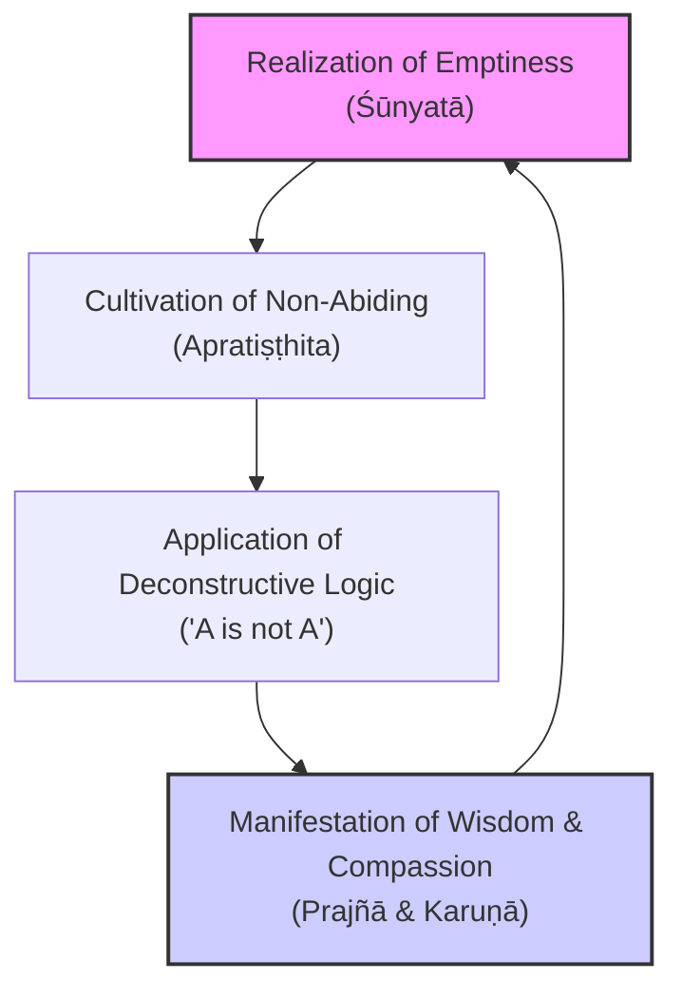
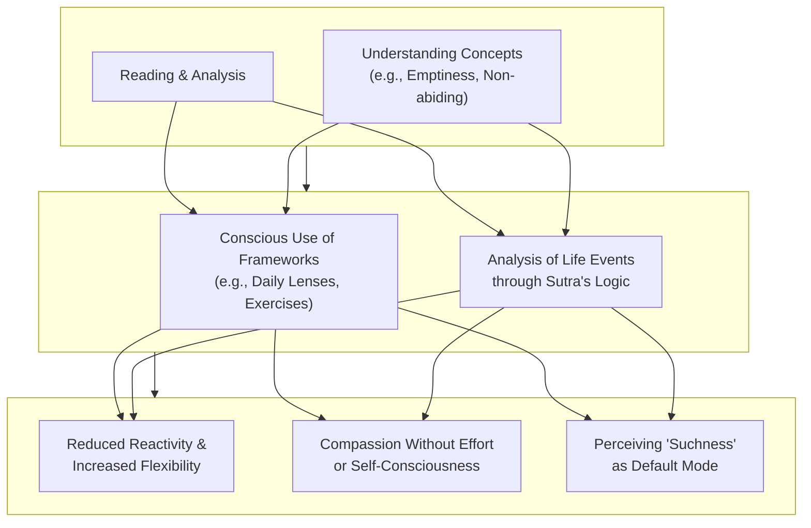

# The Diamond Sutra: A Comprehensive Guide to Wisdom, Emptiness, and Practical Application
## 1 Introduction to the Diamond Sutra: Text, History, and Significance

This chapter establishes the foundational knowledge for the entire report by examining the Diamond Sutra's origins, textual development, and historical significance. It will define the sutra's place within the Mahāyāna Prajñāpāramitā (Perfection of Wisdom) literature, trace its uncertain Sanskrit composition (2nd-5th centuries CE) and subsequent transmission to China. The analysis will focus on the pivotal role of translations, particularly Kumārajīva's highly influential 401 CE Chinese version, contrasting it with later translations to highlight stylistic and doctrinal choices. A core section will dissect the historical and technological significance of the 868 CE Dunhuang manuscript as the world's oldest dated printed book, analyzing its colophon ('for universal free distribution') and the Buddhist motivations for printing. Finally, the chapter will outline the sutra's basic narrative structure—a dialogue between Buddha and Subhūti—and its stated audience, including lay practitioners and 'newly resolved Bodhisattvas,' setting the stage for deeper philosophical analysis in subsequent chapters.

### 1.1 Textual Origins and Place in Buddhist Literature

The *Diamond Sutra*, known in Sanskrit as the *Vajracchedikā Prajñāpāramitā Sūtra*, is a foundational text within the Mahāyāna Buddhist tradition[^1]. It belongs to the genre of Prajñāpāramitā or "Perfection of Wisdom" literature, which explores the profound realization of emptiness (*śūnyatā*) as the ultimate nature of reality[^1]. **The sutra's title itself is a powerful metaphor for its function: the *vajra* (diamond or thunderbolt) represents a wisdom so incisive and indestructible that it cuts through all illusions and attachments to reveal ultimate truth**[^1][^2]. As the text explains within its own narrative, the Buddha instructs his disciple Subhuti to call it "The Diamond of Transcendent Wisdom" because "its teaching will cut like a diamond blade through worldly illusion to illuminate what is real and everlasting"[^2].

Scholars remain uncertain about the exact date of the sutra's original composition in Sanskrit. Arguments have been made for both the 2nd and the 5th centuries CE, placing its origins in a dynamic period of Mahāyāna development[^1]. Despite this chronological ambiguity, its core philosophical themes are clearly established. The discourse centers on the concepts of *anatman* (not-self), the emptiness of all phenomena, the liberation of all beings without attachment, and the profound importance of spreading the sutra's teachings themselves[^1]. These themes position the Diamond Sutra not merely as a philosophical treatise but as a practical guide for deconstructing the conceptual frameworks that bind individuals to suffering.

### 1.2 Translation History and Kumārajīva's Pivotal Role

The transmission of the Diamond Sutra from India to China was a multi-generational project undertaken by several renowned scholar-monks. The first translation into Chinese is widely attributed to the prolific translator Kumārajīva and was completed in 401 CE[^1]. Following this pioneering work, a series of later translations were produced, including those by Bodhiruci (509 CE), Paramārtha (558 CE), Dharmagupta (590 and 605-616 CE), the famed pilgrim Xuanzang (648 and 660-663 CE), and Yijing (703 CE)[^1].

Among these, **Kumārajīva's translation achieved unparalleled and enduring popularity**. His translation style was distinctive, prioritizing the fluid conveyance of meaning over strict literal fidelity, resulting in a text praised for its "flowing smoothness"[^1]. This version, which appears on the historic 868 Dunhuang scroll, became the most widely used, chanted, and influential Chinese version for centuries[^1]. A comparative analysis of the six major Chinese translations reveals significant variations in length and complexity, which can be broadly categorized as follows[^3]:

| Translator | Dynasty | Approximate Word Count | Version Category |
| :--- | :--- | :--- | :--- |
| Xuanzang | Tang | 8208 | Complicated |
| Dharmagupta | Sui | 7109 | Complicated |
| Paramārtha | Liang/Chen | 6447 | Complicated |
| Bodhiruci | Northern Wei | 6105 | Simplified |
| **Kumārajīva** | **Later Qin** | **5180** | **Simplified** |
| Yijing | Tang | 5118 | Simplified |

**This table highlights a key insight: Kumārajīva's version, while not the absolute shortest, is a "simplified" text that proved most accessible and "easy to be accepted by ordinary believers"[^3].** His approach of ensuring the original purpose while adapting to the target language's features marked a maturation in Buddhist translation methodology, laying a foundation for later translators and exerting immense influence across East Asia, including in Japan and Korea[^3].

### 1.3 The Dunhuang Manuscript: A Landmark in History and Technology

A singular copy of the Diamond Sutra holds a unique place in global cultural history. This manuscript, a woodblock-printed scroll about five meters (16 feet) long, was created from seven sheets of yellow-stained paper pasted together[^1][^2][^4]. **It bears a precise date in its colophon: "the fifteenth of the fourth moon of the ninth year of Xiantong," corresponding to May 11, 868 CE, making it the world's oldest extant dated printed book**[^1][^2][^5][^4]. The colophon also contains a remarkable dedication: "reverently made for universal free distribution by Wang Jie on behalf of his two parents"[^6][^2][^5][^4]. This statement is historically significant as **the first known explicit public domain dedication for a creative work**[^1].

The manuscript's journey to modern awareness is a tale of discovery and cultural exchange. It was found around 1900 among approximately 40,000 scrolls and documents in a sealed cave (now known as Mogao Cave 17 or the "Library Cave") near Dunhuang, an ancient Silk Road outpost[^6][^5][^7]. The cave had been sealed around the year 1000 CE, and the arid desert climate perfectly preserved its contents[^5]. In 1907, the Hungarian-British archaeologist Marc Aurel Stein purchased the scroll, among thousands of other manuscripts, from the Daoist monk Wang Yuanlu, who was guarding the site[^1][^2][^7]. It is now housed in the British Library[^1][^2].

The decision to use the then-nascent technology of woodblock printing for this sutra was deeply rooted in Buddhist doctrine. Copying sacred texts was considered a meritorious act that generated positive karma[^6][^5]. **Printing mechanized this process, allowing for the mass production of identical copies. The more copies distributed, the more the Buddha's word was disseminated, and thus the more merit was generated for the sponsor**[^6][^5]. This practical religious incentive drove early adoption and refinement of printing technology in China, with the 868 Diamond Sutra standing as its earliest dated masterpiece.

### 1.4 Narrative Framework and Intended Audience

The Diamond Sutra is structured as a dialogue, a common format for Buddhist sutras. It opens with a vivid scene-setting: the Buddha residing in the Jeta Grove monastery with a large assembly of monks[^8]. After performing the daily alms round and meal, he sits down, prompting the elder disciple Subhuti to rise and pose a seminal question[^9][^8]. **Subhuti asks, "World-Honored One, if sons and daughters of good families want to give rise to the highest, most fulfilled, awakened mind, what should they rely on and what should they do to master their mind?"**[^8]. This question about abiding and subduing the mind frames the entire subsequent discourse[^10].

**Crucially, the question is posed on behalf of "sons and daughters of good families" (*善男子、善女人*), indicating that the sutra's profound teachings are directed not solely at monastics but explicitly include dedicated lay practitioners**[^10]. The text repeatedly returns to the immense merit attainable by such individuals who faithfully receive, recite, study, and explain the sutra to others, even in the spiritually challenging "latter age"[^10]. This emphasis underscores the sutra's dual role: it is both a deep philosophical text and a practical devotional guide meant for active engagement in the world. The narrative culminates in Subhuti's deep emotional comprehension and the assembly's joyful acceptance, modeling the transformative journey the text intends to inspire in its readers[^8].

## 2 Core Philosophical Framework: Emptiness, Non-Abiding, and the Diamond's Edge

This chapter delves into the intellectual heart of the Diamond Sutra, dissecting the core doctrines that give it its transformative power. We move beyond historical context to analyze the precise philosophical mechanisms—emptiness, non-abiding, and a unique deconstructive logic—that the sutra employs as a "diamond cutter" to slice through illusion. Understanding this framework is essential, as it forms the theoretical foundation for all practical applications explored in later study notes. The framework is not merely abstract; it is a precise tool for psychological and perceptual change, directly addressing the root of suffering in all spheres of life.

### 2.1 The Doctrine of Emptiness (Śūnyatā): Cutting Through Inherent Existence

The Diamond Sutra is a quintessential text of the Prajñāpāramitā (Perfection of Wisdom) genre, whose central theme is the doctrine of emptiness (*śūnyatā*). In Mahāyāna Buddhism, **emptiness does not mean nothingness or nihilism, but rather describes the fundamental nature of all phenomena: they lack inherent, independent, or permanent existence**[^11]. Everything—physical objects, mental states, and even the concept of a self—is "empty" of a fixed, separate essence. Instead, all things arise, exist, and cease in a state of interdependence, contingent upon causes and conditions[^11].

The sutra applies this radical insight with surgical precision to deconstruct the most fundamental attachments that cause suffering. It systematically challenges the notions of a self (*ātman*), a person, a sentient being, and a life span[^12]. The so-called "self" is revealed as a temporary, ever-changing aggregation of physical and mental components (the five *skandhas*), with no unchanging core or controller within[^12]. **Attachment to this illusory, fixed "self" is identified as the breeding ground for all afflictions and the root of suffering**[^12]. This is why Lama Zopa Rinpoche taught that the Diamond Sutra is "one of the most profitable practices because the root of all sufferings is the ignorance holding 'I' as truly existent, and the only antidote is the wisdom realizing emptiness"[^13].

One of the sutra's most famous and often misunderstood lines encapsulates this teaching: **"All forms are illusory. If one understands that all forms are not forms, then one sees the Tathāgata"**[^14]. This is not a denial of the world's apparent reality but a call for a profound perceptual shift. The "illusion" lies not in things themselves, but in our distorted way of perceiving them as solid, separate, and permanent[^14]. To "see the Tathāgata" (the thus-gone one, a title for a Buddha) is to perceive reality free from these projections, to see the suchness of things in their empty, interdependent nature. This realization is the key to liberation, as it allows one to see the futility of clinging and to find peace within the flow of change[^11].

### 2.2 The Practice of Non-Abiding (Apratiṣṭhita): The Mind Without a Home

If emptiness is the ultimate truth about reality, then non-abiding is the corresponding attitude and practice for navigating that reality. The Sanskrit term *apratiṣṭhita* (Ch. *wúsuǒzhù* 無所住 or *wúzhù* 無住) literally means "having no fixed position" or "unlocalized"[^15][^16]. **It refers to a mental state of not settling upon, clinging to, or depending on any object, concept, view, or spiritual attainment**[^15].

This concept is the practical heart of the Diamond Sutra and is famously linked to the enlightenment of Huineng, the Sixth Patriarch of Chan. He attained sudden awakening upon hearing the line, **"Responding to the non-abiding, yet generating the mind" (應無所住，而生其心)**[^15][^16]. This paradox is central: one must engage with the world ("generate the mind" of compassion and action) while simultaneously not becoming fixated on anything ("non-abiding"). The scholar-monk Qisong emphasized that **"Non-abiding is the fundamental" (無住為本)**, as it leads to *prajñā* (wisdom) by allowing one to see worldly issues as empty, thus eliminating the basis for conflict and retaliation[^15][^16].

The sutra elaborates on this by stating, "the mind of the past cannot be obtained, the mind of the present cannot be obtained, and the mind of the future cannot be obtained"[^17][^18]. This teaching dismantles the tendency to dwell on past regrets, cling to present pleasures, or anxiously anticipate the future. **The mental state of "non-thought" or non-attachment is precisely this unobtainable, non-abiding mind—a mind that is free to engage without being trapped by its own engagements**[^18]. In the highest Mahāyāna view, this culminates in the ideal of *apratiṣṭhita-nirvāṇa* ("non-abiding nirvana"), where a Buddha remains in nirvanic peace while freely returning to the cycle of suffering (*saṃsāra*) to help beings, skillfully employing compassion without attachment[^16].

### 2.3 The Diamond's Logic: Deconstructing Paradox and Language

The Diamond Sutra employs a distinctive rhetorical style to convey its teachings, often termed the **"logic of not"**[^19][^13]. This logic is crystallized in a signature formula repeated throughout the text: **"A is not A, therefore it is called A"** (e.g., "The Dharma spoken is not the Dharma, therefore it is called the Dharma")[^19][^20].

At first glance, this appears nonsensical within conventional Aristotelian logic. However, its purpose is profoundly deconstructive. The formula operates on two levels. First, the negation ("A is not A") rejects any inherent, independent essence in "A". It denies that "A" exists as a self-sufficient entity. Second, the subsequent affirmation ("therefore it is called A") reinstates "A" as a conventional, dependently-arisen designation that is useful within the realm of relative truth[^20]. As scholar Paul Harrison's analysis suggests, a grammatically cogent interpretation aligns with the Tibetan tradition: the phrase can be read as a *bahuvrīhi* compound meaning "X-less" (e.g., "perfectionless"), which philosophically suggests that **conventional terms only function *because* the things they name are ultimately empty of an independent essence**[^21]. This aligns perfectly with Nāgārjuna's philosophy, affirming the utility of language through the denial of inherent existence[^21].

This logic is the operational "edge" of the diamond. It systematically cuts through attachment to all concepts, including the most sacred: the self, beings, the Dharma, and even the stages of enlightenment and the Perfection of Wisdom itself[^17]. It prevents the practitioner from turning emptiness itself into a new object of clinging. The sutra's famous comparisons—contrasting the immeasurable merit of material charity with the infinitely greater merit of understanding even a four-line verse of the sutra—are a practical application of this logic to our value systems, overturning worldly calculations with the measureless value of wisdom[^17].

### 2.4 Synthesis: The Framework as a Path to Wisdom and Compassion

The doctrines of emptiness, non-abiding, and the logic of not are not separate ideas but an integrated, dynamic framework for transformation. Their interconnection can be visualized as a process:

**The realization of emptiness (the insight that nothing exists independently) naturally leads to a mind that does not abide or cling (non-abiding).** Conversely, the practice of non-abiding—letting go of fixed positions—actualizes and deepens the experiential understanding of emptiness. The "logic of not" is the intellectual and linguistic tool that facilitates this entire process, dismantling rigid views and preventing the reification of any experience, including spiritual attainment.

This synthesis finds its ultimate expression in the Bodhisattva's path. The framework enables the profound vow articulated in the sutra: **"However many beings there are... I shall liberate them all. And though I thus liberate countless beings, not a single being is liberated"**[^22]. Compassionate action arises spontaneously (generating the mind), yet it is performed with the wisdom that there is no inherently existing self performing the action, no inherently existing beings being liberated, and no inherently existing concept of liberation to attain. This is the essence of the four key practices distilled from the sutra: giving without attachment to self, liberating beings without notions of self and other, living without attachment, and cultivating without attainment[^13].

**This philosophical framework is what made the Diamond Sutra especially influential in Chan (Zen) Buddhism**, where direct insight into one's true nature is paramount. Its teachings provided the theoretical underpinning for Huineng's sudden enlightenment and the subsequent Chan emphasis on a mind "with nowhere to alight"[^1][^16][^17]. By cutting through doubt and conceptual proliferation, this framework aims at the "consummation of incomparable enlightenment"[^17], providing a stable, because non-abiding, foundation for wise and compassionate engagement with all aspects of life—a foundation we will now explore in practical contexts.

## 3 The Bodhisattva Path: From Resolving the Mind to Liberating Beings

This chapter transitions from the abstract philosophical framework to its concrete application, analyzing the Diamond Sutra's detailed instructions for the Bodhisattva's path. It examines the sutra's response to Subhuti's core questions on how to abide, subdue the mind, and proceed on the Bodhisattva path, focusing on the four key practices distilled from the text: giving without attachment to self, liberating beings without notions of self and other, living without attachment, and cultivating without attainment[^13][^23]. The analysis is anchored in the sutra's dialogue, defining the scope, deconstructing the mechanisms, and highlighting the transformative shift in Subhuti's understanding. This chapter serves as the crucial bridge between the sutra's theoretical insights and the subsequent exploration of its practical applications in daily life and study notes.

### 3.1 The Foundational Vow: Resolving the Mind and the Paradox of Liberation

The entire practical path outlined in the Diamond Sutra originates from a single, profound question posed by the elder Subhuti: "World Honored One, when good men and good women resolve to attain unsurpassed complete enlightenment (anuttara-samyak-sambodhi), how should they abide their mind, and how should they subdue their thoughts?"[^8][^24][^25]. This inquiry about abiding and subduing the mind frames the sutra's entire discourse as a guide for spiritual practice.

The Buddha's response establishes the foundational vow and the paradoxical wisdom that must accompany it. He instructs that Bodhisattvas should subdue their thoughts with the following resolve: "All the different types of sentient beings... I will liberate them by leading them to nirvana without residue. When immeasurable, countless, infinite numbers of sentient beings have been liberated, in reality, no sentient beings have been liberated."[^8][^25] This is echoed in other translations stating the Bodhisattva must bring all living beings to final nirvana, but that after this "no living being whatsoever has been brought to extinction"[^1].

**This core paradox is the first and most critical "diamond cut" against the practitioner's ingrained habits of perception.** The Buddha immediately explains the rationale: "Why is this so? *Subhuti, if bodhisattvas abide in the notions of a self, a person, a sentient being, or a life span, they are not bodhisattvas.*"[^8][^25] The vow to save all beings is the ultimate expression of compassion, but if performed while clinging to the concepts of a solid "I" who saves and solid "others" who are saved, it reinforces the very dualistic ignorance that causes suffering. **The practice is therefore grounded in the wisdom of *anatman* (not-self); true liberation occurs when action is performed without attachment to the actor, the action, or the object of the action.** This non-dual foundation, where compassionate activity and the realization of emptiness are inseparable, establishes the basis for all subsequent practices detailed in the sutra.

### 3.2 The Perfection of Giving: Material, Kindness, and Wisdom Without Abiding

Following the establishment of the foundational vow, the sutra provides detailed instructions on *Dāna pāramitā*, the Perfection of Giving, which is the first and foundational of the six perfections[^26]. The teachings here operationalize the "non-abiding" mind in concrete action.

The sutra outlines a framework for generosity that serves as an antidote to core mental poisons: material generosity counteracts greed, kindness and protection counteract hatred, and spiritual guidance counteracts delusion[^26]. However, the Diamond Sutra's unique contribution is to infuse all these forms of giving with the wisdom of emptiness. The Buddha instructs, "Furthermore, Subhuti, in the practice of charity, *bodhisattvas should abide in nothing whatsoever*. That is, to practice charity without attachment to form, sound, smell, taste, touch, or dharmas."[^25] This is further elaborated as practicing generosity without relying on any object—any form, sound, smell, taste, touch, or object of mind[^13].

**This practice is defined as the "threefold emptiness of giving": no idea of an "I" as the giver, no idea of an individual who receives the gift, and no idea of things being given, with no expectation of repayment**[^23]. When giving is performed with attachment—for fame, gain, or future blessings—it is "giving with clinging to form," and its merit is limited[^23]. In contrast, "If bodhisattvas practice charity without attachment, their merits are immeasurable"[^25], as limitless as space itself[^24][^13]. This teaching deconstructs the ego's tendency to turn virtuous acts into possessions or identity markers. **The Bodhisattva gives spontaneously and fully, but without mentally planting a flag on the act, thereby avoiding the creation of new karmic bondage or subtle pride.** This exemplifies the "living without attachment" principle, where one engages fully with life while remaining inwardly free from fixation on the objects of the senses and mind[^13][^23].

### 3.3 Deconstructing Spiritual Attainment: The Emptiness of Stages and Fruits

Perhaps one of the most radical aspects of the Diamond Sutra's guidance is its systematic deconstruction of attachment to spiritual progress itself. The sutra applies its "diamond cutter" logic not only to worldly phenomena but also to the sacred milestones of the Buddhist path, ensuring the Bodhisattva cultivates "without attainment"[^13][^23].

This is vividly illustrated in a dialogue where the Buddha questions Subhuti about the attainments of the so-called "holy stages." He asks, "Subhuti, what do you think? Does a srotapanna [Stream-Enterer] have the thought: 'I have attained the realization of the srotapanna'?" Subhuti correctly replies, "No, World Honored One. Why not? Because 'srotapanna' means 'stream-enterer,' and there is in fact nothing to enter; *one who does not enter into form, sound, smell, taste, touch, or dharmas is called a srotapanna.*"[^25] The same logic is applied to the stages of Once-Returner, Never-Returner, and Arhat. Subhuti himself, acknowledged as the foremost Arhat free from desire, states, "I do not have the thought that I am an arhat... In reality, Subhuti abides in nothing at all, therefore Subhuti is called one who abides peacefully in non-contention."[^25]

**This teaching reveals that the named stages (*fa*) are conventional designations without inherent substance (*shi*)**[^27]. They are useful maps, but the moment a practitioner grasps at the label—"I am a Stream-Enterer"—they have reified a concept and are thereby ensnared by the notions of self and attainment. The sutra extends this deconstruction to the highest truths: "The Dharma spoken is not the Dharma"[^24], and "so-called佛法 (Buddha-Dharma) is not佛法"[^24]. **The profound purpose is to prevent the reification of the path itself, ensuring that wisdom (*prajñā*) remains a dynamic, liberating insight rather than a static possession.** This embodies the principle of "cultivating without any expectation," where true realization occurs when there is nothing to acquire, as our nature is originally pure and complete[^23].

### 3.4 The Transformative Shift: Subhuti's Realization and the Sutra's Second Half

A pivotal emotional and cognitive climax in the sutra marks the transition from theoretical teaching to embodied understanding. After hearing the Buddha's profound discourse, "Subhuti was moved to tears, having deeply understood its meaning and significance."[^25] He exclaims, "How remarkable, World Honored One! You have taught us such a profound sutra... I have never heard such a teaching before."[^25] **This moment of deep emotional resonance and insight signifies Subhuti's personal breakthrough and is traditionally seen as the marker between the sutra's first and second halves.**

This transformation has direct implications for spiritual practice. Subhuti's realization moves him from an intellectual grappling with the teachings to a state of "pure faith" where he perceives "the true nature of reality"[^25]. The sutra then shifts to address those in future ages who can similarly "hear this sutra, believe, comprehend, and follow it," noting that such beings are remarkable because "they do not abide in the notions of a self, a person, a sentient being, or a life span"[^25]. The practical outcome of this realization is the ability to authentically share the teaching: "if a good man or good woman... takes as few as a four-line verse of this sutra... and expounds it to others... How should one teach it to others? *Without attachment, abiding in stillness and suchness.*"[^25]

**This transformative shift models the journey from study to integration.** It shows that the goal is not merely to understand the paradoxes intellectually but to internalize them to the point where they transform one's perception and mode of being in the world. The latter part of the sutra, following this awakening, reinforces the practices of non-abiding and illustrates their boundless merit. It culminates in the famous verse that serves as a continual practice reminder for perceiving reality: "All conditioned phenomena / Are like a dream, an illusion, a bubble, a shadow, / Like dew or a flash of lightning; / Thus we shall perceive them."[^25] This paves the way for applying this realized wisdom to the complexities of daily life, work, and relationships—the focus of the practical study notes to follow.

## 4 The Nature of Perception and Reality: Beyond Form and Thought

This chapter conducts an epistemological analysis of the Diamond Sutra's core teachings on perception, investigating how the sutra deconstructs conventional modes of knowing to reveal a non-dualistic way of seeing reality. The research scope focuses on analyzing key statements from the reference materials, such as the simile of conditioned phenomena as 'a dream, an illusion, a bubble, a shadow' and the teaching that 'the mind of the past, present, and future cannot be obtained.' The analytical focus is on contrasting the limitations of sensory and conceptual grasping (signs, notions, and the 'Four Notions') with the liberating insight of 'seeing the signless nature of signs' or 'seeing the Tathagata' beyond the thirty-two marks. This chapter clarifies the radical epistemological shift required by the sutra's wisdom, serving as the foundation for understanding how its teachings are actualized in the 'ordinary mind' of post-discriminative awareness, thus bridging the philosophical framework to its lived application.

### 4.1 Deconstructing Conditioned Perception: The Simile of Illusion

The Diamond Sutra delivers one of its most powerful and memorable teachings through a poetic four-line verse that serves as a lens for perceiving all of existence: **"All conditioned phenomena / Are like a dream, an illusion, a bubble, a shadow, / Like dew or a flash of lightning; / Thus we shall perceive them."**[^1] This simile is not a dismissal of the world as unreal in a nihilistic sense, but a precise epistemological tool to dismantle our habitual, distorted way of perceiving it. The sutra establishes that "all phenomena are illusory," revealing that things exist only conditionally and that anything seemingly independent is merely a temporary manifestation of causes and conditions[^28].

The table below organizes the key metaphors from the verse and their implied characteristics, which collectively define the flawed nature of conventional, samsaric perception:

| Metaphor | Implied Characteristic of Conditioned Phenomena | Epistemological Error it Corrects |
| :--- | :--- | :--- |
| **Dream** | Subjective, mentally constructed, lacking substantial reality outside the dreamer's mind. | Attachment to the apparent solidity and objectivity of experience. |
| **Illusion** | Deceptive appearance; something perceived as other than what it truly is (e.g., a mirage). | Mistaking appearances for inherent, independent reality. |
| **Bubble** | Fragile, ephemeral, empty at its core despite a shimmering surface. | Clinging to things as durable and substantive. |
| **Shadow** | Derivative, dependent on a source and light, with no essence of its own. | Perceiving things as self-existent rather than dependently arisen. |
| **Dew** | Transient, evaporating quickly with the morning sun. | Attachment to permanence and the failure to see impermanence. |
| **Flash of Lightning** | Momentary, brilliant but instantly gone, impossible to grasp or hold. | The attempt to grasp and fixate on fleeting experiences. |

**The fundamental role of this teaching is to expose the inherent deceptiveness and impermanence of all objects of conventional perception.** By instructing practitioners to view the world through this lens, the sutra performs a colossal "cut" through the root ignorance that holds phenomena to be truly existent[^1][^13]. This dynamic worldview presents all worldly matters as processes subject to momentary rise and fall, directly challenging and deconstructing any notion of inherent, unchanging substance within them[^28]. The practice is not to deny the relative, functional reality of the world but to cease being fooled by its illusory appearance of solidity and permanence, thereby loosening the attachment that is the source of suffering.

### 4.2 The Unobtainable Mind: Cutting Through Temporal and Conceptual Fixation

Having deconstructed the perceived object, the Diamond Sutra turns its diamond cutter's edge toward the perceiving subject: the mind itself. In a profound negation, it states: **"The past mind cannot be grasped, neither can the present mind or the future mind."**[^24] This teaching systematically dismantles the possibility of locating a stable, substantial self or a continuous "thinker" within the flow of mental events. If one cannot grasp or pinpoint the mind in any of the three times—past (already gone), present (elusive and instantly becoming past), or future (not yet arisen)—then what is this "I" that we habitually identify with our thoughts?

This deconstruction of a substantial mind is intimately linked to the sutra's attack on the **"Four Notions" (or Four Marks)**: the notion of a self, a person, a living being, and a life span[^29]. These are the core conceptual constructs through which the ego creates and reinforces a sense of separate, enduring identity. The Buddha explicitly states that if a bodhisattva still harbors these notions, "that person is not a true bodhisattva"[^8][^29]. The reason is that "any such idea of a self is indeed idealess... Because the Buddhas and Lords are free of all ideas"[^1].

**This process of cutting through conceptual fixation aligns with the interpretive framework of *samatha* (calm abiding) as presented in scholarly analysis of the sutra.** Here, *samatha* is understood not merely as concentration but as **"the cessation of conceptual fixation and dualistic boundaries"**[^30]. By applying the "logic of not" to the mind itself—the past mind is not the past mind, therefore it is called the past mind—the practitioner ceases to reify mental moments into a solid self. This cessation (*samatha*) of the ego-centric cognitive framework is the necessary ground for the liberating insight (*vipassanā*) that sees phenomena within their actual, dependently arisen nature[^30]. The sutra thus moves from negating the inherent reality of external objects to negating the inherent reality of the internal subject, leaving no basis for the dualistic clinging that is the root of suffering.

### 4.3 Seeing the Tathagata: The Epistemology of Signlessness

The Diamond Sutra crystallizes its epistemological teaching in a series of dialogues about perceiving the Tathagata (the Buddha). Subhuti initially assumes that one can "visualize the Tathagata by means of the thirty-two marks"[^8]—the set of extraordinary physical characteristics ascribed to a Buddha or a universal monarch (Cakravartin). The Buddha challenges this directly, asking if that would make a Cakravartin a Tathagata[^8][^10]. Subhuti then understands the error: **"One should not use the thirty-two marks to visualize the Tathagata."**[^8][^29]

This exchange reveals a core principle: **"In a place where there are signs, in that place there is deception. If you can see the signless nature of signs, you can see the Tathagata."**[^8][^29] "Signs" (*nimitta*) refer to distinguishing characteristics, forms, or attributes that the discriminating mind grasps onto to define and understand objects. The sutra argues that any perception based on these signs is inherently deceptive because it mistakes the attribute for the essence. The thirty-two marks, however sublime, are still conditioned, composite, and empty forms. To perceive the Tathagata through them is to be trapped in the realm of form and discrimination.

**The positive epistemological shift, therefore, is to "see the signless nature of signs" or to "see thusness (*tathatā*)."** This is what it truly means to "see the Tathagata." As the Buddha summarizes in a verse: **"Someone who looks for me in form or seeks me in sound is on a mistaken path and cannot see the Tathagata."**[^8][^26] This teaching applies universally: to see any phenomenon truly is to see it not through its conventional signs and labels, but to perceive its suchness—its empty, dependently arisen, and ungraspable nature. This shift is the antidote to the "fundamental ignorance of not knowing how to experience reality as it is"[^1]. It is a move from a discriminating, concept-mediated perception to a direct, non-dualistic apprehension of reality, free from the distorting filters of the "Four Notions."

### 4.4 The Emergence of Ordinary Mind: Integration of Cessation and Insight

The deconstructive work of the Diamond Sutra is not an end in itself but leads to a transformed mode of being. Synthesizing the teachings on the illusion of phenomena, the unobtainable mind, and signlessness, we arrive at the concept of the **"ordinary mind."** Scholarly interpretation defines this not as our usual deluded state, but as **"the integrated functioning of *samatha* (cessation of fixation) and *vipassanā* (observation within dependent arising)"**[^30]. It is a "post-discriminative mode of awareness" that emerges once conceptual fixation has ceased[^30].

The sutra's famous linguistic pattern—**"A is not A, therefore it is called A"**—is the key mechanism that facilitates this integration[^1][^26][^30]. This "logic of not" performs a dual function: it negates ontological commitment to concepts (A is not A), while simultaneously retaining their pragmatic, functional value (therefore it is called A)[^1][^29]. For example, one can use the word "self" or "Buddha" in conventional communication without believing in an inherently existent referent. This allows for **"ethical action, language, and everyday activity [to] continue without attachment or grasping"**[^30].

**Therefore, the ultimate goal presented by the Diamond Sutra is not a nihilistic transcendence of ordinary life, but a radical reorientation within it.** Awakening is not about acquiring something new or going somewhere else; it is about perceiving the same world with a mind freed from the distorting projections of self, sign, and inherent existence[^30]. This "ordinary mind" is the embodiment of non-abiding (*apratiṣṭhita*): fully engaged in the world of forms and responsibilities (the Bodhisattva's compassionate activity), yet inwardly free, seeing all conditioned phenomena as dream-like and empty. This integrated awareness fulfills the sutra's overarching goal: to avoid extremist uses of language and ontology while fully embracing the pragmatic value of life, wisdom, and compassionate action[^1][^29]. It provides the epistemological foundation for the practical application of the sutra's teachings across all domains of daily living, which will be explored in the subsequent study notes.

## 5 Comparative Analysis of Key Themes Across Life Contexts

This chapter synthesizes the core philosophical framework of the Diamond Sutra—emptiness, non-abiding, and the deconstructive logic of 'A is not A'—and applies it through a structured comparative analysis across five key domains of contemporary life. The research scope is defined by examining how these principles manifest and provide practical guidance in the contexts of: 1) Daily Life & Emotional Well-being, 2) Workplace & Career, 3) Business Practices, 4) Marriage & Interpersonal Dynamics, and 5) Parenting. The analytical focus is on identifying common thematic threads (e.g., managing attachment, redefining success, navigating impermanence, and practicing compassion without fixation) across these diverse contexts, demonstrating the sutra's universal applicability as a tool for psychological and perceptual transformation. This chapter serves as the core of the practical application study notes, bridging the abstract wisdom of previous chapters to actionable insights for modern living.

The following table provides a structured overview of the Diamond Sutra's application across these life domains, synthesizing the core principles, their key applications, and the resulting mindset.

| Life Domain | Core Diamond Sutra Principles Applied | Key Application & Analysis | Resulting Mindset/Approach |
| :--- | :--- | :--- | :--- |
| **Daily Life & Emotional Well-being** | **Emptiness (Śūnyatā), Non-Abiding (Apratiṣṭhita), Perception as Dream-like** | **Stress Management:** Viewing stressful situations as impermanent, dependently-arisen phenomena ("like a dream, an illusion") reduces fixation and emotional reactivity. **Identity:** Deconstructing the notion of a solid, intrinsic self ("no self, person, sentient being, or life span") alleviates suffering rooted in ego-clinging. **Impermanence:** Recognizing all conditioned phenomena as transient (like "dew or a flash of lightning") fosters acceptance of change. | A mind that is less attached to outcomes and self-narrative, abiding in a state of non-fixation. Emotional equilibrium arises from seeing the empty, illusory nature of distressing thoughts and situations. |
| **Workplace & Career** | **Giving Without Attachment, Non-Abiding, Emptiness of Attainments** | **Ambition/Success & Failure:** Engaging in work with dedication but without attachment to the concepts of "success" or "failure," which are empty of inherent existence. **Leadership:** Leading and helping colleagues ("liberating beings") without notions of a superior self or inferior other, avoiding a "savior complex." | Performing duties as a form of "giving" (skillful action) while abiding in "nowhere." Ambition transforms into compassionate, skillful engagement free from the anxiety of gain and loss. Leadership becomes service without ego. |
| **Business Practices** | **Threefold Emptiness of Giving, Ethics Beyond Reification, Non-Abiding** | **Ethics:** Ethical conduct is performed not as a rigid rule to cling to, but as natural, compassionate action arising from wisdom. **Competition:** Seeing competitors, the market, and the business itself as empty, dependently-arisen processes reduces adversarial fixation and greed. Competition becomes skillful interplay without malice. | Business is conducted with generosity and integrity, understanding the "giver, receiver, and gift" are ultimately empty. Engagement in the market is dynamic and responsive, not rooted in fixed views or attachment to outcomes. |
| **Marriage & Interpersonal Dynamics** | **Non-Abiding Mind, Liberating Beings with No Being Liberated, Emptiness of Self/Other** | **Attachment:** Relating without clinging to a fixed idea of the partner or the relationship ("all forms are illusory"). **Conflict:** Seeing disagreements as empty of inherent solidity prevents escalation. Practicing giving and patience without keeping score ("no idea of giver, receiver, or gift"). | Love and commitment are expressed freely, without possessiveness or the need to control. Conflict is navigated with wisdom, recognizing the empty nature of blame and grievance, fostering genuine connection beyond concepts. |
| **Parenting** | **Giving Without Attachment, Non-Abiding, Emptiness of Phenomena** | **Expectations:** Releasing rigid expectations for the child's future, seeing them as a dependently-arising being on their own path. **Guidance:** Teaching and providing care ("liberating beings") without attachment to the role of "parent" or the notion of a "child" to be molded. | Parenting becomes an act of unconditional giving and compassionate guidance. The parent provides a stable presence while abiding in non-fixation, allowing the child to grow without being burdened by the parent's unfulfilled desires or fears. |

**Synthesis:** Across all domains, the Diamond Sutra's integrated principles guide a fundamental epistemological shift. The view of **emptiness** deconstructs reified concepts (self, career, relationship, success). The method of **non-abiding** and **giving without attachment** provides the practical posture for engagement. The result is a mode of being that is fully engaged in the conventional world while free from the suffering caused by clinging to its illusions, enabling compassionate, flexible, and wise action in every sphere of life.

### 5.1 Daily Life & Emotional Well-being: Managing Stress, Identity, and Impermanence

This subchapter applies the Diamond Sutra's teachings on the emptiness of self and the simile of illusion to core challenges of modern daily life. The central application here is the direct deconstruction of the ego, which is identified as the root of emotional suffering. The teaching that there is "no self, person, sentient being, or life span" provides a powerful antidote to the stress and anxiety generated by a rigid, defended sense of identity. When we cling to a fixed narrative of "who I am"—my accomplishments, my failures, my personality traits—we create a fragile construct that is constantly threatened by change and external events. The wisdom of emptiness reveals this identity to be a dependently-arisen, ever-changing process, not a solid entity. This realization fosters profound psychological flexibility, allowing one to navigate life's challenges without the added burden of defending a fictional self.

The practice of 'non-abiding' (apratiṣṭhita) is the operational method for achieving emotional equilibrium. The sutra's instruction that "the mind of the past, present, and future cannot be obtained" is a direct tool for managing anxiety (future fixation) and regret (past fixation). By recognizing that the anxious mind is merely a fleeting mental event with no substantial location in time, one can observe it without becoming identified with it or allowing it to dictate actions. This is not suppression but a wise dis-identification. Similarly, the famous verse to perceive "all conditioned phenomena" as dream-like illusions, bubbles, shadows, dew, and lightning provides a perceptual lens for daily experience. When a stressful situation arises—a conflict, a loss, a disappointment—viewing it through this lens of ultimate insubstantiality and impermanence reduces its perceived solidity and its power to trigger prolonged emotional reactivity. **The core insight is that emotional suffering is amplified by our attachment to the reality of the distressing thought or situation; seeing its empty, illusory nature allows it to arise and pass without leaving a deep trace.**

### 5.2 Workplace & Career: Navigating Ambition, Success, Failure, and Leadership

This subchapter conducts a comparative analysis of the Bodhisattva's path of 'cultivating without attainment' within professional contexts. The modern workplace is often a theater for the drama of the ego, driven by ambition for success, fear of failure, and comparison with others. The Diamond Sutra's framework systematically dismantles these sources of professional anxiety. The deconstruction of the "Four Notions" directly challenges the ego-driven professional identity. If there is no inherently existent "self" to be promoted, no solid "person" whose worth is defined by a job title, and no fixed "life span" career trajectory, then the concepts of "success" and "failure" lose their absolute, identity-defining power. **Ambition is not destroyed but transformed; it becomes compassionate, skillful engagement—a form of "giving" one's talents and efforts—performed without clinging to the fruit of the action.**

This transforms leadership fundamentally. The Bodhisattva's vow to "liberate beings" while realizing "no being is liberated" provides the model for service-oriented leadership. A leader guided by this principle works to support, mentor, and empower colleagues and teams without falling into the traps of a "savior complex" (attachment to the role of the heroic leader) or subtle condescension (viewing others as inherently inferior beings to be fixed). The leader acts with dedication but abides "nowhere," meaning their sense of worth and decision-making is not dependent on constant validation, praise, or fear of criticism. They can make clear, adaptive decisions because they are not paralyzed by attachment to past methods that worked or anxiety about future outcomes. **The leader's mind, in the spirit of Huineng's awakening, "responds to the non-abiding, yet generates the mind"—fully engaging with the complex demands of the workplace while remaining inwardly free from fixation on status, control, or personal credit.**

### 5.3 Business Practices: Applying Ethics, Navigating Competition, and Understanding Profit

This subchapter examines the implications of the Diamond Sutra's wisdom for ethical decision-making and strategic thinking in business. At the heart of this application is the "threefold emptiness of giving," which reframes all business interactions. When a business conducts itself ethically, engages in corporate social responsibility, or treats stakeholders fairly, the sutra's wisdom advises doing so without attachment to the concepts of "giver" (the virtuous company), "receiver" (the beneficiary), or "gift" (the ethical act). This prevents ethical conduct from devolving into mere public relations or a transactional calculation for reputation and future profit. Integrity and generosity become natural expressions of wisdom, not marketing strategies to be clung to.

Furthermore, the teaching that "all phenomena are illusory" provides a crucial lens for strategic analysis. It deconstructs absolute, reified notions of competition, market position, and brand identity. A competitor is not an inherently evil "other," but an empty, dependently-arisen entity within a vast, interconnected ecosystem. This view reduces adversarial fixation, malice, and short-sighted, greedy decision-making. Instead, it encourages a dynamic, responsive, and strategic engagement that understands the fluid, dream-like nature of markets. The concept of profit is also examined through the lens of 'signlessness'. Financial metrics are "signs"—useful conventional designations—but they are empty of inherent, ultimate value. **The Diamond Sutra's own recurring theme, which contrasts immeasurable material charity with the superior merit of understanding the Dharma, invites a broader valuation of success. It challenges the business to consider value creation that includes wisdom, well-being, and ethical contribution, not just financial profit, thereby aligning business purpose with a deeper understanding of worth.**

### 5.4 Marriage & Interpersonal Dynamics: Transforming Attachment, Conflict, and Communication

This subchapter applies the Diamond Sutra's radical deconstruction of inherent existence to intimate relationships. The primary source of relational suffering is attachment to fixed notions of "self" and "other." We fall in love with an idealized image of our partner (a collection of "signs" and attributes) and then suffer when they inevitably fail to conform to this static concept. The sutra's teaching that "all forms are illusory" is directly applicable here: the fixed "form" of our partner is a mental construct, not their living, changing suchness. Love, when infused with the wisdom of emptiness, shifts from possessive attachment ("you are mine and must fulfill my needs") to a genuine connection that allows the other to be free and ever-changing.

Conflict arises when these fixed concepts clash. The Diamond Sutra's method provides a powerful framework for navigation. Seeing a disagreement as empty of inherent solidity—as a dependently-arisen interplay of conditions, emotions, and narratives—prevents it from solidifying into a permanent grievance. The practice of "giving" (of patience, understanding, forgiveness) without keeping score embodies the "threefold emptiness": giving without the idea of a magnanimous self, a wronging other, or a debt to be repaid. Communication is transformed by the principle of "abiding in stillness and suchness." This means listening without immediately preparing a defense (abiding in one's own fixed position) and speaking from a place of observing the suchness of the moment, rather than from reactive emotion. **The "logic of not" helps here: the label "betrayal" or "perfect marriage" is not an absolute truth (A is not A); it is a painful event or a hopeful concept. This de-fusion from labels creates space for forgiveness, understanding, and a relationship that exists beyond the confines of rigid stories.**

### 5.5 Parenting: Releasing Expectations, Skillful Guidance, and the Art of Letting Go

This final comparative subchapter explores the profound application of non-abiding and emptiness in the parent-child relationship, perhaps one of the most challenging arenas for attachment. Parenting is inherently future-oriented, filled with hopes, fears, and expectations for the child's development, achievements, and identity. The parental "mind that abides" in these expectations is a source of immense anxiety for the parent and pressure for the child. The Diamond Sutra contrasts this with the "unobtainable mind"—the mind that cannot be grasped in past, present, or future. Applied to parenting, this means meeting the child fully in their present, ever-changing suchness, rather than relating to a projected image of who they should become.

The paradox at the heart of the Bodhisattva's path—"I shall liberate them all... not a single being is liberated"—perfectly encapsulates the parenting paradox. Parents must provide loving guidance, protection, and teaching (the vow to liberate), while simultaneously cultivating the profound wisdom that the child is a dependently-arising being on their own independent karmic path (no being is liberated). This wisdom facilitates healthy detachment, preventing parental love from becoming controlling or burdensome. The simile of the dream-like nature of all conditioned phenomena is especially poignant for parents, as childhood phases are intensely vivid yet fleeting, "like dew or a flash of lightning." **This view helps parents release clinging to each stage, reduce anxiety about the child's future, and engage with more joy and presence in the impermanent, precious moments of growth. Parenting thus becomes the ultimate practice of unconditional giving and compassionate guidance, performed with a mind that is fully committed yet ultimately free from fixation on role, outcome, or the child's empty, ever-evolving form.**

## 6 The Sutra's Own Claims: Merit, Transmission, and the Power of the Teaching

This chapter conducts a critical analysis of the Diamond Sutra's self-referential claims regarding its unique value and transformative power. The sutra does not merely present a philosophy; it makes bold, repeated assertions about the immense spiritual benefits of engaging with it. The research scope focuses on deconstructing the sutra's recurrent comparisons between vast material charity and the superior merit of receiving, upholding, reciting, and explaining the text itself, even a single four-line verse. The analytical perspective examines the doctrinal rationale behind these claims, linking them directly to the generation of wisdom (*prajñā*)—the antidote to ignorance—and the profound purification of karma. This chapter also investigates the sutra's assertions about the sacredness of places where it is taught and its role as the generative source of all Buddhas and their teachings. Serving as a bridge between the sutra's internal logic and its external impact, this analysis clarifies how the text positions itself not just as a vehicle for wisdom, but as an object of practice with inconceivable karmic efficacy, designed for scalable transmission even in spiritually challenging times.

### 6.1 The Inconceivable Merit: Deconstructing the Charity Comparisons

A defining rhetorical feature of the Diamond Sutra is its systematic and hyperbolic comparison of spiritual merits. The text repeatedly contrasts the merit gained from the most extreme acts of material generosity with the merit gained from engaging with the sutra itself. This device is not merely poetic but serves a core doctrinal function: to overturn conventional, worldly valuations and establish the supreme, immeasurable value of wisdom-realization.

The comparisons employ an "extreme scale of magnitude" that is deliberately unimaginable, often using the sand grains in the Ganges River as a multiplier[^17]. For instance, the Buddha asks Subhuti to consider a person who fills "three thousand great thousand-worlds" (a Buddhist cosmological term for a vast galaxy or universe) with the seven precious jewels and gives them all away in charity[^13][^31]. Subhuti agrees this would generate "very many" or "extremely many" merits. The Buddha then declares that **"if a person accepts and maintains even as little as a four-line gāthā from within this sūtra, speaking it to others, then his or her merits will be even greater"**[^13]. This basic comparison is expanded in later sections: the merit of giving treasures equal to all the sand grains in all the Ganges rivers, or even sacrificing one's own body countless times over eons, is declared to be vastly inferior to the merit of receiving, retaining, and explaining even four lines of this discourse[^31][^32].

**The rationale provided for this staggering claim is theological and foundational: "Subhūti, this is because all buddhas, as well as the dharmas of the Anuttarā Samyaksaṃbodhi of the buddhas, emerge from this sūtra"**[^13]. In other words, the sutra is presented not as a *description* of enlightenment but as its very source. The "unsurpassed, perfect awakening of the tathāgatas is born from" this discourse[^32]. This positions the Diamond Sutra as constitutive of Buddhahood itself.

The philosophical link between this claim and the sutra's core message is clear. Material charity, however vast, operates within the realm of conditioned, dualistic action (a giver giving to a recipient). It may generate positive karma but does not fundamentally address the root of suffering—the ignorance that grasps at a truly existent self and phenomena. **The Diamond Sutra's subject is emptiness, the direct antidote to this root ignorance**[^13]. Therefore, engaging with it plants the seed of liberating wisdom. The merit is described as "inconceivable, incomparable, incalculable, and limitless" precisely because wisdom cuts through the very framework within which ordinary merit is calculated[^32][^33]. It is a qualitative, not merely quantitative, transcendence.

Crucially, the sutra is self-aware about the potential danger of its own claims. It states that if the Buddha were to "fully explain" (*具说*) the extent of this merit, "or someone might hear it and their heart/mind would go insane or they would become suspicious and not believe it"[^17][^34]. A translator's footnote comments that "the extent and value of its meaning cannot be materially gauged"[^17]. **This caveat is a strategic device to prevent the reification of "merit" as a graspable object of attachment**, which would contradict the sutra's core teaching on non-abiding and emptiness[^17]. The text thus uses a conventional teaching (the immense value of the sutra) to lead practitioners toward the ultimate truth, where even that value is seen as empty of inherent existence.

### 6.2 Purification Through Contempt: The Radical Teaching on Karma

One of the most provocative and practical claims in the Diamond Sutra addresses the relationship between practicing the sutra and experiencing adversity. Specifically, the text teaches that a practitioner who is "despised," "held in contempt," or "lightly esteemed" (*为人轻贱*) for upholding and teaching the sutra is undergoing a profound purification of past bad karma[^34][^35].

The sutra explains this process: "If a good man or good woman, who receives and upholds, reads and recites this sutra, is despised by others, this person, due to the evil karma created in past lives that should lead him to the evil destinies, by means of the disdain of people in the present life, his previous evil karma is thereby extinguished, and he will attain Anuttarā-samyak-saṃbodhi"[^34]. This is interpreted as a process of **"重罪轻报" (heavy karma repaid lightly)**[^34]. Instead of experiencing the full, dreadful consequences of past negative actions—such as rebirth in the lower realms (hell, hungry ghost, animal)—the practitioner endures a comparatively minor suffering (social disdain, insult, or oppression) in this life. This "light repayment" is catalyzed by the immense positive force generated through engaging with the Diamond Sutra.

This teaching serves multiple functions within the sutra's framework:
1.  **Encouragement in Adversity:** It provides a profound reframe for practitioners facing obstacles, criticism, or lack of recognition for their spiritual efforts. Rather than being a sign of failure or a reason to doubt the path, such contempt is reinterpreted as evidence that the sutra's practice is actively working to purify deep-seated karmic obstructions[^34].
2.  **Demonstration of Karmic Transformation:** It presents the sutra not just as a philosophical text but as a powerful karmic agent. The wisdom of emptiness, when engaged through practice, has the capacity to actively alter and accelerate karmic outcomes. As commentary explains, enduring contempt while teaching the sutra allows one to "accelerate the process of viewing karma as empty, thus attaining the enlightenment of Buddhas"[^33]. This contrasts with a more gradualist, life-by-life working through of karma associated with earlier Buddhist paths[^33].
3.  **Integration of Practice:** It turns everyday social friction into part of the path. The "person who despises you" becomes an **"逆境的善知识" (adversarial spiritual friend)**, much like the role of Devadatta in the Buddha's own life, who through opposition helped the Buddha perfect the perfection of patience[^34].

**This radical teaching underscores that the merit of the Diamond Sutra is not about acquiring pleasant experiences but about fundamentally transforming one's karmic structure, even if that process is uncomfortable in the short term.** It directly links the abstract wisdom of emptiness with the gritty realities of cause and effect in a practitioner's life.

### 6.3 The Sutra as Sacred Source and Space

The Diamond Sutra makes two interrelated metaphysical claims that elevate its status from a text to a sacred principle and a sanctifying force.

**First, it claims to be the generative source of enlightenment.** As cited, "all buddhas, as well as the dharmas of the Anuttarā Samyaksaṃbodhi of the buddhas, emerge from this sūtra"[^13]. This is not a historical claim but a doctrinal one: the realization of emptiness, which is the sutra's subject, is the very essence of Buddhahood. The text states, "the Tathāgata is defined as what is truly real, the dharma with no beginning, the end of dharmas"[^33]. Since the sutra expounds this reality, it is presented as the font from which all manifestations of awakening flow. This is why understanding it is considered more valuable than any external act of worship or charity.

**Second, it claims to sanctify physical space.** The sutra declares that "any spot of earth where this discourse is recited or taught becomes a sacred place" worthy of veneration by celestial and human beings[^32][^36]. Such a place "becomes like a stupa," representing the Dharmakaya, the Buddha's truth body[^33][^36]. Chapter 12 states, "wherever this sutra is honored and revered, there is a sacred site enshrining the presence of the Buddha or one of the Buddha's most venerable disciples"[^36].

The implication is profound: the act of teaching or reciting the sutra does not merely occur *in* a space; it actively *transforms* that space into a node of sacred geography. This sanctification is linked to the practice of transmission (*广为人说*). By sharing the sutra, a practitioner does not merely transfer information; they participate in creating "a field of merit" and a portal to the ultimate truth. **This reinforces the sutra's claim to be a vital, indispensable practice—its engagement has cosmic implications, blessing both the individual and their environment.** It provides a powerful motivation for dissemination, especially in the "latter age" or "Dharma-ending age," where such sacred anchors are deemed most needed[^33][^34].

### 6.4 The Four-Line Verse: Epitome and Access Point

At the heart of the merit comparisons lies the symbolic and practical figure of the **"four-line verse" (gāthā)**. The sutra repeatedly emphasizes that the supreme merit is not contingent on mastering the entire text but can be accessed through "accepting and maintaining even as little as a four-line gāthā"[^13]. This design makes the sutra's benefits scalable and universally accessible.

The most famous and likely candidate for such a verse is the sutra's own concluding summary:
> "All conditioned phenomena 
> Are like a dream, an illusion, a bubble, a shadow, 
> Like dew or a flash of lightning; 
> Thus we shall perceive them."[^36]

This verse is the quintessential encapsulation of the sutra's wisdom on emptiness, impermanence, and the illusory nature of conditioned existence[^17][^36]. It serves as a complete practice instruction—a lens through which to view all experience. **By distilling the essence of the sutra into a minimal, memorable unit, the four-line verse functions as a potent Dharma-seed.** Carrying, reciting, contemplating, or explaining this verse is presented as capable of propagating the entire teaching and generating merit that dwarfs unimaginable physical sacrifices[^31][^36].

This focus on the four-line verse achieves several strategic aims:
*   **Lowering the Barrier to Entry:** It ensures that the sutra's profound benefits are available to everyone, regardless of their time, literacy, or scholarly capacity. As one reference notes, for those with no time to recite the full sutra, holding its meaning in mind while reciting its mantra (another condensed form) is suggested[^13].
*   **Emphasizing Essence over Form:** It shifts focus from ritualistic recitation of a long text to the deep understanding and integration of its core principle. The merit arises from connecting with the wisdom of emptiness, not from the number of syllables uttered.
*   **Facilitating Transmission:** A four-line verse is perfectly designed for oral transmission, memorization, and widespread dissemination, especially in a "latter末世" (last age) when the full Dharma may be difficult to access[^37][^35].

**Thus, the four-line verse is not merely a convenient excerpt; it is the epitome of the sutra's pedagogical and soteriological design.** It embodies the claim that the Diamond Sutra's power is not locked in a voluminous treatise but is a living wisdom that can be awakened through even the most focused engagement. This completes the sutra's self-portrait as an unparalleled spiritual treasure, a source of purification, a sanctifier of space, and a gift of wisdom made accessible to all.

## 7 Integration and Practice: From Study Notes to Embodied Wisdom

This chapter synthesizes the philosophical insights and practical applications from previous chapters to construct structured frameworks for transforming intellectual understanding of the Diamond Sutra into embodied wisdom. The research scope focuses on developing concrete, actionable methods for personal practice, including reflective meditation on key verses, using the sutra's teachings as a daily analytical lens, and cultivating the 'mind that abides nowhere' through specific mental exercises. The analytical perspective examines how these methods operationalize the core principles of emptiness, non-abiding, and the deconstructive logic, bridging the gap between study and lived experience. This chapter fulfills the user's explicit need for practical study notes by providing a clear, stepwise guide for integration, ensuring the report's insights lead to tangible personal transformation.

### 7.1 Frameworks for Daily Contemplation and Reflection

This subchapter proposes structured methods for integrating the Diamond Sutra's teachings into daily life. The goal is to move beyond passive reading to active, contemplative engagement that rewires habitual perception. The following table outlines a core daily practice framework centered on the sutra's most potent verses and its deconstructive logic.

| Practice Component | Core Teaching Applied | Method & Procedure | Purpose & Insight |
| :--- | :--- | :--- | :--- |
| **Focal Verse Meditation** | **Simile of Illusion:** "All conditioned phenomena / Are like a dream, an illusion, a bubble, a shadow, / Like dew or a flash of lightning; / Thus we shall perceive them." | 1. **Morning Intention:** Upon waking, quietly recite the verse. Set the intention to use it as a lens for the day. 2. **Situational Application:** When a strong emotion (stress, joy, anger) or a significant event occurs, pause. Mentally recite the verse while observing the experience. Ask: "How is this situation like a dream (subjective/constructed), an illusion (deceptive), a bubble (fragile/empty), a shadow (dependent), dew (transient), or lightning (ungraspable)?" 3. **Evening Review:** Reflect on the day's events through this lens. Note where clinging arose and where the view of illusion brought ease. | To experientially internalize the **emptiness and impermanence of all phenomena**. This practice directly counters the ignorance that holds experiences as solid and permanent, reducing emotional reactivity by revealing the insubstantial nature of distressing thoughts and situations. |
| **Deconstruction of the Four Notions** | **Emptiness of Self:** "If bodhisattvas abide in the notions of a self, a person, a sentient being, or a life span, they are not bodhisattvas." | 1. **Identify the Clinging:** Notice a moment of strong self-reference: "I am stressed," "I was disrespected," "My success." 2. **Apply the Logic:** Deconstruct the statement using the "A is not A" formula. For "My success": *"This 'success' is not an inherently existent 'success' (it is dependently arisen from effort, timing, others' help, and societal values), therefore it is conventionally called 'success.'"* 3. **Expand to the Four Notions:** Ask: Where is the solid "I" (self) in this? Is the "person" who achieved this a fixed entity? Is the "being" experiencing joy permanent? Is this "life span" chapter definitive? | To dismantle **the conceptual constructs of ego**. This analytical meditation cuts through the reification of identity, transforming suffering rooted in ego-clinging into an opportunity to observe the empty, fluid nature of the self and its experiences. |
| **Merit Reflection & Motivation** | **Power of the Teaching:** The immeasurable merit of upholding/explaining even a four-line verse versus vast material charity. | 1. **Dedication of Merit:** After study or contemplation, consciously dedicate any positive energy or insight to the welfare of all beings. 2. **Reframe Challenges:** When facing disdain or difficulty after sharing a wise perspective or acting ethically, recall the teaching on **"heavy karma repaid lightly"**. View the adversity not as failure, but as evidence of deep karmic purification catalyzed by your practice. | To align daily motivation with **the Bodhisattva's aim of generating wisdom and purifying karma**. This practice turns everyday actions into the path of awakening and provides resilience by reframing obstacles as part of the purification process. |

**Synthesis:** These frameworks are designed to be used individually or in sequence. Their collective role is to systematically translate the sutra's profound philosophy into a lived, moment-by-moment epistemology. By repeatedly applying the "lens of illusion" and the "tool of deconstruction," the practitioner actively rewires the habit of perceiving self and world as inherently existent. This moves the teachings from the realm of intellectual study notes into the domain of direct experience, where they begin to transform one's baseline way of perceiving reality.

### 7.2 Cultivating the Non-Abiding Mind: Practical Exercises

This subchapter provides specific exercises designed to cultivate the mental state of 'non-abiding' (*apratiṣṭhita*) as taught in the Diamond Sutra. The principle that **"the mind of the past, present, and future cannot be obtained"** is not merely a philosophical statement but an instruction for mindfulness practice. Similarly, the ideal of **"giving without attachment"** offers a template for transforming all interactions into training in emptiness.

**Exercise 1: Observing the Unobtainable Mind**
*   **Instruction:** During seated meditation or a mindful pause, turn attention to the flow of thoughts.
*   **Practice:** As a thought about the past (regret, memory) arises, label it "past." Do not engage the storyline. Simply note, "The past mind is here," and observe it dissolve. As it dissolves, reflect: **"The past mind cannot be obtained."** It is already gone. Apply the same to planning/worrying thoughts ("future mind, not obtainable") and present-moment commentary ("present mind, not obtainable").
*   **Analytical Insight:** This exercise directly cultivates the **cessation of conceptual fixation (*samatha*)** on mental time-travel. It experientially verifies that there is no solid, locatable "thinker" to be found in the mental flux, undermining the foundation of the ego. The peace that arises is the "abiding in stillness" mentioned in the sutra.

**Exercise 2: The Threefold Emptiness in Daily Giving**
*   **Instruction:** Consciously perform an act of giving. This can be material (a gift, charity), the gift of kindness (a compliment, patience), or the gift of Dharma (sharing helpful insight).
*   **Practice:** Before, during, and after the act, contemplate the threefold emptiness:
    1.  **No Giver:** Reflect: "There is no inherently existent 'me' performing this action. This 'I' is a dependently-arisen process."
    2.  **No Receiver:** Reflect: "The recipient is not a fixed, independent 'other.' They, too, are a flow of conditions and experiences."
    3.  **No Gift:** Reflect: "The action or object itself is empty of inherent existence. It is a temporary confluence of causes and conditions."
*   **Analytical Insight:** This exercise prevents virtuous action from reinforcing the ego. It transforms giving into a direct practice of **wisdom realizing emptiness (*vipassanā*)**. By releasing attachment to the role of "benefactor," one practices "living without attachment," allowing compassion to flow spontaneously without creating new karmic knots of pride or expectation.

**Exercise 3: Abiding Nowhere in Sensory Experience**
*   **Instruction:** Use the six sense fields (sight, sound, smell, taste, touch, and mental objects) as the ground for practice.
*   **Practice:** When a pleasant or unpleasant sense impression arises, note it. Then apply the instruction: **"practice charity without attachment to form, sound, smell, taste, touch, or dharmas."** Do not grasp the pleasant; do not push away the unpleasant. Let the impression be, without the mind "abiding" on it or weaving stories around it. See it as a "dream" or "flash of lightning" within the field of awareness.
*   **Analytical Insight:** This trains the **"ordinary mind" of post-discriminative awareness**. It is the integration of cessation (not abiding on the object) and insight (seeing its dependently-arisen, empty nature). This is the practical essence of Huineng's awakening to **"responding to the non-abiding, yet generating the mind"**—fully experiencing the world without being mentally trapped by it.

These exercises are the core practical manual for embodying the sutra's central method. They transform the philosophical framework of non-abiding from Chapter 2 into a repeatable personal discipline, directly targeting the mind's habitual tendency to cling and fixate.

### 7.3 From Application to Embodiment: The Journey of Integration

This subchapter maps the transformative journey from initial study to deep embodiment of the Diamond Sutra's wisdom, modeling the shift experienced by Subhuti from intellectual understanding to tearful realization. Integration is not a linear checklist but an organic process where discrete practices coalesce into a new mode of being. The following framework outlines the stages and signs of this journey.

**Stage 1: Intellectual Engagement (Study Notes)**
This is the foundational phase, corresponding to the work of the earlier chapters. Here, one gathers knowledge: understanding the historical context, parsing the "logic of not," and comprehending the doctrines of emptiness and non-abiding. The focus is on **accurate understanding**. The practitioner might grapple with the paradoxes intellectually, much like Subhuti in the first half of the dialogue. The output is conceptual clarity, which is essential but not yet transformative.

**Stage 2: Deliberate Application (Contextual Practice)**
This is the phase of active experimentation, corresponding to the practices outlined in Sections 7.1 and 7.2 and the comparative analysis of Chapter 5. The practitioner consciously applies the sutra's lenses to specific domains: using the "simile of illusion" during work stress, practicing "threefold emptiness" in a gift to a partner, or deconstructing the "self" during parental anxiety. **The practice is intentional and sometimes effortful.** Signs of progress here include:
*   **The "Pause":** The ability to create a mental space between stimulus and reaction, allowing for the contemplative framework to be applied.
*   **Insight in Action:** Moments where a difficult situation is genuinely seen as "empty" or "dream-like," leading to a tangible release of tension.
*   **Joy in Practice:** Finding value and interest in this new way of perceiving, even when it's challenging.

**Stage 3: Spontaneous Embodiment (Non-conceptual Wisdom)**
This is the phase of integration, modeled by Subhuti's tearful realization and the seamless activity of an accomplished Bodhisattva. The teachings are no longer "applied" as external tools; they have become the natural expression of one's perception. Key markers of this stage include:
*   **Reduced Reactivity:** Emotional triggers lose their power not through suppression, but because they are seen through upon arising. The mind exhibits **increased psychological flexibility**.
*   **Effortless Compassion:** The Bodhisattva's vow to "liberate beings while realizing no being is liberated" moves from a paradoxical concept to a lived reality. Kindness and help arise spontaneously, without calculation, pride, or burnout, because they are not burdened by the concepts of giver, receiver, or action.
*   **Perceiving Suchness:** The "ordinary mind" becomes the default. One **"sees the Tathagata"** not by looking for signs, but by perceiving the suchness of people and situations—their empty, interdependent, and ungraspable nature—directly and without mediation.

**This journey is the ultimate goal of the study notes.** It bridges intellectual understanding with lived realization, fulfilling the Diamond Sutra's promise of transformation. The path is iterative; moments of spontaneous embodiment deepen intellectual understanding, which in refines further application. The culmination is a life lived with the diamond's wisdom: engaged, compassionate, and resilient, precisely because the mind has learned to abide nowhere, finding peace and power in the very emptiness of all things.

## 8 Conclusion: The Timeless Relevance of Cutting Through Illusion

This concluding chapter synthesizes the core findings of the entire research report, reaffirming the Diamond Sutra's enduring power as a tool for psychological freedom and ethical clarity in a complex world. It summarizes the key insights derived from the text's historical, philosophical, and practical analysis, demonstrating how the sutra's radical insistence on non-abiding and emptiness paradoxically provides the most stable foundation for engaged, compassionate, and wise living. The chapter reflects on the universal applicability of the sutra's 'diamond cutter' logic across all spheres of human activity—personal, professional, and interpersonal—and offers a final perspective on its role as a transformative guide for navigating the challenges of modern life.

### 8.1 Synthesis of Key Insights: From Textual History to Embodied Practice

This research has traced a comprehensive arc from the Diamond Sutra's material origins to its potential for embodied wisdom. The journey began with the **world's oldest dated printed book**, the 868 CE Dunhuang manuscript, whose colophon dedication "for universal free distribution" revealed the early Buddhist drive to use technology for the scalable dissemination of wisdom, a motivation rooted in the belief that spreading the Dharma generates immeasurable merit. The pivotal role of **Kumārajīva's simplified 401 CE translation** was highlighted, demonstrating how stylistic choices prioritizing fluid meaning over literal fidelity made the sutra's profound teachings accessible and "easy to be accepted by ordinary believers," ensuring its enduring influence across East Asia.

At the heart of the study lies the sutra's **core philosophical framework**, an integrated system designed for perceptual transformation. The doctrine of **emptiness (śūnyatā)** deconstructs the inherent existence of all phenomena, most crucially the notion of a fixed self, identified as the root of suffering. This insight is actualized through the practice of **non-abiding (apratiṣṭhita)**, a mind that engages without clinging, exemplified by the paradox of "responding to the non-abiding, yet generating the mind." The framework is operationalized by the distinctive **'logic of not' ("A is not A, therefore it is called A")**, a linguistic tool that negates inherent existence while retaining conventional utility, preventing even the Dharma itself from becoming an object of attachment.

This framework was shown to directly shape the **Bodhisattva's path**, beginning with the foundational vow to liberate all beings while realizing no being is liberated—a perfect fusion of compassion and wisdom. The path is characterized by practices such as the **"threefold emptiness of giving"** (no giver, no receiver, no gift) and the **deconstruction of spiritual attainments**, ensuring progress without pride. The pivotal moment of **Subhuti's tearful realization** models the shift from intellectual understanding to embodied insight, marking the transition to the sutra's latter half where practice becomes spontaneous.

Finally, the research demonstrated the **universal applicability** of this wisdom through a structured comparative analysis. The principles of emptiness and non-abiding were applied as practical lenses across five key domains: managing stress and identity in **Daily Life & Emotional Well-being**; transforming ambition and leadership in the **Workplace & Career**; grounding ethics and strategy in **Business Practices**; fostering non-possessive connection in **Marriage & Interpersonal Dynamics**; and practicing guidance with release in **Parenting**. The sutra's own claims about the **inconceivable merit** of its practice and the **purification of karma through enduring contempt** were analyzed as integral parts of its transformative promise, culminating in accessible methods for integration, such as contemplative meditation on the "simile of illusion" verse. **The central argument unifying these insights is that the Diamond Sutra is not a historical relic but a living, scalable system for cognitive-emotional transformation, whose value is realized not in passive study but in active, embodied application.**

### 8.2 The Paradox of Non-Abiding: A Foundation for Stability and Engagement

The Diamond Sutra's most profound and counterintuitive contribution is the principle that ultimate stability arises from a mind that steadfastly refuses to settle. This **paradox of non-abiding** is the key to its timeless relevance. Conventional wisdom seeks security in fixed identities, beliefs, possessions, and plans. The sutra's "diamond cutter" logic reveals this pursuit to be the very source of fragility, as all conditioned things are impermanent and empty of inherent existence. Clinging to them is like grasping at a dream or a shadow.

**By deconstructing the 'Four Notions' (self, person, sentient being, life span), the sutra dismantles the ego's fortress.** This is not an annihilation of personality but a liberation from the suffering caused by identifying with a rigid, defended self-concept. When the mind ceases to abide in—or cling to—these notions, it is freed from the relentless anxiety of protecting this "I," the regret over its past, and the fear for its future. The teaching that **"the mind of the past, present, and future cannot be obtained"** trains the practitioner to meet experience directly, without the filter of a reified self navigating time. The resulting state, described as the **"ordinary mind"** or a "post-discriminative mode of awareness," is characterized by psychological flexibility and resilience. It is stable precisely because it is not dependent on any external or internal condition that can change or be lost.

Far from promoting disengagement, this inner freedom becomes the wellspring for more authentic and effective action in the world. This is epitomized by the Bodhisattva ideal. **The vow to liberate countless beings, performed with the simultaneous wisdom that "not a single being is liberated," ensures that compassion is pure and sustainable.** It is action free from the "savior complex," burnout, and the subtle tyranny of helping others to bolster one's own identity. The Bodhisattva can engage fully because they are inwardly free; they can give without depletion because they are not attached to the role of giver. Thus, **non-abiding is not a state of passive detachment but the foundation for dynamic, wise, and compassionate engagement.** In a world of constant flux and complexity, this mind—fluid, responsive, and unburdened by fixation—offers a way of being that is profoundly adaptable and genuinely peaceful.

### 8.3 Universal Applicability: The Diamond Cutter Across Life's Domains

The comparative analysis conducted in this report provides compelling evidence for the **universal applicability** of the Diamond Sutra's wisdom. Its relevance transcends its Buddhist origins because it addresses the fundamental, cross-cultural mechanisms of human suffering: the tendency to reify a self, to cling to concepts, and to seek security in impermanent phenomena. The 'diamond cutter' logic is not a doctrine to be believed but a tool to be applied, proving its efficacy across diverse life contexts.

In **Daily Life & Emotional Well-being**, the "simile of illusion" serves as a direct antidote to stress and negative self-narrative, revealing distressing thoughts and situations to be empty and dream-like, thereby reducing their emotional impact. In the **Workplace & Career**, the deconstruction of "success" and "failure" frees ambition from anxiety, transforming it into skillful, compassionate engagement, while leadership becomes an act of service without ego. **Business Practices** are refined through the "threefold emptiness of giving," fostering ethical conduct as a natural expression of wisdom rather than a calculative strategy, and allowing competition to be seen as a dynamic, interdependent process rather than a fixed battle.

The sutra's teachings prove deeply transformative in intimate spheres. In **Marriage & Interpersonal Dynamics**, seeing the partner beyond fixed, "illusory" concepts loosens possessive attachment and allows love to flow in response to the other's changing suchness, while conflict is navigated by seeing grievances as empty rather than solid. In **Parenting**, the Bodhisattva's paradox enables a parent to provide unwavering guidance and love ("liberating beings") while simultaneously practicing the ultimate letting go, recognizing the child as an independent being on their own path ("no being is liberated"), thus releasing the burden of rigid expectations.

**This broad applicability positions the Diamond Sutra not merely as a sectarian religious text, but as a profound manual of cognitive-emotional hygiene.** Its principles offer a secular utility for anyone seeking greater mental clarity, emotional resilience, and ethical grounding. The sutra provides a framework for de-fusing from the stories that cause suffering, enabling individuals to meet the complexities of modern life with a wiser, more compassionate, and more flexible mind.

### 8.4 Enduring Legacy and Contemporary Significance

The Diamond Sutra's legacy is twofold: as a historical artifact of human cultural achievement and as a perennial source of transformative wisdom. Its status as the oldest dated printed book is a testament to the human desire to preserve and propagate profound truth. This ancient impulse finds a powerful echo in the contemporary world, where the need for **scalable wisdom tools** is acute amidst information overload, existential anxiety, and complex global challenges. The sutra itself anticipates this need, repeatedly addressing its relevance in the "latter age" and emphasizing practices accessible to laypeople.

**A cornerstone of its enduring significance is the empowering claim that even minimal, sincere engagement holds immense transformative power.** The teaching that the merit of understanding and sharing a **four-line verse** surpasses that of unimaginable material sacrifice democratizes access to its benefits. It assures that the path to wisdom does not require vast resources, only a receptive mind and a willingness to contemplate its radical perspective. This makes the sutra's insights available to anyone, anywhere, regardless of their station in life.

Ultimately, the Diamond Sutra's contemporary significance lies in its radical reorientation of perception. **Its core message is that perceiving the dream-like, empty nature of reality is not an escape from the world, but the very key to engaging with it more fully, compassionately, and effectively.** It cuts through the illusions that trap us in cycles of stress, conflict, and dissatisfaction, revealing a foundation of peace within the flow of change. By teaching us to abide nowhere, it shows us how to be truly present everywhere. As a comprehensive guide for wisdom and practical application, the Diamond Sutra remains a vital companion for anyone seeking to navigate the intricacies of modern life with freedom, clarity, and an open heart.

# 参考内容如下：
[^1]:[Diamond Sutra](https://en.wikipedia.org/wiki/Diamond_Sutra)
[^2]:[The Diamond Sutra, the Earliest Surviving Dated Complete ...](https://www.historyofinformation.com/detail.php?id=207)
[^3]:[A Study of the Diamond Sūtra and its Different Versions](https://www.atlantis-press.com/article/125939324.pdf)
[^4]:[Buddhist texts: The Diamond Sutra](https://idp.bl.uk/learning/buddhism-on-the-silk-roads/articles/buddhism-on-the-ground/buddhist-texts-the-diamond-sutra/)
[^5]:[The world's earliest dated printed book: The Diamond ...](https://www.cabinet.ox.ac.uk/worlds-earliest-dated-printed-book-diamond-sutra-868-ce)
[^6]:[Five Things to Know About the Diamond Sutra, the World's ...](https://www.smithsonianmag.com/smart-news/Five-things-to-know-about-diamond-sutra-worlds-oldest-dated-printed-book-180959052/)
[^7]:[The Diamond Sutra](https://www.lindahall.org/about/news/scientist-of-the-day/the-diamond-sutra/)
[^8]:[The Diamond That Cuts through Illusion](https://plumvillage.org/library/sutras/the-diamond-that-cuts-through-illusion)
[^9]:[Diamond Sutra: Chapter 13](https://diamond-sutra.com/read-the-diamond-sutra-here/diamond-sutra-chapter-13/)
[^10]:[Diamond Sutra - NBANichiren Shu San Francisco Bay Area](https://www.nichirenbayarea.org/the-diamond-sutra)
[^11]:[Emptiness (Sunyata)](https://www.lionsroar.com/buddhism/emptiness-sunyata/)
[^12]:[Desire and Emptiness: Rethinking Fantasy Through the ...](https://www.mdpi.com/2409-9287/10/6/131)
[^13]:[If you have time for only one Buddhist Practice — recite ...](https://buddhaweekly.com/if-you-have-time-for-only-one-buddhist-practice-reciting-diamond-sutra-or-vajra-cutter-sutra-explains-the-four-main-points-of-mahayana-practice-unlimited-merit-according-to-many/)
[^14]:[From Emptiness to Conviviality. The Diamond Sutra ...](https://kleong54.medium.com/from-emptiness-to-conviviality-cf03d838e28f)
[^15]:[Non-abiding](https://encyclopediaofbuddhism.org/wiki/Non-abiding)
[^16]:[Non-abidance](https://en.wikipedia.org/wiki/Non-abidance)
[^17]:[The Diamond Sutra: an essay by Edd Phillips](https://westernchanfellowship.org/dharma/library/article/the-diamond-sutra/)
[^18]:[Living Without Abiding](https://foguangpedia.org/blog-post/living-without-abiding/)
[^19]:[The logic of the diamond sutra: A is not a, therefore it is a.](https://philpapers.org/rec/NAGTLO)
[^20]:[The Logic of the Diamond Sutra: A is not A, therefore it is A](http://www.thezensite.com/ZenEssays/Philosophical/Logic_of_Diamond_Sutra.pdf)
[^21]:[BUDDHIST MANUSCRIPTS](https://static1.squarespace.com/static/5c03ced75ffd204418037b7a/t/5c5306ce575d1f9230da8a6a/1548945103490/Diamond+Sutra-Paul+Harrison+tr.pdf)
[^22]:[The Diamond Sutra - Buddhism: The Way of Emptiness](https://buddhism-thewayofemptiness.blog.nomagic.uk/the-diamond-sutra/)
[^23]:[Wisdom and Emptiness of The Diamond Sutra](https://www.fgsitc.org/wp-content/uploads/2025/05/B4-Wisdom-and-Emptiness-of-the-Diamond-Sutra-2019.pdf)
[^24]:[The Diamond Sutra - The Buddha Journey](https://buddhajourney.net/the-diamond-sutra/)
[^25]:[Diamond Sutra Non-Abiding](https://luminousdharma.org/diamond-sutra-non-abiding/)
[^26]:[The Heart Sutra and the Diamond Sutra: by Jake Lyne](https://westernchanfellowship.org/dharma/library/article/the-heart-sutra-and-the-diamond-sutra/)
[^27]:[Essential Principles of the Diamond Sutra](http://www.yogichen.org/gurulin/efiles/e0/e0052.html)
[^28]:[A Study on the Philosophical Connections Between ...](http://oreateai.com/blog/a-study-on-the-philosophical-connections-between-the-diamond-sutra-and-the-book-of-changes/c9a8547665016f65b41c264140670e00)
[^29]:[Diamond Sutra](https://www.falmouthsotozensangha.net/post/diamond-sutra)
[^30]:[Seung-Jin Choi, Understanding the Diamond Sutra ...](https://philarchive.org/rec/CHOUTD-3)
[^31]:[The Diamond Sutra](https://zcla.org/wp-content/uploads/2024/07/The%20Diamond%20Sutra.pdf)
[^32]:[The Piercing Thunderbolt of the Perfection of Wisdom](https://www.sraddhapa.com/vajra)
[^33]:[The Diamond Sutra: Commentary](https://alpha.engagewisdom.com/talks/diamond-sutra-commentary3)
[^34]:[金刚经讲录（能净业障分第十六）](https://bookgb.bfnn.org/books/0746.htm)
[^35]:[金刚经第十六品能净业障分-译文](https://www.jingangjing.net/yiwen/16.htm)
[^36]:[THE DIAMOND SUTRA](https://www.lifelonglearningcollaborative.org/silkroads/articles/diamond-sutra-translation.pdf)
[^37]:[宗萨钦哲仁波切开示的“金刚经”最新中文文字版(转自＆＃34](https://www.haodf.com/neirong/wenzhang/54132.html)
