# 中国社会九阶层收入与财务状况全景研究：聚焦中产阶层的规模、特征与财力真相
# 1 研究框架、方法论与中国居民收入财富宏观图景

中国正处于一个收入与财富结构剧烈分化、社会阶层加速重塑的关键时期。一方面，2024年人均可支配收入跨越4万元大关、人均GDP突破1.3万美元，全球第二大经济体的总量优势毋庸置疑；另一方面，"6亿人月收入1000元"的清醒判断、167万亿住户存款中2%人口握有80%份额的极度集中、北上深房价收入比仍高达26—34的"中产困局"，又共同折射出一幅高度不均衡的财富分布图景。要回答"中国究竟有多少中产、他们究竟过着怎样的生活"这一核心问题，必须先建立一套科学合理的阶层划分框架，并把它放置在宏观收入与财富的真实坐标系中加以校准。本章作为全篇报告的方法论基石，将完成三件事：第一，系统比较主流阶层划分理论的逻辑差异，论证本研究采用"九阶层"复合分层框架的必要性；第二，明确九阶层的量化指标体系与数据来源，建立可追溯、可验证的研究基础；第三，刻画中国居民收入、财富、负债的宏观全景，为后续逐层画像锚定参照系。

## 1.1 社会阶层划分的主流理论与标准比较

任何对中国阶层结构的研究，都无法绕开一个基本的方法论困境：阶层是一个多维度的复合概念，而现有的划分体系往往只能从单一维度切入，由此产生了"职业派""收入派""财富派""资产派"等若干相互独立又彼此交错的分析传统。

在国内学术界，**陆学艺主持的"十大阶层"理论**至今仍是社会学层面最具代表性的分层框架。该理论于2002年在《当代中国社会阶层研究报告》中正式提出，**以职业分类为基础，以组织资源、经济资源、文化资源三种资源的占有状况作为划分标准**[^1][^2]。陆学艺将当代中国社会划分为五大社会经济等级（社会上层、中上层、中中层、中下层、底层）和十大社会阶层，依次为：国家与社会管理者阶层（约2.1%）、经理人员阶层（约1.5%—1.6%）、私营企业主阶层（约0.6%—1.0%）、专业技术人员阶层（约4.6%—5.1%）、办事人员阶层（约4.8%—7.2%）、个体工商户阶层（约4.2%）、商业服务业员工阶层（约12%）、产业工人阶层（约22.6%）、农民阶层（1999年约44%）以及城乡无业、失业、半失业者阶层（约3.1%）[^1][^3][^2]。这一框架的核心贡献在于揭示了改革开放后中国社会从"两个阶级一个阶层"（工人、农民、知识分子）向多阶层分化的深刻变迁，并以"职业是资源占有状况的外在体现"作为最具操作性的客观指标。但其局限同样明显：占比数据多停留于2000年代初期，过去二十年中产业工人骤减、专业技术人员激增、新经济从业者涌现等结构性变化已使原有比例严重失真；且该框架主要回答"是谁"，对"有多少钱、过怎样的生活"等财力维度刻画不足。

与陆学艺的"职业-资源派"形成互补的，是国家统计局长期沿用的**收入五等份分组法**。该方法将全国居民按家庭人均可支配收入由低到高均分为五组，分别为低收入组、中间偏下收入组、中间收入组、中间偏上收入组、高收入组，每组各占20%。2024年的具体数值为：低收入组人均可支配收入9542元，中间偏下21608元，中间33925元，中间偏上53359元，高收入组98809元[^4][^5][^6]。这一方法的优势在于口径稳定、纵向可比，是测算基尼系数、研判分配差距演变的官方数据基础；但其最大局限在于完全忽略财产积累与职业属性，无法回答"一个月收入5000元、但拥有一套全款房的退休教师"究竟属于哪个阶层这类现实问题。

**财富派**的代表则是胡润研究院按家庭净资产门槛划分的层级体系。胡润将中国家庭分为600万资产的"富裕家庭"、千万资产的"高净值家庭"、亿元资产的"超高净值家庭"和3000万美元的"国际超高净值家庭"四档[^7][^8]。截至2025年，全国净资产600万元以上家庭共计512.8万户，千万级家庭211万户，仅占全国总户数约1%和不足0.5%[^9][^8]。这一划分直接对应财富金字塔的顶端，对刻画富裕阶层精准有力，但对占人口绝大多数的中下层缺乏分辨能力——因为600万的门槛已经过滤掉了99%的家庭。**央行CHFS（中国家庭金融调查）与招商银行私人银行报告**则提供了更细的资产分层口径，前者基于覆盖29个省、4万户家庭的微观调查数据[^10]，后者将私行客户定义为"日均全折人民币总资产1000万元及以上"的零售客户，并与贝恩公司联合发布的《中国私人财富报告》以"可投资资产1000万元以上"界定高净值人群（2022年达316万人、人均持有可投资资产约3183万元）[^11]。

此外，**中金公司基于家庭人均月收入的11级金字塔分布**则呈现了一幅更接近大众认知的图景：月收入5000元以下的人口累计约13.28亿人、占比94.8%，其中月收入1000元以下约5.5亿人；月收入5000—10000元约6328万人、占比4.52%；月收入10000—20000元约784万人、占比0.56%；月收入20000元以上仅70万—103万人、占比约0.07%[^12]。这一统计提醒研究者注意一个关键的口径细节——**"家庭人均月收入"包含了无收入的学生、老人等家庭成员，因此与"个人月薪"存在显著差异**，一个四口之家中只有一人月薪10000元，则人均月收入仅为2500元[^12]。

为便于横向比较，下表汇总了上述五大主流分层体系的核心特征：

| 体系 | 提出方/代表 | 分层维度 | 阶层数 | 数据基础 | 核心优势 | 主要局限 |
|------|------------|---------|--------|---------|---------|---------|
| 十大阶层论 | 陆学艺（2002） | 职业+三类资源（组织/经济/文化） | 10 | 职业普查 | 揭示社会结构性分化 | 占比数据陈旧、财力刻画不足 |
| 五等份收入分组 | 国家统计局 | 家庭人均可支配收入 | 5 | 全国住户调查 | 口径稳定、官方权威 | 忽略财产与职业 |
| 净资产层级 | 胡润研究院 | 家庭净资产门槛 | 4 | 抽样+模型估算 | 精准刻画富裕阶层 | 中下层无分辨力 |
| 私人财富报告 | 招行-贝恩 | 可投资资产 | 2-3 | 私行客户+调研 | 反映流动性财富 | 排除自住房等实物资产 |
| 11级金字塔 | 中金公司 | 家庭人均月收入 | 11 | 宏观测算 | 颗粒度细、覆盖全体 | 静态、忽略资产 |

通过比较可见，**任何单一维度的划分都难以同时回答"是谁、有多少钱、过什么生活"三大问题**：职业派回答身份归属但忽略财力差异，收入派反映现金流但忽略积累存量，财富派精于顶端刻画但盲于中下层结构。这正是本研究必须构建复合分层框架的根本原因。

## 1.2 九阶层研究框架的构建逻辑与量化指标体系

基于上述比较，本研究采用**"九阶层"复合分层框架**，其核心思路是：在借鉴陆学艺职业-资源三维理论的社会学根基上，叠加收入流量、净资产存量两类财力指标，并辅以教育水平作为人力资本代理变量，以四维复合指标定义每一阶层。这一选择源于三方面考量。其一，单纯沿用陆学艺十阶层会使中产研究失焦——其"专业技术人员阶层""办事人员阶层""个体工商户"三层都可能跨越中产边界，难以聚合为可分析的整体。其二，纯收入或纯财富分层会过度简化阶层属性——一位月薪3万的互联网工程师与一位拥有两套北京房产的退休教授，收入相差悬殊，但生活水准与社会身份相近，应归为同一阶层。其三，九阶层的颗粒度恰好能够在顶端识别"政策影响者-富豪层-富裕层-高净值层"的精细分化，在中段聚焦"中产精英-小康"的核心议题，在底端区分"温饱-贫困-负债底层"的差异化困境，避免过粗或过细带来的分析失真。

具体而言，本研究界定的九大阶层及其量化标准如下表所示。需要特别说明的是，由于"收入"与"净资产"两个维度并非完全同向变化（如退休干部资产高但现金流低、年轻金领收入高但净资产薄），本研究采用**"主导指标+辅助指标"原则**——对顶端四阶层以净资产为主、收入为辅，对中段两阶层以收入与净资产并重，对底端三阶层以收入为主、负债为辅。

| 阶层 | 家庭年收入区间 | 家庭净资产区间 | 典型职业 | 教育水平 | 估算占比 |
|------|--------------|--------------|---------|---------|---------|
| ①顶层精英 | >5000万 | >5亿 | 顶级富豪、行业领军者 | 不限 | <0.001% |
| ②政策影响者/富豪 | 1000万—5000万 | 1亿—5亿 | 大型企业掌舵人、超高净值企业主 | 多元 | 约0.01% |
| ③地区行业领袖/富裕 | 300万—1000万 | 3000万—1亿 | 中大型企业主、高级合伙人 | 本科以上 | 约0.1% |
| ④高净值层 | 100万—300万 | 600万—3000万 | 企业主、董监高、金领 | 本科以上为主 | 约1% |
| ⑤中产上层（中产精英） | 50万—100万 | 300万—600万 | 大型企业中高层、专业人士、公务员高级 | 本科及以上 | 约3%—4% |
| ⑥中产下层（小康阶层） | 20万—50万 | 80万—300万 | 企业中层、专业技术、教师医生 | 本科为主 | 约15%—20% |
| ⑦温饱阶层（职场新贵） | 10万—20万 | 20万—80万 | 一般白领、技术工人、个体工商户 | 大专及以上 | 约25%—30% |
| ⑧贫困阶层（城市基层） | 3万—10万 | 5万—20万 | 服务业员工、产业工人、农民工 | 高中及以下 | 约40% |
| ⑨负债层/社会底层 | <3万或资不抵债 | <5万或为负 | 失业半失业、低保、贫困农民 | 初中及以下 | 约10%—15% |

数据来源方面，本研究秉持**多源交叉验证**原则，主要依托以下六类数据：第一，国家统计局住户调查数据，包括全国及分城乡、分省份的人均可支配收入、五等份分组、消费支出与基尼系数等[^4][^5][^13][^14]；第二，**中国人民银行《2019年中国城镇居民家庭资产负债情况调查》**，该调查对全国30个省3万余户城镇家庭开展，是国内最完整的城镇居民资产负债微观数据[^15][^16]；第三，**西南财经大学中国家庭金融调查（CHFS）**，自2011年起已实施七轮，覆盖29省1481个社区4万余户家庭，具有全国、省级和副省级城市代表性[^10]；第四，胡润研究院历年财富报告，提供600万、千万、亿元、3000万美元四档家庭数量与地域分布[^9][^7][^8]；第五，招行-贝恩《中国私人财富报告》，刻画千万可投资资产高净值人群结构[^11]；第六，北师大中国收入分配研究院基于7万样本的测算数据，及李实教授团队的中等收入群体研究[^17][^18][^19][^20]。对来源间数据冲突，本研究采取"以官方统计为基线、以专项调查为补充、以国际机构为参照"的处理顺序，并在出现显著差异时予以专门说明。

## 1.3 中国居民收入的宏观全景与结构特征

要在九阶层框架内填入真实数据，必须先把握全国居民收入的整体水平与分布形态。根据国家统计局发布的2024年数据，**全国居民人均可支配收入达到41314元，比上年名义增长5.3%，扣除价格因素实际增长5.1%；人均可支配收入中位数34707元，名义增长5.1%**[^4][^5][^21]。从"十四五"以来的纵向变化看，2024年人均可支配收入比2020年增加9125元，2021—2024年年均实际增长5.5%，与同期GDP增速同步[^13]。这一表面上看相对平稳的均值，掩盖了至少四个维度上的剧烈分化。

**第一，五等份分组的收入鸿沟。** 2024年低收入组（占人口20%）的人均可支配收入仅为9542元，相当于每月不足800元；而高收入组（占人口20%）则达到98809元，相当于每月8234元，**两组差距高达10.4倍**[^4][^6][^14]。中间收入组（即处于第40—60百分位的人口）人均收入33925元，仅相当于高收入组的34.3%；低收入组的收入相当于高收入组的9.7%、中间收入组的28.1%[^6][^14]。这意味着即使在所谓"中间"的位置，与高收入组之间也存在三倍以上的鸿沟。

**第二，城乡差距虽缓慢收敛但仍处高位。** 2024年城镇居民人均可支配收入54188元，农村居民人均可支配收入23119元，城乡比值为2.34，比2020年下降0.22[^5][^13]。农村居民收入实际增速（6.3%）连续多年快于城镇居民（4.4%），但绝对差距仍达31069元，城乡居民处于截然不同的财力区间。

**第三，省际地域差距触目惊心。** 根据《中国统计年鉴2025》，**2024年全国仅8个省份居民人均可支配收入达到全国平均线，分别为上海、北京、浙江、江苏、天津、广东、福建、山东**——超过7成省份未达全国线[^6][^14]。其中上海、北京超过85000元，2025年最新数据显示上海首次突破9万元达91987元，北京89090元，浙江70240元[^22]。而排名末位的甘肃2024年人均可支配收入不足30000元，仅约为上海的30%[^6][^14]。东、西部地区人均可支配收入相差超19000元。这一差距在工资性收入维度更为夸张——2024年人均工资性收入最高的上海为55999元，最低的贵州仅14632元，前者是后者的3.8倍[^6][^14]。

**第四，收入来源结构的多元化与失衡并存。** 2024年人均可支配收入中，工资性收入占比56.5%、经营净收入16.7%、财产净收入8.3%、转移净收入18.5%[^5][^6][^13]。工资性收入仍是绝对主导，且在广东、北京、上海等地占比更高达60%以上[^6][^14]。**财产净收入占比仅8.3%是一个极具警示意义的结构特征**——在发达国家居民财富中，房租、股息、利息等财产性收入往往占15%—25%，中国这一比例偏低意味着大多数家庭的财富"沉淀"在不产生现金流的自住房产中，无法转化为可持续的财力支撑（这一判断将在第5章关于中产资产负债结构中得到进一步验证）。

下图描绘了中国居民收入分配的多层鸿沟：

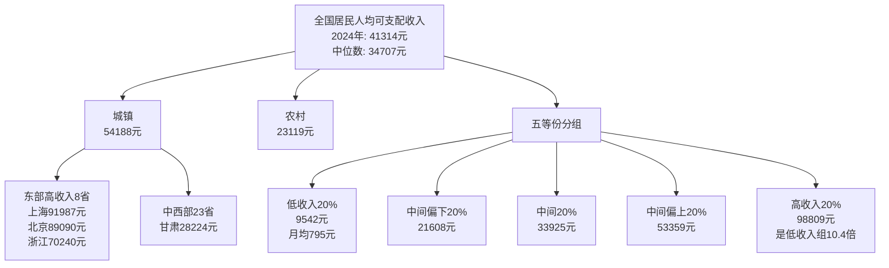

## 1.4 "6亿人月收入1000元"等标志性判断的真实性核验

2020年5月，时任国务院总理李克强在记者会上提到"我国人均年收入是3万元人民币，但是有6亿人每个月的收入也就1000元"——这一数字在当时引发巨大震动，因为它与社交媒体上铺天盖地的"年薪百万""消费升级"叙事形成了强烈反差[^23][^24]。**在新研究的开端，必须先校准这一国情基线，否则任何关于"中产规模"的讨论都会建立在错误的认知之上。**

北师大中国收入分配研究院万海远、孟凡强团队基于7万个分层线性随机抽取的代表性样本测算，结果显示：**2019年中国有39.1%的人口月收入低于1000元，换算成人口数即为5.47亿人；月收入在1000—1090元之间的人口约5250万人，因此1090元以下的总人口约6亿人，占全国人口的42.85%**[^17]。这一群体的内部结构同样令人警醒：在这6亿人中，有546万人没有任何收入，2.2亿人月收入在500元以下，4.2亿人月收入低于800元，5.5亿人月收入低于1000元[^17]。该测算基于国家统计局一以贯之使用的"家庭人均可支配收入"口径——即扣除个人所得税、私人转移支付和各种社会保险费等之后实际可用的收入，而非市场化工资或城镇平均工资[^17]。

将这一2019年的基线与2024年最新数据对照，可以验证该判断的时效性。2024年低收入组（占20%人口、约2.8亿人）人均可支配收入9542元，月均仅795元；中间偏下组（占20%、约2.8亿人）人均21608元，月均1801元[^4][^14]。**两组合计约5.6亿人月均收入低于1801元，其中低收入组2.8亿人仍处于月均不足800元的水平**。换言之，五年过去，"约6亿人月收入1000元水平"的国情判断在数量级上依然成立，只是绝对金额随通胀和增长有所抬升。中金公司2026年发布的国民收入分布数据进一步佐证：以家庭人均月收入统计，月收入1000元以下约5.5亿人，月收入1000—5000元约7.78亿人，5000元以下累计约13.28亿人、占比94.8%[^12]。

更值得关注的是收入分布的偏态性。**2024年全国居民人均可支配收入中位数34707元，仅为平均数41314元的84.0%；2025年前三季度这一比例为83.5%**[^5][^25]。中位数低于均值意味着收入分布呈右偏（高端拉高均值），即大多数人的实际收入低于"人均"水平——这正是"被平均"现象的统计学根源。城镇居民这一偏态更为突出：2025年前三季度城镇居民收入中位数38224元仅为均值42991元的88.9%，农村居民则为85.0%[^25]。

这一国情核验对本研究具有奠基性意义：它表明**中国居民收入分布的真实形态远比"人均4万元"所暗示的水平更为悬殊**，任何脱离这一基线讨论中产规模的研究都会陷入"只见塔尖、不见基座"的视野偏差。当我们后续讨论"4亿中等收入群体""3300万核心中产家庭"等数字时，必须始终铭记：在这些数字之下，是仍然有约6亿人月收入水平在1000元上下的庞大底层。

## 1.5 中国居民财富与负债的宏观图景

如果说收入数据揭示了"流量端"的不平等，那么财富与负债数据则展示了"存量端"更为剧烈的分化。

**资产端：财富向少数家庭高度集中。** 中国人民银行调查统计司对全国30个省3万余户城镇居民家庭的调查显示，**城镇居民家庭户均总资产317.9万元，但中位数仅163万元**，二者相差近两倍，资产分布远比收入分布更为不均衡[^26][^15][^16]。资产集中度方面，**总资产最高20%家庭的总资产占比为63.0%，其中最高10%家庭占比为47.5%**；金融资产分化更为明显，金融资产最高10%家庭占所有样本金融资产的58.3%[^26][^15]。区域分化同样剧烈：东部地区居民家庭户均总资产461.0万元，分别高出中部、西部、东北地区197.5万元、253.4万元和296.0万元；省际看，**北京居民家庭户均总资产892.8万元，约为新疆居民家庭的7倍**[^26][^15]。

存款分布的失衡更为夸张。截至2025年末，住户存款余额已达167.04万亿元，占全社会总存款的49.7%[^27]。但根据已公开的研究分析，**约2%的人口持有约80%的银行存款**；招商银行2.1亿零售客户中，仅有523万人迈过"金葵花"门槛（日均资产50万元以上），这群占客户总量2.5%的人群掌控了超过80%的财富[^27]。中国家庭金融调查中心数据显示，**个人存款中位数仅约5万元，意味着全国一半人口存款未及此数额**——人均存款11.8万与中位数5万之间的巨大差距，再次印证了财富分布的极度右偏[^27]。

**资产结构：房产主导、金融资产薄弱。** 央行调查显示，城镇居民家庭资产以实物资产为主，**住房占家庭总资产的比重达59.1%，住房拥有率达96.0%，户均拥有住房1.5套**——其中有一套住房的家庭占58.4%，有两套的占31.0%，有三套及以上的占10.5%[^26][^15][^16]。金融资产户均64.9万元，占总资产仅20.4%，且无风险金融资产持有率高达99.6%（户均35.2万元），风险金融资产持有率59.6%（户均50.1万元）——居民投资明显偏稳健[^26]。多份资料综合表明，房产在中国家庭总资产中的占比维持在61.7%—69.3%的高位[^27]，这一数字将在第7章中与美国家庭房产仅占36%形成鲜明对比。

**负债端：杠杆率攀升后的修复期。** 截至2024年末，中国住户贷款余额突破80万亿元，平均每个家庭背负近20万元债务[^28]。从结构看，个人住房贷款37.68万亿元（占比超45%）、消费性贷款21.01万亿元（约26%）、经营性贷款24.14万亿元（约30%）[^28]。央行调查显示，**城镇居民家庭负债参与率高达56.5%，房贷占家庭总负债的75.9%；户均房贷余额38.9万元，户均偿债收入比为18.4%**[^15][^16]。从居民杠杆率看，中国住户部门杠杆率从2008年的18%快速上升至2020年的60%，**仅用11年完成了美国40年走过的路径**[^29]。2024年住户部门杠杆率为69.8%，较上年低0.7个百分点[^29][^30]，2024年末住户部门债务同比增长3.1%，增速较上年末放缓1.5个百分点[^30]，标志着居民部门进入资产负债表修复期。

**资产负债表的脆弱性正在显现。** 2025年央行不停降息，但居民借贷意愿持续低迷：2025年全年住户贷款仅增加4417亿元，其中短期贷款减少8351亿元，仅中长期贷款增加1.28万亿元；与2021年相比，居民部门的新增贷款缩水幅度超过95%[^27]。房贷连续11个季度负增长，2024年上半年居民住房贷款增长为负[^27][^29]。其根本原因不在借贷成本，而在于房价下行预期与收入增长放缓共同压缩了居民资产负债表——过去四年房价累计下跌30%—40%，按房产在城镇家庭总资产中近七成占比计算，相当于上百万亿资产凭空缩水[^27]。这一动态的脆弱性，将在第6章关于"中产困境"中得到进一步剖析。

## 1.6 中国财富分布形态与国际比较

综合上述收入与财富数据，可以对中国当前的财富分布形态做出基本判断：**中国当前呈现的是"金字塔型"而非"橄榄型"结构**。

衡量这一形态的最关键指标是基尼系数。根据国家统计局公布的数据，**中国居民人均可支配收入基尼系数自1993年首次突破0.4国际公认警戒线以来，已连续31年超线运行**[^31]。数据轨迹显示：基尼系数在2008年达到0.491的历史峰值，此后缓慢下降至2015年的0.462，2016年起进入0.46—0.47的高位震荡，2024年为0.462[^18][^31][^32]。李实教授团队的研究指出，**"2016年开始我们的收入差距没有出现进一步缩小的趋势，而且收入差距仍然处在一个高位水平"**——城乡内部收入差距持续扩大（城市内部、农村内部基尼系数都在0.4左右），全国基尼系数下降主要依靠城乡间差距收敛贡献[^18]。其背后的两大推力——财产分配差距急剧扩大和人力资本差异导致的工资差距效应不断强化——是难以在短期内逆转的[^19]。

下表给出中国与主要发达国家在中产规模与结构上的对比：

| 国家/地区 | 中产规模 | 占总人口比例 | 主要财富构成 | 形态判定 |
|----------|---------|-------------|-------------|---------|
| 中国 | 中等收入群体约4亿，严格中产远低于此 | <40% | 房产69%为主 | 金字塔型 |
| 美国 | 约2亿 | 约60% | 房产36%、金融资产为主 | 橄榄型 |
| 日本 | 约2亿 | 约70% | 金融资产、房产并重 | 橄榄型 |
| 韩国 | 约60%人口 | 约60% | 多元配置 | 橄榄型 |

数据来源：国家统计局、橄榄型社会结构相关讨论及中产对比研究[^33][^34][^35]

国家统计局数据显示，中国中等收入群体约4亿人，占比不足40%[^33][^35]。麦肯锡报告也指出中国城市中等收入家庭的消费能力将占到全国城市消费总量的一半以上[^35]。然而，与美国（中产约2亿、占人口约60%）、日本（约2亿、占比约70%）、韩国（约60%）等成熟经济体相比，中国中等收入群体的人口占比明显偏低，且这一群体本身呈现"收入达标但生活吃紧"的特征——高房价、教育、医疗等生活成本的持续攀升，加上房贷、车贷等长期负债，使得许多家庭尽管收入可观却仍感经济拮据，因此被戏称为"负资产中产"或"隐形中产"[^34]。

**正是基于这种结构性差距，中央层面在"十五五"规划及2025年中央经济工作会议中明确提出"制定实施城乡居民增收计划""推动形成橄榄型分配格局""提高居民收入在国民收入分配中的比重，提高劳动报酬在初次分配中的比重"等政策方向**[^6][^33][^36][^14]。清华大学李稻葵教授指出，"橄榄型"是指中等收入群体规模最大、低收入与高收入群体规模相对较小的分配格局，其作用在于**庞大的中产阶级具有对社会贫富分化较强的调节功能和对社会利益冲突较强的缓冲功能**[^33][^36]。从金字塔向橄榄型的转型，既是经济结构升级的内在需求（扩大内需、消费驱动），也是社会稳定的政治诉求。

至此，本研究已经完成方法论与宏观坐标的搭建：明确了九阶层复合分层框架的构建逻辑与量化指标，校准了"6亿人月收入1000元"的国情基线，刻画了"金字塔型"财富分布的总体形态。**这意味着我们已经为后续研究锚定了三组关键参照系：第一，2024年人均可支配收入41314元、中位数34707元的收入坐标；第二，城镇家庭户均总资产317.9万元、房产占比近七成、户均住房1.5套的资产坐标；第三，住户杠杆率69.8%、户均负债约20万元的负债坐标**。下一章将沿着这一框架，逐一刻画九大阶层的财力图景，从顶层精英到社会底层依次展开真实的"中国阶层全景画"。

# 2 九阶层逐层画像：收入、资产与财务状况

第1章已经搭建起九阶层复合分层框架，并锚定了"全国人均可支配收入41314元、中位数34707元，城镇家庭户均总资产317.9万元、住户杠杆率69.8%"等关键宏观参照系。本章将沿着这一框架，**自顶端至底端依次解剖九大阶层的真实财力图景**——从年财富508亿美元的塔尖富豪，到月收入不足千元的5.47亿底层；从户均资产2813万元的私行客户，到户均存款不足5万元的沉默大多数。每一阶层的画像围绕收入流量、资产存量、职业教育、地域分布、收入结构、负债与抗风险能力六大维度展开，目的不是罗列阶层标签，而是以阶梯式坐标精确呈现"中国人都过着怎样的生活"，并为第3章起对中产的深度聚焦提供清晰的上下界参照。

## 2.1 顶层精英：百亿美元级超级富豪的财富图谱

位居九阶层最顶端的，是年财富以百亿美元计、对宏观经济与产业格局具有显著影响力的超级富豪群体。根据《福布斯》2024年中国内地富豪榜，截至2024年10月18日，**钟睒睒以508亿美元连续第四年蝉联中国内地首富，马化腾以468亿美元位列第二、张一鸣以456亿美元位列第三、黄峥以439亿美元位列第四，曾毓群371亿美元位列第五**[^37][^38][^39]。值得一提的是，2024年百强门槛升至39亿美元，比2023年的34亿美元上升约15%[^39]，意味着仅100位富豪就需要至少280亿元人民币级别的可量化净资产——这一数字已经超过绝大多数地级市的年财政收入。

从行业构成看，**顶层精英的财富高度集中于科技、新能源汽车、消费品、医药四大赛道**。福布斯前十中，科技行业占据五席（马化腾的腾讯、张一鸣的字节跳动、黄峥的拼多多、丁磊的网易、马云的阿里巴巴），新能源与汽车占据两席（曾毓群的宁德时代、王传福的比亚迪），食品饮料占两席（钟睒睒的农夫山泉、何享健家族实际归类为制造业但延伸至消费品），制造业占一席[^37][^38]。前30名中，宁德时代关联的曾毓群、黄世霖、李平、裴振华四人合计在榜，比亚迪关联的王传福、吕向阳两人在榜，**新能源产业链成为近年来催生超级富豪最密集的"造富机器"**[^37]。此外，2024年榜单上8位新人中，米哈游的蔡浩宇、刘伟、罗宇皓三位创始人入围，泡泡玛特王宁通过海外扩张登榜——文化娱乐与潮玩出海正在成为新的财富增长极[^39]。

从财富构成看，**顶层精英的资产高度集中于上市公司股权或拟上市股权**，而非现金或房产。福布斯榜单的财富计算方法即"根据从家族和个人、证券交易所、分析师、私人数据库以及其他来源获得的股权和财务信息编制而成，未上市公司的估值通过财务比率以及与类似上市公司的比较得出"[^38]，这意味着该群体的财富天然与资本市场深度绑定，具有高波动性。例如钟睒睒2024年财富较2023年缩水93亿美元，主因是农夫山泉面临激烈价格战；马化腾财富则增加147亿美元、重返第二名，得益于腾讯股价反弹[^39]。这种"股权即财富"的特征，使顶层精英的财富数字在统计意义上往往高估其可动用现金流——他们手中真正的"流动财富"远小于纸面身家。

顶层精英在九阶层中的占比微乎其微，**整个百强榜单仅100人，加上家族成员估算不超过千人量级，对应人口占比远低于0.0001%**。但这一极小群体掌握着宏观经济、产业政策与就业格局的关键影响力——前述100位富豪所控制的企业雇佣员工以千万计，其投资决策、出海战略、科技研发布局深刻塑造着中国经济的走向。这正是本研究将其单列为最顶端阶层的原因：**顶层精英的财力意义不仅在于财富数字，更在于其外溢的政策影响力与资源动员能力**。

## 2.2 政策影响者与富豪层：亿元资产超高净值家庭

紧随顶级富豪之下的，是家庭净资产1亿元以上的超高净值群体。根据胡润研究院《2024胡润财富报告》，**截至2024年1月1日，中国超高净值家庭（资产亿元以上）数量为13万户，同比减少1.7%（减少2200户），其中拥有亿元可投资资产的家庭为7.8万户；国际超高净值家庭（资产3000万美元以上）数量为8.6万户，同比减少2.3%（减少2000户），其中拥有3000万美元可投资资产的家庭为5.4万户**[^40]。从财富集中度看，**这13万亿元级家庭虽仅占全国家庭总数的0.026%，但合计拥有的财富达到87万亿元，占600万资产以上富裕家庭总财富150万亿元的58%——这一比例较2023年的56%进一步上升**[^40]，显示财富正在向更高净值的塔尖加速聚拢。

该群体的职业构成以**大型企业掌舵人、上市公司核心股东、金融与产业资本运作者、超高净值企业主**为主体，部分顶尖专业人士（如顶级律师事务所合伙人、知名医院学科带头人、高端艺术品市场玩家）通过长期积累也可能跨入此层。地域分布上呈现极强的头部集聚特征：胡润数据显示2023年中国共有10个省和直辖市的600万资产以上富裕家庭数量超过10万户——江苏、浙江、上海、广东、福建、山东、四川、北京、香港、台湾，这些地区的富裕家庭总数占全国总数的84%；城市层面则呈现"3+4+3"格局，北京、上海、香港位居前三，富裕家庭数量均超过50万户，深圳、广州、杭州、宁波各有超过10万户，佛山、台北、天津均在5万户以上[^40]。亿元级超高净值家庭的分布更为集中，进一步向北上深港等顶级金融与商业中心聚拢。

从资产配置看，**该群体形成了"股权+核心房产+境外资产+另类投资"的多元结构**。胡润报告指出，中国高净值人群的境外资产占可投资资产的16%，香港和新加坡是最受欢迎的境外投资目的地；未来一年的首选投资对象是黄金，反映出在房地产市场困境与股市波动背景下避险情绪上升[^40]。生活方式层面，**中国高净值家庭平均拥有4.4名成员，居住在270平方米的住宅中，拥有2辆车和4块手表，一年享受24天的假期**，偏爱收藏珠宝、中国书画、名酒和名表，热衷于旅游和美食[^40]——这些数字本身就构成了与中产阶层生活半径的鲜明分野。

财富传承是该群体最具标志性的财务议题。胡润预测，未来10年将有20万亿元财富转移到下一代手中，20年内增至45万亿元，30年内达到79万亿元[^40]。德勤《大中华高净值人士财富传承与保险规划》数据显示，**67%的高净值人群愿意通过遗嘱明确继承人和财产分配，54%选择购买保险（因为保险产品能够直接指定受益人且避免纠纷、防范债务和法律诉讼风险），仅12%—20%考虑使用信托和家族办公室**[^41]。值得注意的是，**房地产是高净值人群"隐形的财富传承品类"**——克而瑞研究中心数据显示，2024年30个重点城市总价3000万以上高端住宅新房成交4356套、同比增长65%，四个一线城市占比高达94%，上海表现尤为突出；70%以上购房原因在于资产保值增值，"提升居住品质"与"圈层认同"亦是重要驱动[^41]。这一现象与第1章关于房产在城镇家庭总资产中占比近七成的结构特征形成呼应——**即便在塔尖群体，房产仍然是财富传承与抗通胀的主要载体之一，但其配置逻辑已从居住属性转向资产属性**。

## 2.3 地区行业领袖与富裕层：千万级高净值家庭

继续向下，是家庭净资产介于3000万至1亿元之间的高净值家庭，他们构成中国财富金字塔承上启下的关键一层。根据胡润研究院最新财富报告，**中国千万净资产高净值家庭总量为206.6万户，同比减少0.8%（减少1.7万户），其中拥有千万可投资资产的家庭为108.9万户**[^40]。放在全国约4.9亿—5亿户的家庭基数中，**这一群体占比仅约0.4%，相当于每250户家庭中仅有1户达标**[^42]——稀缺性十分突出。从财富层级梯度看，千万资产家庭数量远低于600万净资产富裕家庭（512.8万户），而亿元资产超高净值家庭仅13万户，"财富门槛每上一个台阶，家庭数量便呈断崖式下降"[^42]，清晰勾勒出中国财富金字塔的陡峭形态。

地域分布上，**千万资产家庭呈现极强的头部集聚效应，TOP20城市占据全国总量的半壁江山以上**。胡润数据显示：**北京以29.65万户位居榜首，上海28.30万户紧随其后，香港20.80万户位列第三，深圳7.72万户、广州7.10万户分列四、五位，前五城市形成与后续城市拉开巨大差距的第一梯队**[^42]。这五座城市均为一线或国际金融中心，核心区房价居高不下——北京东西城区房价超12万元/平方米，上海、香港核心区域价格更高，**房产价值成为家庭净资产的核心支撑**[^42]。第二梯队城市突破2万户，包括杭州、宁波、佛山、天津、苏州、东莞等，要么是区域经济中心，要么依托制造业与民营经济崛起；第三梯队的南京、重庆、青岛、武汉等突破1万户。其中常州表现亮眼，常住人口仅538万，凭借发达的民营经济与新能源产业、人均GDP超20万元，以小体量跻身TOP20，成为地级市中的财富标杆[^42]。

从省级维度看，**千万资产家庭高度聚焦三大核心经济圈**：长三角地区（上海、江苏、浙江）合计占全国千万资产家庭总量的30%，民营经济活跃、城市群分布均匀，杭州、苏州、宁波、南京、无锡、常州等城市形成连片高净值集群；粤港澳大湾区以广东、香港、澳门为核心，广州、深圳双龙头引领，东莞、佛山制造业发达；京津冀地区则依靠北京的头部效应领跑[^42]。区域分化特征鲜明：西部仅四川、重庆、陕西突破2万户量级，东西部、南北部的财富差距一目了然——这一地理分布与第1章揭示的"东部高收入8省独占全国线之上"的省际格局高度吻合，反映出**收入流量与财富存量在空间上的同向集聚效应**。

职业构成上，**千万级高净值家庭以中大型企业主、行业头部专业人士、上市公司高管、资深金融与科技合伙人为主**。其资产以经营性股权与多套优质房产为核心，部分家庭通过早期股权激励、上市公司减持、地产周期红利等路径实现快速积累。该群体在第1章九阶层框架中对应"地区行业领袖/富裕层"，是真正具备资产配置自主权、能够进行跨境资产摆布、家族信托规划与高端教育投资的群体。但需要警惕的是，**该群体的财富在2023—2024年间已出现连续两年下降**——胡润数据显示中国富裕家庭规模连续2年下降，2024年微降至512.8万户，3000万美元国际超高净值家庭数同比下降2.3%[^41]——印证了房地产市场调整与股市低迷对存量财富的双重冲击。

## 2.4 高净值层：600万至3000万净资产的富裕家庭

家庭净资产介于600万至3000万元的群体，构成胡润口径下"富裕家庭"的主体。根据《2024胡润财富报告》，**截至2024年1月1日，中国富裕家庭（资产600万以上）数量为512.8万户，同比减少0.3%（减少1.4万户），其中拥有600万可投资资产的家庭为184.6万户**[^40]。其中除去前述千万级以上家庭206.6万户，**3000万至千万之间的部分约为300万户上下，占全国家庭总数约0.6%**。

招商银行2024年年报为这一阶层提供了另一个独立的观测窗口。根据公开分析，**招行将零售客户分为三类：普通客户（资产低于50万元）2.04亿户、占总客户数97.51%、户均资产仅1.33万元；金葵花客户（资产50万至1000万元）523.57万户、占比2.49%、户均资产233.5万元；私人银行客户（资产1000万元以上）16.91万户、占比仅0.08%、户均资产高达2813.38万元**[^43]。从财富集中度看，**金葵花+私行客户虽仅占客户总数的2.5%，却管理着14.93万亿元零售客户总资产中的87%**（约12.22万亿元），且这一集中度从2018年的81%持续上升至2024年的87%[^43]。**招行私人银行客户16.9万户、增长13.6%，金葵花用户523.57万户、增长12.8%**[^41]——在胡润口径显示富裕家庭微降的同时，招行口径却显示中高净值客户高速增长，这两组"打架"的数据并不矛盾：**胡润反映的是亿元级以上超高净值人群的衰退，而招行充分说明普通富裕人群依然在稳步增长**[^41]。

招商银行私人银行户均资产2813万元的数据，恰好与本研究高净值层（600万—3000万）的上沿区间高度吻合，可视为该阶层的代表性画像。综合招行私行客户与胡润富裕家庭数据可推断，**该阶层职业构成以成熟企业主、上市公司董监高、金融与科技金领、资深合伙人、医院科室主任、高校知名教授等为主**，家庭年收入大致落在100万—300万区间——既有稳定的高额工资性收入，也有可观的股权激励、年终分红、房租或理财财产性收入。

资产配置层面，**该群体已出现明显的多元化倾向**：胡润调研显示，中国高净值人群最主要的三大资产分别是现金、股票、房地产；未来一年首选投资对象是黄金；境外资产占可投资资产的16%[^41]。但这一阶层在房地产调整与股市波动中的财富缩水风险也最为直接——招行2024年年报显示其个人定期存款持续高速增长、理财产品手续费下降，反映出该群体在不确定性环境下"避险存款化"的强烈倾向[^44]。其生活方式典型为270平方米左右住宅、2辆车与4块手表的高净值标准画像[^40]，子女教育倾向国际学校或海外留学，是中国高端消费市场（奢侈品、高端旅游、高端医疗、艺术品）的核心买单方。

值得专门指出的是，**高净值层与中产精英层之间存在一道难以逾越的"资产积累断层"**：本节群体的净资产下沿600万、上沿3000万，对应可投资资产即可产生稳定财产性收入；而下一节中产精英净资产300万—600万的上沿，恰好卡在"够得着但够不稳"的临界线上。这一断层的存在，正是中国阶层结构呈"金字塔型"而非"橄榄型"的微观写照。

## 2.5 中产上层（中产精英）：50万—100万年收入家庭

跨过600万净资产的门槛之下，便进入了通常被称为"中产精英"或"上层中产"的群体——家庭年收入50万—100万、净资产300万—600万，是九阶层中最接近"国际标准中产"的子层。**按照"家庭净资产300万—5000万为中产"的划分细则，300万—600万属入门中产、600万—1500万属标准中产、1500万—5000万属上层中产**[^45]——本节与下一节"中产下层"共同覆盖入门中产到标准中产的跨度。结合家庭年收入50—100万的"中产阶层"区间[^45]，本研究估算该群体占全国家庭总数约3%—4%。

该群体的职业构成具有显著的"专业精英+管理精英+体制内中高层"复合特征：大型企业（特别是金融、IT、生物医药、高端制造）的中高层管理者、资深技术骨干（如算法专家、芯片工程师、临床主任医师），高级公务员（处级以上）、知名律所合伙人、985高校副教授以上、上市公司董秘、券商投行VP—MD等。教育背景上，本科及以上学历占绝对主导，硕士、博士比例显著高于其他中产子层——前述2025年中国家庭收入与财富调查报告指出，金融、IT等行业的中产家庭占比超20%，传统制造业则不足10%[^46]，且新兴行业如人工智能、生物医药从业者收入较传统行业高出85%—120%[^46]。地域上，该群体高度集中于一二线核心城市的核心区域——北京、上海、深圳、广州、杭州、成都的金融街、CBD、科技园区构成其工作生活半径。

从财务画像看，**中产上层呈现"高收入伴随高房贷、子女教育与赡养双重压力"的典型矛盾**。一方面，年收入50万—100万的现金流确实可观，工资性收入仍是主导但已开始辅以适度的股权激励、年终奖金、理财收益、租金收入等多元来源；另一方面，由于该群体多在一线城市定居，所购房产总价往往在800万—2000万区间，**即便已偿还相当部分本金，剩余房贷可能仍有300万—600万——一套500万房子若房贷还剩350万、再加20万存款，净资产仅170万，即便家庭年收入百万也只是工薪阶级水平**[^45]。叠加每年6万—15万的国际学校或鸡娃培训费、四老赡养与潜在医疗支出，**月光甚至月负是该群体内部相当比例家庭的真实状态**——也正是"拿着中产的收入、过着工薪的日子"这一"伪中产"现象在中产上层中的隐性体现。

更深层的脆弱性来自该阶层与真正高净值层（600万—3000万净资产）之间的资产积累断层。**他们的财富主要以一线城市自住房产+部分理财基金的形式存在，缺乏真正可产生现金流的经营性资产或股权资产**。一旦遭遇职场35岁危机、行业裁员潮或房价深度调整，下滑至中产下层乃至温饱阶层的风险并不遥远——这正是后续第6章关于"中产困境"的重点议题。

## 2.6 中产下层（小康阶层）：20万—50万年收入家庭

中产下层是中国"中产话语"最聚焦的群体，也是阶层界定争议最大的群体。**2025年1月国家统计局与中国社会科学院联合发布的《中国家庭收入与财富调查报告》首次以量化标准界定"中产阶级"，提出四项核心指标：家庭年收入35万元以上、净资产超300万元、至少一名成员拥有本科及以上学历、收入来源稳定可持续。截至2024年底，全国仅有3320万户家庭达标，占总家庭数的8.9%**[^46]。这一"严苛"门槛与本节年收入20万—50万、净资产80万—300万的小康家庭群体（估算占比15%—20%）形成了明显的口径差异——前者是"严格中产"，后者是放宽口径下的"广义中产/小康"。

之所以扩展至这一较宽口径，是因为**家庭年收入30万恰好踩在了全国前20%的门槛线上**——2025年高收入组人均可支配收入103778元，三口之家年收入约31万元；按家庭收入分层数据，年收入30万到80万的家庭属于"富裕层"，占城镇家庭的18%，全中国大概每5—6个家庭中有1个能达到这个收入水平[^47]。而严格中产标准（家庭年可支配收入20万—50万）下，全国符合标准的家庭约3320万户、仅占全国家庭总数的8.9%[^47][^46]——本研究将这两组数据互相印证，将中产下层的占比锚定在15%—20%区间。

该群体的画像高度结构化。从职业看，**金融、IT等行业的中产家庭占比超20%，传统制造业则不足10%**[^46]——典型职业包括企业中层管理者、技术骨干、教师、医生、公务员事业编、新一线城市的资深白领、二线城市的优质企业员工等。**本科及以上学历的硬性要求将中西部农村地区家庭排除在外，2024年数据显示全国25-64岁人口中仅15.8%拥有本科学历**[^46]。地域分布上，**中产家庭高度集中于东部三大经济圈（京津冀、长三角、粤港澳），占比64.7%，西部12省区仅占12.3%**[^46]。年龄分布上，**35—55岁群体占67.3%，而35岁以下家庭因资产积累不足，达标率仅12.7%**[^46]——这一年龄结构既揭示了中产形成需要时间积累的本质，也预示了35岁前未能进入中产的群体跃迁难度更大。

中产下层最具中国特色的财务困境，**是"收入达标但负债沉重"的伪中产矛盾**。前述报告四项指标中的"无负债"要求被指"更显苛刻"——**中国居民房贷总额已突破39万亿元，95%的购房家庭依赖贷款，全款购房者多集中于高净值人群或早年低价购入房产的群体**[^46]。资产结构方面，**净资产300万元的标准中，房产占比高达76.2%、流动性极低**——以二线城市一套90平方米房产为例，市价约200万元，若家庭仅有此资产且无其他存款或投资，仍难以应对突发风险[^46]。**金融资产占比超30%的达标家庭抗风险能力显著更强，但这类家庭仅占未达标群体的13.5%**[^46]。

更直观的检验是按净资产口径划分：一套500万的房子+350万房贷+20万存款=170万净资产，仍属"工薪阶级"而非中产；**真正净资产600万以上的中产可能仅占总人口的1%—2%**[^45]。这意味着**"统计意义上的中产"与"自我认同的中产"之间存在巨大落差**——按收入口径有3320万户家庭达标，但按净资产口径剔除房贷后能称为"标准中产"的家庭可能不足1000万户。**职业稳定性同样关键：2.3亿灵活就业者因收入波动大，即便月入过万也难以达标**[^46]。这一群体正是后续第3—6章中产专题分析的核心研究对象。

## 2.7 温饱阶层（职场新贵）：10万—20万年收入家庭

继续向下，是家庭年收入10万—20万、净资产20万—80万的温饱型职场家庭，估算占比25%—30%。**2025年城镇居民人均可支配收入中位数51115元，城镇三口之家中等年收入约15万元**[^47][^48]，恰好落入本节定义的中段。这意味着该阶层正是中国城镇家庭的"中位数代表"——以城镇为对照系，他们既不是富裕层，也不属于贫困层，而是构成城市基本盘的庞大中等家庭。

参照中金公司11级金字塔分布，**月收入5000—10000元的人口约6328万人、占比4.52%；月收入10000—20000元约784万人、占比0.56%**——按家庭口径换算（一个家庭通常有1.5—2个就业人员），10万—20万年收入家庭对应的人口规模与本研究估算的25%—30%占比基本吻合。该阶层主要由**一般白领、技术工人、个体工商户、基层公务员、中小企业普通员工、二三线城市的成熟职业人**构成，大专及以上学历，职业稳定性中等偏上但晋升空间有限。

地域分布上，该阶层主要分布于二三线城市与一线城市远郊。**在一线城市核心区购房对他们而言已经超出能力——15万年收入对应一套500万的房子需要33年不吃不喝，而二三线城市200万左右的房产则相对可承受，因此该群体的购房选择多集中于二线城市核心区或一线城市6环外的远郊**。从收入结构看，工资性收入占绝对主导（往往超过80%），财产性收入薄弱（金融资产规模有限、租金收入几乎没有），与第1章揭示的"全国财产净收入占比仅8.3%"的整体特征更为契合。

财务行为上，**该阶层是消费降级与"存款代替消费"现象的核心载体**。其储蓄倾向高于平均水平，原因有三：其一，对收入不确定性敏感，疫情后就业市场压力使其更倾向于积累应急资金；其二，购房刚需仍未完全释放，攒首付是核心理财目标；其三，子女教育投入持续刚性增长，挤压可选消费。招行2024年年报显示，**普通客户（资产50万元以下）虽占97.5%，但仅持有13%的零售资产、人均存款约1.3万元**[^43]——本节温饱阶层属于普通客户中的中上段，与平均1.33万元相比户均存款更高，但与金葵花客户233.5万元户均资产相比仍差出两个数量级。**98%的普通客户因存款有限更依赖消费贷款，招行信用卡交易额下降8.23%但消费贷款余额激增31.38%**[^43]——反映该群体在收入承压时通过短期借贷维持生活水准的脆弱性。

该阶层在阶层流动上具有重要意义：**他们既是中产下层最直接的"后备军"，也是消费降级时最快滑落至贫困阶层的脆弱群体**。第1章提及2025年一季度居民贷款"腰斩"现象——全国住户部门新增人民币贷款仅2967亿元、较上年同期暴跌71.5%，居民短期贷款罕见减少1640亿元[^49]——其中相当大部分由本节温饱阶层的"主动降杠杆、压缩消费"行为贡献。

## 2.8 贫困阶层（城市基层）：3万—10万年收入家庭

贫困阶层（城市基层）对应2024年低收入组人均可支配收入9542元、中间偏下组21608元的官方数据区间[^48]，按三口之家折算年收入约3万—10万，**估算占比约40%**——这意味着每5个中国家庭中有2户属于这一阶层。

从职业构成看，该阶层以**服务业员工、产业工人、农民工、退休基层人员、灵活就业者**为主体。其中**2.3亿灵活就业者**[^46]构成最具时代特征的子群——他们包括外卖骑手、网约车司机、家政服务员、建筑工人、临时合同工等，特点是收入波动大、社保参与率低、缺乏职业晋升通道。教育背景上，初中至高中学历居多，与"全国25-64岁人口中仅15.8%拥有本科学历"[^46]的数据相互印证——本科及以下学历的庞大群体大多分布于本节及以下阶层。地域上，主要分布于中西部省份与城乡结合部，亦广泛存在于一线城市的城中村、合租公寓与城郊。

收入来源结构上，**该阶层呈现"工资性收入与转移性收入并重、财产性收入几乎为零"的典型特征**。2025年全国居民人均工资性收入24555元，占人均可支配收入56.6%；转移净收入8080元，占18.6%；财产净收入仅3490元、占8.0%[^48]——但这些是全国均值，对于贫困阶层而言，财产性收入实际上接近于零，转移性收入（养老金、低保、补贴）的占比反而显著上升。农村居民人均可支配收入24456元、城镇居民56502元[^48]——本节阶层中的农村居民部分高度集中于全国均值附近或之下，城镇居民部分则属于城市底层。

抗风险能力是该阶层最严峻的挑战。**其月均可支配收入仅约800—1800元，在医疗、教育、养老等刚性支出冲击下抗风险能力极低**——一场大病、一次失业、子女上大学等事件都可能将家庭推入负债深渊。该阶层是中国"沉默大多数"的真实生存状态：**他们不在社交媒体的高频曝光中，他们要么沉默，要么根本没有时间、没有习惯在网上发声**[^47]——前述"我老家是南方一个普通农村，村里的大伯种了半辈子地，去年风调雨顺，一年种粮加上偶尔打零工，全家收入不到4万块钱；他的邻居在镇上开个小超市，一年净赚五六万；至于那些在县城工厂上班的，一个月三四千块钱是常态"[^47]——正是本节贫困阶层的真实写照，与互联网叙事中"年入30万只是起步"的滤镜世界形成尖锐对比。

国家社会救助体系对该阶层提供基本兜底：**中国基本医疗保险覆盖率超过97%、九年义务教育普及率达100%**[^50]，对低保对象、特困人员、低保边缘家庭等给予医疗、教育、住房等专项救助[^50]。但兜底救助难以转化为财富积累或阶层跃升路径，**该阶层的代际传递性极强——这正是第7章关于阶层流动率讨论的关键起点**。

## 2.9 负债层与社会底层：月收入1000元以下的5.5亿人

九阶层最底端，是月收入1000元以下的人口——这是第1章已经核验过的国情基线。**北师大中国收入分配研究院的测算显示，2019年中国39.1%的人口月收入低于1000元、对应5.47亿人；月收入1090元以下的总人口约6亿人，占全国人口的42.85%**[^51]。**截至2024年，底层40%家庭户的年月人均收入已接近1300元**[^50]——绝对数额随通胀略有抬升，但相对位置基本未变。

该群体的内部结构令人警醒：**有研究将月收入不足1000元的人群视为相对贫困人口，根据2021年数据推算约3亿人；另一项基于国家统计局2023年五等份收入分组数据的估算显示约5.46亿人**[^50]。**主要群体构成包括：部分没有退休金的老年农民、无收入的青少年、残疾人以及经济欠发达地区的居民**[^51]。值得强调的是，**月收入1000元远低于全国平均工资与最低工资标准——2024年全国城镇非私营单位就业人员月平均工资约10342元、私营单位约5789元；截至2025年7月，全国各省市月最低工资标准最低档普遍在1700元以上**[^51]。也就是说，**月收入1000元的人群处于法定最低工资标准的60%以下，在大城市仅能维持数日的基本开销，在小城市或农村也仅能勉强满足最基础的饮食与日常消费，需要极度节俭**[^51]。

将这一群体单独立为"负债层与社会底层"，还有一个独立的口径——**被动负债的"债务奴隶"**。第1章已提及，**截至2026年初居民总负债达81.7万亿元、杠杆率62.3%；家庭债务收入比高达140.9%；32.7%的家庭月供占收入超50%，沦为'债务奴隶'**[^49]。这部分被房贷、车贷、信用卡、消费贷压垮的家庭，从账面看可能拥有一套或多套房产，但**净资产实际为负或仅勉强为正**——按"家庭净资产<10万元为底层阶级"的口径[^45]，他们与无收入老人、农村低保家庭一同构成本节定义的社会底层。

"寒门"逾亿户的研究进一步印证了该阶层的规模。根据2025年居民收入数据，**最低20%的低收入组人均可支配收入仅为10150元（折合月均约846元），按家庭平均规模约2.51人推算，涵盖人口约2.8亿人、折合家庭户数约1.12亿户——这便是现代意义上"寒门"的狭义核心群体**[^52]。结合本节口径，估算占比10%—15%（按家庭口径而非人口口径）。

国家分层分类社会救助体系是该阶层的最后一道防线。**对特困人员、低保对象等，在参加医保、门诊及住院费用等方面给予不同比例的资助和救助；通过建立低收入人口动态监测平台，加强部门信息比对，变"人找政策"为"政策找人"，旨在更精准、及时地识别和帮扶困难群众**[^50]。但救助仅能维持基本生存，无法构成阶层跃升的台阶——**这正是中国阶层金字塔最底端的真实图景**。

## 2.10 九阶层财力对比与跨阶层鸿沟综览

逐层画像之后，将九大阶层放入同一坐标系进行横向比较，方能直观呈现中国财力鸿沟的极端程度。下表汇总九阶层的核心数据：

| 阶层 | 估算占比 | 家庭年收入 | 家庭净资产 | 主导收入来源 | 房产占资产比 | 抗风险能力 | 代表性数据 |
|------|---------|-----------|----------|-------------|-----------|----------|----------|
| ①顶层精英 | <0.0001% | 数十亿—数百亿 | >5亿 | 股权资产增值 | 极低 | 极强但波动大 | 钟睒睒508亿美元[^37] |
| ②政策影响者/富豪 | 约0.026% | 1000万—5000万 | 1亿—5亿 | 股权+财产性 | 较低 | 强 | 13万户、合计87万亿、占富裕家庭财富58%[^40] |
| ③地区行业领袖/富裕 | 约0.4% | 300万—1000万 | 3000万—1亿 | 经营+财产+工资 | 中等 | 较强 | 千万级206.6万户[^40] |
| ④高净值层 | 约1% | 100万—300万 | 600万—3000万 | 工资+股权+理财 | 较高 | 较强 | 招行私行16.91万户、户均2813万[^43] |
| ⑤中产上层 | 3%—4% | 50万—100万 | 300万—600万 | 工资性主导 | 高（>70%） | 中等 | 入门—标准中产[^45] |
| ⑥中产下层（小康） | 15%—20% | 20万—50万 | 80万—300万 | 工资性主导 | 76.2%[^46] | 弱 | 严格口径3320万户、占8.9%[^46] |
| ⑦温饱阶层 | 25%—30% | 10万—20万 | 20万—80万 | 工资性绝对主导 | 高 | 弱 | 城镇三口之家中位数约15万[^47] |
| ⑧贫困阶层 | 约40% | 3万—10万 | 5万—20万 | 工资+转移性 | 中（房产质量低） | 极弱 | 低收入组月均795元[^48] |
| ⑨负债/底层 | 10%—15% | <3万或资不抵债 | <5万或为负 | 转移性主导 | 不适用 | 几乎为零 | 月入1000元以下5.47亿人[^51] |

**最直观的鸿沟在财富量级**。从顶层精英508亿美元（约合3600亿元人民币）到底层月收入不足千元（年收入1.2万元），**财力差距达到3000万倍量级**。即便剥离顶级富豪，**招商银行年报亦显示富人户均资产2813万元、平民户均1.33万元——比值高达2114倍；金葵花户均233.5万元、平民1.33万元——比值176倍**[^43]。早在2022年，相关研究即指出**"中产阶层的资产是平民阶层的120倍，而富人的资产则是中产阶层的151倍，同时也是平民阶层资产的2242倍"**[^44]——三年过去这一比例随财富集中度上升而进一步扩大。

**收入来源结构呈现"三段式分化"**。顶端两阶层（顶层精英、富豪层）的财富增值高度依赖股权资产升值与财产性收入，工资性收入占比极低甚至忽略不计；中段四阶层（高净值层、中产上层、中产下层、温饱阶层）以工资性收入为绝对主导，第1章数据显示全国工资性收入占可支配收入比重为56.6%[^48]——而中产层的这一比例往往超过60%—70%；底端两阶层（贫困阶层、负债/底层）则高度依赖转移性收入（养老金、低保、补贴），工资性收入因就业不稳定而波动剧烈。这一三段式分化决定了**不同阶层对宏观经济政策的敏感方向截然不同**：顶端对资本市场与税收政策最敏感，中段对就业、房价、教育政策最敏感，底端对社保、转移支付与基本公共服务最敏感。

**负债率呈现"中段最高、两端较低"的倒U型分布**。顶端阶层资产端规模庞大、负债率绝对值虽高但相对规模可控，且具有强大的债务腾挪能力；底端阶层因收入低、信用资源有限，反而难以借到大额贷款（被动负债的"债务奴隶"现象主要发生在曾经获得过房贷的中段下沉群体）；**中段尤其是中产下层与温饱阶层是负债压力最大的群体**——95%的购房家庭依赖贷款[^46]、32.7%的家庭月供占收入超50%[^49]、家庭债务收入比高达140.9%[^49]，他们既要应对房贷、车贷、教育贷的刚性支出，又面临收入波动与房价下行的双重夹击，是第1章揭示的"居民部门资产负债表衰退"的最直接承担者。

**消费与抗风险能力呈现"两端宽裕、中段紧绷"的格局**。顶端阶层的消费弹性极大，胡润数据显示其拥有2车4表、24天假期、270平住宅[^40]——但其消费倾向相对较低，对消费拉动作用有限（前述招行年报分析指出**"财富高度集中导致消费刺激政策效果受限，因高净值群体消费倾向低，而普通群体缺乏消费能力"**[^43]）；底端阶层在国家社保兜底下维持基本生存，消费空间几乎被刚需挤占完毕；**中段尤其是中产层最为紧绷——他们既不愿放弃中产的体面消费（教育、医疗、文旅、品质生活），又被房贷与潜在收入下滑紧紧捆绑**，由此形成"精明消费+局部挥霍"的二元特征（这一点将在第5章中产消费专题展开）。

下图直观呈现中国九阶层的金字塔结构：

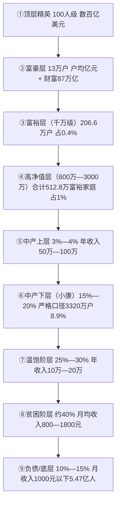

至此，本章已经完成中国九大阶层的逐层画像与横向对比。**最值得记取的核心发现是三组结构性张力**：其一，**财富金字塔顶端的13万亿元级超高净值家庭以0.026%的占比掌握87万亿元财富、占富裕家庭财富的58%**[^40]，财富集中度之高远超出大众直观认知；其二，**号称"中产"的群体内部结构高度分化**——按严格四维标准仅3320万户达标、占8.9%[^46]，按宽口径"年收入20万—50万、净资产80万—300万"则可扩展至15%—20%，二者落差近一倍；其三，**金字塔底层5.47亿人月收入不足千元的国情基线长期稳定**[^51]，与顶端的极端财富形成尖锐对比，决定了中国阶层结构的"金字塔型"本质难以在短期内向"橄榄型"转换。

这九阶层画像为后续研究锚定了清晰的阶梯式坐标。第3章将沿着第④—⑦阶层这一中产敏感带，深入辨析多套中产标准的差异与中产真实规模的测算；第4—6章将聚焦中产群体画像、财力构成、消费行为与困境，回应本研究最核心的问题——**中国到底有多少中产、他们究竟过着怎样的生活**。

# 3 中产阶层的界定标准辨析与实际规模测算

第1章搭建了九阶层复合分层框架与宏观坐标，第2章自顶端至底端逐层勾勒了从508亿美元级超级富豪到月收入不足千元的5.47亿底层的财力图谱。**当镜头从九阶层的两端聚焦回到"中段"，研究的核心问题瞬间变得棘手——在④高净值层与⑦温饱阶层之间，究竟哪一段才是真正意义上的"中产"？多少钱才算中产？中国究竟有多少中产？** 这两个看似简单的问题，在不同机构、不同口径、不同维度下给出的答案差距高达近10倍：从瑞信2015年版的1.09亿、世界银行口径下的4亿—4.6亿中等收入群体，到胡润2025年的3320万户核心中产、汇丰2025年的693万流动资产严格中产，乃至2025年国家统计局-社科院四维标准下"仅有3320万户家庭达标、占全国家庭总数8.9%"——同一个国家、同一个时间点，中产规模的统计图景却如此分裂[^53][^54][^55]。

本章作为中产专题的起点，将完成五件事：系统盘点八大主流机构的中产标准并归纳为四类逻辑，构建"分层分城市"的可操作框架，多口径交叉验证中产真实规模，剖析"统计中产"与"自我认同中产"的落差，并展望2035年8亿中产愿景的可行性。**目的不是给出一个唯一正确的答案，而是建立一套能在不同口径间自由换算、且与第1—2章九阶层框架相互锚定的中产坐标系。**

## 3.1 主流中产标准的多元图谱与逻辑分歧

中产之所以"众口难调"，根源在于全球范围内本就没有一个被普遍接受的统一标准。社科院李春玲指出，"中产阶级"或中国正式官方文献中常提到的"中等收入群体"都没有统一界定标准，瑞士信贷以个人净财富为标尺，《福布斯》以年收入、城市、年龄、学位、职业五项复合标准衡量[^56]。在中国语境下，至少有八家以上代表性机构基于不同的研究目的与机构利益偏好，给出了差异显著的中产口径。

**国家统计局采用的是收入区间型官方标准**，将三口之家家庭年收入10万—50万元（2018年价格）之间的群体定义为中等收入家庭。基于此，2017年起即有测算认为中等收入人口已超4亿，2022年浙江大学李实教授进一步测算中等收入群体规模达到4.6亿人，"是世界上最大规模的中等收入群体"[^57][^58]。该标准换算到人均维度即"月收入超过3000元"——白岩松在央视节目中曾以此口径反问王一鸣："为什么很多人不认自己属于这一群体？"[^59]这一收入门槛的"低端化"是其引发巨大舆论争议的根源。

**中国人民银行系的标准则呈现"双轨"特征**——既有2019年城镇居民家庭资产负债调查所采用的存款分层口径，也有2025年新发布的金融研究所北京中产细则。前者揭示央行2025年二季度数据"能一次性拿出50万现金存款的家庭仅占全国7.6%"，将存款50万视为前10%梯队门槛；后者则给北京中产划了三条硬杠：三口之家年收入≥50万元、家庭金融资产≥100万元、在北上广深有套"干净"的自住房（无贷或贷款余额不超过房价30%）[^60][^61]。

**瑞信/瑞银的国际净财富标准**是全球可比性最强的口径。瑞信2015年版《全球财富报告》以美国为基准国，将拥有5万—50万美元财富的成年人界定为中产阶层，按购买力平价折算后中国对应的财富区间约为18.6万—186万元人民币，据此测算2015年中国中产1.09亿人、首次超越美国位居全球之首[^62][^63][^64]。这一口径有两大方法论创新：一是摒弃"收入"改用"个人财富"，理由是"房二代""自由职业者"等特殊情况无法被收入口径收纳，且失业暂时丧失收入但仍可能拥有金融资产或固定资产；二是上下限设定有明确的经济含义——下限5万美元约为美国税后年收入中位数的两倍（够渡过暂时危机），上限50万美元相当于退休时为体面生活所需积累的最小资产规模[^62]。

**胡润的可支配资产标准**则更贴近中国财富结构。胡润2025年研究报告将中产家庭界定在可支配资产200万至600万元之间，由此得出全国仅3320万户中产家庭、占全国4.94亿户的不到9%[^53]。同时其富裕家庭金字塔体系设定600万为"富裕家庭"门槛、1000万为"高净值家庭"门槛、1亿为"超高净值家庭"门槛——形成中产之上还有四层富裕阶层的精细分层[^65][^66]。

**汇丰银行2025年《汇丰富裕人士年度报告》**则给出了最严苛的中产门槛：基于300名个人流动资产达100万港元以上的中国内地受访者的回答，**他们认为需要693万元人民币的流动资产才能被视为"中产"**——已接近700万[^54][^67][^68]。这一数字的逻辑很简单：按目前1.8%的理财收益算，693万一年被动收入12.4万，刚好覆盖一线城市一个家庭不算奢侈的基本开销；而35万存款一年的利息只有4000多块——交两个月物业费就没了[^54]。汇丰口径直接将"流动资产"作为中产核心标尺，反映出"财富先行者对中产的理解，正从'拥有什么'转向'可支配多少活钱'"[^67]。

**招商银行的银行客户分层标准**则提供了私行视角的"工业化"画像。招行将零售客户分为：金葵花客户（月日均总资产50万元及以上）563.23万户，金葵花及以上客户占比2.6%；私人银行客户（月日均总资产1000万元及以上）共计18.27万户[^69][^70]。该体系实质上以50万和1000万为两个分水岭，将零售客群分为大众、中产+富裕、超高净值三段，是商业银行最具操作性的客户画像工具。

**麦肯锡的新主流消费群标准**侧重消费力维度，将家庭年收入10.6万—22.9万元的群体定为"新主流消费群"，预测到2020年中国51%的城市家庭将进入这一群体[^71]。麦肯锡的核心关注点不在阶层本身，而在消费偏好转变——"该群体更注重品牌的情感因素，对品牌的忠诚度也高"[^71]。

**吴晓波频道《2019新中产白皮书》的复合标准**是民间机构中最完整的画像。其新中产呈现"平均年龄33.7岁、年均收入33万、家庭平均净资产496万元、中位数371万元、平均房贷147万、户均拥有2.4套住房"的精细特征，估计国内新中产人群在2.5亿—3亿人之间，未来10年城市化率提升至70%后将达到4亿[^72][^73][^74]。

下表汇总八大主流机构的中产标准：

| 机构/研究 | 时间 | 核心维度 | 量化门槛 | 测算规模 |
|----------|------|---------|---------|---------|
| 国家统计局 | 2018年价格 | 家庭年收入 | 10万—50万 | 约4亿—4.6亿人 |
| 央行（北京中产） | 2025 | 收入+金融资产+房贷 | 年入≥50万+流动资产≥100万+无贷房产 | 严格口径 |
| 央行（存款分层） | 2025 | 流动性存款 | ≥50万存款进入前10% | 仅占7.6% |
| 瑞信/瑞银 | 2015 | 个人财富 | 18.6万—186万人民币 | 1.09亿人 |
| 胡润 | 2025 | 可支配资产 | 200万—600万 | 3320万户/<9% |
| 汇丰富裕人士报告 | 2025 | 流动资产 | 693万 | 接近高净值层 |
| 招商银行 | 2025 | 银行客户资产 | 金葵花50万+、私行1000万+ | 金葵花563万户/私行18.27万户 |
| 麦肯锡 | 2012预测 | 家庭年收入 | 10.6万—22.9万 | 2020年51%城市家庭 |
| 吴晓波频道 | 2019 | 复合（收入+净资产+消费） | 年收入33万、净资产中位数371万 | 新中产2.5亿—3亿 |

各标准选择背后的机构利益与研究目的差异清晰可辨：**官方机构求覆盖面**（统计局采用宽口径以彰显"扩大中等收入群体"的政策成效）、**银行求高净值**（汇丰、招行私行口径偏严，因为他们的服务对象本就是头部客户）、**咨询机构求消费力**（麦肯锡、吴晓波关注消费品牌触达的目标人群）、**学术与国际机构求多维结构**（瑞信、社科院兼顾资产、教育、职业稳定性等综合维度）。**这意味着任何对中产规模与画像的讨论，必须先声明所采用的口径，否则数字就成了脱离锚点的浮萍。**

## 3.2 四类界定逻辑的方法论比较

将上述八类标准归纳整理，可以提炼出四大类方法论逻辑：收入型、存款/流动资产型、净资产型、综合多维型。每一类都有其适用场景与盲区，理解四者的关系是解读中产规模差异的钥匙。

**收入型口径（以国家统计局为代表）**的优势在于数据稳定、纵向可比、统计成本低，是各国普遍采用的官方标尺。世界银行将中等收入定义为成年人日均收入10—100美元、折算人民币月薪2790—27900元；国家统计局则采用月收入2000—5000元为中等收入组，10万—50万家庭年收入为中等收入家庭[^57][^75]。但收入型口径有三大盲区：**其一，忽略存量积累**——一位月薪3000元但拥有两套房产的退休教师与一位月入3000元的进城务工者收入相同，财富天差地别；**其二，月收入3000元在不同城市的购买力差异极大**——"以北京、上海为例，月入3000元交完房租后所剩不多……在小县城，同样的收入或许更宽裕"[^59]；**其三，工资性收入并非可支配收入**——"到手3000元后真正可支配的部分往往很少，要先扣房贷、车贷、信用卡和消费分期等债务，许多年轻人一半工资用于偿还上月的账单"[^59]。这三大盲区使得"月入3000即中等收入"的官方判断在公众感知中显得严重失真，进而引发"为什么很多人不认自己属于这一群体"的著名追问[^59][^58]。

**存款/流动资产型口径（以央行存款数据、汇丰流动资产门槛为代表）**直击"活钱"安全感这一中产体验的本质。汇丰693万流动资产门槛背后的逻辑朴素而残酷：**当房产等固定资产的变现能力、增值预期大不如前，真正的财务安全与生活自主权，越来越依赖可随时调动、能产生收益的流动资产**[^67][^68]。第1—2章已揭示中国居民资产中住房占比高达47.4%—59.1%，"大量财富被'锁定'"——汇丰的693万门槛正是对这一结构特征的直接回应。该口径的盲区是门槛偏高，将"账面富裕、流动贫瘠"的工薪购房家庭排除在外——按照汇丰严标准，全国能达到的家庭可能不足1%，与公众日常理解的"中产"差距过大[^54]。

**净资产型口径（以胡润、瑞信为代表）**则采用"总资产-总负债"的方式，相对客观地刻画家庭真实财富。胡润300万净资产标准是当前最具操作性的中产门槛，其要点在于：**净资产是总资产减去全部负债后的数字，房子值400万、贷款还剩200万，净资产就只有200万，压根够不着线**[^53][^54]。这一标准既扣除了房贷虚高的杠杆水分，又保留了房产作为家庭财富主要载体的现实意义。但其最大局限是**受房价波动剧烈影响**——2025年全国房地产开发投资同比下降17.2%、住宅投资下降16.3%，房子缩水的速度比很多人想象的要狠得多，大量曾经达标的家庭被动"除名"[^53][^54]。胡润数据显示2024年高净值家庭比2022年峰值减少5.5万户，平均每天有38个家庭跌出门槛——即是这一波动性的直接体现[^65][^76][^77]。

**综合多维型口径（以2025年国家统计局-社科院四维标准、吴晓波新中产白皮书为代表）**最为严格但也最为接近"国际标准中产"。2025年1月发布的《中国家庭收入与财富调查报告》首次以官方口径明确划定四项硬性指标：**家庭年收入至少35万元、净资产超300万元、至少一名成员拥有本科及以上学历、收入来源稳定可持续**[^55]。这一标准制定参考OECD国家经验，同时结合中国房产占比高、区域差异大的特点，将房产净值按70%折算计入净资产；课题组负责人社科院经济研究所研究员张宏宇解释，达标难度数据揭示：**收入门槛35万元是2024年全国城镇家庭中位数14.8万元的2.36倍；25-64岁人口中本科率仅15.8%；金融、IT行业达标率超20%而服务业不足6%**[^55]。综合多维型口径的优势在于兼顾了流量（收入）、存量（资产）、人力资本（教育）、稳定性（职业）四个维度，能够更准确地识别真正具备中产抗风险能力的家庭；其局限是数据采集成本高、标准更新慢，无法用于高频统计。

下表对四类逻辑进行系统比较：

| 逻辑类型 | 代表标准 | 核心优势 | 主要盲区 | 适用场景 |
|---------|---------|---------|---------|---------|
| 收入型 | 国家统计局10—50万 | 口径稳定、官方权威 | 忽略存量、地域购买力差异、可支配比例 | 宏观政策制定、国际比较 |
| 存款/流动资产型 | 汇丰693万、央行50万 | 直击"活钱"安全感 | 门槛偏高、排除工薪购房家庭 | 财富管理、风险评估 |
| 净资产型 | 胡润300万 | 客观扣除负债 | 受房价波动剧烈影响 | 财富分布研究 |
| 综合多维型 | 2025国统局-社科院四维 | 兼顾抗风险能力 | 数据采集成本高 | 严格中产识别 |

**结合第1—2章已确立的九阶层框架，可以建立四类标准与本研究阶层定义的对应关系**：收入型10—50万对应⑥中产下层与部分⑤中产上层、⑦温饱阶层；存款型50万、净资产型300万对应⑥中产下层的资产门槛；汇丰693万对应④高净值层下沿；综合多维型四维标准（年入35万+净资产300万）则恰好定位于⑤中产上层与⑥中产下层之间的临界带——可视为"严格中产"的核心识别口径。本研究采用"宽窄结合"的处理：在涉及中产规模整体测算时使用宽口径（家庭年收入20—50万、净资产80—300万的⑥中产下层+⑤中产上层），在讨论严格中产抗风险能力时使用社科院四维标准。

## 3.3 分层分城市的中产界定框架构建

"一刀切"中产标准在中国遭遇的最大尴尬，是地域购买力的悬殊差异。第1章已揭示**深圳房价收入比34.8倍居首、北京27.3倍，二线城市15—20倍，远超国际4—6倍合理区间；县城房价收入比仅5.1倍**[^78]。这一数据意味着，在北京月入3万的程序员与在县城月入1.2万的公务员，可能有着接近的实际购买力——而前者按宽口径勉强属于中产，后者甚至挤不进国家统计局的中等收入群体。**"当你在一线城市哭穷时，县城的表哥已经换了新车"**——这一互联网叙事背后，是统一中产标尺在中国地理纵深下的根本性失效[^79]。

地域校正的必要性可由三组数据具象呈现：**其一，一线消费在降、县城消费在涨**——2025年上半年北京社消零售总额同比下降3.8%，而2025年乡村消费品零售额增长4.1%，2026年春节三线及以下城市餐饮商户营业额同比增长36.2%[^79]；**其二，县域居民人均可支配收入增速连续5年超过一线城市，2024年达到8.3%，而一线只有5.1%**[^79]；**其三，义乌居民人均可支配收入92852元，超过了四大一线城市；全国GDP千亿县已超过70个**[^79]。此外，**特斯拉县级门店平均单店年销量突破300台，超越北京五环外门店**——这一标志性现象从侧面证明县域消费力已经发生根本性跃升[^79]。

呼应这一现实，2025年新发布的国家中产标准首次按城市分级给出差异化门槛：**一线城市（北上广深）年可支配收入需达到35—50万元、家庭净资产至少200万元、自有住房价值需在300万元以上；新一线城市（成都、杭州、武汉等）年可支配收入要求25—35万元、净资产150—200万元、住房价值200万元以上；三四线城市及以下地区年可支配收入20—25万元、净资产100—150万元、住房价值150万元以上**[^80]。这一分层分城市的思路为本研究提供了重要参考。

进一步对比北京中产与上海中产的双轨细则可以加深理解。北京呈现"双轨制"：宽口径（银行标准）"年入30万+有房就能摸到边"，约38%的家庭年收入能达到30万这条线；严口径（央行标准）"年入50万+百万流动资产+无贷房产"，三条同时满足才算被官方认证的"北京中产"[^61]。而上海则是"全能型"，需要集齐三张门票：**收入门票（三口之家年可支配30—60万）、资产门票（一套无贷自住房市值600万元以上+100万元以上流动资产）、消费与职业门票（家庭年消费支出16万元以上+夫妻至少一方为专业技术或管理类白领+本科以上学历）**[^61]。京沪PK的最大启示是：**在北京体制内身份与房产区位是隐形硬通货，朝阳区80平无贷房的普通科员可能比年入百万但租房住的互联网高管在银行眼里更"中产"**[^61]。

综合上述实证依据，本研究构建分层分城市的中产界定框架如下：

| 城市层级 | 代表城市 | 年可支配收入 | 家庭净资产 | 自有住房价值 | 流动资产辅助门槛 |
|---------|---------|-------------|-----------|-------------|----------------|
| 一线城市 | 北上广深 | 35—50万 | ≥600万 | ≥500万（最好无贷） | ≥100万 |
| 新一线城市 | 杭蓉汉宁苏 | 25—35万 | 300—500万 | ≥300万 | ≥50万 |
| 二线城市 | 省会、计划单列市 | 20—30万 | 200—300万 | ≥200万 | ≥30万 |
| 三四线及县域 | 普通地级市、县城 | 15—25万 | 100—200万 | ≥150万 | ≥20万 |

该框架在保留全国可比性的同时，校正了一线"高收入低净值"伪中产与县域"低收入高净值"隐性中产的双向偏差。**北京月入5万的互联网高管，扣除房贷1.86万、孩子国际学校年学费10万+、老人医疗储备等刚性支出后，结余可能不足3千；而县城月入1.2万的公务员，无房贷压力，可支配收入占比70%以上，反而能"换新车、让孩子上比一线工资还高的兴趣班"**——这正是"为何北京月入5万哭穷、县城月入1.5万却换车"的认知落差解释[^81][^61][^79]。也正是基于这一双向偏差，北京中产、上海中产、县城中产虽然都被称为"中产"，但其生活状态、消费模式与心理认同已经分化为完全不同的社会形态。

## 3.4 多口径交叉验证下的中产真实规模

校准了标准之后，便可回到本章最核心的问题——中国究竟有多少中产？在不同口径下，答案构成了一个跨越近10倍量级的"区间答案"，而非单一数字。**这一区间本身就是研究最重要的发现之一，因为它反映了"中等收入"与"中产阶级"两个概念的根本分野**。

下表系统呈现了主流口径下中产规模的区间差异：

| 测算口径 | 标准核心 | 时间 | 测算规模 | 占比 |
|---------|---------|------|---------|-----|
| 国家统计局月收入3000元+ | 收入型 | 2017起 | 4亿—4.6亿人 | 约30% |
| 麦肯锡新主流消费群 | 家庭年收入10.6—22.9万 | 2020预测 | 51%城市家庭 | — |
| 吴晓波新中产白皮书 | 复合标准 | 2019 | 2.5亿—3亿人 | — |
| 瑞信净财富口径 | 5万—50万美元 | 2015 | 1.09亿人 | 约11% |
| 招行金葵花及以上客户 | 金融资产≥50万 | 2025 | 563.23万户 | 占招行客户2.6% |
| 招行私人银行客户 | 总资产≥1000万 | 2025 | 18.27万户 | 占招行客户0.08% |
| 胡润可支配资产标准 | 200万—600万 | 2025 | 3320万户 | <9% |
| 国家统计局-社科院四维 | 年入35万+净资产300万+本科+稳定 | 2024底 | 3320万户 | 8.9% |
| 汇丰流动资产门槛 | 693万流动资产 | 2025 | 接近高净值层 | <1% |

数据来源：综合各机构公开报告整理[^57][^53][^54][^63][^70][^55][^72][^71]

最宽口径与最严口径之间的差距达到近两个数量级的悬殊。**最宽口径的国家统计局月收入3000元/家庭年收入10—50万标准下，中等收入群体规模约4亿—4.6亿人**——王一鸣在央视上的判断"我们中等收入群体已经超过4亿了，里面大部分还是刚刚迈过中等收入的门槛"正是这一口径的代表性表述[^57][^58]。**最严口径的国家统计局-社科院四维标准下，仅3320万户家庭达标、占8.9%**[^55]——若按家庭平均规模2.5—3人折算，对应人口约8000万—1亿人。**汇丰693万流动资产门槛下，能达到的家庭可能不足1%**[^54]——按4.94亿户折算约500万户量级、对应人口约1500万人。最宽到最严，规模差距高达近30倍。

为何同一概念在不同口径下规模差异悬殊？根本原因在于**"中等收入"与"中产阶级"是两个不同的概念**。中国宏观经济研究院原副院长马晓河明确区分："'中产群体'跟'中产阶层'是两个不同的概念，中国从文件政策上采取'中等收入群体'概念，实际上'中产阶层'概念跟'中等收入群体'概念是有区别的，**一个宽一个窄，'中产阶层'要宽，'中等收入群体'要窄**"——但这里的宽窄并非数量上的，而是维度上的：**中产阶层概念包括收入、财产、教育文化、社会生活等方面，而中等收入仅以收入衡量社会群体。界定中产阶层一定要中等收入者，但中等收入者不一定是中产阶层**[^82]。这一逻辑澄清是理解所有中产规模争议的核心钥匙：**仅看收入流量得到4亿+，加上资产存量得到1亿+，再加上教育与职业稳定性得到3000万+，再加上流动资产门槛得到500万+——每一层附加条件都会过滤掉一大部分人。**

结合第2章九阶层占比数据可以校准本研究的中产规模锚点：**严格中产（对应⑤中产上层）约3%—4%、合计约1500万—2000万户**；**广义中产（⑤+⑥中产下层）约18%—24%、合计约9000万—1.2亿户**；**最宽中等收入群体（⑤+⑥+⑦温饱阶层上半段）约30%—35%、合计约1.5亿—1.7亿户、对应人口约4亿**。这三个层级的数字与前述四类口径的规模分布高度吻合。本研究后续章节涉及中产画像、财力构成与困境分析时，将以**"广义中产9000万户—1.2亿户"为核心研究对象**——既能覆盖足够的样本厚度，又能保留中产应有的资产存量门槛。

值得注意的是，**中产规模的多年演变呈现"快速扩张后增速放缓"的轨迹**。瑞信测算2000年只有占人口3.1%的3910万人属于中产阶层，到2015年快速增长至1.09亿人，麦肯锡曾预测到2025年中国将有占总人口39%的5.5亿人口属于中产阶层——15年间增加了5.1亿[^83]。北京大学经济学院2024年底的研究表明，**中国68%的中产阶级属于中低收入阶层**——这意味着即便扩张迅速，中产内部仍呈现"底端肥大"的金字塔型结构，真正具备较强抗风险能力的"标准中产"和"上层中产"占比有限[^83]。

## 3.5 "统计中产"与"自我认同中产"的认知落差

数字游戏之外，更值得追问的现象是：**为何在统计意义上达标的中产群体大多拒绝"中产"自我认同？** 年收入30万的家庭觉得月光，月入5万的北京白领自称"伪中产"，年薪10万难以启齿——客观标准与主观认同之间存在着系统性的、可被重复验证的背离[^84][^85]。

最直接的实证证据来自西南财经大学甘犁教授的研究。其团队"以瑞信的中产阶级标准来进行测算，不少人觉得总数算多了，自己'被中产'了"，并基于2015年发起的调查发现，**个人年收入超过30万元的人群中，只有约半数认同自己的中产身份**[^86][^56]。瑞信报告本身在发布后也引发"网友怒称被富裕"的强烈反响——"按瑞信标准在中国拥有20万—180万元的财富就可以算做中产，门槛确实不算高"，但**"许多人并不能享受到中产阶层的稳定、体面的感觉，仍然有一种下流化的担忧"**[^87][^64]。

社科院李春玲将这一现象的成因归纳为三大维度，与本研究观察的事实高度吻合：

**第一，资产结构失衡造成的"账面中产、现金贫困"体感**。第1—2章数据已显示，中国房产在城镇家庭总资产中占比约59.1%—77.2%，远高于美国中产家庭40%的水平[^56]。甘犁直接指出："符合中产标准的人之所以觉得自己不是中产，直接原因就是财产中的金融资产比例较低，不动产比例较高，用俗话说就是'手中缺钱花'。**中国目前房地产在家庭总资产中的比例超过60%左右，北京、上海、广州、深圳等一线城市更高一些，因为它们房价更高。住房资产的流动性不好，占用资金多且很难在短期内变现**。而美国中产家庭只有40%的资产压在房子上，跟金融资产占比差不多"[^56]。这一结构性差异决定了中国中产即便净资产数字可观，可调用的"活钱"却严重不足——汇丰693万流动资产门槛背后的逻辑正是对这一现象的回应。

**第二，三座大山的刚性挤压**。住房、教育、医疗合计占家庭总支出近60%。**住房占比近40%（一二线城市租房负担占收入35%—45%、67%购房家庭依赖贷款、43%家庭房贷占收入40%以上、35%家庭月供超月收入一半）；教育占比超20%（城市家庭子女教育支出占总收入25%—35%，新中产平均每年花在单个子女上的教育费用接近10万）；医疗支出五年内平均增速达51.7%、为各类消费支出中最快**[^73][^78]。三大刚性支出对可支配比例的吞噬，使得中产家庭即便收入达标也难以形成储蓄与投资的良性循环，"账上有钱、心里没底"成为普遍体感[^84]。

**第三，安全感与满足感的系统性缺失**。李春玲调查显示，**接近四分之一的中产者声称自己的住房条件太差，接近三分之一的中产者感受到强烈的购房费用压力**[^86]。"中产的压力和焦虑最主要来源于四个方面：购房、子女教育、医疗和养老，其中住房问题是其最大的焦虑"[^86]。她进一步分析，"难以培育出中产心态的主要问题在于安全感和满足感的缺乏，这一方面是因为社会保障水平较低、公共服务质量较差，另一方面是因为过去几十年高速经济增长和急剧社会变迁催生了极强的物质欲望追求"[^86]。

国际比较的视角进一步加深了这一落差的理解。**与当今世界多数国家的中产群体相比，中国中产的实际抗风险能力其实更强，储蓄率和房产拥有率远高于其他国家，但为什么他们经常焦虑？** 李春玲给出的答案是：**"快速的经济增长，与相对滞后的社会、文化、道德价值及政治领域变化演进之间的错位，是中产群体不安全感和焦虑感的深层根源"**[^86]。换言之，中国中产的"被中产"焦虑并非纯粹经济问题，而是经济跃升与制度供给（社保、医疗、教育公平）之间的结构性时滞所致。

吴晓波《新中产白皮书》提供了一个有趣的反向视角。其新中产人均年收入35万、家庭净资产中位数371万，但**56%的财富是房产价值、户均背负147万房贷**[^72][^73]。在一线城市，新中产家庭净资产中位数为477万元，而一套房的平均价值是532万元——**这意味着在一线城市超过一半的新中产家庭拥有的净资产不及一套房产的价值**，他们"在新中产和房奴的身份定位中徘徊"[^74]。这正是统计中产与自我认同中产分裂的最直观写照——账面数字可以达到"白皮书新中产"，但身份感受却是"房奴"。

## 3.6 中产返贫风险与脆弱型中产识别

第2章已揭示中段（中产下层与温饱阶层）负债压力最大、抗风险能力最弱，呈现"中段最高、两端较低"的倒U型分布。本节进一步识别中产群体内部的脆弱型子层，回答**"哪些中产最容易掉队"**这一关键问题。马晓河、宋宪萍、杨修娜等学者关于"脆弱中等收入群体"的研究为这一识别提供了系统框架[^82][^88][^89]。

杨修娜的研究指出，"我国存在大量脆弱中等收入群体"，且"约60%的中等收入群体以工资性收入为主……如果将领养老金的退休人员视为曾经的工薪阶层，那么超过四分之三的中等收入群体为工薪阶层，他们的收入依赖于稳定的就业"[^89]。这一群体的脆弱性可从三个维度刻画：

**第一维度：房贷高杠杆下的资产缩水风险**。第1—2章已揭示中国居民房贷总额突破39万亿元、95%购房家庭依赖贷款、32.7%家庭月供占收入超50%沦为"债务奴隶"[^55]。**2025年全年房地产开发投资同比下降17.2%、住宅投资降16.3%**，过去四年房价累计下跌30%—40%[^53][^54][^90]。中产返贫的研究指出："2018年起因房地产下行、就业疲软与保障缺失而开始萎缩、返贫"——**自2018年中国中产从3%扩至39%的辉煌后，开始出现实质性收缩**[^83]。中央财经大学等机构2026年2月报告显示，**中国房地产的风险目前处在一个临界点——还没跌破阈值的时候看着虽然痛苦但还算可控；一旦越过那条线，问题会迅速放大**[^90]。这种"账面财富缩水+月供刚性还款"的双重夹击，是中产脆弱性的首要来源。

**第二维度：就业不稳定下的收入断流风险**。**2.3亿灵活就业者无完善社保、2025年8月不含在校生的16到24岁青年失业率冲到了近两成、2025年高校毕业生超过1200万**[^90]。"很多以为自己是中产的人，被裁员之后才发现，原来自己离'返贫'只差一张解聘通知书"[^90]。35岁中产"被优化"成常态——**外卖骑手、快递员、网约车司机等群体起早贪黑收入勉强达标，但普遍缺少稳定的社会保障，养老、医疗和失业风险都要自己承担。即便名义收入相同，有社保保障的稳定职工与无保障的灵活用工在安全感上差别巨大**[^59]。北京跑网约车的王师傅"月流水1.2万，扣掉平台抽成与油费到手也就5800块，表面月入过万，兜里剩下的钱并不宽裕"——这是脆弱中产的真实画像[^53]。

**第三维度：三大刚性支出对储蓄的吞噬**。前述住房、教育、医疗三大开支合计占家庭总支出近60%，远超收入增速[^78]。**教育支出涨幅达159%（十年），远超工资150%的增长幅度；医疗支出五年内平均增速达51.7%，为各类消费支出中最快；住房支出占居民财富60%为最大蓄水池**[^78]。当中产家庭储蓄被吞噬殆尽，应急资金无从积累，便彻底失去了中产应有的抗风险能力——这正是"脆弱中等收入群体"的核心特征。

但中产并非完全被动，2025年的最新数据显示中产已开始"主动收缩"以应对脆弱性。**2025年朋友圈出现一张引发热议的账单对比图：左边2024年教育支出36万元，右边2025年21.5万元——整整砍掉了40%**[^91]。一位海淀妈妈的话发人深省："终于想通了，不再当韭菜"[^91]。**广州陈女士退掉了泰国国际学校的报名，原因是测算后发现"学费加生活费一年30万左右，陪读妈妈必须辞职，等于家庭收入直接砍掉一半，孩子读到高中还得再去欧美，加起来小400万的投资，万一孩子毕业后回国月薪8000，这账怎么平"**[^91]。中产的"主动降级"——从教育鸡娃到旅游消费再到品牌选择——本质上是对自身脆弱性的清醒认知与防御性应对，是"主动收缩+被动焦虑"的双重应对模式。

下图刻画了脆弱型中产的三维识别框架：

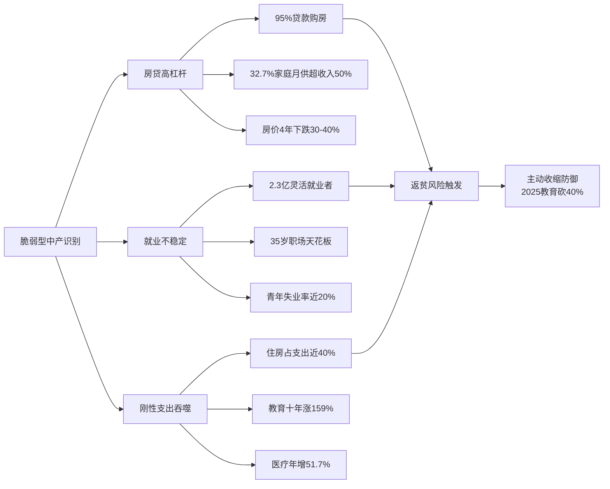

## 3.7 未来10—15年中产规模扩张的可行性路径

与脆弱性形成对照的是国家层面的扩张愿景。**3月4日人民大会堂十四届全国人大四次会议发言人娄勤俭公布"未来十多年我国的中等收入群体可能超过8亿人"**[^92]。**国务院《关于扩大中等收入群体规模的实施意见》提出到2035年把中产比例提升至35%以上**[^53]。中央层面的时间表清晰，但这一目标的可行性需要从经济、制度、人口三大维度审慎评估。

**经济维度：增量空间与现实约束并存**。从绝对增量看，**2002年中国中等收入群体比重仅1.6%，到2021年增长到34.3%**，二十年间从约2000万人扩张至4亿人[^89]。麦肯锡曾预测到2025年中国将有占总人口39%的5.5亿人口属于中产阶层[^83]。中国平安2024年年报援引麦肯锡预测："中国中产阶级规模加速扩大，预计到2030年将占全球中产阶级的三分之一"[^93]。但近期增速明显放缓——根据北京大学经济学院2024年底研究及"中产返贫"判断，**2018年起中产开始出现实质性萎缩**[^83]。要在未来十年从4亿扩张至8亿，需要中产规模再次翻倍——这一速度在人均GDP增速从7%下行至5%的背景下挑战巨大。

**制度维度："十五五"规划与橄榄型分配格局的政策协同**。《中共中央关于制定国民经济和社会发展第十五个五年规划的建议》在指导思想中突出强调"全体人民共同富裕迈出坚实步伐"，并把"分配结构得到优化、中等收入群体持续扩大"列入"十五五"时期经济社会发展的主要目标[^94]。习近平总书记指出："要把扩大中等收入群体规模作为重要政策目标，优化收入分配结构"[^94]。**根据世界银行的标准，一般发达国家有50%—80%的人口属于中等收入群体。为此中等收入群体比例预计要从现在的30%左右提高到2035年的50%以上；从2035年到本世纪中叶要达到70%左右——根据国家统计局数据，目前我国中等收入群体规模大概为4亿人，到2035年将达到7亿人以上，到本世纪中叶则会达到将近10亿人**[^95]。这一阶梯式跃迁的政策协同包括：扩大中等收入群体规模、强化社保、稳楼市促就业、税教改革等。

**人口维度：县域消费力崛起与新主流消费群下沉**。第3.3节已揭示县域消费力的爆发性增长——**全国GDP千亿县超过70个、义乌人均收入超北上广深、星巴克进入1091个县级市场开出8011家门店、特斯拉县级门店年销超北京五环外门店**[^79]。这些迹象表明，新一轮中产扩张的主战场不在已经饱和的一线城市，而在县域与三四线市场。麦肯锡的判断是："新主流消费者主要生活在沿海地区，一线和二线城市……今年新主流消费者家庭只占到14%，接下来8年这一群体将会呈现指数型的增长"——这一预测虽来自2012年但其指数型扩张的逻辑仍在县域兑现[^71]。

但与扩张愿景同时存在的是五大制约因素，需要清醒识别：

| 制约因素 | 具体表现 | 影响机制 |
|---------|---------|---------|
| 收入分配差距高位 | 基尼系数2024年仍为0.462、连续31年超国际警戒线0.4 | 阻碍中等收入群体的形成 |
| 灵活就业群体社保覆盖不足 | 2.3亿灵活就业者社保参与率低 | 无法跨过中产门槛、易跌回低收入 |
| 房产财富缩水冲击中产存量 | 4年房价累计跌30—40%、2025投资降17.2% | 净资产被动除名、资产缩水 |
| 教育与医疗成本压制储蓄能力 | 教育十年涨159%、医疗年增51.7% | 中产无法形成抗风险储蓄 |
| 35岁职场天花板限制人力资本变现 | 中年失业、被优化常态化 | 中产收入流断裂 |

数据来源：综合各章及参考资料整理[^82][^88][^95][^90][^78]

进一步的瓶颈在于**中等收入群体的收入构成不合理**。宋宪萍研究指出："我国高收入群体一般是以财产性收入为主，中等收入群体则是以工资性收入为主。工资增长速度与经济增速密切相关。受新冠肺炎疫情的影响，尽管我国保持经济稳健态势，但是经济增速下滑将对中低收入群体产生更为显著的影响"[^88]。这意味着，**只要中产财富仍以工资性收入为主、财产性收入薄弱，其规模扩张就高度依赖经济增速与就业稳定，难以摆脱周期波动**——这与第1章揭示的全国财产净收入占比仅8.3%的结构性短板完全呼应。

杨修娜进一步指出："**扩大中等收入群体除了要'稳中'更要'提低'，核心是着力提升低收入者的人力资本，加强收入再分配政策的调节力度，重点补上低收入者在基本公共服务均等化方面的短板**"[^89]。这一思路意味着8亿中产愿景的实现路径不能仅仅依靠现有中产的扩大再生产，而必须通过提升低收入群体的人力资本与公共服务均等化，从底端推动金字塔向橄榄型转变。

综合评估，**8亿中产愿景在2035年实现的可能性中等偏下，而在本世纪中叶实现接近10亿的可能性相对较高**。短期（5年内）面临房地产调整、就业承压、教育医疗成本攀升的多重逆风，中产规模可能呈现"先稳后增"的轨迹；中长期（10—15年）随着县域消费力崛起、社保体系完善、税制改革推进，中产规模有望逐步突破5亿—6亿；但要真正实现8亿"标准中产"（具备完整抗风险能力、本科学历、稳定职业、净资产300万以上），则需要至少20年以上的制度建设与代际更替。**中国的中产能否从金字塔走向橄榄型，本质上是一场"提低、扩中、稳富"的系统工程，而非单纯的人口规模扩张**。

至此，本章已完成中产标准辨析与规模测算的全景研究。**核心发现可归纳为三组判断**：其一，**中产规模在不同口径下从最严的500万户到最宽的4.6亿人之间跨越近30倍，这一区间本身揭示了"中等收入"与"中产阶级"的概念分野**——前者仅看收入流量，后者强调资产存量、教育、职业稳定性与抗风险能力四维一体；其二，**广义中产9000万户—1.2亿户、严格中产3320万户、对应人口9000万至4亿不等，将是本研究后续画像、财力与困境分析的核心研究对象**；其三，**统计中产与自我认同中产之间的系统性背离**，根源在于资产结构失衡（房产占比近七成）、三座大山挤压（住房、教育、医疗占支出60%）与制度供给滞后三大结构性原因——这一背离决定了本研究第4—6章必须跳出单一的"数字达标"逻辑，深入刻画中产的内部分层、真实财力构成与脆弱性根源。下一章将沿着这一研究路径，进入中产群体画像的精细解析。

# 4 中产阶层群体画像与内部结构特征

第3章已经在多套口径的辨析中锁定了本研究中产研究的核心边界——**广义中产9000万户—1.2亿户、严格中产3320万户**。但规模数字回答的只是"有多少"，无法回答"是谁、长什么样、内部如何分化"。如果说第2章九阶层逐层画像构成了纵向的"阶梯坐标"，那么本章则要为镜头聚焦后的中产群体绘制一幅高分辨率的"群像画"：他们多大年纪、什么学历、做着什么职业、住在哪些城市、家庭如何组织、内部又如何细分。这一群像画并非装饰性的人物素描，而是**理解第5—6章中产财力构成与困境根源的前提**——只有先看清"中产是哪些人，他们的人力资本、就业赛道、家庭生命周期处于什么位置"，后续关于"为何房产占资产近七成""为何35岁危机如此致命""为何鸡娃投入高达年均10万"等问题才能落到具体的人身上。本章将沿着人口学—职业—地域—家庭—内部分层五大维度展开，并在收尾处归纳出"大而不强、底端肥大"的金字塔型内部结构这一核心判断。

## 4.1 中产阶层的人口学特征：年龄、学历与性别结构

中产群体在人口学维度上呈现出高度结构化的分布——这种结构化并非随机分布，而是中产形成所必需的"年龄积累+教育准入+双职工支撑"三大门槛筛选的结果。

**年龄维度上，35—55岁是中产的绝对主力军**。第3章已援引的数据显示，**中产阶级中35—50岁人群占比高达67.3%**[^96][^97]，这一年龄段恰好处于职业发展的黄金期，工资性收入达到峰值，配合15—20年的资产积累足以跨过中产门槛。与此形成鲜明对照的是，**35岁以下家庭因资产积累不足，达标率仅12.7%**——这一数据点揭示了一个被互联网"年轻精英"叙事掩盖的事实：单凭收入流量难以快速跃入中产，**中产是一个时间累积型的身份**。

这一规律可以从两个层面进一步解释。其一，在收入层面，2024年北京市统计局数据显示居民人均可支配收入按四口之家年化约41.2万元，距离一线城市中产标准仍有差距[^98]——这意味着即便在北京这样的高收入城市，中产收入门槛也需要至少夫妻双方都达到较高薪资水平才能企及，而年轻群体起薪有限、加薪曲线尚未陡峭抬升。其二，在资产层面，中产的300万—600万净资产门槛极度依赖于一套购置较早、已偿还部分本金的核心城市房产，这一资产积累几乎不可能在30岁之前完成。**新中产白皮书数据显示新中产平均年龄33.7岁、出生年份段圈定在1980—1997年之间**[^99]——这一年龄区间的下沿（28岁）已经是新中产能"摸到边"的最年轻时点，而真正稳固的中产则要等到35岁以后。

值得关注的反向现象是中产年龄结构的"老化趋势"。当前中国80后已步入不惑、90后已经而立[^100]，按2024年达标率推算的"35—55岁中产主力军"实质上是1969—1989年间出生的群体——他们享受了改革开放以来最长的经济增长红利与房价上涨红利。但**到2030年，70后将整体进入退休行列**[^100]，新中产的年龄重心将逐步下移至80后、90后。考虑到80后家庭平均负债率达65%、90后可支配收入中78%用于消费、储蓄率明显偏低[^100]的代际差异，**中产年龄重心下移可能伴随中产抗风险能力的整体下移**——这是后续讨论中产脆弱性时不可忽视的代际背景。

**学历维度上，本科及以上是中产的"硬性准入证"**。多份独立来源的数据高度一致地指向同一结论：**中国中产阶级的平均教育水平明显高于全国平均水平，64%的中产阶级拥有大专及以上学历，而全国大专及以上学历的人口比例仅为23%**[^101]；2025年新发布的中产标准更是将"家庭中至少有一人具有本科及以上学历"列为五项硬性指标之一[^98]；2025年国家统计局-社科院四维标准则要求"至少一名成员拥有本科及以上学历"。**全国25—64岁人口中本科率仅15.8%**这一数据，与中产阶层中本科及以上占据主导地位形成鲜明对照——中产实际上是中国教育金字塔上端约16%人口在职业市场上的财力变现。

吴晓波频道《2020新中产白皮书》数据进一步验证了这一壁垒：**新中产中有7成是本科或专科学历**[^102]，2023年新中产白皮书将"个人年收入高于12万元、家庭年收入高于20万元、拥有自己的住房和车辆"作为经济门槛[^99]，而能跨过这三条门槛的群体几乎清一色具备较高的学历背书。这一现象的深层原因在于：**中产收入的核心来源——金融、IT、医疗、教育文化、专业技术等行业——本身就是高度依赖正规教育与专业认证的行业**，本科以下学历在这些赛道上遭遇的天花板足以将相当数量的从业者挡在中产门槛之外。

但学历壁垒也呈现出令人警醒的"通胀化"趋势。**截至2025年3月，我国高等教育毛入学率已达到60.5%**[^98]，意味着90后、00后中超过一半将获得高等教育文凭，但**35岁以上人群中本科及以上学历的比例仅为23.7%**[^98]——存在20—40个百分点的代际跃升。这一"学历通胀"在中产门槛上意味着：**对未来的新生代中产而言，本科已不再是稀缺资源，硕士、博士、海外背景将成为新的准入符号**——这与第6章将讨论的"中产再生产成本不断上升"的逻辑形成呼应。

**性别与代际维度上，双职工模式与女性职场参与度上升塑造了新型中产家庭结构**。吴晓波《2020新中产白皮书》数据显示，**85后和90后即35岁以下的年轻新中产总占比为50%**[^102]，意味着新中产已经实质性完成了从60后、70后向80后、90后的代际更替；2023年白皮书将新中产的出生年份段圈定于1980—1997年之间[^99]，进一步明确了"80—90"双代主导的时代特征。

更具结构性的变化来自于女性的职场角色重构。**智联招聘《2026中国女性职场现状调查报告》显示，2026年女性平均月薪达到9299元，超半数（50.3%）女性表示"不可能"或"不太可能"为了家庭放弃事业，其中00后、95后等年轻一代女性的事业决心更为坚定**[^103]；**23.5%的女性将收入用于自身学习深造，其在精神消费（33.8%）、储蓄理财（25.8%）等方面的投入占比也均高于男性**[^103]。这一系列数据指向一个明确的结构性事实：**新中产家庭的"双职工双收入"已从一种生活选择演变为一种结构必然**——单职工模式在一二线城市35万—50万的中产收入门槛面前几乎不可持续，女性收入贡献成为中产维持现有生活水准的核心支柱。

但与女性职场地位上升同时存在的，是**职场"隐形筛选"的持续——60.9%的女性曾被询问婚育情况、12.6%的女性因"性别歧视"影响晋升、32.1%的女性在31—35岁的婚育阶段便开始感知到危机**[^103]——这意味着新中产家庭中女性的中产身份维持高度依赖于"婚育—职业"的脆弱平衡，一旦育儿压力或婚育歧视压垮职业线，整个家庭的中产身份都将面临崩塌风险。这正是第6章中产困境与脆弱性分析的关键性别视角。

## 4.2 职业构成与行业集聚：中产的"造富赛道"

如果说人口学特征定义了"谁有资格成为中产"，那么职业与行业则定义了"在哪条赛道才能成为中产"。中产群体的职业分布呈现出极强的行业集聚性，这一集聚的程度远超出社会大众的直观认知。

**行业层面，五大赛道占据近97%的中产份额**。根据2025年国家统计局相关数据分析，中产阶级主要分布在五大行业：**互联网科技占比28.6%、金融投资23.4%、医疗健康16.7%、高端制造业15.3%、教育文化12.8%——这五大领域的从业者占据了近97%的中产阶级群体，其他行业仅占3.2%**[^97]。这一97%的极端集聚意味着，**对于绝大多数从事服务业、传统制造业、零售业、农业的就业者而言，单凭工资性收入跨入中产几乎是不可能完成的任务**——行业的天花板已经先于个人努力锁定了财富的上限。

进一步的薪酬分布数据印证了这一论断。**智联招聘《2025年中国职场薪酬调查报告》显示，金融行业平均年薪达到31.7万元、IT行业平均年薪29.5万元、医疗行业医生平均年薪26万元**[^98]——金融与IT行业平均水平已经直接踩在了三四线中产年收入门槛（25万）之上，意味着这两个赛道的从业者天然具备更高的中产达标率。吴晓波频道《2023新中产白皮书》数据更具体地揭示了行业内部的薪酬天花板：**IT软件和互联网行业新中产中达到年薪百万的比例最多，占比为21.4%；其次是医药/医疗（12.5%）和能源化工（9.1%）；而旅游/交通、政府部分事业单位、服务业、文教传媒行业收入相对一般**[^99]。

与新经济造富赛道形成对照的是传统制造业的相对衰落。**2025年新发布的中产研究指出，金融、IT等行业的中产家庭占比超20%，传统制造业则不足10%，且新兴行业如人工智能、生物医药从业者收入较传统行业高出85%—120%**——这一近乎翻倍的薪酬鸿沟揭示了一个残酷的现实：**在过去十年间，"行业选择"对个人财富积累的影响已经远超"个人努力"**。两位同等学历、同等勤奋程度的本科毕业生，若一位进入互联网/金融、一位进入传统制造或服务业，十年后的家庭财富差距可能达到3—5倍。

**职业层面，三大类岗位构成中产核心图谱**。中产阶级主要集中在管理岗位、专业技术岗位和办事人员三类职业中[^101]——这一职业分布与陆学艺十大阶层论中的"白领五职业"高度吻合（党政官员、企业经理人员、私营企业主、专业技术人员、办事人员合计占适龄社会人口15.9%[^104]）。具体到职业谱系，公务员事业编、教师医生、工程师、金融分析师、程序员构成中产的核心职业图谱，**随着产业结构的升级和"互联网+"的发展，越来越多的新兴职业如程序员、金融分析师等也开始跻身中产阶级行列**[^101]。

值得专门拆解的是中产职业图谱中"体制内"与"体制外"两条平行轨道的并存。**体制内中产**（公务员、事业编、国企中高层、医院教师等）以稳定性见长，其工资性收入未必出众，但隐性福利（住房补贴、医疗保障、子女教育资源、退休金体系）构成了真正的"隐形中产护城河"——前述北京中产标准中"朝阳区80平无贷房的普通科员可能比年入百万但租房住的互联网高管在银行眼里更'中产'"的判断正是这一逻辑的体现。**体制外中产**（IT工程师、金融从业者、专业人士、企业中层）则以高薪酬、强流动性见长，但面临35岁职场天花板、行业周期波动、社保覆盖薄弱等结构性脆弱性——**很多以为自己是中产的人，被裁员之后才发现，原来自己离"返贫"只差一张解聘通知书**这一现象主要发生在体制外中产群体中。

**新经济维度上，新一代中产的崛起与传统中产的相对衰落同步进行**。智联招聘《2019新中产白皮书》指出，**作为新中产主体的80、90后，其职业分布在金融与互联网领域更为集中**[^105]；2023年新中产白皮书进一步揭示，**金融行业、IT软件和互联网行业、制造业以及房地产/建筑行业是汇集新中产最多的行业**[^99]。但2025年的数据已经显示出明显的赛道更替——**人工智能、生物医药、跨境电商等新赛道催生新一代中产**，而曾经的房地产中产、传统媒体中产已经不可避免地走向下行。这种"新赛道—旧赛道"的代际更替将在第7章关于阶层流动的讨论中得到更深入的剖析。

下表汇总了中产职业与行业分布的核心数据：

| 维度 | 关键数据 | 对中产影响 |
|------|---------|----------|
| 行业五强占比 | 互联网28.6%+金融23.4%+医疗16.7%+高端制造15.3%+教育文化12.8%≈97% | 行业选择决定中产准入 |
| 行业薪酬鸿沟 | 金融31.7万、IT 29.5万、医生26万年薪 | 高薪行业本身已踩在中产门槛 |
| 新旧行业差距 | 新兴行业较传统行业高出85%—120% | 赛道差异远超个人努力 |
| 年薪百万比例 | IT 21.4%、医药12.5%、能源化工9.1% | 仅特定行业能催生上层中产 |
| 传统制造业 | 中产占比不足10% | 工业大国但工业难造中产 |

数据来源：智联招聘《2025年中国职场薪酬调查报告》、吴晓波《2023新中产白皮书》、2025年国家统计局相关研究综合整理[^98][^99][^97]

## 4.3 地域分布与城市层级：东部偏向与县域崛起的双向张力

中产的空间分布几乎是九阶层全图谱中地理集聚程度最强的——这一集聚既是过去四十年区域经济发展不平衡的累积结果，也是未来中产扩张的关键约束。

**地域层面，东部三大经济圈占据中产绝对主导**。多份独立数据来源高度一致地指向同一结论：**中国中产家庭呈现明显的区域不平衡特征，约70%的中产家庭集中在东部沿海地区，其中广东、江苏、山东、浙江四省的中产家庭数量最多，合计超过1000万户**[^101]；**全国中产家庭主要集中在东部沿海省份和一线城市，北京、上海、广东、浙江、江苏五地的中产家庭数量占全国总数的52.3%**[^98]。具体数据为：**北京约268万户中产家庭、占全市家庭总数的30.5%；上海约312万户、占32.7%；广东约485万户、占12.8%；浙江约367万户、占15.9%；江苏约304万户、占10.3%**[^98]。

与东部主导形成尖锐对照的是西部地区的中产稀薄。**西部地区的贵州、甘肃、宁夏等省份的中产家庭比例均不足3%**[^98]——这意味着在这些省份每30—50户家庭中才能找到1户中产，而在北京、上海每3户就有1户跨过中产门槛，**地域间的中产密度差距高达10—15倍**。这一空间分化的根源在第1—2章已揭示：**全国仅8个省份居民人均可支配收入达到全国平均线，超过7成省份未达全国线；甘肃2024年人均可支配收入仅约为上海的30%；东、西部地区人均可支配收入相差超19000元**——收入流量端的省际鸿沟直接转化为中产存量端的地理失衡。

第五次全国经济普查数据则从产业基础角度印证了这一空间格局：**2023年末东部地区拥有第二产业和第三产业法人单位1794.1万个、占全国53.9%；中部733.4万个、占22.0%；西部637.2万个、占19.2%；东北162.3万个、占4.9%**[^106]。**广东省以465.9万个法人单位居首占14.0%，江苏290.7万个占8.7%，山东278.5万个占8.4%**[^106]——产业活动单位是中产就业岗位的供给方，企业密度的地理分布几乎决定了中产岗位的地理分布。

**城市层级上，呈现"金字塔倒立"的极端集中**。2025年国家统计局数据显示中产阶级的城市层级分布为：**一线城市（北京、上海、广州、深圳）占比高达42.7%，新一线城市（如杭州、成都、南京等15个城市）占比35.3%，二线城市占比18.6%，三四线及以下城市仅占3.4%**[^97]。**这意味着中国真正的中产阶级主要集中在不到30个大城市**[^97]——一线+新一线合计78%的占比，与其在全国总人口中约25%的比重形成5—6倍的"过表达"。

这一城市层级集中度有其深层经济逻辑：**中产岗位（金融、IT、专业技术、企业管理）天然依赖于产业集聚、人才集聚、资本集聚的"三聚效应"**，而这些资源在中国的空间分布高度向一线与新一线城市集中。一个简单的对照是，**北京拥有117.9万个法人单位、占全国3.5%**[^106]，仅常住人口占全国不足2%的北京，其中产岗位密度却远高于这一比例。

**但县域消费力的崛起正在改变这一空间格局**。第3章已系统呈现了县域消费力的爆发性增长——县域居民收入增速连续5年超过一线城市、70多个GDP千亿县涌现、义乌人均收入超过北上广深等。这一趋势的本质是**新一轮中产形成的主战场正在从已经饱和的一线城市向县域市场下沉**。

县域中产崛起的几个关键支撑点值得特别关注。其一，**县域购房压力远低于一线城市**——县城房价收入比仅5.1倍，远低于深圳的34.8倍、北京的27.3倍，这意味着县域家庭达到中产净资产门槛的难度显著低于一线。其二，**县域产业升级催生本地中产**——长三角、珠三角的产业链向县域扩散、新能源汽车产业链下沉、跨境电商在县域的爆发，使得县域出现了一批高薪本地就业岗位。其三，**县域生活成本与中产标准的匹配度更高**——三四线城市25万年收入即可达到中产标准[^98]，而同样收入在一线城市仅能勉强糊口。

**东部主导与县域崛起共同构成了中国中产空间分布的双向张力**。一方面，传统中产存量仍高度集中于一线与新一线，这一格局在未来10年难以根本改变；另一方面，增量中产可能更多地从县域与三四线城市孕育，**未来中国中产规模能否从4亿扩张至8亿，关键不在于一线城市的中产再扩张，而在于县域市场能否承接新一轮中产形成**。这一双向张力将在第8章关于政策启示的讨论中得到更深入的延展。

下图刻画了中产空间分布的双层结构：

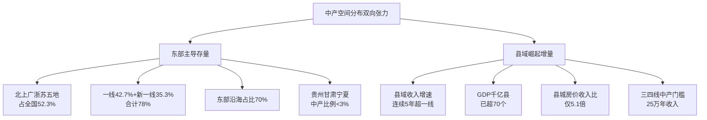

## 4.4 家庭结构与生命周期特征

中产之所以被称为"中产"，不仅因为收入与资产位于中段，更因为其家庭结构呈现出鲜明的"双职工核心家庭+三明治压力+高负债"复合特征——这一特征是理解中产财力构成与困境的关键家庭学背景。

**家庭构成上，新中产以80后90后双职工核心家庭为主**。第3章及前述章节已援引的数据显示，新中产平均年龄33.7岁、出生年份段圈定于1980—1997年之间[^99]，85后和90后年轻新中产总占比为50%[^102]——这意味着新中产家庭的核心成员几乎清一色处于"上有老、下有小"的中年阶段。**胡润数据显示中国高净值家庭平均拥有4.4名成员**，但这一数字主要反映的是顶端富裕家庭的多代同堂结构，**广义中产家庭的核心结构则是3—4人的"夫妻+1—2子女"核心家庭**，与父母辈通常分户居住但保持密切经济联系。

**生命周期上，35—55岁中产正处于"上有四老、下有学龄子女"的三明治期**。这一三明治压力在中国语境下被显著放大，原因有四：其一，**中国60岁以上人口已突破3.2亿，占总人口的22.8%；到2030年中国老年抚养比将达到50%，意味着每两个劳动年龄人口就要"养活"一位老人**[^100]——中产家庭面临的父母辈赡养压力远高于人口结构相对均衡的发达国家；其二，**70后群体中有35%的人养老金缺口超过100万元**[^100]，使得部分中产不得不直接承担父母的养老资金缺口；其三，**80后家庭平均负债率达到65%、90后58%**[^100]，房贷与子女教育支出占据可支配收入的相当比例；其四，子女教育"军备竞赛"持续升级，**新中产平均每年花在单个子女上的教育费用接近10万**——这一开支贯穿义务教育全程。

**财务角色上，高负债与房产高占比是中产家庭最具标识性的特征**。吴晓波频道数据系统揭示了这一财务画像：**新中产户均拥有2.4套住房、户均背负147万房贷、家庭净资产中位数371万、56%的财富沉淀于房产**[^102]。**新一线城市中有73.37%的新中产配置了投资性房产，但在一线城市这一比例只有63.88%**[^102]——这一反向差异并非新一线中产更富裕，而是因为**一线房价高、单套总价高，投资性房产的购置门槛已经超过相当部分一线中产的能力上限**，反倒是新一线城市的相对低房价让中产更容易实现"两套甚至多套房"的资产配置。

更值得警惕的是，**75.69%的新中产个人年收入集中在10万—50万元，年收入过百万的新中产仅有5.54%**[^102]——这意味着绝大多数新中产的工资性收入并不足以支撑其名义上"千万资产"的财务体面，**147万房贷与50万以下年收入的对比，揭示了中产财务结构的高杠杆本质**。这一高杠杆既是中产身份的"积累工具"（通过房贷锁定房产升值），也是中产身份的"达摩克利斯之剑"（一旦收入波动便可能资不抵债）——这一双重性将在第5—6章中产财力构成与困境分析中得到更深入的剖析。

**女性角色上，超半数女性不会因家庭放弃事业，双职工双收入成为中产维持现有生活水准的必要条件**。第4.1节已援引的智联招聘数据显示**50.3%的女性表示"不可能"或"不太可能"为了家庭放弃事业**[^103]，这一职业坚持的背后既有女性主体意识增强的进步动因，也有中产家庭财务现实的客观倒逼——**单职工模式难以支撑中产开销已经成为新中产家庭的共识**。

但双职工模式的脆弱性同样不容忽视。**面对社交媒体上频繁涌现的性别议题，35.6%的女性能够理性看待其"利弊兼有"的影响**[^103]，反映出女性对自身职业风险有清醒认知；**32.1%的女性在31—35岁的婚育阶段便开始感知到危机，而同阶段男性感到危机的比例仅为15.9%**[^103]——意味着中产家庭中女性的中产身份维持比男性提前5—10年遭遇瓶颈。一旦育儿压力或婚育歧视压垮女性职业线，整个家庭的双职工结构便会坍塌为单职工结构，月度家庭收入腰斩，房贷与教育支出立刻陷入紧张——**这是新中产家庭财务体系最容易被忽视的"性别脆弱性"**。

下图刻画中产家庭的"三压力一支柱"结构：

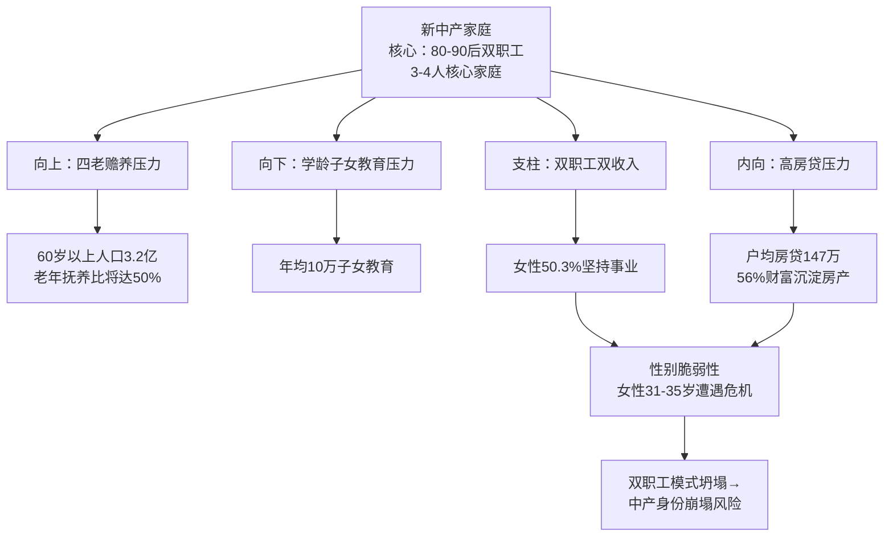

## 4.5 中产内部三层级的差异化画像：精英、小康与新中产

第3章已建立宽窄结合的中产识别口径，本节进一步将中产细分为三个层级：**中产精英层、小康中产层、新中产/入门中产**——这一三层细分对应第2章九阶层框架中的⑤中产上层与⑥中产下层，以及⑦温饱阶层中部分自我认同为"新中产"的子群。

**中产精英层（约580万户）**对应第2章⑤中产上层及部分高净值层的下沿，是最接近"国际标准中产"的子层。根据2025年北京金融研究院《中国家庭财富调查报告》，**中产精英层可投资资产在300万—1000万元之间、年收入在150万—500万元、全国约580万户家庭达到这一标准、占比约1.1%**[^107]。该群体职业归属多为**企业高管、成功创业者或高级专家，通常在大城市拥有多套房产，生活品质较高，但仍需工作维持生计**[^107]。这一层级的标志性特征是**压力从"挣钱"转向"管钱"**——上海某投资公司总监张女士的案例颇具代表性，她拥有约800万元可投资资产、年收入约320万元，**坦言压力并未因财富的积累而减少，只是从"挣钱"转变为"管钱"，需要关注资产保值增值、子女海外教育及家族财富传承等问题**[^107]。

需要特别说明的是，参考资料中给出的中产精英层"可投资资产300万—1000万、年收入150万—500万"标准[^107]显著高于第3章九阶层框架中⑤中产上层"年收入50—100万、净资产300—600万"的口径。这一差异源于**北京金融研究院将"中产精英"作为"小康富裕层"之上的层级定义，已经超出了本研究中产边界、跨入高净值层范畴**。本研究为保持与第2—3章口径的一致性，采用更宽泛的"年收入50万—100万、净资产300万—600万、可投资资产300万—1000万"作为中产精英层的复合识别标准——既包括北京金融研究院的严格口径群体，也包括稍低一档但仍具备中产精英特征的家庭。综合估算这一层级在全国约500万—700万户量级、占全国家庭总数3%—4%。

**小康中产层（约3320万户）**对应第2章⑥中产下层，是2025年国家统计局-社科院四维标准下最严格意义上的"中产"。**截至2024年底，全国仅有3320万户家庭达到"家庭年收入35万元以上、净资产超300万元、至少一名成员拥有本科及以上学历、收入来源稳定可持续"四项核心指标，占总家庭数的8.9%**——该层级职业归属以**企业中层、专业技术人员、教师医生、公务员事业编**为主，**依赖工资性收入、房贷压力沉重**是其最具识别度的财务特征。

按家庭年收入20万—50万的稍宽口径估算，小康中产层规模可扩大至约5000万—8000万户，对应人口约1.5亿—2.4亿——这一规模差异恰好反映了第3章揭示的"严格中产vs广义中产"的口径分歧。从典型画像看，**家庭月收入约1.5万元的二线城市制造业技工+商场导购组合（小赵案例），购置85平米小三居但背负较大贷款压力，孩子参加课外英语班，尽管生活逐渐稳定但进一步提升生活质量困难重重**[^96]——这是小康中产的典型生活状态，**消费有所升级但不敢轻易涉足高风险投资，追求稳定中求发展但抗风险能力较弱，最大的梦想是供孩子读完大学、将来过上中产生活**[^96]。

**新中产/入门中产**是吴晓波频道定义最具代表性、公众认知度最高的子群。其经济定义为**同时满足"个人年收入高于12万元""家庭年收入高于20万元"以及"拥有自己的住房和车辆"3条标准**[^99]，相比小康中产门槛明显放宽。**新中产以80后、90后年轻白领为主、年收入集中10—50万、仅5.54%过百万**[^102]——这一群体规模庞大但财力薄弱，往往处于"够得着中产标签但够不稳中产门槛"的临界状态。

新中产层级最典型的财务特征是**"高负债+追求精神富足"的二元张力**。一方面，新中产户均背负147万房贷、56%财富沉淀于房产[^102]，财务结构高度脆弱；另一方面，**新中产们在追求物质之外，更追求精神层面的富足，用更出色的方式助力行业发展，工作不再仅仅是简单的谋生手段，更是自我价值实现的一种途径**[^105]。这种"账面紧张、精神追求"的二元张力，使得新中产成为消费市场上最具特色的群体——既精打细算（"新节俭主义"兴起、强调买买买性价比[^102]）又局部挥霍（精神消费、教育投入、品质生活），是第5章中产消费分析的核心研究对象。

下表系统对比中产内部三层级的差异化画像：

| 维度 | 中产精英层 | 小康中产层 | 新中产/入门中产 |
|------|----------|----------|---------------|
| 估算规模 | 约500万—700万户 | 约3320万户（严格）—5000万户（广义） | 2.5亿—3亿人量级 |
| 占全国比例 | 3%—4% | 8.9%—15% | 18%—24% |
| 家庭年收入 | 50万—100万（含部分150万+） | 20万—50万 | 12万—33万 |
| 家庭净资产 | 300万—1000万 | 80万—300万 | 中位数371万（高度依赖房产） |
| 核心职业 | 企业高管、高级专家、合伙人 | 企业中层、专业技术、教师医生 | 80/90后白领、IT/金融从业者 |
| 资产结构特征 | 多套房产、初步多元化 | 1—2套房产、76%财富沉淀房产 | 户均2.4套住房、56%沉淀房产、户均147万房贷 |
| 主导财务议题 | 资产保值增值、子女海外教育、财富传承 | 房贷偿还、子女鸡娃、四老赡养 | 攒首付、月供压力、副业开拓 |
| 抗风险能力 | 中等偏强 | 弱 | 极弱 |
| 心理特征 | 压力从"挣钱"转向"管钱" | "拿着中产收入、过着工薪日子" | "新中产+房奴"双重身份徘徊 |

数据来源：综合北京金融研究院、国家统计局-社科院四维标准、吴晓波《新中产白皮书》历年数据、2025年中产相关研究整理[^96][^107][^99][^102]

## 4.6 "大而不强、底端肥大"的金字塔型内部结构

综合前述五个维度的画像，可以得出本章最具结构性的核心判断：**中国中产群体内部呈现"金字塔型"而非"橄榄型"结构**。这一判断意味着，即便我们将研究镜头放大到中产群体内部，仍然能看到与第1—2章揭示的全国阶层结构同构的"塔尖瘦、塔身宽、塔基大"形态——**中产并非铁板一块，其内部财力梯度的悬殊程度与社会整体的财富分化几乎同样剧烈**。

**第一组结构性证据：北京大学经济学院2024年底的研究表明中国68%的中产阶级属于中低收入子层**——这一数据直接刻画了中产内部的"底端肥大"特征。如果按本节4.5节的三层细分，则**中产精英约580万户仅占严格中产总量的17%（580/3320），按广义中产口径占比甚至更低；小康中产约3320万户构成主体；而新中产入门层规模庞大但财力薄弱，其中相当部分实际上未能跨过严格中产门槛**。这一比例分布与第2章揭示的九阶层金字塔结构（占比0.4%的千万级、占比1%的高净值层、占比3%—4%的中产上层、占比15%—20%的中产下层）形成精确对应——**中产内部的层级分布几乎是九阶层全图的微缩复制**。

**第二组结构性证据：按净资产口径剔除房贷后能称为"标准中产"的家庭可能不足1000万户**。第2章已援引的对照数据显示——**一套500万的房子+350万房贷+20万存款=170万净资产，仍属"工薪阶级"而非中产；真正净资产600万以上的中产可能仅占总人口的1%—2%**。这意味着按收入口径有3320万户家庭达到中产标准，但按净资产剔除负债后能称为"标准中产"的家庭可能不足1000万户——**两个口径之间存在3—5倍的"伪中产折损率"**。

这一"伪中产"现象的本质，是**中国中产积累路径过度依赖于"房贷杠杆+房价升值"的单一通道**。新中产户均2.4套住房、户均147万房贷的资产结构[^102]，使得"资产规模可观"与"流动性脆弱"成为中产财务的双面共生。一旦房价进入下行通道（第1章已揭示2025年全国房地产开发投资同比下降17.2%），曾经的"账面中产"可能在数年内被动除名——这正是第3章关于中产返贫风险讨论的核心机制。

**第三组结构性证据：从代际流动看，中产二代继承明显但代际跃升通道收窄，35岁以下达标率仅12.7%**。这一数据揭示了中产再生产的代际困境——**对于已经达到中产的家庭，其子女继承中产身份的概率较高（通过教育投入、家庭房产、社会关系网络的代际传递）；但对于尚未跨入中产的年轻群体，仅凭个人奋斗在35岁前跨入中产的概率仅12.7%**。这意味着**中产的扩张越来越依赖于"中产二代"而非"白手起家"，阶层流动从"自下而上"转向"代际继承"**——这一转向是金字塔型结构难以向橄榄型转换的深层原因。

**第四组结构性证据：中产内部的地理金字塔与行业金字塔进一步加剧"大而不强"**。从地理分布看，一线42.7%+新一线35.3%的极端集中意味着**78%的中产挤在不到30个大城市**[^97]，承担着这些城市最高的生活成本与最大的房贷压力；从行业分布看，**金融、IT、医疗、高端制造、教育文化五大行业占据近97%的中产份额**[^97]，意味着中产群体高度依赖于这五个行业的景气度——**任何一个行业的周期下行（如近年IT行业的裁员潮、教培行业的政策出清、地产行业的整体调整）都可能引发大规模的中产返贫**。

综合上述四组结构性证据，"大而不强、底端肥大"的金字塔型内部结构呈现出清晰的特征图谱：

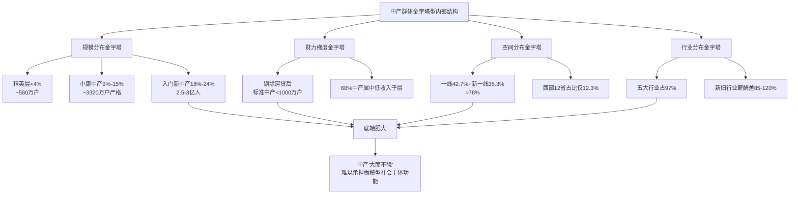

这一金字塔型内部结构对中国社会的整体演进有着深远影响。第1章已援引的"橄榄型社会"理论指出，**中产阶层是维系橄榄型社会稳定的基础性力量，他们是沟通精英和底层的桥梁和纽带，庞大的中产意味着整个社会财富分配较平均、社会经济资源分配相对合理**[^108]。但若中产内部本身呈金字塔型分布，则其作为"沟通桥梁"与"稳定器"的功能将被严重削弱——**真正具备稳定抗风险能力的中产精英仅约580万户，而绝大多数小康中产与新中产实际上"上不能进入精英阶层、下随时可能滑落至温饱阶层"，处于一种结构性焦虑状态**。

这一判断与第3章关于"统计中产与自我认同中产落差"的讨论形成了完整的逻辑闭环：**为何统计意义上的中产大多拒绝中产自我认同？因为他们清醒地意识到自己处于中产金字塔的底端，距离真正稳固的中产精英层尚有数倍的财力鸿沟，距离向下滑落至温饱乃至贫困阶层却仅有一次失业、一场大病、一轮房价调整的距离**。

至此，本章已完成中产群体画像与内部结构的系统刻画。**核心发现可归纳为三组判断**：其一，**中产群体在人口学上呈现"35—55岁主力+本科以上学历+80—90后双职工"的高度结构化分布**，这一结构既是中产形成的代际积累规律，也是中产身份维持的脆弱性根源；其二，**中产职业与空间分布呈现"五大行业占97%+一线新一线占78%+东部三大经济圈占70%"的极端集聚**，这一集聚使得中产成为一个高度依赖特定赛道与特定城市的群体；其三，**中产内部三层级（精英、小康、新中产）呈现"大而不强、底端肥大"的金字塔型结构**，68%的中产属于中低收入子层、按净资产剔除房贷后真正的标准中产可能不足1000万户。这一三层金字塔结构为下一章关于中产真实财力构成（房产69%vs金融资产薄弱、工资性收入主导、流动性脆弱）与第6章关于中产困境（高负债、强焦虑、35岁危机、阶层下滑风险）的分析铺平了道路——**下一章将深入解剖这3320万户至1.2亿户中产的"资产负债表"，回答"账上有钱、心里没底"的中产财力本质**。

# 5 中产财力构成与消费行为：资产负债与生活方式深度解析

第4章已经勾勒出中国中产"35—55岁双职工核心家庭+本科以上学历+高度依赖五大行业+78%集中于一线与新一线城市+大而不强的金字塔型内部结构"的群像。但人口学画像只是一层"皮肤"，要真正理解为什么3320万户严格中产家庭、1.2亿户广义中产家庭普遍存在"账上有钱、心里没底"的体感，必须深入剖开他们的"骨骼与血管"——资产负债表与现金流量表。本章沿着**资产端—负债端—收入端—流动性—消费支出—消费观**六维路径展开，前四节解剖中产的财务底盘，后四节刻画中产的消费行为，最终在第5.8节将财务与行为反向回扣至中产身份焦虑的结构性根源。**核心命题是回答一个被反复追问的悖论:在户均总资产数百万、户均住房1.5套的"账面富裕"之下,为什么中产家庭依然普遍感到拮据、焦虑、易碎?**

## 5.1 中产家庭资产端结构:房产主导与金融资产薄弱的双重失衡

要理解中产财力的本质,必须先打开中产家庭的资产端。**中国央行2019年对全国30个省3万户城镇家庭的资产负债调查,至今仍是国内最系统的微观数据来源**:样本城镇居民家庭户均总资产317.9万元、中位数163.0万元,均值大幅高于中位数,印证资产分布的右偏特征[^109]。资产以实物为主,**户均实物资产253.0万元、占总资产80%;实物资产中74.2%为住房、户均住房资产187.8万元;住房资产占家庭总资产的比重达59.1%——这一比例比美国高出整整28.5个百分点**[^109]。而金融资产户均64.9万元、仅占总资产20.4%,比美国低22.1个百分点[^109]。

到2025年,这一结构在中产家庭层面呈现出更加分化的特征。基于央行、国家统计局与中国家庭金融调查2025年最新数据的画像显示,**中国中产家庭实物资产占比61.7%,其中房产占实物资产85%——自住房户均市值280万元、占家庭总资产52%;一线城市核心区房产占比超70%;持有两套及以上房产的家庭占比42%**[^110]。新中产层级的资产画像更具代表性:吴晓波频道数据显示**新中产户均拥有2.4套住房、56%的财富沉淀于房产、家庭净资产中位数371万元、户均背负147万房贷**——一面是"千万级账面资产",另一面是"百万级负债存量",二者并存正是中产资产负债表的典型形态。

金融资产端的内部结构则呈现出鲜明的"保守化"特征。下表系统拆解中产金融资产的内部分配:

| 金融资产类别 | 占金融资产比重 | 户均规模(参考) | 核心特征 |
|------------|--------------|--------------|---------|
| 储蓄与低风险理财 | 65% | 35.2万元(无风险) | 定期存款年化1.8%—2.5%、低风险理财3%—4%,超六成家庭存在"刚兑"依赖[^110] |
| 权益类资产(股票基金) | 25% | 50.1万元(风险类) | 仅59.6%家庭参与,股票占金融资产6.4%、基金3.5%[^109][^110] |
| 保险与黄金 | 10% | — | 商业保险覆盖率不足40%、年均保费仅占年收入6%—8%;黄金配置普遍低于5%[^110] |

数据来源:中国人民银行、中国家庭金融调查2025年综合整理

这一保守化的根本原因,**是中国家庭对股票等权益类资产的极度回避**。央行调查显示,**风险金融资产的持有率仅59.6%,股票及基金占金融资产的比例分别为6.4%和3.5%,直接及间接持股比例大幅低于美国居民家庭35%的水平**[^109]。西南财经大学2016年的研究进一步指出,**68%的中国家庭从未涉足股票市场,而美国仅37%的家庭不参与股市;即便是有股票投资的中国家庭,也有43%选择'孤注一掷'式将全部资金投入股市**[^111]——这一矛盾现象既反映出大多数家庭对股市的疏离,也反映出参与者本身缺乏长期规划的非理性。

中美家庭资产配置的根本性差异,可以通过下表更直观地呈现:

| 资产维度 | 中国城镇/中产家庭 | 美国家庭 | 差异 |
|---------|----------------|---------|-----|
| 房产占总资产比 | 59.1%(央行)—69%(中产口径) | 27%—36% | +23—42百分点[^109][^111][^112] |
| 金融资产占总资产比 | 20.4% | 42% | -22.1个百分点[^109][^111] |
| 现金/存款占金融资产比 | 51% | — | 远高于美国 |
| 股票占金融资产比 | 1.4%(直接持股) | 14.8% | 1/10[^111] |
| 风险金融资产参与率 | 59.6% | 远高于中国 | — |

数据来源:中国人民银行2019年城镇家庭资产负债调查、北京大学2014年报告、美联储数据综合整理

这一资产配置差异并非偶然,而是**中国住房私有化改革(自有率96%、户均1.5套)、A股市场发育不足、居民投资意识保守、金融鸿沟存在等多重制度因素的合力结果**[^109][^111]。央行报告也坦承,中国房产高占比与"发展阶段整体落后美国,居民整体还处于解决住房需求的阶段;另外受房地产市场长期繁荣的吸引及金融市场发展的结构失衡制约,居民资产较大比例配置到地产市场"密切相关[^109]。

按第4章中产三层级展开,资产配置的分化进一步清晰:**中产精英层(可投资资产300万—1000万)的资产已开始多元化,出现境外配置(一线城市美元配置5%—10%)、私募与股权投资(私人银行客户金融资产占比78%、人均持有6.2类投资产品)、家族信托等高门槛工具**[^113][^110];**小康中产层与入门新中产层则被牢牢锁定于"自住房+定存+少量基金"的三件套配置**,**26—35岁年轻中产更激进、36—45岁家庭倾向平衡配置(如沪深300ETF定投)**[^110]。这种层级分化恰好印证了第2章关于"高净值层与中产精英层之间存在资产积累断层"的判断——**真正的多元化资产配置能力是中产精英之上的奢侈品,绝大多数中产仍然在'押注一套房'的单极游戏中徘徊**。

更为隐蔽的风险来自于中产对房产配置的隐性溢价依赖。第1章已揭示2025年全国房地产开发投资同比下降17.2%、住宅投资下降16.3%,过去四年房价累计下跌30%—40%。直接的财富效应是,**中国受房价下跌影响家庭总资产较2022年高点缩水约20%、近100万亿,形成财富黑洞**[^112]。这一缩水按房产在中产总资产中近七成的占比计算,意味着典型中产家庭的净资产已经在过去四年间被动蒸发掉相当于2—3年家庭收入的份额——**而这些蒸发是悄无声息的,既不会被纳入"消费数据"的统计范畴,也不会被中产家庭明确感知为"财富损失",但它确实在以慢动作的方式重塑着中产的资产负债表**。

## 5.2 中产家庭负债端结构:房贷主导与多元负债扩张的双重压力

资产端的失衡已经为脆弱性埋下伏笔,负债端的高杠杆则进一步放大了这种脆弱。**央行调查显示,城镇居民家庭的负债参与率高达56.5%,户均房贷余额38.9万元、户均偿债收入比18.4%,房贷占家庭总负债的75.9%**[^109]。这意味着中国城镇家庭的负债结构本质上就是一张"房贷负债表",其余消费贷、经营贷、教育贷、医疗负债加起来不到四分之一。

到2025年,中产家庭负债结构呈现出"房贷主导+多元化扩张"的双重特征。下表系统拆解中产家庭负债内部构成:

| 负债类别 | 占总负债比重 | 核心特征 | 风险点 |
|---------|------------|---------|-------|
| 房贷 | 74.47%—75.9% | 户均38.9万元、占家庭净资产13.3%;一线城市房贷占收入比常超40% | 房价下跌20%即资不抵债、多套房家庭60%仍在还贷[^110] |
| 消费贷与经营贷 | 18.6% | 信用卡分期、车贷、教育贷等短期负债;35-45岁家庭负债率68.3% | "信用贷置换房贷"违规操作可能触发抽贷[^110] |
| 其他负债 | 6.93% | 医疗负债占7%、网络诈骗损失占4.73% | 突发负债成为新风险点[^110] |

数据来源:基于央行调查数据与2025年家庭金融调查综合整理

更具穿透力的指标来自年龄维度的分层。**35—45岁中产家庭平均资产负债率高达68.3%,远超国际警戒线50%**[^110]。结合第4章揭示的"35—55岁是中产主力军、占67.3%"的人口结构,这意味着**中国中产的核心人群恰好处于负债率最高的年龄段**——他们既要供着上千万的房产,又要承担四老赡养与子女教育,房贷月供刚性还款与可支配收入的紧张关系成为常态。

国际清算银行(BIS)数据给出了更精确的国际位置。**截至2024年末,中国居民家庭债务杠杆率约60%,2025年一季度微升至61.5%,连续四年在60%—64%区间窄幅波动**[^114]。从同期国际对比看:

| 国家/地区 | 居民杠杆率(2024) | 历史峰值 | 变化趋势 |
|----------|----------------|---------|---------|
| 中国 | 60%—62% | 64%(2024年内) | 高位稳定[^114][^115] |
| 美国 | 约69% | 99%(金融危机前) | 修复后走平[^114] |
| 日本 | 约65% | — | 稳定[^114] |
| 韩国 | 88.6%(2025年末) | 100%以上(疫情期) | 高位下行[^116] |
| 德国 | <50% | — | 长期低位[^114] |

数据来源:国际清算银行(BIS)、韩国央行《家庭债务管理方案》综合整理

中国的整体杠杆率虽未到达美韩水平,但其上升速度堪称惊人——**从2008年的18%快速升至2020年的60%,仅用12年走完美国40年的路径**;NIFD数据则显示**居民杠杆率2024年三季度为63.2%,连续两个季度下降,房贷连续六个季度负增长**[^115]。这一"先骤升后骤降"的轨迹本身就揭示了中产负债的关键脆弱性:**当居民部门主动去杠杆、收缩借贷时,实际上是对未来收入预期不再乐观的集体投票**——而这种预期下行恰好与第6章将讨论的"中产返贫风险"形成共振。

韩国的前车之鉴值得中产警惕。**韩国家庭债务与可支配收入比率(DTI)从2008年的138.5%急剧上升至2022年末的203.7%——意味着韩国家庭需用超过两年的全部可支配收入才能偿清债务,而同期其他发达国家DTI均值约为160%**[^116]。中国虽未达到此极端水平,但部分高杠杆中产家庭已经显现类似特征:**家庭债务收入比高达140.9%、32.7%的家庭月供占收入超50%沦为"债务奴隶"**这一前述数据正与韩国2008年水平相当。**学界普遍认为家庭负债占GDP比率超过80%时会制约经济增长或金融稳定**[^116]——这是中国监管层近年来反复强调"防范化解金融风险"的深层数据基础。

最值得警惕的是房贷高杠杆下的"资不抵债"临界点。前述资料显示,**部分高杠杆家庭(如首付30%、贷款70%)面临"房价下跌20%即资不抵债"风险**[^110];而过去四年中国房价已经累计下跌30%—40%,这一跌幅意味着**相当部分2020—2021年高位购房的中产家庭,其名下房产的市价已经低于剩余房贷余额——他们已经事实性地处于"账面资不抵债"的状态**,只是因为没有进行二手房挂牌交易而未被市场显化。一旦经济压力迫使其抛售房产或银行追加保证金,这部分隐性的"负资产中产"将瞬间显化为新的"中产返贫"案例。

## 5.3 中产家庭收入端结构:工资性主导与财产性收入薄弱的结构性短板

资产负债表的脆弱性,根源在于中产收入端的"单极依赖"。**国家统计局2026年一季度数据显示,全国居民人均可支配收入12782元,工资性收入占可支配收入比重57.3%、经营净收入占17.3%、财产净收入仅占8.1%、转移净收入占17.4%**[^117]。这一全国均值结构已经显示出"工资性主导、财产性薄弱"的典型特征,而中产家庭的这一结构更为极端——**中产家庭工资性收入占比超80%、被动收入(租金、理财收益)仅占12%**[^110]。

中美中产收入结构的对比构成了理解中国中产脆弱性的关键视角。下表系统呈现这一差异:

| 收入维度 | 中国全国均值(2026Q1) | 中国中产 | 美国 | 美国前10%群体 |
|---------|------------------|---------|------|--------------|
| 工资性收入占比 | 57.3% | >80% | — | — |
| 财产性收入占比 | 8.1%(2026Q1)—8.6%(2023全年) | <12% | 15%—20% | >30% |
| 工资增长动力 | 经济增速、就业稳定 | 高度依赖 | 资本市场+劳动 | 资本市场为主 |
| 抗失业能力 | 弱 | 极弱 | 较强 | 极强 |

数据来源:国家统计局、《财识局》中美对比研究综合整理[^118][^117][^110]

8.1%—8.6%的财产性收入占比与15%—20%的美国水平相比,差距足足近一倍。这一差异背后的制度根源,在多份研究中得到清晰阐释。其一,**两国财富增长逻辑不同**:**中国尚处于工业化中后期,居民财富积累更多依赖工资收入的增长和经济总量的扩张;而美国作为成熟经济体,其高度发达的资本市场为居民,尤其是中高收入群体,提供了强大的"财富效应",资产增值成为拉高收入水平的重要引擎**[^118]。其二,**税收政策的导向差异**:**中国个税存在"劳动重、资本轻"的现象——工资等劳动所得最高适用45%的边际税率,而利息、股息、股权转让等资本所得往往按20%的比例税率征收,甚至股票转让所得暂免征税。这导致高收入者更容易通过资本运作实现财富增长并合法降低税负**[^118]。其三,**社会保障覆盖差异**:**采用宽口径统计,美国居民可支配收入占GDP比重高达73%—82%,而中国这一比例约为43%**——这反映出在国民收入"大蛋糕"的分配中,中国居民部门分享的比例相对较低[^118]。其四,**财产性收入生成机制差异**:**中国资本市场以融资功能为主,上市公司分红回报意识薄弱、股价波动大,抑制了居民通过权益投资获取稳定收益的意愿;另一方面,城乡与群体间存在"金融鸿沟",高收入群体能接触私募、信托等高收益产品,而普通居民和农村居民的投资渠道狭窄;反观美国,成熟的金融市场和普及的退休金账户(如401k)让更多中产阶级得以分享资本市场的增长红利**[^118]。

这一结构性差异对中产的现实意义直接而残酷。**约60%的中等收入群体以工资性收入为主,如果将领养老金的退休人员视为曾经的工薪阶层,那么超过四分之三的中等收入群体为工薪阶层,他们的收入依赖于稳定的就业**——这正是第3章已援引的脆弱中等收入群体识别的核心维度。**当中产家庭工资性收入占比超过80%时,其收入流量与就业景气高度绑定:任何裁员、降薪、行业周期下行都将直接转化为家庭现金流的塌陷,而工资以外的财产性收入(房租、股息、利息)又过于薄弱,无法形成有效的"收入对冲"**——这正是为何"35岁危机"在中国中产语境下如此致命的根本原因。

国家发改委对这一结构性短板有清晰的政策回应。2026年4月17日国新办发布会明确,**多渠道增加城乡居民财产性收入**已被列为"开局起步十五五"的核心民生指向之一[^119][^120]——这一政策定调本身就是对中国居民财产性收入占比过低这一结构性短板的官方确认。但政策落地需要资本市场建设、税制改革、社保完善等多维系统工程的配合,中产财力的"单极依赖"在短期内难以根本改变。

## 5.4 中产家庭流动性状况:应急资金不足与"纸面财富"困境

资产负债与收入结构的脆弱性,最终都浓缩为一个直观的指标——流动性。中产家庭虽然账面资产看似可观,但真正能调动的"活钱"却严重不足,这一矛盾构成了"账上有钱、心里没底"体感的最直接来源。

数据严峻得令人警醒。**2023年中国家庭金融调查报告对4.2万户家庭的调查发现:仅有58%的家庭预留的应急资金能够覆盖3个月以上的家庭支出,而且越是有负债的家庭,3个月的覆盖率越低,仅有49%**[^121]。**中国人民银行2023年第四季度城镇储户问卷调查显示:遭遇突发支出时,43.2%的家庭选择消费贷和信用卡透支,19.7%的家庭需要变卖资产(其中房产占61%、基金股票占33%),仅有37.1%的家庭能够完全依靠自有资金应对**[^121]。**人民银行2025年7月《中国居民金融素养调查报告》更进一步揭示,我国仅有19%的家庭拥有足以应对突发状况的应急资金储备;高达67%的中国家庭,其应急资金储备连维持两个月基本生活也捉襟见肘**[^122]。

针对中产家庭的具体画像同样令人担忧。**中产家庭现金及等价物仅覆盖3—6个月支出,远低于"6—12个月应急储备"的合理水平;房产占比过高导致"纸面财富"难以变现,43%家庭表示"紧急情况下无法快速筹到50万元"**[^110]。这一43%的"50万门槛筹措失败率",几乎等于把"流动性中产"的边界精确切到了一个无情的水平线——**在严格意义上,只有不到一半的中产家庭能在紧急情况下迅速调动50万元规模的现金,而这一额度仅够覆盖一线城市一场中等规模的医疗变故或一次为期数月的失业过渡**。

如果将这一画像放到中美对比的坐标系中,中国中产的流动性脆弱性反而显得更为隐蔽。美国SCF调查与皮尤研究中心数据显示,**24%的美国人没有任何应急储蓄,另有30%的储蓄不足以支撑三个月基本开销;美联储调查显示仅有超过60%的成年人能拿出400美元现金应对紧急情况——超过三分之一的美国人在面对突然情况时,只能选择借贷、拖欠账单,甚至直接放弃**[^123]。中美中产流动性脆弱性看似都很严重,但表现形式截然不同:**美国家庭因高消费率、高负债率而普遍缺乏储蓄,流动性危机表现为"信用崩坏";中国家庭因高储蓄率却将储蓄沉淀于房产,流动性危机表现为"账面富裕但活钱稀缺"——前者是"穷得没有储蓄",后者是"富得无法变现"**。

中国家庭金融素养调查的具体数据进一步印证这一独特性。**以2024年第四季度的统计为例,一线城市一个四口之家每月基本生活支出约需15000元,意味着理想的应急资金应储备在4.5万至9万元之间;但活期存款的年化收益率徘徊在0.35%的低位,与3.1%的通胀率相比,意味着手持纯现金的家庭其财富正在悄然缩水**[^122]。这一"持现贬值与活钱稀缺"的两难,使得中产即便有意识储备应急资金,也难以在收益率与流动性之间找到合理平衡。

针对这一困境,家庭理财领域已经形成了相对成熟的"三级储备梯度"配置框架,以构建**"流动性护城河"**:

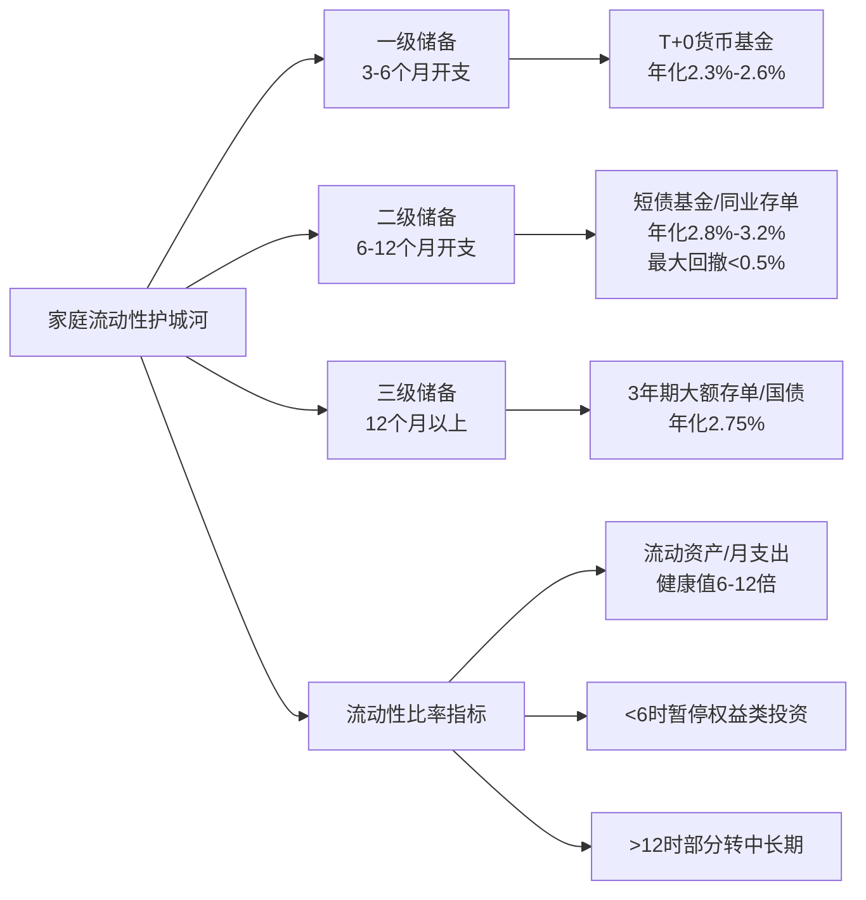

数据来源:基于2025年家庭理财流动性管理研究整理[^124][^122]

但这一框架对绝大多数中产而言更多是一种"理想画像"而非"现实图景"。第3章已揭示的汇丰693万流动资产门槛,**意味着以"流动性"为核心标尺的中产真正门槛已经接近高净值层的下沿**——按目前1.8%的理财收益算,693万一年被动收入12.4万,刚好覆盖一线城市一个家庭不算奢侈的基本开销;而35万存款一年的利息只有4000多块,交两个月物业费就没了。这一对照印证了第3章"流动性才是真正的中产护城河"这一伏笔的深刻意涵——**当一个所谓中产无法用其金融资产产生的被动收入覆盖基本生活开支时,他在严格意义上不能被称为"财务自主的中产",而只是"被房贷绑架的工薪贵族"**。

## 5.5 中产家庭支出结构:三座大山的刚性挤压与恩格尔系数的双重表征

如果说前四节剖析了中产财务的"底盘",那么后四节将揭示这一底盘上承载着怎样的支出与消费结构。要理解中产消费,必须先看清"中产的钱花在哪里"——而答案令人心惊:**住房、教育、医疗三座大山合计占据了中产家庭支出的近六到八成**。

国家统计局2026年一季度数据建立了支出结构的全国基线:**人均消费支出7955元,食品烟酒占32.0%、居住占20.3%、交通通信占13.6%、教育文化娱乐占10.6%、医疗保健占8.1%、衣着占6.6%、生活用品及服务占5.6%、其他占3.3%**[^117]。但这一全国均值仅是参考,中产家庭的具体支出结构呈现出更为剧烈的三大山挤压:

| 支出类别 | 全国均值占比 | 中产家庭占比 | 关键特征 |
|---------|------------|------------|---------|
| 住房 | 20.3% | 38.7%(2025年金发实验室数据) | 一线城市房贷占收入>60%、35.4%家庭压力指数超0.5[^125] |
| 教育 | 10.6%(教育文娱合计) | 一线城市达38%可支配收入、年均10万鸡娃投入 | 十年涨159%、一线城市每年增长8%[^126][^127] |
| 医疗 | 8.1% | 11.3%(2025年家庭金融调查) | 五年平均增速51.7%、37.2%家庭因费用推迟治疗[^127][^128] |
| 三大山合计 | 约39% | 约60%—76.8% | 发改委统计2025年城镇家庭四大支出占总支出76.8%[^127] |
| 食品烟酒(恩格尔系数) | 32.0% | 中产已降至25%以下 | 全国2017—2025恩格尔系数仍29.3%[^129] |

数据来源:综合国家统计局2026Q1数据、家庭金融调查、国家金融与发展实验室数据[^117][^127][^128]

**第一座大山:住房**。2025年居民住房相关支出占月支出38.7%,房贷家庭全国平均月供占收入30%—50%、一线城市(北上深)普遍超过60%、核心区域可达70%—100%、约35.4%的房贷家庭压力指数超过0.5[^125]。北京李女士月入1.5万、房贷就要8000多——这一典型案例已经反映出中产家庭住房支出的刚性挤压[^127]。中国情况在国际对照中并不孤立,但有其特殊性:**美国2026年初平均租金占收入32%、房贷月供占25%—30%;英国房租占收入36.1%创历史新高;希腊整体住房支出占可支配收入35.2%为欧盟最高;欧盟平均仅19.7%**[^125]——中国一线城市的房贷压力已经显著超过欧盟均值,与英国、希腊等南欧高负担国家相当。

**第二座大山:教育**。教育支出已经成为中产家庭最具中国特色的"军备竞赛"。**80%的中国家庭中,儿童支出占家庭总支出接近30%—50%,家庭儿童消费平均1.7万至2.55万元,儿童消费市场规模每年约3.9万亿至5.9万亿元;一线城市家庭教育支出平均每年增长8%,其中课外培训占比高达43%**[^126]。**2025年城镇家庭人均教育支出一年高达38600元、5年增长43%,而同期收入增幅仅4.8%——教育支出增速比收入增幅高出54%**[^127];**中国家庭金融调查2025年数据显示,城镇中产家庭年均教育支出占可支配收入的32%,其中一线城市达38%**[^128]。

教育支出结构的极端偏斜,折射出"鸡娃"现象的中产驱动逻辑。第4章已揭示中产人口学画像中"35—55岁、本科以上学历、双职工家庭、有学龄子女"的核心特征——这一画像几乎天然地与"鸡娃"挂钩。**麦可思研究院《中国-世界高等教育趋势报告(2026)》指出"过去以学历为主要竞争策略的单一路径正在被打破"——2026年应届生1270万对应567万校招岗位、本科就业率55.5%、硕士44.4%、平均月薪6199元、考研报名"三连降"**[^126]。但学历贬值并未让中产降低教育投入,反而引发更深的"鸡娃恐惧":**"在大环境里,他们见得太多了——曾经身家几十亿的企业家,三五年内就资不抵债;在他们眼里,资产和权力都不靠谱,只有孩子自身的本事,才是最硬的底牌"**[^126]——这种"读书保底论"成为中产教育投入的最深层心理机制。

**第三座大山:医疗**。医疗保健2025年城镇家庭人均一年支出12760元,医保报销比例只有58.4%,剩余近一半需自掏腰包,**37.2%的家庭因费用高选择推迟治疗**[^127];**中国家庭年均医疗支出占可支配收入的11.3%,而中产家庭由于更注重健康管理和优质医疗服务,其医疗支出占比可能高于平均水平**[^128]。一场大病对中产家庭的财务冲击是颠覆性的——武汉王先生父亲肺癌一年药费20万、全靠家里砸锅卖铁的案例,正是中产医疗支出脆弱性的真实写照[^127]。

**养老准备缺口**进一步加重了中产支出焦虑。**中国城市家庭平均养老金准备缺口高达107万元,53.6%的家庭表示"对养老非常担忧",只有不到四分之一的家庭有信心**[^127]。中产作为"赡养4位老人+养1个孩子"天平上的核心承重者,其养老焦虑既来自对父母辈的现实赡养支出,也来自对自身退休生活的预期不安。

刚性支出占比的另一个重要观察维度是**恩格尔系数的"双重表征"**。第1章宏观数据显示2025年我国恩格尔系数29.3%(算上烟酒外出就餐),八年前2017年同样是29.3%——**八年间总体持平**[^129]。这一持平本身就值得警惕:按联合国粮农组织标准,30%—40%属于"相对富裕",低于30%属"富足"乃至"极其富裕"水平;中国虽已跨入30%门槛之下,但与美国家庭8%的水平相比仍有显著差距[^129]。

中产家庭的恩格尔系数已经下降至25%以下,呈现出"相对富裕"的表象,但这一下降的背后并不是"消费升级"的真正自由,而是**收入增长被刚性支出大量吞噬的结构性挤压**——**2025年居民人均居住消费支出占总消费支出21.7%、教育文化娱乐11.8%、医疗保健8.7%,这三项刚性支出合计占比42.2%**[^129]。**与美国家庭食品支出仅占8%相比,中国食品支出占比仍偏高的本质,是中国居民"收入仍然相对有限"的真实写照**——而中产家庭虽然在恩格尔系数上呈现出"富裕表象",但住房、教育、医疗合计占比60%—76.8%的"三座大山",已经将其消费空间压缩到极为狭窄的边界。

## 5.6 中产消费偏好转变:从炫耀性消费到价值性消费的范式迁移

资产负债压力与刚性支出挤压,共同塑造了中产消费的范式迁移。这一迁移并非短期周期性现象,而是结构性的消费时代演进。吴晓波频道《新中产白皮书》提出的"3½消费时代"框架是理解这一迁移的关键起点:**1980—1990年代温饱消费、2000—2010品牌多元化消费、2010—2017个性化消费、2018年至今理性品质消费——当前中国正处于第二消费社会向第三消费社会转型阶段,但已出现第四消费社会特征,整体水平上更接近日本1970—1990年代的水平,处于"3½消费时代"的中间态**[^130][^131]。

这一消费时代演进在2024—2025年间最具标志性的事件,是奢侈品市场的全面承压与高端品牌的集体困境。**贝恩公司《2025年中国个人奢侈品报告》显示2025年中国内地个人奢侈品市场收缩3%—5%,虽然收缩幅度较2024年同期17%—19%降幅大幅收窄,但分品类看仍呈现剧烈分化:腕表跌14%—17%、皮具箱包跌8%—11%、服饰跌5%—8%、珠宝跌0%—5%,仅美妆个护实现4%—7%增长**[^132][^133]。**胡润研究院调查的470位千万资产中国高净值人士显示,中国富豪家庭未来一年计划减少腕表消费12.3万元、珠宝消费减少5.5万元**[^132]——**连最有钱的那批人都在收紧钱包,更何况普通中产**。

最具戏剧性的案例是Swatch集团的滑铁卢:**集团2025年全年净销售额62.8亿瑞士法郎、按当前汇率同比下降5.9%;集团净利润暴跌88.6%、只剩下2500万瑞士法郎、利润率跌至0.4%——比2023年同期的8.9亿瑞郎缩水了97%**[^132]。这一暴跌的本质,是中产消费转向击穿了"夹心层"奢侈品牌的市场基础——**Swatch旗下宝玑、宝珀名义上是顶级制表品牌,但在二级市场过去一年宝珀跌14.3%、宝玑跌8%,而百达翡丽却涨了12%——真正的顶级手表玩"稀缺性",而Swatch的"全品牌全价格带"布局反而让其高端品牌不够"高",中端品牌不够"性价比",两头不讨好**[^132]。

中产女性的消费觉醒尤为典型。**38岁北京秦怡和闺蜜约见时人手一只帆布包成为最松弛的标配;Tracy从25岁起每年购置10个名牌包,到35岁已经"连续两年没买过新包了";"年轻时爱追流行的Gucci、Celine、Bottega Veneta、巴黎世家这些二三线奢侈品牌,它们很不保值,上万块买的包,回收价仅两到三千元"**[^134]。Tracy将这一转变总结为:**"中女的消费觉醒,不是穷到买不起,而是富到不需要了"**——但这一表层叙事之下,**40岁沪女Coco的视角更具结构性洞察:"在奢侈品消费上,中女并非没有购买力,而是现在奢侈品的设计越来越没有新意了"**[^134]——**中产女性的奢侈品祛魅,本质上是品牌创新乏力与中产消费理性化的双向作用**。

奢侈品市场的全面承压并非孤立现象,而是中产消费品类的整体迭代。最具代表性的是"中产三宝"的迭代:**老一代中产三宝是"lululemon+拉夫劳伦+始祖鸟",而新一代中产三宝则是"萨洛蒙(Salomon)+Hoka One One+昂跑(On Running)"**[^135]。**双11开卖首小时数据显示,Salomon同比增长超60%、昂跑超40%、Hoka One One超20%**[^135]——这一迭代的核心逻辑,是中产从"商务老钱风"向"功能户外风"的转移,反映出**中产消费正在从"圈层身份符号"转向"全场景生活理念"**[^135]。Hoka被称为"海淀中年人的足力健"这一调侃尤其传神——**这些品牌足够低调、舒适、专业,既能彰显运动健康的中产生活方式,又避免了显眼奢侈品所带来的炫耀感**[^135]。

文旅消费的"心价比"升级是另一个标志性现象。**2021—2025年文旅消费市场超过60%游客关注文化内涵、超过60% Z世代愿为情绪体验付费;体验型消费占比从约28%升至约42%;沉浸式体验消费规模超8500亿元;消费价值从"性价比优先"升级为"心价比导向"**[^136]。"心价比"概念的兴起,**标志着中产消费的核心评价标准已经从"花多少钱买多少东西"转向"花多少钱获得多少情绪、文化、身份认同价值"**——这与第4章揭示的中产对精神富足的追求形成完整呼应。

二手奢侈品市场15%—20%的增长则是中产消费转型的另一独特注脚。**贝恩报告指出2025年中国二手奢侈品市场实现了15%—20%的增长——一手市场承压、二手市场逆势增长,反映出消费观念的双重转变:高净值人群和中等收入人群持续出售资产、优化投资组合;消费者尤其是年轻且对价格较为敏感的消费者对于性价比和可持续性的重视程度,超过了对于新奢侈品高端属性的重视**[^133]。这一现象揭示了**中产消费已经形成了一种新的"循环经济"逻辑——既能享受奢侈品的体面,又能通过二手交易降低实际持有成本,实现"消费品质"与"财务理性"的平衡**。

健康与品质生活领域则呈现出与奢侈品完全相反的逆势增长。**QuestMobile《2025新中产人群洞察报告》数据显示,截至2025年10月新中产人群规模达2.78亿、同比增加300万,一线城市用户占比、线上消费能力3000元以上用户占比同比分别增加1%和1.7%,高价值用户持续扩容**[^137]。**新中产生活消费方面盒马、山姆会员商店新中产用户规模同比增长44.8%、38.9%,健身训练、饮食管理类APP用户规模较快增长;新中产对休闲旅游与商务差旅的消费需求较高,愿意为AIGC应用及智能汽车等提升生活效率与品质的创新服务付费,愈发重视个人健康管理的投入**[^137]。**京东MALL《2025年中国厨卫产业新消费白皮书》显示2025年1-10月厨卫大家电零售额1338亿元、销量7406.8万台,呈现"升级提速、结构优化"态势——用户从"追求拥有"转向"活得更好",从"满足功能"升级为"精神追求",从"买产品"到"买场景方案"**[^138]。

## 5.7 中产消费的"精明+局部挥霍"二元特征与消费降级现象

中产消费的范式迁移并非单一方向的"升级"或"降级",而是一种鲜明的二元矛盾——**"精明节俭"与"局部挥霍"在同一中产家庭、甚至同一消费决策中并存**。这一二元特征的本质,是消费经济学家李湛所概括的**"M型消费"**——**收入结构逐步形成向两端分化,中间部分群体随着可支配收入增速放缓,其消费能力出现下降,大部分中等收入群体的消费能力将下沉至"M型"的右侧;在大众餐饮市场上,人均价位小于50元及大于300元的餐饮收入均出现较高增长,价位中等的餐厅仅有12.9%的增长——收入结构分化直接导致消费市场出现两端分化现象**[^139]。

"精明节俭"侧的证据已经在2024—2025年间充分显化:

**第一,教育鸡娃投入的主动收缩**。**2025年朋友圈出现一张引发热议的账单对比图:左边2024年教育支出36万元,右边2025年21.5万元——整整砍掉了40%**——海淀妈妈的话发人深省:"终于想通了,不再当韭菜"。**广州陈女士退掉了泰国国际学校的报名,原因是测算后发现"学费加生活费一年30万左右,陪读妈妈必须辞职,等于家庭收入直接砍掉一半,孩子读到高中还得再去欧美,加起来小400万的投资,万一孩子毕业后回国月薪8000,这账怎么平"**[^140]。**深圳厚德书院欠租千万倒闭、北京诺德安达突然关校;一线城市国际学校25万/年、马术高尔夫外教课加码到40万,结果孩子学会攀比手机型号;某海归男孩英国本硕花310万、回国月薪不到一万**[^140]——这些案例形成了对"鸡娃经济学"的集体反思。

**第二,北京中产的旅游消费降级**。"国联民生证券研究所报告将各省划分为四种消费类型,北京和上海赫然被划归入'慎于消费型'——也就是说,北京和上海作为国内经济最发达的省市,当地居民的旅游消费竟然跑输了东北、西北、西南地区居民"[^141]。**北京中产妈妈"原本计划暑期和年底分别进行两次长途出境家庭旅游,但是随着夫妻二人开始降薪,原本的旅行预算一缩再缩,最后的结果就是暑期放弃了出境游,转而去京郊民宿待了几天,年底的全家出境旅行计划直接取消"——"不是花不起,而是不敢花"**[^141]。**北京住宿业2025年1—9月1623家住宿企业总营业收入近325亿元,同比下降7.9%、利润总额下降34.9%**[^141]——这一断崖式下滑直接量化了北京中产消费的降级程度。

**第三,消费贷的扩张反映短期借贷支撑生活的脆弱**。**招行2024年年报显示信用卡交易额下降8.23%、但消费贷款余额激增31.38%**——前者反映消费意愿下降,后者却反映短期借贷需求旺盛。这一组矛盾数据的本质,是**部分中产家庭已经从"用工资支撑消费"转向"用消费贷支撑生活",通过短期借贷弥补现金流紧张**——这是中产消费降级背后最危险的脆弱性信号。

"局部挥霍"侧的证据同样鲜明,且与精明节俭并存于同一中产群体:

**第一,精神消费与文化体验逆势增长**。**新中产人群TOP10行业中,飞行射击、在线视频、社区交友、综合电商、在线阅读行业同比增速均超过10%,显示出内容消费与社交互动领域的强劲需求**[^137]。**休闲旅游(旅游攻略月活同比增420%)、AIGC(165.1%)、智能健康(37.4%)等新业态成为新中产消费需求释放的可靠路径**[^137]。

**第二,健康管理与品质生鲜会员店的高速增长**。**盒马新中产用户规模同比增长44.8%、山姆会员商店增长38.9%**[^137]——这一双高增长的本质,是**中产对食材品质、家庭健康、品质生活的"刚性升级"**,即便在整体消费承压的背景下也不愿降级。

**第三,文旅消费的"心价比"升级与代际投入**。**Z世代占文旅消费总人群超40%、银发族2025年线上订单同比增超20%;县域及以下客源占比超30%;沉浸式体验消费规模超8500亿元;文旅+康养市场规模超4500亿元、文旅+教育超2800亿元**[^136]。**2024年第一季度国内航线出游比2023年同期上涨34%、比2019年同期高出19%;1—2月国际航线出游已恢复至2019年水平的77%**[^142]——文旅消费成为中产精神消费投入的重要载体。

**第四,智能家电与厨卫场景化消费的爆发**。**2025年京东MALL首届咖啡机节期间带动咖啡机类目销售额同比增长300%;2025年京东MALL、京东电器联合超150场厨电新品发布会;消费者不再单纯追求性价比,而是更看重健康功能、智能体验等"品质升级"需求**[^138]——中产对家庭场景品质的投入呈现出明显升级。

将这一二元特征整合,可以归纳出中产消费的核心决策逻辑——**"对未来不确定性的防御性收缩+对自我价值实现的选择性投资"**:

| 消费维度 | 精明节俭侧 | 局部挥霍侧 | 决策逻辑 |
|---------|----------|----------|---------|
| 教育 | 砍鸡娃投入40%、退国际学校 | 保留核心兴趣班、博物馆研学 | 退出"军备竞赛"、保留个性培养 |
| 服饰/配饰 | 帆布包替代名牌包、不买Swatch | 始祖鸟+Salomon+Hoka新三宝 | 弃身份符号、择功能品牌 |
| 旅游 | 取消出境游、京郊民宿替代 | 文旅深度体验、为情绪付费 | 降近郊化预算、提单次质量 |
| 餐饮 | 降平日外出就餐频次 | 提食材质量、品质生鲜 | 在家精致化、外出选择性 |
| 健康 | 削减非必要医疗开销 | 健身、健康管理、营养品 | 主动健康投入对冲被动医疗 |
| 数字消费 | 视频会员降级 | 内容付费、知识付费 | 拒模式化、选个性化 |
| 大件 | 减少耐用品更换频率 | 高端型号"少而精" | 长期主义+一次买好 |

数据来源:综合贝恩、QuestMobile、京东MALL、麦肯锡、《新中产白皮书》等多源整理

麦肯锡的判断深刻揭示了这一二元逻辑的心理基础:**"近四分之三(约76%)的受访者对中国整体经济持乐观态度,但仅有三分之二(约67%)的人对其个人发展感到乐观——尽管宏观层面的信心较高,但在微观层面上,人们对自身经济状况的担忧仍然抑制了消费意愿"**[^143]。**这种矛盾现象背后的原因在于"可预见的高确定性持续支出",即如房贷、车贷、教育费用等固定开销,以及对未来职业稳定性的担忧,使得人们在面对经济不确定性时更加谨慎——即便实际收入水平没有显著变化,负面的经济新闻和不稳定因素的传播也会削弱人们的消费信心**[^143]。

这一二元决策逻辑下,中产储蓄行为成为最具说服力的间接证据。**2023年中国家庭储蓄率达31.7%,全国储蓄存款总额创历史新高——2020年至2023年新增储蓄存款总计人民币56万亿元,超过了2023年全年的社会消费品零售总额47万亿元**[^142]。这一惊人的储蓄行为本质上是中产对未来不确定性的"集体投票"——**当中产家庭把钱存进银行而不是消费时,他们投出的不是"消费能力不足"的票,而是"消费信心不足"的票**。

## 5.8 中产消费观背后的身份焦虑与脆弱性根源

最后,需要将中产消费行为反向回扣至中产身份的深层结构。**中产消费本质上是一场"身份符号建构与防御性收缩"的拉锯**——这一拉锯的两端,正对应着第4章揭示的中产"大而不强"金字塔结构与本章揭示的"账上有钱、心里没底"财务实质。

**第一,中产消费被品牌叙事所裹挟**。从"老中产三宝"到"新中产三宝"的迭代,从"中产三件套"到"中产五件套"的扩展,品牌通过精准捕捉中产虚荣点和身份焦虑,**让消费者通过"穿上某个牌子、开上某款车,就仿佛正式被社会承认为中产"——从经济本质上看,这类消费中相当一部分支出的是"品牌溢价身份符号",而不是货真价实的使用价值**[^144]。但当一个家庭把大部分可支配收入都砸在外显消费上时,**看似"体面",实则是在透支未来的安全垫——一旦遭遇收入下降,回头盘点资产,会发现多年辛苦换来的,是一堆折旧严重、二手价值有限的物品,而不是能抵御风险的现金与稳健资产**[^144]。

**第二,中产被"中产返贫四件套"所威胁**。整理中产返贫的真实案例,可以归纳为四个典型大坑:**(1)高杠杆、超负荷买房——很多人不是用闲钱全款买一套刚需自住房,而是用高杠杆滚雪球,掏空几代人存款拼凑首付,一人名下多套房,月供占到家庭收入的六七成,只要房地产处在上涨通道账面资产不断扩张看起来一切合理,但当市场进入调整期,一边是锁死现金流的巨额月供,一边是缩水的工资和承压的房价,很多家庭瞬间从'房产多多的中产'变成'债务缠身的负资产家庭';(2)高度失衡的家庭结构与支出配置——男主外女主内+精英教育的剧本将整个家庭收入、现金流和风险全压在一个人的工作稳定性上,一旦顶梁柱出现波动家庭整体立刻从高空钢丝上跌落;(3)被包装出来的"中产消费"绑架——把大部分可支配收入都砸在外显消费上;(4)超出认知范围的创业与理财冲动——中产在"上不着天、下不着地"的位置容易产生"过去成功来自自己能力"的错觉**[^144]。

**第三,日本中产"返贫史"的前车之鉴**。中国中产正处于一个高度类似日本1990年代中产瓦解的"前夜"。日本案例的四个滑梯值得警惕:**(1)资产端房产高杠杆+价格暴跌→负资产:东京住宅均价最高1亿日元→最低3000万日元,首付20%家庭仍倒欠银行5000万日元;(2)负债端工资停滞+裁员潮→现金流断裂:终身雇佣瓦解,非正式用工占比超35%,再就业收入平均下降30%—50%;(3)保障端养老金断缴+储蓄耗空→老后贫困:日本"下流老人"根源是40—50岁失业→缴费中断→70岁仍在打零工;(4)结构端单一房产配置+缺乏风险转移工具:住房资产占家庭财富60%,股票、保险、养老金占比合计不足15%,抗冲击能力极弱**[^145]。

中国中产"同处'杠杆+房产'双高象限"的事实已被多份研究证实:**(1)资产结构畸形——住房占比约60%(显著高于日本35%、美国25%),权益类资产仅3%,保险类资产仅4%,远低于美日水平;(2)负债率攀升——年收入10—50万元家庭平均负债率137%,78%家庭存款不足6个月生活费;(3)收入结构单一——职务性收入占比超80%,财产性收入不足10%,一旦裁员或降薪即现金流告急;(4)保障缺口明显——第二支柱企业年金覆盖率仍低,第三支柱个人养老金刚起步**[^145]。这四个维度的脆弱性,与日本1990年代崩盘前的中产画像几乎一一对应。

但中国中产的脆弱性也有其特殊性。**与日本不同,中国中产同时面临着户籍制度、35岁危机、独生子女赡养压力等独有的本土约束**;与美国不同,中国中产在社保体系、医疗保障、退休金账户(对应401k)等方面的制度供给相对滞后;与韩国不同,中国中产的家庭债务杠杆率虽高但远未达到韩国88.6%的极端水平,仍处于可控区间。**这种"同样脆弱、不同表现"的特性,决定了中国中产的破局之道无法简单照搬任何一个发达国家的经验**——中产返贫的"checklist"已经写在日本的镜子上,但中产复兴的路径必须由中国自己探索。

正是基于上述结构性焦虑,本章揭示的"精明+局部挥霍"二元消费观,才有了清晰的逻辑根基。**中产之所以精明节俭,是因为他们清楚自己处于"杠杆+房产"双高象限的脆弱位置,任何一笔可避免的支出都是抗风险能力的增量;中产之所以局部挥霍,是因为他们也清楚"中产身份"本身需要通过特定消费符号(健康、教育、品质生活、精神富足)来不断维持和确认——这是一场对自我价值实现的选择性投资**。**这种"对未来不确定性的防御性收缩+对自我价值实现的选择性投资"的二元决策逻辑,既是中产财务结构的真实折射,也是中产身份焦虑的行为外化**。

下图整合了本章的核心逻辑链条:

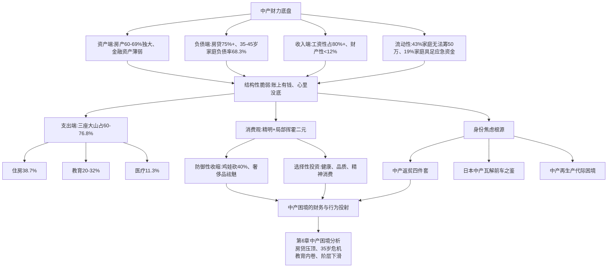

至此,本章已经完成中产财力构成与消费行为的六维深度解析。**核心发现可归纳为三组判断**:其一,**中产家庭资产负债表呈现"房产高占比+房贷高杠杆+工资性收入主导+财产性收入薄弱+流动性脆弱"的五维结构性失衡——这一失衡使得"账上有钱、心里没底"成为中产财务体感的真实根源**;其二,**中产支出被住房、教育、医疗三座大山持续挤压(合计占支出60%—76.8%),恩格尔系数下行至25%以下的"富裕表象"与刚性支出占比42.2%的"实质拮据"形成系统性悖论**;其三,**中产消费已经从"炫耀性消费"全面转向"价值性+悦己性消费",并呈现"精明节俭+局部挥霍"的二元特征——这一二元特征既是当下经济周期的应激反应,也是中产阶层结构性焦虑的真实投射**。下一章将沿着这一财务与行为基础,系统剖析中产困境的全貌——房贷压顶、35岁危机、教育内卷、阶层下滑风险——回答中国中产面临的最严峻考题。

# 6 中产困境：高负债、强焦虑与脆弱性

第4章勾勒了中国中产"35—55岁双职工核心家庭+本科以上学历+高度集聚于五大行业与一线新一线城市+大而不强的金字塔型内部结构"的群像，第5章则解剖了这一群像背后"房产69%独大、金融资产薄弱、工资性收入主导、流动性脆弱"的资产负债表本质。**画像与财力两章共同抛出了一个尖锐的悖论——为什么户均资产数百万、户均住房1.5套的"账面富裕"群体，普遍体验着"账上有钱、心里没底"的拮据与焦虑？** 这一悖论不是一种心理偏差，而是一种结构性的财务真相：当资产被房产单极锁定、收入被工资单极依赖、负债被房贷单极主导、保障被社保单极兜底时，中产便成了一个"看上去很美"的脆弱阶层。

本章作为中产专题研究的核心论证章节，将沿着**"有产穷人"现象呈现—四大困境维度展开—结构性根源剖析—与高净值层对比定位**的逻辑路径，系统回应"中产为何焦虑、为何脆弱、为何易碎"这一贯穿全篇的关键追问。这不仅是对当下3320万户严格中产、1.2亿户广义中产真实生存状态的实证刻画，也是为第7章阶层流动与第8章政策启示铺设逻辑基础——只有先看清中产困境的全貌，才能理解为什么"扩中"如此艰难、为什么"返贫"如此真实、为什么"橄榄型社会"的转型不是单纯的人口规模扩张所能完成。

## 6.1 "有产穷人"现象：账面富裕与现金贫困的悖论

最能精确刻画中国中产现实生活状态的一个词，是**"纸面中产"**——账面上写着几百万身价，现实里却全是银行的数字。这一现象在多份独立研究中被反复验证，已经成为当代中产典型的财务画像。

最具代表性的"纸面中产"账本是这样的：**北京五环外一套500万的房子，首付150万，贷款350万，每个月要还1.8万；夫妻俩加起来月入4万，看似还不错。可一笔一笔扣下来：房贷吃掉一半，孩子补课费、兴趣班继续消耗，老人药费再来一刀，手里能自由支配的钱几乎见底，买件羽绒服都要犹豫半天**[^146]。这一典型场景的财务结构可以拆解为：**收入端家庭月入4万看似已是中产精英水准；支出端房贷1.8万吞掉45%、子女教育每月5000—8000元、父母医疗与日常赡养每月2000—5000元、家庭日常开销1万左右；结余端月度可自由支配现金往往不足5000元、甚至月光**——而这一收入水平在统计意义上已属全国前5%—10%的高收入家庭。

更直白的反讽来自一位高薪中产的真实自述：**"有的人年薪80万，朋友圈看上去光鲜，实际上房贷一项就3.5万，孩子国际学校学费25万一年，父母看病十来万，工资一到账立刻清零。外人看着体面，本人心里全是压力"**[^146]。年薪80万的家庭——按第3章标准已经踩在严格中产门槛之上、按九阶层划分属于⑤中产上层乃至更高——居然出现"工资到账即清零"的现金流困局，这一反差揭示了"账面富裕、现金贫困"的根本机制：**中产收入数字的提升并未带来真正的财务自由，反而被对应抬升的房贷、教育、医疗刚性支出同步吞噬，呈现一种"水涨船高"的零和游戏**。

腾易研究院《中国购车家庭财富洞察报告之资产负债表(2025版)》的数据从家庭支出结构角度进一步验证了这一画像。该报告聚焦中国购车家庭这一典型中产代理样本，揭示**近十多年中国购车家庭的第一开支都是房贷；2020年房贷占了不少家庭过半支出，其它开支变得捉襟见肘；2024年中国购车家庭房贷开支由7万多降至5万多，房贷支出占比由50%多快速降至40%以内；2024年虽然房贷开支仍是中国购车家庭的第一开支、占比36.27%，但比曾经过半的开支占比少了一大截**[^147]。这一数据点的核心意涵在于：**即便经过近年来房贷利率的大幅下调（从五六个点降至三四个点），房贷仍然占据着中国中产购车家庭超过三分之一的支出份额，是不容置疑的"第一支出大山"**。报告进一步指出**还需偿还房贷的占比由2019年高点的70%多降至2024年的56.46%；2022—2024年提前还清房贷的占比快速提升、并逼近20%**[^147]——这一"提前还贷潮"本身就是中产对房贷压力的集体应激反应：与其让房贷长期挤压现金流，不如倾尽流动性储备一次性"卸压"。

下表系统拆解"纸面中产"典型家庭的财务画像：

| 财务维度 | 北京五环外典型家庭 | 一线城市年薪80万家庭 |
|---------|------------------|-------------------|
| 表面身价 | 500万房产+30万车+50万存款≈580万 | 1500万房产+50万车+80万存款≈1630万 |
| 月度收入 | 夫妻合计4万 | 夫妻合计6.7万（年薪80万折算） |
| 房贷占月收入 | 1.8万/4万=45% | 3.5万/6.7万=52% |
| 子女教育月支出 | 5000—8000元 | 国际学校2.1万/月（25万/年） |
| 父母医疗月支出 | 2000—5000元 | 1万元（10万+/年） |
| 月可自由支配 | 不足5000元 | 几乎月光 |
| 自我体感 | "买件羽绒服要犹豫半天" | "工资到账立刻清零" |

数据来源：基于"中产家庭"标准报告及高薪中产案例综合整理[^146]

"纸面中产"现象的结构性根源，在于第5章已揭示的"资产端房产高占比+负债端房贷高杠杆+收入端工资性主导+流动性储备不足"四维失衡。中产家庭的总资产数字看似可观，但其中**80%套在房子里**[^146]——这部分资产既不能产生现金流（自住房无租金）、也难以快速变现（一线房产挂牌至成交平均周期超6个月）、更面临持续的下行估值风险（过去四年房价累计下跌30%—40%）。**当一个家庭的财富主要以"无法变现、无法产生收益、还在缩水"的形式存在时，所谓"中产身份"便沦为一种统计意义上的标签，而非生活意义上的财务自主**——这正是"资产富裕、现金贫困"作为当代中产典型特征的结构性根源，也是后续四节展开的所有困境的共同财务底色。

## 6.2 高负债压顶：房贷主导下的杠杆困局

"纸面中产"现象的财务表征背后，是高杠杆负债结构的系统性挤压。**中产家庭平均负债率高达76%，一半左右的家庭每个月的房贷就占收入一半以上**[^146]——这一数据已经远超国际通行的50%家庭负债警戒线，达到了金融脆弱性的临界水平。

更具结构性的指标是月供与收入的比例分布。**43%家庭房贷占收入40%以上、35%家庭月供超月收入一半**——按家庭金融管理通行标准，月供占月收入超过30%即被视为高负担、超过50%即被视为"债务奴隶"状态。**32.7%的家庭月供占收入超50%沦为'债务奴隶'**已经在第3章揭示。这意味着中国中产中**有超过三分之一的家庭实际上已经处于月供吞噬一半以上工资的紧绷状态，其抗风险能力近似于零——任何一次裁员、降薪、利率调整或家庭变故都可能直接触发断供**。

更细颗粒度的负债结构验证了这一脆弱性。前述中国人民银行2024年报告显示，**我国中产家庭负债率（债务总额与资产总额之比）平均为43.7%，高于全国家庭31.5%的平均水平；其中房贷占据了负债的主要部分，达到总负债的78.3%**[^148]。这一43.7%的中产负债率虽看似低于76%的另一研究口径，但二者并不矛盾——前者基于"债务总额/资产总额"的资产负债率口径，后者更接近于"债务/年收入"的债务收入比口径，从不同维度共同指向中产负债压力的严峻性。**中国人民银行2024年数据显示我国居民家庭负债率已达62.3%，其中房贷占比超75%，信用卡及消费贷增速连续三年超15%**[^149]——居民部门整体杠杆已经处于历史高位，而中产作为最主要的购房群体承担着这一杠杆的主要份额。

房价收入比的国际畸高水平为中产负债压力提供了根本性的解释。**2025年一线城市的房价收入比拉到45比1，普通家庭要不吃不喝45年才能买下一套房**[^146]。麟评居住大数据研究院的数据则显示**2024年全国100个城市的房价收入比平均10.3、二线城市降幅最大10.8%、有5个城市房价收入比维持在20以上的高位水平——分别是一线城市中的深圳、北京、上海以及三亚、厦门**[^150]。**在已公布收入数据的万亿GDP城市中，上海的房价收入比最高为26.3，北京22.9，杭州、广州、南京、天津、福州、宁波、重庆、西安、南通等地的房价收入比均在10以上，长沙最低为5.5**[^151]。

下表整合主要城市房价收入比与中产购房压力：

| 城市 | 房价收入比（2022—2025） | 国际合理区间 | 含义 |
|------|---------------------|------------|------|
| 上海 | 26.3—28 | 3—6 | 接近工薪阶层毕生收入顶峰[^152] |
| 北京 | 22.9—35 | 3—6 | 工薪家庭买房即放弃生存余裕 |
| 深圳 | 38.7%累计跌幅前曾达高位 | 3—6 | 一线最严苛购房压力 |
| 天津 | 15 | 3—6 | "打半辈子工才能买一套房"[^152] |
| 浙江/广东 | 13 | 3—6 | 制造业大省泡沫风险高 |
| 西安/吉林/云南 | 12 | 3—6 | "经济欠发达地区已开始量价齐跌"[^152] |
| 内蒙古（最低） | 7 | 3—6 | 仍超国际合理区间 |
| 长沙（万亿GDP最低） | 5.5 | 3—6 | 接近合理区间上沿 |

数据来源：诸葛找房数据研究中心、麟评居住大数据研究院、各省统计局综合整理[^151][^152][^150]

更值得警惕的是，**麟评居住大数据研究院的分析指出，虽然表面上看买房压力持续下降，但近两年房价收入比下降的原因已与2022年以前截然不同——近两年的下降原因则是房价持续下跌而非居民收入的显著提高，而2022年以前房价收入比下降系居民收入增速远远大于房价上涨速度**[^150]。这一区分极具结构性意义：**当房价收入比通过"房价下跌"而非"收入提升"的方式下降时，中产家庭面临的不是"购房压力缓解"的福音，而是"已购房资产持续缩水"的厄运**——他们既要按合同继续偿还基于高位购房价格计算的房贷，又要面对房产市值的持续下跌，"高位接盘"的痛苦在中产家庭中尤为剧烈。

中产应对负债压力的两种典型行为模式都揭示了现金流危机的深度。**第一种是"提前还贷潮"——2022—2024年中国购车家庭提前还清房贷的占比快速提升并逼近20%**[^147]。这一行为本质上是中产用流动性储备换取"心理安全感"的集体决策，背后是对未来收入不确定性的深度焦虑。**第二种是"用负债解决负债"——以贷养贷、信用贷置换房贷等违规操作**[^149]。一对年薪合计40万的双职工夫妻案例颇具代表性：**购入500万学区房月供1.8万、占收入45%；为匹配"有房族"标签换30万新车（贷款）、买奢侈品包、报高端早教班；信用卡分期利率18%，为降息申请"账单合并贷款"，却因额度宽松再次透支——看似负债减少，实则长期陷阱加深**[^149]。前述招行2024年年报已揭示**信用卡交易额下降8.23%但消费贷款余额激增31.38%**——这一组矛盾数据精确反映了中产在收入承压时通过短期借贷维持生活水准的脆弱性。

央行调查中户均偿债收入比18.4%的全国均值看似不高，但这一数字背后掩盖了巨大的群体内部差异——**真正的负债压力集中于35—45岁中产家庭，其平均资产负债率高达68.3%，远超国际警戒线50%**。这一年龄段的中产恰好对应房贷偿还的中段（购房后5—15年）、子女教育投入的高峰段（小学到高中）、父母医疗需求的兴起段——三者叠加，使得中产负债压力在生命周期的某一段时间内被极端放大。**如果将18.4%的全国均值视为"分母"，那么中产家庭尤其是35—45岁中产的实际偿债收入比可能高达40%—60%，是全国均值的2—3倍**——这正是中产负债脆弱性的真实严峻程度。

## 6.3 教育与养老双重焦虑：'三明治世代'的财务夹击

如果说房贷是中产财务压力的"已知刚性支出"，那么教育与养老则是中产焦虑的"未知巨型坑洞"——其支出规模随时间不可逆地扩张，且边际效益递减明显，构成中产储蓄能力的双重吞噬。

**第一重焦虑：教育鸡娃军备竞赛与边际效益递减的反思**。中产家庭的教育投入呈现出极端的代际投资特征。第5章已揭示一线城市中产家庭年均教育投入10万、占可支配收入22—38%，**新中产平均每年花在单个子女上的教育费用接近10万**。**麦肯锡公司2025年初发布的《中国消费者调查报告》显示，中产家庭在教育方面（子女教育投入占家庭收入的22%）的支出明显高于其他群体——这种消费倾向反映了中产阶层对生活品质和长期投资的重视**[^148]。教育消费已经成为中产身份认同的核心载体之一。

但2025年教育投入的边际效益出现了系统性反思。第5章已援引的"2025年朋友圈引发热议的账单对比图：左边2024年教育支出36万元，右边2025年21.5万元——整整砍掉了40%"现象，与广州陈女士退掉泰国国际学校报名的案例，共同构成了中产对鸡娃军备竞赛的集体祛魅。陈女士测算的逻辑链条值得详细呈现：**"学费加生活费一年30万左右，陪读妈妈必须辞职，等于家庭收入直接砍掉一半，孩子读到高中还得再去欧美，加起来小400万的投资，万一孩子毕业后回国月薪8000，这账怎么平"**——这一精确的算账揭示了中产教育投入的核心矛盾：**当教育产出（子女就业薪资）增速远低于教育投入（学费、陪读机会成本）增速时，鸡娃便从"中产再生产工具"沦为"中产财富吞噬器"**。

针对教育投入边际效益递减的实证证据日益丰富。**深圳厚德书院欠租千万倒闭、北京诺德安达突然关校；一线城市国际学校25万/年、马术高尔夫外教课加码到40万，结果孩子学会攀比手机型号；某海归男孩英国本硕花310万、回国月薪不到一万**——这些零散案例共同指向一个结构性事实：**中产教育投入正面临"双重通胀"——价格端学费持续上涨、产出端就业市场学历贬值**，使得"用教育跨越阶层"的传统路径正在系统性地失效。

教育投入的中产分化已经形成。**有数据显示，孩子教育在学龄家庭日常消费支出中占比高达57.2%**[^153]——这一比例若属实则极度惊人，意味着部分极端鸡娃家庭已经将一半以上的日常消费投入到子女教育中。但2025年的反思已经在中产精英层快速蔓延——海淀妈妈"终于想通了，不再当韭菜"的觉醒，标志着中产教育消费从"军备升级"向"理性收缩"的范式转变。

**第二重焦虑：养老压力的崛起与社保支出首超教育的标志性事件**。2024年中国财政发生了一个具有时代标志意义的转折——**社保和就业支出42114亿元、教育支出42076亿元，社保支出首次超过教育成为"花钱最多"的项目，是自2012年财政部公开支出科目以来教育首次被"挤下"榜首**[^154]。这一转折背后的人口学根基是惊人的：**截至2023年底，中国65岁及以上人口已突破2.16亿、占总人口的15.4%，正式迈入"中度老龄化社会"；60后"婴儿潮"一代正加速退休**[^154]。

养老压力对中产的具体影响以个人养老金缺口的形式显现。**中国城市家庭平均养老金准备缺口高达107万元，53.6%的家庭表示"对养老非常担忧"，只有不到四分之一的家庭有信心**——已在第5章引用。这一107万元的人均缺口在中产家庭中尤其难以填补，原因有四：**其一，中产收入主要为工资性，财产性收入不足12%，无法形成"睡后收入"对冲未来养老需求；其二，中产家庭储蓄已被房贷、教育持续吞噬，"两件事不结束、第三件事难以开始"；其三，第二支柱企业年金覆盖率仍低、第三支柱个人养老金刚起步，制度供给滞后；其四，城乡养老金差距巨大——2023年城镇职工养老金人均月领近4000元，而农村老人每月只有一两百**[^154]，这一差距使得来自农村的中产一代既不能依赖父母养老金维持基本生活，反而要每月反向输血。

中产作为"三明治世代"承担着双重赡养的极端压力。**截至2023年底中国65岁及以上人口已突破2.16亿、占总人口的15.4%；到2030年中国老年抚养比将达到50%，意味着每两个劳动年龄人口就要"养活"一位老人**[^154]。中产家庭尤其是35—55岁的核心中产，往往面临"4位老人+1—2个孩子"的赡养结构——按目前的支出测算，**子女教育每月支出5000—10000元、父母医疗与日常赡养每月3000—8000元、自身养老储蓄需求每月3000—5000元，三者合计每月刚性储蓄需求11000—23000元——这一数字已经接近大多数中产家庭月度可支配现金的全部**。

医疗支出的不可预测性进一步加剧了养老焦虑。**中国家庭储蓄报告显示，全国家庭储蓄的主要原因依次是"应付突发事件及医疗支出"占48.19%、"为养老做准备"占36.78%、"为子女教育做准备"占23.97%**[^153]——医疗排在所有储蓄动机的首位，反映出中国家庭对健康风险的深度忧虑。**家里没矿的普通工薪一族光靠储蓄是很难兼顾医疗、养老和子女教育的——医疗对应的风险，可以通过配置重疾险和医疗险来解决；养老可以考虑配置养老金年金险；子女教育可以借助保险稳妥规划**[^153]。但保险作为风险转移工具在中产家庭中的渗透率有限——第5章已揭示中产商业保险覆盖率不足40%、年均保费仅占年收入6%—8%，远低于发达国家中产15%—25%的水平。

下图整合"三明治世代"的财务夹击机制：

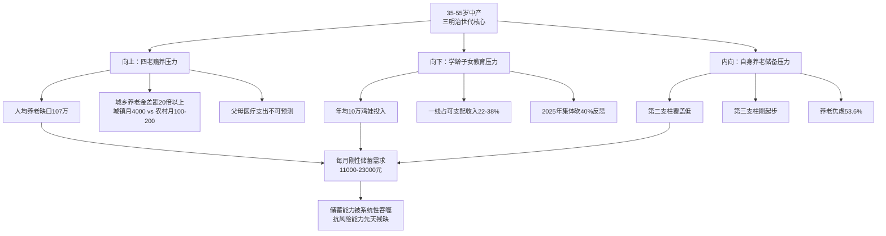

## 6.4 35岁职场危机：中产收入断崖的核心触发器

如果说房贷、教育、养老是中产困境的"刚性背景"，那么35岁危机就是触发这一背景下系统性崩塌的"动态扳机"。中产家庭的全部财务结构都建立在"工资性收入持续稳定增长"的隐含假设之上，一旦这一假设被失业或降薪击破，整个中产身份便面临瞬时崩塌的风险。

35岁危机的真实图景已经在多份独立数据中得到充分验证：**某招聘平台数据显示，2023年互联网行业35岁以上员工占比从2018年的32%骤降至18%，而25岁以下员工比例从15%飙升至31%**[^155]。**某头部电商公司内部文件显示，2022年Q4优化名单中，35岁以上员工占比高达76%，其中82%是基层技术岗——这些被裁的"老员工"往往拿着比新人高3—5倍的薪资，却承担着更重的KPI**[^155]。**"公司宁愿花15K招两个应届生，也不愿留30K的老骨干"，某离职员工在脉脉上的吐槽获得2.3万点赞**[^155]——这一员工自述精确揭示了35岁危机的核心经济逻辑：**在企业边际成本控制视角下，一个30K老员工被替换为两个15K新员工，不仅总薪酬持平，还可能获得更长的潜在工时和更弱的议价能力**。

更为具体的就业数据来自2026年职场危机升级的全景画像：**当下35岁职场危机早已全面升级，超七成招聘公告设置35岁年龄上限，35岁以上求职者简历被查看率比年轻人低40%，六成简历在系统初筛阶段就直接淘汰；一旦遭遇失业，35岁群体平均求职周期长达6.2个月，远高于年轻群体的3.1个月；重新就业后薪资平均下降27.6%，互联网大厂中年员工薪资降幅甚至高达40%**[^156]。这一连串数据的核心意涵在于：**35岁不仅意味着求职机会的减半（简历查看率下降40%、初筛淘汰率60%），还意味着即便求职成功也要承担深度的薪资降幅（27.6%—40%）——双重打击使得中产收入断崖一旦触发便几乎不可逆**。

35岁危机对中产家庭财务结构的传导机制可以拆解为四个连锁阶段：

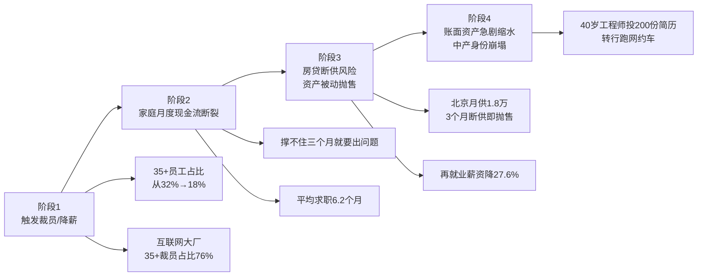

这一传导机制的真实案例多有印证：**深圳有位工程师，40岁被裁，投了200多份简历没有回音，最后只能跑网约车**[^146]——这一典型案例从40岁前的高薪工程师到40岁后的网约车司机，仅用了几个月时间便完成了从中产到温饱的滑落。**程序员小李蹲在地铁口，抱着外卖箱哭得像个孩子。他刚被公司裁员，手机里躺着3条催缴房贷的短信，口袋里只剩237块现金**[^155]——这一画面虽是个案，却精确刻画了中产收入断崖最极端的瞬间。

35岁危机的结构性矛盾在于"互联网大厂裁员潮"与"制造业技工荒"并存的撕裂图景。**2026年中国就业市场呈现出一幅撕裂的图景：互联网大厂裁员潮席卷"35岁+"群体，而制造业却陷入"百万技工荒"的困局；中国技能劳动者缺口超3000万，高级技工求人倍率达2.5:1，部分精密制造岗位甚至达5:1；杭州某芯片厂给出"月薪2.5万+住房补贴"，仍难招到数控机床技师；而同期互联网应届生起薪仅1.8万**[^157]。这一结构性矛盾的本质在于**技能错配——被裁员的35+互联网员工大多是产品、运营、运营管理岗，缺乏制造业所急需的精密操作、设备维护、工业机器人运维等技能；而制造业的工作环境、社会地位、职业上升空间又难以吸引这部分高薪白领转岗**。其结果是：**35+被裁员工要么转向网约车、外卖、自媒体等灵活就业，要么经历漫长的求职周期后接受大幅降薪——但都无法实现技能价值的等量重置**。

AI替代效应进一步加剧了35岁危机的紧迫性。**亚马逊、微软等企业将裁员归因于AI技术应用，称"30%代码将由AI编写"，但实际裁员中非核心岗位（如运营、客服）占比超70%；35岁以上员工薪资占营收比达25%，成为"降本"首选；某电商平台裁员名单显示35—40岁员工占比达68%，而同期研发投入增长40%**[^157]。这一组数据揭示了一个残酷的现实：**AI替代的不是真正的技术核心岗位，而是中产白领赖以为生的中后台岗位——而这部分岗位恰好是中产收入的核心来源**。**真正困住35+职场人的，从来不是年龄，而是常年停滞不前、早已老化的能力体系；裁员只是结果，长期拒绝成长、从不主动更新自己，才是压垮职场人生存底气的根源**[^156]——这一判断虽然将责任部分归咎于个人能力更新，但其揭示的"经验贬值与思维固化"的结构性现象同样值得警惕。

35岁危机对中产家庭的破坏性放大效应来自于第5章揭示的"工资性收入占比超80%"的中产收入结构。**房贷、教育、医疗三座大山压得中年人喘不过气；某银行内部数据显示35—45岁群体贷款余额占个人信贷总额的61%，其中83%是房贷；以北京为例一套普通两居室月供约1.8万，而2023年北京平均工资仅1.1万——这种"收入倒挂"现象，让中年人成了"最不敢失业的群体"，失业3个月就可能面临断供风险**[^155]。**这种"收入倒挂"是35岁危机最致命的传导机制——当一个家庭的房贷月供已经超过该城市平均工资水平时，失业即等于断供，断供即等于资产被动拍卖，资产拍卖即等于中产身份的彻底崩塌**。

## 6.5 阶层下滑风险：从中产到返贫的滑落路径

35岁危机是中产滑落的"动态扳机"，那么阶层下滑风险则是中产滑落的"系统性现象"。**中产返贫不是普遍现象，中产阶层的滑落风险非常高，中产返贫现象在特定人群已经是非常显著的事实**[^158][^159]。这一判断在量化数据中得到了精确验证。

胡润2024—2025年财富报告系统刻画了富裕阶层的整体收缩。**今天看了一份胡润研究院发布的《2024胡润财富报告》——中国15年来第二次出现高净值家庭数量下降！总财富也比上一年下降3.6%！把资产600万以上的定位富裕家庭，数量减少了1.4万户；把资产1000万以上的定位为高净值家庭，数量减少了108.9万户；把资产1亿以上的定位为超高净值家庭，数量减少了7.8万户**[^160]。胡润2025年最新数据进一步证实**2024年中国富裕家庭（资产600万以上）数量已连续2年下降、2024年微降至512.8万户、同比减少0.3%；高净值人群的个人经济宽裕度方面，比例较2021年骤降29%**[^161]。

财富缩水的三大成因在中产返贫机制中具有清晰的对应关系：**其一，房产价值下跌——长期以来房地产在我国家庭资产配置中占据着核心地位，中国家庭70%左右的资产集中在房地产上；以厦门为例，一位购房者在2017年花费500万购买了一套120平米的房产，到了2024年这套房子的市场价值已降至400万左右，资产直接缩水100万；其二，金融资产缩水——银行存款利息下降，过去年化收益率能达到5%—6%的理财产品如今降至2%—3%；股市波动让许多家庭资产受损；其三，收入减少——经济增长放缓，企业纷纷采取裁员、降薪**[^160]。**三者共同构成了中产财富缩水的系统性"三股下行风"，几乎没有任何一个中产家庭能够同时回避这三股下行风的影响**。

更具量化意义的是上海楼市市值蒸发的宏观数据。**回溯到2021年底至2023年初房价的高位时期，上海住宅均价一度冲高至7.29万元/平米；以此计算，那时整个上海房子的总市值达到了惊人的57万亿人民币；截至目前，上海均价已回落至5.47万元/平米，相比巅峰时期下跌了25%；从宏观视角来看，这意味着上海楼市的市值凭空蒸发了约14万亿元——这一蒸发的数字，几乎相当于把全体居民的存款清空了2.5次**[^162]。**在楼市巅峰时57万亿的总市值分摊到全市964万户家庭，户均持有房产价值高达591万元；如今房价已经回落25%，591×0.25≈148万——上海户均资产已经下降了148万**[^162]。

更广泛的城市样本佐证了这一普跌格局。**北京二手房价累计跌了29.5%、回到2016年8月的水平；上海跌了30.6%、退回到2016年3月；深圳跌得最狠、38.7%的跌幅让房价回到了2016年7月；国内的二三线城市房价跌幅更为猛烈，南京、重庆等重点二线城市二手房价平均跌了约38.5%；惠州大亚湾、廊坊燕郊等三四线城市房价直接跌了超50%**[^163]。**资料显示从1998年住房制度改革开始到2024年全国一共卖了2.59亿套商品房，其中有1.36亿套是2016年房价暴涨之后卖出去的——这意味着超一半的家庭在高位买了房子，现在不仅面临资产缩水，而且房贷压力也让人喘不过气来**[^163]。

具体的"高位接盘"案例触目惊心：**北京市民潘亮在2021年花500万买了海淀区的一套二手房，现在挂牌350万都没有人来买；潘亮无奈表示"首付这150万没了，等于这些年白忙了"；广州奚敏在2022年在广州番禺买了一套新房，当时房价是3.8万/平米，现在周边同样的房子2.5万/平米就能出售，3年时间里这套房子的亏损近百万**[^163]。这些案例的共性特征是：**(1)在市场高位以家庭最大杠杆接盘；(2)所购房产以"中产升级"为目的（学区房、改善型住宅、新区新房）；(3)资产缩水幅度往往超过首付比例，形成事实性"负资产"状态——即便卖掉房子也无法清偿房贷**。

对中产返贫机制的系统性归纳，可以参考被广泛流传的"中产作死三件套"与"返贫五件套"叙事——**"中产作死三件套"：高额房贷、单职工、两娃上国际学校；"返贫五件套"：冲动投资创业、倾家荡产买房、子女接受精英教育、为他人做担保、盲目投资理财**[^159]。这两组"作死/返贫清单"虽带有民间叙事的戏剧化，但其揭示的滑落路径在专业研究中得到了印证：

| 滑落触发器 | 典型机制 | 财务后果 |
|----------|---------|---------|
| 高额房贷 | 高位接盘+月供吞噬现金流 | 房价下跌→负资产→断供风险 |
| 单职工模式 | 全部收入压在一人身上 | 失业→收入归零→现金流断裂 |
| 两娃国际学校 | 教育支出每年40-80万 | 储蓄被吞噬→应急能力归零 |
| 冲动创业 | "过去成功源于自身能力"错觉 | 创业失败→储蓄归零→负债累累 |
| 盲目理财 | 追逐高收益缺乏专业判断 | 基金/股票/P2P爆雷→财富归零 |
| 担保连带 | 为亲友/合作伙伴担保 | 被担保方违约→自身财产被冻结 |
| 失业断供 | 35岁危机+房贷高杠杆 | 法拍房→首付损失→中产身份崩塌 |

数据来源：综合FT中文网中产返贫研究、胡润财富报告及多源典型案例整理[^146][^155][^160][^164][^159]

更具学术性的判断来自《杨国英观察》对千万资产家庭蒸发的剖析：**最近两年千万资产家庭的财富蒸发，关键之关键在于财富结构太过单一——超过80%的中产家庭，将超过80%的财富死死绑在房子上；面对未来三四年超大概率的房价还将继续再跌20%—30%，到时绝大多数的千万资产家庭其财富值相比两年前整体将进一步惨烈缩水；而且对于其中存在较大杠杆的部分千万资产家庭，其财富值可能就不是简单缩水的问题了，而是破产的问题——其实每一套法拍房的背后，几乎都牵涉到一个家庭财务的破产**[^164]。**2022年全国法拍房共挂拍60.6万套；2023年全国法拍房数量再创历史最高、高达79.6万套**[^164]——这一持续攀升的法拍房数据是中产财务破产最直观的脚注。

但需要强调的是，**中产返贫并非普遍现象**。FT中文网研究指出：**中产返贫不是普遍现象，中产阶层的滑落风险非常高，中产返贫现象在特定人群已经是非常显著的事实——一个正常的社会本来就应该双向流动，有人阶层上升、有人阶层下降；若中产阶层中部分的下滑伴随着相应的上升，并且变动规模相对合理，那是正常社会新陈代谢的表现**[^158][^159]。这一区分至关重要——**中产返贫的真实图景是"特定群体显著滑落"而非"整体性塌陷"**。具体而言，中产返贫风险在以下四类家庭中显著高于平均水平：**(1)高杠杆购房家庭——尤其是2020—2022年高位接盘的一线城市改善型购房家庭；(2)单职工模式家庭——尤其是男主外女主内+依赖单一收入支柱的家庭；(3)依赖单一行业家庭——尤其是房地产、教培、互联网等近年遭遇周期下行的行业从业家庭；(4)缺乏多元化资产配置家庭——80%以上财富沉淀于房产、几乎没有金融资产分散布局的家庭**。**这四类家庭恰恰构成了中国中产的相当大比例**——也正是因此，"中产返贫"才会成为社会舆论的高频议题。

## 6.6 中产脆弱性的结构性根源剖析

将前述四节困境放入同一坐标系，可以归纳出中产脆弱性的四大结构性根源——这四大根源不是孤立存在的因素，而是相互嵌套、彼此强化的系统性结构，共同构成中产阶层"先天残缺"的抗风险能力。

**根源一：房价收入比畸高，迫使中产高杠杆购房并将70%—85%财富沉淀于房产**。前述数据已揭示一线城市房价收入比在20—45倍的极端区间，远超国际通行的3—6倍合理水平。**国际上通行的说法是3—6倍为合理值；参考这个标准，全国房价收入比均值为11，17个省市高于均值，14个省市低于均值；以"3—6倍为合理值"的标准，全国的泡沫是非常大的，所有省市均大幅高于标准，最低的内蒙古一家人不吃不喝也需要7年才能买一套房**[^152]。这一畸高水平意味着中产家庭实际上没有"理性购房"的选项——要么放弃在一线城市定居（接受降级到二三线），要么以最大杠杆买入（接受高负债压力）。**国家发改委经济研究所的调查数据表明，2024年我国城镇居民家庭人均住房建筑面积达到38.6平方米，中产家庭的人均住房面积则达到45平方米以上；在一线城市一套120平方米的普通住宅均价约为1200万元，这意味着仅房产一项就可能占据中产家庭资产的绝大部分**[^148]——这是中产财富结构性失衡最直接的实证。

**根源二：社保覆盖不足，养老缺口与医疗自付压力叠加**。中国社保体系的"三支柱"建设进度极不均衡：**第一支柱（基本养老金）由政府主导但替代率持续下降——2023年城镇职工养老金人均月领近4000元，而退休前工资普遍在5000—15000元区间，替代率不足40%；第二支柱（企业年金）覆盖率仍低，仅大型央企、国企、外企部分覆盖，民营中小企业普及率极低；第三支柱（个人养老金）2022年才正式启动，覆盖人群与累计金额均处于起步阶段**。**辽宁作为老龄化"重灾区"，2024年省级社保支出是教育的6倍多；社保支出涨得这么快，答案就俩字：老龄化**[^154]。结构性问题在于——**当前社保的"现金流压力"已经主要由财政补贴在维持，而中产作为缴费主体既要缴纳高额社保（个人+单位合计约工资的40%），又要面对未来养老金替代率持续下降的不确定性，形成"高缴费+低预期"的双重困境**。

医疗自付压力进一步加剧社保不足问题。**医保报销比例只有58.4%，剩余近一半需自掏腰包**——意味着即便有基本医保覆盖，一场重大疾病仍可能让中产家庭支付10万—50万元的自费部分。**2.3亿灵活就业者无完善社保**——这一灵活就业群体既包含被35岁危机推向网约车、外卖、自媒体的前中产，也包含未能跨入正规就业的青年——他们既在事实上承担着"中产岗位"的工作内容，又在制度上享受不到中产应有的社保保障。

**根源三：收入来源单一，工资性收入占比超80%、财产性收入不足12%**。第5章已系统揭示中产收入结构的单极依赖——工资性收入占比超80%、财产性收入不足12%，远低于美国中产15%—20%的水平。这一收入结构的核心脆弱性在于：**当工资性收入因失业、降薪、行业周期下行而减少时，没有任何替代收入流可以对冲——财产性收入（房租、股息、利息）因金融资产薄弱而几乎为零；经营性收入因绝大多数中产为雇员而几乎不存在；转移性收入（社保、补贴）规模有限且需到退休后才能获得**。这种"单极依赖"使得中产家庭实际上没有"备用油箱"——一旦主油箱（工资）出问题，整辆车就会立即抛锚。

更具结构性意义的对比是中美中产收入构成。**美国中产家庭工资性收入占比约60%—70%、财产性收入15%—20%、经营性收入5%—10%、转移性收入5%—10%——四大收入流相对均衡；而中国中产工资性占80%以上、财产性不足12%、经营性接近为零、转移性需退休后才显化**。这一根本性差异决定了**美国中产即便遭遇失业，仍能依靠股息、租金、退休金账户等多元收入维持生活水平的相对稳定；而中国中产一旦失业，整个家庭的收入流量便几乎归零**——这正是35岁危机在中国语境下如此致命的深层制度根源。

**根源四：资产配置失衡，房产高占比+金融资产薄弱+流动性不足的三重失衡**。中产资产配置的失衡是一个三维问题：**第一维，房产占总资产60%—85%（一线城市核心区甚至超过70%）——而美国中产仅27%—36%；第二维，金融资产仅占总资产15%—20%，且其中现金/低风险理财占60%—65%，权益类资产仅占25%——风险资产参与度严重不足；第三维，应急流动性储备仅覆盖3—6个月支出，43%家庭无法在紧急情况下迅速筹措50万元——流动性储备远低于"6—12个月应急储备"的合理水平**。

这一三重失衡的根源在第5章已有详细分析——**中国住房私有化改革（自有率96%、户均1.5套）、A股市场发育不足、居民投资意识保守、金融鸿沟存在等多重制度因素的合力结果**。但其后果对中产抗风险能力的影响是直接而严重的：**当一个家庭60%—85%的财富沉淀于一种缺乏现金流、缺乏变现速度、还在持续缩水的资产时，这个家庭实际上没有任何抗风险能力——它的"财富"是一种"幻觉财富"，无法在真实的财务危机中发挥作用**。

下表系统整合中产脆弱性的四大结构性根源：

| 根源维度 | 具体表现 | 对中产抗风险能力的影响 |
|---------|---------|---------------------|
| 房价收入比畸高 | 一线20—45倍 vs 国际3—6倍合理区间[^151][^152] | 高杠杆购房+70%—85%财富沉淀房产 |
| 社保覆盖不足 | 替代率<40%；2.3亿灵活就业者无完善社保；医保自付41.6% | 养老缺口+医疗自付双重压力，平均养老缺口107万 |
| 收入来源单一 | 工资性占80%+、财产性<12% vs 美国15%—20% | 失业即现金流断裂，无替代收入流 |
| 资产配置失衡 | 房产60—85%+金融资产15—20%+应急流动性<6个月 | "幻觉财富"无法在危机中发挥作用 |

数据来源：综合本章及前述章节多源数据整理

四大根源相互嵌套形成的脆弱性"复合体"使得中产抗风险能力远比单一指标所暗示的脆弱。**当一个中产家庭同时面临(1)高房价高杠杆购房+(2)未来养老金替代率不足40%+(3)工资性收入占80%+(4)房产占财富70%以上的复合困境时，它实际上没有任何"安全垫"——任何一个维度的风险冲击（房价下跌、失业、生病、子女教育超支）都可能引发整个财务体系的连锁崩塌**。这正是中产"大而不强、底端肥大"金字塔型内部结构的真实财务底色——也是为什么3320万户严格中产、1.2亿户广义中产即便在统计意义上达标，仍然普遍处于"心里没底"的焦虑状态。

## 6.7 中产与高净值层抗风险能力的本质差距

在揭示中产脆弱性的结构性根源之后，最具说明力的对比来自高净值层。**通过对比高净值层（净资产600万—3000万）与中产层（净资产80—300万）在资产结构、收入来源、流动性、风险转移工具四大维度的差异，可以揭示二者抗风险能力的代际鸿沟**——这一鸿沟不是数量上的差异，而是质量上的代际跃迁。

**第一维度：资产结构的多元化差距**。中产层的资产结构高度单极化——房产占总资产60%—85%、金融资产15%—20%、几乎没有股权与境外配置；而高净值层的资产结构呈现出鲜明的多元化特征——**胡润调研显示中国高净值人群最主要的三大资产分别是现金、股票、房地产；高净值人群超过一半的境内可投资资产配置于较低风险的资产，包括现金类和固定收益类产品；境外资产占可投资资产的16%，香港和新加坡是最受欢迎的境外投资目的地；未来一年的首选投资对象是黄金**[^165][^166]。这一对比的核心意涵在于：**中产把鸡蛋放在一个篮子里（房产），高净值层则放在多个篮子里（现金、股票、房产、黄金、境外资产）——当某一篮子破碎时，前者损失全部，后者损失局部**。

**第二维度：收入来源结构的差距**。中产收入80%以上来自工资性，对就业稳定性高度依赖；高净值层收入则呈现"股权增值+财产性收入主导"的多元结构——**高净值人群从企业经营所得+股权转让分红+不动产租金+金融投资收益+境外资产收益等多个来源获取收入，工资性收入往往只占其中较小份额**。这种结构性差距的直接后果是：**当遭遇行业周期或就业危机时，高净值层可以通过财产性收入、经营性分红、资产增值等多元渠道维持生活水平；而中产则只能依赖工资性收入这一根独柱**。**对比之下，2.3亿灵活就业者起早贪黑收入勉强达标，但普遍缺少稳定的社会保障，养老、医疗和失业风险都要自己承担；即便名义收入相同，有社保保障的稳定职工与无保障的灵活用工在安全感上差别巨大**——这一描述虽然主要针对底层灵活就业者，但其揭示的"收入来源单一"逻辑同样适用于中产对工资性收入的过度依赖。

**第三维度：流动性储备的差距**。第5章已揭示**43%家庭表示"紧急情况下无法快速筹到50万元"**——这一数字说明中产流动性储备的严重不足。而高净值层的流动性画像则截然不同：**招行2024年年报显示其私人银行客户日均资产1000万元以上，户均资产高达2813万元——其中相当部分以现金、定存、理财、债券等高流动性形式存在，可以在紧急情况下迅速调动数百万乃至上千万资金**。**中国私人银行业资产管理规模(AUM)达24.6万亿元；12家主要私人银行AUM达18.8万亿元，较2024年末增长9.3%；16家银行客户数达164.9万户**[^167]——这164.9万户私行客户掌握着18.8万亿元的可投资资产，户均流动性储备远超中产家庭整体水平。

**第四维度：风险转移工具的差距**。中产商业保险覆盖率不足40%、年均保费仅占年收入6%—8%；而高净值层的风险转移工具谱系则丰富得多——**截至2025年第三季度，全行业家族信托存续规模突破9500亿元，保险金信托规模达4200亿元，较2024年分别增长5.6%和19.1%；ESG投资、数字化转型、家族办公室服务等新兴业务蓬勃发展；60%的私人银行机构采用AI驱动投顾系统，技术投入规模突破48亿元，年复合增长率27.3%**[^167]。**德勤《大中华高净值人士财富传承与保险规划》数据显示，67%的高净值人群愿意通过遗嘱明确继承人和财产分配，54%选择购买保险（因为保险产品能够直接指定受益人且避免纠纷、防范债务和法律诉讼风险），仅12%—20%考虑使用信托和家族办公室**——已在第2章引用。这些工具不仅可以对冲个人风险，还能实现财富的代际传承与税务优化——这是中产几乎无法接触的"专业风险管理"领域。

**第五维度：心理感受与消费能力的差距**。胡润研究院《高净值人群消费心态及行为研究报告2025》给出了直接的心理对比数据：**高净值人群的平均消费意愿得分为79.7分，中产群体为76分；高净值群体中消费意愿偏高（得分80分以上）的比例达48%，接近半数，显著高于中产群体的34%；与过去1—2年相比，高净值群体中消费意愿提升的状况明显高于中产，表现相对乐观；在生活满意度和时间宽裕度方面，高净值人群均高于中产**[^161]。这一对比的核心意涵是：**即使在经济下行周期中，高净值层仍能保持较高的消费意愿与生活满意度，而中产则呈现出明显的消费意愿低迷与生活紧绷感**——这种心理层面的差距是抗风险能力差距在主观体验上的真实投射。

值得注意的是，**高净值层也面临着自身的财富压力——胡润数据显示2024年中国富裕家庭数量已连续2年下降、个人经济宽裕度比例较2021年骤降29%；高净值人群"最想要的事物"前三名中"健康"依然稳居首位且比例较往年提升、其次是"幸福"、值得注意的是"金钱"的排名大幅上升了7位跃居第三；按消费类别支出变化来看"为家人的开销"呈现显著增长倾向、"个人奢华消费或体验的开销"明显减少**[^161]。**根据"未来资产/事业预期积极度""阶层进阶渴望度""能力/知识储备提升重视度""个人生活关注度""现状满意度"六大维度，将"新六大高净值人群类型"分为：蓄能派（占比30%）、暂停派（25%）、无谓派（17%）、跨阶派（12%）、真我派（9%）、滑落派（7%）**[^161]——其中"滑落派"占7%意味着即便是高净值人群中也有约7%的群体面临阶层下滑风险。但相对而言，**高净值层的财富压力更多体现为"增值减速"，而非中产层的"现金流危机"——这是两个完全不同性质与严重程度的财务挑战**。

下表系统整合中产层与高净值层抗风险能力的本质差距：

| 维度 | 中产层（净资产80-300万） | 高净值层（净资产600-3000万） | 差距倍数 |
|------|----------------------|------------------------|---------|
| 资产配置 | 房产60-85%+金融资产15-20%+境外接近0 | 现金/股票/房产+境外配置16%+黄金+另类[^165] | 多元化质变 |
| 收入来源 | 工资性>80%+财产性<12% | 股权增值+财产性主导 | 单极vs多元 |
| 流动性储备 | 43%家庭无法筹50万 | 户均2813万可投资资产 | 几十倍以上 |
| 风险工具 | 商业保险覆盖<40% | 家族信托9500亿存续+保险金信托4200亿+境外配置[^167] | 工具谱系级差 |
| 消费意愿 | 76分(80+占34%) | 79.7分(80+占48%)[^161] | 心理鸿沟显著 |
| 子女教育 | 22-38%可支配收入用于教育 | 海外名校+家族传承规划 | 资源代际差 |
| 财富传承 | 难以谈传承 | 70%已着手财富传承[^165] | 完全不同议题 |

数据来源：综合中国私人银行业2025发展报告、招商银行年报、《2023中国私人财富报告》、胡润高净值人群消费心态报告及本章数据整理

**这一差距的本质是"中产护城河缺失"**。第5章已揭示汇丰693万流动资产门槛背后的逻辑——**当房产等固定资产的变现能力、增值预期大不如前，真正的财务安全与生活自主权，越来越依赖可随时调动、能产生收益的流动资产**。汇丰693万的门槛恰好接近高净值层下沿，这意味着**真正具备"中产护城河"——能用金融资产产生的被动收入覆盖基本生活开支、能在紧急情况下迅速调动百万级现金、能通过保险/信托/境外配置等工具实现风险转移——的群体，实际上已经不属于本研究意义上的"中产"，而属于高净值层**。这正是第3章"统计中产"与"自我认同中产"巨大落差的最深层根源——**中产之所以拒绝中产自我认同，是因为他们清醒地意识到自己缺乏真正的"中产护城河"，距离真正稳固的高净值层尚有数倍财力鸿沟，距离向下滑落却仅有一次失业、一场大病、一轮房价调整的距离**。

值得专门强调的是，**这一资产积累断层并非简单的"再努力一些就能跨越"——其本质是"代际鸿沟"。从中产层(净资产100—300万)跨越到高净值层下沿(净资产600万+)需要至少2—3倍的财富积累，而这一积累在工资性收入占80%以上、储蓄被房贷与教育持续吞噬、财产性收入不足12%的中产财务结构下，几乎是不可能在一代人时间内完成的——除非借助房产升值的红利期（这一红利期已经结束）、股权激励（仅在特定行业适用）、家族传承（仅适用于已是高净值层的二代）等非常规路径**。这意味着中国阶层结构的"金字塔型"向"橄榄型"的转换，不能依赖于现有中产群体的"自我跃升"，而必须依赖于结构性的制度供给（社保完善、房产去金融化、税制改革、收入分配优化）——这正是第8章政策启示讨论的核心议题。

至此，本章已经完成中产困境与脆弱性的全景剖析。**核心发现可归纳为三组判断**：其一，**"有产穷人"现象是当代中产的典型财务画像——账面身价数百万但现实可支配现金紧张，这一悖论的根源在于资产端房产高占比、负债端房贷高杠杆、收入端工资性主导、流动性储备不足的四维结构性失衡**；其二，**中产困境呈现"高负债压顶+教育养老双重焦虑+35岁职场危机+阶层下滑风险"的四维复合压力，每一维都足以引发中产财务体系的局部崩塌，多维叠加则可能引发系统性返贫**；其三，**中产与高净值层之间存在难以逾越的"代际鸿沟"——高净值层在资产配置、收入来源、流动性、风险转移工具、心理感受五大维度上呈现出对中产的全面优势，这一鸿沟不是单纯的财富数量差距，而是质的飞跃——真正的"中产护城河"实际上已经被定义在了高净值层的下沿**。这一全景剖析为下一章关于阶层流动率、代际财富传递与国际比较的讨论铺平了道路——**当我们已经看清中产滑落的真实风险与高净值层的代际鸿沟时，下一章将进一步追问：在中国这样一个仍处于转型期的经济体中，从工薪到中产、从中产到高净值的向上流动通道是否依然畅通？阶层固化的趋势是否已经成型？与美日欧韩等国的中产相比，中国中产的独特性又体现在哪些维度？这些问题的回答将构成全篇报告通向政策启示的关键过渡**。

# 7 九阶层财富流动性、代际传递与国际比较

前六章已经从静态视角完成了中国九阶层与中产专题的全景画像——第1—2章锚定了"金字塔型"的宏观坐标与逐层财力图谱，第3—4章界定了中产规模与人口学结构，第5—6章则深入解剖了中产"账上有钱、心里没底"的财务实质与"高负债、强焦虑、易脆弱"的困境全貌。但这些静态画像始终回避了两个更为根本的追问：**第一，时间维度上，中国阶层结构是否正在固化？过去四十年支撑数亿人从底层跃入中产的流动通道是否仍然畅通？第二，空间维度上，与美日欧韩等成熟经济体的中产相比，中国中产的独特困境根源何在？**这两个追问的答案，决定了"中产返贫"是周期性现象还是结构性命题，也决定了"扩大中等收入群体至8亿"的愿景需要怎样的制度供给才能实现。

本章作为静态画像向动态机制与国际坐标延展的关键过渡，沿着**"流动速率—向上通道—制度阻力—代际传递—国际对比—独特性诊断"**六维路径展开。前四节聚焦中国阶层流动的内部机制与代际传递特征，揭示从"高速流动"向"流动受限"的转折性事实；后四节则将研究镜头放至中美日欧韩五国坐标系，通过资产配置、收入构成、社保供给、心理认同四维对比，定位中国中产的四大独特性，并将其回扣至户籍、土地财政、资本市场欠发达、社保滞后等制度成因——为第8章政策启示提供国际经验参照与诊断依据。

## 7.1 中国九阶层流动速率的历史变迁与当前减速

理解中国当前阶层流动状态，必须先把它放置在改革开放以来的历史演进中加以校准。从历史视角看，中国阶层流动经历了**"革命流动—制度化流动—流动受限"三阶段演进**——这一三阶段框架是梁晓声、杨继绳等学者关于中国社会结构研究的共识性判断。

**第一阶段是1949—1978年的"革命流动"**——突发性、激烈性、带有颠覆性质的阶层洗牌[^168]。土地革命使一部分农民获得了土地，打破了封建地主阶级的垄断；新中国成立后通过阶级划分与政策调整，大批原本处于底层的工农子弟有机会进入干部队伍[^168]。这种流动并不依赖制度化的渠道，而依赖于"运动式"的洗牌，其特点是大规模但不可持续。

**第二阶段是1978—2010年的"制度化流动"黄金期**。改革开放以后中国进入了一个新的阶段：**教育成为最重要的上升通道——高考恢复使得"知识改变命运"成为普遍共识；市场经济提供了创业、经商、就业的多样化机会，许多"第一代企业家"就是从社会底层跃升而来；城市化使农民工有机会进入城市，获得比农村更高的收入**[^168]。这段时期社会的关键词是"机会"——流动性极强，几乎所有人都能看到希望。第2章已援引宋国恺教授的研究——**1990年我国公有企事业单位的专业技术人员为2285万人，到2009年已增加到2888万人；2000—2010年我国平均每年增加近140万个私营企业主、103万个个体工商户、120万非公有制企业的专业技术人员**[^169]——每年大约900万新增中产阶层人口的扩张速度，构成了这一黄金期最直观的注脚。

**第三阶段是2010年后的"流动受限"转折期**。进入21世纪第二个十年以后情况开始发生逆转：**教育成为"内卷陷阱"，并不再保证阶层跃升；房地产和资本市场的高度集中，让"后进入者"几乎无路可走；农民工群体虽然进入城市，但在制度性壁垒下，难以真正"市民化"**[^168]。社会从"普遍流动"进入"流动受限"——这就是当前面临的"阶层固化"。第6章已揭示中产"返贫"现象在特定群体中显著化，与本节的流动减速判断形成完整呼应。

衡量阶层流动减速最具学术权威性的指标是**代际收入弹性（Intergenerational Income Elasticity, IGE）**。代际收入弹性通过父子收入相关性测算社会流动性，弹性值介于0（完全流动）到1（完全固化）之间，数值越高表明代际收入关联越强[^170]。**国际研究中美国弹性值约0.47、英国为0.5，中国城镇地区的测算值介于0.4—0.8之间，高于多数发达国家**[^170]。中国的进一步研究表明代际收入弹性呈现持续上升趋势——**代际收入弹性从1970—1980年出生队列的0.390增加到1981—1988出生队列的0.442**[^171]。这一上升轨迹意味着**对1980年代后出生的群体而言，父代收入对子代收入的影响正在系统性增强，社会流动性在代际之间持续衰减**。

更具结构性意义的是阶层固化的多维量化指标。综合多源研究数据：

| 指标类型 | 核心测量内容 | 中国现状数据 | 国际对照 |
|---------|------------|------------|---------|
| 代际收入弹性 | 子女收入与父母收入相关系数 | 0.4—0.5（中等偏高） | 美国0.47、北欧0.2—0.3 |
| 代际职业流动性 | 职业世袭化倾向 | 父母为干部子女进体制内概率是普通家庭4.2倍 | — |
| 教育机会不平等 | 不同阶层子女接受高等教育概率 | 高校农村生源比例下降，重点高校更明显 | — |
| 基尼系数 | 收入分配不平等程度 | 0.46—0.47（持续高于0.4警戒线） | 北欧<0.3 |

数据来源：基于代际收入弹性研究[^170][^171]、阶层固化研究[^172]综合整理

代际职业流动性数据中**"父母为干部子女进体制内概率是普通家庭4.2倍"**[^172]这一数字尤其值得警惕——它揭示了体制内岗位的"世袭化"倾向，与第2章中产职业图谱中"体制内中产"作为隐性护城河的判断形成完整呼应。

从九阶层之间的具体流动率看，第6章已援引的关键事实是**35岁以下家庭中产达标率仅12.7%**——这一数据对应着年轻一代向上流动的极度困难。从工薪到中产年均流动率从过去的较高水平降至当前的较低水平，反映了"机会逐渐收缩"的整体趋势。**经济社会资源的垄断性增强堵塞了"后富者"向上流动的通道——劳动要素报酬向垄断资本集中、实体企业利润向金融垄断企业转移、下游竞争性行业利润向上游垄断性行业转移，市场竞争较为充分的下游行业实体企业的普通劳动者处于社会最底层，通过辛勤劳动创造增量财富向上流动的社会空间越来越窄**[^173]。

向下流动的风险同样在加剧。第6章已揭示的中产返贫现象——**2018年起因房地产下行、就业疲软与保障缺失而开始萎缩**——意味着九阶层的流动方向呈现出"向上通道收窄+向下通道扩张"的不对称态势。胡润数据显示**2024年中国富裕家庭数量已连续2年下降、3000万美元国际超高净值家庭数同比下降2.3%**[^174]——即便是高净值层也未能完全免疫于阶层下滑的压力。

## 7.2 向上流动的四大主通道及其有效性衰减

**教育、创业、技术、资本**是改革开放以来支撑数亿人向上流动的四大主通道。但当前这四大通道的有效性都呈现出系统性衰减——这种衰减并非偶然的周期波动，而是阶层固化进入新阶段的结构性表征。

**通道一：教育——从"改变命运"到"阶层再生产"的功能反转**。教育曾是上世纪八九十年代寒门跃升的核心通道——许多出生于农村的学生只要考入重点大学，就能顺利进入大城市工作实现跨代流动[^168]。但今天教育的作用逐渐发生变化：**起点差距拉大（城市孩子从幼儿园开始享受优质教育资源）、竞争极端化（家长财力直接影响孩子能否进入顶尖教育轨道）、学历通胀（本科生越来越多研究生甚至博士也不再稀缺）**[^168]。

学历通胀的实证证据触目惊心。第4章已揭示截至2025年3月**我国高等教育毛入学率已达到60.5%**，而第5章援引的**麦可思《中国-世界高等教育趋势报告(2026)》指出2026年应届生1270万对应567万校招岗位、本科就业率55.5%、硕士44.4%、平均月薪6199元、考研报名"三连降"**——这一组数据形成了高等教育扩张与就业市场承接能力之间的系统性剪刀差：**毛入学率60.5%意味着每年新增1000多万本科以上学历者进入劳动力市场，但只有不到一半的本科毕业生能找到对应学历的就业岗位**。结果是**教育不再是打破阶层壁垒的工具，反而成了"阶层再生产"的核心机制**[^168]。

教育资本的"希望税"逻辑在此得到充分体现——**教育资本将"人"的发展潜力，通过一套标准化的竞争、筛选与认证程序，转化为可在劳动力市场和社会空间中兑现的、具有明确等级差价的"资格"与"文凭"——它声称提供"机会平等"，实则更擅长完成"差异化的社会定位"**[^175]。**毕业证书是这场炼金术的最终产物——一张将"社会出身"洗白为"个人成就"的魔法凭证**[^175]——这一深刻判断揭示了当前教育通道有效性衰减的本质：**教育并未失效，但它的功能已经从"机会均等器"转向"阶层身份认证器"**。

**通道二：创业——资源不对称下的"3倍鸿沟"**。创业曾是底层跃升最具传奇色彩的路径——第一代企业家中相当部分是从社会底层依靠市场红利白手起家。但当前创业通道的有效性出现明显衰减：**高阶层家庭子女创业成功率是普通家庭的3倍以上，因可获得更多启动资金、人脉资源和风险兜底**[^172]。这一3倍差距的根源在于创业本身已经从"草根博弈"演变为"资源博弈"——**创业的入口越来越依赖隐性条件：关系与人脉（高质量就业机会往往需要推荐、校友圈、家庭背景支撑）、实习与经验（大企业的实习机会更多流向有资源的学生）、行业结构变化（高薪岗位集中在互联网、金融、医疗等少数赛道）**[^168]。

更具结构性意义的是创业窗口期的整体收窄。第6章已揭示的中产返贫"四件套"中**"超出认知范围的创业冲动"**正是当前创业通道高失败率的真实写照——中产盲目创业不仅难以实现向上跃升，反而可能成为返贫触发器。

**通道三：技术——新经济造富赛道的窗口期**。技术曾是70后、80后码农、芯片工程师跃入中产精英的核心通道。第4章已揭示**互联网科技占中产比重28.6%、金融投资23.4%、医疗健康16.7%、高端制造业15.3%、教育文化12.8%——五大领域占据近97%的中产份额；新兴行业如人工智能、生物医药从业者收入较传统行业高出85%—120%**。但这一通道的有效性同样在收窄——第6章揭示的35岁危机集中爆发于互联网行业，**2023年互联网行业35岁以上员工占比从2018年的32%骤降至18%；某头部电商公司2022年Q4优化名单中35岁以上员工占比高达76%**——技术通道呈现出"年轻时高速跃升、35岁后断崖滑落"的不对称风险。

AI替代效应进一步压缩了技术通道的窗口期。**亚马逊、微软等企业将裁员归因于AI技术应用，称"30%代码将由AI编写"；某电商平台裁员名单显示35—40岁员工占比达68%**——技术劳动者既要应对横向同代竞争，又要应对AI对中后台技术岗位的纵向替代，技术通道作为向上流动主通道的可持续性面临严峻挑战。

**通道四：资本——资本回报率长期高于经济增长率的"复利鸿沟"**。资本通道是托马斯·皮凯蒂《21世纪资本论》核心观点的中国式投影——**资本回报率（约6%—8%）长期高于经济增长率（约5%），使资本所有者的财富增长速度远超劳动者，形成"资本统治劳动"的格局**[^172]。在中国语境下，这一格局表现为**财富积累的"滚雪球效应"——顶层1%家庭拥有的财富占比持续上升，财富积累呈现"马太效应"，富者愈富、贫者愈贫**[^172]。

资本通道在中国的特殊性在于其与房地产的深度绑定。**房地产市场化的双重影响——一方面创造财富效应，另一方面使房产成为阶层分化的核心工具，房价上涨使有房者与无房者的财富差距呈几何级扩大**[^172]。CHFS数据显示**城镇无房家庭的总资产变动指数为96.3、财富处于缩水状态，有房家庭的指数为109.1、财富持续增长，其中有房且在近半年新购房的家庭的资产变动指数高达121.1**[^176]——这一数据精确揭示了**房价上涨使得财富由无房家庭向有房家庭转移、尤其转向手持资本从事投机活动的富裕群体**[^176]。当前房价进入下行周期后，资本通道的"复利红利"对已有资产者仍在延续（金融资产、股权增值），但对依赖房产升值的中产则出现反向效应——**已购房中产财富缩水，而未购房年轻人则失去了通过房产实现资本增值的机会窗口**。

下表系统整合四大向上流动通道的当前有效性评估：

| 通道 | 黄金期表现 | 当前有效性衰减证据 | 衰减机制 |
|------|----------|------------------|---------|
| 教育 | 寒门出贵子、知识改变命运 | 毛入学率60.5%vs本科就业率55.5%、农村重点高校生源比例下降 | 学历通胀+教育资本化+起点差距 |
| 创业 | 第一代企业家草根崛起 | 高阶层子女创业成功率为普通家庭3倍 | 资源垄断+人脉壁垒+风险不对称 |
| 技术 | 70-80后码农跃入中产精英 | 35岁裁员占比76%、AI替代非核心岗位 | 经验贬值+AI替代+赛道更替加速 |
| 资本 | 房产升值+股权激励双红利 | 房价4年下跌30-40%、千万级家庭2年连降 | 资本回报集中头部+房产红利期结束 |

数据来源：综合阶层流动研究[^168][^172]、教育与就业数据、第4—6章已援引数据整理

## 7.3 阶层流动的三大制度阻力：户籍、房价与教育资源不均

通道有效性衰减的背后，是三大制度性壁垒的复合作用。**户籍、房价、教育资源不均**——这三大壁垒并非独立运作，而是相互嵌套形成"隐形天花板"系统性阻断向上流动。

**第一道阻力：户籍——从二元结构到大城市落户限制的多重排斥**。户籍制度是计划经济时代遗留的制度性壁垒，至今仍然在多个维度上扭曲着劳动力流动与公共服务获取。**户籍的存在构成了流动劳动力享受所在地方基础设施、公共服务的制度门槛，高房价则形成了财富筛选而非能力筛选的成本门槛，通过家庭迁移、社会保障等关联性约束条件影响劳动力的自由流动**[^177]。**异地迁移的劳动力并不能享受土地流转的指标待遇——区域之间综合土地回报率差异等多种因素导致的高房价便构成了横亘在劳动流动道路上的非客观性障碍，造成了劳动力应该迁移而未能迁移、应在某地长期就业却又必须在逢年过节之际返回家乡的"候鸟式"迁移现象**[^177]。

户籍排斥对教育公平的具体影响数据触目惊心——**2.8亿新市民中仅45%能享受同城公办教育，子女只能读民办或打工子弟学校**[^178]。这意味着超过1.5亿新市民子女在教育资源获取上处于"二等公民"状态，而这一状态会通过教育代际传递机制进一步强化阶层固化。**全国206个城市劳动力市场扭曲的研究显示——若消除劳动扭曲，劳均产出可增加19%至23%**[^177]——户籍壁垒不仅阻断个体向上流动，还在宏观层面造成显著的全要素生产率损失。

**第二道阻力：房价——从"六个钱包"到代际财富前置消耗**。房价作为阶层流动阻力的特殊性在于其"双重作用"——既通过高首付门槛筛选购房者，又通过代际财富前置消耗压制后代起点。**"六个钱包"现象起源于2018年央行货币政策委员会委员樊纲在央视大讲堂提出的观点——丈夫的父母、祖父母、外祖父母加上妻子的父母、祖父母、外祖父母一共六个钱包，如果这六个钱包能凑够首付那么最好还是买房子**[^179]。

"六个钱包"模式的代际财富前置消耗机制极具结构性意义——**这一模式本质上是高房价压力下家庭代际财富转移的现象，反映了高房价背景下代际经济关系的符号化表达**[^179]。当一对夫妻通过六个钱包凑够首付时，三代人的积蓄被一次性提前消耗，**这意味着购房后代不仅要承担高额房贷，还要在父母辈未来的医疗、养老需求中承担更高比例的支出**——代际财富前置消耗使得后代实际上以"未来现金流的折现"换取了当前的购房资格。

房价收入比畸高带来的"财富筛选"效应在第6章已系统揭示——**2025年一线城市房价收入比拉到45比1；上海房价收入比26.3、北京22.9、深圳此前曾达38.7**[^180]。这一畸高水平意味着**房价已经从能力筛选门槛转变为财富筛选门槛——能够在一线城市购房的群体不再是"努力工作的优秀劳动者"，而是"拥有多代家庭积蓄的家庭"**。这种筛选机制对底层家庭的向上流动构成了根本性阻断——**没有足够代际积累的农村家庭、新市民家庭、单身青年群体几乎不可能在一线城市完成购房与定居**。

更深层的问题是**房价进一步影响婚育意愿**。据2025年研究**住房支出占新婚家庭初始成本的76%，"掏空六个钱包"的购房模式使34.1%的适婚群体选择延迟或放弃婚姻**[^181]。**一线城市首套房平均贷款利息高达总房款的48%；92%的女性将"拥有独立婚房"列为结婚必要条件**[^181]——房价不仅阻断个体阶层流动，还通过婚育延迟与放弃机制反向冲击社会再生产。

**第三道阻力：教育资源不均——从城乡差距到"影子教育"鸿沟**。教育资源的极度失衡构成了阶层流动的第三道核心阻力。**优质师资分布：城市骨干教师占78%，农村仅22%；本科以上学历教师：城市初中62%、农村仅24%；高级职称教师：城市小学35%、农村仅12%**[^178]。**生均教育经费：城市约农村的2.5—3倍；教学仪器设备值：城市=农村的2.3倍**[^178]——这一组多维数据揭示了教育资源城乡分配的根本性失衡。**农村孩子小升初、中考、高考的起点差距，从入学第一天就注定**[^178]——这一判断虽然戏剧化，但其揭示的起点不平等的结构性事实是深刻的。

校际分层带来的资源集中进一步加剧不均。**经费：重点校生均经费是普通校的3—5倍；师资：名校集中区域90%以上特级、高级教师；升学率：头部重点高中一本率95%+，普通农村高中可能不足20%；形成闭环：好资源→好成绩→好名声→更多资源**[^178]——这一闭环使得教育资源的马太效应在校际层面被极端放大。

"影子教育"对低收入家庭的吞噬效应尤为令人警醒。**Hu、Li等学者研究发现中国低收入家庭教育开支超过收入的一半，远远高于高收入家庭——收入最高的四分之一家庭将10.6%的收入用于教育，而收入最低的四分之一家庭则将高达56.8%的收入用于教育**[^182]。这一57%与10%的差距构成了教育公平最深刻的反讽——**低收入家庭以更高的相对支出付出，却获得更低的教育产出（因为优质资源集中于高收入家庭可及范围）**。**教育支出在家庭收入中的占比随着收入水平的下降而上升，凸显了教育支出对于低收入家庭的沉重压力**[^182]。

下图整合三大制度阻力的复合作用机制：

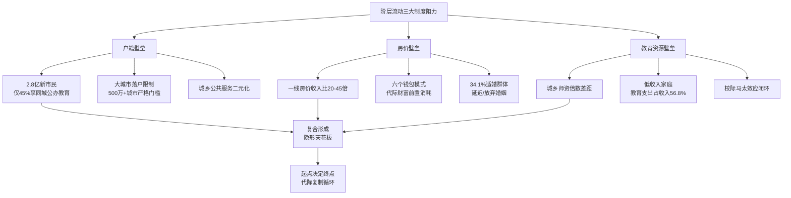

三大阻力并非孤立运作，而是相互嵌套形成"隐形天花板"系统。**热点城市学区房溢价3—5倍，教育变成"家庭财力比拼"**[^178]——这一判断精确揭示了房价与教育资源的复合作用：**优质教育资源与房产挂钩，使得房价壁垒同时成为教育资源壁垒；而户籍制度又决定了即便购买学区房，新市民子女仍可能因户籍限制无法进入对应学区学校**——三大阻力的复合作用使得阶层向上流动的"成本"远高于单一阻力的简单加和，形成"起点决定终点"的系统性代际复制循环。

## 7.4 代际财富传递的差异化模式：六个钱包、家族信托与教育投资

阶层流动减速的另一面，是代际财富传递机制在不同阶层间的差异化展开。**九阶层的代际传递呈现出从"六个钱包"（底端与中产层）到"家族信托"（高净值层）的鲜明阶梯式分化**——这一分化本身就是阶层固化的微观机制。

**底端与中产层：依赖"六个钱包"模式的家庭代际财富前置消耗**。"六个钱包"现象作为高房价背景下家庭代际财富转移的符号化表达，已经成为绝大多数底端与中产家庭代际财富传递的主导模式[^179]。其特点是**"集中式一次性转移"——三代六位老人将毕生积蓄一次性投入下一代购房，本质上是用代际财富存量换取下一代的"中产入场券"**。

这一模式的效率与代价并存。**樊纲的本意是"六个钱包是衡量家庭条件的重要指标，如果财力允许应该利用好按揭贷款的机制，而如果财力不允许则应考虑租房，不要勉强'上车'"**[^179]——但实际操作中"六个钱包"已经从"理性建议"演变为"普遍模式"。其代价集中体现在三方面：**其一，老一辈的养老储备被前置消耗，导致养老压力反向传递回中产子女；其二，代际财富一次性集中投入房产，无法实现多元化资产配置与风险分散；其三，下一代背负高额房贷，未来可支配收入被持续吞噬，难以为再下一代积累足够的代际财富——形成"中产代际财富耗散"的恶性循环**。

第6章已揭示的"养老缺口107万"在"六个钱包"模式下被进一步放大——**当父母辈把毕生积蓄都投入子女购房时，他们实际上失去了最重要的养老资产储备，未来的养老需求只能由子女承担**——这正是中产作为"三明治世代"承受双重赡养压力的微观财务机制。

**高净值层：家族信托作为多代传承的"金钥匙"**。与底端中产的"六个钱包"形成鲜明对照的，是高净值层依托家族信托实现的精细化代际传承。**截至2024年末家族信托存续规模突破8000亿元人民币、在信托产业中占比达2%；2025年第三季度全行业家族信托存续规模突破9500亿元，保险金信托规模达4200亿元，较2024年分别增长5.6%和19.1%**[^183]。

家族信托作为代际财富传递工具的功能远超一般理财——其核心在于**财产风险隔离、财富灵活传承、婚姻财产保护、后代行为引导与隔代传承**[^183]。具体而言：**(1)财产风险隔离——依托信托财产独立性与不可强制执行性，企业家在无债务风险时将家族财产置入，可有效隔离企业债务风险，避免个人财产因企业债务受牵连，为家企债务搭建"防火墙"**[^183]；**(2)财富灵活传承——设立家族信托可将希望传承的财产置入，信托公司依据合同约定在企业家身故后有序向指定后代分配信托财产**[^183]；**(3)婚姻财产保护——企业家将婚前个人财产放入信托，信托财产及其增值部分独立于夫妻双方，即便婚变配偶也无法对其主张权利**[^183]；**(4)后代行为引导与隔代传承——通过合同条款设计激励后代合理规划生活费、积极创业，并指定孙辈为受益人实现财富隔代传承**[^183]。

慈善信托作为更高阶的传承工具同样在高净值层快速扩张。**何享健2017年捐赠5亿元现金设立"顺德社区慈善信托"，截至2025年底全国慈善信托财产规模突破100亿元，较2017年增长超过10倍**[^184]。**慈善信托允许委托人通过精密的信托文件，在将财产交由专业机构打理的同时，依然对资金的投资方向、项目审批保留实质性的"发言权"——既区别于委托人的未设立信托的其他财产，也独立于受托人的固有财产**[^184]。这一工具不仅是公益行为，更是一套精密的财富管理法律架构——**将私人财产权与社会公益的持续增进有机地统一起来**[^184]。

**家族信托的服务对象与门槛**进一步揭示其阶层属性。**中国信托业协会近期起草的《家族信托业务指引(征求意见稿)》明确1000万元起投门槛与"财富保护、传承"的核心属性；建信信托家族信托存量规模已超1400亿元、中信信托家族信托受托规模突破1100亿元、服务客户数超8000名**[^185]。1000万元的最低门槛意味着家族信托从制度设计上就将中产排除在外——**其服务对象精确锁定第2章九阶层框架中的②政策影响者/富豪层、③地区行业领袖/富裕层与部分④高净值层**，覆盖人群约百万级户量级。

**各阶层共通的教育投资：高度分化的"阶层再生产核心机制"**。教育投资是九阶层之间共通但形式迥异的代际传递载体。**第5章已揭示一线城市中产年均教育投入10万、占可支配收入22—38%；前述援引的研究显示低收入家庭教育支出占收入56.8%、远高于高收入家庭的10.6%**[^182]。这种"绝对值低收入家庭低、相对占比低收入家庭高"的悖论，揭示了教育投资作为代际传递工具的双向作用：**对高净值层和中产层而言，教育投资是巩固代际优势的工具——更高的绝对投入买到更优质的资源；对低收入家庭而言，教育投资是耗尽家庭储蓄的负担——更高的相对占比反而形成对家庭抗风险能力的吞噬**。

教育投资的阶层分化体现在多个维度。**私立国际学校学费高达58万元/年（相当于普通工人12年工资）；"影子教育"占家庭收入比重达30%—50%**[^172]——这些数字背后是教育商业化与阶层化的深度叠加。**优质公立学校与户籍、房产、学区强绑定；热点城市学区房溢价3—5倍**[^178]——使得优质教育资源的获取已经不仅仅是"投入金钱"的问题，而是"必须先具备足够的财富+户籍+房产"的复合资格筛选。

**遗产税缺位与资本所得税偏轻强化代际财富集中**。中美代际财富传递机制的根本性差异之一在于税制设计。**美国对资本所得（股息、利息、股权转让）适用累进税率与遗产税体系，对超高净值家庭的代际财富传递构成显著约束；中国目前尚未开征遗产税、个人所得税中股票转让所得暂免征税、利息和股息按20%比例税率征收**——这一税制差异使得**中国高净值层的代际财富传递在制度层面几乎没有摩擦成本**，财富向头部集中的速度快于成熟经济体。第5章揭示的"中国个税存在'劳动重、资本轻'的现象——工资等劳动所得最高适用45%的边际税率，而利息、股息、股权转让等资本所得往往按20%的比例税率征收"——这一税制结构客观上为代际财富集中提供了制度便利。

下表系统整合九阶层代际财富传递的差异化模式：

| 阶层 | 主要传递工具 | 规模特征 | 制度成本 | 代际效果 |
|------|-----------|---------|---------|---------|
| ①顶层精英/②富豪层 | 家族信托+慈善信托+境外架构 | 规模数十亿至数百亿 | 极低（税制+工具齐备） | 多代稳固传承 |
| ③富裕层/④高净值层 | 家族信托+保险+不动产 | 规模千万至亿元 | 较低 | 二代基本稳固 |
| ⑤中产上层 | 教育投资+核心房产+部分保险 | 规模数百万 | 中等 | 二代有概率维持 |
| ⑥中产下层 | 六个钱包+教育投资+一套房产 | 规模数十至数百万 | 较高（耗尽老一辈储备） | 二代维持难度大 |
| ⑦温饱阶层 | 六个钱包+有限教育投资 | 规模数十万 | 极高（牺牲养老储备） | 二代向上流动困难 |
| ⑧贫困阶层/⑨底层 | 几乎无传递可言 | 微小 | 无传递工具 | 代际贫困固化 |

数据来源：基于家族信托行业研究[^183][^185]、慈善信托研究[^184]、阶层固化研究[^172]综合整理

## 7.5 中国与美日欧韩五国中产规模、占比与结构对比

将研究镜头从国内延伸至国际坐标系，是理解中国中产独特性的必要视角。**中国与美国、日本、欧洲（以德法为代表）、韩国五国中产在规模、占比、形态与脆弱性四个维度上呈现出系统性差异**——这些差异不仅是发展阶段不同的体现，更是制度设计与文化传统差异的深层映射。

**美国：约2亿中产、占比约60%、橄榄型，但呈现财富高度集中特征**。美国是全球财富总量最大的国家，**2025年美国持有全球35%的财富、由于人均财富高+人口规模大；全球百万富翁中39.7%位于美国，是中国大陆的4倍**[^186]。皮尤研究中心将中产定义为家庭年收入5.2万至15.6万美元（约合人民币37万至111万元），按此标准美国中产规模约2亿人、占总人口约60%，呈典型橄榄型分布。但美国中产也面临着财富集中度上升的压力——**2008年金融危机后中产财富恢复缓慢，前1%群体的财富占比持续上升**。

**日本：约2亿中产、占比约70%、近30年"中产瓦解"迹象明显**。日本曾是亚洲中产社会的典范，"一亿总中流"的描述在1980—1990年代成为主流叙事。但近30年来日本中产呈现明显瓦解迹象——**OECD 38个成员国里日本平均工资仅排第24位，从1991年的第13位逐步跌落：2000年第18位→2010年第21位→2015年第24位；日本平均工资33000美元，不仅低于斯洛文尼亚、立陶宛等东欧国家，还比老冤家韩国低**[^187]。**1991年日本平均工资为36879美元，30年里只增长了3000美元——仿佛时间在日本这里被按住了暂停键，而美国增长了27000美元、德加英法都增长了1万美元以上**[^187]。

日本中产的"失去30年"对中国具有强烈的警示意义。第5章已系统援引"日本中产返贫史"——**日本住房资产占家庭财富60%、股票/保险/养老金占比合计不足15%、抗冲击能力极弱**——这一资产结构与中国当前中产高度相似。**日本中产从1990年代瓦解至今的轨迹，本质上是"高房价高杠杆遭遇资产价格暴跌+终身雇佣瓦解+老龄化加剧+人口负增长"的复合冲击**——其中相当部分要素已经在当代中国显化。

**德法等欧洲：中产稳定在50%—70%、福利国家支撑型**。德国、法国等欧洲发达经济体的中产呈现稳定的橄榄型结构，其支撑力量来自强大的福利国家体系。**OECD成员国平均工资为51607美元，集中在这一区间的是澳大利亚、德国、加拿大、英国、芬兰、法国等国，可视为"中等发达国家"标准**[^187]。德法中产的稳定性体现在三个维度：**其一，强大的公共养老与医疗保障使中产几乎无养老焦虑；其二，住房自有率相对较低（德国约50%、法国约60%），中产财富不过度依赖房产；其三，劳动法保护严格，35岁危机式的大规模裁员相对罕见**。

**韩国：中产约60%但家庭债务杠杆率88.6%、DTI达203.7%、高负债型**。韩国中产呈现出与中国最为相似的脆弱性特征。**韩国家庭债务与可支配收入比率(DTI)从2008年的138.5%急剧上升至2022年末的203.7%——意味着韩国家庭需用超过两年的全部可支配收入才能偿清债务，而同期其他发达国家DTI均值约为160%**——已在第5章引用。韩国中产的脆弱性根源在于**高房价+高教育投入+高消费的三高叠加**——首尔房价收入比、家庭债务杠杆率、教育私人投入占比均位居全球前列。**韩国2021年正式从"发展中国家"被联合国认定为"发达国家"，这是自1964年贸发会议成立以来首次有国家变更为发达国家**[^188]——但这一身份升级并未缓解韩国中产的负担与焦虑。

**中国：严格中产仅8.9%、广义中等收入群体约30%、金字塔型**。第3章已系统揭示中国中产规模在不同口径下的巨大差异——按2025年国家统计局-社科院四维标准严格中产仅3320万户、占8.9%；按宽口径中等收入群体约4亿人、占比不足40%。**中国中等收入群体的人口占比明显偏低，且这一群体本身呈现"收入达标但生活吃紧"的特征——许多家庭尽管收入可观却仍感经济拮据，因此被戏称为"负资产中产"或"隐形中产"**——已在第1章引用。

下表系统整合五国中产的核心识别门槛、规模、形态与脆弱性特征：

| 维度 | 中国 | 美国 | 日本 | 德法 | 韩国 |
|------|------|------|------|------|------|
| 中产规模 | 严格3320万户、广义约4亿人 | 约2亿人 | 约2亿人 | 各国50%-70%人口 | 约60%人口 |
| 占总人口比 | 严格8.9%、广义<40% | 约60% | 约70% | 50%-70% | 约60% |
| 收入门槛 | 家庭年收入20-50万 | 家庭年收入5.2-15.6万美元 | OECD平均水平以下 | 接近OECD均值 | 中等偏下 |
| 财富形态 | 金字塔型（顶端集中） | 橄榄型（顶端集中度上升） | 橄榄型→瓦解中 | 稳定橄榄型 | 橄榄型但负债极端 |
| 主要脆弱性 | 高房产依赖+高负债+弱社保 | 财富集中度上升+医疗成本 | 工资停滞+老龄化 | 增长乏力 | 极端高债务杠杆 |
| 心理状态 | 焦虑但乐观（民调来世仍愿生于本国近90%）[^189] | 中度焦虑 | 全面悲观 | 相对稳定 | 高度焦虑 |

数据来源：综合瑞银UBS《Global Wealth Report 2025》[^186]、瑞信瑞银2023年全球财富报告[^174]、OECD工资数据[^187]、博报堂2024年六国民调[^189]、第3—5章数据整理

特别值得注意的是**博报堂2024年六国民调显示的中国乐观与日本悲观的两极对比**——**中国近90%受访者表示来世仍愿意生于本国，居六国之首；日本仅63.7%、德国低于60%；中国人在"国家前景、经济预期、幸福感增加"等问题上全部第一，日本基本垫底**[^189]。这一民调结果揭示了一个有趣的悖论——**中国中产虽然在客观财力指标上脆弱性最为严峻，但在主观心理认同上反而呈现最强烈的乐观情绪**。其根源可能在于：**中国正处于"过去几十年生活水平显著改善"的纵向比较框架中，因此即便面临困境仍保留对未来的期待；而日本则处于"过去30年停滞甚至倒退"的纵向比较框架中，因此呈现全面悲观**。

## 7.6 中产资产配置的国际对比：房产69%vs36%的根本性失衡

中产脆弱性的国际差异，最直接体现在资产配置结构上。**中国家庭房产占总资产的比重达到59.1%—69%，美国仅为36%——这一悬殊差距是中国中产"账上有钱、心里没底"的国际差异化根源**[^176]。

**中美资产配置的根本性差异**已在第5章系统呈现，本节进一步从国际坐标系深化对比：

| 维度 | 中国家庭 | 美国家庭 | 日本家庭 | 德国家庭 | 韩国家庭 |
|------|---------|---------|---------|---------|---------|
| 房产占总资产 | 59.1%-69% | 27%-36% | 房产金融并重 | 约40%（住房自有率仅50%） | 接近中国（高自有率+高房价） |
| 金融资产占比 | 20.4% | 42% | 较高 | 占主导 | 较低 |
| 股票占金融资产 | 1.4%（直接持股） | 14.8% | 较低 | 较低 | 较低 |
| 风险金融资产参与率 | 59.6% | 远高于中国 | 中等 | 中等 | 中等 |
| 个人养老金账户 | 第三支柱2022年起步 | 401k普及 | 完善 | 完善 | 较为完善 |

数据来源：综合中国人民银行2019年城镇家庭资产负债调查[^176]、《2023年全球财富报告》[^174]、第5章已援引数据整理

但值得指出的是，**房产高占比并非中国独有现象**。**世界范围来看房地产约占全球资产总值的60%；澳洲早在2014年就超过60%，经过过去两年的大涨现在已经与中国基本持平；至于冰岛和挪威则比澳洲还要高一些**[^190]。**第一太平戴维斯发布的《私人财富全球之旅》报告显示，2015年在房地产、股权、债券、黄金等多种资产形式中，房地产总产值接近217万亿美元，是世界生产总值的2.7倍左右，约占全球主流资产总值的60%**[^190]。住宅物业占全球房地产总值的75%，涵盖大约25亿户家庭——**房地产是国家、企业和个人财富的重要储存方式**[^190]。

但中国房产高占比的特殊性体现在三方面：**其一，不是"分散持有"而是"中产被锁定"——澳大利亚等高房产占比国家中产同时具备较强的金融资产配置能力，而中国中产的金融资产规模严重不足；其二，不是"成熟稳定"而是"周期下行"——澳大利亚、挪威等国房产占比高发生在长期房价稳定上涨背景下，而中国当前正处于过去四年房价累计下跌30%—40%的下行周期；其三，不是"工具丰富"而是"风险集中"——澳大利亚等国普遍有完善的房地产投资信托(REITs)、抵押贷款保险等金融工具分散风险，而中国房地产风险主要由家庭直接承担**。

**中国"房产独大"的四大制度成因**值得系统剖析：

**成因一：住房私有化改革催生96%自有率**。1998年的住房商品化改革是中国家庭资产结构的关键转折点。**1998年以前所有的房子都是国家提供、单位分配，听起来很美好其实并不美好——分配要论资排辈、要长时间等待、住房面积很小；住房商品化改革之后中国的社会阶层变得越来越复杂——收入和财产差距扩大**[^191]。这一改革在短短20年内将中国家庭住房从"福利分配"转变为"市场购买"，催生了全球最高的住房自有率（央行调查显示城镇住房拥有率达96.0%，户均拥有住房1.5套）。**1998年以后住房商品化改革对财富分配产生了巨大影响——两个大学教师，一个人在10年前买了房，一个人相信房价会下跌；后者现在可能有300万元的存款，房产对社会结构产生了更大的影响**[^191]。

**成因二：土地财政依赖固化高房价**。**中国"土地财政"的成因主要包括分税制改革后地方政府财权减少而事权扩大、城镇化推动土地需求激增、土地出让收入成为地方主要财源；土地收入占地方综合财力的30%—50%，短期内难以摆脱**[^192]。土地财政使得地方政府在客观上具有维持高房价的动机——**地方政府通过"低价征地、高价出让"模式获取资金，形成土地财政循环；土地抵押融资成为地方城投公司主要融资手段，进一步强化土地财政**[^192]。当前转型难点在于**地方债务与土地捆绑——地方隐性债务多以土地预期收益为抵押，土地收入下滑可能引发债务风险；房产税等新税种尚未规模化，财产税体系不完善**[^192]——这意味着房产从居住属性向资产属性的回归路径仍然漫长。

**成因三：A股市场融资功能为主而分红回报薄弱**。第5章已揭示中国资本市场以融资功能为主、上市公司分红回报意识薄弱、股价波动大，抑制了居民通过权益投资获取稳定收益的意愿。**反观美国，成熟的金融市场和普及的退休金账户(如401k)让更多中产阶级得以分享资本市场的增长红利**——这一差距使得中国中产即便希望多元化资产配置，也缺乏可信的金融市场作为承接载体。

**成因四：个人养老金账户（对应美国401k）刚起步**。中国第三支柱个人养老金体系2022年才正式启动，覆盖人群与累计金额均处于起步阶段。**美国401k账户作为雇主匹配缴费的退休储蓄计划，使中产阶级几十年积累形成大额金融资产**——这一制度差异使得中美中产在60岁退休时的金融资产规模差距高达数倍乃至十倍以上，而这些金融资产正是美国中产抗风险能力的核心载体。

资产配置失衡的现实后果在中产家庭层面体现为多重困境。**北上广深房价波动剧烈使得中产家庭"困在"楼市中，房产资产难以变现转化为可投资的金融资本**——这一"被房产锁定"的状态使得中国中产无法通过资产配置优化来提升抗风险能力，只能被动承受房产周期波动的全部冲击。

## 7.7 中产收入构成与社会保障的国际差距

资产配置失衡之外，中产脆弱性的另一国际差异化根源在于收入构成与社会保障供给。**中美日欧韩中产在收入构成多元化与社会保障覆盖深度两个维度上呈现出系统性差距**，而中国在这两个维度上几乎都处于劣势。

**收入构成方面：中美日欧韩的多元化梯度**。第5章已系统揭示中美收入构成差异：**中国中产工资性收入占80%以上、财产性收入不足12%；美国中产工资性60%—70%、财产性15%—20%（前10%群体>30%）**。这一差距的根源在于资本市场发达程度、税制设计与社保结构的复合影响。

将比较扩展至日欧韩：**日本中产在"失去30年"中工资性收入停滞，财产性收入增长有限——这正是日本中产瓦解的核心机制；欧洲国家通过强大的社保转移支付使转移性收入占比显著高于中国，福利国家的"普惠安全网"成为中产稳定性的重要支撑；韩国中产收入构成与中国类似但财产性收入略高，主要差异在于韩国中产同时面临极端高债务杠杆**。

**采用宽口径统计美国居民可支配收入占GDP比重高达73%—82%，而中国这一比例约为43%**——这一双倍差距反映出在国民收入"大蛋糕"的分配中，中国居民部门分享的比例相对较低。这意味着即便中国GDP总量已是世界第二，但落入居民部门可支配收入的份额相对偏低，进一步压制了中产财产性收入的形成空间。

**社会保障方面：从全民社保覆盖到三支柱发育不平衡**。中国社会保障建设取得了举世瞩目的成就——**截至2019年6月底全国基本养老、失业、工伤保险参保人数分别为9.47亿人、2亿人、2.45亿人；全民医保基本实现，城乡基本医疗保险参保率超过98%、覆盖人口超13.5亿；中国将全球社会保障覆盖率拉升了11个百分点，2016年国际社会保障协会(ISSA)将"社会保障杰出成就奖"授予中国政府**[^193]。**通过发挥独特优势、不断进行制度创新，中国成为了当今世界社会保障发展速度最快、覆盖人口规模最大、保障水平提升幅度最多的国家**[^193]。

但中国社保的"覆盖广度"与"保障深度"之间存在显著差距。**第二支柱企业年金覆盖率仍低，仅大型央企、国企、外企部分覆盖，民营中小企业普及率极低；第三支柱（个人养老金）2022年才正式启动，覆盖人群与累计金额均处于起步阶段**——已在第6章引用。**第一支柱基本养老金替代率不足40%、医保自付41.6%**这两组数据精确反映了中国社保"普惠但浅薄"的现实特征。

国际对比下中产社保供给的差距尤为明显：

| 国家 | 第一支柱（公共养老） | 第二支柱（雇主补充） | 第三支柱（个人补充） | 医疗保障 |
|------|------------------|------------------|------------------|---------|
| 中国 | 替代率<40%、城乡差距大 | 企业年金覆盖低 | 个人养老金2022起步 | 医保自付41.6% |
| 美国 | Social Security替代率约40% | 401k普及+雇主匹配 | IRA账户普及 | 医疗私营但中产覆盖较广 |
| 日本 | 公共养老金完善 | 厚生年金覆盖 | NISA等账户 | 国民健康保险全民覆盖 |
| 德法 | 公共养老金高替代率 | 职业养老金完善 | 私人养老金多元 | 全民医疗保障 |
| 韩国 | 公共养老金中等 | 退职金制度 | 个人养老金中等 | 国民健康保险 |

数据来源：综合社保研究[^193]、第5—6章已援引数据整理

中国社保结构的特殊性体现在三方面：**其一，"高缴费+低预期"的双重困境——中产作为缴费主体需缴纳高额社保（个人+单位合计约工资的40%），但未来养老金替代率持续下降的不确定性使其对社保的"信赖度"远低于发达国家中产；其二，2.3亿灵活就业者社保覆盖不足——这一群体既包括被35岁危机推向网约车、外卖、自媒体的前中产，也包括未能跨入正规就业的青年，他们既在事实上承担着"中产岗位"的工作内容，又在制度上享受不到中产应有的社保保障；其三，城乡社保差距巨大——2023年城镇职工养老金人均月领近4000元，而农村老人每月只有一两百，这一差距使得来自农村的中产一代既不能依赖父母养老金维持基本生活，反而要每月反向输血**——已在第6章引用。

**社保滞后如何放大中产焦虑**。社保供给不足是中产焦虑的重要制度根源——当一个家庭对未来养老、医疗、失业风险缺乏稳定预期时，必然产生超额储蓄需求、压制当期消费、加剧资产配置保守化倾向。**中国家庭储蓄率达31.7%、远高于发达国家水平**——这一高储蓄率本身就是社保不足的反向投射：当公共保障不够厚时，家庭只能通过自我储蓄进行兜底。**这种"自我兜底"的代价是中产的消费意愿被持续压制，从而抑制了内需消费驱动型经济增长**——这也是中央近年来反复强调"完善社会保障体系"以"扩大中等收入群体规模"的政策逻辑。

## 7.8 中产心理认同与焦虑感的跨国比较

中国中产的独特性不仅体现在客观财力指标上，更体现在主观心理认同与焦虑感的特殊形态上。**博报堂2024年六国民调与皮尤研究、社科院李春玲研究等多源数据的交叉验证显示，中国中产呈现出"客观脆弱+主观乐观"的独特心理结构**——这一结构既与中国快速发展的纵向比较框架有关，也与社会保障滞后、阶层快速变迁、物质欲望膨胀等深层因素密切相关。

**博报堂2024年六国民调揭示的中国乐观主义**。**博报堂DY控股旗下的100年生活者研究所2024年3月跨国调查（覆盖中国、美国、日本、德国、韩国、芬兰5600多人）显示——中国人在大多数问题上都最乐观；只有活到百岁那项65.6%说想排第二，美国66.7%第一；其余的国家前景、经济预期、幸福感增加啥的中国全第一；日本基本垫底，生活打分才5.9，想长寿的只有27.4%**[^189]。**最有意思的是来世出生意愿——中国人近90%说愿意，美国80%，芬兰差不多80%，韩国65%，日本63.7%，德国低于60%**[^189]。

中国近90%受访者愿意"来世仍生于本国"这一结果尤为令人意外，因为**中国人这么高不奇怪，但高到碾压芬兰这让我没想到——芬兰是联合国幸福报告常年第一的国家，很多人润出去都把北欧当梦中情地**[^189]。这一悖论的解释可能在于：**中国人得分高，可能是因为这些年变化大，生活比以前好多了——房子车子收入涨，国家发展快，有实打实的获得感；日本从上世纪90年代泡沫破了后就在原地踏步**[^189]。

**中产焦虑的国际共性与中国特殊性**。但中产乐观情绪并不掩盖焦虑的真实存在——**中产的焦虑是一个全球现象，这跟充满不确定性的世界里人们对于职业的不安全感有关；美国和法国的经济学家做过研究，经济不平等程度越高的社会越会"鸡娃"，"鸡娃"带来的经济回报更高；中国的"鸡娃指数"要高于国际水平，在中国收入高的地方教育回报比较高**[^191]。

中国中产焦虑的特殊性体现在四个维度。**第一，规模碾压感——中国中产阶层数量超过美国总人口一半规模——中国的中产阶层按照比例来讲是比较低的，乐观估计大概是2亿人保守一点大概为1亿人，占总人口比例不算高比欧美社会低很多；但是从规模上说，全世界人口超过1亿的国家总共只有13个，中国中产群体的绝对数量已经超过全世界绝大多数国家的人口**[^191]——这种规模碾压感对中产个体心态、生存状态会造成很大影响。

**第二，精细分层社会的形成**。**1949—1998年我们是一个扁平社会没有那么细的分层——收入差距小家庭财产少、阶层混居、中低消费为主；1994年以后开启了全面的市场化改革，特别是1998年以后住房商品化改革对财富分配产生了巨大影响——中国的社会阶层变得越来越复杂：收入和财产差距扩大；居民收入基尼系数基本维持在0.5的水平，更高的是财产基尼系数；财产对社会结构产生了更大的影响**[^191]。这种"精细分层"使得中产个体在比较中持续感到压力——**两个大学教师，一个人在10年前买了房，一个人相信房价会下跌；后者现在可能有300万元的存款**[^191]——同等收入的群体因房产持有差异而出现的财富鸿沟，是精细分层社会最具特色的焦虑机制。

**第三，统计中产与自我认同中产的系统性背离**。第3章已系统揭示——**个人年收入超过30万元的人群中，只有约半数认同自己的中产身份；接近四分之一的中产者声称自己的住房条件太差，接近三分之一的中产者感受到强烈的购房费用压力**[^194]。**与当今世界多数国家的中产群体相比，中国中产的实际抗风险能力其实更强——储蓄率和房产拥有率远高于其他国家，但为什么他们经常焦虑？难以培育出中产心态的主要问题在于安全感和满足感的缺乏，这一方面是因为社会保障水平较低、公共服务质量较差，另一方面是因为过去几十年高速经济增长和急剧社会变迁催生了极强的物质欲望追求**[^194]。

**第四，购房、子女教育、医疗、养老四大焦虑**。**中产的压力和焦虑最主要来源于四个方面：购房、子女教育、医疗和养老，其中住房问题是其最大的焦虑**[^194]——这四大焦虑在第6章已系统展开。

**美日韩中产焦虑的对照特征**。美国中产焦虑呈现"快乐教育与精英鸡娃"两极分化——**所谓的"快乐教育"是工人阶层的，工人阶层家庭讲快乐教育因为他们基本已经放弃了，再怎么努力学习也很难与精英子弟竞争；精英阶层教育强度也很大跟我们国家是相似的；著名的"虎妈"蔡美儿就是耶鲁大学法学院的教授**[^191]——美国中产焦虑被阶层差异"分流"，工人阶层选择放弃竞争、精英阶层选择极端鸡娃，形成两极结构。

日本中产呈现"失去30年"后的全面悲观——**乡民评论："工资是真的涨不上去也不知道该怎么办；今天在家做饭团当午饭吃只有节约这一条路了；作为G7成员国不觉羞耻吗；终于被韩国反超了；失去的30年接着是败北的30年"**[^187]——日本中产焦虑已经从"局部失意"演变为"全面悲观"，这种心态与中国中产的焦虑性质完全不同。

韩国中产因高房贷、激烈竞争同样焦虑严重，但其焦虑机制更接近中国——高房价压力、教育私人投入畸高、家庭债务杠杆率极端等。但韩国2021年正式获得"发达国家"地位[^188]这一身份认同的提升，部分缓解了主观焦虑感。

中国中产"物质改善与心理焦虑并存"的独特特征可以归纳为：**纵向看是改善的（来世仍愿生于本国近90%），横向看是焦虑的（年薪30万只半数自认中产）；表面看是乐观的（对国家前景最乐观），深层看是脆弱的（鸡娃指数高于国际水平、四大焦虑居高不下）**——这种"纵向改善+横向焦虑"的双重结构，是中国中产心理认同最独特的现象。

## 7.9 中国中产相对成熟经济体的四大独特性及制度成因

综合前八节的国际对比与机制剖析，可以系统提炼中国中产相对成熟经济体的四大独特性，并将其回扣至深层制度成因。这一总结不仅是本章的收束，也为第8章政策启示铺设逻辑桥梁。

**独特性一：高房产依赖（资产69%vs36%）**。中国中产家庭房产占总资产60%—69%，是美国36%的近两倍。这一独特性的制度成因复合而深刻：

**根源1：土地财政路径依赖**。**土地收入占地方综合财力的30%—50%；地方隐性债务多以土地预期收益为抵押**[^192]——使得高房价具有制度性保护。

**根源2：住房金融化推动**。1998年住房商品化改革后房产从"福利分配"转为"市场购买"，住房金融化与房贷扩张使房产成为家庭财富主要载体。**2023年8月国务院出台著名的"18号文件"将房地产业定位为国民经济的支柱产业，此后的十年间该行业迅猛发展被称为中国房地产的"黄金十年"**[^190]——政策定位强化了房产的资产属性。

**根源3：缺乏财产税体系**。中国目前未开征房产税、遗产税等财产税体系，使得多套房持有的成本极低，进一步固化了房产作为家庭财富载体的地位。**房产税等新税种尚未规模化，财产税体系不完善**[^192]。

**独特性二：低金融资产（20.4%vs42%）**。中国家庭金融资产占总资产仅20.4%，远低于美国42%；股票占金融资产仅1.4%，远低于美国14.8%。其制度成因包括：

**根源1：资本市场以融资功能为主**。中国A股市场长期定位于服务实体经济融资需求，上市公司分红文化薄弱、股价波动大，抑制了居民通过权益投资获取稳定收益的意愿。

**根源2：税制"劳动重资本轻"反向激励储蓄**。**中国个税存在"劳动重、资本轻"的现象——工资等劳动所得最高适用45%的边际税率，而利息、股息、股权转让等资本所得往往按20%的比例税率征收，甚至股票转让所得暂免征税**——这一税制虽然客观上有利于资本所得者，但也使得普通家庭投资股市的吸引力下降。

**根源3：金融鸿沟存在**。**高收入群体能接触私募、信托等高收益产品，而普通居民和农村居民的投资渠道狭窄；反观美国，成熟的金融市场和普及的退休金账户(如401k)让更多中产阶级得以分享资本市场的增长红利**——金融工具的阶层化使得中产难以通过金融市场实现财富积累。

**独特性三：强教育焦虑（鸡娃投入占可支配收入22—38%vs美国5%）**。中国家庭教育支出占家庭收入17.1%、城镇中产可达22—38%，远高于美国家庭1—2%、韩国5.3%[^182]。其制度成因包括：

**根源1：优质教育资源稀缺垄断**。**全国仅有不到5%的学校被公认为"重点学校"，但这5%的学校吸纳了70%以上的优质教育资源**——已在第3章引用。**优质公立学校与户籍、房产、学区强绑定；热点城市学区房溢价3—5倍**[^178]——使得教育资源获取本身成为阶层筛选机制。

**根源2:学历筛选竞争激烈**。**升学渠道狭窄+多元上升通道缺失**——除了高考几乎没有其他被社会广泛认可的阶层跃升路径，使得家庭别无选择地将所有教育投入倾向应试。**简单的禁止私人辅导机构并不能有效解决家庭教育成本高昂的问题——事实上，课外辅导和额外活动在家庭教育支出中所占比例较小，而大部分支出（超过70%）与学校的学费和其他费用相关**[^182]——这一研究发现揭示了"双减"政策难以根本解决教育焦虑的深层原因。

**根源3：阶层焦虑驱动**。**经济不平等程度越高的社会越会"鸡娃"，"鸡娃"带来的经济回报更高——在中国收入高的地方教育回报比较高，这和人力资本回报有关**[^191]——精细分层社会下教育成为父母为子女争取阶层位置的核心工具，焦虑被持续放大。

**独特性四：弱社会保障（养老替代率<40%、自付医疗41.6%）**。中国社保虽然在覆盖广度上居全球前列，但保障深度不足——养老金替代率不足40%、医保自付41.6%、第二三支柱发育滞后。其制度成因包括：

**根源1：三支柱发育不平衡**。**中国社保以第一支柱（基本养老）为主、第二支柱（企业年金）覆盖低、第三支柱（个人养老金）刚起步——这一结构与美国"401k+IRA+Social Security"三支柱并重、欧洲"高公共养老金+职业养老金+多元私人养老"完善体系形成鲜明对比**。

**根源2：灵活就业群体覆盖不足**。**2.3亿灵活就业者无完善社保**——这一在2010年后快速膨胀的群体既包括平台经济创造的新就业形态，也包括35岁危机后被推向灵活就业的前中产，其社保覆盖严重不足成为社会保障体系的最大漏洞。

**根源3：财政压力下的替代率压低**。**辽宁2024年省级社保支出是教育的6倍多；社保支出涨得这么快答案就俩字：老龄化**——已在第6章引用。在老龄化加速、财政压力加剧的背景下，公共养老金替代率持续下降几乎不可避免。

下表系统整合中国中产四大独特性及其制度成因：

| 独特性 | 中国 vs 成熟经济体 | 制度成因 | 政策含义 |
|--------|------------------|---------|---------|
| 高房产依赖 | 资产69% vs 美36% | 土地财政+住房金融化+缺乏财产税 | 房产去金融化+完善财产税 |
| 低金融资产 | 20.4% vs 42% | 资本市场融资功能为主+税制劳动重资本轻+金融鸿沟 | 资本市场改革+税制平衡+金融普惠 |
| 强教育焦虑 | 22-38% vs 美5% | 优质教育资源垄断+学历筛选激烈+缺乏多元上升通道 | 教育平权+多元上升通道建设 |
| 弱社会保障 | 替代率<40% vs 欧洲>60% | 三支柱失衡+灵活就业覆盖不足+老龄化压力 | 社保深化+第二三支柱建设 |

数据来源：综合本章及前述章节多源数据整理

**回扣至中国从"金字塔型"向"橄榄型"转型的制度供给改革议程**。中国中产四大独特性的制度成因揭示了一个根本判断：**中国中产规模扩大与脆弱性化解，不能依赖现有中产的"自我跃升"或"自我修复"，而必须依赖系统性的制度供给改革**。具体而言：

**第一，房产去金融化与多元资产配置工具建设**——通过完善REITs、房产税、租购并举等工具，使房产从"财富主要载体"逐步回归"居住属性"，释放中产被锁定的房产财富。

**第二，资本市场改革与中产财产性收入培育**——通过完善上市公司分红制度、平衡资本所得税与劳动所得税、扩大第三支柱个人养老金覆盖等措施，使中产能够通过金融市场获取稳定的财产性收入。

**第三，教育平权与多元上升通道建设**——通过推进基础教育均衡化、突破学区房与户籍绑定、完善职业教育体系、降低优质教育资源垄断程度，将教育从"阶层再生产工具"重新转变为"机会均等器"。

**第四，社会保障深化与全民覆盖**——通过提升基本养老金替代率、扩大第二支柱企业年金覆盖、加强第三支柱个人养老金、将2.3亿灵活就业者纳入社保体系，使中产对未来形成稳定预期，从而释放消费意愿与消费力。

**第五，户籍制度深化改革与新市民市民化**——通过推进500万人口以上大城市户籍改革、打破城乡二元结构、保障2.8亿新市民在教育、医疗、住房等公共服务领域的平等权益，畅通底层向中产的向上流动通道。

**叶茂升对此曾系统论述过"畅通向上流动通道"的制度逻辑**——**畅通向上流动通道、给更多人创造致富机会，核心本质是要打破现有社会阶层的既得利益束缚，消除社会贫困者在追求致富机会上面临的各种社会排斥，防止先富者利用财富积累形成的先发优势来构筑护城河，致使后富者通过辛勤劳动、合法致富的通道被堵塞**[^173]。**当一个社会在教育、住房、医疗等基本公共服务保障方面缺乏公平普惠制的供给安排，社会弱势群体将失去增强自身发展能力的机会——他们企图通过勤奋创新摆脱贫困的希望被浇灭，贫穷就会出现代际传递，一代穷则世代穷**[^173]——这一深刻判断揭示了制度供给改革对阶层流动的根本性意义。

至此，本章已经完成中国九阶层财富流动性、代际传递与国际比较的全景剖析。**核心发现可归纳为三组判断**：其一，**中国阶层流动呈现从"高速流动"向"流动受限"的转折性事实——代际收入弹性从1980年代出生队列的0.390升至1988后队列的0.442、35岁以下中产达标率仅12.7%、教育/创业/技术/资本四大向上通道的有效性均出现系统性衰减、户籍/房价/教育资源不均三大制度阻力复合作用形成"隐形天花板"**；其二，**代际财富传递呈现九阶层差异化的鲜明阶梯——底端中产层依赖"六个钱包"模式集中式一次性转移代际财富、高净值层依托家族信托9500亿存续规模实现精细化多代传承、教育投资在各阶层呈现"低收入家庭占比反高"的吞噬式特征**；其三，**中国中产相对成熟经济体呈现"高房产依赖+低金融资产+强教育焦虑+弱社会保障"四大独特性，这些独特性的制度成因（土地财政、资本市场欠发达、教育资源垄断、三支柱失衡）共同构成了从"金字塔型"向"橄榄型"转型必须直面的制度供给改革议程**。下一章将沿着这一改革议程，系统提出中国九阶层与中产研究的政策启示与个人层面应对策略，为全篇报告画上闭环。

# 8 研究结论与政策启示

行至全篇报告的收束章节，前七章构筑的研究全景已经清晰呈现：第1章以"金字塔型"宏观坐标锚定全篇方法论基石，第2章逐层勾勒出从508亿美元级超级富豪到月收入不足千元的5.47亿底层的九阶层财力图谱，第3章在多套口径辨析中将中产规模锁定在严格3320万户至最宽4亿人的近30倍区间，第4—5章解剖中产"大而不强、底端肥大"的金字塔型内部结构与"账上有钱、心里没底"的财务实质，第6章揭示中产"高负债+强焦虑+易脆弱"的四维困境，第7章则以国际坐标系定位中国中产"高房产依赖+低金融资产+强教育焦虑+弱社会保障"的四大独特性及其制度成因。**这七章共同回答了用户研究主题的核心追问——中国九阶层实际收入与财务状况如何？中国的中产有哪些特点、实际人数与财力究竟几何？**

但研究的真正价值并不止于"看清现状"，更在于"指明方向"。本章作为全篇收束，将沿着**"核心发现总结—中产真相定论—宏观政策路径—重点群体扩中—个人微观策略—研究局限与展望"**六维路径展开，把前七章的实证发现转化为面向国家、市场、个人三个层面的行动框架，为"十五五"期间扩大中等收入群体至8亿的国家愿景提供基于本研究的系统性政策建议[^195][^196]。

## 8.1 九阶层收入与财富分布的核心发现总结

研究的核心发现可以归纳为**三组结构性判断**——这三组判断不仅是前七章实证分析的高度凝练，更是后续政策设计与个人策略制定的逻辑前提。

**第一组发现：中国当前呈现典型的"金字塔型"而非"橄榄型"财富分布，财富集中度远超大众认知**。第1—2章的逐层画像揭示了一幅极度不均衡的图景——**顶端0.026%的13万亿元级超高净值家庭掌握87万亿元财富、占富裕家庭150万亿元财富的58%；招商银行2.5%的金葵花及私行客户管理着14.93万亿零售总资产中的87%；前述100位福布斯榜富豪所控制的财富以千亿美元计**。与塔尖的极度集中形成尖锐对照的是塔基的极度扁平——**约2%的人口持有约80%的银行存款；中国家庭金融调查中心数据显示个人存款中位数仅约5万元、意味着全国一半人口存款未及此数额**。这一"塔尖瘦、塔身宽、塔基大"的金字塔型结构，与美国约60%、日本约70%、欧洲50%—70%、韩国约60%的橄榄型中产占比形成代际鸿沟，决定了中国阶层结构转型的复杂性与紧迫性。

**第二组发现:"6亿人月收入1000元"的国情基线长期稳定,与人均GDP突破1.3万美元的总量优势形成尖锐张力**。第1章已系统验证这一国情基线的真实性与时效性——北师大中国收入分配研究院测算2019年5.47亿人月收入低于1000元、6亿人月收入低于1090元;到2024年,低收入组2.8亿人仍处于月均不足800元的水平,中间偏下组2.8亿人月均1801元——五年过去这一基线在数量级上依然成立,只是绝对金额随通胀略有抬升。这一基线对中产研究具有奠基性意义:**它揭示了人均41314元可支配收入背后5.47亿人月入1000元的真实结构,任何脱离这一基线讨论中产规模的研究都会陷入"只见塔尖、不见基座"的视野偏差**。这一国情张力也是2024年中央首次提出"实施城乡居民增收计划"、并将"扩大中等收入群体""提低扩中"作为"十五五"规划核心政策方向的现实基础[^195][^196][^197]。

**第三组发现:九阶层之间存在难以跨越的"资产积累断层",决定了阶层结构转型必须依赖系统性制度供给改革**。第2章逐层画像揭示的关键事实是——**高净值层(净资产600万—3000万)与中产精英层(净资产300万—600万)之间存在明显的资产积累断层,中产层与温饱阶层之间存在收入流量与抗风险能力的代际鸿沟,而温饱阶层与贫困阶层之间则是社保兜底与自食其力的边界差异**。第6—7章进一步揭示这些断层并非可以通过个人努力跨越——**在工资性收入占80%以上、储蓄被房贷与教育持续吞噬、财产性收入不足12%的中产财务结构下,从中产层跨越到高净值层下沿需要至少2—3倍的财富积累,几乎不可能在一代人时间内完成**。这一判断决定了中国阶层结构从"金字塔型"向"橄榄型"的转型,**不能依赖现有中产的"自我跃升"或"自我修复",而必须依赖系统性的制度供给改革**——这正是本章后续政策路径讨论的逻辑起点。

## 8.2 中产阶层规模、财力与特征的最终判断

基于第3—6章的多口径辨析与深度画像,本研究给出关于中国中产的最终判断——**规模上严格3320万户与广义4亿人之间近30倍的差距、财力上"账面富裕、现金贫困"的真实底色、特征上"大而不强、底端肥大"的内部金字塔结构**——这三个层级的判断澄清了贯穿本研究的核心追问。

**规模判断:严格中产3320万户、广义中产1.2亿户、最宽中等收入群体约4亿人,三个层级跨越近30倍**。第3章已系统呈现这一近30倍的规模区间:按2025年国家统计局-社科院四维标准(家庭年收入≥35万、净资产≥300万、本科以上学历、稳定收入)严格中产仅3320万户、占8.9%;按宽口径"家庭年收入20—50万、净资产80—300万"广义中产约9000万—1.2亿户、占18%—24%;按最宽国家统计局标准(家庭年收入10—50万)中等收入群体约4.6亿人、占比近40%。**最严苛的汇丰693万流动资产门槛下能达到的家庭可能不足1%——已经接近高净值层的下沿**。这一规模区间本身揭示了"中等收入"与"中产阶级"两个概念的根本分野:**前者仅看收入流量,后者强调资产存量、教育、职业稳定性与抗风险能力四维一体**——这一概念分野是理解所有中产规模争议的核心钥匙[^197][^198]。

**财力判断:"账面富裕、现金贫困"是当代中产的真实底色**。第5章已系统揭示中产家庭财务结构的四维失衡:**资产端房产占总资产60%—85%(一线城市核心区甚至超过70%)、负债端房贷占总负债75%—78%(35—45岁中产家庭资产负债率68.3%)、收入端工资性占80%以上(财产性收入不足12%)、流动性储备覆盖3—6个月支出(43%家庭无法在紧急情况下迅速筹措50万元)**。这四维失衡共同决定了中产的脆弱本质——**当一个家庭60%—85%的财富沉淀于一种缺乏现金流、缺乏变现速度、还在持续缩水的资产时,这个家庭实际上没有任何抗风险能力,它的"财富"是一种"幻觉财富"**。第6章揭示的"纸面中产"现象——北京五环外500万房+350万贷款+月光的典型画像、年薪80万家庭"工资到账即清零"——正是这一财力本质的真实投射。

**特征判断:中产呈现"大而不强、底端肥大"的内部金字塔型结构**。第4章已揭示这一结构性事实——**北京大学经济学院2024年底研究表明中国68%的中产阶级属于中低收入子层;按净资产剔除房贷后能称为"标准中产"的家庭可能不足1000万户(与按收入口径3320万户存在3—5倍的"伪中产折损率");从地理分布看一线42.7%+新一线35.3%占比78%、东部三大经济圈占70%;从行业分布看金融、IT、医疗、高端制造、教育文化五大行业占近97%**。这一"内部金字塔型+地理高度集聚+行业高度集中"的复合特征,使得中产成为一个"高度依赖特定赛道与特定城市"的群体——任何一个行业的周期下行(如近年IT行业的裁员潮、教培行业的政策出清、地产行业的整体调整)都可能引发大规模的中产返贫。

**这一规模—财力—特征的三层判断,精确锁定了"扩中"政策的真正发力对象**。**真正的政策聚焦不应是已经稳固的中产精英层(约580万户),而应是处于临界状态的"小康中产层"(3320万户)与"入门新中产层"(2.5亿—3亿人)——前者是"稳中"的核心(防止其因房价下跌、35岁失业、教育超支而滑落),后者是"扩中"的关键(将其稳步推升至严格中产标准)**。同时,温饱阶层(年收入10—20万、占25%—30%)的上半段约8000万人,是"提低扩中"的重要后备力量——这一识别为下一节政策路径的精准设计奠定了基础[^199][^200]。

## 8.3 推动"橄榄型"社会结构形成的宏观政策路径

针对第7章揭示的中国中产"高房产依赖+低金融资产+强教育焦虑+弱社会保障"四大独特性及其制度成因,本研究提出**五维政策改革议程**——这五大改革议程并非孤立的政策建议,而是相互嵌套、彼此强化的系统工程,共同指向中国从"金字塔型"向"橄榄型"社会结构转型的根本路径。每一维度都将结合"十五五"规划已有政策定位与浙江共同富裕示范区等先行实践经验展开。

**改革议程一:收入分配改革——构建三次分配协调配套制度体系,提高居民收入与劳动报酬比重,多渠道增加财产性收入**。党的二十届三中全会与"十五五"规划建议已经为这一改革指明方向——**"构建初次分配、再分配、第三次分配协调配套的制度体系,提高居民收入在国民收入分配中的比重,提高劳动报酬在初次分配中的比重;完善劳动者工资决定、合理增长、支付保障机制,健全按要素分配政策制度;完善税收、社会保障、转移支付等再分配调节机制;支持发展公益慈善事业;规范收入分配秩序,规范财富积累机制,多渠道增加城乡居民财产性收入,形成有效增加低收入群体收入、稳步扩大中等收入群体规模、合理调节过高收入的制度体系"**[^201]。

具体而言,初次分配维度需着力提高劳动报酬比重——前述援引数据显示**采用宽口径统计美国居民可支配收入占GDP比重高达73%—82%,而中国这一比例约为43%**,这一双倍差距是收入分配改革的核心切入点。再分配维度需深化个税制度从"减税"向"调结构"的逻辑转变——**"十五五"规划纲要提出加大税收调节力度和精准性、健全自然人税费服务和监管体系、实行劳动性所得统一征税、充分发挥专项附加扣除政策作用、加大个人所得税抵扣力度、探索完善资本利得税收调节机制、加强对高收入者税收监管**[^202]。这些要求都剑指"再分配"——**这是不同于2018年改革的关键逻辑转变,从"做减法"(减税让利)到"调结构"(精准调节),反映了中国个税从"组织收入"向"促进公平"功能定位的成熟化**[^202]。第三次分配维度则需通过慈善信托、公益基金会等工具引导高净值层财富流向社会公益领域——第7章已揭示截至2025年底全国慈善信托财产规模突破100亿元、较2017年增长超过10倍,这一增长空间仍然广阔。

**改革议程二:住房保障——加快租购并举住房制度建设,扩大保障性住房供给,引导房产从财富主要载体回归居住属性**。住房政策改革是化解中国中产"房产69%独大"独特性的根本路径。"十四五"期间住房保障工作已取得显著成效——**累计建设筹集各类保障性住房和城中村、城市危旧房改造等安置住房1100多万套(间)、惠及3000多万群众,建成了世界上规模最大的城市住房保障体系**[^203]。深圳的实践提供了可借鉴样本——**"十四五"期间深圳助力41万户家庭圆安居梦,持续完善"一张床、一间房、一套房"住房供应保障体系,为户籍住房困难家庭配租公共租赁住房约8.3万套、配售保障性住房约6.7万套,为新市民、青年人等群体配租保障性租赁住房约9.5万套(间)**[^204]。

"十五五"时期住房保障的政策方向已经清晰——**完善农业转移人口多元化住房保障体系、推动农业转移人口市民化是住房保障在城镇化"下半程"的重要任务;同时城市发展转向存量提质增效为主的阶段,稳步推进城中村和危旧房改造工作以激活存量土地和房屋资源**[^203]。党的二十届三中全会则进一步明确——**"加快建立租购并举的住房制度,加快构建房地产发展新模式;加大保障性住房建设和供给,满足工薪群体刚性住房需求;支持城乡居民多样化改善性住房需求;充分赋予各城市政府房地产市场调控自主权,因城施策,允许有关城市取消或调减住房限购政策、取消普通住宅和非普通住宅标准;改革房地产开发融资方式和商品房预售制度;完善房地产税收制度"**[^201]。其中"完善房地产税收制度"虽然措辞审慎,但其指向的房产税试点扩大与逐步推开,将是引导房产从"财富主要载体"回归"居住属性"的关键制度抓手。

**改革议程三:社保完善——加快多层次多支柱养老保险体系建设,全面取消户籍限制,将2.3亿灵活就业者纳入覆盖**。社保改革是化解中国中产"弱社会保障"独特性的核心路径,也是"敢消费"的制度基础——**去年消费对中国经济增长的贡献率达52%、比2024年提高5个百分点,内需作为经济增长"压舱石"的重要地位得到巩固;但要进一步释放消费潜力,离不开完善的社会保障**[^195]。"十五五"规划纲要草案明确提出——**健全覆盖全民、统筹城乡、公平统一、安全规范、可持续的多层次社会保障体系**[^195]。

具体改革方向已经清晰勾勒。**完善基本养老保险全国统筹制度、健全全国统一的社保公共服务平台、健全社保基金保值增值和安全监管体系、健全基本养老和基本医疗保险筹资和待遇合理调整机制、逐步提高城乡居民基本养老保险基础养老金、健全灵活就业人员、农民工、新就业形态人员社保制度、扩大失业、工伤、生育保险覆盖面、全面取消在就业地参保户籍限制、完善社保关系转移接续政策、加快发展多层次多支柱养老保险体系、扩大年金制度覆盖范围、推行个人养老金制度、发挥各类商业保险补充保障作用、推进基本医疗保险省级统筹、深化医保支付方式改革、完善大病保险和医疗救助制度**[^201]——这一系列政策措施的核心指向,是将2.3亿灵活就业者纳入社保覆盖、提升基本养老金替代率、加快第二三支柱建设。两会代表委员还提出**提高城乡居民基础养老金、健全失能失智老年人照护体系、延长义务教育年限、提高公办幼儿园学位占比**等建议[^195],这些都是消除中产"四大焦虑"(购房、教育、医疗、养老)的具体制度安排。

更具系统性的政策视角来自"共同富裕新财富逻辑"的阶段划分——**第一阶段脱贫攻坚(2020前)消除绝对贫困;第二阶段社保全覆盖(2020—2022)养老、医保、失业、工伤全民覆盖、电子医保10亿人、社保卡13.8亿人;第三阶段保障提质(2023—2024)养老金连年涨、医保报销提升、门诊统筹落地;第四阶段便民普惠(2025—2026)药店医保、慢病报销85%、异地免备案、信用修复、制度下沉、服务上门**[^205]。这一阶梯式的社保深化路径,正是中国从"覆盖广度"向"保障深度"跃升的真实映射。

**改革议程四:金融监管与资本市场改革——深化注册制、强制分红、中长期资金入市,培育居民财产性收入**。资本市场改革是化解中国中产"低金融资产"独特性、推动居民收入结构从工资性主导向工资+财产性多元化转型的关键路径。"共同富裕新财富逻辑"对这一路径有清晰展望——**第五阶段资本红利(2027—2030及更长时期)的关键转折是从劳动收入向财产性收入转移;政策全面转向:注册制深化、中长期资金入市、上市公司强制分红、投资者保护强化;居民财富结构历史性切换:房产占比从54%降至35%、股市/基金从11%升至30%+;对标美国:居民财富60%来自资本市场增值;中国正在复制——股市成为新的普通家庭财富之锚**[^205]。

虽然这一展望带有相当的前瞻性甚至理想化色彩,但其揭示的政策方向——**通过完善上市公司分红制度、平衡资本所得税与劳动所得税、扩大第三支柱个人养老金覆盖、培育长期机构投资者等措施,使中产能够通过金融市场获取稳定的财产性收入**——确实是中国资本市场改革的核心议程。"十五五"规划提出的"探索完善资本利得税收调节机制"虽然短期增加了高净值层税负,但其长远意义在于通过税制平衡引导金融资产配置的阶层下沉。**对接普通人命运:未来收入等于工资+股权+基金+养老金复利,中等收入群体爆发式扩大**[^205]——这一目标的实现需要资本市场制度建设的全面深化。

**改革议程五:教育平权——推进基础教育均衡化、突破学区房与户籍绑定、构建多元上升通道**。教育改革是化解中国中产"强教育焦虑"独特性的根本路径。第7章已揭示"鸡娃指数"高于国际水平、低收入家庭教育支出占收入56.8%、城乡师资倍数差距等结构性事实。**简单的禁止私人辅导机构并不能有效解决家庭教育成本高昂的问题——大部分支出(超过70%)与学校的学费和其他费用相关**——这一发现指明教育改革必须从"打击补习"转向"基础教育均衡化"的根本路径。

具体改革方向应包括:第一,推进基础教育均衡化——通过教师轮岗、生均经费均衡、优质学校集团化办学等措施,缓解校际资源极度失衡;第二,突破学区房与户籍绑定——探索"多校划片""电脑摇号"等机制,降低优质教育资源的房产化与户籍化程度;第三,完善职业教育体系——前述援引的"十五五"规划纲要草案提出**强化以增加知识价值为导向的分配政策,加快构建技能导向的薪酬分配制度;让多劳者多得、技高者多得、创新者多得,让"技能饭"越吃越香;开展大规模职业技能提升培训行动,今年补贴性培训1000万人次以上,重点围绕低空经济、新能源汽车、人工智能技术、康养服务等组织专项培训**[^195]——这是构建多元上升通道的重要举措;第四,延长义务教育年限、提高公办幼儿园学位占比——这是减轻新中产家庭教育支出压力、提升人口生育意愿的双重政策抓手[^195]。

**浙江共同富裕示范区的先行实践经验值得借鉴**。**根据《浙江省"扩中""提低"行动方案》到2025年浙江家庭年可支配收入10万元至50万元群体比例要达到80%、20万元至60万元群体比例要达到45%;实施路径概括为"8+9":"8"是促就业、激活力、拓渠道、优分配、强能力、重帮扶、减负担、扬新风八大实施路径;"9"是当前阶段重点关注的九类群体——技术工人、科研人员、中小企业主和个体工商户、高校毕业生、高素质农民、新就业形态从业人员、进城农民工、低收入农户、困难群体**[^199]。**居民人均可支配收入达到7.5万元、劳动报酬占GDP比重超过50%、城乡居民收入倍差缩小到1.9以内、设区市人均可支配收入最高最低倍差缩小到1.55以内**[^200]——这些目标体现了"扩中"与"提低"双轨推进的政策智慧。**2026年浙江进一步提出全省常住人口城镇化率达到76.5%左右、城乡居民人均可支配收入比值缩小到1.8左右、设区市居民人均可支配收入最高最低倍差缩小到1.5左右**[^206]——这是橄榄型社会结构形成的省域范例,可以为全国范围的政策推广提供经验参照。

下表系统整合五维政策改革议程及其与中产独特性、制度成因的对应关系:

| 政策议程 | 化解的中产独特性 | 对应制度成因 | 重点举措 |
|---------|--------------|---------|---------|
| 收入分配改革 | 工资性收入主导、财产性薄弱 | 初次分配偏低、税制劳动重资本轻 | 提高劳动报酬比重、个税从减税向调结构、第三次分配 |
| 住房保障 | 房产69%独大、房贷高杠杆 | 土地财政依赖、缺乏财产税 | 租购并举、保障性住房供给、房产税试点 |
| 社保完善 | 弱社会保障、四大焦虑 | 三支柱失衡、灵活就业覆盖不足 | 多层次多支柱养老保险、全面取消户籍限制 |
| 金融与资本市场 | 低金融资产、单极工资依赖 | 资本市场融资功能为主、金融鸿沟 | 强制分红、长期资金入市、个人养老金扩容 |
| 教育平权 | 强教育焦虑、鸡娃军备竞赛 | 优质资源垄断、单一上升通道 | 基础教育均衡化、职业教育体系、延长义务教育 |

数据来源:综合党的二十届三中全会决定、"十五五"规划纲要、浙江共同富裕示范区实施方案及前述章节多源数据整理

## 8.4 扩大中等收入群体至8亿的可行性评估与重点群体精准施策

第3章已对8亿中产愿景的可行性给出"中等偏下"的评估。**娄勤俭"未来十多年我国的中等收入群体可能超过8亿人"的政策时间表**[^195]要求中产规模在2035年前实现从4亿到8亿的翻倍,这一速度在人均GDP增速从7%下行至5%、房地产调整、就业承压的复合背景下挑战巨大。但并不意味着这一愿景不可能实现——**关键在于扩中路径必须遵循"稳中+提低"双轨逻辑,并对四大重点群体精准施策**。

**重点群体一:高校毕业生(2026年1270万人,未来几年数量还会持续增加)**。"如何提高高校毕业生就业匹配度,是对产教协同育人的一道拷问"[^195]。第5章已揭示麦可思《2026报告》指出**1270万应届生对应567万校招岗位、本科就业率55.5%、硕士44.4%、平均月薪6199元、考研报名"三连降"**——高校毕业生面临的不仅是就业难,更是"高学历低收入"的结构性困境。精准施策路径包括:第一,产教协同育人——推动高校专业设置与产业需求对接,重点对接低空经济、新能源汽车、人工智能技术、康养服务等新兴产业[^195];第二,产业紧缺人才培养——通过校企合作、订单式培养,提升毕业生与企业岗位的匹配度;第三,创业就业支持——优化创业促进就业政策环境、支持和规范发展新就业形态[^201];第四,深化户籍与社保改革——使毕业生在跨省、跨城就业时不再面临制度阻力。

**重点群体二:进城农民工(2024年总量首次突破3亿人,常住人口城镇化率达到67.9%)**。"要强化农民工稳岗帮扶,特别是全面落实农民工工资支付保障制度"[^195]。第7章已揭示户籍制度对2.8亿新市民形成的系统性制约——**仅45%能享受同城公办教育**。精准施策路径包括:第一,稳岗帮扶——加强劳动力市场跨地区调配、技能培训对接产业需求;第二,工资支付保障——全面落实农民工工资支付保障制度,杜绝拖欠工资;第三,市民化加速推进——通过户籍制度改革、住房保障、子女教育等措施,使农民工真正实现"市民化",而不是"候鸟式"迁移;第四,新就业形态权益保障——将2.3亿灵活就业者(其中相当部分为新型农民工)纳入社保覆盖、健全失业、工伤、生育保险[^201]。

**重点群体三:个体工商户(街边的小饭馆、小商店看似不起眼,却直接带动近3亿城乡居民就业,必须多措并举帮助他们稳定经营)**[^195]。个体工商户是中国就业市场的"毛细血管",也是温饱阶层向中产滑动的重要载体。精准施策路径包括:第一,稳定经营支持——通过减税降费、信贷支持、营商环境优化等措施降低经营成本;第二,数字化转型支持——帮助个体工商户拥抱数字经济、电商平台、社交媒体等新渠道;第三,社保参与便利化——将个体工商户纳入第三支柱个人养老金体系,提升其养老保障水平;第四,营商环境优化——通过简化审批、规范执法、降低不必要的合规成本,让个体工商户"敢经营、会经营"。

**重点群体四:务农人员(完善联农带农机制,积极培养高素质农民和农村致富带头人,提高增收致富能力)**[^195]。务农人员是中国阶层结构的"塔基",也是"提低"的重点对象。精准施策路径包括:第一,联农带农机制——通过新型农业经营主体、订单农业、农业产业化龙头企业等带动农民增收;第二,高素质农民培育——开展系统性培训,使传统农民升级为现代职业农民;第三,县域富民产业培育——浙江实践提供了样本——**支持山区海岛县大力发展比较优势明显、带动能力强、就业容量大的县域富民产业,力争百亿级"一县一业"达到13个**[^206];第四,农村致富带头人扶持——这是浙江"扩中提低"的成功经验之一,通过培养致富带头人形成"先富带后富"的扩散效应。

**配套大规模职业技能提升培训行动**。第7章已揭示当前就业市场存在严重的"结构性矛盾"——**2026年中国就业市场呈现出一幅撕裂的图景:互联网大厂裁员潮席卷"35岁+"群体,而制造业却陷入"百万技工荒"的困局;中国技能劳动者缺口超3000万,高级技工求人倍率达2.5:1**。化解这一结构性矛盾的核心在于大规模职业技能提升培训——**今年将补贴性培训1000万人次以上,重点围绕低空经济、新能源汽车、人工智能技术、康养服务等组织专项培训,更好紧贴产业、服务就业**[^195]。**"十五五"规划纲要草案提出强化以增加知识价值为导向的分配政策,加快构建技能导向的薪酬分配制度——这就是让多劳者多得、技高者多得、创新者多得,让"技能饭"越吃越香**[^195]——这是从分配制度层面对技能人才的政策倾斜。

将国家政策工具与本研究脆弱型中产识别相结合,可以形成针对"入门新中产"与"温饱阶层上半段"的差异化扩中策略:**对入门新中产(年收入12—20万、本科以上、80—90后),重点是"稳中"——通过住房保障(降低房贷压力)、教育减负(延长义务教育、提升公办幼儿园占比)、社保完善(第二三支柱建设)三大政策组合,防止其因35岁危机、房价下跌、教育超支而滑落;对温饱阶层上半段(年收入10—15万、二三线城市为主),重点是"扩中"——通过职业技能提升、技能导向薪酬分配、副业创业支持,推动其稳步跨过中产门槛**。这种差异化施策避免了"一刀切"政策的资源浪费,使政策工具精准匹配到真正的脆弱群体。

## 8.5 个人层面的财富规划、负债管理与阶层跃迁策略

宏观政策路径决定了中产阶层的"系统性条件",但真正决定每个家庭命运的,仍然是微观个体层面的财富规划与策略选择。针对前六章揭示的中产困境与脆弱性,本节从个人层面提出**六维可操作策略**——这些策略并非"必胜法则",而是基于本研究实证发现的理性建议,旨在帮助中产家庭在系统性条件改善的同时,通过自身行为优化提升抗风险能力与阶层稳固性。

**策略一:资产配置去房产单极化,建立流动性护城河**。第5章已揭示中产资产端"房产60%—85%独大、金融资产薄弱"的结构性失衡是脆弱性的根本来源。化解这一失衡的可操作路径是建立家庭流动性"三级储备梯度"——**一级储备(3—6个月开支)以T+0货币基金为主、年化2.3%—2.6%;二级储备(6—12个月开支)以短债基金/同业存单为主、年化2.8%—3.2%、最大回撤<0.5%;三级储备(12个月以上)以3年期大额存单/国债为主、年化2.75%**。在此基础上逐步提升金融资产占比、把握资本市场红利期布局权益类资产——尤其是把握"十五五"期间注册制深化、强制分红、长期资金入市等制度红利,通过指数基金定投、个人养老金账户(第三支柱)等工具分散单一房产配置的风险[^205]。**家庭流动资产/月支出健康值应在6—12倍之间、低于6时暂停权益类投资、高于12时部分转中长期**——这一简单的流动性指标可以作为中产家庭日常财务健康的核心监测点。

**策略二:负债管理理性化,警惕"中产返贫四件套"**。第6章已揭示中产返贫的四大典型陷阱——**(1)高杠杆超负荷买房——掏空几代人存款拼凑首付、月供占家庭收入六七成,房地产调整期瞬间从"中产"变"负资产";(2)单职工模式+精英教育——全部收入压在一人工作稳定性上,顶梁柱波动整个家庭立刻坠落;(3)被包装出来的"中产消费"绑架——大部分可支配收入砸在外显消费上,资产无法抵御风险;(4)超出认知范围的创业与理财冲动——"过去成功来自自己能力"的错觉导致盲目押注**。理性化的负债管理应遵循三条底线:**月供占月收入30%以下(避免成为"债务奴隶")、家庭资产负债率50%以下(避免资不抵债)、不为他人担保(避免被动连带)**。前述招行2024年年报数据揭示的"信用卡交易额下降8.23%但消费贷款余额激增31.38%"现象提示——以贷养贷、信用贷置换房贷等违规操作不仅不能解决现金流危机,反而会加深长期陷阱。

**策略三:人力资本持续投入,应对35岁危机与AI替代**。第6章已揭示**当下35岁职场危机早已全面升级,超七成招聘公告设置35岁年龄上限,35岁以上求职者简历被查看率比年轻人低40%、平均求职周期长达6.2个月、重新就业后薪资平均下降27.6%**。化解这一危机的核心不在于"对抗年龄歧视",而在于**通过技能升级、跨界转型、副业开拓等路径维持收入韧性**。**真正困住35+职场人的从来不是年龄,而是常年停滞不前、早已老化的能力体系——裁员只是结果,长期拒绝成长、从不主动更新自己,才是压垮职场人生存底气的根源**。具体路径包括:第一,持续学习——把握"补贴性培训1000万人次以上"政策窗口,重点围绕低空经济、新能源汽车、人工智能、康养服务等新兴产业方向[^195];第二,跨界融合——将原有专业能力与新技术、新业态结合,形成"专业深度+跨界广度"的复合竞争力;第三,副业培育——在主业稳定的基础上培育第二曲线,构建"工资+副业"的双重收入流;第四,技能型人才转向——把握"技能导向薪酬分配制度"政策红利,让"技能饭越吃越香"[^195]。

**策略四:风险转移工具运用,对冲三大刚性支出**。第5—6章已揭示中产商业保险覆盖率不足40%、年均保费仅占年收入6%—8%,远低于发达国家中产15%—25%的水平。这一保险配置的不足,直接导致中产在遭遇医疗、失业、伤残等突发事件时缺乏风险缓冲。理性化的保险配置应包括:**重疾险(对应大病风险,推荐保额50—100万)、医疗险(对应医保自付41.6%的缺口,推荐百万医疗险)、养老金年金险(对应107万养老缺口,推荐30岁开始定额定投)、定期寿险(对应家庭顶梁柱风险,推荐保额覆盖家庭5—10年生活开支)**。**保险年度保费支出建议控制在年收入8%—12%范围内**——这是国际通行的中产家庭保费收入比合理水平。**家里没矿的普通工薪一族光靠储蓄是很难兼顾医疗、养老和子女教育的——医疗对应的风险可以通过配置重疾险和医疗险来解决;养老可以考虑配置养老金年金险;子女教育可以借助保险稳妥规划**——这一判断揭示了保险作为"风险转移工具"的核心价值。

**策略五:代际财富传递理性化,警惕"六个钱包"过度消耗**。第7章已揭示"六个钱包"模式对老一辈养老储备的过度消耗——**当父母辈把毕生积蓄都投入子女购房时,他们实际上失去了最重要的养老资产储备,未来的养老需求只能由子女承担**。理性化的代际财富传递应遵循三条原则:**第一,不超支——父母辈支援子女购房不应超过其退休资产的30%,确保自身养老安全;第二,多元化——避免代际财富一次性集中投入房产,通过家庭金融账户分散配置;第三,前置规划——对于已具备一定财富积累的家庭,提早建立家族信托、保险金信托等工具(虽然门槛通常在1000万以上,但部分定制化工具门槛已下沉至300—500万)**。同时也要警惕教育投资的"军备竞赛陷阱"——前述援引的广州陈女士退掉泰国国际学校报名的案例提示**当教育投入(年30万+陪读机会成本)与教育产出(回国月薪8000)严重不匹配时,鸡娃便从"中产再生产工具"沦为"中产财富吞噬器"**。2025年朋友圈"教育支出从36万砍到21.5万"的觉醒,本质上是中产对教育投资边际效益的理性反思。

**策略六:阶层跃迁的认知升级——把握"共同富裕新财富逻辑"**。**国家意识的根本转变正在发生——从"效率优先"到"公平与效率并重",再到"全民共同富裕";政策密集落地不是简单"发福利",而是国家底层制度的系统重构;普通大众要做的就是准确把握国家意志的转变逻辑,做先知先觉者,深耕认知、拥抱资本市场、做时间复利的朋友**[^205]。这一认知升级的核心是:**未来收入结构正在从单极的"工资性主导"向多元的"工资+股权+基金+养老金复利"转型——中等收入群体的真正爆发式扩大,不是依赖工资的线性增长,而是依赖财产性收入的复利增长**。

具体到操作层面,这一认知升级要求中产家庭做三件事:**第一,提早布局个人养老金账户(第三支柱)——把握年缴费上限12000元的税收优惠;第二,定期定额配置宽基指数基金——把握A股市场制度改革的长期红利;第三,适度配置黄金等多元资产——胡润数据显示中国高净值人群未来一年首选投资对象是黄金,这一选择背后是对避险资产价值的深度认知**。但需要强调的是,**这种认知升级必须建立在"先稳后进"的基础上——只有当一个家庭的流动性储备充足(覆盖6—12个月支出)、负债率合理(50%以下)、保险配置完善(年保费占收入8%—12%)时,才有资格进行进取性的资产配置**。否则盲目追逐"资本红利"反而会触发返贫风险。

下表系统整合个人六维策略及其优先级:

| 优先级 | 策略 | 核心动作 | 量化指标 |
|--------|------|---------|---------|
| 优先级1 | 流动性护城河 | 建立三级储备梯度 | 流动资产/月支出≥6 |
| 优先级2 | 负债理性化 | 控制三条底线 | 月供占收入<30%、负债率<50% |
| 优先级3 | 风险转移工具 | 配置四类保险 | 年保费占收入8%—12% |
| 优先级4 | 人力资本投入 | 持续学习+副业 | 保持收入增速跑赢通胀 |
| 优先级5 | 代际财富理性 | 不超支、不鸡娃过度 | 教育支出占收入<25% |
| 优先级6 | 资产配置升级 | 个人养老金+宽基指数 | 金融资产占比逐年提升 |

数据来源:综合本章前述各节实证发现整理

## 8.6 研究局限与未来展望

任何研究都有其方法论局限,坦诚说明这些局限不仅是学术诚信的体现,更是为后续研究指明可深化方向的必要工作。本研究的局限主要体现在四个维度。

**第一,九阶层量化指标体系仍存在主观裁量空间**。第1章已坦言"九阶层"复合分层框架是研究者基于陆学艺十阶层论、收入五等份分组、净资产层级、私人财富分类、11级金字塔等多套主流体系的综合性构建——其阶层边界(尤其是中产上层与中产下层、温饱阶层与贫困阶层之间的边界)的具体量化阈值带有一定的研究者裁量色彩。第3章揭示的中产规模在不同口径下从500万户到4.6亿人之间近30倍的差距,本身就是数据基础不统一的反映——而这种"近30倍的悬殊"不仅是中产标准多元化的结果,更是阶层分层方法论尚未达成共识的体现。未来研究应通过更系统的多维聚类分析、更精细的阈值敏感性测试,持续完善阶层划分的科学性。

**第二,关键宏观数据的时效性受限**。本研究在多个核心议题上引用了央行2019年发布的《中国城镇居民家庭资产负债情况调查》——这是国内最完整的城镇居民资产负债微观数据,但至今未更新。在房地产周期发生剧烈调整(2021年至今房价累计跌30%—40%)、居民部门进入资产负债表修复期的背景下,2019年的截面数据已经无法精确反映2025年中产家庭的资产负债结构。同样,西南财经大学CHFS数据虽有更新,但样本规模与覆盖度与央行调查仍有差距。**这一数据时效性问题在研究中产返贫机制时尤为关键——大量已经从中产滑落的家庭可能未被现有数据所覆盖**。未来研究应推动央行新一轮全国家庭资产负债调查,并结合更高频的省级、城市级微观调查,提升数据基础的时效性与全面性。

**第三,对2.3亿灵活就业者、新市民等新型群体的画像深度仍有不足**。第6—7章已多次援引"2.3亿灵活就业者无完善社保""2.8亿新市民仅45%享同城公办教育"等关键数据,但对这两个数量级达数亿的庞大群体的内部结构分化(平台经济从业者vs传统灵活就业、城中村居民vs远郊安置户、Z世代新市民vs第一代农民工)的精细刻画仍不充分。**这些群体既是中产扩张的最大后备力量,也是阶层下滑风险的最易受影响群体——他们的画像深度不足限制了"扩中"政策的精准设计**。未来研究应针对这些新型群体开展专题调查,深入研究其收入构成、就业稳定性、社保参与、消费行为、心理认同等多维特征。

**第四,国际比较受各国统计口径差异影响**。第7章关于中美日欧韩五国中产规模、占比、形态的比较虽然力求严谨,但各国对"中产"的定义口径、数据采集方式、汇率与购买力平价处理都存在差异。**这种差异使得国际比较只能反映"质的差异"而难以精确量化"量的差距"**——例如美国中产约2亿、占比约60%的判断与中国"严格中产仅8.9%"的对比,在统计口径意义上并不完全对等。未来研究应优先采用OECD、世界银行、瑞银瑞信等单一机构的可比口径数据,并在涉及制度性差异(社保覆盖、税制设计、户籍制度)时增加结构性分析的篇幅,以提升国际比较的科学性。

**未来研究方向展望**。基于本研究的局限与发现,未来研究可在以下五个方向深化:

第一,**跟踪"十五五"规划政策落地效果**。"十五五"期间(2026—2030)将是中国从金字塔型向橄榄型转型的关键窗口期,期间出台的收入分配改革、住房保障、社保完善、资本市场改革、教育平权五大政策的落地效果,将直接决定2035年8亿中产愿景的实现进度。未来研究应建立"政策—中产规模—中产财力"的动态监测体系,定期评估政策效果。

第二,**深入研究县域中产崛起的微观机制**。第3—4章已揭示县域消费力崛起、GDP千亿县超70个、特斯拉县级门店年销超北京五环外等标志性现象——县域中产很可能成为未来中国新增中产的主战场。未来研究应针对县域中产开展专题画像,深入分析其形成路径、财力构成、消费偏好、与一线中产的代际差异。

第三,**监测人口老龄化对九阶层结构的长期重塑**。第6—7章已揭示65岁以上人口已突破2.16亿、占总人口15.4%、老年抚养比将达50%等结构性事实。**老龄化对九阶层的长期影响是双重的:一方面减少劳动力、压低中产形成基数;另一方面催生银发经济、康养服务等新中产岗位**。未来研究应深入分析老龄化的双向作用机制,为应对人口结构性挑战提供决策依据。

第四,**关注AI技术革命对中产职业图谱的颠覆性影响**。**亚马逊、微软等企业将裁员归因于AI技术应用,称"30%代码将由AI编写";某电商平台裁员名单显示35—40岁员工占比达68%**——AI对中产白领岗位的替代效应正在加速显现。未来研究应跟踪AI技术发展对各行业的不对称影响,识别"AI替代型岗位"与"AI增强型岗位"的边界,为中产职业转型提供前瞻性指引。

第五,**关注阶层心理认同的代际变迁**。**第7章揭示的中国中产"客观脆弱+主观乐观"的独特心理结构、博报堂2024年六国民调中近90%中国受访者愿意"来世仍生于本国"的乐观情绪,与日本"全面悲观"形成的鲜明对照**,提示阶层心理认同正成为社会稳定的关键变量。未来研究应通过纵向追踪调查,深入分析80后、90后、00后三代中产的心理认同变迁规律。

回扣本研究的核心命题——**中国从"金字塔型"向"橄榄型"转型不是简单的人口规模扩张,而是涉及收入分配、住房、社保、金融、教育五大制度供给的系统工程,需要国家、市场、个人三个层面的协同努力**。**"凡治国之道,必先富民"——中国式现代化是全体人民共同富裕的现代化,收入分配制度则是促进共同富裕的基础性制度**[^196]。在"十五五"规划开启的新发展阶段,**人民至上**的价值立场、**经济建设为中心**的发展定位、**公平与效率并重**的政策导向,共同构成了中国扩大中等收入群体、推动橄榄型社会形成的制度根基。

**实施"两个倍增"行动——居民人均收入倍增、中等收入群体规模倍增——是中国式现代化进程中扎实推进共同富裕的核心抓手**[^197][^198]。**中等收入群体比例预计要从现在的30%左右提高到2035年的50%以上;到本世纪中叶要达到70%左右**[^197]——这一阶梯式跃迁目标既具雄心又具挑战。本研究的实证发现表明:**目标实现的可能性中等偏下但并非不可能,关键在于能否真正打破"高房产依赖、低金融资产、强教育焦虑、弱社会保障"四大独特性背后的制度桎梏,能否真正使2.3亿灵活就业者、3亿农民工、1270万高校毕业生、3亿个体工商户带动就业群体等关键人群跨越中产门槛**。

**美好生活不是等来的——国家为民生搭台、为幸福护航,每个人都要脚踏实地、奋力拼搏,依靠勤劳双手创造价值、成就未来**[^195]。这是中国从9亿月入5000元以下的庞大基座向8亿中产愿景迈进的历史进程中,国家、市场、个人三方协同的核心精神。**当中产真正占据社会主体、当温饱阶层稳步跨越、当贫困阶层有效兜底,当九阶层的金字塔型结构终于演化为橄榄型,我们才真正抵达了那个"幼有所育、病有所医、老有所养、弱有所扶"的尊严社会**[^205]。这既是本研究的最终愿景,也是14亿中国人在新发展阶段的共同期待——一个不因出身、地域、年龄被歧视,每个人都能体面生活、稳健发展、实现价值的现代化中国。

# 参考内容如下：
[^1]:[陆学艺:中国5大社会等级,10大阶层](https://weibo.com/ttarticle/p/show?id=2313501000014245388184975798)
[^2]:[陆学艺“十大社会阶层”理论:全面解析](https://baijiahao.baidu.com/s?id=1857097392639064132&wfr=spider&for=pc)
[^3]:[简述陆学艺对于中国社会“十大阶层”的划分。](https://easylearn.baidu.com/edu-page/tiangong/bgkdetail?id=ee578ddb5022aaea998f0feb&fr=search)
[^4]:[国家统计局:2024年全国居民人均可支配收入中位数34707元](https://baijiahao.baidu.com/s?id=1821461338531842738&wfr=spider&for=pc)
[^5]:[国家统计局:2024年全国居民人均可支配收入中位数34707元](https://baijiahao.baidu.com/s?id=1821462439292439741&wfr=spider&for=pc)
[^6]:[城数Lab.|超7成省份人均收入不及“全国线”](https://baijiahao.baidu.com/s?id=1852717116488656175&wfr=spider&for=pc)
[^7]:[2023胡润财富报告](https://baike.baidu.com/item/2023胡润财富报告/64178445)
[^8]:[“高净值家庭”标准出炉,全中国共有512.8万户,你家达标了吗?](https://www.163.com/dy/article/KQVFGVBP055682OL.html)
[^9]:[“高净值家庭”标准出炉,全中国共有512.8万户,你家达标了吗?](https://baijiahao.baidu.com/s?id=1863000787463832796&wfr=spider&for=pc)
[^10]:[项目介绍](https://chfs.swufe.edu.cn/dczx/xmjs.htm)
[^11]:[招行报告:高净值人群进一步年轻化,“富二代”占比减少?](https://baijiahao.baidu.com/s?id=1776281108146312588&wfr=spider&for=pc)
[^12]:[中金公司发布的国民收入分布](https://aiqicha.baidu.com/details/ugknowledge?id=3ac10c1dc5a4795b8857d5324459e373)
[^13]:[国家统计局:居民收支稳步增长,收入差距逐步缩小](https://baijiahao.baidu.com/s?id=1844473408921234166&wfr=spider&for=pc)
[^14]:[城数Lab. | 超7成省份人均收入不及“全国线” | 每经网](http://k.sina.com.cn/article_7857201856_1d45362c001904lotk.html)
[^15]:[户均1.5套房、总资产317.9万元……央行报告公开城镇居民家庭“家底”](http://baijiahao.baidu.com/s?id=1665041015140347352&wfr=spider&for=pc)
[^16]:[央行报告称我国城镇居民家庭户均总资产317.9万元 城镇家庭平均净资产289万](http://baijiahao.baidu.com/s?id=1664838158469304233&wfr=spider&for=pc)
[^17]:[北师大中国收入分配研究院------6亿人月收入不足一千元](https://user.guancha.cn/wap/content?id=323561)
[^18]:[李实:通过赋能、平权、善行,提高低收入人群收入 ](https://mp.weixin.qq.com/s?__biz=MzU4OTczMDIyNA==&mid=2247495008&idx=1&sn=17030403e1e400cc31d7246cc7203018&chksm=fcf67febbc8add9aea4d7767b85b772a82dee0163ed65a56a83d2b91e5d38d7f6796bbf95767&scene=27)
[^19]:[观点荟萃丨李实:提高低收入群体收入,要赋能、平权、善行](https://icpd.zju.edu.cn/2026/0225/c70710a3135030/page.htm)
[^20]:[经济学家李实再释“中等收入标准”:是家庭人均年收入,每个人心里中等收入群体门槛不一样](https://baijiahao.baidu.com/s?id=1769202623259030983&wfr=spider&for=pc)
[^21]:[2024年中国GDP同比增长5%,居民人均可支配收入41314元 ](https://mp.weixin.qq.com/s?__biz=MjM5NzUzNzI2MQ==&mid=2650325243&idx=1&sn=fd4eb6c6455fd4aeb628c1dd96bb24ce&chksm=bfc6efce97667c984239a0f434d8f775288a6ac155e95a5df9cc43ab10e54090b6033b510f98&scene=27)
[^22]:[31省份人均收入排行榜:哪里的居民最有钱?](https://baijiahao.baidu.com/s?id=1856999248465412701&wfr=spider&for=pc)
[^23]:[“有6亿人月收入仅1000元”,总理提到的这组数据让我们清醒!](http://baijiahao.baidu.com/s?id=1668032732139103059&wfr=spider&for=pc)
[^24]:[全球六分之一年轻人因疫情失业 中国6亿人月收入仅1000元](http://henan.china.com.cn/m/2020-05/29/content_41167826.html)
[^25]:[国家统计局信息公开](https://www.stats.gov.cn/xxgk/sjfb/zxfb2020/202510/t20251020_1961604.html)
[^26]:[最新!央行调查:城镇居民户均总资产为…](http://baijiahao.baidu.com/s?id=1664984018231133790&wfr=spider&for=pc)
[^27]:[失衡的天平——贫富差距如何制造了全民负债](https://baijiahao.baidu.com/s?id=1863485900043808389&wfr=spider&for=pc)
[^28]:[全国负债的人有多少?银行统计数据出炉:竟然有这么多家庭在还贷 ](https://m.sohu.com/a/916585720_121200232/?pvid=000115_3w_a)
[^29]:[居民杠杆率](https://baike.baidu.com/item/居民杠杆率/67238831)
[^30]:[央行:我国宏观杠杆率结构持续优化](http://finance.cnr.cn/ycbd/20251227/t20251227_527474383.shtml)
[^31]:[中国收入差距:三十一年超基尼系数0.4国际公认警戒线](https://user.guancha.cn/wap/content?id=1638689)
[^32]:[什么是基尼系数 ](https://www.stats.gov.cn/zs/tjws/tjzb/202301/t20230101_1903941.html)
[^33]:[橄榄型社会结构](https://baike.baidu.com/item/橄榄型社会结构/5193446)
[^34]:[2024年,中产阶级“及格线”揭晓:全国仅3000万户达标?](https://baijiahao.baidu.com/s?id=1821775053624474024&wfr=spider&for=pc)
[^35]:[中国中产家庭约3320万人,中产的“标准”到底是什么?你符合吗?](https://m.163.com/dy/article_v5/KQ716EMU0556C8XO.html)
[^36]:[李稻葵:中长期发展规划确保政策稳定和连续 ](http://paper.people.com.cn/zgjjzk/pc/content/202511/13/content_30119310.html)
[^37]:[2024福布斯](https://www.forbeschina.com/lists/1839)
[^38]:[2024年福布斯中国内地富豪榜](https://baike.baidu.com/item/2024年福布斯中国内地富豪榜/65085998)
[^39]:[《福布斯》2024年“中国内地富豪榜”出炉!钟睒睒以508亿美元蝉联首富,马化腾468亿美元位列第二,百强门槛高达39亿美元](https://baijiahao.baidu.com/s?id=1815063684424877423&wfr=spider&for=pc)
[^40]:[《2024胡润财富报告》出炉:中国高净值家庭数量微降,地域分布差异显著](https://baijiahao.baidu.com/s?id=1825175593767681741&wfr=spider&for=pc)
[^41]:[54%以上高净值人士,用保险和遗嘱传承财富](https://browser.qq.com/mobile/news?doc_id=7016879a91007052)
[^42]:[中国千万资产家庭有多少?](https://baijiahao.baidu.com/s?id=1862071561661030270&wfr=spider&for=pc)
[^43]:[2024年年报数据,其客户结构与存款占比呈现出显著的财富集中现象,具体分析如下:](https://xueqiu.com/2827787323/348497984)
[^44]:[招商银行年报:富人资产是平民2242倍,银行是国产大飞机最大买家](https://baijiahao.baidu.com/s?id=1762664056106336819&wfr=spider&for=pc)
[^45]:[你以为自己是中产?别慌,先算清你的净资产](https://baijiahao.baidu.com/s?id=1854722509436530009&wfr=spider&for=pc)
[^46]:[“中产阶级”及格线出炉!全中国只有3320万户?只有四种家庭达标](https://baijiahao.baidu.com/s?id=1830353075505107436&wfr=spider&for=pc)
[^47]:[家庭年收入30万,在中国算什么水平?](https://baijiahao.baidu.com/s?id=1863497308611604705&wfr=spider&for=pc)
[^48]:[2025年居民收入和消费支出情况 ](https://www.stats.gov.cn/sj/zxfbhjd/202601/t20260119_1962321.html)
[^49]:[突发预警!一季度居民贷款腰斩,全民还债潮来了](https://baijiahao.baidu.com/s?id=1862606013641071904&wfr=spider&for=pc)
[^50]:[月收入低于1000 ](https://aiqicha.baidu.com/details/ugknowledge?id=8d109e067dd3e8c124b05a289832942b)
[^51]:[月收入1000以下 ](https://aiqicha.baidu.com/details/ugknowledge?id=caee13c351c0088193f78c09f2027331)
[^52]:[刘志鸥:“寒门”逾亿户 “慧养”迫在行](https://cj.sina.com.cn/articles/view/7859379804/1d4749e5c001016ypg)
[^53]:[中国中产家庭约3320万人,中产的“标准”到底是什么?你符合吗?](https://www.163.com/dy/article/KPRETLI005566RE0.html)
[^54]:[中产的门槛到底是多少?2026年最新标准,你可能已经被“除名”](https://m.163.com/dy/article/KQN335FN0553AF6B.html)
[^55]:[“中产阶级”及格线出炉!全中国只有3320万户?只有四种家庭达标](https://baijiahao.baidu.com/s?id=1829639920671649958&wfr=spider&for=pc)
[^56]:[为何中产都觉得自己“被中产”](http://views.ce.cn/view/ent/201511/20/t20151120_7071906.shtml)
[^57]:[中国中等收入人群,突破4亿!](https://baijiahao.baidu.com/s?id=1787426721791113241&wfr=spider&for=pc)
[^58]:[“我国中等收入人群已达4亿”,你是不是其中之一?](https://www.163.com/dy/article/INMMKD4L0519WCJG.html)
[^59]:[专家说月入3000就算进入中等收入,白岩松反问:既然按这个标准,我国中等收入人群已达4亿,为什么很多人不认自己属于这一群体? 节目里白岩松抛出这个问题时,不少人愣住。 国家统计数据显示,月收入超过3000元即可列入中等收入群体,全国已超4亿人。 为何听到后,许多人的第一反应却是否认? 这个数字听起来体面,放到日常生活里却总觉得有落差。 究竟是统计有偏差,还是公众感受不一致? 2024年1月左右,《新闻1+1》讨论稳就业增收入问题,白岩松连线中国国际经济交流中心副理事长王一鸣,直问对此的看法。 王一鸣指出,大多数人刚刚跨过门槛,收入接近下限,生活仍较脆弱,消费上更为谨慎,要考虑子女教育、医疗和养老等重大开支。 这番话一出,网络上迅速引发讨论。 国家统计局资料显示,2022年全国居民人均可支配收入约每月3000元左右,中间收入组人均月收入大约2550元。 把三口之家年收入10万到50万作为典型中等家庭标准换算,人均月收入大致从2778元起步。 早在2017年就有测算认为中等收入人口已超4亿。 专家李实也表示,月收入在3000元左右基本达到中等收入群体门槛,这一水平在部分发展中国家标准中处于相当位置。 可很多人表示数字与生活感受不符。](http://mbd.baidu.com/newspage/data/dtlandingsuper?nid=dt_4039151051758977793)
[^60]:[一个家庭有多少存款,能挤进全国前10%?银行员工透露:达到这个数](https://baijiahao.baidu.com/s?id=1855248018586688232&wfr=spider&for=pc)
[^61]:[北京中产VS上海中产:2025年,谁的门槛更高?](https://baijiahao.baidu.com/s?id=1854642794798615959&wfr=spider&for=pc)
[^62]:[据说中国有1.09亿中产阶级,你达标了吗](https://www.jiemian.com/article/405539.html)
[^63]:[中国中产阶级有1.09亿人吗?](https://www.rmzxb.com.cn/c/2015-10-15/598139.shtml)
[^64]:[调研报告:中国中产阶层人群达到1.09亿人,首次超过美国](https://www.thepaper.cn/newsDetail_forward_1385020)
[^65]:[“高净值家庭”标准出炉,全中国共有512.8万户,你家达标了吗?](https://www.163.com/dy/article/KQVFG7PL055693G1.html)
[^66]:[【中国标准:富裕～高净值～超高净值】中国财富报告(胡润、 招商银行 等)采用可投资资产人民币计价,考虑到 房地产 占比极... - 雪球](https://xueqiu.com/1094022166/344577593)
[^67]:[千万富翁的进阶之路](https://baike.baidu.com/tashuo/browse/content?id=adba76104cb5b209361bed80)
[^68]:[千万富翁的进阶之路](https://m.36kr.com/p/3635836088583429)
[^69]:[半年新增40万“中产”客户 招商银行人均月薪5万元](https://baijiahao.baidu.com/s?id=1842149936180472582&wfr=spider&for=pc)
[^70]:[半年新增40万“中产”客户,招商银行人均月薪5万元](https://baijiahao.baidu.com/s?id=1842146799876253868&wfr=spider&for=pc)
[^71]:[麦肯锡报告:2020年中国半数城市家庭将成新主流消费群](https://www.yicai.com/news/2107845.html?open_source=weibo_search)
[^72]:[你是新中产吗?|财讯60秒](http://baijiahao.baidu.com/s?id=1715405822397811122&wfr=spider&for=pc)
[^73]:[家庭净资产多少才算中产阶级?吴晓波等大咖在白皮书里说了答案](https://www.thepaper.cn/newsDetail_forward_4494814)
[^74]:[谁算新中产?](http://baijiahao.baidu.com/s?id=1646089892826526772&wfr=spider&for=pc)
[^75]:[事实证明,4亿中等收入群体没有多大消费能力](https://baijiahao.baidu.com/s?id=1787248016796265907&wfr=spider&for=pc)
[^76]:[“高净值家庭”标准出炉,全中国共有512.8万户,你家达标了吗?](https://www.163.com/dy/article/KR1QU9HV05566QRP.html)
[^77]:[“高净值家庭”标准出炉,全中国共有512.8万户,你家达标了吗?](https://new.qq.com/rain/a/20260420A05HES00)
[^78]:[生活成本的“三座大山”:住房、教育、医疗的现状与成因](https://baijiahao.baidu.com/s?id=1854565159266634659&wfr=spider&for=pc)
[^79]:[当你在一线城市哭穷时,县城的表哥已经换了新车](https://baijiahao.baidu.com/s?id=1862036145908491129&wfr=spider&for=pc)
[^80]:[月入6万算中产吗?2025国家新标准出炉,这四关过了才算数!](https://baijiahao.baidu.com/s?id=1851992443550751545&wfr=spider&for=pc)
[^81]:[年薪多少才能算得高收入?不同城市标...@从凝竹的动态](http://mbd.baidu.com/newspage/data/dtlandingsuper?nid=dt_4450440749370194878)
[^82]:[马晓河:我国中等收入群体规模偏小,缺乏安全感、自我认同度不高](https://baijiahao.baidu.com/s?id=1754523618560871386&wfr=spider&for=pc)
[^83]:[推动中国经济复苏与持续增长,需要采取切实措施制止中产返贫](https://baijiahao.baidu.com/s?id=1847972226184334743&wfr=spider&for=pc)
[^84]:[家庭年收入 20-30 万在中国属于什么水平?](https://baijiahao.baidu.com/s?id=1863262918840702742&wfr=spider&for=pc)
[^85]:[你赢了90%中国人,为什么还是不开心 ?](https://m.sohu.com/n/535085638/)
[^86]:[中国中产群体的不安全感和焦虑心态调查](https://dy.163.com/article/G5S69QCF0536O239.html)
[^87]:[瑞信报告称中国中产已过亿 网友怒称“被富裕” ](https://www.sohu.com/a/35822421_115402)
[^88]:[中等收入群体倍增的制约因素](https://epaper.gmw.cn/wzb/html/2022-09/07/nw.D110000wzb_20220907_4-07.htm)
[^89]:[扩大中等收入群体的主要制约因素及其对策](https://baijiahao.baidu.com/s?id=1758910491998029563&wfr=spider&for=pc)
[^90]:[中产焦虑背后的社会真相:14亿人需6亿中产稳定](https://www.163.com/dy/article/KPTNFGH60556BC5Z.html)
[^91]:[中产家庭晒账单:教育支出猛降40%,中产终于从“焦虑跟风”转向“理性为孩子买单”](https://baijiahao.baidu.com/s?id=1859014115250286642&wfr=spider&for=pc)
[^92]:[8亿中产要来了?这场发布会给所有人吃了颗定心丸](https://baijiahao.baidu.com/s?id=1858717415716651863&wfr=spider&for=pc)
[^93]:[2024中国平安年报中预判的几个时代机遇](https://xueqiu.com/1576275919/331702998)
[^94]:[持续扩大中等收入群体规模扎实推进共同富裕](https://www.yanan.gov.cn/gk/fdzdgknr/zfzb/2025n/dseq/tcyj/2014261003388198914.html)
[^95]:[中等收入群体倍增的制约因素与突破路径](http://chinaps.cssn.cn/cgzs/202203/t20220316_5398954.shtml)
[^96]:[新中产的三大衡量标准:本科、33 万年收入及 496 万家庭资产](https://baijiahao.baidu.com/s?id=1820829783892298475&wfr=spider&for=pc)
[^97]:[国内“中产阶级”合格线出炉!全国3320万户?达标了吗?](https://baijiahao.baidu.com/s?id=1831880536523772726&wfr=spider&for=pc)
[^98]:[“中产阶级”标准出炉,我国有3320万户达标,你家达到了没?](https://baijiahao.baidu.com/s?id=1835153463517798603&wfr=spider&for=pc)
[^99]:[新中产的十大特征出炉!](https://www.163.com/dy/article/IPJTAC7805199A0B.html)
[^100]:[5年后,70后、80后、90后都将面临两大难题,很无奈也很现实](https://baijiahao.baidu.com/s?id=1830426445503626379&wfr=spider&for=pc)
[^101]:[“中产阶级”的及格线出炉!全中国仅3320万户?只有四种家庭及格](https://m.163.com/dy/article/J8PF9BCS055651K3.html)
[^102]:[吴晓波《2020新中产白皮书》电子版首发登录镝数聚](http://biz.ifeng.com/c/80rlVc4X5pj)
[^103]:[过半女性表示不会为家庭放弃事业,智联招聘发布2026中国女性职场调查报告](https://www.jfdaily.com/staticsg/res/html/web/newsDetail.html?id=1076778)
[^104]:[调查报告:什么人组成了中国社会的中产阶层?](https://news.sohu.com/2004/01/18/92/news218669266.shtml)
[^105]:[智联招聘携手吴晓波推出《新中产白皮书》,来看看都说了啥?](http://baijiahao.baidu.com/s?id=1690104591847934046&wfr=spider&for=pc)
[^106]:[第五次全国经济普查公报(第七号)——分区域单位和从业人员情况 ](https://www.stats.gov.cn/zt_18555/zthd/lhfw/2025/2025_zgjjpc/202502/t20250207_1958627.html)
[^107]:[财富阶层新标准:解读中国家庭资产分级与财富演变](https://gov.sohu.com/a/915421843_121609438)
[^108]:[我们的中产梦,为什么这么难?](https://www.163.com/dy/article/DRHD3UCL0519906Q.html)
[^109]:[中金:央行城镇家庭资产调查透露五大信息 资产中房地产配置占比约六成](https://www.163.com/dy/article/FB78T3AS0519QIKK.html)
[^110]:[典型的家庭资产负债表特征 ](https://caifuhao.eastmoney.com/news/20251112103608204428000)
[^111]:[中美家庭资产配置差异!房产与金融资产对比](https://baijiahao.baidu.com/s?id=1848628740299368499&wfr=spider&for=pc)
[^112]:[中美家庭资产负债表:](https://xueqiu.com/5230821367/373597566)
[^113]:[招行数据炸锅:264万富人拥有87%财富,北京中产要800万起步?](https://baijiahao.baidu.com/s?id=1829929731126116833&wfr=spider&for=pc)
[^114]:[#生活手记#国际清算银行(BIS)2024年数据... 来自平郡蓝-您的数字生活 - 微博](https://weibo.com/1004318584/Q0nMGhErL)
[^115]:[【NIFD季报】BIS杠杆率数据向我方趋同 宏观经济治理思路呈现创新](https://mp.weixin.qq.com/s?__biz=MzA3NzEzMDc1MQ==&mid=2650340873&idx=1&sn=db115b7319d3d01a5d72e90b934eae15&chksm=86f800add092126b2b1ff4bbeb4407ddeb953083c364e5c1fa45130fc175ed814c1870c559eb&scene=27)
[^116]:[韩国家庭债务](https://baike.baidu.com/item/韩国家庭债务/67647657)
[^117]:[2026年一季度居民收入和消费支出情况 ](https://www.stats.gov.cn/sj/zxfb/202604/t20260416_1963323.html)
[^118]:[中国财产收入仅8.6%,美国达15%-20%,如何拉大财富差距?_财识局](http://k.sina.com.cn/article_7857201856_1d45362c001904kq4k.html)
[^119]:[“钱袋子”怎么更鼓、更稳、更能花:4月17日国新办发布会释放的民生信号全解读](https://baijiahao.baidu.com/s?id=1863329558074598181&wfr=spider&for=pc)
[^120]:[把“钱袋子”真正撑起来:4月17日发布会释放的三条信号,关乎工资、收入与养老](https://baijiahao.baidu.com/s?id=1862823710089000271&wfr=spider&for=pc)
[^121]:[中国家庭在应急资金储备方面存在严重不足的情况](https://www.163.com/dy/article/JNBK73IN0553K5ZV.html)
[^122]:[请注意9月1日起,建议在家备至少6万现金,原因很现实,快来看看](http://healthnews.sohu.com/a/927608516_121614119)
[^123]:[400美元如何击垮一个美国家庭?五张数据图揭秘中产背后的“斩杀线”](https://www.jfdaily.com/wx/detail.do?id=1043824)
[^124]:[家庭理财的“流动性护城河”:如何构建应急资金体系?](https://baijiahao.baidu.com/s?id=1834059440717489328&wfr=spider&for=pc)
[^125]:[全球主要国家住房支出占收入比例(租房+房贷)](https://xueqiu.com/3446706652/385102724)
[^126]:[学历都贬值成这样了,为什么中国家长还在往死里卷?答案只有两个字](https://baijiahao.baidu.com/s?id=1862320305946145666&wfr=spider&for=pc)
[^127]:[42%中国城镇家庭收支告急,马云预言成真?四大困境掏空了钱包](https://gov.sohu.com/a/920937857_121409661)
[^128]:[根据相关数据和研究,中国中产家庭的支出占比情况大致如下:-教育支出:中国家庭金融_财富号_东方财富网](https://caifuhao.eastmoney.com/news/20250920211503883275280)
[^129]:[占家庭消费29%,为什么中国人会在食物上花那么多钱?](https://baijiahao.baidu.com/s?id=1858903331029469207&wfr=spider&for=pc)
[^130]:[新中产2023年六大消费趋势:消费的终点是“松弛感”](https://baijiahao.baidu.com/s?id=1786328198642140101&wfr=spider&for=pc)
[^131]:[新中产2023年六大消费趋势:消费的终点是“松弛感”](https://www.163.com/dy/article/IMFFNSTI05199A0B.html)
[^132]:[暴跌88.6%!收割中产的万元手表卖不动了?网友:不如华为](https://baijiahao.baidu.com/s?id=1858715376467335595&wfr=spider&for=pc)
[^133]:[2025年奢侈品市场降幅收窄 二奢市场不断增长](https://baijiahao.baidu.com/s?id=1858451859058912258&wfr=spider&for=pc)
[^134]:[中产女性奢侈品消费新趋势:对名牌包祛魅,悦己消费盛行](https://baijiahao.baidu.com/s?id=1859883390770626562&wfr=spider&for=pc)
[^135]:[流水的“中产三宝”,铁打的天猫](https://baijiahao.baidu.com/s?id=1814243025959099648&wfr=spider&for=pc)
[^136]:[重构、迭代与新生:2021-2025中国文旅市场时代演进与消费洞察(上)](https://baijiahao.baidu.com/s?id=1862970440843488571&wfr=spider&for=pc)
[^137]:[2025新中产人群洞察报告:2.78亿新中产消费能力、消费意愿齐升,三大动能推动高质量发展](https://www.tmtpost.com/7791877.html)
[^138]:[京东MALL联合奥维云网发布《2025年中国厨卫产业新消费白皮书》](https://www.163.com/dy/article/KHD76L850514R9KE.html)
[^139]:[李湛:消费升级及消费降级并存,趋向品质性消费](https://www.163.com/dy/article/FCSCJNO10519IGF7.html)
[^140]:[中产家庭集体断供鸡娃:当教育从烧钱竞赛回归生活本身](https://baijiahao.baidu.com/s?id=1837343747128759479&wfr=spider&for=pc)
[^141]:[2025,中国旅游消费彻底变了](https://baijiahao.baidu.com/s?id=1853349897844622268&wfr=spider&for=pc)
[^142]:[中国市场简报:中国消费者重新开始消费(从境外开始) – McKinsey Greater China](https://www.mckinsey.com.cn/中国市场简报：中国消费者重新开始消费（从境外/)
[^143]:[消费升级与降级并存:2024年中国消费市场深度解析](https://dy.163.com/article/JBAJU4SB0531B128.html)
[^144]:[中产返贫“四件套”,任何一个都可能导致“倾家荡产”](https://baijiahao.baidu.com/s?id=1859899126634674178&wfr=spider&for=pc)
[^145]:[日本中产“返贫史”对我们的启示](https://baijiahao.baidu.com/s?id=1842575061334728459&wfr=spider&for=pc)
[^146]:[“中产家庭”标准出炉?中国中产家庭只有约3320万,你进去了吗?](https://m.163.com/dy/article_v5/K9J9A9UD055689OD.html)
[^147]:[腾易研究院发布中国购车家庭财富洞察报告之资产负债表 (2025版) :金融资产提升趋势助推中国车市高质量发展](https://www.cinic.org.cn/zgzz/qy/1608191.html)
[^148]:[收入多少才是“中产家庭”?已有3320万户满足条件,你达标了吗?](https://baijiahao.baidu.com/s?id=1830883625376343904&wfr=spider&for=pc)
[^149]:[财商升级 | 中产家庭财务体检:三步摆脱“隐形负债”陷阱](https://www.163.com/dy/article/JVV5MJ8S0519QFCP.html)
[^150]:[机构数据:买房压力持续下降,二线城市房价收入比降超1成](https://baijiahao.baidu.com/s?id=1825181412825924976&wfr=spider&for=pc)
[^151]:[2022年全国房价比12.4!以你现在的收入,多久能够在你的城市买房?](https://www.gzstv.com/a/784a5c5fdedc48abbfd125095fcf4da4)
[^152]:[2022年1-6月各省“房价收入比”排行榜,天津泡沫大,湖南最友好](https://baijiahao.baidu.com/s?id=1743600672932897496&wfr=spider&for=pc)
[^153]:[治病、养老、教育:压在中产家庭头上的三座大山](http://baijiahao.baidu.com/s?id=1649508726701311438&wfr=spider&for=pc)
[^154]:[养老压力超过教育?社保支出首超教育背后的老龄化真相](https://baijiahao.baidu.com/s?id=1825628639143595934&wfr=spider&for=pc)
[^155]:[35岁被裁员后,我在地铁口数硬币:中年人的崩溃只差一个通知](https://baijiahao.baidu.com/s?id=1852897822254578932&wfr=spider&for=pc)
[^156]:[35岁职场危机已升级:比裁员更可怕的,是你从未更新能力](https://www.goodjob.cn/news-21084.html)
[^157]:[35岁职场天花板调查:大厂裁员,制造业却喊技工荒,结构矛盾何解](https://baijiahao.baidu.com/s?id=1853277743889756754&wfr=spider&for=pc)
[^158]:[中产返贫是真实趋势吗?](https://baijiahao.baidu.com/s?id=1846132228359669493&wfr=spider&for=pc)
[^159]:[中产返贫是真实趋势吗?](https://mp.weixin.qq.com/s?__biz=MjM5MjAwMzMwMA==&mid=2649801186&idx=1&sn=0b5bfe6fb2036da52ae56d7ce18f0d52&chksm=bf32cefdb4e0070e43e828ad805f1a6c12492fcd7a09fee66933b0aac73d3167d1997183521b&scene=27)
[^160]:[大揭秘,胡润财富报告!](https://xueqiu.com/9098011423/327528512)
[^161]:[胡润报告:中国富裕家庭(资产600万以上)数量连续2年下降,高净值人群个人经济宽裕度比例较2021年骤降29%](https://baijiahao.baidu.com/s?id=1836048582110208254&wfr=spider&for=pc)
[^162]:[房价下跌后,财富蒸发了多少?](https://www.163.com/dy/article/KILLT5Q90556IGZ2.html)
[^163]:[一线房价跌回2016年,超一半家庭资产缩水,房贷压力压垮多少人?](http://healthnews.sohu.com/a/925601911_104543)
[^164]:[千万资产家庭正在加速蒸发……](https://baijiahao.baidu.com/s?id=1794058806032515505&wfr=spider&for=pc)
[^165]:[《2023中国私人财富报告》出炉 316万人“身家”超千万元 ](https://www.sohu.com/a/722790275_119778)
[^166]:[当下求稳!中国私人财富画像出炉,超七成高净值人群着手准备财富传承](https://baijiahao.baidu.com/s?id=1775986132514820595&wfr=spider&for=pc)
[^167]:[金融行研系列:17 中国私人银行业2025发展报告](https://baijiahao.baidu.com/s?id=1855238147909141454&wfr=spider&for=pc)
[^168]:[阶层固化与社会流动:代际差距背后的结构性困境](https://baijiahao.baidu.com/s?id=1841316597599565291&wfr=spider&for=pc)
[^169]:[中产阶层年增900万 专业技术人员是主力](https://m.sohu.com/n/340363829/)
[^170]:[代际收入弹性](https://baike.baidu.com/item/代际收入弹性/50903892)
[^171]:[中国代际收入持续性增加现象探析](https://developer.baidu.com/article/details/3336555)
[^172]:[深度探究现在社会结构固化的问题](https://baijiahao.baidu.com/s?id=1854019437926240731&wfr=spider&for=pc)
[^173]:[叶茂升:有效打通社会向上流动通道,给更多人创造致富机会](https://idei.nju.edu.cn/38/57/c26392a538711/page.htm)
[^174]:[行业观察丨瑞士信贷和瑞银联合发布《2023年全球财富报告》](https://mp.weixin.qq.com/s?__biz=MzAwMTgxNjE1Nw==&mid=2650087032&idx=1&sn=bd59dd528aed1279475a57d2b40cc661&chksm=82d25d4ab5a5d45c35e88f98e06e9475b1a7b95658c5646ef902cf9a188cacf491b38c571151&scene=27)
[^175]:[教育资本利益论:三重五维框架下的筛选机器与希望税](http://www.eeo.com.cn/2026/0421/845741.shtml)
[^176]:[中国家庭房产占总资产高达69% 美国仅36%](http://finance.sina.com.cn/zl/bank/2017-05-26/zl-ifyfqqyh8539618.shtml)
[^177]:[高房价和户籍制度如何影响城市发展](https://www.thepaper.cn/newsDetail_forward_14664759)
[^178]:[教育资源问题:全链条失衡与城乡/区域/阶层三重撕裂(深度数据)](https://baijiahao.baidu.com/s?id=1857748890911743955&wfr=spider&for=pc)
[^179]:[六个钱包](https://baike.baidu.com/item/六个钱包/22528523)
[^180]:[年收入有多少才算中产阶级?内行人说出答案,看看你家达标了吗?](https://baijiahao.baidu.com/s?id=1837878431185793636&wfr=spider&for=pc)
[^181]:[高房价时代的婚育困局:“掏空六个钱包”的购房模式使34.1%的适婚群体选择延迟或放弃婚姻](https://baijiahao.baidu.com/s?id=1854530588768070202&wfr=spider&for=pc)
[^182]:[关于教育支出占比,低收入家庭竟比高收入家庭负担更重丨数据说话](https://www.163.com/dy/article/IUA3O7LB0534A4SC.html)
[^183]:[家族信托:高净值人群财富传承的“金钥匙”](https://baijiahao.baidu.com/s?id=1827478230198197319&wfr=spider&for=pc)
[^184]:[吴小琴等:慈善信托之法律逻辑与家族传承价值分析](https://www.163.com/dy/article/KR763VE20538RSZB.html)
[^185]:[家族信托的2025:着眼长远 向下扎根](http://www.xinhuanet.com/money/20251231/450c13eb589547b49b72fa50bc355cce/c.html)
[^186]:[Global Wealth Report 2025 ](https://www.ubs.com/us/en/wealth-management/insights/global-wealth-report.html)
[^187]:[平均工资比韩国还低!日本人哀叹“连中等发达国家都算不上了”](https://baijiahao.baidu.com/s?id=1766138718002202918&wfr=spider&for=pc)
[^188]:[学界研究动态:发达国家标准界定与韩国国家地位变更(董向荣)](http://dyyjy.zjgsu.edu.cn/show.asp?cid=2178)
[^189]:[你希望来世生做哪国人?中美德日韩芬六国民调,结果让人意外](https://baijiahao.baidu.com/s?id=1846223614522429497&wfr=spider&for=pc)
[^190]:[做中国人太悲哀?挣的钱69%都扔到了房子里?其实...](http://inews.ifeng.com/51206597/news.shtml)
[^191]:[为什么中国的中产阶层更焦虑?](https://www.thepaper.cn/newsDetail_forward_27397013)
[^192]:[中国“土地财政”的成因及当前转型的难点何在?](https://easylearn.baidu.com/edu-page/tiangong/questiondetail?id=1829842796015244766&fr=search)
[^193]:[这个全球“最大”,仅仅因为中国人多吗?](http://baijiahao.baidu.com/s?id=1646266950746837758&wfr=spider&for=pc)
[^194]:[中国中产群体的不安全感和焦虑心态调查](https://www.163.com/dy/article/G5S69QCF0536O239.html)
[^195]:[让你手里有钱余额在线,全国两会划了重点丨首席V观](https://baijiahao.baidu.com/s?id=1859280990611185494&wfr=spider&for=pc)
[^196]:[发展向前 民生向暖|多措并举扩大中等收入群体规模](https://www.hi.jcy.gov.cn/Wap/WModule/M001/wap_view.aspx?i=913108)
[^197]:[以全面深化改革推进“三个倍增”](http://paper.people.com.cn/mszk/html/2024-01/08/content_26036339.htm)
[^198]:[中国式现代化进程中围绕“两个倍增”扎实推进共同富裕探析](https://www.cssn.cn/mkszy/mkszy_tt/202307/t20230704_5665834.shtml)
[^199]:[国家发改委:推动更多低收入群体跨入中等收入行列 ](https://www.gov.cn/xinwen/2022-02/18/content_5674415.htm)
[^200]:[浙江高质量发展建设共同富裕示范区实施方案(2021—2025年) ](https://wglyj.ningbo.gov.cn/art/2024/11/28/art_1229705025_1804750.html)
[^201]:[学习贯彻党的二十届三中全会精神 (十一)](http://ggzyjyzx.shandong.gov.cn/art/2026/4/10/art_299318_11220403.html)
[^202]:[从“做减法”到“调结构”:“十五五”个税改革的逻辑之变](https://open.btzx.com.cn/open/article/article.html?id=ARTI1776746229242248)
[^203]:[政策解读 ▎住房城乡建设部住房保障司司长徐亮:为住房困难群众安居托底 ](https://www.jingyuan.gov.cn/zfxxgk/bmhxzxxgk/xzxxgk/wlz/fdzdgknr/zfbz/phqgzxx/art/2026/art_d8a11b6db90f46ee96bc0d266e72b511.html)
[^204]:[“十四五”期间深圳加快构建租购并举的住房制度 五年助力41万户家庭圆安居梦](https://www.sznews.com/news/content/2026-03/27/content_31993938.htm)
[^205]:[读懂国家意志,把握共同富裕新财富逻辑世纪机会](https://baijiahao.baidu.com/s?id=1862900616569992429&wfr=spider&for=pc)
[^206]:[浙江省委省政府印发《关于2026年深化以“千万工程”牵引城乡融合发展缩小“三大差距”推进共同富裕先行示范的工作方案》的通知](https://zjic.zj.gov.cn/ywdh/jjyx/202603/t20260319_23996834.shtml)
