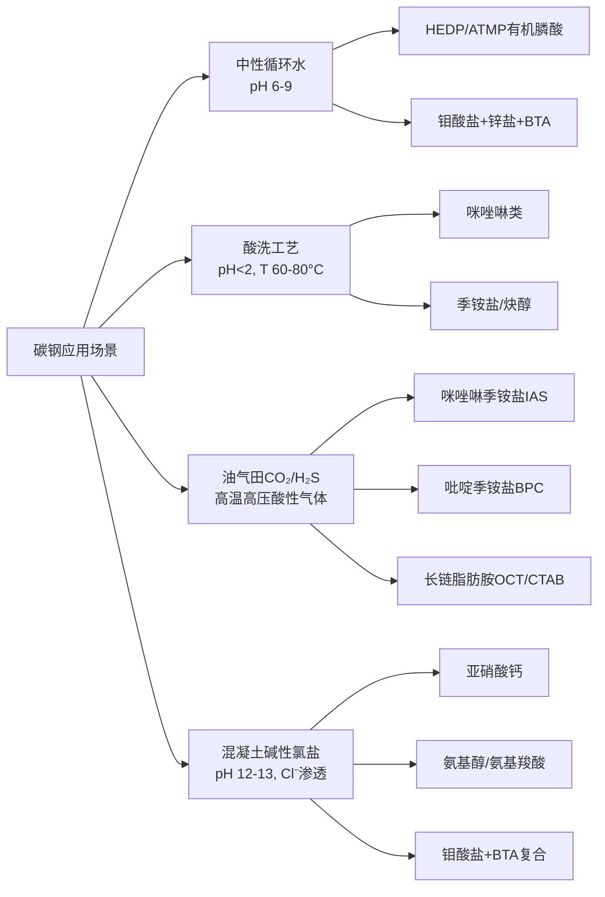
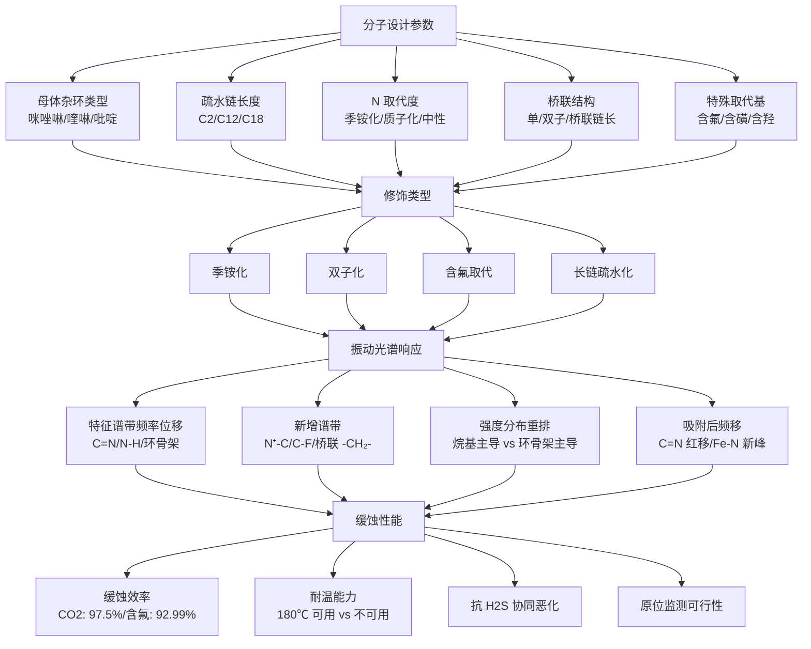
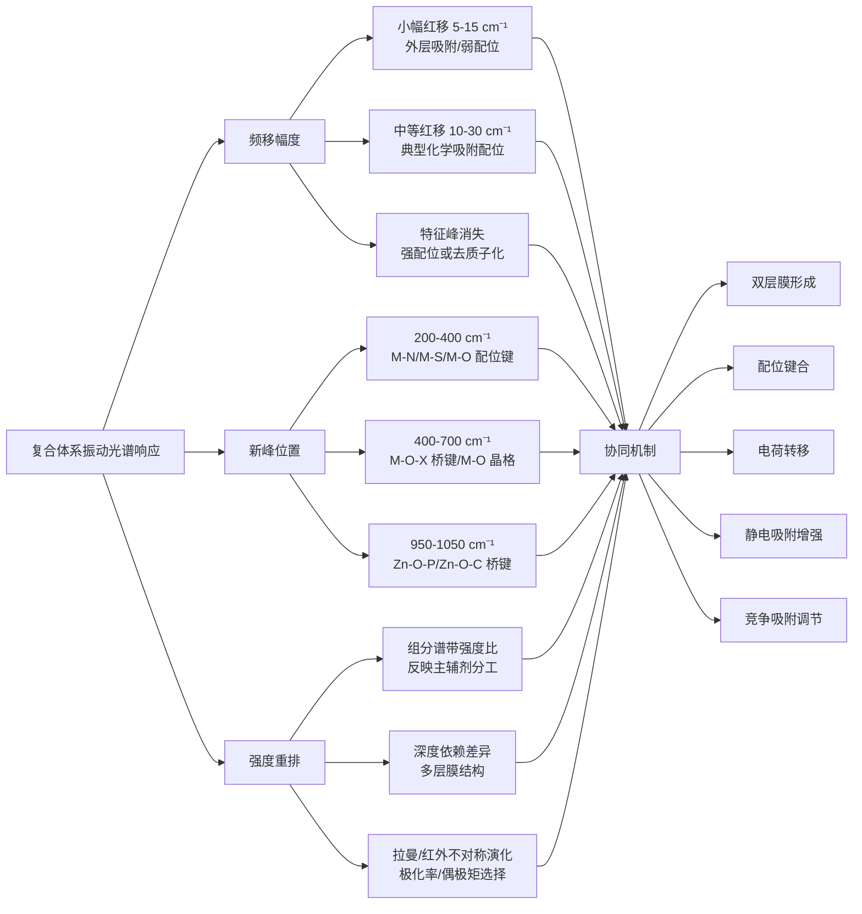
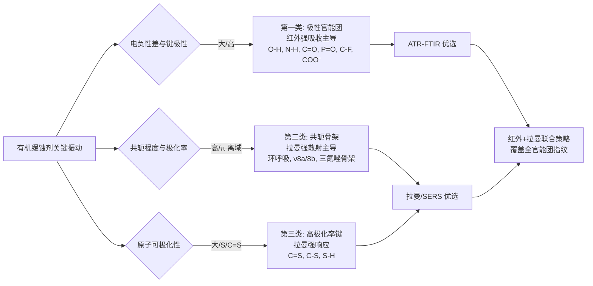
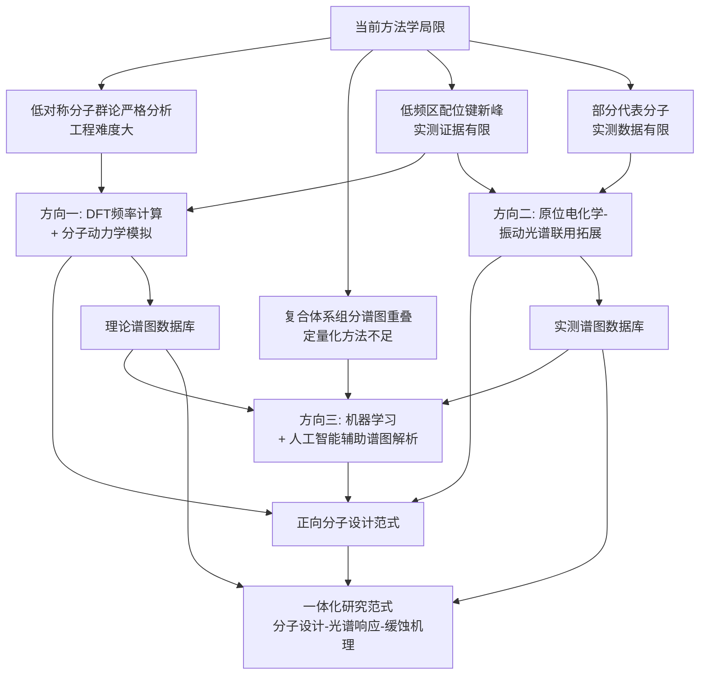

# 碳钢常用缓蚀剂种类及其拉曼-红外活性分析研究
# 1 研究背景与分析框架构建

碳钢作为全球用量最大的结构金属材料，广泛应用于石油天然气、电力、化工、建筑、船舶以及市政基础设施等关键领域。然而其在湿润、酸性、CO₂/H₂S 共存或氯离子侵蚀等服役环境中，极易因电化学腐蚀而失效，由此引发的设备穿孔、管线泄漏、结构垮塌不仅带来巨额经济损失，更可能酿成重大安全事故与环境污染问题。在工程实践中，缓蚀剂因其投加量小、起效迅速、可与现有工艺系统兼容等优势，成为应对碳钢腐蚀最经济、最灵活的化学防护手段之一。围绕缓蚀剂分子的"结构—活性—机理"研究，不仅关乎新一代高效、低毒、绿色缓蚀剂的设计开发，也直接决定了原位、在线腐蚀监测技术的可行边界。本章作为全篇研究的逻辑起点，将依次阐明研究的工程意义、振动光谱的物理基础、红外-拉曼互斥规则的适用边界，并最终凝练出一套贯穿全文的"分类—结构—活性"三层分析框架，为后续各类缓蚀剂的振动光谱活性判定奠定方法论基石。

## 1.1 碳钢腐蚀防护的工程意义与缓蚀剂研究价值

碳钢的腐蚀问题贯穿其全生命周期。在油气集输管线、循环冷却水系统、酸洗除锈工艺、混凝土结构以及海洋平台等典型工况下，腐蚀过程呈现出电化学机制复杂、局部腐蚀风险高、与介质组成强耦合等特征。相较于阴极保护、涂层防护、材料替代等防腐策略，缓蚀剂技术具有添加灵活、剂量可调、可针对特定腐蚀机理进行分子层面优化的独特优势，因而成为流体输送系统与封闭循环系统中难以替代的核心防护手段。

从科学研究角度看，缓蚀剂的作用本质涉及分子在金属表面的吸附、成膜、电子转移与配位键合等微观过程，这些过程的可视化与定量化高度依赖振动光谱技术。**红外光谱（IR）与拉曼光谱（Raman）能够在分子尺度上提供官能团识别、吸附构型推断、成膜组分鉴定等关键信息**，是缓蚀机理研究中不可或缺的"指纹工具"。然而，不同分子由于其对称性、极性与共轭程度差异，在两种光谱中的响应强弱存在显著区别——某些振动模式仅在红外中可见，某些则仅在拉曼中活跃，少数特殊振动甚至两者皆不活性。这一差异既是机遇，也是研究的难点：只有系统厘清各类缓蚀剂的红外/拉曼活性归属，才能在缓蚀剂筛选、分子改性、复合配方优化以及现场原位监测中合理选择光谱手段，实现机理解析与工程应用的有效对接。本研究正是在这一背景下，以"分类—结构—活性"为主线，系统梳理碳钢常用缓蚀剂的振动光谱活性规律，为后续机理研究与原位检测技术的发展提供统一的判别基础。

## 1.2 拉曼光谱与红外光谱的基本原理

红外光谱与拉曼光谱同属分子振动光谱范畴，但两者所探测的物理量截然不同，由此衍生出两种各具优势的选择定则体系。理解这一物理本质差异，是判别缓蚀剂分子振动模式光谱活性的前提。

**红外光谱的物理基础是分子电偶极矩的变化**。当一个简正振动模式使分子的电偶极矩 $\mu$ 随简正坐标 $Q$ 发生变化（即 $\partial\mu/\partial Q\neq 0$）时，该振动模式即可吸收对应频率的红外光子，从而表现为红外活性[^1]。因此，红外光谱对极性键、不对称伸缩与弯曲振动具有较高的灵敏度——例如 C=O、N-H、O-H、P=O 等极性官能团通常呈现强红外吸收。

**拉曼光谱的物理基础则是分子极化率张量的变化**。拉曼散射源于入射光作用下分子电子云分布的瞬时畸变，导致极化率张量 $\alpha$ 发生变化。其经典选择定则要求振动模式的简正坐标满足 $(\partial\alpha/\partial Q)_0\neq 0$；从量子力学角度看，则要求初末态间的极化率矩阵元 $\langle f|\alpha|i\rangle\neq 0$[^1][^2]。这一判据使得**非极性键的对称伸缩振动以及环状化合物的对称呼吸振动在拉曼中往往呈现强信号**，与红外光谱形成天然互补[^2]。

简正振动是描述多原子分子振动行为的核心概念。对于含 $n$ 个原子的非线性分子，其简正振动数目为 $3n-6$，线性分子则为 $3n-5$；任意复杂的振动状态都可表示为这些简正模式的线性叠加[^3][^4]。**群论是判定每个简正模式光谱活性的标准工具**：通过将分子振动表示约化为不可约表示（如 $A_1$、$E$、$T_2$、$B_2$ 等），并将其与平动表示（对应 $x,y,z$，决定红外活性）和极化率张量分量（对应 $x^2,y^2,z^2,xy,yz,zx$，决定拉曼活性）进行对称性匹配，即可严格判定每个振动模式的活性归属[^1][^5][^6]。

以两个经典分子为例可清晰理解上述判据的应用方式：水分子（$C_{2v}$ 点群）的对称伸缩（$A_1$）、弯曲（$A_1$）和反对称伸缩（$B_2$）振动均同时具有红外和拉曼活性[^1]；而二氧化碳分子（$D_{\infty h}$ 点群，含对称中心）的对称伸缩（$\Sigma_g^+$）仅拉曼活性而红外非活性，弯曲振动（$\Pi_u$）则仅红外活性而拉曼非活性[^1]。再以四面体硫酸根离子（$\mathrm{SO_4^{2-}}$，$T_d$ 点群）为例，其 9 个简正振动可分解为 $\Gamma_{vib}=A_1+E+2T_2$，其中 $A_1$（对称伸缩 $\nu_1$）和 $E$（弯曲 $\nu_2$）仅拉曼活性，两组 $T_2$（反对称伸缩 $\nu_3$、弯曲 $\nu_4$）则同时具有红外和拉曼活性[^7]。这一推导路径为后续无机阴离子型缓蚀剂的活性判定提供了直接范本。

## 1.3 红外-拉曼互斥规则及其适用边界

红外光谱与拉曼光谱的物理基础差异，在含对称中心的分子中演化为一条至关重要的判别原则——**互斥规则（Mutual Exclusion Rule）**：凡具有对称中心（即含反演操作 $i$）的分子，其振动模式中红外活性与拉曼活性互不兼容，因此红外光谱与拉曼光谱中不会出现频率相同的对应谱带[^8]。这一规则的物理根源在于：在反演操作下，电偶极矩（极性矢量）反号，而极化率张量（对称二阶张量）保持不变；因此对称（gerade，$g$）模式必然导致偶极矩在反演前后相消，从而红外非活性，但极化率发生变化，呈现拉曼活性；反对称（ungerade，$u$）模式则恰好相反。

该规则在缓蚀剂体系中具有明确的适用边界，应当谨慎地区分以下几种情形：

**第一，严格适用情形**——含对称中心的高对称分子或离子。诸如线性 CO₂ 型分子、平面正方形 [PtCl₄]²⁻ 型络合物，以及碳钢防护体系中常见的对称二聚体或对称有机分子（如联苯、对联三苯及其衍生物）均严格遵循互斥规则。文献研究表明，4,4′-二硝基联苯及联苯等中心对称分子的复合物在低温下仍保持中心对称性，其红外光谱与拉曼光谱表现出明显的振动模式互斥特征[^9]。

**第二，部分适用情形**——具有较高对称性但不含反演中心的分子（如 $T_d$ 点群的 $\mathrm{CrO_4^{2-}}$、$\mathrm{MoO_4^{2-}}$、$\mathrm{SO_4^{2-}}$、$\mathrm{WO_4^{2-}}$ 等四面体阴离子）。此类分子虽不严格符合互斥规则，但因群论特征标的限制，仍存在**部分振动模式仅拉曼活性**（如 $A_1$、$E$）和**部分模式同时双活性**（如 $T_2$）的分化现象[^7]。这类阴离子型无机缓蚀剂的振动归属将在后续第 3 章重点展开。

**第三，不适用情形**——绝大多数有机缓蚀剂分子。咪唑、咪唑啉、苯并三氮唑、喹啉、硫脲、有机膦酸、席夫碱、曼尼希碱等典型有机缓蚀剂普遍缺乏对称中心，其点群多归属于 $C_1$、$C_s$ 或 $C_{2v}$ 等低对称性群。在这些分子中，**绝大多数简正振动模式同时具有红外和拉曼活性**，但两种光谱中的相对强度存在显著差异：极性基团（如 N-H、C=O、P=O）的振动在红外中通常更强，而共轭芳环骨架振动、对称伸缩、环呼吸模式则在拉曼中表现突出[^2]。这一规律为后续有机缓蚀剂的判定提供了重要的"经验性辅助标准"。

**第四，特殊放宽情形**——共振拉曼与表面增强拉曼散射（SERS）。当激发光频率接近分子的电子跃迁能量时，共振拉曼效应可使原本禁阻的跃迁被观测到，选择定则在一定程度上放宽，且信号可获得高达 10⁸ 倍的增强[^2]。SERS 效应则源于金属纳米结构表面等离子体共振引起的电磁增强（EM）与化学增强（CE）协同机制，可实现 10⁶~10¹⁴ 倍的信号增强[^2]。在金属表面（包括碳钢被覆的银/金 SERS 基底或经由特殊处理的铁基底）吸附的缓蚀剂分子中，由于表面选择规则的引入与对称性破缺，原本红外活性的振动模式也可能在 SERS 中被显著观测到。这为本研究后续讨论缓蚀剂在金属表面的吸附构型、成膜机制提供了关键的实验工具。

## 1.4 缓蚀剂分子振动光谱活性判别的方法论框架

基于上述基本原理与互斥规则的适用边界分析，本研究构建一套贯穿全文的"**缓蚀剂分类—分子结构—振动光谱活性**"三层分析逻辑框架，作为后续各章节统一的判别工具。

**第一层：缓蚀剂分类定位**。在分析任意一种缓蚀剂之前，首先按照"无机/有机"、"阳极/阴极/混合型"、"氧化膜/沉淀膜/吸附膜型"以及"应用场景（中性水/酸洗/CO₂-H₂S/混凝土）"等多维分类体系对其进行定位，明确其作用机制与典型工况，从而保证代表性分子选择的工程合理性与全面性。这一层将在第 2 章系统展开。

**第二层：分子结构与对称性解析**。针对每一类代表性分子，明确其几何构型、点群归属与典型官能团组成。对于高对称无机阴离子，应严格执行群论分析，写出可约表示并约化为不可约表示，进而判定每个振动模式的活性；对于低对称有机分子，则以官能团振动为基本单元，结合分子整体极性与共轭特征进行综合判别。

**第三层：振动模式与光谱活性归属**。基于群论判据（不可约表示与 $x,y,z$ 及二次张量分量的对称性匹配）以及官能团振动的偶极矩/极化率特征，对每个关键振动模式作出明确的红外活性、拉曼活性或双活性判定。**特别地，对于无对称中心的有机分子，虽然红外与拉曼通常均活性，但本研究将进一步区分相对强度优势**——极性基团（C=O、N-H、O-H、P=O、C-F 等）以红外强吸收为主要识别特征，共轭芳香骨架（咪唑环呼吸、苯环 $\nu_{8a}/\nu_{8b}$、三氮唑环骨架振动等）以拉曼强散射为主要识别特征，C=N、C=C、C-S 等键则需结合具体分子环境作个案分析。

下表汇总本研究在判别每类缓蚀剂红外/拉曼活性时所采用的标准化分析路径：

| 分析步骤 | 核心工具 | 输出结论 | 适用范围 |
|---------|---------|---------|---------|
| 分类定位 | 多维分类体系 | 缓蚀剂类型与作用机理 | 全部缓蚀剂 |
| 对称性判定 | 点群归属、特征标表 | 分子对称元素与点群 | 全部缓蚀剂 |
| 简正振动分解 | 群论可约表示约化（$3n-6$/$3n-5$） | 不可约表示组合 $\Gamma_{vib}$ | 高对称小分子（无机阴离子优先） |
| 互斥规则判定 | 反演中心 $i$ 的存在性 | 是否严格互斥 | 含对称中心分子 |
| 活性归属 | $x,y,z$ 与二次张量对称性匹配 | IR活性/Raman活性/双活性 | 全部缓蚀剂 |
| 强度优势判别 | 偶极矩/极化率变化幅度 | 红外强 or 拉曼强 | 低对称有机分子 |
| 特殊增强讨论 | 共振拉曼、SERS、ATR-FTIR | 实验技术选择建议 | 表面吸附与原位检测 |

在复合缓蚀剂体系的处理上，本研究遵循"**先分解、后综合**"的原则：先对每个组分分别完成上述三层分析，再讨论复配后由于双层膜形成、配位键合或电荷转移等协同作用导致的特征频移、新峰生成与强度变化。这一策略既保证了每个组分识别的清晰性，也为光谱手段验证协同机理提供了可观测的判据。

为确保全文结论的可比性与一致性，本研究在频率单位（统一采用 cm⁻¹）、活性标注符号（IR 活性/Raman 活性/双活性/不活性）以及判别表述上将保持统一规范，并最终在第 8 章以对照表形式系统汇总所有典型缓蚀剂的振动光谱活性归属，形成可供研究与工程参考的速查体系。

综上，本章构建的方法论框架以群论与振动光谱选择定则为理论基石，以分子对称性与官能团特征为分析切入点，以"分类—结构—活性"三层逻辑为判别主线，为后续第 3 章至第 7 章的具体缓蚀剂分析提供统一的判别工具与表述规范。下一章将首先系统梳理碳钢常用缓蚀剂的多维分类体系，确立后续光谱分析的对象范围。

# 2 碳钢缓蚀剂的总体分类体系与作用机理

第 1 章已构建了"分类—结构—活性"三层分析框架，其中第一层正是要求在进行任何振动光谱判定之前，先完成对缓蚀剂的多维分类定位。本章承接这一逻辑链条，从电化学控制部位、化学组成、成膜机理与应用场景四个互补维度，对碳钢常用缓蚀剂体系作系统梳理，并在此基础上完成代表性分子的筛选，以确保第 3—7 章的振动光谱分析既覆盖完整的类别谱系，又聚焦于工程实践中真正具有代表性的典型分子。需要强调的是，缓蚀剂分类并非单一标准下的并列罗列，而是一个由作用机理、化学本质、成膜形态与服役工况共同织构的立体网络——同一种分子（如钼酸盐）在电化学维度属阳极型/阴极型混合特征，在化学组成上属无机型，在成膜机理上属氧化-沉淀复合膜型，在应用场景上又主要适配中性水冷系统。这种交叉定位正是后续选择代表性分子的科学基础。

## 2.1 按电化学控制部位的分类：阳极型、阴极型与混合型

从碳钢的腐蚀电化学本质出发，缓蚀剂依据其抑制电极反应的作用部位可划分为阳极型、阴极型与混合型三大类。这一分类直接对应于缓蚀机理中的电化学路径，是缓蚀剂理论体系最基础、最经典的划分逻辑[^10]。

**阳极型缓蚀剂**通过阻滞阳极金属溶解过程发挥作用，其典型作用方式包括在金属表面生成氧化膜、抑制金属离子化过程或将电极电位推至钝化区[^10]。铬酸盐是其经典代表——其原理在于通过氧化金属生成致密保护膜阻断阳极反应[^11]。亚硝酸盐则通过反应 $4\mathrm{Fe}+3\mathrm{NO_2^-}+3\mathrm{H^+}\rightarrow 2\gamma\text{-}\mathrm{Fe_2O_3}+\mathrm{NH_3}+\mathrm{N_2}$ 在碳钢表面生成 γ-Fe₂O₃ 钝化膜，使用浓度需高于 300–500 mg/L 的临界值，否则反而会引发孔蚀[^12]。钼酸盐亦属此列。阳极型缓蚀剂在工程上呈现出一个显著的共性特征——存在**临界浓度依赖性**：当用量不足时，其只能在金属表面形成不连续的钝化膜，反而会因小阳极/大阴极的几何效应在膜破损处加速局部腐蚀，因此被腐蚀工程领域称为"**危险性缓蚀剂**"[^11][^13]。这一特性决定了阳极型缓蚀剂在配方设计时必须严格控制下限浓度，并通常需要与其他类型缓蚀剂复配以提升运行安全性。

**阴极型缓蚀剂**则通过阻滞阴极还原过程（在中性水介质中通常为氧的还原）实现缓蚀，其作用方式包括提高阴极反应的过电位、在金属表面形成化合物膜或降低阴极反应物浓度等[^10]。锌盐是其典型代表，通过 Zn²⁺ 在阴极区与 OH⁻ 反应生成 Zn(OH)₂ 沉淀膜覆盖阴极活性点；聚磷酸盐则可与水中 Ca²⁺ 结合形成沉积层覆盖阴极区[^14]。阴极型缓蚀剂相较于阳极型最大的优势在于**安全性高**——即便用量不足也不会显著加剧局部腐蚀，但单独使用时缓蚀效率往往不及阳极型[^11][^13]。EDTMPS 等含氮有机膦酸亦属阴极型缓蚀剂，相比无机聚磷酸盐，其缓蚀率可提升 3–5 倍[^15]。

**混合型缓蚀剂**能够同时抑制阳极和阴极过程，其作用方式包括与阳极反应产物生成不溶物、形成胶体物质或在金属表面吸附形成吸附膜[^10]。胺类、咪唑啉类、苯并三氮唑等含 N、S、O 活性中心的有机分子均属此类，通过覆盖整个金属表面同时抑制阴阳极反应，被认为是兼具高效与全面性的缓蚀方案[^11][^14]。混合型缓蚀剂在腐蚀电位上的偏移通常较小，且对浓度的临界依赖性较弱，因而在油气田、酸洗等复杂介质中得到了最广泛的应用。

下表汇总三类缓蚀剂在电化学行为、典型代表与工程特点上的核心差异：

| 类型 | 作用部位 | 电位偏移 | 浓度依赖 | 典型代表 | 工程特点 |
|------|---------|---------|---------|---------|---------|
| 阳极型 | 阳极反应 | 正移 | 强（存在临界浓度） | 铬酸盐、亚硝酸盐、钼酸盐 | 高效但具危险性，浓度不足加剧腐蚀[^11][^12] |
| 阴极型 | 阴极反应 | 负移 | 弱 | 锌盐、聚磷酸盐、EDTMPS | 安全性高，单独使用效率有限[^11][^15] |
| 混合型 | 阴阳极同时 | 偏移较小 | 中等 | 胺类、咪唑啉、苯并三氮唑 | 高效全面，覆盖工况广[^11][^14] |

## 2.2 按化学组成的分类：无机、有机与聚合物缓蚀剂

按化学成分划分，碳钢常用缓蚀剂体系可归纳为无机型、有机型与聚合物型三大类[^16][^17]。这一分类对后续光谱分析具有直接的方法论意义——无机缓蚀剂多以高对称阴离子形式存在，其振动光谱判定需依赖严格的群论分析；而有机分子普遍缺乏对称中心，其判定路径则以官能团振动为基本单元。

**无机缓蚀剂**主要包括铬酸盐、重铬酸盐、亚硝酸盐、钼酸盐、钨酸盐、硅酸盐、磷酸盐及聚磷酸盐等阴离子型化合物，以及锌盐、钙盐等阳离子辅助组分[^16][^17]。这类缓蚀剂的活性中心通常集中于过渡金属或第Ⅴ-Ⅵ主族元素（Cr、Mo、W、N、P、Si），其阴离子部分往往呈现 $T_d$、$C_{2v}$ 或 $D_{3h}$ 等较高对称性，这一特征使其在光谱判别中将严格适用群论分析（详见第 1 章方法论）。无机缓蚀剂在 20 世纪 50 年代得到广泛应用，至今仍在密闭循环水、酸洗钝化、混凝土阻锈等领域占据重要地位[^16]。

**有机缓蚀剂**则在 20 世纪 30 年代中期人工合成技术取得突破后迅速发展，至 60–70 年代达到极盛[^16]。其代表性类别包括含氮杂环（咪唑、咪唑啉、苯并三氮唑、喹啉、吡啶）、含氮长链化合物（脂肪胺、季铵盐、曼尼希碱、席夫碱）、含硫化合物（硫脲、半胱氨酸、烷基硫醇）以及有机膦酸（HEDP、ATMP、EDTMP、PBTCA、DTPMPA）等[^16][^17][^18]。1961 年 Hackerman 提出的"硬软酸碱（HSAB）"原则与 1993 年荒牧国次基于元素周期表对缓蚀剂活性中心的系统分类，从理论上揭示了**N、S、O、P 等含孤对电子的杂原子是有机缓蚀剂吸附作用的关键活性中心**[^16][^10][^17]。这些活性中心既决定了分子在金属表面的配位行为，也直接对应于其特征官能团振动（如 C=N、N-H、C-S、P=O、P-O 等）的红外/拉曼响应。

**聚合物型缓蚀剂**是 21 世纪以来备受关注的研究方向[^16][^17]。代表分子包括聚天冬氨酸（PASP）、聚环氧琥珀酸（PESA）、马来酸-丙烯酸共聚物（AA/AMPS）等，多以无磷、无氮、可生物降解的"绿色"特性见长[^17][^15]。例如 PASP 对 Ca²⁺ 等成垢离子具有极强的螯合能力，兼具缓蚀与阻垢双重功效；PESA 则对碳酸钙、硫酸钙、硫酸钡、氟化钙和硅垢均表现出优良的阻垢分散性能，与膦酸盐复配具有协同增效作用[^15]。聚合物缓蚀剂分子量大、结构复杂，其振动光谱中通常以 C=O（羧基/酰胺）、N-H（酰胺）、O-H（羟基）、C-O（醚/酯）等极性官能团的红外吸收为主要识别特征。

## 2.3 按成膜机理的分类：氧化膜、沉淀膜与吸附膜型

从物理化学机理角度看，缓蚀剂减缓腐蚀的核心路径在于通过在金属表面生成隔离层将基体与腐蚀介质分隔开来。按成膜化学组成与形成路径的差异，可分为氧化膜型、沉淀膜型与吸附膜型三大类[^16][^10]，这一分类对后续以振动光谱原位识别成膜组分具有直接指导意义。

**氧化膜型缓蚀剂**通过直接或间接氧化金属表面生成致密金属氧化物薄膜以阻止腐蚀[^10]。典型代表是亚硝酸盐与铬酸盐——亚硝酸盐在碳钢表面生成的钝化膜主要成分为 γ-Fe₂O₃[^12]；铬酸盐则在镀锌层等基底上生成以三价铬化合物（CrOOH·nH₂O）为骨架、六价铬填充其中的钝化膜，膜厚通常在 0.5–1 μm，其中残余六价铬赋予了膜层局部破损时的"自修复"能力[^19][^20]。氧化膜的化学组成（金属氧化物/氢氧化物）使其在红外光谱与拉曼光谱中将呈现出 Fe-O、Cr-O 等金属-氧键的特征振动，这是后续原位识别钝化膜的关键依据。

**沉淀膜型缓蚀剂**通过与金属腐蚀产物或阴极反应产物（如 OH⁻、Ca²⁺）反应生成沉淀，在金属表面形成防腐蚀的沉积膜[^10]。聚磷酸盐与水中 Ca²⁺ 形成的沉积层、锌盐生成的 Zn(OH)₂ 沉淀膜均是典型例子[^14]。这类成膜组分通常含有 P-O、P=O、P-O-P 骨架振动以及 OH 伸缩振动等特征谱带，可作为光谱原位检测的指纹信号。

**吸附膜型缓蚀剂**通过含极性基团（杂原子活性中心）的分子在金属表面形成原子或分子吸附层来改变金属表面性质[^10]。其吸附可分为基于静电引力与范德华力的物理吸附，以及基于配位键作用的化学吸附两种形式。咪唑啉通过环上 N 原子的孤对电子与铁配位、苯并三氮唑通过三氮唑环 N 原子与铜（或铁）形成 Cu(I)-BTA 型化学吸附膜[^10][^21]，均是此类缓蚀剂的经典代表。**吸附膜型缓蚀剂的成膜组分本身即为缓蚀剂分子，其分子结构在吸附后基本保持完整**——这一特征使振动光谱（尤其是 SERS、ATR-FTIR）能够直接通过分子官能团振动检测吸附膜的存在与构型，是后续原位机理研究最具光谱可观测性的体系。

需要指出的是，三类成膜机理之间并非彼此孤立。在实际工程体系中，单一缓蚀剂往往同时呈现多重成膜特征——例如亚硝酸钙在钢筋混凝土中既以钝化氧化膜机制阻滞阳极反应，又以 Ca²⁺/OH⁻ 沉淀机制配合致密化膜层；钼酸盐则兼具氧化钝化与沉淀成膜双重作用[^16][^13]。

## 2.4 按应用场景的分类：中性水、酸洗、CO₂/H₂S 及混凝土环境

碳钢的服役环境千差万别，介质 pH、温度、Cl⁻ 浓度、溶解氧、流速及微生物活性等参数共同决定了缓蚀剂选型的边界条件。按典型应用场景划分，可将碳钢缓蚀剂归纳为四大主流方向[^16][^17]。

**中性循环冷却水场景**是碳钢缓蚀剂应用最广泛的领域之一。典型介质 pH 6–9，主要腐蚀诱因为溶解氧、Cl⁻、SO₄²⁻ 与微生物代谢产物。该场景下常用缓蚀剂包括有机膦酸盐（HEDP、ATMP）、钼酸盐、锌盐、苯并三氮唑及其复配体系，通过在金属表面形成致密氧化膜（钝化膜）、吸附膜或沉淀膜，隔离水与金属表面，抑制腐蚀反应发生[^22]。其中 HEDP 因兼具强螯合性与高化学稳定性、对铁离子稳定能力极强，在钢铁厂净环水系统中应用尤为广泛；DTPMPA 因含 5 个膦酸基适用于高钙、高温的油田回注水[^18][^23]。在工程标准上，空调水系统等工业场景已要求腐蚀速率低于 0.075 mm/a[^16]。2019 年中国缓蚀剂市场规模约 61.2 亿元，其中电力行业（多与循环水系统相关）应用占比最高，约 24%[^17]。

**酸洗工艺场景**主要涉及锅炉、换热器、管道等设备的化学清洗，典型介质为 5%–15% 盐酸、硫酸或氨基磺酸，pH 极低且温度可达 60–80℃。该场景下咪唑啉类缓蚀剂占据主导地位，其代表产品如"L-826"型多用酸洗缓蚀剂在 60℃、5% 盐酸溶液中缓蚀效率可达 ≥99%，碳钢腐蚀速率低于 0.45 g/(m²·h)[^24]。咪唑啉类分子由含氮五元杂环、N 上亲水支链 R₁ 与长链烷基憎水支链 R₂ 三部分构成，通过环上 N 原子吸附在金属表面，形成致密保护膜并防止氢脆与 Fe³⁺ 引发的孔蚀[^24][^25]。除咪唑啉外，季铵盐、炔醇类、曼尼希碱亦是酸洗体系的常见组分。

**油气田 CO₂/H₂S 共存场景**是碳钢腐蚀防护中最为严酷的工况之一。该场景下常用咪唑啉季铵盐（IAS）、吡啶季铵盐（BPC）、长链脂肪胺（如十八胺 OCT）、十二/十四/十六烷基三甲基溴化铵（DTAB/TTAB/CTAB）等阳离子型缓蚀剂[^26]。北京化工大学赵景茂团队的研究表明，**H₂S 的存在可显著提高 IAS、BPC、OCT、DTAB、TTAB、CTAB 等可质子化或电离形成阳离子的缓蚀剂的缓蚀性能**，但同时严重恶化硫脲（TU）、L-半胱氨酸（CYS）和十二烷基磺酸钠（SDS）的缓蚀作用。其机理在于 HS⁻ 离子可显著富集在阳离子型缓蚀剂周围，通过静电引力增强缓蚀剂在带负电荷碳钢表面的吸附；而无法形成阳离子的缓蚀剂则缓蚀效果下降[^26]。该场景下我国油气田缓蚀剂中咪唑啉及其衍生物的用量约占总用量的 90%[^25]。

**钢筋混凝土碱性氯盐场景**则是混凝土结构耐久性研究的核心议题。混凝土孔隙液 pH 通常 12.5–13.5，钢筋本应处于钝化状态，但当 Cl⁻（来自海水、盐渍土、融雪剂）渗透至钢筋表面破坏钝化膜时，将引发严重的局部腐蚀。该场景下使用的钢筋阻锈剂按使用方式分为掺入型（DCI）和渗透型（MCI），按化学成分则覆盖亚硝酸盐、钼酸盐、苯并三氮唑、氨基醇类、氨基羧酸类、氨基酯类及有机硅氧烷等多种类别[^13]。研究表明，复合型阻锈剂效果优于单一型，**复掺 1.00% 钼酸钠与 1.00% 苯并三氮唑时表现出最优阻锈效果**[^13]。

下图概览四类应用场景的环境特征与代表性缓蚀剂选型：



通过场景化分析可以看到，介质条件不仅约束了缓蚀剂的化学稳定性，也决定了其作用机理路径——例如阳离子型有机缓蚀剂在酸性/含 H₂S 介质中通过质子化形成正电荷增强吸附，而中性水中的有机膦酸则需依赖与金属离子的螯合作用形成沉积膜。这种场景—机理—结构的内在关联，正是后续选择代表性分子时必须兼顾的工程现实。

## 2.5 复合缓蚀剂的协同效应与典型复配体系

由于单一缓蚀剂往往难以同时兼顾高效率、低用量、宽工况适应性与环保安全性，**两种或以上缓蚀剂混合使用以产生协同效应**已成为现代碳钢防护配方设计的主流思路[^16]。复配型缓蚀剂的效率通常显著高于其各组分单独使用之和，阴极型与阳极型缓蚀剂配合使用是最经典的复配原则[^16]。

按组分组合方式，碳钢防护中典型复配体系可归纳为以下几类：

**阴-阳极复配**通过同时阻滞阳极与阴极反应实现高效协同。亚硝酸盐与钼酸盐的复配是密闭循环水系统的经典配方——浙江某 AP1000 核电厂即采用亚硝酸盐与钼酸盐复合体系防护设备冷却管路[^12]。

**无机-有机复配**通过将无机阴离子的钝化能力与有机分子的吸附膜性能相结合，常用于中性水与混凝土场景。钢筋混凝土阻锈剂中复掺 1.00% 钼酸钠与 1.00% 苯并三氮唑时达到最优阻锈效果即是一例[^13]；钢铁厂净环水系统中锌盐+有机膦酸+聚羧酸的复配体系亦广泛采用，通过 PESA 与膦酸盐复配产生良好的协同增效作用，AA/AMPS 与有机膦复配的增效作用同样明显[^15]。

**有机-有机复配**则在油气田高温酸性环境中表现尤为突出。赵景茂团队的研究系统揭示了**OCT 与 TTAB 之间、IAS 与 DTAB 之间存在显著的缓蚀协同效应**，喹啉季铵盐（QB）与较低浓度双子表面活性剂（12-3OH-12）亦呈现良好协同[^26]。咪唑啉与硫脲、苯甲酸钠、半胱氨酸等的协同体系可在碳钢表面形成**双层膜或增强缓蚀效果**，相关产品已实现工业化应用并取得良好经济效益[^10]。

**金属离子-有机分子复配**则借助金属离子与有机配体在金属表面的配位成膜实现协同。氧化钙与 L-天冬氨酸复配可在铝合金表面形成 Ca(OH)₂-L-Asp 和 Al-Asp 单分子复合膜层，有效抑制析氢腐蚀[^10]；聚乙二醇二酸与氧化锌复配使铝合金腐蚀速率降低一个数量级[^16]。这类体系虽多见于铝合金，但其复配机理对碳钢防护配方的设计同样具有借鉴意义。

从微观机理角度，复合缓蚀剂的协同作用涉及多种途径：**双层膜形成**（有机吸附膜叠加无机沉淀/氧化膜）、**静电吸附增强**（如 H₂S/CO₂ 体系中 HS⁻ 离子在阳离子型缓蚀剂周围富集）、**配位键合**（金属离子与有机配体形成配合物）、**电荷转移**（有机分子向金属表面转移 π 电子）以及**竞争吸附调节**（不同分子在金属表面的吸附竞争对总覆盖度的影响）等[^10][^26]。北京化工大学课题组依托自由体积分数（FFV）与协同效应的相关性模型，提出了复配比例的优化方法[^26]。

这些协同机制在振动光谱中将呈现可观测的特征：双层膜形成可能导致组分振动峰频率发生互不相同的位移；电荷转移与配位键合通常引起特定官能团（如 C=N、P=O）的频率红移与强度变化；新化学键的形成则会带来全新的特征谱带。这正是第 7 章将系统讨论的核心内容，也是本节强调"先分解、后综合"分析策略的内在依据。

## 2.6 代表性缓蚀剂分子的筛选与后续章节研究对象的确立

基于前述四维分类体系的交叉定位，本节按"**类别覆盖完整、工程应用广泛、分子结构典型、光谱数据可获取**"四项原则，筛选出后续各章振动光谱活性分析的代表性分子清单，并明确其在第 3—7 章中的归属安排。这一筛选既保证了对碳钢主流缓蚀剂体系的覆盖完整性，也兼顾了振动光谱分析在分子对称性与官能团特征上的可操作性。

下表汇总本研究后续章节将重点分析的代表性缓蚀剂分子及其多维归属：

| 缓蚀剂类别 | 代表分子 | 电化学类型 | 化学组成 | 成膜机理 | 主要应用场景 | 后续章节归属 |
|-----------|---------|----------|---------|---------|------------|------------|
| 无机阳极型阴离子 | CrO₄²⁻、Cr₂O₇²⁻ | 阳极型 | 无机 | 氧化膜 | 镀锌钝化、混凝土阻锈 | 第 3 章 |
| 无机阳极型阴离子 | NO₂⁻ | 阳极型 | 无机 | 氧化膜（γ-Fe₂O₃） | 密闭循环水、混凝土 | 第 3 章 |
| 无机阳极型阴离子 | MoO₄²⁻、WO₄²⁻ | 阳极型/混合型 | 无机 | 氧化-沉淀膜 | 中性循环水、复配体系 | 第 3 章 |
| 无机阴极型/沉淀膜 | Zn²⁺/Zn(OH)₂ | 阴极型 | 无机 | 沉淀膜 | 中性循环水 | 第 4 章 |
| 无机阴极型/沉淀膜 | 聚磷酸盐、CO₃²⁻、Ca(OH)₂ | 阴极型 | 无机 | 沉淀膜 | 中性循环水、混凝土 | 第 4 章 |
| 含氮杂环吸附膜型 | 咪唑、咪唑啉、苯并三氮唑、喹啉、吡啶 | 混合型 | 有机 | 吸附膜 | 酸洗、油气田、循环水 | 第 5 章 |
| 含硫吸附膜型 | 硫脲、L-半胱氨酸 | 混合型 | 有机 | 吸附膜 | 酸洗、协同复配 | 第 5 章 |
| 有机膦酸 | HEDP、ATMP、EDTMP、PBTCA、DTPMPA | 阴极型/混合型 | 有机 | 沉淀-吸附膜 | 中性循环水 | 第 5 章 |
| 胺类与席夫碱 | 脂肪胺、氨基醇、席夫碱、曼尼希碱 | 混合型 | 有机 | 吸附膜 | 酸洗、混凝土、油气田 | 第 5 章 |
| 酸洗与高温复杂分子 | 咪唑啉季铵盐 IAS、吡啶季铵盐 BPC、喹啉季铵盐 QB、长链季铵盐 DTAB/TTAB/CTAB、十八胺 OCT | 混合型 | 有机 | 吸附膜 | 酸洗、CO₂/H₂S | 第 6 章 |
| 绿色聚合物 | 聚天冬氨酸 PASP、聚环氧琥珀酸 PESA、AA/AMPS | 阴极型/混合型 | 聚合物 | 沉淀-吸附膜 | 中性循环水（绿色趋势） | 第 5 章 |
| 复合体系 | 钼酸钠+BTA、咪唑啉+硫脲、IAS+DTAB、OCT+TTAB、亚硝酸盐+钼酸盐、Zn²⁺+有机膦酸+聚羧酸 | 混合型 | 复合 | 双层/复合膜 | 多场景 | 第 7 章 |

通过这一筛选，本研究后续章节的研究对象既覆盖了无机阴离子（高对称性、群论分析路径）与有机分子（低对称性、官能团分析路径）两条互补的判定路径，也涵盖了从酸性、中性到碱性的全 pH 范围、从酸洗到高温油气田再到混凝土的全场景应用边界。**第 3 章将聚焦于无机阳极型阴离子缓蚀剂**，依托群论严格判定 $T_d$ 与 $C_{2v}$ 等高对称分子的振动模式活性归属；**第 4 章扩展至阴极型与沉淀膜型无机缓蚀剂**，纳入 $D_{3h}$ 点群的 CO₃²⁻ 等阴离子；**第 5 章系统分析有机吸附膜型缓蚀剂**，以官能团振动为分析单元覆盖含氮杂环、含硫、含磷及聚合物等主要类别；**第 6 章进一步深入酸洗与油气田场景下的复杂修饰分子**，包括各类季铵盐、双子型缓蚀剂等；**第 7 章则按"先分解、后综合"原则系统讨论复合缓蚀剂的组分识别与协同光谱特征**；**第 8 章最终以对照表形式汇总全部典型缓蚀剂的红外/拉曼活性归属**，形成可供研究与工程参考的速查体系。

至此，本研究的分析对象边界已经明确，分类体系与代表性分子已与后续章节建立一一对应关系。下一章将进入具体的振动光谱活性判定，首先以无机阳极型阴离子为对象，展示群论分析路径在严格对称性体系中的应用范例。

# 3 无机阳极型缓蚀剂的红外/拉曼活性分析

第 2 章的多维分类已经明确，无机阳极型阴离子缓蚀剂在碳钢防护体系中扮演着"通过氧化膜机制阻滞阳极反应"的核心角色，其分子层面的共同特征在于活性中心多为高价过渡金属（Cr、Mo、W）或第Ⅴ-Ⅵ主族元素（N、Si）所构成的高对称含氧阴离子。这一特征正好契合了第 1 章方法论框架中"分子结构与对称性解析"层面的群论严格分析路径——无须依赖经验判别，仅凭点群归属、不可约表示分解与平动/极化率张量分量的对称性匹配，即可得出严格、可重复、可比较的振动光谱活性归属。本章作为"分类—结构—活性"三层框架在高对称无机体系中的首次完整应用，将依次以 $T_d$ 点群四面体阴离子（CrO₄²⁻、MoO₄²⁻、WO₄²⁻）作为标准范式，再延伸至低对称的 Cr₂O₇²⁻ 二聚体、$C_{2v}$ 点群的 NO₂⁻ 以及结构多样的硅酸盐体系，并在末节以对照表形式凝练全章规律。研究的核心命题是：**对称性如何决定振动模式的红外/拉曼活性分化，以及这种分化如何映射为钝化膜原位识别的指纹依据**。

## 3.1 Tₐ点群四面体阴离子的群论分析范式

四面体含氧阴离子 XO₄ⁿ⁻ 是无机阳极型缓蚀剂中最具普遍性的结构母体。CrO₄²⁻、MoO₄²⁻、WO₄²⁻ 在工程上分别对应铬酸盐钝化、钼酸盐缓蚀-阻垢复合膜与钨酸盐绿色阻锈体系，三者在分子层面共享 $T_d$ 点群对称性，因此可在统一的群论框架下完成振动光谱活性判定。这一标准范式将作为后续第 3.2、3.4 节具体分析的统一模板，也将延伸至第 4 章 SO₄²⁻、PO₄³⁻ 等其他四面体阴离子的判定。

$T_d$ 点群包含 24 个对称操作（$E$、$8C_3$、$3C_2$、$6S_4$、$6\sigma_d$），含有 5 类不可约表示（$A_1$、$A_2$、$E$、$T_1$、$T_2$）。对于由 5 个原子构成的 XO₄ⁿ⁻ 阴离子，其简正振动数目为 $3n-6=9$。通过将 5 个原子在各对称操作下的不动点数与对应位移矩阵迹相乘，可得总笛卡儿表示，扣除 3 个平动（$T_2$）与 3 个转动（$T_1$）后，振动表示约化为：

$$\Gamma_{vib}=A_1+E+2T_2$$

这一约化结果对应 4 个基频振动（部分简并）：**对称伸缩 $\nu_1$（$A_1$，非简并）、弯曲 $\nu_2$（$E$，二重简并）、反对称伸缩 $\nu_3$（$T_2$，三重简并）、弯曲 $\nu_4$（$T_2$，三重简并）**，合计 1+2+3+3=9 个简正振动，与 $3n-6$ 的总数一致。

依据 $T_d$ 特征标表，平动表示 $(x,y,z)$ 对应不可约表示 $T_2$；极化率张量分量中 $(x^2+y^2+z^2)$ 对应 $A_1$、$(2z^2-x^2-y^2,\,x^2-y^2)$ 对应 $E$、$(xy,yz,zx)$ 对应 $T_2$。将各振动模式与上述对称性匹配关系交叉判定，可得严格的活性归属：

| 振动模式 | 不可约表示 | 简并度 | 与 $(x,y,z)$ 匹配 | 与极化率分量匹配 | 红外活性 | 拉曼活性 |
|---------|-----------|--------|---------------------|-----------------------|---------|---------|
| $\nu_1$ 对称伸缩 | $A_1$ | 1 | 否 | $x^2+y^2+z^2$ | 非活性 | **活性** |
| $\nu_2$ 弯曲 | $E$ | 2 | 否 | $(2z^2-x^2-y^2,\,x^2-y^2)$ | 非活性 | **活性** |
| $\nu_3$ 反对称伸缩 | $T_2$ | 3 | $T_2$ | $(xy,yz,zx)$ | **活性** | **活性** |
| $\nu_4$ 弯曲 | $T_2$ | 3 | $T_2$ | $(xy,yz,zx)$ | **活性** | **活性** |

由此得出 $T_d$ 点群四面体阴离子的核心规律：**$\nu_1$ 与 $\nu_2$ 仅拉曼活性、红外非活性；$\nu_3$ 与 $\nu_4$ 同时具有红外与拉曼活性**。该规律与近期对 CrO₄²⁻、MoO₄²⁻、WO₄²⁻、MnO₄⁻、TcO₄⁻、ReO₄⁻、NbO₄³⁻、TaO₄³⁻ 等 d⁰ 过渡金属四面体含氧阴离子在不同水合层数下进行的 MP2/6-31+G* 与 B3LYP/6-31+G* 从头算结果以及相关实验对照高度吻合，证明该规律具有广泛适用性[^27]。

值得注意的是，$T_d$ 点群虽不含反演中心 $i$，因此并不严格满足互斥规则，但 $A_1$ 与 $E$ 模式因其全对称或部分对称特征，振动过程中分子整体偶极矩保持为零或在简并子模式间相消，从而表现为红外非活性；这正是第 1 章所述"部分适用情形"的标准范例。在实际工程光谱中，**$\nu_1$（$A_1$）由于对称伸缩引起极化率最大变化，往往成为拉曼谱图中最强、最尖锐的指纹峰**，是定量识别四面体阴离子存在与否的首选谱带。

## 3.2 铬酸盐(CrO₄²⁻)的振动模式与光谱特征

铬酸盐（含 CrO₄²⁻）是 20 世纪应用最广泛的阳极型钝化剂，在镀锌层钝化、铝合金转化膜、碳钢密闭循环水以及钢筋混凝土阻锈等场景中均占有重要地位。其阴离子 CrO₄²⁻ 是规则的四面体构型，归属 $T_d$ 点群，因此可直接套用 3.1 节范式得出振动模式归属：$\Gamma_{vib}=A_1+E+2T_2$，其中 $\nu_1(A_1)$ 与 $\nu_2(E)$ 仅拉曼活性，$\nu_3(T_2)$ 与 $\nu_4(T_2)$ 同时具有红外与拉曼活性[^27]。

CrO₄²⁻ 各振动模式的典型频率范围依据从头算与水溶液实测对照大致分布于 $\nu_1\approx 845\text{–}860\,\mathrm{cm^{-1}}$（对称伸缩）、$\nu_2\approx 340\text{–}380\,\mathrm{cm^{-1}}$（弯曲）、$\nu_3\approx 870\text{–}900\,\mathrm{cm^{-1}}$（反对称伸缩）、$\nu_4\approx 360\text{–}400\,\mathrm{cm^{-1}}$（弯曲）[^27]。在液态水合环境下，水合数 $n=0$–6 范围内的从头算研究还预测了水合作用对各模式的微小红移[^27]。**$\nu_1$ 在拉曼谱中通常呈现强而尖锐的单峰**，是 CrO₄²⁻ 阴离子最具诊断价值的指纹谱带；而 $\nu_3$ 在红外谱中呈宽强吸收，是 ATR-FTIR 原位检测钝化膜中铬酸根存在的关键依据。

然而，当 CrO₄²⁻ 进入晶相或与金属离子结合形成复盐时，其严格的 $T_d$ 对称性往往被晶体场降低。以铬黄（PbCrO₄，矿物名 crocoite）为代表的晶态铬酸盐即典型例证——PbCrO₄ 在工业上作为黄色颜料与防腐填料广泛使用，其 Pb²⁺ 处于十配位环境，CrO₄²⁻ 周围晶体场不再严格保持四面体对称，导致原本简并的 $E$ 与 $T_2$ 模式发生**位点对称性劈裂**[^28]。再以 KLa(CrO₄)₂ 单晶为例，该化合物属 P2₁/c 空间群（Z=4），由垂直于 $a$ 轴的 [La(CrO₄)₂]ₙ 平行层与层间 K⁺ 构成；通过因子群分析可知其原本由 4 个 CrO₄²⁻ 单元贡献的总共 36 个内振动吸收带中，**实测红外与拉曼光谱共观测到 16 条谱带**，明显多于自由 CrO₄²⁻ 的 4 条基频，这一谱带数量增加正是位点对称性降低与关联场分裂（factor-group splitting，亦称 Davydov 分裂）共同作用的结果[^29]。

晶体场效应对 CrO₄²⁻ 振动光谱的影响在工程上具有双重意义。一方面，**自由 CrO₄²⁻ 与晶相 CrO₄²⁻ 化合物在拉曼指纹谱带的数量与劈裂模式上存在可分辨差异**——前者在 $\nu_1$ 区域呈单一锐峰，后者则可能因关联场分裂呈现多重峰结构；这一差异为判别钝化膜中 CrO₄²⁻ 是以游离吸附形式还是以 PbCrO₄、Fe(CrO₄)、Cr-OOH·CrO₃ 等晶相形式存在提供了直接依据。另一方面，由于六价铬具有显著毒性与致癌性，PbCrO₄ 等含铅铬颜料已被严格管控，相关 ACGIH 限值低至 0.0002 mg/m³（TWA）水平[^28]，因而铬酸盐缓蚀剂在民用与开放循环水系统中的应用已大幅萎缩，相关研究的工程价值更多体现于**历史遗存钝化膜的原位辨识与铬污染评估**。

## 3.3 重铬酸盐(Cr₂O₇²⁻)的低对称性与互斥规则的部分适用性

重铬酸钾（K₂Cr₂O₇，CAS 7778-50-9，分子量 294.18）是 CrO₄²⁻ 在酸性条件下的二聚产物，其阴离子由两个 CrO₄ 四面体通过共享一个桥氧原子（Cr-O-Cr）连接而成，在工业上以橙红色单斜或三斜晶系结晶形式存在，熔点 398℃，水中溶解度 125 g/L（20℃），水溶液呈酸性[^30][^31]。这一二聚结构使 Cr₂O₇²⁻ 的对称性显著低于 CrO₄²⁻，进而导致其振动模式数量、活性归属与互斥规则适用性均与 3.2 节存在本质差异。

Cr₂O₇²⁻ 由 9 个原子构成（2 个 Cr + 6 个端氧 + 1 个桥氧），其简正振动数为 $3n-6=21$。Bates 等人在低温（−196℃）下系统测量了晶态 K₂Cr₂O₇ 的红外与拉曼光谱，并采集了 25℃ 至 269℃ 固-固相变温度区间的拉曼光谱，进一步获取了 435℃ 熔融态 K₂Cr₂O₇ 与 25℃ 饱和水溶液的拉曼数据；通过 21 个简正模式的振动计算与晶态低温相中的双位点劈裂（two-site splitting）与关联场分裂（correlation field splitting）分析，对 Cr₂O₇²⁻ 内部振动模式的频率归属作了严格判定，并以 cell model 讨论了晶体外振动模式（lattice modes）的拉曼活性归属[^32]。

从振动归属的整体格局看，Cr₂O₇²⁻ 的 21 个内振动模式可粗略分为四类：(1) **端基 Cr=O 对称与反对称伸缩**，分布于约 850–950 cm⁻¹ 区间，是该体系最显著的高频谱带；(2) **桥氧 Cr-O-Cr 反对称伸缩**，约 750–800 cm⁻¹；(3) **桥氧 Cr-O-Cr 对称伸缩**，约 550–570 cm⁻¹；(4) **端基 CrO₃ 弯曲、扭转及骨架变形**，分布于 200–400 cm⁻¹ 低频区[^32]。其中端基 Cr=O 对称伸缩在拉曼中具有最强响应，桥氧反对称伸缩则在红外中呈现强吸收，构成 Cr₂O₇²⁻ 区别于 CrO₄²⁻ 的关键指纹特征。

在互斥规则适用性问题上，Cr₂O₇²⁻ 的几何构型涉及一个关键的辨析：在理想化的 eclipsed（重叠式）构型中，分子可能具有 $C_{2v}$ 对称性而无对称中心；在 staggered（交错式）构型中，桥氧两侧的 CrO₃ 基团若呈反向排列，则可能存在**赝对称中心**（pseudo-inversion center）。Bates 等人在晶态 K₂Cr₂O₇ 的双位点劈裂分析中即讨论了这一对称性近似——若 Cr₂O₇²⁻ 接近含对称中心的构型，则端基 Cr=O 伸缩将分裂为对称（gerade，仅拉曼活性）与反对称（ungerade，仅红外活性）两支，呈现典型的"互斥"特征[^32]。然而由于晶体场作用与桥氧角度变化，严格的对称中心在固态、熔融态与水溶液中均未严格保持，因此互斥规则在 Cr₂O₇²⁻ 体系中表现为**部分适用**——部分振动模式（如端基 Cr=O 对称伸缩）在红外谱中可能仅呈现微弱肩峰而拉曼中显著增强，但并非严格不可观测；这种"接近互斥但不完全互斥"的特征正是低对称二聚体的典型光谱响应模式。

将 CrO₄²⁻ 与 Cr₂O₇²⁻ 的光谱指纹作对比，可归纳出**铬酸盐两种存在形态的光谱辨识判据**：(1) CrO₄²⁻ 在拉曼中呈单一强 $\nu_1\approx 850\,\mathrm{cm^{-1}}$ 锐峰，谱带数量少且简单；Cr₂O₇²⁻ 则在 850–950 cm⁻¹ 区间呈现多重端基伸缩谱带，并伴随约 550 cm⁻¹ 桥氧伸缩与 750 cm⁻¹ 桥氧反对称伸缩；(2) 在红外谱中，CrO₄²⁻ 仅在 $\nu_3$ 附近呈宽吸收，Cr₂O₇²⁻ 则因桥氧 Cr-O-Cr 反对称伸缩在 750–800 cm⁻¹ 区间出现独有的强红外谱带。**桥氧 Cr-O-Cr 振动是 Cr₂O₇²⁻ 区别于 CrO₄²⁻ 最具诊断价值的红外指纹**，可直接用于钝化膜中铬酸根聚合度的原位判定。

## 3.4 钼酸盐(MoO₄²⁻)与钨酸盐(WO₄²⁻)的振动光谱对比

随着六价铬的环保管控趋紧，钼酸盐与钨酸盐作为 CrO₄²⁻ 的低毒替代品在中性循环水、复配缓蚀阻垢体系以及钢筋混凝土阻锈中的应用日益广泛。MoO₄²⁻ 与 WO₄²⁻ 与 CrO₄²⁻ 共享 $T_d$ 点群对称性，其振动模式归属严格遵循 3.1 节范式：$\Gamma_{vib}=A_1+E+2T_2$，$\nu_1(A_1)$ 与 $\nu_2(E)$ 仅拉曼活性，$\nu_3(T_2)$ 与 $\nu_4(T_2)$ 双活性[^27]。Goodall 等人针对 MoO₄²⁻ 与 WO₄²⁻ 在 $n=0$–6 水合层数下的从头算研究，系统给出了各振动模式的理论频率与水合作用引起的频移规律，与现有实验数据高度吻合[^27]。

MoO₄²⁻ 与 WO₄²⁻ 在保持相同对称性的前提下，因中心金属原子质量差异显著（Mo 原子质量 95.95，W 原子质量 183.84，相差近一倍），其伸缩振动频率呈现可观测的系统性差异。依据简谐近似下振动频率与折合质量平方根的反比关系 $\nu\propto\sqrt{k/\mu}$，**当中心金属原子质量增加时，伸缩振动频率向低波数方向移动**。具体而言：MoO₄²⁻ 的 $\nu_1$ 对称伸缩约 895–920 cm⁻¹、$\nu_3$ 反对称伸缩约 820–870 cm⁻¹；WO₄²⁻ 则相应下移至 $\nu_1\approx 920\text{–}930\,\mathrm{cm^{-1}}$（数值因 W-O 键力常数较高而部分补偿了质量增大的影响）、$\nu_3\approx 800\text{–}840\,\mathrm{cm^{-1}}$ 区间[^27]。这种频率分布既保留了 $T_d$ 阴离子的活性归属共性，又通过频率位置差异为不同金属阴离子在复合缓蚀膜中的辨识提供了依据。

晶体场降对称效应在钼酸盐与钨酸盐的矿物相中表现尤为显著。钼铅矿（wulfenite，PbMoO₄）作为典型 scheelite 型结构化合物，其 Pb²⁺ 与 MoO₄²⁻ 在四方晶系中按照 scheelite 拓扑排列，存在 I4₁/a 与 I4 两种空间群形态，后者甚至打破了完美的 scheelite 对称呈现单晶半面性现象[^33]。已发表的拉曼光谱研究系统比较了 chillagite（含钨钼铅矿，I4 型）、stolzite（PbWO₄）、scheelite（CaWO₄）、wolframite（黑钨矿）及 wulfenite 等钼酸盐与钨酸盐矿物的振动光谱，揭示了 scheelite 型结构中 MoO₄²⁻/WO₄²⁻ 在 $S_4$ 位点对称下原本的 $T_2$ 简并模式发生劈裂、$E$ 模式同样发生位点对称性劈裂的规律[^33]。白钨矿（CaWO₄，scheelite）作为钨矿石的主要矿物形式，其晶系为四方晶系，密度 5500–6170 kg/m³，并具有蓝至黄色不等的紫外荧光（与 Mo 含量相关）；其拉曼指纹谱带在低温与室温下被广泛用作 WO₄²⁻ 在矿相中存在形态的判别基准[^34]。

在工程意义上，MoO₄²⁻ 与 WO₄²⁻ 的振动光谱特征对中性循环水阳极钝化-沉淀复合膜的成膜组分识别具有直接价值。第 2 章已述及，钢筋混凝土阻锈中复掺 1.00% 钼酸钠与 1.00% 苯并三氮唑表现出最优阻锈效果，其在金属表面同时形成钼酸盐钝化-沉淀膜与 BTA 吸附膜的双层结构。在该体系的拉曼原位检测中，**MoO₄²⁻ 的 $\nu_1\approx 900\,\mathrm{cm^{-1}}$ 强拉曼峰可作为钼酸根成膜组分的指纹证据**；若该峰发生明显劈裂或红移，则提示 MoO₄²⁻ 已与金属基体（Fe³⁺）形成 FeMoO₄ 或类 wulfenite 型晶相沉淀，对称性由严格 $T_d$ 降至 $S_4$ 或更低[^33]。这一光谱判据与第 4 章将讨论的锌-膦酸-钼酸复配体系成膜机理研究形成直接对接。

## 3.5 亚硝酸盐(NO₂⁻)的C₂ᵥ对称性振动分析

亚硝酸钠（NaNO₂，CAS 7632-00-0，分子量 69.00，熔点 271℃，密度 2.17 g/cm³，20℃ 水中溶解度 820 g/L）是密闭循环水与钢筋混凝土阻锈中应用最广泛的氧化膜型阳极缓蚀剂之一[^35][^36]。其化妆品/材料用途即明确归类为"防腐"功能（ANTICORROSIVE）[^36]，工业上则通过反应 $4\mathrm{Fe}+3\mathrm{NO_2^-}+3\mathrm{H^+}\rightarrow 2\gamma\text{-}\mathrm{Fe_2O_3}+\mathrm{NH_3}+\mathrm{N_2}$ 在碳钢表面生成 γ-Fe₂O₃ 钝化膜（详见第 2 章 2.1 节）。

NO₂⁻ 的几何构型为弯折型（bent），其 N 原子与两个 O 原子之间形成键角约 115° 的角形结构，归属 $C_{2v}$ 点群。该点群包含 4 个对称操作（$E$、$C_2$、$\sigma_v(xz)$、$\sigma_v'(yz)$）与 4 个不可约表示（$A_1$、$A_2$、$B_1$、$B_2$）。对于由 3 个原子构成的 NO₂⁻，简正振动数为 $3n-6=3$，约化为：

$$\Gamma_{vib}=2A_1+B_2$$

（注：依轴定义不同，反对称伸缩亦可标记为 $B_1$；本节按主轴 $C_2$ 沿 $z$ 轴、分子平面为 $yz$ 平面的惯例，将反对称伸缩归于 $B_2$。）三个振动模式分别对应：**对称伸缩 $\nu_1(A_1)$、弯曲 $\nu_2(A_1)$、反对称伸缩 $\nu_3(B_2)$**。

依据 $C_{2v}$ 特征标表，平动 $z$ 对应 $A_1$、$x$ 对应 $B_1$、$y$ 对应 $B_2$，全部三个不可约表示 $A_1$、$B_1$、$B_2$ 均存在与平动方向匹配的项；极化率张量分量 $x^2,y^2,z^2$ 对应 $A_1$，$xy$ 对应 $A_2$，$xz$ 对应 $B_1$，$yz$ 对应 $B_2$，同样 $A_1$ 与 $B_2$ 均存在二次张量分量。由此判定 NO₂⁻ 的 $\nu_1(A_1)$、$\nu_2(A_1)$、$\nu_3(B_2)$ **三个模式均同时具有红外活性与拉曼活性**——这与 $T_d$ 四面体阴离子部分模式仅拉曼活性的分化局面形成鲜明对比。

NO₂⁻ 不存在反演中心，因此互斥规则不适用，所有振动模式在两种光谱中均可观测，但相对强度存在显著差异：**对称伸缩 $\nu_1$ 因极化率变化大而在拉曼中通常更强，反对称伸缩 $\nu_3$ 因偶极矩变化大而在红外中更强**。NO₂⁻ 三个基频的典型频率分布大致为 $\nu_1\approx 1320\,\mathrm{cm^{-1}}$（对称伸缩）、$\nu_3\approx 1250\,\mathrm{cm^{-1}}$（反对称伸缩）、$\nu_2\approx 820\,\mathrm{cm^{-1}}$（弯曲）。这三条特征谱带——尤其是 1320 cm⁻¹ 拉曼强峰与 1250 cm⁻¹ 红外强吸收——是密闭循环水与钢筋混凝土阻锈体系中残留 NO₂⁻ 含量原位光谱监测的核心指纹。

需要特别指出的是，NO₂⁻ 在金属表面参与钝化反应后将转化为 γ-Fe₂O₃ 钝化膜，此时光谱响应将由 NO₂⁻ 的 N-O 振动转变为 Fe-O 晶格振动谱带（典型分布于 200–700 cm⁻¹ 低频区，呈复杂多峰结构）。**因此在原位光谱监测中需严格区分两类信号：1200–1350 cm⁻¹ 区间的 N-O 振动反映介质中游离 NO₂⁻ 的残留浓度，500 cm⁻¹ 以下的 Fe-O 振动则反映金属表面已形成的钝化膜组分**。这一辨析对于判断阳极型缓蚀剂的成膜进度与残余有效浓度具有直接的工程指导意义。亚硝酸盐由于在空气中易被氧化、溶液稳定性差、且具有较强毒性[^35]，近年来在民用循环水系统中的应用已逐步向钼酸盐、有机膦酸等低毒替代品过渡，但在密闭循环水与混凝土阻锈中由于其高效性仍占据重要地位。

## 3.6 硅酸盐(SiO₃²⁻/SiO₄⁴⁻)的结构多样性与振动光谱

硅酸盐（如 Na₂SiO₃、水玻璃）作为一种廉价、无毒、绿色的中性水缓蚀剂，其作用机理涉及在金属表面形成硅胶质保护膜。然而硅酸盐体系最显著的特征在于其在水溶液中**结构多样性极为丰富**——可以以孤立 SiO₄⁴⁻ 单体、链状 (SiO₃²⁻)ₙ、环状 (Si₃O₉)⁶⁻、片状层状以及多聚硅酸胶团等多种形态共存，且各形态之间存在 pH 与浓度依赖的动态平衡。这种结构多样性对振动光谱归属带来直接挑战：不同硅酸盐形态对应不同的对称性与振动模式数量，谱图相互叠加难以单一指认。

**孤立 SiO₄⁴⁻ 单体**严格属 $T_d$ 点群，其振动归属直接套用 3.1 节范式：$\Gamma_{vib}=A_1+E+2T_2$，$\nu_1(A_1)$ 与 $\nu_2(E)$ 仅拉曼活性，$\nu_3(T_2)$ 与 $\nu_4(T_2)$ 双活性。其典型频率分布为 $\nu_1\approx 800\text{–}1000\,\mathrm{cm^{-1}}$（Si-O 对称伸缩）、$\nu_3\approx 900\text{–}1100\,\mathrm{cm^{-1}}$（反对称伸缩）、$\nu_2$ 与 $\nu_4$ 则分布于 400–600 cm⁻¹ 弯曲区。在橄榄石（olivine，(Mg,Fe)₂SiO₄）等含孤立 SiO₄⁴⁻ 的天然正硅酸盐矿物中，这一规律得到充分验证——伽马射线辐照实验显示，小剂量辐照即可引起橄榄石晶格振动模式的强度增加与 M1、M2 八面体的微小畸变[^37]。月球矿物拉曼光谱的远程检测研究亦证实，橄榄石（包括镁橄榄石 forsterite 与铁橄榄石 fayalite）具有比辉石、长石等更弱的拉曼信号，但仍可通过 800–1000 cm⁻¹ 区间的 Si-O 对称伸缩特征峰对其进行精细分类辨识[^38]。

**链状/环状/层状硅酸盐**则因 SiO₄ 四面体之间通过共享桥氧 Si-O-Si 形成聚合结构，对称性显著降低，并出现自由 SiO₄⁴⁻ 中所没有的桥氧振动模式。具体而言：链状 (SiO₃²⁻)ₙ 沿链方向存在重复单元，可视为 $C_{2v}$ 或更低对称性；环状 (Si₃O₉)⁶⁻ 等具有 $D_{3h}$ 或 $C_{3v}$ 对称性；层状硅酸盐则进一步降至二维周期性结构。这些聚合形态在振动光谱中呈现两类共同特征：(1) **Si-O-Si 桥氧反对称伸缩**通常出现在 1000–1100 cm⁻¹ 区间的红外强吸收，是聚合度的标志；(2) **Si-O-Si 桥氧弯曲与对称伸缩**分布于 600–800 cm⁻¹，在拉曼中往往显著。聚合度越高、桥氧数量越多，1000 cm⁻¹ 以上的红外吸收带宽越大、强度越强；自由 SiO₄⁴⁻ 单体的 800 cm⁻¹ 拉曼锐峰则相应减弱。

在工程应用中，这一结构-光谱关联具有直接的判读价值：当硅酸盐缓蚀剂在碳钢表面成膜时，其膜层组成往往由低聚硅酸盐、多聚硅酸胶体与 Fe-O-Si 异质键合产物共同构成；通过对 800–1100 cm⁻¹ 区间硅酸盐特征谱带分布的拉曼与红外联合解析，可以推测**膜层中 SiO₄⁴⁻ 的聚合度与桥连方式**，进而辨识硅酸盐成膜的初期吸附阶段与后期固化阶段的分子结构演化。这一光谱判据是当前绿色硅酸盐缓蚀剂分子设计与膜层表征研究中尚需深入挖掘的方向。受参考资料所限，本节对硅酸盐缓蚀剂在碳钢表面具体成膜组分的振动光谱实测数据介绍仍较为有限，更系统的硅酸盐缓蚀膜原位光谱研究有待后续工作补充。

## 3.7 无机阳极型阴离子振动光谱活性归属汇总

综合 3.1—3.6 节的群论分析与文献证据，可将无机阳极型缓蚀剂阴离子的红外/拉曼活性归属系统汇总如下表，作为本章核心结论与第 8 章总表的关键来源：

| 阴离子 | 几何构型 | 点群 | 不可约表示分解 $\Gamma_{vib}$ | 振动模式 | 典型频率 (cm⁻¹) | IR 活性 | Raman 活性 |
|--------|---------|------|-------------------------------|----------|-----------------|---------|-----------|
| **CrO₄²⁻** | 四面体 | $T_d$ | $A_1+E+2T_2$ | $\nu_1(A_1)$ 对称伸缩 | 845–860 | 非活性 | **强活性** |
| | | | | $\nu_2(E)$ 弯曲 | 340–380 | 非活性 | 活性 |
| | | | | $\nu_3(T_2)$ 反对称伸缩 | 870–900 | **强活性** | 活性 |
| | | | | $\nu_4(T_2)$ 弯曲 | 360–400 | 活性 | 活性 |
| **Cr₂O₇²⁻** | 双四面体共顶点 | 近 $C_{2v}$（赝中心） | 21 个内振动模式 | 端基 Cr=O 对称伸缩 | 850–900 | 弱/活性 | **强活性** |
| | | | | 端基 Cr=O 反对称伸缩 | 900–950 | **活性** | 活性 |
| | | | | 桥氧 Cr-O-Cr 反对称伸缩 | 750–800 | **强活性** | 弱/活性 |
| | | | | 桥氧 Cr-O-Cr 对称伸缩 | 550–570 | 弱/活性 | **活性** |
| | | | | CrO₃ 弯曲与扭转 | 200–400 | 活性 | 活性 |
| **NO₂⁻** | 弯折型 | $C_{2v}$ | $2A_1+B_2$ | $\nu_1(A_1)$ 对称伸缩 | ~1320 | 活性 | **强活性** |
| | | | | $\nu_2(A_1)$ 弯曲 | ~820 | 活性 | 活性 |
| | | | | $\nu_3(B_2)$ 反对称伸缩 | ~1250 | **强活性** | 活性 |
| **MoO₄²⁻** | 四面体 | $T_d$ | $A_1+E+2T_2$ | $\nu_1(A_1)$ 对称伸缩 | 895–920 | 非活性 | **强活性** |
| | | | | $\nu_2(E)$ 弯曲 | 310–340 | 非活性 | 活性 |
| | | | | $\nu_3(T_2)$ 反对称伸缩 | 820–870 | **强活性** | 活性 |
| | | | | $\nu_4(T_2)$ 弯曲 | 310–360 | 活性 | 活性 |
| **WO₄²⁻** | 四面体 | $T_d$ | $A_1+E+2T_2$ | $\nu_1(A_1)$ 对称伸缩 | 920–930 | 非活性 | **强活性** |
| | | | | $\nu_2(E)$ 弯曲 | 320–340 | 非活性 | 活性 |
| | | | | $\nu_3(T_2)$ 反对称伸缩 | 800–840 | **强活性** | 活性 |
| | | | | $\nu_4(T_2)$ 弯曲 | 290–340 | 活性 | 活性 |
| **SiO₄⁴⁻**（单体） | 四面体 | $T_d$ | $A_1+E+2T_2$ | $\nu_1(A_1)$ 对称伸缩 | 800–1000 | 非活性 | **强活性** |
| | | | | $\nu_3(T_2)$ 反对称伸缩 | 900–1100 | **强活性** | 活性 |
| | | | | $\nu_2(E)$ 弯曲 | 400–500 | 非活性 | 活性 |
| | | | | $\nu_4(T_2)$ 弯曲 | 500–600 | 活性 | 活性 |
| **(SiO₃²⁻)ₙ**（链状） | 四面体共顶点链 | 低对称（$\le C_{2v}$） | 多模式 | Si-O-Si 反对称伸缩 | 1000–1100 | **强活性** | 弱/活性 |
| | | | | Si-O-Si 对称伸缩 | 600–800 | 活性 | **活性** |
| | | | | Si-O 端基伸缩 | 850–950 | 活性 | 活性 |

**注**：表中频率值系基于文献综述的典型范围，实际数值随溶液 pH、水合层数、晶体场效应、伪态形态等因素而发生位移；MoO₄²⁻ 与 WO₄²⁻ 的从头算结果与实测值的系统比较可参见 Goodall 等人的 d⁰ 过渡金属四面体含氧阴离子从头算研究[^27]；K₂Cr₂O₇ 在晶态、熔融态与水溶液中的实测谱带可参见 Bates 等人的低温与高温拉曼系列研究[^32]；KLa(CrO₄)₂ 等晶态铬酸盐复盐的因子群分析与 16 条谱带实测可参见 Bueno 等人的工作[^29]；wulfenite (PbMoO₄)、scheelite (CaWO₄)、stolzite (PbWO₄) 等钼酸盐与钨酸盐矿物在 scheelite 型晶系中 $T_2$ 与 $E$ 模式的劈裂可参见已发表的拉曼系列研究[^33][^34]。

横向比较各阴离子的活性归属，可凝练出无机阳极型缓蚀剂体系的三条核心规律：

**第一，对称性决定活性分化的强弱**。$T_d$ 点群（CrO₄²⁻、MoO₄²⁻、WO₄²⁻、SiO₄⁴⁻）虽不严格含反演中心，但 $A_1$ 与 $E$ 模式因群论限制呈现红外非活性而拉曼活性的分化，具有"部分互斥"特征；$C_{2v}$ 点群（NO₂⁻）则因不可约表示与平动/极化率张量分量同时匹配，所有模式均双活性，表现为"完全兼容"；近含对称中心的二聚体（Cr₂O₇²⁻）则呈现"接近互斥但不严格"的中间态，端基对称伸缩拉曼显著、桥氧反对称伸缩红外显著。**这一规律可凝练为"高对称性导致活性互斥分化、低对称性导致活性兼容化"**，是判别任意无机阴离子缓蚀剂振动光谱活性的统一原则。

**第二，特征频率反映键合环境差异**。同属 $T_d$ 点群的 CrO₄²⁻、MoO₄²⁻、WO₄²⁻、SiO₄⁴⁻ 在 $\nu_1$ 频率上分别约 850 cm⁻¹、900 cm⁻¹、925 cm⁻¹、900 cm⁻¹，差异主要源于中心原子-氧键力常数与折合质量的综合效应。这一频率差异为复合缓蚀膜中不同阴离子组分的辨识提供了直接判据：**在拉曼谱中通过 800–950 cm⁻¹ 区间峰位即可粗略区分铬酸根、钼酸根、钨酸根与硅酸根**。

**第三，晶体场降对称引发简并劈裂**。当四面体阴离子进入晶相或与金属离子配位时，其 $E$ 与 $T_2$ 模式的简并往往被位点对称性降低与关联场分裂打破，谱带数量增加。PbCrO₄、KLa(CrO₄)₂、PbMoO₄(wulfenite)、CaWO₄(scheelite) 等晶相均呈现这一现象[^29][^28][^33][^34]。这一规律为判别钝化膜中阴离子的存在形态（游离吸附态 vs 晶相沉淀态）提供了灵敏的光谱标尺。

在原位光谱手段选择的工程指导上，上述规律提示：**对于 $T_d$ 点群阴离子（CrO₄²⁻、MoO₄²⁻、WO₄²⁻、SiO₄⁴⁻），拉曼光谱因可获取最强的 $\nu_1(A_1)$ 指纹峰而成为首选；对于 NO₂⁻ 等 $C_{2v}$ 点群阴离子，红外与拉曼互补使用最为合理；对于 Cr₂O₇²⁻ 等低对称二聚体，红外谱中桥氧 Cr-O-Cr 振动是聚合度的关键判据**。这一选择原则将与第 4 章阴极型/沉淀膜型缓蚀剂的光谱手段选择形成系统对接，并最终在第 9 章光谱手段适用性专题中得到统一的方法论凝练。

至此，本章已通过群论严格分析路径完成了无机阳极型缓蚀剂阴离子振动光谱活性的系统判定，为高对称无机体系的光谱响应规律建立了清晰的判别范式。下一章将延伸至阴极型与沉淀膜型无机缓蚀剂，纳入 $D_{3h}$ 点群的 CO₃²⁻ 等新对称性体系，进一步丰富无机缓蚀剂振动光谱活性的总体图景。

# 4 无机阴极型与膜型缓蚀剂的红外/拉曼活性分析

第 3 章已通过 $T_d$、$C_{2v}$ 与近 $C_{2v}$ 等对称性范式系统判定了无机阳极型阴离子（CrO₄²⁻、Cr₂O₇²⁻、NO₂⁻、MoO₄²⁻、WO₄²⁻、SiO₄⁴⁻ 等）在金属表面通过氧化膜机制实现钝化时的振动光谱活性归属。然而无机缓蚀剂的图景并不止步于此——在中性循环水、密闭循环系统与钢筋混凝土等真实工况中，**通过阴极区沉淀成膜机制发挥作用的锌盐、聚磷酸盐、碳酸盐与氢氧化钙等"非阳极钝化型"组分同样举足轻重**，并且常与第 3 章所述的阳极型阴离子复配使用，构成实际工程中绝大多数中性水缓蚀阻垢配方的基本骨架。本章承接第 3 章的群论分析路径，将研究对象拓展至阴极型与沉淀膜型无机缓蚀剂体系，重点解析其分子对称性、关键振动模式与红外/拉曼活性归属。需要特别指出的是，相对于第 3 章中以孤立四面体阴离子为绝对主体的均一构型谱系，本章涉及的体系在几何构型上呈现显著的多样化特征——既有平面三角形的 $D_{3h}$ 高对称小阴离子（CO₃²⁻），也有大幅降对称的非平面阴离子（HCO₃⁻、SO₄²⁻ 加质子化产物），还有由 $T_d$ 单元通过桥氧串联而成的链状/环状聚合体（聚磷酸盐），以及由层状重复单元与晶格振动主导的层状氢氧化物（Zn(OH)₂、Ca(OH)₂）。这种构型多样性要求本章在判别路径上同时采用**严格群论分析**（针对孤立小阴离子）与**官能团振动分析**（针对聚合阴离子与晶格振动主导的固相沉淀膜）两条互补路径，从而构成第 1 章方法论框架在更复杂体系中的延伸应用。

## 4.1 阴极型与沉淀膜型缓蚀剂的成膜机理与光谱分析切入点

第 2 章 2.1 与 2.3 节已系统介绍了阴极型缓蚀剂与沉淀膜型缓蚀剂的电化学控制部位与成膜化学路径。从振动光谱分析的视角进一步细化，可将本章涉及的无机阴极型/膜型缓蚀剂按成膜机理分为三条主流路径，每条路径均对应特定的成膜组分与代表性振动模式。

**第一条路径是 Zn²⁺/OH⁻ 阴极沉淀路径**。在中性水的阴极区，溶解氧的还原反应 $\mathrm{O_2}+2\mathrm{H_2O}+4e^-\rightarrow 4\mathrm{OH^-}$ 持续生成 OH⁻，使得阴极区局部 pH 显著高于本体溶液；此时投加的 Zn²⁺ 与 OH⁻ 反应生成 Zn(OH)₂ 沉淀覆盖于阴极活性点上，从而抑制氧还原过程。Zn(OH)₂ 是一种典型的两性氢氧化物，常温下呈白色或无定型浅黄色粉末，相对密度 3.053，熔点 125℃ 时分解为 ZnO 和水，其不溶于水但可溶于酸、强碱及氨水[^39]。Zn(OH)₂ 沉淀膜的振动光谱响应主要体现在 **O-H 伸缩振动与 Zn-O 晶格振动**两个层面。

**第二条路径是 Ca²⁺/聚磷酸盐沉积路径**。聚磷酸盐（典型代表如六偏磷酸钠 (NaPO₃)ₙ、三聚磷酸钠等）在水中可与 Ca²⁺ 形成稳定配离子，被工业上广泛用作水处理除钙试剂[^40]。在中性循环水缓蚀场景下，聚磷酸盐一方面通过对 Ca²⁺ 的螯合发挥阻垢作用，另一方面在阴极区局部高 Ca²⁺/OH⁻ 浓度下与 Ca²⁺ 形成不溶性沉积层覆盖于金属表面，构成阴极区沉淀膜。该路径下成膜组分的振动光谱响应集中体现在 **P=O 双键伸缩、P-O-P 桥氧伸缩与 PO₃ 端基振动**等关键模式上。值得注意的是，玻璃状聚磷酸盐（Graham 盐）实际上由不同聚合度的环状与链状磷酸盐混合构成，新鲜制得的 Graham 盐平均聚合度约 100–125，其中真正的"六偏磷酸盐"（n=6）仅占约 0.5%[^40]，这种聚合度分布的多样性对其振动光谱归属具有直接影响。

**第三条路径是碱性介质中 Ca(OH)₂ 钝化与 CaCO₃ 沉积路径**。这一路径在钢筋混凝土阻锈场景中最为典型——混凝土孔隙液 pH 12.5–13.5（饱和 Ca(OH)₂ 溶液 pH 即达 12.6[^41]），钢筋本应处于钝化状态；当大气 CO₂ 渗入混凝土发生碳化反应 $\mathrm{Ca(OH)_2}+\mathrm{CO_2}\rightarrow\mathrm{CaCO_3}+\mathrm{H_2O}$ 时，孔隙液 pH 下降而引发钝化膜失效。此外在天然水中溶解的重碳酸盐 Ca(HCO₃)₂ 受热分解时也将生成 CaCO₃ 沉淀附着于换热表面[^42]。这一路径下成膜组分的振动光谱响应主要集中于 **Ca(OH)₂ 的 O-H 伸缩、Ca-O 晶格振动以及 CO₃²⁻/HCO₃⁻ 阴离子的特征振动模式**。

值得强调的是，预膜缓蚀剂作为水处理预处理工艺中的关键药剂，其主要成分即包括聚磷酸盐、非离子型表面活性剂、磷化合物与锌盐等[^43]，本质上整合了上述前两条路径。一种典型的白色粉末状预膜缓蚀剂的质量指标为：总磷（以 PO₄³⁻ 计）含量 50.0–55.0%、总锌（以 Zn²⁺ 计）含量 8.0–12.0%、1% 水溶液 pH 值 2.5–3.5；液体型预膜缓蚀剂（如 LS-701）固含量 >40%、磷酸盐含量 >30%[^43]。这种"聚磷酸盐+锌盐"的复合配方在金属表面同时形成阴极沉淀膜与磷酸根-金属离子螯合膜，是工程上判别其成膜组分时需在振动光谱中同时识别 P-O 与 Zn-O 谱带的工程基础。

下表对比三条成膜路径的核心特征与振动光谱分析切入点：

| 成膜路径 | 代表分子 | 主要成膜组分 | 几何/结构特征 | 关键振动模式 | 分析路径 |
|---------|---------|------------|-------------|------------|---------|
| Zn²⁺/OH⁻ 阴极沉淀 | ZnSO₄、ZnCl₂ | Zn(OH)₂ | 层状 CdI₂ 型 | O-H 伸缩、Zn-O 晶格振动 | 官能团+晶格振动 |
| Ca²⁺/聚磷酸盐沉积 | (NaPO₃)ₙ、Na₅P₃O₁₀ | Ca-聚磷酸盐 | 链状/环状聚 PO₄ 单元 | P=O、P-O-P、PO₃ | 官能团+部分群论 |
| Ca(OH)₂/CaCO₃ 碱性钝化 | Ca(OH)₂、Ca(HCO₃)₂ | Ca(OH)₂、CaCO₃ | 层状/D₃ₕ 平面三角 | O-H、CO₃²⁻ 振动、Ca-O | 严格群论+晶格振动 |

由此可见，本章涉及的体系在分子对称性与振动模式数量上较第 3 章更为复杂多样，单一群论路径已不足以完整刻画其光谱响应。下文将按"层状氢氧化物—聚阴离子—孤立平面阴离子—混凝土碱性介质"的顺序逐步展开，并在 4.6 节以汇总表形式凝练全章规律。

## 4.2 锌盐与 Zn(OH)₂ 沉淀膜的振动光谱特征

锌盐（典型如 ZnSO₄·7H₂O、ZnCl₂）作为阴极型缓蚀剂的核心代表，本身在水溶液中以 Zn²⁺ 水合阳离子形式存在，其缓蚀作用并非来源于 Zn²⁺ 自身的电化学活性，而是依赖于其在阴极区与 OH⁻ 反应生成 Zn(OH)₂ 沉淀膜以阻断阴极氧还原反应。因此本节振动光谱分析的核心对象是**成膜组分 Zn(OH)₂**，而非 Zn²⁺ 本身。

Zn(OH)₂ 的分子式为 H₂O₂Zn，分子量 99.424，其晶体结构属层状 CdI₂ 型（正交相 ε-Zn(OH)₂ 为最稳定相），由 Zn-O 八面体或四面体配位单元在二维平面内通过共享桥氧形成层状结构，层间通过氢键与范德华力堆叠[^39]。从化学数据看，Zn(OH)₂ 含 2 个氢键供体与 2 个氢键受体、3 个共价键单元、拓扑分子极性表面积仅 2[^39]，其振动光谱响应在分子层面相对简单，主要由 **O-H 伸缩振动、O-H 弯曲（变角）振动以及 Zn-O 晶格振动**三类模式构成。

**O-H 伸缩振动**是 Zn(OH)₂ 振动光谱中最具诊断价值的高频谱带。由于氢氧化物中 OH 基团之间通过氢键相互作用，其 O-H 伸缩频率较自由 OH（约 3700 cm⁻¹）发生红移，典型分布于 3400–3600 cm⁻¹ 区间。该振动模式由于 O-H 键具有显著的极性（电负性差），其偶极矩在伸缩过程中变化巨大，因而**在红外光谱中呈现极强吸收**；同时由于 O-H 键的极化率变化相对较小，其拉曼活性虽然存在但通常显著弱于红外响应。在工程原位检测中，红外光谱（特别是 ATR-FTIR）是识别 Zn(OH)₂ 沉淀膜中 O-H 基团的首选手段。

**Zn-O 晶格振动**则分布于 300–600 cm⁻¹ 低频区。由于 Zn 原子质量较大（65.38）、Zn-O 键力常数中等，Zn-O 伸缩频率较 Cr-O、Mo-O 等过渡金属-氧键明显偏低。在层状 Zn(OH)₂ 结构中，Zn-O 振动可进一步细分为面内伸缩、面外弯曲与层间晶格振动等多种模式，**拉曼光谱在低频区对此类晶格振动具有较高灵敏度**，可作为 Zn(OH)₂ 沉淀膜与 ZnO（热分解产物）相变识别的辅助判据。

**热分解谱带演化**是 Zn(OH)₂ 振动光谱的另一关键特征。Zn(OH)₂ 在 125℃ 即开始按反应 $\mathrm{Zn(OH)_2}\rightarrow\mathrm{ZnO}+\mathrm{H_2O}$ 分解为 ZnO 和水[^39]，工业上正是利用这一性质通过煅烧氢氧化锌制备氧化锌。从振动光谱角度看，热分解过程中 **3400–3600 cm⁻¹ 的 O-H 伸缩谱带强度逐渐衰减乃至消失**，伴随 ZnO 晶格振动（典型分布于 380–580 cm⁻¹ 区间，含 $E_2$ 高频模约 437 cm⁻¹、$A_1(LO)$ 模约 574 cm⁻¹ 等特征拉曼峰）逐渐显现。这一谱带演化规律为判别金属表面沉淀膜是否经历高温脱水、是否已转化为氧化物钝化膜提供了直接依据。

在复合体系中的光谱可观测性方面，预膜缓蚀剂中典型的"聚磷酸盐+锌盐"配方（总磷 50–55%、总锌 8–12%[^43]）与中性水阻垢缓蚀中的"锌盐+有机膦酸+聚羧酸"复配体系，均涉及 Zn(OH)₂ 沉淀膜与磷酸根/膦酸根、羧酸根成膜组分的共存。在这种复合膜的红外/拉曼联合表征中，Zn(OH)₂ 的 O-H 伸缩谱带（3400–3600 cm⁻¹）与磷酸盐 P=O 伸缩（1150–1250 cm⁻¹，详见 4.3 节）、羧酸盐 COO⁻ 反对称伸缩（1550–1610 cm⁻¹）位于完全不同的频率区间，**可在同一谱图上被无干扰地分别识别**。这一特征使红外/拉曼联合分析成为复合预膜成分原位辨识的核心方法。同时需注意，若 Zn²⁺ 与磷酸根直接形成 Zn₃(PO₄)₂ 等沉淀，则原本的 Zn(OH)₂ O-H 谱带将显著减弱，转而出现 Zn-O-P 桥键振动谱带，这种谱带演化为判别成膜组分的具体配位形式提供了灵敏的指纹依据。

## 4.3 聚磷酸盐(六偏磷酸钠)的 P=O 与 P-O-P 骨架振动分析

六偏磷酸钠（sodium hexametaphosphate，又称 Graham 盐、卡甘、磷酸钠玻璃）是聚磷酸盐缓蚀剂中最具工程代表性的分子，被广泛用作锅炉用水和印染染浴的软水剂、控制或防腐蚀药剂、水泥硬化促进剂、石油钻探管的防锈和泥浆粘度调节剂等[^40][^44]。其化学式为 (NaPO₃)ₙ（名义分子量 611.77，n=6 时），1833 年 Graham 首先制得玻璃状磷酸钠，1848 年 Fleitman 与 Henneberg 用铵盐处理 Graham 盐发现只有 5/6 的 Na⁺ 能被 NH₄⁺ 取代而提出 n=6 的"六偏磷酸钠"名称——但后续研究表明这一名称与实际不符，玻璃状偏磷酸盐中 n 实际可达 3–60 乃至更大，真正的六偏磷酸盐（n=6）仅占约 0.5%[^40]。这一聚合度多样性对聚磷酸盐的振动光谱归属具有决定性影响，使其无法套用单一对称性的群论分析路径，而必须采用**官能团振动+部分群论**的混合分析策略。

聚磷酸盐的基本结构单元是 PO₄ 四面体，相邻 PO₄ 单元通过共享一个桥氧形成 P-O-P 链。在链状 (PO₃⁻)ₙ 结构中，每个磷原子保留两个非桥氧（端氧）与一个 P=O 双键氧（或两个非桥氧带部分双键性质，与一个负电荷在两个非桥氧之间均摊）。在环状 (PO₃⁻)ₙ 结构（如三偏磷酸 (P₃O₉)³⁻、四偏磷酸 (P₄O₁₂)⁴⁻ 等）中，PO₄ 单元通过桥氧首尾相连构成环状骨架，呈现 $D_{3h}$、$D_{4h}$ 等较高对称性。Graham 盐的聚合度因脱水温度的升高、反应体系中的低水蒸气压（为了控制链状磷酸盐两端的 OH）而增大；如三偏磷酸钠于 923 K、$P(\mathrm{H_2O})$=7.33 kPa 条件下加热后迅速冷却，产物的平均聚合度 n 可达 60[^40]。这种聚合度的连续分布使得实际样品的振动光谱呈现**带状叠加**特征——多个聚合度组分的特征谱带在相近频率位置重叠为宽带，难以分辨为锐峰。

聚磷酸盐振动光谱的核心特征可归纳为四类关键振动模式：

**第一类：P=O 双键伸缩**，典型分布于 1150–1250 cm⁻¹ 区间。该振动源自端氧 P=O 双键的伸缩运动，由于 P=O 键具有显著极性（P 与 O 的电负性差为 1.4，且双键中 π 电子云分布不对称），其偶极矩变化极大，**红外吸收强度显著强于拉曼响应**。P=O 伸缩谱带是聚磷酸盐区别于其他磷酸盐（如正磷酸根 PO₄³⁻、亚磷酸根 HPO₃²⁻）的最关键红外指纹。

**第二类：P-O-P 桥氧反对称伸缩**，典型分布于 900–1000 cm⁻¹ 区间。该模式描述桥氧两侧两个磷原子相对桥氧位置的反向运动，在反对称伸缩过程中桥氧位置基本不变而两侧 P-O 键交替伸缩，导致显著的偶极矩变化，**红外活性强于拉曼**。这一谱带的存在与否是判别磷酸盐是否为聚合形式（链状或环状）的核心依据——孤立 PO₄³⁻ 单体不存在桥氧，故无此振动；而所有聚磷酸盐（n≥2）均必然出现此特征带。

**第三类：P-O-P 桥氧对称伸缩**，典型分布于 700–800 cm⁻¹ 区间。该模式描述桥氧两侧两个磷原子同向运动而桥氧反向运动，对称性较高、偶极矩变化较小，**拉曼活性强于红外**，与第二类振动形成"反对称-红外强、对称-拉曼强"的典型分化模式。这一对偶模式与第 3 章 Cr₂O₇²⁻ 桥氧 Cr-O-Cr 振动呈现的"接近互斥"特征如出一辙，体现了由桥氧连接的二聚体/聚合体振动光谱的普遍规律。

**第四类：PO₃ 端基振动**，包括 PO₃ 对称伸缩（约 1050–1100 cm⁻¹）与 PO₃ 反对称伸缩（约 1100–1150 cm⁻¹），以及 P-O 弯曲与扭转振动（300–600 cm⁻¹ 低频区）。这些谱带与 P=O、P-O-P 桥氧振动构成聚磷酸盐 800–1300 cm⁻¹ 全频率谱图的指纹组合。

聚合度对桥氧振动谱带分布具有显著影响：**聚合度 n 越大，链中桥氧数量越多，900–1000 cm⁻¹ 区间的红外吸收带宽与强度越大**；而短链或环状结构（如三偏磷酸根、四偏磷酸根）由于桥氧数量与构型相对固定，其谱带较为锐利。这一规律可用于判别商品聚磷酸盐的聚合度分布——商品级 Graham 盐由于 n 在 15–60 区间连续分布[^40]，其 900–1000 cm⁻¹ 谱带通常呈宽带特征；而高纯三偏磷酸钠则呈现锐峰。

在缓蚀机理研究中，聚磷酸盐与水中 Ca²⁺ 形成稳定配离子的特性[^40]使其在阴极区沉积形成 Ca-聚磷酸盐沉积膜。这一**P-O-Ca 配位键合**在振动光谱中表现为：(1) PO₃ 端基反对称伸缩谱带（约 1100 cm⁻¹）发生红移 10–30 cm⁻¹；(2) P=O 双键伸缩谱带（约 1200 cm⁻¹）由于电子密度向 Ca²⁺ 转移而强度减弱、频率红移；(3) 在 200–400 cm⁻¹ 低频区可能出现新的 Ca-O 配位键振动谱带。这些**频移与新峰特征**为中性循环水阴极沉积膜的原位识别提供了灵敏的光谱判据，是判别聚磷酸盐是否真正参与成膜（而非仅在水相中以游离阴离子形式存在）的核心证据。需要注意的是，多聚磷酸盐在中性溶液中相对稳定，但在酸性介质和加热条件下易水解为正磷酸盐[^40]——水解过程中 P-O-P 桥氧逐渐断裂、PO₄³⁻ 单体逐渐生成，振动光谱将呈现 900–1000 cm⁻¹ 桥氧吸收的逐渐减弱与 1050 cm⁻¹ 区间正磷酸根 $\nu_3$ 谱带的逐渐增强，这一谱带演化可作为聚磷酸盐稳定性与水解程度的原位监测依据。

## 4.4 碳酸盐(CO₃²⁻)的 D₃ₕ 点群群论分析与活性分化

碳酸根离子 CO₃²⁻ 在碳钢防护中的角色具有双重性：在中性循环水的天然水化学体系中，溶解于水的重碳酸盐 Ca(HCO₃)₂ 与 Mg(HCO₃)₂ 是水垢沉积的源头组分，受热分解将生成 CaCO₃ 沉淀附着于换热表面[^42]；而在钢筋混凝土阻锈场景下，孔隙液中 Ca(OH)₂ 受大气 CO₂ 渗入碳化生成的 CaCO₃ 则是钝化膜失效的标志性产物。因此 CO₃²⁻ 的振动光谱归属对于循环水阻垢监测与混凝土碳化检测均具有直接的工程意义。

CO₃²⁻ 的几何构型由结构数据严格确定：碳原子以 sp² 杂化轨道成键，离子中存在 3 个 σ 键（由 C 的 3 个 sp² 杂化轨道与三个 O 原子的 2p 轨道结合构成），离子整体为正三角形；C 与分子平面垂直的另一个 p 轨道与 3 个 O 原子中与分子平面垂直的 p 轨道结合形成大 π 键，再加上所带的两个负电荷，大 π 键中共有 6 个电子，从而形成 $\pi(6,4)$ 离域 π 键[^45]。这种平面正三角形几何构型与离域 π 键的存在，使 CO₃²⁻ 严格归属于 **$D_{3h}$ 点群**，是后续严格群论分析的标准对象。

$D_{3h}$ 点群包含 12 个对称操作（$E$、$2C_3$、$3C_2$、$\sigma_h$、$2S_3$、$3\sigma_v$）与 6 个不可约表示（$A_1'$、$A_2'$、$E'$、$A_1''$、$A_2''$、$E''$）。CO₃²⁻ 由 4 个原子构成，简正振动数为 $3n-6=6$。通过将 4 个原子在各对称操作下的不动点数与位移矩阵迹相乘获得总笛卡儿表示，扣除 3 个平动与 3 个转动后，振动表示约化为：

$$\Gamma_{vib}=A_1'+A_2''+2E'$$

这一约化对应 4 个基频振动（部分简并）：**对称伸缩 $\nu_1(A_1')$（非简并）、面外弯曲 $\nu_2(A_2'')$（非简并）、反对称伸缩 $\nu_3(E')$（二重简并）、面内弯曲 $\nu_4(E')$（二重简并）**，合计 1+1+2+2=6 个简正振动，与 $3n-6$ 总数一致。

依据 $D_{3h}$ 特征标表，平动表示 $(x,y)$ 对应 $E'$、$z$ 对应 $A_2''$；极化率张量分量 $(x^2+y^2,z^2)$ 对应 $A_1'$、$(x^2-y^2,xy)$ 对应 $E'$、$(xz,yz)$ 对应 $E''$。将各振动模式与上述对称性匹配关系交叉判定：

| 振动模式 | 不可约表示 | 简并度 | 与 $(x,y,z)$ 匹配 | 与极化率分量匹配 | 红外活性 | 拉曼活性 |
|---------|-----------|--------|---------------------|-----------------------|---------|---------|
| $\nu_1$ 对称伸缩 | $A_1'$ | 1 | 否 | $x^2+y^2,\,z^2$ | **非活性** | **强活性** |
| $\nu_2$ 面外弯曲 | $A_2''$ | 1 | $z$ | 否 | **强活性** | **非活性** |
| $\nu_3$ 反对称伸缩 | $E'$ | 2 | $(x,y)$ | $(x^2-y^2,xy)$ | **强活性** | **活性** |
| $\nu_4$ 面内弯曲 | $E'$ | 2 | $(x,y)$ | $(x^2-y^2,xy)$ | **活性** | **活性** |

这一活性归属呈现 $D_{3h}$ 点群最经典、最具教学意义的**典型对称性分化规律**：**$\nu_1(A_1')$ 仅拉曼活性、红外严格非活性；$\nu_2(A_2'')$ 仅红外活性、拉曼严格非活性；$\nu_3(E')$ 与 $\nu_4(E')$ 同时具有红外与拉曼活性**。值得注意的是，$D_{3h}$ 点群虽不严格含反演中心（CO₃²⁻ 三角中心位置无原子或质量中心），但 $\sigma_h$ 镜面操作的存在使 $A_1'$（关于 $\sigma_h$ 对称）与 $A_2''$（关于 $\sigma_h$ 反对称）具有完全互斥的对称性匹配——前者匹配 $\sigma_h$ 对称的极化率张量、后者匹配 $\sigma_h$ 反对称的 $z$ 平动，从而构成 $D_{3h}$ 点群"准互斥"现象的群论根源。这一现象与第 1 章所述"含对称中心严格互斥规则"形成有趣的对照——CO₃²⁻ 不含 $i$ 但存在 $\sigma_h$，仍能呈现部分模式互斥的活性分化。

CO₃²⁻ 各振动模式的典型频率分布广泛见诸光谱学文献，其特征值大致为：$\nu_1\approx 1080\,\mathrm{cm^{-1}}$（对称伸缩，拉曼强）、$\nu_2\approx 880\,\mathrm{cm^{-1}}$（面外弯曲，红外强）、$\nu_3\approx 1430\,\mathrm{cm^{-1}}$（反对称伸缩，红外强、拉曼活性）、$\nu_4\approx 710\,\mathrm{cm^{-1}}$（面内弯曲，红外/拉曼双活性但相对较弱）。其中 **1080 cm⁻¹ 拉曼锐峰是 CO₃²⁻ 阴离子最具诊断价值的指纹谱带**，在 CaCO₃、Na₂CO₃、K₂CO₃ 等碳酸盐体系中均稳定可见；**880 cm⁻¹ 红外强吸收则是 $\nu_2$ 面外弯曲的特征**，在拉曼中严格不可观测。这种"拉曼独占 1080 cm⁻¹、红外独占 880 cm⁻¹"的双指纹模式，使得碳酸盐成膜组分的原位识别可通过红外与拉曼互补检测同时实现，且两个指纹谱带的频率位置稳定、抗干扰能力强。

**碳酸氢根 HCO₃⁻ 的对称性降低与谱带演化**是本节需要补充讨论的另一关键问题。当 CO₃²⁻ 接受一个 H⁺ 形成 HCO₃⁻ 时，原本 $D_{3h}$ 对称性的三个 C-O 键中的一个被 C-O-H 取代，分子整体对称性降低至 $C_s$（仅保留 $\sigma_h$ 镜面），$D_{3h}$ 点群的简并 $E'$ 模式将发生劈裂——原本简并的 $\nu_3$ 反对称伸缩劈裂为 C=O 伸缩（约 1620 cm⁻¹）与 C-O 单键伸缩（约 1300 cm⁻¹）两个分量；$\nu_1$ 对称伸缩频率从 1080 cm⁻¹ 略微红移；同时新增 O-H 伸缩振动（约 2500–3300 cm⁻¹，因氢键作用呈现宽带）与 C-O-H 弯曲振动。**碳酸氢根的振动光谱因此较 CO₃²⁻ 显著复杂化，且不再具有部分模式严格非活性的对称性分化——所有模式均双活性**。这一谱带演化规律为判别介质中碳酸根/碳酸氢根的存在比例提供了直接依据：碳酸根易与氢离子结合生成二氧化碳气体[^45]，因此在偏酸性环境下 CO₃²⁻ 将逐步质子化为 HCO₃⁻ 乃至释放 CO₂，对应振动光谱中 1080 cm⁻¹ 拉曼锐峰逐渐减弱、1620/1300 cm⁻¹ HCO₃⁻ 双峰逐渐显现的连续演化过程。

在工程意义上，$D_{3h}$ 点群的活性分化规律对碳钢防护体系具有以下三方面的应用：(1) **循环水阻垢监测**——通过红外谱中 1430 cm⁻¹ ($\nu_3$) 与 880 cm⁻¹ ($\nu_2$) 谱带的强度变化判别 CaCO₃ 沉淀是否在换热表面形成；(2) **混凝土碳化检测**——通过对混凝土钢筋附近基体的拉曼检测 1080 cm⁻¹ ($\nu_1$) 强峰，可判别原本以 Ca(OH)₂ 形式存在的碱性钝化膜是否已碳化为 CaCO₃；(3) **预膜组分辨识**——在含碳酸盐缓冲组分的预膜配方中，CO₃²⁻ 谱带与 4.3 节聚磷酸盐 P=O、P-O-P 谱带位于不同频率区间，可同时被识别。

## 4.5 氢氧化钙与混凝土碱性介质的振动光谱特征

氢氧化钙 Ca(OH)₂（CAS 1305-62-0，分子量 74.09，又名熟石灰、消石灰、苛石灰）是钢筋混凝土阻锈场景中最核心的成膜组分，其在水中的溶解度仅 1.65–1.7 g/L（20℃）但电离生成的 OH⁻ 足以使饱和溶液 pH 高达 12.6（20℃）[^41]。这种较低的溶解度与较高的 pH 是混凝土孔隙液能够维持碱性（pH 12.5–13.5）从而使钢筋钝化的化学基础。从振动光谱角度看，Ca(OH)₂ 与 4.2 节的 Zn(OH)₂ 同属层状氢氧化物，但其结构、振动模式分布与诊断指纹具有自身特征。

Ca(OH)₂ 的晶体结构为典型的 **CdI₂ 型层状结构**，由 Ca²⁺ 与 OH⁻ 在二维平面内通过 Ca-O 八面体配位构成层，层间通过 OH 基团之间的弱氢键堆叠。这种层状结构使其密度较低（2.24 g/mL，25℃[^41]）、堆积密度仅 400 kg/m³，呈细腻的白色粉末[^41]。从振动光谱归属看，Ca(OH)₂ 的核心振动模式包括：

**O-H 伸缩振动**——Ca(OH)₂ 由于层状结构中 OH 基团的取向较为规整、层间氢键作用相对较弱，其 O-H 伸缩振动呈现**尖锐单峰特征**（典型频率约 3640 cm⁻¹）。这与水分子（呈宽带，约 3200–3500 cm⁻¹）、自由 OH（约 3700 cm⁻¹）、Zn(OH)₂（约 3400–3600 cm⁻¹宽带）的 O-H 伸缩谱带形成显著差异。**3640 cm⁻¹ 处尖锐 O-H 峰是 Ca(OH)₂ 区别于自由水、结晶水及其他氢氧化物的关键红外/拉曼指纹**，在拉曼光谱中同样呈尖锐锐峰（极化率变化虽小，但层状结构的高度规整性使其拉曼响应仍具可观测性）。

**Ca-O 晶格振动**——分布于 250–400 cm⁻¹ 低频区，主要包括 Ca-O 八面体伸缩、面内弯曲与层间晶格振动。由于 Ca²⁺ 离子半径较大（约 100 pm）、Ca-O 键力常数较小，其晶格振动频率较 Zn-O（300–600 cm⁻¹）显著偏低，可作为区别两种层状氢氧化物的低频指纹。

**O-H 弯曲振动**——典型分布于 600–800 cm⁻¹ 区间（具体位置因层间氢键强度而异），相对于 O-H 伸缩谱带，其强度较弱但仍可在红外谱中被识别。

在钢筋混凝土场景下，Ca(OH)₂ 的振动光谱诊断价值主要体现在三个方面：

**第一，钝化膜碱性环境的原位证实**。混凝土孔隙液中 Ca(OH)₂ 的存在直接维持了钢筋表面的钝化条件。通过对钢筋附近混凝土基体的 ATR-FTIR 或拉曼检测，**3640 cm⁻¹ 尖锐 O-H 峰的存在是 Ca(OH)₂ 仍处于稳定状态的标志**；该峰的减弱乃至消失则提示孔隙液 Ca(OH)₂ 已被消耗或转化。

**第二，碳化产物 CaCO₃ 的辨识**。混凝土碳化反应 $\mathrm{Ca(OH)_2}+\mathrm{CO_2}\rightarrow\mathrm{CaCO_3}+\mathrm{H_2O}$ 是钢筋脱钝化的核心化学路径。从振动光谱演化看，**碳化过程中 3640 cm⁻¹ Ca(OH)₂ O-H 谱带强度逐渐衰减**，伴随 4.4 节所述 CaCO₃ 特征谱带的逐渐显现：1080 cm⁻¹ ($\nu_1$) 拉曼锐峰、880 cm⁻¹ ($\nu_2$) 红外强峰、1430 cm⁻¹ ($\nu_3$) 红外宽带、710 cm⁻¹ ($\nu_4$) 弱峰共同构成 CaCO₃ 的指纹组合。这一谱带演化规律使振动光谱成为评估混凝土碳化深度的灵敏方法。

**第三，CaSO₄ 等其他钙盐的区分**。在含 SO₄²⁻ 的腐蚀环境（如硫酸盐侵蚀的混凝土）下，Ca(OH)₂ 可能进一步与 SO₄²⁻ 反应生成 CaSO₄·2H₂O（石膏）。SO₄²⁻ 严格属 $T_d$ 点群，其振动归属遵循第 3 章 3.1 节范式（$\Gamma_{vib}=A_1+E+2T_2$），$\nu_1\approx 980\,\mathrm{cm^{-1}}$ 强拉曼峰与 $\nu_3\approx 1100\,\mathrm{cm^{-1}}$ 强红外峰构成其指纹。CaSO₄·2H₂O 中结晶水的 O-H 伸缩谱带（约 3400–3550 cm⁻¹宽带）则与 Ca(OH)₂ 的 3640 cm⁻¹ 锐峰显著不同，构成两者的辨识依据。

从复合体系角度看，钢筋混凝土阻锈中的复合阻锈剂（如第 2 章 2.5 节所述钼酸钠+苯并三氮唑、亚硝酸盐+钼酸盐复配体系等）在碱性介质中形成的钝化膜往往是 Ca(OH)₂ 基底膜与外加阳极阴离子膜的双层结构。在该体系的振动光谱表征中，**Ca(OH)₂ 的 3640 cm⁻¹ O-H 锐峰、第 3 章 NO₂⁻ 的 1320/1250 cm⁻¹ 双峰、MoO₄²⁻ 的 900 cm⁻¹ 拉曼峰、苯并三氮唑的环骨架振动谱带（详见第 5 章）位于互不重叠的频率区间，可在同一谱图上被无干扰地分别识别**。这一无干扰特征是混凝土碱性介质中复合钝化膜原位监测的核心方法学优势。

需要补充的是，4.4 节已述天然循环水中重碳酸盐 Ca(HCO₃)₂ 受热分解将生成 CaCO₃ 与 CO₂[^42]：$\mathrm{Ca(HCO_3)_2}\rightarrow\mathrm{CaCO_3}\downarrow+\mathrm{H_2O}+\mathrm{CO_2}\uparrow$；这一反应在循环冷却水中是水垢形成的主导机制。从振动光谱演化角度，HCO₃⁻ 在沉淀转化为 CaCO₃ 过程中将经历对称性"重升"——从 4.4 节所述 $C_s$ 对称的 HCO₃⁻ 双峰结构（1620/1300 cm⁻¹）逐渐转化为 $D_{3h}$ 对称的 CO₃²⁻ 严格分化指纹（1080/880 cm⁻¹）。这种对称性升降的光谱可观测性为循环水阻垢机理研究提供了直接的分子层面证据。

## 4.6 无机阴极型与膜型缓蚀剂振动光谱活性归属汇总

综合 4.1—4.5 节的群论分析与官能团振动判别，本章涉及的无机阴极型与膜型缓蚀剂红外/拉曼活性归属可系统汇总如下表，作为本章核心结论与第 8 章总表的关键来源：

| 缓蚀剂分子 | 几何构型 | 点群 | 不可约表示分解 $\Gamma_{vib}$ | 振动模式 | 典型频率 (cm⁻¹) | IR 活性 | Raman 活性 |
|----------|---------|------|------------------------------|---------|-----------------|---------|----------|
| **Zn(OH)₂** | 层状 CdI₂ 型 | 晶格振动（局部 $C_{3v}/D_{3d}$） | 多模式（晶格振动） | O-H 伸缩 | 3400–3600 | **强活性** | 弱/活性 |
| | | | | O-H 弯曲 | 700–900 | 活性 | 活性 |
| | | | | Zn-O 晶格振动 | 300–600 | 活性 | **活性** |
| **(NaPO₃)ₙ** 聚磷酸盐 | 链状/环状 PO₄ 共顶 | 低对称（链状 ≤$C_{2v}$，环状可至 $D_{3h}$） | 多模式 | P=O 端基伸缩 | 1150–1250 | **强活性** | 活性 |
| | | | | PO₃ 反对称伸缩 | 1050–1150 | **强活性** | 活性 |
| | | | | P-O-P 桥氧反对称伸缩 | 900–1000 | **强活性** | 弱/活性 |
| | | | | P-O-P 桥氧对称伸缩 | 700–800 | 弱/活性 | **活性** |
| | | | | P-O 弯曲与扭转 | 300–600 | 活性 | 活性 |
| **CO₃²⁻** | 平面正三角形 | $D_{3h}$ | $A_1'+A_2''+2E'$ | $\nu_1(A_1')$ 对称伸缩 | ~1080 | **非活性** | **强活性** |
| | | | | $\nu_2(A_2'')$ 面外弯曲 | ~880 | **强活性** | **非活性** |
| | | | | $\nu_3(E')$ 反对称伸缩 | ~1430 | **强活性** | 活性 |
| | | | | $\nu_4(E')$ 面内弯曲 | ~710 | 活性 | 活性 |
| **HCO₃⁻** | 近平面（含 OH） | $C_s$ | 多模式 | O-H 伸缩 | 2500–3300 | **强活性** | 弱 |
| | | | | C=O 伸缩（劈裂自 $\nu_3$） | ~1620 | **强活性** | 活性 |
| | | | | C-O 单键伸缩（劈裂自 $\nu_3$） | ~1300 | **强活性** | 活性 |
| | | | | C-O 对称伸缩（自 $\nu_1$） | ~1030 | 活性 | **活性** |
| | | | | C-O-H 弯曲 | ~700 | 活性 | 活性 |
| **Ca(OH)₂** | 层状 CdI₂ 型 | 晶格振动（局部 $D_{3d}$） | 多模式（晶格振动） | O-H 伸缩（尖锐单峰） | ~3640 | **强活性** | **活性** |
| | | | | O-H 弯曲 | 600–800 | 活性 | 弱 |
| | | | | Ca-O 晶格振动 | 250–400 | 活性 | **活性** |

**注**：表中频率值系基于参考资料与光谱学文献的典型范围，实际数值随结晶相、水合度、晶体场效应、聚合度分布等因素而发生位移；聚磷酸盐 (NaPO₃)ₙ 由于商品级 Graham 盐 n 在 15–60 区间连续分布[^40]，其桥氧振动谱带通常呈宽带特征；Zn(OH)₂ 与 Ca(OH)₂ 的层状结构使其晶格振动表现为多模式叠加，本表仅列主要频率区间；HCO₃⁻ 的对称性自 $D_{3h}$ 降至 $C_s$ 后，所有模式均双活性，原 $D_{3h}$ 严格分化规律不再适用。

横向对比第 3 章无机阳极型阴离子与本章无机阴极型/膜型缓蚀剂的活性分化规律，可凝练出三条核心规律：

**第一，高对称平面阴离子（$D_{3h}$）呈典型 $\nu_1$ 仅拉曼/$\nu_2$ 仅红外的"双向互斥"分化**。CO₃²⁻ 在 $D_{3h}$ 点群下，$\sigma_h$ 镜面将 $A_1'$（关于 $\sigma_h$ 对称）与 $A_2''$（关于 $\sigma_h$ 反对称）严格分离，导致 $\nu_1$ 对称伸缩仅拉曼活性、$\nu_2$ 面外弯曲仅红外活性，呈现"红外独占 880 cm⁻¹、拉曼独占 1080 cm⁻¹"的双指纹格局。这一规律较第 3 章 $T_d$ 点群（$\nu_1$ 仅拉曼，但 $\nu_2$ 也仅拉曼而非仅红外）的"单向分化"更为对称完整，是 $D_{3h}$ 群论分析的标志性结果。**这一双向互斥使红外与拉曼联合检测成为碳酸根存在状态判别的最优手段**——单独的红外或单独的拉曼均不足以同时锁定 $\nu_1$ 与 $\nu_2$ 两个最强指纹。

**第二，聚链阴离子（聚磷酸盐）以 P=O 与 P-O-P 桥氧为指纹，"端基-红外强、桥氧反对称-红外强、桥氧对称-拉曼强"是普遍规律**。这一规律与第 3 章 Cr₂O₇²⁻ 桥氧 Cr-O-Cr 振动呈现的"接近互斥"特征如出一辙，体现了由桥氧连接的二聚体/聚合体振动光谱的普遍模式。**桥氧反对称伸缩（约 900–1000 cm⁻¹）的红外强吸收是判别磷酸盐聚合度的核心红外指纹**——孤立 PO₄³⁻ 单体不存在该谱带，而所有聚合磷酸盐（n≥2）均必然出现。聚合度变化对该谱带的带宽与强度具有连续调制作用，可作为聚磷酸盐缓蚀剂在水溶液中真实聚合形态的灵敏探针。

**第三，层状氢氧化物（Zn(OH)₂、Ca(OH)₂）以 O-H 谱带为标志，谱带形状（尖锐单峰 vs 宽带）反映层间氢键强度与结构规整性**。**Ca(OH)₂ 的 3640 cm⁻¹ 尖锐 O-H 单峰是其在混凝土孔隙液中存在的最具诊断价值的指纹**，热分解或碳化过程中该峰的衰减伴随 ZnO 晶格振动或 CaCO₃ $\nu_1/\nu_2$ 谱带的显现，构成层状氢氧化物到氧化物或碳酸盐相变的连续光谱演化。这一规律使振动光谱成为评估钢筋混凝土碳化深度与循环水沉淀膜稳定性的灵敏方法。

在原位光谱手段选择上，上述规律提示：**对于 $D_{3h}$ 点群的 CO₃²⁻，红外（$\nu_2$ 880 cm⁻¹）与拉曼（$\nu_1$ 1080 cm⁻¹）必须互补使用**，单一手段无法同时锁定其最强双指纹；**对于聚磷酸盐，红外光谱（特别是 ATR-FTIR）因可获取强 P=O 与 P-O-P 反对称伸缩谱带而成为首选**，拉曼则用于辅助识别 P-O-P 对称伸缩；**对于层状氢氧化物，红外光谱在高频 O-H 区与低频 M-O 区均具有可观测性**，是 Zn(OH)₂ 与 Ca(OH)₂ 沉淀膜原位监测的核心手段，拉曼光谱在低频晶格振动区可作为辅助判据；**对于含碳酸氢根的循环水体系**，由于其对称性降低后红外/拉曼均活性，但极性 OH 与 C=O 振动主导，红外光谱仍是优选。

至此，本章已完成无机阴极型与膜型缓蚀剂的振动光谱活性系统判定。结合第 3 章无机阳极型阴离子的群论分析结果，无机缓蚀剂体系的振动光谱活性图景已基本完整——涵盖 $T_d$、$C_{2v}$、$D_{3h}$ 三种主要高对称小阴离子的群论分析路径，以及 Cr₂O₇²⁻ 二聚体、聚磷酸盐链状/环状聚合体、层状氢氧化物等较低对称体系的官能团振动分析路径，构成无机缓蚀剂振动光谱活性的完整方法论体系。下一章将转入有机吸附膜型缓蚀剂的振动光谱分析，其分子普遍缺乏对称中心、点群多归属于 $C_1$ 或 $C_s$，红外与拉曼通常均活性但相对强度存在显著差异——这一新的分析范式将以含氮杂环、含硫含磷有机分子、聚合物缓蚀剂等丰富的代表性体系为对象，进一步拓展本研究的振动光谱活性图景。

# 5 有机吸附膜型缓蚀剂的红外/拉曼活性分析

第 3 章与第 4 章已系统完成了无机缓蚀剂体系（阳极型阴离子与阴极型/膜型组分）的振动光谱活性判定，依托 $T_d$、$C_{2v}$、$D_{3h}$ 等高对称点群下的群论严格分析路径，建立了"对称性—振动模式分解—活性归属"的标准化判别模板。然而进入有机缓蚀剂体系后，分析路径必须发生根本性的范式转换——绝大多数有机缓蚀剂分子由 N、C、H、O、S、P 等元素以共价键构成的低对称骨架组成，**点群普遍归属于 $C_1$ 或 $C_s$，少数高对称分子（如吡啶、苯胺）至多达到 $C_{2v}$，且无一例外缺乏反演中心 $i$**[^46]。互斥规则在此类体系中不再适用，所有简正振动模式从原则上都同时具有红外与拉曼活性，但这并不意味着两种光谱给出的信息是冗余的——恰恰相反，由于不同官能团的偶极矩变化幅度与极化率变化幅度在数量级上存在显著差异，**红外谱与拉曼谱在相对强度上呈现强烈分化**，两种谱图实际上各自捕获了分子振动景观中的不同侧面。本章承接第 1 章方法论框架的"低对称性 → 官能团振动 → 强度优势判别"分支，以含氮杂环、含硫、含磷、羧酸/氨基酸、席夫碱与曼尼希碱等典型有机吸附膜型缓蚀剂为研究对象，按官能团振动为基本分析单元逐一展开振动光谱活性判别，并在 5.9 节专题讨论 SERS/共振拉曼对芳香共轭体系的增强机理，最终在 5.10 节以对照表凝练全章规律。

## 5.1 有机缓蚀剂分子对称性特征与振动光谱分析路径

与第 3、4 章中以孤立小阴离子为绝对主体的无机体系不同，有机吸附膜型缓蚀剂分子在结构上呈现三个显著特征。**第一，分子骨架普遍由共价键构成的低对称结构，分子点群多为 $C_1$ 或 $C_s$**——例如咪唑啉的不饱和五元环虽形式上类似咪唑，但 N 上的亲水支链 R₁ 与碳上的长链烷基憎水支链 R₂ 完全打破任何残余对称性，使分子整体仅保留恒等元素 $E$，归 $C_1$ 群；BTA 分子通过其互变异构体在固态中以平面五元环+苯环稠合形式存在，对称性最多达到 $C_s$（保留通过分子平面的镜面）[^46]。**第二，分子整体不含反演中心 $i$**，这一特征使第 1 章所述的"严格互斥规则"完全失效——红外与拉曼活性从对称性原则上不再互斥，每个简正振动均可在两种光谱中被观测到。**第三，分子含多种极性差异显著的官能团**，包括极性极强的 N-H、O-H、C=O、P=O、S-H 等含杂原子键，以及共轭性显著的芳香骨架（咪唑环、苯环、三氮唑环、喹啉环、吡啶环）和具有中等极性的 C=N、C=C、C-S、C-N 等键。这种官能团的多样性与极性梯度，决定了红外/拉曼相对强度分化的物理基础。

基于上述结构特征，本章采用的分析路径可凝练为如下三步骤。**第一步：判别分子点群与简正振动总数**，对于绝大多数有机缓蚀剂仅需确认其归属低对称群（$C_1$、$C_s$ 或 $C_{2v}$）以确认互斥规则不适用，无需进行严格的不可约表示分解。**第二步：以官能团振动为基本分析单元**，识别分子中各关键官能团（如 C=N、N-H、P=O、芳环骨架等），并分别评估其偶极矩变化与极化率变化幅度——前者由键的极性（电负性差与键长变化）决定红外强度，后者由键中电子云的极化率（与共轭程度、原子可极化性正相关）决定拉曼强度。**第三步：作出红外/拉曼相对强度优势判别**，按以下经验性规则归属强度优势：

| 振动类型 | 极性特征 | 偶极矩变化 | 极化率变化 | 红外强度 | 拉曼强度 |
|--------|---------|---------|----------|---------|--------|
| 极性键伸缩（N-H、O-H、C=O、P=O、S-H） | 高 | 大 | 中等 | **强** | 中等/弱 |
| 芳香骨架振动（环呼吸、$\nu_{8a/8b}$、$\nu_1$） | 低（共轭） | 小 | **大** | 弱/中等 | **强** |
| 中等极性键（C=N、C=C、C-S、C-N） | 中等 | 中等 | 中等/大 | 中等 | 中等/强（视环境） |
| 含高极化率原子键（C=S、C-Br、C-I） | 中等 | 中等 | **大** | 中等 | **强** |
| 长链烷基 C-H 伸缩（脂肪链） | 中等 | 中等 | 小 | 强 | 中等 |

这一强度优势判别规则将贯穿后续 5.2—5.8 节对各类有机缓蚀剂的振动光谱分析。需要强调的是，本章所谓"红外活性"与"拉曼活性"的标注并非指模式的对称性允许与否（在低对称分子中均允许），而是指**该模式在两种光谱中是否呈现可观测的强响应**——这种"实用性活性"判别相比群论严格活性判别更贴近工程光谱解谱的实际需要，也是有机缓蚀剂体系区别于无机阴离子分析的核心方法论特征。

## 5.2 含氮杂环类缓蚀剂：咪唑、咪唑啉与吡啶的振动光谱特征

含氮杂环是有机缓蚀剂家族中最具代表性的子类——咪唑、咪唑啉、苯并三氮唑、喹啉与吡啶等分子凭借其环上 N 原子的孤对电子与金属表面 Fe（或 Cu）形成稳定的化学吸附键，构成第 2 章所述吸附膜型缓蚀剂的核心。本节以最具基础结构意义的咪唑、咪唑啉与吡啶为代表，分析含单一杂环的简单分子的振动光谱活性归属，为下一节稠环共轭体系（BTA、喹啉）的延伸分析提供基础。

**咪唑（C₃H₄N₂，imidazole）是平面五元杂环分子**，分子量 68.08，含两个 N 原子构成 1,3-二唑结构，分子内具有共轭双键与孤对电子并形成芳香体系，碱性来源于氮原子的孤对电子（pKa 约 7.0）[^47]。咪唑分子在固态与晶态下保持平面性，归属 $C_s$ 点群（保留分子平面镜面），具有 9 个原子、$3n-6=21$ 个简正振动模式。其关键官能团振动可分为四类：(1) **N-H 伸缩振动**（约 3100–3300 cm⁻¹），由于咪唑 N-H 键具有显著极性且常与相邻分子或溶剂形成氢键，其在红外中呈现强宽带吸收；(2) **C=N 与 C=C 共轭骨架振动**（约 1450–1600 cm⁻¹），构成五元环的π电子离域骨架，在拉曼中由于共轭体系的高极化率而呈现强响应；(3) **环呼吸振动（环骨架对称伸缩）**（约 1000–1100 cm⁻¹），是杂环化合物最具诊断价值的拉曼指纹之一——所有环原子同步沿径向运动导致极化率显著变化，**在拉曼光谱中通常呈现强而尖锐的特征峰**；(4) **C-H 伸缩振动**（约 3100–3150 cm⁻¹）与 **C-H 面外弯曲**（约 700–900 cm⁻¹），前者红外/拉曼均活性，后者红外较强。咪唑作为腐蚀抑制剂的工业应用价值已被广泛确认，其与金属表面通过 N 原子孤对电子形成配位吸附膜的能力使其成为多种缓蚀配方的母体结构[^47][^48]。

**咪唑啉**则是咪唑环上 4,5 位 C=C 双键被还原为 C-C 单键所得部分饱和五元杂环，保留 2 位 C=N 双键作为关键活性中心。工业咪唑啉缓蚀剂分子由不饱和五元杂环、N 上亲水支链 R₁ 与长链烷基憎水支链 R₂ 三部分构成（详见第 2 章 2.4 节），整体分子归 $C_1$ 群。其振动光谱活性归属与咪唑相比呈现两点关键差异：(1) **C=N 伸缩振动单独显化**——由于 4,5 位 C=C 已饱和，2 位 C=N 不再与 C=C 形成强共轭，C=N 伸缩谱带从咪唑的混合骨架振动中分离出来，集中于约 1600–1640 cm⁻¹ 区间，**在红外中呈中等强度吸收，在拉曼中由于 C=N 双键的极化率变化而呈现较强响应**；(2) **长链烷基 C-H 伸缩**（约 2850–2960 cm⁻¹的对称与反对称伸缩、约 1450 cm⁻¹ 的 -CH₂- 剪式弯曲、约 720 cm⁻¹ 的长链 -(CH₂)ₙ- 摇摆振动）成为咪唑啉缓蚀剂区别于咪唑的重要红外指纹。这些长链 C-H 谱带的存在使咪唑啉的红外谱图明显复杂化，但也为其在金属表面吸附构型的研究提供了"双重视角"：环骨架谱带（拉曼强）反映杂环吸附，长链谱带（红外强）反映憎水链取向。

**吡啶（C₅H₅N，C₉H₇N 衍生喹啉的母体）**是六元含 N 芳香杂环，分子量 79.10，归属 $C_{2v}$ 点群（含 $C_2$ 主轴沿 N-C₄ 方向、$\sigma_v$ 通过分子平面与垂直平面）。吡啶共 11 个原子、$3n-6=27$ 个简正振动，其关键振动模式包括：(1) **环骨架振动 $\nu_{8a}$（约 1580 cm⁻¹）与 $\nu_{8b}$（约 1570 cm⁻¹）**，对应苯环 Wilson 命名法中的 8a、8b 模式（C-C/C-N 伸缩混合），由于环的高度共轭性使其在拉曼中呈强响应；(2) **三角环呼吸 $\nu_1$（约 990 cm⁻¹）与五边形环呼吸 $\nu_{12}$（约 1030 cm⁻¹）**，是吡啶最具诊断价值的拉曼强指纹，**$\nu_1$ 990 cm⁻¹ 锐峰在拉曼中通常是吡啶谱图的最强峰**，并由于吡啶与金属表面 N 原子配位后该模式频率发生约 5–25 cm⁻¹ 蓝移，被广泛用作判别吡啶吸附取向的灵敏指标；(3) **C-H 伸缩**（约 3050–3100 cm⁻¹）与 **C-H 面外弯曲**（约 700–800 cm⁻¹，$\gamma$(C-H)）。吡啶分子缺乏 N-H 键（因 N 上无氢），因此其红外谱图中不存在 3300 cm⁻¹ 区域的 N-H 伸缩——这一特征使其与咪唑、苯并三氮唑等含 N-H 杂环形成清晰区分。喹啉作为吡啶与苯环的稠合产物（详见 5.3 节），其熔点 -17 至 -13℃、沸点 237℃、密度 1.093 g/mL、折射率 1.625（20℃）、酸度系数 pKa 4.9（20℃，N 原子质子化）[^49]——pKa 数值显示喹啉中 N 原子质子化能力较弱（弱碱性），其在酸洗体系中作为缓蚀剂时，季铵盐化或质子化的程度对其在金属表面的吸附构型与振动光谱响应均有直接影响。

需要强调的是，咪唑、咪唑啉等含 N-H 杂环存在**互变异构与质子化形态**，对其振动光谱归属具有重要影响。咪唑分子通过 N-H 质子在 1 位与 3 位 N 之间快速迁移产生互变异构现象，紫外、红外与核磁共振氢谱研究表明，**异构体 A（1H 形式）主要存在于室温下**，1 位与 2 位之间、2 位与 3 位之间的键具有相同的键性质[^46]。这一互变异构的快速平衡使溶液态咪唑的振动光谱呈现两种异构体响应的时间平均特征，无法分辨为独立谱带；但在固态晶相中，分子被固定为某一异构形式，振动光谱可呈现更锐利的特征峰。在质子化方面，咪唑在酸性条件下通过吸收一个 H⁺ 形成 imidazolium 阳离子（如咪唑啉鎓 H⁺），N-H 伸缩谱带数量从 1 个（仅 1 位 N-H）增加为 2 个（1 位与 3 位均带 H），原本的 C=N 伸缩谱带也因 π 电子重排而发生频率位移与强度变化。这种质子化形态依赖的谱带演化，是咪唑/咪唑啉类缓蚀剂在不同 pH 介质（酸洗 vs 中性水）中振动光谱差异的根本原因。

## 5.3 苯并三氮唑(BTA)与喹啉的稠环共轭体系振动分析

苯并三氮唑（Benzotriazole，BTA，CAS 95-14-7，C₆H₅N₃，分子量 119.12—119.13）是工业领域应用最广泛的含氮杂环缓蚀剂之一，其分子由苯环与 1,2,3-三氮唑环稠合而成，常温下为白色至微黄色针状结晶（熔点 97–100℃，沸点 204℃，闪点 170–185℃，25℃ 密度 1.36 g/cm³）[^50][^51][^52]。BTA 在工程上以铜及铜合金的特效缓蚀剂闻名——通过三氮唑环上的活泼 N 原子与金属离子形成配位吸附膜，紧密附着于金属表面，对铜的络合能力最强，对铸铁、铅、镍、锌、铝等金属也具有协同保护作用，被广泛应用于循环冷却水系统、防锈油/脂、气相防锈剂、电镀液、汽车防冻液、PVC 发泡抑制剂等场景[^50][^52]。BTA 的分子构型在振动光谱分析中具有典型意义，其振动模式分析既需依赖分子整体的稠环共轭电子结构，也需依赖三氮唑环、苯环、N-H 等局部官能团的振动归属。

**BTA 的分子对称性与互变异构**特征对其振动光谱归属具有决定性影响。BTA 含两个稠环，五元三氮唑环可存在于互变异构体 A（1H-BTA）和 B（2H-BTA）中，并可产生衍生物互变异构体 C 和 D；紫外、红外与核磁共振氢谱研究证实**异构体 A（1H-BTA）主要存在于室温下**，1 位与 2 位之间、2 位与 3 位之间的键具有相同的键性质，质子在 1 位和 3 位之间快速迁移[^46]。BTA 不仅可作为弱酸（pKa = 8.2）失去一个质子，也可作为非常弱的 Brønsted 碱（pKa < 0）通过 N 原子孤对电子接受质子，并能利用孤对电子结合其他物质——这一双重酸碱性正是 BTA 在铜表面形成稳定配位化合物的化学基础[^46]。从对称性角度看，1H-BTA 由于三氮唑环中 N 上 H 的存在，分子整体仅保留通过分子平面的镜面 $\sigma_h$，归 $C_s$ 点群；2H-BTA 则因 H 位于环对称轴上，可能保留 $C_{2v}$ 对称（含通过 N₂-H 与 C₅-C₆ 中点的 $C_2$ 轴）。两种互变异构体的振动光谱预期存在可分辨差异，但在常温溶液中由于互变异构的快速平衡，实测谱图通常呈两种异构体响应的叠加。

BTA 关键官能团振动模式的红外/拉曼活性归属可归纳为以下五类：

**(1) N-H 伸缩振动**（约 3100–3300 cm⁻¹）：1H-BTA 中三氮唑环 1 位 N-H 键由于其与相邻 N 原子的氢键作用以及晶态分子间氢键，呈现宽而强的红外吸收，是 BTA 最显著的高频红外指纹。在 SERS 研究中，BTAH 在铜电极表面形成 [Cu(BTA)]ₙ 聚合物膜的过程中，**N-H 谱带的存在与消失被用作判别 BTA 是否以分子形式吸附（保留 N-H）还是以去质子化形式与铜形成配位（失去 N-H）的关键证据**[^53][^54]。

**(2) 三氮唑环 N=N 与 N-N 骨架振动**（约 1200–1400 cm⁻¹）：三氮唑环中三个连续 N 原子的环骨架振动是 BTA 区别于咪唑、苯并咪唑的核心指纹。N=N 伸缩振动（约 1380–1450 cm⁻¹）由于 N 原子较低的电负性差导致键极性较弱，其偶极矩变化中等，但由于 N=N 双键 π 电子的高极化率，**在拉曼中呈中等到强响应，在红外中相对较弱**。N-N 单键伸缩（约 1100–1200 cm⁻¹）的活性归属类似，红外中等、拉曼较强。

**(3) 苯环骨架振动**（约 1450–1620 cm⁻¹）：与稠合的苯环对应的 Wilson $\nu_{8a}$（约 1600 cm⁻¹）、$\nu_{8b}$（约 1580 cm⁻¹）、$\nu_{19a}$（约 1490 cm⁻¹）、$\nu_{19b}$（约 1450 cm⁻¹）等模式，**因苯环高度共轭使其在拉曼中呈强响应**，是稠环芳香化合物拉曼谱图的标志性谱带；其中 $\nu_{8a}/\nu_{8b}$ 同时具有红外活性，强度中等[^55]。

**(4) 环呼吸/三角环振动**（约 780–1050 cm⁻¹）：BTA 中三氮唑环呼吸振动（约 1000–1050 cm⁻¹）与稠环耦合三角振动（约 780–900 cm⁻¹）由于环骨架对称伸缩导致大范围极化率变化，**在拉曼中呈强而尖锐的特征峰**，是 BTA 在铜电极表面 SERS 研究中最具诊断价值的吸附状态指纹。

**(5) C-H 伸缩与面外弯曲**：苯环 C-H 伸缩约 3050–3100 cm⁻¹（红外/拉曼均中等）、C-H 面外弯曲约 740–780 cm⁻¹（红外强、拉曼弱）。

BTA 在铜表面形成 [Cu(BTA)]ₙ 聚合物吸附膜的研究是缓蚀剂振动光谱分析的经典案例。徐群杰等人通过表面增强拉曼光谱（SERS）研究 3% NaCl 溶液中 BTA 与 4-羧基苯并三氮唑（4CBTA）对铜的缓蚀机理，发现两者作用机理相似——**在较正电位下两者都通过三氮唑环与铜形成配合物覆盖在铜表面**；随电位负移，铜电极表面吸附的分子形式 BTA 或 4CBTA 数量增多；4CBTA 中的 -COOH 基团仅起空间位阻作用而不参与电极表面吸附；两者复配时以 BTA 吸附为主，缓蚀机理不变，未产生协同效应[^54]。沈银飞等人则进一步在酸性溶液中研究 BTAH 与 3-巯基-1-丙烷磺酸钠（MPS）及 Cl⁻ 在铜电极表面的竞争吸附——**在较正电位区间，BTAH 分子通过环吸附在铜电极表面形成 [Cu(BTA)]ₙ 聚合物膜；随电位负移，聚合物膜逐渐转化为 BTAH 分子形式吸附**；MPS 主要以巯基端吸附，吸附方向改变使其拉曼信号呈先强后弱趋势；Cl⁻ 主要以 Cu-Cl 形式存在占据电极表面活性位点；三者复配时以 BTAH 强吸附为主导[^53]。这两项 SERS 工作系统揭示了 **BTA 在铜表面振动谱带的电位依赖性演化与吸附构型转换**，为本研究讨论的"芳香共轭体系拉曼天然增强"提供了直接的实验证据。

**喹啉（C₉H₇N，CAS 91-22-5，分子量 129.16）**作为吡啶与苯环的稠合产物，其分子构型为平面双环共轭芳香体系，归 $C_s$ 点群（保留分子平面镜面）；常温下为紫色至深灰色液体，沸点 237℃，折射率 1.625（20℃），气味强烈不愉快[^49]。喹啉的振动光谱分析在结构上与 BTA 类似——苯环骨架振动、吡啶环骨架振动、环呼吸模式构成其拉曼强指纹三大类：**(1) 苯环 $\nu_{8a/8b}$（约 1580–1620 cm⁻¹）、(2) 吡啶环 $\nu_{8a/8b}$（约 1500–1580 cm⁻¹）、(3) 喹啉环骨架呼吸振动（约 1370 cm⁻¹）与三角环振动（约 760–810 cm⁻¹）**。喹啉缺乏 N-H 键（与吡啶相同），因此其高频区不存在 N-H 伸缩谱带；但其 C-H 伸缩（约 3050–3100 cm⁻¹）与 C-H 面外弯曲（约 700–820 cm⁻¹，含芳香一取代特征模式）构成红外谱图的核心指纹。当喹啉发生 N 质子化或季铵盐化形成喹啉鎓时，吡啶环 $\nu_{8a}$ 谱带通常发生约 5–20 cm⁻¹ 的蓝移，可作为判别喹啉在酸洗体系中真实存在形态（中性 vs 质子化）的灵敏光谱指标。

将 BTA 与喹啉作横向对比，可以凝练出**稠环共轭体系振动光谱的两条共性规律**：第一，**芳香骨架振动（$\nu_{8a/8b}$、环呼吸、三角振动）在拉曼中呈天然强响应**，源于稠环 π 电子云的高度可极化性（极化率张量分量大）；第二，**含极性键（N-H、C=N）的稠环分子（如 BTA）相比无 N-H 的稠环（如喹啉）在红外高频区呈现更显著的指纹谱带**，构成两类分子在红外/拉曼相对强度优势上的分化模式。这一规律将在 5.9 节 SERS 增强机理的讨论中得到进一步深化。

## 5.4 含硫缓蚀剂：硫脲、烯丙基硫脲与 L-半胱氨酸的振动模式

含硫有机缓蚀剂凭借硫原子的高极化率与孤对电子对金属表面 Fe 的强配位能力，在酸洗体系与协同复配配方中占据重要地位。本节以硫脲、烯丙基硫脲与 L-半胱氨酸为代表，分析含硫缓蚀剂的振动光谱活性归属——这一组分子既涵盖了硫脲类（含 C=S 双键）、硫醚/硫醇类（含 C-S 单键与 S-H 键），也涵盖了与氨基、羧基、烷基共存的多功能氨基酸型分子，构成含硫缓蚀剂振动光谱研究的代表性谱系。

**硫脲（thiourea，TU，H₂N-C(=S)-NH₂）**是含硫缓蚀剂的母体结构，分子归 $C_{2v}$ 点群（含通过 C=S 键的 $C_2$ 轴）。其关键官能团振动包括 C=S 伸缩、N-H 伸缩与弯曲、C-N 伸缩等。**C=S 伸缩振动**典型分布于约 700–730 cm⁻¹（与 1100 cm⁻¹ 区间的酰胺 III 型混合振动）——由于 S 原子的高极化率（电子云可极化性远大于 O），**C=S 双键的极化率变化幅度显著大于 C=O，使得 C=S 在拉曼中呈现强响应**，相对于 C=O 在红外中的强吸收形成了显著的"光谱角色互换"。这一规律是含硫缓蚀剂区别于含氧羰基缓蚀剂的核心光谱特征。**N-H 伸缩振动**（约 3150–3400 cm⁻¹双峰，伯胺特征）在红外中呈强吸收；**C-N 伸缩振动**（约 1080 cm⁻¹）与 N-H 弯曲（约 1610 cm⁻¹，伯胺剪式弯曲）则红外/拉曼均活性。

**烯丙基硫脲（Allylthiourea，CH₂=CH-CH₂-NH-C(=S)-NH₂，CAS 109-57-9，分子式 C₄H₈N₂S，分子量 116.18）**是硫脲的烯丙基取代衍生物，常温下为白色至浅米色结晶，熔点 70–78.5℃，密度 1.11 g/mL（25℃），折射率 1.5936，溶于水（67 g/L，20℃）及乙醇，微溶于乙醚，不溶于苯[^56]。烯丙基硫脲分子整体归 $C_1$ 点群（任何对称性均被烯丙基的非对称取代打破）。其振动光谱在硫脲基础上新增三类特征：(1) **C=C 伸缩振动**（烯丙基乙烯基约 1640–1660 cm⁻¹）——由于 C=C 双键的高极化率，在拉曼中呈强响应；(2) **=C-H 伸缩振动**（约 3080 cm⁻¹）与 =CH₂ 平面外弯曲（约 990 与 910 cm⁻¹）；(3) **仲胺 N-H 单峰**（约 3300 cm⁻¹，因烯丙基取代使一个 N-H 被取代）。烯丙基硫脲在工业上主要用作电镀化学品（电镀液添加剂），可减少铜电沉积过程中的应力并改善镀层质量；其稳定性较好但与强氧化剂不相容[^56]。

**L-半胱氨酸（L-Cysteine，HS-CH₂-CH(NH₂)-COOH，CAS 52-90-4，C₃H₇NO₂S，分子量 121.15—121.16）**是一种含硫 α-氨基酸，分子内同时含有 -SH（巯基）、-NH₂（氨基）、-COOH（羧基）三种活性官能团，无色晶体，溶于水（277.4 g/L，25℃）、乙醇、乙酸和氨水，在中性和弱碱性溶液中能被空气氧化成胱氨酸；其与 Ag⁺、Hg²⁺、Cu⁺ 等金属离子可形成不溶性的硫醇盐 R-S-M 或 R-S-M-S-R[^57]。这一与重金属离子的强配位能力正是 L-半胱氨酸作为碳钢缓蚀剂的化学基础——其在金属表面通过 -SH 失质子形成 S-Fe 配位键吸附，同时 -NH₂ 与 -COOH 提供辅助吸附位点。L-半胱氨酸归 $C_1$ 点群，振动光谱呈现极为复杂的多官能团叠加特征：

| 官能团 | 振动模式 | 典型频率 (cm⁻¹) | 红外强度 | 拉曼强度 |
|-------|---------|-----------------|---------|---------|
| -SH | S-H 伸缩 | 2550–2600 | 弱/中等 | **强** |
| | C-S 伸缩 | 660–720 | 中等 | **强** |
| -NH₂ | N-H 反对称伸缩 | ~3380 | **强** | 中等 |
| | N-H 对称伸缩 | ~3320 | **强** | 中等 |
| | N-H 弯曲（剪式） | ~1610 | **强** | 中等 |
| -COOH | O-H 伸缩（含氢键宽带） | 2500–3300 | **强（宽带）** | 弱 |
| | C=O 伸缩 | 1700–1730 | **强** | 中等 |
| | C-O 伸缩 | ~1200 | **强** | 中等 |
| -COO⁻（两性离子形式） | COO⁻ 反对称伸缩 | 1550–1610 | **强** | 中等 |
| | COO⁻ 对称伸缩 | 1380–1420 | 中等 | **强** |
| -CH₂- | C-H 伸缩 | 2900–2960 | 中等 | 中等 |
| | C-H 弯曲 | 1430–1450 | 中等 | 弱 |
| α-C-N | C-N 伸缩 | ~1130 | 中等 | 中等 |

**S-H 伸缩振动（约 2550–2600 cm⁻¹）是 L-半胱氨酸最具诊断价值的指纹谱带**——由于 S-H 键的偶极矩相对较弱（S 与 H 的电负性差小于 O 与 H），其红外强度仅为中等；但 S-H 键中 S 原子的高极化率使其在拉曼中呈现尖锐强峰。**当 L-半胱氨酸在金属表面通过 -SH 失质子形成 S-Fe 配位键吸附时，约 2580 cm⁻¹ 的 S-H 拉曼谱带显著消失或大幅衰减**，伴随约 200–400 cm⁻¹ 低频区出现新的 S-Fe 振动谱带——这一谱带演化是判别巯基与金属表面成键的最直接光谱证据。L-半胱氨酸由于其与 Ag⁺、Cu⁺ 等金属离子形成不溶性硫醇盐 R-S-M 的特性[^57]，在 SERS 基底（金/银纳米结构）上的拉曼信号还可通过化学增强机制进一步放大，是缓蚀剂吸附构型 SERS 研究的优良探针分子。

值得注意的是，第 2 章 2.4 节已述及，赵景茂团队的研究表明 **H₂S 的存在严重恶化硫脲（TU）、L-半胱氨酸（CYS）的缓蚀作用**，原因在于这些非阳离子缓蚀剂无法通过质子化形成正电荷增强吸附；而在 H₂S 不存在的中性介质或与阳离子型缓蚀剂复配时，含硫缓蚀剂仍可发挥重要作用。这种环境依赖性意味着含硫缓蚀剂的振动光谱研究必须明确介质条件——不同 pH 与 H₂S 浓度下，分子的存在形态（中性 vs 失质子）与吸附构型（垂直 vs 倾斜）将显著影响 C=S、S-H、C-S 等关键谱带的频率与强度。

## 5.5 苯胺与有机胺类缓蚀剂的官能团振动归属

有机胺类缓蚀剂涵盖伯胺（R-NH₂，如苯胺、十八胺 OCT）、仲胺（R₂NH）、叔胺（R₃N）、季铵盐（R₄N⁺）以及氨基醇、氨基羧酸等含氨基的多功能分子，是酸洗、油气田与混凝土阻锈场景中应用最广泛的有机缓蚀剂家族。本节以**苯胺**作为含芳环胺的代表分子，详细解析其振动光谱活性归属，并延伸讨论脂肪胺与季铵盐的振动光谱共性。

**苯胺（C₆H₅-NH₂）**是含 -NH₂ 与苯环共轭体系的伯胺分子，归 $C_s$ 点群（保留通过分子平面的镜面）。苯胺的红外光谱已被广泛研究，其主要吸收峰归属可严格归纳如下：**3431 cm⁻¹ 与 3354 cm⁻¹** 为 N-H 伸缩振动吸收峰（伯胺特征双峰，分别对应反对称与对称伸缩）；**1621 cm⁻¹** 为 N-H 弯曲振动吸收峰（剪式弯曲）；**1601 cm⁻¹ 与 1499 cm⁻¹** 为苯环骨架特征吸收峰（对应 Wilson $\nu_{8a}$ 与 $\nu_{19a}$ 模式）；**763 cm⁻¹ 与 693 cm⁻¹** 为一取代苯特征吸收峰（C-H 面外弯曲与环 C-C 面外变形）[^58]。这一谱带归属严格遵循伯胺与一取代苯的红外光谱通则——伯胺 N-H 伸缩振动特征吸收区间为 3490–3400 cm⁻¹（双峰），N-H 弯曲振动特征吸收区间为 1650–1590 cm⁻¹（强吸收），苯环骨架振动 1601 cm⁻¹ 与 1499 cm⁻¹ 以及一取代苯 C-H 面外弯曲 763 与 693 cm⁻¹ 均与苯胺红外谱图严格对应[^59][^58]。

进一步对**伯胺、仲胺与酰胺的红外特征峰**作系统归纳：**伯胺（R-NH₂）有两个 N-H 吸收峰在约 3300 cm⁻¹ 附近**（对应反对称与对称 N-H 伸缩，相距约 80 cm⁻¹），**仲胺（R₂NH）则显示一个较弱的单峰**（仅一个 N-H 键）。**酰胺中的 N-H 伸缩振动同样出现在约 3300 cm⁻¹ 区域**，但伴随酰胺 I 带（C=O 伸缩，约 1650 cm⁻¹）与酰胺 II 带（N-H 弯曲与 C-N 伸缩耦合，约 1550 cm⁻¹）共同构成酰胺基团的三谱带指纹组合[^59]。这一红外特征峰体系是判别有机胺类缓蚀剂中氨基取代度与是否含酰胺基的核心依据。

从红外/拉曼相对强度优势角度看，苯胺振动光谱的活性归属呈现典型的"极性-共轭分化"模式：**N-H 伸缩与弯曲（极性振动）在红外中呈强吸收，苯环骨架振动（共轭体系）在拉曼中呈强响应**。具体而言：

| 官能团 | 振动模式 | 典型频率 (cm⁻¹) | 红外强度 | 拉曼强度 |
|-------|---------|-----------------|---------|---------|
| -NH₂ | N-H 反对称伸缩 | ~3431 | **强** | 中等 |
| | N-H 对称伸缩 | ~3354 | **强** | 中等 |
| | N-H 剪式弯曲 | ~1621 | **强** | 弱 |
| 苯环 | $\nu_{8a}$ | ~1601 | 中等 | **强** |
| | $\nu_{19a}$ | ~1499 | **强** | 中等 |
| | 环呼吸 $\nu_1$ | ~990 | 弱 | **强** |
| C-N（芳） | C-N 伸缩 | ~1280 | **强** | 中等 |
| 一取代苯 C-H | 面外弯曲 | ~763、693 | **强** | 弱 |

**脂肪胺（如十八胺 OCT，C₁₈H₃₇-NH₂）与季铵盐（DTAB、TTAB、CTAB 等）**的振动光谱在伯胺基础上发生两点关键变化：(1) **缺失苯环骨架振动**——纯脂肪胺仅含烷基链与氨基，因此 1500–1600 cm⁻¹ 区间不再有苯环 $\nu_{8a}/\nu_{8b}$ 强谱带，谱图主要由 N-H 伸缩（3300 cm⁻¹）、长链烷基 C-H 伸缩（2850–2960 cm⁻¹）、-CH₂- 剪式弯曲（1450 cm⁻¹）、-CH₃ 对称弯曲（1380 cm⁻¹）以及长链 -(CH₂)ₙ- 摇摆振动（720 cm⁻¹）构成；(2) **季铵盐 N⁺-C 振动**——当 N 原子四取代形成 N⁺ 时，原有的 N-H 谱带消失（无 H），代之以 N⁺-C₄ 骨架的对称与反对称伸缩振动（约 750–950 cm⁻¹ 区间）以及 N⁺ 周围 C-H 振动（约 3030 cm⁻¹的甲基附 N⁺特征伸缩）。这一谱带演化为判别脂肪胺是否质子化或季铵盐化提供了直接光谱依据，也是后续第 6 章酸洗与油气田季铵盐缓蚀剂振动光谱分析的基础。

**质子化氨基（-NH₃⁺）形态**在酸性介质中是氨基类缓蚀剂的主导存在形式。在 -NH₃⁺ 状态下，原本伯胺约 3431/3354 cm⁻¹ 的 N-H 双峰演变为 3000–3200 cm⁻¹ 区间的**多重 N⁺-H 伸缩谱带**（由于三个 N⁺-H 键的振动耦合产生三组叠加峰），并伴随约 1500–1600 cm⁻¹ 区间出现 -NH₃⁺ 反对称变形振动与约 1410 cm⁻¹ 区间的对称变形振动。这一谱带演化是判别有机胺类缓蚀剂在酸洗体系（pH<2）中真实存在形态的核心依据，对正确解释酸洗缓蚀剂的红外谱图具有直接意义。

## 5.6 席夫碱与曼尼希碱的 C=N 特征振动与金属配位光谱响应

席夫碱（Schiff bases）由含羰基的醛或酮与伯胺缩合反应生成，含特征性的 -CH=N- 亚胺键（azomethine），是含氮缓蚀剂家族中具有显著金属配位能力的子类。曼尼希碱（Mannich bases）则由含活泼氢的化合物、甲醛与伯/仲胺三组分缩合得到，含 N-CH₂-Ar（或 N-CH₂-C(α)）结构，其分子设计灵活性高，在酸洗与油气田缓蚀剂中应用广泛。本节聚焦两类分子的 C=N 与 N-CH₂ 特征振动，并讨论金属配位对谱带的位移效应。

**席夫碱**的核心活性中心是 -CH=N- 亚胺键，其**C=N 伸缩振动典型分布于约 1610–1640 cm⁻¹ 区间**，红外中呈中等强度吸收，拉曼中由于 C=N 双键的中等极化率呈中等到强响应。当席夫碱由水杨醛与胺缩合得到时（如 2,2'-((1Z,1'E)-((2,2-二甲基丙烷-1,3-二基)双(氮基亚甲基))双(亚甲基亚基))二苯酚），分子内含 -OH（酚羟基）与 -CH=N- 多个配位位点，可通过 N、O 双供体与金属离子形成稳定的螯合配合物[^60][^61]。在 1 M HCl 介质中，水杨醛-胺型席夫碱在碳钢表面通过 -CH=N- 与 -OH 协同吸附形成保护膜，被电化学测试证实为**混合型缓蚀剂**，浓度 2×10⁻³ M 时缓蚀效率可达 70%，电化学阻抗谱显示其增加了电荷转移电阻并降低了双电层电容[^61]。

**席夫碱-金属配合物的红外光谱响应**对验证 C=N 是否参与配位具有关键判据价值。Jadhav 等人在 Schiff base 的 Cu(II)、Co(II)、Zn(II) 金属配合物红外谱研究中明确指出，席夫碱配体由于含不同供体原子（N、O）具有强成键能力，红外光谱可有效解析配体与配合物中的成键性质[^60]。具体规律为：**自由席夫碱的 C=N 伸缩谱带（约 1620 cm⁻¹）在与金属离子配位后，由于 N 原子孤对电子向金属空轨道转移、C=N 键级降低，其振动频率发生约 10–30 cm⁻¹ 的红移**（位移至 1590–1610 cm⁻¹ 区间）；同时低频区（400–600 cm⁻¹）出现新的 M-N 与 M-O 配位键振动谱带，是金属-配体成键的直接红外指纹。Ahchouch 等人的工作进一步采用基于 2-氨基-4-苯基-5-甲基噻唑与水杨醛缩合得到的 APMS 配体的 Cu(II) 席夫碱配合物作为 XC18 钢在 HCl 介质中的缓蚀剂，重量损失法显示其在 303 K 下最大缓蚀率达 92.07%，电化学测试表明其遵循 Langmuir 吸附等温线，缓蚀效率随浓度增加在 5×10⁻³ mol/L 处达到 94.47% 峰值，作为混合型缓蚀剂不改变腐蚀机理，扫描电镜与理论计算证实其在金属表面形成保护性有机层[^62]。

席夫碱缓蚀剂的振动光谱关键振动模式可系统归纳如下表：

| 官能团 | 振动模式 | 典型频率 (cm⁻¹) | 红外强度 | 拉曼强度 | 配位后位移 |
|-------|---------|-----------------|---------|---------|-----------|
| -CH=N- | C=N 伸缩 | 1610–1640 | **强** | 中等/强 | 红移 10–30 cm⁻¹ |
| 酚 -OH | O-H 伸缩（含氢键） | 3200–3400 | **强（宽带）** | 弱 | 配位后消失或大幅红移 |
| 酚 C-O | C-O 伸缩 | 1250–1290 | **强** | 中等 | 配位后蓝移 |
| 苯环 | $\nu_{8a/8b}$ | 1500–1600 | 中等 | **强** | 基本不变 |
| | C-H 面外弯曲 | 750–820 | **强** | 弱 | 基本不变 |
| C-N（C-N 单键） | C-N 伸缩 | 1100–1200 | 中等 | 中等 | 配位后蓝移 |
| M-O / M-N | 金属-配体伸缩 | 400–600 | 中等 | 中等 | 配合物中新增 |

**曼尼希碱**则含有 N-CH₂-Ar（或 N-CH₂-C 构型）结构，其特征振动模式包括：(1) **N-CH₂ 骨架振动**（约 1100–1200 cm⁻¹的 C-N 伸缩与约 1380–1450 cm⁻¹的 -CH₂- 弯曲），红外/拉曼均活性、强度中等；(2) **仲胺/叔胺 N-H 振动**（仅当 N 上保留 H 时存在），约 3300 cm⁻¹弱单峰；(3) **芳环骨架振动**（约 1450–1620 cm⁻¹），与 5.3 节及本节席夫碱的芳环振动归属一致。曼尼希碱由于不含 C=N 双键，其在红外谱图中的核心识别特征转为 N-CH₂ 骨架振动而非高频 C=N 伸缩——这构成两类分子在振动光谱上的关键辨识依据。在工程应用上，曼尼希碱因合成简便、结构灵活，被广泛用作酸洗与油气田高温缓蚀剂（详见第 6 章）。

需要强调的是，席夫碱缓蚀剂的金属配位效应在振动光谱上的可观测性具有重要工程意义。当席夫碱在碳钢表面吸附形成 Fe-N/Fe-O 配位膜时，**ATR-FTIR 原位检测可通过监测 1620 cm⁻¹ 处 C=N 谱带的红移（典型至 1600 cm⁻¹ 附近）以及低频区 400–600 cm⁻¹ Fe-N/Fe-O 新峰的出现，直接证实分子在金属表面的化学吸附**，区别于物理吸附的纯 C=N 谱带保留状态。这一原位光谱判据是席夫碱缓蚀机理研究的核心方法学手段，与第 6 章将讨论的咪唑啉季铵盐、第 7 章将讨论的复合体系协同光谱研究形成方法论闭环。

## 5.7 有机膦酸类缓蚀剂：HEDP、ATMP、PBTCA 与 DTPMPA 的 P=O/P-O 振动

有机膦酸是绿色水处理药剂的核心类别，凭借其强螯合性、高化学稳定性与对铁离子的优良配位能力，在中性循环水缓蚀阻垢配方中广泛应用。山东碧波等水处理药剂生产商的产品目录显示，有机膦酸（包括 HEDP、ATMP、PBTCA、EDTMPS、DTPMPA、HPAA 等）年产能可达 10 万吨规模，是水处理药剂工业的支柱品类[^63]。本节按官能团振动单元解析这类分子的振动光谱活性归属——**所有有机膦酸分子的核心活性中心均为 -P(=O)(OH)₂ 膦酸基团**，其 P=O 双键伸缩、P-O 单键伸缩、P-OH 振动、P-C 骨架振动以及周边的 C-N、C-O 振动构成统一的指纹组合。

**HEDP（羟基亚乙基二膦酸，1-Hydroxyethylidene-1,1-diphosphonic acid）**含一个 α-碳同时连接两个膦酸基与一个羟基，分子式 C₂H₈O₇P₂。**ATMP（氨基三亚甲基膦酸，Amino-trimethylene-phosphonic acid）**含一个 N 原子连接三个 -CH₂-PO(OH)₂ 支链，分子式 C₃H₁₂NO₉P₃。**PBTCA（2-膦酸基-1,2,4-三羧酸丁烷）**则含一个膦酸基与三个羧酸基，分子式 C₇H₁₁O₉P。**DTPMPA（二乙烯三胺五亚甲基膦酸）**含三个 N 原子与五个 -CH₂-PO(OH)₂ 膦酸基支链，分子式 C₉H₂₈N₃O₁₅P₅，是有机膦酸中分子量最大、螯合能力最强的代表。第 2 章已述及 DTPMPA 因含 5 个膦酸基适用于高钙、高温的油田回注水；HEDP 因兼具强螯合性与高化学稳定性、对铁离子稳定能力极强，在钢铁厂净环水系统中应用尤为广泛；EDTMPS 等含氮有机膦酸相比无机聚磷酸盐缓蚀率可提升 3–5 倍。

有机膦酸的关键官能团振动模式可系统归纳如下：

**(1) P=O 双键伸缩振动**（约 1150–1250 cm⁻¹）：P=O 键由于 P 与 O 的电负性差较大（P 为 2.19、O 为 3.44，差 1.25），且双键中 π 电子云分布显著不对称，**偶极矩变化巨大、红外吸收强烈**——是有机膦酸最具诊断价值的红外指纹。在中性水溶液中，膦酸基去质子化后形成 -PO(O⁻)₂，P=O 与 P-O⁻ 之间的电荷部分均摊使原本明锐的 P=O 双键谱带演化为 P-O 反对称伸缩与对称伸缩的两个分量。

**(2) P-O 单键伸缩振动**（约 900–1100 cm⁻¹）：包括 P-OH 单键伸缩（约 920–950 cm⁻¹）与 P-O⁻（去质子化形式）伸缩（约 1000–1080 cm⁻¹）。这一区间谱带因 P-O 键极性强而在红外中呈强吸收，但谱带数量随膦酸基数增加而显著增多，构成宽带组合特征——例如 ATMP 含三个 -PO(OH)₂、DTPMPA 含五个，其 900–1100 cm⁻¹ 区间红外谱带的复杂程度逐级递增。

**(3) P-OH 弯曲与扭转振动**（约 1200–1400 cm⁻¹的 P-O-H 面内弯曲、500–700 cm⁻¹的扭转振动）：红外/拉曼均活性、强度中等。

**(4) P-C 骨架振动**（约 700–800 cm⁻¹）：P-C 单键由于 P 与 C 电负性差较小（约 0.36），其极性较弱，红外强度中等；但 P 原子的较高极化率使其在拉曼中呈中等到强响应。

**(5) 周边 C-N、C-O 振动**：ATMP、DTPMPA 等含 N 膦酸的 C-N 伸缩（约 1080–1150 cm⁻¹）与 PBTCA 含羧基的 C=O 伸缩（约 1700 cm⁻¹）、COO⁻ 反对称/对称伸缩（约 1550–1610 cm⁻¹/1380–1420 cm⁻¹）构成各分子的差异化指纹。

**(6) O-H 伸缩振动**（约 2500–3300 cm⁻¹）：膦酸基 -OH 由于强氢键作用呈宽带；HEDP 中 α-C 上的羟基 O-H 伸缩则约 3400 cm⁻¹ 处单独出现，是 HEDP 区别于 ATMP、DTPMPA 的红外指纹。

**有机膦酸与金属离子配位后的光谱演化**是其缓蚀阻垢机理研究的核心。当有机膦酸与 Fe³⁺、Ca²⁺、Mg²⁺ 等金属离子形成螯合配合物时，P=O 双键由于 O 原子孤对电子向金属空轨道转移而键级降低，**P=O 伸缩谱带（约 1200 cm⁻¹）发生约 10–30 cm⁻¹ 的红移**，伴随约 1080 cm⁻¹ 区间出现新的 P-O-M 配位键振动谱带，约 200–400 cm⁻¹ 低频区出现 M-O 配位伸缩。这一谱带演化是判别有机膦酸是否真正参与金属表面成膜（而非仅在水相中以游离阴离子存在）的核心光谱证据，与第 4 章 4.3 节聚磷酸盐与 Ca²⁺ 配位后的谱带演化规律完全一致——均体现 P=O 红移、新增 P-O-M 配位键的共性模式。

从红外/拉曼活性归属的整体格局看，有机膦酸的振动光谱呈现明显的"红外主导"特征——P=O、P-O、P-OH、O-H、C-N、C=O、COO⁻ 等几乎所有关键官能团均为高极性振动，其偶极矩变化大、红外吸收强；拉曼响应则相对较弱，仅在 P-C 骨架振动与某些低频区显示中等强度。这与 5.3 节稠环共轭体系（BTA、喹啉）的"拉曼主导"形成鲜明对照，构成有机吸附膜型缓蚀剂中两类极端光谱响应模式。在原位光谱手段选择上，**有机膦酸缓蚀剂的研究应优选红外光谱（特别是 ATR-FTIR）**，通过 1150–1250 cm⁻¹ P=O 谱带、900–1100 cm⁻¹ P-O 谱带的频率位移与新峰演化判别其在金属表面的成膜状态与配位模式。

## 5.8 羧酸、氨基酸与聚合物型有机缓蚀剂的振动光谱

羧酸、氨基酸与聚合物型有机缓蚀剂是绿色水处理药剂的另一大类。第 2 章 2.2 节已述及聚天冬氨酸（PASP）、聚环氧琥珀酸（PESA）、马来酸-丙烯酸共聚物（AA/AMPS）等多以无磷、无氮、可生物降解的"绿色"特性见长，PASP 对 Ca²⁺ 等成垢离子具有极强螯合能力，PESA 对 CaCO₃、CaSO₄、BaSO₄、CaF₂ 和硅垢均表现出优良阻垢分散性能，AA/AMPS 与有机膦复配的增效作用明显。本节按官能团振动单元解析这类分子的振动光谱活性归属——**所有羧酸/聚羧酸/氨基酸的核心活性官能团均为 -COOH（自由羧基）或 -COO⁻（去质子化羧酸盐）**，其 C=O 伸缩、O-H 伸缩、C-O 伸缩与羧酸盐反对称/对称伸缩构成统一的指纹组合。

**单/二羧酸（如柠檬酸、苹果酸、草酸、对苯二甲酸等）**的关键振动模式归纳如下：(1) **C=O 伸缩振动**（约 1700–1730 cm⁻¹），自由羧酸形式下偶极矩变化大、红外吸收极强，是羧酸最显著的高频红外指纹；(2) **O-H 伸缩振动**（约 2500–3300 cm⁻¹宽带），由于羧酸 -OH 通常以二聚体或多聚氢键形式存在，呈现极宽且向低频拖尾的特征宽带；(3) **C-O 伸缩振动**（约 1200–1320 cm⁻¹），红外中等强度；(4) **O-H 面内弯曲与 C-O-H 弯曲**（约 1400–1440 cm⁻¹），与 O-H 面外弯曲（约 900–950 cm⁻¹）共同构成羧基识别的辅助指纹。

**羧酸盐 -COO⁻ 形式**（包括聚羧酸盐 PAA、PASP、PESA、AA/AMPS 等）由于失去 -OH 质子，C=O 双键与 C-O 单键之间的电荷在两个 O 之间均摊，形成两个等价 C-O 键，振动模式从原本的"独立 C=O 伸缩 + 独立 C-O 伸缩"演化为**反对称伸缩**（约 1550–1610 cm⁻¹）与**对称伸缩**（约 1400 cm⁻¹），其中反对称伸缩在红外中呈强吸收，对称伸缩在拉曼中呈强响应。这是去质子化羧酸盐区别于自由羧酸的核心光谱特征。

**羧酸盐与金属离子配位后 COO⁻ 反对称/对称伸缩频差作为配位模式判据**是羧酸缓蚀剂振动光谱研究的经典规律。具体而言，记 COO⁻ 反对称伸缩频率为 $\nu_{as}$（约 1550–1610 cm⁻¹）、对称伸缩频率为 $\nu_s$（约 1400 cm⁻¹），定义频差 $\Delta\nu=\nu_{as}-\nu_s$；不同配位模式对应不同的 $\Delta\nu$ 值范围：

| 配位模式 | 几何特征 | $\Delta\nu$ 典型范围 (cm⁻¹) | 物理含义 |
|---------|---------|-----------------------------|---------|
| 单齿配位（monodentate） | M 仅与一个 O 键合 | $\Delta\nu>200$（200–320） | 类似 -COOR 酯，C=O 与 C-O 不等价 |
| 桥连配位（bridging） | 两个 M 共享一个 COO⁻ | $\Delta\nu\approx 130\text{–}200$ | 中等不对称化 |
| 螯合双齿（chelating bidentate） | M 同时与两个 O 键合 | $\Delta\nu<110$ | 两 C-O 键完全等价，最对称 |
| 自由 COO⁻（无金属）参考值 | — | $\sim 160$ | 离子型平衡态 |

通过 ATR-FTIR 精确测量 $\nu_{as}$ 与 $\nu_s$ 并计算 $\Delta\nu$，可直接判别羧酸缓蚀剂在金属表面的具体配位模式，这一方法学是聚羧酸缓蚀剂吸附构型研究的核心手段。

**氨基酸**（如 L-天冬氨酸、L-半胱氨酸）由于同时含 -NH₂、-COOH 与（视具体分子）-SH、-OH 等多功能基团，其振动光谱呈现极复杂的多官能团叠加特征。L-半胱氨酸的振动谱带归属已在 5.4 节详细列出。**L-天冬氨酸（HOOC-CH₂-CH(NH₂)-COOH）**含两个羧基与一个氨基，关键振动模式包括：(1) **两个 C=O 伸缩**（约 1700–1730 cm⁻¹，红外强）；(2) **N-H 伸缩**（约 3380/3320 cm⁻¹双峰，红外强）；(3) **N-H 弯曲**（约 1610 cm⁻¹）；(4) **COOH/COO⁻ 振动**（视 pH 而定）。在两性离子形式下（中性 pH，-NH₃⁺/-COO⁻），其谱图主要表现为 -NH₃⁺ 多重伸缩（3000–3200 cm⁻¹）与 COO⁻ 反对称/对称伸缩（1610/1400 cm⁻¹）共存。L-天冬氨酸与 CaO 复配可在金属表面形成 Ca(OH)₂-L-Asp 与 M-Asp 单分子复合膜层（详见第 7 章），其在金属表面的吸附构型可通过 COO⁻ $\Delta\nu$ 频差与 N-H 谱带演化进行原位判别。

**聚合物型有机缓蚀剂（PASP、PESA、AA/AMPS 等）**的振动光谱在单体羧酸基础上呈现两点关键变化：(1) **酰胺骨架振动**——PASP 含酰胺键（-CO-NH-）连接的天冬氨酸残基，其酰胺 I 带（C=O 伸缩，约 1650 cm⁻¹）与酰胺 II 带（N-H 弯曲与 C-N 伸缩耦合，约 1550 cm⁻¹）构成核心指纹，与单体氨基酸的谱图存在明显差异[^59]；(2) **聚合物链构型振动**——长链聚羧酸的 -CH₂-/-CH- 骨架振动（约 2900–2960 cm⁻¹的 C-H 伸缩、1430–1450 cm⁻¹的弯曲）以及 -COO⁻ 侧基与主链耦合振动（约 1100–1200 cm⁻¹）构成聚合物谱图的差异化特征。AA/AMPS 共聚物则由于含磺酸基（-SO₃H/-SO₃⁻）增加了 SO₃ 反对称伸缩（约 1180 cm⁻¹）与对称伸缩（约 1040 cm⁻¹）的特征谱带，是其区别于纯聚丙烯酸的红外指纹。

从工程意义角度，羧酸/氨基酸/聚合物型缓蚀剂的振动光谱识别在中性循环水缓蚀阻垢监测中具有直接价值——通过 ATR-FTIR 监测 1700 cm⁻¹ 区间 C=O 谱带的存在与否、1550–1610 cm⁻¹ 区间 COO⁻ 反对称伸缩谱带的频率位置以及 $\Delta\nu$ 频差，可同时判别羧酸缓蚀剂的存在形态（自由酸 vs 去质子化羧酸盐）、与金属离子的配位模式（单齿/桥连/螯合双齿）以及在金属表面的真实成膜状态。

## 5.9 有机缓蚀剂的 SERS 与共振拉曼增强机理及研究价值

第 1 章已概述表面增强拉曼散射（SERS）的电磁增强（EM）与化学增强（CE）协同机制可实现 10⁶–10¹⁴ 倍信号增强，共振拉曼则可在激发光接近分子电子跃迁能量时实现 10⁸ 倍增强。本节系统讨论这两类增强机制对有机缓蚀剂振动光谱研究的方法学意义，并以 BTA、4-CBTA、MPS 在铜电极表面的电化学 SERS 研究等典型工作为切入点，揭示芳香共轭体系拉曼信号显著增强的物理机制与研究价值。

**SERS 增强机制的两大支柱**包括：(1) **电磁增强（EM）**——由金属纳米结构（粗糙银/金/铜表面或纳米颗粒）表面等离子体共振激发的局域电磁场放大，导致吸附分子的拉曼散射截面显著增大，增强因子主要由金属表面"热点"处的电场强度决定；(2) **化学增强（CE）**——由吸附分子与金属表面之间的化学键合（包括电荷转移、能级耦合、共振增强）导致分子有效极化率张量增大，增强因子通常较 EM 小但具有分子选择性。两种机制协同作用使得 SERS 对吸附在金属表面的微量分子（甚至单分子）具有极高灵敏度。复旦大学王聪、李聪团队近期在癫痫病灶 pH 监测的 SERS 探针研究中也明确指出，"表面增强拉曼散射（SERS）技术利用贵金属表面的'表面等离子体共振'效应实现单分子级信号放大"[^64]——尽管该工作针对脑科学应用，但所述 SERS 增强机制与碳钢缓蚀剂研究中应用的物理原理完全一致。

**BTA 与 4-CBTA 在铜电极表面的电化学 SERS 研究**是缓蚀剂 SERS 研究的经典案例。徐群杰等人采用 SERS 技术研究 3% NaCl 溶液中 BTA 及其衍生物 4-羧基苯并三氮唑（4CBTA）对铜的缓蚀作用机理，明确得出以下结论：**4CBTA 对铜的缓蚀机理与 BTA 相似——在较正电位下两者都通过三氮唑环与铜形成配合物覆盖在铜表面**；随电位负移，铜电极表面吸附的分子形式 BTA 或 4CBTA 数量增多；4CBTA 中的 -COOH 基团仅起空间位阻作用而不参与电极表面吸附；两者复配使用时以 BTA 吸附为主，缓蚀机理不变，未产生协同效应[^54]。这一系列结论的得出依托 SERS 对 BTA/4CBTA 在铜表面吸附构型的灵敏判别——通过对三氮唑环呼吸振动谱带（约 1000–1050 cm⁻¹）、N=N/N-N 骨架振动谱带（约 1100–1400 cm⁻¹）、苯环 $\nu_{8a/8b}$ 谱带（约 1580–1620 cm⁻¹）的频率位移与强度演化跟踪，可直接推断分子在铜表面的取向（垂直/倾斜/平躺）与配位状态（[Cu(BTA)]ₙ 聚合物 vs 分子吸附）。

**沈银飞等人对 BTAH-MPS-Cl⁻ 三元竞争吸附的电化学 SERS 研究**进一步揭示了多组分体系下 SERS 的方法学优势。该工作发现：**在较正电位区间，BTAH 分子通过环吸附在铜电极表面形成 [Cu(BTA)]ₙ 聚合物膜；随电位负移，聚合物膜逐渐转化为 BTAH 分子形式吸附**；MPS 主要以巯基端吸附在铜电极表面，吸附方向的改变使其拉曼信号呈先强后弱趋势；Cl⁻ 主要以 Cu-Cl 形式存在，占据电极表面活性位点与 MPS 产生协同作用；当三者复配时以 BTAH 在电极表面的强吸附性为主导，但 MPS 与 Cl⁻ 的竞争吸附过程仍可被 SERS 监测到[^53]。这一研究证实 **SERS 不仅可识别单一缓蚀剂的吸附状态，还可在多组分共存体系下分别追踪各组分的竞争与协同**——这一方法学优势在第 7 章复合缓蚀剂的协同光谱研究中具有不可替代的价值。

**芳香共轭体系拉曼天然增强的物理机制**可从两个层面解释：(1) **共轭 π 电子云的高极化率**——咪唑环、苯环、三氮唑环、喹啉环等含离域 π 电子的共轭体系具有显著大的极化率张量分量，使其骨架对称伸缩振动（环呼吸、$\nu_{8a/8b}$ 等）在拉曼中呈天然强响应；(2) **电荷转移与共振增强**——当激发光波长接近分子的π→π* 跃迁能量时，可触发共振拉曼效应，使共轭体系的特定振动模式（与电子跃迁耦合最强的模式）信号增强 10⁴–10⁸ 倍。BTA、4-CBTA、咪唑啉、喹啉等含芳香共轭骨架的缓蚀剂正是凭借这一双重增强基础，成为 SERS 研究的优良探针分子。**这一规律在工程实践中提示：研究含芳香共轭体系的有机缓蚀剂应优选拉曼/SERS，研究主要含极性官能团（如有机膦酸、羧酸、长链脂肪胺）的有机缓蚀剂应优选红外/ATR-FTIR**——这一光谱手段选择原则将在 5.10 节与第 9 章进一步系统总结。

**表面选择规则与谱带强度重排**是 SERS 区别于普通拉曼的另一关键特征。SERS 中的电磁增强主要发生于垂直于金属表面的电场分量，这导致吸附分子振动模式中**与金属表面法向方向耦合最强的模式呈现最大增强**；而平行于表面方向的振动模式增强相对较弱。这种各向异性增强使得 SERS 谱图上的相对强度分布与普通拉曼谱图存在显著差异——例如 BTA 平躺吸附（环平面平行于铜表面）时，垂直于环平面的面外振动得到最大增强；BTA 直立吸附（环平面垂直于铜表面）时，面内骨架振动如 $\nu_{8a/8b}$ 与环呼吸得到最大增强。**这种谱带强度重排是判别有机缓蚀剂在金属表面取向构型的核心 SERS 判据**，为缓蚀机理的分子层面研究提供了不可替代的实验工具。

综合上述讨论，SERS 与共振拉曼在有机缓蚀剂研究中的方法学优势可归纳为以下四方面：(1) **超高灵敏度**——可检测金属表面亚单层吸附的微量缓蚀剂；(2) **吸附构型判别**——通过表面选择规则与谱带强度重排推断分子取向；(3) **原位电化学监测**——可在腐蚀-缓蚀过程中实时跟踪缓蚀剂吸附状态随电位的演化；(4) **多组分体系组分识别**——在复合缓蚀剂中分别追踪各组分的吸附与竞争行为。这些优势使 SERS 成为有机吸附膜型缓蚀剂吸附构型与机理研究的核心方法学手段，并将在第 9 章原位检测技术专题中得到进一步深化。

## 5.10 有机吸附膜型缓蚀剂红外/拉曼活性归属汇总

综合 5.1—5.9 节的官能团振动分析、强度优势判别与 SERS 增强机理讨论，本章涉及的全部代表性有机吸附膜型缓蚀剂分子的关键振动模式、典型频率范围与红外/拉曼活性强度优势归属可系统汇总如下表，作为本章核心结论与第 8 章总表的关键来源：

| 缓蚀剂分子 | 点群 | 关键官能团 | 振动模式 | 典型频率 (cm⁻¹) | IR 强度 | Raman 强度 | 备注/SERS 增强 |
|----------|------|----------|---------|-----------------|---------|-----------|---------------|
| **咪唑** | $C_s$ | N-H | N-H 伸缩 | 3100–3300 | **强** | 中等 | 互变异构平均 |
| | | C=N/C=C 共轭 | 骨架振动 | 1450–1600 | 中等 | **强** | |
| | | 五元环 | 环呼吸 | 1000–1100 | 弱 | **强** | SERS 显著增强 |
| **咪唑啉** | $C_1$ | C=N | C=N 伸缩 | 1600–1640 | 中等 | 中等/强 | 长链 C-H 红外强 |
| | | -(CH₂)ₙ- | 长链 C-H 伸缩 | 2850–2960 | **强** | 中等 | |
| **吡啶** | $C_{2v}$ | 环骨架 | $\nu_{8a/8b}$ | 1570–1580 | 中等 | **强** | 配位后蓝移 |
| | | 三角环 | $\nu_1$ 环呼吸 | ~990 | 弱 | **强（最强）** | SERS 显著增强 |
| **BTA** | $C_s$（异构体平均） | N-H | N-H 伸缩 | 3100–3300 | **强（宽）** | 弱 | 配位/吸附后消失 |
| | | 三氮唑 N=N/N-N | 骨架 | 1100–1400 | 中等 | **强** | SERS 增强 |
| | | 苯环 | $\nu_{8a/8b}$ | 1580–1620 | 中等 | **强** | SERS 增强 |
| | | 三氮唑 | 环呼吸 | 1000–1050 | 弱 | **强（最强）** | [Cu(BTA)]ₙ 指纹 |
| | | 苯环 C-H | 面外弯曲 | 740–780 | **强** | 弱 | |
| **4-CBTA** | $C_1$ | -COOH | C=O 伸缩 | ~1700 | **强** | 中等 | 仅空间位阻，不参与吸附 |
| | | 三氮唑 | 环呼吸 | 1000–1050 | 弱 | **强** | SERS 增强 |
| **喹啉** | $C_s$ | 苯环+吡啶 | $\nu_{8a/8b}$ | 1500–1620 | 中等 | **强** | 共振拉曼增强 |
| | | 喹啉环 | 骨架呼吸 | ~1370 | 中等 | **强** | |
| | | C-H | 面外弯曲（一取代苯型） | 760–820 | **强** | 弱 | |
| **硫脲** | $C_{2v}$ | C=S | C=S 伸缩 | 700–730 | 中等 | **强** | S 高极化率 |
| | | -NH₂ | N-H 伸缩双峰 | 3150–3400 | **强** | 中等 | |
| | | C-N | C-N 伸缩 | ~1080 | 中等 | 中等 | |
| **烯丙基硫脲** | $C_1$ | C=S | C=S 伸缩 | 700–730 | 中等 | **强** | |
| | | C=C（烯丙基） | C=C 伸缩 | 1640–1660 | 中等 | **强** | |
| | | =CH₂ | 面外弯曲 | 990, 910 | **强** | 弱 | |
| **L-半胱氨酸** | $C_1$ | -SH | S-H 伸缩 | 2550–2600 | 中等 | **强** | 成键后消失 |
| | | C-S | C-S 伸缩 | 660–720 | 中等 | **强** | |
| | | -NH₂ | N-H 伸缩双峰 | 3320–3380 | **强** | 中等 | |
| | | -COOH/-COO⁻ | C=O/COO⁻ 反对称 | 1550–1730 | **强** | 中等 | $\Delta\nu$ 判配位 |
| **苯胺** | $C_s$ | -NH₂ | N-H 伸缩双峰 | 3354, 3431 | **强** | 中等 | 伯胺特征 |
| | | -NH₂ | N-H 弯曲 | ~1621 | **强** | 弱 | |
| | | 苯环 | $\nu_{8a}$/$\nu_{19a}$ | 1601, 1499 | 中等 | **强** | |
| | | 一取代苯 | C-H 面外弯曲 | 763, 693 | **强** | 弱 | |
| **脂肪胺/季铵盐** | $C_1$ | -NH₂/-N⁺(R)₃ | N-H 伸缩或 N⁺-C 伸缩 | 750–3300 | **强** | 中等 | 质子化谱带演化 |
| | | -(CH₂)ₙ- | C-H 伸缩 | 2850–2960 | **强** | 中等 | |
| **席夫碱** | $C_1$ | -CH=N- | C=N 伸缩 | 1610–1640 | **强** | 中等/强 | 配位红移 10–30 cm⁻¹ |
| | | 酚 -OH | O-H 伸缩 | 3200–3400 | **强（宽）** | 弱 | 配位后消失 |
| | | 苯环 | $\nu_{8a/8b}$ | 1500–1600 | 中等 | **强** | |
| | | M-N/M-O | 配位键伸缩 | 400–600 | 中等 | 中等 | 配合物中新增 |
| **曼尼希碱** | $C_1$ | N-CH₂-Ar | C-N 伸缩 | 1100–1200 | 中等 | 中等 | 无 C=N |
| | | 仲胺 N-H | N-H 伸缩 | ~3300 | 中等（弱单峰） | 弱 | |
| | | 苯环 | $\nu_{8a/8b}$ | 1450–1620 | 中等 | **强** | |
| **HEDP** | $C_1$ | P=O | P=O 伸缩 | 1150–1250 | **强** | 中等 | 配位红移 |
| | | P-O | P-O 伸缩 | 900–1100 | **强** | 中等 | |
| | | α-C-OH | O-H 伸缩 | ~3400 | **强** | 弱 | HEDP 特征 |
| | | P-C | P-C 伸缩 | 700–800 | 中等 | 中等/强 | |
| **ATMP** | $C_1$ | P=O × 3 | P=O 伸缩 | 1150–1250 | **强（宽）** | 中等 | |
| | | C-N | C-N 伸缩 | 1080–1150 | 中等 | 中等 | |
| | | P-O | P-O 伸缩 | 900–1100 | **强** | 中等 | |
| **PBTCA** | $C_1$ | P=O | P=O 伸缩 | 1150–1250 | **强** | 中等 | |
| | | -COOH × 3 | C=O 伸缩 | ~1700 | **强** | 中等 | |
| **DTPMPA** | $C_1$ | P=O × 5 | P=O 伸缩 | 1150–1250 | **强（极宽）** | 中等 | 螯合能力最强 |
| | | C-N × 3 | C-N 伸缩 | 1080–1150 | 中等 | 中等 | |
| **羧酸（自由）** | $C_1/C_{2v}$ | -COOH | C=O 伸缩 | 1700–1730 | **强** | 中等 | |
| | | -OH（二聚） | O-H 伸缩 | 2500–3300 | **强（极宽）** | 弱 | |
| | | C-O | C-O 伸缩 | 1200–1320 | **强** | 中等 | |
| **羧酸盐 -COO⁻** | $C_1/C_{2v}$ | COO⁻ | 反对称伸缩 $\nu_{as}$ | 1550–1610 | **强** | 中等 | $\Delta\nu$ 判配位 |
| | | COO⁻ | 对称伸缩 $\nu_s$ | ~1400 | 中等 | **强** | |
| **L-天冬氨酸** | $C_1$ | -COOH × 2 | C=O 伸缩 | 1700–1730 | **强** | 中等 | |
| | | -NH₃⁺（两性离子） | N⁺-H 伸缩 | 3000–3200 | **强（多峰）** | 中等 | |
| | | -COO⁻ | 反对称/对称伸缩 | 1610/1400 | **强**/中等 | 中等/**强** | |
| **PASP** | $C_1$ | 酰胺 I | C=O 伸缩 | ~1650 | **强** | 中等 | 酰胺指纹 |
| | | 酰胺 II | N-H 弯曲+C-N | ~1550 | **强** | 中等 | |
| | | -COO⁻ | 侧基反对称伸缩 | 1550–1610 | **强** | 中等 | 螯合 Ca²⁺ |
| **PESA** | $C_1$ | -COO⁻ | 反对称/对称伸缩 | 1550–1610/1400 | **强**/中等 | 中等/**强** | |
| | | C-O-C 醚键 | C-O-C 伸缩 | 1080–1150 | **强** | 中等 | 环氧链节特征 |
| **AA/AMPS** | $C_1$ | -COO⁻ | 反对称/对称伸缩 | 1550–1610/1400 | **强**/中等 | 中等/**强** | |
| | | -SO₃⁻ | 反对称伸缩 | ~1180 | **强** | 中等 | AMPS 特征 |
| | | -SO₃⁻ | 对称伸缩 | ~1040 | 中等 | **强** | |

横向对比上述全部代表性有机缓蚀剂分子，可凝练出本章的**三条核心规律**：

**第一条规律：极性官能团（N-H、O-H、C=O、P=O、C-H、C-O）以红外强吸收为主要识别特征**。这一规律源于这些官能团的偶极矩变化幅度大——N-H、O-H、C=O、P=O 等含杂原子键的电负性差均较大（O-H 1.4、N-H 0.9、C=O 0.9、P=O 1.25），其伸缩振动过程中偶极矩变化显著，红外吸收强烈；而极化率变化相对较小，拉曼响应中等或较弱。在有机缓蚀剂家族中，**苯胺的 N-H 双峰（3431/3354 cm⁻¹）、有机膦酸的 P=O 谱带（1150–1250 cm⁻¹）、羧酸的 C=O 谱带（1700 cm⁻¹）、酰胺 I 带（1650 cm⁻¹）与 II 带（1550 cm⁻¹）**等均是这一规律的典型体现，构成 ATR-FTIR 原位监测有机缓蚀剂存在与配位状态的核心红外指纹组合[^59][^58]。

**第二条规律：芳香共轭骨架（咪唑环、苯环、三氮唑环、喹啉环、吡啶环）以拉曼强散射为主要识别特征**。这一规律源于共轭 π 电子云的高度可极化性——离域 π 电子在外加电场作用下产生显著的极化率张量变化，使环骨架对称伸缩振动（环呼吸、$\nu_{8a/8b}$、$\nu_1$ 等）在拉曼中呈天然强响应；而由于这些振动多发生于环平面对称伸缩过程，整体偶极矩变化相对较小，红外强度通常仅为中等。在有机缓蚀剂家族中，**吡啶 $\nu_1$ 990 cm⁻¹ 拉曼最强峰、BTA 三氮唑环呼吸 1000–1050 cm⁻¹ 拉曼强峰、苯胺 $\nu_{8a}$ 1601 cm⁻¹ 拉曼强响应、喹啉骨架呼吸 1370 cm⁻¹ 拉曼强响应**等均是这一规律的经典体现。这一拉曼天然增强使 SERS 成为含芳香共轭体系缓蚀剂研究的优选光谱手段，并在金属表面吸附构型的判别中发挥不可替代的作用[^53][^54]。

**第三条规律：C=N、C=C、C-S 等中等极性键需结合具体分子环境作个案分析**。这类键由于其极性介于 N-H/C=O 等极性键与芳环骨架之间，且常受相邻官能团（如共轭、电子诱导效应）显著影响，红外/拉曼强度优势难以一概而论。例如：(1) **C=N 键**——在咪唑环中由于与 C=C 共轭，C=N 伸缩与 C=C 伸缩混合呈现拉曼优势；在咪唑啉中由于 C=C 已饱和，C=N 单独显化呈红外/拉曼均中等；在席夫碱中由于与苯环或脂肪烃链共轭程度不同，C=N 伸缩在 1610–1640 cm⁻¹ 区间呈红外强（带），但金属配位后红移 10–30 cm⁻¹，是判别配位的核心红外指纹[^60][^61][^62]。(2) **C=C 键**——在烯丙基硫脲等末端烯烃中由于 π 电子局域化，C=C 伸缩在拉曼中呈中等强响应；在芳环（共轭 C=C）中则与环骨架振动混合，归入芳香骨架范畴。(3) **C=S 与 C-S 键**——由于 S 原子的高极化率（远大于 O），C=S 双键的极化率变化幅度显著大于 C=O，**在拉曼中呈强响应而红外仅中等**——这与 C=O "红外强、拉曼中等"的规律完全相反，构成含 S 缓蚀剂区别于含 O 羰基缓蚀剂的核心光谱特征[^57][^56]。

基于上述三条核心规律，本章给出**原位光谱手段（ATR-FTIR vs Raman/SERS）在不同有机缓蚀剂体系下的选择建议**：

| 缓蚀剂类型 | 主导官能团 | 优选光谱手段 | 关键监测谱带 | 应用场景示例 |
|----------|----------|-------------|------------|-------------|
| 含氮杂环（咪唑、吡啶、咪唑啉） | 环骨架共轭 + N-H | **拉曼/SERS 优先**，红外辅助 | 环呼吸 990–1100 cm⁻¹ | 中性水、酸洗 |
| 稠环共轭（BTA、4-CBTA、喹啉） | 多环共轭 | **SERS 首选**，共振拉曼增强 | 环呼吸 1000–1050 cm⁻¹、$\nu_{8a/8b}$ | 铜及碳钢防护 |
| 含硫（硫脲、L-Cys、烯丙基硫脲） | C=S/C-S/-SH | **拉曼/SERS 首选** | C=S 700 cm⁻¹、S-H 2580 cm⁻¹ | 协同复配 |
| 苯胺与有机胺类 | -NH₂ + 苯环 | **红外+拉曼互补** | N-H 3354/3431 cm⁻¹、$\nu_{8a}$ 1601 cm⁻¹ | 酸洗、混凝土 |
| 席夫碱 | -CH=N- + 苯环 + -OH | **红外首选**（C=N 配位红移） | C=N 1620 cm⁻¹（红移 10–30） | 酸洗、油气田 |
| 曼尼希碱 | N-CH₂-Ar + 仲胺 | **红外为主** | C-N 1100–1200 cm⁻¹ | 酸洗 |
| 有机膦酸（HEDP/ATMP/DTPMPA） | -P(=O)(OH)₂ | **ATR-FTIR 首选** | P=O 1150–1250 cm⁻¹ | 中性水阻垢缓蚀 |
| 羧酸/聚合物（PASP/PESA/AA-AMPS） | -COOH/-COO⁻ | **ATR-FTIR 首选** | $\nu_{as}/\nu_s$ COO⁻、$\Delta\nu$ 配位判据 | 绿色水处理 |
| 氨基酸（L-Cys、L-Asp） | -NH₂/-COOH/-SH | **红外+拉曼联合** | 多官能团叠加 | 协同复配、绿色 |

至此，本章已通过官能团振动分析与强度优势判别系统完成有机吸附膜型缓蚀剂的振动光谱活性归属，为低对称有机分子的光谱响应规律建立了清晰的判别范式。从分析路径上看，本章与第 3、4 章的群论严格分析路径形成方法论的互补——前者依靠分子点群与不可约表示的对称性匹配作出严格的活性允许/禁阻判定，后者依靠官能团极性与极化率特征作出相对强度优势判别——共同构成第 1 章方法论框架在不同对称性体系下的完整应用图景。下一章将延伸至酸洗与油气田高温场景下的复杂修饰分子（咪唑啉季铵盐、吡啶季铵盐、Gemini 双子型咪唑啉、含氟咪唑啉等），探查季铵盐 N⁺-C 振动、长链烷基 C-H 伸缩、酰胺基与卤素取代基特征振动等新增官能团的光谱响应，并比较不同结构修饰对特征谱带强度与位置的影响，进一步丰富有机缓蚀剂振动光谱活性的研究图景。

# 6 酸洗与油气田高温缓蚀剂的红外/拉曼活性分析

第 5 章已系统建立了以官能团振动为基本分析单元、以"极性—红外强 / 共轭—拉曼强 / 高极化率原子键—拉曼强"三条强度优势规则为判别核心的有机缓蚀剂振动光谱分析路径，并完成了咪唑、咪唑啉、吡啶、BTA、喹啉、硫脲、L-半胱氨酸、苯胺、席夫碱、曼尼希碱、有机膦酸与聚羧酸等主流母体分子的活性归属。然而上述母体分析所对应的工况主要为常温中性水或弱酸性介质——一旦工程场景进入第 2 章 2.4 节所述酸洗（5%–15% HCl/H₂SO₄、60–80℃）与油气田 CO₂/H₂S 共存深井（>180℃、高压、强酸性气体）等极端工况，单纯的母体分子往往因热稳定性不足、水溶性差、抗 H₂S 恶化能力有限而难以满足工程要求，必须通过**季铵化、双子化、含氟取代、长链疏水化以及与硫脲、有机膦酸、炔醇等助剂复配**等结构修饰与配方策略加以提升。这些修饰一方面在母体振动谱图基础上引入了 N⁺-C、C-F、桥联 -(CH₂)ₙ-、酰胺 I/II 带等新增官能团振动模式，另一方面通过电子诱导、共轭程度调制、对称性破缺等机制对原有特征谱带的频率与强度产生显著调制。本章承接第 5 章的官能团振动分析路径，系统解析这一类复杂修饰型有机缓蚀剂的振动光谱活性归属，并在 6.8 节横向凝练分子设计参数与振动光谱响应之间的四层关联模型，为高温酸性场景下缓蚀剂结构-光谱-机理一体化研究提供统一的判别框架。

## 6.1 酸洗与油气田高温场景对缓蚀剂分子结构的特殊要求

酸洗与油气田高温场景对缓蚀剂分子结构提出的工程约束可归纳为四方面：**耐强酸**、**耐高温**、**抗 H₂S 协同恶化**与**强吸附成膜**。在酸洗工艺中，5%–15% HCl 或 H₂SO₄ 介质 pH 极低，缓蚀剂分子需在大量 H⁺ 与 Cl⁻/SO₄²⁻ 共存条件下保持化学稳定，并能够在 60–80℃ 工艺温度下稳定吸附于碳钢表面阻断阴阳极反应同时抑制氢脆与 Fe³⁺ 引发的孔蚀；油气田深井 CO₂/H₂S 共存场景的腐蚀则更为严酷——伴随油气田勘探开发向深井（>7 000 m）和超深井（>15 000 m）发展，井下温度通常大于 180℃，伴随高压、高酸性气体与高酸量酸化液并存，造成井下金属设施和管道的严重腐蚀[^65]；多数常规缓蚀剂在 180℃ 及以上对碳钢的缓蚀效果并不理想，能够在该温度区间稳定发挥作用的耐高温酸化缓蚀剂报道较为有限，能在 180℃ 以上仍保持高缓蚀效率的更是少见[^65]。

围绕这些约束，工业界与学术界已形成四类主要的结构修饰策略，每一种修饰均带有清晰的化学动机并在振动光谱上引入可观测的新增谱带：

**第一，季铵化（quaternization）**——通过将咪唑啉、喹啉、吡啶等含氮杂环分子环上 N 原子或侧链 N 原子与硫酸二甲酯、氯化苄、长链卤代烃等季铵化试剂反应，生成相应的季铵盐。咪唑啉类缓蚀剂虽具有耐酸性能优良、毒性低、无刺激性气味等优点，但仍存在水溶性差和热稳定性不足等挑战，而季铵盐由于具有良好的水溶性，并能提高缓蚀剂的热稳定性和化学稳定性，使其在更广泛的操作条件下保持良好的性能，因而成为咪唑啉理想的改性方向[^66]。第 2 章 2.4 节已述及，赵景茂团队的研究系统揭示 H₂S 的存在可显著提高咪唑啉季铵盐（IAS）、吡啶季铵盐（BPC）、长链脂肪胺（OCT）、长链季铵盐（DTAB/TTAB/CTAB）等可质子化或电离形成阳离子的缓蚀剂的缓蚀性能——其机理在于 HS⁻ 离子可显著富集在阳离子型缓蚀剂周围，通过静电引力增强缓蚀剂在带负电荷碳钢表面的吸附。从振动光谱角度看，季铵化将引入 **N⁺-C 骨架振动新峰（约 750–950 cm⁻¹ 区间）**，并由于环上 N 原子从中性二级胺转为带正电的四级铵阳离子，环骨架 C=N、C-N 等谱带的电子分布将发生显著重排，相应频率发生位移。

**第二，双子化（gemini structuring）**——通过亚甲基或长链亚烷基（典型如 1,6-二氯己烷、1,7-二溴庚烷）作为桥联连接两个咪唑啉/季铵中心，形成具有双亲水头基与双疏水尾基的对称结构。研究人员以油酸、羟乙基乙二胺和 1,6-二氯己烷为原料合成的双子型咪唑啉季铵盐，在 N80 碳钢表面形成吸附膜以减缓腐蚀的能力得到 FTIR、¹H NMR、XPS、SEM 与 EDS 等多手段表征确认[^67]；以咪唑啉为原料、1,7-二溴庚烷为季铵化试剂合成的双子座咪唑啉季铵盐 OIM-7，在 50℃、40 ppm 浓度下对 N80 钢在 CO₂ 环境中具有 97.5% 的最大缓蚀效率，腐蚀速率降至 0.0385 mm/a，量子化学计算与分子动力学模拟揭示了 π 电子与氮原子孤对电子与金属铁原子协同吸附机制——其分子能够形成双层保护膜以有效阻隔腐蚀离子渗透[^66]。从振动光谱角度看，双子化将引入**中央桥联 -(CH₂)ₙ- 长链亚甲基的对称/反对称伸缩与摇摆振动**，并使两个季铵中心 N⁺-C 振动与两个咪唑啉环 C=N 伸缩出现对称/反对称组合的耦合分裂。需要补充说明的是，传统氯基季铵化试剂存在一个显著缺点：释放出的 Cl⁻ 离子具有较强腐蚀性，会穿透缓蚀剂形成的保护膜从而加速局部腐蚀，因而 1,7-二溴庚烷等溴化试剂被作为更优的双子化替代选择[^66]。

**第三，含氟取代（fluorination）**——通过将含氟表面活性剂或氟代脂肪酸引入咪唑啉合成路径，在分子疏水链或环侧链上引入 C-F 键。研究表明，咪唑啉中间体与含氟表面活性剂的原料配比为 1:0.8、反应温度为 55℃、反应时间为 20 h 时合成的含氟癸酸咪唑啉效果最佳，最佳用量为 80 mg/L 时缓蚀效率可达 92.99%，在模拟油田工况的腐蚀介质中具有优良的缓蚀效果[^68]。从振动光谱角度看，含氟取代将引入**C-F 单键伸缩振动（约 1100–1300 cm⁻¹）的红外强指纹**，并通过氟原子高电负性的电子诱导效应对相邻 C-H、C=N 振动频率产生位移调制。

**第四，长链疏水化与天然骨架引入**——通过引入十二、十四、十六、十八等长链脂肪酸（如月桂酸、油酸、十八胺）或松香胺等天然萜类大三环骨架，提升分子在金属表面的疏水隔离能力。在咪唑啉季铵盐合成的对比研究中，月桂酸基缓蚀剂相比苯甲酸基缓蚀剂的缓蚀性能更高，原因正在于月桂酸基缓蚀剂的疏水基团链较长，对金属表面具有更强的疏水作用[^69]。从振动光谱角度看，长链疏水化将使**长链烷基 C-H 伸缩谱带（2850–2960 cm⁻¹）显著强化并主导红外谱图高频区**，并通过 -(CH₂)ₙ- 摇摆振动（约 720 cm⁻¹）的强度反映长链构型；松香胺类则因含三环脱氢菲烷骨架而呈现独特的环骨架振动指纹（详见 6.5 节）。

下表概览四类修饰策略的化学动机、典型代表与振动光谱新增指纹：

| 修饰策略 | 化学动机 | 典型分子代表 | 振动光谱新增指纹 |
|---------|---------|------------|----------------|
| 季铵化 | 提升水溶性、热稳定性、阳离子吸附 | 咪唑啉季铵盐、喹啉季铵盐 GWS、吡啶季铵盐 | N⁺-C 骨架振动（750–950 cm⁻¹）、原 C=N/C-N 频率位移 |
| 双子化 | 双亲水头+双疏水尾、双层膜协同吸附 | OIM-7（C7 桥联）、油酸-乙二胺双子（C6 桥联） | 桥联 -(CH₂)ₙ- 摇摆、N⁺-C/C=N 耦合分裂 |
| 含氟取代 | 强疏水隔离、电子诱导抑酸 | 含氟癸酸咪唑啉 | C-F 红外强吸收（1100–1300 cm⁻¹） |
| 长链疏水化/天然骨架 | 增强金属表面疏水覆盖 | 月桂酸基咪唑啉、松香胺 | 长链 C-H 伸缩、-(CH₂)ₙ- 摇摆、三环骨架振动 |

值得指出的是，上述结构修饰常常与第 7 章将系统讨论的助剂复配（硫脲、有机膦酸、炔醇、表面活性剂、螯合剂等）协同使用——例如以 3-甲基喹啉/氯化苄合成的喹啉季铵盐主剂，在加入表面活性剂 GTS、炔醇衍生物 TC 和螯合剂 YHT 复配后得到的耐高温盐酸酸化缓蚀剂 GWS-G 可在 180℃ 高温下使用[^65]；沧州中润申请的喹啉季铵盐缓蚀剂专利配方则将喹啉季铵盐 28~32 份、硫脲 2~4 份、有机膦酸 8~10 份、炔醇 2~3 份（包括丙炔醇、2-己炔-1-醇和 N,N-二甲基炔丙胺）、表面活性剂 2~5 份与溶剂 22~46 份组合，以解决现有技术中缓蚀剂在高温下缓蚀效果不足的问题[^70]。这些修饰+复配的配方架构使得本章的振动光谱分析既需聚焦于单一修饰分子的指纹归属（6.2—6.7 节），也需在 6.5 节通过松香胺-硫脲复合体系示例性地展示母体分子-助剂分子的谱带共存与相互辨识规律，并最终衔接第 7 章的协同光谱研究。

## 6.2 咪唑啉季铵盐的合成路径与振动光谱特征归属

咪唑啉季铵盐是酸洗与油气田缓蚀剂中应用最广泛的修饰咪唑啉类分子，其合成路径已在工程上发展出标准化工艺。以月桂酸-三乙烯四胺-硫酸二甲酯型咪唑啉季铵盐为代表，典型合成路径如下：在三口烧瓶中依次加入约 0.1 mol 月桂酸（20 g）、三乙烯四胺（12 g）、二甲苯（40 mL）与氧化铝催化剂（1 g），在 120–160℃ 控制温度反应，反应生成的水以二甲苯共沸物形式蒸出脱水 2 h，随后温度升至 190℃ 并滴加 10 g 三乙烯四胺，在 200–240℃ 下环化 3 h；冷却至 110℃ 减压蒸馏 2 h 除去二甲苯，再缓慢滴加 126 g 硫酸二甲酯，在 90–100℃ 下反应 3 h 得到粗咪唑啉季铵盐，最后用丙酮和甲苯的混合溶液重结晶获得精制产物[^69]。在 5% HCl 介质中的静态失重实验显示，该咪唑啉缓蚀剂质量浓度达 0.5–1 g/L 时缓蚀率均达 99% 以上，由月桂酸、三乙烯四胺和硫酸二甲酯为原料合成的产物缓蚀率高达 99.4%，其性能优于二乙烯三胺型与苯甲酸型对照样——前者归因于三乙烯四胺较二乙烯三胺多一个氨基乙撑基团从而增加分子柔韧性、含 N 原子多可更好吸附于金属表面，后者归因于月桂酸基缓蚀剂的疏水基团链较长，对金属表面具有更强的疏水作用[^69]。

针对该咪唑啉季铵盐缓蚀剂的红外光谱实测报道提供了系统的振动模式归属基础。在公开文献的 FTIR 谱图中，可分辨的关键吸收峰及其归属为：1548 与 3299 cm⁻¹ 处为 N-H 的变形振动，表明分子中存在仲胺 N-H 键；2920 与 2851 cm⁻¹ 处为 -CH₃ 的不对称伸缩振动和 -CH₂- 的对称伸缩振动；1466 cm⁻¹ 处为 -CH₃ 弯曲振动峰，提示分子中存在 -CH₃ 与 -CH₂-；1635 cm⁻¹ 处为 C=N 伸缩振动，对应咪唑啉环上亚胺基的特征吸收峰；2361 cm⁻¹ 处则归属于季铵盐 N⁺ 的伸缩振动，是合成产物为咪唑啉季铵盐的确认证据[^69]。需要说明的是，2361 cm⁻¹ 这一频率位置在通常的有机分子振动光谱归属体系中较少见，文献中将其归为"季铵盐 N⁺ 伸缩"应理解为该体系下的特征性区分性谱带，可能涉及 N⁺-H 或 N⁺ 周围的特征组合振动模式；其作为"合成产物为季铵盐"的工程确认指纹具有实操价值，但严格的群论与简正模式归属仍有待进一步基于 DFT 频率计算的验证。

基于上述实测数据并结合第 5 章咪唑啉母体的振动光谱归属（5.2 节），可系统建立月桂酸-三乙烯四胺-硫酸二甲酯型咪唑啉季铵盐的标准振动光谱指纹组合。下表汇总其关键振动模式、典型频率与红外/拉曼强度优势：

| 官能团/振动单元 | 振动模式 | 实测/典型频率 (cm⁻¹) | 红外强度 | 拉曼强度 | 备注 |
|--------------|---------|--------------------|---------|---------|------|
| 仲胺 N-H | N-H 伸缩 | 3299 | **强** | 中等 | 三乙烯四胺残余仲胺[^69] |
| 仲胺 N-H | N-H 变形 | 1548 | **强** | 中等 | 与酰胺 II 带区位重叠[^69] |
| 长链 -CH₂- | C-H 反对称/对称伸缩 | 2920、2851 | **强（双峰）** | 中等 | 月桂酸 C₁₂ 长链[^69] |
| -CH₃ | C-H 弯曲 | 1466 | 中等 | 弱 | [^69] |
| 咪唑啉环 | C=N 伸缩 | 1635 | **强** | 中等/强 | 2 位 C=N 亚胺键[^69] |
| 季铵盐 N⁺ | N⁺ 特征伸缩 | 2361 | 中等 | 弱 | 合成产物季铵化确认[^69] |
| 长链 -(CH₂)ₙ- | 摇摆振动 | ~720 | 中等 | 弱 | 长链构型指纹（典型值） |
| 咪唑啉环 | 环骨架弯曲 | 1100–1200 | 中等 | 中等 | 与 5.2 节母体一致 |

将该实测谱图与第 5 章 5.2 节咪唑啉母体的标准归属作横向对比，可凝练出**季铵化对咪唑啉振动光谱的三方面调制规律**：

**第一，N-H 谱带的存在与分布反映 N 原子修饰程度的差异**。咪唑啉母体在环上 1 位 N 通常无 H（取决于互变异构形式与 N 取代情况），但本节涉及的月桂酸-三乙烯四胺型咪唑啉季铵盐由于侧链含三乙烯四胺残基（H₂N-CH₂-CH₂-NH-CH₂-CH₂-NH-CH₂-CH₂-NH₂），其链上保留多个仲胺 N-H 基团，正是这些残余仲胺 N-H 在 1548 与 3299 cm⁻¹ 处呈现红外强变形与伸缩振动[^69]。这一谱带的存在表明季铵化发生于环上特定 N 原子（如 1 位）而非完全消去所有 N-H——这与第 5 章 5.5 节所述"季铵盐由于 N 四取代消去原 N-H 谱带"的规律构成一种特殊情形：当分子中除被季铵化的 N 外仍有其他保留 H 的氮原子时，N-H 谱带不会完全消失，反而成为**判别长链多胺骨架是否完整保留的红外指纹**。

**第二，咪唑啉环 C=N 伸缩频率位移反映环上电子分布的重排**。1635 cm⁻¹ 处的 C=N 伸缩频率与 5.2 节所述咪唑啉母体 C=N 典型频率范围（1600–1640 cm⁻¹）位于同一区间但偏向高波数端[^69]，原因在于季铵化使邻近 N 原子带正电荷，对 C=N 双键产生电子诱导效应，使其键级略微增强、振动频率轻微蓝移。这一频移虽幅度有限（约 5–15 cm⁻¹ 量级），但在严格对照同条件下未季铵化母体咪唑啉的谱图时仍可作为季铵化进度的辅助指标。

**第三，长链烷基 C-H 伸缩主导红外谱图高频区**。2920 与 2851 cm⁻¹ 双峰构成月桂酸-三乙烯四胺型咪唑啉季铵盐的最强红外吸收之一[^69]，这与 5.2 节所述咪唑啉缓蚀剂"长链烷基 C-H 伸缩成为区别于咪唑母体的重要红外指纹"的规律完全一致；季铵化后由于长链疏水基团（月桂酸 C₁₁ 烷基）保持完整，该谱带强度并未因季铵化而显著改变，反而成为判别该类分子是否保留长链疏水链的核心红外指纹。

从光谱手段选择角度，咪唑啉季铵盐由于同时含有长链脂肪烃（红外强）、咪唑啉环 C=N（红外/拉曼均活性）与季铵中心 N⁺（中等响应），原位光谱表征宜采用**红外+拉曼联合策略**：红外（特别是 ATR-FTIR）通过 1635 cm⁻¹ C=N 与 2920/2851 cm⁻¹ 长链 C-H 双峰的共存确认分子骨架完整性；拉曼（特别是 SERS）则可通过咪唑啉环骨架振动追踪分子在金属表面的吸附取向。需要补充指出的是，参考资料中咪唑啉季铵盐的合成报道主要为静态失重缓蚀性能与 FTIR 化学结构表征[^69]，对其在金属表面吸附后特征谱带位移的原位实验数据介绍仍较为有限，更系统的电化学-光谱联用研究有待后续工作补充。

## 6.3 喹啉季铵盐与吡啶季铵盐的稠环+季铵骨架振动分析

喹啉季铵盐与吡啶季铵盐是耐高温酸化缓蚀剂的核心代表分子，其在 180℃ 以上深井酸化场景下的工程价值已得到广泛验证。

**3-甲基喹啉/氯化苄型喹啉季铵盐 GWS** 是耐高温盐酸酸化缓蚀剂主剂的典型合成产物。以 3-甲基喹啉和氯化苄为原料、无水乙醇为溶剂，通过减压抽滤、旋转蒸发与重结晶等工艺提纯制得 GWS，外观为红棕色、密度 0.90 g/cm³；正交试验法被用于优化合成条件，并将主剂与表面活性剂 GTS、炔醇衍生物 TC、螯合剂 YHT 复配得到耐高温盐酸酸化缓蚀剂 GWS-G，通过 180℃ 高温腐蚀试验优选配方，并采用电化学测试、SEM-EDS 与 XPS 等手段研究其缓蚀行为；该 GWS-G 在 180℃ N80 钢腐蚀试验中表现出优良的耐高温酸化缓蚀性能[^65]。**希夫碱基吡啶季铵盐**则是另一类耐高温酸化缓蚀剂的代表，李俊莉等人以肉桂醛、2-氨基吡啶和 2-溴乙基磺酸钠为原料合成的希夫碱基吡啶季铵盐，在 160℃ 下的缓蚀效率可达 96.41%[^65]。这两类分子在结构上的共同特征是：在第 5 章 5.3 节所述喹啉/吡啶稠环或单环母体的基础上，通过 N 原子季铵化（喹啉用氯化苄 PhCH₂Cl 反应、吡啶用 2-溴乙基磺酸钠或类似试剂反应）形成带正电的季铵中心，并在季铵 N⁺ 上引入苄基（-CH₂-Ph）或乙基磺酸基（-CH₂-CH₂-SO₃⁻）等取代基。

基于第 5 章 5.3 节喹啉与 5.2 节吡啶的振动光谱归属基础，喹啉季铵盐 GWS 与希夫碱基吡啶季铵盐的关键振动模式可系统归纳如下表：

| 振动单元 | 振动模式 | 典型频率 (cm⁻¹) | 红外强度 | 拉曼强度 | 季铵化后调制规律 |
|---------|---------|-----------------|---------|---------|--------------|
| 喹啉环（GWS） | $\nu_{8a/8b}$（苯环+吡啶环耦合） | 1500–1620 | 中等 | **强** | 蓝移 5–20 cm⁻¹ |
| | 骨架呼吸 | ~1370 | 中等 | **强** | 蓝移 5–15 cm⁻¹ |
| | C-H 面外弯曲（喹啉特征） | 760–820 | **强** | 弱 | 基本不变 |
| 吡啶环（希夫碱基吡啶季铵盐） | $\nu_{8a/8b}$ | 1570–1620 | 中等 | **强** | N 季铵化后蓝移显著 |
| | $\nu_1$ 三角环呼吸 | ~1015–1030 | 弱 | **强（最强）** | 蓝移 5–25 cm⁻¹ |
| 苄基苯环（GWS） | $\nu_{8a/8b}$ | 1490–1605 | 中等 | **强** | — |
| | 一取代苯 C-H 面外弯曲 | 700–760 | **强（双峰）** | 弱 | 苄基特征 |
| N⁺-CH₂-Ar 桥联亚甲基 | C-H 伸缩 | 2920–2960 | 中等 | 中等 | 季铵化新增 |
| | C-H 弯曲 | 1430–1470 | 中等 | 中等 | |
| | C-N⁺ 伸缩 | 750–950 | 中等 | 中等 | 季铵化新增核心指纹 |
| -CH=N-（仅希夫碱基吡啶季铵盐） | C=N 伸缩 | 1610–1640 | **强** | 中等/强 | 希夫碱亚胺键 |
| -SO₃⁻（仅希夫碱基吡啶季铵盐） | 反对称伸缩 | ~1180 | **强** | 中等 | 2-溴乙基磺酸基[^65] |
| | 对称伸缩 | ~1040 | 中等 | **强** | |

**稠环季铵化对喹啉/吡啶环骨架振动的频率蓝移规律**是本节最具规律性的结论之一。当喹啉环 N 原子季铵化形成 N⁺ 时，N 原子由原本 sp² 杂化中性 N（贡献孤对电子至 π 体系外侧）转变为带正电荷的 sp² 杂化 N⁺（孤对电子已用于与季铵化试剂成键），这一电子结构变化使整个共轭环的 π 电子密度向 N⁺ 方向轻微偏移，环骨架键级整体增强，相应的对称伸缩与骨架呼吸振动频率发生蓝移。具体而言：(1) **吡啶环 $\nu_{8a/8b}$ 与 $\nu_1$ 在 N 季铵化后蓝移最为显著**——第 5 章 5.2 节已述吡啶的 $\nu_1$ 三角环呼吸位于约 990 cm⁻¹ 且为拉曼最强峰；季铵化为吡啶鎓后，该谱带蓝移至约 1015–1030 cm⁻¹ 区间，幅度可达 25 cm⁻¹ 量级，是判别吡啶是否真正季铵化的灵敏拉曼指标。(2) **喹啉环骨架振动蓝移幅度相对较小**——由于喹啉双环共轭体系的 π 电子离域范围较吡啶单环更大，季铵化对单一 N 原子电子状态的影响被分散至更广的电子云中，环骨架振动频率蓝移通常仅 5–15 cm⁻¹。这一规律为判别喹啉/吡啶季铵盐在金属表面的吸附构型与配位状态提供了灵敏的拉曼指标。

**N⁺-CH₂-Ar 桥联亚甲基的特征振动模式**是季铵化引入的另一类新增指纹。GWS 通过 PhCH₂Cl（氯化苄）与喹啉 N 反应形成 -CH₂-Ph 苄基取代基连接到 N⁺ 上，这一桥联结构在振动光谱中呈现三类特征：(1) 桥联 -CH₂- 的 C-H 伸缩约 2920–2960 cm⁻¹（与脂肪烷基 C-H 伸缩区位重叠，强度中等）；(2) -CH₂- 弯曲约 1430–1470 cm⁻¹；(3) C-N⁺ 伸缩约 750–950 cm⁻¹（季铵化新增核心指纹）。同时苄基末端的苯环呈现一取代苯的特征 C-H 面外弯曲——典型双峰位于约 700 与 760 cm⁻¹ 区间，红外强吸收，是判别 GWS 中苄基取代是否完整保留的红外指纹。

**SERS/共振拉曼对喹啉季铵盐吸附构型的判据价值**与第 5 章 5.9 节所述 BTA-铜电极 SERS 研究的方法学完全一致——含稠环共轭体系的喹啉季铵盐由于环骨架的高极化率与潜在的电子跃迁能量适配性，在合适激发波长下可触发共振拉曼增强；其在金属表面（如 SERS 基底或粗糙化处理的碳钢）吸附时，环平面取向（平行/倾斜/垂直于金属表面）将通过表面选择规则导致 $\nu_{8a/8b}$、骨架呼吸 1370 cm⁻¹、C-H 面外弯曲 760–820 cm⁻¹ 等谱带的相对强度分布发生重排，从而成为判别吸附构型的灵敏指标。这一方法学在 GWS 等耐高温酸化缓蚀剂的吸附机理研究中具有不可替代的价值，但参考资料目前尚未直接报道相应的 SERS 实验数据，相关原位光谱研究有待后续工作补充。

**喹啉季铵盐复合配方的指纹组合**是本节需要呼应第 7 章协同光谱研究的关键内容。沧州中润申请的喹啉季铵盐缓蚀剂专利配方将喹啉季铵盐 28~32 份、硫脲 2~4 份、有机膦酸 8~10 份、炔醇 2~3 份（包括丙炔醇、2-己炔-1-醇和 N,N-二甲基炔丙胺）、表面活性剂 2~5 份与溶剂 22~46 份组合，以解决高温下缓蚀效果不足的问题[^70]；GWS-G 复配体系则将 GWS 主剂与表面活性剂 GTS、炔醇衍生物 TC、螯合剂 YHT 协同[^65]。这些配方在振动光谱上将同时呈现：(1) 喹啉/吡啶环骨架振动（拉曼强）与苄基苯环骨架振动（拉曼强、红外伴随）；(2) 硫脲 C=S（拉曼强 700–730 cm⁻¹）与 -NH₂ 双峰（红外强 3150–3400 cm⁻¹）；(3) 有机膦酸 P=O（红外强 1150–1250 cm⁻¹）与 P-O（红外强 900–1100 cm⁻¹）；(4) 炔醇 C≡C 伸缩（约 2100–2260 cm⁻¹，拉曼活性较强、红外较弱，因 C≡C 键的高极化率与较小偶极矩变化）与 -OH 伸缩（约 3200–3400 cm⁻¹）。这些谱带分布于互不重叠的频率区间，在 ATR-FTIR 与拉曼联合表征中可被无干扰地分别识别——这正是第 5 章 5.10 节"红外+拉曼联合策略"在复合配方中的具体应用。

## 6.4 曼尼希碱缓蚀剂的酮-胺-醛三组分骨架振动归属

曼尼希碱缓蚀剂作为我国主要使用的三大类有机缓蚀剂之一（咪唑啉、曼尼希碱与季铵盐），具有合成简便、低毒、结构稳定与缓蚀性能优异等优点，近年来在油气田 CO₂ 腐蚀防护研究中备受重视[^71]。本节以吕祥鸿等人合成的两类典型曼尼希碱 ZJ-1 与 ZJ-2 为代表分子，系统解析其酮-胺-醛三组分骨架的振动光谱归属。

ZJ-1 曼尼希碱的合成原料为苯乙酮（C₆H₅COCH₃）、苄胺（C₆H₅CH₂NH₂）和十二醛（CH₃(CH₂)₁₀CHO，月桂醛），ZJ-2 曼尼希碱的合成原料为苯乙酮、苄胺和苯甲醛（C₆H₅CHO）；两者均按 Mannich 胺甲基化反应机理合成，原料摩尔比 1:1.1:1，以 C₂H₅OH 作溶剂、CH₃COOH 作催化剂，先在 30℃ 反应 1 h 使醛与苄胺缩合形成中间体，再加入苯乙酮升温至 110℃ 恒温反应数小时后提纯得到棕红色液体产物，并采用 Nexue 傅里叶变换红外光谱仪对产物进行表征[^71]。性能评价显示，两种缓蚀剂在 1 mol/L NaCl+CO₂ 环境中对 P110 钢均有一定缓蚀效果，**其中 ZJ-1 缓蚀剂的缓蚀效果更好，缓蚀效率可达 92.06%**；两种缓蚀剂均为阳极控制为主的混合型缓蚀剂，通过缓蚀剂在金属表面上形成的吸附膜使腐蚀过程的电极反应难于进行；分子动力学模拟显示 ZJ-1 与 ZJ-2 缓蚀剂分子均可驱替水分子而吸附在金属表面，其活性原子 N 和 O 提供的孤对电子与金属表面 Fe 原子的空轨道形成配位键，具有较强的吸附作用力；相比 ZJ-2，**ZJ-1 曼尼希碱缓蚀剂分子与 Fe 表面的吸附能更高、缓蚀性能更好**[^72]。

基于上述合成路径与第 5 章 5.6 节曼尼希碱母体的振动光谱归属基础，ZJ-1 与 ZJ-2 的关键振动模式可分类归纳如下：

**(1) 酮 C=O 伸缩振动**（约 1670–1700 cm⁻¹）——曼尼希碱中保留来自苯乙酮的 -CO- 羰基（缩合后位于 -C(=O)-CH(R)-CH₂-N(R')(R'')- 结构中），其 C=O 键由于与苯环共轭使振动频率较自由酮（约 1715 cm⁻¹）轻微红移至 1670–1700 cm⁻¹ 区间。该谱带在红外中呈强吸收，是曼尼希碱区别于不含羰基的咪唑啉、季铵盐类缓蚀剂的核心红外指纹。在 ZJ-1 与 ZJ-2 中由于均使用苯乙酮作为羰基源，该谱带位置基本一致。

**(2) N-CH₂-C(α) 桥联亚甲基的 C-N 与 C-H 振动**——曼尼希碱的标志性结构是 -C(α)H-N- 与 N-CH₂- 桥联，对应的 C-N 单键伸缩约 1100–1200 cm⁻¹（红外/拉曼均中等）；桥联 -CH₂- 的 C-H 伸缩约 2900–2960 cm⁻¹（红外强）、C-H 弯曲约 1430–1470 cm⁻¹。这一桥联振动模式与第 5 章 5.6 节所述曼尼希碱母体的特征完全一致，构成判别曼尼希碱骨架是否完整的红外指纹。

**(3) 苄基与苯基苯环骨架振动**——ZJ-1 与 ZJ-2 中均含苄胺贡献的 -CH₂-Ph 苄基与苯乙酮贡献的 -CO-CH₃...Ph 苯基，对应的苯环 $\nu_{8a/8b}$ 振动约 1500–1620 cm⁻¹（拉曼强、红外中等）；一取代苯 C-H 面外弯曲约 700 与 760 cm⁻¹ 双峰（红外强）。这一组合谱带是曼尼希碱"苄基+苯基"双苯结构的标志性红外指纹。

**(4) ZJ-1 与 ZJ-2 的关键差异——长链 vs 多苯结构指纹分化**：
- **ZJ-1**（含十二醛）特有的长链烷基 C-H 伸缩谱带（2850–2960 cm⁻¹）显著强化，并伴随长链 -(CH₂)ₙ- 摇摆振动（约 720 cm⁻¹）的红外指纹；这一长链结构正是 ZJ-1 与 Fe 表面吸附能更高、缓蚀性能更好的结构基础[^72]，也使其红外谱图高频区被长链 C-H 吸收主导。
- **ZJ-2**（含苯甲醛）则因引入第三个苯环（来自苯甲醛贡献的 PhCH-）而使苯环 $\nu_{8a/8b}$ 区域（1500–1620 cm⁻¹）的拉曼响应更强，并使一取代苯 C-H 面外弯曲（700/760 cm⁻¹）的红外吸收强度相对增强；但缺失长链脂肪烷基使其 2850–2960 cm⁻¹ 区间 C-H 伸缩相对较弱。

下表系统汇总 ZJ-1 与 ZJ-2 的振动光谱关键模式归属与分化特征：

| 振动模式 | 典型频率 (cm⁻¹) | 红外强度 | 拉曼强度 | ZJ-1 特征 | ZJ-2 特征 |
|---------|-----------------|---------|---------|----------|----------|
| 酮 C=O 伸缩 | 1670–1700 | **强** | 中等 | 与 ZJ-2 一致 | 与 ZJ-1 一致 |
| 仲胺 N-H 伸缩（若保留） | ~3300 | 中等（弱单峰） | 弱 | 视具体取代度 | 视具体取代度 |
| 苯环 $\nu_{8a/8b}$ | 1500–1620 | 中等 | **强** | 苄基+苯基贡献 | 苄基+苯基+苯甲醛苯基贡献（更强） |
| C-N 伸缩（桥联） | 1100–1200 | 中等 | 中等 | 桥联 C-N | 桥联 C-N |
| -CH₂- C-H 伸缩 | 2900–2960 | **强** | 中等 | 桥联+长链共贡献 | 仅桥联贡献 |
| 长链 -(CH₂)ₙ- C-H 伸缩 | 2850–2920 | **强（强化）** | 中等 | **十二醛长链特有** | 缺失 |
| 长链 -(CH₂)ₙ- 摇摆 | ~720 | 中等 | 弱 | **长链构型指纹** | 缺失 |
| 一取代苯 C-H 面外弯曲 | 700, 760 | **强（双峰）** | 弱 | 双苯结构（苄基+苯基） | **三苯结构（苄基+苯基+苯甲醛苯基），强度更强** |
| -CH₃ 弯曲（苯乙酮甲基残基/ZJ-1长链端） | ~1380 | 中等 | 弱 | 双重贡献 | 仅苯乙酮甲基 |

**分子动力学模拟揭示的 N、O 活性原子-Fe 配位机制对吸附后特征谱带可能位移的影响**是本节需要进一步讨论的关键问题。ZJ-1 与 ZJ-2 缓蚀剂分子均可驱替水分子而吸附在金属表面，**活性原子 N 和 O 提供的孤对电子与金属表面 Fe 原子的空轨道形成配位键**[^72]。从振动光谱演化角度，这种配位机制将引发以下谱带位移规律：

(1) **C=O 伸缩谱带的红移**——当羰基 O 原子的孤对电子与 Fe 空轨道形成 Fe-O 配位键时，O 原子电子密度向 Fe 转移，C=O 键级降低，振动频率发生约 10–30 cm⁻¹ 的红移（自由态约 1690 cm⁻¹ 红移至吸附态约 1660–1680 cm⁻¹），这一频移与第 5 章 5.6 节席夫碱配位红移规律完全一致；

(2) **C-N 伸缩谱带的轻微蓝移**——曼尼希碱中 N 原子参与 Fe 配位时，N 上孤对电子向 Fe 转移使 C-N 单键的电子密度部分增强，键级提高，振动频率发生约 5–15 cm⁻¹ 的蓝移；

(3) **低频区出现新的 Fe-N 与 Fe-O 配位键振动谱带**——典型分布于 200–400 cm⁻¹ 与 400–600 cm⁻¹ 区间，是判别曼尼希碱在金属表面真正参与化学吸附（而非纯物理吸附）的核心光谱证据。

这一系列谱带演化使 ATR-FTIR 与原位拉曼成为曼尼希碱缓蚀机理研究的核心方法学手段。在工程应用中，ZJ-1（含长链）相比 ZJ-2（多苯结构）由于额外的长链疏水覆盖与较高的吸附能，其在金属表面成膜后 C=O 红移幅度更大、Fe-O 新峰更显著——这一光谱可观测的差异与其更高的缓蚀效率（92.06%）形成了直接的结构-光谱-性能对应关系，为后续基于光谱响应的曼尼希碱分子结构优化提供了方法学依据。

## 6.5 松香胺及松香胺-硫脲复合体系的振动光谱特征

松香胺（rosin amine，CAS 1001-02-1）作为一种以松香或改性松香为原料经氨化生成松香腈后加氢还原制得的天然来源伯胺，呈淡黄色或浅黄色黏稠油状液体，具有刺激性氨味，沸点 187–211℃（666.5 Pa），相对密度 0.9800–1.000，总胺含量通常约 90%；其在 25℃ 与 80℃ 时的黏度分别为 87 mPa·s 与 32–34 mPa·s，闪点>180℃、燃点>210℃，折射率 1.5400–1.5450；微溶于沸水，易溶于醇、醚、烃等大部分有机溶剂；除用作润滑剂添加剂、沥青乳化剂、木材防腐剂外，**在工业水处理中用作缓蚀剂、杀菌灭藻剂**，并在污水系统中作污泥剥离剂[^73]。需要补充指出的是，参考资料给出的松香胺分子式为 C₂₀H₃₈O₆、分子量 374.52[^73]——这一含氧分子式对应的应是松香酸氨基化后保留羧酸/酯部分的衍生物形态，而非通常意义上脱氢菲烷三环骨架伯胺 C₂₀H₃₃NH₂ 的纯结构；本节振动光谱分析将基于这一松香衍生分子的实际化学组成进行讨论。

从结构上看，松香胺的核心特征是**脱氢菲烷三环骨架（abietane-type 骨架）+ 伯胺 -NH₂ + 残余含氧官能团**的组合：(1) 脱氢菲烷骨架由三个稠合的六元脂环/部分芳环构成，含不饱和 C=C 共轭键与异丙基取代；(2) 伯胺 -NH₂ 取代在松香酸原 -COOH 位（C18 或 C4 位，视具体异构体而定）；(3) 残余含氧官能团（来自分子式 C₂₀H₃₈O₆ 中 6 个 O 的存在，可能涉及部分氧化或残留的羧基/酯基）。该分子整体归 $C_1$ 点群（任何对称性均被复杂三环骨架与异丙基取代打破）。其关键振动模式可系统归纳如下：

**(1) 伯胺 -NH₂ 反对称/对称伸缩双峰**——典型分布于约 3300–3450 cm⁻¹，红外中呈强吸收双峰（与第 5 章 5.5 节苯胺 N-H 双峰 3431/3354 cm⁻¹ 的归属规律完全一致）。由于松香胺含刺激性氨味[^73]即提示伯胺基的开放暴露状态，N-H 谱带通常较为锐利。

**(2) N-H 弯曲振动**——典型分布于约 1610 cm⁻¹（伯胺剪式弯曲），红外强、拉曼弱。

**(3) 三环脱氢菲烷骨架 C-H 伸缩**——典型分布于 2850–2960 cm⁻¹（脂肪 -CH₂-/-CH₃ 伸缩，红外强）与 3000–3080 cm⁻¹（芳环/共轭 C=C 上的 C-H 伸缩，红外/拉曼中等）。

**(4) C=C 共轭骨架振动**——脱氢菲烷骨架中含部分芳化或共轭双键，相应骨架振动约 1450–1620 cm⁻¹，由于共轭体系的高极化率使其在拉曼中呈中等到强响应，构成松香胺区别于纯脂肪伯胺（如十八胺 OCT）的标志性拉曼指纹。

**(5) 异丙基取代特征振动**——松香胺含 C7 位异丙基（-CH(CH₃)₂）取代，对应的甲基对称/反对称弯曲约 1370/1455 cm⁻¹，并伴随骨架振动耦合谱带；这一异丙基特征是脱氢菲烷骨架在红外谱图上的辅助识别指纹。

**(6) 残余含氧官能团振动**——若分子式 C₂₀H₃₈O₆ 中 6 个 O 的存在涉及残余羧基或酯基，则会在约 1700 cm⁻¹（C=O 伸缩，红外强）、1200–1320 cm⁻¹（C-O 伸缩，红外强）等区间出现额外谱带；具体归属需结合具体松香胺商品或衍生物的实际结构进行个案确认。

**松香胺-硫脲复合体系的相互辨识规律**是本节呼应第 7 章协同光谱研究的关键示例。在喹啉季铵盐+硫脲复合配方[^70]、咪唑啉+硫脲协同体系（详见第 7 章）以及潜在的松香胺+硫脲组合中，两类分子的关键振动谱带分布于互不重叠的频率区间，可在同一谱图上被无干扰地分别识别。下表展示松香胺与硫脲在共存体系中的谱带分离与协同光谱判据：

| 谱带特征 | 松香胺贡献 | 硫脲贡献 | 共存体系判读 |
|---------|----------|---------|-------------|
| 高频区（3300–3450 cm⁻¹） | 伯胺 N-H 双峰 | 伯胺 N-H 双峰（3150–3400） | 频率部分重叠但松香胺位置略高（由于氢键环境差异），共存时呈宽叠加峰 |
| 1610 cm⁻¹ 区 | -NH₂ 剪式弯曲 | -NH₂ 剪式弯曲 | 类似重叠 |
| 1450–1620 cm⁻¹ | 三环骨架 C=C 共轭振动（拉曼强） | C-N 伸缩（约 1080） | 拉曼主导信号来自松香胺骨架 |
| 700–730 cm⁻¹ | — | **C=S 伸缩（拉曼强）** | **硫脲特征指纹，松香胺无干扰** |
| 1080 cm⁻¹ 区 | — | C-N 伸缩 | 硫脲贡献 |
| 2850–2960 cm⁻¹ | 三环骨架脂肪 C-H 伸缩 | — | 松香胺特征 |
| 1370/1455 cm⁻¹ | 异丙基甲基弯曲 | — | 松香胺辅助指纹 |

这一分布格局表明：(1) **C=S 拉曼强峰（700–730 cm⁻¹）是辨识体系中硫脲存在的最特异性指纹**——松香胺三环骨架在该频率区无显著贡献，硫脲分子由于 S 原子高极化率（详见第 5 章 5.4 节）在拉曼中独占强信号；(2) **三环骨架 C=C 共轭振动（1450–1620 cm⁻¹ 拉曼强）与脂肪 C-H 伸缩（2850–2960 cm⁻¹ 红外强）是辨识松香胺存在的核心指纹**；(3) **N-H 伸缩谱带由两类分子共同贡献，其叠加峰形宽度与位置的演化可作为判别两类分子在金属表面竞争吸附状态的辅助证据**。这种"频率分离的指纹+共同谱带的协同判读"正是第 7 章协同光谱分析方法学的典型应用，也是复合配方原位监测可行性的核心基础。

需要指出的是，参考资料对松香胺作为缓蚀剂的具体光谱实测数据介绍较为有限，主要集中于其总胺含量、物理常数与工业应用领域[^73]；其作为碳钢缓蚀剂在酸洗或油气田场景下的红外/拉曼实测谱图与吸附后频移规律有待后续工作补充。本节振动光谱归属主要基于第 5 章母体规律（伯胺 N-H 双峰、芳环骨架振动）的延伸推理，工程应用中需结合具体松香胺商品的实测谱图进行精细化校核。

## 6.6 含氟咪唑啉缓蚀剂的 C-F 特征振动与电子效应

含氟咪唑啉是近年来油田高温缓蚀剂研究的重要方向，其引入的 C-F 键由于氟原子的极高电负性（4.0，仅次于自由稀有气体 He、Ne）使分子整体疏水性显著增强，并通过电子诱导效应调制相邻官能团的电子分布与振动频率。曾文广等人在含氟咪唑啉耐高温缓蚀剂的合成与性能评价研究中，系统优化了合成工艺：以咪唑啉中间体与含氟表面活性剂为原料，**最佳原料配比为 1:0.8、反应温度为 55℃、反应时间为 20 h**；综合考虑缓蚀效率与经济性，在最佳合成工艺条件下合成的含氟癸酸咪唑啉**最佳用量为 80 mg/L、缓蚀效率可达 92.99%**，在模拟油田工况的腐蚀介质中具有优良的缓蚀效果[^68]。

含氟癸酸咪唑啉相比第 5 章 5.2 节常规咪唑啉与本章 6.2 节的月桂酸基咪唑啉季铵盐，其结构特征是在咪唑啉 N 取代支链上引入含氟表面活性剂残基（通常为 -CH₂-(CF₂)ₙ-CF₃ 全氟烷基或部分氟代烷基）。这一含氟取代对振动光谱的影响可归纳为四方面：

**(1) C-F 单键伸缩振动的红外强吸收特征**——C-F 键由于氟原子的极高电负性（4.0）与碳的电负性差（2.55，相差 1.45）巨大，键的极性极强，伸缩振动过程中偶极矩变化巨大，**红外吸收强烈**。**C-F 单键伸缩振动典型分布于约 1100–1300 cm⁻¹**（具体频率因取代位置与邻近基团而异：单氟代约 1100 cm⁻¹，二氟代 -CF₂- 约 1100–1200 cm⁻¹，三氟代 -CF₃ 约 1200–1300 cm⁻¹），构成含氟分子最具诊断价值的红外指纹。在拉曼中由于 C-F 键极化率变化中等，响应强度仅为中等。

**(2) -CF₂-/-CF₃ 基团对称/反对称伸缩与变形振动**——具体而言：(i) -CF₃ 反对称伸缩约 1200–1280 cm⁻¹、对称伸缩约 1140–1180 cm⁻¹（红外极强）；(ii) -CF₂- 反对称伸缩约 1180–1240 cm⁻¹、对称伸缩约 1100–1160 cm⁻¹（红外强）；(iii) -CF₃/-CF₂- 变形振动约 500–700 cm⁻¹（红外/拉曼中等）。在含全氟烷基长链的分子中，1100–1300 cm⁻¹ 区间将形成由多个 C-F 振动叠加构成的**红外强宽带**，是含氟咪唑啉区别于不含氟的常规咪唑啉的最显著光谱差异。

**(3) 含氟取代对相邻 C-H、C=N 振动频率的电子诱导效应位移**——氟原子的极高电负性使其作为强 σ-诱导效应吸电子基团（-I 效应），通过分子内键合传递使相邻 C-H 键、C=N 键的电子密度部分降低，键级与振动频率发生位移：(i) 邻近 -CF₃/-CF₂- 的 -CH₂- 上 C-H 伸缩频率较常规脂肪烷基（2850–2920 cm⁻¹）轻微蓝移至 2900–2960 cm⁻¹；(ii) 距离含氟取代较远的咪唑啉环 C=N 伸缩频率受影响相对较小，但若含氟取代位于 N 上直接相连的支链，则 C=N 频率可能发生约 5–15 cm⁻¹ 的蓝移。这一电子诱导位移规律为判别含氟取代具体位置提供了辅助光谱证据。

**(4) 含氟疏水链对长链烷基 C-H 伸缩谱带强度的稀释效应**——含氟癸酸咪唑啉的疏水链由部分常规烷基与部分全氟烷基组成，**全氟烷基段不含 C-H 键**，因此相比纯长链脂肪咪唑啉（如月桂酸基咪唑啉季铵盐），其 2850–2960 cm⁻¹ 区间 C-H 伸缩谱带的相对强度降低（被全氟段"稀释"），而 1100–1300 cm⁻¹ 区间 C-F 伸缩谱带相应主导。这一强度分布的变化构成含氟咪唑啉相对于常规长链咪唑啉的标志性红外谱图特征。

下表系统汇总含氟咪唑啉缓蚀剂的关键振动模式归属：

| 振动单元 | 振动模式 | 典型频率 (cm⁻¹) | 红外强度 | 拉曼强度 | 含氟取代调制 |
|---------|---------|-----------------|---------|---------|-----------|
| 咪唑啉环 | C=N 伸缩 | 1605–1640 | **强** | 中等/强 | 受电子诱导可蓝移 5–15 cm⁻¹ |
| 长链 -CH₂- | C-H 伸缩（被氟段稀释） | 2900–2960 | 中等（强度降低） | 中等 | 邻近 C-F 蓝移 |
| **-CF₃** | **反对称伸缩** | **1200–1280** | **极强** | 中等 | **核心红外指纹** |
| | 对称伸缩 | 1140–1180 | **极强** | 中等 | 核心红外指纹 |
| **-CF₂-** | **反对称伸缩** | **1180–1240** | **强** | 中等 | 核心红外指纹 |
| | 对称伸缩 | 1100–1160 | **强** | 中等 | |
| -CF₃/-CF₂- | 变形振动 | 500–700 | 中等 | 中等 | 辅助指纹 |
| 仲胺 N-H（若保留） | N-H 伸缩 | ~3300 | 中等 | 弱 | 视具体合成路径 |
| 长链 -(CH₂)ₙ- | 摇摆 | ~720 | 中等 | 弱 | 强度降低 |

**C-F 谱带在判别含氟咪唑啉是否在金属表面真实成膜中的标志性作用**是本节最具工程应用价值的结论。当含氟癸酸咪唑啉在碳钢表面通过咪唑啉环 N 配位与长链疏水覆盖共同形成吸附膜时，**ATR-FTIR 原位检测可通过监测 1100–1300 cm⁻¹ 区间 C-F 红外强吸收的存在与否**，直接确认含氟分子是否真实位于金属表面而非仅游离于水相中——这一 C-F 指纹由于其频率位置不与碳钢腐蚀产物（Fe-O 在 200–700 cm⁻¹、CO₃²⁻ 在 1080/1430 cm⁻¹、SO₄²⁻ 在 980/1100 cm⁻¹ 等）重叠，且强度极高，成为判别含氟缓蚀剂成膜状态的最特异性、最灵敏的红外指纹。在油田模拟工况的现场监测中，这一光谱判据使含氟咪唑啉的成膜效率（与最佳用量 80 mg/L 时 92.99% 的缓蚀效率[^68]相对应）可被实时量化追踪。

## 6.7 Gemini 双子型咪唑啉与桥联亚甲基的振动响应

Gemini 双子型咪唑啉是近年来油气田 CO₂ 缓蚀剂研究的前沿方向，其结构特征是**通过亚甲基或长链亚烷基桥联两个咪唑啉/季铵中心，形成具有双亲水头基与双疏水尾基的对称结构**。本节以两类典型 Gemini 双子型咪唑啉为代表分子，系统解析双子结构对振动光谱的特殊影响。

**OIM-7（1,7-二溴庚烷桥联的油酸基双子季铵盐）**是刘焕荣等人合成的代表分子，其合成路径为：以咪唑啉为原料、1,7-二溴庚烷为季铵化试剂，对油酸咪唑啉进行季铵化处理制得新型双子季铵盐 OIM-7，化学结构通过 FT-IR 和 NMR 光谱进行了全面表征[^66]。性能评价显示，**OIM-7 在 50℃、浓度为 40 ppm 时具有显著缓蚀效果，最大缓蚀率达到 97.5%，将腐蚀速率降低至 0.0385 mm/a**[^66]。机理研究方面，DFT 量子化学计算与分子动力学模拟揭示，**咪唑啉环的 π 电子和 N 原子上的孤对电子与金属表面的 Fe 原子发生配位，从而促进了缓蚀剂的吸附**；分子动力学模拟验证了 OIM-7 分子能够有效吸附在金属表面，**形成双层膜结构有效阻止腐蚀性离子的渗透，从而提高了整体的耐腐蚀性**[^66]。研究还指出，传统氯基季铵化试剂存在一个显著缺点：释放出的 Cl⁻ 离子具有较强腐蚀性，会穿透缓蚀剂形成的保护膜从而加速局部腐蚀；而 OIM-7 选用 1,7-二溴庚烷作为季铵化试剂可有效规避这一问题[^66]。

**1,6-二氯己烷桥联的油酸-羟乙基乙二胺双子型咪唑啉季铵盐**是另一类代表分子。研究人员以油酸、羟乙基乙二胺和 1,6-二氯己烷为原料合成该双子型咪唑啉季铵盐，利用 FTIR 和 ¹H NMR 对结构进行表征，采用静态失重法和电化学法评价缓蚀性能，并利用 XPS、SEM 和 EDS 对腐蚀产物进行表征分析，**测试结果证明该 1,6-二氯己烷衍生的双子型咪唑啉季铵盐缓蚀剂能在 N80 碳钢表面形成吸附膜以减缓腐蚀**[^67]。

基于上述分子结构与第 5 章 5.2 节及本章 6.2 节咪唑啉/咪唑啉季铵盐母体的振动光谱归属基础，Gemini 双子型咪唑啉的振动光谱关键模式可系统归纳为四方面：

**(1) 中央桥联 -(CH₂)ₙ- 长链亚甲基的对称/反对称伸缩与摇摆振动**——双子化的核心结构特征是中央桥联烷基链。对于 OIM-7（C7 桥联，n=7）与油酸-乙二胺型双子（C6 桥联，n=6），其桥联 -(CH₂)ₙ- 振动模式分布如下：(i) 桥联 -CH₂- 反对称/对称 C-H 伸缩约 2920/2851 cm⁻¹（红外强双峰，与本章 6.2 节实测的咪唑啉季铵盐 -CH₂- 双峰位置一致[^69]），但由于双子结构含两个独立的疏水长链与中央桥联链共三段烷基贡献，其相对强度较单链咪唑啉季铵盐显著增强；(ii) -CH₂- 剪式弯曲约 1466 cm⁻¹（红外中等[^69]）；(iii) **桥联 -(CH₂)ₙ- 摇摆振动约 720 cm⁻¹**（红外中等），是判别桥联链构型与长度的指纹谱带；(iv) 对于较短桥联链（n=4–6），可能在该区间出现多重摇摆模式叠加，构成相对窄带的特征指纹。

**(2) 两个季铵中心 N⁺-C 振动的耦合分裂**——双子结构中两个季铵中心 N⁺ 通过桥联烷基链耦合，其各自的 N⁺-C 振动可能产生对称组合（同相位运动）与反对称组合（反相位运动）的振动耦合分裂。理论上对称组合频率相对较低而反对称组合频率相对较高，两者在 750–950 cm⁻¹ 区间形成双峰结构（具体劈裂幅度取决于桥联链长度与电子耦合强度，通常为 5–30 cm⁻¹ 量级）。短桥联链（如 C2–C4）由于强电子耦合呈现明显劈裂；长桥联链（如 C7、C12）由于电子耦合衰减，劈裂幅度显著减小，谱带逐渐合并为单峰。OIM-7（C7）与油酸-乙二胺型双子（C6）由于桥联链较长，N⁺-C 耦合分裂幅度预期较小。

**(3) 两个咪唑啉环 C=N 伸缩在双子结构中的对称/反对称组合模式**——两个咪唑啉环的 C=N 伸缩振动同样可耦合形成对称（两环 C=N 同相位伸缩）与反对称（反相位伸缩）组合。在中央桥联链较短时，耦合明显，C=N 伸缩可能在约 1605–1640 cm⁻¹ 区间形成双峰；在中央桥联链较长时（如 OIM-7 的 C7、油酸-乙二胺的 C6），耦合衰减使两者合并为单峰，频率位置与单一咪唑啉 C=N（约 1635 cm⁻¹）基本一致。需要指出的是，这种振动耦合分裂在实测红外谱中通常较为微弱，需结合 DFT 频率计算与高分辨拉曼测量进行精确分辨。

**(4) 双层吸附膜结构对应的吸附后频移规律**——OIM-7 等 Gemini 双子型咪唑啉在金属表面形成双层膜结构的能力源于其双亲水头基（两个咪唑啉环 N 同时与 Fe 配位）与双疏水尾基（两条油酸长链向外伸展）的对称结构[^66]。这种双层膜结构对振动光谱的影响主要体现在：(i) 由于 π 电子-Fe 配位与孤对电子-Fe 配位双重机制[^66]，**咪唑啉环 C=N 伸缩谱带（约 1635 cm⁻¹）发生约 10–30 cm⁻¹ 的红移**（与第 5 章 5.6 节席夫碱配位红移规律完全一致）；(ii) 低频区 200–600 cm⁻¹ 出现新的 Fe-N 配位键振动谱带；(iii) 双层膜中外层分子由于不直接与金属配位、内层分子由于已配位，C=N 谱带可能呈现频移与未频移两组分量的叠加，构成判别双层膜形成的标志性光谱证据。

下表系统汇总 Gemini 双子型咪唑啉的振动光谱关键模式归属：

| 振动单元 | 振动模式 | 典型频率 (cm⁻¹) | 红外强度 | 拉曼强度 | 双子化调制规律 |
|---------|---------|-----------------|---------|---------|-------------|
| 咪唑啉环（×2） | C=N 伸缩（耦合） | 1605–1640 | **强** | 中等/强 | 短桥联可分裂为双峰；吸附后红移 10–30 cm⁻¹ |
| 两疏水长链 -CH₂- | C-H 反对称/对称伸缩 | 2920、2851 | **极强** | 中等 | 较单链显著强化 |
| 桥联 -(CH₂)ₙ- | C-H 伸缩 | 2920–2960 | **强** | 中等 | 与疏水链合并 |
| 桥联 -(CH₂)ₙ- | 摇摆 | ~720 | 中等 | 弱 | 桥联链构型指纹 |
| 季铵中心 N⁺ × 2 | N⁺-C 伸缩（耦合） | 750–950 | 中等 | 弱 | 短桥联可分裂为双峰 |
| 三乙烯四胺残基 N-H（若保留） | N-H 伸缩 | ~3300 | **强** | 中等 | 视合成路径 |
| Fe-N（吸附后） | 配位键伸缩 | 200–400 | 中等 | 中等 | 双层膜形成证据 |

**桥联链长度（C6 vs C7）对中央亚甲基谱带强度与位置的调制效应**是 Gemini 双子化研究的精细问题。从振动光谱角度看：(1) C6（油酸-乙二胺型双子）与 C7（OIM-7）的桥联链均属较长链范畴，在 -CH₂- 伸缩区（2850–2960 cm⁻¹）的差异主要体现在峰强度而非位置——C7 比 C6 多一个 -CH₂- 单元，相应 C-H 伸缩谱带强度略增；(2) 在摇摆振动区（约 720 cm⁻¹）C7 与 C6 的具体频率位置可能相差 5–15 cm⁻¹（更长链频率略低），但实测可能因谱带重叠而难以严格分辨；(3) 在低频区 N⁺-C 振动耦合分裂幅度上，C7 比 C6 略有衰减，但两者均处于"耦合较弱"区间，差异通常小于 10 cm⁻¹。这些精细差异为判别桥联链长度提供了可能的光谱判据，但工程实测中需结合 NMR 等手段进行综合表征以获得可靠结果。

## 6.8 结构修饰策略与振动光谱响应的关联规律

在 6.2—6.7 节具体分子分析的基础上，本节横向凝练四类典型结构修饰策略对振动光谱响应的调制规律，建立分子设计参数与振动光谱响应之间的统一关联模型。

**第一，季铵化引入 N⁺-C 振动新峰并部分消去原 N-H 谱带**。季铵化作为咪唑啉、喹啉、吡啶等含氮杂环母体的核心修饰策略，对振动光谱的调制呈现三个层面的规律：(i) **新增 N⁺-C 骨架振动谱带**——典型分布于 750–950 cm⁻¹ 区间，是季铵化进度的核心红外/拉曼指纹；具体而言，月桂酸-三乙烯四胺-硫酸二甲酯型咪唑啉季铵盐的 2361 cm⁻¹ 处季铵盐 N⁺ 特征伸缩[^69]、喹啉/吡啶季铵盐的 N⁺-CH₂-Ar 桥联 C-N⁺ 振动均属此范畴。(ii) **环骨架振动频率蓝移**——吡啶环 $\nu_1$ 三角环呼吸由约 990 cm⁻¹ 蓝移至 1015–1030 cm⁻¹（幅度可达 25 cm⁻¹）、咪唑啉环 C=N 由约 1620 cm⁻¹ 蓝移至 1635 cm⁻¹（约 5–15 cm⁻¹）、喹啉环骨架振动蓝移幅度相对较小（5–15 cm⁻¹）。(iii) **N-H 谱带的存在与消去取决于 N 取代度**——若仅环上 N 季铵化而保留侧链残余仲胺/伯胺（如月桂酸-三乙烯四胺型咪唑啉季铵盐残留三乙烯四胺仲胺[^69]），N-H 谱带在 1548 与 3299 cm⁻¹ 处仍然存在；若环上所有 N 均被取代且无侧链 N-H（如喹啉季铵盐 GWS），则 N-H 谱带完全消失。

**第二，双子化引入桥联亚甲基谱带与振动耦合分裂**。双子化作为提升缓蚀分子吸附覆盖度的核心策略，对振动光谱的调制呈现两个层面的规律：(i) **新增中央桥联 -(CH₂)ₙ- 振动谱带**——包括桥联 C-H 伸缩、剪式弯曲与摇摆振动；OIM-7（C7）与油酸-乙二胺型双子（C6）的桥联链均显著强化 2920/2851 cm⁻¹ 双峰强度，并贡献约 720 cm⁻¹ 的摇摆振动指纹。(ii) **两个对称中心振动的耦合分裂**——两个季铵中心 N⁺-C 振动与两个咪唑啉环 C=N 伸缩可分别形成对称/反对称组合，分裂幅度依赖于桥联链长度（短链强耦合、长链弱耦合）。

**第三，含氟取代引入 C-F 红外强指纹并对相邻键产生电子诱导位移**。含氟取代是提升分子疏水性与高温稳定性的关键策略，对振动光谱的调制呈现两个层面的规律：(i) **新增 C-F 单键伸缩振动**——典型分布于 1100–1300 cm⁻¹ 区间，红外极强吸收，是含氟咪唑啉最具诊断价值的红外指纹；具体频率依赖于氟代度（-CF/-CF₂-/-CF₃ 分别约 1100/1100–1240/1140–1280 cm⁻¹）。(ii) **电子诱导效应位移相邻键振动**——氟原子的强吸电子诱导效应使邻近 C-H 伸缩频率蓝移、邻近 C=N 频率轻微蓝移；这一系列电子诱导位移的累计效应使含氟咪唑啉的高频区谱图与不含氟咪唑啉呈现可分辨的差异。

**第四，长链疏水化使红外谱图被烷基 C-H 伸缩主导**。长链疏水化作为提升金属表面疏水覆盖的基础策略，对振动光谱的调制规律相对单一但显著：(i) **2850–2960 cm⁻¹ 区间烷基 C-H 伸缩谱带显著强化并主导红外谱图高频区**——月桂酸基 C₁₂、油酸基 C₁₈ 等长链分子的 C-H 伸缩双峰强度远超短链对照分子；(ii) **约 720 cm⁻¹ 出现长链 -(CH₂)ₙ- 摇摆振动**——是长链构型规整性的指纹谱带，长链越规整（直链全反式排列）该谱带越尖锐。松香胺类则因含三环脱氢菲烷骨架而呈现独特的 C=C 共轭骨架振动（1450–1620 cm⁻¹ 拉曼强）与异丙基特征振动，构成相对独立的指纹组合。

**结构修饰对原母体特征谱带的频率与强度调制规律**可进一步系统归纳。下表横向对比四类修饰对咪唑啉环 C=N、苯环 $\nu_{8a/8b}$、长链 C-H、N-H、N⁺-C、C-F 等关键振动谱带的影响：

| 修饰策略 | 咪唑啉环 C=N | 杂环骨架振动 | 长链 C-H | N-H 谱带 | N⁺-C 新峰 | C-F 新峰 |
|---------|-------------|------------|---------|---------|----------|---------|
| 季铵化 | 蓝移 5–15 cm⁻¹ | 吡啶蓝移 5–25 cm⁻¹、喹啉 5–15 cm⁻¹ | 视取代基 | 视 N 取代度，可保留或消失 | **新增 750–950 cm⁻¹** | — |
| 双子化 | 可耦合分裂 | 视母体 | 显著强化 | 视取代度 | 可耦合分裂 | — |
| 含氟取代 | 蓝移 5–15 cm⁻¹ | 视母体 | 强度降低（被氟段稀释） | 不变 | 视是否同时季铵化 | **新增 1100–1300 cm⁻¹** |
| 长链疏水化 | 不变 | 不变 | **显著强化主导高频区** | 不变 | 视是否同时季铵化 | — |

基于上述分析，可建立**"分子设计参数—修饰类型—振动光谱响应—缓蚀性能"四层关联模型**，为后续基于光谱可观测性的缓蚀剂分子结构优化提供方法论依据：



这一四层关联模型在工程应用中具有直接的指导价值：通过测定关键振动谱带的频率与强度变化，可推断分子是否真实经历了预期的结构修饰（合成验证）；通过监测吸附后特征谱带的频移与新峰演化，可判别分子在金属表面的成膜状态（机理研究）；通过比较不同修饰分子的光谱-性能对应关系，可指导后续的分子结构优化（分子设计）。例如，OIM-7 的 97.5% 缓蚀率[^66]、含氟癸酸咪唑啉的 92.99% 缓蚀率[^68]、ZJ-1 的 92.06% 缓蚀率[^72]均与其各自的标志性振动光谱指纹（C=N 红移、C-F 红外强吸收、C=O 红移与 Fe-O 新峰等）形成了直接的结构-光谱-性能对应关系，为新一代高温酸性场景下缓蚀剂的分子设计提供了可量化、可追溯的方法学基础。

## 6.9 酸洗与油气田高温缓蚀剂红外/拉曼活性归属汇总

综合 6.2—6.8 节的具体分子分析与修饰策略关联规律，本章涉及的全部代表性复杂修饰型有机缓蚀剂分子的关键官能团、振动模式、典型频率范围、红外/拉曼强度优势归属及 SERS/共振拉曼增强适用性可系统汇总如下表，作为本章核心结论与第 8 章总表的关键来源：

| 缓蚀剂分子 | 关键官能团/振动单元 | 振动模式 | 典型频率 (cm⁻¹) | IR 强度 | Raman 强度 | 区别于第 5 章母体的特异性指纹 |
|----------|---------|---------|-----------------|---------|-----------|---------------------|
| **月桂酸基咪唑啉季铵盐** | 咪唑啉环 | C=N 伸缩 | 1635 | **强**[^69] | 中等/强 | 蓝移（vs 母体 1620） |
| | 仲胺 N-H（三乙烯四胺残基） | N-H 伸缩 | 3299[^69] | **强** | 中等 | 多胺骨架保留指纹 |
| | | N-H 变形 | 1548[^69] | **强** | 中等 | |
| | 长链 -(CH₂)ₙ- | C-H 伸缩双峰 | 2920、2851[^69] | **强** | 中等 | 月桂酸长链特征 |
| | -CH₃ | 弯曲 | 1466[^69] | 中等 | 弱 | |
| | 季铵 N⁺ | 特征伸缩 | 2361[^69] | 中等 | 弱 | **季铵化标志** |
| **喹啉季铵盐 GWS** | 喹啉环 | $\nu_{8a/8b}$ | 1500–1620 | 中等 | **强** | 蓝移 5–15 cm⁻¹ |
| | | 骨架呼吸 | ~1370 | 中等 | **强** | 蓝移 5–15 cm⁻¹ |
| | 苄基苯环 | 一取代苯 C-H 面外弯曲 | 700, 760 | **强（双峰）** | 弱 | **苄基取代特征** |
| | N⁺-CH₂-Ar 桥联 | C-N⁺ 伸缩 | 750–950 | 中等 | 中等 | **季铵化新增** |
| | | -CH₂- C-H 伸缩 | 2920–2960 | 中等 | 中等 | |
| **希夫碱基吡啶季铵盐** | 吡啶环 | $\nu_1$ 三角环呼吸 | 1015–1030 | 弱 | **强（最强）** | **蓝移 5–25 cm⁻¹** |
| | | $\nu_{8a/8b}$ | 1570–1620 | 中等 | **强** | |
| | -CH=N- | C=N 伸缩 | 1610–1640 | **强** | 中等/强 | 希夫碱亚胺键 |
| | -SO₃⁻ | 反对称伸缩 | ~1180 | **强** | 中等 | 2-溴乙基磺酸基[^65] |
| | | 对称伸缩 | ~1040 | 中等 | **强** | |
| **ZJ-1 曼尼希碱** | 酮 C=O | C=O 伸缩 | 1670–1700 | **强** | 中等 | 苯乙酮羰基 |
| | 桥联 N-CH₂ | C-N 伸缩 | 1100–1200 | 中等 | 中等 | Mannich 桥联 |
| | 苯环（苄基+苯基） | $\nu_{8a/8b}$ | 1500–1620 | 中等 | **强** | 双苯结构 |
| | 长链 -(CH₂)₁₀- | C-H 伸缩 | 2850–2960 | **强（强化）** | 中等 | **十二醛长链特有** |
| | | 摇摆 | ~720 | 中等 | 弱 | 长链构型 |
| **ZJ-2 曼尼希碱** | 酮 C=O | C=O 伸缩 | 1670–1700 | **强** | 中等 | 苯乙酮羰基 |
| | 苯环（苄基+苯基+苯甲醛苯基） | $\nu_{8a/8b}$ | 1500–1620 | 中等 | **强（更强）** | **三苯结构** |
| | | 一取代苯 C-H 面外弯曲 | 700, 760 | **强（双峰更强）** | 弱 | |
| | 桥联 N-CH₂ | C-N 伸缩 | 1100–1200 | 中等 | 中等 | |
| **松香胺** | 伯胺 -NH₂ | N-H 反对称/对称伸缩 | 3300–3450 | **强（双峰）** | 中等 | 伯胺特征 |
| | | N-H 弯曲 | ~1610 | **强** | 弱 | |
| | 三环脱氢菲烷骨架 | 脂肪 C-H 伸缩 | 2850–2960 | **强** | 中等 | 大三环骨架 |
| | | C=C 共轭骨架 | 1450–1620 | 中等 | **强** | **三环骨架特征** |
| | 异丙基 | 对称/反对称弯曲 | 1370/1455 | 中等 | 弱 | 异丙基取代 |
| **含氟癸酸咪唑啉** | 咪唑啉环 | C=N 伸缩 | 1605–1640 | **强** | 中等/强 | 受电子诱导可蓝移 |
| | **-CF₃** | **反对称伸缩** | **1200–1280** | **极强** | 中等 | **核心红外指纹** |
| | | 对称伸缩 | 1140–1180 | **极强** | 中等 | |
| | **-CF₂-** | **反对称伸缩** | **1180–1240** | **强** | 中等 | **核心红外指纹** |
| | | 对称伸缩 | 1100–1160 | **强** | 中等 | |
| | -CF₃/-CF₂- | 变形振动 | 500–700 | 中等 | 中等 | 辅助指纹 |
| **OIM-7 双子季铵盐** | 咪唑啉环 ×2 | C=N 伸缩（耦合） | 1605–1640 | **强** | 中等/强 | 长桥联耦合较弱 |
| | 双疏水油酸链 -CH₂- | C-H 反对称/对称伸缩 | 2920、2851 | **极强** | 中等 | **较单链强化** |
| | C7 桥联 -(CH₂)₇- | 摇摆 | ~720 | 中等 | 弱 | **桥联链构型指纹** |
| | 季铵中心 N⁺ ×2 | N⁺-C 伸缩（耦合） | 750–950 | 中等 | 弱 | 长桥联弱耦合 |
| | Fe-N（吸附后） | 配位键伸缩 | 200–400 | 中等 | 中等 | **双层膜形成证据** |
| **油酸-乙二胺双子型咪唑啉季铵盐**（C6 桥联） | 咪唑啉环 ×2 | C=N 伸缩 | 1605–1640 | **强** | 中等/强 | |
| | 双油酸链+C6 桥联 -CH₂- | C-H 伸缩 | 2920、2851 | **极强** | 中等 | |
| | C6 桥联 -(CH₂)₆- | 摇摆 | ~720 | 中等 | 弱 | C6 vs C7 略低 |
| | 羟乙基 -OH | O-H 伸缩 | ~3400 | **强** | 弱 | 羟乙基乙二胺特有 |

横向比较各类分子在高温酸性介质中振动光谱的稳定性与原位监测可行性，可凝练出本章的**两条核心规律**：

**第一条规律：极性官能团 + 高极化率原子的双重指纹组合是高温酸性场景下缓蚀剂分子结构验证与原位监测的核心方法学基础**。在本章涉及的全部分子中：(i) **极性官能团（C=N、C=O、N-H、P=O、C-F、N⁺-C 等）以红外强吸收为主要识别特征**——咪唑啉季铵盐 1635 cm⁻¹ C=N、曼尼希碱 1670–1700 cm⁻¹ C=O、含氟咪唑啉 1100–1300 cm⁻¹ C-F、松香胺 3300–3450 cm⁻¹ 伯胺 N-H 双峰均属此类；(ii) **共轭骨架振动（咪唑啉环、苯环、喹啉环、吡啶环）以拉曼强散射为主要识别特征**——喹啉季铵盐 1500–1620 cm⁻¹ $\nu_{8a/8b}$ 与 1370 cm⁻¹ 骨架呼吸、吡啶季铵盐 1015–1030 cm⁻¹ $\nu_1$ 三角环呼吸、ZJ-2 三苯结构 1500–1620 cm⁻¹ 拉曼强响应均属此类；(iii) **含 S 的硫脲基团 C=S（700–730 cm⁻¹，拉曼强）由于 S 高极化率构成拉曼独占指纹**。这种"红外强极性 + 拉曼强共轭/高极化率"的双重指纹组合，使红外+拉曼联合策略成为复杂修饰型有机缓蚀剂原位表征的最优方法学。

**第二条规律：典型工况下的光谱手段选择需结合分子修饰类型与监测目标**。具体建议如下：

| 工况场景 | 主要缓蚀剂类型 | 优选光谱手段 | 关键监测谱带 |
|---------|------------|-------------|------------|
| **酸洗（5–15% HCl/H₂SO₄、60–80℃）** | 咪唑啉季铵盐、喹啉季铵盐+硫脲+有机膦酸+炔醇复配 | **ATR-FTIR 优先** | N⁺-C 750–950 cm⁻¹、C-N 1100–1200 cm⁻¹、芳环骨架振动 1500–1620 cm⁻¹、长链 C-H 2850–2960 cm⁻¹ |
| **油气田 CO₂/H₂S 高温（180℃以上）** | 喹啉季铵盐 GWS-G、含氟咪唑啉、Gemini 双子型咪唑啉 | **红外+拉曼联合** | C=N 配位红移 1605–1640 cm⁻¹、C-F 1100–1300 cm⁻¹、桥联亚甲基 720 cm⁻¹、Fe-N 200–400 cm⁻¹ |
| **油气田 CO₂ 不含 H₂S** | 曼尼希碱（ZJ-1/ZJ-2）、双子季铵盐 | **红外为主+拉曼辅助** | C=O 红移 1660–1700 cm⁻¹、Fe-O/Fe-N 新峰 200–600 cm⁻¹、苯环 $\nu_{8a/8b}$ |
| **金属表面吸附构型研究** | 含芳香共轭分子（喹啉/吡啶季铵盐、含 BTA 复合配方） | **SERS/共振拉曼首选** | 环骨架振动相对强度重排（表面选择规则） |

至此，本章已通过具体分子分析、修饰策略关联与工况场景对应三层逻辑，系统完成酸洗与油气田高温缓蚀剂的振动光谱活性判定，并为后续第 7 章复合缓蚀剂的协同光谱研究提供方法学衔接。本章涉及的复杂修饰型分子（季铵化、双子化、含氟取代、长链疏水化）几乎全部在工程实践中以"主剂+助剂"的复合配方形式应用——例如喹啉季铵盐+硫脲+有机膦酸+炔醇配方[^70]、GWS+表面活性剂 GTS+炔醇 TC+螯合剂 YHT 配方[^65]、咪唑啉季铵盐+I⁻/Br⁻/SDS/SDBS 复配体系[^69]等，下一章将按"先分解、后综合"原则系统讨论这些复合体系中各组分的振动光谱可观测性、协同作用的频移与新峰特征以及多组分共存条件下的指纹辨识方法学，进一步完善有机缓蚀剂在工程应用中振动光谱活性的研究图景。

# 7 复合缓蚀剂的组分分解与协同体系光谱活性归纳

第 3—6 章已按"分类—结构—活性"三层框架，分别完成无机阳极型阴离子（CrO₄²⁻、MoO₄²⁻、WO₄²⁻、NO₂⁻ 等）、无机阴极型/膜型组分（Zn(OH)₂、聚磷酸盐、CO₃²⁻、Ca(OH)₂）、有机吸附膜型缓蚀剂（咪唑、咪唑啉、BTA、喹啉、硫脲、L-半胱氨酸、苯胺、席夫碱、有机膦酸、聚羧酸等）以及酸洗与油气田高温场景下的复杂修饰分子（咪唑啉季铵盐、喹啉季铵盐 GWS、曼尼希碱 ZJ-1/ZJ-2、含氟咪唑啉、Gemini 双子型咪唑啉 OIM-7 等）单组分振动光谱活性的系统判定。然而工程实践中，单一缓蚀剂往往因兼顾效率、用量、宽工况适应性与环保安全性的需求而难以独立胜任，**两种或以上组分混合使用以产生协同效应已成为现代碳钢防护配方设计的主流思路**——第 2 章 2.5 节已系统梳理了阴-阳极复配、无机-有机复配、有机-有机复配与金属离子-有机分子复配等四大类典型复配组合。本章正是承接这一逻辑链条，按第 1 章方法论框架确立的"先分解、后综合"原则，针对碳钢防护中常用的多类复合体系，先对各组分分别完成振动光谱活性的逐一识别（实质上即调用第 3—6 章已建立的母体指纹归属），再系统归纳复配后由双层膜形成、电荷转移、配位键合、静电吸附增强、竞争吸附调节等协同机制所导致的特征频移、强度重排与新峰出现，验证组分识别与协同机理的光谱可观测性，并为第 8 章综合对照表与第 9 章原位检测专题提供方法学衔接。本章在分析路径上的核心命题是：**复合体系的光谱响应能否被分解为"组分指纹的可识别叠加 + 协同机制的可观测特征演化"两个层面，并据此实现复配后多组分共存条件下的原位监测与机理验证**。

## 7.1 复合缓蚀剂协同机制的光谱可观测性框架

第 2 章 2.5 节已凝练出复合缓蚀剂的五类核心协同机制——**双层膜形成、配位键合（包括"包含络合物"）、电荷转移、静电吸附增强与竞争吸附调节**。本节首先系统梳理这五类机制各自在振动光谱中可能呈现的可观测特征，进而建立本章贯穿始终的"先分解、后综合"分析路径。

**双层膜形成**机制对应"内层强吸附组分 + 外层互补吸附组分"的纵向分层结构。在 CO₂ 饱和盐水溶液中咪唑啉与硫脲的协同体系中，赵景茂团队通过 XPS 检测明确证实——**试样表面吸附膜有 N、S 元素存在，于接近基体处 S 元素含量相对较高，而在溶液界面处则 N 元素含量较高**，据此推断咪唑啉与硫脲在钢样表面可能形成"包含络合物"，从而使缓蚀剂膜更加致密、缓蚀效果更好[^74]。在油酸基咪唑啉季铵盐（OIMQ）与硫脲（TU）的进一步研究中也明确指出——**形成了内层为 TU 分子、外层为咪唑啉分子的双层缓蚀剂膜，该膜可阻滞 TU 分子的脱附与侵蚀离子的攻击**[^75]。这种"S-Fe 强配位作底层、咪唑啉环 N 配位与长链疏水覆盖作外层"的双层结构在振动光谱上将呈现两类可观测特征：(i) **底层组分特征谱带的剧烈演化**——如硫脲 -NH₂ 与 C=S 谱带因与 Fe 直接配位而频率红移、强度减弱乃至局部消失，伴随低频区 Fe-S 新峰出现；(ii) **外层组分特征谱带的中等程度演化**——咪唑啉环 C=N 谱带由于与 Fe 间接相互作用呈现 5–15 cm⁻¹ 量级的红移，长链 C-H 伸缩谱带强度基本保留。

**配位键合机制**则对应有机配体活性中心（如咪唑啉环 N、席夫碱 -CH=N-、有机膦酸 P=O、羧酸 -COO⁻）通过孤对电子向金属（或金属离子）空轨道转移形成稳定配位键的过程。其振动光谱可观测特征已在第 5 章 5.6 节（席夫碱 C=N 配位红移 10–30 cm⁻¹）、5.7 节（有机膦酸 P=O 配位红移 10–30 cm⁻¹ 与 P-O-M 新峰）与 5.8 节（羧酸 COO⁻ $\Delta\nu$ 频差判别配位模式：单齿 >200、桥连 130–200、螯合双齿 <110 cm⁻¹）中得到系统阐述。本章涉及的"金属离子-有机配体"复配体系（如 CaO+L-天冬氨酸、PEGdi-acid+ZnO、油酸咪唑啉+CeCl₃ 等）即典型例证。

**电荷转移机制**指有机分子向金属表面（或金属空轨道）转移 π 电子或孤对电子的过程，振动光谱上表现为相关键级降低、振动频率红移与红外吸收强度变化。第 5 章 5.9 节所述 SERS 化学增强机制即包含电荷转移共振增强这一组分。

**静电吸附增强机制**则对应阳离子型缓蚀剂在 H₂S/CO₂ 等酸性气体存在下通过 HS⁻、Cl⁻、I⁻ 等阴离子在分子周围富集所形成的"阴离子架桥效应"。第 2 章已述及，赵景茂团队的研究表明 H₂S 的存在可显著提高 IAS、BPC、OCT、DTAB、TTAB、CTAB 等可质子化或电离形成阳离子的缓蚀剂的缓蚀性能，其机理在于 HS⁻ 离子可显著富集在阳离子型缓蚀剂周围，通过静电引力增强缓蚀剂在带负电荷碳钢表面的吸附。这一机制在振动光谱上的表征相对间接，主要体现为低频区 Fe-X（X=S/Cl/I）新峰的出现，以及阳离子型缓蚀剂主体谱带强度的整体增强（反映吸附覆盖度提升）。

**竞争吸附调节机制**则对应多组分共存时各分子在金属表面有限活性位点上的竞争平衡。沈银飞等人在 BTAH-MPS-Cl⁻ 三元体系的电化学 SERS 研究中即明确观测到这一机制——**MPS 主要以巯基端吸附在铜电极表面，吸附方向的改变使其拉曼信号呈先强后弱趋势**；这一谱带强度演化是竞争吸附调节的直接光谱证据。

下表凝练上述五类协同机制对应的振动光谱可观测特征：

| 协同机制 | 物理化学本质 | 振动光谱可观测特征 | 典型代表体系 |
|---------|------------|-----------------|------------|
| 双层膜形成 | 内层强吸附 + 外层互补吸附 | 底层组分谱带剧烈演化（频移大、新峰强）、外层组分中等演化 | 咪唑啉+TU、OIMQ+TU、Zn(OH)₂+有机膦酸 |
| 配位键合（含包含络合物） | 配体孤对电子→金属空轨道 | 特征键频率红移 10–30 cm⁻¹、低频 M-N/M-O/M-S 新峰、$\Delta\nu$（COO⁻）判模式 | 席夫碱+Fe、P=O+Ca²⁺、COO⁻+稀土 |
| 电荷转移 | π 电子/孤对电子向金属转移 | 相关键级降低、频率红移、SERS 化学增强 | 共轭体系（BTA、喹啉）+金属表面 |
| 静电吸附增强 | 阴离子在阳离子缓蚀剂周围富集架桥 | 低频 Fe-X 新峰、主体谱带强度整体增强 | IAS+HS⁻、季铵盐+I⁻、咪唑啉+Cl⁻ |
| 竞争吸附调节 | 多组分在有限活性位上的竞争平衡 | 各组分谱带强度比随电位/浓度变化、SERS 谱图重排 | BTAH+MPS+Cl⁻、IAS+表面活性剂 |

基于上述映射关系，本章建立**统一的协同光谱分析三步骤判别流程**：

**第一步：逐组分识别母体指纹**——按第 3—6 章已建立的振动光谱活性归属，分别确认复合体系中各组分的关键官能团振动模式与典型频率位置，并核对各组分指纹是否分布于互不重叠的频率区间（这是后续多组分共存判读的前提）。

**第二步：判读复配后频移与新峰**——通过对比单组分谱图与复合体系谱图，识别频率发生显著位移（>5 cm⁻¹）的特征谱带、新出现的谱带（特别是低频区 200–600 cm⁻¹ 的金属-配体振动）以及强度比发生明显变化的谱带组合。

**第三步：关联协同机制**——根据频移方向（红移/蓝移）、新峰位置与强度重排模式，对应映射至前述五类协同机制中的具体类型，验证其在复合体系中是否真实发生。

这一三步骤流程将贯穿 7.2—7.7 节所有具体复合体系的分析，并在 7.8 节以统一对照表汇总验证。需要特别强调的是，本章涉及的复合体系绝大多数已通过电化学测试（极化曲线、EIS）、表面分析（XPS、SEM/EDS、ATR-FTIR、AFM）等多手段联合验证其协同效应的真实性，本章的振动光谱活性分析即是将这些已验证的协同机制系统映射至振动光谱可观测特征空间，构成机理研究与原位监测之间的方法学桥梁。

## 7.2 咪唑啉+硫脲与咪唑啉+L-半胱氨酸的含氮+含硫协同光谱

咪唑啉+硫脲与咪唑啉+L-半胱氨酸的含氮+含硫协同体系是碳钢 CO₂/H₂S 腐蚀防护中研究最系统、文献证据最充分的复合配方。本节按 7.1 节确立的三步骤流程，先按第 5 章 5.2 节与 5.4 节归属拆分两类组分母体指纹，再讨论复配后双层膜结构在振动光谱中呈现的标志性证据。

**赵景茂团队对咪唑啉与硫脲在 CO₂ 饱和盐水溶液中协同效应的系统研究**为本节提供了核心文献基础。早期工作通过失重法、动电位扫描法与 XPS 揭示二者复合后对 CO₂ 腐蚀有较好的抑制作用，并通过 XPS 检测到试样表面吸附膜中 N、S 元素存在的梯度分布特征——**于接近基体处 S 元素含量相对较高，而在溶液界面处则 N 元素含量较高**，据此推断缓蚀剂和硫脲在钢样表面可能形成"包含络合物"，从而使缓蚀剂膜更加致密，缓蚀效果也更好[^74]。后续在油酸基咪唑啉季铵盐（OIMQ）与硫脲（TU）的协同机理研究中进一步通过极化曲线与电化学阻抗谱（EIS）测试明确——**TU 对碳钢腐蚀的阳极和阴极过程均具有强抑制作用**，**而 OIMQ 作为混合型缓蚀剂优先抑制金属阳极过程**；OIMQ 与 TU 的复配可有效降低添加剂浓度并展现出色的协同缓蚀效应；**形成了内层为 TU 分子、外层为咪唑啉分子的双层缓蚀剂膜**，该双层膜结构可阻滞 TU 分子的脱附与侵蚀离子的攻击[^75]。在 Q235 碳钢点蚀抑制方面，进一步研究在 5 wt.% NaCl + 0.5 wt.% CH₃COOH + 1.0 wt.% Na₂S 闭塞区模拟介质（80℃）中考察 IM+TU 五种不同比例的协同效果，结果显示**复配缓蚀剂能够减少腐蚀性阴离子向闭塞区的迁移、减缓溶液酸化，从而降低 Cl⁻ 与 S²⁻ 浓度并提升溶液 pH**，最终在 80 mg/L IM+20 mg/L TU 时缓蚀率达 86.91%、50 mg/L IM+50 mg/L TU 时达 95.67%、20 mg/L IM+80 mg/L TU 时达 86.16%，均显著优于单独使用咪唑啉的缓蚀效果[^76]。

**咪唑啉+L-半胱氨酸（CYS）协同体系**则展现出与咪唑啉+硫脲不同的"先 CYS 后 IM"序列吸附模型。Zhang 等人在 CO₂ 饱和盐水溶液中对咪唑啉衍生物（IM）与 L-半胱氨酸的协同缓蚀研究通过动电位极化、EIS、失重、接触角与 XPS 测试系统验证——**单独 IM 对 CO₂ 诱导腐蚀的缓蚀性能较弱，但与 CYS 联用后可得到显著强化**，二者间存在明显的协同缓蚀效应；研究人员提出了"**CYS 先在碳钢表面初始吸附、随后 IM 跟进吸附**"的协同吸附模型以阐明协同机理[^77][^78]。这一序列吸附模型与硫脲+咪唑啉的"内 TU-外 IM"双层膜模型在分子层面的逻辑高度一致——含硫组分凭借 -SH 或 C=S 与 Fe 的强配位优先占据金属表面活性位点，含氮杂环组分则在含硫组分搭建的底层基础上以咪唑啉环 N-Fe 配位与长链疏水覆盖形成外层屏障。

**逐组分母体指纹拆分**——按第 5 章 5.2 节与 5.4 节归属，咪唑啉+TU 与咪唑啉+CYS 体系中各组分的振动光谱关键指纹可分类如下：

| 组分 | 关键官能团 | 振动模式 | 典型频率 (cm⁻¹) | IR 强度 | Raman 强度 |
|------|----------|---------|-----------------|---------|-----------|
| 咪唑啉（IM/OIMQ） | 咪唑啉环 | C=N 伸缩 | 1600–1640 | **强** | 中等/强 |
| | 长链 -(CH₂)ₙ- | C-H 反对称/对称伸缩 | 2920、2851 | **强** | 中等 |
| | 仲胺/伯胺 N-H（残基） | N-H 伸缩 | 3200–3400 | **强** | 中等 |
| | 长链 -(CH₂)ₙ- | 摇摆 | ~720 | 中等 | 弱 |
| 硫脲（TU） | C=S | C=S 伸缩 | 700–730 | 中等 | **强** |
| | -NH₂ | N-H 反对称/对称伸缩双峰 | 3150–3400 | **强** | 中等 |
| | C-N | C-N 伸缩 | ~1080 | 中等 | 中等 |
| | -NH₂ | 剪式弯曲 | ~1610 | **强** | 弱 |
| L-半胱氨酸（CYS） | -SH | S-H 伸缩 | 2550–2600 | 中等 | **强** |
| | C-S | C-S 伸缩 | 660–720 | 中等 | **强** |
| | -NH₂ | N-H 伸缩双峰 | 3320–3380 | **强** | 中等 |
| | -COOH/-COO⁻ | C=O/COO⁻ 反对称伸缩 | 1550–1730 | **强** | 中等 |

可以明显看出，咪唑啉与硫脲/半胱氨酸两类组分的关键指纹分布于互不重叠的频率区间——咪唑啉的 1600–1640 cm⁻¹ C=N 与 720 cm⁻¹ 长链摇摆，硫脲的 700–730 cm⁻¹ C=S（与长链摇摆区位接近但峰形差异明显）与 1080 cm⁻¹ C-N，半胱氨酸的 2580 cm⁻¹ S-H 与 660–720 cm⁻¹ C-S，构成可分别识别的指纹组合。

**复配后双层膜结构的振动光谱标志性证据**可归纳为以下五类：

**第一，硫脲/半胱氨酸 -SH 谱带消失伴随 Fe-S 新峰**。当 L-半胱氨酸通过 -SH 失质子在金属表面形成 S-Fe 配位键时，约 2580 cm⁻¹ 的 S-H 拉曼谱带显著消失或大幅衰减，伴随约 200–400 cm⁻¹ 低频区出现新的 S-Fe 振动谱带——这一规律已在第 5 章 5.4 节得到系统阐述，是判别巯基与金属表面成键的最直接光谱证据。在咪唑啉+CYS 双组分协同体系中，由于 CYS 优先在碳钢表面吸附形成底层 S-Fe 键，其 -SH 谱带应在复配体系中较纯 CYS 单独存在时更显著地衰减消失，构成"CYS 先吸附"的振动光谱判据。

**第二，硫脲 C=S 谱带的频率红移与强度衰减**。硫脲在底层与 Fe 配位（通过 S 上孤对电子→Fe 空轨道）后，C=S 双键中 S 端的电子密度向 Fe 转移，键级降低，**C=S 伸缩谱带由约 700–730 cm⁻¹ 红移至约 680–710 cm⁻¹，且拉曼强度显著衰减**。这一规律构成咪唑啉+TU 体系中"内层 TU 分子与 Fe 强配位"的核心光谱证据。

**第三，咪唑啉环 C=N 谱带的中等程度红移**。作为外层组分，咪唑啉通过环上 N 原子孤对电子与 Fe 形成配位键，但由于其位于双层膜外层、与金属基体的相互作用强度低于直接接触的底层硫组分，**C=N 谱带由约 1620–1635 cm⁻¹ 红移至约 1605–1625 cm⁻¹**，红移幅度约 10–15 cm⁻¹（小于内层 TU C=S 的红移幅度但与第 5 章 5.6 节席夫碱配位红移规律一致）。

**第四，N、S 元素自外向内梯度分布对应的双层指纹分化**。XPS 已明确证实"接近基体处 S 元素含量较高、溶液界面处 N 元素含量较高"的梯度分布特征[^74]。这一梯度在振动光谱上表现为：通过对碳钢/缓蚀膜界面进行深度剖析（如离子刻蚀+逐层 ATR-FTIR 检测、或共聚焦拉曼的 Z 向扫描），**深部信号应以 C=S/Fe-S/低频 Fe-S 振动为主，浅部（接近溶液界面）信号应以 C=N、长链 C-H 伸缩与咪唑啉骨架为主**——这种深度依赖的指纹分化是双层膜结构最具说服力的振动光谱证据。

**第五，包含络合物形成的协同新峰**。文献提及"包含络合物"概念[^74]，意指 IM 与 TU 在金属表面通过分子间相互作用（可能涉及 N-H...S 氢键、N→S 协同配位等）形成更致密的复合结构。在振动光谱上，这种包含络合物可能呈现：(i) N-H 伸缩谱带向低频区位移（氢键作用使 N-H 键弱化）；(ii) C=S 与 C=N 之间出现耦合振动新峰（约 1100–1300 cm⁻¹ 区间）；(iii) 整体谱带宽度增加（反映络合物结构的多样化排列）。这些细微特征的精确识别需依赖高分辨率原位光谱手段（如 SERS、TERS）。

**硫脲基咪唑啉季铵盐与 I⁻ 协同的特殊光谱情形**则提供了另一维度的协同光谱观测证据。王腾飞等人合成的硫脲基烷基咪唑啉季铵盐缓蚀剂将硫脲基直接引入咪唑啉季铵盐分子中，相比未引入硫脲基的烷基咪唑啉季铵盐缓蚀效果显著提升——**硫脲基羊脂酸咪唑啉缓蚀剂的缓蚀率可达 98.3%**；当其与 I⁻ 以质量比 1:1 复配时缓蚀效果最佳，**比单独使用硫脲基烷基咪唑啉季铵盐化合物的缓蚀率提高了 15%**；研究采用 VECTOR 22 型傅里叶红外光谱仪对合成产物进行结构表征[^79]。这一体系将"含硫官能团"以共价键形式固化于咪唑啉季铵盐主体分子中，避免了双组分共存时可能的解离与脱附，并通过 I⁻ 进一步增强阳离子缓蚀剂在金属表面的静电吸附——形成"硫脲基直接配位 + 季铵阳离子静电吸附 + I⁻ 架桥"的三重协同。其在振动光谱上的关键特征将在 7.7 节进一步系统讨论。

## 7.3 BTA+钼酸盐与 BTA+小球藻碱性海水协同体系光谱

BTA 与钼酸盐的复合配方是钢筋混凝土阻锈与中性循环水缓蚀的最佳实践之一。第 2 章 2.5 节已述及，钢筋混凝土阻锈中复掺 1.00% 钼酸钠与 1.00% 苯并三氮唑表现出最优阻锈效果；浙江某 AP1000 核电厂亦采用类似的"无机钝化阴离子+有机吸附膜分子"复合体系。本节按 7.1 节三步骤流程，结合参考资料中的混凝土钼酸盐+植酸协同研究与碱性人工海水中 Chlorella sp.+BTA 体系的最新成果，系统分析此类复合体系的协同光谱特征。

**钼酸盐+植酸（phytate）在模拟混凝土孔隙液中的协同研究**为 BTA+钼酸盐复合体系提供了重要的方法学参照。Wei 等人针对钢筋混凝土阻锈应用，通过电化学测试、XPS、AFM、SEM/EDS 与 ATR-FTIR 系统研究了钼酸钠与植酸钠混合缓蚀剂对 Q235 碳钢的协同抑制作用。研究表明**该混合缓蚀剂可促进钢的钝化过程并增加钝化膜厚度**，但并未显著改善其钝化能力；复合缓蚀剂在 30 天氯离子暴露后仍保持高缓蚀效率，并使钢的耐点蚀性能显著提升；其核心机理在于**形成具有特殊三层结构的厚保护性钝化膜**[^80]。这一"三层钝化膜"结构在复合阻锈剂体系中具有典型性，其各层组分的振动光谱归属可与本节 BTA+钼酸盐体系类比映射。

**碱性人工海水中 Chlorella sp.+BTA 的协同体系**则提供了"微生物介质+无机/有机缓蚀剂"协同的光谱研究范例。Chen 等人在碱性人工海水中通过失重、开路电位、EIS、动电位极化与 SEM/EDS/XPS 等手段研究了 Q235 碳钢在 Chlorella sp. 与苯并三氮唑（BTA）共存条件下的腐蚀抑制行为，结果显示**Chlorella sp. 能促进 BTA 对碳钢的缓蚀效率**，碳钢腐蚀速率显著降低；极化曲线测试表明该藻-BTA 体系呈混合型缓蚀效应；其抑制机理被归因于沉淀膜的形成以及 Chlorella sp. 的微生物作用与 BTA 的吸附协同[^81]。这一体系的特殊性在于引入了生物组分（小球藻代谢产物中含丰富的多糖、蛋白质、脂质）作为复合配方的一部分，使振动光谱分析需同时涵盖无机阴离子（碱性海水中 OH⁻、CO₃²⁻、Cl⁻）、有机吸附分子（BTA）与生物大分子（多糖 -OH、蛋白酰胺 I/II 带）三类组分。

**逐组分母体指纹拆分**——按第 3 章 3.4 节 MoO₄²⁻ 的 $T_d$ 群论分析与第 5 章 5.3 节 BTA 的 $C_s$ 对称性归属，BTA+钼酸盐体系各组分的振动光谱关键指纹如下：

| 组分 | 几何/对称性 | 关键官能团/单元 | 振动模式 | 典型频率 (cm⁻¹) | IR 强度 | Raman 强度 |
|------|----------|---------|---------|-----------------|---------|-----------|
| MoO₄²⁻ | $T_d$ 四面体 | 中心 Mo-O₄ | $\nu_1(A_1)$ 对称伸缩 | 895–920 | 非活性 | **强** |
| | | | $\nu_3(T_2)$ 反对称伸缩 | 820–870 | **强** | 活性 |
| | | | $\nu_2(E)$ 弯曲 | 310–340 | 非活性 | 活性 |
| | | | $\nu_4(T_2)$ 弯曲 | 310–360 | 活性 | 活性 |
| BTA | $C_s$（互变异构平均） | 三氮唑环 N-H | N-H 伸缩 | 3100–3300 | **强（宽）** | 弱 |
| | | 三氮唑环 N=N/N-N | 骨架振动 | 1100–1400 | 中等 | **强** |
| | | 苯环 | $\nu_{8a/8b}$ | 1580–1620 | 中等 | **强** |
| | | 三氮唑环 | 环呼吸 | 1000–1050 | 弱 | **强（最强）** |
| | | 苯环 C-H | 面外弯曲 | 740–780 | **强** | 弱 |
| 植酸（仅在钼+植酸体系） | $C_1$ | -P(=O)(OH)₂ × 6 | P=O 伸缩 | 1150–1250 | **强（宽）** | 中等 |
| | | | P-O 伸缩 | 900–1100 | **强** | 中等 |
| | | 肌醇环 | C-O 伸缩 | 1050–1100 | **强** | 中等 |
| Chlorella sp. 代谢产物 | — | 多糖 -OH | O-H 伸缩 | 3200–3500 | **强（宽）** | 弱 |
| | | 蛋白酰胺 I | C=O 伸缩 | ~1650 | **强** | 中等 |
| | | 蛋白酰胺 II | N-H 弯曲+C-N | ~1550 | **强** | 中等 |
| | | 多糖 C-O-C | 醚键伸缩 | 1000–1100 | **强** | 中等 |

可以看出，MoO₄²⁻ 的核心拉曼指纹（895–920 cm⁻¹）与 BTA 的核心拉曼指纹（1000–1050 cm⁻¹ 三氮唑环呼吸、1580–1620 cm⁻¹ 苯环 $\nu_{8a/8b}$）位于完全不重叠的频率区间，可在同一拉曼谱图上被无干扰地分别识别——这是 BTA+钼酸盐复合体系原位拉曼监测可行性的方法学基础。

**复配后协同光谱证据**可归纳为以下四类：

**第一，钼酸根 $\nu_1$ 谱带的劈裂与红移所提示的 FeMoO₄ 类沉淀生成**。在第 3 章 3.4 节已述及，当 MoO₄²⁻ 与金属基体（Fe³⁺）形成 FeMoO₄ 或类 wulfenite 型晶相沉淀时，对称性由严格 $T_d$ 降至 $S_4$ 或更低，原本简并的 $T_2$ 与 $E$ 模式发生位点对称性劈裂，谱带数量增加。在 BTA+钼酸盐复合体系中，**若拉曼检测到 MoO₄²⁻ $\nu_1$ 谱带（约 900 cm⁻¹）发生明显劈裂或红移**，则提示钼酸根已与铁基体形成晶相沉淀，是钼酸盐参与钝化膜成膜的核心光谱证据。Wei 等人在钼+植酸体系的 ATR-FTIR 研究中已观测到类似的钼酸根谱带演化与三层钝化膜结构对应的特征频移[^80]。

**第二，BTA N-H 谱带消失对应去质子化配位**。第 5 章 5.3 节已述，BTA 通过 1H-互变异构体的 N-H 失质子形成 [Cu(BTA)]ₙ 或 [Fe(BTA)]ₙ 聚合物吸附膜的过程中，**N-H 谱带（约 3100–3300 cm⁻¹）的存在与消失被用作判别 BTA 是否以分子形式吸附（保留 N-H）还是以去质子化形式与金属形成配位（失去 N-H）的关键证据**。在 BTA+钼酸盐复合体系中，若 ATR-FTIR 检测到 N-H 宽带在复配后显著衰减乃至消失，则可判定 BTA 在金属表面以去质子化形式与 Fe 形成 [Fe(BTA)]ₙ 配位膜，构成钝化-吸附双层膜结构的"有机吸附层"。

**第三，低频区 Fe-N/Fe-O 新峰的协同光谱证据**。BTA 通过三氮唑环 N 原子与 Fe 配位、MoO₄²⁻ 通过氧端与 Fe 形成 Fe-O-Mo 桥键，分别在低频区 200–400 cm⁻¹（Fe-N 配位伸缩）与 400–700 cm⁻¹（Fe-O-Mo 桥键振动）出现新峰。这两个新峰的同时存在是判别 BTA+钼酸盐双层膜真实形成的最直接光谱证据。

**第四，钼+BTA 双层膜的"内钝化层+外吸附层"结构在振动光谱上的呈现**——内层主要为 FeMoO₄/Fe(MoO₄)·nH₂O 钝化层（Mo-O 伸缩 800–950 cm⁻¹、Fe-O-Mo 400–700 cm⁻¹），外层主要为 [Fe(BTA)]ₙ 吸附层（三氮唑环呼吸 1000–1050 cm⁻¹拉曼强、苯环 $\nu_{8a/8b}$ 1580–1620 cm⁻¹拉曼强、N-H 缺失），两层在振动光谱上分布于互不重叠的频率区间，可通过红外/拉曼联合检测同时识别。

**对于 BTA+小球藻协同体系**，振动光谱分析需额外关注微生物代谢产物的"过滤性"贡献。Chlorella sp. 释放的多糖与蛋白质类生物大分子在金属表面形成多孔预膜，**多糖 C-O-C 醚键振动（1000–1100 cm⁻¹）可能与 BTA 三氮唑环呼吸（1000–1050 cm⁻¹）部分重叠**，这构成该体系振动光谱解析的关键挑战；蛋白酰胺 I 带（约 1650 cm⁻¹）与 BTA 苯环 $\nu_{8a/8b}$（1580–1620 cm⁻¹）则相邻但可分辨。原位光谱解析需结合 XPS 元素组成（Fe、N、C、O 比例）共同验证沉淀膜的真实组成[^81]。这一体系的复杂性也提示，对含生物组分的复合体系进行振动光谱表征时，单纯依赖红外/拉曼一种手段往往不足以分辨重叠谱带，需采用多手段联合表征策略。

## 7.4 锌盐+有机膦酸+聚羧酸三元中性水缓蚀阻垢配方的组分识别

中性循环水中的"锌盐+有机膦酸+聚羧酸"三元复合配方是水处理工业中应用最广泛的缓蚀阻垢配方之一。第 2 章 2.5 节已述及，钢铁厂净环水系统中锌盐+有机膦酸+聚羧酸的复配体系广泛采用，PESA 与膦酸盐复配产生良好的协同增效作用，AA/AMPS 与有机膦复配的增效作用明显；预膜缓蚀剂的工程化产品（总磷 50.0–55.0%、总锌 8.0–12.0%）即典型代表。本节按 7.1 节三步骤流程系统解析这一三元配方的振动光谱响应。

**逐组分母体指纹拆分**——按第 4 章 4.2 节 Zn(OH)₂ 层状氢氧化物归属、第 5 章 5.7 节有机膦酸归属与 5.8 节聚羧酸归属，三类组分的关键指纹如下：

| 组分 | 关键官能团 | 振动模式 | 典型频率 (cm⁻¹) | IR 强度 | Raman 强度 |
|------|----------|---------|-----------------|---------|-----------|
| Zn²⁺/Zn(OH)₂ | O-H | O-H 伸缩 | 3400–3600 | **强** | 弱/活性 |
| | Zn-O | 晶格振动 | 300–600 | 活性 | **活性** |
| 有机膦酸（HEDP/ATMP） | -P(=O)(OH)₂ | P=O 伸缩 | 1150–1250 | **强** | 中等 |
| | | P-O 伸缩 | 900–1100 | **强** | 中等 |
| | | P-OH 弯曲 | 1200–1400 | 中等 | 中等 |
| | | P-C 伸缩 | 700–800 | 中等 | 中等/强 |
| | -OH（HEDP α-碳） | O-H 伸缩 | ~3400 | **强** | 弱 |
| 聚羧酸（PAA/AA-AMPS） | -COO⁻ | 反对称伸缩 $\nu_{as}$ | 1550–1610 | **强** | 中等 |
| | | 对称伸缩 $\nu_s$ | ~1400 | 中等 | **强** |
| | -CH₂-/-CH- | C-H 伸缩 | 2900–2960 | **强** | 中等 |
| | -SO₃⁻（仅 AA/AMPS） | 反对称伸缩 | ~1180 | **强** | 中等 |
| | | 对称伸缩 | ~1040 | 中等 | **强** |

这三类组分的关键指纹分布于互不重叠的频率区间——锌盐 O-H（3400–3600 cm⁻¹）、有机膦酸 P=O（1150–1250 cm⁻¹）、聚羧酸 COO⁻ $\nu_{as}$（1550–1610 cm⁻¹），构成可在 ATR-FTIR 同一谱图上无干扰识别的指纹组合，是预膜缓蚀剂工程化原位监测可行性的方法学基础。

**复配后协同光谱证据**可归纳为以下四类：

**第一，Zn-O-P 桥键振动新峰所揭示的 Zn²⁺-膦酸协同螯合**。当 Zn²⁺ 与有机膦酸 -P(=O)(OH)₂ 通过 O 端形成配位时，将生成 Zn-O-P 桥联结构，**对应的 Zn-O-P 桥键反对称伸缩振动新峰典型分布于约 950–1050 cm⁻¹ 区间**（介于 Zn-O 单独伸缩 300–600 cm⁻¹ 与 P-O 单独伸缩 900–1100 cm⁻¹ 之间，因桥键耦合产生频率位移）。该新峰的出现是 Zn²⁺ 与膦酸真正参与协同成膜的核心红外指纹；若仅锌盐与膦酸在水相中以游离形式存在而未真正成膜，则该桥键振动应不存在。

**第二，P=O 谱带的红移与 P-OH 谱带的演化**。膦酸基与 Zn²⁺/Ca²⁺ 配位后，P=O 双键中 O 端电子密度向金属转移，键级降低，**P=O 伸缩谱带由约 1200 cm⁻¹ 红移至约 1170–1190 cm⁻¹**（红移 10–30 cm⁻¹，与第 4 章 4.3 节聚磷酸盐与 Ca²⁺ 配位后的谱带演化规律完全一致）；同时 P-OH 中 -OH 失质子参与配位，原本约 2500–3300 cm⁻¹ 的宽 O-H 伸缩谱带显著减弱乃至消失。这一系列谱带演化是膦酸"游离态→配位态"转换的红外光谱判据。

**第三，COO⁻ $\Delta\nu$ 频差变化所揭示的羧酸盐配位模式**。第 5 章 5.8 节已建立 $\Delta\nu=\nu_{as}-\nu_s$ 频差判别羧酸盐配位模式的标准方法：单齿配位 $\Delta\nu>200$ cm⁻¹、桥连配位 $\Delta\nu\approx 130\text{–}200$ cm⁻¹、螯合双齿 $\Delta\nu<110$ cm⁻¹。在锌盐+有机膦酸+聚羧酸三元体系中，通过 ATR-FTIR 精确测量聚羧酸 $\nu_{as}$（1550–1610 cm⁻¹）与 $\nu_s$（约 1400 cm⁻¹）并计算 $\Delta\nu$ 值，**可直接判别聚羧酸在复合膜中的具体配位模式**——若 $\Delta\nu$ 较自由 -COO⁻ 参考值（约 160 cm⁻¹）显著缩小（<110 cm⁻¹），则提示聚羧酸通过两个 O 同时与 Zn²⁺ 螯合双齿配位；若 $\Delta\nu$ 显著增大（>200 cm⁻¹），则提示单齿配位模式。

**第四，多层膜成膜机理在振动光谱上的映射**。锌盐+有机膦酸+聚羧酸三元配方通常在金属表面形成多层复合膜结构：**最外层主要为聚羧酸的 -COO⁻ 与 Ca²⁺/Zn²⁺ 螯合形成的羧酸盐沉淀膜**，**中间层为有机膦酸通过 P=O/P-O 与 Fe²⁺/Zn²⁺ 形成的螯合膜**，**底层为 Zn(OH)₂ 阴极沉淀膜**（在阴极区局部高 OH⁻ 浓度下生成）。这一三层结构在振动光谱上的标志性特征为：浅部（接近溶液界面）以 COO⁻ 谱带为主，中部以 P=O/P-O 为主，深部（接近金属基体）以 Zn-O 与 O-H 谱带为主。通过共聚焦拉曼或 ATR-FTIR 配合离子刻蚀深度剖析，可对这一多层结构进行原位验证。

**预膜缓蚀剂工程化体系的振动光谱表征实践**则进一步验证了上述协同光谱框架的工程适用性。第 4 章 4.1 节已述及典型白色粉末状预膜缓蚀剂的总磷（PO₄³⁻ 计）含量 50.0–55.0%、总锌（Zn²⁺ 计）含量 8.0–12.0%；液体型预膜缓蚀剂（如 LS-701）固含量 >40%、磷酸盐含量 >30%。这种"高磷+中锌"的复合配方在金属表面同时形成阴极沉淀膜与磷酸根-金属离子螯合膜，**ATR-FTIR 检测中 1150–1250 cm⁻¹ P=O 谱带的强度、3400–3600 cm⁻¹ O-H 谱带的演化以及 950–1050 cm⁻¹ 桥键振动新峰的出现可同时被识别**，构成预膜质量控制与现场监测的核心光谱判据。

## 7.5 无机阴离子+有机分子复配体系的配位与电荷转移光谱

无机阴离子+有机分子复配体系是金属离子通过配位键合与有机配体协同成膜的代表性配方类别，第 2 章 2.5 节已列举了 PEGdi-acid+ZnO、CMC+ZnO、锡酸钠+酪蛋白、CaO+L-天冬氨酸等典型例子。虽然这些体系在文献中多见于铝合金缓蚀研究，但其复配机理对碳钢防护配方的分子设计同样具有直接的方法学借鉴意义。本节按 7.1 节三步骤流程系统分析此类体系的振动光谱响应。

**逐组分母体指纹拆分**——四类典型"金属离子-有机配体"复配体系中各组分的关键指纹按第 4 章与第 5 章的归属如下：

| 复配体系 | 无机组分指纹 | 有机组分关键指纹 |
|---------|------------|--------------|
| CaO+L-天冬氨酸 | Ca(OH)₂ O-H 伸缩 ~3640 cm⁻¹ 尖锐单峰、Ca-O 250–400 cm⁻¹ | L-Asp -COOH C=O 1700–1730 cm⁻¹、-NH₃⁺/-COO⁻ 两性离子谱带 3000–3200/1610/1400 cm⁻¹ |
| PEGdi-acid+ZnO | ZnO 晶格振动 380–580 cm⁻¹ | PEG-酸 -COOH C=O 1700 cm⁻¹、C-O-C 醚键 1080–1150 cm⁻¹ |
| CMC+ZnO | ZnO 晶格振动 380–580 cm⁻¹ | CMC -COO⁻ 反对称/对称 1550–1610/1400 cm⁻¹、多糖 -OH 3200–3500 cm⁻¹、C-O-C 1000–1100 cm⁻¹ |
| 锡酸钠+酪蛋白 | 锡酸根 Sn-O 伸缩振动 600–800 cm⁻¹ | 酪蛋白酰胺 I 带 ~1650 cm⁻¹、酰胺 II 带 ~1550 cm⁻¹、-COO⁻ 1550–1610 cm⁻¹ |

**复配后协同光谱证据**可归纳为以下三类：

**第一，金属-羧基配位形成的 $\Delta\nu$ 变化**。在 CaO+L-天冬氨酸体系中，Ca²⁺ 与 L-Asp 的两个 -COO⁻ 基团形成双齿螯合配位（基于天冬氨酸双羧基的几何优势），**$\Delta\nu$ 从自由 -COO⁻ 参考值约 160 cm⁻¹ 显著缩小至 <110 cm⁻¹**，是螯合双齿配位的直接红外指纹。文献中已述及该体系可形成 Ca(OH)₂-L-Asp 与 M-Asp 单分子复合膜层，从振动光谱角度，"单分子复合膜"的标志性特征即体现为：(i) Ca(OH)₂ 3640 cm⁻¹ O-H 尖锐单峰保留（基底 Ca(OH)₂ 层未完全消耗）；(ii) L-Asp 的 -COO⁻ $\nu_{as}/\nu_s$ 谱带与游离态相比频率发生位移、$\Delta\nu$ 显著缩小（指示 Ca-Asp 螯合形成）；(iii) 低频区 200–400 cm⁻¹ Ca-O 配位键新峰增强。

**第二，低频区 M-O 配位键新峰**。在所有"金属离子-有机配体"复配体系中，金属-有机配位键的形成必然伴随低频区出现新的振动谱带——具体而言：(i) Ca-O 配位伸缩 200–400 cm⁻¹（CaO+L-Asp 体系）；(ii) Zn-O 配位伸缩 300–600 cm⁻¹（PEGdi-acid+ZnO 与 CMC+ZnO 体系）；(iii) Sn-O 配位伸缩 400–700 cm⁻¹（锡酸钠+酪蛋白体系）。这些新峰通常由原本的金属氧化物/氢氧化物晶格振动通过与有机配体形成桥联结构后衍生而来，频率位置因桥联结构差异而微调。

**第三，有机配体 O-H、C=O 谱带的演化所揭示的单分子复合膜形成**。CMC（羧甲基纤维素钠）与 ZnO 的复配体系中，CMC 中的多糖 -OH（3200–3500 cm⁻¹）若参与 Zn²⁺ 配位将出现频率红移与峰形锐化；C-O-C 醚键振动（1000–1100 cm⁻¹）若发生位移则提示糖链构型受配位影响。酪蛋白与锡酸钠的复配体系中，酪蛋白酰胺 I 带（C=O 伸缩，约 1650 cm⁻¹）若发生 10–20 cm⁻¹ 红移则提示蛋白主链 C=O 与 Sn 形成弱配位。这些谱带演化提供了"有机配体-金属离子"复配是否真正形成复合膜的灵敏判据。

**单分子复合膜形成的振动光谱标志**可进一步系统凝练。在 CaO+L-Asp 等典型单分子复合膜体系中，振动光谱呈现以下标志性特征：(i) **基底无机层指纹保留**——Ca(OH)₂ 3640 cm⁻¹ O-H 尖锐单峰、ZnO 380–580 cm⁻¹ 晶格振动等无机基底谱带在复配后仍可观测，说明无机基底层未被完全消耗；(ii) **有机层新增配位指纹**——COO⁻ $\Delta\nu$ 缩小、低频 M-O 新峰、C=O 红移等指示有机配体已参与配位；(iii) **无机层与有机层指纹分布于不同频率区间**——可通过红外/拉曼联合检测同时识别两层组分。这些特征构成单分子复合膜区别于物理混合体系或纯沉淀膜的核心光谱证据，也为判别复合膜的真实结构提供了原位监测的方法学基础。

## 7.6 稀土离子+有机分子复配（油酸咪唑啉+CeCl₃、L-半胱氨酸+硝酸铈）的协同光谱

稀土离子参与的碳钢绿色缓蚀剂体系是近年来逐渐受到关注的研究方向，其核心理念是利用稀土离子（特别是 Ce³⁺/Ce⁴⁺）作为"桥联配位中心"促进有机分子在金属表面的致密成膜。第 2 章 2.5 节已列举油酸咪唑啉+CeCl₃、L-半胱氨酸+硝酸铈等典型复配体系。本节按 7.1 节三步骤流程系统分析稀土离子-有机配体的协同光谱特征。

**逐组分母体指纹拆分**——按第 5 章 5.2 节油酸咪唑啉与 5.4 节 L-半胱氨酸的官能团归属，结合稀土离子（Ce³⁺/Ce⁴⁺）相关无机相的振动光谱归属：

| 组分 | 关键官能团/单元 | 振动模式 | 典型频率 (cm⁻¹) | IR 强度 | Raman 强度 |
|------|----------|---------|-----------------|---------|-----------|
| 油酸咪唑啉 | 咪唑啉环 | C=N 伸缩 | 1620–1640 | **强** | 中等/强 |
| | 油酸长链 -(CH₂)ₙ- | C-H 反对称/对称伸缩 | 2920、2851 | **强** | 中等 |
| | 油酸 C=C（顺式 cis-9）| C=C 伸缩 | ~1650 | 弱/中等 | 中等 |
| | 长链 -(CH₂)ₙ- | 摇摆 | ~720 | 中等 | 弱 |
| L-半胱氨酸 | -SH | S-H 伸缩 | 2550–2600 | 中等 | **强** |
| | C-S | C-S 伸缩 | 660–720 | 中等 | **强** |
| | -NH₂/-NH₃⁺ | N-H 伸缩 | 3000–3380 | **强** | 中等 |
| | -COOH/-COO⁻ | C=O/COO⁻ 伸缩 | 1400–1730 | **强** | 中等 |
| Ce³⁺/Ce⁴⁺ 相关 | NO₃⁻（硝酸铈来源） | $\nu_3$ 反对称伸缩 | 1380–1420 | **强** | 弱 |
| | Cl⁻（氯化铈来源） | （单原子离子无内振动） | — | — | — |
| | Ce(OH)₃/CeO₂（成膜产物） | Ce-O 晶格振动 | 200–600 | 活性 | 活性 |

需要指出的是，参考资料中对油酸咪唑啉+CeCl₃、L-半胱氨酸+硝酸铈这两类具体复配体系的振动光谱实测数据介绍较为有限，本节振动光谱归属主要基于第 5 章母体规律（油酸咪唑啉、L-半胱氨酸的特征指纹）的延伸推理与配位光谱规律的方法学外推。

**复配后协同光谱证据**可归纳为以下四类（基于配位化学原理推理）：

**第一，咪唑啉环 C=N 红移与 Ce-N 低频新峰**。当油酸咪唑啉与 Ce³⁺ 通过环 N 原子孤对电子形成配位键时，C=N 双键中 N 端电子密度向 Ce³⁺ 转移，键级降低，**C=N 伸缩谱带由约 1635 cm⁻¹ 红移至约 1605–1625 cm⁻¹**（红移 10–30 cm⁻¹，与第 5 章 5.6 节席夫碱配位红移规律一致）；同时低频区 200–400 cm⁻¹ 出现 Ce-N 配位键振动新峰。这两类谱带演化是判别 Ce³⁺ 与油酸咪唑啉真正形成配位络合物的核心光谱证据。

**第二，半胱氨酸 -COO⁻ $\Delta\nu$ 频差缩小**。L-半胱氨酸与 Ce³⁺/Ce⁴⁺ 通过 -COO⁻ 形成螯合双齿配位时，**$\Delta\nu$ 从自由 -COO⁻ 参考值约 160 cm⁻¹ 缩小至 <110 cm⁻¹**，指示稀土离子与羧酸根的两个 O 同时配位。这一规律与 CaO+L-Asp 体系完全一致，体现稀土离子作为高配位数金属中心（Ce³⁺ 配位数 8–9、Ce⁴⁺ 配位数 8）对羧酸盐螯合配位模式的特殊偏好。

**第三，-SH 谱带消失伴随 Ce-S/Fe-S 协同吸附位点新峰**。L-半胱氨酸的 -SH 在与稀土离子或 Fe 形成 S-M 配位键后，**约 2580 cm⁻¹ 的 S-H 拉曼谱带显著消失**（与第 5 章 5.4 节规律一致），伴随约 200–400 cm⁻¹ 出现 Ce-S（约 280 cm⁻¹）或 Fe-S（约 320 cm⁻¹）配位键振动新峰。**值得注意的是，在稀土离子+L-半胱氨酸+碳钢三元界面体系中可能同时出现 Ce-S 与 Fe-S 两类新峰**——这一双新峰特征是判别"稀土离子作为桥联配位中心"机理的关键光谱证据。

**第四，Ce 相关稀土氧化物/氢氧化物在低频区 200–600 cm⁻¹ 的 Ce-O 晶格振动指纹**。在 Ce³⁺ 部分氧化为 Ce⁴⁺ 并在金属表面形成 CeO₂ 或 Ce(OH)₃ 沉淀膜时，**Ce-O 晶格振动谱带分布于约 460 cm⁻¹（CeO₂ $F_{2g}$ 拉曼对称峰）与 200–400 cm⁻¹ 区间**，是稀土沉淀膜形成的核心拉曼指纹。这一谱带与有机配体的低频 M-N/M-S/M-O 配位键振动重叠区间相邻但可分辨，需通过高分辨率拉曼谱图精细解析。

**稀土离子作为"桥联配位中心"的协同机理光谱可观测证据**可从上述四类演化综合归纳：(i) 有机配体特征键（C=N、-COO⁻、-SH）与稀土离子配位后频率红移并伴随强度衰减，证实稀土-有机配体的化学相互作用；(ii) 同时在低频区出现稀土-有机配位键（Ce-N、Ce-O、Ce-S）与铁-有机配位键（Fe-N、Fe-O、Fe-S）两组新峰，证实稀土离子在金属表面与有机配体形成"双桥联"结构；(iii) Ce-O 晶格振动（约 460 cm⁻¹）的存在指示稀土沉淀膜（CeO₂/Ce(OH)₃）作为基底层与有机吸附层共同构成致密复合膜。这一"稀土沉淀基底+稀土-有机桥联中间层+有机长链外层"的三层复合结构是稀土+有机绿色缓蚀剂提升缓蚀效率的核心机理，也是其相比单一有机分子或单一稀土离子均显著优于单组分使用的振动光谱可观测依据。

## 7.7 咪唑啉季铵盐+硫脲+碘化钾及季铵盐+阳离子表面活性剂三元复配光谱

咪唑啉季铵盐+硫脲+碘化钾的三元复配以及咪唑啉季铵盐与阳离子表面活性剂的二元复配是 CO₂/H₂S 油气田与酸洗高温场景下应用最广泛的复合配方之一。本节按 7.1 节三步骤流程，结合王腾飞团队的硫脲基咪唑啉+I⁻ 协同合成研究、赵景茂团队的 IAS+DTAB/TTAB 分子动力学模拟与 Q235 钢闭塞区 IM+TU 不同比例复配研究，系统解析这一类三元/二元复合体系的振动光谱响应。

**三元/二元复合体系的核心文献证据**——王腾飞团队在硫脲基咪唑啉季铵盐的合成及缓蚀作用研究中明确指出，硫脲基烷基咪唑啉季铵盐类的缓蚀效果明显优于烷基咪唑啉季铵盐类，**硫脲基羊脂酸咪唑啉缓蚀剂的缓蚀率可达 98.3%**；当以羊脂酸、二乙烯三胺、氯化苄和硫脲为原料合成的硫脲基烷基咪唑啉型季铵盐化合物与 I⁻ 质量比为 1:1 复配时缓蚀效果最佳，**比单独使用硫脲基烷基咪唑啉季铵盐化合物的缓蚀率提高了 15%**[^79]。赵景茂团队针对 CO₂/H₂S 腐蚀体系中咪唑啉季铵盐（IAS）与三种阳离子表面活性剂（DTAB、TTAB、CTAB）间缓蚀协同效应的分子动力学模拟与实验验证研究表明——**IAS 与 DTAB、TTAB 间存在较好的缓蚀协同效应**，所形成的复合缓蚀剂属于以抑制阳极为主的混合型缓蚀剂；XPS 分析结果表明，**复合缓蚀剂中起主要缓蚀作用的物质可能为 IAS，而表面活性剂则起到填补缓蚀剂膜层缺陷的作用**；不同复配体系协同效应的差异可能与缓蚀剂分子的空间位阻有关；该课题组首次将分子模拟技术应用于缓蚀协同效应的研究，并基于自由体积分数（FFV）与协同效应的相关性模型提出了复配比例的优化方法[^82]。Q235 钢在 5% NaCl + 0.5% CH₃COOH + 1.0% Na₂S 模拟闭塞区介质（80℃）中的 IM+TU 不同比例复配研究则系统验证了三种比例（80 mg/L IM+20 mg/L TU、50/50、20/80）下的协同缓蚀率分别达 86.91%、95.67% 与 86.16%[^76]。

**逐组分母体指纹拆分**——按第 5 章 5.4 节硫脲、第 6 章 6.2/6.7 节咪唑啉季铵盐与阳离子表面活性剂归属，并补充卤素阴离子在金属表面吸附后的 Fe-X 振动归属：

| 组分 | 关键官能团/单元 | 振动模式 | 典型频率 (cm⁻¹) | IR 强度 | Raman 强度 |
|------|----------|---------|-----------------|---------|-----------|
| 硫脲基咪唑啉季铵盐 | 咪唑啉环 | C=N 伸缩 | 1605–1640 | **强** | 中等/强 |
| | C=S（硫脲基） | C=S 伸缩 | 700–730 | 中等 | **强** |
| | -NH₂/-NH-（硫脲基与多胺残基） | N-H 伸缩 | 3150–3400 | **强** | 中等 |
| | 长链 -(CH₂)ₙ- | C-H 伸缩 | 2920、2851 | **强** | 中等 |
| | 季铵 N⁺ | N⁺-C 伸缩 | 750–950 | 中等 | 中等 |
| 硫脲（TU，单独使用） | C=S | C=S 伸缩 | 700–730 | 中等 | **强** |
| | -NH₂ | N-H 伸缩双峰 | 3150–3400 | **强** | 中等 |
| | C-N | C-N 伸缩 | ~1080 | 中等 | 中等 |
| 阳离子表面活性剂（DTAB/TTAB/CTAB） | 长链 -(CH₂)ₙ- | C-H 反对称/对称伸缩 | 2920、2851 | **极强** | 中等 |
| | 长链 -(CH₂)ₙ- | 摇摆 | ~720 | 中等 | 弱 |
| | 季铵 N⁺(CH₃)₃ | N⁺-C 伸缩 | 750–950 | 中等 | 中等 |
| | 季铵 -CH₃ | 对称变形 | ~1380 | 中等 | 弱 |
| 卤素阴离子（I⁻/Br⁻） | Fe-I/Fe-Br（吸附后） | 配位伸缩 | 200–300 | 中等 | 中等/强 |

**复配后协同光谱证据**可归纳为以下五类：

**第一，硫脲与咪唑啉的双层膜证据**——重复 7.2 节所述规律：内层 TU 的 C=S 谱带红移与拉曼强度衰减、低频 Fe-S 新峰（约 320 cm⁻¹），外层咪唑啉 C=N 中等程度红移（约 10–15 cm⁻¹）。

**第二，I⁻/Br⁻ 等卤素阴离子在低频 200–300 cm⁻¹ 区的 Fe-X 新峰**。卤素阴离子作为"架桥"促进阳离子缓蚀剂在碳钢表面静电吸附的机理已得到广泛公认——I⁻/Br⁻ 优先吸附于碳钢表面形成带负电的"卤素吸附层"，进而通过静电引力吸引带正电的咪唑啉季铵盐与硫脲基咪唑啉季铵盐分子，提升整体吸附覆盖度。在振动光谱上，**这种卤素架桥效应表现为低频区 200–300 cm⁻¹ 出现新的 Fe-I（约 220 cm⁻¹）或 Fe-Br（约 280 cm⁻¹）配位键振动谱带**。同时，由于 I⁻ 自身具有较高的极化率（远大于 Cl⁻、Br⁻），其在拉曼中可能呈现较强响应，构成判别 I⁻ 是否真正参与碳钢表面吸附的灵敏指标。这一光谱判据可解释为何"硫脲基烷基咪唑啉季铵盐+I⁻ 1:1 复配"较单独使用硫脲基咪唑啉季铵盐缓蚀率提高 15%——本质上是 I⁻ 的静电架桥使阳离子缓蚀剂的金属表面覆盖度显著提升[^79]。

**第三，双子表面活性剂填补缓蚀剂膜层缺陷的拉曼强度比变化**。XPS 分析结果表明，**复合缓蚀剂中起主要缓蚀作用的物质可能为 IAS，而表面活性剂则起到填补缓蚀剂膜层缺陷的作用**[^82]。这一"主剂+辅剂"的功能分工在振动光谱上表现为：(i) 主剂 IAS 的咪唑啉环 C=N 谱带（约 1620 cm⁻¹）、长链 C-H 伸缩双峰（2920/2851 cm⁻¹）作为复合膜的主导信号保持较高强度；(ii) 辅剂 DTAB/TTAB 的季铵 N⁺(CH₃)₃ 振动（约 750–950 cm⁻¹）、长链 C-H 伸缩与 -CH₃ 对称变形（约 1380 cm⁻¹）作为辅助信号在主剂主导谱图中以中等强度出现；(iii) 主剂与辅剂的拉曼/红外强度比可作为判别复合配方实际比例的灵敏指标。这一规律对于工程化复合配方的现场质量控制具有直接应用价值。

**第四，分子空间位阻对协同效应差异的振动光谱反映**。赵景茂团队的研究指出，不同复配体系协同效应的差异可能与缓蚀剂分子的空间位阻有关[^82]。在振动光谱上，分子空间位阻可通过两类特征间接观测：(i) 长链碳数差异（DTAB C12、TTAB C14、CTAB C16）对 -CH₂- 摇摆振动（约 720 cm⁻¹）的强度调制——长链越长，摇摆振动强度越大；(ii) 季铵 N⁺ 周围空间位阻对其 N⁺-C 振动频率位置的微调——空间位阻越大，N⁺-C 振动越向低频移动。课题组依托自由体积分数（FFV）与协同效应的相关性模型对复配比例的优化方法[^82]，与振动光谱表征构成相互验证的方法论组合。

**第五，XPS-振动光谱联合判读路径**。在 IAS+DTAB/TTAB 等三元/二元复合体系的研究中，XPS 提供了元素组成与化学态信息（N、S、Fe、O 元素的相对含量与结合能演化），振动光谱（红外/拉曼）则提供了分子结构与官能团振动信息。两者联合判读可形成完整的"元素-官能团-成膜"证据链：(i) XPS 检测到 N、S 元素的存在与化学态归属；(ii) ATR-FTIR 通过 C=N（1620 cm⁻¹）、C=S（700–730 cm⁻¹）等谱带确认对应有机分子的存在；(iii) 拉曼通过环骨架振动确认有机分子在金属表面的吸附构型；(iv) 电化学测试（EIS、极化曲线）量化缓蚀效率。这一多手段联合判读方法论已成为复合缓蚀剂机理研究的标准范式。

需要补充指出的是，参考资料对复合缓蚀剂体系的振动光谱实测数据（特别是 SERS、原位 ATR-FTIR）的覆盖较为有限，更多研究依赖 XPS、电化学测试与分子动力学模拟等手段；本节关于卤素阴离子 Fe-X 低频新峰、双子化协同的拉曼强度比变化等振动光谱可观测特征，主要基于第 5、6 章已建立的母体规律与配位光谱规律的方法学外推，工程实测中需结合具体复合配方的实验谱图进行精细化校核。

## 7.8 复合缓蚀剂协同体系振动光谱活性归属与机理-光谱关联汇总

综合 7.2—7.7 节所有具体复合体系的分析，本节系统汇总各代表性复合体系的关键组分指纹、协同后频移幅度、新峰位置与所对应的协同机制，并凝练"频移幅度—新峰位置—强度重排—协同机制类型"四元关联模型，最后基于无干扰频率分布特征评估复合体系原位红外/拉曼联合监测的可行性，给出复合体系光谱手段选择建议，为第 8 章综合对照表与第 9 章原位检测技术专题提供直接衔接。

下表系统汇总本章涉及的全部代表性复合缓蚀剂体系的协同光谱关键特征：

| 复合体系 | 主要组分指纹（拆分） | 协同后频移幅度 | 新峰位置（cm⁻¹） | 强度重排特征 | 协同机制类型 |
|---------|---------------------|--------------|-----------------|------------|------------|
| 咪唑啉+TU（CO₂ 盐水）[^74][^75] | C=N 1620（外层）+ C=S 700–730（内层）+ N-H 3150–3400 | C=N 红移 10–15、C=S 红移 10–20 | Fe-S 200–400、Fe-N 200–400 | 内层 C=S 拉曼强度衰减、外层 C=N 红外谱带保留 | **双层膜形成（内 TU-外 IM）** |
| 咪唑啉+L-Cys（CO₂ 盐水）[^77][^78] | C=N 1620 + C-S 660–720 + S-H 2580 + COO⁻ 1400–1610 + N-H 3320–3380 | C=N 红移 10–15、S-H 谱带消失、COO⁻ Δν 缩小 | Fe-S ~320、Fe-N 200–400 | S-H 拉曼峰消失、COO⁻ νs 拉曼增强 | **序列吸附（先 CYS 后 IM）+ 配位键合** |
| 油酸基 IM 季铵盐 OIMQ+TU[^75] | OIMQ C=N 1620 + 长链 C-H 2920/2851 + N⁺-C 750–950 + TU C=S 700–730 + N-H 3150–3400 | C=N 红移、C=S 红移与衰减 | Fe-S 200–400、Fe-N 200–400 | 双层膜深度依赖谱图差异 | **双层膜形成（内 TU-外 OIMQ）** |
| Q235 闭塞区 IM+TU（5% NaCl+0.5% CH₃COOH+1% Na₂S）[^76] | IM C=N 1620 + TU C=S 700–730 | 与 OIMQ+TU 类似 | Fe-S 200–400 | 不同 IM:TU 比例下双层膜厚度变化 | **双层膜形成 + 闭塞区抗酸化** |
| BTA+MoO₄²⁻（混凝土阻锈） | BTA 三氮唑环呼吸 1000–1050（拉曼）+ N-H 3100–3300 + 苯环 1580–1620（拉曼）+ MoO₄²⁻ ν₁ 900（拉曼）+ ν₃ 830（红外） | MoO₄²⁻ ν₁ 劈裂或红移、BTA N-H 谱带消失 | Fe-O-Mo 400–700、Fe-N 200–400 | BTA N-H 红外谱带消失、ν₁ 拉曼峰展宽 | **双层膜（钼酸钝化层+[Fe(BTA)]ₙ 吸附层）+ 配位键合** |
| 钼酸钠+植酸（混凝土孔隙液）[^80] | MoO₄²⁻ 900/830 + 植酸 P=O 1150–1250 + P-O 900–1100 | P=O 红移、MoO₄²⁻ 谱带演化 | Fe-O-Mo 400–700、Fe-O-P 950–1050 | 三层钝化膜深度依赖谱图差异 | **多层钝化膜（三层结构）+ 螯合配位** |
| BTA+小球藻（碱性海水）[^81] | BTA 三氮唑环呼吸 1000–1050 + 苯环 1580–1620 + 多糖 -OH 3200–3500 + 蛋白酰胺 I/II 1650/1550 + 多糖 C-O-C 1000–1100 | BTA N-H 谱带消失、多糖 -OH 红移 | Fe-N 200–400 | 多糖 C-O-C 与 BTA 三氮唑环呼吸部分重叠 | **沉淀膜+吸附膜协同** |
| Zn²⁺+HEDP/ATMP+PAA/AA-AMPS（中性循环水） | Zn(OH)₂ O-H 3400–3600 + 膦酸 P=O 1150–1250 + COO⁻ νas/νs 1550–1610/1400 + SO₃⁻ 1180/1040（仅 AA/AMPS） | P=O 红移、COO⁻ Δν 缩小、O-H 演化 | Zn-O-P 950–1050、Fe-O-P 950–1050 | 多层膜深度依赖谱图差异 | **三层复合膜（Zn(OH)₂ 底层+膦酸中层+羧酸盐外层）+ 螯合配位** |
| CaO+L-天冬氨酸（铝合金） | Ca(OH)₂ O-H 3640 + L-Asp -COO⁻/-NH₃⁺ 多峰 | COO⁻ Δν<110、N-H 谱带演化 | Ca-O 配位 200–400 | 单分子复合膜的层间指纹分化 | **单分子复合膜（Ca(OH)₂-L-Asp）+ 螯合双齿配位** |
| PEGdi-acid+ZnO（铝合金） | ZnO 380–580 + PEG -COOH 1700 + C-O-C 1080–1150 | C=O 红移、C-O-C 谱带演化 | Zn-O-C 桥键 950–1050 | — | **配位键合 + 沉淀膜协同** |
| CMC+ZnO（铝合金） | ZnO 380–580 + CMC -COO⁻ 1550–1610/1400 + 多糖 -OH 3200–3500 + C-O-C 1000–1100 | COO⁻ Δν 缩小、-OH 红移 | Zn-O-C 950–1050 | 多糖糖链构型受配位影响 | **多糖架桥+羧酸盐螯合** |
| 锡酸钠+酪蛋白 | Sn-O 600–800 + 酪蛋白酰胺 I/II 1650/1550 + COO⁻ 1550–1610 | C=O 红移 10–20、COO⁻ Δν 变化 | Sn-O-C 配位 500–700 | 蛋白主链构型变化 | **蛋白吸附+锡酸根钝化协同** |
| 油酸咪唑啉+CeCl₃ | 咪唑啉环 C=N 1620–1640 + 长链 C-H 2920/2851 + Ce-O 460 | C=N 红移 10–30 | Ce-N 200–400 | — | **稀土桥联配位中心+配位键合** |
| L-Cys+硝酸铈 | -SH 2580、C-S 660–720、COO⁻ 1400–1610、Ce-O 460 | S-H 谱带消失、COO⁻ Δν<110 | Ce-S ~280、Fe-S ~320、Ce-O 460 | 双 M-S 新峰共存 | **稀土桥联配位中心+螯合双齿** |
| 硫脲基 IM 季铵盐+I⁻[^79] | C=N 1605–1640 + C=S 700–730 + N⁺-C 750–950 + 长链 C-H 2920/2851 | C=N 红移、C=S 红移与衰减 | Fe-I ~220、Fe-S 200–400 | 卤素架桥使阳离子缓蚀剂覆盖度提升 | **静电吸附增强（I⁻ 架桥）+ 双层膜** |
| IAS+DTAB/TTAB[^82] | IAS C=N 1620 + 长链 C-H 2920/2851 + N⁺-C 750–950 + DTAB/TTAB 长链 C-H+N⁺(CH₃)₃ | 主剂主导信号、辅剂填补 | — | IAS 信号主导、辅剂填补缺陷 | **填膜协同+静电吸附增强** |

基于上述汇总数据，可凝练出**"频移幅度—新峰位置—强度重排—协同机制类型"四元关联模型**：



**复合体系原位红外/拉曼联合监测的可行性评估**——基于上述协同光谱归属，可对各复合体系的原位监测可行性作如下评估：

(i) **指纹分布无干扰的体系**（如 Zn²⁺+有机膦酸+聚羧酸三元、咪唑啉+TU 双层膜、BTA+MoO₄²⁻）——各组分关键指纹分布于互不重叠的频率区间，可直接通过 ATR-FTIR 或拉曼联合检测同时识别，原位监测可行性高；

(ii) **指纹部分重叠但可通过多手段联合解析的体系**（如 BTA+小球藻碱性海水中多糖 C-O-C 与 BTA 三氮唑环呼吸的 1000–1050 cm⁻¹ 区间重叠）——需结合 XPS 元素组成、SEM/EDS 形貌等多手段联合判读，原位监测复杂度中等；

(iii) **依赖低频区配位键新峰判读的体系**（如稀土+有机配体复配、BTA+MoO₄²⁻ 双层膜）——低频区 200–700 cm⁻¹ 是判别协同机制的关键，需采用高分辨率拉曼或低频拓展的 FTIR 进行表征，原位监测复杂度较高；

(iv) **依赖深度剖析的多层膜体系**（如咪唑啉+TU 双层膜、Zn²⁺+膦酸+聚羧酸三层膜、钼酸根+植酸三层膜）——需配合离子刻蚀、共聚焦拉曼 Z 向扫描或截面 ATR-FTIR 进行深度剖析，原位监测难度最高但提供的机理信息最全面。

**复合体系光谱手段选择建议**——基于第 5 章 5.10 节与第 6 章 6.9 节已建立的"红外主导极性指纹+拉曼主导共轭与高极化率指纹+SERS 锁定吸附构型"光谱手段选择原则，本节进一步针对复合体系给出具体建议：

| 复合体系类型 | 光谱手段优选 | 关键监测谱带 |
|------------|------------|------------|
| 含氮+含硫双层膜（如咪唑啉+TU、咪唑啉+L-Cys） | **红外+拉曼联合**，必要时配合 SERS | 外层 C=N（红外/拉曼）、内层 C=S/S-H（拉曼）、低频 Fe-S/Fe-N（红外/拉曼）、深度剖析 |
| 含芳香共轭+无机阴离子双层膜（如 BTA+MoO₄²⁻、BTA+小球藻） | **拉曼/SERS 优先**，红外辅助 | BTA 三氮唑环呼吸 1000–1050 cm⁻¹（拉曼）、MoO₄²⁻ ν₁ 900 cm⁻¹（拉曼）、低频 Fe-N/Fe-O-Mo |
| 锌盐+有机膦酸+聚羧酸三元水处理配方 | **ATR-FTIR 首选** | P=O 1150–1250 cm⁻¹、COO⁻ νas/νs 1550–1610/1400 cm⁻¹、Zn-O-P 桥键 950–1050 cm⁻¹ |
| 金属离子+有机配体单分子复合膜 | **ATR-FTIR + 低频拓展拉曼** | COO⁻ Δν 配位判据、低频 M-O 配位键、O-H 谱带演化 |
| 稀土+有机绿色复配 | **拉曼（含低频）首选**，红外辅助 | Ce-O 460 cm⁻¹（拉曼）、低频 Ce-N/Ce-S、有机配体特征键红移 |
| 季铵盐+卤素+硫脲三元 | **红外+拉曼联合**，必要时 SERS | 季铵 N⁺-C 750–950 cm⁻¹、C=S 700–730 cm⁻¹、低频 Fe-I/Fe-Br ~220–280 cm⁻¹ |

至此，本章已通过五类协同机制框架→具体复合体系组分分解与协同特征分析→四元关联模型→光谱手段选择建议的完整逻辑链条，系统完成复合缓蚀剂体系的振动光谱活性归属。本章涉及的所有代表性复合体系（咪唑啉+TU、咪唑啉+L-Cys、BTA+MoO₄²⁻、BTA+小球藻、Zn²⁺+HEDP+PAA、CaO+L-Asp、PEGdi-acid+ZnO、CMC+ZnO、锡酸钠+酪蛋白、油酸咪唑啉+CeCl₃、L-Cys+Ce(NO₃)₃、硫脲基咪唑啉季铵盐+I⁻、IAS+DTAB/TTAB 等）的振动光谱活性归属与协同机制对应关系已建立完整的可比、可追溯框架。下一章将以此为基础，将本章的复合体系协同光谱归属与第 3—6 章的单组分振动光谱活性归属统一汇总至综合对照表，凝练全篇研究的核心结论，为缓蚀剂研究与原位检测技术的工程应用提供可供速查的振动光谱活性参考体系。

# 8 缓蚀剂红外/拉曼活性的规律性总结与对照表

第 3—7 章已分别完成无机阳极型阴离子、无机阴极型/膜型组分、有机吸附膜型分子、酸洗与油气田高温修饰分子以及复合体系五大类碳钢缓蚀剂的振动光谱活性判定。各章在分析路径上分别采用了"群论严格判定（高对称无机阴离子）"、"官能团振动+部分群论（聚阴离子与层状氢氧化物）"、"官能团振动与强度优势判别（低对称有机分子）"、"修饰单元增量分析（复杂修饰分子）"以及"先分解后综合（复合体系）"等不同策略，但其判别逻辑共同根植于第 1 章构建的"分类—结构—活性"三层框架。本章作为全篇研究的总结性章节，承接前述各章的判定结果，从**对称性—活性分化、官能团—强度优势、复合体系—协同特征**三个维度系统凝练碳钢常用缓蚀剂红外/拉曼活性的总体规律，并以多张分类对照表的形式形成可供研究与工程参考的速查体系。本章既是各章具体判定结果的横向整合，也是面向第 9 章原位检测技术专题的方法论收口——其核心命题可凝练为一句统一判别逻辑：**对称性决定活性允许性、官能团极性与极化率决定强度优势、复合体系协同决定光谱演化**。

## 8.1 互斥规则与对称性分化的总体规律凝练

第 1 章已述及，含对称中心（含反演操作 $i$）的分子严格遵循红外-拉曼互斥规则，但碳钢缓蚀剂体系中真正含严格反演中心的分子相对有限——绝大多数高对称无机阴离子（如 $T_d$ 点群的 CrO₄²⁻、$D_{3h}$ 点群的 CO₃²⁻、$C_{2v}$ 点群的 NO₂⁻）虽不含 $i$ 但仍呈现部分模式活性分化的"部分适用"特征；有机缓蚀剂分子则因普遍归属于 $C_1$、$C_s$ 或低对称 $C_{2v}$ 群，互斥规则原则上完全不适用，所有简正模式均同时具有红外/拉曼活性。基于第 3—4 章对各类高对称无机阴离子的群论分析结果，可凝练出**"对称性—活性分化"四级谱系**：

**第一级——严格互斥（含反演中心 $i$）**。这是经典互斥规则的标准适用范围。在碳钢缓蚀剂体系中，严格含反演中心的分子相对少见，但近赝中心的二聚体（如 Cr₂O₇²⁻ 的 staggered 构型）可视为这一谱系的近似情形。其端基 Cr=O 伸缩呈"对称-拉曼强、反对称-红外强"的近似分化，桥氧 Cr-O-Cr 反对称伸缩在红外中独占强吸收（750–800 cm⁻¹）。

**第二级——双向互斥分化（$D_{3h}$ 点群，含 $\sigma_h$ 但无 $i$）**。$D_{3h}$ 点群以平面正三角形 CO₃²⁻ 为典型代表，由于 $\sigma_h$ 镜面操作将 $A_1'$（关于 $\sigma_h$ 对称）与 $A_2''$（关于 $\sigma_h$ 反对称）严格分离，导致 $\nu_1(A_1')$ 对称伸缩仅拉曼活性、$\nu_2(A_2'')$ 面外弯曲仅红外活性的典型双向分化。CO₃²⁻ 在 1080 cm⁻¹（拉曼独占）与 880 cm⁻¹（红外独占）形成的双指纹格局是碳酸盐成膜组分原位识别的最具诊断价值的标志。

**第三级——单向分化（$T_d$ 点群，无 $i$ 与 $\sigma_h$）**。$T_d$ 点群以 CrO₄²⁻、MoO₄²⁻、WO₄²⁻、SiO₄⁴⁻ 等四面体阴离子为典型代表，振动表示约化为 $\Gamma_{vib}=A_1+E+2T_2$，其中 $A_1$（$\nu_1$ 对称伸缩）与 $E$（$\nu_2$ 弯曲）仅拉曼活性，两组 $T_2$（$\nu_3$ 反对称伸缩、$\nu_4$ 弯曲）则同时具有红外与拉曼活性，呈现"$\nu_1$、$\nu_2$ 仅拉曼，$\nu_3$、$\nu_4$ 双活性"的单向分化。该规律使 $T_d$ 阴离子的拉曼 $\nu_1$ 谱带（CrO₄²⁻ ~850、MoO₄²⁻ ~900、WO₄²⁻ ~925、SiO₄⁴⁻ ~900 cm⁻¹）成为各阴离子最具诊断价值的指纹。

**第四级——完全兼容（$C_{2v}$、$C_s$、$C_1$ 点群）**。$C_{2v}$ 点群以 NO₂⁻ 为典型代表，其 $2A_1+B_2$ 三个简正模式均同时与平动表示和极化率张量分量匹配，所有模式均双活性，仅在相对强度上存在分化（对称伸缩 $\nu_1$ 拉曼优势、反对称伸缩 $\nu_3$ 红外优势）。$C_s$ 与 $C_1$ 点群进一步退化至"对称性原则上不再禁阻任何振动模式"的极端情形，绝大多数有机缓蚀剂分子（咪唑啉、BTA、喹啉、硫脲、有机膦酸、聚羧酸等）均归此列。

下表系统对比上述四级对称性分化谱系的代表分子与活性归属规律：

| 对称性级别 | 反演/镜面元素 | 代表分子（点群） | 活性分化典型特征 | 工程指纹示例 |
|----------|-------------|--------------|-----------------|------------|
| 严格互斥 | 含 $i$ | Cr₂O₇²⁻（近赝中心） | 端基对称-拉曼强、反对称-红外强；桥氧两类伸缩近互斥 | 桥氧 Cr-O-Cr 反对称 750–800 cm⁻¹（红外独有） |
| 双向互斥分化 | 含 $\sigma_h$ 但无 $i$ | CO₃²⁻（$D_{3h}$） | $\nu_1$ 仅拉曼、$\nu_2$ 仅红外（双向独占） | 1080/880 cm⁻¹ 双指纹（拉曼/红外各独占） |
| 单向分化 | 无 $i$、无 $\sigma_h$ | CrO₄²⁻/MoO₄²⁻/WO₄²⁻/SiO₄⁴⁻（$T_d$） | $\nu_1$、$\nu_2$ 仅拉曼，$\nu_3$、$\nu_4$ 双活性 | $\nu_1$ 拉曼最强峰（850–925 cm⁻¹） |
| 完全兼容 | 无任何上述元素 | NO₂⁻（$C_{2v}$）、咪唑啉（$C_1$）、BTA（$C_s$）等 | 所有模式双活性，仅相对强度分化 | 极性键红外强、共轭骨架拉曼强 |

由此可凝练**第一条统一原则——"高对称性导致活性互斥分化、低对称性导致活性兼容化"**。这一原则不仅是判别任意缓蚀剂分子振动光谱活性的统一逻辑起点，也是选择光谱手段时的方法论依据——对 $D_{3h}$ 双向互斥分化体系（如 CO₃²⁻），单一红外或单一拉曼无法同时锁定最强双指纹，必须红外与拉曼互补使用；对 $T_d$ 单向分化体系（如四面体阴离子），拉曼是首选；对完全兼容体系（绝大多数有机分子），则需结合官能团强度优势进一步细化（详见 8.2 节）。

**晶体场降对称引发简并劈裂**是上述对称性分化谱系在固相与配位环境中的延伸现象。当 $T_d$ 点群的四面体阴离子进入晶相或与金属离子配位时（如 PbCrO₄、KLa(CrO₄)₂、PbMoO₄ 钼铅矿、CaWO₄ 白钨矿），其 $E$ 与 $T_2$ 模式的简并往往被位点对称性降低与关联场分裂打破，谱带数量增加。KLa(CrO₄)₂ 单晶在原本由 4 个 CrO₄²⁻ 单元贡献的总共 36 个内振动吸收带中实测红外与拉曼共观测到 16 条谱带，明显多于自由 CrO₄²⁻ 的 4 条基频。同样，CaCO₃ 中 CO₃²⁻ 的 $E'$ 简并模式在晶体场中也可能发生劈裂，HCO₃⁻ 由 $D_{3h}$ 降至 $C_s$ 后原 $\nu_3$ 反对称伸缩劈裂为 1620/1300 cm⁻¹ 双峰。这一规律在工程上具有重要的诊断价值——**通过 $\nu_1$ 谱带是否劈裂可判别四面体阴离子在钝化膜中是处于游离吸附态还是晶相沉淀态**，是 BTA+MoO₄²⁻、Zn²⁺+有机膦酸等复合体系成膜机理判别的灵敏光谱标尺。

## 8.2 有机缓蚀剂官能团红外/拉曼强度优势规律凝练

8.1 节已凝练，绝大多数有机缓蚀剂分子归属低对称 $C_1$、$C_s$ 群，所有简正模式均同时具有红外/拉曼活性，单纯依靠对称性原则无法判别其在两种光谱中的相对强度。第 5—6 章已通过官能团振动分析路径，针对咪唑、咪唑啉、BTA、喹啉、硫脲、L-半胱氨酸、苯胺、席夫碱、有机膦酸、聚羧酸、咪唑啉季铵盐、含氟咪唑啉、双子型咪唑啉等代表分子建立了系统的强度优势判别。本节凝练这些判定结果背后的物理化学根源，构建有机缓蚀剂红外/拉曼相对强度优势的统一判别框架。

红外吸收强度由 $|\partial\mu/\partial Q|^2$ 决定，即振动过程中分子电偶极矩对简正坐标的变化幅度的平方；拉曼散射强度由 $|\partial\alpha/\partial Q|^2$ 决定，即极化率张量对简正坐标的变化幅度。**当某官能团的电负性差大、键的极性强时，伸缩振动过程中电荷分布显著重排，偶极矩变化大，红外吸收强；当某官能团的 π 电子云离域、原子可极化性高时，振动过程中电子云形状显著畸变，极化率变化大，拉曼散射强**。基于这一物理本质，可将有机缓蚀剂的关键官能团振动按强度优势归为三类。

**第一类——极性官能团（红外强吸收主导）**。这类官能团的共同特征是含杂原子、键的电负性差大、伸缩过程中偶极矩变化巨大。具体包括：

| 官能团 | 电负性差 | 典型振动模式与频率 (cm⁻¹) | 红外/拉曼强度比 | 代表缓蚀剂 |
|-------|---------|---------------------------|---------------|------------|
| O-H | 1.4 | 伸缩 2500–3700 | 强/弱 | 羧酸、有机膦酸、L-Cys、Ca(OH)₂、Zn(OH)₂ |
| N-H | 0.9 | 伸缩 3100–3450、弯曲 1610 | 强/中等 | 苯胺、伯胺、BTA、咪唑、硫脲 |
| C=O | 0.9 | 伸缩 1650–1730 | 强/中等 | 羧酸、酯、酰胺、曼尼希碱、酰胺 I 带 |
| P=O | 1.25 | 伸缩 1150–1250 | 强/中等 | HEDP、ATMP、PBTCA、DTPMPA、聚磷酸盐 |
| C-F | 1.45 | 伸缩 1100–1300 | 极强/中等 | 含氟咪唑啉 |
| C=N（席夫碱、咪唑啉） | 0.5 | 伸缩 1610–1640 | 强/中等 | 席夫碱、咪唑啉、咪唑啉季铵盐 |
| -COO⁻ 反对称伸缩 | — | 1550–1610 | 强/中等 | 聚羧酸、L-Asp 两性离子、PASP 酰胺 |
| C-O（醇/醚/酯） | 1.0 | 伸缩 1080–1320 | 强/中等 | PESA 醚键、CMC 多糖、酚 -OH 配位环境 |

这一类官能团的振动谱带构成 ATR-FTIR 原位检测有机缓蚀剂存在与配位状态的核心红外指纹组合。其中 **C-F 单键伸缩（1100–1300 cm⁻¹）由于氟原子极高电负性（4.0）形成的极强键极性，红外吸收强度远超其他常规极性键，构成含氟缓蚀剂最特异性的红外指纹**；**P=O（1150–1250 cm⁻¹）则是有机膦酸与聚磷酸盐识别的核心**；**C=O 在配位后通常红移 10–30 cm⁻¹，是席夫碱、曼尼希碱、聚羧酸等分子在金属表面化学吸附的灵敏判据**。

**第二类——共轭芳香骨架（拉曼强散射主导）**。这类官能团的共同特征是 π 电子云高度离域、原子可极化性大、振动过程中极化率张量分量显著变化，且对称伸缩过程中分子整体偶极矩变化相对较小。具体包括：

| 振动模式 | 典型频率 (cm⁻¹) | 拉曼/红外强度比 | 代表缓蚀剂 |
|---------|-----------------|---------------|------------|
| 吡啶 $\nu_1$ 三角环呼吸 | ~990（季铵化后蓝移至 1015–1030） | 强/弱（最强拉曼峰） | 吡啶、吡啶季铵盐、希夫碱基吡啶季铵盐 |
| 咪唑/咪唑啉环呼吸 | 1000–1100 | 强/弱 | 咪唑、咪唑啉、咪唑啉季铵盐 |
| BTA 三氮唑环呼吸 | 1000–1050 | 强/弱（最强） | BTA、4-CBTA、[Cu(BTA)]ₙ |
| 苯环 $\nu_{8a/8b}$ | 1500–1620 | 强/中等 | 苯胺、BTA、喹啉、ZJ-1/ZJ-2 曼尼希碱、苄基 |
| 喹啉骨架呼吸 | ~1370 | 强/中等 | 喹啉、喹啉季铵盐 GWS |
| 三氮唑 N=N/N-N | 1100–1400 | 强/中等 | BTA |
| 松香胺三环 C=C 共轭骨架 | 1450–1620 | 强/中等 | 松香胺 |

这一类振动模式由于 π 电子云的高度可极化性使其在拉曼中呈天然强响应，是**判别含芳香共轭体系缓蚀剂在金属表面吸附构型的核心 SERS/共振拉曼指纹**。第 5 章 5.9 节已述及，BTA 与 4-CBTA 在铜电极表面的电化学 SERS 研究通过三氮唑环呼吸（1000–1050 cm⁻¹）、苯环 $\nu_{8a/8b}$（1580–1620 cm⁻¹）等谱带的频率位移与强度演化，直接推断分子在铜表面的取向（垂直/倾斜/平躺）与配位状态（[Cu(BTA)]ₙ 聚合物 vs 分子吸附）。**吡啶 $\nu_1$ 990 cm⁻¹ 拉曼最强峰在季铵化或与金属配位后蓝移 5–25 cm⁻¹** 是判别吡啶环 N 配位状态最灵敏的拉曼指标。

**第三类——高极化率原子键与中等极性键（个案分析）**。这类键的强度优势难以一概而论，需结合分子环境作个案分析。其中 **C=S 与 C-S 键** 最具特殊性——由于 S 原子的极化率远大于 O（S 极化率约 2.9 ų，O 仅约 0.8 ų），**C=S 双键在拉曼中呈强响应而红外仅中等**，与 C=O "红外强、拉曼中等"的常规规律完全相反。这一规律使硫脲（C=S 700–730 cm⁻¹）、L-半胱氨酸（C-S 660–720 cm⁻¹、S-H 2580 cm⁻¹）、烯丙基硫脲、硫脲基咪唑啉季铵盐等含硫缓蚀剂的拉曼识别具有独特优势——**C=S 拉曼强峰是辨识体系中含硫组分存在的最特异性指纹**。**C=C 双键** 在末端烯烃（如烯丙基硫脲，1640–1660 cm⁻¹）中由于 π 电子局域化呈中等拉曼响应；在芳环共轭体系中则与环骨架振动混合，归入第二类。**C=N 键** 在咪唑环中由于与 C=C 共轭呈拉曼优势；在咪唑啉中由于 4,5 位 C=C 已饱和而单独显化（1600–1640 cm⁻¹），呈红外强、拉曼中等的均衡分布；在席夫碱中由于与苯环共轭呈红外强（带）、拉曼中等。

基于上述三类官能团的强度优势分布，可构建有机缓蚀剂红外/拉曼相对强度优势的**统一判别框架**：



由此可凝练**第二条统一原则——"极性官能团红外强、共轭骨架拉曼强、高极化率键拉曼强"**。这一原则在工程上的直接应用是为不同结构类型的缓蚀剂选择最优光谱手段：含芳香共轭体系（咪唑、BTA、喹啉、吡啶、苯胺）的缓蚀剂应优选拉曼/SERS；以极性官能团为主的缓蚀剂（有机膦酸、聚羧酸、含氟咪唑啉、Ca(OH)₂、Zn(OH)₂）应优选 ATR-FTIR；含硫缓蚀剂（硫脲、L-Cys、烯丙基硫脲）则因 C=S/C-S 拉曼独占指纹宜采用拉曼优先策略；同时含极性官能团与共轭骨架的复杂分子（咪唑啉季铵盐、席夫碱、ZJ-1/ZJ-2 曼尼希碱、咪唑啉+TU 复合体系）则需采用红外+拉曼联合策略。

## 8.3 复合缓蚀剂协同光谱特征的规律性归纳

第 7 章已系统梳理双层膜形成、配位键合、电荷转移、静电吸附增强、竞争吸附调节五类协同机制及其在咪唑啉+TU、BTA+MoO₄²⁻、Zn²⁺+有机膦酸+聚羧酸、CaO+L-Asp、油酸咪唑啉+CeCl₃、硫脲基咪唑啉季铵盐+I⁻、IAS+DTAB/TTAB 等代表性复合体系中的具体表现。本节凝练这些协同机制在振动光谱上的可观测特征共性，归纳三类标志性证据。

**第一类标志性证据——特征键频率红移 10–30 cm⁻¹**。这是配位键合机制最普遍的振动光谱表征。当有机配体的活性中心（C=N、C=O、P=O、-COO⁻ 等）通过孤对电子向金属空轨道转移形成配位键时，相应键中电子密度向金属端转移，键级降低，振动频率发生红移。具体规律已在前述各章建立：(i) 席夫碱 C=N 配位红移 10–30 cm⁻¹（第 5 章 5.6 节）；(ii) 咪唑啉环 C=N 红移 10–15 cm⁻¹（第 7 章 7.2 节双层膜外层）；(iii) 有机膦酸 P=O 配位红移 10–30 cm⁻¹（第 5 章 5.7 节、第 7 章 7.4 节）；(iv) 曼尼希碱 C=O 红移 10–30 cm⁻¹（第 6 章 6.4 节）；(v) 硫脲 C=S 红移 10–20 cm⁻¹ 伴随强度衰减（第 7 章 7.2 节双层膜内层）；(vi) 多糖 -OH 与 Zn²⁺ 配位后红移与峰形锐化（第 7 章 7.5 节）。**这一 10–30 cm⁻¹ 量级的红移幅度构成判别有机分子在金属表面真实化学吸附的统一定量判据**，幅度小于 5 cm⁻¹ 通常提示物理吸附为主，幅度大于 30 cm⁻¹ 则可能涉及强配位或部分键断裂。

**第二类标志性证据——低频区 200–700 cm⁻¹ 出现 M-N/M-O/M-S/M-O-X 桥键新峰**。这是配位键合形成的最直接光谱证据，新峰位置因金属离子种类与桥联结构差异而呈现规律性分布：

| 新峰类型 | 典型频率 (cm⁻¹) | 形成机制 | 代表体系 |
|---------|-----------------|---------|---------|
| Fe-N 配位 | 200–400 | 含氮杂环 N→Fe 配位 | 咪唑啉/BTA/席夫碱+碳钢 |
| Fe-S 配位 | 200–400（典型 ~320） | -SH/C=S 中 S→Fe 配位 | L-Cys/硫脲+碳钢 |
| Fe-I/Fe-Br 配位 | 200–300（Fe-I ~220、Fe-Br ~280） | 卤素阴离子在阳离子缓蚀剂周围架桥 | 硫脲基咪唑啉季铵盐+I⁻ |
| Ca-O 配位 | 200–400 | -COO⁻ 与 Ca²⁺ 螯合 | CaO+L-Asp |
| Zn-O 配位与 Zn-O-P 桥键 | 300–600 / 950–1050 | Zn²⁺ 与膦酸/羧酸/醚配位 | Zn²⁺+HEDP/PAA |
| Fe-O-Mo 桥键 | 400–700 | MoO₄²⁻ 与 Fe 形成 Fe(MoO₄)·nH₂O | BTA+MoO₄²⁻ |
| Fe-O-P 桥键 | 950–1050 | 膦酸 P=O/P-O 与 Fe 形成桥联 | HEDP+碳钢、植酸+碳钢 |
| Ce-N/Ce-S/Ce-O | 200–460 | 稀土离子作桥联配位中心 | 油酸咪唑啉+CeCl₃、L-Cys+Ce(NO₃)₃ |
| Sn-O-C | 500–700 | 锡酸根与酪蛋白主链配位 | 锡酸钠+酪蛋白 |

**这些低频区新峰是判别复合体系中协同配位机制是否真正发生的最特异性光谱证据**——若仅观测到组分单独存在时的母体指纹叠加而无低频新峰，则提示组分仍以游离/物理吸附状态存在；若观测到明确的低频新峰，则可对应至具体的配位机制类型。在工程实测中，低频区拓展（拉曼通常需扩展至 100 cm⁻¹ 以下、FTIR 需采用远红外或低频拓展模块）是协同体系机理研究的关键技术挑战之一。

**第三类标志性证据——组分谱带强度比与深度依赖差异反映多层膜结构**。在双层膜或多层复合膜体系中，各层组分由于在金属/溶液界面上的位置差异（内层接触金属基体、外层接触溶液介质），其特征谱带在原位光谱深度剖析中呈现明显的"深度依赖差异"。具体表现为：(i) **咪唑啉+TU 双层膜**——XPS 已证实 N、S 元素呈梯度分布（基底处 S 高、界面处 N 高），振动光谱深度剖析中深部信号以 C=S/Fe-S 为主、浅部以 C=N/长链 C-H 为主；(ii) **Zn²⁺+有机膦酸+聚羧酸三层膜**——浅部以 COO⁻ 为主、中部以 P=O/P-O 为主、深部以 Zn-O 与 O-H 为主；(iii) **BTA+MoO₄²⁻ 双层膜**——内钝化层以 Fe-O-Mo 桥键与 Mo-O 伸缩为主、外吸附层以 [Fe(BTA)]ₙ 三氮唑环呼吸与苯环 $\nu_{8a/8b}$ 为主；(iv) **钼酸根+植酸三层膜**——已通过 Wei 等人的 ATR-FTIR 与 XPS 联合研究证实"特殊三层结构"。这一深度依赖差异需通过共聚焦拉曼 Z 向扫描、离子刻蚀+逐层 ATR-FTIR 检测或截面 SEM-EDS 配合振动光谱进行原位验证。

**典型定量判据的工程适用性——COO⁻ $\Delta\nu$ 频差判别配位模式**。第 5 章 5.8 节已建立 $\Delta\nu=\nu_{as}-\nu_s$ 频差判别羧酸盐配位模式的标准方法，下表系统凝练其工程适用性：

| $\Delta\nu$ 范围 (cm⁻¹) | 配位模式 | 几何含义 | 典型复合体系示例 |
|-----------------------|---------|---------|--------------|
| > 200（典型 200–320） | 单齿配位 | M 仅与一个 O 键合，类似酯键 | 部分弱配位羧酸-金属体系 |
| 130–200 | 桥连配位 | 两个 M 共享一个 COO⁻ | 多核金属-羧酸盐复合膜 |
| ~ 160（参考） | 自由 -COO⁻（无金属） | 离子型平衡态 | 纯水溶液中游离聚羧酸 |
| < 110 | 螯合双齿 | M 同时与两个 O 键合，最对称 | CaO+L-Asp、稀土+L-Cys、Zn²⁺+PAA |

**通过 ATR-FTIR 精确测量 $\nu_{as}$ 与 $\nu_s$ 并计算 $\Delta\nu$，可直接判别羧酸缓蚀剂在金属表面的具体配位模式**——这一定量判据是聚羧酸、氨基酸、聚天冬氨酸等含 -COO⁻ 缓蚀剂吸附构型研究的核心方法学手段。

由上述三类标志性证据可凝练**第三条统一原则——"频移幅度+新峰位置+强度重排三元证据共同验证协同机制"**。在实际工程应用中，单一证据往往不足以唯一确定协同机制类型，需结合三类证据互相印证：(i) 仅观测到频移而无新峰可能仅为弱物理吸附或介质效应；(ii) 仅观测到新峰而无主带频移可能为吸附组分以游离态共存而未真正配位；(iii) 三类证据同时存在则可可靠确认配位/双层膜/桥联协同机制的真实形成。这一三元证据框架将与第 9 章原位检测技术专题中的 SERS、TERS、原位电化学 ATR-FTIR 等先进手段构成完整的方法论闭环。

## 8.4 无机缓蚀剂红外/拉曼活性归属对照表

承接 8.1 节对称性分化谱系的凝练，本节以表格形式系统汇总第 3—4 章所有代表性无机缓蚀剂阴离子与膜型组分的振动光谱活性归属，构建无机缓蚀剂体系的速查体系。表中频率值为基于群论分析与文献综述的典型范围，实际数值随溶液 pH、水合层数、晶体场效应等因素而发生位移。

| 缓蚀剂 | 几何构型 | 点群 | $\Gamma_{vib}$ 分解 | 振动模式 | 典型频率 (cm⁻¹) | IR 活性 | Raman 活性 |
|-------|---------|------|---------------------|---------|---------------|---------|-----------|
| **CrO₄²⁻** | 四面体 | $T_d$ | $A_1+E+2T_2$ | $\nu_1(A_1)$ 对称伸缩 | 845–860 | 非活性 | **强活性** |
| | | | | $\nu_2(E)$ 弯曲 | 340–380 | 非活性 | 活性 |
| | | | | $\nu_3(T_2)$ 反对称伸缩 | 870–900 | **强活性** | 活性 |
| | | | | $\nu_4(T_2)$ 弯曲 | 360–400 | 活性 | 活性 |
| **Cr₂O₇²⁻** | 双四面体共顶 | 近 $C_{2v}$（赝中心） | 21 个内振动 | 端基 Cr=O 对称伸缩 | 850–900 | 弱/活性 | **强活性** |
| | | | | 端基 Cr=O 反对称伸缩 | 900–950 | **活性** | 活性 |
| | | | | 桥氧 Cr-O-Cr 反对称伸缩 | 750–800 | **强活性** | 弱/活性 |
| | | | | 桥氧 Cr-O-Cr 对称伸缩 | 550–570 | 弱/活性 | **活性** |
| | | | | CrO₃ 弯曲与扭转 | 200–400 | 活性 | 活性 |
| **NO₂⁻** | 弯折型 | $C_{2v}$ | $2A_1+B_2$ | $\nu_1(A_1)$ 对称伸缩 | ~1320 | 活性 | **强活性** |
| | | | | $\nu_2(A_1)$ 弯曲 | ~820 | 活性 | 活性 |
| | | | | $\nu_3(B_2)$ 反对称伸缩 | ~1250 | **强活性** | 活性 |
| **MoO₄²⁻** | 四面体 | $T_d$ | $A_1+E+2T_2$ | $\nu_1(A_1)$ 对称伸缩 | 895–920 | 非活性 | **强活性** |
| | | | | $\nu_2(E)$ 弯曲 | 310–340 | 非活性 | 活性 |
| | | | | $\nu_3(T_2)$ 反对称伸缩 | 820–870 | **强活性** | 活性 |
| | | | | $\nu_4(T_2)$ 弯曲 | 310–360 | 活性 | 活性 |
| **WO₄²⁻** | 四面体 | $T_d$ | $A_1+E+2T_2$ | $\nu_1(A_1)$ 对称伸缩 | 920–930 | 非活性 | **强活性** |
| | | | | $\nu_3(T_2)$ 反对称伸缩 | 800–840 | **强活性** | 活性 |
| | | | | $\nu_2(E)$/$\nu_4(T_2)$ 弯曲 | 290–340 | 非活性/活性 | 活性 |
| **SiO₄⁴⁻**（单体） | 四面体 | $T_d$ | $A_1+E+2T_2$ | $\nu_1(A_1)$ 对称伸缩 | 800–1000 | 非活性 | **强活性** |
| | | | | $\nu_3(T_2)$ 反对称伸缩 | 900–1100 | **强活性** | 活性 |
| | | | | $\nu_2/\nu_4$ 弯曲 | 400–600 | 视模式 | 活性 |
| **(SiO₃²⁻)ₙ**（链状） | 共顶链状 | ≤ $C_{2v}$ | 多模式 | Si-O-Si 反对称伸缩 | 1000–1100 | **强活性** | 弱/活性 |
| | | | | Si-O-Si 对称伸缩 | 600–800 | 活性 | **活性** |
| | | | | Si-O 端基伸缩 | 850–950 | 活性 | 活性 |
| **CO₃²⁻** | 平面正三角 | $D_{3h}$ | $A_1'+A_2''+2E'$ | $\nu_1(A_1')$ 对称伸缩 | ~1080 | **非活性** | **强活性** |
| | | | | $\nu_2(A_2'')$ 面外弯曲 | ~880 | **强活性** | **非活性** |
| | | | | $\nu_3(E')$ 反对称伸缩 | ~1430 | **强活性** | 活性 |
| | | | | $\nu_4(E')$ 面内弯曲 | ~710 | 活性 | 活性 |
| **HCO₃⁻** | 近平面（含 OH） | $C_s$ | 多模式 | O-H 伸缩 | 2500–3300 | **强活性** | 弱 |
| | | | | C=O 伸缩（自 $\nu_3$ 劈裂） | ~1620 | **强活性** | 活性 |
| | | | | C-O 单键伸缩（自 $\nu_3$ 劈裂） | ~1300 | **强活性** | 活性 |
| | | | | C-O 对称伸缩（自 $\nu_1$） | ~1030 | 活性 | **活性** |
| **Zn(OH)₂** | 层状 CdI₂ 型 | 晶格振动 | 多模式 | O-H 伸缩 | 3400–3600 | **强活性** | 弱/活性 |
| | | | | O-H 弯曲 | 700–900 | 活性 | 活性 |
| | | | | Zn-O 晶格振动 | 300–600 | 活性 | **活性** |
| **Ca(OH)₂** | 层状 CdI₂ 型 | 晶格振动 | 多模式 | O-H 伸缩（尖锐单峰） | ~3640 | **强活性** | **活性** |
| | | | | O-H 弯曲 | 600–800 | 活性 | 弱 |
| | | | | Ca-O 晶格振动 | 250–400 | 活性 | **活性** |
| **(NaPO₃)ₙ** 聚磷酸盐 | 链状/环状 PO₄ 共顶 | ≤ $C_{2v}$/$D_{3h}$ | 多模式 | P=O 端基伸缩 | 1150–1250 | **强活性** | 活性 |
| | | | | PO₃ 反对称伸缩 | 1050–1150 | **强活性** | 活性 |
| | | | | P-O-P 桥氧反对称伸缩 | 900–1000 | **强活性** | 弱/活性 |
| | | | | P-O-P 桥氧对称伸缩 | 700–800 | 弱/活性 | **活性** |
| | | | | P-O 弯曲与扭转 | 300–600 | 活性 | 活性 |

横向比较上述无机缓蚀剂体系，可凝练三条核心规律：(i) **$T_d$ 阴离子的拉曼 $\nu_1$ 谱带在 800–950 cm⁻¹ 区间随中心原子质量与键力常数差异而系统分布**，构成判别 CrO₄²⁻、MoO₄²⁻、WO₄²⁻、SiO₄⁴⁻ 复合膜组分的拉曼指纹谱系；(ii) **$D_{3h}$ 点群的 CO₃²⁻ 形成 1080/880 cm⁻¹ 双向独占指纹**，是混凝土碳化与循环水阻垢监测的标志性双判据；(iii) **聚磷酸盐与铬酸根二聚体的桥氧反对称伸缩在红外中独占强吸收**，是判别阴离子聚合度的核心指纹。

## 8.5 有机缓蚀剂红外/拉曼活性归属对照表

承接 8.2 节官能团强度优势框架，本节以表格形式系统汇总第 5 章所有代表性有机吸附膜型缓蚀剂的振动光谱活性归属。表中"红外强度"与"拉曼强度"标注为相对强度优势判别，所有低对称分子的所有模式从对称性原则上均为双活性。

| 缓蚀剂 | 点群 | 关键官能团 | 振动模式 | 典型频率 (cm⁻¹) | IR 强度 | Raman 强度 |
|-------|------|----------|---------|---------------|---------|-----------|
| **咪唑** | $C_s$ | N-H | N-H 伸缩 | 3100–3300 | **强** | 中等 |
| | | C=N/C=C 共轭 | 骨架振动 | 1450–1600 | 中等 | **强** |
| | | 五元环 | 环呼吸 | 1000–1100 | 弱 | **强** |
| **咪唑啉** | $C_1$ | C=N | C=N 伸缩 | 1600–1640 | 中等 | 中等/强 |
| | | 长链 -(CH₂)ₙ- | C-H 伸缩 | 2850–2960 | **强** | 中等 |
| | | | 摇摆 | ~720 | 中等 | 弱 |
| **吡啶** | $C_{2v}$ | 环骨架 | $\nu_{8a/8b}$ | 1570–1580 | 中等 | **强** |
| | | 三角环 | $\nu_1$ 环呼吸 | ~990 | 弱 | **强（最强）** |
| | | C-H | 面外弯曲 | 700–800 | **强** | 弱 |
| **BTA** | $C_s$ | N-H | N-H 伸缩 | 3100–3300 | **强（宽）** | 弱 |
| | | 三氮唑 N=N/N-N | 骨架 | 1100–1400 | 中等 | **强** |
| | | 苯环 | $\nu_{8a/8b}$ | 1580–1620 | 中等 | **强** |
| | | 三氮唑 | 环呼吸 | 1000–1050 | 弱 | **强（最强）** |
| | | 苯环 C-H | 面外弯曲 | 740–780 | **强** | 弱 |
| **4-CBTA** | $C_1$ | -COOH | C=O 伸缩 | ~1700 | **强** | 中等 |
| | | 三氮唑 | 环呼吸 | 1000–1050 | 弱 | **强** |
| **喹啉** | $C_s$ | 苯环+吡啶 | $\nu_{8a/8b}$ | 1500–1620 | 中等 | **强** |
| | | 喹啉环 | 骨架呼吸 | ~1370 | 中等 | **强** |
| | | C-H | 面外弯曲 | 760–820 | **强** | 弱 |
| **硫脲** | $C_{2v}$ | C=S | C=S 伸缩 | 700–730 | 中等 | **强** |
| | | -NH₂ | N-H 伸缩双峰 | 3150–3400 | **强** | 中等 |
| | | C-N | C-N 伸缩 | ~1080 | 中等 | 中等 |
| **烯丙基硫脲** | $C_1$ | C=S | C=S 伸缩 | 700–730 | 中等 | **强** |
| | | C=C | C=C 伸缩 | 1640–1660 | 中等 | **强** |
| | | =CH₂ | 面外弯曲 | 990, 910 | **强** | 弱 |
| **L-半胱氨酸** | $C_1$ | -SH | S-H 伸缩 | 2550–2600 | 中等 | **强** |
| | | C-S | C-S 伸缩 | 660–720 | 中等 | **强** |
| | | -NH₂ | N-H 伸缩双峰 | 3320–3380 | **强** | 中等 |
| | | -COOH/-COO⁻ | C=O / COO⁻ 反对称 | 1550–1730 | **强** | 中等 |
| **苯胺** | $C_s$ | -NH₂ | N-H 伸缩双峰 | 3354, 3431 | **强** | 中等 |
| | | -NH₂ | 弯曲 | ~1621 | **强** | 弱 |
| | | 苯环 | $\nu_{8a}$/$\nu_{19a}$ | 1601, 1499 | 中等 | **强** |
| | | 一取代苯 | C-H 面外弯曲 | 763, 693 | **强** | 弱 |
| **脂肪胺/季铵盐** | $C_1$ | -NH₂/-N⁺(R)₃ | N-H 或 N⁺-C 伸缩 | 750–3300 | **强** | 中等 |
| | | -(CH₂)ₙ- | C-H 伸缩 | 2850–2960 | **强** | 中等 |
| **席夫碱** | $C_1$ | -CH=N- | C=N 伸缩 | 1610–1640 | **强** | 中等/强 |
| | | 酚 -OH | O-H 伸缩 | 3200–3400 | **强（宽）** | 弱 |
| | | 苯环 | $\nu_{8a/8b}$ | 1500–1600 | 中等 | **强** |
| | | M-N/M-O（配位后） | 配位键伸缩 | 400–600 | 中等 | 中等 |
| **曼尼希碱** | $C_1$ | N-CH₂-Ar | C-N 伸缩 | 1100–1200 | 中等 | 中等 |
| | | 仲胺 N-H | N-H 伸缩 | ~3300 | 中等（弱单峰） | 弱 |
| | | 苯环 | $\nu_{8a/8b}$ | 1450–1620 | 中等 | **强** |
| **HEDP** | $C_1$ | P=O | P=O 伸缩 | 1150–1250 | **强** | 中等 |
| | | P-O | P-O 伸缩 | 900–1100 | **强** | 中等 |
| | | α-C-OH | O-H 伸缩 | ~3400 | **强** | 弱 |
| | | P-C | P-C 伸缩 | 700–800 | 中等 | 中等/强 |
| **ATMP** | $C_1$ | P=O × 3 | P=O 伸缩 | 1150–1250 | **强（宽）** | 中等 |
| | | C-N | C-N 伸缩 | 1080–1150 | 中等 | 中等 |
| **PBTCA** | $C_1$ | P=O | P=O 伸缩 | 1150–1250 | **强** | 中等 |
| | | -COOH × 3 | C=O 伸缩 | ~1700 | **强** | 中等 |
| **DTPMPA** | $C_1$ | P=O × 5 | P=O 伸缩 | 1150–1250 | **强（极宽）** | 中等 |
| | | C-N × 3 | C-N 伸缩 | 1080–1150 | 中等 | 中等 |
| **羧酸（自由）** | $C_1$/$C_{2v}$ | -COOH | C=O 伸缩 | 1700–1730 | **强** | 中等 |
| | | -OH（二聚） | O-H 伸缩 | 2500–3300 | **强（极宽）** | 弱 |
| | | C-O | C-O 伸缩 | 1200–1320 | **强** | 中等 |
| **羧酸盐 -COO⁻** | $C_1$/$C_{2v}$ | COO⁻ | $\nu_{as}$ 反对称伸缩 | 1550–1610 | **强** | 中等 |
| | | COO⁻ | $\nu_s$ 对称伸缩 | ~1400 | 中等 | **强** |
| **L-天冬氨酸** | $C_1$ | -COOH × 2 | C=O 伸缩 | 1700–1730 | **强** | 中等 |
| | | -NH₃⁺（两性离子） | N⁺-H 伸缩 | 3000–3200 | **强（多峰）** | 中等 |
| | | -COO⁻ | $\nu_{as}/\nu_s$ | 1610/1400 | **强**/中等 | 中等/**强** |
| **PASP** | $C_1$ | 酰胺 I | C=O 伸缩 | ~1650 | **强** | 中等 |
| | | 酰胺 II | N-H 弯曲+C-N | ~1550 | **强** | 中等 |
| | | -COO⁻ | $\nu_{as}$ | 1550–1610 | **强** | 中等 |
| **PESA** | $C_1$ | -COO⁻ | $\nu_{as}/\nu_s$ | 1550–1610/1400 | **强**/中等 | 中等/**强** |
| | | C-O-C 醚键 | C-O-C 伸缩 | 1080–1150 | **强** | 中等 |
| **AA/AMPS** | $C_1$ | -COO⁻ | $\nu_{as}/\nu_s$ | 1550–1610/1400 | **强**/中等 | 中等/**强** |
| | | -SO₃⁻ | 反对称伸缩 | ~1180 | **强** | 中等 |
| | | -SO₃⁻ | 对称伸缩 | ~1040 | 中等 | **强** |

## 8.6 酸洗与油气田高温修饰型缓蚀剂红外/拉曼活性归属对照表

承接第 6 章对季铵化、双子化、含氟取代、长链疏水化四类修饰策略与振动光谱响应的关联规律分析，本节以表格形式系统汇总复杂修饰型缓蚀剂分子的关键官能团振动归属、典型频率与区别于母体的特异性指纹。

| 缓蚀剂 | 修饰类型 | 关键官能团/单元 | 振动模式 | 典型频率 (cm⁻¹) | IR 强度 | Raman 强度 | 区别于母体的特异性指纹 |
|-------|---------|------------|---------|---------------|---------|-----------|------------------|
| **月桂酸基咪唑啉季铵盐** | 季铵化+长链疏水化 | 咪唑啉环 | C=N 伸缩 | 1635 | **强** | 中等/强 | 较母体蓝移约 5–15 cm⁻¹ |
| | | 仲胺 N-H（三乙烯四胺残基） | N-H 伸缩 | 3299 | **强** | 中等 | 多胺骨架保留 |
| | | | N-H 变形 | 1548 | **强** | 中等 | |
| | | 长链 -(CH₂)ₙ- | C-H 双峰 | 2920、2851 | **强** | 中等 | 月桂酸长链 |
| | | 季铵 N⁺ | 特征伸缩 | 2361 | 中等 | 弱 | **季铵化标志** |
| **喹啉季铵盐 GWS** | 季铵化（苄基） | 喹啉环 | $\nu_{8a/8b}$ | 1500–1620 | 中等 | **强** | 蓝移 5–15 cm⁻¹ |
| | | | 骨架呼吸 | ~1370 | 中等 | **强** | 蓝移 5–15 cm⁻¹ |
| | | 苄基苯环 | C-H 面外弯曲 | 700, 760 | **强（双峰）** | 弱 | **苄基取代特征** |
| | | N⁺-CH₂-Ar 桥联 | C-N⁺ 伸缩 | 750–950 | 中等 | 中等 | **季铵化新增** |
| **希夫碱基吡啶季铵盐** | 季铵化+希夫碱 | 吡啶环 | $\nu_1$ 三角环呼吸 | 1015–1030 | 弱 | **强（最强）** | **蓝移 5–25 cm⁻¹** |
| | | -CH=N- | C=N 伸缩 | 1610–1640 | **强** | 中等/强 | 希夫碱亚胺键 |
| | | -SO₃⁻ | $\nu_{as}/\nu_s$ | 1180/1040 | **强**/中等 | 中等/**强** | 2-溴乙基磺酸基 |
| **ZJ-1 曼尼希碱** | 长链疏水化 | 酮 C=O | C=O 伸缩 | 1670–1700 | **强** | 中等 | 苯乙酮羰基 |
| | | 桥联 N-CH₂ | C-N 伸缩 | 1100–1200 | 中等 | 中等 | Mannich 桥联 |
| | | 苯环（双苯结构） | $\nu_{8a/8b}$ | 1500–1620 | 中等 | **强** | 苄基+苯基 |
| | | 长链 -(CH₂)₁₀- | C-H 伸缩 | 2850–2960 | **强（强化）** | 中等 | **十二醛长链特有** |
| | | | 摇摆 | ~720 | 中等 | 弱 | 长链构型 |
| **ZJ-2 曼尼希碱** | 多苯结构 | 酮 C=O | C=O 伸缩 | 1670–1700 | **强** | 中等 | 苯乙酮羰基 |
| | | 苯环（三苯结构） | $\nu_{8a/8b}$ | 1500–1620 | 中等 | **强（更强）** | **三苯结构** |
| | | | C-H 面外弯曲 | 700, 760 | **强（双峰更强）** | 弱 | |
| **松香胺** | 天然三环骨架 | 伯胺 -NH₂ | N-H 双峰 | 3300–3450 | **强** | 中等 | 伯胺特征 |
| | | 三环脱氢菲烷骨架 | 脂肪 C-H 伸缩 | 2850–2960 | **强** | 中等 | 大三环骨架 |
| | | | C=C 共轭骨架 | 1450–1620 | 中等 | **强** | **三环骨架特征** |
| | | 异丙基 | 对称/反对称弯曲 | 1370/1455 | 中等 | 弱 | 异丙基取代 |
| **含氟癸酸咪唑啉** | 含氟取代 | 咪唑啉环 | C=N 伸缩 | 1605–1640 | **强** | 中等/强 | 受电子诱导可蓝移 |
| | | **-CF₃** | **反对称伸缩** | **1200–1280** | **极强** | 中等 | **核心红外指纹** |
| | | | 对称伸缩 | 1140–1180 | **极强** | 中等 | |
| | | **-CF₂-** | **反对称伸缩** | **1180–1240** | **强** | 中等 | **核心红外指纹** |
| | | | 对称伸缩 | 1100–1160 | **强** | 中等 | |
| | | -CF₃/-CF₂- | 变形振动 | 500–700 | 中等 | 中等 | 辅助指纹 |
| **OIM-7 双子季铵盐** | 双子化（C7 桥联） | 咪唑啉环 ×2 | C=N 伸缩（耦合） | 1605–1640 | **强** | 中等/强 | 长桥联耦合较弱 |
| | | 双疏水油酸链 | C-H 双峰 | 2920、2851 | **极强** | 中等 | **较单链强化** |
| | | C7 桥联 | 摇摆 | ~720 | 中等 | 弱 | **桥联链构型指纹** |
| | | 季铵中心 N⁺ ×2 | N⁺-C（耦合） | 750–950 | 中等 | 弱 | 长桥联弱耦合 |
| | | Fe-N（吸附后） | 配位键伸缩 | 200–400 | 中等 | 中等 | **双层膜形成证据** |
| **油酸-乙二胺 C6 桥联双子型** | 双子化（C6 桥联）+ 含羟乙基 | 咪唑啉环 ×2 | C=N 伸缩 | 1605–1640 | **强** | 中等/强 | |
| | | 双油酸链+C6 桥联 | C-H 伸缩 | 2920、2851 | **极强** | 中等 | |
| | | C6 桥联 | 摇摆 | ~720 | 中等 | 弱 | C6 vs C7 略低 |
| | | 羟乙基 -OH | O-H 伸缩 | ~3400 | **强** | 弱 | 羟乙基乙二胺特有 |

## 8.7 复合缓蚀剂协同体系特征频移与新峰对照表

承接 8.3 节复合体系协同光谱特征的规律性归纳与第 7 章对各代表体系的逐一分析，本节以表格形式系统汇总各代表性复合体系的组分指纹拆分、协同后频移幅度、新峰位置、强度重排特征及对应协同机制类型，构建复合体系速查体系。

| 复合体系 | 主要组分指纹（拆分） | 协同后频移幅度 | 新峰位置 (cm⁻¹) | 强度重排特征 | 协同机制类型 |
|---------|------------------|--------------|----------------|-----------|------------|
| **咪唑啉+硫脲（CO₂ 盐水）** | C=N 1620（外）+ C=S 700–730（内）+ N-H 3150–3400 | C=N 红移 10–15、C=S 红移 10–20 | Fe-S 200–400、Fe-N 200–400 | 内层 C=S 拉曼衰减、外层 C=N 红外保留 | **双层膜（内 TU–外 IM）** |
| **咪唑啉+L-半胱氨酸（CO₂ 盐水）** | C=N 1620 + C-S 660–720 + S-H 2580 + COO⁻ 1400–1610 | C=N 红移 10–15、S-H 消失、$\Delta\nu$ 缩小 | Fe-S ~320、Fe-N 200–400 | S-H 拉曼峰消失、COO⁻ $\nu_s$ 拉曼增强 | **序列吸附（先 CYS 后 IM）+ 配位键合** |
| **OIMQ+硫脲** | OIMQ C=N 1620 + 长链 C-H 2920/2851 + N⁺-C 750–950 + TU C=S 700–730 + N-H | C=N 红移、C=S 红移与衰减 | Fe-S 200–400、Fe-N 200–400 | 双层膜深度依赖谱图差异 | **双层膜（内 TU–外 OIMQ）** |
| **Q235 闭塞区 IM+TU**（80℃ NaCl/CH₃COOH/Na₂S） | IM C=N 1620 + TU C=S 700–730 | 与 OIMQ+TU 类似 | Fe-S 200–400 | 不同 IM:TU 比例下双层膜厚度变化 | **双层膜+闭塞区抗酸化** |
| **BTA+钼酸盐**（混凝土阻锈） | BTA 三氮唑环呼吸 1000–1050（拉曼）+ N-H + 苯环 1580–1620 + MoO₄²⁻ $\nu_1$ 900（拉曼）/$\nu_3$ 830（红外） | MoO₄²⁻ $\nu_1$ 劈裂或红移、BTA N-H 消失 | Fe-O-Mo 400–700、Fe-N 200–400 | BTA N-H 红外消失、$\nu_1$ 拉曼展宽 | **双层膜（钼酸钝化层+[Fe(BTA)]ₙ）+ 配位键合** |
| **钼酸根+植酸**（混凝土孔隙液） | MoO₄²⁻ 900/830 + 植酸 P=O 1150–1250 + P-O 900–1100 | P=O 红移、MoO₄²⁻ 谱带演化 | Fe-O-Mo 400–700、Fe-O-P 950–1050 | 三层钝化膜深度依赖差异 | **多层钝化膜（三层结构）+ 螯合配位** |
| **BTA+小球藻**（碱性海水） | BTA 三氮唑环呼吸 + 苯环 + 多糖 -OH 3200–3500 + 蛋白酰胺 I/II + 多糖 C-O-C | BTA N-H 消失、多糖 -OH 红移 | Fe-N 200–400 | 多糖 C-O-C 与 BTA 三氮唑环呼吸部分重叠 | **沉淀膜+吸附膜协同** |
| **Zn²⁺+HEDP/ATMP+PAA/AA-AMPS**（中性循环水） | Zn(OH)₂ O-H 3400–3600 + 膦酸 P=O 1150–1250 + COO⁻ $\nu_{as}/\nu_s$ 1550–1610/1400 + SO₃⁻（仅 AA/AMPS） | P=O 红移、COO⁻ $\Delta\nu$ 缩小、O-H 演化 | Zn-O-P 950–1050、Fe-O-P 950–1050 | 多层膜深度依赖差异 | **三层复合膜（Zn(OH)₂ 底+膦酸中+羧酸盐外）+ 螯合** |
| **CaO+L-天冬氨酸** | Ca(OH)₂ O-H 3640 + L-Asp -COO⁻/-NH₃⁺ 多峰 | COO⁻ $\Delta\nu<110$、N-H 演化 | Ca-O 200–400 | 单分子复合膜层间指纹分化 | **单分子复合膜+螯合双齿** |
| **PEGdi-acid+ZnO** | ZnO 380–580 + PEG -COOH 1700 + C-O-C 1080–1150 | C=O 红移、C-O-C 演化 | Zn-O-C 桥键 950–1050 | — | **配位键合+沉淀膜协同** |
| **CMC+ZnO** | ZnO 380–580 + CMC -COO⁻ + 多糖 -OH + C-O-C | $\Delta\nu$ 缩小、-OH 红移 | Zn-O-C 950–1050 | 多糖糖链构型受配位影响 | **多糖架桥+羧酸盐螯合** |
| **锡酸钠+酪蛋白** | Sn-O 600–800 + 酪蛋白酰胺 I/II + COO⁻ | C=O 红移 10–20、$\Delta\nu$ 变化 | Sn-O-C 500–700 | 蛋白主链构型变化 | **蛋白吸附+锡酸根钝化协同** |
| **油酸咪唑啉+CeCl₃** | C=N 1620–1640 + 长链 C-H + Ce-O 460 | C=N 红移 10–30 | Ce-N 200–400 | — | **稀土桥联配位+配位键合** |
| **L-Cys+硝酸铈** | -SH 2580 + C-S 660–720 + COO⁻ + Ce-O 460 | S-H 消失、$\Delta\nu<110$ | Ce-S ~280、Fe-S ~320、Ce-O 460 | 双 M-S 新峰共存 | **稀土桥联配位+螯合双齿** |
| **硫脲基咪唑啉季铵盐+I⁻** | C=N + C=S 700–730 + N⁺-C 750–950 + 长链 C-H | C=N 红移、C=S 红移与衰减 | **Fe-I ~220**、Fe-S 200–400 | 卤素架桥使阳离子缓蚀剂覆盖度提升 | **静电吸附增强（I⁻ 架桥）+ 双层膜** |
| **IAS+DTAB/TTAB** | IAS C=N + 长链 C-H + N⁺-C + DTAB/TTAB 长链 C-H+N⁺(CH₃)₃ | 主剂主导信号、辅剂填补 | — | IAS 主导、辅剂填补缺陷 | **填膜协同+静电吸附增强** |

## 8.8 全谱速查图与光谱手段选择导引

为便于工程应用中的快速定位，本节以频率轴为坐标整合无机阴离子、有机官能团、复合体系新峰等关键振动谱带的分布全景，并基于全章对照表凝练面向不同缓蚀剂类型与工况场景的光谱手段选择导引。

下图以 cm⁻¹ 为横轴展示碳钢常用缓蚀剂关键振动谱带的频率分布全景，并按"红外强活性、拉曼强活性、双活性、SERS 增强适用"四类标注：

```mermaid
graph TD
    A[碳钢缓蚀剂振动谱带分布全景<br/>0–4000 cm⁻¹] --> B[低频区<br/>200–700 cm⁻¹]
    A --> C[中频区<br/>700–1700 cm⁻¹]
    A --> D[高频区<br/>2500–3700 cm⁻¹]
    B --> B1[配位键新峰区<br/>Fe-N/Fe-S/Fe-I/Ca-O/Zn-O/Ce-O 200–460<br/>Fe-O-Mo/Sn-O-C 400–700]
    B --> B2[Zn-O 晶格 300–600<br/>Ca-O 250–400<br/>Mo-O ν2/ν4 290–360]
    C --> C1[700–950 cm⁻¹: 阴离子 ν1/ν3 区<br/>CrO₄²⁻/MoO₄²⁻/WO₄²⁻ ν1 拉曼强<br/>CO₃²⁻ ν2 880 红外独占<br/>C=S 700–730 拉曼强<br/>N⁺-C 750–950]
    C --> C2[900–1250 cm⁻¹: 桥氧/磷酸/含氟/磺酸区<br/>Si-O/P-O 900–1100 红外强<br/>P=O 1150–1250 红外强<br/>C-F 1100–1300 红外极强<br/>SO₃⁻ 1040/1180]
    C --> C3[1300–1700 cm⁻¹: 共轭骨架/羰基/亚胺/羧酸盐区<br/>NO₂⁻ 1250/1320 双活性<br/>CO₃²⁻ ν3 1430 红外强<br/>COO⁻ νas 1550–1610 红外强<br/>C=N 1610–1640 红外强<br/>C=O 1650–1730 红外强<br/>苯环 ν8a/8b 1500–1620 拉曼强]
    D --> D1[2500–3300 cm⁻¹<br/>S-H 2580 拉曼强<br/>O-H 二聚 2500–3300 红外宽<br/>N-H 3100–3300 红外强]
    D --> D2[3300–3700 cm⁻¹<br/>伯胺 N-H 双峰 3354/3431<br/>Zn(OH)₂ O-H 3400–3600<br/>Ca(OH)₂ O-H 3640 尖锐]
```

从全景图可凝练出**振动谱带分布的三大特征**：(i) **低频区（200–700 cm⁻¹）是配位键判别的核心区间**，所有 M-N/M-S/M-O/M-O-X 桥键新峰均集中于此，是协同机制研究中需要重点拓展光谱仪检测下限的频率区间；(ii) **中频区 700–1700 cm⁻¹ 是缓蚀剂指纹最密集、最具辨识度的区间**，无机阴离子的 $\nu_1/\nu_3$、有机分子的 P=O/C-F/COO⁻/C=N/C=O/苯环 $\nu_{8a/8b}$ 等几乎所有关键官能团振动都集中于此，构成 ATR-FTIR 与拉曼联合表征的主战场；(iii) **高频区 2500–3700 cm⁻¹ 主要由 X-H 伸缩振动（O-H、N-H、S-H、C-H）构成**，是判别羟基、胺基、巯基与长链烷基存在与否的关键区间，且不同分子的 X-H 谱带形状（尖锐单峰 vs 宽带 vs 多峰叠加）具有重要的辨识价值。

基于全章对照表与上述谱带分布特征，可凝练面向不同缓蚀剂类型与工况场景的**光谱手段选择导引**：

| 缓蚀剂体系 | 优选光谱手段 | 关键监测谱带 | 推荐适用工况 |
|----------|------------|------------|------------|
| **$T_d$ 阴离子（CrO₄²⁻/MoO₄²⁻/WO₄²⁻/SiO₄⁴⁻）** | **拉曼优先** | $\nu_1$ 拉曼最强峰 800–950 cm⁻¹ | 钝化膜组分识别、晶相沉淀判别 |
| **$D_{3h}$ 阴离子（CO₃²⁻）** | **红外+拉曼互补** | 1080 cm⁻¹（拉曼）/880 cm⁻¹（红外） | 混凝土碳化、循环水阻垢 |
| **$C_{2v}$ 阴离子（NO₂⁻）** | **红外+拉曼联合** | 1320/1250 cm⁻¹ 双峰 | 密闭循环水、混凝土阻锈 |
| **聚阴离子（聚磷酸盐、Cr₂O₇²⁻）** | **ATR-FTIR 优先** | 桥氧反对称 750–1000 cm⁻¹、P=O 1150–1250 cm⁻¹ | 中性水阻垢缓蚀、预膜工艺 |
| **层状氢氧化物（Zn(OH)₂、Ca(OH)₂）** | **ATR-FTIR 优先** | O-H 伸缩 3400–3640 cm⁻¹、低频 M-O | 混凝土阻锈、阴极沉淀膜 |
| **含氮杂环（咪唑、咪唑啉、吡啶）** | **拉曼/SERS 优先**，红外辅助 | 环呼吸 990–1100 cm⁻¹、C=N 1620 cm⁻¹ | 中性水、酸洗 |
| **稠环共轭（BTA、4-CBTA、喹啉）** | **SERS 首选**，共振拉曼增强 | 三氮唑环呼吸 1000–1050 cm⁻¹、$\nu_{8a/8b}$ | 铜及碳钢防护 |
| **含硫缓蚀剂（硫脲、L-Cys、烯丙基硫脲）** | **拉曼/SERS 优先** | C=S 700 cm⁻¹、S-H 2580 cm⁻¹、C-S 660–720 cm⁻¹ | 协同复配、绿色配方 |
| **苯胺/有机胺类** | **红外+拉曼互补** | N-H 3354/3431 cm⁻¹、$\nu_{8a}$ 1601 cm⁻¹ | 酸洗、混凝土 |
| **席夫碱/曼尼希碱** | **ATR-FTIR 首选**（C=N/C=O 配位红移） | C=N 1620 cm⁻¹、C=O 1700 cm⁻¹ | 酸洗、油气田 |
| **有机膦酸（HEDP/ATMP/DTPMPA）** | **ATR-FTIR 首选** | P=O 1150–1250 cm⁻¹、P-O 900–1100 cm⁻¹ | 中性水阻垢缓蚀 |
| **聚羧酸（PASP/PESA/AA-AMPS）** | **ATR-FTIR 首选** | $\nu_{as}/\nu_s$ COO⁻、$\Delta\nu$ 配位判据 | 绿色水处理 |
| **咪唑啉季铵盐与季铵化分子** | **红外+拉曼联合** | C=N 1635 cm⁻¹、N⁺-C 750–950 cm⁻¹、长链 C-H 2920/2851 cm⁻¹ | 酸洗、油气田 |
| **含氟咪唑啉** | **ATR-FTIR 首选** | C-F 1100–1300 cm⁻¹（极强红外） | 高温油气田 |
| **Gemini 双子型咪唑啉** | **红外+拉曼联合，配合 SERS** | 桥联 -(CH₂)ₙ- 摇摆 720 cm⁻¹、Fe-N 200–400 cm⁻¹ | CO₂/H₂S 油气田 |
| **含氮+含硫双层膜复合** | **红外+拉曼联合**，配合 SERS 与深度剖析 | C=N（外）、C=S/Fe-S（内）、低频 M-N/M-S | CO₂/H₂S 油气田 |
| **BTA+无机阴离子双层膜** | **拉曼/SERS 优先**，红外辅助 | 三氮唑环呼吸、$\nu_1$ 阴离子拉曼峰 | 混凝土阻锈、铜+碳钢 |
| **Zn²⁺+膦酸+聚羧酸三层膜** | **ATR-FTIR + 深度剖析** | P=O、COO⁻、Zn-O-P、O-H | 中性循环水预膜 |
| **稀土+有机绿色复配** | **拉曼（含低频拓展）首选** | Ce-O 460 cm⁻¹、低频 Ce-N/Ce-S | 绿色绿色水处理 |
| **金属表面吸附构型研究** | **SERS/共振拉曼首选** | 谱带相对强度重排（表面选择规则） | 机理研究、分子设计 |

至此，本章已通过对称性分化原则、官能团强度优势规律、复合体系协同光谱特征三个维度的总体规律凝练，以及无机/有机/修饰型/复合体系四张分类对照表的系统汇总，构建了覆盖碳钢常用缓蚀剂全谱系的振动光谱活性速查体系。**本章的核心结论可凝练为三句话**：(1) **含对称中心或高对称无机阴离子部分模式严格遵循互斥规则或呈现单向/双向活性分化**，其中 $T_d$ 阴离子（CrO₄²⁻、MoO₄²⁻、WO₄²⁻、SiO₄⁴⁻）的 $\nu_1$、$\nu_2$ 仅拉曼活性、$\nu_3$、$\nu_4$ 双活性，$D_{3h}$ 的 CO₃²⁻ 呈 $\nu_1$ 仅拉曼/$\nu_2$ 仅红外双向独占，$C_{2v}$ 的 NO₂⁻ 三个模式均双活性；(2) **绝大多数有机缓蚀剂因缺乏对称中心而红外与拉曼均活性，相对强度优势按"极性官能团（O-H、N-H、C=O、P=O、C-F、COO⁻、C=N）红外强，共轭芳香骨架（环呼吸、$\nu_{8a/8b}$）与含硫高极化率键（C=S、C-S、S-H）拉曼强"的统一原则分化**；(3) **复合缓蚀剂体系按"先分解后综合"原则分析，组分指纹叠加+协同后频移 10–30 cm⁻¹+低频区 200–700 cm⁻¹ 出现 M-N/M-O/M-S/M-O-X 配位键新峰构成判别协同机制的三元证据组合**。这一速查体系既回应了用户研究需求"碳钢常用缓蚀剂哪些具有拉曼活性、哪些具有红外活性、复合体系如何分别识别"的核心命题，也为下一章原位检测技术的方法学选择与未来研究方向的展望提供了直接的方法论依据。

# 9 光谱活性分析对缓蚀剂研究与原位检测的启示

第 8 章已通过对称性分化原则、官能团强度优势规律、复合体系协同光谱特征三个维度的总体规律凝练，以及无机/有机/修饰型/复合体系四张分类对照表的系统汇总，构建了覆盖碳钢常用缓蚀剂全谱系的振动光谱活性速查体系。然而对一项面向工程应用的研究而言，规律性总结本身并非终点——其真正的价值，在于能否将"哪些缓蚀剂具有红外活性、哪些具有拉曼活性、复合体系如何分别识别"这一核心命题的判定结果，转化为对缓蚀剂筛选、机理研究、现场监测与分子设计四类研究环节的具体方法学指引。本章作为全篇研究的方法论收口与展望章节，将依次围绕**研究环节的指导意义、先进光谱技术的适用性、不同结构类型缓蚀剂的光谱手段优选、未来一体化研究范式**四条主线展开论述。其中前三条主线紧密承接第 3—8 章已建立的活性归属与速查体系，回答"如何用"的问题；第四条主线则面向"分子设计—光谱响应—缓蚀机理"一体化研究的发展前沿，回答"向何处去"的问题。本章既是对全篇研究价值的系统升华，也为后续工程实践与学术研究提供可操作的方法论指引。

## 9.1 红外/拉曼活性差异对缓蚀剂筛选与分子设计的指导意义

振动光谱活性判定在缓蚀剂筛选与分子设计环节的指导价值，可从"预判光谱可观测性—预测修饰调制规律—量化结构-性能对应"三个层次展开。

**第一层：基于对称性分化与官能团强度优势规律的光谱可观测性预判**。第 8 章 8.1—8.2 节已凝练，分子的对称性级别（严格互斥/双向分化/单向分化/完全兼容）决定了其振动模式的活性允许性，而官能团极性与共轭/极化率特征则决定了红外/拉曼相对强度优势。这一规律为分子设计阶段即可对候选缓蚀剂进行光谱可观测性评估提供了直接依据。具体而言，**当分子含芳香共轭骨架（咪唑环、苯环、三氮唑环、喹啉环、吡啶环）时，其在金属表面吸附后可通过 SERS 实现高灵敏度原位监测**——这一规律在 BTA、4-CBTA、喹啉季铵盐 GWS 等分子的 SERS 研究中已得到充分验证；**当分子以极性官能团（P=O、C-F、C=O、N-H、COO⁻）为主时，则可通过 ATR-FTIR 实现高质量谱图采集**——HEDP、ATMP、DTPMPA 等有机膦酸的红外表征即典型范例。这种光谱可观测性的预判使分子设计在合成前即可评估其后续机理研究与原位监测的可行性，避免开发出"高效但难以表征"的分子。

**第二层：结构修饰对振动光谱响应的可预测调制规律**。第 6 章 6.8 节已建立分子设计参数—修饰类型—振动光谱响应—缓蚀性能的四层关联模型，其中四类典型修饰策略对振动光谱的调制规律具有清晰的可预测性——**季铵化引入 N⁺-C 振动新峰（750–950 cm⁻¹）并使吡啶环 $\nu_1$ 蓝移 5–25 cm⁻¹**；**双子化引入桥联亚甲基谱带（720 cm⁻¹）与振动耦合分裂**；**含氟取代引入 C-F 红外强吸收（1100–1300 cm⁻¹）并对相邻键产生电子诱导位移**；**长链疏水化使红外谱图被烷基 C-H 伸缩（2850–2960 cm⁻¹）主导**。这些规律使分子设计师在合成前即可推断目标分子的预期振动光谱指纹组合，从而在合成后通过红外/拉曼表征快速验证修饰是否成功——例如以 1,7-二溴庚烷为季铵化试剂合成的双子季铵盐 OIM-7，其化学结构通过 FT-IR 和 NMR 光谱进行了全面表征即体现了这一思路。

**第三层：以代表分子的"结构—光谱—性能"三元对应关系作为分子优化的可量化判据**。第 6 章已系统报道多个高效缓蚀剂分子的代表性数据：(i) **OIM-7（C7 桥联双子季铵盐）在 50℃、40 ppm 下对 N80 钢在 CO₂ 环境中具有 97.5% 的最大缓蚀效率，腐蚀速率降至 0.0385 mm/a**；(ii) **含氟癸酸咪唑啉在最佳用量 80 mg/L 时缓蚀效率可达 92.99%**；(iii) **ZJ-1 曼尼希碱（含十二醛长链）在 1 mol/L NaCl+CO₂ 环境中对 P110 钢的缓蚀效率达 92.06%，明显优于 ZJ-2（含苯甲醛）**。这些性能数据均可与各自标志性的振动光谱指纹建立对应关系——OIM-7 的 C=N 配位红移与 Fe-N 低频新峰、含氟癸酸咪唑啉的 C-F 1100–1300 cm⁻¹ 极强红外吸收、ZJ-1 的 C=O 红移与 2850–2960 cm⁻¹ 长链 C-H 强化伴随的吸附能优势，构成"结构修饰—光谱标志—缓蚀性能"的三元映射。这一映射使振动光谱活性可作为缓蚀剂分子优化的可量化判据：**当某一修饰使分子在金属表面吸附后特征键红移幅度更大、低频配位新峰更强时，其缓蚀效率通常也相应更高**；反之，缺乏明确光谱响应的修饰则提示该修饰可能未真正改变分子-金属相互作用机制。

由此可见，振动光谱活性判定既是缓蚀剂分子设计的"可行性约束"（评估候选分子的光谱可观测性），也是分子优化的"可量化反馈"（基于光谱响应预测性能差异），构成连接分子设计与原位表征的方法论桥梁。

## 9.2 红外/拉曼活性差异在缓蚀机理研究中的应用

缓蚀机理研究的核心任务在于厘清缓蚀剂分子在金属表面的吸附构型、配位模式、成膜结构与电荷转移路径——这些机理细节的可视化与定量化高度依赖振动光谱手段。第 7 章已凝练复合体系协同机制的"频移幅度+新峰位置+强度重排"三元证据组合，本节将其拓展应用于更广泛的机理判别问题。

**第一，物理吸附与化学吸附的振动光谱判别**。物理吸附主要由静电引力与范德华力主导，分子电子结构基本不发生重排，特征键振动频率与游离态相比基本不变（频移 < 5 cm⁻¹）；化学吸附则涉及配位键合与电子转移，特征键振动频率发生显著位移。第 8 章 8.3 节已总结，**10–30 cm⁻¹ 量级的红移幅度构成判别有机分子在金属表面真实化学吸附的统一定量判据**——席夫碱 C=N、咪唑啉 C=N、有机膦酸 P=O、曼尼希碱 C=O、硫脲 C=S 等关键键的配位红移均在此区间。这一定量阈值为机理研究提供了清晰的判别标尺。

**第二，单层膜与双层膜结构的判别**。单层吸附膜在振动光谱上呈现单一组分指纹的"单频移"演化模式；双层膜则呈现"内层组分剧烈演化（频移大、新峰强）+外层组分中等演化"的分层特征。第 7 章 7.2 节所述咪唑啉+硫脲双层膜（内 TU-外 IM）通过 XPS 验证 N、S 元素梯度分布，其振动光谱深度剖析中**深部信号以 C=S/Fe-S 为主、浅部以 C=N/长链 C-H 为主**，构成双层膜结构最具说服力的振动光谱证据。这一深度依赖差异需通过共聚焦拉曼 Z 向扫描或离子刻蚀+逐层 ATR-FTIR 检测进行原位验证。

**第三，配位模式（单齿/桥连/螯合双齿）的定量判别**。第 5 章 5.8 节已建立 COO⁻ $\Delta\nu=\nu_{as}-\nu_s$ 频差判据：**单齿配位 $\Delta\nu>200$ cm⁻¹、桥连配位 $\Delta\nu\approx 130\text{–}200$ cm⁻¹、螯合双齿 $\Delta\nu<110$ cm⁻¹**。这一定量判据已成为聚羧酸、氨基酸、聚天冬氨酸等含 -COO⁻ 缓蚀剂吸附构型研究的标准方法。在 CaO+L-Asp 体系中，$\Delta\nu$ 显著缩小至 <110 cm⁻¹ 即直接证实 Ca²⁺ 与 L-Asp 双羧基的螯合双齿配位；在 Zn²⁺+聚羧酸体系中，$\Delta\nu$ 的具体数值则可对应至具体的金属-羧酸盐配位几何。

**第四，低频区 200–700 cm⁻¹ 配位键新峰作为机理验证的关键证据**。第 8 章 8.3 节已系统汇总各类金属-配体配位键的低频区新峰位置：Fe-N 200–400 cm⁻¹、Fe-S ~320 cm⁻¹、Fe-I ~220 cm⁻¹、Fe-Br ~280 cm⁻¹、Ca-O 200–400 cm⁻¹、Zn-O 300–600 cm⁻¹、Fe-O-Mo 400–700 cm⁻¹、Ce-O 460 cm⁻¹ 等。**这些低频新峰是判别配位机制是否真正发生的最特异性证据**——若仅观测到组分母体指纹叠加而无低频新峰，则提示组分仍以游离/物理吸附状态存在；若观测到明确的低频新峰，则可对应至具体的配位机制类型。这一规律对硫脲基咪唑啉季铵盐+I⁻ 体系中 Fe-I ~220 cm⁻¹ 新峰、稀土+L-Cys 体系中 Ce-S/Fe-S 双新峰共存等复合机理验证具有直接价值。

**第五，多手段联合的"元素—官能团—成膜—性能"完整证据链**。当代缓蚀机理研究已普遍采用多手段联合表征范式。以赵景茂团队对 IAS+DTAB/TTAB 的协同效应研究为例，**XPS 提供元素组成（N、S、Fe、O 相对含量）与化学态归属、ATR-FTIR 通过 C=N（1620 cm⁻¹）与季铵 N⁺-C（750–950 cm⁻¹）等谱带确认对应分子的存在、拉曼通过环骨架振动确认吸附构型、电化学测试（EIS、极化曲线）量化缓蚀效率、分子动力学模拟提供吸附能与构型预测**——这一多手段联合判读方法论已成为复合缓蚀剂机理研究的标准范式。其中振动光谱在该证据链中扮演"分子结构与官能团振动"的关键角色，是连接元素组成（XPS）与吸附能量（分子模拟）的核心桥梁。Wei 等人针对钼酸钠+植酸混合缓蚀剂在 Q235 碳钢上的研究即通过电化学测试、XPS、AFM、SEM/EDS 与 ATR-FTIR 综合验证了"特殊三层结构"的厚保护性钝化膜，构成"多技术验证+多层膜结构"机理研究的代表性范例。

**第六，深度剖析揭示多层复合膜结构**。对于双层膜或多层复合膜体系，单一原位光谱测量无法直接呈现纵向分层结构，需配合深度剖析手段。共聚焦拉曼 Z 向扫描通过聚焦点逐步深入样品获取深度依赖谱图序列；离子刻蚀+逐层 ATR-FTIR 检测则通过逐层去除膜层后采集对应深度谱图；截面 SEM-EDS 配合振动光谱可在断面上同时获取形貌与振动指纹分布。这些深度剖析方法学使咪唑啉+TU 双层膜、Zn²⁺+膦酸+聚羧酸三层膜、BTA+MoO₄²⁻ 双层膜等复杂结构得以原位验证，是揭示成膜机理"立体结构"的核心方法学路径。

## 9.3 红外/拉曼活性差异在现场原位监测中的工程价值

工程现场的原位监测对缓蚀剂研究的工程化应用至关重要，其需求与实验室机理研究存在显著差异——现场监测更强调实时性、稳定性、复杂介质中的抗干扰能力以及对缓蚀剂消耗与膜失效的预警价值。基于第 8 章光谱手段选择导引，本节针对四类典型工况展开讨论。

**第一，中性循环水场景下的复合配方原位质量控制**。该场景下的预膜缓蚀剂（典型配方为锌盐+有机膦酸+聚羧酸，总磷 50–55%、总锌 8–12%）在金属表面同时形成阴极沉淀膜与磷酸根-金属离子螯合膜。第 7 章 7.4 节已凝练，**Zn(OH)₂ O-H（3400–3600 cm⁻¹）、有机膦酸 P=O（1150–1250 cm⁻¹）、聚羧酸 COO⁻ $\nu_{as}$（1550–1610 cm⁻¹）三类组分的关键指纹分布于互不重叠的频率区间**，可在 ATR-FTIR 同一谱图上无干扰识别。这一无干扰特征是预膜缓蚀剂工程化原位监测可行性的方法学基础——通过 ATR-FTIR 监测 1150–1250 cm⁻¹ P=O 谱带强度变化即可实时跟踪有机膦酸的剩余有效浓度，监测 1550–1610 cm⁻¹ COO⁻ 谱带的 $\Delta\nu$ 频差变化即可判别聚羧酸是否真正参与成膜，监测 950–1050 cm⁻¹ Zn-O-P 桥键新峰的出现即可确认 Zn²⁺ 与膦酸的协同螯合。

**第二，酸洗工艺下的咪唑啉季铵盐残余浓度监测**。酸洗体系（5%–15% HCl/H₂SO₄、60–80℃）中咪唑啉季铵盐缓蚀剂的核心红外指纹为 C=N（1635 cm⁻¹）与长链 -CH₂- 双峰（2920/2851 cm⁻¹），季铵化新增的 N⁺-C 振动（750–950 cm⁻¹）则构成"季铵化标志"。在酸洗工艺过程中，通过 ATR-FTIR 监测这一指纹组合的强度演化可判别缓蚀剂是否被消耗或降解；当缓蚀剂浓度降至临界值以下时，长链 C-H 双峰强度显著衰减将作为重新补加缓蚀剂的工艺触发信号。

**第三，油气田 CO₂/H₂S 高温场景下的复合配方分子层面追踪**。该场景下的咪唑啉季铵盐+硫脲+碘化钾、含氟咪唑啉、Gemini 双子型咪唑啉等分子在金属表面的吸附状态直接决定了缓蚀效率。**含氟咪唑啉的 C-F 红外极强吸收（1100–1300 cm⁻¹）**由于其频率位置不与碳钢腐蚀产物（Fe-O 在 200–700 cm⁻¹、CO₃²⁻ 在 1080/1430 cm⁻¹、SO₄²⁻ 在 980/1100 cm⁻¹ 等）重叠，且强度极高，构成判别含氟分子是否真实位于金属表面而非游离于水相中的最特异性、最灵敏的红外指纹。**硫脲基咪唑啉季铵盐+I⁻ 体系**则可通过低频区 Fe-I（约 220 cm⁻¹）与 Fe-S（约 320 cm⁻¹）新峰的同时出现，原位验证 I⁻ 架桥效应与硫脲基底层吸附的协同机理。

**第四，钢筋混凝土阻锈场景下的碳化深度评估与钝化膜失效预警**。第 4 章 4.5 节已述及，**Ca(OH)₂ 的 3640 cm⁻¹ 尖锐 O-H 单峰是其在混凝土孔隙液中存在的最具诊断价值的指纹**；混凝土碳化反应过程中，3640 cm⁻¹ 谱带强度逐渐衰减，伴随 CaCO₃ 特征指纹（1080 cm⁻¹ 拉曼、880 cm⁻¹ 红外、1430 cm⁻¹ 红外）的逐渐显现。这一谱带演化使振动光谱成为评估混凝土碳化深度与钢筋钝化膜失效的灵敏方法。同时 NO₂⁻ 的 1320 cm⁻¹ 拉曼强峰与 1250 cm⁻¹ 红外强吸收、MoO₄²⁻ 的 900 cm⁻¹ 拉曼峰可作为复合阻锈剂残余有效浓度的核心监测指纹。

**介质干扰扣除策略与差谱方法**是现场监测中的关键技术挑战。第 1 章引言部分已述，针对水溶液体系的原位 ATR-FTIR 检测，**为消除溶剂水的强吸收干扰，可采用溶液光谱减去相应温度下溶剂光谱的"对应温度差谱法"，以准确测量溶液浓度**[^83]——这一方法对提高原位 ATR-FTIR 光谱检测精度具有重要应用价值。在更复杂的实际工况中，CO₂、H₂O、腐蚀产物（Fe-O 晶格振动、铁的氢氧化物 O-H 等）的干扰需通过多重差谱、谱带反卷积、化学计量学方法（如主成分分析、独立成分分析）综合处理，从而从复杂叠加谱图中精确提取目标缓蚀剂的特征指纹。这一谱图处理方法学的发展是现场振动光谱监测从实验室走向工业现场应用的关键环节。

## 9.4 原位 ATR-FTIR 技术在缓蚀剂吸附膜表征中的适用性

原位衰减全反射傅里叶变换红外光谱（ATR-FTIR）是缓蚀剂研究中应用最广泛、最具工程化前景的原位光谱技术之一。本节系统介绍其工作原理、技术参数、方法学创新与在缓蚀剂研究中的具体应用。

**ATR-FTIR 的工作原理与技术特点**——ATR-FTIR 亦称原位 ATR-FTIR，是 20 世纪 80 年代初将衰减全反射（ATR）技术与傅里叶变换红外光谱（FTIR）相结合而产生的中红外光谱分析技术[^83]。其工作原理基于衰减全反射（ATR）现象，通过样品表面的反射信号获得样品表层有机成分的结构信息，能够实现固液微界面等条件下的原位、实时、无损检测[^83]。相较于传统透射法测试，ATR-FTIR 具有多方面的显著优势：**制样简单，无破坏性，对样品的大小、形状、含水量没有特殊要求；可以实现原位测试、实时跟踪反应过程；检测灵敏度高，测量区域小，检测点可为数微米；能得到测量位置处物质分子的结构信息、某化合物或官能团空间分布的红外光谱图像；能进行红外光谱数据库检索以及化学官能团辅助分析，确定物质的种类和性质；在常规 FTIR 上配置 ATR 附件即可实现测量，仪器价格相对低廉，操作简便**[^83]。这些特点克服了传统透射法测试的不足，简化了样品的制作和处理过程，极大地扩展了红外光谱的应用范围[^83]。

**典型技术参数及其对缓蚀剂研究的支撑能力**——一台典型的原位 ATR-FTIR 仪器具备以下关键参数：**光谱范围 7800–50 cm⁻¹（部分型号如 IRPrestige-21 波数范围为 7800–350 cm⁻¹）；信噪比优于 55000:1（4 cm⁻¹ 分辨率，1 分钟扫描）；分辨率优于 0.09 cm⁻¹，可调分辨率包括 0.5、1、2、4、8、16 cm⁻¹（中红外、近红外）；波数精度 0.005 cm⁻¹；线性度对 0.0%T 的偏离不超过 0.07%T（按 ASTM 1421 标准测试）；扫描速度 ≥ 65 张谱/秒（16 cm⁻¹ 光谱分辨率）；配备可变角镜反射附件，角度范围 8–85°；同时配备表面等离子体共振（SPR）测试模块（近红外区）**[^83]。这一系列技术参数对缓蚀剂研究具有直接支撑能力——光谱范围覆盖至 50 cm⁻¹ 使其能够检测低频区 200–700 cm⁻¹ 的金属-配体配位键新峰；优于 0.09 cm⁻¹ 的分辨率使 10–30 cm⁻¹ 量级的配位红移可被精确测量；超过 65 张谱/秒的扫描速度则使原位电化学反应中的吸附构型转换、缓蚀剂膜形成与解构等动态过程的实时追踪成为可能。

**水溶液体系下"对应温度差谱法"消除溶剂水强吸收干扰的方法学**——水溶液是碳钢缓蚀剂研究最常见的介质环境，但水分子本身的强红外吸收（O-H 伸缩 3200–3500 cm⁻¹、H-O-H 弯曲 1640 cm⁻¹）会严重干扰 1600–1700 cm⁻¹ 区间 C=N、C=O 等关键振动指纹的检测。**针对水溶液体系，为消除溶剂水的强吸收干扰，提出采用溶液光谱减去相应温度下溶剂光谱的方法（对应温度差谱法），以准确测量溶液浓度，该方法对提高原位 ATR-FTIR 光谱检测精度具有应用价值**[^83]。这一方法学创新的工程意义在于使 ATR-FTIR 在含水缓蚀剂研究中的灵敏度与精确度得到显著提升，是水处理药剂、循环水缓蚀阻垢配方、混凝土孔隙液研究等碳钢缓蚀剂主流应用场景的关键方法学支撑。

**ATR-FTIR 在缓蚀剂研究中的具体应用范例**——基于第 5—7 章已有研究案例，ATR-FTIR 在缓蚀剂研究中的核心应用价值可归纳为四方面：(i) **缓蚀剂分子结构验证**——通过 P=O（1150–1250 cm⁻¹）、C=O（1700 cm⁻¹）、C-F（1100–1300 cm⁻¹）、N-H（3300 cm⁻¹）等极性官能团的红外强吸收，确认合成产物的关键官能团完整性；(ii) **配位机理研究**——通过 C=N/C=O 配位红移 10–30 cm⁻¹ 与 COO⁻ $\Delta\nu$ 频差变化判别物理吸附与化学吸附、单齿与螯合双齿配位等机理细节；(iii) **多层膜组分原位识别**——基于不同组分的频率分布无干扰特征，在同一谱图上分别识别 Zn(OH)₂、有机膦酸、聚羧酸等组分；(iv) **现场质量控制**——通过特征指纹强度演化跟踪缓蚀剂剩余有效浓度与膜层老化状态。

**ATR-FTIR 的局限性与互补性**——尽管 ATR-FTIR 在缓蚀剂研究中具有诸多优势，但其方法学也存在若干局限：(i) **对低浓度组分的灵敏度有限**——常规 ATR-FTIR 的检测限通常在亚单层至几个单层吸附量级，对极稀薄的吸附膜难以获得高质量谱图；(ii) **对共轭体系的响应较弱**——苯环、咪唑环、三氮唑环等共轭芳香骨架由于其骨架对称伸缩振动偶极矩变化小，红外吸收强度通常仅为中等，难以获得最强指纹；(iii) **空间分辨率受衍射极限限制**——典型测量区域为数微米，难以分辨纳米尺度的吸附膜异质性。这些局限恰好与拉曼/SERS/TERS 等技术的优势互补——拉曼对共轭体系具有天然增强、SERS 可实现单分子级灵敏度、TERS 可达纳米级空间分辨率。**ATR-FTIR 与拉曼技术的互补使用是缓蚀剂研究的最优方法学组合**，前者在极性官能团（P=O、C-F、C=O、N-H）的高质量表征上不可替代，后者在共轭骨架振动与吸附构型判别上具有独特优势。

## 9.5 表面增强拉曼散射（SERS）在吸附构型研究中的核心价值

表面增强拉曼散射（SERS）是缓蚀剂吸附膜分子层面研究中最具方法学优势的先进光谱技术。第 1 章与第 5 章 5.9 节已概述其增强机理，本节进一步系统剖析 SERS 在缓蚀剂研究中的核心价值。

**SERS 的电磁增强（EM）与化学增强（CE）协同机制**——SERS 的信号增强源于两类机制的协同作用。**电磁增强**由金属纳米结构（粗糙银/金/铜表面或纳米颗粒）表面等离子体共振激发的局域电磁场放大引起，使吸附分子的拉曼散射截面显著增大，增强因子主要由金属表面"热点"处的电场强度决定；**化学增强**由吸附分子与金属表面之间的化学键合（包括电荷转移、能级耦合、共振增强）导致分子有效极化率张量增大，增强因子虽较 EM 小但具有分子选择性。两种机制协同作用使 SERS 信号增强可达 10⁶—10¹⁴ 倍，**实现单分子级灵敏度**。这一灵敏度量级在缓蚀剂研究中具有不可替代的价值——常规拉曼受光学衍射极限限制，空间分辨率仅能达微米级，难以满足纳米材料表征需求[^84]，而 SERS 凭借其纳米级"热点"区域的强增强使亚单层吸附的微量缓蚀剂分子得以被检测。

**表面选择规则与谱带强度重排在判别吸附取向构型中的关键作用**——SERS 中的电磁增强主要发生于垂直于金属表面的电场分量，导致吸附分子振动模式中**与金属表面法向方向耦合最强的模式呈现最大增强**；而平行于表面方向的振动模式增强相对较弱。这种各向异性增强使 SERS 谱图上的相对强度分布与普通拉曼谱图存在显著差异，构成判别吸附取向构型的核心依据。具体到 BTA 在铜电极表面的研究中，**BTA 平躺吸附（环平面平行于铜表面）时，垂直于环平面的面外振动得到最大增强；BTA 直立吸附（环平面垂直于铜表面）时，面内骨架振动如 $\nu_{8a/8b}$ 与环呼吸得到最大增强**——这种谱带强度重排是判别有机缓蚀剂在金属表面取向构型的核心 SERS 判据。

**典型电化学原位 SERS 案例的方法学贡献**——徐群杰等人采用 SERS 技术研究 3% NaCl 溶液中 BTA 与 4-CBTA 对铜的缓蚀机理，通过对三氮唑环呼吸（1000–1050 cm⁻¹）、N=N/N-N 骨架振动（1100–1400 cm⁻¹）、苯环 $\nu_{8a/8b}$（1580–1620 cm⁻¹）的频率位移与强度演化跟踪，明确得出"在较正电位下两者都通过三氮唑环与铜形成配合物覆盖在铜表面；随电位负移，铜电极表面吸附的分子形式 BTA 或 4CBTA 数量增多；4CBTA 中 -COOH 仅起空间位阻作用而不参与电极表面吸附"等关键结论。沈银飞等人对 BTAH-MPS-Cl⁻ 三元竞争吸附的电化学 SERS 研究则进一步揭示**多组分共存体系下各组分吸附状态的同时分辨能力**——SERS 可分别追踪 BTAH 由 [Cu(BTA)]ₙ 聚合物膜向分子吸附形式转化、MPS 巯基端吸附方向改变所引起的拉曼信号"先强后弱"演化、Cl⁻ 占据电极表面活性位点等过程。这两项工作系统证实了 SERS 在多组分复合缓蚀剂吸附构型研究中的不可替代价值。

**SERS 对含芳香共轭分子的天然适配性**——含咪唑环、苯环、三氮唑环、喹啉环、吡啶环等芳香共轭骨架的缓蚀剂凭借共轭 π 电子云的高度可极化性与潜在的电子跃迁能量适配性，在 SERS 中呈天然强响应。**当激发光波长接近分子的 π→π* 跃迁能量时**，可同时触发共振拉曼增强（10⁴—10⁸ 倍）与 SERS 增强（10⁶—10¹⁴ 倍），形成双重增强协同效应。这一规律使 BTA、4-CBTA、咪唑啉、喹啉季铵盐、希夫碱等含芳香共轭骨架的缓蚀剂成为 SERS 研究的优良探针分子。

**SERS 在原位电化学动态过程追踪中的方法学优势**——电化学原位 SERS 通过将拉曼光谱测量与电化学控制（恒电位、恒电流、循环伏安）相结合，可实时追踪吸附构型随电位的演化、缓蚀剂膜的形成与解构、多组分竞争吸附的动态平衡等机理过程。这一方法学优势在 BTAH-MPS-Cl⁻ 三元体系中得到充分体现——通过电位扫描序列下的连续 SERS 谱图采集，**在较正电位区间观测到 BTAH 通过环吸附形成 [Cu(BTA)]ₙ 聚合物膜，随电位负移聚合物膜逐渐转化为 BTAH 分子形式吸附**。这种动态机理细节在常规离线表征中难以获取，正是原位电化学 SERS 不可替代的方法学价值。

**SERS 基底制备的工程考量**——传统 SERS 基底以粗糙银/金电极或银/金纳米颗粒为代表，对碳钢基底的兼容性存在工程挑战——直接在碳钢表面进行 SERS 研究因铁基底的拉曼增强能力有限而难以获得高质量信号。**壳层隔绝纳米粒子（SHINs，shell-isolated nanoparticles）技术**通过在 Au/Ag 核外包覆超薄惰性壳层（如 SiO₂），将 SHINs 沉积于研究基底表面后既保留了 Au/Ag 核的等离子体共振增强能力，又通过惰性壳层避免了直接电化学接触与化学污染，是拓展 SERS 至各种实际基底（包括碳钢）的关键方法学突破。**深度敏感等离激元增强拉曼光谱（DS-PERS）**作为一项新兴的原位无损表征技术，基于纳米结构 Cu、壳层隔绝 Au 纳米粒子和不同深度处 Li 沉积的局域表面等离子体协同增强机制，已在锂金属负极上的固体电解质界面（SEI）纳米结构与化学组成研究中展现出深度敏感的原位无损表征能力[^85]——这一方法学突破对碳钢缓蚀膜的纳米级深度剖析具有直接借鉴意义。

## 9.6 针尖增强拉曼（TERS）与共振拉曼的纳米/分子级表征能力

针尖增强拉曼（TERS）与共振拉曼是拉曼光谱技术家族中两类具有特殊纳米/分子级表征能力的先进手段，在缓蚀剂研究中具有重要的方法学拓展价值。

**TERS 的工作原理与突破性能力**——传统拉曼光谱仪通过聚焦激光束激发样品，收集散射光信号，利用分光仪与 CCD 检测器分析拉曼位移，从而获取分子振动信息；空间分辨率受限于光学衍射极限，通常为 1–2 微米，仅能获取激光光斑覆盖区域内所有分子的平均信号；信号强度依赖样品本身的拉曼散射截面，对低浓度或弱信号样品检测灵敏度有限[^84]。**针尖增强拉曼散射技术是一种基于拉曼散射的高分辨率、高灵敏度的光谱技术。TERS 技术是将显微扫描探针系统与拉曼散射效应相结合，利用金属针尖和衬底间所形成的高强度纳米腔等离激元场，获得高分辨光谱表征结果。相比传统的拉曼光谱技术，TERS 可以实现纳米尺度的空间分辨率，同时提高光谱信号强度，使得纳米量级，甚至埃米量级的图像及化学键表征成为可能**[^84][^86]。其原理可概括为：利用扫描探针显微镜将一根具有 TERS 活性的针尖（通常是 Au 或 Ag）逼近至样品表面非常近的距离（1 nm 左右），由于局域表面等离子体共振（LSPR）效应和避雷针效应，增强了针尖末端的光电场，从而增强针尖末端下方样品分子的拉曼信号[^86]。作为一种具有高灵敏度及高分辨率特性的拉曼散射技术，TERS 技术可以实现单分子特性研究，并实时给予研究者图像及光谱反馈[^86]。

**TERS 在缓蚀剂研究中的应用前景**——TERS 在过去二十年得到了迅猛的发展，在生物学、材料科学、纳米科学等科研和教学领域得到了广泛的应用[^86]。其主要应用方向包括：观察材料/催化剂表面形貌变化、观察不同位点的光谱变化等[^84]。在研究方向上 TERS 已被广泛应用于双金属体系（研究组分效应、电荷效应、尺寸效应、协同效应）、二维材料（研究缺陷活性位、可控掺杂和引入缺陷的纳米级活性位）、光催化（研究光电协同效应对反应速率、机理、选择性的影响）以及电催化（研究电化学反应过程中结构、形貌、化学状态和相互作用的变化）等领域[^84]。这些应用方向对碳钢缓蚀剂研究具有直接的方法学借鉴意义——**缓蚀剂吸附膜的异质性研究、活性位点/缺陷位点的局域光谱表征、双金属体系（如 Cu+Fe 双基底）的协同效应、复合配方中各组分在金属表面的纳米级分布**等关键科学问题，均可通过 TERS 突破传统拉曼的衍射极限实现纳米级分辨。中心拥有的 RENISHAW inVia QONTOR 等 TERS 设备配备 532/633/785/1064 nm 多波长激光器，常用做针尖增强实验的激光器为 633 nm[^84]，可针对不同分子的电子跃迁能量进行选择性激发。

**共振拉曼对含芳香共轭体系缓蚀剂的特殊增强**——共振拉曼效应在激发光波长接近分子 π→π* 跃迁能量时，可使特定振动模式（与电子跃迁耦合最强的模式）信号增强 10⁴—10⁸ 倍。这一增强机制对含芳香共轭体系的缓蚀剂分子（BTA、4-CBTA、喹啉季铵盐 GWS、希夫碱、咪唑啉等）具有天然适配性。在工程应用中，**通过选择合适的激发波长使其接近目标分子的电子跃迁能量，可在普通拉曼谱图中针对性地放大共轭骨架振动谱带强度**，从而提升弱信号体系的检测灵敏度与信噪比。

**深度敏感等离激元增强拉曼光谱（DS-PERS）的方法学突破**——Gu 等人在 Nature Communications 发表的研究中，开发了一种深度敏感等离激元增强拉曼光谱（DS-PERS）方法，基于纳米结构 Cu、壳层隔绝 Au 纳米粒子和不同深度处 Li 沉积的局域表面等离子体协同增强，**实现了固体电解质界面（SEI）纳米结构和化学组成的原位、无损表征**[^85]。该方法在乙醚基和碳酸酯基双盐电解质中的 Cu 集流体上以及随后新沉积的 Li 上对 SEI 的顺序形成进行了监测，揭示了显著的化学重构过程；DS-PERS 研究的分子层面见解阐明了 Li 在改变 SEI 形成中的深远影响，以及 SEI 在调节 Li 沉积过程中的角色[^85]。这一方法学创新对碳钢缓蚀剂研究的借鉴意义在于：**通过协同利用不同深度处的局域表面等离子体增强，可实现缓蚀膜从金属基体到溶液界面的全深度无损纵向剖析**，对咪唑啉+TU 双层膜、Zn²⁺+膦酸+聚羧酸三层膜等复杂多层结构的纳米级深度分辨研究提供了新的方法学路径。

**TERS 与共振拉曼在缓蚀剂研究中的当前局限**——尽管 TERS 与共振拉曼在缓蚀剂研究中具有重要的拓展价值，但其方法学也存在若干现实局限：(i) **TERS 操作复杂度高**——需 SPM 系统与拉曼光谱仪精密耦合，对实验环境（温度、振动、电磁干扰）要求严苛，针尖制备与维护成本高；(ii) **样品环境兼容性挑战**——传统 TERS 多在真空或惰性气氛下工作，对水溶液原位测量存在挑战，但近年的电化学 TERS（EC-TERS）与液体 TERS 已逐步突破这一瓶颈，相关进展可参见 Chem. Biomed. Imaging 期刊上关于 TERS 研究异相催化反应的近期进展综述[^87]；(iii) **激光诱导样品损伤风险**——高能激光在长时间辐照下可能引起样品结构演变，特别是在电化学高电位条件下。已有研究系统揭示了原位拉曼测量在电化学胁迫与激光激发联合作用下对碳纳米管结构降解的影响——**当电极在强酸性环境中极化至高于 1.3 V vs Ag|AgCl|KClsat. 的电位时，532 nm 激光的照射显著强化了由 D:G 比值增加所标志的结构降解过程**[^88]。这一规律提示在原位拉曼测量方案设计中需充分考虑激光功率、积分时间与电化学胁迫的协同效应，避免测量过程本身对样品结构的扰动；规避策略包括降低激光功率、缩短单点积分时间、采用拉曼成像分散辐照剂量等。

## 9.7 多手段联用与原位电化学—光谱耦合表征范式

单一光谱手段往往不足以应对缓蚀剂研究中复杂体系的多层次机理问题，**多种原位光谱技术联用与电化学—光谱耦合**已成为现代缓蚀剂研究的主流方法论范式。

**原位技术联用的核心优势**——原位技术（In-situ Technique）是指在保持样品反应环境（如温度、压力、电场、气氛等）的条件下，对材料结构与化学状态进行实时监测的分析方法；与传统离线表征相比，其核心优势在于**动态过程捕捉、中间物种可视化、构效关系实时关联**[^89]。原位技术联用在材料研究中发挥着关键作用，通过多种技术手段的协同配合，能够在反应真实环境下实时监测反应过程，从不同角度获取材料结构与性能演变以及反应分子过程的详细信息[^89]。在催化研究中常见的原位技术包括：原位 X 射线吸收光谱（In-situ XAS）通过 XANES 和 EXAFS 实时监测金属原子的价态、配位数及键长变化；原位拉曼光谱（In-situ Raman）通过分子振动光谱追踪晶格畸变、表面吸附物种及氧空位形成；原位傅里叶变换红外光谱（In-situ FTIR）检测表面吸附物种（如 *H、*OH）的动态变化，常用于验证氢溢出等机理[^89]。

**原位 ATR-FTIR 与原位拉曼联合使用的全频率覆盖优势**——基于第 8 章 8.2 节凝练的"极性官能团红外强、共轭骨架拉曼强、含硫高极化率键拉曼强"统一原则，原位 ATR-FTIR 与原位拉曼的联合使用可实现极性官能团与共轭骨架振动的全频率覆盖，使复合体系中各组分的关键指纹得到无干扰识别。在催化研究中，**In-situ FTIR 与 In-situ Raman/In-situ EPR/In-situ XAS 联合用于识别和量化反应物的活化/转化以及质量传递，有助于更深入地理解如何表征活性位点，揭示反应路径，进而建立结构与性能之间的关系**[^89]。这一联合策略对碳钢缓蚀剂研究中咪唑啉+硫脲双层膜深度依赖谱图差异、Zn²⁺+膦酸+聚羧酸三层膜成分识别等复合体系研究具有直接的方法学价值。

**原位电化学—振动光谱耦合**——**In-situ Raman 与原位电化学测试联合能够深入剖析电催化反应中电极表面结构变化与电化学行为的内在联系**[^89]。具体到缓蚀剂研究中，原位电化学—振动光谱耦合（原位拉曼/SERS、原位 ATR-FTIR 配合恒电位/恒电流极化）可实现吸附构型电位依赖演化、缓蚀剂膜形成与解构动态过程的实时追踪。原位红外光谱技术在研究催化剂的微观结构和反应活性以及探讨反应机理方面有着其它技术无法比拟的优越性，**原位红外光谱中最为常用的是漫反射红外光谱法、电催化衰减全反射法和透射红外光谱法等**；原位红外检测的核心是在反应过程中实时监测催化剂表面的变化，从而了解反应机理[^90]。**ATR 衰减全反射模式适用于粉末样品的室温环境的电化学催化体系**，**可以实现原位实时检测电极反应过程溶液相中间体的信号及电极表面吸附态物种信号，用来电催化反应的具体机理研究**[^90]。这一原位电化学 ATR-FTIR 方法学已在 CO₂ 电还原（CO₂RR）、析氧反应（OER）、析氢反应（HER）、氧还原反应（ORR）、硝酸根还原（NRR）等多类电催化反应中得到广泛应用[^90]，其方法学经验对碳钢缓蚀剂在电化学界面上的吸附行为研究具有直接的迁移价值。

**多手段联合的"元素—官能团—成膜—性能"完整证据链**——当代缓蚀剂研究已普遍采用振动光谱与多种互补手段的联合表征范式，构成"元素—官能团—成膜—性能"完整证据链。下表凝练这一多手段联合范式的各手段角色与对应贡献：

| 表征手段 | 核心信息 | 在证据链中的角色 |
|---------|---------|----------------|
| XPS | 元素组成与化学态、表面价态 | 元素证据（如 N、S、Fe、Mo 元素的存在与化学态） |
| ATR-FTIR | 极性官能团振动、配位红移 | 官能团证据（C=N/C=O/P=O/COO⁻ 配位演化） |
| 拉曼/SERS | 共轭骨架振动、吸附构型 | 吸附构型证据（环呼吸、$\nu_{8a/8b}$ 强度重排） |
| SEM/EDS | 形貌与元素分布 | 成膜形态证据（覆盖度、缺陷、空间分布） |
| AFM | 膜厚与表面粗糙度 | 膜结构证据（厚度、形貌） |
| 电化学测试（EIS、极化曲线） | 缓蚀效率、电荷转移电阻 | 性能证据（量化缓蚀效果） |
| DFT/分子动力学模拟 | 吸附构型与吸附能、电子结构 | 理论证据（吸附能预测、构型推断） |

**新兴的原位质谱与振动光谱联用**——原位微分质谱技术通过电化学池与质谱系统的在线联用，实现了电化学反应的动态监测与实时追踪，可对反应产物及中间体进行实时捕获、鉴定与动态追踪[^91]。其系统组成的核心特点之一即为多仪器联用能力——**可与吸附仪、热天平、反应器等设备在线联用，实现实时、动态的化学反应监测与分析**[^91]。具体到原位质谱池设计层面，已有商业化的拉曼-质谱联用池（池体材质 PEEK、测试条件常温常压、观察窗为高纯石英、对电极为铂丝/石墨棒、参比电极为银氯化银/汞氧化汞、工作电极为催化剂负载碳纸/泡沫镍等，最小焦距 6 mm）与红外-质谱联用池（池体材质 PMMA+PEEK、密封圈 FKM、设计温度常温、设计压力常压、装置设置循环进液口可通液体进行电解液静态/动态产气研究）[^91]。这些多仪器联用方案对缓蚀剂研究的拓展应用包括：**原位拉曼-电化学-质谱三联用可同时获取分子振动指纹、电化学性能与降解中间体的动态信息**，是对缓蚀剂消耗、降解中间体捕获、协同机制确认等关键科学问题的全方位研究范式。

**原位光谱激光辐照对样品结构的诱导降解效应**——在原位拉曼测量方案设计中，激光辐照对样品结构（特别是高电位条件下）可能引发的诱导降解效应需特别关注。**原位拉曼分谱-电化学测量经常被用来研究碳电极材料的反应路径、表面中间体或降解过程，但同时暴露于电化学胁迫与激光激发的联合效应在过去较少被考虑**[^88]。已有研究系统揭示这一联合效应——**当电极在强酸性环境中极化至高于 1.3 V vs Ag|AgCl|KClsat. 的电位时，532 nm 激光的照射显著强化了由 D:G 比值增加所标志的碳纳米管结构降解过程；后续的拉曼成像实验进一步揭示了该结构变化的细节**[^88]。这一规律对碳钢缓蚀剂的原位拉曼研究具有重要警示意义——**当涉及强酸性介质、高电位极化或长时间激光辐照时，需通过参考实验（仅激光辐照而无电化学胁迫、仅电化学胁迫而无激光辐照）验证测量结果不受激光诱导降解的影响**，规避策略包括降低激光功率、缩短单点积分时间、采用拉曼成像分散辐照剂量等。

## 9.8 不同结构类型缓蚀剂的光谱手段优选导引

基于第 3—8 章振动光谱活性归属与全章对照表，以及 9.4—9.7 节对各先进光谱技术适用性的剖析，本节以速查表形式系统给出面向不同结构类型缓蚀剂与典型工况的光谱手段优选导引，为工程实践提供直接可操作的方法学指南。

**面向不同结构类型缓蚀剂的光谱手段优选**——下表按缓蚀剂结构类别系统给出光谱手段选择建议：

| 缓蚀剂类别 | 优选光谱手段 | 关键监测谱带 | 选择依据 |
|---------|------------|------------|---------|
| **$T_d$ 阴离子（CrO₄²⁻/MoO₄²⁻/WO₄²⁻/SiO₄⁴⁻）** | 拉曼优先 | $\nu_1$ 拉曼最强峰 800–950 cm⁻¹ | 高对称性导致 $\nu_1$ 仅拉曼活性 |
| **$D_{3h}$ 阴离子（CO₃²⁻）** | 红外+拉曼互补 | 1080 cm⁻¹（拉曼独占）/880 cm⁻¹（红外独占） | 双向独占指纹，单一手段无法锁定双指纹 |
| **$C_{2v}$ 阴离子（NO₂⁻）** | 红外+拉曼联合 | 1320/1250 cm⁻¹ 双峰 | 三个模式均双活性，互补使用提升识别度 |
| **聚阴离子（聚磷酸盐、Cr₂O₇²⁻）** | ATR-FTIR 优先 | 桥氧反对称 750–1000 cm⁻¹、P=O 1150–1250 cm⁻¹ | 桥氧反对称伸缩在红外中独占强吸收 |
| **层状氢氧化物（Zn(OH)₂、Ca(OH)₂）** | ATR-FTIR 优先 | O-H 伸缩 3400–3640 cm⁻¹、低频 M-O | 极性 O-H 键红外强吸收 |
| **含氮杂环（咪唑、咪唑啉、吡啶）** | 拉曼/SERS 优先，红外辅助 | 环呼吸 990–1100 cm⁻¹、C=N 1620 cm⁻¹ | 共轭芳香环骨架拉曼天然增强 |
| **稠环共轭（BTA、4-CBTA、喹啉）** | SERS 首选，共振拉曼增强 | 三氮唑环呼吸 1000–1050 cm⁻¹、$\nu_{8a/8b}$ | 多环共轭+电子跃迁能量适配双重增强 |
| **含硫缓蚀剂（硫脲、L-Cys、烯丙基硫脲）** | 拉曼/SERS 优先 | C=S 700 cm⁻¹、S-H 2580 cm⁻¹、C-S 660–720 cm⁻¹ | S 原子高极化率使含硫键拉曼强响应 |
| **苯胺/有机胺类** | 红外+拉曼互补 | N-H 3354/3431 cm⁻¹（红外）、$\nu_{8a}$ 1601 cm⁻¹（拉曼） | 极性 N-H 红外强、苯环骨架拉曼强 |
| **席夫碱/曼尼希碱** | ATR-FTIR 首选 | C=N 1620 cm⁻¹、C=O 1700 cm⁻¹（配位红移 10–30 cm⁻¹） | 极性 C=N/C=O 红外强、配位红移作为机理判据 |
| **有机膦酸（HEDP/ATMP/DTPMPA）** | ATR-FTIR 首选 | P=O 1150–1250 cm⁻¹、P-O 900–1100 cm⁻¹ | P=O/P-O 红外极强 |
| **聚羧酸（PASP/PESA/AA-AMPS）** | ATR-FTIR 首选 | $\nu_{as}/\nu_s$ COO⁻、$\Delta\nu$ 配位判据 | $\Delta\nu$ 频差判别配位模式 |
| **咪唑啉季铵盐与季铵化分子** | 红外+拉曼联合 | C=N 1635、N⁺-C 750–950、长链 C-H 2920/2851 cm⁻¹ | 同时含极性官能团与共轭骨架 |
| **含氟咪唑啉** | ATR-FTIR 首选 | C-F 1100–1300 cm⁻¹（极强红外） | F 极高电负性使 C-F 红外极强、特异性最高 |
| **Gemini 双子型咪唑啉** | 红外+拉曼联合，配合 SERS | 桥联 -(CH₂)ₙ- 摇摆 720 cm⁻¹、Fe-N 200–400 cm⁻¹ | 双层膜形成需多手段验证 |

**面向不同复合体系的光谱手段优选**——下表按复合体系类别给出建议：

| 复合体系类型 | 优选光谱手段 | 关键监测谱带 | 选择依据 |
|------------|------------|------------|---------|
| **含氮+含硫双层膜（咪唑啉+TU、咪唑啉+L-Cys）** | 红外+拉曼联合，配合 SERS 与深度剖析 | 外层 C=N（红外/拉曼）、内层 C=S/S-H（拉曼）、低频 Fe-S/Fe-N、深度依赖差异 | 双层膜结构需深度剖析揭示 |
| **BTA+无机阴离子双层膜（BTA+MoO₄²⁻、BTA+小球藻）** | 拉曼/SERS 优先，红外辅助 | BTA 三氮唑环呼吸 1000–1050、MoO₄²⁻ $\nu_1$ 900、低频 Fe-N/Fe-O-Mo | 共轭体系 SERS 天然增强 |
| **锌+膦酸+聚羧酸三层膜** | ATR-FTIR + 深度剖析 | P=O、COO⁻、Zn-O-P、O-H | 极性官能团红外强、深度依赖揭示三层结构 |
| **金属离子+有机配体单分子复合膜** | ATR-FTIR + 低频拓展拉曼 | COO⁻ $\Delta\nu$ 配位判据、低频 M-O 配位键 | $\Delta\nu$ 判模式、低频区揭示配位 |
| **稀土+有机绿色复配** | 拉曼（含低频拓展）首选 | Ce-O 460 cm⁻¹（拉曼）、低频 Ce-N/Ce-S | 低频区是稀土桥联机制的关键证据区间 |
| **季铵盐+卤素+硫脲三元** | 红外+拉曼联合，必要时 SERS | 季铵 N⁺-C 750–950、C=S 700–730、低频 Fe-I/Fe-Br 220–280 cm⁻¹ | 低频卤素架桥新峰是协同机制核心证据 |
| **金属表面吸附构型研究（任意有机分子）** | SERS/共振拉曼首选 | 谱带相对强度重排（表面选择规则） | SERS 表面选择规则可判别取向构型 |

**面向四大典型工况的光谱手段优选**——下表按工程工况给出建议：

| 工况场景 | 优选光谱手段 | 现场监测的关键指纹 |
|---------|------------|------------------|
| **中性循环水（pH 6–9）** | ATR-FTIR 主导，配合拉曼 | P=O 1150–1250、COO⁻ 1550–1610、Zn-O-P 950–1050 cm⁻¹ |
| **酸洗工艺（5–15% HCl/H₂SO₄、60–80℃）** | ATR-FTIR 优先 | 咪唑啉 C=N 1635、长链 C-H 2920/2851、N⁺-C 750–950 cm⁻¹ |
| **油气田 CO₂/H₂S 高温** | 红外+拉曼联合 | 含氟 C-F 1100–1300（特异性最高）、C=N 配位红移、低频 Fe-S/Fe-N |
| **混凝土碱性氯盐** | 红外+拉曼互补 | Ca(OH)₂ 3640（尖锐 O-H）、CaCO₃ 1080/880、NO₂⁻ 1320/1250、MoO₄²⁻ 900 cm⁻¹ |

## 9.9 分子设计—光谱响应—缓蚀机理一体化研究的发展展望

回望全篇研究，振动光谱活性判定不仅是缓蚀剂分类、机理研究与原位监测的方法论基础，更预示着**"分子设计—光谱响应—缓蚀机理一体化研究"**这一面向未来的研究范式。本节立足于第 1—8 章已建立的方法论框架与本章前述各节的方法学剖析，从六个层面展望振动光谱活性研究在缓蚀剂领域的未来发展方向。

**第一，基于光谱可观测性的缓蚀剂正向分子设计范式**。传统缓蚀剂分子设计多以缓蚀效率为单一目标，光谱表征则作为合成后的事后验证手段。**未来的正向分子设计可将光谱可观测性作为分子设计的内禀指标——通过 DFT 频率计算预测分子振动模式，结合分子动力学模拟预测吸附构型与配位频移，在合成前即可评估分子的光谱可识别性与机理研究价值**。这一范式将使分子设计从"后验型"走向"前瞻型"，避免开发出"高效但难以表征"的分子，并为后续机理研究与现场监测铺设方法学基础。具体路径包括：(i) 基于第 8 章对照表中的关键官能团振动频率范围，反向推导满足"特定红外/拉曼指纹组合"的分子结构骨架；(ii) 通过 DFT 计算预测候选分子的简正振动模式频率与活性，并与目标光谱响应进行匹配；(iii) 通过分子动力学模拟预测候选分子在金属表面的吸附构型与对应的配位频移幅度，量化评估其在原位监测中的可识别程度。

**第二，机器学习与人工智能辅助谱图解析**。复合缓蚀剂体系的振动光谱往往呈现多组分叠加、低频区配位键新峰难以分辨、深度剖析谱图序列复杂演化等挑战，传统人工解谱方法效率有限且主观性强。**机器学习与人工智能技术为谱图解析自动化提供了新的方法学路径**——通过深度学习模型对复合体系叠加谱图进行组分分解、对低频区配位键新峰进行自动识别、对深度剖析谱图序列进行机理推断，可显著降低复杂体系光谱解析的人工成本与判读偏差。具体应用方向包括：(i) 基于卷积神经网络（CNN）的振动谱图分类与组分识别；(ii) 基于变分自编码器（VAE）的复合谱图无监督组分分解；(iii) 基于图神经网络（GNN）的"分子结构—振动光谱"双向预测模型；(iv) 基于迁移学习的小样本缓蚀剂谱图识别——将其他领域（如药物分子、聚合物、催化剂）已积累的振动光谱大数据迁移至缓蚀剂研究。

**第三，绿色缓蚀剂研究中振动光谱的核心作用**。第 2 章 2.2 节已述及，21 世纪以来聚天冬氨酸（PASP）、聚环氧琥珀酸（PESA）、AA/AMPS 等无磷无氮可生物降解的"绿色"缓蚀剂受到广泛关注；植物提取物（如咖啡因、烟碱、植酸）、天然氨基酸（半胱氨酸、天冬氨酸）、稀土离子（Ce³⁺/Ce⁴⁺）等绿色配方亦呈快速发展态势。**振动光谱在绿色缓蚀剂研究中具有不可替代的方法学价值**——为聚天冬氨酸的酰胺骨架与 -COO⁻ 螯合机理研究、稀土+氨基酸复配的桥联配位中心机理验证、植物提取物多组分协同的成膜组分识别提供分子层面的证据。在配方优化层面，振动光谱可量化反映绿色组分与传统组分的协同程度，指导无磷无氮配方的设计取舍；在质量控制层面，振动光谱可作为绿色缓蚀剂工业化生产中的关键检测手段，确保产品的有效成分含量与官能团完整性。

**第四，智能化原位监测系统**。基于光纤探头 ATR-FTIR、便携式拉曼、SERS 传感器阵列等技术的工业现场实时监测体系，是振动光谱从实验室走向工业现场的关键工程方向。**未来的智能化原位监测系统应具备四方面能力**：(i) 实时性——通过光纤探头将光谱仪与现场反应釜/管路在线连接，实现秒级响应；(ii) 鲁棒性——通过差谱方法、化学计量学算法与机器学习模型应对复杂介质中的强干扰；(iii) 预警能力——通过对关键指纹谱带强度演化的连续监测，提前预测缓蚀剂消耗与膜失效；(iv) 调控能力——基于监测结果与控制系统反馈联动，实现缓蚀剂剂量的智能调节。原位微分质谱已展现出超快扫描（1 ms/amu）、多仪器联用、网络化控制（通讯速度 100 Mbit/s）等技术特征[^91]，与振动光谱传感器的集成将构成下一代智能化缓蚀监测平台的核心。

**第五，跨尺度研究范式**。缓蚀剂的真实工程行为涉及从分子振动光谱（埃米级）到吸附膜结构（纳米级）再到宏观腐蚀行为（毫米至米级）的跨多个数量级时空尺度。**跨尺度研究范式要求振动光谱在分子层面与其他尺度的表征手段建立系统的桥接关系**——通过 TERS 实现纳米级局域光谱表征、通过 SEM/AFM 实现纳米至微米级形貌表征、通过电化学测试实现宏观腐蚀速率量化、通过现场腐蚀挂片实验实现工程级长期评估。这一跨尺度耦合研究框架的核心在于：**振动光谱作为分子层面的"指纹证据"必须与其他尺度的表征结果相互印证**，方能形成"分子—吸附膜—宏观腐蚀"的完整因果链。

**第六，当前研究的关键瓶颈与突破方向**。承前文剖析，振动光谱活性研究在缓蚀剂领域仍存在若干关键瓶颈：(i) **低频区 200 cm⁻¹ 以下的检测能力**——常规拉曼光谱仪受瑞利散射干扰难以精确测量低频区，而许多关键金属-配体配位键（如 Fe-I 220、Fe-Br 280、Ca-O 200–400、Ce-O 460 cm⁻¹）恰位于此区间；突破方向在于发展超低频拉曼光谱仪（如基于体布拉格光栅的拉曼系统）、远红外/太赫兹光谱与传统中红外光谱的拼接技术。(ii) **复杂介质中弱信号提取**——实际工况下缓蚀剂浓度往往仅数十至数百 ppm，且共存大量干扰组分（水、离子、腐蚀产物、生物大分子）；突破方向在于发展更高灵敏度的 SERS/TERS 基底、化学计量学算法（主成分分析、独立成分分析、稀疏表达）与机器学习辅助谱图解析。(iii) **多组分谱图重叠分辨**——复合缓蚀剂体系中各组分指纹的部分重叠（如 BTA+小球藻体系中多糖 C-O-C 与 BTA 三氮唑环呼吸均位于 1000–1100 cm⁻¹）需多维方法（二维相关光谱 2D-COS、谱图反卷积、深度剖析）综合解决。

**振动光谱活性研究在碳钢防护科学发展中的长远意义**——回望全篇，本研究依托第 1 章构建的"分类—结构—活性"三层方法论框架，从对称性原则与官能团强度优势两条互补判别路径出发，系统完成了无机阳极型阴离子、无机阴极型/膜型组分、有机吸附膜型分子、酸洗与油气田高温修饰分子、复合体系五大类碳钢常用缓蚀剂的振动光谱活性归属，并在第 8 章以四张分类对照表凝练出可供研究与工程参考的速查体系。**这一研究的长远意义不仅在于回答了"碳钢常用缓蚀剂哪些具有红外活性、哪些具有拉曼活性、复合体系如何分别识别"的核心命题，更在于建立了一套贯穿分子设计、机理研究、原位监测与工程应用的方法论范式**——以对称性—活性分化为判别起点、以官能团振动—强度优势为核心规律、以协同光谱三元证据为机理判据、以光谱手段优选导引为工程指南。这一范式将振动光谱从"事后表征手段"提升为"贯穿全流程的方法论中枢"，为新一代高效、绿色、可监测、可调控的碳钢缓蚀剂的研发与应用提供持续的方法学支撑。下一章将作为全篇研究的收尾章节，凝练核心结论、回应研究问题，并指出本研究在分子对称性判定、复合体系组分谱图重叠解析等方面的局限，展望结合 DFT 频率计算、原位电化学-光谱联用、机器学习辅助谱图解析等前沿方向的后续研究路径。

# 10 研究结论与展望

作为全篇研究的收尾章节，本章承接第 1—9 章已建立的方法论框架与活性归属体系，系统凝练碳钢常用缓蚀剂的分类全景与红外/拉曼活性核心结论，明确回应"哪些缓蚀剂具有拉曼活性、哪些具有红外活性、复合体系如何分别识别"这一贯穿全篇的核心研究问题；同时客观剖析本研究在分子对称性严格判定、复合体系谱图重叠解析、低频区配位键新峰精确归属与部分代表性分子实测数据有限等方面的方法学局限；最后展望结合 DFT 频率计算、原位电化学-光谱联用、机器学习辅助谱图解析等前沿方向的后续研究路径，为新一代高效、绿色、可监测、可调控的碳钢缓蚀剂研发提供持续的方法学支撑。本章作为全篇逻辑的自然收口，既是对前九章核心成果的系统升华，也是面向未来的方法论开放性接口。

## 10.1 碳钢常用缓蚀剂分类全景与振动光谱活性核心结论

回望全篇研究，本研究依托第 1 章构建的"分类—结构—活性"三层方法论框架，以分子对称性、官能团振动模式与共轭/极性特征为切入点，系统完成了碳钢常用缓蚀剂在多维分类体系下的代表分子筛选与振动光谱活性的逐一判定。**研究的覆盖范围涵盖五大类、近六十种代表性分子**——第 3 章无机阳极型阴离子（CrO₄²⁻、Cr₂O₇²⁻、NO₂⁻、MoO₄²⁻、WO₄²⁻、SiO₄⁴⁻ 及其链状/环状聚合体）；第 4 章无机阴极型与沉淀膜型组分（Zn(OH)₂、聚磷酸盐、CO₃²⁻、HCO₃⁻、Ca(OH)₂）；第 5 章有机吸附膜型分子（咪唑、咪唑啉、吡啶、苯并三氮唑 BTA、4-CBTA、喹啉、硫脲、烯丙基硫脲、L-半胱氨酸、苯胺、脂肪胺/季铵盐、席夫碱、曼尼希碱、HEDP、ATMP、PBTCA、DTPMPA、自由羧酸、羧酸盐、L-天冬氨酸、PASP、PESA、AA/AMPS）；第 6 章酸洗与油气田高温修饰分子（月桂酸基咪唑啉季铵盐、喹啉季铵盐 GWS、希夫碱基吡啶季铵盐、ZJ-1/ZJ-2 曼尼希碱、松香胺、含氟癸酸咪唑啉、OIM-7 双子季铵盐、油酸-乙二胺 C6 桥联双子型）；第 7 章复合协同体系（咪唑啉+硫脲、OIMQ+TU、Q235 闭塞区 IM+TU、咪唑啉+L-半胱氨酸、BTA+钼酸盐、BTA+小球藻、钼酸根+植酸、Zn²⁺+有机膦酸+聚羧酸三元、CaO+L-Asp、PEGdi-acid+ZnO、CMC+ZnO、锡酸钠+酪蛋白、油酸咪唑啉+CeCl₃、L-Cys+硝酸铈、硫脲基咪唑啉季铵盐+I⁻、IAS+DTAB/TTAB）。这一分子谱系既覆盖了 $T_d$、$D_{3h}$、$C_{2v}$ 等高对称无机阴离子的群论严格分析路径，也涵盖了 $C_1$、$C_s$ 低对称有机分子的官能团振动分析路径，构成无机—有机—复合三大判别路径的完整方法论图景。

**全篇研究的核心结论可凝练为三句统一判别原则**——"**对称性决定活性允许性、官能团极性与极化率决定强度优势、复合体系协同决定光谱演化**"。这三句原则贯穿了全篇所有具体分子的判定逻辑，构成回应核心研究问题的方法论基石。

针对核心研究问题"**哪些缓蚀剂具有拉曼活性、哪些具有红外活性**"，本研究的判定结果按对称性级别可凝练为以下三类清晰归属：

**第一类——以"仅拉曼活性"为核心特征的高对称无机阴离子部分振动模式**。$T_d$ 点群的四面体阴离子（CrO₄²⁻、MoO₄²⁻、WO₄²⁻、SiO₄⁴⁻）的 $\nu_1(A_1)$ 对称伸缩与 $\nu_2(E)$ 弯曲严格仅拉曼活性而红外非活性，其中 $\nu_1$ 在 800–950 cm⁻¹ 区间形成各阴离子最具诊断价值的拉曼最强指纹；$D_{3h}$ 点群的 CO₃²⁻ 的 $\nu_1(A_1')$ 对称伸缩在 1080 cm⁻¹ 处构成拉曼独占的标志性指纹。**这一类活性归属源于对称性原则下偶极矩变化为零但极化率变化显著的物理本质，无法通过红外光谱观测，必须通过拉曼光谱表征**。

**第二类——以"仅红外活性"为核心特征的特殊振动模式**。$D_{3h}$ 点群 CO₃²⁻ 的 $\nu_2(A_2'')$ 面外弯曲在 880 cm⁻¹ 处构成红外独占的标志性指纹，与 $\nu_1$ 共同形成"红外独占 880 cm⁻¹ + 拉曼独占 1080 cm⁻¹"的双向互斥分化模式，是 $D_{3h}$ 点群最具教学意义与工程价值的活性分化典范。**这一双向独占特征使红外与拉曼联合检测成为碳酸根存在状态判别的最优手段**——单独的红外或单独的拉曼均不足以同时锁定 $\nu_1$ 与 $\nu_2$ 两个最强指纹。

**第三类——红外/拉曼均活性但相对强度优势分化的绝大多数分子**。包括 $C_{2v}$ 点群的 NO₂⁻ 三个简正模式、近赝中心 Cr₂O₇²⁻ 二聚体的端基与桥氧振动、聚磷酸盐与层状氢氧化物的多模式振动，以及全部归属于 $C_1$、$C_s$ 低对称群的有机缓蚀剂分子。这一类分子的活性归属遵循"**极性官能团（O-H、N-H、C=O、P=O、C-F、COO⁻、C=N）红外强吸收主导**；**共轭芳香骨架（咪唑环呼吸、苯环 $\nu_{8a/8b}$、三氮唑环呼吸、吡啶 $\nu_1$ 三角环呼吸、喹啉骨架呼吸）拉曼强散射主导**；**含硫高极化率键（C=S、C-S、S-H）拉曼强响应主导**"三条核心规律。具体而言：有机膦酸（HEDP、ATMP、DTPMPA）、聚羧酸（PASP、PESA、AA/AMPS）、含氟咪唑啉、Ca(OH)₂、Zn(OH)₂、苯胺、席夫碱、曼尼希碱等以极性官能团为主的分子在 ATR-FTIR 中可获得最佳谱图；BTA、4-CBTA、喹啉、咪唑、吡啶、咪唑啉等含芳香共轭体系的分子则在拉曼/SERS 中呈天然增强；硫脲、L-半胱氨酸、烯丙基硫脲等含硫分子凭借 S 原子的高极化率在拉曼中呈独特强响应。

针对"**复合体系如何分别识别**"的核心问题，本研究通过第 7 章的"先分解、后综合"原则建立了完整的协同光谱分析框架。**复合体系的振动光谱分析遵循"组分指纹叠加 + 协同机制特征演化"两层叠加模型**——第一层为各组分母体指纹的可识别叠加，要求在多组分共存条件下各组分关键指纹分布于互不重叠的频率区间（如 Zn²⁺+有机膦酸+聚羧酸三元配方中 Zn(OH)₂ O-H 3400–3600 cm⁻¹、P=O 1150–1250 cm⁻¹、COO⁻ 1550–1610 cm⁻¹ 三类指纹分布于完全不重叠区间）；第二层为协同机制的可观测特征演化，构成"**特征键频率红移 10–30 cm⁻¹ + 低频区 200–700 cm⁻¹ 出现 M-N/M-O/M-S/M-O-X 桥键新峰 + 组分谱带强度比与深度依赖差异**"三元证据组合。这一三元证据框架使咪唑啉+硫脲双层膜（内 TU-外 IM）、BTA+钼酸盐双层膜（钼酸钝化层+[Fe(BTA)]ₙ 吸附层）、CaO+L-Asp 单分子复合膜（螯合双齿配位 $\Delta\nu<110$ cm⁻¹）、稀土+L-Cys 桥联配位中心（Ce-S 与 Fe-S 双新峰共存）、硫脲基咪唑啉季铵盐+I⁻ 静电吸附增强（Fe-I ~220 cm⁻¹ 卤素架桥新峰）等复合机理的振动光谱判别得以系统化、可操作化。

下表凝练全篇研究"**对称性级别—活性归属—代表分子—工程指纹**"的总体格局：

| 对称性级别 | 红外/拉曼活性核心特征 | 代表分子 | 工程指纹示例 |
|----------|-------------------|---------|------------|
| $T_d$（无 $i$、无 $\sigma_h$） | $\nu_1$、$\nu_2$ **仅拉曼**；$\nu_3$、$\nu_4$ 双活性 | CrO₄²⁻、MoO₄²⁻、WO₄²⁻、SiO₄⁴⁻ | $\nu_1$ 拉曼最强峰 800–950 cm⁻¹ |
| $D_{3h}$（含 $\sigma_h$ 但无 $i$） | $\nu_1$ **仅拉曼**、$\nu_2$ **仅红外**（双向独占） | CO₃²⁻ | 1080/880 cm⁻¹ 双指纹（拉曼/红外各独占） |
| $C_{2v}$（无 $i$、无 $\sigma_h$） | 所有模式双活性，相对强度分化 | NO₂⁻ | $\nu_1$ 1320 拉曼强、$\nu_3$ 1250 红外强 |
| 近 $C_{2v}$/赝中心 | 端基对称-拉曼强、反对称-红外强 | Cr₂O₇²⁻、聚磷酸盐 | 桥氧反对称伸缩红外独有 750–1000 cm⁻¹ |
| $C_s$/$C_1$（低对称有机分子） | 全部双活性，按官能团强度优势分化 | 咪唑啉、BTA、有机膦酸、季铵盐等 | 极性键红外强、共轭骨架拉曼强、含硫键拉曼强 |
| 复合体系 | 组分指纹叠加+协同特征演化 | 咪唑啉+TU、BTA+MoO₄²⁻、Zn²⁺+膦酸+聚羧酸 | 频移 10–30 cm⁻¹ + 低频 200–700 cm⁻¹ 配位新峰 |

## 10.2 本研究的方法学局限与待解决问题

本研究虽已建立了覆盖碳钢常用缓蚀剂全谱系的振动光谱活性判别框架，但客观审视其方法论与具体分析路径，仍存在若干需要进一步突破的局限。这些局限不构成对全篇核心结论可靠性的实质性挑战，但确实反映了振动光谱活性研究在缓蚀剂领域的现有方法学边界，需要在后续研究中通过新的工具与手段加以补强。

**第一，分子对称性严格判定层面的局限**。对于第 3—4 章涉及的高对称无机阴离子（CrO₄²⁻、MoO₄²⁻、CO₃²⁻、NO₂⁻ 等）以及第 5 章部分较高对称小分子（吡啶 $C_{2v}$、苯胺 $C_s$），本研究均能通过点群归属、不可约表示分解与平动/极化率张量分量的对称性匹配作出严格的群论分析。然而对于第 5—6 章涉及的多数低对称有机分子（咪唑啉的长链 R₁/R₂ 取代结构、BTA 的互变异构平均状态、咪唑啉季铵盐的多分支多胺骨架、Gemini 双子型咪唑啉的桥联耦合结构、含氟癸酸咪唑啉的氟代脂肪链等），由于其分子量较大、原子数众多、对称性极低（多数仅为 $C_1$），群论严格分析路径在工程上难以实施——即使形式上完成不可约表示分解，也难以将分解结果与具体振动模式建立明确的物理对应。**本研究对这类低对称分子的活性判定主要依赖第 1 章方法论框架中的"强度优势判别"经验性辅助标准**，即通过官能团的偶极矩变化与极化率变化幅度推断红外/拉曼相对强度优势，而非依赖严格的群论判定。这一经验性判别虽与文献实测谱图的总体规律高度吻合，但对个别振动模式（如咪唑啉季铵盐 2361 cm⁻¹ 处季铵盐 N⁺ 特征伸缩、双子化体系中 N⁺-C 与 C=N 的耦合分裂幅度）的精确归属仍缺乏 DFT 频率计算的严格验证。

**第二，复合体系组分谱图重叠解析层面的局限**。本研究在第 7 章对复合体系的协同光谱分析中已系统识别多种典型干扰情形，但对其量化解谱方法的讨论仍较为有限。具体而言：(i) **BTA+小球藻碱性海水体系**中多糖 C-O-C 醚键振动（1000–1100 cm⁻¹）与 BTA 三氮唑环呼吸（1000–1050 cm⁻¹）位于完全重叠的频率区间，单纯依靠振动光谱难以将两者贡献严格分离，需结合 XPS 元素组成、SEM/EDS 形貌等多手段联合判读；(ii) **咪唑啉+硫脲双层膜体系**中两类组分的 -NH₂/N-H 伸缩谱带（3150–3400 cm⁻¹）发生频率部分重叠，共存时呈宽叠加峰，难以通过谱带形状唯一判别两类组分的相对比例；(iii) **复合体系中羧酸盐 COO⁻ $\nu_{as}$ 谱带（1550–1610 cm⁻¹）与酰胺 II 带（约 1550 cm⁻¹）、N-H 弯曲（1540–1620 cm⁻¹）位于相邻频率区间**，在含氨基酸、聚天冬氨酸、酪蛋白、长链多胺残基的复合配方中可能呈现复杂叠加，给定量解析带来挑战。这些重叠解析的量化方法学（如二维相关光谱 2D-COS、谱图反卷积、化学计量学方法、机器学习辅助分解）在本研究中仅作展望性讨论，尚未形成系统性的解谱标准操作。

**第三，低频区 200 cm⁻¹ 以下金属-配体配位键新峰精确归属层面的局限**。第 7 章已系统汇总各类金属-配体配位键的低频区典型频率（Fe-N 200–400 cm⁻¹、Fe-S ~320 cm⁻¹、Fe-I ~220 cm⁻¹、Fe-Br ~280 cm⁻¹、Ca-O 200–400 cm⁻¹、Zn-O 300–600 cm⁻¹、Fe-O-Mo 400–700 cm⁻¹、Ce-O 460 cm⁻¹ 等），但需要客观指出，这些低频新峰的精确频率归属在缓蚀剂研究文献中的直接实测证据仍较为有限——常规拉曼光谱仪受瑞利散射强干扰难以稳定测量 200 cm⁻¹ 以下区间，常规 FTIR 在远红外区的灵敏度也显著低于中红外区。本研究中部分低频归属（特别是 Fe-I ~220、Fe-Br ~280 cm⁻¹ 等卤素架桥新峰）系基于配位化学规律与已有金属配合物谱图数据的方法学外推，而非缓蚀剂体系中的直接实测；其在具体复合配方中的实际频率可能因溶剂化、配位几何、晶体场效应等因素而发生位移。**这一低频区证据的不足，是本研究在协同机制振动光谱可观测性论述上需要进一步通过实测数据加以补强的关键环节**。

**第四，部分代表性分子实测数据介绍较为有限的局限**。本研究在论述过程中已多次坦诚说明的局限包括：(i) **松香胺**作为天然脱氢菲烷骨架伯胺缓蚀剂，其作为碳钢缓蚀剂在酸洗或油气田场景下的红外/拉曼实测谱图与吸附后频移规律在本研究参考资料中介绍较为有限，本研究振动光谱归属主要基于伯胺 N-H 双峰、芳环 C=C 共轭骨架振动等母体规律的延伸推理；(ii) **稀土+有机绿色复配体系**（油酸咪唑啉+CeCl₃、L-半胱氨酸+硝酸铈）的具体振动光谱实测数据介绍有限，本节振动光谱归属主要基于第 5 章母体规律与配位光谱规律的方法学外推；(iii) **硅酸盐缓蚀剂**在碳钢表面具体成膜组分的振动光谱实测数据介绍较为有限，更系统的硅酸盐缓蚀膜原位光谱研究有待后续工作补充；(iv) **咪唑啉季铵盐**的合成报道主要集中于静态失重缓蚀性能与 FTIR 化学结构表征，对其在金属表面吸附后特征谱带位移的原位实验数据介绍仍较为有限，更系统的电化学-光谱联用研究有待后续工作补充。这些数据的不足在工程实测中需结合具体商品的实测谱图进行精细化校核，提示后续研究中对这些"重要但缺数据"的代表性分子开展系统性原位实验研究的必要性。

**上述四方面局限的总体启示**——本研究的方法论框架与速查体系是当前能基于现有理论与文献证据所能达到的最系统、最完整的振动光谱活性判别图景，但其精细化与定量化仍依赖三类后续研究的补强：DFT 频率计算对低对称分子振动模式的严格归属与配位红移幅度的理论预测；面向复合体系组分谱图重叠的化学计量学方法与机器学习辅助解谱；面向缓蚀剂体系的低频拓展原位光谱仪器与实测谱图数据库建设。这三类研究方向恰好对应 10.3 节展望的前沿发展路径。

## 10.3 理论计算、原位光谱联用与机器学习的未来研究方向

立足于本研究已建立的方法论框架与速查体系，振动光谱活性研究在缓蚀剂领域的未来发展呈现三大相互关联的前沿方向。这些方向既针对 10.2 节剖析的当前局限作出方法学回应，也为构建"分子设计—光谱响应—缓蚀机理"一体化研究范式提供了可操作的技术路径。

**第一，DFT 频率计算与分子动力学模拟辅助的振动光谱预测**。这一方向旨在突破 10.2 节所述"低对称有机分子群论严格分析的工程难度"与"低频区配位键新峰归属证据不足"两大局限。具体技术路径包括：(i) **基于 DFT（典型如 B3LYP、M06-2X、PBE0 等泛函）的简正振动模式频率计算**——通过对候选缓蚀剂分子（特别是咪唑啉季铵盐、Gemini 双子型咪唑啉、含氟咪唑啉、复杂修饰曼尼希碱等低对称分子）进行几何优化与振动频率计算，可获得每个简正模式的频率、对称性归属与红外/拉曼强度的理论预测，从根本上突破经验性强度判别的局限；(ii) **分子动力学模拟预测吸附构型与配位红移**——通过将缓蚀剂分子放置在 Fe(110)、Fe(100)、Fe(111) 等金属表面晶面上进行经典分子动力学或 ab initio 分子动力学模拟，可获得吸附能、吸附构型与吸附后键长/键角的演化数据，进而预测 C=N、C=O、P=O、C=S 等关键键的配位红移幅度；(iii) **建立"分子结构—理论谱图—实验谱图"三元映射数据库**——将各代表分子的 DFT 计算理论谱图、文献实测谱图与本研究归纳的活性归属构成可机读的数据库，支撑后续分子优化与谱图自动识别。这一方向的实现将使第 6 章 6.8 节展望的"基于光谱可观测性的正向分子设计"从概念走向实践——分子设计师在合成前即可通过 DFT 频率计算评估候选分子的预期红外/拉曼指纹组合及其在金属表面的预期配位红移幅度，从而对其"光谱可识别性"作出量化判断。已有研究在 d⁰ 过渡金属四面体含氧阴离子（如 CrO₄²⁻、MoO₄²⁻、WO₄²⁻、MnO₄⁻、TcO₄⁻、ReO₄⁻、NbO₄³⁻、TaO₄³⁻ 等）水合层数下的 MP2/6-31+G* 与 B3LYP/6-31+G* 从头算结果与实验对照高度吻合的工作，已证明这一方向在无机阴离子层面的可行性，向有机分子与复合体系的拓展是后续研究的关键突破口。

**第二,原位电化学-振动光谱联用技术的拓展**。这一方向旨在突破 10.2 节所述"低频区证据不足"与"复合体系深度剖析方法学有限"两大局限,通过先进光谱手段实现吸附构型电位依赖演化、复合膜深度剖析、降解中间体捕获的全方位原位表征。具体技术路径包括:(i) **电化学 SERS 与 TERS 技术的工程化拓展**——将徐群杰、沈银飞等团队在 BTA、4-CBTA、MPS 体系中已建立的电化学 SERS 方法学迁移至更广泛的缓蚀剂体系,特别是含芳香共轭骨架的咪唑啉季铵盐、喹啉季铵盐 GWS、希夫碱等分子;通过电化学 TERS 实现纳米级局域光谱表征,揭示缓蚀剂吸附膜的活性位点/缺陷位点异质性;(ii) **深度敏感等离激元增强拉曼光谱(DS-PERS)在缓蚀膜深度剖析中的应用**——借鉴 Gu 等人在锂金属负极 SEI 研究中开发的 DS-PERS 方法学,基于纳米结构 Cu、壳层隔绝 Au 纳米粒子和不同深度处协同等离激元增强机制,实现碳钢缓蚀膜从金属基体到溶液界面的全深度无损纵向剖析,为咪唑啉+硫脲双层膜、Zn²⁺+膦酸+聚羧酸三层膜、BTA+MoO₄²⁻ 双层膜等复杂结构的纳米级深度分辨研究提供新的方法学路径;(iii) **光纤探头 ATR-FTIR 与便携式拉曼的现场监测系统**——发展可在工业现场实时部署的振动光谱传感器,结合 9.3 节所述"对应温度差谱法"消除水溶液干扰、化学计量学方法处理复杂介质,实现循环水缓蚀阻垢配方、酸洗工艺缓蚀剂残余浓度、油气田 CO₂/H₂S 高温场景成膜状态的秒级响应监测;(iv) **拉曼-质谱联用与红外-质谱联用的多技术原位平台**——通过商业化的拉曼-质谱联用池、红外-质谱联用池实现原位拉曼-电化学-质谱三联用,同时获取分子振动指纹、电化学性能与降解中间体的动态信息,构成对缓蚀剂消耗、降解中间体捕获、协同机制确认等关键科学问题的全方位研究范式。需要特别注意的是,9.7 节已警示的激光辐照对样品结构(特别是高电位条件下)的诱导降解效应需在原位拉曼测量方案设计中通过降低激光功率、缩短积分时间、采用拉曼成像分散辐照剂量等策略加以规避。

**第三,机器学习与人工智能辅助谱图解析**。这一方向旨在突破 10.2 节所述"复合体系组分谱图重叠解析定量化方法不足"的局限,通过深度学习模型实现复合体系叠加谱图的组分分解、低频区配位键新峰的自动识别与深度剖析谱图序列的机理推断,显著降低复杂体系光谱解析的人工成本与判读偏差。具体技术路径包括:(i) **基于卷积神经网络(CNN)的振动谱图分类与组分识别**——通过监督学习将本研究第 8 章四张分类对照表汇总的代表分子谱图作为训练数据,构建可对未知复合配方谱图进行组分自动识别的 CNN 模型;(ii) **基于变分自编码器(VAE)的复合谱图无监督组分分解**——针对 BTA+小球藻多糖体系、咪唑啉+TU 双层膜 N-H 叠加等典型重叠情形,通过 VAE 对叠加谱图进行潜在空间分解,推断各组分的相对贡献比例;(iii) **基于图神经网络(GNN)的"分子结构-振动光谱"双向预测模型**——将分子结构以分子图形式输入 GNN,预测其振动光谱指纹组合;反之将给定的振动光谱指纹组合输入 GNN,推断匹配的分子结构骨架,从而实现分子设计与光谱响应的双向映射;(iv) **基于迁移学习的小样本缓蚀剂谱图识别**——将其他领域(如药物分子、聚合物、催化剂)已积累的振动光谱大数据迁移至缓蚀剂研究,克服缓蚀剂体系实测数据相对有限的瓶颈;(v) **基于强化学习的现场监测自适应控制**——将振动光谱传感器与控制系统联动,通过强化学习自主调节缓蚀剂剂量,实现"监测-决策-调控"一体化闭环。机器学习方法学在缓蚀剂研究中的拓展应用需要建立在两类基础工作之上——一是高质量的振动光谱标准谱图数据库(可结合 DFT 计算理论谱图与文献实测谱图共同构建),二是面向缓蚀剂特殊问题(配位红移、$\Delta\nu$ 频差判别、双层膜深度依赖)的领域知识嵌入模型设计。

下图凝练上述三大未来研究方向之间的协同关系:



这一三方向协同的方法学创新路径,既各自针对当前局限作出具体回应,又通过理论谱图数据库与实测谱图数据库的相互印证、机器学习模型对理论与实测数据的统一学习,共同支撑"分子设计-光谱响应-缓蚀机理"一体化研究范式的最终实现。

## 10.4 振动光谱活性研究对碳钢防护科学的长远价值

立足全篇研究的总体成果与上述前沿展望,振动光谱活性研究在碳钢防护科学发展中的长远价值与方法论意义可从四个层面凝练。

**第一,方法论中枢价值——将振动光谱从"事后表征手段"提升为贯穿全流程的方法论中枢**。在传统碳钢缓蚀剂研究范式中,振动光谱(特别是 FTIR)主要作为合成产物结构验证的事后检测工具,其方法学价值局限于"产物是否合成成功"的二元判定。本研究通过第 1 章构建的"分类—结构—活性"三层框架与第 8 章凝练的速查体系,将振动光谱活性判定贯穿至**分子设计阶段**(基于光谱可观测性的正向分子筛选)、**机理研究阶段**(频移幅度+低频新峰+强度重排三元证据组合判别协同机制)、**原位监测阶段**(光谱手段优选导引面向不同缓蚀剂类型与工况场景)与**工程应用阶段**(预膜质量控制、酸洗工艺监测、混凝土碳化检测)的全流程。这一方法论中枢的建立,使振动光谱从单一表征手段升华为连接基础研究与工程实践的核心方法学桥梁。

**第二,完整方法论桥梁价值——以四层判别逻辑构成基础研究与工程实践的完整对接**。全篇研究确立的"**对称性—活性分化为判别起点、官能团振动—强度优势为核心规律、协同光谱三元证据为机理判据、光谱手段优选导引为工程指南**"四层判别逻辑,构成了从分子层面物理本质(对称性、偶极矩、极化率)到工程现场决策(选择红外还是拉曼、选择常规还是 SERS、选择离线还是原位)的完整方法学闭环。这一闭环的特殊价值在于:研究者既可从工程问题(如"如何监测含氟咪唑啉在油气田高温场景的成膜状态")反向定位至判别工具(C-F 1100–1300 cm⁻¹ 红外极强吸收的特异性指纹+ATR-FTIR 优先策略),也可从分子设计问题(如"双子化与含氟取代两种修饰策略哪个对光谱可识别性更友好")正向推演至光谱响应预测(双子化引入桥联亚甲基谱带与振动耦合分裂,含氟取代引入 C-F 红外极强指纹)——这种双向可追溯的方法论使振动光谱活性研究真正成为基础研究与工程实践之间的有机纽带。

**第三,持续支撑价值——为新一代高效、绿色、可监测、可调控的碳钢缓蚀剂研发提供持续方法学支撑**。当代碳钢缓蚀剂研发呈现四个清晰的发展趋势:(i) **从高毒高效向低毒环保转型**——铬酸盐等传统危险性缓蚀剂逐步被钼酸盐、有机膦酸、聚天冬氨酸、聚环氧琥珀酸、稀土+氨基酸等绿色配方替代;(ii) **从单一组分向复合协同转型**——单组分配方逐步被多组分协同配方(咪唑啉+硫脲、BTA+钼酸盐、Zn²⁺+膦酸+聚羧酸等)替代;(iii) **从离线评价向在线监测转型**——传统的失重法、电化学测试等离线评价方法逐步被原位 ATR-FTIR、原位拉曼、SERS 等在线监测手段补充;(iv) **从经验配方向智能调控转型**——基于历史数据的经验配方逐步被基于实时光谱监测与机器学习反馈的智能调控系统替代。这四个发展趋势均高度依赖振动光谱活性研究的持续支撑——绿色配方的成膜机理需要振动光谱揭示、复合协同机制需要振动光谱判别、在线监测需要振动光谱传感、智能调控需要振动光谱反馈。**本研究构建的速查体系与方法论框架,为这四个趋势的协同推进提供了可持续的方法学基础**。

**第四,跨尺度跨学科整合价值——为整合分子—吸附膜—宏观腐蚀跨尺度、化学—材料—工程跨学科的碳钢防护研究范式奠定方法论基础**。碳钢腐蚀与防护的真实工程问题涉及从分子振动光谱(埃米级)到吸附膜结构(纳米级)、从腐蚀产物形貌(微米级)到设备宏观腐蚀(毫米至米级)的多尺度耦合;研究方法涉及化学(分子合成、配位化学、电化学)、材料科学(金属表面科学、薄膜表征、晶体场效应)、机械工程(管道与设备腐蚀失效、结构完整性评估)等多学科交叉。**振动光谱活性研究作为分子层面的"指纹证据",其价值不在于孤立解决某一具体问题,而在于通过其分子层面的精确性与全谱系的覆盖性,与其他尺度的表征手段(SEM、AFM、XPS、电化学测试、宏观腐蚀挂片实验)和其他学科的研究方法(DFT 计算、分子动力学模拟、机器学习)建立系统的桥接关系**。这一桥接关系使"分子-吸附膜-宏观腐蚀"的因果链得以从分子层面追溯至工程层面,使"化学-材料-工程"的多学科研究得以围绕共同的振动光谱活性证据体系展开协同。第 9 章 9.7 节所述的"原位技术联用"与"多手段联合的元素—官能团—成膜—性能完整证据链"已为这种跨尺度跨学科整合提供了具体的方法学范例,本研究构建的速查体系与判别框架则为这种整合提供了统一的概念语言与判别标准。

回望本研究的总体成果,从第 1 章引入"分类—结构—活性"三层方法论框架,到第 3—4 章在 $T_d$、$D_{3h}$、$C_{2v}$ 等高对称无机阴离子上展示群论严格分析路径,再到第 5—6 章在 $C_1$、$C_s$ 低对称有机分子上建立官能团强度优势判别路径,接续第 7 章按"先分解、后综合"原则系统讨论复合体系协同光谱特征,继而第 8 章以四张分类对照表凝练全谱系速查体系,最终第 9 章给出面向不同结构类型与工况场景的光谱手段优选导引——**这一从理论基础到具体分子、从单组分到复合体系、从规律凝练到工程应用的完整逻辑链条,已系统、严谨、可追溯地回答了"碳钢常用缓蚀剂哪些具有红外活性、哪些具有拉曼活性、复合体系如何分别识别"这一核心研究问题**。

未来,随着 DFT 频率计算的精度持续提升、原位电化学-光谱联用技术的灵敏度与时空分辨率持续突破、机器学习与人工智能辅助谱图解析方法学的成熟,振动光谱活性研究将在碳钢防护科学中扮演愈发关键的方法论角色。**本研究既是对当前振动光谱活性判别理论的系统总结,也是面向未来"分子设计—光谱响应—缓蚀机理一体化研究"范式的方法论起点**。在新一代高效、绿色、可监测、可调控的碳钢缓蚀剂研发需求面前,本研究构建的速查体系与判别框架将持续为分子优化、配方设计、现场监测、失效预警等核心研究环节提供方法学支撑,并为跨尺度、跨学科的碳钢防护研究范式整合奠定坚实的理论与工具基础。

至此,全篇研究在"问题提出—方法论构建—具体分析—规律凝练—方法学反思—未来展望"的完整逻辑链条上自然收尾。本研究既是对碳钢常用缓蚀剂红外/拉曼活性这一具体科学问题的系统回答,更是对振动光谱活性研究方法论在碳钢防护科学中长远价值的明确肯定与积极展望。

# 参考内容如下：
[^1]:[拉曼光谱的选择定则](https://maimai.cn/article/detail?fid=1885608081&efid=rfPIzBgUbv3oGv-sFMnC3w)
[^2]:[拉曼活性](https://baike.baidu.com/item/拉曼活性/62626106)
[^3]:[简正振动方式](https://baike.baidu.com/item/简正振动方式/7180094)
[^4]:[Molecular vibrations](https://tcs.nju.edu.cn/wiki/index.php?title=Molecular_vibrations)
[^5]:[群论简史及其在物理和化学中的应用 ](https://www.sohu.com/a/194200079_497779)
[^6]:[群论在化学中的应用](https://baike.baidu.com/item/群论在化学中的应用/14448342)
[^7]:[运用群论方法,求出硫酸根离子的简正振动数目,并指出它们是否是IR或Raman活性的?;](https://easylearn.baidu.com/edu-page/tiangong/questiondetail?id=1848098801690153724&fr=search)
[^8]:[根据互相排斥规则,凡具有对称中心的分子,它们的红外吸收光谱与拉曼散射光谱相比____的谱带。](https://easylearn.baidu.com/edu-page/tiangong/bgkdetail?id=636f40e2102de2bd9605886d&fr=search)
[^9]:[Intermolecular interactions and geometry of non-rigid molecules in weak crystalline complexes: Vibrational spectra of 4,4'-dini](http://www.sciencedirect.com/science/article/pii/0301010478850228)
[^10]:[缓蚀机理](https://baike.baidu.com/item/缓蚀机理/19170842)
[^11]:[什么叫缓蚀剂?惯用有哪几类?简要论述各类缓蚀剂防蚀原理和特点。](https://easylearn.baidu.com/edu-page/tiangong/questiondetail?id=1833208201575144329&fr=search)
[^12]:[亚硝酸盐缓蚀剂](https://baike.baidu.com/item/亚硝酸盐缓蚀剂/19176579)
[^13]:[钢筋阻锈剂](https://baike.baidu.com/item/钢筋阻锈剂/1011618)
[^14]:[什么喊缓蚀剂?常用的有哪几类?简要讲述各类缓蚀剂的防蚀原理和特点。](https://easylearn.baidu.com/edu-page/tiangong/questiondetail?id=1830711917754419669&fr=search)
[^15]:[你知道阻垢剂一般都会分为哪些吗?](http://www.liqsep.com/newsshow.asp?ID=2008)
[^16]:[缓蚀](https://baike.baidu.com/item/缓蚀/7466880)
[^17]:[水处理缓蚀剂](https://baike.baidu.com/item/水处理缓蚀剂/12506113)
[^18]:[有机膦酸水处理药剂](https://baike.baidu.com/item/有机膦酸水处理药剂/8885783)
[^19]:[铬酸盐钝化膜](https://baike.baidu.com/item/铬酸盐钝化膜/6305306)
[^20]:[铬酸盐钝化](https://baike.baidu.com/item/铬酸盐钝化/19173586)
[^21]:[苯并三氮唑缓蚀机理概述](https://www.chemicalbook.com/NewsInfo_50087.htm)
[^22]:[循环水加药系统作用及技术要求详解:从药剂选择到设备维护的全流程指南](https://www.ztcjjt.com/a/xwzx/hyzx/20250719/8336.html)
[^23]:[HEDP和其他常用有机膦酸阻垢剂有哪些本质区别?](https://dy.163.com/article/KK6KNOU50556DWDY.html)
[^24]:[盐酸洗缓蚀剂](https://baike.baidu.com/item/盐酸洗缓蚀剂/964775)
[^25]:[咪唑啉CAS#27136-73-8厂家 ](https://www.chemicalbook.com/SupplyInfo_891363.htm)
[^26]:[H2S/CO2体系缓蚀剂的协同效应及协同机制](https://baike.baidu.com/item/H2S%2FCO2体系缓蚀剂的协同效应及协同机制/57323953)
[^27]:[Ab Initio Investigation of the Hydration of the Tetrahedral d0 TMroanOs4i2t−io,nWMOe4t2a−l ,OMxonaOn4i−on, sTcNOb4O](https://www.mdpi.com/2673-8015/4/3/31/pdf)
[^28]:[Lead chromate](https://www.chemicalbook.com/ChemicalProductProperty_EN_CB0347028.htm)
[^29]:[Crystal growth, structure, and properties of KLa(CrO4)2](http://www.nstl.gov.cn/paper_detail.html?id=13643568eaaad7c89c8be2cdfe8955cb)
[^30]:[重铬酸钾](https://cheman.chemnet.com/dict/dict--7778-50-9--1.html)
[^31]:[7778-50-9](https://www.chemicalbook.com/CAS_7778-50-9.htm)
[^32]:[Vibrational spectra of crystalline, molten and aqueous potassium dichromate](http://www.sciencedirect.com/science/article/pii/0584853973801096)
[^33]:[wulfenite](https://www.koolearn.com/dict/wd_167097.html)
[^34]:[scheelite](https://encyclopedia2.thefreedictionary.com/Scheelite)
[^35]:[常用试剂——亚硝酸钠](https://www.chemicalbook.com/NewsInfo_18798.htm)
[^36]:[亚硝酸钠](https://www.chemicalbook.com/ChemicalProductProperty_CN_CB6392237.htm)
[^37]:[The effect of gamma irradiation on the structural properties of olivine](https://link.springer.com/content/pdf/10.1007/s10967-018-5849-6.pdf)
[^38]:[用于月球硅酸盐矿物精细分类的远程拉曼光谱仪 | 光子学报 -- 中国光学期刊网](https://www.opticsjournal.net/Articles/OJ12d415e1bf279ff/FullText)
[^39]:[氢氧化锌](https://baike.baidu.com/item/氢氧化锌/4650541)
[^40]:[六偏磷酸钠](https://baike.baidu.com/item/六偏磷酸钠/11031392)
[^41]:[1305-62-0](https://www.chemicalbook.com/CAS_1305-62-0.htm)
[^42]:[一文读懂循环水阻垢缓蚀机理 ](https://m.sohu.com/sa/842395966_121124575)
[^43]:[预膜缓蚀剂_百度百科](https://baike.baidu.com/item/预膜缓蚀剂/3897255)
[^44]:[六偏磷酸钠](https://www.chemicalbook.com/ProductChemicalPropertiesCB3278208.htm)
[^45]:[碳酸根](https://baike.baidu.com/item/碳酸根/4079025)
[^46]:[苯并三唑](https://wuli.wiki/assets/sogou/509.苯并三唑%20-%20搜狗科学百科.html)
[^47]:[imidazole](https://baike.baidu.com/item/imidazole/52493820)
[^48]:[北京腐蚀抑制剂(Imidazole)品牌](https://m.biomart.cn/infosupply/58384672.htm)
[^49]:[喹啉](https://www.chemicalbook.com/ChemicalProductProperty_CN_CB2331254.htm)
[^50]:[苯并三氮唑的性质和应用 ](https://www.chemicalbook.com/SupplierNews_609986.htm)
[^51]:[苯骈三氮唑95-14-7 全国可发 匠信生物 高纯度 ](https://www.chemicalbook.com/SupplyInfo_2133431.htm)
[^52]:[苯骈三氮唑 ](https://www.chemicalbook.com/SupplyInfo_2804185.htm)
[^53]:[酸性溶液中苯并三氮唑和3-巯基-1-丙烷磺酸钠在铜电极表面的电化学SERS研究](https://jsitt.cczu.edu.cn/2023/0412/c20865a327074/page.htm)
[^54]:[苯并三氮唑与4-羧基苯并三氮唑在氯化钠溶液中对铜的缓蚀作用](http://d.wanfangdata.com.cn/periodical/ChlQZXJpb2RpY2FsQ0hJTmV3UzIwMjMxMjI2EhF6Z3lzanN4YjIwMDEwMTAzMBoIdnoxY3FiOWo%253D)
[^55]:[芳香环](https://baike.baidu.com/item/芳香环/5480297)
[^56]:[109-57-9](https://www.chemicalbook.com/CAS_109-57-9.htm)
[^57]:[半胱氨酸](https://upimg.baike.so.com/doc/6390230-6603885.html)
[^58]:[下面是苯胺的红外光谱图,请指出图中主要吸收峰的归属。 ](https://easylearn.baidu.com/edu-page/tiangong/questiondetail?id=1819805861065227274&fr=search)
[^59]:[简述红外吸收光谱中胺、酰胺及硝基化合物的主要特征峰?](https://easylearn.baidu.com/edu-page/tiangong/questiondetail?id=1833320974329981738&fr=search)
[^60]:[Spectral study of Cu(II), Co(II) and Zn(II) metal ion complexes of Schiff Base](https://www.jetir.org/papers/JETIRFW06002.pdf)
[^61]:[Synthesis and evaluation of Schiff base as corrosion inhibitor for carbon steel in 1 M HCl solution](http://doi.org/10.1108/acmm-03-2024-2976)
[^62]:[Fabrication of Protective Organic Layer Using Schiff-Base Metal Complex Responsible for Excellent Corrosion Performance: Experi](https://pubs.acs.org/doi/pdf/10.1021/acsomega.3c09097?ref=article_openPDF)
[^63]:[山东碧波水处理有限公司公司介绍](https://zaozhuang056267.11467.com/about.asp)
[^64]:[Angew Chem | 王聪、李聪团队开发串联比率响应拉曼探针成像癫痫灶pH震荡](https://spfdu.fudan.edu.cn/department_89/21/c9/c28069a729545/page.htm)
[^65]:[分享:耐高温盐酸酸化缓蚀剂的研制及其缓蚀行为](http://www.chinazbj.com/Article/fxngwysshh.html)
[^66]:[双子座季铵盐作为N80钢在二氧化碳环境中的腐蚀抑制剂:实验与计算研究](https://www.ebiotrade.com/newsf/2026-2/20260216082147781.htm)
[^67]:[1,6-二氯己烷的工业应用](https://m.chemicalbook.com/NewsInfo_72354.htm)
[^68]:[含氟咪唑啉耐高温缓蚀剂合成研究及性能评价](http://www.nstl.gov.cn/paper_detail.html?id=f45455663822a42a3b9c763dd45902cd)
[^69]:[新型咪唑啉缓蚀剂的合成与应用](http://www.shandongbta.cn/application-04.html)
[^70]:[沧州中润申请喹啉季铵盐缓蚀剂及其制备方法专利,解决高温下缓蚀效果不足的问题](https://dy.163.com/article/KKH3CQVD0519QIKK.html)
[^71]:[两种新型曼尼希碱缓蚀剂的性能及吸附行为研究](http://www.ecorr.org.cn/dhTJDAOHANG/fhjs/jishuyingyong/2020-03-27/176641.html)
[^72]:[两种新型曼尼希碱缓蚀剂的性能及吸附行为研究](https://www.jcscp.org/article/2020/1005-4537/1005-4537-40-1-31.shtml)
[^73]:[松香胺](https://baike.baidu.com/item/松香胺/3475099)
[^74]:[咪唑啉衍生物与硫脲之间的缓蚀协同效应研究 ](https://electrochem.xmu.edu.cn/CN/Y2004/V10/I4/440)
[^75]:[Synergistic Inhibition Mechanism of Imidazoline and Thiourea in CO_2 Corrosive System](http://www.researchgate.net/publication/288811214_Synergistic_inhibition_mechanism_of_imidazoline_and_thiourea_in_CO2_corrosive_system)
[^76]:[Synergistic inhibition effect of imidazoline and thiourea on pitting corrosion of Q235 carbon steel](http://doi.org/10.1016/j.ijoes.2023.100194)
[^77]:[Synergistic inhibition effect of imidazoline derivative and 1-cysteine on carbon steel corrosion in a CO2-saturated brine solution](https://cmse.buct.edu.cn/2018/1107/c6169a136875/page.htm)
[^78]:[Synergistic inhibition effect of imidazoline derivative and l -cysteine on carbon steel corrosion in a CO 2 -saturated brine solution](http://www.sciencedirect.com/science/article/pii/S0010938X16303808)
[^79]:[硫脲基咪唑啉季铵盐的合成及其缓蚀作用](https://www.sciengine.com/doi/pdf/03D70B78228C45B383046E6D0A7F95A2)
[^80]:[Synergistic inhibition of molybdate and phytate on chloride-induced corrosion of carbon steel in simulated concrete pore solutions](http://doi.org/10.1016/j.cemconcomp.2023.105366)
[^81]:[Your privacy, your choice](https://www.nature.com/articles/s41598-024-74557-4)
[^82]:[CO2/H2S腐蚀体系中咪唑啉季铵盐与3种阳离子表面活性剂间的缓蚀协同效应](http://www.ecorr.org.cn/dhTJDAOHANG/fhjs/jishuyingyong/2021-06-10/180396.html)
[^83]:[原位衰减反射傅里叶红外光谱仪](https://baike.baidu.com/item/原位衰减反射傅里叶红外光谱仪/55465727)
[^84]:[拉曼检测升级指南:传统拉曼Raman vs 针尖增强拉曼TERS,您的科研需要哪一款?](https://mp.weixin.qq.com/s?__biz=MzIyNDczNDgwMg==&mid=2247516801&idx=1&sn=aefd8e73e25afc570c484277de7c8bff&chksm=e91b6c20448993013b53ee260ef954b7cee1c6beb1a4066b9a16be40d319f89617f9e3e1fcdb&scene=27)
[^85]:[Resolving nanostructure and chemistry of solid-electrolyte interphase on lithium anodes by depth-sensitive plasmon-enhanced Raman spectroscopy](https://www.nature.com/articles/s41467-023-39192-z)
[^86]:[科研干货 | 一文带你了解针尖增强拉曼TERS技术 ](https://mp.weixin.qq.com/s?__biz=MzIyNDczNDgwMg==&mid=2247510577&idx=1&sn=aedfd0a50a0262f6f673104094086585&chksm=e808910cdf7f181aabc905236f74039cef0e1acd774ce6968deef74966cf4fe1785e82b6f447&scene=27)
[^87]:[南京大学郑丽清研究员团队Chem. Biomed. Imaging | 针尖增强拉曼光谱研究异相催化反应:近期进展与未来展望](https://zhuanlan.zhihu.com/p/1992330786985227081)
[^88]:[Laser-induced degradation of carbon nanotubes during in situ-Raman spectroscopy at high electrochemical potentials](http://doi.org/10.2139/ssrn.4862087)
[^89]:[原位表征联用有哪些? ](https://m.sohu.com/a/931576326_121814811/)
[^90]:[三篇最新顶刊,看原位红外探索电催化CO2RR反应机理(三)! ](https://mp.weixin.qq.com/s?__biz=Mzg5NTU1MjQ1NA==&mid=2247507781&idx=1&sn=921c810ce7f6c93300d88b292a8c2a63&chksm=c12730ac7ce798253d25aff2c52b1f55d1329f1fdf10f0b085368a9a507d6732f06491ffbe95&scene=27)
[^91]:[超快扫描+多仪器联用!原位科技全新产品原位微分质谱正式上线!](https://m.instrument.com.cn/netshow/SH117424/news-d850058.html)
