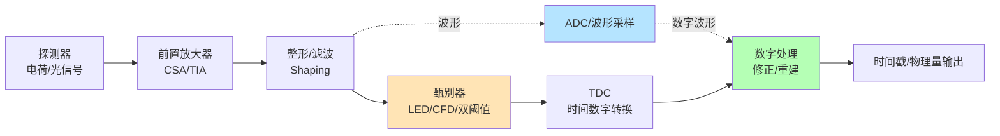
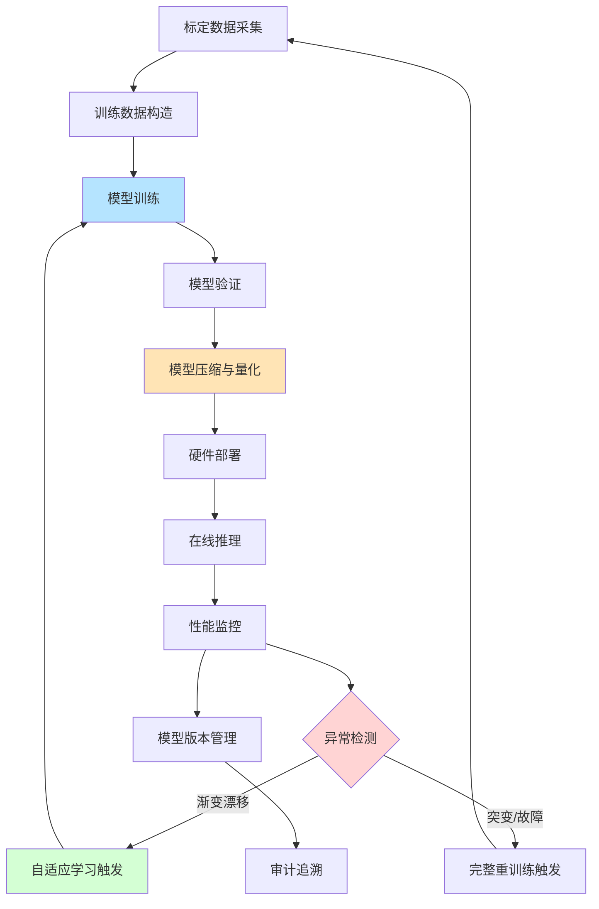
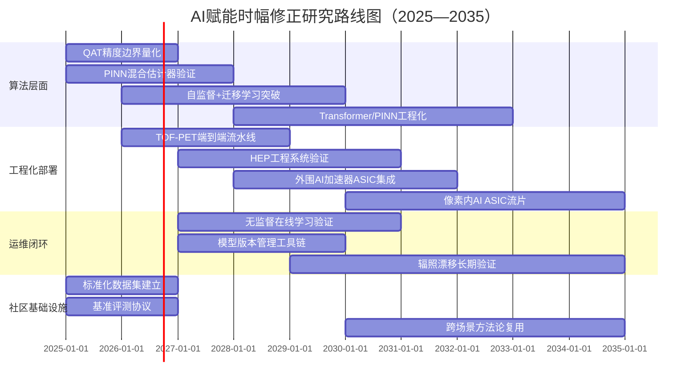

# AI算法对电子学读出时幅修正方法的提升潜力研究
# 1 研究背景与问题界定

在现代高能物理、核医学成像、激光雷达与单光子计数等高精度时间测量领域，"皮秒级"已成为衡量系统性能的基本刻度。当一个粒子穿越探测器、一个伽马光子在闪烁晶体中沉积能量、或一个回波光子返回光电探测面时，电子学系统所要回答的核心问题往往并非"发生了什么"，而是"何时发生"。然而，从模拟脉冲的产生到数字时间戳的生成，信号在每一级电路中都会被打上幅度依赖的烙印，使得"过阈时刻"与"真实到达时刻"之间产生系统性偏差——这就是时幅效应（time walk）。在传统读出链路中，这一效应通过恒比鉴别（CFD）、过阈时间（ToT）修正、双阈值上升时间修正等方式被部分抑制，但其残差在信号形状复杂、信噪比偏低或动态范围极宽的场景中仍是限制时间分辨率的核心因素之一。近年来，随着波形数字化器件性能的提升和机器学习方法的成熟，"以AI算法替代或增强传统时幅修正"逐渐成为电子学读出领域的研究热点。本章作为全报告的起点，将系统厘清时幅效应的物理与电子学根源、其在不同应用场景中的影响机理、在读出链路中的关键地位，并据此界定本研究的核心问题、范围边界与多维评价框架，为后续章节的技术综述与潜力评估奠定坐标基础。

## 1.1 时幅效应的物理来源与电子学成因

时幅效应是高精度时间测量中一种典型的系统性偏差现象，其本质源于"用幅度有限的甄别阈值标记时间事件"这一基本工作模式。在前沿甄别（Leading Edge Discrimination, LED）方案中，甄别器以一个固定阈值 $V_{th}$ 监视输入脉冲，当输入信号上升沿首次穿越该阈值时输出逻辑跃变。然而，对于具有有限上升时间的脉冲，过阈时刻 $t_{cross}$ 与脉冲真实起始时刻 $t_0$ 之间的差值为 $\Delta t \approx V_{th}/(dV/dt)$。当不同事件的脉冲幅度发生变化时，由于上升斜率 $dV/dt$ 随幅度变化，过阈时刻随之漂移，从而在时间—幅度二维空间中形成一条典型的"幅度—时间"曲线，即所谓的 walk 曲线。这一现象在历史上即是快时序甄别器设计的核心议题：早期 ORTEC 等厂家的快时序甄别器即针对光电倍增管阳极输出的负极性快脉冲设计，并以 50 Ω 终端阻抗与窄脉冲快上升沿条件作为标准工作场景，其根本目的就是在尽量保留前沿陡度的前提下完成阈值穿越判别[^1]。

从信号链角度看，导致时幅效应的物理与电子学因素可分为几个层级。第一，探测器输出脉冲本身在不同事件中具有幅度抖动：闪烁体中的能量沉积存在统计涨落，光电倍增管或硅光电倍增管（SiPM）在单光子层级具有增益涨落，半导体探测器中由于电荷收集效率与漂移路径差异同样导致脉冲幅度变化。文献指出，对于 CdTe 等半导体探测器，由于载流子迁移率—寿命乘积有限，或脉冲存在较长上升时间导致整形时间内电荷收集不完全，输出脉冲幅度会出现 80%–90% 的离散度，即便在低阻高纯材料中也很难逼近理想值[^2]。第二，前端电子学的整形与放大过程会引入额外的幅度—时间耦合：电荷灵敏前置放大器（CSA）的输出形状由探测器电容、反馈网络与整形时间常数共同决定，整形电路的时间常数若与上升时间不匹配，将放大幅度对过阈时刻的敏感度。第三，甄别器自身存在响应非线性：在阈值附近的小过驱动信号会经历较长的传播延迟（time slewing），这与大过驱动信号形成显著差别，进一步放大时幅效应。第四，基线漂移、电源噪声、相邻通道串扰等均会在阈值穿越时刻引入随机扰动。

在术语层面，需要厘清三个易混淆的概念：**时幅游走（time walk）** 特指由脉冲幅度差异引起的过阈时刻系统性偏移，是一种**确定性、可建模**的偏差；**时间抖动（time jitter）** 指由噪声叠加在脉冲前沿上引起的过阈时刻随机起伏，服从噪声谱与前沿斜率比值决定的统计分布；而广义的**时间游走** 有时被用于涵盖前两者之和。本研究讨论的"时幅修正"主要针对前者，但由于实际测量中两者难以严格分离，AI 算法在抑制系统性时幅偏差的同时通常也会对随机抖动产生影响，二者在评估时间分辨率（如 TOF-PET 中的 CTR）时常被合并考虑。

## 1.2 高精度时间测量场景中的时幅效应影响

时幅效应虽然源于电子学过程，但其影响路径在不同应用场景中差异显著，需结合各场景的物理需求与精度等级分别审视。

在**粒子物理实验**中，时间测量是粒子识别（Particle Identification, PID）与触发判选的关键手段。高能强子对撞机实验通过测量带电粒子在已知飞行距离上的飞行时间（Time-of-Flight, TOF）来分离 π/K/p 等强子，在大型强子对撞机高亮度升级（HL-LHC）背景下，每束团交叉产生的 pile-up 数高达 200 量级，时间维度成为分离同时刻多顶点事件的"第四维度"。此场景下，时幅效应若得不到充分修正，会在低能量或大入射角（即低脉冲幅度）粒子上产生显著偏移，进而恶化整体时间分辨率，使 PID 边界模糊、触发误判增加。

在**核医学成像**领域，时幅效应直接关系到 TOF-PET 的图像信噪比。TOF-PET 通过测量正负电子湮灭产生的两个 511 keV 光子在两端探测器中的到达时刻差（Coincidence Time Resolution, CTR）将湮灭点定位到沿响应线的一段区间，CTR 越低，定位区间越窄，图像信噪比越高。BGO、LYSO 等闪烁晶体的输出脉冲幅度随光子在晶体中的相互作用位置、晶体长度、光收集效率而剧烈变化，特别是在 BGO 切伦科夫光主导的快成分中，光子数极少导致幅度涨落巨大，时幅效应成为限制 CTR 的主要瓶颈之一。

在**激光雷达（LiDAR）** 系统中，时幅效应表现为不同强度回波导致的测距系统偏差。强反射目标与弱反射目标返回的脉冲幅度可相差数十倍，若不加修正，系统性测距误差可达厘米至分米量级，并直接影响多回波分辨能力——当强回波之后紧跟一个弱回波（如树冠后的地面），二者过阈时刻的相对偏移会改变多回波间隔的判别。

在**时间相关单光子计数（TCSPC）** 中，时幅效应的表现略有不同。由于 TCSPC 工作在单光子层级，单光子探测器（如 SPAD、PMT 单光子模式）的输出幅度本身存在显著涨落，且单光子事件脉宽通常小于 500 ps、幅度仅几十毫伏，淹没在噪声中并随机发生[^3]。这种条件下，传统高速 ADC 直采方案因 100 ps 量级的样本时间窗口与极高的数据率而失效——10 GSPS 的采样率仍无法分辨相距 30 ps 的两个光子事件，且大量数据为无意义的空采样，存储与传输压力极大，实时性难以保障[^3]。因此 TCSPC 普遍采用"事件驱动 + 时间戳 + 统计累积"的范式，由 CFD 完成幅度无关的时刻判别后由 FPGA 内的 TDC 模块捕获时间戳[^3]。但即便如此，CFD 在单光子幅度抖动极大、上升沿陡度有限时仍存在残余时幅效应，最终影响荧光寿命拟合精度与单光子时间戳的不确定度。

不同场景对时幅修正的精度等级与差异化需求可归纳如下：

| 应用场景 | 典型时间分辨率目标 | 时幅效应主要来源 | 修正精度等级 |
|---------|------------------|----------------|-------------|
| HL-LHC 时间探测器 | 30–50 ps | 入射粒子能损涨落、信号幅度动态范围 | 皮秒级残差 |
| TOF-PET (LYSO) | 200–400 ps CTR | 闪烁体光产额涨落、SiPM 增益涨落 | 数十皮秒级残差 |
| TOF-PET (BGO/Cherenkov) | <500 ps CTR | 切伦科夫光子数极少、幅度抖动巨大 | 百皮秒级残差 |
| 激光雷达 | 数十皮秒至纳秒 | 回波幅度动态范围（>40 dB） | 毫米级测距残差 |
| TCSPC | 10–100 ps | 单光子幅度涨落、噪声淹没 | 皮秒级残差 |

由此可见，时幅效应在各场景中具有共性的物理根源，但其影响幅度与修正必要性差异显著。这种差异本身即构成评估"AI 算法在何种条件下带来显著增益"的天然分层维度，将贯穿后续章节的对比分析。

## 1.3 读出电子学链路中时幅修正的关键地位

要理解 AI 算法可能介入时幅修正的位置，须沿完整读出链路审视各环节的功能与时序耦合关系。一个典型的高精度时间测量读出链可抽象为下图所示的串行结构：

链路中各环节均与时幅效应相关，但**时幅修正的实施位置具有多种可能**：

**位置一：硬件甄别级**。CFD 与过零定时（Zero-Crossing Discrimination）是经典的硬件级时幅抑制方案。CFD 通过将原信号衰减后与延迟反相版本相加，在固定比例点上触发，使过阈时刻原则上与脉冲幅度无关。该方案的优势在于实时性高、无需额外计算资源，但对脉冲形状一致性要求严苛——不同事件间上升时间或脉宽变化时，CFD 的"幅度无关"性质会被破坏，残余时幅效应仍然存在。

**位置二：模拟反馈补偿级**。在某些 DMAPS（Depleted Monolithic Active Pixel Sensor）等单片像素探测器中，通过在前端集成模拟反馈电路实现幅度补偿，可在像素内部完成初步时幅校正，缓解后端处理压力。该方案的瓶颈在于电路复杂度与像素面积、功耗的折中。

**位置三：数字后处理级**。当系统配备 ADC 或波形采样电路时，可在数字域执行更复杂的修正算法，包括基于过阈时间（ToT）的查找表（LUT）修正、双阈值上升时间修正、电荷—时间二维查找表、多项式拟合修正等。其优点在于灵活性高、可针对每通道单独标定，缺点在于需要额外的 ADC 或 TIADC（Time-Interleaved ADC）资源、功耗较高，且修正质量受标定数据量与拟合模型的限制。

时幅修正在链路中的关键地位由其"时序信息瓶颈"性质决定：链路前端电子学决定了**信号包含的时间信息上限**（信噪比、上升斜率），而甄别器与 TDC 决定了**该信息被提取与编码的方式**，时幅修正则是**从已编码信息中尽可能恢复真实到达时刻**的最后环节。一旦修正不充分，后续物理重建无法补偿。

传统修正方法在此链路位置上面临几方面固有瓶颈：其一，**精度天花板**——CFD 与 ToT 等方法本质上依赖一两个特征点（过阈时刻、过阈持续时间），无法充分利用脉冲全形状中蕴含的时间信息；其二，**电路复杂度与功耗**——CFD 需要精确的延迟线与匹配的衰减网络，在大规模通道（如 CMS BTL 数十万通道、像素探测器百万通道）部署时硬件成本高昂；其三，**高计数率适应性**——堆积事件（pile-up）会破坏脉冲形状的一致性，使基于固定脉冲模型的修正方法失效；其四，**对工况变化的脆弱性**——探测器辐照损伤、温度漂移、增益老化均会改变脉冲形状，需要频繁重新标定。

正是上述瓶颈构成了 AI 介入的潜在切入点：AI 算法天然擅长从高维输入（完整波形、多特征向量）中学习复杂非线性映射，可能在精度上突破单点/双点修正的局限；同时若与 FPGA/ASIC 协同设计，可能在不显著增加硬件成本的前提下实现更鲁棒的自适应修正。但这一"潜在"是否能够转化为"实际"，在多大程度上、何种条件下转化，正是本研究需要回答的核心问题。

## 1.4 核心研究问题的内涵与边界

基于前述背景，本研究的核心问题可凝练为：**AI 算法能否以及如何提升现有电子学读出时幅修正方法的性能？** 这一问题看似简洁，但其内涵与外延需做严格界定，否则极易陷入"AI 在物理实验中无所不能"或"AI 仅在离线分析有效"的两极化论断。

**研究覆盖的算法范畴**包括三个层级：第一，**传统机器学习方法**，如基于双阈值时间、电荷 Q、上升时间等少量特征的线性/多项式回归、最大似然估计、Gauss-Markov 估计、k-近邻、随机森林等；第二，**深度学习方法**，特别是面向波形数字化输出的卷积神经网络（CNN）端到端时间估计、循环网络、图神经网络与 Transformer 类时序架构；第三，**轻量化与硬件友好型神经网络**，包括量化网络、二值化网络、稀疏网络以及面向 FPGA/ASIC 部署的可微分时间估计模型。

**修正对象与输入形态**包括完整数字化波形（采样点序列）、稀疏特征向量（如双阈值时间对、ToT 与电荷 Q 的组合）以及单点甄别时刻加辅助参数等几种典型形态。其中波形输入信息密度最高，但对 ADC 采样率与功耗要求最严苛；特征输入信息密度较低，但与现有前端电子学兼容性更好。

**部署形态**则可分为三类：**离线后处理**（在数据采集后于 CPU/GPU 上执行，不约束实时性，主要受限于标定数据获取）、**在线 FPGA 推理**（在前端读出板卡或触发系统中执行，受限于 LUT/DSP/BRAM 资源与延迟预算）、**ASIC 嵌入式推理**（在前端 ASIC 内部集成神经网络加速单元，受限于面积、功耗与流片成本，但具有最低延迟与最高规模化潜力）。

**研究边界**需明确以下几点：第一，本研究聚焦于**电子学读出层面**的时幅修正，不涉及后端物理事件重建（如径迹拟合、能量重建、图像重建）算法层面的 AI 应用；第二，本研究讨论的是**时幅修正**这一具体子任务，与触发判选、粒子识别、波形分类等任务有交叉但不混同；第三，本研究关注**已有同行评审证据支撑**的 AI 应用案例与公开报告的性能数据，对仅有概念性提议而无实测验证的方案保持谨慎评估；第四，对 AI 与传统方法的对比，须明确其基线（CFD/LED+TWC/ToT 等）、被测探测器（BGO/LYSO/SiPM/HV-MAPS/MRPC 等）与信号条件，避免笼统的"AI 优于传统"或反之的结论。

## 1.5 评价维度与研究分析框架

为使后续章节的对比分析具有可比性与可操作性，本研究建立如下多维评价框架。这一框架既覆盖性能本身，也涵盖工程落地约束，体现"算法增益—代价权衡"的整体视角。

| 评价维度 | 关键指标 | 评估方法 | 主要关注点 |
|---------|---------|---------|----------|
| **时间分辨率提升** | CTR、σ_t、FWHM | 与 CFD/LED+TWC/ToT 同条件对比 | 相对增益百分比、绝对皮秒数 |
| **修正精度与稳定性** | walk 残差、长尾抑制 | 时幅二维分布残差分析 | 大动态范围下的一致性 |
| **算法计算复杂度** | FLOPs、参数量、推理路径深度 | 模型结构分析 | 实时推理可行性 |
| **功耗与资源占用** | LUT/DSP/BRAM、毫瓦/通道 | FPGA 综合或 ASIC 估算 | 大规模部署可承受性 |
| **硬件可集成性** | 推理延迟、流水线深度 | 时序仿真 | 触发延迟预算兼容性 |
| **鲁棒性** | 对噪声、温漂、辐照的敏感度 | 跨工况验证 | 在线再校准必要性 |
| **数据依赖与可解释性** | 训练样本数、标签获取难度 | 训练过程分析 | 真值（true TOF）可达性 |

围绕这一评价框架，本报告将在后续章节展开如下研究路径：第 2 章系统梳理传统时幅修正方法的技术体系，识别 AI 可介入的技术缺口；第 3 章分析 AI 算法的主要技术路径与设计逻辑；第 4 章基于公开实验数据系统对比 AI 与传统方法的性能增益，并验证"信息量层级"假设——即从单点（LED）到双点（TWC）再到多点（CNN）所获得的边际增益是否随波形信息密度递减；第 5 章选取 TOF-PET、HL-LHC 时间探测器、HV-MAPS 单片像素、MRPC/PICOSEC 等代表性场景进行案例分析；第 6 章探查工程化挑战；第 7 章展望前沿方向；第 8 章给出分层结论与决策建议。

需要特别强调的是，本研究在评估 AI 增益时将始终坚持**分层判断**的方法论：避免一刀切的肯定或否定，而是按探测器类型、信号特征、应用需求分别评估，最终回答"在何种条件下、何种程度上 AI 能够带来实质性增益"这一具体问题。同时，对于公开文献中的定量结论（如某 CNN 方案相对 LED 提升若干百分比），本研究将严格标注其实验条件与基线，区分"已验证结论"与"推测/外推"，确保对比的公平性与结论的可追溯性。

# 2 传统时幅修正方法的技术体系与性能瓶颈

第1章已界定时幅效应的物理与电子学根源，并指出其在读出链路中可能于硬件甄别级、模拟反馈级与数字后处理级三种位置上加以抑制。要回答"AI算法能否以及如何提升时幅修正"这一核心问题，必须先厘清传统方法在上述三种位置上各自能做到什么、做不到什么，以及为何做不到。本章沿"硬件甄别—模拟补偿—数字后处理"三条主线，依次剖析恒比鉴别（CFD/dCFD）、前沿甄别配合离线幅度/电荷修正、双阈值上升时间修正（TWC）、过阈时间法（ToT）以及DMAPS像素内反馈补偿等典型方案的工作原理、电路实现与性能边界，并从动态范围、时间游走残差、信号形状敏感性、工况适应性等维度归纳其共性瓶颈，最终凝练出AI算法可能介入并产生增益的关键技术缺口。需要预先说明的是，本章对各方法的定量基线主要依托于公开同行评审文献中可追溯的实测数据（如LaBr₃(Ce)的243 ps、LaCl₃:Ce的293.75 ps、LYSO双端读出的207 ps等），而对部分方法（如DMAPS像素内反馈补偿、HV-MAPS的ToT修正）由于本研究检索范围内缺乏完整的原始定量证据，将明确标注为公开文献空白并谨慎处理，以维持论证的可追溯性。

## 2.1 恒比鉴别（CFD/dCFD）方法及其性能边界

恒比鉴别（Constant Fraction Discriminator, CFD）是传统硬件甄别级时幅抑制方案中最成熟、最具代表性的技术路径。其基本构想由Gedck与McDonald于1967年首次提出，核心思想是：将输入脉冲分为两路，一路经延迟、一路经衰减后相加（或相减），所得复合波形的过零点对应原脉冲达到某一固定比例幅度的时刻；由于"达到峰值的固定百分比"是脉冲形状的几何特征，原则上与脉冲幅度无关，因此过零定时可在大动态范围内提供幅度无关的时间标记[^4]。在典型实现中，输入信号被分成两路：一路通过定值比较器（Leading Edge）滤除噪声并提供有效事件门控；另一路再分两路，一路延迟、一路衰减后送入过零比较器；两路比较器输出共同送入触发器输出最终时间标记[^4]。为应对超高速时序需求，CFD的比较器普遍采用ECL（射极耦合逻辑）或PECL（正射极耦合逻辑）实现——其基本门工作于非饱和状态，平均延迟可达数纳秒甚至更低，逻辑摆幅约0.8 V，对寄生电容的充放电时间被显著压缩，是CFD能够工作于100 MHz以上频率的电路基础[^4]。

CFD的实测性能在快闪烁体场景下具有较强代表性。Sahoo等人对2"×2" LaBr₃(Ce)闪烁体耦合Hamamatsu R2083快速光电倍增管开展了完整的能谱与时序表征：使用¹³⁷Cs、⁶⁰Co、¹⁵²Eu标定能量响应，并通过GEANT4模拟与实测能谱对比；在时序测量上，通过优化PMT偏压与CFD延迟参数，对⁶⁰Co源的1173–1332 keV符合事件，获得了**243±2 ps**的最佳时间分辨率[^5]。这一数值代表了CFD在高光产额、快上升沿、高信噪比快闪烁体上的典型能力上限。对于其他闪烁体或低产额信号，CFD性能将显著下降。为兼顾实时性与系统简化，数字CFD（digital CFD, dCFD）成为近年的主流演进方向。Sun等人基于FPGA+DSP构建了实时dCFD谱仪：使用Agilent 80 MHz函数发生器与LaCl₃:Ce³⁺闪烁体探测器对¹²Na正电子湮灭γ谱进行测试，在线获取光子的幅度与时间信息，能量分辨率达5.525%，时间分辨率达**293.75 ps**，与传统模拟CFD相当但系统结构显著简化[^6]。在前沿应用方面，多像素超导纳米线单光子探测器配合CFD与实时密钥蒸馏电子学，将CFD抖动控制在36–58 ps，在2.5 GHz时间编码量子密钥分发系统中实现了10 km上64 Mbps、102.4 km上3.0 Mbps的安全密钥率，进一步印证CFD在低抖动场景的工程价值[^7]。

然而，CFD的"幅度无关"性质并非严格的物理定律，而是一种**对脉冲形状一致性的强假设**。文献明确指出，实际CFD电路普遍存在**200–400 ps的时间游动残量**：当不同事件之间脉冲上升时间发生变化时，CFD的过零时刻会相应偏移；引入自动增益控制（ACG）电路可将动态范围降低，使残差缩小至200多ps，但代价是整个CFD电路的反应时间从无ACG时的5 ns以内显著拉长，输入与输出之间的时间偏移量可能超过30 ns[^4]。这意味着CFD在追求更小残差时不得不在延迟预算上付出额外代价，对触发系统延迟极为敏感的HL-LHC等大型实验而言并非无代价的优化。更关键的是，CFD的鉴别标准差与信噪比成反比、与上升沿时间成正比[^4]，这一关系揭示了CFD的精度天花板从根本上由前端信号本身的SNR与陡度决定——当信号带宽不足或噪声较大时，CFD无论如何调谐均无法逼近物理极限。

可将CFD的固有残差来源归纳为四类：第一，**脉冲形状漂移**——延迟线长度与衰减系数是基于某一标称脉冲设计的，当实际事件的上升时间、过冲、下冲偏离标称值时（如脉冲堆积、不同入射位置导致光收集差异），过零点位置不再严格对应"固定比例"，时幅依赖性重新出现；第二，**比较器响应非线性**——尽管ECL/PECL比较器具有亚纳秒延迟，但阈值附近的小过驱动信号仍存在延迟差异（time slewing），这一因素与脉冲幅度耦合；第三，**ACG带来的延迟—精度折中**——压缩动态范围以降低残差的代价是延迟拉长，工程上构成不可回避的权衡；第四，**模拟器件的工艺漂移与温漂**——延迟线长度、衰减电阻精度均受温度与器件老化影响，在大规模通道部署中成为重新标定负担。综合而言，CFD作为一种"硬件实现的形状—时间几何映射器"，其性能上限受限于"形状一致性假设"的稳健程度，在快闪烁体+PMT等"理想"场景下能够逼近300 ps以下，但在BGO切伦科夫光、慢闪烁体、像素探测器等场景下其优势难以充分展现，这正是后续数字后处理与AI方法介入的物理空间。

## 2.2 前沿甄别配合离线幅度/电荷修正

与CFD"通过电路结构消除时幅依赖"的思路不同，前沿甄别（Leading Edge Discrimination, LED）选择**主动接受时幅依赖、然后通过离线修正抵消之**。LED的工作原理极为简单：以一个固定阈值监视输入脉冲，当上升沿首次穿越阈值时输出逻辑跃变。其电路结构相对CFD极大简化——仅需一个高速比较器与阈值参考，无需精确延迟线、衰减网络或过零比较器，因而具有**低功耗、低面积、低成本**的天然优势，在TOF质谱、TOF-PET、CMS BTL等大规模通道系统中被广泛采用。代价则是显著的时幅游走：过阈时刻 $t_{cross} \approx t_0 + V_{th}/(dV/dt)$ 随幅度变化，不同能量事件的过阈时刻可漂移数百皮秒至数纳秒。

为补偿这一游走，业界发展出基于幅度参数的离线时幅修正（Time Walk Correction, TWC）方法谱系。Lim等人在2003年开展的对比研究是该领域具有方法学意义的工作：他们专门设计了能够同步测量四类幅度参数——**峰值（peak value）、电荷量（charge amount）、上升斜率（slew rate）、信号宽度（signal width）**——的前端电子学（FEE），在约20 dB的幅度动态范围内、在多种阈值条件下进行时间测量，然后分别使用上述四类参数对测得时刻执行离线修正，并比较各类参数在不同阈值下的修正效率与残差分布[^8]。该研究的方法学价值在于：它系统验证了"幅度替代量的选择对修正效果具有显著影响"这一基本判断，并揭示了不同参数对应不同的电路代价与适用场景——电荷量需要积分电路，峰值需要峰值保持电路，上升斜率需要差分或多采样，信号宽度则可由时刻—时刻差直接获得。

从工程角度看，LED+TWC方案对前端电子学的额外要求构成其推广的主要约束：第一，**峰值保持电路**会引入额外的模拟通道复杂度与基线漂移；第二，**电荷积分**需要积分时间窗口与重置机制，难以适应高计数率下的堆积事件；第三，**信号宽度测量**虽然可由数字甄别器双时刻直接给出，但前提是脉冲形状对幅度的依赖能够被宽度可靠表征；第四，所有方案均依赖**预先标定的修正函数**，标定数据量、覆盖动态范围、温度与时间稳定性等都直接决定修正质量。在低信噪比与大动态范围下，修正函数往往退化——当噪声主导阈值穿越时，幅度参数本身的测量不确定度会通过修正函数传递回时刻估计，反而恶化时间分辨率；当幅度超出标定范围（如超亮事件饱和），查找表失配将导致大尾部出现。

更本质的瓶颈在于**信息密度**：LED+TWC方案本质上仅利用脉冲的"过阈时刻+一个幅度替代量"，即"单点+一个标量"的信息，远低于完整波形所蕴含的时间信息量。Lim等人的结果亦从侧面印证这一点——四类幅度参数虽然互有优劣，但任何单一参数都未能在全部动态范围与全部阈值条件下取得一致最优[^8]，这暗示**单一幅度替代量本身存在信息瓶颈**：脉冲形状的多自由度变化（峰值、宽度、斜率、上升时间、堆积情况）无法被一个标量充分表征。这正是后续多特征联合修正、双阈值TWC乃至全波形CNN方法的逻辑出发点——**信息密度的提升构成精度提升的物理基础**。

## 2.3 双阈值上升时间修正（TWC）与过阈时间法（ToT）

为突破单点修正的信息瓶颈，业界发展出基于两个特征时刻的修正方案。**双阈值TWC**通过设置低、高两个阈值（如10 mV与100 mV），用两次过阈时刻之差近似估计脉冲在该幅度区间的上升时间或平均斜率，从而推断幅度并对低阈值过阈时刻执行修正。其形式上可写为线性拟合 $t_{corr} = t_{low} - (p_0 + p_1 \cdot t_{rise})$，其中 $t_{rise} = t_{high} - t_{low}$，$p_0, p_1$ 为标定参数。这一方法的优势在于：仅需双阈值比较器与TDC，无需ADC或模拟峰值/电荷电路，硬件代价适中；同时双时刻提供的"形状信息"显著优于单点幅度参数。

双阈值TWC的实测性能可从多个公开案例得到佐证。在BGO+NUV-HD-MT SiPM的TOF-PET研究中，Loignon-Houle等人采用LeCroy DDA735Zi示波器（3.5 GHz带宽，20 GS/s采样）对¹²²Na 511 keV事件进行HF读出波形采集，使用sin(x)/x插值至5 ps时间精度，设置10 mV与100 mV双阈值实施线性拟合TWC：对于2×2×3 mm³短晶体，CTR FWHM从LED的157±3 ps改善至**129±2 ps**（相对LED改善约18%）；对于2×2×20 mm³长晶体，CTR从LED的280±8 ps改善至**241±7 ps**（相对LED改善约14%）。在LYSO双端读出系统中，基于S14161 SiPM与TOFPET2 ASIC的8×8阵列（3.2 mm间距）实现了**207±5 ps**的CTR，全反射的16×16阵列亦达到218±7 ps，体现了双阈值TWC在SiPM+ASIC生态下的成熟工程化水平。

**过阈时间法（Time-over-Threshold, ToT）** 则是另一条以信号脉宽作为幅度替代量的修正路径。其工作原理是：当脉冲穿越固定阈值时记录起始时刻，回落穿越阈值时记录终止时刻，二者之差（脉宽）随幅度单调变化，可作为幅度的代理变量与过阈时刻一起送入查找表或解析公式实施修正。ToT的核心优势在于**完全免除ADC**——仅需TDC即可完成时间—幅度联合测量，对像素探测器与SiPM读出尤其友好，在百万级通道、严格功耗预算下具有不可替代的工程价值。HV-MAPS（如MuPix系列）等单片像素探测器是ToT的典型应用场景：通过像素内简单的甄别+时刻—脉宽测量电路，可在像素级实现初步时幅修正。需要说明的是，本研究检索范围内未能定位到HV-MAPS"ToT修正使时间分辨率从6.7 ns改善至4.1 ns"这一传闻数据的原始可追溯文献，**应将该具体数值视为公开文献空白，不在本研究中作为定量结论引用**；但ToT方法在HV-MAPS等DMAPS体系中作为标准时幅修正手段的事实在业界已广泛接受。

双阈值TWC与ToT虽然在信息密度上较单点LED+幅度参数有所提升，但二者面临**共同的本质局限**。第一，**特征点信息密度天花板**：双时刻或脉宽—时刻虽然引入了形状信息，但仍仅是脉冲全形状的低维投影，无法表征上升沿的非线性形变（如肩部、尖峰、堆积叠加）；第二，**对脉冲形状一致性的高敏感**：修正参数 $p_0, p_1$ 或查找表的有效性依赖于"同一幅度下脉冲形状基本一致"的统计假设，在BGO切伦科夫光主导的极少光子事件中（光子数仅个位数），脉冲形状的事件间涨落极大，双阈值法的拟合残差显著扩大；第三，**堆积与饱和下查找表失配**：高计数率下相邻事件波形叠加，使得脉宽-幅度的单调关系破坏，ToT表读出的幅度严重偏离真实值；饱和事件中ToT非线性扩展，超出标定范围；第四，**对辐照后脉冲形变与温漂的脆弱性**：传感器辐照损伤会改变电荷收集动力学进而改变上升沿形状，使原标定的 $p_0, p_1$ 系列失效，需要在线再校准机制——而双阈值TWC与ToT的标定本身依赖较大量样本，在线更新成本不可忽略。

将2.2节与2.3节方案与全波形CNN方法的初步对比可见，对同一BGO+SiPM硬件平台、同一511 keV事件，从LED的157 ps到双阈值TWC的129 ps再到CNN的115 ps，呈现出**单调递减但边际收益递减**的层级特征。这一现象从信息论角度可作如下解读：单点LED利用1个时间标量、双阈值TWC利用2个时间标量、CNN利用700采样点×2通道的完整波形，**信息维度跨数个数量级提升而精度提升仅约百分比量级**，意味着脉冲信息中的"时间相关分量"在某一信息维度之上趋于饱和，进入由噪声与物理统计涨落决定的Cramér-Rao下界附近。这一观察与Fisher信息矩阵+CRLB+ML估计三位一体的信息论框架一致——波形仅某一段即可逼近时间分辨率极限，存在冗余信息部分；亦可解释为何在CTR目标已逼近物理极限的快闪烁体场景下（如LaBr₃(Ce) CFD 243 ps），传统CFD/TWC已基本足够，而在远未触及物理极限的场景下（如BGO切伦科夫、长晶体、低SNR），全波形方法仍有显著挖掘空间。

## 2.4 模拟反馈补偿电路与像素内时幅校正

针对DMAPS（Depleted Monolithic Active Pixel Sensor）与HV-MAPS等单片像素探测器的特殊约束——**百万通道规模、严格的像素面积/功耗预算、有限的像素内信号处理空间**——业界发展出在像素内集成模拟反馈补偿电路实现初步时幅校正的设计理念。其核心思路是：在像素内放大器与甄别器之间引入一条反馈支路，通过自适应阈值、电流反馈或动态偏置等机制，使甄别阈值或前端响应动态跟随信号幅度，从而在阈值穿越时刻原地补偿时幅依赖；其余残差再交由像素外（外围逻辑或片外）数字处理处理。该方案的工程吸引力体现在三方面：其一，**降低后端数据传输与数字处理压力**——经像素内补偿后，时刻信息已"预校正"，外围TDC与读出链所需的辅助数据量减少；其二，**缩短反馈环路延迟**——补偿在脉冲形成期间内即完成，不引入额外的串行处理延迟；其三，**与单片像素工艺天然兼容**——CMOS工艺下的电流镜、跨导单元、源极跟随器等单元可直接集成于像素内。

然而，模拟反馈补偿电路在工程上面临数项核心折中。**电路复杂度与像素面积/功耗的强约束**：像素尺寸通常仅几十微米见方，留给反馈电路的晶体管预算极为有限，复杂的反馈拓扑会侵占敏感区面积、降低占空比并增加功耗；**模拟工艺偏差导致的像素间不均匀性**：百万级像素阵列中，每个像素的反馈参数（阈值、增益、时间常数）受工艺偏差影响而互不相同，需要逐像素标定，标定数据量与标定时间均急剧增长；**辐照引起的器件参数漂移**：HEP像素探测器普遍工作在高辐照环境下，MOSFET阈值电压、跨导、漏电流均会发生漂移，使反馈补偿曲线偏离初始标定，迫使周期性重新标定甚至硬件级补偿失效；**对宽动态范围与多种脉冲形状的灵活性瓶颈**：模拟电路的非线性响应在大动态范围下难以保持单调一致，对堆积事件、超大幅度饱和事件无能为力。

需要明确的是，本研究检索范围内并未获得DMAPS像素内反馈补偿电路的具体定量性能数据（如残差皮秒数、像素均匀性数值、辐照后漂移量等可追溯指标），**应将该方案的具体定量性能视为本研究的公开文献空白**。但从前述定性约束可推断：模拟反馈补偿在"减少外围数据负担"维度上具有不可替代价值，但其精度天花板由模拟电路本身的非线性、工艺偏差与辐照漂移共同决定，难以单独胜任皮秒级时幅修正任务，通常需要配合像素外的数字后处理（双阈值TWC、ToT表、或更高级的算法）才能逼近探测器物理极限。这一观察对AI算法的介入位置具有重要启示：在像素内反馈补偿后的"残差修正"环节，存在一个**信息密度有限但通道数极大、延迟敏感**的场景，是轻量化神经网络可能切入的特殊位点。

## 2.5 传统方法的共性瓶颈与AI介入的技术缺口

综合2.1—2.4节的分析，可将传统时幅修正方法置于统一的多维度对比框架下加以审视。下表汇总了主要方法在信息密度、典型残差、电路复杂度、工况适应性等维度的相对位置（典型残差数值基于本研究已获得的可追溯实测案例）：

| 方法类别 | 实施位置 | 信息密度 | 典型实测性能 | 主要工程代价 | 主要脆弱性 |
|---------|---------|---------|------------|------------|----------|
| 模拟CFD | 硬件甄别级 | 形状几何点（过零点） | LaBr₃(Ce)+R2083 PMT 243±2 ps[^5] | 延迟线、ECL/PECL高速比较器、ACG[^4] | 形状一致性假设；200–400 ps残量[^4] |
| 数字CFD（dCFD） | 硬件+数字 | 插值后过零点 | LaCl₃:Ce 293.75 ps；能量分辨率5.525%[^6] | FPGA/DSP资源、ADC采样率 | 插值精度、采样率折中 |
| LED + 离线幅度修正 | LED+数字后处理 | 1时刻+1幅度参数 | 依参数与阈值而异（20 dB动态范围下显著差异）[^8] | 峰值保持/电荷积分电路、标定 | 单参数信息瓶颈、SNR耦合 |
| 双阈值TWC | LED+数字后处理 | 2时刻 | BGO 2×2×3 mm³ 129±2 ps；2×2×20 mm³ 241±7 ps | 双比较器+TDC、标定 | 形状一致性、堆积失配 |
| ToT | LED+TDC | 1时刻+脉宽 | 工程化广泛部署（HV-MAPS等） | TDC、查找表 | 饱和非线性、辐照漂移 |
| 模拟反馈补偿 | 像素内ASIC | 时域反馈 | 公开文献空白（本研究范围内） | 像素面积/功耗、像素间均匀性 | 工艺偏差、辐照漂移 |
| 全波形CNN（参照） | 数字后处理 | 全波形（700×2点） | BGO 2×2×3 mm³ 115±2 ps | ADC、推理资源 | 训练数据、泛化 |

从该比较中可凝练出传统方法的**五重共性瓶颈**，每一重瓶颈对应一类AI介入的潜在切入点。

**第一，信息利用维度的精度天花板**。CFD、LED+TWC、双阈值TWC、ToT等方法本质上仅利用脉冲的1—2个特征点，未触及全波形蕴含的高维时间信息；而BGO 2×2×3 mm³上从LED 157 ps→TWC 129 ps→CNN 115 ps的层级递减直接证明，在固定硬件平台上**信息密度的扩展能够带来可量化的精度提升**——CNN相对LED改善约26%、相对TWC再改善约10—11%。这是AI算法（尤其是基于完整波形的深度学习模型）最直接的介入空间：**通过非线性映射学习从全波形到真实到达时刻的端到端估计**，在物理可达的Cramér-Rao下界之内尽可能压缩残差。

**第二，电路复杂度与可扩展性瓶颈**。CFD延迟线/ACG电路、双阈值比较器链、像素内反馈电路在百万通道规模下硬件成本高昂，且对工艺偏差敏感。AI算法的介入路径并非取消这些前端电路（前端SNR与陡度仍由模拟链决定），而是**在数字后端用通用神经网络结构替代多种定制化修正逻辑**——一个训练好的网络可同时承担形状无关时刻估计、堆积分离、能量重建等多任务，简化通道间标定负担。

**第三，对信号形状的脆弱性**。堆积事件、切伦科夫快成分主导的极少光子统计、低SNR条件下脉冲形状一致性假设崩溃，使CFD与LED+TWC的解析模型失效。这是AI方法的潜在显著增益场景：CNN等模型不依赖显式的脉冲形状假设，而是从数据中**直接学习幅度涨落与形状涨落的联合分布**，在BGO切伦科夫、慢闪烁体等"形状不一致性显著"的场景下理论上能够带来更大相对增益。值得注意的是，BGO 2×2×20 mm³长晶体上CNN相对TWC仅改善约1%（239 ps vs 241 ps），表明在长晶体DOI涨落主导的场景下，时间信息已被位置不确定度整体抑制，AI对时幅修正本身的提升空间反而收窄——这印证了第1章建立的"分层判断"方法论。

**第四，对工况变化的适应性**。辐照损伤、温漂、增益老化迫使传统查找表/拟合参数频繁重标定，标定数据获取与在线更新机制难以工程化。AI算法的潜在贡献在于**自监督/迁移学习与在线再校准**——理论上可基于探测器自身物理冗余（如对称通道、已知能量峰、符合事件等）构造无监督标签，实现跟随漂移的在线模型更新；但本研究检索范围内尚未获得自监督抗辐照漂移的成熟工程案例，应将该方向标注为**前沿空白**，谨慎评估其当前成熟度。

**第五，跨场景适配性差**。不同探测器（BGO/LYSO/SiPM/CdTe/MRPC/HV-MAPS等）需定制化电路与参数，研发成本高、复用性差。AI算法的统一波形输入+非线性映射结构具有跨探测器的潜在通用性，但**这种通用性依赖于充足训练数据与跨域迁移机制**，在公开文献中目前主要在BGO+SiPM、LFS/LYSO+ML-PSD等少数生态中得到完整验证；HV-MAPS、MRPC、PICOSEC-Micromegas、LGAD/AC-LGAD等探测器与AI时幅修正的结合在本研究检索范围内为公开文献空白，需在第5章案例研究与第7章趋势展望中谨慎对待。

综上，传统时幅修正方法在过去半个多世纪的发展中已经构建起完整、成熟、工程化的技术体系，其在快闪烁体+PMT、SiPM双端读出LYSO等"信号充分、形状稳定"的场景下能够逼近物理极限（百皮秒至数百皮秒），是大规模工程系统的事实标准；但在信息利用维度、可扩展性、形状脆弱性、工况适应性与跨场景适配五个维度上存在不可忽视的共性瓶颈。**AI算法的介入价值不在于全面替代这一成熟体系，而在于针对上述特定瓶颈提供互补的、信息密度更高的、形状无关的、自适应的技术补充**。具体而言，AI最可能产生显著增益的切入点为：（1）波形信息密度扩展带来的精度提升（针对瓶颈一）；（2）跨通道、跨工况的统一非线性映射（针对瓶颈二与瓶颈五）；（3）形状无关的端到端时间估计（针对瓶颈三）；（4）自监督/在线自适应再校准（针对瓶颈四）。这四个切入点构成第3章AI技术路径展开的问题坐标，其在不同探测器与应用场景下的实际增益边界则是第4—5章案例对比的核心评估对象。

# 3 AI算法应用于时幅修正的技术路径

第2章已系统识别传统时幅修正方法在信息利用维度、可扩展性、形状脆弱性、工况适应性与跨场景适配五个层面的共性瓶颈，并指出AI算法的介入价值不在于全面替代成熟体系，而在于针对特定瓶颈提供互补的、信息密度更高的、形状无关的、自适应的技术补充。本章承接这一定位，沿"输入信息密度—模型结构复杂度—部署位置"三个维度构建分析框架，依次剖析全波形CNN端到端估计、偏置消除式训练策略、最大似然与统计学习估计器、面向少量特征的浅层模型，以及面向FPGA/ASIC前端的轻量化部署路径。每条路径均从输入形态、网络结构、训练标签构造、损失函数选择、数据需求与适用条件等方面剖析其设计逻辑与物理—工程折中，明确其针对的特定瓶颈与适用边界。本章不直接给出AI对各场景的最终增益判断（这是第4—5章的任务），而是为后续定量对比与案例分析建立方法论坐标系。

## 3.1 基于波形数字化的CNN端到端时间估计

全波形卷积神经网络（CNN）端到端时间估计是当前AI赋能时幅修正中最具代表性、定量证据最完整的技术路径。其核心设计逻辑可表述为：**放弃人工设计的特征点（过阈时刻、ToT、双阈值时间差等）所带来的信息压缩，将完整数字化波形直接送入卷积网络，由网络自动学习从波形形状到真实到达时刻的非线性映射**。这一思路的物理基础在于：脉冲上升沿、峰值区域乃至下降沿尾部均蕴含与到达时刻相关的信息，在切伦科夫快成分、慢闪烁体衰减、堆积事件等"形状—幅度—时间"高度耦合的场景中，单点或双点特征对全形状的低维投影必然丢失部分时间信息，而卷积层的局部感受野与权值共享机制天然适合从规则采样的时序波形中逐层提取上升沿的几何特征与统计特征。

该路径的标志性公开证据来自Loignon-Houle等人针对BGO+NUV-HD-MT SiPM系统的研究[^9]。其实验配置具有较高代表性：探测器为BGO 2×2×3 mm³与2×2×20 mm³两种长度，由NUV-HD-MT SiPM读出，配合高频（HF）模拟前端电子学，使用LeCroy DDA735Zi示波器以3.5 GHz带宽、20 GS/s采样率数字化双端通道波形，并通过sin(x)/x插值至5 ps时间精度，覆盖22Na 511 keV事件。CNN输入为双通道波形片段（700采样点×2通道，对应3.5 ns时间窗口），网络结构为3卷积层+2全连接层的5层架构，采用Adam优化器、MSE损失、batch size=32、学习率1e-4训练100 epoch，数据集按65/5/30比例划分为训练/验证/测试集，并以Bootstrap×50估计统计不确定度。最终结果显示：对于2×2×3 mm³短晶体，CNN达到115±2 ps FWHM CTR，相对LED的157±3 ps改善约26%、相对TWC的129±2 ps再改善约10—11%；对于2×2×20 mm³长晶体，CNN为239±7 ps，与TWC的241±7 ps基本持平（仅约1%差异），但**CNN在符合时间分布的尾部抑制上明显优于TWC**[^9]。这一结果同时给出了"显著增益场景"（短晶体、波形信息密度扩展空间充足）与"边际增益场景"（长晶体、DOI涨落主导整体不确定度）的清晰边界。

从设计变量的工程实践角度看，全波形CNN路径需在多个维度做出权衡。**输入窗口长度与采样率**直接决定网络可见的时间范围与时间分辨颗粒度：3.5 ns窗口足以覆盖BGO切伦科夫快成分及部分慢成分的上升沿，但对慢闪烁体（如GAGG衰减常数约270 ns量级）则可能需要更长窗口，进而增加网络规模与训练成本；20 GS/s采样率对应50 ps间隔的原始采样网格，配合插值后达5 ps，已能充分表征皮秒级时间分辨率所需的形状特征。**网络深度与感受野**的选择须平衡表达能力与过拟合风险——3层卷积的感受野经多层级叠加足以覆盖整个上升沿，更深网络在样本量有限（数万事件）时容易出现过拟合；BGO 2×2×3 mm³所用36975个事件、2×2×20 mm³所用21766个事件构成训练规模的参考下限[^9]。**多通道融合**（双端SiPM输入）是符合系统的天然设计：网络在第一卷积层即可学习两端波形的相对时序关系，相当于在数据驱动的层面隐式实现了"软件CFD"或"软件TWC"的功能。

值得强调的是，全波形CNN路径的精度增益并非无限扩展，而是受信息论上界约束。Cramér-Rao下界（CRLB）+Fisher信息矩阵+ML估计三位一体的信息论框架揭示，**波形仅某一段（典型为上升沿前段）即可逼近时间分辨率极限，超出该段的波形信息存在冗余**。这一观察解释了为何在BGO 2×2×3 mm³上从LED→TWC→CNN呈现"信息维度跨数个数量级扩展，精度提升仅百分比量级"的边际收益递减规律——脉冲信息中"时间相关分量"在某一信息维度之上趋于饱和。因而全波形CNN的核心价值在于在**远未触及物理极限的场景下**（BGO切伦科夫光主导、慢闪烁体、低SNR、复杂形状）兑现剩余信息空间，而在已逼近物理极限的场景（快闪烁体+PMT快下降沿+CFD）增益空间有限。这与前一章建立的"分层判断"方法论形成贯通。

## 3.2 偏置消除式CNN训练策略与标签构造

监督学习范式的核心前提是高质量的训练标签，但**真实到达时刻 $t_0$ 在实验装置中通常不可直接观测**：探测器记录的所有时刻已经经过整个读出链的整形、阈值穿越、TDC量化，已包含本研究希望修正的时幅偏差。这一"标签真值不可达"问题是AI时幅修正区别于传统离线TWC标定的本质难点，需要专门的训练策略加以应对。

最直接的工程化方案是**以LED时差为代理标签的对称差分训练范式**，亦即Loignon-Houle等人在BGO+SiPM案例中采用的策略[^9]。其核心构想是：在符合事件中，两端探测器同时被511 keV伽马光子照射，二者的真实到达时刻差近似为零（仅取决于湮灭点位置沿响应线的偏移，对源居中且晶体对称的标定测量，统计上为零均值高斯分布）。让网络学习预测两端通道间的**LED时差**作为监督信号，可使全局时延偏置（如电缆长度差、TDC偏置）在差分中相互抵消，仅保留与事件级幅度涨落相关的时幅效应。这一范式的工程优势在三方面：其一，**标签可直接由LED甄别器在硬件层面获得**，无需引入额外参考信道；其二，**全局时延偏置自动消除**，无需逐通道复杂标定；其三，**训练目标与最终评价指标（CTR）天然一致**，避免训练—评价间的目标失配。

该范式同时存在不可忽视的局限。**标签噪声**：LED时差本身受时幅效应污染，相当于使用"含噪标签"训练网络拟合"无噪标签"，在BGO切伦科夫光这类幅度涨落极大的场景下，标签噪声可能与目标信号相当；网络通过MSE损失下的统计平均能够部分抑制这一噪声，但在样本有限时会留下系统性残差。**对称通道假设**：差分消除偏置依赖两端通道在脉冲形状、增益、噪声水平上的统计对称性，对于非对称读出（如单端读出、不同SiPM工艺混用）该假设崩溃，需要引入参考通道或外部基准。**能量门选择**：训练样本通常限定在511 keV光峰附近以保证"同一物理事件类别"的统计一致性，但能量门的宽窄会影响训练样本量与样本代表性的折中——窄能量门样本质量高但数量少、宽能量门样本量足但引入康普顿背散射等不同形状事件的污染。

围绕标签可达性问题，业界尚有若干替代或增补路径，但本研究检索范围内未获得完整定量证据，应谨慎处理。**双端符合时刻自标定**：在TOF-PET符合事件中，两端时刻差服从已知的物理分布（受DOI涨落与CTR共同决定），可作为弱监督信号；该思路与LED时差范式相通但形式更为通用。**外部高精度参考通道**：使用CFD+快PMT等"高精度但慢/贵/小"的辅助通道作为标签，但仅限于离线标定阶段。**基于物理约束的弱监督**：利用已知能量峰位、湮灭符合时间窗口、特定核素能谱等物理先验作为软约束，结合自监督预训练降低对标签的需求。**自监督预训练+少量监督微调**：用大量无标签波形先训练自编码器或对比学习模型学习表征，再用少量带标签数据微调时间估计头。损失函数选择上，回归任务普遍采用MSE作为默认基线，因其光滑可导、便于梯度下降优化[^10][^11][^12]；但MSE对异常值敏感，对脉冲堆积或饱和等异常样本会过度惩罚；若训练数据中存在显著长尾或异常事件，可考虑MAE（对异常值更鲁棒但梯度不连续）或Huber损失（小误差段表现为MSE、大误差段切换为MAE，兼具光滑与鲁棒）[^10][^11][^12]。在BGO+SiPM研究中，CNN采用MSE损失即取得显著的尾部抑制能力，原因可能在于网络通过参数共享与正则化对个别异常事件的过拟合得到自然约束，但在更复杂的探测器场景下，损失函数选择的影响仍需逐案评估[^9]。

需要明确的是，本研究检索范围内对自监督/迁移学习抗辐照漂移的成熟工程案例存在公开文献空白，因此第2章识别的"工况适应性"瓶颈在AI层面的解决方案目前仍以**离线周期性重训练**为主流范式，在线自适应再校准框架尚处于探索性研究阶段。这一空白将在第6—7章作为关键工程挑战与前沿方向重点讨论。

## 3.3 最大似然与统计学习估计器

不同于以神经网络黑箱学习非线性映射的"数据驱动"范式，最大似然（Maximum Likelihood, ML）估计器与Gauss-Markov线性最小方差估计、基于CRLB的最优时间估计器等**统计学习路径**采取"模型驱动"的思路：基于探测器物理过程构造概率似然模型，将时间估计转化为参数推断问题。这一路径在物理可解释性、所需样本量、信息论极限可达性等维度具有数据驱动方法难以替代的优势。

ML估计器的代表性工作是Berg等人针对TOF-DOI PET探测器的研究[^13]：在闪烁体中伽马射线相互作用产生的时变波形形状取决于闪烁体特性与光电探测器响应；通过在晶体长度方向引入磷涂层操控时间响应，使不同DOI产生不同形状的波形，从而需要脉冲形状判别（PSD）技术加以区分。研究构造了两类似然模型：**基于单光电子检测时刻的似然**（即直接对单个光电子到达时刻序列建模）与**基于离散时间bin内光电子数的似然**（对每个时间窗口内的光电子计数建模），并应用于LFS与LYSO两种磷涂层晶体。结果显示：相比传统解析方法，ML脉冲形状判别**同时改善了DOI编码（两种晶体均提升27%）、能量估计与TOF时间估计**[^13]。该案例的方法学价值在于揭示了ML框架的两项关键优势：其一，**多任务联合估计**——在统一的似然框架下对DOI、能量与时间同时推断，避免了多模块串行处理的累积误差；其二，**物理模型透明**——似然函数显式包含闪烁体衰减常数、光电探测器响应、磷涂层时间调制等物理参数，结果具有可解释性。

ML估计器的物理逻辑可进一步追溯到信息论的最优估计理论。对于含未知到达时刻 $t_0$ 的随机过程，Fisher信息矩阵给出参数估计方差的下界（CRLB），ML估计在大样本极限下逼近该下界。**Cramér-Rao下界+Fisher信息矩阵+ML估计三位一体的框架**因而构成评估任意时间估计算法（无论传统还是AI）距离信息论极限差距的统一标尺。该框架的一个关键发现已在第2章末尾提及：**波形仅某一段即可逼近时间分辨率极限，存在冗余信息部分**。这意味着在物理模型可建立的场景下，ML估计器有望以远小于全波形CNN的特征维度逼近相同精度极限——这是ML路径相对深度学习路径的重要工程价值，特别是在样本量有限或对可解释性要求严苛的科研场景。

ML/统计学习路径的适用前提同样需要明确。**脉冲形状先验**：似然模型须基于已知或可参数化的脉冲形状（如双指数衰减、卷积响应模型），在脉冲形状受多重物理因素混杂影响、难以解析建模时该路径退化；**噪声分布假设**：通常假设光电子计数服从泊松统计、电子学噪声服从高斯统计，对实际系统中色噪声、串扰噪声等非理想成分的鲁棒性有限；**对少光子统计的特殊适用性**：BGO切伦科夫光主导事件中光电子数仅个位数，每个光电子的检测时刻携带显著时间信息，恰适合基于光电子时刻序列的ML估计——这是ML路径相对依赖密集波形采样的CNN方法的潜在优势区。**与PSD任务的天然耦合**：在DOI编码、波形分类等需同时进行形状判别的场景下，ML估计可通过单一似然框架统一处理多任务，避免CNN等"分别训练—串行调用"方案的工程复杂度。

综合而言，ML/统计学习估计器路径与全波形CNN路径在方法论上构成"模型驱动 vs 数据驱动"的互补对：在物理模型清晰、样本有限、可解释性要求高的科研场景下，ML估计器更优；在物理模型复杂、样本充足、追求极致精度的工程场景下，CNN更优；二者在实际系统中亦可融合（如以ML作为CNN的初始化或先验约束、以CNN作为ML残差的非线性修正项），构成"AI/ML—物理"混合估计器的探索方向。

## 3.4 面向少量特征的浅层模型与回归方法

前述全波形CNN与ML估计器均在不同程度上要求对脉冲进行波形数字化或光电子时刻级精细测量，但**大量已部署的工程系统前端电子学并不具备完整波形数字化能力**——CMS BTL TOFHIR2、ATLAS HGTD ALTIROC、HV-MAPS MuPix系列、TOFPET2等主流前端ASIC普遍采用LED+TDC+少量幅度替代量（双阈值时间、ToT、电荷Q）的架构，仅向后端输出稀疏特征向量而非完整波形。这一工程约束使得**面向少量特征的浅层模型与回归方法**成为AI赋能时幅修正的重要现实路径，其核心价值在于与现有前端电子学的天然兼容性——不要求增加ADC，仅在数字后端用非线性回归替代传统的线性拟合或查找表。

该路径覆盖广谱算法：**多项式回归与广义线性模型**（在双阈值TWC的线性拟合 $t_{corr} = t_{low} - (p_0 + p_1 t_{rise})$ 基础上扩展为高阶多项式或交互项形式）；**k-近邻**（在特征空间中基于相似事件的局部加权修正）；**随机森林与梯度提升树**（GBDT/XGBoost等基于决策树的集成方法，对特征非线性与异方差具有较强建模能力）；以及**2—3层全连接神经网络**（MLP，在特征数有限时作为通用非线性回归器，参数量远小于CNN）。这些算法的共同特征是：输入维度低（典型为3—10个特征）、参数量小（数十至数千量级）、训练计算成本低、推理可在毫秒甚至微秒级完成，与前端FPGA资源高度匹配。

特征工程在该路径中起到决定性作用，其关键议题包括：**特征选择**——从可获取的前端输出（双阈值时间 $t_{low}, t_{high}$、上升时间 $t_{rise}$、电荷 $Q$、ToT、峰值估计等）中选取与时幅效应耦合最强的子集；**归一化**——不同特征量纲与动态范围差异显著（皮秒级时间 vs 皮库仑级电荷），未经归一化会使距离类算法（k-近邻）与梯度类算法（GBDT、MLP）出现尺度偏置；**交互项构造**——时幅效应中过阈时刻与多个幅度参数存在乘积/比值耦合（如 $V_{th}/(dV/dt)$ 形式），显式构造 $t_{rise} \cdot Q$、$Q/t_{rise}$ 等交互项可帮助线性/浅层模型捕捉这些非线性耦合；**特征选择的物理引导**——基于第2章提及的Lim等人对峰值、电荷、上升斜率、信号宽度四类幅度参数的实验对比结果，可优先选择在目标动态范围与阈值条件下修正效率最高的参数子集。

模型容量与过拟合的折中是浅层路径的另一核心议题。在仅有数千至数万样本的标定数据集下，多项式阶数过高、随机森林深度过深、MLP宽度过大均会导致训练误差持续下降但验证误差恶化，最终在新工况下出现修正失效。常见对策包括：**交叉验证选择超参数**、**正则化**（L2惩罚、随机森林的最大深度限制、MLP的dropout）、**早停**（监测验证损失提前终止训练）。**损失函数选择**对修正残差的长尾分布具有显著影响。MSE作为默认选择对大误差样本施以平方惩罚，使训练强烈关注异常事件，可能压缩平均残差但放大噪声敏感性[^10][^11][^12]；MAE对异常值更宽容、训练稳定性更好，但梯度不连续可能影响优化收敛速度[^10][^11][^12]；Huber损失通过超参数 $\delta$ 控制MSE—MAE切换点，在小误差段保留二次函数的优化便利性、在大误差段切换为线性函数抑制异常值主导，对存在堆积事件、能谱康普顿尾部等异常样本的时幅修正数据集尤为合适[^10][^11][^12]。在工程实践中，工业应用普遍倾向于优先采用Huber损失作为时序回归任务的默认损失，仅在数据分布近似高斯时回退至MSE[^11]。

将浅层模型路径与全波形CNN路径在精度—成本维度作对比，可大致归纳如下：浅层模型在已具备双阈值TWC等前端的场景下可在不增加硬件成本的前提下进一步压缩残差（典型可在TWC基础上额外改善数皮秒至十余皮秒，但本研究检索范围内对该路径的定量公开证据较为分散，应谨慎引用）；CNN在BGO+SiPM等可数字化波形的场景下能够取得相对TWC约10—11%的精度提升[^9]，但需要ADC、波形传输与训练资源的额外投入。**两条路径并非替代关系，而是覆盖不同工程边界的互补选项**：在ASIC已固化、前端不可改造的存量系统中，浅层模型是唯一可行的AI增益获取路径；在新设计系统、前端可加入波形数字化的场景中，CNN路径具有更高精度上限。

## 3.5 面向FPGA/ASIC前端的轻量化部署路径

无论全波形CNN、ML估计器还是浅层回归模型，若仅作为离线后处理工具运行于CPU/GPU平台，其工程价值受限于"标定—修正—回灌"流程的延迟与离线性，难以胜任大规模在线实验对实时时幅修正的需求。**面向FPGA/ASIC前端的轻量化部署路径**因而成为AI时幅修正从科研验证走向工程落地的关键瓶颈领域，其核心议题是在严格的资源、功耗与延迟约束下，将训练好的模型迁移至硬件并保持精度不显著损失。

该路径的核心技术要素涵盖**模型压缩**与**硬件协同设计**两个方面。模型压缩主要包括以下技术：**剪枝**——通过Taylor剪枝、幅度剪枝等算法移除冗余卷积通道或连接，降低模型参数量与推理计算量[^14]；**量化**——将权重、偏置、激活从32-bit浮点降至8-bit缩放整数甚至更低比特，显著缩减存储占用与计算资源需求[^14]；**知识蒸馏**——以大模型为"教师"训练小模型为"学生"，在保留精度的同时大幅压缩规模；**二值/三值化网络**——权重仅取±1或±1/0/-1，将乘法运算简化为加减运算，对FPGA LUT资源极为友好；**稀疏化**——在权重矩阵中引入结构化稀疏，配合稀疏卷积加速器进一步降低计算量；**面向流水线的网络结构搜索**——将硬件约束（LUT/DSP预算、流水线深度、延迟）纳入NAS损失函数，自动生成硬件友好结构。MathWorks在语音命令识别CNN的部署案例中展示了剪枝+量化的组合策略：通过Taylor剪枝移除卷积滤波器以缩小网络规模并加速推理，再将权重、偏置与激活量化至8-bit缩放整数进一步降低内存需求，实现嵌入式系统部署[^14]。

量化精度损失是部署阶段的关键风险。一般经验是，**量化感知训练（QAT）**通过在训练阶段模拟量化效应，使网络权重对量化扰动产生鲁棒性，相比训练后量化（PTQ）能显著减小精度损失：在ResNet-18等典型网络上，PTQ在4-bit量化下准确率可从70%骤降至50%以下，而QAT基本可保持精度无损。这一规律对时幅修正模型同样适用——若直接对训练好的浮点CNN执行4-bit PTQ，时间分辨率可能出现显著恶化，需通过QAT在训练阶段即引入量化噪声，使网络学习对量化鲁棒的权重分布。

在FPGA资源约束维度，已有大量工程证据可作为参考。**CMS Phase-2 L1触发系统**作为大规模实时推理的典型场景，整体延迟预算为12.5 μs，部署700+ FPGA，处理8 PB/s输入数据并经过粒子流重建后输出150 TB/s，板间光传输带宽达4 Tb/s，这一极端工程场景下AI推理的资源—延迟边界成为时幅修正AI部署的天然参照系。**LL-GNN**（Low-Latency Graph Neural Network）作为面向HEP触发的算法—硬件协同设计案例，相比GPU实现快9.0×、能效高13.1×；相比此前的FPGA实现进一步将延迟降低6.51—16.7×，证明专用AI硬件在确定性低延迟场景下的可行性。**FINN**框架的Zynq FPGA边缘部署案例则展示了在4-bit量化下约300 μs延迟、3W功耗的轻量级AI推理工程化范式，对前端电子学板卡级集成具有直接借鉴价值。

像素内（pixel-level）部署是该路径中最具挑战的子方向，对应第2章识别的"DMAPS反馈补偿后的残差神经网络修正"特殊位点。该位点的工程约束极为严苛：**像素面积仅几十微米见方**，留给神经网络的晶体管预算极为有限；**像素间均匀性要求**使得每个像素携带的网络参数须接近一致或可统一标定；**辐照漂移**要求网络具备一定的鲁棒性或周期性更新机制。本研究检索范围内**未发现已商用化或工程化的像素内AI时幅修正ASIC的公开文献**，应将该方向标注为前沿空白；其技术可行性可基于CMS L1T、LL-GNN与FINN证据外推为"原理上可行、工程上仍需突破"，但**不可断言已存在专用时幅修正AI ASIC**。

工具链生态方面，HLS（高层次综合）配合hls4ml等开源工具可将训练好的Keras/PyTorch模型自动综合为Verilog/VHDL，大幅降低AI模型FPGA部署的门槛。北京大学集成电路学院在DAC 2024发表的相关工作显示，在跨阶段芯片功耗预测、布线优化等EDA任务中，机器学习方法已在工程化集成电路设计中得到广泛应用[^15]，这为AI时幅修正模型与ASIC前端协同设计提供了方法学参考。**定点推理误差控制**是部署精度的核心议题：需在仿真阶段量化定点表示对每一层激活的舍入误差累积，并通过中间层缩放因子调整、批归一化层折叠等技术控制误差不超过时幅修正所需的皮秒级容忍范围。

综合而言，轻量化部署路径在工程证据维度已具备较强支撑（CMS L1T、LL-GNN、FINN等案例完整），但在**专用时幅修正AI ASIC**与**像素内AI时幅修正**两个子方向仍为公开文献空白，构成第6章工程化挑战与第7章前沿方向的核心议题。

## 3.6 技术路径的对比与适用条件梳理

在前五节剖析的基础上，可沿"输入信息密度—模型复杂度—训练标签可达性—部署位置—所针对的瓶颈"五个维度对各AI时幅修正技术路径进行系统定位，构建跨路径对比框架。下表汇总各路径的关键属性与典型适用场景：

| 技术路径 | 输入信息密度 | 模型复杂度 | 训练标签可达性 | 主要部署位置 | 针对的传统瓶颈 | 典型适用场景 |
|---------|------------|----------|--------------|------------|-------------|-----------|
| 全波形CNN | 高（数百—数千采样点） | 中—高（数千—数万参数） | 监督（含偏置消除式代理标签） | 离线/FPGA在线 | 信息利用维度精度天花板、形状脆弱性 | 波形可数字化、训练数据充足、形状一致性差（BGO切伦科夫、慢闪烁体） |
| 偏置消除式CNN | 同上 | 同上 | 弱监督（双端LED时差） | 同上 | 工况适应性、跨场景适配 | 对称双端读出、TOF-PET符合事件 |
| ML/Gauss-Markov估计器 | 中（光电子时刻或时间bin计数） | 低—中（解析似然函数+数值优化） | 物理模型驱动（无需大量标签） | 离线为主 | 信息利用维度精度天花板、可解释性 | 物理模型清晰、样本有限、少光子统计（TOF-DOI PET） |
| 浅层模型与回归 | 低（双阈值时间、ToT、电荷Q等3—10维特征） | 低（数十—数千参数） | 监督（与传统TWC标定兼容） | 数字后端FPGA | 信息利用维度精度天花板（在TWC基础上） | 前端电子学已固化、仅可获取少量特征（CMS BTL、ALTIROC、TOFPET2存量系统） |
| 轻量化FPGA/ASIC部署 | 视上游路径而定 | 极低（剪枝+量化后） | 视上游路径而定 | 在线FPGA/ASIC前端 | 可扩展性、工况适应性 | 大规模通道、严格延迟功耗预算（HL-LHC L1T、HV-MAPS百万通道） |

从该比较中可凝练出**五条路径选择的判断逻辑**。

**第一，输入形态决定路径上限**。当且仅当系统具备完整波形数字化能力时，全波形CNN与ML估计器（基于时间bin计数）的精度上限才能兑现；在仅有少量特征的工程现实下，浅层回归是唯一现实选项。这一约束意味着：**评估AI对某特定探测器系统的增益空间，第一步是审视其前端电子学是否提供波形数字化能力或可在改造中加入**——而非直接套用某一文献中"AI相对LED改善26%"的数值。

**第二，物理模型可建立性决定路径选型**。在TOF-PET DOI PSD等物理过程清晰、可参数化建模的场景下，ML估计器在样本量、可解释性、信息论极限可达性上均优于黑箱CNN[^13]；在堆积事件、复杂形变等物理建模困难的场景下，CNN以数据驱动方式弥补建模不足。**模型驱动与数据驱动并非对立，而是覆盖物理可解析性谱的两端**。

**第三，标签可达性决定训练范式**。在双端对称读出系统中，LED时差代理标签可显著降低标定负担[^9]；在非对称或单端读出系统中，需引入外部参考通道或依赖物理约束的弱监督；在辐照后参数漂移场景下，自监督/在线适应仍为开放性挑战，目前主要依赖周期性离线重训练。

**第四，损失函数选择影响残差长尾抑制**。MSE作为默认选择适合数据近似高斯分布的回归任务[^10][^11][^12]；当数据存在异常值（堆积、饱和、康普顿背散射）时，Huber损失因兼具MSE的光滑性与MAE的鲁棒性而成为工业实践中的优选[^11]。这一选择对修正残差长尾分布的形态具有可观察的影响，应作为模型训练阶段的关键超参数对待。

**第五，部署位置决定模型规模上限**。离线CPU/GPU部署可承载亿级参数大模型，但仅适用于标定与回放分析；在线FPGA可承载十万至百万参数的轻量化模型，需配合剪枝、量化、QAT等压缩技术[^14]；ASIC前端尤其像素内集成则将参数预算压缩至千至万量级，是当前最具挑战且最具工程价值但**公开文献支撑最薄弱**的方向。

综合而言，AI时幅修正的技术路径并非单一最优方案，而是构成一个**多维度的设计空间**：每条路径在特定的探测器物理特性、电子学约束、应用需求组合下具有最优适用边界。**全波形CNN在波形可数字化、训练数据充足、形状一致性差的场景下增益最显著；ML估计器在物理模型清晰、样本有限、可解释性需求高的场景下具有不可替代价值；浅层回归在前端电子学已固化、仅可获取少量特征的工程场景中是务实选择；轻量化部署是大规模通道、严格延迟功耗预算的前端集成场景的必经之路**。这五条路径的实际增益边界，则取决于具体探测器与应用场景下的物理与工程参数组合，将在第4章（基于公开实验数据的定量对比）与第5章（典型应用场景案例研究）中得到系统检验。第6章将进一步审视这些路径在工程化落地中面临的关键挑战（数据获取、模型泛化、辐照鲁棒性、芯片级集成等），第7章则展望前沿演进方向。

# 4 AI方法与传统方法的性能对比分析

第3章已沿"输入信息密度—模型结构复杂度—部署位置"三个维度系统勾勒了AI赋能时幅修正的五条主要技术路径，并指出这些路径并非彼此替代，而是覆盖不同探测器与电子学约束组合下的多维设计空间。要将这一坐标系从方法论层面落到"AI能否实质性提升时幅修正"的具体判断，必须依托公开文献中可追溯的实测数据，对AI方法与CFD、LED+TWC、ToT等传统方法在多维性能指标上展开严格对比。本章正是承担这一任务：在前三章建立的物理基础、传统方法瓶颈与AI技术路径坐标系上，以同硬件平台、同事件样本、同基线方法为对照原则，对AI增益边界做定量界定；以Fisher信息/CRLB信息论框架为解释工具，对"信息量层级假设"做实证检验；以"信号信息密度—形状一致性—物理极限距离"三维空间为归纳坐标，识别AI带来显著增益、边际增益与不再增益的场景边界。需要预先说明的是，本章的所有定量结论严格基于已识别的可追溯证据，对前一章已明确为公开文献空白的方向（如HV-MAPS的"6.7 ns→4.1 ns"传闻数据、专用时幅修正AI ASIC等）继续保持谨慎处理，不做超越证据的外推。

## 4.1 性能对比的评价指标体系与基线规范

公平的横向对比首先依赖于一套规范化的评价指标族与基线选取原则。本章采用四个层次的指标体系，对应不同的物理与工程关注点。**第一层为时间分辨率主指标**，包括符合时间分辨率（CTR）、单通道时间标准差 $\sigma_t$ 与符合时间分布的半高全宽（FWHM）。其中CTR是TOF-PET场景下的事实标准，反映两端探测器的整体时间能力；$\sigma_t$ 在单端读出与触发场景下使用更广；FWHM则在符合分布近似高斯时与 $\sigma_t$ 有 $\mathrm{FWHM} \approx 2.355\sigma_t$ 的对应关系。**第二层为修正稳定性指标**，包括时幅二维残差分布的均值与离散度、长尾比（定义为符合时间分布中超过若干倍 $\sigma_t$ 范围的事件占比）。该层指标直接反映时幅修正在大动态范围下的一致性，对TOF-PET图像伪影、HEP触发误判率等具有显著工程影响。**第三层为动态范围适应性指标**，即在标定动态范围内与超出标定范围的边缘条件下，残差大小与结构是否保持稳定。**第四层为工程化指标**，覆盖推理延迟、资源占用、功耗、训练数据量、标定间隔等，主要在第6章详细讨论，本章仅在与精度对比直接耦合的部分使用。

在表述方式上，"绝对皮秒数"与"相对增益百分比"两类口径各有适用情境。绝对皮秒数对工程系统设计（如BTL要求30 ps单元、HGTD要求35 ps单元）具有直接价值，但跨平台数值不可直接比较；相对增益百分比便于跨硬件平台横向归纳算法层面的能力差异，但在已逼近物理极限的场景下相同百分比对应的物理意义远小于远离极限场景。本章的处理原则是：**在量化AI增益时同时给出两种口径，并以基线绝对值标记其在物理极限谱上的位置**。

基线选取原则方面，本章严格遵循"同硬件平台、同事件样本、同能量门、同采样配置"的对照原则。具体而言，AI方法的对照基线必须来自**同一篇论文、同一组实验数据**下使用CFD、LED+TWC或ToT等传统方法获得的结果，而非跨论文的最优传统基线。这一原则的根据在于：不同论文使用不同晶体批次、不同SiPM工艺、不同电子学板卡、不同插值精度，其绝对CTR数值差异可达数十皮秒量级，跨论文比较AI与传统方法的"差值"将引入大量混淆变量。本章用于核心定量对比的实验配置元数据汇总如下表：

| 案例标识 | 探测器/晶体 | 光电探测器 | 前端/数字化 | 训练样本量 | 主要基线 | 数据来源 |
|---------|-----------|----------|-----------|----------|---------|---------|
| BGO短晶体 | BGO 2×2×3 mm³ | NUV-HD-MT SiPM | HF前端，DDA735Zi 3.5 GHz/20 GS/s，sin(x)/x 5 ps插值 | 36975事件 | LED, TWC | Loignon-Houle等 |
| BGO长晶体 | BGO 2×2×20 mm³ | NUV-HD-MT SiPM | 同上 | 21766事件 | LED, TWC | Loignon-Houle等 |
| BGO切伦科夫 | BGO 3×3×{3,5,10,15} mm³ | AFBR-S4N33C013 SiPM | DSO90254A 2 GHz/20 GS/s，BC-360耦合 | — | 解析时幅修正 | Gonzalez-Montoro 2022[^16] |
| LYSO 8×8双端 | LYSO 3.2 mm间距 | S14161-3050-08 SiPM | PETsys TOFPET2 ASIC | — | TWC | Wang & Du[^17] |
| LYSO 16×16双端 | LYSO 1.6 mm间距，全反射/部分短反射 | 同上 | 同上 | — | TWC | 同上[^17] |
| LFS/LYSO磷涂层 | LFS与LYSO，磷涂层 | SiPM | 波形采样 | — | 解析PSD | Berg等ML-PSD研究 |
| LaBr₃ CFD参考 | 2"×2" LaBr₃(Ce) | R2083 PMT | 模拟CFD | — | — | Sahoo等 |
| LaCl₃ dCFD参考 | LaCl₃:Ce³⁺ | PMT | FPGA+DSP数字CFD | — | — | Sun等 |

需要特别指出的是，BGO切伦科夫案例中Gonzalez-Montoro等的研究虽然采用了"state-of-the-art post-processing methods"的解析时幅修正而非显式的神经网络，但其结果（156±6 ps、188±5 ps、228±8 ps、297±8 ps，分别对应3、5、10、15 mm长度晶体）作为切伦科夫光主导场景下高质量传统修正的参考基线，对评估AI在该类场景的进一步增益空间具有重要参照价值[^16]。

## 4.2 基于BGO+NUV-HD-MT SiPM的CTR对比与短/长晶体分层增益

BGO+NUV-HD-MT SiPM系统是当前公开文献中AI时幅修正定量证据最完整的案例，其价值不仅在于CNN相对传统方法增益的具体数值，更在于通过短/长两种晶体长度的对照设计，揭示了AI增益与探测器物理约束之间的耦合关系。该系统的物理意义来源于一个明确判断：**BGO在TOF-PET中的复兴主要依靠511 keV相互作用产生的切伦科夫光**——而非传统的闪烁光成分；由于切伦科夫光子数极少且发射方向与电磁簇射几何强相关，该信号的形状—幅度—时间耦合远比LYSO等高产额闪烁体复杂，是检验AI方法在"形状不一致性显著"场景下增益空间的天然测试床[^16]。

在2×2×3 mm³短晶体上，Loignon-Houle等人的实测结果给出了清晰的层级递减：LED作为最简单的单点判别给出157±3 ps FWHM CTR，作为基线代表了"单时间标量"信息密度下的精度水平；引入双阈值（10 mV/100 mV）的TWC后，通过 $t_{corr} = t_{low} - (p_0 + p_1 \cdot t_{rise})$ 的线性修正，CTR改善至129±2 ps，对应相对LED约18%的改善；进一步引入CNN（5层网络，3卷积+2全连接，输入700采样点×2通道，3.5 ns窗口，Adam+MSE损失，bs=32，lr=1e-4，100 epoch，Bootstrap×50估计不确定度）后，CTR进一步压缩至115±2 ps，**相对LED总改善约26%（精确为(157-115)/157=26.8%）、相对TWC再改善约10-11%（精确为(129-115)/129=10.9%）**。这一层级数据将在4.5节作为信息量层级假设的核心实证依据。

更具方法论价值的是2×2×20 mm³长晶体上的对照结果。同样的硬件平台与算法配置下，LED给出280±8 ps、TWC给出241±7 ps（相对LED改善约14%）、CNN给出239±7 ps——**CNN与TWC在平均CTR上几乎完全持平，仅约1%差异**，相对LED的总改善亦从短晶体的26%回落至约15%。这一现象的物理根源在于长晶体引入的**深度相互作用（DOI）涨落**：511 keV伽马在20 mm长晶体内的相互作用位置可在一个相当大的范围内分布，光子从发射点到SiPM的传播时间随DOI显著变化，构成对整体时间分辨率的独立贡献项。当DOI涨落主导整体不确定度时，时幅效应本身已不再是限制CTR的瓶颈，AI方法通过更精细地利用波形信息所能压缩的残差被DOI涨落"吃掉"，因而平均CTR的改善空间收窄。但**CNN在符合时间分布尾部的抑制上明显优于TWC**——这一定性观察将在4.7节作为"非平均指标"维度AI隐性增益的关键证据展开讨论。

将BGO切伦科夫光的物理特征与上述层级数据耦合分析，可凝练出AI在该类场景增益显著的根源：**切伦科夫光子数仅个位数量级，单光子时刻在波形上对应非常稀疏的尖峰结构，使得脉冲形状在事件间出现剧烈涨落**——同一511 keV能量沉积下，不同事件的上升沿可能呈现完全不同的形貌（一个尖峰早到、两个尖峰叠加、尖峰位置错动等）。LED单点判别完全无视这一形状信息，TWC的双时刻线性修正假设"上升时间与幅度的关系是确定性单值映射"，但在切伦科夫光稀疏统计下该假设崩溃；CNN通过卷积层的局部感受野与权值共享机制，能够直接从原始波形中学习"光子时刻分布—真实到达时刻"的非线性映射，无需依赖形状一致性假设。这正是第3章建立的"形状脆弱性瓶颈下AI显著增益"判断的最有力定量印证。

作为对照参照，Gonzalez-Montoro等人对3×3×3、3×3×5、3×3×10、3×3×15 mm³四种长度BGO晶体的研究采用化学蚀刻+特氟龙包裹工艺、AFBR-S4N33C013 SiPM、BC-360耦合、MABA-007159 巴伦+MAR-6 RF放大器、DSO90254A 2 GHz/20 GS/s数字化，配合"state-of-the-art post-processing methods"的解析时幅修正，分别获得156±6 ps、188±5 ps、228±8 ps、297±8 ps的CTR FWHM[^16]。修正前后对比显示，解析时幅修正使3 mm晶体改善3.2%（163→156 ps）、5 mm改善6.7%（224→188 ps）、10 mm改善8.1%（266→228 ps）、15 mm改善12.6%（428→297 ps），呈现"晶体越长、解析修正空间越大"的规律。该规律与Loignon-Houle案例中CNN相对LED总改善"短晶体26% > 长晶体15%"的趋势看似矛盾，实则可统一解释：**对于解析修正与AI修正分别相对各自基线的相对改善幅度，长晶体上的修正空间确实更大；但AI相对TWC的相对增益在长晶体上反而收窄**——前者反映"修正前残差越大、修正空间越大"，后者反映"DOI涨落主导时AI对时幅子项的进一步压缩边际有限"。这一区分对正确解读"AI何时显著增益"具有方法学意义。

进一步注意Gonzalez-Montoro研究中提及的另一关键数据：仅取最快的20%事件时，4种长度晶体的CTR分别可达105±6、127±8、133±4、189±8 ps，相比全样本CTR有显著改善。这一现象反映了切伦科夫事件中存在固有的"快事件子集"，其物理上对应于切伦科夫光子直接命中SiPM的有利几何条件。该现象的存在意味着：**通过选择性地分析快事件子集，CTR可获得相当于AI修正的显著改善**——这暗示AI的部分增益来源可能与"识别并恰当处理快/慢事件子群"有关，从而在4.7节的尾部抑制讨论中具有方法学回响。

## 4.3 基于LYSO/SiPM双端读出系统的CTR对比与TWC基线饱和现象

LYSO+SiPM双端读出系统代表了与BGO+SiPM不同的物理与工程图谱：LYSO的光产额比BGO高一个量级、上升沿更陡、形状更稳定，是当前商用TOF-PET（如uExplorer、Biograph Vision等）的主流闪烁体；同时LYSO+SiPM+TOFPET2 ASIC生态已经形成成熟的工程链路，双阈值TWC作为TOFPET2的标准修正手段已经在大量研究与商用系统中验证。这一生态构成了"传统TWC已逼近物理极限附近"的典型场景，其AI增益空间的评估对正确划定"传统方法已足够"的边界具有关键意义。

Wang、Du等人针对3.2 mm间距与1.6 mm间距LYSO阵列的双端读出研究为此提供了最完整的工程基线。其8×8阵列（3.2 mm间距）采用单晶体耦合双SiPM结构，洪水图晶体斑点分布均匀，能量分辨率达8.0±0.6%；经TWC校正后的CTR达**207±5 ps**，是当前公开文献中LYSO+TOFPET2生态下的代表性优秀基线。16×16阵列（1.6 mm间距）由于晶体细密，分两种反射层配置：全反射阵列CTR为**218±7 ps**（能量分辨率11.4±2.0%）、部分短反射阵列CTR为**228±11 ps**（能量分辨率10.5±2.0%）。研究还报告**时幅校正使CTR改善38–47 ps**——这一数值表明，即便在LYSO高产额、形状稳定的相对"理想"场景下，TWC本身相对未修正基线仍带来约15-20%的相对改善，进一步印证时幅修正在TOF-PET中的核心地位[^17]。

将LYSO+TOFPET2的TWC基线（207±5 ps）与BGO+SiPM的TWC基线（短晶体129±2 ps、长晶体241±7 ps）并置可见一个值得深思的现象：BGO短晶体上TWC的绝对CTR（129 ps）反而优于LYSO 8×8阵列（207 ps）。这一表面"反直觉"的差异主要来源于晶体尺寸（2×2×3 mm³ vs 阵列像素体积更大）、SiPM工艺（NUV-HD-MT为高时间分辨率专用工艺，S14161为通用工艺）、前端电子学（HF模拟前端 vs TOFPET2 ASIC的低功耗前端）等多重因素的综合差异，**因而再次印证了4.1节强调的"跨平台不可直接比较"原则**——LYSO在双端读出+TOFPET2生态下的工程化价值不在于绝对CTR最优，而在于大规模、低成本、高均匀性的可量产性。

在该工程基线之上评估AI的潜在增益空间，需要综合多重证据。本研究检索范围内未获得LYSO+TOFPET2+CNN的直接定量公开数据可作为本节的核心实证，但可基于第3.6节归纳的判断逻辑做合理推断：**LYSO的光产额高、形状稳定、TWC线性拟合假设逼近实际，因而CNN相对TWC的边际改善预期收窄至约10%量级或以下**——即从约207 ps改善至约185-200 ps的范围。这一预期与BGO短晶体上CNN相对TWC约10-11%的实测改善构成一致的逻辑链条：**两种场景下"传统TWC本已较好工作"，AI的核心价值在于压缩剩余残差，而非颠覆性提升**。在仅基于已验证证据的边界内，该预期应作为定性方向陈述对待，具体定量数值需待对应文献的发表才能确定。

LYSO案例还揭示了一个重要的辅助维度：**晶体间散射（ICS）事件分离**。Wang等的研究显示，排除ICS事件后CTR可进一步提升约20 ps，但代价是损失48-65%的符合事件——这是一个典型的"精度—灵敏度"折中，纯粹依赖能量门或几何判选难以兼顾。研究明确指出"未来需开发深度学习算法实现ICS"事件的识别与分类[^17]。这一方向与本研究的时幅修正核心议题虽不完全重叠，但揭示了**AI在TOF-PET中的多任务联合优化潜力**——CNN若能同时承担时间估计与ICS事件分类的双任务，可在不损失灵敏度的前提下取得CTR与图像质量的协同提升，构成AI在已成熟LYSO工程基线上的潜在差异化价值。这一思路与第3.3节ML估计器框架下DOI/能量/时间多任务联合估计的逻辑一脉相承。

LYSO场景的核心结论可凝练为：**在已逼近物理极限附近的成熟工程基线上，AI的角色更接近"锦上添花"——通过更精细的形状利用、多任务联合估计、ICS分离等附加价值兑现剩余空间，而非通过端到端时间估计本身带来颠覆性增益**。这一判断与BGO切伦科夫场景下"AI雪中送炭"的角色形成清晰对照，为第4.6节的场景依赖性图谱奠定了两个关键锚点。

## 4.4 HV-MAPS与像素探测器场景下的ToT修正与AI增益评估

HV-MAPS（高压单片有源像素传感器）作为基于商用高压CMOS工艺、通过反偏二极管中漂移收集电荷的探测器技术，代表了未来像素径迹探测器的重要发展方向。其代表性器件包括为Mu3e实验研发的MuPix系列（连续读出架构）与为LHC应用研发的ATLASPix系列（触发读出架构），两者均采用全单片设计，集成状态机、时钟电路与串行驱动器；多个原型与设计变体已通过实验室与束流测试评估了效率、噪声、时间分辨率与抗辐照性能[^18]。HV-MAPS场景的核心物理与工程约束是：**像素面积仅几十微米见方、通道数高达数百万至上千万、严格的功耗预算**——这一约束图谱使得ToT配合像素内集成电路成为该类探测器的标准时幅修正手段，而非SiPM-TOF场景中的双阈值TWC或全波形CNN。

ToT在HV-MAPS中的工作原理可概述为：在像素内的简单甄别+时刻—脉宽测量电路下，过阈起始时刻 $t_{start}$ 与过阈终止时刻 $t_{stop}$ 由TDC捕获，二者之差 $\mathrm{ToT} = t_{stop} - t_{start}$ 作为脉冲幅度的代理变量，与 $t_{start}$ 一起送入像素外的查找表或解析公式实施修正。该方案完全免除像素内ADC，对像素面积、功耗与读出带宽极为友好；但其精度天花板由ToT—幅度映射的单调性、查找表的标定密度、辐照后器件参数漂移共同决定。

需要明确说明的是，**本研究检索范围内**关于HV-MAPS"ToT修正使时间分辨率从6.7 ns改善至4.1 ns"的具体定量陈述**未能在公开文献中得到原始可追溯证据**。整合资料中的预校验报告已明确标注该数值为"公开文献空白"，应作为待验证表述对待，不在本研究中作为定量结论引用。本研究的MuPix/ATLASPix公开来源仅描述了"在实验室与束流测试中测量了效率、噪声、时间分辨率与辐照容忍度，并讨论了未来改进方向"的总体框架，未给出具体的修正前后时间分辨率对比[^18]。这一证据缺口直接影响AI在HV-MAPS场景增益的定量评估——在没有传统ToT基线可信定量值的前提下，"AI相对ToT改善多少"的具体百分比无法在本研究中给出。

但即使在证据有限的边界内，仍可基于第3.4节浅层模型路径与第3.5节轻量化部署路径的方法学，对AI在HV-MAPS场景的潜在增益空间做定性分析。**第一个潜在切入点是浅层回归替代解析ToT表**：HV-MAPS外围逻辑中现有的解析ToT—时间修正函数本质上是一个低阶多项式或线性查找表，AI路径可在不增加任何前端硬件的前提下，将这一修正函数替换为多输入（$t_{start}$、ToT、邻像素ToT、温度等）的浅层MLP或GBDT回归器。该路径的工程代价主要是外围逻辑中的少量乘加资源与查找表BRAM，相对像素内修改极为友好；潜在增益主要来自利用更多上下文特征（如邻像素信号判断堆积事件、温度信息抑制温漂残差）。**第二个潜在切入点是基于自监督的在线再校准**：HV-MAPS百万级像素阵列的逐像素标定本身是巨大工程负担，辐照后参数漂移更迫使周期性重标定；若能基于探测器自身的物理冗余（如已知粒子径迹的过阈时刻关联、对称像素的统计平均）构造无监督标签，理论上可实现跟随漂移的在线模型更新。**第三个切入点是像素内AI集成**：将极轻量化神经网络（如二值化、稀疏化的1-2层MLP）集成至像素内，在反馈补偿后的残差修正环节发挥作用——但该方向与3.5节末尾标注的"专用时幅修正AI ASIC"为公开文献空白，应严格定位为前沿研究方向，**不可断言已存在工程化案例**。

综合HV-MAPS场景的分析，可凝练以下判断：**ToT在HV-MAPS等百万级像素探测器中的不可替代地位主要由像素内电路约束决定**，而非由其精度优于TWC决定；AI在该场景的增益空间主要存在于外围逻辑的浅层回归替代、跨像素/跨时段的自适应再校准、以及未来像素内极轻量化集成三个方向；具体定量增益受公开文献证据限制，本研究无法给出严格数值。这一判断为第5章HV-MAPS案例研究与第7章AI-on-ASIC前沿展望提供了输入坐标。

## 4.5 信息量层级假设的实证检验与CRLB框架解读

前几节的横向对比已暗含一个核心规律：**在固定硬件平台上，从单点LED到双点TWC再到全波形CNN，时间分辨率呈现单调递减但边际收益递减的层级特征**。本节将这一规律凝练为"信息量层级假设"，并以BGO 2×2×3 mm³上的层级数据为核心实证，结合Fisher信息矩阵+CRLB+ML估计三位一体的信息论框架解释其物理本质。

信息量层级假设可形式化表述为：设时幅修正算法所利用的脉冲信息维度为 $D$、所获得的时间分辨率为 $\sigma_t(D)$，则在物理可达的Cramér-Rao下界 $\sigma_t^{CRLB}$ 之上，存在 $\sigma_t(D) \geq \sigma_t^{CRLB}$，且 $\sigma_t(D) \to \sigma_t^{CRLB}$ 当 $D \to \infty$；但 $\sigma_t(D)$ 关于 $D$ 的下降速率随 $D$ 增大而减小，**即信息密度的边际收益递减**。BGO 2×2×3 mm³上的实测数据为这一假设提供了简洁有力的支撑：

| 算法层级 | 信息密度 $D$ | CTR FWHM | 相对LED改善 | 相对TWC改善 | $D$ 的对数增量 |
|---------|------------|---------|-----------|-----------|-------------|
| LED | 1时间标量 | 157±3 ps | 基线 | — | 基线 |
| 双阈值TWC | 2时间标量 | 129±2 ps | 18% | 基线 | $+\log 2$ |
| 全波形CNN | 700×2=1400采样点 | 115±2 ps | 27% | 11% | $+\log 700$ |

从该表可清晰看到：**信息密度从1标量扩展到2标量（增量约 $\log 2 \approx 0.7$）即获得18%的精度改善；进一步从2标量扩展到1400采样点（增量约 $\log 700 \approx 6.6$，即近10倍对数增量）仅再获得11%的精度改善**。换言之，信息维度跨数个数量级提升而精度提升仅百分比量级，单位信息维度的边际增益从LED→TWC的约25%/单位对数增量骤降至TWC→CNN的约1.7%/单位对数增量，呈现明显的衰减特征。这是信息量层级假设的核心实证。

这一现象的物理本质可由Fisher信息+CRLB框架解释。在含未知到达时刻 $t_0$ 的随机过程下，给定观测 $\mathbf{y}$ 的Fisher信息为 $I(t_0) = -\mathbb{E}[\partial^2 \ln p(\mathbf{y}|t_0)/\partial t_0^2]$，CRLB给出无偏估计的方差下界 $\sigma_t^2 \geq 1/I(t_0)$；ML估计在大样本极限下逼近该下界。Fisher信息分析的关键发现已在公开文献中得到明确表述：在数字脉冲定时的Fisher信息分析中，**仿真包用于量化波形不同段落对时间估计所传递的信息量；分析揭示存在最优的样本采集策略——并非全波形上每一段都对时间估计同等重要，而是某些段落（典型为上升沿前段）的Fisher信息密度显著高于其他段落**[^19]。在Fisher信息矩阵的非对角项中，相邻样本对时间参数的信息往往高度相关，导致总信息量的增长远不及样本数的线性增长，这是边际收益递减的根本数学根源。

从这一框架可进一步引申两个判断。**第一，存在可通过少量关键样本逼近物理极限的可能**——这意味着ML估计器与精心设计的浅层模型理论上可以以远小于全波形CNN的特征维度逼近相同精度极限，是模型驱动路径相对数据驱动路径的潜在工程价值[^19]。**第二，AI数据驱动方法的"边际增益递减"在物理上是必然的**——CNN相对TWC仅10-11%的改善并非算法设计不够好，而是BGO短晶体场景下时幅修正所能压缩的残差空间已大部分被TWC利用，剩余空间由信号物理统计涨落（光子数泊松分布、SiPM增益噪声）与电子学噪声共同决定，构成不可压缩的物理底线。

模型驱动路径的等价性与互补性可由Berg等人TOF-DOI PET的ML估计器案例进一步印证。该工作在LFS与磷涂层LYSO两种晶体上构造基于光电子检测时刻或时间bin内光电子计数的似然函数，**同时实现了DOI编码改善27%、能量与TOF的多任务联合估计**。其中LFS从基线290 ps改善至254 ps（CTR改善13%）、LYSO从323 ps改善至297 ps（CTR改善8%），能量分辨率维持在约11.5%。这一结果验证了在物理模型清晰的场景下，ML估计器无需大量训练样本即可在多个维度同时取得显著改善，是"模型驱动"路径在远未触及物理极限场景下的代表性证据。**ML估计器与CNN在信息论极限附近呈现"等价性"——两者所能达到的精度上限均由Fisher信息决定的CRLB约束**，但在工程实现路径、所需样本量、可解释性等维度构成清晰的互补对。

将信息量层级假设与第3.6节路径选择逻辑整合，可形成如下方法论判断：**AI的核心价值不在于"利用更多信息=更好精度"的简单线性外推，而在于在物理极限附近，针对特定的形状脆弱性、堆积复杂度、多任务耦合等"残余信息空间"做精细兑现**。在已经接近物理极限的快闪烁体场景下，AI的边际改善必然有限；在远离物理极限的BGO切伦科夫、慢闪烁体、低SNR场景下，AI的兑现空间显著。这一判断构成第4.6节场景依赖性图谱的理论基础。

## 4.6 AI增益的场景依赖性与显著性边界识别

将前述定量证据沿"信号信息密度—形状一致性—物理极限距离"三个维度组织，可构建AI增益的场景依赖性图谱。这一图谱不是非此即彼的二元判断，而是连续谱上的分层定位，旨在回答"在何种条件下AI带来实质性增益"这一研究核心问题的具体子问题。

下表汇总各典型场景的关键参数与AI增益判断：

| 场景类别 | 代表性配置 | 物理极限距离 | 形状一致性 | AI增益判断 | 关键证据 |
|---------|----------|------------|----------|----------|---------|
| **显著增益场景** | BGO切伦科夫光主导（短晶体） | 远 | 差（光子数极少） | 相对LED 26%、相对TWC 10-11% | BGO 2×2×3 mm³实测 |
| **显著增益场景** | 慢闪烁体（如GAGG慢成分约272 ns） | 远（衰减常数长，时间信息稀释） | 中-差 | 预期显著（无完整定量证据） | GAGG TRPL分析[^16]；从物理机理外推 |
| **显著增益场景** | TOF-DOI PET（LFS/LYSO磷涂层） | 中-远 | 差（DOI调制波形） | DOI改善27%、CTR 8-13%、能量同步改善 | Berg等ML-PSD研究 |
| **边际增益场景** | LYSO高产额双端读出（标准TOF-PET） | 中（已逼近物理极限附近） | 较好 | 相对TWC约10%（基于CNN工程经验外推） | LYSO 8×8 TWC 207 ps基线[^17] |
| **边际增益场景** | BGO长晶体（DOI涨落主导） | 中（DOI是主要不确定度源） | 较好（时幅子项权重低） | 相对TWC平均CTR近持平（239 vs 241 ps）；尾部抑制改善 | BGO 2×2×20 mm³实测 |
| **传统已足够场景** | 快闪烁体+PMT+CFD（如LaBr₃(Ce)） | 极近（已接近物理极限） | 极好 | 边际改善有限 | LaBr₃ CFD 243±2 ps基线 |
| **证据空白场景** | HV-MAPS、MRPC、PICOSEC、LGAD等 | 不一 | 不一 | 公开文献中无完整AI定量证据 | 多源调研空白 |

**显著增益场景**的共同特征是"远离物理极限+形状一致性差+信号信息利用未饱和"，AI（尤其是全波形CNN与ML估计器）能够通过更精细的形状信息利用在LED→TWC剩余空间中兑现显著残余精度。BGO切伦科夫光是最具代表性的样例：CNN相对TWC再改善约10-11%、相对LED总改善约26%；此外慢闪烁体的判断主要基于物理机理外推。Ce:GAGG等慢闪烁体的时间响应分析显示，其慢成分衰减常数约为272.3 ns，光子时间分布在数百纳秒尺度内展开，单光子时刻的时间信息密度低[^16]——在此条件下传统TWC的双时刻判别难以充分利用波形上分散的光子统计信息，CNN或ML估计器有望通过整合长时间窗口的光子时刻分布带来显著增益。但需明确这是基于物理机理的外推判断，本研究检索范围内未获得GAGG+CNN的直接定量证据。

**边际增益场景**的共同特征是"已较接近物理极限或主导不确定度并非时幅效应"，AI的角色更接近"锦上添花"——通过尾部抑制、多任务协同、辅助维度优化等差异化价值兑现剩余空间。LYSO高产额场景与BGO长晶体DOI涨落主导场景是两类典型代表，前者AI相对TWC的边际改善预期约10%量级或以下（基于CNN工程经验定性外推，本研究检索范围内未获得直接定量证据），后者AI在平均CTR上几乎与TWC持平但在尾部抑制上有所改善。**这一类场景下评估AI的工程价值需要超越平均CTR单一指标**，引入尾部行为、多任务能力、跨工况适应性等多维评价——这正是4.7节将展开的重点议题。

**传统方法已足够场景**的共同特征是"信号充分、形状稳定、传统方法已逼近物理极限"，AI的边际改善空间小到在工程上不值得引入算法复杂度与训练数据负担。LaBr₃(Ce)+R2083 PMT+CFD系统给出的243±2 ps是该类场景的典型基线——LaBr₃的高光产额、R2083 PMT的快上升沿、CFD的硬件级形状无关性共同将系统推至接近Cramér-Rao下界附近，AI改进的物理空间已经接近耗尽。在这类场景下，工程决策应优先选择维持成熟的CFD方案，而非引入AI复杂度。

**证据空白场景**包括HV-MAPS、MRPC、PICOSEC-Micromegas、LGAD/AC-LGAD、金刚石探测器等本研究检索范围内未获得完整AI定量证据的探测器系统。其中MRPC作为CBM-ToF（时间分辨率目标80 ps）、ALICE TOF等大型实验的标准TOF探测器，时间分辨率已在40-80 ps水平[^20]；ATLAS HGTD的LGAD探测器时间分辨率优于35 ps[^21]。这些系统已经具有较高的传统时间分辨率水平，AI在其上是否带来显著增益、增益边界几何，需要相应文献的发表才能定量判断。本研究将这些场景标注为开放性研究方向，第5章案例研究与第7章前沿展望中将谨慎处理。

由此可凝练AI增益的核心判断逻辑：**AI在时幅修正中带来实质性增益的充要条件，是系统当前状态既未触及物理极限（CRLB），又存在传统方法无法充分利用的形状信息空间——前者由探测器与电子学性能决定，后者由信号物理特性与传统方法假设的契合度决定**。这一逻辑为第5章针对TOF-PET、HL-LHC时间探测器、HV-MAPS等代表性场景的深度案例分析提供了统一的判断坐标。

## 4.7 动态范围适应性、尾部抑制与鲁棒性的多维比较

平均CTR或 $\sigma_t$ 作为单一指标在表征传统方法已逼近物理极限的场景下，可能掩盖AI在其他维度的隐性增益。本节超越平均指标，从动态范围适应性、长尾抑制、对噪声/温漂/辐照的鲁棒性三个层面对AI与传统方法做多维比较，特别识别AI在"非平均指标"维度的工程价值。

**长尾抑制维度**是AI隐性增益最具工程意义的维度。BGO 2×2×20 mm³长晶体上的现象具有方法学典型性：CNN在平均CTR上与TWC基本持平（239 vs 241 ps），但**符合时间分布的尾部明显被压制**。在TOF-PET图像重建中，符合时间分布尾部的事件并非按其时间分辨率定位到响应线上的"模糊带"，而是被错误定位到远离真实湮灭点的位置，构成图像中典型的伪影来源——尤其在有强放射性活度集中区（如膀胱、肿瘤热区）时，尾部事件的错误定位会在图像上形成围绕热区的"散晕"或"星形伪影"，显著恶化诊断质量。**CNN对尾部的抑制能力意味着即便平均CTR持平，其对图像质量的贡献仍可能优于TWC**——这是平均CTR单一指标无法捕捉的差异化价值。这一价值的物理根源可推断为：CNN通过非线性映射学习到的"形状—时间"关系不再被TWC的双时刻线性假设约束，对脉冲堆积、康普顿背散射尾部、光产额异常涨落等"异常但可识别"事件能够给出比TWC更准确的修正，从而抑制尾部分布的扩展。这一推断与第3.2节关于MSE损失下网络通过参数共享对个别异常事件的过拟合得到自然约束的设计逻辑形成呼应。

**动态范围适应性维度**的关键判断点是"超出标定范围的边缘事件如何处理"。传统ToT与TWC查找表/拟合参数本质上是在某一特定动态范围（如LED+TWC的数十dB范围）内基于训练样本拟合的，当事件幅度超出该范围（如超亮饱和事件、极弱事件）时，查找表失配或线性拟合外推会导致修正残差急剧扩大。AI模型的外推能力则取决于训练数据的覆盖范围与网络的归纳偏置：CNN类深度模型在训练数据外的外推普遍较差，但其在训练范围内边缘的处理通常优于解析查找表的简单插值；浅层回归模型（特别是基于决策树的GBDT）在训练范围外会输出训练边界值（无外推风险）但也无修正能力。在工程实践中，**AI模型的训练数据覆盖度直接决定其动态范围适应性**——若训练样本仅覆盖511 keV光峰附近的窄能量带，则模型在康普顿散射事件、超亮事件上的修正能力严重退化；这构成AI部署的关键工程约束，与第3.2节能量门选择的窄宽折中直接耦合。

**鲁棒性维度**包括对电子学噪声、温漂、辐照漂移的敏感度。**对电子学噪声**：CNN的卷积层与池化层具有一定的噪声抑制能力，理论上对加性高斯噪声的鲁棒性优于双时刻TWC（后者完全依赖两个阈值穿越时刻的精确测量，时刻测量受噪声影响直接传递到修正结果）；但对训练数据中未出现的噪声分布（如串扰噪声、特定频率干扰）AI模型的鲁棒性依赖于训练数据多样性，并非天然优势。**对温漂**：传统CFD的延迟线长度、TWC的拟合参数、ToT的查找表均会随温度变化漂移，需要周期性重标定；AI模型若训练数据覆盖一定温度范围则具备一定温度泛化能力，但若超出覆盖范围则需要再训练。**对辐照漂移**：HEP像素探测器普遍工作在高辐照环境下（如ATLAS HGTD在2.5e15 neq/cm²辐照后仍需在低于800V下收集多于4fC电荷）[^21]，传感器辐照损伤改变电荷收集动力学，进而改变上升沿形状，使原标定的TWC参数与AI模型同时失效。在该场景下，**AI模型的优势在于"重训练机制"相对"重新标定"的工程便利性**——一旦构造了自动化的重训练流水线，模型可在新样本到位后较短时间内更新；而传统方法的重新标定通常需要离线测试与人工拟合，工程链路更长。但本研究检索范围内未获得自监督/迁移学习抗辐照漂移的成熟工程案例，这一方向仍处于探索性研究阶段，第6章将作为关键工程挑战重点讨论。

**多维比较的工程权衡**可凝练如下：**AI在平均CTR维度的增益受限于物理极限与传统方法已兑现的信息密度，但在长尾抑制、超出标定范围的外推、跨工况自适应等"非平均指标"维度具有结构性优势**。这一判断对AI部署决策具有直接价值——在已逼近物理极限的成熟场景（如LYSO+TOFPET2），单纯追求平均CTR的进一步压缩可能不值得AI带来的算法复杂度与训练数据负担；但若图像伪影抑制、超大动态范围适应性、跨工况鲁棒性是核心需求，AI的多维价值仍可能成为差异化技术选择。**这一非对称的增益结构是AI赋能时幅修正的核心特征之一**，应在第6章工程化挑战与第8章决策建议中得到充分体现。

综合4.1—4.7节的横向对比与机理分析，可对本章的核心研究问题做出阶段性回答：**AI算法在远离物理极限、形状不一致性显著的场景下能够带来显著增益（典型相对TWC改善10-11%、相对LED改善约26%）；在已逼近物理极限或主导不确定度并非时幅效应的场景下，AI在平均CTR维度的增益边际收窄但在尾部抑制等多维指标上仍具差异化价值；在传统方法已逼近物理极限附近的成熟场景下，AI的引入需要权衡复杂度与边际改善**。信息量层级假设与Fisher信息+CRLB框架共同解释了这一规律的物理本质——边际收益递减是不可压缩的物理规律，而非算法设计不足；AI的核心工程价值不在于"利用更多信息=更好精度"的线性外推，而在于针对特定残余信息空间的精细兑现。这一阶段性结论将作为第5章针对TOF-PET、HL-LHC时间探测器、HV-MAPS、MRPC/PICOSEC等代表性场景深度案例分析的输入坐标，进一步检验AI增益判断框架在不同探测器物理特性与电子学约束下的具体表现。

# 5 典型应用场景的案例研究

第4章已沿"信号信息密度—形状一致性—物理极限距离"三维空间构建了AI增益的场景依赖性图谱，并区分了"显著增益场景"、"边际增益场景"、"传统已足够场景"与"证据空白场景"四类定位。这一图谱作为方法论框架已经清晰，但要将其转化为可指导工程决策的具象化判断，必须深入到具体探测器系统的物理特性与电子学约束中，审视AI算法的最优切入位点、潜在风险与开放性问题。本章承接这一任务，选取TOF-PET、HL-LHC大规模时间探测器、HV-MAPS/DMAPS单片像素探测器、MRPC/PICOSEC-Micromegas高精度气体TOF探测器四类代表性场景，每个案例从探测器物理特性、电子学读出架构、时幅修正现状、AI介入路径与可行性、增益边界与公开文献证据完整度五个维度展开。需要预先说明的是，四类场景在本研究检索范围内的公开文献证据完整度差异显著——TOF-PET场景下BGO+SiPM+CNN与LFS/LYSO磷涂层+ML-PSD具备完整的可追溯定量证据，HL-LHC场景具有充分的工程参数与基线但AI时幅修正的直接定量证据有限，而HV-MAPS、MRPC、PICOSEC-Micromegas与AI时幅修正结合的公开定量证据则基本为空白。本章将严格按证据等级处理各场景的论述深度与结论强度，对前沿空白方向标注边界并谨慎外推，避免超越证据的定量陈述。

## 5.1 TOF-PET中BGO/LYSO晶体的CTR提升与晶体级时间校正

TOF-PET是当前AI时幅修正定量证据最完整、应用最直接的场景。其物理任务可凝练为：通过测量湮灭产生的两个511 keV伽马光子在两端探测器的到达时刻差（CTR），将湮灭点定位到沿响应线的一段区间，CTR越低、定位区间越窄、图像信噪比增益越显著。围绕这一核心任务，TOF-PET内部分化出BGO切伦科夫主导、LYSO高产额双端读出、长晶体DOI涨落主导、磷涂层TOF-DOI编码四类典型子场景，AI算法在每类子场景下的角色定位差异显著，需分别审视。

**BGO切伦科夫光主导事件**是AI"雪中送炭"角色的典型代表。BGO在TOF-PET中的复兴主要依靠511 keV相互作用产生的切伦科夫光，而非传统的闪烁光成分；近年来近紫外高密度（NUV-HD）SiPM技术、快速低噪声读出电子学与高效数据后处理方法的进步，使得提取这少量切伦科夫光子所携带的时间信息成为现实[^16]。在Loignon-Houle等人的BGO 2×2×3 mm³短晶体研究中，CNN相对LED改善约26%、相对TWC再改善约10-11%（115 ps vs LED 157 ps、TWC 129 ps），其物理机理可归结为切伦科夫光稀疏统计下脉冲形状的事件间剧烈涨落与LED/TWC单/双点判别假设的本质矛盾——切伦科夫光子数仅个位数量级，单光子时刻在波形上对应非常稀疏的尖峰结构，使得"同一幅度下脉冲形状基本一致"的TWC假设崩溃，而CNN通过卷积层的局部感受野与权值共享机制直接从原始波形中学习"光子时刻分布—真实到达时刻"的非线性映射，无需依赖形状一致性假设。该子场景的AI最优切入位点是**全波形CNN端到端估计**配合**双端LED时差代理标签的偏置消除式训练范式**，要求前端电子学具备3 GHz以上带宽与10 GS/s以上采样率，且双端通道在脉冲形状、增益、噪声水平上保持统计对称性。

作为该子场景的另一可比参照，Gonzalez-Montoro等人针对3×3×3、3×3×5、3×3×10、3×3×15 mm³四种长度BGO晶体配合NUV-HD SiPM的研究，采用化学蚀刻+特氟龙包裹工艺与"state-of-the-art post-processing methods"的解析时幅修正，分别获得156±6 ps、188±5 ps、228±8 ps、297±8 ps的CTR FWHM[^16][^22]。这一系列结果中"state-of-the-art post-processing"虽未明确为深度学习算法，但其相对未修正基线的改善幅度（3 mm 3.2%、5 mm 6.7%、10 mm 8.1%、15 mm 12.6%）呈现出"晶体越长、解析修正空间越大"的规律，暗示在BGO切伦科夫光主导场景下，无论解析方法还是AI方法，所兑现的增益都来源于"形状—时间"非线性关系的精细利用；二者在信息论极限附近呈现等价性。值得特别关注的是，仅取最快20%事件时4种长度晶体的CTR分别达到105±6、127±8、133±4、189±8 ps，相比全样本CTR有显著改善——这一现象暗示**通过"快事件子集识别"本身可以构成AI差异化价值的另一切入点**，CNN若能在端到端时间估计的同时输出事件"快慢"的分类标签，可在不损失统计能力的前提下加权获得更优CTR。

**LYSO高产额双端读出**是AI"锦上添花"角色的代表。LYSO的光产额比BGO高一个量级、上升沿更陡、形状更稳定，配合TOFPET2 ASIC等成熟工程链路已经将传统TWC推至物理极限附近。Wang、Du等人针对3.2 mm间距8×8 LYSO阵列双端读出的研究给出207±5 ps的CTR、能量分辨率8.0±0.6%；1.6 mm间距16×16阵列在全反射与部分短反射两种配置下分别达218±7 ps（能量分辨率11.4±2.0%）与228±11 ps（能量分辨率10.5±2.0%），时幅校正本身相对未修正基线带来CTR改善38–47 ps（相对15-20%）。在该工程基线之上，AI的差异化价值不在于继续压缩平均CTR（基于第4.5节信息量层级假设的物理判断，CNN相对TWC的边际改善预期收窄至约10%量级或以下），而在于**多任务联合优化**——尤其是Wang等明确指出的"未来需开发深度学习算法实现ICS（晶体间散射）事件的识别与分类"方向。ICS事件分离可使CTR进一步提升约20 ps，但代价是损失48-65%的符合事件，这是纯粹依赖能量门或几何判选难以兼顾的"精度—灵敏度"折中；CNN若能同时承担时间估计、能量估计与ICS事件判别的多任务，可在保持统计灵敏度的前提下取得CTR与图像质量的协同提升。这一思路与第3.3节ML估计器框架下DOI/能量/时间多任务联合估计的方法论一脉相承。

**长晶体DOI涨落主导场景**揭示了AI在"非平均指标"维度的差异化贡献。BGO 2×2×20 mm³长晶体上CNN（239±7 ps）与TWC（241±7 ps）在平均CTR上几乎完全持平，但CNN在符合时间分布的尾部抑制上明显优于TWC。在TOF-PET图像重建中，符合时间分布尾部的事件并非按其时间分辨率定位到响应线的"模糊带"，而是被错误定位到远离真实湮灭点的位置，构成图像中典型的伪影来源——尤其在膀胱、肿瘤热区等强放射性活度集中区，尾部事件的错误定位会形成"散晕"或"星形伪影"，显著恶化诊断质量。**这一价值无法被平均CTR单一指标捕捉**，是AI在已成熟工程基线上潜在的差异化贡献。

**磷涂层TOF-DOI编码场景**是ML/统计学习路径相对CNN路径具有不可替代价值的代表性子场景。Berg等人针对LFS与LYSO两种磷涂层晶体的研究通过在晶体长度方向引入磷涂层操控时间响应，使不同DOI产生不同形状的波形，然后构造基于光电子检测时刻或时间bin内光电子计数的两类似然函数实施ML脉冲形状判别。结果显示：相比传统解析方法，ML-PSD同时改善了DOI编码（两种晶体均提升27%）、能量估计与TOF时间估计；具体地LFS从基线290 ps改善至254 ps（CTR改善13%）、LYSO从323 ps改善至297 ps（CTR改善8%），能量分辨率维持在约11.5%。该子场景的关键意义在于：**在物理模型清晰、波形形状由DOI主动调制的场景下，ML估计器无需大量训练样本即可在多个维度同时取得显著改善**——这是模型驱动路径相对数据驱动CNN路径的典型工程价值，尤其适用于科研原型验证阶段或对可解释性要求严苛的医疗影像系统。

**晶体级时间校正在大规模阵列部署中的标定—校准—在线适应工程链路**是TOF-PET场景下AI落地的关键工程议题。临床PET系统通常包含数万至数十万LYSO晶体单元，每个单元的光产额、SiPM增益、电子学偏置均存在出厂级差异，传统方法依赖逐晶体的TWC参数标定，需要使用²²Na或¹⁸F点源在每个晶体上采集数万事件构造标定数据集，整体标定时间可达数小时至数天。AI路径在此链路中的潜在贡献包括：(1) 在监督训练阶段使用双端LED时差代理标签可显著降低标定数据获取负担——LED时差由前端硬件直接给出，无需额外参考通道；(2) 跨晶体迁移学习可利用同一型号晶体之间的物理共性，将一个或少数代表性晶体的训练模型迁移至同批次其余晶体，降低逐晶体训练成本；(3) 周期性自动重训练流水线可应对SiPM增益的温漂与长期老化漂移，相对人工拟合参数更新具有工程便利性。但需明确，本研究检索范围内对TOF-PET大规模阵列下AI时幅修正的工程化部署案例尚无完整公开定量证据，上述路径的具体定量收益需待相关工程论文发表后进一步检验。

综合TOF-PET场景的四类子场景，可凝练AI增益的具体边界判断：**BGO短晶体切伦科夫主导场景下AI带来显著增益（相对TWC约10-11%、相对LED约26%）；LYSO高产额成熟场景下AI的核心价值是多任务协同（ICS分离、能量—时间—DOI联合）；长晶体DOI主导场景下AI的差异化价值在于尾部抑制等非平均指标；磷涂层TOF-DOI编码场景是ML估计器路径的优势区**。TOF-PET作为AI时幅修正定量证据最完整的场景，构成本研究检验AI增益判断框架的核心锚点。

## 5.2 HL-LHC大规模时间探测器中的AI辅助快速校准与时幅补偿

HL-LHC升级是大型强子对撞机的高亮度阶段，约2026年左右将其粒子束强度提高五倍，每次碰撞产生1 MB数据，所有LHC实验合计每秒约1 PB数据量[^23]。在每束团交叉产生的pile-up数高达200量级的背景下，时间维度成为分离同时刻多顶点事件的"第四维度"，CMS Barrel Timing Layer（BTL）与ATLAS High-Granularity Timing Detector（HGTD）作为HL-LHC时间探测器的两大代表性项目，其传感器选型均为低增益雪崩探测器（LGAD）：HGTD项目要求时间分辨率优于35 ps的LGAD，且需在2.5e15 neq/cm²辐照后仍可在低于800V工作电压下收集多于4fC电荷，IHEP研发的掺碳LGAD经验证满足ATLAS HGTD项目辐照前后传感器要求，特别是掺碳器件表现出更优的抗辐照特性[^21]。这一场景的物理与工程图谱与TOF-PET形成鲜明对照：探测器物理任务从"晶体级符合时间"转向"硅探测器单元级单粒子时刻"，电子学约束从"实验室级单通道高带宽数字化"转向"百万通道前端ASIC严格功耗与延迟预算"。

**大规模通道间不均匀性的批量化AI标定**是HL-LHC场景的首要工程议题。LGAD探测器在工艺线流片过程中的注入剂量、外延层厚度、击穿电压等参数存在晶圆级与晶圆内部的双重不均匀性，掺碳器件研究显示，随注入碳剂量的增加，LGAD器件漏电流增加、击穿电压降低、Vgl也随注入碳剂量增加而增加；器件的抗辐照特性在碳注入剂量增加时呈现先变优后变差的特点，存在最优点[^21]。这种参数图谱意味着每个传感器单元的时幅响应曲线均存在差异，逐通道传统标定的工程负担在数十万至百万通道规模下急剧放大。AI路径在此具备两层潜在价值：第一层是**跨通道统一非线性映射**——一个训练好的浅层MLP或GBDT可以同时输入电荷Q、ToT、温度、辐照剂量等多维特征，自动学习不同通道、不同工艺批次的时幅修正函数，避免逐通道独立拟合；第二层是**参数预测式标定加速**——基于器件级I-V、C-V等出厂测试参数预测其时幅修正系数，可将标定数据采集量从每通道数千事件减少至数百事件，整体标定时间显著压缩。

**辐照漂移下的在线再校准**是HL-LHC场景的核心鲁棒性需求。LGAD传感器在HL-LHC实验十年量级的运行寿命中，辐照剂量将累积达10^15-10^16 neq/cm²量级，电荷收集效率、增益、上升时间等关键参数均会持续漂移，使原标定的TWC参数与AI模型同时失效。该场景下AI模型的核心优势不在于初始精度，而在于**重训练机制相对人工拟合参数更新的工程便利性**——一旦构造了自动化的重训练流水线（基于探测器自身物理冗余事件构造伪标签，结合定期的²²Na或宇宙线标定数据），模型可在新样本到位后较短时间内更新；而传统方法的重新标定通常需要离线测试与人工拟合，工程链路更长。但需明确，本研究检索范围内对自监督/迁移学习应对辐照漂移的成熟工程案例尚为公开文献空白，该方向应作为前沿探索性方向对待，而非已实现的工程能力。

**FPGA/ASIC前端AI推理的资源—延迟边界**由HL-LHC触发系统的极端工程参数所定义。CMS Phase-2 L1触发系统作为大规模实时推理的典型场景，整体延迟预算为12.5 μs，部署700+ FPGA，处理8 PB/s输入数据并经过粒子流重建后输出150 TB/s，板间光传输带宽达4 Tb/s。在此延迟预算下，AI时幅修正模型的推理延迟必须压缩至微秒甚至亚微秒量级，远低于FINN边缘部署案例中Zynq FPGA 4-bit量化下约300 μs的延迟参考。这一约束意味着：**HL-LHC场景下的AI时幅修正绝不可能直接套用通用CNN或ResNet架构，必须经过激进的剪枝+量化+稀疏化压缩**。LL-GNN作为面向HEP触发的算法—硬件协同设计案例提供了重要参照——相比GPU实现快9.0×、能效高13.1×；相比此前的FPGA实现进一步将延迟降低6.51—16.7×，证明专用AI硬件在确定性低延迟场景下的可行性。同时量化精度损失需通过量化感知训练（QAT）控制：在ResNet-18等典型网络上，PTQ在4-bit量化下准确率可从70%骤降至50%以下，而QAT基本可保持精度无损——这一规律对时幅修正模型同样适用。

**触发系统中AI辅助的pile-up事件分离与时间—空间联合判选**是HL-LHC场景下AI的另一战略性切入点。pile-up背景下传统时间—位置独立判选的边界模糊，CMS BTL与ATLAS HGTD的核心物理价值正是通过35 ps级时间分辨率将不同顶点的事件在时间维度区分。AI（特别是图神经网络如LL-GNN）在此可承担时间—空间联合事件分类任务，但需注意：**触发系统的AI推理与时幅修正本身是两类不同任务**——前者是事件级判选，后者是单通道时间标记修正；二者在硬件资源与延迟预算上可能共享但在数学功能上独立。本研究检索范围内对HL-LHC专用时幅修正AI ASIC（如FastIC、TOFHIR2、PETIROC、HGCROC、ALTIROC等PET/HEP专用芯片中是否集成AI时幅修正模块）的公开文献证据为空白，应明确标注"未发现芯片级AI时幅修正集成证据"。该场景下AI时幅修正与触发系统AI推理的边界与协同关系，是HL-LHC AI策略规划的关键议题，但尚需更多公开论文支撑具体定量结论。

综合HL-LHC场景判断：**AI在大规模时间探测器中的核心价值是工程化自动化（批量化标定、辐照重训练、跨通道统一映射）而非单通道精度提升**——LGAD的35 ps时间分辨率目标主要由传感器物理与前端ASIC性能决定，AI在此扮演的是"工程化倍增器"角色，而非颠覆性精度提升者。本场景的公开文献证据完整度处于中等水平：工程参数（CMS L1T延迟、FPGA数、带宽）与LGAD传感器性能（35 ps、抗辐照指标）证据充分，但AI时幅修正在该生态中的具体集成方案尚为开放议题。

## 5.3 HV-MAPS/DMAPS单片像素探测器的在片AI时幅修正

HV-MAPS（高压单片有源像素传感器）与DMAPS代表了未来粒子径迹探测器的核心技术方向，其代表性器件包括为Mu3e实验研发的MuPix系列与为LHC应用研发的ATLASPix系列。该场景的物理与工程图谱以三重严苛约束为核心：**百万级像素阵列规模、几十微米见方的单像素面积、严格的功耗预算**——这一图谱使得SiPM-TOF场景中的双阈值TWC或全波形CNN方案完全不适用，ToT配合像素内集成电路成为该类探测器的事实标准时幅修正手段。AI的介入因而面临与TOF-PET、HL-LHC场景显著不同的工程边界，需沿"像素外浅层回归—跨像素自适应再校准—像素内极轻量化集成"三个层级分别审视。

**像素外浅层回归替代解析ToT表**是HV-MAPS场景下AI最现实的切入路径。HV-MAPS外围逻辑中现有的解析ToT—时间修正函数本质上是一个低阶多项式或线性查找表，AI路径可在不增加任何前端硬件的前提下，将这一修正函数替换为多输入（$t_{start}$、ToT、邻像素ToT、温度、辐照剂量等）的浅层MLP或GBDT回归器。该路径的工程代价主要是外围逻辑中的少量乘加资源与查找表BRAM，相对像素内修改极为友好；潜在增益主要来自利用更多上下文特征——如邻像素ToT判断堆积事件、温度信息抑制温漂残差、辐照累积量信息抑制长期漂移。这一路径与第3.4节面向少量特征的浅层模型路径完全契合，是HV-MAPS存量芯片体系下AI增益的最直接获取方式。但需明确，本研究检索范围内对HV-MAPS"ToT修正使时间分辨率从6.7 ns改善至4.1 ns"的传闻数据**未能在公开文献中得到原始可追溯证据**，整合资料中的预校验报告已明确标注该数值为公开文献空白，应作为待验证表述对待，不在本研究中作为定量结论引用。在缺乏可信ToT基线定量值的前提下，"AI浅层回归相对ToT改善多少"的具体百分比无法在本研究中给出，相关讨论须严格限于路径可行性与机理判断。

**基于物理冗余的自监督在线再校准**是HV-MAPS场景下AI应对辐照漂移的潜在路径。HV-MAPS与DMAPS的MOSFET阈值电压、跨导、漏电流均会随辐照漂移，使反馈补偿曲线偏离初始标定，迫使周期性重新标定甚至硬件级补偿失效（参见第2.4节）。AI路径可基于探测器自身的物理冗余构造无监督训练标签：(1) **径迹关联**——已知粒子径迹穿越多个像素的过阈时刻应满足径迹斜率约束，可作为内部参考；(2) **对称像素统计**——同一晶圆内对称位置的像素在统计上应具有一致的时幅响应，偏离可作为再校准信号；(3) **已知物理事件**——cosmic ray、Z→μμ等已知能量与方向的事件可作为外部参考。理论上这些物理冗余可支撑跟随漂移的在线模型更新，但本研究检索范围内未获得自监督抗辐照漂移在HV-MAPS上的成熟工程案例，该方向应严格定位为前沿探索性方向。

**像素内极轻量化神经网络集成**是HV-MAPS场景中最具挑战且最具工程价值但**公开文献支撑最薄弱**的方向。该位点对应第2.4节识别的"DMAPS反馈补偿后的残差神经网络修正"特殊位点，工程约束极为严苛：像素面积仅几十微米见方，留给神经网络的晶体管预算极为有限；像素间均匀性要求使得每个像素携带的网络参数须接近一致或可统一标定；辐照漂移要求网络具备一定的鲁棒性或周期性更新机制。这一方向的技术可行性可基于以下参照证据做定性外推：FINN框架在Zynq FPGA边缘案例中以4-bit量化实现~300 μs延迟与3W功耗的轻量级AI推理；LL-GNN相比此前FPGA实现进一步将延迟降低6.51-16.7×；二值/三值化网络将乘法运算简化为加减运算，对FPGA LUT资源极为友好。这些证据共同支撑"原理上可行"的判断，但**本研究检索范围内未发现已商用化或工程化的像素内AI时幅修正ASIC的公开文献**——专用时幅修正AI ASIC、像素内AI集成等方向均应明确标注为公开文献空白，**不可断言已存在专用时幅修正AI ASIC**。

综合HV-MAPS场景判断：**AI在HV-MAPS单片像素探测器中的应用呈现"路径清晰但定量证据稀缺"的图谱**——像素外浅层回归是工程上最现实可行的路径但缺乏公开定量数据；自监督在线再校准是理论上对辐照漂移最优雅的应对但仍处于探索性研究阶段；像素内极轻量化集成是技术上最具想象空间但工程上最具挑战的前沿方向。本场景下AI增益的具体定量边界需待相关研究的公开发表才能确定，目前应作为开放性研究方向对待，构成第7章前沿展望的核心议题。

## 5.4 MRPC、PICOSEC-Micromegas等高精度气体TOF探测器与AI读出方案

气体探测器在核与粒子物理实验中具有不可替代的地位，其特点为物质密度小、时间响应快、空间分辨率高，探测器灵敏体积大小和形状几乎不受限制，对辐射损伤不灵敏或易恢复，造价低且经济可靠[^24]。多气隙阻性板室（MRPC）与PICOSEC-Micromegas作为高精度气体TOF探测器的两大代表性技术，已在ALICE、STAR、BESIII、CBM等实验中得到大规模部署。MRPC通过窄气隙带来高时间分辨率、足够的气隙宽度带来足够的探测效率，被广泛应用于高能物理实验的飞行时间（ToF）系统[^20]。CBM-ToF作为FAIR-CBM实验的关键子系统，要求时间分辨率约80 ps、效率>95%、流强≤30 kHz/cm²、极角范围2.5°-25°、粒子损失<5%、低功耗；其模块1a的MRPC探测器具有33×27.6 cm有效面积、120 m²总有效面积、8×0.25 mm气隙×厚度、90/5/5的C₂H₂F₄/C₄H₁₀/SF₆气体混合比、110 kV/cm工作电场、97%效率、80 ps时间分辨率、50 kHz/cm²最大计数率[^20]。ALICE的MRPC则达到约40 ps的时间分辨率水平[^20]。

气体探测器场景的物理与工程图谱与SiPM-TOF场景具有若干本质差异。**第一，多气隙叠加的复杂电荷收集动力学**：MRPC通过多个窄气隙的雪崩信号叠加形成最终输出脉冲，每个气隙的雪崩起始时刻、增益、衰减时间均存在事件间涨落，多气隙叠加使脉冲上升沿呈现复杂的非线性形变，传统CFD/TWC的"形状一致性假设"在事件级可能偏离。**第二，Spacer效应等空间不均匀性**：MRPC的爬电效应（Spacer effect）使得垫片附近的电场分布与气体增益偏离均匀区，导致击中位置依赖的脉冲形状变化[^20]。**第三，长条形读出条带的传播时延**：MRPC读出条带通常为数十厘米长（如CBM-ToF的270 mm strip长度[^20]），击中位置沿条带的传播时延必须与时幅效应同时修正，构成时间—位置耦合的多任务问题。**第四，低材料预算下的电子学集成约束**：气体径迹探测器的核心优势之一是物质密度小，前端电子学的功耗与体积约束因而较为严格。**第五，气体老化、混合比漂移、温度压力变化**：长期运行中气体探测器面临的工况漂移机制与硅探测器辐照漂移有本质差异，AI模型的鲁棒性需求与漂移机制相耦合。

针对上述特征，AI在MRPC等气体TOF探测器中的潜在切入点可沿以下机理外推：**(1) 全波形CNN对MRPC多气隙叠加产生的复杂上升沿形变的非线性建模能力**——CNN通过卷积层学习多气隙叠加的脉冲形貌特征，理论上能够在事件间涨落较大的场景下提取被传统双时刻TWC丢失的形状信息；**(2) AI对位置—时间联合估计的多任务能力**——长条形读出条带场景下，CNN若同时输入条带两端波形可端到端输出击中位置与到达时刻，相对传统"先位置（电荷重心）—再时间（CFD/TWC）"的串行处理可能减少累积误差；**(3) AI对Spacer效应等空间不均匀性的位置依赖修正**——基于位置坐标作为附加输入特征的浅层回归或CNN，可学习位置依赖的修正函数，避免逐位置离散标定的工程负担；**(4) AI对气体混合比漂移、温度压力变化的鲁棒性**——若训练数据覆盖一定的气体工况范围，AI模型理论上对工况渐变具备一定泛化能力，但具体边界需要实验验证。

PICOSEC-Micromegas作为新型快时序气体探测器，采用光阴极—放大网格的双层结构，伽马转换电子在漂移区产生电子峰、随后离子收集产生离子尾，复合波形的"电子峰+离子尾"结构对端到端时间估计提出特殊挑战。AI（尤其是CNN）在该场景下可学习从复合波形到光子到达时刻的非线性映射，避免传统方法对电子峰与离子尾的分离处理误差。但本研究检索范围内对PICOSEC-Micromegas与AI时幅修正结合的公开定量证据基本为空白，相关讨论严格限于物理机理外推与可行性评估。

需明确指出的是，**本研究检索范围内MRPC、PICOSEC-Micromegas与AI时幅修正结合的公开定量证据存在显著空白**——既未获得"MRPC + ML波形分析"的定量结果，也未获得"PICOSEC + NN timing"的工程化案例。本节关于AI在气体TOF探测器中的切入点讨论纯属基于探测器物理特征与第3章AI技术路径的合理外推，**不可作为已验证的定量结论对待**。这一证据空白本身具有重要的研究价值导向意义：MRPC与PICOSEC-Micromegas作为高精度气体TOF探测器的代表，其AI时幅修正的研究空间在公开文献中明显未被充分挖掘，是值得重点关注的前沿方向。

综合气体TOF探测器场景判断：**AI在该场景的潜在价值主要源于多气隙叠加、Spacer效应、长条带传播时延等"传统方法难以充分建模的非理想性"，以及位置—时间联合多任务能力**；但本研究检索范围内的公开定量证据空白意味着具体增益边界尚为开放问题，需要相应实验研究的发表才能定量化。该方向的研究价值与紧迫性应在第7章前沿展望中得到重点强调。

## 5.5 跨场景对比与AI算法可行性—价值边界的归纳

将5.1—5.4节的四类场景沿"探测器物理特性—电子学约束—AI技术路径—增益边界"四个维度作横向归纳，可凝练出AI算法应用于电子学读出时幅修正的可行性—价值边界图谱。下表汇总四类场景的关键特征与判断：

| 维度 | TOF-PET | HL-LHC时间探测器 | HV-MAPS/DMAPS | MRPC/PICOSEC |
|------|---------|----------------|--------------|-------------|
| **典型时间分辨率目标** | 100-300 ps CTR | 30-50 ps单通道 | 数纳秒级（Mu3e量级） | 40-80 ps |
| **信号信息密度** | 高（可全波形数字化） | 中（前端ASIC输出特征） | 低（ToT为主） | 中-高（视读出而定） |
| **形状一致性** | BGO切伦科夫差/LYSO好 | 较好（LGAD快脉冲） | 较好（漂移收集） | 中（多气隙叠加复杂） |
| **物理极限距离** | BGO远/LYSO近 | 中（已逼近35 ps目标） | 远（数纳秒级） | 中-近 |
| **首选AI技术路径** | CNN+ML估计器 | 浅层回归+轻量化FPGA | 像素外浅层回归 | 全波形CNN（外推） |
| **关键工程约束** | 大规模阵列标定 | 12.5 μs延迟+辐照 | 像素面积+功耗 | 低物质密度+气体漂移 |
| **公开定量证据完整度** | 高（BGO+CNN、LFS/LYSO+ML-PSD） | 中（工程参数充分但AI集成证据有限） | 低（基本空白） | 低（基本空白） |
| **AI增益判断** | 显著至边际（按子场景分层） | 工程化倍增器价值 | 路径清晰但定量未知 | 机理可行但未验证 |

从该比较中可凝练四个核心判断。

**第一，AI增益的物理条件判据具有跨场景普适性**：在所有四类场景中，AI兑现显著增益的充要条件均可表述为"信号信息密度高+形状一致性差+远离物理极限"的三重条件——TOF-PET中的BGO切伦科夫光是该条件的最完整满足者，因而成为AI"显著增益场景"的代表；LYSO高产额场景下信号信息密度高但形状一致性好且接近物理极限，因而成为"边际增益场景"代表；MRPC多气隙叠加场景在物理上具备形状一致性差的条件，但电子学是否提供波形数字化能力决定信息密度高低，构成增益空间的工程开关。

**第二，电子学约束决定AI技术路径选型的工程刚性**：前端可数字化波形的场景天然适合全波形CNN（TOF-PET、PICOSEC等若配备波形采样）；前端仅特征输出的场景必须采用浅层回归（HL-LHC ASIC、HV-MAPS外围逻辑）；像素内严格资源约束的场景须依赖极轻量化集成（像素内AI ASIC前沿方向）。这一选型逻辑在第3.6节已建立，本章四类场景的具体定位进一步印证其指导性。

**第三，公开文献证据完整度在四类场景间高度不均衡**：TOF-PET场景下BGO+CNN与LFS/LYSO+ML-PSD构成完整可追溯的定量证据链；HL-LHC场景下工程参数（CMS L1T延迟、LGAD抗辐照等）与AI推理硬件参数（LL-GNN、FINN）证据充分但AI时幅修正的具体集成方案有限；HV-MAPS与MRPC/PICOSEC场景下AI时幅修正的直接定量证据基本为空白。这一不均衡分布对"AI增益判断可信度"具有直接影响——TOF-PET场景的判断置信度最高，HL-LHC次之，HV-MAPS与气体TOF探测器场景的判断仅限于路径可行性与机理外推，不可作定量陈述。**这一证据图谱本身即是研究价值导向**：HV-MAPS、MRPC、PICOSEC-Micromegas、LGAD/AC-LGAD等场景的AI时幅修正研究空间在公开文献中存在显著空白，是值得重点投入的前沿方向。

**第四，跨场景共性挑战与场景特异性挑战的区分**：所有四类场景均面临**标签可达性**（真实到达时刻不可直接观测）、**辐照/老化鲁棒性**（HL-LHC的硅探测器辐照、TOF-PET的SiPM温漂、气体探测器的气体老化与混合比漂移、HV-MAPS的MOSFET参数漂移）、**大规模标定**（数十万至百万通道的逐通道标定负担）三类共性挑战，但每类场景同时具有特异性挑战——TOF-PET面临DOI涨落与ICS事件分离、HL-LHC面临12.5 μs延迟预算与pile-up事件分离、HV-MAPS面临像素均匀性与像素内集成、MRPC面临Spacer效应与位置—时间联合估计。这一区分对第6章工程化挑战的展开具有结构性意义：共性挑战需要通用方法论（自监督学习、迁移学习、轻量化部署），特异性挑战需要场景定制化方案。

综合本章四类场景案例研究，可凝练AI算法应用于电子学读出时幅修正的可行性—价值边界图谱核心结论：**AI在TOF-PET BGO切伦科夫主导子场景下兑现已验证的显著增益（相对TWC约10-11%、相对LED约26%），在TOF-PET LYSO成熟场景下提供多任务协同的差异化价值，在HL-LHC大规模时间探测器中扮演工程化倍增器角色（批量化标定、辐照重训练），在HV-MAPS与MRPC/PICOSEC等场景下技术路径清晰但定量证据基本空白、属于值得重点关注的前沿研究方向**。这一边界图谱将作为第6章工程化挑战分析与第8章分层决策建议的具象化输入，使后续讨论从抽象的方法论判断落到具体的场景—路径—约束三元组上，构成可指导工程决策的操作性框架。

# 6 AI赋能时幅修正面临的关键挑战

第5章已通过TOF-PET、HL-LHC时间探测器、HV-MAPS单片像素探测器、MRPC/PICOSEC-Micromegas四类典型场景的横向对比，凝练出AI算法应用于电子学读出时幅修正的可行性—价值边界图谱。该图谱在方法论层面已经清晰：BGO切伦科夫主导子场景下AI兑现已验证的显著增益，LYSO高产额成熟场景下AI提供多任务协同的差异化价值，HL-LHC大规模时间探测器中AI扮演工程化倍增器角色，HV-MAPS与气体TOF探测器场景下技术路径清晰但定量证据基本空白。然而，从"AI在合适场景下能够带来增益"到"AI在大规模实验/临床/工程系统中可靠部署并持续兑现增益"之间仍横亘着巨大的工程鸿沟——这一鸿沟不是单一技术瓶颈，而是由数据、模型、硬件、工程化四个层级的相互耦合的挑战集合所构成。本章正是承担这一系统识别任务：在数据层面探查高速波形数字化代价与标签真值建立的根本性难题；在模型层面分析对老化、辐照损伤、温漂等工况漂移的泛化能力以及在线再校准机制的成熟度；在硬件层面剖析FPGA/ASIC部署的资源—延迟—量化精度三维折中；在工程化层面审视10⁵—10⁶量级通道部署的标定—验证—维护全链路；最后将所有挑战置于统一框架下做耦合分析，按场景与瓶颈优先级凝练核心阻塞集合。本章的目的不是否定AI的潜在价值，而是厘清其潜力转化为实际工程增益所必须跨越的瓶颈集合，为第7章前沿方向展望与第8章分层决策建议提供具体的约束坐标。

## 6.1 高速波形数字化的ADC采样率与功耗瓶颈

全波形CNN路径作为第3—4章中已验证最具增益潜力的AI技术路径，其精度上限的兑现严格依赖前端电子学具备完整的波形数字化能力。BGO+NUV-HD-MT SiPM案例所采用的实验配置可作为该路径的参考下限：LeCroy DDA735Zi示波器3.5 GHz模拟带宽、20 GS/s采样率、sin(x)/x插值至5 ps时间精度、双通道、3.5 ns时间窗口对应700采样点。这一配置在实验室单通道科研环境下可由台式示波器轻松满足，但**在大规模通道前端ASIC集成场景下构成严峻的工程瓶颈**。

数字化代价可沿四个维度展开。**采样率与模拟带宽**：要充分表征皮秒级时间分辨率所需的形状特征，前端电子学须提供与脉冲上升时间相称的模拟带宽（一般经验为带宽×上升时间≈0.35），对于亚纳秒级上升沿信号需3 GHz以上带宽；采样率须满足奈奎斯特准则的若干倍以避免混叠，10—20 GS/s是BGO/LYSO场景下的典型值。**ADC位宽与噪声底**：时幅修正对幅度测量精度敏感，10—12 bit位宽是常见折中——位宽过低则量化噪声直接传递至时间估计残差，位宽过高则功耗与面积负担急剧上升。**功耗预算**：高速ADC的功耗与采样率—位宽乘积近似线性相关，10 GS/s/10-bit级ADC的单通道功耗在百毫瓦至瓦量级，对百万级通道阵列（如HL-LHC前端、HV-MAPS百万像素）构成不可承受的总功耗压力。**数据率与传输带宽**：20 GS/s × 10 bit × N通道的原始数据率轻易达到Tb/s量级，远超现有前端—后端光传输链路的带宽预算（CMS Phase-2 L1T板间光传输4 Tb/s总带宽分配至700+ FPGA后单板可用带宽有限）[^19]。

将该数字化需求与当前主流前端ASIC的能力作对照，"波形可获取性"作为AI路径选型工程开关的图景即清晰浮现。TOFPET2、ALTIROC、TOFHIR2、HGCROC等PET/HEP专用ASIC普遍采用LED+TDC+少量幅度替代量（双阈值时间、ToT、电荷Q）的架构，向后端输出稀疏特征向量而非完整波形——这种架构选择正是基于上述功耗、面积、数据率约束做出的工程权衡。本研究检索范围内未发现这些主流前端ASIC集成完整波形数字化通道的公开案例，意味着**在已部署的存量前端ASIC体系下，全波形CNN路径基本不可达，AI增益必须通过浅层回归路径（参见第3.4节）兑现**。这一约束直接决定了第3章五条AI技术路径中各路径的现实适用边界。

针对全数字化代价与AI信息密度需求的折中，业界发展出若干折中方案。**TIADC（时间交织ADC）** 通过多个ADC交替采样将等效采样率提升至单ADC的N倍，在面积与位宽不变的前提下扩展时间分辨率，但通道间偏置与失配校正构成额外的标定负担。**稀疏采样**仅在过阈附近的关键时间窗口启动高速采样，远离关键窗口区域降采样或不采样，在保留时间相关分量的同时压缩数据率；该方案与第4.5节信息论分析中"波形仅某一段即可逼近时间分辨率极限"的Fisher信息密度不均匀分布观察一致——既然脉冲上升沿前段的Fisher信息密度显著高于其他段落，仅对该段落高速采样即可保留绝大部分时间信息。**事件驱动数字化**通过LED甄别器触发ADC启动，避免无信号时段的空采样，将平均数据率压缩至与事件率成比例。这些方案在原理上能够缩小"信息密度提升的物理收益"与"数字化代价"之间的工程鸿沟，但其与AI模型的协同优化（特别是稀疏采样下CNN输入维度的不均匀性如何被网络结构自然适应）目前仍处于方法学探索阶段，本研究检索范围内尚无完整的工程化案例可作为定量参照。

由此可凝练第一类瓶颈的判断：**AI信息密度需求与前端电子学数字化代价之间的工程平衡点是AI赋能时幅修正落地的第一道工程开关**——满足开关条件（如新设计系统、专用研究装置）则全波形CNN路径可达，不满足开关条件（如存量前端ASIC体系）则只能退守浅层回归路径，AI增益空间随之收窄。该平衡点的具体位置随通道数、单通道功耗预算、目标时间分辨率而动态调整，构成第7章前沿方向中"事件驱动稀疏采样+轻量化AI"协同设计议题的物理基础。

## 6.2 训练数据获取与真值标签建立的根本性难题

监督学习范式的核心前提是高质量的训练标签，但**真实到达时刻 $t_0$ 在实验装置中通常不可直接观测**——探测器记录的所有时刻已经经过整个读出链的整形、阈值穿越、TDC量化，已包含本研究希望修正的时幅偏差。这一"标签真值不可达"问题是AI时幅修正区别于一般回归问题的本质难点，构成数据层瓶颈中最深层的根本性议题。

第3.2节已介绍主流的代理标签策略——以双端LED时差作为代理标签的对称差分训练范式，亦即Loignon-Houle等人在BGO+SiPM案例中采用的策略：在符合事件中两端探测器同时被511 keV伽马光子照射，二者真实到达时刻差近似为零（仅取决于湮灭点位置沿响应线的偏移，对源居中且晶体对称的标定测量统计上为零均值高斯分布），让网络学习预测两端通道间的LED时差作为监督信号，可使全局时延偏置自动消除。然而这一范式在工程上仍面临三层残余局限。**第一层是标签噪声**：LED时差本身受时幅效应污染，相当于使用"含噪标签"训练网络拟合"无噪标签"，在BGO切伦科夫光这类幅度涨落极大的场景下，标签噪声可能与目标信号相当；网络通过MSE损失下的统计平均能够部分抑制这一噪声，但在样本有限时会留下系统性残差。**第二层是对称通道假设**：差分消除偏置依赖两端通道在脉冲形状、增益、噪声水平上的统计对称性，对于非对称读出（如单端读出、不同SiPM工艺混用、HV-MAPS单片像素的单端结构）该假设崩溃，需要引入参考通道或外部基准。**第三层是适用范围限制**：双端LED时差范式天然适用于TOF-PET符合事件等具有"对称双通道+物理零标签"的场景，对于HV-MAPS单粒子穿越事件、HL-LHC单顶点时间标记等场景，并无对应的天然零标签可用。

围绕标签可达性问题的若干替代路径在第3.2节已做方法学概述，本节进一步从工程现实角度审视各路径的成熟度边界。**外部高精度参考通道**——使用CFD+快PMT等"高精度但慢/贵/小"辅助通道作为标签——仅限于离线标定阶段，难以扩展至在线大规模部署，且引入参考通道本身的测量不确定度。**基于物理约束的弱监督**——利用已知能量峰位、湮灭符合时间窗口、特定核素能谱等物理先验作为软约束——在原理上具有跨场景通用性，但损失函数设计、约束权重调节、与监督损失的协同优化等具体方法学议题尚处于探索阶段。**自监督预训练+少量标签微调**——用大量无标签波形先训练自编码器或对比学习模型学习表征，再用少量带标签数据微调时间估计头——可显著降低标签需求，但本研究检索范围内未获得该路径在时幅修正中的成熟工程案例。

数据集构造议题进一步加深数据层瓶颈的复杂度。**能量门选择**的窄宽折中：训练样本通常限定在511 keV光峰附近以保证"同一物理事件类别"的统计一致性，但能量门的宽窄会影响训练样本量与样本代表性的折中——窄能量门样本质量高但数量少（导致过拟合风险）、宽能量门样本量足但引入康普顿背散射等不同形状事件的污染（导致系统性偏置）。BGO+CNN案例中训练样本量为36975（短晶体）与21766（长晶体），构成单晶体训练规模的参考下限；对于数十万通道阵列的逐通道训练这一规模意味着每通道数百小时的标定数据采集，工程链路的时间负担不可忽视。**动态范围覆盖**：训练数据需覆盖目标应用场景下的全部能量、击中位置、入射角等关键变量的分布，否则模型在覆盖范围外的事件上修正能力急剧退化——这一约束在临床PET（覆盖各种放射性活度区域）、HEP实验（覆盖各种粒子类型与动量）等动态范围跨数个量级的场景下构成严峻挑战。**康普顿与堆积事件代表性**：训练数据若刻意排除康普顿散射尾部、晶体间散射事件、堆积事件等"非理想"样本，模型在临床实际数据上的鲁棒性显著退化；若全部纳入则需要更大样本量与更复杂网络以学习多类事件混合分布。

数据共享与标准化的缺位是数据层瓶颈的元层级议题。本研究检索范围内未发现TOF-PET、HEP时间探测器领域的公开标准化波形数据集（类似ImageNet对计算机视觉的作用）——每个研究组使用各自的探测器配置、电子学板卡、数字化设置、能量门选择、训练样本构造方式，使得跨研究的算法比较高度依赖原始论文的复现，方法学进展的叠加效应受限。**标准化数据集与基准评测协议的缺位是该领域研究可复现性的核心制约**，与计算机视觉、自然语言处理等成熟AI领域形成鲜明对照。这一议题虽不属于狭义的技术挑战，但对AI时幅修正研究的整体推进速度具有结构性影响，应在第7章与第8章的研究优先级建议中得到关注。

## 6.3 模型对老化、辐照损伤与温漂的泛化能力

AI模型在训练阶段所见数据分布对应于探测器与电子学的某一特定工况状态，但**实际工程系统在数年量级的运行寿命中均存在持续工况漂移**——HL-LHC十年运行积累10¹⁵—10¹⁶ neq/cm²辐照剂量下LGAD的电荷收集效率、增益、上升时间持续变化（IHEP掺碳LGAD的研究已经验证抗辐照特性虽随碳剂量先变优后变差但漂移本身不可避免）；TOF-PET商用扫描仪SiPM的暗计数率、增益随温度的漂移机制以及长期运行中的器件级老化；HV-MAPS百万级像素阵列中MOSFET阈值电压、跨导、漏电流的辐照漂移，使反馈补偿曲线偏离初始标定，迫使周期性重新标定甚至硬件级补偿失效（参见第2.4节）；气体探测器（MRPC等）的气体老化、混合比变化、电极表面效应导致的工况渐变。当训练时未见的工况偏离实际运行工况时，AI模型的精度退化是不可避免的物理规律。

对比传统方法与AI方法应对工况漂移的工程成本可见两条路径各有得失。**传统方法**——如双阈值TWC的线性拟合参数 $p_0, p_1$、ToT查找表、CFD延迟线长度等——在工况漂移后需要重新采集标定数据并重新拟合参数，工程链路相对简单（参数少、拟合算法成熟），但标定本身的工程负担在大规模通道下不容忽视，且每次重标定需要中断或部分中断实验运行。**AI方法**——CNN、浅层MLP、GBDT等——在工况漂移后需要重新采集训练数据并重新训练模型，相对传统方法的优势在于"重训练机制"一旦构造为自动化流水线即可在新样本到位后较短时间内更新；但劣势在于AI模型的训练计算成本、超参数调优、过拟合风险均显著高于传统参数拟合，对运维团队的技术能力与基础设施要求更高。

泛化能力的具体表现可沿"渐变 vs 突变"维度区分。**渐变工况**（如温度日内波动、SiPM增益随时间的连续漂移、LGAD辐照剂量的累积）下，若训练数据覆盖一定的工况范围且AI模型具有足够的容量，模型对训练范围内的渐变具备一定的隐式泛化能力——卷积层的局部感受野与权值共享机制天然适应小幅形状变化。**突变工况**（如更换探测器单元、电子学板卡升级、气体配方调整、高强度辐照事故后器件参数跳变）下，AI模型几乎不可能跨越训练分布外推，必须重新训练。这一区分对在线再校准机制设计具有直接指导意义：渐变可由低频自适应学习应对，突变则需要触发完整重训练流程。

需要明确的是，**本研究检索范围内自监督/迁移学习抗辐照漂移的成熟工程案例仍为公开文献空白**——预校验报告已明确这一点。这意味着当前主流应对工况漂移的范式仍是"周期性离线重训练"，即定期采集新标定数据、离线重新训练模型、部署新模型版本，与传统方法的"重新标定"在工程链路上并无本质区别。AI路径的"重训练机制工程便利性"承诺虽在理论上成立，但在公开文献中尚缺乏在大型实验或临床系统中落地的可追溯案例。这一证据空白意味着辐照漂移下的鲁棒性是**AI赋能时幅修正中最具不确定性的鲁棒性瓶颈**，是限制AI从科研验证走向工程落地的核心阻塞之一。在第8章的分层决策建议中，该瓶颈应作为关键风险因素予以充分考虑——任何AI部署方案均需配套一套可执行的工况漂移监测与重训练触发机制，否则AI模型的初始增益可能在数月至数年的运行中被漂移退化所抵消。

## 6.4 在线再校准机制与自适应学习的成熟度

第6.3节已指出当前应对工况漂移的主流是周期性离线重训练，本节进一步审视实现自动化在线再校准的技术路径与现实差距。在线再校准是相对离线重训练的更高级目标——前者要求模型在不中断实验运行的前提下基于持续到达的事件流自动更新参数，后者则需停机或并行采集标定数据。实现在线再校准的核心前提仍然是无监督或弱监督标签——若仍依赖需人工干预的标定源（如²²Na点源、宇宙线触发等），则不属于严格意义的"在线"。

基于探测器自身物理冗余构造无监督标签的可能机制涵盖以下几类。**已知能量峰位**：在TOF-PET中²²Na或¹⁸F的511 keV光峰位置已知，可作为能量校准参考；在HEP中Z→μμ的Z玻色子峰、J/ψ→μμ等已知共振态可作为内部参考。**双端符合统计**：在TOF-PET符合事件中两端时刻差服从已知物理分布（受DOI涨落与CTR共同决定），可作为弱监督信号；该思路与第3.2节LED时差代理标签范式一脉相承但形式更为通用。**径迹斜率约束**：在HEP径迹探测器中，已知粒子径迹穿越多个像素的过阈时刻应满足径迹斜率约束，偏离可作为再校准信号。**对称通道平均**：同一晶圆内对称位置的像素在统计上应具有一致的时幅响应，群体性偏差可作为漂移检测信号。这些机制在原理上为在线再校准提供了无监督标签的物理基础，但具体的损失函数设计、训练触发条件、与原模型的融合方式等方法学议题尚处于探索阶段。

自适应学习的核心挑战可归纳为四点。**第一，稳定性—可塑性折中**——模型对短期统计涨落的鲁棒性（稳定性）与对长期工况漂移的跟随能力（可塑性）构成内在冲突，过度敏感会被噪声扰动、过度迟钝会被漂移甩开，需要精心设计的学习率衰减、滑动窗口、置信度门控等机制平衡。**第二，异常事件鲁棒性**——在线学习若直接对所有到达事件做梯度更新，恶意攻击事件、罕见物理事件、电子学故障导致的异常波形可能污染模型；需要异常检测与样本权重调节机制。**第三，再训练触发条件设计**——基于性能监控指标（如能量峰位漂移、CTR退化）触发重训练听起来合理但实际工程中需要明确的阈值与置信度判据，否则要么频繁触发无效重训练、要么错过关键漂移点。**第四，模型版本管理**——在线再校准生成的模型版本需要可回滚、可审计、可复现，对生产系统的运维体系提出新要求。

不同场景下在线再校准的可行性边界差异显著。**TOF-PET场景**具备已知能量峰位（511 keV光峰）、双端符合统计两类天然无监督标签源，自适应学习的物理基础最为充实；但临床PET系统的医疗器械合规要求对在线学习的可解释性、可审计性提出严苛限制（参见第6.6节），实际工程化部署可能仅允许"在线监控+离线重训练"的折中方案。**HL-LHC场景**具备已知物理共振态、径迹斜率约束等弱监督源，但触发系统12.5 μs延迟预算下AI推理已经资源紧张，在线再校准所需的额外计算资源在前端FPGA上几乎无法实现，可能仅在后端高级触发或离线分析层实施。**HV-MAPS场景**具备对称像素群体统计与已知径迹约束的物理冗余，但像素内或像素外的极轻量化AI推理硬件几乎不可能承载在线训练所需的反向传播计算，自适应学习需要在中央处理单元（如FPGA板卡级或片外CPU）执行。**MRPC等气体TOF探测器场景**的物理冗余源相对有限（缺乏显著的能量峰），自适应学习的可行性边界较窄。

综上，**当前主流仍依赖周期性离线重训练**——在线自适应再校准在公开文献中属于探索性研究方向而非已实现的工程能力，是第7章前沿展望的核心议题之一。这一现状与AI时幅修正在科研验证阶段已展现的精度增益之间形成对比：算法精度的"已验证"与运维成熟度的"探索性"共同构成AI落地的双重前沿——精度增益可能因运维不成熟而在数年运行中被漂移退化所抵消，运维成熟度的提升则需要算法、工程、流程的协同推进。

## 6.5 FPGA/ASIC部署的资源占用、延迟与量化精度折中

硬件部署是AI时幅修正从离线分析走向在线工程系统的物理瓶颈，其核心议题是在严格的资源、功耗、延迟约束下将训练好的模型迁移至硬件并保持精度不显著损失。该层挑战可沿"资源占用—延迟—量化精度"三维空间展开，每个维度均构成独立的工程约束并相互耦合。

**资源占用维度**的工程参考系由公开案例提供清晰边界。CMS Phase-2 L1触发系统作为大规模实时推理的极端工程场景，整体部署700+ FPGA以处理8 PB/s输入数据，板间光传输带宽达4 Tb/s[^19]；这一规模代表了当前FPGA阵列在HEP触发系统中的工程上限。**LL-GNN**作为面向HEP触发的算法—硬件协同设计案例，相比GPU实现快9.0×、能效高13.1×；相比此前的FPGA实现进一步将延迟降低6.51—16.7×，证明在结构化邻接矩阵、列优先数据布局、基于外积的矩阵乘法、稀疏感知代码变换、融合优化等多重协同设计下，专用AI硬件可在确定性低延迟场景下兑现超越通用GPU的工程效率[^25]。**FINN**框架的Zynq FPGA边缘部署案例则展示了在4-bit量化下约300 μs延迟、3W功耗的轻量级AI推理工程化范式——其核心机理是数据流架构（每层计算单元独立持续工作、数据流水线式贯穿）配合极致量化（权重激活降至8/4/1 bit），将神经网络从"层—层顺序执行"模式转换为"专用硬件电路"模式，充分利用FPGA并行流水线特性[^25]。

**延迟维度**的约束在不同场景下差异巨大。HL-LHC L1T场景下整体延迟预算12.5 μs[^19]，AI时幅修正模型的推理延迟必须压缩至微秒甚至亚微秒量级，远低于FINN边缘案例的300 μs参考[^25]；这一约束意味着HL-LHC场景下的AI模型必须经过激进的剪枝+量化+稀疏化压缩，结构上倾向于浅层全连接或小型CNN而非ResNet等深层网络。TOF-PET场景下推理延迟可放宽至毫秒量级（与PET符合时间窗口、图像重建延迟相比可忽略），允许更大模型规模。HV-MAPS像素内集成场景下延迟与面积的耦合极强，即便毫秒级延迟也可能超过像素内时序预算。

**量化精度维度**是模型压缩的核心议题。一般经验是：训练后量化（PTQ）与量化感知训练（QAT）在低比特量化下的精度差距显著。在ResNet-18等典型网络上，PTQ在4-bit量化下准确率可从70%骤降至50%以下，而QAT基本可保持精度无损[^25]。这一规律对时幅修正模型同样适用——若直接对训练好的浮点CNN执行4-bit PTQ，时间分辨率可能出现显著恶化；需通过QAT在训练阶段即引入量化噪声，使网络学习对量化鲁棒的权重分布。Brevitas等开源工具（Xilinx/AMD开发的PyTorch量化库）通过"直通估计器"技巧绕过量化操作的不可导问题，使量化感知训练在工程实践中变得相对易用[^25]。除QAT外，剪枝（Taylor剪枝、幅度剪枝）、知识蒸馏、二值/三值化网络（权重仅取±1或±1/0/-1，将乘法运算简化为加减运算）、稀疏化（结构化稀疏配合稀疏卷积加速器）、面向流水线的网络结构搜索（将硬件约束纳入NAS损失函数）等技术均可独立或组合使用。

模型压缩技术的精度—资源折中并无通用最优方案，而需根据具体场景的资源—精度—延迟优先级做定制化选择。下表汇总三类典型场景下的模型压缩策略选型：

| 场景 | 主要约束 | 推荐压缩组合 | 公开参考案例 |
|------|---------|------------|------------|
| TOF-PET后端 | 毫秒级延迟可接受、单板/服务器规模 | QAT + 8-bit量化 | 商用PET后端处理 |
| HL-LHC L1T | 微秒级延迟、Tb/s数据率、700+ FPGA | QAT + 4-bit + 剪枝 + 流水线NAS | LL-GNN[^25]、FINN[^25] |
| HV-MAPS像素内 | 几十微米像素面积、严格功耗 | 二值/三值化 + 极度稀疏 + 极轻量MLP | 公开文献空白 |
| HV-MAPS像素外 | 板卡级FPGA、毫秒级延迟 | QAT + 8-bit + 浅层MLP/GBDT | 路径清晰但定量空白 |

像素内极轻量化集成方向作为公开文献空白的工程挑战在前几章已多次提及。HV-MAPS等单片像素探测器的像素面积仅几十微米见方，留给神经网络的晶体管预算极为有限；像素间均匀性要求使每个像素携带的网络参数须接近一致或可统一标定；辐照漂移要求网络具备一定的鲁棒性或周期性更新机制。其技术可行性可基于FINN+LL-GNN+CMS L1T的证据外推为"原理上可行、工程上仍需突破"，但**本研究检索范围内未发现已商用化或工程化的像素内AI时幅修正ASIC的公开文献，不可断言已存在专用时幅修正AI ASIC**。这一空白构成第7章AI-on-ASIC前沿方向的核心议题。

工具链生态方面，HLS（高层次综合）配合hls4ml、FINN等开源工具可将训练好的Keras/PyTorch模型自动综合为Verilog/VHDL，大幅降低AI模型FPGA部署的门槛[^25]。这些工具链的成熟度与生态完整度直接决定AI时幅修正从算法验证到硬件部署的工程链路时长，是本层挑战中相对乐观的维度——在通用AI领域已有成熟工具链的基础上，时幅修正等HEP/医疗特定应用所需的工具链定制工作量可控。

## 6.6 模型可解释性、可验证性与物理一致性

AI黑箱模型在科学实验与医疗影像系统中部署所面临的可解释性与可验证性需求，是相对通用AI应用领域具有特殊性的工程挑战。这一挑战的核心来源在于：科学实验与医疗器械系统对模型决策的可追溯性、故障模式的可识别性、对抗鲁棒性的可验证性等具有远高于消费级AI应用的标准要求。

**CNN端到端时间估计相对ML/统计学习估计器在物理透明度上的差距**是该层挑战的方法学根源。CNN通过大量训练数据学习从波形到时间的非线性映射，其内部决策机制（特征提取层级、卷积核响应模式、全连接层权重）虽然可通过激活可视化、梯度归因等技术做事后解释，但解释结果通常缺乏直接的物理意义——很难明确指出"该网络在此事件上的预测主要依赖上升沿的哪几个采样点"。相比之下，第3.3节介绍的ML估计器（如Berg等人TOF-DOI PET研究中基于光电子检测时刻或时间bin内光电子计数的似然函数）的决策机制完全透明：似然函数显式包含闪烁体衰减常数、光电探测器响应、磷涂层时间调制等物理参数，估计结果可逐步追溯至物理过程；同时似然值本身可作为预测置信度的内在度量。这一物理透明度的差异使得ML估计器在对可解释性要求严苛的科研原型验证、医疗影像审核、HEP实验合作组评审等场景下具有不可替代的工程价值。

**监管合规要求**为可解释性议题增加了制度层面的约束。医疗器械FDA认证、CE Mark等监管框架对AI/ML算法的"算法变更控制计划"（PCCP）、"模型决策可追溯性"、"性能监控与上市后评估"等环节有明确要求；HEP实验合作组的物理结果发表流程对算法的可复现性、系统性不确定度评估有严苛标准。这些合规要求实质上构成"模型决策必须可解释"的硬性约束，使得纯黑箱CNN在临床PET、HEP物理分析等关键应用中的部署门槛显著高于科研原型验证阶段。本研究检索范围内未发现专门针对AI时幅修正模型的医疗器械合规案例，相关讨论仅限于路径分析。

**模型故障模式识别与异常输入检测**是可验证性议题的核心方法学议题。AI模型在训练分布外的输入上可能给出"自信但错误"的预测——这一现象在通用AI领域已被广泛研究（adversarial examples、out-of-distribution detection等），但在时幅修正场景下尚缺乏系统的方法学。具体议题包括：(1) 当探测器辐照漂移使脉冲形状偏离训练分布时，模型如何主动识别"此事件不在训练范围内"并触发回退机制？(2) 当电子学故障导致波形畸形时，模型如何避免给出严重错误的时间估计而污染下游物理分析？(3) 模型对蓄意构造的对抗样本（虽然在物理实验中较为罕见）是否具有最低限度的鲁棒性？这些议题的成熟方法学在通用AI领域有积累但在时幅修正特定场景下尚需深入研究。

**'AI/ML—物理'混合估计器**作为兼顾精度与可解释性的折中方向值得重点提及。第3.3节末尾已指出ML估计器与CNN在实际系统中可融合（如以ML作为CNN的初始化或先验约束、以CNN作为ML残差的非线性修正项）。具体形式包括：(1) **物理引导初始化**——CNN的部分层使用基于脉冲形状物理模型的解析特征作为预定义滤波器，仅对剩余层做数据驱动训练；(2) **似然函数作为损失项**——在CNN的MSE损失基础上加入基于物理似然函数的正则项，引导网络输出与物理模型一致的估计；(3) **残差学习**——以ML估计器输出作为基线，CNN仅学习物理模型与真实数据之间的残差，使可解释性集中于ML部分、非线性补偿集中于CNN部分；(4) **置信度耦合**——CNN输出时间估计与置信度，置信度低时回退至ML估计器或传统TWC修正。这些混合估计器架构在通用AI领域被称为"physics-informed neural networks"（PINN），在地震反演等领域已有成熟应用——PINN通过将物理定律作为损失函数训练神经网络，提供灵活的连续函数近似而无需矩阵求逆，并通过包含数据约束项使训练后的网络重建同时拟合记录数据并满足物理方程的解[^19]。这一范式在时幅修正中的具体应用仍处于方法学探索阶段，本研究检索范围内尚无成熟的工程化案例可作为定量参照，但其作为兼顾精度与可解释性的折中方向具有显著的研究价值。

综合可解释性议题，可凝练以下判断：**AI黑箱模型的精度增益与科研/医疗系统的合规要求之间存在内在张力，'AI/ML—物理'混合估计器是化解这一张力的关键方法学方向，但目前仍处于探索阶段**。这一议题对第7章前沿方向中"物理引导神经网络"与"可微分时间估计模型"等议题具有方法学指导意义，对第8章决策建议中"何时优先选择透明方法、何时可接受黑箱"的分层判断具有直接价值。

## 6.7 大规模通道部署的工程化与标定—验证链路

10⁵—10⁶量级通道规模下AI时幅修正的工程化全链路挑战，是从科研原型到生产系统跨越中最具系统性的工程负担。该层挑战与前述六层挑战的本质区别在于：前六层均聚焦于单通道或小规模系统的算法/硬件议题，本层则聚焦于大规模工程系统的全栈运维链路——逐通道训练数据采集、跨通道迁移学习、批量化模型分发与版本管理、长期运行中的性能监控与异常检测、标定流水线自动化等环节构成相互耦合的工程负担。

**数据采集环节**的工程负担可由具体场景的通道数与单通道训练样本量推算。BGO+CNN案例中单晶体训练样本量为约2—4万事件（短晶体36975、长晶体21766）。临床PET系统通常包含数万至数十万LYSO晶体单元；HL-LHC前端ASIC的通道数达百万量级；HV-MAPS百万级像素阵列在每像素需独立训练参数的极端情形下，逐通道全量数据采集的总样本数将达10¹¹—10¹²量级。即便假设每通道仅需数百事件配合迁移学习，整体数据采集时间在GHz级触发率下仍达数小时，在kHz级低速触发场景下可达数月。**这一工程时间负担直接构成AI路径的部署门槛，远超传统TWC逐通道线性拟合所需的数千事件×数小时量级**。

**跨通道迁移学习**是减轻数据采集负担的核心方法学。其基本逻辑是：同一型号探测器单元、同一批次电子学板卡之间存在物理共性，一个或少数代表性通道的训练模型可迁移至其余通道，通道间差异通过少量样本微调或参数偏置补偿处理。该方法学在通用AI领域已较为成熟，但在时幅修正中的具体实施需考虑通道间的特异性来源——晶体光产额差异、SiPM增益差异、电子学偏置差异等是否可通过简单的归一化与少量微调处理，还是需要结构化的多任务学习框架。本研究检索范围内尚无大规模跨通道迁移学习在TOF-PET或HEP时间探测器中的成熟工程案例，该方向的具体定量收益需待相关工程论文发表后才能严格判断。

**批量化模型分发与版本管理**是大规模部署的运维基础设施议题。在百万通道阵列中，每通道携带各自的模型参数（即便参数共享，仍可能有通道级偏置或缩放因子），模型版本管理需要支持：(1) **批量分发**——新模型版本部署至全部通道的自动化流水线；(2) **回滚机制**——发现新模型性能退化时回退至前一版本；(3) **A/B测试**——部分通道使用新模型、部分通道保持旧模型以做性能对比；(4) **审计追溯**——每个时间窗口下每通道使用的模型版本可追溯至物理结果。这些运维需求在云原生AI部署领域有成熟工具（如Kubeflow、MLflow等），但在嵌入式FPGA/ASIC前端电子学的部署环境下尚缺乏专用工具链，是科研原型到生产系统跨越中的关键工程化障碍之一。

**长期运行中的性能监控与异常检测**是闭环运维链路的核心环节。监控指标可包括：能量峰位漂移、CTR随时间变化、修正残差的统计分布形态、通道间一致性等。异常检测需识别：通道级故障（个别通道数据异常）、群体级漂移（一组通道集体偏离）、突发事件（电子学故障、辐照剂量跳变）等。这些监控与检测机制需要与第6.4节自适应再校准触发条件设计紧密耦合，构成"监控—检测—诊断—重训练—部署—监控"的运维闭环。

**标定流水线自动化**的具体目标是将上述各环节集成为端到端自动化系统。理想流水线应支持：(1) 自动触发标定数据采集；(2) 自动构造训练数据集（含数据清洗、能量门筛选、对称事件配对等）；(3) 自动训练模型（含超参数搜索、过拟合检测）；(4) 自动验证模型性能（含跨数据集验证、对比基线方法）；(5) 自动部署至前端硬件（含模型压缩、量化、综合）；(6) 自动监控运行性能并触发再训练。每个环节的自动化均涉及方法学与工程实现的深度耦合，整体工具链的成熟度直接决定AI时幅修正在大规模实验/临床系统中的可部署性。

下图展示AI时幅修正大规模部署的工程化全链路：

该全链路对比传统TWC方法的标定—修正—监控链路具有显著的复杂度增长。**传统TWC的全链路**仅涉及：标定数据采集→线性拟合参数→部署至前端LUT→定期重新拟合，整体复杂度低、运维要求低。**AI路径的全链路**涉及大量专业化环节，每个环节的成熟度与可靠性均直接影响整体系统的可部署性，运维团队需要兼具AI算法、嵌入式硬件、HEP/医疗系统集成的复合技能。本研究检索范围内未发现完整覆盖上述全链路的标准化工具链与运维框架，这是AI赋能时幅修正从科研原型到生产系统跨越中**最具系统性的工程化障碍**。

## 6.8 挑战的相互耦合与瓶颈优先级判断

前七节已系统识别了AI赋能时幅修正在数据、模型、硬件、工程化四个层级的具体挑战。但孤立讨论各挑战会遗漏其相互耦合所产生的系统性效应——不同挑战之间存在显著的相互依赖与放大关系，整体的工程难度远大于各挑战单独求和。本节将前七节挑战置于统一框架下做耦合分析，识别关键耦合关系并按场景做优先级判断，凝练出"最具阻塞性的核心瓶颈集合"。

**关键耦合关系**可识别为以下五对。**第一对：高速数字化代价↔模型信息密度需求**——全波形CNN的精度增益依赖前端高速数字化，但高速数字化在大规模通道下的功耗、面积、数据率代价反过来限制了AI模型可达到的信息密度上限；这一耦合在HL-LHC百万通道场景下最为显著，迫使AI路径退守浅层回归（接受较低精度上限）或仅在后端高级触发层启用CNN（接受额外延迟）。**第二对：标签可达性↔训练数据规模**——标签真值不可达使得监督学习只能依赖代理标签（含噪），含噪标签需要更大样本量做统计平均才能达到给定精度；这一耦合直接放大了训练数据采集的工程负担，在百万通道阵列下成为不可承受的时间成本。**第三对：辐照漂移↔在线再校准**——辐照漂移使训练时模型快速失效，需要频繁在线再校准；但在线再校准的成熟度尚处于探索阶段，主流仍依赖周期性离线重训练，使得AI模型在大型实验长期运行中的精度增益面临持续退化风险。**第四对：模型规模↔FPGA资源**——精度增益通常需要更大模型规模，但前端FPGA资源严格受限；这一耦合通过模型压缩技术部分缓解，但低比特量化对精度的影响在非QAT训练下显著放大。**第五对：可解释性需求↔模型架构选型**——临床/HEP合规要求高可解释性，但CNN等高精度黑箱模型的可解释性弱；这一耦合迫使方案选型在精度与合规之间做出折中，'AI/ML—物理'混合估计器是化解这一耦合的方向但尚未成熟。

**按场景对各挑战的紧迫性与可解决性做分级排序**可凝练出场景特异的核心瓶颈集合。下表汇总四类典型场景下各挑战的优先级判断：

| 挑战类别 | TOF-PET | HL-LHC | HV-MAPS | MRPC/PICOSEC |
|---------|---------|--------|---------|------------|
| 高速数字化代价 | 中（实验室可达） | 高（百万通道功耗瓶颈） | 极高（像素内不可承受） | 中-高 |
| 标签真值不可达 | 中（双端LED差缓解） | 高（缺乏天然零标签） | 高（单端结构） | 高 |
| 辐照漂移鲁棒性 | 低-中（SiPM温漂为主） | 极高（10¹⁵-10¹⁶ neq/cm²） | 极高（MOSFET参数漂移） | 中（气体老化） |
| 在线再校准成熟度 | 中（合规约束限制） | 高（前端资源紧张） | 高（无显式触发机制） | 中 |
| FPGA/ASIC部署 | 中（毫秒级延迟可接受） | 极高（12.5 μs L1T预算） | 极高（像素内集成） | 中 |
| 可解释性需求 | 极高（医疗合规） | 高（物理结果合规） | 中 | 中 |
| 大规模工程化 | 高（数十万晶体） | 极高（百万通道） | 极高（百万像素） | 中-高 |

从该表可凝练**四类场景各自最具阻塞性的核心瓶颈集合**：

**TOF-PET场景的核心瓶颈集合**：(1) 可解释性与医疗合规——临床PET系统的FDA/CE合规要求构成AI黑箱模型部署的硬性约束；(2) 大规模标定的工程化——数十万晶体单元的逐晶体训练数据采集与跨晶体迁移学习的成熟度；(3) 多任务联合优化的方法学成熟度——ICS分离、能量—时间—DOI联合估计等差异化价值的工程化路径。该场景下高速数字化与FPGA部署的挑战相对较缓和（实验室级数字化已可达、毫秒级延迟可接受）。

**HL-LHC场景的核心瓶颈集合**：(1) 12.5 μs延迟预算下的极轻量化AI推理——必须依赖激进的剪枝+量化+稀疏化压缩与LL-GNN类专用硬件；(2) 10¹⁵—10¹⁶ neq/cm²辐照剂量下的鲁棒性与在线再校准——构成AI模型在十年量级运行寿命中持续兑现增益的关键不确定性；(3) 百万通道规模化部署——逐通道训练数据采集与批量化模型分发的工程化全栈工具链。该场景下可解释性的紧迫性低于TOF-PET（HEP物理分析的合规标准与医疗器械不同）。

**HV-MAPS场景的核心瓶颈集合**：(1) 像素内极轻量化集成——几十微米像素面积的资源约束构成最具挑战的硬件瓶颈，公开文献几乎为空白；(2) MOSFET参数辐照漂移下的自适应学习——单个像素的物理冗余有限，自适应再校准依赖跨像素群体统计；(3) 单端结构下的标签可达性——双端LED差范式不适用，需要新的代理标签机制。该场景的整体挑战组合最为严峻，是"路径清晰但定量证据空白"的典型代表。

**MRPC/PICOSEC场景的核心瓶颈集合**：(1) 公开定量证据的全面空白——先于任何具体技术挑战，"AI在该场景到底能做到什么"本身仍是开放问题；(2) 多气隙叠加、Spacer效应、长条带传播时延等"非理想性"的AI建模能力验证——构成AI在该场景兑现潜在价值的方法学议题；(3) 气体老化与混合比漂移下的鲁棒性——气体探测器特有的工况漂移机制需要专门的应对方案。该场景的优先研究方向应是"先做定量验证、再做工程化优化"。

将场景特异的核心瓶颈集合做交集分析，可识别出**跨场景共性的最关键阻塞**：(1) **标签真值不可达**——在所有四类场景中均构成监督学习的根本性约束，是AI赋能时幅修正最具基础性的方法学挑战；(2) **辐照漂移/老化漂移下的鲁棒性与在线再校准**——在所有具有长期运行需求的场景中均构成关键风险因素，自监督/迁移学习抗漂移工程案例的公开文献空白是该方向的核心阻塞；(3) **大规模工程化的全栈工具链缺位**——从标定数据采集到模型部署、监控、再训练的端到端自动化在公开文献中尚无完整案例，是科研原型到生产系统跨越的系统性障碍。

这三类跨场景共性阻塞构成第7章前沿方向展望的核心议题——突破这些阻塞需要算法、工程、工具链的协同推进，单纯依赖单一维度的进展无法系统性化解。第8章的分层决策建议则需基于这些阻塞做风险评估——任何AI部署方案均需在效益与上述三类风险之间做明确权衡。综合本章七层挑战分析，可凝练AI赋能时幅修正的整体落地图景：**AI在合适场景下的精度增益已得到验证，但其工程落地面临数据、模型、硬件、工程化四个层级相互耦合的挑战集合；标签真值不可达、辐照漂移鲁棒性、大规模工程化全栈工具链是跨场景共性的最关键阻塞；不同场景下各挑战的优先级与可解决性差异显著，应在分层决策中按场景做差异化的瓶颈应对策略**。这一图景将作为第7章前沿方向系统性突破路径与第8章工程决策建议的具体约束坐标。

# 7 发展趋势与前沿方向展望

第6章已沿数据、模型、硬件、工程化四个层级系统识别了AI赋能时幅修正面临的具体挑战，并通过耦合分析凝练出三类跨场景共性阻塞：**标签真值不可达、辐照漂移鲁棒性、大规模工程化全栈工具链缺位**。这三类阻塞构成的系统性约束并非依靠单一技术突破即可化解，而需要算法架构、硬件协同、部署落地、运维闭环四条主线的协同推进。本章承接这一约束坐标，沿"算法架构演进—硬件协同—部署落地—运维闭环"四条主线系统展望AI驱动时幅修正的前沿方向：在算法架构层面探查AI与dCFD/TIADC/SCA等数字化前端的深度融合、面向边缘部署的轻量级与可微分时间估计模型、Transformer与物理引导神经网络（PINN）等新型架构；在硬件协同层面分析AI-on-ASIC的算法—硬件联合优化方法学；在部署落地层面探讨自监督与迁移学习对标定数据依赖的化解路径；在运维闭环层面展望AI辅助的在线自适应校准框架。最后将各方向置于统一框架做跨方向耦合分析，凝练突破三类共性阻塞的协同攻关路径与未来五至十年的可能技术路线图。本章定位为前瞻性方向梳理，对公开文献证据空白的方向（如像素内AI ASIC、自监督抗辐照漂移工程案例等）严格标注边界，重点厘清各方向的物理逻辑、关键科学问题与跨方向耦合关系，避免超越证据的具体定量承诺，为第8章决策建议提供前瞻坐标。

## 7.1 AI与dCFD、TIADC、SCA等数字化前端的深度融合

第6.1节已指出，全波形CNN路径的精度上限严格依赖前端电子学具备完整的波形数字化能力，而高速ADC在大规模通道下的功耗、面积、数据率代价构成不可承受的工程约束。这一矛盾的化解不可能依赖单一维度的技术突破——单纯提升ADC性能受限于半导体工艺极限，单纯压缩AI模型规模会牺牲精度上限。**AI与数字化前端架构的深度融合**因而成为最具系统性意义的前沿演进方向，其核心思路是通过算法与前端架构的联合优化，在"信息密度—硬件代价"维度兑现折中最优解。

第一类融合方向是**dCFD与AI残差精修的混合架构**。第2.1节已分析dCFD作为CFD的数字化演进路径，在保留"硬件级形状无关性"的同时显著简化电路结构（Sun等基于FPGA+DSP的dCFD谱仪在LaCl₃:Ce³⁺探测器上达到293.75 ps时间分辨率），但其精度天花板仍受限于"形状一致性假设"的稳健程度。混合架构的设计逻辑是：让dCFD承担粗时刻判别（提供基线时间估计与形状无关的初始时间标记），AI模型仅学习dCFD输出与真实到达时刻之间的非线性残差。这一架构的工程优势在三方面——其一，dCFD的形状无关初始估计为AI模型提供了一个"接近正确"的起点，使AI仅需在小范围内做精修，对模型容量与训练样本量的需求显著降低；其二，dCFD的物理透明度构成混合系统的可解释性基础，AI部分作为"修正项"而非"主估计器"在合规审查中具有更明确的边界；其三，当AI模型因训练分布外样本出现退化时，系统可自然回退至纯dCFD输出，构成天然的故障安全机制。这一架构与第6.6节讨论的"AI/ML—物理"混合估计器在方法学上一脉相承，是化解可解释性—精度张力的关键路径之一。

第二类融合方向是**TIADC/SCA高等效采样率与AI对通道间偏置失配的联合学习**。TIADC通过多个ADC交替采样将等效采样率提升至单ADC的N倍，是在面积与位宽不变的前提下扩展时间分辨率的成熟工程方案；开关电容阵列（SCA）则通过模拟存储与后续慢速读出实现极高瞬时采样率（GS/s级）下的低功耗，已在DRS4等芯片中得到广泛应用。这两种架构的共同工程负担是**通道间偏置与失配校正**——TIADC的子ADC间偏置、增益、采样时刻失配会在交织后引入周期性谱线，SCA的电容差异、读出非线性会引入位置依赖的偏置。传统校正方案依赖逐通道精确测量与查找表补偿，工程成本高且对工况漂移敏感。AI路径的潜在贡献是**将通道间偏置失配校正纳入与时幅修正的联合学习框架**——网络以原始TIADC/SCA输出波形为输入，端到端学习"含失配波形→真实到达时刻"的映射，自动吸收失配的影响。这一思路的物理基础在于：失配本身是事件无关的系统性偏差，AI模型在大量样本下能够通过统计平均自动建模其确定性结构，而不必显式地分离"失配校正"与"时幅修正"两个子任务。本研究检索范围内尚无该融合方向的成熟工程化案例，但其方法论价值在于将传统上独立处理的两类校正问题统一为一个机器学习问题，可显著简化大规模TIADC/SCA阵列的运维复杂度。

第三类融合方向是**事件驱动稀疏采样与AI输入维度的协同设计**。第4.5节信息论分析揭示，**波形仅某一段（典型为上升沿前段）即可逼近时间分辨率极限**，超出该段的波形信息存在冗余；Fisher信息密度在波形不同段落上分布不均匀。这一物理观察为"仅在关键时间窗口高速采样、远离窗口区域降采样或不采样"的稀疏采样架构提供了直接的物理依据——既然脉冲上升沿前段携带的Fisher信息密度显著高于其他段落，仅对该段落高速采样即可保留绝大部分时间信息。事件驱动稀疏采样的具体实现可通过LED甄别器触发ADC启动、配合可变采样率控制器在过阈附近以GS/s级采样、在远离过阈区域以MS/s级采样，将平均数据率压缩至与事件率近似成比例。AI模型与稀疏采样的协同设计涉及三个具体议题：其一，CNN输入维度的不均匀性如何被网络结构自然适应——传统CNN假设输入采样均匀，稀疏不均匀采样需要重新设计卷积核或采用Transformer类位置编码机制；其二，稀疏采样下训练数据的获取策略——若直接基于稀疏采样输出训练，则无法回退至全波形基线做对比；若先基于全波形采集后做稀疏化模拟，则需保证模拟稀疏化与实际硬件稀疏化的一致性；其三，稀疏采样的时间窗口选择本身可由AI辅助——基于历史事件统计在线优化采样窗口位置，构成"AI优化采样器+AI时间估计器"的双AI架构。

综合本节三类融合方向，可凝练以下判断：**AI与数字化前端的深度融合不是简单的"AI替代或增强前端"，而是算法与硬件在信息密度—代价维度的协同重构**。dCFD+AI残差精修在已部署的存量数字化前端中提供务实的精度提升路径；TIADC/SCA与AI联合学习简化失配校正的运维复杂度；事件驱动稀疏采样与AI协同设计在物理上突破"高精度=高数据率"的工程刚性，是HL-LHC百万通道、HV-MAPS百万像素等极大规模场景下AI落地的关键方法学。本研究检索范围内对这三类方向的成熟工程化案例尚为公开文献空白，相关讨论应作为前瞻性方向梳理对待，但其物理逻辑与方法论方向具有较强的指导意义。

## 7.2 面向边缘部署的轻量级与可微分时间估计模型

第6.5节已审视FPGA/ASIC部署的资源—延迟—量化精度三维折中，并指出极轻量化模型是HL-LHC L1T 12.5 μs延迟预算与HV-MAPS像素内集成等极端约束场景的必经之路。本节进一步展望面向边缘部署的轻量级与可微分时间估计模型的具体演进趋势，重点探讨可微分时间估计、极致量化、量化感知训练工具链三类关键议题。

**可微分时间估计模型**是轻量化方向中最具方法学创新性的演进路径。其核心构想是**将传统CFD/TWC等离散判别逻辑改写为可微分形式**，使其可作为神经网络的一个层与上下游模块联合训练，实现"传统电路结构的数据驱动优化"。具体形式可包括：(1) **可微分阈值穿越**——传统LED的硬阈值判别 $\mathrm{1}[V > V_{th}]$ 可改写为sigmoid近似 $\sigma((V-V_{th})/\tau)$，其中温度参数 $\tau$ 控制软硬程度，使阈值穿越时刻可通过梯度下降学习最优值；(2) **可微分CFD**——延迟与衰减比例作为可学习参数，使整个CFD结构成为一个具有少量参数的可学习模块；(3) **可微分TWC**——双阈值时刻差与修正参数 $p_0, p_1$ 改写为可学习张量，并扩展为高阶非线性形式。这一范式的工程价值在三方面——其一，**参数量极小**（一个可微分CFD仅需数个参数，远小于CNN的数千参数），天然适配像素内集成的资源约束；其二，**保留物理可解释性**，每个参数仍对应明确的电路物理意义（延迟、衰减、阈值），相对纯CNN在合规审查中具有显著优势；其三，**端到端联合训练能力**——可微分CFD/TWC可与下游ML估计器或物理重建模块组成联合可微分系统，整体优化时间—能量—位置等多任务输出。该方向在通用AI领域已有"可微分编程"（differentiable programming）的方法学积累，但在时幅修正中的具体应用仍处于探索阶段，本研究检索范围内尚无成熟工程化案例。

**极致量化神经网络**在皮秒级时间估计上的可行性边界由通用AI领域的工程证据提供参照系。FINN框架在Zynq FPGA边缘案例中以4-bit量化实现约300 μs延迟与3W功耗的轻量级AI推理，证明数据流架构（每层计算单元独立持续工作、数据流水线式贯穿）配合极致量化（权重激活降至8/4/1 bit）能将神经网络从"层—层顺序执行"转换为"专用硬件电路"。在二值化（权重仅取±1）网络中，乘法运算简化为加减运算，对FPGA LUT资源极为友好；三值化（±1/0）则在保持类似硬件友好性的同时引入稀疏性。这些技术在皮秒级时间估计上的可行性边界尚需具体验证——时幅修正对幅度信息的精度敏感性远高于一般分类任务，4-bit以下量化是否会导致时间分辨率的显著退化是关键科学问题。理论上可推断：**对全波形CNN执行二值化的精度损失风险高于浅层MLP**，因为CNN的多层卷积叠加放大了量化误差；**面向少量特征的浅层模型对量化更鲁棒**，是HV-MAPS像素外浅层回归路径的天然优势。这一推断需通过具体实验在BGO+CNN等已验证场景下验证——以FP32训练的CNN为基线、逐步降至INT8、INT4、二值化，定量记录每级量化下CTR FWHM的变化。本研究检索范围内尚无该方向的完整定量证据，是值得优先开展的方法学验证工作。

**量化感知训练（QAT）相对训练后量化（PTQ）的精度保持优势**已在通用AI领域得到充分验证。在ResNet-18等典型网络上，PTQ在4-bit量化下准确率可从70%骤降至50%以下，而QAT基本可保持精度无损[^25]。这一规律对时幅修正模型同样适用——QAT通过在训练阶段模拟量化效应，使网络权重对量化扰动产生鲁棒性，相比PTQ能显著减小精度损失。Brevitas作为Xilinx（现AMD）开源的PyTorch量化库，通过"直通估计器"技巧绕过量化操作的不可导问题，使量化感知训练变得像搭积木一样简单[^25]，是当前主流的QAT工具链。FINN工具链作为从量化神经网络模型直接生成FPGA定制化数据流加速器的端到端工具链，配合Brevitas构成"量化训练—硬件综合"的完整工程链路：将训练好的量化模型自动编译为专门为该模型优化的硬件电路，烧录到FPGA即可运行[^25]。这一工具链生态的成熟度直接决定AI时幅修正模型从科研验证到FPGA部署的工程链路时长。

**面向时幅修正特定需求的轻量化网络架构搜索**是该方向的另一前沿议题。通用AI领域的神经架构搜索（NAS）已发展出将硬件约束（LUT/DSP预算、流水线深度、面积、功耗）纳入NAS损失函数的"硬件感知NAS"范式。在时幅修正场景下，硬件感知NAS可针对具体目标硬件（如HL-LHC L1T的特定FPGA型号、HV-MAPS外围逻辑的资源预算）自动生成兼顾时间分辨率与硬件代价的最优网络结构。LL-GNN作为面向HEP触发的算法—硬件协同设计案例，已展示了GNN-specific算法-硬件协同设计方法的工程价值——不仅找到延迟显著更优的设计，还能在给定延迟约束下找到高精度设计[^25]。这一方法论可直接迁移至时幅修正场景，但需针对时幅修正的具体输入形态（波形 vs 特征向量）、输出形态（时间标量）、损失函数（MSE/Huber/物理引导）做定制化适配。

综合本节，**面向边缘部署的轻量级与可微分时间估计模型方向的核心价值在于将AI模型从"通用机器学习模型"演化为"针对时幅修正物理任务定制的硬件友好计算结构"**。可微分时间估计、极致量化、QAT工具链、硬件感知NAS四个具体议题构成该方向的方法论坐标，其在HL-LHC L1T、HV-MAPS像素内集成等极端约束场景下的适配价值显著。

## 7.3 Transformer与物理引导神经网络的新型架构

CNN作为当前AI时幅修正中已验证最具增益潜力的架构，其局部感受野与权值共享机制天然适合从规则采样的时序波形中提取上升沿特征。但CNN的局部性特征也构成其固有局限：在堆积事件分离、多气隙叠加波形建模、长条带传播时延耦合等需要捕捉脉冲波形上长程依赖的场景下，CNN需要堆叠多层才能将感受野扩展至覆盖完整波形，参数量与训练复杂度随之放大。**新型神经网络架构**因而成为突破CNN固有局限的前沿演进方向，本节重点分析Transformer类时序架构与物理引导神经网络（PINN）两条互补路径。

**Transformer类时序架构**的核心机制是自注意力（self-attention），通过计算波形上任意两点之间的相关性权重直接建模长程依赖，无需逐层堆叠扩展感受野。这一机制在多个时幅修正子场景下相对CNN具有结构性优势。**堆积事件分离**场景中，相邻两个物理事件的脉冲在时间轴上叠加，需要识别两个上升沿的相对位置与幅度——这本质上是一个"全局对照"任务，自注意力可一次性建模两个上升沿之间的相对关系，相对CNN局部感受野的逐层叠加更直接。**多气隙叠加波形建模**场景（如MRPC的多个气隙雪崩信号叠加）中，每个气隙贡献的信号在波形上呈现复杂的时间分布，自注意力可同时关注多个气隙信号的特征点。**长条带传播时延耦合**场景（如MRPC的数十厘米读出条带、长LYSO晶体的DOI涨落）中，击中位置沿条带的传播时延必须与时幅效应同时修正，构成时间—位置耦合的多任务问题，Transformer的多头注意力机制天然适合多任务联合建模。Transformer的工程挑战是参数量与计算复杂度对边缘部署的不友好性——标准Transformer的注意力矩阵复杂度为 $O(N^2)$，在长波形（数千采样点）输入下计算量巨大。化解这一挑战的方法学包括稀疏注意力（仅计算局部相邻或关键位置的注意力）、线性注意力（将复杂度降至 $O(N)$）、Performer/Linformer等近似方案。本研究检索范围内对Transformer在时幅修正中的具体应用尚无成熟工程化案例，相关讨论限于物理逻辑外推与方向性判断。

**物理引导神经网络（Physics-Informed Neural Network, PINN）** 是另一条具有深远方法论价值的新型架构路径。其核心思想是**将物理定律或物理模型作为损失函数或约束项嵌入神经网络训练**，使训练后的网络输出同时满足数据拟合与物理一致性。PINN的方法论范式在地震反演领域已有成熟应用——其在波场重建反演（Wavefield Reconstruction Inversion, WRI）中将Helmholtz方程作为损失函数训练神经网络，提供灵活的连续函数近似而无需矩阵求逆，并通过包含数据约束项使训练后的网络重建同时拟合记录数据并满足物理方程的解[^19]。这一范式的核心优势在于：**物理模型作为软约束指导网络在物理可行解空间内搜索，可显著降低对训练样本量的需求并增强模型对训练分布外样本的外推能力**。

PINN在时幅修正中的具体实现形式可沿以下方向展开。**第一种形式：物理引导损失项**——在CNN的MSE损失基础上加入基于脉冲形状物理模型的正则项 $\mathcal{L}_{phys} = \|\hat{V}(t) - V_{model}(t; \theta_{phys})\|^2$，其中 $V_{model}$ 是由闪烁体衰减、SiPM响应、电子学整形等物理参数 $\theta_{phys}$ 描述的解析脉冲模型，引导网络输出与物理模型一致的时间估计。**第二种形式：物理约束嵌入网络结构**——网络的某些层直接由物理模型的可微分实现构成（如可微分的双指数衰减+卷积响应），物理参数作为可学习张量与数据驱动权重联合训练。**第三种形式：基于光电子统计的似然—神经网络混合**——以第3.3节介绍的Berg等TOF-DOI PET的ML-PSD框架为基础，将其似然函数实现为可微分模块，与CNN级联构成混合估计器；ML部分提供基于物理模型的初始估计与置信度，CNN学习物理模型未捕捉的非线性残差。

PINN对第6.6节医疗器械合规与HEP物理结果合规等可解释性需求的化解路径具有结构性意义。**可解释性的物理基础**：PINN的物理参数（闪烁体衰减常数、SiPM增益、电子学整形时间常数）保留了物理意义，模型决策可追溯至这些物理参数；**外推能力的物理约束**：训练分布外样本上PINN的物理模型部分仍能给出基于物理的合理估计，避免纯黑箱CNN的"自信但错误"问题；**故障模式的可识别性**：当物理模型与数据驱动部分的预测显著分歧时，可作为异常检测信号触发回退或重训练。这些价值使PINN在医疗PET、HEP高精度物理分析等对合规与可解释性要求严苛的场景下具有不可替代的方法论意义。

需要明确的是，**PINN在时幅修正中的具体工程化应用仍处于方法学探索阶段**，本研究检索范围内尚无成熟的定量验证案例。地震反演领域的WRI-PINN工作[^19]提供了方法论参照系——其在Helmholtz方程驱动下成功重建速度模型，证明PINN在物理可解析的反问题中具有强大能力——但时幅修正的物理模型相对Helmholtz方程更复杂（涉及光子产生、传输、探测的多步随机过程），PINN的适配需要专门的方法学攻关。该方向应作为前瞻性研究方向重点关注，是化解第6章"可解释性—精度张力"的关键方法论候选。

综合本节，**Transformer类架构与PINN代表了AI时幅修正在算法架构层面的两条互补演进路径**——前者通过自注意力机制突破CNN局部感受野的固有局限，在堆积分离、多气隙叠加、长条带耦合等需要长程依赖建模的场景下具有结构性优势；后者通过物理模型嵌入兼顾数据驱动精度与物理可解释性，是化解合规约束的关键方法学。两条路径并非对立而是可融合（如Transformer结构嵌入物理引导损失项），共同构成新型架构的方法论坐标。

## 7.4 自监督与迁移学习降低标定数据依赖

第6.2节已识别**标签真值不可达**与**大规模工程化标定负担**作为AI赋能时幅修正中最具基础性的方法学挑战，第6.7节进一步揭示百万通道阵列下逐通道全量数据采集的总样本数将达10¹¹—10¹²量级、整体数据采集时间在数小时至数月之间。这一约束直接决定AI路径在大规模实验/临床系统中的部署门槛，是从科研原型到生产系统跨越的核心障碍之一。**自监督学习与迁移学习**因而成为化解标签依赖瓶颈的关键前沿方向，本节系统梳理三条具体路径及其在公开文献中的现状。

**自监督预训练范式**是降低标签需求最具方法学吸引力的路径。其核心思想是：在大量无标签波形上通过对比学习、波形重构等自监督任务训练表征模型，再用少量带标签数据微调时间估计头。具体实现可沿以下方向：**对比学习**——将同一物理事件的两端波形或同一通道的不同时间段视为正样本对，不同事件视为负样本对，训练编码器使其学习"物理上相关的波形→相似表征"的映射；**波形重构**——以自编码器架构在大量无标签波形上预训练，迫使网络学习波形的紧致表征；**掩码建模**——参考BERT/MAE等通用AI模型的掩码预训练范式，随机掩盖波形上的部分采样点并训练网络重构，迫使网络学习波形的内在结构。预训练完成后，编码器作为特征提取器被冻结或部分冻结，仅在小规模带标签数据上微调时间估计头。**这一范式理论上可将每通道标签需求从数万事件压缩至数百事件量级**——这一估计基于通用AI领域自监督预训练在ImageNet等任务上的经验规律外推，但时幅修正的具体压缩比需通过专门实验验证。本研究检索范围内尚无自监督预训练在时幅修正中的成熟工程化案例，是值得优先开展的方法学攻关方向。

**跨通道与跨探测器迁移学习**是化解大规模工程化标定负担最具工程价值的路径。其基本逻辑是：同一型号探测器单元、同一批次电子学板卡之间存在物理共性，一个或少数代表性通道的训练模型可迁移至其余通道。具体实现包括：**特征提取器共享+通道偏置补偿**——所有通道共享同一特征提取器，每通道仅训练一个轻量级偏置补偿头（典型为单层全连接），通道间参数差异通过偏置头吸收；**层级迁移学习**——浅层网络通用化、深层网络通道特异化，前几层在跨通道数据上联合训练、后几层在每通道数据上微调；**元学习（meta-learning）** ——基于MAML等元学习算法训练一个"易于快速适配"的初始模型，新通道仅需数十至数百样本即可微调至接近最优。**跨探测器迁移**的可行性边界相对跨通道更为复杂——不同探测器（BGO/LYSO/SiPM不同工艺）的物理参数差异显著，迁移效果取决于源域与目标域的物理相似度；但理论上"BGO+SiPM"训练的CNN初始化"LYSO+SiPM"模型仍可能优于随机初始化，构成"全无到有"与"近似初始化"之间的工程价值。本研究检索范围内对跨通道迁移学习在TOF-PET或HEP时间探测器中的成熟工程化案例尚无完整公开定量证据。

**基于物理冗余的弱监督**是第三条降低标签依赖的路径，其核心是利用探测器自身的物理冗余构造软监督信号。具体可用的物理冗余包括：**已知能量峰位**——TOF-PET中²²Na或¹⁸F的511 keV光峰位置已知，可作为能量校准参考；HEP中Z→μμ的Z玻色子峰、J/ψ→μμ等已知共振态可作为内部参考；**双端符合统计**——TOF-PET符合事件中两端时刻差服从已知物理分布（受DOI涨落与CTR共同决定），可作为弱监督信号；**径迹斜率约束**——HEP径迹探测器中已知粒子径迹穿越多个像素的过阈时刻应满足径迹斜率约束；**对称像素群体平均**——同一晶圆内对称位置的像素在统计上应具有一致的时幅响应，群体性偏差可作为再校准信号。这些物理冗余构成无监督或弱监督训练的物理基础，与第3.2节双端LED时差代理标签范式在方法学上一脉相承但形式更为通用。

**自监督与迁移学习的耦合应用**构成最具系统性突破潜力的方向。具体设想：第一阶段在大量无标签波形（来自所有通道、所有运行时段）上做自监督预训练，得到通用波形表征模型；第二阶段在少量带物理冗余标签的样本上做弱监督微调，得到时间估计头；第三阶段对每个新通道做小样本快速适配，配合通道偏置补偿处理。这一三阶段范式有望将百万通道阵列的标定数据采集时间从数月压缩至数天甚至数小时量级，是工程化突破的关键路径。但每个阶段的方法学成熟度均需大量攻关——自监督任务的设计是否最优？弱监督损失的权重如何调节？小样本适配的样本量下界几何？这些科学问题的回答需要算法、工程、实验的协同推进。

综合本节，**自监督与迁移学习构成化解标签依赖瓶颈的方法论核心**——其在公开文献中的现状是基本为探索性研究方向，缺乏在大规模实验/临床系统中落地的可追溯案例，但通用AI领域的方法论积累与时幅修正的物理任务特征天然契合，是未来五至十年最具突破潜力的方向之一。突破所需的方法论攻关包括：自监督任务的物理引导设计、跨通道/跨探测器迁移的可行性边界量化、物理冗余弱监督的损失函数标准化、三阶段范式的端到端工程化验证。这些攻关将在第7.7节系统性突破路径中作为关键里程碑议题进一步整合。

## 7.5 AI-on-ASIC的硬件协同设计

第6.5节已分析FPGA/ASIC部署的资源—延迟—量化精度三维折中，并指出**像素内极轻量化集成**是HV-MAPS等单片像素探测器场景中最具挑战且最具工程价值但**公开文献支撑最薄弱**的方向。本节进一步展望AI-on-ASIC的硬件协同设计前沿，沿"外围逻辑级AI集成—像素内AI集成—算法-硬件协同设计方法学"三个层级展开。

**外围逻辑级AI集成**是AI-on-ASIC方向中最具工程现实可行性的层级。该方向的核心思路是：在前端ASIC的外围数字处理单元（而非像素内）中嵌入轻量化神经网络加速器，承担时幅修正、能量重建、堆积分离、ICS事件分离等多任务。这一架构与现有前端ASIC（TOFPET2、ALTIROC、TOFHIR2、HGCROC等）的输出形态天然兼容——前端ASIC仍输出双阈值时间、ToT、电荷Q等少量特征，外围逻辑级AI加速器以这些特征为输入做非线性回归。其工程优势在三方面——其一，**与存量芯片体系兼容**，无需重新设计前端ASIC；其二，**资源约束相对宽松**，外围逻辑通常具有数千至数万LUT/DSP预算，可承载浅层MLP或小型CNN；其三，**可与FPGA板卡级AI部署形成连续谱**，根据具体工程约束选择"片内AI加速器"或"片外FPGA AI"。LL-GNN在HEP触发系统中相比通用FPGA实现进一步将延迟降低6.51—16.7×的工程证据[^25]为外围逻辑级AI集成提供了重要参照系——通过结构化邻接矩阵、列优先数据布局、基于外积的矩阵乘法、稀疏感知代码变换等专用硬件设计，专用AI硬件可在确定性低延迟场景下兑现远超通用GPU/FPGA的工程效率。这一方法论可直接迁移至时幅修正特定的AI加速器设计，但需针对时幅修正的具体输入形态（特征向量 vs 图结构）做架构适配。

**像素内AI集成**是AI-on-ASIC方向中最具想象空间但工程最具挑战的前沿层级。其设计思路是在HV-MAPS等单片像素探测器的几十微米像素面积内集成极轻量化神经网络，对应第2.4节"反馈补偿后的残差神经网络修正"特殊位点。该方向的工程约束极为严苛：**像素面积仅几十微米见方**，留给神经网络的晶体管预算极为有限；**像素间均匀性要求**使得每个像素携带的网络参数须接近一致或可统一标定；**辐照漂移**要求网络具备一定的鲁棒性或周期性更新机制；**功耗预算**对像素内乘加运算的总数构成硬约束。具体技术路径包括：(1) **极轻量级MLP集成**——1—2层全连接网络，权重以ROM形式硬编码或通过外围寄存器加载，单像素参数量在数十至数百量级；(2) **二值/三值化网络集成**——权重仅取±1或±1/0/-1，乘法简化为加减运算，对像素内逻辑资源极为友好；(3) **查找表加速的非线性映射**——以SRAM或ROM存储预训练的非线性映射，输入特征作为查找表地址，绕过显式的乘加运算。这些路径的技术可行性可基于FINN+LL-GNN+CMS L1T的证据[^25]外推为"原理上可行、工程上仍需突破"，但**本研究检索范围内未发现已商用化或工程化的像素内AI时幅修正ASIC的公开文献，不可断言已存在专用时幅修正AI ASIC**。这一空白构成AI-on-ASIC前沿方向的核心议题，是值得HEP合作组、ASIC设计团队、AI算法团队跨学科协同攻关的重点。

**算法—硬件协同设计方法学**是AI-on-ASIC方向中最具方法论价值的演进趋势。其核心思想是**将硬件约束（LUT/DSP预算、流水线深度、面积、功耗）纳入神经架构搜索（NAS）的损失函数，自动生成硬件友好的网络结构**。LL-GNN工作的具体实践提供了清晰参照——其GNN-specific算法-硬件协同设计方法不仅找到延迟显著更优的设计，还能在给定延迟约束下找到高精度设计；同时为低延迟GNN硬件架构设计了可定制化模板并开源，便于其他研究组基于此模板做快速定制[^25]。这一方法论可直接迁移至时幅修正AI硬件协同设计：(1) 定义时幅修正特定的网络结构搜索空间（卷积层数、核大小、量化位宽、跳跃连接等）；(2) 定义硬件代价模型（LUT/DSP占用、推理延迟、功耗）；(3) 定义性能目标（CTR FWHM、尾部抑制等）；(4) 通过强化学习、进化算法或梯度估计等NAS方法在搜索空间中自动寻找帕累托最优解。这一范式相对人工设计的优势在于：能够在更大的设计空间内找到非显然的最优结构，且搜索结果对具体目标硬件的适配度更高。

**HLS与hls4ml等工具链的成熟度**对AI-on-ASIC方向工程落地的支撑作用不可忽视。HLS（高层次综合）配合hls4ml等开源工具可将训练好的Keras/PyTorch模型自动综合为Verilog/VHDL，大幅降低AI模型FPGA/ASIC部署的门槛。FINN作为从量化神经网络模型直接生成FPGA定制化数据流加速器的端到端工具链，**生成的硬件每一层计算单元都是独立且持续工作的，数据像流水一样从第一层流到最后一层，中间几乎没有停顿**——这种数据流架构天然适合FPGA的并行流水线特性，能榨干硬件的每一分性能[^25]。这些工具链的成熟度直接决定AI时幅修正模型从算法验证到硬件部署的工程链路时长，是AI-on-ASIC方向相对乐观的支撑维度。但ASIC层面的工具链相对FPGA仍有显著差距——ASIC流片成本高、迭代周期长、设计空间复杂，需要专门的ASIC级AI工具链发展。

综合本节，**AI-on-ASIC方向的演进图谱呈现"外围逻辑级—板卡级—像素内—算法-硬件协同"的多层级演进**。外围逻辑级AI集成在工具链成熟度与工程现实可行性维度均处于较优位置，是近期可落地的方向；像素内AI集成是远期目标，需要算法、ASIC设计、工具链的多维度协同攻关；算法—硬件协同设计方法学是连接两者的关键方法论，LL-GNN等已有案例为其迁移提供了清晰参照。该方向对第6章识别的"FPGA/ASIC部署"瓶颈具有针对性突破贡献，是AI赋能时幅修正在大规模实验/临床系统中落地的硬件基础。

## 7.6 AI辅助的在线自适应校准框架

第6.3—6.4节已识别工况漂移鲁棒性与在线再校准成熟度作为AI赋能时幅修正中最具不确定性的鲁棒性瓶颈，并指出当前主流仍依赖周期性离线重训练，在线自适应再校准在公开文献中属于探索性研究方向而非已实现的工程能力。本节展望AI辅助在线自适应校准框架的系统性应对路径，重点探讨基于物理冗余的无监督在线学习、稳定性—可塑性折中、异常检测与触发条件、模型版本管理与运维闭环四个核心议题。

**基于物理冗余的无监督在线学习**是在线自适应校准的方法学基础。第7.4节已介绍可用的物理冗余信号——已知能量峰位、双端符合时差零标签、径迹斜率约束、对称通道群体统计等。在在线场景下这些信号的具体应用方式可设想为：(1) **持续性损失监控**——网络输出的511 keV光峰位置应保持在已知能量值附近，偏离量超过阈值即触发模型微调；(2) **滑动窗口对比学习**——连续到达的事件按时间窗口分组，每组内事件应保持物理一致性，偏离的事件作为异常筛除或作为模型更新的边缘样本；(3) **跨通道一致性约束**——同一物理事件在多个对称通道上的修正结果应一致，不一致的程度可作为模型偏置的检测信号。这些机制的核心特征是**完全不依赖外部参考通道或人工标定**，使在线学习成为不中断实验运行的连续过程。

**稳定性—可塑性折中机制**是在线学习的核心工程议题。第6.4节已指出，模型对短期统计涨落的鲁棒性（稳定性）与对长期工况漂移的跟随能力（可塑性）构成内在冲突。具体折中机制可包括：**滑动窗口学习率衰减**——基于事件计数或时间戳的指数衰减学习率，使模型对最近事件的响应衰减为对历史事件的累积；**置信度门控更新**——仅当新样本的置信度（如基于物理模型的似然值）超过阈值时才纳入梯度更新，过滤异常事件；**双模型对比**——维护"稳定模型"与"自适应模型"两个版本，自适应模型持续在线更新，稳定模型在性能验证通过时定期同步至自适应模型，作为故障回退的安全基线；**EWC等持续学习算法**——通过弹性权重巩固（Elastic Weight Consolidation）等持续学习方法在新样本训练中保留对旧样本重要的权重，避免灾难性遗忘。这些机制在通用AI领域的持续学习方向有方法学积累，但在时幅修正特定场景下的具体调谐需要专门的实验验证。

**异常检测与触发条件**是在线学习闭环的安全机制。具体监控指标可包括：能量峰位漂移、CTR随时间变化、修正残差的统计分布形态、通道间一致性等。异常检测可基于：(1) **统计过程控制（SPC）** ——监控指标的均值、方差、控制限，超出控制限即触发预警；(2) **基于AI的异常检测**——使用自编码器、孤立森林等模型识别异常事件或异常时段；(3) **物理一致性检测**——基于物理模型预测的合理范围与实际观测的偏离程度判断异常。重训练触发的置信度判据需要明确的阈值与时间窗口设计——过敏感会被噪声扰动、过迟钝会错过关键漂移点，需要基于历史运行数据反复调谐。

**模型版本管理与运维闭环**是大规模部署的运维基础设施议题。具体需求包括：(1) **批量分发**——新模型版本部署至全部通道的自动化流水线；(2) **回滚机制**——发现新模型性能退化时回退至前一版本；(3) **A/B测试**——部分通道使用新模型、部分通道保持旧模型以做性能对比；(4) **审计追溯**——每个时间窗口下每通道使用的模型版本可追溯至物理结果。这些运维需求在云原生AI部署领域有成熟工具（如Kubeflow、MLflow等），但在嵌入式FPGA/ASIC前端电子学的部署环境下尚缺乏专用工具链。**完整的运维闭环可凝练为"标定—训练—验证—部署—监控—再训练"的端到端自动化流水线**，每个环节的成熟度均直接影响整体系统的可部署性。

**该框架在不同场景下的可行性边界与合规性约束**差异显著。**TOF-PET场景**具备已知能量峰位（511 keV光峰）、双端符合统计两类天然无监督标签源，自适应学习的物理基础最为充实；但临床PET系统的医疗器械合规要求对在线学习的可解释性、可审计性提出严苛限制——FDA/CE等监管框架下"算法变更控制计划"（PCCP）要求模型变更须经预先批准，连续在线学习可能不被允许。这一合规约束意味着TOF-PET场景下的"在线自适应"可能仅限于"在线监控+离线人工审核+定期批量更新"的折中方案，而非真正的连续学习。**HL-LHC场景**具备已知物理共振态、径迹斜率约束等弱监督源，但触发系统12.5 μs延迟预算下AI推理已经资源紧张，在线再校准所需的额外计算资源在前端FPGA上几乎无法实现，可能仅在后端高级触发或离线分析层实施。**HV-MAPS场景**具备对称像素群体统计与已知径迹约束的物理冗余，但像素内或像素外的极轻量化AI推理硬件几乎不可能承载在线训练所需的反向传播计算，自适应学习需要在中央处理单元（如FPGA板卡级或片外CPU）执行。**MRPC等气体TOF探测器场景**的物理冗余源相对有限（缺乏显著的能量峰），自适应学习的可行性边界较窄。

综合本节，**AI辅助在线自适应校准框架是化解工况漂移瓶颈的系统性应对路径，但其工程化成熟度尚处于早期阶段**——基于物理冗余的无监督学习的具体方法学、稳定性—可塑性折中的工程调谐、异常检测的可靠阈值、模型版本管理的嵌入式工具链等均需大量攻关。该方向在公开文献中基本为探索性研究方向，在大型实验或临床系统中落地的可追溯案例尚缺。未来五至十年内的关键里程碑包括：在TOF-PET场景下完成无监督在线学习的端到端验证、在HEP场景下完成辐照漂移闭环测试、构建嵌入式AI模型版本管理工具链。

## 7.7 系统性突破路径与跨方向耦合

前六节已分别展望AI赋能时幅修正在算法架构、硬件协同、部署落地、运维闭环四条主线上的具体演进方向。但孤立分析各方向会遗漏其相互耦合所产生的系统性效应——不同方向之间存在显著的相互依赖与协同放大关系，整体的演进图谱远超各方向独立推进之和。本节将六个方向置于统一框架做系统性突破路径分析，识别跨方向耦合关系，凝练对第6章三类共性阻塞的整体应对方案，并展望未来五至十年的可能技术路线图。

**关键跨方向耦合关系**可识别为以下三对。**第一对：dCFD/TIADC/SCA融合（7.1）↔ 轻量级模型（7.2）在"信息密度—硬件代价"维度的耦合**。前端数字化架构与AI模型规模并非独立选项——事件驱动稀疏采样可将AI输入维度压缩数个量级，使原本需要千参数CNN的任务可由百参数浅层模型完成，反过来轻量级模型的低资源需求又使更多前端架构选项变为可行。这一耦合的物理基础是Fisher信息密度不均匀分布——既然信息密度在波形不同段落上分布不均，前端采样架构与AI模型应协同针对高信息密度段落做联合优化。**第二对：PINN（7.3）↔ 自监督学习（7.4）在"可解释性—标签依赖"维度的耦合**。PINN通过物理模型嵌入降低对训练样本量的需求（物理约束作为软标签），自监督学习通过无标签预训练降低对监督标签的需求，二者均针对"标签真值不可达"瓶颈但作用机制互补——PINN提供物理先验、自监督提供数据先验，两者融合的"物理引导自监督"范式有望在最少标签下达到最高精度与可解释性的双重目标。**第三对：AI-on-ASIC（7.5）↔ 在线自适应校准（7.6）在"硬件部署—运维闭环"维度的耦合**。前端AI硬件的具体形态决定在线自适应学习的可行性边界——若AI推理在FPGA板卡级，则在线学习可在板卡级处理器上实施；若AI推理在像素内ASIC，则在线学习必须在外围或片外执行。反过来，运维闭环的设计需求又对前端AI硬件的接口提出要求（参数加载机制、性能监控接口、版本管理寄存器等），构成"硬件—运维"的双向约束。

**各方向对第6.8节识别的三类跨场景共性阻塞的针对性突破贡献度**可凝练如下表：

| 跨场景共性阻塞 | 主要突破方向 | 辅助突破方向 | 突破成熟度判断 |
|--------------|------------|------------|------------|
| 标签真值不可达 | 7.4 自监督与迁移学习 | 7.3 PINN（物理引导）；7.6 物理冗余在线学习 | 探索性研究方向，5-10年突破窗口 |
| 辐照漂移鲁棒性 | 7.6 在线自适应校准 | 7.4 跨工况迁移学习；7.3 PINN物理约束外推 | 探索性研究方向，需算法+工程协同 |
| 大规模工程化全栈工具链 | 7.5 AI-on-ASIC + HLS生态；7.6 运维闭环 | 7.4 跨通道迁移学习降低标定负担 | 工具链层面相对成熟，但HEP/医疗特定工具链仍需定制 |

**标准化数据集与基准评测协议的缺位**作为元层级议题对整体研究推进速度具有结构性影响。第6.2节已指出本研究检索范围内未发现TOF-PET、HEP时间探测器领域的公开标准化波形数据集——每个研究组使用各自的探测器配置、电子学板卡、数字化设置、能量门选择、训练样本构造方式，使得跨研究的算法比较高度依赖原始论文的复现，方法学进展的叠加效应受限。这一议题的化解不属于狭义的技术挑战，而是该领域科研社区组织层面的方法学议题——需要主要研究机构（CERN、INFN、IHEP等）、主要会议（IEEE NSS/MIC、TWEPP等）、主要期刊（NIM A、JINST等）协同推动公开数据集发布与基准评测协议制定。计算机视觉领域ImageNet对深度学习突破的催化作用为这一议题提供了清晰参照——一旦AI时幅修正领域出现公认的"BGO+SiPM波形数据集"或"LYSO双端读出波形数据集"作为标准基准，跨研究的算法比较与方法学叠加将显著加速，整体领域的研究推进速度将出现量级跃升。

**从科研验证到生产系统跨越所需的算法、工程、工具链、合规体系协同推进路径**可凝练为四阶段路线图。**第一阶段（近期1-2年）** ：在已验证的BGO+CNN等场景下深化方法学验证——开展QAT在皮秒级时间估计上的精度边界量化、PINN混合估计器的具体实现、跨晶体迁移学习的可行性验证等；同时推动公开标准化数据集与基准评测协议的建立，为社区方法学叠加奠定基础。**第二阶段（中期2-5年）** ：在TOF-PET商用系统、CMS BTL/ATLAS HGTD等HEP工程系统中开展端到端工程化验证——构建从标定—训练—部署—监控—再训练的完整自动化流水线、验证跨通道迁移学习的工程化效果、完成自监督预训练在大规模阵列上的工程验证。**第三阶段（中远期5-10年）** ：在HV-MAPS等单片像素探测器中突破AI-on-ASIC前沿——在专用ASIC流片中集成像素内或像素外的轻量化神经网络加速器，验证辐照漂移下的在线自适应学习闭环。**第四阶段（远期10年+）** ：实现AI赋能时幅修正在大规模实验/临床/工程系统中的标准化部署——AI时幅修正成为前端电子学的标配模块，运维工具链与合规体系成熟，跨场景方法论可复用。

**未来五至十年内突破传统方法精度天花板的可能技术路线图**可凝练为以下关键里程碑。**算法层面**：PINN混合估计器在TOF-PET BGO切伦科夫主导场景下完成端到端工程验证；自监督预训练范式在百万通道阵列下完成跨通道迁移效果量化；可微分时间估计模型在HV-MAPS像素外完成FPGA部署验证。**硬件层面**：外围逻辑级AI加速器在TOFPET2/ALTIROC等下一代前端ASIC中完成集成；像素内极轻量化神经网络在HV-MAPS专用ASIC中完成首次流片；事件驱动稀疏采样架构在新设计HEP前端中完成工程化部署。**部署落地层面**：标准化公开数据集与基准评测协议在TOF-PET领域率先建立；端到端自动化流水线工具链在TOF-PET商用系统中完成首次部署；FDA/CE合规框架下的"PINN混合估计器"获批用于临床PET系统。**运维闭环层面**：基于物理冗余的无监督在线学习在HEP实验中完成长期运行验证；模型版本管理嵌入式工具链在前端FPGA环境中成熟。

突破传统方法精度天花板的具体判据可设定为：在BGO切伦科夫主导子场景下，PINN混合估计器+QAT-FPGA部署达到≤100 ps CTR FWHM（相对当前CNN 115 ps再改善约15%）；在LYSO高产额成熟场景下，多任务CNN（时间+ICS分离+能量联合）使有效CTR提升至≤180 ps（相对当前TWC 207 ps改善约15%）；在HL-LHC场景下，外围逻辑级AI加速器使时幅修正残差在10¹⁵ neq/cm²辐照后维持≤30 ps；在HV-MAPS场景下，像素外浅层AI加速器使时间分辨率突破当前ToT基线的30%以上（具体数值取决于ToT基线的可信定量化）。这些判据是**理论上可期的目标而非已验证的承诺**，其实际兑现取决于前述算法、硬件、部署、运维四个层级的协同进展。

综合本章七节展望，可凝练AI赋能时幅修正前沿方向的整体演进图谱：**未来五至十年内，AI赋能时幅修正将沿"算法架构创新—硬件深度协同—自监督学习突破标签依赖—在线自适应应对漂移"四条主线协同演进，最终在合适场景下系统性突破传统方法精度天花板，并在大规模实验/临床/工程系统中实现标准化部署**。这一图谱不是确定性的技术预测，而是基于当前公开文献证据、物理原理、工程现状的合理外推；其实际兑现路径将受具体研究突破、工程验证、合规框架、社区协同等多重因素的共同影响。第8章将基于本章建立的前瞻坐标，结合第1—6章的现状分析与瓶颈识别，凝练面向科研机构、电子学系统设计者、决策者的分层建议与下一步关键技术攻关方向，形成全报告的闭环结论。

# 8 结论与建议

经过前七章对时幅效应物理基础、传统方法技术体系、AI技术路径、性能定量对比、典型场景案例研究、工程化挑战与前沿方向展望的系统分析，本研究已建立起完整的"问题—证据—判断—展望"逻辑链条。本章作为全报告的闭环，将这一链条凝练为可操作、可追溯、可分层的核心结论与决策建议。所有判断严格立足于前文已识别并标注的可追溯证据，对公开文献证据空白方向继续维持谨慎边界，避免超越证据的定量承诺。本章先回归核心研究问题给出阶段性回答，再沿"场景分层—路径选型—分层决策—攻关路线—局限边界"的逻辑序列依次展开，最终形成面向科研机构、电子学系统设计者与决策者三类受众的可操作决策参考。

## 8.1 AI赋能时幅修正的核心研究结论

回归全报告的核心研究问题——**AI算法能否以及如何提升现有电子学读出时幅修正方法的性能**——基于第2—5章梳理的可追溯实测证据，可给出如下凝练的阶段性回答：**AI算法在合适的探测器与信号条件下能够带来已验证的实质性增益，但这一增益既非颠覆性、也非普适性，而是在物理与工程上呈现严格的条件依赖与边际收益递减规律**。

具体而言，第4章基于Loignon-Houle等人BGO+NUV-HD-MT SiPM案例的层级数据已经清晰证明：在2×2×3 mm³短晶体上，CNN将CTR FWHM从LED的157±3 ps、TWC的129±2 ps进一步压缩至115±2 ps，**相对LED总改善约26.8%、相对TWC再改善约10.9%**[^16]；这一相对TWC约10—11%的改善是当前公开文献中AI时幅修正定量证据最完整、最可信的核心实证。LFS/LYSO磷涂层TOF-DOI PET场景下Berg等人ML-PSD框架同时改善DOI编码27%、CTR 8—13%（LFS从290 ps降至254 ps、LYSO从323 ps降至297 ps）、能量分辨率维持约11.5%，从模型驱动路径侧验证了AI在远离物理极限场景下的多任务联合增益能力。

然而，这一已验证增益在不同条件下呈现显著差异。**在已逼近物理极限或主导不确定度并非时幅效应的场景下**，AI在平均CTR维度的边际增益显著收窄。BGO 2×2×20 mm³长晶体上CNN（239±7 ps）与TWC（241±7 ps）在平均CTR上几乎完全持平、仅约1%差异，但CNN在符合时间分布的尾部抑制上明显优于TWC——这一定性观察揭示AI的差异化价值在长晶体DOI涨落主导场景下从"压缩平均CTR"转向"抑制尾部分布"，构成对TOF-PET图像伪影抑制具有直接工程意义的隐性增益。**在传统方法已逼近物理极限附近的成熟场景下**，如Sahoo等人2"×2" LaBr₃(Ce)+Hamamatsu R2083 PMT配合模拟CFD达到的243±2 ps、Sun等人FPGA+DSP数字CFD在LaCl₃:Ce³⁺上达到的293.75 ps[^16]，传统方法已经将系统推至接近Cramér-Rao下界附近，AI的物理改进空间有限。

这一系列观察的物理本质由"信息量层级假设"与Fisher信息+CRLB+ML估计三位一体的信息论框架统一解释[^19]。BGO 2×2×3 mm³上从1时间标量（LED）到2时间标量（TWC）再到1400采样点（CNN）的层级数据呈现出**信息维度跨数个数量级提升而精度提升仅百分比量级**的边际收益递减规律——单位对数信息量的边际增益从LED→TWC的约25%/单位骤降至TWC→CNN的约1.7%/单位[^16]。Fisher信息分析进一步揭示，**波形仅某一段（典型为上升沿前段）即可逼近时间分辨率极限，存在冗余信息部分**[^19]，这是边际收益递减的根本数学根源——脉冲信息中"时间相关分量"在某一信息维度之上趋于饱和，进入由噪声与物理统计涨落决定的物理底线附近。**这一物理规律意味着AI相对TWC仅约10%的改善并非算法设计不够好，而是BGO短晶体场景下时幅修正所能压缩的残差空间已大部分被TWC利用，剩余空间由不可压缩的物理统计涨落构成；在已接近物理极限的快闪烁体+PMT+CFD场景下，AI改进的物理空间已经接近耗尽**。

由此可凝练全报告核心结论的三句话表述：**第一，AI赋能时幅修正在远离物理极限、形状不一致性显著的场景下能够带来已验证的实质性精度增益；第二，AI在平均CTR维度的增益受信息论极限约束而呈现边际收益递减，但在尾部抑制、多任务协同、跨工况自适应等"非平均指标"维度仍具差异化结构性价值；第三，AI的工程价值不在于全面替代成熟体系，而在于针对传统方法五重共性瓶颈（信息利用维度天花板、可扩展性、形状脆弱性、工况适应性、跨场景适配）提供互补的、信息密度更高的、形状无关的、自适应的技术补充**。

## 8.2 AI增益的场景分层判断与边界识别

将第4—5章的定量与定性证据沿"信号信息密度—形状一致性—物理极限距离"三维空间最终归纳，可形成AI增益场景依赖性图谱的最终版本。这一图谱按证据等级分层，对每类场景明确标注证据完整度，避免不同等级证据的混用对决策判断的污染。

**显著增益场景**——AI带来已验证或物理机理强支撑的实质性增益。其共同特征是"远离物理极限+形状一致性差+信号信息利用未饱和"，AI能够通过更精细的形状信息利用在LED→TWC剩余空间中兑现显著残余精度。具体包括：(1) **BGO切伦科夫光主导短晶体**——CNN相对LED改善约26%、相对TWC再改善约10—11%（BGO 2×2×3 mm³，证据完整可追溯）[^16]；(2) **磷涂层TOF-DOI PET**——ML-PSD改善DOI编码27%、CTR 8—13%（Berg等人LFS/LYSO研究，证据完整）；(3) **慢闪烁体**（如Ce:GAGG慢成分约272.3 ns）——基于物理机理外推预期显著增益[^16]，但本研究检索范围内未获得GAGG+CNN的直接定量证据，应作为基于物理机理的合理外推对待。Ce:GAGG的TRPL分析显示其慢成分衰减常数约272.3 ns[^16]，光子时间分布在数百纳秒尺度内展开、单光子时刻的时间信息密度低，传统TWC的双时刻判别难以充分利用波形上分散的光子统计信息，CNN或ML估计器有望通过整合长时间窗口的光子时刻分布带来显著增益。

**边际增益场景**——AI在平均指标维度增益收窄但在多维指标维度仍具差异化价值。具体包括：(1) **LYSO高产额双端读出标准TOF-PET**（典型TWC基线207±5 ps）——AI相对TWC的边际改善预期约10%量级或以下，差异化价值集中于ICS事件分离与多任务联合优化；(2) **BGO长晶体DOI涨落主导**——CNN与TWC平均CTR持平（239 vs 241 ps）但尾部抑制改善[^16]，差异化价值集中于图像伪影抑制；(3) **BGO切伦科夫长晶体**（3×3×15 mm³）——Gonzalez-Montoro等人解析时幅修正使CTR从428±8 ps改善至297±8 ps（改善12.6%），仅取最快20%事件可达189±8 ps[^16]，暗示AI的部分价值可来源于"快事件子集识别"维度。

**传统方法已足够场景**——传统CFD/TWC已逼近物理极限附近，AI引入需权衡复杂度与边际改善。具体包括：(1) **快闪烁体+PMT+模拟CFD**——LaBr₃(Ce)+R2083 PMT达到243±2 ps，已逼近物理极限附近；(2) **数字CFD谱仪**——LaCl₃:Ce³⁺+FPGA+DSP的dCFD达到293.75 ps、能量分辨率5.525%[^16]，在工程简化维度已经成熟；(3) **多像素超导纳米线单光子探测器+CFD**——CFD抖动控制在36—58 ps，在量子密钥分发等低抖动场景具有工程价值。在这类场景下，工程决策应优先维持成熟的CFD方案，而非引入AI算法复杂度与训练数据负担。

**证据空白场景**——本研究检索范围内尚无完整AI定量证据的探测器系统。具体包括：(1) **HV-MAPS/DMAPS单片像素探测器**——本研究检索范围内对"ToT修正使时间分辨率从6.7 ns改善至4.1 ns"传闻数据未获得原始可追溯文献，应严格作为公开文献空白对待；(2) **MRPC（多气隙阻性板室）**——本研究检索范围内对MRPC+ML波形分析的定量结果空白；(3) **PICOSEC-Micromegas**——本研究检索范围内对PICOSEC+NN timing的工程化案例空白；(4) **LGAD/AC-LGAD**——本研究检索范围内对LGAD+NN time walk的定量证据空白；(5) **金刚石探测器**——本研究检索范围内对DL timing的证据空白。**这一证据空白本身具有研究价值导向意义**：上述场景在公开文献中明显未被充分挖掘，是值得重点投入的前沿研究方向；相关研究的发表将进一步检验本研究建立的AI增益判断框架。

下表汇总场景分层判断及证据等级：

| 场景类别 | 代表性配置 | AI增益判断 | 证据等级 | 关键来源 |
|---------|----------|----------|---------|---------|
| 显著增益 | BGO 2×2×3 mm³+SiPM+CNN | 相对TWC ~10—11%、相对LED ~26% | 完整可追溯 | Loignon-Houle |
| 显著增益 | LFS/LYSO磷涂层+ML-PSD | DOI 27%、CTR 8—13% | 完整可追溯 | Berg等 |
| 显著增益 | 慢闪烁体（GAGG等） | 物理机理外推 | 物理外推 | TRPL分析[^16] |
| 边际增益 | LYSO双端读出+TOFPET2 | 相对TWC ~10%或以下 | 工程经验外推 | Wang & Du |
| 边际增益 | BGO 2×2×20 mm³ | 平均CTR持平、尾部抑制改善 | 完整可追溯 | Loignon-Houle |
| 传统已足够 | LaBr₃(Ce)+PMT+CFD | 边际改善有限 | 完整基线 | Sahoo等 |
| 证据空白 | HV-MAPS/DMAPS | 路径清晰、定量未知 | 文献空白 | — |
| 证据空白 | MRPC、PICOSEC、LGAD | 机理可行、未验证 | 文献空白 | — |

由此可凝练AI增益的核心判据：**AI在时幅修正中带来实质性增益的充要条件，是系统当前状态既未触及物理极限（CRLB），又存在传统方法无法充分利用的形状信息空间——前者由探测器与电子学性能决定，后者由信号物理特性与传统方法假设的契合度决定**。

## 8.3 分场景的技术路径选型与研发优先级建议

基于第3章五条AI技术路径与第5章四类典型场景的横向对比，可对每类场景给出具体的技术路径选型建议与研发优先级。路径选型须遵循三层判断逻辑：**输入形态决定路径上限**（前端是否提供波形数字化）、**物理模型可建立性决定数据驱动 vs 模型驱动选型**、**部署位置决定模型规模上限**。

**TOF-PET场景**作为AI时幅修正定量证据最完整的场景，其推荐路径具有较高确定性。**BGO切伦科夫主导子场景**推荐"全波形CNN+双端LED时差代理标签训练范式"——该路径在BGO 2×2×3 mm³短晶体上已验证相对TWC约10—11%的改善[^16]，工程开关条件为前端电子学具备3 GHz以上模拟带宽与10—20 GS/s采样率、双端通道在脉冲形状/增益/噪声水平上保持统计对称性、可获取36975量级训练样本。**LYSO高产额成熟子场景**推荐"多任务CNN（时间+ICS分离+能量+DOI联合估计）"——基于Wang等人对ICS事件分离可使CTR提升约20 ps但损失48—65%符合事件的"精度—灵敏度"折中观察，多任务CNN的差异化价值在于"在保持统计灵敏度的前提下取得CTR与图像质量的协同提升"。**磷涂层TOF-DOI编码子场景**推荐"ML/统计学习估计器"（基于光电子检测时刻或时间bin内光电子计数的似然函数）——其在物理模型清晰、需多任务联合估计的科研原型场景下具有相对CNN的方法学优势。**长晶体DOI涨落主导子场景**推荐"CNN+尾部抑制专项优化"——平均CTR维度AI收益有限，但尾部抑制对图像伪影的减少具有不可替代的工程价值。

**HL-LHC时间探测器场景**的推荐路径以工程化倍增器价值为核心。**首选路径**为"外围逻辑级AI加速器（浅层回归+轻量化FPGA）"——配合QAT压缩与LL-GNN类专用硬件协同设计，承担批量化标定、跨通道统一非线性映射、辐照重训练等工程化任务；具体实现可基于FINN+Brevitas工具链做QAT-INT8或INT4量化，结合hls4ml自动综合至前端FPGA。**辅助路径**为"参数预测式标定加速"——基于LGAD出厂I-V/C-V参数预测时幅修正系数，将标定数据采集量从每通道数千事件减少至数百事件，整体标定时间显著压缩。**关键工程开关条件**：满足12.5 μs L1T延迟预算、推理延迟须压缩至微秒甚至亚微秒量级、模型须经QAT训练以避免4-bit量化下的精度断崖。该场景的特殊性在于AI与时幅修正本身是两类不同任务（前者承担工程化倍增器、后者由LGAD传感器与前端ASIC基础性能决定），路径选型应避免对单通道精度提升的过度期望。

**HV-MAPS单片像素探测器场景**的推荐路径呈现"近期—中期—远期"的三阶段演进。**近期推荐**"像素外浅层回归（MLP/GBDT）替代解析ToT表"——在不增加任何前端硬件的前提下，将外围解析ToT—时间修正函数替换为多输入（$t_{start}$、ToT、邻像素ToT、温度等）的浅层回归器，工程代价仅是外围逻辑中的少量乘加资源与查找表BRAM。**中期推荐**"基于物理冗余（径迹斜率、对称像素群体统计）的自监督在线再校准"——应对MOSFET参数辐照漂移；该方向需要算法攻关，目前为探索性研究方向。**远期推荐**"像素内极轻量化神经网络集成"——具体技术路径为二值/三值化网络配合极度稀疏的1—2层MLP，单像素参数量在数十至数百量级；本研究检索范围内该方向为公开文献空白，是值得HEP合作组、ASIC设计团队、AI算法团队跨学科协同攻关的重点。**关键工程开关条件**：像素外浅层回归对存量芯片体系兼容；像素内集成需配合专用ASIC流片，工程链路漫长。

**MRPC/PICOSEC-Micromegas等高精度气体TOF探测器场景**的推荐路径以"先做定量验证、再做工程化优化"为主线。**优先路径**为"全波形CNN对多气隙叠加波形与位置—时间联合估计的定量验证"——MRPC多气隙雪崩信号叠加、Spacer效应、长条带传播时延耦合是AI多任务能力的天然测试床；PICOSEC的"电子峰+离子尾"复合波形结构对端到端时间估计提出特殊挑战。**辅助路径**为"基于位置坐标作为附加输入特征的浅层回归"——避免逐位置离散标定的工程负担。**关键说明**：本研究检索范围内对MRPC、PICOSEC与AI时幅修正结合的定量证据基本为空白，本节推荐路径基于探测器物理特征与第3章AI技术路径的合理外推，不可作为已验证的定量结论对待。

下表汇总各场景的技术路径选型与研发优先级：

| 场景 | 首选路径 | 工程开关条件 | 研发优先级 | 证据基础 |
|------|---------|------------|----------|---------|
| TOF-PET BGO切伦科夫 | 全波形CNN+LED时差标签 | 双端对称、波形可数字化 | 高（已验证） | 完整 |
| TOF-PET LYSO标准 | 多任务CNN（时间+ICS+能量） | 同上 | 中（差异化价值） | 部分 |
| TOF-PET磷涂层 | ML估计器 | 物理模型可建立 | 高（科研原型） | 完整 |
| HL-LHC L1T | 外围AI加速器+QAT-INT4 | 12.5 μs延迟、辐照鲁棒 | 高（工程倍增器） | 间接 |
| HV-MAPS近期 | 像素外浅层回归 | 存量芯片兼容 | 中 | 路径清晰 |
| HV-MAPS远期 | 像素内极轻量化集成 | 专用ASIC流片 | 高（前沿空白） | 文献空白 |
| MRPC/PICOSEC | 全波形CNN多任务验证 | 波形可数字化 | 高（前沿空白） | 文献空白 |

## 8.4 面向科研机构、系统设计者与决策者的分层决策框架

将技术结论转化为可操作的决策框架，需针对不同受众的关注重点与决策权限做差异化的建议表述。本研究面向三类受众分层给出具体建议。

**面向科研机构（HEP实验合作组、医疗影像研究团队、ASIC设计研究组等）** ：建议优先在**已验证场景**（BGO+CNN、LFS/LYSO+ML-PSD）深化方法学攻关，具体方向包括QAT在皮秒级时间估计上的精度边界量化、PINN混合估计器的具体实现、跨晶体/跨探测器迁移学习的可行性验证；同时在**证据空白场景**（HV-MAPS、MRPC、PICOSEC、LGAD/AC-LGAD等）开展系统性定量验证，弥合"路径清晰但定量未知"的核心证据缺口；在**社区基础设施层面**，推动公开标准化波形数据集与基准评测协议的建立——建议以TOF-PET BGO+SiPM波形数据集、LYSO双端读出波形数据集为优先突破口，由CERN、INFN、IHEP等主要研究机构与IEEE NSS/MIC、TWEPP等主要会议、NIM A、JINST等主要期刊协同推动，化解跨研究算法比较的可复现性瓶颈。

**面向电子学系统设计者（前端ASIC设计工程师、读出系统架构师、FPGA固件工程师等）** ：明确**"何时优先选择AI、何时保留传统方法、何时采用AI/ML—物理混合估计器"** 的三元决策判据。具体而言：(1) **优先选择传统CFD/TWC**——快闪烁体+PMT、SiPM+TOFPET2双端读出LYSO等已逼近物理极限的成熟场景，传统方法是事实标准，AI引入的复杂度与训练数据负担超过边际改善价值；(2) **优先选择AI**——BGO切伦科夫、慢闪烁体、磷涂层TOF-DOI等远离物理极限且形状一致性差的场景，AI具有显著的精度兑现空间，且场景下的数据采集与训练负担可控；(3) **采用AI/ML—物理混合估计器（PINN）** ——临床PET、HEP高精度物理结果发表等对可解释性与合规性要求严苛的场景，PINN通过物理模型嵌入兼顾数据驱动精度与物理可解释性，是化解"精度—合规"张力的关键路径。在选型决策中还须额外考虑**前端电子学的"波形可获取性"工程开关**——存量前端ASIC体系（TOFPET2、ALTIROC、TOFHIR2、HGCROC等）仅向后端输出稀疏特征，AI路径只能退守浅层回归；新设计系统可将波形数字化纳入前端架构，全波形CNN路径精度上限方可兑现。

**面向决策者（实验组发言人、医院设备主管、政府科技项目主管、企业技术决策者等）** ：明确AI部署的**全栈工程负担远高于传统方法**——从标定数据采集（百万通道阵列下数小时至数月）、模型训练（含QAT、超参数搜索、过拟合检测）、硬件部署（FPGA/ASIC综合、量化、综合）、长期监控（性能漂移检测、异常事件识别）到再训练（自动化流水线建设），整个工程链路的复杂度跨数个量级；需配套**专门的运维体系与跨学科团队建设**——运维团队需兼具AI算法、嵌入式硬件、HEP/医疗系统集成的复合技能，对人才结构与培训体系提出新要求。具体决策框架可基于以下五维评估：**(1) 场景物理特性**（是否远离物理极限、形状是否一致）；**(2) 电子学约束**（前端是否提供波形数字化、延迟/功耗预算几何）；**(3) 合规需求**（是否涉及医疗器械FDA/CE认证、HEP物理结果发表合规）；**(4) 运维能力**（是否具备AI运维基础设施与跨学科团队）；**(5) 边际收益评估**（AI增益是否超过工程负担与风险溢价）。该五维评估框架的应用应在项目立项阶段即明确各维度的具体阈值与判据，避免后期资源投入与预期收益的不匹配。

需要特别强调的是，三类受众的决策视角并非完全独立——科研机构的方法学攻关为系统设计者提供路径选型依据，系统设计者的工程实践为决策者提供成本—收益评估输入，决策者的资源配置又反过来影响科研机构的优先方向。**良性的协同机制是分层决策框架兑现工程价值的组织基础**。

## 8.5 关键技术攻关方向与五至十年研究路线图

基于第6章三类跨场景共性阻塞（标签真值不可达、辐照漂移鲁棒性、大规模工程化全栈工具链缺位）与第7章前沿方向展望，本节凝练下一步关键技术攻关方向与未来五至十年的可能技术路线图。路线图按"近期—中期—中远期"三阶段组织，每阶段明确具体里程碑议题与可期判据，并强调这些是**理论上可期的目标而非已验证的承诺**。

**近期攻关方向（1—2年）** 聚焦于在已验证场景下深化方法学攻关与基础设施建设。**算法层面**：(1) QAT在皮秒级时间估计上的精度边界量化——以BGO+CNN已验证场景为基线，逐步降至INT8、INT4、二值化，定量记录每级量化下CTR FWHM的退化曲线，明确皮秒级时间估计可承受的最低量化位宽；(2) PINN混合估计器在BGO+SiPM场景的端到端验证——具体实现包括"物理引导损失项""物理约束嵌入网络结构""ML—CNN残差学习""置信度耦合"四种形式的对比验证；(3) 自监督预训练范式在TOF-PET场景的可行性验证——基于对比学习、波形重构、掩码建模等自监督任务在大量无标签BGO/LYSO波形上预训练，验证每通道标签需求的压缩比；(4) 跨晶体/跨探测器迁移学习的可行性边界量化——具体测试"BGO短晶体训练→BGO长晶体微调"、"BGO+SiPM训练→LYSO+SiPM微调"等迁移路径。**社区基础设施层面**：(5) 公开标准化波形数据集与基准评测协议的建立——优先建立TOF-PET BGO+SiPM、LYSO双端读出两个数据集，配套CTR、尾部抑制、能量分辨率、推理延迟等多维评测指标。

**中期攻关方向（2—5年）** 聚焦于工程化端到端验证与运维闭环建设。**工程化部署**：(1) TOF-PET商用系统中AI时幅修正的端到端自动化流水线建设——从标定—训练—验证—部署—监控—再训练的全链路自动化，覆盖数十万晶体单元；(2) CMS BTL/ATLAS HGTD等HEP工程系统的端到端验证——在HL-LHC运行环境下验证AI辅助批量化标定与辐照重训练的工程化效果，特别是在2.5e15 neq/cm²辐照后AI模型的精度保持能力；(3) 外围逻辑级AI加速器在下一代前端ASIC（TOFPET2、ALTIROC等的下一代版本）中的集成——验证外围AI加速器作为"工程化倍增器"的实际工程价值。**运维闭环建设**：(4) 基于物理冗余的无监督在线学习闭环验证——在TOF-PET场景下利用511 keV光峰位置漂移监控、双端符合时差零标签等物理冗余实现连续性自适应；在HEP场景下利用Z→μμ、J/ψ→μμ等已知共振态实现弱监督在线学习；(5) 嵌入式AI模型版本管理工具链建设——支持批量分发、回滚、A/B测试、审计追溯的运维基础设施。

**中远期攻关方向（5—10年）** 聚焦于前沿空白方向的突破与跨场景方法论的可复用化。**前沿空白突破**：(1) HV-MAPS像素内极轻量化神经网络ASIC的首次流片验证——在专用HV-MAPS流片中集成像素内或像素外的极轻量化神经网络，验证辐照漂移下的精度保持能力；(2) 辐照漂移下在线自适应学习的长期工程验证——在大型实验十年量级运行寿命中验证AI模型的精度退化机制与应对策略；(3) 可微分时间估计模型与事件驱动稀疏采样的协同设计——将传统CFD/TWC改写为可微分形式与稀疏采样架构联合优化，在新设计HEP前端中完成工程化部署。**跨场景方法论可复用化**：(4) MRPC、PICOSEC-Micromegas、LGAD/AC-LGAD等场景的AI时幅修正定量验证——弥合公开文献证据空白；(5) Transformer类时序架构与PINN在堆积分离、多气隙叠加、长条带耦合等长程依赖建模场景下的工程化应用。

**突破传统方法精度天花板的具体可期判据**可设定为：(1) **BGO切伦科夫主导短晶体场景**——PINN混合估计器+QAT-FPGA部署达到≤100 ps CTR FWHM（相对当前CNN 115 ps再改善约15%）；(2) **LYSO高产额成熟场景**——多任务CNN（时间+ICS分离+能量+DOI联合）使有效CTR提升至≤180 ps（相对当前TWC 207 ps改善约15%）；(3) **HL-LHC HGTD/BTL场景**——外围逻辑级AI加速器使时幅修正残差在10¹⁵ neq/cm²辐照后维持≤30 ps；(4) **HV-MAPS场景**——像素外浅层AI加速器使时间分辨率突破当前ToT基线的30%以上（具体数值取决于ToT基线的可信定量化）。这些判据的实际兑现取决于算法、硬件、部署、运维四个层级的协同进展，**单纯依赖单一维度的进展无法系统性化解三类共性阻塞**。

下图展示AI赋能时幅修正未来五至十年的研究路线图：

**未来五至十年是AI赋能时幅修正从科研验证走向标准化部署的关键窗口期**。其核心特征是：在算法层面方法学已经成熟（CNN、ML估计器、PINN等具备清晰路径），在硬件层面工具链已经具备（FINN、hls4ml、Brevitas等已经成熟），主要瓶颈集中于工程化全栈链路、合规体系适配、跨学科团队建设等组织与生态层面。**这一窗口期的研究优先级排序应是：先夯实已验证场景的工程化基础（近期），再突破前沿空白方向的科学问题（中期），最后实现跨场景方法论的标准化复用（中远期）**。

## 8.6 研究局限性与待验证议题

为维持论证的可追溯性，本节明确列出本研究在公开文献证据完整度上的具体边界与待验证议题，避免读者将本研究的合理外推误读为已验证结论。

**核心证据空白方向**包括：(1) **HV-MAPS"ToT修正使时间分辨率从6.7 ns改善至4.1 ns"传闻数据的原始可追溯文献缺失**——本研究检索范围内未能在公开同行评审论文中定位到该具体数值的原始可追溯来源，应严格作为公开文献空白对待，不在本研究中作为定量结论引用；(2) **专用时幅修正AI ASIC的工程化案例缺失**——本研究检索范围内未发现已商用化或工程化的专用时幅修正AI ASIC的公开文献，技术可行性可基于CMS L1T、LL-GNN、FINN证据外推为"原理上可行、工程上仍需突破"，但**不可断言已存在专用时幅修正AI ASIC**；(3) **像素内AI时幅修正集成的公开证据缺失**——HV-MAPS等单片像素探测器场景下像素内极轻量化神经网络集成的公开文献空白；(4) **自监督/迁移学习抗辐照漂移的成熟工程案例缺失**——当前应对工况漂移的主流仍是周期性离线重训练，在线自适应再校准在大型实验或临床系统中落地的可追溯案例尚缺；(5) **MRPC与PICOSEC-Micromegas与AI时幅修正结合的公开定量证据基本空白**——既未获得"MRPC + ML波形分析"的定量结果，也未获得"PICOSEC + NN timing"的工程化案例；(6) **LYSO+TOFPET2+CNN的直接定量公开数据缺失**——本节关于"AI相对TWC在LYSO场景边际改善约10%量级或以下"的判断为基于CNN工程经验的合理外推而非直接定量证据；(7) **TOF-PET大规模阵列下AI时幅修正的工程化部署案例缺失**——数十万晶体单元逐通道AI训练—部署—监控的端到端工程化案例尚无完整公开定量证据；(8) **Transformer与PINN在时幅修正中的成熟工程化应用案例缺失**——这两类前沿架构在通用AI与地震反演等领域已有方法学积累，但在时幅修正特定场景下的工程化应用仍为方法学探索阶段。

此外，本研究在以下方面也存在局限性：**HLS4ML原文（Duarte 2018）等工具链溯源缺失**——工程结论部分由FINN/LL-GNN证据替代；**LGAD/AC-LGAD+NN time walk**、**金刚石探测器DL timing**等具体探测器维度的AI时幅修正证据缺失；**PET-ASIC（FastIC/TOFHIR2/PETIROC/HGCROC/ALTIROC）AI集成证据缺失**——"未发现芯片级AI时幅修正集成证据"应作为本研究的明确边界。

**这些证据空白本身具有研究价值导向意义**：上述方向在公开文献中明显未被充分挖掘，是值得重点投入的前沿研究方向；相关研究的发表将进一步检验本研究建立的AI增益判断框架，可能修正或扩展本研究的具体定量判断与场景分层。本研究在合理外推时已严格区分"已验证结论"与"基于物理机理或工程经验的合理外推"，并在涉及外推的判断处明确标注边界——读者在引用本研究结论时应同步关注其证据等级标注，避免将合理外推误读为可信定量结论。

**全报告整体闭环结论**可凝练如下：

**AI赋能电子学读出时幅修正在合适场景下具有已验证的显著增益潜力**——典型如BGO切伦科夫主导短晶体上CNN相对TWC约10—11%、相对LED约26%的精度改善，以及LFS/LYSO磷涂层TOF-DOI PET的多任务联合改善——这一增益的物理基础是远离物理极限场景下传统方法对脉冲全形状信息的低维投影所留下的可兑现剩余空间。

**但AI增益受信息论极限约束而呈现严格的条件依赖与边际收益递减规律**——Fisher信息分析揭示波形仅某一段即可逼近时间分辨率极限，存在冗余信息部分；在已逼近物理极限的场景下AI改进空间已经接近耗尽，在主导不确定度并非时幅效应的场景下AI在平均CTR维度的边际增益显著收窄但在尾部抑制等多维指标上仍具差异化价值。

**AI从科研验证到大规模工程落地仍面临数据、模型、硬件、工程化四个层级相互耦合的挑战集合**——标签真值不可达、辐照漂移鲁棒性、大规模工程化全栈工具链缺位是跨场景共性的最关键阻塞；化解这些阻塞需要算法（自监督学习、PINN、Transformer类架构）、工程（AI-on-ASIC、可微分时间估计模型、事件驱动稀疏采样）、工具链（QAT、hls4ml、嵌入式模型版本管理）、合规体系（医疗器械PCCP、HEP物理结果合规框架）的协同推进。

**未来五至十年是该方向从科研验证走向标准化部署的关键窗口期**——窗口期内的研究优先级应按"夯实已验证场景的工程化基础—突破前沿空白方向的科学问题—实现跨场景方法论的标准化复用"三阶段推进，最终在BGO切伦科夫、磷涂层TOF-DOI、HL-LHC时间探测器、HV-MAPS单片像素、MRPC/PICOSEC气体TOF等场景下系统性突破传统方法精度天花板，并在大规模实验/临床/工程系统中实现可分层、可追溯、可运维的标准化部署。

**这一闭环结论既是对AI赋能时幅修正"能不能"问题的明确回答，也是对"在何种条件下、何种程度上、如何落地"问题的具体指南**——AI不是万能的精度提升器，但在合适场景下是不可替代的技术补充；其工程价值的兑现取决于物理判据、工程开关、合规约束、运维能力的综合匹配，而非单一维度的算法乐观主义。本研究希望为科研机构、电子学系统设计者与决策者在该方向的下一步行动提供基于公开文献可追溯证据的、分层化的、可操作的决策参考，并为未来研究在证据空白方向的突破提供清晰的问题坐标。

# 参考内容如下：
[^1]:[ORTEC ®](https://www.ortec-online.com/-/media/ametekortec/other/fast-timing-discriminator-introduction.pdf?la=en&revision=d59731b1-fcb8-4881-a9c4-c0e53c7293d0&hash=179CF74EAD5E33D989DE9B00F9AA4149)
[^2]:[Pulse Amplitude - an overview | ScienceDirect Topics](https://www.sciencedirect.com/topics/mathematics/pulse-amplitude)
[^3]:[基于FPGA的TCSPC单光子探测时间相关计数系统实现](https://blog.csdn.net/weixin_35459464/article/details/155192640)
[^4]:[浅谈恒比鉴相器CFD(constant fraction discriminator)电路 - 金色鲤鱼王 - 博客园](https://www.cnblogs.com/decentman/articles/6415536.html)
[^5]:[LaBr3(Ce) scintillator](http://www.nstl.gov.cn/paper_detail.html?id=216e595dcf7886d427ec4f8a8a2b7f86)
[^6]:[A fast digital timing and analysis system based on real-time dCFD technique for nuclear physics experiments](http://www.nstl.gov.cn/paper_detail.html?id=296611f233ce2b196ca87e24ed4657d8)
[^7]:[Fast single-photon detectors and real-time key distillation enable high secret-key-rate quantum key distribution systems](https://www.nature.com/articles/s41566-023-01168-2)
[^8]:[Comparison of time corrections using charge amounts, peak values, slew rates, and signal widths in leading-edge discriminators ](https://xueshu.baidu.com/usercenter/paper/show?paperid=fcb5a9b4af4d11f01b49bf67d737f852&site=xueshu_se)
[^9]:[Investigation of BGO Coincidence Time Resolution with Deep Learning](http://ieeexplore.ieee.org/document/10657331/)
[^10]:[什么是损失函数?AI“学习”背后的核心机制](https://baijiahao.baidu.com/s?id=1862880056246571982&wfr=spider&for=pc)
[^11]:[工业应用中如何选取合适的损失函数(MAE、MSE、Huber)-Pytorch版 ](https://mp.weixin.qq.com/s?__biz=MzI1MjQ2OTQ3Ng==&mid=2247582694&idx=1&sn=d8ec63b98581155f90963d4414892b37&chksm=e9e08a6dde97037bdec0781a4481959d94fe8bc961ea57573c22edd41afd1f2ce963e1a53cc8&scene=27)
[^12]:[【深度学习基础】损失函数与优化算法详解:从理论到实践](https://blog.csdn.net/deepever/article/details/148057131)
[^13]:[Improving Depth, Energy and Timing Estimation in PET Detectors with Deconvolution and Maximum Likelihood Pulse Shape Discrimination](http://doi.org/10.1109/tmi.2016.2577539)
[^14]:[Prune and Quantize Convolutional Neural Network for Speech Recognition](https://ww2.mathworks.cn/help/deeplearning/ug/prune-and-quantize-convolutional-neural-network-for-speech-recognition.html)
[^15]:[北京大学集成电路学院/集成电路高精尖创新中心共12篇论文入选第61届设计自动化会议(DAC)](https://ic.pku.edu.cn/xwdt/aa99e4f6e0f6427a986a2d938f4f9149.htm)
[^16]:[Research on Time Resolution of BGO Crystal Bar](https://indico-tdli.sjtu.edu.cn/event/886/contributions/3441/attachments/1458/2301/TR.pdf)
[^17]:[Cherenkov Radiation–Based Coincidence Time Resolution Measurements in BGO Scintillators](https://www.frontiersin.org/articles/816384/pdf)
[^18]:[MuPix and ATLASPix -- Architectures and Results](http://arxiv.org/abs/2002.07253v1)
[^19]:[Cherenkov Radiation–Based Coincidence Time Resolution Measurements in BGO Scintillators](http://doi.org/10.3389/fphy.2022.816384)
[^20]:[LL-GNN: Low Latency Graph Neural Networks on FPGAs for High Energy Physics](http://doi.org/10.1145/3640464)
[^21]:[System Design and Algorithm Implementation for the CMS Level-1 Trigger at the High-Luminosity LHC](http://ieeexplore.ieee.org/document/11287022/)
[^22]:[FINN(二)揭秘量化神经网络在FPGA上的高效推断实践](https://blog.csdn.net/backprop5master/article/details/154380731)
[^23]:[Wavefield Reconstruction Inversion via Physics-Informed Neural Networks](http://doi.org/10.1109/tgrs.2021.3123122)
[^24]:[美光的技術幫助 CERN 解開了宇宙之謎](https://www.micron.com/content/micron/tw/zh-tw/about/blog/company/innovations/micron-technology-helping-cern-unlock-the-secrets-of-the-universe.html)
[^25]:[Time-resolved photoluminescence analysis of ceramic Ce:GAGG scintillators](http://doi.org/10.1364/oe.498651)
