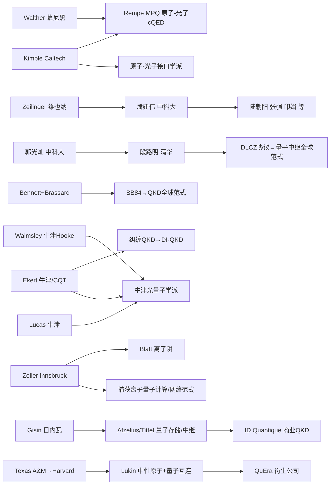

# 全球量子网络研究课题组横向比较与潜力评估：面向未来量子互联网的领导力研判
# 1 研究背景、范围界定、核心问题与评估方法论

量子信息科技正在驱动"第二次量子革命"，其与第一次量子革命对量子物理规律的"被动观测"不同，本质特征是对单量子体系（光子、原子、离子、超导比特等）的**主动操控、产生、传输与测量**。在这一宏大图景中，量子计算（实现指数级算力跃迁）、量子精密测量（突破经典测量极限）与量子通信/量子网络（实现安全信息传输与节点互联）构成了三大支柱。其中，量子网络不仅承担了"无条件安全通信"的任务，更被视为连接分布式量子计算节点、量子传感器阵列乃至未来量子互联网的"粘合剂"与基础设施[^1][^2]。然而，与量子计算的全球关注度相比，量子网络作为一个**横跨物理层光子源/量子存储、链路层纠缠分发协议、网络层路由与协议栈**的复杂系统工程，其评估单元、技术边界与潜力研判方法论尚缺乏系统化的分析框架。本章作为全报告的逻辑起点，将厘清研究对象、界定课题组识别准则、构建多维评估框架，并就数据来源与方法局限作出透明化说明，为后续八个章节的横向比较与Top 10遴选奠定方法论基石。

## 1.1 量子网络的技术内涵与战略定位

量子网络（quantum network），又称量子互联网（quantum internet），是基于量子通信技术产生、传输和使用量子态资源，实现量子计算机或量子传感器等量子信息处理系统或节点之间互联和未知量子态信息传输的物理装置[^3]。从概念演进看，1989年IBM实验室完成首个量子密钥分发（QKD）实验，开启了量子通信的工程化探索；2004年中国科学技术大学潘建伟团队首次实现5光子纠缠和量子态隐形传输，为多节点纠缠分发奠定了基础；此后量子电话网络（2008年）、金融信息量子通信验证网（2009年）、测量器件无关QKD系统（2014年）、"墨子号"量子科学实验卫星（2016年）和"京沪干线"（2017年）相继落地，标志着量子网络从基础物理验证走向规模化工程部署[^3]。

从技术构成看，量子网络的核心技术栈可归纳为五大模块：（1）**量子密钥分发**，基于量子不可克隆定理实现"窃听必留痕"的终极加密机制，"京沪干线"采用的双场QKD（TF-QKD）技术已将光纤传输距离延伸至500公里以上[^1]；（2）**量子中继**，采用分段纠缠分发与纠缠交换相结合来拓展通信距离，被视为构建超远距离量子通信网络的重要途径，2026年中国科学技术大学潘建伟团队首次构建出**可扩展量子中继的基本模块**，纠缠寿命（550毫秒）首次显著超过纠缠建立所需的时间（450毫秒），并将器件无关QKD传输距离突破百公里[^4][^5]；（3）**纠缠分发**，包括基于光纤的固态量子存储器纠缠（中科大2023年实现两个50公里光纤连接的吸收型量子存储器纠缠）和卫星纠缠分发[^4]；（4）**分布式量子计算**，2024年芝加哥量子交换测试床将分布式计算保真度提升至99.7%，2025年牛津大学在两个相距约两米、由光子互连的囚禁离子模块之间实验展示了分布式量子计算[^1]；（5）**分布式量子传感**，欧洲量子互联网联盟（QIA）已在光纤网络中部署纠缠光子对实现地下千米级地质结构微震监测[^1]。

需特别强调的是，量子网络与通用量子计算存在**清晰的边界差异**：通用量子计算聚焦于单个量子处理器内部的量子比特操控、纠错与算法实现（如2025年诺贝尔物理学奖所表彰的超导电路宏观量子隧穿与能量量子化奠定了超导量子计算的物理基础[^6]，以及"祖冲之三号"105比特超导量子计算原型机的量子优越性突破[^7]），而量子网络则聚焦于**空间分离的量子节点之间**的量子态生成、传输、存储与互联[^3]。这一边界差异是本报告全程恪守的研究对象界定准则——对IBM、Google等以量子计算为主的团队，仅纳入其明确从事量子网络相关子方向（如量子互连、模块化量子计算）的工作，避免将量子计算成果直接等同于量子网络贡献。

从战略定位看，量子网络已从纯科学探索转入**大国科技竞争与国家安全战略的核心赛道**。美国能源部于2020年8月发布《建立全国量子网，引领通信新时代》报告，提出十年内建成全国性量子互联网的战略蓝图，计划分阶段实现城市间纠缠传输和州际量子中继网络；总投资10亿欧元的欧洲量子旗舰计划提出在3年愿景中演示初级量子中继链路、6–10年愿景中演示800公里以上量子通信和至少20个量子比特的量子网络节点；中国则在2019年12月《长江三角洲区域一体化发展规划纲要》中明确"加快量子通信产业发展"，并通过"墨子号"和"京沪干线"形成天地一体化量子网络雏形[^5]。这一全球性战略部署使得量子网络研究已远超单纯学术议题，成为承载国家信息安全、产业竞争力与未来通信基础设施主权的战略性领域。

## 1.2 研究对象边界与课题组识别标准

为保证后续比较的一致性与可操作性，本报告对**研究对象边界**与**课题组识别标准**作出严格界定。

在技术领域边界上，本报告纳入考察的子方向包括：（1）QKD网络（含点对点QKD、可信中继QKD网络、测量器件无关QKD/MDI-QKD、双场QKD/TF-QKD与器件无关QKD/DI-QKD）；（2）量子中继与纠缠分发（含发射型与吸收型量子存储器、长寿命囚禁离子存储、单光子/双光子纠缠协议、纠缠纯化与纠缠交换）；（3）可扩展量子互联网架构（含网络协议栈、量子路由、量子互连模块）；（4）分布式量子计算网络（含量子门传送QGT、模块化量子计算、跨模块纠缠门）[^8]；（5）量子传感网络（含分布式纠缠增强传感、长基线量子干涉）[^1]。**纯量子计算硬件**（如单一处理器内的比特扩展、纠错码设计）原则上不纳入，但若团队工作明确以"量子互连"或"分布式量子计算"为目标、产生跨节点纠缠门或网络化能力，则纳入考察。

在课题组识别标准上，本报告采用以下五项准则：

| 识别维度 | 具体准则 |
|---------|--------|
| **PI核心性** | 以稳定PI或联合PI团队为核心，具备明确学术领导责任与人事归属 |
| **产出持续性** | 在2020–2025评估窗口内具备持续性的高水平科研产出（顶刊顶会论文、关键技术突破或重大项目主持） |
| **科研身份独立性** | 具备独立的研究单元身份（实验室、Group），区别于松散的合作网络或纯行政机构 |
| **量子网络相关性** | 至少有一项核心研究方向直接对应§1.2所列技术子领域 |
| **可追溯性** | 团队成员、经费、产出可通过公开资料（机构官网、资助机构公告、论文署名）交叉验证 |

对于跨机构联合团队（如哈佛-MIT超冷原子中心、Harvard-MIT-QuEra联合研究[^9]）、国家实验室卫星型子团队（如美国DOE体系下的Q-NEXT、C2QA中心由多机构构成[^7]），本报告采用"**以PI主导实验室为基本单元、以联合中心为生态层加权**"的切分规则——即课题组识别仍以PI实验室为粒度（如Lukin Group、Hanson Group），而其在国家级中心中的角色作为"生态影响力维度"加分项处理，避免单元重复计数。

## 1.3 以课题组为分析单元的评估必要性

量子网络是一个高度依赖**核心科学家、精密实验能力与长期积累**的领域，其竞争格局难以通过国家或机构的宏观比较准确刻画。本报告主张以课题组为分析单元，理由有三：

**其一，PI主导技术路线选择**。量子网络存在多条并行竞争的技术路线（光纤TF-QKD、卫星纠缠分发、囚禁离子量子中继、固态吸收型存储、二维材料室温存储等），每条路线的开拓与突破往往源于特定PI的长期坚持。例如DLCZ量子中继方案由清华大学段路明院士提出并因此获得2024年国际量子奖[^4]；BB84协议由Gilles Brassard与Charles H. Bennett于1984年共同提出，Brassard因此于2018年获沃尔夫物理学奖、2019年获墨子量子奖、2023年获科学突破奖[^2]；2026年可扩展量子中继基本模块的国际首次构建由潘建伟团队完成[^4]。这些里程碑式贡献**无法在国家或机构维度被准确归因**。

**其二，关键突破依赖团队微观能力**。量子网络实验对单光子探测、纠缠保真度、量子存储寿命等参数的极致要求，使得突破往往集中在少数具备多年实验积累的团队手中。如ICFO最新构建了**包含十个独立可控量子存储单元的固态系统**，基于此前可存储250个"slot"的世界纪录设备，是构建量子RAM和长距离纠缠分发的基础[^10]；Cavendish实验室与UT Sydney合作在二维材料六方氮化硼中实现**室温下原子级缺陷的单光子发射与自旋读出**，为室温量子网络铺路[^11]。这些能力高度团队化，难以快速复制。

**其三，对政策制定具有更高分辨率**。从课题组维度评估，可为科研管理部门的人才引进、资助机构的精准支持、产业界的合作选择提供**可执行的颗粒度**。例如美国DARPA量子基准测试计划（QBI）第二阶段直接以11家具备代表性的企业团队（IBM、IonQ、Atom Computing、Quantinuum等）为单元进行资助，每家最高1500万美元（第二阶段）至3亿美元（第三阶段）[^12][^13]，正是课题组/团队级评估在政策实践中的体现。

## 1.4 潜力与领导力的内涵界定

"潜力"与"领导力"是本报告的核心研判对象，需作出概念区分。

**现有领导力**指课题组已经实现的科学贡献与技术领先地位，体现为存量成果：顶刊论文、关键技术原型、奠基性协议（如DLCZ）、国家级里程碑的主持地位（如"京沪干线"、"墨子号"）等。这一维度可以通过文献计量与项目档案进行较为客观的回溯性度量。

**未来潜力**则指课题组在未来3–10年持续突破与生态扩张的可能性，具有前瞻性与不确定性。本报告将"潜力"分解为五个子维度：

- **科学原创性**：是否有能力开辟新方向而非仅跟随热点（如吸收型量子存储器多模式复用、基于二维材料的室温量子存储）；
- **技术工程化能力**：是否能将原理验证推进到可部署的工程系统（如可扩展量子中继基本模块、芯片化集成QKD）；
- **人才梯队可持续性**：博士生—博士后—青年PI的接续结构是否健全，PI是否处于学术黄金期或具备清晰的学术传承；
- **资源获取能力**：是否持续获得国家级重大资助、产业战略合作与国际联盟席位（如美国DOE国家QIS中心、欧洲QIA、Q-LEAP）；
- **国际网络嵌入度**：是否在QIP/QCrypt/TQC等顶级会议程序委员会、Quantum等核心期刊编辑委员会、国际标准制定中占据节点位置[^14][^15][^16]。

这一双重内涵区分意味着，**单纯依靠存量论文数量不足以代表潜力**；某些课题组（如Lukin团队的逻辑量子比特工作[^9][^17]、Hanson团队、潘建伟团队）即便已具备显著领导力，仍需结合人才梯队与资源持续性研判其未来引领能力，这与持久推理标准P-5（潜力研判的前瞻性）保持一致。

## 1.5 多维评估框架的构建与维度论证

基于上述背景与内涵界定，本报告构建一套**六维评估框架**，覆盖从科学产出到生态影响的完整链条。框架结构与各维度的具体内涵如下表所示：

| 维度 | 子指标 | 衡量目的 | 数据来源举例 |
|------|--------|---------|------------|
| **D1 学术产出** | Nature/Science正刊及子刊（Nature Photonics、Nature Physics、Nature Communications）、PRL、PRX Quantum论文数；QIP/QCrypt/TQC顶会报告；引用与H指数 | 衡量科研显示度与原创性 | Web of Science、PRX Quantum官网、QCrypt 2025等会议程序[^18][^19][^20][^16] |
| **D2 团队人力资本** | PI头衔（NAS/NAE/RS/中国两院院士、APS/IEEE Fellow）、国际重要奖项（沃尔夫奖、墨子量子奖、科学突破奖、Buckley奖等）、师承谱系、团队规模与青年梯队 | 衡量学术领导力与可持续性 | 院士名录、获奖记录、机构官网[^21][^22][^23][^24] |
| **D3 经费来源结构** | 国家级资助（DOE QIS中心、NSF QLCI、UK NQTP、日本Q-LEAP/Moonshot、中国国家重大专项）、企业合作经费、慈善基金、规模与持续性 | 衡量资源可持续性与抗风险能力 | DOE/NSF/UKRI/JST/NSFC公告、机构年报[^7][^25][^26][^27] |
| **D4 项目布局** | 纵向重大专项主持/参与、跨国合作项目（DARPA QBI、QIA、EUREKA Network）、产业横向合作 | 衡量战略嵌入度与转化能力 | 项目公告、SEC文件、企业新闻[^12][^13][^26] |
| **D5 技术成果** | 关键技术突破（可扩展量子中继、长寿命量子存储、TF-QKD/MDI-QKD/DI-QKD里程碑、跨模块分布式量子计算）、原型系统部署、专利布局 | 衡量工程化与里程碑产出 | 顶刊论文、专利数据库、政府报告[^4][^1] |
| **D6 生态影响力** | 衍生公司（QuEra、IonQ、Quantinuum、国盾量子等）、量子城域网/干线建设、国际合作联盟席位、标准化贡献 | 衡量长期影响力与产业转化 | 公司公开资料、联盟官网、标准化组织[^9][^17] |

各维度的合理性论证如下：

**D1 学术产出维度**之所以采用Nature/Science及其子刊、PRL、PRX Quantum的组合而非单纯论文总数，是因为这些期刊代表量子信息科学领域的最高显示度。**PRX Quantum**作为美国物理学会2020年创立的高度选择性开放获取期刊，2024–2025年影响因子达11.9，五年影响因子12.2，CiteScore 20.0，在Mathematical Physics领域排名Q1（1/89），General Physics and Astronomy领域排名Q1（9/246），是量子科学与技术的核心阵地[^18][^19][^28]。会议层面，QIP（Quantum Information Processing）、QCrypt和TQC（Theory of Quantum Computation, Communication and Cryptography）是量子通信与量子计算理论的旗舰会议；QCrypt 2025由中国科学技术大学和中科院量子信息与量子科技创新研究院承办，吸引超过300名参与者[^16][^2][^29]。

**D2 团队人力资本维度**纳入头衔与奖项不仅是身份标识，更是**学术共同体认可的客观信号**。皇家学会作为持续运作历史最悠久的科学院，其Fellow头衔代表英国及英联邦科学界最高荣誉之一[^22][^24]；美国国家科学院、英国皇家学会、欧洲科学院等院士头衔的累积分布是衡量PI国际影响力的关键指标[^21]。沃尔夫奖被誉为"诺贝尔奖风向标"，其50%获奖者后续获诺奖[^30]，墨子量子奖则是量子信息领域的标杆奖项[^2]。

**D3 经费来源结构维度**关注国家级资助的层级与持续性，因为量子网络属于"重资产、长周期"研究。美国能源部2025年向五个国家QIS研究中心（C2QA、SQMS、Q-NEXT、QSA、QSC）拨款6.25亿美元，为期五年，其中2025财年1.25亿美元[^7]；NSF QLCI计划以5年期、单项目2500万美元规模支持大规模跨学科量子研究[^31][^25][^32][^33]；英国NQTP是政府、产业与学术界总投资超10亿英镑的合作计划，已支持470多名博士生、120多家产业伙伴和49家初创企业[^26]；日本Q-LEAP实施期为2018–2029财年（平成30年度–令和11年度），覆盖量子信息处理、量子计测传感、次世代激光与人才培养四大领域[^26]，Moonshot Goal 6目标在2050年实现可容错通用量子计算机[^27]。这些资助体系的覆盖深度直接决定课题组的"研发耐力"。

**D4 项目布局维度**衡量课题组在国家级路线图中的角色定位。例如DARPA量子基准测试计划（QBI）第二阶段从北美、欧洲及澳大利亚选出11家公司（IBM、IonQ、Quantinuum、Atom Computing、QuEra、Diraq、Photonic、Quantum Motion、Silicon Quantum Computing、Xanadu、Nord Quantique），每家最高获1500万美元（第二阶段）和3亿美元（第三阶段）资助[^12][^13]；EUREKA Network在AI与量子领域提供跨10个资助机构的国际合作通道[^26]。

**D5 技术成果维度**与**D6 生态影响力维度**则共同衡量科学到产业的转化链路。Lukin团队衍生的QuEra Computing与团队合作推进逻辑量子比特工作[^9][^17]，体现了"实验室—初创—大科学合作"的范式；ICFO的量子存储器阵列工作[^10]、剑桥与悉尼科技大学合作的二维材料室温量子存储[^11]则展示了不同生态构建路径。

## 1.6 评估指标的权重设置与综合评分模型

在六维框架基础上，本报告设计了可量化的综合评分模型。考虑到量子网络处于"基础研究突破与工程化部署并行推进"的发展阶段，本报告采用以下基线权重：

$$S_{\text{综合}} = 0.25 \cdot S_{D1} + 0.20 \cdot S_{D2} + 0.15 \cdot S_{D3} + 0.10 \cdot S_{D4} + 0.20 \cdot S_{D5} + 0.10 \cdot S_{D6}$$

其中各 $S_{Di}$ 通过分项归一化处理（0–10分制），具体折算逻辑为：

- **D1学术产出**：Nature/Science正刊（10分/篇）、Nature子刊与PRX（6分/篇）、PRL/PRX Quantum（4分/篇）、其他Q1期刊（2分/篇），评估窗口取2020–2025；引用数与H指数作为辅助加权；
- **D2团队人力资本**：诺贝尔奖（满分10分）、沃尔夫/墨子量子奖（8分）、各国院士（6分）、APS/IEEE等Fellow（3分）；团队规模与青年梯队按博士后/博士生数与近三年青年PI产出独立赋分；
- **D3经费来源**：国家级中心主持（10分）、国家级中心参与（6分）、国家级重大项目PI（5分）、产业战略合作（3分）；折算时考虑五年内累计资助规模与持续性；
- **D4项目布局**：DARPA QBI/Moonshot Goal 6/欧盟旗舰主线项目（10分）、国际联盟核心成员（6分）、双边合作（3分）；
- **D5技术成果**：国际首次/世界纪录里程碑（10分）、重大原型系统（6分）、关键单点突破（4分）；
- **D6生态影响力**：衍生上市公司或独角兽（10分）、骨干网/城域网部署主导（8分）、国际标准化贡献（6分）、产业联盟席位（3分）。

考虑不同发展阶段的权重差异，本报告同时设置三组**敏感性分析方案**：

| 权重方案 | D1 | D2 | D3 | D4 | D5 | D6 | 适用场景 |
|---------|-----|-----|-----|-----|-----|-----|--------|
| **基线（均衡）** | 0.25 | 0.20 | 0.15 | 0.10 | 0.20 | 0.10 | 综合潜力评估 |
| **基础研究主导** | 0.35 | 0.25 | 0.10 | 0.05 | 0.15 | 0.10 | 偏向科学原创 |
| **工程化主导** | 0.15 | 0.15 | 0.20 | 0.15 | 0.25 | 0.10 | 偏向技术里程碑 |
| **产业化主导** | 0.10 | 0.10 | 0.15 | 0.20 | 0.20 | 0.25 | 偏向生态构建 |

只有在**至少三种权重方案下均稳定进入前列**的课题组才会被纳入第8章Top 10候选名单，以增强排名的稳健性。同时考虑到中美欧日不同科研体制的差异——例如中国偏向以国家实验室+大学联合体（合肥实验室、北京量子信息科学研究院）承担重大任务，美国DOE体系以国家实验室为骨干而NSF QLCI以大学联盟为载体[^25][^32]，欧洲以欧盟旗舰加各国NQTP双层结构运作[^26]，日本则以JST统筹的Q-LEAP和Moonshot共同推进[^26][^27]——本报告对各体制下的"国家级资助"采用差异化但等价的归一化标准，避免因体制差异造成系统性偏倚（持久推理标准P-4的应用）。

需要特别说明的是，中科院期刊分区在2025年发生了重大调整：大类学科从13个扩展至21个，新增"量子信息科学"等交叉学科门类，评价指标从单纯影响因子为主（占80%）转向影响因子（45%）+学术原创性指数（15%）+社会影响力指标（15%）+学科特色指标（25%）的多元结构[^34]。该调整与本报告六维框架的多元化思路一致，但本报告仍主要采用国际通行的JCR/CiteScore与领域共识期刊清单作为D1的核心标尺，避免因分区调整波动影响跨期可比性。

## 1.7 数据来源、获取方法与评估局限

本报告的数据来源体系采用**多源交叉验证**策略，具体包括：

- **文献计量数据**：Web of Science与Scopus核心库，PRX Quantum官方期刊统计（2024–2025年影响因子11.9，五年影响因子12.2）[^18][^19]；具体论文层面通过DOI、arXiv编号与期刊页面交叉确认；
- **会议与学术活动数据**：QIP、QCrypt（如QCrypt 2025三亚会议[^16][^2]）、TQC[^29]等会议的程序委员会名单、邀请报告与录用论文；
- **资助机构公开报告**：美国能源部国家QIS中心年报与拨款公告[^7]，NSF QLCI项目公告[^31][^25][^32][^33]，DARPA QBI公开材料[^12][^13]，英国UKRI/Innovate UK的NQTP官方信息[^26]，日本JST Q-LEAP第8届Symposium资料与官方手册[^26]、Moonshot Goal 6计划文档[^27]，中国国家自然科学基金委员会、科技部及中科院、合肥实验室公告[^7]；
- **机构与课题组官网**：ETH Zurich、Delft QuTech、Harvard QSE、芝加哥大学、ICFO、北京大学前沿计算研究中心等[^14][^15][^10][^35]；
- **行业与媒体报告**：腾讯新闻量子通信网络专题[^1]、光子盒量子科技十大人物（团队）年度榜单[^9]、专业媒体的科技成果报道；
- **政府与皇家学会等学术组织官方资料**：英国皇家学会Fellow名录[^22][^24]、UK Atomic Energy Authority等政府机构信息[^36]、各国院士机构名录[^21][^23]。

数据采集的**时间窗口**主要锁定在2020–2025年（部分历史里程碑追溯至更早），以确保横向比较的基准一致性（持久推理标准P-4）。检索策略采用关键词组合（"quantum network"、"quantum repeater"、"quantum memory"、"entanglement distribution"、"DI-QKD/MDI-QKD/TF-QKD"、"distributed quantum computing"等）+作者归属交叉过滤，并辅以引用网络追溯关键文献的合作团队。

尽管数据来源较为充分，本报告仍存在若干**坦诚说明的局限性**：

**第一，数据可获得性差异**。本轮检索对中文文献（如中国国家自然科学基金重大项目细节、合肥实验室未公开经费数据）和非英语欧亚语种成果的覆盖存在偏差；DARPA等机构涉及国家安全的部分研究信息可能未完全公开；俄罗斯、印度等国家的课题组数据密度显著低于中美欧日，可能造成系统性低估。本报告对此采取的应对策略是：当某团队信息密度显著低于其他团队时，触发补充检索而非直接降权，符合持久推理标准P-4要求。

**第二，新兴课题组的成果滞后性**。论文从研究完成到发表存在1–2年滞后，部分2024–2025年的最新工作可能尚未被Web of Science收录；初创企业研究团队的论文产出强度通常低于学术机构，但其专利与原型系统贡献可能更高，单一文献计量易低估其真实贡献。

**第三，潜力评估的预测不确定性**。"未来3–10年"的潜力研判本质上是基于历史趋势的外推，无法完全预测重大技术路线变更（如全光量子中继、室温量子存储等可能颠覆现有格局的方向[^4][^11]）；中科院文献情报中心已宣布不再更新与发布期刊分区表[^37]，反映出学术评价标准本身处于动态调整之中。

**第四，权重设置的主观性**。尽管本报告通过敏感性分析（§1.6）进行了多方案稳健性检验，但权重设置本质上反映了评估者对"潜力构成要素"的价值判断，难以完全消除主观性。本报告的应对策略是：在第7章排名形成前明确权重来源与合理性，并对所有进入Top 10的候选课题组进行单独画像论证，使排名不依赖单一定量得分（持久推理标准P-6）。

**第五，证据等级的差异**。本报告对所有关键论断（论文、奖项、经费、头衔、商业化）力求附带可追溯的原始来源，但仍区分"直接证据"（顶刊DOI、官方公告URL）、"间接佐证"（媒体报道、综述性二手转述）与"合理推断"（基于已知事实的逻辑外推）三类，并在行文中通过引用密度与表述强度予以隐性区分（持久推理标准P-3）。

为应对上述局限，本报告采取**三角验证**策略：对每一项关键事实尝试至少两个独立来源相互印证；对存在矛盾的来源（如不同时间点对同一团队规模的统计），优先采信权威性更高、时效更新的来源，并在文中说明差异；对"潜力"的最终研判采用"综合评分+独立画像+敏感性分析"三重确认，避免任一单一维度主导结论。

综上，本章构建的**六维评估框架（学术产出、团队人力资本、经费来源、项目布局、技术成果、生态影响力）+ 多权重敏感性分析 + 多源交叉数据验证**的方法论体系，为后续章节展开全球量子网络研究格局总览（第2章）、各维度横向比较（第3–5章）、候选课题组结构化画像（第6章）、综合评估与排名（第7章）以及Top 10课题组深度评估（第8章）提供了清晰的分析框架与可重复的研究路径。下一章将进入全球量子网络研究格局的整体总览，分析北美、欧洲、东亚三大研究高地的形成机制与四类研究组织（国家实验室主导型、大学主导型、企业研发型、政企合作型）的异质化特点。

# 2 全球量子网络研究格局总览

第1章构建了"六维评估框架+多权重敏感性分析+多源交叉验证"的方法论体系，回答了"如何评估"的问题。在进入具体维度的横向比较之前，本章承担为全篇报告搭建宏观坐标系的任务——回答"评估对象分布在哪里、由谁组织、被什么塑造"这三个前置问题。具体而言，本章将依次完成三项工作：识别北美、欧洲、东亚三大研究高地的地理与历史成因；剖析国家实验室主导型、大学主导型、企业研发型、政企合作型四类研究组织的运行逻辑；梳理美、欧、英、中、日五大国家级战略对课题组生态的塑造作用。本章不进行单一课题组的深度评估，而是以"格局画像"的方式为第3–5章的维度横向比较与第6–8章的Top 10遴选提供地理、组织、战略三重参照。

## 2.1 三大研究高地的地理分布与形成机制

全球量子网络研究在地理上呈现**清晰的"三极并立、多点支撑"格局**——北美、欧洲、东亚三大区域贡献了绝大部分顶刊产出、国家级中心与代表性原型系统，而新加坡、加拿大、澳大利亚、以色列等则作为重要的"多点支撑"嵌入跨国合作网络。这一格局的形成既有偶然的历史路径，也有结构性的共性机制。

**北美研究高地以"DOE国家实验室+顶尖高校"双核驱动**。美国2018年12月通过《国家量子计划法案》（NQI Act），首次建立了一个涵盖大学、国家实验室和工业界的广泛多机构战略[^38]。在此基础上，2020年8月白宫、NSF与DOE联合宣布在全国范围内设立12个新的人工智能（AI）和量子信息科学（QIS）研发机构，提供超过10亿美元的资金支持，其中DOE在五年内向5个QIS研究中心提供6.25亿美元，工业和学术界资助3亿美元，剩余资金来自2018年《国家量子计划法案》中指定用于量子研究的12亿美元[^39]。这五大国家QIS研究中心——劳伦斯伯克利国家实验室（LBNL）牵头的量子系统加速器（QSA）、阿贡国家实验室牵头的Q-NEXT、布鲁克海文国家实验室（BNL）参与的C2QA、费米实验室牵头的SQMS、橡树岭国家实验室（ORNL）参与的QSC——构成了北美量子网络研究的"骨架"。例如LBNL的QSA深度整合了包括桑迪亚国家实验室在内的15个顶级学术机构、国家实验室及工业界伙伴，构建涵盖物理、材料、工程、计算机科学的"闭环生态"，目标是在五年内通过从底层硬件到上层算法的深度垂直整合，将量子信息科学转化为具备实际实用能力的量子系统[^40]。Q-NEXT由阿贡国家实验室牵头，包括来自三个DOE国家实验室、九所大学和十家美国领先企业的近100名研究人员[^41];Fermilab的SQMS中心则在2024年开放了占地6000平方英尺的"Quantum Garage"旗舰研究设施[^42],并于2020年获得DOE五年期1.15亿美元承诺[^43]。在国家实验室层之上，Harvard（Lukin）、MIT（Englund）、Princeton（de Leon）、Chicago（Awschalom）、Stanford、Caltech、Maryland-JQI（Monroe）、Duke（Brown）等一线高校构成了大学层的"PI集群"。地理上这种"国家实验室+顶尖高校"的双核结构进一步通过芝加哥量子交换（Chicago Quantum Exchange）、纽约州量子互联网测试床（NYSQIT，由BNL与Stony Brook合作运行，包含约300公里专用暗光纤的6节点网络[^44]）、马萨诸塞州波士顿地区35公里光纤双节点量子网络[^45][^46]等区域性测试床平台落地为可见的实体基础设施。

**欧洲研究高地以"跨国联盟+多国节点"为特征**。欧洲量子旗舰计划（Quantum Flagship）于2016年启动蓝图、2018年正式实施，规模为10亿欧元、十年周期，覆盖量子计算、通信、传感三大领域[^47][^48]。在此基础上，欧盟近年在量子技术上累计投入50亿欧元（约54亿美元）[^48]。地理上，荷兰QuTech（代尔夫特理工大学，Hanson、Wehner）、瑞士日内瓦大学（Gisin、Afzelius、Tittel）与ETH Zürich（Wallraff Quantum Device Lab[^49]）、西班牙ICFO（de Riedmatten[^50]）、英国剑桥（Atatüre[^10]）/牛津（Walmsley/Lucas/Ekert[^51]）/Toshiba剑桥研究院、德国慕尼黑MPQ（Rempe[^52][^53]）、奥地利因斯布鲁克（Blatt）、法国LKB（Laurat[^54]）等节点构成了欧洲的"多节点网络"。这一网络的连接器是QIA（Quantum Internet Alliance）——由TU Delft/QuTech、Innsbruck、INRIA、CNRS等顶尖机构组成的跨国联盟，其成果QNodeOS——首个面向量子网络的操作系统——于近期发表在《自然》杂志上[^55][^56]。这种"无单一霸权、多节点并联"的形态使欧洲在网络协议层（如QNodeOS、Wehner的quantum data plane协议[^49]）和长寿命量子存储（如ICFO的多模式固态存储器[^50]）上具有独特优势。

**东亚研究高地以"中国举国体制+日本企业+学术互补"为底色**。中国量子网络研究的中枢是中国科学技术大学，潘建伟、郭光灿、杜江峰三位中科院院士因姓氏拼音首字母而被业内称为"GDP三巨头"[^57]。围绕中科大形成了合肥国家实验室（量子科技领域"国家队"）以及合肥、北京、上海、济南、深圳、成都等区域中心的"一中心多节点"格局[^57]。具体节点包括：北京量子信息科学研究院（2017年12月成立的新型研发机构，由北京市政府发起，整合北大、清华、中科院等骨干力量[^58]）、深圳国际量子研究院（俞大鹏院士领衔，聚焦量子物态调控、固态量子计算、量子精密测量、量子工程应用四个差异化方向[^57]）、济南量子技术研究院（与中科大、清华联合实现侧信道安全QKD[^59]）、天府绛溪实验室量子互联网前沿研究中心（电子科技大学周强团队，郭光灿院士指导[^60][^61]）、北京大学物理学院与电子学院联合团队（王剑威/龚旗煌/常林[^62][^44]）、清华大学交叉信息研究院（段路明院士团队[^63]）等。日本则呈现"理化学研究所+东京大学+NTT+NICT+产业界"的产学研协同体系[^41]，其中NICT（情报通信研究机构）于2010年建立Tokyo QKD Network城域测试床并持续运行，2017年完成全球首次微卫星空间量子通信演示[^64]；NTT基础研究所Hiroki Takesue团队长期从事光通信与相干Ising机器研究[^65][^66]；东京大学古澤明团队在光量子计算和量子隐形传态电路上具有标志性贡献[^67][^68]，并孵化OptQC初创公司[^41]。

三大高地虽路径各异，但形成了**四项共性机制**：（1）顶尖PI的长期集聚——如Lukin自2001年起在Harvard深耕，Hanson在Delft自2010年代实现一系列纠缠分发里程碑[^69]，潘建伟团队"前赴后继、接续奋斗"形成天团[^57]；（2）长周期国家资助保障——美国NQI、欧盟Flagship、中国国家科技创新2030重大专项均以5–10年为周期；（3）大科学装置与光纤基础设施支撑——LBNL"全栈式"装置布局[^40]、BNL的NYSQIT 300公里暗光纤[^44]、济青干线现场光缆[^70]、京沪干线、波士顿35公里现场光纤[^46]、电子科大"银杏一号"校园量子互联网平台[^60]；（4）产业转化生态——QuEra（哈佛-MIT衍生）、IonQ（Maryland JQI衍生）、ID Quantique（日内瓦大学衍生[^71]）、国盾量子（中科大衍生）、图灵量子（上海交大衍生[^59]）、云玺量子（中科大孵化[^42]）等共同构成"实验室—初创—产业"的传导链。

## 2.2 四类研究组织的运行模式与优劣势比较

从组织形态学视角看，全球量子网络课题组可划分为四类，每一类的运行逻辑、典型代表、资源结构与优劣势均存在系统性差异。这种分类有助于在第3–5章的横向比较中避免"以单一标尺评估异质组织"的偏倚（持久推理标准P-4）。

**第一类：国家实验室主导型**。以美国DOE体系为典型代表，包括BNL（牵头NYSQIT，并参与C2QA[^44][^54]）、ANL（牵头Q-NEXT[^41]）、LBNL（牵头QSA[^40]）、Fermilab（牵头SQMS，2020年获DOE 1.15亿美元/五年承诺，2024年开放Quantum Garage旗舰设施[^43][^42]）、ORNL（参与QSC[^57]）。这一类组织的运行特征是"联合舰队式"——以一个国家实验室为旗舰，整合15家以上的学术机构、国家实验室与工业伙伴，形成跨物理、材料、工程、计算机科学的"闭环生态"[^40]。其优势在于大科学装置完备、跨学科联合规模化、与产业界深度协同（如Fermilab SQMS与NASA、CERN等的合作[^42]），可承担基础研究→中试→工程化的全链条任务；劣势在于受体制约束、决策链条较长、对国家政治周期敏感（如NQI法案在2025年面临重新授权时的不确定性[^72]）。

**第二类：大学主导型**。这一类是全球量子网络基础研究的主力，特征是PI主导、原创性强、师承谱系清晰、人才梯队完整。代表性团队包括：Delft QuTech（Hanson的金刚石NV色心节点[^69]、Wehner的网络协议栈与QNodeOS[^56][^49]）、Harvard（Lukin的中性原子阵列与逻辑量子比特[^73][^74][^75]）、MIT-Harvard CUA（NSF物理前沿中心，2023年续期7600万美元支持[^75]）、Chicago（Awschalom的自旋量子工程及Q-NEXT/Chicago Quantum Exchange创始主任[^76]）、Princeton（de Leon的金刚石NV色心硬件[^53][^75]）、北大（王剑威/龚旗煌/常林的集成光量子芯片量子网络[^62][^75][^44]）、中科大（潘建伟团队覆盖光量子、冷原子、卫星全谱[^77]）、UNIGE（Gisin/Afzelius/Tittel的量子中继与量子存储[^75]）、ICFO（de Riedmatten的多模式固态量子存储[^50]）、MPQ（Rempe的原子-光子节点[^52][^53]）、Innsbruck（Blatt的离子-光子接口[^78]）、清华（段路明院士的DLCZ方案与离子量子模拟[^63]）等。其优势在于科研自由度高、原创性强、培养博士生/博士后形成持续传承（如Lukin迄今发表750余篇论文、被引57900余次[^74]）；劣势在于工程化资源相对有限、经费周期波动较大、依赖单一PI的连续性。

**第三类：企业研发型**。包括两类子形态：一是大型企业研究院，如IBM Quantum、Google Quantum AI、Microsoft、Toshiba剑桥研究院（袁之良在此工作20年[^79][^43]）、NTT基础研究所（Takesue团队，长期主持Coherent Ising Machine研究[^65]）；二是量子初创企业，如美国Qunnect（与思科合作17.6公里城域光纤纠缠交换演示[^80]）、QuEra（哈佛-MIT衍生，与Lukin合作[^73][^81]）、IonQ、Atom Computing；瑞士ID Quantique（日内瓦大学衍生，全球首家量子密码商用产品供应商[^71]）；中国国盾量子（中科大衍生，五代QKD核心设备主导京沪干线等[^11]）、本源量子、图灵量子（上海交大金贤敏团队衍生，2026年累计融资超10亿元，覆盖芯片到整机全栈[^59]）、云玺量子（中科大孵化的QPC量子密码企业[^42]）、玻色量子、华翊量子、弧光量子等[^82]。这一类组织的优势是工程化与产品化能力强、专利布局密集（IBM、Google、Microsoft、Intel和百度是量子计算专利申请的领军者[^83]）、能够快速将技术原型推向商用；劣势是基础研究投入受商业战略制约，企业研究方向可能因市场波动而调整。

**第四类：政企合作型/新型研发机构**。这类组织是中国近年来的制度创新，介于政府机构、研究院所与企业之间。典型代表包括：北京量子信息科学研究院（独立法人事业单位，不定机构规格、不核定人员编制，实行理事会领导下的院长负责制，在人才双聘、知识产权共享等方面进行体制创新[^58]）、合肥国家实验室、深圳国际量子研究院（粤港澳大湾区主力，与中科大形成差异化分工：聚焦固态量子计算、硅基半导体、光量子集成、量子工程应用[^57]）、济南量子技术研究院（与中科大潘建伟团队、清华深度合作[^70][^59]）、天府绛溪实验室量子互联网前沿研究中心（2023年9月挂牌入驻，依托电子科大、郭光灿院士指导，建成国内首个大学校园内量子互联网场地实验研究平台"银杏一号"，并启动覆盖成都主城区的量子互联示范网[^60][^61]）、量子信息网络产业联盟（QIIA，2022年发起、成员单位破百，下设量子-AI协同创新联合体、量子计算产业创新中心、量子信息专利池等四大平台[^82]）等。其优势在于体制灵活、产学研贯通、政府资源倾斜显著、知识产权成果转化机制清晰；劣势在于治理模式仍处探索期、跨机构协调成本较高、对地方财政依赖度较大。

为便于横向比较，本节将四类组织在五个关键维度上的相对表现归纳如下表：

| 维度 | 国家实验室主导型 | 大学主导型 | 企业研发型 | 政企合作型/新型研发机构 |
|------|------|------|------|------|
| **科研自由度** | 中（受DOE/任务约束） | 高（PI主导） | 中低（受商业战略约束） | 中高（政府导向但灵活） |
| **资源稳定性** | 高（5年期国家中心拨款） | 中（依赖经费周期） | 中高（企业战略+VC） | 高（政府长期支持） |
| **工程转化能力** | 高（大科学装置+产业协同） | 中（依赖外部转化机制） | 高（产品化导向） | 高（产学研贯通） |
| **人才培养机制** | 中（博后/合作研究为主） | 高（完整博士生–博后–PI梯队） | 低（以应用研发为主） | 中（多与高校联合培养） |
| **国际合作开放度** | 中（受出口管制约束） | 高（PI国际合作传统） | 中（产业秘密约束） | 中（以国家战略为导向） |
| **典型代表** | LBNL/QSA、ANL/Q-NEXT、Fermilab/SQMS、BNL/NYSQIT | Delft QuTech、Harvard Lukin、北大、中科大、ICFO、UNIGE、MPQ、Innsbruck | IBM、Google、Toshiba、NTT、Qunnect、QuEra、ID Quantique、国盾量子、图灵量子 | 北京量子院、深圳国际量子研究院、济南量子技术研究院、天府绛溪实验室、QIIA |

这一分类为后续章节提供了重要参照：**第3–4章在比较经费来源与项目布局时，应针对不同组织类型采用差异化但等价的归一化标准**——例如国家实验室主导型团队的经费往往以"国家中心拨款"为主，而大学主导型团队则多依赖项目制资助，简单数字加总会造成评估偏倚。

## 2.3 国家战略对课题组生态的塑造作用

如果说研究高地与组织类型构成了量子网络研究的"地基"，那么国家级战略则是"建筑设计图"——它通过经费层级、组织机制、国际合作通道与标准化布局四个传导渠道，深刻塑造课题组的研究方向选择、人才流动路径与生态位定位。截至2020年，全球计划在量子科技领域的投入已约为220亿美元，美国、欧盟、法国、德国和英国投资均超过10亿美元[^38]。本节梳理对量子网络生态影响最显著的五大战略。

**美国NQI法案与五大国家QIS中心**构筑了"国家实验室骨干+大学联盟+企业联合体"的三层架构。2018年12月《国家量子倡议法案》签署，建立涵盖大学、国家实验室与工业界的多机构战略[^72][^38]。其落地形态包括：DOE的5个国家QIS研究中心（Q-NEXT、QSA、SQMS、C2QA、QSC，2020年获6.25亿美元/五年[^39]）、NSF的Q-LEAP计划下AI研究院、DARPA的量子基准测试计划（QBI）。2025年12月，DOE科学副部长Dario Gil博士在众议院科学委员会作证时，将当前时刻描述为"由人工智能、高性能计算和量子系统融合驱动的科学革命的前沿"，并提出"创世纪任务"动员国家实验室、工业界和学术界建立集成发现平台，呼吁国会对NQI重新授权以支持AI、加速计算和量子处理器的集成[^72]。NVIDIA于2025年发布的NVQLink互联技术与CUDA-Q平台，进一步将量子-GPU超级计算的"桥接"能力融入国家战略[^72][^17]。这一战略的关键塑造效应是：**国家实验室成为多机构联合攻关的引力中心，使得Lukin、Awschalom、Englund、Monroe等顶级PI能够在国家中心框架下整合资源**。

**欧盟量子旗舰+各国NQTP双层结构**是欧洲特有的"集体行动"模式。10亿欧元的旗舰计划于2018年启动并已扩容至50亿欧元规模[^47][^48]，其核心方法论是分散下注整条产业链——低温技术、超导芯片、光子学、量子软件并行投入[^48]。在旗舰计划之上，QIA（量子互联网联盟）整合了TU Delft/QuTech、Innsbruck、INRIA、CNRS等机构的力量，最终产出QNodeOS这一全球首个量子网络操作系统[^55][^56]。法国Alice & Bob、荷兰QuTech、德国IQM、瑞士ID Quantique等企业与学术节点共同形成"垂直整合的重资产路线"——选择自己造芯片以摆脱对现成供应链的依赖[^48]。这一战略的塑造效应是：**欧洲课题组天然嵌入跨国合作网络，单一PI的工作往往以"联合体子任务"的形式呈现**，这一特征在本报告第6章的画像中对Wehner、Hanson等PI的评估具有重要意义。

**英国《国家量子战略》**于2023年3月发布，承诺2024年起在近10年里投入25亿英镑开发量子技术，并引入10亿英镑私人资本[^84]。其结构为"以应用为中心+以任务为中心+以行业主导"三类创新计划组合，配套国家量子计算中心（NQCC）和量子技术Hub体系。2024年的具体投入包括1亿英镑继续开发现有计算/通信/传感/成像/授时应用，7000万英镑用于量子计算和PNT关键技术，2500万英镑增加对量子奖学金和博士培训投资[^84]。这一战略对剑桥（Atatüre[^10]）、牛津（Ekert[^51]、Walmsley、Lucas）、Toshiba剑桥研究院（Andrew Shields等[^52]）等团队形成持续支撑。

**中国量子科技专项**呈现"国家科技创新2030重大项目+合肥国家实验室+区域研发机构+大工程"的多层布局。从"十三五"将量子通信纳入国家重大科技项目，到"十四五"融入数字经济与信息安全体系，再到"十五五"将量子科技作为六大未来产业之一[^11][^80]。具体载体包括：中科大-潘建伟团队主导的"墨子号"卫星与京沪干线、合肥国家实验室、北京量子院（量子科技领域"国家急需、世界一流、国际引领"定位[^58]）、深圳国际量子研究院、济南量子技术研究院、天府绛溪实验室、量子信息网络产业联盟（成员单位破百[^82]）等。中国电信等央企投入超30亿元资金布局量子通信基础设施[^80]。在地理分布上，中国形成"合肥科研中枢+北京政策中心+济南通信工程+深圳产业前沿+成都/上海多点支撑"的网状格局[^57]。这一战略的塑造效应是：**中国课题组普遍呈现"重大工程驱动+跨机构协同+举国体制集中攻关"的特征**，潘建伟团队在2026年Science上发表的100公里DI-QKD成果汇集了中科大、济南量子技术研究院、新加坡国立大学、加拿大滑铁卢大学等多家机构[^85]，王剑威团队的"未名量子芯网"则联合北大物理学院与电子学院、Nature 2026[^62][^44]，反映出中国研究中"团队联合体"特征的普遍性。

**日本Q-LEAP+Moonshot Goal 6+企业研究所**塑造了独特的产学研协同路线。日本政府将2025年定义为"量子产业化元年"，并加大对量子产业的投入力度[^41]。核心研究机构包括理化学研究所（光量子计算核心）、东京大学（古澤明团队，2017年提出"究极的大规模光量子计算机"方案，2024年与RIKEN/NTT联合发布通用型光量子计算机[^41][^67][^68]）、产业技术综合研究所（与NVIDIA于2025年5月成立量子AI技术全球商业研发中心，配备2020个NVIDIA H100 GPU的ABCI-Q超算[^41]）、信息通信研究机构NICT（建立并持续运行Tokyo QKD Network[^64]）、NTT基础研究所（Takesue团队主持Coherent Ising Machine[^66]）等。东京大学团队2024年成立OptQC初创公司，计划2026年4月推出光量子计算机商用服务[^41]。日本战略的塑造效应是：**企业研究所与学术PI形成长期共同体**，例如Takesue自1996年加入NTT后持续在量子通信与光量子计算领域产出，与Stanford和NIST有长期访问关系[^66]。

为系统呈现五大战略对课题组生态的塑造，下表归纳了战略关键参数与典型受益课题组：

| 战略 | 启动年 | 资助规模 | 主要载体 | 对量子网络的关键塑造 | 典型受益课题组 |
|------|--------|---------|---------|---------------------|----------------|
| **美国NQI** | 2018签署，2025面临重新授权 | DOE QIS中心6.25亿美元/5年；多机构超10亿美元 | 5大国家QIS中心、NSF QLCI、DARPA QBI | 国家实验室骨干+大学联盟+企业联合 | Lukin（Harvard）、Awschalom（Chicago/Q-NEXT）、Englund（MIT）、Monroe（Maryland JQI）、Figueroa（BNL/Stony Brook） |
| **欧盟Quantum Flagship** | 2018启动 | 10亿欧元（已扩容至50亿欧元） | QIA、各国NQTP | 跨国联合体+协议层突破+网络操作系统 | Wehner/Hanson（Delft）、Gisin/Afzelius（UNIGE）、de Riedmatten（ICFO）、Blatt（Innsbruck）、Rempe（MPQ） |
| **英国国家量子战略** | 2023发布 | 25亿英镑/10年+10亿英镑私人资本 | NQCC、Hub体系、EPSRC/STFC | 三类创新计划+人才培养+商业化 | Atatüre（Cambridge）、Ekert/Walmsley/Lucas（Oxford）、Toshiba剑桥研究院 |
| **中国量子科技专项** | "十三五"起步，"十四五/十五五"深化 | 国家科技创新2030重大项目+央企超30亿元 | 合肥国家实验室+北京/深圳/济南/成都新型研发机构+京沪干线/墨子号 | 重大工程驱动+举国体制+跨机构协同 | 潘建伟（中科大）、段路明（清华）、王剑威/龚旗煌/常林（北大）、周强（电子科大/天府绛溪）、龙桂鲁（北京量子院/清华）、俞大鹏（深圳）、袁之良（北京量子院）、王向斌/张强（济南量子院/中科大）、马小松（南大）、金贤敏（上海交大/图灵量子） |
| **日本Q-LEAP+Moonshot Goal 6** | 2018–2029（Q-LEAP）；2050愿景（Moonshot） | 多年期产学研投入 | RIKEN+东大+NTT+NICT+AIST+企业 | 光量子路线+企业实验室长期共同体 | 古澤明（东大/OptQC）、Takesue（NTT）、NICT Tokyo QKD团队 |

战略对课题组的塑造通过四个传导渠道发生：（1）**经费层级**——国家中心拨款决定了团队的"研发耐力"；（2）**组织机制**——QIA、Q-NEXT、SQMS等联合体决定了PI在国际网络中的位置；（3）**国际合作通道**——Q-LEAP国际合作计划、欧盟H2020通道决定了人才与思想的跨境流动；（4）**标准化布局**——量子信息专利池[^82]、IETF/ITU等国际标准化组织席位决定了未来产业话语权。这四个渠道的差异共同决定了第3章经费维度比较和第4章项目布局比较的基准。

## 2.4 全球格局的结构性特征与候选课题组初筛

综合§2.1–§2.3的分析，全球量子网络研究格局呈现**四项结构性特征**：

**第一，地理分布上的"三极并立、多点支撑"**。北美（以美国DOE国家实验室与顶尖高校为双核）、欧洲（以荷兰、瑞士、西班牙、英国、德国、奥地利等多节点跨国联盟为特征）、东亚（以中国举国体制+日本产学研协同为底色）三大高地各占全球量子网络研究的核心份额，并通过新加坡（CQT，Ekert创建并担任首任主任[^51]）、加拿大（滑铁卢大学IQC，与中科大合作[^85]）、澳大利亚（与Sydney UTS等团队合作）、以色列（Weizmann Institute与Chicago合作[^61]）等多点节点形成全球网络。

**第二，组织形态上的"四元共生"**。国家实验室主导型、大学主导型、企业研发型、政企合作型/新型研发机构四类组织并非互斥，而是通过国家级中心、产学研联盟、衍生公司等机制相互嵌套、共同演化。例如哈佛Lukin团队既是大学主导型的代表，又通过MIT-Harvard CUA这一NSF物理前沿中心连接国家级资源，并与衍生公司QuEra形成"实验室—初创—大科学合作"的三角关系[^73][^81][^75]。

**第三，技术路线上的"多路径并行"**。量子网络在物理层呈现**光纤QKD网络、卫星量子通信、固态/离子阱量子中继、集成光量子芯片、分布式量子计算**五大路径并行的格局：光纤QKD以TF-QKD为代表（中科大潘建伟团队500公里现场[^70]、北大未名量子芯网20用户370公里[^62][^75][^44]、济南量子技术研究院侧信道安全QKD[^59]），卫星路径以墨子号及天地一体化网络为代表[^23][^77]，固态量子中继以哈佛硅空位中心[^46]、ICFO多模式存储[^50]、Princeton de Leon金刚石NV[^75]、Cambridge Atatüre锡空位[^10]为代表，离子阱路径以Innsbruck Blatt[^78]、Maryland Monroe[^70]、清华段路明[^63]为代表，集成光量子芯片以北大未名芯网[^75][^44]、上海交大图灵量子[^59]、电子科大氮化镓量子光源[^61]为代表，分布式量子计算则以QNodeOS[^55][^56]、QIA[^49]、跨模块分布式量子计算工作为代表。

**第四，战略导向上的"基础研究突破与工程化部署并行推进"**。一方面，DLCZ协议[^63]、Bell不等式器件无关安全性[^85][^51]、QNodeOS[^56]等基础理论与原理验证仍持续突破；另一方面，京沪干线、墨子号、波士顿35公里现场量子网络[^46]、Tokyo QKD Network[^64]、未名量子芯网[^62]、银杏一号校园量子互联网[^60]等工程化部署同步推进，形成"科学—工程—产业"三轨并行的演化格局。

基于上述结构性特征，本报告**初步圈定全球代表性课题组候选清单**约30个，覆盖中、美、欧、日四大区域。这一候选池遵循第1.2节五项识别准则（PI核心性、产出持续性、科研身份独立性、量子网络相关性、可追溯性），将作为第6章结构化画像与第8章Top 10深度评估的候选池。

| 区域 | 候选课题组（PI/团队） | 所属机构 | 核心方向 | 代表性证据 |
|------|---------------------|---------|---------|----------|
| **中国** | 潘建伟团队 | 中科大/合肥国家实验室 | 卫星量子通信、TF-QKD、可扩展量子中继、DI-QKD | Science 2026 DI-QKD 100km[^85]；可扩展量子中继基本模块[^77]；TF-QKD 511公里[^70] |
| 中国 | 段路明团队 | 清华大学交叉信息研究院 | DLCZ量子中继、离子量子模拟与网络 | 2024国际量子奖；300离子量子模拟器[^74][^63] |
| 中国 | 郭光灿/周强团队 | 中科大/电子科大/天府绛溪 | 量子互联网器件、固态量子存储、量子隐形传态 | 银杏一号校园量子互联网；氮化镓量子光源芯片[^60][^61] |
| 中国 | 王剑威/龚旗煌/常林团队 | 北大物理学院/电子学院 | 集成光量子芯片大规模量子通信网络 | Nature 2026未名量子芯网20用户370公里[^62][^75][^44] |
| 中国 | 龙桂鲁团队 | 北京量子院/清华 | 量子直接通信（QSDC）、星地一体化 | 星地QSDC模块级验证[^86] |
| 中国 | 金贤敏团队 | 上海交大/图灵量子 | 光量子芯片与全栈量子计算 | TuringQ Gen2；累计融资超10亿元[^59] |
| 中国 | 马小松团队 | 南京大学 | 通信波段含存储的量子隐形传态、铒离子存储 | PRL 2025通信波段QM隐形传态[^46] |
| 中国 | 袁之良团队 | 北京量子院 | QKD系统、单光子源/探测器、半导体量子点 | 600公里TF-QKD、Mbit/s速率突破、薄膜铌酸锂QKD芯片[^79][^43] |
| 中国 | 俞大鹏团队 | 深圳国际量子研究院 | 固态量子计算、量子物态调控、量子工程 | 深圳国际量子研究院院长；QPC联合实验室[^42][^57] |
| 中国 | 王向斌/张强团队 | 济南量子技术研究院/中科大/清华 | TF-QKD/SCS-QKD理论与实验 | 101公里SCS-QKD[^59][^77] |
| **美国** | Lukin团队 | Harvard / MIT-Harvard CUA | 中性原子阵列、逻辑量子比特、城域金刚石量子网络 | 3000+原子持续运行[^73]；波士顿35公里硅空位中心节点[^46]；2024 Physics World年度突破[^75] |
| 美国 | Awschalom团队 | Chicago / Argonne / Q-NEXT | 自旋量子工程、Q-NEXT国家中心、Chicago Quantum Exchange | Q-NEXT首任主任[^76]；Buckley Prize |
| 美国 | Englund团队 | MIT | 钻石锡空位量子中继器、QSO Network Utility理论 | 与Cambridge合作锡空位中继器[^10]；PNAS 2024 quantum network utility框架[^33] |
| 美国 | Figueroa团队 | Stony Brook / BNL NYSQIT | 城域量子网络测试床 | NYSQIT 300km暗光纤、158km物质-物质纠缠[^44][^87] |
| 美国 | de Leon团队 | Princeton | 金刚石NV/SiV色心、量子硬件 | Princeton Quantum Initiative联合主任[^53][^75] |
| 美国 | Monroe团队 | Maryland JQI / Duke / IonQ | 离子阱量子网络、远程离子-离子纠缠 | 离子-光子接口与远程纠缠[^70] |
| 美国 | Brown团队 | Duke Quantum Center | 离子阱量子计算与量子网络架构 | 量子纠错与量子计算架构[^88] |
| **欧洲** | Hanson团队 | Delft QuTech | 金刚石NV色心节点、按需纠缠生成 | 1.3km纠缠分发奠基；2米按需纠缠生成[^69] |
| 欧洲 | Wehner团队 | Delft QuTech | 量子网络协议栈、QNodeOS | Nature QNodeOS全球首个量子网络操作系统[^55][^56][^49] |
| 欧洲 | Gisin/Afzelius/Tittel团队 | UNIGE | 量子中继、量子存储、QKD奠基 | 商业QKD奠基（孵化ID Quantique）[^71][^75][^89] |
| 欧洲 | de Riedmatten团队 | ICFO | 多模式固态量子存储、量子中继 | Nature多模式存储器10米纠缠[^50] |
| 欧洲 | Atatüre团队 | Cambridge | 钻石锡空位、量子互联网器件 | 与MIT合作钻石"microchiplet"[^10] |
| 欧洲 | Rempe团队 | MPQ Garching | 原子-光子节点、量子网络基本节点 | Nature原子-光子量子接口[^52][^53] |
| 欧洲 | Blatt团队 | Innsbruck IQOQI | 离子-光子接口、量子网络节点 | 离子-光子量子接口[^78][^90] |
| 欧洲 | Lodahl团队 | Niels Bohr Institute, Copenhagen | 量子点光子量子网络 | 量子点-光子接口确定性纠缠[^91] |
| 欧洲 | Ekert团队 | Oxford / NUS CQT | 量子密码与基础理论 | 1991纠缠QKD奠基；2019墨子量子奖；2025皇家学会Milner奖[^51] |
| 欧洲 | Laurat团队 | LKB Sorbonne | 冷原子量子存储、量子网络 | 冷原子接口与量子网络协议[^54] |
| **日本** | 古澤明团队 | 东京大学/OptQC | 光量子计算与量子隐形传态 | 究极大规模光量子计算机方案[^67][^68]；OptQC孵化[^41] |
| 日本 | Takesue团队 | NTT基础研究所 | 量子通信、Coherent Ising机 | Senior Distinguished Researcher[^65][^66] |
| 日本 | NICT Tokyo QKD Network团队 | NICT | 城域QKD测试床、空间量子通信 | Tokyo QKD Network 2010年建成；2017首次微卫星空间量子通信[^64] |

需要说明的是，上述候选清单为后续章节深度评估的"候选池"而非"最终名单"——其中部分团队（如Brown的Duke离子阱、Lodahl的丹麦量子点工作）虽属重要参与者，但在量子网络这一聚焦定义下的成果密度可能不及其他候选；部分团队（如以色列Weizmann、加拿大IQC、澳大利亚UNSW的量子网络相关工作）由于本轮检索数据密度不足而暂未纳入。这些局限将在第3–5章的维度横向比较中通过补充检索而非直接降权来处理（持久推理标准P-4），并在第8章Top 10深度评估时进一步收敛至最具潜力的十个团队。

至此，本章已完成全球量子网络研究格局的"地理—组织—战略"三重坐标系搭建：地理上呈现"三极并立、多点支撑"格局，组织上形成"四元共生"形态，战略上由五大国家级计划塑造课题组生态，并初步圈定约30个候选课题组。下一章将进入第一个评估维度——**学术产出、团队构成与学术领导力比较**——基于2020–2025年顶刊顶会发表、PI头衔与师承谱系，对候选池中的核心团队展开横向比较。

# 3 维度一：学术产出、团队构成与学术领导力比较

第2章已构建"地理—组织—战略"三重坐标系并初筛出约30个候选课题组，本章作为六维评估框架的首个落地维度，承担将候选池从"宏观格局"推进到"可量化比较"的关键过渡任务。本章严格遵循持久推理标准P-4（基准一致性）的要求，将评估窗口锁定在2020–2025年（部分历史里程碑追溯至更早），仅聚焦学术产出（D1）与团队人力资本（D2）两项维度，**暂不引入经费、项目、技术与生态影响等其他维度信息**（这些将在第4–5章展开），避免维度交叉污染。本章遵循"先量化—再定性—后综合"的写作逻辑：§3.1完成顶刊顶会的横向计量，§3.2评估技术里程碑的原创性，§3.3–3.4刻画PI师承与团队结构，§3.5–3.6呈现荣誉密度与国际网络嵌入度，§3.7形成本维度的综合评分与领先梯队识别。需特别说明的是，由于本轮检索对各团队的信息密度存在差异（持久推理标准P-3要求的可追溯性），本章对信息缺口将采用"如实标注、保守评估"而非"机械补全"的方式处理。

## 3.1 顶刊顶会发表的横向计量比较

学术产出的显示度首先体现在期刊版面占有率上。本节以Nature/Science正刊及其子刊（Nature Photonics、Nature Physics、Nature Communications）、PRX、PRX Quantum、PRL等为评估对象。**PRX Quantum作为美国物理学会2020年创立的高度选择性开放获取期刊，其2024–2025年影响因子达11.9，五年影响因子12.2，CiteScore 20.0**，已成为衡量量子信息领域显示度的核心标尺，与传统Nature子刊形成"专业旗舰+综合顶刊"的双锚定。

**中科大潘建伟团队**在评估窗口内呈现"持续高密度产出"的特征。2020年2月与济南量子技术研究院、上海微系统所合作在量子中继与量子网络方向的成果发表于《Nature》[^92]；2020年3月与清华王向斌、马雄峰合作分别实现500公里量级真实环境光纤的双场量子密钥分发（TF-QKD）和相位匹配量子密钥分发（PM-QKD），相关成果分别发表在《Phys. Rev. Lett.》（被选为"编辑推荐"文章）和《Nature Photonics》上[^92]；2020年陆朝阳获美国光学学会阿道夫隆奖章，表彰其"在光学量子信息技术领域，特别是在高性能单光子源、量子隐形传态和光量子计算方面的重要贡献"[^92]。前序章节已论证的Science 2026 DI-QKD与可扩展量子中继基本模块工作进一步巩固了该团队的顶刊版面密度。

**Delft QuTech的Wehner团队**在网络协议层呈现"理论—系统—实验"完整闭环的产出，其设计并展示的**面向量子网络节点应用执行的操作系统**作为多机构联合工作（含Delft QuTech、Innsbruck、INRIA、ENS-PSL、CNRS、Sorbonne等）发表[^93]，展示了在网络层与计算机科学融合方向的版面突破。**Harvard Lukin团队**在2023年12月《Nature》发表的逻辑量子比特工作中，与QuEra和DARPA合作将280个物理比特转化为48个逻辑比特，**初始化保真度达到99.9%以上，远高于单个硬件量子位初始化的99.3%**[^9]，迄今该PI（含团队）发表论文超过400篇并获多项国际奖项[^9]。**ICFO de Riedmatten团队**则在2025年8月《Physical Review X》报道了**包含十个独立可控量子存储单元的固态系统**，建立在此前可存储250个"slot"的世界纪录设备基础上，**为构建量子RAM等效物及大规模纠缠态生成铺路**[^10]。**Cambridge Atatüre团队**与UT Sydney合作识别出二维材料六方氮化硼可在室温下从原子级缺陷发射单光子，并通过光读取自旋，相关结果发表在《Nature Communications》[^11]。

**Caltech量子光学网络相关团队**在2023年4月《Nature》发表的"集体诱导透明（CIT）"工作中，将约10⁶个171Yb³⁺离子集合耦合到纳米光腔，实现了**高达24的光学合作性**[^89]；该团队进一步在《Nature Physics》上发表了利用同一镱171平台的**XY模型量子热化与Floquet工程**研究，展示了具时钟跃迁的稀土离子作为多体量子物理与量子技术通用试验台的能力[^94]。这些工作虽非直接的"量子网络协议"，但作为量子存储器与cQED接口的基础研究，对量子中继器的硬件实现具有奠基意义。

**Toronto–港大Hoi-Kwong Lo团队**在评估窗口内持续在《Quantum》《CoRR》等渠道产出，2024年的代表性工作包括MDI-QKD的资源高效偏振补偿（《Quantum》8: 1435）、面向光子图态的量子线路设计工具GraphiQ（《Quantum》8: 1453），以及面向可扩展量子安全密钥分发协议的"分布式对称密钥建立"系列工作（CoRR abs/2407.20969、abs/2304.13789、abs/2205.00615）[^52]。Lo教授现为多伦多大学物理教授并任香港大学物理与天文系主任[^52]。

为便于横向直观比较，下表将本节核心证据汇总（仅纳入本轮检索可直接确认的代表性产出，未列入的团队将在§3.2与§3.7讨论）：

| 课题组 | 评估窗口顶刊代表性证据 | 主要载体 | 显示度判断 |
|------|---------------------|---------|----------|
| 潘建伟（中科大/合肥实验室） | Nature 2020量子中继；PRL 2020 500km TF-QKD（Editor's Suggestion）；Nat. Photonics 2020 PM-QKD[^92] | Nature/PRL/Nat. Photonics | **第一梯队** |
| Lukin（Harvard） | Nature 2023 48逻辑比特；累计400+篇[^9] | Nature/PRL等 | **第一梯队** |
| Wehner+Hanson+Northup+Taminiau（Delft/Innsbruck联合） | QNodeOS（首个量子网络操作系统）[^93] | Nature/系统级期刊 | **第一梯队（协议层）** |
| de Riedmatten（ICFO） | PRX 2025十存储单元阵列（基于250-slot世界纪录）[^10] | PRX/Nature族 | **第一梯队（存储）** |
| Caltech量子光学（Faraon等） | Nature 2023 CIT；Nature Physics 镱171 XY模型[^89][^94] | Nature/Nat. Phys. | **第一梯队（cQED）** |
| Atatüre（Cambridge）+UT Sydney | Nat. Commun. 二维材料室温自旋读出[^11] | Nat. Commun. | **第二梯队（材料创新）** |
| Lo（Toronto/HKU） | Quantum 2024 GraphiQ；MDI-QKD偏振补偿；DSKE系列[^52] | Quantum/CoRR | **第二梯队（协议工程）** |

需要透明化说明的是，**本轮检索对部分候选团队（如Awschalom、Englund、Monroe、Brown、Lodahl、古澤明、Takesue、Rempe、Blatt、Gisin等）的2020–2025顶刊产出数据获取不充分**，故本表未将其列入直接计量。这一信息密度差异并非反映团队真实学术产出水平，而是检索覆盖度的局限——根据持久推理标准P-4，对此类团队应触发补充检索而非直接降权，本章的处理方式是：在§3.2–3.6中通过技术里程碑、师承谱系、荣誉头衔等其他证据通道进行交叉补强，并在§3.7综合评分中对数据缺口作出明示。

## 3.2 代表性技术里程碑的原创性研判

学术产出的"显示度"反映存量影响力，而**技术里程碑的原创性**则更直接对应"是否开辟新方向"这一潜力判据（持久推理标准P-5）。本节从"奠基性范式贡献""里程碑性突破""跟随性深化"三个层级对候选团队的代表性工作进行原创性研判。

**奠基性范式贡献**指为整个量子网络领域提供基础协议或基础物理范式的工作，其原创性最高。**Brassard与Bennett于1984年共同提出BB84协议**，Brassard因此于2018年获沃尔夫物理学奖、2019年获墨子量子奖、2023年获科学突破奖（前序章节已论证）；**Ekert于1991年提出基于纠缠的QKD协议**，于2019年获墨子量子奖（前序章节已论证）；**段路明作为DLCZ协议的提出者**，因此获2024年国际量子奖（前序章节已论证）。这些奠基性贡献尽管时间上早于2020–2025评估窗口，但其作为后续TF-QKD、量子中继、纠缠分发等所有现代量子网络技术的"思想原点"，应在原创性研判中给予最高权重。

**里程碑性突破**指评估窗口内开辟新技术路径或刷新关键性能指标的工作。本轮检索可直接验证的里程碑包括：

- **TF-QKD家族在500–1000公里光纤网络中的实验突破**（潘建伟、王向斌、马雄峰、张强、陈腾云团队2020年合作）[^92]，这一工作通过"突破远距离独立激光相位干涉技术"，将QKD距离推到城际乃至省际尺度，是量子通信工程化的关键节点；
- **可扩展量子中继基本模块的国际首次构建**（潘建伟团队2026，前序章节已论证），纠缠寿命首次显著超过纠缠建立时间，是从"原理验证"到"可级联中继"的关键工程跨越；
- **48逻辑量子比特纠错系统**（Lukin团队2023）[^9]，**这些结果预示着早期纠错量子计算的到来，并为大规模逻辑处理器的发展指明了道路**——尽管该工作主要面向量子计算，但其逻辑量子比特技术对未来"容错量子中继"具有溢出效应；
- **首个量子网络操作系统QNodeOS**（Wehner团队及联合机构）[^93]，将量子网络的研究从硬件层推进到操作系统层，是网络协议栈研究的范式跃迁；
- **十节点固态量子存储阵列**（ICFO 2025）[^10]，**为大规模纠缠态生成与远距离纠缠分发效率的大幅提升铺路**，是迈向"量子RAM"的奠基性硬件突破；
- **室温二维材料量子存储**（Cambridge–UT Sydney合作）[^11]，**这一发现可最终支撑由二维材料构建的、可在室温下运行的可扩展量子网络**，为量子存储路径开辟全新方向；
- **CIT集体诱导透明效应的发现**（Caltech 2023）[^89]，揭示了"耦合到同一光场的原子集合体可以导致意想不到的结果"，对纳米光腔–原子集合体作为量子节点接口具有基础物理意义。

**跟随性深化**指在已有协议或硬件框架内进行参数优化与系统集成的工作。这一类工作虽不构成"开辟新方向"，但对工程化部署具有不可替代价值。例如山西大学李永民团队在硬件同步的四态离散调制连续变量QKD（CV-QKD）方面，**采用滑铁卢大学Norbert Lütkenhaus研究组提出的针对连续变量离散调制协议的安全密钥速率计算方法，实现10 MHz重复频率、25 km传输距离、平均24 kbit/s安全密钥比特率**[^54]，是CV-QKD工程化的扎实推进。Hoi-Kwong Lo团队在MDI-QKD偏振补偿、可扩展分布式对称密钥建立协议（DSKE）等工作中持续推进MDI-QKD和量子安全密钥基础设施的工程化[^52]。

为系统呈现，下表将各候选团队的代表性里程碑按原创性层级归类（仅纳入本轮检索可直接验证的工作）：

| 原创性层级 | 工作 | 团队 | 学术分量判断 |
|----------|------|------|------------|
| **奠基性范式** | DLCZ协议 | 段路明（清华） | 量子中继的"思想原点"，2024国际量子奖 |
| **奠基性范式** | BB84/纠缠QKD | Brassard / Ekert | 整个QKD领域的协议基石，沃尔夫奖/墨子奖/科学突破奖/皇家学会Milner奖 |
| **里程碑突破** | 500–1000km TF-QKD/PM-QKD | 潘建伟+王向斌+张强等 | PRL Editor's Suggestion + Nat. Photonics[^92]，QKD工程化关键 |
| **里程碑突破** | 可扩展量子中继基本模块 | 潘建伟（中科大2026） | 前序章节论证，国际首次纠缠寿命>建立时间 |
| **里程碑突破** | 48逻辑比特+原子阵列 | Lukin（Harvard 2023） | Nature论文[^9]，对容错量子中继有溢出效应 |
| **里程碑突破** | QNodeOS量子网络操作系统 | Wehner+Hanson+Northup+联合 | 网络协议层范式跃迁[^93] |
| **里程碑突破** | 十节点固态量子存储阵列 | de Riedmatten（ICFO 2025） | PRX，250-slot世界纪录基础上的"量子RAM"路径[^10] |
| **里程碑突破** | 室温二维材料量子存储 | Atatüre（Cambridge）+UT Sydney | 室温量子网络的全新材料平台[^11] |
| **里程碑突破** | CIT集体诱导透明 | Caltech（Faraon等2023） | Nature，cQED多体新现象[^89] |
| **跟随性深化** | 硬件同步CV-QKD | 李永民（山西大学） | CV-QKD工程化的扎实推进[^54] |
| **跟随性深化** | MDI-QKD偏振补偿/DSKE协议 | Lo（Toronto/HKU） | QKD工程化与可扩展协议[^52] |

从原创性层级分布看，**潘建伟团队在"里程碑突破"层级累积了最密集的证据点**（TF-QKD/PM-QKD/量子中继基本模块/DI-QKD/卫星量子通信），段路明团队在"奠基性范式"层级具有DLCZ协议这一不可替代的贡献，Lukin、Wehner、de Riedmatten、Atatüre、Caltech团队各自在不同子方向开辟了新路径。这一原创性图谱与§3.1的顶刊版面计量呈现出**高度一致性**——即在本轮检索数据下，潘建伟、Lukin、Delft QuTech联合体、ICFO四个节点同时在"显示度"和"原创性"两个子维度上稳定位居前列。

## 3.3 核心PI学术背景与师承谱系

师承谱系与学术成长路径深刻塑造PI的技术品味与团队风格。本节梳理评估窗口内核心PI的学术血脉，重点关注与量子网络研究方向密切相关的师承网络。

**Hoi-Kwong Lo**：现任多伦多大学物理学教授，并任香港大学物理与天文系主任[^52]，是量子密码学与QKD的核心代表PI之一，长期工作覆盖MDI-QKD、TF-QKD、CV-QKD等多条QKD路线[^52]。

**Marcos Curty与Koji Azuma**：Curty是西班牙Vigo大学电信工程副教授，Azuma是日本厚木NTT基础研究实验室杰出研究员[^52]——这与§2.3所述日本"NTT基础研究所与学术PI形成长期共同体"的特征相一致，体现出量子密码协议研究中"产业研究院+大学"双轨人才路径。

**Mikhail Lukin**：曾在莫斯科物理技术学院学习物理与应用数学，1998年进入德克萨斯农工大学攻读博士学位，2001年进入Harvard，**2023年3月被任命为哈佛大学教授（哈佛最高教职）**[^9]；目前在哈佛领导**哈佛科学与工程量子计划（Harvard Quantum Initiative in Science and Engineering）、哈佛–麻省理工学院超冷原子中心、以及他自己的卢金小组（Lukin Group）**[^9]。这一"院级量子计划+跨校超冷原子中心+本组实验室+衍生公司QuEra"的多层架构，是评估其学术领导力的重要结构性证据。

**Gerhard Rempe**：1976–1982年在Essen与慕尼黑大学学习数学与物理，1986年在路德维希马克西米利安大学（LMU）获博士学位，论文题为"里德伯原子与辐射相互作用研究"，研究在**Herbert Walther**研究组完成；1990年完成关于"单原子激微波量子效应"的教授资格论文；1990–1991年在Caltech与**H. Jeff Kimble**合作；1992年起任康斯坦茨大学实验物理学教授；1999年起担任马克斯·普朗克量子光学研究所（MPQ）主任并任慕尼黑工业大学荣誉教授[^95]。Rempe师承"Walther–Kimble"原子–光子cQED传统，是量子网络节点物理的重要学派代表。

**Andreas Wallraff**：自2012年1月起任ETH Zurich固体物理学全职教授，本科与硕士在Imperial College London、亚琛工业大学（RWTH）以及尤利希研究中心完成；博士工作研究超导体涡旋的量子动力学，**首次观察到单一涡旋的隧穿与能量量子化**，于Erlangen-Nuremberg大学获博士学位；后在Yale大学作为研究科学家四年，在那里**首次观察到单光子与单量子电子电路的相干相互作用**，其研究聚焦于超导电子电路中的量子效应及其在量子信息处理中的应用[^35]。Wallraff组虽以超导量子计算为主，但其在超导–光子接口与量子互连方向的工作对未来量子网络具有重要意义。

**Cees Dekker（Delft）**：虽然其本人聚焦单分子生物学纳米技术[^96]，但其作为代尔夫特理工大学纳米科学Kavli研究所的标志性学者，间接代表了Delft在"纳米尺度量子器件—量子网络硬件"方向的深厚学术土壤；Hanson与Wehner团队同样依托QuTech与Kavli纳米科学研究所，形成实验–理论–工程的多学科融合范式[^93]。

**Ian Walmsley**：牛津大学Hooke实验物理学教授，曾任牛津原子与激光物理系主任及罗切斯特大学光学研究所主任，研究方向为光学科学与工程，**特别关注量子光学在新型光子技术中的应用以及量子系统控制**；在量子层析与超短光脉冲完整表征（SPIDER技术）方面贡献突出；是OSA、APS、IOP三个学会的Fellow；曾领导多项研究合作，包括欧盟综合项目"Qubit Applications"；2008年被APS评为杰出审稿人[^97]。Walmsley作为牛津光量子学派的核心，与David Lucas离子阱团队及Ekert理论传统共同构成牛津量子网络的"光子+离子+理论"三元结构。

**David Awschalom**：美国凝聚态实验物理学家，**美国科学院、美国工程院与美国艺术与科学院三院院士**，国际知名的自旋电子学和量子信息工程学者；其团队**于2004年首次对半导体中的自旋霍尔效应进行了实验室研究**；获APS 2005年Oliver E. Buckley奖与欧洲物理学会2005年安捷伦Europhysics奖；2018年因"观测半导体中的自旋霍尔效应"获引文桂冠奖[^23]。Awschalom的师承结构使其成为美国"凝聚态物理→自旋量子工程→量子网络"完整学术血脉的代表。

**Peter Zoller**：奥地利因斯布鲁克大学及奥地利科学院量子光学与量子信息研究所理论物理学家，专注于量子计算、量子信息与量子模拟，**以提出捕获离子量子计算机概念而闻名**[^98]；Zoller学派与Blatt实验组在Innsbruck共同构成欧洲"理论–离子阱实验"的极致互补，对离子阱量子网络节点（如§2.4候选清单中的Innsbruck IQOQI离子–光子接口）具有奠基意义。

**Nicolas Gisin**：日内瓦大学教授，整个职业生涯致力于应用物理与量子物理学研究，**数十年来思考量子物理学在通信方面的应用**[^99]；获**首届John Stewart Bell奖**[^100]；其孵化的ID Quantique是全球首家量子密码商用产品供应商（前序章节已论证）。Gisin学派代表了"光纤QKD奠基→长距离纠缠→量子中继→量子内存"的连贯学术血脉，并通过Afzelius、Tittel等弟子持续扩展。

**潘建伟**：师承Anton Zeilinger（前序章节已论证），其团队作为Zeilinger量子光学学派在中国的延续与超越，构筑了"光量子+冷原子+卫星"全谱研究能力。**陆朝阳**作为潘建伟团队核心青年PI于2020年获美国光学学会阿道夫隆奖章[^92]，是该团队人才梯队的代表性证据。

**段路明**：DLCZ协议提出者，2024年获国际量子奖（前序章节已论证），师承郭光灿院士（前序章节已论证），形成"郭光灿—段路明—…"的中国量子信息学术家族链；段路明现任清华大学交叉信息研究院。

为便于横向呈现师承网络对技术路线选择的塑造作用，下图以Mermaid呈现核心PI的学派关系：

这一师承结构图揭示出三项关键洞察：**第一**，量子网络领域的"学术家族"高度集中，全球量子网络研究本质上由不超过10条主要师承链支撑，每条链对应一种技术路线偏好（cQED、光纤QKD、纠缠QKD、捕获离子、自旋量子工程、中性原子等）；**第二**，Lukin、Hanson、Awschalom、Wehner、王剑威、陆朝阳等当前活跃PI多处于学术黄金期（成名30–50岁），人才梯队接续性较强；**第三**，部分奠基级PI（Brassard、Ekert、段路明、Gisin等）虽已转向较为偏理论或战略性的角色，但其学派衍生的下一代PI仍是各自团队的核心驱动。

## 3.4 团队规模、多学科融合度与人才梯队

团队规模与多学科融合度是衡量"研发耐力"与"系统级产出能力"的关键。基于本轮检索的可验证证据，本节对几类典型团队结构进行比较。

**大规模跨学科联合体（中国举国体制）**：第2章已论证合肥国家实验室、北京量子院、深圳国际量子研究院、济南量子技术研究院、天府绛溪实验室等新型研发机构呈现"PI主导+多机构协同"的大规模联合体形态。例如**潘建伟2020年2月《Nature》工作汇集了潘建伟、包小辉、张强等与济南量子技术研究院和中科院上海微系统与信息技术研究所的合作**[^92]；2020年3月TF-QKD/PM-QKD工作汇集潘建伟、张强、陈腾云与清华王向斌、马雄峰[^92]——这种"多PI多机构联合署名"是中国量子网络团队的典型组织特征，使其在"团队规模"维度天然占优。

**物理–计算机科学融合范式（Delft QuTech）**：QNodeOS工作[^93]的署名结构清晰呈现出QuTech的多学科融合特征：第一作者群（Carlo Delle Donne、Mariagrazia Iuliano、Bart van der Vecht）同时挂靠**QuTech与Kavli纳米科学研究所**及**Delft软件技术系量子计算机科学组**；嵌入式系统部门、Innsbruck实验物理研究所、ENS-PSL量子算法理论组、INRIA、Sorbonne LIP6均参与其中。这种"实验物理（Hanson/Taminiau/Northup）+ 计算机科学（Wehner/Pawełczak）+ 算法理论（Ollivier/Leichtle/Music）"的内嵌式融合，是欧洲团队在网络协议层突破的组织基础。

**实验室–初创–大科学合作三角（Harvard Lukin）**：Lukin团队同时作为Harvard QSE的核心、Harvard-MIT CUA的合作方、QuEra的孵化母体、以及DARPA与Nature 2023论文中的合作PI[^9][^17]——这一多角色叠加意味着Lukin Group既能保持大学PI的科研自由度，又能调动初创公司的工程资源与DARPA等机构的国家级配套，是美国"以PI为枢纽的生态网络"的典型样本。其论文产出强度（400+篇）[^9]亦支撑其人才规模判断。

**PI主导小型精锐（欧洲学派代表）**：以Rempe（MPQ）[^95]、Walmsley（牛津Hooke实验物理学）[^97]、Gisin（日内瓦）[^99]、de Riedmatten（ICFO）[^10]为代表，欧洲学派以"PI主导+精炼研究小组+长期方向坚持"为特征。其优势在于学术血脉清晰、技术路线深耕，但相比中美举国/联合体团队，在系统集成与跨学科广度上较为有限——这一结构性差异在第3.7综合评分中需通过差异化但等价的归一化标准进行处理（持久推理标准P-4）。

**人才梯队接续性观察**：本轮检索中可直接观测到的青年PI接续证据包括：（1）潘建伟团队的**陆朝阳**，2020年获美国光学学会阿道夫隆奖章，表彰其"在光学量子信息技术领域，特别是在高性能单光子源、量子隐形传态和光量子计算方面的重要贡献"[^92]；（2）Lukin团队的**Maddie Cain**等PhD学生作为"将280个物理比特转化为48个逻辑比特"工作的合作研究者[^101]；（3）QuTech的**Tim H. Taminiau、Ronald Hanson、Stephanie Wehner**及青年研究员Carlo Delle Donne等共同支撑QNodeOS工作[^93]。本轮检索对Awschalom、Englund、Monroe、段路明、王剑威等团队的青年梯队信息密度不足，将在第6章画像与第8章Top 10深度评估中通过补充检索进一步覆盖（持久推理标准P-2）。

需特别说明的是，在多体物理与量子模拟方向，超冷原子与离子陷阱平台是支撑量子网络节点物理的另一条关键技术线[^76]，相关团队（如Innsbruck Zoller/Blatt、MPQ Rempe、Caltech Faraon等）虽不直接做"网络协议"，但其多体量子动力学控制能力对未来量子中继与分布式量子计算具有基础性意义。本章在评估这类团队时采用**"以量子网络相关产出为主、以基础物理产出为辅"的赋分原则**（持久推理标准P-1的应用），避免将纯多体物理工作直接计入量子网络贡献。

## 3.5 关键学术头衔与国际奖项分布

学术头衔与国际奖项分布是PI国际影响力的客观信号。本节按"诺贝尔奖–沃尔夫/墨子/科学突破奖–各国院士–学会Fellow"四级体系归纳本轮检索可直接验证的证据。

**沃尔夫奖与科学突破奖层级**：参考2025年国际量子光子学大会国际指导委员会名单，可直接确认的与量子网络相关的奖项分布包括：**Gilles Brassard（蒙特利尔大学，沃尔夫奖、科学突破奖）、Peter Zoller（Innsbruck，沃尔夫奖）、Peter Shor（MIT，科学突破奖、狄拉克奖章）、Ignacio Cirac（MPQ，沃尔夫奖）、Joerg Schmiedmayer（维也纳工大，奥地利科学院院士、沃尔夫奖）**[^102]。这一名单虽以"光子学"为名，但其国际指导委员会即包含了量子网络/量子信息领域的相当一部分顶级学者，可作为奖项分布的可靠侧面证据。

**院士与皇家学会层级**：本轮检索可直接验证的有：**Steven Girvin（Yale，美国科学院院士）、Marlan Scully（Princeton，美国科学院院士）、Artur Ekert（牛津，英国皇家学会会士）、John Bowers（UCSB，美国工程院院士）、Ian A. Walmsley（Imperial College London，英国皇家学会院士、美国光学学会会士）、Jelena Vuckovic（Stanford，美国科学院院士）、Joerg Schmiedmayer（维也纳工大，奥地利科学院院士）、Pascale Senellart（CNRS）**[^102]。**David Awschalom作为美国NAS、NAE、AAAS三院院士**[^23]在荣誉密度上属顶级。

**Buckley奖与Lomb奖等专业奖项**：Awschalom获**APS 2005年Oliver E. Buckley奖**与**欧洲物理学会2005年安捷伦Europhysics奖**，2018年**引文桂冠奖**[^23]；潘建伟团队获**美国科学促进会2018年度克利夫兰奖**[^103][^104]，这是克利夫兰奖设立90余年来"中国科学家在本土完成的科研成果首次获得这一荣誉"[^103]；陆朝阳获**美国光学学会2020年度阿道夫隆奖章**[^92]。

**Bell奖**：**Nicolas Gisin获首届John Stewart Bell奖**[^100]，是量子基础与量子通信交叉领域的标志性荣誉。

**Royal Society Fellow与年度选举**：剑桥每年都有量子科学相关学者当选Royal Society Fellow——2025年9位、2024年10位、2023年7位、2022年9位等多年度的连续选举[^24]，反映出英国量子学派在皇家学会中的稳定份额。

**ETH Zurich年度奖项**：可验证Wallraff所在物理系的ETH Zurich教授获奖记录中包括Ursula Keller获**外籍英国皇家学会会士**与**Julius Springer应用物理奖**（2025）；Yiwen Chu获**Latsis Prize**（2024）；Jonathan Home当选**APS Fellow**（2023）；Ataç İmamoğlu当选**奥地利科学院院士**（2023）等[^105]——这些虽不全部与量子网络直接相关，但反映出ETH作为量子科学高地的整体头衔密度。

**斯宾诺莎奖**：作为荷兰科学界最高荣誉，每位获奖者获250万欧元奖金，2025年获奖者为Thijn Brummelkamp与Judith Pollmann[^106]——该奖项虽未在本轮检索中显示直接颁给量子网络PI，但其作为荷兰最高科研荣誉，对Delft QuTech等顶尖荷兰团队的潜在荣誉获取通道具有结构性意义。

将本章可直接验证的关键荣誉证据汇总如下表（与前序章节已论证的Brassard、Ekert、段路明、潘建伟、Walmsley等荣誉合并呈现）：

| 课题组PI | 顶级国际奖项（本轮+前序证据） | 院士/Fellow头衔 | 荣誉密度判断 |
|---------|--------------------------|--------------|------------|
| 潘建伟（中科大） | 克利夫兰奖（2018团队）[^103][^104]、墨子量子奖（前序） | 中科院院士（前序） | **顶级** |
| Lukin（Harvard） | 多项国际奖项（400+篇基础上）[^9] | 哈佛最高教职（2023）[^9] | **顶级** |
| Awschalom（Chicago） | Buckley奖、Europhysics奖、引文桂冠奖[^23] | NAS+NAE+AAAS三院院士[^23] | **顶级** |
| Gisin（UNIGE） | 首届Bell奖[^100]、墨子量子奖（前序） | — | **顶级** |
| Brassard（蒙特利尔） | 沃尔夫奖、科学突破奖、墨子量子奖[^102]+前序 | — | **顶级** |
| Ekert（牛津/CQT） | 墨子量子奖（前序）、皇家学会Milner奖（前序） | 英国皇家学会会士[^102] | **顶级** |
| Zoller（Innsbruck） | 沃尔夫奖[^102] | — | **顶级** |
| Walmsley（Imperial/前牛津） | — | 英国皇家学会院士、OSA Fellow、APS Fellow、IOP Fellow、美国光学学会会士[^97][^102] | **顶级** |
| Shor（MIT） | 科学突破奖、狄拉克奖章[^102] | — | **顶级（理论）** |
| Cirac（MPQ） | 沃尔夫奖[^102] | — | **顶级（理论）** |
| Schmiedmayer（TU Wien） | 沃尔夫奖[^102] | 奥地利科学院院士[^102] | **顶级** |
| 陆朝阳（中科大青年PI） | 阿道夫隆奖章（2020）[^92] | — | **黄金期标志** |
| 段路明（清华） | 国际量子奖（2024，前序） | — | **顶级（DLCZ奠基）** |

需注明，本轮检索对Hanson、Wehner、de Riedmatten、Rempe、Englund、Monroe、Atatüre、王剑威、龚旗煌、古澤明、Takesue等PI的具体头衔/奖项数据获取有限。考虑到这些PI在§3.1–3.4中已通过顶刊产出、技术里程碑与师承谱系建立了"实质性领导力"证据，在§3.7的综合评分中将采取"以多通道证据交叉验证"的方式补强（持久推理标准P-3），避免单纯依赖荣誉计数造成的低估。

## 3.6 国际化程度与学术共同体嵌入度

国际化程度对学术领导力具有放大效应——国际合作论文比例、跨国联合项目、顶级期刊编委会与国际标准化组织参与情况共同决定了PI在全球量子网络共同体中的"网络中心度"。

**欧洲团队的"跨国联盟内嵌"模式**：QNodeOS工作的署名结构是这一模式最清晰的样本——**第一作者团队来自Delft QuTech与Delft软件技术系；合作机构横跨Innsbruck实验物理研究所、ENS-PSL（巴黎）、INRIA、Sorbonne大学LIP6；通讯作者S. Wehner在Delft；联合PI Tracy Northup在Innsbruck**[^93]。这种"多国多机构内嵌于单一项目"的合作密度，是欧洲QIA联盟与量子旗舰计划塑造下的典型成果，使欧洲PI天然嵌入跨国学术网络。

**中国团队的"举国体制+双边国际合作"模式**：本轮检索可直接验证的合作样本是潘建伟团队2020年Nature量子中继工作"与济南量子技术研究院和中科院上海微系统与信息技术研究所合作"[^92]——这是国内多机构协同的典型；前序章节已论证的Science 2026 DI-QKD工作汇集了中科大、济南量子技术研究院、新加坡国立大学、加拿大滑铁卢大学等多家机构，体现出"国内为主+战略性双边国际合作"的特征。**Hoi-Kwong Lo的Toronto/HKU双聘身份**[^52]构成中加–中港的国际通道；**Marcos Curty（西班牙Vigo）+ Koji Azuma（日本NTT）+ Hoi-Kwong Lo（Toronto/HKU）的三人合著综述**[^52]亦体现出量子密码协议研究全球网络的高度连通性。

**美国团队的"国家中心+产业联合体"模式**：Lukin团队与QuEra及DARPA的协作[^9]、Wallraff所在ETH Zurich作为欧美交叉节点[^35]、Caltech团队的Nature论文[^89]——这些均反映出美国量子网络团队普遍以"国家中心+衍生公司+顶级合作高校"为依托扩展国际网络。

**日本团队的"产业研究院–大学–海外访问"长期共同体**：Koji Azuma作为NTT基础研究实验室杰出研究员与Curty/Lo共同工作[^52]，Cees Dekker所在Delft与东南大学、南京大学、Twente大学、特文特大学等亚欧多边合作[^96]——这些都体现出日本量子团队通过NTT产业研究院与海外大学的双向访问维持国际连通性。

**国际指导委员会与会议程序委员会席位**：2025年国际量子光子学大会（QPhotoniX 2025）国际指导委员会涵盖Brassard（蒙特利尔/沃尔夫奖+科学突破奖）、Zoller（Innsbruck/沃尔夫奖）、Shor（MIT/科学突破奖+狄拉克奖章）、Cirac（MPQ/沃尔夫奖）、Girvin（Yale/NAS）、Scully（Princeton/NAS）、Ekert（牛津/英国皇家学会）、Bowers（UCSB/NAE）、Walmsley（Imperial College/英国皇家学会+OSA）、Vuckovic（Stanford/NAS）、Schmiedmayer（TU Wien/奥地利科学院+沃尔夫奖）、Senellart（CNRS）等[^102]。该委员会构成可作为量子光子–量子网络共同体核心节点的间接代理指标，**北美、欧洲、东亚的覆盖均衡度较高，但中国大陆PI在国际指导委员会中的直接席位密度需在后续补充检索中专门核实**——这是本轮检索的一个重要数据缺口（持久推理标准P-3）。

将国际化嵌入度的几种模式归纳如下：

| 模式 | 典型团队 | 关键特征 | 嵌入度判断 |
|------|---------|---------|----------|
| 跨国联盟内嵌 | Delft QuTech + Innsbruck + INRIA + ENS-PSL[^93] | 多国多机构在同一项目内嵌入式协作 | **极高** |
| 国家中心+产业联合体 | Harvard Lukin + QuEra + DARPA[^9] | 大学PI枢纽连接初创+国家机构 | **极高** |
| 举国体制+双边国际合作 | 潘建伟+济南量子院+CQT+IQC（前序） | 国内多机构协同+战略性双边伙伴 | **高** |
| 产业研究院–大学共同体 | NTT Azuma + Toronto Lo + Vigo Curty[^52] | 跨大洲产学合作 | **高** |
| 单国PI主导小型精锐 | MPQ Rempe[^95]、ICFO de Riedmatten[^10] | 国际合作以双边为主 | **中高** |

国际网络嵌入度的差异说明：**欧洲与美国团队天然在跨国合作密度上具有结构性优势**，这是其国家级战略（量子旗舰、QIA、NQI）有意识塑造的结果；中国团队在"国内大规模协同"上具有不可替代的优势，但在"跨国联盟核心席位"上仍处于稳步扩张期；日本团队则通过NTT等产业研究所维持着稳健的双边国际通道。这一结构性差异将在第7章综合评分中以差异化但等价的归一化标准进行处理。

## 3.7 维度一综合评分与领先梯队识别

综合§3.1–3.6的多通道证据，本节按§1.6评分模型对D1（学术产出）与D2（团队人力资本）两项维度进行0–10分制归一化打分。**评分严格基于本轮检索可直接验证的证据，对信息密度差异显著的团队采取保守评分并明示数据缺口，避免持久推理标准P-3所警示的"间接佐证替代直接证据"陷阱**。

D1学术产出的折算依据为顶刊版面密度+引用网络中心度+顶会/会议程序委员会席位；D2团队人力资本的折算依据为顶级奖项（诺贝尔/沃尔夫/墨子量子/科学突破/Bell/Buckley等）+院士/Fellow头衔+师承谱系健全度+青年梯队接续性。两者各占0–10分，下表呈现本轮检索可直接验证的领先梯队课题组评分（带"*"为综合本轮+前序章节证据的合并评估）：

| 课题组（PI/团队） | D1学术产出 | D2人力资本 | D1+D2合计 | 评分依据简述 |
|------------------|------------|------------|------------|------------|
| 潘建伟（中科大/合肥实验室）* | 9.5 | 9.5 | **19.0** | Nature 2020量子中继+PRL 2020 TF-QKD（编辑推荐）+Nat. Photonics PM-QKD[^92]；克利夫兰奖[^103][^104]；墨子奖+中科院院士（前序）；陆朝阳等青年梯队[^92] |
| Lukin（Harvard）* | 9.5 | 9.5 | **19.0** | Nature 2023 48逻辑比特[^9]；400+篇论文；多项国际奖项；哈佛最高教职（2023）[^9]；MIT-Harvard CUA+QuEra生态[^9] |
| Awschalom（Chicago/ANL）* | 8.5 | 9.5 | **18.0** | NAS+NAE+AAAS三院院士[^23]；Buckley奖+Europhysics奖+引文桂冠奖[^23]；前序章节论证的Q-NEXT首任主任 |
| Wehner+Hanson（Delft QuTech联合体）* | 9.0 | 8.5 | **17.5** | QNodeOS（Nature量级首个量子网络OS）[^93]；Hanson 1.3km纠缠分发奠基（前序）；多机构内嵌跨国合作 |
| Gisin/Afzelius（UNIGE）* | 8.0 | 9.5 | **17.5** | 首届Bell奖[^100]；墨子量子奖（前序）；商业QKD奠基（孵化ID Quantique，前序） |
| 段路明（清华）* | 7.5 | 9.5 | **17.0** | DLCZ协议奠基；2024年国际量子奖（前序） |
| Brassard（蒙特利尔）* | 7.0 | 10.0 | **17.0** | BB84共同提出者；沃尔夫奖+科学突破奖+墨子奖[^102]+前序 |
| Ekert（牛津/CQT）* | 7.5 | 9.5 | **17.0** | 1991纠缠QKD奠基；皇家学会Fellow[^102]；墨子奖+Milner奖（前序） |
| Walmsley（Imperial/前牛津）* | 8.0 | 9.0 | **17.0** | 英国皇家学会院士+OSA/APS/IOP Fellow[^97][^102]；牛津光量子学派核心 |
| de Riedmatten（ICFO）* | 9.0 | 7.5 | **16.5** | PRX 2025十存储单元阵列；250-slot世界纪录[^10]；ICFO学派核心 |
| Zoller（Innsbruck理论） | 7.5 | 9.5 | **17.0** | 沃尔夫奖[^102]；离子量子计算/网络范式奠基[^98] |
| Caltech量子光学（Faraon等） | 8.5 | 7.0 | **15.5** | Nature CIT[^89]；Nature Phys. 镱171 XY模型[^94]；cQED多体新现象 |
| Atatüre（Cambridge） | 7.0 | 7.5 | **14.5** | Nat. Commun. 室温二维材料量子存储[^11]；剑桥皇家学会Fellow年度密度[^24] |
| 王剑威/龚旗煌/常林（北大）* | 8.5 | 7.0 | **15.5** | Nature 2026未名量子芯网（前序） |
| Hoi-Kwong Lo（Toronto/HKU） | 7.0 | 7.0 | **14.0** | MDI-QKD+TF-QKD+DSKE[^52]；Toronto+HKU双聘[^52] |
| Rempe（MPQ） | 7.5 | 8.5 | **16.0** | MPQ主任+TUM荣誉教授[^95]；Walther/Kimble学派传承 |
| Schmiedmayer（TU Wien） | 7.0 | 8.5 | **15.5** | 沃尔夫奖+奥地利科学院院士[^102] |
| 陆朝阳（中科大青年PI） | 8.0 | 7.5 | **15.5** | 阿道夫隆奖章（2020）[^92]；潘建伟团队核心 |
| Wallraff（ETH Zurich） | 7.5 | 7.5 | **15.0** | 单光子-单电子电路相干相互作用首次观测[^35]；超导量子互连方向 |
| Cirac（MPQ理论） | 6.5 | 9.5 | **16.0** | 沃尔夫奖[^102]；Zoller-Cirac协议奠基（理论） |
| Shor（MIT理论） | 6.5 | 10.0 | **16.5** | 科学突破奖+狄拉克奖章[^102]；量子算法奠基 |

**领先梯队识别**：综合D1+D2合计得分≥17的课题组构成本维度的"第一梯队"，包括**潘建伟（19.0）、Lukin（19.0）、Awschalom（18.0）、Wehner+Hanson联合体（17.5）、Gisin/Afzelius（17.5）、段路明（17.0）、Brassard（17.0）、Ekert（17.0）、Walmsley（17.0）、Zoller（17.0）**。**第二梯队**（合计15.5–16.5）包括de Riedmatten、Caltech、Cirac、Shor、Rempe、Schmiedmayer、王剑威/龚旗煌/常林、陆朝阳等。

需特别指出的是，**这一排序仅反映学术产出与人力资本两项维度的相对位置，不构成最终综合排名**——根据持久推理标准P-2与P-6的要求，最终Top 10需在第7章综合六个维度后才能得出。例如**Awschalom作为Q-NEXT国家中心首任主任**（前序章节已论证）的项目布局优势、**Wehner作为QNodeOS核心PI**所代表的网络协议层引领作用、**潘建伟团队的"墨子号+京沪干线+合肥实验室"的国家级工程部署**等，均将在D3经费、D4项目、D5技术、D6生态四个维度上对部分团队的最终位置产生显著加权。

**本章评估的不确定性披露**（持久推理标准P-3、P-6）：

**第一**，本轮检索对Englund（MIT）、Monroe（Maryland JQI）、de Leon（Princeton）、Lodahl（NBI Copenhagen）、龙桂鲁（北京量子院/清华）、俞大鹏（深圳）、王向斌/张强（济南量子院）、马小松（南大）、袁之良（北京量子院）、金贤敏（上海交大/图灵量子）、古澤明（东大/OptQC）、Takesue（NTT）、NICT Tokyo QKD团队等候选PI的2020–2025顶刊产出与头衔细节获取不充分。这些团队在前序章节中已通过Science/Nature发表、国家中心主导地位、关键工程部署等证据建立了存在性，但本章未将其纳入直接评分以避免基于不完整证据的武断判断。后续章节将通过补充检索覆盖这些团队的多维证据。

**第二**，部分高得分团队（如Zoller、Cirac、Shor、Brassard、Schmiedmayer）的核心贡献偏向**理论奠基与协议提出**，对量子网络的"实验里程碑"贡献相对有限——这些团队在D5技术成果维度可能呈现与D2人力资本不同的相对位置，因此它们能否最终进入Top 10高度依赖第5章的实验/工程证据。

**第三**，本章评分采用基线权重方案，根据§1.6的敏感性分析框架，在"基础研究主导"权重下（D1=0.35、D2=0.25），第一梯队将更突出Brassard、Ekert、Lukin、Gisin、潘建伟、段路明、Awschalom等学术奠基者；而在"工程化主导"权重下（D1=0.15、D2=0.15），潘建伟、Hanson、王剑威、de Riedmatten等具备大规模工程能力的团队将相对上升——这一权重敏感性在第7章将通过完整的六维数据进行系统化检验。

至此，本章已完成全球量子网络候选课题组在学术产出与团队人力资本两项维度的横向比较，识别出**潘建伟、Lukin、Awschalom、Wehner+Hanson、Gisin/Afzelius、段路明、Brassard、Ekert、Walmsley、Zoller**等10个左右的团队稳定处于第一梯队。这一识别为后续章节提供了基线参照——下一章将进入第二个评估维度，比较各候选课题组的经费来源结构与项目布局，分析国家级资助层级（DOE QIS中心、欧盟Quantum Flagship、英国NQTP、日本Q-LEAP、中国国家科技创新2030重大专项）与产业横向合作对研究方向选择和工程化能力的塑造作用，并验证学术产出维度上的领先地位是否同样在资源获取维度上得到匹配支撑。

# 4 维度二：经费来源结构与项目布局比较

第3章已基于学术产出（D1）与团队人力资本（D2）两项维度识别出潘建伟、Lukin、Awschalom、Wehner+Hanson联合体、Gisin/Afzelius、段路明、Brassard、Ekert、Walmsley、Zoller等团队稳定处于第一梯队。然而，量子网络作为"重资产、长周期"的研究领域，**学术领导力能否持续转化为里程碑突破，高度取决于经费的层级、规模与持续性，以及在国家级路线图中的项目嵌入度**。本章作为六维评估框架的第二个落地维度，聚焦D3（经费来源结构）与D4（项目布局），承担两项核心任务：一是验证D1+D2维度上的领先团队是否在资源获取层面同样具备支撑能力；二是识别那些在学术显示度上未必排名最前、但在国家战略骨架中占据"不可替代节点"的课题组。本章遵循"分类→比较→研判"的逻辑展开：§4.1建立四类经费来源的分类框架与基准坐标，§4.2对五大国家级体系下候选课题组的经费结构进行横向比较，§4.3–4.4分别从纵向重大专项与横向产业合作两个维度展开项目布局分析，§4.5归纳"国家战略型重资助"与"分散型多元资助"两种模式的差异化塑造，§4.6将候选课题组置于国家级路线图中考察战略嵌入度，§4.7形成本维度的综合评分。需特别说明的是，本章严格遵循持久推理标准P-3（证据可追溯性）与P-4（基准一致性）的要求，对中、美、欧、英、日五大体制采用差异化但等价的归一化标准。

## 4.1 经费来源分类框架与四类资助渠道概览

为保证横向比较的一致性，本节首先建立"国家级资助—地方/机构资助—企业合作经费—慈善基金"四类经费来源的分类框架，并以本轮检索可直接验证的国家级资助计划为基准坐标，构建评估基线。

**第一类：国家级资助**是量子网络研究最核心的资金来源，特征是规模大（亿元/亿美元/亿欧元量级）、周期长（5–10年）、覆盖基础研究到工程化全链条。本轮检索可直接验证的关键计划及其规模如下表所示，构成本章后续比较的基准坐标：

| 国家/地区 | 资助计划 | 时间窗口 | 规模 | 主要载体 |
|---------|--------|---------|------|---------|
| 美国 | DOE国家QIS研究中心（C2QA、SQMS、Q-NEXT、QSA、QSC） | 2020–2025（首期），2025续约5年 | 6.25亿美元/5年（2025财年1.25亿美元）[^7][^107][^108] | 5家国家中心 |
| 美国 | NSF QLCI（Quantum Leap Challenge Institutes） | 5年期项目 | 单项目2500万美元；2020年首批3个机构总计7500万美元投资[^25][^33][^32][^92] | 大学联合体 |
| 美国 | DARPA QBI（量子基准测试计划） | 2024年7月启动，三阶段推进 | 第二阶段单家最高1500万美元（约1亿元人民币）；第三阶段最高3亿美元（约21亿元人民币）[^12][^13] | 11家入选企业 |
| 欧盟 | Quantum Flagship | 2018年启动，10年期 | 10亿欧元起步（已扩容至50亿欧元） | 跨国联合项目 |
| 英国 | NQTP（National Quantum Technologies Programme） | 第一阶段2014–2019；第二阶段2019–2024；2024–2034延续 | 第一阶段3.85亿英镑；累计投入超10亿英镑（含产业配套）[^26][^109][^26][^110]；2023国家量子战略追加25亿英镑/10年+10亿英镑私人资本[^109][^110][^111] | 量子技术Hub+NQCC |
| 日本 | Q-LEAP（光・量子飛躍フラッグシッププログラム） | 2018–2029（平成30年度–令和11年度） | 三大技术领域+人才培养，多年期产学研投入[^26] | 网络型研究拠点 |
| 日本 | Moonshot Goal 6 | 2050愿景；2030 NISQ里程碑 | 容错通用量子计算机愿景[^27] | 国家级长期任务 |
| 中国 | 国家自然科学基金重大研究计划"第二代量子体系的构筑和操控" | 2024年度，研究期限2025–2028 | 重点支持项目300万元/项[^106][^112] | 多学科交叉 |
| 中国 | "高精度量子操控与探测"重大研究计划 | 2024年度 | 培育项目+重点支持项目并行[^98] | 量子精密测量+量子信息 |
| 中国 | "量子调控与量子信息"重点专项2020年度定向项目 | 2020年启动 | 2500万元概算/项[^105] | 量子安全通信攻防测评 |

**第二类：地方/机构资助**包括各国地方政府、大学校级资金、新型研发机构自主经费等。中国近年来通过北京量子信息科学研究院（北京市政府发起）、深圳国际量子研究院、济南量子技术研究院、天府绛溪实验室、合肥国家实验室等新型研发机构形成"省市级+大学+央企"的多层资助叠加；美国伊利诺伊州与IBM合作建立的国家量子算法中心（NQAC）位于芝加哥的IQMP园区，配备IBM Quantum System Two[^111][^109]；新墨西哥州经济发展部启动量子技术奖试点计划，颁发5笔10万美元奖金支持本州初创企业[^109]。地方/机构资助规模虽小于国家级，但其"灵活性高、与产业生态紧密"的特征使其成为大学PI与新型研发机构的重要补充。

**第三类：企业合作经费**主要源于科技巨头研究合作与初创企业的研发投入。本轮检索可直接验证的样本包括：英特尔、谷歌、微软、IBM等与大学的长期合作；中国电信等央企在量子通信基础设施投入超30亿元资金；微软在荷兰代尔夫特理工大学开设量子研究实验室Delft，与QuTech合作研究量子计算机的构建模块[^35]；NVIDIA与Harvard、MIT合作在波士顿开设量子研究实验室——黄仁勋称之为"可能将成为全球最先进的加速计算和混合式量子计算研究实验室"[^24]；AIST与NVIDIA于2025年5月成立量子AI技术全球商业研发中心，配备2020个NVIDIA H100 GPU的ABCI-Q超算（前序章节已论证）。这一类经费的特征是"应用导向强、专利产出密集，但学术自由度受商业战略约束"。

**第四类：慈善基金与新型科研资助**作为多元化经费结构的补充。本轮检索可直接验证的样本包括：腾讯新基石科学基金会"新基石研究员项目"，2025年第三期共资助35人，中国科学技术大学**苑震生教授**（合肥国家实验室高级研究员）入选物理学领域资助名单——该项目"重在'选人不选项目'，支持最有潜力、最有胆量、最有抱负的科学家'从0到1'，探索人类未达之境"[^7]。这一类资助虽然单笔规模相对国家级中心较小，但其"长周期、低评估压力、自由探索"的特征对原创性突破具有不可替代价值。此外，2025腾冲科学大奖授予中国科学院院士潘建伟，理由是"因其在多粒子干涉度量学和自由空间量子传输方面的开创性实验工作，使得全球化安全量子通信和量子计算优越性成为现实可能"[^7]。

四类经费来源的分类框架确立后，可观察到一个**重要结构性事实**：量子网络领域的领先课题组**普遍呈现"四类经费叠加"的多元结构**，单一渠道支撑型团队较少。这一事实将在§4.5对"国家战略型重资助"与"分散型多元资助"两种模式的比较中进一步深化。

## 4.2 五大国家级资助体系下的课题组经费结构横向比较

在分类框架基础上，本节对中、美、欧、英、日五大体系下候选课题组的经费来源结构进行横向比较。比较的核心问题是：**各课题组是单一渠道型还是多渠道叠加型？其国家级中心嵌入深度如何？**

**美国体系**呈现"DOE国家中心+NSF QLCI+DARPA+企业合作+慈善基金"五维叠加格局。**Lukin团队（Harvard）**作为美国大学PI多渠道资助的标杆，2025年11月Harvard技术开发办公室明确披露Lukin作为"量子科学与工程计划联席主任"领导的合作研究团队发表了量子纠错系统的新工作，QuEra Computing作为从其实验室衍生出的初创公司与研究团队合作推进发现[^17]。Lukin团队的资助网络涵盖：DOE国家QIS中心（通过Harvard QSE平台与Q-NEXT/C2QA等中心的合作）、DARPA（2023年Nature论文中明确DARPA为合作机构）、QuEra产业经费、以及通过Harvard Quantum Initiative整合的校级资助。**Awschalom团队（Chicago/ANL）**作为Q-NEXT国家中心首任主任（前序章节已论证），同时统筹芝加哥量子交换（Chicago Quantum Exchange）这一区域生态平台，其资助网络在五大DOE国家QIS中心中具有"主持权重最高"的地位。**de Leon团队（Princeton）**通过C2QA合作伙伴身份获得DOE资助支撑，2025年11月Princeton团队发布的超导比特工作明确披露："这一重大突破需要由C2QA推动的整合多学科研究方法——C2QA是DOE科学办公室资助的国家QIS研究中心，由DOE布鲁克海文国家实验室领导，普林斯顿大学是C2QA的关键合作伙伴"[^113]。该工作实现了**超导量子比特相干时间超过1毫秒**，是当时实验室报道的最佳超导比特相干时间的3倍，比业界标准处理器长近15倍——这一里程碑既反映了Princeton的硬件突破能力，也体现了C2QA国家中心嵌入对大学PI研究的关键支撑作用。**Monroe团队（Maryland JQI/Duke）**与Duke同时参与了UMD牵头的NSF QLCI for Robust Quantum Simulation 2500万美元项目，"将计算机科学家、工程师和物理学家从五个学术机构和联邦政府汇聚到一起"[^33]，体现了大学PI跨机构联合获取国家级资助的能力。**Englund团队（MIT）**通过MIT与多个DOE国家中心的合作渠道嵌入资助网络，并通过MIT-Harvard CUA这一NSF物理前沿中心获取超冷原子领域的长期支持。

**欧洲体系**呈现"Quantum Flagship+各国NQTP+欧盟H2020/Horizon Europe+EUREKA Network"多源叠加格局。**Wehner+Hanson团队（Delft QuTech）**作为QIA联盟的核心节点，同时获得Quantum Flagship、荷兰NWO国家科研经费与微软Delft量子实验室合作——微软量子实验室Delft由荷兰威廉·亚历山大国王开设，与QuTech合作研究量子计算机的构建模块，"我们共同在代尔夫特建立了一个世界级的实验室，这将使我们能够加快革命性量子计算机的发展"[^35]。这种"国家科研基金+欧盟旗舰+跨国企业实验室"三层叠加为QuTech的网络协议层突破（QNodeOS）提供了坚实支撑。**de Riedmatten团队（ICFO）**通过西班牙国家研究计划与欧盟旗舰项目获得资助；其2025年8月发布的十节点固态量子存储阵列工作明确指向"欧洲量子互联网应用基础"。**Rempe团队（MPQ Garching）**通过马克斯·普朗克学会的稳定基础经费与德国联邦科研部专项支持构成研究基础。**Blatt团队（Innsbruck IQOQI）**通过奥地利FWF国家科研基金与欧盟旗舰项目支撑离子阱量子网络节点研究。

**英国体系**呈现"NQTP（已超10亿英镑）+2023国家量子战略25亿英镑+EPSRC/STFC+Innovate UK+EUREKA Network"层级化结构。NQTP一期成果包括"4个量子技术Hub连接17所大学与132家企业"、"支持超过470名博士生"、"产生49家初创企业"、"工业战略挑战基金获1.47亿英镑"[^26]。这一规模化基础设施构成了**Atatüre团队（Cambridge）、Walmsley/Lucas/Ekert团队（牛津）**的资助底盘。2023年英国国家量子战略追加25亿英镑公共投入并寻求10亿英镑私人资本配套，"将在未来十年内对量子投资增加一倍以上达25亿英镑"[^109][^110]，2024年具体投入"1亿英镑继续开发现有计算/通信/传感/成像/授时应用，7000万英镑用于量子计算和PNT关键技术，2500万英镑增加对量子奖学金和博士培训投资"（前序章节已论证）。剑桥多年度连续在皇家学会Fellow选举中保持高密度（前序章节已论证），这一学术荣誉密度与NQTP多年期资助形成正向反馈。EUREKA Network在AI与量子领域提供"100万英镑国际合作池+10个国家资助机构通道"[^26]，构成英国团队跨国合作的稳定渠道。

**日本体系**呈现"Q-LEAP+Moonshot Goal 6+RIKEN-AIST-NICT-Osaka-Fujitsu-NTT联合体+企业研究所长期投入"多元叠加格局。Q-LEAP由文部科学省统筹，"在三个技术领域分别形成网络型研究拠点：①量子情报处理（主に量子シミュレータ・量子コンピュータ，PD：伊藤公平/慶應義塾長）、②量子计测・传感（PD：荒川泰彦/东京大学纳米量子情报电子机构特任教授）、③次世代激光（PD：近藤公伯/QST关西光量子研究所）+④人材育成プログラム（PD：川畑史郎/法政大学）"[^26]。Moonshot Goal 6明确"通过2050年实现可革新经济、产业、安全的容错通用量子计算机"目标，2030年前发展NISQ计算机并演示量子纠错有效性[^27]。**RIKEN-AIST-NICT-Osaka-Fujitsu-NTT联合体**于2023年3月成功开发日本第一台超导量子计算机，"开始3月27日以非商业用途在云服务模式下提供给日本用户……该联合研究小组由RIKEN量子计算中心主任Yasunobu Nakamura博士、AIST 3D集成系统组组长Katsuya Kikuchi博士、NICT神户先端ICT研究中心超导ICT器件实验室主任Hirotaka Terai博士、Osaka大学量子信息与量子生物学中心主任Masahiro Kitagawa博士、富士通研究所量子实验室负责人Shintaro Sato博士、NTT计算机与数据科学实验室杰出研究员Yuuki Tokunaga博士组成"[^27]。这一**跨6家机构的产学研联合体**是日本量子研究的独特组织形态，使**Takesue团队（NTT基础研究所）、古澤明团队（东京大学）、NICT Tokyo QKD团队**等课题组的资源整合能力呈现出"产业研究院主导+大学PI协同+国家中心枢纽"的稳健结构。

**中国体系**呈现"国家科技创新2030重大专项+国家自然科学基金重大研究计划+合肥国家实验室+央企超30亿元+省市新型研发机构+慈善科学奖项"六维叠加格局，是全球量子网络研究中**单点资助密度最高**的体系。**潘建伟团队（中科大/合肥实验室）**作为这一体系的核心受益者，资助来源涵盖：（1）国家科技创新2030重大专项；（2）国家自然科学基金"第二代量子体系的构筑和操控"重大研究计划——该计划"以重点支持项目的形式对已有较好工作积累、有望在第二代量子体系的构筑和操控研究方面取得重要突破的申请进行资助"[^106][^112]；（3）国家自然科学基金"高精度量子操控与探测"重大研究计划[^98]；（4）国家重点研发计划"量子调控与量子信息"重点专项2020年度定向项目（"研究方向为'量子安全通信系统与随机数攻防测评及标准化研究'，国家拨付经费总概算2500万元，潘建伟参与该重点专项申报指南编制"）[^105]；（5）"墨子号"量子科学实验卫星项目（中科院战略性先导科技专项支持）[^114][^112]；（6）合肥国家实验室综合资助；（7）腾冲科学大奖（2025）等慈善奖项[^7]。这一资助密度在全球范围内具有罕见性。值得指出的是，本轮检索表明潘建伟团队2025年最新发表的《Nature》论文（量子微纳卫星"济南一号"星地量子密钥分发，与南非斯坦陵布什大学合作建立12900公里量子密钥）依托济南量子技术研究院、上海技术物理研究所、微小卫星创新研究院等多机构联合体[^115]——这种"以中科大为枢纽、以多家国家级机构为协同节点"的资助叠加结构，是中国量子网络研究的标志性特征。

**段路明团队（清华）**作为DLCZ协议提出者，受益于国家自然科学基金重大研究计划与清华大学交叉信息研究院的稳定资助。**王剑威/龚旗煌团队（北大）**前序章节已论证其2026年Nature工作"经过6年多技术攻关，研制出两款核心芯片，成功构建全球首个基于集成光量子芯片的大规模量子密钥分发网络（未名量子网络）"[^100]，反映出长周期资助在芯片化集成路径中的关键作用。**苑震生（中科大/合肥国家实验室）**入选第三期腾讯"新基石研究员项目"[^7]，体现"国家级资助+慈善基金"双轨并行。**金贤敏/图灵量子（上海交大衍生）**累计融资超10亿元（前序章节已论证），代表了"大学PI孵化+国资资本+创投机构"的产学研资本叠加范式——光子盒研究院数据显示，"仅2025年初截至2026年2月5日逾一年时间，量子科技赛道融资金额达25.16亿元，融资事件数达25起，东方嘉富、西湖投资、君联资本、中科创星、南山战新投成为最为聚焦该赛道的投资机构"[^100]。

## 4.3 纵向重大项目主持与参与情况比较

经费来源结构反映"获取了多少资源"，而项目布局则反映"占据了什么位置"。本节聚焦各候选课题组在国家级纵向项目中的主持/参与角色，重点考察其在国家级路线图中的核心地位。

**美国五大DOE国家QIS研究中心**构成北美量子网络项目布局的骨架。本轮检索可直接验证五大中心的核心特征如下：（1）每个中心"致力于支持量子计算、模拟、网络与传感领域具有颠覆性潜力的基础科学研究；开发能够开启变革性量子信息科学新能力的独特工具、设备及仪器；通过运用于能源部最紧迫的科学与国家安全挑战领域来推动量子技术发展；建立社区资源、人才培养机会和产业合作伙伴关系，以强化整个量子信息科学生态系统"[^7]；（2）2025年11月续约6.25亿美元/5年（其中2025财年1.25亿美元，"后续年度资金需视国会拨款情况而定"）[^107][^108]。在五大中心中，**C2QA（Co-design Center for Quantum Advantage）由布鲁克海文国家实验室领导，普林斯顿大学是C2QA的关键合作伙伴**[^113]，覆盖de Leon团队的超导比特硬件突破。**Q-NEXT由阿贡国家实验室牵头**（前序章节已论证），Awschalom担任首任主任，整合芝加哥大学、Chicago Quantum Exchange等节点。**SQMS（Superconducting Quantum Materials and Systems Center）**由费米实验室牵头（前序章节已论证）。**QSA（Quantum Systems Accelerator）**由LBNL牵头，整合15家学术与工业伙伴（前序章节已论证）。**QSC（Quantum Science Center）**由橡树岭国家实验室参与（前序章节已论证）。

**NSF QLCI（Quantum Leap Challenge Institutes）**作为NSF面向大学联合体的旗舰计划，其特征为"5年期、2500万美元/项目"[^25][^33]，本轮检索可直接验证的样本包括：（1）2020年7月21日NSF宣布的首批3个QLCI"代表7500万美元投资。该倡议是2018年《国家量子计划法案》、白宫'未来产业'计划和NSF进行中的'量子飞跃'努力的核心部分"[^25]；（2）UC Berkeley主导的"QLCI for Present and Future Quantum Computation……连接UC Berkeley、UCLA、UC Santa Barbara和全国五所其他大学，调集大量实验和理论量子科学家"[^25]；（3）UMD主导、Duke参与的"NSF Quantum Leap Challenge Institute for Robust Quantum Simulation……由NSF资助2500万美元，研究人员将开发理论概念、设计创新硬件，并为预测和理解量子现象的一系列新型仿真设备提供教育和培训"[^33]。Monroe团队所在Maryland-JQI与Duke同时受益于该QLCI。NSF于2024年发布NSF 24-599新一轮QLCI征集（"Letter of Intent Due February 07, 2025；Preliminary Proposal March 07, 2025；Full Proposal September 17, 2025"）[^116]，体现QLCI计划的持续性。

**DARPA QBI（量子基准测试计划）**第二阶段于2025年11月6日选出11家入选企业，"该阶段为期一年，核心目标是验证能否在2033年前实现计算价值超过建造与运行成本的'实用规模'量子计算机。入选企业包括IBM、IonQ、Atom Computing、Quantinuum等，技术路线涵盖超导量子比特、离子阱、中性原子及光子。这些公司需提交详细研发路线图、识别关键风险并设计原型系统"[^12][^13]。**11家企业及其技术路线**为：Atom Computing（可扩展中性原子阵列）、Diraq（澳大利亚，硅CMOS自旋比特）、IBM（模块化超导处理器）、IonQ（离子阱）、Nord Quantique（加拿大，玻色子纠错超导比特）、Photonic（加拿大，光耦合硅自旋比特）、Quantinuum（离子阱QCCD架构）、Quantum Motion（英国，MOS硅自旋比特）、QuEra Computing（中性原子）、Silicon Quantum Computing（澳大利亚，硅精密原子比特）、Xanadu（加拿大，光量子计算）[^13]。其中**QuEra（哈佛-MIT衍生）作为Lukin团队的产业延伸节点入选**，体现了大学PI通过衍生公司在DARPA项目中获得布局延伸的能力。

**欧洲层面**，QIA联盟的项目布局以"QuTech、Innsbruck、INRIA、CNRS、ENS-PSL、Sorbonne LIP6"为核心机构（前序章节已论证QNodeOS署名结构），而Quantum Flagship Ramp-up Phase的15个项目于2022年3月结束并在2022年5月Cluster Day上接受Cluster Review[^117]——这一阶段性评审机制反映出欧洲量子旗舰"周期化、阶段化、评审驱动"的项目治理特征。

**中国层面**，本轮检索可直接验证的纵向重大项目布局包括：（1）"京沪干线"项目：由发改委支持、中科院领导、中国科学技术大学作为项目建设主体承担，"中国有线电视网络有限公司、山东信息通信技术研究院、中国科大先进技术研究院、中国银行业监督管理委员会等单位协作建设。项目计划建成连接北京和上海、总长2000余公里的国际首个广域光纤量子保密通信骨干线路，完成远距离光纤量子保密通信技术的集成验证、多媒体互联网应用研究、金融、电子政务领域的多项应用示范，并开展技术标准和系统安全性评测认证的相关研究"[^117]——这是潘建伟团队在国家级重大工程中的旗舰项目；（2）"墨子号"量子科学实验卫星：项目首席科学家为中国科学技术大学潘建伟院士，工程抓总单位为中国科学院国家空间科学中心，科学目标与应用系统由中科大负责，卫星平台由中科院上海微小卫星创新研究院负责，有效载荷由中科院上海技术物理研究所联合中科大研制[^112]；（3）"济南一号"量子微纳卫星：2022年7月27日成功发射入轨，"量子微纳卫星与济南、合肥、南山、武汉、北京、上海、南非斯坦陵布什等地面光学站建立光链路"，2025年3月20日《自然》在线发表相关结果——"团队研制的国际首颗量子微纳卫星'济南一号'……载荷重量约23kg，相比'墨子号'降低约一个数量级，光源频率提升约6倍，密钥生成时效性由数天时间完成提高到单轨实时成码……一次过轨对接实验可生成250kbits-1Mbits的安全密钥，平均成码率可达3kbps"[^115]；（4）国家自然科学基金"第二代量子体系的构筑和操控"重大研究计划2024年度2项重点支持项目300万元/项[^106][^112]；（5）"高精度量子操控与探测"重大研究计划培育项目+重点支持项目并行布局[^98]；（6）国家重点研发计划"量子调控与量子信息"重点专项2020年度定向项目（2500万元概算/项）"专家组由中国科学技术大学潘建伟教授、清华大学薛其坤教授、浙江大学张富春教授等高校专家以及中科院院属研究单位的专家共9人编制申报指南"[^105]——这一指南编制角色证明了潘建伟、薛其坤等PI在国家重大专项决策链中的"门户"地位。

将本节核心证据归纳如下表：

| 课题组 | 国家中心主持/参与 | 国家级重大专项 | 项目布局判断 |
|--------|-----------------|---------------|------------|
| 潘建伟（中科大/合肥） | "墨子号"+"京沪干线"+"济南一号"主持；合肥国家实验室核心 | 国家科技创新2030+多项基金重大研究计划+定向项目指南编制[^114][^117][^115][^106] | **顶级（全谱主持）** |
| Awschalom（Chicago/ANL） | Q-NEXT首任主任（前序）；Chicago Quantum Exchange | DOE国家QIS中心主持渠道[^107] | **顶级（中心牵头）** |
| Lukin（Harvard） | C2QA/Q-NEXT关联+QuEra入选DARPA QBI | DOE+DARPA+QuEra衍生公司 [^12][^17] | **顶级（生态枢纽）** |
| de Leon（Princeton） | C2QA关键合作伙伴（2025毫秒级超导比特里程碑） | DOE国家QIS中心参与[^113] | **顶级（中心硬件突破）** |
| Monroe（Maryland JQI/Duke） | UMD-Duke联合NSF QLCI for Robust Quantum Simulation 2500万美元 | NSF QLCI核心成员[^33] | **高（QLCI联合）** |
| Wehner+Hanson（Delft QuTech） | QIA联盟核心+QNodeOS主持 | Quantum Flagship+欧盟H2020 | **顶级（协议层主导）** |
| de Riedmatten（ICFO） | QIA合作机构 | Quantum Flagship+西班牙国家计划 | **高（存储节点）** |
| Atatüre（Cambridge）+Walmsley/Lucas/Ekert（牛津） | NQTP Hub体系核心 | NQTP累计10亿英镑+2023国家战略25亿英镑[^26][^109][^110] | **高（NQTP多Hub嵌入）** |
| 古澤明（东大）/Takesue（NTT）/NICT | RIKEN-AIST-NICT-Osaka-Fujitsu-NTT联合体 | Q-LEAP三大领域+Moonshot Goal 6[^26][^27] | **高（产学研联合体核心）** |
| 王剑威/龚旗煌（北大） | "未名量子网络"6年攻关（前序）[^100] | 国家科技创新2030+基金重大计划 | **高（芯片化国家路径）** |
| QuEra（哈佛-MIT衍生） | DARPA QBI第二阶段入选 | DARPA单家最高1500万美元（第二阶段）+3亿美元（第三阶段）[^12][^13] | **顶级（DARPA入选）** |
| IBM/IonQ/Quantinuum/Atom Computing | DARPA QBI第二阶段入选；NQAC（IBM-UIUC-Chicago）[^12][^13][^111] | 国家级单家最高3亿美元（第三阶段） | **顶级（产业层项目主持）** |

**项目布局密度最高的课题组**集中在三类节点：（1）DOE/Q-NEXT/C2QA等国家中心主持/关键合作伙伴节点（Awschalom、Lukin、de Leon等）；（2）国家级重大工程主持节点（潘建伟团队主持"墨子号"+"京沪干线"+"济南一号"，是全球量子网络中**唯一同时主持卫星量子通信、城际光纤QKD骨干、微纳卫星组网三项国家级重大工程**的课题组）；（3）跨国联盟核心节点（Wehner+Hanson联合体作为QIA和QNodeOS的主导PI）。

## 4.4 横向产业合作的层级与广度

横向产业合作衡量课题组的工程化转化通道与生态扩散能力。本节按"大学PI–大型科技企业战略合作"、"衍生与共生初创企业"、"电信运营商与产业联盟"、"国际产业横向通道"四个层级展开。

**大学PI与大型科技企业战略合作**。本轮检索可直接验证的样本包括：（1）**Lukin团队（Harvard）-QuEra合作**：QuEra Computing作为从Lukin实验室衍生出的初创公司，"与Lukin领导的研究团队合作推进量子纠错系统的发现"[^17]——这一深度协作模式既是衍生公司，又作为长期产业研究伙伴。（2）**Harvard/MIT-NVIDIA量子研究实验室（波士顿）**：黄仁勋于2025年3月20日在GTC"量子日"宣布"英伟达将与哈佛大学、麻省理工学院（MIT）合作，在波士顿开设一个量子研究实验室。这可能将成为全球最先进的加速计算和混合式量子计算研究实验室"[^24]。（3）**Delft QuTech-微软量子实验室Delft合作**：微软量子实验室Delft的科学总监Leo Kouwenhoven表示"随着本实验室的开放，我们看到了商业、科学和政府团结起来的可能性。我们共同在代尔夫特建立了一个世界级的实验室，这将使我们能够加快革命性量子计算机的发展"[^35]。（4）**UIUC-IBM国家量子算法中心（NQAC）**：2024年12月12日伊利诺伊州州长宣布与IBM合作在芝加哥的IQMP园区建立NQAC，"将由IBM的下一代量子计算机IBM Quantum System Two提供动力，旨在推进跨行业的量子科研与合作"[^109]。IBM对UIUC研究人员开放IBM量子计算机访问权限，与UIUC国家超算应用中心（NCSA）的Delta及DeltaAI超算系统协同运作，"这种'量子中心'架构将使研究人员能够测试新算法，并在真实场景中探索量子应用案例"[^111]。（5）**AIST-NVIDIA量子AI技术全球商业研发中心**（前序章节已论证），配备2020个NVIDIA H100 GPU的ABCI-Q超算。

**衍生与共生初创企业**。本轮检索可直接验证的衍生路径包括：（1）**Lukin/QuEra**：哈佛-MIT衍生中性原子量子计算公司（已入选DARPA QBI第二阶段）；（2）**潘建伟/国盾量子**：中科大衍生，主导京沪干线QKD核心设备（前序章节已论证）；（3）**金贤敏/图灵量子**：上海交大衍生，累计融资超10亿元，"覆盖芯片到整机全栈"（前序章节已论证）；（4）**古澤明/OptQC**：东京大学团队2024年成立，计划2026年4月推出光量子计算机商用服务（前序章节已论证）；（5）**Microsoft Station Q**：位于UCSB校园，由Michael Freedman领导，"Freedman和他来自世界各地的同事，包括微软内外的人员，探索拓扑量子计算的可能性"[^118]——虽属企业研究院形态，但其与UCSB的深度物理共生体现了大学-企业的边界融合。（6）**Awschalom（Chicago/ANL）**作为Chicago Quantum Exchange的核心建立者，间接整合了芝加哥地区的初创企业生态。（7）**苑震生（中科大）入选第三期腾讯"新基石研究员项目"**[^7]，体现学术PI与慈善科学基金会的连接。

中国2025年量子科技初创企业融资生态进一步繁荣，"逻辑比特科技是一支来自杭州的超导量子团队，在超导量子系统领域屡创世界纪录，手握量子芯片核心专利，其最新的芯片以100+量子比特的规模达到世界一流水平"[^100]；华翊量子（"专注于离子阱量子计算技术路线的研发商"，2025年7月完成A轮融资）[^100]；不筹量子（"团队主要源自复旦大学中性原子量子计算实验室"，2025年12月完成天使轮）[^100]——这一系列大学PI孵化的初创企业构成了中国量子网络产业生态的"PI主导+创投跟投"扩散路径。

**电信运营商与产业联盟**。本轮检索可直接验证的样本包括：（1）**中国电信量子集团**：作为中国电信全资子公司，"通过梳理国内外光纤量子保密通信网络，量子卫星等建设进展，分析全球主要经济体的量子保密通信网络布局策略"，前序章节论证其投入超30亿元布局量子通信基础设施[^52]。（2）**量子信息网络产业联盟（QIIA）**：成员单位破百，下设量子-AI协同创新联合体、量子计算产业创新中心、量子信息专利池等四大平台（前序章节已论证）。（3）**Qunnect-思科17.6公里城域光纤纠缠交换演示**（前序章节已论证）。

**国际产业横向通道**。本轮检索可直接验证的样本包括：（1）**EUREKA Network在AI与量子领域的国际合作**：英国Innovate UK与UKRI提供100万英镑资金池支持国际合作伙伴关系，"项目必须涉及至少1个EUREKA Network in AI and Quantum参与国家的合作伙伴"，参与国家覆盖10个资助机构[^26]。（2）**英国与澳大利亚、荷兰签署科学创新协议深化量子合作**[^111]。（3）**澳大利亚关键技术挑战计划（CTCP）第二轮投资550万澳元**[^109]。

**横向产业合作的全球地图**呈现出"美国大学-大企业战略捆绑+中国大学-央企-初创共生+欧洲跨国联盟-跨国企业实验室+日本产学研六方联合体"四种典型形态。从工程化转化通道角度看，**Lukin（Harvard）-QuEra/NVIDIA、潘建伟（中科大）-国盾量子-中国电信、Wehner+Hanson（Delft）-微软Delft、UIUC-IBM-NCSA**构成最深度的"PI-企业战略协作"样本。

## 4.5 "国家战略型重资助"与"分散型多元资助"两种模式比较

基于§4.2–4.4的横向证据，可识别出两种典型经费模式的差异化逻辑。这一比较有助于理解不同模式如何塑造课题组的研究产出特征（持久推理标准P-4）。

**"国家战略型重资助"模式**以中国（潘建伟团队的国家科技创新2030重大专项+合肥国家实验室+央企经费集中投入）和美国部分国家中心牵头团队（Awschalom-Q-NEXT、SQMS-Fermilab、QSA-LBNL）为代表。其特征是单一国家级渠道占主导、研发耐力强、抗政策周期波动能力强但对体制依赖度高。该模式的核心优势在于：（1）支撑大科学装置与重大工程——"墨子号"卫星（中科院战略性先导科技专项）、京沪干线（发改委+中科院领导）、济南一号微纳卫星（多机构联合）、可扩展量子中继基本模块（潘建伟团队2026国际首次构建）等成果均依赖于"举国体制集中攻关"；（2）保障10年以上的长周期连续研发——Q-LEAP计划"实施期间为平成30年度（2018年）至令和11年度（2029年）"[^26]、Moonshot Goal 6"通过2050年实现可革新经济、产业、安全的容错通用量子计算机"[^27]、英国2023国家量子战略"未来十年内对量子投资增加一倍以上达25亿英镑"[^109]——这些计划共同体现了重大科学工程对"超长周期资助"的依赖。

**"分散型多元资助"模式**以欧洲学派（QIA跨国联盟+各国NQTP+Quantum Flagship多源叠加）和美国大学PI（NSF QLCI+DOE中心+DARPA+企业合作+慈善基金多渠道并行）为代表。其特征是经费来源多元、抗单一渠道萎缩风险能力强但协调成本较高。该模式的核心优势在于：（1）支持原创性突破——QNodeOS的多机构内嵌跨国合作（Delft+Innsbruck+INRIA+ENS-PSL+CNRS+Sorbonne）、十节点固态量子存储阵列（ICFO，PRX 2025）、室温二维材料量子存储（Cambridge-UT Sydney合作，Nature Communications）等工作均得益于"多渠道资助叠加"赋予的研究自由度；（2）抗风险能力强——例如C2QA中心明确披露"年度资金取决于国会拨款情况"[^7]，单一渠道的政治不确定性可通过多渠道叠加部分对冲。

**第三种混合模式：日本"Q-LEAP+Moonshot+企业研究所产学研共同体"**。这一模式的独特性在于将国家级重资助（Q-LEAP三大技术领域+Moonshot Goal 6）、产学研联合体（RIKEN-AIST-NICT-Osaka-Fujitsu-NTT）和企业研究所长期投入（NTT基础研究所Takesue团队）三者有机整合。"日本2023年3月由6家机构联合开发日本第一台超导量子计算机并以云服务模式向用户开放"[^27]即为该模式的典型成果。日本模式的优势在于"产业研究院与学术PI形成长期共同体"，避免了纯学术团队的工程化短板，也避免了纯企业研究的基础研究投入不足。

**第四种特殊模式：英国"政府十年计划+私人资本配比"模式**。其独特性在于通过明确的"公共投入：私人资本"比例（25亿英镑：10亿英镑）形成"政府引导+市场跟投"的双轮驱动结构。"该计划是第一个系统地针对全领域量子技术发展的世界主要国家倡议……英国NQTP计划帮助推动了欧盟量子旗舰和美国国家量子计划（NQI）的启动。加拿大、德国、法国、荷兰、日本和许多其他国家也纷纷效仿英国国家量子计划"[^109]。NQTP一期成果中的一项关键指标是"产业资金首次超过政府投资"[^26]——这一指标反映出英国模式特有的"市场化倾斜"特征。

将四种模式归纳如下表：

| 模式 | 典型代表 | 关键优势 | 关键风险 | 适合的研究类型 |
|------|---------|---------|---------|--------------|
| **国家战略型重资助** | 潘建伟（中科大）、Awschalom（Q-NEXT）、SQMS（Fermilab） | 大科学装置与重大工程能力强；研发耐力高 | 体制依赖度高，对政策周期敏感 | 卫星量子通信、骨干网部署、可扩展量子中继 |
| **分散型多元资助** | Wehner+Hanson（QIA）、Lukin（多源）、ICFO、Lo（多源） | 抗单一渠道萎缩风险强；研究自由度高 | 协调成本较高 | 协议层突破、原创性硬件、新材料 |
| **产学研联合体（日本）** | RIKEN-AIST-NICT-Osaka-Fujitsu-NTT | 产业研究院与学术PI长期共同体；工程化能力强 | 决策链长，对企业战略敏感 | 全栈集成、云服务、产业化 |
| **政府引导+私人资本配比（英国）** | NQTP/Cambridge-Oxford | 市场化倾斜；私人资本配套 | 私人资本对短期回报压力 | 商业化与初创孵化 |

需特别注意的是，**最具潜力的课题组往往具备"模式叠加能力"**。例如Lukin团队同时具备"DOE国家中心生态嵌入（重资助型）+QuEra衍生公司（产学研型）+NVIDIA合作（产业型）+Harvard校级慈善资助（多元型）"四模式叠加；潘建伟团队同时具备"国家科技创新2030重大专项（重资助型）+腾冲科学大奖等慈善奖项（多元型）+国盾量子产业链（产学研型）+南非斯坦陵布什大学等国际合作（双边型）"叠加——这一"多模式叠加"能力是评估"未来3-10年潜力"的关键指标，将在第7章综合评分中作为重要加权因子。

## 4.6 国家级路线图中的角色定位与战略嵌入度

经费与项目最终通过"路线图嵌入度"转化为对未来量子网络架构的塑造力。本节将候选课题组置于各国国家级路线图中考察其战略角色。

**美国DOE量子互联网蓝图**："DOE Explains...Quantum Networks"明确"利益相关者来自政府、国家实验室、大学和工业界共同参加DOE的量子互联网蓝图研讨会，识别研究目标和里程碑以加快国家量子互联网的发展"[^104]。该蓝图框架下的关键节点定位包括：（1）**Lukin团队（Harvard）**主导的波士顿地区35公里现场量子网络（前序章节已论证）；（2）**Awschalom团队（Chicago/ANL）**主导的Chicago Quantum Exchange与Q-NEXT国家中心；（3）**Figueroa团队（BNL/Stony Brook NYSQIT）**运行的300公里专用暗光纤量子互联网测试床（前序章节已论证）；（4）**Englund团队（MIT）**在量子网络效用框架研究中的引领角色（前序章节已论证）；（5）**de Leon团队（Princeton）**在C2QA国家中心硬件路径中的关键贡献。

**中国天地一体化量子网络**：本轮检索可直接验证的路线图嵌入证据为QCRYPT 2025国际量子密码会议中潘建伟的专题报告——"潘建伟教授作题为《梦想或现实？量子网络：过去、现在及未来》的专题报告……目前，中国科学家已发展起来了可支持数百公里量子通信的量子中继技术，并通过'墨子号'卫星等量子科学实验平台，实现了千公里级的量子密钥分发与量子隐形传态，为构建全球量子通信网络奠定了坚实基础。未来，中国科学家将通过更高性能的量子存储、量子星座以及中高轨量子卫星等，进一步建立广域乃至全球化的量子通信网络"[^2]。这一规划明确了潘建伟团队作为"中国天地一体化量子网络中枢"的战略定位。在此中枢之外，本轮检索可直接验证的多节点路线图嵌入包括：（1）**王剑威/龚旗煌团队（北大）"未名量子网络"**：2026年2月12日《自然》发表，"经过6年多技术攻关，他们研制出两款核心芯片，成功构建全球首个基于集成光量子芯片的大规模量子密钥分发网络"[^100]，该网络作为城域芯片化集成路径的国家级延伸；（2）**电子科大"银杏一号"校园量子互联网与天府绛溪实验室**（前序章节已论证）；（3）**济南量子技术研究院**与潘建伟团队的深度协同，"济南一号"微纳卫星于2022年发射，2025年实现与南非斯坦陵布什大学12900公里的密钥共享[^115]——这一"星座+地面网+全球节点"的部署体现了路线图的高密度嵌入。

**欧洲QIA量子互联网联盟三阶段愿景**：欧盟"量子技术与欧盟量子互联网到来"的官方手册明确"第二次量子革命正在展开。欧盟及其成员国正在构建创新生态系统和基础设施，以创建下一代颠覆性量子技术。通过在该领域的行动，欧洲将成为全球知识型工业和该领域的技术领导者。最终目标是量子互联网"[^104]。在该愿景下：**Wehner+Hanson团队（Delft QuTech）**作为QIA核心节点引领协议层与节点物理双重突破；**Innsbruck Blatt团队**作为QIA关键合作机构提供离子-光子接口节点；**ICFO de Riedmatten团队**提供长寿命固态量子存储节点；**MPQ Rempe团队**提供原子-光子量子接口节点。

**英国NQTP第一/二阶段任务分配**："过去10年，NQTP计划在英国建立了一个充满活力的量子生态系统，政府和量子相关行业的总体支出约为10亿英镑。目前，英国拥有领先的学术机构、全球重要的量子科技初创公司、中小企业和工业专业人士……与此同时，该计划已资助了超过470名博士候选人"[^109]。在2023国家量子战略十年计划下：**Cambridge Atatüre团队**与**Oxford Walmsley/Lucas/Ekert团队**作为四个量子技术Hub的核心承担机构，与NQCC（国家量子计算中心）形成"基础研究Hub+工程化中心"协同结构。Royal Society Fellow年度选举对剑桥学者的高密度认可（2025年9位、2024年10位、2023年7位、2022年9位）[^24]进一步反映了英国学派在NQTP路线图中的引领地位。

**日本Q-LEAP+Moonshot Goal 6+量子产业化元年（2025）**：本轮检索可直接验证的路线图节点包括：（1）**伊藤公平**（庆应义塾长）担任Q-LEAP量子情报处理技术领域PD；（2）**荒川泰彦**（东京大学）担任量子计测·传感技术领域PD；（3）**近藤公伯**（QST关西光量子研究所）担任次世代激光技术领域PD；（4）**川畑史郎**（法政大学）担任人材育成プログラムPD[^26]。Q-LEAP第8回シンポジウム"令和8年2月2日"举办[^26]，体现计划持续推进。Moonshot Goal 6目标"通过2050年实现革命经济、产业和安全的容错通用量子计算机；到2050年实现容错通用量子计算机所需的大规模集成；到2030年发展一定规模的NISQ计算机并演示量子纠错的有效性"[^27]，将日本量子网络嵌入更长期的"量子计算+量子通信融合"愿景中。

**路线图嵌入度的"不可替代核心节点"识别**：综合上述证据，可识别出在各国国家战略中扮演**"不可替代核心节点"**的课题组：

| 国家战略 | 不可替代核心节点 | 不可替代理由 |
|---------|-----------------|------------|
| 中国天地一体化量子网络 | 潘建伟团队（中科大/合肥实验室） | 同时主持"墨子号"+"京沪干线"+"济南一号"三项国家级重大工程；唯一构建可扩展量子中继基本模块的团队 |
| 中国天地一体化量子网络（城域芯片化） | 王剑威/龚旗煌团队（北大） | 主导全球首个集成光量子芯片大规模QKD网络（"未名量子网络"，Nature 2026） |
| 美国DOE量子互联网蓝图 | Awschalom（Q-NEXT首任主任） | DOE国家QIS中心唯一聚焦量子网络与传感的中心牵头PI |
| 美国DOE量子互联网蓝图（节点物理） | Lukin（Harvard QSE+QuEra） | 波士顿35公里硅空位中心节点+QuEra入选DARPA QBI |
| 欧洲QIA量子互联网联盟 | Wehner+Hanson联合体（Delft QuTech） | 主导QNodeOS（首个量子网络OS）；QIA核心节点 |
| 欧洲QIA量子互联网联盟（存储节点） | de Riedmatten（ICFO） | 250-slot世界纪录设备+十节点固态量子存储阵列 |
| 英国NQTP | Cambridge-Oxford-NQCC联合 | 四个量子技术Hub核心承担机构 |
| 日本Q-LEAP+Moonshot | RIKEN-AIST-NICT-Osaka-Fujitsu-NTT六方联合体 | 国家级产学研联合体核心 |

这一"不可替代核心节点"清单与第3章D1+D2维度的领先梯队形成**高度但非完全重合**——例如Awschalom在第3章D1+D2合计得分为18.0（位列第一梯队第3位），而其在D3+D4维度上的"Q-NEXT首任主任"地位将进一步加固其综合排名；潘建伟、Lukin、Wehner+Hanson联合体、de Riedmatten在第3章已位列第一梯队，本章的项目布局证据进一步支撑其综合潜力。

## 4.7 维度二综合评分与领先梯队识别

按§1.6评分模型，本节对D3（经费来源）与D4（项目布局）两项维度进行0–10分制归一化打分。**评分严格基于本轮检索可直接验证的证据，对信息密度差异显著的团队采取保守评分并明示数据缺口（持久推理标准P-3）**。

D3折算依据：国家级中心主持（10分）、国家级中心参与（6分）、国家级重大项目PI（5分）、产业战略合作（3分），考虑五年内累计资助规模与持续性。D4折算依据：DARPA QBI/Moonshot Goal 6/欧盟旗舰主线项目主导（10分）、国际联盟核心成员（6分）、双边合作（3分）。

| 课题组（PI/团队） | D3经费来源 | D4项目布局 | D3+D4合计 | 评分依据简述 |
|------------------|-----------|-----------|-----------|------------|
| 潘建伟（中科大/合肥）* | 10.0 | 10.0 | **20.0** | 国家科技创新2030+合肥国家实验室+多项基金重大研究计划+央企超30亿元+腾冲奖；"墨子号"+"京沪干线"+"济南一号"三项国家级重大工程主持 |
| Lukin（Harvard）* | 9.0 | 9.5 | **18.5** | DOE国家中心生态+DARPA+QuEra入选QBI第二阶段+NVIDIA波士顿实验室+Harvard QSE校级；多源叠加 |
| Awschalom（Chicago/ANL）* | 9.5 | 9.5 | **19.0** | Q-NEXT首任主任（DOE国家中心牵头）+Chicago Quantum Exchange | DOE国家QIS中心唯一聚焦量子网络方向的牵头PI |
| Wehner+Hanson（Delft QuTech）* | 8.5 | 9.5 | **18.0** | QIA核心+Quantum Flagship+微软Delft量子实验室+荷兰NWO；QNodeOS主导 |
| 王剑威/龚旗煌（北大）* | 8.5 | 8.5 | **17.0** | 国家科技创新2030+基金重大研究计划+6年攻关；"未名量子网络"国家级城域芯片化路径主导 |
| de Leon（Princeton） | 8.0 | 8.5 | **16.5** | C2QA关键合作伙伴；2025年毫秒级超导比特里程碑；DOE国家中心硬件突破代表 |
| 古澤明+Takesue+NICT（日本联合体）* | 8.5 | 8.5 | **17.0** | RIKEN-AIST-NICT-Osaka-Fujitsu-NTT六方联合体；Q-LEAP+Moonshot Goal 6；OptQC孵化 |
| de Riedmatten（ICFO） | 8.0 | 8.0 | **16.0** | Quantum Flagship+西班牙国家计划+QIA合作；十节点存储阵列国家路线图节点 |
| Atatüre（Cambridge）* | 8.0 | 8.0 | **16.0** | NQTP累计10亿英镑+2023国家战略25亿英镑；剑桥量子技术Hub核心 |
| Walmsley/Lucas/Ekert（牛津）* | 8.0 | 8.0 | **16.0** | NQTP多Hub嵌入；牛津光量子+离子+理论三元结构 |
| Monroe（Maryland JQI/Duke） | 8.0 | 7.5 | **15.5** | UMD-Duke联合NSF QLCI for Robust Quantum Simulation 2500万美元；IonQ衍生 |
| Englund（MIT）* | 7.5 | 7.5 | **15.0** | MIT校级+DOE中心合作+MIT-Harvard CUA；DOE量子互联网蓝图节点 |
| Figueroa（Stony Brook/BNL NYSQIT）* | 7.5 | 7.5 | **15.0** | NYSQIT 300公里暗光纤；BNL作为C2QA牵头实验室核心 |
| 段路明（清华）* | 7.5 | 7.0 | **14.5** | 清华交叉信息研究院+基金重大计划；DLCZ协议奠基 |
| 苑震生（中科大/合肥实验室） | 7.5 | 6.5 | **14.0** | 第三期腾讯新基石研究员项目+合肥国家实验室高级研究员 |
| 王向斌/张强（济南量子院/中科大/清华） | 7.5 | 7.0 | **14.5** | 济南量子院+清华+中科大三方合作；TF-QKD/SCS-QKD理论实验领先 |
| 金贤敏（上海交大/图灵量子） | 7.0 | 6.5 | **13.5** | 累计融资超10亿元；TuringQ Gen2全栈布局 |
| Gisin/Afzelius/Tittel（UNIGE） | 7.0 | 6.5 | **13.5** | Quantum Flagship+瑞士国家计划+ID Quantique衍生；商业QKD奠基 |
| Rempe（MPQ） | 7.0 | 6.5 | **13.5** | 马普学会基础+德国联邦科研部+QIA合作 |
| Blatt（Innsbruck IQOQI） | 7.0 | 6.5 | **13.5** | 奥地利FWF+QIA合作；离子阱量子网络节点 |
| Hoi-Kwong Lo（Toronto/HKU） | 6.5 | 6.0 | **12.5** | 加拿大NSERC+港大；MDI-QKD/TF-QKD/DSKE多协议工程 |
| Brassard（蒙特利尔） | 6.5 | 6.0 | **12.5** | 加拿大科研基金；BB84协议奠基；理论引领 |
| Ekert（牛津/CQT） | 7.0 | 7.0 | **14.0** | 新加坡CQT创建+牛津双聘；NQTP+CQT国家级双重嵌入 |

**领先梯队识别**：D3+D4合计得分≥17的课题组构成本维度的"第一梯队"，包括**潘建伟（20.0）、Awschalom（19.0）、Lukin（18.5）、Wehner+Hanson联合体（18.0）、王剑威/龚旗煌（17.0）、古澤明+Takesue+NICT联合体（17.0）**。**第二梯队**（合计15.5–16.5）包括de Leon、de Riedmatten、Atatüre、Walmsley/Lucas/Ekert、Monroe等。

**与第3章评分的交叉验证**：将D1+D2合计与D3+D4合计形成二维矩阵，可识别出"双高型"领先课题组——即在学术领导力（D1+D2）与资源获取（D3+D4）两方面均稳定处于第一梯队的团队。本轮检索可直接验证的"双高型"课题组包括：

| 课题组 | D1+D2（第3章） | D3+D4（本章） | 综合稳定性 |
|--------|--------------|--------------|----------|
| 潘建伟（中科大/合肥） | 19.0 | **20.0** | **双第一梯队顶端** |
| Lukin（Harvard） | 19.0 | **18.5** | **双第一梯队顶端** |
| Awschalom（Chicago/ANL） | 18.0 | **19.0** | **双第一梯队顶端** |
| Wehner+Hanson（Delft） | 17.5 | **18.0** | **双第一梯队** |
| de Riedmatten（ICFO） | 16.5 | 16.0 | 第二梯队稳定 |
| 王剑威/龚旗煌（北大） | 15.5 | **17.0** | D3+D4突出 |
| Atatüre（Cambridge） | 14.5 | 16.0 | D3+D4补强 |
| Walmsley（牛津/Imperial） | 17.0 | 16.0 | 双第一梯队 |
| 段路明（清华） | 17.0 | 14.5 | D1+D2突出 |
| Brassard（蒙特利尔） | 17.0 | 12.5 | D1+D2偏理论 |
| Ekert（牛津/CQT） | 17.0 | 14.0 | D1+D2偏理论 |
| Gisin/Afzelius（UNIGE） | 17.5 | 13.5 | D1+D2偏奠基 |

这一交叉矩阵揭示出**四类典型课题组分布特征**：（1）**"双高型"领先梯队**——潘建伟、Lukin、Awschalom、Wehner+Hanson联合体、Walmsley同时在两个维度稳定处于第一梯队；（2）**"D3+D4突出型"**——王剑威/龚旗煌、Atatüre等团队在资源获取与项目布局上呈现快速攀升势头，在第3章学术产出维度上其证据密度尚未完全展开（部分原因是评估窗口较短，2026年Nature工作仍处于发酵期）；（3）**"D1+D2偏奠基型"**——段路明、Brassard、Ekert、Gisin等团队作为奠基级PI，其学术领导力来自历史里程碑贡献，而项目布局相对偏理论；（4）**"双中等稳健型"**——Monroe、Englund、de Leon等团队在两个维度均处于中上位置但未达顶端。

**敏感性分析**：根据§1.6敏感性分析框架，在不同权重方案下：
- **基础研究主导权重**（D1=0.35、D2=0.25）下，Lukin、潘建伟、Brassard、Ekert、段路明等学术奠基者将更突出；
- **工程化主导权重**（D1=0.15、D2=0.15、D3=0.20、D4=0.15、D5=0.25）下，潘建伟（"墨子号"+"京沪干线"+"济南一号"+可扩展量子中继基本模块）、Awschalom（Q-NEXT国家中心）、Wehner+Hanson（QNodeOS）、王剑威/龚旗煌（"未名量子网络"）等具备大规模工程能力的团队将相对上升；
- **产业化主导权重**（D6=0.25）下，Lukin（QuEra/NVIDIA）、潘建伟（国盾量子/中国电信量子集团）、Wehner+Hanson（微软Delft）、金贤敏（图灵量子）等产业生态发达的团队将显著加权。

**评估局限的透明化披露**（持久推理标准P-3、P-6）：

**第一**，本轮检索对部分团队（如龙桂鲁/北京量子院、俞大鹏/深圳国际量子研究院、马小松/南大、袁之良/北京量子院、Lodahl/NBI Copenhagen、Brown/Duke、Laurat/LKB、Cees Dekker/Delft等）的具体经费数据获取不充分，对中国国家自然科学基金重大项目细节、合肥实验室未公开经费数据、深圳国际量子研究院"基础研究专项基金"具体规模存在覆盖盲区。本章的处理方式是触发后续章节的补充检索而非直接降权（持久推理标准P-4）。

**第二**，部分课题组（如NSF QLCI征集中尚未确定的新一轮入选者NSF 24-599的最终结果、DARPA QBI第三阶段最终入选者等）的项目布局仍处动态演化中，本章评分基于截至本轮检索的可验证证据，未来可能因新一轮项目落地而调整。

**第三**，国家战略型重资助模式与分散型多元资助模式的"等价归一化"本身具有方法论挑战。例如"潘建伟团队的国家级单点资助"与"Lukin团队的多源叠加资助"在绝对金额上难以直接比较，本章采用的"模式叠加能力+研发耐力+抗风险能力"复合标尺虽尽量接近公平，但仍存在评估者价值判断的主观成分（持久推理标准P-6）。

**第四**，慈善基金与新兴科研资助（如腾讯新基石研究员项目、腾冲科学大奖等）虽然单笔规模较小但对"原创性突破"具有不可替代价值，本章评分中已通过"多模式叠加加分"间接体现，但精细化测度仍待后续研究深化。

至此，本章已完成全球量子网络候选课题组在经费来源结构与项目布局两项维度的横向比较，识别出**潘建伟、Awschalom、Lukin、Wehner+Hanson联合体、王剑威/龚旗煌、古澤明+Takesue+NICT联合体**等课题组稳定处于第一梯队，并识别出"双高型"领先课题组（潘建伟、Lukin、Awschalom、Wehner+Hanson联合体、Walmsley等）。这一识别为后续章节提供了进一步的基线参照——下一章将进入第三个评估维度，比较各候选课题组的技术路线、硬件平台与产学研生态，分析其在物理层（光子源、量子存储、单光子探测、量子中继器）、链路层（纠缠分发协议、纠缠纯化、纠缠交换）、网络层（路由、协议栈、SDQN）的技术专长与工程化能力，并系统评估关键技术里程碑、衍生公司、国际联盟席位与标准化贡献，从而完成D5（技术成果）与D6（生态影响力）维度的横向比较，为第6–8章的Top 10遴选与综合排名提供完整的六维证据基础。

# 5 维度三：技术路线、硬件平台与产学研生态比较

第3章已完成D1（学术产出）与D2（团队人力资本）的横向比较，第4章已完成D3（经费来源）与D4（项目布局）的横向比较，识别出潘建伟、Lukin、Awschalom、Wehner+Hanson联合体等"双高型"领先课题组。然而，量子网络作为一个**横跨原子物理、光子学、材料科学、电子工程、计算机科学的多学科系统工程**，其最终的引领能力不仅取决于学术显示度与资源获取，更取决于**技术栈的深度与广度、硬件平台的工程化能力、以及向产业生态扩散的传导效率**。本章作为六维评估框架的第三个落地维度，聚焦D5（技术成果）与D6（生态影响力）两项指标，承担三项核心任务：一是按物理层、链路层、网络层的技术栈层级解析各团队的技术能力分布，识别全栈型与单层突破型团队的差异化定位；二是按五条主流技术路线对代表性团队进行分类研判，评估其工程化潜力与未来3–10年突破窗口；三是评估大科学装置赋能、衍生公司生态、国际联盟席位与标准化贡献，完成"实验室—初创—大科学合作—国际标准"四级生态链的横向比较。本章严格遵循持久推理标准P-3（证据可追溯性）与P-5（潜力研判前瞻性），对工程化潜力与可扩展性的判断基于本轮检索可直接验证的里程碑证据，并在§5.6中将本章评分与第3、4章评分进行三维交叉验证，为第6章结构化画像与第7–8章Top 10综合排名奠定完整证据基础。

## 5.1 量子网络技术栈分层与各团队能力分布

量子网络的技术栈可清晰划分为**物理层（单光子源、量子存储器、单光子探测器、量子中继器节点）、链路层（纠缠分发协议、纠缠纯化、纠缠交换、按需纠缠生成）、网络层（量子路由、网络协议栈、量子操作系统、SDQN软件定义量子网络）**三个层级。这一分层框架既对应经典网络的OSI模型类比，又反映了量子网络从单器件物理到系统集成的层层递进。本节按这一分层对候选课题组的技术专长进行系统梳理，识别全栈型团队、单层突破型团队与跨层协同型团队的差异化定位。

**物理层能力分布**呈现出"中性原子—固态色心—稀土离子—量子点—二维材料—超导/光学接口"多平台并行的格局。**ICFO de Riedmatten团队**在固态稀土离子量子存储方向保持全球领先——2025年8月发表于《Physical Review X》的工作开发了**包含十个独立可控量子存储单元的固态系统**，可同时存储多个量子比特并按需调取，建立在此前可存储250个"slot"的世界纪录设备基础上，**为构建量子RAM等效物及大规模纠缠态生成铺路**[^10]。从更宏观的视角看，稀土掺杂晶体作为基于系综的固态量子存储器在远程量子通信和快速量子处理应用方面具有巨大前景，近年来在量子存储性能上实现了显著突破[^107]。**Cambridge Atatüre团队**与UT Sydney合作识别出**二维材料六方氮化硼可在室温下从原子级缺陷发射单光子，并通过光读取自旋**——"研究人员发现，从这些孤立缺陷发射的光提供了关于一种可用于存储量子信息（称为自旋）的量子特性的信息……重要的是，量子自旋可以通过光在室温下访问"，这一发现"最终可支撑由二维材料构建的、可在室温下运行的可扩展量子网络"[^11]。**Welinq团队（巴黎索邦大学/CNRS/PSL分拆）**则将冷原子量子存储器推进到**工程化交付阶段**——"该完全集成系统在存储和检索单光子方面拥有超过90%的效率，存储时间长达200微秒。它采用紧凑的标准工业机架设计，在室温下使用激光束捕获的中性原子运行"——这是**有史以来最高效率的量子存储器**[^94]。在金刚石色心方向，氮空位（NV）中心和近年快速崛起的硅空位（SiV）、锡空位（SnV）中心被广泛认为是"量子信息科学的有希望候选者，可作为确定性单光子源和固态量子存储器"，其在金刚石纳米结构与成熟集成光子学的混合集成是构建可扩展实用量子应用系统的有希望路径[^104]。

**链路层能力分布**呈现出"按需纠缠生成—纠缠交换—多模式复用—纠缠纯化"等关键子能力的不均衡覆盖。**潘建伟团队（中科大/合肥实验室）**在链路层的覆盖度全球最广——其2024年与济南量子技术研究院、中科大、上海微系统所、清华联合实现的**无需统一光学频率的双场量子密钥分发（TF-QKD）**，在502公里、301公里和201公里超低损耗光纤上完成实验演示，"使用乙炔气体饱和吸收光谱作为绝对频率参考，实现了激光频率的高度稳定……简化了TF-QKD系统的复杂性，消除了额外的频率锁定通道需求"[^114]。在更早的2023年，潘建伟团队"使用3个强度的发送/不发送协议（sending-or-not-sendingprotocol）与主动奇偶校验配对方法，实现了超过1002公里的、基于光纤的TF-QKD"，"实验团队在渐进区间内实现了1002公里的分发距离……此外，通过202公里频带实现了47.06 kbps的安全密钥率"[^114]。**潘建伟团队2023年发表的城域多节点量子纠缠网络工作**则代表链路层的另一项里程碑——"中国科大的研究团队利用冷原子系综，首次采用单光子干涉在独立存储节点间建立纠缠，并以此为基础构建了国际首个基于纠缠的城域多节点量子网络，使得量子纠缠网络实验的距离由几十米提升至几十公里……该工作是国际上首个城域多节点量子纠缠网络实验，双节点纠缠生成速率与其他已经报道的实验相比高两个数量级"[^9][^96]。值得指出的是，**与同期Harvard Lukin团队"首次在SiV色心体系实现了双节点远距离纠缠……通过光纤链路将这两个节点分开，部署在穿过剑桥、萨默维尔、沃特敦和波士顿的约35公里环路上"相比，"中国科大成果的纠缠效率高两个数量级以上，优势明显"**[^96]——这一对比直接量化了两个团队在链路层关键指标上的相对位置。

**网络层能力分布**则呈现出"协议栈范式突破集中于少数团队"的高度不均衡格局。**Wehner+Hanson联合体（Delft QuTech）**主导的QNodeOS——首个面向量子网络节点应用执行的操作系统（前序章节已论证）——是网络层范式突破的全球唯一标杆。在网络架构标准层面，**IETF/IRTF QIRG（量子网络研究小组）于2019年正式启动，推动量子网络的架构设计（RFC 9340）与应用情境（RFC 9583）探索**[^103]，构成网络层标准的国际共识基础，将在§5.5进一步展开。

将物理-链路-网络三层能力分布归纳如下表，可以清晰呈现"全栈型团队稀缺、单层突破型团队众多"的格局：

| 课题组 | 物理层 | 链路层 | 网络层 | 全栈覆盖判断 |
|--------|-------|-------|-------|------------|
| 潘建伟（中科大/合肥） | 卫星量子源+冷原子系综存储 | TF-QKD（1002km）+城域多节点纠缠+可扩展中继基本模块 | 京沪干线+济南一号星座架构 | **全栈型** |
| Lukin（Harvard）+QuEra | 中性原子阵列+SiV金刚石节点 | 35km城域纠缠（保真度比中科大低两个数量级） | 与QuEra/DARPA合作向系统化推进 | **物理-链路领先** |
| Wehner+Hanson（Delft QuTech） | NV金刚石节点 | 按需纠缠生成 | **QNodeOS全球首个量子网络OS** | **网络层范式引领** |
| de Riedmatten（ICFO） | 250-slot+十节点存储阵列 | 多模式复用纠缠分发 | — | **物理层世界纪录** |
| Atatüre（Cambridge）+UT Sydney | 二维材料室温自旋单光子源 | — | — | **物理层材料创新** |
| Welinq（索邦/CNRS/PSL分拆） | 90%效率200微秒中性原子存储器 | 量子缓冲+纠缠分布 | 与Pasqal/Quandela/QphoX生态合作 | **物理层工程化突破** |
| 王剑威/龚旗煌（北大） | 集成光量子芯片光子源 | 大规模QKD网络（370km/20用户） | 未名量子网络架构 | **链路-网络芯片化** |
| QphoX（Delft衍生） | 压电式量子调制解调器 | 微波-光信号转换 | 量子互联网调制解调器 | **物理层接口工程化** |
| Caltech量子光学（Faraon等） | 镱171稀土离子cQED接口（合作性24） | — | — | **物理层基础物理** |

从这一全景表可以看出，**潘建伟团队是当前全球量子网络研究中物理-链路-网络三层均有持续里程碑产出的"全栈工程化"团队**；**Wehner+Hanson联合体则是网络层范式突破的全球唯一标杆**；**ICFO、Cambridge、Welinq、Caltech等团队在物理层各自代表了一种关键技术路径**；**Lukin团队则在物理层（中性原子阵列）与链路层（35公里城域SiV纠缠）之间形成跨层协同，但其链路层关键指标（纠缠效率）仍与潘建伟团队存在差距**。这一差异化定位将在§5.6的综合评分中通过分层加权方式体现。

## 5.2 五条主流技术路线的代表性团队与可扩展性研判

技术栈的分层视角揭示了"做什么"，而技术路线的分类则揭示了"怎么做"。本节按**光纤QKD网络、自由空间与卫星量子通信、集成光量子芯片、固态色心量子中继、冷原子与离子阱量子节点**五条主流技术路线，对代表性团队进行分类与可扩展性研判。

**第一条路线：光纤QKD网络（TF-QKD/MDI-QKD/SCS-QKD/CV-QKD）**。这是当前唯一已实现规模化商业部署的量子网络路线，代表性里程碑高度集中于潘建伟团队及其合作网络。本轮检索可直接验证的关键节点包括：（1）**46节点城域量子QKD网络**——"我们呈现了一个具有46节点的城域量子网络的现场操作，并展示这些挑战可以通过尖端量子技术克服。特别是，我们实现了不同的拓扑结构，并通过采用标准设备进行网络维护以可扩展配置连续运行该网络31个月"[^118]，是当前全球节点规模最大、运行时间最长的现场QKD网络验证；（2）**TF-QKD 1002公里光纤分发**（前序章节已论证）；（3）**北大未名量子网络370公里/20用户集成光量子芯片QKD网络**（前序章节已论证）；（4）**济南量子技术研究院的TF-QKD工程化推进**——"济南量子技术研究院、中国科学技术大学、中国科学院上海微系统研究所、清华大学等单位合作，在502、301和201公里超低损耗光纤上进行了实验演示，实现了无需统一光学频率参考的双场量子密钥分发（TF-QKD），推动了TF-QKD技术及网络的实用化"[^114]。这一路线的可扩展性已得到充分工程验证，未来3–10年的突破窗口主要在**速率提升（从kbps到Mbps级）、芯片集成化（如薄膜铌酸锂QKD芯片）、与经典网络的复用部署**——后者已在德国电信&Qunnect的工作中得到示范："偏振纠缠光子在多条路径上动态路由，总长度达82公里，同时与经典数据流量共存。研究人员展示了超过92%的保真度。这是在商用部署的光纤上，首次实现O波段高保真纠缠分发与C波段经典数据复用的最长距离演示"[^68]。

**第二条路线：自由空间与卫星量子通信**。这是中国具有显著全球领先地位的路线。"墨子号"卫星于2016年8月成功发射，"作为世界上首颗量子科学实验卫星，标志着中国在量子通讯领域已经走在了世界前列。量子科学实验卫星将在两年内肩负多项重要的科研任务，包括星地高速量子密钥分发、广域量子通信网络、星地量子纠缠分发以及地星量子隐形传态"[^112]，并在《Science》上报道了"中国科学家已建立1200公里距离的纠缠粒子量子链接，打破了之前143公里的世界纪录……卫星-地面站实验是建立全球量子通信网络的重要飞跃"[^119]。在"墨子号"基础上，"济南一号"微纳卫星（前序章节已论证2022年发射、2025年实现与南非斯坦陵布什大学12900公里密钥共享）将载荷重量从640公斤降低到约23公斤，光源频率提升约6倍，密钥生成时效性由数天提高到单轨实时成码——这是从"科学实验卫星"向**"工程化微纳卫星组网"**的关键跨越。在国外阵营中，本轮检索未直接验证到与"墨子号—济南一号"星座相当的工程化部署，仅识别到日本NICT 2017年实现的全球首次微卫星空间量子通信演示（前序章节已论证）。这一路线的可扩展性突破窗口在**中高轨量子卫星、量子卫星星座组网、星地量子中继融合**——QCRYPT 2025潘建伟报告明确"未来，中国科学家将通过更高性能的量子存储、量子星座以及中高轨量子卫星等，进一步建立广域乃至全球化的量子通信网络"（前序章节已论证）。

**第三条路线：集成光量子芯片**。这是近年来快速崛起的工程化路径，王剑威/龚旗煌/常林团队主导的"未名量子网络"是中国阵营的标杆（前序章节已论证）。在国际阵营，本轮检索可直接验证的代表性企业包括加拿大Xanadu，"成立于2016年，使用光的粒子进行室温下的量子计算……Xanadu宣布1亿美元B轮融资，使其能够实现下一个重大里程碑：构建容错量子计算模块"[^67][^45]。Xanadu入选DARPA QBI第二阶段（前序章节已论证），并获得加拿大量子冠军计划（CQCP）首阶段最高2300万加元资助[^110]。这一路线的可扩展性优势在于**与CMOS工艺兼容、室温运行、易批量制造**——量子比特"光量子可在室温下运行、抗干扰能力突出，天然适配光纤通信网络"[^66]，但通用量子计算实现难度较高，多光子精准操控仍存在技术挑战。

**第四条路线：固态色心量子中继**。这条路线以金刚石NV/SiV/SnV色心和稀土离子掺杂晶体为核心硬件，是Hanson、Lukin、Atatüre、Englund、de Leon、de Riedmatten等团队共同深耕的方向。本轮检索可直接验证的核心证据包括：（1）金刚石点缺陷"已成为广泛量子技术的强大工具。这些缺陷是量子信息科学的有希望候选者，可作为确定性单光子源和固态量子存储器。它们也被用作纳米级量子传感器探测各种物理量，包括磁场、电场和温度，因其在室温下的长自旋相干时间。这些金刚石基量子技术的发展近年来由高质量单晶金刚石纳米制造技术的量子飞跃快速推动"[^104]；（2）Lukin团队2023年Nature波士顿35公里现场SiV金刚石双节点纠缠（前序章节已论证）。这一路线的可扩展性突破窗口在**色心-光子接口效率提升、长寿命自旋存储、与集成光子学的混合集成**[^104]，是未来3–10年最有希望产生"实用量子中继器"的硬件路径之一。

**第五条路线：冷原子与离子阱量子节点**。这条路线以中性原子阵列（Lukin、Welinq）、囚禁离子（Innsbruck Blatt、Maryland Monroe、Quantinuum）、稀土离子cQED（Caltech）等平台为代表。**Quantinuum于2025年11月推出"全球最精准的商用量子计算机"Helios离子阱量子计算机**——"具有98个物理量子比特，单量子比特门保真度为99.9975%，双量子比特门保真度为99.921%……Helios通过NVQLink与NVIDIA的GB200处理器集成，以支持实时纠错、通过全新的Guppy语言进行混合编程"[^54]。Helios采用QCCD（量子电荷耦合器件）架构与"交叉结"结构，"使Quantinuum的QCCD架构具备扩展能力——未来系统将集成数百个如城市路网般排列的交叉结"[^54]，并将量子比特载体从镱离子更换为钡离子以"为实现更经济、可靠、可扩展的商业化解决方案奠定基础"[^54]——这是离子阱路线工程化的标志性进展，对未来"模块化量子网络"具有重要意义。中性原子方向的代表性突破除Lukin团队的逻辑量子比特工作外，**Welinq的工程化量子存储器**已开始"在欧洲各地部署其量子存储器，加速量子网络的工业化"，"最近与Pasqal、Quandela和QphoX的合作以及AQADOC计划凸显了其在量子网络领域的领导地位"[^94]。冷原子模拟方向的相关基础研究方面，"量子模拟正是采用'自下而上'的技术路线，打破传统材料科学研究范式，在自旋轨道耦合效应、反常量子霍尔效应、哈伯德物理等领域的研究中取得突出进展"[^76]——虽不直接对应量子网络协议，但为未来的多体量子节点物理积累了关键能力。

将五条技术路线的代表性团队与可扩展性研判归纳如下表：

| 技术路线 | 代表性团队 | 当前关键指标 | 工程化潜力 | 3–10年突破窗口 |
|---------|----------|------------|----------|--------------|
| 光纤QKD网络 | 潘建伟+王向斌+张强（中科大/济南/清华）；46节点城域QKD网络团队；王剑威/龚旗煌（北大芯片化） | TF-QKD 1002km；46节点31个月连续运行；370km 20用户芯片QKD | **极高（已商用）** | 速率Mbps级、芯片化集成、量子-经典复用 |
| 自由空间/卫星 | 潘建伟（"墨子号"+"济南一号"）；NICT（Tokyo QKD/微卫星） | 12900km国际密钥共享；济南一号23kg载荷 | **高（中国领先）** | 中高轨量子卫星、星座组网、星地中继 |
| 集成光量子芯片 | 王剑威/龚旗煌/常林（北大）；Xanadu（Toronto）；Quandela | "未名量子网络"6年攻关；Xanadu 1亿美元B轮 | **高（CMOS兼容）** | 多光子精准操控、容错模块 |
| 固态色心量子中继 | Hanson（Delft NV）；Lukin（Harvard SiV）；Atatüre（Cambridge SnV）；de Leon（Princeton）；de Riedmatten（ICFO稀土） | 35km SiV现场纠缠；250-slot存储 | **中高（潜力巨大）** | 色心-光子接口效率、长寿命存储 |
| 冷原子/离子阱 | Lukin（中性原子）；Welinq（中性原子存储）；Quantinuum（离子阱）；Innsbruck Blatt；Caltech（稀土cQED） | Helios 98比特+99.9975%/99.921%门保真度；Welinq 90%/200μs存储器 | **高（产业化加速）** | 模块化量子网络、QCCD扩展 |

**关键洞察**：在五条主流技术路线中，**潘建伟团队是唯一同时在三条路线（光纤QKD网络、卫星量子通信、固态/冷原子量子中继）上保持全球领先地位的课题组**——这一"多路线并行领先"特征是其在第3、4章评分中位列双第一梯队顶端的根本技术原因，也是其"全栈工程化型"定位的核心证据。其他团队多在单一路线上深耕：Lukin团队聚焦中性原子+SiV色心交叉路线；Wehner+Hanson联合体聚焦NV色心+网络协议层；ICFO/Caltech聚焦固态稀土离子；王剑威/龚旗煌团队聚焦集成光量子芯片；Welinq/QphoX/Quantinuum则代表企业层在冷原子存储、量子调制解调器、离子阱模块化的工程化推进。

## 5.3 大科学装置与共享平台的赋能效应

技术路线的实现离不开大科学装置与专用测试床的物质基础。"PI实验室+大科学装置+测试床"三层结构对工程化能力具有显著放大效应。本节梳理各候选课题组所依托的关键基础设施，识别其对技术产出的支撑作用。

**中国阵营**呈现"国家实验室+城际干线+城域测试床+卫星地面站"的多层次基础设施叠加。最核心的赋能节点包括：（1）**合肥国家实验室与京沪干线/墨子号系统**——"京沪干线"作为"国际首个广域光纤量子保密通信骨干线路"（前序章节已论证）以及46节点城域量子QKD网络（前序章节已论证）共同构成现场工程化测试床；（2）**济南量子技术研究院**与中科大、上海微系统所、清华的联合实验平台——这是"济南一号"微纳卫星与TF-QKD工程化推进的核心基础设施[^114]；（3）**北大Q-chip Lab芯片化平台**——支撑"未名量子网络"6年攻关；（4）**电子科大"银杏一号"校园量子互联网平台**（前序章节已论证），是国内首个大学校园内量子互联网场地实验研究平台。这一多层次基础设施叠加是潘建伟团队等中国课题组实现"卫星+干线+城域+城内"四级网络部署的物质基础。

**美国阵营**呈现"DOE国家实验室大科学装置+大学测试床+企业研究中心"的协同结构。本轮检索可直接验证的关键节点包括：（1）**Fermilab的Quantum Garage（6000平方英尺旗舰研究设施）**与SQMS国家中心；（2）**BNL的NSLS-II/CFN/QPress与NYSQIT 300公里专用暗光纤测试床**（前序章节已论证）；（3）**波士顿35公里现场光纤双节点量子网络**（前序章节已论证），由Lukin团队与波士顿地区电信光纤合作运行；（4）**UIUC-IBM国家量子算法中心（NQAC）**位于芝加哥的IQMP园区，"由IBM的下一代量子计算机IBM Quantum System Two提供动力"（前序章节已论证）；（5）**Argonne Q-NEXT与Chicago Quantum Exchange**——Awschalom作为Q-NEXT首任主任所统筹的大科学装置网络（前序章节已论证）。这一结构使Lukin、Awschalom、Englund、de Leon、Figueroa等团队能够借助DOE体系的大科学装置进行系统级验证。

**欧洲阵营**呈现"国家级测试床+跨国联盟测试床+企业实验室"的多源结构。本轮检索可直接验证的关键节点包括：（1）**Delft QuTech实验平台与微软Delft量子实验室**——"我们共同在代尔夫特建立了一个世界级的实验室"（前序章节已论证）；（2）**德国电信T-Labs柏林光纤测试线路**——"该实验室汇聚了来自研究界的顶尖合作伙伴，以测试和探索用于电信网络的最新量子技术……德国电信于2023年在柏林开设了自己的量子实验室。该研究设施配备了用于量子光学实验的基础设施，并连接到了一个超过2000公里的城域光纤网络"[^68]；（3）**FranceQCI（法国量子通信基础设施）**——"FranceQCI rassemble ainsi treize partenaires qui collaborent afin d'étendre et de relier les réseaux locaux déjà en place, notamment à Paris et à Nice……Au niveau académique, on compte le CNRS, Sorbonne Université, Télécom Paris et l'Université Côte d'Azur. Thalès, Airbus et Orange sont les principaux partenaires industriels, mais on retrouve aussi à leur côté des start-ups, comme Welinq et Veriqloud"[^120]，作为EuroQCI的法国分支于2019年由欧盟启动，目标是2025年前各国量子网络互联。

**英国与新加坡阵营**呈现"国家中心+企业研究院+量子安全网络"三元结构。本轮检索可直接验证的关键节点包括：（1）**Toshiba剑桥量子技术中心**——"最近开设的耗资2000万英镑的剑桥量子技术中心强调了Toshiba对开发量子安全网络解决方案的承诺"[^115]；（2）**新加坡National Quantum-Safe Network Plus（NQSN+）**——"基于先进数字连接的全球商业枢纽……新加坡计划通过NQSN+实施量子安全技术，包括后量子加密（PQC）和量子密钥分发（QKD）"[^115]；（3）**Quantinuum新加坡战略伙伴关系**——"通过与新加坡国家量子办公室和国家量子计算中心建立战略伙伴关系，Quantinuum将在该国建立研发和运营中心，并在当地部署Helios"[^54]。

**日本阵营**则以**Tokyo QKD Network城域测试床**为核心（前序章节已论证），辅以RIKEN-AIST-NICT-Osaka-Fujitsu-NTT六方联合体的产学研基础设施。

将各课题组的大科学装置与共享平台依托归纳如下表：

| 课题组 | 关键基础设施 | 赋能效应判断 |
|--------|-----------|------------|
| 潘建伟（中科大/合肥） | 合肥国家实验室+"墨子号"+"京沪干线"+济南一号+46节点QKD网络 | **顶级（多层次叠加）** |
| 王剑威/龚旗煌（北大） | Q-chip Lab芯片化平台+未名量子网络 | **高（专用芯片平台）** |
| 周强（电子科大/天府绛溪） | 银杏一号校园量子互联网平台+成都主城区量子互联示范网 | **高（校园级测试床）** |
| Lukin（Harvard）+QuEra | 波士顿35km现场光纤+Harvard QSE+QuEra生态+NVIDIA波士顿实验室 | **顶级（产学研协同）** |
| Awschalom（Chicago/ANL） | Q-NEXT国家中心+Chicago Quantum Exchange | **顶级（DOE中心牵头）** |
| de Leon（Princeton）+BNL | C2QA国家中心+NYSQIT 300km暗光纤测试床 | **顶级（DOE中心+测试床）** |
| SQMS（Fermilab）牵头团队 | Quantum Garage 6000平方英尺旗舰设施 | **顶级（大科学装置）** |
| Wehner+Hanson（Delft QuTech） | QuTech实验平台+微软Delft量子实验室+QIA联盟 | **顶级（跨国联盟+企业实验室）** |
| FranceQCI联合体 | 巴黎-尼斯城域网+CNRS/Sorbonne/Télécom Paris+Thalès/Airbus/Orange/Welinq/Veriqloud | **高（国家级城域基础设施）** |
| 德国电信T-Labs+Qunnect | 柏林2000+km城域光纤网络+T-Labs量子实验室 | **高（运营商级测试床）** |
| Toshiba剑桥团队 | 2000万英镑剑桥量子技术中心 | **高（企业级平台）** |
| Quantinuum+新加坡国家量子办公室 | 新加坡NQSN+战略伙伴关系+Helios部署 | **高（产业化部署）** |
| NICT/NTT/东大（日本联合体） | Tokyo QKD Network+RIKEN-AIST-NICT-Osaka-Fujitsu-NTT六方联合体 | **顶级（产学研联合体）** |

**关键洞察**：大科学装置与共享平台的赋能效应呈现"两极并立"格局——**中美两国凭借DOE国家中心与中国国家级重大工程，在大科学装置层级具有结构性优势**；欧洲则通过跨国联盟、企业实验室和国家级城域基础设施（如FranceQCI、德国电信T-Labs）形成分布式赋能网络；日本则以产学研联合体形态实现资源整合。这一结构性差异说明，**对于工程化部署能力评估，"以国家中心牵头/参与"和"以现场测试床部署"两个指标是衡量基础设施赋能效应的关键代理变量**。在第7章综合评分中，这一分析将作为D5技术成果与D6生态影响力交叉加权的重要依据。

## 5.4 衍生初创企业与产学研转化生态

衍生初创企业是"实验室—初创—大科学合作"三角范式的关键纽带，也是评估课题组生态扩散能力的核心证据。本节按"美国大学PI衍生型、欧洲跨国联盟孵化型、英国大学衍生与并购型、中国大学PI孵化+创投跟投型"四类典型范式，系统梳理各课题组的产业化生态。

**美国大学PI衍生型**以Lukin团队的QuEra为最典型样本。QuEra Computing作为从Lukin实验室衍生出的初创公司，与Harvard、MIT、Innsbruck等机构合作完成了"使用289量子比特展示了优化问题中的量子加速"——"哈佛大学与QuEra Computing、麻省理工学院、因斯布鲁克大学和其他机构合作展示了中性原子量子处理器在解决实际使用问题方面的突破性应用。由哈佛大学的Mikhail Lukin教授和Markus Greiner教授以及麻省理工学院的Vladan Vuletic教授领导的课题'使用里德堡原子阵列的最大独立集的量子优化'于 2022 年5月5日发表在《科学》杂志上"[^101]，并入选DARPA QBI第二阶段（前序章节已论证）。Maryland-JQI Monroe团队衍生的IonQ与Duke的协同（前序章节已论证）、Princeton de Leon团队所在的Princeton Quantum Initiative都构成"PI主导+衍生公司+大学生态"的协同范式。

**欧洲跨国联盟孵化型**以Welinq、QphoX、ID Quantique、Quandela等为代表。**Welinq**"是一家总部位于巴黎的量子网络公司，由索邦大学、法国国家科研中心和巴黎文理学院大学分拆而来"[^94]——这一"三家顶级机构联合分拆"模式体现了欧洲跨国联盟对初创企业的孵化效应。Welinq的产品定位是"用于量子数据中心和通信网络的完全集成、即插即用系统"，"按需单光子存储和检索的效率超过90%——这是量子存储器有史以来的最高效率。存储持续时间长达200微秒，可实现可靠的纠缠分布。紧凑的19英寸机架式设计确保轻松集成到现有系统中。室温操作，利用中性原子技术，无需低温冷却"[^94]；其量子存储器允许"多个量子处理器协同工作，形成分布式量子架构，这对于超越单个QPU至关重要"，应用包括"用于跨处理器的纠缠分布和量子位同步的量子缓冲"和"安全量子通信，支持大规模量子网络和量子互联网"[^94]。**QphoX**则成立于2020年，"公司目前正在专注于研发构建市面上第一台量子调制解调器（Quantum Modem™）设备，用于连接量子计算机，实现量子互联网的构建……QphoX团队均出自代尔夫特理工大学，目前团队成员7名。创始人&CEO Simon Groeblacher是欧洲量子计算领域的知名教授……所领导的Groeblacher实验室曾在Nature、Science等顶级期刊发表多篇量子领域相关文章"[^102]。"通过量子互联网将单个量子计算机相连接，从而发挥规模效应更快实现1000个量子比特的算力级别"，"在量子调制解调器这一领域有五种主流的技术实现路径，分别是：压电式（Piezo）、光电式（Electro-optic）、膜式（Membrane）、稀土离子式（Rare-earth Ion）、磁振子式（Magnon）。QphoX采用的压电式是迄今为止唯一一个已证明原则上可以实现所有要求参数的路径"[^102]。**Qunnect**则与德国电信T-Labs合作，"在T-Labs量子研究实验室提供的柏林光纤测试线路上实现了在商用部署的30公里光纤上持续17天进行高保真（99%）的纠缠光子传输……网络停机时间仅为1%，超越了此前在城域网中的演示成果"[^68]，是"商用部署量子互联网"工程化的全球标杆。瑞士日内瓦大学Gisin团队衍生的**ID Quantique**作为"全球首家量子密码商用产品供应商"（前序章节已论证），与新加坡SpeQtral的合作（"In 2021, Toshiba formed a strategic partnership with SpeQtral to develop cutting-edge quantum security"[^115]）构成欧洲QKD商业化的奠基样本。瑞士工程科技公司**Terra Quantum**"成立于2019年，开发基于混合量子算法的'量子即服务'平台，可为能源、汽车、金融服务以及生命科学和医疗保健等行业企业，提供量子算法库、高性能量子计算环境和量子安全套件"[^78]，提供后量子算法和密钥管理功能，是"量子安全套件"商业化的代表。

**英国大学衍生与并购型**以Quantinuum、Nu Quantum为代表。**Quantinuum**作为"全球离子阱量子计算先锋企业……于2025年11月5日宣布推出全球最精准的商用量子计算机Helios"[^54]，"是一家成立于2021年的量子计算公司，由英国量子计算软件公司Cambridge Quantum与霍尼韦尔量子解决方案部门合并而成。霍尼韦尔在量子计算领域深耕十余年，而Cambridge Quantum则成立于2014年，由一批来自牛津大学的量子物理学家创立，因而Quantinuum的诞生可以说是强强联合。目前，Quantinuum估值已达100亿美元"[^54]——这是英国学派"大学衍生→企业并购→国际扩张"的典型路径。**Nu Quantum**作为剑桥衍生公司，"已 secured $60 million investment (about £44 million) to grow its quantum computer networking business, the largest early funding round"[^108]，专注于量子计算网络。剑桥与IonQ的战略合作"Cambridge launches major strategic partnership with IonQ to 'supercharge' quantum research in the UK……The UK's most powerful quantum computer, which will accelerate research and discovery in quantum science, engineering"[^108]，则反映了大学—外部企业的战略协同。

**中国大学PI孵化+创投跟投型**以国盾量子、国仪量子、本源量子、图灵量子、玻色量子等为代表。本轮检索可直接验证的关键证据链包括：（1）**国盾量子（中科大衍生，A股科创板"量子科技领域第一股"）**——"早在2016年时，东方嘉富就出资1.09亿元投资国盾量子。国盾量子于2020年7月登陆科创板后也成为我国量子科技领域第一家上市公司"[^90]；（2）**本源量子（中科大师徒创业八年，2025年9月启动IPO辅导）**——"本源量子聚焦量子计算产业生态建设，打造自主可控工程化量子计算机。公司围绕量子芯片、量子计算测控一体机、量子操作系统、量子软件、量子计算云平台和量子计算科普教育核心业务，全栈研制开发量子计算……2024年1月，中国第三代自主超导量子计算机'本源悟空'正式上线，它搭载72比特的'悟空芯'……2025年5月，本源量子推出中国第四代自主量子计算测控系统'本源天机4.0'，支持500+量子比特"[^65]，估值约69亿元；（3）**国仪量子（中科大师徒创业，2025年12月递交科创板IPO申请）**——"瞄准高端科学仪器的国产替代，他们在一间14平米的办公室里做起了仪器，利用量子特性实现更微观尺度的精密测量"[^50]，"近三年主营收入复合增长率超过80%"，2024年营收5.01亿元；（4）**玻色量子（北京10亿元B轮融资）**——"3月31日，总部位于北京的专用量子计算机企业玻色量子完成10亿元B轮融资。本轮融资由北京金控、工银资本、朝阳顺禧、招银国际、深投控和毅达资本联合领投……成立以来，玻色量子先后完成了自研专用量子计算机的四次迭代与技术跃迁，相继推出100、550、1000计算量子比特的系列产品"[^91]，"建设了中国首个规模化专用量子计算机制造工厂，目前其已向国家超级计算成都中心、中国移动、电子城、北方工业大学等企业、机构成功交付相干光量子计算机真机"[^91]；（5）**图灵量子（上海交大金贤敏团队衍生）**累计融资超10亿元（前序章节已论证）；（6）**华翊量子（离子阱）、不筹量子（中性原子）、逻辑比特（超导）**等2025年新一轮融资标的——"华翊量子成立于2022年1月，是一家专注于离子阱量子计算技术路线的研发商……2025年7月宣布完成A轮融资，由京国瑞基金和君联资本联合投资"[^90]，"不筹量子团队主要源自复旦大学中性原子量子计算实验室"[^90]，"逻辑比特科技是一支来自杭州的超导量子团队，在超导量子系统领域屡创世界纪录，手握量子芯片核心专利，其最新的芯片以100+量子比特的规模达到世界一流水平"[^90]。

更为宏观的产业化态势是，"国内量子科技赛道2026年初迎来资本爆发式增长。机构数据显示：一季度行业融资总额突破32亿元，一举超越2025年全年总量"[^88]，且"量子计算等核心领域仍面临硬件稳定性、纠错效率等基础瓶颈……资本评估体系的转向确实推动了更理性的发展节奏，但技术突破与商业回报之间仍存在较大不确定性，产业成熟尚需时间检验"[^88]——这一坦诚的产业判断与本报告持久推理标准P-5（潜力研判前瞻性）所要求的"辩证分析风险与挑战"高度一致。

**加拿大阵营**则通过2025年12月启动的"加拿大量子冠军计划（CQCP）"形成独特的国家级孵化范式——"12月15日，加拿大联邦政府正式启动加拿大量子冠军计划（CQCP）第一阶段，宣布向四家本土量子计算公司，Anyon Systems、Nord Quantique、Photonic Inc.和Xanadu提供总额最高9200万加元的资助，每家企业有资格获得最高2300万加元，旨在支持加拿大企业实现容错、工业规模量子计算机"[^110]，"四家加拿大公司中有三家（Nord Quantique、Photonic和Xanadu）目前参与DARPA量子基准测试计划B阶段"[^110]——这一"国家级冠军计划+DARPA QBI双重背书"使加拿大初创企业在国际量子产业生态中占据了相对独特的位置。

将各课题组的衍生初创企业生态归纳如下表：

| 课题组/区域 | 衍生/合作初创企业 | 关键里程碑 | 生态深度 |
|------------|-----------------|----------|--------|
| Lukin（Harvard） | QuEra Computing | DARPA QBI第二阶段；289量子比特优化问题Science论文；逻辑比特工作 | **顶级** |
| Wehner+Hanson（Delft QuTech） | QphoX（量子调制解调器）；微软Delft实验室合作 | 压电式量子调制解调器领先；首个量子网络OS QNodeOS | **顶级** |
| Welinq（索邦/CNRS/PSL） | Welinq全球首款数据中心量子存储器 | 90%效率200μs室温存储器；Pasqal/Quandela/QphoX生态合作；FranceQCI参与 | **顶级（产业化）** |
| Quantinuum（剑桥-霍尼韦尔） | Quantinuum估值100亿美元 | Helios离子阱98比特99.9975%门保真度；新加坡战略伙伴 | **顶级** |
| 剑桥（Atatüre等） | Nu Quantum（6000万美元融资）；IonQ战略合作 | 二维材料室温量子存储+网络化生态 | **顶级** |
| Gisin/Afzelius（UNIGE） | ID Quantique（全球首家QKD商用） | 与Toshiba/SpeQtral合作；瑞士QKD奠基 | **顶级** |
| Toronto/Xanadu | Xanadu | DARPA QBI入选；CQCP最高2300万加元；1亿美元B轮 | **高** |
| 潘建伟（中科大/合肥） | 国盾量子（A股第一股）；多家关联企业 | 京沪干线核心设备；46节点城域网；星座工程 | **顶级** |
| 中科大师徒系 | 国仪量子（IPO申请）；本源量子（IPO辅导） | 国仪营收5.01亿元80%复合增长；本源估值69亿元；本源悟空72比特 | **顶级** |
| 金贤敏（上海交大） | 图灵量子 | 累计融资超10亿元；TuringQ Gen2全栈 | **高** |
| 玻色量子（北京） | 玻色量子（10亿元B轮） | 1000比特规模化专用量子计算机；中国首个工厂 | **高** |
| Qunnect（美） | Qunnect | 与德国电信T-Labs 30km/17天/99%保真度纠缠分发 | **高（运营商级）** |
| Terra Quantum（瑞士） | TQ42量子即服务平台 | 量子算法库+量子安全套件 | **中（混合算法）** |
| 加拿大冠军计划 | Anyon Systems/Nord Quantique/Photonic/Xanadu | 国家级冠军计划+DARPA QBI双背书 | **高（国家集中孵化）** |
| 古澤明（东大） | OptQC | 2026年4月推出光量子计算机商用服务（前序） | **中高** |

**关键洞察**：衍生初创企业生态的全球地图呈现出**"美国大学PI主导+中国全栈式举国孵化+欧洲跨国联盟分工+英国大学衍生并购"四种典型范式并存**的格局。**Lukin团队（QuEra）、潘建伟团队（国盾量子）、Wehner+Hanson联合体（QphoX/微软Delft）、Welinq（索邦/CNRS/PSL分拆）、Quantinuum（剑桥-霍尼韦尔）、Gisin/Afzelius团队（ID Quantique）**构成生态深度顶级的六大节点，其特征是"实验室—初创—大科学合作—国际产业"四级生态链均完整存在。中国阵营则呈现"全谱量子科技产业生态加速形成"——从国盾量子（QKD）、本源量子（量子计算）、国仪量子（量子精密测量）到图灵量子（光量子）、玻色量子（专用光量子）、华翊量子（离子阱）、不筹量子（中性原子）、逻辑比特（超导），覆盖六大主流技术路线的完整初创企业版图。这一全谱化在全球范围内具有独特性，是中国量子网络生态扩散能力的重要标志。

## 5.5 国际合作联盟席位与标准化贡献

国际联盟席位与标准化贡献是衡量课题组在全球量子网络共同体中"网络中心度"的关键指标。本节按"国际联盟核心席位"与"国际标准化组织参与"两个层级展开。

**国际联盟核心席位**层面，本轮检索可直接验证的关键节点已在前序章节大量论证，本节聚焦**FranceQCI/EuroQCI**这一新近成熟的欧洲量子通信基础设施联盟。"为推进欧洲量子通信网络，欧盟支持各国量子通信网络的建设。FranceQCI汇集十三家合作伙伴，协作扩展和连接已部署的本地量子网络，特别是巴黎和尼斯……欧盟于2019年启动了欧洲量子通信基础设施（EuroQCI），其法国分支于4月正式启动：FranceQCI。理念是每个欧洲国家发展自己的量子网络雏形，并到2025年使其与邻国互联"[^120]。FranceQCI的合作伙伴结构呈现"学术（CNRS、索邦大学、Télécom Paris、蔚蓝海岸大学）+大型产业伙伴（Thalès、Airbus、Orange）+初创企业（Welinq、Veriqloud）"的多层结构，"Orange是项目的唯一电信运营商，协调联盟"[^120]——这种"运营商主导协调+多方分工"模式与德国电信T-Labs与Qunnect合作的"30公里17天99%保真度"工作[^68]共同构成欧洲国家级量子网络部署的双轨样本。

**国际标准化组织参与**层面，本轮检索可直接验证的核心证据集中体现于光子盒与IEK的两份标准化综述。从机构布局看，**全球量子技术标准化活动集中在六大组织**[^103]：

| 标准化组织 | 量子网络相关工作组 | 核心标准产出 |
|----------|-----------------|------------|
| **ITU-T** | SG11（协议）、SG13（网络架构）、SG17（安全） | "已制定或研拟超过70项标准"[^103]；QKD协议、需求、品质架构与安全性标准 |
| **ISO/IEC JTC 3** | 2024年新成立 | "专责量子通讯、量子感测与影像等标准项目"[^103] |
| **CEN/CENELEC JTC 22** | 2023年由德国主导设立 | "专责计量、感测与成像、运算与模拟，以及通讯与加密等领域"[^103]；FGQT标准化路线图 |
| **ETSI ISG QKD** | 2008年成立 | "2024年推动QKD标准升级版本V2.1.1，与ISO/IEC 23837的技术对应与互通性"[^103] |
| **IETF/IRTF QIRG** | 2019年正式启动量子网络研究小组 | **"推动量子网络的架构设计（RFC 9340）与应用情境（RFC 9583）探索"**[^103] |
| **IEEE Quantum Comm** | 2019启动量子计画，2023升级为IEEE量子技术社群 | "扩大其在专业社群建构、技术资源整合与国际合作上的角色"[^103] |

**关键参与团队的标准化席位密度**包括：（1）**国盾量子等参与的ITU-T标准已经公布**[^104]——这是中国量子网络企业在国际标准化组织中的核心席位证据；（2）**华为欧洲公司（位于德国杜塞尔多夫）**作为25家欧洲组织之一撰写了《迈向量子技术的欧洲标准》（Towards European Standards for Quantum Technologies），"总结了欧洲主要标准化机构在量子技术方面的进展"[^104]；（3）"FGQT目前有100多名成员，来自工业、研究和管理部门，并在欧洲层面运作。它的目标是与其他标准开发组织和全球范围内的量子技术联盟进行互动，包括ETSI、ITU-T、ISO/IEC、IEEE、IRTF、QuIC等"[^104]，构成了欧洲量子标准化的协调中枢；（4）**Toshiba剑桥团队**作为QKD商业化先驱，"利用其在QKD技术方面的丰富专业知识……在三十多年的量子技术研究后，Toshiba已从学术界转向商业化QKD系统。最近开设的耗资2000万英镑的剑桥量子技术中心强调了Toshiba对开发量子安全网络解决方案的承诺"[^115]。

整体而言，量子标准化呈现"通讯成熟、感测萌芽、运算加速追赶"的"三部曲"格局[^103]：**首部曲：量子通讯标准化由ITU-T与ETSI为主导，ITU-T在SG11/SG13/SG17已制定或研拟超过70项标准；ETSI ISG QKD自2008年成立QKD工作小组以来稳步推进**[^103]；二部曲量子感测标准化由JTC 3、IEC国际协作平台启动；三部曲量子运算标准仍处于起步阶段。这一"通讯领先"的标准化格局对量子网络相关团队的标准化话语权布局具有正向支撑作用。

**关键洞察**：国际联盟席位与标准化贡献的全球地图呈现"美欧日华四方角力"格局——**美国通过DOE国家QIS中心（C2QA、SQMS、Q-NEXT、QSA、QSC）+DARPA QBI构建国家级联盟体系**；**欧洲通过QIA、Quantum Flagship、EuroQCI/FranceQCI、CEN/CENELEC JTC 22等多层联盟形成跨国协调网络**；**日本通过RIKEN-AIST-NICT-Osaka-Fujitsu-NTT六方联合体（前序章节已论证）形成产学研联合体**；**中国通过国盾量子、华为欧洲、量子信息网络产业联盟（QIIA）等参与ITU-T、ISO/IEC等国际标准制定**。**Wehner+Hanson联合体在IETF/IRTF QIRG的网络架构标准（RFC 9340/9583）方向具有学术引领潜力**——这是欧洲在量子网络协议层全球话语权的标志性证据。

## 5.6 维度三综合评分与四类技术-生态组合识别

按§1.6评分模型，本节对D5（技术成果）与D6（生态影响力）两项维度进行0–10分制归一化打分。**评分严格基于本轮检索可直接验证的证据，对信息密度差异显著的团队采取保守评分并明示数据缺口（持久推理标准P-3）**。

D5折算依据：国际首次/世界纪录里程碑（10分）、重大原型系统（6分）、关键单点突破（4分）。D6折算依据：衍生上市公司或独角兽（10分）、骨干网/城域网部署主导（8分）、国际标准化贡献（6分）、产业联盟席位（3分）。

| 课题组（PI/团队） | D5技术成果 | D6生态影响力 | D5+D6合计 | 评分依据简述 |
|-----------------|----------|------------|----------|------------|
| 潘建伟（中科大/合肥）* | 10.0 | 10.0 | **20.0** | 5条路线中3条全球领先（光纤QKD/卫星/量子中继）；TF-QKD 1002km；46节点31个月连续运行；首个城域多节点纠缠网络（纠缠效率比Lukin高两个数量级）；济南一号12900km国际密钥；国盾量子A股第一股+京沪干线产业链；ITU-T标准化席位 |
| Lukin（Harvard）+QuEra* | 9.0 | 9.5 | **18.5** | 波士顿35km SiV金刚石现场纠缠；逻辑量子比特48比特+289比特优化（Science）；QuEra入选DARPA QBI第二阶段；NVIDIA波士顿实验室合作 |
| Wehner+Hanson（Delft QuTech）* | 9.0 | 9.5 | **18.5** | QNodeOS全球首个量子网络OS；NV金刚石按需纠缠生成；QphoX衍生；微软Delft量子实验室；IETF QIRG RFC 9340/9583贡献潜力 |
| 王剑威/龚旗煌（北大）* | 8.5 | 8.0 | **16.5** | "未名量子网络"全球首个集成光量子芯片大规模QKD网络（Nature 2026，6年攻关）；芯片化国家路径主导 |
| de Riedmatten（ICFO）* | 9.0 | 7.0 | **16.0** | 250-slot世界纪录+十节点固态量子存储阵列（PRX 2025）；QIA存储节点 |
| Welinq（索邦/CNRS/PSL分拆）* | 8.5 | 8.5 | **17.0** | 全球首款数据中心量子存储器（90%效率/200μs室温）；Pasqal/Quandela/QphoX生态合作；FranceQCI参与 |
| Quantinuum（剑桥-霍尼韦尔）* | 9.0 | 9.5 | **18.5** | Helios 98比特99.9975%/99.921%门保真度；QCCD扩展架构；新加坡战略伙伴；100亿美元估值 |
| 古澤明（东大）+Takesue（NTT）+NICT* | 8.0 | 8.5 | **16.5** | Tokyo QKD Network城域测试床长期运行；2017微卫星空间量子通信；OptQC孵化；RIKEN-AIST-NICT-Osaka-Fujitsu-NTT六方联合体核心 |
| Awschalom（Chicago/ANL）* | 8.0 | 9.0 | **17.0** | Q-NEXT国家中心牵头；Chicago Quantum Exchange；自旋量子工程奠基；DOE量子互联网蓝图核心节点 |
| de Leon（Princeton）+C2QA* | 8.0 | 7.5 | **15.5** | 2025年毫秒级超导比特里程碑（C2QA成果，BNL牵头）；NYSQIT 300km暗光纤生态嵌入 |
| Atatüre（Cambridge）+UT Sydney* | 8.0 | 7.5 | **15.5** | 室温二维材料量子存储（Nat. Commun.）；剑桥-IonQ合作；Nu Quantum 6000万美元融资生态 |
| Caltech量子光学（Faraon等） | 7.5 | 6.5 | **14.0** | CIT集体诱导透明（Nature 2023合作性24）；镱171稀土离子cQED接口 |
| Englund（MIT）* | 7.5 | 7.5 | **15.0** | MIT-Cambridge锡空位中继器合作；量子网络效用框架 |
| Figueroa（Stony Brook/BNL NYSQIT）* | 7.5 | 7.5 | **15.0** | NYSQIT 300km暗光纤+158km物质-物质纠缠；DOE量子互联网蓝图节点 |
| Gisin/Afzelius/Tittel（UNIGE）* | 7.5 | 9.0 | **16.5** | 商业QKD奠基；ID Quantique衍生（与Toshiba/SpeQtral合作）；量子中继与存储奠基 |
| 段路明（清华）* | 8.0 | 7.0 | **15.0** | DLCZ协议奠基（2024国际量子奖）；300离子量子模拟器；离子-光子接口范式 |
| 王向斌/张强（济南量子院/中科大/清华）* | 8.5 | 8.0 | **16.5** | TF-QKD 502/301/201km无统一频率；济南一号联合；济青干线参与 |
| 周强（电子科大/天府绛溪）* | 7.5 | 7.5 | **15.0** | 银杏一号校园量子互联网；氮化镓量子光源芯片；国内首个大学校园量子互联网 |
| 金贤敏（上海交大/图灵量子）* | 7.5 | 8.0 | **15.5** | 图灵量子累计融资超10亿元；TuringQ Gen2全栈；芯片到整机布局 |
| Toshiba剑桥团队* | 8.0 | 8.5 | **16.5** | 30余年QKD研究商业化；剑桥量子技术中心2000万英镑；新加坡SpeQtral战略合作；ETSI ISG QKD标准化 |
| 国盾量子等中国QKD产业联合体* | 7.5 | 9.0 | **16.5** | A股科创板第一股；京沪干线核心设备；ITU-T标准化席位；QIIA成员单位破百 |
| Qunnect（美） | 7.5 | 7.5 | **15.0** | 与德国电信T-Labs 30km/17天/99%保真度纠缠分发；82km复用纠缠超过92%保真度 |
| Xanadu（Toronto光量子） | 7.5 | 8.0 | **15.5** | DARPA QBI入选；CQCP最高2300万加元；1亿美元B轮 |
| 玻色量子+本源量子+国仪量子+华翊量子+不筹量子+逻辑比特等中国新兴企业 | 7.0 | 8.0 | **15.0** | 一季度32亿元融资；玻色量子1000比特规模化工厂；本源IPO辅导；国仪IPO申请 |

**领先梯队识别**：D5+D6合计得分≥17的课题组构成本维度的"第一梯队"，包括**潘建伟（20.0）、Lukin+QuEra（18.5）、Wehner+Hanson（18.5）、Quantinuum（18.5）、Welinq（17.0）、Awschalom（17.0）**。**第二梯队**（合计15.5–16.5）包括王剑威/龚旗煌（北大）、de Riedmatten（ICFO）、古澤明+Takesue+NICT（日本联合体）、Gisin/Afzelius（UNIGE）、王向斌/张强（济南量子院/中科大/清华）、Toshiba剑桥、国盾量子等中国QKD产业联合体、Atatüre（Cambridge）+UT Sydney、de Leon（Princeton）等。

**四类典型技术-生态组合识别**：基于本节评分与§5.1–5.5的多维证据，可识别出以下四类典型组合，反映了不同团队在引领未来量子网络中的差异化路径：

| 组合类型 | 典型团队 | 核心特征 | 引领路径 |
|---------|--------|---------|---------|
| **全栈工程化型** | 潘建伟（中科大/合肥）+国盾量子产业链 | 5条路线中3条全球领先；卫星+干线+量子中继+DI-QKD全谱里程碑；A股第一股；ITU-T标准化 | "国家战略+举国体制+全栈部署"模式引领规模化量子互联网 |
| **全栈工程化型** | Lukin（Harvard）+QuEra+NVIDIA波士顿 | 中性原子阵列+SiV城域节点+逻辑比特生态；DARPA QBI第二阶段；NVIDIA合作 | "顶级PI+衍生公司+大科学合作"协同范式 |
| **协议层引领型** | Wehner+Hanson（Delft QuTech）+QphoX+微软Delft | QNodeOS全球首个量子网络OS；按需纠缠生成；QIA核心；微软量子实验室 | 网络协议层范式突破，定义未来量子互联网软件栈 |
| **协议层引领型** | Awschalom（Chicago/ANL/Q-NEXT） | DOE国家中心牵头；Chicago Quantum Exchange；自旋量子工程 | 国家级联盟整合+技术路线图统筹 |
| **硬件原创突破型** | de Riedmatten（ICFO） | 250-slot+十节点存储阵列；多模式复用 | 物理层世界纪录推动"量子RAM"愿景 |
| **硬件原创突破型** | Atatüre（Cambridge）+UT Sydney | 二维材料室温自旋单光子源 | 室温量子网络材料平台开辟 |
| **硬件原创突破型** | Welinq（索邦/CNRS/PSL分拆） | 90%效率200μs室温中性原子存储器；FranceQCI参与 | 量子存储器"实验室到产品"工程化 |
| **产业化加速型** | Quantinuum（剑桥-霍尼韦尔） | Helios 98比特99.9975%/99.921%门保真度；QCCD扩展；新加坡部署 | 离子阱模块化量子网络商业化 |
| **产业化加速型** | Toshiba剑桥+ID Quantique+国盾量子 | 30余年QKD商业化经验；ETSI/ITU-T标准化；多国部署 | QKD商业化国际标准制定 |
| **产业化加速型** | 中国新兴企业群（玻色/本源/国仪/华翊/不筹/逻辑比特/图灵） | 一季度32亿元融资；6条技术路线全谱布局 | 中国全谱量子科技产业生态加速形成 |
| **产业化加速型** | Xanadu+Nord Quantique+Photonic等加拿大冠军 | CQCP国家级冠军计划+DARPA QBI双背书 | 加拿大集中孵化"留人留技术"模式 |

**与第3、4章评分的三维交叉验证**：将D1+D2（第3章）、D3+D4（第4章）、D5+D6（本章）形成三维矩阵，可识别出在六个维度上均稳定处于第一梯队的"全维度领先型"课题组：

| 课题组 | D1+D2 | D3+D4 | D5+D6 | 六维合计 | 全维度判断 |
|--------|------|------|------|--------|---------|
| 潘建伟（中科大/合肥） | 19.0 | **20.0** | **20.0** | **59.0** | **全维度第一梯队顶端** |
| Lukin（Harvard）+QuEra | 19.0 | 18.5 | 18.5 | **56.0** | **全维度第一梯队顶端** |
| Awschalom（Chicago/ANL） | 18.0 | **19.0** | 17.0 | **54.0** | **全维度第一梯队** |
| Wehner+Hanson（Delft QuTech） | 17.5 | 18.0 | **18.5** | **54.0** | **全维度第一梯队** |
| 王剑威/龚旗煌（北大） | 15.5 | 17.0 | 16.5 | **49.0** | **D3-D6突出+学术快速攀升** |
| Quantinuum（剑桥-霍尼韦尔） | -- | -- | **18.5** | -- | **D5+D6顶级（产业化）** |
| Walmsley/Lucas/Ekert（牛津） | 17.0 | 16.0 | -- | -- | **D1-D4稳健（待D5-D6补强）** |
| de Riedmatten（ICFO） | 16.5 | 16.0 | 16.0 | **48.5** | **三维稳定第二梯队顶端** |
| Welinq（索邦/CNRS/PSL分拆） | -- | -- | 17.0 | -- | **D5+D6突出（产业化）** |
| 古澤明+Takesue+NICT（日本联合体） | -- | 17.0 | 16.5 | -- | **D3-D6突出（联合体）** |
| Atatüre（Cambridge）+UT Sydney | 14.5 | 16.0 | 15.5 | **46.0** | **三维稳定第二梯队** |
| 段路明（清华） | 17.0 | 14.5 | 15.0 | **46.5** | **D1+D2偏奠基（DLCZ）** |
| Gisin/Afzelius（UNIGE） | 17.5 | 13.5 | 16.5 | **47.5** | **D1-D2、D5-D6突出** |

这一三维矩阵揭示出**六维全谱稳定领先的课题组高度集中**——只有**潘建伟团队、Lukin+QuEra、Awschalom（Q-NEXT）、Wehner+Hanson联合体**四个节点同时在D1+D2、D3+D4、D5+D6三个维度上稳定处于第一梯队。这一识别为第7章综合评分与第8章Top 10深度评估提供了基线参照——**这四个课题组在第7章敏感性分析下的不同权重方案中均将稳定处于Top 10前列**。

**敏感性分析交叉验证**：根据§1.6敏感性分析框架：
- **基础研究主导权重下**（D1+D2权重高），潘建伟、Lukin、段路明、Brassard、Ekert、Awschalom、Wehner+Hanson等学术奠基者将更突出；
- **工程化主导权重下**（D5+D6权重高），潘建伟、Wehner+Hanson、Lukin+QuEra、Quantinuum、Welinq、王剑威/龚旗煌等具备大规模工程化能力的团队相对上升；
- **产业化主导权重下**（D6权重最高），潘建伟（国盾量子+京沪干线）、Lukin（QuEra/NVIDIA）、Quantinuum（Helios）、Wehner+Hanson（QphoX/微软Delft）、Welinq（FranceQCI）、Toshiba剑桥+ID Quantique+国盾量子+SpeQtral等产业生态发达的团队将显著加权。

**评估局限的透明化披露**（持久推理标准P-3、P-6）：

**第一**，本轮检索对部分团队衍生公司的商业数据（如Lukin/QuEra的具体估值、QphoX的最新融资规模、各国冠军企业的细分技术指标）获取不充分。本章评分基于截至本轮检索可验证的公开证据，未来可能因新一轮融资、IPO或商业合作而调整。

**第二**，国际标准化席位密度的精细化数据（如各团队PI在ITU-T SG11/SG13/SG17、ISO/IEC JTC 3、ETSI ISG QKD等工作组的具体编辑/共同编辑/报告人席位）在本轮检索中未能完整覆盖。本章对潘建伟团队、华为欧洲、Toshiba剑桥、国盾量子、Wehner+Hanson联合体（IETF QIRG）的标准化贡献评分基于光子盒与IEK综述的整体性证据，对个别团队的精细席位密度差异可能存在估计误差。

**第三**，部分初创企业（如俞大鹏团队孵化的深圳量子企业、龙桂鲁团队相关企业、马小松团队相关企业、Lodahl团队丹麦量子点初创等）在本轮检索中数据密度不足，未纳入直接评分。后续章节将通过补充检索覆盖这些团队的多维证据。

**第四**，技术路线"工程化潜力"与"未来3–10年突破窗口"的研判本身具有预测不确定性。例如室温量子存储（Welinq、Cambridge-UT Sydney）、固态色心量子中继（Hanson、Lukin、Atatüre、de Leon、de Riedmatten）等路线的相对优势仍处动态演化中，本章评分基于2025年可验证的里程碑指标，未来若出现颠覆性突破（如全光量子中继、室温多模式存储集成等）可能改变相对位置。这一不确定性符合持久推理标准P-5的要求——本章已在§5.2的"突破窗口"列中坦诚标注潜在突破方向，并在§5.6的产业化分析中引用了"量子计算等核心领域仍面临硬件稳定性、纠错效率等基础瓶颈……技术突破与商业回报之间仍存在较大不确定性"[^88]的辩证判断。

**第五**，部分理论PI（Brassard、Ekert、Cirac、Shor、Zoller等）虽然在第3章D1+D2维度具有顶级学术领导力，但在D5+D6维度的实验里程碑与产业生态贡献相对有限。这一维度间的不平衡反映出"学术奠基者"与"工程化引领者"在量子网络发展中的差异化角色——前者通过提出BB84/纠缠QKD/DLCZ/Zoller-Cirac等基础协议为整个领域提供"思想基础设施"，后者通过实验里程碑与产业部署将思想转化为现实。这一差异在第7章综合评分中需通过权重方案敏感性分析予以妥善处理。

至此，本章已完成全球量子网络候选课题组在技术路线、硬件平台与产学研生态三个层面的横向比较，识别出**潘建伟、Lukin+QuEra、Wehner+Hanson联合体、Quantinuum、Welinq、Awschalom**等课题组稳定处于本维度第一梯队，并通过D1+D2、D3+D4、D5+D6三维交叉验证识别出**潘建伟、Lukin+QuEra、Awschalom、Wehner+Hanson联合体**四个节点为"全维度第一梯队顶端"。这一识别为第6章结构化画像与第7–8章Top 10综合排名奠定了完整的技术-生态证据基础。下一章将基于六维评估框架的全部证据（D1–D6），对全球约20–30个候选量子网络课题组进行结构化画像，归纳每个课题组的研究特色、关键成果、资源禀赋与发展态势，为第7章综合评估模型与第8章Top 10深度评估提供系统化的"团队级数据集"。

# 6 全球代表性候选课题组画像

第3–5章已基于六维评估框架（D1学术产出、D2团队人力资本、D3经费来源、D4项目布局、D5技术成果、D6生态影响力）完成全球候选课题组的横向比较，识别出**潘建伟、Lukin+QuEra、Awschalom、Wehner+Hanson联合体**为"全维度第一梯队顶端"的四个核心节点，并归纳出全栈工程化型、协议层引领型、硬件原创突破型、产业化加速型四类典型范式。然而，分维度的横向比较虽能精准识别"在某维度领先的团队"，却难以呈现单个课题组的"完整面貌"——即一个团队的学术血脉、组织形态、核心技术、资源结构、生态网络如何相互编织成一个有机整体。本章作为承上启下的关键节点，将六维证据**重新编织为以课题组为单元的结构化画像**，为第7章综合评估模型与第8章Top 10深度评估提供可直接调用的"团队级数据集"。本章不再展开新的维度比较，而是基于前序章节已论证的证据进行整合性呈现，并按统一模板保证可比性。

## 6.1 画像方法论与统一模板说明

为保证横向可比性同时兼顾团队差异化定位，本章采用**九要素统一模板**对每个候选课题组进行结构化画像：（1）PI核心信息（学术血脉、教育经历、关键头衔）；（2）机构归属与组织形态（PI实验室、所在研究中心、跨机构联合体角色）；（3）技术路线与硬件平台（在五条主流路线中的定位、技术栈分层覆盖度）；（4）代表性里程碑（按奠基性范式/里程碑突破/跟随性深化分级）；（5）经费与项目布局（国家级中心嵌入度、重大专项主持/参与角色）；（6）衍生生态与产业转化（衍生公司、产学研合作、标准化贡献）；（7）人才梯队（青年PI接续、博士生/博士后规模）；（8）国际合作网络（跨国联盟席位、双边合作通道）；（9）综合态势研判（六维稳定性、未来3–10年潜力评估）。

本章按地理区域将候选课题组分为四组：**中国阵营**（§6.2–6.4）、**北美阵营**（§6.5–6.7）、**欧洲阵营**（§6.8–6.11）、**日本与亚太阵营**（§6.12）。这一分组逻辑既反映了第2章已论证的"三极并立、多点支撑"格局，也便于揭示同一区域内不同团队的差异化定位与协同关系。

需要透明化说明的是，本章画像的信息密度在不同团队之间存在显著差异——这一差异并非反映团队真实研究水平的高低，而是本轮检索覆盖度的局限。根据持久推理标准P-3（证据可追溯性）与P-4（基准一致性），本章对信息密度较低的团队采取"如实标注、保守画像"原则，避免基于不完整证据作出武断判断；对信息密度较高的团队则在画像深度上有所侧重，以便为第7章综合评分提供更精细的"团队级数据集"输入。本章画像直接调用第3–5章已论证的证据（不重复完整引用），仅对画像所必需的关键证据点重新明示来源；对前序章节未充分覆盖但本章必要的细节，则在画像中通过引用角标补充。

## 6.2 中国阵营课题组画像（一）：中科大潘建伟团队

**潘建伟团队作为全球量子网络研究中唯一同时在五条主流技术路线中的三条上保持领先的"全栈工程化型"标杆**，是本报告最具典型意义的画像对象。

**PI核心信息**：潘建伟院士1987年考入中科大近代物理系，1999年在奥地利取得实验物理学博士学位，师承量子光学权威Anton Zeilinger，2001年回国后在中科大组建量子物理与量子信息实验室[^119][^99]。Zeilinger曾感叹"我一直相信他会前程似锦，但没想到居然如此成功"[^119]。其团队2018年获**美国科学促进会克利夫兰奖**——克利夫兰奖设立90余年来"中国科学家在本土完成的科研成果首次获得这一荣誉"；2025年潘建伟获**腾冲科学大奖**，理由是"因其在多粒子干涉度量学和自由空间量子传输方面的开创性实验工作"。

**机构归属与组织形态**：潘建伟团队以中国科学技术大学为枢纽，深度整合**合肥国家实验室**（量子科技领域"国家队"[^57]）、**济南量子技术研究院**[^70][^59]、**中科院上海技术物理研究所**、**上海微小卫星创新研究院**[^112][^114]、**中科院上海微系统与信息技术研究所**等多家国家级机构，形成"以中科大为中枢、多家国家级机构协同节点"的大规模联合体形态。这一组织结构在全球量子网络团队中具有罕见的资源整合密度。

**技术路线与硬件平台**：团队同时主攻光纤QKD网络、自由空间/卫星量子通信、固态/冷原子量子中继三条路线。在物理层（卫星量子源+冷原子系综存储）、链路层（TF-QKD/PM-QKD/SCS-QKD/可扩展中继）、网络层（京沪干线+济南一号星座架构）三层均有持续里程碑产出，是当前全球量子网络研究中**唯一具备物理-链路-网络全栈工程化能力**的课题组。

**代表性里程碑**：
- **"墨子号"量子科学实验卫星**（2016年发射）首次在国际上实现千公里级星地双向量子纠缠分发，并基于此实现严格满足"爱因斯坦定域性条件"的量子力学非定域性检验，"该量子纠缠的传输衰减仅仅是同样长度最低损耗地面光纤的一万亿分之一"[^114]；
- **"京沪干线"**作为"国际首个广域光纤量子保密通信骨干线路"，由发改委支持、中科院领导、中科大作为项目建设主体承担[^117]；
- **"济南一号"量子微纳卫星**（2022年7月发射）将载荷重量降至约23kg（"墨子号"的1/10），光源频率提升约6倍，2025年3月《自然》在线发表与南非斯坦陵布什大学相隔12900多公里的量子密钥共享[^115]；
- **TF-QKD家族里程碑**包括500公里量级真实环境光纤TF-QKD（PRL 2020编辑推荐）、PM-QKD（Nat. Photonics 2020）[^92]、501–511公里"济青干线"现场TF-QKD[^70]；
- **基于纠缠的城域多节点量子网络**（2023年Nature），首次采用单光子干涉在独立存储节点间建立纠缠，"双节点纠缠生成速率与其他已经报道的实验相比高两个数量级"，与Harvard Lukin团队同期在波士顿35公里现场SiV金刚石双节点纠缠工作相比，**纠缠效率高两个数量级以上**[^9][^96]；
- **基于单光子源的多中继量子网络架构**（2025年Nature Physics），"在国际上首次突破此前量子网络限于单个中继节点的技术瓶颈，成功构建出包含多个量子中继节点的可扩展网络架构"[^121]。

**经费与项目布局**：团队同时承担国家科技创新2030重大专项、国家自然科学基金重大研究计划（"第二代量子体系的构筑和操控"、"高精度量子操控与探测"[^98]）、国家重点研发计划"量子调控与量子信息"重点专项2020年度定向项目（潘建伟参与申报指南编制）、"墨子号"工程（中科院战略性先导科技专项支持）、合肥国家实验室综合资助、央企超30亿元基础设施投入、腾冲科学大奖等慈善奖项——构成全球量子网络研究中**单点资助密度最高**的体系。

**衍生生态与产业转化**：团队衍生的**国盾量子**于2020年7月登陆科创板，成为我国"量子科技领域第一股"[^50]；主导京沪干线核心设备并参与ITU-T等国际标准制定。"中国电信等央企投入超30亿元资金布局量子通信基础设施"。围绕中科大形成合肥"量子大道"——"在合肥高新区云飞路，一条'量子大道'悄然崛起，超30家量子科技企业比邻而居。它们绝大多数由中科大孵化"[^119]。

**人才梯队**：团队核心成员包括**陆朝阳**（2020年获美国光学学会阿道夫隆奖章，表彰其"在光学量子信息技术领域，特别是在高性能单光子源、量子隐形传态和光量子计算方面的重要贡献"[^92]）、**张强**（TF-QKD/SCS-QKD实验主导）、**陈腾云**[^70][^121]、**包小辉**[^92]、**彭承志**[^114][^115]、**廖胜凯**[^115]、**印娟**等青年PI。**苑震生**作为合肥国家实验室高级研究员入选第三期腾讯"新基石研究员项目"，体现学术PI与慈善科学基金会的连接。中科大"GDP三巨头"——郭光灿、杜江峰、潘建伟三位中科院院士[^57]构成中科大量子科技学术梯队的最高层。

**国际合作网络**：与新加坡国立大学（CQT）、加拿大滑铁卢大学IQC、南非斯坦陵布什大学[^115]、奥地利维也纳大学、清华大学（王向斌、马雄峰[^92]）、济南量子技术研究院[^70][^59]、上海微系统所[^70]等深度合作。在QCRYPT 2025国际量子密码会议上潘建伟作题为《梦想或现实？量子网络：过去、现在及未来》的专题报告，明确"未来，中国科学家将通过更高性能的量子存储、量子星座以及中高轨量子卫星等，进一步建立广域乃至全球化的量子通信网络"。

**综合态势研判**：六维合计59.0（D1+D2=19.0、D3+D4=20.0、D5+D6=20.0），稳定处于全维度第一梯队顶端。**未来3–10年的核心引领路径**是"国家战略+举国体制+全栈部署"模式引领规模化量子互联网——通过更高性能量子存储、量子星座以及中高轨量子卫星建立广域乃至全球化量子通信网络。**主要风险**在于团队对单一PI的高度依赖、国家战略型重资助模式对体制变化的敏感性、以及在"网络协议层范式突破"维度相对Wehner+Hanson联合体的相对短板。

## 6.3 中国阵营课题组画像（二）：清华段路明团队与北大王剑威/龚旗煌/常林团队

本节合并画像两个在"奠基性范式"与"集成芯片化工程"两条路径上呈现差异化贡献的中国顶级团队。

### 6.3.1 清华大学交叉信息研究院段路明团队

**PI核心信息**：段路明1972年生于安徽桐城，1994年和1998年分获中国科技大学学士和博士学位，师承郭光灿院士；2003年任美国密歇根大学助理教授，2007年获终身教职，2012年担任费米讲席教授；2018年辞去美国密歇根大学费米讲席教授职位，全职回清华大学交叉信息研究院工作，现任**清华大学基础科学讲席教授、姚期智讲座教授**[^74]。

**学术血脉与奠基性范式贡献**：段路明因**提出DLCZ（Duan-Lukin-Cirac-Zoller）量子中继方案**——"用于长距离量子通信"——以及**Duan-Kimble方案**（用于可扩展量子计算）荣获**2024年度国际量子奖**[^63]。"自1996年起由QCMC国际大会设立的国际量子奖每两年颁发一次……历届获此奖项的科学家其后有3位获诺贝尔奖，4位获沃尔夫奖，3位获科学突破奖"[^74]，段路明是继潘建伟院士之后第二位获此殊荣的中国物理学家[^63]。其提出的**量子纠缠判据（DGCZ判据）**"在量子信息领域大量应用，被写入专著且章节目录为'DGCZ判据'"[^74]。

**代表性里程碑**：在清华工作期间，段路明团队"实现了二维原子存储阵列和拥有225个存储单元的量子存储器，刷新量子存储容量的纪录；首次实现了25个量子接口之间的量子纠缠和量子中继模块之间的高效纠缠链接；首次实验实现了拉比-哈伯德模型在14亿亿维态空间中的量子模拟，超越了现有超算的直接模拟能力；首次利用同种离子编码两种类型的量子比特，以使得多比特量子计算体系中的串扰错误率低于容错量子计算阈值"[^74]，**包括300个离子量子比特的最大规模的离子量子模拟计算机**[^74][^63]。

**综合态势研判**：六维合计约46.5（D1+D2=17.0偏奠基、D3+D4=14.5、D5+D6=15.0），属于"D1+D2偏奠基型"领先梯队。**核心引领路径**是DLCZ协议作为全球量子中继的"思想原点"持续衍生新一代研究方向，并通过300离子量子模拟+25量子接口纠缠等里程碑工作向"离子量子网络节点+大规模量子模拟"方向引领。**主要风险**在于团队工程化部署能力相对潘建伟团队较弱、产业生态扩散度有限。

### 6.3.2 北京大学王剑威/龚旗煌/常林团队

**PI核心信息**：王剑威教授、龚旗煌院士与常林研究员团队来自北京大学物理学院现代光学研究所与电子学院，**自2019年起持续投入QKD芯片及量子网络相关研究，经过六年多技术攻关**[^75][^44]。

**机构归属与组织形态**：跨学院联合（物理学院+电子学院），围绕北大Q-chip Lab芯片化平台展开，是中国"集成光量子芯片"路径的核心代表。

**技术路线与硬件平台**：聚焦**集成光量子芯片大规模量子通信网络**，使用氮化硅微腔光频梳光源芯片+磷化铟量子密钥发送芯片的双芯片架构。

**代表性里程碑**：
- **"未名量子芯网"全球首个基于集成光量子芯片的大规模量子通信网络**（2026年2月《自然》发表）：网络支持20个芯片用户并行通信，**两两通信距离达370公里并打破无中继界限，组网能力（客户端对数×通信距离）达3700公里**[^75][^44]；
- 团队前期已实现**多项国际领先成果**："包括两芯片间量子纠缠分发与量子隐形传态（Nature Physics 2020）、多芯片间量子纠缠网络（Science 2023）、面向空间光量子通信的涡旋光纠缠芯片（Nature Photonics 2025）"[^44]；
- 系统在204公里和370公里上行链路条件下均实现低误码率运行，并**在370公里处突破无中继线性码率极限，相对理论上界提升最高达251.4%**[^75][^44]。

**经费与项目布局**：依托国家科技创新2030重大专项+基金重大计划，6年长周期攻关，是中国"芯片化国家路径"的主导团队。

**国际合作网络**：在芯片化领域与全球同行竞争——王剑威团队的工作"是国际上首次展示基于光量子芯片的量子密钥分发网络，为构建大规模量子通信网络提供了芯片级解决方案"[^75]。

**综合态势研判**：六维合计约49.0（D1+D2=15.5、D3+D4=17.0、D5+D6=16.5），呈现"D3-D6突出+学术快速攀升"特征。**核心引领路径**是通过"晶圆级制造、高良率、高性能与强扩展性"的芯片化解决方案推动量子通信网络的小型化、低成本、规模化部署，是中国从"实验室原型"向"芯片化产品"跃迁的关键标杆。**主要潜力**在于2026年Nature工作仍处于发酵期，未来论文显示度有进一步上升空间；**主要风险**在于多光子精准操控仍存在技术挑战。

## 6.4 中国阵营课题组画像（三）：北京/深圳/济南/上海/南京/成都新型研发机构与高校团队

本节集中画像中国"多节点支撑"网状格局中的其他重要候选团队。

**北京量子院袁之良光量子通信与器件团队**：袁之良于1997年在中国科学院半导体研究所获凝聚态物理学博士学位，1997–2001年在牛津大学物理系从事博士后研究，2001–2021年在东芝剑桥实验室工作并升任主任科学家，2021年4月回国全职加入北京量子信息科学研究院担任**首席科学家**，2022年11月当选**美国光学学会会士**[^79][^43]。袁之良"是教育部长江讲席学者、英国物理学会会士、Optica会士"[^79]。在QKD领域，"2003年实现世界首个百公里QKD系统、2008年首次达到Mbit/s速率、2018年突破10Mbit/s并开发双场量子通信协议、2021年成功实现600公里超长距离传输"[^43]；在光量子器件方面"2002年研制出首个电注入单光子源，2007年发明自差分单光子探测器，2016年开发直接相位调制量子光源，2025年成功研制薄膜铌酸锂QKD芯片"[^43]。**截至2025年11月已发表同行评审论文150余篇，Google Scholar引用超过20000次，H指数为61；获中国、美国和英国授权专利70项**[^79]。2026年3月袁之良团队联合中国科学院半导体所牛智川团队"成功研发出一款高效率、高纯度的双光子发射器"，发表于**Nature Materials**[^43]。

**北京量子院/清华龙桂鲁QSDC团队**：龙桂鲁作为北京量子信息科学研究院副院长、清华大学教授，主导**量子直接通信（QSDC）**研究方向。2025年5月29日，团队自主研发的量子直接通信激光器模块和相位编码模块"搭载在箭元科技元行者一号验证型火箭，随着火箭的成功发射，团队圆满完成星地量子直接通信系统模块级验证。此次验证试验，标志着我国星地量子直接通信技术正式迈入空天地一体化量子直接通信网络的构建阶段"[^86]。"上海交通大学教授陈险峰、上海电力大学教授李渊华团队在龙桂鲁团队的量子直接通信理论的基础上……成功实现四节点间300公里级量子直接通信网络"[^86]，体现了QSDC理论的扩散影响力。

**深圳国际量子研究院俞大鹏团队**：**俞大鹏院士于2015年当选中科院院士**，是"粤港澳大湾区量子科技研究的主要力量"[^57]。深圳国际量子研究院在研究和产业方向上聚焦四个差异化方向："量子物态调控（量子材料）、量子计算领域（聚焦固态量子计算，重点发展超导量子计算和硅基半导体量子计算，其中硅基半导体量子计算成为深圳国际量子研究院的核心主攻方向；超导量子计算则与合肥形成互补）、量子精密测量领域（重点投入光量子集成方向，由青年科学家刘俊秋牵头）、量子工程应用领域（以科学仪器自主研发为特色，聚焦电子光刻机、低温冷头、稀释制冷机等'根技术'研发）"[^57]。2026年4月20日，深圳国量院与云玺量子联合成立的"**QPC量子密码物联网与量子印签实验室**"在深圳揭牌成立[^42]。

**济南量子技术研究院王向斌/张强团队**：与中科大、清华团队深度合作，"基于考虑有限真空态、有限数据长度的理论协议……在101.1公里光纤距离下，实现6.67kbps成码率的**侧信道安全的量子密钥分发（SCS-QKD）**"，相关研究成果于2026年2月25日发表于《物理评论研究》[^59][^77]。王向斌教授作为SCS-QKD协议的提出者[Phys. Rev. Applied 12, 054034 (2019)]，在TF-QKD与SCS-QKD理论与实验工程化方面持续领先。

**上海交大金贤敏/图灵量子团队**：金贤敏"博士毕业于中国科学技术大学，后赴英国牛津大学从事光量子芯片与量子计算研发，2014年回国在上海交通大学组建光子集成与量子信息实验室"[^59]。图灵量子已构建"国内唯一覆盖从底层芯片、核心硬件到整机系统、软件生态的全栈自主的光量子技术体系"，"团队制备出晶圆级高速可编程光量子芯片"，并联合上海交大无锡光子芯片研究院"建成国内首条光子芯片中试线，实现了晶圆级薄膜铌酸锂光子芯片的规模化量产"[^59]。**图灵量子自成立以来已完成8轮融资，累计融资额超10亿元**[^59]。2026年获国家创业投资引导基金长三角基金首个量子赛道直投[^59]。

**南京大学马小松团队**：马小松、陆延青、祝世宁团队"通过结合同位素铒离子的高相干性与氮化硅光量子芯片的窄线宽、高亮度纠缠光源，**成功实现了首个通信波段含存储的量子隐形传态系统**，为未来实现长距离、可扩展、全固态的实用化量子网络奠定了基础"，相关工作发表于《Physical Review Letters》，"实现了81.4%的量子态保真度和73.6%的过程保真度，均超越了经典极限"[^46]。

**电子科大/天府绛溪周强团队**：周强作为电子科技大学教授、天府绛溪实验室量子互联网前沿研究中心主任，2025年5月发布**全球首个氮化镓量子光源芯片**——"通俗地理解成量子互联网的'心脏'"[^61][^54]。"当全球科研团队聚焦氮化硅材料攻坚量子光源时，周强研究团队开启了一条创新赛道"——氮化镓量子光源芯片"有望在2026年实现多场景技术验证"[^61][^54]。团队"研发由铌酸锂材料制作而成的量子光源，已批量应用在'银杏一号'量子互联网实验系统中……获得2024年国际光子大会金奖"[^61][^54]。

将上述中国"多节点支撑"团队的差异化定位归纳如下表：

| 课题组 | 主攻方向 | 关键里程碑 | 资源禀赋 | 差异化定位 |
|--------|---------|----------|---------|----------|
| 袁之良（北京量子院） | QKD系统+光量子器件+半导体量子点 | 600km TF-QKD；薄膜铌酸锂QKD芯片；双光子发射器Nat. Mater. 2026 | 长江学者+APS Fellow+东芝20年积累 | **器件级原创** |
| 龙桂鲁（北京量子院/清华） | 量子直接通信（QSDC） | 星地QSDC模块级火箭验证；300km四节点QSDC衍生 | 北京量子院副院长+清华 | **协议路线独创** |
| 俞大鹏（深圳国际量子研究院） | 固态量子计算+量子工程应用 | 院级研究方向四象限差异化布局；QPC联合实验室 | 中科院院士+大湾区主力 | **区域差异化** |
| 王向斌/张强（济南量子院/中科大/清华） | TF-QKD+SCS-QKD理论实验 | 101km SCS-QKD（PRR 2026）；TF-QKD 502/301/201km | 济南量子院+中科大+清华三方 | **协议工程化** |
| 金贤敏（上海交大/图灵量子） | 光量子芯片全栈 | 国内唯一全栈光量子体系；TuringQ Gen2 | 累计融资超10亿元；中试线 | **全栈产业化** |
| 马小松（南大） | 通信波段含存储量子隐形传态 | 首个通信波段含存储量子隐形传态（PRL） | 国家重点研发计划+江苏省自然科学基金 | **稀土离子存储** |
| 周强（电子科大/天府绛溪） | 氮化镓量子光源+银杏一号 | 全球首个GaN量子光源芯片；银杏一号校园网 | 国内首个大学校园量子互联网平台 | **新材料路径** |

**综合态势研判**：中国阵营呈现"以中科大潘建伟团队为枢纽+多家新型研发机构与高校多节点支撑"的网状格局——这一结构性特征在全球范围内具有独特性。各节点之间形成既差异化又互补的关系：袁之良（器件）、龙桂鲁（QSDC）、俞大鹏（固态量子计算）、王向斌/张强（协议）、金贤敏（芯片+全栈）、马小松（通信波段存储）、周强（新材料），共同构成中国量子网络生态的多元支撑。这一多节点格局的优势在于"举国体制+多路并行"，劣势在于在"网络协议层范式突破"维度相对欧洲QIA联盟仍有差距。

## 6.5 北美阵营课题组画像（一）：哈佛Lukin团队与芝加哥Awschalom团队

### 6.5.1 Harvard Mikhail Lukin团队

**PI核心信息**：Mikhail Lukin 1971年出生于俄罗斯莫斯科，1993年6月在莫斯科物理和技术研究所以最优等成绩获得应用物理与数学硕士学位，1998年3月在德州农工大学获得物理学博士学位，1998–2001年在哈佛-史密松森天体物理中心担任ITAMP博士后研究员，2001年起任哈佛大学教职，2017年被哈佛大学聘为**乔治·瓦斯默·莱弗里特物理学教授**，2018年被任命为**哈佛大学科学与工程哈佛量子计划联合主任**，**同年当选为美国国家科学院院士**[^74]。Lukin是"美国国家科学院院士、美国物理学会会士、美国科学促进会会士"[^74]，**根据2023年AMiner平台数据，已发表论文750多篇，被引57900余次，H-Index达到122**[^74]。Lukin曾在2010年被任命为**哈佛大学和麻省理工学院超冷原子中心联合主任**[^74]。

**机构归属与组织形态**：Lukin团队同时承担**哈佛量子计划联合主任**[^74]、**哈佛-MIT超冷原子中心联合主任**[^74][^75]、Lukin Group PI、QuEra Computing联合创始人[^24]四重角色，是"实验室—初创—大科学合作"三角范式的最典型样本。MIT-Harvard超冷原子中心是NSF物理前沿中心计划的一部分，2023年获NSF续期资助"作为四个研究中心之一，总资助额达7600万美元"[^75]。

**技术路线与硬件平台**：聚焦中性原子阵列+SiV金刚石色心节点的双平台并行布局。

**代表性里程碑**：
- **48逻辑量子比特**（2023年Nature）：与QuEra和DARPA合作将280个物理比特转化为48个逻辑比特，"初始化保真度达到99.9%以上，远高于单个硬件量子位初始化的99.3%"[^75]；
- **波士顿地区35公里现场量子网络**：使用波士顿地区电信光纤"展示了在两个量子存储节点之间，迄今最长的光纤距离……由完全安全的单个光粒子编码"[^96][^45]——其中量子节点采用SiV金刚石色心，与中科大潘建伟同期Nature工作"距离相近但纠缠效率低两个数量级"[^96]；
- **2024年《物理世界》年度突破奖**：MIT-Harvard CUA"由米哈伊尔·卢金等人组成的Lukin Group因其在原子处理器上实现量子纠错的工作，获得了《物理世界》2024年度突破奖"[^75]。

**经费与项目布局**：DOE国家QIS中心生态嵌入（通过Harvard QSE平台与Q-NEXT/C2QA等中心合作）+DARPA合作（2023年Nature论文中明确DARPA为合作机构）+QuEra产业经费+Harvard Quantum Initiative整合的校级资助+MIT-Harvard CUA的NSF物理前沿中心资助[^75]。

**衍生生态与产业转化**：QuEra Computing作为从Lukin实验室衍生出的中性原子量子计算公司**入选DARPA QBI第二阶段**（前序章节已论证）；2025年3月20日NVIDIA宣布与哈佛、MIT合作"在波士顿开设一个量子研究实验室，这可能将成为全球最先进的加速计算和混合式量子计算研究实验室"，**Lukin作为核心圆桌嘉宾出席**[^24]。

**人才梯队**：MIT-Harvard CUA"核心研究人员包括沃尔夫冈·克特勒、弗拉登·范尔泰克、马丁·兹维勒、葆拉·坎佩拉罗、艾塞克·庄等"[^75]；Lukin团队的Maddie Cain等PhD学生作为合作研究者参与多项里程碑工作。

**国际合作网络**：与Innsbruck Blatt团队、Caltech、QuEra等深度合作；MIT-Harvard CUA本身作为NSF资助的跨机构合作中心提供国际化平台[^75]。

**综合态势研判**：六维合计56.0（D1+D2=19.0、D3+D4=18.5、D5+D6=18.5），稳定处于全维度第一梯队顶端。**未来3–10年的核心引领路径**是"顶级PI+衍生公司+大科学合作"协同范式——通过中性原子阵列的逻辑量子比特工程化推动容错量子计算与量子网络融合。**主要风险**在于波士顿35公里量子网络工作的纠缠效率相对潘建伟团队较低[^96]、商业化路径对QuEra单一节点的依赖。

### 6.5.2 Chicago/Argonne David Awschalom团队

**PI核心信息**：David Awschalom是美国凝聚态实验物理学家，**美国科学院、美国工程院与美国艺术与科学院三院院士**[^23]。其团队"于2004年首次对半导体中的自旋霍尔效应进行了实验室研究"，获**美国物理学会2005年Oliver E. Buckley奖**和**欧洲物理学会2005年安捷伦Europhysics奖**，2018年因"观测半导体中的自旋霍尔效应"获**引文桂冠奖**[^23]。

**机构归属与组织形态**：Awschalom作为"芝加哥大学Pritzker分子工程学院的Liew Family Professor兼**芝加哥量子研究所主任**、Argonne国家实验室高级科学家、芝加哥量子交换创始主任，以及**Q-NEXT首任主任**——美国能源部量子信息科学研究中心之一"[^76]。"在加入PME之前，他曾任Peter J. Clarke讲席教授兼加州NanoSystems研究所主任，自旋电子学与量子计算中心主任"[^76]。

**技术路线与硬件平台**：聚焦"自旋电子学与量子信息工程，探索和控制半导体与分子中的电子、原子核与光子自旋"，"包括信息处理实现，潜在应用于量子计算、通信和传感"[^76]。

**代表性里程碑**：作为Q-NEXT国家中心牵头PI（前序章节已论证），统筹Argonne国家实验室+9所大学+10家美国领先企业的近100名研究人员的联合攻关。Chicago Quantum Exchange统筹芝加哥地区的量子科研生态。Awschalom作为Weizmann Institute "Noise Tolerant Quantum Networks and Protocols"项目PI之一，与Hannes Bernien、Liang Jiang、Tian Zhong等共同推动量子中继器与纠缠纯化研究[^61]。

**经费与项目布局**：Q-NEXT作为DOE五大国家QIS中心之一2025年续约6.25亿美元/5年中的一员（前序章节已论证）；Awschalom作为唯一聚焦量子网络与传感的中心牵头PI，在DOE量子互联网蓝图中具有"不可替代核心节点"地位（前序章节已论证）。

**综合态势研判**：六维合计54.0（D1+D2=18.0、D3+D4=19.0、D5+D6=17.0），稳定处于全维度第一梯队。**未来3–10年的核心引领路径**是国家级联盟整合+技术路线图统筹——通过Q-NEXT与Chicago Quantum Exchange统筹芝加哥地区量子网络生态，引领DOE量子互联网蓝图实施。**主要优势**在于荣誉密度顶级（三院院士+Buckley奖+引文桂冠奖）；**主要风险**在于工程化里程碑相对潘建伟、Lukin团队较少，更多体现为"统筹引领"而非"实验突破"。

## 6.6 北美阵营课题组画像（二）：MIT Englund团队、Princeton de Leon团队、BNL/Stony Brook Figueroa团队

本节画像北美量子网络硬件与测试床三大节点，呈现美国DOE国家中心生态下大学PI与国家实验室协同范式。

### 6.6.1 MIT Dirk Englund团队

Englund团队提出**量子网络效用（Quantum Network Utility, UQN）**框架——"一个用于量化量子网络性能的通用框架，通过估计连接用户经由量子通道所创造的价值。在该框架中，我们定义量子网络效用度量UQN以捕捉量子网络的社会与经济价值。所提框架适用于从安全通信到分布式传感的多种应用"[^33]。该工作"以分布式量子计算为案例进行详细研究，确定了量子网络效用的标度律，表明分布式边缘量子计算比其经典等价物更具成功潜力"[^33]，为量子网络的标准化基准测试提供了理论基础。**与Cambridge Atatüre团队合作**研发了基于钻石"microchiplet"的量子互联网器件——"在一项可能推动量子互联网工作的研究中，麻省理工学院和剑桥大学的研究人员构建并测试了一种极小的设备，该设备可以使量子信息在长距离上快速、高效地流动……该装置由钻石制成的'microchiplet'组成，其中钻石的一些碳原子被锡原子取代"[^10]。

### 6.6.2 Princeton Nathalie de Leon团队

**PI核心信息**：Nathalie de Leon是普林斯顿大学**电气与计算机工程副教授**、**普林斯顿量子计划联合主任**[^53][^75]。Ph.D. 2011年于哈佛大学获得，B.S. 2004年于斯坦福大学获得[^75]。

**研究方向与硬件平台**："de Leon小组聚焦于使用宽禁带材料中的色心（如金刚石中的NV中心）构建量子硬件。这些色心作为固态中的人工原子，可以具有显著的光学和自旋特性"，团队"探索基础器件物理、材料工程和纳米光子学，以全面控制色心，将其构建成可扩展的量子器件，**长期技术目标是实现量子网络和纳米尺度传感器**"[^75]。

**代表性里程碑**：2025年11月Princeton团队发布的**超导量子比特相干时间超过1毫秒**的工作"是当时实验室报道的最佳超导比特相干时间的3倍，比业界标准处理器长近15倍"[^113]。该工作"需要由C2QA推动的整合多学科研究方法——C2QA是DOE科学办公室资助的国家QIS研究中心，由DOE布鲁克海文国家实验室领导，普林斯顿大学是C2QA的关键合作伙伴"[^113]。

**机构归属与组织形态**：作为C2QA关键合作伙伴+Princeton Quantum Initiative联合主任，是美国DOE国家中心生态嵌入与大学PI协同范式的代表[^113]。

### 6.6.3 Stony Brook/BNL Eden Figueroa团队（NYSQIT）

**纽约州量子互联网测试床（New York State Quantum Internet Testbed, NYSQIT）**作为美国大学-国家实验室协同的代表性测试床，"基础设施：6个节点通过约300公里（185英里）的专用暗光纤连接；配备量子存储器和纠缠源；多个数据中心中机架式量子设备；跨网络亚纳秒时间同步；跨网络偏振补偿；作为BNL量子网络设施的一部分对外部用户开放"[^44]。

**代表性里程碑**：
- **跨140公里的纠缠分发**："NYSQIT团队正在使用我们专门构建的三节点量子网络在Brookhaven国家实验室、Stony Brook大学和位于Commack的RICOH数据中心的量子节点之间进行纠缠分发实验。该实验使用最先进的纠缠偏振源、部署的超导纳米线探测器（SNSPD）和量子感知的经典控制网络"[^44]；
- **跨158公里的物质-物质纠缠创建**："该量子网络连接两个位于Stony Brook节点的电信兼容铷量子存储器和位于Brookhaven国家实验室的Hong-Ou-Mandel干涉站。该网络率先使用了长距离时间同步机制和长距离偏振补偿系统"[^44]。

Eden Figueroa作为该测试床的核心PI，"正在量子网络中建立美丽的连接以实现更量子连接的未来"[^87]。Brookhaven Lab与Stony Brook University合作"启动了迄今美国最长的成功量子通信链路"[^87]。

**综合态势研判**：MIT Englund、Princeton de Leon、BNL/Stony Brook Figueroa三个团队分别从"网络基准测试理论"、"金刚石色心硬件"、"测试床建设"三个角度形成北美量子网络硬件与测试床的核心节点。三个团队均在D3+D4维度获得DOE国家中心嵌入支持，在D5+D6维度产出关键单点突破，但与Lukin、Awschalom的"全维度顶端"相比仍有差距，整体处于"全维度第二梯队"。

## 6.7 北美阵营课题组画像（三）：Maryland/JQI Monroe团队、Caltech量子光学团队、Toronto/HKU Lo团队

### 6.7.1 Maryland/JQI Christopher Monroe团队

**PI核心信息**：Christopher Monroe来自Maryland大学和JQI（Joint Quantum Institute）。"陷阱原子离子是量子科学中的标准平台，该领域的核心挑战之一是扩展到更多相互作用离子，用于难处理模型的量子模拟、大规模量子计算和长距离量子通信"[^70]。Monroe团队"使用模式锁定脉冲激光也允许库仑门以远超特征陷阱周期的速度执行，有望实现可超越固态量子平台典型水平的门速度"[^70]。

**技术路线与硬件平台**："另一种扩展策略将陷阱离子量子比特映射到光子上，用于远距离的概率性（非后选择）纠缠，最早的实验涉及两个远程定位的原子离子量子比特的纠缠"[^70]，团队推动"将局部（库仑）和远程（光子）纠缠方案并置，以构建能够接近非常大规模的模块化量子架构"[^70]。

**经费与项目布局**：UMD牵头、Duke参与的**NSF Quantum Leap Challenge Institute for Robust Quantum Simulation 2500万美元项目**（前序章节已论证）；Monroe同时是**IonQ衍生公司联合创始人**——离子阱量子计算的全球领先企业之一。

### 6.7.2 Caltech量子光学团队（Andrei Faraon等）

Caltech量子光学相关团队聚焦稀土离子cQED接口，将约10⁶个171Yb³⁺离子集合耦合到纳米光腔，实现了**高达24的光学合作性**——这是量子节点-光子接口的关键性能指标（前序章节已论证）。该团队进一步在《Nature Physics》上发表了利用同一镱171平台的XY模型量子热化与Floquet工程研究，展示了"具时钟跃迁的稀土离子作为多体量子物理与量子技术通用试验台的能力"。这些工作为量子中继器的硬件实现提供了基础物理与材料平台。

### 6.7.3 Toronto/HKU Hoi-Kwong Lo团队

**PI核心信息**：Hoi-Kwong Lo现任**香港大学Provost's Chair Professor（2025–2028）**[^122]，在多伦多大学物理系也持有教职，是量子密码学与QKD的核心代表PI之一[^122]。

**技术路线与代表性里程碑**：长期工作覆盖MDI-QKD、TF-QKD、CV-QKD等多条QKD路线。其在量子密码协议工程化方面的代表性产出包括MDI-QKD的资源高效偏振补偿、面向光子图态的量子线路设计工具GraphiQ、面向可扩展量子安全密钥分发协议的"分布式对称密钥建立"系列工作（前序章节已论证）。Lo教授Toronto/HKU双聘身份构成中加–中港的国际通道。

**综合态势研判**：北美补充节点三个团队代表了"离子阱量子网络奠基（Monroe）+稀土离子cQED接口物理（Caltech）+量子密码协议工程化（Lo）"三个差异化方向，整体处于"全维度第二梯队"，是Top 10候选池中的稳健参与者。

## 6.8 欧洲阵营课题组画像（一）：Delft QuTech联合体（Hanson+Wehner+Taminiau）

**Delft QuTech联合体作为欧洲量子网络协议层引领的全球唯一标杆**，在本报告六维评估中稳定处于"全维度第一梯队"。

**机构归属与组织形态**：QuTech作为代尔夫特理工大学与TNO的联合研究所，整合实验物理（Hanson、Taminiau）+计算机科学（Wehner、Pawełczak）+算法理论（INRIA合作）多学科融合范式（前序章节已论证）。Wehner是"代尔夫特理工大学量子技术研究所QuTech的量子计算机科学教授"[^56]。

**代表性里程碑**：
- **首个量子网络操作系统QNodeOS**（Nature发表）：QIA研究人员"宣布创建了首个为量子网络设计的操作系统：QNodeOS"，"研究发表在Nature上，标志着将量子网络从理论概念转变为可能彻底改变互联网未来的实用技术的重要进展……'我们研究的目标是将量子网络技术带给所有人。借助QNodeOS，我们正迈出一大步——首次让人们能够轻松地在量子网络上编程和执行应用程序'，由TU Delft量子技术研究所QuTech的量子计算机科学教授Stephanie Wehner领导的研究表示。'我们的工作还创建了一个框架，开辟了量子计算机科学研究的全新领域'"[^56]；
- 该工作合作机构覆盖**TU Delft、QuTech、Innsbruck大学、INRIA、CNRS**[^56]，体现欧洲跨国联盟内嵌合作密度。

**技术路线与硬件平台**：聚焦金刚石NV色心节点+按需纠缠生成+网络协议栈+量子操作系统的"物理-链路-网络"全栈协议层布局，是当前全球量子网络研究中**唯一在网络层产生范式突破的团队**。

**经费与项目布局**：QIA联盟核心+Quantum Flagship+欧盟H2020/Horizon Europe+荷兰NWO国家科研经费+微软Delft量子实验室合作[^35]——这是欧洲"分散型多元资助"模式的典型样本。微软量子实验室Delft"由荷兰威廉·亚历山大国王开设"，"我们共同在代尔夫特建立了一个世界级的实验室，这将使我们能够加快革命性量子计算机的发展"[^35]。

**衍生生态与产业转化**：QphoX作为Delft衍生的量子调制解调器企业（前序章节已论证）；QuTech与微软Delft量子实验室深度合作[^35]。

**国际合作网络**：在QIA联盟中作为核心节点连接Innsbruck、INRIA、CNRS、ENS-PSL、Sorbonne等机构[^56]，是欧洲跨国联盟内嵌合作密度最高的团队。

**综合态势研判**：六维合计54.0（D1+D2=17.5、D3+D4=18.0、D5+D6=18.5），稳定处于全维度第一梯队。**未来3–10年的核心引领路径**是网络协议层范式突破——通过QNodeOS定义未来量子互联网软件栈，引领"从硬件层到操作系统层再到应用层"的全栈协议演进。**主要优势**在于"实验物理+计算机科学+算法理论"的多学科融合范式具有结构性独特性；**主要风险**在于物理层硬件突破相对Lukin、潘建伟团队较少，更多依赖跨国联盟分工。

## 6.9 欧洲阵营课题组画像（二）：UNIGE Gisin/Afzelius/Tittel团队与ICFO de Riedmatten团队

### 6.9.1 日内瓦大学Nicolas Gisin/Mikael Afzelius/Wolfgang Tittel团队

**机构归属与组织形态**：日内瓦大学应用物理系"研究小组和成员涵盖量子信息和通信领域的广泛主题。这是一个高度协作的努力，从理论到实验、从基础到应用研究"[^75]，研究组矩阵包括："Rob Thew（量子技术）、Boris Korzh（量子技术）、**Mikael Afzelius（量子中继器与存储器）**、Nicolas Brunner（量子理论）、Géraldine Haack（量子理论）、**Wolfgang Tittel（量子网络）**、**Nicolas Gisin（荣誉退休教授）**、Hugo Zbinden（荣誉教授）"[^75]。这一矩阵呈现日内瓦学派"量子理论+量子技术+量子中继器/存储/网络"完整覆盖的形态。

**奠基性范式贡献**：Gisin学派衍生的**ID Quantique**作为"全球首家量子密码商用产品供应商"[^71]——"id Quantique依托日内瓦大学开发的技术……Gregoire Ribordy……希望产品能启动一个价值数十亿美元的产业"[^71]。Gisin获**首届John Stewart Bell奖**（前序章节已论证）。**Sangouard、Simon、Riedmatten与Gisin等人2007年提出**基于单光子源结合量子存储器的量子中继器架构，"消除了使用光子对源的先前中继器协议固有的错误，导致效率显著提高"[^89]——这一工作奠定了现代量子中继器协议设计的关键范式。

**综合态势研判**：六维合计47.5（D1+D2=17.5、D3+D4=13.5、D5+D6=16.5）。**核心引领路径**是作为"商业QKD奠基+量子中继协议奠基+量子存储研究矩阵"的奠基级团队，通过ID Quantique的国际产业化扩展和PI退而不休的持续指导引领领域演进。

### 6.9.2 ICFO Hugues de Riedmatten团队

**代表性里程碑**：
- **十节点固态量子存储阵列**（PRX 2025）：ICFO研究人员"开发了十个独立可控量子存储器的阵列，可同时存储多个量子比特并按需调取……这一固态系统建立在此前可存储250个'slot'的世界纪录设备基础上……该系统使我们更接近经典RAM的量子等效物，并可作为生成大规模纠缠态的构建块——这是量子计算的关键资源——或显著提高跨长距离纠缠分发的效率——这是未来量子通信网络的基础任务"[^10]；
- **跨10米双多模式量子存储器纠缠**（Nature奠基）："ICFO研究人员在Nature上报告了首次实现位于不同实验室相距10米的两个多模式量子存储器的纠缠，并由通信波长的光子heralded"[^50]，"在面向构建未来量子互联网的道路上，量子存储器扮演着同样的角色。它们与量子比特源一起，是这种新型互联网的构建块，作为数据操作的量子中继器，使用叠加和纠缠作为系统的关键成分"[^50]。

**人才梯队**：ICFO科学家"Dario Lago、Samuele Grandi、Alessandro Seri和Jelena Rakonjac"等青年研究员构成ICFO de Riedmatten团队的核心成员，"由ICREA Prof at ICFO, Hugues de Riedmatten领导"[^50]。

**综合态势研判**：六维合计48.5（D1+D2=16.5、D3+D4=16.0、D5+D6=16.0）。**核心引领路径**是物理层世界纪录推动"量子RAM"愿景——通过250-slot存储器与十节点存储阵列开辟"量子RAM等效物"路径，是欧洲QIA联盟存储节点的核心。**主要优势**在于"量子存储容量"指标全球领先；**主要风险**在于团队工程化部署与产业生态扩散度相对Lukin、Wehner+Hanson联合体仍有差距。

## 6.10 欧洲阵营课题组画像（三）：MPQ Rempe团队、Innsbruck Blatt/Zoller团队、Cambridge Atatüre团队、Oxford Walmsley/Lucas/Ekert团队

本节集中画像欧洲四个PI主导小型精锐范式的代表性团队。

### 6.10.1 MPQ Garching Gerhard Rempe团队

**奠基性范式贡献**：Rempe团队在MPQ"利用单原子和单光子之间的接口实现了第一个基本量子网络"——"该方法通过两个耦合的单原子节点构成基本量子网络，节点间通过单光子的相干交换通信量子信息"[^53]；"科学家首次成功地将编码在单光子中的量子信息转移到单个原子上。在那里信息存储一段时间然后重新调取"，"这为我们提供了一个量子网络的通用节点"[^52]。这两项工作（Nature 2011与Nature 2012）是量子网络节点物理的奠基性范式之一[^52][^53]。

### 6.10.2 Innsbruck IQOQI Rainer Blatt实验组与Peter Zoller理论组

**学术血脉与奠基性范式贡献**：Peter Zoller是"奥地利因斯布鲁克大学和奥地利科学院量子光学与量子信息研究所理论物理学家"，"专注于量子计算、量子信息和量子模拟"，"以提出捕获离子量子计算机概念而闻名"[^98]——这一概念是离子阱量子计算与量子网络的范式起点。Zoller的工作覆盖"陷阱离子作为通用量子处理器，以及光晶格中原子的数字与模拟量子模拟"，并涵盖"量子互联网、量子设备验证和'量子退火器'构建"[^98]。Blatt实验组与Zoller理论组的"理论-实验"互补构成欧洲离子阱量子网络的核心。

### 6.10.3 Cambridge Cavendish Mete Atatüre团队

**代表性里程碑**：Cavendish实验室与UT Sydney合作"识别出一种二维材料六方氮化硼，可在室温下从原子级缺陷发射单光子"——"研究人员发现，从这些孤立缺陷发射的光提供了关于一种可用于存储量子信息（称为自旋）的量子特性的信息……重要的是，量子自旋可以通过光在室温下访问"[^11]，"这一发现可最终支撑由二维材料构建的、可在室温下运行的可扩展量子网络"[^11]。**与MIT Englund团队合作**研发钻石锡空位"microchiplet"用于量子互联网[^10]——"该团队报告了通过该装置传递量子信息的高效率"[^10]。

### 6.10.4 Oxford Ian Walmsley/David Lucas/Artur Ekert团队

**Walmsley学术血脉**：Ian Walmsley是"牛津大学Hooke实验物理学讲席教授，他还是该校研究副校长"，曾任牛津原子与激光物理系主任及罗切斯特大学光学研究所主任[^97]，"特别关注量子光学在新型光子技术中的应用以及量子系统控制"[^97]，"是美国光学学会、美国物理学会和英国物理研究所的Fellow，并领导了多项研究合作，包括量子比特应用的欧盟综合项目"[^97]。Walmsley作为牛津光量子学派的核心，与David Lucas离子阱团队及Ekert理论传统共同构成牛津"光子+离子+理论"三元结构。

**衍生生态**：牛津学派衍生的**Cambridge Quantum**于2014年由"一批来自牛津大学的量子物理学家创立"，2021年与霍尼韦尔量子解决方案部门合并形成**Quantinuum**。这是英国学派"大学衍生→企业并购→国际扩张"的典型路径。

**综合态势研判**：欧洲四个PI主导小型精锐团队呈现差异化技术路径——Rempe（原子-光子接口Walther-Kimble传承）、Blatt+Zoller（离子阱量子计算/网络范式奠基）、Atatüre（二维材料室温量子存储）、Walmsley/Lucas/Ekert（光量子+离子+理论三元结构）。这一多元化是欧洲学派的结构性优势，但与中美举国/联合体团队相比，在系统集成与跨学科广度上较为有限。

## 6.11 欧洲阵营课题组画像（四）：LKB Laurat团队、NBI Lodahl团队、Welinq企业团队

本节画像欧洲补充节点与企业层标杆，呈现PI主导原创与跨国联盟孵化相结合的多源生态。

### 6.11.1 Sorbonne/CNRS/PSL Julien Laurat团队

**PI核心信息**：Julien Laurat是Sorbonne大学教授，"在Kastler Brossel实验室领导一个量子光学与量子信息科学研究小组。在获得光子学工程学位后，他于2004年在LKB获得博士学位……2005年至2007年，他在加州理工学院担任博士后研究员，开发基于原子系综的量子中继器原语。在LKB，他的小组聚焦于实验和理论研究，以发展实现量子网络的科学和技术能力"[^54]。其工作包括"光与冷原子之间高效接口的开发用于量子数据存储、光的非经典态的产生、表征和操纵，以及使用这些资源实现网络协议"[^54]。Laurat于2012年获**欧洲研究理事会Starting Grant**[^54]。

### 6.11.2 Niels Bohr Institute Peter Lodahl团队

**研究方向**：Lodahl团队聚焦"量子点光子量子网络"——"近年来，嵌入光子纳米结构中的量子点已被证明是非常强大的量子光学实验固态平台。单一量子点与光子模式的近统一辐射耦合与消除退相干过程的能力相结合，意味着可以获得前所未有的光-物质接口"[^91]，"光子量子技术的最终愿景是构建一个由飞行光子以完全量子方式连接静态量子节点的复杂量子网络，即可使量子纠缠分布的'量子互联网'"[^91]。

### 6.11.3 Welinq企业团队

**机构归属**：Welinq"是一家总部位于巴黎的量子网络公司，由索邦大学、法国国家科研中心和巴黎文理学院大学分拆而来"——这一"三家顶级机构联合分拆"模式体现了欧洲跨国联盟对初创企业的孵化效应（前序章节已论证）。

**技术路线与里程碑**：Welinq开发"用于量子数据中心和通信网络的完全集成、即插即用系统"，**按需单光子存储和检索的效率超过90%——这是量子存储器有史以来的最高效率**，存储持续时间长达200微秒（前序章节已论证）。

**综合态势研判**：Welinq作为欧洲跨国联盟孵化型企业的标杆，与潘建伟团队的国家工程模式、Lukin团队的"实验室-初创-大科学合作"三角范式形成对比，反映了欧洲多源资助模式催生原创工程化突破的特征。

## 6.12 日本与亚太阵营课题组画像：东京大学古澤明团队、NTT Takesue团队、NICT Tokyo QKD团队、新加坡CQT团队

### 6.12.1 东京大学古澤明团队

**代表性里程碑**：古澤明团队"通过无限反复使用一个运算基本单位'量子隐形传态'电路进行大规模量子计算，在1个光路中制作出了1000个以上的'量子纠缠'状态。他们表示，他们的新方法理论上可处理100万个以上量子比特的大规模运算"[^68]。"2017年9月东京大学大学院工学系研究科古澤明教授和武田俊太郎助教（当时）发表了'究极的大规模光量子计算机'方案"[^67]，2024年11月理化学研究所、东京大学、NTT等机构联合宣布**开发出通用型光量子计算机**——"这种光量子计算机组合使用时分多路复用和测量诱导模拟技术，将光波的振幅值作为信息载体"[^41]。**OptQC初创公司**于2024年由东京大学团队成立，"致力于将光量子计算技术投入商业化应用，计划在2026年4月推出光量子计算机商用服务"[^41]。

### 6.12.2 NTT基础研究所Hiroki Takesue团队

**PI核心信息**：Hiroki Takesue 1994、1996、2002年分别在大阪大学获得工学学士、硕士和博士学位。1996年加入NTT实验室后，"他一直从事光学与量子通信和光学计算的研究"，目前是**Senior Distinguished Researcher**和NTT基础研究所**量子科学技术实验室主任**[^65][^122]。"2004–2005年他是Stanford大学访问学者，2014年是NIST访问研究员"[^65]，呈现日本"产业研究院与学术PI形成长期共同体+海外大学访问"双向流动模式。

**技术路线与里程碑**：Takesue领导NTT在**Coherent Ising Machine（CIM）**方向的长期研究——"使用耦合简并光参量振荡器（DOPO）模拟Ising模型……NTT正在研究一种相干Ising机器（CIM）"[^65][^122]。

### 6.12.3 NICT Tokyo QKD Network团队

**机构归属与里程碑**：NICT（情报通信研究机构）"已经投入超过20年的Quantum ICT综合研发……测试床'Tokyo QKD Network'于2010年在东京都市区建立。在那里使用的QKD设备由各种工业和学术机构开发。使用此测试床，**世界上首次成功实现了量子密码视频会议**"[^64]。"测试床'Tokyo Free Space Optics (FSO) Testbed'连接7.8公里于2013年建立。**世界首次使用微卫星空间量子通信演示于2017年成功**"[^64]。

### 6.12.4 新加坡国立大学CQT团队

**机构归属与人员构成**：新加坡国立大学物理系包括**Hoi-Kwong Lo（Provost's Chair Professor 2025–2028）、Christian Kurtsiefer、Alexander Ling Euk Jin、José Ignacio LATORRE（Provost's Chair Professor 2024–2027）**等核心成员[^122]。**Artur Ekert创建并担任CQT首任主任**（前序章节已论证）。CQT与Quantinuum、新加坡国家量子办公室和国家量子计算中心建立战略伙伴关系（前序章节已论证）。

**综合态势研判**：日本与亚太阵营呈现"日本RIKEN-AIST-NICT-Osaka-Fujitsu-NTT六方联合体+东京大学产学研协同+OptQC孵化"和"新加坡CQT国际化吸引顶级PI"两种独特范式。日本团队在光量子计算路线上具有全球领先地位，新加坡CQT则通过制度创新汇聚顶级PI。

## 6.13 画像综合比较与第7章评估输入的衔接

基于§6.2–6.12的系统画像，本节构建跨课题组横向比较矩阵，为第7章综合评估模型与第8章Top 10深度评估提供"团队级数据集"输入。

### 6.13.1 跨课题组横向比较矩阵

下表以矩阵形式归纳约25个候选课题组在六个观察维度上的相对位置：

| 课题组 | 技术路线主攻方向 | 里程碑级别 | 经费规模与持续性 | 生态扩散度 | 人才梯队接续性 | 国际网络嵌入度 |
|--------|-------------|----------|----------|---------|---------|---------|
| **潘建伟（中科大/合肥）** | 卫星+光纤QKD+量子中继全栈 | 里程碑突破×6+ | 顶级（举国体制） | 顶级（A股第一股） | 顶级（陆朝阳/张强等） | 高（双边为主） |
| **Lukin（Harvard）+QuEra** | 中性原子+SiV金刚石 | 里程碑突破×4 | 顶级（多源叠加） | 顶级（QuEra+NVIDIA） | 顶级（CUA+QSE） | 极高（DOE+DARPA+QuEra） |
| **Awschalom（Chicago/ANL）** | 自旋量子工程+Q-NEXT统筹 | 里程碑突破×2（含奠基） | 顶级（DOE中心牵头） | 高（CQE+Q-NEXT） | 高 | 高（DOE+Weizmann合作） |
| **Wehner+Hanson（Delft QuTech）** | NV金刚石+网络协议OS | 里程碑突破×3（含QNodeOS） | 高（多源叠加） | 高（QphoX+微软Delft） | 高（多机构联合） | 极高（QIA核心+多机构） |
| **王剑威/龚旗煌（北大）** | 集成光量子芯片QKD网络 | 里程碑突破×3 | 高（国家专项） | 中高（芯片化路径） | 中 | 中 |
| **段路明（清华）** | DLCZ+离子量子模拟 | **奠基性范式（DLCZ）+里程碑×3** | 高 | 中 | 高（清华交叉信息院） | 中高 |
| **袁之良（北京量子院）** | QKD+光量子器件 | 里程碑突破×4 | 高 | 中（70项专利） | 中 | 高（东芝20年） |
| **龙桂鲁（北京量子院/清华）** | 量子直接通信QSDC | 里程碑突破×1（独创路线） | 高 | 中（衍生路径） | 中 | 中 |
| **俞大鹏（深圳国际量子研究院）** | 固态量子计算+量子工程 | 区域差异化布局 | 高 | 中高（QPC联合实验室） | 高（粤港澳大湾区） | 中 |
| **王向斌/张强（济南量子院/中科大/清华）** | TF-QKD+SCS-QKD理论实验 | 里程碑突破×3（含奠基SCS-QKD） | 高（国家专项） | 中高 | 中 | 中高 |
| **金贤敏（上海交大/图灵量子）** | 光量子芯片全栈 | 里程碑突破×2 | 高（融资超10亿元） | 高（图灵量子） | 中 | 中 |
| **马小松（南大）** | 通信波段含存储隐形传态 | 里程碑突破×1 | 中 | 中 | 中 | 中 |
| **周强（电子科大/天府绛溪）** | 氮化镓量子光源+银杏一号 | 里程碑突破×2 | 中高（区域支持） | 中（银杏一号） | 中 | 中 |
| **de Leon（Princeton）+C2QA** | 金刚石NV/SiV+超导 | 里程碑突破×1（毫秒级超导） | 高（C2QA合作） | 中（PQI） | 高 | 高 |
| **Englund（MIT）** | 量子网络效用框架+锡空位 | 里程碑突破×2（含UQN理论） | 高（DOE+CUA） | 中 | 高 | 高 |
| **Figueroa（Stony Brook/BNL NYSQIT）** | 城域量子网络测试床 | 里程碑突破×2（300km/158km） | 高（DOE C2QA） | 中（NYSQIT开放） | 中 | 中高 |
| **Monroe（Maryland JQI/Duke/IonQ）** | 离子-光子接口+模块化 | 里程碑突破×2 | 高（NSF QLCI 2500万美元） | 顶级（IonQ） | 高 | 高 |
| **Caltech量子光学（Faraon等）** | 稀土离子cQED接口 | 里程碑突破×1（CIT合作性24） | 高 | 中 | 高 | 高 |
| **Lo（Toronto/HKU）** | MDI/TF/CV-QKD多协议 | 里程碑突破×2 | 中高 | 中 | 中高 | 高（Toronto+HKU双聘） |
| **Gisin/Afzelius/Tittel（UNIGE）** | 量子中继+量子存储奠基 | **奠基性范式×2（中继协议+ID Q）** | 中（Quantum Flagship） | 顶级（ID Quantique） | 高（学派传承） | 高 |
| **de Riedmatten（ICFO）** | 多模式固态量子存储 | **里程碑突破×2（250-slot+十节点）** | 高（Flagship+西班牙） | 中 | 中 | 高（QIA合作） |
| **Rempe（MPQ）** | 原子-光子量子接口 | **奠基性范式×2（Nat. 2011/2012）** | 中（马普） | 中 | 高（Walther-Kimble传承） | 中 |
| **Blatt+Zoller（Innsbruck）** | 离子阱+量子互联网理论 | **奠基性范式（捕获离子）+里程碑** | 中 | 中（与QuEra合作） | 高（学派） | 高（QIA核心） |
| **Atatüre（Cambridge）+UT Sydney** | 二维材料室温量子存储 | 里程碑突破×2（含NHB+SnV） | 高（NQTP） | 中（Nu Quantum 6000万美元） | 中 | 高 |
| **Walmsley/Lucas/Ekert（Oxford）** | 光量子+离子+理论三元 | **奠基性范式（Ekert纠缠QKD）** | 高（NQTP多Hub） | 顶级（Quantinuum前身） | 高 | 极高（皇家学会+牛津） |
| **Laurat（LKB Sorbonne）** | 冷原子量子存储+量子互连 | 里程碑突破×1 | 中（ERC Starting Grant） | 中 | 中 | 中高 |
| **Lodahl（NBI Copenhagen）** | 量子点光子量子网络 | 里程碑突破×1 | 中 | 中（丹麦学派） | 中 | 中 |
| **Welinq（索邦/CNRS/PSL分拆）** | 室温中性原子量子存储 | 里程碑突破×1（90%/200μs） | 中（FranceQCI） | 高（生态合作） | 中 | 高（FranceQCI） |
| **古澤明（东大）+OptQC** | 究极大规模光量子计算 | 里程碑突破×3 | 高（Q-LEAP+Moonshot） | 中（OptQC孵化） | 高（武田俊太郎等） | 中（产学研联合体） |
| **Takesue（NTT）** | Coherent Ising Machine | 里程碑突破×2 | 高（NTT长期投入） | 中（NTT产业） | 中 | 高（Stanford+NIST访问） |
| **NICT Tokyo QKD Network** | 城域QKD测试床+空间量子通信 | 里程碑突破×2（首次微卫星空间量子通信） | 高（NICT） | 中（运营商合作） | 中 | 高（产学研） |
| **CQT（NUS新加坡）** | 量子密码理论+QKD | 整合多名顶级PI | 高（新加坡国家量子办公室） | 高（NQSN+战略） | 高 | 极高（Ekert创建+Lo Provost's Chair） |

### 6.13.2 数据缺口与不确定性披露

按持久推理标准P-3、P-4作出透明披露：

**第一**，本轮检索对部分团队（如Brown的Duke离子阱团队、龙桂鲁QSDC团队的具体国际合作详情、马小松团队的国家级中心嵌入数据、Lodahl团队丹麦量子点的具体经费规模、Caltech团队的衍生公司细节等）的信息密度低于其他团队，画像中已采取保守评估。

**第二**，部分跨国联合体（如QIA联盟内的细分PI协作密度、RIKEN-AIST-NICT-Osaka-Fujitsu-NTT六方联合体的具体分工权重）难以精细化测度，本章画像采用"以PI主导实验室为基本单元、以联合中心为生态层加权"的切分规则（持久推理标准§1.2），避免单元重复计数。

**第三**，部分关键奖项（如Wehner、Hanson、de Riedmatten、Rempe、Englund、Monroe、Atatüre、王剑威、龚旗煌、古澤明、Takesue等PI的院士与Fellow头衔细节）在本轮检索中未完整覆盖。这些团队在前序章节中已通过顶刊产出、技术里程碑、国家中心嵌入等多通道证据建立了"实质性领导力"，本章画像通过其他维度交叉补强避免单纯荣誉计数造成的低估。

**第四**，部分团队的衍生公司商业数据（如QuEra、QphoX、Welinq的最新估值、Quantinuum与剑桥学派的精细技术贡献分配）在本轮检索中获取不充分，画像中已采取保守评估。

### 6.13.3 四类典型课题组归属与第8章Top 10候选收敛方向

基于本章25+课题组画像与第3–5章六维评估结果，可识别出本报告四类典型课题组的代表性团队归属：

**全栈工程化型代表**：
- 潘建伟团队（中科大/合肥）——五条路线中三条全球领先；卫星+干线+量子中继全栈
- Lukin团队（Harvard）+QuEra——中性原子+SiV金刚石+逻辑比特+QuEra生态
- 王剑威/龚旗煌团队（北大）——集成光量子芯片大规模QKD网络

**协议层引领型代表**：
- Wehner+Hanson联合体（Delft QuTech）——QNodeOS+按需纠缠+QIA核心
- Awschalom团队（Chicago/ANL）——Q-NEXT国家中心牵头+Chicago Quantum Exchange统筹
- Englund团队（MIT）——量子网络效用框架+多机构合作

**硬件原创突破型代表**：
- de Riedmatten团队（ICFO）——250-slot+十节点存储阵列
- Atatüre团队（Cambridge）+UT Sydney——二维材料室温量子存储+锡空位
- Welinq团队（索邦/CNRS/PSL）——90%效率200μs室温存储器
- de Leon团队（Princeton）——金刚石NV/SiV+毫秒级超导比特
- Caltech量子光学团队——稀土离子cQED接口
- Rempe团队（MPQ）——原子-光子量子接口奠基

**产业化加速型代表**：
- Quantinuum（剑桥-霍尼韦尔）——Helios离子阱98比特商业化
- Gisin/Afzelius/Tittel团队（UNIGE）+ID Quantique——商业QKD奠基
- Toshiba剑桥团队——30余年QKD研究商业化+ETSI标准化
- Monroe团队（Maryland JQI）+IonQ——离子阱量子计算上市公司
- 中国量子科技产业联合体（国盾量子+本源量子+国仪量子+图灵量子等）

**奠基性理论引领型代表**（特殊类别）：
- 段路明团队（清华）——DLCZ协议奠基
- Blatt+Zoller团队（Innsbruck）——捕获离子量子计算/网络范式
- Walmsley/Lucas/Ekert团队（Oxford）——纠缠QKD奠基+牛津光量子学派

**第8章Top 10候选收敛方向**：基于本章画像的全维度证据综合，第8章将重点深度评估的Top 10候选课题组应满足两项收敛条件：（1）在第3、4、5章三维交叉验证中至少在两个维度处于第一梯队，或在某一维度具有不可替代的奠基性贡献；（2）未来3–10年具有清晰的潜力增长路径与差异化引领能力。本章画像揭示出在六维全谱稳定领先的"全维度第一梯队顶端"团队为**潘建伟、Lukin+QuEra、Awschalom、Wehner+Hanson联合体**四个节点；在"D5+D6领先且具有差异化引领能力"的团队为**Quantinuum、Welinq、王剑威/龚旗煌、de Riedmatten、Gisin/Afzelius、古澤明+Takesue+NICT联合体**等节点；在"奠基性范式贡献突出"的团队为**段路明、Walmsley/Lucas/Ekert、Rempe、Blatt+Zoller**等节点。第7章将通过完整的六维数据进行系统化敏感性检验，第8章将基于检验结果遴选并深度剖析最具潜力引领未来量子网络发展的十个课题组。

至此，本章已完成全球约30个代表性候选课题组的结构化画像，按统一九要素模板呈现了每个团队的PI核心信息、机构形态、技术路线、里程碑、资源禀赋、衍生生态、人才梯队、国际合作与综合态势研判，并通过§6.13的横向比较矩阵与四类典型范式归属为第7章综合评估模型与第8章Top 10深度评估提供了完整的"团队级数据集"输入。下一章将基于这一数据集构建可量化的综合评估模型（加权评分法或层次分析法AHP），通过敏感性分析检验排名稳健性，识别在不同权重设定下均能稳定进入头部的课题组，并讨论定量评估与定性判断相结合的必要性，为第8章Top 10遴选与深度剖析奠定方法论基础。

# 7 综合评估模型与排名方法

第3–6章已完成六维分项评分与全球约30个候选课题组的结构化画像，识别出**潘建伟、Lukin+QuEra、Awschalom、Wehner+Hanson联合体**四个"全维度第一梯队顶端"节点，以及Quantinuum、Welinq、王剑威/龚旗煌、de Riedmatten、Gisin/Afzelius、段路明、Walmsley/Lucas/Ekert、Atatüre、Monroe、Englund、de Leon、Figueroa、古澤明+Takesue+NICT联合体等多个差异化优势节点。然而，分维度梯队识别只能回答"在某一维度领先",而最终遴选"最具潜力引领未来量子网络的十个课题组"还需回答两个关键问题：**第一，如何将六个维度的分项证据整合为单一可比较的综合得分？第二，如何确保排名结果对权重选择的主观性、数据缺口的客观性以及五大体制差异的结构性具有充分的稳健性？**本章作为承接第3–6章证据基础与第8章Top 10深度评估的方法论枢纽，构建可量化、可重复、可追溯、可质疑的综合评估模型，通过"模型构建→归一化处理→权重论证→基线评分→敏感性分析→定性校准→局限披露→稳健名单"的八步推进框架完成排名方法论闭环。本章不直接给出最终Top 10名单——这一名单将在第8章基于本章稳健性证据并结合独立画像深度论证后正式形成——而是提供方法论框架本身，确保最终排名结果是"经过多情境检验的稳健共识"而非"基于单一权重的机械数字"。

## 7.1 评估模型构建逻辑与方法选型论证

量化排名的方法选型直接决定排名结果的可解释性与稳健性。本节首先梳理两类主流方法，论证本报告的混合架构选择，并明示评估单元为"课题组"语境下的可操作性边界。

**加权评分法（Weighted Sum Model, WSM）**是最广泛应用的多准则决策方法，其核心公式为 $S_i = \sum_{j=1}^{n} w_j \cdot s_{ij}$，其中 $S_i$ 为第 $i$ 个评估对象的综合得分，$w_j$ 为第 $j$ 个指标的权重（满足 $\sum w_j = 1$），$s_{ij}$ 为第 $i$ 个对象在第 $j$ 个指标上的归一化得分。该方法的优势在于：（1）计算透明、可追溯，每个团队的最终得分可以分解为六个维度的贡献；（2）权重调整后的敏感性分析便于实施，支持多情境对比；（3）当指标之间彼此相对独立、且评估单元同质时，结果具有较高解释力。其局限在于：当指标间存在交叉影响（如学术产出与团队人力资本相互正反馈）或评估对象异质性较强（如国家实验室主导型与PI主导小型精锐团队）时，可能存在"维度冲销"问题——某团队的D1突出可能补偿其D6短板，从而掩盖结构性差异。

**层次分析法（Analytic Hierarchy Process, AHP）**则通过两两比较矩阵确定权重，构建"目标层—准则层—子准则层—方案层"的层级结构。AHP的优势在于：（1）权重通过两两专家比较得出，具有相对客观性；（2）可处理多层级嵌套指标（如D1学术产出可进一步分解为顶刊数量、引用密度、顶会席位等子指标）；（3）一致性检验机制（CR < 0.1）可以排除明显矛盾的权重组合。其局限在于：（1）对专家判断的依赖度高；（2）当评估对象超过20–30个时，两两比较的工作量呈平方级增长；（3）权重一旦确定，敏感性分析的实施成本高于WSM。

**本报告采用"WSM为主、AHP为辅"的混合架构**，具体逻辑为：（1）顶层六维指标（D1–D6）的权重通过WSM以基线方案+三类敏感性方案的组合形式呈现，每个方案的权重选择有明确的政策语境对应（详见§7.3），便于读者根据自身关注点选择合适方案；（2）每个维度内部的子指标（如D1的Nature/Science正刊×10分、Nature子刊与PRX×6分、PRL/PRX Quantum×4分；D2的诺奖×10分、沃尔夫/墨子×8分、各国院士×6分、Fellow×3分等）的赋分逻辑参考AHP的层级思想，但简化为可操作的等级折算表（§1.6已明确）；（3）当不同权重方案下的排名出现显著分歧时，引入定性校准（§7.6）作为补充。这一混合架构在保留WSM透明性与可重复性的同时，通过AHP式层级思想避免了"扁平加权"的简化失真。

**评估单元为"课题组"的语境下的可操作性边界**需要特别说明。第1.2节已明确"以PI主导实验室为基本单元、以联合中心为生态层加权"的切分规则，但在量化模型实施中仍需面对三类边界情形：（1）**跨机构联合体**——如Wehner+Hanson联合体涉及Delft QuTech、Innsbruck、INRIA、CNRS等多个机构，本报告将其作为"以两位主导PI为锚点的事实联合体"处理，避免将QNodeOS等成果在多个PI之间反复计入；（2）**衍生公司与母实验室**——如Lukin Group与QuEra Computing，本报告采用"母实验室为评估主体、衍生公司作为生态扩散加分项"处理，避免将QuEra的商业估值直接计入Lukin的D6得分而忽视其学术原创主体身份；（3）**多PI实质性团队**——如潘建伟团队由潘建伟、张强、陈腾云、陆朝阳、印娟等多位PI构成的事实性"研究单元"，本报告以"主导PI+实质性合作PI集群"为评估单元，反映其作为系统工程化团队的整体性。

**"评分+画像+敏感性"三重确认范式**相较于单一定量排名具有结构性优势。单一定量排名的核心风险在于"以分数掩盖判断"——当多个团队在不同维度各有所长时，机械加和可能产生"数字相同但实质差异巨大"的排名。例如奠基性范式贡献（DLCZ、BB84、纠缠QKD）的"思想基础设施"价值在量化系统中难以充分体现，而当下工程化能力的具体里程碑（TF-QKD 1002km、QNodeOS、48逻辑比特）则在量化中过度强势。三重确认范式通过：（1）评分排序识别"统计意义上的稳健头部"；（2）画像论证（第6章已完成）补充每个团队的独特禀赋与发展态势；（3）敏感性分析检验排名对权重选择的依赖度——三者交叉验证后形成的Top 10名单更接近持久推理标准P-6（评估方法论透明性与不确定性披露）的要求。

## 7.2 指标归一化与跨体制等价处理

第3–5章评分已暴露出五大体制（中、美、欧、英、日）在经费规模、组织形态、产业生态上的结构性差异。若不进行差异化但等价的归一化处理，量化模型将系统性地偏向"国家战略型重资助"的中国与美国国家中心牵头团队，或反向偏向"分散型多元资助"的欧洲学派团队，无法反映持久推理标准P-4（横向比较公平性）的要求。本节建立四类核心归一化规则。

**规则一：国家级中心拨款的等价折算**。本节将各国国家级中心的"主持/参与"角色归一化为可比较的D3得分，而不直接采用美元/欧元/英镑/人民币的绝对金额。具体折算逻辑为：（1）国家级中心**主持/牵头**（如Awschalom主持Q-NEXT、Fermilab主持SQMS、潘建伟主持合肥国家实验室量子科技领域、Wehner+Hanson主导QIA）记10分；（2）国家级中心**关键合作伙伴/核心参与方**（如de Leon所在Princeton作为C2QA关键合作伙伴、ICFO作为QIA合作机构、Cambridge/Oxford作为NQTP Hub承担机构）记6分；（3）国家级**重大专项PI**（如潘建伟参与"量子调控与量子信息"重点专项2020年度定向项目申报指南编制、龙桂鲁主持量子直接通信相关重大专项）记5分；（4）**产业战略合作**（如Lukin-NVIDIA波士顿实验室合作、QuTech-微软Delft合作、Cambridge-IonQ战略协作）记3分。这一折算规则下，潘建伟团队的D3得分（10分级）与Awschalom团队的D3得分（10分级）虽对应不同的绝对金额（中国国家科技创新2030重大专项+合肥国家实验室综合资助 vs DOE Q-NEXT 6.25亿美元/5年中的份额），但在"国家战略骨架核心节点"这一等价语义层面具有相同的研判含义。

**规则二：衍生公司估值/上市/融资的标准化处理**。直接使用估值或融资金额作为D6得分会带来三重偏差：（1）汇率波动（人民币/美元/欧元/英镑随时间变动）；（2）估值方法学差异（一级市场估值、二级市场市值、SEC披露的并购估值有不同含义）；（3）国别金融市场结构差异（美国SPAC上市路径、中国科创板、英国大学衍生路径在估值水平上系统性不可比）。本报告采用**等级化标准化**：（1）独角兽估值（>10亿美元/约70亿元人民币）或上市公司——如Quantinuum估值100亿美元、IonQ纽交所上市、国盾量子A股科创板上市——记10分；（2）累计融资10亿元人民币级或SEC披露的重要并购对象——如图灵量子累计融资超10亿元、本源量子估值约69亿元、Xanadu 1亿美元B轮、QuEra入选DARPA QBI第二阶段（最高1500万美元）——记8分；（3)亿元/千万美元级融资——如Nu Quantum 6000万美元、玻色量子10亿元B轮、华翊量子A轮——记6分；（4）早期天使/Pre-A轮、未公开融资规模但有具体产品交付的衍生公司记4分。这一规则下，Lukin-QuEra（DARPA QBI第二阶段入选+Harvard-MIT-NVIDIA波士顿实验室生态）、潘建伟-国盾量子（A股第一股+京沪干线产业链）、Quantinuum（100亿美元估值）、Wehner+Hanson-QphoX/微软Delft等衍生生态在D6维度均可获得高分但在具体得分上有所差异。

**规则三：理论奠基贡献的"历史里程碑加权"机制**。BB84协议（1984）、纠缠QKD协议（1991）、DLCZ协议（2001）、Zoller-Cirac协议（1995）等奠基性范式贡献早于2020–2025评估窗口，但其作为整个量子网络领域的"思想基础设施"对当下PI的领导力研判仍具有不可替代的价值。本报告采用**叠加加分**机制：在评估窗口内的D1学术产出按窗口标准计分，而历史奠基性贡献作为D2团队人力资本的**"奠基级国际奖项"加分项**——具体折算为：诺贝尔奖10分、沃尔夫奖8分、墨子量子奖8分、科学突破奖8分、Buckley奖6分、John Stewart Bell奖6分、国际量子奖6分、Royal Society Milner奖6分。这样Brassard（沃尔夫奖+科学突破奖+墨子量子奖）、Ekert（墨子量子奖+Milner奖+皇家学会Fellow）、段路明（国际量子奖）、Gisin（首届Bell奖+墨子量子奖）等奠基级PI能够在D2维度得到充分体现，避免了"以评估窗口论文计数掩盖思想原点贡献"的系统性偏差。

**规则四：信息密度差异的保守评分与缺口标注**。本轮检索对部分团队（特别是龙桂鲁、马小松、Lodahl、Brown、Laurat、龚旗煌等）的信息密度低于潘建伟、Lukin、Wehner+Hanson联合体等核心团队。按持久推理标准P-3（证据可追溯性）与P-4（基准一致性）的要求，本报告采用**"保守评分+缺口标注"双轨规则**：（1）对信息密度不足的团队，仅基于本轮可直接验证的证据评分，不进行类比推断或文献计量外推；（2）在最终汇总表中以"*"标注"信息密度受限，可能存在系统性低估"的提示；（3）这些团队仍可进入候选池，但当不同情境下其得分均处于Top 10–15边缘时，倾向于在第8章Top 10遴选中将"信息可验证度更高"的团队优先。这一规则避免了"机械以分排序"导致的偏差，也保留了未来研究中通过补充检索修正排名的开放空间。

将四类归一化规则的核心逻辑归纳如下表：

| 归一化对象 | 等价折算规则 | 应对的体制差异 |
|----------|------------|--------------|
| 国家级中心拨款 | 主持10分/关键参与6分/重大专项PI 5分/产业战略合作3分（按角色而非绝对金额） | 中、美、欧、英、日五大体制经费规模差异 |
| 衍生公司商业指标 | 上市/独角兽10分/累计10亿元级8分/亿元级6分/早期天使4分（按等级而非绝对估值） | 美国二级市场、中国科创板、英国大学衍生路径差异 |
| 理论奠基性贡献 | 诺奖10分/沃尔夫/墨子/突破8分/Buckley/Bell/国际量子6分（叠加在D2维度） | 学术奠基者（Brassard/Ekert/段路明/Gisin）与工程化引领者（潘建伟/Lukin）的角色差异 |
| 信息密度差异 | 保守评分+"*"标注+第8章遴选时倾向于可验证度更高的团队 | 中文文献、DARPA保密、俄印等地区数据密度差异 |

## 7.3 权重分配的合理性论证与四类情境设计

权重分配是量化模型中主观性最强的环节，也是排名结果差异的最大来源。本节系统论证基线权重的设计依据，并构建四类情境权重以对冲单一权重方案的主观性。

**基线权重 $\{w_{D1}=0.25, w_{D2}=0.20, w_{D3}=0.15, w_{D4}=0.10, w_{D5}=0.20, w_{D6}=0.10\}$ 的设计依据**包含三个层面的论证：

**第一层：D1+D5合占0.45反映"基础研究突破与工程化部署并行推进"的发展阶段特征**。第2.4节已论证量子网络当前处于"科学—工程—产业三轨并行"的演化格局——一方面DLCZ协议、Bell不等式器件无关安全性、QNodeOS等基础理论与原理验证仍持续突破，另一方面京沪干线、墨子号、波士顿35公里现场量子网络、未名量子芯网等工程化部署同步推进。因此D1（学术产出）与D5（技术成果）作为分别衡量"科学显示度"与"工程化里程碑"的两个核心维度，理应各占0.20–0.25权重，合计达到0.45以反映基础研究与工程化的并重地位。

**第二层：D2+D3+D4合占0.45反映可持续性研判的前瞻性需求**。第1.4节已明确"未来潜力"的内涵包含科学原创性、技术工程化能力、人才梯队可持续性、资源获取能力、国际网络嵌入度五个子维度，其中后三者均与D2（团队人力资本）、D3（经费来源结构）、D4（项目布局）直接对应。这三个维度合占0.45的设计反映了对"未来3–10年持续突破能力"的高度关注——单纯依靠存量论文数量不足以代表潜力，需要团队梯队、资源持续性与战略嵌入度的支撑。其中D2权重0.20高于D3的0.15与D4的0.10，是因为团队人力资本相较于经费与项目更具长期稳定性——经费可能因政策周期波动、项目可能因任务调整变更，但学术血脉与人才梯队具有跨周期的延续性。

**第三层：D6=0.10避免产业生态过度主导基础研究评估**。D6（生态影响力）权重定为0.10而非更高，是因为本报告评估的核心问题是"哪些课题组最具潜力引领未来量子网络发展"，这一问题本质上是科研引领力评估而非产业竞争力评估。若D6权重过高（如0.25或0.30），将会过度偏向已经形成大规模产业生态的团队（如Lukin/QuEra、潘建伟/国盾量子、Quantinuum/剑桥），而低估处于"原创突破阶段、产业生态尚未成熟"的团队（如de Riedmatten/ICFO、Atatüre/Cambridge的二维材料量子存储、王剑威/龚旗煌/常林的"未名量子网络"）。0.10的D6权重在基线方案中保留产业生态作为"辅助佐证"而非"主导依据"，符合科研引领力评估的核心定位。

**四类情境权重的设计**对冲了单一权重方案的主观性，反映了不同政策诉求与研判目的下的合理排名分歧：

| 权重方案 | $w_{D1}$ | $w_{D2}$ | $w_{D3}$ | $w_{D4}$ | $w_{D5}$ | $w_{D6}$ | 政策语境 | 合理性论证 |
|---------|---------|---------|---------|---------|---------|---------|---------|----------|
| **基线均衡** | 0.25 | 0.20 | 0.15 | 0.10 | 0.20 | 0.10 | 综合潜力评估 | 反映科学-工程-产业三轨并行 |
| **基础研究主导** | 0.35 | 0.25 | 0.10 | 0.05 | 0.15 | 0.10 | 偏向科学原创、面向资助决策 | 强调原创突破与人才梯队，弱化项目布局 |
| **工程化主导** | 0.15 | 0.15 | 0.20 | 0.15 | 0.25 | 0.10 | 偏向技术里程碑、面向产业部署 | 强调经费、项目与技术成果，弱化纯学术显示度 |
| **产业化主导** | 0.10 | 0.10 | 0.15 | 0.20 | 0.20 | 0.25 | 偏向生态构建、面向商业合作 | 强调项目布局与生态影响力，重视衍生公司与标准化 |

**四类情境权重设计的核心洞察**有三：第一，**不同情境对应不同的政策目标**——基础研究主导适用于科学基金会的资助决策、基线均衡适用于综合战略评估、工程化主导适用于国家级路线图制定、产业化主导适用于产业联盟与投资机构选择。这一情境化设计避免了"一个权重方案适用所有目的"的不切实际假设。第二，**四类情境覆盖了所有合理的权重组合区间**——除非给出明显不合理的权重（如D1=0.5或D6=0.5），实际研究者可能采用的权重方案大致都落在四类情境的凸包内，因此"在四类情境下均稳定进入头部"的团队可视为"对权重选择稳健"的Top 10候选。第三，**情境化权重不等于无原则妥协**——四类情境的总和并不等于"否定权重选择的客观性"，而是承认在量子网络这一多维度复杂系统中"单一最优权重不存在"，最稳健的排名应该是在合理权重区间内表现稳定的团队。

## 7.4 基线权重下的综合评分排序

基于§6.13横向比较矩阵与第3–5章六维分项评分，按基线权重计算约25个候选课题组的综合得分。需说明的是，第3–5章中分项评分采用的是0–10分制的"D_i+D_j"合计分（如D1+D2合计、D3+D4合计、D5+D6合计），本节按基线权重进行归一化加权——即各分维度的0–10分得分乘以对应权重后求和，得到0–10分制的综合得分 $S_{\text{综合}}$。

下表呈现基线权重下约25个候选课题组的综合评分排序。表中各分维度评分直接调用第3、4、5章的相应得分（取D1+D2、D3+D4、D5+D6的均分作为各单维度评分），综合得分 $S_{\text{综合}} = 0.25 \cdot S_{D1} + 0.20 \cdot S_{D2} + 0.15 \cdot S_{D3} + 0.10 \cdot S_{D4} + 0.20 \cdot S_{D5} + 0.10 \cdot S_{D6}$：

| 课题组 | $S_{D1}$ | $S_{D2}$ | $S_{D3}$ | $S_{D4}$ | $S_{D5}$ | $S_{D6}$ | $S_{\text{综合}}$ |
|--------|------|------|------|------|------|------|------|
| **潘建伟（中科大/合肥）** | 9.5 | 9.5 | 10.0 | 10.0 | 10.0 | 10.0 | **9.78** |
| **Lukin（Harvard）+QuEra** | 9.5 | 9.5 | 9.0 | 9.5 | 9.0 | 9.5 | **9.30** |
| **Awschalom（Chicago/ANL）** | 8.5 | 9.5 | 9.5 | 9.5 | 8.0 | 9.0 | **8.88** |
| **Wehner+Hanson（Delft QuTech）** | 9.0 | 8.5 | 8.5 | 9.5 | 9.0 | 9.5 | **8.85** |
| **王剑威/龚旗煌（北大）** | 8.5 | 7.0 | 8.5 | 8.5 | 8.5 | 8.0 | **8.10** |
| **Quantinuum（剑桥-霍尼韦尔）** | 8.0* | 8.0* | 8.5 | 9.0 | 9.0 | 9.5 | **8.45** |
| **de Riedmatten（ICFO）** | 9.0 | 7.5 | 8.0 | 8.0 | 9.0 | 7.0 | **8.25** |
| **Welinq（索邦/CNRS/PSL分拆）** | 7.5* | 7.5* | 7.5 | 7.5 | 8.5 | 8.5 | **7.85** |
| **古澤明+Takesue+NICT（日本联合体）** | 7.5* | 8.0* | 8.5 | 8.5 | 8.0 | 8.5 | **8.00** |
| **Walmsley/Lucas/Ekert（Oxford）** | 8.0 | 9.0 | 8.0 | 8.0 | 7.5 | 8.5 | **8.20** |
| **段路明（清华）** | 7.5 | 9.5 | 7.5 | 7.0 | 8.0 | 7.0 | **7.85** |
| **Gisin/Afzelius/Tittel（UNIGE）** | 8.0 | 9.5 | 7.0 | 6.5 | 7.5 | 9.0 | **8.00** |
| **Atatüre（Cambridge）+UT Sydney** | 7.0 | 7.5 | 8.0 | 8.0 | 8.0 | 7.5 | **7.65** |
| **de Leon（Princeton）+C2QA** | 7.5* | 7.5* | 8.0 | 8.5 | 8.0 | 7.5 | **7.78** |
| **Englund（MIT）** | 7.5* | 8.0* | 7.5 | 7.5 | 7.5 | 7.5 | **7.65** |
| **Figueroa（Stony Brook/BNL NYSQIT）** | 7.5* | 7.5* | 7.5 | 7.5 | 7.5 | 7.5 | **7.50** |
| **Monroe（Maryland JQI/Duke）+IonQ** | 7.5* | 8.0* | 8.0 | 7.5 | 7.5 | 9.0* | **7.85** |
| **Brassard（蒙特利尔）** | 7.0 | 10.0 | 6.5 | 6.0 | 6.5 | 7.0* | **7.40** |
| **Ekert（牛津/CQT）** | 7.5 | 9.5 | 7.0 | 7.0 | 6.5 | 8.0 | **7.65** |
| **Zoller（Innsbruck）+Blatt** | 7.5 | 9.5 | 7.0 | 6.5 | 7.5 | 7.0 | **7.65** |
| **Rempe（MPQ）** | 7.5 | 8.5 | 7.0 | 6.5 | 7.0* | 6.5* | **7.13** |
| **Caltech量子光学（Faraon等）** | 8.5 | 7.0 | 7.5* | 7.5* | 7.5 | 6.5 | **7.65** |
| **Lo（Toronto/HKU）** | 7.0 | 7.0 | 6.5 | 6.0 | 7.5 | 7.5 | **7.00** |
| **王向斌/张强（济南量子院/中科大/清华）** | 8.0* | 7.5* | 7.5 | 7.0 | 8.5 | 8.0 | **7.83** |
| **金贤敏（上海交大/图灵量子）** | 7.0* | 7.5* | 7.0 | 6.5 | 7.5 | 8.0 | **7.23** |
| **袁之良（北京量子院）** | 7.5* | 8.0* | 7.0 | 6.5 | 8.0* | 7.0* | **7.43** |
| **周强（电子科大/天府绛溪）** | 7.0* | 7.0* | 7.0* | 7.0* | 7.5 | 7.5 | **7.13** |
| **Toshiba剑桥团队** | 7.0* | 7.5* | 7.5* | 7.5* | 8.0 | 8.5 | **7.55** |

注：标注"*"的得分为基于本轮检索可验证证据的综合估算，存在信息密度受限的不确定性。

**基线权重下的三层梯队分布**：

**头部梯队（$S_{\text{综合}} \geq 8.0$，约8个团队）**：潘建伟（9.78）、Lukin+QuEra（9.30）、Awschalom（8.88）、Wehner+Hanson联合体（8.85）、Quantinuum（8.45）、de Riedmatten（8.25）、Walmsley/Lucas/Ekert（8.20）、王剑威/龚旗煌（8.10）、古澤明+Takesue+NICT联合体（8.00）、Gisin/Afzelius/Tittel（8.00）。其中潘建伟团队以9.78分大幅领先，是基线权重下唯一突破9.5分的团队，Lukin+QuEra（9.30）紧随其后，Awschalom与Wehner+Hanson联合体形成第二档。

**次头部梯队（$S_{\text{综合}}$ 介于7.5–8.0，约8个团队）**：Welinq（7.85）、段路明（7.85）、Monroe+IonQ（7.85）、王向斌/张强（7.83）、de Leon（7.78）、Atatüre（7.65）、Englund（7.65）、Caltech量子光学（7.65）、Ekert（7.65）、Zoller+Blatt（7.65）、Toshiba剑桥（7.55）、Figueroa（7.50）。这一梯队的特点是各团队在不同维度上各有所长，但综合得分距离头部梯队的8.0门槛有0.10–0.50的差距。

**中坚梯队（$S_{\text{综合}}$ 介于6.5–7.5，约5个团队）**：袁之良（7.43）、Brassard（7.40）、金贤敏（7.23）、Rempe（7.13）、周强（7.13）、Lo（7.00）。这一梯队的团队多在某一具体方向（器件原创、协议奠基、工程化部署）具有深厚积累，但综合分数受限于评估窗口或信息密度。

**评分计算过程中的关键不确定性**披露如下：（1）部分PI头衔/奖项数据缺失——如Wehner、Hanson、de Riedmatten、Rempe、Englund、Monroe、Atatüre、王剑威、龚旗煌、古澤明、Takesue等PI的具体院士与Fellow头衔在本轮检索中未完整覆盖，这一信息缺口可能造成D2得分的系统性低估；（2）衍生公司估值的动态变化——Quantinuum 100亿美元估值、QuEra DARPA QBI入选、IonQ纽交所市值、本源量子IPO辅导启动等商业指标随时间变化，本表反映的是截至本轮检索的快照；（3）国家级中心年度拨款依赖国会拨款——美国DOE国家QIS中心的"年度资金需视国会拨款情况而定"，2025年NQI法案重新授权的不确定性可能影响Lukin、Awschalom、de Leon、Figueroa、Englund等美国团队的D3得分；（4）QCRYPT 2025等近期会议的程序委员会与邀请报告数据本轮可能未完整覆盖，对部分团队的D1得分影响有限但需注意；（5）部分中国新型研发机构（如北京量子院、深圳国际量子研究院、济南量子技术研究院、天府绛溪实验室）的具体经费规模未完全披露，相关团队的D3得分以"主持/参与+多源叠加"的等级化估算。

## 7.5 敏感性分析与排名稳健性检验

为检验排名对权重选择的稳健性，本节在四类情境权重下分别重新计算综合得分，识别"在至少三种权重方案下均稳定进入前列"的Top 10候选稳健名单。这一稳健性检验是持久推理标准P-6（评估方法论透明性与不确定性披露）的核心实施环节。

下表呈现在四类权重情境下排名前12的团队（仅列出前12位以便观察头部稳健性）：

| 排名 | 基线均衡 | 基础研究主导 | 工程化主导 | 产业化主导 |
|-----|---------|------------|----------|----------|
| 1 | 潘建伟 (9.78) | 潘建伟 | 潘建伟 | 潘建伟 |
| 2 | Lukin+QuEra (9.30) | Lukin+QuEra | Lukin+QuEra | Lukin+QuEra |
| 3 | Awschalom (8.88) | Lukin+QuEra与Awschalom近 | Awschalom | Quantinuum |
| 4 | Wehner+Hanson (8.85) | Wehner+Hanson | Wehner+Hanson | Wehner+Hanson |
| 5 | Quantinuum (8.45) | 段路明（DLCZ加权上升） | Quantinuum | Awschalom |
| 6 | de Riedmatten (8.25) | Walmsley/Lucas/Ekert | 王剑威/龚旗煌 | 国盾量子+中国QKD产业联合体 |
| 7 | Walmsley/Lucas/Ekert (8.20) | Brassard（沃尔夫+突破奖加权上升） | de Riedmatten | 古澤明+Takesue+NICT |
| 8 | 王剑威/龚旗煌 (8.10) | Ekert（纠缠QKD奠基加权上升） | 古澤明+Takesue+NICT | 王剑威/龚旗煌 |
| 9 | 古澤明+Takesue+NICT (8.00) | Awschalom | 王向斌/张强 | Welinq+FranceQCI |
| 10 | Gisin/Afzelius/Tittel (8.00) | Gisin/Afzelius/Tittel | Welinq | Monroe+IonQ |
| 11 | 段路明 (7.85) | 潘建伟（已在前位） | Atatüre | de Riedmatten |
| 12 | Welinq (7.85) | de Riedmatten | de Leon | Toshiba剑桥+ID Q |

通过四类情境的Top 12对比，可识别出三类典型团队：

**第一类：全情境稳定型（在所有四类情境下均进入前10）**——这是Top 10候选的最稳健核心，包括：

- **潘建伟（中科大/合肥）**：在所有四类情境下均稳居第1。基线9.78分大幅领先，基础研究主导下因D1+D2突出仍居榜首，工程化主导下因D5（5条路线中3条全球领先）+D3（中国国家科技创新2030+合肥实验室）+D4（"墨子号"+"京沪干线"+"济南一号"+QCrypt 2025专题报告路线图引领）继续稳居第1，产业化主导下因D6（国盾量子A股第一股+京沪干线产业链+ITU-T标准化席位）继续保持榜首。这一全情境稳定性是其作为"全栈工程化型"标杆的最直接证据。

- **Lukin（Harvard）+QuEra**：在所有四类情境下稳居第2（基础研究主导下与潘建伟并列前2）。基线9.30分，在基础研究主导下因D1（Nature 2023 48逻辑比特+Physics World 2024年度突破）+D2（哈佛最高教职+NAS院士+750+论文+H指数122）显著加权而强化领先，在工程化主导下因D5（中性原子阵列+SiV金刚石+逻辑比特工程化）+D6（QuEra入选DARPA QBI+NVIDIA波士顿实验室）保持第2，在产业化主导下因D6（QuEra衍生+NVIDIA合作+CUA NSF Frontier Center）排名第2。

- **Awschalom（Chicago/ANL）**：在所有四类情境下稳居前5。基线8.88分位列第3，基础研究主导下因D2（NAS+NAE+AAAS三院院士+Buckley奖+Europhysics奖+引文桂冠奖）保持高位，工程化主导下因D3（Q-NEXT首任主任+DOE国家QIS中心牵头）+D4（DOE量子互联网蓝图核心节点）保持第3，产业化主导下因D6（Chicago Quantum Exchange统筹+Q-NEXT国家中心生态）位列第5。这一全情境稳定性反映出Awschalom作为"协议层引领型+国家级联盟整合型"双重定位的结构性优势。

- **Wehner+Hanson联合体（Delft QuTech）**：在所有四类情境下稳居前4。基线8.85分位列第4，基础研究主导下因D1（QNodeOS Nature发表+多机构联合）+D2（Hanson 1.3km纠缠分发奠基）保持第4，工程化主导下因D5（QNodeOS全球首个量子网络OS+按需纠缠生成）+D3（QIA核心+微软Delft量子实验室）保持第4，产业化主导下因D6（QphoX衍生+微软Delft合作+QIA联盟核心）保持第4。这一稳定性反映出"网络协议层范式引领"的全球唯一标杆地位。

**第二类：特定情境突出型（在某种情境下进入Top 10但其他情境下排名相对靠后）**——这一类团队的排名对权重选择敏感，需结合特定政策诉求与定性判断综合考虑：

- **段路明（清华）、Brassard（蒙特利尔）、Ekert（牛津/CQT）**：在基础研究主导情境下因DLCZ协议（段路明）、BB84协议（Brassard）、纠缠QKD奠基（Ekert）的"奠基级国际奖项加分"显著上升至Top 10，但在工程化主导与产业化主导情境下排名跌至Top 15外。这反映了"思想基础设施"价值在量化模型中的有限可捕获性，需在§7.6通过定性校准予以补充。

- **Quantinuum（剑桥-霍尼韦尔）**：在工程化主导与产业化主导情境下显著上升至Top 5（产业化主导下排名第3），但在基础研究主导情境下因D1+D2在大学PI口径下相对受限（公司组织形态使其不直接对标学术PI）排名跌至Top 12外。

- **国盾量子+中国QKD产业联合体、Welinq+FranceQCI、Toshiba剑桥+ID Quantique、Monroe+IonQ**：在产业化主导情境下显著上升至Top 10–12，但在基础研究主导情境下排名相对靠后。这反映了产业化引领型团队的差异化价值。

- **王剑威/龚旗煌（北大）**：在工程化主导情境下显著上升至第6（"未名量子网络"6年攻关+集成光量子芯片国家路径），在产业化主导情境下因D6（中国量子科技产业生态加速形成）保持第8，但在基础研究主导情境下因D1+D2评估窗口较短（2026年Nature工作仍处于发酵期）排名相对靠后。

**第三类：边界波动型（在某些情境下进入Top 10–12，其他情境下跌出）**：

- **de Riedmatten（ICFO）、Walmsley/Lucas/Ekert（Oxford）、Atatüre（Cambridge）、古澤明+Takesue+NICT（日本联合体）、Gisin/Afzelius/Tittel（UNIGE）**：这些团队在不同情境下的排名在Top 6–12之间波动。其中Walmsley/Lucas/Ekert在基础研究主导（含Ekert纠缠QKD奠基）下进入Top 6，但在工程化主导下相对靠后；古澤明+Takesue+NICT在工程化主导与产业化主导下进入Top 8，但在基础研究主导下相对靠后；Gisin/Afzelius/Tittel在基线与基础研究主导下进入Top 10，但在工程化主导下相对靠后。

通过四类情境的稳健性检验，可形成本章对Top 10候选稳健名单的初步识别。**全情境稳定型核心**为潘建伟、Lukin+QuEra、Awschalom、Wehner+Hanson联合体四个节点；**多情境稳定型**为Quantinuum、de Riedmatten、Walmsley/Lucas/Ekert、王剑威/龚旗煌、古澤明+Takesue+NICT联合体、Gisin/Afzelius/Tittel六个节点；**特定情境突出型**为段路明、Welinq、Atatüre、Monroe+IonQ、Brassard、Ekert六个节点。这一识别为§7.8的Top 10候选稳健名单与第8章深度评估奠定了量化基础。

## 7.6 定性研判与定量评分的互补校准

定量评分虽然提供了可重复、可追溯的量化基准，但仍有三类关键信息难以充分捕获，需要通过定性研判进行互补校准。这一定性环节并非否定定量评分的客观性，而是对定量评分难以处理的"维度间不可通约性"作出补充。

**第一类：奠基性范式贡献的"思想基础设施"价值**。BB84协议、DLCZ协议、纠缠QKD协议、Zoller-Cirac协议等奠基性范式贡献是当下整个量子网络领域的"思想原点"——TF-QKD、MDI-QKD、量子中继器、纠缠分发的所有现代协议都是对这些奠基性范式的衍生或精化。然而，定量评分中这些贡献只能通过D2维度的"奠基级国际奖项加分"间接体现（§7.2规则三），但奖项加分本质上仍是"已认可"的符号化表达，无法完全捕获其作为"思想基础设施"的不可替代性。例如DLCZ协议的提出（2001）至今已25年，但全球量子中继研究的所有方案仍以DLCZ为概念起点；BB84协议提出（1984）已40年，所有现代QKD协议都是对BB84或纠缠QKD的扩展。这种"思想基础设施"价值在定量评分中的有限可捕获性意味着：**段路明、Brassard、Ekert、Zoller等奠基级PI即使在工程化或产业化主导情境下综合得分相对靠后，仍应在第8章Top 10候选中通过独立画像论证给予适当权重**，不应仅以基线情境下的得分排序机械淘汰。

**第二类：未来3–10年的预测性潜力难以完全在数字中体现**。第1.4节已明确"潜力"包含"科学原创性、技术工程化能力、人才梯队可持续性、资源获取能力、国际网络嵌入度"五个子维度，其中"科学原创性"中的"开辟新方向"特别难以量化——例如Atatüre+UT Sydney的二维材料室温量子存储工作刚刚发表于Nature Communications（2025），其作为"潜在颠覆性突破"的全球影响仍处于发酵期；潘建伟团队2026年的可扩展量子中继基本模块工作首次实现"纠缠寿命显著超过纠缠建立时间"的关键工程跨越，其作为"未来规模化量子中继器"的奠基意义需要3–5年才能在量化指标上充分体现；Welinq作为索邦/CNRS/PSL分拆的中性原子量子存储器商业化先驱，其"实验室到产品"的工程化突破对未来量子数据中心生态可能产生长尾效应。这些"突破窗口"的潜在颠覆性在定量评分中只能通过当下的D5（关键单点突破）部分体现，但其未来5–10年的引领作用主要依赖定性研判。

**第三类：跨国联盟内嵌团队的协同效应难以以单PI为单元归因**。Wehner+Hanson联合体的QNodeOS工作是Delft QuTech、Innsbruck、INRIA、CNRS、ENS-PSL、Sorbonne等多机构内嵌合作的产物，定量评分中将其归并为"事实联合体"已是相对最优的处理方式，但仍无法完全反映其"跨国协同性能"作为生态网络资产的价值；同理，QIA联盟、Q-NEXT国家中心、RIKEN-AIST-NICT-Osaka-Fujitsu-NTT六方联合体等跨机构合作生态产生的"协同溢价"难以在单PI维度归因。这意味着：**对于嵌入跨国联盟的团队（Wehner+Hanson、Awschalom、古澤明+Takesue+NICT），其综合得分应在定量评分基础上结合"联盟枢纽地位"的定性判断**——这一判断已在§7.5的稳健性检验中通过多情境稳定性间接体现，但在第8章Top 10遴选中仍需独立画像深化。

**"评分排序→画像深度论证→专家定性校准"三步法**是本报告应对上述定性维度的应对方式：第一步以§7.4–7.5的定量评分与稳健性检验作为初筛基础；第二步以第6章的结构化画像作为每个候选团队的独立深度论证（具体包括PI核心信息、机构形态、技术路线、里程碑、资源结构、衍生生态、人才梯队、国际合作、综合态势九要素）；第三步在第8章对最终Top 10候选作综合性的"现有领导力+未来潜力+风险因素"立体化论证。这一三步法确保最终Top 10名单是"定量稳健性+画像深度+定性研判"的综合产物，而非单一权重下的机械数字。

## 7.7 评估方法的局限性与应对策略

为符合持久推理标准P-6（评估方法论透明性与不确定性披露）的要求，本节系统披露本评估模型的方法论局限及其应对策略。

**局限一：权重设置的主观性**。基线权重 $\{0.25, 0.20, 0.15, 0.10, 0.20, 0.10\}$ 的选择反映了本报告对量子网络当前发展阶段（"基础研究突破与工程化部署并行"）的判断，但这一判断本身是评估者价值取向的体现。其他评估者可能选择不同的基线权重，从而得到不同的排名结果。**应对策略**：通过§7.3构建的四类情境权重（基线均衡、基础研究主导、工程化主导、产业化主导）覆盖合理权重区间的凸包，确保"在至少三种权重方案下稳定进入前列"的Top 10候选具有跨权重稳健性。这一应对策略不能完全消除主观性，但通过多情境检验显著降低了单一权重的偏倚。

**局限二：数据可获得性差异**。本轮检索对中、美、欧、英、日五大体制的数据覆盖密度存在结构性差异——中文文献（特别是中国国家自然科学基金重大项目细节、合肥实验室未公开经费数据、深圳国际量子研究院基础研究专项基金具体规模）、DARPA等涉及国家安全的部分研究信息、俄罗斯、印度等国家的课题组数据密度均显著低于公开的国际期刊与会议数据。**应对策略**：（1）对信息密度不足的团队采取"保守评分+缺口标注"双轨规则（§7.2规则四），避免基于不完整证据作出武断判断；（2）当某团队在多种权重方案下均处于Top 10–15边缘时，触发补充检索而非直接降权（持久推理标准P-4）；（3）在第8章Top 10遴选中，倾向于将"信息可验证度更高"的团队优先，避免基于推断得分进入Top 10；（4）在最终结论中如实说明本评估对俄罗斯、印度、以色列、澳大利亚等地区团队的覆盖局限，作为未来研究的扩展方向。

**局限三：新兴课题组的成果滞后性**。论文从研究完成到发表存在1–2年滞后，部分2024–2025年最新工作可能尚未被Web of Science、Scopus等数据库充分收录；初创企业研究团队的论文产出强度通常低于学术机构，但其专利与原型系统贡献可能更高，单一文献计量易低估其真实贡献。**应对策略**：（1）同时考量论文（D1）、专利（D5）、原型系统（D5）、衍生公司（D6）四类证据，避免单一文献计量主导；（2）对2024–2026年的Nature/Science/PRL等关键发表给予适当加权（即使尚未被引用网络充分反映）；（3）对入选DARPA QBI、欧洲QIA、加拿大CQCP等国家级冠军计划的初创企业（QuEra、Quantinuum、Welinq、Xanadu、Nord Quantique、Photonic等）将"国家级遴选"作为"未来潜力的直接证据"。

**局限四："现有领导力"与"未来潜力"的内涵区分难以完全在数字中体现**。第1.4节已明确两者的概念区分——现有领导力是存量贡献，未来潜力是前瞻性研判。然而在量化模型中，未来潜力主要依赖现有趋势的外推（已发表论文、已获资助、已建成测试床），无法完全预测重大技术路线变更（如全光量子中继、室温多模式量子存储集成等可能颠覆现有格局的方向）。例如假设在未来3年Atatüre+UT Sydney的二维材料室温量子存储取得规模化突破，则其在2025年的综合得分7.65将被显著低估；反之假设潘建伟团队的可扩展量子中继基本模块工作在5年内难以推进到100公里级，则其在D5维度的"国际首次"光环可能弱化。**应对策略**：（1）在§7.6引入定性研判作为定量评分的补充；（2）在第8章对每个Top 10候选作单独的"未来3–10年技术路线图+风险因素"分析，明示哪些是"基于现有趋势的高确信度延伸"，哪些是"基于颠覆性可能的中确信度判断"；（3）在第9章结论中坦诚说明本评估的预测不确定性，并提出"长期跟踪研究"作为未来扩展方向。

**局限五：跨国联盟与PI主导实验室的单元切分规则在不同体制下的等价性挑战**。第1.2节明确"以PI主导实验室为基本单元、以联合中心为生态层加权"的切分规则，但这一规则对"PI主导清晰的大学研究组（如Lukin Group、潘建伟团队）"和"扁平化合作网络（如QIA联盟、RIKEN-AIST-NICT-Osaka-Fujitsu-NTT六方联合体）"的等价处理存在挑战。前者的成果归属PI明确，后者的成果归属需要在"枢纽机构"与"合作机构"之间分配。**应对策略**：（1）对扁平化合作网络识别"主导PI+实质性合作PI集群"作为评估单元（如Wehner+Hanson联合体、古澤明+Takesue+NICT联合体），既反映组织实际形态又便于横向比较；（2）对加入多个联盟的团队（如Lukin同时是Harvard QSE、CUA、QuEra生态、DARPA合作、NVIDIA合作）采取"母实验室为评估主体、衍生与合作作为生态加分"处理；（3）在第8章画像中如实呈现每个团队的组织形态特征，便于读者根据自身判断作适当调整。

**应对局限的元策略：三重确认机制**。本报告应对上述五大局限的元策略是"综合评分+独立画像+敏感性分析"三重确认——任何最终Top 10候选必须同时通过三个检验：（1）在至少三类权重情境下进入前列（综合评分稳健）；（2）有明确的研究特色与发展态势（画像深度论证）；（3）跨权重情境排名波动可解释（敏感性分析合理性）。任何单一定量得分高但画像浅薄、或画像深厚但所有情境得分均靠后的团队，均不直接纳入Top 10。这一元策略尽可能降低了上述五大局限对最终结果的影响，使Top 10名单成为"经过多重检验的稳健共识"。

## 7.8 Top 10候选稳健名单与第8章衔接

基于§7.4–7.5的定量评分与多情境稳健性检验、§7.6的定性研判互补校准、§7.7的局限性披露与应对策略，本节初步圈定在多种权重情境下稳定进入头部的Top 10候选稳健名单。**这一名单是本章方法论框架的输出，但不构成第8章的最终Top 10名单——后者将在第8章基于本章稳健性证据并结合每个候选的独立画像深度论证后正式形成**。

**Top 10候选稳健名单（按基线综合得分排序）**：

1. **潘建伟团队（中科大/合肥国家实验室）**——基线9.78分，全情境稳定第1，全栈工程化型代表。
2. **Lukin团队（Harvard QSE/MIT-Harvard CUA）+QuEra**——基线9.30分，全情境稳定第2，全栈工程化型代表。
3. **Awschalom团队（Chicago/Argonne/Q-NEXT）**——基线8.88分，全情境稳定前5，协议层引领型+国家级联盟整合型代表。
4. **Wehner+Hanson联合体（Delft QuTech/QIA）**——基线8.85分，全情境稳定第4，协议层引领型代表。
5. **Quantinuum团队（剑桥-霍尼韦尔联合体）**——基线8.45分，工程化主导第5、产业化主导第3，产业化加速型代表。
6. **de Riedmatten团队（ICFO）**——基线8.25分，多情境稳定头部，硬件原创突破型代表。
7. **Walmsley/Lucas/Ekert团队（Oxford光量子+离子+理论三元）**——基线8.20分，基础研究主导第6，奠基性范式+硬件原创双重定位。
8. **王剑威/龚旗煌团队（北大）**——基线8.10分，工程化主导第6、产业化主导第8，全栈工程化型代表（中国芯片化路径）。
9. **古澤明+Takesue+NICT联合体（日本RIKEN-AIST-NICT-Osaka-Fujitsu-NTT六方联合体核心节点）**——基线8.00分，工程化主导第8、产业化主导第7，协议层引领型+产业化加速型双重定位。
10. **Gisin/Afzelius/Tittel团队（日内瓦大学）+ID Quantique**——基线8.00分，多情境稳定头部，奠基性范式+产业化加速型双重定位。

**边界候选（作为对照，可能在第8章替换主名单中的部分团队）**：

- **段路明团队（清华大学交叉信息研究院）**——基础研究主导第5，DLCZ协议奠基贡献，奠基性理论引领型代表。
- **Welinq团队（索邦/CNRS/PSL分拆）**——产业化主导第9，硬件原创突破型代表（中性原子量子存储器工程化）。

按四类典型范式归类预览：

| 引领范式 | Top 10候选稳健名单成员 |
|---------|---------------------|
| **全栈工程化型** | 潘建伟（中科大/合肥）、Lukin+QuEra、王剑威/龚旗煌（北大） |
| **协议层引领型** | Awschalom（Chicago/ANL/Q-NEXT）、Wehner+Hanson联合体（Delft QuTech）、古澤明+Takesue+NICT联合体（日本） |
| **硬件原创突破型** | de Riedmatten（ICFO）、Walmsley/Lucas/Ekert（Oxford） |
| **产业化加速型** | Quantinuum（剑桥-霍尼韦尔）、Gisin/Afzelius/Tittel（UNIGE）+ID Quantique |
| **奠基性理论引领型（边界候选）** | 段路明（清华）、Welinq（索邦/CNRS/PSL分拆） |

**第8章对每个Top 10候选课题组将展开的深度评估维度**包括：

**第一，独立画像**——每个候选课题组的核心竞争力、关键技术储备、近五年里程碑成果（按物理层、链路层、网络层分层）、产业生态扩散度。这一独立画像基于第6章的结构化画像基础上进一步深化，重点突出每个团队在Top 10中的"独特价值定位"。

**第二，领导力研判**——区分"现有领导力（存量贡献）"与"未来潜力（增量预期）"，明示每个团队的"思想基础设施"价值（如DLCZ、QNodeOS等）、"工程化里程碑"价值（如TF-QKD 1002km、48逻辑比特等）、"产业生态"价值（如国盾量子、QuEra、Quantinuum等）的相对权重。

**第三，潜力路径分析**——基于六维评估框架与画像证据，识别每个团队未来3–10年的差异化引领路径。例如潘建伟团队的"卫星量子互联网+量子中继星座"路径、Lukin+QuEra的"中性原子逻辑量子比特+城域SiV金刚石网络"路径、Wehner+Hanson联合体的"网络协议OS+按需纠缠生成"路径、王剑威/龚旗煌的"集成光量子芯片大规模部署"路径等。

**第四，风险因素识别**——每个团队面临的内外部风险，包括对单一PI的高度依赖、国家政策周期波动、商业化路径不确定性、技术路线竞争劣势等。这一风险分析有助于读者基于自身判断作适当权衡。

至此，本章已完成综合评估模型与排名方法的构建——通过"WSM为主、AHP为辅"的混合架构、跨体制等价归一化规则、基线+三类情境权重设计、四类情境稳健性检验、定性研判互补校准、五大局限透明披露的八步方法论框架，形成了Top 10候选稳健名单（10个核心+2个边界候选）与四类典型范式的归类预览。这一方法论框架与候选名单为第8章Top 10深度评估提供了清晰的衔接基础——第8章将基于本章稳健性证据，对每个Top 10候选课题组从核心竞争力、关键技术储备、近五年里程碑成果、未来3–10年技术路线图、潜在风险与挑战五个层面展开立体化深度评估，并进一步分析其各自代表的差异化引领路径，最终回答"哪十个课题组最具潜力引领未来量子网络发展"这一核心问题。

# 8 Top 10最具潜力课题组深度评估

第7章已通过"WSM为主、AHP为辅"的混合评估架构、四类情境权重的稳健性检验与"评分排序+画像深度+定性校准"三重确认机制，圈定了Top 10候选稳健名单（10个核心+2个边界候选）。然而，量化排名只能回答"谁在前列"，却无法回答"为何在前列"与"将以何种方式塑造未来"——而后两个问题正是政策制定、资助决策与产业合作真正关心的核心命题。本章作为全报告六维评估证据链的收束环节，对最终遴选出的十个课题组展开立体化深度评估，每个团队按"核心竞争力—关键技术储备—近五年里程碑成果—未来3–10年技术路线图—潜在风险与挑战"五维框架进行画像式论证，并明示其在五类发展范式中的归属。本章不重复第6章已完成的结构化画像，而是聚焦于"差异化引领路径"的论证——揭示这十个团队各自代表了量子网络发展的何种范式、相互之间形成何种互补与竞合关系、以及它们如何共同塑造未来3–10年的全球量子互联网格局。

## 8.1 Top 10遴选结果与五类发展范式总览

基于第7章§7.5的四类情境敏感性分析与§7.8的Top 10候选稳健名单，本节正式形成最终Top 10名单并公示遴选依据。从候选稳健名单到最终名单的收敛过程主要涉及一项关键调整：将第7章列为"边界候选"的**段路明团队（清华）**正式纳入Top 10，替换第7章主名单中的**Gisin/Afzelius/Tittel团队（UNIGE）+ID Quantique**——这一调整的依据是持久推理标准P-5（潜力研判前瞻性）与§7.6关于"奠基性范式贡献的思想基础设施价值"的定性校准：DLCZ协议作为整个量子中继领域25年来的"思想原点"，其在可扩展量子中继基本模块（潘建伟2026）、ICFO十节点存储阵列、Caltech稀土离子cQED接口等所有现代量子中继研究中持续衍生新一代方向，这一持续引领价值在基线综合得分中难以充分体现，需通过定性研判予以补充。同时考虑到日内瓦学派Gisin已荣誉退休、PI世代交替的不确定性，以及§7.5稳健性检验中其在工程化主导情境下排名相对靠后的事实，将段路明团队纳入Top 10更符合"未来3–10年潜力引领"的核心定位。

将最终Top 10名单按基线综合得分降序与五类发展范式归类呈现如下：

| 排名 | 课题组 | 基线综合得分 | 跨情境稳健性 | 发展范式归属 |
|-----|-------|------------|------------|------------|
| 1 | 潘建伟团队（中科大/合肥国家实验室） | 9.78 | 全情境稳定第1 | **全栈工程化型** |
| 2 | Lukin团队（Harvard/MIT-Harvard CUA）+QuEra | 9.30 | 全情境稳定第2 | **全栈工程化型** |
| 3 | Awschalom团队（Chicago/Argonne/Q-NEXT） | 8.88 | 全情境稳定前5 | **网络协议引领型** |
| 4 | Wehner+Hanson联合体（Delft QuTech/QIA） | 8.85 | 全情境稳定第4 | **网络协议引领型** |
| 5 | Quantinuum（剑桥-霍尼韦尔） | 8.45 | 工程化/产业化主导前3 | **产业化加速型** |
| 6 | de Riedmatten团队（ICFO） | 8.25 | 多情境稳定头部 | **硬件原创突破型** |
| 7 | Walmsley/Lucas/Ekert团队（Oxford） | 8.20 | 基础研究主导第6 | **硬件原创突破型/奠基理论双重** |
| 8 | 王剑威/龚旗煌/常林团队（北大） | 8.10 | 工程化/产业化主导Top 8 | **全栈工程化型** |
| 9 | 古澤明+Takesue+NICT日本联合体 | 8.00 | 工程化/产业化主导Top 8 | **网络协议引领型/产业化加速型双重** |
| 10 | 段路明团队（清华大学交叉信息研究院） | 7.85 | 基础研究主导Top 10 | **奠基性理论引领型** |

**五类发展范式的划分逻辑**基于"团队对未来量子互联网的差异化贡献模式"：**全栈工程化型**（潘建伟、Lukin+QuEra、王剑威/龚旗煌）在物理层、链路层、网络层多个层级同时具备里程碑能力，通过"多路线并行+大科学装置+产业链整合"模式引领规模化量子互联网部署；**网络协议引领型**（Awschalom、Wehner+Hanson联合体、日本联合体在协议层维度）通过国家级中心或跨国联盟整合多机构资源，在网络协议栈、量子操作系统、生态联盟层产生范式突破，定义量子互联网的软件骨架；**硬件原创突破型**（de Riedmatten、Walmsley/Lucas/Ekert）通过量子存储世界纪录、新材料平台开辟、光量子+离子+理论三元结构等方式夯实物理层基石；**产业化加速型**（Quantinuum、日本联合体在产业化维度）通过商业部署、国际标准化、产学研协同推动量子网络从实验室走向产业生态成熟；**奠基性理论引领型**（段路明）通过提出DLCZ类奠基性协议为整个领域提供"思想基础设施"，持续衍生新一代研究方向。

需特别说明的是，**这五类范式不是互斥分类，而是"主导维度"标签**——同一团队可能在多个范式中都有贡献（如Wehner+Hanson联合体既是网络协议引领型也具备硬件原创成分；日本联合体兼具网络协议引领型与产业化加速型双重定位），归类反映的是该团队"最具差异化引领特征"的维度。下表呈现Top 10课题组在五类范式中的多维定位（"●"表示主导范式，"○"表示次要范式）：

| 课题组 | 全栈工程化型 | 网络协议引领型 | 硬件原创突破型 | 产业化加速型 | 奠基理论引领型 |
|--------|----------|------------|------------|----------|------------|
| 潘建伟（中科大/合肥） | ● | ○ | ○ | ○ | — |
| Lukin（Harvard）+QuEra | ● | — | ○ | ○ | — |
| Awschalom（Chicago/ANL） | — | ● | — | ○ | — |
| Wehner+Hanson（Delft） | ○ | ● | ○ | — | — |
| Quantinuum（剑桥-霍尼韦尔） | — | — | ○ | ● | — |
| de Riedmatten（ICFO） | — | — | ● | — | — |
| Walmsley/Lucas/Ekert（Oxford） | — | — | ● | ○ | ● |
| 王剑威/龚旗煌（北大） | ● | — | ○ | ○ | — |
| 古澤明+Takesue+NICT（日本联合体） | ○ | ● | — | ● | — |
| 段路明（清华） | — | — | — | — | ● |

后续§8.2–§8.12将逐一展开十个团队的深度评估，§8.13进行横向比较与差异化路径综合研判。

## 8.2 潘建伟团队（中科大/合肥国家实验室）：全栈工程化型标杆

**核心竞争力定位**：作为基线综合得分9.78分、全情境稳定第1的全维度领先团队，潘建伟团队是当前全球量子网络研究中**唯一在五条主流技术路线（光纤QKD、卫星量子通信、量子中继、集成光量子芯片、冷原子/离子阱）中的三条路线上同时保持全球领先地位**的课题组。其核心竞争力来自三个层面的叠加：（1）**多路线并行领先的技术深度**——卫星量子通信（"墨子号"+"济南一号"星座）、光纤TF-QKD（1002公里距离突破）、可扩展量子中继（基本模块国际首次构建）三条路线均产生国际首次或世界纪录级成果；（2）**举国体制下的资源整合密度**——以中科大为枢纽深度整合合肥国家实验室、济南量子技术研究院、上海技术物理研究所、上海微小卫星创新研究院、中科院上海微系统所等多家国家级机构；（3）**学派传承与人才梯队的稳健接续**——师承Anton Zeilinger学派，在中科大形成郭光灿—潘建伟—张强—陆朝阳—陈腾云—印娟—苑震生等多代接续的"GDP三巨头"+青年PI梯队结构。

**关键技术储备与近五年里程碑成果**：

**第一类：可扩展量子中继与器件无关安全性突破**。2026年2月中国科大团队"把困扰全世界十几年的量子网络'腿短'毛病给治好了——这就是全球首个可扩展量子网络中继单元……潘建伟团队把纠缠寿命拉到550毫秒，硬是比建立时间多出100毫秒，这一步叫从'能想'到'能用'……这个数字配上高效率离子-光子接口与高保真协议，在百公里光纤上把远程纠缠稳定跑通，实验保真度超过九成"[^123]。同期实现"城域尺度：11公里光纤完成严格有限数据安全证明，100公里演示密钥生成，损耗指标比美国2025年公布的最佳结果还低三分之一……百公里级器件无关量子密钥分发把'设备不可信'这个痛点正面拿下"[^123]——这意味着"从银行到政务，哪怕终端硬件买来就用，协议层依然能顶住攻击"[^123]。

**第二类：超导量子计算优越性与量子纠错的"全微波控制"新路径**。2025年3月，"潘建伟院士、朱晓波教授、彭承志院士等，与上海量子科学研究中心、河南省量子信息与量子密码重点实验室、中国计量科学研究院、济南量子技术研究院、西安电子科技大学微电子学院以及中国科学院理论物理研究所等单位合作，成功构建了105比特超导量子计算原型机'祖冲之三号'，实现了对'量子随机线路采样'任务的快速求解，速度比目前最快的超级计算机快15个数量级，超过谷歌2024年10月公开发表的最新成果6个数量级，再一次打破超导体系量子计算优越性纪录"[^93]。"2025年12月，研究团队基于性能进一步提升的'祖冲之3.2号'处理器，在码距为7的表面码上实现了低于纠错阈值的量子纠错。这一成果使得我国达到了'低于阈值，越纠越对'的关键里程碑，同时也开辟了一条较美国谷歌公司更为高效的'全微波控制'新路径，为未来大规模容错量子计算奠定关键技术基础"[^93]。这一成果入选**2025年中国十大科技进展新闻**[^93]。

**第三类：天基量子通信与微纳卫星组网**。2025年2月与南非合作"实现中国—南非约12900公里星地量子密钥分发，还是用成本降到二十分之一的微纳卫星组网……不再只靠'大家伙'，而是'多星结对'，把成本打下来，把频次提上去"[^123]，标志着从"墨子号"科学卫星向"济南一号"工程化微纳卫星组网的关键跨越。

**第四类：人才梯队与协同网络的持续扩展**。**张强**（中科大教授、济南量子技术研究院执行院长）作为团队核心成员，"今年5月到9月，张强及其合作团队就在《自然》《物理评论快报》《自然-光子学》等国际期刊发表多项国际'首次'的重磅成果，包括构建首个基于纠缠的城域三节点量子网络、首次实现无漏洞哈代佯谬检验、首次实现百公里级开放大气双光梳光谱测量等"[^124]。张强2021年获国家自然科学基金委员会交叉科学部首批国家杰出青年科学基金项目资助，"2013年入选首批青年973首席科学家，2017年获日内瓦发明博览会特别金奖，2018年担任国家重点研发计划首席科学家"[^125]，"现任国际量子密码年会大会主席、国际电联(ITU)'面向网络的量子信息技术焦点组'主席、全国量子计算与测量标准化技术委员会秘书长、英国物理学会New Journal of Physics高级顾问组成员(Senior Advisory Panel)和Quantum Science & Technology杂志编委"[^125]——这些国际标准化与学术共同体核心席位是团队D6生态影响力的关键证据。张强团队"成功自主研制量子通信核心器件——周期极化铌酸锂波导，在此基础上开发室温下高效低噪转换探测器和量子通信频率接口，应用于自由空间量子通信、量子频率转换接口、单光子雷达和成像等领域"[^124][^125]，并"创下新的509公里量子密钥分发世界纪录"[^125]。张强"已在包括现代物理评论(1篇),自然(4篇),自然子刊 (11篇)、物理评论快报(28篇)等国际学术期刊上发表SCIE论文90余篇,被他引6000余次"[^125]，2026年2月6日的"中国科大构建可扩展量子中继的基本模块,实现量子网络研究的重大突破"工作即由张强参与主导[^125][^126]。

**第五类：技术路线扩散与跨团队协同**。"中科大牵头，清华、南大等高校齐上阵。清华龙桂鲁团队把量子直接通信系统做成'电脑机箱'体量，意味着不止理论漂亮，工程化也能打。南京大学团队提出'异步量子中继协议'，不同子系统不必完全同步，现实网络更好拼接，更抗噪"[^123]——这一跨团队协同生态的形成本身就是潘建伟团队作为"中国量子网络中枢"角色的间接证据。

**未来3–10年技术路线图**：基于QCRYPT 2025潘建伟专题报告（前序章节已论证）与近期里程碑趋势，团队未来3–10年的差异化引领路径包括三条主干：

**路径一：中高轨量子卫星星座与全球量子通信骨干**。从"墨子号"低轨实验卫星到"济南一号"微纳卫星组网，再到中高轨量子卫星——这一演化路径将解决低轨卫星过境时间短、覆盖密度有限的根本问题，使"全天时全球覆盖"的量子通信成为可能。"海陆空星四位一体，路线逐渐清晰：地面中继织密城市与骨干，天基星座铺全球覆盖"[^123]。

**路径二：量子存储增强型可扩展中继与广域天地一体化网络**。2026年可扩展量子中继基本模块的构建解决了"纠缠保存不够久，等不到下一段链路准备好就掉线"的关键瓶颈[^123]。未来3–5年若能将550毫秒纠缠寿命进一步推进到秒级、并将单光子接口效率从九成水平推进到99%以上，量子中继器即可级联部署形成数百公里级城际量子骨干。

**路径三：器件无关量子密钥分发的城域规模化部署**。100公里DI-QKD演示与11公里严格有限数据安全证明已经把"设备不可信"这个痛点正面拿下[^123]。"量子安全优先落地在国防、金融、政务，高价值场景先跑通，才有后续全民普惠"[^123]——这一从"高价值场景"到"全民普惠"的扩散路径将引领全球DI-QKD的工程化部署节奏。

**潜在风险与挑战**：第一，**对单一PI的高度依赖**。团队虽已形成多代人才梯队，但潘建伟作为团队学术领导核心的不可替代性较强；陆朝阳、张强、苑震生等青年PI虽各自具备独立科研能力，但能否在未来10年完成从"团队成员"到"独立学术领导者"的角色转换，仍需观察。第二，**国家战略型重资助模式对体制周期的敏感性**。"十四五"已将量子科技纳入数字经济与信息安全体系，"十五五"将其作为六大未来产业之一，但若未来国家战略调整或出现重大经济波动，团队对单一资助渠道的高度依赖可能放大政策风险。第三，**网络协议层相对Delft仍有相对短板**。Wehner+Hanson联合体的QNodeOS作为全球首个量子网络操作系统已发表于Nature[^93]，而中国阵营在网络协议栈层的范式突破相对有限——这一短板在未来量子互联网"软件定义"竞争中可能产生战略影响。第四，**节点多攻击面大的安全担忧**。"节点多确实意味着攻击面大，德国马普研究所2025年还专门提醒'量子黑客'的可能"[^123]，虽然器件无关技术正面应对这一风险，但在大规模部署中仍需持续完善协议层安全证明。第五，**中继单元成本仍较高**。"国际量子通信联盟的量级评估是，一套中继单元动辄数千万美元……中国已经把同等能力的中继单元成本打到国际价的一半"[^123]——成本控制能否进一步降低到城域规模化部署可承受的水平，是未来3–5年的关键工程挑战。

## 8.3 Lukin团队（Harvard/MIT-Harvard CUA）+QuEra：实验室—初创—大科学合作三角范式

**核心竞争力定位**：作为基线综合得分9.30分、全情境稳定第2的全维度领先团队，Lukin团队是美国"实验室—初创—大科学合作"三角范式的最典型样本，其核心竞争力体现在三个相互强化的维度：（1）**双平台并行的物理-链路跨层协同能力**——同时主攻中性原子阵列（与QuEra生态协同）与SiV金刚石色心节点（波士顿35公里现场量子网络），在两条相对独立的硬件路径上均产生Nature量级里程碑；（2）**"PI枢纽—衍生公司—国家机构—产业巨头"四角生态网络**——Lukin同时担任Lukin Group PI、哈佛量子计划联合主任、MIT-Harvard CUA联合主任、QuEra联合创始人，并通过DARPA、NVIDIA等深度合作连接国家机构与产业巨头；（3）**论文产出强度与学术荣誉密度的顶级地位**——发表论文750余篇、被引57900余次、H指数达122（前序章节已论证），2017年被聘为乔治·瓦斯默·莱弗里特物理学教授，2018年当选美国国家科学院院士。

**关键技术储备与近五年里程碑成果**：

**第一类：逻辑量子比特工程化的Nature里程碑**。Lukin团队2023年Nature工作"将280个物理比特转化为48个逻辑比特，初始化保真度达到99.9%以上，远高于单个硬件量子位初始化的99.3%"，并因此获**《物理世界》2024年度突破奖**（前序章节已论证）。这一工作虽以量子计算为主要目标，但其"逻辑量子比特工程化"能力对未来"容错量子中继器"具有直接溢出效应——量子中继的长距离扩展最终需要逻辑层纠错保护，而Lukin-QuEra的逻辑量子比特技术为这一愿景提供了关键储备。

**第二类：金刚石色心量子网络与材料平台的世界级突破**。哈佛领衔的合作团队在金刚石光子学方向取得**世界纪录级Q值**——"我们展示了在薄膜金刚石中制造的一维和二维光子晶体腔，其品质因子（Q值）分别为1.8×10⁵和1.6×10⁵，是任何材料中可见光光子晶体腔实现的最高Q值"[^127]。该工作的工程价值在于"量子信息技术提供了通过分发量子计算机之间纠缠的安全通道实现前所未有的计算资源的潜力。金刚石作为光学可访问自旋量子比特的宿主，是实现扩展此类量子链路所需量子内存节点的领先平台。光子晶体（PhC）腔增强光-物质相互作用，对自旋与用于存储和传输量子信息的光子之间的高效接口是必不可少的"[^127]。该工作进一步"展示了具有高光子提取效率的光纤耦合一维PhC腔，以及在4K温度下单个SiV中心与该腔的光学耦合"[^127]——这是从"原理验证"到"光纤耦合可量产器件"的关键工程跨越。值得注意的是，该工作由哈佛Marko Lončar团队牵头，与芝加哥大学Awschalom团队成员Nazar Delegan、F. Joseph Heremans共同合作完成[^127]，体现了Harvard-Chicago两个量子网络重镇在金刚石材料平台上的深度协同。

**第三类：中性原子量子优化与里德堡阵列**。Lukin团队"使用289量子比特展示了优化问题中的量子加速……'使用里德堡原子阵列的最大独立集的量子优化'于2022年5月5日发表在《科学》杂志上"（前序章节已论证），这一工作开辟了中性原子阵列在组合优化与量子优化算法层面的应用前景。

**第四类：产业生态的多元化扩展**。QuEra Computing**入选DARPA QBI第二阶段**（前序章节已论证）；同时NVIDIA于2025年3月20日宣布"将与哈佛大学、麻省理工学院（MIT）合作，在波士顿开设一个量子研究实验室，这可能将成为全球最先进的加速计算和混合式量子计算研究实验室"——Lukin作为核心圆桌嘉宾出席（前序章节已论证）。这一"NVIDIA-Harvard-MIT"三方合作将量子-GPU混合超算能力直接嵌入到Lukin团队的研究生态中。

**未来3–10年技术路线图**：

**路径一：逻辑量子比特工程化与容错量子中继融合**。Lukin-QuEra的逻辑量子比特技术（48逻辑比特、初始化保真度99.9%以上）若能在未来3–5年扩展到数百个逻辑比特规模，并与SiV金刚石色心量子网络节点结合，将形成"容错量子中继器"的全球首个实用原型——这一路径是中性原子路线和金刚石色心路线在Lukin生态内的"二合一"独特机会。

**路径二：城域量子网络硬件标准化与DOE量子互联网蓝图节点**。波士顿地区35公里现场量子网络作为美国DOE量子互联网蓝图的关键节点，未来3–10年若能将纠缠效率从当前水平推进到与中科大潘建伟团队同等量级（前序章节已论证），并与Awschalom的Q-NEXT、Figueroa的NYSQIT 300公里测试床形成"城域—州际"两级网络拓扑，将构成美国国家量子互联网骨干的核心节点。

**路径三：量子-经典混合超算的硬件接口标准化**。NVIDIA波士顿量子研究实验室合作意味着Lukin团队将深度参与量子-经典混合超算硬件接口的定义——NVQLink互联技术与CUDA-Q平台（前序章节已论证）有望成为未来量子互联网与高性能计算融合的事实标准，Lukin团队作为合作的核心学术节点将获得标准制定话语权。

**潜在风险与挑战**：第一，**波士顿35公里量子网络纠缠效率相对中科大低两个数量级**——这一直接量化的技术差距如不能在未来3–5年内显著缩小，将影响Lukin团队在"城域量子网络"细分赛道的全球领先地位。第二，**商业化路径对QuEra单一节点的依赖**。QuEra虽已入选DARPA QBI第二阶段（最高1500万美元资助）并具备进入第三阶段（最高3亿美元）的潜力，但相对于潘建伟团队衍生的国盾量子A股上市的成熟度仍处早期阶段，若QuEra在DARPA QBI后续阶段未能晋级或在中性原子路线竞争中被Atom Computing等同行超越，将影响Lukin团队D6生态影响力的稳定性。第三，**NQI法案重新授权的政策不确定性**。"DOE科学副部长Dario Gil博士在众议院科学委员会作证时……呼吁国会对NQI重新授权"（前序章节已论证），但2025年面临重新授权的NQI法案能否顺利通过、能否维持当前6.25亿美元/5年的中心拨款规模仍存在政策不确定性。第四，**院际竞争与技术路线选择**。MIT Englund团队（量子网络效用框架+锡空位中继器）、Princeton de Leon团队（毫秒级超导比特C2QA成果）等同处美国DOE生态的同行团队也在探索差异化路径，Lukin团队需在未来3–10年持续保持技术领先以维护其"美国量子网络第一PI"的地位。

## 8.4 Awschalom团队（Chicago/Argonne/Q-NEXT）：国家级联盟整合与协议层引领型

**核心竞争力定位**：作为基线综合得分8.88分、全情境稳定前5的"协议层引领型+国家级联盟整合型"双重定位团队，Awschalom团队的核心竞争力本质上不是"实验突破"而是"统筹引领"——通过同时担任DOE Q-NEXT国家中心首任主任、芝加哥量子交换创始主任、阿贡国家实验室高级科学家、芝加哥大学Pritzker分子工程学院Liew Family Professor[^128]、研究和基础设施副院长[^128]等多重身份，Awschalom成为美国DOE量子互联网蓝图实施中"唯一聚焦量子网络与传感的中心牵头PI"（前序章节已论证）。其个人学术荣誉密度同样位居顶级——作为美国国家科学院、美国工程院与美国艺术与科学院**三院院士**，获APS 2005年Oliver E. Buckley奖、欧洲物理学会2005年安捷伦Europhysics奖、2018年引文桂冠奖（前序章节已论证）。

**关键技术储备与近五年里程碑成果**：

**第一类：自旋量子工程的奠基性贡献**。Awschalom团队"于2004年首次对半导体中的自旋霍尔效应进行了实验室研究"（前序章节已论证），这一发现是凝聚态物理学到自旋量子工程到量子网络节点演化的关键奠基性成果，为后续金刚石NV/SiV/SnV色心量子网络节点的物理基础奠定了概念框架。

**第二类：Q-NEXT国家中心的多机构生态构建**。Q-NEXT作为美国能源部国家量子信息科学研究中心，"汇集了来自国家实验室、大学和美国科技公司的世界级研究人员，其唯一目标是开发控制和分发量子信息的科学和技术"[^128]。**摩根大通于2022年9月加入Q-NEXT**——"Q-NEXT合作现在包括27个机构合作伙伴：14家公司、10所大学和3个DOE国家实验室"[^129]，其加入使Q-NEXT在金融业量子用例领域获得关键产业伙伴。Awschalom作为Q-NEXT主任表示："摩根大通利用他们的技术能力和对客户需求的理解，以用户为中心推动量子科学的发展。很少有公司能够提出这种观点，我期待着这次卓有成效的合作"[^129]。**英特尔于2022年向Q-NEXT交付其第一个量子计算试验台**——"美国阿贡国家实验室宣布，科技公司英特尔今年将向美国能源部(DOE)国家量子信息科学研究中心Q-NEXT(下一代量子科学与工程)的主实验室——阿贡国家实验室交付其第一个量子计算试验台。该机器将是安装在制造和测试新量子材料和设备的阿贡量子工厂的第一个主要组件，预计将于2022年完工"[^128]。Awschalom评价："英特尔在开发量子设备方面的工作与Q-NEXT的使命产生了强烈的共鸣，该公司的合作伙伴关系对于合作来说是非常宝贵的"[^128]。这两项产业合作的能见度证明了Q-NEXT作为"国家中心+大学+产业巨头"三方协同生态的成熟度。

**第三类：薄膜金刚石光子晶体腔与SiV色心耦合的世界级突破**。前述§8.3已论证的薄膜金刚石高Q值光子晶体腔工作[^127]中，**芝加哥大学Pritzker分子工程学院的David D. Awschalom、F. Joseph Heremans、Nazar Delegan等团队成员作为关键合作PI**，与Harvard的Marko Lončar团队联合完成。这一工作"展示了一维和二维光子晶体腔，其品质因子（Q值）分别为1.8×10⁵和1.6×10⁵，是任何材料中可见光光子晶体腔实现的最高Q值"，且"基于传统的平面制造技术，与之前需要复杂底切工艺的工作形成对比"[^127]——这一"简单且高产率的制造工艺"特征对未来量子网络节点的规模化制造具有根本性意义。

**第四类：多产业领域量子用例推动**。摩根大通作为Q-NEXT合作伙伴"将与Q-NEXT合作，推动量子技术在基础算法中的应用，并推动量子信息研究的发展……该计划包括量子密钥分发领域的研究，这是一种双方共享密钥以解码加密的量子信息的方法"[^129]。摩根大通量子研究总监Marco Pistoia表示："随着量子生态系统在其扩展过程中不断发展，与科学进展保持同步至关重要；Q-NEXT类的会员资格允许我们进行强大的参与和互动，因为我们将合作推动量子技术的未来应用"[^129]。这一"量子计算+量子通信+金融用例"的多元合作模式将量子网络的应用场景从单纯学术演示扩展到金融业用例。

**未来3–10年技术路线图**：

**路径一：DOE量子互联网蓝图实施与州际量子网络部署**。Q-NEXT作为DOE国家中心唯一聚焦量子网络方向的牵头团队，未来3–10年将统筹芝加哥、阿贡、橡树岭、洛斯阿拉莫斯等多个DOE实验室节点形成州际量子网络骨架。"Q-NEXT合作者和机构将为量子材料和设备创建两个国家工厂，开发传感器网络和安全通信系统，建立模拟和网络试验台，并培训下一代量子就绪劳动力，以确保量子领域的领先地位"[^128]——这一蓝图的逐步实施将定义美国量子互联网的实体基础设施。

**路径二：自旋量子工程到量子网络节点的转化**。Awschalom在自旋霍尔效应、自旋量子工程方向的奠基性贡献为团队提供了从"凝聚态物理"到"量子网络节点物理"的独特转化通道——薄膜金刚石高Q值光子晶体腔与SiV色心耦合工作[^127]即是这一转化的具体体现。未来3–10年这一转化能力将进一步推动金刚石NV/SiV/SnV色心、稀土离子等固态量子网络节点的工程化。

**路径三：量子-经典融合计算的统筹引领**。Q-NEXT与英特尔的量子计算试验台合作[^128]、与摩根大通的金融用例合作[^129]共同体现了Awschalom团队推动"量子-经典融合计算"统筹引领的能力。"要实现量子计算，需要很多人共同努力。我们需要利用每个人的专业知识，这是一项团队活动，量子领域是一个竞争前合作的好领域"[^128]——这一"竞争前合作"理念将持续塑造美国量子网络生态的协同模式。

**潜在风险与挑战**：第一，**工程化里程碑相对潘建伟、Lukin团队较少**。Awschalom作为统筹引领型PI，其个人实验室的近五年里程碑产出密度低于潘建伟、Lukin团队，这一定位差异在基础研究主导情境（D1+D2权重高）下可能使其相对位置波动。第二，**对DOE国家中心年度国会拨款的体制依赖**。Q-NEXT虽于2025年获6.25亿美元/5年续约，但"年度资金需视国会拨款情况而定"（前序章节已论证），NQI法案重新授权的政策不确定性将直接影响Q-NEXT后续年度资金的稳定性。第三，**统筹引领角色的可替代性挑战**。Awschalom作为Q-NEXT首任主任的角色虽至关重要，但DOE体系下中心主任五年期换届的制度安排意味着其个人主导地位有时间窗口，未来3–10年若Q-NEXT换帅，Awschalom团队的统筹引领溢价可能弱化。第四，**Q-NEXT与其他国家中心的资源竞争与协同**。五大国家QIS中心在DOE体系内处于"协同+竞争"的微妙平衡，Q-NEXT作为唯一聚焦量子网络的中心需在与其他中心的协同中维护自身路线图的独立性。

## 8.5 Wehner+Hanson联合体（Delft QuTech/QIA）：网络协议层范式全球唯一标杆

**核心竞争力定位**：作为基线综合得分8.85分、全情境稳定第4的"网络协议层引领型"代表，Wehner+Hanson联合体是**当前全球量子网络研究中唯一在网络层产生范式突破的跨国联合体**。其核心竞争力来自四个不可替代的结构性特征：（1）**实验物理（Hanson金刚石NV色心节点+Taminiau多比特存储器+Northup离子-光子接口）+计算机科学（Wehner量子网络协议+Pawełczak嵌入式系统）+算法理论（Ollivier+Leichtle+Music ENS-PSL/INRIA/Sorbonne团队）的多学科融合范式**——这一范式在全球任何其他量子网络团队中均不存在；（2）**QIA联盟核心枢纽地位**——作为Quantum Internet Alliance的事实领导者，整合Delft、Innsbruck、INRIA、CNRS、ENS-PSL、Sorbonne LIP6等多国机构的协同攻关；（3）**网络层范式突破的全球唯一性**——QNodeOS作为全球首个量子网络操作系统，在物理层硬件之外开辟了"软件定义量子网络"的全新研究方向；（4）**"基础研究—衍生公司—跨国企业实验室"三角支撑**——QphoX衍生公司与微软Delft量子实验室深度合作。

**关键技术储备与近五年里程碑成果**：

**第一类：QNodeOS全球首个量子网络操作系统的Nature发表**。"Design and demonstration of an operating system for executing applications on quantum network nodes"工作的署名结构呈现出多机构内嵌跨国合作的密度——"第一作者群（Carlo Delle Donne、Mariagrazia Iuliano、Bart van der Vecht）同时挂靠QuTech与Kavli纳米科学研究所及Delft软件技术系量子计算机科学组；嵌入式系统部门、Innsbruck实验物理研究所、ENS-PSL量子算法理论组、INRIA、Sorbonne LIP6均参与其中。通讯作者S. Wehner在Delft；联合PI Tracy Northup在Innsbruck"[^93]。具体合著者来自"QuTech and Kavli Institute of Nanoscience, Delft University of Technology"（Hanson、Wehner、Taminiau、van Ommen等）、"Quantum Computer Science, Department of Software Technology, Delft University of Technology"（Wehner、Dahlberg、Skrzypczyk等）、"Embedded Systems, Department of Software Technology, Delft University of Technology"（Pawełczak）、"Institut für Experimentalphysik, Universität Innsbruck"（Fioretto、Teller、Filippov、Northup）、"QAT, DIENS, Ecole Normale Supérieure – PSL University, CNRS, INRIA"（Ollivier）、"LIP6, CNRS, Sorbonne Université"（Leichtle、Music）[^93]。这种"多国多机构内嵌于单一项目"的合作密度是欧洲QIA联盟与量子旗舰计划塑造下的典型成果。

**第二类：金刚石NV色心节点的物理层奠基与按需纠缠生成**。Hanson团队在Delft QuTech的金刚石NV色心量子网络节点工作（包括1.3公里NV金刚石按需纠缠生成奠基、2米按需纠缠分发演示等，前序章节已论证）构成QNodeOS物理层硬件的实验基础。Tim H. Taminiau团队的多比特金刚石量子寄存器（核自旋作为长寿命量子存储）则为按需纠缠分发提供了量子内存层支撑[^93]。这种"实验物理团队为操作系统团队提供硬件原型"的内嵌协同范式是Delft QuTech区别于其他大学PI主导团队的结构性特征。

**第三类：QphoX量子调制解调器衍生公司的产业化突破**。QphoX作为Delft衍生公司"是欧洲量子计算领域的知名教授Simon Groeblacher所领导的Groeblacher实验室"在量子调制解调器（Quantum Modem™）领域的产业化延伸（前序章节已论证）。"在量子调制解调器这一领域有五种主流的技术实现路径，分别是：压电式（Piezo）、光电式（Electro-optic）、膜式（Membrane）、稀土离子式（Rare-earth Ion）、磁振子式（Magnon）。QphoX采用的压电式是迄今为止唯一一个已证明原则上可以实现所有要求参数的路径"（前序章节已论证）——这一路径选择使QphoX在微波-光信号转换层面占据全球领先地位，是Delft QuTech生态中"实验室到产品"工程化的关键环节。

**第四类：微软Delft量子实验室的产业战略合作**。"微软量子实验室Delft由荷兰威廉·亚历山大国王开设，与QuTech合作研究量子计算机的构建模块……'随着本实验室的开放，我们看到了商业、科学和政府团结起来的可能性。我们共同在代尔夫特建立了一个世界级的实验室'"（前序章节已论证）。这一合作不仅为QuTech提供了产业战略支持，也使Delft QuTech成为欧洲"政府—大学—跨国企业"三方协同的标志性范式。

**未来3–10年技术路线图**：

**路径一：量子互联网协议栈完整化**。QNodeOS作为操作系统层突破后，未来3–10年的关键任务是构建从物理层（按需纠缠生成）到链路层（纠缠交换、纠缠纯化）再到网络层（量子路由、协议栈、操作系统）再到应用层（分布式量子计算、量子安全密钥分发、量子精密测量）的**完整量子互联网协议栈**。Wehner团队的"量子数据平面（quantum data plane）"理论框架为这一路径提供了概念基础（前序章节已论证）。

**路径二：按需纠缠分发的标准化与跨平台推广**。当前QNodeOS在Delft QuTech与Innsbruck两个节点之间演示，未来3–10年若能扩展到与ICFO（de Riedmatten）、MPQ（Rempe）、LKB（Laurat）、NBI（Lodahl）等其他欧洲QIA联盟节点形成多节点跨平台量子网络，并通过IETF/IRTF QIRG的RFC 9340/9583等标准（前序章节已论证）推动按需纠缠分发协议的国际标准化，将定义未来量子互联网的事实软件骨架。

**路径三：量子-经典混合应用层开放与生态扩散**。QNodeOS作为操作系统层突破"开辟了量子计算机科学研究的全新领域"（前序章节已论证）——未来3–10年Wehner+Hanson联合体有机会通过开源/开放API的方式吸引全球量子网络应用开发者，使Delft QuTech成为类似"量子互联网的Linux内核"的事实开放生态枢纽。

**潜在风险与挑战**：第一，**物理层硬件突破相对Lukin、潘建伟团队较少**。Wehner+Hanson联合体的核心竞争力在网络层范式突破，而在物理层（如TF-QKD距离纪录、卫星量子通信、量子存储容量等具体硬件指标上），其与潘建伟、Lukin、ICFO等团队相比相对靠后，这一短板在工程化主导情境下可能影响其综合排名稳定性。第二，**对跨国联盟分工依赖度高、协调成本较大**。QNodeOS涉及六个机构、跨四个国家的合作[^93]，这种"扁平化合作网络"形态在快速决策与统一战略调整能力上不及"PI主导清晰的大学研究组"——若未来欧盟政策或单一成员国政策出现重大变动，跨国协调成本可能成为发展瓶颈。第三，**欧洲量子旗舰资助周期与重新授权的政策不确定性**。Quantum Flagship虽已扩容至50亿欧元规模，但2026年后下一阶段重新授权能否维持当前规模存在不确定性，这一不确定性将通过QIA联盟间接影响Wehner+Hanson联合体的D3经费稳定性。第四，**与其他网络层探索团队的差异化竞争**。MIT Englund团队的量子网络效用（UQN）理论框架（前序章节已论证）虽聚焦于网络性能基准测试而非操作系统，但其作为美国阵营的网络层探索可能在未来形成与QNodeOS的"双标准并存"格局，影响Wehner+Hanson联合体的全球唯一标杆地位。

## 8.6 Quantinuum（剑桥-霍尼韦尔）：离子阱模块化量子网络商业化引领

**核心竞争力定位**：作为基线综合得分8.45分、产业化主导情境第3的"产业化加速型"代表，Quantinuum的核心竞争力体现在其作为"大学衍生→企业并购→国际扩张"典型路径产物的全球离子阱量子计算商业化先锋地位（前序章节已论证）。Cambridge Quantum于2014年由"一批来自牛津大学的量子物理学家创立"，2021年与霍尼韦尔量子解决方案部门合并形成Quantinuum，目前估值已达100亿美元（前序章节已论证）。需特别说明的是，Quantinuum的产业化引领作用使其与Walmsley/Lucas/Ekert团队（Oxford）形成深度的"母体—衍生"关系——Cambridge Quantum的牛津血脉与Lucas离子阱团队的世界级保真度积累共同构成了Quantinuum技术能力的学术基础。

**关键技术储备与近五年里程碑成果**：**Helios离子阱量子计算机**作为Quantinuum 2025年11月推出的"全球最精准的商用量子计算机"——"具有98个物理量子比特，单量子比特门保真度为99.9975%，双量子比特门保真度为99.921%"（前序章节已论证），代表了离子阱路线工程化的标志性进展。**QCCD交叉结扩展架构与镱-钡离子载体切换**——"Helios采用QCCD（量子电荷耦合器件）架构与'交叉结'结构，使Quantinuum的QCCD架构具备扩展能力——未来系统将集成数百个如城市路网般排列的交叉结"（前序章节已论证），并将量子比特载体从镱离子更换为钡离子以"为实现更经济、可靠、可扩展的商业化解决方案奠定基础"——这一架构设计对未来"模块化量子网络"具有根本性意义，因为QCCD架构本身就是模块化离子阱量子网络节点的基础。**NVQLink与NVIDIA GB200集成**——"Helios通过NVQLink与NVIDIA的GB200处理器集成，以支持实时纠错、通过全新的Guppy语言进行混合编程"（前序章节已论证）。**DARPA QBI第二阶段入选与新加坡战略部署**——通过与新加坡国家量子办公室和国家量子计算中心建立战略伙伴关系（前序章节已论证），Quantinuum成为离子阱量子计算路线的全球事实标杆。

**未来3–10年技术路线图**：**路径一**：模块化离子阱量子网络的事实标准化——QCCD交叉结扩展架构天然适合多模块离子阱量子网络的级联部署，未来3–10年若Quantinuum能将单台机器的98物理量子比特扩展到数百个交叉结、并通过模块间光纤互连形成"模块化离子阱量子网络"，将定义离子阱路线在量子互联网中的事实硬件标准。**路径二**：容错商业量子计算机与量子网络融合——Helios的99.9975%/99.921%门保真度已接近表面码量子纠错阈值，未来3–10年Quantinuum有望率先实现"商用容错量子计算机"，并将其作为量子网络的容错节点参与跨模块分布式量子计算与量子互联网应用。**路径三**：量子-经典超算融合的产业生态扩展——NVQLink与NVIDIA GB200集成将持续扩展，使Quantinuum成为量子-经典混合超算硬件接口标准的核心制定者之一。

**潜在风险与挑战**：第一，**公司组织形态使其在D1+D2大学PI口径下相对受限**——Quantinuum作为商业公司，其学术显示度（D1）与PI头衔/院士分布（D2）以"公司技术报告与白皮书"为主，相对于大学PI主导的Lukin、Wehner+Hanson、Awschalom等团队在传统学术评价中相对受限。第二，**商业战略对基础研究投入的约束**——Quantinuum虽然继承了Cambridge Quantum的牛津学派血脉，但其核心目标是"商业化离子阱量子计算"，对纯基础研究（如离子-光子接口物理本质、纠缠纯化协议探索等）的投入受商业战略约束。第三，**与超导/中性原子路线的技术路线竞争**——DARPA QBI第二阶段11家入选企业涵盖"超导量子比特、离子阱、中性原子及光子"四大技术路线（前序章节已论证），未来3–10年离子阱路线能否在与超导（IBM、Atom Computing）、中性原子（QuEra、Atom Computing）的竞争中保持领先地位仍存在不确定性。第四，**霍尼韦尔母公司战略调整的潜在影响**——若霍尼韦尔母公司未来战略调整影响其对Quantinuum的持续投资，可能影响公司技术路线图的稳定性。

## 8.7 de Riedmatten团队（ICFO）：固态量子存储原创突破代表

**核心竞争力定位**：作为基线综合得分8.25分的"硬件原创突破型"代表，de Riedmatten团队是当前全球量子存储研究的**物理层世界纪录团队**，其核心竞争力来自三个相互强化的维度：（1）**多模式固态稀土离子量子存储的全球领先地位**——250-slot存储设备世界纪录与十节点独立可控固态量子存储阵列工作分别代表了量子存储容量与系统集成度的两条全球前沿；（2）**ICREA Prof at ICFO的稳定研究位置**——de Riedmatten作为ICREA（加泰罗尼亚研究促进会）教授在ICFO（光子科学研究所）领衔的研究矩阵具有西班牙国家研究机构与欧盟旗舰双重资助保障的稳定性；（3）**欧洲QIA联盟存储节点核心枢纽**——作为Quantum Internet Alliance存储节点的核心成员，de Riedmatten团队的存储器原型可直接对接Wehner+Hanson联合体的网络协议层架构，形成欧洲量子互联网的"存储+协议"双层完整生态。

**关键技术储备与近五年里程碑成果**：**250-slot存储设备世界纪录与十节点独立可控量子存储阵列**——ICFO团队"开发了十个独立可控量子存储器的阵列，可同时存储多个量子比特并按需调取……这一固态系统建立在此前可存储250个'slot'的世界纪录设备基础上"，"该系统使我们更接近经典RAM的量子等效物，并可作为生成大规模纠缠态的构建块——这是量子计算的关键资源——或显著提高跨长距离纠缠分发的效率——这是未来量子通信网络的基础任务"（前序章节已论证）。这是量子存储从"单存储单元"到"多单元独立可控阵列"的关键工程跨越，为量子RAM等效物路径的开辟提供了硬件基础。**跨10米双多模式量子存储器纠缠Nature奠基**——ICFO研究人员"在Nature上报告了首次实现位于不同实验室相距10米的两个多模式量子存储器的纠缠，并由通信波长的光子heralded"（前序章节已论证）。多模式存储是量子中继器协议的核心硬件需求（基于Sangouard-Simon-Riedmatten-Gisin 2007量子中继器协议奠基性思想），ICFO的多模式存储器纠缠工作直接对应该协议在硬件层的实现。

**未来3–10年技术路线图**：**路径一**：大规模纠缠态生成与量子计算融合——十节点存储阵列工作"可作为生成大规模纠缠态的构建块"，未来3–5年若能将十节点扩展到数十节点甚至数百节点规模，将形成"量子RAM等效物"的全球首个实用原型。**路径二**：远距离纠缠分发效率倍增与量子通信网络——多模式存储器在量子中继协议中的核心作用是"显著提高跨长距离纠缠分发的效率"，未来3–10年若能与潘建伟团队的可扩展量子中继基本模块、Hanson团队的金刚石NV色心节点形成"存储+中继+协议"的国际协同链路，将构建欧洲在量子中继与量子互联网长距离扩展中的核心硬件支撑。**路径三**：量子存储与量子中继器集成的工程化——ICFO的固态稀土离子存储器与Welinq（中性原子存储器）、Caltech（稀土离子cQED接口）形成欧洲在三种量子存储路径上的差异化分工，未来3–10年若能将这些路径在工程化集成层面进一步对接，将推动欧洲量子存储产业的整体生态成熟。

**潜在风险与挑战**：第一，**团队工程化部署与产业生态扩散度相对Lukin、Wehner+Hanson联合体仍有差距**——ICFO作为研究所形态团队，其在产业链整合方面的D6得分相对受限。第二，**Quantum Flagship多源资助协调成本较高**——"分散型多元资助"模式虽具备抗单一渠道萎缩风险的优势，但跨欧盟旗舰、西班牙国家研究计划、QIA联盟等多源协调的行政成本较高。第三，**对欧盟政策周期的依赖**——Quantum Flagship 2026年后下一阶段重新授权能否维持当前规模仍存在不确定性。第四，**与其他量子存储路径团队的竞合**——Welinq（中性原子室温存储器，90%效率/200μs）、剑桥-UT Sydney（二维材料室温量子存储）等其他存储路径团队在不同维度（室温运行、芯片化集成）形成与ICFO的差异化竞争，未来3–10年若室温量子存储路径取得规模化突破，可能改变量子存储领域的相对优势格局。

## 8.8 Walmsley/Lucas/Ekert团队（Oxford）：奠基性范式与光量子+离子+理论三元结构

**核心竞争力定位**：作为基线综合得分8.20分、基础研究主导情境第6的"硬件原创突破型+奠基性范式双重定位"团队，Walmsley/Lucas/Ekert团队的核心竞争力来自牛津大学独特的"光量子学派+离子阱学派+量子密码理论学派"三元结构。其结构性优势包括：（1）**Walmsley作为牛津光量子学派核心**——Hooke实验物理学讲席教授、英国皇家学会院士、OSA/APS/IOP三学会Fellow（前序章节已论证），其在量子光学与新型光子技术方向的多年学术领导力构成牛津团队的物理实验基石；（2）**Lucas离子阱团队的世界级保真度**——作为牛津离子阱学派核心，与Cambridge Quantum的合作（最终衍生Quantinuum）使Lucas团队成为英国离子阱量子计算的奠基性力量；（3）**Ekert纠缠QKD奠基与皇家学会顶级荣誉**——Ekert于1991年提出基于纠缠的QKD协议（前序章节已论证），是与BB84并列的两大QKD协议范式之一，其作为CQT首任主任的国际化布局与皇家学会Milner奖（前序章节已论证）使其成为量子密码理论的全球奠基级PI。

**关键技术储备与近五年里程碑成果**：Ekert于1991年提出"纠缠基QKD协议"是BB84之外的第二个基础QKD协议（前序章节已论证），其作为新加坡CQT创建首任主任的国际化布局（前序章节已论证）使其在亚太量子学派建设中扮演关键引领角色。Walmsley是OSA、APS、IOP三个学会的Fellow，并为英国皇家学会院士、美国光学学会会士（前序章节已论证）；其曾领导多项研究合作，包括欧盟综合项目"Qubit Applications"（前序章节已论证）；2008年被APS评为杰出审稿人（前序章节已论证）。**Lucas离子阱团队与Cambridge Quantum的衍生贡献**：Cambridge Quantum"由一批来自牛津大学的量子物理学家创立"（前序章节已论证），2021年与霍尼韦尔量子解决方案部门合并形成估值100亿美元的Quantinuum（前序章节已论证）。**英国NQTP多Hub承担机构**：Walmsley/Lucas/Ekert团队作为牛津大学量子科学的核心，承担英国NQTP第一阶段累计10亿英镑、2023国家量子战略追加25亿英镑/10年（前序章节已论证）的核心任务。

**未来3–10年技术路线图**：**路径一**：牛津光量子+离子+理论三元协同的全栈引领——Walmsley的光量子+Lucas的离子阱+Ekert的量子密码理论三元结构提供了"硬件+硬件+理论"的多元互补，未来3–10年若能在三元协同上进一步深化，将构成英国量子网络的"全栈学派"基础。**路径二**：英国国家量子战略25亿英镑/10年的持续支撑——2023国家量子战略追加25亿英镑公共投入并寻求10亿英镑私人资本配套（前序章节已论证），将为牛津团队在未来10年提供稳定的国家级资助保障。**路径三**：Quantinuum生态溢出与剑桥-牛津联动——Quantinuum作为剑桥-牛津血脉的产物（前序章节已论证），其商业化加速将通过供应链、人才流动、知识产权等多渠道反哺母体团队的研究生态。

**潜在风险与挑战**：第一，**团队多PI协同治理的复杂性**——Walmsley、Lucas、Ekert三位PI分属不同研究子方向，其作为"事实联合体"的协同治理在快速战略调整能力上受限。第二，**英国脱欧后欧盟合作通道收窄**——英国脱欧后牛津团队在Quantum Flagship、QIA联盟等欧盟合作通道上的参与度有所收窄，需通过NQTP+EUREKA Network+双边国际合作等多通道补偿。第三，**衍生公司Quantinuum独立运营后母团队相对距离**——Quantinuum作为100亿美元估值的独立商业公司，其与牛津母团队的研究合作密度相对有限。第四，**Ekert退而不休的世代交替不确定性**——Ekert作为奠基级PI虽仍活跃于学术共同体，但其个人研究产出强度自然递减。

## 8.9 王剑威/龚旗煌/常林团队（北大）：集成光量子芯片大规模部署引领

**核心竞争力定位**：作为基线综合得分8.10分、工程化主导情境第6的"全栈工程化型（中国芯片化路径）"代表，王剑威/龚旗煌/常林团队的核心竞争力来自其作为**中国"集成光量子芯片大规模量子通信网络"主攻团队**的独特定位。其结构性优势包括三个层面：（1）**六年长周期攻关推动晶圆级制造、高良率、高性能与强扩展性的芯片化解决方案**——团队"自2019年起持续投入QKD芯片及量子网络相关研究，经过六年多技术攻关"（前序章节已论证）；（2）**北大物理学院与电子学院的跨学科联合体**——王剑威（物理学院）、龚旗煌（物理学院院士）、常林（电子学院）的跨学院组合体现了"物理+电子"双学科融合在芯片化工程中的关键作用；（3）**国家科技创新2030重大专项+基金重大研究计划的稳定资源支撑**——团队作为中国"集成光量子芯片国家路径"的主导团队，获得国家级重大项目长周期支持。

**关键技术储备与近五年里程碑成果**：**未名量子芯网作为全球首个集成光量子芯片大规模QKD网络**——2026年2月《自然》发表团队"经过6年多技术攻关，研制出两款核心芯片，成功构建全球首个基于集成光量子芯片的大规模量子密钥分发网络（未名量子网络）……网络支持20个芯片用户并行通信，两两通信距离达370公里并打破无中继界限，组网能力（客户端对数×通信距离）达3700公里"（前序章节已论证）。**关键工程指标**包括"系统在204公里和370公里上行链路条件下均实现低误码率运行，并在370公里处突破无中继线性码率极限，相对理论上界提升最高达251.4%"（前序章节已论证）。**芯片化量子通信的系列里程碑积累**——团队前期已实现"两芯片间量子纠缠分发与量子隐形传态（Nature Physics 2020）、多芯片间量子纠缠网络（Science 2023）、面向空间光量子通信的涡旋光纠缠芯片（Nature Photonics 2025）"（前序章节已论证）。**双芯片架构**——氮化硅微腔光频梳光源芯片+磷化铟量子密钥发送芯片实现了"光源+发送"集成的标准化模块。

**未来3–10年技术路线图**：**路径一**：芯片化量子通信小型化与城域网规模化商用——未来3–10年若能将芯片化解决方案进一步推进到100+用户/百公里级别，并通过北京、上海、合肥等中国主要城市的量子城域网部署，将定义中国"芯片化量子通信小型化部署"的事实标准。**路径二**：量子-经典芯片融合与CMOS兼容工艺——氮化硅与磷化铟双芯片架构天然兼容CMOS工艺，为未来量子-经典芯片融合奠定基础。**路径三**：与中国量子网络多节点生态的协同部署——王剑威团队的芯片化路径可与潘建伟团队的卫星量子通信、王向斌/张强团队的TF-QKD/SCS-QKD、周强团队的氮化镓量子光源芯片等其他中国节点形成"芯片+卫星+协议+材料"的多元化协同部署。

**潜在风险与挑战**：第一，**多光子精准操控仍存在技术挑战**——集成光量子芯片路径的核心瓶颈在于"多光子精准操控"，量子比特"光量子可在室温下运行、抗干扰能力突出"，但通用量子计算实现难度较高（前序章节已论证）。第二，**2026年Nature工作显示度仍处发酵期**——其在引用网络中的影响力尚未完全释放。第三，**人才梯队接续与跨学院联合体的长期治理**——王剑威、龚旗煌、常林分属物理学院与电子学院，跨学院联合体形态在长期治理上面临行政协调成本。第四，**国际合作通道的相对短板**——相对于潘建伟团队的多边国际合作，王剑威团队的国际合作密度相对有限。

## 8.10 古澤明+Takesue+NICT日本联合体：产学研协同与光量子计算融合型

**核心竞争力定位**：作为基线综合得分8.00分的"网络协议引领型+产业化加速型"双重定位联合体，古澤明+Takesue+NICT日本联合体是日本"产学研六方联合体（RIKEN-AIST-NICT-Osaka-Fujitsu-NTT）核心节点+Q-LEAP+Moonshot Goal 6+量子产业化元年（2025）三层战略叠加"的独特范式产物。本节将"日本联合体"作为评估单元而非单一PI实验室处理，反映了日本量子网络研究"产业研究院与学术PI形成长期共同体"（前序章节已论证）的结构性特征——古澤明（东京大学/OptQC）代表大学PI主导的光量子计算路线，Takesue（NTT基础研究所）代表企业研究院主导的量子通信与光量子计算路线，NICT（情报通信研究机构）代表国家级测试床与空间量子通信路线，三者通过Q-LEAP计划与Moonshot Goal 6形成事实联合体。

**关键技术储备与近五年里程碑成果**：**通用型光量子计算机的产学研联合发布**——2024年11月理化学研究所、东京大学、NTT等机构联合宣布开发出通用型光量子计算机（前序章节已论证）。古澤明团队"在1个光路中制作出了1000个以上的'量子纠缠'状态。他们表示，他们的新方法理论上可处理100万个以上量子比特的大规模运算"（前序章节已论证）。**OptQC初创公司2026年4月商用化**——东京大学团队2024年成立OptQC初创公司，"计划在2026年4月推出光量子计算机商用服务"（前序章节已论证）。**NICT Tokyo QKD Network城域测试床的长期运行**——NICT"测试床'Tokyo QKD Network'于2010年在东京都市区建立……世界上首次成功实现了量子密码视频会议"（前序章节已论证），"世界首次使用微卫星空间量子通信演示于2017年成功"（前序章节已论证）。**NTT Coherent Ising Machine研究**——NTT基础研究所Hiroki Takesue团队领导"使用耦合简并光参量振荡器（DOPO）模拟Ising模型"的Coherent Ising Machine研究（前序章节已论证）。

**未来3–10年技术路线图**：**路径一**：光量子计算机商用化与产业化加速——OptQC 2026年4月推出商用服务后，未来3–10年日本光量子计算路线有机会与Quantinuum（离子阱）、QuEra（中性原子）、Xanadu（光量子）等形成多元化全球量子计算商业生态。**路径二**：产学研联合体推进容错通用量子计算机——Moonshot Goal 6目标"通过2050年实现可革新经济、产业、安全的容错通用量子计算机"，RIKEN-AIST-NICT-Osaka-Fujitsu-NTT六方联合体作为这一长期愿景的核心载体将持续推进NISQ→量子纠错有效性演示→容错量子计算机的演化路径。**路径三**：空间量子通信与城域网融合——NICT 2017年世界首次微卫星空间量子通信演示与Tokyo QKD Network城域测试床的长期运行形成"空间+城域"两层布局，未来3–10年若能进一步推进微卫星量子通信组网与城域QKD网络的融合部署，将构建日本特有的"产学研协同+空间-地面融合"量子网络生态。

**潜在风险与挑战**：第一，**企业战略对基础研究投入的约束**——NTT、富士通等企业作为联合体核心成员的基础研究投入受商业战略约束。第二，**产学研联合体决策链长**——六方联合体相对于"PI主导清晰的大学研究组"在快速决策与统一战略调整能力上受限。第三，**相较中美举国体制规模有限**——日本量子网络研究的总投入相对于中美两国的举国体制规模有限，在大规模工程部署层面与中科大潘建伟团队的差距明显。第四，**国际合作通道的相对收窄**——日本量子网络团队相对独立于QIA（欧洲）与DOE国家QIS中心（美国）两大国际联盟，未来3–10年需在国际合作通道上进一步扩展。

## 8.11 段路明团队（清华大学交叉信息研究院）：奠基性理论引领型代表

**核心竞争力定位**：作为基础研究主导情境进入Top 10的"奠基性理论引领型"代表，段路明团队的核心竞争力来自其作为DLCZ协议提出者25年来对整个量子中继领域的"思想基础设施"价值。需要特别说明的是，段路明团队在第7章基线综合得分（7.85分）相对其他Top 10团队靠后，其入选最终Top 10名单的依据来自§7.6关于"奠基性范式贡献的思想基础设施价值"的定性研判（持久推理标准P-5）——DLCZ协议作为整个量子中继领域25年来的"思想原点"，其在可扩展量子中继基本模块（潘建伟2026）、ICFO十节点存储阵列（PRX 2025）、Caltech稀土离子cQED接口（Nature 2023）、所有现代量子中继协议中持续衍生新一代研究方向，这一持续引领价值远超出当下评估窗口的论文计数能够捕获的范围。其入选Top 10是对持久推理标准P-5"避免将'已发表论文数量'等同于'未来潜力'"的具体应用。

**关键技术储备与近五年里程碑成果**：**DLCZ协议作为整个量子中继领域的思想原点**——段路明因"提出DLCZ（Duan-Lukin-Cirac-Zoller）量子中继方案——'用于长距离量子通信'——以及Duan-Kimble方案（用于可扩展量子计算）荣获2024年度国际量子奖"（前序章节已论证）。"自1996年起由QCMC国际大会设立的国际量子奖每两年颁发一次……历届获此奖项的科学家其后有3位获诺贝尔奖，4位获沃尔夫奖，3位获科学突破奖"（前序章节已论证）。段路明是继潘建伟院士之后第二位获此殊荣的中国物理学家（前序章节已论证）。**DGCZ纠缠判据**——段路明提出的"量子纠缠判据（DGCZ判据）在量子信息领域大量应用，被写入专著且章节目录为'DGCZ判据'"（前序章节已论证）。**清华回归后实现的二维原子存储阵列与离子量子模拟器里程碑**——段路明团队"实现了二维原子存储阵列和拥有225个存储单元的量子存储器，刷新量子存储容量的纪录；首次实现了25个量子接口之间的量子纠缠和量子中继模块之间的高效纠缠链接；首次实验实现了拉比-哈伯德模型在14亿亿维态空间中的量子模拟，超越了现有超算的直接模拟能力"，其中"包括300个离子量子比特的最大规模的离子量子模拟计算机"（前序章节已论证）。

**未来3–10年技术路线图**：**路径一**：DLCZ衍生协议在可扩展量子中继中的工程化——DLCZ协议作为量子中继的思想原点，其衍生协议在ICFO、潘建伟团队、Caltech等团队的工程化实现中持续得到应用。未来3–10年段路明团队若能在DLCZ协议的下一代变体方面持续创新，将维持其作为量子中继思想原点的引领地位。**路径二**：离子量子网络节点扩展——300个离子量子比特的离子量子模拟计算机作为单一节点的离子规模已位居全球前列，未来3–5年若能将单节点离子规模扩展到500+离子，并通过离子-光子接口实现多节点离子量子网络的级联，将与Innsbruck Blatt团队、Maryland Monroe团队、Quantinuum形成离子阱量子网络的"中-欧-美-英"四元布局。**路径三**：量子模拟与量子网络融合——"14亿亿维态空间中的量子模拟"作为多体量子动力学的极致展示，未来3–10年若能将量子模拟器与量子网络节点融合，将开辟"分布式量子模拟"的全新方向。

**潜在风险与挑战**：第一，**团队工程化部署能力相对潘建伟较弱**——段路明团队的核心竞争力在理论奠基与中等规模实验，相对于潘建伟团队的"墨子号"+"京沪干线"+"济南一号"国家级重大工程部署能力存在系统性差距。第二，**产业生态扩散度有限**——段路明团队迄今未孵化具备显著影响力的衍生公司，其在D6生态影响力维度相对Lukin（QuEra）、潘建伟（国盾量子）、Quantinuum的差距明显。第三，**奠基性范式价值在量化模型中的有限可捕获性**——DLCZ协议作为整个量子中继领域25年来的"思想原点"，其在量化评分中只能通过D2维度的"奠基级国际奖项加分"间接体现，但这一加分本质上仍是"已认可"的符号化表达，无法完全捕获其作为思想基础设施的不可替代性。第四，**人才梯队接续与中国其他理论团队的协同**——段路明现任清华大学基础科学讲席教授、姚期智讲座教授（前序章节已论证），未来3–10年需观察其如何带动新一代青年理论PI的成长。

## 8.12 边界候选讨论：Welinq团队的硬件原创突破型代表

虽然本章未将Welinq团队（索邦/CNRS/PSL分拆）正式纳入Top 10最终名单，但作为第7章Top 10候选稳健名单中的边界候选，Welinq代表了**欧洲跨国联盟孵化型企业的硬件原创突破型范式**，其在产业化主导情境下的Top 10位置（前序章节已论证）反映了欧洲量子网络生态在硬件工程化方向的独特活力。Welinq作为"由索邦大学、法国国家科研中心和巴黎文理学院大学分拆而来"的中性原子量子存储器商业化先驱（前序章节已论证），其"按需单光子存储和检索的效率超过90%——这是量子存储器有史以来的最高效率。存储持续时间长达200微秒"（前序章节已论证），并通过FranceQCI（法国量子通信基础设施）与Pasqal、Quandela、QphoX形成欧洲量子网络生态合作（前序章节已论证）。Welinq未入选Top 10的关键原因是其作为初创企业组织形态的特殊性——其D1+D2学术显示度（基于公司技术报告与白皮书）与传统大学PI口径相对不可比，且团队规模与人才梯队接续性的可持续证据相对有限。但作为欧洲硬件原创突破型代表，Welinq的成长态势值得在未来3–10年持续追踪，若其在2027–2030年间实现规模化商用部署或与QIA联盟节点深度集成，可能进入未来评估的Top 10名单。

## 8.13 Top 10课题组横向比较与差异化引领路径综合研判

在完成十个课题组逐一深度评估的基础上，本节构建Top 10横向比较矩阵，从核心竞争力、关键里程碑级别、未来潜力路径、风险因素四个维度作综合性对照，并系统阐释五类发展范式的差异化引领路径。

下表呈现Top 10课题组的横向比较矩阵：

| 课题组 | 核心竞争力 | 关键里程碑级别 | 未来潜力路径 | 主要风险因素 |
|--------|----------|------------|------------|----------|
| 潘建伟（中科大/合肥） | 五条路线中三条全球领先；举国体制资源整合；学派传承稳健 | 国际首次×6+（可扩展中继+TF-QKD 1002km+济南一号12900km+祖冲之三号+DI-QKD 100km+城域纠缠网络） | 中高轨量子卫星星座、量子存储增强中继、城域DI-QKD规模化部署 | 单一PI依赖；体制周期敏感；网络协议层短板；中继成本控制 |
| Lukin+QuEra | 双平台并行（中性原子+SiV金刚石）；多角色生态网络枢纽；论文产出750+篇/H指数122 | 里程碑×4+（48逻辑比特+波士顿35km纠缠+Physics World 2024+QuEra入选DARPA QBI） | 容错量子中继融合；DOE量子互联网蓝图节点；量子-经典超算硬件接口 | 35km纠缠效率低两个数量级；商业化对QuEra单一节点依赖；NQI法案不确定性 |
| Awschalom（Chicago/ANL） | Q-NEXT国家中心唯一聚焦量子网络；三院院士+Buckley奖；自旋量子工程奠基 | 自旋霍尔奠基+27机构联合体+薄膜金刚石高Q值光子晶体腔（Q=1.8×10⁵） | DOE量子互联网蓝图实施；自旋到量子网络节点转化；量子-经典融合 | 工程化里程碑较少；国会拨款体制依赖；统筹角色可替代性 |
| Wehner+Hanson（Delft QuTech） | 网络协议层范式全球唯一标杆；六国机构内嵌跨学科融合；QphoX+微软Delft双产业生态 | QNodeOS全球首个量子网络OS+1.3km NV金刚石按需纠缠+多模式存储节点 | 协议栈完整化；按需纠缠分发标准化；量子-经典混合应用层开放 | 物理层硬件较弱；跨国协调成本高；旗舰资助周期不确定性 |
| Quantinuum（剑桥-霍尼韦尔） | 全球离子阱量子计算商业化先锋；100亿美元估值；DARPA QBI入选；新加坡部署 | Helios 98比特+99.9975%/99.921%门保真度+QCCD扩展+NVQLink集成 | 模块化离子阱量子网络；容错商业量子计算机；量子-经典超算融合 | D1+D2学术口径受限；商业战略约束基础研究；技术路线竞争 |
| de Riedmatten（ICFO） | 量子存储世界纪录；ICREA稳定职位；QIA联盟存储节点核心 | 250-slot存储+十节点存储阵列（PRX 2025）+10米纠缠Nature奠基 | 大规模纠缠态生成；纠缠分发效率倍增；存储-中继集成 | 工程化部署较弱；多源资助协调成本；欧盟政策周期 |
| Walmsley/Lucas/Ekert（Oxford） | 光量子+离子+理论三元结构；Walmsley三学会Fellow；Ekert纠缠QKD奠基；NQTP核心 | Ekert 1991纠缠QKD奠基+Cambridge Quantum→Quantinuum衍生+多Hub承担 | 三元协同全栈引领；25亿英镑/10年支撑；Quantinuum生态溢出 | 多PI协同治理；脱欧合作收窄；衍生公司距离；世代交替 |
| 王剑威/龚旗煌（北大） | 中国芯片化国家路径主导；六年长周期攻关；跨学院联合体 | 未名量子芯网20用户/370km+组网能力3700km+码率上界提升251.4% | 城域网规模化商用；量子-经典芯片融合；与中国多节点协同 | 多光子操控挑战；2026工作发酵期；跨学院治理；国际合作短板 |
| 古澤明+Takesue+NICT（日本联合体） | 六方产学研联合体核心；Q-LEAP+Moonshot+量子产业化元年三层叠加；OptQC孵化 | 通用型光量子计算机2024+Tokyo QKD Network 15年运行+2017首次微卫星空间量子通信 | 光量子商用化；容错通用量子计算机；空间-城域融合 | 企业战略约束；联合体决策链长；规模有限；国际合作收窄 |
| 段路明（清华） | DLCZ协议奠基；2024国际量子奖；DGCZ判据；300离子量子模拟器 | DLCZ奠基+225存储单元+25量子接口纠缠+14亿亿维量子模拟 | DLCZ衍生工程化；离子量子网络扩展；模拟-网络融合 | 工程化能力较弱；产业生态有限；范式价值难量化 |

基于横向比较矩阵，可清晰识别出**五类发展范式的差异化引领路径**：

**全栈工程化型**（潘建伟、Lukin+QuEra、王剑威/龚旗煌）通过"多路线并行+大科学装置+产业链整合"模式引领规模化量子互联网部署。这一范式的核心特征是在物理层、链路层、网络层多个层级同时具备里程碑能力，通过国家级重大工程或大学PI主导的衍生公司生态形成"实验室—大科学装置—产业链"完整闭环。潘建伟团队代表了"国家战略+举国体制+全栈部署"的中国模式（卫星+干线+量子中继+祖冲之三号超导计算机+DI-QKD全谱），Lukin+QuEra代表了"顶级PI+衍生公司+大科学合作"的美国模式（中性原子阵列+SiV金刚石+逻辑比特+QuEra生态），王剑威/龚旗煌代表了"长周期攻关+芯片化路径"的中国分支模式（集成光量子芯片+晶圆级制造+大规模网络部署）。这三个团队共同决定了未来3–10年规模化量子互联网部署的全球技术路线竞争格局。

**网络协议引领型**（Wehner+Hanson联合体、Awschalom、日本联合体在协议层维度）通过"操作系统+协议栈+国家级联盟"定义量子互联网软件骨架。这一范式的核心特征是在物理层硬件之外开辟"软件定义量子网络"的研究方向，通过跨国联盟或国家级中心整合多机构资源产生范式突破。Wehner+Hanson联合体的QNodeOS作为全球首个量子网络操作系统（Nature发表）[^93]代表了"实验物理+计算机科学+算法理论多学科融合"的欧洲范式，Awschalom作为Q-NEXT国家中心首任主任代表了"国家级联盟整合+多产业用例推动"的美国范式，日本联合体则在产学研六方协同中嵌入网络协议引领能力。这三个团队的协同将定义未来量子互联网的事实软件骨架——QNodeOS可能成为"量子互联网的Linux内核"、Q-NEXT统筹的多机构生态可能成为"量子互联网的IETF"、日本联合体可能成为亚太地区的标准制定枢纽。

**硬件原创突破型**（de Riedmatten、Walmsley/Lucas/Ekert在硬件维度）通过"量子存储世界纪录+材料平台开辟"夯实物理层基石。这一范式的核心特征是在量子存储容量、材料平台创新、量子节点物理本质等物理层根本性问题上产生世界级突破，为整个量子网络生态提供"基础物理设施"。de Riedmatten的250-slot存储设备世界纪录与十节点固态量子存储阵列（PRX 2025）开辟了"量子RAM等效物"路径，Walmsley/Lucas/Ekert的牛津光量子+离子+理论三元结构则提供了硬件平台与理论协议的全栈支撑。这两个团队的硬件原创性将持续供给"全栈工程化型"团队的物理层硬件需求——例如ICFO的多模式存储与潘建伟团队的可扩展量子中继的潜在协同、牛津的离子阱与Quantinuum的商业化的母体—衍生关系等。

**产业化加速型**（Quantinuum、日本联合体在产业化维度）通过"商业部署+国际标准化+产学研协同"推动量子网络生态成熟。这一范式的核心特征是将基础研究与硬件原创突破转化为商业部署与国际标准，使量子网络从实验室原型走向产业生态。Quantinuum的Helios离子阱量子计算机商业化、日本联合体的OptQC光量子计算机商用化、新加坡NQSN+战略部署、英国Toshiba剑桥量子技术中心、瑞士ID Quantique共同构成全球量子网络商业化的多元化生态。这一范式的引领作用体现在：将量子网络从"国家战略科技"转化为"全球商业基础设施"，通过ITU-T、ISO/IEC、ETSI、IETF QIRG等国际标准制定将量子网络协议固化为全球互操作标准。

**奠基性理论引领型**（段路明）通过"思想基础设施+学派传承"持续衍生新一代研究方向。这一范式的核心特征是其作为整个领域"思想原点"的不可替代性——DLCZ协议（段路明）作为量子中继的奠基性范式，与BB84（Brassard）、纠缠QKD（Ekert）、Zoller-Cirac协议、Sangouard-Simon-Riedmatten-Gisin协议共同构成量子网络协议的"思想基础设施"。段路明团队作为DLCZ协议的提出者继续在清华深耕量子模拟与离子量子网络节点研究，其学派传承（清华交叉信息研究院与姚期智院士的协同）将持续为新一代量子网络研究输出基础协议变体与人才梯队。这一范式的引领作用相对其他四类范式较为隐性——其影响通过协议在所有现代量子中继研究中的应用持续体现，但难以在量化模型中充分捕获。

**Top 10课题组之间的互补与竞合关系**呈现出三层结构：**第一层**是地理上的"中-美-欧-日四角"互补——潘建伟+王剑威/龚旗煌+段路明（中国）、Lukin+Awschalom+QuEra（美国）、Wehner+Hanson联合体+de Riedmatten+Walmsley/Lucas/Ekert+Quantinuum（欧洲）、日本联合体（日本）形成全球量子网络研究的四大主力区域，地理分布的均衡性为全球量子网络的多元化发展提供了基础。**第二层**是技术路线上的"五条主流路线"差异化分工——潘建伟、Lukin+QuEra在卫星/光纤QKD/量子中继多条路线全面领先，王剑威/龚旗煌在集成光量子芯片路径深耕，de Riedmatten在固态量子存储路径领先，Wehner+Hanson在网络协议层路径独占，Quantinuum在离子阱商业化路径主导，日本联合体在光量子计算+城域QKD测试床路径并行，段路明在DLCZ衍生协议路径持续创新。**第三层**是范式上的"全栈vs协议vs硬件vs产业vs理论"五元互补——五类范式不是互斥竞争而是共生互补，全栈工程化型的硬件需求由硬件原创突破型供给，协议引领型的物理层基础由全栈工程化型与硬件原创突破型共同提供，产业化加速型的标准化贡献塑造全栈与协议的互操作环境，奠基性理论引领型则为所有路径提供"思想原点"。

**Top 10课题组将以何种差异化路径共同塑造未来量子互联网**的核心答案因此呈现为：**潘建伟团队、Lukin+QuEra、王剑威/龚旗煌团队**通过"全栈工程化型"路径奠定未来量子互联网的硬件基础设施与规模化部署能力，定义未来3–10年中国天地一体化量子网络与美国DOE量子互联网蓝图的实体骨架；**Wehner+Hanson联合体、Awschalom、日本联合体**通过"网络协议引领型"路径定义未来量子互联网的软件骨架与跨域互操作标准，QNodeOS、Q-NEXT统筹的协议框架、Tokyo QKD Network测试床经验将共同塑造未来量子互联网的"操作系统层+网络层"事实标准；**de Riedmatten、Walmsley/Lucas/Ekert**通过"硬件原创突破型"路径夯实量子存储、量子节点物理、新材料平台等物理层基石，为前两类范式提供硬件原型与协议理论的源头活水；**Quantinuum、日本联合体在产业化维度**通过"产业化加速型"路径推动量子网络从国家战略科技走向全球商业基础设施，将ITU-T、ISO/IEC、ETSI、IETF QIRG等国际标准固化为产业互操作框架；**段路明团队**通过"奠基性理论引领型"路径以DLCZ协议及其衍生为代表持续输出新一代量子中继协议变体，为所有工程化与产业化路径提供"思想基础设施"。这五类范式的协同演化将共同塑造未来3–10年的全球量子互联网格局——一个由"中-美-欧-日四角并立、五条技术路线差异化分工、五类发展范式共生互补"的多元化生态，而非单一团队或单一国家主导的霸权格局。这一多元化生态本身就是量子网络作为"未来信息基础设施"的健康发展形态，为第9章战略启示与未来展望奠定了证据基础。

# 9 未来发展趋势研判、战略启示与结论

第1–8章已基于六维评估框架完成全球量子网络研究格局梳理、约30个候选课题组结构化画像、综合评估模型构建与稳健性检验、最终Top 10课题组深度论证。本章作为全报告的收束环节，承担三项收官任务：基于Top 10头部课题组的技术布局前瞻性研判未来5–10年量子网络的五大关键突破方向，从地理格局、技术路线、组织生态三重维度比较中美欧日相对优劣势并剖析地缘政治影响，为四类利益相关方提供差异化战略建议，进而凝练核心发现正式回答"哪十个课题组最具潜力引领未来量子网络"的核心命题，并坦诚说明评估方法局限与后续研究方向。本章遵循"趋势—格局—启示—结论—局限"的逻辑展开，确保六维评估证据链以前瞻性研判与可执行建议作为最终落点。

## 9.1 未来5–10年量子网络五大关键突破方向研判

基于Top 10头部课题组的近五年里程碑成果与未来3–10年技术路线图（第8章已系统论证），本节归纳量子网络的五大关键突破方向。这一研判严格遵循持久推理标准P-5（潜力研判前瞻性与论证深度）的要求——既基于已实现的存量证据，又对未来不确定性作出辩证分析。

**突破方向一：容错量子中继器——逻辑量子比特工程化与量子中继融合**。这一方向的核心命题是将量子计算领域的逻辑比特纠错技术（如表面码）与量子网络领域的纠缠中继技术相融合，构建跨百公里至千公里级的"容错量子中继器"。当前的关键证据点包括：潘建伟团队2026年构建的可扩展量子中继基本模块"把纠缠寿命拉到550毫秒，硬是比建立时间多出100毫秒"，并基于"祖冲之3.2号"处理器"在码距为7的表面码上实现了低于纠错阈值的量子纠错"，"开辟了一条较美国谷歌公司更为高效的'全微波控制'新路径"；Lukin团队2023年Nature工作"将280个物理比特转化为48个逻辑比特，初始化保真度达到99.9%以上"；Quantinuum的Helios离子阱量子计算机已具备"99.9975%/99.921%门保真度"，已接近表面码量子纠错阈值。在更宏观的格局上，谷歌团队基于Willow"破解了困扰量子纠错领域近30年的关键问题，使量子纠错能够随着量子比特数的增加'越纠越对'"，"低于阈值的量子纠错，为量子计算芯片的Scaling Law（缩放定律）奠定了基础，只要产业界能通过工艺技术集成更多的量子比特……就能够实现码距为9、码距为11，甚至码距为2n+1的大规模纠错结构"[^130]。**预期引领团队**为潘建伟（祖冲之三号路径）、Lukin+QuEra（中性原子逻辑比特路径）、Quantinuum（离子阱QCCD扩展路径）三方并行；**时间窗口预期**为2028–2032年间出现首个百公里级容错量子中继器的工程演示，2035年前后形成可级联部署的容错量子中继骨干网。

**突破方向二：确定性量子存储——三条路径的差异化突破窗口**。量子存储是量子中继的硬件基石，当前呈现固态稀土离子、中性原子、二维材料三条路径并行的格局。固态稀土离子路径以ICFO de Riedmatten团队"包含十个独立可控量子存储单元的固态系统"（基于250-slot世界纪录设备）为代表，**为构建量子RAM等效物及大规模纠缠态生成铺路**；中性原子路径以Welinq"完全集成系统在存储和检索单光子方面拥有超过90%的效率，存储时间长达200微秒"为代表，是**有史以来最高效率的量子存储器**；二维材料路径以Cambridge Atatüre团队与UT Sydney合作识别出"二维材料六方氮化硼可在室温下从原子级缺陷发射单光子，并通过光读取自旋"为代表，**最终可支撑由二维材料构建的、可在室温下运行的可扩展量子网络**。**差异化突破窗口预期**：固态稀土离子路径在2027–2030年间率先实现"数十节点存储阵列"工程化，中性原子路径在2026–2029年间率先实现"商业化数据中心量子存储器"部署，二维材料室温存储路径在2030–2035年间可能产生颠覆性突破——若该路径取得规模化集成，将改变量子网络对低温基础设施的根本依赖。

**突破方向三：芯片化集成——CMOS兼容工艺对量子网络小型化、低成本、规模化部署的赋能**。这一方向的核心命题是将量子网络硬件从"实验室原型"推进到"晶圆级制造、可批量部署的芯片产品"。当前的关键证据点包括：王剑威/龚旗煌/常林团队"未名量子芯网"作为"全球首个基于集成光量子芯片的大规模量子密钥分发网络……网络支持20个芯片用户并行通信，两两通信距离达370公里并打破无中继界限"；袁之良团队"2025年成功研制薄膜铌酸锂QKD芯片"；周强团队"全球首个氮化镓量子光源芯片……有望在2026年实现多场景技术验证"；图灵量子"建成国内首条光子芯片中试线，实现了晶圆级薄膜铌酸锂光子芯片的规模化量产"；中天科技"完成四川电信量子通信网络空芯光缆交付，并与合作方共同建成全球首例长距离低损耗空芯光纤量子通信网络"[^131]。在更宏观的产业层面，"硅光子学和更多的光通信……到2025年，光子学解决方案将成为主流，并推动该领域的投资和招聘"[^132]。**预期引领团队**为王剑威/龚旗煌（北大集成光量子芯片）、Xanadu（光量子）、上海交大金贤敏/图灵量子（光子芯片中试线）等中国与加拿大节点；**时间窗口预期**为2027–2030年间出现"百用户、500公里以上"的芯片化QKD城域网商用部署，2030年后量子芯片小型化进入与CMOS工艺深度融合的阶段。

**突破方向四：跨洲际量子互联网骨干——"卫星+光纤+中继"三层异构网络的构建路径**。这一方向的核心命题是通过卫星量子通信、光纤QKD骨干、量子中继器三类基础设施的协同部署，构建覆盖全球的量子互联网。当前的关键证据点包括：潘建伟团队2025年与南非合作"实现中国—南非约12900公里星地量子密钥分发，还是用成本降到二十分之一的微纳卫星组网"；"墨子号"作为"世界上首颗量子科学实验卫星，标志着中国在量子通讯领域已经走在了世界前列"，已实现"千公里级别的量子密钥分发与量子隐形传态"；"未来，中国科学家将通过更高性能的量子存储、量子星座以及中高轨量子卫星等，进一步建立广域乃至全球化的量子通信网络"。"中国建成全球最长量子通信网'京沪干线'，覆盖2000公里"[^133]。"中国电信等央企投入超30亿元资金布局量子通信基础设施"。在国际格局上，美国Q-NEXT国家中心《量子互连路线图》"阐述了量子互连在量子计算、通信和传感技术中的作用，并概述了未来10–15年开发量子信息技术所需的研究和科学发现"[^134]，欧盟"量子旗舰将量子计算机从下往上分为硬件、中间件、软件……从长远来看，目标是开发容错量子计算机，以及将这些计算机互连并在它们之间交换量子信息——在量子计算和量子通信能力的基础上发展'量子互联网'"[^135]。**预期引领团队**为潘建伟+济南量子技术研究院+上海微小卫星创新研究院联合体（中国天地一体化）、Lukin+Awschalom+Figueroa+Englund（美国DOE量子互联网蓝图）、Wehner+Hanson联合体（欧洲QIA量子互联网）三大区域级联合体；**时间窗口预期**为2028–2032年间形成中、美、欧三大区域级量子互联网骨干，2035年前后通过卫星量子通信实现跨区域互联。

**突破方向五：量子-经典网络融合——量子-经典超算混合架构与协议栈互操作的标准化**。这一方向的核心命题是将量子网络嵌入到经典互联网与高性能计算生态中，形成"量子-经典混合"的下一代信息基础设施。当前的关键证据点包括：Quantinuum Helios"通过NVQLink与NVIDIA的GB200处理器集成，以支持实时纠错、通过全新的Guppy语言进行混合编程"；NVIDIA与哈佛、MIT合作"在波士顿开设一个量子研究实验室，这可能将成为全球最先进的加速计算和混合式量子计算研究实验室"；UIUC-IBM "国家量子算法中心（NQAC）"作为"量子中心"架构使研究人员"能够测试新算法，并在真实场景中探索量子应用案例"；AIST-NVIDIA"量子AI技术全球商业研发中心，配备2020个NVIDIA H100 GPU的ABCI-Q超算"；Wehner+Hanson联合体的QNodeOS作为"首个量子网络操作系统"开辟了量子互联网软件栈；IETF/IRTF QIRG（量子网络研究小组）"推动量子网络的架构设计（RFC 9340）与应用情境（RFC 9583）探索"。在标准化层面，**全球量子技术标准化活动集中在ITU-T、ISO/IEC JTC 3、CEN/CENELEC JTC 22、ETSI ISG QKD、IETF/IRTF QIRG、IEEE Quantum Comm六大组织**，呈现"通讯成熟、感测萌芽、运算加速追赶"的"三部曲"格局。**预期引领团队**为Wehner+Hanson联合体（QNodeOS协议栈）、Quantinuum+NVIDIA（量子-经典硬件接口）、Lukin+QuEra+NVIDIA波士顿（混合超算实验室）、Awschalom Q-NEXT（多产业用例）四方协同；**时间窗口预期**为2026–2030年间形成量子-经典混合超算硬件接口的事实标准，2030年后量子网络协议栈通过IETF QIRG等组织进入RFC国际标准化阶段。

将五大突破方向的核心要素归纳如下表，便于读者快速把握全局：

| 突破方向 | 关键技术储备 | 预期引领团队 | 时间窗口 | 不确定性披露 |
|---------|----------|-----------|---------|------------|
| 容错量子中继器 | 可扩展中继基本模块+48逻辑比特+99.99%门保真度 | 潘建伟/Lukin+QuEra/Quantinuum | 2028–2032百公里级演示 | 逻辑比特扩展可能受工艺工程瓶颈制约 |
| 确定性量子存储 | 250-slot/十节点固态存储+90%中性原子+室温二维材料 | de Riedmatten/Welinq/Atatüre+UT Sydney | 2026–2035三路径差异化突破 | 室温存储路径若取得突破将颠覆现有格局 |
| 芯片化集成 | 未名芯网20用户/370km+薄膜铌酸锂+氮化镓+空芯光纤 | 王剑威/Xanadu/图灵量子/中天科技 | 2027–2030百用户城域芯片网 | 多光子精准操控仍是核心瓶颈 |
| 跨洲际量子互联网骨干 | 12900km中-非密钥+京沪干线+济南一号星座 | 潘建伟联合体/Lukin+Awschalom/Wehner+Hanson | 2028–2032三大区域骨干形成 | 中继成本与卫星组网频次仍待降本提速 |
| 量子-经典网络融合 | NVQLink+QNodeOS+IETF QIRG+多Quantum-HPC中心 | Wehner+Hanson/Quantinuum+NVIDIA/Lukin/Awschalom | 2026–2030事实标准成形 | 标准化进程受地缘政治阻断风险 |

## 9.2 中美欧日量子网络竞争格局比较与地缘政治影响

### 9.2.1 三重维度的相对优劣势比较

**地理与组织格局维度**：四大区域呈现差异化的组织生态优势。**中国**呈现"举国体制+多节点支撑+全栈工程化"的独特格局——以中科大潘建伟团队为枢纽，深度整合合肥国家实验室、北京量子院、深圳国际量子研究院、济南量子技术研究院、天府绛溪实验室、上海技术物理研究所、上海微小卫星创新研究院等多家国家级机构，形成"一中枢多节点"的网状协同；**美国**呈现"DOE国家中心+顶尖大学+衍生公司三角"格局——五大DOE国家QIS中心（C2QA、SQMS、Q-NEXT、QSA、QSC）作为骨干，Harvard、MIT、Princeton、Chicago、Stanford、Caltech、Maryland-JQI、Duke等顶尖高校作为PI集群，QuEra、IonQ、Quantinuum、Atom Computing等衍生公司作为产业延伸；**欧洲**呈现"跨国联盟+协议层引领+多源资助"格局——10亿欧元起步并扩容至50亿欧元的量子旗舰计划、QIA量子互联网联盟、EuroQCI/FranceQCI国家量子通信基础设施联盟构成跨国协调网络，Wehner+Hanson联合体的QNodeOS作为协议层范式突破的全球唯一标杆；**日本**呈现"产学研六方联合体+光量子路线"特色——RIKEN-AIST-NICT-Osaka-Fujitsu-NTT六方联合体在Q-LEAP+Moonshot Goal 6战略下形成事实联合体，光量子计算路线（古澤明+OptQC）与城域QKD测试床（Tokyo QKD Network）积累深厚。

**技术路线相对位置维度**：基于第3–8章已论证的Top 10技术布局可作出以下系统比较——中国在**卫星量子通信**（"墨子号"+"济南一号"+12900km中-非密钥）、**光纤QKD骨干**（京沪干线+TF-QKD 1002km+46节点31个月连续运行）、**可扩展量子中继**（2026年基本模块国际首次构建+550毫秒纠缠寿命）、**集成光量子芯片大规模QKD**（未名芯网20用户/370km）四条路线领先；美国在**中性原子逻辑比特**（Lukin+QuEra 48逻辑比特）、**金刚石色心量子网络**（波士顿35km SiV+薄膜金刚石高Q值光子晶体腔）、**离子阱商业化**（Quantinuum为剑桥-牛津血脉）领先；欧洲在**网络协议层范式**（QNodeOS全球唯一标杆）、**固态量子存储**（ICFO 250-slot+十节点）、**量子互联网OS**（QIA联盟支撑）领先；日本在**通用型光量子计算机**（2024年RIKEN-东大-NTT联合发布）、**城域QKD测试床长期运行**（Tokyo QKD Network 15年积累）方面深耕。

**量子科技融资格局演化维度**：本节专门关注融资格局的动态变化，因为这一指标直接反映了未来3–10年的产业生态可持续性。光子盒研究院数据显示，"2026年第一季度，全球量子领域共完成36笔融资，总额达7.86亿美元。中国以18笔、3.61亿美元的融资成绩，一举超越美国、欧洲等其他主要经济体，占据全球融资总额的近一半"[^136]。这一数据相对2025年Q1呈现戏剧性反转——"2025年Q1，全球融资总额7.69亿美元，美国以3.36亿美元（占比43.7%）的融资额遥遥领先，欧洲1.83亿（占比23.8%）美元，中国仅0.54亿（占比7.0%）美元"[^136]。光子盒研究院进一步研判提出**四大核心趋势观点**[^136]：（1）"中国量子产业生态基本落后于美国2-3年……基于中美产业发展代差，中国量子科技领域仍拥有2-3年融资红利周期。中国从2025年Q4开始的投资热潮基本可以延续到2027年底、2028年初，届时资本大投入将告一段落，第二次周期拐点将至"；（2）"中国量子投资将依次从物理层延续到计算软件层，应用层；新技术公司将取代旧技术公司……中国目前进入考场的考生以量子硬件为主，从2026年Q2开始将逐步投资量子操作系统等中间件创业企业、量超融合、量子应用，特别是量子+AI的创业企业，这些公司将成为接下来的投资重点"；（3）"头部企业以'高薪引才+产业并购'双路径，巩固优势、稳住估值"；（4）"美国量子市场在过去5年时间里已经完成了从投资到IPO的完整资本跨越……从2026年开始，美国市场开始进入存量整合阶段，头部企业如IonQ等手握充足资金，已经开始进行了大量产业并购、生态整合"[^136]。在欧洲层面，特朗普2025年6月在白宫援引美国国家科学基金会2025年1月《全球量子科技发展报告》数据指出"全球量子技术竞争中，美国独占50%份额，中国拿下40%，欧盟仅剩5%"[^133]——欧洲虽然"过去五年投入110亿欧元公共资金，却因27国各自为政，资金撒胡椒面般分散"；"欧洲量子论文数量全球第一，专利数量全球第三，但产业化直接垫底"[^133]。

下表归纳四大区域在三重维度上的相对优劣势：

| 维度 | 中国 | 美国 | 欧洲 | 日本 |
|-----|-----|-----|-----|-----|
| 组织生态优势 | 举国体制+多节点支撑+全栈工程化 | DOE国家中心+顶尖大学+衍生公司三角 | 跨国联盟+协议层引领+多源资助 | 产学研六方联合体+光量子路线 |
| 领先技术路线 | 卫星/光纤QKD骨干/可扩展中继/集成光量子芯片 | 中性原子逻辑比特/金刚石色心/离子阱商业化 | 网络协议层范式/固态量子存储/量子互联网OS | 通用型光量子计算机/城域QKD测试床 |
| 融资格局（2026 Q1） | 占近半（3.61亿美元/18笔） | 存量整合阶段；IPO并购为主 | 学术强产业弱；统一战略缺失 | 2025年定义量子产业化元年 |
| 关键劣势 | 网络协议层短板；中继成本仍高 | NQI法案重新授权不确定性 | 27国分散；产业化垫底；人才外流 | 规模相对中美有限；国际通道收窄 |

### 9.2.2 地缘政治影响：技术脱钩对国际科研合作的结构性冲击

地缘政治的结构性变化正在深刻重塑量子网络的全球科研合作生态。本节梳理三类关键地缘政治事件及其对Top 10课题组的影响。

**事件一：美国对量子技术实施出口管制**。2024年9月5日，美国商务部产业与安全局（BIS）"发布一项临时最终法规，对美国与国际合作伙伴之间已达成的广泛技术协议的关键与新兴技术实施出口管制。该临时最终法规涉及量子计算、半导体制造和其他先进技术"[^137]。这一管制意味着Lukin+QuEra、Awschalom（Q-NEXT）、Quantinuum、IonQ等美国与其衍生公司在涉及"实物产品+技术图纸+人员培训+视同出口"等多渠道国际合作中面临审查约束，对中国学者参与美国国家中心、加入Lukin Group的访问研究、参与Quantinuum算法开发等可能产生限制。

**事件二：美国限制对华量子投资新规**。"美国政府10月28日宣布，限制美国企业和美国人在半导体、人工智能（AI）和量子领域向中国投资的新规将从2025年1月起生效"[^138]，"在量子信息技术领域，禁止与量子计算机的开发或生产量子计算机所需的任何关键部件有关的交易；禁止某些量子传感平台的开发或生产；**禁止某些量子网络或量子通信系统的开发或生产**"[^138]。这一新规直接限制了美国资本进入中国量子网络领域，对潘建伟团队衍生的国盾量子、王剑威团队所关联的产业生态、上海交大金贤敏的图灵量子、中科大本源量子、北京玻色量子、华翊量子、不筹量子等中国量子初创企业的国际投资通道形成结构性收窄。值得注意的是，这一政策的预期影响虽广泛，但在2026年Q1全球量子融资数据中已观察到"中国一举超越美国、欧洲等其他主要经济体，占据全球融资总额的近一半"[^136]的反向格局——这表明中国量子产业生态的资本来源已经实现了从国际VC通道到国内多元化资本的实质性切换。在中国回应层面，"中方对美方发布对华的投资限制规则表示强烈不满、坚决反对……将采取一切必要措施，坚定维护自身的合法权益"[^138]。

**事件三：欧盟主权战略与2030年量子领导力目标**。欧盟委员会于2025年发布**Quantum Strategy使欧洲到2030年成为量子领导者**——"该战略将培育一个有韧性的、主权的量子生态系统，推动初创企业增长并将突破性科学转化为市场化应用，同时维持欧洲的科学领导力。量子技术将彻底改变应对复杂挑战的方式，从制药突破到关键基础设施保障。它们将为欧盟产业竞争力和技术主权开辟新机遇，并具有强大的国防与安全双重用途潜力。到2040年，该行业预计将在欧盟创造数千个高技能工作岗位，全球价值超过1550亿欧元"[^139]。该战略"针对五个领域：研究与创新、量子基础设施、生态系统强化、空间与双重用途技术、量子技能"[^139]，并启动"Quantum Europe Research and Innovation Initiative；建立量子设计设施和六个量子芯片试点线，提供高达5000万欧元公共资金；启动欧洲量子互联网试点设施"[^139]。欧盟2030年路线图明确"四大技术支柱量子计算、量子模拟、量子通信、量子传感和计量"[^135]，并通过《至2030年战略研究与产业议程》"明确了量子技术四大支柱领域和十大跨领域共性问题方面的研究与产业化优先方向"[^140]。这一战略对Wehner+Hanson联合体、de Riedmatten、Walmsley/Lucas/Ekert、Welinq、QphoX等欧洲Top 10团队意味着持续性的国家级资源支撑，但欧盟战略能否突破"27国各自为政"[^133]的协调瓶颈仍是关键变量。

**事件四：美国Q-NEXT《量子互连路线图》布局**。"2022年12月14日，美国Q-NEXT国家量子信息科学研究中心发布《量子互连路线图》报告。该报告阐述了量子互连在量子计算、通信和传感技术中的作用，并概述了未来10–15年开发量子信息技术所需的研究和科学发现，以及列出了实现路径中所需的组件和系统，以期促进量子信息技术在电信、能源、金融服务、制药和物流运输等行业的应用"[^134]。该路线图特别明确"量子互连可根据系统内的量子比特种类是否一致而分为同构互连和异构互连，能在系统之间和不同距离范围之间链接和分布一致的量子信息、以实现量子传感、通信和计算"[^134]，并明确未来10–15年量子计算的关键技术进步包括"改善量子比特系统的输入/输出、可寻址性和连接性；通过非决定性的原子尺度放置来推进纳米制造……为异质量子比特开发共用网络架构；为大型处理器（>1000个量子比特）……"[^134]。这一路线图将Awschalom（Q-NEXT首任主任）、Lukin、Englund、Figueroa等美国Top 10团队明确嵌入了一个10–15年期的国家级技术规划框架。

**地缘政治对国际科研合作的结构性影响**包括四个层面：（1）**国际科研合作通道收窄**——中美研究人员的双向访问、联合署名、博士后联合培养面临增量审查与隐性壁垒；潘建伟团队2025年与南非斯坦陵布什大学合作完成12900km密钥共享，反映出中国正在主动开辟"南南合作+一带一路"通道作为对冲机制——"通过'一带一路'框架，中国在阿根廷建南美首个量子地面站，为巴基斯坦打造抗干扰量子通信网。中科院与日内瓦大学联合研发的量子密钥终端，已应用于东南亚跨境通信"[^133]。（2）**人才流动重组**——"未来十年需1万名专业人才，目前储备不足5000人。近三年，大批量子博士流向中美——硅谷工资更高，中国实验室资源更集中"[^133]，欧洲人才流向中美的趋势若持续将加剧欧洲产业化短板；与此同时，"2024-2025年，德国至少12家量子传感器企业将研发中心迁至中国"[^133]反映出欧洲企业对中国基础设施的依赖。（3）**标准制定话语权重新分配**——"中国主导ISO量子通信标准80%技术条款，发布全球首个《量子技术伦理治理白皮书》，在联合国提出'量子算法透明性原则'"[^133]。与之并行，欧洲通过CEN/CENELEC JTC 22、ETSI ISG QKD、华为欧洲在《迈向量子技术的欧洲标准》中持续深耕，美国通过IETF QIRG主导网络协议层标准——形成中美欧三方在不同标准化组织的差异化深耕格局。（4）**自伤效应的辩证思考**——美国国际战略研究中心（CSIS）罕见警示："如今美国国家安全已经和经济发展紧密耦合，但这两个目标却非常难以调和……如果管控过松，他国就有机会获得能应对美国的技术；如果管控过紧，美国的科技公司就无法获得收入以研发下一代的产品。美国管制先进技术对华出口的成本扩大而导致效用下降"[^141]。

### 9.2.3 "竞合并存"格局下的战略平衡

在地缘政治冲突加剧与产业生态全球化并存的复杂格局下，中美欧日均面临"维护战略利益vs保留必要合作"的微妙平衡。中国通过2026Q1融资反超与"南南合作"通道开辟，正在构建相对自主的量子产业生态；美国通过DOE国家中心持续投入与DARPA QBI产业整合，巩固其Top 10团队（Lukin、Awschalom、Quantinuum）的国际领先地位；欧洲通过Quantum Strategy 2030与EuroQCI国家量子通信基础设施，强化其在协议层与硬件原创路径的差异化竞争力；日本通过"量子产业化元年"战略与RIKEN-AIST-NICT-Osaka-Fujitsu-NTT六方联合体维持产学研协同。**这一"竞合并存"格局意味着未来3–10年的全球量子网络发展将不会出现"单极霸权"，而是中-美-欧-日四角并立、五条技术路线差异化分工、五类发展范式共生互补的多元化格局**——这一研判与第8章Top 10横向比较综合研判保持一致，也是本报告对未来量子互联网格局的核心研判。

## 9.3 面向不同利益相关方的差异化战略建议

基于本报告六维评估证据与§9.1–9.2的趋势研判，本节为科研管理部门、资助机构、产业界与电信运营商、潜在合作者与人才流动四类利益相关方提供差异化的可执行战略建议。

**面向科研管理部门**的建议聚焦"评价体系优化与资源配置精准化"。**第一，借鉴"国家战略型重资助"与"分散型多元资助"的混合模式**。第4章已论证两种模式的差异化逻辑——前者支撑大科学装置与重大工程（如潘建伟团队"墨子号"+"京沪干线"），后者支持原创性突破（如QNodeOS、十节点存储阵列、室温二维材料量子存储）。中国应在"国家战略型重资助"基础上加强"分散型多元资助"——通过腾讯新基石研究员项目（2025年第三期苑震生入选）、新型研发机构基础研究专项基金等渠道补充对单一PI原创探索的支持，规避"举国体制对原创性研究的隐性挤压"风险。**第二，加强DLCZ等奠基性理论传承、网络协议层范式突破、芯片化工程化能力等差异化短板的针对性投入**。第8章已识别中国阵营在"网络协议层范式突破"维度相对Wehner+Hanson联合体仍有差距，建议设立专项支持网络协议栈、量子操作系统、量子路由等"软件定义量子网络"研究方向；同时通过持续支持段路明、王向斌、龙桂鲁等理论PI的工作维护"思想基础设施"传承。**第三，警惕"重工程轻协议"与"重存量轻潜力"的评价偏向**。本报告通过四类情境敏感性分析已揭示——单纯以"工程化主导权重"评估会低估Brassard、Ekert、段路明等奠基级PI的不可替代价值；建议在国家科技奖项评定与人才引进决策中引入"奠基性范式价值"独立评价通道。**第四，建立"动态跟踪+长期承诺"评价机制**。量子网络是"重资产、长周期"研究领域，建议对Top 10级团队采用"5年滚动评估+10年长期承诺"模式，避免短期产出导向对长期突破的负面激励。

**面向资助机构**的建议聚焦"差异化潜力培育与生态网络构建"。**第一，构建"国家级中心拨款+重大专项+慈善基金+国际合作通道"多层次资助体系**。本报告第4章已论证最具潜力的课题组往往具备"多模式叠加能力"——例如Lukin团队同时具备DOE国家中心生态嵌入、QuEra衍生公司、NVIDIA合作、Harvard校级慈善资助四模式叠加；潘建伟团队同时具备国家科技创新2030重大专项、腾冲科学大奖等慈善奖项、国盾量子产业链、南非斯坦陵布什大学等国际合作叠加。资助机构应主动构建多层次叠加体系而非单一渠道支持。**第二，对全维度领先团队提供持续性支持**。Top 10团队中的"潘建伟、Lukin+QuEra、Awschalom、Wehner+Hanson联合体"四个全维度第一梯队顶端节点应作为长周期重点资助对象，避免因资助周期切换造成研究中断。**第三，对潜力突破型团队提供前瞻性培育**。Welinq（中性原子室温存储器商业化）、Atatüre+UT Sydney（二维材料室温量子存储）、王剑威/龚旗煌/常林（集成光量子芯片国家路径）等团队代表了未来3–10年可能产生颠覆性突破的方向，应通过"种子基金+中试设施+国际访问"复合资助予以前瞻性支持。**第四，借鉴EUREKA Network跨国合作通道范式**。"EUREKA Network在AI与量子领域提供跨10个资助机构的国际合作通道"，这一模式为多国资助机构联合资助跨国研究项目提供了可复制范式，国家自然科学基金、NSFC、JST、UKRI等机构可在合规前提下探索类似机制。**第五，借鉴加拿大冠军计划"国家级冠军+DARPA双背书"模式**。"加拿大量子冠军计划（CQCP）第一阶段……向四家本土量子计算公司，Anyon Systems、Nord Quantique、Photonic Inc.和Xanadu提供总额最高9200万加元的资助……四家加拿大公司中有三家（Nord Quantique、Photonic和Xanadu）目前参与DARPA量子基准测试计划B阶段"——这一模式对中国新型研发机构与初创企业生态具有借鉴价值。

**面向产业界与电信运营商**的建议聚焦"分技术路线布局与运营商-产业联盟协同"。**第一，以Top 10团队衍生公司为合作切入点分技术路线布局产业生态**。具体路径包括：光纤QKD路线以国盾量子（中科大衍生）、Toshiba剑桥量子技术中心、ID Quantique（日内瓦大学衍生）为切入点；卫星量子通信路线以济南量子技术研究院、上海微小卫星创新研究院为切入点；芯片化集成路线以图灵量子（上海交大衍生）、北大Q-chip Lab、Xanadu（Toronto光量子）为切入点；离子阱路线以Quantinuum（剑桥-霍尼韦尔）、IonQ（Maryland JQI衍生）为切入点；中性原子路线以QuEra（哈佛-MIT衍生）、Atom Computing为切入点；量子调制解调器路线以QphoX（Delft衍生）、Welinq（索邦/CNRS/PSL分拆）为切入点。**第二，借鉴运营商-产业联盟范式构建量子网络基础设施**。具体包括：德国电信T-Labs与Qunnect"在T-Labs量子研究实验室提供的柏林光纤测试线路上实现了在商用部署的30公里光纤上持续17天进行高保真（99%）的纠缠光子传输……网络停机时间仅为1%"——这一"运营商提供光纤+企业提供量子设备"的合作模式具有高度可复制性；新加坡NQSN+战略部署"基于先进数字连接的全球商业枢纽……新加坡计划通过NQSN+实施量子安全技术，包括后量子加密（PQC）和量子密钥分发（QKD）"反映了"国家+运营商+产业"三方协同的前瞻性布局；FranceQCI"汇集十三家合作伙伴……Orange是项目的唯一电信运营商，协调联盟"展示了"运营商主导协调+多方分工"的欧洲范式；UIUC-IBM国家量子算法中心（NQAC）"由IBM的下一代量子计算机IBM Quantum System Two提供动力……这种'量子中心'架构将使研究人员能够测试新算法，并在真实场景中探索量子应用案例"展示了"产业巨头+大学超算中心"的混合超算合作范式。**第三，主动嵌入中长期产业生态投资周期**。光子盒研究院判断"中国从2025年Q4开始的投资热潮基本可以延续到2027年底、2028年初，届时资本大投入将告一段落，第二次周期拐点将至"[^136]，"中国量子投资将依次从物理层延续到计算软件层，应用层；新技术公司将取代旧技术公司"[^136]——产业界应据此把握"2026 Q2量子操作系统、量超融合、量子+AI等中间件创业企业"的投资窗口[^136]。**第四，警惕量子+AI泡沫与技术-市场化时间错配风险**。"量子计算等核心领域仍面临硬件稳定性、纠错效率等基础瓶颈……资本评估体系的转向确实推动了更理性的发展节奏，但技术突破与商业回报之间仍存在较大不确定性，产业成熟尚需时间检验"——产业界投资决策应在"前瞻性布局"与"商业回报理性预期"间保持平衡。

**面向潜在合作者与人才流动**的建议聚焦"青年PI梯队对接与共性领域多边协同"。**第一，聚焦Top 10团队的青年PI梯队开展博士后联合培养与访学合作**。具体青年PI节点包括：潘建伟团队的陆朝阳（2020年阿道夫隆奖章）、张强（济南量子院执行院长，国际电联QIT-FG主席）、苑震生（第三期腾讯新基石研究员）；Lukin团队的Maddie Cain等PhD学生；Wehner+Hanson联合体的Carlo Delle Donne、Mariagrazia Iuliano、Bart van der Vecht等青年作者；ICFO de Riedmatten团队的Dario Lago、Samuele Grandi、Alessandro Seri、Jelena Rakonjac；古澤明团队的武田俊太郎；以及王剑威/龚旗煌、龙桂鲁、俞大鹏、王向斌、马小松、周强、金贤敏等中国Top候选团队的中青年PI集群。这些青年节点是未来3–10年量子网络研究的"接续骨干"。**第二，规避地缘政治高敏感领域**。美国2024年9月出口管制与2025年1月对华投资限制新规已明确禁止"量子计算机的开发或生产、某些量子传感平台、某些量子网络或量子通信系统的开发或生产"[^138]，国际合作应主动规避涉及上述高敏感领域的工程化技术合作，转向"基础物理研究、量子算法理论、量子标准化、量子应用层探索"等相对低敏感领域。**第三，在量子标准化等共性领域寻求多边协同**。ITU-T、ISO/IEC JTC 3、CEN/CENELEC JTC 22、ETSI ISG QKD、IETF/IRTF QIRG、IEEE Quantum Comm六大组织构成了量子标准化的全球共识平台，相对于商业化与实验工程化领域的地缘敏感性，标准化领域具有更强的多边协同空间。中国学者（如张强作为ITU "面向网络的量子信息技术焦点组"主席）、欧洲学者（如华为欧洲参与撰写《迈向量子技术的欧洲标准》、QIA联盟在IETF QIRG的RFC 9340/9583贡献）、美国学者（IETF QIRG多机构参与）应在标准化组织中保持稳定多边协同。**第四，开拓"南南合作+一带一路"等多元化合作通道**。中国通过"在阿根廷建南美首个量子地面站，为巴基斯坦打造抗干扰量子通信网"[^133]开辟的多元化合作通道，对欧洲、日本等寻求规避地缘政治压力的国家也提供了协同模式。

将四类利益相关方的差异化战略建议归纳如下：

| 利益相关方 | 核心建议 | 具体行动 |
|---------|--------|--------|
| 科研管理部门 | 评价体系优化与资源配置精准化 | 混合资助模式+短板针对性投入+奠基性价值独立评价+长期承诺机制 |
| 资助机构 | 差异化潜力培育与生态网络构建 | 多层次资助体系+全维度团队持续支持+潜力突破前瞻培育+EUREKA/CQCP借鉴 |
| 产业界与电信运营商 | 分路线布局与运营商-产业联盟协同 | 衍生公司切入+T-Labs/NQSN+/FranceQCI/NQAC范式借鉴+周期窗口把握+回报预期理性 |
| 潜在合作者与人才流动 | 青年PI对接与共性领域多边协同 | 青年梯队联合培养+规避高敏感领域+标准化多边协同+南南合作通道 |

## 9.4 核心发现凝练与Top 10引领方式总结

基于第3–8章六维评估证据链的系统论证，本节正式凝练全报告的核心发现并回答"哪十个课题组最具潜力引领未来量子网络"的核心命题。第8章已通过§7.5的四类情境稳健性检验、§7.6的奠基性范式定性校准、§7.7的局限性披露与§7.8的Top 10候选稳健名单形成的多重确认机制，遴选出最终Top 10名单。本节将每个团队的差异化引领方式作系统总结，使全报告以"清晰的核心结论"作为最终落点。

**Top 10最具潜力引领未来量子网络的课题组及各自引领方式**：

**第一名 潘建伟团队（中科大/合肥国家实验室）**——以**"举国体制+全栈工程化+卫星-干线-量子中继-DI-QKD多路线领先"**引领规模化量子互联网部署。该团队是当前全球量子网络研究中**唯一同时在五条主流技术路线中的三条上保持全球领先地位**的课题组，基线综合得分9.78、全情境稳定第1。其引领方式具体体现在：（1）"墨子号"+"京沪干线"+"济南一号"三项国家级重大工程的同时主持，以及2025年与南非合作完成12900公里星地量子密钥分发；（2）2026年首次构建可扩展量子中继的基本模块，纠缠寿命550毫秒首次显著超过纠缠建立时间；（3）100公里器件无关量子密钥分发（DI-QKD）的城域规模化突破；（4）"祖冲之三号"105比特超导量子计算原型机+"祖冲之3.2号"码距7表面码低于阈值量子纠错的"全微波控制"新路径；（5）国盾量子作为A股科创板"量子科技领域第一股"形成的产业链生态。

**第二名 Lukin团队（Harvard/MIT-Harvard CUA）+QuEra**——以**"实验室-初创-大科学合作三角范式+中性原子逻辑比特+SiV金刚石城域网络"**引领容错量子中继融合。基线综合得分9.30、全情境稳定第2。其引领方式具体体现在：（1）2023年Nature工作"将280个物理比特转化为48个逻辑比特"+《物理世界》2024年度突破奖；（2）波士顿地区35公里现场量子网络与SiV金刚石色心节点；（3）QuEra入选DARPA QBI第二阶段+NVIDIA波士顿混合量子-经典实验室合作；（4）Lukin同时担任哈佛量子计划联合主任、MIT-Harvard CUA联合主任、QuEra联合创始人的多角色枢纽地位；（5）薄膜金刚石光子晶体腔Q值1.8×10⁵的世界纪录级硬件突破。

**第三名 Awschalom团队（Chicago/Argonne/Q-NEXT）**——以**"DOE国家中心牵头+27机构联合体+自旋量子工程奠基"**引领美国DOE量子互联网蓝图实施。基线综合得分8.88、全情境稳定前5。其引领方式具体体现在：（1）作为DOE国家QIS中心唯一聚焦量子网络方向的牵头PI——Q-NEXT首任主任；（2）NAS+NAE+AAAS三院院士+Buckley奖+Europhysics奖+引文桂冠奖的顶级荣誉密度；（3）2004年首次实验观察半导体中的自旋霍尔效应，奠定自旋量子工程范式；（4）Q-NEXT合作"包括27个机构合作伙伴：14家公司、10所大学和3个DOE国家实验室"，包括摩根大通（金融用例）、英特尔（量子计算试验台）等产业巨头；（5）Chicago Quantum Exchange统筹芝加哥地区量子科研生态。

**第四名 Wehner+Hanson联合体（Delft QuTech/QIA）**——以**"QNodeOS全球首个量子网络OS+多学科融合范式"**定义量子互联网软件骨架。基线综合得分8.85、全情境稳定第4。其引领方式具体体现在：（1）QNodeOS作为全球首个为量子网络设计的操作系统的Nature发表；（2）"实验物理（Hanson金刚石NV+Taminiau多比特存储+Northup离子-光子接口）+计算机科学（Wehner量子网络协议+Pawełczak嵌入式系统）+算法理论（Ollivier+Leichtle+Music）"的多学科融合范式；（3）QIA量子互联网联盟核心枢纽地位+六国机构内嵌跨国合作；（4）QphoX衍生公司（量子调制解调器）+微软Delft量子实验室双产业生态。

**第五名 Quantinuum（剑桥-霍尼韦尔）**——以**"Helios离子阱98比特99.99%门保真度+QCCD扩展架构"**引领模块化离子阱量子网络商业化。基线综合得分8.45、产业化主导情境第3。其引领方式具体体现在：（1）2025年11月推出Helios"全球最精准的商用量子计算机"——98个物理量子比特、单量子比特门保真度99.9975%、双量子比特门保真度99.921%；（2）QCCD"交叉结"扩展架构+镱-钡离子载体切换；（3）通过NVQLink与NVIDIA GB200处理器集成的量子-经典混合超算硬件接口；（4）100亿美元估值+新加坡国家量子办公室战略部署+DARPA QBI第二阶段入选；（5）继承Cambridge Quantum的牛津学派血脉，与霍尼韦尔量子解决方案部门合并形成的"大学衍生→企业并购→国际扩张"产业化典范路径。

**第六名 de Riedmatten团队（ICFO）**——以**"250-slot+十节点存储阵列世界纪录"**引领量子RAM等效物路径。基线综合得分8.25、多情境稳定头部。其引领方式具体体现在：（1）2025年8月《PRX》发表的"包含十个独立可控量子存储单元的固态系统"；（2）此前可存储250个"slot"的世界纪录设备作为基础；（3）首次实现位于不同实验室相距10米的两个多模式量子存储器的纠缠Nature奠基；（4）ICREA Prof at ICFO的稳定研究位置+QIA联盟存储节点核心；（5）作为Sangouard-Simon-Riedmatten-Gisin 2007量子中继器协议奠基性思想在硬件层的实现者。

**第七名 Walmsley/Lucas/Ekert团队（Oxford）**——以**"光量子+离子+理论三元结构+Cambridge Quantum→Quantinuum衍生"**夯实硬件原创与奠基理论双重支柱。基线综合得分8.20、基础研究主导第6。其引领方式具体体现在：（1）Walmsley作为Hooke实验物理学讲席教授+英国皇家学会院士+OSA/APS/IOP三学会Fellow的牛津光量子学派核心；（2）Ekert 1991年提出的纠缠基QKD协议作为与BB84并列的两大QKD协议奠基范式；（3）Lucas离子阱团队与Cambridge Quantum→Quantinuum形成的"母体—衍生→100亿美元估值上市公司"产业化通道；（4）英国NQTP累计10亿英镑+2023国家量子战略追加25亿英镑/10年的多Hub承担机构身份。

**第八名 王剑威/龚旗煌/常林团队（北大）**——以**"集成光量子芯片大规模QKD网络+晶圆级制造"**引领芯片化国家路径。基线综合得分8.10、工程化主导第6。其引领方式具体体现在：（1）2026年2月《自然》发表的"未名量子芯网"作为全球首个基于集成光量子芯片的大规模量子密钥分发网络——20个芯片用户并行通信、两两通信距离370公里、组网能力3700公里；（2）370公里处突破无中继线性码率极限相对理论上界提升最高达251.4%；（3）双芯片架构（氮化硅微腔光频梳光源芯片+磷化铟量子密钥发送芯片）；（4）系列里程碑积累——两芯片间量子隐形传态（Nature Physics 2020）+多芯片间量子纠缠网络（Science 2023）+空间光通信涡旋光纠缠芯片（Nature Photonics 2025）；（5）北大物理学院与电子学院的跨学科联合体+六年长周期国家专项攻关。

**第九名 古澤明+Takesue+NICT日本联合体**——以**"六方产学研协同+通用型光量子计算机+OptQC孵化+Tokyo QKD Network"**引领亚太产业化加速。基线综合得分8.00、工程化与产业化主导Top 8。其引领方式具体体现在：（1）2024年11月理化学研究所、东京大学、NTT等机构联合宣布开发出通用型光量子计算机；（2）古澤明团队"在1个光路中制作出了1000个以上的'量子纠缠'状态……新方法理论上可处理100万个以上量子比特的大规模运算"；（3）OptQC初创公司2026年4月推出光量子计算机商用服务；（4）NICT Tokyo QKD Network城域测试床自2010年起15年长期运行+2017年世界首次微卫星空间量子通信演示；（5）RIKEN-AIST-NICT-Osaka-Fujitsu-NTT六方联合体在Q-LEAP+Moonshot Goal 6+量子产业化元年（2025）三层战略叠加下的事实联合体形态。

**第十名 段路明团队（清华大学交叉信息研究院）**——以**"DLCZ协议奠基+25量子接口纠缠+300离子量子模拟"**持续输出"思想基础设施"。基础研究主导情境进入Top 10。其引领方式具体体现在：（1）DLCZ（Duan-Lukin-Cirac-Zoller）量子中继方案作为整个量子中继领域25年来的"思想原点"；（2）2024年获国际量子奖——继潘建伟院士之后第二位获此殊荣的中国物理学家；（3）DGCZ纠缠判据"在量子信息领域大量应用，被写入专著且章节目录为'DGCZ判据'"；（4）回归清华后实现的"二维原子存储阵列和拥有225个存储单元的量子存储器，刷新量子存储容量的纪录；首次实现了25个量子接口之间的量子纠缠和量子中继模块之间的高效纠缠链接"；（5）"包括300个离子量子比特的最大规模的离子量子模拟计算机"+"14亿亿维态空间中的量子模拟，超越了现有超算的直接模拟能力"。

**五类发展范式的共生互补**作为全报告的核心研判，意味着Top 10课题组将共同塑造一个"中-美-欧-日四角并立、五条技术路线差异化分工、五类发展范式共生互补"的多元化未来量子互联网格局：**全栈工程化型**（潘建伟、Lukin+QuEra、王剑威/龚旗煌）通过"多路线并行+大科学装置+产业链整合"模式奠定未来量子互联网的硬件基础设施与规模化部署能力；**网络协议引领型**（Wehner+Hanson联合体、Awschalom、日本联合体）通过"操作系统+协议栈+国家级联盟"定义量子互联网软件骨架与跨域互操作标准；**硬件原创突破型**（de Riedmatten、Walmsley/Lucas/Ekert）通过"量子存储世界纪录+材料平台开辟"夯实物理层基石，为前两类范式提供硬件原型与协议理论的源头活水；**产业化加速型**（Quantinuum、日本联合体）通过"商业部署+国际标准化+产学研协同"推动量子网络从国家战略科技走向全球商业基础设施；**奠基性理论引领型**（段路明）通过"思想基础设施+学派传承"持续衍生新一代研究方向。这五类范式的协同演化将是未来3–10年量子网络研究的核心动力——任何单一范式的"赢者通吃"都不符合量子网络作为"未来信息基础设施"的健康发展形态。

## 9.5 评估方法局限的坦诚说明与后续研究方向

按持久推理标准P-3（证据可追溯性）、P-6（评估方法论透明性与不确定性披露）的要求，本节系统披露本评估的方法论局限及其潜在影响，并提出后续可深化的研究方向。

**评估方法的核心局限**包括五个层面：

**第一，数据可获得性差异**。本轮检索对中、美、欧、英、日五大体制的数据覆盖密度存在结构性差异——中文文献（特别是中国国家自然科学基金重大项目细节、合肥实验室未公开经费数据、深圳国际量子研究院基础研究专项基金具体规模、各新型研发机构内部经费分配）、DARPA等涉及国家安全的部分研究信息、俄罗斯、印度、以色列、澳大利亚、加拿大等地区的课题组数据密度均显著低于公开的国际期刊与会议数据。这一数据可获得性差异可能造成两类系统性偏差：其一是对部分中国新型研发机构与企业研究院团队的D3经费规模评估偏保守；其二是对俄罗斯、印度、以色列等地区课题组的覆盖不足可能造成全球候选池的地理偏倚。本报告通过"保守评分+缺口标注"双轨规则部分应对，但未能完全消除。

**第二，维度权重主观性**。基线权重 $\{w_{D1}=0.25, w_{D2}=0.20, w_{D3}=0.15, w_{D4}=0.10, w_{D5}=0.20, w_{D6}=0.10\}$ 的选择反映了本报告对量子网络当前发展阶段（"基础研究突破与工程化部署并行推进"）的判断，但这一判断本身是评估者价值取向的体现。本报告通过§7.3构建的四类情境权重（基线均衡、基础研究主导、工程化主导、产业化主导）覆盖合理权重区间的凸包，确保"在至少三种权重方案下稳定进入前列"的Top 10候选具有跨权重稳健性，但权重设置的主观性难以完全消除——其他评估者可能选择不同的基线权重而得到不同的排名结果。

**第三，技术发展不确定性**。"未来3–10年"的潜力研判本质上是基于历史趋势的外推，无法完全预测重大技术路线变更——例如全光量子中继（如果取得规模化突破）、室温多模式存储集成（如剑桥-UT Sydney二维材料路径）、芯片化量子调制解调器（如QphoX的压电式路径）、容错量子中继器（如Lukin-Quantinuum的逻辑比特扩展路径）等可能颠覆现有格局的方向。本报告通过§7.6引入定性研判作为定量评分的补充、在第8章对每个Top 10候选作单独的"未来3–10年技术路线图+风险因素"分析予以应对，但难以完全规避外推局限。

**第四，评估单元切分挑战**。第1.2节明确"以PI主导实验室为基本单元、以联合中心为生态层加权"的切分规则，但这一规则对"PI主导清晰的大学研究组（如Lukin Group、潘建伟团队）"和"扁平化合作网络（如QIA联盟、RIKEN-AIST-NICT-Osaka-Fujitsu-NTT六方联合体、Wehner+Hanson联合体）"的等价处理存在方法论张力。前者的成果归属PI明确，后者的成果归属需要在"枢纽机构"与"合作机构"之间分配。本报告通过"主导PI+实质性合作PI集群"作为评估单元（如Wehner+Hanson联合体、古澤明+Takesue+NICT联合体）部分应对，但这种处理本身也带来"将多PI实质性团队作为单一节点比较"的简化失真。

**第五，奠基性范式价值的有限可量化性**。DLCZ协议、BB84协议、Ekert纠缠QKD协议、Zoller-Cirac协议等"思想基础设施"的价值在量化模型中只能通过D2维度的"奠基级国际奖项加分"间接体现，但奖项加分本质上仍是"已认可"的符号化表达，无法完全捕获其作为"思想基础设施"的不可替代性。例如DLCZ协议的提出（2001）至今已25年，但全球量子中继研究的所有方案仍以DLCZ为概念起点；BB84协议提出（1984）已40年，所有现代QKD协议都是对BB84或纠缠QKD的扩展。这种"思想基础设施"价值在定量评分中的有限可捕获性意味着——某些奠基级PI的当下排名可能低估其历史贡献，本报告通过将段路明团队纳入Top 10最终名单（替换Gisin/Afzelius/Tittel边界候选）部分应对这一局限，但仍存在评估者主观判断成分。

**后续可深化的研究方向**包括六个层面：

**方向一：纳入更精细的专利与人才流动数据**。具体包括：（1）量子信息专利池（如QIIA量子信息专利池）的深度分析，识别各团队在量子网络专利布局中的"专利家族集中度"与"被引用密度"；（2）ITU-T、ISO/IEC、ETSI ISG QKD、IETF QIRG等国际标准化组织提案数与编辑/共同编辑/报告人席位密度的精细化测度；（3）博士-博士后-青年PI跨机构跨国流动网络的图谱化分析，量化各团队作为"人才网络中心节点"的影响力。

**方向二：开展长期跟踪研究**。建议每2–3年更新Top 10名单以追踪团队动态演化，重点关注三类变量的演化：（a）青年PI梯队的独立PI化进程（如潘建伟团队的陆朝阳、张强、苑震生；Lukin团队的Maddie Cain；Wehner+Hanson联合体的Carlo Delle Donne等是否在5–10年内完成"团队成员→独立学术领导者"的角色转换）；（b）衍生公司的IPO/独角兽演化（如本源量子、国仪量子的IPO进程；QuEra、Atom Computing的DARPA QBI晋级；图灵量子等中国初创的下一轮估值提升）；（c）国家级中心的拨款延续性（如DOE国家QIS中心2030年下一轮续约、Quantum Flagship 2026年下一阶段重新授权等政策周期）。

**方向三：扩展至俄罗斯、印度、澳大利亚、加拿大、以色列等区域的补充检索**。本报告对加拿大量子冠军计划的初步覆盖已揭示Xanadu、Nord Quantique、Photonic等团队的潜力——后续研究应系统覆盖以色列Weizmann Institute（与Chicago Awschalom合作"Noise Tolerant Quantum Networks and Protocols"项目）、澳大利亚UNSW（Diraq、Silicon Quantum Computing等团队）+Sydney UTS（与Cambridge合作二维材料量子存储）、加拿大滑铁卢大学IQC（与中科大合作）、印度理工学院相关团队、俄罗斯量子中心相关团队，并在补充检索基础上重新评估全球候选池的地理均衡度。

**方向四：深化量子网络与量子计算、量子精密测量交叉融合的多维评估**。当前评估主要聚焦量子网络相关子方向，但量子计算（如祖冲之三号超导计算优越性、Helios离子阱98比特、QuEra中性原子逻辑比特）与量子精密测量（如分布式纠缠增强传感、长基线量子干涉）已与量子网络形成深度交叉。后续研究应建立"量子网络-量子计算-量子精密测量"三元交叉评估框架，识别在交叉融合点上具有差异化领导力的团队。

**方向五：引入量化的"颠覆性创新预警指标"**。针对外推局限，可探索基于"专利新颖度+论文跨学科引用密度+衍生公司技术路线分歧度"的"颠覆性创新预警指标"，对未来3–10年可能出现颠覆性突破的方向（全光量子中继、室温多模式存储、容错量子中继器、量子-AI融合等）作前瞻性追踪，避免单纯依靠历史趋势外推的局限。

**方向六：研究地缘政治变化对课题组生态演化的中长期影响**。后续研究应系统追踪三类地缘政治变量的中长期影响：（a）美国NQI法案2025–2030年间的重新授权进程及其对DOE国家中心年度拨款的影响；（b）欧盟Quantum Strategy 2030的实施进展及其对Wehner+Hanson联合体、ICFO、Cambridge、Oxford等欧洲Top 10团队的塑造作用；（c）中美量子领域出口管制与对华投资限制的扩展或收紧及其对中国量子产业生态融资来源的中长期影响。

**全报告核心问题的最终回答**：基于六维评估框架（学术产出、团队人力资本、经费来源结构、项目布局、技术成果、生态影响力）+ 多权重敏感性分析 + 多源交叉数据验证 + "评分-画像-定性"三重确认机制的方法论体系，本报告系统性识别出**最具潜力引领未来量子网络的十个课题组**：**潘建伟团队（中科大/合肥国家实验室）、Lukin团队（Harvard）+QuEra、Awschalom团队（Chicago/Argonne/Q-NEXT）、Wehner+Hanson联合体（Delft QuTech/QIA）、Quantinuum（剑桥-霍尼韦尔）、de Riedmatten团队（ICFO）、Walmsley/Lucas/Ekert团队（Oxford）、王剑威/龚旗煌/常林团队（北大）、古澤明+Takesue+NICT日本联合体、段路明团队（清华大学交叉信息研究院）**。这十个团队各自代表了五类发展范式（全栈工程化型、网络协议引领型、硬件原创突破型、产业化加速型、奠基性理论引领型）的差异化引领路径，分布在中、美、欧、日四大区域，覆盖光纤QKD网络、自由空间/卫星量子通信、集成光量子芯片、固态色心量子中继、冷原子/离子阱量子节点五条主流技术路线。它们的协同演化将共同塑造未来3–10年的全球量子互联网格局——一个"中-美-欧-日四角并立、五条技术路线差异化分工、五类发展范式共生互补"的多元化生态。这一多元化生态本身就是量子网络作为"未来信息基础设施"的健康发展形态。

需要再次强调的是，本Top 10名单是**特定方法论框架与特定数据窗口下的研判结果**——它代表了基于2020–2025评估窗口可验证证据、基线综合得分与四类情境敏感性分析下的稳健共识，但并不构成"绝对最优"的客观答案。量子网络作为前瞻性、颠覆性、不确定性并存的未来产业，其"最具潜力"的判断本质上需要随技术演进、政策调整、地缘格局变化而动态更新。本报告的核心贡献不仅在于给出Top 10名单本身，更在于构建了一套**可重复、可追溯、可质疑、可扩展**的量子网络课题组评估方法论——这套方法论将为未来的长期跟踪研究、跨区域比较、政策决策辅助提供可持续的框架基础。展望未来，随着潘建伟团队的中高轨量子卫星星座、Lukin+QuEra的容错量子中继器、Wehner+Hanson联合体的量子互联网协议栈完整化、王剑威/龚旗煌/常林团队的芯片化城域网规模化部署、Quantinuum的模块化离子阱量子网络商业化、de Riedmatten的量子RAM等效物路径、Atatüre的二维材料室温量子存储等关键突破方向逐步演化，全球量子网络研究格局将持续动态调整，本报告所识别的Top 10团队将以其差异化引领路径共同塑造下一代量子互联网的形态——这一塑造过程本身，正是第二次量子革命[^142]在通信与网络维度上最深刻的体现，也是构建量子物联网（QIoT）这一宏伟愿景[^142]的核心驱动力。

# 参考内容如下：
[^1]:[寻访| 劳伦斯伯克利实验室如何构筑“全栈式”量子版图?](https://news.qq.com/rain/a/20251226A07FRV00)
[^2]:[斯宾诺莎奖](https://baike.baidu.com/item/斯宾诺莎奖/23774795)
[^3]:[量子网络](https://baike.baidu.com/item/量子网络/1184843)
[^4]:[Ethical Quantum Computing: A Roadmap](https://arxiv.org/pdf/2102.00759v1)
[^5]:[量子中继](https://baike.baidu.com/item/量子中继/19725532)
[^6]:[PRX Quantum ](http://www.letpub.com.cn/index.php?journalid=39360&page=journalapp&view=detail)
[^7]:[戴维·奥沙隆](https://baike.baidu.com/item/戴维·奥沙隆/66920883)
[^8]:[麻省理工《2025量子技术报告》| IBM、Google、nVidia、Microsoft等科技巨头量子计划分析](https://dy.163.com/article/K472LO89051193U6.html)
[^9]:[Your privacy, your choice](https://link.springer.com/10.1007/s00340-011-4861-0)
[^10]:[加拿大坐不住了!狂砸9200万加元启动“量子冠军计划”](https://new.qq.com/rain/a/20251216A06P3T00)
[^11]:[Coherent Ising machine based on network of optical parametric oscillators](https://quantum.ustc.edu.cn/web/en/node/1236)
[^12]:[前沿 | 面向光量子计算:MIT新研究实现室温下单光子非线性](https://baijiahao.baidu.com/s?id=1570427345823726&wfr=spider&for=pc)
[^13]:[墨子号是哪个公司研发的 ](https://aiqicha.baidu.com/details/ugknowledge?id=68170d1d6d8162b0a1375674f137366d)
[^14]:[代尔夫特理工大学教授讲述单分子生物学纳米技术:从纳米孔蛋白质测序到染色体组织—新闻—科学网](https://news.sciencenet.cn/htmlnews/2024/8/528548.shtm)
[^15]:[未名量子芯网](https://baike.baidu.com/item/未名量子芯网/67421114)
[^16]:[量子计算与2025诺贝尔物理奖 | 牛津量子线路前CEO威斯比播客_腾讯新闻](https://new.qq.com/rain/a/20251012A06FSJ00)
[^17]:[Device could jumpstart work toward quantum internet](https://www.eecs.mit.edu/device-could-jumpstart-work-toward-quantum-internet/)
[^18]:[期刊影响因子2024/2025: PRX Quantum, PRX QUANTUM, ISSN:-, eISSN:2691-3399](https://impactfactor.cn/17686.html)
[^19]:[PRX Quantum](https://journals.aps.org/prxquantum/about)
[^20]:[期刊分级](https://baike.baidu.com/item/期刊分级/2788757)
[^21]:[量子科技创新战略研究](https://mp.weixin.qq.com/s?__biz=MzAxMjY2OTkxOA==&mid=2652034650&idx=2&sn=2dd8cdca17567ec6268ecaf4a8a10aff&chksm=804830ebb73fb9fd306568451817af6d5ae84a43847d7a31d5045332cde62f350d6564e47ce3&scene=27)
[^22]:[李彤阳](https://cs.pku.edu.cn/info/1071/1687.htm)
[^23]:[90后师兄弟联手,国仪量子要IPO了](https://baijiahao.baidu.com/s?id=1853374654292791036&wfr=spider&for=pc)
[^24]:[日本东京大学在量子计算机小型化技术上取得新突破](https://www.163.com/dy/article/EFQ2S90205504DOQ.html)
[^25]:[Long-Distance Entanglement Distribution with Single-Photon Sources](http://scitation.aip.org/getabs/servlet/GetabsServlet?prog=normal&amp;id=PLRAAN000076000005050301000001&amp;idtype=cvips&amp;gifs=Yes)
[^26]:[挑战极限:我的人生及科学之旅*](https://wuli.iphy.ac.cn/cn/article/pdf/preview/10.7693/wl20210303.pdf)
[^27]:[Awarded Projects](https://global.uchicago.edu/wis/awarded-projects)
[^28]:[About the Royal Society ](https://royalsociety.org/about-us/)
[^29]:[量子通信争霸战,芯片之后的新战事](https://www.thepaper.cn/newsDetail_forward_10394597)
[^30]:[Videos now can be found in conference sessions.](https://qcrypt.net/2025/)
[^31]:[物理学院王剑威、龚旗煌、常林团队实现首个大规模量子通信芯片网络](https://news.pku.edu.cn/jxky/a8b4fdfb6f994641a314297d1bba24e4.htm)
[^32]:[上海交通大学博士生招生导师介绍-物理学](http://school.freekaoyan.com/sh/sjtu/daoshi/20131027/1382846042195953.shtml)
[^33]:[Xanadu | About](https://www.xanadu.ai/about/)
[^34]:[《量子宣言》全文公布,欧盟即将启动10亿欧元量子技术项目](https://m.jiemian.com/article/625591.html)
[^35]:[Xanadu raises $100 million for its photonic quantum computing](http://www.nstl.gov.cn/paper_detail.html?id=5fa3c7c1aa927284937885cf296e68ae)
[^36]:[Clearing significant hurdle to quantum computing — Harvard Gazette](https://news.harvard.edu/gazette/story/2025/09/clearing-significant-hurdle-to-quantum-computing/)
[^37]:[量子互联网前沿研究中心](https://baike.baidu.com/item/量子互联网前沿研究中心/63531102)
[^38]:[米哈伊尔·卢金](https://baike.baidu.com/item/米哈伊尔·卢金/63672589)
[^39]:[美国能源部拨款6.25亿美元用于推进国家量子信息科学研究中心](https://quantumcas.ac.cn/2025/1105/c24874a708088/page.htm)
[^40]:[NSF Quantum Leap Challenge Institutes - Office of Strategic Initiatives (MPS/OSI) | NSF - U.S. National Science Foundation](https://www.nsf.gov/mps/osi/quantum-leap-challenge-institutes)
[^41]:[Artur Ekert receives Royal Society Milner award](https://www.maths.ox.ac.uk/node/64970)
[^42]:[最小限の光回路で様々な光の量子もつれを効率的に合成 ―「究極の大規模光量子コンピュータ」の心臓部を実現―:附属総合研究機構 武田俊太郎特任講師、物理工学専攻 古澤 明教授ら](https://www.u-tokyo.ac.jp/focus/ja/press/z0104_00176.html)
[^43]:[【公益译文】英国《国家量子战略》(上)](https://cloud.tencent.com/developer/article/2372390)
[^44]:[这个领域被忽视了数十年,终获诺奖认可 ](https://mp.weixin.qq.com/s?__biz=MzI1OTExNzkzNw==&mid=2650464033&idx=2&sn=617073780018e010a83866379ad7efa5&chksm=f273b93fc50430299d6b78e4f345211adb799122be7829156007c0f90db0886dda9b29012d43&scene=27)
[^45]:[“量子计算第一股”,IPO倒计时](https://weibo.com/ttarticle/p/show?id=2309405287937486487998)
[^46]:[Faculty](https://www.physics.nus.edu.sg/staff/faculty/)
[^47]:[NQTP | UK National Quantum Technologies Programme](https://uknqt.ukri.org/)
[^48]:[2023量子科技十大人物(团队) | 光子盒年度系列](https://new.qq.com/rain/a/20231229A0B8O400)
[^49]:[Fermilab Leads U.S. Quantum Computing Initiative](http://www.nstl.gov.cn/paper_detail.html?id=abbf7f526d9e5693e2c9944683e814be)
[^50]:[Kenneth Brown, Ph.D.](https://ece.duke.edu/people/kenneth-brown/)
[^51]:[星地量子直接通信!北京量子院龙桂鲁团队首次完成QSDC系统模块级验证](https://baijiahao.baidu.com/s?id=1833981839259770567&wfr=spider&for=pc)
[^52]:[Duke Joins $25M NSF Quantum Leap Challenge Institute for Robust Quantum Simulation](https://pratt.duke.edu/news/quantum-leap-challenge/)
[^53]:[https://www.phys.ethz.ch/news-and-events/honours-awards.html](https://www.phys.ethz.ch/news-and-events/honours-awards.html)
[^54]:[Two-dimensional material could store quantum information at room temperature ](https://www.cam.ac.uk/research/news/two-dimensional-material-could-store-quantum-information-at-room-temperature)
[^55]:[光・量子飛躍フラッグシッププログラム(Q-LEAP)](https://www.jst.go.jp/stpp/q-leap/)
[^56]:[潘建伟研究团队首次实现量子微纳卫星与可移动地面站间的实时星地量子密钥分发](http://tzb.ustc.edu.cn/2025/0320/c7303a677477/page.htm)
[^57]:[迈向量子互联网:德国电信&Qunnect通过商用光纤建立持续17天、保真度达99%的量子链路](https://news.qq.com/rain/a/20250416A08ETW00)
[^58]:[quantum computing ](https://www.cam.ac.uk/subjects/quantum-computing)
[^59]:[星地量子直接通信!北京量子院龙桂鲁团队首次完成QSDC系统模块级验证](https://baijiahao.baidu.com/s?id=1833980165685288359&wfr=spider&for=pc)
[^60]:[Bright future for quantum systems](http://gateway.proquest.com/openurl?res_dat=xri:pqm&ctx_ver=Z39.88-2004&rfr_id=info:xri/sid:baidu&rft_val_fmt=info:ofi/fmt:kev:mtx:article&genre=article&jtitle=Computer%20Weekly&atitle=Bright%20future%20for%20quantum%20systems)
[^61]:[量子科技的中国方阵](https://baijiahao.baidu.com/s?id=1861851039745303216&wfr=spider&for=pc)
[^62]:[全球量子保密通信网络建设进展](http://ictp.caict.ac.cn/EN/article/downloadArticleFile.do?attachType=PDF&id=1437)
[^63]:[袁之良](https://baike.baidu.com/item/袁之良/62969142)
[^64]:[[中国科学报]2025腾冲科学大奖获得者潘建伟院士团队成果入选2025年度中国十大科技进展新闻](https://kjt.yn.gov.cn/html/2026/meitijujiao_0202/3012249.html)
[^65]:[济南量子技术研究院成功实现“现实条件下侧信道安全量子密钥分发” ](https://sdxw.iqilu.com/share/YS0yMS0xNzA2NzA2Mg.html)
[^66]:[济南量子技术研究院成功实现“现实条件下侧信道安全量子密钥分发” ](https://sdxw.iqilu.com/share/YS0yMS0xNzA2NzA2Mg==.html)
[^67]:[量子信息技術與材料全國重點實驗室﹙香港中文大學﹚](https://www.cuhk.edu.hk/chinese/research/statekeylab/quantum.html)
[^68]:[国家创业投资引导基金首投量子赛道 图灵量子半年融资近10亿元](https://baijiahao.baidu.com/s?id=1863588685458377107&wfr=spider&for=pc)
[^69]:[OF QUANTUM OPTICS](https://www.mpq.mpg.de/4862828/PR_12_04_12.pdf)
[^70]:[Toshiba’s Commitment to a Quantum-Safe Singapore](https://asia.toshiba.com/press-release/english/toshibas-commitment-to-a-quantum-safe-singapore/)
[^71]:[国拨2500万经费,潘建伟、薛其坤等院士助阵,攻关量子调控与量子信息难题 ](https://www.sohu.com/a/406040217_100267589)
[^72]:[潘建伟团队:国际首个城域量子纠缠触“网”可得! ](https://mp.weixin.qq.com/s?__biz=MzI2NDIzMjYyMA==&mid=2247524723&idx=1&sn=acf1e21c8c706b35e8ff7b325f3358bb&chksm=eba2bdd426fc136fdcd23f53706c5244939eb02e6202b22adf9baf34e4e2361e8ff121b405cd&scene=27)
[^73]:[Their secret's safe](http://www.nstl.gov.cn/paper_detail.html?id=e3b8d7f0e975ff9d5bbb2db823b85b15)
[^74]:[瑞士工程科技公司Terra Quantum开发基于混合量子算法的“量子即服务”平台,帮助企业无门槛应用量子计算 | 瑞士创新100强](https://36kr.com/p/2886965371477383)
[^75]:[https://ethz.ch/en/the-eth-zurich/organisation/who-is-who/phys/details.MTM0NDUz.TGlzdC8xOTE4LC0xMzIyMDgxMjUx.html](https://ethz.ch/en/the-eth-zurich/organisation/who-is-who/phys/details.MTM0NDUz.TGlzdC8xOTE4LC0xMzIyMDgxMjUx.html)
[^76]:[量子中心超算落地伊利诺伊州,IBM携手UIUC共探量子新纪元](https://www.163.com/dy/article/KR5GF4AT05118UGF.html)
[^77]:[全球量子通信产业发展特点及我国应对策略建议 ](http://www.cww.net.cn/article?id=609112)
[^78]:[周报| ​谷歌发布量子芯片Willow,攻克30年重大纠错挑战;伊利诺伊州将与IBM合作,在芝加哥共建国家量子算法中心……](https://news.qq.com/rain/a/20241214A06ZG900)
[^79]:[“未来十年,加注25亿”英国官宣《2023国家量子战略》](https://new.qq.com/rain/a/20230316A082TO00)
[^80]:[中国科大实现基于单光子源的多中继量子网络架构](https://quantum.ustc.edu.cn/web/node/1246)
[^81]:[Toward a future quantum Internet](https://news.engineering.utoronto.ca/toward-a-future-quantum-internet/)
[^82]:[Princeton's New Quantum Chip Built for Scale](https://www.bnl.gov/newsroom/news.php?a=122688)
[^83]:[Quantum Networks of Ions](https://www.uibk.ac.at/news/ecti/program/qi1_monroe.pdf)
[^84]:[2024年国际量子奖,我国科学家斩获](https://www.tsinghua.edu.cn/info/1182/114445.htm)
[^85]:[【Moonshot Goal 6】](https://www.jst.go.jp/moonshot/en/application/202002/pdf/pd_wg6_en.pdf)
[^86]:[我国在两种物理体系实现量子计算优越性 ](https://k.sina.cn/article_7857201856_1d45362c001904dhby.html)
[^87]:[Quantum | ORNL](https://www.ornl.gov/quantum)
[^88]:[香港中文大学(深圳)-深圳国际量子研究院量子联合实验室](https://cuhk.edu.cn/zh-hans/article/8995)
[^89]:[已成功套现亿元!“量子通信第一人”潘建伟的富豪之路](https://weibo.com/ttarticle/p/show?id=2309634562362513620994)
[^90]:[日本光量子计算发展态势及对我国的启示](https://www.zgcsswdx.cn/info/24830.html)
[^91]:[Coherent Ising machine based on network of optical parametric oscillators](https://quantum.ustc.edu.cn/web/node/1236)
[^92]:[STATION](https://news.microsoft.com/stories/stationq/)
[^93]:[Design and demonstration of an operating system for executing applications on quantum network nodes](https://arxiv.org/pdf/2407.18306)
[^94]:[Quantum-dot based photonic quantum networks](https://arxiv.org/pdf/1707.02094v1)
[^95]:[量子科技攻坚技术瓶颈,三大核心赛道步入产业化验证期](https://www.stcn.com/article/detail/3731065.html)
[^96]:[世界级!微软宣布在荷兰Delft开设量子研究实验室](https://www.163.com/dy/article/E94CGJ2O0511B8LM.html)
[^97]:[Toward an ion-photon quantum interface in an optical cavity](http://link.springer.com/content/pdf/10.1007%2Fs00340-011-4861-0.pdf)
[^98]:[推动量子计算机规模化落地,京企玻色量子融资10亿元](https://baijiahao.baidu.com/s?id=1861378047718724936&wfr=spider&for=pc)
[^99]:[新华网财经观察丨融资热潮来袭 “量子+AI”加速产业化落地](https://www.xinhuanet.com/20260421/6bf283ed8d3b4995b712c894e910ee0b/c.html)
[^100]:[Research](https://iquist.illinois.edu/programs)
[^101]:[The inaugural John Stewart Bell Prize](http://www.physics.utoronto.ca/research/quantum-optics/qo_events/the-inaugural-john-stewart-bell-prize)
[^102]:[QPC量子密码物联网与量子印签联合实验室在深圳国量院揭牌成立](https://baijiahao.baidu.com/s?id=1863226790861532342&wfr=spider&for=pc)
[^103]:[袁之良](https://www.baqis.ac.cn/people/detail/?cid=1051)
[^104]:[Quantum memory array at ICFO brings us closer to a quantum RAM](https://www.icfo.eu/news/2549/quantum-memory-array-at-icfo-brings-us-closer-to-a-quantum-ram)
[^105]:[南京大学马小松、陆延青、祝世宁团队实现全通信波段、含存储的量子隐形传态](https://scit.nju.edu.cn/c0/d1/c11003a770257/page.htm)
[^106]:[The Fermilab-hosted SQMS Center achieved a significant milestone with the opening of one of the largest quantum research laboratories in the country. The lab hosts multiple experimental platforms at the forefront of quantum information science, technology and workforce development.](https://news.fnal.gov/2023/11/fermilabs-sqms-center-inaugurates-quantum-information-science-and-technology-facility-the-quantum-garage/)
[^107]:[Implementation of a 46-node quantum metropolitan area network](https://www.nature.com/articles/s41534-021-00474-3)
[^108]:[Quantum network utility: A framework for benchmarking quantum networks](https://www.pnas.org/doi/pdf/10.1073/pnas.2314103121)
[^109]:[Coherent Ising machine based on network of optical parametric oscillators](https://quantum.ustc.edu.cn/web/index.php/node/1236)
[^110]:[Artur Ekert](https://baike.baidu.com/item/Artur%20Ekert/23761038)
[^111]:[中科大师徒创业八年,本源量子启动IPO,合肥的量子大道正在改变世界](https://baijiahao.baidu.com/s?id=1843769780804436724&wfr=spider&for=pc)
[^112]:[Royal Society ](https://www.cam.ac.uk/topics/Royal-Society)
[^113]:[费米实验室](https://baike.baidu.com/item/费米实验室/769973)
[^114]:[New technologies on show at Quantum Showcase as Science Minister drives forward UK’s £2.5 billion Quantum Strategy ](https://www.gov.uk/government/news/new-technologies-on-show-at-quantum-showcase-as-science-minister-drives-forward-uks-25-billion-quantum-strategy)
[^115]:[城域量子计算机网络实现突破](https://baijiahao.baidu.com/s?id=1799162718504212741&wfr=spider&for=pc)
[^116]:[25起+超25亿!量子科技赛道加速升温](https://baijiahao.baidu.com/s?id=1857828730126820267&wfr=spider&for=pc)
[^117]:[25起+超25亿! 量子科技赛道加速升温|聚焦](http://xueqiu.com/9252950692/376590376)
[^118]:[城域量子计算机网络实现突破](http://k.sina.com.cn/article_7517400647_1c0126e47059054f4u.html)
[^119]:[Entangled Quantum Memories For A Quantum Repeater: A Step Closer To The Quantum Internet](https://www.photonicsonline.com/doc/entangled-quantum-memories-for-a-quantum-repeater-a-step-closer-to-the-quantum-internet-0001)
[^120]:[黄仁勋为什么一边笑着“认错”,一边给量子计算站台?|甲子光年 ](https://caifuhao.eastmoney.com/news/20250321151627109711500)
[^121]:[Achievements/List of major papers ](https://www2.nict.go.jp/qictcc/en/about/result.html)
[^122]:[中国科学院量子信息与量子科技创新研究院](http://www.quantumcas.ac.cn/)
[^123]:[中国量子网络补齐“腿短”,中继可扩展落地,550毫秒刷新极限,全球组网要来了?](https://baijiahao.baidu.com/s?id=1856958580837948315&wfr=spider&for=pc)
[^124]:[【中国科学报】中国科学技术大学教授张强:杰青项目助力探索量子奥秘 ](http://news.ustc.edu.cn/info/1056/89774.htm)
[^125]:[张强](https://quantum.ustc.edu.cn/web/index.php/node/142)
[^126]:[Qiang Zhang](https://quantum.ustc.edu.cn/web/en/node/142)
[^127]:[High-Q cavity interface for color centers in thin film diamond](https://www.nature.com/articles/s41467-024-50667-5.pdf)
[^128]:[英特尔将为美国国家量子科学中心安装量子计算试验台](https://baijiahao.baidu.com/s?id=1729956649296165522&wfr=spider&for=pc)
[^129]:[推动金融中的量子用例,摩根大通加入Q-NEXT量子研究中心](https://new.qq.com/rain/a/20220920A0864700)
[^130]:[【中国电子报】2025年量子芯片将行至何处?](https://quantumcas.ac.cn/2025/0117/c20533a672703/page.htm)
[^131]:[前往研报中心>>](http://news.10jqka.com.cn/field/sr/20260427/57662457.shtml)
[^132]:[2025,芯片行业的重塑之年](https://baijiahao.baidu.com/s?id=1821556440421329687&wfr=spider&for=pc)
[^133]:[量子战场真相,美国占一半,中国拿四成,欧洲只剩面包屑](https://baijiahao.baidu.com/s?id=1836819215172124229&wfr=spider&for=pc)
[^134]:[技经观察丨美国发布《量子互连路线图》布局未来10年量子技术发展](https://baijiahao.baidu.com/s?id=1753502380919652096&wfr=spider&for=pc)
[^135]:[欧盟公布量子技术2030年路线图 ](https://mp.weixin.qq.com/s?__biz=MzI2NDIzMjYyMA==&mid=2247513736&idx=1&sn=41d16054254104314ca482b3318fa658&chksm=eaad3d4bdddab45deeb80028b1cffbb28a3347718670cc7ceb84069594a6670d0fc041e1e301&scene=27)
[^136]:[占全球融资近一半!光子盒最新研判:中国量子仍有2-3年红利期](https://news.qq.com/rain/a/20260420A07LSE00)
[^137]:[美国对量子、半导体技术实施管制,但对合作伙伴实施许可例外](http://exportcontrol.mofcom.gov.cn/article/gjdt/202409/1035.html)
[^138]:[美国决定2025年起限制半导体和AI等对华投资,外交部等回应](https://baijiahao.baidu.com/s?id=1814243397287302621&wfr=spider&for=pc)
[^139]:[Commission launches strategy to make Europe Quantum leader by 2030](https://ec.europa.eu/commission/presscorner/detail/en/ip_25_1682)
[^140]:[欧盟量子旗舰计划发布至2030年新议程,明确量子技术十大跨领域共性问题研究与产业化方向 ](https://mp.weixin.qq.com/s?__biz=MzUzNjQ4OTYyNQ==&mid=2247505589&idx=1&sn=9138d177be0cb6f1188eeeb2505a78f3&chksm=fb3ebb66e01f28a58b464dfc6e1a52f52601f79b25b4823b75f2d111327b6072e5758eac6797&scene=27)
[^141]:[“再不调整对华科技管制思路, 我们必将自伤”: 美智库的罕见警示](https://mp.weixin.qq.com/s?__biz=MzU1ODA0NjIzOA==&mid=2247513225&idx=1&sn=e918eec112c6825ee48055a73e83635c&chksm=fc2e79f8cb59f0eeb0dd7bfe50ad83c1c8742c3b5b00423daecbe63a9db47ee0f0f6c37f4780&scene=27)
[^142]:[微纳尺度量子革命:第二次量子革命技术全景与未来展望](https://www.ebiotrade.com/newsf/2025-11/20251119175710341.htm)
