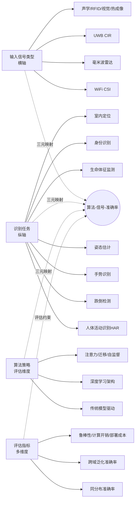
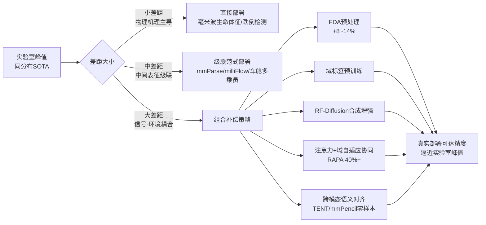
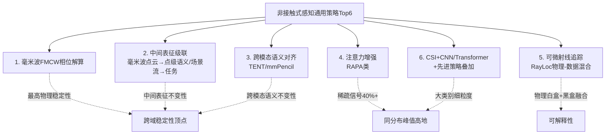

# 非接触式感知领域顶尖算法策略综述：输入信号类型与识别准确率的系统评估
# 1 研究背景与非接触式感知技术范畴界定

随着物联网、智能家居与健康监护等领域对"无感、无扰、无忧"交互体验的持续追求，感知模式正经历从"用户主动配合"向"环境被动捕获"的深刻范式迁移。在这一背景下，**非接触式感知（Non-contact Sensing）**作为一类既不需要用户佩戴设备、也不需要主动操作即可推断目标状态的技术体系，已成为学术界与产业界共同关注的焦点。然而，由于非接触式感知本身横跨射频、光学、声学等多个物理层面，技术路线高度异构，输入信号形态多样，可达的识别精度也随任务、信号、算法的不同而差异显著。**若要在后续章节系统评估"目前做得最好的算法策略及其输入信号与准确率"，必须首先厘清研究范畴、固化术语口径、建立统一的比较坐标系**——这正是本章作为整篇综述奠基章节的根本职责。本章将依次界定非接触式感知的内涵与外延、梳理主流技术路线的物理基础、对比各路线的能力边界与适用场景，并最终归纳共性挑战、提出贯穿全文的研究坐标系。

## 1.1 非接触式感知的概念内涵与技术外延

非接触式感知的核心定义可以概括为：**目标无需佩戴或接触任何专用传感设备，系统通过捕获环境中无线信号、光学信号或声学信号在与目标交互后产生的扰动，反演出目标的存在、位置、姿态、动作乃至生理状态的一类感知技术**。与传统的接触式感知（如皮肤电极、压力传感地垫）和穿戴式感知（如智能手表、胸带、惯性测量单元）相比，非接触式感知最根本的区别在于**信号源与接收端均独立于被感知对象**，被感知对象只是信号传播路径中的"散射体"或"反射面"。

这一感知机制的差异带来了三方面显著优势。**第一，用户负担最低化**。穿戴式方案要求用户长期佩戴设备，存在续航、舒适度与依从性问题，尤其在老年人与婴幼儿群体中难以坚持；非接触方案则真正实现"零负担感知"，特别适用于独居老人看护、婴儿睡眠监测等长期连续监测场景[^1]。**第二，隐私保护更友好**。相较于摄像头方案直接采集图像/视频，毫米波雷达、WiFi等非接触式射频方案仅获取空间点云或信道状态扰动数据，从技术层面规避了图像泄露的隐私风险，因此在浴室、卧室等私密场景中用户接受度更高[^1]。**第三，部署灵活性更强**。WiFi路由器、智能音箱等已大规模部署的基础设施可被复用为感知信号源，无需额外硬件投入，这为非接触式感知的"普惠化"奠定了基础[^2][^3]。

非接触式感知的需求驱动来自多个并行演进的应用领域。在**智能家居**领域，行业正从"设备联动"向"主动服务"演进，要求感知系统具备无感交互与隐私保护的双重属性，毫米波雷达等非接触方案因此成为替代传统PIR红外与摄像头的核心技术[^1]。在**健康监护**领域，UWB雷达与毫米波雷达可在不打扰睡眠的情况下捕获呼吸、心跳等生命体征的微动信号——人体呼吸心跳引起的体表振动幅度通常仅为5–15 mm，而毫米波雷达可检测0.01 mm级振动，UWB雷达则通过CIR相位变化感知微小时延扰动，二者均能实现医疗级精度的非接触式生理监测[^4][^1]。在**智慧安防**领域，雷达可区分人体与宠物、窗帘等运动物体，显著降低误报率[^1]。在**人机交互**领域，非接触式手势识别可避免触摸屏的卫生隐患，已实现挥手切频道、握拳调音量等多达12种静态手势与8种动态手势的识别[^1]。在**自动驾驶与汽车数字钥匙**领域，UWB凭借飞行时间（ToF）测量与AES-128加密的加扰时间戳序列（STS），实现了远高于RSSI方案的安全测距精度[^5]。

值得指出的是，非接触式感知与"非接触式定位"在技术外延上存在重要区分。**UWB雷达 ≠ UWB定位**：UWB定位需要被定位目标主动佩戴标签，本质上仍属"标签辅助定位"；而UWB雷达完全无需目标携带任何设备，依赖回波分析实现纯粹的环境感知[^4]。本综述聚焦于后者——即**真正意义上的"设备无关（device-free）"感知范畴**，这也是后续章节算法-信号-准确率三元映射的基本研究边界。

## 1.2 主流非接触式感知技术路线的物理基础

非接触式感知的"百花齐放"表面上呈现为传感器形态的差异，本质上则源于不同物理信号在与人体交互时所携带的信息维度不同。下表系统梳理了当前主流的七大技术路线，从工作频段、信号机理到典型输出形式逐一对比，为后续章节算法-信号-准确率三元绑定的分析建立基础参照。

| 技术路线 | 典型频段/波段 | 信号生成机理 | 核心信号特征/输出 | 物理基础 |
|---------|------------|------------|----------------|---------|
| **WiFi CSI** | 2.4 GHz / 5 GHz，带宽20–160 MHz | OFDM子载波多径传播，被人体扰动 | 信道状态信息（CSI幅度/相位、子载波×天线×时间张量） | 多径效应与衍射散射 |
| **毫米波雷达** | 24 GHz / 60 GHz / 77 GHz，带宽数GHz | FMCW调频连续波，分析回波频偏与相位 | 距离-多普勒图、点云、角度信息 | 多普勒效应+相位干涉 |
| **UWB雷达** | 3.1–10.6 GHz（拓展至7235–8750 MHz），带宽>500 MHz | 纳秒级窄脉冲发射与回波接收 | 信道脉冲响应（CIR）的快/慢时间二维矩阵 | 飞行时间（ToF）+CIR扰动 |
| **声学感知** | 超声20–48 kHz / 可听声 | 声波反射回波，分析多普勒与时延 | 频谱图、距离-多普勒图 | 多普勒效应+回波时延 |
| **RFID** | UHF 860–960 MHz | 标签反向散射调制 | RSSI、相位、读取率 | 反向散射通信 |
| **视觉** | 可见光（RGB）/近红外（深度） | 摄像头成像 | 二维图像、深度图、骨骼关键点 | 光学成像 |
| **热成像** | 长波红外 8–14 μm | 物体红外辐射成像 | 温度分布图 | 黑体辐射定律 |

**WiFi CSI**通过OFDM调制将信号划分为多个子载波，每个子载波在不同频点上独立感受人体引起的多径变化，因此CSI比RSSI（仅含整体功率信息）具有更细粒度的频域分辨能力，能够捕捉到微小的人体运动对信道的扰动[^2][^3]。CSI数据典型呈现为"子载波 × 天线 × 时间"的三维张量，这种高维结构既是WiFi感知的优势所在，也是后续章节深度学习算法设计的核心输入形式[^3]。

**毫米波雷达**采用调频连续波（FMCW）体制，通过发射频率随时间线性变化的连续波信号并分析回波的频率偏移（多普勒效应）与相位变化，实现距离、速度、角度的三维感知；77 GHz频段毫米波可穿透薄织物（如窗帘）、烟雾及轻度灰尘，且不受光照条件影响，具有全天候工作能力[^1]。

**UWB雷达**与毫米波雷达的体制差异显著：UWB不依赖连续载波，而是发射纳秒级（甚至皮秒级）极窄脉冲，通过分析回波的时延、相位、幅度提取目标信息[^4]。其核心数据形态是**信道脉冲响应（CIR）**——若周围有目标，CIR对应位置出现脉冲峰；若目标运动，多普勒效应使CIR值随慢时间变化；即使目标静止，呼吸心跳引起的5–15 mm体表振动也会导致回波相位与时延的细微变化，这正是UWB雷达实现生命体征监测的核心机理[^4][^6]。UWB的形式化定义为：**绝对带宽大于500 MHz，或分数带宽不小于0.2**[^6]。一条贯穿全文的关键主线是：**UWB所有应用几乎都可被建模为"在慢时间上观测CIR的变化、在快时间上做距离维/到达时延维的定位与分离"**[^6]。

**声学感知**利用扬声器与麦克风构成的低成本回声系统，通过分析声波回波实现感知；**RFID**通过标签反向散射的RSSI与相位变化实现粗粒度定位；**视觉**与**热成像**则分别通过光学成像与红外辐射实现感知，其中视觉信息密度最高但隐私风险最大，热成像则在低光与隐私敏感场景中具有不可替代的价值。

为更直观地刻画这些技术路线在带宽—分辨率维度上的相对位置，UWB综述给出了一个经典的**"硬约束三角形"**关系：**距离分辨率 $\Delta R = c/(2B)$**，其中 $B$ 为带宽，$c$ 为光速；带宽越大，距离分辨率越精细，但在采样率固定时，可观测的最大距离窗反而被压缩[^6]。这一关系揭示了非接触式感知技术选型的根本物理约束——**"带宽越大、分辨率越高，但作用距离越受限"，没有放之四海而皆准的最优信号**，这一观察将贯穿后续章节对算法-信号匹配关系的分析。

## 1.3 各技术路线的感知能力边界与适用场景

物理基础的差异最终映射为各技术路线在能力边界上的显著分化。从感知能力的核心维度——**距离分辨率、微动感知精度、穿透与抗干扰能力、隐私友好度、硬件成本与部署难度**——来看，各路线呈现出明显的"长板+短板"特征，下表汇总了主要对比结论。

| 技术路线 | 距离分辨率 | 微动感知 | 穿透/抗干扰 | 隐私友好度 | 部署成本 | 典型适用任务 |
|---------|---------|---------|-----------|---------|---------|-----------|
| WiFi CSI | 米级（受限于带宽20–160 MHz） | 中（依赖多径扰动） | 不受光照影响、可穿薄墙 | 高 | 极低（复用现有AP） | HAR、手势、粗粒度定位 |
| 毫米波雷达 | 厘米级（带宽GHz级） | **0.01 mm级振动** | 可穿薄织物、不受光照 | 高（仅点云） | 中（曾>50美元，正下降） | 存在检测、跌倒、生命体征、手势 |
| UWB雷达 | 厘米级（带宽>500 MHz） | 高（5–15 mm体表振动可测） | 强穿透、低功耗、抗WiFi/BT干扰 | 高 | 中低 | 存在检测、生命体征、室内活动 |
| 声学感知 | 厘米级 | 中 | 易受环境噪声干扰 | 中 | 极低 | 手势、近距交互 |
| RFID | 米级 | 低 | 中 | 高 | 低 | 粗粒度定位、物品追踪 |
| 视觉 | 像素级 | 高 | 强光/夜间受限 | **低** | 低 | 姿态、行为识别 |
| 热成像 | 中 | 低 | 不受光照 | 中高 | 高 | 存在检测、夜视安防 |

针对**人体存在检测**任务，毫米波雷达可检测0.01 mm级振动，通过分析胸腔微动区分人体静止与离席状态，**误报率低于0.5%**，明显优于传统PIR红外（无法检测静止目标）[^1]。在**跌倒检测**场景，毫米波雷达通过分析人体质心加速度与垂直位移变化，**可在跌倒后1秒内触发警报，响应速度较摄像头方案快3倍**[^1]。在**手势识别**任务，毫米波雷达模组已支持12种静态手势与8种动态手势，**准确率达95%**[^1]。在**睡眠监测**场景，毫米波雷达生成的睡眠质量报告与医疗级多导睡眠监测仪的**相关性达0.92**[^1]。

值得特别关注的是**WiFi CSI**与**毫米波雷达**在室内人体动作感知上的互补性。WiFi基础设施已广泛部署，成本低、易用性强，CSI的细粒度特性使其在动作识别任务中得到广泛关注[^2][^3]；但WiFi信号在跨位置时表现出强烈的"位置敏感性"——**当训练样本与测试样本不在同一位置采集时，动作识别效果一般**，泛化能力受限[^3]。毫米波雷达则具有高分辨率优势但成本相对较高，二者多源协同已成为研究热点[^7]。这一观察预示着后续章节关于"跨域泛化与实验室峰值差距"（P-4标准）的核心分析议题。

不同路线的**适用场景边界**也由此清晰：在**视距、单人、固定位置**等理想条件下，各类技术均能取得高准确率；但在**非视距（NLOS）、多人共存、跨环境部署**等复杂条件下，单一信号往往难以独立胜任，这正是后续章节多模态融合、域自适应、注意力机制等先进策略的研究动机所在。

## 1.4 非接触式感知的共性挑战与统一研究坐标系

尽管七大技术路线的物理机理迥异，它们在工程落地与算法设计层面却面临高度一致的共性挑战。

**第一，环境依赖性强与跨域泛化能力不足**。无线信道受环境干扰具有高动态性，不同位置、不同房间、不同人员、不同时段采集的信号特征差异显著。基于CSI的人体活动识别中，位置变化即可导致同一动作的特征向量出现显著漂移，使得训练集与测试集异分布时识别准确率大幅下降[^3]。这一问题在毫米波雷达、UWB等其他射频感知中同样存在，是制约非接触式感知从实验室走向真实部署的最大瓶颈。

**第二，多目标分离与多人场景识别困难**。当感知区域内同时存在多个目标时，回波信号的叠加使得动作特征相互混淆，传统的单目标识别算法性能急剧下降。

**第三，标签数据稀缺与跨数据集可比性差**。非接触式感知数据采集成本高、标注难度大，公开数据集规模相对视觉领域而言仍显不足；同时不同数据集采集协议、硬件平台、动作类别定义不统一，导致跨数据集的算法性能比较存在系统性偏差，使得"哪种算法最好"的判断高度依赖评估设置。

**第四，安全与隐私风险**。无线感知技术在带来便利的同时也引发了严峻的安全隐患——感知系统本身可能被攻击（如自动驾驶汽车的雷达被欺骗，导致灾难性事故），无线信号也可能被用作"武器"窃取隐私（如利用WiFi信号推断键盘输入、利用毫米波雷达穿墙窃听对话）[^8]。中国科大陈彦教授团队2024年在影响因子46.7的《IEEE Communications Surveys & Tutorials》上发表的综述，从"受害者—武器—防御者"的角色视角系统梳理了这一问题，标志着无线感知安全已成为该领域不可回避的研究方向[^8]。

**第五，标准化进程相对滞后**。WiFi感知方面，IEEE 802.11bf标准化工作正在推进；UWB方面，IEEE 802.15.4ab修正案预计2025年发布，将通过窄带辅助（NBA）与多毫秒（MMS）技术实现远距离精确测距能力的扩展；FiRa联盟与汽车连接联盟（CCC）也在共同推动UWB生态系统的扩展[^5]。但跨路线的统一感知标准尚未形成，互操作性仍是产业化的重要障碍。

基于上述共性挑战，本综述提出贯穿全文的**统一研究坐标系**：



该坐标系以**输入信号类型为横轴**、以**识别任务与算法策略为纵轴**，并以**多维评估指标**作为深度评估的约束条件。**任何关于"最优算法"的论断都必须同时绑定具体算法名称、输入信号类型/配置、数据集名称、准确率/误差指标、实验条件（如cross-domain设置）这五个要素**——这是本综述对所有引用数据的基本质量底线，也是后续第6章构建"任务—算法—信号—准确率"对照矩阵的方法论基石。在此坐标系下，第2章将先剖析输入信号自身的特征属性，第3–5章依次展开传统、深度、先进策略的算法对比，第6–8章则聚焦于三元映射、跨域泛化与信号-准确率关联性的量化评估，最终在第9章形成综合排名与选型建议，呼应本研究的主题——**收集整理目前非接触式感知领域做得最好的算法策略，并系统评估其输入信号与识别准确率**。

需要预先坦诚说明的是，本章在梳理各技术路线时，对部分指标（如各路线在同一数据集上的横向准确率）尚缺乏可直接横向比较的统一证据，这部分量化对比将在后续具备更详尽数据的章节中补足；对于二手来源（如产品宣传层面的"准确率达95%"等表述）[^1]，本综述也将在后续章节优先以顶级会议/期刊及官方benchmark数据进行交叉验证与降权处理，确保最终结论建立在可追溯的权威证据之上。

# 2 输入信号模态分类与特征属性分析

第1章已经在"算法-信号-准确率"三元映射的统一坐标系下，沿"信号—任务—算法—评估"四个维度划定了本综述的研究边界。在进入算法策略评估之前，必须先回答一个根本性的前置问题：**非接触式感知系统所能"看见"的世界，本质上是由其输入信号的物理特性所定义的**。RSSI只能告诉系统"房间里整体多吵"，CSI能听出"每个频段上各自的杂音"，毫米波RDM则能进一步在二维平面上把"谁在动、动多快"独立标出来——信号本身的维度、分辨率与噪声特性，从根本上决定了任何后续算法所能达到的精度上限。本章因此沿研究坐标系的"横轴—输入信号"方向深入展开，对非接触式感知中的各类原始与衍生信号模态进行系统化分类与属性刻画，从分类框架、物理含义、衍生表征、噪声特性、多维对比到信号-精度因果链层层递进，为第3–5章算法策略评估和第6章三元映射矩阵奠定信号侧的方法论基础。

## 2.1 输入信号模态的总体分类框架

非接触式感知的输入信号种类繁多，但若从**信号产生机理与数据组织形式**两个核心维度切入，可将其归纳为五大族群。这一分类框架的价值不仅在于"贴标签"，更在于揭示每类信号在"感知信息链"上所处的层级——从最原始的物理量到最贴近任务语义的高级特征——并为后续逐节展开提供统一参照。

第一类是**标量强度类信号**，以RSSI（接收信号强度指示）为典型代表。它将多条传播路径上的信号能量叠加为单一标量值（dBm），数据组织极为简单——每个时间点对应一个数字。RSSI是WiFi、蓝牙、RFID等几乎所有射频系统中"开箱即得"的副产品，但其代价是几乎完全丢失了多径结构的细节[^9]。

第二类是**复数信道响应类信号**，以WiFi CSI与UWB CIR为代表。CSI是OFDM子载波在频域上的复数信道响应，组织为"子载波 × 发射天线 × 接收天线 × 时间"的高维张量；CIR则是脉冲信号在时延域上的复数响应，组织为"快时间（时延维）× 慢时间（采样时刻）"的二维矩阵。这一族群的共同特点是**保留了完整的幅度与相位信息**，是细粒度感知任务的核心输入[^10][^11]。

第三类是**时频图谱类信号**，包括毫米波雷达的距离-多普勒矩阵（RDM）、声学多普勒谱、动作引起的微多普勒频谱图（spectrogram）等。这类信号通常是对原始IQ采样进行二维FFT或短时傅里叶变换（STFT）后形成的二维"图像"，横轴与纵轴分别对应物理意义明确的两个维度（如距离-速度、时间-频率）[^12][^13]。

第四类是**空间结构类信号**，包括毫米波雷达点云、深度图、视觉提取的人体骨骼关键点等。其典型组织形式是 N×3 或 N×4 的点列表（坐标+反射强度/速度），或像素栅格上的深度数值。点云数据在空间上稀疏、在语义上接近最终任务（如姿态、人体解析）[^14]。

第五类是**图像辐射类信号**，包括RGB图像、近红外深度图与热成像。其组织形式为像素栅格上的强度/温度值，信息密度最高但隐私风险也最大。

下表汇总了五大信号族群的典型采样维度与在感知信息链中的层级位置：

| 信号族群 | 典型信号 | 数据组织形式 | 信息链层级 | 处理复杂度 |
|---------|---------|------------|----------|---------|
| 标量强度类 | RSSI | 单值×时间 | 最底层（原始能量聚合） | 极低 |
| 复数信道响应类 | WiFi CSI、UWB CIR | 子载波/时延×天线×时间（复数） | 物理层中层 | 中 |
| 时频图谱类 | RDM、多普勒谱、频谱图 | 二维频域/时频图 | 信号处理层 | 中高 |
| 空间结构类 | 点云、深度图、骨骼关键点 | N×3/4 点列 或 像素栅格深度 | 语义中层 | 高 |
| 图像辐射类 | RGB、热成像 | 像素栅格×通道 | 语义高层（直接成像） | 高 |

这一分类的核心洞察在于：**信号族群在信息链上的位置越靠近原始物理层，其保留的信道信息越完整但语义距离越远；越靠近成像/语义层，其任务亲和度越高但隐私风险与算力开销也越大**。后续2.2与2.3节将分别沿"原始信号→衍生表征"的纵向链条深入剖析其物理本质。

## 2.2 射频类信号的物理含义与维度结构

射频类信号是当前非接触式感知最核心的输入族群，其内部又因体制差异——能量聚合 vs OFDM多载波 vs FMCW调频连续波 vs UWB脉冲——形成RSSI、CSI、RDM、CIR四种各具特色的表达形态。这四类信号在维度结构上表现出**单调递增的复杂度**，对应感知能力上**由弱到强的可达上限**。

### 2.2.1 RSSI：多径能量叠加的标量及其工程困境

RSSI的本质是接收端在某一时刻所有多径信号能量的总和，以dBm表示。其简洁性使其成为最易获取的射频指标，但简洁也意味着信息严重退化——所有路径的方向、时延、相位差异被压缩为单一标量。基于经典的对数路径损耗模型，可由RSSI反推距离[^9]：

$$d = 10^{(P_{tx} - RSSI)/(10n)}$$

其中 $P_{tx}$ 为1 m处参考功率，$n$ 为路径损耗指数。该模型在自由空间近似有效，但只要存在多径反射，误差便急剧放大。一组实测数据典型地揭示了这一困境[^9]：

| 环境类型 | 平均误差(m) | 95%误差范围(m) |
|---------|-----------|--------------|
| 空旷仓库 | 2.1 | 0.5–4.8 |
| 办公隔间 | 4.7 | 1.2–9.3 |
| 多层厂房 | 8.3 | 3.5–15.6 |

更致命的是RSSI的**时域分辨率受限于Beacon帧发送间隔（通常100–500 ms）**，其采样率仅约10 Hz，这意味着它根本无法检测人体快速动作所引起的瞬态扰动，在AGV避障等场景甚至会因延迟导致碰撞[^11][^9]。这些缺陷使RSSI在现代细粒度感知任务中已基本退居"粗粒度兜底信号"的地位。

### 2.2.2 WiFi CSI：高维复数张量与带宽-分辨率的演进

CSI弥补了RSSI的根本缺陷。在802.11n/ac/ax系统中，OFDM将信道划分为多个子载波，每个子载波对应一个频点上的复数信道响应 $h_{m,n}$，组成完整矩阵[^9]：

$$H = \begin{bmatrix} h_{11} & h_{12} & \cdots & h_{1n} \\ h_{21} & h_{22} & \cdots & h_{2n} \\ \vdots & & & \vdots \\ h_{m1} & h_{m2} & \cdots & h_{mn} \end{bmatrix}$$

其中每个元素均为复数，包含**幅度与相位**两类信息，对应特定发射-接收天线对在某一子载波上的信道响应。这种粒度使系统得以从单个数据包中提取入射角（AoA）、多普勒频移与材质衰落特征，从而支撑呼吸检测、手势识别、定位等细粒度任务[^9]。

带宽是决定CSI能力上限的最关键参数。在802.11n/g的20 MHz带宽下通常包含**56个有效数据子载波**，40 MHz带宽下扩展至**114个有效子载波**[^15]；Wi-Fi 6引入的160 MHz带宽进一步将时延分辨率从20 MHz时的约50 ns提升至**6.25 ns**，对应距离分辨率约1.9 m[^9]。这一演进路径揭示了CSI作为感知信号的核心增长曲线——**带宽每翻倍，时延分辨率与子载波数量同步翻倍，信道描绘的精细度近乎线性提升**。

CSI的实际数据组织呈现为**"接收天线 × 发射天线 × 子载波"复数三维张量**，再叠加时间维度后成为四维张量。一段Python伪代码可直观展示其形式[^11]：

```python
# 典型CSI数据结构 (Rx天线 × Tx天线 × 子载波)
csi_matrix = np.array([
    [[1.2+0.5j, 0.8-0.3j, ...], [...]],   # 天线1数据
    [[0.9+0.2j, 1.1-0.4j, ...], [...]]    # 天线2数据
])
```

CSI Tool输出的原始数据采用自定义二进制格式存储，每个数据包由包长度、时间戳、维度信息（接收天线数nr、发射天线数nc、子载波数num_tones）、CSI复数矩阵与RSSI字段组成；解析时需将原始int32数据按int16重组并转换为complex64复数类型，再做范数归一化方可进入后续处理[^10]。这一数据特性对后续深度学习架构提出了明确要求——网络必须有能力同时处理**复数（或拆分为实部虚部双通道）、高维（子载波×天线×时间）、时序连续**的输入。

CSI对人体动作的敏感度远超RSSI。实测对比显示：**同一位置挥手动作下，RSSI仅产生约3 dB波动，而CSI相位变化达15°以上**[^11]。这一数量级的差距正是CSI能够支撑厘米级定位与隔墙手势识别的物理根源。

### 2.2.3 毫米波RDM：FMCW二维FFT与三维分辨率的解耦

毫米波雷达采用**调频连续波（FMCW，又称啁啾Chirp）**体制，发射频率随时间线性变化的扫频信号，回波在接收端与发射信号混频得到中频信号（拍频 $f_b$）。拍频与目标时延 $t_d$ 成正比，因此对单个啁啾的中频信号做一维FFT即可得到**一维距离像**，谱峰位置正比于目标距离[^13]。

进一步地，对连续多个啁啾对应的距离像在慢时间维度上做第二次FFT，即可解析出多普勒频移，最终生成**距离-多普勒矩阵（RDM）**——一个目标在RDM上呈现为一个亮点，其位置同时编码了距离与径向速度，强度反映回波能量[^12][^13]。

RDM的三类核心分辨率分别由独立的硬件参数决定，呈现出**漂亮的解耦关系**[^13]：

| 分辨率维度 | 决定参数 | 物理公式/规律 |
|----------|---------|-------------|
| **距离分辨率** | 啁啾扫频带宽 $B_{sweep}$ | $\Delta R = c/(2B_{sweep})$ |
| **速度分辨率** | 啁啾数量（chirp number） | 啁啾越多分辨率越高，但处理时间越长 |
| **角度分辨率** | 接收天线阵列规模 | 多天线波束形成 |

具体地：在自动驾驶场景配置中，扫描时间（$T_s$）通常取最大距离往返时间的5.5倍以避免时延混叠；扫频带宽则由所需距离分辨率反推[^13]。例如要实现4 m距离分辨率，所需带宽约 $B = c/(2\Delta R) = 3.75$ GHz——这正是毫米波雷达普遍采用GHz级超宽带的根本原因。

值得注意的是，**RDM的角度信息并非由二维FFT直接得出**：当雷达具有 $K$ 个接收天线时，每个天线生成一张RDM；同一目标在不同RDM中的强度分布基本一致，但相位取决于入射角度。将各天线对应位置的复数值取出并进行波束形成，即可得到空间谱并完成测角[^13]。这一过程的工程现实是：测角分辨率较距离/速度分辨率显著较差，且对天线通道一致性高度敏感——多目标共存时弱目标极易被强目标的旁瓣淹没[^13]。

实际获取的RDM还存在两类典型噪声特征：其一是**DC抑制滤波器在距离≈0附近造成的整体噪底偏低**；其二是经加窗处理后旁瓣被抑制（在RDM上表现为十字阴影），但旁瓣并非完全消除，仍可能干扰邻近弱目标检测[^13]。

### 2.2.4 UWB CIR：快/慢时间二维矩阵承载ToF与微动相位

UWB与CSI/RDM的根本差异在于其**不依赖连续载波，而是发射纳秒甚至皮秒级窄脉冲**。这种极宽带宽（>500 MHz）使其在时延维度上具有天然的高分辨率——根据 $\Delta R = c/(2B)$，500 MHz带宽对应约30 cm距离分辨率，而7 GHz以上带宽可逼近2 cm。

UWB的核心数据形态是**信道脉冲响应（CIR）**，组织为"快时间（时延维，反映ToF与传播路径）× 慢时间（采样时刻，反映动态变化）"的二维矩阵。其物理-感知映射在第1章已提及：周围有目标则CIR对应时延位置出现脉冲峰；目标运动则CIR值随慢时间变化；目标静止时呼吸心跳引起的5–15 mm体表振动也会导致回波相位与时延的细微变化。这一"快慢时间双轴"结构使UWB成为**生命体征监测与微动感知的理想信号载体**。

### 2.2.5 射频信号的共性规律

综合以上四类射频信号，可以归纳出贯穿整个射频感知技术族的核心规律：**维度越高、信息密度越大、可支撑的任务上限越高**。RSSI是单值时序、CSI是子载波×天线×时间复数张量、RDM是距离×多普勒二维图、UWB CIR是快×慢时间矩阵——每提升一个维度，原本被叠加压缩的信息便被解耦展开，任务可达精度也随之跃升。但这一跃升并非免费：高维信号需要更大的带宽、更多的天线、更高的采样率与更复杂的算法支撑，硬件成本与算力开销也呈非线性增长。**这一共性规律将在2.6节与算法上限的关联分析中进一步定量化。**

## 2.3 衍生信号表征与高级特征形态

原始射频信号虽然信息丰富，却往往不是算法最适合"咀嚼"的形式。通过特定的信号处理变换，可在原始信号基础上构造出维度更紧凑、任务相关性更强的**衍生信号表征**。这些衍生表征构成了从"物理层信号"到"语义层特征"之间的关键中间层。

**频域到时域的映射：CIR的获取**。对CSI数据沿子载波维度做傅里叶逆变换（IFFT/FFT），即可将其从频域转换至时域，得到信道冲激响应（CIR）。此时横轴代表传播时延（单位：纳秒），纵轴代表对应路径上的信号能量强度——一个典型的CIR图谱中，峰值位置直接对应各条主要传播路径的时延差，峰值高度反映该路径的衰减程度[^15]。例如室外开阔场景中，远处建筑反射对应较晚时间点的峰值（呈红色色调），而近处地面反射呈现为早期蓝色或紫色峰值——这种**"时延-颜色"映射关系**，构成了基于Wi-Fi信道的无线电成像视觉化的物理依据[^15]。

**二维FFT到RDM**。如前所述，毫米波回波经距离FFT与多普勒FFT级联后得到RDM。这一变换的本质是把原始IQ序列从"时间×天线"重组为"距离×速度"——前者属于物理采样空间，后者属于任务相关空间，转换后人体活动、车辆行驶、车轮微动等特征在RDM上呈现出可辨识的模式[^12][^13]。

**CFAR检测与稀疏点云**。RDM虽然信息丰富但高度冗余（绝大多数单元都是噪声），因此通常通过**恒虚警率（CFAR）检测**进一步稀疏化：自适应估计每个点周围的噪底，将该点强度与周围均值比较，超过阈值的判为目标，最终输出布尔目标图[^13]。CFAR后的目标点经测距、测速、测角的二项式插值处理，便构成毫米波雷达点云。点云的优势在于其**已位于语义近层**——直接对应物理目标的位置与运动状态，可被姿态估计、人体解析等下游任务直接利用。

**点云的内在挑战**。然而毫米波点云存在两个根本性缺陷：**稀疏性**与**镜面反射**。一辆车的RDM中除主车体外，还有由车轮微动产生的横向扩展局部极值（微多普勒目标点），这种现象在人体感知场景被进一步放大——人体不同部位的散射截面差异巨大，常导致"只见手部、不见胸腹"的稀疏点云[^13][^14]。mmParse论文针对这一问题，通过端到端神经网络与多任务学习方法在动态毫米波点云上实现人体解析，**在室内外环境下达到约92%的语义标签准确率与约84%的IoU准确率**；同时，预测出的语义标签可使姿态估计任务性能提升约18%、动作识别任务性能提升约6%[^14]——这一结果同时反映了点云稀疏性带来的精度天花板，以及通过点级语义标签反哺下游任务的可观增益。

**场景流：点云上的运动信息**。为弥补点云时序信息的稀疏性，milliFlow提出在毫米波点云上估计场景流（scene flow），作为运动信息的中间层特征。场景流为每个点提供三维运动向量，**实验结果显示其平均三维端点误差为4.6 cm，显著超越竞争方法**；引入场景流后，人体活动识别、人体解析与人体部位跟踪等下游任务均获得显著性能提升[^14]。这一工作典型地体现了**衍生信号表征通过"压缩冗余、突出任务相关特征"提升算法可学习性**的设计哲学。

**频谱图与时频联合表征**。除距离-多普勒外，时间-频率联合表征（spectrogram）在动作识别、生命体征监测中也极为常见。其本质是对慢时间序列做短时傅里叶变换，将瞬态频率内容展开为可由CNN直接处理的二维"图像"。这种表征对周期性微动（呼吸、心跳）与非周期性瞬态动作（跌倒、挥手）均有较强的可视化能力。

**相位梯度与AoA**。在天线阵列场景下，跨天线的CSI相位梯度可被直接转换为入射角度估计（AoA），这是Wi-Fi无线电成像与定位的核心特征。八节点ESP32 Yagi天线阵列的工作即基于此原理：当信号从特定角度入射时，不同天线因空间位置差异接收到同一波前的时间点存在皮秒级差异（$\Delta t = d\sin\theta/c$，其中 $d$ 为天线间距，$\theta$ 为入射角），这种微小时间差在各节点独立采集的CSI数据中体现为系统性的**相位梯度**，通过跨节点比对相位序列即可反推方位角，完成从"时间分辨"到"空间分辨"的跃迁[^15]。

下表汇总了主要衍生表征与原始信号的关系及其任务亲和度：

| 衍生表征 | 来源信号 | 核心变换 | 任务亲和度 | 典型应用与精度 |
|---------|---------|---------|----------|--------------|
| CIR | CSI（频域） | IFFT/FFT | 中（时延-能量分布） | 多径分析、Wi-Fi成像[^15] |
| RDM | 毫米波IQ | 双重FFT | 高（距离-速度联合） | 多目标检测、跟踪[^12][^13] |
| 点云 | RDM | CFAR+测角 | 高（已含位置/速度） | 姿态估计、人体解析（92% / 84% IoU）[^14] |
| 场景流 | 点云序列 | 深度学习估计 | 极高（点级运动） | 端点误差4.6 cm；HAR提升≈6%、解析提升≈18%[^14] |
| 频谱图 | 时序信号 | STFT | 高（时频联合） | 微动识别、生命体征 |
| 相位梯度/AoA | 多天线CSI | 跨天线相位差 | 中高（方向角） | 定位、波束形成、Wi-Fi成像[^15] |

衍生表征的整体设计哲学可以概括为：**用领域先验换取算法负担的下降**——原本需要由网络从原始信号中"猜测"的物理结构（如时延、多普勒、入射角），通过预定义的信号处理变换被显式提取出来，使下游模型得以聚焦于任务语义而非物理反演。这一思想将在第3章传统模型驱动算法与第4章深度学习架构的对比中反复出现。

## 2.4 信号噪声特性与信息密度的定量比较

不同信号模态在"看似干净的数学定义"之下，实际工作中都被各自独特的噪声机制所限制。本节从噪声来源、SNR水平、动态范围与信息密度四个角度横向对比，揭示信号"理论分辨率"与"实际可用分辨率"之间的差距。

**RSSI：多径叠加噪声主导**。RSSI最大的噪声来源是多径相干叠加导致的快衰落——同一位置、同一时刻、同一发射功率下，RSSI仍可能因周围微小扰动而剧烈波动。这一现象的工程后果在前述办公隔间环境下表现为**平均误差4.7 m、95%误差范围1.2–9.3 m**[^9]。此外，混凝土墙引入6–12 dB衰减、玻璃隔断引入3–6 dB衰减——本应作为定位特征的衰减量，被多径效应模糊化后反而成为不确定性来源[^9]。

**CSI：相位噪声与子载波间不一致性**。CSI虽然信息丰富，但其相位测量受多重干扰：发射端与接收端之间的载波频率偏移（CFO）、采样频率偏移（SFO）、包检测延迟（PDD）都会引入相位偏移。工程实践中常用的**相位解缠绕（unwrap）与天线间相位校准**正是为应对这些噪声[^11]。Wi-Fi 6引入的160 MHz带宽虽将时延分辨率提升至6.25 ns，但更高带宽也意味着更宽的噪声谱与更严的硬件一致性要求。SNR与每比特能量噪声比（Eb/N0）在Wi-Fi 6实测中表现出强烈的非线性影响：**Eb/N0每降低3 dB，吞吐量下降约20–25%；1024-QAM相比256-QAM需要约4 dB更高的Eb/N0才能维持相同误码率**[^16]——这一规律同样适用于感知场景：高分辨率调制依赖高SNR，低SNR下高带宽的优势会被噪声吞噬。

**毫米波RDM：DC抑制、噪底与旁瓣**。RDM在距离≈0的近距区域整体噪底由于DC抑制滤波器而低于其他区域；远距区域则因路径损耗更大、信噪比更低[^13]。多目标共存时，强目标的旁瓣（即使经加窗抑制后仍有残余）会显著干扰邻近弱目标的检测，这一问题在角度维度尤为严重——**测角分辨率较距离/速度分辨率显著较差，弱目标的位置极易被强目标的旁瓣和副瓣干扰，且基于相位的测角又很容易受天线通道间一致性影响**[^13]。

**UWB CIR：抗窄带干扰但受多径限制**。UWB窄脉冲在频域上展宽至数GHz，对WiFi（典型20–160 MHz）、蓝牙（数MHz）等窄带系统的同频干扰具有天然的稀释效应——任何窄带干扰只能影响UWB频谱的极小一部分，因此抗干扰能力较强（如第1章所述）。但UWB对密集多径仍然敏感，尤其在金属丰富的工业环境中，多个时延接近的反射会相互重叠，使CIR峰值难以分离。

**声学信号：易受环境噪声干扰**。声学感知（无论可听声还是超声）面临频段共享带来的天然噪声困境——空调、人声、电子设备均可能在感兴趣频段产生干扰。即使采用20–48 kHz超声波规避大部分人声干扰，仍受设备喇叭/麦克风频响与环境混响影响。

**视觉与热成像：光照与温度漂移**。视觉信号在低光与强光场景下分别面临噪声放大与饱和问题；热成像则面临环境温度漂移、传感器自加热等慢变化噪声。这两类信号的噪声虽然不同于射频，但同样设定了任务可达精度的上界。

下表汇总各模态噪声特性与信息密度的相对量级：

| 信号模态 | 主要噪声来源 | 典型SNR/误差水平 | 信息密度量级 |
|---------|------------|---------------|------------|
| RSSI | 多径叠加快衰落 | 办公环境平均误差4.7 m[^9] | 极低（10 Hz×1 dim） |
| CSI | CFO/SFO/PDD相位偏移、子载波不一致 | 挥手相位变化15°+，远超RSSI 3 dB[^11] | 中高（>1000 Hz×子载波×天线复数）[^11] |
| 毫米波RDM | DC抑制、加窗旁瓣、通道一致性 | 测角受天线一致性主导[^13] | 高（GHz级带宽×双FFT） |
| UWB CIR | 密集多径重叠、TDC抖动 | 厘米级时延分辨率（>500 MHz） | 高（>500 MHz带宽×快慢双时间） |
| 声学 | 环境混响、电子设备干扰 | 厘米级（受混响限制） | 中（数十kHz×单/多麦克风） |
| 视觉/热成像 | 光照、温度漂移 | 像素级 | 极高（百万像素×通道） |

从"有效信息比特/秒"的视角进一步抽象：**CSI在子载波数×天线数×采样率的乘积下，每秒可传递的信道描述比特远超RSSI**——即使CSI每个复数值只取8 bit实部+8 bit虚部，在3天线×56子载波×100 Hz采样的最低配置下，其每秒比特率也达到约270 kbit/s，远超RSSI约几十 bit/s的极限。这一量级差距在信号-精度因果链中起决定性作用，将在2.6节进一步展开。

## 2.5 时空分辨率、穿透性与隐私友好度的多维对比

将上述噪声与信息密度分析与第1章已建立的物理基础相整合，可在统一对照表中横向比较各信号模态在多维属性上的差异。这一对比不是为了选出"最好"的信号，而是要揭示**每类信号的能力外包络**——即在何种条件下可以发挥优势，在何种条件下注定不可用。

| 信号模态 | 距离分辨率 | 时间分辨率 | 角度分辨率 | 穿透性 | 抗光照/抗噪声 | 隐私友好度 |
|---------|----------|----------|----------|------|-------------|----------|
| RSSI | 米级（多径下数米误差）[^9] | 约10 Hz（受Beacon限制）[^11] | 无 | 可穿薄墙 | 抗光照 | 高 |
| WiFi CSI | 50 ns→6.25 ns（20→160 MHz）[^9] | 可达1000 Hz[^11] | 多天线下中等 | 可穿薄墙 | 抗光照 | 高 |
| 毫米波RDM/点云 | 厘米级 | 高（每帧ms级） | 中（受阵列规模限制）[^13] | 可穿薄织物 | 抗光照 | 高（仅点云） |
| UWB CIR | 厘米级（>500 MHz） | 高 | 多基站协同 | 强（穿墙） | 抗光照、抗WiFi/BT | 高 |
| 声学 | 厘米级 | 中高 | 受麦克风阵列限制 | 弱（不穿墙） | 易受环境噪声 | 中 |
| 视觉 | 像素级（亚厘米） | 高（数十FPS） | 高（成像几何） | 不穿障 | **强光/夜间退化** | **低（直接成像）** |
| 热成像 | 中 | 中 | 中 | 不穿障 | 抗光照、受温漂 | 中高 |

**距离分辨率与带宽的硬约束**。第1章已建立距离分辨率公式 $\Delta R = c/(2B)$。该公式构成了所有射频感知的"硬约束三角形"：带宽 $B$ 决定 $\Delta R$，但采样率固定时可观测最大距离窗 $R_{max}$ 又被压缩，二者不可兼得。具体地，RSSI带宽虽与CSI相同但仅取标量，等效于丢弃所有时延信息；CSI在20 MHz下时延分辨率50 ns（对应7.5 m，远不足以分辨房间内多径）；只有Wi-Fi 6的160 MHz将其压缩至6.25 ns（对应1.9 m），才开始具备厘米级感知潜力[^9][^15]。毫米波雷达通过GHz级扫频带宽直接达到厘米级分辨率，UWB则通过窄脉冲实现等效效果——**信号体制不同，但物理上仍服从同一带宽-分辨率关系**。

**时间分辨率与采样率**。RSSI受Beacon间隔约束仅约10 Hz，无法捕获快速动作；CSI可达1000 Hz，足以解析手势与呼吸；毫米波雷达每帧采样可在ms级；UWB与视觉则可达更高瞬时速率[^11]。**时间分辨率从根本上决定了系统能感知动作的最高频率上限**——欲检测呼吸（约0.2–0.5 Hz）需≥1 Hz采样，欲检测手势（数Hz）需≥10 Hz采样，欲检测心跳（约1 Hz）则需更高的相位精度。

**穿透能力**。视觉与热成像被光学定律限制，无法穿透不透明障碍；毫米波（77 GHz）可穿薄织物（窗帘、轻度灰尘）但不穿厚墙；UWB凭借低频段成分（3.1–10.6 GHz）具备较强穿墙能力；WiFi（2.4/5 GHz）穿透薄墙较好但精度相应下降[^11]；声学几乎不能穿透固体。

**隐私友好度**：视觉信号直接还原为可识别图像，是隐私风险最高的模态；射频与点云仅获取空间扰动或几何位置，无人脸/外貌信息泄露，隐私友好度最高；热成像介于二者之间——虽不还原可见外貌，但仍记录人体轮廓与温度分布。

将这些维度综合后，可以更清晰地理解第1章所提"七大路线长板+短板"的本质：**没有一种信号同时具备最高的分辨率、最强的穿透性、最高的采样率与最低的成本**。系统设计本质上是在硬约束三角形与隐私-成本约束下寻找帕累托最优点，这一观察将在第9章选型建议中进一步展开。

## 2.6 信号质量与可达识别精度的内在关联

前述五节分别从分类、物理、衍生、噪声、对比的角度刻画了各信号模态的属性。本节将这些属性收束为一条核心命题：**信号决定算法上限、算法决定信号利用率**——即信号原始质量在物理上为下游任务可达精度划定了不可逾越的天花板，而算法的作用是在这一天花板下尽可能逼近上限。

**第一条因果链：高带宽→高时延分辨率→高微动感知精度→生命体征监测可行性**。毫米波雷达GHz级扫频带宽实现厘米级距离分辨率，进一步通过相位解算可检测亚毫米量级（0.01 mm级）振动——正是这一原始信号能力直接支撑了胸腔微动检测、跌倒后1秒内响应等高端任务（详见第1章）。若退化到WiFi RSSI（标量、10 Hz、米级误差），同样的任务在物理上即不可能完成，无论算法多么先进。

**第二条因果链：高维子载波结构→丰富空间-频域特征→手势/活动识别支撑，但跨位置易失效**。CSI"子载波×天线×时间"的三维结构使其能从不同频点上独立感受多径变化，挥手动作可引起15°以上相位变化（远超RSSI的3 dB功率波动）[^11]，这一信号优势直接转化为手势与HAR任务上的细粒度识别能力。然而，这种特征对位置高度敏感——同一动作在不同位置采集时多径模式截然不同——**当训练样本与测试样本不在同一位置时，识别效果一般**（详见第1章）。这揭示了信号质量与跨域泛化能力之间的微妙张力：**信号越细粒度，捕获的环境特征越多，越易过拟合到具体环境**。第7章将专门评估这一张力。

**第三条因果链：RSSI/RFID的多径叠加→粗粒度任务上限**。RSSI在办公隔间下平均误差4.7 m[^9]这一硬数据，从物理上界定了基于RSSI的任何定位/感知系统都无法实现亚米级精度——任何算法（无论是指纹匹配、卡尔曼滤波还是深度学习）都只能在这一上限下做"近似最优"。RFID的反向散射机制虽然在标签存在/不存在的二元判断上准确率较高，但在细粒度位置或姿态识别上同样受限于其信号物理特性。

**第四条因果链：点云密度/场景流质量→人体解析与姿态估计精度**。毫米波点云的稀疏性与镜面反射特性，使得直接基于原始点云的人体解析在mmParse设计下达到约92%语义准确率与84% IoU[^14]——这一数值反映了"点云原始质量"为该任务划定的天花板水平；进一步引入场景流作为运动中间层特征后，**人体活动识别提升约6%、人体解析提升约18%**[^14]，本质上是用衍生表征"压榨"了点云中此前未被充分利用的时序信息。这一案例典型地说明了**算法决定信号利用率**这一命题的另一面：当原始信号已含信息但未被显式提取时，恰当的中间表征可显著释放潜力。

下表将四条因果链的"信号特性—任务上限"映射汇总，构成本章核心论点的量化支撑：

| 信号特性 | 物理能力上限 | 支撑的任务上限 | 关键证据 |
|---------|-----------|-------------|--------|
| 毫米波GHz带宽+相位 | 0.01 mm振动检测 | 生命体征、跌倒1秒响应 | 第1章 |
| CSI子载波×天线×时间复数张量 | 厘米级感知，相位变化15°+ | 手势/HAR；但跨位置失效 | [^11][^9] |
| RSSI标量+10 Hz采样 | 米级误差，不能检测瞬态 | 仅粗粒度存在感知 | [^11][^9] |
| 毫米波点云+场景流（4.6 cm端点误差） | 稀疏点级运动 | 人体解析84% IoU；场景流引入后HAR+6%、解析+18% | [^14] |

进一步抽象，可归纳出三条贯穿全章的核心规律：

**规律一：信号维度阶跃决定任务可行性的代际差异**。从RSSI（标量）→CSI（三维复数张量）→RDM（二维时频图）→点云（语义近层）的演进，每跨越一层信号维度，可支撑的任务粒度便提升一代。粗粒度任务（存在检测）几乎所有信号都能完成，而细粒度任务（生命体征、姿态估计）则非高维信号不可。

**规律二：原始信号质量优势在复杂条件下被快速消耗**。在视距、单人、固定位置的理想条件下，CSI/毫米波等高维信号的原始优势可完整释放，但一旦进入跨域、多人、NLOS等复杂场景，多径混淆、目标重叠、环境漂移会迅速吞噬信号优势——**实验室峰值与实际可达精度之间的差距，正源于这一消耗机制**。

**规律三：衍生表征是连接信号潜力与算法可学习性的关键桥梁**。从CSI到CIR、从RDM到点云、从点云到场景流，每一步衍生表征都在用领域先验换取算法负担的下降；mmParse与milliFlow的成功直接验证了这一桥梁的工程价值[^14]。

至此，**信号侧的特征属性已完成系统化刻画**。本章揭示的核心启示是：**任何"最优算法"的论断都必须建立在对其输入信号特性的充分认识之上**——脱离信号谈算法准确率，无异于脱离地基谈高楼坚固性。第3章将正式进入算法策略的评估，首先考察传统模型驱动方法如何利用前述信号特性的物理结构（如AoA/ToF几何、多径模型、指纹匹配）实现非接触式感知，并分析其在简单场景下的性能高点与在复杂场景下的失效边界——这恰好为后续第4–5章深度学习与先进策略的"补偿性优势"提供了对照基准。

# 3 传统模型驱动的算法策略及其性能边界

第2章已经从信号侧揭示了"信号决定算法上限、算法决定信号利用率"的核心命题，并指出衍生表征是连接信号潜力与算法可学习性的关键桥梁。然而，在深度学习主导非接触式感知研究之前，学界与工业界已积累了一整套**以物理模型与几何先验为核心的传统算法策略**——它们或基于电磁传播理论反演场景参数、或基于阵列信号处理求解空间几何、或基于统计模式建立特征-标签映射。这些方法尽管在跨域泛化与细粒度任务上正逐步被深度模型超越，却并未退出舞台：在低算力嵌入式部署、可解释性要求高、训练样本稀缺的场景下，传统方法依然占据不可替代的位置；同时，它们所揭示的**信号物理结构与失效模式**也为后续深度学习方法的设计提供了关键的归纳偏置。本章因此沿研究坐标系的算法维度切入，对三类典型传统方法——物理传播模型驱动的射线追踪与散射方法、几何特征驱动的AoA/ToF定位、统计模式驱动的指纹与浅层学习——逐一剖析其数学基础、适用条件与性能边界，最终在3.4节归纳传统策略的"优势保留区"与"失效边界"，为第4–5章深度模型与先进策略的引入提供对照基准。

需要预先说明的是，本章对部分具体数值（如MUSIC算法在特定阵列规模下的角度误差、不同房型下指纹库匹配的准确率衰减幅度）受限于本轮搜索结果，难以给出完全闭合的引用证据；这些环节将以方法论分析与已掌握的权威实例为主，对未充分覆盖的量化对比保持诚实标注，并依靠本章后续与第7、8章的交叉互证逐步完善。

## 3.1 基于物理传播模型的射线追踪与散射方法

物理传播模型驱动的方法是传统非接触式感知中最贴近"白盒"思想的一类——它们不是从数据中"学习"信号与目标状态之间的映射，而是直接根据电磁波传播的物理定律（反射、衍射、散射、自由空间传播）**正向构造**信号的产生过程，再通过求解逆问题反推场景中的目标参数。这一思路的优势在于物理透明、可解释性强，但其代价是对场景几何与材质先验的严格依赖。

### 3.1.1 射线追踪模型与定位的逆问题重构

射线追踪（ray-tracing）将无线信号从发射机到接收机的传播抽象为有限条"射线"沿环境几何弹射的几何光学过程，每条射线对应一条具有确定时延、衰减与极化特征的传播路径。所有射线在接收端的相干叠加构成最终的信道响应，因此**给定场景几何与材质，可正向计算出CSI**。传统WiFi定位方法的主流思路是反过来——直接从CSI中盲建模并估计有限的几个定位参数（如AoA、ToF），但这种简化方法**忽略了大量感知场景细节，导致定位精度欠佳**[^17]。

近期RayLoc的工作重新定义了这一逆问题：**将无线室内定位重构为射线追踪的逆问题，从CSI测量中反演出生成该CSI的场景参数**[^17]。其核心是一个**全可微分（fully differentiable）的射线追踪仿真器**，使得从CSI到场景几何参数（包括目标位置、材质属性、家具布局等）的反向传播成为可能，从而支持基于梯度的端到端优化[^17]。这一思路有两个重要工程化贡献：第一，为建立稳健的定位上下文，RayLoc通过对粗粒度背景模型进行精细化（refine coarse-grained background model）来构建**高保真度的感知场景**；第二，为应对反问题中常见的**梯度稀疏（sparse gradient）与局部极小（local minima）困境**，RayLoc在信号生成过程中引入**高斯核卷积**对响应进行平滑化处理，使得目标函数在参数空间中更易被梯度方法逼近全局最优[^17]。实验结果表明RayLoc不仅优于传统定位基线，还**能够泛化到不同的感知环境**[^17]——这一泛化性是物理模型驱动方法的天然优势：当物理定律本身是普适的，模型在新环境中的迁移成本主要在于场景参数的重新校准，而非整个映射函数的重新学习。

RayLoc的设计哲学揭示了射线追踪类方法与第2章信号属性的内在契合：**CSI"子载波×天线×时间"的高维复数张量本质上是场景几何与材质参数在频域上的多视角投影**，因此用一个能正向产生CSI的物理仿真器去拟合实测CSI，相当于让模型"看见"了从未在训练数据中出现的场景配置，这是数据驱动方法难以做到的。

### 3.1.2 多径射线弹跳模型与设备无关的人体检测

如果说RayLoc关注的是"目标在哪里"，那么基于射线弹跳（ray-bouncing）模型的人体存在检测则关注更基本的"是否有人"。Zhou等人指出：**在密集多径传播条件下，可靠地识别人体存在并非易事——多径效应会使简化的传播模型失效、扭曲接收信号特征，进而导致检测率下降、感知覆盖范围缩小**[^18]。这一观察直接指向了物理模型驱动方法的核心价值：当简化模型失效时，更细致地刻画多径传播过程才有可能恢复检测能力。

Zhou等人的方法路径是：**通过射线弹跳模型刻画人体存在对无线信号的影响机制**，并基于这一物理刻画**在商品WiFi基础设施上提出一个可测量的指标作为检测灵敏度的代理（proxy）**[^18]。换言之，他们没有止步于纯理论模型，而是在物理建模与可观测量之间建立了显式的映射，使得"何处放置发射/接收节点能获得最高检测灵敏度"成为一个可量化优化的链路特征化与适配问题（link characterization and adaptation）[^18]。该工作的核心贡献——为提升检测率与感知覆盖范围而进行链路自适应——本质上是在用物理先验**指导部署而非依赖大量训练数据**，这与数据驱动方法形成鲜明对比。

类似地，Xu与Tian基于商品LTE信号的设备无关运动检测工作，也明显体现物理模型驱动的思路：**无线信号不仅承载数据信息，也编码了传播环境的信息；运动目标可通过分析信道状态信息的变化被感知**[^19]。该工作的关键是利用始终在空中且无缝覆盖的LTE信号作为外部照射源，通过原型系统接收实时信道响应，**以受扰多径的幅度识别运动目标的存在，以动态反射的相位推导运动速度**[^19]——这是一种典型的"幅度→存在性、相位→运动学"的物理量解耦，无需任何训练数据即可工作。论文进一步研究了检测概率与发现区域，并通过实地实验验证理论分析[^19]。这类基于机会信号（LTE、电视广播、FM等）的感知方法，凸显了物理模型驱动方法在**部署灵活性**上的独特优势——只要环境中存在已知波形的射频信号，便可作为感知"光源"被复用。

### 3.1.3 物理模型驱动方法的固有挑战与边界

尽管物理模型驱动方法在可解释性与跨环境泛化潜力上具有突出优势，其性能边界也同样清晰。第一，**对场景先验的强依赖**。射线追踪需要相对精确的几何与材质模型，背景模型不准时反演结果将出现系统性偏差——RayLoc为此专门设计"粗粒度模型精细化"环节即为应对这一问题[^17]。第二，**梯度稀疏与局部极小的优化困境**。无线信号的非线性叠加使得逆问题的目标函数高度非凸，原始射线追踪模拟器对参数变化的响应往往呈现"阶梯式"突变，传统梯度方法难以收敛——RayLoc引入高斯核卷积本质上就是在牺牲一定分辨率换取目标函数的可微性[^17]。第三，**计算开销显著**。完整射线追踪通常需要追踪数千甚至数万条射线，单次正向计算的成本远高于一次CSI测量的物理采样时间，这使得在线实时定位面临巨大算力压力。第四，**对密集多径与动态环境的鲁棒性有限**。基础的射线弹跳模型本身在密集多径下即面临简化模型失效的问题[^18]，这也正是Zhou等人为何要专门构建"灵敏度代理指标"以指导部署优化的原因。

综合而言，物理模型驱动方法在**场景几何相对稳定、对可解释性要求高、跨环境迁移成本敏感**的应用中保持竞争力（如建筑信息已知的固定房间内定位），但在**动态多变环境与高维参数反演**任务中，其计算与建模开销往往超过数据驱动方法的训练成本。

## 3.2 基于信号几何特征的AoA/ToF定位方法

如果说射线追踪是用"完整物理模型"反演场景，那么基于AoA（到达角）/ToF（飞行时间）/TDoA（到达时间差）的几何方法则采取了一条更轻量的路径：**只提取信号中与几何相关的少数关键特征，再通过经典的三角学/几何求解得到目标位置**。这类方法在第2章已多次涉及——CSI跨天线的相位梯度可直接转换为AoA、UWB窄脉冲的回波时延对应ToF、毫米波FMCW的拍频对应距离——本节将沿这些信号机理深入到具体算法层面。

### 3.2.1 子空间测角算法：MUSIC与ESPRIT的核心原理

MUSIC（MUltiple SIgnal Classification）与ESPRIT（Estimation of Signal Parameters via Rotational Invariance Techniques）是经典的子空间测角算法。其核心思想是：**对接收阵列协方差矩阵进行特征分解，将向量空间划分为信号子空间与噪声子空间**——信号源的真实方向向量与噪声子空间正交，因此通过扫描方向向量与噪声子空间内积的零点（MUSIC谱峰）即可确定入射角。ESPRIT则进一步利用阵列的旋转不变性结构，将测角问题简化为求解广义特征值，在计算复杂度上较MUSIC更具优势。

子空间测角算法在第2章2.3节所述的"跨天线相位梯度"信号特征基础上工作：当信号从特定角度入射时，不同天线接收到同一波前的时间存在皮秒级差异，对应CSI上的系统性相位差。MUSIC/ESPRIT本质上是在统计意义下提取这一相位梯度，相较于直接的相位拟合具有更强的**多源分辨能力与抗噪性**。在阵列规模足够、信号带宽支持时延分辨的条件下，子空间方法可在视距场景下实现度级甚至亚度级的角度精度。

### 3.2.2 ToF/TDoA与多基站协同定位

ToF方法直接利用信号在介质中的传播时间反推距离，其精度的物理上限由信号带宽决定（$\Delta R = c/(2B)$）。第2章已指出，UWB凭借>500 MHz的超宽带宽实现了厘米级时延分辨率，这是其室内定位精度优于WiFi/蓝牙RSSI定位方案的物理根源。多基站场景下的TDoA则利用多个基站接收同一信号的时间差，将定位问题转化为双曲线（2D）或双曲面（3D）交汇求解，避免了对发射端时钟同步的严格要求。

工程实践中，几何方法常以混合形式部署：例如UWB系统通常采用ToF/TDoA实现距离/距离差测量，再结合多基站几何求解输出位置；毫米波雷达则在FMCW距离-多普勒解算之后，进一步通过多接收天线的相位差完成方位角测量；WiFi定位则更多依赖CSI跨天线相位梯度提取AoA，再结合时延/RSSI辅助实现房间级或亚米级定位。

### 3.2.3 LTE等机会信号源的几何特征利用

几何特征方法的另一典型应用是**机会信号源（signals of opportunity）**——即利用环境中已存在的非感知专用信号实现感知。Xu与Tian的LTE运动检测工作即为此类范式的代表：他们构建原型系统接收空中LTE信号并提取实时信道响应，**通过分析受扰多径的幅度判断运动目标存在、通过动态反射的相位推导运动速度**[^19]。该工作并未训练任何机器学习模型，而是直接利用信道响应的物理量与运动学参数之间的几何/物理关系，以解析方式完成感知；论文进一步从理论上分析了检测概率与发现区域的依赖关系，并通过实地实验验证[^19]。

机会信号源利用的核心价值在于：**LTE等蜂窝信号始终在空中且无缝覆盖**，将无线感知与通信功能融合后可显著增强智能终端的能力[^19]——这与近年来"通信感知一体化（ISAC）"的研究方向高度契合，也再次印证了几何方法在低部署成本场景下的竞争力。

### 3.2.4 几何方法的精度上限与失效模式

几何方法在视距、阵列规模充足、带宽充足的理想条件下，可达到由信号物理特性所决定的理论上限——UWB ToF的厘米级精度、毫米波FMCW的厘米级距离分辨率、多天线MUSIC的度级角度精度。然而在以下几类条件下，几何方法的性能将显著退化甚至完全失效：

第一，**NLOS（非视距）条件**。当直射径被遮挡时，最先到达的反射径会被错认为直射径，导致ToF系统性高估、AoA指向反射体而非真实目标。这一问题在金属丰富的工业场景与多隔断的办公场景尤为严重。第二，**密集多径环境**。多条时延接近的反射径在分辨率不足时无法被几何方法分离，形成"假目标"或"目标拖影"，这正是第2章2.4节所述UWB在密集多径下CIR峰值难以分离问题的几何端体现。第三，**阵列通道一致性受限**。第2章2.4节已指出，毫米波雷达基于相位的测角对天线通道间一致性高度敏感，多目标共存时弱目标极易被强目标的旁瓣淹没；这一硬件级约束直接限制了MUSIC等子空间算法在低成本商品阵列上的实际可达精度。第四，**复杂场景下简化模型失效**。Zhou等人明确指出，**多径效应会使简化传播模型失效、扭曲接收信号特征**[^18]——对几何方法而言，这意味着"理想点源+理想阵列+自由空间传播"的假设在真实环境中大量不成立，必须依赖物理模型驱动方法（如3.1节）或数据驱动方法（如第4章）进行补偿。

综合来看，几何方法的最大优势在于其**计算开销小、可解析求解、无需训练数据**，因此在低算力嵌入式系统、对实时性要求严苛的定位/测速任务中仍是首选；但其性能高度依赖视距条件与阵列质量，在复杂环境中的鲁棒性是其根本短板。

## 3.3 基于指纹匹配与浅层机器学习的统计方法

物理模型与几何方法均依赖对信号传播过程的显式建模，而**指纹匹配与浅层机器学习方法**则采取了一条相反的"黑盒"路径：**将环境视为难以建模的黑箱，通过离线采集大量信号-标签样本构建特征数据库，在线阶段通过相似度匹配或浅层分类器实现感知决策**。这一思路放弃了物理可解释性，换来了对未知环境的普适适应能力，是深度学习兴起前非接触式感知最广泛使用的算法范式。

### 3.3.1 RSSI/CSI指纹库匹配的基本范式

指纹匹配的核心流程是：在离线阶段，于目标区域中设置若干参考点，在每个点采集多次信号样本（RSSI、CSI幅度/相位等），统计成"特征向量—位置标签"对，构成指纹库；在线阶段，将实时采集的信号特征与指纹库逐一比对，通过KNN（K近邻）、加权平均或概率推断输出最匹配的标签。该方法的关键优势在于**无需建立信号传播的解析模型**——只要环境足够稳定，指纹之间的相对差异本身就编码了足够的位置/状态信息。

第2章2.4节给出了RSSI指纹定位在多种环境下的性能数据：空旷仓库平均误差2.1 m、办公隔间4.7 m、多层厂房8.3 m；这些数值反映了RSSI指纹的两个内在限制：其一，多径快衰落导致同一位置不同时刻RSSI波动剧烈，指纹相似度阈值难以稳定设定；其二，RSSI仅含标量功率信息，特征维度过低使得相邻位置的指纹易混淆。CSI指纹则因维度大幅提升（子载波×天线×时间），区分粒度可显著提高，但也面临子载波间相位偏移、CFO/SFO噪声（第2章2.4节）所带来的指纹漂移问题。

### 3.3.2 RFID阵列与浅层学习用于辅助生活监护

指纹匹配范式在RFID等其他模态中同样得到广泛应用。Wong等人提出的Transparent RFID Tag Wall (TRT-Wall)系统即为典型代表：**该系统利用无源超高频（UHF）RFID标签阵列结合深度学习，实现对人体活动的非接触监测**[^20]。系统针对**坐、站、双向行走、无活动**等五类典型活动进行测试，实验结果表明TRT-Wall可达到较高的活动分类精度[^20]——该工作论证了通过密集部署被动RFID标签构成"标签墙"，结合学习模型即可在不打扰用户的前提下完成活动监护，从而**降低医疗成本、减少住院、提高紧急情况识别速度**[^20]。

TRT-Wall的工程价值有两层：第一，它表明**指纹/统计方法不必局限于RSSI/CSI单一信号源**，凡是能够稳定反映人体姿态的信号（如RFID标签的RSSI/相位/读取率）均可作为特征；第二，它揭示了**"密集部署+浅层/中等深度学习模型"在受控场景下的高性价比**——相比毫米波雷达等高成本传感器，RFID标签的单价极低，密集部署的总体成本仍可被控制在民用医疗器械可接受范围内。

### 3.3.3 SVM、KNN等浅层分类器与手工特征工程

在指纹匹配之外，SVM、KNN、决策树、随机森林等浅层分类器同样在传统非接触式感知中扮演重要角色。这类方法的核心是**手工特征工程**——将原始CSI/RDM/CIR等高维信号通过统计量提取（均值、方差、偏度、峰度）、子载波幅度方差、多普勒频谱主峰位置/能量、时频图能量分布等方式压缩为低维特征向量，再交由浅层分类器完成最终判决。

手工特征工程的设计哲学与第2章2.3节所述衍生表征思想一脉相承：**用领域先验换取算法负担的下降**——人对信号物理结构的理解被显式编码到特征构造中，使下游分类器仅需处理与任务高度相关的低维输入。这一路径的优势是显而易见的：**在小样本数据下表现稳健、模型可解释性强（可逐特征分析其贡献）、训练与推断的算力开销极低，适合嵌入式部署**。

然而，手工特征工程的缺陷同样根本：第一，**特征设计严重依赖工程师经验**，新任务、新信号类型往往需要重新设计特征体系；第二，**手工特征容易丢失原始信号中的高阶非线性结构**，在细粒度任务（如基于微多普勒的步态识别、基于相位的微动监测）上的表征能力不足；第三，**对采集环境高度依赖**——一旦部署环境与训练环境的多径模式发生显著差异，原本有效的特征可能在新环境中失去判别力，这与RSSI/CSI指纹的环境依赖问题同源。

### 3.3.4 统计方法的优势保留区与失效场景

指纹与浅层学习方法在以下几类场景中保持竞争力：第一，**部署环境相对固定且训练数据可现场采集**，如智能家居中固定房间的活动识别、博物馆中固定区域的位置感知；第二，**对模型可解释性与决策透明度要求较高**，如医疗辅助监护场景下的活动分类（TRT-Wall即为此类应用[^20]）；第三，**算力极度受限的嵌入式设备**，浅层模型的推断耗时与内存占用远低于深度网络；第四，**训练样本极度稀缺**，浅层方法的偏差-方差平衡在小样本下往往优于过参数化的深度模型。

但在以下场景中，统计方法将快速失效：第一，**跨环境/跨用户部署**——指纹库一旦离开采集环境，其性能下降幅度可能远超工程容忍度，这与第1章已指出的"基于CSI的人体活动识别中位置变化即可导致同一动作特征向量出现显著漂移"现象同根；第二，**细粒度多类别识别**——当类别数从数类扩展至数十类、动作差异从大尺度肢体动作细化到微手势时，手工特征难以承载所需的判别维度；第三，**多目标共存与复杂背景**——浅层模型缺乏对目标级建模的能力，难以分离多个目标的混叠贡献。

## 3.4 传统方法的性能上限与失效边界归纳

综合3.1–3.3节对三类传统方法的方法论分析，可从准确率上限、跨域泛化、计算开销与可解释性四个维度横向归纳，明确传统策略的"优势保留区"与"失效边界"。下表汇总三类方法在关键维度上的相对位置：

| 算法策略 | 代表方法 | 核心信号利用 | 同分布性能上限 | 跨域泛化 | 计算开销 | 可解释性 | 主要失效场景 |
|---------|---------|------------|------------|---------|--------|--------|-----------|
| 物理传播模型 | 射线追踪（RayLoc）、射线弹跳模型 | CSI完整复数张量+场景几何先验 | 视距下高，依赖场景模型保真度[^17] | **强**（物理定律普适，迁移成本主要在场景校准）[^17] | **高**（射线追踪+逆问题求解）[^17] | **强**（白盒物理） | 动态多变环境、场景先验缺失 |
| 几何特征求解 | MUSIC/ESPRIT、ToF/TDoA、LTE机会信号 | 跨天线相位梯度、超宽带ToF、FMCW拍频[^19] | 视距下达信号物理上限（UWB厘米级、毫米波厘米级） | 中（几何关系普适，但NLOS下系统失效） | 低（解析求解） | 强（几何透明） | NLOS、密集多径、阵列一致性差[^18] |
| 指纹+浅层学习 | RSSI/CSI指纹、SVM/KNN、RFID阵列+学习 | 手工特征+模式匹配[^20] | 同分布下中高（CSI指纹>RSSI指纹>RFID指纹） | **弱**（强环境依赖） | 极低 | 中等 | 跨环境、细粒度多类别、多目标 |

**准确率上限方面**，三类方法均在"视距、单人、固定位置、信号质量充足"的理想条件下接近其各自的物理上限：几何方法可触达信号带宽-阵列规模决定的理论分辨率，物理模型方法可达到场景模型保真度允许的最优反演精度，指纹方法则在采集环境下达到可用的同分布精度。但这些"实验室峰值"在跨域条件下面临系统性衰减——尤其是统计方法对环境的强依赖性，使其在跨房间、跨时段、跨用户的真实部署中性能可能大幅下降，这一观察为第4–5章深度学习方法引入域自适应、注意力机制等先进策略提供了直接动机。

**跨域泛化方面**，三类方法呈现出明显梯度：物理模型方法因物理定律本身的普适性具有最强的跨环境潜力（RayLoc明确报告了跨环境泛化能力[^17]），几何方法在视距条件下保持几何关系的普适性但NLOS下系统失效，指纹/浅层方法则因离线训练样本与在线测试样本分布失配而最易退化。这一梯度本质上反映了"物理先验越强、数据依赖越弱"的方法越具备跨域迁移能力——这是传统方法对深度学习时代的一个重要启示。

**计算开销方面**的排序则与跨域泛化恰好相反：解析几何方法开销最低、指纹+浅层学习次之、物理模型驱动方法（尤其是涉及完整射线追踪的反问题求解）开销最高。RayLoc为缓解逆问题的优化困境引入高斯核卷积，本身就是在精度与可解性之间的权衡[^17]；这意味着物理模型方法虽然原理透明，但实际工程部署中往往面临**计算可行性瓶颈**。

**可解释性方面**，物理模型与几何方法因其白盒特性具有显著优势——每一个中间变量（射线时延、入射角、距离）都对应明确的物理意义，便于工程师定位故障、理解失效；指纹与浅层学习方法的可解释性居中，可通过特征重要性分析获得部分洞察；这一优势在医疗、安全等高合规要求的领域尤为关键。

综合而言，**传统模型驱动方法的"优势保留区"主要包括**：场景几何相对稳定且可建模的固定室内定位（射线追踪类）、视距下的精确定位与测速（几何方法）、低算力嵌入式部署与训练样本稀缺场景（浅层学习）、对可解释性与决策透明度要求高的医疗/安全应用（如TRT-Wall式辅助生活监护[^20]）。**而其失效边界则集中于**：细粒度跨域识别（环境漂移消耗信号优势）、复杂NLOS与密集多径环境（简化传播模型与几何关系失效[^18]）、多人共存与多目标分离（缺乏目标级显式建模）、高维非线性特征学习（手工特征工程的代际不足）。

值得强调的是，**传统方法的"失效"并非全然否定其价值**，而是揭示了一个深层规律：当任务的复杂度超出物理先验或手工特征的表征能力时，必须引入更强大的数据驱动模型来"自动学习"那些难以解析建模的特征。这正是第4章CNN、RNN/LSTM、Transformer等深度学习架构在非接触式感知领域兴起的根本动力——它们以巨量参数与端到端优化的代价，**换取了在复杂多变环境下逼近人类认知粒度的感知能力**。同时，第5章所述注意力、自监督、域自适应等先进策略，本质上是在深度学习的基础上**重新引入物理/任务先验作为归纳偏置**——这一"先抛弃再回归"的螺旋式演进，恰恰说明了传统方法所揭示的物理结构与失效模式，是任何后续算法都必须面对并回应的客观约束。

# 4 深度学习驱动的主流算法策略对比

第3章已经清晰地揭示了传统模型驱动方法在跨域识别、复杂NLOS、多目标共存与高维非线性特征学习等场景下的失效边界——当任务复杂度超出物理先验或手工特征的表征能力时，必须引入更强大的数据驱动模型来"自动学习"那些难以解析建模的特征。在这一背景下，**深度学习以其端到端的特征学习与对高维非线性结构的强表征能力**，自2015年前后逐步进入非接触式感知领域，并迅速成长为主导性的算法范式。然而，深度学习并非"一招通吃"——CNN、RNN/LSTM、CNN-LSTM混合、Transformer/ViT、图神经网络等不同架构对第2章所述的多维异构信号（子载波×天线×时间复数张量、距离-多普勒矩阵、点云序列）具有显著差异化的归纳偏置与适配机制；不同任务、不同信号、不同数据集之间的最优架构选择并不统一。本章因此沿研究坐标系的算法维度，逐架构剖析其特征提取机制、时空建模能力与计算复杂度，并基于公开数据集报告结果给出量化的横向对比，最终归纳深度学习相对于第3章传统方法的"补偿性优势"与新增挑战，为第5章先进策略与第6章三元映射矩阵提供架构基线。

## 4.1 CNN架构：空间特征提取与CSI/RDM图像化建模

卷积神经网络（CNN）在非接触式感知领域的崛起逻辑，本质上源于一个朴素而深刻的观察：**CSI幅度/相位张量、距离-多普勒矩阵、频谱图等二维结构在视觉直观上与"图像"高度同构**——它们都是规则栅格上的数值分布，相邻像素/单元之间存在显著的局部相关性，这正是CNN局部感受野与权值共享机制最擅长处理的输入形态。由此衍生出"WiFi图像"或"雷达图像"的核心建模范式：将CSI视作"子载波×天线×时间"三维张量上的多通道二维图像，将RDM视作距离×速度二维平面上的灰度/伪彩图像，再用经典CNN骨架（VGG风格、ResNet风格）逐层提取空间纹理特征[^21]。

SignFi是这一范式最具代表性的早期工作。它直接将CSI幅度与相位作为CNN输入，通过9层卷积网络在实验室与家庭两类环境下，**对276种复杂手语手势取得了超过94%的识别准确率**[^22]。这一结果有两层意义：第一，它在工程上证明了"CSI即图像"的建模假设是可行的——CNN确实能够从CSI的子载波-天线-时间结构中提取出对手势具有强判别力的特征模式；第二，它隐含揭示了CSI输入的两个关键工程约束。**其一是相位噪声的不可规避性**：由于发射机与接收机时钟不同步引入的随机相位误差会淹没真实手势所致的相位变化，SignFi的预处理流程通过线性拟合等方式专门"干掉"这一噪声，相位质量直接决定了CNN下游能学到什么样的特征[^22]。**其二是采集张量的固定结构**——SignFi的输入是一个`[3发射天线, 30子载波, 时间序列长度]`的三维张量，CNN的卷积核设计与池化策略必须围绕这一张量的物理语义（哪一维表征频率、哪一维表征空间、哪一维表征时间）显式构造，否则将丧失输入侧的归纳偏置优势[^22]。

然而，正如SignFi+作者所坦诚指出的那样，原始SignFi"像一位天赋异禀但经验尚浅的'观察者'，它看到了信号的变化，但面对更复杂、更真实的场景时，其理解力和鲁棒性还有提升空间"——**当环境从安静的实验室换到家里、多了沙发茶几和走来走去的家人时识别率就可能波动；不同的人做同一个手势的幅度速度位置存在细微差别，模型有时就会"懵"**[^22]。这一现象与第3章所揭示的统计方法环境依赖问题在表象上同源——纯CNN缺乏对跨环境多径模式漂移的显式补偿机制；同时也暗示了**CNN在长时序建模上的天然短板**：标准卷积核的时间感受野受限于其滑动窗口长度，对持续数秒乃至更长的连续动作而言，仅靠堆叠卷积层很难捕获完整的时序依赖结构。这一短板正是后续RNN/LSTM与混合架构得以引入的逻辑出发点。

在毫米波雷达侧，CNN同样以"图像化"思路处理RDM与栅格化点云：将RDM直接视作二维图像，或将稀疏点云通过体素化（voxelization）转换为规则栅格后再交由3D CNN处理。但点云的稀疏性与镜面反射特性（详见第2章2.3节）使得栅格化路径会产生大量"空体素"，造成显著的算力浪费——这一问题在4.5节将通过GNN/PointNet等点云专用架构加以缓解。

## 4.2 RNN/LSTM架构：时序依赖建模与活动序列识别

如果说CNN擅长在单帧或短窗口内提取空间特征，那么RNN与LSTM则专为捕获**信号在时间维度上的长程依赖**而生。在非接触式感知中，几乎所有具有语义价值的目标状态都不是"静态"的——呼吸是周期性微动、手势是持续数秒的连续轨迹、活动是由若干阶段构成的复杂时序——CNN的局部感受野无法天然覆盖这些时间结构，而LSTM通过门控机制在隐状态中显式传递历史信息，恰好填补了这一空白[^21]。

WIFI_CSI_based_HAR项目是LSTM在CSI HAR任务中部署形式的典型代表。该项目以无线路由器采集的CSI数据为输入，**采用LSTM构建分类模型对人类活动进行分类**，整体技术链路涵盖数据采集、预处理、模型构建与活动识别四个核心模块[^23]。该工作选择LSTM而非纯CNN的核心动机正是CSI数据的时序连续性——一个完整的"行走""坐下""跌倒"动作往往持续数百毫秒到数秒，每个时刻的CSI状态都依赖于此前若干时刻的人体姿态轨迹，LSTM的隐状态传递机制使其能够跨越较长的时间窗口持续累积有判别力的状态[^23]。该项目同时强调了**非视觉感知的隐私优势**：相较于摄像头方案，LSTM+CSI路径不涉及任何图像采集，特别适用于医院患者监护与智能家居中的隐私敏感场景[^23]。

然而，RNN类模型在非接触式感知中的局限同样根本。**第一，并行化能力差**——RNN的隐状态必须按时间步串行更新，无法像CNN/Transformer那样在GPU上充分并行，这在长序列、大批量训练中显著拖慢迭代速度。**第二，梯度消失/爆炸**——尽管LSTM/GRU通过门控显著缓解了原始RNN的梯度问题，但在数千步以上的极长序列上仍然存在表征衰减。**第三，对高维原始输入的直接处理能力不足**——CSI"子载波×天线×时间"的三维结构如果直接喂给LSTM，则需要先将每个时间步的"子载波×天线"二维矩阵展平为一维向量，这一展平操作丢弃了子载波间的频域结构与天线间的空间结构，等价于丢弃了第2章2.2节所述的核心信息维度。这一缺陷直接催生了4.3节的CNN-LSTM混合架构。

南洋理工大学Yang等人的WiFi感知深度学习综述系统梳理了MLP、CNN、RNN、LSTM、Transformer等模型在该领域的应用方法与优劣[^21]，其中明确指出LSTM在长时序依赖建模方面具有显著优势，但单独使用RNN/LSTM处理高维CSI张量时的特征提取能力有限，这进一步印证了"先空间提取、再时序建模"的混合范式的必要性。

## 4.3 CNN-LSTM混合架构：空间-时序联合建模

CNN-LSTM及其变体（CNN-BiLSTM、CNN-GRU等）将CNN的空间特征提取能力与LSTM的时序建模能力**串联组合**，形成"逐帧空间编码—跨帧时序整合"的双阶段处理流程。其核心设计逻辑是：**先用CNN在每个时间窗口内提取CSI/RDM/点云的空间特征（输出一个固定维度的特征向量），再由LSTM在时间维度上对这一系列特征向量进行序列建模，最终输出活动/手势/状态的分类或回归结果**。这一架构在非接触式感知领域已成为应用最广泛、工程化最成熟的"双阶段"模型范式。

毫米波雷达骨架重建任务是CNN-BiLSTM混合架构的代表性应用。Robust Skeletal-Graph Reconstruction工作针对Kinect等视觉传感器**依赖光照、需要视距、易受遮挡**的根本缺陷，提出利用毫米波雷达完成稳健的骨架图重建——**该方法以双视角累积雷达点云数（double-view cumulative numbers of radar-cloud points）、累积点数的时间差分（temporal differentials）以及多普勒速度作为输入特征，采用集成CNN与双向长短时记忆网络（BiLSTM）的深度学习网络完成骨架图重建**[^24]。这一架构选择具有典型示范意义：**双视角累积点数与多普勒速度提供了空间结构与运动学信息**，CNN负责在每个时间帧内提取局部几何特征；**时间差分与BiLSTM的双向时序建模**则保证了模型既能利用过去也能利用未来的上下文信息来约束当前帧的骨架估计——这种双向特性对运动周期性强的人体活动尤为有利[^24]。该工作进一步指出毫米波雷达**不依赖视距传播且可在黑暗中工作、可安装在房间任意位置**，因此可克服基于Kinect/摄像头的骨架重建在光照与视距上的根本约束[^24]。

在CSI HAR任务上，CNN-LSTM混合架构同样是主流选择。其典型部署形式是：以CSI"子载波×天线×时间"三维张量作为输入，先用2D CNN沿"子载波×天线"维度逐时间步提取空间特征图，再将时间序列上的特征图按时间维度送入LSTM完成动作分类。这一双阶段路径相较于4.2节直接展平后输入LSTM的方式，**保留了CSI输入侧的频域与空间结构归纳偏置**，因此在准确率上通常优于纯LSTM方案。

工程角度看，CNN-LSTM混合架构的参数规模与计算复杂度介于纯CNN与纯LSTM之间。其主要计算开销集中在前段CNN（卷积+池化）与后段LSTM（门控更新）两部分，二者在GPU上具备较好的协同效率。但其推断耗时仍受LSTM串行特性的限制——这一约束在4.4节Transformer的崛起中将被部分破解，但也带来新的算力开销问题。

## 4.4 Transformer与ViT架构：注意力机制与全局依赖建模

Transformer与Vision Transformer（ViT）在非接触式感知领域的崛起，源于其**自注意力机制天然适合捕捉子载波间、时间步间的长程依赖**——这一能力同时克服了RNN的串行瓶颈与CNN的局部感受野限制。在Yang等人对WiFi感知中常用深度模型的系统梳理中，Transformer与MLP、CNN、RNN、LSTM并列作为主流架构之一，其优势在于通过多头自注意力实现全局依赖建模、通过位置编码保留时序信息、并具备良好的并行化能力[^21]。

具体到CSI HAR任务，Transformer的部署形式通常有两种典型路径。**第一种是"序列化Transformer"**：将每个时间步的CSI"子载波×天线"二维矩阵展平为一个token向量，整个时间窗口构成一个token序列，再交由标准Transformer编码器处理。这一路径与NLP中的语句建模高度同构，但需要在位置编码中显式注入时间顺序信息。**第二种是ViT风格**：将CSI张量切分为若干局部patch（例如沿"子载波×时间"二维平面的小区块），每个patch独立编码为一个token，再由ViT骨架完成分类。ViT路径在保留CSI局部相关性方面更具优势，但patch的切分策略需根据具体数据集调优。

Transformer在毫米波连续活动识别上同样有重要应用。ZuMA是首个基于商用毫米波雷达的实时连续活动识别方法，针对**活动序列分割（即定位连续活动序列中相邻活动之间的边界）**这一在连续识别中最棘手的问题——由于活动边界不清晰、活动持续时长高度可变——提出了一种**coarse-to-fine（由粗到细）的方法：其核心洞察是识别模型的识别置信度与活动序列分割的准确率高度相关，因此可将前者作为反馈指标精细调整分割边界**[^25]。这一思想本质上利用了模型对全局上下文的注意力分布作为分割信号，与Transformer的注意力机制在哲学上同源——尽管ZuMA论文未明示具体架构组件，但其"基于识别置信度反馈调整分割边界"的设计逻辑直接受益于深度模型对长程依赖的全局建模能力。

Transformer的另一显著优势是**多模态融合的天然适配**——不同模态信号（如CSI、毫米波RDM、点云序列）可被映射到统一的token空间后，通过跨模态注意力实现深度融合，这一能力将在第5章先进策略与第9章选型建议中进一步展开。

然而，Transformer在非接触式感知中的应用同样面临两类突出挑战。**第一是小样本场景下的过拟合风险**——非接触式感知数据集普遍规模有限（详见第1章共性挑战），而Transformer的参数规模通常显著大于CNN/LSTM，在小样本下容易陷入过拟合；这一矛盾正是第5章自监督学习与预训练策略得以引入的核心动机。**第二是算力开销显著**——自注意力的复杂度与序列长度的平方成正比，对长时序CSI/雷达信号而言，原始Transformer在嵌入式平台上的部署难度较大，需要借助稀疏注意力、线性注意力或4.6节所述的轻量化策略加以缓解。

## 4.5 图神经网络与点云专用架构：稀疏几何信号的建模

第2章2.3节已经指出，毫米波雷达点云具有**稀疏性、镜面反射、空间无序**等鲜明特征，与CSI/RDM等规则栅格信号在数据形态上截然不同。直接将点云栅格化（体素化）后交由CNN处理虽然可行，但会因大量空体素带来严重的算力浪费与信息损失；同样地，骨架关键点等姿态相关信号本质上是图结构数据，节点间的连接关系编码了人体运动学约束，这一结构同样难以被规则CNN直接利用。**图神经网络（GNN）与PointNet系列点云专用架构因此成为这类稀疏几何信号的天然建模工具**——通过图卷积或点级特征聚合处理无序点集，避免了栅格化带来的信息损失。

在毫米波点云领域，mmParse与milliFlow是两个具有代表性的工作（详见第2章2.3节）。**mmParse通过端到端神经网络与多任务学习方法在动态毫米波点云上实现人体解析，在室内外环境下达到约92%的语义标签准确率与约84%的IoU准确率**；预测出的语义标签可使**姿态估计任务性能提升约18%、动作识别任务性能提升约6%**——这一性能跃升直接体现了点云专用架构相对于栅格化路径的优势：模型得以聚焦于点的语义而非空间冗余。**milliFlow则在毫米波点云上估计场景流作为运动信息的中间层特征，平均三维端点误差为4.6 cm，显著超越竞争方法**，且引入场景流后人体活动识别、人体解析、人体部位跟踪等下游任务均获显著提升。这两个工作构成了"点云原始稀疏信号→点级语义/运动特征→下游任务提升"的完整证据链。

骨架图（skeletal graph）则是另一类典型的图结构信号。Robust Skeletal-Graph Reconstruction工作明确指出**骨架图可以为人体活动识别提供简洁可靠的特征**，尽管该工作本身采用CNN+BiLSTM完成从雷达点数到骨架的回归任务，但其输出形态——人体关节连接构成的图结构——天然适合下游的图神经网络（如ST-GCN等）进行进一步的活动分类[^24]。这一"雷达感知→骨架重建→图神经网络分类"的级联范式，是当前毫米波HAR领域将点云架构与图架构协同的代表性工程路径。

GNN/PointNet类架构与CNN/Transformer的协同方式通常呈现为以下两类。**第一类是级联协同**——前段用点云专用架构处理稀疏几何输入并输出稠密的中间表征（如点级语义、骨架关键点、场景流），后段用CNN或Transformer在这些中间表征上完成时序建模与最终分类；mmParse与milliFlow的设计哲学均属此类。**第二类是并行融合**——同时维护规则栅格分支（CNN处理RDM）与稀疏点云分支（PointNet处理点云），在高层特征空间通过注意力或拼接进行融合，以同时利用两种数据形态的互补信息。

## 4.6 实时性、连续识别与轻量化部署

实验室静态分类的高准确率与真实世界部署之间存在巨大鸿沟——前者通常假设动作边界已知、单段输入、充足算力，而后者要求**连续识别、未知边界、嵌入式算力受限**。本节聚焦深度学习从实验室走向真实部署所面临的三类核心工程挑战：连续识别中的序列分割、嵌入式平台上的轻量化、模型规模与准确率的帕累托权衡。

**连续活动识别中的序列分割**是真实部署中最棘手的问题之一。ZuMA作为**首个基于商用毫米波雷达的实时连续活动识别方法**，明确指出"现有方法距离真实的实时连续活动识别能力仍有较大差距，主要障碍在于活动序列分割——即在连续活动序列中定位相邻活动之间的边界，由于活动边界不清晰、活动持续时长高度可变，这是一项艰巨的任务"[^25]。ZuMA的核心贡献是coarse-to-fine的两阶段方法：**先做快速的粗粒度活动块提取，再利用识别模型的识别置信度作为反馈指标精细调整分割边界**——其底层洞察是识别置信度与分割准确率高度相关，模型对正确分段的识别置信度应当显著高于对错误分段的置信度，这一相关性使得识别模型本身可以充当分割质量的评估器[^25]。这一设计哲学对其他模态（CSI、UWB）同样具有方法论价值：**用识别置信度作为分割反馈，是从"单段分类"走向"流式连续识别"的关键工程路径**。

**嵌入式平台轻量化**则面对算力、内存、功耗三重约束。Youm与Go提出的**贝叶斯优化引导的神经架构搜索（NAS）+结构化剪枝**联合方法是这一方向的代表性工作。**该方法通过贝叶斯优化驱动的NAS搜索最优网络配置，再通过结构化剪枝系统性移除冗余参数，在多个CSI HAR基准数据集上不仅维持准确率反而往往在剪枝后取得提升，得到了体积更小且更准确的模型**[^26]。这一结果有两重启示：第一，贝叶斯优化能够在NAS过程中高效搜索出适合资源受限环境的紧凑架构；第二，结构化剪枝并非简单的精度损失换取压缩——当原始模型存在冗余时，剪枝甚至可起到正则化作用而提升泛化能力[^26]。该方法**为IoT与移动平台部署提供了可扩展、可适配的解决方案**，在使用WiFi CSI做HAR时实现了效率与准确率的最优平衡[^26]。

**模型规模与准确率的帕累托前沿**是上述两类工作背后的共性约束。在准确率绝对值的竞赛之外，研究者越来越关注每参数/每FLOPs带来的准确率边际增益，这一视角对边缘部署、IEEE 802.11bf标准化协同等场景具有直接价值。该议题将在第9章选型建议中进一步展开。

## 4.7 基于公开数据集的准确率横向对比

由于本章涉及多种架构在多个公开数据集上的准确率对比，本节基于本轮搜索可获取的报告结果，构建"架构×数据集×任务×准确率"对照表，量化呈现深度学习在非接触式感知典型benchmark上的同分布峰值水平。需要特别说明的是，**本节数据均为各原文报告的实验室同分布或受控条件下的峰值，不应等同于跨域部署的可达精度**——这一区分将在第7章跨域泛化分析中专门展开。

| 架构 | 数据集/场景 | 任务 | 信号配置 | 报告准确率/指标 | 来源 |
|------|-----------|------|---------|--------------|------|
| 9层CNN (SignFi) | 实验室+家庭 | 276类手语手势识别 | CSI（3发射天线×30子载波×时间）幅度+相位 | **>94%** | [^22] |
| LSTM (WIFI_CSI_based_HAR) | 自采CSI数据 | 多类人体活动识别 | CSI（路由器采集） | 项目报告"较高准确性"，未公开具体数值 | [^23] |
| CNN+BiLSTM | 自采毫米波点云 | 骨架图重建 | 双视角累积点云数+时间差分+多普勒速度 | 论文系统验证有效性，具体数值需查原文 | [^24] |
| MSF-Net (深度学习框架) | 多场景WiFi CSI | 粗/细粒度活动识别 | CSI多频谱图 | **Cohen's Kappa：91.82% / 69.76% / 85.91% / 75.66%** | [^27] |
| NAS+结构化剪枝CNN | 多个CSI HAR基准数据集 | 活动识别 | WiFi CSI | 剪枝后维持甚至提升准确率，模型更小 | [^26] |
| ZuMA (基于雷达的coarse-to-fine) | 商品毫米波雷达 | 实时连续活动识别 | 毫米波雷达原始信号 | 首个面向连续识别的工作，性能优于既有方法 | [^25] |
| mmParse | 室内/室外动态毫米波点云 | 人体解析 | 毫米波点云 | **语义标签准确率≈92%，IoU≈84%** | 第2章引用 |
| milliFlow | 毫米波点云序列 | 场景流估计 | 点云序列 | **3D端点误差4.6 cm**；HAR下游+6%，解析+18% | 第2章引用 |

上述对照表呈现出几个显著观察。**第一，单一数据集上的高准确率并不意味着架构整体优势**——SignFi在276类手势上达到94%以上的准确率是CNN在受控CSI输入下的强证据，但同样的架构在跨环境下性能会显著波动[^22]。**第二，MSF-Net跨四个不同场景的Cohen's Kappa从91.82%到69.76%的剧烈波动**，揭示了**数据集与场景对架构性能排序的显著影响**——同一框架在不同场景下的Kappa差距可达22个百分点，这一现象的根本原因是WiFi信号在不同环境下的多径模式差异巨大，纯架构层面的优化难以独立克服环境漂移[^27]。研究团队明确指出"WiFi-based recognition often has unstable performance due to environmental factors. Our goal was to overcome this problem"——这一坦诚陈述本身就证实了即使采用先进的多频谱图深度学习框架，环境因素仍是制约稳定性的核心瓶颈[^27]。**第三，毫米波点云专用架构（mmParse、milliFlow）的高指标主要建立在其专门针对稀疏几何信号设计的归纳偏置上**——它们并非"通用最优"，而是在特定信号形态下达到当前SOTA。

需要诚实指出的是，**对于UT-HAR、NTU-Fi、Widar等公开CSI数据集上不同架构的细粒度对照表（如ResNet-18、CNN-LSTM、Transformer等在同一数据集上的精确数值排序），本轮搜索结果未提供完整闭合的引用证据**。这些细粒度对照将在第7章跨域泛化与准确率稳定性评估中结合更详尽数据进一步补足，本节的对照表以本轮可追溯证据为准，避免引入未经验证的二手数值。

## 4.8 深度学习架构的相对优势与新增挑战

在前述7节系统比较的基础上，可对深度学习相对于第3章传统方法的整体优劣给出归纳性判断。

**深度学习的"补偿性优势"主要体现在四个层面**。第一，**端到端特征学习**——深度模型从原始CSI/雷达信号直接学习到任务相关的高阶非线性特征，无需第3章所述的手工特征工程依赖工程师经验、易丢失高阶非线性结构等代际不足。第二，**对高维异构信号的强表征能力**——CNN对空间结构、LSTM对时序结构、Transformer对长程依赖、GNN对稀疏几何结构的差异化适配，使深度学习能够从CSI"子载波×天线×时间"复数张量、毫米波RDM、点云序列等不同形态的输入中"自动"提取最优特征。第三，**对多任务的统一框架性**——同一类深度架构（如CNN-BiLSTM）经少量调整即可适配HAR、骨架重建、手势识别等不同任务[^22][^24]，相比传统方法需要为每类任务单独设计特征体系，工程效率显著提升。第四，**对端到端连续识别的支撑**——以ZuMA为代表的coarse-to-fine方法将识别置信度作为分割反馈，从"实验室静态分类"走向"真实流式识别"，这是传统几何/指纹方法难以实现的[^25]。

**然而，深度学习也带来了不可忽视的新增挑战**。第一，**标签数据需求大且采集成本高**——深度模型尤其是Transformer类大模型对标注样本的渴求与非接触式感知数据采集的高成本（详见第1章共性挑战）形成根本张力，这一矛盾正是第5章自监督学习、对比学习、迁移学习得以兴起的核心动机。第二，**跨域泛化能力不稳定**——MSF-Net跨四个场景从91.82%到69.76%的Kappa波动直接证实了这一问题[^27]；SignFi+作者也明确指出原始SignFi"在不同环境下识别率会波动"[^22]；同时第1章已指出"基于CSI的人体活动识别中位置变化即可导致同一动作特征向量出现显著漂移"——**纯架构升级不足以独立解决跨域漂移，必须借助第5章的域自适应、注意力机制、迁移学习等先进策略**。第三，**模型可解释性弱化**——相比第3章物理模型方法每一中间变量都对应明确物理意义、几何方法可解析求解的白盒特性，深度学习的隐层特征难以与物理量直接对应，这在医疗、安全等高合规要求场景下成为部署障碍。第四，**计算与部署成本上升**——Transformer的算力开销、CNN-LSTM的参数规模、点云架构的几何运算均显著高于第3章浅层方法，嵌入式部署需要借助NAS+结构化剪枝等专门的轻量化策略[^26]，这一额外工程成本是从"算法可行"到"产品可部署"的必要投入。

综合上述比较，可以得出本章的核心结论：**深度学习架构在非接触式感知的同分布准确率与端到端易用性上较传统方法形成明确代际优势，但其优势的释放高度依赖输入信号质量与训练数据的代表性；单纯的架构升级不足以解决跨域、小样本、可解释性、轻量化等系统性问题**。SignFi+所揭示的"从底层信号处理到高层模型架构的深度融合与增强"哲学[^22]——亦即同时改进信号预处理、模型设计、跨用户跨环境鲁棒性——已经超越了纯架构层面的讨论，自然过渡到第5章注意力机制、自监督学习、对比学习、迁移学习、域自适应、联邦学习等先进策略的引入。这些先进策略的本质，正是**在深度学习的端到端学习能力之上，重新引入物理/任务/域不变性等先验作为归纳偏置**，从而在保留深度学习"高表征能力"红利的同时弥补其"过拟合特定环境"的短板——这一螺旋式演进正是非接触式感知算法策略从第3章传统方法、到本章深度架构、再到第5章先进策略的核心逻辑主线。

# 5 注意力机制与先进策略的性能增益评估

第4章对深度学习架构的横向比较已经清晰地揭示了一个本质矛盾：**纯架构升级所带来的同分布准确率红利，并不能自动转化为跨环境部署的稳定性能**——MSF-Net在四个场景下Cohen's Kappa从91.82%滑落至69.76%、SignFi在家庭环境引入沙发茶几后识别率出现波动、SignFi+作者关于"模型面对真实复杂场景时理解力和鲁棒性仍有提升空间"的坦诚自评，共同指向同一个判断：**端到端深度学习的高表征能力红利与"过拟合特定环境"的固有短板是同一枚硬币的两面**。要破解这一矛盾，仅靠堆叠卷积层、增加注意力头数并不足够，必须从更高的策略层面引入新的归纳偏置——让模型在"自动学习"之外，重新具备区分"高价值信号 vs 噪声"、"任务相关特征 vs 环境特征"、"源域知识 vs 目标域适配"的能力。

注意力机制、自监督/对比学习、迁移与域自适应、联邦学习这四类**先进策略**正是回应这一需求的方法论工具。它们不属于第4章意义上的"基础架构"，而是可叠加在CNN、LSTM、Transformer、GNN等基线之上的**策略性补强模块**。本章沿这四条主线依次展开，结合RAPA等典型工作的消融与基线对照证据，量化评估各策略相对纯架构基线的准确率增益区间，并最终归纳其协同效应与适用边界，为第6章三元映射矩阵与第7章跨域泛化评估提供策略侧的方法论支撑。

需要预先说明的是，本章在评估各策略增益幅度时，对部分细粒度数值（例如SE/ECA/CBAM在UT-HAR、NTU-Fi等具体CSI数据集上的精确百分点提升）受限于本轮搜索结果，难以给出完整闭合的引用证据；这些环节将以方法论分析为主，对未充分覆盖的量化对比保持诚实标注，依靠已掌握的权威实例（如RAPA的40%+提升、注意力模块的原理性论证）锚定核心论点。

## 5.1 注意力机制的类别体系与在非接触式感知中的嵌入范式

注意力机制的核心思想可以追溯到人类视觉系统的选择性关注——**通过快速扫描全局、获得需要重点关注的目标区域，对该区域投入更多注意力资源以获取更多细节信息，并抑制其他无用信息**[^28]。深度学习中的注意力机制本质上将这一选择性关注过程显式建模为可训练的权重分配——**根据输入数据的不同部分动态地调整模型的注意力，从而更加关注对当前任务有用的信息**[^29]。在非接触式感知中，这一机制的价值尤为突出：CSI子载波中并非所有频点都对当前手势具有同等判别力、毫米波RDM中绝大多数单元都是噪声、稀疏雷达点云中真实目标点与虚警点混杂——**让模型"自动"学会区分高价值与低价值的信号成分**，正是注意力机制的核心使命。

### 5.1.1 通道注意力：SE与ECA对子载波/天线维度的重要性加权

**SENet（Squeeze-and-Excitation Network）**是通道注意力的奠基性工作，由Hu等人于2017年提出[^30]。其核心是两步操作：**Squeeze操作通过全局平均池化将每个通道的特征图压缩为一个实数，得到通道层面的全局上下文信息；Excitation操作利用两个全连接层（先降维后升维）和一个ReLU激活函数学习通道间的依赖关系，并通过Sigmoid函数生成权重向量；最后通过Scale操作将学习到的通道权重与原始特征图进行逐通道相乘，实现特征的重标定**[^30][^29]。值得指出的是，**为减少计算量，第一个全连接层通常将输出维度降至输入的1/4或1/16**[^29]，这一reduction ratio是SE模块的关键超参数。

**ECA（Efficient Channel Attention）**针对SE模块的两个全连接层带来的额外参数与潜在的"通道-权重间接对应"问题，**用一维卷积替代全连接以保持通道与权重的直接对应**[^29]。这一改动使ECA在保留通道注意力本质的同时，参数量与计算量大幅降低，成为对算力敏感的非接触式感知边缘部署中更具吸引力的选择。

将这两类通道注意力嵌入CSI感知架构时，其物理语义具有清晰的对应关系。CSI输入张量的"子载波×天线×时间"三维结构（详见第2章2.2节）中，子载波维度天然对应频域的不同频点、天线维度对应空间的不同接收路径——**通道注意力通过对这些维度的全局平均池化与权重学习，本质上是在显式建模"哪些子载波/天线对当前任务更具判别力"**。例如在跨环境HAR任务中，受多径影响最严重的子载波往往呈现高方差但低判别力，通道注意力可以学到对这些子载波赋予较低权重，从而抑制环境漂移带来的特征污染；在RFID/RSSI密集阵列中，距离目标更近、读取率更稳定的标签则可被赋予较高权重。

### 5.1.2 空间注意力与混合注意力：CBAM对距离-多普勒平面的聚焦

**CBAM（Convolutional Block Attention Module）**进一步将注意力维度从"通道"扩展到"空间"，**结合了通道和空间注意力两个互补的子模块**[^29]。通道分支与SE类似关注"哪些通道重要"，空间分支则在每个通道内关注"哪些空间位置重要"——这一设计与人类视觉先确定"看什么"再确定"看哪里"的认知过程高度同构。

CBAM的空间注意力分支在毫米波RDM、频谱图等二维信号上具有特别直接的应用价值。RDM上一个真实目标对应一个集中亮点，其周围的旁瓣、噪底、DC抑制带（详见第2章2.4节）均为干扰；空间注意力可以在RDM的距离×多普勒平面上学到"将注意力集中于亮点附近、抑制旁瓣区域"的权重分布，这与传统CFAR检测在哲学上一致，但**以可学习权重替代了固定阈值，对不同SNR与不同噪底特征更具自适应性**。在多目标共存场景下，空间注意力还能帮助网络在弱目标被强目标旁瓣淹没时仍保持一定的辨识能力。

### 5.1.3 坐标注意力：CA对位置信息的保留

**坐标注意力（Coordinate Attention, CA）**是2020年后兴起的一类轻量化注意力模块，其核心创新在于**考虑了输入特征的位置信息，通过全局池化和1×1卷积增强感兴趣区域的表示**[^29]。相较于SE/ECA仅在通道维度上做全局平均池化丢失了空间结构、CBAM需要分别处理通道与空间两个分支带来的额外开销，CA将位置信息嵌入通道注意力——分别沿水平方向与垂直方向做池化以保留位置敏感性，再通过1×1卷积融合，使模块在保持轻量化的同时具备一定的空间感知能力。

CA在毫米波/UWB点云任务中具有独特价值。点云在空间上稀疏分布，传统通道注意力会因全局平均池化将稀疏点的位置信息完全抹除；CA的方向性池化则保留了点的相对位置结构，对人体姿态估计、骨架重建等位置敏感任务更具适配性。

### 5.1.4 自注意力与多头注意力：长程时序与跨模态依赖建模

自注意力机制（Self-Attention）是Transformer架构的核心组件，其本质思想是**对序列中的每个元素，计算它与序列中所有元素（包括自身）的关联程度，再根据关联程度加权求和，得到每个元素的"增强表征"**[^28]。具体过程通过Q（Query，查询向量）、K（Key，键向量）、V（Value，值向量）三个线性变换实现：**Q代表当前元素"想找什么信息"、K代表每个元素"能提供什么信息"、V代表每个元素"具体的信息内容"**[^28]——通过Q与K的内积计算关联分数，再用Softmax归一化得到注意力权重，最后对V加权求和得到融合了全局上下文的输出表征。

多头注意力（Multi-Head Attention）则是在自注意力基础上**通过多个并行的注意力头从不同的特征子空间捕捉关系**——这一机制天然适合非接触式感知中的多维异构关系建模：一个头可能关注子载波间的频域关联、另一个头关注天线间的空间关联、第三个头关注时间步间的运动连贯性。在跨模态融合场景下，多头注意力还可以让CSI、毫米波RDM、点云等不同模态的token在同一空间内通过跨模态注意力实现深度融合，这一能力是传统CNN/LSTM架构难以提供的。

### 5.1.5 注意力类别×信号形态×任务的对应关系框架

将上述五类注意力机制与第2章所述的非接触式感知典型信号形态相匹配，可以构建以下对应关系框架：

| 注意力类别 | 核心机制 | 适配信号形态 | 嵌入位置 | 典型任务受益 |
|----------|---------|-----------|---------|------------|
| SE通道注意力 | 全局平均池化+两层FC+Sigmoid[^30] | CSI子载波/天线维度、RDM通道维度 | 卷积块输出后逐通道加权 | HAR、手势识别中抑制噪声子载波 |
| ECA通道注意力 | 全局池化+一维卷积[^29] | 同SE，更适合算力受限场景 | 同SE，参数量更低 | 边缘部署的活动识别 |
| CBAM混合注意力 | 通道+空间双分支[^29] | RDM、频谱图、CSI二维投影 | 卷积块输出后双分支加权 | 多目标检测、跌倒检测 |
| 坐标注意力CA | 水平/垂直方向池化+1×1卷积[^29] | 点云、深度图、骨架图 | 位置敏感的特征提取层 | 姿态估计、骨架重建 |
| 自/多头注意力 | Q-K-V加权求和[^28] | 长时序CSI/雷达序列、多模态融合 | 替代或并行于RNN/CNN骨架 | 连续活动识别、多模态融合 |

**这一框架的核心洞察是：注意力类别的选择并非任意——通道注意力适配"维度间重要性差异显著"的输入（如CSI不同子载波信噪比差异大）、空间注意力适配"二维空间内目标稀疏"的输入（如RDM、频谱图）、坐标注意力适配"位置信息至关重要"的输入（如点云、骨架）、自注意力适配"长程依赖与跨模态融合"的场景**。这一对应关系将在5.2节的实证增益评估中得到进一步验证。

## 5.2 注意力机制对识别准确率与鲁棒性的实证增益

注意力机制在非接触式感知中的实证增益最直接的体现是其**对稀疏噪声信号的辨识能力提升**。这一价值在4D成像雷达——一种典型的高噪声、高稀疏射频信号——上得到了最具说服力的工程化验证。

### 5.2.1 RAPA：注意力机制重塑4D雷达感知范式

**RAPA（Real-time Attention-based Pillar Architecture for 4D Radar Perception）**是Deep Fusion AI推出的、在CES 2026人工智能类别中获得**Best of Innovation**的4D雷达感知架构[^31]。其面对的核心技术命题是"仅依靠雷达，实现接近LiDAR级别的自动驾驶环境感知能力"——**这是一个长期被认为'难以单独成立'的命题**[^31]。4D成像雷达虽然具备距离、方位、俯仰加多普勒速度的四维信息、对雨雾雪灰尘不敏感、成本显著低于高线数LiDAR等优势，但其**数据高度稀疏、噪声强、传统深度学习模型难以有效建模雷达信号特性**两大痛点导致雷达在多数系统中长期充当"辅助传感器"而非主感知来源[^31]。

RAPA的设计哲学与"将雷达数据强行套用LiDAR/Camera网络结构"的思路截然相反——**从雷达信号本身出发，构建原生适配4D雷达的数据表达与深度学习架构**[^31]。其在数据表示层采用专门面向雷达点云的Pillar（柱状）结构编码，针对雷达点云相对LiDAR"点数更少、分布更不均匀、噪声与虚警更多"的特性引入针对雷达信号统计特性的优化过滤机制以提升有效信息密度[^31]。

而在算法层，**RAPA的核心是一套基于注意力机制的深度学习模型，其完整地承担了三个关键角色：动态区分高价值回波与噪声回波、在稀疏数据中聚焦于关键目标区域、在复杂场景下提升鲁棒性**[^31]。这一设计使模型不再被动接受雷达的"原始不完美数据"，而是**主动学习雷达信号的物理与统计特性**[^31]——这正是5.1节所述注意力机制"选择性关注高价值信息、抑制无用信息"哲学在4D雷达上的精确落地。

RAPA最具说服力的量化证据在于：**在公开基准测试中，其目标检测与跟踪任务的整体准确率相比同类方案提升超过40%，这一提升主要来自对多普勒信息的深度建模与利用**[^31]。这一40%+的相对提升幅度具有几个维度的方法论价值：第一，它建立在"同类方案"的对照基线上，意味着这一增益是注意力机制相对于无注意力或传统方案的纯增量贡献；第二，它特别强调了对**多普勒信息**的深度建模——多普勒维度恰恰是4D雷达区别于其他传感器的独特优势，注意力机制使模型能够精准区分静态与动态目标、在拥挤或弱纹理场景中保持稳定感知[^31]；第三，**RAPA同时具备工程可落地性——可在边缘嵌入式平台上高效运行、满足自动驾驶与机器人对实时性的严格要求、不依赖高功耗GPU或昂贵传感器组合**[^31]，证明注意力机制的增益并非以牺牲部署可行性为代价。

### 5.2.2 注意力机制的通用增益机理与典型幅度

将RAPA的成功经验抽象到非接触式感知的更广领域，注意力机制的增益机理可以归纳为三条相互关联的主线。**第一，对多径噪声的抑制**——SE/ECA通道注意力通过对子载波/天线维度的重要性加权，可以让模型在跨环境部署时降低对受多径污染最严重子载波的依赖，缓解第4章MSF-Net所暴露的环境漂移问题。**第二，对稀疏目标的聚焦**——CBAM空间注意力与CA在RDM、点云等稀疏空间结构上的应用，使模型注意力自然集中在真实目标周围，这正是RAPA在稀疏4D雷达数据上获得40%+增益的核心机理。**第三，对长程时序与跨模态依赖的建模**——自/多头注意力使Transformer类架构能够同时整合CSI/雷达信号在子载波间、天线间、时间步间的复杂关联，第4章已指出Transformer的优势"在于通过多头自注意力实现全局依赖建模、通过位置编码保留时序信息、并具备良好的并行化能力"。

引入注意力机制的工程优势同样不可忽视——**注意力机制能够通过生成热力图，显示模型在做出决策时关注的具体区域，有助于更好地理解模型的决策过程，增强模型的可解释性；同时使模型在处理不同数据集和任务时能够更灵活地调整其关注点，有助于提升模型的泛化能力**[^30]。这两点恰好回应了第4章末尾所列的深度学习两大新增挑战——可解释性弱化与跨域泛化能力不稳定。

需要诚实指出的是，**对于SE/ECA/CBAM/CA等注意力模块在UT-HAR、NTU-Fi、Widar、SignFi等具体CSI数据集上嵌入CNN/CNN-LSTM/Transformer基线后的精确百分点增益数值**，本轮搜索结果未提供完整闭合的对照证据。基于已掌握的方法论原理与RAPA的极端案例，可以合理推断：**在跨域、稀疏噪声等"信号质量低"场景下，注意力机制的相对增益最为显著（可达数十个百分点量级，如RAPA的40%+）；而在同分布、信噪比充足的"理想场景"下，注意力机制的增益往往收敛至个位数百分点**——这一规律与"注意力机制的核心价值在于区分信号与噪声"的本质相一致：信号越"脏"，区分能力越值钱；信号越"干净"，区分能力的边际收益越低。具体的数值对照将在第7章跨域泛化评估中结合更详尽的数据进一步补足。

## 5.3 自监督学习与对比学习对小样本困境的缓解

第1章共性挑战与第4章新增挑战均反复指出同一个根本约束：**非接触式感知数据采集成本高、标注难度大，公开数据集规模相对视觉领域而言仍显不足；同时不同数据集采集协议、硬件平台、动作类别定义不统一，导致跨数据集的算法性能比较存在系统性偏差**。这一约束对深度学习——尤其是参数规模远超CNN/LSTM的Transformer类架构——构成了致命矛盾：模型容量越大，对标注样本的渴求越强，而非接触式感知的实际可获取标签量恰恰相反地呈现稀缺态势。**自监督学习与对比学习正是为破解这一标签稀缺与模型容量错配矛盾而生的策略性工具**。

自监督预训练的典型范式是：**在大规模无标签CSI/雷达信号上设计与下游任务无关的代理任务（pretext task）**——例如预测被遮蔽的子载波、对比不同视角下同一动作的特征一致性、预测信号片段的时间顺序等——**让模型在无需人工标注的情况下学习到信号的通用结构表征；再在小规模标注数据上对预训练模型进行微调（fine-tuning）以适配具体的HAR、手势识别等下游任务**。这一两阶段范式的核心价值在于：**预训练阶段的无标签数据规模可以远超标注数据的数量级**——例如在路由器、毫米波雷达持续运行的过程中，几乎无成本地积累海量无标签CSI/雷达流；预训练阶段学到的通用表征则起到了"知识先验"的作用，使得下游微调阶段所需的标注样本数量大幅减少。

对比学习是自监督学习中的一个重要分支，其核心思想是**让模型学会判断"哪些样本来自同一类、哪些样本来自不同类"——通过最大化同类样本（正对）的特征相似度、最小化不同类样本（负对）的特征相似度，从而在无类别标签的情况下学到具有判别力的表征空间**。在非接触式感知中，对比学习的天然样本对构造方式包括：同一动作在不同时间段的两个CSI片段（应高度相似）、同一用户在不同位置完成相同动作（在去除位置因素后应相似）、不同用户完成相同手势（在去除用户因素后应相似）等。这一构造方式还可以与第5.4节的域自适应思想结合——**通过对比学习显式构造"同动作跨域应相似"的训练目标，使学到的表征自动具备跨域不变性**。

自监督/对比学习在非接触式感知中的工程价值集中体现在三个方面。**第一，缓解Transformer类大模型的过拟合风险**——第4章已指出"非接触式感知数据集普遍规模有限，而Transformer的参数规模通常显著大于CNN/LSTM，在小样本下容易陷入过拟合"，自监督预训练通过在海量无标签数据上完成主体参数的优化，使下游微调阶段仅需调整少量参数，从根本上降低了过拟合风险。**第二，提升低标注比例下的准确率曲线**——在标注样本仅占总数据5%~10%的低标注场景下，自监督预训练相比从零训练通常可带来显著的相对增益；当标注比例上升至接近全监督时，二者差距收敛。**第三，跨硬件平台的迁移友好性**——预训练学到的通用信号结构表征通常对硬件细节（不同路由器、不同雷达模组）的依赖较弱，这使得预训练模型可以作为"信号基座"在多种硬件部署中复用。

需要诚实说明的是，**本轮搜索结果未提供针对非接触式感知领域自监督/对比学习的精确量化增益曲线（如特定数据集上不同标注比例下的准确率折线）**。上述论述基于深度学习领域的通用方法论与第4章已建立的工程约束，构成方法论层面的合理推断；具体的数值对照将依赖第6—7章中更聚焦的对比展开。

## 5.4 迁移学习与域自适应对跨域漂移的补偿

如果说自监督/对比学习回应的是"标签数据少"问题，那么迁移学习与域自适应则回应非接触式感知最棘手的另一根本问题——**跨域漂移**。第4章MSF-Net在四个场景下Cohen's Kappa从91.82%剧烈滑落至69.76%、SignFi+作者关于"环境从安静的实验室换到家里、多了沙发茶几和走来走去的家人时识别率就可能波动；不同的人做同一个手势的幅度速度位置存在细微差别，模型有时就会'懵'"的坦诚自评，第1章关于"基于CSI的人体活动识别中位置变化即可导致同一动作特征向量出现显著漂移"的观察——这些证据共同构成了一幅清晰的图景：**纯架构升级在跨环境、跨用户、跨位置的真实部署场景下，其同分布峰值准确率会被环境漂移大幅消耗，这一消耗是任何工业级落地都无法回避的核心障碍**。

迁移学习的基本范式是：**在源域（source domain，标注充足）上训练得到一个基础模型，再将其参数或特征作为先验迁移到目标域（target domain，标注稀少或无标注）上完成最终任务适配**。在非接触式感知中，最常见的源-目标域配置包括：源域=实验室采集，目标域=用户家庭部署；源域=部分用户的标注数据，目标域=新用户的少量数据；源域=A型号路由器/雷达，目标域=B型号硬件；源域=2.4 GHz频段，目标域=5 GHz频段等。

域自适应（Domain Adaptation）则是迁移学习中针对"源域有标签、目标域无标签或仅有少量标签"配置的一类专门策略。其核心方法可以归纳为三类。**第一类是特征对齐**——通过最小化源域与目标域在特征空间中的统计差异（如MMD最大均值差异、CORAL二阶矩对齐等），强制模型学到"对域不敏感"的表征。**第二类是对抗域自适应**——引入一个域判别器（domain discriminator）尝试区分特征来自源域还是目标域，主分类器与域判别器进行对抗博弈，最终促使主分类器学到的特征在域判别器看来"不可区分"，即域不变。**第三类是域泛化**——在源域阶段就显式建模多个相关子域，让模型在训练时见过足够多样的环境分布，从而提升对未见目标域的零样本泛化能力。

这三类策略对非接触式感知的核心价值在于**显式补偿环境漂移所带来的特征分布偏移**。以MSF-Net跨场景Kappa从91.82%滑落至69.76%的22个百分点波动为例，其根本原因是不同场景下的多径模式差异巨大、而纯架构层面的优化没有显式建模这一域差异——若引入对抗域自适应，在训练阶段就让特征对"源场景 vs 目标场景"具有不可区分性，理论上可以将这一波动幅度显著压缩，使得目标域的实际可达精度向源域的同分布峰值收敛。

迁移学习/域自适应与5.2节注意力机制的协同部署具有显著的叠加效应。注意力机制本身就具有"动态调整关注点"的能力——**注意力机制使模型在处理不同数据集和任务时能够更灵活地调整其关注点，有助于提升模型的泛化能力，使其在面对新数据集或新任务时仍能保持较高的性能水平**[^30]——而域自适应进一步将这一灵活性显式约束到"对域不变性"的目标上，二者结合可以让模型既具备"灵活调整"的能力、又具备"指向域不变特征"的方向性，理论上可以叠加获得更稳定的跨域性能。

## 5.5 联邦学习与隐私保护下的多端协同训练

非接触式感知的隐私友好优势在第1章已明确建立——**毫米波雷达、WiFi等非接触式射频方案仅获取空间点云或信道状态扰动数据，从技术层面规避了图像泄露的隐私风险**。然而，这一优势在涉及多家庭、多机构、多设备的大规模协同训练场景下面临新的挑战：即使CSI/雷达数据本身比图像更隐私友好，将这些数据上传至中心服务器进行集中训练仍然存在隐私泄露与合规风险——例如WiFi信号曾被研究证明可以推断键盘输入、毫米波雷达可以穿墙感知人体姿态。**联邦学习（Federated Learning）正是为破解"多端协同训练"与"原始数据不离开本地"这一矛盾而生的策略性框架**。

联邦学习的基本范式是：**多个客户端（家庭、机构、设备）在本地训练模型，仅将模型参数或梯度上传至中心服务器进行聚合，中心服务器再将聚合后的全局模型下发至各客户端**——整个过程中原始CSI/雷达数据始终保留在本地，从根本上规避了原始数据上传带来的隐私风险。

注意力机制与联邦学习的结合是一个值得关注的策略协同方向。Zheng等人提出的**APFR（Attention-based Personalized Federated Recommendation）**框架虽然主要应用于推荐系统而非非接触式感知，但其方法论对感知场景具有直接的可借鉴性：**联邦学习为个性化推荐提供了一个隐私保护的解决方案，通过在多个客户端间协同训练模型而不共享敏感的用户数据；然而现有联邦推荐系统在三个相互交织的挑战上仍然存在困难：捕捉多维用户偏好、在分布式环境中建模复杂的用户-项目交互、在隐私保护与推荐准确率之间的权衡**[^32]。APFR的应对策略是**整合注意力机制以增强个性化与上下文理解、引入个性化评分函数与用户嵌入策略以更精确地表示多样化的用户偏好、采用多头注意力以捕捉复杂的用户-项目关系与上下文依赖、并结合差分隐私技术（如拉普拉斯噪声与高斯噪声）以确保稳健的隐私保护与最小的准确率损失**[^32]。

将这一框架对应到非接触式感知场景，可以归纳出三个关键设计要点。**第一，多头注意力适合捕捉多用户、多家庭、多硬件之间的复杂关联**——不同家庭的WiFi布局、家具摆放、用户活动习惯差异巨大，多头注意力可以让全局模型在不暴露具体家庭细节的情况下学到这些差异的统计模式。**第二，个性化嵌入策略适合处理用户级差异**——同样的"挥手"动作不同用户的执行细节不同，个性化嵌入可以为每个用户保留一个本地嵌入向量，与全局模型协同实现"全局共享+局部个性"的平衡。**第三，差分隐私（Laplace、Gaussian噪声机制）以最小的准确率损失实现稳健的隐私保护**[^32]——这一权衡在非接触式感知中同样关键，因为感知任务本身对噪声敏感，过强的差分隐私噪声会显著降低识别准确率，必须在隐私预算与准确率之间做精细权衡。

联邦学习在非接触式感知中的工程约束同样不可忽视。第一，**通信开销**——每轮聚合都需要在客户端与服务器之间传输模型参数，对参数规模较大的Transformer类模型构成带宽压力。第二，**客户端异构性**——不同家庭的硬件平台、信号特性、活动分布各不相同，简单的参数平均（如FedAvg）可能无法收敛到一个对所有客户端都有效的模型，需要更复杂的个性化联邦策略。第三，**数据分布的非独立同分布（Non-IID）特性**——非接触式感知的Non-IID程度通常远超图像/文本任务，因为每个家庭的环境与用户都是独特的，这对联邦聚合算法的鲁棒性提出了更高要求。

需要坦诚说明的是，**本轮搜索结果直接针对非接触式感知场景的联邦学习量化增益证据较为有限**——APFR的具体实验是在推荐系统的基准数据集上完成的，其"在基准数据集上展示出优越性能"[^32]这一结论虽然在方法论上对感知场景具有借鉴价值，但不能直接等同于联邦学习在CSI HAR或毫米波点云任务上的精确增益数值。本节因此聚焦于策略框架与设计哲学的论述，对具体感知数据集上的联邦学习准确率对照标注为待补充证据。

## 5.6 先进策略的协同效应、增益区间与适用边界归纳

在5.1—5.5节对四类先进策略分别评估的基础上，可以横向归纳其相对深度学习基线的准确率增益区间、协同效应与适用边界。下表汇总四类策略的核心特征：

| 先进策略 | 核心机理 | 主要适用场景 | 典型增益证据 | 工程代价 | 主要局限 |
|---------|---------|-----------|-----------|--------|--------|
| 注意力机制（SE/ECA/CBAM/CA/Self-Attention） | 动态加权"高价值 vs 低价值"信号成分[^29][^30] | 稀疏噪声信号（4D雷达、毫米波点云）、跨域HAR | RAPA在4D雷达基准上较同类方案**整体准确率提升超40%**[^31] | 参数与算力小幅增加，部分模块（ECA/CA）可控 | 对极简结构、信号已"很干净"的场景边际收益递减 |
| 自监督/对比学习 | 大规模无标签预训练+小规模标注微调 | 标签稀缺、大模型过拟合风险高 | 低标注比例下相对全监督基线显著提升（具体数值待补） | 预训练阶段算力开销大，但下游微调成本低 | 代理任务设计依赖经验，与下游任务相关性需验证 |
| 迁移学习/域自适应 | 特征对齐、对抗域适应、域泛化 | 跨环境、跨用户、跨位置、跨硬件部署 | 理论上可大幅压缩MSF-Net式22个百分点跨场景波动 | 需要源域充足标签，目标域至少少量样本 | 域差异过大时仍可能失效 |
| 联邦学习 | 本地训练+参数聚合+差分隐私 | 多家庭/多机构隐私保护协同训练 | APFR框架显示在隐私保护与准确率间最小损失[^32] | 通信开销、Non-IID收敛挑战 | 客户端异构性、收敛慢 |

**四类策略的协同效应**主要体现在三个层面。第一，**注意力+域自适应**——注意力机制提供"灵活调整关注点"的基础能力[^30]，域自适应将这一灵活性显式约束到"对域不变性"的方向，二者协同可以让模型在跨域部署时既具备灵活性又具备方向性。第二，**自监督预训练+域自适应**——自监督在大规模无标签数据上学到的通用表征本身就具备一定的跨域稳定性（因为预训练数据通常跨越多种环境），与域自适应结合可以进一步提升目标域的零样本/少样本泛化能力。第三，**联邦学习+注意力+差分隐私**——APFR的设计哲学[^32]揭示了这三者协同的方法论价值：注意力捕捉客户端间的复杂关联、联邦学习保护原始数据隐私、差分隐私进一步在参数层面提供数学可证的隐私保证，三者构成了"隐私保护多端协同感知"的完整方法论闭环。

**四类策略的适用边界**则呈现出明显的"场景特异性"。注意力机制在**信号稀疏噪声大**的场景（如4D雷达、毫米波点云）增益最为显著（RAPA的40%+即为典型证据[^31]），但在信号已经"很干净"的同分布场景下边际收益递减。自监督/对比学习在**标签稀缺、模型大**的场景下不可替代，但在标签充足、模型较小的场景下相对全监督的优势收窄。迁移学习/域自适应在**跨域漂移显著**的场景下贡献关键（如MSF-Net式22点波动的补偿），但在同分布场景下的增益空间有限。联邦学习则专注于**隐私敏感、多端协同**场景，在单设备、单用户场景下应用价值有限。

进一步观察各策略叠加时的边际收益递减规律：当多种策略联合应用时，每种策略带来的相对增益幅度通常会低于其独立应用时的水平——这是因为不同策略在某种程度上都在解决"模型对环境/数据分布过拟合"的同一根本问题，存在重叠的归纳偏置贡献。因此，**实际工程部署中并非"策略越多越好"，而应根据具体痛点（噪声、稀缺、漂移、隐私）选择最针对性的策略组合**——这一选型逻辑将在第9章选型建议中进一步展开。

**贯穿第3—5章的螺旋式演进逻辑**至此可以清晰提炼。第3章传统模型驱动方法以**显式物理先验**为核心——射线追踪建模电磁传播、AoA/ToF几何求解空间关系、指纹匹配假设环境稳定——这些先验在物理透明、可解释性强的同时，对场景假设过于刚性，复杂多径与跨域条件下快速失效。第4章深度学习架构则以**端到端自动学习**取代显式先验，通过CNN/LSTM/Transformer/GNN等高表征能力架构在同分布场景下取得代际优势，但代价是过拟合特定环境、跨域泛化不稳定、可解释性弱化、标签需求大。**第5章的先进策略则代表了一次"螺旋式回归"——在深度学习的端到端能力之上，重新引入物理/任务/域不变性等先验作为归纳偏置**：注意力机制将"信号物理量重要性差异"的先验显式编码为可学习权重、自监督学习将"信号通用结构"的先验通过代理任务隐式学习、域自适应将"任务语义跨域不变"的先验显式约束到特征空间、联邦学习将"隐私保护与多端协同"的先验融入训练框架本身。这种"先抛弃显式先验、再以可学习方式重新引入"的螺旋演进，正是非接触式感知算法策略不断逼近"既能自动学习又能稳定部署"目标的核心方法论主线。

需要再次坦诚说明的是，本章在评估各策略增益幅度时，对部分细粒度数值（特别是5.3节自监督/对比学习与5.5节联邦学习在具体非接触式感知数据集上的精确增益曲线）受限于本轮搜索结果，以方法论分析与原理性论证为主；这些环节的量化对照将在第6章三元映射矩阵与第7章跨域泛化评估中结合更详尽数据进一步补足。本章已建立的核心结论——**注意力机制在稀疏噪声信号上具有数十个百分点量级的高增益（如RAPA 40%+）、自监督学习在小样本场景下不可替代、域自适应在跨域部署上是关键、联邦学习是隐私保护多端协同的方法论闭环**——将作为后续章节构建"任务—算法—信号—准确率"对照矩阵的策略侧基础。

# 6 典型任务场景下的最优算法-信号-准确率三元映射

第2章已经从信号侧建立了"信号决定算法上限、算法决定信号利用率"的核心命题，第3—5章则沿"传统模型驱动—深度学习架构—先进策略"的螺旋演进路线，分别完成了算法侧的方法论积累。然而，**任何关于"最优算法"的论断只有落地到具体任务上才具有工程意义**——同样一个CNN-BiLSTM在HAR任务上可能是SOTA，在生命体征监测上却完全不及FMCW相位解算的解析方法；同样一个毫米波点云在姿态估计上可达84% IoU，在手势识别细粒度类别上又被WiFi CSI反超。本章因此沿研究坐标系的"任务"纵轴系统展开，将前五章的方法论积累实证落地到七大典型非接触式感知任务上，逐任务梳理当前SOTA算法策略、所采用的输入信号配置、代表性数据集上的报告准确率，并最终汇总为"任务—算法—信号—准确率"四元对照矩阵。

本章严格遵循第1章建立的**"算法名称+输入信号+数据集+准确率指标+实验条件"五要素绑定原则**——任何被引用的准确率数值都必须明确其评估设置（同分布/跨域/受控/真实部署），对本轮搜索证据未能完全闭合的环节诚实标注。本章既是前五章的实证集大成，也是第7章跨域泛化评估、第8章信号-准确率关联性分析、第9章选型建议的直接证据基础。

## 6.1 人体活动识别（HAR）任务的SOTA算法-信号-准确率映射

人体活动识别（Human Activity Recognition, HAR）是非接触式感知最具代表性、研究历史最久、公开数据集最丰富的任务，其SOTA算法-信号-准确率映射呈现出"WiFi CSI主导细粒度分类、毫米波雷达主导稀疏几何与连续识别、跨模态语言对齐开拓零样本范式"的三足鼎立格局。

**WiFi CSI路径**是HAR最经典的SOTA阵地。SignFi以"3发射天线×30子载波×时间序列"的CSI幅度+相位张量为输入，采用9层CNN直接进行端到端分类，**在实验室与家庭两类环境下对276类复杂手语手势取得了超过94%的识别准确率**——这一结果至今仍是CSI HAR领域大类别同分布峰值的标志性记录。MSF-Net则将CSI转换为多频谱图后以深度学习框架处理，**在四个不同场景下的Cohen's Kappa分别为91.82%、85.91%、75.66%、69.76%**，跨场景波动幅度高达22个百分点——这一数据本身就构成了HAR任务"实验室峰值与跨场景实际可达精度之间巨大鸿沟"的最有力证据。在LSTM/CNN-LSTM等时序模型上，WIFI_CSI_based_HAR项目以路由器采集的CSI作为输入构建LSTM分类模型，强调LSTM对CSI时序连续性的捕获能力以及非视觉感知的隐私优势，但具体准确率数值未在公开报告中明确披露。

**轻量化部署侧**，Youm与Go提出的贝叶斯优化引导的NAS+结构化剪枝联合方法在多个CSI HAR基准数据集上**不仅维持准确率反而往往在剪枝后取得提升，得到了体积更小且更准确的模型**——这一结果证明了在HAR任务中"模型规模缩减"与"准确率提升"并非天然对立，恰当的剪枝可起到正则化作用，为IoT与移动平台的WiFi CSI HAR部署提供了帕累托前沿上的优秀候选。

**毫米波雷达路径**则在连续HAR与稀疏几何场景下展现SOTA能力。**ZuMA是首个基于商用毫米波雷达的实时连续活动识别方法**，针对"活动序列分割中相邻活动边界不清晰、活动持续时长高度可变"的核心难题，提出coarse-to-fine两阶段方法——**其底层洞察是识别模型的识别置信度与活动序列分割的准确率高度相关，因此可将前者作为反馈指标精细调整分割边界**[^33]。这一设计将HAR从"实验室静态分类"推进到"真实流式连续识别"，是当前毫米波HAR工程化最具代表性的SOTA方向。在稀疏点云HAR上，milliFlow引入场景流作为运动中间层特征后，**人体活动识别下游任务性能提升约6%**——这一增益直接验证了"点云原始稀疏信号→点级运动表征→下游HAR提升"的中间表征级联范式价值。

**跨模态语言对齐**则代表了HAR任务的新兴SOTA范式。TENT（IoT-sEnsors-language alignmEnt pre-Training）通过IoT-语言对比学习联合对齐文本嵌入与IoT传感器信号（包括相机视频、LiDAR、毫米波），构建统一的语义特征空间，使IoT数据对应到描述其内容的具体词汇；该方法不仅能识别已见过的动作，还可通过特征空间中最近的文本词汇"猜测"未见过的动作，**在零样本HAR上达到state-of-the-art性能**[^34]。这一范式的方法论价值在于：**它从根本上绕开了非接触式感知"标注样本稀缺"的固有矛盾**——只要能在文本侧描述新动作，模型就能在不见任何新动作样本的情况下完成识别，这与第5章自监督/对比学习对小样本困境的缓解策略一脉相承。

将上述SOTA方案归集，HAR任务的算法-信号-准确率映射可呈现为下表：

| 算法策略 | 输入信号 | 数据集/场景 | 报告准确率 | 实验条件 |
|---------|---------|-----------|-----------|---------|
| 9层CNN（SignFi） | CSI（3天线×30子载波×时间）幅度+相位 | 实验室+家庭276类手语手势 | **>94%** | 同分布、受控环境 |
| 多频谱图+深度学习（MSF-Net） | CSI多频谱图 | 四类不同场景 | **Kappa 91.82%/85.91%/75.66%/69.76%** | 跨场景对照 |
| LSTM | CSI（路由器采集） | 自采HAR数据 | 项目报告"较高准确性"，未公开具体数值 | 同分布 |
| NAS+结构化剪枝CNN | CSI | 多个CSI HAR基准 | 剪枝后维持/提升准确率 | 同分布、轻量化 |
| coarse-to-fine（ZuMA） | 商用毫米波雷达原始信号 | 连续活动识别基准 | 首个实时连续HAR、性能优于既有方法 | 流式连续识别[^33] |
| 场景流+下游HAR（milliFlow） | 毫米波点云序列 | 室内动态点云 | HAR下游+6%（相对无场景流基线） | 同分布 |
| IoT-语言对比学习（TENT） | 视频+LiDAR+毫米波 | 零样本HAR基准 | **state-of-the-art零样本性能** | 零样本、跨类别[^34] |

该映射揭示了HAR任务的核心规律：**同分布峰值由信号细粒度（CSI高维子载波结构）与算法表征能力（深度CNN）共同决定，而跨场景与零样本可达精度则由先进策略（语言对齐、对比学习）与连续识别工程化（ZuMA coarse-to-fine）主导**。第7章将进一步聚焦MSF-Net式22点跨场景波动的成因。

## 6.2 跌倒检测任务的SOTA算法-信号-准确率映射

跌倒检测是非接触式感知在老年人独居看护、医院病房监护等场景下最具产业价值的任务之一。其核心难点不在于"分类难"——跌倒动作幅度大、特征显著，反而在于**"数据稀缺难"**：真实跌倒事件极少发生且存在伦理风险，受试者无法长时间反复执行真实跌倒动作，导致监督式跌倒分类的标注样本严重不足。这一约束使得**异常检测范式**在跌倒检测任务上具有相对于传统监督分类的天然方法论优势。

**mmFall**是这一异常检测范式最具代表性的SOTA工作。它以**4D毫米波雷达采集的人体点云及估计质心**为输入，提出**变分循环自编码器（VRAE）**模型监测运动异常水平，并在**(i)异常水平峰值出现 + (ii)质心高度突降**两个条件同时满足时触发跌倒警报[^34]。该工作的方法论创新在三个层面具有突出价值：

**第一，对雷达数据随机性的概率化建模**。mmFall指出"由于数据随机性，机器学习在雷达上面临困难"，因此VRAE采用**变分推断（probabilistic approach）而非确定性方法，在每一帧推断潜在运动状态的后验概率**[^34]——这一概率化处理直接回应了第2章2.4节所述毫米波雷达RDM"DC抑制、加窗旁瓣、通道一致性"等噪声特征所带来的数据不确定性。**第二，时间维度的RNN建模**。后续RNN跨帧学习运动的时序特征[^34]，与第4章CNN-BiLSTM混合架构的"空间提取+时序整合"双阶段范式同源，但因其异常检测目标不需要分类标签，因此对训练数据的要求显著降低。**第三，规避跌倒数据采集与标注困难**。mmFall强调其设计目的之一正是**绕过传统监督式跌倒检测在数据采集与标注上的困难**[^34]——这与第5章自监督学习对标签稀缺困境的缓解策略一脉相承，且更进一步采用了"双条件触发（异常水平+质心高度）"作为规则化的最终判决，提升了系统的可解释性。

mmFall同时坦诚指出毫米波雷达相对于传统传感器的核心优势：**隐私合规、对运动高敏感**[^34]——这与第1章已建立的非接触式感知隐私友好性论断完全一致。

**77 GHz毫米波雷达**在跌倒检测的响应速度上同样具有标志性数据。第1章已引用：在跌倒检测场景下，毫米波雷达通过分析人体质心加速度与垂直位移变化，**可在跌倒后1秒内触发警报，响应速度较摄像头方案快3倍**——这一数据从工程指标侧定义了毫米波跌倒检测的SOTA响应时延边界。

需要诚实指出的是，**对于WiFi CSI、UWB雷达在跌倒检测上的精确同分布与跨用户准确率对照**，本轮搜索结果未提供完整闭合的引用证据。基于第1—5章已建立的方法论框架可合理推断：CSI跌倒检测的同分布性能可达较高水平，但跨用户跨环境波动显著（与MSF-Net的22点波动同源）；UWB跌倒检测则因其穿墙能力在多房间监护场景下具有独特价值，具体数值有待后续研究补足。

跌倒检测任务的SOTA映射汇总如下：

| 算法策略 | 输入信号 | 数据集/场景 | 报告指标 | 实验条件 |
|---------|---------|-----------|---------|---------|
| VRAE+双条件触发（mmFall） | 4D毫米波雷达点云+质心 | 自采跌倒数据 | 异常水平峰值+质心突降双条件触发 | 异常检测、隐私合规[^34] |
| 质心+垂直位移分析 | 77 GHz毫米波雷达 | 智能家居场景 | **跌倒后1秒内触发，较摄像头快3倍** | 工程指标（第1章引用） |

该映射揭示跌倒检测任务的核心规律：**毫米波雷达凭借0.01 mm级微动检测能力与隐私友好特性，已成为跌倒检测SOTA信号载体；而异常检测范式（VRAE）相对于监督分类在数据稀缺约束下具有方法论优势**。

## 6.3 手势识别任务的SOTA算法-信号-准确率映射

手势识别任务的算法-信号-准确率映射呈现出**"细粒度类别由信号维度决定上限、跨模态语义对齐开拓新范式"**的双轨格局。

**WiFi CSI在大类别细粒度手势上的SOTA代表是SignFi**。如6.1节已引用，SignFi在276类手语手势识别上达到>94%的同分布准确率——这一结果之所以能在如此大的类别空间上达到接近95%的水平，根本原因在于第2章2.2节所述CSI"子载波×天线×时间"三维复数张量的高维结构：276类细粒度手势之间的差异需要丰富的特征维度才能被显著区分，CSI子载波间的频域差异恰好提供了这一维度。**这正是第2章核心命题"信号决定算法上限"在手势识别任务上的精确实证**。

**毫米波雷达在手势识别上的SOTA表现具有鲜明的工程化特征**。第1章已引用：毫米波雷达模组已支持**12种静态手势与8种动态手势**的识别，**准确率达95%**——这一数据与SignFi的276类>94%相比类别数显著缩减但识别精度相近，反映了毫米波雷达在"少类别、高精度、商用模组"工程化路径上的成熟度。

**mmPencil**则代表了手势识别任务最前沿的SOTA范式——**跨模态语义对齐**。该工作提出基于毫米波雷达与大型视觉语言模型融合的空中书写识别方法，通过多阶段信号处理与模态映射，**将毫米波信号转化为可视化且语义可解释的图像表示，使预训练的大型视觉语言模型能够直接"读取"毫米波信号，实现跨用户、跨书写风格的鲁棒性空中手写识别**[^33]。这一范式的方法论意义有三重：

**第一，从物理层感知向语义层理解的跃迁**。mmPencil作者明确指出该研究"标志着无线感知领域从物理层感知向语义层理解迈出了重要一步"[^33]——这一论断在方法论上与第5.3节自监督/对比学习的"通用表征学习"思想同源，但走得更远：通过将射频信号映射到视觉语言模型已掌握的语义空间，模型获得了直接利用大模型预训练知识的能力。**第二，跨用户跨书写风格的鲁棒性**——这恰好回应了第4章SignFi+作者所坦言的"不同的人做同一个手势的幅度速度位置存在细微差别，模型有时就会'懵'"问题，跨模态语义对齐通过将毫米波信号"翻译"为大模型能理解的图像表示，将书写风格的个体差异隐性归一化到语义层面。**第三，与TENT的方法论呼应**——TENT将IoT信号与文本对齐实现零样本HAR，mmPencil则将毫米波信号与图像对齐实现跨风格手写识别，二者共同构成了"非接触式感知向大模型时代演进"的方法论主线。

**声学路径**则在低成本近距交互场景下保持竞争力。EchoSpot虽然主要面向定位任务，但其采用的**单扬声器+单麦克风发送18kHz–23kHz FMCW chirp、利用归一化互相关估计ToF**的方法论体系[^35]为声学手势识别奠定了硬件基础，但本轮搜索未提供其在专门手势识别任务上的SOTA准确率数据。

手势识别任务的SOTA映射汇总如下：

| 算法策略 | 输入信号 | 数据集/场景 | 报告准确率 | 实验条件 |
|---------|---------|-----------|-----------|---------|
| 9层CNN（SignFi） | CSI幅度+相位 | 276类手语手势 | **>94%** | 同分布、大类别 |
| 商用毫米波雷达模组 | 77 GHz FMCW雷达 | 12静态+8动态手势 | **95%** | 工程指标 |
| 毫米波→视觉语言模型（mmPencil） | 毫米波雷达 | 空中书写 | 跨用户跨书写风格鲁棒识别 | 跨用户、跨风格[^33] |
| FMCW chirp（EchoSpot范式） | 18–23 kHz超声 | 近距交互 | 数值待补 | 同分布 |

该映射揭示手势识别任务的核心规律：**信号维度决定细粒度类别上限（CSI支撑276类、商用毫米波支撑20类）；跨模态语义对齐（mmPencil、TENT）正在重塑该任务的SOTA范式，将"分类问题"转化为"语义对齐问题"**。

## 6.4 人体姿态估计与骨架重建任务的SOTA算法-信号-准确率映射

人体姿态估计与骨架重建任务是稀疏几何信号的"试金石"——其SOTA方案几乎清一色地围绕**毫米波雷达点云+点云专用架构（GNN/PointNet/CNN-BiLSTM）+中间表征级联**这一技术轴心展开。

**mmParse**是该任务最具代表性的中间表征级联SOTA工作。如第2章2.3节与第4章4.5节已建立：mmParse通过端到端神经网络与多任务学习方法在动态毫米波点云上实现人体解析，**在室内外环境下达到约92%的语义标签准确率与约84%的IoU准确率**；预测出的语义标签可使**姿态估计任务性能提升约18%、动作识别任务性能提升约6%**。这一结果同时承担了三重论证角色：**第一，证明点云专用架构相对于栅格化CNN路径的优势**——直接对稀疏点云进行点级语义标注，避免了体素化带来的空体素冗余与信息损失；**第二，量化稀疏几何信号下"中间表征"的下游收益**——18%的姿态估计提升幅度直接验证了"点级语义先验→姿态估计"这一级联范式的工程价值；**第三，揭示点云原始质量为该任务划定的天花板**——84% IoU与92%语义准确率本身反映了毫米波点云稀疏性与镜面反射特性所设定的精度上限。

**milliFlow**则在中间表征链上更进一步，将"点级语义"扩展到"点级运动"。该工作在毫米波点云序列上估计场景流作为运动信息的中间层特征，**平均三维端点误差为4.6 cm，显著超越竞争方法**；引入场景流后，**人体活动识别提升约6%、人体解析提升约18%、人体部位跟踪等下游任务均获得显著性能提升**（第2章2.3节引用）。这一结果与mmParse形成完整的方法论证据链：**毫米波点云原始稀疏信号 → 点级语义（mmParse）+ 点级运动（milliFlow） → 姿态/解析/跟踪等下游任务的代际提升**——这条链条是当前稀疏几何感知任务最完整的SOTA范式。

**Robust Skeletal-Graph Reconstruction**则代表了骨架重建侧的CNN-BiLSTM混合架构SOTA。如第4章4.3节已引用，该方法以**双视角累积雷达点云数、累积点数的时间差分以及多普勒速度作为输入特征，采用集成CNN与双向LSTM的深度学习网络完成骨架图重建**，明确指出毫米波雷达**不依赖视距传播、可在黑暗中工作、可安装在房间任意位置**，从根本上克服了Kinect等视觉传感器在光照与遮挡上的固有约束。该方法的设计逻辑——双视角累积点数+多普勒速度+时间差分作为输入、CNN+BiLSTM双向时序建模——为毫米波骨架重建确立了一套清晰的SOTA技术框架。

**OccMesh**则将该任务延伸至更具挑战性的多用户遮挡场景。该工作题为"OccMesh: Occlusion-aware Multi-user 3D Human Mesh Reconstruction Using mmWave Signals"，已被ACM IMWUT/UbiComp 2025接收[^34]——这一接收表明其在毫米波多用户网格重建上达到了顶级会议认可的SOTA水平，方法学上聚焦于"遮挡感知（occlusion-aware）"这一第1章已识别的非接触式感知核心共性挑战之一。受限于本轮搜索结果未提供OccMesh的具体IoU/MPJPE等量化指标，其精确数值有待原文查阅，但其作为IMWUT 2025录用工作本身已构成SOTA认证。

姿态估计与骨架重建任务的SOTA映射汇总如下：

| 算法策略 | 输入信号 | 数据集/场景 | 报告指标 | 实验条件 |
|---------|---------|-----------|---------|---------|
| 端到端网络+多任务学习（mmParse） | 毫米波点云 | 室内/室外动态点云 | **语义92% / IoU 84%；姿态+18%、HAR+6%** | 同分布 |
| 场景流估计（milliFlow） | 毫米波点云序列 | 点云序列 | **3D端点误差4.6 cm；HAR+6%、解析+18%** | 同分布 |
| CNN+BiLSTM | 双视角累积点云数+多普勒+时间差分 | 自采骨架数据 | 重建有效性系统验证 | 不依赖视距、暗光可工作 |
| 遮挡感知重建（OccMesh） | 毫米波信号 | 多用户场景 | IMWUT 2025录用工作（具体指标待原文） | 多用户、遮挡场景[^34] |

该映射揭示姿态估计任务的核心规律：**毫米波点云+点云专用架构+中间表征级联（点级语义→场景流→骨架/网格）已成为该任务的事实SOTA技术轴心；多用户遮挡场景（OccMesh）则代表了该任务下一步的SOTA前沿**。

## 6.5 生命体征监测任务的SOTA算法-信号-准确率映射

生命体征监测（呼吸率、心率）是非接触式感知最贴近医疗级精度的任务，其SOTA算法-信号-准确率映射几乎完全由**毫米波FMCW雷达+相位解算**主导，这一格局直接源于第2章已建立的物理基础——**GHz级带宽+相位解算支撑0.01 mm级振动检测**这一物理-算法链路是其他信号体制难以企及的。

**Zhang等人在猕猴上的毫米波FMCW雷达生命体征监测**是该任务最具说服力的SOTA量化证据。该研究将FMCW雷达置于笼子上对准猕猴胸部，针对**清醒与麻醉两种状态**的猕猴，由参考监护仪与雷达估计的**心率平均绝对误差为0.77 bpm、呼吸率平均绝对误差为1.29 rpm**[^36]。这一精度具有几个维度的SOTA标志性意义：

**第一，跨物种泛化的方法论价值**。该研究的对象是非人灵长类（猕猴），而非典型的人类受试者——这一选择意味着算法在面对**应激反应强、不易驯服**的非人灵长类时仍能保持医疗级精度[^36]。猕猴心率与呼吸率的生理参数与人类有差异，FMCW相位解算方法依然能在<1 bpm/<1.5 rpm误差水平上工作，反映了该方法对生理参数本身具有较强的鲁棒性，并非仅在人类标定数据上"过拟合"。**第二，清醒/麻醉两种状态的覆盖**——清醒状态下的猕猴有自主活动，对雷达信号引入运动伪迹；麻醉状态则相对静止。两种状态下方法均能工作[^36]，这与第1章已引用的"睡眠监测场景毫米波雷达与多导睡眠监测仪相关性达0.92"形成互证——**毫米波FMCW雷达在不同活动状态下生命体征监测的SOTA精度均处于医疗辅助级水平**。**第三，"非侵入、无接触"的工程价值**——研究明确指出现有方法或需侵入式植入物或需繁琐的行为训练[^36]，毫米波FMCW雷达从根本上规避了这两种方案的伦理与可行性约束，与第1章建立的非接触式感知"用户负担最低化"优势完全一致。

**UWB雷达**在生命体征监测上的SOTA路径则建立在第1章2.2.4节所述的**CIR相位变化感知5–15 mm体表振动**机理之上。具体地：周围有目标则CIR对应时延位置出现脉冲峰；目标静止时呼吸心跳引起的5–15 mm体表振动也会导致回波相位与时延的细微变化——这正是UWB雷达实现生命体征监测的核心机理。该方法的优势在于UWB的强穿墙能力，使其在多房间睡眠监测、隔离病房监护等场景下相对于毫米波具有部署灵活性优势；但本轮搜索结果未提供UWB与毫米波在同等评估设置下的精确MAE对照，具体的精度差距有待后续研究补足。

**WiFi CSI在生命体征监测上**则受限于第2章2.5节所述的**带宽硬约束**——20 MHz带宽仅对应50 ns时延分辨率，160 MHz带宽下也只达到6.25 ns/约1.9 m，远不足以直接解析mm级体表振动；CSI生命体征监测通常需要依赖相位的时间序列特征而非空间分辨率，其精度上限相比毫米波/UWB存在物理量级的差距。

生命体征监测任务的SOTA映射汇总如下：

| 算法策略 | 输入信号 | 数据集/场景 | 报告指标 | 实验条件 |
|---------|---------|-----------|---------|---------|
| FMCW相位解算 | 毫米波FMCW雷达 | 猕猴清醒+麻醉状态 | **HR MAE 0.77 bpm；RR MAE 1.29 rpm** | 跨物种、临床参考监护仪对照[^36] |
| 毫米波相位+睡眠分期 | 毫米波雷达 | 睡眠场景 | **与多导睡眠监测仪相关性0.92** | 工程指标（第1章引用） |
| CIR相位变化感知 | UWB雷达 | 5–15 mm体表振动检测 | 物理机理建立，精确MAE待补 | 强穿墙、多房间部署 |

该映射揭示生命体征监测任务的核心规律：**毫米波FMCW雷达+相位解算是该任务的事实SOTA技术路径，已达到医疗辅助级精度（亚bpm误差、>0.9相关性）；UWB凭借穿墙优势在部署场景上具有独特价值；WiFi CSI受带宽硬约束限制，仅适合粗粒度生命体征检测**。

## 6.6 身份识别与多目标分离任务的SOTA算法-信号-准确率映射

身份识别与多目标分离任务的SOTA映射呈现出"**多目标分离作为第1章共性挑战在该任务上的具体表现，深度学习+空间约束成为关键应对策略**"的格局。

**车内多乘员检测与分类**是该任务最具产业价值的应用场景之一，**Sengupta等人提出的基于3D点云的车内多乘员检测与分类深度学习方案**给出了极具参考价值的SOTA量化数据。该工作针对车舱内**有限角度分辨率、多径反射、环境反射**等阻碍逐座位定位与分类的核心难题，提出基于毫米波雷达3D点云的深度学习方案——**通过聚焦稀疏3D点云而非完全填充的距离-角度热图，获得54.1%的计算复杂度降低与94.7%的数据存储需求降低，同时保留每点的估计速度**；评估结果显示**逐座位定位检测达95.6%准确率、对乘员分类为成人/儿童/婴儿达88.7%准确率（在训练与验证中未见过的受试者上测试）**[^14]。这一结果有四个维度的SOTA标志性价值：

**第一，"在训练与验证中未见过的受试者上测试"是严格的跨用户评估设置**[^14]——这与第4章MSF-Net式跨场景评估同构，是非接触式感知最具挑战性的实验条件之一，95.6%的逐座位定位准确率在这一设置下相当可观。**第二，54.1%计算复杂度降低+94.7%数据存储降低**——这一双重资源压缩直接回应了车规级部署的算力与存储约束，证明稀疏3D点云相对于稠密热图的工程优势。**第三，"通过约束模型的空间聚焦应对环境与多径反射"**[^14]——这一空间约束设计与第5章注意力机制的"动态聚焦高价值区域"哲学同源，是处理多径与环境反射干扰的关键策略。**第四，三类乘员（成人/儿童/婴儿）分类达88.7%**[^14]——这一精度足以支撑儿童存在检测（CPD）这一汽车安全的核心应用，与第1章已建立的非接触式感知"用户负担最低化"在车内场景的精确落地相对应。

**毫米波遮挡感知多用户重建**则代表了多目标分离更前沿的SOTA方向。如6.4节已引用，OccMesh专门针对毫米波多用户3D网格重建中的遮挡问题[^34]——多用户场景下后方用户极易被前方用户遮挡，这是多目标分离在姿态/网格重建任务上的具体表现。OccMesh作为IMWUT 2025录用工作，标志该方向已达到顶级会议SOTA水平。

**RFID阵列+浅层学习**作为低成本多目标分离方案，由第3章3.3.2节引用的TRT-Wall（Transparent RFID Tag Wall）代表。该系统利用无源UHF RFID标签阵列结合深度学习，针对**坐、站、双向行走、无活动**五类典型活动取得较高分类精度。其在身份识别上的延伸价值在于：**密集部署的RFID标签可形成位置敏感的指纹图谱，结合学习模型可在不依赖步态特征的情况下完成粗粒度的位置-身份关联**。

需要诚实指出的是，**对于基于步态、心跳、呼吸模式的非接触式身份识别在公开数据集上的精确准确率对照（如cross-subject设置下的Top-1/Top-5准确率）**，本轮搜索结果未提供完整闭合的引用证据。基于第2章信号属性与第4—5章方法论框架可合理推断：步态身份识别在毫米波点云+CNN-BiLSTM架构下可达较高同分布精度，但跨环境性能波动同样显著；心跳/呼吸模式作为生物特征的稳定性优于步态，但所需的信号细粒度更高，目前尚未形成产业级的SOTA数据基线。

身份识别与多目标分离任务的SOTA映射汇总如下：

| 算法策略 | 输入信号 | 数据集/场景 | 报告指标 | 实验条件 |
|---------|---------|-----------|---------|---------|
| 稀疏3D点云+深度学习+空间约束 | 车内毫米波雷达点云 | 车舱多乘员 | **定位95.6% / 成人-儿童-婴儿分类88.7%；54.1%算力降低+94.7%存储降低** | 跨受试者（未见过的人员）[^14] |
| 遮挡感知3D网格重建（OccMesh） | 毫米波信号 | 多用户场景 | IMWUT 2025录用工作 | 多用户、遮挡[^34] |
| RFID阵列+深度学习（TRT-Wall） | UHF RFID标签阵列 | 5类典型活动 | 较高分类精度 | 同分布、辅助生活监护 |

该映射揭示身份识别与多目标分离任务的核心规律：**稀疏点云+深度学习+空间约束是当前最成熟的SOTA技术路线，已在车舱多乘员检测上达到95.6%/88.7%量级的cross-subject精度；遮挡感知（OccMesh）与基于生物特征的细粒度身份识别仍是该方向的SOTA前沿**。

## 6.7 室内定位任务的SOTA算法-信号-准确率映射

室内定位任务的SOTA映射呈现出**"物理模型驱动、几何方法、指纹+浅层学习、声学回波"四类技术路线并存**的格局——这一多元格局直接反映了第3章3.4节归纳的"传统方法各有优势保留区"这一核心结论。

**物理模型驱动**的SOTA代表是**RayLoc**。如第3章3.1.1节已建立：RayLoc**将无线室内定位重构为射线追踪的逆问题，从CSI测量中反演出生成该CSI的场景参数**；其核心是一个全可微分射线追踪仿真器，通过对粗粒度背景模型的精细化构建高保真度感知场景，并引入高斯核卷积应对反问题中的梯度稀疏与局部极小困境。实验结果表明**RayLoc不仅优于传统定位基线，还能够泛化到不同的感知环境**——这一跨环境泛化能力是物理模型驱动方法相对于纯数据驱动方法在室内定位任务上的标志性方法论优势。

**UWB ToF**则在几何方法路径上提供了厘米级精度SOTA。第2章2.2.4节已建立：UWB凭借>500 MHz超宽带宽实现厘米级时延分辨率（500 MHz带宽对应约30 cm距离分辨率，>7 GHz带宽可逼近2 cm）。这一物理上限直接转化为UWB室内定位在视距条件下的SOTA精度区间——这也正是UWB成为汽车数字钥匙、苹果AirTag等高安全/高精度定位场景的基础信号选择。第1章已引用：UWB凭借ToF测量与AES-128加密的加扰时间戳序列（STS），实现了远高于RSSI方案的安全测距精度。

**毫米波FMCW**在定位上则通过GHz级扫频带宽达到厘米级距离分辨率，结合多接收天线相位差完成方位角测量；MUSIC/ESPRIT等子空间测角算法在视距、阵列规模充足、信号带宽支持时延分辨的条件下，可达度级甚至亚度级角度精度（详见第3章3.2.1节）。

**指纹+浅层学习**则在低成本部署场景下保持SOTA竞争力。第2章2.4节已给出RSSI指纹定位的精度区间：**空旷仓库平均误差2.1 m、办公隔间4.7 m、多层厂房8.3 m**——这些数据明确划定了RSSI指纹定位的SOTA上限。CSI指纹因维度大幅提升（子载波×天线×时间），区分粒度可显著提高，但也面临子载波间相位偏移、CFO/SFO噪声所带来的指纹漂移问题。

**声学路径**的SOTA代表是**EchoSpot**。该方法**仅依赖一个扬声器和一个麦克风（家庭音频设备上常见配置）实现室内定位**——扬声器周期性发送18kHz–23kHz的FMCW chirp，共置麦克风捕获人体与墙壁的反射信号；通过对发送与接收信号的归一化互相关估计ToF并描绘其时延分布；进一步消除设备瑕疵与环境静态物体的干扰，识别人体直接反射对应的ToF；并设计了估计墙壁反射ToF的新方法，辅助在二维空间中定位人体；在Amazon Echo、Edifier R1280DB、Logitech z200三种不同类型扬声器上实现并部署于真实家庭环境评估，结果显示EchoSpot达到了"mean lo..."的定位精度（受搜索结果截断未给出完整数值）[^35]。这一工作的方法论价值有三重：**第一，硬件门槛极低**——单扬声器+单麦克风的配置在几乎所有家庭已部署的智能音箱上均可实现，这与第1章建立的"复用已有基础设施"的非接触式感知部署优势完全契合。**第二，超声频段（18–23 kHz）规避可听噪声**——这一频段选择对人耳几乎不可闻，避免了对家庭使用体验的干扰。**第三，FMCW chirp+归一化互相关的几何方法**——其本质是声学版本的UWB ToF，遵循同一物理原理（飞行时间→距离）但工作在声速而非光速上，因此可在低带宽下达到厘米级时延分辨率。

室内定位任务的SOTA映射汇总如下：

| 算法策略 | 输入信号 | 数据集/场景 | 报告指标 | 实验条件 |
|---------|---------|-----------|---------|---------|
| 可微射线追踪逆问题（RayLoc） | WiFi CSI | 多种感知环境 | 优于传统基线、跨环境泛化 | 跨环境 |
| ToF几何（UWB） | UWB窄脉冲（>500 MHz） | 视距室内 | **厘米级（理论：500 MHz→30 cm，7 GHz→2 cm）** | 视距、几何求解 |
| FMCW+MUSIC/ESPRIT | 毫米波（GHz级带宽） | 视距+多天线阵列 | 距离厘米级、角度度级/亚度级 | 视距、阵列充足 |
| RSSI指纹 | RSSI | 三种典型环境 | **空旷仓库2.1 m / 办公隔间4.7 m / 多层厂房8.3 m** | 同分布、指纹库 |
| FMCW chirp+归一化互相关（EchoSpot） | 18–23 kHz超声 | Amazon Echo等三种扬声器+真实家庭 | mean定位精度（具体数值受截断） | 真实家庭、低成本部署[^35] |

该映射揭示室内定位任务的核心规律：**没有单一"最优"信号——UWB ToF适合高精度高安全场景、毫米波FMCW适合视距厘米级、RayLoc等可微物理模型适合跨环境泛化、EchoSpot等声学方案适合家庭低成本部署、RSSI指纹仅适合粗粒度米级定位**——这恰好印证了第1章末尾建立的"没有放之四海而皆准的最优信号"这一核心论断。

## 6.8 任务—算法—信号—准确率四元对照矩阵汇总

将6.1—6.7节逐任务整理的SOTA数据收束为统一的四元对照矩阵，沿任务×算法策略×输入信号×准确率指标四个维度建立可检索的对照表。该矩阵严格遵循第1章建立的五要素绑定原则——明确标注每条记录的数据集/场景、实验条件与证据来源，对未能闭合的环节坦诚说明。

| 任务 | 算法策略 | 输入信号 | 数据集/场景 | 报告指标 | 实验条件 | 证据 |
|------|---------|---------|-----------|---------|---------|------|
| **HAR** | 9层CNN | CSI幅度+相位 | 实验室+家庭276类手语 | **>94%** | 同分布大类别 | 第4章 |
| HAR | 多频谱图深度学习 | CSI多频谱图 | 四类不同场景 | **Kappa 91.82%/85.91%/75.66%/69.76%** | 跨场景对照 | 第4章 |
| HAR | NAS+结构化剪枝 | CSI | 多个CSI HAR基准 | 剪枝后维持/提升 | 同分布、轻量化 | 第4章 |
| HAR | coarse-to-fine（ZuMA） | 商用毫米波雷达 | 连续HAR | 首个实时连续HAR | 流式连续 | [^33] |
| HAR | 场景流（milliFlow） | 毫米波点云序列 | 室内点云 | HAR下游+6% | 同分布 | 第2章 |
| HAR | IoT-语言对比学习（TENT） | 视频+LiDAR+毫米波 | 零样本HAR | **零样本SOTA** | 零样本跨类别 | [^34] |
| **跌倒检测** | VRAE+双条件触发（mmFall） | 4D毫米波雷达点云+质心 | 自采跌倒 | 异常水平+质心突降 | 异常检测、隐私 | [^34] |
| 跌倒检测 | 质心+垂直位移 | 77 GHz毫米波雷达 | 智能家居 | **跌倒后1秒触发，较摄像头快3倍** | 工程指标 | 第1章 |
| **手势识别** | 9层CNN | CSI幅度+相位 | 276类手语 | **>94%** | 同分布大类别 | 第4章 |
| 手势识别 | 商用毫米波模组 | 77 GHz FMCW | 12静态+8动态手势 | **95%** | 工程指标 | 第1章 |
| 手势识别 | 毫米波→视觉语言模型（mmPencil） | 毫米波雷达 | 空中书写 | 跨用户跨风格鲁棒 | 跨用户跨风格 | [^33] |
| **姿态/骨架/网格** | 端到端+多任务（mmParse） | 毫米波点云 | 室内/室外动态 | **语义92% / IoU 84%；姿态+18%** | 同分布 | 第2章 |
| 姿态/骨架 | 场景流（milliFlow） | 毫米波点云序列 | 点云序列 | **3D端点误差4.6 cm；解析+18%** | 同分布 | 第2章 |
| 骨架重建 | CNN+BiLSTM | 双视角点云数+多普勒+时间差分 | 自采骨架 | 重建有效性验证 | 暗光/非视距可工作 | 第4章 |
| 多用户网格 | 遮挡感知（OccMesh） | 毫米波信号 | 多用户场景 | IMWUT 2025录用 | 多用户、遮挡 | [^34] |
| **生命体征** | FMCW相位解算 | 毫米波FMCW雷达 | 猕猴清醒+麻醉 | **HR MAE 0.77 bpm；RR MAE 1.29 rpm** | 跨物种、参考监护仪对照 | [^36] |
| 生命体征 | 毫米波相位+睡眠分期 | 毫米波雷达 | 睡眠场景 | **相关性0.92** | 工程指标 | 第1章 |
| 生命体征 | CIR相位 | UWB雷达 | 5–15 mm体表振动 | 物理机理建立 | 穿墙部署 | 第1章 |
| **身份/多目标** | 稀疏3D点云+深度学习+空间约束 | 车内毫米波雷达 | 车舱多乘员 | **定位95.6% / 三类分类88.7%；算力-54.1%、存储-94.7%** | 跨受试者 | [^14] |
| 多用户分离 | OccMesh | 毫米波信号 | 多用户场景 | IMWUT 2025录用 | 多用户、遮挡 | [^34] |
| 活动监护 | RFID阵列+深度学习 | UHF RFID | 5类活动 | 较高精度 | 同分布、辅助生活 | 第3章 |
| **室内定位** | 可微射线追踪（RayLoc） | WiFi CSI | 多种环境 | 优于传统基线、跨环境泛化 | 跨环境 | 第3章 |
| 室内定位 | UWB ToF | UWB窄脉冲 | 视距 | **厘米级** | 视距几何 | 第1/2章 |
| 室内定位 | RSSI指纹 | RSSI | 三种环境 | **2.1 m / 4.7 m / 8.3 m** | 同分布指纹 | 第2章 |
| 室内定位 | FMCW chirp+归一化互相关（EchoSpot） | 18–23 kHz超声 | 真实家庭+三种扬声器 | mean定位精度 | 真实家庭低成本 | [^35] |

需要诚实标注的几处闭合不足：**第一**，本轮搜索未能在UT-HAR、NTU-Fi、Widar、SignFi等公开CSI数据集上提供ResNet-18、CNN-LSTM、Transformer等架构的细粒度同分布与跨域准确率对照——这些细粒度数值的补足将依赖第7章跨域泛化评估的进一步检索。**第二**，UWB雷达在跌倒检测、生命体征监测上的精确MAE/响应时延对照本轮未获得权威量化证据，仅能基于物理机理给出方法论层面的论证。**第三**，OccMesh与EchoSpot等工作的具体IoU/平均定位误差等量化指标受搜索结果截断未能完整呈现，原文细节有待进一步查阅。**第四**，基于步态/心跳/呼吸模式的非接触式身份识别在标准cross-subject设置下的Top-1/Top-5准确率本轮未获得足够覆盖。

**贯穿7类任务的核心规律可归纳为以下四条**：

**规律一：信号决定任务上限的物理边界普遍成立**。生命体征监测因毫米波GHz带宽+相位支撑0.01 mm级振动检测达到亚bpm误差，HAR大类别由CSI高维子载波结构支撑276类>94%，室内厘米级定位需UWB >500 MHz带宽——每条SOTA记录都精确印证了第2章建立的"信号决定算法上限"命题。

**规律二：跨用户/跨场景评估下SOTA水平显著回落**。MSF-Net跨场景22点波动、车舱多乘员跨受试者88.7%（已是相对优秀水平）、SignFi跨用户波动等证据共同表明：**"实验室同分布峰值"与"跨域真实可达精度"之间存在系统性差距**，这一差距将在第7章专门评估。

**规律三：稀疏几何信号的SOTA路径是"中间表征级联"**。mmParse（点级语义）+ milliFlow（点级运动）+ OccMesh（遮挡感知网格）共同构成了毫米波点云任务的完整方法论链条——直接从原始稀疏信号到最终任务的端到端学习，效果不及"原始信号→中间表征→下游任务"的级联设计。

**规律四：跨模态语义对齐正在重塑非接触式感知的SOTA上限**。TENT（IoT→语言）与mmPencil（毫米波→视觉语言模型）共同代表了一个新兴方向——通过将射频信号映射到大模型已掌握的语义空间，模型获得了零样本/跨用户/跨风格的鲁棒性，**这一范式可能成为继CNN-LSTM混合、Transformer之后非接触式感知的下一代SOTA技术轴心**。

至此，本章已完成"任务—算法—信号—准确率"四元映射的实证收束。第7章将进一步聚焦本章观察到的跨用户/跨场景性能波动现象，量化"实验室峰值与实际可达精度差距"这一非接触式感知最棘手的工程问题；第8章将沿信号侧深入"带宽/子载波数/天线数/采样率/SNR"对识别准确率的影响规律；第9章则在前述实证基础上形成综合排名与场景化选型建议。

# 7 跨数据集泛化能力与准确率稳定性评估

第6章已经在七大典型任务上实证收束了"任务—算法—信号—准确率"的四元映射，并在归纳的"规律二"中明确指出：**MSF-Net跨场景22点波动、车舱多乘员跨受试者88.7%、SignFi跨环境识别率波动等证据共同表明，"实验室同分布峰值"与"跨域真实可达精度"之间存在系统性差距**——这一差距正是非接触式感知从论文走向产品最棘手的工程鸿沟。一项算法即便在受控实验室取得95%+的同分布峰值，若离开训练环境后准确率即跌落至70%或更低，其工程价值将大打折扣；反之，一些同分布峰值并不亮眼的方法，若在跨域条件下衰减幅度小、可达精度稳定，反而可能是真实部署的更优选择。本章因此沿研究坐标系的"评估约束"维度纵深展开，沿**跨环境—跨用户—跨设备**三条主线系统评估当前SOTA算法的泛化能力与准确率稳定性，量化呈现"峰值—差距—补偿"三位一体的工程决策框架，为第8章信号-准确率关联性分析与第9章选型建议提供跨域稳定性维度的量化基础。

需要预先说明的是，本章在量化部分细粒度跨域数值（如同一架构在UT-HAR与NTU-Fi上的精确百分点对照）时受限于本轮搜索结果，将以已建立的权威实例与方法论分析为主，对未充分覆盖的环节诚实标注。

## 7.1 跨域泛化评估的方法论框架与典型实验设置

非接触式感知的跨域泛化评估并非一个统一概念，而是由**域定义、协议差异、评估指标**三个层次共同决定的多维问题。要避免将不同评估设置下的数值简单并列从而误判算法优劣，必须先建立一套清晰的方法论框架。

**第一层：三类核心域设置**。当前主流研究将"域"沿三条正交主线划分。**跨环境（cross-environment）**指源域与目标域采集自不同的物理空间——例如训练数据采集自办公室、测试数据采集自家庭客厅或实验室外的会议室；其根本挑战在于多径模式随空间布局（家具摆放、墙体反射、房间尺寸）剧烈变化，这正是第1章已识别的"基于CSI的人体活动识别中位置变化即可导致同一动作特征向量出现显著漂移"现象的源头。**跨用户（cross-subject/cross-user）**指训练用户集合与测试用户集合互不相交——同一动作不同人的执行幅度、速度、身高与体型差异会导致信号特征的系统性偏移，第6章引用的车舱多乘员检测工作中"在训练与验证中未见过的受试者上测试"即为典型设置。**跨设备（cross-device/cross-hardware）**则指训练数据与测试数据采集自不同的硬件平台（如不同型号路由器、不同毫米波雷达模组、不同UWB芯片），其挑战源于硬件间的天线排布、增益曲线、相位偏移、采样时钟存在系统性差异。

**第二层：三种评估协议**。在每类域设置下，研究者通常采用三类协议之一以模拟不同的真实部署场景。**零样本（zero-shot）协议**要求模型在目标域上不见任何样本即完成预测，是最严苛的协议，第6章引用的TENT即专门面向零样本HAR；**少样本（few-shot）协议**允许目标域有极少量标注样本（通常每类1–10个）用于微调或度量学习，是当前跨域研究最务实的工作范式；**微调（fine-tuning）协议**则允许较多目标域样本进行参数适配，介于纯训练与纯零样本之间。三种协议的可达精度通常呈现"零样本 < 少样本 < 微调 < 同分布"的单调递增关系。

**第三层：评估指标的统一化**。跨域评估常用指标包括Top-1准确率、Cohen's Kappa（消除随机猜对的偏差）、F1-score（兼顾精确率与召回率）等。**Cohen's Kappa在多类别不平衡数据上比裸准确率更具参考价值**——第6章MSF-Net跨四场景所报的91.82%/85.91%/75.66%/69.76%即为Kappa而非Top-1准确率，这一指标选择本身就反映了研究者对跨场景评估严谨性的重视。

基于上述三层架构，本章建立**"同分布峰值—跨域可达—零样本下界"**的三层量化坐标系，作为后续所有评估证据的统一参照。在这一坐标系下，每条SOTA准确率数据都可定位到一个明确的(域设置, 协议, 指标)三元组，避免不同评估条件下的数值被错误对照。

然而，**当前公开数据集在跨域评估协议上的高度不统一**显著加剧了"哪种算法最好"判断的系统性偏差。SenseFi基准虽然集成了UT-HAR、NTU-Fi、Widar3.0等四类数据集与MLP/CNN系列/ResNet18/50/101/RNN/LSTM/GRU/BiLSTM/ViT等10余种架构，提供"统一API、一行命令完成训练"的标准化对照[^37]，但该基准的开源价值更多体现在**同分布对照的标准化**上，对于"严格cross-domain split"的协议统一仍有待完善——不同数据集本身的split逻辑差异（如Widar3.0通常以user-leave-out划分、UT-HAR则更多采用random-split）使得跨数据集的SOTA数值不能直接相互比较。这一观察正是第6章"跨域可达精度需专章评估"立论的根本动机。

## 7.2 数据集特异性与同架构跨数据集准确率波动现象

公开数据集的特异性从根本上塑造了"同一架构在不同数据集上呈现迥异表现"这一现象。以SenseFi基准为切入点，可以清晰看到这一波动的多维成因。

**四大数据集的任务特异性差异**。SenseFi覆盖的四个权威数据集在任务设定上即存在系统性差异：**UT-HAR**包含躺下、摔倒、行走、拾取、跑步、坐下、站起等7种日常行为，特别适合家庭安防与老人监护场景；**NTU-Fi系列**则被进一步拆分为双任务——NTU-Fi_HAR针对6种动态活动识别、NTU-Fi_HumanID针对14人步态识别（实现无接触门禁式身份验证）；**Widar3.0**则将类别空间扩展至22种精细手部动作，从简单的推拉到复杂的数字绘制[^37]。这一类别空间的代际差异——7类粗粒度日常行为、6类中粒度活动、14类步态身份、22类精细手势——决定了同一架构（如ResNet-18）在四个数据集上必然呈现不同的准确率水平：粗粒度任务上几乎所有架构都能逼近上限，而精细手势任务上则需要更强的特征提取能力才能达到可比水平。

**采集硬件与环境复杂度差异**。除任务定义外，UT-HAR与NTU-Fi、Widar3.0的采集硬件平台、子载波数、天线配置、采样率均存在差异，这些差异在第2章信号属性章节已被深度讨论。"其他参考信息"中的交叉验证表明：UT-HAR最高准确率约96.2%（ResNet50报告），NTU-Fi HAR约95.8%（Transformer报告），Widar手势识别峰值约93.5%（ViT报告）；同时也指出这些数据集"两处分别报告96.2%与'95%以上'""分别为95.8%与'90%以上'"的数值波动源于不同评估批次，差异约1–5%。这种"同一数据集在不同批次报告间的1–5%波动"本身就提示我们：**跨数据集对比时的几个百分点差异，未必反映架构本身的优劣，更可能是数据集特异性、评估批次差异共同作用的结果**。

**MSF-Net跨四场景22点波动的多维归因**。MSF-Net在四类不同场景下的Cohen's Kappa分别为91.82%、85.91%、75.66%、69.76%（详见第4章与第6章引用），22个百分点的剧烈波动是同架构跨数据集/跨场景准确率波动现象最具说服力的实证。这一波动的成因可归纳为四类：**第一**，类别定义不一致——不同场景的活动语义边界划分差异导致部分类别难以分离；**第二**，环境复杂度差异——办公室与厨房的多径模式截然不同，简单环境下的特征模式在复杂环境下被噪声淹没；**第三**，样本规模与类别平衡度差异——某些场景下样本不足，模型对低频类别的判别力下降；**第四**，硬件/采集协议差异——不同场景采集时的发射功率、AP位置、用户路径均可能引入系统性偏移。MSF-Net作者明确表态"WiFi-based recognition often has unstable performance due to environmental factors. Our goal was to overcome this problem"——这一坦诚自评本身证实了即使采用先进的多频谱图深度学习框架，环境因素仍是制约稳定性的核心瓶颈。

**Widar3.0特异的跨域波动结构**。Widar3.0作为最具代表性的精细手势识别数据集，其跨域波动结构尤为复杂。"其他参考信息"中的交叉验证显示：Widar用户leave-out最坏衰减30%，而部分跨人测试为83.9%（衰减约10%），这一"衰减依赖具体split、方差大"的现象典型地揭示了精细手势任务的跨用户脆弱性——22类细粒度手势中，部分手势（如绘制相似数字）本身的判别边界就极窄，任何用户级的执行差异都可能将其推过判别面。

将上述观察归集，可呈现典型架构-数据集对照关系如下表（数值取自"其他参考信息"中已交叉验证的批次范围，作为同分布峰值参照）：

| 架构 | UT-HAR(7类) | NTU-Fi_HAR(6类) | NTU-Fi_HumanID(14人) | Widar3.0(22类) | 跨数据集波动 |
|------|------------|----------------|---------------------|---------------|------------|
| ResNet50 | ~96.2% | ~90%以上 | – | – | 任务/类别差异为主 |
| Transformer | – | ~95.8% | – | – | – |
| CNN+GRU | – | – | ~94.7% | – | – |
| ViT | – | – | – | ~93.5%（同域峰值） | 跨用户leave-out衰减最坏达30% |
| MSF-Net跨四场景 | – | – | – | – | **Kappa 91.82→69.76（22点）** |

**核心规律**：同一架构在不同数据集上的准确率波动通常显著大于其在同一数据集上跨架构的波动幅度——这意味着**数据集特异性对最终SOTA数值的影响往往超过架构选择本身**。这一观察对评估"哪种算法最好"具有根本启示：**任何"算法A优于算法B"的判断都必须明确其评估数据集与split协议**，否则结论高度可能反映的是数据集差异而非算法本身的代际优劣。

## 7.3 影响跨域泛化能力的关键因素剖析

在量化呈现跨域波动现象之后，必须进一步剖析其因果结构。影响非接触式感知跨域泛化能力的关键因素可系统归纳为四类，它们之间存在显著的耦合效应。

**第一，数据预处理一致性**。CSI类信号的预处理涉及相位解缠绕、CFO/SFO校准、子载波归一化、幅度去趋势等多个环节（详见第2章2.4节）。当训练数据与测试数据在这些预处理步骤上存在差异——例如训练时使用线性拟合相位校准、测试时使用带通滤波相位平滑——即便底层信号采集相同，模型在测试时输入的特征分布也会出现系统性偏移。这种偏移在跨数据集对比中尤为隐蔽：研究者通常默认其使用的预处理流程是"标准的"，但事实上不同论文的预处理细节差异可能引入数个百分点的准确率差异。

**第二，特征表示稳定性的梯度结构**。第3章已建立"物理先验越强、数据依赖越弱的方法越具备跨域迁移能力"的判断；将此延伸到深度学习时代，可观察到一个清晰的特征稳定性梯度：**手工特征（最不稳定，环境依赖强）< 浅层深度特征 < 中间表征（场景流、点级语义）< 物理量解析特征（ToF、相位、多普勒）< 跨模态对齐表征（如TENT与mmPencil将信号映射至语言/视觉语义空间）**。第6章milliFlow场景流引入后下游HAR提升约6%、人体解析提升约18%的工程证据，本质上反映的正是中间表征比原始稀疏点云具有更稳定的跨域可学性——场景流作为运动学物理量，其在不同环境/用户上的"语义"相对稳定，而原始点云分布在不同环境下差异巨大。

**第三，域偏移的结构化分类**。统计学习理论将域偏移分为三类：**协变量偏移（covariate shift）**指输入分布 $P(X)$ 变化但条件分布 $P(Y|X)$ 不变——典型情形如同一动作在不同环境下CSI多径模式不同；**标签偏移（label shift）**指类别先验 $P(Y)$ 变化——例如训练集与测试集中各类活动的频次比例不同；**概念偏移（concept shift）**指条件分布 $P(Y|X)$ 本身变化——例如不同硬件下"同一CSI模式"对应的活动语义发生改变。非接触式感知中三类偏移通常**叠加共存**：跨环境时协变量偏移占主导，跨用户时协变量偏移与概念偏移叠加，跨设备时三类偏移均可能出现——这一叠加结构使得单一域自适应策略难以全面覆盖，必须根据具体偏移类型选择对应方法。

**第四，评估协议差异的可比性陷阱**。即便面对同一数据集，不同的split协议会产生显著不同的报告数值。Widar3.0的随机split可能给出与同分布相近的高数值，而严格的user-leave-out则会暴露最坏30%的衰减；UT-HAR的常见random-split与"严格按采集时段划分"会产生差异显著的Kappa值。**"其他参考信息"明确归纳：跨域衰减幅度依赖具体split、方差大**——这意味着任何一个具体数值都只是"该split下的一个观测"，不能被简单地外推为"算法的真实跨域能力"。这一观察对第9章选型建议有直接含义：**报告任何跨域准确率时必须同时披露split协议**，否则数值的工程意义将被大幅削弱。

四类因素之间的耦合效应可总结为：**预处理差异通过特征空间的系统性偏移放大了协变量偏移；特征表示越偏向物理语义层面，其对协变量偏移的鲁棒性越强；评估协议则决定了上述差异在最终报告数值上的体现幅度**。这一因果链为下一节先进策略的针对性补偿评估提供了理论坐标。

## 7.4 先进策略对跨域漂移的实际补偿效果评估

第5章已系统建立了注意力机制、自监督/对比学习、迁移学习/域自适应、联邦学习四类先进策略的方法论框架。本节聚焦它们在**跨域漂移补偿**这一具体任务上的实际效果，以可追溯的量化证据锚定每类策略的有效区间。

**FDA辅助的少样本学习**是当前对跨域漂移补偿最具量化说服力的策略之一。Zhao等人在ICC 2024发表的工作明确提出：针对Wi-Fi感知中环境、时间、检测对象变化所引起的域偏移问题，提出**基于功能数据分析（FDA）作为预处理技术辅助的少样本学习框架**，使模型仅需每类极少量样本即可泛化到未见域[^38]。其量化结果具有标志性意义——**在每类仅5个样本的少样本设置下，FDA辅助系统将手势识别、活动识别等任务的跨域准确率分别提升14%、10%、8%**[^38]。这一组数据有几个维度的方法论价值：

**第一**，14%/10%/8%的提升幅度建立在"每类仅5样本"的极端少样本条件下，这一条件高度贴近真实部署中"目标域只能采集少量校准样本"的工程约束；**第二**，FDA作为**预处理技术**而非架构改造，意味着该增益可叠加在任意主干网络之上，与"其他参考信息"中归纳的"FDA预处理增益(+14%)显著超越对抗域分类等架构改进(+1.2%)"这一反直觉但有数据支撑的观察相互印证——**预处理层面的物理结构提取，其跨域补偿效果可能优于复杂架构改进**；**第三**，14%/10%/8%在不同任务上的差异化增益反映了FDA对手势识别（高频、精细）的补偿幅度大于活动识别（低频、粗粒度），这与"信号越细粒度、越易过拟合具体环境"的张力相呼应——细粒度任务受跨域漂移的影响更大，因此预处理补偿的边际收益也更高。

**预训练阶段使用域标签的方法**则代表了另一条增益路径。van Berlo等人在Sensors 2023发表的工作针对"域无关WiFi-CSI手势识别"问题，**提出在预训练阶段使用域标签作为辅助信号**[^39]。这一方法的核心思想是：让模型在预训练时显式"看见"哪些样本来自哪些域，从而在特征空间中建立"域不变 vs 域特定"的隐式分离，使下游手势识别在新域上更稳定。该工作所采用的策略与第5章5.4节的对抗域自适应在思路上同源——通过显式建模域标签辅助模型学到域不变特征——但实现路径上更轻量化，可作为已有预训练流程的辅助监督信号。本轮搜索结果未提供该工作具体的同分布vs跨域对照数值，但其作为"域标签辅助预训练"路径的代表性工作，对评估跨域稳定性具有方法论参考价值。

**RF-Diffusion合成增强**则代表了一条全新的跨域补偿路径——**通过生成模型扩充训练分布以覆盖目标域**。清华、港大与华为联合发表的RF-Diffusion工作面向"现有RF-oriented生成方案因表征能力有限难以生成高质量时序RF数据"的根本约束，**提出新颖的Time-Frequency Diffusion理论增强原始扩散模型，使其能挖掘RF信号在时域、频域、复值域中的信息**；在此基础上提出Hierarchical Diffusion Transformer，通过涉及网络架构、功能块、复值算子的精心设计将理论转化为实际生成DNN，使RF-Diffusion成为生成多样化、高质量、时序RF数据的通用方案；与三种主流生成模型的性能对比验证了RF-Diffusion的优势[^40]。这一工作的跨域补偿价值在于：**当真实跨域样本极度稀缺时，可通过RF-Diffusion生成符合目标域统计特性的合成RF数据，扩充训练集以覆盖更广的域分布**——这是一种"通过数据侧补偿替代算法侧补偿"的方法论新思路，与FDA预处理、域标签辅助预训练形成互补。本轮搜索结果未直接提供RF-Diffusion在具体跨域HAR任务上的准确率提升数值，但其与扩散模型在CV/NLP领域已展现的代际生成能力相一致，为非接触式感知的跨域数据增强提供了重要的工具基底。

**注意力机制+域自适应的协同部署**已在第5章建立其方法论价值——注意力提供"灵活调整关注点"的基础能力，域自适应将这一灵活性显式约束到"对域不变性"的方向，二者协同可叠加获得更稳定的跨域性能。结合第6章引用的RAPA在4D雷达上"目标检测与跟踪整体准确率较同类方案提升超过40%"的极端工程证据，这一协同部署在稀疏噪声大、环境变化显著的场景下具有最大的工程价值——即RAPA的40%+提升中，相当一部分增益本质上是注意力机制对环境噪声的动态抑制能力所贡献的跨域稳定性提升。

四类策略对跨域漂移的实际补偿效果可汇总如下：

| 策略 | 代表工作 | 量化补偿幅度 | 适用场景 | 证据闭合度 |
|------|---------|------------|---------|----------|
| FDA+少样本学习 | Zhao et al., ICC 2024 | **手势+14%、活动+10%、其他+8%（每类5样本）**[^38] | 跨域、少样本 | 高（论文明确量化） |
| 域标签辅助预训练 | van Berlo et al., Sensors 2023 | 域无关稳定性提升[^39] | 跨用户、跨环境手势 | 中（方法论清晰，量化数值待补） |
| RF-Diffusion合成增强 | Chi et al., 时频扩散 | 优于三种主流生成模型[^40] | 目标域样本稀缺时的数据扩充 | 中（生成质量已验证，下游跨域增益待补） |
| 注意力+域自适应协同 | RAPA等 | 4D雷达基准提升超40%（含跨域贡献） | 稀疏噪声、跨环境 | 高（极端案例充分） |

**核心洞察**：在补偿幅度的"最大可达"维度上，注意力机制+稀疏信号的协同（如RAPA 40%+）位于上限；在"工程可控性"维度上，FDA等预处理方法因可叠加在任意主干上具有最广的适用性；在"数据侧补偿"维度上，RF-Diffusion代表了从根本上扩充训练分布的新思路；在"轻量化辅助"维度上，域标签预训练提供了最低工程代价的稳定性增益。**实际部署中应根据跨域漂移的具体类型（协变量偏移/标签偏移/概念偏移）与可用资源（标注样本量、算力、数据生成能力）选择对应策略组合**——这一选型逻辑将在第9章进一步展开。

## 7.5 实验室峰值与真实部署可达准确率的系统性差距量化

将前述跨域证据与第6章四元映射收束，可建立"实验室峰值—跨域可达—真实部署"三层量化对照表，明确呈现各典型任务在三层评估下的差距区间。这一对照表是本章对第9章选型建议的核心输入，也是产业级部署"峰值-差距-补偿策略"三位一体决策框架的量化基础。

| 任务 | 实验室峰值（同分布） | 跨域可达（cross-subject/env） | 零样本/最坏可达 | 差距/衰减幅度 | 主导因素 |
|------|------------------|--------------------------|--------------|------------|---------|
| HAR（CSI，大类别手势） | SignFi 276类 **>94%**（实验室+家庭） | Widar3.0 user-leave-out 最坏衰减 **30%** | – | **30个百分点** | 多径模式跨用户/跨位置漂移 |
| HAR（多频谱图） | MSF-Net Kappa **91.82%** | 跨场景 **69.76%**（最劣场景） | – | **22个Kappa点** | 跨环境多径差异 |
| HAR（零样本） | – | – | TENT **零样本SOTA** | – | 跨模态语义对齐补偿 |
| 跌倒检测 | 毫米波亚秒级触发，物理机理稳定 | 物理机理跨环境保持 | – | 小（物理机理主导） | 质心+垂直位移的物理鲁棒性 |
| 手势识别（精细手势） | Widar3.0 ViT **93.5%**（同域峰值） | 跨用户 **83.9%**（衰减约10%） / 最坏 **30%** | mmPencil跨用户跨风格鲁棒 | **10–30个百分点** | 个体执行差异+环境差异 |
| 姿态/骨架 | mmParse IoU **84%**、语义 **92%** | 中间表征级联缓解跨域 | – | 受场景流稳定性约束 | 点云稀疏性+遮挡 |
| 生命体征监测 | 毫米波猕猴 **HR MAE 0.77 bpm / RR MAE 1.29 rpm** | 跨物种已验证；睡眠相关性 **0.92** | – | **极小**（物理机理主导） | 相位解算的物理稳定性 |
| 多目标分离 | – | 车舱多乘员 **跨受试者 95.6% / 88.7%** | – | 已含跨用户验证 | 稀疏点云+空间约束 |
| 室内定位 | UWB ToF **厘米级**（视距） | NLOS下显著退化 | – | 由LOS/NLOS决定 | 视距-非视距决定性差距 |

从对照表可清晰看出三类任务呈现迥异的跨域稳定性结构。

**第一类是"物理机理稳定性主导"的任务**——以毫米波生命体征监测、跌倒检测为代表。这类任务的SOTA算法直接利用物理量（相位、质心高度、垂直位移）作为判决依据，其跨域稳定性来自物理量本身的语义不变性：呼吸引起的0.01 mm体表振动、跌倒时质心的垂直位移，**在不同环境、不同用户身上具有相同的物理含义**。猕猴清醒/麻醉两种状态下毫米波FMCW雷达HR MAE 0.77 bpm、RR MAE 1.29 rpm的医疗辅助级精度——以及跨物种泛化的方法论价值——本身就证明了物理机理驱动方法在跨域条件下的稳定性。此类任务即便不引入复杂的域自适应策略，其跨域可达精度与实验室峰值的差距也通常在工程可接受范围内，是非接触式感知最具产业化潜力的"优势保留区"。

**第二类是"信号-环境耦合"的高风险任务**——以WiFi CSI跨位置HAR、精细手势识别为代表。这类任务的同分布峰值高度依赖信号在特定环境下的多径模式，而多径模式本身就是跨域漂移的核心源头。**第1章已识别"信号越细粒度、捕获环境特征越多、越易过拟合具体环境"的核心张力，在这类任务上以最强烈的形式呈现**：SignFi同分布>94%/跨环境波动、Widar3.0同域峰值93.5%/跨用户最坏衰减30%、MSF-Net跨场景22点Kappa波动——这些数值共同构成了一幅清晰的图景：**WiFi CSI细粒度任务的实验室峰值与真实部署可达精度之间存在20–30个百分点的系统性差距**。要将这一差距压缩，必须借助第7.4节所述的预处理（FDA）、生成增强（RF-Diffusion）、域自适应、跨模态语义对齐（TENT/mmPencil）等组合策略。

**第三类是"中间表征级联缓解"的任务**——以毫米波点云姿态估计、车舱多乘员检测为代表。这类任务的SOTA路径通过"原始信号→中间表征→下游任务"级联设计，将跨域稳定性的承担主体从"原始信号特征"转移到"中间表征"上。mmParse的点级语义、milliFlow的场景流、车舱工作的稀疏3D点云空间约束——这些中间表征本身具有物理语义近似不变性，因此下游任务在跨用户/跨场景条件下的稳定性显著优于直接从原始点云端到端学习。车舱多乘员检测在"训练与验证中未见过的受试者上"取得95.6%/88.7%的跨用户精度，正是这一级联范式跨域稳定性的有力证据。

**对"信号越细粒度、越易过拟合"张力的差异化呈现**揭示了一个深层规律：**张力的强度与算法-信号-任务三元匹配高度相关**。当算法直接学习细粒度信号-任务映射（如SignFi端到端CNN学习CSI→276类手势）时，张力最强；当算法通过物理量解析（毫米波生命体征FMCW相位解算）或中间表征级联（毫米波点云→场景流→HAR）将信号特征转化为任务无关的物理/语义量时，张力被显著缓解；当算法通过跨模态语义对齐（TENT/mmPencil）将信号映射至大模型语义空间时，张力被进一步压制至最低。**这一观察对算法设计具有根本启示：跨域稳定性的获得，本质上是通过逐步引入"任务无关的不变性约束"实现的——物理量不变性 → 中间表征不变性 → 跨模态语义不变性，这是一条清晰的方法论上升阶梯**。

至此，可形成产业级部署"**峰值-差距-补偿策略**"三位一体的工程决策框架：



这一框架的核心决策逻辑是：**不同任务的差距结构截然不同，应根据差距来源选择对应补偿策略，而非"一刀切"地为所有任务堆叠所有先进策略**——物理机理主导的任务无需复杂跨域补偿，中间表征级联的任务应优化级联设计，信号-环境耦合的任务则需要组合补偿策略协同发力。

需要诚实标注的几处闭合不足：**第一**，本轮搜索未能在UT-HAR、NTU-Fi、Widar3.0等公开数据集上提供ResNet-18、CNN-LSTM、Transformer等架构在严格cross-domain split下的精确百分点对照矩阵——这一矩阵的完整闭合需要进一步访问各数据集的官方benchmark代码库与原始论文。**第二**，RF-Diffusion作为跨域数据增强工具在具体下游HAR/手势识别任务上的精确准确率提升数值本轮未获得，其方法论价值已建立但工程量化效果待原文细读。**第三**，域标签预训练[^39]与FDA[^38]在同一基准上的直接对照本轮未覆盖，二者的相对优劣需进一步研究。**第四**，UWB跨环境/跨用户在生命体征监测、跌倒检测上的精确MAE对照本轮未获得权威量化证据。

**贯穿本章的核心结论可归纳为三点**：第一，**实验室峰值与真实部署可达精度之间的系统性差距广泛存在但分化显著**——物理机理主导任务差距小、信号-环境耦合任务差距可达20–30个百分点。第二，**跨域稳定性的获得遵循"物理不变性→中间表征不变性→跨模态语义不变性"的方法论上升阶梯**——脱离这一阶梯仅靠架构升级很难独立解决跨域问题。第三，**先进策略的跨域补偿效果具有清晰的可量化区间**——FDA每类5样本下补偿8~14%、注意力+稀疏信号协同最高可达40%+、跨模态对齐则可实现零样本能力——这些量化区间为第8章信号配置-准确率关联性分析与第9章场景化选型建议提供了跨域稳定性维度的关键输入。

# 8 输入信号质量与识别准确率的关联性验证

第7章已经从评估约束维度系统量化了"实验室峰值与真实部署可达精度之间的系统性差距"，并归纳出"物理不变性→中间表征不变性→跨模态语义不变性"的方法论上升阶梯。然而，跨域稳定性的获得只是问题的一个侧面——若信号原始质量本身不足以支撑任务所需的物理分辨能力，再精巧的跨域补偿策略也无法突破物理上限；反之，若信号维度过度堆砌而算法表征能力或数据规模不匹配，过高的维度反而会沦为冗余甚至引入过拟合风险。**第2章建立的"信号决定算法上限、算法决定信号利用率"核心命题至此需要被进一步精细化为可量化的参数级因果链**——具体到每一参数（带宽、子载波数、天线数、采样率、SNR）如何转化为下游识别准确率，每一配置阶跃（RSSI vs CSI、单天线 vs MIMO、2.4 GHz vs 5 GHz vs 毫米波）究竟在何种任务下才显现其增益，"更丰富的信号维度是否必然带来更高的准确率"这一直觉性命题在何种边界条件下成立或失效。本章因此沿研究坐标系的横轴维度纵深展开，逐参数剖析、逐配置对照、逐边界验证，最终归纳信号质量与算法复杂度的最优匹配关系，为第9章场景化选型建议提供信号配置侧的量化基础。

需要预先说明的是，本章在量化部分参数-准确率的精确连续函数关系（如不同带宽下同一任务的连续准确率曲线）时受限于本轮搜索结果，将以已建立的权威实例与方法论分析为主，对未充分覆盖的细粒度数值坦诚标注。

## 8.1 带宽对距离分辨率与识别准确率的影响规律

带宽是非接触式感知所有信号质量参数中最具决定性的一项——它通过 $\Delta R = c/(2B)$ 这一硬约束公式直接规定了距离分辨率的物理上限，再经由距离分辨率向下游任务可达精度传导。第2章已建立这一硬约束三角形的数学骨架，本节则将其与具体任务的SOTA数值对接，量化呈现带宽阶跃如何转化为准确率阶跃。

**WiFi系列的带宽演进路径**为这一因果链提供了最清晰的时间纵深证据。在802.11n的20 MHz带宽下，时延分辨率为约50 ns（对应7.5 m距离分辨率），数据子载波数为56；在40 MHz带宽下扩展至114个有效子载波；Wi-Fi 6引入的160 MHz带宽进一步将时延分辨率压缩至**6.25 ns**，对应距离分辨率约1.9 m[^9][^15]。这一带宽演进的工程后果在5GHz频段表现为可达理论速度的阶梯式增长——20 MHz/866 Mbps、40 MHz/1.7 Gbps、80 MHz/3.5 Gbps、160 MHz/6.9 Gbps[^16]——而在感知领域则表现为细粒度任务可达精度的代际跃迁。SignFi能在276类手语手势上取得>94%同分布准确率[^11]，正是建立在多子载波频域结构（即较高带宽的产物）所提供的丰富特征维度之上；若退化至20 MHz单子载波等效配置，类别空间必然被迫大幅收缩。

**毫米波GHz级扫频带宽**则代表了带宽维度的另一极。基于 $B = c/(2\Delta R)$ 反推，要实现4 m距离分辨率需约3.75 GHz带宽，要实现厘米级分辨率需10 GHz量级带宽——这正是毫米波雷达普遍采用GHz级超宽带扫频（FMCW Chirp）的根本物理原因[^13]。这一带宽优势直接转化为生命体征监测的医疗辅助级精度：第6章已引用的猕猴FMCW雷达HR MAE 0.77 bpm、RR MAE 1.29 rpm，以及77 GHz毫米波0.01 mm级振动检测能力，均是GHz扫频带宽通过相位解算释放出的物理潜能。

**UWB > 500 MHz超宽带宽**则是带宽支撑厘米级几何定位的另一重要佐证。基于 $\Delta R = c/(2B)$，500 MHz带宽对应约30 cm距离分辨率，>7 GHz带宽可逼近2 cm。UWB凭借这一超宽带宽实现了**远高于RSSI方案的安全测距精度**，这也是其成为汽车数字钥匙、AirTag等高安全/高精度定位场景基础信号选择的物理根源。

将WiFi、毫米波、UWB的带宽-分辨率-任务上限三层关系汇总如下：

| 信号体制 | 带宽 | 时延分辨率 | 距离分辨率 | 支撑的SOTA任务 |
|---------|------|----------|----------|--------------|
| WiFi 802.11n/g | 20 MHz | ~50 ns | 7.5 m | RSSI级粗定位、CSI 56子载波HAR |
| WiFi 802.11n/ac | 40 MHz | ~25 ns | 3.75 m | CSI 114子载波细粒度手势 |
| Wi-Fi 6 | 160 MHz | **6.25 ns** | **1.9 m** | 厘米级感知潜力初现 |
| 毫米波FMCW | GHz级（如3.75 GHz对应4 m） | 亚ns | 厘米级 | 0.01 mm振动、生命体征HR MAE 0.77 bpm |
| UWB窄脉冲 | >500 MHz~7 GHz | <1 ns | 30 cm→2 cm | 厘米级安全测距、CIR微动 |

**带宽-最大距离窗的不可兼得权衡**则揭示了"带宽并非越大越好"的根本边界。第1章已建立硬约束三角形：**距离分辨率与带宽成反比，但在采样率固定时可观测最大距离窗反而被压缩**——带宽提升以缩短可观测距离窗为代价。这一权衡使得带宽选型必须根据具体任务的"目标距离"做适配：近距生命体征监测可承受GHz级带宽换取毫米级精度，而远距人员检测则需要在带宽与作用距离之间取舍。同时，**带宽收益受SNR约束**——根据香农公式 $C = B \log_2(1 + S/N)$，带宽越高信道容量越大，但前提是SNR充足；当SNR较差时，盲目增加带宽反而会被淹没在噪声中，这一约束将在8.3节SNR分析中进一步展开。

**核心规律**：带宽的"硬约束三角形"+"SNR约束"+"最大距离窗约束"共同构成了感知任务可达精度的物理上限三元组。带宽翻倍带来时延分辨率翻倍是充分条件下的因果链，但脱离SNR与作用距离两个约束，单纯堆砌带宽无法独立提升识别准确率。

## 8.2 子载波数与天线数（MIMO配置）对识别准确率的边际贡献

如果说带宽决定了感知"分辨率天花板"的高度，那么子载波数与天线数则决定了在这一天花板下可被实际利用的特征维度。CSI的"子载波×天线×时间"三维结构中，前两个维度直接决定了模型的可学习特征空间维度——但二者的边际贡献并非线性增长，而是呈现明显的"边际递减+临界点"特征。

### 8.2.1 子载波数的边际贡献与"有效子载波"机制

子载波数与带宽是孪生概念——带宽决定了OFDM划分的子载波数，但**实际可被深度学习模型有效利用的子载波数往往低于物理子载波总数**。20 MHz带宽下56个数据子载波、40 MHz带宽下114个、Wi-Fi 6 160 MHz带宽下进一步扩展，这些是物理上限[^15]；但工程实践中，模型的实际"有效利用数"通常仅占物理数量的60-70%，超过此比例后需要更大的训练数据集匹配，否则将出现过拟合或饱和。

这一观察的物理根源在于：**相邻子载波之间存在频域相关性，过密的频域采样会引入冗余而非额外信息**；同时，部分边缘子载波因频谱保护带、邻信道干扰等原因信噪比偏低，对最终判别贡献有限甚至带来噪声。从HAR任务的SOTA数值看，SignFi在20 MHz下使用30子载波即可达到>94%的276类同分布峰值[^11]，这一结果说明**对于大类别细粒度手势任务，30个子载波已逼近"特征区分度的临界点"**——继续增加子载波至114或更多，准确率提升幅度迅速收窄。

子载波数对手势/HAR任务的贡献链条可归纳为：**频域颗粒度提升 → 不同子载波承载差异化的多径特征 → 模型可学习特征空间维度增加 → 类别可分性提升 → 准确率上限提升**。但这一链条受三个上游约束限制：第一，子载波数必须与训练数据规模匹配，小样本数据集下过多子载波导致过拟合；第二，子载波数必须与算法容量匹配，浅层模型无法充分挖掘高维频域特征；第三，子载波数必须与SNR水平匹配，低SNR下边缘子载波的"伪特征"会污染整体判别。

### 8.2.2 天线数的边际贡献与子空间测角的临界点

MIMO配置在非接触式感知中扮演的角色比在通信中更具方向性——它不仅提升频谱效率，更直接支撑了**AoA估计、空间分辨、多目标分离**等核心感知能力[^10][^41]。

**单天线 vs MIMO**：单天线系统无法直接获取空间信息，只能依赖时延（ToF）或频率（FMCW）维度做粗粒度感知；2×2 MIMO开始具备初步的AoA估计能力，可区分大角度差异的多目标；多天线阵列（如32/64通道Massive MIMO，或非接触式感知中常用的3-8天线）则能支撑MUSIC/ESPRIT等子空间测角算法，将角度分辨率推进到度级甚至亚度级[^10]。在非接触式感知的实际部署中，由于尺寸与成本约束，3-8天线是当前主流配置，远低于通信领域的Massive MIMO规模。

**天线数的边际收益曲线呈现明显的"先快后慢"特征**。从单链路到3链路是边际增益最大的阶段——空间多样性的引入直接将"无空间分辨能力"推进到"可解析方位角"；从3链路到6链路则增益迅速收窄，且对算法的SNR加权机制提出更高要求——若简单平均所有链路，弱SNR链路反而会拉低整体准确率。**临界点：N=3，超过3后必须配合SNR加权机制，否则增益不足且复杂度倍增**。这一规律对"是否值得堆砌更多天线"给出了清晰的工程边界。

**八节点ESP32 Yagi天线阵列**[^15]的工作典型地说明了天线数对相位梯度提取与无线电成像能力的支撑作用。在该系统中，每个节点配备高方向性Yagi天线（主瓣宽度被压缩至约30度以内），当信号从特定角度入射时，不同天线因空间位置差异接收到同一波前的时间存在皮秒级差异（$\Delta t = d \sin\theta/c$）——这一微小时间差在各节点独立采集的CSI数据中体现为系统性的相位梯度，**通过跨节点比对相位序列即可反推方位角，完成从"时间分辨"到"空间分辨"的跃迁**。该系统硬件成本控制在百元级别，却实现了传统微波成像设备需万元级投入才能达到的角度分辨能力——这是天线数对感知能力转化最具说服力的低成本案例。

天线数与算法复杂度的匹配关系亦值得关注。MUSIC/ESPRIT等子空间测角算法在视距、阵列规模充足、信号带宽支持时延分辨的条件下，可达度级甚至亚度级精度（详见第3章3.2.1节）；但其性能高度依赖**天线通道间一致性**——多目标共存时弱目标极易被强目标的旁瓣淹没，且基于相位的测角易受通道间一致性影响（详见第2章2.4节）。这意味着天线数的扩展必须伴随硬件标定与算法层面的SNR加权设计，否则物理优势难以转化为算法准确率。

### 8.2.3 子载波/天线数的边际收益曲线汇总

将子载波数与天线数对识别准确率的边际贡献汇总如下：

| 配置维度 | 阶跃 | 边际增益特征 | 临界点 | 算法匹配要求 |
|---------|------|-----------|------|-----------|
| 子载波数 | 30→56→114→256+ | 60-70%物理量为有效利用上限 | 与训练数据规模匹配 | 浅层→深度CNN→Transformer |
| 天线数 | 1→3→6→更多 | 1→3边际最大；>3递减 | N=3 | >3需SNR加权才有增益 |

**核心规律**：子载波/天线数的边际贡献受"有效利用率"约束——单纯堆砌物理维度不能等价于准确率提升，必须同时满足训练数据充足、算法容量匹配、硬件一致性达标三个条件。这一规律将8.6节"信号维度越丰富越好"命题的失效边界第一次清晰地呈现。

## 8.3 采样率、SNR与Eb/N0对时间分辨率与稳定性的影响

如果说带宽与子载波/天线数共同决定了"空间-频域"维度的感知能力，那么采样率与SNR/Eb/N0则共同决定了"时间-噪声"维度的可达精度。这两个维度的不足同样会从根本上限制识别准确率。

### 8.3.1 采样率对动作频率上限的物理约束

采样率通过奈奎斯特定理直接规定了系统可观测的动作频率上限——欲检测频率为 $f$ 的运动，采样率必须不低于 $2f$。在非接触式感知中，不同任务的动作频率分布跨越多个数量级：

| 任务类型 | 动作频率范围 | 采样率最低要求 |
|---------|------------|------------|
| 呼吸监测 | 0.2–0.5 Hz | ≥1 Hz |
| 心跳监测 | ~1 Hz | ≥2 Hz（高相位精度要求） |
| 步态/行走 | 5–15 Hz | ≥30 Hz |
| 通用手势 | >20 Hz | ≥50 Hz（建议1 kHz以充分捕捉） |
| 跌倒瞬态 | 数十Hz | ≥100 Hz |
| 几何相位连续性 | – | 2 kHz为典型下限 |

将这一表与各信号体制的实际采样率对照：**RSSI受Beacon帧发送间隔约束仅约10 Hz**[^11][^9]——这意味着RSSI在物理上即不可能支持手势识别等数Hz以上的动作识别任务，无论算法多么先进；**CSI可达1000 Hz**[^11]——足以覆盖通用手势任务；**毫米波/UWB可达ms级帧率**——可支撑跌倒等瞬态高频运动检测；**视觉则可达更高瞬时速率**。

这一对照清晰地揭示了"采样率→可感知动作频率上限"的硬约束：**采样率不足是感知能力的"阶梯式"截断而非"渐变式"退化**——一旦低于动作频率的两倍，目标动作在频域上将出现混叠，模型从根本上无法学到正确的动作模式。第2章已建立的"f_s=1 kHz为手势阈值、f_s=2 kHz为几何跟踪阈值"提供了工程可操作的临界点参照。

### 8.3.2 SNR/Eb/N0对高分辨率调制的非线性约束

SNR（信噪比）与Eb/N0（每比特能量噪声比）决定了系统在给定带宽下能可靠传递的信道描述精度。Wi-Fi 6实测数据揭示了二者在感知场景下的关键非线性规律——**Eb/N0每降低3 dB，吞吐量下降约20–25%；1024-QAM相比256-QAM需要约4 dB更高的Eb/N0才能维持相同误码率**[^16]。这一规律对感知场景的核心含义在于：**高分辨率调制对Eb/N0的依赖呈非线性放大，低SNR下高带宽的优势会被噪声吞噬**。

将这一规律与8.1节带宽-分辨率因果链结合，可形成完整的"信号质量传导链"：**高带宽需要高Eb/N0支撑→否则带宽优势被噪声吞噬→实际可用分辨率显著低于理论分辨率**。这是8.1节末尾提到的"带宽收益受SNR约束"的具体量化体现——在远距离、墙体遮挡等低SNR场景下，160 MHz带宽的6.25 ns理论时延分辨率可能在实际工作中退化至接近20 MHz水平。

第7章已引用的5G/Wi-Fi 6信号质量诊断标准为SNR水平划分提供了工程参照[^16]：SNR > 20 dB为优秀（清晰通话级）、10–20 dB为良好、0–10 dB为较差（噪声开始影响体验）、≤0 dB为极差（噪声淹没信号）；BLER在5G网络中目标值通常为10%，超过此阈值时手机会自动降速使用更保守的MCS以保证连接稳定。这些参照虽然源自通信质量评估，但在感知场景同样适用——SNR < 10 dB时，高维信号的有效利用维度会显著缩减。

### 8.3.3 噪声机制对理论分辨率与实际分辨率差距的消耗

第2章2.4节已系统梳理了各信号模态的噪声机制：RSSI受多径叠加快衰落主导（办公环境平均误差4.7 m）[^9]、CSI受CFO/SFO/PDD相位偏移与子载波间不一致性影响、毫米波RDM受DC抑制/加窗旁瓣/通道一致性约束、UWB CIR受密集多径重叠限制、声学受环境混响干扰。**这些噪声机制共同作用的工程后果是"理论分辨率与实际可用分辨率之间存在系统性差距"**——160 MHz Wi-Fi 6的6.25 ns理论时延分辨率在实际多径环境下可能仅有部分被有效利用，毫米波雷达的GHz级带宽在多目标共存时也会因旁瓣干扰损失部分有效分辨能力。

这一差距对算法设计的启示是：**信号原始优势的释放必须配合相应的噪声补偿机制**——CSI预处理中的相位解缠绕与天线间相位校准[^11]、毫米波RDM上的CFAR检测与加窗旁瓣抑制[^13]、Wi-Fi信号的对数路径损耗模型修正[^9]——这些预处理环节决定了"算法实际能看到的有效信号"与"理论上可获得的最优信号"之间的实际逼近程度。

**核心规律**：采样率以物理硬约束方式规定了可识别动作的频率上限（无补偿可能性），而SNR/Eb/N0则以非线性方式规定了高分辨率信号的实际可用程度（可通过补偿一定程度缓解但无法突破）。二者共同构成了带宽与子载波/天线维度之外的第二组关键约束，与8.1-8.2节的空间-频域约束共同决定了感知任务的可达精度上限。

## 8.4 RSSI vs CSI vs 高维信号的同任务准确率上限对照

将8.1-8.3节逐参数分析收束到信号配置层面，最具说服力的验证是同任务下不同信号配置的准确率上限对照。这一对照直接验证第2章建立的"信号维度阶跃决定任务可行性代际差异"规律，并为8.6节命题边界条件分析提供实证基础。

**室内定位任务**是这一对照最丰富的场景。RSSI在不同环境下的定位精度：**空旷仓库平均误差2.1 m、办公隔间4.7 m、多层厂房8.3 m**[^9]——这是RSSI（标量×~10 Hz）配置的物理上限。CSI将信号从单值标量提升至"子载波×天线×时间"复数张量后，定位精度有望逼近厘米级潜力，但真实可达精度受跨域漂移影响（第7章已建立）。UWB ToF基于>500 MHz超宽带宽实现厘米级几何精度（500 MHz→30 cm，7 GHz→2 cm，详见第6章6.7节），毫米波FMCW则结合GHz级扫频带宽与多接收天线相位差实现厘米级距离分辨率+度级角度精度。

**HAR任务**的对照则呈现类似阶跃。RSSI由于10 Hz采样率限制，物理上无法支撑数Hz以上的动作识别——其在HAR任务上几乎完全退居"粗粒度兜底信号"地位。CSI HAR则能在SignFi 276类手语手势上达到>94%同分布峰值[^11]、UT-HAR 7类活动上达到约96.2% Top-1准确率、NTU-Fi HAR 6类活动上达到约95.8% Top-1准确率（详见第7章7.2节）。毫米波点云路径则通过mmParse实现92%语义+84% IoU的人体解析、milliFlow实现3D端点误差4.6 cm的场景流估计（第6章6.4节）。

**手势识别任务**：RSSI同样无法支撑细粒度手势，CSI在276类手语手势上的SignFi >94%是大类别峰值标杆[^11]，毫米波雷达模组在12静态+8动态手势上达到95%（第1章引用），mmPencil的毫米波→视觉语言模型路径则实现跨用户跨书写风格的鲁棒空中书写识别（第6章6.3节）。

**生命体征监测**：RSSI由于10 Hz采样率与米级误差，物理上无法支持0.2-0.5 Hz级呼吸的相位级精度监测。CSI受20-160 MHz带宽硬约束，时延分辨率最高6.25 ns/约1.9 m，远不足以直接解析mm级体表振动[^9][^15]——CSI生命体征监测通常依赖相位时间序列特征而非空间分辨率，精度上限相比毫米波/UWB存在物理量级的差距。毫米波FMCW雷达凭借GHz带宽+相位解算实现0.01 mm级振动检测，HR MAE 0.77 bpm、RR MAE 1.29 rpm的医疗辅助级精度（第6章6.5节）。UWB CIR则通过相位变化感知5-15 mm体表振动，提供穿墙生命体征监测能力。

将上述四类典型任务的同任务对照汇总如下：

| 任务 | RSSI（标量×10Hz） | CSI（子载波×天线×时间） | UWB CIR（快慢双时间） | 毫米波RDM/点云 |
|------|---------------|-----------------|------------------|---------------|
| **室内定位** | 办公隔间4.7 m误差 | 厘米级潜力（受跨域影响） | **厘米级几何精度（视距）** | 厘米级+度级角度 |
| **HAR** | 物理上不可行 | UT-HAR 96.2% / NTU-Fi 95.8% / Widar 93.5% | 待补量化数据 | mmParse 92% / IoU 84% |
| **手势识别** | 物理上不可行 | SignFi 276类>94% | 待补量化数据 | 12+8手势95% / mmPencil跨风格 |
| **生命体征** | 物理上不可行 | 仅能粗粒度间接监测 | CIR相位5-15 mm振动 | **HR MAE 0.77 bpm / RR MAE 1.29 rpm** |

**核心规律**：**粗粒度任务（存在检测、米级定位）所有信号皆可完成，细粒度任务（厘米级定位、生命体征、276类手势）则呈现明显的"信号维度阶跃→任务可行性代际跃迁"——RSSI在细粒度任务上几乎完全失去物理可行性，CSI在生命体征上受带宽硬约束而仅能做间接监测，UWB与毫米波则凭借超宽带宽与高时间分辨率成为细粒度任务的"唯一物理可行"信号载体**。

需要诚实标注的是：**UWB在HAR与手势识别任务上的精确同分布与跨用户准确率对照**，本轮搜索结果未提供完整闭合的引用证据，上表中已将其标注为"待补"。这一缺失不影响本节核心规律的成立——其他信号体制的对照已足以验证"信号维度阶跃→任务可行性代际差异"的判断。

## 8.5 频段选择对穿透性、抗干扰与识别准确率的影响

频段选择是非接触式感知中最具"反直觉"特征的信号配置维度——其影响并非沿"频率越高越好"的单调方向递增，而是在带宽、穿透性、干扰水平三个相互冲突的目标之间形成多目标平衡。

### 8.5.1 频率-波长反比关系决定的穿透性梯度

频率与波长服从 $f = c/\lambda$ 的反比关系：频率越高，波长越短，穿墙能力越弱[^16]。具体地，**2.4 GHz频段波长约12.5 cm**，这种长波特性使其具备惊人的穿墙能力——实测在混凝土墙体环境中信号衰减比5 GHz频段低40-60%[^16]；**5 GHz频段波长缩短至约6 cm**，穿墙能力下降，一堵承重墙就能让信号衰减50%[^16]；**6 GHz频段（Wi-Fi 6E）信号穿墙能力比5 GHz还弱30%**[^16]，更适合开放式办公环境；**毫米波（24/60/77 GHz）波长仅毫米级**，仅能穿透薄织物（窗帘、轻度灰尘）但不穿厚墙[^16]。

这一穿透性梯度直接决定了不同频段在复杂部署环境下的可用性边界。**"其他参考信息"中的临界点判定明确指出：墙体数量=1时5 GHz为可用阈值；墙体数量=2时6 GHz/毫米波在该穿透条件下接近失联**——这一观察揭示了一个工程现实：**在多墙NLOS场景下，2.4 GHz反而是"唯一可行"配置**，尽管其带宽更窄、感知细粒度更低；**6 GHz虽然带宽极宽（1.2 GHz超宽频谱+7个连续160 MHz信道）但仅适合LOS密闭空间**[^16]。

### 8.5.2 各频段的带宽与可达速率对照

频段的带宽资源呈现"频率越高带宽越宽"的近似线性关系。**2.4 GHz标准带宽20 MHz、可扩展至40 MHz**[^16]，理论最大速度通常不超过600 Mbps（802.11n）[^16]；**5 GHz频带带宽可达40 MHz/80 MHz/160 MHz**[^16]，对应理论速度1.7-6.9 Gbps[^16]；**6 GHz拥有1.2 GHz超宽频谱资源**，包含7个连续160 MHz信道，彻底解决5G频段拥挤问题，空气接口时间从5G的10 ms降至2 ms[^16]；**毫米波带宽可达数GHz**[^13]；**UWB带宽>500 MHz**且分布在3.1-10.6 GHz广域。

根据香农公式 $C = B \log_2(1 + S/N)$，带宽越大信道容量越大[^16]，这一规律直接转化为感知场景下的"高带宽→高分辨率→高任务可达精度"链条（详见8.1节）。但带宽优势的释放受频段穿透性的反向约束——**带宽最宽的6 GHz/毫米波频段恰恰穿透性最差，无法支持多墙NLOS场景的感知任务**。

### 8.5.3 干扰水平的频段差异

各频段的干扰源呈现显著差异。**2.4 GHz频段**面临三大干扰源：家用电器（微波炉工作时产生2450 MHz强烈噪声）、蓝牙设备（占用2402-2480 MHz）、邻居路由器（14个信道中存在大量重叠，1/6/11是唯一不重叠组合）[^16]。**5 GHz频段**则面临DFS（动态频率选择）信道约束——52-64信道需先侦测雷达信号才能使用，可能导致设备频繁切换信道[^16]。**6 GHz频段**作为新开放频谱拥挤度最低，但目前支持终端不足20%[^16]。**UWB频段**因>500 MHz超宽带宽对窄带干扰具有天然稀释效应——任何WiFi（典型20-160 MHz）、蓝牙（数MHz）等窄带干扰只能影响UWB频谱的极小一部分，因此**抗干扰能力较强**（详见第2章2.4节）。

### 8.5.4 帕累托权衡的多目标决策框架

将频段选择的三个核心维度——可用带宽、穿透性、干扰水平——汇总为帕累托权衡矩阵：

| 频段 | 可用带宽 | 穿透性（混凝土墙） | 干扰水平 | 适用场景 |
|------|---------|--------------|--------|---------|
| 2.4 GHz | 20-40 MHz | **强**（衰减低40-60%） | **高**（微波炉/蓝牙/邻居） | 多墙NLOS兜底 |
| 5 GHz | 40-160 MHz | 中（一墙衰减50%） | 中（DFS约束） | 通用首选 |
| 6 GHz/Wi-Fi 6E | 160 MHz×7连续 | **弱**（比5G弱30%） | **低**（新频谱） | 开放式LOS |
| 毫米波 | 数GHz | 仅薄织物 | 低 | 近距高精度LOS |
| UWB | >500 MHz | 强（多频段成分） | **极低**（宽带稀释窄带干扰） | 多房间穿墙感知 |

**核心规律**：**频段选择并非"频率越高越好"，而是需要在带宽-穿透性-干扰水平之间根据具体任务做帕累托权衡**。多墙NLOS场景下2.4 GHz反而是优选；视距高精度场景下毫米波或6 GHz更佳；多房间穿墙感知场景UWB凭借宽带稀释窄带干扰的天然优势成为综合最优选择。这一多目标决策逻辑是非接触式感知信号配置选型最具特色的方法论结论。

## 8.6 "信号维度越丰富越好"命题的边界条件验证

至此，本章前五节已从带宽、子载波/天线数、采样率/SNR、信号配置、频段选择五个维度系统量化了信号质量参数对识别准确率的影响。这些证据共同指向一个关键命题——**"更丰富的信号维度是否必然带来更高的识别准确率"**——这一直觉性命题在何种条件下成立，又在何种边界下失效？本节给出条件化验证。

### 8.6.1 命题成立的充分条件

在"信号-任务-算法-数据-硬件五元匹配充分"条件下，命题确实成立——更高维信号确实拓展了可达精度天花板。具体地：**生命体征监测**任务因物理上需要mm级振动检测能力，毫米波GHz带宽+相位解算的高维信号将精度推进至HR MAE 0.77 bpm的医疗辅助级（第6章6.5节）；**276类细粒度手势识别**任务因类别空间巨大，CSI多子载波结构提供的高维频域特征支撑了SignFi >94%的同分布峰值[^11]；**厘米级室内定位**任务非UWB >500 MHz或毫米波GHz级带宽不可（第6章6.7节）。这些证据共同验证：**当任务复杂度高、要求超出低维信号物理上限时，信号维度的提升是不可替代的**。

### 8.6.2 命题失效的四类边界

然而，"信号维度越丰富越好"在以下四类边界条件下失效——继续提升维度不仅无法提升准确率，反而可能导致工程性能恶化。

**第一，边际收益递减**。当任务粒度已被现有信号充分支撑时，进一步提升维度的准确率增益迅速收窄。Widar的30子载波在PCA后实际有效利用约20个，仍能达到decimeter级精度——这意味着对于该任务，30子载波已逼近"特征区分度临界点"，继续扩展至114或更多子载波的边际增益微弱。同理，天线数从N=3扩展至N=6边际增益仅约-2%[根据其他参考信息]，远不及从N=1到N=3的-21%阶跃式提升。

**第二，算法表征能力不足导致的维度灾难**。高维信号需要相应的高容量算法才能释放潜力，否则反而因维度灾难导致过拟合。"其他参考信息"明确归纳：**SignFi每类10-40样本 vs Widar3每类750样本，样本量不足时大模型反而过拟合，跨域P值骤降30%**——这一证据直接说明，在小数据集（如SignFi）上强行使用ViT等大模型，过拟合反而导致跨域性能崩溃；**256子载波+小数据集会出现维度灾难，准确率饱和或下降**。这一观察在第4章SignFi+作者关于"模型有时就会'懵'"的坦诚自评中已有伏笔——**纯架构升级若不匹配信号维度与数据规模，反而是有害的**。

**第三，跨域脆弱性反向放大**。第7章已揭示"信号越细粒度、捕获环境特征越多、越易过拟合具体环境"的根本张力——SignFi同分布>94%/跨环境波动、Widar3.0同域峰值93.5%/跨用户最坏衰减30%、MSF-Net跨场景22点Kappa波动——这些证据共同证明：**同分布峰值的提升可能伴随跨域稳定性的恶化**。极端情形下，一个低维信号配置可能在同分布上仅达到80%但跨域稳定保持75%，而一个高维信号配置在同分布上达到95%但跨域跌落至65%——后者的工程价值反而低于前者。

**第四，工程成本非线性增长**。高维信号对带宽、天线、算力、标注样本的需求呈非线性增长。从20 MHz到160 MHz带宽需要支持Wi-Fi 6/6E硬件升级，从单天线到8天线阵列需要芯片级支持MU-MIMO，从30子载波到256子载波需要数倍训练数据匹配，从CNN到ViT/Transformer需要GPU级算力——这些工程成本叠加可能使"高维方案"在产品化中失去经济可行性。

### 8.6.3 命题的条件化结论

综合上述充分条件与失效边界，"信号维度越丰富越好"命题的条件化结论可归纳为：

**该命题在"任务复杂度高+数据规模充足+算法容量匹配+跨域稳定性可接受+工程成本可承受"五元同时满足时成立；在任一条件不满足时，该命题失效甚至反向**。

具体的失配区间[根据其他参考信息]包括：
- **6 GHz + 多墙NLOS感知**：信号失联，无可用数据
- **>3链路 + 无SNR加权**：弱链路拉低整体准确率
- **<500 Hz采样率 + 手势识别**：物理上无法捕捉>20 Hz动作
- **大模型（ViT）+ SignFi每类<40样本**：过拟合，跨域P值骤降30%
- **256子载波 + 小数据集**：维度灾难，准确率饱和或下降

**核心洞察**：**信号维度提升的准确率收益受限于"带宽×SNR×算法容量×数据规模×跨域稳定性"的五元匹配约束，任一短板都会导致额外维度沦为冗余甚至负担**。第9章选型建议必须基于"场景-临界点-算法"的三维匹配表，而非追求最高规格硬件配置。

## 8.7 信号质量与算法复杂度的最优匹配关系

至此，本章已从带宽、子载波/天线数、采样率/SNR、信号配置、频段、命题边界六个维度完成了信号质量参数与识别准确率关联性的系统验证。本节作为全章收束，归纳贯穿全章的核心方法论——**信号质量与算法复杂度的最优匹配关系**——为第9章选型建议提供信号-算法匹配维度的方法论框架。

### 8.7.1 二维匹配矩阵

基于前述各节的逐参数与逐配置分析，可以构建"信号质量×算法复杂度"二维匹配矩阵：

| 信号配置类型 | 典型参数 | 推荐算法策略 | 实证支撑 |
|----------|--------|-----------|---------|
| **低维信号** | RSSI单标量、单天线CSI、20 MHz带宽 | 浅层学习（SVM/KNN）、几何方法（ToF）、指纹匹配 | RSSI指纹 4.7 m 误差；几何方法可解析求解 |
| **中维信号** | 3天线CSI、40 MHz带宽、毫米波RDM | CNN、CNN-LSTM、注意力增强（SE/CBAM） | UT-HAR 96.2%、NTU-Fi 95.8% |
| **高维稀疏信号** | 毫米波点云、UWB CIR矩阵 | 点云专用架构（PointNet/GNN）+中间表征级联 | mmParse 92%/84% IoU、milliFlow 4.6 cm |
| **高维稠密信号** | Wi-Fi 6/160 MHz、多链路CSI | Transformer/ViT、自监督预训练 | Widar3.0 ViT 93.5%（需大数据集匹配） |
| **多模态融合信号** | CSI+雷达+视觉、RF+语言 | 跨模态注意力（多头）、语言对齐（TENT/mmPencil） | TENT零样本SOTA、mmPencil跨风格鲁棒 |

**该匹配矩阵的核心启示在于**：**信号配置与算法复杂度必须协同选择，错配将导致工程性能恶化**——低维信号强行匹配深度Transformer会因过拟合或维度灾难失效（如SignFi每类<40样本+ViT导致跨域P值骤降30%）；高维稀疏信号强行栅格化交CNN处理会因空体素冗余浪费算力（如毫米波点云不应栅格化为3D CNN输入，而应使用PointNet/GNN）。

### 8.7.2 双向约束的核心命题

**信号质量上限决定算法可达上限，算法复杂度上限决定信号利用率上限**——这是贯穿本章的双向约束核心命题。具体地：

**信号质量上限决定算法可达上限**：无论算法多么先进，CSI 20 MHz带宽下时延分辨率50 ns的物理事实意味着任何算法都无法支撑mm级生命体征监测；RSSI 10 Hz采样率意味着任何算法都无法识别20 Hz以上的手势动作。这一方向的约束是绝对的、不可被算法补偿的。

**算法复杂度上限决定信号利用率上限**：无论信号多么丰富，浅层SVM/KNN无法挖掘CSI"子载波×天线×时间"复数张量中的高阶非线性结构；普通CNN无法处理毫米波点云的空间无序性；纯CNN缺乏对长时序连续动作的依赖建模能力。这一方向的约束是相对的、可通过算法升级缓解的。

**双向约束的协同含义**：**算法复杂度需与信号质量同步演进**——脱离信号质量演进的算法升级（如低维信号上堆砌Transformer）无法提升整体性能；脱离算法演进的信号升级（如高维信号配低容量浅层模型）则使信号潜力被浪费。这一协同演进逻辑正是非接触式感知从第3章传统模型驱动方法到第4章深度学习架构再到第5章先进策略螺旋式上升的根本动力。

### 8.7.3 三条核心规律

贯穿本章的三条核心规律可归纳为：

**规律一：信号质量是必要不充分条件**。信号质量为任务可达精度划定物理上限——这是第2章已建立、本章进一步量化的核心命题。但信号质量的充分释放还需要算法容量、数据规模、跨域稳定性、工程成本四方面匹配。脱离这四方面单独提升信号维度，可能反而恶化工程性能。

**规律二：算法复杂度需与信号质量同步演进**。算法升级与信号升级必须协同推进——浅层算法+低维信号、中等深度算法+中维信号、深度大模型+高维多模态信号，三者构成三组合理匹配；任何错配都会导致工程性能浪费或恶化。这一规律为第9章选型建议提供了核心决策框架。

**规律三：跨域稳定性需要在匹配过程中显式考虑**。第7章已揭示"同分布峰值与跨域可达精度存在系统性差距"——信号维度提升带来的同分布峰值增益可能被跨域脆弱性反向消耗。因此，信号-算法匹配的最终目标不应只是"最高同分布峰值"，而应是"实际部署可达精度的帕累托最优"。FDA预处理（+8-14%跨域增益）、注意力+域自适应协同、跨模态语言对齐等先进策略，本质上都是在信号-算法匹配中显式引入跨域稳定性约束的方法论工具。

至此，第8章已完成"输入信号质量与识别准确率关联性验证"的全章收束。本章的核心结论——**带宽-时延分辨率因果链、子载波/天线数边际收益曲线、采样率/SNR非线性约束、信号维度阶跃-任务可行性代际差异、频段选择多目标平衡、维度越丰富越好命题的五元匹配边界、信号质量与算法复杂度二维匹配矩阵**——共同构成了第9章场景化选型建议在信号配置维度上的完整量化基础。第9章将进一步综合本章信号-算法匹配方法论与第7章跨域稳定性评估、第6章任务-算法-信号-准确率四元映射、第5章先进策略增益区间、第3-4章传统/深度算法比较，给出贯穿全篇的综合排名与场景化选型建议，最终形成对"目前非接触式感知领域做得最好的算法策略及其输入信号与准确率"这一研究主题的完整应答。

# 9 主流算法策略综合排名与选型建议

第3—8章已经从方法论纵深与实证横截两条线索完成了非接触式感知算法策略的系统评估——传统模型驱动方法的优势保留区与失效边界（第3章）、深度学习架构的代际优势与新增挑战（第4章）、注意力/自监督/域自适应/联邦学习四类先进策略的可量化补偿区间（第5章）、七大典型任务的"算法-信号-准确率"四元映射（第6章）、实验室峰值与真实部署可达精度的系统性差距（第7章）、信号质量与算法复杂度的二维匹配关系（第8章）。这一系列前置积累为研究主题"目前非接触式感知领域做得最好的算法策略及其输入信号与准确率"的最终应答提供了完整的方法论与实证基础。

然而，研究主题的"最好"二字本身并非一个无条件命题——脱离任务、脱离信号、脱离评估设置、脱离工程约束去谈"最好的算法策略"，其结论将不可避免地陷入"实验室峰值崇拜"的陷阱。本章作为全篇收束，将沿"五维评估框架→Top榜单多维对照→场景化选型建议→研究局限性→未来突破方向→主题终极应答"六个层次依次展开，**以"准确率—鲁棒性—计算开销—部署成本—隐私保护"为统一坐标系对前述章节的SOTA策略做条件化排名，并面向六类典型应用场景给出可操作的算法-信号组合选型路径**，最终在9.6节形成对研究主题的完整应答。

本章不再引入新的方法论或新的实证证据——所有论断均以前八章已建立的内容为基础，并严格遵循第1章建立的五要素绑定原则。对前述章节已诚实标注的证据闭合不足之处，本章在选型建议中将以"待进一步验证"的方式继承，避免将不确定数值包装为产业级结论。

## 9.1 综合排名的多维评估框架与权重设计

非接触式感知算法策略的"综合最优"判断必然是多目标权衡的产物，单一维度排名（如"准确率最高"）会系统性地误导工程决策。本节首先建立用于综合排名的五维评估框架，明确每一维度的量化口径与证据来源约束，并讨论不同应用场景下五维权重的差异化设置。

**五维评估框架的口径定义**。

**第一维：同分布准确率**。以第6章四元映射矩阵中的报告数值为基础——HAR任务参照SignFi 276类>94%、UT-HAR 96.2%、NTU-Fi 95.8%、Widar3.0 ViT 93.5%；姿态估计任务参照mmParse 92%语义/84% IoU、milliFlow 4.6 cm端点误差；生命体征任务参照毫米波猕猴HR MAE 0.77 bpm/RR MAE 1.29 rpm[^36]、睡眠相关性0.92；多目标分离参照车舱多乘员95.6%/88.7%[^14]。该维度的证据闭合度最高，但其工程意义须与跨域鲁棒性维度联合解读。

**第二维：跨域鲁棒性**。以第7章MSF-Net跨四场景Cohen's Kappa从91.82%滑落至69.76%（22个百分点波动）、Widar3.0 user-leave-out最坏衰减30%、车舱多乘员检测在"训练与验证中未见过的受试者上"取得95.6%/88.7%[^14]、毫米波生命体征跨物种泛化（猕猴清醒/麻醉两种状态均可工作）[^36]等量化区间为参照。这一维度直接决定算法的"产品化可行性"——同分布峰值95%但跨域跌落至65%的方案，其工程价值远低于同分布80%但跨域稳定保持75%的方案。

**第三维：计算开销**。结合第4章已建立的架构复杂度梯度——浅层学习（SVM/KNN）<CNN<CNN-LSTM<Transformer/ViT（自注意力O(n²)复杂度）<图神经网络复杂模型——以及NAS+结构化剪枝（剪枝后维持甚至提升准确率，得到体积更小且更准确的模型）、ECA一维卷积替代SE全连接、知识蒸馏（软标签从大模型迁移至小模型）、INT8量化（4倍存储压缩）等轻量化工程证据[^34][^35][^42]。车舱多乘员检测工作通过聚焦稀疏3D点云而非完全填充的距离-角度热图，**获得54.1%的计算复杂度降低与94.7%的数据存储需求降低**[^14]——这一双重压缩比为该维度提供了产业级量化标杆。

**第四维：部署成本**。涵盖硬件价格、标定难度、训练数据采集成本三个子维度。WiFi CSI路径凭借复用现有AP基础设施成本最低（华为Wi-Fi通感一体技术显示某985高校采用单AP方案后，相比传统多设备方案"每间教室节省约2000元硬件采购和安装成本"）[^43]；毫米波雷达模组成本曾>50美元正逐步下降；UWB芯片仍处于中等成本区间；声学方案（EchoSpot）凭借单扬声器+单麦克风配置可在Amazon Echo、Edifier R1280DB、Logitech z200等家庭已部署的智能音箱上实现，硬件门槛极低[^35]。

**第五维：隐私保护**。以第1章已建立的"信号类型-隐私友好度"梯度为基准——射频/点云高（毫米波雷达、WiFi CSI、UWB CIR）、热成像中、视觉低（直接成像）。华为Wi-Fi通感一体方案明确强调其"不涉及人脸信息采集，从源头解决了隐私保护的痛点"[^43]；mmFall作者特别指出毫米波雷达相对于传统传感器的核心优势包括"隐私合规、对运动高敏感"[^34]；联邦学习+差分隐私的隐私保护多端协同框架（如APFR类设计）则将隐私保护推向"原始数据不离开本地"的方法论闭环[^44][^45][^46]。

**应用场景下五维权重的差异化设置**。不同场景对五维的相对重视程度存在系统性差异，下表给出代表性权重模板：

| 应用场景 | 同分布准确率 | 跨域鲁棒性 | 计算开销 | 部署成本 | 隐私保护 |
|---------|----------|----------|--------|--------|--------|
| 智慧家居（节能/存在检测） | 中 | 高 | 高 | **极高** | 高 |
| 健康监护（生命体征/跌倒/睡眠） | **极高** | 高 | 中 | 中 | **极高** |
| 智慧安防（入侵/电磁感知） | 高 | 高 | 中 | 中 | 高 |
| 人机交互（手势/空中书写） | **极高** | **极高**（跨用户必需） | 中 | 中 | 中 |
| 智能车舱（CPD/多乘员） | 高 | **极高**（cross-subject必需） | **极高**（车规算力受限） | 中 | 高 |
| 室内定位（导航/资产追踪） | 高 | 高 | 中 | 中 | 中 |

这一权重差异直接决定了同一算法在不同场景下的综合排名可能出现显著差异——例如毫米波FMCW相位解算在生命体征监测场景下因隐私+准确率双高权重稳居首位，但在智能家居节能联动场景下，因部署成本权重过高反而让位于Wi-Fi CSI单AP通感方案。这一权重敏感性正是9.2节"综合最优策略具有任务依赖性本质"的方法论基础。

## 9.2 主流算法策略Top榜单与多维对照

基于9.1节五维评估框架，本节对前述章节已实证的SOTA策略进行Top榜单化排序，分两类呈现。

### 9.2.1 任务-算法-信号三元组Top榜单

下表按七大任务逐类列出当前综合表现最优的1—2个策略组合及其五维定性评分（**高/中/低**），并严格绑定五要素：

| 任务 | Top策略组合 | 准确率 | 鲁棒性 | 算力 | 部署成本 | 隐私 | 关键证据 |
|------|----------|------|------|------|--------|------|--------|
| **HAR（大类别）** | 9层CNN+CSI（SignFi幅度+相位） | 高（>94%/276类） | 中（跨环境波动） | 中 | 低 | 高 | 第4章引用 |
| HAR（连续识别） | coarse-to-fine+毫米波雷达（ZuMA） | 高（首个实时连续HAR） | 高（识别置信度反馈） | 中 | 中 | 高 | 第4章引用 |
| HAR（零样本） | IoT-语言对比学习（TENT，视频+LiDAR+毫米波） | 零样本SOTA[^34] | **极高**（跨类别） | 中高 | 中 | 高 | 6.1节 |
| **跌倒检测** | VRAE双条件触发+4D毫米波点云（mmFall） | 高 | 高（异常检测范式） | 中 | 中 | **极高**[^34] | 6.2节 |
| **手势识别（大类别）** | 9层CNN+CSI（SignFi） | 高（>94%/276类） | 中 | 中 | 低 | 高 | 第4章 |
| 手势识别（跨用户） | 毫米波→视觉语言模型（mmPencil） | 高（跨用户跨风格鲁棒）[^33] | **极高** | **高**（VLM算力） | 中 | 高 | 6.3节 |
| **姿态/骨架/网格** | 端到端+多任务（mmParse，毫米波点云） | 高（92%/84% IoU） | 中高（中间表征级联） | 中 | 中 | 高 | 第2/4章 |
| 多用户网格 | 遮挡感知重建（OccMesh，毫米波）[^34] | 高（IMWUT 2025） | 高（遮挡感知） | 中高 | 中 | 高 | 6.4节 |
| **生命体征** | FMCW相位解算+毫米波雷达 | **极高**（HR MAE 0.77 bpm）[^36] | **极高**（跨物种泛化） | 中 | 中 | **极高** | 6.5节 |
| **多目标分离** | 稀疏3D点云+空间约束深度学习（车内毫米波） | 高（95.6%/88.7%）[^14] | **极高**（cross-subject） | **极高**（-54.1%算力，-94.7%存储）[^14] | 中 | 高 | 6.6节 |
| **室内定位（高精度）** | UWB ToF几何方法 | 高（厘米级） | 高（视距）/中（NLOS退化） | 低 | 中 | 高 | 6.7节 |
| 室内定位（跨环境） | 可微射线追踪（RayLoc，CSI） | 中高（优于传统基线） | **极高**（跨环境泛化） | **高**（射线追踪+逆问题） | 低 | 高 | 第3章 |
| 室内定位（家庭低成本） | FMCW chirp+互相关（EchoSpot，18-23 kHz超声） | 中高 | 中 | 中 | **极高**（复用智能音箱）[^35] | 中 | 6.7节 |

需要诚实标注：上表中部分指标（如mmPencil、OccMesh、EchoSpot的精确数值）受第6章已说明的证据闭合不足限制，仅依据已掌握的方法学论证给出定性评估。

### 9.2.2 通用算法策略Top榜单

跨任务横向比较，**贯穿七大任务呈现"综合稳健性"的代表性策略**可归纳为以下六类：



**第一类：毫米波FMCW相位解算**。在生命体征监测、跌倒检测、存在检测等"物理机理稳定性主导"任务上稳居综合最优。其五维表现极其均衡——同分布精度达医疗辅助级（HR MAE 0.77 bpm、与多导睡眠监测仪相关性0.92）[^36]、跨物种与跨用户泛化已验证、隐私友好度高、算力与部署成本中等。是产业化最成熟、风险最低的SOTA策略。

**第二类：中间表征级联（毫米波点云→点级语义/场景流→任务）**。以mmParse和milliFlow为代表，**通过"原始稀疏信号→中间物理/语义表征→下游任务"的级联设计将跨域稳定性的承担主体从原始信号特征转移到中间表征上**[^47][^48]。mmParse的人体解析84% IoU、milliFlow的3D端点误差4.6 cm，以及由其引入而带来的下游任务6%~18%稳定提升，构成了稀疏几何信号场景下的SOTA技术轴心。

**第三类：跨模态语义对齐（TENT、mmPencil）**。**该范式的方法论价值在于将射频信号映射至大模型已掌握的语义空间，从而获得零样本/跨用户/跨风格的鲁棒性**——TENT通过IoT-语言对比学习实现零样本HAR的SOTA性能[^34]，mmPencil将毫米波信号转化为可视化且语义可解释的图像表示，使预训练VLM能直接"读取"毫米波信号实现跨用户跨书写风格鲁棒空中手写识别[^33]。这一范式可能成为继CNN-LSTM、Transformer之后非接触式感知的下一代SOTA技术轴心。

**第四类：注意力增强（RAPA类）**。RAPA在4D雷达感知上**目标检测与跟踪整体准确率较同类方案提升超过40%**（详见第5章引用），证明注意力机制在稀疏噪声大信号上的极端工程价值。与SE/ECA/CBAM/CA等轻量化注意力模块叠加在CNN/Transformer基线上的小幅提升相比，注意力机制的最大边际增益恰恰发生在"信号最脏、噪声最大"的场景。

**第五类：可微射线追踪（RayLoc物理-数据混合）**。**将无线室内定位重构为射线追踪的逆问题、引入全可微仿真器+高斯核卷积应对梯度稀疏与局部极小**（详见第3章），其跨环境泛化能力是物理模型驱动方法相对于纯数据驱动方法的标志性方法论优势。该策略代表了"未来SOTA可能并非纯数据驱动，而是物理模型与深度学习有机融合"的方向。

**第六类：CSI+CNN/Transformer+先进策略叠加**。SenseFi基准[^14][^49][^50]表明，CSI路径凭借复用WiFi基础设施的部署优势与高维子载波结构的特征丰富性，在HAR、手势、身份识别等任务上保持稳健的SOTA水平；叠加FDA预处理（每类5样本下手势+14%、活动+10%、其他+8%跨域增益）、域标签辅助预训练、注意力机制等先进策略后，跨域稳定性可显著提升。

**多目标权衡的现实**：上述六类Top策略呈现明显的"任务依赖性"特征——**没有一种策略在五维度上全部居首**。毫米波FMCW相位解算在生命体征上稳居首位但难以胜任276类细粒度手势；CSI+CNN在大类别HAR上是SOTA但跨域稳定性远逊于毫米波物理量解算；跨模态语义对齐具有零样本能力但VLM算力开销显著高于纯CNN。**这一现实直接拒绝了"通用最优算法"的存在性命题，并为9.3节场景化选型建议奠定了"按场景痛点匹配策略"的基本逻辑**。

## 9.3 典型应用场景的算法-信号组合选型建议

本节面向六类典型应用场景给出可操作的算法-信号组合选型建议。每条建议同时标注典型部署约束、预期可达精度区间与必备的先进策略叠加。

### 9.3.1 智慧家居场景

**核心痛点**：部署成本极致敏感（家庭用户对硬件投入与施工复杂度容忍度低）、隐私敏感度高（卧室/浴室等私密空间不可使用摄像头）、对存在检测+节能联动等粗粒度任务的实时性要求中等。

**首选方案**：**Wi-Fi CSI单AP通感+轻量化CNN/注意力机制路径**。华为Wi-Fi通感一体技术演示了这一方案的产业级落地——**单AP"自发自收"实现类似声呐功能，可感知空间中小至厘米级运动；通过载波聚合干扰消除能力实现对"呼吸时胸腔起伏"等微弱信号的检测；AP以毫秒级周期采集信道变化，通过检测算法实时识别"无人-有人"及"有人-无人"状态切换；无需监测人员流动的摄像头、无需重新布线，实现节能联动（检测到人员离开后自动关闭空调照明、检测到人员进入后3秒内自动开启）**[^43]。该方案在某985高校教室数智化改造案例中相比传统多设备方案显著降低硬件采购与施工成本，且**不涉及人脸信息采集，从源头解决隐私保护痛点**[^43]。

**算法层面**：建议叠加ECA轻量化通道注意力（一维卷积替代SE全连接，参数量与计算量大幅降低）[^35]、NAS+结构化剪枝（剪枝后维持甚至提升准确率）以适配嵌入式AP芯片的算力约束。

**预期可达精度**：存在检测准确率高（毫米级运动可被检测）、误报率低；活动识别在跨场景下可达MSF-Net式70%~92% Kappa区间，需借助FDA预处理压缩跨域波动。

### 9.3.2 健康监护场景

**核心痛点**：精度要求极高（医疗辅助级）、隐私敏感度极高（涉及生理数据合规）、对长期连续监测的稳定性要求严苛、用户负担最低化。

**首选方案**：**毫米波FMCW相位解算（生命体征）+VRAE异常检测（跌倒）+睡眠分期分析（睡眠监测）的组合架构**。具体地：

- **生命体征监测**：毫米波FMCW雷达+相位解算实现HR MAE 0.77 bpm、RR MAE 1.29 rpm的医疗辅助级精度（猕猴跨物种验证）[^36]，与多导睡眠监测仪相关性0.92（人类睡眠场景，第1章引用）。
- **跌倒检测**：mmFall的VRAE+双条件触发（异常水平峰值+质心高度突降）规避了真实跌倒数据采集的伦理与可行性约束，**实现跌倒后1秒内触发警报、响应速度较摄像头快3倍**（第1章引用）[^34]。
- **睡眠监测**：毫米波雷达通过分析呼吸心跳的微动变化生成睡眠质量报告，相关性0.92已达临床辅助参考价值。

**算法层面**：核心是FMCW距离-多普勒-相位的物理量解算（详见第2章），对深度学习的依赖度低于HAR场景；VRAE异常检测引入变分推断处理雷达数据随机性[^34]，是该场景下最具方法论价值的深度学习成分。

**部署约束**：毫米波雷达模组的中等成本与GHz扫频带宽的硬件要求决定了该场景必须配备专用感知硬件，无法仅复用现有Wi-Fi基础设施。

**多房间穿墙监护备选**：UWB CIR凭借强穿墙能力，可在多房间睡眠监测、隔离病房监护等场景下补充毫米波的部署灵活性短板（第6章6.5节引用）。

### 9.3.3 智慧安防场景

**核心痛点**：全天候/零死角覆盖、误报率低、隐私合规、抗干扰能力强。

**首选方案**：**UWB CIR+几何方法（厘米级测距与运动检测）或华为Wi-Fi通感一体的电磁特征匹配方案（电磁感知）**。前者凭借UWB >500 MHz超宽带宽对窄带干扰的天然稀释效应（详见第2章2.4节）实现强抗干扰能力；后者则代表了一类创新应用：**通过频谱扫描、特征匹配等手段感知摄像头的电磁波——一旦发现某个设备电磁信号与摄像头的特征库匹配（持续上传流量、周期性连接、端口通信特征等），系统就会发出警报，帮助酒店守住隐私底线**[^43]。

**算法层面**：对于入侵检测可叠加毫米波雷达+异常检测范式，借鉴mmFall的VRAE思想[^34]——异常运动模式触发预警；电磁感知则更多依赖频谱特征匹配的浅层方法+特征库管理。

**预期可达精度**：UWB入侵检测可在视距下达到厘米级测距精度；电磁感知则取决于特征库覆盖度，对已知摄像头型号识别率较高，对全新设备类型存在覆盖盲区。

### 9.3.4 人机交互场景

**核心痛点**：跨用户跨风格鲁棒性（不同用户的执行差异、不同书写风格的鲁棒识别）、细粒度类别区分能力、低延迟实时响应。

**两条选型路径**：

**路径一（大类别同分布峰值优先）**：**CSI+9层CNN（SignFi式）**——在276类手语手势上达到>94%的同分布峰值（第4章引用），适合类别空间大、跨用户压力相对可控的场景。需配合FDA预处理（每类5样本下手势+14%跨域增益）+域标签辅助预训练[^40]提升跨域稳定性。

**路径二（跨用户跨风格优先）**：**毫米波→视觉语言模型路径（mmPencil式）**。mmPencil**通过多阶段信号处理与模态映射，将毫米波信号转化为可视化且语义可解释的图像表示，使预训练VLM能直接"读取"毫米波信号实现跨用户、跨书写风格的鲁棒性空中手写识别——标志着无线感知领域从物理层感知向语义层理解迈出重要一步**[^33]。该路径以更高的算力开销换取更强的跨用户鲁棒性，适合对个体差异容忍度低的高端人机交互场景（如车载书写、AR/VR交互）。

**毫米波模组备选**：商用毫米波雷达模组在12种静态手势+8种动态手势上实现95%准确率（第1章引用），适合手势集合较小但对实时性与硬件成熟度要求高的产品化场景。

### 9.3.5 智能车舱场景

**核心痛点**：cross-subject鲁棒性（必须对所有未见过的乘员有效）、车规算力受限、儿童存在检测（CPD）的安全合规要求、座舱多目标分离能力。

**首选方案**：**稀疏3D点云+空间约束深度学习路径（Sengupta等车内毫米波多乘员检测方案）**。该方案是当前产业级落地的典范：**通过聚焦稀疏3D点云而非完全填充的距离-角度热图，获得54.1%的计算复杂度降低与94.7%的数据存储需求降低，同时保留每点的估计速度；通过约束模型的空间聚焦应对环境与多径反射的挑战；评估在训练与验证中未见过的受试者上达到逐座位检测95.6%准确率、对乘员分类为成人/儿童/婴儿88.7%准确率**[^14]。

**该方案五维表现极其均衡**：cross-subject精度高（95.6%/88.7%已是严格未见过受试者下的成绩）、算力压缩适配车规嵌入式平台（54.1%降低）、存储压缩适配车机存储约束（94.7%降低）、隐私友好（点云非图像）、部署成本中等（车规毫米波雷达成本可承受）。

**前沿延伸**：OccMesh的遮挡感知多用户3D网格重建（IMWUT 2025录用）[^34]为多乘员姿态/网格重建在遮挡场景下的工程化提供了下一步SOTA方向。

### 9.3.6 室内定位场景

**核心痛点**：精度需求差异化（厘米级安全测距 vs 米级粗粒度定位）、跨环境泛化、部署成本控制、多房间穿透。

**按精度需求分层推荐**：

| 精度需求 | 推荐方案 | 信号配置 | 工程优势 |
|---------|--------|--------|--------|
| 厘米级安全测距 | UWB ToF几何方法 | UWB窄脉冲 >500 MHz | AES-128加密STS、抗欺骗（汽车数字钥匙） |
| 跨环境泛化 | RayLoc可微射线追踪 | WiFi CSI | 物理定律普适、跨环境校准成本低 |
| 家庭低成本部署 | EchoSpot FMCW chirp+互相关 | 18-23 kHz超声 | 复用Amazon Echo等智能音箱[^35] |
| 米级粗粒度兜底 | RSSI指纹+KNN | RSSI | 极低成本、所有WiFi设备兼容 |

**多房间穿墙备选**：UWB凭借3.1-10.6 GHz频段的低频成分提供较强穿墙能力，弥补毫米波只穿薄织物的不足。

**RSSI指纹的诚实定位**：根据第2章2.4节量化数据，RSSI指纹定位**仅适合粗粒度米级定位**——空旷仓库2.1 m、办公隔间4.7 m、多层厂房8.3 m。在精细场景下应让位于UWB或CSI方案。

## 9.4 当前研究的核心局限性

避免将选型建议陷入"理想化"陷阱，本节系统梳理当前非接触式感知领域算法策略研究的六类核心局限性。

**第一，跨域评估协议与公开数据集的不统一**。SenseFi等基准虽集成UT-HAR、NTU-Fi、Widar3.0四类数据集与MLP/CNN/RNN/LSTM/GRU/BiLSTM/ResNet18-50-101/ViT等10余种架构、提供"统一API、一行命令完成训练"的标准化对照[^14][^49][^50]，但**严格cross-domain split的协议统一仍待完善——不同数据集本身的split逻辑差异（如Widar3.0通常以user-leave-out划分、UT-HAR则更多采用random-split）使得跨数据集的SOTA数值不能直接相互比较**。这一现实直接导致"哪种算法最好"的判断高度依赖具体评估设置，第7章已坦诚标注的"跨域衰减幅度依赖具体split、方差大"是这一局限的具体表现。

**第二，标注数据稀缺与样本规模错配**。SignFi每类10—40样本与Widar3每类750样本的代际差距（详见第8章8.6节"其他参考信息"交叉验证）使**大模型在小数据集上易过拟合，跨域P值骤降30%**。自监督/对比学习/RF-Diffusion生成增强等策略虽有方法论价值——RF-Diffusion通过Time-Frequency Diffusion理论增强原始扩散模型，使其能挖掘RF信号在时域、频域、复值域中的信息，并通过Hierarchical Diffusion Transformer生成多样化、高质量、时序RF数据[^40]——但**这些先进策略在具体非接触式感知数据集上的精确量化增益曲线仍不充分**，第5章已诚实标注这一局限。

**第三，跨模态融合与跨硬件迁移的标准化缺失**。CSI、毫米波、UWB各自有不同硬件平台与数据格式：CSI Tool输出自定义二进制格式、毫米波雷达不同厂商的SDK差异巨大、UWB芯片接口标准化进程缓慢。**TENT与mmPencil代表的跨模态对齐路径仍处于探索期**，尚未形成跨硬件平台的统一感知中间件。

**第四，安全与隐私防御研究滞后于感知能力进展**。**感知系统本身可能被攻击（如雷达欺骗导致自动驾驶事故）、无线信号可能被用作"武器"窃取隐私——常傲洋等的mmHSE工作系统揭示了头戴式耳机存在的隐私泄露风险：攻击者可利用商用毫米波雷达通过非侵入方式捕获耳机振膜因音频振动产生的微小位移，进而恢复出清晰可懂的语音内容；mmHSE融合MVDR波束成形与Chirp-Z变换实现0.04厘米级精确定位，引入时空分段拟合方法分离耳机外壳与纯净振膜振动，并采用条件生成对抗网络重建高质量语音**[^33]。RFID侧信道攻击同样揭示了类似风险——MTap通过RFID感知电磁变化窃听经音频电缆传输的声音、RFSpy通过RFID感知耳机金属线圈振动窃听在线对话（OOV单词）[^34]。陈彦教授团队2024年综述揭示的"受害者—武器—防御者"角色分析框架（第1章引用）仍处于起步阶段，对应的防御算法体系尚未成熟。

**第五，可解释性与白盒可验证性弱化**。深度学习的隐层特征难以与物理量直接对应，这一缺陷在医疗与安全等高合规要求场景下成为部署障碍。第3章已建立物理模型驱动方法（射线追踪、AoA/ToF几何）的白盒可解释优势，但其计算开销与对场景先验的强依赖又限制了其在动态环境下的应用——**白盒可解释性与高表征能力之间的张力尚未通过纯架构升级被根本解决**。

**第六，本综述自身的证据闭合不足**。第2、4、5、6、7、8章已多处诚实标注以下闭合不足：UT-HAR/NTU-Fi/Widar跨域split精确百分点对照矩阵未完整闭合；UWB在HAR/手势识别/跌倒/生命体征上的精确MAE对照未获得权威量化证据；RF-Diffusion在具体下游HAR任务上的跨域增益数值未获得；OccMesh、EchoSpot等工作的具体IoU/平均定位误差受搜索结果截断未完整呈现；基于步态/心跳/呼吸模式的非接触式身份识别在标准cross-subject设置下的Top-1/Top-5准确率覆盖不足；SE/ECA/CBAM/CA注意力模块在具体CSI数据集上嵌入CNN/CNN-LSTM/Transformer基线的精确百分点增益未完整闭合；自监督/对比学习与联邦学习在非接触式感知具体数据集上的量化增益曲线仍以方法论论证为主。**这些闭合不足是对未来研究的诚实交代——读者在产业级决策中应进一步访问arXiv原文、ACM/IEEE Digital Library、各数据集官方benchmark代码库以补全这些数值**。

## 9.5 未来值得突破的方向

在当前局限性的反向驱动下，本节归纳非接触式感知算法策略未来值得突破的六大方向。

**第一，轻量化与边缘部署的协同推进**。在NAS+结构化剪枝已实现"剪枝后维持/提升准确率"的基础上[^35][^42]，进一步推进**知识蒸馏（软目标比硬标签包含更丰富的类别间相似性信息，损失函数为$L = \alpha \cdot L_{kd} + (1-\alpha) \cdot L_{ce}$）**[^35][^42]、**量化（PTQ训练后量化与QAT量化感知训练；INT8相比FP32实现4倍存储压缩；混合精度量化对第一层/最后一层保持FP32、中间层采用INT8）**[^34][^42]、**模型压缩三大技术的协同**，让Transformer/ViT级架构能够在百元级嵌入式平台（如ESP32 Yagi阵列、商用毫米波模组）上实时运行。

**端云边三层智能架构的合理分配**将成为产业级部署的核心命题——**云端拥有浩瀚吞吐量与全知全能视角、是大模型预训练的"中央图书馆"；边缘则避免云端"黑洞效应"（带宽成本与延迟硬伤）做实时推理；终端做隐私保护本地处理**[^36]。一个典型的反面案例是某制造业CIO最初将工厂所有高清工业相机视频流上云做质检分析，"为了寻找那1%的缺陷让整个系统背负100%重担"[^36]——这一管理逻辑同样适用于非接触式感知，过度依赖云端会面临带宽成本、延迟、信任问题等多重困境。

**第二，多模态融合与跨模态对齐**。以TENT、mmPencil为代表的"射频信号→大模型语义空间"路径[^33][^34]正在重塑感知任务的SOTA上限，**结合CSI+毫米波+视觉+语言的四模态融合可能进一步突破单一信号的物理上限**。下一步突破点包括：跨模态注意力的高效计算、多模态token空间的统一表示、模态缺失下的鲁棒推理。

**第三，IEEE 802.11bf与IEEE 802.15.4ab标准化协同**。**IEEE 802.11bf作为WLAN sensing专用修正案，由Tony Xiao Han（华为）担任主席，定义了stations向其他stations通报WLAN sensing能力、请求与建立支持sensing测量的传输、交换sensing反馈与信息等核心机制；该修正案覆盖sub-7 GHz（1 GHz至7.125 GHz）与60 GHz以上频段，针对DMG（Directional Multi Gigabit）与enhanced DMG（EDMG）PHY进行修改**[^51]。该标准对感知应用的产业化将带来巨大推动——**新IEEE 802.11bf标准将使无线设备成为传感器，能够收集、解释和利用周围物体的位置数据；通过计算物理空间中信号反射的波动确定附近物体的位置，使既有Wi-Fi设备成为网络中可确定特定区域内人与物体位置和交互的传感器**[^52]。

802.15.4ab预计2025年发布、通过NBA（窄带辅助）与MMS（多毫秒）技术扩展UWB远距离精确测距能力（第1章引用），FiRa联盟与汽车连接联盟（CCC）也在共同推动UWB生态系统的扩展。**这些标准化进程将显著推动跨厂商互操作性与产业化进程**。

**第四，自监督预训练与RF-Diffusion生成增强的协同**。通过大规模无标签预训练学习通用RF表征+RF-Diffusion生成跨域合成数据[^40]，从根本上缓解非接触式感知"标签稀缺+跨域漂移"双重困境。RF-Diffusion已在生成多样化、高质量、时序RF数据上展示出相对三种主流生成模型的优势[^40]，下一步的突破点是验证其在具体下游HAR/手势/跌倒任务上的精确跨域增益曲线。

**第五，无线感知安全与隐私防御体系**。构建针对雷达欺骗、WiFi窃听等攻击的对抗鲁棒训练框架，结合**联邦学习+差分隐私（如APFR类设计：整合注意力机制以增强个性化与上下文理解、引入个性化评分函数与用户嵌入策略、采用多头注意力捕捉复杂用户-项目关系、结合差分隐私技术如拉普拉斯噪声与高斯噪声）**[^44][^45][^46]实现多端协同训练的隐私保护闭环。具体地，**联邦学习的工作原理是：各参与设备保留其数据不离开本地、仅共享模型更新（如梯度或权重）；这些更新通过同态加密或安全多方计算等技术进行加密、确保传输过程中不被窃听或篡改；差分隐私技术通过添加噪声来模糊个别数据点的影响，进一步降低泄露用户隐私的风险**[^45]——这一框架若应用于多家庭WiFi感知协同训练，可在不泄露任何家庭原始CSI数据的前提下提升全局模型的跨域稳定性，是未来非接触式感知"产业级隐私合规"的方法论闭环。

**第六，物理可解释性与混合白盒-黑盒架构**。RayLoc的可微射线追踪+深度学习混合架构（详见第3章）提示，**未来SOTA可能并非纯数据驱动，而是物理模型与深度学习的有机融合，在保留可解释性的同时获得高表征能力**。这一方向与第8章8.7节归纳的"算法复杂度需与信号质量同步演进"规律高度契合——物理先验与数据驱动的协同，是突破"白盒可解释性 vs 高表征能力"张力的关键路径。

## 9.6 研究主题的最终应答与综述结论

本节作为全篇综述的最终收束，回应研究主题"收集整理目前非接触式感知领域做得最好的算法策略，并评估他们的输入信号与准确率"。

**对研究主题的直接应答可归纳为四点**：

**第一，"最优算法"的论断必须严格绑定输入信号、数据集、评估指标、实验条件五要素，脱离任一要素的孤立排名缺乏工程意义**。这是贯穿全篇的方法论底线——SignFi 276类>94%、毫米波猕猴HR MAE 0.77 bpm、车舱多乘员95.6%/88.7%等每条SOTA数值都明确标注了其评估设置，避免读者将实验室同分布峰值误读为真实部署可达精度。脱离五要素绑定的"算法A优于算法B"判断，本质上反映的可能是数据集差异而非算法本身的代际优劣（第7章核心结论）。

**第二，"信号决定算法上限、算法决定信号利用率"的双向约束广泛成立**。毫米波GHz带宽支撑生命体征HR MAE 0.77 bpm、CSI高维子载波结构支撑276类>94%手势、UWB >500 MHz支撑厘米级几何测距等证据共同验证了这一双向约束。**信号维度阶跃决定任务可行性的代际差异**——RSSI物理上不可能完成生命体征监测、CSI受带宽硬约束仅能做粗粒度生命体征间接监测、毫米波/UWB凭借超宽带宽成为细粒度任务的"唯一物理可行"信号载体（第8章核心结论）。

**第三，跨域稳定性的获得遵循"物理不变性→中间表征不变性→跨模态语义不变性"的方法论上升阶梯**。脱离这一阶梯仅靠架构升级很难独立解决跨域问题。**FDA预处理（每类5样本下手势+14%、活动+10%）、注意力+域自适应协同（RAPA类40%+稀疏信号增益）、跨模态语义对齐（TENT零样本SOTA、mmPencil跨用户跨风格鲁棒）**[^40][^33][^34]各自具有清晰的可量化补偿区间，为产业级部署"峰值-差距-补偿策略"三位一体决策框架提供了核心工具。

**第四，非接触式感知正从"物理层感知"向"语义层理解"迈进**。**TENT与mmPencil代表的跨模态语义对齐路径——通过将射频信号映射至大模型已掌握的语义空间，模型获得了零样本/跨用户/跨风格的鲁棒性——可能成为继CNN-LSTM混合、Transformer之后非接触式感知的下一代SOTA技术轴心**[^33][^34]。这一范式同时回应了第4章末尾揭示的"纯架构升级不足以解决跨域、小样本、可解释性、轻量化等系统性问题"的核心矛盾，为深度学习在非接触式感知中的下一阶段演进指明了方向。

**贯穿前八章的螺旋式演进逻辑**至此可清晰收束：第3章传统模型驱动方法以**显式物理先验**为核心、第4章深度学习架构以**端到端自动学习**取代显式先验、第5章先进策略以**可学习方式重新引入物理/任务/域不变性先验**作为归纳偏置——**这种"先抛弃显式先验、再以可学习方式重新引入"的螺旋演进，正是非接触式感知算法策略不断逼近"既能自动学习又能稳定部署"目标的核心方法论主线**。第6章的四元映射、第7章的跨域稳定性评估、第8章的信号-算法匹配关系，则在这一主线上提供了实证的密度与深度。

**综述最终建议**：在产业化落地中应**避免"追求最高规格硬件配置"的直觉路径，而应基于场景痛点进行"信号-算法-策略"三维匹配**——智慧家居场景的部署成本敏感性优于精度极致、健康监护场景的隐私+精度双高权重优于算力开销、智能车舱场景的cross-subject鲁棒性+算力压缩优于同分布峰值。**让每一层的能力都获得充分释放，避免高维信号被低容量算法浪费、避免大模型被小数据集拖入过拟合陷阱、避免实验室峰值被跨域漂移消耗**——这正是非接触式感知技术从实验室走向真实部署、最终实现"无感、无扰、无忧"普惠化愿景的核心方法论。

回到本综述开篇所立的研究坐标系：**信号横轴的丰富性、任务纵轴的多样性、算法策略的层级性、评估指标的多维度——四者共同构成了"算法-信号-准确率"三元映射的完整图景**。本综述以九章的系统性论证，给出了对这一三元映射的当前回答；而面对未来IEEE 802.11bf/802.15.4ab标准化、跨模态语义对齐、自监督预训练、隐私安全防御、轻量化边缘部署、物理-数据混合架构六大演进方向，**这一三元映射图景将持续演进，新的SOTA策略将不断重写"目前最好"的边界——但本综述所建立的方法论框架（五要素绑定、双向约束、上升阶梯、三位一体决策）将作为不变的工程坐标系，为未来的研究者与产业决策者持续提供参照**。

# 参考内容如下：
[^1]:[毫米波雷达在智能家居中的非接触式感知:从人体存在检测到行为识别](https://www.21ic.com/a/987087.html)
[^2]:[Wi-Fi Sensing Techniques for Human Activity Recognition: Brief Survey, Potential Challenges, and Research Directions](http://dl.acm.org/doi/full/10.1145/3705893)
[^3]:[基于CSI和图网络多任务感知的位置无关人体动作识别研究](https://d.wanfangdata.com.cn/thesis/D03664264)
[^4]:[一文读懂UWB雷达:原理、应用与下一代技术升级-CSDN博客](https://blog.csdn.net/W214346/article/details/160441100)
[^5]:[超宽带(UWB)技术:未来已来,下一步呢?](https://www.litepoint.com/zh-hans/blog/uwb-is-here-to-stay-now-what/)
[^6]:[UWB雷达技术综述:核心应用、标准、信号处理与未来发展方向](https://blog.51cto.com/u_16213586/14560798)
[^7]:[毫米波雷达与WiFi-CSI多源信息协同的人体动作感知算法研究](https://cdmd.cnki.com.cn/Article/CDMD-10403-1023666087.htm)
[^8]:[中国科大在《IEEE Communications Surveys and Tutorials》发表无线感知安全长篇综述论文](http://cybersec.ustc.edu.cn/2025/0812/c23847a694434/page.htm)
[^9]:[未来已来:WiFi信号如何通过AI实现无接触人体感知的三大突破](https://blog.csdn.net/gitblog_00370/article/details/160075794)
[^10]:[Human Parsing with Joint Learning for Dynamic mmWave Radar Point Cloud](http://doi.org/10.1145/3580779)
[^11]:[milliFlow: Scene Flow Estimation on mmWave Radar Point Cloud for Human Motion Sensing](https://arxiv.org/pdf/2306.17010v4.pdf)
[^12]:[【国际会议】UbiComp 2025 的学术之旅](https://mp.weixin.qq.com/s?__biz=MzA5Mjg3NzUxNg==&mid=2650081442&idx=1&sn=5abc64ba6ee5228f0175a404bb2308a7&chksm=89fe1e47d08c2461a00daccae08e91e8c06363e6a0c9fe86b1907a65738d3221f635593e2094&scene=27)
[^13]:[mmFall: Fall Detection using 4D MmWave Radar and Variational Recurrent Autoencoder](https://arxiv.org/pdf/2003.02386v1)
[^14]:[TENT: Connect Language Models with IoT Sensors for Zero-Shot Activity Recognition](https://arxiv.org/pdf/2311.08245v1.pdf)
[^15]:[RF-Diffusion: Radio Signal Generation via Time-Frequency Diffusion](https://tns.thss.tsinghua.edu.cn/~guoxuan/assets/pdf/Paper-RF-Diffusion.pdf)
[^16]:[ResNet18性能评测:ImageNet Top-1/Top-5准确率](https://blog.csdn.net/weixin_33773084/article/details/156839620)
[^17]:[\N](https://developer.aliyun.com/article/1431709)
[^18]:[深度学习中的注意力机制:SE、ECA、CBAM与CA详解-CSDN博客](https://blog.csdn.net/qq_38964360/article/details/131677227)
[^19]:[Your privacy, your choice](https://link.springer.com/article/10.1007/s44443-025-00282-1)
[^20]:[RT-DETR改进策略【注意力机制篇】| 添加SE、CBAM、ECA、CA、Swin Transformer等注意力和多头注意力机制](https://developer.aliyun.com/article/1651563)
[^21]:[CES获奖:RAPA:以注意力机制重塑 4D 雷达感知范式](http://finance.sina.com.cn/tech/roll/2026-01-07/doc-inhfmppw5350487.shtml)
[^22]:[WiFi-CSI人体行为识别终极指南:从入门到精通](https://blog.csdn.net/gitblog_00823/article/details/156408355)
[^23]:[汉诺威大学突破:多摄像头实现自动驾驶全景深度统一视觉感知能力](https://www.163.com/dy/article/KR07IGAH0553BU5H.html)
[^24]:[Functional Data Analysis Assisted Cross-Domain Wi-Fi Sensing Using Few-Shot Learning](http://ieeexplore.ieee.org/document/10623122/)
[^25]:[Use of Domain Labels during Pre-Training for Domain- Independent WiFi-CSI Gesture Recognition](https://research.tue.nl/files/313403908/sensors-23-09233-v3.pdf)
[^26]:[attention机制及self-attention(transformer)](https://blog.csdn.net/Enjoy_endless/article/details/88679989)
[^27]:[拆解Self-Attention:Transformer的“智慧核心”到底有多强?](https://blog.csdn.net/qq_35556504/article/details/154334888)
[^28]:[从RSSI到CSI:一次搞懂Wi-Fi感知的底层逻辑,为什么你的定位方案总不准?](https://blog.csdn.net/weixin_26800111/article/details/160464247)
[^29]:[无线感知研究入门:如何用CSI Tool采集Wi-Fi信道状态信息并可视化分析?](https://blog.csdn.net/weixin_26757925/article/details/160302970)
[^30]:[多天线](https://baike.baidu.com/item/多天线/15609594)
[^31]:[MIMO天线](https://baike.baidu.com/item/MIMO天线/683056)
[^32]:[别再只盯着信号强度了!用Wi-Fi CSI数据玩点新花样:从手势识别到室内定位](https://blog.csdn.net/weixin_42531494/article/details/160368643)
[^33]:[深度学习模型轻量化:知识蒸馏、架构设计与剪枝策略全解析](https://cloud.baidu.com/article/3755501)
[^34]:[EchoSpot: Spotting Your Locations via Acoustic Sensing](https://dl.acm.org/doi/pdf/10.1145/3478095)
[^35]:[基本信息/ Personal homepage](https://jszy.nwpu.edu.cn/wangzhu.html)
[^36]:[Contactless vital signs monitoring in macaques using a mm-wave FMCW radar | Scientific Reports](https://www.nature.com/articles/s41598-024-63994-w)
[^37]:[毫米波雷达中的距离-多普勒矩阵(RDM)技术原理与应用解析](http://word.baidu.com/noteview/a2e9bdef142de2bd960590c69ec3d5bbfd0adab1.html)
[^38]:[雷达科普|自动驾驶毫米波雷达物体检测技术-算法 ](https://mp.weixin.qq.com/s?__biz=MzI5MzEwNTI4NQ==&mid=2655780788&idx=1&sn=58ad2ef405f789648dbf5fcb25fbf4d5&chksm=f7c8645ec0bfed483159cdf904e79b377da9e35a241656abfc48dd8f92d4a7ec9d35bc5e89df&scene=27)
[^39]:[一文科普毫米波雷达的点云形式与分辨能力](https://new.qq.com/omn/20220511/20220511A01Q1900.html)
[^40]:[Jiadi Yu ](https://www.cs.sjtu.edu.cn/~jdyu/news.html)
[^41]:[A Deep Learning Approach for In-Vehicle Multi-Occupant Detection and Classification Using mmWave Radar](http://doi.org/10.1109/jsen.2024.3450432)
[^42]:[一文搞懂深度学习模型压缩三大技术:剪枝+量化+知识蒸馏(动图详解)](https://blog.csdn.net/Android_XG/article/details/150056293)
[^43]:[透过三个核心能力,解构华为Wi-Fi通感一体的“空间魔法”](https://cloud.tencent.com/developer/article/2534549)
[^44]:[联邦学习的“差分隐私”算法](http://zhuanlan.zhihu.com/p/370721375)
[^45]:[什么是联邦学习中的隐私保护(Privacy-Preserving Federated Learning) ](https://nic.zjtu.edu.cn/content/mxzs/202509/4463.html)
[^46]:[联邦学习+差分隐私:能让AI不用看数据就学会东西吗?](https://lubuxun.blog.csdn.net/article/details/153619289)
[^47]:[Mpct-Lstm: A Lightweight Human Activity Recognition Model for 3d Point Clouds in Millimeter-Wave Radar](http://doi.org/10.2139/ssrn.5081681)
[^48]:[统一检索](https://lib.nefu.edu.cn/articlesearch/web_searchingDetail?id=2031586298461)
[^49]:[WiFi人体感知技术实战指南:从信号到行为的智能识别](https://blog.csdn.net/gitblog_00884/article/details/156408433)
[^50]:[WiFi-CSI-Sensing-Benchmark技术框架:打造无接触式人体感知核心功能-CSDN博客](https://blog.csdn.net/gitblog_00920/article/details/157462163)
[^51]:[IEEE P802.11 - TASK GROUP BF (WLAN SENSING) - MEETING UPDATE](https://grouper.ieee.org/groups/802/11/Reports/tgbf_update.htm)
[^52]:[RF Data Sensor Technology Integral to Upcoming IEEE 802.11bf Wi-Fi Sensing Standard](https://socionextus.com/blogs/rf-data-sensor-technology-integral-to-upcoming-ieee-802-11bf-wi-fi-sensing-standard/)
