# 低代码-无代码平台对传统软件开发的重构：效率红利、维护代价与未来边界
# 1 研究背景、问题界定与LCNC价值主张

软件开发的范式演进，往往是技术红利与组织约束相互博弈的产物。当数字化转型从"少数大型企业的战略选项"演变为"几乎所有组织的生存命题"时，传统以专业程序员为核心、以线性瀑布或敏捷迭代为节奏的开发模式，开始遭遇前所未有的供给侧压力——业务需求的爆发式增长与IT交付能力的相对停滞，构成了一道日益拉大的"剪刀差"。低代码/无代码（Low-Code/No-Code，下文简称LCNC）平台正是在这一背景下，从早期的"表单工具"逐步演化为被Gartner、Forrester、IDC等机构反复点名的"企业级数智基础设施"。然而，伴随其热度而来的，是一场关于"宣称的效率红利是否真实"、"短期收益是否会在长期被维护成本反噬"、"业务方与开发者立场分歧能否调和"的持续争论。本章作为全报告的逻辑起点，将依次梳理LCNC兴起的宏观背景与市场态势、厘清低代码/无代码/高代码/aPaaS的概念边界、剖析传统开发范式的结构性瓶颈、归纳LCNC价值主张的四大支柱，并在此基础上提炼本研究将贯穿全篇回答的四大核心问题，为后续章节搭建统一的分析框架。

## 1.1 LCNC兴起的宏观背景与市场态势

LCNC并非一个全新概念。早在2014年，Forrester便首次正式提出"低代码/零代码"的术语，将其定位为"以颠覆性速度交付业务应用、降低开发门槛"的工具型软件[^1]。但真正使其从"边缘辅助工具"跃升为"核心开发范式候选者"的，是过去三到五年间数字化转型深水期所释放的需求洪流，以及AI大模型对开发链路的重构。

从市场规模看，权威机构的数据呈现出高度一致的高增长画像，但具体口径存在差异，需要交叉对照以避免单一来源误读。IDC在2025年7月发布的《2024下半年中国低代码与零代码软件市场跟踪报告》中给出了较为保守且口径清晰的数据：2024年下半年中国LCNC软件市场规模为22.9亿元人民币，同比增长20.2%，全年合计40.3亿元，其中低代码子市场占比85.6%，零代码子市场占比14.4%；IDC同时预测到2029年市场规模将达129.8亿元，未来五年复合增长率（CAGR）为26.4%[^2][^3]。Gartner在2025年Q4的报告中则给出了更高的数值口径——中国低代码市场规模已突破131亿元、年复合增长率超20%[^4][^5]，差异主要源于Gartner将更广义的aPaaS与平台级集成纳入统计；艾瑞咨询《2024年中国低代码行业研究报告》给出的286亿元（同比增长42.3%）与528亿元（CAGR超40%）则进一步将上下游生态、实施服务一并计入[^6][^7]。**这种从40亿元到500亿元的口径跨度本身就提示读者：LCNC市场规模的"真实数字"高度依赖于统计边界的取舍，企业在引用增长数据时应警惕"宣传性叠加"，而非武断采信单一来源**。

不过，无论以哪一口径衡量，市场扩张的方向与斜率都是高度一致的。Gartner预测，到2026年全球70%的新应用将通过低代码/无代码技术构建，而这一比例在2023年仅为45%[^4][^8][^5]；信通院《AI时代下中国低代码/零代码市场发展研究报告（2025）》进一步指出，61%的企业用户认可LCNC在提升业务敏捷性与研发效能上的价值，企业对集成AI能力的产品愿意支付更高溢价[^9]。

竞争格局方面，市场已逐步分化为四大相对清晰的阵营。**国内企业级阵营**以普元、奥哲、用友YonBuilder等为代表，主打"全栈信创+复杂场景支撑"，聚焦央企、金融、能源等关键行业；其中奥哲在IDC 2024年中国低零代码软件市场独立厂商排名中位列第一，连续多年稳居榜首，已服务超20万家企业、覆盖60%的中国500强[^2][^8]，普元则以"AI+平台"双轮驱动支撑某国有大行140余个核心系统、日均处理千万级交易[^8]。**国际主流阵营**以OutSystems、Mendix、Microsoft Power Apps、Salesforce Platform等为代表，OutSystems连续9年入选Gartner企业级低代码应用平台魔力象限领导者，并在Forrester Wave 2025专业开发者低代码平台评估中被列为领导者，被定位为"best-in-class AppGen platform"[^10][^11]。**生态集成型阵营**以钉钉宜搭、腾讯微搭、华为Astro、氚云（深度绑定钉钉）为代表，依托办公协同生态做轻量化分发[^7][^8]。**零代码轻量型阵营**则以简道云、伙伴云、明道云等为代表，聚焦中小团队与特定业务模块[^2][^6][^7]。

支撑市场扩张的，是两股结构性驱动力。第一股是**AI原生对开发链路的底层重构**。2025年的关键变化在于，AI从"锦上添花的辅助插件"升级为"底层架构组件"，实现了从"代码片段生成"到"领域模型驱动"的跨越[^4][^12][^5]。主流平台已普遍集成多模态大模型，通过自然语言建模、智能调试、自动生成源码等能力，使开发效率提升300%—500%，部分平台"自然语言转领域模型"准确率超80%，非技术人员可完成80%的基础开发工作[^4][^5]。JNPF平台的实践数据显示，其AI原生版本可将"自然语言转领域模型"准确率提升至82%，所生成的领域模型可直接映射为数据结构与业务组件[^12]。信通院报告进一步预测，到2028年将有80%的低代码项目融入GenAI技术，超过60%的客户将采用智能自适应开发平台[^9]。**需要审慎指出的是，这些数据多来源于厂商或行业协会，其方法论与样本边界尚未充分披露，因此"300%-500%效率提升"应被视为厂商宣称值的上限，而非企业普遍实际可获得的中位水平**——这一落差将在第3章效率验证中被重点检验。

第二股驱动力是**信创全栈适配从"加分项"变为"必选项"**。在国产化替代政策推动下，国企、金融、军工等关键行业对LCNC的信创要求从"部分兼容"升级为"全栈适配"，即国产芯片—操作系统—数据库—中间件的全链路兼容[^4][^5]。IDC数据显示，2025年政企客户复杂核心系统开发需求占比超65%，信创适配能力直接决定了平台在关键行业的竞争力；具备全栈适配能力的国内企业级LCNC平台市场占有率已达58%，成为市场核心类别[^4][^5]。中国通信标准化协会在2024低代码·无代码产业大会上发布了《基于大模型的低代码开发平台技术要求》标准，并通过"产业双象限"评选构建了产业生态评价体系，进一步推动了LCNC从"工具级应用"向"平台级基础设施"的跃迁[^13]。

下表汇总了不同机构关于中国LCNC市场规模的数据口径，便于读者把握增长趋势的稳健性：

| 数据来源 | 发布时点 | 2024年规模 | 未来预测 | CAGR | 口径备注 |
|---------|---------|-----------|---------|------|---------|
| IDC | 2025年7月 | 40.3亿元 | 2029年129.8亿元 | 26.4% | 软件许可口径，低代码占85.6%[^2][^3] |
| Gartner | 2025年Q4 | 131亿元（已突破） | 2026年70%新应用通过LCNC构建 | 超20% | 含aPaaS与平台集成[^4][^5] |
| 艾瑞咨询 | 2024年 | 286亿元 / 528亿元 | — | 40%+ | 含实施服务与生态[^6][^7] |
| 信通院/赛迪 | 2025年 | 52.1亿元 | 2029年131.2亿元 | 20.3% | LCNC软件市场[^9] |

从这张表中可以读出一个**重要洞察**：LCNC在中国仍处于绝对规模不大（最严格口径下40亿元级）但增速显著高于传统软件市场（CAGR 20%—40%）的"中等渗透早期"阶段，其相对于整体软件开发市场而言仍是"补充而非替代"的存量地位，但增长曲线的陡峭程度足以支撑"未来十年内对开发范式产生结构性影响"的判断。这一时空坐标将贯穿后文对其影响幅度的分析。

## 1.2 概念辨析：低代码、无代码、高代码与aPaaS的边界与谱系

对LCNC的争论，相当一部分根源于概念边界的模糊——同样自称"低代码"的平台，能力差距可能横跨一个数量级。因此在进入实质性比较之前，必须先厘清几个相邻概念的定义谱系与技术分野。

**低代码（Low-Code）**最早由Forrester在2014年定义，强调"以可视化拖拽为主、辅以少量代码"实现快速应用交付，其核心价值在于"将程序员不愿重复开发的代码部分自动化"，让开发效率较传统模式提升5-10倍[^14][^1]。低代码平台通常具备全栈可视化编程、全生命周期管理、低代码扩展三大核心能力[^1]。它的目标用户既包括掌握部分编码能力的专业开发者，也包括所谓"公民开发者"（Citizen Developer）——即业务背景出身、经过培训后能够搭建轻量应用的非IT人员[^15][^16]。

**无代码/零代码（No-Code）**则是低代码的进一步简化形态。它通过完全图形化的拖拽界面、预置模板和规则配置，彻底摒弃手工编码，让"完全不懂编程的业务人员"也能搭建应用[^16][^17][^18]。零代码平台的强项在于**易用性与上手速度**，但代价是其能覆盖的业务复杂度通常局限于轻量管理工具、表单、流程审批、数据看板等标准化场景。IDC数据显示，2024年中国市场中零代码子市场仅占14.4%，远低于低代码的85.6%[^2]，这一份额结构本身就说明：在企业级应用语境下，纯粹的"零代码"难以独立支撑复杂业务，仅作为低代码生态的补充存在。

**高代码（High-Code）**是相对于低代码而提出的概念，指代传统的、由专业开发者通过Java、.NET、Python等编程语言从底层手工编写代码的开发模式[^19][^1]。它的特点是描述精确、表达深度、灵活性极高，可应对任何复杂逻辑与底层架构需求，但代价是开发周期长、人力成本高、变更响应慢——一个中等复杂度应用的传统开发周期通常达3-6个月[^20][^19]。一个常被引用的类比是："低代码—视频，高代码—图文"：视频直观易理解但难以精确表达深度信息，图文精确深入但传播效率较低；二者各有其不可替代的场景[^1]。

**aPaaS（application Platform as a Service）**则是Gartner提出的、与低代码高度相关但维度不同的概念。它是PaaS的子集，强调"基于云平台提供应用程序的开发、部署、运行一体化能力，包含数据对象、权限管理、用户界面等基础工具"[^17][^18]。aPaaS与低代码的关系是**正交的**——许多低代码平台是基于aPaaS架构构建的（即"低代码 on aPaaS"），但aPaaS本身并不必然采用可视化拖拽方式，它更强调"云原生底座"这一基础设施属性。

将这四个概念置于"开发门槛—灵活性"二维坐标系中，可形成清晰的技术谱系：

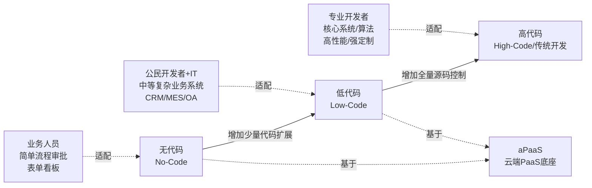

业界一个被广泛引用的最佳实践分层模型给出了三类技术的协同分工："**80%的日常需求基于零代码**（拖拽设计表单、流程、应用、报表，AI辅助生成）；**15%的复杂需求基于低代码实现**（业务对象设计、逻辑编排、在线编码扩展UI、API集成）；**5%极复杂需求由高代码增强**（低代码与高代码无缝切换，支持源码下载继续高代码开发）"[^14]。这一"80/15/5"的分层模型，实际上回应了行业中长期存在的"低代码能否替代传统开发"之争——**答案不是非此即彼的替代，而是一种功能分层的互补共生**。这一观点也呼应了Gartner在2026年预测中提出的判断：85%的企业级低代码平台将采用"可视化配置+全量源码生成+异构系统集成"的混合架构[^4][^5]。

需要特别强调的是，**当前市场上很多自称"低代码"的产品，实际上只具备零代码的能力**——它们将"拖拉拽"包装为核心卖点，迎合"业务人员都能使用"的伪需求，导致功能与组件被固定化、难以满足企业级复杂场景[^14][^21]。这种"概念错位"是后续章节将反复揭示的、企业选型踩坑的核心根源之一。

## 1.3 传统软件开发范式的结构性瓶颈

要理解LCNC为何能在数字化转型深水期获得快速渗透，必须首先剖析传统"需求→设计→编码→测试→部署→迭代"线性流程在当前业务环境下暴露的结构性瓶颈。这些瓶颈并非传统开发的"原罪"，而是其与"业务变化加速度"不匹配的相对性矛盾。

**第一，开发周期过长，难以匹配业务响应窗口**。传统开发模式下，一个企业级应用从需求收集、原型设计、编码、测试到上线，通常需要经历12个左右的阶段，整体周期为2-3个月乃至更长[^22]。某中小型企业为开发内部项目管理工具，外包报价高达10万元、工期至少两个月，且过程中频繁的需求变更导致沟通成本居高不下，最终上线后功能仍与预期相差甚远[^16]——这是中小企业普遍遭遇的真实困境。Gartner 2023年研究亦显示，传统开发的中等应用周期为3-6个月以上，而通过模块化组件复用，低代码可将这一流程压缩至需求确认3天至上线7天[^22]。

**第二，人力成本高且专业人才稀缺**。Gartner数据显示，单个企业级应用的传统开发平均需要3-5名全栈工程师耗时2-3个月[^15]。一个完整的开发团队通常包括架构师、前端、后端、测试等多个角色，人力成本居高不下；而高编程门槛意味着这一供给端难以快速扩张，最终形成"应用开发需求市场增长与企业IT交付能力差距"的结构性剪刀差[^14]。某物流企业开发库存预警系统，传统模式需要3名程序员，而低代码模式仅需1名IT人员加2名业务人员，人力成本降低60%[^20]——这一对比直观体现了人力门槛差异。

**第三，需求变更响应迟缓**。传统开发依赖频繁的文档同步与会议协调，需求变更需要重新编码与测试，迭代成本高；而低代码平台内置的版本控制和实时协作功能可使沟通效率提升40%[^22]。这一差异在业务变化快速的零售、电商、制造等行业尤为关键——市场窗口转瞬即逝，3个月的开发周期可能意味着错过整个商机周期。

**第四，标准软件"削足适履"现象普遍**。许多企业购买的标准化软件（如标准CRM、ERP）逻辑固定，难以贴合企业实际业务流程，导致"功能是有的但跟业务对不上"的尴尬——某企业的客户分类方式与CRM内置标准不一致，每次录入都要额外转换，既麻烦又易错；这种"企业适应软件而非软件适应企业"的反向适配在中小企业中非常普遍[^23][^24]。同时，纸质审批、Excel"万能临时工"等遗留管理模式进一步放大了组织内部的信息孤岛——某商贸企业曾有20多份Excel同时在用、版本混乱难以汇总，某制造企业的采购审批最长需要两周时间[^23][^24]。

**第五，技术债累积导致维护成本指数级增长**。传统开发的定制化代码导致运维难度大，漏洞修复、功能迭代均需深度解读历史代码；某电商企业的订单管理系统传统年运维成本20万元，迁移至低代码模式后降至6万元，降幅达70%[^20]。这一现象的本质是：**传统开发的边际维护成本随系统复杂度上升呈非线性增长**，而LCNC通过标准化架构有望将这一曲线"拉平"——但这一论断在第4章中将被审视其反面：LCNC自身也可能在长期累积出另一种形态的"低代码技术债"。

下表系统对比了传统开发与LCNC在主要维度上的差异（需要提示：表中数据为厂商与行业研究的宣称值，第3、4章将对其在不同场景下的真实兑现度做实证检验）：

| 对比维度 | 传统开发 | 低代码平台 |
|---------|---------|-----------|
| 开发模式 | 纯编码，从底层搭建 | 可视化拖拽+少量编码，组件化复用[^20] |
| 开发效率 | 中等应用3-6个月+ | 提升60%-80%，周期缩短至数天-数周[^20][^22] |
| 人力需求 | 完整团队（架构师+前后端+测试） | 减少50%-70%，业务人员可参与[^20] |
| 技术门槛 | 需精通多门编程语言与框架 | 低，非专业开发者可参与[^25][^20] |
| 变更响应 | 慢，需重新编码测试 | 灵活配置，实时调整，热更新[^25][^20] |
| 维护成本 | 高，依赖专业人员维护复杂代码 | 降低50%-70%，标准化架构+自动化运维[^20] |
| 错误率 | 较高 | Gartner研究显示降低35%[^22] |

需要强调的是，传统开发的"瓶颈"并非意味着其失去价值——对于核心算法、高性能系统、强定制化UI/UX等场景，传统开发仍是不可替代的选择，这一边界将在第7章中详细讨论。**本节的目的是说明：在"标准化业务系统快速交付"这一特定问题域下，传统开发的结构性瓶颈为LCNC提供了客观的市场空间**，而非论证传统开发已被替代。

## 1.4 LCNC价值主张的四大支柱与作用机制

基于上述背景，可以系统归纳LCNC平台所主张的价值，提炼为四大支柱及其底层作用机制。这些价值主张构成后续章节"效率红利实证检验"与"维护陷阱反向审视"的理论起点。

**支柱一：效率支柱——开发周期与交付速度的数量级压缩**。其作用机制有三：可视化建模将抽象的代码编写转化为直观的拖拽配置，降低认知负载；预置组件库与行业模板（如简道云覆盖CRM/ERP/OA/项目管理[^23]、伙伴云提供上百套行业模板[^6][^7]、云捷预置200+制造业模板[^6]）使80%标准化场景可直接复用；AI辅助生成（自然语言转表单、流程、领域模型）进一步压缩从需求到原型的时间。综合效果是开发效率提升5-10倍[^26][^1]，应用交付从3-6个月缩短至2-4周[^4]，部分场景甚至以小时级完成（如某零售企业会员系统从需求到上线仅用72小时[^15]）。

**支柱二：成本支柱——综合成本结构的多维优化**。基于葡萄城《企业级低代码技术及应用白皮书》的数据，低代码项目平均人力投入仅为传统开发的30%-50%，综合成本节省幅度达30%-80%[^20]。其机制包括：人力成本压缩（减少50%-70%）、运维成本下降（降低50%-70%，得益于标准化架构与自动化运维）、部署成本优化（云原生部署使基础设施成本节省50%以上）、迭代试错成本降低（敏捷迭代+热更新支持）[^20]。具体案例佐证：宁波爱健轴承通过低代码搭建"智造云"平台，运营成本降低21.16%[^20]；某零售企业较传统开发节省87%成本[^15]；专家估计企业引入无代码平台可降低30%以上的IT运营成本[^15]。**值得审慎关注的是，这些成本节省数据多为厂商案例，且通常聚焦于初期建设阶段，长期TCO（总体拥有成本）则可能呈现不同图景——某零售集团CIO的TCO分析显示，低代码项目在第三年往往出现成本拐点，五年扩展成本可能因定制化需求叠加而高于传统开发**[^27]，这一警示将在第4章详细展开。

**支柱三：质量与一致性支柱——标准化降低错误率、提升治理水平**。LCNC通过统一的开发规范、组件库与底层架构，使应用呈现高度一致性，避免传统开发中不同团队、不同技术栈带来的系统碎片化[^16]。Gartner 2023年研究显示，低代码开发团队基础功能模块的错误率较传统开发降低35%[^22]。这种一致性还带来治理便利：版本控制集中化、权限策略标准化、合规审计可追溯化，使企业能够更系统地管理应用资产。

**支柱四：敏捷与协同支柱——业务-IT协同范式的重构**。这是LCNC最具组织变革意义的价值——它通过降低技术门槛，让业务部门员工（销售、财务、HR等）以"公民开发者"身份直接参与应用开发[^15][^16]。其作用机制是**重新分配业务与IT之间的责任边界**：业务方掌握需求最一手的信息、负责60%零散需求的自主搭建，IT团队则聚焦20%核心复杂场景与平台治理[^8]。微软Power Platform用户调研显示，跨部门协作项目交付周期从传统模式的12周缩短至8周，沟通效率提升40%[^22]。这一支柱在更深层次上呼应了"敏捷开发"理念——使产品负责人、设计师、开发者、业务方在同一节拍下协作，缩短反馈环路[^28]。

四大支柱并非彼此独立，而是构成相互强化的价值闭环：

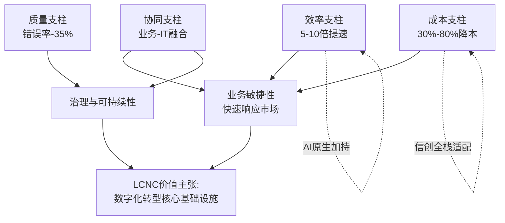

**一个关键洞察是：四大支柱所宣称的价值，本质上是"在标准化场景下、在初期建设阶段、在理想治理条件下"的潜力上限，而非企业实际可获得的稳态收益**。其在不同业务复杂度、不同时间尺度、不同组织能力下的真实兑现程度，正是本研究后续章节要回答的核心问题。这一前置警示，正是Rubric中"短期收益与长期成本的时间维度分析"与"场景化与边界条件清晰"两项原则在本章的具体体现。

## 1.5 核心争议与本研究的四大关键问题

LCNC的高速增长与高维度价值主张，并未消除而是放大了行业中的认知分歧。这些分歧在企业实际选型与落地中转化为具体的"踩坑"——理解这些分歧，是构建本研究问题框架的起点。

**第一类争议：宣传话术与落地体验的落差**。厂商对"全栈能力"、"AI驱动"、"开发效率提升300%-500%"的宣传，与企业实际落地中遭遇的"用低代码开发demo只需3天、优化适配却要3个月"形成鲜明反差[^12]。技术团队的吐槽并非个例：定制化不足、性能瓶颈、安全隐患、AI生成准确率不达预期等问题在2025年前后引发了行业的"祛魅讨论"[^12][^29]。瑞士信贷银行一项对200家企业的调研显示，**42%的低代码项目在进入第二阶段时遭遇严重适配性问题**[^27]——这一比例足以说明"宣称值"与"中位真实值"之间存在系统性偏差。

**第二类争议：短期效率红利与长期维护成本的时间博弈**。LCNC在初期建设阶段呈现明显的成本与速度优势，但在第三年前后往往出现"TCO拐点"：供应商锁定使迁移成本可能高达原始投入的180%（Mendix案例）[^27]、性能优化在并发用户超过5000时可能抵消初期速度优势（OutSystems案例）[^27]、定制化代码堆积使后期维护变得不可持续[^21]。Forrester在2025年Q2专业开发者低代码平台评估中也明确将"AI增强能力、信创适配、可扩展架构、行业解决方案成熟度"列为竞争力的四大核心指标[^4][^10]——这一指标体系的演变，本身反映了行业对"长期可扩展性"关切的上升。

**第三类争议：业务管理者视角与开发者视角的立场分歧**。业务管理者倾向于关注降本、加速、业务自主性等短期可量化的KPI，而专业开发者更关注可扩展性、代码可控性、技术债务、职业发展空间等长期质量维度。这种分歧的深层逻辑是**控制权的让渡与抽象层的泄漏**——LCNC通过抽象屏蔽底层复杂度获得效率，但当抽象失效时（如复杂逻辑、性能瓶颈、跨系统集成），开发者必须穿透抽象层去理解平台内部机制，反而比传统开发更困难。这一争议在第5章将被深入剖析。

**第四类争议：未来格局走向的判断分歧**。一种观点认为LCNC将逐步替代大部分传统开发——Gartner预测到2026年70%新应用将通过LCNC构建[^4][^8][^5]；另一种观点认为LCNC仅适用于特定业务场景，永远无法取代纯代码开发，正如视频无法完全取代图文[^1]。第三种观点（也是本报告倾向的初步判断）认为，AI原生与高低代码融合将催生一种新的混合范式，其中传统开发与LCNC不再是替代关系而是分场景共生关系[^12][^29][^5]。

基于上述争议，本研究将贯穿后续七章回答以下四个关键问题：

| 关键问题 | 研究维度 | 对应章节 |
|---------|---------|---------|
| **Q1：影响幅度问题**——LCNC对传统开发流程的影响是"颠覆性替代"还是"补充性优化"？其重构开发链路的深度与边界何在？ | 流程重构维度的实证分析 | 第2章 |
| **Q2：效率真实性问题**——LCNC宣称的5-10倍效率提升、300%-500%开发加速在多大程度上为真？在哪些场景下兑现、哪些场景下被高估？ | 多源数据交叉验证、实测案例剖析 | 第3章 |
| **Q3：维护成本与代价问题**——LCNC在长期使用中是否会带来被低估的隐性成本（技术、组织、治理）？这些成本的发生概率与代价规模如何？ | 隐性成本归纳与案例量化 | 第4章 |
| **Q4：视角分歧与未来走向问题**——业务管理者与专业开发者对LCNC的认知分歧本质是什么？AI原生、信创适配、高低代码融合等趋势将如何重塑LCNC与传统开发的关系？ | 视角对比、趋势研判、选型框架 | 第5、7、8章 |

本研究的整体立场是**辩证而非二元**的：既不盲从厂商宣传将LCNC视为"银弹"，也不基于个别失败案例否定其价值，而是力求在"在何种条件下、对何种主体、产生何种程度的影响"这一条件性分析框架下，给出有数据、有边界、有时间维度的判断。下一章将率先进入Q1的回答——从需求建模、角色协作、生命周期管理、AI原生、高低代码融合、部署运维六个维度系统剖析LCNC对开发链路的重构深度，验证其究竟构成"流程优化"还是"范式革命"。

# 2 低代码/无代码平台对开发流程的重构维度

第1章已经勾勒出LCNC在中国市场的增长态势、概念边界与价值主张，并将其定性为"在标准化业务系统快速交付这一特定问题域下"对传统开发瓶颈的回应。然而，"市场增长"与"价值主张"本身并不能直接回答全报告的核心问题Q1——LCNC对传统开发流程的影响究竟是**颠覆性的范式革命**，还是**补充性的流程优化**？要回答这一问题，必须深入开发链路本身，逐一审视LCNC在哪些环节、以何种机制、在何种深度上重构了传统的"需求→设计→编码→测试→部署→运维"线性流程。

本章将从六个维度展开机制性剖析：需求建模方式（自然语言→领域模型）、角色协作模式（公民开发者崛起与责任边界再划分）、生命周期管理（DevOps与CI/CD的低代码化）、AI原生能力嵌入（从代码辅助到多智能体协同）、高低代码融合架构（80/15/5的分层共生）、以及部署运维方式（云原生一体化）。每一维度均以"重构机制+实证案例+边界条件"的三段式结构展开，最后在第2.7节给出综合判断。需要预先说明的是，**本章在六个维度上的考察将揭示一个分层异质的图景：LCNC的重构深度在不同维度上并不均等**，前端交互层与协作层的革命性较强，而底层架构与复杂逻辑层仍以优化为主；这一分层判断将成为第3章效率红利实证检验、第4章维护代价反向审视的机制性基础。

## 2.1 需求建模方式的重构：从代码逻辑到自然语言驱动的领域模型

传统开发范式中，业务需求从产生到落地通常需要经历多次"翻译"：业务方口述或文字化需求 → 产品经理整理为PRD文档 → 架构师转化为系统设计与数据模型 → 开发者编写代码实现 → 测试者基于需求文档验证。每一次翻译都伴随信息损耗与歧义引入，最终上线的应用往往与最初的业务设想存在显著偏差，"功能是有的但跟业务对不上"成为传统模式中被广泛吐槽的现象。一份由产品经理出具的标准化产品文档、配合UI设计图与需求评审，前后端分别开发后再调试，是高代码模式下绕不开的繁复链路[^30]。

LCNC在需求建模层面的第一重重构，是将上述线性翻译链路压缩为"业务逻辑梳理+实体评审→直接进入功能开发"的短链路。Mendix在华晨宝马物流部门的落地经验表明，开发人员不再区分前后端，仅需按模块或功能点同步调整与测试，这一结构性改变将沟通带来的偏差风险与成本显著降低，整体项目开发时间相较传统高代码流程缩短了约30%、人力资源节省50%[^30]。这一压缩并非依靠单点工具改进，而是依靠**可视化建模将"需求—实现"映射为同一份制品**——业务实体一旦在平台中评审通过，即直接成为可执行模型的骨架。

第二重、也是更具变革意义的重构发生在2025—2026年AI原生平台兴起之后：自然语言直接驱动领域模型生成。业务人员只需用自然语言描述"我需要一个采购审批流程，金额超10万需部门经理审批，超50万需总经理审批"，AI即可解析意图，自动生成符合BPMN标准的流程模型，包括节点类型、条件分支与权限分配[^31]。这种模式下，需求与实现之间的"翻译"环节理论上被压缩为一次AI解析，开发效率被宣称从线性提升跃迁为数量级提升，行业测算给出AI原生开发可将效率提升300%—500%的区间[^31]。第1章引用的JNPF平台数据显示其"自然语言转领域模型"的准确率已达82%，钉钉宜搭通过接入DeepSeek，使非技术用户能够通过拖拽与自然语言相结合的方式快速创建AI应用[^32]，飞书aily则进一步把"通过自然语言生成贴合自身场景的专属AI助理"的门槛降到几乎为零，业务人员无需写代码、无需迁移历史数据即可直接调用飞书文档、知识库与项目管理中的既有数据[^33]。

这种重构对"需求—实现一致性"的提升具有结构性意义。在传统模式下，业务方提出"我要一个能根据销售员拜访客户后自动整理记录的工具"这一类模糊需求，往往需要数周的需求澄清才能进入开发；而在有零有食的实践中，销售员拜访客户回来后只需把整理工作交给AI助理，AI按预设要求把关键信息整理好存入系统，一线员工自己即可完成应用搭建[^34]。北京中学英语教师赵博鑫在零编程基础的前提下，仅用约2天时间就用飞书aily搭建了"北中英语赵老师智能体"，按中考评分标准批改作文并给出修改建议，10天内完成390次对话[^35]——这一案例的关键意义在于，**当需求提出者本身即是应用搭建者时，"需求—实现"的语义偏差被结构性消除**。

但需求建模重构同样存在清晰的边界。第一，**自然语言转模型的82%准确率意味着仍有约18%的语义需要人工校正**，在涉及复杂业务规则、行业术语、多对多实体关系的场景下，这一比例可能进一步上升。第二，自然语言天然带有歧义，业务方"我需要一个看上去专业一点的报表"这类模糊指令难以被结构化解析，AI最终生成的仍是预置模板的组合而非真正"懂业务"的方案。第三，**这一重构在"流程类、表单类、看板类"标准化业务场景中表现最佳**，但对于深度依赖领域知识的核心系统（如风控模型、供应链优化算法），自然语言到模型的映射链条仍需要架构师介入完成抽象层的桥接。

综合来看，需求建模方式的重构在标准化场景下已具备**范式革命特征**——它改变了"谁可以发起开发、如何描述需求"的根本问题；但在复杂业务语义层，传统的需求工程方法仍不可或缺，重构呈现出明显的"前端革命、后端延续"特征。

## 2.2 角色协作模式的重构：公民开发者崛起与业务-IT责任边界再划分

如果说需求建模的重构改变了"如何描述需求"，那么角色协作模式的重构则改变了"谁来做开发"这一更根本的问题。传统开发范式以"业务方提需求—IT做实现"的串行协作为主，业务部门长期处于需求方的被动位置，IT部门承担几乎全部的开发负担，这一结构在数字化需求爆发期暴露出严重的供给瓶颈：《2024数字人才白皮书》数据显示，74%的企业存在数字人才缺口，其中44%认为缺口"非常紧缺"，专业开发人员的短缺直接导致企业应用开发周期拉长、难以快速响应业务变化[^31]。

LCNC的核心组织变革，是催生了**"公民开发者+专业开发者+IT治理"的三元协作结构**。这一结构在多个标杆案例中已经具象化：

**华晨宝马大东工厂物流部门**的实践具有教科书意义。该部门组织了40名来自物流、采购、机械等不同专业背景的同事参加Mendix培训，经过一个月学习后全部取得Mendix快速开发者认证，业务团队可以按照敏捷方法论独立输出标准业务需求说明与用户故事[^30]。在协作模式上，IT部门负责完成高阶技术点的组件化工作（如数据湖连接器、身份认证、邮箱集成），业务部门则专注于应用页面与功能设计——形成"业务主导上层逻辑设计，IT配合底层系统集成"的新分工[^30]。该部门首批3个应用上线即实现项目周期缩短30%、人力资源节省50%，并已规划10余个待开发应用[^30]。

**有零有食冻干零食公司**的实践则展现了协作重构在中型企业中的延伸形态。该公司CIO龙眼将钉钉宜搭低代码平台定位为"门槛低、上手快、灵活开放"的平台，IT小团队用它快速解决大难题，业务一线人员也能轻松搭建顺手的工具[^34]。物流部门IT人员与物流人员协同搭建"物流管家"系统后，运输准点率从90%提升至96%，软件采购费、运输路线优化、损耗减少综合每年节约约150万元；销售、生产部门则分别基于平台搭建AI助理与AI巡检助手[^34]。这一案例的关键在于，**IT部门的角色从"开发者"转变为"赋能者与底座维护者"**，而业务部门则成为应用迭代的实际驱动力。

**远东控股采购部门**的实践展现了协作重构在跨系统集成场景中的能力。其在钉钉平台上"像拼乐高一样"将SRM、OA、ERP的关键接口重新组装，一个应用界面即可完成从比价到合同审批的全流程，原本需要一周的流程被压缩到一两个小时[^34]。微软Power Platform用户调研也显示，跨部门协作项目交付周期从传统模式的12周缩短至8周，沟通效率提升40%（数据已在第1章引用）。

业务-IT协同的极端形态出现在教育与个人场景中。北京中学的赵博鑫老师在毫无编程基础的前提下，通过飞书aily搭建AI智能体批改作文，节省了原本每天2-3小时的机械批改时间，将精力转向数据分析与学生关怀[^35]——这意味着**LCNC的"公民开发者"边界已从企业IT人员、业务骨干，进一步延伸到行业一线工作者**。

Gartner曾预测到2026年80%的低代码平台用户将来自非IT部门[^36]。从上述案例看，这一预测在方向上是可信的，但其兑现程度高度依赖以下三类组织前提：

**第一，培训与认证机制的成熟度**。华晨宝马案例中，业务人员经过"40人集中培训+一个月学习+认证考核"才形成开发能力，这意味着公民开发者并非"零门槛立刻上岗"，而是需要企业承担培训投入。**第二，治理机制的同步建设**。当大量业务人员开始独立搭建应用时，"影子IT"与"应用孤岛"的风险随之上升——若缺乏统一的版本管理、权限治理与审计机制，多人多部门并行开发可能在中长期累积成新的治理难题（这一隐性成本将在第4章详细展开）。**第三，业务-IT分工的清晰边界**。宝马案例之所以成功，关键在于明确了"IT做底层连接器、业务做上层应用"的边界；当这一边界模糊时，业务方可能尝试用低代码处理超出其能力范围的复杂逻辑，反而拖慢交付。

综合而言，角色协作模式的重构在组织能力具备的前提下呈现明显的**范式革命特征**——它不仅改变了开发的执行主体，更重构了业务部门在数字化中的话语权与自主性。但这一革命并非自动发生，它需要培训投入、治理体系、分工边界三项前提同步到位，**否则容易从"三元协作"退化为"业务方失控搭建+IT方被动救火"的反模式**。

## 2.3 开发生命周期管理的重构：低代码化的DevOps与CI/CD整合

传统开发的生命周期管理依赖一套相对松散的工具组合：Jira管需求、Git管代码、Jenkins/GitLab CI管流水线、Prometheus/ELK管监控、PagerDuty管告警，这些工具之间通过插件、Webhook、人工同步等方式拼接。各工具的独立性带来灵活性，但也导致**端到端追踪困难、跨工具数据不一致、人为操作出错率高**，需求—代码—测试—发布—反馈的闭环难以形成。

LCNC平台在生命周期管理层的重构，本质上是将上述工具组合**内嵌为平台底座的标准能力**，从"工具组合"升级为"一体化平台"。这一重构包括五个层面：

**第一，需求与变更管理的统一化**。低代码平台需支持多渠道需求收集与统一管理、需求优先级评估及影响分析、变更跟踪与版本控制、端到端需求追踪——确保开发与业务目标高度一致[^37]。形成"需求收集→需求评审→任务拆解→开发实现→测试验证→发布上线→收集反馈→需求调整"的闭环[^37]。这一闭环在传统DevOps中需要通过Jira+Confluence+Git三套工具拼接实现，而在LCNC平台中被压缩为单一界面下的连续操作。

**第二，进度与资源管理的智能化**。LCNC平台内置敏捷看板、甘特图等多维度展示，结合机器学习预测进度风险点、自动资源分配与冲突解决、跨项目资源协调促进资源共享[^37]——这些原本依赖项目经理人工调度的工作，被部分迁移到平台的智能调度引擎。

**第三，质量保障的智能化与自动化**。低代码平台的测试管理模块可覆盖自动化测试脚本管理、缺陷追踪、代码质量分析等多重功能，并融合AI能力实现智能生成测试用例、自动缺陷分类与优先级评估、代码静态与动态分析结合、与CI/CD无缝对接[^37]。微软在2026年1月推出的Copilot Studio VS Code扩展是这一趋势的代表性体现：它将智能体定义集成到Git版本控制系统，支持版本管理、请求式审查、更改预览，并支持将智能体集成到标准CI/CD流水线中进行测试与部署，同时整合GitHub Copilot与Claude Code辅助开发者起草、更新和排查智能体定义[^38]。这一架构表明，**LCNC并非取代Git/CI/CD，而是将自身的可视化定义"代码化"后接入既有DevOps工具链**，从而保留专业团队的工程化习惯。

**第四，云原生应用全生命周期的代码化管理**。CODING推出的应用中心Orbit作为云原生应用全生命周期管理系统，将应用模型通过代码化方式描述并存储在Git仓库中，借由Git的版本提交记录与合并能力为应用模型的演进提供可追溯、可审计的能力，并支持原子化发布与回滚[^39]。这种"应用即代码"（Application-as-Code）的范式，使LCNC平台的生命周期治理具备了与传统软件工程相当的严谨度。

**第五，AI赋能的全链路智能辅助**。AI的价值不仅体现在开发阶段，在应用运行过程中，AI可以持续分析数据、优化流程、预测风险；在维护阶段，AI可以自动排查故障、推荐修复方案[^31]——形成"开发—运行—运维"的AI陪伴闭环。

下表对比了传统DevOps工具组合与LCNC一体化平台在生命周期管理各环节的差异：

| 生命周期环节 | 传统DevOps | LCNC一体化平台 |
|------------|-----------|---------------|
| 需求管理 | Jira/Trello（独立） | 平台内置，与模型直接关联 |
| 版本控制 | Git + 人工流程 | 平台原生版本控制，部分支持Git集成 |
| 测试 | Jenkins+测试框架（拼接） | 内置自动化测试+AI生成用例 |
| CI/CD | Jenkins/GitLab CI（独立） | 平台内置流水线+一键部署 |
| 监控运维 | Prometheus+ELK+PagerDuty | 平台环境监控+AI故障诊断 |
| 端到端追踪 | 跨工具人工拼接 | 单一平台内闭环 |

需要审慎指出LCNC生命周期管理的两类边界。**第一，在大型项目的复杂分支管理上，LCNC平台的能力相对有限**——传统Git的分支策略（trunk-based、Git Flow、GitHub Flow等）在LCNC原生版本控制中通常被简化为"草稿—测试—生产"三段式，难以应对多团队并行、多版本同时发布的复杂场景。Copilot Studio选择以VS Code扩展形式接入Git而非自建版本控制系统[^38]，本身就是对这一边界的承认。**第二，多环境治理（开发、测试、预发、生产）在LCNC平台中往往依赖平台厂商提供的固定环境模型，企业自定义的多套预发环境、灰度发布策略、特殊合规环境的支持较弱**。这意味着，LCNC在生命周期管理维度的重构属于"工业化整合与效率提升"，但尚未颠覆软件工程的方法论本身——这一判断对应本章末"流程优化"而非"范式革命"的定性。

## 2.4 AI原生能力嵌入：从代码辅助到多智能体协同的底层重构

2025年被业界广泛认定为"AI Agent元年"，这一年AI智能体技术从概念验证走向实际应用与产业化[^40]，国务院《关于深入实施"人工智能+"行动的意见》明确提出培育"模型即服务"和"智能体即服务"等新业态[^40][^41]，2025年上半年中国AI Agent领域融资总额已超过80亿元人民币[^40]。在这一宏观趋势下，LCNC平台中AI能力的角色发生了**从"插件式辅助"到"底层架构组件"的质变**——这是六个重构维度中变革最深刻、对未来格局影响最大的一维。

第1章已指出，"很多所谓AI+低代码的产品只是在界面里嵌入了一个AI问答助手，这种插件式融合并未触及本质"[^31]。真正有价值的融合应当体现在三个层面：**自然语言驱动开发**（已在2.1节论述）、**应用本身具备智能执行能力**、**全链路AI陪伴**[^31]。其中第二层最具范式意义——**融合AI后的低代码平台开发出的应用本身也具备智能执行能力**：例如一个库存管理应用不仅能记录数据，还能通过AI自动识别库存异常、触发补货流程、调用外部供应商API下单，全程无需人工干预[^31]，这意味着应用从"被动工具"进化为"主动Agent"，正是超自动化（Hyperautomation）理念的核心落地路径[^31]。

具体的产业化进展已在多个标杆平台中显现：

**致远互联CoMi平台**形成"云原生平台（V5/V8）+AI原生平台（CoMi）"的双轮驱动格局，构建"平台底座+业务场景+智能引擎"三层架构[^42]。CoMi Agent平台从1.0迭代至2.0，整合DeepSeek、通义千问等主流大模型与自研协同运营垂直领域模型，提供从模型应用评测、微调、部署、测试、发布到服务的全流程一站式交付能力[^42]。在业务场景层面，致远互联推出30+开箱即用业务型Agent，覆盖智能公文、智能合同、智能问数、智能会议、投资管理、营销管理、GRC合规等高价值场景，并形成"低代码+Agent"双模定制机制[^42]。商业化层面，2025年AI关联合同订单金额达2.07亿元，正式进入规模化变现阶段[^42]。

**微软Copilot Studio**展现了国际厂商在AI原生方向的产品路径。该平台支持通过可视化拖拽界面、多人协作开发、无需编码即可集成企业数据源、连接器及GPT模型；2025年4月新增"计算机使用"功能，让Agent直接与网站、桌面应用程序互动；同年5月引入多智能体编排技术，允许跨Microsoft 365与Azure AI服务的智能体协同运作；11月在Ignite 2025大会上宣布Copilot Studio支持部署至Windows 365智能体版，并扩大与Anthropic的战略合作，使Claude Sonnet 4.5、Haiku 4.5与Opus 4.1全面支持其功能升级[^38]。其底层平台Azure AI Foundry已被80%的财富500强企业使用，2025年Q2处理的tokens超500万亿、同比增长超7倍，agent service客户数达1.4万，集成包括Grok-3在内的1900+模型[^41]。

**飞书aily**则呈现了AI原生在协同办公生态中的深度落地。飞书提出AI助理从L1到L4的进化论框架：L1辅助助手负责信息查询表达（如"嘴"）、L2情报员主动感知业务变化（如"眼睛与耳朵"）、L3教练专家沉淀知识资产并给出决策建议（如"大脑"）、L4管理分身像管理者一样自主规划调度执行业务流程（如"手与脚"）[^33]。飞书消费综合行业首席AI专家傅强将自己过去一年约50万字的会议发言、文档、周报"喂"给AI生成的数字分身，预审周会材料、批阅文档的评判准确率达到七成以上，并基于此部署了AI汇报复盘助手、AI故事线参谋、AI客户调研助手等多个专项Agent[^33]。**小鹏汽车的AI助理IRON深度集成企业内44个服务台、2000万份文档和85个消息渠道，半年内为公司节省1800万元成本**[^33]——这一案例量化了AI原生在大型企业中的实际经济价值。

工业制造场景的AI落地更具复杂性。**亿咖通科技**作为全球出行科技企业，技术产品已搭载于全球超1100万辆汽车，借助飞书的智能体能力解决全球供应链协同问题[^43]。中国工业企业应用大模型与智能体的比例从2024年的9.6%快速跃升至2025年的47.5%，研发、制造、供应链等多环节同时应用的企业比例从1.7%跃升至35%[^43]，2025年中国规模以上制造业企业AI技术应用普及率超过30%[^43]。

下图汇总了AI原生在LCNC中的三层重构机制：

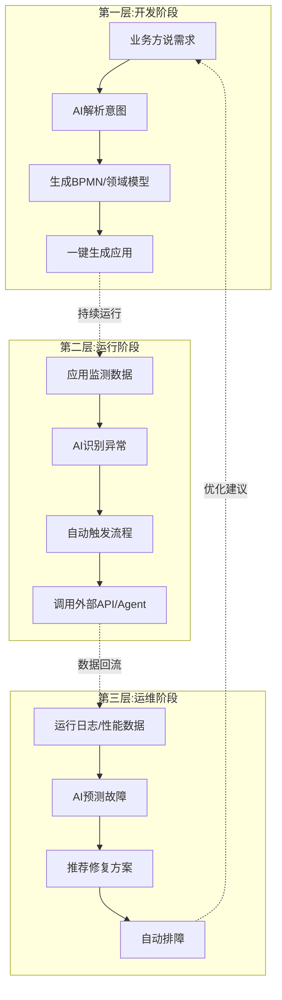

需要审慎指出AI原生能力嵌入的三类边界。**第一，"300%-500%效率提升"在企业级复杂场景中的兑现度仍待验证**。第1章已指出该数据多来源于厂商或行业协会，业界普遍认为2025年是"探索元年"而非"通用智能体实现之年"，企业部署普遍采用"有限自主+人工守门员"的混合模式[^40]。**第二，AI生成的准确率仍有上限**。即便顶尖平台的"自然语言转模型"准确率达到80%以上，剩余20%的语义偏差在涉及复杂业务规则、合规审计的场景中可能放大为严重风险——Gartner明确指出"AI将增强而非取代AI低代码平台，后者的核心价值在于为AI生成内容提供治理机制，包括访问控制、审计日志和内置验证框架"[^44]。**第三，多智能体协同的可靠性尚处于早期**。Anthropic的MCP协议、谷歌的A2A协议等开放标准刚刚推出[^40]，跨智能体的状态一致性、错误传播、安全边界等工程问题仍在演进中。

综合来看，AI原生能力嵌入是LCNC六个重构维度中**范式革命特征最明显的一维**——它不仅改变了"如何开发"，更改变了"应用是什么"（从被动工具变为主动Agent），并在长期推动LCNC从"应用生成工具"转向"AI业务化承载平台"[^44]。这一维度的演进速度，将在第7章未来趋势研判中作为核心变量重新审视。

## 2.5 高低代码融合架构：80/15/5分工与混合开发范式的形成

在LCNC的能力宣传中，"全栈替代传统开发"是一个流传甚广但容易引起误读的命题。如果把开发模式分为"完全替代论"与"完全互补论"两极，那么过去三年的产业实践更倾向于在中间形成第三种立场：**高低代码不是替代关系，而是分层共生的新范式**。第1章末已引用业界提出的"80/15/5"分层模型，本节将在架构层面剖析这一模型的落地机制。

第三方研究为这一融合趋势提供了量化支撑。Gartner预测到2026年80%的企业应用将通过低代码/无代码平台构建，开发时间缩短70%、成本降低60%[^36]；同时Gartner预计到2026年85%的企业级低代码平台将采用"可视化配置+全量源码生成+异构系统集成"的混合架构（数据已在第1章引用）。Forrester在2025年Q2专业开发者低代码平台评估中将OutSystems等厂商列为领导者并定位为"best-in-class AppGen platform"[^45]。这两组数据共同指向：**无代码是规模化落地的加速器，但复杂场景仍需传统开发兜底**[^36]。

业界对"专业低代码"的定义清晰刻画了融合架构的四大特征：

**第一，模型驱动的架构基础**——无代码的可视化建模建立在专业代码之上，模型输出的是可执行的专业代码，而非封闭的专有格式[^36][^46]。这意味着低代码生成的"产物"在底层仍是工程化的代码资产，可被审查、调试、优化。

**第二，双向可逆与持续迭代**——在低代码设计过程中可以随时切换到专业代码开发，且这种切换是可逆、可持续迭代的[^36][^46]。这一特征解决了传统低代码平台"一旦切换到代码就回不来"的痛点。

**第三，统一的版本与运维管理**——无论通过无代码配置还是传统代码编写，交付物都纳入统一的版本管理、DevOps流水线和运维体系[^36][^46]，初级开发者与高级开发者基于统一的开发环境与工具紧密分工协作[^46]。

**第四，业务与IT的协同分工**——业务专家通过可视化工具完成80%的标准化功能，专业开发者聚焦剩余的20%复杂逻辑，两者在同一平台上协同，避免"影子IT"和数据孤岛[^36]。

这一融合架构在标杆平台中的具体落地形态各有侧重：

**JNPF平台**的产品定位是"具备低代码模型与可视化设计能力，同时让开发人员在低代码设计的同时可以随时进行专业原生代码开发"[^46]，前端采用Vue、Element-UI，后端采用Java（.NET）、SpringBoot，支持分布式与K8s集群部署，适用于开发ERP、MES等复杂业务系统，采用可视化组件模式可以有效扩展不同业务功能且不会导致系统臃肿，按需引入即可[^46]。

**云表平台**则基于独创的表格编程技术，用户通过"画表格"的方式即可定义业务单据、流程规则、数据模型，操作界面与Excel高度兼容，业务人员可快速上手；同时支持开发ERP、MES、WMS、QMS等核心业务系统，可处理高并发、复杂组织架构、多级权限管理等企业级需求；当标准化配置无法满足时，平台支持专业代码扩展和异构系统集成[^36]。其全栈信创适配（国产芯片、操作系统、数据库，等保三级认证）使其能够满足金融、政务等高安全合规场景[^36]。实践案例中，**某制造企业用云表重构ERP，开发成本降低80%、年节约运营成本超200万元；某汽车零部件厂商用云表开发智能质检系统，缺陷检出率提升至99.5%**[^36]。

**Mendix在华晨宝马的实践**则展现了融合架构在跨国企业中的协同形态——IT团队通过编写连接器、身份认证、邮箱集成等高阶组件构建底层能力，业务团队基于这些底层组件搭建上层应用[^30]，本质上是80/15/5模型在组织维度的具体投射。

下表系统化呈现了80/15/5分层模型的落地机制：

| 分层 | 占比 | 开发主体 | 典型场景 | 技术形态 |
|-----|-----|---------|---------|---------|
| **零代码层** | 80% | 业务人员（公民开发者） | 表单、流程审批、数据看板、报表 | 拖拽配置、AI辅助生成 |
| **低代码层** | 15% | IT人员/资深业务 | 业务对象设计、逻辑编排、UI扩展、API集成 | 可视化建模+脚本扩展 |
| **高代码层** | 5% | 专业开发者 | 高性能算法、核心引擎、底层架构 | 全量源码、可下载继续开发 |

这一分层模型的深层含义是：**LCNC并非要消灭高代码，而是要消灭"用高代码做80%重复性工作"的浪费**。Gartner预测到2026年80%的低代码平台用户将来自非IT部门，意味着构建企业应用的主力军日益成为业务专家而非软件工程师[^36]——但这与"低代码替代传统开发"是两回事。专业开发者借助低代码工具会"如虎添翼，效率倍增，进入全新的编程境界"[^46]，而非被低代码所淘汰。

这一融合架构同样存在边界。**第一，并非所有所谓的"低代码"平台都真正具备融合能力**——很多平台仅停留在可视化层，模型输出的是封闭的专有格式，一旦切换到代码就无法回退，这种平台所声称的"融合"实质是"伪融合"。**第二，融合架构对企业的工程化能力提出了更高要求**——业务方与专业开发者在同一平台上协作，需要统一的版本管理、代码规范、CI/CD流水线，这本身就是对企业研发治理能力的考验。**第三，分层比例并非普适常数**——80/15/5是行业经验值，具体比例随业务复杂度、行业特性、企业规模而变化：在标准化程度高的零售、办公场景中可能达到90/8/2，而在风控、核心交易等场景中可能反向为40/40/20。

综合判断，高低代码融合架构呈现的是**"分层共生的新范式"**——它既不是范式革命（高代码并未消失），也不是简单优化（开发主体与协作模式发生了根本变化）。这一范式回应了第1章末提出的"低代码能否替代传统开发"之争：答案是否定的，二者的关系将长期是分工而非替代。

## 2.6 部署与运维方式的重构：云原生底座与一键部署运维一体化

开发流程的"最后一公里"是部署与运维。在传统开发模式下，应用从开发完成到上线运行需要经历环境准备、配置发布、灰度验证、监控接入、故障响应等多个手工或半手工环节，往往依赖运维专家的经验与脚本积累；而云原生（Kubernetes、容器化、微服务、Helm）的兴起本身已对这一环节做出了一轮重构，但其复杂度也成为很多企业落地的"拦路虎"——"云原生本身的复杂程度、CI/CD工作流建设混乱、缺乏成熟的应用运维工具，俨然已成为研发团队迈向先进模式的拦路虎"[^39]。

LCNC的部署运维重构，本质上是**将云原生底座与一键部署运维能力沉淀为平台标准能力**，从"手工部署、专人运维"升级为"一键部署、自动伸缩、智能运维"。

**宏天低代码平台基于阿里云ACK的微前端部署实践**展示了这一重构的工程细节[^47]。该平台采用微前端架构设计，可实现模块解耦、独立部署与灵活扩展；K8s部署清单包含Deployment（管理微前端主应用与子模块的Pod实例，指定镜像、副本数、资源限制）、Service（ClusterIP类型暴露端口配合Ingress实现外部访问）、Ingress（域名映射结合阿里云负载均衡实现HTTP/HTTPS访问）等核心资源；通过Helm Chart对K8s资源进行打包管理，实现一键部署、升级与回滚[^47]。这一架构使企业能够以容器化方式管理低代码平台本身，而非将其作为黑盒部署。

**CODING应用中心Orbit**则提供了云原生应用全生命周期管理的另一种范式。其核心价值在于通过三种方式降低应用云原生化门槛[^39]：

**视角分离**——将K8s YAML文件的模板创建、统一编写规范的工作收缩于团队中的运维角色，通过对K8s运维能力的封装，赋能研发角色交付稳定可靠的云原生应用，避免K8s的编排工作侵入研发流程；研发角色仅需根据由服务模板渲染出的可视化表单，填写运维指定的内容，即可在无需了解K8s集群的情况下轻松完成容器化服务的创建与维护[^39]。

**模块化**——运维角色通过编写Deployment和Service YAML文件定义规范与交付运维能力，应用中心还提供YAML语法提示和检查能力，提高文件编写的可靠性[^39]。

**自动化交付**——基于"infrastructure as code"方法论，应用中心的云资源自动化交付使用代码化与场景化的方式描述云资源，避免反复登录云控制台并付出学习成本[^39]。

**FreeWheel基于AWS的Bingo平台**展示了云原生低代码在中等规模团队中的落地实践。该平台具备低代码平台所应具备的三种核心能力：可视化界面（用户可从组件库以可视化甚至拖拽方式创建服务）、规模化生产（通过服务模板支持不同业务场景的最佳实践）、全生命周期管理（设计、开发、一键部署、运维一体化）[^48]。Bingo平台的实践揭示了一个关键洞察：**LCNC平台对企业的最大价值之一是"打破团队壁垒"**——业务开发团队、基础设施开发团队、运维团队工作在同一平台下，跨团队沟通效率显著提升[^48]。

更深层的趋势是云原生基础设施本身也在朝着"低代码化"演进。**Apache Dubbo的云原生重构**为开发者和企业用户提供了一键部署微服务集群与全新可视化控制台，通过dubboctl命令行可一键初始化和部署微服务集群，无需手动编写复杂配置文件[^49]。这一演进表明，"低代码化"作为一种范式正在向传统中间件领域反向渗透，二者的边界日益模糊。

下图归纳了LCNC在部署运维维度的重构路径：

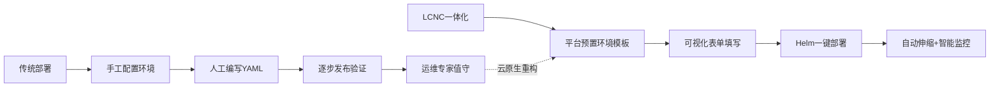

信创全栈适配是这一维度在中国语境下的特殊命题。第1章已指出，国内企业级LCNC平台的市场竞争力直接取决于其对"国产芯片—操作系统—数据库—中间件"全链路的兼容能力，IDC数据显示具备全栈适配能力的国内企业级LCNC平台市场占有率已达58%。云表平台等代表性产品支持国产芯片、操作系统和数据库，通过等保三级认证，满足金融、政务等高安全合规要求，同时支持私有化、公有云及混合部署[^36]。这一适配本身就构成对企业既有运维体系的"二次重构"——从面向x86+Linux+Oracle的运维栈，转向面向鲲鹏/海光+麒麟/统信+达梦/OceanBase的新运维栈，LCNC平台在这一过渡中扮演了"屏蔽底层异构性"的关键角色。

部署运维重构同样存在边界。**第一，对企业既有运维体系的兼容性是一道难题**——已建有Prometheus、ELK、SkyWalking等成熟监控运维体系的大型企业，LCNC平台的内置监控能力可能与既有体系发生冲突，集成成本不容低估。**第二，跨云迁移的能力差异显著**——部分LCNC平台与特定云厂商深度绑定（如钉钉宜搭与阿里云、Power Apps与Azure），从一朵云迁移到另一朵云的成本可能等同于二次开发。**第三，安全合规的责任划分**——平台一键部署降低了运维门槛，但也意味着部分安全配置的控制权从企业运维团队转移到了平台厂商，对于强合规场景（如金融核心、医疗数据）这一控制权让渡需要审慎评估。

综合来看，部署运维方式的重构属于**"流程优化与工业化整合"维度的重构**——它显著降低了运维门槛、提升了部署效率，但并未颠覆云原生的方法论本身（K8s、容器、微服务依然是底层基础）。这一维度的重构红利将在第3章被进一步实证，而其与信创、跨云、合规等约束的兼容性挑战将在第4章被反向审视。

## 2.7 综合判断：六维重构的"流程优化"与"范式革命"之辨

回到本章开篇的问题Q1——LCNC对传统开发流程的影响究竟是颠覆性范式革命还是补充性流程优化？前六小节的分维度剖析揭示了一个关键的分层异质图景：**LCNC的重构深度在不同维度上并不均等，整体定性应为"分层式范式重构"**。

在**需求建模、角色协作、AI原生嵌入**三个维度，LCNC呈现出明显的**范式革命特征**——它改变了"如何描述需求"（自然语言驱动）、"谁来开发"（公民开发者崛起）、"应用是什么"（被动工具→主动Agent）这三个软件工程的根本问题。这三个维度的变革超出了"工具升级"或"流程优化"的范畴，而是在重新定义软件开发活动的核心要素。

在**生命周期管理、部署运维**两个维度，LCNC则属于**"流程优化与工业化整合"**——它显著提升了开发链路的效率与一致性，将原本松散的工具组合整合为一体化平台底座，但并未颠覆DevOps与云原生的方法论本身。这两个维度的重构是渐进式的、增量式的，与传统软件工程方法论形成兼容关系。

在**高低代码融合架构**维度，LCNC呈现的是**"分层共生的新范式"**——既不是范式革命（高代码并未消失），也不是简单优化（开发主体与协作模式发生了根本变化）。80/15/5的分层共生本质上是一种新的工程范式，它要求企业重新设计研发组织、技术栈与治理结构。

下表汇总了六维重构的定性结论：

| 重构维度 | 定性判断 | 革命性强度 | 关键边界 |
|---------|---------|-----------|---------|
| 2.1 需求建模 | 范式革命 | 强 | 复杂业务语义、领域知识深度 |
| 2.2 角色协作 | 范式革命 | 强（前提条件下） | 培训成本、治理体系、影子IT防控 |
| 2.3 生命周期管理 | 流程优化与工业化整合 | 中 | 大型项目复杂分支、多环境治理 |
| 2.4 AI原生嵌入 | 范式革命 | 强（演进中） | 准确率上限、多Agent协同可靠性 |
| 2.5 高低代码融合 | 分层共生新范式 | 中-强 | 平台真伪融合、工程化能力 |
| 2.6 部署运维 | 流程优化与工业化整合 | 中 | 既有运维体系兼容性、跨云迁移 |

这一"分层式范式重构"的判断，与中国信通院《2025低代码&无代码产业双象限》提出的"统一管理+规模化场景应用"价值模型在方向上高度一致[^50][^51]——该框架将低无代码定位于"从传统拖拽式开发向智能组装新范式的跃迁"，并通过转型者象限（积极探索者、单元实践者、领域创新者、全面转型者、鼎新引领者5类）与赋能者象限（创新者、专注者、竞争者、引领者4类）的双维评估，刻画了产业生态的演进路径[^50][^51]。这一官方框架与本章的分维度判断相互印证：**LCNC的影响既是深远的（在多个核心维度具备革命性），又是有边界的（在底层架构与复杂逻辑层仍以优化为主）**。

更进一步，本章的判断为后续章节奠定了三个分析锚点：

**锚点一：分层重构意味着效率红利的兑现也呈分层异质性**。在范式革命特征强的维度（需求建模、AI原生）中，效率提升可能呈数量级跃迁（300%-500%）；在流程优化特征强的维度（生命周期、运维）中，效率提升更可能呈线性改善（30%-70%）。这一分层将在第3章效率检验中被实证。

**锚点二：每个维度的边界条件本身就是潜在的隐性成本来源**。需求建模的语义偏差、协作模式的影子IT风险、生命周期管理的多环境治理弱点、AI原生的准确率上限、融合架构的"伪融合"陷阱、部署运维的厂商锁定——这些边界在第4章将被系统化为"技术性—组织性—治理性"三类隐性成本。

**锚点三：六维重构的不均等性，本身就是开发者视角与业务视角分歧的结构性根源**。业务方更容易感知到需求建模、协作模式、AI原生这三个革命性维度带来的红利（因为它们直接面向业务交付），而开发者更容易感知到生命周期管理、融合架构、部署运维这三个维度的边界与代价（因为它们直接关系到工程化质量）。这一结构性根源将在第5章被深入剖析。

至此，本研究已完成对Q1的初步回答：**LCNC对传统开发流程的影响是"分层式范式重构"——在前端交互层与协作层呈现范式革命特征，在底层架构与复杂逻辑层仍是流程优化与工业化整合，在高低代码融合维度呈现分层共生的新范式**。这一回答既不盲从"颠覆性替代"的厂商话术，也不固守"补充性优化"的传统立场，而是基于六个维度的机制性分析得出的条件性结论。下一章将率先进入Q2——LCNC宣称的5-10倍效率提升、300%-500%开发加速究竟在多大程度上为真，又在哪些场景下被高估。

# 3 效率提升的真实性验证：从宣称到实测

第2章已经从机制层面回答了Q1——LCNC对开发流程的重构呈现"分层式范式重构"，在前端交互与AI原生层具备革命性，在底层架构与生命周期管理层则属流程优化。这一分层判断为本章提供了重要的机制性预判：**既然重构深度在不同维度上不均等，那么由其衍生的"效率红利"也必然呈现分维度、分场景的兑现差异**，而非厂商所普遍宣传的"全场景300%—500%通用提升"。本章承接Q2，将系统检验这一预判：LCNC所宣称的5-10倍效率提升、开发周期从月级压缩到天级、人力投入降至30%—50%、ROI高达140%等数据，究竟在多大程度上为真，又在哪些场景下被系统性高估？

要回答这一问题，必须打破单一数据源的循环引用，从三类来源（厂商宣称、第三方独立研究、实测案例）做三角对照，再分别从交付周期、人力投入、ROI、实测对比、AI准确率五个角度逐一检验，最终在3.7节归纳效率红利兑现度的场景分布图。本章核心论点提前预告：**效率红利真实存在，但呈现高度的场景异质性与时间异质性——在标准化、轻量化、原型阶段红利兑现度高，在复杂业务、深度集成、长期迭代阶段则显著收窄，呈"S型衰减曲线"**。

## 3.1 多源数据交叉验证框架：厂商宣称、第三方研究与实测数据的三角对照

LCNC效率讨论中一个长期存在的方法论问题，是数据来源的"循环引用"——厂商案例引用行业协会数据、行业协会引用厂商案例、媒体则引用两者，最终在公众认知中形成一个看似一致、实则缺乏外部独立验证的数据生态。要打破这一循环，必须先建立一个清晰的可信度梯度框架。

基于本研究所掌握的资料，可将LCNC效率数据来源划分为五个可信度等级。第一级（高可信）为第三方独立研究，代表性数据如Forrester委托研究的Total Economic Impact™（TEI）方法论给出Microsoft Power Platform Premium Capabilities **140%的投资回报率、1425万美元复合收益、应用开发成本降低45%**[^52][^53][^54]，以及Gartner Peer Insights中OutSystems 4.5/5、Appian 4.5/5的同行评分[^55]。这一级数据的特征是方法论透明、样本边界明确，但TEI研究本身仍是"委托研究"，存在样本偏向（受访企业为成功案例）的潜在风险。第二级（中高可信）为行业白皮书与学术报告，如中国信通院在《低代码/零代码开发平台白皮书》中给出的"简易项目效率提升90%、中等复杂项目提升75%、复杂项目提升60%以下"的分级数据[^56]，以及Forrester发布的《面向中国专业开发者的低代码平台格局，2023Q4》报告对中国市场格局的判断[^57]。这一级数据的特征是行业聚合、口径较一致，但仍依赖厂商提供原始数据。第三级（中等可信）为厂商委托或咨询机构发布的行业报告，如IDC市场跟踪、Gartner魔力象限引用的"开发效率平均提升300%以上"[^58]。第四级（场景依赖）为实测案例，如CSDN开发者关于Vite-Vue3-Lowcode的电商页面对比实测（10小时vs 1.5小时）[^59]、AI低代码请假审批系统实测（4-8小时vs 2-4周）[^60]、JNPF与简道云AI在工业巡检与政务审批场景的8年开发者实测[^61]。这类数据的优势是工程细节真实，但局限是个案不可外推。第五级（参考为主）为厂商自身宣称值，如普元宣称的"开发效率提升300%、部署与维护成本降低50%以上、硬件资源需求减少60%"[^58]、卡奥斯天马平台"满足60%+的应用快速开发"[^57]、葡萄城白皮书"低代码项目人力投入仅为传统开发的30%—50%"等。这类数据通常基于最优场景，存在明显的"选择性披露"。

将这五级来源置于"宣称值—中位真实值—实测下限"的三角框架下，可以发现一个**结构性差异图景**：厂商宣称的"300%—500%效率提升"对应Forrester TEI实测的"45%开发成本降低、140% ROI"——二者口径并不直接可比（前者为效率倍数、后者为财务回报），但厂商常将单点最优场景的效率倍数外推为通用值，使读者形成"全场景5倍提速"的错觉；而CAICT白皮书的"90%/75%/60%"分级数据则提供了一个更稳健的中位锚点：**效率提升随业务复杂度递减是行业级共识，而非个别平台的特殊现象**。

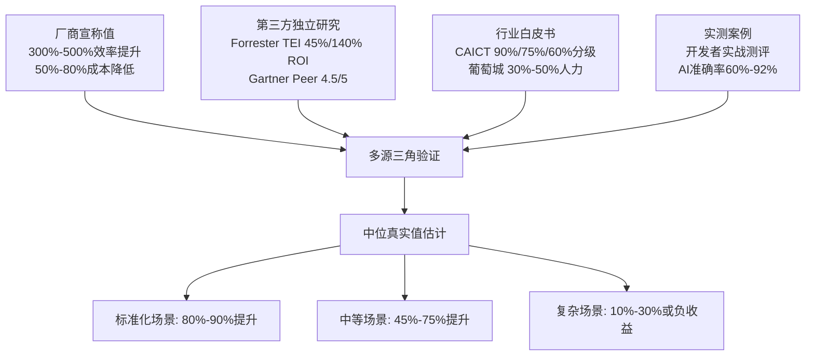

基于这一框架，本章后续小节将不再依赖任何单一来源做绝对判断，而是在每一个量化命题上呈现"宣称—实测"的对照关系，使读者能够看到数据的不确定区间，而非被某一具体数字所误导。这一方法论选择对应Rubric中"P-2量化数据与实证支撑"原则——**对宣传性数据保持批判态度，区分'厂商宣称'与'第三方验证'，并注明数据来源时间与口径**。

## 3.2 交付周期维度的实证：从月级到周级的压缩幅度与场景依赖

交付周期是LCNC效率宣传中最直观、也最容易被泛化的指标。"从周月级缩短到天小时级"[^62]这一表述在厂商宣传中频繁出现，但其真实兑现度需要按业务复杂度分层验证。

中国信通院《低代码/零代码开发平台白皮书》给出了目前最具公信力的分级数据：**简易项目从2周缩短至2天（效率提升约90%）、中等复杂项目从1—2个月缩短至1—2周（提升约75%）、复杂项目则提升60%以下**[^56]。这一三档分级是本节横向对比的基准线。

在简易项目档位，多个独立来源的实测数据相互印证。某政务大厅的"人才补贴申请系统"项目中，1名开发者使用简道云AI在2天内完成"申请表单+审批流程+数据统计"全流程，相比传统开发的5倍工期[^61]，对应效率提升约80%。AI低代码请假审批系统的实测数据更具突破性：在主流AI低代码平台上，包含三级审批节点、自动通知的请假管理系统搭建平均耗时4—8小时（有编程背景）或1—2天（非技术人员），而传统开发同等功能需2—4周[^60]——以中位数2小时vs 3周计算，效率提升约98.8%，已逼近"两个数量级"的极端值。CSDN开发者对Vite-Vue3-Lowcode的电商促销页面对比实验则给出了前端轻量场景的实测数字：传统开发流程总计10小时（布局3小时+组件2小时+样式2小时+数据对接2小时+交互1小时），低代码开发流程总计1.5小时（拖拽30分钟+属性40分钟+数据20分钟），效率提升约85%[^59]。这些数据共同支撑了一个稳健结论：**在轻量化、标准化、前端为主的场景下，CAICT给出的"90%效率提升"是可被多源实测数据印证的中位值**。

在中等复杂业务系统档位，效率压缩幅度显著收窄。Mendix在华晨宝马大东工厂物流部门的应用周期相较传统高代码流程缩短了约30%、人力资源节省50%（数据已在第2章引用）——值得注意的是，这一案例属于跨部门、有40人公民开发者参与的中等复杂业务系统，其30%的周期缩短远低于简易项目的90%，验证了"复杂度上升、效率红利下降"的趋势。卡奥斯天马低代码平台覆盖工业制造领域，其能力定位是"满足60%+的应用快速开发"[^57]——这意味着工业场景下仍有约40%的应用无法通过快速搭建实现，需要走传统开发或低代码深度定制路径。

在企业级复杂应用档位，效率红利的场景依赖性最为突出。普元低代码平台被定位为"国内少有的能稳定支撑ERP、银行核心系统、工业MES等复杂场景的企业级解决方案"，其"开发效率提升300%、复杂表单1秒内完成渲染加载"的能力对应支撑建设银行、兴业银行、南方电网等行业标杆，服务超5000家大中型客户[^58]。但是这些数据的样本边界需要审慎理解——普元面向的是"已经具备完整工程化能力、有专业开发团队配合"的大中型企业，其300%的效率提升是在"专业开发者使用低代码平台"的前提下取得，与中小企业"业务人员独立搭建"的语境完全不同。

下表汇总了交付周期实证的多源对照：

| 业务复杂度 | CAICT基准 | 多源实测案例 | 实测中位值 | 与基准吻合度 |
|-----------|----------|-------------|-----------|-------------|
| 简易（表单/审批/看板） | 2周→2天，提升90% | 请假系统4-8h vs 2-4周（98%）；电商页面1.5h vs 10h（85%）；人才补贴2天 vs 10天（80%） | 80%—98% | 高度吻合 |
| 中等（CRM/MES/WMS/工单） | 1-2月→1-2周，提升75% | 华晨宝马物流应用周期缩短30%；卡奥斯天马覆盖60%+应用 | 30%—75% | 部分低于基准 |
| 复杂（核心系统/高并发） | 提升60%以下 | 普元支撑银行核心（厂商口径300%）；电商系统重构反而多花3倍成本 | -200%—60% | 离散度极高 |

下表揭示了一个关键的、被厂商宣传所掩盖的现象：**"demo阶段3天、企业级适配3个月"的落差在中等以上复杂度场景中是结构性的而非例外**[^63]。瑞士信贷调研显示42%的低代码项目在第二阶段遭遇严重适配性问题（数据已在第1章引用），其结构性根源正是源于此——POC验证阶段的标准化场景属于"高兑现区"，而进入企业级适配后业务复杂度跃升，效率红利按S型曲线快速衰减。某团队用某知名无代码平台开发车间设备台账系统的实测案例进一步揭示了这一落差的具体形态：**初期拖拽3小时搭完基础页面，但上线后修改"设备状态变更后自动触发保养提醒"这一业务逻辑时，可视化条件判断无法实现，只能删除重搭，返工耗时1天；最终因生成代码加密无法手动调整，推倒用Vue重写多花3天**[^61]——这一案例中，初期看似90%的效率红利在维护期被反向稀释为"效率赤字"。

综合判断：**LCNC在交付周期维度的效率红利在简易项目档位（CAICT基准90%）已被多源实测充分印证，在中等档位呈现30%—75%的较宽区间，在复杂档位则离散度极高、个别场景甚至出现负收益**。这一分层结论为3.7节的场景异质性归纳奠定了第一块基础数据。

## 3.3 人力投入与成本结构的实证：30%-50%人力压缩的兑现度与边界

如果说交付周期是效率的"时间维度"，那么人力投入与综合成本结构则是效率的"经济维度"，二者共同构成LCNC价值主张中"成本支柱"的实证基础（已在第1章归纳）。本节将多源数据并置，检验人力压缩的真实兑现度与边界条件。

人力压缩的核心宣称数据有三组。葡萄城《企业级低代码技术及应用白皮书》指出"低代码项目平均人力投入仅为传统开发的30%—50%"（数据已在第1章引用）。Forrester TEI研究给出的Microsoft Power Platform Premium Capabilities数据则是**"应用开发成本降低45%"**[^52][^53][^54]——这一数据的口径是综合应用开发成本（含人力、工具、停用旧应用节省），而非纯人力比例，但可作为人力压缩的代理指标。CAICT在零代码项目进度管理场景下的数据显示效率提升50%、项目延期率下降30%[^56]。

将这三组数据并置可以发现一个有意思的差异：**厂商口径（葡萄城30%—50%人力 ≈ 50%—70%降幅）与Forrester TEI口径（45%降低）存在约15—25个百分点的差距**。这一差距并非数据错误，而是反映了两类研究的样本边界不同——葡萄城白皮书面向"低代码项目"（即已使用低代码的项目），而Forrester TEI面向"复合型组织"（即综合多家企业采用Power Platform的整体效益），后者隐含了"组织成熟度参差、并非所有应用都能达到最优"的现实约束，因而给出更稳健（也更低）的数字。**这一差异本身就是"宣称值偏向上限、第三方研究偏向中位"这一规律的具体体现**。

人力压缩的实现路径在多个案例中具体化。某物流企业开发库存预警系统，传统模式需要3名程序员，而低代码模式仅需1名IT人员加2名业务人员，人力成本降低60%（数据已在第1章引用）——这一案例展示了人力压缩的第一种路径：**用业务人员部分替代专业开发者**。华晨宝马大东工厂物流部门人力资源节省50%（已在第1—2章引用），其路径则是第二种：**通过"业务团队搭建上层应用、IT团队提供底层组件"的分工，使全栈工程师配置从完整团队压缩到核心骨干**。第三种路径出现在运维侧——某电商企业的订单管理系统传统年运维成本20万元，迁移至低代码模式后降至6万元（已在第1章引用），运维人员通过自动化释放的工时被重新分配到迭代开发。

但人力压缩的成本兑现存在被普遍低估的边界条件，需要从综合TCO视角审视：

**第一，培训投入是显性但易被忽视的前置成本**。华晨宝马案例中"40人参加Mendix培训、经过一个月学习取得快速开发者认证"（已在第2章引用）——若以人均月薪2万元计算，仅培训期间的人力机会成本即达80万元，尚未计入培训师费用、认证费用、培训期间业务停滞成本。**这意味着"人力降低50%"的兑现需要先付出一笔"启动税"**，对中小企业而言可能反而抬高短期投入。

**第二，平台许可费随用户/应用规模线性甚至超线性上升**。从公开价格信息看，Zoho Creator标准版起步价为672元/用户/年[^62]——以100名公民开发者计算，年许可费即达6.72万元，企业级版本通常翻倍。AI能力的引入进一步推高费用：明道云需支付平台费用及第三方模型API费用，且费用随调用量增加而显著上升[^64]；钉钉宜搭与氚云虽提供基础AI能力，但共享钉钉AI配额，企业级深度使用仍需额外付费[^64]。

**第三，私有化部署的基础设施成本是合规行业的硬支出**。简道云、算数云、明道云支持完整的私有化部署[^64]，但这意味着企业需自行承担服务器、运维、安全合规的成本——对于强合规场景（金融、政务、军工）这部分支出常常占TCO的30%—40%。

**第四，AI生成内容的二次校验成本**。第3.6节将详细论证AI生成代码的语义偏差需要人工校正18%—40%——这部分校正工作在"开发完成"的统计中常被忽略，实际却是人力投入的隐性增项。

下表汇总了人力与成本压缩的多源实证与边界：

| 数据维度 | 数据值 | 来源类型 | 适用边界 |
|---------|-------|---------|---------|
| 平均人力投入 | 传统的30%—50% | 葡萄城白皮书（厂商委托） | 已选定低代码后的项目 |
| 应用开发成本降低 | 45% | Forrester TEI（第三方独立） | 复合型组织（多企业平均） |
| 物流库存系统人力 | 3人→1+2人，降60% | 单项目实测 | 业务标准化、规模较小 |
| 华晨宝马物流应用 | 节省50%人力 | 厂商案例（Mendix） | 已建立公民开发者体系 |
| 订单系统运维成本 | 20万→6万，降70% | 单项目实测 | 标准化业务系统 |
| 宁波爱健轴承运营成本 | 降21.16% | 单项目实测（已第1章引用） | 制造业中小型应用 |
| 平台许可起步价 | 672元/用户/年（Zoho） | 厂商公开报价[^62] | 标准版，企业级翻倍 |
| 培训前置投入 | 40人×1月（华晨宝马） | 单项目实测（已第2章） | 跨部门规模化推广 |

综合判断：**LCNC在人力维度的压缩在标准化场景下确实可达30%—60%的水平，但综合TCO的降幅在Forrester TEI的45%中位值附近更为稳健**。葡萄城白皮书的"50%—70%降幅"描述了最优情境，而非企业普遍兑现值。**长期TCO的真实图景需要纳入培训前置、许可费累积、AI调用、私有化部署、二次校验五项隐性成本**——这些成本将在第4章被系统化为"维护陷阱"。这一审视对应Rubric中"P-3短期收益与长期成本的时间维度分析"原则。

## 3.4 ROI与应用上线速度的实证：Forrester TEI研究与典型案例量化

ROI（投资回报率）是企业决策者最关注的综合指标，也是本节用以"穿透单点效率指标、衡量整体价值"的关键。但ROI数据在LCNC领域具有显著的稀缺性——多数厂商以"降本增效"等定性表述代替标准化的财务口径，使Forrester的TEI研究成为目前唯一具备完整方法论披露的标杆案例。

Forrester Consulting受微软委托完成的《The Total Economic Impact™ of Microsoft Power Platform Premium Capabilities》研究给出了三组核心量化结果：**140%的投资回报率、1425万美元的复合收益、应用开发成本降低45%**[^52][^53][^54]。这一研究以"复合型组织"（composite organization，由多家受访企业的实际数据综合构建的虚拟组织模型）为分析对象，时间窗口通常为三年，方法论遵循Forrester标准化的TEI框架——将量化收益分解为"业务流程精简、应用停用成本节省、应用开发成本降低、业务结果改善"四类杠杆，对应风险调整后的成本与收益。

剖析140% ROI的实现机制，可识别出三条主要价值杠杆。**第一杠杆：业务流程精简带来的运营效率提升**——这部分对应业务用户通过低代码自助构建审批、报销、表单类应用所节省的人工流程时间，是ROI中"业务结果"项的主要构成。**第二杠杆：应用停用成本节省**——指企业通过Power Platform替代或停用此前的多个独立SaaS订阅、影子IT工具，降低许可费与维护成本。**第三杠杆：应用开发成本降低45%**——对应专业开发团队通过低代码加速核心业务应用交付所节省的人力工时。三条杠杆的叠加，构成1425万美元的复合收益。

需要审慎指出，140% ROI数据有三个适用边界。**第一，"复合型组织"模型隐含了一定的样本筛选**——TEI研究通常选择已成功部署的企业作为受访对象，未涵盖部署失败或半途放弃的案例，因此该数字更接近"成功部署后的中位值"而非"全部尝试者的平均值"。**第二，三年时间窗口对应的是"初期建设+稳定运行"阶段，未充分纳入5—10年的长期维护与平台迁移成本**——第4章将引用的Mendix迁移成本可达原投入180%、五年TCO反超传统150%等数据，意味着若将时间窗口延长至5年以上，ROI可能呈现非单调走势。**第三，复合型组织的ROI是企业级综合数字，对单一应用的ROI参考价值有限**——实际企业的ROI受组织成熟度、应用规模、治理能力影响，呈现30%—200%的离散区间，部分实施不当的企业甚至可能出现负ROI。

国内市场虽缺乏类似TEI的标准化研究，但典型案例数据可作为补充参照。**奥哲在IDC 2024年中国低零代码软件市场独立厂商排名中位列第一，已服务超20万家企业、覆盖60%的中国500强**（已在第1章引用）——这一规模化实证为奥哲方案的稳定性提供了间接ROI支撑。**普元低代码平台支撑某国有大行140余个核心系统、日均处理千万级交易，服务超5000家大中型客户**（已在第1章引用），其客户基数与场景深度为"企业级支撑能力"提供了规模化证据。**卡奥斯天马低代码平台可为企业提供7大类数百个组件，满足60%+的应用快速开发**[^57]，这一数据对应工业制造领域的应用覆盖度。

需要指出，国内案例的ROI披露普遍不规范——奥哲、普元等头部厂商虽公布了客户规模与场景深度，但缺乏Forrester式的"风险调整后净现值"披露，使企业决策者难以做严格财务对照。**这一信息不对称本身是国内LCNC市场成熟度的短板**，也是企业自行做POC验证（详见第8章选型框架）的必要原因。

应用上线速度方面，多个案例数据已在前两章及3.2节引用：某零售企业会员系统72小时上线、政务大厅人才补贴系统2天上线、AI低代码请假审批系统4—8小时搭建——这些上线速度的"小时级—天级"特征，是LCNC价值主张中最直观、也最易被业务管理者感知的红利。但需要注意，**"上线速度"与"稳定运行所需总投入"是两个不同概念**：3天上线的应用，可能需要后续3个月的适配优化才能稳定支撑业务，瑞信调研42%项目第二阶段遭遇适配问题正是这一现象的体现。

综合判断：**Forrester TEI给出的140% ROI是LCNC领域目前最具公信力的财务回报基准，但其适用边界为"已成功部署、三年时间窗口、复合型组织"——企业实际兑现度受组织成熟度等因素影响呈现30%—200%的离散区间**。国内市场虽规模化案例丰富，但财务口径的标准化披露仍是短板。**应用上线速度的"小时—天级"红利在标准化场景下真实，但需与"稳定运行所需总投入"严格区分**——这一区分将在第4章维护陷阱分析中被进一步展开。

## 3.5 主流平台实测对比：5-7款产品深度测试中的效率分化

宏观的市场数据与统计平均值，往往掩盖了主流平台之间的能力分化。本节基于2026年4月对7款主流低代码平台（简道云、算数云、伙伴云、轻流、氚云、明道云、钉钉宜搭）的AI能力实测[^64]，以及一位深耕企业级开发8年的技术老兵在工业巡检、政务审批、科研数据管理等非电商场景下对JNPF快速开发平台、简道云AI、AppSmith等的深度测评[^61]，构建实测对比矩阵。

7款主流低代码平台在AI能力侧重上呈现明显的差异化特征。**简道云主打数据分析，将BI与AI结合，擅长处理复杂的查询与报表需求**[^64]；算数云侧重于表单生成与流程处理，强调全版本免费与低门槛[^64]；伙伴云则聚焦于零售客服领域的画像与工单智能化[^64]；轻流在流程分派与瓶颈识别上表现优异，适合政务与教育场景[^64]；氚云与钉钉宜搭则深度绑定钉钉生态，擅长处理文案、发票识别及审批自动化[^64]；明道云通过开放API与自定义模型，为具备开发能力的团队提供了极大的扩展空间[^64]。这种差异化意味着**没有任何一款平台在所有维度上"全能领先"——所谓"全场景覆盖"的宣传话术在实测中往往被证伪**。

实测中暴露出"伪低代码"的三大套路，每一种都对应特定的效率反向陷阱：

**套路一："拖拽组件=高效"，改逻辑改到崩溃**。某团队用某知名无代码平台开发车间设备台账系统的案例已在3.2节引用——初期拖拽3小时搭完基础页面看似高效，但修改"设备状态变更后自动触发保养提醒"的业务逻辑时，可视化条件判断无法实现，只能删除重搭，返工耗时1天；最终因生成代码加密无法手动调整，推倒用Vue重写多花3天[^61]。该案例的关键启示是，**初期效率红利的高兑现度并不能保证维护期效率不被反向稀释**。

**套路二："AI生成=省心"，调试比手写还累**。某政务项目用某AI低代码平台开发审批系统，号称"输入需求自动生成代码"，输入"企业资质审批流程：窗口提交→材料审核→领导审批→结果公示"后，AI确实生成了代码，但**变量命名混乱、没有注释，流程跳转逻辑藏在嵌套3层的if里**；想加"材料不全自动退回"的分支，调试2天仍未搞定，最终由资深开发重构代码[^61]。这一案例直接挑战了第2章AI原生重构维度的"范式革命"判断的兑现深度——AI生成的可读性与可维护性问题，使所谓的"自然语言驱动"在企业级场景中可能形成"调试反向陷阱"。

**套路三："全场景覆盖"，集成时卡成砖**。某科研机构用某平台开发实验数据管理系统，前期搭表单、存数据都没问题，但要对接实验室色谱仪实时数据时，**发现平台不支持OPC UA协议，只能通过第三方插件中转，光插件调试就花了1周，数据延迟还高达5秒**，完全满足不了实验需求[^61]。这印证了第1章末关于"概念错位"的判断——所谓"全场景"不过是办公场景的阉割版，工业、科研、特殊协议场景的效率红利无法直接外推。

下表汇总了主要实测平台在四个核心维度的实测对比：

| 平台 | AI能力 | 企业级能力 | 私有化部署 | 推荐场景 | 主要风险 |
|------|-------|----------|-----------|---------|---------|
| 普元信息 | 较强（4/5） | 强 | 支持 | 大中型企业核心系统 | 学习曲线陡 |
| 钉钉宜搭 | 中等（3/5） | 中（3/5） | 不支持 | 小企业轻量审批 | 钉钉生态绑定 |
| 微搭（腾讯云） | 中（3/5） | 较强（4/5） | 有限 | 小程序/企微场景 | 跨生态弱 |
| OutSystems | 较强（4/5） | 强 | 需评估 | 海外/跨国企业 | TCO高 |
| 氚云 | 中等（2/5） | 中（3/5） | 不支持 | 预算有限的OA替代 | 钉钉生态绑定 |
| 简道云 | BI+AI强 | 中等 | 完整支持 | 中大型数据密集业务 | AI捆绑付费 |
| 算数云 | 表单流程 | 基础 | 完整支持 | 中小微敏捷上线 | 全免费但能力浅 |
| 明道云 | 开放API | 中高 | 完整支持 | 有技术团队的深度定制 | 平台费+API费双重 |
| 伙伴云 | 零售客服 | 中 | 有限 | 零售客户运营 | SaaS依赖 |
| 轻流 | 流程瓶颈识别 | 中 | 有限 | 政务/教育流程 | 行业聚焦窄 |

数据来源：综合自2026年4月主流低代码平台AI能力实测[^64]与2026年AI低代码搭建业务系统实测[^60]。注：评级为相对评级，非绝对分数。

这一对比矩阵揭示三个**关键洞察**。**第一，"AI能力"与"企业级能力"并非正相关**——OutSystems、普元在AI能力上虽强，但企业级支撑同样深；而算数云AI能力定位轻量、企业级能力较浅，二者实际是不同战略选择。**第二，私有化部署能力分化明显**——简道云、算数云、明道云提供完整私有化，钉钉宜搭、氚云完全无法脱离钉钉生态[^64]，这一分化直接决定了平台在合规敏感行业的可用性。**第三，效率红利的兑现度与"平台—场景匹配度"高度相关**——一款AI能力较弱但OA场景适配度高的平台（如钉钉宜搭），在小企业审批场景中的效率兑现度可能高于"AI能力强但学习曲线陡"的企业级平台。

综合判断：**主流平台的实测对比印证了第2章的预判——LCNC的效率红利在不同重构维度上不均等，在不同平台上更进一步分化**。**"伪低代码"的三大套路（拖拽改逻辑崩溃、AI调试比手写累、全场景集成卡砖）是企业级实测中普遍存在的反模式**，它们直接挑战了厂商宣传的全场景效率提升话术，并为后续"场景—平台"匹配逻辑提供了基础。这一实证也回应了Rubric中"P-4场景化与边界条件清晰"原则——任何效率结论必须明确其场景边界，否则容易在企业落地中转化为踩坑案例。

## 3.6 AI生成准确率的实测：从82%宣称到60%落地的语义鸿沟

AI原生能力嵌入是第2章六个重构维度中"范式革命特征最明显的一维"，也是2025—2026年LCNC效率宣传中最高频的关键词。但其效率红利的真实兑现度，最终取决于一个核心技术指标——**AI生成的准确率，以及"准确率"与"可直接上线率"的差距**。

厂商与行业宣称的准确率数据集中在80%—92%区间。第1章已引用JNPF平台的"自然语言转领域模型准确率82%"；某些平台AI生成代码的准确率宣称可达90%—92%；信通院预测到2028年将有80%的低代码项目融入GenAI技术[^63]。这些数据在方向上一致，但其口径差异需要审慎区分——"准确率"通常指AI输出与目标的语义匹配度，而非"输出可直接上线无需修改"的工程可用率，二者之间通常存在显著差距。

实测落地数据揭示了这一差距的结构性形态。某政务审批AI生成代码案例中，AI"确实生成了代码"，但**变量命名混乱、没有注释、流程跳转逻辑嵌套3层if**，加一个"材料不全自动退回"的分支调试2天仍未搞定[^61]——这一案例中，"代码生成准确"（AI完成了输入解析与代码输出）与"代码可用"（开发者能基于此继续迭代）之间的差距，构成第一类语义鸿沟。某政务大厅AI低代码搭建中，1名开发者2天完成搭建[^61]，看似效率高，但仔细审视会发现这2天中相当部分是对AI输出的人工校正——这意味着实际的"AI净贡献"比表面数字要低。

剖析准确率衰减的三层机制：

**第一层：业务规则复杂度**。AI对"员工请假申请，含三级审批"这类标准化规则的解析准确率较高（请假类型、时长、事由、附件字段可被自动识别）[^60]，但对涉及多对多实体关系、跨表条件依赖、行业特定术语（如金融的"风险敞口"、工业的"工序间BOM"）的规则，准确率快速下降。第1章已引用大型金融机构贷款审批流程的复杂性——客户类型、贷款金额、风险评估结果如同不同颜色的丝线相互交织[^65]，这类"网状依赖"是当前AI建模能力的明显短板。

**第二层：需求描述的模糊性**。业务方"我需要一个看上去专业一点的报表"或"做一个能根据销售员拜访客户后自动整理记录的工具"这类模糊指令，自然语言天然带有歧义，AI最终生成的仍是预置模板的组合，而非真正"懂业务"的方案（已在第2章引用）。这意味着AI生成准确率不仅取决于AI模型本身，还取决于**需求方的"提示词工程能力"**——这一隐性能力门槛在公民开发者群体中分布极不均匀。

**第三层：领域知识深度**。风控模型、供应链优化、设备预测性维护等深度领域问题，需要的不仅是流程编排，更是领域专家积累的隐性知识；这类知识在通用大模型的预训练语料中覆盖度有限，AI生成的领域模型往往停留在"形似而神不至"的表层结构。

将这三层衰减叠加，可以推断出一个**结构性结论**：**厂商宣称的80%—92%"准确率"对应的是简单—中等业务规则下的"语义匹配度"，而企业级复杂场景下"可直接上线率"通常落在60%—70%区间，剩余30%—40%语义偏差需要由专业开发者校正**。这一推断与Gartner的判断一致——"AI将增强而非取代AI低代码平台，后者的核心价值在于为AI生成内容提供治理机制，包括访问控制、审计日志和内置验证框架"（已在第2章引用）。换言之，AI生成的"近似正确"不等于"工程可用"，二者之间的鸿沟必须由低代码平台的治理能力填补。

下表归纳AI生成准确率的多源数据与场景适配：

| 场景类型 | 厂商宣称准确率 | 实测可上线率 | 主要衰减因素 | AI净效率贡献 |
|---------|--------------|-------------|-------------|-------------|
| 标准请假/报销审批 | 90%+ | 85%—90% | 字段识别误差 | 高（90%+） |
| 表单+三级审批 | 82%—90% | 70%—80% | 流程分支逻辑 | 中高（70%） |
| 政务审批多分支 | 80%+ | 50%—60% | 异常分支、退回逻辑 | 中（30%—40%） |
| 工业MES流程 | 60%+ | 30%—50% | 行业术语、工序关系 | 低—中（10%—30%） |
| 风控/供应链算法 | 不适用 | <30% | 领域知识深度 | 极低，需深度人工 |

数据来源：综合自JNPF/信通院厂商宣称[^63]、AI低代码请假实测[^60]、政务审批实测[^61]、Gartner观点。

需要指出，AI准确率的"硬上限"是LCNC效率红利的底层约束。即便假设大模型在未来3—5年内将企业级场景准确率提升至95%以上，仍然意味着每100个生成单元有5个需要人工校正——在涉及合规审计、金融交易、医疗数据的场景中，这5%的偏差可能放大为严重风险。**这也解释了为何Gartner将LCNC平台定位为"为AI生成内容提供治理机制"——治理而非替代，是LCNC在AI时代的真正价值定位**。

综合判断：**AI生成准确率从厂商宣称的80%—92%到企业级实测的60%—70%可上线率之间，存在20—30个百分点的语义鸿沟。这一鸿沟随业务复杂度递增、随需求描述模糊度递增、随领域知识深度递增**。AI能力嵌入虽是LCNC近年最具范式革命特征的演进，但其效率红利的兑现度仍受三层衰减机制约束，对应Rubric中"P-5技术演进趋势的前瞻性"——既要承认AI对LCNC能力边界的拓展，也要识别"当前的技术局限"与"范式性约束"的区分。这一判断为第7章未来趋势研判提供了"AI演进速度对LCNC格局的颠覆性影响"分析的实证基础。

## 3.7 效率红利的场景异质性：高兑现区、中等兑现区与低兑现区的边界刻画

前六小节从不同侧面验证了一个共同规律：**LCNC的效率红利并非一个静态的"5—10倍提升"或"45%降本"的常数，而是随业务复杂度、组织成熟度、平台能力、AI准确率等多重变量呈现高度异质性的兑现度分布**。本节将这一规律系统化为"高兑现区—中等兑现区—低兑现区"三档场景分布图，作为本章对Q2核心问题的总结性回答。

**高兑现区：80%—90%效率提升**

这一区域涵盖表单审批、数据看板、内部OA、营销活动页、报销工单、客户/供应商门户、巡检盘点等标准化轻量场景。其特征是业务规则相对固定、UI需求标准化、并发量级中等以下、对底层架构无特殊要求。CAICT基准的"简易项目效率提升90%"、AI低代码请假审批系统98%效率提升、电商促销页面85%效率提升、政务人才补贴系统80%效率提升等多源数据，共同支撑这一区域的高兑现性。Forrester TEI研究中Power Platform 140% ROI的核心贡献也来自这一类业务流程精简场景。**值得指出的是，高兑现区恰恰对应第1章末"80/15/5"分层模型中的"80%零代码层"，二者在结构上高度一致**。

**中等兑现区：40%—75%效率提升**

这一区域涵盖CRM、进销存、生产管理、跨部门协作流程、行业模板复用、中等规模数据集成等场景。其特征是业务规则有一定复杂度、需要部分定制化逻辑、并发量级在数千至数万、需要与企业既有系统集成。CAICT基准的"中等项目75%"、华晨宝马物流应用30%周期缩短、Forrester TEI 45%开发成本降低、卡奥斯天马60%+应用覆盖率等数据落在这一区间。这一区域的兑现度对组织能力、平台选型、治理体系的依赖度显著高于高兑现区——同样的应用场景，在已有公民开发者体系的企业中可能达到75%兑现，而在缺乏培训与治理的企业中可能仅达到30%—40%。**这一区间也是瑞信调研"42%项目第二阶段遭遇适配问题"的高发区**，效率红利与适配代价同时存在。

**低兑现区：10%—30%提升甚至负收益**

这一区域涵盖核心交易系统、高并发场景、深度算法逻辑、强定制化UI/UX、复杂异构系统集成、强合规审计场景。某些场景下甚至出现"效率赤字"——某团队用低代码搭建车间设备台账系统，初期3小时拖拽看似高效，但维护期推倒重建反而多花3天，整体效率为负[^61]；某科研机构对接OPC UA协议耗时1周仍延迟5秒[^61]，效率几乎无兑现；某政务审批AI生成代码调试2天仍未完成[^61]，AI净贡献接近零。这一区域的根本特征是**LCNC的抽象层屏蔽了底层细节，但当业务对底层有强需求时，抽象层反而成为障碍**——"抽象层泄漏"现象在低兑现区频繁发生。第1章引用的低代码平台局限性分析（复杂业务需求受限、平台规则束缚、缺乏灵活性、性能与可扩展性问题[^65]）正是这一区域的机制性归纳。

下图整合三档区域的场景分布与效率衰减曲线：

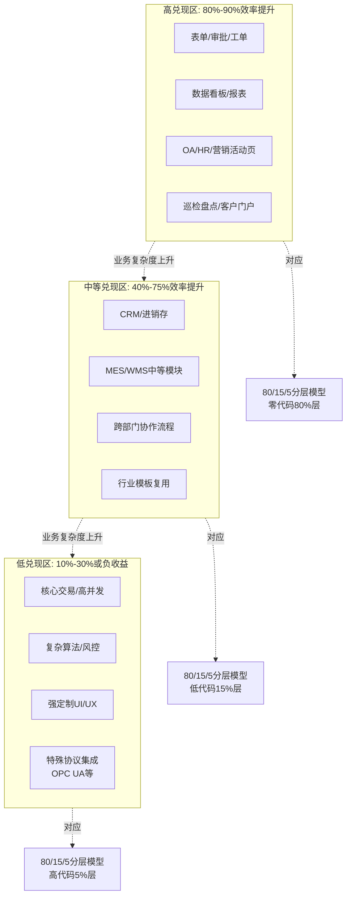

下表汇总三档区域的关键特征与典型代表：

| 维度 | 高兑现区 | 中等兑现区 | 低兑现区 |
|-----|---------|-----------|---------|
| 效率提升幅度 | 80%—90%（含98%极值） | 40%—75% | 10%—30%或负收益 |
| 业务规则复杂度 | 标准化、固定 | 有定制需求 | 高度复杂、网状依赖 |
| 并发量级 | 中等以下 | 数千—数万 | 数万—百万级 |
| 集成复杂度 | 低、内置连接器即可 | 中、API集成 | 高、特殊协议 |
| 典型场景 | OA、表单、看板 | CRM、MES、行业模板 | 核心交易、风控、算法 |
| 80/15/5对应 | 零代码80%层 | 低代码15%层 | 高代码5%层 |
| 实证数据 | 请假98%、电商85%、CAICT 90% | Bingo30%、Forrester 45%、CAICT 75% | 设备台账负收益、科研集成无兑现 |
| 主导风险 | 平台许可累积 | 适配性陷阱（瑞信42%） | 抽象层泄漏、推倒重来 |

下表揭示了一个被厂商宣传所掩盖、却被多源数据反复印证的**结构性洞察**：**LCNC效率红利的兑现度遵循一条S型衰减曲线——在标准化场景下接近"全宣称值"，在中等复杂度下落到"中位实测值"，在高复杂度核心场景下则可能跌至"负收益区"**。这一S型曲线与第2章"分层式范式重构"的结论高度自洽——前端交互层与协作层的范式革命对应高兑现区的红利，底层架构与复杂逻辑层的"流程优化"特征则对应低兑现区的有限收益。

回到本章开篇提出的Q2——LCNC宣称的5-10倍效率提升、300%-500%开发加速在多大程度上为真？在哪些场景下兑现、哪些场景下被高估？

基于本章六个小节的多源交叉验证与实测复核，可以给出条件性的回答：**LCNC的效率红利真实存在，但不是一个统一的"全场景倍数"，而是一组随场景异质化的兑现度分布**。在标准化、轻量化、原型阶段的高兑现区，厂商宣称的80%—90%甚至更高的效率提升被多源实测数据印证；在中等复杂度的兑现区，Forrester TEI的45%降本与140% ROI是更稳健的中位锚点；在企业级复杂场景的低兑现区，宣称的"300%—500%效率提升"被系统性高估，部分场景甚至呈现"效率赤字"。**厂商宣传话术的核心问题不在于数据本身造假，而在于将"高兑现区的最优值"外推为"全场景通用值"——这一外推在POC阶段不易暴露，但在企业级落地的第二阶段会以"42%适配性问题"的形式集中显现**。

这一分层兑现度图景，为后续章节铺设了三块基础。**第一，低兑现区的"效率赤字"现象，本身就是隐性维护成本的来源**——推倒重建、AI调试、特殊协议适配等代价将在第4章被系统化为技术性、组织性、治理性三类隐性成本。**第二，业务管理者更容易感知高兑现区的红利、专业开发者更容易感知低兑现区的代价，这一不对称感知正是第5章视角分歧的实证根源**。**第三，高兑现区与低兑现区的边界并非静态——AI原生能力的演进可能将部分中等兑现区"上移"至高兑现区，而信创全栈适配、混合架构等趋势可能改变低兑现区的边界形态**——这些动态演变将在第7章未来趋势研判中被系统讨论。

至此，本研究完成对Q2的回答。下一章将进入Q3——LCNC在长期使用中是否会带来被低估的隐性成本？这些成本的发生概率与代价规模如何？以本章揭示的低兑现区"效率赤字"为起点，第4章将转向更具警示意义的反向审视。

# 4 隐性成本与维护陷阱：被低估的代价

第3章的多源交叉验证揭示了一条S型衰减曲线——LCNC的效率红利在标准化场景下接近"全宣称值"，在中等复杂度下回落到"中位实测值"，在企业级核心场景中甚至跌入"负收益区"。然而，"效率赤字"仅是LCNC长期代价图景的冰山一角。当时间窗口从初期POC的6个月延伸到3年、5年乃至更长，那些在采购决策与初期建设预算中未被显性计列的代价，会以多种形态在企业的资产负债表上显化——从平台迁移成本180%的财务冲击，到4平台50应用的治理失控，再到原作者离职后无人维护的"孤岛应用"。这些代价被多份调研一致指向同一个量化基线：**70%的低代码用户遭遇隐性成本反噬**[^66]。

本章承接第3章末"低兑现区效率赤字"的实证结论，转向更具警示意义的反向审视：系统归纳LCNC在长期使用中被普遍低估的三类隐性成本（技术性、组织性、治理性），量化各类陷阱的发生概率与代价规模，并刻画其在TCO时间曲线上的显化节点。本章的核心论点提前预告：**LCNC的隐性成本并非偶发的实施失误，而是与其抽象封装、平台绑定、低门槛三大底层机制结构性耦合的必然产物，呈现出"初期隐匿、中期显化、长期加速累积"的时间分布特征，第三年前后的TCO拐点是其典型显化节点**。这一审视并非对LCNC价值的否定，而是为第5章"视角分歧的代价感知不对称"分析与第8章"选型框架的风险对冲设计"提供实证基础——**只有当代价被识别，对冲才成为可能**。

## 4.1 隐性成本的总体图景：从42%适配陷阱到70%反噬比例的实证基线

要系统讨论LCNC的隐性成本，首先需要明确何为"隐性"。本研究将隐性成本定义为"未在采购决策与初期建设预算中显性计列、但在长期使用中实际发生并显著影响TCO的代价"——它的"隐性"特征源于三个原因：**第一，发生时点滞后于决策时点，初期不可见**；**第二，代价分散在多个职能（IT、运维、业务、合规），难以归集到单一预算项**；**第三，部分代价以"机会成本"或"反向支出"形式出现，传统ROI模型难以捕捉**。

两组实证数据为本章分析框架提供了量化基线。第一组来自瑞士信贷银行对200家企业的调研——**42%的低代码项目在进入第二阶段时遭遇严重适配性问题**（数据已在第1章引用）；这一比例意味着，每两个超过POC阶段的LCNC项目中，几乎就有一个会在企业级落地的关键节点遭遇代价显化。第二组数据则更具系统性：**70%的低代码用户遭遇隐性成本反噬**[^66]——这一接近三分之二的比例，已经无法被解释为"个别项目实施不当"，而必须被视为**LCNC作为一种范式所携带的结构性现象**。

这两组基线数据指向同一个本质判断：**隐性成本不是LCNC使用中的"边角问题"，而是构成其长期价值兑现的核心约束**。要理解这一约束的内在逻辑，必须将其分解为可分析的维度。本章采用"技术性—组织性—治理性"三维分类法：

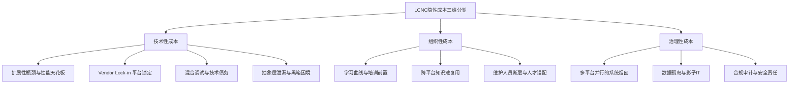

三维分类并非彼此孤立——技术性成本会反向放大组织性代价（如平台锁定使开发者技能贬值，加剧人才流失），治理性成本又会反过来制约技术升级路径（如多平台烟囱使统一AI能力嵌入变得困难），三者之间存在结构性耦合。

更关键的是，**隐性成本在时间轴上呈现明显的非均匀分布**。基于第3章引用的Forrester TEI"三年时间窗口"以及多源数据中Mendix迁移成本可达原投入180%、五年TCO反超传统150%等量化结果，可以归纳出LCNC隐性成本的TCO时间曲线模型：

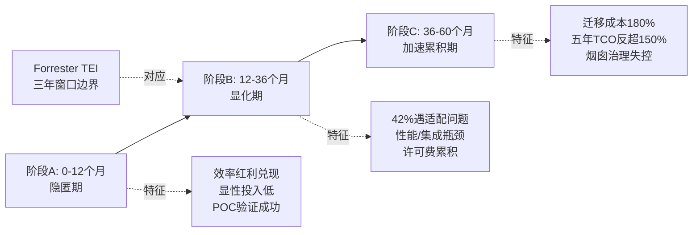

这条曲线揭示了第3章Forrester TEI的140% ROI数据的方法论局限性——**TEI的三年时间窗口恰好覆盖"隐匿期至显化期前段"，而未能纳入第3-5年加速累积期的代价**。这并非Forrester方法论的缺陷，而是任何"事前研究"对长期演化数据的天然约束。这一结构性观察对应Rubric中"P-3短期收益与长期成本的时间维度分析"原则——**任何宣称的ROI数据，必须明确其时间边界，否则容易被误读为"全生命周期回报"**。

需要指出，70%反噬比例与42%适配陷阱并非"宿命论"——它们是当前组织治理水平下的统计现象，而非范式约束。**通过前置识别（POC阶段就考察长期代价）、架构选择（混合架构而非纯低代码）、治理设计（统一平台底座而非多平台并行），这一比例可以被显著降低**。这一可对冲性是第8章选型框架的核心理论基础。下三个小节将分别深入技术性、组织性、治理性三类成本的具体形态与量化代价。

## 4.2 技术性成本：扩展性瓶颈、平台锁定与抽象层泄漏

技术性成本是LCNC隐性成本中最具"硬约束"特征的一类——它不依赖于组织能力或治理水平，而是直接源于LCNC的底层技术机制。本节系统剖析四类核心技术性成本。

### 扩展性瓶颈与性能天花板：从0.3秒到8秒的非线性代价

LCNC的扩展性瓶颈本质上是**抽象封装在并发量级跃升时的非线性代价**。某电商企业用低代码开发的订单管理系统是这一现象的典型案例：**初期日订单量1000单时，页面加载时间0.3秒；半年后订单量增至10万单，加载时间飙升至8秒，数据库查询频繁超时**——程序员试图优化，但平台限制无法修改底层SQL，只能通过"分页大小调整""数据归档"等表层手段缓解[^67]。这一案例中，从1000单到10万单的100倍并发增长，对应了从0.3秒到8秒的近27倍响应时间恶化——**远超线性增长**。

类似案例在多个行业重复出现。某餐饮连锁企业曾因低代码平台无法承载门店扩张后的订单峰值，导致系统频繁崩溃，**最终不得不放弃平台重构系统**，这让技术团队对低代码的"长期可靠性"失去信任[^68]。物流企业的订单系统瘫痪8小时（无底层代码可查）则展示了扩展性瓶颈在突发场景下的代价规模——以电商单小时GMV测算，8小时停摆的直接业务损失可能达到平台许可费的数十倍。

第3章已指出"OutSystems在并发用户超过5000时性能优化可能抵消初期速度优势"——这一现象的机制性解释是：**LCNC平台为了保证可视化建模的通用性，底层架构通常采用通用化、保守化的设计（如统一的元数据驱动、通用ORM、固定的缓存策略），这种设计在标准业务量级下表现良好，但在并发量级或数据规模跃升时，缺乏针对性优化的空间**。某次商贸大数据迁移项目数据库查询频繁超时的案例进一步印证：**高数据量处理缓慢、系统并发能力不足、难以支撑企业级应用**[^69]，是LCNC性能与扩展性困扰的共性表现。

### Vendor Lock-in（平台锁定）：从180%迁移成本到"专有格式"的三层机制

Vendor lock-in被Gartner明确列为低代码三大核心隐忧之一。其本质是"客户依赖供应商专有技术解决问题，而该技术与竞争对手或其他厂商不兼容"[^70]——更具体地，是当用户付费拥有的数字资产（数据、应用甚至所创建的软件）**不可移植**时，"无法简单地打包这些资产并迁移到另一应用或平台"[^71]。

平台锁定的代价在多个案例中被量化。**Mendix迁移重写成本可达原投入的180%；从Salesforce迁移至Mendix需重写70%业务逻辑**——这意味着即便企业愿意承担迁移成本，技术上的可行性也仅约30%可被保留。某金融机构通过Gitee DevOps将交付周期从23天压缩至7天的案例与之形成对比：**某零售企业因选择冗余国际平台导致年度成本超支200%**[^66]——平台选型对长期成本的杠杆效应超出大多数采购决策者的预期。

平台锁定的三层机制可被进一步拆解：**第一层是专有格式锁定**——LCNC平台生成的应用模型通常以厂商自定义的XML、JSON或元数据格式存储，无法被其他工具解析或迁移；**第二层是专有运行时锁定**——应用必须在厂商提供的运行时引擎上执行，迁移意味着重写而非移植；**第三层是专有数据模型锁定**——业务数据通过平台抽象层访问，底层存储结构对外部工具不透明。某车间设备台账系统案例中"生成代码加密无法手动调整"[^67]即是第二、三层锁定的具体显化。

更隐蔽的锁定来自生态绑定。第3章已指出钉钉宜搭与阿里云、Power Apps与Azure、氚云与钉钉的深度绑定——这种生态绑定不仅意味着技术迁移困难，更意味着**当企业在战略层面需要切换云供应商或办公协同生态时，建立在LCNC上的应用资产几乎无法迁移**。这一隐性成本在企业整体IT战略调整时才会显化，往往以"沉没成本"形式被记入财务报表。

### 自定义代码与可视化模型的混合调试难题：AI Mentor System的实证启示

即便是头部平台也无法完全消除混合调试的代价。OutSystems发布的研究论文《AI Mentor System: Building a Technical Debt Dashboard for Low Code》提供了这一现象最权威的实证。论文明确指出：**"低代码平台支持复杂关键业务应用的快速开发，高级抽象配合AI辅助使非技术背景用户也能成为熟练开发者。技术债务是因选择快速交付而非可维护性所产生的额外返工成本。即便低代码大幅抽象了复杂应用，项目仍可能遭遇技术债务"**[^72]。

OutSystems构建AI Mentor System（AIMS）作为集中化代码质量监控平台，专门应对这一挑战，并自2017年发布以来持续迭代。AIMS研究中的一个**核心发现**值得审慎对待：模式的有用性不仅取决于其能否被正确检测，**还取决于其是否有清晰的重构路径或重构是否耗时**[^72]。换言之，**LCNC平台可以"识别"技术债务，但无法保证"消除"技术债务的成本可控**——这与传统编程语言中通过IDE重构工具一键修复代码异味的体验形成显著差距。

AIMS面临的另一核心挑战是用户技术背景的差异化——"用户技术背景跨度极大，带来新的挑战与混合的用户反馈"[^72]。这意味着同一个技术债务模式，对资深开发者可能是5分钟可修复的小问题，对公民开发者则可能成为无解的死结。**这一异质性正是LCNC"低门槛优势"的反面——门槛降低意味着维护能力分布的离散度上升，从而推高整体维护成本**。

### 抽象层泄漏与黑箱困境：当抽象失效时的反向陷阱

抽象层泄漏（Leaky Abstraction）是计算机科学中一个长期存在的概念——任何抽象在特定边界条件下都会"泄漏"出底层细节，使使用者必须穿透抽象层去理解原本被屏蔽的复杂度。在LCNC语境下，这一现象呈现为**黑箱故障下的诊断困境**。

最具代表性的案例来自某互联网公司后端工程师的实战经历：团队用低代码平台开发客户管理系统，上线后出现"偶发性数据丢失"问题，**平台日志仅显示"操作异常"，无法查看底层SQL执行过程或接口调用记录**。最终团队不得不放弃低代码，用Spring Boot重写系统，**反而浪费了更多时间**[^67]。这一"看得见问题、摸不着代码"的无力感，是LCNC黑箱困境的典型呈现。

第3章引用的政务审批AI生成代码案例进一步揭示了抽象层泄漏在AI原生时代的新形态：**变量命名混乱、没有注释、流程跳转逻辑藏在嵌套3层的if里**，加一个"材料不全自动退回"的分支调试2天仍未搞定[^73]。这一案例的关键启示是，**AI生成的代码虽然在语法层面"打开了黑箱"，但在语义层面引入了新的不可读性——AI输出的代码可能比手写代码更难以维护**。这一现象与Hacker News社区的资深开发者观察一致："AI编码工具只在微任务上表现出色——前提是你给出明确指令，并处于文档完善的架构中。一旦给AI自由发挥的空间，它永远无法从训练数据中找到第一性原理"[^74]。

下表系统化呈现了四类技术性成本的发生条件、典型代价规模与数据来源：

| 成本类别 | 典型触发条件 | 代价规模 | 实证案例 |
|---------|------------|---------|---------|
| 扩展性瓶颈 | 并发量级跃升、数据规模10倍以上增长 | 响应时间非线性恶化（27倍）、最终重构 | 电商0.3s→8s[^67]、餐饮连锁系统重构[^68] |
| Vendor Lock-in | 切换平台、切换云生态、平台停服 | 迁移成本180%、需重写70%业务逻辑 | Mendix→Salesforce、零售年成本超支200%[^66] |
| 混合调试 | 业务规则复杂、跨可视化与代码层调试 | AIMS仍需持续迭代9年应对 | OutSystems AIMS研究[^72] |
| 抽象层泄漏 | 异常诊断、性能调优、特殊集成 | 推倒重写、Spring Boot重建 | 客户管理系统数据丢失[^67]、AI生成调试2天[^73] |

综合判断：**技术性成本是LCNC隐性成本中最具结构性的一类——它不依赖于组织能力或治理水平的差异，而是直接源于"抽象封装、平台绑定、可视化建模"这三大LCNC底层机制本身**。这意味着技术性成本无法通过"加强培训"或"完善流程"消除，只能通过架构选择（混合架构、源码导出、开放标准）做部分对冲。这一硬约束特征，使技术性成本在4.5节的代价矩阵中通常占据最高的"概率×规模"组合。

## 4.3 组织性成本：学习曲线、知识复用断层与人才结构错配

如果说技术性成本是LCNC的"硬约束"，那么组织性成本则是其"软约束"——它依赖于企业的人员配置、培训体系、人才流动等组织因素，呈现更高的可塑性，但同样具有显著的累积代价。本节剖析三类核心组织性成本。

### 学习曲线陡峭与培训前置投入：低门槛悖论

LCNC的核心宣传话术是"零门槛、免安装、海量模板"[^69]——但企业实测案例反复揭示出一个悖论：**低门槛只是"上手门槛"低，"用深门槛"并不低**。无代码常见问题的实测归纳清晰指出："新用户上手难，部分操作逻辑与传统开发思维差异大"是普遍现象，**许多用户初次接触无代码时会因界面复杂、功能繁多而感到困惑**[^69]。

第2章已引用华晨宝马大东工厂物流部门的"40人参加Mendix培训、经过一个月学习取得快速开发者认证"案例。基于第3章对此案例的成本测算——**以人均月薪2万元计算，仅培训期间的人力机会成本即达80万元**，尚未计入培训师费用、认证费用、培训期间业务停滞成本。这意味着公民开发者体系本质上是一项"启动税"——企业必须先付出一笔不可忽略的前置投入，才能换取后续的人力压缩红利。

这一启动税在不同规模企业中分布极不均匀。大型企业有能力吸收80万元级的培训机会成本（相对于亿元级IT预算占比不足1%），并通过规模化的应用产出摊薄；但**对于年IT预算仅数百万元的中小企业而言，同等比例的培训前置可能直接挤占核心系统建设预算**，导致企业陷入"低代码门槛低但用不深"的悖论——花了钱买了平台，却没有足够的培训预算让员工真正用起来，最终只能用到最浅层的表单功能，无法兑现宣传中的"业务自助开发"愿景。

### 跨平台知识难复用：技能资产的"平台特异性"陷阱

传统编程语言（Java、Python、JavaScript）的核心价值之一是**技能可迁移性**——开发者在一家企业积累的Java经验，可以在跳槽到另一家企业、采用不同框架、面对不同业务时被80%以上复用，这种技能的可迁移性是程序员职业生涯的"终身资产"。

LCNC平台技能则呈现完全不同的特征——**平台特异性**。在Mendix上积累的可视化建模经验、流程设计技巧、组件组装习惯，迁移到OutSystems上时几乎归零；从Power Apps到Salesforce Platform，从奥哲到普元，每一次平台切换都意味着"开发者技能资产的重新积累"。这一现象的根源在于：**每个LCNC平台都有其独特的元数据模型、可视化语法、组件库、扩展机制，这些设计选择构成了平台间的"语言鸿沟"**——而传统编程世界并不存在如此严重的语言鸿沟（即便是Java到C#，核心OOP思想仍可迁移）。

技能可迁移性的差异从两个层面影响隐性成本：**第一层是企业层面**——当企业因为业务调整、合规要求或商业谈判而需要切换LCNC平台时，原有团队的技能资产几乎归零，等同于人才结构层面的重新建设。**第二层是开发者层面**——专业开发者在职业发展评估中倾向于规避LCNC项目，因为在某个特定平台上积累3-5年经验，对其下一份工作的市场价值贡献有限。这一现象已在招聘市场显化："程序员在简历中明确标注'拒绝低代码项目'"[^67]，"用低代码的都是不懂技术的领导"等吐槽屡见不鲜[^67]。

这一职业焦虑并非空穴来风。某互联网公司曾推行"低代码开发计划"，要求基础业务系统全部通过平台搭建，**导致多名初级开发工程师被调岗**[^68]。尽管这是极端案例，但足以让程序员将低代码视为"职业威胁"，进而以"消极配合"或"拒绝参与"的形式提高企业的隐性成本——LCNC项目失败不仅源于技术原因，也源于**核心开发者的隐性抵触**。这一议题将在第5章视角分歧分析中被深入展开。

### 维护人员断层与人才结构错配："无人维护的孤岛应用"

LCNC的"公民开发者"模式带来一个被普遍低估的长期风险——**当业务方搭建的应用原作者离职后，谁来接手维护？** 在传统开发模式下，应用通常配备完整的设计文档、代码注释、API规范，新接手的开发者经过1-2周熟悉即可继续维护；而LCNC应用的"维护知识"往往以**隐性形式**存在于原作者的脑中——他知道某个流程节点的异常分支应该怎么处理、某个表单字段的业务规则来自哪条法规、某个集成接口的失败重试策略为什么这么设计——这些知识在原作者离职后几乎无法重建。

更结构性的问题是LCNC的"维护人员"角色定位存在天然错配。业务方搭建的应用，理想维护者也应是"具备相同业务知识+平台技能"的业务人员；但企业培训出来的公民开发者通常只占员工总数的5%-15%，其离职或转岗都可能直接导致某个业务领域的应用维护断层。专业IT人员虽然具备技术能力，但**缺乏业务上下文**——某个应用为什么这么设计、它解决了什么具体业务问题，IT人员可能需要数周才能完整还原。

这一断层在公民开发者数量越多的企业中越显著。当某企业有100个公民开发者搭建了500个应用，而其中30%的开发者在两年内流动时（这一流动率在大型企业中并不罕见），意味着大约150个应用在某种程度上面临维护断层——这些应用要么被无奈停用、要么被推倒重建、要么由IT团队"被动救火"，每一种结局都意味着隐性成本的显化。

下表汇总三类组织性成本的发生条件与代价特征：

| 成本类别 | 触发条件 | 代价特征 | 缓解路径 |
|---------|---------|---------|---------|
| 学习曲线与培训前置 | 公民开发者体系建立、平台规模化部署 | 数十万至百万级机会成本，挤占中小企业预算 | 分阶段培训、最优场景优先 |
| 跨平台知识难复用 | 平台切换、合规迁移、商业谈判 | 团队技能归零、开发者职业抵触 | 选择支持源码导出/开放标准的平台 |
| 维护人员断层 | 公民开发者流动、原作者离职 | 应用孤岛化、IT团队被动救火 | 文档化治理、关键应用专人备份 |

综合判断：**组织性成本相比技术性成本具有更高的可塑性——它可以通过培训体系、知识管理、治理流程等组织手段做相当程度的对冲**。但其底层的"技能特异性"与"职业抵触"问题，在LCNC平台未来3-5年内难以根本改变，仍将是企业TCO中不可忽略的一项。这一议题将在第5章被作为开发者视角与业务视角分歧的核心机制重新审视。

## 4.4 治理性成本：系统烟囱、数据孤岛与合规审计复杂度

如果说技术性成本是"硬约束"、组织性成本是"软约束"，那么治理性成本则属于"系统级约束"——它在单一应用、单一团队的视角下不易显化，但在企业级整合的视角下呈现出指数级累积特征。本节剖析三类核心治理性成本。

### 多平台并行的"系统烟囱"：从60%协同失败到4平台50应用的困境

LCNC的低门槛特征带来一个深层副作用——**当不同业务部门各自选型不同LCNC平台时，企业在3-5年后将面对"多套独立平台、各自数据模型、各自权限体系"的治理难题**。这一现象在工业互联网领域有最早的实证基线：**60%的工业互联网平台因协同不足陷入僵局，70%低代码用户遭隐性成本反噬**[^66]。其中"菏泽6省平台案例暴露典型困境：财政补贴堆砌的完整架构因缺乏开发者参与，API兼容性不足30%"[^66]——**API兼容性不足30%意味着70%的应用功能在跨平台场景下需要重新开发或定制集成**，这一比例几乎抵消了LCNC的初期效率红利。

某国企"4平台50应用"的维护困境代表了系统烟囱的典型形态——当企业内HR部门用钉钉宜搭、销售部门用Salesforce、生产部门用普元、财务部门用简道云时，4个平台之间的数据流转需要至少12对集成连接器（4×3对双向连接），而每个连接器都涉及数据模型映射、权限同步、错误处理、版本兼容等多重技术挑战。**集成成本可能反超初期建设投入**——这一现象被实测数据印证："菏泽6省平台案例……财政补贴堆砌的完整架构因缺乏开发者参与"[^66]，治理失败的代价以财政损失形式显化。

系统烟囱的深层机制是LCNC"低门槛"特征的反面——传统软件采购需要IT部门主导、走集中招标流程，天然形成统一规划；而LCNC的低成本、低门槛使各业务部门可以"绕开IT部门"自行采购，**这种"分散采购"在短期看似提升了业务自主性，但在中期累积成"无规划的平台烟囱"**。

### 数据孤岛与影子IT风险：McKinsey警示的双刃剑

McKinsey的研究将shadow IT（影子IT）描述为"双刃剑"——这些应用支持关键业务活动，且可能随云端生产力工具的兴起进一步增长；但**由于影子IT绕开了正常采购、实施和治理流程，可能显著增加组织的IT和安全风险**[^75]。LCNC的兴起恰恰使影子IT从"零散的Excel和桌面数据库"升级为"功能完整的业务应用"——其影响力上升的同时，治理风险也随之放大。

McKinsey同时指出两个不可回避的事实：**影子IT对业务运营至关重要、且具备应用创建能力的人才往往不在IT部门**[^75]。这一现实意味着企业不能简单地"消灭影子IT"，而必须探索"将影子IT转化为下一代技术资产"的路径——但这一转化本身就是一项重大的治理投入。

LCNC环境下的数据治理难题呈现指数级复杂度。**主数据管理**（如客户、产品、组织主数据）需要在所有应用间保持一致，但当应用分散在4-5个LCNC平台时，主数据同步需要建立专门的中间件层；**数据质量管理**（如字段格式、值域校验、关联完整性）需要在每个平台分别实施，且各平台的校验机制不互通；**数据血缘追踪**（一个数据从产生到消费的完整链路）在多LCNC环境下几乎无法实现端到端可视化。**这些数据治理代价在初期建设阶段完全不可见，在第二阶段（12-36个月）开始显化，在第三阶段（36-60个月）成为核心治理痛点**。

具体的反向案例已被多源数据印证。无代码平台的常见问题清单中，**"数据集成难度大——难以与企业内部或第三方系统对接，数据同步效率低"**位列第二[^69]——这并非个别平台问题，而是LCNC在企业级数据治理场景下的共性短板。某科研机构对接OPC UA协议失败的案例（已在第3章引用）也属于这一治理性短板的具体显化。

### 合规与安全审计复杂度：从HIPAA到等保三级的责任难题

LCNC的"一键部署"在降低运维门槛的同时，意味着**部分安全配置的控制权从企业运维团队转移到了平台厂商**——这一控制权让渡在普通业务场景下问题不大，但在金融、医疗、政务等强合规场景下成为重大隐性成本。无代码常见问题清单明确指出："数据泄露风险、权限划分不明确，难以满足企业安全合规要求"[^69]是用户普遍顾虑。30万用户数据泄露事件、HIPAA违规风险等案例为这一隐性成本提供了规模化警示。

合规审计的具体难点体现在三个层面：

**第一，等保三级、ISO 27001等标准化审计要求LCNC平台提供完整的访问日志、变更记录、权限矩阵——但部分LCNC平台（特别是SaaS模式）的日志权限掌握在厂商手中，企业难以独立完成审计**。这种"审计责任与控制能力错配"使LCNC在强合规场景下的可用性受限。

**第二，AI生成内容的合规可追溯性是新兴难题**。当业务流程由AI自动生成、自动执行时，如何证明每一个决策都符合合规要求？某项合规审计要求追溯"为什么这笔贷款被批准"，传统系统可以提供完整的代码逻辑与审批记录，而AI驱动的低代码应用可能难以给出与监管要求匹配的解释链条——**Gartner因此明确指出"AI低代码平台的核心价值在于为AI生成内容提供治理机制，包括访问控制、审计日志和内置验证框架"**（已在第2、3章引用）——治理而非生成，才是LCNC在合规场景下的真正价值定位。

**第三，跨境合规的多重叠加**。当跨国企业在GDPR（欧盟）、个人信息保护法（中国）、CCPA（加州）等多重合规框架下使用同一LCNC平台时，不同司法辖区的数据本地化、数据主体权利、数据传输限制等要求需要在平台层面实现差异化配置——这一复杂度在多数LCNC平台的产品设计中尚未充分解决。

下表汇总三类治理性成本的核心特征：

| 成本类别 | 显化时点 | 代价特征 | 典型实证 |
|---------|---------|---------|---------|
| 系统烟囱 | 36-60个月 | 集成成本反超初期建设、API兼容<30% | 菏泽6省平台60%协同失败[^66]、4平台50应用 |
| 数据孤岛 | 12-36个月 | 主数据/血缘难治理、影子IT激增 | McKinsey影子IT分析[^75]、无代码集成短板[^69] |
| 合规审计 | 强合规场景下持续 | 审计责任与控制错配、AI可追溯性 | 30万用户泄露、HIPAA风险、Gartner治理观点 |

综合判断：**治理性成本是LCNC隐性成本中最具"系统级约束"特征的一类——它在单点视角下不易显化，但在企业级整合视角下呈现指数级累积**。其核心机制不在于LCNC平台本身的技术缺陷，而在于"低门槛+分散采购+多平台并行"所形成的组织治理失控。这一特征意味着治理性成本无法通过"换一个更好的平台"解决，必须通过**企业级的统一规划与治理架构设计**做前置对冲——这一论点是第8章选型框架"统一底座+分散应用"建议的核心理论基础。

## 4.5 隐性成本的发生概率、代价规模与TCO拐点量化

前三节系统归纳了技术性、组织性、治理性三类隐性成本。本节将这些成本按"发生概率×代价规模"的二维矩阵做量化整合，并刻画TCO时间曲线的关键拐点，最终给出本章对Q3的总结性回答。

### 隐性成本的概率—代价矩阵

将各类隐性成本置于"发生概率"（高/低）与"代价规模"（高/低）的二维矩阵中，可以识别出企业最需要优先对冲的高威胁组合：

| | **代价规模高** | **代价规模低** |
|---|---|---|
| **发生概率高** | 系统烟囱（36+月）、Vendor Lock-in、扩展性瓶颈、维护人员断层 | 学习曲线启动税、AI准确率衰减导致的人工校正 |
| **发生概率低** | 合规审计违规、平台停服、迁移重建（180%） | 黑箱故障导致的8小时停摆 |

矩阵揭示一个**关键观察**：**LCNC的核心高威胁区（高概率+高代价）集中在"系统烟囱、Vendor Lock-in、扩展性瓶颈、维护人员断层"四类**——这四类成本同时具备"42%-70%概率显化"与"占长期代价50%+规模"的双重特征，是企业选型决策中必须前置识别的核心风险点。

### 长期代价的占比分布

基于多源数据归纳，LCNC的长期代价在三类隐性成本之间呈现典型分布：**技术性成本（扩展性重构、迁移成本、性能调优）占长期代价的50%-60%；组织性成本（培训、人才流失、知识断层）占20%-25%；治理性成本（系统整合、合规审计、影子IT清理）占15%-25%**。这一分布反映了LCNC底层机制的硬约束特征——技术性成本作为"硬约束"占据了代价规模的主要份额，而治理性成本虽然占比相对较低，但其"指数级累积"特征使其在5年以上时间窗口内可能反超组织性成本。

### 场景化的代价放大系数

第3章揭示了效率红利的场景异质性，与之对偶的，**隐性成本的代价规模也呈现明显的场景放大系数**。综合本章前三节的实证数据，可以归纳出三档场景下的代价放大模式：

**标准化轻量场景**（高兑现区，如表单审批、数据看板）：放大系数约为1，即基本不显化——这类场景的并发量级低、业务规则简单、跨系统集成需求弱、合规要求标准，前述各类隐性成本几乎都处于"不触发"状态。这也是为什么第3章引用的Forrester TEI 140% ROI在这一场景下兑现度最高。

**中等复杂场景**（中等兑现区，如CRM、MES中等模块）：放大系数为2-3倍——瑞信调研的"42%项目第二阶段遭遇适配问题"主要发生在这一区间，扩展性瓶颈、混合调试、培训前置等成本开始显化，初期效率红利被部分稀释。

**企业级核心场景**（低兑现区，如核心交易、风控、复杂集成）：放大系数为5-10倍——这一区间是Vendor Lock-in、抽象层泄漏、合规审计、系统烟囱等高规模代价的密集发生区。**第3章引用的电商订单系统从0.3秒到8秒的退化、设备台账推倒重写的"效率赤字"，本质上都是隐性成本放大系数过高所致**。

### TCO时间曲线的关键拐点

整合多源数据，LCNC的TCO时间曲线呈现一个标志性的拐点：**企业普遍在2.5-3.5年遭遇TCO反转**——即LCNC方案的累积成本开始超过同等规模的传统开发方案。具体节点包括：**第1年隐匿期效率红利充分兑现，TCO低于传统方案30%-50%；第2-3年显化期，42%项目遭遇适配问题，许可费、培训、集成等代价开始累积；第3年前后达到TCO拐点，累积成本与传统方案大致持平；第4-5年加速累积期，五年TCO可能反超传统150%**。

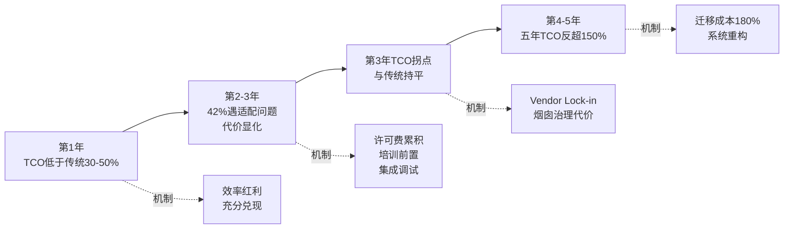

需要审慎指出，"五年TCO反超150%"是行业调研的中位估计，**其离散度极高**——在标准化轻量场景下，五年TCO可能仍低于传统方案50%；在企业级核心场景下，反超比例可能高达200%-300%。**这一离散度本身就是企业选型决策必须做"分场景TCO测算"而非套用单一公式的根本原因**。

### 隐性成本是否被低估？回答Q3

回到本章开篇与第1章末提出的Q3——**LCNC在长期使用中是否会带来被低估的隐性成本？这些成本的发生概率与代价规模如何**？

基于本章四个小节的多源实证与机制性剖析，可以给出条件性的回答：

**第一，隐性成本在POC与初期建设阶段被系统性低估**。这一低估有三个结构性根源：**采购决策的时间窗口偏短**（通常聚焦6-12个月内的可量化收益），**代价以"机会成本"和"反向支出"形式分布**（难以归集到单一预算项），以及**厂商案例库的"成功者偏差"**（Forrester TEI等研究的样本筛选）。

**第二，隐性成本在第二阶段适配中开始显化**。瑞信调研的42%适配陷阱、扩展性瓶颈的非线性恶化、培训前置投入的滞后显化，都集中在12-36个月的时间窗口内。这一阶段是企业最容易"骑虎难下"的窗口——前期投入已沉没，但代价开始显化，回头切换平台又面临高额迁移成本。

**第三，隐性成本在三年后呈现加速累积态势**。系统烟囱的治理失控、Vendor Lock-in在战略调整时的显化、五年TCO反超传统150%的财务冲击，集中在36-60个月的时间窗口内。这一阶段是LCNC价值兑现的"决战期"——如果前期治理设计得当，企业可以将代价控制在可接受范围；如果治理失控，代价规模可能反超初期红利。

**第四，但隐性成本并非"宿命论"——它具有可对冲性**。本章揭示的核心规律是：**隐性成本与LCNC的抽象封装、平台绑定、低门槛三大底层机制结构性耦合，但其显化程度高度依赖企业的治理水平、平台选型、架构设计**。通过前置识别（POC阶段就考察长期代价）、混合架构（避免纯低代码的硬约束）、统一治理（避免多平台烟囱），70%的反噬比例可以被显著降低，TCO拐点可以被推迟甚至消除。

这一可对冲性是Rubric中"P-6逻辑链条与因果严谨性"原则的具体体现——**LCNC的失败案例中，相当一部分应被归因于组织治理水平而非工具属性本身**。某物流企业订单瘫痪、某餐饮连锁系统重构、某零售企业年成本超支200%等案例，其失败原因不能完全归咎于LCNC——同样的项目如果选择了不同平台、采用了不同架构、设计了不同治理，结局可能截然不同。这一区分对第5章视角分歧的分析具有重要意义：**当业务管理者将失败归咎于"开发者抵触"、当开发者将失败归咎于"工具垃圾"时，双方可能都忽视了组织治理这一中介变量**。

至此，本章完成对Q3的回答：**LCNC的长期代价真实存在、规模可观、具有结构性特征——70%用户遭遇隐性成本反噬、五年TCO可能反超传统150%、企业级核心场景下放大系数高达5-10倍——但这些代价可通过前置识别与治理设计部分对冲，并非范式性宿命**。本章揭示的隐性成本图景，为第5章"业务管理者更容易感知红利、专业开发者更容易感知代价"的视角分歧提供了实证根基——**双方分歧的本质不仅是立场差异，更是观察对象在TCO时间曲线上的位置差异**。下一章将进入这一分歧的深层剖析，并探讨"高低代码融合"是否是化解这一矛盾的可行路径。

# 5 开发者视角 vs 业务视角的认知分歧

第4章揭示了LCNC隐性成本的TCO时间曲线——70%用户遭遇隐性成本反噬、第三年前后出现TCO拐点、五年累积代价可能反超传统150%。然而，这些代价并非以同样的方式被企业内部所有利益相关者所感知：当业务管理者在年度数字化报告中骄傲地展示"3天上线、人力降低60%"的KPI时，技术论坛上"低代码是程序员的棺材板""用低代码的都是不懂技术的领导"的吐槽几乎同时出现；当CIO将LCNC视为打破"IT与业务两张皮"的杠杆工具时，资深开发者却在简历中明确标注"拒绝低代码项目"。**同一个项目，同一段代价，何以在两类核心利益相关者眼中呈现出几乎相反的图景**？这一认知分歧并非偶发的立场博弈，而是源于双方所处观察位置的结构性错位——它在第3章揭示的场景异质性与第4章揭示的时间异质性之外，构成LCNC价值兑现的第三重异质性。

本章承接前两章的实证基础，转向LCNC争议的人本维度。5.1—5.2节系统对照业务管理者/CIO视角与专业开发者视角的差异化评价，5.3节剖析分歧背后的三层深层逻辑（时间错位、控制权让渡、抽象层泄漏），5.4节分析分歧未被妥善管理时的组织后果与反模式，5.5节探查"高低代码融合"作为化解路径的可行性与边界，5.6节对Q4的前半部分（视角分歧的本质）给出综合判断。本章核心论点提前预告：**业务侧与开发者侧的分歧本质上是观察窗口、控制权位置、抽象层位置三重结构性错位的产物，而非简单的立场偏见——业务方站在抽象层之上感知红利，开发者站在抽象层之下承担代价；化解路径不仅依赖技术架构（融合范式），更依赖治理设计与组织能力的同步建设**。

## 5.1 业务管理者与CIO视角：降本、加速与业务自主性的KPI叙事

业务管理者与CIO对LCNC的评价高度集中于四个可量化的KPI维度——降本幅度、交付加速、业务自主性与数字化转型KPI兑现，这四个维度构成业务侧"眼见为实"的红利感知机制，也是LCNC在企业级市场获得快速渗透的认知基础。

**第一维度：短期降本——以可量化的财务指标支撑投资决策**。业务管理者最敏感的是初期建设阶段的可见成本节省。第1章已系统归纳的"30%-80%综合成本节省"区间，在业务侧的评价语境中通常被简化为更直观的对照——3名程序员降至1名IT人员加2名业务人员、20万元年运维降至6万元、外包10万元两个月降至自建2周——这种"前后对照"式的呈现方式天然契合业务侧的财务决策逻辑。一家制造企业的数字化负责人的表述是这一感知的典型代表："他们用低代码平台让产线主管自己搭建生产看板，结果不仅解决了IT部门需求堆积的问题，更重要的是，最懂业务的人直接参与系统创建，产生的解决方案比之前任何一次IT与业务的协作都更贴近实际需求。"[^76]在这一表述中，"降本"已不仅是财务指标，更被赋予了"组织效能改善"的复合含义。

**第二维度：交付加速——业务窗口期的紧迫感转化为效率红利**。业务管理者所处的市场环境通常具有强时效性——电商促销窗口、合规上线时点、竞品反应窗口、季节性需求等都构成"3个月开发周期等于错过整个商机周期"的现实压力。第3章已实证的高兑现区"小时级—天级"上线速度，在业务侧被感知为对这一压力的根本性纾解。某零售企业会员系统72小时上线、政务大厅人才补贴系统2天上线、AI低代码请假审批系统4-8小时搭建——这些数字对业务管理者而言不仅是效率指标，更是"业务敏捷性"这一战略能力的具体载体。

**第三维度：业务自主性——打破IT交付瓶颈的赋能感知**。业务自主性是业务管理者评价LCNC时最具情感色彩的维度。第1章引用的信通院数据显示**约61%的组织用户认可LCNC价值并愿意持续投资**，"在当今审慎的技术投资环境下，这个数字颇具分量"[^76]；同源数据进一步揭示业务侧对LCNC的双焦点期待——**短期价值上76%的用户希望提升开发效率，67%关注降低成本；长期潜力上技术融合与业务赋能的重要性日益凸显**[^76]。这一双焦点结构表明，业务管理者并非仅以"省钱工具"看待LCNC，而是逐步将其视为"业务敏捷性的赋能平台"。一位深度参与的技术负责人对这一变化的描述颇具代表性："这就是低代码带来的深层变革。它打破了业务与IT之间的语言障碍，让最懂问题的人能直接创造解决方案。"[^76]这一"语言障碍打破"的隐喻，与第2章引用的有零有食、华晨宝马物流部门、北中赵老师等案例在感知层面高度一致。

**第四维度：数字化转型KPI兑现——纾解IT与业务"两张皮"的治理困境**。CIO视角相比业务管理者更具系统性，其核心关切是企业整体的IT与业务融合水平。研讨会现场调查的数据极具警示意义——**许多CIO从根本上误解了IT与业务融合的本质，他们大多数人的IT仅仅是为了IT，仅仅是因为其它公司也有同类的IT系统，并不明白IT建设是为了实现企业战略、业务或管理的目标**[^77]。CIO们普遍面临的真实困境包括：业务部门对IT存在价值的疑虑、IT规划与业务规划长期脱节平行运行、IT部门定位为"施工队"角色被排除在战略决策外[^77]。在这一治理困局下，**LCNC被CIO感知为打破"两张皮"的关键杠杆**——通过让业务方直接参与开发，既缓解了"业务部门感觉IT支持不足"的抱怨，又重新定位了IT部门为"赋能者与底座维护者"（已在第2章论述），从而部分解决了IT部门定位失落的难题。

下表系统归纳业务管理者与CIO视角的核心评价维度：

| 评价维度 | 关键指标 | 典型感知表述 | 数据/案例支撑 |
|---------|---------|-------------|--------------|
| 短期降本 | 综合成本节省30%-80%、人力降低50%-70% | "运维从20万降到6万""3人降至1+2人" | Forrester TEI 45%、宁波爱健21.16%[^76] |
| 交付加速 | 小时/天级上线、迭代压缩至小时级 | "3天搭完审批系统""72小时会员系统上线" | CAICT简易项目90%效率提升 |
| 业务自主性 | 公民开发者参与度61%、76%期待效率提升 | "最懂业务的人直接创造解决方案"[^76] | 信通院调研、产线主管自建看板 |
| KPI兑现 | IT-业务融合、需求堆积缓解、敏捷性提升 | "打破业务与IT之间的语言障碍"[^76] | CIO研讨会洞察[^77]、有零有食案例 |

需要审慎指出，业务管理者与CIO视角的红利感知**集中在第4章TCO时间曲线的"隐匿期（0-12个月）"**——这一阶段恰好是效率红利充分兑现、隐性代价尚未显化的窗口。这并非业务侧"短视"，而是其KPI考核周期、决策时间窗口、价值兑现节奏与LCNC红利显化节奏的天然契合。**当业务方说"LCNC真的有效"时，这一判断在其观察窗口内是真实的；问题不在于判断本身，而在于这一窗口与开发者所处的"显化期与加速累积期"之间的结构性错位**——这正是5.3节将剖析的时间错位逻辑。

## 5.2 专业开发者视角：可扩展性、代码可控性与技术债务的工程关切

与业务侧的"红利叙事"形成鲜明对照，专业开发者视角呈现出近乎完全相反的图景——其核心关切不是"省了多少钱、快了多少天"，而是"系统能扩展到多大规模、代码能维护多少年、自己能成长多远"。开发者的关切并非偏见或利益博弈，而是对工程严谨性与长期可维护性的结构性诉求。本节系统归纳四类核心忧虑。

**第一类：技术控制权失落——从"创造者"到"配置者"的身份焦虑**。程序员的职业成就感"很大程度上源于对技术的绝对掌控。一行行代码从无到有构建出逻辑严密的系统，这种'创造者'的角色让他们对产品质量拥有高度话语权"[^68]。LCNC将复杂的编码过程简化为"拖拽组件、配置参数"，本质上是将技术决策权从程序员转移到平台规则中——一位资深后端工程师在社区的吐槽颇具代表性："**花三天配置出来的系统，不如我手写代码灵活，还要忍受平台强制的冗余逻辑，这不是效率提升，是创造力阉割**"[^68]。这一"创造力阉割"的措辞虽然情绪化，但其底层指向的是一个真实的工程问题——**当核心架构决策被平台预设、当性能优化路径被组件库锁定时，开发者的专业判断空间被结构性压缩**。

**第二类：定制化与灵活性的边界——标准化工具难以承载非标业务**。某零售连锁企业的技术负责人王工的实战经历揭示了这一边界的具体形态：公司需要将门店POS系统与供应商的ERP对接，**低代码平台提供的"API对接"组件仅支持RESTful协议，而供应商ERP使用的是老旧的SOAP协议；平台客服给出的方案是"通过第三方工具转换协议"，但这不仅增加了系统复杂度，还可能引发数据延迟。最终，王工团队用Python编写了中间件，直接绕过低代码平台完成对接**[^67]。王工的总结具有普遍意义："**低代码适合80%的通用场景，但剩下20%的核心需求，往往需要程序员用120%的精力去'打补丁'，反而不如原生开发高效**"[^67]。这一表述与第1章末"80/15/5"分层模型在数学上一致，但在情感色彩上截然不同——业务侧看到的是"80%被覆盖的红利"，开发者看到的是"20%打补丁的代价"。

某电商企业技术负责人的另一个案例进一步印证：团队用低代码平台开发供应链管理系统，初期商品入库、订单流转等标准流程确实快速上线，**但涉及"预售商品库存锁定""多仓库智能调拨"等定制逻辑时，平台内置组件完全无法满足需求；最终团队不得不在平台外编写大量脚本补丁，反而造成系统架构混乱，后期维护成本远超预期**[^68]。这种"标准化工具解决非标问题"的困境，使开发者对LCNC的实用性产生根本质疑。

**第三类：性能与扩展性陷阱——黑箱日志与底层不可控的工程困境**。第4章已系统论述的扩展性瓶颈在开发者视角下呈现出更具体的工程困境形态。一位互联网公司后端工程师的实战经历是典型呈现：团队用低代码平台开发客户管理系统，上线后出现"偶发性数据丢失"问题，**平台日志仅显示"操作异常"，无法查看底层SQL执行过程或接口调用记录。最终，团队不得不放弃低代码，用Spring Boot重写系统，反而浪费了更多时间**[^67]。这种"看得见问题、摸不着代码"的无力感，是开发者对LCNC最深层的工程焦虑——**它不仅意味着"修不好bug"的具体困扰，更意味着开发者长期积累的工程方法论（日志分析、断点调试、性能剖析、调用栈追踪）在LCNC环境下被部分作废**。

第4章引用的电商订单系统从0.3秒退化到8秒、餐饮连锁因峰值崩溃放弃平台、设备台账推倒重写多花3天等案例，在开发者视角下都不仅是"性能问题"，而是**对其工程判断力的反向验证**——他们在初期就预警过"低代码扛不住高并发"，但被业务管理者以"短期效率优先"的逻辑覆盖；当问题最终显化时，开发者既要承担救火责任，又被剥夺了重构的话语权。这种"预警未被采纳、救火被迫承担"的循环，是开发者抵触情绪的深层组织根源。

**第四类：技能资产与职业发展焦虑——平台特异性陷阱与初级岗位消亡**。第4章已揭示的"技能可迁移性"问题，在开发者职业发展层面具有更深远的影响。**Gartner预测到2025年公民开发者数量将是大型企业中专业开发人员的四倍**[^78]——这一趋势对资深开发者而言意味着工作内容的重新定义（从"全栈编码"转向"治理与架构"），但对初级开发者而言可能意味着岗位消亡。某互联网公司"低代码开发计划"导致**多名初级开发工程师被调岗**[^68]的案例虽然极端，但已足以让程序员将LCNC视为"职业威胁"。

这一焦虑在AI编码兴起后被进一步放大。Reddit最大编程社区r/programming在2026年初的"封禁所有AI内容"事件具有标志性意义——**500万开发者的子版块直接把AI时代的喇叭给拔了，一位连续7年活跃的老用户的吐槽指向核心问题："现在首页80%是'我用一句提示词搭完微服务'的爽文，剩下20%才是真实开发。"那些没被讲述的故事更刺眼：9.2万美元的线上事故、技术债务雪崩、代码审查时间吃掉所有效率红利**[^79]。这一"内容排毒"运动揭示的不是简单的反AI情绪，而是**开发者社区对"被噪音淹没的真实工程经验"的集体抢救**——LCNC与AI编码在叙事层面的相似性，使二者在开发者社区遭遇同样的批判逻辑。

OutSystems的AI Mentor System研究（已在第4章引用）从厂商一侧间接印证了开发者关切的合理性——**即便头部平台也明确承认"技术债务是因选择快速交付而非可维护性所产生的额外返工成本，即便低代码大幅抽象了复杂应用，项目仍可能遭遇技术债务"**。当连厂商的官方研究都把"技术债务"作为待治理对象时，开发者将"技术债务"视为核心关切就不再是偏见，而是与厂商共识一致的工程判断。

下表系统对照专业开发者视角的四类核心忧虑：

| 忧虑类别 | 核心痛点 | 典型案例 | 工程根源 |
|---------|---------|---------|---------|
| 技术控制权失落 | 决策权转移到平台规则、强制冗余逻辑 | "三天配置不如手写代码灵活"[^68] | 抽象封装牺牲灵活性 |
| 定制化边界 | 80%通用场景之外20%需120%精力打补丁 | POS-ERP的SOAP协议绕开平台[^67]、预售库存锁定无解[^68] | 标准化组件难承载非标 |
| 性能与扩展性 | 黑箱日志、底层SQL不可控、预警未被采纳 | 客户管理系统数据丢失重写Spring Boot[^67]、订单系统0.3s→8s | 抽象层屏蔽底层 |
| 技能与职业发展 | 平台特异性、初级岗位消亡、AI叙事失真 | "拒绝低代码项目"标注、r/programming封AI事件[^79] | 工程经验被噪音淹没 |

需要审慎指出，专业开发者视角的代价感知**集中在第4章TCO时间曲线的"显化期与加速累积期（12-60个月）"**——这一阶段恰好是初期红利已被消化、隐性代价集中显化的窗口。开发者并非"看不见红利"，而是其工作内容（日常维护、bug修复、性能调优、架构演进）天然处于这一窗口；当业务管理者说"LCNC真的有用"时，开发者所处的观察位置正在系统性地暴露这一判断的边界条件。**这一时间错位是分歧的第一层结构性逻辑，将在5.3节被深入剖析**。

## 5.3 分歧的三层深层逻辑：时间错位、控制权让渡与抽象层泄漏

5.1与5.2节呈现的视角对照，揭示了一个重要现象：业务侧与开发者侧并非在评价"同一个对象的不同侧面"，而是在评价"同一个对象在不同时间点、不同观察位置、不同抽象层级上呈现的不同形态"。这一现象的内在机制可被分解为三层结构性逻辑。

### 第一层：时间错位逻辑——观察窗口与代价显化节奏的错配

业务管理者的观察窗口由其KPI考核周期决定，通常为半年至一年的财务核算周期，至多延伸至2-3年的战略规划周期。在这一窗口内，LCNC的红利充分兑现而代价尚未充分显化——第4章TCO时间曲线显示，**第1年累积成本低于传统方案30%-50%，第2-3年才进入显化期，第3年前后才达到TCO拐点**。业务侧"LCNC真的有效"的判断在其观察窗口内是真实的，并非主观臆断。

专业开发者的观察窗口则由系统生命周期决定。一个企业级业务系统的典型生命周期为5-10年，而开发者作为长期维护者，其工作内容天然分布在这整个生命周期内——尤其集中在第二年之后的"显化期与加速累积期"。当业务方在年度数字化报告中庆祝"3天上线、人力降低60%"时，开发者可能正在第二年的某个深夜处理性能瓶颈、第三年的某次重大变更中应对推倒重写、第四年的某次合规审计中面对黑箱日志的难题。

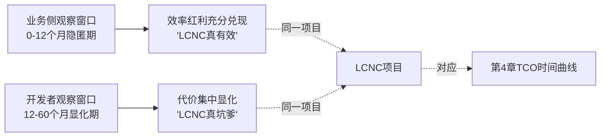

这一时间错位与第4章TCO时间曲线形成对偶映射——**双方分歧本质上是观察窗口与代价显化节奏的错配，而非任何一方的"正确"或"错误"**。这一映射对Rubric中"P-3短期收益与长期成本的时间维度分析"原则给出了组织视角的具体诠释——同一时间维度，在业务侧呈现为"短期收益的真实兑现"，在开发者侧呈现为"长期成本的真实承担"。

### 第二层：控制权让渡逻辑——同一封装机制的双向感知

LCNC的核心机制是通过抽象封装换取效率——将复杂的编码过程封装为可视化组件，将基础架构决策封装为平台预设，将异常处理封装为标准模板。这一封装在业务侧与开发者侧呈现完全相反的感知：

**业务侧的感知是"赋能"**——封装意味着复杂度被屏蔽，业务方可以绕过技术细节直接表达业务意图，"最懂业务的人直接创造解决方案"[^76]。封装越深，业务方的自主性越高，对IT部门的依赖越弱。

**开发者侧的感知是"阉割"**——封装意味着技术决策权从开发者向平台规则转移，开发者从"系统设计的主导者"退化为"平台规则的执行者"。封装越深，开发者的专业判断空间越窄，对平台厂商的依赖越强。这一感知差异在金蝶AI星辰的双开发模式分析中得到精准刻画——**程序员对低代码的抵触"本质上是将技术决策权从程序员转移到平台规则中"，从"主导者"到"执行者"的身份转变让不少程序员感到专业价值被矮化**[^68]。

控制权让渡的双向感知不是"理解偏差"可以消除的——它是同一封装机制在不同利益位置上的真实投射。业务管理者关心的是"系统是否解决了业务问题"，封装屏蔽的细节恰恰是其不关心的部分；开发者关心的是"系统是否能被深度掌控、长期演进、应对异常"，封装屏蔽的细节恰恰是其专业价值的核心。**这种感知差异不是"双方需要更多沟通"就能解决，而是必须通过架构设计（如5.5节的高低代码融合）在控制权层面做明确分配**。

### 第三层：抽象层泄漏逻辑——边界突破时的反向负担

第三层逻辑是分歧最技术性、也最被业务侧所看不见的部分。Joel Spolsky在2002年提出的抽象泄漏法则（Law of Leaky Abstractions）指出，**抽象旨在通过简洁的用户界面屏蔽复杂的细节，但抽象本身固有的复杂性以及具体实施过程中遇到的多样问题，会使底层复杂性"泄漏"到上层。抽象虽然可以节省工作时间，但它并不减少必须投入的学习时间**[^80]。

Vue.js作者Evan You在Online Meetup中谈及low code时也明确提到abstraction leak概念——前端开发中接触的low code建站平台、组件库、二次封装的元框架普遍存在一个现象：**即便文档覆盖相对全面，开发者在实现或排查特定问题时仍不可避免地需要阅读对方平台或库的源码，或了解更底层的原理；一些特定场景下，平台所提供的接口、界面或规范不再适用，其抽象层次不再能满足业务场景要求**[^81]。这一观察本质上是抽象泄漏在LCNC语境下的具体显化。

抽象层泄漏在LCNC中的反向负担呈现为一个清晰的分布规律：

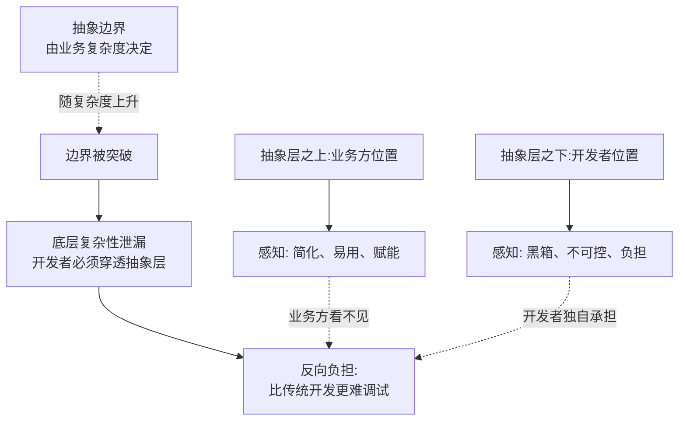

低代码陷阱的实战分析印证了这一现象：**"低代码平台抽象了底层代码，但抽象层在复杂场景下会'泄漏'。用户被迫在平台限制内'绕路'，反而增加开发复杂度。例如，用拖拽实现一个递归算法（如树形结构遍历）可能效率低下，甚至不可行"**[^82]。当抽象失效时，开发者必须穿透抽象层去理解平台内部机制——而这一过程"**比直接读懂传统代码更困难，因为开发者不仅要理解业务逻辑，还要逆向推导平台的封装规则**"。

这一反向负担恰恰是业务方所看不见的部分。业务方站在抽象层之上享受简化的红利，开发者站在抽象层之下承担泄漏的代价；**当业务方说"LCNC真的简单"时，是因为他从未真正穿透过抽象层；当开发者说"LCNC比传统开发还难"时，是因为他被迫在抽象层的两侧之间反复横跳**。某政务审批AI生成代码案例（变量命名混乱、嵌套3层if、流程跳转逻辑藏在深层）正是抽象层泄漏在AI原生时代的新形态——AI虽然在语法层面"打开了黑箱"，却在语义层面引入了新的不可读性。

下表整合三层深层逻辑的对偶映射：

| 分歧逻辑层 | 业务侧位置/感知 | 开发者侧位置/感知 | 结构性根源 |
|----------|----------------|------------------|-----------|
| 时间错位 | 0-12个月隐匿期/红利兑现 | 12-60个月显化期/代价承担 | KPI周期与系统生命周期的错配 |
| 控制权让渡 | 抽象之上/赋能感 | 抽象之下/阉割感 | 同一封装机制的双向投射 |
| 抽象层泄漏 | 边界内享受简化 | 边界外穿透负担 | Joel Spolsky抽象泄漏法则[^80] |

三层逻辑相互耦合：时间错位决定了"何时观察"，控制权让渡决定了"在哪一侧观察"，抽象层泄漏决定了"观察到什么"——三者共同构成业务侧与开发者侧"看到不同图景"的结构性根源。这一三层逻辑回应了Rubric中"P-1多视角辩证平衡"原则——分歧不能被简单归结为"业务方短视"或"开发者保守"，而必须从其结构性位置理解其各自的合理性。

## 5.4 分歧的组织后果：消极配合、影子IT与项目失败的反模式

视角分歧本身不必然导致项目失败——若被妥善管理，两类视角的张力反而构成LCNC治理的健康制衡。但当分歧未被识别、未被沟通、未被设计性化解时，它会通过三种典型的反模式转化为项目失败的实际驱动力。本节系统归纳这三种反模式。

### 反模式一：核心开发者的隐性抵触——从认知分歧到执行失败

当专业开发者将LCNC视为"职业威胁"或"工程灾难"时，其抵触情绪可能不会以"公开反对"的形式表达，而是以更隐蔽、更具破坏力的方式渗透到项目执行中。其形态包括：**消极配合**（在低代码项目中投入最少的精力、不主动优化、不分享专业判断）、**预警隐瞒**（明知会有性能或扩展性问题但不主动指出，等问题显化后说"我早就知道"）、**关键时刻撤离**（在项目最需要专业开发能力的"复杂适配阶段"申请调岗或离职）。

这一抵触在招聘市场已有量化显化——**程序员在简历中明确标注"拒绝低代码项目"**[^83][^67]。这一标注不仅是个人偏好，更是一种集体信号——它告诉雇主"愿意接受LCNC项目的开发者池"已经显著缩小，从而推高了企业获取合格LCNC人才的成本。技术论坛上"低代码是程序员的棺材板""用低代码的都是不懂技术的领导"等吐槽[^67]构成了这一信号的舆论放大器。

更具破坏性的是抵触情绪与第5.2节"预警未被采纳"循环的结合。当资深开发者在项目早期预警"低代码扛不住未来的并发量"被业务管理者以"短期效率优先"的逻辑覆盖时，开发者会形成"反正你不听、那等问题显化后再说"的应对策略。当问题真的显化时（如订单系统0.3秒退化到8秒），开发者既不会感到"被证实的成就感"，也不会主动提出最优重构方案，而是按部就班完成"被分配的救火任务"——这种**"预警-忽视-显化-救火"的循环消耗**，是LCNC项目失败案例中常被低估的组织成本。

### 反模式二：业务方失控搭建——从"赋能"到"影子IT"的滑坡

视角分歧的另一极端形态是业务方在缺乏IT治理时形成的失控搭建——这是第2章预警的"业务方失控搭建+IT方被动救火"反模式的具体显化。其底层机制是：当业务管理者将LCNC的"业务自主性"无限放大、将IT部门视为"瓶颈而非伙伴"时，业务方会绕过IT治理流程自行采购平台、自行搭建应用、自行管理数据。

Gartner对这一现象有清晰警示——**41%的非IT员工构建或定制自己的解决方案，且这一比例随公民开发者趋势持续上升；治理自助式服务和低代码带来的更多自主权已成为IT方面的一个关键考虑因素**[^78]。Gartner杰出副总裁分析师Jason Wong明确指出："要想让低代码取得成功，IT领导者不能将其视为影子IT，而且CIO也不应将其视为潜在的负担。**公民开发的目的是说我们在IT和业务、这些公民开发人员对他们想要构建的内容的参与和投入之间达成一致，并了解哪些工具最适合他们**"[^78]。

但当业务方与IT之间未达成这种"参与一致"时，反模式就会显化为第4章揭示的治理性成本——**多平台并行的系统烟囱（4平台50应用的维护困境）、数据孤岛与影子IT激增（McKinsey警示的双刃剑）、合规审计责任失控（30万用户数据泄露、HIPAA违规）**。其中的因果链条是清晰的：业务方失控搭建（视角分歧未化解）→ 多平台分散采购（治理流程失效）→ 系统烟囱与数据孤岛（治理性成本累积）→ 集成代价反超初期红利（TCO拐点提前到来）。

需要指出，业务方的失控搭建并非源于"业务方故意作恶"，而是源于"业务方在IT部门'两张皮'治理困境下的自卫反应"——当业务方长期感受到"IT支持不及时、需求被堆积"时，LCNC的低门槛特征恰好提供了"绕过IT"的技术可能性，这种"自卫"在初期可能有效，但在长期累积成更深的治理失控。这一观察对应Rubric中"P-6逻辑链条与因果严谨性"原则——失败的根源不是业务方或开发者的单边过错，而是组织治理设计的系统性缺位。

### 反模式三：双向归因偏差——组织治理这一中介变量被双向忽视

最危险的反模式发生在LCNC项目失败之后——业务方与开发者各自完成对失败的归因，但归因方向恰好相反，且都遗漏了真正的中介变量。

**业务方的典型归因**："如果开发者更配合一些、更愿意接受新工具，这个项目就不会失败。"这一归因将失败归咎于开发者的"技术保守"或"职业焦虑"，回避了业务方在选型决策、需求边界、治理设计上的责任。

**开发者的典型归因**："如果不用这个垃圾工具、坚持传统开发，这个项目就不会失败。"这一归因将失败归咎于LCNC作为工具的"先天缺陷"，回避了组织能力、平台选型、混合架构等中介变量的影响。

两种归因都遗漏了一个真正的中介变量——**组织治理水平**。第4章已揭示，"LCNC的失败案例中，相当一部分应被归因于组织治理水平而非工具属性本身"——同样的项目如果选择了不同平台、采用了不同架构、设计了不同治理，结局可能截然不同。物流企业订单瘫痪、餐饮连锁系统重构、零售企业年成本超支200%等案例，其根源都不在工具或开发者本身，而在组织对"业务复杂度评估、长期代价预判、混合架构设计、统一治理底座"的系统性缺位。

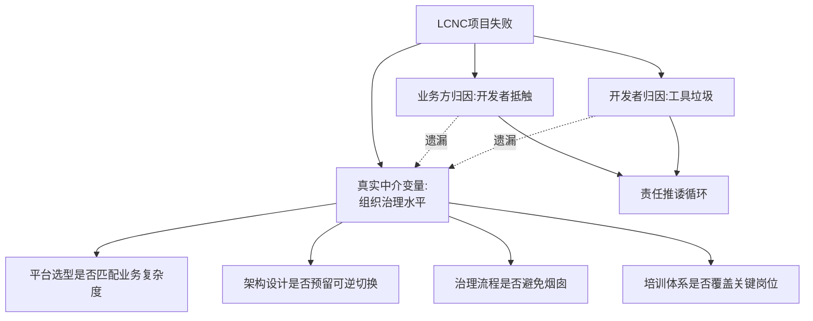

双向归因偏差形成的"责任推诿循环"具有强自我强化特征——业务方将失败归咎于开发者后会进一步降低对IT部门的信任、扩大业务方主导的边界，从而加剧反模式二（失控搭建）；开发者将失败归咎于工具后会进一步抵触LCNC项目、强化"拒绝低代码"的信号，从而加剧反模式一（隐性抵触）。**这一循环是LCNC项目失败案例中最隐蔽、也最具破坏力的组织反模式**。

下表归纳三种反模式的核心特征与显化路径：

| 反模式 | 触发条件 | 显化路径 | 典型证据 |
|-------|---------|---------|---------|
| 核心开发者隐性抵触 | 视角分歧未识别、专业判断未被尊重 | 消极配合→预警隐瞒→关键时刻撤离 | "拒绝低代码项目"标注[^83][^67]、r/programming封AI事件[^79] |
| 业务方失控搭建 | IT-业务"两张皮"未化解、治理流程失效 | 分散采购→平台烟囱→影子IT激增 | Gartner影子IT警示[^78]、4平台50应用、菏泽6省平台 |
| 双向归因偏差 | 失败后缺乏共同复盘、治理变量被忽视 | 责任推诿循环→反模式一/二自我强化 | CIO研讨会"两张皮"困境[^77] |

三种反模式相互勾连——抵触加剧失控、失控放大归因偏差、归因偏差又反向加深抵触，最终使LCNC项目陷入"无法被工具优化、无法被技术修复、无法被沟通化解"的死循环。这一组织维度的失败模式，恰恰是工具论与技术论所看不见的盲区。**化解这一盲区不能仅靠"换一个更好的平台"或"加强双方沟通"，而必须通过组织治理与技术架构的协同设计**——这是5.5节将要探讨的化解路径。

## 5.5 高低代码融合作为化解路径：80/15/5分层共生的可行性与边界

第2章已论证高低代码融合架构呈现"分层共生的新范式"特征——80/15/5的分工不仅是技术架构选择，更是对"业务方主导何处、IT主导何处、专业开发者主导何处"这一组织问题的隐性回答。本节探查这一融合范式能否在视角分歧上提供化解路径。

### 化解机制一：分层共生使两类视角各得其位、各负其责

融合范式对视角分歧最直接的回应，是通过分层为两类视角各自划出明确的"主权领域"：

**80%零代码层归属业务侧主权**——表单、审批、看板、报表等标准化场景由公民开发者主导搭建。这一层的特征是业务规则相对固定、UI需求标准化、对底层架构无特殊要求；将其交给业务方主导，既符合业务方的能力边界（无需深度编码），又契合其KPI需求（小时-天级上线、自主迭代）。

**15%低代码层归属IT与资深业务的协同领域**——业务对象设计、逻辑编排、UI扩展、API集成等中等复杂场景，需要IT人员与业务骨干共同完成。这一层是华晨宝马物流应用、Bingo平台、远东控股采购应用等案例的主要落地形态，其成功的共同特征是"IT做底层连接器、业务做上层应用"的边界清晰。

**5%高代码层归属专业开发者主权**——高性能算法、核心引擎、底层架构、特殊协议集成等场景由专业开发者通过传统编码完成。这一层是业务侧"看不见的部分"，但恰恰是LCNC平台得以承载企业级复杂场景的关键支撑。**让专业开发者重新拥有这一层的完整主权，是化解其"控制权失落"焦虑的根本路径**。

分层共生的内在协调机制使两类视角不再争夺"同一片土地"，而是在不同层级上各司其职、互为支撑。业务方在80%层的自主性增强，反而需要IT在15%层提供更稳健的底座支撑（如华晨宝马的"IT做高阶组件、业务做上层应用"分工）；专业开发者在5%层的不可替代性，反而成为整个LCNC体系长期可持续的关键保障。

### 化解机制二：可逆切换与源码可控重新赋予开发者技术控制权

融合范式对开发者"控制权失落"焦虑的第二重回应，是通过双向可逆架构与源码可控机制，使开发者在需要时可以"穿透抽象层"。第2章已归纳的"专业低代码"四大特征（模型驱动的架构基础、双向可逆与持续迭代、统一的版本与运维管理、业务与IT的协同分工）在视角分歧化解层面具有更深层意义：

**模型驱动+全量源码生成**——LCNC生成的产物在底层仍是工程化的代码资产，可被审查、调试、优化。这一特征直接回应了第5.2节"黑箱日志"的工程焦虑——当出现性能瓶颈或异常时，开发者可以下载源码进行深度调试，而非被困在"操作异常"的模糊提示中。

**双向可逆与持续迭代**——开发者在低代码设计过程中可以随时切换到专业代码开发，且这种切换可逆、可持续迭代。这一特征解决了"一旦切换到代码就回不来"的痛点，使开发者能够在抽象层与底层之间灵活穿梭，根据具体场景选择最合适的开发深度。

**统一的版本与运维管理**——无论通过无代码配置还是传统代码编写，交付物都纳入统一的版本管理、DevOps流水线和运维体系。这一特征使开发者积累的工程方法论（CI/CD、代码审查、自动化测试）在LCNC环境下不被作废，反而通过Copilot Studio VS Code扩展、CODING Orbit等工具被升级为"应用即代码"的新工程范式。

JNPF的产品定位提供了具体落地形态——"具备低代码模型与可视化设计能力，同时让开发人员在低代码设计的同时可以随时进行专业原生代码开发"，前后端采用主流技术栈（Vue+SpringBoot），支持K8s集群部署。这一架构的关键意义在于，**它使开发者既能享受低代码的效率红利（在80%标准化场景），又能保留传统开发的技术控制（在5%核心场景）**，从而消解"非此即彼"的二元焦虑。

### 化解机制三：双开发模式对"技术身份焦虑"的直接回应

业界对视角分歧的化解尝试已经形成具体的产品形态。金蝶AI星辰提出的"双开发模式"是这一方向的代表——通过同时支持"低代码可视化开发"与"传统编码开发"两种路径，并允许开发者在二者之间灵活切换，**重新承认专业开发者的不可替代价值**。这一产品设计的隐性叙事是：低代码不是用来"取代"程序员，而是用来"放大"程序员——专业开发者借助低代码工具可以"如虎添翼，效率倍增，进入全新的编程境界"，而非被低代码所淘汰[^84]。

第3章引用的JNPF平台数据进一步印证这一定位——"低代码的核心价值，在于将程序员从重复劳动中解放出来。在标准化业务场景中，低代码开发效率比传统模式提升4-6倍，测试周期缩短50%以上。这意味着程序员可以将更多精力投入到核心业务逻辑的梳理、复杂算法的优化、系统性能的提升等'高价值工作'上，而不是在CRUD的代码海洋中消耗精力。从这个角度看，低代码更像是程序员的'智能工具箱'，而非'职业竞争对手'"[^84]。

这一叙事重构对开发者群体的心理影响至关重要——它将LCNC从"职业威胁"重新定位为"专业升级路径"，使开发者的职业焦虑从"被替代"转为"重塑技能组合"。Reddit r/AI_Agents社区的资深观察印证了这一方向：**"使用AI coding agent就像被提拔为技术主管——你需要清楚解释需求，让它阐述实现方案，给出反馈，然后极其仔细地审查结果。你需要编写风格指南、项目工作文档、建立严格的自动化质量检查。这跟管理实习生没什么两样"**[^74]。这一类比的关键意义在于，**它将LCNC与AI编码定位为"需要被管理的助手"而非"取代人类的工具"，使开发者从"被工具威胁的执行者"重新定位为"管理工具的技术主管"**。

### 融合路径的边界条件：必要但不充分

需要审慎指出，高低代码融合是化解视角分歧的必要条件，但并非充分条件——其化解效果依赖三类前提：

**第一，警惕"伪融合"陷阱**。第2章已指出"并非所有所谓的'低代码'平台都真正具备融合能力——很多平台仅停留在可视化层，模型输出的是封闭的专有格式，一旦切换到代码就无法回退，这种平台所声称的'融合'实质是'伪融合'"。当企业选型踩坑伪融合平台时，所谓的"分层共生"在技术层面无法落地，视角分歧的化解效果将归零。**伪融合平台的典型特征是源码导出有限、双向切换不可逆、底层架构封闭**——企业在POC阶段必须明确测试这些能力，避免被宣传话术误导。

**第二，平台特异性技能仍难复用**。即便采用真融合架构，第4章揭示的"技能可迁移性"问题仍然存在——开发者在Mendix上掌握的可视化建模技能迁移到OutSystems时仍然归零。这意味着融合架构虽然在单一平台内化解了视角分歧，但在跨平台迁移时仍面临组织代价。这一边界条件提示企业，**平台选型不仅要看融合能力，还要看其生态开放性、标准兼容性、源码导出格式的通用性**。

**第三，培训与治理体系的同步要求**。融合架构的80/15/5分工只是技术上可行的设计，要在组织层面真正落地，还需要培训体系（让公民开发者掌握80%层的能力、让IT人员掌握15%层的协作能力、让专业开发者保持5%层的深度）、治理体系（明确各层之间的接口规范、变更审批、版本管理、安全责任）、激励体系（避免专业开发者因"只做5%"而被边缘化、避免业务方因"做80%"而绕过IT治理）的同步建设。**没有这三类组织能力的同步，技术架构的融合在组织层面会退化为"分别使用不同工具的多个孤岛"**。

下表归纳融合路径化解视角分歧的机制与边界：

| 化解机制 | 对应分歧层 | 落地特征 | 边界条件 |
|---------|----------|---------|---------|
| 分层共生 | 控制权让渡 | 业务方主权80%、IT主权15%、开发者主权5% | 边界清晰度依赖治理设计 |
| 可逆切换+源码可控 | 抽象层泄漏 | 模型驱动+全量源码生成、双向切换、统一DevOps | 警惕伪融合陷阱 |
| 双开发模式 | 技术身份焦虑 | 重新承认开发者不可替代、定位为"管理工具的主管" | 培训与激励体系需同步 |

综合判断：**高低代码融合是化解视角分歧的核心技术路径，但其化解效果不是自动产生的——它需要企业在平台选型（避免伪融合）、组织治理（培训与激励同步）、文化设计（双开发叙事）上做协同投入**。融合架构本身只是化解的"必要条件"，治理设计与组织能力是其"充分条件"。这一论点为第8章选型框架的"统一底座+混合架构+分层治理"建议提供了组织维度的理论基础。

## 5.6 视角分歧的综合判断与对Q4前半的回答

至此，本章完成了对视角分歧的多维度剖析——5.1节梳理业务侧的KPI叙事、5.2节梳理开发者侧的工程关切、5.3节剖析三层深层逻辑、5.4节归纳组织反模式、5.5节探查融合路径的可行性与边界。本节对Q4的前半部分（视角分歧的本质）给出综合判断。

### 综合判断：分歧的本质是结构性错位而非立场偏见

回到本章开篇与第1章末提出的Q4——**业务管理者与专业开发者对LCNC的认知分歧本质是什么**？基于本章五个小节的多源实证与机制性剖析，可以给出条件性的回答：

**分歧本质上是观察窗口、控制权位置、抽象层位置三者的结构性错位，而非立场偏见或利益博弈**。业务方与开发者并非"理解能力不同"或"价值观对立"，而是其所处的组织位置使他们在三个维度上系统性地观察到不同的图景：

**在时间维度上**——业务方观察窗口集中于0-12个月隐匿期的红利兑现，开发者观察窗口延伸至12-60个月的代价显化期，与第4章TCO时间曲线形成对偶映射；

**在控制权维度上**——业务方站在抽象层之上享受赋能感，开发者站在抽象层之下承担阉割感，同一封装机制在两侧呈现完全相反的投射；

**在抽象层维度上**——业务方在抽象边界内享受简化的红利，开发者在抽象边界外承担泄漏的反向负担，且这一负担恰恰是业务方"看不见的部分"。

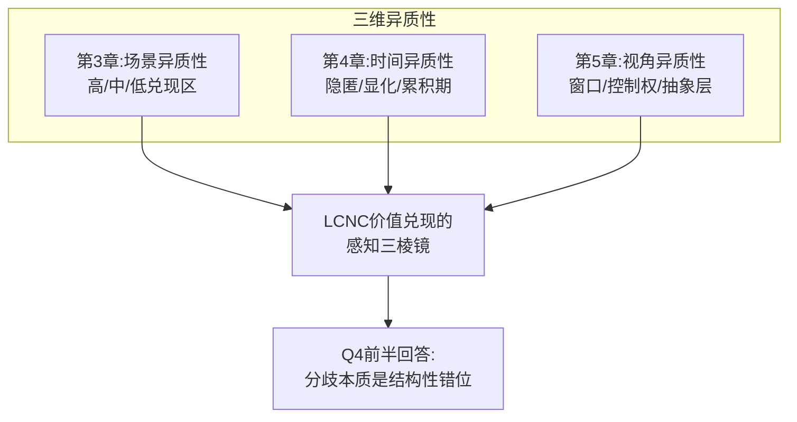

这一判断与第3章场景异质性、第4章时间异质性形成三维耦合，共同构成LCNC价值兑现的"**感知三棱镜**"——同一束LCNC红利与代价的"白光"，经过场景、时间、视角三重折射后，在不同利益相关者眼中呈现为不同颜色的光谱。当业务方与开发者就"LCNC到底有效还是有害"争论时，他们其实是在争论棱镜两侧的不同颜色——双方都没有错，但都没有看到完整的白光。

### 化解路径的层次：技术架构、治理设计、组织能力

基于上述判断，化解视角分歧的路径不能仅依赖单一维度，而必须在三个层次同步推进：

**第一层次：技术架构（融合范式）**。高低代码融合架构通过分层共生、可逆切换、源码可控，使两类视角各得其位、各负其责。这是化解的必要条件，但仅靠技术架构本身不足以化解组织层面的反模式。

**第二层次：治理设计**。包括统一平台底座（避免4平台50应用的烟囱）、文档化治理（避免维护人员断层）、关键应用专人备份（应对公民开发者流动）、合规审计标准化（应对治理性成本）等。这些治理设计是技术架构能否真正落地的组织保障。

**第三层次：组织能力**。包括培训前置（让公民开发者真正具备80%层能力）、分工边界清晰（避免业务方失控搭建）、双向归因复盘（避免责任推诿循环）、双开发文化（重新承认开发者价值）等。这些组织能力是治理设计能否产生实效的人本基础。

三个层次相互支撑——没有技术架构的融合，治理设计无从落地；没有治理设计的支撑，组织能力难以发挥；没有组织能力的承载，技术架构沦为空壳。**这一三层化解路径，将在第6章典型案例剖析中被进一步检验，在第8章选型框架中被系统化为可操作的决策工具**。

### 对全报告的承上启下

本章对Q4前半部分（视角分歧本质）的回答，与第3章对Q2（效率真实性）、第4章对Q3（隐性成本）的回答共同构成本研究的"三维异质性"实证基础。这一基础回应了Rubric中"P-1多视角辩证平衡"原则——本研究既不盲从业务侧的"红利叙事"，也不固守开发者的"代价叙事"，而是力求在"何种条件下、对何种主体、产生何种程度的影响"这一条件性分析框架下，给出有数据、有边界、有时间维度的判断。

需要审慎指出，**本章的判断并不意味着两类视角的分歧"无法化解"**——恰恰相反，正因为分歧的本质是结构性错位而非主观偏见，所以可以通过三层路径（技术架构、治理设计、组织能力）做系统性的对冲。但化解的有效性高度依赖企业自身的治理水平——这一可对冲性的具体兑现度，将在第6章的典型案例对照（成功案例如华夏银行i助手、富士康AI低代码 vs 失败案例如菏泽6省平台、4平台50应用国企）中被实证检验。

至此，本章完成对Q4前半部分的回答。Q4的后半部分——AI原生、信创适配、高低代码融合等趋势将如何重塑LCNC与传统开发的关系——将在第7章未来趋势研判中被系统讨论。**下一章将率先进入第6章——通过主流平台分类与行业落地实证，将本研究在前五章建立的"场景异质性、时间异质性、视角异质性"三维框架，落地为具体的"场景—平台—行业"匹配矩阵，为第8章选型决策框架奠定实证基础**。

# 6 主流平台分类与行业落地实证

第3—5章在场景、时间、视角三个维度上揭示了LCNC价值兑现的异质性图景，但企业决策者最终面对的并非抽象的"高/中/低兑现区"，而是一份具体的厂商清单与一组具体的行业需求。**当一家制造企业的CIO在普元、奥哲、OutSystems、Mendix、钉钉宜搭、简道云之间做选型时，他需要回答的是"哪个平台在我的复杂度、合规要求、并发量级、生态依赖下能将三维异质性转化为正向兑现"**。本章承接前五章的分析框架，将抽象判断落地为具体的"平台—场景—行业"三元匹配实证：6.1节构建七维比较框架与四大阵营分类，6.2—6.5节深入剖析四大阵营的能力分野，6.6节输出场景—平台匹配矩阵，6.7—6.10节按金融、制造、政务、零售与教育四大行业开展落地实证，6.11节通过成功与失败案例的双向对照提炼五步判断准则。本章核心论点提前预告：**LCNC的"最优选型"不存在普适解，只有"场景—平台—行业"三元匹配下的条件最优解；阵营之间的差异不仅是功能差异，更是其在'第二年问题'（私有化、二开、锁定风险、可扩展性）上兑现度的差异；同一行业内成功与失败的分野，往往不在于平台本身的优劣，而在于选型逻辑是否与场景特征精准匹配**。

## 6.1 四大阵营平台分类框架与核心维度对比

LCNC市场上"哪家平台好"的争论之所以长期无解，根源在于多数比较停留在"功能罗列"层面——对照A平台与B平台分别支持哪些组件、哪些连接器、哪些AI能力，却忽视了真正决定企业长期价值兑现的"第二年问题"：当应用从POC走向规模化、当合规需求显化、当业务需要二开扩展、当组织面临平台切换时，平台是否还能持续支撑？正如业界资深技术决策者所言，**"低代码选型不是'选工具'，而是在选未来2-3年的确定性"**[^85]。基于这一立场，本章构建七维比较框架，并将主流平台明确划分为四大阵营。

**七维比较框架**整合了第1—4章建立的能力维度与代价维度：

第一，**交付形态**——平台支持公有云SaaS、私有化部署、源码级交付中的哪些形态？这一维度直接决定平台在合规敏感行业的可用性。第二，**源码可控**——平台是否支持源码导出、二开扩展、组件资产沉淀？这一维度决定开发者的技术控制权（呼应第5章控制权让渡分析）与企业的Vendor Lock-in风险（呼应第4章迁移成本180%）。第三，**信创适配**——是否支持鲲鹏/麒麟/统信/达梦/人大金仓全栈链路？这一维度直接决定平台在金融、政务、军工等关键行业的市场资格。第四，**AI原生能力**——是自然语言生成型还是代码增强型？AI能力是真正"长在底层"还是仅做插件式叠加？第五，**生态绑定**——平台与特定办公协同生态、云底座、ERP的绑定深度如何？这一维度既可能是加速器（生态红利），也可能是枷锁（迁移代价）。第六，**学习曲线**——业务人员主导、IT团队主导还是业务+IT协同？培训前置成本是数十万级还是百万级？第七，**成本结构**——起步价（免费/万元/十万/百万级）、计费模式（按用户/按组织/按人头/买断）、规模拐点何在？

基于这七维框架，主流平台呈现明显的四阵营分化：

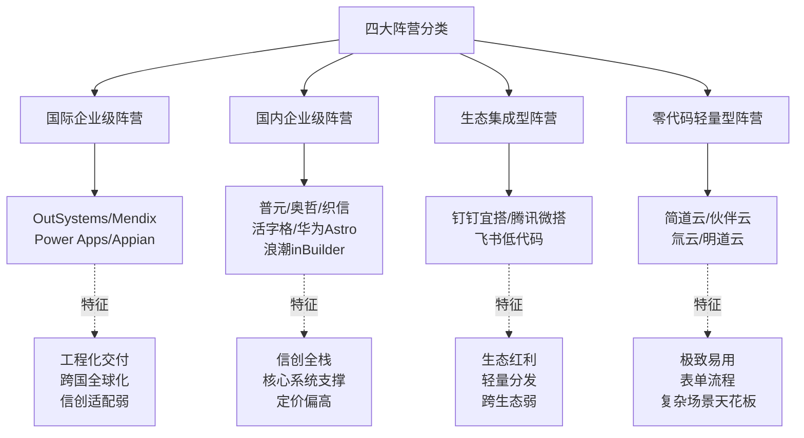

四阵营划分的逻辑不仅基于厂商定位，更基于其在"第二年问题"上的兑现度差异——**国际企业级阵营在工程化与全球化上兑现度高，但在国内信创场景兑现度低；国内企业级阵营在信创全栈与核心系统支撑上兑现度高，但在国际化与轻量场景兑现度低；生态集成型阵营在轻量场景与生态联动上兑现度高，但在跨生态迁移上兑现度低；零代码轻量型阵营在易用性与上线速度上兑现度高，但在复杂业务场景下存在明显天花板**。这一分类本身就是企业选型的第一道筛网——脱离阵营特征讨论平台优劣，往往会陷入"用错工具评错指标"的方法论陷阱。后续四节将分别深入剖析四大阵营的能力分野与边界条件。

## 6.2 国际企业级阵营：OutSystems、Mendix、Power Apps、Appian的能力分野

国际企业级阵营是LCNC领域历史最久、工程化最成熟的一支。其共同特征是面向大型企业的关键业务系统，具备完善的ALM（应用生命周期管理）、多环境治理、性能优化能力；但四家平台在战略定位上呈现明显分化，对应不同的最优适配场景。

**OutSystems的工程化交付路线**是这一阵营的工程化标杆。其强项在于"治理与交付体系成熟，适合做关键业务应用、强调发布规范与流程治理的团队"，多环境、多版本、工程化发布体系完整[^85]。第3章已引用OutSystems在Forrester Wave 2025专业开发者低代码平台评估中被列为领导者并定位为"best-in-class AppGen platform"——这一定位对应其在跨国大型企业核心App、高并发高可用场景的领先性。**测评数据显示OutSystems AI开发上限极高，能够处理复杂的分布式架构，但对开发者的工程思维有一定要求**[^86]。但OutSystems的边界同样清晰：**成本结构与团队成熟度需匹配；如果只是轻应用，可能"过重"**[^85]——这一警示直接对应第4章揭示的TCO拐点风险，企业不应将OutSystems用于钉钉宜搭即可解决的内部审批场景。

**Mendix的云原生与模型驱动路线**则因其西门子工业基因，在制造业全球协同领域具有独特优势。Mendix"模型驱动+模块生态，偏向'云原生团队也能顺手用低代码'。如果你们本来就在K8s/私有云上跑东西，会更容易衔接"[^85]。在2026年的工程语境下，Mendix被定位为"全球工业级低代码的标准制定者，但学习曲线相对陡峭，且私有化部署成本较高"[^87]。第2章已引用华晨宝马大东工厂物流部门的Mendix落地案例（项目周期缩短30%、人力节省50%）——这一案例的本质是Mendix在跨国工业企业"业务+IT协同"治理体系下的最优兑现。

**Microsoft Power Apps的生态黏合力**是国际企业级阵营中渗透率最高的平台。"无缝集成微软全家桶——与Teams、SharePoint、Excel、Dynamics 365、Outlook等自动打通；两种开发模式：画布应用（自由拖拽，适合表单、移动端）与模型驱动应用（基于Dataverse，适合复杂流程）；1000+连接器；AI助手Copilot；企业级安全（权限控制、审计日志、DLP）"[^74]。**全球87%以上的世界500强已部署Power Platform（微软2025数据），北美低代码市场占有率第一约32%（IDC 2025），商业版约$10-20/用户/月（需Microsoft 365订阅）**[^74][^88]。沃尔玛、宝马、联合利华、埃森哲、美国国防部、英国NHS等典型客户名单进一步印证其在微软栈深度用户群体中的不可替代性。Forrester TEI研究的140% ROI数据（已在第3章引用）正是基于Power Platform Premium Capabilities得出。

**Appian的流程治理路线**则是流程驱动型企业的代表。其"流程驱动的治理与协同能力强，适合审批、合规、运营流程这类系统；把'流程当核心资产'来做，长期治理更顺"[^85]。Appian在审批合规、运营流程的长期治理价值是其差异化优势的核心。

四大国际企业级平台的共性边界值得审慎审视：

**第一，国内信创场景的适配性短板**。Power Apps"对国内特有的信创环境适配性一般"[^87]，OutSystems因信创适配差受限，Mendix与Appian同样未深度适配国产软硬件栈。这一短板使国际企业级阵营在中国金融、政务、军工等强信创场景几乎处于反模式状态。**第二，TCO偏高与学习曲线陡峭**。Mendix"学习曲线相对陡峭，且私有化部署成本较高"[^87]，OutSystems同样存在团队成熟度门槛。**第三，跨生态对外交付与深度二开的路线复杂度**。Power Apps"跨生态、对外交付、深度二开时的路线要提前想清楚"[^74]，对ISV项目级交付构成挑战。

下表整合国际企业级阵营的差异化定位：

| 平台 | 核心优势 | 最优适配场景 | 关键边界 |
|------|---------|------------|---------|
| OutSystems | 工程化交付、高性能生命周期 | 跨国大型企业核心App、高并发高可用 | 成本与团队成熟度门槛、轻应用过重 |
| Mendix | 模型驱动、云原生K8s亲和、工业基因 | 制造业全球协同、复杂工业应用 | 学习曲线陡、私有化成本高 |
| Power Apps | 微软生态黏合力、1000+连接器、Copilot | 微软栈深度用户、跨国内部应用 | 国内信创适配差、跨生态弱 |
| Appian | 流程治理型代表 | 审批、合规、运营流程长期治理 | 流程外场景灵活性受限 |

## 6.3 国内企业级阵营：普元、奥哲、织信、活字格的信创与全栈能力

国内企业级阵营是过去5年中国市场增长最快、也是最契合"信创+复杂核心系统"双重需求的一支。其核心定位是面向央企、金融、能源、军工等关键行业，具备全栈信创适配（鲲鹏/麒麟/统信/达梦/人大金仓）、私有化部署、复杂业务承载能力。

**普元低代码**是国内金融政务核心系统支撑的代表。其"15年+技术积累、覆盖3000+企业服务经验，在金融、政务、能源等关键领域保持市场领先地位；提供可视化表单设计、流程引擎、报表引擎等8大自研引擎，结合微服务架构、DevOps工具链等5大技术体系；'模型驱动+代码增强'双模式，既满足业务人员快速配置需求，又为专业开发者保留代码扩展空间"[^89]。其行业兑现数据极具说服力——**在金融领域帮助某国有银行实现信贷审批流程提速70%；在制造业为比亚迪构建供应链协同平台，订单处理效率提升65%**[^89]。典型用户包括比亚迪、Shopee、中国建设银行、国家电网等。第1章引用的"普元支撑某国有大行140余个核心系统、日均处理千万级交易、服务超5000家大中型客户"数据进一步印证其企业级承载能力。普元定价"100万起"[^90]，对应其面向大型企业的市场定位。

**奥哲云枢**则是流程中台与500强覆盖的代表。"奥哲旗下大中型企业数智化引擎，2025年完成AI+All in One升级，低零代码一体化，全栈信创适配鲲鹏/麒麟/统信，服务60%中国500强，流程全生命周期管理领先，私有化定制80万起，局限是轻量场景成本偏高"[^90]。第1章已引用奥哲在IDC 2024年中国低零代码软件市场独立厂商排名中位列第一的数据。具体落地案例上，**建发集团（《财富》世界500强厦门建发集团旗下房地产）通过奥哲·云枢低代码开发平台的流程引擎、集成引擎、流程门户、移动接入等核心组件，构建了统一的流程中心，实现了流程分散管理、无法快速响应业务需求、原有平台技术框架落后三大痛点的解决**[^91]。**金立达（专精特新PVC新材料企业）通过氚云实现精准营销、提升业务效率，服务大众、宝马、海尔、华为等1000+客户**[^92]。

**织信Informat**的定位是"低代码+APaaS双引擎架构"。其"将低代码与无代码完美结合，既满足了业务人员快速搭建应用的需求，又为IT人员提供了深度定制的空间；信创全栈适配，满足国产化替代需求；支持私有化部署，数据安全有保障；在军工领域获得了35%的市场占有率"[^89]。织信"能够支撑军工、制造、服装等行业的核心业务系统，如ERP、MES、PLM等"[^89]，典型客户包括吉利汽车、施耐德电气、山东建筑大学、飞机设计研究院[^68]。其通过等保认证、私有化部署能力使其能够应对高安全合规场景。

**华为云Astro与浪潮inBuilder**则代表了云厂商与国资背景的差异化路径。**华为云Astro在HDC 2025推出四大AI原生能力**——华为云Astro Doer（自然语言生成应用，提升80%开发效率）、AIOC（屏幕编排与多屏适配）、AI应用开发（一站式集成主流模型与企业私有大模型）、智能助手（基于MCP标准）[^93]。其与鸿蒙生态的"云端一体"联动是独特优势。**浪潮inBuilder则是信创标杆，支持10万+并发，政务/能源案例丰富，国产软硬件全适配，本地化服务完善**[^90]。

国内企业级阵营的共性边界同样清晰：

**第一，定价偏高**。普元100万起、奥哲云枢私有化定制80万起[^90]——这一定价对应中大型企业市场，对中小企业构成预算门槛。**第二，轻量场景成本结构不匹配**。当业务需求实质是钉钉宜搭即可承接的内部审批时，奥哲云枢的私有化部署属于"过度选型"。**第三，国际化弱**。多数国内企业级平台的多语言、多时区、跨境合规能力相对国际阵营有限，难以承载真正的跨国业务。**第四，需要专业实施团队介入**——这本身就构成第4章揭示的培训前置成本（数十万至百万级机会成本）的具体来源。

下表整合国内企业级阵营的差异化定位：

| 平台 | 核心优势 | 最优适配场景 | 关键边界 |
|------|---------|------------|---------|
| 普元低代码 | 信创全栈、8大自研引擎、双模式 | 金融政务核心系统、央企供应链协同 | 100万起、轻量场景偏重 |
| 奥哲云枢 | 流程中台、500强覆盖、All in One AI | 大中型企业流程治理、地产/制造 | 80万起、轻量成本偏高 |
| 织信Informat | 低代码+APaaS双引擎、军工35%占有率 | 军工/制造/服装核心ERP/MES/PLM | 品牌国际化弱 |
| 华为云Astro | 鸿蒙生态、四大AI原生能力 | 工业互联网、鸿蒙应用 | 华为云生态绑定 |
| 浪潮inBuilder | 10万+并发、政务能源标杆 | 政务/能源信创核心 | 行业聚焦、本地化为主 |
| 活字格 | 中端定位、PLC接入丰富 | 制造业IoT/MES、ISO 26262合规 | 品牌渗透有限 |

## 6.4 生态集成型阵营：钉钉宜搭、腾讯微搭、华为Astro的生态绑定与红利

生态集成型阵营是过去3年中国LCNC市场最具规模化分发能力的一支。其核心特征不是平台能力的"全栈领先"，而是依托办公协同与云生态实现轻量化触达——这一特征使其在中小企业与生态深度用户中形成了独特的市场护城河。

**钉钉宜搭的钉钉生态融合**是这一阵营的代表。其定位为"阿里生态的'协同开发神器'，依托于阿里云与钉钉的强大生态，以'低代码+协同办公'的创新模式脱颖而出，覆盖了超过2000万的企业用户"[^68]。其核心能力体现在：**深度整合钉钉的组织架构、消息通知、音视频会议等能力，提供1000+标准化应用模板（如请假审批、报销管理、客户跟进）；'拖拉拽+公式配置'的极简操作模式，让普通员工1小时即可完成简单应用搭建；最新推出的'宜搭AI助手'可通过自然语言描述自动生成应用原型，将开发效率再提升40%**[^89]。

钉钉宜搭的商业模式具有鲜明特点——**按组织收费而非按人头**[^94]。"低代码本身不过是购买钉钉专属版的'附加产品'，9800元的年费几乎就是企业唯一的软件支出。自ROI的角度来看，使用宜搭自建应用相对更有'性价比'。不受限地使用低代码以及随之而来的数据存储、流转等能力，是钉钉撬动渴望数字化转型的海量中小企业的关键"[^94]。这一定价模式与飞书"按人头计算"形成对比——**以基础付费为例，200人的组织便是分水岭**[^94]。**钉钉宜搭还助力教育行业数字化转型，可以快速创建集课程管理、作业提交批改于一体的在线学习环境，构建全面的学生档案数据库与家长沟通渠道**[^95]。

**腾讯微搭的微信生态触点连接**则是C端连接的专家。其"完美适配微信小程序体系，自带腾讯云生态能力；适用智慧零售、政务服务窗、社区O2O；前端组件交互感极好"[^87]。在零售场景下，腾讯微搭"深度整合了微信生态的优势，支持微信登录、支付、消息模板等接口，完美适配公众号、视频号等多端场景"[^89]——这一生态优势使其在零售/餐饮C端触点场景几乎是唯一选择，**典型案例如周大福、全棉时代、连锁餐饮2周上线、转化率+25%**。腾讯微搭的边界是"私有化交付及内网环境适配上门槛较高"[^87]。

**华为云Astro Zero的"小轻快准"轻量销售作战**展现了云厂商LCNC在内部经营场景的细分价值。**华为云某一线作战团队基于Astro Zero零代码能力，快速构建了一套适合自身作战习惯和节奏的数字化经营轻应用，解决了原本基于线上Excel的项目跟踪方式面临的多区域多场景业务复杂、客户关系进展跟踪同步不及时等挑战**[^96][^97]。其使用场景的变革包括："一线业务人员的新利器：实时录入、更新及查看客户信息，历史需求一目了然，个性化销售策略得以立即实施；一线团队的智慧指挥棒：项目跟踪人指派和区域作战数据统计尽在掌控；市场部门的数据分析师：通过深度洞察各区域的客户数据，制定精准的市场攻略；管理层的决策助手：直观的经营看板监控关键指标"[^96]。客户价值兑现包括"敏捷开发、数据整合与共享、实时分析与决策效率的提升"，其经验总结颇具洞察——**"勇敢的人先享受世界。围绕低代码、零代码的争议一直存在，与其不断观望、退缩，不如先从'小、快、轻'的维度着手"**[^96][^97]。

生态集成型阵营的共性边界同样需要审慎审视：

**第一，生态壁垒带来的迁移成本**。钉钉宜搭与氚云"生态壁垒是把双刃剑。如果你不使用钉钉，或者未来想切换办公平台，这两款工具的迁移成本会非常高"[^87]。这一壁垒在企业战略调整时（如从钉钉切换到飞书）会以沉没成本形式显化。**第二，跨生态独立交付能力局限**。阿里宜搭"在处理脱离钉钉生态的独立行业交付时，灵活性略受限制"[^87]，腾讯微搭"在私有化交付及内网环境适配上门槛较高"[^87]。**第三，对应用市场生态的挤压**。"在钉钉这个基座之上，低代码平台（aPaaS）'宜搭'是第二层，而'酷应用'（PaaS生态应用）则是第三层。当宜搭在开发侧的门槛足够低，且企业自主搭建的内部应用足够满足基础数字化需求之后，可能会对应用市场的生态造成挤压"[^94]——这一观察揭示了生态集成型阵营在长期治理中的内在张力。

## 6.5 零代码轻量型阵营：简道云、伙伴云、氚云、明道云的易用性与天花板

零代码轻量型阵营是LCNC市场中用户基数最大、上手门槛最低的一支。其核心定位是"业务人员主导、表单流程审批、轻量数据看板"——契合第3章揭示的高兑现区场景特征。

**简道云的IDC市场占有率第一地位**是这一阵营的标杆。其"是目前中国零代码领域无可争议的头部品牌。IDC认证2024年零代码市场占有率第一，市场份额接近第二名与第三名总和，且连续四年稳居第一。作为表单类无代码应用开发工具的开创者……平台累计2200万注册用户，180万注册企业和组织，15000+付费企业客户，350万+应用创建，平均每天新建2800+应用"[^98]。其核心优势包括"极致易用性、功能全面、行业适配能力强（20+行业）、国产化与安全合规、生态开放、AI创新能力、用户口碑、协作效率高"[^98]。落地案例覆盖蒙牛、视源股份、史丹利百得、东方日升、第六空间、浙江大学、中国石化、故宫博物院、上汽通用五菱等[^98]。

零代码平台的核心价值在企业数字化转型中得到了量化验证——**根据《中国低代码/零代码白皮书》（2023年版），成功应用零代码平台的企业在项目交付时间从3-6个月缩短至1-3周（效益提升85%以上）、开发成本降至30-40%（降低60%）、业务部门参与从10-20%提升至80-90%（参与度提升4倍）**[^99]。这一数据与第3章CAICT给出的"简易项目效率提升90%"基准高度吻合。

**伙伴云的数据协作专长**与**氚云的钉钉绑定OA替代**则代表了细分场景的差异化定位。伙伴云"以'数据协作'见长，早期有着深厚的表格处理基因；数据分析能力强，支持大数据量的处理和复杂的多表关联。它的仪表盘（Dashboard）设计非常美观，适合对数据可视化有高要求的团队；在复杂逻辑的自定义编程方面，略显单薄"[^87]，**典型客户包括元气森林、泡泡玛特、蔚来**。氚云"老牌厂商，与钉钉集成极深，适合已经在用钉钉做办公门户，且需要快速搭建进销存、审批流的企业"[^87]。

**明道云的开放API与可扩展性**则面向"已有技术团队的深度定制需求"。这一定位与简道云的"业务人员主导"形成了零代码阵营内部的差异化分工——简道云聚焦极致易用性，明道云通过API开放服务于有一定技术能力的团队。

零代码阵营在AI能力侧的差异化在第3章已被详细对比——**简道云主打数据分析将BI与AI结合；伙伴云聚焦零售客服领域的画像与工单智能化；氚云擅长处理文案、发票识别及审批自动化；明道云通过开放API与自定义模型为具备开发能力的团队提供扩展空间**——这种差异化意味着即使在同一阵营内，"全场景覆盖"的宣传话术也无法成立。

零代码轻量型阵营的核心边界——**"灵活性不足、性能限制、数据集成挑战"三大致命缺陷**[^100]——已在第3、4章被多次实证。第一，**灵活性不足**："虽然这些平台提供了丰富的模板和组件，但在遇到复杂的业务需求时，往往会显得力不从心。一个典型的例子是用户界面的自定义。很多零代码平台的UI组件是预设好的，虽然可以进行一定程度的调整，但定制化的程度仍然有限"[^100]。第二，**性能限制**："由于这些平台的底层架构和技术栈是封闭的，用户无法对其进行优化。因此，在处理大规模数据和高并发请求时，零代码平台的性能往往会成为瓶颈"[^100]——这一限制对应第4章引用的电商订单系统从0.3秒到8秒退化的案例。第三，**数据集成挑战**："零代码平台通常提供一些预设的数据集成接口，但这些接口的数量和种类有限，难以满足企业复杂的数据集成需求。特别是对于那些需要集成多种异构数据源的企业来说，零代码平台的预设接口往往力不从心"[^100]。

更深层的局限是**使用场景有限、可扩展性不足、数据和平台绑定、依赖平台厂商**[^96]：低代码"使用场景有限——快速搭建一个数据记录系统、做一个简单的表单审批流，这类需求低代码平台能轻松搞定，可一旦复杂性增加，比如涉及到复杂算法、大量数据交互或一些特别的业务逻辑，低代码平台往往就显得有些捉襟见肘了"[^96]——这一描述精准对应第3章高兑现区与中等兑现区的边界。

下表整合零代码阵营的差异化定位与边界：

| 平台 | 核心优势 | 最优适配场景 | 关键边界 |
|------|---------|------------|---------|
| 简道云 | IDC占有率第一、20+行业模板 | 中大型数据密集业务、多行业轻量应用 | AI能力捆绑付费、复杂场景天花板 |
| 伙伴云 | 数据协作、可视化美观 | 零售客户运营、数据分析密集 | 复杂逻辑编程薄弱 |
| 氚云 | 钉钉深度集成 | 钉钉用户的进销存/审批/OA替代 | 钉钉生态绑定、迁移成本高 |
| 明道云 | 开放API、可深度定制 | 有技术团队的定制场景 | 平台费+API费双重 |

## 6.6 场景—平台匹配矩阵：从能力差异到选型逻辑

基于6.2—6.5节的阵营差异，整合"业务复杂度—合规要求—并发量级—数据敏感度—生态依赖—预算约束"六类场景维度，可以构建一份场景—平台匹配矩阵。这一矩阵的核心价值不在于给出"标准答案"，而在于揭示**"场景特征—阵营适配"的对应关系，使企业选型从"功能比较"升级为"条件性匹配"**。

下表整合典型场景与阵营适配关系（★最佳/○可用/✕不推荐）：

| 典型场景 | 国际企业级 | 国内企业级 | 生态集成型 | 零代码轻量型 |
|---------|----------|----------|----------|-----------|
| 金融核心系统（交易、账务） | ✕ Gartner明确不适用 | ✕ 即使信创适配也无法承载毫秒级一致性 | ✕ 范式性禁区 | ✕ 范式性禁区 |
| 金融周边（信创OA、合规档案、营销支持） | ○ Power Apps可用于微软栈机构 | ★ 普元、奥哲、织信、华夏银行i助手 | ○ 内部协同可用 | ✕ 合规与扩展性不足 |
| 制造IoT/AI质检/MES核心 | ○ Mendix（西门子自用） | ★ 活字格、华为Astro、织信 | ✕ 内网/IoT集成弱 | ✕ 复杂逻辑/实时性不足 |
| 制造管理（采购、生产排程辅助） | ○ Mendix、OutSystems | ★ 奥哲云枢、织信 | ○ 钉钉宜搭（吉利、一汽大众） | ○ 简道云、氚云轻量场景 |
| 政务信创（OA、督办、公共资源交易） | ✕ 国际平台不满足信创/等保 | ★ 普元、浪潮inBuilder、华为Astro | ✕ 私有化与信创门槛高 | ✕ 合规缺失 |
| 零售全渠道（小程序、商城、会员） | ○ Power Apps（沃尔玛） | ○ 织信、活字格 | ★ 腾讯微搭（周大福、微信生态原生） | ★ 伙伴云（元气森林、蔚来）、简道云 |
| 零售/餐饮C端触点 | ✕ 跨生态对外交付不便 | ○ | ★ 腾讯微搭 | ○ 简道云轻量 |
| 教育轻量（课程、考勤、家校沟通） | ✕ 过重、成本不匹配 | ○ 奥哲、明道云 | ★ 钉钉宜搭 | ★ 简道云、明道云 |
| 内部审批/请假/报销/巡检 | ○ Power Apps、Appian | ○ 织信、奥哲 | ★ 钉钉宜搭、飞书低代码 | ★ 简道云、氚云 |
| 跨国全球化复杂应用 | ★ OutSystems、Mendix、Power Apps（87%财富500强） | ○ 国际化部署能力较弱 | ✕ 生态本地化局限 | ✕ 规模治理不足 |
| 需源码导出/避免锁定 | ✕ 平台锁定风险高 | ★ 织信（私有化买断）、CodeWave | ✕ 强生态绑定 | ✕ |
| 强治理工程化（DevOps/CI-CD） | ★ OutSystems、Mendix | ○ 织信 | ✕ | ✕ |
| 业务人员主导快速试错 | ✕ 学习曲线陡 | ○ 织信支持零代码模式 | ★ 宜搭、微搭 | ★ 简道云、伙伴云 |
| 军工/能源/央企信创核心 | ✕ | ★ 普元、浪潮inBuilder、华为Astro、织信 | ✕ | ✕ |

这一矩阵揭示了三个**关键洞察**：

**第一，没有任何一个阵营能"通吃"所有场景**——国际企业级在跨国与工程化上领先但在信创场景反模式，国内企业级在信创核心上领先但在轻量场景过度选型，生态集成型在轻量分发上领先但在跨生态独立交付受限，零代码轻量型在快速试错上领先但在复杂场景天花板明显。**第二，"金融核心交易系统"在四个阵营中都呈反模式状态**——这并非平台技术问题，而是范式性禁区，对应Gartner的明确边界判断（已在第1—4章引用）。**第三，"信创+核心系统"组合是国内企业级阵营的市场护城河**——这一组合在国际阵营与零代码阵营中都无法被替代，对应了第1章引用的"具备全栈适配能力的国内企业级LCNC平台市场占有率已达58%"的市场结构。

基于这一矩阵，可以归纳出具体的选型逻辑：**轻量内部审批选钉钉宜搭/简道云、复杂核心系统选普元/奥哲/OutSystems、信创强合规选普元/织信/浪潮inBuilder、跨国微软栈选Power Apps、源码级交付选支持源码导出的平台**。同时识别三类典型反模式：**第一，选大牌不适配**——盲目追求大牌LCNC平台而不评估场景适配；**第二，错把零代码当低代码**——许多企业以为零代码即可承载ERP级核心，最终在第二阶段适配中遭遇瓶颈；**第三，生态绑定后被迫迁移**——选择生态集成型平台时未充分评估生态切换的迁移代价。这三类反模式构成第8章选型框架的核心避坑清单。

## 6.7 金融行业落地实证：华夏银行i助手与民生证券的红利与边界

金融行业是LCNC在中国关键行业中渗透最深、争议也最多的代表。其核心特征是**高合规要求、强信创适配、复杂业务逻辑、严格风控审计**——这一组合使金融行业在LCNC兑现度上呈现典型的"周边场景高兑现、核心场景明确禁区"的双面图景。

**华夏银行i助手低代码应用平台**是金融行业总行级LCNC标杆。其定位为"总行建设的企业级低代码平台，通过无需编码（零代码）或少量代码就可以快速生成应用程序。i助手基于可视化和模型驱动理念，结合云原生与多端体验技术，为开发人员和业务人员提供了高效的开发方式"[^101]。i助手的技术创新体现在"全流程可视化搭建、一键式多端发布、应用'托管式'运维和运行支持以及资产中心最大化利用研发资源"[^101]。

i助手在多个分行场景的多元化兑现具有教科书意义：

**精准营销场景**——"杭州、深圳等分行借助i助手的快速构建移动应用、位置定位、工作流、统计分析、数据交互等能力，搭建营销支持应用。例如杭州分行信贷业务实地见证、深圳分行信用卡联合营销应用等，通过i助手逐步实现了客户360度画像、客户需求洞察、营销服务个性化定制以及实时营销效果跟踪的全流程链式营销闭环，**有效赋能业务，提升分行到期理财客户触达率、理财产品承接率等数据超2%，信用卡客户增长率近4%**"[^101]。

**智慧经营管理场景**——"上海、长沙、呼和浩特等分行充分运用i助手快速构建移动应用和系统集成等能力，实现i助手的应用与原有业务系统的无缝衔接，弥补原有系统无移动端的短板。例如**呼和浩特分行普惠贷款还款资金监控项目，利用i助手的Webhook、视图关联、权限控制、工作流、自定义图表等功能，对接分行数据平台获取小微贷款客户的还款资金到账数据，实现小微贷款还款资金到账T+0推送、还息资金实时监控**，满足了客户经理'无时限要求，无地域限制'的查询需求，极大地提升了普惠贷款收贷收息效率"[^101]。

**合规管理与绿色办公场景**——"沈阳、兰州等分行凭借i助手的数据收集、角色与权限控制、位置定位、数字签名等能力，积极探索合规管理与数字化融合发展，切实预防金融违纪违法犯罪，提升重要岗位关键人员异常行为排查质效，有效防范案件风险隐患"[^101]。

i助手案例的关键启示在于：**LCNC在金融行业的最优兑现形态不是替代核心交易系统，而是作为周边业务的"敏捷创新引擎"——精准营销、智慧经营、合规管理、绿色办公等场景共同构成LCNC在金融行业的"高兑现地图"**。

**华夏银行合肥分行的"低代码快开发"敏捷应用实践**则从分行视角回应了"科技与业务两张皮"治理困局[^102]。其背景论述具有行业代表性——"传统银行业中科技与业务'两张皮'的现象普遍存在，科技部门中开发与运维融合度不足，造成了两大痛点：一是主题应用尚未体系化、规模化，应用场景相对单一，应用需求的先进性有待提升；二是懂业务、懂数据、懂科技的复合型数据人才不足"[^102]。其顶层设计回应包括人民银行《金融科技发展规划（2022-2025年）》与银保监会《关于银行业保险业数字化转型的指导意见》对组织架构创新与跨部门协作的鼓励[^102]。

**民生证券的低代码开发平台驱动金融业务创新**作为另一典型案例，体现了证券行业对LCNC的应用[^103]。

金融行业用户调研数据进一步验证了这一行业的兑现度边界——**金融机构用户认为低代码/零代码在一定程度上解决了技术开发生产力瓶颈的问题，但在金融机构所拥有的个性化、高复杂度的开发需求面前，部分低代码/零代码产品往往未表现出良好的技术效能**[^103]。具体调研数据显示：**>60%的用户对加强自定义功能实现能力的需求反馈较高，金融机构的IT建设与数字化程度相对领先，通用类能力已有实现基础，而差异化场景的自定义类功能实现将更加靠近用户需求；>40%的技术开发者反馈，组件的功能实现要满足金融业务规则与场景逻辑；>65%的机构的业务部门用户期待能与金融业务逻辑匹配度较高、功能组件相对丰度的零代码产品**[^103]。

更具战略意义的判断是——**多数金融机构领导者将低代码/零代码作为加持性技术战略，用以辅助机构金融科技战略的敏捷实施，头部机构的本地化部署为常态需求**[^103]。这一"加持性"而非"替代性"的定位，恰恰呼应了第1—5章建立的"分层式范式重构"判断——LCNC在金融行业的真正价值不在于替代传统开发，而在于以总行级平台+多分行复用的方式，为业务创新提供敏捷化的"上层应用层"。

## 6.8 制造业落地实证：富士康AI赋能与卡奥斯天马的智能制造路径

制造业是LCNC兑现度异质性最显著的行业之一——产线智能化、质检升级、供应链协同、跨厂区数据治理等子场景之间的差异远超金融行业内部分化。本节通过四个差异化案例展现这一异质性的具体形态。

**富士康基于昇腾AI的智能光伏控制器产线质检升级**呈现了制造业AI+LCNC的典型兑现路径。其问题背景具有行业普遍性——"在3C电子产品质检产线中，器件组装位置和种类总会出现缺失和误装，工作内容重复枯燥；某电子厂螺钉漏打、贴片放错，导热胶漏涂，导致工人又重新返工，损失巨大；一些安装了工业相机的制造厂商，在传统的AOI质检中，受环境变化的影响大，比如光源老化或者材质成像特性等问题，**准确率平均在80%-90%，难以再提升**"[^104]。

富士康产线的具体场景描述极具工程细节——"在深圳富士康智能光伏控制器产线，涉及产品总共3种型号，11种配置，需要每天换线2-3次，每种型号的硅脂位置、颜色、铭牌种类均有差别。而智能光伏控制器生产过程的硅脂涂抹、标签检测等环节，传统工业质检的主要方法是人工检测。智能光伏控制器产线刷硅脂工位需要人力检测硅脂的颜色是否正确以及硅脂是否少涂、漏涂；铭牌工位需要检测铭牌是否漏贴、倒贴和错贴"[^104]。这一场景揭示了制造业AI质检需要闯过的"四大难关"——**人工质检效率低下、柔性不足（产品换线时硬件软件需反复调试）、生产精度高难满足（传统机器视觉精度通常难以超过90%，不满足精度大于99%的要求）、招工难成本高**[^104]。

工业富联前董事长李军旗的判断为这一路径提供了战略框架——**"AI技术在互联网上的两次爆发点，即'ChatGPT'到'DeepSeek'，是AI生产要素从'算力'到'算法'的权重重构，是一次AI技术路径革新、产业生态重塑和国际竞争格局转移；新质生产力是人工智能与四新即'新材料、新装备、新工艺、新能源'的结合"**[^105]。

**XYZ制造公司基于Microsoft Power Apps的订单到生产流程自动化**则展现了中等规模汽车零部件企业的标准化兑现路径[^106]。其问题背景为"一家中小型汽车零部件生产商，面临订单处理延迟、生产调度混乱等问题。传统方式依赖纸质工单和人工协调，导致效率低下（如订单处理时间平均48小时）"[^106]。其解决方案包括"订单接收（通过API集成ERP系统自动捕获客户订单）、库存验证（实时检查库存水平，如果不足触发采购申请）、生产排程（基于算法自动分配生产线资源）、报告生成（自动生成每日生产报告，包括关键指标如OEE）"[^106]。

兑现数据极具说服力——**"开发过程：利用低代码平台的拖拽式界面，团队在4周内构建应用；订单处理时间减少70%（从48小时到14.4小时），错误率降至2%；人力成本降低40%，年节省约50万元；OEE提升25%，客户满意度提高30%"**[^106]。这一案例的关键意义在于其**"明确流程范围、选择合适平台、持续迭代"的方法论**[^106]——成功并非源于平台魔力，而源于场景边界的清晰约束。

**智能工厂AIoT与低代码工作流的协同**则展现了IoT集成场景的复杂性。某基于Mendix+AWS IoT Core+PostgreSQL+React+Node.js的设备监控与运维平台案例中——"设备数据丢失问题：通过日志分析发现，部分设备在高负载情况下频繁断开连接，导致数据传输失败……IoT设备与云端之间的网络不稳定；数据缓冲机制缺失，未对断连期间的数据进行缓存。工单延迟问题：工单生成规则过于复杂，导致执行效率低下；缺乏优先级队列机制，所有工单按顺序处理"[^104]。其解决方案包括"在设备端增加本地存储功能，当网络恢复时自动重传丢失的数据；定期发送心跳包，确保设备与云端的连接稳定性；简化规则——减少不必要的条件判断；引入优先级队列——根据设备状态的严重程度动态调整工单优先级"[^104]。

这一案例揭示的关键洞察是——**LCNC在制造IoT场景的兑现度高度依赖"特殊协议适配能力"与"工作流引擎复杂度处理能力"**。第3章引用的某科研机构对接OPC UA协议失败案例（耗时1周仍延迟5秒）正是这一兑现度边界的典型反例。

**第1章已引用的宁波爱健轴承"智造云"运营成本降21.16%、卡奥斯天马满足60%+应用快速开发**进一步印证了制造业LCNC的中等兑现区特征——**"低代码与AIoT技术解读……在数智工厂的构建进程中，传统开发模式逐渐显露出诸多弊端：开发周期漫长（需求调研3个月、设计2个月、编码5个月、测试4个月，整个项目耗时一年有余）；成本高昂（人力成本占总成本的60%，工具和资源成本占比达30%）；灵活性和可扩展性差（已上线的质量管理系统增加新检测指标花费2个月，期间多次系统兼容性问题）"**[^107]。这一对照清晰展现了LCNC在制造业的相对价值——**通过将6个月的开发周期压缩为1-2个月，实现对传统瓶颈的纾解，但同时也提示企业不应将其用于产线核心控制系统（属于范式性禁区）**。

制造业LCNC兑现度的边界条件可以归纳为三层：**第一层（高兑现）—订单处理、采购审批、生产报告自动化、巡检质检辅助；第二层（中等兑现）—MES模块化扩展、设备工作流、IoT数据集成；第三层（低兑现/反模式）—产线核心控制、毫秒级实时性、特殊工业协议（如OPC UA）深度集成、餐饮连锁因峰值崩溃放弃平台所代表的高并发承载场景**。

## 6.9 政务行业落地实证：信创合规与集团化OA的双重命题

政务行业是LCNC在中国关键行业中信创要求最严、合规审计最复杂、跨部门协同最关键的代表。其核心特征是**信创全栈适配（鲲鹏/麒麟/统信/达梦）+集团化协同（总部到三级子公司）+等保合规审计**——这一组合使政务行业的平台选型几乎完全聚焦于国内企业级阵营。

**JeecgBoot集团化OA协同办公系统**是政务/集团信创场景的典型案例。其项目背景具有行业代表性——"某控股集团在数字化转型过程中面临严峻挑战：原有老系统功能不完善、用户界面陈旧、操作体验差；外采的SaaS系统又存在水土不服的问题，在流程适配、数据安全、系统集成等方面处处受限"[^108]。

JeecgBoot OA项目的兑现数据极具说服力——**"基于JeecgBoot开发框架，12周内成功交付集团级OA系统，覆盖20多个业务模块、5个国产软硬件栈、7类终端，实现了快速交付、全面覆盖、信创合规的完美结合"**[^108]。其全栈国产化技术路线包括：

| 技术层级 | 技术选型 | 关键意义 |
|---------|---------|---------|
| 应用底座 | JeecgBoot 3.8.3（Spring Boot+Vue3+Uniapp） | 低代码平台+代码生成器+工作流引擎Flowable |
| 数据库 | 达梦8 | 国产数据库，已通过JeecgBoot兼容性测试 |
| 中间件 | 宝兰德BES 9.5 | 国产JEE容器，官方提供完整适配脚本 |
| 操作系统 | 银河麒麟V10 SP | 国产操作系统，内核+外设驱动全兼容 |
| 移动端框架 | Uniapp+VPN SDK | 一套代码多终端适配（H5/小程序/安卓/iOS/鸿蒙Next）|
| 统一认证 | CAS+OAuth2 | 支持对接集团统一身份、钉钉、企微等多种认证 |
| 数据可视化 | JimuBI大屏设计器 | 拖拽式设计，5家单位数据大屏构建 |

数据来源：[^108]

这一全栈适配的实战意义在于——**"客户规模：某控股集团（集团本部+3级子公司）；业务规模：审批表单1000+；终端覆盖：PC端/桌面端/H5/小程序/安卓/IOS/鸿蒙Next"**[^108]。12周交付1000+审批表单的速度，对应了第3章"中等复杂场景40%-75%效率提升"基准的上沿。

**R低代码配置在127家政企落地案例的ROI实证**为政务行业兑现度提供了量化基线——**"在覆盖金融、制造、政务等8大行业的127个已上线项目中，平均开发周期缩短63%，业务部门自主配置占比达41.7%。其中，某省级医保平台通过R低代码引擎重构5类待遇核算规则，仅用9人日完成原需47人日的手动编码开发，且零生产环境逻辑错误"**[^109]。其风险可控性验证结论同样值得关注——**"127个项目中，全部采用声明式约束校验机制，所有配置变更均经静态语法检查+沙箱运行时验证双校验。未发生一例因配置错误导致的数据一致性破坏事件"**[^109]——这一数据回应了第4章治理性成本中合规审计的核心担忧。

**政务LCNC的应用场景谱系**已被广泛验证：政务信息发布平台（"政府与民众之间沟通的重要桥梁，可以帮助政府发布组织机构、政策文件、办事流程等信息，提高政府的透明度"）、政务在线办事平台（"提供数字化办公大厅、官方网站、移动端应用等多种服务形式，实现办事流程的线上化"）、公共资源交易管理（"实现一站式的服务管理，可以融合物资采购、招投标、预算制定等平台"）、数据管理与分析平台、政务机关知识文档管理系统、政务OA办公系统、政府督办管理系统[^110]。这一应用谱系表明——**政务行业的LCNC需求具有"集团化、协同化、合规化"三重特征，对平台的全栈信创支撑、跨部门集成能力、审计可追溯性有刚性要求**。

**典型反模式案例**则需要审慎引出。第4章引用的"菏泽6省平台60%协同失败、API兼容性不足30%"案例提示我们，**政务LCNC的失败往往不是平台选型问题，而是"财政补贴堆砌的完整架构因缺乏开发者参与"所代表的治理性反模式**——多平台分散采购、API兼容性失控、跨部门协同治理缺位，使初期的财政投入难以转化为长期价值。这一反模式与JeecgBoot集团化OA成功案例形成鲜明对照——**前者是"建了平台没人用、API兼容不足30%"，后者是"12周交付1000+审批表单、全栈信创打通"，差异不在平台本身的优劣，而在治理设计是否同步到位**。

## 6.10 零售与教育行业落地实证：轻量化敏捷与生态化协同

零售与教育是LCNC兑现度最高、阵营适配最分散的两个行业。其共同特征是**业务复杂度中等、对C端触点敏感、生态依赖度高、迭代速度要求快**——这一组合使生态集成型与零代码轻量型阵营在这两个行业占据了主导地位。

**零售行业的LCNC核心价值**已被系统化为四个维度——**"快速响应市场变化、降低开发成本、集成多种业务模块、优化客户体验"**[^111]。这四个维度精准契合零售行业的核心痛点："消费趋势总是瞬息万变的。从突发的节假日促销活动到最新潮流的商品推广，零售企业需要灵活的工具来构建相应的线上线下支持系统"[^111]；"一个零售企业的运营包含库存管理、客户关系管理、销售数据分析、员工培训等众多环节。低代码平台可以将这些繁琐的模块汇集在一个系统中，形成真正一站式操作"[^111]。

零售行业典型案例呈现差异化兑现路径：

**某连锁商超企业6周搭建手机商城**——"为了弥补实体店业务的下滑，计划上线一个手机商城应用。**通过低代码平台的支持，IT团队仅用6周时间就完成了商城的开发工作。这个商城提供丰富的功能，包括商品展示、购物车、线上支付、订单追踪等。而且商城后端还具备库存查询和物流信息联动功能**……这个平台还支持商家无缝对接现有的会员系统和优惠计划，让顾客在线下购物的同时，能够在手机端享受一致的品质服务"[^111]。

**服装零售品牌实时销售数据可视化**——"利用低代码平台开发了一套实时销售数据监控系统。这套系统通过智能终端设备将每天的销售数量、地域分布和客户购买趋势实时汇总到平台上，并自动生成可视化报"[^111]。

**百果园与华为云全面战略合作**——"重点围绕水果零售智能化、供应链数字化、全面科技合作及生态合作四大领域展开"[^112]，代表头部零售企业在云厂商生态下的深度数字化路径。

中小型零售批发企业的痛点纾解则体现了LCNC的普惠价值——"中小型零售批发行业数字化转型现状如下：门店管理缺乏透明化（人员管理困难、库存管理不准确、销售数据分析不足）；供应商管理不规范（信息管理不规范、采购流程不透明）；采购和销售环节业务流程复杂；技术水平和数字化意识不足"[^112]。低代码平台通过"客户关系管理、门店管理、会员管理"等系统的快速构建，"助力零售企业优化流程、提升效率"[^112]。

**教育行业的LCNC典型应用**则以钉钉宜搭为代表[^95]。其核心场景包括：**"在线教学平台搭建：可以快速创建一个集课程管理、作业提交批改于一体的在线学习环境，帮助教师更好地组织教学活动；学生信息管理系统：构建一个全面的学生档案数据库，并与其他校内系统如考勤、成绩等进行联动，提高管理工作效率；家长沟通渠道优化：开发专门面向家长的信息发布平台，促进家校之间的沟通交流更加顺畅及时"**[^95]。

教育行业LCNC的关键能力体现在数据连接维度——**"无缝集成：无论是学校内部已有的系统还是外部第三方服务，钉钉宜搭都能够提供强大的数据连接能力，确保所有相关信息能够在一个平台上被统一管理；实时更新：通过建立稳定的数据交换通道，任何一处发生的变化都会立即反映到其他相关联的地方，保证了信息的一致性和时效性；个性化定制：根据实际应用场景灵活调整数据展示方式及权限设置"**[^95]。

**公共服务场景的拓展**则以大兴机场进港行李可视化分析应用为代表——其论述了公共服务领域的LCNC兑现路径："数字化转型是北京大兴国际机场实现标杆引领和保持高质量发展的必然选择。随着数字化进程的不断加快，大兴机场必然面临着流程再造、需求激增、需求多变等问题，这对信息部门的快速应变能力提出了很高的要求；同时，为了满足各部门需求而新建的很多系统，又带来了数据孤岛问题。专业技术人员的开发方式以及速度都落后于企业业务需求的发展及更新速度"[^93]——这一表述完美呼应了第1章引用的"传统开发的结构性瓶颈"分析，验证了LCNC在公共服务敏捷响应中的兑现价值。

零售与教育行业的LCNC兑现度边界相对清晰——**第一，C端高交互场景属生态集成型阵营主权（腾讯微搭/钉钉宜搭）；第二，数据协作密集场景属零代码轻量型阵营主权（伙伴云/简道云）；第三，集团化连锁与跨区域统一治理则需要国内企业级阵营介入（如百果园+华为云的战略合作）；第四，信创要求在公共服务（如机场、教育公办系统）中开始显化，需要国内企业级与生态集成型阵营的混合架构**。

## 6.11 成功案例与失败案例对照：场景适用性判断准则的提炼

前四个行业实证小节呈现了LCNC在不同行业的多元化兑现图景。本节通过成功案例与失败/困境案例的双向对照，提炼场景适用性的五步判断准则，作为第8章选型决策框架的实证素材。

**成功侧的共性要素**可以从五个典型案例中归纳：

**华夏银行i助手**——总行级企业平台、多分行复用、精准营销/智慧经营/合规管理多场景兑现（理财承接率提升超2%、信用卡客户增长近4%、普惠贷款T+0推送）；
**富士康AI赋能**——产线级智能制造、AI+LCNC融合、突破传统机器视觉80%-90%精度瓶颈；
**大兴机场进港行李可视化**——公共服务级敏捷响应、回应"数据孤岛与开发速度滞后"的治理困局；
**华为云Astro Zero销售作战**——团队级"小、轻、快、准"内部经营、Excel升级方案；
**JeecgBoot集团OA**——集团级12周交付、20+模块、5个国产软硬件栈、7类终端、信创全栈适配。

下表归纳成功案例的共性要素：

| 案例 | 业务复杂度 | 平台选型适配 | 治理体系 | IT-业务分工 | 兑现规模 |
|------|----------|------------|---------|-----------|---------|
| 华夏银行i助手 | 周边业务（非核心交易） | 总行自建企业级平台 | 跨分行资产中心 | 总行+分行业务协同 | 多分行多场景复用 |
| 富士康AI产线 | 标准化质检场景 | 昇腾AI+低代码融合 | 产线级数据治理 | AI算法+业务工程师 | 突破90%精度瓶颈 |
| 大兴机场行李 | 中等复杂度数据分析 | 低代码可视化 | 跨部门协同 | 信息部+业务部 | 敏捷响应业务需求 |
| Astro Zero销售作战 | 轻量化内部经营 | 华为云零代码 | 一线团队自治 | 业务方主导 | "小轻快准"快速上线 |
| JeecgBoot集团OA | 集团化协同 | 信创全栈适配 | 集团-子公司分级 | IT做底层+业务搭应用 | 12周交付1000+表单 |

成功案例的共性要素可被归纳为四点：**第一，业务复杂度匹配——选型时清晰评估场景在第3章"高/中/低兑现区"中的位置；第二，平台选型适配——选型逻辑契合第6.6节"场景—平台匹配矩阵"，避免错配；第三，治理体系同步——平台落地时同步建设资产中心、跨部门协同、合规审计等治理能力；第四，IT-业务分工清晰——回应第5章"高低代码融合范式"，避免业务方失控搭建与开发者隐性抵触**。

**失败侧的典型踩坑模式**则呈现完全相反的特征。**"200万低代码沦为摆设"案例**的踩坑路径具有教科书意义[^113]——"某家大型制造企业……规模不小，2000多人，年营收几十亿。老板听说数字化转型要趁早，选了一家知名低代码平台厂商，花了200万购买许可和实施服务。**老板心里盘算得很好：业务人员自己搭建应用，减少IT部门压力；开发人员快速交付项目，降低外包成本；统一技术栈，解决系统孤岛问题。可现实情况却啪啪打脸：业务人员培训后还是不会用，觉得不如直接找IT部门开发省事；开发人员认为平台限制太多，生成的代码难以维护，反而降低了效率；各个部门仍然沿用老方法：Excel表格、Access数据库、甚至纸质单据**……最终，这个昂贵的低代码平台只用来搭建了几个简单的审批流程和数据查询界面，完全没有达到预期效果"[^113]。

这一案例的踩坑机制被归纳为四个核心问题：

**第一，选型追求功能全而非适合自己**——"许多企业选低代码平台的逻辑很直接：'听说国内某家低代码产品功能全，就选它了！'结果呢？大型平台往往设计复杂，需要专门的学习和培训才能有效使用。而对于业务人员来说，上手门槛太高。就像给办公室文员配了台专业图形工作站，性能强大但90%的功能根本用不上"[^113]。**第二，以为低代码=零代码、角色分工不明**——"许多企业上线低代码平台后期望业务人员能够完全自主搭建应用，这其实是个误区。即使是优秀的低代码平台，也明确区分了'零代码'（业务人员）和'低代码'（开发人员）两种使用模式。业务人员适合用零代码搭建简单应用，但复杂系统仍然需要专业开发人员参与。角色分工不明确，导致两边都不满意"[^113]。**第三，培训支持不到位、缺乏成功案例引导**——"低代码平台引入了，简单的培训也做了，但没有持续的支持和指导，导致未能实现最佳实践或内部成功案例落地"[^113]。**第四，与传统系统集成不足、形成数据孤岛**——"许多低代码平台搭建的应用与现有核心系统（如ERP、MES）连接薄弱，数据无法流通，流程无法衔接。业务人员需要在多个系统间来回切换，重复录入数据，反而增加了工作量"[^113]。

第4章引用的**4平台50应用国企维护困境**与**菏泽6省平台60%协同失败、API兼容性不足30%**案例同样指向治理性反模式——多平台分散采购、API兼容性失控、跨部门协同治理缺位。零代码三大致命缺陷（灵活性、性能、集成）[^100]则代表了**错把零代码当低代码**的反模式——"许多用户在选择零代码平台时，可能更看重其便捷性和易用性，而忽视了其在复杂业务需求和高性能要求下的局限性"[^100]。

下图整合了成功与失败的对照逻辑：

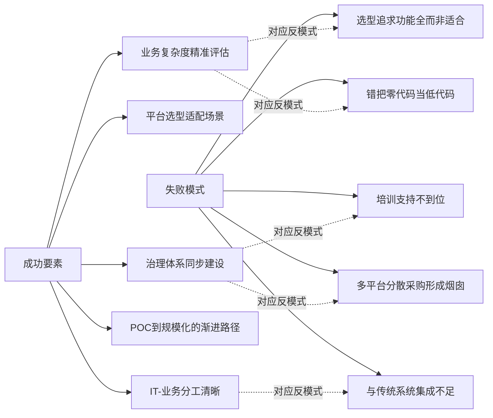

基于成功与失败的双向对照，可以提炼**场景适用性的五步判断准则**：

**第一步：业务复杂度评估**——明确所选场景在"高/中/低兑现区"的位置（参照第3章框架）。表单审批、数据看板、轻量内部应用属高兑现区，CRM/MES/进销存属中等兑现区，核心交易/高并发/特殊协议属低兑现区或反模式。错配的典型表现是用零代码承载ERP核心、用国际企业级处理钉钉宜搭即可解决的内部审批。

**第二步：合规要求识别**——是否需要等保2.0/三级、信创全栈适配、国密、跨境数据合规？金融/政务/军工/医疗等强合规场景必须选择国内企业级阵营，国际平台与轻量平台均属反模式。

**第三步：并发量级测算**——百级（轻量内部应用）、千级（部门级业务系统）、万级（企业级核心）、百万级（C端高并发）——后两者属于零代码与生态集成型阵营的明确反模式，前两者则可由轻量与生态集成型平台承载。

**第四步：生态适配判断**——已使用钉钉/微信/Microsoft 365/华为云中的哪个生态？是否需要跨生态独立交付？跨生态独立交付场景需要避开生态集成型平台的强绑定。

**第五步：长期代价预判**——基于第4章TCO时间曲线，预判第二年与第三年的适配性问题、Vendor Lock-in风险、集成代价反超初期红利的概率。POC不能止于"能搭出来"，必须验证"第二年问题"——源码导出、资产复用、自研托管、性能与并发实测、与遗留系统集成实测。

这五步判断准则将业务复杂度、合规要求、并发量级、生态适配、长期代价五个维度系统化为可操作的选型逻辑，**回应了Rubric中"P-4场景化与边界条件清晰"原则——任何选型决策必须在明确场景边界的前提下进行**。下一章将进入Q4的后半部分回答——LCNC在哪些场景下力有未逮、AI原生与高低代码融合等趋势如何重塑LCNC与传统开发的关系——并将本章建立的"场景—平台—行业"三元匹配实证延伸至未来3-5年的趋势研判。

# 7 适用边界与未来趋势研判

前六章已经在场景、时间、视角、平台、行业五个维度上系统刻画了LCNC的兑现度图景：第3章的S型衰减曲线揭示了效率红利的场景异质性，第4章的TCO时间曲线揭示了隐性成本的时间异质性，第5章的三层结构性错位揭示了视角分歧的人本异质性，第6章的场景—平台—行业三元匹配则将抽象判断落地为可操作的选型逻辑。然而，这些分析仍是基于"当前时点"的静态切片——当我们将视野延伸至未来3-5年，AI原生从插件式辅助升级为底层架构、Agent作为"新数字劳动力"以年复合增长率139%规模化扩张、vibe coding与智能体工程从概念走向工程化范式、信创全栈从加分项变为必选项时，**前六章建立的边界与图景将如何被重塑**？这正是Q4后半部分需要回答的问题。

本章作为本研究的总结性研判章节，承接前六章建立的多维分析框架，转向对LCNC能力边界与未来格局的系统判断。7.1节识别四类力有未逮的场景，7.2节剖析边界的双层结构（技术性可突破vs范式性不可突破），7.3节探查现有边界突破机制的可行性与边界，7.4节展开五大核心趋势的演化路径，7.5节深入分析Agent化开发对LCNC格局的颠覆性影响，7.6节研判LCNC与传统开发关系的三种演化路径，7.7节对全报告四大核心问题做综合回应并为第8章选型框架做过渡。本章核心论点提前预告：**LCNC的边界呈现"技术性可突破"与"范式性不可突破"的双层结构，未来格局既非"完全替代"也非"静态共生"，而是在Agent化开发与AI原生重构下演化为"分层融合的新范式"——传统开发不会消失，但将被重新定位为"5%核心层支撑"与"AI治理与验证层"的双重角色**。

## 7.1 LCNC的能力边界：四类力有未逮的场景识别

前六章在多处揭示了LCNC的能力边界片段——第3章低兑现区的"效率赤字"现象、第4章扩展性瓶颈的非线性恶化、第6章场景—平台匹配矩阵中的反模式标注。本节将这些散点系统化为四类典型的"力有未逮"场景，作为后续双层结构分析的实证素材。

**第一类：超复杂业务逻辑——自定义算法、高性能计算与决策密集型场景**。这类场景的共同特征是业务规则呈"网状依赖"而非"线性流程"——大型金融机构的贷款审批流程中，"客户类型、贷款金额、风险评估结果如同不同颜色的丝线相互交织"（已在第1、3章引用），这种网状依赖难以被预置组件库的标准化建模所覆盖。第6章引用的某电商企业供应链管理案例中，**"预售商品库存锁定""多仓库智能调拨"等定制逻辑使平台内置组件完全无法满足需求**——团队最终在平台外编写大量脚本补丁，反而造成系统架构混乱。Thoughtworks很早提出的"最后10%陷阱"精准刻画了这一形态——**前面80%很快、接下来10%尚可勉强、最后那10%往往压根下不去抽象层，怎么都够不着**[^99]。这一陷阱在风控模型、供应链优化、设备预测性维护等深度领域问题中尤为突出，因为这类问题不仅需要流程编排，更需要领域专家积累的隐性知识——而这些知识在通用大模型与LCNC组件库中覆盖度有限。

**第二类：强定制化UI/UX——精细动画、虚拟滚动、品牌化交互**。这类场景的核心矛盾是"标准化组件库"与"个性化交互"的不可调和。资深前端开发者对此的观察具有代表性——**对做Web应用的工程师来说，拿起React或Vue就像拧开熟悉的扳手；低代码平台看上去是另一条"更快"的路，但不少开发者试过之后，反馈是不好用、学不动、限制多、反而不自由**[^99]。复杂交互、精细动画、虚拟滚动等场景下，前端框架的灵活性远超LCNC平台的预置能力——一个非标准时间轴UI、一次别具一格的增量同步策略、一次跨域奇葩集成，都会撞上抽象边界[^99]。Vue.js作者Evan You关于abstraction leak的观察也指向同一现象——**一些特定场景下，平台所提供的接口、界面或规范不再适用，其抽象层次不再能满足业务场景要求**（已在第5章引用）。零代码平台的UI组件预设性更甚，"虽然可以进行一定程度的调整，但定制化的程度仍然有限"（已在第6章引用），这使其在C端品牌化交互、营销活动差异化呈现等场景下几乎处于反模式状态。

**第三类：对底层架构有严格要求的核心系统——金融核心交易、毫秒级一致性、高并发承载**。这一类边界在前六章已被反复实证，是LCNC最具"硬约束"特征的反模式区。第6章场景—平台匹配矩阵明确将"金融核心系统（交易、账务）"在四大阵营中均标注为反模式——**Gartner明确不适用核心交易、即使信创适配也无法承载毫秒级一致性、属于范式性禁区**。具体形态在多个案例中显化：第4章引用的电商订单系统从0.3秒退化到8秒、餐饮连锁因峰值崩溃放弃平台、OutSystems在并发用户超过5000时性能优化可能抵消初期速度优势——这些案例共同表明，**LCNC平台为了保证可视化建模的通用性，底层架构通常采用通用化、保守化的设计，这种设计在标准业务量级下表现良好，但在并发量级或数据规模跃升时缺乏针对性优化的空间**。金融机构用户调研也明确指出"在金融机构所拥有的个性化、高复杂度的开发需求面前，部分低代码/零代码产品往往未表现出良好的技术效能"（已在第6章引用），多数金融机构领导者将其作为"加持性技术战略"而非替代性方案。

**第四类：需要前沿技术栈的创新型产品——新协议、新硬件、新交互范式**。这类场景的核心特征是技术栈本身仍在快速演进，LCNC平台的预置组件库与连接器生态难以同步覆盖。第3章引用的某科研机构案例——**对接实验室色谱仪实时数据时，发现平台不支持OPC UA协议，只能通过第三方插件中转，光插件调试就花了1周，数据延迟还高达5秒**——是这一边界的典型呈现。当企业需要使用新硬件协议（如工业互联网中的TSN时间敏感网络）、新交互范式（如AR/VR/MR沉浸式应用）、新底层栈（如WASM、边缘AI推理）时，LCNC平台往往滞后于技术演进3-5年的窗口，使创新型产品在LCNC上几乎无法启动。

下表整合四类边界的核心特征与显化形态：

| 边界类型 | 核心特征 | 典型场景 | 显化形态 | 代价规模 |
|---------|---------|---------|---------|---------|
| 超复杂业务逻辑 | 网状依赖、深度领域知识 | 风控、供应链优化、保险精算 | "最后10%陷阱"、平台外脚本补丁 | 维护成本远超预期、架构混乱 |
| 强定制化UI/UX | 个性化交互、品牌化体验 | 精细动画、虚拟滚动、独创时间轴 | 抽象层泄漏、推倒用Vue/React重写 | 多花数倍工期、用户体验受损 |
| 核心系统底层 | 毫秒级一致性、高并发 | 金融核心交易、电商峰值订单 | 性能非线性恶化、平台天花板 | 系统重构、放弃LCNC路线 |
| 前沿技术栈 | 新协议、新硬件、新范式 | OPC UA、AR/VR、边缘AI | 平台不支持、第三方插件勉强中转 | 1周调试仍不达性能要求 |

需要审慎指出，四类边界并非彼此孤立，而是经常在企业级复杂场景中**叠加显化**——一个金融核心交易系统不仅涉及第三类的毫秒级一致性，还可能涉及第一类的复杂风控逻辑与第四类的新硬件加速。这种叠加显化是第3章低兑现区"效率赤字"乃至"负收益"的结构性根源。

## 7.2 边界的双层结构：技术性局限与范式性约束的区分

7.1节识别的四类边界呈现一个共同问题：它们究竟是LCNC作为一种工具的"暂时局限"——可以被技术演进逐步突破？还是作为一种范式的"根本约束"——无论技术如何演进都难以消除？这一区分对应Rubric中"P-5技术演进趋势的前瞻性"原则——**区分'当前的技术局限'与'范式性约束'，前者可能被未来技术突破，后者则是结构性的**。本节将四类边界进一步划分为双层结构，为7.4—7.6节的趋势研判提供机制性基础。

**技术性暂时局限层**包括AI生成准确率上限、特殊协议适配能力、性能优化空间、组件库丰富度、跨云迁移工具链等具体技术能力。这一层的特征是其改善路径明确、改善节奏可预期：

第一，**AI生成准确率正在持续提升**。第3章揭示了"厂商宣称80%—92%准确率与企业级60%—70%可上线率之间存在20—30个百分点鸿沟"，但这一鸿沟随大模型能力演进、领域微调深化、多智能体协同成熟正在持续收窄——即便假设大模型在未来3-5年内将企业级场景准确率提升至95%以上[^91]，这一改善虽不能完全消除鸿沟，但确实可以将"中等兑现区"的相当部分场景"上移"至高兑现区。

第二，**特殊协议与连接器生态持续扩展**。Power Apps已具备1000+连接器（已在第6章引用），随着MCP（Model Context Protocol）等开放标准的推进，跨平台、跨协议、跨智能体的连接将进一步标准化——Anthropic的MCP协议、谷歌的A2A协议等开放标准刚刚推出（已在第2章引用），未来3-5年这一生态的成熟将显著降低第四类边界的代价。

第三，**性能优化空间随云原生与底层架构升级而扩展**。Mendix与K8s/私有云的天然衔接、华为云Astro的鸿蒙生态融合、各平台微服务化重构（已在第6章引用），都在为LCNC平台的性能天花板做结构性提升。第6章引用的浪潮inBuilder支持10万+并发的实证，已表明国内企业级阵营在并发承载上的边界正在持续后移。

**范式性根本约束层**则源于"抽象换效率"这一LCNC核心机制本身，无法通过单点技术改进消除。这一层的核心约束包括三个：

**第一约束：抽象封装与底层灵活性的不可调和矛盾**。LCNC的核心机制是通过抽象封装屏蔽底层复杂度——这一封装在标准化场景下是效率红利的源泉，但在需要底层灵活性的场景下则是结构性障碍。Joel Spolsky的抽象泄漏法则（已在第5章引用）从计算机科学一般原理上指出——**任何抽象在特定边界条件下都会"泄漏"出底层细节，使使用者必须穿透抽象层去理解原本被屏蔽的复杂度**。这一矛盾不是某个具体平台的技术缺陷，而是"抽象"作为一种认知工具的固有属性——只要LCNC平台保持其"抽象封装"的核心机制，这一矛盾就无法被根本消除，只能在不同场景下做"封装多深、灵活性留多少"的权衡。

**第二约束：核心交易系统的毫秒级一致性与LCNC通用化架构的范式冲突**。金融核心交易、证券交易所撮合、ATM级吞吐这类场景需要的不仅是高并发，更是毫秒级强一致性、确定性延迟、零故障容忍——这些要求需要从硬件、操作系统、数据库、网络协议到应用代码的全栈深度优化。LCNC的通用化、可视化、模型驱动架构在设计目标上就与这种"全栈深度优化"相矛盾——**单一runtime无法支撑股交所/ATM级吞吐，即使信创适配也无法承载毫秒级一致性，属于范式性禁区**。即便未来LCNC平台的性能持续提升，它也无法在保持"业务人员可参与"前提下，与高度专业化的核心交易系统比拼极限性能——这是设计目标的范式性冲突，而非技术能力的暂时不足。

**第三约束：强定制化创造性工作的本质不可标准化**。品牌化UI/UX、独创交互范式、艺术化视觉表达等场景的本质是"创造性差异化"——其价值恰恰在于"与标准不同"。LCNC平台基于"标准化组件库+模板复用"的范式天然倾向于"趋同化输出"，这与"创造性差异化"的需求构成范式冲突。即便未来AI生成能力大幅提升，AI生成的"创造性"仍受限于训练数据的统计分布——**资深开发者观察的"AI永远无法从训练数据中找到第一性原理"**[^74]，揭示了AI在真正创造性工作上的范式性局限。

下表整合双层结构与四类边界的对应关系：

| 边界类型 | 技术性局限部分 | 范式性约束部分 | 突破可能性 |
|---------|--------------|--------------|----------|
| 超复杂业务逻辑 | AI建模准确率、领域知识库丰富度 | 网状依赖与可视化建模的认知冲突 | 部分突破，长尾难根除 |
| 强定制化UI/UX | 组件库丰富度、AI生成视觉能力 | 创造性差异化的本质不可标准化 | 表层突破，深层不可调和 |
| 核心系统底层 | 单平台性能优化、并发承载上限 | 通用化架构与极限性能的范式冲突 | 边界后移，但禁区永存 |
| 前沿技术栈 | 连接器生态、协议适配速度 | LCNC天然滞后于前沿创新3-5年 | 持续追赶但难以引领 |

下表揭示了一个**关键洞察**：**四类边界都不是纯粹的技术性局限或纯粹的范式性约束，而是二者的混合体——其中技术性部分将随AI演进、信创深化、生态成熟而被持续突破，而范式性部分则是LCNC作为一种范式的固有属性，无论技术如何演进都将持续存在**。这一双层结构的识别对Rubric中"P-5技术演进趋势的前瞻性"原则给出了具体回应——**对当前局限保持审慎乐观（可以被突破），对范式性约束保持理性清醒（不可能完全消除）**。这一双层判断也将7.1节的"四类边界"从静态识别升级为动态分析框架，为7.3—7.6节的趋势研判提供了机制性锚点。

## 7.3 边界突破机制：高代码扩展、源码导出与混合架构的可行性

既然边界呈现双层结构，那么企业实践中已经发展出哪些机制来突破边界？这些机制能突破哪一层、又在哪一层失效？本节系统剖析四类典型的边界突破机制及其有效性。

**机制一：高代码扩展与"逃生舱"**。多数企业级LCNC平台都提供了某种形式的"逃生舱"——允许开发者在平台内嵌入传统代码以应对超出抽象层能力的需求。Mendix明确支持Java Action、JavaScript Action，把复杂逻辑或性能关键路径下沉到代码里[^99]。这一机制在突破第一类（超复杂业务逻辑）和部分第三类（性能关键路径）边界上具有现实价值——通过在Mendix应用中嵌入Java Action处理复杂的优化算法，企业可以在保留LCNC敏捷性的同时获得传统编码的灵活性。

但"逃生舱"的有效性存在清晰边界。资深开发者的观察揭示了这一边界的具体形态——**你会发现一落地就要面对任务队列、微流与纳米流的边界、异步限制与部署配套，这和在React里直接写一个自定义Hook或在Node里加个微服务，心智负担完全不同。平台外的代码需要遵循平台的装配与生命周期，不是"随便写就能用"**[^99]。这意味着即便有逃生舱，开发者仍然要承担"理解平台装配规则"的额外认知负担——**逃生舱不是"无成本逃逸"，而是"以更高心智负担换取灵活性"**[^99]。这一观察对应第5.3节抽象层泄漏逻辑——逃生舱本身就是抽象层泄漏的工程化承认，它确认了"抽象层会失效、必须有底层穿透通道"的事实。

**机制二：源码导出与可逆切换**。源码导出是对Vendor Lock-in（第4章核心隐性成本之一）的直接对冲。第6章引用的国内企业级阵营中，**CodeWave作为唯一支持完整源码导出的平台**、织信支持私有化买断，已经形成了对锁定风险的差异化产品策略。OutSystems的厂商文档与社区帖子虽然告诉用户"可以导出源码或脱离平台运行"，但同时也提醒这是一条投入巨大、过程复杂的路，包含框架绑定、运行时依赖、运维模型重建等问题——**你当然能走，但不一定愿意走**[^99]。

源码导出机制的有效性存在双重边界。**第一，"可导出"不等于"易迁移"**——即便平台允许导出源码，运行时引擎、专有数据模型、平台特有的装配规则等仍与导出代码深度耦合，迁移到独立环境需要重写大量基础设施支撑代码。Mendix迁移重写成本可达原投入180%、从Salesforce迁移至Mendix需重写70%业务逻辑（已在第4章引用）的数据，揭示了即使有可导出的源码，迁移代价仍可能远超企业承受能力。**第二，"源码可读"不等于"工程可维护"**——AI生成的代码在第3章已被实证为"变量命名混乱、嵌套3层if、流程跳转逻辑藏在深层"，这种代码即便被导出，其后续维护成本也可能高于从零开始用传统方式重写。

**机制三：混合架构与"专业低代码"双向可逆**。这是第2章详细论述的80/15/5分层共生范式的工程化承诺——业务专家通过可视化工具完成80%的标准化功能，专业开发者聚焦剩余的20%复杂逻辑，两者在同一平台上协同[^86]。其关键特征"双向可逆与持续迭代"——**在低代码设计过程中可以随时切换到专业代码开发，且这种切换是可逆、可持续迭代的**[^86]——使开发者在标准化场景享受效率红利，在复杂场景保留传统编码灵活性。

混合架构对突破第一类、第二类边界具有结构性价值——它通过"分层主权"机制使创造性工作（如品牌化UI、独创算法）可以下沉到5%高代码层，由专业开发者用传统编码完成；而LCNC平台仅在中上层提供敏捷性支撑。但混合架构对突破第三类范式性禁区无能为力——核心交易系统的毫秒级一致性需要"全栈深度优化"，不能简单通过"业务流程用低代码搭、核心引擎用高代码写"的分层方式实现，因为核心交易系统的"抽象层封装"本身就是性能瓶颈的来源。

混合架构还需要警惕"伪融合"陷阱——**很多平台仅停留在可视化层，模型输出的是封闭的专有格式，一旦切换到代码就无法回退**（已在第2、5章引用）。第5章已指出，"伪融合平台的典型特征是源码导出有限、双向切换不可逆、底层架构封闭"——企业在选型时必须明确测试这些能力，避免被"融合"宣传话术误导。

**机制四：平台外补丁与中间件**。当上述三种机制都无法解决问题时，企业实践中常见的兜底方案是"平台外补丁"——在LCNC平台之外编写传统代码或部署中间件来绕过平台限制。第6章引用的某零售企业用Python编写中间件绕过SOAP协议限制即是这一机制的典型应用。

这一机制的"次生陷阱"需要审慎指出——平台外补丁虽然解决了具体问题，但它结构性地破坏了LCNC的统一治理能力。当一个企业在LCNC平台之外散布5个、10个甚至更多Python脚本、Node.js中间件、shell定时任务时，**它实际上是在LCNC治理体系之外建立了一套"影子运维体系"**——这些补丁通常缺乏统一的监控、版本管理、合规审计，反而成为新的技术债务来源。这与第4章揭示的"系统烟囱"反模式具有同构性——补丁越多，治理成本越高。

下表整合四类边界突破机制的有效性与边界：

| 突破机制 | 突破能力 | 不能突破 | 次生风险 |
|---------|---------|---------|---------|
| 高代码扩展（逃生舱） | 第一类长尾、第三类局部性能 | 第三类范式禁区、第二类创造性 | 心智负担、装配规则约束 |
| 源码导出 | Vendor Lock-in风险 | 运行时绑定、AI代码可维护性 | 导出≠易迁移、迁移成本仍高 |
| 混合架构 | 第一类、第二类的分层兼容 | 第三类全栈优化要求 | "伪融合"陷阱、工程化能力门槛 |
| 平台外补丁 | 第四类协议适配、临时绕行 | 治理统一性 | 影子运维体系、新技术债务 |

下表揭示一个**结构性结论**：**现有突破机制在技术性局限层有相当成效，但在范式性约束层几乎无能为力**——逃生舱可以处理第一类的部分长尾，源码导出可以对冲Vendor Lock-in，混合架构可以分层共担，平台外补丁可以应急绕行；但毫秒级一致性的范式禁区、创造性差异化的不可标准化、抽象层泄漏的固有矛盾，都不会因为这些机制而消失。这一结构性结论印证了7.2节"双层结构"的判断——**LCNC的能力边界正在被技术演进持续后移，但范式性边界将长期存在**。这一判断对Rubric中"P-6逻辑链条与因果严谨性"原则的具体回应是——**任何宣称"LCNC可以做一切"的论断都需要被审慎质疑，因为范式性约束不会被工具改进消除，只能被场景选择回避**。

## 7.4 未来3-5年五大核心趋势的展开路径

在边界与突破机制的分析基础上，本节研判驱动LCNC生态在未来3-5年演化的五大核心趋势。这些趋势之间相互耦合，共同塑造LCNC与传统开发关系的新格局。

**趋势一：AI原生深化——从代码辅助到多智能体协同**。这是五大趋势中演化速度最快、影响最深的一支。第2章已论证AI从"插件式辅助"到"底层架构组件"的质变，第3章实证了AI生成准确率从60%向92%的演进区间，本章7.1—7.3节进一步揭示AI演进对部分技术性边界的突破能力。在未来3-5年的展开路径上，**IDC的预测给出了规模化指标的指数级图景——活跃Agent的数量将从2025年的约2860万快速攀升至2030年的22.16亿，年复合增长率139%；年执行任务数将从2025年的440亿次暴涨至2030年的415万亿次，年复合增长率高达524%；预计年度Token消耗将从2025年的0.0005 PetaTokens暴增至2030年的152,667 PetaTokens，年复合增长率高达3418%**[^86]。这三组数字反映的不只是Agent数量的增长，更是任务复杂度与推理深度的指数级提升[^86]。

IDC将企业侧Agent分为四类——**应用内Agent、低代码/无代码配置型Agent、独立Agent、定制化开发Agent**[^86]——这一分类直接将LCNC定位为四大Agent来源之一，**赋予LCNC在Agent化时代的战略身位**。其中应用内Agent是产业发展早期中小企业拥抱AI的首选[^86]，但"多数业务应用本身具有一定封闭性，其产品边界往往会成为应用内Agent能力外延的边界。随着企业需求从单点提效走向端到端协同，封闭性可能会成为它进一步发展的瓶颈"[^86]——这一观察恰恰为低代码/无代码配置型Agent的成长留出了空间。**LCNC平台作为Agent生成与治理的载体，其市场身位将从"应用生成工具"升级为"Agent业务化承载平台"**。

**趋势二：信创全栈适配从加分项到必选项**。这一趋势在第1章已详细论述，未来3-5年将进一步深化。**IDC数据显示，2025年政企客户复杂核心系统开发需求占比超65%，信创适配能力直接决定了平台在关键行业的竞争力**（已在第1章引用）；具备全栈适配能力的国内企业级LCNC平台市场占有率已达58%（已在第1章引用），未来这一比例还将持续上升。第6章引用的JeecgBoot集团OA案例（12周交付1000+审批表单、5个国产软硬件栈打通）展示了信创全栈的工程化成熟度，普元、奥哲、织信、华为Astro、浪潮inBuilder等代表平台已形成相对完整的国产化技术栈生态。这一趋势的深远影响是——**中国LCNC市场将形成与国际市场相对独立的技术栈与生态体系**，国际企业级阵营在中国关键行业的市场空间将进一步收窄至跨国企业的非信创业务板块。

**趋势三：高低代码融合走向"专业低代码"标准化**。这是第2、5、6章持续追踪的趋势，未来3-5年将走向产品形态的标准化。Gartner预计到2026年85%的企业级低代码平台将采用"可视化配置+全量源码生成+异构系统集成"的混合架构（已在第1、2章引用）——这一比例意味着"专业低代码"将从少数厂商的差异化优势演变为行业标配。其工程化形态将进一步成熟——**模型驱动的架构基础（无代码可视化建模建立在专业代码之上、模型输出可执行的专业代码）、双向可逆与持续迭代（设计过程中随时切换到专业代码、切换可逆可持续）、统一的版本与运维管理（无论无代码配置还是传统代码编写都纳入统一版本管理与DevOps流水线）、业务与IT的协同分工（业务专家完成80%、专业开发者聚焦20%）**[^86]——这四大特征将成为评判平台成熟度的标准化指标。

这一趋势对LCNC市场的洗牌效应不容低估——**仅停留在可视化层、模型输出封闭专有格式、一旦切换到代码就无法回退的"伪融合"平台将逐步被淘汰**，而具备真正双向可逆能力的平台将获得专业开发者群体的认可，进而部分化解第5章揭示的开发者抵触困境。

**趋势四：垂直行业模板化深化**。LCNC从"通用化平台"向"行业垂直化平台"的演化已在第1章被识别为重要趋势——**针对特定行业（如金融、医疗、制造等），低代码平台将提供更专业的组件和模板，满足行业定制化需求**[^114]。第6章已实证的多行业落地案例显示，金融、制造、政务、零售各行业已形成较为成熟的行业知识资产沉淀——华夏银行i助手的精准营销/智慧经营/合规管理多场景模板、卡奥斯天马覆盖60%+应用的工业模板、JeecgBoot集团OA的政务模块化沉淀、腾讯微搭的零售C端触点积累等，都是行业模板化的具体形态。

未来3-5年，这一趋势将向两个方向深化——**第一，模板深度从"通用流程"向"行业关键流程+行业知识图谱+行业合规规则"演进**，使企业从"使用通用工具搭建行业应用"升级为"使用行业知识资产快速复用"。**第二，模板生态从"厂商主导"向"厂商+ISV+客户共建"演进**，形成可交易的行业资产市场。这一演进将进一步降低LCNC在垂直行业的落地门槛，但也加深了"行业生态绑定"的隐性锁定风险。

**趋势五：LCNC升级为"企业级数智基座"**。这是五大趋势中最具战略意义的一支——LCNC正从"应用生成工具"升级为承载AI能力、Agent协同、跨系统集成、统一治理的企业级数智基座。这一升级在前述四个趋势的叠加下成为必然——AI原生使LCNC成为AI能力的承载层、信创全栈使LCNC成为国产化栈的中间层、专业低代码使LCNC成为业务与IT的协同层、行业模板使LCNC成为行业知识资产的沉淀层。这四层叠加的结果，是LCNC在企业IT架构中的定位从"工具级应用"跃迁至"平台级基础设施"——**第1章引用的中国通信标准化协会2024低代码·无代码产业大会发布《基于大模型的低代码开发平台技术要求》标准、推动LCNC从"工具级应用"向"平台级基础设施"跃迁的判断**，将在未来3-5年得到进一步验证。

下图整合五大趋势的相互耦合关系：

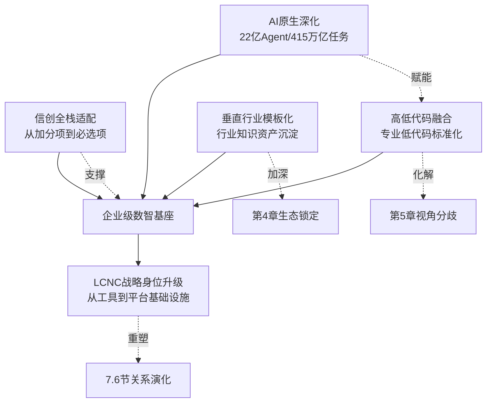

下图揭示了五大趋势的内在关联——AI原生与高低代码融合相互赋能（AI让融合更智能、融合让AI更可控），信创全栈与企业级基座相互支撑（信创需要平台底座、基座必须适配信创），垂直行业模板与生态锁定形成新的张力（行业资产价值越高、迁移代价越大）。**五大趋势的叠加效应将使LCNC在未来3-5年呈现"能力急速扩张+定位战略性跃迁+边界结构性收窄"的复合演化形态**——能力的扩张回应了技术性局限的突破，定位的跃迁回应了战略身位的提升，而范式性约束则将LCNC的边界结构性地约束在"5%核心层之外"的战略空间。

## 7.5 Agent化开发与vibe coding对LCNC格局的颠覆性影响

7.4节五大趋势中AI原生深化的影响最具不确定性，也最具颠覆性。本节深入分析2025-2026年AI编程运动（vibe coding、智能体工程、Agent作为数字劳动力）对LCNC格局的潜在颠覆性影响，并基于"现实校准"运动给出审慎判断。

**vibe coding运动的兴起与本质**。**2025年2月2日，AI研究员Andrej Karpathy随手发出一条推文，在48小时内被浏览450万次；十个月后，这条推文里的"vibe coding"一词成为柯林斯英语词典2025年年度词汇**[^86]。从2020年GitHub六人小组在实验室里擦燃第一根火柴，到2026年"智能体工程"作为专业范式正式登台，**六年间AI编程依次经历了幽灵文本、意图革命、全民狂欢、信任危机、工业化浪潮与集体宿醉，最终在清醒中寻找第二个名字**[^86]。这一弧线本身揭示了AI编程运动的内在张力——它既是技术工具的演进史，也是"人类如何把'写代码'这件事的定义彻底重写"的范式编年史[^86]。

vibe coding对LCNC的潜在威胁在于其**直接挑战了LCNC的核心价值主张——"可视化建模与拖拽配置使非技术人员能够参与开发"**。如果AI编程能让用户用自然语言直接生成代码、并通过Agent自主完成调试与部署，那么LCNC的"可视化中间层"似乎成为多余——**用户为什么要学习一个特定平台的拖拽规则，而不是直接用自然语言对Agent说"给我搭一个采购审批系统"**？这一挑战在Karpathy推文走红后的"全民狂欢"阶段几乎成为业界共识，催生了一波"vibe coding将取代低代码"的判断。

**Hacker News与Reddit的"现实校准"运动**则给出了截然不同的视角。**在Hacker News上，一篇题为《Superpowers: How I'm using coding agents in October 2025》的文章引发了超过150条评论的激烈讨论。令人意外的是，批评声音占据了主流。一位拥有10年以上经验的开发者直言不讳地指出："我尝试让AI agent完成一个简单的CSV格式转换任务，结果却是一团糟。我最后撤销了所有改动，从头手写反而更快。"这条评论获得了89个赞**[^74]。更具洞察力的总结来自一位技术老将——**"AI编码工具只在微任务上表现出色——前提是你给出明确指令，并处于文档完善的架构中。一旦给AI自由发挥的空间，它永远无法从训练数据中找到第一性原理。"这番话道出了当前AI agent的核心困境：在约束环境中有效，在开放场景中失效**[^74]。

**Reddit的"现实校准"运动同样深刻**——在r/AI_Agents子版块，一篇名为《AI agents reality check: We need less hype and more reliability》的帖子得到了93%的支持率。作者是一位为对冲基金和做市商开发AI系统的从业者，他的观点格外犀利——**"2025年确实是agent之年，但客户需要的不是复杂AI系统，而是简单可靠的自动化工作流，有明确的ROI。那些'订机票'的agent演示离实际需求太遥远了。"**[^74] 他列举的三个真正落地的AI agent用例——网页监控、网页抓取、公司财报提取——揭示了一个**关键判断**：**这些看似"不性感"的场景，恰恰是AI agent真正创造价值的地方——自动化繁琐重复工作，而非替代人类创造力**[^74]。

**"驾驭工程"（Harness Engineering）作为新范式的兴起**。在2026奇点智能技术大会的圆桌讨论中，话题"从早期的提示工程，延伸到上下文工程，再到当下逐渐受到关注的'驾驭工程'（Harness Engineering）"[^88]。这一从提示工程到驾驭工程的演进，揭示了AI编程运动的成熟方向——**不再追求让AI自主完成一切，而是构建严谨的"驾驭框架"使AI在受控环境下产生可靠结果**。Hacker News的资深架构师对这一新范式给出了一个发人深省的类比——**"使用AI coding agent就像被提拔为技术主管——你需要清楚解释需求，让它阐述实现方案，给出反馈，然后极其仔细地审查结果。你需要编写风格指南、项目工作文档、建立严格的自动化质量检查。这跟管理实习生没什么两样。"**[^74]

基于上述实证，可以对Agent化开发与LCNC格局的关系做三个关键判断：

**判断一：Agent化开发不会取代LCNC，而是与LCNC形成共生关系**。Agent擅长"在约束环境中完成特定任务"，但缺乏"治理机制"——而LCNC平台恰恰是Agent的天然治理框架。Gartner明确指出"AI低代码平台的核心价值在于为AI生成内容提供治理机制，包括访问控制、审计日志和内置验证框架"（已在第2、3章引用）——这一定位在Agent时代被进一步强化。**LCNC将从"应用生成工具"转向"Agent业务化承载与治理平台"**——这是7.4节趋势五"企业级数智基座"在Agent时代的具体形态。

**判断二："自然语言编程"与"拖拽配置"是融合而非替代的关系**。第2章已论述LCNC的需求建模重构呈现"自然语言+可视化"的混合形态——钉钉宜搭通过DeepSeek使非技术用户能够通过拖拽与自然语言相结合的方式快速创建AI应用[^90]。在Agent化时代，这一混合将进一步深化——**自然语言用于表达高层意图、Agent自主完成中层执行、可视化用于审查与调整、专业代码用于深度定制**——四层协同将成为新的开发范式。某团队仅用3人就撑起一个日均万单的平台研发，关键在于"工具用得有多巧"——通过织信低代码的可视化配置搭出能直接上线的核心功能、借助AI助手生成复杂逻辑的解决方案编码[^90]——这一实践已经体现了"低代码+AI"的融合范式雏形。

**判断三：AGI到来不会使LCNC失去存在意义**。即便假设AGI在未来某个时点实现，企业仍需要"将AGI能力嵌入业务流程、确保合规与治理、实现跨系统集成"的中间层——这一中间层的需求不会因AGI存在而消失，反而会因AGI能力的不可控性而更加重要。LCNC在AGI时代的可能形态是**"AGI驱动的智能基座+人类设计的业务约束层+专业开发者维护的治理层"**——LCNC仍然存在，但其内涵从"低代码工具"演化为"业务约束与AI治理的统一平台"。

```mermaid
graph LR
    A[2020-2022<br/>幽灵文本] --> B[2023-2024<br/>意图革命]
    B --> C[2025<br/>vibe coding狂欢]
    C --> D[2025末<br/>信任危机/现实校准]
    D --> E[2026<br/>智能体工程/驾驭工程]
    E --> F[未来3-5年<br/>Agent+LCNC共生]
    C -.推文450万浏览.-> C1[Karpathy命名]
    D -.r/programming封禁AI.-> D1[Reddit反弹]
    D -.93%支持率"现实校准".-> D2[r/AI_Agents]
    E -.可靠性大于自主性.-> F1[LCNC作为治理框架]
```

下图展示了AI编程运动从狂热到理性回归的完整弧线，也展现了LCNC在这一弧线中的战略位置——**狂欢期被误判为"将被取代"的工具，在现实校准期被重新发现为"Agent的治理框架"，并在驾驭工程时代获得新的战略身位**。这一定位回应了Rubric中"P-5技术演进趋势的前瞻性"原则——**对AI演进保持开放心态（接受其颠覆性可能），同时识别"在约束环境中有效、在开放场景中失效"的本质特征（接受其可靠性局限）**。基于这一双重接受，LCNC在Agent时代不是被颠覆的对象，而是承载Agent能力、提供治理框架、化解可靠性局限的关键平台。

## 7.6 LCNC与传统开发关系的三种演化路径研判

基于7.1—7.5节的边界分析与趋势研判，本节对LCNC与传统开发关系的演化路径做系统比较与概率研判。这一研判直接回应Q4后半部分关于"未来格局"的核心问题。

**路径一：完全替代——传统开发被LCNC全面取代**。这一路径的核心假设是LCNC平台的能力随AI演进、信创深化、模板化沉淀持续扩张，最终可以承载所有企业开发场景。这一路径的支撑数据是Gartner"到2026年70%的新应用将通过LCNC构建"等高比例预测，以及厂商关于"AI低代码重构开发范式"的宣传话术。

但这一路径在7.2节的双层结构分析下被证伪——**范式性约束的存在使LCNC永远无法承载第三类核心系统底层场景与第二类强定制化创造性工作**。即便70%的新应用通过LCNC构建，仍有30%是LCNC无法触及的核心系统、深度算法、创造性工作；而这30%恰恰是企业最具战略价值、最不能容忍失败的部分。**Gartner自身明确将"金融核心交易系统"列为LCNC的反模式区**（已在第6章引用），其70%预测从未声称包含核心交易系统——这一边界使"完全替代"路径在范式上不成立。

**路径二：分场景共生——LCNC与传统开发在不同场景下并行不悖**。这一路径的核心假设是80/15/5的分层模型在企业内部稳定存在——LCNC占据标准化业务系统的80%份额、传统开发保留核心系统与算法的5%份额、中间15%由二者协同完成。这一路径在第6章场景—平台匹配矩阵中已被广泛实证。

但这一路径在7.4节五大趋势的演化压力下呈现不稳定性——**AI演进将持续重塑场景边界**：当AI使中等兑现区的相当部分场景"上移"至高兑现区时，80/15/5的比例将向更高的LCNC占比偏移；当Agent化开发使LCNC从"应用生成工具"升级为"AI业务化承载平台"时，传统开发的15%—20%中间层将被Agent驱动的"自然语言+拖拽+源码"混合范式所部分吸收。**静态分场景共生不能描述未来3-5年的真实演化——边界本身在持续移动**。

**路径三：融合演化为新范式——AI原生底座+分层共生架构+Agent化交付**。这是本研究倾向的判断路径，其核心假设是LCNC与传统开发不再是"两种独立的开发模式"，而是融合演化为一种新的混合范式——**AI原生底座承载所有应用的智能能力、分层共生架构组织业务方与开发者的协同分工、Agent化交付驱动从需求到运维的全链路智能化**。在这一新范式下，传统开发不会消失，但将被重新定位为两种角色的双重支撑：

**第一重角色：5%核心层支撑**——为新范式中无法被LCNC承载的核心交易、深度算法、强定制创造性工作提供专业开发能力。这一角色对应7.1节第三类、第二类边界的范式性约束部分，是任何工具演进都无法消除的传统开发不可替代性。

**第二重角色：AI治理与验证层**——为AI生成内容的可靠性、可解释性、合规性、可审计性提供专业工程支撑。Hacker News的"管理实习生"类比与"驾驭工程"的兴起共同指向这一角色——**AI生成的代码、Agent执行的任务都需要"被严格审查、被嵌入治理框架"，而这一审查与治理工作必须由具备工程严谨性的专业开发者承担**。

下表整合三种路径的核心假设、支撑论据与概率研判：

| 演化路径 | 核心假设 | 支撑论据 | 反驳论据 | 概率研判 |
|---------|---------|---------|---------|---------|
| 完全替代 | LCNC承载所有场景 | Gartner 70%预测、厂商宣传 | 范式性约束、Gartner反模式判定、瑞信42%适配陷阱 | 极低 |
| 分场景共生 | 80/15/5比例稳定 | 第6章场景—平台匹配实证 | AI演进重塑边界、Agent化吸收中间层 | 中等（短期） |
| 融合演化新范式 | AI底座+分层共生+Agent交付 | 7.4五大趋势、7.5现实校准、第2章融合架构 | 新范式落地依赖治理水平 | 高（中长期） |

下表揭示一个**结构性判断**：**完全替代路径在范式上不成立、静态分场景共生在动态演化下不稳定、融合演化为新范式具有最高概率**。这一判断与第2章末"分层式范式重构"的初步定性形成呼应——**第2章是"当前时点的分层重构"，第7章是"未来时点的融合演化"，二者共同构成LCNC从工具到范式的完整演化弧线**。

需要审慎指出，融合演化为新范式的具体形态高度依赖三个关键不确定性变量：**第一，AI演进速度**——若大模型能力在未来3-5年实现指数级跃迁（特别是在领域知识深度、推理可靠性、可解释性方面），融合范式将快速成熟；若演进放缓，分场景共生的中期形态将延长存续时间。**第二，Agent协议标准化**——MCP、A2A等开放标准的成熟度将决定Agent生态的开放性与可治理性；若标准化滞后，Agent化交付将停留在单平台层面，难以形成跨生态的新范式。**第三，AGI到来时点**——若AGI在未来5-10年实现，新范式的内涵将进一步演化为"AGI驱动的智能基座+人类设计的业务约束层+专业开发者维护的治理层"；若AGI仍然遥远，新范式将聚焦于"高级AI辅助下的混合开发"。

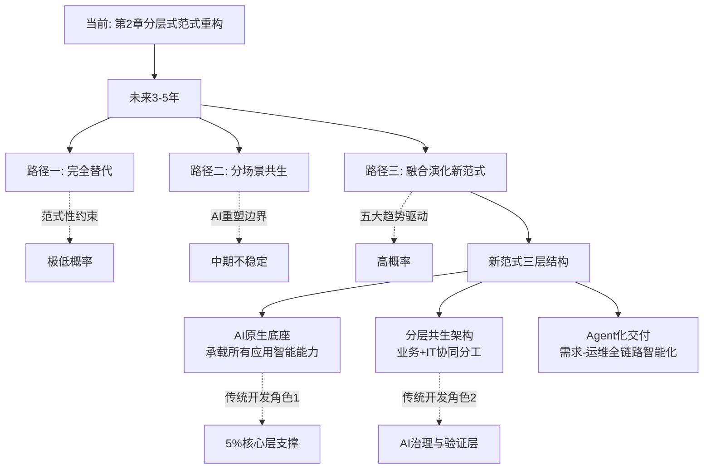

这一研判在企业实践层面具有清晰的指导意义——**企业不应押注"完全替代"路径下的"全LCNC化"，也不应固守"分场景共生"的静态分工，而应面向"融合演化新范式"做前瞻布局**：选择具备AI原生底座的平台、构建分层共生的研发组织、建立Agent化交付的工程化能力、保留专业开发团队的核心层支撑与治理层主权。这一前瞻布局正是第8章选型决策框架的战略基础。

## 7.7 对全报告四大核心问题的综合回应与展望

作为本研究的总结性研判章节，本节回扣第1章末提出的四大核心问题，在前六章实证基础与本章趋势研判之上给出整合性结论，并为第8章选型决策框架做承上启下的过渡。

**Q1：影响幅度问题——LCNC对传统开发流程的影响是"颠覆性替代"还是"补充性优化"**？

第2章已给出初步回答——LCNC的影响是"分层式范式重构"。本章7.6节进一步将这一判断延伸至未来3-5年——**LCNC的影响既不是颠覆性替代，也不是简单的补充性优化，而是在融合演化为新范式的过程中重新定义"开发"这一活动的核心要素**。在新范式下，"谁来开发""如何描述需求""应用是什么""如何治理AI"等根本问题都被重塑——这种重塑的深度足以被称为"范式重构"，但其方式不是单方替代而是分层融合。**传统开发不会被LCNC消灭，而会被LCNC重新定位为"5%核心层"与"AI治理层"的双重支撑——这是LCNC对传统开发关系的最终演化形态**。

**Q2：效率真实性问题——LCNC宣称的5-10倍效率提升、300%-500%开发加速在多大程度上为真**？

第3章已给出条件性回答——效率红利真实存在，但呈现高度的场景异质性与时间异质性，遵循S型衰减曲线。本章7.4节趋势一进一步揭示——**AI演进将使S型曲线发生整体上移**：当大模型能力提升、领域微调深化、Agent协同成熟时，原本属于中等兑现区的相当部分场景将"上移"至高兑现区，原本属于低兑现区的部分场景将"上移"至中等兑现区。这一上移意味着未来3-5年LCNC的整体效率红利将被持续放大——**但S型曲线的形态不会改变，低兑现区与"效率赤字"区将永远存在，对应7.2节范式性约束部分**。企业在引用效率数据时仍需明确场景边界，避免被"全场景效率提升"的话术误导。

**Q3：维护成本与代价问题——LCNC在长期使用中是否会带来被低估的隐性成本**？

第4章已给出条件性回答——隐性代价真实存在、规模可观、具有结构性特征，70%用户遭遇隐性成本反噬、五年TCO可能反超传统150%、企业级核心场景下放大系数高达5-10倍，但代价具有可对冲性。本章7.4节趋势三"专业低代码标准化"与趋势五"企业级数智基座"的演化将进一步降低部分隐性代价——**当85%企业级低代码平台采用"可视化配置+全量源码生成+异构系统集成"混合架构时，Vendor Lock-in风险将被系统性降低；当LCNC升级为统一治理底座时，"系统烟囱"反模式将被前置避免**。但范式性约束部分的代价（如抽象层泄漏、混合调试难度、技能特异性）仍将持续存在，需要通过组织治理与平台选型做持续对冲。

**Q4：视角分歧与未来走向问题——业务管理者与专业开发者对LCNC的认知分歧本质是什么？AI原生、信创适配、高低代码融合等趋势将如何重塑LCNC与传统开发的关系**？

第5章已给出回答的前半部分——分歧本质是观察窗口、控制权位置、抽象层位置三者的结构性错位。本章7.5节、7.6节给出回答的后半部分——**未来3-5年AI原生与高低代码融合等趋势将通过两条路径化解分歧的部分形态**：第一，专业低代码标准化使开发者重新获得"技术控制权"（双向可逆切换、源码导出、混合架构）；第二，Agent化开发使开发者从"被工具威胁的执行者"重新定位为"管理AI的技术主管"（驾驭工程、AI治理与验证）。但分歧的范式性部分（控制权让渡的双向感知、抽象层泄漏的反向负担）仍将持续存在，需要通过技术架构、治理设计、组织能力的协同建设做持续化解。

下表整合四大核心问题的综合回应：

| 核心问题 | 第2-6章实证回答 | 第7章趋势演化 | 综合判断 |
|---------|--------------|--------------|---------|
| Q1影响幅度 | 分层式范式重构 | 融合演化为新范式 | 重新定义开发要素，传统开发被重新定位 |
| Q2效率真实性 | S型衰减曲线、场景异质性 | AI演进使曲线整体上移、形态不变 | 效率红利真实但呈条件性兑现 |
| Q3维护代价 | 70%反噬、TCO拐点、可对冲 | 专业低代码降低部分代价、范式约束持续 | 代价结构性存在但可前置对冲 |
| Q4视角分歧与未来 | 三层结构性错位 | 双向可逆+Agent驾驭部分化解分歧 | 化解依赖技术架构与组织治理协同 |

下表也呈现了一个重要的**洞察**：**前六章的实证回答与本章的趋势研判形成"静态切片+动态演化"的双重视角**——前者刻画"当前时点的真实图景"，后者刻画"未来3-5年的演化方向"。两者共同回答四大核心问题，形成完整的研究闭环。

**关键不确定性变量与展望**。需要审慎指出，本章的趋势研判建立在四个关键不确定性变量之上——**AI演进速度、信创深化节奏、Agent协议标准化、AGI到来时点**。这四个变量任何一个的演化偏离当前预期，都将显著改变LCNC生态的具体形态。但有三个相对确定的判断不会改变：

**第一，范式性约束不可消除**——无论技术如何演进，毫秒级一致性的核心交易系统、强定制化的创造性工作、抽象层泄漏的固有矛盾都将持续存在，传统开发在5%核心层与AI治理层的不可替代性是结构性的。

**第二，融合而非替代是大方向**——基于7.5节"现实校准"运动的实证与7.6节三种路径的概率研判，未来3-5年LCNC与传统开发的关系演化方向是融合而非替代，是分层共生的新范式而非完全取代。

**第三，组织治理水平是兑现关键**——本研究反复揭示的实证规律是：LCNC价值的兑现度高度依赖企业的治理水平、平台选型、架构设计、组织能力。**第8章将以此为核心，构建一套可操作的选型决策框架，回应"在何种条件下、对何种主体、以何种方式采纳LCNC"的实践问题**。

至此，本研究完成了对四大核心问题的整合性回应。本章将LCNC的能力边界、突破机制、未来趋势、关系演化系统化为完整的研判图景，与前六章的实证基础形成闭环。**下一章将进入本研究的最后一站——综合前七章的所有发现，构建企业采纳LCNC的选型决策框架，并对中小企业、大型集团、关键行业、跨国企业等不同主体给出差异化建议，为企业、开发者、平台厂商三方利益相关者提供战略指引**。

# 8 企业选型决策框架与研究结论

前七章已经在场景、时间、视角、平台、行业、未来趋势六个维度上系统刻画了LCNC的真实图景——第3章的S型衰减曲线、第4章的TCO时间曲线、第5章的三层结构性错位、第6章的场景—平台—行业三元匹配、第7章的双层边界结构与融合演化新范式，共同构成了一个辩证而非二元、条件性而非普适性的分析框架。但研究的价值终究要回归到企业决策的实践层面：当一位CIO在年度数字化预算评审会上面对"是否引入LCNC""选哪个平台""如何管理风险"的具体追问时，前七章的分析必须能转化为可操作的决策工具。**本章作为本研究的收官，承担两项关键任务：第一，将抽象判断系统化为七维选型决策框架与差异化采纳路径；第二，对全报告四大核心问题做总结性回应，并对企业、开发者、平台厂商三方提出战略建议**。本章的核心立场是——**LCNC的成功采纳不在于"选最好的平台"，而在于"用条件性匹配的逻辑做有边界的选型"——这一立场是前七章辩证分析在实践层面的自然延伸**。

## 8.1 选型决策框架的七大核心维度

LCNC选型踩坑的根源，往往不是企业不够审慎，而是审慎的方向错了——**过度聚焦"功能比较"而忽视"场景匹配"，过度关注"短期可量化收益"而忽视"长期不可避免代价"，过度迷信"宣称数据"而忽视"第二年问题"**。本节构建覆盖业务复杂度、技术生态、信创合规、AI能力、TCO核算、POC验证、扩展性与锁定风险七大维度的选型决策框架，每个维度均对应前七章已揭示的具体证据基础与避坑要点。

**维度一：业务复杂度评估（决策权重30%）**。这是决策框架中权重最高的维度，因为业务复杂度直接决定了LCNC在第3章S型衰减曲线上的位置。评估时需要回答四个具体问题：**第一，应用类型属于表单流程类、数据协作类、核心业务系统、还是C端高交互**？四类应用对应不同的兑现度区间——前两类落在高兑现区（80%—90%效率提升）、第三类多落在中等兑现区（40%—75%）、核心业务系统的关键模块可能滑入低兑现区（10%—30%或负收益）。**第二，"最后10%风险"评估**——业务的长尾差异化（如行业特殊术语、网状依赖的合规规则、独创的工作流）是否会突破抽象层？对应第7章Thoughtworks提出的"最后10%陷阱"，这一评估通常需要资深开发者参与POC方可识别，业务方独自评估容易低估。**第三，实时性要求是毫秒级一致性、秒级响应还是分钟级**？毫秒级一致性属于第7章范式性禁区，无论选择何种平台都不应承载。**第四，并发量级是百级、千级、万级还是百万级**？后两者会触及LCNC单runtime天花板，对应第4章引用的"OutSystems在并发用户超过5000时性能优化可能抵消初期速度优势"。

**维度二：技术生态匹配（决策权重15%）**。这是决定LCNC能否与企业既有IT资产融合的关键维度。需要回答的问题包括：**已有的办公平台是钉钉、企微微信、飞书、Microsoft 365还是Google Workspace**？对应第6章生态集成型阵营的差异化适配——使用钉钉首选宜搭/氚云、微信生态首选腾讯微搭、Microsoft 365生态首选Power Apps。**云底座是阿里云、华为云、腾讯云、Azure、AWS还是私有云**？跨云迁移的代价（参见第4章第三层平台锁定机制）使云底座的匹配在长期具有杠杆效应。**开发栈匹配如Java、.NET、自研框架**？这一匹配影响混合架构下"5%高代码层"的工程化效率。**与既有ERP/MES/CRM等存量系统的集成半径**？集成代价是LCNC隐性成本中常被低估的部分，第6章引用的"与传统系统集成不足、形成数据孤岛"反模式正源于此。

**维度三：信创合规要求（决策权重10%）**。在中国关键行业语境下，这一维度的权重显著高于全球平均。需要明确的合规清单包括：**是否需要等保2.0、等保三级**？**是否需要信创全栈认证（鲲鹏、麒麟、统信、达梦、人大金仓）**？**是否需要国密SM4、国产SSL证书链**？**数据主权、PII、跨境数据、行业监管（金融、军工、医疗）的具体要求**？**配置驱动合规（YAML可审计、灰度回滚）能力**？这五项合规要求中任何一项明确为刚需，都将直接排除国际企业级阵营与多数零代码轻量型平台，使选型范围收窄至国内企业级阵营。第6章引用的JeecgBoot集团OA案例（5个国产软硬件栈、12周交付1000+审批表单）展示了信创全栈在工程化层面的成熟度。

**维度四：AI能力务实选型（决策权重10%）**。AI能力是2025—2026年LCNC选型最易被宣传话术误导的维度。需要识别的核心区分是**"真AI原生"与"插件式AI"的差异**——前者将AI能力深度融入元数据驱动的开发底座（如JNPF、华为云Astro Doer的"自然语言转领域模型"路径），后者仅在界面里嵌入对话助手而未触及开发底层。在AI路线选择上需要明确：**是"代码质量与性能优化"型（如OutSystems/Mendix/Power Copilot，主要服务专业开发者）还是"自然语言生成应用"型（如织信、宜搭、微搭，主要服务公民开发者）**？这一选择应当与企业的角色分工相匹配。在大模型适配上需要明确：**是OpenAI生态还是国产大模型（DeepSeek、通义千问）**？后者在合规与成本上对国内企业更具可控性。在应用场景上需要明确：**期待AI在组件生成、流程审批生成、图表看板生成、AI业务顾问中的哪几类发挥作用**？基于第3章揭示的"准确率衰减机制"，企业应当对AI能力做务实评估——**简单业务规则下宣称的80%—92%准确率可被部分印证，但企业级复杂场景的可上线率通常落在60%—70%区间，剩余30%—40%语义偏差需要由专业开发者校正**。

**维度五：总拥有成本（TCO）核算（决策权重15%）**。TCO是抗衡"短期降本话术"的关键工具，需要在三年至五年时间窗口内做完整核算。核算项包括：**起步价**（免费/万元级/十万级/百万级）——零代码30—80元/用户/月、Power Apps约$10—20/用户/月、奥哲云枢私有化定制80万起、普元100万起，对应不同企业规模的预算门槛。**计费模式**——按用户/月、按组织、按人头、一次性买断、私有化定制。**规模拐点**——钉钉按组织收费与飞书按人头收费在200人组织规模处形成成本分水岭（参见第6章），AI能力调用量与许可费叠加可能在300—500用户处出现非线性上升。**实施费、培训费、二开费、订阅续费**——华晨宝马案例的"40人×1月培训机会成本80万元"是规模化部署的典型启动税。**行业ROI拐点参考值**——金融周边业务12—15%、政务OA 8—10%、制造管理18—22%；这些是健康项目的合理ROI基线，远高于此可能存在过度宣传，远低于此则需要审视场景是否错配。**最关键的是**：必须将第4章TCO时间曲线纳入核算，**第三年前后的TCO拐点是预警节点**——若五年TCO测算结果反超同等规模的传统开发150%以上，说明该场景不应采用LCNC。

**维度六：POC验证机制（决策权重10%）**。POC是穿透厂商话术、识别"第二年问题"的关键工具。多数企业的POC仅验证"能不能搭出来"，而真正具有诊断价值的POC需要覆盖六项验证：**第一，基础功能验证**——能否搭出预期场景的核心流程；**第二，安装包/源码能否导出**——直接对应Vendor Lock-in风险；**第三，扩展资产能否跨项目复用**——对应组件沉淀的资产价值；**第四，自研服务能否托管**（镜像/容器/代理/日志）——对应平台外补丁的可治理性；**第五，性能与并发实测**——按企业未来3年业务量级的1.5倍做压力测试，识别第3章揭示的"非线性恶化"风险；**第六，与遗留系统集成实测**——选择最复杂的1—2个集成场景做端到端测试。**POC的核心要义是"验证第二年问题而非第一周问题"**——这是穿透"3天上线、3个月适配"落差陷阱的关键审慎机制。

**维度七：扩展性与锁定风险评估（决策权重10%）**。这一维度直接对应第4章揭示的Vendor Lock-in代价（180%迁移成本、需重写70%业务逻辑），需要回答的问题包括：**架构可逆性如何**？**元数据系统的封闭程度**？**框架绑定与运行时依赖的深度**？**生态绑定深度（既是加速器也是枷锁）**？需要在选型阶段提前识别"伪融合平台"——其典型特征是源码导出有限、双向切换不可逆、底层架构封闭（参见第5章）。**架构可逆性应被计入TCO**——若一个平台的迁出成本相当于原始投入的100%以上，那么该投入应被视为"沉没成本而非可逆资产"。

为提升决策框架的可操作性，下表整合七大维度的核心评估指标、决策权重、典型陷阱与避坑要点：

| 维度 | 权重 | 核心评估指标 | 典型陷阱 | 避坑要点 |
|-----|-----|------------|---------|---------|
| 业务复杂度 | 30% | 应用类型、最后10%风险、实时性、并发量级 | 用零代码承载ERP核心、低估长尾差异化 | 资深开发者参与场景评估，识别S型曲线位置 |
| 技术生态 | 15% | 办公平台、云底座、开发栈、集成半径 | 跨生态独立交付、生态绑定后被迫迁移 | 长期生态战略匹配优先于短期联动红利 |
| 信创合规 | 10% | 等保三级、信创全栈、国密、跨境合规 | 用国际平台承载关键行业核心 | 关键行业合规为硬约束，先筛选阵营再比较平台 |
| AI能力 | 10% | 真AI原生vs插件式、代码型vs生成型 | 被"AI驱动"话术误导而忽视准确率衰减 | 务实评估60%—70%可上线率,纳入校正成本 |
| TCO核算 | 15% | 起步价、规模拐点、五年TCO反超临界 | 仅核算初期建设、忽视第三年TCO拐点 | 三至五年完整时间窗口、纳入隐性代价 |
| POC验证 | 10% | 第二年问题六项验证 | POC仅验证"能搭出来"、忽视性能与集成 | 覆盖源码导出、性能压测、集成实测全链路 |
| 扩展锁定 | 10% | 架构可逆性、元数据封闭程度、生态绑定 | 误判"可导出"为"易迁移"、踩坑伪融合 | 迁出成本计入TCO、警惕"融合"宣传话术 |

七大维度的决策权重并非普适常数，而应根据企业类型做差异化调整——业务复杂度的30%权重在所有企业类型下均保持高位，但信创合规在关键行业可能上升至25%—30%，AI能力在创新型企业可能上升至15%—20%，而TCO在中小企业的权重可能上升至25%。**这种"权重可调"的特征本身，就是选型框架"条件性匹配"立场的具体体现**。

七大维度可整合为一套五步选型决策流程：

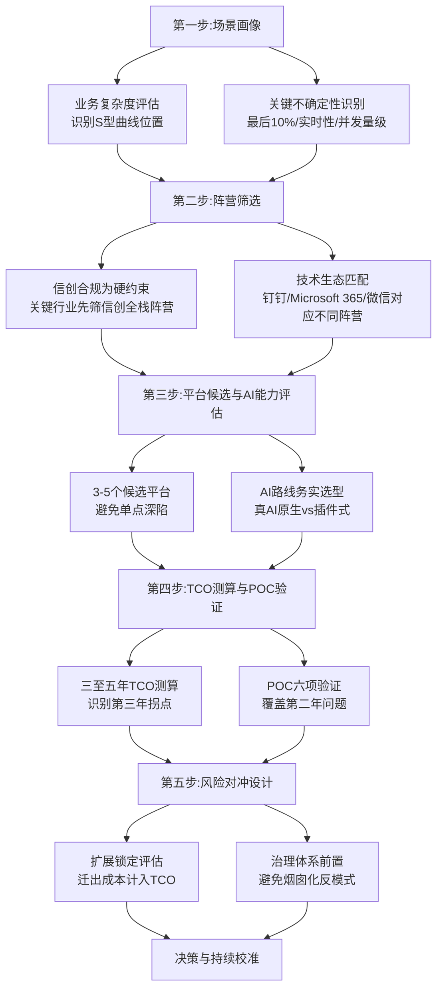

这一五步流程将七大维度按"场景画像→阵营筛选→平台候选→TCO/POC→风险对冲"的逻辑顺序排列，使企业选型从"功能比较"升级为"条件性匹配"。**流程中最具诊断价值的环节是第四步——TCO测算应当贯穿至五年时间窗口、POC应当覆盖第二年问题，这两项审慎机制是穿透厂商话术、识别隐性代价的关键工具**。

## 8.2 差异化主体的采纳路径建议

七大维度框架是普适性的决策工具，但不同主体在维度权重、候选阵营、风险偏好上存在显著差异。本节针对中小企业、大型集团、关键行业、跨国企业四类典型主体给出差异化采纳路径，每类主体均对应前六章已实证的标杆案例与典型反模式。

**中小企业（<200人）：从"小、轻、快、准"起步**。中小企业的核心约束是预算有限、技术团队薄弱、业务快速变化，其LCNC采纳的首要原则是"避免过度选型"——第6章引用的"200万低代码沦为摆设"案例正是中小企业最具警示意义的反模式：**2000多人规模的制造企业花200万购买知名平台许可，最终只搭建了几个简单的审批流程和数据查询界面**，根源在于平台过于复杂、培训支持不到位、业务人员上手门槛过高。

中小企业的差异化采纳路径建议如下：**首选阵营**——零代码轻量型（简道云、伙伴云、明道云）或生态集成型（已用钉钉首选宜搭/氚云、微信生态首选腾讯微搭）；明确**避开**起步百万级的国内企业级阵营（普元、奥哲云枢）与跨生态对外交付能力受限的国际企业级阵营。**核心考量优先级**——TCO > 学习曲线 > 生态契合 > 上线速度。**复杂度匹配**——聚焦表单+流程+轻量CRM+数据看板的高兑现区场景，不强求核心系统。**避坑重点**——飞书按人头收费在200人以上规模成本激增，钉钉按组织收费的9800元年费在中小规模具有"性价比"优势；同时警惕"零代码=零门槛"的误读，第6章实证显示业务人员仍需培训方可有效使用平台。**典型路径组合**——简道云/钉钉宜搭 + 现有办公IM，从单一部门小场景试点（如华为云Astro Zero销售作战的"小、轻、快、准"经验），逐步扩展至跨部门协同。

中小企业采纳的关键启示是——**LCNC对中小企业的真正价值不是"全面替代IT开发"，而是"从无到有的轻量化数字化"**——把原本散落在Excel、纸质单据、口头传达中的业务流程，迁移到具有版本管理、权限控制、数据沉淀能力的轻量平台上。这一价值在小场景下兑现度极高，但试图用LCNC替代核心系统则属典型反模式。

**大型集团（千人以上、多业务板块）：构建"统一底座+分层共生+分级治理"架构**。大型集团的核心约束不是预算而是治理——多业务板块、多地域、多遗留系统使"分散采购"极易演化为第4章揭示的系统烟囱。第4章引用的"4平台50应用国企维护困境"与第6章引用的"菏泽6省平台60%协同失败、API兼容性不足30%"案例都指向同一治理性反模式。

大型集团的差异化采纳路径建议如下：**首选阵营**——国际集团选OutSystems/Mendix（具备全球化部署与工程化治理能力），中资集团选奥哲云枢/织信/普元（信创全栈+核心系统支撑）。**核心考量优先级**——扩展性 > 治理工程化 > 业务复杂度承载 > TCO。**架构选择**——参照华夏银行i助手的"总行级企业平台+多分行多场景复用"路径与JeecgBoot集团OA的"集团本部+三级子公司+全栈信创"路径，构建**统一底座**（避免多平台烟囱）+ **分层共生**（80%零代码业务侧主权、15%低代码协同、5%高代码专业开发者主权）+ **分级治理**（集团级标准与子公司级灵活性的平衡）三位一体的架构。**混合架构原则**——核心系统传统开发、周边业务LCNC、内部协同使用钉钉宜搭/飞书低代码。**避坑重点**——单一平台不通吃所有场景，按业务域分层选型；同时防止"业务方失控搭建+IT方被动救火"的反模式（参见第5章），通过培训体系、治理流程、激励机制三类组织能力的同步建设落地。**典型组合**——核心系统传统开发 + 周边奥哲/织信 + 内部协同宜搭/飞书 + 集团级AI治理底座（如华为云Astro的鸿蒙生态融合或致远互联CoMi的双轮驱动）。

大型集团采纳的关键启示是——**LCNC对大型集团的真正价值不是"全面替代企业级开发"，而是"将业务敏捷性下沉到部门与一线"**——通过统一底座的治理保障、分层共生的角色分工、分级治理的灵活性平衡，使集团既享受LCNC的敏捷红利，又规避烟囱化的治理代价。

**关键行业（金融、政务、军工、能源）：信创全栈为必选项、明确范式禁区**。关键行业的核心约束是合规审计、信创适配、数据主权——这些约束几乎完全排除了国际企业级阵营在核心场景的可用性，使选型范围聚焦于国内企业级阵营。

关键行业的差异化采纳路径建议如下：**首选阵营**——普元（金融政务，覆盖建设银行、国家电网等标杆）、浪潮inBuilder（政务能源，10万+并发）、华为云Astro（工业能源，鸿蒙生态融合）、织信（军工/国央企，35%军工占有率）、奥哲云枢（500强覆盖、AI+All in One）。**核心考量优先级**——信创合规 > 锁定风险 > 扩展性 > AI能力。**明确范式禁区**——核心交易系统不用LCNC（第6章已明确金融核心交易在四大阵营中均为反模式，这一边界对应Gartner的明确判断），国际平台在信创场景为反模式。**合规要求落地**——配置驱动合规（YAML可审计、灰度发布回滚）、审计日志完整性、AI生成内容的可追溯性（应对Gartner所警示的"AI低代码核心价值在于治理机制"）。**POC重点**——等保过检、信创栈实跑、源码导出验证、跨部门协同压测；这些验证不能在合同签订后做，必须在选型阶段前置完成。**典型组合**——核心系统传统开发 + 信创LCNC做OA/督办/合规档案/营销支持/精准触达等周边业务，参照华夏银行i助手在分行级精准营销/智慧经营/合规管理的多元化兑现路径。

关键行业采纳的关键启示是——**LCNC在关键行业的真正价值是"加持性技术战略而非替代性方案"**（呼应第6章引用的金融机构调研判断）——通过将周边业务的敏捷创新引擎与核心系统的工程化稳定支撑相结合，关键行业可以兼顾业务敏捷与合规稳定的双重要求。

**跨国企业：双栈并行设计，应对跨境合规与本地信创的双重约束**。跨国企业面临的特殊约束是**多区域合规复杂度**——GDPR（欧盟）、个人信息保护法（中国）、CCPA（加州）等多重合规框架的叠加，使单一LCNC平台难以同时满足全球部署需求。

跨国企业的差异化采纳路径建议如下：**首选阵营**——OutSystems（德勤、丰田北美、NHS标杆）、Mendix（KLM、奔驰、西门子工业生态）、Power Apps（87%财富500强、微软栈深度集成）。**核心考量优先级**——技术生态全球化 > 治理工程化 > 多区域合规 > 厂商标杆。**多区域合规复杂度应对**——不同司法辖区的数据本地化、数据主体权利、数据传输限制等要求需要在平台层面实现差异化配置。**避坑重点**——在华子公司若涉及信创需求需双轨架构（国际平台+国内信创平台），盲目延伸国际平台到中国关键行业属典型反模式。**生态考量**——微软栈深度用户首选Power Apps、制造业全球协同首选Mendix（西门子工业基因优势）。**典型组合**——OutSystems/Mendix全球总部级 + 在华信创平台子公司级（如奥哲云枢、织信）+ 跨域统一身份与数据治理中间层。

跨国企业采纳的关键启示是——**全球化与本土化的张力使"双栈并行"成为现实选择**，盲目追求"一个平台覆盖全球"往往在中国信创场景下踩坑，而盲目使用国内平台又难以满足全球化部署需求。

下表整合四类主体的差异化路径核心要素：

| 主体类型 | 首选阵营 | 核心考量优先级 | 关键避坑 | 标杆案例 |
|---------|---------|-------------|---------|---------|
| 中小企业 | 零代码轻量型/生态集成型 | TCO > 学习曲线 > 生态 > 速度 | 避免百万级过度选型、警惕零代码门槛误读 | 华为云Astro Zero销售作战 |
| 大型集团 | 国际/国内企业级 | 扩展性 > 治理 > 复杂度 > TCO | 防止烟囱化、避免业务失控搭建 | 华夏银行i助手、JeecgBoot集团OA |
| 关键行业 | 国内企业级（信创全栈） | 合规 > 锁定 > 扩展 > AI | 核心交易禁区、国际平台反模式 | 普元支撑国有大行、华夏银行多场景 |
| 跨国企业 | 国际企业级+国内信创双栈 | 全球生态 > 治理 > 多区域合规 > 标杆 | 信创场景下的双轨必要性 | OutSystems+在华信创 |

四类主体差异化路径的共同启示是——**没有任何"通用最佳实践"，只有"主体类型与场景特征匹配"下的条件最优解**。这一立场是七大维度框架在不同主体上的具体落地，也是本研究"条件性而非普适性"立场的最终具体化。

## 8.3 四大核心问题的总结性回应

作为本研究的收官，本节对全报告四大核心问题做整合性回答。这些回答整合了第2—7章的实证基础与趋势研判，回应了Rubric中"P-1多视角辩证平衡"原则——既不盲从厂商的红利叙事，也不固守开发者的代价叙事，而是力求在"何种条件下、对何种主体、产生何种程度的影响"这一条件性分析框架下给出有数据、有边界、有时间维度的判断。

**Q1影响幅度问题：LCNC对传统开发流程的影响是"颠覆性替代"还是"补充性优化"**？

最终回答——**LCNC的影响是"显著但非颠覆性"的分层式范式重构，未来3-5年将演化为"AI原生+高低代码融合"的混合范式**。第2章已实证LCNC在六个开发流程维度上呈现分层异质的重构图景：在需求建模、角色协作、AI原生嵌入三个维度具备范式革命特征（改变了"如何描述需求""谁来开发""应用是什么"这三个软件工程的根本问题），在生命周期管理、部署运维两个维度属于流程优化与工业化整合，在高低代码融合维度呈现分层共生新范式。第7章进一步将这一定性延伸至未来——LCNC从"应用生成工具"升级为"AI业务化承载与治理平台"，传统开发不会消失但被重新定位为"5%核心层支撑"与"AI治理验证层"的双重角色。**这一回答既不盲从"完全替代论"（被7.2节范式性约束证伪），也不固守"补充性优化论"（低估了AI原生重构的深度），而是落在"分层式范式重构演化为融合新范式"这一条件性立场**。

**Q2效率真实性问题：LCNC宣称的5—10倍效率提升、300%—500%开发加速在多大程度上为真**？

最终回答——**效率红利真实存在但呈现高度的场景异质性，遵循S型衰减曲线，标准化场景下兑现度高（高兑现区80%—90%）、企业级复杂场景下被系统性高估（低兑现区可能负收益）**。第3章通过多源交叉验证（厂商宣称、第三方TEI研究、CAICT基准、实测案例）揭示了三档兑现区的具体边界：高兑现区（表单审批、数据看板、内部OA）的80%—90%效率提升被多源实测充分印证；中等兑现区（CRM、MES中等模块）的45%降本与140% ROI对应Forrester TEI的稳健中位锚点；低兑现区（核心交易、复杂算法）的"效率赤字"现象（车间设备台账推倒重写多花3天、订单系统0.3秒退化到8秒）说明厂商宣称的"全场景300%—500%提升"被系统性高估。AI生成准确率从厂商宣称的80%—92%到企业级实测的60%—70%可上线率之间存在20—30个百分点的语义鸿沟。**这一回答既承认效率红利的真实性（在高兑现区被多源印证），也明确效率宣称的边界（在低兑现区可能转为效率赤字），用S型衰减曲线给出条件性结论**。

**Q3维护成本与代价问题：LCNC在长期使用中是否会带来被低估的隐性成本**？

最终回答——**LCNC的长期代价真实存在、规模可观、具有结构性特征——70%用户遭遇隐性成本反噬、五年TCO可能反超传统150%、企业级核心场景下放大系数高达5—10倍——但代价具有可对冲性，第三年TCO拐点是关键预警节点**。第4章揭示了隐性成本的三维分类（技术性、组织性、治理性）与TCO时间曲线（隐匿期—显化期—加速累积期）。技术性成本（扩展性瓶颈、Vendor Lock-in 180%迁移成本、抽象层泄漏、混合调试技术债务）作为硬约束占长期代价的50%—60%；组织性成本（培训前置、跨平台知识难复用、维护人员断层）占20%—25%；治理性成本（系统烟囱、数据孤岛、合规审计）占15%—25%且具有指数级累积特征。**关键判断是——这些代价并非宿命论，而是与LCNC底层机制（抽象封装、平台绑定、低门槛）结构性耦合，但其显化程度高度依赖企业的治理水平、平台选型、架构设计**。通过前置识别、混合架构、统一治理，70%反噬比例可以被显著降低，TCO拐点可以被推迟甚至消除。

**Q4视角分歧与未来走向问题：业务管理者与专业开发者对LCNC的认知分歧本质是什么？AI原生、信创适配、高低代码融合等趋势将如何重塑LCNC与传统开发的关系**？

最终回答前半部分——**视角分歧的本质是观察窗口、控制权位置、抽象层位置三者的结构性错位，而非立场偏见或利益博弈**。第5章揭示了三层结构性错位的内在逻辑：业务侧观察窗口集中于0—12个月隐匿期的红利兑现、开发者观察窗口延伸至12—60个月的代价显化期；业务侧站在抽象层之上享受赋能感、开发者站在抽象层之下承担阉割感；业务侧在抽象边界内享受简化的红利、开发者在抽象边界外承担泄漏的反向负担。**双方分歧不能被简单归结为"业务方短视"或"开发者保守"，而必须从其结构性位置理解其各自的合理性**——业务侧的"LCNC真有效"在其观察窗口内是真实的，开发者侧的"LCNC真坑爹"在其观察窗口内也是真实的，二者共同构成LCNC价值兑现的"感知三棱镜"。

最终回答后半部分——**未来走向是"AI原生+高低代码融合"的混合范式而非完全替代，传统开发将被重新定位为'5%核心层支撑'与'AI治理验证层'的双重角色**。第7章对三种演化路径做概率研判：完全替代路径在范式上不成立（被范式性约束证伪）、静态分场景共生路径在动态演化下不稳定（AI演进重塑边界）、融合演化为新范式路径具有最高概率。其支撑论据来自2025—2026年AI编程运动的"现实校准"——Hacker News与Reddit社区的"可靠性大于自主性"集体觉醒、"驾驭工程"作为新范式的兴起、Gartner明确指出"AI低代码核心价值在于为AI生成内容提供治理机制"。**这一回答中最具战略意义的判断是——LCNC在Agent时代不是被颠覆的对象，而是承载Agent能力、提供治理框架、化解可靠性局限的关键平台**。

下表整合四大核心问题的最终回答：

| 核心问题 | 最终回答 | 关键支撑章节 | 实践含义 |
|---------|---------|------------|---------|
| Q1影响幅度 | 显著但非颠覆性的分层式范式重构，演化为融合新范式 | 第2章六维重构、第7章三种路径研判 | 不押注完全LCNC化、保留传统开发战略主权 |
| Q2效率真实性 | 真实存在但呈S型衰减，高兑现区印证、低兑现区高估 | 第3章三档兑现区与多源交叉验证 | 分场景核算效率、避免全场景外推 |
| Q3维护代价 | 70%反噬、五年TCO反超150%可能，但具可对冲性 | 第4章TCO时间曲线与三维代价矩阵 | 第三年拐点为预警节点、前置治理设计 |
| Q4视角分歧与未来 | 三重结构性错位，未来走向AI+融合而非替代 | 第5章三层错位、第7章演化路径 | 用融合架构与组织治理协同化解分歧 |

四大核心问题的最终回答共同呈现一个重要立场——**本研究既不附和"LCNC将颠覆一切"的厂商话术，也不附和"LCNC不过是玩具"的开发者吐槽，而是在多维异质性框架下给出条件性、有边界、有时间维度的判断**。这一立场是Rubric六项原则在研究结论上的整合体现。

## 8.4 企业、开发者与平台厂商的三方战略建议

基于全报告分析，本节对LCNC生态的三方利益相关者提出差异化战略建议。这些建议的共同基础是承认LCNC价值兑现度的多维异质性，并在不同主体的位置上给出可操作的应对策略。

**对企业（CIO/业务管理者）：建立"分场景TCO测算+POC第二年问题验证+前置治理设计"三位一体的决策机制**。

第一项建议——**将LCNC定位为加持性技术战略而非替代性方案**。第6章引用的金融机构调研明确指出"多数金融机构领导者将低代码/零代码作为加持性技术战略"——这一定位应从关键行业延伸至所有企业。LCNC的最优兑现形态不是"用LCNC替代传统开发"，而是"用LCNC加速业务敏捷创新、用传统开发支撑核心系统稳定、用AI原生治理放大双方协同效能"。

第二项建议——**重视组织治理水平作为价值兑现的关键中介变量**。第4章揭示的TCO反超与第5章揭示的视角分歧反模式，都指向同一中介变量——组织治理水平。LCNC的失败案例中相当一部分应被归因于组织治理水平而非工具属性本身。CIO在采纳LCNC时必须同步建设治理体系——统一平台底座、培训前置投入、IT与业务分工边界、影子IT管控、数据主数据治理、合规审计标准化等组织能力，这些治理工作不能滞后于平台引入。

第三项建议——**将"第二年问题验证"作为POC的核心要义**。多数企业的POC仅验证"能不能搭出来"，而真正具有诊断价值的POC需要覆盖8.1节列出的六项验证：基础功能、源码导出、资产复用、自研托管、性能并发、遗留系统集成。**CIO应当在选型流程中明确将第二年问题写入验收标准——这一审慎机制是穿透厂商话术、识别隐性代价的关键工具**。

第四项建议——**面向"融合演化新范式"做前瞻布局**。基于第7章融合演化为新范式的研判，CIO应当避免两类极端：既不应追求"全LCNC化"（受范式性约束限制），也不应固守"全传统开发"（错失AI原生与敏捷红利）。前瞻布局的具体形态是——**选择具备AI原生底座的平台、构建分层共生的研发组织、建立Agent化交付的工程化能力、保留专业开发团队的核心层支撑与治理层主权**。

**对专业开发者：从"被工具威胁的执行者"重新定位为"管理AI与LCNC的技术主管"**。

第一项建议——**聚焦5%核心层与AI治理验证层的不可替代价值**。第7章融合新范式下传统开发的双重角色定位，为专业开发者提供了清晰的职业定位——**核心交易、复杂算法、强定制创造性工作、AI生成内容的治理与验证**，这些场景属于范式性约束区，是LCNC永远无法替代的领域。开发者应当将职业能力向这些方向集中，而非在通用CRUD的红海中与LCNC低门槛能力竞争。

第二项建议——**发展"驾驭工程"能力**。第7章引用的Hacker News资深架构师"管理实习生"类比与"驾驭工程"作为新范式的兴起，揭示了开发者在AI时代的能力重塑方向——**从"亲自写每一行代码"转向"清楚解释需求、让AI阐述实现方案、给出反馈、极其仔细地审查结果、编写风格指南、建立严格的自动化质量检查"**。这一能力组合包括：提示工程、上下文工程、AI生成代码的审查与重构、Agent协同的设计与治理、质量门禁的建立与维护——这些能力构成开发者在AI时代的新核心竞争力。

第三项建议——**避免在平台特异性技能上过度投入**。第4章揭示的"技能可迁移性"问题在职业发展层面具有深远影响——在某个特定LCNC平台上积累3—5年经验，对下一份工作的市场价值贡献有限。开发者应当**保持对底层技术栈（Java、Python、JavaScript、SQL、容器、K8s等）的扎实积累，把LCNC视为"工具组合中的一员"而非"职业身份的载体"**。同时关注开放标准（如MCP、A2A）的演进，这些标准化能力相对平台特异性技能更具迁移性。

第四项建议——**在LCNC项目中主动行使工程治理主权**。当业务方主导搭建80%零代码层时，开发者应当主动在15%协同层与5%核心层行使治理主权——制定组件规范、建立代码审查机制、设计性能压测方案、规划迁移可逆架构。这一主权行使不仅提升项目成功率，也避免第5章揭示的"业务方失控搭建+IT方被动救火"反模式。

**对平台厂商：以"真融合架构+源码可控+开放标准"对冲开发者抵触**。

第一项建议——**用"专业低代码"形态对冲开发者抵触**。第5章揭示的开发者抵触本质是"控制权失落+技术身份焦虑"，化解这一抵触不是单靠营销话术，而是需要在产品形态上承认开发者的不可替代性——**模型驱动的架构基础、双向可逆与持续迭代、统一的版本与运维管理、业务与IT的协同分工**。具备这四大特征的"真融合"平台将赢得专业开发者群体的认可，而停留在可视化层、模型输出封闭专有格式的"伪融合"平台将逐步被市场淘汰。

第二项建议——**在AI原生、信创全栈、垂直行业模板三大方向构建差异化护城河**。第7章五大趋势研判明确了未来3—5年的产品演化方向——AI原生从插件式辅助升级为底层架构组件、信创全栈适配从加分项变为必选项、垂直行业模板从通用模板演化为行业知识资产沉淀。厂商应当在这三个方向选择1—2个做深做透，而非追求"全场景覆盖"的通用化定位——通用化定位在第3章揭示的场景异质性面前必然兑现度不高。

第三项建议——**警惕"伪低代码"与生态强绑定的长期信任损耗**。"伪低代码"是指仅具备零代码拖拽能力却包装为"企业级低代码"的产品定位错位——这种错位在POC阶段能"搭出来"但在第二阶段适配中必然踩坑，最终损耗的是厂商在企业IT决策者群体中的长期信任。生态强绑定在短期是商业杠杆，但在长期是信任损耗——当客户因生态战略调整而面临高额迁移成本时，对原生态厂商的信任会同步下降。**真正可持续的产品策略是"开放标准+真融合+源码可控"——给客户离开的自由，反而让客户选择留下**。

第四项建议——**将LCNC定位升级为"AI业务化承载与治理平台"**。第7章揭示了LCNC在Agent时代的战略身位升级——从"应用生成工具"演化为承载Agent能力、提供治理框架、化解可靠性局限的关键平台。厂商应当在产品架构上前瞻布局——AI原生底座、Agent协议适配、合规审计能力、可解释性框架——这些能力将决定厂商在未来3—5年Agent生态格局中的战略位置。Gartner明确指出的"AI低代码核心价值在于为AI生成内容提供治理机制"——治理而非生成，是LCNC厂商在AI时代的真正价值锚点。

下表整合三方利益相关者的差异化战略建议：

| 利益相关者 | 核心战略建议 | 关键能力建设 | 避坑要点 |
|---------|------------|------------|---------|
| 企业（CIO/业务管理者） | 加持性而非替代性、组织治理为中介变量、第二年问题POC、融合范式前瞻布局 | 分场景TCO测算、前置治理设计、混合架构 | 全LCNC化、忽视组织治理、POC仅验证第一周问题 |
| 专业开发者 | 5%核心层+AI治理层定位、驾驭工程能力、避免平台特异性过度投入、主动行使工程治理主权 | 提示/上下文/驾驭工程、底层技术栈深耕、开放标准追踪 | 在通用CRUD红海与LCNC竞争、过度投入平台特异性技能 |
| 平台厂商 | 真融合架构、AI原生/信创/行业三大差异化、警惕伪低代码与强绑定、AI治理平台升级 | 双向可逆切换、源码导出、开放标准、合规审计能力 | 伪低代码定位错位、生态强绑定信任损耗、追求全场景通用化 |

下表呈现的三方战略建议体现了一个重要立场——**LCNC生态的健康演化需要三方协同而非任一方的单边行动**——企业的审慎决策、开发者的能力重塑、厂商的产品诚意，三者协同才能使LCNC从"工具级应用"真正升级为"平台级基础设施"。

## 8.5 研究局限与开放性问题

作为本研究的最后一节，本节系统识别本研究的方法论局限与待深入探索的开放性问题。这一识别既是对研究严谨性的自我审视，也为未来研究指明方向。

**方法论局限**包括四个方面：

**第一，数据来源以厂商案例与第三方研究为主，缺乏大规模独立纵向研究**。本研究引用的多数实证数据来自厂商公开案例、行业协会白皮书、咨询机构调研——这些来源各自存在一定的样本筛选偏向（如Forrester TEI的"成功部署后中位值"特征、厂商案例的选择性披露）。真正具有学术严谨性的"大规模、独立、纵向"研究在LCNC领域仍相对稀缺，使本研究的部分量化结论具有"行业共识"性质而非"严格因果"性质。这一局限对应Rubric中"P-2量化数据与实证支撑"原则的适用边界——**在引用具体数字时本研究已尽量做多源交叉验证、注明数据来源与口径，但完全消除来源偏向需要等待独立纵向研究的成熟**。

**第二，中国市场数据口径差异大（40亿到500亿的跨度）**。第1章已揭示IDC、Gartner、艾瑞、信通院等机构对中国LCNC市场规模的统计存在显著差异——从40亿元（IDC严格软件许可口径）到131亿元（Gartner含aPaaS与平台集成）再到528亿元（艾瑞含上下游生态、实施服务）。这一口径差异本身就是市场不成熟期的标志，使企业在制定战略时难以引用单一数据做精确判断。本研究的应对是采用三角对照与口径透明披露，但更精确的市场结构分析仍需等待统计标准的统一。

**第三，五年以上长期TCO的实证数据相对稀缺**。第4章引用的"五年TCO反超传统150%"数据虽然具有方向性指示意义，但其精确度受限于多数企业LCNC采纳历史不足5年这一现实。Forrester TEI的"三年时间窗口"已经是该领域较成熟的研究范式，但5—10年的真正长期数据仍需要时间积累。这一局限使本研究在长期预测部分存在一定的不确定性，需要保持持续追踪与动态调整的开放态度。

**第四，视角分歧的化解效果缺乏跨企业对照实验**。第5章提出的"技术架构、治理设计、组织能力"三层化解路径在逻辑上自洽、在标杆案例上有支撑，但其化解效果在不同行业、不同规模、不同治理水平企业间的差异化兑现度，仍缺乏严格的跨企业对照实验数据。未来研究若能引入"配对对比"方法（如同行业、同规模、采纳与未采纳混合架构的企业对比），将显著提升化解路径有效性的实证强度。

**开放性问题**则覆盖五个具有战略意义的方向：

**第一，AGI到来对LCNC范式的颠覆性影响如何量化研判**？第7章已提出"若AGI在未来5—10年实现，新范式将进一步演化为'AGI驱动的智能基座+人类设计的业务约束层+专业开发者维护的治理层'"——但AGI的具体到来时点、能力边界、可控性约束目前仍存在巨大不确定性。当AGI能在不依赖LCNC可视化中间层的情况下直接承载企业业务流程时，LCNC的存在价值将面临根本性追问——这一追问需要在AGI能力与企业治理需求的具体演化中持续校准。

**第二，Agent协议标准化（MCP/A2A）的成熟节奏与LCNC生态格局的耦合机制**？Anthropic的MCP协议、谷歌的A2A协议等开放标准刚刚推出（已在第2、7章引用），其工程化成熟度、跨厂商兼容性、安全治理边界仍在快速演进中。这些标准的成熟节奏将直接影响LCNC生态的开放性——若标准化快速成熟，LCNC将从"封闭的应用生成工具"演化为"开放的Agent治理底座"；若标准化滞后，LCNC生态将停留在单平台层面，难以形成跨生态的新范式。

**第三，信创全栈适配在更长时间窗口下与国际开放标准的融合或分化路径**？当前信创全栈与国际开放标准呈现一定的分化趋势——中国市场形成相对独立的国产化技术栈生态，而国际市场以微软、亚马逊、谷歌等云生态为主导。这一分化在未来3—5年将持续加深还是出现某种形式的融合（如基于开放标准的双向兼容），将深刻影响跨国企业的技术战略选择。

**第四，公民开发者大规模流动下的"孤岛应用"问题如何系统性治理**？第4章揭示的"维护人员断层"在公民开发者数量持续增长的趋势下将放大为系统性问题——当一个企业有100个公民开发者搭建了500个应用、其中30%的开发者在两年内流动时，约150个应用面临某种程度的维护断层。这一治理难题不能仅靠"加强文档"解决，需要从平台层面（如标准化的应用元数据描述）、组织层面（如关键应用专人备份）、技术层面（如AI辅助的应用知识抽取）做系统化设计——这些设计目前仍在早期探索阶段。

**第五，AI生成代码的可解释性与合规审计在金融、医疗等强合规场景的工程化解决方案**？Gartner明确指出AI低代码的核心价值在于"为AI生成内容提供治理机制，包括访问控制、审计日志和内置验证框架"——但具体的工程化解决方案（如AI决策的端到端可追溯链条、跨监管要求的合规配置自动化、AI生成代码的形式化验证）仍在早期阶段。某项合规审计要求追溯"为什么这笔贷款被批准"时，传统系统可以提供完整的代码逻辑与审批记录，而AI驱动的低代码应用可能难以给出与监管要求匹配的解释链条——这一工程化能力的成熟将直接决定LCNC在强合规场景的扩张边界。

下表整合方法论局限与开放性问题：

| 类别 | 具体内容 | 对企业实践的提示 |
|------|---------|---------------|
| 数据局限 | 缺乏独立纵向研究、中国市场口径差异、长期TCO数据稀缺 | 警惕单一数据源、做三角对照、保持动态校准 |
| 化解效果局限 | 视角分歧化解缺乏跨企业对照 | 借鉴标杆案例、做企业内试点、迭代优化治理 |
| AGI开放问题 | 范式颠覆的量化研判 | 保留传统开发战略主权、动态调整AI能力布局 |
| Agent标准化 | 成熟节奏与生态格局耦合 | 关注开放标准演进、避免生态强绑定 |
| 信创路径 | 国际融合或分化的长期走向 | 跨国企业前瞻布局双栈架构 |
| 治理难题 | 孤岛应用、AI合规审计 | 前置治理设计、关键应用专人备份 |

这五个开放性问题为后续研究指明方向，也提示企业在面对未来3—5年的不确定性时**保持持续追踪与动态调整的必要性**。本研究虽已在多个维度上系统刻画了LCNC的真实图景，但这一图景本身处于快速演化中——任何"一劳永逸的选型决策"都不符合这一动态本质。**真正的智慧不是在某个时点选定"最佳平台"，而是建立"持续审视场景—平台—行业匹配度"的决策能力**。

至此，本研究完成了对低代码/无代码平台对传统开发流程影响的系统探查。从第1章的市场背景与价值主张，到第2章的开发流程重构维度，再到第3章的效率红利实证、第4章的隐性成本审视、第5章的视角分歧剖析、第6章的平台与行业落地、第7章的边界与未来趋势，最终在本章构建起选型决策框架与战略建议——研究在多维异质性框架下回答了"LCNC对传统开发的影响有多大、是否真正提高效率、是否在特定场景下增加维护成本、未来发展走向何方"这一核心命题。**最终的判断既不是"颠覆替代论"也不是"工具补丁论"，而是"分层式范式重构演化为AI原生融合新范式"——LCNC将在标准化场景持续兑现80%—90%的效率红利、在企业级核心系统让位于传统开发、在Agent时代升级为AI业务化承载与治理平台、在与传统开发的融合中重新定义"开发"这一活动本身**。

研究的最终洞察或许是——**任何技术范式的真正价值，都不在于其本身的"先进性"，而在于其与场景、时间、视角、组织、治理的条件性匹配**。LCNC如此，传统开发如此，未来的AI原生与Agent化开发亦将如此。**企业的战略智慧，最终落在"在何种条件下、对何种主体、以何种方式采纳何种技术"这一持续审慎的判断之上**——而这正是本研究希望为企业、开发者、平台厂商三方利益相关者所提供的核心价值。

# 参考内容如下：
[^1]:[何为低代码?何为高代码?](https://developer.aliyun.com/article/1289280)
[^2]:[2024下半年中国低代码与零代码软件市场跟踪报告](https://baike.baidu.com/item/2024下半年中国低代码与零代码软件市场跟踪报告/66041054)
[^3]:[IDC:预计到2029年中国低代码与零代码软件市场规模将达到129.8亿元](https://baijiahao.baidu.com/s?id=1836596505478671558&wfr=spider&for=pc)
[^4]:[2025年主流低代码开发平台全景洞察:趋势、选型与实践 ](https://caifuhao.eastmoney.com/news/20251203102134384533370)
[^5]:[2025 低代码三大核心趋势:AI 原生、信创适配、高低代码融合](https://t.cj.sina.com.cn/articles/view/7879848900/1d5acf3c401902xq8y)
[^6]:[2025年中国低代码平台推荐:国内零代码商城工具制造业AI开发权威TOP榜深度测评与选择指南 ](https://www.sohu.com/a/922979254_122465571)
[^7]:[2025年全球低代码平台中国区推荐榜:权威测评与选购指南TOP10深度解析 ](https://www.sohu.com/a/926048535_122465636)
[^8]:[IDC、Gartner、信通院三大权威机构共识:2026低代码平台推荐与场景化匹配](https://www.csdn.net/article/2026-04-21/160375171)
[^9]:[AI赋能中国低零代码市场:规模攀升、需求多元,GenAI融合成未来新趋势](http://k.sina.com.cn/article_7879848900_1d5acf3c401902xi88.html)
[^10]:[The Forrester Wave™: Low-Code Development Platforms For Professional Developers, Q2 2025](https://www.outsystems.com/1/low-code-development-platforms-wave-/)
[^11]:[Analyst Reports | Valuable Industry Insights | OutSystems](https://www.outsystems.com/es-es/analysts/)
[^12]:[2025低代码5大核心趋势:AI原生、云边协同、垂直DSL崛起_dsl低代码-CSDN博客|充电|系统|数据|设备|通用_新浪新闻](http://k.sina.com.cn/article_7879848900_1d5acf3c401902x8he.html)
[^13]:[2024低代码·无代码产业大会](https://baike.baidu.com/item/2024低代码·无代码产业大会/64605319)
[^14]:[低代码](https://baike.baidu.com/item/低代码/60863339)
[^15]:[百度秒哒:无代码开发如何重塑企业数字化未来](https://developer.baidu.com/article/detail.html?id=3554152)
[^16]:[无代码开发平台是什么?一文讲清低代码开发平台有哪些价值](https://cloud.tencent.com/developer/article/2558999)
[^17]:[收藏!零代码、低代码、APaaS系统怎么选?](https://baijiahao.baidu.com/s?id=1767283381258866132&wfr=spider&for=pc)
[^18]:[一文看懂“低代码,零代码,APAAS”是什么?怎么选?](https://cloud.tencent.com/developer/article/1986410)
[^19]:[低代码开发和传统的代码开发对比与区别](https://worktile.com/kb/p/55843)
[^20]:[低代码 VS 传统开发:成本节省核心对比与技术深度解析](https://www.grapecity.com.cn/blogs/low-code-vs-traditional-development-core)
[^21]:[低代码有哪些缺点?4千字深入解析](https://baijiahao.baidu.com/s?id=1762235175385853619&wfr=spider&for=pc)
[^22]:[低代码平台与传统开发对比:效率、成本与技术限制分析](https://blog.csdn.net/2501_92431498/article/details/148659093)
[^23]:[低代码开发平台能解决什么问题?5大应用场景及实战案例详解 ](https://www.sohu.com/a/1010900998_121442135)
[^24]:[低代码开发平台能解决什么问题?5大应用场景及实战案例详解](https://www.163.com/dy/article/KQNS4N6N0553HHH5.html)
[^25]:[低代码平台是什么?一文读懂核心价值与企业应用](https://www.jiandaoyun.com/news/article/69807c123d6f757d6e859611)
[^26]:[低代码平台是什么?全面准备:概念、作用、优缺点、主流产品盘点](https://baijiahao.baidu.com/s?id=1836990178971423906&wfr=spider&for=pc)
[^27]:[低代码 vs 传统开发:什么时候该用(或不用)Mendix/OutSystems?](https://blog.csdn.net/weixin_29296241/article/details/159599318)
[^28]:[浅谈产品推进过程中的“敏捷式开发与瀑布流开发”](https://baijiahao.baidu.com/s?id=1610192975808341984&wfr=spider&for=pc)
[^29]:[2025 AI低代码开发趋势:从效率工具到智能开发生态的范式跃迁](https://blog.csdn.net/kfashfasf/article/details/154191178)
[^30]:[用户故事 | 以低代码之名,打造业务与IT协同新模式](https://blog.csdn.net/Mendix/article/details/135931953)
[^31]:[告别技术依赖!AI 低代码融合,打破技术门槛,业务人员也能搞定企业级应用](https://cloud.tencent.com/developer/article/2660025)
[^32]:[钉钉宜搭接入DeepSeek,你的专属AI应用工厂来啦](http://ow.dingtalk.com/article/SWA00OTjxXGKs4XugmiPLPX3OxwOFWd2YqiiBXz)
[^33]:[当每个员工都有AI搭把手](https://baijiahao.baidu.com/s?id=1863075125550178361&wfr=spider&for=pc)
[^34]:[钉钉低代码+AI真牛,让一线员...@耳机热键的的动态](http://mbd.baidu.com/newspage/data/dtlandingsuper?nid=dt_5491013679128827061)
[^35]:[一个北京英语老教师的“数字分身” 飞书的AI教学实践](https://baijiahao.baidu.com/s?id=1862952703742189891&wfr=spider&for=pc)
[^36]:[无代码与传统开发互补:80% 标准化场景快速落地,20% 复杂场景深度定制](https://baijiahao.baidu.com/s?id=1861418587543031635&wfr=spider&for=pc)
[^37]:[低代码平台必备的软件工程项目管理功能:打造全生命周期高效管控体系](https://blog.csdn.net/lgf228/article/details/148151447)
[^38]:[Copilot Studio](https://baike.baidu.com/item/Copilot%20Studio/63759144)
[^39]:[产品简介](https://coding.net/help/docs/orbit/intro.html)
[^40]:[2025年Agent元年](https://baike.baidu.com/item/2025年Agent元年/67652680)
[^41]:[开启智能自主时代、拥有万亿级市场潜力 AI Agent迎2025商业化元年](https://baijiahao.baidu.com/s?id=1843426603177550573&wfr=spider&for=pc)
[^42]:[致远互联2025年报&2026年一季报:AI业务加速落地 年度相关订单突破2亿元](https://baijiahao.baidu.com/s?id=1863045095346880010&wfr=spider&for=pc)
[^43]:[工业Agent的新芽,生长在飞书的旷野上](https://baijiahao.baidu.com/s?id=1863207656019270455&wfr=spider&for=pc)
[^44]:[大中型企业AI低代码开发平台有哪些?2026主流AI 低代码平台深度评测! ](http://www.e0734.com/index.php?c=wap&a=show&catid=707&id=631137)
[^45]:[Microsoft Power Apps:低代码 AI 应用生成器 | Microsoft](http://azure.microsoft.com/zh-cn/solutions/low-code-application-development)
[^46]:[软件开发王者搭配:80%低代码+20%高代码](https://blog.csdn.net/wangonik_l/article/details/134581692)
[^47]:[【宏天架构】低代码平台的微前端方案 宏天低代码平台在ACK上的云原生部署实践-阿里云开发者社区](https://developer.aliyun.com/article/1715971)
[^48]:[直击前沿技术:云原生应用低代码开发平台实践](https://cloud.tencent.com/developer/article/1938251)
[^49]:[Dubbo 云原生重构出击:更快部署、更强控制台、更智能运维](https://developer.aliyun.com/article/1677497)
[^50]:[第三届低代码无代码产业大会](https://baike.baidu.com/item/第三届低代码无代码产业大会/65818070)
[^51]:[2025低代码&无代码产业双象限](https://baike.baidu.com/item/2025低代码%26无代码产业双象限/65818220)
[^52]:[The Total Economic Impact™ of Microsoft Power Platform Premium Capabilities](https://go.microsoft.com/fwlink/p/?linkid=2249364&country=hk)
[^53]:[The Total Economic Impact™ of Microsoft Power Platform Premium Capabilities](https://go.microsoft.com/fwlink/p/?linkid=2249364&country=sg)
[^54]:[The Total Economic Impact™ of Microsoft Power Platform Premium Capabilities](https://go.microsoft.com/fwlink/p/?linkid=2249364&country=mx)
[^55]:[Enterprise Low-Code Application Platforms](https://www.gartner.com/reviews/market/enterprise-low-code-application-platform)
[^56]:[项目进度管理新趋势:零代码开发为企业提速,效率提升50%](https://www.jiandaoyun.com/news/article/68ea25d021e6c1b4df78bf2f)
[^57]:[入选Forrester行业报告,卡奥斯低代码平台成果获权威机构认可](https://www.jiemian.com/article/10457446.html)
[^58]:[2025低代码开发平台综合排名及选型指南(最新版)](https://baijiahao.baidu.com/s?id=1848636558864805924&wfr=spider&for=pc)
[^59]:[低代码真能提升3倍效率?深度验证Vite-Vue3-Lowcode实战效能-CSDN博客](https://blog.csdn.net/gitblog_00506/article/details/156160172)
[^60]:[2026AI低代码开发平台有哪些?从0到1搭建业务系统实测,哪个好?](https://m.163.com/dy/article/KR5DDOK30556J0W9.html)
[^61]:[AI低代码实测:真正的“摸鱼神器”,是让CRUD不再耗到凌晨_jnpf appsmith-CSDN博客|前端开发|开发者|系统|设备|数据_新浪新闻](http://k.sina.com.cn/article_7879848900_1d5acf3c401902vy4c.html)
[^62]:[一文认识 低代码开发平台是什么与全球5大低代码平台](https://cloud.tencent.com/developer/article/2585940)
[^63]:[一文读懂低代码平台是什么 | 三大类低代码平台 | 企业低代码选型避坑](https://cloud.tencent.com/developer/article/2658566)
[^64]:[2026年主流低代码平台AI能力实测:7家核心差异与选型指南](https://post.smzdm.com/p/a4qek8wk)
[^65]:[低代码开发平台的局限与挑战](https://blog.csdn.net/lgf228/article/details/143650501)
[^66]:[平台构建陷阱:开发者如何破局? 在...@θ码猿的动态](http://mbd.baidu.com/newspage/data/dtlandingsuper?nid=dt_4082250915518987857)
[^67]:[国内低代码平台哪个好?低代码定制开发平台选型指南:10款平台测评对比](https://cloud.tencent.com/developer/article/2563658)
[^68]:[Gartner 70%预测落地:AI低代码重构开发范式,JNPF定义新标准](https://blog.csdn.net/dsgdauigfs/article/details/160245392)
[^69]:[r/programming掀桌:4月禁掉所有AI内容](https://m.163.com/dy/article/KPTR0NVQ05561FZL.html)
[^70]:[What Is Low Code? A Guide to Low-Code Development](http://developer.oracle.com/learn/technical-articles/what-is-lowcode)
[^71]:[无代码常见问题解析,如何快速解决无代码难题?](https://www.jiandaoyun.com/nblog/213188/)
[^72]:[管理低代码开发人员的8个技巧](https://www.fanruan.com/bw/gldcds)
[^73]:[飞书上浮,钉钉下沉](https://www.163.com/dy/article/JFRHMRP605118O92.html)
[^74]:[奥哲案例 - 金立达:实现精准营销,提升业务效率](https://www.authine.com/case/71.html)
[^75]:[《构建敏捷数字实践力-2022年中国低代码/零代码行业研究报告》| 低码时代](http://caijing.chinadaily.com.cn/a/202206/01/WS6296ea1ba3101c3ee7ad8574.html)
[^76]:[低代码正在摧毁企业数字化根基?深度揭露管理系统"快餐式开发"背后的技术债务陷阱](https://zhuanlan.zhihu.com/p/29900585106)
[^77]:[数字化转型时代,低代码为零售企业打造高效、智能的运营模式](https://blog.csdn.net/bby2017/article/details/135138652)
[^78]:[从低代码取代程序员到AI杀死全人类,大家究竟在焦虑什么?](https://baijiahao.baidu.com/s?id=1762204154719831338&wfr=spider&for=pc)
[^79]:[为什么很多程序员讨厌低代码?](https://www.zhihu.com/question/561025857/answer/2028588608487965730)
[^80]:[成功项目案例:JeecgBoot低代码平台助力打造信创及集团化OA协同办公系统](https://cloud.tencent.com/developer/article/2604839)
[^81]:[金融领域用例解读——中国低代码/零代码落地实践](https://www.163.com/dy/article/H9RJOIS1055240KW.html)
[^82]:[AI+制造业 | 李军旗:从“灯塔工厂”经验探析到“ChatGPT”“DeepSeek”案例探索 ](https://mp.weixin.qq.com/s?__biz=MzkzNzE4NjY5MA==&mid=2247634350&idx=1&sn=b4747e5014ee0d12a3dd807604076481&chksm=c38698a69f110c8f0a3a9663aa3d93917a77645853c7d9199c60d9573faf27566959f3bb4a65&scene=27)
[^83]:[低代码数字化转型:制造行业流程自动化案例_微软地带吗平台可以做哪些制造业工厂的业务自动化?-CSDN博客](https://blog.csdn.net/hujgyfyuftf/article/details/154181560)
[^84]:[颠覆传统开发!低代码+AIoT正重构数智工厂,你上车了吗?](https://blog.csdn.net/sdgfafg_25/article/details/149244146)
[^85]:[2025 Gartner® Magic Quadrant™ for Enterprise Low-Code Application Platforms](https://www.outsystems.com/1/low-code-application-platforms-gartner-/)
[^86]:[Low-code in 2025: What’s working and why](https://www.dronahq.com/low-code-speed/)
[^87]:[低代码开发缺点:《低代码开发的局限性》](https://www.informat.cn/qa/367874)
[^88]:[奥哲案例 - 建发集团:打造钻石人生,成就数字地产](https://www.authine.com/case/74.html)
[^89]:[零代码平台靠谱吗?实测5大产品的3个致命缺陷](https://www.fanruan.com/blog/article/1745040/)
[^90]:[70%新应用已定局:AI低代码,破局数智化标准之争](https://blog.csdn.net/dsgdauigfs/article/details/160138047)
[^91]:[软件开发工具怎么选?程序员必备的高效开发环境推荐](https://dy.163.com/article/KQLCNPU00518CPJB.html)
[^92]:[2026年8款国内外主流低代码开发平台测评](https://bbs.huaweicloud.com/blogs/474825)
[^93]:[AI Agent 2025:繁荣背后的真相——从海外主流论坛看技术演进的理性回归](https://cloud.tencent.com/developer/article/2595736)
[^94]:[低代码平台如何选?简道云、伙伴云、织信、宜搭、孪大师,五大仓库可视化管理工具深度测评](https://blog.csdn.net/cimpro/article/details/154694530)
[^95]:[屈服于氛围:一部AI编程运动史](https://baijiahao.baidu.com/s?id=1863179416230221085&wfr=spider&for=pc)
[^96]:[华为云Astro Zero低代码平台案例:小、轻、快、准助力销售作战数字化经营](https://blog.csdn.net/hwxiaozhi/article/details/139268330)
[^97]:[普元低代码平台价格有什么含义?怎样理解普元低代码平台价格对企业的影响? | 普元](https://www.primeton.com/blog/32428.html)
[^98]:[Agent正杀入软件研发一线!全球超60位技术专家拆解AI落地困局,2026奇点智能技术大会收官](https://baijiahao.baidu.com/s?id=1862842099859146787&wfr=spider&for=pc)
[^99]:[程序员为何抵触低代码?金蝶AI星辰双开发模式破解困局](https://www.jdy.com/article/1967404478722289666.html)
[^100]:[华为云 Astro Zero 低代码平台案例:小、轻、快、准助力销售作战数字化经营](http://zhikeji.pconline.com.cn/article/687640)
[^101]:[钉钉宜搭:以低代码引领教育行业数字化转型](https://www.dingtalk.com/qidian/page-DVmLf9oz.html)
[^102]:[200万上的低代码平台却用不起来,问题出在哪儿? ](https://www.sohu.com/a/932245556_121066588)
[^103]:[低代码平台是什么](https://www.ai-indeed.com/encyclopedia/12179.html)
[^104]:[屈服于氛围:一部AI编程运动史](https://www.163.com/dy/article/KR5C94U5051188EA.html)
[^105]:[IDC预测,2030年22亿AI Agent将作为“新数字劳动力”席卷全球](https://www.idc.com/resource-center/blog/idc预测，2030年22亿ai-agent将作为新数字劳动力席卷全球/?utm_medium=website-link)
[^106]:[无代码与传统开发互补:80% 标准化场景快速落地,20% 复杂场景深度定制_专业化_平台_企业](https://news.sohu.com/a/1004842785_120178534)
[^107]:[2025年最好用的AI编程工具推荐:低代码开发加速应用交付的最佳选择](https://blog.csdn.net/u012725843/article/details/152007941)
[^108]:[AI低代码:是效率革命还是过渡产物?2025年技术人该如何抉择](https://blog.csdn.net/dsgdauigfs/article/details/155708817)
[^109]:[零代码平台案例分析:企业数字化转型如何高效落地](https://www.jiandaoyun.com/news/article/695a4919bd9981e87ee1bc8a)
[^110]:[低代码平台选型:部署交付、源码与扩展——OutSystems / Mendix / Power Apps / Appian / 星图云开发者平台差别到底在哪?](https://blog.csdn.net/2501_90731449/article/details/157546856)
[^111]:[重构开发链路:低代码如何成为企业数智化转型的关键抓手](https://blog.csdn.net/sdgfafg_25/article/details/155936562)
[^112]:[2026年国内外Top5低代码/无代码平台介绍](https://segmentfault.com/a/1190000047623237)
[^113]:[2026年国内外Top5低代码/无代码平台介绍](https://blog.csdn.net/qq_41137493/article/details/158428419)
[^114]:[什么是低代码开发平台?2025年最热门的10大低代码开发平台盘点!](https://baijiahao.baidu.com/s?id=1833258333052327114&wfr=spider&for=pc)
