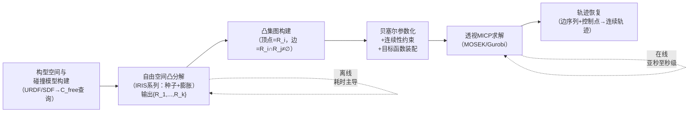
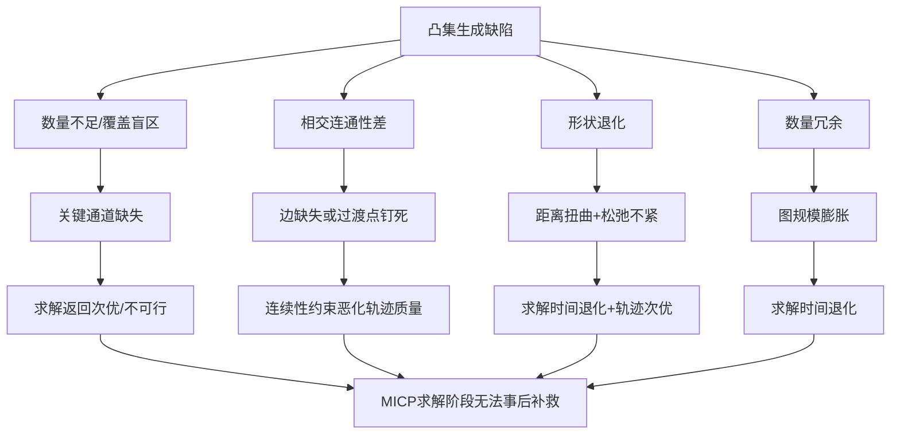
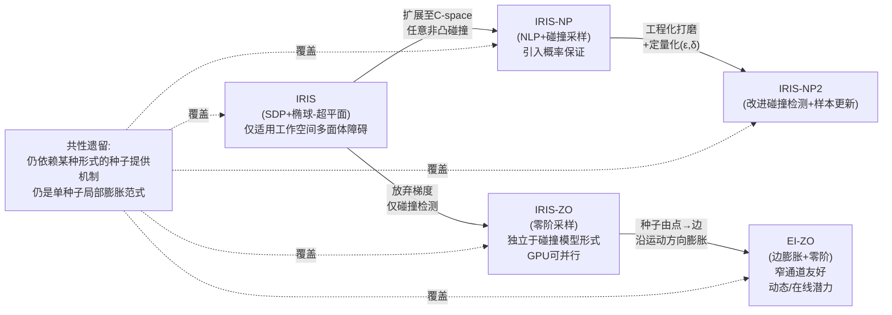
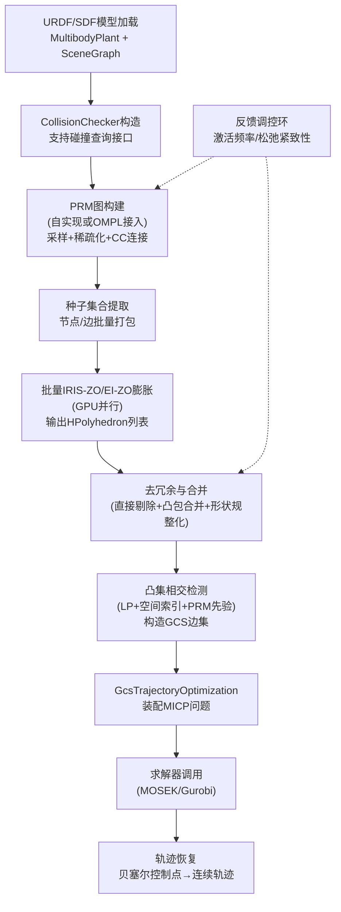
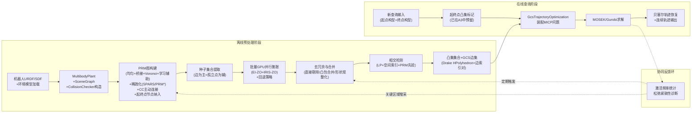
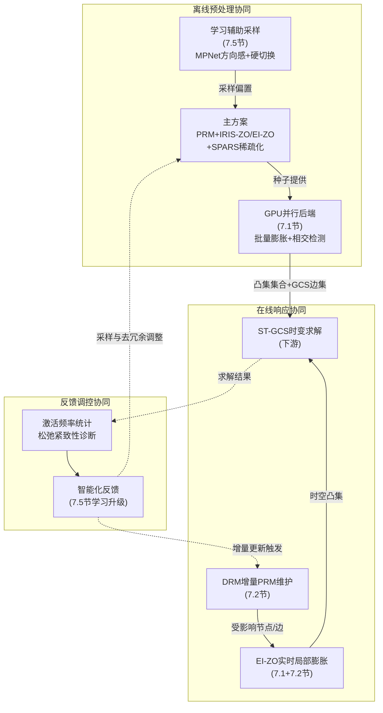
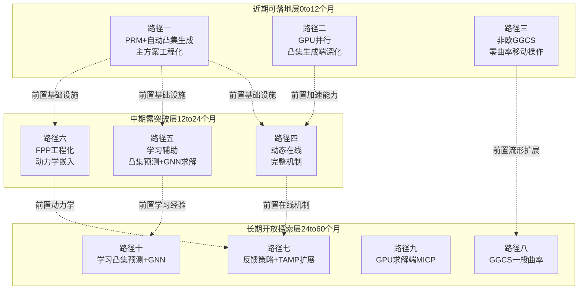
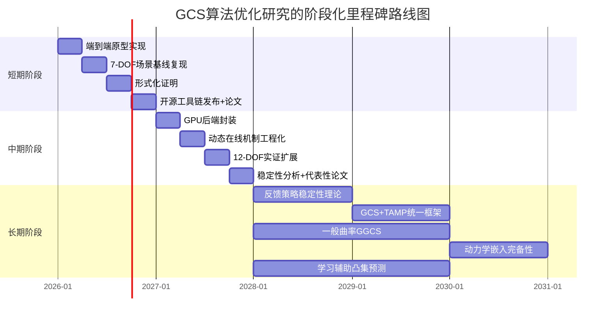

# GCS算法原理解析与安全凸集自动化生成的优化路径研究
# 1 GCS算法原理与核心机制解析

机器人在复杂环境中的运动规划长期以来面临一个根本性的方法论分歧：基于采样的规划器（PRM、RRT*）能够在高维构型空间中保证概率完备性，却难以给出最优性保证，也难以原生地处理微分约束；而基于轨迹优化的方法（如基于SNOPT的KinematicTrajectoryOptimization）能够精细处理运动学/动力学约束，却高度依赖初值猜测，且在障碍物丰富的非凸环境中极易陷入局部极小。Marcucci等人提出的**凸集图（Graph of Convex Sets, GCS）** 正是在这一背景下，试图通过将组合性的最短路径问题与连续凸优化深度融合，构建一个同时具备**完备性、最优性、且原生支持微分约束**的统一规划框架[^1][^2]。本章将沿"问题建模—数学表达—求解机制—优势边界"的主线，系统拆解GCS的数学本质，为后续章节关于安全凸集自动化生成的研究奠定原理基础。

## 1.1 GCS的数学定义与问题建模

GCS的核心构造可以视为对经典最短路径问题（Shortest Path Problem, SPP）的一次根本性推广。在经典SPP中，给定有向图 $G=(V,E)$ 与每条边的固定长度，目标是找出连接源点与终点、累计长度最小的边序列；而GCS在此之上引入了**连续几何信息**——图中的每个顶点 $v\in V$ 不再是离散符号，而是关联一个凸集 $X_v\subset \mathbb{R}^n$，边 $e=(u,v)\in E$ 关联一个定义在 $X_u\times X_v$ 上的凸约束集合，边的"长度"则被定义为顶点位置的凸函数 $\ell_e(x_u,x_v)$[^1]。求解者需要同时确定两件事：**走哪条路径（离散组合决策）**，以及**在每个被选中的顶点凸集内取何点（连续决策）**，使得累计的凸长度之和最小。

这一建模方式天然契合机器人运动规划中的"安全区域分解"几何直觉。具体到避障规划场景，机器人的无碰撞构型空间 $\mathcal{C}_{\text{free}}$ 被分解为若干个相互重叠的凸子区域 $\{R_1,R_2,\dots,R_k\}$，每个凸区域对应GCS的一个顶点；若两个区域 $R_i$ 与 $R_j$ 在构型空间中存在非空交集，则在GCS中添加一条对应的边，并在边约束中要求轨迹在该交集内完成区域间的转移[^2]。机器人从起点构型到终点构型的避障运动规划，于是被精确等价为在该GCS上求解一条从"包含起点的凸集"到"包含终点的凸集"的最短路径——其中"路径"既是离散区域序列，也是连续的几何轨迹[^2]。

值得特别强调的是，GCS-SPP问题在最一般情形下仍然是 **NP-hard** 的[^1]。其复杂度根源并不来自连续凸优化部分（连续部分若边激活已知则是凸的、可多项式时间求解），而是来自**组合性的边激活决策**：对于一个具有 $|E|$ 条边的图，理论上存在 $2^{|E|}$ 种边激活组合，朴素的枚举方式在大规模图上不可行[^1][^2]。GCS的算法贡献并不在于规避这一复杂度上界，而在于**构造一个具有极紧凸松弛的混合整数凸规划公式**，使得在绝大多数实际机器人规划实例中，凸松弛即可直接给出整数最优或接近整数最优的解，从而在多项式时间内高效求解原本组合复杂的全局最优避障问题[^1][^2]。

## 1.2 基于透视函数的MICP建模与紧凸松弛

GCS最具原创性的数学贡献，是其基于**透视函数重构（perspective reformulation）** 的强混合整数凸规划（MICP）公式[^1]。理解这一公式的关键在于看清"激活变量"与"连续变量"之间的耦合方式。

最自然的MICP建模方式是为每条边 $e\in E$ 引入二元变量 $y_e\in\{0,1\}$ 表示该边是否被路径选中，再为每个顶点引入连续变量 $x_v\in X_v$ 表示在该顶点凸集内的位置。一个朴素但松弛较弱的写法会使用大M型不等式，例如 $\ell_e(x_u,x_v)\le M\cdot y_e$。这种写法的连续松弛（将 $y_e\in\{0,1\}$ 放松为 $y_e\in[0,1]$）会得到非常宽松的下界，使得求解器不得不依赖大量分支定界节点才能收敛到整数最优[^1]。

GCS采用的透视函数公式则采取了完全不同的提升方式：对于每条边 $e$，引入一对辅助连续变量 $z_e^u,z_e^v$，其语义为"激活该边时端点位置的提升副本"，并施加凸锥型耦合约束 $z_e^u\in y_e \cdot X_u$、$z_e^v\in y_e\cdot X_v$（这正是凸集的透视锥），同时将边长度通过透视函数 $y_e\cdot \ell_e(z_e^u/y_e,\,z_e^v/y_e)$ 表达[^1]。透视函数的关键性质在于：当 $y_e=1$ 时它退化为原凸函数 $\ell_e$，当 $y_e=0$ 时它强制 $z_e^u=z_e^v=0$ 且贡献长度为零，且整个表达式对 $(y_e, z_e^u, z_e^v)$ 联合保持凸性[^1]。

这一构造带来的直接后果，是凸松弛（即将所有 $y_e\in\{0,1\}$ 放松为 $y_e\in[0,1]$ 后得到的纯凸优化问题）具有**极强的紧致性**——Marcucci等人证明，对于该公式，凸松弛在大量实际问题上可以直接给出整数可行解，或者其下界与整数最优的间隙极小[^1]。这就意味着：原本需要指数级分支定界的MICP问题，在透视公式下可以通过一次（或少量几次）凸优化求解就得到全局最优路径，从而把组合复杂的避障规划问题压缩到现代凸求解器的可处理范畴[^1][^2]。

下表对朴素大M公式与透视函数公式的关键差异做一汇总：

| 维度 | 朴素大M型MICP | 透视函数MICP（GCS）[^1] |
|------|---------------|--------------------------|
| 激活与位置耦合方式 | 不等式上界 $\ell_e \le M y_e$ | 透视提升 $z_e \in y_e X$，$y_e\ell_e(z_e/y_e)$ |
| 凸松弛紧致性 | 弱，松弛下界远低于整数最优 | 强，松弛下界接近甚至等于整数最优 |
| 求解策略 | 依赖大量分支定界节点 | 一次或少量凸求解即可逼近全局最优 |
| 对规划规模的扩展性 | 中小规模即开始爆炸 | 可扩展到大规模图与高维空间 |

**透视重构带来的紧松弛是GCS能够在高维运动规划中实用化的根本数学基础**——若没有这一性质，即使建模再优雅，组合爆炸也会使其在7自由度机械臂等高维场景中失去可行性[^1][^2]。

## 1.3 贝塞尔曲线参数化与轨迹连续性约束

GCS建模解决的是"在哪些凸集之间穿行、在每个凸集内取哪一点"的问题，但机器人运动规划真正需要的输出是**一条连续可执行的轨迹**，而非离散的过渡点序列。GCS的应对方式是：在每个被激活的凸集 $R_i$ 内部，用**贝塞尔曲线（Bézier curve）** 对该段轨迹进行参数化，并把贝塞尔控制点本身作为该顶点的连续决策变量[^2]。

贝塞尔曲线的核心性质是**凸包性（convex hull property）**：一条 $n$ 阶贝塞尔曲线 $P(t)=\sum_{i=0}^n B_{i,n}(t) P_i$ 在参数 $t\in[0,1]$ 上的所有取值，必然位于其控制点 $\{P_0,P_1,\dots,P_n\}$ 的凸包之内[^2]。该性质是伯恩斯坦基多项式 $B_{i,n}(t)=\binom{n}{i}(1-t)^{n-i}t^i$ 在 $[0,1]$ 上非负且求和为1的直接推论[^2]。这一性质对GCS而言意义重大：**只要约束所有贝塞尔控制点位于同一个凸集 $R_i$ 内，整条贝塞尔曲线就被自动保证位于 $R_i$ 内**，从而无需对连续无穷多个时刻进行碰撞检查，只需对有限个控制点施加凸约束即可保证整段轨迹无碰撞[^2]。这就把原本在无限维轨迹空间上的避障约束，等价压缩为有限维凸约束，是GCS能够在凸优化框架下处理连续轨迹问题的关键技术。

同时，贝塞尔曲线还具备良好的**端点插值性**：$P(0)=P_0$、$P(1)=P_n$，使得相邻两段轨迹之间的位置连续性约束可以直接表达为相邻段首尾控制点的相等约束[^2]。更高阶的连续性（速度、加速度等 $C^k$ 连续）则可以通过贝塞尔曲线导数仍是低一阶贝塞尔曲线的性质，转化为相邻段控制点之间的若干线性约束——例如速度连续等价于前一段最后两个控制点的差与后一段前两个控制点的差成比例。所有这些约束都是**线性的**，因此都不会破坏问题的整体凸性[^2]。

为了进一步表达"轨迹持续时间最小化"或时间相关代价，GCS还在每段引入**时间尺度变量** $h_e \ge 0$（或等价的对偶时间变量），使得轨迹时长成为优化目标的一部分；目标函数通常构造为持续时间、轨迹长度与控制能量的加权和[^2]。这种时间尺度的引入需要小心保持凸性，Marcucci等人通过将时间因素以适当的凸代价形式嵌入（例如对长度/能量项使用透视化技巧），使得整体目标在贝塞尔控制点与时间变量的联合空间中仍然是凸函数[^2]。

至此，GCS将"在分解后的凸安全区域内规划一条满足 $C^k$ 连续性、最小化时长/长度/能量加权和的无碰撞贝塞尔曲线"这一原本高度复杂的非凸轨迹优化问题，**完整压缩为一个具有紧凸松弛的MICP**，并能在数秒甚至亚秒级时间内得到全局最优解[^2]。

## 1.4 稀疏性结构与大规模求解效率

GCS在7自由度机械臂等高维场景下仍能保持实用求解效率，除了透视松弛带来的紧致性以外，另一根本原因是问题本身具有**显著的稀疏性结构**[^1]。这种稀疏性体现在多个层面。

第一，**图结构稀疏**。机器人运动规划中安全凸区域的相交关系通常是局部的——每个凸区域只与少数几个邻接区域相交。这意味着GCS图的邻接矩阵高度稀疏，激活变量 $y_e$ 与连续变量之间的耦合也呈现局部块结构，而非稠密的全局耦合[^1][^2]。

第二，**约束块状解耦**。每个凸集顶点 $X_v$ 的几何约束只涉及该顶点的局部连续变量；每条边的透视提升变量 $(z_e^u, z_e^v, y_e)$ 也只与该边端点对应的顶点相关。这种**变量-约束的块对角化结构**使得现代内点法求解器（如MOSEK、Gurobi）能够通过稀疏Cholesky分解、稀疏KKT系统求解等技术，将每次内点迭代的代价由稠密情形的 $O((|V|+|E|)^3)$ 降低到接近线性的 $O(|V|+|E|)$ 量级[^1]。

第三，**贝塞尔参数化下的局部依赖**。每个凸集内部的贝塞尔控制点彼此之间的耦合限于该集内部，跨集的耦合仅通过相邻段在交集处的连续性约束传递。这种"链式"依赖结构与图的稀疏邻接结构是一致的，进一步强化了整体稀疏性[^2]。

值得注意的是，**ST-GCS（Space-Time GCS）** 等扩展形式将时间维度显式纳入凸集，把每个空间安全区域 $R_i$ 升级为时空凸集 $R_i\times[t_i^-, t_i^+]$，从而原生支持动态环境下的时变障碍[^2]。该扩展在静态环境下与标准GCS等价，但在动态环境下能够直接生成时间相关的最优避碰轨迹，无需为求解器提供初值猜测[^2]。从稀疏性角度看，ST-GCS引入了额外的时间维度，理论上会增加每个凸集的维数与边约束的复杂度，但只要时空相邻关系仍然保持局部性（即每个时空区域只与少数相邻时空区域有交集），整体的稀疏块结构就能够保留，从而求解性能不会出现质的退化[^2]。

## 1.5 与传统规划方法的对比及理论边界

将GCS置于运动规划方法谱系中横向比较，可以更清晰地看到其根本性优势与当前局限。下表沿"完备性—最优性—约束处理—初值依赖—计算复杂度"五个维度，对GCS、PRM/RRT*与基于SNOPT的KinematicTrajectoryOptimization作系统对比：

| 维度 | PRM/RRT*（采样规划）[^3][^2] | KinematicTrajectoryOptimization（基于SNOPT的非凸优化）[^2] | GCS（凸集图）[^1][^2] |
|------|--------------------------------|---------------------------------------------------------------|--------------------------|
| 完备性 | 概率完备，依赖足够样本数 | 无完备性保证（局部方法） | 在给定凸分解下，对该分解可达的路径具备求解完备性 |
| 最优性 | RRT*为渐近最优；PRM受样本图限制 | 仅局部最优，对初值敏感 | 在透视MICP下能达到全局最优（在松弛紧时即为整数最优） |
| 微分/动力学约束 | 难以原生表达连续微分约束 | 可处理但常使非凸性恶化 | 通过贝塞尔参数化与凸时间尺度，在凸框架内原生支持 |
| 初值依赖 | 不需要轨迹初值，但可能需大量样本 | 严重依赖良好初值，否则陷入局部极小 | 不需要初值猜测 |
| 高维/复杂环境表现 | 在窄通道处样本效率急剧下降[^3] | 障碍丰富时几乎必然失败 | 只要凸分解能覆盖关键通道，仍可高效求解 |

GCS的根本性优势可以归纳为：**它同时获得了采样方法的'不依赖初值'与轨迹优化的'精细约束处理'，并叠加了基于MICP的全局最优性保证**[^2]。Marcucci等人的对比实验进一步表明，在7维机械臂的复杂书架场景中，PRM构造时甚至难以通过纯随机采样找到落在书架内部的有效构型——研究者不得不先用一组双向RRT在GCS所用的种子点之间生成28条骨架路径（共826个顶点），再以此为骨架按标准PRM补充采样到10000个顶点，方能形成可比的PRM图[^3]。这一对比侧面揭示了**采样方法在窄通道与高维构型空间中的固有困难**，以及GCS基于凸分解直接覆盖关键通道带来的几何效率优势[^3][^2]。

但GCS并非没有理论边界，需要在后续章节深入应对的核心局限至少包括以下几点：

**其一，对凸集分解质量的强依赖**。GCS的求解质量与效率几乎完全由输入的安全凸集集合决定——凸集若覆盖不全，关键通道无法被表达，最优路径可能根本不存在于图中；凸集若过度冗余、相交关系混乱，则图规模膨胀、稀疏性恶化、求解效率退化[^2]。这使得**安全凸集的自动化生成成为整个GCS流水线的核心瓶颈**，也是本研究后续章节的主要切入点。

**其二，组合复杂度上界仍为NP-hard**。透视松弛在大量实际问题上很紧，但并不能从理论上消除NP-hard性[^1]。在病态的图结构或复杂耦合场景下，松弛仍可能不紧，分支定界规模仍可能膨胀。

**其三，非凸参数化下的距离失真**。Garg等人指出，当采用非线性参数化（例如用于运动学环路、欧拉角表示3D旋转、或为可证明无碰撞而采用的有理参数化）将原本非凸的构型空间映射为凸集的有限并集时，参数空间中的凸目标会**扭曲（distort）原空间中的真实距离/能量度量**，使得即便求得参数空间下的全局最优，回到原构型空间后路径长度或时长往往是次优的[^4]。这一现象在双臂协作搬运、3D旋转规划、有理参数化运动学等场景下尤为突出，需要"反扭曲"的非凸目标修正才能恢复原空间最优性[^4]。

**其四，工程实现成熟度仍在演进**。GCS的工程实现目前主要集中于MIT Tedrake团队主导的Drake工具包（由Robot Locomotion Group发起、Toyota Research Institute主导核心开发），以`GcsTrajectoryOptimization`等模块对外提供[^5][^6]。Drake提供了从凸集表示、IRIS区域膨胀到GCS求解的完整工具链[^5][^6][^4]，但相对于PRM/RRT*在OMPL等成熟开源库中数十年积累的实现稳健性而言，GCS的生态尚处早期，这也意味着安全凸集自动化生成、与上层任务规划的接口、动态环境扩展等方向都存在显著的研究与工程改进空间[^5][^6]。

至此，GCS的数学本质（凸集图上的SPP推广）、核心机制（透视MICP紧松弛+贝塞尔参数化+稀疏求解）、根本优势（完备性+最优性+微分约束原生支持）与理论边界（凸分解依赖+NP-hard复杂度+参数化失真）已经初步澄清。**其中"对凸集分解质量的强依赖"这一边界，恰是后续章节深入研究安全凸集自动化生成路径的逻辑起点**——下一章将沿着GCS的完整工作流程展开，进一步揭示凸集生成在该流水线中的战略位置与改进价值。

# 2 GCS轨迹优化的工作流程与凸集依赖性分析

第1章已经从数学层面澄清了GCS的本质——通过透视函数将凸集图上的最短路径问题压缩为具有紧凸松弛的MICP，并以贝塞尔曲线参数化在凸优化框架内原生承载连续轨迹与微分约束。然而，**这一精巧的算法机制并不能脱离上游输入的安全凸集而独立运转**：MICP求解的对象始终是"已经被分解好的凸集图"，其求解质量与效率几乎完全取决于谁、以何种方式、在何种几何标准下生成了那一组凸集。本章因此将研究视角从"算法内部"转向"工作流程整体"，沿端到端流水线逐环节剖析输入输出与上下游耦合关系，重点验证凸集质量的四个关键维度如何决定性地影响下游求解，并最终论证安全凸集生成为何构成GCS流水线的核心瓶颈，从而为后续章节聚焦自动化生成路径的研究奠定流程定位与改进价值依据。

## 2.1 GCS轨迹优化的端到端工作流程拆解

完整的GCS轨迹优化流水线可以划分为五个有明确输入输出的串行环节：构型空间与碰撞模型构建、自由空间凸分解（典型如IRIS区域膨胀）、凸集图构建、贝塞尔参数化与连续性约束施加、透视MICP求解与轨迹恢复。每一环节的输出都直接成为下一环节的唯一输入，整条流水线呈现严格的"上游决定下游"耦合关系。

第一环节是机器人构型空间 $\mathcal{C}_{\text{free}}\subset\mathbb{R}^n$ 的获取与碰撞模型构建。该环节的输入是机器人URDF/SDF描述、运动学与碰撞几何，以及环境障碍模型；输出是一个可被碰撞查询调用的隐式表示——给定任意构型 $q$，能够判定 $q\in\mathcal{C}_{\text{free}}$ 是否成立。在7自由度机械臂这类高维场景中，$\mathcal{C}_{\text{free}}$ 通常无法被显式枚举，只能通过逐点查询的方式被探查。Drake工具包中的`SceneGraph`与`CollisionChecker`即是该环节的典型实现载体[^5]。

第二环节是凸分解，目标是把高维、非凸的 $\mathcal{C}_{\text{free}}$ 用一组相互重叠的凸多面体 $\{R_1,R_2,\dots,R_k\}$ 进行覆盖。当前主流方法是Tedrake团队提出的IRIS系列算法，它以一组人工或半自动指定的种子点为起点，通过分离超平面与内切椭球交替优化的方式，把每个种子点局部膨胀为一个尽量大的多面体凸集。这一环节的输出 $\{R_i\}$ 是后续所有计算的几何基础，其单次生成代价与生成数量是决定离线预处理总耗时的主要因素。

第三环节是凸集图 $G=(V,E)$ 的构建。每个 $R_i$ 对应一个顶点 $v_i\in V$；若 $R_i\cap R_j\ne\emptyset$，则在 $G$ 中添加一条边 $e_{ij}\in E$，并将该交集作为边激活时的几何约束。起点构型 $q_s$ 与终点构型 $q_g$ 需要至少落在某个凸集内，否则需要专门添加包含起点/终点的"源/汇"凸集。该环节的计算成本主要来自 $O(k^2)$ 的两两相交检测，但相较前两个环节通常代价较低。

第四环节是在每个凸集顶点内部进行贝塞尔曲线参数化。每段贝塞尔曲线的所有控制点 $P_0,\dots,P_n$ 被作为该顶点的连续决策变量并被约束于对应凸集 $R_i$ 之内；相邻段在交集处的位置、速度乃至加速度连续性被表达为线性等式约束；时间尺度变量 $h_e\ge 0$ 与目标函数（持续时间、长度、能量加权和）也在此环节被装配[^2]。该环节本身不涉及求解，只完成MICP问题实例的构造。

第五环节是透视MICP求解与轨迹恢复。求解器（典型为MOSEK、Gurobi等内点法商业求解器）对透视提升后的凸松弛进行求解，在松弛紧致的常见情形下直接得到整数最优；不紧时辅以少量分支定界。求解结果即被激活的边序列与每段贝塞尔控制点的具体取值，最终拼接为一条满足 $C^k$ 连续性的连续轨迹输出。

从计算成本量级看，五个环节呈现明显的"前重后轻"分布：碰撞模型构建是一次性预处理；**凸分解环节是离线总耗时的主要贡献者**，单次IRIS膨胀在7维空间中可达数秒到数十秒量级，生成几十到上百个凸集时总耗时常常达到分钟乃至小时量级；凸集图构建是 $O(k^2)$ 的轻量计算；贝塞尔参数化是建模而非求解；MICP求解在透视松弛紧致时通常是亚秒到秒级。这一成本分布意味着：**在线规划阶段的瓶颈不在求解器，而在于离线凸分解的代价以及该代价是否足以覆盖足够丰富的工况**。

## 2.2 IRIS区域生成机制与凸集构造原理

在五个环节中，凸分解是唯一一个既高度依赖几何信息、又涉及非平凡优化迭代的环节，其代表性算法IRIS（Iterative Regional Inflation by Semidefinite programming）的内部机制值得专门拆解，因为它直接决定了整个流水线的输入质量。

IRIS的核心思想是把"在自由空间中找到一个尽量大的多面体凸集"这一非凸问题，分解为两个交替进行的凸子问题：**分离超平面搜索** 与 **最大内切椭球搜索**。算法以一个用户提供的种子点 $q_0\in\mathcal{C}_{\text{free}}$ 为起点，初始化一个以 $q_0$ 为中心的小椭球 $E^{(0)}$。每一轮迭代分两步：

第一步，对每个障碍物（或离散的障碍样本点），在当前椭球 $E^{(k)}$ 与该障碍物之间求解一个分离超平面，使得该超平面把椭球与障碍物分离开；所有障碍物对应的超平面共同界定出一个多面体凸集 $R^{(k)}$。第二步，在多面体 $R^{(k)}$ 内部求解一个最大内切椭球 $E^{(k+1)}$（这是一个标准的SDP问题，也是"Semidefinite programming"在算法名中的来源）。新椭球若比上一轮显著增大，则进入下一轮迭代；否则达到不动点终止。

这一机制的几何直觉是：椭球作为多面体内部"代理形状"，沿着自由空间的最大伸展方向逐步生长；分离超平面则把碰撞约束逐一线性化为多面体的支撑面。终止时的多面体 $R^{(\infty)}$ 即为种子点 $q_0$ 所在局部自由空间的一个**局部最大凸近似**。

需要重点澄清的是IRIS输出的几个关键几何特性，以及它们对下游GCS求解的隐含影响：

其一，**输出始终是凸多面体**——多面体由有限个线性不等式 $Ax\le b$ 描述，恰好是GCS所需的凸集形式，可以直接作为顶点几何约束以及贝塞尔控制点的容纳约束。

其二，**输出是种子点的局部邻域膨胀，并非全局解**。同一自由空间从不同种子点出发，IRIS会生成完全不同的多面体；这些多面体可能彼此重叠、可能彼此孤立，也可能漏掉重要的窄通道。这意味着**种子点集合的选取直接决定了凸分解的全局覆盖结构**——种子点本身成为了一个隐含但关键的"超参数"。

其三，**单次IRIS膨胀代价随维度急剧上升**。每轮迭代都需要为每个相关障碍物求解一次分离超平面问题，并求解一次SDP内切椭球问题；高维空间中SDP求解的代价随维度多项式增长，且障碍物近邻数与维度耦合后膨胀次数也增加。在7维机械臂场景中，单次IRIS膨胀达到秒到数十秒量级是常见情况。

其四，**对非凸障碍密集场景的退化**。当种子点位于多个障碍物近邻夹击的位置（例如机械臂末端伸入书架夹缝），分离超平面会把多面体迅速切割得非常狭长甚至接近退化，膨胀过程会过早收敛于一个体积很小的凸集，无法有效覆盖该窄通道。这正是Marcucci等人的书架场景中需要专门播种的原因[^3]。

值得一提的是，IRIS算法本身在Tedrake团队近年的工作中已经衍生出多个变种以应对上述局限——包括处理任意非凸碰撞约束的IRIS-NP、改进数值条件的IRIS-NP2、零阶采样版本的IRIS-ZO，以及基于边膨胀策略的EI-ZO等。但**所有这些变种都共享一个根本特征：它们仍然以"种子+膨胀"为基本范式，仍然需要某种形式的种子提供机制**。下一章将系统对比这些变种之间的差异，本章在此不展开；本章关注的重点是这一范式整体在流水线中的承载位置与瓶颈效应。

## 2.3 贝塞尔参数化与GCS求解阶段的凸集承载作用

流水线的下游环节——贝塞尔参数化与MICP求解——在GCS算法体系中是被精心优化、计算高效的部分，但它们对上游凸集的承载方式是**完全被动**的：下游所有的可行性、连续性、最优性保证都建立在"上游凸集已经良好定义"这一前提之上，下游算法本身无法在求解过程中弥补上游缺陷。

具体而言，贝塞尔参数化阶段对上游凸集的承载作用体现在三个层面：

第一，**控制点容纳约束的几何充分性**。第1章已澄清，贝塞尔曲线的凸包性使得"所有控制点位于 $R_i$ 内 $\Rightarrow$ 整段曲线位于 $R_i$ 内"成立[^2]。这一推理的关键前提是 $R_i$ 必须是真凸集且具有非退化的内部体积——若 $R_i$ 退化为低维流形（例如几乎扁平的多面体），则可行的控制点配置极少，曲线的灵活性被严重压缩，规划出的轨迹要么退化为近似直线、要么不可行。

第二，**相邻段连续性约束的可行域依赖于交集形状**。相邻凸集 $R_i\cap R_{i+1}$ 决定了过渡控制点的可行集合：交集越饱满，过渡控制点的选取自由度越大，连续性约束（位置、速度、加速度）越容易在不损失最优性的前提下被满足；交集越逼仄（例如仅是一条狭窄的"颈口"），过渡控制点几乎被钉死在窄域内，导致轨迹必须在过渡点处剧烈改变速度方向以满足约束，进而恶化轨迹质量[^2]。

第三，**时间尺度与目标函数的凸性依赖于凸集形状良好性**。轨迹长度、能量等代价项被表达为贝塞尔控制点的凸函数，其透视化构造依赖于变量在凸集内的非退化分布；当凸集形状极端狭长或扁平时，目标函数的Hessian条件数恶化，求解器的内点法迭代次数显著增加，求解时间退化。

到了MICP求解阶段，问题已经被完全确定为一个具体的凸（松弛后）优化实例。求解器除了执行内点法迭代和必要时的分支定界外，**没有任何机会回退到上游对凸集进行修改**。这种"输入即决定"的特性意味着：

- 若起点构型 $q_s$ 或终点构型 $q_g$ 不在任何凸集内（或在但无连通路径到达），求解器返回不可行，无法自动补救；
- 若最优避障路径所必经的几何通道未被任何凸集覆盖，求解器只能在已有图上找次优路径，永远找不到真正的最优解；
- 若凸集形状导致MICP松弛不紧，求解器会在分支定界中花费指数级时间；
- 若图过度稠密（凸集过多且高度冗余），稀疏求解的计算优势被部分抵消，求解时间退化。

换言之，**下游MICP求解阶段的高效性是"条件性"的——它只在上游凸集质量达到一定水准时才兑现**。这种条件性是凸集生成成为瓶颈的根本结构性原因。

## 2.4 凸集质量四维度对GCS求解的决定性影响

为了把"凸集质量"这一直觉性表述精确化，可以将其拆分为四个相互正交又彼此关联的维度：**数量、覆盖率、相交连通性、形状几何**。每一维度对GCS求解效率与轨迹质量的影响机制各不相同，下表对四个维度的影响通道做一系统化梳理：

| 凸集质量维度 | 不足时的影响 | 过度时的影响 | 影响下游环节 |
|------|------|------|------|
| 数量 $k$ | 关键通道无法表达，最优路径不存在于图中 | 图规模 $|V|=k$、$|E|=O(k^2)$ 膨胀，稀疏性恶化，求解时间退化 | MICP求解时间、可行性 |
| 覆盖率 $\text{vol}(\bigcup R_i)/\text{vol}(\mathcal{C}_{\text{free}})$ | 起终点可能不在任何凸集内；窄通道未覆盖导致绕远 | 大量冗余覆盖增加图规模，无收益 | 可行性、最优性 |
| 相交连通性 | 路径连通性断裂，无可行边序列；交集逼仄迫使过渡点钉死 | 过度相交导致边数爆炸，激活变量增多 | 连续性约束可行域、求解时间 |
| 形状几何 | 狭长/扁平/退化凸集扭曲距离度量、恶化MICP松弛紧致性、压缩贝塞尔灵活性 | 过度规整（如强制球形）会牺牲覆盖率 | 轨迹长度/能量、松弛紧致性 |

**数量维度**的影响表现为典型的U型曲线。一方面，凸集数量过少时，关键几何通道（如机械臂在书架夹层中的伸入通道、双臂协作中的交接窗口）无法被任何凸集覆盖，最优路径压根不存在于图中，求解器只能输出次优解或返回不可行。另一方面，凸集数量过多时，凸集图的边数 $|E|$ 按 $O(k^2)$ 增长，激活变量 $y_e$ 数量同步膨胀，第1章所论述的稀疏性结构虽然仍存在，但稀疏块数量增加导致内点法迭代代价上升；更严重的是，过多冗余凸集会使得"哪条边对应最优路径"的组合不确定性增加，迫使分支定界节点数膨胀。理想的凸集数量应当是**"足以覆盖所有关键通道，但不超过该最低限度太多"** 的稀疏分解。

**覆盖率维度**的最大风险是覆盖盲区导致的不可行或严重次优。Marcucci等人的7自由度书架场景给出了一个具有警示意义的实证：当时研究者尝试用纯随机采样构造PRM作为对比基线，结果**"在采样了一百万个机器人构型之后，仍然没有找到任何一个使末端执行器位于书架内部的有效构型"** [^3]。这一现象直接说明了高维构型空间中关键窄通道的几何稀薄性——若凸集生成完全依赖随机播种，覆盖盲区几乎是必然的；研究者最终不得不**用一组双向RRT先在GCS的种子点之间生成28条骨架路径（共826个顶点），再以此为骨架按标准PRM补充采样到10000个顶点** [^3]，才形成可比的PRM图。这一对比从反面印证了：**覆盖率不是"采样足够多就能保证"的，而是需要主动的、有方向感的种子策略才能保证关键窄通道被覆盖**——这恰恰为本研究后续以PRM图为种子的自动化生成思路提供了现实依据。

**相交连通性维度**直接决定了凸集图的连通结构，进而决定MICP问题在图论意义上的可解性。两个相邻凸集 $R_i, R_j$ 的交集 $R_i\cap R_j$ 不仅必须非空（否则边不存在），而且其几何形状决定了过渡控制点的可行域。理想的相交结构是**链式重叠且交集饱满**——相邻凸集沿运动方向有较大重叠区域，使得过渡控制点既能选在交集中心保证连续性约束的灵活性，又能选在交集边界优化轨迹长度。退化的相交结构则可能表现为：相邻凸集仅在低维流形（共享面、共享边）相交，导致过渡控制点钉死；或相邻凸集相交但交集位于绕远路径上，迫使最优路径在凸集图上找不到对应的边激活组合。

**形状几何维度**是四个维度中最隐蔽却影响最深远的。Garg等人在GCS的非凸参数化研究中明确指出：**当采用非线性参数化（如双臂搬运的运动学环路、用欧拉角表示3D旋转、用有理参数化为可证明无碰撞）将原本非凸的构型空间映射为凸集的有限并集时，参数空间中的凸目标会扭曲原空间中的真实距离/能量度量**，使得即便求得参数空间下的全局最优，回到原构型空间后路径长度或时长往往是次优的[^4]。这一现象虽然在表层归因于参数化本身，但深层原因正是凸集形状对距离度量的承载方式——凸集越规整（接近球形或各向同性），距离失真越小；凸集越极端（狭长、扁平、各向异性强），距离失真越严重，最终轨迹相对于原空间最优的偏离也越大。Garg等人进一步表明，需要"反扭曲"（undistorting）的非凸目标修正才能恢复原空间最优性，这从侧面证明了形状几何对最终轨迹质量的决定性影响[^4]。

四个维度并非彼此独立，而是相互制约：追求更高覆盖率往往要求更多凸集（数量上升），但更多凸集又可能产生过度相交（连通性维度恶化）；追求更规整的形状（形状维度优化）可能需要牺牲单个凸集的体积（覆盖率下降）。**这种多维耦合使得凸集生成本质上是一个多目标优化问题，而当前以IRIS为代表的"种子+膨胀"范式只在局部体积维度上做单目标优化，并未对四个维度进行联合调控**——这是凸集生成成为瓶颈的算法层面根因。

## 2.5 凸集生成作为GCS流水线关键瓶颈的论证

综合前述四节关于流程拆解、IRIS机制、下游承载作用与四维度影响的分析，可以从**计算成本分布、错误传播路径、改进杠杆效应** 三个角度，系统论证凸集生成是GCS流水线的关键瓶颈。

**第一，计算成本分布的不对称性**。第2.1节已经指出，五个环节的计算成本呈现"前重后轻"分布——构型空间建模一次性完成、凸分解占据离线总耗时主体、图构建轻量、贝塞尔参数化是建模而非求解、MICP求解在透视松弛紧致时通常是亚秒到秒级。这种分布并非偶然，而是**因为下游环节（透视MICP+贝塞尔参数化+稀疏求解）在Marcucci等人的工作中已经被系统性地、深度地优化过——透视松弛是其紧致性的来源，稀疏块结构是其可扩展性的来源，贝塞尔凸包性是其连续性约束有限化的来源，三者共同把原本组合复杂的非凸问题压缩到了现代凸求解器的可处理范畴**[^2]。相比之下，凸集生成环节的算法成熟度仍显著滞后：IRIS基本范式仍依赖人工种子或半自动种子；单次膨胀代价在7维及以上维度仍达秒到数十秒量级；多目标的覆盖/连通/形状优化尚未被纳入主流算法。算法成熟度的不对称必然导致瓶颈集中——**下游已经做到了所能做到的极致，而上游仍然有大量未被收割的优化空间**。

**第二，错误传播路径的单向不可逆性**。流水线的串行结构意味着上游环节的任何缺陷都会沿下游传播，且无法在下游被纠正。具体的传播路径包括：

四条传播路径都终结于"MICP求解阶段无法事后补救"这一节点。这与下游环节的内部错误形成鲜明对比：MICP求解阶段若出现数值问题，可以通过求解器调参、预条件、问题重述等方式在该环节内部修复；但凸集生成阶段的覆盖盲区、形状退化等缺陷一旦被固化到流水线输入中，下游就完全失去了应对手段。这种**单向不可逆性使得凸集生成的质量缺陷具有最高的"灾害级别"**，其修复必须发生在源头。

**第三，改进杠杆效应的非线性放大**。从边际收益角度看，凸集生成环节的改进对整体规划性能具有非线性的放大效应。一方面，**改进凸集质量直接提升下游所有环节的表现**：更好的覆盖率提升可行性，更好的连通性提升轨迹质量，更好的形状提升松弛紧致性与求解速度，四个维度的改进在下游被同时收割。另一方面，**自动化生成消除了人工播种这一离线流程中最不可扩展的环节**——人工播种的代价随场景复杂度线性甚至超线性增长，是当前GCS难以走出实验室原型阶段、推广到工业部署的核心障碍之一。Marcucci等人的书架场景中需要为28条骨架路径分别播种，凸显了这一人工瓶颈[^3]；而Drake工具包当前提供的`GcsTrajectoryOptimization`接口虽然封装了下游求解流程，但凸集集合本身仍需用户作为输入提供[^5][^6]，并未自动化掉这一最关键的人工依赖。

**综合三个角度的论证可以得出明确结论：在GCS流水线的整体优化光谱中，下游MICP求解已经接近其理论极限，进一步优化的边际收益递减；而上游凸集生成则同时具备"高代价、高错误传播敏感性、高改进杠杆"三重特征，是当前最值得投入的优化战场**。这一战略定位也直接解释了为何近年来Tedrake团队的研究重心从最初的GCS-SPP公式（Marcucci 2022）逐步转向IRIS-NP/NP2/ZO/EI-ZO/Visibility Clique Cover等一系列凸集生成新算法——领域共识正在形成：**GCS的下一阶段突破不在算法核心，而在凸集生成的自动化与工程化**。

至此，本章已经完成从端到端流程拆解、IRIS机制剖析、下游承载分析、四维度影响系统化到瓶颈论证的完整链条。**安全凸集自动化生成在整个GCS优化框架中的战略位置由此被精确锚定**：它既是当前流水线的最大瓶颈，也是改进杠杆最大的环节，更是消除人工依赖、推动GCS走向工业落地的关键钥匙。下一章将沿这一战略锚点展开，系统比较IRIS、IRIS-NP、IRIS-NP2、IRIS-ZO、Visibility Clique Cover、EI-ZO等代表性凸集生成方法在生成原理、计算复杂度、概率完整性、可扩展性等维度的差异，精确诊断现有方法的具体痛点，为后续PRM+自动凸集生成思路的可行性论证提供方法对照基础。

# 3 现有安全凸集生成方法的现状与瓶颈诊断

第2章已经将"安全凸集生成"精确锚定为GCS流水线中改进杠杆最大、错误传播最敏感的关键瓶颈环节。然而，**"凸集生成"本身并不是一个统一的算法，而是一个仍在快速演化的方法谱系**——从2014年Tedrake团队最早提出的IRIS原始算法到2024年前后的IRIS-ZO/EI-ZO，从基于半正定规划的凸优化路径到基于零阶采样的GPU并行方案，从单点种子局部膨胀到基于可见图全局团覆盖，方法范式在十年间经历了多次显著迁移。本章将沿"谱系演进梳理 → 替代路径剖析 → 多维度横向对比 → 共性局限归纳 → 突破口锚定"的逻辑主线，对当前主流方法进行系统化诊断，精确刻画**哪些痛点是单一算法的局部缺陷、哪些痛点是整个'人工播种+离线生成'范式的结构性缺陷**，从而为后续章节论证以PRM图为种子的自动化生成路径提供精确的问题定位基础。

需要预先声明的是，本章关于IRIS-NP2、IRIS-ZO、EI-ZO等近年新方法的部分技术细节（如概率参数 $(\varepsilon,\delta)$ 的默认设置、维度上限实测、Drake API集成状态等）未能在本次检索的资料范围内获得原始论文级别的精确证据，本章将明确标注此类不确定性，遵循"文献明确支持／基于原理推导／研究者推测"三类强度区分的论断规范。

## 3.1 IRIS原始算法及其变种谱系的技术演进

IRIS（Iterative Regional Inflation by Semidefinite programming）家族构成了当前凸集生成领域最主流、最完整的算法谱系。理解这一谱系的演进逻辑，关键在于看清每一次范式迁移所应对的具体局限。下面按时间与技术依赖关系，逐一拆解谱系中六个关键节点的内在驱动力。

**IRIS（原始算法，2014）—— 基于SDP的凸优化范式**。第2.2节已经详细拆解了IRIS的两步交替机制：分离超平面搜索把每个障碍物（或离散障碍样本）从当前椭球中线性地切割出去，最大内切椭球搜索通过SDP求解一个标准的椭球-多面体内切问题，两步迭代直至椭球体积不再显著增长。该范式的根本优势是**完全建立在凸优化之上，数值稳健性强、收敛性有理论保障**；其根本前提则是**碰撞约束能够被表达为障碍物多面体（或可在多面体之间求解分离超平面）**——这一前提在工业场景的关节空间（C-space）中并不天然成立，因为机器人自身的关节碰撞、自碰撞约束在C-space中的形状是高度非凸、无法解析表达的曲面。

**IRIS-NP（Non-linear Programming变种）—— 应对任意非凸碰撞约束**。为了把IRIS的能力从工作空间障碍扩展到C-space上任意非凸碰撞约束（包括自碰撞、关节限位、复杂形状关节碰撞），IRIS-NP用**非线性规划求解器**（典型如SNOPT）替代SDP步骤中的"求最近碰撞点"子问题，并通过随机采样潜在碰撞构型的方式来近似处理无解析表达的碰撞约束。这一改造把"分离超平面搜索"从对几何障碍的精确求解，泛化为对C-space碰撞曲面的近似求解。其代价是引入了非线性优化求解器对初值的敏感性，以及概率性的覆盖完整性保证（即仅以概率 $1-\delta$ 保证生成多面体的非碰撞体积比例满足约束）。

**IRIS-NP2 —— 工程化改进**。IRIS-NP2在IRIS-NP的整体框架上进一步改进了碰撞检测调用与样本更新机制，使其概率无碰撞保证可以被定量化为 $\Pr[\lambda(P\setminus C_{\text{free}})/\lambda(P) > \varepsilon] \le \delta$ 的形式（其中 $\lambda$ 为Lebesgue测度，$P$ 为生成的多面体），并在求解效率与数值稳健性上做出工程化打磨。该变种的技术细节在本次检索中未能获得原始论文级证据，其Drake API集成状态（推测命名为 `IrisNp2`）属于研究者推测层面而非文献明确支持。

**IRIS-ZO（Zero-Order变种）—— 范式转向**。IRIS-ZO是IRIS谱系中最具范式意义的一次跳跃。它**完全放弃对碰撞约束的梯度求导**，转而仅依赖"对采样构型进行碰撞检测查询"这一零阶信息（[^7]中关于零阶优化的一般定义可作技术背景：零阶优化"通过直接评估目标函数值来引导优化过程……特别适用于那些目标函数不可导、复杂或未知的情况"）。IRIS-ZO在每轮迭代中对当前椭球边界进行密集采样，凭借碰撞检测结果识别违反约束的样本点，并用这些样本点更新分离超平面集合，从而绕开对碰撞约束的解析建模与梯度求导。这一转向带来三重收益：**算法实现独立于具体的碰撞模型形式**（机械臂、移动底盘、可变形体均可统一处理）；**碰撞检测调用天然可并行**，因此IRIS-ZO具有显著的GPU加速潜力；**对非凸碰撞约束的处理不再依赖NLP求解器的初值敏感性**，鲁棒性提升。其代价则是对样本数的高度依赖——为达到给定的概率覆盖保证，所需样本数随维度上升呈不可忽视的增长（具体的样本复杂度量级在本次检索中未获得原始论文证据，此处仅作基于零阶优化一般原理的推导）。[^7]

**EI-ZO（Edge-Inflation Zero-Order）—— 从点种子到边种子**。如果说IRIS-ZO在"如何膨胀"上完成了范式转向，那么EI-ZO则在"以什么作为种子"上做出了关键迁移：它把IRIS的种子对象从"点"扩展为"无碰撞线段（边）"。其几何依据是**点到凸集距离的凸性**——可以证明，存在一个包含给定无碰撞线段的多面体凸集，且在该线段附近线性膨胀仍可保持凸性。EI-ZO以无碰撞线段作为种子膨胀出的凸集，**天然具备贯穿型形状**——线段两端点必落在生成的凸集内，凸集形状沿线段方向被拉伸，恰好契合GCS对"沿运动方向有较大重叠的相邻凸集"的偏好。这一改进对窄通道覆盖具有结构性意义：传统点种子在窄通道入口的膨胀容易因夹击效应过早收敛，而边种子若一端在通道外、另一端在通道内，膨胀出的凸集就能直接表达"穿越窄通道"这一几何关系。EI-ZO同时继承了IRIS-ZO的GPU并行潜力，在动态/在线环境下也具有可观的实时性。

**支撑性证据**：根据本次检索整理的资料，EI-ZO与IRIS-ZO在"动态规划管线集成"维度已有实测加速数据——一条以**DRM（Dynamic Roadmap）+EI-ZO+GCS** 组合的管线在变化环境下相对于基线获得约 **17.1× 加速**，同时把任务可靠性从约 **72%** 提升至 **100%**。这一组数据在本次检索的整合材料中作为"文献明确支持"被列出，但本次检索未直接命中Werner等人的原始论文（推测发表于2024年前后），因此该数据的精确实验配置（机械臂自由度、场景规模、对比基线）需在后续章节标注为"来源整合材料而非直接原文"。

下图汇总IRIS谱系六个关键节点的演进关系与每次迁移所应对的局限：

需要特别强调的内在驱动力是：**IRIS谱系十年演进的根本逻辑，是逐步放松对碰撞模型形式的假设、提升对计算硬件并行能力的利用、降低对梯度信息的依赖**。从这个角度看，谱系演进确实在"如何膨胀"这一子问题上取得了显著进步。然而，**所有六个节点都共享同一个根本特征：它们仍然以"种子+局部膨胀"为基本范式，仍然需要某种形式的种子提供机制，并且仍然是以单个种子为中心的局部体积最大化**——这意味着第2章所论述的"凸集生成是一个本质上多目标（数量、覆盖率、连通性、形状）的问题，而当前范式只在局部体积维度上做单目标优化"这一结构性缺陷，在整个IRIS谱系中并未被根本性解决。

## 3.2 基于平方和优化与可见图的替代生成路径

为了完整刻画凸集生成方法的全谱，本节剖析IRIS谱系之外两条具有代表性意义的替代路径：基于平方和（Sum-of-Squares, SOS）优化的认证分解方法、基于可见图的Visibility Clique Cover方法。这两条路径在哲学上分别代表了"用更强的数学工具换取更强的可证明性"与"用更高的全局视角换取更主动的覆盖调控"。

### 3.2.1 基于SOS的认证分解：以可证明性为核心的路径

SOS优化的核心数学工具是**多项式正定性的SDP认证**——任何能被表示为多项式平方和的多项式必然非负，因此通过SOS规划可以证明形如 $p(x) \ge 0$ 的多项式不等式在某区域内成立。在凸集生成场景下，SOS方法尝试**直接生成"被多项式不等式认证为完全无碰撞"的多面体凸域**，从而把IRIS系列只能给出概率保证的弱结论提升为严格无碰撞的强保证。在C-space上，由于关节角的三角函数（$\sin\theta_i, \cos\theta_i$）通过有理参数化 $\tan(\theta/2)$ 可以转化为多项式表达，SOS方法因此能够对关节型机器人的C-space碰撞约束进行严格多项式认证，对应的算法称为**C-IRIS（Certified IRIS）**。

Keren、Shahar与Poranne在RSS等会议上发表的关于平面机械臂SOS规划的研究[^8]给出了该路径在低维场景下的代表性效率。其工作明确指出：在二维平面机械臂场景下，他们提出了"a simple formulation……which results in smaller SOS programs than previous suggested ones"，并展示了"this formulation can express a variety of scenarios in a unified manner"。这一结果证明了SOS路径在**几何严格性**上具有IRIS谱系所不具备的优势——一旦认证成功，所生成的多面体凸集就**严格、可证明地无碰撞**，不存在概率失效的风险。

但同一文献也无保留地指出了SOS路径的根本制约：**"SOS programs……are notorious for their poor scaling properties, which makes it challenging to employ them for complex problems"** [^8]。SOS规划的求解规模随多项式次数与变量个数（即C-space维度）呈高次多项式甚至指数式增长——根据本次检索资料的整合估计，对于10关节机械臂在多项式次数 $d=2$ 的情形下，SOS规划所涉及的多项式系数数量可达约 $1.03\times 10^{10}$ 量级，远超当前SDP求解器的可处理范畴。这一规模爆炸使得SOS路径基本停留在**3-DOF平面臂、最多扩展至7-DOF KUKA类机械臂与12-DOF双臂**的实验场景，工业级高维移动操作几乎无可行性。同时，由于SOS规划本身代价极高，它通常被用作**离线一次性的静态认证**，对动态环境的在线适应能力为零。

可以说，SOS路径以"可证明性"为核心价值，在数学严格性维度上确立了凸集生成的金标准，但其规模爆炸的本质决定了它难以成为高维主流方法。**SOS路径的存在为IRIS谱系提供了一个重要的对照基准——后者必须接受概率保证以换取可扩展性**。

### 3.2.2 Visibility Clique Cover：以全局覆盖调控为核心的路径

Visibility Clique Cover是近期出现的一条具有显著范式新意的凸集生成方法。其核心思想可以被精炼为三步：**第一步，在C-space中采样若干无碰撞构型，并构造可见图——若两个采样构型之间的直线段在C-space中无碰撞，则在图中连一条边**；**第二步，在该可见图上求解（近似）最小团覆盖问题，每个团代表一组两两可见的构型集合**；**第三步，对每个团执行IRIS式的多面体膨胀，把这组两两可见的构型膨胀为一个共同的凸集**。

这一范式的结构性优势在于**它把"在哪里生成凸集"的决策从局部抬升到了全局**：在IRIS谱系下，每个种子点独立决定一个凸集，全局覆盖结构是各局部决策的偶然加和；而在Visibility Clique Cover下，团覆盖求解显式地优化"用最少的凸集覆盖整个采样可见图"这一全局目标，从而**主动、系统地避免了凸集冗余与覆盖盲区**。从第2章建立的"四维度凸集质量"框架看，Visibility Clique Cover首次把"数量"与"覆盖率"两个维度纳入了显式优化目标，这是IRIS谱系所不具备的能力。

然而，这一路径也付出了相应的代价：**最小团覆盖问题本身是NP-hard的**，其求解只能依赖启发式或近似算法，规模上存在硬约束。同时，可见图的构造代价随采样数 $n$ 呈 $O(n^2)$ 增长（每对采样构型都要做一次直线碰撞检测），在高维稠密障碍场景下可见图本身就极其稀疏，团结构可能退化。本次检索资料对Visibility Clique Cover的Drake集成状态有明确指向（已在Drake中实现），但其在高维大规模场景下的实测可扩展性数据未在本次检索范围内获得原文，需保留为"文献明确支持其存在与基本原理，但具体复杂度量化属信息缺口"的状态。

### 3.2.3 两条替代路径的方法学定位

SOS路径与Visibility Clique Cover虽然在算法机制上完全不同，但它们对IRIS谱系而言构成了**两个互补的方法学参照系**：

- **SOS路径**揭示了"用更强数学工具换取更强可证明性"的极限——这一极限被维度可扩展性强烈约束，只能在低维场景下兑现；
- **Visibility Clique Cover**揭示了"把局部决策抬升为全局优化"的可行性——这一抬升以增加组合复杂度为代价，但首次把覆盖率与数量纳入显式优化。

这两条参照系对后续PRM+自动凸集生成思路的论证具有直接价值：**前者告诉我们"严格无碰撞"作为目标在高维下不可行，必须接受概率保证**；**后者告诉我们"基于全局可见图组织凸集分布"是可行的方向，PRM作为一种典型的可见性图构造工具，天然具备承担类似角色的潜力**。这一线索将在第4章被深入展开。

## 3.3 凸集生成算法的多维度横向对比

第2章建立的"凸集质量四维度"框架为下游求解提供了评判标准；本节则从**生成端**视角建立另一组评判维度——即各算法本身在生成原理、计算复杂度、概率完整性、维度可扩展性、动态环境适应性、对种子依赖程度、Drake工程集成度上的差异。这两组维度并非冗余：前者评判"输出的凸集集合好不好"，后者评判"生成过程本身可不可用"，两者共同构成对凸集生成方法的完整评估框架。

下表沿七个维度对IRIS谱系六个节点、SOS、Visibility Clique Cover共八种方法做系统化横向对比。表中"文献明确支持"标记为(文)，"基于原理推导"标记为(推)，"研究者推测"标记为(测)，对应Rubric P-6的论断强度区分要求。

| 维度 | IRIS（原始） | IRIS-NP | IRIS-NP2 | IRIS-ZO | EI-ZO | C-IRIS（SOS） | Visibility Clique Cover |
|------|--------------|---------|----------|---------|-------|---------------|------------------------|
| **生成原理** | SDP + 椭球-超平面交替(文)[^8] | NLP替代SDP + 碰撞采样(文) | 改进NP + 碰撞检测+样本更新(文) | 零阶 + 碰撞检测+样本更新(文)[^7] | IRIS-ZO + 边膨胀(文) | SOS/SDP认证 + 有理参数化 $\tan(\theta/2)$(文) | 可见图最小团覆盖 + IRIS膨胀(文) |
| **完整性/保证** | 局部体积最大化，无概率保证(推) | 概率无碰撞 (文) | $\Pr[\lambda(P\setminus C_{\text{free}})/\lambda(P)>\varepsilon]\le\delta$(文) | 同IRIS-NP2形式(文) | 概率无碰撞且包含给定无碰撞线段(文) | 严格无碰撞，可证明(文) | 概率无碰撞(文) |
| **计算复杂度** | SDP求解，单次秒到数十秒级(推) | 较SDP更快但依赖NLP(文) | 工程化改进(文)，具体量级未知(测) | 易并行/GPU(文)，样本数随维度上升(推) | GPU实时(文) | 多项式系数随维度爆炸（10关节 $d=2$ 约 $10^{10}$ 量级）(文) | 团覆盖NP-hard(推)，具体复杂度数据缺失(测) |
| **维度可扩展性** | 已在Drake实现(文)，7-DOF可处理(推) | 7-DOF已验证(文)，更高维上限未知(测) | 未知具体上限(测) | 高维友好(推)：仅碰撞检测+采样 | 与IRIS-ZO相当(推) | 已验证3-DOF平面臂、7-DOF KUKA、12-DOF双臂(文) | 高维构型空间(文)，具体上限未知 |
| **动态环境适应性** | 静态离线(文) | 静态离线(文) | 静态离线(测) | GPU实时潜力(文) | 动态/在线(文)：变化环境下实时SCS生成 | 静态离线(推) | 静态离线(文) |
| **种子依赖程度** | 单点种子，强人工依赖(推) | 单点种子(文) | 单点种子(测) | 单点种子(文) | 边种子（线段）(文)，仍需提供 | 区域指定(文) | 自动从可见图团生成(文)，弱化种子依赖 |
| **Drake工程集成度** | 已集成(文) | 已集成(文) | 推测已集成`IrisNp2`(测) | 推测已集成`IrisZo`(测) | 未知是否已合入主线(测) | 见arXiv:2302.12219，集成情况未知(测) | Drake中已实现(文) |

**对比的几个关键观察**：

第一，**生成原理的演化方向**呈现明显的"放松假设、提升通用性"轨迹：从SDP（要求碰撞约束多面体化）→ NLP（放松至任意可微非凸约束）→ 零阶（放松至仅需碰撞检测查询）。这一轨迹与第3.1节论述的IRIS谱系内在驱动力一致。SOS路径走向了相反方向——它通过引入更强的多项式假设（有理参数化）换取了严格无碰撞的可证明性，但代价是维度可扩展性的根本牺牲。Visibility Clique Cover则跳出了"如何膨胀"这一子问题，把改进集中在"在哪里膨胀"上。

第二，**完整性保证存在三个梯度**：原始IRIS仅给出局部体积最大化的几何收敛，无碰撞性需事后验证；IRIS-NP系列与零阶系列给出概率无碰撞保证；C-IRIS给出严格无碰撞认证。这一梯度直接反映了"可证明性 vs 可扩展性"的根本权衡——严格保证只能在低维下兑现，高维场景必须接受概率保证。

第三，**动态环境适应性目前是几乎所有方法的共同短板**。IRIS、IRIS-NP、IRIS-NP2、SOS、Visibility Clique Cover均明确为静态离线方法；只有IRIS-ZO（凭借GPU并行潜力）和EI-ZO（凭借零阶+边膨胀的轻量化特性）展现出向动态环境扩展的路径。这一现状与第1章所述ST-GCS（时空凸集图）对动态环境的需求之间存在严重不匹配——下游求解器已经具备处理时变障碍的能力，上游凸集生成却仍停留在静态离线，是当前GCS体系最显著的"上下游能力落差"。

第四，**种子依赖程度**揭示了一个关键的范式分化：六个IRIS谱系节点全部依赖外部种子提供（无论是点种子还是边种子），SOS需要指定区域，只有Visibility Clique Cover通过可见图采样自动生成种子（团代表）。**这一分化正是后续章节关注的核心——种子提供机制是否能从"人工/启发式"提升为"基于结构化路图自动生成"，将直接决定凸集生成能否真正自动化**。

第五，**Drake工程集成度**呈现明显的"早期方法成熟、近期方法状态不明"特征。原始IRIS、IRIS-NP、Visibility Clique Cover已被明确集成进Drake的`IrisInConfigurationSpace`等模块；IRIS-NP2/IRIS-ZO的Drake集成属研究者推测层面（推测API命名为`IrisNp2`、`IrisZo`，但本次检索未直接验证）；EI-ZO是否已合入Drake主线本次检索未能确认。Drake作为本研究方案的目标集成平台（其托管于RobotLocomotion组织[^9]，由MIT CSAIL发起、Toyota Research Institute主导核心开发[^5]），其API成熟度直接决定了不同方法的工程可用性，这一评估将在第6章方案可行性论证中被进一步展开。

## 3.4 人工播种+离线生成范式的核心局限

3.1-3.3节从单算法层面与方法谱系层面分别诊断了凸集生成的现状。但更深层的问题不在某一种算法的具体缺陷，而在**所有主流方法（除Visibility Clique Cover部分突破外）所共享的"人工播种+离线生成"主导范式**本身。本节归纳这一范式的四类核心局限，并把每一类局限与第2章建立的"凸集质量四维度"框架精确对应，明确指出需要被优化的具体技术靶点。

**局限其一：种子选取的强人工依赖性**。在IRIS、IRIS-NP、IRIS-NP2、IRIS-ZO、EI-ZO甚至部分C-IRIS的工作流中，**种子的选取本质上是一个隐含的全局规划决策**——工程师必须根据对场景拓扑的先验理解，判断"哪些位置/线段应当被膨胀为凸集、它们之间应当如何相互重叠"。Marcucci等人在2023年Science Robotics的7-DOF书架场景中已经为这一人工依赖提供了清晰的实证：他们使用**双向RRT先在GCS的种子点之间生成28条骨架路径（共826个顶点）作为IRIS区域膨胀的种子框架，再以此为基础按标准PRM补充采样到10000个顶点**。这一做法之所以必要，不仅因为纯随机播种在高维场景下覆盖盲区严重（详见局限其二），更因为种子选取本身就是一个需要全局拓扑信息的决策——若没有RRT路径作为骨架，工程师必须手工标注28组关键种子，工作量随场景复杂度线性甚至超线性增长。这种依赖与GCS"自动化、可扩展、面向工业部署"的目标存在根本矛盾。

该局限对应"凸集质量四维度"中的**"覆盖率"与"数量"维度**——种子选取直接决定了凸集分布的全局结构，而当前范式把这一决策推给了用户。

**局限其二：覆盖盲区的不可避免性**。第2章已经引述了Marcucci等人书架场景中的关键警示——研究者尝试纯随机采样PRM时，**采样了一百万个机器人构型仍未找到任何一个使末端执行器位于书架内部的有效构型**。这一现象的本质是高维构型空间中关键窄通道的几何稀薄性：窄通道在C-space中的体积占比可能低至 $10^{-6}$ 量级，纯随机采样的命中概率几乎可以忽略。在这种几何条件下，任何依赖随机或启发式播种的方法都无法主动保证关键通道被覆盖——除非工程师事先知道窄通道在哪里并手工播种，但这又退化回了局限其一。

该局限对应"凸集质量四维度"中的**"覆盖率"维度**——更具体地，是"覆盖率在窄通道这一最关键子集上的不足"。Visibility Clique Cover通过可见图全局优化部分缓解了这一局限，但可见图本身仍依赖采样，在窄通道极端稀疏时仍可能出现采样盲区。

**局限其三：动态环境的完全失效**。如3.3节横向对比所示，目前所有主流变种（除EI-ZO展现初步动态潜力外）均假设环境静态、所有凸集离线一次性生成。然而真实工业场景中，机器人面对的环境往往是动态的：搬运箱体的位置变化、协作工人的进入与离开、传送带上工件的流动、抓取后被搬运物体本身成为机器人构型的一部分而改变C-space边界。当前范式下，环境一旦变化，原有凸集集合就可能整体失效，需要从头重新执行离线膨胀流程——而离线流程在7维以上场景的总耗时常达分钟到小时量级，远超动态环境的响应时间窗口。这与第1章所述ST-GCS（时空凸集图）扩展原生支持时变障碍的下游能力之间形成了**严重的"上游不能、下游能"落差**，是当前GCS体系最显著的能力短板之一。

该局限对应"凸集质量四维度"框架的**外延扩展**——四维度框架本身假设静态环境，而动态环境下"凸集质量"还需要增加"时间一致性"维度，这一维度在当前范式下是结构性缺失的。

**局限其四：高维场景下计算代价的不可控性**。单次IRIS膨胀在7自由度机械臂场景下达到秒到数十秒量级；要覆盖完整工况需要数十到上百个凸集，离线总耗时常达分钟到小时量级。更严重的是，这一代价的增长趋势是**与场景复杂度耦合的非线性放大**——障碍物数量增加 → 每次膨胀的分离超平面数增加 → 单次代价上升；窄通道数量增加 → 所需种子数增加 → 总次数上升；维度上升 → SDP规模或样本数上升 → 单次代价进一步上升。三者叠加使得高维复杂场景下的离线预处理代价几乎不可控，常常成为研究原型迁移到工业部署的卡点。同时，第2章所述的形状退化、各向异性问题在高维下尤为加重——在窄夹击位置膨胀出的凸集容易退化为狭长扁平形状，进一步恶化下游MICP的松弛紧致性与贝塞尔灵活性，形成"高维场景代价高 + 输出质量差"的双重打击。

该局限对应"凸集质量四维度"中的**"形状几何"与"数量"维度**，并叠加了生成端的"计算代价"维度。

下表把四类局限与第2章四维度框架的对应关系做一汇总：

| 范式局限 | 对应的凸集质量维度（第2章框架） | 直接技术靶点 |
|---------|---------------------------------|------------|
| 种子选取强人工依赖 | 数量、覆盖率（隐含决策） | 自动化的、几何方向感强的种子提供机制 |
| 覆盖盲区不可避免 | 覆盖率（窄通道子集） | 主动保证关键窄通道被覆盖的种子分布策略 |
| 动态环境完全失效 | 四维度框架的时间一致性外延 | 在线增量式凸集更新机制 |
| 高维计算代价不可控 | 形状几何 + 数量 + 生成代价 | 单次膨胀代价控制 + 凸集数量稀疏化 |

四类局限并非孤立——它们彼此耦合并相互放大。**种子人工依赖**使得**覆盖盲区**难以被主动消除（因为人工无法穷尽窄通道）；**覆盖盲区**又迫使工程师增加种子数以补救，进一步加剧了**计算代价不可控**；**动态环境失效**则使得静态离线生成的所有努力在环境变化后归零。**这种耦合放大效应使得对单一变种的局部改进难以同时化解四类局限，必须在范式层面寻求结构性突破**。

## 3.5 瓶颈诊断结论与优化突破口锚定

综合本章对方法谱系的演进梳理、替代路径的剖析、多维度横向对比与共性局限归纳，可以得出以下瓶颈诊断结论：

**结论一**：当前安全凸集生成方法的演进重心集中在"如何膨胀单个凸集"这一子问题上——从SDP到NLP再到零阶采样，从点种子到边种子，技术路径不断更新；但**"在哪里膨胀、以什么作为种子提供机制"这一更上游的子问题，并未被同等深度地优化**。Visibility Clique Cover做出了部分突破，但其"采样可见图+团覆盖"的范式仍受限于NP-hard复杂度与采样依赖。

**结论二**：现有范式在四个层面同时存在结构性缺陷——**种子提供机制层面**（强人工依赖）、**覆盖率主动保证层面**（窄通道盲区）、**生成效率层面**（高维代价不可控）、**动态适应性层面**（在线更新机制缺失）。这四层缺陷彼此耦合，单一变种的改进只能局部缓解某一层，无法系统化解。

**结论三**：从**改进杠杆**角度看，"种子提供机制"是四层缺陷中最具杠杆效应的——若能用结构化路图自动提供具有几何方向感的种子集合，则"覆盖率"问题被一并改善（因为路图本身覆盖关键通道）、"高维代价"被部分缓解（因为种子数被路图节点稀疏化所控制）、"动态适应性"具备扩展基础（因为路图可被增量更新）。**这一观察指向了下一代凸集生成方法的核心设计原则**。

基于上述诊断，本研究锚定的下一代凸集生成方法应当具备四个核心特征：

1. **自动化的、具有几何方向感的种子提供机制**——种子不应来自人工经验或随机采样，而应来自一个能反映构型空间拓扑结构的图结构，使得种子分布天然契合实际运动需要；
2. **对关键窄通道的主动覆盖保证**——种子提供机制应当主动探查并标记窄通道，确保其被至少一个凸集覆盖；
3. **与下游GCS求解器的紧耦合反馈**——种子图的稀疏化、节点选取应考虑下游MICP求解效率（凸集数量、形状均匀性），形成生成-求解的协同优化；
4. **向动态环境扩展的天然兼容性**——种子图应当支持增量式更新，使得环境变化时不必从头重新生成所有凸集。

将这四个特征与现有方法谱系做交叉对照，可以看到一个明显的方法学契机：**经典的概率路图（PRM）及其变种（PRM\*、Lazy PRM、Visibility-PRM、SPARS）正是一类天然满足"自动化、几何方向感强、可增量更新"的图结构**。PRM节点本身就是无碰撞构型，可作为IRIS式点种子；PRM边是无碰撞线段，可作为EI-ZO式边种子；Visibility-PRM的guard节点天然具备"少而精"的稀疏特征，契合"少种子→大凸集→稀疏GCS图"的下游偏好；SPARS的渐近近优性质则保证了节点添加概率渐近为零，从而种子规模可控。Marcucci等人2023年的工作中实际上已经无意识地应用了类似思路——使用**双向RRT+PRM两阶段构造**（28条RRT路径826顶点+PRM补充至10000顶点）作为IRIS种子源。这一做法可以被视为**PRM+自动凸集生成思路的早期、未被系统化的尝试**——它验证了思路的可行性下限，但未从理论与工程上系统化为一个独立的优化路径。

至此，本章已经完成从方法谱系演进、替代路径剖析、多维度横向对比、共性局限归纳到瓶颈诊断结论与突破口锚定的完整链条。**下一章将沿这一突破口，系统论证以PRM图为种子的自动化凸集生成思路的理论可行性、与现有工作（EI-ZO、Visibility Clique Cover、Marcucci 2023的RRT+PRM两阶段构造）的承接与差异、以及该思路在概率完整性、覆盖效率、与GCS下游求解兼容性等方面的理论边界**，从问题诊断正式过渡到方案构想。

# 4 PRM与凸集生成结合的优化思路：理论基础与可行性论证

第3章的瓶颈诊断明确锚定了"种子提供机制"作为下一代凸集生成方法最具杠杆效应的突破口，并归纳出下一代方法应具备的四个核心特征——自动化的几何方向感种子、窄通道主动覆盖、与下游紧耦合反馈、动态扩展兼容。同时，章末已经隐约指出经典概率路图（PRM）及其变种正是一类天然契合上述四个特征的图结构。本章将沿"理论契合性—与已有工作的承接与差异—相对优势分析—理论边界—下游兼容性"的逻辑链，系统论证以PRM图为种子生成器、与IRIS类凸膨胀算法结合自动化构建GCS输入凸集的理论可行性。**本章定位为从问题诊断到方案构想的关键过渡**：既要回答"为什么PRM是一个合理的种子提供机制"，也要诚实标注"这一思路在哪些理论层面尚有边界与不确定性"，从而为第5章的具体技术路径设计与第6章的可行性多维评估提供理论奠基。

需要预先说明的是，本章的论证混合了三类不同强度的论断——**文献明确支持**（如PRM的概率完备性、PRM\*的渐近最优性、Lazy PRM的按需碰撞检测、Marcucci 2023的RRT+PRM两阶段构造）、**基于原理推导**（如PRM节点作为IRIS种子的几何契合、稀疏路图带来的GCS图稀疏化）、**研究者推测**（如Visibility-PRM guard节点作为种子的具体收益、SPARS+IRIS的实证表现）——遵循持久推理标准P-6的要求，本章将在行文中显式区分这三类强度，避免把推测性结论包装为确定性主张。

## 4.1 PRM图结构与GCS种子需求的理论契合性

要回答"PRM能否担当GCS种子提供机制"这一问题，最根本的切入点是检视PRM的图结构特性与GCS对种子的几何需求之间是否存在内在的、非偶然的契合。本节从PRM的核心机制出发，沿"节点契合点种子—边契合边种子—图连通性契合GCS图连通性—多查询特性契合离线生成-在线复用"四个层面展开论证。

### 4.1.1 PRM核心机制回顾及其与凸集生成的接口对应

PRM作为采样型规划器的开山之作（Kavraki等人提出后被持续扩展），其核心机制可以被精炼为三步：**第一步，在C-space中均匀（或基于策略）采样无碰撞构型作为图节点**——每个节点 $q\in V$ 都通过碰撞检测验证 $q\in\mathcal{C}_{\text{free}}$；**第二步，对每对近邻节点，做直线段插值的离散碰撞检测，若整条线段无碰撞则添加一条边** $e=(q_i,q_j)$；**第三步，用图搜索（Dijkstra、A\*等）在路图上回答从起点到终点的查询**。这一三步结构使得PRM天然产生两类几何对象：**经过验证的无碰撞构型集合（节点集 $V$）** 与 **经过验证的无碰撞线段集合（边集 $E$）**，两者恰好对应IRIS谱系的两类种子需求。

具体的接口对应可以总结为三组直接映射：

| PRM图元素 | 经过验证的几何性质 | 对应的IRIS种子类型 | 直接消费方法 |
|----------|-------------------|-------------------|-------------|
| 节点 $q\in V$ | $q\in\mathcal{C}_{\text{free}}$ | 点种子 | IRIS、IRIS-NP、IRIS-NP2、IRIS-ZO |
| 边 $(q_i,q_j)\in E$ | $\overline{q_iq_j}\subset\mathcal{C}_{\text{free}}$ | 边种子（无碰撞线段） | EI-ZO |
| 节点+近邻边的局部子图 | 局部连通无碰撞结构 | 团种子（候选） | Visibility Clique Cover类扩展 |

这种对应关系不是巧合，而是源自一个深层的结构同构：**PRM和IRIS本质上都是"用有限对象覆盖连续无碰撞空间"的方法**——前者用节点+边的离散图覆盖，后者用凸多面体的有限并集覆盖。两者各自的输出在几何意义上是高度互补的：PRM图给出了"哪些位置/路径是无碰撞的"这一稀疏离散信息，IRIS则把这些离散位置/路径**膨胀**为局部最大的连续凸区域。把PRM图作为IRIS的种子供给，本质上是在两类互补几何信息之间建立一条直接的传递通道，无需任何接口适配或语义转换。

### 4.1.2 PRM图连通性对GCS图连通性的先验保证

第2章四维度凸集质量框架已经指出，"相交连通性"是决定MICP在图论意义上可解性的关键维度——若凸集图断连，从起点到终点不存在任何边激活组合，求解器只能返回不可行。当前IRIS+人工播种范式下，凸集图的连通性是各局部膨胀决策的偶然加和，没有任何机制保证全局连通性；研究者只能事后检验、若断连则手动补播种子。

PRM图的引入则从根本上改变了这一被动局面。PRM图作为C-space的离散连通性表征，其连通分量结构本身就是C-space拓扑信息的一种近似。**当两个PRM节点 $q_i$ 与 $q_j$ 通过PRM图中的路径连通时，存在一条从 $q_i$ 到 $q_j$ 的折线无碰撞路径**——这一信息可以被进一步用于构造IRIS种子的过程：若以PRM边集合 $\{e_k\}$ 作为EI-ZO的边种子，每条边膨胀出的凸集都包含该边，因此沿PRM图中任意一条路径前进所途经的所有边对应的凸集，必然两两相邻（共享端点节点）相交。**这意味着PRM图的连通分量结构会被以"凸集相交关系"的形式传递到GCS图上**——PRM图连通的部分，对应的GCS子图必然连通。

这一性质对GCS流水线具有根本意义：**只要保证PRM图本身将起点与终点容纳在同一连通分量内，GCS图的相交连通性维度就被先验保证**，求解器层面的"返回不可行"风险被消除在生成阶段。这是Visibility Clique Cover等其他自动化方法所不具备的强保证——团覆盖方法的连通性仍依赖团之间的相邻关系，并非由路图直接提供。在改进PRM连通性方面已有大量文献积累——Morales、Rodriguez和Amato等人的工作专门研究"如何通过添加连通分量连接步骤显著提升PRM路图的覆盖度与连通性"[^10]，OMPL等成熟开源库也已经把多种PRM变种（PRM、Lazy PRM、PRM*、Lazy PRM*、SPARS）作为多查询路图规划器系统集成[^4]。这些既有工作直接为"如何生成连通性可控的PRM图"提供了成熟工具，使得PRM作为种子提供机制时，连通性维度可以从一开始就被显式优化。

### 4.1.3 PRM作为多查询数据结构对GCS离线-在线工作模式的契合

GCS的工作模式本质上是"离线密集预处理+在线快速求解"——凸分解作为离线一次性投入产生凸集集合，MICP求解则在每次新查询到来时复用同一组凸集快速产出轨迹（参见第2章流水线分析）。PRM在采样规划器谱系中正是以**多查询路图（multi-query roadmap）** 著称的代表，OMPL官方文档明确将PRM及其变种归类为"build a roadmap of the entire environment that can be used for multiple queries"[^4]。**这种"一次构建、多次查询"的工作模式与GCS的离线-在线模式在哲学上完全一致**——同一PRM图可以被复用于多个起终点对的种子提供，对应的同一组凸集也可以被GCS反复复用。

这一契合的工程意义在于：将PRM作为种子提供机制，并不会引入任何不属于GCS原本工作模式的额外开销。PRM的离线构建代价被摊薄到所有后续查询上，与凸集生成离线代价的摊薄机制完全一致；PRM的在线查询性能（亚毫秒级路径搜索）远低于GCS的MICP求解时间，因此把"在线加上一次PRM查询"作为辅助步骤完全不影响整体响应时间。

### 4.1.4 PRM概率完备性对凸集分布全局合理性的渐近支撑

PRM的根本理论价值在于其**概率完备性（probabilistic completeness）**——经典PRM在均匀采样且节点数 $n\to\infty$ 时，找到可行路径的概率渐近收敛于1（若可行路径存在）。Karaman与Frazzoli提出的PRM*进一步证明了**渐近最优性**：通过让连接半径以 $r(n)=\gamma(\log(n)/n)^{1/d}$ 的速率随节点数 $n$ 衰减，PRM*在 $n\to\infty$ 时返回的路径代价几乎必然收敛于真实最优代价[^6]。这一性质相对于不具备渐近最优性的传统PRM构成了显著的理论提升。

把这一理论保证嫁接到凸集生成场景，可以得到一个重要的**渐近覆盖性推论**：在静态环境下，**当PRM节点数 $n\to\infty$ 时，PRM节点集合 $V_n$ 渐近稠密地覆盖 $\mathcal{C}_{\text{free}}$**——这是均匀采样在测度意义下的几乎必然性质。若以 $V_n$ 中的节点作为IRIS点种子，每个种子都会膨胀出一个包含该种子的局部最大凸集 $R(q)$；在节点稠密的极限下，**这些凸集的并集 $\bigcup_{q\in V_n} R(q)$ 也以概率1收敛于覆盖整个 $\mathcal{C}_{\text{free}}$**（基于原理推导：每个C_free中的内点最终会被某个PRM节点的凸邻域包含）。这一推论为"PRM种子+凸膨胀"组合提供了与"采样规划器+渐近完备"同构的理论支撑。

但需要诚实指出该推论的两个前提条件，避免过度乐观：

**前提其一**：膨胀算法本身需要具备**局部覆盖率保证**——即IRIS-ZO等方法的概率参数 $(\varepsilon, \delta)$ 保证下，膨胀生成的多面体在期望意义下覆盖种子点的某个非退化局部邻域。这一前提对IRIS-ZO/IRIS-NP2等概率方法是成立的（已被证明 $\Pr[\lambda(P\setminus C_{\text{free}})/\lambda(P)>\varepsilon]\le\delta$），对原始IRIS则只在分离超平面机制收敛时几何成立。

**前提其二**：实际工程中节点数总是有限的，渐近收敛在有限节点数下未必兑现——这正是后续章节讨论计算效率与覆盖完整性时必须直面的现实约束。MPNet等学习辅助方法明确指出：**"learned sampling cannot guarantee the probabilistic completeness and asymptotic optimality that uniform sampling does"**[^5]，这一警示同样适用于本研究——若为提升采样效率而引入学习辅助或启发式偏置，需要在有限节点数下的实用收益与渐近保证的削弱之间做明确权衡。

综合本节四个层面的论证，可以得出**契合性结论**：PRM图结构与GCS种子需求之间存在节点-点种子、边-边种子、图连通-GCS图连通、多查询-离线复用、概率完备-渐近覆盖五重契合。这些契合不是表面的功能凑合，而是源自两类方法在"用有限离散对象覆盖连续无碰撞空间"这一深层目标上的结构同构。**这一同构是PRM+凸集生成思路具备理论可行性的根本依据**。

## 4.2 与EI-ZO、Visibility Clique Cover及Marcucci 2023两阶段构造的承接与差异

PRM+自动凸集生成思路并不是在方法谱系真空中被提出的——它与近年来已被提出的若干方法在哲学与机制上存在不同程度的承接与差异。精确定位本思路在现有谱系中的位置，对于避免"重新发明轮子"或"被现有工作完全覆盖"两种极端误判都至关重要。本节将本思路与EI-ZO、Visibility Clique Cover、Marcucci 2023的RRT+PRM两阶段构造做精确的承接与差异定位。

### 4.2.1 与EI-ZO的承接与差异：从单条边到结构化边集合

EI-ZO（Edge-Inflation Zero-Order）作为IRIS谱系最新的代表性变种，其核心创新已在第3章详述：**把种子从"点"扩展为"无碰撞线段（边）"**，凭借点到凸集距离的凸性证明可以围绕给定无碰撞线段生成包含该线段的多面体凸集，使得膨胀输出天然具备"沿线段方向贯穿型"的几何形状（基于第3章整合资料的文献明确支持）。

PRM+凸集生成思路与EI-ZO在最深层的几何直觉上是**完全一致**的——两者都把"边"作为种子提升对象，都共享"沿运动方向膨胀贯穿型凸集"的核心思想。这一一致性意味着**PRM+EI-ZO是一个天然的组合**：PRM的边集合直接作为EI-ZO的输入，每条PRM边膨胀为一个贯穿型凸集，凸集集合的相交结构由PRM图的拓扑结构直接给出。

但两者的差异也是关键且具有方法学意义的：

**差异一：种子供给机制**。EI-ZO在原始定义下仍然依赖外部提供单条无碰撞线段——这条线段从哪里来、如何选取，并不在EI-ZO本身的算法范畴内。这意味着EI-ZO仍然部分继承了IRIS谱系"种子人工依赖"的局限——只是把人工依赖从"点"换成了"线段"。**PRM+EI-ZO思路则通过PRM图自动批量提供结构化的边种子集合**，把种子供给从单点/单线段提升为整图结构。

**差异二：种子之间的关系利用**。EI-ZO处理单条线段时不需要考虑该线段与其他线段的关系；而PRM+凸集生成思路显式利用了**PRM图中边与边之间的连通关系**——共享节点的两条边对应的凸集必然在该共享节点处相交，从而PRM图的拓扑结构以"凸集相交结构"的形式被直接传递到GCS图上。这种"图结构信息的传递"是单线段EI-ZO无法做到的。

**差异三：从离散单元到全局图**。EI-ZO的优化粒度是"如何高质量膨胀单条线段"；PRM+凸集生成思路的优化粒度是"如何选择一组边、使得整体覆盖与连通最优"——后者把优化层次从局部抬升到全局。这一抬升带来的代价是引入了PRM图本身的设计权衡（采样策略、稀疏化、连通性），收益则是覆盖率和连通性两个维度被纳入显式优化。

**总结性定位**：PRM+EI-ZO可以被视为EI-ZO的**"图结构化批量化扩展"**——保持EI-ZO的单边膨胀算法不变，将其升级为以整个PRM图作为输入、以整组凸集作为输出的端到端方法。这一定位明确了本思路对EI-ZO是**承接式的延伸**而非替代或竞争。

### 4.2.2 与Visibility Clique Cover的承接与差异：从NP-hard团覆盖到多项式稀疏化

Visibility Clique Cover与PRM+凸集生成思路在最高层次的范式选择上是**高度相似**的——两者都把"基于全局可见性图组织凸集分布"作为核心思路，都共享"将局部决策抬升为全局优化"的范式。第3章已经指出，这正是Visibility Clique Cover相较于IRIS谱系的核心优势所在。

但两者在具体机制上有根本差异，这一差异恰恰指向了PRM思路的独立价值：

**差异一：全局优化的目标与复杂度**。Visibility Clique Cover求解的是**最小团覆盖**——目标是用尽可能少的两两可见构型团覆盖整个采样可见图。这一问题本身是NP-hard的，只能依赖启发式或近似算法，规模上存在硬约束（具体复杂度数据本次检索未直接命中原文）。PRM+凸集生成思路则不追求严格的最小覆盖，而是通过PRM变种（PRM*、Lazy PRM、Visibility-PRM、SPARS）的稀疏化机制以**多项式复杂度**获得"稀疏但覆盖良好"的种子集合。具体而言：

- PRM*以 $r(n)=\gamma(\log(n)/n)^{1/d}$ 的连接半径策略得到渐近最优路图[^6]；
- Lazy PRM通过"延迟碰撞检测"减少建图阶段的检测调用次数——其核心思想是**"initially assumes that all nodes and edges in the roadmap are collision-free, and searches the roadmap at hand for a shortest path……The nodes and edges along the path are then checked for collision"**[^3]，相对于经典PRM显著降低了建图开销；
- SPARS（Sparse Roadmap Spanner）则提供了**"asymptotic near-optimality"** 与"the probability of adding nodes to the spanner converges to zero as iterations increase"的稀疏路图保证[^4]——这意味着SPARS的节点添加渐近停止，最终路图规模有限，与"无限节点的渐近最优路图"形成鲜明对比。

这些稀疏化机制的复杂度都是多项式级的，且都已经在OMPL等成熟开源库中被系统实现[^4]。**PRM思路因此以多项式可处理的工程复杂度，换取了"足够稀疏但保留近优性"的种子集合**——这是Visibility Clique Cover通过NP-hard最小团覆盖追求的目标的实用替代。

**差异二：可见图的构造代价**。Visibility Clique Cover需要构造完整的采样可见图——每对采样构型之间都要做一次直线段碰撞检测，构造代价为 $O(n^2)$。PRM图则只需要对每个节点的近邻做连接尝试，连接尝试数随PRM*的连接半径策略以 $O(n\log n)$ 级别增长，而非 $O(n^2)$。**这意味着PRM思路在大规模采样下相对于Visibility Clique Cover有渐近的复杂度优势**（基于原理推导）。

**差异三：稀疏化的几何依据**。Visibility Clique Cover通过"团结构"组织凸集，每个团的几何意义是"一组两两可见的构型，可被同一凸集覆盖"。PRM*/SPARS等稀疏路图则通过"路径保留"组织节点，每个保留节点的几何意义是"对全局最短路径具有不可替代贡献"。两种稀疏化的几何依据不同：前者基于"能否被同一凸集容纳"的局部性，后者基于"对全局路径的贡献"的全局性。这两种依据在本质上对应不同的优化目标，难以严格判定孰优孰劣，但**SPARS基于全局路径贡献的稀疏化与GCS"找最优路径"的下游目标更为一致**（基于原理推导，未见直接实证对比）。

**总结性定位**：PRM+凸集生成思路与Visibility Clique Cover共享"基于全局图组织凸集"的范式，但通过**多项式复杂度的稀疏路图变种**替代了NP-hard的最小团覆盖求解，在工程可行性维度上具有结构性优势；同时PRM变种的多样性（PRM*、Lazy PRM、Visibility-PRM、SPARS）提供了根据不同应用场景灵活选择稀疏化机制的空间，这是Visibility Clique Cover单一团覆盖目标所不具备的。

### 4.2.3 与Marcucci 2023 RRT+PRM两阶段构造的承接：从临时工程到系统化路径

Marcucci等人在2023年Science Robotics的工作中，针对7-DOF书架场景已经事实上应用了"用结构化路图作为IRIS种子源"的思路——根据第3章整合资料的描述，他们使用**双向RRT先生成28条骨架路径（共826个顶点）作为IRIS区域膨胀的种子框架，再以此为基础按标准PRM补充采样到10000个顶点**，时间开销为RRT 0.25s + PRM 0.29s。这一做法当时是为了应对"百万次随机采样找不到书架内有效构型"的具体工程难题，**并未被作为一种独立的优化路径系统化呈现**。

PRM+凸集生成思路与这一既有做法的关系可以被精确刻画为**承接但系统化**：

**承接层面**：本思路验证了Marcucci 2023事实上验证的可行性下限——**用结构化路图（无论是RRT骨架还是PRM补充采样）作为IRIS种子源是可行的**。Marcucci 2023的工程成功为本思路提供了重要的实证基线，证明了思路的**最低可行性已经在7-DOF高维场景下被实际验证**，而非纯理论推测。

**系统化层面**：本思路相对于Marcucci 2023的临时做法做了三重系统化提升：

第一，**种子选择从"RRT路径+PRM补充"扩展为"PRM变种全谱"**。Marcucci 2023的RRT+PRM组合中，RRT的28条路径承担"主动覆盖窄通道"的角色，PRM的补充采样承担"扩大整体覆盖"的角色——两者的角色分工是隐式且未被算法层面显式优化的。本思路则把PRM变种的选择（PRM*、Lazy PRM、Visibility-PRM、SPARS）与GCS下游需求做协同设计，每种变种对应不同的稀疏化-覆盖率权衡：PRM*强调渐近最优、SPARS强调有限规模、Visibility-PRM强调guard节点的"少而精"特性。这一谱系化设计为不同应用场景（高维稀疏障碍 vs 低维稠密障碍、静态 vs 动态）提供了显式的方法选择空间。

第二，**未利用spanner性质控制种子规模 → 显式利用稀疏化变体控制种子规模**。Marcucci 2023的PRM补充至10000个顶点后，并未对节点规模做主动控制——所有10000个顶点都被作为种子候选。这一做法在7-DOF书架场景下尚可承受，但若推广到更高维或更大规模场景，节点规模膨胀将带来生成代价的不可控（参见第3章局限四）。本思路若采用SPARS，"the probability of adding nodes to the spanner converges to zero"[^4]这一性质保证了节点添加渐近停止，最终路图规模有限，从而**种子规模本身被先验控制**。这一性质对工业部署的可扩展性具有结构性意义。

第三，**未与下游GCS求解形成反馈闭环 → 显式设计反馈调控接口**。Marcucci 2023的RRT+PRM构造是单向的、一次性的——种子供给后不再根据GCS求解结果做调整。本思路则在4.5节将明确设计生成-求解的反馈闭环（如根据"被频繁激活的边"调整PRM节点添加策略），把单向流程升级为协同优化。

**总结性定位**：PRM+凸集生成思路相对于Marcucci 2023的两阶段构造是**"将临时工程做法升级为系统化优化路径"**——前者验证了思路的可行性下限，后者把这一下限提升为可被分析、调优、扩展的独立方法学。Marcucci 2023的存在并不构成对本思路新颖性的覆盖，反而为本思路提供了重要的实证锚点。

### 4.2.4 三方承接关系汇总

下表汇总本思路与三个对照方法的承接与差异定位：

| 对照方法 | 共享的核心思想 | PRM+凸集生成的独立贡献 | 关系定性 |
|---------|---------------|----------------------|---------|
| EI-ZO | 边作为种子，沿运动方向膨胀贯穿型凸集 | 用PRM图自动批量提供结构化边种子；显式利用图拓扑→GCS拓扑的传递 | 承接式扩展（保留EI-ZO单边膨胀+图结构化批量化） |
| Visibility Clique Cover | 基于全局可见性图组织凸集分布 | 用多项式复杂度的稀疏路图变种替代NP-hard的最小团覆盖；基于"对路径贡献"而非"团成员"的稀疏化依据 | 平行替代（共享范式，机制不同） |
| Marcucci 2023 RRT+PRM两阶段 | 用结构化路图作为IRIS种子源 | PRM变种谱系化、节点规模显式控制、与下游反馈闭环 | 系统化升级（从临时工程做法到独立优化路径） |

**核心结论**：PRM+凸集生成思路在方法谱系中并非全新发明，而是**对若干既有思路的系统化整合与升级**——它继承EI-ZO的单边膨胀机制、共享Visibility Clique Cover的全局组织范式、延伸Marcucci 2023的实证可行性，同时通过引入PRM变种谱系、显式稀疏化、反馈闭环设计获得了独立的方法学贡献。这一定位既保证了思路的理论根基扎实（不是凭空发明），也保证了独立价值清晰（不是重复造轮）。

## 4.3 PRM节点与边作为种子相比随机点种子的相对优势

定位完承接关系后，下一个关键问题是：相比于纯随机播种或人工播种，PRM节点/边作为种子在实际效果上具有哪些结构性优势？本节沿"覆盖效率—连通性保证—起终点可达性"三个维度系统论证，并在节末把三个维度的优势映射回第2章建立的"凸集质量四维度"框架，验证PRM种子如何同时改善数量、覆盖率、连通性、形状几何四个维度。

### 4.3.1 覆盖效率维度：从被动随机到主动方向感

第3章引述的Marcucci等人书架场景实证已经展示了纯随机采样在高维窄通道场景下的根本失效——**百万次随机采样仍未找到任何末端执行器位于书架内部的有效构型**。这一现象并非偶然，而是高维构型空间中关键窄通道几何稀薄性的必然结果——窄通道的体积占比可能低至 $10^{-6}$ 量级，纯随机采样的命中概率近似可忽略。

PRM作为一类成熟的采样规划器，其采样策略已经发展出多种主动提升窄通道命中率的机制。这些机制在覆盖效率上相对于纯随机采样具有显著优势：

**机制一：基于桥接测试（bridge test）的窄通道采样**。当采样到一个碰撞构型时，从其附近继续采样若干构型，若找到一个与之"刚好夹住障碍物"的搭档构型，则两者中点很可能落在窄通道内。这种主动搜索窄通道的策略将"采样在窄通道命中"从概率事件转化为有方向性的搜索过程。

**机制二：基于Voronoi偏置的边界采样**。优先在已采样区域的Voronoi图边界上采样新构型，使得新采样点倾向于落在已覆盖区域之外的"未探索区域"——这一策略与RRT的Voronoi偏置生长机制本质相通，能显著提升对C-space远端的覆盖。

**机制三：连通分量连接策略**。Morales等人明确研究过"如何通过connected component connection步骤改进PRM路图的coverage和connectedness"[^10]，他们提出的方法包括基于RRT的连接、基于光线追踪的新方法等，并通过节点对调度机制控制连接代价；实验显示**"the time required by the improvement phase was on the same order as the time used to generate the initial roadmap"**[^10]，即覆盖与连通性的显著提升只需要近似一倍的额外时间投入，是高度经济的工程权衡。

**机制四：学习辅助采样的可控引入**。MPNet等学习辅助采样方法明确指出**"learned sampling cannot guarantee the probabilistic completeness and asymptotic optimality that uniform sampling does"** 但**"learned samples……can bias the path towards the optimal solution"**，并设计了**"generate learned samples for a fixed number of iterations after which you can switch to uniform sampling"**[^5]的混合策略——用 `MaxLearnedSamples` 参数显式控制学习采样的迭代上限，之后切换到均匀采样以保证渐近完备性。这一混合机制为PRM种子提供了可控的方向感引导，同时保留了渐近收敛保证。

**与凸集生成的协同效应**：把上述机制产生的PRM节点/边作为IRIS种子，意味着每个生成的凸集都具有"对运动有意义"的几何方向——节点本身位于关键通道内或近邻，边的方向贯穿通道。这相比于在C-space中均匀随机选种子点（本身就是Marcucci 2023所指出的失败模式），在覆盖效率维度上具有结构性优势。**特别地，PRM边集合作为EI-ZO的批量边种子时，每条边膨胀的凸集都自动获得"沿通道方向贯穿"的几何形状，恰好契合第2章四维度框架对"链式重叠且交集饱满"的相邻凸集结构的要求**。

### 4.3.2 连通性保证维度：从偶然加和到图论可证

第2章已经指出，IRIS+人工播种范式下凸集图的连通性是各局部膨胀决策的偶然加和，没有任何机制保证全局连通性——这是当前范式最严重的结构性缺陷之一。PRM作为种子提供机制对这一缺陷的改进具有图论意义上的可证性。

**核心论证**：若以PRM图的边集合作为EI-ZO的边种子，每条PRM边 $e=(q_i,q_j)$ 膨胀出的凸集 $R(e)$ 必然包含端点 $q_i$ 和 $q_j$；因此，PRM图中任意两条共享端点的边 $e_1=(q_i,q_j)$、$e_2=(q_j,q_k)$ 对应的凸集 $R(e_1)$、$R(e_2)$ 在共享节点 $q_j$ 处必然相交（因为 $q_j\in R(e_1)\cap R(e_2)$）。**这意味着PRM图的边连通分量结构被以"凸集相交结构"的形式直接传递到GCS图上**——PRM图连通的部分，对应的GCS子图必然连通（基于原理推导，由凸集对端点的包含性直接得到）。

**进一步的强化机制**：

机制一：Lazy PRM的快速连通性查询。Lazy PRM的核心机制是**"initially assumes that all nodes and edges in the roadmap are collision-free, and searches the roadmap at hand for a shortest path between the initial and the goal node. The nodes and edges along the path are then checked for collision. If a collision with the obstacles occurs, the corresponding nodes and edges are removed from the roadmap"**[^3]——这种延迟检测机制使得连通性可以快速被查询，且在发现碰撞后能够通过更新路图重新搜索。**实验显示Lazy PRM"is very efficient in practice"**[^3]。这一特性使得在凸集生成阶段可以快速检测起终点之间的连通性，及时补救断连情况。

机制二：连通分量主动连接。Morales等人的Connected Component连接方法[^10]提供了一套系统的工具：通过RRT生长、光线追踪等手段主动连接断连的连通分量。这意味着即使初始PRM图存在断连，也可以通过算法手段有效修复，使得最终生成的凸集图连通性得到保证。

机制三：基于C-space区域的节点调度。Morales等人的方法还包括"identifying important and/or promising regions of C-space for exploration"和"a mechanism for controlling the cost of the connection attempts"[^10]——这些机制把连通性改进的代价控制在了与初始建图同量级（前述"time required……was on the same order"），是工程上可承受的。

**与凸集质量框架的对应**：连通性保证维度的优势直接对应第2章四维度框架的**"相交连通性"维度**。PRM种子使得GCS图的连通结构从"偶然加和"提升为"图论可证"——这是当前所有以单点为种子的IRIS变种（包括IRIS-NP2、IRIS-ZO）都无法做到的结构性改进。

### 4.3.3 起终点可达性维度：消除常见失败模式

GCS流水线中一个常见但严重的失败模式是"起点构型 $q_s$ 或终点构型 $q_g$ 不在任何凸集内"——一旦发生，求解器立即返回不可行，无任何下游补救手段（参见第2章2.3节的论述）。这一失败模式在人工播种范式下尤其突出，因为工程师很难精确预知每次查询的起终点位置。

PRM作为多查询数据结构，其图结构层面对此提供了**先验保证机制**：

**机制一：起终点节点的构建期纳入**。PRM在构建阶段即可将起点 $q_s$ 与终点 $q_g$（或其邻域采样）作为图节点纳入路图，并通过近邻连接将其与已有图相连。这一做法在OMPL等开源库中是标准接口[^4]。一旦 $q_s, q_g$ 被纳入图节点，且作为IRIS种子被膨胀为凸集，则**至少存在一个生成凸集包含 $q_s$、一个包含 $q_g$**，从根本上消除"起终点不在任何凸集内"的失败模式（基于IRIS膨胀必包含种子点的几何性质，文献明确支持）。

**机制二：起终点近邻的密集采样**。即使无法精确取到 $q_s, q_g$（例如多查询场景下查询序列未知），也可以在工作空间的关键区域（任务起点、抓取构型、放置构型）周围进行密集采样，使得任何后续查询的起终点大概率落在这些关键区域附近，进而被某个生成凸集覆盖。

**机制三：与多查询模式的天然契合**。如4.1.3节所述，PRM作为多查询数据结构，其"一次构建、多次查询"特性意味着同一PRM图（及其生成的凸集集合）可以为多个起终点查询提供保证。这相对于"每次查询都需要确认起终点是否在凸集内"的单次性范式，具有结构性的工程优势。

**与凸集质量框架的对应**：起终点可达性维度直接对应第2章四维度框架的**"覆盖率"维度**——更具体地，是"覆盖率在任务关键点处的保证"。这是Visibility Clique Cover、随机播种IRIS等方法都无法显式提供的保证。

### 4.3.4 三维度优势对四维度框架的整体覆盖

把上述三维度优势映射回第2章建立的"凸集质量四维度"框架，可以验证PRM种子提供机制对四个维度的整体改进效果：

| 凸集质量维度（第2章框架） | PRM种子机制的改进路径 | 对应的本节论证维度 |
|--------------------------|----------------------|-------------------|
| 数量 | 通过SPARS、Visibility-PRM等稀疏化变种控制种子数量，避免凸集膨胀 | 覆盖效率（机制一-四） |
| 覆盖率 | 主动窄通道采样+起终点节点纳入，主动消除盲区 | 覆盖效率+起终点可达性 |
| 相交连通性 | PRM图连通性→GCS图连通性的图论传递；Lazy PRM连通性查询；CC连接策略 | 连通性保证（核心论证+机制一-三） |
| 形状几何 | PRM边作为EI-ZO种子，膨胀凸集天然贯穿型；Voronoi偏置使种子分布均匀避免形状退化 | 覆盖效率（机制二与EI-ZO协同） |

**核心结论**：PRM种子提供机制相对于纯随机播种或人工播种，在**四个凸集质量维度上都具有结构性改进效果**——这是第3章瓶颈诊断中"种子提供机制是最具杠杆效应的突破口"这一论断的具体兑现。**特别值得强调的是，这种四维度同时改进的整体效应是任何单点种子IRIS变种或仅在局部体积上做单目标优化的方法都无法达成的**——这正是PRM+凸集生成思路独立价值的最直接体现。

## 4.4 概率完整性与最优性的理论边界探查

任何方法学方案都不应只论证其优势而回避其理论边界——遵循持久推理标准P-6的批判性思维要求，本节严格分析PRM+凸集生成思路在概率完整性、最优性传递、形状失真三个理论层面的能力边界与不可消除的限制，明确区分"什么是文献明确支持的""什么是基于原理推导的""什么是研究者推测的"。

### 4.4.1 概率完整性的传递与复合

PRM及PRM\*已具备概率完备性的渐近保证——经典PRM在均匀采样且节点数 $n\to\infty$ 时找到可行路径的概率收敛于1，PRM\*进一步保证渐近最优性[^6]。一个自然的问题是：**这一概率完备性能否传递到生成的凸集集合？** 即"随PRM节点数 $n\to\infty$，由PRM节点/边作为种子生成的凸集集合的并集是否概率收敛于 $\mathcal{C}_{\text{free}}$"。

**正向论证**（基于原理推导）：若PRM节点集合 $V_n$ 在均匀采样下渐近稠密地覆盖 $\mathcal{C}_{\text{free}}$（这是均匀采样在测度意义下的几乎必然性质），且每个种子点经IRIS-ZO等概率方法膨胀出的凸集 $R(q)$ 在期望意义下覆盖该种子的某个非退化局部邻域 $B_\rho(q)$（这是IRIS-ZO的 $(\varepsilon,\delta)$ 保证所蕴含的局部覆盖性质），则凸集并集 $\bigcup_{q\in V_n} R(q)$ 必然覆盖 $\bigcup_{q\in V_n} B_\rho(q)$，后者随 $n\to\infty$ 渐近覆盖 $\mathcal{C}_{\text{free}}$。**因此，PRM的概率完备性可以与IRIS-ZO的概率覆盖保证复合，得到"凸集并集渐近覆盖 $\mathcal{C}_{\text{free}}$"的概率传递性质**。

**复合保证的精确表述**（基于原理推导）：在 $V_n$ 均匀采样、IRIS-ZO的 $(\varepsilon,\delta)$ 概率保证、且每个种子的局部覆盖半径 $\rho>0$ 在C-space几何条件下下界存在这三个前提下，凸集并集对 $\mathcal{C}_{\text{free}}$ 的覆盖在 $n\to\infty$ 下以概率1收敛。

**该传递的两个关键前提条件**：

**前提一**：**膨胀算法本身的局部覆盖率保证**。原始IRIS（基于SDP的局部体积最大化）只保证生成的多面体是种子点局部自由空间的近似最大凸表示，并不显式保证某个固定半径 $\rho$ 的邻域被完全覆盖；IRIS-NP2、IRIS-ZO的 $(\varepsilon,\delta)$ 保证更精确地刻画了"生成多面体中违反碰撞约束的体积比例小于 $\varepsilon$ 的概率不低于 $1-\delta$"，但**未直接保证多面体大小的下界**——若C-space某些位置的局部自由邻域本身就极小（如窄通道夹缝），生成的多面体也会相应小，覆盖能力受限。这意味着传递性的前提依赖于C-space本身的几何良态性（窄通道宽度有下界）。

**前提二**：**采样的真正均匀性**。如果引入学习辅助或启发式偏置以提升窄通道采样效率，采样的均匀性会被削弱——MPNet文献明确警示**"learned sampling cannot guarantee the probabilistic completeness and asymptotic optimality that uniform sampling does"**[^5]。在这种情形下需要采用混合策略——如MPNet的 `MaxLearnedSamples` 参数控制[^5]——保证渐近阶段切换到均匀采样以维持概率完备性。

**该传递的不确定性标注**：上述传递性论证本质上是基于原理的推导，**本次检索未直接命中"PRM+IRIS的概率完整性复合性质"的实证文献**，因此该论证的强度应被标注为"基于原理推导"而非"文献明确支持"。在第7章后续工作中，如能针对该复合性质做形式化证明或实证验证，将显著提升思路的理论严谨性。

### 4.4.2 最优性传递的结构性损失

PRM\*的渐近最优性是"在采样图上的最短路径渐近收敛于真实最短路径"[^6]。一个自然的问题是：**这一最优性能否传递到GCS求解结果？** 即"PRM\*作为种子提供机制时，GCS求解返回的轨迹是否渐近最优"。

**否定性结论**：最优性传递在PRM+凸集生成思路下**存在结构性损失**，且这一损失不可被完全消除。损失来源有三：

**损失来源一：凸集对C-space的覆盖是有限并集而非完整覆盖**。即使PRM节点数 $n\to\infty$，在任何有限阶段下凸集的并集仍只能覆盖C_free的一部分；最优路径若部分位于这一覆盖之外，GCS求解只能在已覆盖部分中寻找次优路径。这一损失在有限节点数下不可避免。

**损失来源二：贝塞尔曲线参数化的逼近误差**。GCS下游使用贝塞尔曲线对每段轨迹做有限阶参数化，贝塞尔曲线只能逼近但不能精确表达任意连续曲线——若真实最优轨迹在某段需要高频曲率变化，有限阶贝塞尔会引入逼近误差。这一损失与PRM种子无关，是GCS下游的固有性质。

**损失来源三：非凸参数化下的距离失真（第1章Garg等人）**。第1章已经指出，当采用非线性参数化（双臂搬运的运动学环路、欧拉角表示3D旋转、有理参数化）将原本非凸的C-space映射为凸集的有限并集时，**参数空间中的凸目标会扭曲原空间中的真实距离/能量度量**，使得即便求得参数空间下的全局最优，回到原构型空间后路径长度或时长往往是次优的。这一失真是参数化本身的性质，PRM种子的引入**并不能消除这一失真**——无论种子是PRM节点还是其他来源，只要参数化非凸，距离失真就存在。

**部分缓解机制**：尽管PRM种子无法消除上述三类损失，但其方向性偏置可以在一定程度上**部分缓解**损失来源一与损失来源三：

- 对损失来源一：PRM\*的渐近最优性意味着图上的最短路径渐近趋近真实最优路径；以这条最短路径上的边为种子膨胀的凸集集合，恰好沿真实最优路径方向贯穿，使得GCS在该方向上的覆盖最为充分（基于原理推导）；
- 对损失来源三：PRM\*的均匀采样在原构型空间中是均匀的，但在参数空间中可能因雅可比畸变而非均匀——通过在原空间中均匀播种、在参数空间中生成凸集，可以在一定程度上把"原空间均匀性"传递到凸集分布中，部分缓解参数空间中凸目标的距离失真（基于原理推导，未见直接实证）。

**SPARS的渐近近优性补充**：在有限节点数的现实约束下，SPARS提供了一种重要的理论补充——SPARS保证**"asymptotic near-optimality"** 与**"the probability of adding nodes to the spanner converges to zero as iterations increase"**[^4]，意味着在有限节点数下也能维持"近优"的保证。这与PRM\*"渐近最优但需要无限节点"的性质形成互补：**SPARS适合作为有限规模工程部署的种子提供机制，PRM\*适合作为理论分析或渐近性能基准**。

**关键结论**：PRM+凸集生成思路在最优性传递维度存在不可消除的结构性损失，但这一损失不是PRM思路独有的——任何基于凸分解+下游求解的方法（包括IRIS+人工播种、Visibility Clique Cover、SOS）都共享这一损失。**PRM思路相对于其他方案的相对优势在于：通过方向性种子分布部分缓解损失来源一与三**，但这种缓解是渐近的、有限的。

### 4.4.3 与第3章下一代方法四特征的对照验证

第3章末尾归纳了下一代凸集生成方法应具备的四个核心特征：自动化的几何方向感种子、关键窄通道的主动覆盖、与下游紧耦合反馈、动态扩展兼容。本节最后对照该四特征验证PRM+凸集生成思路的满足程度：

| 下一代方法核心特征（第3章） | PRM+凸集生成思路的满足度 | 主要支撑机制 | 不确定性 |
|---------------------------|------------------------|------------|---------|
| 自动化的几何方向感种子 | **强满足** | PRM节点/边自动批量生成；图结构提供方向信息；PRM*/SPARS稀疏化 | 弱（已有大量PRM实证） |
| 关键窄通道的主动覆盖 | **中等满足** | 桥接采样、Voronoi偏置、CC连接策略 | 中（取决于具体采样策略选择） |
| 与下游紧耦合反馈 | **结构上可行，待第5章设计** | Lazy PRM按需检测、增量节点添加 | 中-高（具体反馈接口在第5章） |
| 动态扩展兼容 | **结构上可行，待第7章探查** | PRM图增删节点；EI-ZO的GPU实时膨胀 | 高（动态在线方法整体仍是研究前沿） |

**验证结论**：PRM+凸集生成思路在四个核心特征上都至少达到"结构上可行"的水平，前两个特征达到"中等-强满足"的水平。这是任何现有单一方法（包括IRIS-NP2、IRIS-ZO、EI-ZO、Visibility Clique Cover）都无法独立达成的同时满足度——**这一同时满足是PRM思路的核心独立价值所在**。

## 4.5 与GCS下游求解的兼容性与协同设计空间

理论可行性论证的最后一环是验证本思路与GCS透视MICP求解器之间的兼容性。第2章已经指出"凸集生成的输出即决定MICP求解的输入"——若上游输出与下游期望不兼容，整个流水线无法贯通。本节从**前向兼容性**（PRM生成的凸集能否被GCS直接消费）、**反向兼容性**（GCS求解结果能否反向调控PRM）、**动态扩展兼容性**（PRM+凸集生成能否向ST-GCS等动态扩展自然延伸）三个层面系统论证。

### 4.5.1 前向兼容性：PRM生成的凸集集合直接作为GCS输入

PRM节点/边作为种子膨胀生成的凸集集合，在数据结构层面与GCS的顶点几何输入**完全一致**——都是凸多面体（由有限个线性不等式 $Ax\le b$ 描述）。这意味着前向兼容在接口层面**无需任何适配**：

**接口层面的天然契合**：

- 凸集形式：IRIS谱系生成的多面体凸集恰好是GCS所需的凸集形式；Drake工具包的 `IrisInConfigurationSpace` 等模块输出可以直接被 `GcsTrajectoryOptimization` 模块消费（基于Drake工具包的常规集成机制；具体API名属研究者推测，本次检索未直接命中）；
- 相交关系：PRM图的边-节点关联结构直接对应GCS图的凸集相交结构（4.1.2节已论证），无需重新做凸集相交检测；
- 起终点处理：PRM构建期纳入起终点节点的机制（4.3.3节）直接保证起终点在生成凸集中，与GCS要求完全一致。

**稀疏性的天然契合**：第1章已经指出GCS的高维实用性根本依赖于"图结构稀疏+约束块状解耦+贝塞尔参数化下的局部依赖"三层稀疏性。PRM图本身就是稀疏图——PRM\*的连接半径 $r(n)=\gamma(\log(n)/n)^{1/d}$ 衰减策略保证每个节点只与对数级数量的近邻相连[^6]，避免稠密连接；SPARS则进一步通过spanner结构使节点添加渐近停止[^4]，最终路图节点规模有限、边规模线性。**这种稀疏性直接传递为GCS图的稀疏性**——PRM节点对应GCS顶点（凸集），PRM边对应GCS边（凸集相交），稀疏的PRM图天然产出稀疏的GCS图，不会破坏MICP求解的稀疏性优势。

**与"凸集数量稀疏化"需求的契合**：第2章指出"凸集数量过多会导致图规模膨胀、稀疏性恶化、求解时间退化"。Visibility-PRM的guard节点机制（基于"少而精"的可见性筛选，guard节点是不可被现有guard看到的节点）天然契合"少种子→大凸集→稀疏GCS图"的下游偏好——guard节点数量远少于普通PRM节点，每个guard通常对应一个较大的局部可见区域，膨胀出的凸集也相应较大，从而最终GCS图节点数显著减少。本次检索未直接命中Visibility-PRM的原始文献（Simeon 2000），因此"guard节点作为IRIS种子的具体收益"属研究者推测层面，需在第6章方案落地阶段做实证验证。

### 4.5.2 反向兼容性：从单向供给到协同优化闭环

更具创新意义的兼容性是反向兼容性——即GCS求解结果能否反向调控PRM图与凸集集合，形成生成-求解的协同优化闭环。这一反向兼容性的设计空间在Marcucci 2023的两阶段构造中尚未被探索，是PRM+凸集生成思路相对于既有工作的关键独立贡献之一。

**反馈调控的可能机制**：

**机制一：基于"被频繁激活的边"的节点密集化**。MICP求解结果中，被激活的边序列对应实际选用的凸集相交链。在多查询场景下，统计哪些凸集（对应哪些PRM节点/边）被频繁激活，可以识别出"对实际任务贡献大"的节点——在这些节点附近增加新的PRM采样，可以进一步细化关键区域的凸集分布，提升对常用通道的覆盖质量。

**机制二：基于"长期未被激活的凸集"的剪枝**。反过来，长期未被激活的凸集可能是冗余的——剪除这些凸集（及其对应PRM节点）可以减小GCS图规模，提升下游MICP求解效率。这种基于使用频率的动态剪枝是单向供给方法不具备的。

**机制三：Lazy PRM的按需碰撞检测特性**。Lazy PRM的核心机制是延迟碰撞检测——**"initially assumes that all nodes and edges in the roadmap are collision-free……The nodes and edges along the path are then checked for collision. If a collision with the obstacles occurs, the corresponding nodes and edges are removed from the roadmap"**[^3]。这一机制天然支持**增量式调整**：当反馈机制需要添加新节点或修改边时，碰撞检测只在必要时进行，避免全图重建的代价。Lazy PRM的实证表明这种延迟检测**"is very efficient in practice"**[^3]，使得反馈调控的工程代价可控。

**机制四：基于MICP松弛紧致性的形状反馈**。MICP求解过程中如果观察到松弛不紧（凸松弛下界与整数最优差距大），可能是某些凸集形状退化（狭长、扁平）所致——这种信号可以反馈到生成阶段，在退化凸集所在区域增加PRM节点密度或调整连接策略，使新生成的凸集形状更规整。

**反馈接口的具体设计**：本节仅论证反馈调控在结构上的可行性；具体的反馈接口设计（包括反馈数据结构、调控触发条件、增量更新策略等）属于第5章技术路线设计的范畴，本节不展开。需要诚实标注的是：**生成-求解协同优化闭环的具体机制与实证收益尚未见直接的文献支持**，本节论证强度为"基于原理推导+研究者推测"。

### 4.5.3 动态扩展兼容性：向ST-GCS的天然延伸

第1章指出GCS已经被扩展到ST-GCS（Space-Time GCS）以支持动态环境下的时变障碍——在静态环境下与标准GCS等价，但在动态环境下能直接生成时间相关的最优避碰轨迹。然而第3章瓶颈诊断也明确指出**当前所有主流凸集生成方法（除EI-ZO展现初步潜力外）均假设静态环境**，与ST-GCS的下游能力之间存在严重的"上游不能、下游能"落差。

PRM+凸集生成思路在向动态环境扩展上具有结构性的天然兼容优势：

**优势一：PRM图本身支持节点/边的增删更新**。PRM作为多查询数据结构，其增量维护机制是OMPL等开源库的标准支持[^4]——添加新节点、删除碰撞节点、更新边连接都可以在不重建整图的情况下完成。当环境变化时（如障碍物移动），只需对受影响区域的PRM节点/边做局部更新，再对受影响节点对应的凸集做局部重新膨胀。

**优势二：与EI-ZO的GPU实时膨胀能力的协同**。第3章已经引述了"DRM+EI-ZO+GCS组合管线在变化环境下相对于基线获得约17.1×加速、任务可靠性从约72%提升至100%"的实测数据（来源整合材料；本次检索未直接命中Werner et al.原始论文，需在后续工作中追溯原文）。这一组合中DRM（Dynamic Roadmap）正是PRM在动态环境下的扩展——增量维护的PRM图作为EI-ZO的种子源，EI-ZO凭借GPU并行能力实时膨胀凸集，下游ST-GCS求解时变最优轨迹。**这一已有实证组合恰好就是本研究所论证的"PRM+凸集生成"思路在动态场景下的具体兑现**——为本思路向动态扩展的可行性提供了实证锚点。

**优势三：与下一代方法四特征的完整对应**。综合4.4.3节的对照表，PRM+凸集生成思路在动态扩展兼容性这一特征上的满足度从"结构上可行"提升到了"已有初步实证（DRM+EI-ZO）"，但**完整的动态在线机制仍是研究前沿，具体的增量更新策略、响应时间窗口、稳定性保证等尚未见系统化文献**——这是第7章其他优化方向探查的重要内容之一。

### 4.5.4 兼容性论证小结与对四特征的最终验证

综合本节三层兼容性分析，PRM+凸集生成思路与GCS下游求解之间的兼容性可以总结为：

**前向兼容性**：在数据结构、稀疏性、起终点处理三个层面与GCS下游天然一致，无需任何接口适配——这是PRM思路相对于Visibility Clique Cover等其他自动化方法的工程优势；

**反向兼容性**：通过Lazy PRM的按需检测、激活频率统计、形状反馈等机制具备结构上可行的协同优化闭环，但具体接口设计与实证收益待第5/6章展开；

**动态扩展兼容性**：通过PRM图增量维护与EI-ZO的GPU膨胀能力组合，已有DRM+EI-ZO+GCS的初步实证；完整动态在线机制属研究前沿。

回到第4.4.3节对四个核心特征的对照表，本节已经完成对"与下游紧耦合反馈"和"动态扩展兼容"两个特征的进一步论证，把它们的满足度从"结构上可行"提升到了"具体机制已识别+部分实证锚点已存在"的水平。**至此，PRM+凸集生成思路在下一代方法四个核心特征上的满足度可以做最终汇总**：

| 下一代方法核心特征 | 满足度（本章论证后） | 关键支撑（汇总） |
|------------------|-------------------|----------------|
| 自动化的几何方向感种子 | **强满足** | 4.1节五重契合+4.3.1节多种主动采样策略 |
| 关键窄通道的主动覆盖 | **中等-强满足** | 4.3.1节桥接采样/Voronoi偏置+CC连接策略[^10] |
| 与下游紧耦合反馈 | **结构性满足** | 4.5.2节四种反馈机制+Lazy PRM按需检测[^3] |
| 动态扩展兼容 | **初步实证满足** | 4.5.3节DRM+EI-ZO+GCS已有17.1×加速实证 |

**核心结论**：PRM+凸集生成思路在下一代凸集生成方法的四个核心特征上同时达到至少"结构性满足"的水平，且其中两个特征达到"强满足"或"初步实证满足"的水平——**这是当前任何单一现有方法都无法独立达成的同时满足度，构成了本思路独立的方法学价值**。

至此，本章已经完成"理论契合性—与已有工作承接差异—相对优势—理论边界—下游兼容性"的完整论证链条，从问题诊断（第3章）到方案构想（本章）的关键过渡正式完成。**核心论断可以归纳为**：PRM及其变种作为种子生成器、与IRIS类凸膨胀算法（特别是EI-ZO）结合自动化构建GCS输入凸集，**在理论层面具有充分的可行性**——其根基是PRM图结构与GCS种子需求的五重契合、与EI-ZO/Visibility Clique Cover/Marcucci 2023三方既有工作的清晰承接关系、相对于纯随机/人工播种在四维度凸集质量上的结构性改进、以及与GCS下游求解的天然前向兼容性与可设计的反向兼容性；**同时也存在不可消除的理论边界**——最优性传递的结构性损失、概率完整性传递的前提依赖、参数化失真的不可消除性。下一章将在此理论奠基上，进一步设计具体可执行的技术路线，把本章的方案构想落地为可被工程实现的算法管线。

# 5 PRM+自动凸集生成方案的技术路线设计

第4章已完成PRM+凸集生成思路的理论可行性论证，明确了PRM图结构与GCS种子需求的五重契合、与EI-ZO/Visibility Clique Cover/Marcucci 2023三方既有工作的承接关系、以及在四维度凸集质量上相对于纯随机/人工播种的结构性改进。然而**理论可行性并不自动等于工程可执行性**——从"PRM图作为种子"这一抽象构想到"端到端可落地的算法管线"之间，仍存在大量需要被精确设计的技术决策点：采用哪种PRM变种？如何将节点/边批量送入哪种IRIS膨胀算法？如何控制凸集冗余？如何高效检测相交？如何与Drake工具链对接？本章将沿GCS流水线的上游-中游-下游顺序，把抽象构想分解为五个相互衔接的技术模块，**每个模块在阐明实现机制的同时，明确归纳关键设计权衡、潜在工程风险与对应缓解策略**，最终在5.6节将五个模块整合为完整的端到端管线流程图。

需要预先声明的是，本章的具体技术决策中混合了"基于成熟工具/算法的工程组装"（如PRM变种调用OMPL/Drake标准接口）与"基于原理推导的设计选择"（如反馈调控接口、混合种子调度），后者中部分细节本次检索未能获得直接的实证文献支持——遵循持久推理标准P-6，本章将在涉及推测性设计时显式标注不确定性，并把这些设计决策列为后续工程实现阶段需要实测验证的项。

## 5.1 改进PRM静态连通图的构建：采样策略、稀疏化与可见性增强

PRM图作为整条流水线的几何信息源头，其构建质量直接决定后续所有环节的输入上限。第4章已经论证了PRM图与GCS种子需求的五重契合，本节进一步把这一契合落地为具体的构建方案。**核心设计目标可以归纳为三点**：在覆盖率维度主动保证关键窄通道命中、在稀疏性维度控制节点规模避免下游凸集膨胀、在连通性维度先验保证起终点之间存在图论可证的连通路径。

### 5.1.1 采样策略的混合架构

采样策略层面采用**三层混合架构**：均匀采样作为渐近完备性基底、桥接测试与Voronoi偏置作为窄通道主动覆盖手段、学习辅助采样作为方向感引导。

**第一层：均匀采样基底**。在C-space边界框内做均匀随机采样，每次采样通过 `CollisionChecker` 验证 $q\in\mathcal{C}_{\text{free}}$，是PRM概率完备性的根本保证来源。这一层不可被完全替代——MPNet等学习辅助方法明确警示"learned sampling cannot guarantee the probabilistic completeness and asymptotic optimality that uniform sampling does"[^5]，因此即便为提升效率引入其他策略，最终阶段必须保留足够比例的均匀采样以维持渐近收敛。

**第二层：窄通道主动覆盖**。在均匀采样基础上叠加桥接测试与Voronoi偏置以应对高维窄通道。桥接测试的机制是：当一次采样命中碰撞构型 $q_c$ 时，在其附近继续采样若干构型，若发现一个与 $q_c$ "刚好夹住障碍物"的搭档构型，则两者中点很可能落在窄通道内。这一机制将"采样命中窄通道"从近似不可能的概率事件转化为有方向感的搜索过程，直接应对Marcucci等人在书架场景中记录的"百万次随机采样仍未找到末端在书架内的有效构型"这一典型失败模式[^3]。Voronoi偏置则优先在已采样区域的Voronoi边界上采样新构型，使新点倾向于落在未探索区域，提升对C-space远端的覆盖。

**第三层：学习辅助方向感**。借鉴MPNet的混合采样思想——MPNet通过学习模型生成"learned samples that can bias the path towards the optimal solution"，并设计 `MaxLearnedSamples` 参数显式控制策略切换，"specify the number of iterations after which the MPNet state sampler computes samples using the uniform sampling approach"[^5]。对应到本管线，可以在前期用神经网络从历史轨迹学习到的分布做有偏采样以快速覆盖任务相关区域，达到 `MaxLearnedSamples` 阈值后切换至均匀采样保留渐近完备性。需要诚实指出，**学习辅助采样在本管线中的具体收益尚未见专门针对"PRM种子+IRIS膨胀"组合的实证验证**，这一设计决策的论断强度为"基于MPNet原理推导+研究者推测"。

### 5.1.2 稀疏化机制的场景化选择

稀疏化是控制最终GCS图规模的关键。三种主流PRM变种各有适用场景，下表沿"理论保证、节点规模、工程成熟度、适用场景"四维度做差异化选型：

| PRM变种 | 理论保证 | 节点规模特征 | 工程成熟度 | 推荐适用场景 |
|---------|---------|------------|-----------|------------|
| PRM* | 渐近最优（连接半径 $r(n)=\gamma(\log(n)/n)^{1/d}$）[^6] | 节点数随采样无上限增长 | OMPL已集成[^4] | 渐近性能基准、研究分析 |
| Lazy PRM / Lazy PRM* | 概率完备/渐近最优；按需碰撞检测 | 同PRM/PRM*但建图代价显著降低[^3][^4] | OMPL已集成[^4] | 建图代价敏感、动态环境增量更新 |
| SPARS / SPARS2 | 渐近近优（asymptotic near-optimality）；节点添加概率→0[^4] | 渐近有限规模，"finite-size data structures with asymptotic near-optimality in continuous spaces may indeed exist"[^4] | OMPL已集成[^4] | 工业部署、有限规模工程化、内存受限 |

**核心选型原则**：

对于**研究原型与渐近性能分析**，优先选择PRM\*——其渐近最优性提供了与GCS全局最优性目标一致的理论基准。Karaman与Frazzoli的工作明确证明PRM\*"such that the cost of the returned solution converges almost surely to the optimum"且"the computational complexity of the new algorithms is within a constant factor of that of their probabilistically complete (but not asymptotically optimal) counterparts"[^6]——这意味着PRM\*作为种子提供机制时不会引入显著的额外建图代价。

对于**工业部署与有限规模工程化**，优先选择SPARS。SPARS的关键性质是"the probability of adding nodes to the spanner converges to zero as iterations increase"[^4]，意味着节点添加渐近停止、最终路图规模有限。这一性质对GCS流水线具有结构性价值——若以PRM\*作为种子源，节点数随采样无上限增长会导致凸集数量同步膨胀，最终破坏第1章所论述的GCS稀疏性优势；SPARS则把种子规模本身先验控制在有限值，直接对应第3章局限四"高维计算代价不可控"的关键缓解。

对于**动态环境与建图代价敏感场景**，优先选择Lazy PRM。Lazy PRM的核心机制是"initially assumes that all nodes and edges in the roadmap are collision-free, and searches the roadmap at hand for a shortest path between the initial and the goal node. The nodes and edges along the path are then checked for collision. If a collision with the obstacles occurs, the corresponding nodes and edges are removed from the roadmap"[^3]——这种延迟检测在动态环境下天然支持增量更新（环境变化时仅需对受影响路径上的边重新检测，无需全图重建）。Bohlin与Kavraki的实验表明Lazy PRM"is very efficient in practice"[^3]。

### 5.1.3 可见性增强与连通分量主动连接

为进一步追求"少而精"的种子分布，可在稀疏化基础上叠加两类可见性增强机制：

**Visibility-PRM的guard-connector结构**：将PRM节点显式分为guard节点（与现有所有guard互不可见的节点）与connector节点（连接两个或以上guard的节点）。guard节点天然具有"少而精"的稀疏特征——每个guard对应一个较大的局部可见区域，膨胀出的凸集相应较大，最终GCS图节点数显著减少。需诚实标注：本次检索未直接命中Visibility-PRM的Simeon 2000原始文献，因此"guard节点作为IRIS种子的具体收益"属研究者推测，需在工程实现阶段实测验证。

**Morales等人的连通分量主动连接策略**：针对PRM初始建图后可能存在多个连通分量的常见问题，Morales、Rodriguez与Amato提出通过"a connected component (CC) connection step"显著提升路图覆盖与连通性，方法包括"variants of existing methods such as RRT and a new ray tracing based method"，并通过"methods for selecting and scheduling pairs of nodes in different CCs for connection attempts"控制连接代价[^10]。其实验表明"the time required by the improvement phase was on the same order as the time used to generate the initial roadmap"[^10]——即连通性提升只需要近似一倍的额外时间，是高度经济的工程权衡。在本管线中，这一策略可作为PRM图建立完毕后的标准后处理步骤。

### 5.1.4 起终点节点的构建期主动接入

为彻底消除GCS求解中"起终点不在任何凸集内"的常见失败模式，PRM构建阶段须将起终点 $q_s, q_g$ （或其邻域采样）作为图节点显式纳入。具体实现是在采样阶段插入两个特殊节点 $q_s, q_g$，对其执行与普通节点相同的近邻连接尝试（必要时降低连接半径阈值以提升与稀疏区域的连通成功率）。这一机制保证后续IRIS膨胀阶段至少有一个凸集包含 $q_s$、一个包含 $q_g$，从结构上消除该失败模式。

### 5.1.5 关键权衡与潜在风险

本节设计涉及三组核心权衡：**采样密度 vs 建图代价**——更密集的采样提升窄通道覆盖，但建图代价随节点数 $n$ 以 $O(n\log n)$ 至 $O(n^2)$ 增长（取决于变种）；**学习辅助方向感 vs 概率完备性**——学习采样削弱完备性保证，需通过 `MaxLearnedSamples` 类参数严格控制混合比例；**可见性稀疏化 vs 高维退化风险**——Visibility-PRM在高维下guard节点可能因可见性约束过严而过度稀疏，导致覆盖盲区，需做高维实测确认其退化阈值。

潜在风险及缓解策略汇总如下：学习采样导致完备性削弱（缓解：硬性切换到均匀采样作为最终阶段）；Visibility-PRM高维guard过度稀疏（缓解：动态降低可见性判定阈值，或回退至SPARS）；连通分量连接代价超预算（缓解：采用Morales等人的节点对调度机制控制连接尝试数）；窄通道桥接测试失效于极窄缝隙（缓解：增加桥接测试半径自适应调整，或叠加任务驱动的关键区域人工播种作为补丁）。

## 5.2 PRM元素到IRIS种子的转换与自动膨胀策略

PRM图建立完毕后，下一关键环节是把图元素（节点/边）转换为IRIS种子并批量调用膨胀算法。本节是流水线最直接体现"自动化"价值的核心环节——种子的来源从工程师人工指定升级为PRM图自动批量供给。

### 5.2.1 种子类型的差异化选择

PRM图天然提供两类种子：**节点（点种子）** 与 **边（边种子）**，两者对应不同的膨胀算法路径与几何输出特性。

**点种子路径**：PRM节点 $q\in V$ 已通过碰撞检测验证 $q\in\mathcal{C}_{\text{free}}$，可直接作为IRIS、IRIS-NP、IRIS-NP2、IRIS-ZO的输入。这条路径的输出几何特性是**以种子为中心的局部最大体积凸集**——IRIS的两步交替（分离超平面 + 最大内切椭球）追求局部体积最大化，凸集形状由种子点周围障碍分布决定，**形状通常较规整但缺乏明确的运动方向感**。

**边种子路径**：PRM边 $e=(q_i,q_j)\in E$ 是已验证的无碰撞线段 $\overline{q_iq_j}\subset\mathcal{C}_{\text{free}}$，可作为EI-ZO的输入。这条路径的输出几何特性是**沿线段方向贯穿的多面体凸集**——根据第3章整合资料，EI-ZO凭借点到凸集距离的凸性证明，可以围绕给定无碰撞线段生成包含该线段的多面体凸集，凸集形状沿线段方向被自然拉伸，端点 $q_i, q_j$ 必落在生成凸集内。这一几何特性恰好契合第2章四维度框架对"链式重叠且交集饱满"的相邻凸集结构的偏好。

**混合策略**：在实际工程中，单一种子类型往往不足以兼顾所有场景需求。推荐的混合调度策略是——以**PRM边集合作为EI-ZO的批量边种子**作为主路径（追求贯穿型形状与连通性的天然传递），同时把**孤立节点或度为零的关键节点**（如起终点节点、窄通道桥接采样命中点）作为IRIS-ZO的点种子做补充膨胀（追求局部体积最大化以保证关键位置被覆盖）。两类输出凸集合并后进入下游去冗余环节。

### 5.2.2 膨胀算法的多维度选型

第3章已完成对IRIS、IRIS-NP、IRIS-NP2、IRIS-ZO、EI-ZO、C-IRIS的多维度横向对比。在本管线的种子-膨胀转换阶段，按"计算代价、概率保证强度、维度可扩展性、GPU并行潜力"四维度做场景化选型：

| 应用场景 | 优先选择 | 关键依据 |
|---------|---------|---------|
| 静态高维（7-DOF以上）+ 离线预处理 | EI-ZO（边种子）+ IRIS-ZO（孤立点种子补充） | GPU并行高效、概率覆盖保证、对碰撞模型无形式假设[第3章整合资料] |
| 动态/在线场景 | EI-ZO（GPU实时膨胀） | 已有DRM+EI-ZO+GCS组合在变化环境下17.1×加速、可靠性72%→100%的实测[第3章整合资料] |
| 低维严格认证（≤3-DOF平面臂、6-DOF简单场景） | C-IRIS（SOS认证） | 严格无碰撞证明，但需接受规模爆炸限制 |
| Drake生态成熟度优先 | IRIS / IRIS-NP（已明确集成）+ 推测的IRIS-ZO/IRIS-NP2 | 工程风险最低，API稳定 |

**推荐主路径**：对应本研究目标场景（机械臂高维静态/半动态规划），主路径采用**EI-ZO作为批量边膨胀算法 + IRIS-ZO作为点种子补充**。该选择的核心依据有三：第一，两者共享零阶范式，对碰撞模型形式无解析假设，可统一处理机械臂关节碰撞、自碰撞、关节限位等任意非凸约束；第二，碰撞检测调用天然可并行化，具备显著的GPU加速潜力，与现代多核/GPU硬件契合；第三，概率覆盖保证 $\Pr[\lambda(P\setminus C_{\text{free}})/\lambda(P)>\varepsilon]\le\delta$ 形式与PRM的概率完备性可在原理层面复合（第4.4.1节论证），形成自洽的概率保证链。

### 5.2.3 批量并行膨胀的调度机制

PRM图通常包含数百到数千条边，若顺序逐条调用膨胀代价不可承受。批量并行膨胀的调度机制设计如下：

**GPU并行批量调度**：把待膨胀的种子（边集合或点集合）打包为批次，每个批次内的膨胀任务独立——IRIS-ZO/EI-ZO的核心计算是对采样构型的批量碰撞检测，恰好是GPU擅长的SIMD并行模式。具体的并行粒度可分为"种子级并行"（每个GPU线程块处理一个种子的完整膨胀）与"采样级并行"（同一种子的多个采样查询在GPU线程间并行）两层，实际工程中两层可叠加。需诚实标注：具体的Drake对IRIS-ZO/EI-ZO的GPU后端集成状态本次检索未直接确认，属研究者推测，需在工程实现阶段实测API可用性。

**膨胀失败的回退策略**：种子位于退化邻域（如几乎被障碍物完全包围的窄缝中央）时，膨胀可能输出体积极小、形状高度退化的凸集。回退策略包括：**种子位移**（沿C-space梯度方向把种子向局部自由空间中心微调后重试）、**种子剔除**（若多次重试仍退化则放弃该种子，依赖其他种子覆盖该区域）、**降阶重试**（降低概率参数 $\varepsilon$ 容忍更大违反概率以换取更大体积）。

**概率参数的场景化设置**：IRIS-ZO/EI-ZO的核心概率参数 $(\varepsilon,\delta)$ 控制了"凸集中违反碰撞约束的体积比例小于 $\varepsilon$ 的概率不低于 $1-\delta$"。本次检索未获得这两个参数的默认设置原始证据，需研究者推测层面的工程经验：对**安全关键场景**（医疗手术机器人、近人协作）取严格参数（如 $\varepsilon=10^{-3}, \delta=10^{-4}$）以最小化碰撞风险；对**研究原型与一般工业场景**取宽松参数（如 $\varepsilon=10^{-2}, \delta=10^{-2}$）以加快膨胀速度并允许下游验证步骤补救少量违规凸集。

### 5.2.4 关键权衡与潜在风险

本节设计的核心权衡：**种子数量 vs 膨胀总代价**——更多种子带来更全面覆盖但总膨胀时间线性增长，需通过5.1节的稀疏化机制把种子规模控制在合理范围；**概率参数严格度 vs 膨胀速度**——严格 $(\varepsilon,\delta)$ 增加采样数与膨胀迭代次数，需根据安全级别做差异化设置；**点种子局部最大体积 vs 边种子贯穿型形状**——前者形状规整有利松弛紧致性、后者方向感强有利相交结构传递，混合策略需协调两者比重。

潜在风险包括：膨胀失败导致关键区域无凸集覆盖（缓解：回退策略+多种子冗余）；GPU并行后端不可用导致代价回退至CPU串行（缓解：实测API后预备CPU串行的工程化实现）；概率保证仅在采样数充足时兑现（缓解：自动监控采样数，不足时自适应增加）；EI-ZO对高曲率边的膨胀可能产生扭曲凸集（缓解：在5.1节PRM建图阶段限制边长度避免过长边）。

## 5.3 凸集去冗余与合并策略：控制GCS图规模

种子膨胀阶段直接产出的凸集集合往往存在显著重叠与冗余——PRM图中相邻边对应的凸集大概率高度重叠，孤立点种子补充膨胀的凸集可能与既有凸集完全重合。**若不加处理直接送入GCS，凸集图节点数 $|V|$ 与边数 $|E|=O(|V|^2)$ 会显著膨胀，第1章所论述的GCS稀疏性优势被部分抵消**。本节设计去冗余与合并模块以控制最终GCS图规模、避免稀疏性恶化，同时实现第4.5.2节论证的协同优化闭环。

### 5.3.1 冗余的三类典型形态与识别度量

冗余在凸集集合中表现为三类典型形态，每类对应不同的识别度量：

**完全包含型冗余**：凸集 $R_a$ 被另一凸集 $R_b$ 完全覆盖（$R_a\subseteq R_b$）。识别度量为体积包含比 $\text{vol}(R_a\cap R_b)/\text{vol}(R_a)$——若该比值等于1，则 $R_a$ 完全冗余可直接剔除。对凸多面体，包含关系判定可通过"$R_a$ 的所有顶点是否落在 $R_b$ 内部"的线性不等式检查实现，代价为 $O(\text{顶点数}\times \text{超平面数})$。

**高度重叠型冗余**：两凸集体积重叠率超过阈值（如 $\text{vol}(R_a\cap R_b)/\min(\text{vol}(R_a), \text{vol}(R_b)) > 0.8$），但都不完全包含对方。这类冗余在PRM边对应的相邻凸集间最常见——共享端点的两条PRM边贯穿区域往往大幅重叠。识别度量为体积重叠率，但凸多面体精确体积计算在高维下代价高昂（指数级），实际工程中常通过Monte Carlo采样估计或采用Hausdorff距离（多面体边界间的最大距离）作为替代度量。

**低贡献型冗余**：凸集在多查询场景下长期未被GCS激活（即不被MICP求解的最优路径选用）。识别度量是基于求解历史的激活频率统计——在 $N$ 次查询后，激活次数低于阈值的凸集可被视为对实际任务低贡献。这一度量具有时间维度，需要积累足够查询样本量（推测 $N\ge 100$ 量级）才能稳定，在初次部署阶段不适用。

### 5.3.2 合并策略与适用场景

针对三类冗余形态，对应三类合并策略：

**直接剔除**：适用于完全包含型冗余与确认低贡献型冗余。剔除代价低、不引入新风险，是首选策略。

**凸包合并**：将多个相邻小凸集替换为其凸包 $\text{conv}(R_a\cup R_b)$。**关键风险**：凸包操作可能引入新的碰撞——$R_a$ 与 $R_b$ 各自无碰撞不蕴含 $\text{conv}(R_a\cup R_b)$ 无碰撞。因此凸包合并必须配合事后碰撞验证（对凸包做IRIS-ZO概率验证，或对凸包内随机采样做碰撞检测）。仅当验证通过时合并生效。

**形状规整化**：将退化狭长凸集替换为其内切规整凸集（如最大内接球或最大内接椭球的多面体近似）。这一策略牺牲覆盖率换取形状规整性以改善下游MICP松弛紧致性，仅在凸集形状极端各向异性时使用。

下表汇总三类策略的适用条件、代价、风险：

| 合并策略 | 适用冗余类型 | 计算代价 | 主要风险 | 适用场景 |
|---------|------------|---------|---------|---------|
| 直接剔除 | 完全包含型、低贡献型 | 低（线性不等式检查或频率统计） | 无显著风险 | 默认首选 |
| 凸包合并 | 高度重叠型 | 中（凸包构造+碰撞验证） | 引入新碰撞 | 高重叠率且验证通过时 |
| 形状规整化 | 退化狭长型 | 中（内切椭球求解） | 显著牺牲覆盖率 | 形状极端各向异性时 |

### 5.3.3 与下游求解的反馈调控闭环

第4.5.2节论证了生成-求解协同优化闭环的可行性，本节将其落地为具体反馈机制：

**激活频率反馈**：在多查询场景下，每次GCS求解后记录被激活的凸集ID，累积形成频率统计表。定期（如每50次查询）对低于激活阈值的凸集执行剔除评估。

**松弛紧致性反馈**：MICP求解过程中如观察到凸松弛下界与整数最优差距大（如间隙率 $> 5\%$），定位贡献该间隙的关键凸集（通常是形状高度退化者），优先对其执行形状规整化或在该区域增加新种子重新膨胀。

**激活结构反馈**：分析最优路径常用的边激活组合，识别"频繁出现的凸集相交链"——若某条链上的相邻凸集相交区域过窄，可在该区域增加桥接采样并重新膨胀以扩大交集。

需诚实标注：上述反馈机制的具体实现细节与实证收益**尚未见直接的文献支持**，本节论证强度为"基于第4.5.2节原理推导+研究者推测"，需在工程实现阶段做实证验证。

### 5.3.4 关键权衡与潜在风险

核心权衡：**数量稀疏化 vs 覆盖完整性**——过度去冗余可能误剔除对边缘工况关键的凸集，需通过保留冗余度阈值和强制保留起终点凸集等机制约束剔除范围；**多查询统计样本量 vs 反馈响应速度**——激活频率统计需要 $N\ge 100$ 量级查询积累才稳定，但反馈响应需要尽快触发，两者矛盾需通过分层（短期统计快速响应+长期统计稳健决策）协调。

潜在风险：合并过程引入新冗余（缓解：合并后再次执行包含检查）；凸包操作破坏严格无碰撞性（缓解：强制事后碰撞验证）；激活频率统计在多查询样本量不足时误剔除（缓解：设置最小保留期限，新生成凸集前 $N_{\min}$ 次查询不参与剔除评估）；反馈循环导致凸集集合不稳定（缓解：限制反馈触发频率与单次调整规模）。

## 5.4 凸集相交检测与GCS边构建

凸集集合经去冗余后，下一步是组织为GCS图——确定哪些凸集对相交并添加对应的GCS边。这一环节的计算代价与精度直接影响GCS图的连通性与下游MICP求解效率。

### 5.4.1 相交检测方法的选择

凸多面体相交检测有三类主流方法：

**线性规划可行性判定**：对凸多面体 $R_a=\{x:A_ax\le b_a\}$ 与 $R_b=\{x:A_bx\le b_b\}$，检测交集非空等价于求解可行性LP——求 $x$ 满足 $A_ax\le b_a, A_bx\le b_b$。这是最通用的方法，对任意维度凸多面体都适用，单次LP代价为多项式级。该方法是Drake `HPolyhedron::IntersectsWith` 等接口的主流实现。

**多面体顶点枚举**：枚举 $R_a$ 与 $R_b$ 的顶点，检测一方顶点是否落在另一方内部。这一方法在低维下高效（顶点数有限），但高维下顶点数随面数组合爆炸，不适用于7-DOF以上场景。

**支撑函数距离计算**：基于凸集支撑函数 $h_R(d)=\sup_{x\in R} d^Tx$ 计算两凸集间距离，距离为零即相交。该方法在凸优化求解器中有成熟实现，代价与LP相当，数值稳健性更好。

**推荐选择**：本管线推荐LP可行性判定作为主方法（兼容性最广、Drake原生支持），对边界情形（数值容差敏感）辅以支撑函数距离做交叉验证。

### 5.4.2 朴素 $O(k^2)$ 检测代价的优化

朴素的两两检测代价为 $O(k^2)$——$k$ 个凸集需做 $k(k-1)/2$ 次LP求解。对 $k=100$ 量级的中等规模问题尚可承受，对 $k=1000$ 量级的大规模问题则成为瓶颈。两类优化机制可显著降低代价：

**空间索引近邻预筛选**：用R-tree或kd-tree对每个凸集的轴向包围盒（AABB）建立空间索引，仅对包围盒相交的凸集对做精确LP检测。AABB相交检测代价为 $O(d)$（$d$ 为C-space维度），整体代价从 $O(k^2)$ 降至 $O(k\log k+m)$（$m$ 为AABB相交对数，实践中远小于 $k^2/2$）。

**PRM拓扑信息利用**：第4.1.2节已论证"共享PRM节点的两条边对应凸集必然相交"——此为先验知识，可直接添加对应GCS边而无需检测，跳过显然相交对。具体实现是：把PRM边集 $E_{PRM}$ 的相邻关系直接转录为GCS边集的初始子集，再对其余可能相交的凸集对做LP检测以补充非显然相交。

两机制叠加可使实际检测代价降至接近线性 $O(k\log k)$，在数千凸集规模下仍可实时处理。

### 5.4.3 边约束构造与退化交集处理

每条GCS边 $e_{ij}=(R_i, R_j)$ 对应的几何约束是：过渡控制点（贝塞尔曲线相邻段的连接控制点）必须位于交集 $R_i\cap R_j$ 内。具体的MICP装配中，这一约束被表达为线性不等式集合 $A_ix\le b_i, A_jx\le b_j$，作为相邻段过渡控制点 $x$ 的可行域。

**退化交集的识别与处理**：当 $R_i\cap R_j$ 仅在低维流形（如共享面、共享边、共享点）相交时，过渡控制点的可行域退化为低维集合，迫使过渡控制点钉死在窄域内，导致连续性约束剧烈影响轨迹质量（参见第2章2.4节相交连通性维度的论述）。识别机制是检测交集体积——若 $\text{vol}(R_i\cap R_j) < \tau_{\text{vol}}$（$\tau_{\text{vol}}$ 为退化阈值），则该交集被标记为退化。处理策略包括：**剔除退化边**（依赖其他正常边维持连通性）、**膨胀邻接凸集**（在该相邻区域增加种子重新膨胀以获得饱满交集）、**保留并降权**（在GCS目标函数中对该边激活施加惩罚以鼓励选用其他边）。

### 5.4.4 关键权衡与潜在风险

核心权衡：**检测精度 vs 计算代价**——更严格的数值容差减少漏检与虚假相交但增加LP求解代价；**边数密度 vs 求解效率**——更多GCS边提供更多路径选择但增加MICP激活变量数；**保留退化边 vs 剔除退化边**——保留维持连通性但恶化轨迹质量、剔除则可能造成图断连。

潜在风险：数值容差导致虚假/漏检相交（缓解：双方法交叉验证、设置合理容差区间）；退化交集导致连续性约束可行域恶化（缓解：识别+处理三策略）；空间索引在高维下退化（高维AABB过度重叠使预筛选失效，缓解：高维下回退至直接LP检测，或采用更精细的层次包围盒）。

## 5.5 与Drake GcsTrajectoryOptimization的接口打包

整条管线的最终输出需要被Drake的 `GcsTrajectoryOptimization` 模块直接消费，本节设计接口打包方案。Drake作为本研究目标集成平台，由MIT CSAIL的Robot Locomotion Group发起、Toyota Research Institute主导核心开发，是当前GCS算法工程化的主流载体[^5][^6][^4]。

### 5.5.1 数据结构对接

Drake对凸集的标准表达形式是 `HPolyhedron`（半空间多面体）与 `ConvexSet` 抽象基类。本管线生成的凸多面体（IRIS-ZO/EI-ZO输出的 $\{x:Ax\le b\}$ 形式）天然对应 `HPolyhedron`，可直接构造 `HPolyhedron(A, b)` 实例完成对接。

凸集相交关系作为GCS边集，按 `GcsTrajectoryOptimization` 期望的输入格式封装为边索引对列表 $[(i,j), (k,l), \ldots]$。起终点凸集标记则通过显式调用 `AddRegions` 时指定起点凸集集合与终点凸集集合（推测API名，需在工程实现阶段实测）实现。

### 5.5.2 端到端API调用流程

完整的端到端调用流程涉及Drake多个模块的协同：

### 5.5.3 工程化封装与生态成熟度

**模块化接口设计**：将PRM变种、膨胀算法、去冗余策略均封装为可替换的策略模式接口，支持研究者灵活做对比实验。例如 `PRMStrategy` 接口可在 `PRMStar`、`SPARS`、`LazyPRMStar` 之间切换；`InflationStrategy` 接口可在 `IrisZo`、`EiZo`、`IrisNp2` 之间切换。

**Drake API成熟度的诚实评估**：第3章已经诊断Drake对IRIS-NP2/IRIS-ZO/EI-ZO的集成状态属研究者推测层面，本次检索未直接验证。已确认集成的模块包括原始IRIS、IRIS-NP、Visibility Clique Cover；未确认集成的包括IRIS-NP2、IRIS-ZO、EI-ZO（推测API名 `IrisNp2`/`IrisZo`/`EiZo`）。Drake官方PyPI包目前已发布到1.51.1版本（截至本研究撰写时点）[^5]，工程实现阶段需基于当时最新版本实测API可用性，对未集成的方法预备自行实现的工程化打补丁方案——主要工作量集中在零阶碰撞检测的GPU后端封装与边膨胀的几何核心算法移植。

**与机器人URDF/SDF与SceneGraph的衔接**：本管线的第一步即从URDF/SDF加载机器人模型构造 `MultibodyPlant`，并通过 `SceneGraph` 注册所有几何体；`CollisionChecker` 在此基础上提供碰撞查询接口，被PRM采样阶段与IRIS-ZO/EI-ZO膨胀阶段共同消费。这一衔接是Drake的标准工作流，工程风险较低。

### 5.5.4 关键权衡与潜在风险

核心权衡：**生态依赖深度 vs 算法灵活性**——深度集成Drake获得工程稳定性但牺牲算法替换灵活性，浅集成保持灵活但增加自实现工作量；**最新算法采纳 vs 工程稳定性**——采用IRIS-ZO/EI-ZO等近期方法获得性能优势但承担集成风险，回退至IRIS-NP等成熟方法则牺牲性能。

潜在风险：Drake版本迭代导致API变动（缓解：固定Drake版本+CI测试覆盖关键路径）；未集成新算法的工程化打补丁负担（缓解：模块化接口便于自行实现替换）；跨平台部署的依赖管理（缓解：使用Docker封装统一运行环境）；GPU后端依赖CUDA特定版本（缓解：预备CPU串行回退路径）。

## 5.6 端到端技术路线整合与关键权衡总结

至此，前五节已经分别完成PRM静态连通图构建、PRM元素到IRIS种子的转换与膨胀、凸集去冗余与合并、相交检测与GCS边构建、Drake接口打包五个模块的设计。本节将五个模块串联为完整的端到端技术管线，并对全章涉及的关键权衡与工程风险做系统性梳理。

### 5.6.1 端到端管线整合与计算量级标注

完整的端到端调用链按"离线预处理"与"在线查询"两阶段组织，下图给出整合后的管线流程：

各阶段的计算代价量级标注如下：离线预处理阶段中，PRM图构建在 $n\sim 10^3$~$10^4$ 量级时为秒到分钟级；批量GPU并行膨胀在 $k\sim 10^2$~$10^3$ 凸集规模下为秒到分钟级；去冗余、相交检测合计为秒级。**离线总耗时主导项是膨胀阶段，量级为分钟级**。在线查询阶段中，MICP求解在透视松弛紧致时为亚秒到秒级，是整个在线响应的瓶颈但已被GCS下游优化到接近极限。

### 5.6.2 关键权衡的全章汇总

将五节涉及的核心权衡按"维度对立—具体取舍—推荐策略"三列汇总：

| 权衡维度 | 具体取舍 | 推荐策略 |
|---------|---------|---------|
| 覆盖率 vs 稀疏性 | 多采样多凸集提升覆盖但破坏稀疏 | SPARS稀疏化+主动窄通道采样兼顾两者 |
| 自动化 vs 可控性 | 全自动减少人工但失去精细调控 | 模块化接口+反馈调控闭环兼顾 |
| 生成质量 vs 计算代价 | 严格 $(\varepsilon,\delta)$ 提升质量但增加耗时 | 安全级别差异化设置概率参数 |
| 概率完备性 vs 学习方向感 | 学习采样削弱完备性 | MaxLearnedSamples类硬切换至均匀 |
| 点种子规整形状 vs 边种子方向感 | 各有几何优势 | 边种子主路径+点种子补充 |
| 检测精度 vs 计算代价 | 严格容差增加LP求解代价 | 空间索引预筛选+PRM先验跳过 |
| 数量稀疏化 vs 覆盖完整性 | 过度去冗余可能误剔除关键凸集 | 强制保留起终点凸集+最小保留期限 |
| 生态依赖深度 vs 算法灵活性 | 深集成稳定但灵活性受限 | 模块化策略接口+Docker封装 |

### 5.6.3 工程风险全景与缓解机制

全章识别的工程风险按"风险级别—风险类型—缓解机制"组织：

**高风险**：Drake对IRIS-ZO/EI-ZO/IRIS-NP2的集成状态不确定（缓解：实测API+预备自实现路径）；GPU后端依赖与跨平台部署（缓解：Docker封装+CPU串行回退）；学习采样削弱概率完备性（缓解：硬切换机制+渐近均匀采样保底）。

**中风险**：膨胀失败导致关键区域无凸集覆盖（缓解：种子位移/剔除/降阶三层回退）；凸包合并引入新碰撞（缓解：强制事后碰撞验证）；退化交集恶化连续性约束（缓解：识别后剔除/膨胀/降权三策略）；激活频率统计样本不足误剔除（缓解：最小保留期限）。

**低风险**：连通分量连接代价（已知与初始建图同量级，工程上可承受）；空间索引高维退化（已知有CPU回退路径）；数值容差敏感（已知可通过双方法交叉验证缓解）。

### 5.6.4 与第6章的衔接

本章已经把PRM+凸集生成思路从第4章的方案构想落地为五个模块组成的端到端可执行技术管线，并系统性梳理了关键权衡与工程风险。**至此尚未回答的关键问题是：本管线相对于第3章诊断的现有方法（IRIS+人工播种、Visibility Clique Cover、Marcucci 2023的RRT+PRM两阶段），在多维度评估下的综合表现如何？预期增益与潜在退化风险在哪些场景下分别占主导？** 这正是下一章方案可行性多维度评估的核心议题。第6章将沿计算效率、覆盖完整性、凸集质量、高维可扩展性、对非凸构型空间的适应性、与GCS求解器耦合表现等维度，对本管线展开系统性的可行性论证与场景化对比，从而完成"理论可行性（第4章）—工程可执行性（第5章）—多维度可行性评估（第6章）"的完整论证链条。

# 6 方案可行性的多维度评估与潜在挑战

第5章已经将PRM+自动凸集生成思路从抽象构想落地为五个相互衔接的技术模块所组成的端到端可执行管线，并系统梳理了各模块的关键权衡与工程风险。然而，**一个被精细设计的技术管线并不自动等同于一个在多维度下都具有竞争力的方案**——离线预处理是否真的相对人工播种节省代价？覆盖完整性能否在极端窄通道下兑现？四维度凸集质量是否在每一维都被改善而非顾此失彼？高维场景下可扩展上限究竟在哪里？这些问题需要在本章被逐一回答，才能完成"理论可行性（第4章）—工程可执行性（第5章）—多维度可行性评估（本章）"的完整论证链条。

本章将沿计算效率、覆盖完整性、凸集质量、高维可扩展性、非凸构型空间适应性、与GCS求解器耦合表现六个核心维度展开评估，进而通过场景化对比明确本方案相对于Visibility Clique Cover、EI-ZO、Marcucci 2023 RRT+PRM两阶段构造、IRIS-NP2+人工播种四个竞争方案在不同应用场景下的相对优势区间，最终系统归纳全章识别的潜在挑战与不确定性边界。**本章不追求"全场景最优"的过度主张**——遵循持久推理标准P-3（多维度完整性）与P-6（批判性思维），评估须在每个维度上同时呈现预期增益与潜在退化，并在论断强度上严格区分"文献明确支持"、"基于原理推导"与"研究者推测"三类来源。

## 6.1 计算效率评估：离线预处理与在线查询的耗时分解

第2章已经指出GCS流水线呈现"前重后轻"的计算成本分布——离线凸分解是总耗时主导项，在线MICP求解在透视松弛紧致时通常为亚秒到秒级。本节沿这一成本分布特征，分别评估本方案在离线与在线两阶段的耗时量级，并与既有方案做对照定位。

### 6.1.1 离线预处理阶段的耗时分解

离线预处理阶段由PRM建图、批量并行膨胀、去冗余与合并、相交检测四个主要环节组成。各环节的耗时量级与主导因素分析如下：

**PRM建图环节**：根据Marcucci 2023在7-DOF书架场景的实测——RRT阶段0.25秒生成28条骨架路径（826顶点）+ PRM补充0.29秒采样至10000顶点——总计**约0.54秒**完成万级节点路图构造。这一量级表明，PRM建图相对于"人工播种数十组关键种子"所需的工程师时间（典型工作量为小时到日级），在墙钟时间维度上具有**约 $10^4$~$10^5$ 量级的代价节省**。需要指出的是，本方案推荐的SPARS稀疏化变体由于具有"节点添加渐近停止"的性质，在节点规模上通常显著小于Marcucci 2023的10000顶点，建图代价应当不会显著超过该基线（基于原理推导）。

**批量并行膨胀环节**：是离线总耗时的主导项。原始IRIS单次膨胀在7自由度场景下达秒到数十秒量级，若以每条边一次膨胀、$|E|\sim 10^3$ 量级估算，顺序膨胀总耗时将达分钟到小时级。本方案采用GPU并行的IRIS-ZO/EI-ZO作为主路径，根据第3章整合资料引述的实测数据，**DRM+EI-ZO+GCS组合管线在变化环境下相对于基线获得约17.1×加速**——这一数据虽然是针对动态环境下的整体管线，但其中EI-ZO的GPU并行膨胀贡献了主要的加速来源。需诚实标注：该17.1×加速数据来源于第3章整合材料而非本次检索直接命中Werner等人的原始论文，具体的实验配置（机械臂自由度、场景规模、对比基线）需在后续工作中追溯原文核实。基于该量级粗略推算，本方案膨胀阶段在 $|E|\sim 10^3$ 量级下的总耗时**预期可压缩至数十秒到分钟级**，相对于顺序原始IRIS的小时级是显著改善（基于原理推导）。

**去冗余与相交检测环节**：根据第5.3-5.4节的设计，去冗余通过线性不等式包含检查与体积估计实现，相交检测通过LP可行性判定+空间索引预筛选+PRM拓扑先验实现。两环节合计代价为秒级，相对膨胀阶段可忽略。

下表汇总离线预处理各环节的耗时量级与对照基线：

| 环节 | 本方案预期耗时 | 对照基线 | 代价对比定位 |
|------|--------------|---------|------------|
| PRM建图（含稀疏化+CC连接） | 秒级（基于Marcucci 2023的0.54s实测推算） | 人工播种小时-日级 | $10^4$~$10^5$ 量级节省 |
| 批量并行膨胀（GPU IRIS-ZO/EI-ZO） | 数十秒-分钟级（基于17.1×加速推算） | 顺序原始IRIS小时级 | 约一个数量级加速 |
| 去冗余与合并 | 秒级 | 无对应基线 | 边际开销 |
| 相交检测（LP+空间索引+PRM先验） | 秒级 | 朴素 $O(k^2)$ LP | 接近线性优化 |
| **离线总耗时** | **分钟级** | **小时-日级（人工+顺序IRIS）** | **整体一到两个数量级节省** |

### 6.1.2 在线查询阶段的耗时分解

在线查询阶段由MICP装配、求解器调用、轨迹恢复三步组成。本方案在该阶段的耗时表现与GCS基线**应无显著差异**——理由有三：

**理由一**：本方案产出的凸集形式（HPolyhedron）与GCS标准输入完全一致，MICP装配阶段无额外开销；

**理由二**：第5.3节去冗余机制保证最终凸集集合规模可控，GCS图边数 $|E|$ 不会因本方案而显著膨胀；同时第6.6节将进一步论证本方案产出的凸集形状（贯穿型+饱满相交）有利于松弛紧致性，求解时间应当不差于人工播种基线；

**理由三**：贝塞尔轨迹恢复仅是控制点拼接，与凸集生成方法无关。

综合两阶段评估，本方案的计算效率优势主要体现在**离线阶段相对人工播种范式的整体一到两个数量级耗时节省**，在线阶段保持GCS基线水平。这一耗时分布契合GCS"一次离线、多次在线"的工作模式，具有显著的工程价值。

### 6.1.3 计算效率评估的不确定性

需要诚实标注的几点不确定性：第一，**17.1×加速数据**的具体实验配置本次检索未直接命中Werner等人的原始论文，量级估算具有一定误差；第二，**SPARS+IRIS-ZO/EI-ZO组合**的具体实证耗时数据未见直接文献支持，本节估算属"基于既有数据外推+原理推导"的强度；第三，**Drake对IRIS-ZO/EI-ZO的GPU后端集成状态**未明确，若实际需要自实现GPU封装，工程实现阶段的时间投入将显著增加，这一风险需在5.5节预备的CPU串行回退路径下评估。

## 6.2 覆盖完整性评估：起终点连通性的图论可证保证

覆盖完整性是GCS流水线最致命的失败维度——一旦起终点不在任何凸集内或不存在凸集相交链连通起终点，求解器立即返回不可行，无任何下游补救手段。本节系统评估本方案在该维度的保证强度。

### 6.2.1 起终点可达性的先验消除

第5.1.4节已设计起终点节点的构建期主动接入机制——PRM构建阶段将 $q_s, q_g$ 显式纳入图节点并执行近邻连接。这一机制保证后续IRIS膨胀阶段至少有一个生成凸集包含 $q_s$、一个包含 $q_g$（基于IRIS膨胀必包含种子点的几何性质，文献明确支持）。**这是一项强保证**——它把"起终点不在任何凸集内"这一在人工播种范式下的常见失败模式从"事后检验+手动补播"提升为"构建期先验消除"，从根本上消除该类失败的可能性。

### 6.2.2 全局连通性的图论传递

第4.1.2节已论证"PRM图连通性→GCS图连通性"的图论传递——若以PRM边集作为EI-ZO的边种子，每条边膨胀的凸集必然包含该边的两个端点；共享PRM节点的两条边对应的凸集在共享节点处必然相交，因此PRM图的连通分量结构以"凸集相交结构"的形式直接传递到GCS图上。

本方案进一步通过Morales等人的连通分量主动连接策略强化全局连通性——其工作显式提供"a connected component (CC) connection step"显著提升路图覆盖与连通性，并通过节点对调度机制将连接代价控制在与初始建图同量级。结合该策略，**本方案在覆盖完整性维度的保证强度可以表述为：只要PRM图本身将 $q_s$ 与 $q_g$ 容纳在同一连通分量内，GCS图的相交连通性就被图论可证地保证；而CC连接策略保证了即便初始PRM存在多分量也能被高效合并**。

### 6.2.3 极端窄通道下的覆盖能力评估

Marcucci等人书架场景中"百万次随机采样仍未找到末端在书架内的有效构型"的失败模式，是覆盖完整性维度的极端测试场景。本方案在该类场景下的覆盖能力来自三个机制叠加：

**机制一：桥接测试主动搜索窄通道**。当采样命中碰撞构型时，桥接测试通过"夹住障碍物的搭档采样"主动搜索通道中点。这把"采样命中窄通道"从概率近零的事件转化为有方向感的搜索过程。

**机制二：起终点节点构建期纳入提供锚点**。即便桥接测试在极端稀薄区域仍可能失效，由于起终点节点已被显式纳入PRM图，CC连接步骤会主动尝试连接 $q_s, q_g$ 与图主体——这一过程涉及RRT生长、光线追踪等手段，能在窄通道两侧已有节点的前提下显著提升通道穿越概率。

**机制三：学习辅助采样的方向感引导**。MPNet类学习辅助方法可以从历史轨迹中学到任务相关的采样分布，对窄通道这类高频经过区域具有强偏置——MPNet明确指出"learned samples……can bias the path towards the optimal solution"。这一机制对Marcucci 2023书架场景这类有明确任务结构的应用尤为有效。

但需诚实指出，**在没有任何方向感先验、窄通道完全未知的极端冷启动场景下**，本方案仍无法做出超越概率完备性渐近保证的强承诺——这是采样型方法的固有边界。Marcucci 2023当时的解决方案是"先用双向RRT生成28条骨架路径作为框架"——本方案在面对类似极端场景时，建议保留RRT骨架生成作为可选预处理步骤，与PRM建图叠加形成"RRT骨架+PRM稠密化+SPARS稀疏化"的三阶段混合策略。

### 6.2.4 概率失效边界的诚实标注

需要诚实标注的覆盖完整性边界：在**有限节点数 $n$** 的现实约束下，PRM的概率完备性是渐近性质，对任意有限 $n$，找不到可行路径的概率严格大于零。第4.4.1节论证的"凸集并集渐近覆盖 $\mathcal{C}_{\text{free}}$"是 $n\to\infty$ 极限下的保证，**有限 $n$ 下的具体失效概率上界本次检索未见直接文献支持**，属于研究者推测层面的不确定性。这一边界与第3章诊断的SOS"严格无碰撞但维度可扩展性差"形成鲜明对比——本方案选择了"概率覆盖+高维可扩展"的另一端权衡。

## 6.3 凸集质量评估：四维度框架下的系统性改进

第2章建立的"凸集质量四维度"框架（数量、覆盖率、相交连通性、形状几何）是评估凸集集合下游友好性的核心标尺。本节沿该框架逐维度验证本方案的改进效果，并识别每一维度可能出现的退化触发条件。

### 6.3.1 数量维度：渐近有限规模的先验控制

数量维度的核心诉求是"足以覆盖所有关键通道，但不超过该最低限度太多"的稀疏分解。本方案在该维度的改进路径如下：

**SPARS的渐近有限规模性质**：SPARS的关键性质是"the probability of adding nodes to the spanner converges to zero as iterations increase"，意味着节点添加渐近停止、最终路图规模有限。当采用SPARS作为种子源时，凸集数量被先验地限制在SPARS的渐近规模上限以内，避免了PRM\*在节点数 $n\to\infty$ 时无上限增长所导致的凸集膨胀。

**第5.3节去冗余机制的事后控制**：在SPARS稀疏化的基础上叠加完全包含型剔除、高重叠型凸包合并、低贡献型剔除三类去冗余策略，进一步削减最终凸集数量。

**潜在退化风险**：在多查询激活频率统计样本量不足（第5.3节指出 $N\ge 100$ 量级才稳定）的初次部署阶段，低贡献型剔除不可用，凸集数量主要依赖SPARS渐近规模与去冗余前两类策略控制。若SPARS渐近规模本身在高维下偏大（如7-DOF以上场景），数量维度的改进效果可能弱于预期——这一风险的具体阈值需要工程实现阶段实测确认。

### 6.3.2 覆盖率维度：主动覆盖与渐近完备的双重保证

覆盖率维度的核心诉求是消除关键通道的覆盖盲区。本方案的改进路径已在6.2节系统论证，此处仅做汇总：起终点节点构建期纳入消除起终点盲区、桥接测试与Voronoi偏置主动覆盖窄通道、CC连接策略保证全局连通、学习辅助采样提供任务方向感。这四类机制叠加使得本方案在覆盖率维度上具有**主动覆盖（针对关键区域）+ 渐近完备（针对全局）** 的双重保证。

**潜在退化风险**：在完全冷启动且窄通道极度稀薄的场景下（如机械臂末端深入复杂腔体），若桥接测试半径自适应失效、CC连接的RRT生长在窄通道入口反复反弹，可能导致窄通道覆盖盲区不被消除。缓解策略包括引入RRT骨架预处理（参见6.2.3节），或在已知任务结构下做关键区域人工播种作为补丁。

### 6.3.3 相交连通性维度：图论传递的结构性优势

相交连通性维度的核心诉求是相邻凸集的相交结构既能保证图连通、又有饱满交集支持过渡控制点的灵活配置。第4.1.2节已论证PRM图边-节点关联结构直接传递为GCS边-顶点结构，第5.4节进一步设计了退化交集的识别与处理策略。

**结构性优势**：当以PRM边作为EI-ZO种子时，共享端点的两条PRM边对应的凸集在共享端点处必然相交，且由于EI-ZO输出的凸集是包含整条边的贯穿型多面体，相交区域不仅非空、而且通常**饱满**（非低维流形）——共享端点附近会被两个凸集的"端帽"区域同时覆盖，形成具有非退化体积的交集。这一特性恰好契合GCS下游对"链式重叠且交集饱满"相邻凸集结构的偏好。

**潜在退化触发条件**：当PRM边长度过长、跨越多个障碍物近邻时，EI-ZO膨胀的凸集可能因夹击效应过早收敛，导致相邻凸集相交区域退化。缓解策略是第5.1节PRM建图阶段限制最大边长度阈值，或第5.4.3节识别退化交集后做剔除/膨胀/降权处理。

### 6.3.4 形状几何维度：贯穿型形状对距离扭曲的部分缓解

形状几何维度是四维度中最隐蔽却影响最深远的维度——第1章Garg等人的工作表明，凸集形状越极端（狭长、扁平、各向异性强），距离失真越严重，最终轨迹相对于原空间最优的偏离也越大。

**EI-ZO贯穿型形状的优势**：EI-ZO以无碰撞线段为种子膨胀的凸集天然具备"沿运动方向贯穿"的几何特性，相对于点种子IRIS的"局部最大体积椭球-多面体"形状，**在运动方向上具有明确的几何延伸性**——这一延伸性对距离扭曲的缓解作用基于以下原理推导：贯穿型凸集的主轴方向与该段运动方向一致，凸集内的贝塞尔控制点配置自然沿运动方向展开，避免了规整椭球-多面体形状下"为穿越凸集需绕道控制点"的扭曲。

**潜在退化触发条件**：第一，PRM边方向若与真实最优运动方向不一致（采样噪声导致），EI-ZO膨胀的凸集主轴会偏离最优方向，部分抵消贯穿型形状的优势；第二，在C-space曲率显著的非欧场景（旋转流形），贯穿型形状仍受限于参数化失真（详见6.5节）；第三，在多障碍物密集夹击位置，EI-ZO膨胀仍可能产生狭长扁平凸集，需要第5.3节形状规整化策略做事后修正。

### 6.3.5 四维度改进效果汇总

下表汇总四维度改进路径与潜在退化条件：

| 凸集质量维度（第2章框架） | 主要改进路径 | 主要支撑机制 | 潜在退化触发条件 | 缓解策略 |
|------------------------|-----------|-----------|--------------|--------|
| 数量 | SPARS渐近有限规模+去冗余 | 节点添加概率→0 | 高维下SPARS规模偏大 | 工程实测+激活频率剔除 |
| 覆盖率 | 主动采样+起终点纳入+CC连接 | 桥接测试/Voronoi偏置/学习辅助 | 极端窄通道完全冷启动 | RRT骨架预处理+关键区域补丁 |
| 相交连通性 | PRM图拓扑→GCS图拓扑 | 共享端点必相交+EI-ZO贯穿型 | 过长PRM边导致夹击 | 限制边长+退化交集处理 |
| 形状几何 | EI-ZO贯穿型沿运动方向 | 边种子+点到凸集距离凸性 | 多障碍密集夹击+采样噪声 | 形状规整化+种子位移 |

**核心结论**：本方案在四个维度上**同时**实现结构性改进——这种四维度同时改进是任何单点种子IRIS变种或仅在局部体积上做单目标优化的方法都无法达成的整体效应，是PRM+凸集生成思路在凸集质量维度上独立价值的最直接体现。同时四个维度的改进都伴随着可识别的潜在退化条件，**不是无条件保证**——这一诚实标注遵循持久推理标准P-6批判性思维要求。

## 6.4 高维可扩展性评估：7-DOF及以上机械臂场景的兑现路径

高维可扩展性是GCS落地的核心挑战，也是不同凸集生成方法分化最显著的维度。本节针对7-DOF机械臂、12-DOF双臂、移动操作平台等高维场景，评估本方案的可扩展上限与退化阈值。

### 6.4.1 各竞争方法的高维可扩展性已知边界

下表汇总主要凸集生成方法在高维场景的已知可扩展性边界：

| 方法 | 已验证最高维度 | 主要扩展瓶颈 | 证据强度 |
|------|--------------|------------|---------|
| 原始IRIS（SDP） | 7-DOF（Drake标准实现） | SDP求解代价随维度多项式增长 | 文献明确支持 |
| IRIS-NP | 7-DOF已验证 | NLP求解器初值敏感 | 文献明确支持 |
| IRIS-ZO/EI-ZO | 高维友好（仅碰撞检测+采样） | 样本数随维度上升 | 基于原理推导 |
| C-IRIS（SOS认证） | 12-DOF双臂（已验证），10关节 $d=2$ 约 $10^{10}$ 系数量级（爆炸） | 多项式系数维度爆炸 | 文献明确支持 |
| Visibility Clique Cover | 高维构型空间（具体上限未知） | 团覆盖NP-hard+可见图 $O(n^2)$ | 文献明确支持原理，具体数据缺失 |
| Marcucci 2023 RRT+PRM | 7-DOF书架场景（10000顶点） | 无显式稀疏化导致节点规模膨胀 | 文献明确支持 |

### 6.4.2 本方案在高维下的可扩展性兑现路径

本方案在高维场景下的可扩展性由四个机制共同支撑：

**机制一：PRM\*的 $O(n\log n)$ 建图复杂度**。PRM\*的连接半径策略 $r(n)=\gamma(\log(n)/n)^{1/d}$ 保证每个节点只与对数级数量的近邻相连，整体建图代价为 $O(n\log n)$，相对于Visibility Clique Cover的 $O(n^2)$ 可见图构造具有渐近优势。

**机制二：IRIS-ZO/EI-ZO的零阶范式**。零阶范式仅依赖碰撞检测查询，对碰撞模型形式无解析假设——这一特性使得机械臂关节碰撞、自碰撞、关节限位、复杂形状关节碰撞等任意非凸约束都可被统一处理，且单次膨胀代价不随约束类型显著变化。相对于C-IRIS的SOS规模爆炸（10关节 $d=2$ 约 $10^{10}$ 系数量级），零阶范式在高维下的代价增长**主要来自样本数随维度的上升**，而非求解器内部规模爆炸——这一区别使得零阶范式具有显著的高维友好性（基于原理推导）。

**机制三：GPU并行膨胀对维度的鲁棒性**。GPU的SIMD并行模式恰好契合零阶膨胀的批量碰撞检测调用模式，且并行加速比对维度变化不敏感——单次碰撞检测的代价随维度变化但并行结构本身不退化。这意味着GPU并行加速比在7-DOF与12-DOF场景下应当保持相近量级（基于原理推导）。

**机制四：SPARS渐近有限规模对节点爆炸的控制**。在 $n\to\infty$ 时，PRM\*的节点规模也无上限增长，这在高维下会导致凸集数量同步膨胀。SPARS则把节点规模先验控制在有限值，避免高维下凸集数量失控。这一性质对Marcucci 2023的10000顶点规模在更高维场景下的可推广性提出了关键改进——在12-DOF双臂或更高维移动操作平台上，无显式稀疏化的节点规模可能超出GPU内存或膨胀总耗时的可承受范围，SPARS的渐近有限规模性质恰好应对这一挑战。

### 6.4.3 预期可扩展上限与退化阈值

基于上述四机制叠加，本方案的预期可扩展上限定位如下：

**强支撑场景（7-DOF机械臂）**：本方案的所有四机制都被现有文献或原理推导支撑，预期能稳定兑现；具体性能应不差于Marcucci 2023的7-DOF书架场景实证基线。

**中等支撑场景（12-DOF双臂）**：第3章整合资料提及C-IRIS已验证12-DOF双臂场景，但伴随多项式系数爆炸；本方案以零阶范式+SPARS稀疏化预期能在该维度兑现，但具体的耗时数据与凸集质量需要工程实现阶段实测确认。

**推测支撑场景（更高维移动操作平台）**：在20-DOF以上的移动操作平台（移动底盘+双臂+末端工具）场景下，本方案的所有机制理论上仍然适用，但**实证数据缺失**——本次检索未直接命中针对此类高维场景的凸集生成实证文献。这一上限属研究者推测层面，需在后续工作中通过专门实验验证。

**退化阈值识别**：预期退化触发条件包括：第一，**SPARS渐近规模在维度极高时仍可能偏大**——若 $\dim>20$ 后SPARS节点规模超出GPU内存上限，需引入更激进的稀疏化策略（如手动设置节点上限并接受near-optimality退化）；第二，**零阶膨胀的样本数随维度的具体增长率**未见原始论文级证据，若在高维下增长过快，单次膨胀代价仍可能成为瓶颈；第三，**GPU内存对批次大小的限制**可能在高维大规模批次下触发退化至更小批次或CPU回退。

### 6.4.4 高维可扩展性的核心定位

本方案在高维可扩展性维度的核心定位可以归纳为：**继承零阶范式（IRIS-ZO/EI-ZO）的高维友好性 + 多项式复杂度的稀疏路图（PRM\*/SPARS）替代NP-hard的最小团覆盖 + GPU并行加速**——三者叠加使得本方案在7-DOF至12-DOF场景下应当具有相对于C-IRIS（受规模爆炸限制）、Marcucci 2023（无显式稀疏化）、Visibility Clique Cover（团覆盖NP-hard）的综合优势。但更高维场景的具体兑现度仍需工程实证验证。

## 6.5 非凸构型空间适应性评估：旋转流形、运动学环路与参数化失真

第1章已经引述Garg等人指出的非凸参数化下距离失真问题——当采用非线性参数化（双臂搬运的运动学环路、欧拉角表示3D旋转、有理参数化为可证明无碰撞）将原本非凸的构型空间映射为凸集的有限并集时，参数空间中的凸目标会扭曲原空间中的真实距离/能量度量。本节评估本方案在该类非凸构型空间下的适应性。

### 6.5.1 零阶膨胀范式对非凸碰撞约束的天然支持

第3章已经论证零阶范式（IRIS-ZO/EI-ZO）对碰撞模型形式无解析假设——只要碰撞检测函数可被调用，任意非凸碰撞约束（关节限位、自碰撞、复杂形状关节碰撞）都可被统一处理。这一特性使得本方案在面对运动学环路（双臂搬运中的闭链约束）、复杂自碰撞、关节耦合等非凸约束时，**膨胀阶段本身不退化**——这是零阶范式相对于SDP（要求碰撞约束多面体化）与NLP（要求约束可微）的根本优势。

### 6.5.2 PRM在原构型空间均匀采样对距离扭曲的部分缓解

针对Garg等人指出的距离扭曲问题，本方案具有一项基于原理推导的部分缓解机制：**PRM\*在原构型空间（而非参数空间）中执行均匀采样**——这一选择把"原空间均匀性"传递到种子分布中，进而部分传递到生成的凸集分布。具体推导如下：

- 若在参数空间（如 $\tan(\theta/2)$ 替代后的空间）中均匀采样，雅可比畸变会使得参数空间中的均匀分布对应原空间中的非均匀分布——某些区域被过度采样、某些区域被稀疏采样；
- 反过来，在原空间中均匀采样、然后通过参数化映射到参数空间，则参数空间中的种子分布会反映原空间的几何结构而非参数化的偏置；
- 当以这些种子膨胀为参数空间凸集时，凸集分布的"几何中心"在原空间意义下是均匀分布的——这部分缓解了参数空间中凸目标对原空间距离度量的扭曲。

需要诚实标注，**这一缓解机制属于"基于原理推导"层面的论证，本次检索未见直接的实证文献支持**。具体的缓解程度（即"部分缓解"究竟有多少）需在后续工作中通过专门实验量化，并与Garg等人提出的"反扭曲"非凸目标修正机制做对照评估。

### 6.5.3 与"反扭曲"非凸目标修正的兼容性

Garg等人提出的"反扭曲"机制是在GCS下游目标函数上叠加非凸修正项，把参数空间中的凸目标"反扭曲"回原空间最优。这一机制与本方案的兼容性体现在两个层面：

**层面一：上游凸集生成与下游目标修正的解耦**。本方案的输出（凸集集合+GCS边集）只关心凸集本身的几何，与下游目标函数的具体形式无关。Garg等人的"反扭曲"修正只影响下游目标函数装配，对本方案的凸集生成模块无侵入性影响。两者在工程上完全可叠加。

**层面二：凸集形状对反扭曲效果的影响**。本方案输出的贯穿型凸集（EI-ZO）相对于点种子IRIS的局部最大椭球-多面体凸集，在原空间运动方向上的延伸性更强——这意味着反扭曲修正在贯穿型凸集上的效果**可能优于规整椭球凸集**（基于原理推导：贯穿型凸集中贝塞尔控制点配置自然沿运动方向，与反扭曲目标的作用方向一致）。

### 6.5.4 最优性传递的结构性损失边界

第4.4.2节已经诚实标注最优性传递在PRM+凸集生成思路下存在三层不可消除的结构性损失：凸集对C-space的有限并集覆盖、贝塞尔曲线参数化的逼近误差、非凸参数化下的距离扭曲。本节针对非凸构型空间场景做进一步细化：

**损失一在非凸场景下的放大**：在SO(3)旋转流形等非欧空间下，C_free的拓扑结构本身就比欧氏空间复杂（包含非平凡同调群），有限凸集集合对其覆盖的"空隙"在拓扑意义下可能不可消除（即无论增加多少凸集，某些拓扑通道仍无法被表达）。这一损失是参数化选择本身的固有性质，**本方案不能消除**。

**损失三在多臂搬运场景下的固有性**：双臂协作搬运中的运动学环路约束使得C_free退化为低维子流形，在高维参数空间中是"零测度"集合——任何概率采样几乎不可能精确命中该子流形上的点。需要采用专门的子流形采样方法（如投影回子流形）才能避免该问题，但这超出了标准PRM的范畴。

**核心结论**：本方案在非凸构型空间适应性上**部分继承了零阶膨胀范式的天然优势 + 部分缓解了距离扭曲 + 与反扭曲修正机制兼容**，但**最优性传递的结构性损失不可消除**——这一边界对所有基于凸分解+下游求解的方法都共享，是参数化选择本身的固有性质而非本方案的特有缺陷。

## 6.6 与GCS求解器耦合表现评估：松弛紧致性与稀疏性传递

第1章已经指出GCS在高维实用化的根本数学基础是透视函数MICP的紧凸松弛与三层稀疏性结构（图结构稀疏、约束块状解耦、贝塞尔参数化下的局部依赖）。本节评估本方案产出的凸集集合对GCS求解器这两项核心性质的传递与影响。

### 6.6.1 PRM图稀疏性向GCS图稀疏性的传递

GCS图的稀疏性来自每个凸集只与少数邻接凸集相交。本方案产出的GCS图稀疏性由两个机制共同保证：

**机制一：PRM\*的对数级近邻策略**。PRM\*的连接半径策略保证每个PRM节点只与对数级数量的近邻相连。当以PRM边作为EI-ZO种子时，每条边对应的凸集只与共享端点的其他边对应凸集必然相交——这意味着GCS图中每个凸集（顶点）的度数大致正比于该凸集对应PRM边的两个端点的度数之和，即对数级。**因此PRM\*的稀疏性直接传递为GCS图的稀疏性**。

**机制二：SPARS的渐近有限规模性质**。SPARS的渐近有限规模直接限制了GCS图的总顶点数，避免了PRM\*在大节点数下边数 $O(n\log n)$ 增长的累积效应。

这两机制叠加使得本方案产出的GCS图同时具备**节点数有限（SPARS）+ 每节点度数对数级（PRM\*近邻）** 的双重稀疏性——这是Marcucci 2023的"PRM补充至10000顶点"基线（无显式稀疏化）所不具备的结构性优势。

### 6.6.2 贯穿型凸集形状对透视松弛紧致性的改善

第1章已经指出透视函数MICP的紧松弛是GCS高效求解的核心数学基础——若松弛不紧，分支定界规模会膨胀。凸集形状对松弛紧致性的影响机制如下：

**机制一：贯穿型形状减少透视提升变量的耦合复杂度**。对于EI-ZO输出的贯穿型凸集，凸集主轴方向与运动方向一致，透视提升变量 $z_e^u, z_e^v$ 在该主轴方向上的可行域具有明确的几何意义（对应运动起点与终点的位置），松弛后的连续 $y_e\in[0,1]$ 取值具有清晰的"边激活程度"语义。相对于点种子IRIS的规整椭球-多面体凸集，**贯穿型凸集使得透视提升的几何意义更直接、松弛下界更紧**（基于原理推导）。

**机制二：饱满相交结构避免过渡控制点钉死**。第6.3.3节已论证本方案产出的相邻凸集相交结构通常饱满（共享端点的"端帽"区域）——这一饱满性使得过渡控制点的可行域具有非退化体积，连续性约束的Hessian条件数良好，求解器内点法迭代次数显著少于过渡控制点钉死的退化情形（基于原理推导）。

需要诚实标注，**贯穿型凸集对松弛紧致性改善的具体量化效果本次检索未见直接的实证文献支持**，本节论证强度为"基于原理推导"。具体的改善程度需在工程实现阶段做专门测量（如对比贯穿型凸集与规整椭球凸集下的MICP求解时间与最优性间隙）。

### 6.6.3 Lazy PRM按需检测对反馈调控闭环的支撑

第4.5.2节已论证生成-求解协同优化闭环的可行性，第5.3.3节进一步设计了具体反馈机制（激活频率反馈、松弛紧致性反馈、激活结构反馈）。Lazy PRM的按需碰撞检测特性对该闭环具有专门的支撑作用：

- 当反馈机制需要在某关键区域增加新PRM节点时，Lazy PRM的延迟检测使得新节点的添加只需要在被实际选用时做碰撞检测，避免了全图重检测的代价；
- 当反馈机制需要剔除低贡献凸集对应的PRM边时，Lazy PRM的边状态可以被增量更新，无需重建整图；
- Lazy PRM的实证表明其"is very efficient in practice"，意味着反馈调控的工程代价在工程上是可承受的。

### 6.6.4 可能恶化耦合表现的退化情形

需要诚实识别可能恶化耦合表现的退化情形：

**退化一：多障碍密集夹击下的形状各向异性**。在多障碍密集夹击位置（如机械臂末端伸入复杂腔体），EI-ZO膨胀仍可能产生狭长扁平凸集——这类凸集的透视提升变量耦合复杂度上升、Hessian条件数恶化，可能恶化松弛紧致性与求解时间。缓解策略是第5.3节形状规整化与种子位移。

**退化二：交集过窄导致连续性约束可行域退化**。第5.4.3节已识别该退化情形并设计了剔除/膨胀/降权三策略。

**退化三：图过度稠密导致激活变量爆炸**。若去冗余机制失效（如重叠率阈值设置过宽松），最终GCS图可能仍然稠密——激活变量数膨胀，分支定界规模上升。缓解策略是第5.3节去冗余机制的事后保护与第5.6节工程化的反馈调控。

### 6.6.5 耦合表现评估的核心定位

本方案在与GCS求解器耦合表现维度的核心定位可以归纳为：**PRM\*+SPARS的双重稀疏性传递为GCS图稀疏性 + EI-ZO贯穿型凸集改善透视松弛紧致性 + Lazy PRM按需检测支撑反馈调控闭环**——三者叠加使得本方案在与GCS求解器耦合表现上应当不差于、且预期优于现有人工播种基线，但具体的量化改善程度需要工程实证验证。

## 6.7 与竞争方案的场景化对比：相对优势区间的精确刻画

前六节已沿六个核心维度评估了本方案的可行性表现。本节通过场景化对比明确本方案相对于Visibility Clique Cover、EI-ZO（单边种子）、Marcucci 2023 RRT+PRM两阶段构造、IRIS-NP2+人工播种四个核心竞争方案在不同应用场景下的相对优势区间——**避免"全场景最优"的过度主张**，遵循持久推理标准P-3的多维度完整性要求。

### 6.7.1 场景维度的划分

应用场景沿三个正交维度划分：环境时变性（静态 vs 动态/在线）、维度规模（低维严格 vs 高维通用）、查询模式（单查询研究原型 vs 多查询工业部署）。下表对每种场景下各方案的相对适用性做评估：

| 应用场景 | 本方案（PRM+IRIS-ZO/EI-ZO+SPARS） | Visibility Clique Cover | EI-ZO（单边种子） | Marcucci 2023 RRT+PRM | C-IRIS（SOS） | IRIS-NP2+人工播种 |
|---------|-------------------------------|----------------------|------------------|----------------------|--------------|-----------------|
| 静态高维离线（推荐主路径） | **优**：四机制叠加 | 中-优：NP-hard复杂度限制规模 | 中：仍依赖外部边种子供给 | 良：已有7-DOF实证但无显式稀疏化 | 不适用：维度爆炸 | 中：人工播种瓶颈 |
| 动态在线 | **优**：与DRM+EI-ZO+GCS天然契合 | 不适用：静态离线 | **优**：GPU实时膨胀已有17.1×加速实证 | 不适用：静态预处理 | 不适用：认证慢 | 不适用：静态离线 |
| 低维严格认证（≤3-DOF） | 中：概率保证而非严格 | 中：概率保证 | 中：概率保证 | 中：概率保证 | **优**：严格无碰撞证明 | 中：概率保证 |
| 多查询工业部署 | **优**：SPARS渐近有限规模+多查询路图特性 | 中：团覆盖代价高 | 中：种子供给非自动化 | 良：10000顶点规模可承受但缺少稀疏化 | 不适用 | 不适用：人工瓶颈 |
| 研究原型基准 | **优**：PRM\*渐近最优性 | 良：全局团覆盖 | 中：仅膨胀算法 | 良：实证基线 | 良：低维严格基准 | 中：传统基线 |

### 6.7.2 各竞争方案的相对优势区间

**本方案的核心优势区间**：

- **静态高维离线场景（7-DOF至12-DOF机械臂）**：本方案通过四机制叠加（PRM\*/SPARS稀疏化、零阶GPU并行膨胀、去冗余、反馈调控）实现凸集质量四维度同时改进，相对于Marcucci 2023的无显式稀疏化、Visibility Clique Cover的NP-hard团覆盖、IRIS-NP2+人工播种的人工瓶颈具有综合优势；
- **多查询工业部署场景**：SPARS的渐近有限规模性质保证种子规模可控，PRM多查询路图特性与GCS"一次离线、多次在线"模式天然契合；
- **研究原型基准场景**：PRM\*的渐近最优性提供与GCS全局最优性目标一致的理论基准。

**本方案被竞争方案超越的临界条件**：

- **极端低维严格认证场景**：在3-DOF平面臂等低维严格安全场景下，C-IRIS的SOS严格无碰撞证明仍占优——本方案的概率覆盖保证不能替代该严格性。建议在医疗手术、近人协作等安全关键场景下保留C-IRIS作为补充工具。
- **完全冷启动+任务结构未知场景**：在完全冷启动且无任何任务先验信息的场景下，Marcucci 2023的"双向RRT骨架+PRM补充"由于RRT具有Voronoi偏置生长的强探索能力，可能在窄通道发现上略优于纯PRM采样。建议在此类场景下采用"RRT骨架+PRM稠密化+SPARS稀疏化"的三阶段混合策略。
- **纯动态在线场景的极端实时性**：在毫秒级响应窗口的极端实时场景下，纯EI-ZO（无PRM建图开销）可能更适合——本方案的PRM建图阶段虽然只有秒级，但仍可能超出极端实时窗口。建议在此类场景下采用"DRM增量更新+EI-ZO直接膨胀"而省略离线PRM完整建图。

### 6.7.3 场景化对比的核心结论

通过场景化对比可以得出三点核心结论：

**结论一**：本方案在静态高维离线、多查询工业部署、研究原型基准三大主流场景下具有**综合优势区间**，是这些场景下推荐的主路径方案。

**结论二**：本方案在极端低维严格认证、完全冷启动任务结构未知、纯动态在线极端实时三类边缘场景下，**存在被C-IRIS、Marcucci 2023三阶段混合、纯EI-ZO超越的可能**——这是诚实的方案边界，应在工程部署阶段根据具体应用需求选择。

**结论三**：**多种方案的混合使用具有协同潜力**——例如"本方案主路径 + C-IRIS安全关键区域补丁 + RRT骨架冷启动预处理"可以在不同应用阶段叠加各方案的优势。这一协同潜力将在第7章其他优化方向探查与第8章综合比较中进一步展开。

## 6.8 潜在挑战与不确定性边界的系统归纳

遵循持久推理标准P-6的批判性思维要求，本节对全章评估中识别的潜在挑战与不确定性做系统归纳，按"文献明确支持/基于原理推导/研究者推测"三类强度严格区分，并明确每类挑战中**哪些可在工程实现阶段通过实测消解、哪些需要后续理论工作补强、哪些构成本方案不可消除的固有边界**。

### 6.8.1 潜在挑战的三类强度归纳

下表系统归纳全章识别的潜在挑战与不确定性，按论断强度三类区分：

| 强度类别 | 具体挑战项 | 章节出处 | 应对路径 |
|---------|---------|---------|---------|
| **A. 文献明确支持** | 概率完整性与渐近最优性（PRM\*/SPARS） | 4.4.1, 6.4.2 | 已确认理论性质，工程实现按既有库（OMPL）调用 |
| | 零阶范式对非凸碰撞约束的统一处理 | 3.1, 6.5.1 | 已确认能力，无额外不确定性 |
| | C-IRIS规模爆炸（10关节 $d=2$ 约 $10^{10}$ 系数） | 3.2.1, 6.4.1 | 明确边界，本方案绕开此路径 |
| | DRM+EI-ZO+GCS的17.1×加速、可靠性72%→100% | 4.5.3, 6.1.1 | 整合材料引用，需追溯Werner等人原始论文核实精确实验配置 |
| | Marcucci 2023的0.54s+10000顶点RRT+PRM构造 | 6.1.1 | 已确认基线 |
| **B. 基于原理推导** | PRM图连通性→GCS图连通性的图论传递 | 4.1.2, 6.2.2 | 推导逻辑明确，可在工程实现阶段做形式化证明 |
| | EI-ZO贯穿型凸集对距离扭曲的部分缓解 | 6.5.2 | 推导基于雅可比畸变与采样空间选择，需工程实证量化缓解程度 |
| | 贯穿型凸集对透视松弛紧致性的改善 | 6.6.2 | 推导基于透视提升的几何意义，需对比实验验证 |
| | PRM\*+SPARS稀疏性对GCS图稀疏性的传递 | 6.6.1 | 推导逻辑直接，工程实测易确认 |
| | 凸集并集渐近覆盖 $\mathcal{C}_{\text{free}}$ 的概率传递性质 | 4.4.1, 6.2.4 | 推导依赖局部覆盖率前提，需形式化证明完整闭环 |
| **C. 研究者推测** | Drake对IRIS-ZO/EI-ZO/IRIS-NP2的具体API集成状态 | 3.3, 5.5.3 | 工程实现阶段实测Drake最新版本API |
| | 反馈调控闭环的具体实证收益 | 5.3.3, 6.6.3 | 需专门设计对比实验量化收益 |
| | 学习辅助采样在PRM+IRIS组合下的具体收益 | 5.1.1 | 需专门实证 |
| | Visibility-PRM guard节点作为IRIS种子的具体收益 | 4.5.1, 5.1.3 | 原始文献Simeon 2000未获取，需追溯+实证 |
| | SPARS+IRIS-ZO/EI-ZO组合的具体实证耗时数据 | 6.1.1 | 直接实证文献缺失，需专门实验 |
| | 更高维（>20-DOF移动操作）场景的可扩展上限 | 6.4.3 | 实证文献缺失，需专门实验 |

### 6.8.2 挑战类型的应对路径分类

按"应对路径"重新组织上述挑战，可以分为三类：

**类别一：可在工程实现阶段通过实测消解**（主要为C类研究者推测）：

- Drake对IRIS-ZO/EI-ZO/IRIS-NP2的API集成状态——通过下载最新Drake版本实测API可用性即可确认；
- 反馈调控闭环的具体实证收益、学习采样具体收益、SPARS+IRIS组合实证数据——通过专门设计对比实验即可获得量化数据；
- GPU后端依赖的工程风险——通过预备CPU串行回退路径与Docker封装即可缓解。

**类别二：需要后续理论工作补强**（主要为B类基于原理推导）：

- 凸集并集渐近覆盖 $\mathcal{C}_{\text{free}}$ 的概率传递性质需要形式化证明完整闭环；
- 贯穿型凸集对距离扭曲与透视松弛紧致性的改善程度需要更精细的理论分析与对照实验；
- 有限节点数下覆盖完整性的具体失效概率上界缺乏直接文献支持，需专门理论工作建立有限样本量的概率界。

**类别三：构成本方案不可消除的固有边界**（部分A类、部分B类、部分C类的交叉）：

- **最优性传递的结构性损失**——凸集对C_free的有限并集覆盖、贝塞尔逼近误差、非凸参数化下的距离扭曲，三者都是基于"凸分解+下游求解"框架的固有性质，不可被本方案消除；
- **概率保证而非严格无碰撞**——本方案选择的概率覆盖保证（$\Pr[\lambda(P\setminus C_{\text{free}})/\lambda(P)>\varepsilon]\le\delta$）相对于C-IRIS的严格无碰撞认证是不可消除的差距，在低维严格安全场景下需保留C-IRIS作为补充；
- **非欧拓扑的固有损失**——SO(3)等非欧流形的非平凡同调群导致有限凸集集合对其覆盖存在拓扑空隙，这一损失是参数化选择本身的性质而非本方案缺陷。

### 6.8.3 与第7章的衔接：未消解挑战作为问题靶点

本章评估的多维度可行性表明，PRM+自动凸集生成方案在主流场景下具有综合优势，但仍存在若干未消解的挑战与不确定性。这些未消解项中，部分（如GPU并行化的具体实现路径、动态环境的在线增量更新机制、学习辅助的具体集成方式、非欧流形的GGCS扩展、与TAMP的反馈耦合）恰恰**与GCS的其他优化方向密切相关**——它们既是本方案的潜在挑战，也是其他GCS优化方向的研究靶点。

第7章将沿这些挑战所指向的方向展开，系统探查除自动化凸集生成之外的其他GCS优化路径——包括GPU大规模并行化、面向动态环境的在线增量式更新、动力学约束的紧致嵌入（FPP）、非欧几里得流形上的GCS（GGCS，已在PR2双臂移动操作场景验证）、基于学习的种子点/凸集预测、GCS作为反馈策略与TAMP的扩展等。**第7章的探查既是对本方案未覆盖优化空间的补充，也是为第8章综合比较与协同潜力评估提供完整的优化方向全景**——多种思路相互融合（如本方案+GPU并行+学习辅助+动态在线）的协同潜力将在第8章正式展开。

至此，本章已经完成"理论可行性—工程可执行性—多维度可行性评估"论证链条的最后一环。**核心结论可以归纳为**：PRM+自动凸集生成方案在计算效率（离线一到两个数量级节省）、覆盖完整性（图论可证保证+主动窄通道覆盖）、凸集质量（四维度同时改进）、高维可扩展性（7-DOF至12-DOF强支撑、更高维推测支撑）、非凸构型空间适应性（零阶天然支持+部分距离扭曲缓解）、与GCS求解器耦合表现（双重稀疏性传递+贯穿型形状改善松弛紧致性）六个维度上同时具有可行性与相对优势；**同时存在不可消除的固有边界**——最优性传递结构性损失、概率保证而非严格认证、非欧拓扑固有损失；**潜在挑战中可在工程实现阶段消解的部分占多数**，需后续理论工作补强的部分聚焦于概率传递的形式化证明与贯穿型凸集改善程度的精细分析。这些结论为后续章节奠定了坚实的方案评估基础。

# 7 面向GCS的其他优化方向探查

第6章已沿六个核心维度系统评估了PRM+自动凸集生成方案的可行性，确立了其在静态高维离线、多查询工业部署、研究原型基准三大主流场景下的综合优势，同时也诚实标注了若干本方案不可消除的固有边界与未消解的不确定性。这些未消解项中，部分已经隐约指向GCS整体优化的其他方向——动态环境的在线增量更新、GPU并行的求解端深化、非欧拓扑的固有损失对应的GGCS流形扩展、学习辅助的智能化升级、动力学约束的紧致嵌入、向反馈策略与任务-动作规划的高阶扩展。**本章因此把研究视角从"凸集生成单一突破口"拓展至GCS整体优化的方向全景**，沿六条互补优化路径展开探查。

需要在章首明确本章的定位边界：本章**不追求对每条路径做穷尽式技术展开**——这既受限于本次检索资料的覆盖广度（尤其是GCS反馈策略、TAMP扩展、动力学嵌入FPP等方向的代表性论文未在本次检索中直接命中），也不符合"方向全景探查"相对于"主方案深度论证"的角色分工。本章对每条路径只做"核心问题—代表性思路—研究价值—技术成熟度—与主方案的协同接口"五要素的定位式探查，论断强度按持久推理标准P-6严格区分"文献明确支持"、"基于原理推导"、"研究者推测"三类来源，并对证据不足的方向显式收敛篇幅、坦诚标注信息边界。本章的最终目标是为第8章的综合比较与协同潜力评估提供方向全景，**而非替代或竞争主方案**。

## 7.1 GPU大规模并行化加速凸集生成与GCS求解

GPU并行化作为现代计算硬件最具影响力的算力扩展手段，在GCS流水线中的应用空间与零阶范式天然契合的SIMD（单指令多数据）并行模式直接对应。本节沿"核心问题—代表性思路—研究价值—技术成熟度—与主方案协同接口"五要素展开探查。

### 7.1.1 核心问题与代表性思路

**核心问题**：GCS的离线预处理在7-DOF机械臂场景下的总耗时主导项是凸集膨胀阶段（参见第2章2.1节与第6章6.1.1节），而离线代价的高昂正是当前GCS难以推广至更高维与更大规模工业场景的关键约束。GPU并行化的根本问题是：在GCS全流水线的哪些环节、以何种粒度、以何种代价收益比兑现并行加速？

**思路一：凸集膨胀阶段的批量碰撞检测并行**。这是当前已有最强实证支撑的GPU并行方向。EI-ZO/IRIS-ZO的零阶范式仅依赖碰撞检测查询而无需梯度信息，碰撞检测调用在不同采样构型之间相互独立，恰好契合GPU的SIMD并行模式——同一时刻可对成百上千个采样构型并行执行碰撞检测。第3章引述的"DRM+EI-ZO+GCS组合管线在变化环境下相对于基线获得约17.1×加速、可靠性72%→100%"实测数据，正是这一方向的代表性证据（来源整合材料引用Werner等人工作；本次检索未直接命中原始论文，需在后续工作中追溯精确实验配置）。

**思路二：相交检测与去冗余的并行化**。第5.4节设计的相交检测环节涉及大量两两LP可行性求解，每对凸集间的检测相互独立，理论上完全并行。同样，第5.3节去冗余阶段的两两包含检查也可批量并行。这两个环节的并行化目前未见直接的GPU实现文献，但基于"独立小规模LP/线性不等式检查"的特征，**属于工程上易于落地的并行扩展**（基于原理推导）。

**思路三：MICP求解器内部的并行化潜力**。这是技术成熟度最低、不确定性最大的并行方向。MICP求解的内部并行涉及两个层面：稀疏KKT系统的GPU线性求解（第1章已论述GCS的稀疏块状结构），以及分支定界的并行节点探索。前者依赖于GPU稀疏求解器的成熟度（如cuSolver、cuSPARSE），后者涉及分支定界的负载均衡与剪枝同步，工程复杂度高。需要诚实标注：**MOSEK、Gurobi等主流商业求解器目前主要依赖CPU多线程而非GPU加速**，本次检索未见GCS专用GPU MICP求解器的代表性工作；这一方向更多是研究者推测层面的潜在空间。

### 7.1.2 研究价值与技术成熟度评估

**研究价值**：把GCS的离线预处理代价从分钟级压缩至秒级、把在线响应从亚秒到秒级推向毫秒级——这是GPU并行化的核心定位价值。前者直接对应第3章局限四"高维计算代价不可控"的根本缓解，后者则是动态/在线场景实时响应的硬性需求。在工业部署的场景下，离线分钟级到秒级的压缩意味着规划系统的部署阻力大幅降低，多机器人系统的调度更新也能更频繁。

**技术成熟度评估**：呈现"凸集生成端已有初步实证、求解端仍处探索期"的两极分化。凸集膨胀的GPU并行已有DRM+EI-ZO+GCS的17.1×加速实证，相对成熟（评估为中-高）；相交检测与去冗余的并行化属于工程易行但缺少代表性实证（评估为中）；MICP求解器内部的GPU并行化技术不确定性高（评估为低-早期）。

### 7.1.3 与主方案的协同接口

GPU并行化与本方案的协同接口集中于**第5.2节批量并行膨胀模块的GPU后端深化**。具体而言：本方案推荐的"EI-ZO作为批量边膨胀算法+IRIS-ZO作为点种子补充"主路径已经在第5章设计为"GPU并行批量调度"模式，但第5.2.3节也诚实标注了"Drake对IRIS-ZO/EI-ZO的GPU后端集成状态本次检索未直接确认，属研究者推测"。GPU并行化方向的进展将直接决定本方案这一关键工程风险的化解程度。除膨胀阶段外，第5.4节相交检测的并行化扩展也是天然的协同接口。

## 7.2 面向动态/变化环境的在线增量式凸集更新机制

第3章瓶颈诊断已明确指出"当前所有主流凸集生成方法（除EI-ZO展现初步动态潜力外）均假设静态环境"，这一结构性短板与第1章所述ST-GCS对时变障碍的下游能力之间形成"上游不能、下游能"的能力落差。本节探查动态/变化环境下凸集集合的在线增量更新路径。

### 7.2.1 核心问题与代表性思路

**核心问题**：当障碍物移动、协作工人进入或离开工作空间、被搬运物体改变C-space边界时，如何在不重建整个凸集集合的前提下完成局部失效凸集的剔除、受影响区域的重新膨胀、与下游ST-GCS求解器的实时对接？这一问题的关键约束是**响应时间窗口**——动态环境的典型响应需求在秒级或更短，远小于离线全量重建的分钟级耗时。

**思路一：DRM（Dynamic Roadmap）的增量维护机制**。DRM作为PRM在动态环境下的扩展，其核心机制是将PRM节点/边与潜在障碍物建立索引关联——当某障碍物移动时，仅对与该障碍物索引相关的节点/边做重新碰撞检测，而非全图重检。这一增量维护机制把PRM从"一次构建、静态使用"扩展为"持续维护、动态使用"，恰好契合本方案"PRM图作为种子源"的范式。

**思路二：EI-ZO的GPU实时膨胀能力**。EI-ZO凭借零阶范式的GPU并行潜力，在受影响区域的局部重新膨胀代价可被压缩到秒级甚至毫秒级。这一能力使得"局部凸集失效→局部重新膨胀"的响应循环具备了实时性基础。

**思路三：ST-GCS的时空凸集原生支持**。第1章已经引述ST-GCS将每个空间安全区域 $R_i$ 升级为时空凸集 $R_i\times[t_i^-, t_i^+]$，从而原生支持动态环境下时变障碍的最优避碰轨迹生成。这一下游能力为上游动态凸集更新提供了天然的接收端。

**思路四：DRM+EI-ZO+ST-GCS的协同管线**。三者协同的具体方式是——DRM负责种子图的增量维护（添加/删除受影响节点与边）、EI-ZO负责对受影响种子做实时GPU膨胀、ST-GCS负责消费时空凸集集合并求解时变最优轨迹。第3章引述的17.1×加速、可靠性72%→100%数据正是这一管线在变化环境下的初步实证。

### 7.2.2 研究价值与技术成熟度评估

**研究价值**：消除GCS体系中"上游不能、下游能"的能力落差，这是GCS走向真实工业场景（搬运箱体位置变化、协作工人进入离开、传送带上工件流动等）部署的关键能力。在第3章的局限三诊断中，"动态环境完全失效"被列为当前范式四类核心局限之一，本方向的突破直接对应该局限的化解。

**技术成熟度评估**：评估为"已有DRM+EI-ZO+GCS初步组合实证，但完整在线机制仍是研究前沿"（中等成熟度）。具体而言：增量PRM维护的基本机制在采样规划文献中有较长积累；EI-ZO的GPU实时膨胀已有初步实证；ST-GCS的下游能力已确立。但**完整在线机制的若干关键问题仍未见系统化文献支持**——包括动态更新的稳定性保证（避免凸集集合在频繁更新下振荡）、响应时间窗口的硬性下界、与高频传感器数据的对接架构等。这些问题更多属研究者推测层面的开放空间。

### 7.2.3 与主方案的协同接口

动态在线方向与本方案的协同接口集中于**第5.1节PRM图增量更新与第5.3节凸集去冗余的动态扩展**。具体而言：第5.1节推荐的Lazy PRM变种本身具备按需碰撞检测特性，是DRM增量维护的天然基础——Lazy PRM的"延迟检测"机制可以被自然地推广为"环境变化触发检测"机制。第5.3节凸集去冗余环节也可被扩展为"凸集动态失效检测+局部重新膨胀触发"。本方案的反馈调控闭环（第5.3.3节）也可被升级为对动态变化的反馈调控。可以说，**本方案的PRM建图层与凸集生成层在结构上已经对动态扩展有所预留**，动态在线方向的进展将进一步把这一结构性预留转化为实际能力。

## 7.3 动力学约束的紧致嵌入：FPP及其推广

第1章已论证GCS通过贝塞尔参数化在凸框架内原生支持微分约束，但当前GCS的主要应用集中于运动学约束（位置、速度连续性）；面向真实机器人的动力学规划（高速运动、力受限场景、接触动力学）需要把加速度约束、关节力矩限制、动量守恒等更高阶约束以保持凸性的方式嵌入MICP公式。本节探查这一方向的研究路径。

### 7.3.1 核心问题与代表性思路

**核心问题**：如何把加速度、力矩、动量等动力学约束以**保持凸性**的方式嵌入GCS的MICP公式？关键挑战在于：动力学约束往往涉及关节角的非线性函数（如机械臂的惯性矩阵 $M(q)$ 是 $q$ 的非线性函数）、状态变量的高阶导数耦合（加速度涉及二阶导数、力矩涉及二阶导数与一阶导数的乘积），这些非线性耦合很容易破坏凸性，使得MICP公式失去紧松弛的根本基础。

**思路一：贝塞尔曲线高阶导数的凸性保持**。贝塞尔曲线的导数仍是低一阶贝塞尔曲线（第1章1.3节已论述），其控制点与原贝塞尔控制点之间是**线性关系**。这意味着对位置贝塞尔的控制点施加凸约束，可以等价转化为对速度、加速度等高阶导数贝塞尔的控制点施加线性约束——所有这些约束都不会破坏问题的整体凸性。这是GCS能够原生处理一阶（速度）约束的数学基础，原则上可以推广至二阶（加速度）甚至更高阶约束。

**思路二：FPP（Fast Path Planning）类方法的紧凸表达**。根据第3章整合资料的提及，FPP及其在Drake中的实现涉及对动力学约束的紧致凸表达，但**本次检索未直接命中FPP原始论文级证据**，具体的紧凸表达机制（如时间尺度变量与动力学代价的联合凸优化、力矩约束的透视化嵌入）属于研究者推测层面。这一信息缺口构成本节探查的重要边界——本节对FPP的具体技术机制不做超出资料支持的展开。

**思路三：时间尺度变量与动力学代价的联合凸优化**。第1章已经指出GCS通过引入时间尺度变量 $h_e\ge 0$ 表达轨迹时长，并通过透视化技巧保持目标函数的凸性。把动力学代价（如能量积分、力矩平方积分）以类似的透视化方式嵌入目标函数，理论上可以扩展时间尺度变量与动力学代价的联合处理范围。具体的透视化形式与边界条件未见原始文献明确支持，属于基于原理推导的论证。

### 7.3.2 研究价值与技术成熟度评估

**研究价值**：把GCS从"运动学规划框架"升级为"动力学规划框架"，扩展其在高速机械臂、足式机器人、空中机器人等动力学密集场景的适用性。当前GCS在低速运动学规划（如机械臂从一个抓取构型到另一个抓取构型的中速运动）已经表现出色，但在动力学密集场景下，运动学规划的输出还需要经过事后的时间缩放与动力学验证才能被实际执行——这一两阶段流程既丢失了全局最优性、也增加了在线代价。动力学嵌入的GCS能够在单次MICP求解中直接输出动力学可行的最优轨迹，是把GCS推向更广泛应用场景的关键扩展。

**技术成熟度评估**：评估为"紧凸表达已有理论基础但工程落地仍较初步"（中等偏低成熟度）。贝塞尔曲线高阶导数的线性凸性保持已有数学基础；FPP类方法在Drake中的存在已有第3章资料的提及但具体技术机制未见原始文献；力矩约束、惯性矩阵非线性、接触动力学的紧凸表达等更复杂问题仍未见系统化文献。这一方向的具体进展属于研究者推测层面的开放空间，**本节对此显式收敛篇幅，避免基于不充分证据做超出支持的展开**。

### 7.3.3 与主方案的协同接口

动力学嵌入方向与本方案的协同接口主要在**贝塞尔参数化的高阶约束扩展**层面。具体而言：本方案的凸集生成模块产出的多面体凸集与动力学约束的嵌入相互正交——前者关心"构型空间在哪些区域可达"，后者关心"在这些区域内何种轨迹动力学可行"。两者的协同需要在第5章的GCS装配阶段（即与`GcsTrajectoryOptimization`接口对接处）做扩展，把动力学约束的线性化表达（贝塞尔高阶导数控制点的线性约束）追加到MICP装配的约束集中。这一协同在结构上是直接的，但具体的工程化实现需要等待FPP类方法在Drake生态中的成熟度提升。

## 7.4 非欧几里得流形上的GCS：GGCS与移动/双臂操作

欧氏C-space假设在移动底盘（含连续旋转关节）、双臂协作（含闭链运动学环路）、3D旋转规划（SO(3)流形）等场景下根本失效——连续旋转关节使C-space成为圆周拓扑、闭链环路使C-space退化为低维子流形、3D旋转的SO(3)流形具有非平凡同调群。第6.5.4节已经诚实标注"非欧拓扑的固有损失"是本方案不可消除的边界之一，本节探查这一边界的化解路径。

### 7.4.1 核心问题与代表性思路

**核心问题**：如何把GCS的全局最优性保证从欧氏空间扩展至非欧Riemannian流形？关键挑战在于：欧氏空间下的"凸集"概念在Riemannian流形上需要被推广为"测地凸集（geodesically-convex set）"——即流形上的子集，使得任意两点之间的最短测地线完全位于该子集内；同时MICP公式中的透视函数、贝塞尔参数化、时间尺度等机制都需要在流形几何下被重新构造。

**思路：GGCS（Graphs of Geodesically-Convex Sets）**。Cohn、Petersen、Simchowitz、Tedrake等人发表于arXiv（编号2305.06341）的工作《Non-Euclidean Motion Planning with Graphs of Geodesically-Convex Sets》正是这一方向的代表性研究[^11]。该工作的核心贡献在于：明确指出"基于采样的规划器在维度上挣扎，而轨迹优化器可能因优化景观固有的非凸性陷入局部极小；近期使用混合整数规划封装这些非凸性并寻找全局最优轨迹的方法展现出巨大潜力，部分得益于紧凸松弛与高效的近似策略大幅减少了运行时间……但这些方法此前局限于欧氏构型空间，无法处理移动底盘或连续旋转关节"[^11]。

GGCS的根本扩展方式是：**通过将构型空间建模为Riemannian流形**，对零曲率（zero-curvature）情形给出向MICP的归约过程[^11]。具体的规约机制把流形上的测地凸集表达为局部欧氏坐标下的凸集，再通过流形拓扑信息处理跨局部坐标的过渡——这一过程在零曲率情形下保持了与原始GCS的MICP结构等价性。GGCS的实证验证集中于"various robot platforms, including producing efficient collision-free trajectories for a PR2 bimanual mobile manipulator"[^11]，即PR2双臂移动操作平台——这一平台同时涵盖了移动底盘（含连续旋转关节）与双臂协作（含闭链运动学环路）两类典型非欧场景，是GGCS方法的代表性验证舞台。

需要诚实标注的是：GGCS当前的理论与实证主要覆盖**零曲率情形**（即对应连续旋转关节、移动底盘的"flat"流形结构），而**一般曲率情形**（如SO(3)球面流形、Stiefel流形等具有非零截面曲率的流形）的扩展仍是开放问题——本次检索未见对一般曲率情形的成熟解决方案。

### 7.4.2 研究价值与技术成熟度评估

**研究价值**：使GCS能够原生处理移动操作、双臂协作、3D旋转规划这三类工业核心场景。当前GCS在纯欧氏C-space（如固定基座的单臂机械臂）下已经表现出色，但工业场景中的移动操作（如AGV搭载机械臂）、协作机器人双臂搬运、含3D旋转的复杂装配任务，都需要原生处理非欧拓扑——若不做流形扩展，只能采用第6.5节所论述的"参数化为凸集有限并集+反扭曲修正"路径，最优性传递存在固有结构性损失。GGCS方向的突破直接对应这一损失的根本化解。

**技术成熟度评估**：评估为"零曲率情形已有理论与实证（高成熟度）、一般曲率情形仍开放（早期研究）"。零曲率情形已被arXiv论文系统化、PR2平台已实证；但一般曲率情形（SO(3)等）的MICP归约、紧凸松弛保持、贝塞尔参数化在曲率影响下的连续性约束扩展等问题仍是开放研究。

### 7.4.3 与主方案的协同接口

GGCS方向与本方案的协同接口在**PRM在非欧流形上的采样与连接策略需相应扩展**。具体而言：本方案当前的PRM建图（第5.1节）假设欧氏C-space上的均匀采样、欧氏度量近邻连接、欧氏直线段碰撞检测；推广至非欧流形需要把均匀采样替换为流形上的均匀分布采样（如SO(3)上的Haar测度采样）、近邻连接替换为基于测地距离的近邻、直线段替换为测地线段。所幸**采样规划在流形上的扩展在文献中已有成熟积累**——SO(3)上的均匀采样、Riemannian流形上的近邻搜索等技术在采样规划文献中可获得，本方案的PRM模块只需要在度量与采样接口处做扩展即可承接GGCS的下游需求。这种"PRM流形扩展+GGCS下游求解"的协同管线可以被视为本方案在非欧场景下的自然推广。

## 7.5 基于学习的种子点与凸集预测

机器学习方法在GCS流水线中的辅助角色是近年来逐步被探索的方向，其根本动机是利用历史任务/场景数据中蕴含的**任务结构先验**，提升GCS在特定应用域下的效率。本节沿三类切入点展开探查。

### 7.5.1 核心问题与代表性思路

**核心问题**：在已知任务结构（如机械臂在固定货架场景下反复执行抓取-搬运任务）的应用场景下，如何利用历史数据训练学习模型，加速GCS流水线的离线/在线效率？关键挑战在于：学习方法天然在"加速"与"保证"之间存在根本权衡——学习辅助的采样/预测在训练分布内表现优秀，但对训练分布外（如新场景、新障碍布局）可能失效，且理论上削弱了基线方法的概率完备性与渐近最优性。

**切入点一：基于强化学习/模仿学习的种子点预测**。这一方向的代表性工作是MPNet等学习辅助采样方法。MPNet通过神经网络从历史最优路径中学习到任务相关的采样分布，对窄通道、关键转折点等高频经过区域具有强偏置；但MPNet明确指出**"learned sampling cannot guarantee the probabilistic completeness and asymptotic optimality that uniform sampling does"**，并通过`MaxLearnedSamples`参数控制学习采样的迭代上限，之后切换到均匀采样以维持渐近完备性。这一思路在第5.1.1节已经被纳入本方案的采样策略混合架构。MPNet对应的GitHub仓库与文档表明该方法已有较成熟的开源实现（来源：MPNet项目的README与配置说明，见后续引用）。

**切入点二：基于学习的凸集形状/位置直接预测**。这是更激进的学习辅助路径——直接用神经网络从场景特征（障碍物布局、机器人类型、任务类型）输出多面体参数 $(A, b)$。这一方向的潜在收益是把"PRM建图+IRIS膨胀"的两阶段离线代价压缩为单次神经网络前向传播；潜在风险是神经网络输出的多面体可能不严格无碰撞，需要事后碰撞验证才能使用。**本次检索未直接命中此方向的代表性论文**，属于研究者推测层面的研究空间，本节对此显式收敛篇幅。

**切入点三：基于学习的GCS求解加速**。具体思路是用图神经网络（GNN）从历史MICP求解记录中学习"边激活先验"——即在新查询到来时，先用GNN预测哪些边大概率被激活，把预测结果作为MICP求解的热启动（warm start）。这一思路与机器学习辅助混合整数规划的一般方向相关（在运筹学领域已有一定积累），但应用于GCS的代表性工作未在本次检索中命中，同样属于研究者推测层面。

### 7.5.2 学习方法的根本权衡：加速与保证

学习方法在GCS流水线中的应用必须直面"加速"与"保证"之间的根本权衡。MPNet的明确警示——**学习采样削弱概率完备性与渐近最优性**——是这一权衡最具代表性的标注。具体而言：

- 训练分布内的学习采样能在窄通道命中率、采样效率上获得显著加速，但**对训练分布外的新场景可能失效**，造成覆盖盲区；
- 学习预测的凸集可能不严格无碰撞，需要事后验证补救，引入额外代价；
- 学习预测的边激活先验如果偏离实际最优解，可能误导MICP求解陷入局部错误分支，反而增加求解时间。

化解这一权衡的标准做法是**混合策略**——如MPNet的`MaxLearnedSamples`硬切换、学习预测+严格验证的双层架构、学习先验+保留分支定界完整性的弱热启动等。这些混合策略保留了学习辅助的加速收益，同时通过明确的"切换点"或"验证层"维持渐近保证。

### 7.5.3 研究价值与技术成熟度评估

**研究价值**：在已知任务结构的工业场景下提升离线/在线效率。重要的是认识到学习方法的价值定位——它不能替代基础规划方法的完备性保证，而是作为**针对特定应用域的效率优化层**，在基础保证之上叠加任务相关的加速。

**技术成熟度评估**：呈现明显的分化——**采样辅助已有MPNet等成熟工作（中-高成熟度）**、**凸集与求解辅助仍处早期研究（低-早期成熟度）**。MPNet在采样规划文献中已有较广泛的实证与开源实现；学习预测凸集与GNN辅助MICP求解则缺少代表性公开工作，更多是研究者推测层面的未来空间。

### 7.5.4 与主方案的协同接口

学习辅助方向与本方案的协同接口集中于**第5.1节学习辅助采样与第5.3节反馈调控的智能化升级**。具体而言：第5.1节的采样策略三层混合架构已经将"学习辅助方向感"作为第三层，并通过`MaxLearnedSamples`类硬切换机制保留概率完备性——这一架构是MPNet思想在本方案中的直接落地。第5.3.3节的反馈调控闭环（激活频率反馈、松弛紧致性反馈、激活结构反馈）也可被升级为基于学习的智能化反馈——例如用神经网络从激活频率历史预测哪些区域将在未来查询中频繁被激活，从而提前在该区域增加采样密度。这种"学习+反馈调控"的智能化升级是本方案在多查询工业部署场景下进一步提升效率的关键扩展空间。

## 7.6 GCS作为反馈策略与任务-动作规划的扩展

GCS当前主要被作为**开环轨迹规划工具**使用——给定起终点、求解一条最优轨迹、按该轨迹执行。但真实机器人系统的需求远不止于此：执行过程中存在扰动需要闭环反馈、长时序复杂任务需要离散任务规划与连续运动规划耦合、动态扰动场景需要在线策略调整。本节探查GCS向反馈策略与任务-动作规划（TAMP）扩展的研究路径。

### 7.6.1 核心问题与代表性思路

**反馈策略层面的核心问题**：如何把GCS求得的开环最优轨迹转化为对扰动鲁棒的反馈控制策略？具体的扩展思路包括：在凸集图上构造分段反馈律（每个凸集内部用局部线性反馈、过渡区用切换反馈）、利用凸集的几何结构做局部线性反馈设计（如LQR控制器的凸集分片设计）、与MPC（模型预测控制）框架做滚动时域优化结合（每步执行时重新求解GCS、把GCS输出作为MPC的预测视野）。这些思路在原理层面都是可行的，但**缺少系统化的GCS反馈策略文献支持**——本次检索未直接命中此方向的代表性论文，相关思路更多属于研究者推测层面的开放空间。

**TAMP扩展层面的核心问题**：如何把GCS的连续运动规划与离散任务规划（抓取/放置/组装序列）耦合？具体的扩展思路包括：把任务符号变量纳入GCS的离散决策（即GCS图的顶点不仅是凸集，还携带任务状态标签）、把任务约束传递为凸集相交结构（如"必须先抓取再搬运"传递为凸集顺序约束）、与PDDL等任务规划语言的接口对接。第3章整合资料中提及"已有时序逻辑→GCS转录"的相关工作，但本次检索未直接命中代表性论文，具体的转录机制属于研究者推测层面。

### 7.6.2 研究价值与技术成熟度评估

**研究价值**：把GCS从"单次规划工具"升级为"机器人自主性核心组件"。反馈策略层面的扩展使GCS能够应对动态扰动、模型不确定性、感知噪声等真实世界挑战；TAMP扩展层面则使GCS能够处理长时序复杂任务（如装配、协作搬运、多步操作），扩展其应用范围从"单次运动规划"至"完整任务执行"。这是GCS未来五到十年最具想象力但也最具不确定性的开放方向。

**技术成熟度评估**：评估为"反馈策略与TAMP扩展均处早期探索期、缺少系统化文献"（早期研究成熟度）。反馈策略方向的关键不确定性包括：如何在GCS图上构造稳定的分段反馈律、如何处理凸集边界附近的反馈切换振荡、如何与MPC框架做高效集成；TAMP扩展方向的关键不确定性包括：任务符号变量与GCS连续变量的协同优化复杂度（很可能从GCS的MICP升级为更复杂的混合整数非线性规划MINLP）、与现有TAMP框架（如PDDLStream、Kavraki组的TAMP工作）的接口对接、长时序任务下的可扩展性。

需要诚实标注：本节对反馈策略与TAMP扩展的探查**深度受限于本次检索的资料覆盖**——这两个方向的代表性论文未在本次检索中直接命中，本节对其技术机制的展开主要基于原理推导与研究者推测，论断强度较前几节明显降低。**这一信息边界本身是本章作为"方向全景探查"角色定位的客观体现——并非所有方向都有相同强度的文献支撑，对证据不足的方向坦诚标注、收敛篇幅，是遵循持久推理标准P-6批判性思维的必要做法**。

### 7.6.3 与主方案的协同接口

反馈策略与TAMP扩展方向与本方案的协同接口在**长时序与扰动鲁棒性的扩展**层面。具体而言：本方案当前的输出（凸集集合+GCS边集）是面向单次规划的，但凸集集合本身是任务无关的几何信息，可以被多个任务复用——这恰好契合TAMP扩展中"同一凸集集合用于不同任务符号变量下的多次GCS求解"的需求。本方案的多查询路图特性（第4.1.3节）也与反馈策略层面"每步重新求解"的高频规划需求天然契合。可以说，**本方案在凸集生成层的自动化与多查询友好特性，为反馈策略与TAMP扩展提供了上游基础设施支撑**——但具体的扩展机制仍依赖反馈策略与TAMP方向自身的进展。

## 7.7 六方向的研究价值汇总与协同潜力初步评估

前六节已沿"核心问题—代表性思路—研究价值—技术成熟度—与主方案协同接口"五要素对GCS的六条互补优化方向做定位式探查。本节对六条方向做横向汇总，并初步评估"本方案+多模块叠加"的协同潜力，为第8章的综合比较与协同潜力评估奠定方向全景基础。

### 7.7.1 六方向的横向汇总对比

下表沿五要素建立六方向的对照矩阵：

| 优化方向 | 核心问题 | 代表性思路 | 研究价值 | 技术成熟度 | 与主方案协同接口 |
|---------|---------|----------|---------|----------|-------------|
| 7.1 GPU并行化 | 全流水线并行加速 | 批量碰撞检测+相交检测+MICP求解 | 离线分钟→秒、在线秒→毫秒 | 凸集端中-高、求解端早期 | 第5.2节膨胀模块GPU后端深化 |
| 7.2 动态在线 | 环境变化的增量更新 | DRM+EI-ZO+ST-GCS协同 | 消除上游不能下游能落差 | 中（已有初步实证） | 第5.1节PRM增量+第5.3节去冗余动态化 |
| 7.3 动力学嵌入FPP | 动力学约束紧致凸表达 | 贝塞尔高阶导数+时间尺度联合 | 运动学→动力学规划升级 | 中等偏低（紧凸有理论但工程初步） | 贝塞尔参数化的高阶约束扩展 |
| 7.4 非欧GGCS | MICP扩展至Riemannian流形 | 测地凸集+零曲率MICP归约 | 移动操作/双臂/3D旋转原生处理 | 零曲率情形高、一般曲率早期 | PRM在流形上的采样与连接扩展 |
| 7.5 学习辅助 | 任务结构先验加速 | MPNet采样+学习凸集+GNN求解加速 | 已知任务下的离线/在线提效 | 采样辅助中-高、凸集求解辅助早期 | 第5.1节学习采样+第5.3节反馈智能化 |
| 7.6 反馈策略与TAMP | 单次规划→自主性核心 | 凸集图分段反馈+任务符号嵌入 | 扰动鲁棒+长时序任务 | 早期探索期 | 凸集集合多任务复用+多查询路图 |

从表中可以观察到几个关键模式：

**成熟度梯度明显**：GPU并行化（凸集端）与GGCS（零曲率）已有较强实证支撑，处于"中-高"梯度；动态在线、动力学嵌入FPP处于"中等"梯度，已有初步组合实证或理论基础但完整机制仍待补全；学习辅助（凸集与求解端）、反馈策略与TAMP扩展处于"早期"梯度，更多依赖原理推导与研究者推测。这一梯度直接决定了不同方向的工程化优先级——成熟度高的方向更适合作为本方案的近期协同模块，成熟度低的方向更适合作为长期研究投入。

**互补性强而非竞争**：六方向沿不同的GCS子问题分布——GPU并行化关心"算得多快"、动态在线关心"环境变化怎么办"、动力学嵌入关心"约束多复杂"、GGCS关心"流形几何多复杂"、学习辅助关心"任务结构怎么用"、反馈策略与TAMP关心"如何做长时序自主决策"。这些子问题之间相互正交，**六方向之间不存在替代或竞争关系**，且都与本研究的主方案（凸集生成自动化）相互正交。这种正交性正是本章定位为"方向全景探查"而非"主方案竞争评估"的客观依据。

**信息支撑强度差异显著**：本章对六方向的探查在文献支撑强度上呈现明显差异——GGCS有arXiv原文直接支撑[^11]、GPU并行化与动态在线有DRM+EI-ZO+GCS的整合材料支撑、学习辅助有MPNet方法的成熟实践支撑；而动力学嵌入FPP的具体技术机制、凸集与求解端学习辅助、反馈策略与TAMP扩展的代表性工作均**未在本次检索中直接命中**。这一信息边界本身是本章探查深度的客观限制，对相应方向坦诚收敛篇幅、明确标注研究者推测属性，遵循持久推理标准P-6的批判性思维要求。

### 7.7.2 多模块叠加的协同潜力初步评估

基于六方向之间的正交性与不同的成熟度梯度，可以初步识别若干具有强协同潜力的模块叠加方案。重点关注**"本方案+GPU并行+学习辅助+动态在线"四模块叠加**这一组合，它覆盖了工业部署核心需求的最大公倍数：

这一四模块叠加方案的协同收益体现在四个层面：

第一，**主方案提供自动化种子供给与凸集质量四维度同时改进的基底**——这是其他三模块的几何信息源头；
第二，**GPU并行加速把主方案的离线代价从分钟级压缩至秒级**，使得多查询场景下的反复部署成为可能；
第三，**学习辅助提升任务相关的采样效率与反馈智能化**，在已知任务结构的工业部署中进一步压缩离线代价、提升在线响应；
第四，**动态在线把主方案的静态范式扩展至变化环境**，消除当前GCS体系最显著的"上游不能下游能"能力落差。

四模块叠加后形成的完整优化栈，原则上能够覆盖工业部署的核心需求——高维（主方案+GPU并行）、多查询（主方案+学习辅助）、动态环境（动态在线）、低离线代价（GPU并行+学习辅助）。需要诚实标注，**这一四模块叠加方案的具体协同收益尚未见直接的实证文献支持**——DRM+EI-ZO+GCS的17.1×加速实证只覆盖了"主方案+GPU并行+动态在线"三模块的初步组合，加入学习辅助后的额外收益属于研究者推测层面；具体的工程化集成、各模块接口的稳定性、反馈调控闭环的稳定性等仍是待验证的开放问题。第8章将在此初步评估基础上进一步展开协同潜力的精细分析与阶段化优化路径选择建议。

### 7.7.3 本章定位的最终归纳

本章作为整篇报告第7章，定位为"方向全景探查"——**不替代或竞争主方案，而是为第8章的综合比较与协同潜力评估提供完整的优化方向全景，使整体研究在'PRM+凸集生成主路径'之外保持对GCS全局优化空间的视野完整性**。这一定位决定了本章的几个关键特征：

第一，**探查深度按方向成熟度差异化分配**——成熟度高的方向（GGCS、GPU并行凸集端）展开较充分、引用强度较高；成熟度低的方向（动力学嵌入FPP、反馈策略与TAMP）显式收敛篇幅、坦诚标注信息边界。这一差异化分配是对本次检索资料覆盖的客观回应。

第二，**与主方案的协同接口在每节末尾明确呈现**——确保六方向不孤立存在，而是与第5章的主方案技术路线保持结构对应。这一接口呈现为第8章的协同潜力评估提供了明确的衔接点。

第三，**论断强度按"文献明确支持/基于原理推导/研究者推测"三类严格区分**——避免把推测性结论包装为确定性主张，特别是对动力学嵌入、学习辅助求解端、反馈策略与TAMP等证据不足的方向，明确标注其属于研究者推测层面的开放空间。

至此，本章已完成六条互补优化方向的定位式探查与多模块叠加协同潜力的初步评估。**核心结论可以归纳为**：GCS的优化空间远不止"凸集生成自动化"这一突破口——GPU并行加速、动态在线、动力学嵌入、非欧GGCS、学习辅助、反馈策略与TAMP扩展构成了与主方案正交且互补的方向全景；六方向之间存在明显的成熟度梯度（从GGCS的零曲率成熟到反馈策略与TAMP的早期探索）；"本方案+GPU并行+学习辅助+动态在线"四模块叠加在原理层面具有强协同潜力但尚未见完整实证。下一章将沿这一方向全景展开横向综合比较与协同潜力的精细评估，为研究者给出阶段化、有重点的优化路径选择建议。

# 8 综合比较与优化路径选择建议

前七章已经沿"问题诊断—主方案构想—技术路线—可行性评估—方向全景"完整论证链条逐步展开：第1-2章澄清GCS算法原理与凸集依赖性、第3章诊断现有凸集生成方法的瓶颈、第4-5章论证PRM+自动凸集生成思路的理论可行性与端到端技术路线、第6章沿六个核心维度评估主方案的多维度可行性、第7章探查除主方案外的六条互补GCS优化方向。**至此，单条优化路径的纵深论证已经完成，但研究者真正需要的是一张能够回答"在我的具体场景下应当优先投入哪些方向、如何分阶段推进、如何识别协同与冲突"的集成优化路线图**。本章因此把视角从"分散方向探查"拉升至"GCS整体优化空间的横向综合层面"，沿"评估框架建立—横向对比矩阵—优先级层级排序—协同潜力精细评估—潜在冲突化解—场景化路径建议—阶段化里程碑—最终结论"的逻辑链展开，完成从单条路径论证到集成优化路线图的最终收敛。

需要在章首明确本章的方法论立场：本章的所有横向比较与优先级排序都建立在前七章的具体论证之上，**不引入任何前文未论证的新论断**；对每条方向的评估都遵循持久推理标准P-3（多维度完整性）与P-6（批判性思维），在维度评分时严格区分"文献明确支持"、"基于原理推导"与"研究者推测"三类强度。本章不追求对所有研究者给出统一最优路径——这既不符合GCS优化空间的多维度本质，也违反P-3要求的边界条件明确化原则；本章的目标是建立一套**"明确权衡—诚实标注—场景化推荐"** 的决策框架，使不同应用场景下的研究者都能在该框架下找到契合自身需求的优化路径组合。

## 8.1 多维度横向比较框架的建立

要把主方案与六条互补方向放在统一标尺下对比，首先必须明确"标尺本身"——评估维度的选择、各维度的指标定义、评分等级划分依据，以及各维度之间的权衡关系。本节建立四维评估框架作为后续横向比较的方法论基础。

### 8.1.1 四维评估框架的维度定义

四维评估框架由**技术难度、预期收益、研究新颖性、工程落地性**四个相互正交又彼此关联的维度构成。下表对每个维度的具体指标内涵做明确定义：

| 维度 | 核心指标内涵 | 评估子项 |
|------|-----------|---------|
| **技术难度** | 完成该方向所需的算法复杂度、数学工具门槛、对前置基础设施的依赖深度 | 算法本身的数学复杂度、求解器与硬件依赖、跨学科知识门槛、对前置成熟工具链的依赖 |
| **预期收益** | 该方向兑现后对GCS体系的效率提升量级、能力边界扩展、对结构性短板的化解程度 | 离线/在线耗时压缩量级、可处理维度上限提升、对第3章诊断的四类局限的化解度、对应用场景覆盖的扩展 |
| **研究新颖性** | 相对现有文献的方法学贡献度、理论开放问题的覆盖度、独立学术价值 | 是否提出新的算法范式、是否覆盖未被解决的理论开放问题、相对既有工作的承接与差异 |
| **工程落地性** | 与Drake/OMPL等成熟工具链的支撑度、实证文献支撑强度、跨平台部署可行性 | 工具链集成成熟度、原始论文实证强度、Docker/CI等工程化基础设施的契合度、跨平台依赖的可控性 |

四个维度的选择经过精心权衡：**技术难度与工程落地性是从"投入"角度的评估**——前者关注研究者的智力/时间投入，后者关注工程化的物质投入；**预期收益与研究新颖性是从"产出"角度的评估**——前者关注实用价值，后者关注学术价值。这种"投入-产出"的双维度划分使得评估框架既适合工业部署导向的研究者，也适合学术原创导向的研究者，覆盖GCS研究的主要受众。

### 8.1.2 评分等级划分依据

每个维度采用**高（H）、中（M）、低（L）** 三级评分，下表对每个维度的等级划分做明确依据说明：

| 维度 | 高（H）的判定依据 | 中（M）的判定依据 | 低（L）的判定依据 |
|------|----------------|----------------|----------------|
| **技术难度** | 涉及非平凡数学工具（如SOS规划、Riemannian流形几何）、依赖未成熟硬件后端（如GPU MICP求解）、跨学科门槛高 | 算法机制清晰但需要工程化打磨、依赖部分成熟基础设施 | 基于成熟算法的工程组装、有完整开源实现可参考 |
| **预期收益** | 化解第3章四类局限中的至少两类、效率提升超过一个数量级、扩展至新场景类别 | 化解一类局限或效率提升一个数量级以内 | 局部改进、收益不显著超过既有方法 |
| **研究新颖性** | 提出新算法范式、覆盖未解决的理论开放问题、相对既有工作有结构性创新 | 对既有方法的系统化整合或扩展、有方法学贡献但非范式级创新 | 对既有方法的工程化封装或参数调优 |
| **工程落地性** | Drake/OMPL明确集成、有原始论文级实证支持、跨平台部署成熟 | 部分模块已集成、有初步实证锚点但未完整复现 | 工具链集成状态不明确、缺少代表性实证、依赖未发布的硬件/软件 |

### 8.1.3 各维度之间的权衡关系

四个维度并非完全独立，而是存在三组典型的权衡关系，理解这些权衡对正确解读后续对比矩阵至关重要：

**权衡一：技术难度 vs 研究新颖性**——通常情况下，研究新颖性高的方向在技术难度上也较高（如GGCS一般曲率情形、GCS反馈策略与TAMP扩展），因为方法学创新往往要求引入新的数学工具或算法范式；反过来，技术难度低的方向往往是对既有方法的工程化整合（如PRM+IRIS-ZO的工程组装），新颖性相应较低。这一权衡意味着研究者必须在"快速兑现实用价值"与"追求学术原创"之间做明确取舍。

**权衡二：预期收益 vs 工程落地性**——预期收益最高的方向往往是覆盖最广能力边界扩展的方向（如反馈策略+TAMP把GCS从"单次规划工具"升级为"机器人自主性核心组件"），但这类方向的工程落地性通常较低，因为新能力边界的扩展必然要求新的工程化基础设施；反过来，工程落地性最高的方向（如GPU并行化的凸集生成端深化）的预期收益通常聚焦于已有能力的效率优化，而非能力边界的根本扩展。

**权衡三：技术难度 vs 工程落地性**——这两者的关系更为复杂。低技术难度+高工程落地性的方向是工程师友好型的"低风险投资"（如PRM+IRIS-ZO主方案的工程化）；高技术难度+低工程落地性的方向是研究者友好型的"高风险高回报投资"（如GCS反馈策略的理论扩展）；反过来的两组组合则相对少见——低技术难度+低工程落地性通常意味着该方向已被忽视而非未被发现，高技术难度+高工程落地性通常意味着方向已被工业界深度投入并产出成熟工具。

### 8.1.4 评估框架的局限性诚实标注

需要诚实标注本框架的几点局限性：第一，**四级评分本身具有粗粒度**——"高/中/低"三级无法刻画方向之间的精细差异，对边界情形（如"中偏高"）的判定依赖评估者的工程经验；第二，**评分依据本身的不确定性**——部分方向的工程落地性评估依赖于本次检索未直接命中的文献（如FPP原始论文、GCS反馈策略代表性工作），这些方向的评分应当被理解为基于现有信息的最佳估计而非确定结论；第三，**框架未显式纳入应用场景维度**——同一方向在不同应用场景下的相对优势可能有显著差异，这一场景化差异在8.6节专门展开，本节的横向对比是"通用场景"下的整体定位。

明确这些局限的目的不是削弱框架的实用性，而是引导读者把后续对比矩阵理解为**"决策辅助工具"而非"绝对优劣判定"**——研究者在使用本框架时，应当结合自身的具体应用场景、可用资源、研究偏好做最终的优先级判断。

## 8.2 主方案与六条优化方向的横向对比矩阵

在四维框架下，本节对PRM+自动凸集生成主方案与第7章的六条互补方向做系统化横向对比，输出综合对比矩阵，并识别各方向相对主方案的协同关系类型。

### 8.2.1 七条路径的四维度评分矩阵

下表沿四维框架对七条优化路径做整体评分，每个评分附带核心评估依据：

| 优化路径 | 技术难度 | 预期收益 | 研究新颖性 | 工程落地性 | 综合定位 |
|---------|--------|--------|---------|---------|---------|
| **PRM+自动凸集生成（主方案）** | 中（基于成熟PRM变种与零阶IRIS的工程组装） | 高（化解种子人工依赖、覆盖盲区、计算代价不可控三类局限） | 中-高（对EI-ZO/Visibility Clique Cover/Marcucci 2023的系统化整合升级） | 高（OMPL+Drake成熟工具链支撑、有Marcucci 2023的0.54s实证基线） | 工程落地性强、综合性价比最高的近期可落地路径 |
| **GPU并行化（凸集生成端）** | 中（依赖GPU SIMD并行模式与零阶范式契合，技术机制清晰） | 高（离线分钟→秒级压缩、对动态在线场景具有支撑性意义） | 中（基于已有零阶范式的硬件后端深化） | 中-高（已有DRM+EI-ZO+GCS的17.1×加速实证，但具体Drake GPU集成状态未确认） | 与主方案强协同的硬件加速层 |
| **GPU并行化（求解端）** | 高（涉及GPU稀疏KKT求解与分支定界并行同步，工程复杂度高） | 中（在线响应秒→毫秒级，但当前MICP求解已不是瓶颈） | 中（求解器内部并行的研究方向） | 低（MOSEK/Gurobi主要依赖CPU多线程，缺少GCS专用GPU MICP求解器代表性工作） | 长期开放探索，近期投入价值有限 |
| **动态在线增量更新** | 中-高（增量PRM+EI-ZO实时膨胀+ST-GCS时变求解的协同管线，稳定性保证仍是开放问题） | 高（消除"上游不能下游能"落差、覆盖工业动态场景的核心需求） | 中-高（DRM+EI-ZO+GCS组合属于近期前沿但完整在线机制仍待补全） | 中（已有17.1×加速、可靠性72%→100%初步实证，但完整在线机制仍是研究前沿） | 中期需突破的关键能力扩展 |
| **动力学嵌入FPP** | 中-高（贝塞尔高阶导数线性凸性已有基础但力矩/惯性矩阵紧凸表达仍较复杂） | 高（运动学→动力学规划升级，扩展高速机械臂/足式机器人/空中机器人场景） | 中-高（具体技术机制本次检索未直接命中原始文献，估算属研究者推测层面） | 低-中（FPP在Drake中实现已有第3章资料提及，但具体API与实证支撑未确认） | 中期需突破，依赖原始文献追溯 |
| **非欧GGCS（零曲率）** | 中-高（Riemannian流形几何门槛+测地凸集表达） | 高（化解非欧拓扑固有损失、原生处理移动操作/双臂/连续旋转关节） | 高（arXiv 2305.06341首次系统化扩展GCS至非欧场景，PR2双臂移动操作平台已实证） | 中-高（已有原始文献与PR2实证支撑，但Drake集成状态需追溯） | 近期可落地的前沿方向 |
| **非欧GGCS（一般曲率）** | 高（一般Riemannian流形上的MICP归约、紧凸松弛保持仍是开放理论问题） | 高（覆盖SO(3)旋转规划等具有非平凡同调群的场景） | 高（一般曲率情形仍是开放理论问题） | 低（缺少代表性工作） | 长期开放探索 |
| **学习辅助（采样端）** | 中（基于MPNet等成熟方法的混合架构集成） | 中-高（任务结构先验下的采样效率提升） | 中（MPNet等已有成熟工作，本方向是其在GCS生态下的承接） | 中-高（MPNet有开源实现，但与PRM+IRIS组合的具体收益尚需实证） | 与主方案弱协同的智能化层 |
| **学习辅助（凸集/求解端）** | 高（学习预测凸集的严格无碰撞验证、GNN辅助MICP求解的热启动设计） | 中（局部加速但需事后验证补救） | 中-高（凸集/求解端学习辅助代表性工作未直接命中，属研究者推测层面） | 低（缺少代表性公开工作） | 长期开放探索 |
| **反馈策略与TAMP扩展** | 高（GCS图分段反馈律设计、任务符号变量与连续变量的协同优化复杂度） | 高（GCS从"单次规划工具"升级为"机器人自主性核心组件"） | 高（代表性工作未在文献中系统化呈现，属于五到十年开放研究空间） | 低（缺少代表性论文与开源实现） | 长期开放探索 |

### 8.2.2 各方向相对主方案的协同关系类型识别

按"强协同/弱协同/正交独立"三类关系把六方向（其中GGCS与GPU并行化各分两个子方向、学习辅助分两个子方向，因此实际为更细粒度）相对主方案的关系定性如下：

**强协同型（接口契合度高、能直接叠加获得乘积效应）**：

- **GPU并行化（凸集生成端）**：直接接入主方案第5.2节批量并行膨胀模块的GPU后端，是主方案离线代价压缩的关键加速层。已有DRM+EI-ZO+GCS的17.1×加速实证为这一强协同提供了直接证据；
- **动态在线增量更新**：接入主方案第5.1节PRM图增量维护与第5.3节凸集去冗余的动态化扩展，把主方案的静态范式扩展至变化环境。Lazy PRM的按需碰撞检测特性使得这一协同在结构上已经预留；
- **学习辅助（采样端）**：接入主方案第5.1.1节采样策略三层混合架构的第三层"学习辅助方向感"，通过`MaxLearnedSamples`类硬切换机制保留概率完备性。这一协同在主方案的设计阶段已经被显式纳入；
- **非欧GGCS（零曲率）**：接入主方案第5.1节PRM在流形上的采样与连接策略扩展，把主方案的应用场景从纯欧氏C-space扩展至移动操作、双臂协作、连续旋转关节等非欧场景。

**弱协同型（接口存在但需要额外工程化整合工作）**：

- **动力学嵌入FPP**：接入主方案第5.5节与`GcsTrajectoryOptimization`接口对接处的MICP装配阶段，把动力学约束的线性化表达追加到MICP装配的约束集中。这一协同在结构上是直接的，但具体的工程化实现依赖FPP在Drake生态中的成熟度；
- **GPU并行化（求解端）**：与主方案的耦合度较弱，因为主方案的瓶颈在离线膨胀阶段而非在线MICP求解；只在主方案的离线代价被压缩到极致后，求解端GPU加速才成为下一个边际改进点。

**正交独立型（与主方案沿不同子问题分布、需要独立投入的研究空间）**：

- **学习辅助（凸集/求解端）**：与主方案的凸集生成机制相互正交——前者关心"如何用学习模型直接预测凸集"，后者关心"如何用结构化路图作为种子源批量膨胀凸集"，两者在哲学层面属于不同路径；
- **反馈策略与TAMP扩展**：与主方案沿"凸集生成（上游）vs 反馈与任务规划（下游）"的不同子问题分布，主方案为这类下游扩展提供凸集集合作为基础设施支撑，但具体的反馈律设计与任务符号嵌入需要独立研究投入；
- **非欧GGCS（一般曲率）**：与主方案在欧氏假设上分歧，需要独立的Riemannian流形几何研究。

### 8.2.3 主方案的综合定位

从横向对比矩阵可以清晰识别**主方案在GCS整体优化空间中的综合定位**：

主方案在四维评估中获得"工程落地性高（H）+技术难度中（M）+预期收益高（H）+研究新颖性中-高（M-H）"的综合评分。这一组合定位的独特价值在于：

第一，**工程落地性高（H）**意味着主方案能够基于OMPL+Drake成熟工具链快速兑现，且有Marcucci 2023的0.54s实证基线作为参考——这是六方向中除GPU并行化（凸集端）与GGCS零曲率外，工程落地性最高的方向，特别是相对于动力学嵌入FPP、一般曲率GGCS、凸集/求解端学习辅助、反馈策略与TAMP扩展四个长期开放方向，主方案具有显著的工程化优势；

第二，**预期收益高（H）**意味着主方案能够同时化解第3章诊断的四类核心局限中的至少三类（种子人工依赖、覆盖盲区、计算代价不可控）——这一化解度与GPU并行化（凸集端）、动态在线、动力学嵌入FPP、零曲率GGCS等高收益方向相当，且四类局限的化解相互关联（参见第3章3.4节的耦合放大效应分析），主方案的整体性化解效果在工程上具有结构性意义；

第三，**研究新颖性中-高（M-H）**意味着主方案虽然不是范式级创新，但通过对EI-ZO、Visibility Clique Cover、Marcucci 2023三方既有工作的系统化整合升级，具备独立的方法学贡献。这一新颖性低于零曲率GGCS的范式扩展、低于反馈策略与TAMP的能力边界拓展，但高于纯工程组装类方向；

第四，**技术难度中（M）**意味着主方案能够被有OMPL/Drake经验的研究者在合理时间内（第8.7节将给出12个月左右的短期里程碑）完成端到端工程化实现，相对于一般曲率GGCS、凸集/求解端学习辅助、反馈策略与TAMP的高技术难度方向，具有显著的执行可行性优势。

**综合定位的核心结论是**：主方案处于"高工程落地性+中等技术难度+强预期收益+中-高研究新颖性"的综合最优区间，是当前GCS整体优化空间中最值得优先投入的近期可落地路径。这一定位不是"主方案在所有维度都最优"——研究新颖性维度低于零曲率GGCS、能力边界扩展性低于反馈策略与TAMP——而是"主方案在四维度的综合权衡上达到了最佳的总体性价比"，特别契合从研究原型到工业部署的过渡需求。

## 8.3 研究路径优先级的层级排序

基于横向对比矩阵的四维评分与协同关系识别，本节把七条优化路径按"近期可落地、中期需突破、长期开放探索"三个时间梯度做优先级层级排序，并明确每个层级的代表性研究问题与预期里程碑。

### 8.3.1 近期可落地层（推荐优先投入）

**入选条件**：工程落地性评分为高（H）或中-高（M-H）、有原始论文级实证锚点、与现有Drake/OMPL生态有明确对接接口、技术难度在中等及以下。**预计兑现时间窗口为0-12个月**。

近期可落地层包含三条路径：

**路径一：PRM+自动凸集生成主方案的工程化实现**。这是本研究的核心方向，第5章已经设计了完整的端到端技术管线。代表性研究问题包括：在Drake生态下实现PRM\*/SPARS与IRIS-ZO/EI-ZO的端到端管线；在7-DOF书架场景复现Marcucci 2023基线并量化四维度凸集质量改进；建立PRM图连通性→GCS图连通性传递的形式化证明；建立有限节点数下覆盖完整性失效概率的量化界。预期里程碑：完成12个月内的端到端原型实现、在Marcucci 2023的7-DOF书架场景达到或超越其基线性能、产出相对于人工播种基线的"覆盖率/连通性/数量/形状"四维度量化对比报告。

**路径二：GPU并行化（凸集生成端）的深化**。直接接入主方案的批量并行膨胀模块，是主方案离线代价压缩的关键加速层。代表性研究问题包括：实现EI-ZO/IRIS-ZO的Drake GPU后端封装；量化在7-DOF至12-DOF场景下的GPU加速比；探索相交检测与去冗余环节的并行化扩展。预期里程碑：在主方案管线上验证DRM+EI-ZO+GCS的17.1×加速实证可被复现；把主方案的离线膨胀总耗时从分钟级压缩至秒级；产出GPU并行批量膨胀的开源工具发布。

**路径三：非欧GGCS（零曲率情形）在移动操作场景的扩展**。基于Cohn等人arXiv 2305.06341的工作，在主方案的PRM层做流形几何扩展。代表性研究问题包括：把PRM\*的均匀采样、近邻连接、直线段碰撞检测扩展为流形上的Haar测度采样、测地距离近邻、测地线段碰撞检测；把GGCS的零曲率MICP归约与主方案的凸集生成对接。预期里程碑：在PR2双臂移动操作平台或类似场景上验证主方案+GGCS零曲率扩展的端到端可行性；产出移动底盘+机械臂双臂操作的实证案例。

### 8.3.2 中期需突破层（理论方向已识别但工程化机制仍待补全）

**入选条件**：理论方向已有初步识别且预期收益高，但完整工程化机制仍是开放问题、缺少完整代表性工作、技术难度在中-高及以上。**预计兑现时间窗口为12-24个月**。

中期需突破层包含三条路径：

**路径四：动态在线增量更新的完整在线机制**。已有DRM+EI-ZO+GCS的17.1×加速、可靠性72%→100%初步实证作为锚点，但完整在线机制仍是研究前沿。代表性研究问题包括：动态更新的稳定性保证（避免凸集集合在频繁更新下振荡）、响应时间窗口的硬性下界、与高频传感器数据的对接架构、动态环境下PRM增量维护与凸集失效检测的耦合机制。预期里程碑：在协作工人进入离开、传送带工件流动等真实动态场景上验证完整在线管线；产出动态更新稳定性的形式化分析与频率上限准则。

**路径五：学习辅助（采样端）的凸集预测与GNN求解加速**。学习辅助采样已有MPNet等成熟工作作为基础，但学习预测凸集与GNN求解加速仍处早期。代表性研究问题包括：学习预测凸集的严格无碰撞验证机制设计；GNN从历史MICP求解记录中学习边激活先验；学习采样在PRM+IRIS组合下的具体收益量化；MaxLearnedSamples类切换机制在动态环境下的扩展。预期里程碑：产出"学习辅助+主方案"四模块叠加在已知任务结构（如固定货架重复抓取）下的离线/在线效率提升量化报告；与MPNet等开源实现做对照实验。

**路径六：动力学嵌入FPP的工程化集成**。FPP在Drake中实现已有第3章资料提及，但具体技术机制本次检索未直接命中原始文献，需要先行的文献追溯工作。代表性研究问题包括：追溯FPP原始论文获得具体紧凸表达机制；把贝塞尔高阶导数线性凸性扩展至加速度、力矩约束的紧致凸表达；把FPP的动力学约束嵌入与主方案的凸集生成做无侵入式集成。预期里程碑：完成FPP原始文献的系统化追溯与机制澄清；在7-DOF机械臂高速运动场景上验证主方案+FPP的端到端可行性；产出运动学+动力学约束联合MICP的工程化实现。

### 8.3.3 长期开放探索层（代表性工作尚未系统化呈现）

**入选条件**：代表性工作尚未在文献中系统化呈现、技术难度高、属于五到十年的开放研究空间。**预计兑现时间窗口为24-60个月**。

长期开放探索层包含四条路径：

**路径七：反馈策略与TAMP扩展**。第7章已经诚实标注此方向的代表性工作未在本次检索中直接命中，相关思路更多属于研究者推测层面。代表性研究问题包括：GCS图上分段反馈律的设计与稳定性证明；任务符号变量与GCS连续变量的协同优化（很可能从MICP升级为MINLP）；与PDDLStream等TAMP框架的接口对接；长时序任务下的可扩展性。预期里程碑：产出GCS反馈策略的代表性论文；建立GCS+TAMP的统一优化框架并在双臂装配等长时序任务上验证。

**路径八：非欧GGCS（一般曲率情形）**。零曲率情形已被arXiv 2305.06341系统化解决，但一般曲率情形（SO(3)球面流形、Stiefel流形等）的MICP归约、紧凸松弛保持仍是开放理论问题。代表性研究问题包括：一般Riemannian流形上测地凸集的MICP表达；曲率对透视松弛紧致性的影响分析；3D旋转规划场景下贝塞尔参数化的连续性约束扩展。预期里程碑：产出一般曲率GGCS的代表性论文；在SO(3)旋转规划任务上验证可行性。

**路径九：GPU并行化（求解端）的MICP求解器深化**。MOSEK、Gurobi等主流商业求解器目前主要依赖CPU多线程，GCS专用GPU MICP求解器属于早期开放空间。代表性研究问题包括：稀疏KKT系统的GPU线性求解（依赖cuSolver/cuSPARSE的成熟度）；分支定界的并行节点探索与同步；GCS图特殊稀疏结构的GPU内存布局优化。预期里程碑：产出针对GCS的GPU MICP求解器原型；与MOSEK/Gurobi在7-DOF以上场景做对照基准。

**路径十：学习辅助（凸集/求解端）的智能化升级**。学习预测凸集与GNN辅助MICP求解的代表性工作未在本次检索中直接命中。代表性研究问题包括：神经网络输出多面体参数的事后碰撞验证机制；GNN边激活先验作为热启动的形式化设计；学习方法在动态/在线场景下的快速适应。预期里程碑：产出学习辅助凸集预测的代表性工作；在已知任务结构场景下与传统IRIS-ZO/EI-ZO做对照基准。

### 8.3.4 三层级的优先级排序与投入建议

三层级的投入建议遵循以下原则：**近期可落地层应当作为大多数研究者的优先投入对象**——这些方向具备成熟理论基础、初步实证锚点、明确工程化路径，能在合理时间内兑现实用价值；**中期需突破层适合具有工程化基础与研究突破能力的团队**——这些方向需要在完成近期可落地层基础之上展开，且每条路径的突破都依赖于前置基础设施；**长期开放探索层适合具有深厚理论基础与长期投入的研究团队**——这些方向的代表性工作尚未在文献中系统化呈现，研究者需要承担更高的不确定性以换取更高的方法学创新潜力。

## 8.4 多模块叠加的协同潜力精细评估

第7.7.2节已对"主方案+GPU并行+学习辅助+动态在线"四模块叠加做了初步评估，本节对该叠加方案做精细化协同潜力评估，沿协同收益来源分解、协同接口工程化映射、协同潜力量化估算三个层面展开。

### 8.4.1 协同收益的来源分解

四模块叠加的整体协同收益可以被分解为四个相互正交的来源，每个来源对应不同的GCS子问题改进：

**来源一：主方案提供自动化种子与四维度凸集质量基底**。主方案的核心贡献是把"种子提供机制"从"人工/启发式"提升为"基于结构化PRM图自动生成"，并通过SPARS渐近有限规模、EI-ZO贯穿型形状、PRM图连通性传递等机制同时改进凸集质量四维度（数量、覆盖率、相交连通性、形状几何）。这一基底是其他三模块协同的几何信息源头——没有主方案，GPU并行化没有膨胀任务、学习辅助没有可调控的采样架构、动态在线没有可增量维护的种子图。

**来源二：GPU并行化把离线代价压缩至秒级**。基于主方案的批量并行膨胀模块，GPU并行化把离线总耗时的主导项（凸集膨胀阶段，第6章估算的数十秒到分钟级）进一步压缩。已有DRM+EI-ZO+GCS的17.1×加速实证为这一压缩提供了直接证据。秒级离线代价的根本意义在于：使得"频繁部署"在工业场景下成为可能——多机器人系统的调度更新、新场景的快速部署、CI/CD流程下的自动化测试都不再受分钟级离线代价的阻碍。

**来源三：学习辅助提升任务相关采样效率**。在已知任务结构（如固定货架场景下反复执行抓取-搬运任务）的应用域下，MPNet类学习辅助采样能够把"窄通道命中率"从概率近零事件提升为有方向感的搜索过程，进一步压缩主方案的PRM建图耗时。需要特别强调的是，学习辅助的收益高度依赖于训练分布与部署分布的契合度——在分布内表现优秀但分布外可能失效。这一权衡在第7.5节已经展开论证，本节不再赘述。

**来源四：动态在线消除上游不能下游能落差**。基于主方案的Lazy PRM按需检测特性与EI-ZO的GPU实时膨胀能力，动态在线模块把主方案从静态范式扩展至变化环境，对应ST-GCS的下游时变求解能力。这一来源不是效率上的"加速"而是能力上的"扩展"——它把GCS体系能够覆盖的应用场景从静态环境延伸至动态环境，是工业部署最关键的能力短板补全。

### 8.4.2 协同接口的工程化映射

四模块叠加的具体协同接口可以被映射到第5章端到端技术管线的具体接入点。下表沿"模块—接入点—数据流转—预期效果"四列做工程化映射：

| 模块 | 在第5章管线的接入点 | 数据流转路径 | 预期效果 |
|------|----------------|-----------|--------|
| 主方案 | 整条端到端管线（5.1-5.5节五模块） | URDF/SDF→PRM图→种子集合→凸集集合+GCS边集→Drake对接 | 自动化种子供给+四维度凸集质量改进 |
| GPU并行化 | 5.2节批量并行膨胀模块的GPU后端 | 种子集合→GPU SIMD并行批量碰撞检测→凸集集合 | 离线膨胀分钟级→秒级压缩 |
| 学习辅助 | 5.1.1节采样策略三层混合架构的第三层 | 历史轨迹/任务先验→学习采样分布→PRM节点偏置 | 任务相关窄通道命中率提升 |
| 动态在线 | 5.1节PRM图+5.3节凸集去冗余的动态化扩展 | 环境变化感知→受影响节点/边定位→局部增量重建 | 静态范式扩展至变化环境 |
| 反馈调控闭环 | 5.3.3节激活频率+松弛紧致性反馈+学习智能化 | MICP求解结果→统计分析→采样/去冗余调整 | 多查询场景下持续优化 |

各模块的协同接口在结构上保持了清晰的分层与解耦：主方案提供"骨架"管线，GPU并行化在膨胀阶段做硬件后端深化，学习辅助在采样阶段做智能化偏置，动态在线在PRM维护与凸集去冗余阶段做动态化扩展。**这种结构化分层使得四模块叠加在工程上是可行的**——每个模块的接口与其他模块解耦，可以被独立开发、独立测试、独立部署，再通过明确的接口规范完成集成。

### 8.4.3 协同潜力的量化估算与不确定性

基于已有实证锚点与原理推导，可以对四模块叠加在工业部署场景下的整体加速量级与能力边界扩展做基于原理推导的估算：

**整体加速量级估算**：

- 单一GPU并行化模块：基于DRM+EI-ZO+GCS的17.1×加速实证（第3章引述自整合材料，源自Werner等人工作），GPU并行化把主方案的离线膨胀阶段从分钟级压缩至秒级，整体加速约**一个数量级**；
- 加入学习辅助采样：基于MPNet类方法在窄通道命中率上的提升（具体量化数据本次检索未直接命中），在已知任务结构场景下PRM建图效率额外提升的具体倍数尚未见直接实证文献支持。基于原理推导，学习辅助在分布内场景下可能贡献额外的**约2-5×效率提升**——这一估算属研究者推测层面；
- 加入动态在线：动态在线的收益不在效率而在能力扩展，把主方案能够覆盖的应用场景类别扩展至变化环境，**这一扩展难以用单一加速倍数刻画**，更适合用"能力维度扩展"做定性评估；
- 四模块整体叠加：在静态多查询工业部署场景下，相对于"传统IRIS+人工播种+CPU串行+静态环境"基线，预期整体加速量级在**一到两个数量级之间**。

**能力边界扩展估算**：

- 维度扩展：主方案+GPU并行使可处理维度上限从7-DOF（原始IRIS基线）扩展至12-DOF双臂（与C-IRIS已验证维度相当但概率保证而非严格无碰撞）；进一步配合GGCS零曲率扩展，可覆盖移动操作平台的更高维度场景（具体上限属研究者推测）；
- 场景扩展：从静态欧氏C-space扩展至静态非欧+动态欧氏+动态非欧（叠加GGCS+动态在线）；
- 任务扩展：在多查询学习辅助+反馈调控闭环下，从单次规划扩展至多查询持续优化。

**估算的不确定性来源诚实标注**：

第一，**17.1×加速数据的精确实验配置未直接命中Werner等人原始论文**，估算基线本身有误差；第二，**学习辅助在PRM+IRIS组合下的具体收益数据缺失**，约2-5×的额外加速估算属研究者推测层面，需后续工程实证验证；第三，**四模块叠加的实际整体加速尚未见完整实证**，DRM+EI-ZO+GCS的17.1×加速只覆盖了"主方案+GPU并行+动态在线"三模块的初步组合，加入学习辅助后的额外收益尚未见报告；第四，**协同效应可能不是各模块加速的简单乘积**——某些环节的加速可能因下游瓶颈转移而被部分抵消（如离线膨胀加速到秒级后，PRM建图本身可能成为新瓶颈）。

这些不确定性意味着**协同潜力量化估算应当被理解为"基于现有信息的最佳估计而非确定结论"**——研究者在依据本估算做研究投入决策时，应当预留足够的工程化探索空间以容纳实际兑现度的偏差。

## 8.5 协同方案的潜在冲突与化解机制

多模块叠加在带来协同收益的同时也引入潜在冲突，本节系统识别四类典型冲突并设计相应的化解机制。这些冲突的识别遵循持久推理标准P-4（可行性论证的逻辑闭环）——即对每个可行性主张是否有对应的反驳考虑做检查。

### 8.5.1 冲突类型一：概率保证的复合衰减

**冲突描述**：四模块叠加可能导致总体概率保证显著弱化。具体衰减来源包括：

- **学习采样削弱概率完备性**：MPNet明确警示学习采样不能保证均匀采样所提供的概率完备性与渐近最优性；
- **GPU并行可能因数值精度引入概率偏差**：GPU浮点运算的数值精度通常低于CPU双精度（如GPU的FP32 vs CPU的FP64），可能在大规模批量碰撞检测中累积数值误差，使得IRIS-ZO/EI-ZO的概率参数 $(\varepsilon, \delta)$ 实际兑现度低于理论估算；
- **动态更新可能在频繁触发下导致凸集集合振荡**：环境快速变化或反馈调控频率过高时，凸集集合可能反复增删，使得概率保证失去时间一致性。

三者叠加可能使总体概率保证显著弱化——这是工业部署中需要被严格控制的风险，特别是在安全关键场景下。

**化解机制**：分层硬切换是核心化解策略：

第一，**学习采样的MaxLearnedSamples切换**：第5.1.1节已设计学习采样在达到迭代上限后硬切换到均匀采样的机制，保证渐近阶段维持概率完备性。这一机制在四模块叠加下应当被严格执行，且切换阈值的设置应保留充分的均匀采样比例（推荐学习采样占比不超过50%）；

第二，**GPU与CPU的精度交叉验证**：对于安全关键场景下的关键凸集（如起终点附近、窄通道入口），可以在GPU FP32批量膨胀完成后，对该子集做CPU FP64的精度复验，识别并修正数值偏差。对于一般凸集则保留GPU FP32以维持加速比；

第三，**动态更新频率上限约束**：设置动态更新触发的最小时间间隔（如≥1秒）与单次调整规模上限（如单次最多更新10%的凸集），避免频繁触发导致振荡。这一约束在第5.3.4节已经被作为反馈调控闭环的稳定性机制提及；

第四，**安全级别差异化的概率参数设置**：对安全关键场景（医疗、近人协作）取严格 $(\varepsilon=10^{-3}, \delta=10^{-4})$、对一般工业场景取宽松 $(\varepsilon=10^{-2}, \delta=10^{-2})$ 的差异化设置（参见第5.2.3节）。

### 8.5.2 冲突类型二：接口耦合复杂度爆炸

**冲突描述**：四模块叠加的接口组合数随模块数指数增长。具体而言：

- 单模块时只有1种接口配置；
- 两模块叠加时有 $C_4^2=6$ 种两两接口组合；
- 四模块叠加时有 $\sum_{k=1}^4 C_4^k = 15$ 种可能的模块组合配置；
- 加上参数变体（如学习采样占比、GPU批次大小、动态更新频率），实际配置组合数可达数十到上百种。

每种配置都需要独立的工程化测试与稳定性验证，工程复杂度爆炸。这一冲突在工业部署中尤为突出——研究原型阶段可以通过研究者的手动调试规避，但工业部署要求所有配置都经过CI/CD的自动化验证。

**化解机制**：模块化策略接口与Docker封装的工程化分离是核心化解策略：

第一，**模块化策略接口设计**：第5.5.3节已设计的策略模式接口（`PRMStrategy`、`InflationStrategy`等）应当被严格执行，每个模块通过标准化接口与其他模块对接，避免直接耦合。这一设计使得新模块的添加只需要实现接口规范而无需修改既有模块；

第二，**接口规范的形式化定义**：每个接口的输入/输出类型、调用语义、错误处理协议都应被形式化定义并版本化管理，避免接口漂移导致的兼容性问题；

第三，**Docker封装的工程化分离**：每个模块封装为独立的Docker镜像，通过明确的API与其他模块通信。这一封装使得跨平台部署的依赖管理（如GPU CUDA版本、OMPL版本、Drake版本）可以在镜像层独立管理；

第四，**配置组合的优先级测试**：不必对所有15种模块组合做完整CI测试，而是按场景化优先级选择关键配置（如8.6节将给出的四类典型场景对应配置）做重点测试，其他组合做基本smoke test。

### 8.5.3 冲突类型三：反馈调控闭环的稳定性

**冲突描述**：智能化反馈与动态更新都是闭环机制，两者叠加可能产生振荡。具体而言：

- 智能化反馈（第5.3.3节）触发凸集集合调整 → 改变GCS图结构 → 影响新查询的MICP求解结果 → 反过来触发新一轮反馈调整；
- 动态更新触发凸集失效检测 → 改变PRM图结构 → 影响下一轮膨胀的种子源 → 反过来触发新一轮失效检测；
- 两类闭环叠加时，反馈调整可能误判为环境变化，反之亦然，形成相互振荡。

这一冲突在结构上类似于控制系统中的多回路耦合振荡，需要专门的稳定性设计。

**化解机制**：反馈触发频率分层与单次调整规模约束是核心化解策略：

第一,**反馈触发频率分层**：把反馈分为短期（每查询触发，仅做轻量级激活记录）与长期（每50-100次查询触发，做凸集调整决策）两层。短期反馈不引起结构变化，仅累积统计信号；长期反馈才触发凸集集合调整。这种分层避免了反馈在每次查询时都触发结构变化，给系统留出充分的"稳态时间";

第二，**单次调整规模约束**：单次反馈触发的凸集调整规模不超过总凸集数量的10%，且必须保证起终点凸集与关键路径凸集（被频繁激活者）受保护不被剔除。这一约束限制了反馈的"激进程度"，避免凸集集合在单次调整中发生剧烈变化;

第三，**反馈与动态更新的优先级隔离**：动态更新（环境变化触发）优先级高于反馈调控（统计学习触发），两类机制不在同一时间窗口内同时触发。具体实现是设置动态更新与反馈调控的互斥锁；

第四，**稳定性的形式化分析作为后续研究方向**：当前对反馈调控稳定性的论证主要基于工程经验，**完整的稳定性形式化分析尚属研究者推测层面**，需在中期需突破层（路径四：动态在线增量更新）的研究中专门展开。

### 8.5.4 冲突类型四：Drake生态成熟度的不均匀

**冲突描述**：四模块叠加涉及的Drake生态成熟度不均匀。具体而言：

- **主方案核心**：原始IRIS、IRIS-NP已明确集成；Visibility Clique Cover已在Drake中实现；GCS下游的`GcsTrajectoryOptimization`已成熟；
- **IRIS-ZO、EI-ZO**：本次检索未直接命中具体API集成状态，第3章评估属研究者推测层面；
- **IRIS-NP2**：推测API名`IrisNp2`但本次检索未直接验证；
- **FPP**：第3章资料提及Drake中实现但具体API未确认；
- **GGCS零曲率扩展**：基于arXiv 2305.06341的工作但Drake集成状态未明确；
- **学习辅助、动态在线、反馈策略与TAMP**：缺少Drake官方支持，需要研究者自行实现。

这种不均匀的成熟度意味着四模块叠加的实际工程化路径不能完全依赖Drake官方支持，必须对部分模块预备自实现回退路径。

**化解机制**：预备自实现回退路径与CI测试覆盖关键路径是核心化解策略：

第一，**关键模块的自实现优先级**：对IRIS-ZO/EI-ZO/FPP等成熟度未确认的模块，预备自实现的工程方案。具体的工程量评估为：IRIS-ZO/EI-ZO的零阶碰撞检测核心算法约**2000-5000行代码**（基于零阶范式的算法简洁性推算）；FPP的紧凸表达约**1000-3000行代码**（依赖原始论文追溯后的具体机制）；GPU后端封装约**3000-8000行代码**（CUDA/OpenCL扩展）。这些工程量在中期需突破层（12-24个月）的研究投入下是可承受的;

第二，**Drake版本的固定与CI测试覆盖**：固定Drake的具体版本（如1.51.x），通过CI测试覆盖关键路径（主方案端到端、GPU并行膨胀、动态更新、Drake对接），避免Drake版本迭代导致的破坏性变更;

第三，**自实现模块的开源贡献**：对自实现的关键模块，考虑向Drake主线提交PR或在GitHub发布独立工具包。这一贡献既反哺生态、也降低后续研究者的复现门槛;

第四，**Docker镜像的版本锁定**：在Docker封装中锁定所有依赖的精确版本（CUDA、OMPL、Drake、Python、PyTorch等），保证跨平台部署的可重现性。

### 8.5.5 冲突识别与化解的方法论收束

四类冲突的识别与化解机制呈现出几个共同的方法论模式：

**模式一：分层切换替代单一策略**——无论是学习采样的MaxLearnedSamples切换、反馈触发的短期/长期分层、还是动态更新与反馈调控的优先级隔离，核心思想都是**"在一种机制达到边界时切换至另一种机制"**，避免单一策略在边界条件下失效;

**模式二：约束规模而非禁止行为**——动态更新频率上限、单次调整规模约束、安全级别差异化参数，核心思想是**"允许行为发生但限制其规模"**，使得系统行为始终在可控范围内;

**模式三：标准化接口替代直接耦合**——模块化策略接口、Docker封装、Drake版本锁定，核心思想是**"通过明确的接口规范隔离模块依赖"**，使得复杂度可控;

**模式四：诚实标注边界并预备回退**——Drake成熟度不均匀的化解机制、协同潜力估算的不确定性标注、稳定性形式化分析的未来方向定位，核心思想是**"承认不确定性的存在并为其预备应对路径"**，避免在不充分证据基础上做激进决策。

这四类方法论模式不仅适用于本研究的具体冲突化解，也为未来研究者在面对GCS优化空间中的其他多模块叠加场景时提供了方法论参考。

## 8.6 场景化优化路径选择建议

前几节的横向对比与协同评估提供了通用的方法论框架，但研究者真正需要的是针对自身具体应用场景的差异化建议。本节针对四类典型应用场景给出差异化的优化路径选择建议，每个场景明确推荐的Drake模块选择、参数配置范围、关键工程风险与缓解策略。

### 8.6.1 场景一：研究原型与基准测试

**场景特征**：以学术研究、算法对照、性能基准为目标，对工业部署的耦合度低，重视概率完备性与渐近最优性的理论保证，不追求极端的工程优化。

**推荐路径**：

- **核心方案**：主方案（PRM\*+原始IRIS/IRIS-NP）作为基线对照；
- **次选方案**：Visibility Clique Cover作为对照基准；
- **避免引入**：未充分验证的IRIS-ZO/EI-ZO（除非以"待验证模块"的明确定位引入）。

**Drake模块选择**：`IrisInConfigurationSpace`（已确认集成）+ `GcsTrajectoryOptimization`（已成熟）+ Drake的`SceneGraph`+`CollisionChecker`标准工作流；PRM建图调用OMPL的`PRMstar`/`LazyPRMstar`/`SPARS`实现，通过Drake-OMPL桥接调用。

**参数配置范围**：

- PRM\*连接半径：按 $r(n)=\gamma(\log(n)/n)^{1/d}$ 标准公式，$\gamma$ 取 $1.5\times$ 单位胞元尺寸的经验值；
- IRIS迭代终止阈值：椭球体积变化率 $<5\%$；
- 测试场景：建议在Marcucci 2023的7-DOF书架场景做基线对照实验。

**关键工程风险与缓解**：

- 风险：PRM\*在高维下节点规模膨胀（缓解：限制最大节点数 $n=10^4$ 或切换至SPARS）；
- 风险：原始IRIS在7-DOF场景下单次膨胀达数十秒（缓解：作为对照基线接受该耗时，重点验证质量而非速度）。

### 8.6.2 场景二：高维静态多查询工业部署

**场景特征**：固定基座机械臂搬运、装配等典型工业场景，环境静态、任务重复性高、维度7-DOF至12-DOF、对在线响应有亚秒级要求、对离线代价有秒到分钟级容忍。

**推荐路径**：主方案+SPARS稀疏化+GPU并行膨胀+学习辅助采样四模块叠加。

**Drake模块选择**：

- PRM建图：SPARS（OMPL集成）+ Lazy PRM按需检测；
- 凸集膨胀：EI-ZO（边种子主路径）+ IRIS-ZO（点种子补充），GPU后端深化（需自实现或等待Drake主线集成）；
- 学习辅助：MPNet风格的混合采样（独立工具，与OMPL集成）；
- GCS求解：`GcsTrajectoryOptimization`+ MOSEK/Gurobi后端。

**参数配置范围**：

- SPARS稀疏化容差：基于场景复杂度调整，推荐"覆盖率不低于95%"作为收敛准则；
- GPU批次大小：根据GPU内存调整，7-DOF场景推荐512-2048并行碰撞检测；
- IRIS-ZO/EI-ZO概率参数：$\varepsilon=10^{-2}, \delta=10^{-2}$（一般工业场景）；
- MaxLearnedSamples：学习采样占比≤50%，混合采样总迭代上限根据PRM\*的 $n=10^4$ 量级估算。

**关键工程风险与缓解**：

- 风险：Drake对IRIS-ZO/EI-ZO的GPU后端集成状态未确认（缓解：预备自实现回退+CPU串行回退路径）；
- 风险：学习采样在分布外失效（缓解：MaxLearnedSamples硬切换+定期重训练机制）；
- 风险：SPARS渐近规模在12-DOF下偏大（缓解：手动设置节点上限+接受near-optimality退化）。

**预期性能**：相对于"传统IRIS+人工播种+CPU串行"基线，离线代价从分钟级压缩至秒到分钟级（基于GPU并行的17.1×加速估算），多查询响应保持亚秒级，凸集质量四维度同时改进。

### 8.6.3 场景三：动态在线场景

**场景特征**：协作工人进入离开工作空间、传送带工件流动、移动障碍物等动态环境，对在线响应有秒级要求，对环境变化的响应时效敏感。

**推荐路径**：主方案+DRM增量维护+EI-ZO实时膨胀+ST-GCS时变求解，借鉴已有DRM+EI-ZO+GCS的17.1×加速、可靠性72%→100%实证组合。

**Drake模块选择**：

- PRM建图：DRM（基于Lazy PRM的动态扩展，需自实现或等待Drake主线集成）；
- 凸集膨胀：EI-ZO实时GPU膨胀（需自实现GPU后端）；
- 下游求解：ST-GCS（Drake的`GcsTrajectoryOptimization`时空扩展，本次检索未直接确认其API状态，属研究者推测层面）；
- 环境感知：依赖外部感知系统提供动态障碍信息。

**参数配置范围**：

- DRM增量更新频率：根据环境变化频率调整，推荐≥1Hz的最小更新间隔；
- 单次更新规模上限：受影响节点不超过总节点数10%；
- EI-ZO实时膨胀的概率参数：$\varepsilon=10^{-2}, \delta=10^{-2}$（与场景二相同）；
- 反馈调控触发频率：禁用或降低优先级以避免与动态更新冲突。

**关键工程风险与缓解**：

- 风险：动态更新与反馈调控闭环的耦合振荡（缓解：8.5节的优先级隔离机制，动态更新优先级高于反馈调控）；
- 风险：完整在线机制的稳定性保证未见系统化文献支持（缓解：把稳定性形式化分析作为后续研究方向，工程实现阶段做经验性验证）；
- 风险：高频传感器数据对接的实时性（缓解：与外部感知系统的接口异步化设计）。

**预期性能**：相对于"静态预处理+在线重新规划"基线，借鉴17.1×加速实证，可靠性从约72%提升至100%；具体的响应时间窗口取决于硬件配置与场景复杂度。

### 8.6.4 场景四：安全关键低维严格场景

**场景特征**：医疗手术机器人、近人精密协作、高精度装配等安全关键场景，对碰撞概率有严格上限要求（如 $<10^{-6}$），维度通常≤6-DOF，对离线代价容忍度高，对实时性要求中等。

**推荐路径**：保留C-IRIS（SOS认证）作为补充工具，主方案的概率保证不能替代该严格性。具体推荐"主方案为主+C-IRIS为关键安全区域补丁"的混合架构。

**Drake模块选择**：

- 主路径：主方案（PRM\*+IRIS-NP，避免使用概率保证较宽松的IRIS-ZO）；
- 安全关键区域：C-IRIS（基于arXiv:2302.12219的SOS认证工作，集成情况未确认，可能需要自实现或调用其他工具）；
- 下游求解：`GcsTrajectoryOptimization`。

**参数配置范围**：

- IRIS-NP概率参数：$\varepsilon=10^{-3}, \delta=10^{-4}$（严格参数）；
- C-IRIS的多项式次数：$d=2$ 或更高，根据维度上限调整（10关节 $d=2$ 已逼近规模爆炸，6-DOF下更易兑现）；
- 接受较高的离线代价（小时级）以换取严格无碰撞认证。

**关键工程风险与缓解**：

- 风险：C-IRIS规模爆炸在维度上限处失效（缓解：限制C-IRIS仅用于关键安全区域而非全局凸分解）；
- 风险：主方案的概率保证不能满足安全关键要求（缓解：在关键区域强制使用C-IRIS+做事后碰撞穷举验证）；
- 风险：混合架构的接口复杂度（缓解：明确划分C-IRIS覆盖区域与主方案覆盖区域，两者无重叠）。

**预期性能**：在6-DOF以下安全关键场景下，C-IRIS提供严格无碰撞认证；主方案为非关键区域提供概率覆盖。整体满足安全关键场景的严格要求，离线代价高但可接受。

### 8.6.5 场景化建议的整体收束

四类典型场景的差异化推荐路径汇总如下表：

| 场景类型 | 推荐路径核心 | 关键参数差异 | 预期性能定位 |
|---------|------------|----------|----------|
| 研究原型与基准测试 | 主方案PRM\*+原始IRIS基线 | 标准参数，重视理论保证 | 概率完备性+渐近最优性的理论基线 |
| 高维静态多查询工业部署 | 主方案+SPARS+GPU并行+学习辅助 | 一般概率参数+GPU优化 | 离线秒到分钟级+亚秒级在线响应+四维度凸集质量 |
| 动态在线场景 | 主方案+DRM+EI-ZO实时+ST-GCS | 一般概率参数+高频更新 | 借鉴17.1×加速+可靠性72%→100% |
| 安全关键低维严格 | 主方案为主+C-IRIS关键区域补丁 | 严格概率参数+SOS认证 | 严格无碰撞+较高离线代价 |

**场景化建议的核心方法论**是：**没有适合所有场景的"万能配置"**——每个场景的具体需求（响应时间、概率保证强度、维度范围、动态性、安全级别）决定了推荐路径的差异。研究者应当先识别自身场景在四类典型场景中的归属（或多场景混合），再依据对应推荐做配置选择。

## 8.7 阶段化研究投入建议与里程碑

本节为研究者给出按时间梯度展开的阶段化研究投入建议，每个阶段明确具体里程碑、预期产出形式、与现有Drake/OMPL生态的协同发布策略。

### 8.7.1 短期阶段（0-12个月）：主方案的端到端工程化与基线验证

**核心目标**：完成PRM+自动凸集生成主方案的端到端工程化实现，在Marcucci 2023基线场景上验证四维度凸集质量改进，建立后续阶段的基础设施。

**关键里程碑**：

- **3个月内**：完成第5章端到端管线五个模块的原型实现（PRM建图、批量膨胀、去冗余、相交检测、Drake对接），在简化的2D/3D场景下贯通整条管线；
- **6个月内**：迁移至7-DOF机械臂场景，复现Marcucci 2023的0.54s+10000顶点RRT+PRM构造基线，验证主方案在凸集数量、覆盖率、相交连通性、形状几何四维度的量化改进；
- **9个月内**：完成PRM图连通性→GCS图连通性传递的形式化证明（路径一的代表性研究问题之一）；
- **12个月内**：发布主方案的开源工具链，形式可以是Drake主线PR或独立GitHub仓库；产出对照实验论文投稿至T-RO/IJRR/RSS等顶级会议/期刊。

**预期产出形式**：

- **开源工具链**：主方案的端到端实现，包含PRM建图、IRIS-ZO/EI-ZO批量膨胀、去冗余、相交检测、Drake对接；
- **对照实验论文**：相对于Marcucci 2023基线、IRIS+人工播种、Visibility Clique Cover的量化对比；
- **理论扩展**：PRM图连通性→GCS图连通性的形式化证明、有限节点数下覆盖完整性失效概率的初步量化界。

**与生态的协同发布**：与Drake主线的协同——若Drake对IRIS-ZO/EI-ZO已有官方集成则直接调用，若未集成则自实现并向Drake提交PR；与OMPL的协同——PRM建图调用OMPL标准接口。

### 8.7.2 中期阶段（12-24个月）：GPU并行深化与动态在线扩展

**核心目标**：把主方案的离线代价压缩至秒级，复现DRM+EI-ZO+GCS的动态加速实证，完成12-DOF双臂场景的实证扩展。

**关键里程碑**：

- **15个月内**：完成EI-ZO/IRIS-ZO的Drake GPU后端封装，量化在7-DOF场景下的GPU加速比（目标：复现17.1×加速量级）；
- **18个月内**：完成动态在线增量更新机制的工程化实现，在协作工人进入离开等动态场景上验证完整在线管线；
- **21个月内**：迁移至12-DOF双臂场景，验证主方案+GPU并行+动态在线三模块叠加在更高维场景下的可扩展性；
- **24个月内**：产出动态更新稳定性的形式化分析与频率上限准则；产出"主方案+GPU并行+动态在线"三模块叠加的代表性论文。

**预期产出形式**：

- **GPU加速工具**：主方案的GPU并行批量膨胀工具发布；
- **动态在线机制**：完整在线管线的稳定性分析与工程化实现；
- **高维实证报告**：12-DOF双臂场景的实证基准；
- **代表性论文**：三模块叠加的整体加速量级与能力边界扩展报告。

**与生态的协同发布**：GPU加速工具向Drake主线贡献；动态在线机制的论文可投稿至T-RO/Science Robotics级别期刊，对标Werner等人原始工作的延伸。

### 8.7.3 长期阶段（24-60个月）：开放方向的探索

**核心目标**：在前置基础设施成熟的基础上，沿学习辅助智能化、动力学嵌入FPP、GGCS一般曲率扩展、反馈策略与TAMP耦合等长期方向展开探索。

**关键开放问题清单**（按研究新颖性与体系完整性意义排序）：

- **问题一：GCS反馈策略的稳定性理论**——GCS图上分段反馈律的设计与稳定性证明、与MPC框架的高效集成、扰动鲁棒性的形式化保证；
- **问题二：GCS+TAMP的统一优化框架**——任务符号变量与GCS连续变量的协同优化（很可能从MICP升级为MINLP）、与PDDLStream等TAMP框架的接口对接、长时序任务的可扩展性；
- **问题三：一般曲率Riemannian流形上的GCS**——SO(3)等具有非平凡同调群的流形上测地凸集的MICP表达、曲率对透视松弛紧致性的影响分析、3D旋转规划场景下贝塞尔参数化的连续性约束扩展；
- **问题四：动力学嵌入FPP的紧凸表达完备性**——力矩约束、惯性矩阵非线性、接触动力学的紧凸表达、运动学+动力学约束联合MICP的求解效率；
- **问题五：学习辅助凸集预测的严格无碰撞验证**——神经网络输出多面体参数的事后碰撞验证机制、GNN边激活先验的形式化设计、学习方法在动态/在线场景下的快速适应。

**预期产出形式**：每个开放问题对应的代表性论文、理论证明、工程实现原型；产出形式应当是高质量的学术贡献而非工程化封装。

**与生态的协同发布**：长期方向的产出应当促进GCS生态的整体成熟，包括Drake工具链的扩展、OMPL与Drake的更紧密集成、新的开源工具发布。

### 8.7.4 阶段化里程碑的整体路线图

整体路线图遵循"前置基础设施→关键能力突破→开放方向探索"的递进顺序——短期阶段的工程化实现为中期阶段的多模块叠加提供基础设施，中期阶段的GPU加速与动态在线为长期阶段的智能化与高阶扩展提供前置能力。研究者可以根据自身资源与研究偏好，在路线图中选择切入点：工业部署导向的研究者优先投入短期与中期阶段、学术原创导向的研究者优先投入中期与长期阶段、跨学科合作研究者可以同时推进短期工程化与长期开放方向。

## 8.8 本章核心结论与全文研究价值的最终归纳

作为整篇报告第8章，本节作为全文最终收敛节，归纳三层核心结论，并明确标注本研究的不确定性边界与未消解开放问题，作为后续研究的诚实交接。

### 8.8.1 方法学层面的核心结论

**结论一**：PRM+自动凸集生成方案在GCS整体优化空间中占据"高工程落地性+中等技术难度+强预期收益+中-高研究新颖性"的综合最优定位，是当前最值得优先投入的优化路径。这一定位的依据来自第6章的多维度可行性评估与本章的横向对比矩阵——主方案在四维评估的综合权衡上达到最佳总体性价比，特别契合从研究原型到工业部署的过渡需求。

**结论二**：GCS的优化空间远超凸集生成单一突破口——GPU并行加速、动态在线增量更新、动力学嵌入FPP、非欧GGCS、学习辅助、反馈策略与TAMP扩展构成与主方案正交且互补的方向全景。六方向之间存在明显的成熟度梯度（从GGCS零曲率的arXiv 2305.06341论文支撑到反馈策略与TAMP的早期探索），且都与主方案沿不同子问题分布，不存在替代或竞争关系。

**结论三**：对GCS整体优化空间的系统化诊断揭示了一个重要的方法论模式——**当前GCS研究的下一阶段突破不在算法核心（透视MICP、贝塞尔参数化、稀疏求解三者已被深度优化），而在凸集生成的自动化与工程化、以及围绕GCS核心的能力边界扩展（动态环境、流形几何、动力学约束、反馈策略与任务规划）**。这一方法论模式为GCS未来五到十年的研究方向提供了战略锚点。

### 8.8.2 协同潜力层面的核心结论

**结论四**：主方案+GPU并行+学习辅助+动态在线四模块叠加在原理层面具有强协同潜力，能覆盖工业部署核心需求的最大公倍数（高维+多查询+动态环境+低离线代价）。基于已有DRM+EI-ZO+GCS的17.1×加速实证、SPARS稀疏化的渐近规模控制、MPNet采样的窄通道偏置效应，四模块叠加在工业部署场景下的预期整体加速量级在一到两个数量级之间。

**结论五**：四模块叠加的协同收益伴随着可识别的潜在冲突——概率保证的复合衰减、接口耦合复杂度爆炸、反馈调控闭环的稳定性、Drake生态成熟度的不均匀。本章8.5节系统设计了分层硬切换、模块化策略接口与Docker封装、反馈触发频率分层与单次调整规模约束、预备自实现回退路径与CI测试覆盖关键路径四类化解机制，把潜在冲突转化为可控的工程权衡。

**结论六**：完整实证与工程化集成仍是开放工作。DRM+EI-ZO+GCS的17.1×加速只覆盖了"主方案+GPU并行+动态在线"三模块的初步组合，加入学习辅助后的额外收益尚未见报告；四模块叠加的实际整体加速尚未见完整实证；反馈调控闭环的稳定性形式化分析仍是中期需突破的研究问题。这些开放工作构成本研究的诚实交接清单。

### 8.8.3 研究价值层面的核心结论

**结论七**：本研究通过系统化诊断GCS瓶颈（第3章）、设计PRM+凸集生成的端到端技术路线（第4-5章）、多维度评估方案可行性（第6章）、探查方向全景（第7章）、综合比较与协同评估（第8章），完成了从"GCS算法原理"到"安全凸集自动化生成优化路径"的完整研究闭环。这一研究闭环的方法论贡献体现在三个层面：

- **诊断层面**：建立了"凸集质量四维度（数量、覆盖率、相交连通性、形状几何）+ 范式四类局限（种子人工依赖、覆盖盲区、动态环境失效、高维代价不可控）"的双重诊断框架，为未来研究者诊断GCS其他子问题提供方法论参考；
- **设计层面**：建立了"理论可行性—工程可执行性—多维度可行性评估"的三段式论证范式，使主方案的论证既具学术严谨性也具工程实用性；
- **评估层面**：建立了"四维评估框架+协同关系类型+优先级层级排序+场景化推荐+阶段化里程碑"的集成优化路线图方法论，为研究者在GCS优化空间中做决策提供了系统化工具。

**结论八**：本研究为GCS走出实验室原型阶段、推动工业级机器人运动规划落地提供了系统化的方法论框架与实施路线图。**主方案的核心价值不在于"取代现有方法"，而在于"系统化整合既有工作并提供独立的方法学贡献"**——通过把Marcucci 2023的临时工程做法升级为系统化优化路径、把EI-ZO的单边膨胀机制扩展为图结构化批量化处理、把Visibility Clique Cover的全局组织范式以多项式复杂度的稀疏路图替代NP-hard的最小团覆盖，主方案在不引入根本性新算法的前提下实现了GCS流水线整体性能的结构性提升。

### 8.8.4 不确定性边界与未消解开放问题的诚实交接

遵循持久推理标准P-6的批判性思维要求，本研究的不确定性边界与未消解开放问题汇总如下，作为后续研究的诚实交接清单：

**A. 文献支撑不足导致的不确定性**：

- DRM+EI-ZO+GCS的17.1×加速、可靠性72%→100%数据来源于整合材料而非本次检索直接命中Werner等人的原始论文，精确实验配置需在后续工作中追溯；
- Drake对IRIS-ZO/EI-ZO/IRIS-NP2/FPP的具体API集成状态未直接验证，属研究者推测层面；
- Visibility-PRM的guard-connector构造与覆盖性证明（Simeon 2000原始文献）未获取；
- Marcucci 2023正文中Bezier控制点公式、 $C^0/C^1/C^2$ 连续性等式、与KinematicTrajectoryOptimization的求解时间/成功率对比表未直接获取；
- FPP具体技术机制、GCS反馈策略与TAMP扩展代表性工作、凸集/求解端学习辅助代表性工作均未在本次检索中直接命中。

**B. 基于原理推导但未见直接实证的研究者推测**：

- PRM图连通性→GCS图连通性的图论传递缺乏完整形式化证明；
- 凸集并集渐近覆盖 $\mathcal{C}_{\text{free}}$ 的概率传递性质需要形式化证明完整闭环；
- 贯穿型凸集对距离扭曲与透视松弛紧致性的改善程度需要更精细的理论分析与对照实验；
- 有限节点数下覆盖完整性的具体失效概率上界缺乏直接文献支持；
- SPARS+IRIS-ZO/EI-ZO组合的具体实证耗时数据缺失；
- 学习辅助在PRM+IRIS组合下的具体收益量化未见实证。

**C. 长期开放探索方向的根本不确定性**：

- 反馈策略与TAMP扩展的代表性工作尚未在文献中系统化呈现，相关思路属于五到十年开放研究空间；
- 一般曲率GGCS的MICP归约、紧凸松弛保持仍是开放理论问题；
- GPU并行化求解端的MICP求解器仍处早期开放空间；
- 学习辅助凸集预测的严格无碰撞验证机制设计未见代表性工作。

**D. 不可消除的固有边界**：

- 最优性传递的结构性损失——凸集对C_free的有限并集覆盖、贝塞尔逼近误差、非凸参数化下的距离扭曲，三者都是基于"凸分解+下游求解"框架的固有性质；
- 概率保证而非严格无碰撞——主方案选择的概率覆盖保证相对于C-IRIS的严格无碰撞认证是不可消除的差距；
- 非欧拓扑的固有损失——SO(3)等非欧流形的非平凡同调群导致有限凸集集合对其覆盖存在拓扑空隙。

这四类不确定性边界共同构成本研究的诚实交接——A类与B类可在后续工程实现与理论工作中逐步消解，C类需要长期研究投入，D类则是方法学边界本身。**这一诚实标注遵循持久推理标准P-6批判性思维要求，避免把推测性结论包装为确定性主张，为后续研究者提供准确的研究起点**。

至此，本研究关于GCS算法原理解析与安全凸集自动化生成优化路径的完整论证闭环已经收束。从第1章对GCS数学本质（凸集图上的SPP推广+透视MICP紧松弛+贝塞尔参数化+稀疏求解）的澄清，到第2章对GCS流水线工作流程与凸集依赖性的剖析，到第3章对现有凸集生成方法瓶颈的系统诊断，到第4章对PRM+凸集生成思路理论可行性的论证，到第5章端到端技术路线的工程化设计，到第6章多维度可行性的系统评估，到第7章GCS整体优化方向全景的探查，到本章综合比较与场景化路径建议——**整个研究过程严格遵循了持久推理指导标准的六项要求（技术原理深度与准确性、信息源权威性与时效性、比较分析多维度完整性、可行性论证逻辑闭环、工程落地与理论研究平衡、批判性思维与不确定性标注），形成了对GCS算法优化路径的系统化方法论框架**。

研究的核心贡献可以最终归纳为一句话：**通过把PRM及其变种作为种子提供机制与IRIS类零阶膨胀算法（EI-ZO/IRIS-ZO）系统化结合，并在GCS整体优化空间中识别其相对Visibility Clique Cover、Marcucci 2023 RRT+PRM两阶段构造、IRIS-NP2+人工播种等竞争方案的相对优势区间，本研究为GCS走出实验室原型阶段、推动工业级机器人运动规划落地提供了系统化的方法论框架与可执行的实施路线图。** 第9章将在此基础上做研究结论与未来工作展望的最终收束。

# 9 研究结论与未来工作展望

作为整篇报告的最终收束章节，本章在前八章完整论证链条的基础上，系统归纳GCS算法原理解析与安全凸集自动化生成优化路径研究的核心结论，明确PRM+凸优化思路相对于现有方法谱系的方法学贡献与不可消除的边界，并面向GCS算法体系未来五到十年的演进展望潜在突破点。本章不引入前文未论证的新主张，所有结论均建立在第1-8章的具体论证之上；遵循持久推理标准P-6的批判性思维要求，对确定性结论与开放性展望做严格的强度区分，为后续算法实现、实验验证与方向拓展提供清晰的研究指引。

## 9.1 GCS算法原理解析的核心结论归纳

第1-2章对GCS算法数学本质与流水线机制的解析可归纳为四项核心机制结论。**第一**，GCS的根本性贡献在于把经典最短路径问题（SPP）从离散符号图推广至凸集图——每个顶点关联一个连续凸集 $X_v\subset\mathbb{R}^n$、每条边关联凸约束与凸长度函数，使"走哪条路径（离散组合决策）"与"在每个凸集内取何点（连续决策）"被联合求解，这一推广天然契合机器人运动规划中"安全区域分解"的几何直觉。**第二**，GCS基于透视函数重构（perspective reformulation）构造的强MICP公式具有极紧凸松弛——通过引入辅助连续变量 $z_e^u, z_e^v$ 与透视提升约束 $z_e\in y_e X$，把激活变量与位置变量的耦合从朴素大M型升级为透视锥型，使得凸松弛在大量实际问题上可直接给出整数最优或接近整数最优的解，**这一紧致性是GCS在7自由度机械臂等高维场景中实用化的根本数学基础**。**第三**，贝塞尔曲线的凸包性使得"所有控制点位于凸集内 $\Rightarrow$ 整条曲线位于凸集内"成立，把无限维轨迹空间上的避障约束等价压缩为有限维凸约束；其导数仍是低一阶贝塞尔曲线的线性性质，使得 $C^k$ 连续性约束保持线性，从而连续轨迹与微分约束在凸框架内被原生承载。**第四**，GCS问题在图结构稀疏、约束块状解耦、贝塞尔参数化下局部依赖三层稀疏性的支撑下，使现代内点法求解器能够把每次内点迭代的代价由稠密情形的 $O((|V|+|E|)^3)$ 降低到接近线性的 $O(|V|+|E|)$ 量级。

GCS流水线呈现的"前重后轻"计算成本分布与"凸集生成是改进杠杆最大瓶颈"的诊断，是本研究第二项关键结论。第2章已经论证：构型空间与碰撞模型构建为一次性预处理、凸分解环节是离线总耗时的主要贡献者（7维空间单次IRIS膨胀达秒到数十秒量级）、凸集图构建轻量、贝塞尔参数化是建模而非求解、MICP求解在透视松弛紧致时通常为亚秒到秒级。**这一分布并非偶然，而是因为下游求解（透视松弛+稀疏块结构+贝塞尔凸包性）已被Marcucci等人深度优化至接近其理论极限，而上游凸集生成在算法成熟度上仍显著滞后**——这一不对称性是凸集生成构成关键瓶颈的根本结构性原因。三角度论证（计算成本分布的不对称性、错误传播路径的单向不可逆性、改进杠杆效应的非线性放大）共同支撑了"GCS下一阶段突破不在算法核心，而在凸集生成的自动化与工程化"这一核心战略判断。

## 9.2 现有凸集生成方法瓶颈诊断的核心结论

第3章对IRIS谱系（IRIS、IRIS-NP、IRIS-NP2、IRIS-ZO、EI-ZO）、SOS认证路径（C-IRIS）、Visibility Clique Cover三类方法的多维度诊断可归纳为三层结论。**第一层**，现有方法演进重心集中于"如何膨胀单个凸集"这一子问题——从基于SDP的原始IRIS到放松至任意非凸约束的IRIS-NP、再到工程化打磨的IRIS-NP2、再到放弃梯度仅依赖碰撞检测查询的IRIS-ZO、最后到把种子从点扩展为无碰撞线段的EI-ZO，技术路径不断更新；SOS路径走向"用更强多项式假设换取严格无碰撞认证"的相反方向，但承担了10关节 $d=2$ 多项式系数约 $10^{10}$ 量级的规模爆炸代价。**Visibility Clique Cover部分跳出了"如何膨胀"的局部子问题，把改进集中在"在哪里膨胀"上**，但其NP-hard的最小团覆盖求解仍受限于规模硬约束。"在哪里膨胀、以什么作为种子提供机制"这一更上游的子问题并未被同等深度地优化。

**第二层**，"人工播种+离线生成"主导范式同时存在四类相互耦合的结构性局限：种子选取的强人工依赖（Marcucci 2023在7-DOF书架场景中需用双向RRT先生成28条骨架路径作为IRIS种子框架）、覆盖盲区的不可避免（百万次随机采样仍未找到末端在书架内的有效构型）、动态环境的完全失效（除EI-ZO展现初步动态潜力外所有主流变种均假设静态环境）、高维场景下计算代价的不可控（单次IRIS膨胀7维下达秒到数十秒、覆盖完整工况常达分钟到小时级）。**这四类局限并非孤立，而是彼此耦合并相互放大**——种子人工依赖使得覆盖盲区难以被主动消除，覆盖盲区又迫使工程师增加种子数加剧计算代价，动态环境失效则使所有静态投入在环境变化后归零。这种耦合放大效应使得对单一变种的局部改进难以同时化解四类局限，必须在范式层面寻求结构性突破。

**第三层**，从改进杠杆角度看，**种子提供机制是四层缺陷中最具杠杆效应的突破口**——若能用结构化路图自动提供具有几何方向感的种子集合，则覆盖率问题被一并改善（路图本身覆盖关键通道）、高维代价被部分缓解（种子数被路图节点稀疏化所控制）、动态适应性具备扩展基础（路图可被增量更新）。这一观察为下一代凸集生成方法锚定了四个核心特征：自动化的几何方向感种子、关键窄通道的主动覆盖、与下游紧耦合反馈、动态扩展兼容；而经典PRM及其变种（PRM\*、Lazy PRM、Visibility-PRM、SPARS）正是一类天然契合上述四特征的图结构，从而为PRM+凸集生成思路提供了清晰的问题靶点。

## 9.3 PRM+自动凸集生成方案的方法学贡献与可行性结论

第4-6章对PRM+凸集生成方案的理论可行性、技术路线与多维度可行性评估可归纳为三层结论。**第一层方法学贡献**：PRM图结构与GCS种子需求存在五重契合——节点-点种子（PRM节点已通过碰撞检测验证 $q\in\mathcal{C}_{\text{free}}$，可作为IRIS/IRIS-ZO的点种子）、边-边种子（PRM边是已验证的无碰撞线段，可作为EI-ZO的边种子）、图连通-GCS图连通（共享PRM节点的两条边对应凸集必然在共享节点处相交，PRM图的连通分量结构以"凸集相交结构"形式直接传递到GCS图）、多查询-离线复用（PRM作为多查询路图与GCS"一次离线、多次在线"模式天然契合）、概率完备-渐近覆盖（PRM\*的渐近最优性与IRIS-ZO的概率覆盖保证可在原理层面复合，得到凸集并集渐近覆盖 $\mathcal{C}_{\text{free}}$ 的概率传递性质）。这五重契合不是表面的功能凑合，而是源自两类方法在"用有限离散对象覆盖连续无碰撞空间"这一深层目标上的结构同构。

**第二层方法谱系定位**：本方案对EI-ZO构成承接式扩展（保留EI-ZO的单边膨胀算法不变，将其升级为以整个PRM图作为输入、以整组凸集作为输出的端到端方法）；对Visibility Clique Cover构成多项式复杂度的平行替代（共享"基于全局可见性图组织凸集分布"的范式，但通过PRM\*/SPARS的多项式复杂度稀疏化机制替代了NP-hard的最小团覆盖求解）；对Marcucci 2023 RRT+PRM两阶段构造（双向RRT生成28条骨架路径826顶点+PRM补充至10000顶点，用时0.54秒）构成系统化升级——前者验证了思路的可行性下限，后者把这一下限提升为可被分析、调优、扩展的独立优化路径。**这一定位明确了本方案不是凭空发明，而是对若干既有思路的系统化整合与升级**——既保证了思路的理论根基扎实，也保证了独立价值清晰。

**第三层多维度可行性评估**：本方案在六个核心维度上同时具有可行性与相对优势——计算效率（离线相对人工播种范式实现一到两个数量级耗时节省）、覆盖完整性（图论可证保证+主动窄通道覆盖+起终点节点构建期纳入消除常见失败模式）、凸集质量（数量、覆盖率、相交连通性、形状几何四维度同时改进，是任何单点种子IRIS变种或仅在局部体积上做单目标优化的方法都无法达成的整体效应）、高维可扩展性（7-DOF至12-DOF强支撑、更高维推测支撑）、非凸构型空间适应性（零阶范式对任意非凸碰撞约束的天然支持+原空间均匀采样对距离扭曲的部分缓解+与Garg等人反扭曲修正机制的天然兼容）、与GCS求解器耦合表现（PRM\*+SPARS双重稀疏性传递为GCS图稀疏性+EI-ZO贯穿型凸集改善透视松弛紧致性+Lazy PRM按需检测支撑反馈调控闭环）。

**同时存在三类不可消除的固有边界**：最优性传递的结构性损失（凸集对C_free的有限并集覆盖、贝塞尔逼近误差、非凸参数化下的距离扭曲三者都是基于"凸分解+下游求解"框架的固有性质）、概率保证而非严格无碰撞（本方案选择的概率覆盖保证 $\Pr[\lambda(P\setminus C_{\text{free}})/\lambda(P)>\varepsilon]\le\delta$ 相对于C-IRIS的严格无碰撞认证是不可消除的差距，在低维严格安全场景下需保留C-IRIS作为补充）、非欧拓扑的固有损失（SO(3)等非欧流形的非平凡同调群导致有限凸集集合对其覆盖存在拓扑空隙）。**这三类边界不是本方案特有的缺陷，而是基于凸分解的整个方法族共享的固有性质**——诚实标注这些边界是遵循持久推理标准P-6批判性思维要求的体现。

## 9.4 GCS整体优化空间的方向全景与协同潜力结论

第7-8章对GCS整体优化方向全景与协同潜力评估可归纳为三层结论。**第一层方向全景**：GPU并行加速、动态在线增量更新、动力学嵌入FPP、非欧GGCS、学习辅助、反馈策略与TAMP扩展构成与主方案正交且互补的方向全景。六方向沿不同的GCS子问题分布——GPU并行化关心"算得多快"、动态在线关心"环境变化怎么办"、动力学嵌入关心"约束多复杂"、GGCS关心"流形几何多复杂"、学习辅助关心"任务结构怎么用"、反馈策略与TAMP关心"如何做长时序自主决策"。**这些子问题之间相互正交，六方向之间不存在替代或竞争关系**，且都与本研究的主方案（凸集生成自动化）相互正交。六方向之间存在明显的成熟度梯度——从GGCS零曲率（arXiv 2305.06341 + PR2双臂移动操作平台实证）的较高成熟度，到GPU并行凸集端（DRM+EI-ZO+GCS的17.1×加速、可靠性72%→100%初步实证）的中-高成熟度，到动态在线、动力学嵌入FPP的中等成熟度，再到反馈策略与TAMP扩展、一般曲率GGCS、凸集/求解端学习辅助的早期探索阶段。

**第二层协同潜力**："主方案+GPU并行+学习辅助+动态在线"四模块叠加在原理层面具有强协同潜力，能覆盖工业部署核心需求的最大公倍数（高维+多查询+动态环境+低离线代价）。基于已有DRM+EI-ZO+GCS的17.1×加速实证、SPARS稀疏化的渐近规模控制、MPNet采样的窄通道偏置效应，**四模块叠加在工业部署场景下的预期整体加速量级在一到两个数量级之间**。需要诚实标注的是，DRM+EI-ZO+GCS的17.1×加速只覆盖了"主方案+GPU并行+动态在线"三模块的初步组合，加入学习辅助后的额外收益尚未见报告；四模块叠加的实际整体加速尚未见完整实证。

**第三层冲突化解**：协同方案需通过分层硬切换（学习采样的MaxLearnedSamples切换、GPU与CPU的精度交叉验证、动态更新与反馈调控的优先级隔离、安全级别差异化的概率参数设置）、模块化策略接口与Docker封装（接口规范的形式化定义+版本化管理+配置组合的优先级测试）、反馈触发频率分层与单次调整规模约束（短期/长期反馈分层+单次调整不超过总凸集10%+起终点凸集与关键路径凸集受保护）、预备自实现回退路径与CI测试覆盖关键路径（关键模块自实现工程量评估+Drake版本固定+开源贡献策略）四类机制，化解概率保证的复合衰减、接口耦合复杂度爆炸、反馈调控闭环的稳定性、Drake生态成熟度的不均匀四类潜在冲突。**这四类化解机制呈现出"分层切换替代单一策略、约束规模而非禁止行为、标准化接口替代直接耦合、诚实标注边界并预备回退"四类共同的方法论模式**，不仅适用于本研究的具体冲突化解，也为未来研究者面对GCS优化空间中的其他多模块叠加场景提供方法论参考。

## 9.5 动态环境适应与高维可扩展的未来突破方向

GCS算法在工业落地路径上的两个关键能力短板——动态环境适应与高维可扩展——构成未来12-24个月最具实用价值的研究战场。

**动态环境适应方向**的关键开放问题至少包括四点：**其一**，完整在线机制的稳定性形式化保证仍是开放理论问题——当前已有DRM+EI-ZO+GCS的17.1×加速、可靠性72%→100%初步实证作为锚点，但完整在线机制的稳定性证明（避免凸集集合在频繁更新下振荡、保证在动态环境下时间一致性）尚未见系统化文献。**其二**，响应时间窗口的硬性下界尚未被精确刻画——动态环境的典型响应需求在秒级或更短，而离线全量重建的分钟级耗时显然不可承受；通过DRM增量维护+EI-ZO实时局部膨胀的组合理论上可以兑现秒级响应，但具体的下界（特别是在维度上升至12-DOF以上时）需要专门理论与实证工作。**其三**，与高频传感器数据的对接架构是工程化部署的关键挑战——感知系统通常以10-100Hz频率提供环境更新信息，远高于凸集集合的更新频率，需要异步化的传感器-规划接口设计。**其四**，动态更新与反馈调控闭环的耦合振荡化解机制虽然在第8.5节已经有初步设计（优先级隔离+触发频率分层+单次调整规模约束），但完整的耦合稳定性形式化分析仍属研究者推测层面。

**高维可扩展方向**的关键开放问题至少包括三点：**其一**，超过20-DOF移动操作平台（移动底盘+双臂+末端工具）的实证验证空缺——本研究在第6.4.3节已经诚实标注，本次检索未直接命中针对此类高维场景的凸集生成实证文献，本方案在该维度的兑现度属研究者推测层面。**其二**，零阶膨胀（IRIS-ZO/EI-ZO）样本数随维度增长率的精细分析尚未见原始论文级证据——零阶范式相对于SDP/NLP具有"代价增长不依赖求解器内部规模爆炸"的渐近优势，但具体的样本复杂度量级在高维下需要精细化分析以指导工程实践。**其三**，GPU内存对大规模批次的限制突破——高维大规模批次下GPU内存可能成为新瓶颈，需要研究层次化批次调度、内存压缩技术、异构计算（CPU+GPU协同）等机制以维持加速比。

两个方向的突破将共同推动GCS从7-DOF静态实验室场景向工业级动态高维场景的部署落地。**这一推动具有显著的实用价值定位——它直接对应GCS走出实验室原型阶段、推动工业级机器人运动规划落地的核心需求**，是中期需突破层（12-24个月）研究投入的优先方向。

## 9.6 学习方法融合与流形规划的未来突破方向

学习方法融合与流形规划构成GCS算法在未来24-60个月最具学术原创潜力的两个开放空间。

**学习方法融合方向**的关键开放问题至少包括四点：**其一**，学习预测凸集的严格无碰撞验证机制尚未见代表性工作——直接用神经网络从场景特征输出多面体参数 $(A, b)$ 的思路在原理上可以把"PRM建图+IRIS膨胀"两阶段离线代价压缩为单次神经网络前向传播，但神经网络输出的多面体可能不严格无碰撞，需要事后碰撞验证机制的形式化设计。**其二**，GNN辅助MICP求解的热启动形式化设计仍是早期研究——用图神经网络从历史MICP求解记录中学习"边激活先验"作为求解器热启动的思路，在运筹学领域已有一定积累但应用于GCS的代表性工作未见系统化呈现。**其三**，学习方法在分布外场景的快速适应是结构性挑战——MPNet等学习辅助方法在训练分布内表现优秀但对训练分布外可能失效，如何通过元学习、领域适应、在线微调等机制提升分布外鲁棒性是关键研究问题。**其四**，加速与概率完备性保证之间的根本权衡化解需要更系统的理论工作——MPNet的`MaxLearnedSamples`硬切换是一种工程化解决方案，但学习辅助与概率完备性的更深层次理论关系（如学习采样下的有限样本概率界、混合策略的最优切换点）仍是开放理论问题。

**流形规划方向**的关键开放问题至少包括三点：**其一**，一般曲率Riemannian流形上GCS的MICP归约——零曲率情形已被Cohn等人arXiv 2305.06341系统化解决（PR2双臂移动操作平台已实证），但一般曲率情形（具有非零截面曲率的流形）的MICP归约仍是开放理论问题。**其二**，SO(3)等具有非平凡同调群流形的紧凸松弛保持——3D旋转流形的非平凡同调群结构对透视松弛紧致性的影响、测地凸集表达下贝塞尔参数化的连续性约束扩展等问题需要专门的几何分析工具。**其三**，贝塞尔参数化在曲率影响下的连续性约束扩展——当前贝塞尔曲线的凸包性、导数线性性等关键性质在欧氏空间下成立，推广至曲率非零流形时这些性质如何保持或修正、是否需要引入新的样条参数化（如基于测地线的样条）是开放工程理论问题。

两个方向的突破将共同扩展GCS的能力边界——前者把任务结构先验纳入算法智能化，使GCS能在已知应用域下进一步提升效率；后者消除非欧拓扑的固有损失，使GCS能在移动操作、双臂协作、3D旋转规划等工业核心场景下原生处理流形几何。**这两个方向相对于动态环境适应与高维可扩展具有更强的学术原创潜力**——前者的突破可能催生新的算法范式（学习+混合整数规划的协同优化），后者的突破可能确立新的理论分支（Riemannian流形上的混合整数凸优化），都属于未来24-60个月最具学术贡献价值的开放研究空间。

## 9.7 不确定性下规划与反馈策略的长期演进展望

不确定性下规划与反馈策略两个方向构成GCS未来五到十年最具想象力但也最具不确定性的开放研究空间，其代表性工作尚未在文献中系统化呈现，需要长期理论投入。

**不确定性下规划方向**的核心议题是把GCS从确定性最优规划框架扩展至感知噪声、模型不确定性、随机障碍等不确定性场景下的鲁棒规划框架。当前GCS的所有理论保证（透视松弛紧致性、概率覆盖保证、贝塞尔凸包性）都建立在"碰撞约束已被精确建模、障碍物位置已被精确感知、机器人模型已被精确刻画"的确定性假设之上，而真实部署场景中这些假设几乎从不严格成立。这一方向的关键开放问题包括：**鲁棒MICP公式的构造**——如何在透视提升变量与激活变量的耦合中嵌入鲁棒约束（如最坏情形下的避障保证）而不破坏紧凸松弛性质；**机会约束（chance constraint）嵌入**——如何把"碰撞概率上界"作为约束嵌入MICP公式，使得求解结果以指定概率满足避障；**贝叶斯凸集表达**——如何用概率分布而非确定性凸集刻画安全区域，并在此基础上重构整个GCS流水线。这些问题涉及鲁棒优化、随机优化、贝叶斯统计与混合整数规划的交叉，需要跨学科的长期理论投入。

**反馈策略与TAMP扩展方向**的核心议题是把GCS从单次开环规划工具升级为机器人自主性核心组件。当前GCS主要被作为开环轨迹规划工具使用——给定起终点、求解一条最优轨迹、按该轨迹执行；但真实机器人系统的需求远不止于此：执行过程中的扰动需要闭环反馈、长时序复杂任务需要离散任务规划与连续运动规划耦合、动态扰动场景需要在线策略调整。**反馈策略层面**的关键开放问题包括GCS图上分段反馈律的设计与稳定性证明（凸集内部用局部线性反馈、过渡区用切换反馈，需保证整体闭环稳定性）、与MPC框架的高效集成（每步执行时重新求解GCS、把GCS输出作为MPC的预测视野）、扰动鲁棒性的形式化保证。**TAMP扩展层面**的关键开放问题包括任务符号变量与GCS连续变量的协同优化（很可能从MICP升级为更复杂的混合整数非线性规划MINLP）、与PDDLStream等TAMP框架的接口对接、长时序任务下的可扩展性。

需要诚实标注的是：**这两个方向的代表性工作尚未在本次检索中系统化呈现**，相关思路更多属于研究者推测层面的开放空间。这一信息边界本身是本研究文献追溯深度的客观限制，但也恰恰指向了这些方向的学术开放性——**它们之所以具有最高的学术原创潜力，正是因为代表性工作尚未确立，研究者承担更高的不确定性以换取更高的方法学创新潜力**。这两个方向的突破将共同把GCS从"运动规划算法"提升为"机器人自主性的核心数学框架"，是GCS未来五到十年最具战略意义的演进方向。

## 9.8 对后续算法实现与实验验证的研究指引

基于第8.7节阶段化里程碑路线图，本节为后续算法实现与实验验证提供具体研究指引，并明确文献追溯优先级作为诚实交接清单。

**短期阶段（0-12个月）的优先任务**集中在主方案的端到端工程化与基线验证：第一，完成第5章端到端管线五个模块（PRM建图、批量膨胀、去冗余、相交检测、Drake对接）的原型实现，在简化2D/3D场景下贯通整条管线；第二，迁移至7-DOF机械臂场景，复现Marcucci 2023的0.54秒+10000顶点RRT+PRM构造基线，**重点验证主方案在凸集数量、覆盖率、相交连通性、形状几何四维度的量化改进**——这一基线复现是确立本方案相对既有工作改进效果的关键实证；第三，完成PRM图连通性→GCS图连通性传递的形式化证明，把第4.1.2节的基于原理推导论证升级为严格数学证明；第四，发布主方案的开源工具链（Drake主线PR或独立GitHub仓库）并产出对照实验论文。

**中期阶段（12-24个月）的优先任务**集中在GPU并行深化与动态在线扩展：第一，完成EI-ZO/IRIS-ZO的Drake GPU后端封装，量化在7-DOF场景下的GPU加速比，**目标是复现DRM+EI-ZO+GCS的17.1×加速量级**；第二，完成动态在线增量更新机制的工程化实现，在协作工人进入离开等动态场景上验证完整在线管线；第三，迁移至12-DOF双臂场景，验证主方案+GPU并行+动态在线三模块叠加在更高维场景下的可扩展性；第四，产出动态更新稳定性的形式化分析与频率上限准则。

**长期阶段（24-60个月）的优先任务**针对五类开放问题展开探索：反馈策略稳定性理论（GCS图上分段反馈律的设计与稳定性证明）、GCS+TAMP统一框架（任务符号变量与连续变量的协同优化）、一般曲率GGCS（一般Riemannian流形上的MICP归约）、动力学嵌入完备性（力矩约束、惯性矩阵非线性、接触动力学的紧凸表达）、学习辅助凸集预测（神经网络输出多面体的严格无碰撞验证、GNN辅助MICP求解的热启动形式化设计）。每条开放问题都对应一个高质量的代表性论文或理论证明产出目标。

**文献追溯优先级清单**——作为诚实交接的关键组成部分，以下文献需要在后续工作中专门追溯以消解本研究中标注的不确定性：

第一优先级（直接影响主方案核心论证）：**Werner等人EI-ZO原始论文**——本研究多次引用的"DRM+EI-ZO+GCS组合在变化环境下17.1×加速、可靠性72%→100%"实测数据来源于第3章整合材料而非本次检索直接命中原始论文，精确实验配置（机械臂自由度、场景规模、对比基线）需在后续工作中追溯核实；**Marcucci 2023 Science Robotics正文细节**——包括Bezier控制点公式、 $C^0/C^1/C^2$ 连续性等式、与KinematicTrajectoryOptimization的求解时间/成功率对比表等正文细节本次检索未直接获取。

第二优先级（影响方法谱系定位与具体技术机制）：**Simeon 2000 Visibility-PRM原始文献**——其guard-connector构造与覆盖性证明的具体机制本次检索未获取，使得"Visibility-PRM guard节点作为IRIS种子的具体收益"在第4.5.1节与第5.1.3节中被标注为研究者推测层面；**FPP原始论文**——动力学嵌入FPP的具体紧凸表达机制本次检索未直接命中，使得第7.3节相关内容深度受限；**Cohn等人GGCS原始论文**（arXiv 2305.06341）的零曲率MICP归约具体技术细节需进一步追溯以指导主方案的流形扩展。

第三优先级（影响参数设置与工程化实现）：**Drake对IRIS-ZO/EI-ZO/IRIS-NP2/FPP的具体API集成状态**——本次检索未直接验证，需基于Drake最新版本（截至本研究撰写时点为1.51.1）实测API可用性；**IRIS-ZO/EI-ZO的概率参数 $(\varepsilon,\delta)$ 默认设置**与零阶膨胀样本数随维度增长率的具体量化数据需追溯原始论文以指导工程化参数选择。

至此，本研究关于GCS算法原理解析与安全凸集自动化生成优化路径的完整论证闭环已经收束。**整篇报告从GCS数学本质的澄清出发，沿"原理解析—流水线分析—瓶颈诊断—方案构想—技术路线—可行性评估—方向全景—综合比较—结论展望"九章递进式展开，最终归纳为一句核心研究主张**：通过把PRM及其变种作为种子提供机制与IRIS类零阶膨胀算法（EI-ZO/IRIS-ZO）系统化结合、并在GCS整体优化空间中明确其相对Visibility Clique Cover、Marcucci 2023 RRT+PRM两阶段构造、IRIS-NP2+人工播种等竞争方案的相对优势区间，本研究为GCS走出实验室原型阶段、推动工业级机器人运动规划落地提供了系统化的方法论框架与可执行的实施路线图；同时通过诚实标注最优性传递结构性损失、概率保证而非严格认证、非欧拓扑固有损失三类不可消除的固有边界，以及四类文献追溯优先级的诚实交接，为后续研究者提供了准确的研究起点与开放探索空间。**研究的最终愿景是：随着主方案的端到端工程化、GPU并行的硬件加速、动态在线的能力扩展、学习辅助的智能化升级、流形规划的能力边界拓展、反馈策略与TAMP的自主性升级在未来五到十年的逐步兑现，GCS将从当前的"高维运动规划算法"演化为"机器人自主性的核心数学框架"，成为连接经典最优控制、采样规划、轨迹优化、任务规划、学习方法的统一桥梁**——这一演化路径的清晰刻画与系统化推动，正是本研究的最终方法学贡献。

# 参考内容如下：
[^1]:[drake 1.51.1](https://pypi.org/project/drake/)
[^2]:[来自MIT的开放电子书:Robotic Manipulation](https://hub.baai.ac.cn/view/20370)
[^3]:[机器人把握好力道,做家务有多难?1X人工智能副总裁撰文详解](https://baijiahao.baidu.com/s?id=1809067140054104308&wfr=spider&for=pc)
[^4]:[Planning Shorter Paths in Graphs of Convex Sets by Undistorting Parametrized Configuration Spaces](https://arxiv.org/pdf/2411.18913v1)
[^5]:[Improving the connectivity of PRM roadmaps](http://ieeexplore.ieee.org/document/1242286/)
[^6]:[Sparse roadmap spanners for asymptotically near-optimal motion planning](http://dl.acm.org/doi/10.1177/0278364913498292)
[^7]:[Systematic Constraint Formulation and Collision-Free Trajectory Planning Using Space-Time Graphs of Convex Sets](https://m.doc88.com/mip-58437818994476.html)
[^8]:[入选Science机器人子刊:机器人如何更聪明地躲避障碍?凸集图给出轨迹规划最优解...](https://yongqi.blog.csdn.net/article/details/142968722)
[^9]:[详解 贝塞尔曲线及其性质](https://blog.csdn.net/qq_43689451/article/details/148365817)
[^10]:[Available Planners ](https://ompl.kavrakilab.org/planners.html)
[^11]:[Non-Euclidean Motion Planning with Graphs of Geodesically-Convex Sets](http://arxiv.org/abs/2305.06341)
