# Prometheus 高流失率问题深度解析：影响机制、系统化解决方案与云厂商实践对比
# 1 研究背景与核心概念界定

Prometheus 作为云原生计算基金会（CNCF）继 Kubernetes 之后第二个毕业的项目，已经成为云原生监控领域的事实标准[^1][^2]。其凭借多维数据模型、PromQL 查询语言以及与 Kubernetes 生态的深度集成，被广泛应用于容器化应用的指标采集与告警体系中。然而，正如有经验的 SRE 工程师所观察到的，**Prometheus 用良好的用户接口掩盖了内部复杂的实现**——只需几行配置就能跑通的轻量体验背后，潜藏着时序数据存储、大规模采集、高基数、数据搅动（Churn）、长周期查询等一系列深水区问题，这些问题在云原生环境下变得尤为显著且难以回避[^3]。

在这些深水区问题中，"高流失率"（High Churn Rate）是一个长期被低估却又日益突出的议题。它与广为人知的"高基数"（High Cardinality）有着千丝万缕的联系，但又有着本质区别；它在 Kubernetes 滚动更新、HPA 自动扩缩、Serverless 按需拉起等动态场景下被持续放大，对存储、内存、查询、稳定性形成系统性压力。要厘清这一问题，首先必须从 Prometheus 数据模型的底层抽象出发，建立一套统一的概念框架与边界定义。本章将围绕这一目标展开：先构建数据模型的概念底座，再辨析基数、活跃序列、流失率三者的精确含义，进而对比高基数与高流失率的异同，最后在云原生典型场景下还原高流失率的产生机理，并给出全文的研究框架。

## 1.1 Prometheus 数据模型与时间序列基础

Prometheus 在数据模型设计上遵循"多维度时间序列"的范式：所有采集到的指标都以时间序列（Time Series）的形式存储，序列由指标信息与对应记录时刻的时间戳组成，并允许附加可选的 key-value 形式的标签（Labels）来描述维度信息[^1]。这一设计是后续所有讨论的起点。

具体而言，一条时间序列的唯一标识由两部分构成：**指标名称（metric name）** 与 **一组标签键值对（label/value pairs）**。值得强调的是，在 Prometheus 内部实现中，指标名称本身也会被映射为一个特殊的标签 `__name__`，因此从存储与索引视角看，一条时间序列实际上就是一组完整的 label/value 集合所唯一确定的对象[^3]。例如，`temperature{city="BJ",country="CN"}` 与 `temperature{city="SH",country="CN"}` 因为 `city` 标签取值不同，被视为两条独立的时间序列；而 `temperature{city="BJ",country="CN"}` 与 `humidity{city="BJ",country="CN"}` 也是两条不同的序列，因为它们的 `__name__` 不同[^3]。

这一存储语义的关键含义在于：**任何标签维度上的取值变化，哪怕只是一个标签的一个新值，都会催生出一条全新的时间序列**。Prometheus 会对时间序列中的所有标签建立倒排索引以加速查询，因此时间序列的数量直接决定了索引规模、内存占用和查询扫描成本——时间序列越多，存储与查询压力呈非线性上升[^3]。这一机制，是后续理解基数膨胀、流失率冲击与各类治理方案的基本前提。

## 1.2 基数、活跃序列与流失率的概念边界

围绕时间序列，业界与社区文档中频繁出现三个相关但口径不同的术语：基数（Cardinality）、活跃序列（Active Series）、流失率（Churn Rate）。它们常被混用，但在工程语义上有着清晰的边界差异，必须予以严格区分，否则后续的影响分析与方案对比就会失之毫厘、谬以千里。

**基数（Cardinality）**，是一个**静态度量**，指数据集中某个字段或标签的不同取值数量。例如，`status_code` 字段若只有 `1xx、2xx、3xx、4xx、5xx` 五个取值，则其基数为 5；而 `user_id` 若覆盖一百万个不同用户，则基数为 100 万[^4]。在 Prometheus 语境下，"指标基数"通常指的是该指标所有 label/value 组合所产生的不同时间序列总数，即所有标签维度的笛卡尔积空间在实际数据中被覆盖的部分。**基数衡量的是"序列空间总量"，关注的是标签设计本身的取值宽度**[^3][^4]。

**活跃序列（Active Series）**，是一个**带时间窗口的瞬时度量**，指在最近一段时间窗口内（典型为最近一次 scrape 或 Head Block 时间范围内）仍在持续写入数据的时间序列集合。它对应 Prometheus 内部 TSDB Head Block 中实际加载、需要保持内存索引与缓冲的序列数量。一条序列只有在持续被采集到时才"活跃"；一旦其对应的 target 消亡或停止上报，该序列在 Head 中就会进入"非活跃"状态，等待被切出或回收。**活跃序列衡量的是"当下系统在背的存量"**，是内存占用与采集压力的直接来源。

**流失率（Churn Rate）**，则是一个**动态度量**，刻画的是单位时间内序列集合的变化速率——具体而言，是在某一时间段内**新出现的序列数量**与**消亡的序列数量**占活跃序列总量的比例。它本质上是时间维度上的序列动态变化指标，回答的是"序列集合的新陈代谢有多快"。流失率高，意味着即便瞬时活跃序列数维持稳定，背后也在不断地"换血"：旧序列在退场、新序列在涌入，这一新陈代谢过程本身会对 TSDB 的索引、WAL、Head Block 切分等环节构成持续压力[^3]。

为更直观地理解三者的差异，可以构造一个简化示例：假设某个 Kubernetes Deployment 始终保持 100 个 Pod 在线，每个 Pod 暴露同一个指标，标签包含 `pod_name`。如果 Pod 始终不重启，那么该指标的基数为 100、活跃序列为 100、流失率接近 0；如果该 Deployment 每小时滚动更新一次、每次替换全部 100 个 Pod，则基数随时间累积可能达到数千甚至更多（取决于保留窗口）、活跃序列稳定在 100 左右、但流失率极高——每小时几乎 100% 的序列被替换。这一示例揭示了三者关键的语义差异：**基数关注"曾经存在过多少种序列"，活跃序列关注"此刻有多少在写"，而流失率关注"序列集合被多快地翻新"**。

## 1.3 高流失率与高基数的区别与联系

理解了三个概念的边界后，就可以更精确地辨析"高基数问题"与"高流失率问题"的异同。这两个问题在表象上常常一起出现、相互纠缠，以至于许多文献和实践讨论将其混为一谈。但从工程治理视角看，它们的根因、表现与对策有着不同的侧重，必须分别识别。

**高基数问题**，根源在于指标设计层面对标签取值空间的失控：当用户将用户 ID、设备 ID、UUID、IP 地址、URL、请求参数、经纬度坐标等天然高基数字段作为 Prometheus 标签使用时，标签组合数量会呈指数级增长，时间序列数量爆炸，进而导致存储空间异常增长、内存占用过高、查询性能下降，严重时甚至导致服务崩溃[^4]。其典型特征是"序列空间维度本身过宽"——即便系统是静态的、所有 target 一直存活，序列总量也已经超出系统承载能力。治理方向主要是**数据建模层的规范**：避免将高基数字段作为标签或维度，使用低基数字段进行聚合分组，必要时通过 relabel 规则进行标签重写[^4]。

**高流失率问题**，根源在于时间维度上序列实例的频繁更替：即便每一个标签的取值集合本身并不算宽（基数适中），但由于这些标签所代表的实体（如 Pod、容器、实例 ID）在云原生环境下的生命周期被显著缩短、频繁重建，新生成的标签值不断"挤掉"旧的标签值。结果是：从任一瞬时切片看，活跃序列规模可能并不夸张；但从一段时间窗口（如数小时、一天）累计看，**TSDB 中曾经存在过的序列数量远高于当前活跃序列数**——这部分"已消亡但仍在保留窗口内"的历史序列，依然会占用倒排索引、WAL、Block 索引等存储与计算资源[^3]。

二者的联系在于：**它们最终都通过"时间序列总数膨胀"这一共同途径冲击 Prometheus 系统**——表现为采集压力增大、网络与磁盘 I/O 压力上升、存储成本上升、查询响应变慢等[^3]。可以说，高流失率往往是高基数问题在动态环境下的延伸与放大：一个本身基数可控的指标，如果其某个标签维度对应的实体在时间上频繁更替（典型如 `pod_name`），就会在保留窗口内累积出与高基数等价的序列总量。两者的叠加效应尤为显著——高基数指标若再叠加高流失率，则保留窗口内的序列总量将在静态基数的基础上再乘以"流失代际数"，形成乘积放大。

二者的区别可归纳为下表：

| 维度 | 高基数（High Cardinality） | 高流失率（High Churn Rate） |
|------|---------------------------|----------------------------|
| 度量性质 | 静态度量，关注序列空间总量 | 动态度量，关注序列新陈代谢速率 |
| 根因 | 标签取值空间过宽（如 user_id、URL） | 标签所标识的实体生命周期过短（如 pod_name 频繁重建） |
| 瞬时活跃序列 | 通常很高 | 可高可低（甚至适中） |
| 保留窗口内序列累积 | 直接等于基数 | 等于活跃序列 × 流失代际数 |
| 典型场景 | 不当的标签设计、未做归一化的动态字段 | K8s 滚动更新、HPA 扩缩、Serverless 短生命周期 |
| 治理重心 | 数据建模规范、标签删除/重写 | 标签归一化、采集裁剪、架构层应对 |

可以看到，**高流失率在很多时候是一个"动态环境放大器"**：它不一定来自标签设计的失误，而是云原生基础设施的天然产物。这也意味着，仅靠传统的"避免使用高基数字段做标签"的设计建议，并不足以解决高流失率问题，必须从生命周期视角重新审视标签语义，并辅以采集管道、存储架构、查询策略等多层面治理。

## 1.4 云原生场景下高流失率的产生机理

高流失率问题在传统物理机或长生命周期虚拟机环境下并不突出——主机名、实例标签长期稳定，即便重启也不会改变其身份标识。然而，进入云原生时代，工作负载的部署单元、调度单元、生命周期模式发生了根本性变化，这些变化与 Prometheus 以"label 集合作为序列身份"的设计理念之间，形成了天然的张力。下面结合三类典型场景来还原高流失率的产生机理。

**场景一：Kubernetes 滚动更新（Rolling Update）**。Kubernetes 的滚动更新机制通过增量式更新 Pod 实例并替换为新的实例，实现 Deployment 更新过程中的零停机[^5]。其过程是：先创建新版本的 Pod 副本并加入 Service 后端，逐步调整副本数量，同时减少旧版本 Pod 的数量，直到所有旧 Pod 被替换为新 Pod；每次更新的速度受 `maxSurge` 与 `maxUnavailable` 等参数控制[^5][^6]。这一过程从应用可用性视角是优雅的——服务始终可访问；但从 Prometheus 视角看却是一场"序列大换血"：每一个新 Pod 都会带有新的 `pod` 名称（由 Deployment 自动生成的随机后缀）、新的 `pod_id`（UID）、可能新的 `instance`（IP:Port）、以及新的 `container_id`。如果监控指标在标签中保留了这些 Pod 级别的身份字段，那么每一次滚动更新，对应的所有指标都会**整体生成一份新的时间序列集合**，旧 Pod 对应的序列则进入消亡。在频繁发布的 CI/CD 体系下，一个 Deployment 一天滚动数次乃至数十次，其指标流失率可以轻易达到数倍乃至数十倍于 Pod 数量。

**场景二：HPA 弹性扩缩容**。Kubernetes 的 HPA（Horizontal Pod Autoscaler）能够根据 CPU、内存等基础指标，或基于 Prometheus 自定义指标、外部指标实现自动扩缩容[^7]。当业务负载存在明显波峰波谷时，HPA 会动态拉起新 Pod 以应对高峰、回收 Pod 以节省成本。每一次扩缩动作都会产生一批短生命周期的 Pod 实例，这些 Pod 一旦被销毁，其对应的 `pod_name`、`pod_id` 等标签所定位的所有序列就成为"历史序列"。当扩缩容频率较高（如分钟级响应业务波动）时，被频繁拉起又销毁的 Pod 集合会在保留窗口内沉淀出大量历史序列。值得注意的是，HPA 进一步加剧了 K8s 滚动更新的影响——它叠加了"基于负载的非计划性更替"，使得序列流失既来自版本发布、也来自负载波动，呈现"双重叠加"。

**场景三：Serverless 应用**。在 Serverless 范式下，应用按需拉起、空闲即销毁的特征更加极端。以阿里云 SAE（Serverless 应用引擎）为例，应用通过 Spring Boot Actuator 与 Micrometer 暴露 `/actuator/prometheus` 端点，由可观测监控 Prometheus 版自动采集；应用部署到 SAE 后开启 Prometheus 监控即可实现自动采集[^8]。Serverless 应用实例的生命周期可能短至分钟级甚至秒级，每一个被拉起的实例都会形成新的序列身份，被销毁后即成为历史序列。在高频触发场景（如周期性 Job、突发流量响应）下，序列流失率会显著高于常规长驻服务。

将上述场景抽象出来，可以勾勒出云原生环境下高流失率的产生因果链：


```mermaid
flowchart LR
    A[云原生工作负载<br/>短生命周期] --> B[实例频繁创建/销毁<br/>滚动更新/HPA/Serverless]
    B --> C[实例身份标签更替<br/>pod_name/pod_id/instance/container_id]
    C --> D[每代实例生成<br/>独立时间序列集合]
    D --> E[保留窗口内历史序列累积<br/>活跃序列 × 流失代际数]
    E --> F[TSDB 索引膨胀<br/>内存/存储/查询压力]
```

从因果链可以看到，**高流失率的根源不在 Prometheus 本身，也不完全在用户的标签设计，而在于"以稳定 label 集合作为序列身份"的 Prometheus 数据模型，与"实例身份天然短暂且不断变化"的云原生工作负载之间的范式错位**。这一错位决定了：高流失率不是某个单点设计可以彻底消除的问题，而是需要从指标埋点规范、采集管道处理、存储架构、查询优化、运维流程等多个层面协同治理的系统性议题。

值得补充的是，高流失率所带来的影响是全方位的——采集压力、网络与磁盘 I/O 压力、存储成本、查询性能等都会受到拖累，这与高基数的影响维度高度重合[^3]。这也再次印证了 1.3 节的判断：高流失率与高基数共享相同的冲击路径，只是触发机制不同。

## 1.5 研究范围、视角与分析框架

基于上述概念辨析与机理分析，本研究将聚焦于 **Prometheus 在云原生场景中由高流失率引发的性能、稳定性与成本问题**，围绕以下三大研究维度展开：

第一，**影响机制剖析**。沿着 1.4 节描绘的因果链，进一步系统分析高流失率对 Prometheus 在 TSDB 存储层（Block、WAL、倒排索引）、内存层（Head Block 活跃序列驻留、堆内存非线性增长）、CPU 层（PromQL 计算与序列扫描开销）、查询层（长周期查询响应延迟、P95 抖动）、稳定性层（OOM、重启缓慢、采集与告警延迟）等各维度造成的具体影响，并尝试通过基准测试数据验证资源消耗的非线性增长规律。

第二，**系统化解决方案梳理**。从问题诊断、源头治理、采集管道、存储架构、查询告警等多个层面，系统归纳治理高流失率的工程手段，包括但不限于：基于 `prometheus_tsdb_head_series`、`scrape_series_added` 等内置指标的可观测性诊断、relabel/metric_relabel/write_relabel 配置策略、Recording Rules 预聚合、水平分片与联邦、Thanos / Cortex / Mimir / VictoriaMetrics 等扩展架构方案、PromQL 查询优化与告警稳定性策略等。每一项方案都将明确其作用层次、适用场景、实施成本与潜在局限。

第三，**主流云厂商托管服务实践对比**。以开源 Prometheus 为基线，横向比较阿里云 Prometheus 服务、腾讯云 Prometheus、AWS Managed Service for Prometheus、Google Cloud Managed Service for Prometheus、Azure Monitor Managed Service for Prometheus、Grafana Cloud Mimir 等主流托管方案在高基数/高流失率承载能力、预聚合能力、全局查询、长周期存储、计费模型、标签调试工具等维度上的差异。**值得指出的是，部分厂商已将"高基数 / 高搅动率 / 长周期查询"作为其托管服务相对于自建 Prometheus 的核心差异化优势进行宣传**[^3]，这一定位本身即印证了高流失率作为业界共性痛点的研究价值。

整体研究框架将以"概念—影响—诊断—治理—架构—对比—选型—趋势—决策"为主线展开：第 1 章（本章）建立概念底座；第 2 章深入剖析多维影响；第 3 章给出可观测诊断方法；第 4、5 章分别从源头治理与架构扩展两个层面给出系统化解决方案；第 6 章对各家云厂商方案做横向对比；第 7 章在典型场景下做方案选型与最佳实践提炼；第 8 章讨论 Native Histogram、UTF-8 标签、OpenTelemetry 资源属性融合等社区演进趋势对高流失率治理的影响；第 9 章综合形成可操作的决策建议。

需要预先声明的是，本研究在云厂商对比章节会保持严格的中立性与维度对齐：对各厂商不做主观偏好性判断，所有信息严格基于公开文档与可验证来源；遇到部分厂商在某一维度上信息未公开或本次未抓取的情况，将明确标注而非主观补全。在自建 vs 托管的最终决策建议上，也将以"决策矩阵 + 选型路径"的形式输出，覆盖不同规模（小型集群 / 大型多集群）、不同场景（K8s 频繁发布 / Serverless / 混合云）的差异化诉求，避免给出脱离场景的"最佳实践"。

至此，全文研究的概念底座、问题边界与分析框架已经建立。下一章将正式进入高流失率对 Prometheus 系统多维影响的深入分析，沿着存储、内存、CPU、查询、稳定性五个维度展开机理推演与数据验证。

# 2 高流失率对 Prometheus 系统的多维影响分析

第 1 章建立了高流失率（Churn Rate）与高基数（Cardinality）、活跃序列（Active Series）的概念边界，并揭示了云原生工作负载短生命周期与 Prometheus 以 label 集合为序列身份这一数据模型范式之间的根本张力。本章将沿着 Prometheus 内部的数据流路径——从 TSDB 的磁盘存储格式，到 Head Block 的内存驻留，再到 PromQL 的查询执行链路，最终汇聚到系统级稳定性表现——逐层推演高流失率"在哪些环节、以何种机理、以何种量级"冲击系统。

值得强调的是，高流失率的影响并非孤立地发生在某个组件上，而是沿着 **"index→memory→CPU→query→stability"** 这条因果链向上传导：底层存储格式上的索引膨胀和 WAL 写入放大，会向上传导为内存驻留压力，进而抬升 CPU 计算与查询扫描开销，最终在长周期查询和告警链路上以 P95 抖动、OOM、重启缓慢等可感知形式集中爆发。本章每一节的分析都将围绕 Prometheus V2 TSDB 的内部实现展开，结合 Grafana Mimir 与 VictoriaMetrics 公开基准测试中"非零指标流失率"场景的数据，对资源消耗的非线性增长规律加以验证。

## 2.1 存储层影响：TSDB Block、WAL 与倒排索引的膨胀机制

要理解高流失率对存储层的冲击，需先回到 Prometheus V2 TSDB 的目录结构与存储语义。Prometheus 的数据目录由若干并列组件构成：以 ULID 命名的 Block（每个 Block 默认覆盖 2 小时的数据，包含 chunks 文件、tombstones、index 索引文件与 meta.json 元信息）、当前正在写入的 chunks_head（最多 120 个数据点、时间跨度最大 2 小时）、以及保证数据可靠性的 WAL（Write-Ahead Log）目录[^9][^10]。其中 `chunks` 是固定大小（最大 128M）的数据文件，`index` 文件主要包含倒排索引信息，`meta.json` 记录该 Block 的 minTime/maxTime 以方便查询时按时间过滤[^9][^10]。Prometheus 整体的设计思路是 **"通过数据按时间分片来解决数据生命周期短的问题，通过内存攒批来对应只写最新数据的场景"**[^9][^10]，这一设计在序列身份稳定时极为高效，但在高流失率下会暴露出三个层面的存储压力。

**第一层是倒排索引的膨胀**。Prometheus 的索引结构与搜索引擎类似，是一个倒排索引：在一次查询中，会对涉及到的 label 分别求对应的 postings lists（即时间线集合），然后根据 filter 类型进行集合运算，最后根据运算结果得出的时间线去查相应数据[^9][^10]。这一结构的关键含义在于：**每一条新出现的时间序列，都需要在涉及的所有 label/value 倒排表中新增 postings 条目**。在稳定环境下，Pod 名等标识相对长期固定，倒排索引的增长趋于收敛；而在高流失率场景下，每次 Pod 重建生成的新 `pod_name`、新 `pod_id` 都会催生一组全新的 postings 条目。这些条目即便对应的 Pod 已经销毁，仍会保留在历史 Block 的 index 文件中，直到该 Block 因超过保留窗口被删除为止。结果是：**每个 Block 内的 postings lists 长度与 label/value 字典规模都随流失率上升而非线性增长**，index 文件体积可能远超数据本身的体积。

**第二层是 WAL 的写入放大**。Prometheus 采用攒批的方式异步刷盘，因此需要 WAL 来保证数据可靠性[^9][^10]。在 WAL 的记录类型中，序列首次出现时需要写入完整的 series record（包含其完整 label 集合的描述），后续的样本则以更紧凑的 sample record 形式追加。在稳定场景下，series record 只在序列初次注册时写入一次，后续 WAL 主要由 sample record 主导；但在高流失率场景下，每一代新序列都需要重新写入完整的 series record，这意味着 WAL 中"序列描述开销"的占比显著上升，单位时间样本数对应的 WAL 字节数被放大。这一放大效应不仅体现在 WAL 文件体积上，更直接影响 checkpoint（WAL 周期性归档）与 replay（重启时重放）的成本——这一点在 2.5 节关于"重启缓慢"的讨论中会进一步展开。

**第三层是 Block 索引文件的碎片化与 compaction 收益的下降**。Prometheus 的 tsdb 模块通过 `compact/` 子模块实现数据压缩，其设计目标是减小数据占用的磁盘空间并加速查询操作[^11]。compaction 的一个关键收益来源是合并相邻 Block 时对重复的 symbol（label 字符串）和重复的 series 进行去重。在稳定场景下，相邻 2 小时 Block 的活跃序列高度重叠，compaction 后的合并 Block 只需要保留一份 symbol table 和一份 series 描述即可覆盖整个时间段。但在高流失率下，相邻 Block 的活跃序列集合差异极大——前一个 2 小时窗口的 Pod 可能在下一个窗口已被全部替换，**两个 Block 之间几乎没有可去重的 series**，compaction 后的合并 Block 仍需保留两份独立的 series 集合与近乎并集大小的 symbol table。这导致 Block 索引文件碎片化程度上升、磁盘占用与符号表规模持续扩大、compaction 的存储收益被严重稀释。

**保留窗口（retention）长度在这三层影响之上形成乘积放大效应**。在 1.3 节中已指出，高流失率下保留窗口内的序列累积总量约等于"瞬时活跃序列 × 流失代际数"。如果将保留窗口从 15 天延长到 30 天甚至 90 天，被保留的历史 Block 数量随之线性增长，每个 Block 内携带的"已消亡但未过期"的序列索引也在累积。这意味着，保留窗口的延长在稳定场景下只带来线性的存储增长，而在高流失场景下带来的是 **"窗口长度 × 单位时间流失量"** 的乘积式增长。这一乘积放大效应是后续章节中讨论"长周期存储下沉到对象存储"（Thanos/Mimir 模式）、"降采样"等架构方案时必须正视的存储经济学前提。

## 2.2 内存层影响：Head Block 活跃序列驻留与堆内存非线性增长

存储层的索引膨胀会直接向上传导到内存层，因为 Prometheus 的查询与写入路径都依赖大量内存中的索引结构。要理解这一传导机制，需先聚焦于 TSDB 的核心内存组件——Head Block。

Head Block 是 Prometheus 当前正在写入的、尚未固化为不可变 Block 的内存数据结构，对应磁盘上的 `chunks_head` 目录[^9][^10]。它承担着双重角色：一是缓冲最新的样本数据点（每个序列最多 120 个数据点、时间跨度最大 2 小时[^9][^10]），二是维护当前活跃序列的全套内存索引（包括 postings、label index、symbol table 以及每条序列对应的 memSeries 结构）。每隔 2 小时，Head Block 会被切出为一个新的持久化 Block，期间累积的所有序列索引信息会被序列化写入该 Block 的 index 文件。

**关键问题在于"切出"动作的语义**。在一个 2 小时的 Head 窗口内，**所有曾经被采集到至少一次的序列都会被纳入 Head 的内存索引**——即便这些序列在窗口的中后段就已经停止上报（对应的 Pod 已被销毁）。这些"曾经活跃但已消亡"的序列，在 Head 切出之前依然占用着 postings 表、label 索引、symbol 字符串等多重内存结构。这一机制在稳定场景下不构成负担——序列要么持续活跃、要么不出现；但在高流失率下，**Head 窗口内累积的"曾经活跃"序列数会显著高于瞬时活跃序列数**。例如某场景瞬时活跃序列稳定在 10 万，但每 30 分钟就发生一次 Pod 全量替换，则一个 2 小时 Head 窗口内累积的序列数可达 40 万——内存占用与瞬时活跃序列数严重脱钩。

进一步看堆内存的非线性增长来源，可以归纳出多重叠加的开销：每条序列对应的 memSeries 结构（包含序列元信息、最近若干 chunks 的引用）；label 字符串在 symbol table 中的驻留（即便 Prometheus 通过字典压缩对重复 label 字符串做了内化处理，新的标签值仍需新增条目）；倒排索引中每个 label/value 对应的 postings map；chunks_head 中每条序列的写入缓冲。这些组件共同构成了"每条新增序列的固定内存成本"。在序列翻新过程中，旧序列的内存结构在被切出 Head 前不会立即释放，而新序列的结构正在持续涌入，这一**"旧未走、新已来"的瞬时叠加**正是堆内存非线性增长的根源。

除了静态结构的占用，序列频繁翻新还会从动态侧抬升内存压力：新序列的注册涉及大量小对象分配（label 切片、字符串 intern、postings 链表节点等），对象分配率激增直接推高 GC 频率与单次 GC 扫描的对象数量。Go 运行时的 GC 暂停虽然短暂，但在高流失负载下频次显著上升，会从 P95/P99 延迟侧反作用于查询体验（详见 2.4 节）。同时，GC 触发的标记-清除周期本身需要遍历堆中所有可达对象，在堆中存在大量 memSeries、label 字符串、postings 节点的高流失场景下，GC 的 CPU 占比会被显著抬高。

这一系列机制共同决定了一条经验规律：**序列总数翻倍时，Prometheus 进程的内存占用增长往往远高于线性**——这一规律在 2.6 节将通过基准测试数据加以印证。这也是为什么在容量规划时，单纯按"瞬时活跃序列数 × 单序列固定内存"做线性外推往往严重低估真实内存需求，而必须将流失率作为独立变量纳入容量模型。

## 2.3 CPU 层影响：序列扫描、索引查找与 PromQL 计算开销

存储层的索引膨胀与内存层的结构驻留，会进一步在 CPU 层抬高基线水位。这一抬升在写入路径与查询路径上各有不同的表现机理。

**写入路径上，"新序列冷启动"成本是核心议题**。Prometheus 的 scrape 写入路径对已有序列的样本追加是非常轻量的——只需根据序列 ref（由 8 个字节组成，前 4 个表示文件 id、后 4 个表示在文件中的偏移[^10]）定位到对应 memSeries，然后将样本追加到 chunks_head 缓冲即可。但对于一个新序列首次出现，路径要复杂得多：需要对完整 label 集合做哈希、查询并发安全的 series 映射表确认是否已存在、为新序列分配唯一 ref、在所有相关 label/value 倒排索引中插入条目、向 WAL 写入完整 series record、在 Head 中为该序列初始化 chunks_head 缓冲。**这条"冷启动"路径的 CPU 成本通常是已有序列样本追加的数倍乃至数十倍**。在稳定场景下，冷启动只在采集启动初期或 Deployment 扩容时短暂发生，对长期 CPU 水位的拉升微弱；但在高流失场景下，每一轮 Pod 替换都会触发一批序列冷启动，CPU 中"序列注册"的占比成为持续存在的基线开销。

**查询路径上，问题主要出在 label 匹配阶段的候选集扫描**。PromQL 的执行模型是先对查询语句中涉及的每个 label 匹配条件分别求 postings lists，再根据 filter 类型对这些 postings 做集合运算，最后基于结果时间线去取相应数据[^9][^10]。这个流程的 CPU 成本主要由两个因素决定：一是参与集合运算的候选 postings lists 的总长度，二是参与运算的 Block 数量。在高流失场景下，**这两个因素同时被放大**：

- 单个 Block 内的 postings lists 因历史已消亡序列而被拉长（即便它们对应的 Pod 早已不存在，其在 Block 索引中的 postings 仍参与匹配）；
- range query 跨 Block 查询时，每个 Block 都需要独立加载并扫描自己的 index，且 Block 内的活跃序列集合在 Block 间几乎没有重叠（高流失的特征），意味着各 Block 的扫描结果难以通过缓存复用。

结果是：**即便最终匹配出的结果集很小（例如某一个仍存活的 Pod 的几条序列），中间扫描过程涉及的候选集规模和 Block 数量都被放大数倍，CPU 与 I/O 成本都随之上升**。这一现象在长周期查询（如 7 天、30 天范围）中尤为显著，将在 2.4 节中专题讨论。

此外，高流失率还会从两个间接路径增加 CPU 负担。其一，Recording Rules 的周期性重算：如星巴克中国可观测性重构案例所展示的，团队为 RED 指标设计了多组 Recording Rules（如计算每个接口的总请求率、错误率和各百分位延迟，通过 PromQL 将 `http_requests_total` 按标签聚合并计算每分钟请求数，以及利用 `histogram_quantile()` 对延时直方图计算 P95/P99 延迟[^12]）——这些规则在每个评估周期都需要执行底层的 label 匹配与聚合，规则评估的 CPU 成本同样受候选集规模膨胀的影响。其二，Remote Write 路径的序列化开销：每一个新序列在首次远程写出时需附带完整的 label 集合描述，高流失下远程写出的"序列描述字节数/样本字节数"比值上升，序列化、压缩、网络传输的 CPU 占比相应增加。

## 2.4 查询层影响：长周期查询响应延迟与 P95 抖动

CPU 层与存储层的影响最终会以最直接、最可感知的方式呈现在查询层——这是 SRE 团队、业务用户与告警系统共同感知到 Prometheus 性能退化的入口。

**长周期查询的退化是最典型的现象**。一次跨越 7 天、30 天甚至更长时间范围的 PromQL 查询，需要遍历该时间范围内的所有 Block。Prometheus 通过 `containsHint` 等机制判断块中是否包含特定时间范围内的数据[^11]，被命中的 Block 会被加载其索引并执行 label 匹配与样本读取。在稳定场景下，**单 Block 的 label 匹配候选集相对较小，且各 Block 的索引在跨 Block 复用上效率较高**——查询延迟随时间范围近似线性增长。但在高流失场景下，前文已分析的两层因素（单 Block 内 postings lists 拉长、Block 间序列重叠度低）共同生效，使得：

- 每个被命中的 Block 都要承担更高的 label 匹配成本；
- 多 Block 间无法借助序列复用降低边际成本；
- 跨 Block 的 series 合并阶段需要处理更多"看似不同实则同源"的序列（例如同一个 Deployment 在 7 天内不同代次的所有 Pod 名变体），合并与排序成本上升。

结果是，**长周期查询的延迟在高流失下呈现近似线性甚至超线性的退化**：原本毫秒级响应的简单聚合查询，在覆盖一周的时间窗口下可能退化到秒级；原本秒级响应的多序列 join 查询，可能退化到数十秒甚至直接超时。

**P95/P99 抖动的成因更为复合**。Prometheus 的内存管理策略包括使用 mmap 和部分加载 Postings 来优化内存使用[^10]——index 文件通过 mmap 映射到进程地址空间，但实际页面是按需懒加载的。在稳定场景下，频繁访问的索引页大多驻留在 page cache 中，访问延迟稳定；但在高流失场景下，Block 数量与单 Block 索引体积都在膨胀，page cache 难以容纳全部活跃工作集，**冷查询触发的 mmap 页面错误（page fault）会显著增加，引入随机磁盘 I/O 延迟**。这一抖动叠加 GC 暂停、compaction 与查询争用 I/O、Head Block 切分瞬间的锁竞争等多重瞬时事件，会共同推高 P95/P99 尾延迟。

来自 Grafana Mimir 与 VictoriaMetrics 公开对比基准测试的数据为这一现象提供了佐证。Grafana Labs 的 Mimir 团队公布的极限基准达到了"扩展到十亿个活跃时间序列和 5000 万个样本/秒的摄取率"——但需要指出的是，**该基准测试需要运行一个具有 7,000 个 CPU 核心和 30 TiB RAM 的集群**[^13][^14]。这一规模本身就反映了在大规模高基数/高流失工作负载下，资源投入的量级跃迁。VictoriaMetrics 在中等工作负载下做的对比基准测试中，使用 Prometheus-benchmark 工具、6000 个 node_exporter 目标、15s scrape interval、15s query interval，并且**通过 `scrapeConfigUpdatePerc` 参数显式模拟非零指标流失率，以"模拟在 Kubernetes 中定期重新部署 pod 的场景"**[^13][^14]——这一基准设计本身就把流失率作为独立维度纳入了观察。

需要注意来源声明：上述基准测试是 VictoriaMetrics 团队基于自研的 Prometheus-benchmark 工具进行的对比测试，作为厂商自测，其方法论选择（如负载工具、资源分配比例、查询集合）会带有厂商背景[^13][^14]。但其测试方法论本身（用 node_exporter 真实目标、推荐告警规则、显式 churn rate 模拟）是与生产环境贴近的，可以作为趋势性参考。

查询层退化对上层链路的连锁影响不容忽视：**告警规则的评估本质上是周期性的查询执行**——一旦底层查询在高流失下退化到接近评估周期，告警就会出现"指标已异常但告警迟到"的滞后；Grafana 仪表盘加载体验同样依赖底层查询的响应速度，在高流失场景下用户感知到的是仪表盘加载缓慢、刷新卡顿、甚至直接超时。

## 2.5 稳定性层影响：OOM、重启缓慢与采集告警延迟

前述四层影响在长期运行的生产环境中会逐步累积，最终在某个临界点以系统级故障的形式集中爆发——这是 SRE 团队最直接面对、也最具业务驱动力的高流失治理动机。

**典型故障模式之一是 OOM（Out Of Memory）**。如 2.2 节所分析，高流失场景下 Prometheus 进程的堆内存增长是非线性的，且其工作集中既包括"瞬时活跃序列"，也包括"Head 窗口内已消亡但未切出的序列"。在大多数时刻，进程内存或许仍在实例规格的承载范围内；但当出现以下叠加事件时，内存峰值可能瞬间越过红线：一次跨长时间范围的大查询触发了大量 Block 索引加载（mmap 页驻留陡增）；一次 compaction 任务正在合并多个高流失 Block（合并过程需要在内存中暂时持有两份 series 索引）；一次 Head 切分动作正在进行（旧 Head 与新 Head 短暂共存）；同时业务侧又恰好出现一次大规模 Pod 滚动（新一轮序列冷启动正在涌入）。**这种"基线水位高 + 多事件并发"的故障模式，是高流失环境下 OOM 的典型特征**——它不是因瞬时活跃序列突然暴涨，而是因历史序列在 Head 与 index 中的隐性累积，使得系统失去了应对突发事件的内存余量。

**第二类典型故障是重启缓慢**。Prometheus 重启时需要做一件关键事情：WAL replay。这个过程要遍历 WAL 中所有未被 checkpoint 归档的记录，重建 Head Block 中所有近期序列的内存结构。在稳定场景下，WAL 中以 sample record 为主，replay 主要是大量小对象的样本追加，整体耗时可控；但如 2.1 节所述，**高流失下 WAL 中 series record 数量远高于稳定场景**，replay 过程中需要为每条 series record 分配 memSeries 结构、注册到 series 映射表、初始化倒排索引条目——这些动作的 CPU 与内存成本都远高于样本追加。结果是，replay 时长可能从分钟级延长到数十分钟。在这段窗口内 Prometheus 完全不可用：无法响应查询、无法评估告警、采集端发出的样本只能堆积在 Remote Write 队列或被丢弃。**告警链路在 replay 期间的中断，是高流失环境下"重启缓慢"问题的真正业务风险所在**——它意味着一次例行重启或意外崩溃，都可能让监控系统在最关键的几十分钟里失声。

**第三类故障是采集与告警延迟**。scrape 写入路径如 2.3 节所分析，对新序列的注册成本远高于已有序列的样本追加。在高流失下，每一轮采集都伴随着一批序列冷启动，加之 GC 压力上升、堆扫描与对象分配率激增，单次 scrape 的处理时长会被显著拉长。当 scrape duration 接近甚至超过 scrape interval 时，scrape 行为开始相互排队、堆积，最终触发超时——表现为指标 `up{job="..."}` 出现间歇性 0 值、采集断点。同步发生的是告警评估的延迟：告警规则本质上是查询，查询退化直接传导为告警评估延迟。**这两类延迟叠加，会形成"指标已异常但告警迟到"的链路风险**：业务侧故障已经发生数分钟，监控系统才发出告警，错过了最佳处置窗口。这一风险的危害在于其"静默性"——它不会以崩溃的方式直接暴露，但会在事后的故障复盘中被发现是"告警链路失效"的根因。

值得注意的是，**抑制规则（Inhibit Rule）等告警治理手段在高流失环境下仍是必要的辅助**。Inhibit Rule 用于处理告警间的依赖关系，例如交换机宕机时抑制其下挂主机的告警、节点宕机时抑制其上应用的告警，以避免无效告警淹没有用信息[^15]。在高流失场景下，Pod 频繁重建可能在短期内触发大量"实例宕机"或"采集失败"类告警，合理的抑制规则可以避免这类瞬态告警泛滥——但这只能缓解告警噪音，无法解决底层的查询延迟与采集滞后问题。

## 2.6 基准测试视角下的非线性增长规律验证

在前文逐层机理推演的基础上，本节回到基准测试视角，尝试将"流失率上升 → 各层资源消耗非线性增长"这一论断锚定到可观察的实测数据上，并明确这些数据的方法论边界。

**基准测试的代表性方法论**。VictoriaMetrics 与 Grafana Mimir 的对比基准测试中，研究者使用 Prometheus-benchmark 工具，该工具被认为能产生"类似生产的工作负载"，理由有三：作为摄取指标的来源使用真实的 node_exporter 目标（这通常是大多数生产环境的情况）；作为读取查询的来源使用 node_exporter 推荐的警报规则列表；**通过非零的指标流失率模拟 Kubernetes 中定期重新部署 pod 的场景**[^13][^14]。其核心配置为：scrape interval 15s、query interval 15s、`targetsCount` 6000 个 node_exporter 实例、并通过 `scrapeConfigUpdatePerc` 参数控制每轮中被替换的 target 比例（即流失率）[^13][^14]。基准测试运行在 Google Kubernetes Engine 的 e2-standard-16 节点（每节点 16 vCPU、64 GiB 内存）与 SSD 持久卷上，两个待测集群在相同硬件资源下并行运行，以观察相同负载下的性能与资源差异[^13][^14]。

**基准设计的方法论价值与局限**。这一基准设计的可贵之处在于，它把 churn rate 显式作为一个可调参数纳入观察，使得"流失率影响"可以从其他变量中剥离出来。但需要明确说明的是：本次研究所抓取的资料中，仅明确披露了基准测试的**方法论与配置（targetsCount、interval、churn 模拟方式、硬件规格）**[^13][^14]，以及 Mimir 极限基准的资源量级（10 亿活跃序列、5000 万样本/秒、7000 CPU 核心、30 TiB RAM）[^13][^14]，**而流失率与各项资源指标（内存占用、磁盘空间、查询 P95 延迟）之间的具体数值对应关系（如"流失率从 0% 提升到 X% 时内存增长 Y%"）在本次抓取的资料正文截断部分未完整呈现**。因此，本节不在缺乏具体数字的情况下虚构"经验规律的数值校准"，而是基于方法论本身的设计意图与第 2.1–2.5 节的机理推演，给出趋势性的归纳。

**三条趋势性经验规律**。结合前文机理推演与基准测试方法论的设计意图，可以提炼如下趋势性规律：

- **流失率与内存的关系呈超线性**。机理来自 2.2 节：Head 窗口内"曾经活跃"序列的累积、memSeries 结构的内存固定成本、symbol table 与 postings map 的扩张、以及 GC 压力下堆扫描成本的上升，多重因素叠加使得"序列总量翻倍"对应的内存增长往往超过 2 倍。基准测试以 Mimir 极限场景需要 30 TiB RAM 来支撑 10 亿活跃序列[^13][^14]这一数量级，间接印证了大规模序列负载下内存需求的极度敏感性。

- **流失率与查询延迟的关系呈非线性**。机理来自 2.4 节：长周期查询需要遍历多个 Block，每个 Block 的索引加载、label 匹配、Block 间合并的成本都被流失率放大，且 mmap 冷加载、GC 暂停、compaction I/O 争用等抖动源在高流失下被同时激活，使得 P95/P99 尾延迟劣化的速度远高于平均延迟。

- **流失率与磁盘空间随保留窗口形成乘积放大**。机理来自 2.1 节末尾的讨论：保留窗口长度与单位时间序列流失量构成乘积关系——延长保留窗口在稳定场景下只带来线性磁盘增长，但在高流失场景下叠加了"流失代际数"的乘子，磁盘占用与索引文件体积同步膨胀。

**基准数据的解读边界**。需要再次强调几条解读基准的注意事项：其一，**厂商背景声明**——VictoriaMetrics 主导的基准测试与 Grafana Labs 主导的 Mimir 基准都带有各自的产品立场，方法论选择与硬件分配可能影响结论方向，跨产品的绝对数值对比应保留厂商立场的标注[^13][^14]；其二，**生产环境差异**——真实生产中的指标分布、标签维度结构、查询模式、Recording Rule 复杂度都与基准负载存在差异，基准数据应作为**趋势性参考**而非绝对阈值；其三，**版本演进**——Prometheus、Mimir、VictoriaMetrics 都在持续迭代其存储与查询引擎，老旧版本的基准结论未必适用于最新版本。

将本章前五节的机理推演与本节的基准方法论结合起来，可以得到一个总体性的判断：**高流失率对 Prometheus 的影响是沿着"index→memory→CPU→query→stability"传导的系统性问题，每一层都存在非线性放大效应，最终表现为容量规划失准、性能退化、稳定性故障三类业务可见后果**。这一判断也直接驱动了后续章节的展开——

第 3 章将讨论"如何在生产环境中诊断高流失率的来源、量化其影响、定位贡献最高的指标与标签"，回答"治理从何处入手"的问题；第 4 章与第 5 章将分别从源头治理（指标设计、采集管道）与架构扩展（存储分层、查询优化）两个层面给出系统化的治理方案；第 6 章对各家云厂商托管方案在承载高流失率方面的能力差异做横向对比；第 7 章在典型场景下做方案选型与最佳实践提炼。本章所建立的"机理—影响—量级"的三维认知，将作为后续所有方案评估的共同基准。

# 3 高流失率问题的根因诊断与可观测方法

第 2 章揭示了高流失率沿着"index→memory→CPU→query→stability"传导的系统性影响，并明确了"机理—影响—量级"的三维认知框架。但要真正落地治理，必须先回答一个更前置的工程问题：**在一个真实运行的 Prometheus 实例中，如何精确判断当前是否存在高流失率问题？如果存在，主要由哪些 Job、哪些指标、哪些具体的标签取值贡献？**——这是所有治理动作的起点，也是避免"凭直觉调优、改了没效果"的前提。

本章将按"自顶向下、从在线到离线、从总量到归因"的逻辑展开诊断方法论。先从 Prometheus 自身暴露的 TSDB 内置指标入手，建立可量化、可监控的总量观测体系；再借助 TSDB Status 页面与 `/api/v1/status/tsdb` 接口提供的 Top-N 归因能力，将问题缩小到"哪个指标、哪个标签"的层级；进而给出一组可直接复用的 PromQL 探查模板，覆盖按 Job、按指标、按标签三层下钻；随后引入 promtool tsdb analyze 离线工具与 Grafana Mimirtool 跨集群审计能力，对历史 Block 与指标使用价值做深度审计；最后将上述手段整合为一条标准化 SOP，并明确诊断输出与第 4、5 章治理方案之间的对应关系。

## 3.1 基于 Prometheus 自身指标的流失率量化观测

Prometheus 在自监控层面暴露了一组 TSDB 内部状态指标，这些指标本身就是一份免费且高质量的诊断信号源。要把"高流失率"从一个抽象的概念变为可监控、可告警、可量化的工程对象，第一步就是把握好这些自监控指标的语义边界与组合用法。

**第一类是反映瞬时活跃序列规模的存量指标**。Prometheus 提供了 `prometheus_tsdb_head_series` 指标来直接暴露当前 Head Block 中的活跃时序数量[^16]。这一指标的物理含义对应 2.2 节中讨论的 Head 内存索引规模——它既是当前 TSDB 内存压力的直接反映，也是流失率计算的"分母"。社区在容量规划方面提供的经验是：通过活跃时序数量结合数据摄入速度可以估算 Prometheus 的内存占用，因此 `prometheus_tsdb_head_series` 应当被纳入 Prometheus 自监控仪表盘的首屏指标[^16]。

**第二类是反映序列动态变化的速率指标**，这是流失率诊断的核心。Prometheus 暴露了 `prometheus_tsdb_head_series_created_total` 指标用于估算 churn rate，标准的计算公式是 `rate(prometheus_tsdb_head_series_created_total[5m])`，物理含义是"每秒新增序列数"[^16]。在与 `prometheus_tsdb_head_series` 组合使用时，可以得到一个无量纲的流失率比值：

$$\text{churn ratio} = \frac{\text{rate}(\text{prometheus\_tsdb\_head\_series\_created\_total}[5m])}{\text{prometheus\_tsdb\_head\_series}}$$

这个比值反映的是"单位时间内新创建序列占当前活跃序列的比例"。在稳定环境下，该比值应趋近于 0；当一个 Deployment 在 5 分钟内完成一次全量滚动更新且 Pod 名是序列身份的一部分时，该比值会接近 1；在频繁滚动或 HPA 弹性伸缩的高动态环境中，该比值会持续维持在显著大于 0 的水位。这一比值的优势在于它对集群规模做了归一化——无论实例量是百级还是百万级，都可以用同一组阈值来定义"低 / 中 / 高"流失水位，便于跨集群、跨业务横向对比。

**第三类是 scrape 粒度的细分指标**。`scrape_series_added` 是 Prometheus 自动为每一次 scrape 暴露的元指标，记录的是该次 scrape 中**新增**的序列数；`scrape_samples_scraped` 则记录该次 scrape 抓取到的样本总数[^16]。这两个指标的关键价值在于：它们带有完整的 `job`、`instance` 标签，**天然支持按采集任务粒度做下钻归因**。社区文档明确指出可以使用 `scrape_series_added` 指标来识别是哪个 target 带来的高 churn rate[^16]——这正是 3.3 节按 Job 下钻的指标基础。同时，`scrape_samples_scraped` 也是数据摄入速度（ingestion rate）的计算依据，社区给出的粗略估算公式是 `ingestion_rate = targets_count * metrics_per_target / scrape_interval`，或等价地 `ingestion_rate = active_time_series / scrape_interval`[^16]。

将这三类指标组合起来，可以在 Grafana 中构建一个"流失率自监控"仪表盘的核心面板，建议至少包含以下五张图：当前活跃序列总量曲线（`prometheus_tsdb_head_series`）、序列创建速率曲线（`rate(prometheus_tsdb_head_series_created_total[5m])`）、流失率比值曲线（上述比值公式）、按 Job 切片的 `rate(scrape_series_added[5m])` Top-N 排行、按 Job 切片的 `scrape_samples_scraped` 摄入速度排行。这五张图共同构成"总量评估—速率观测—归因排行"的一站式视图，是后续所有诊断动作的入口。

**告警阈值设置的实践思路**。对流失率的告警不应用单一绝对阈值，而应采用"绝对量 + 相对比值 + 同比环比"三重组合：绝对量层面对 `prometheus_tsdb_head_series_created_total` 的速率超过历史基线 N 倍触发告警；比值层面对前文定义的 churn ratio 持续大于某阈值（如 0.05，即每秒新增序列占活跃序列的 5%）触发告警；同比层面对比当日与前一日同时段的速率是否出现异常突变。需要强调的是，这些阈值是**业务相关的相对量**——在频繁发布的电商业务与几乎不发布的核心交易业务中，合理基线差异巨大，不存在通用的硬阈值。这与第 1 章 Rubric P-5 强调的"方案需明确适用场景"是一致的：阈值设计本身就是一项需要场景适配的工程决策。

## 3.2 TSDB Status 页面与 Top-N 归因接口

3.1 节建立的速率指标回答的是"流失率有多严重"，但要回答"主要来源是什么"，需要进入更细粒度的归因视图。Prometheus 自 v2.14.0 版本开始在 `/status` 页面上会展示高基数的时序信息[^16]，这一内建能力是无需任何额外工具就可以使用的诊断入口。

通过 Prometheus Web UI 的 `/tsdb-status` 页面（对应 HTTP API 的 `/api/v1/status/tsdb` 接口），用户可以直接获取当前 Head Block 内的多组 Top-N 排行：包括按指标名称排序的 Top-N 序列贡献排行（哪个指标占据了最多的序列数）、按 label name 排序的标签维度贡献排行（哪个标签作为索引键参与了最多序列）、按 label/value 对排序的高基数取值排行（哪些具体的 label 取值带来了最多序列）、以及内存中 label name 与 label value 的分布统计。这些排行从不同切面回答了"问题集中在何处"：例如发现 `kube_pod_info` 类指标占据 Top-1 序列贡献，且 `pod` 标签贡献了最多的不同取值，配合具体的 label/value 排行就能进一步定位到"是某个 Deployment 在频繁滚动"还是"某个 Job 在高频拉起"。

需要明确该接口的几个关键局限，避免误用：

**局限一：仅反映当前 Head Block 的瞬时状态**。该接口的输出基于 Prometheus 当前 Head Block 内存中的索引，最长覆盖最近 2 小时的 Head 窗口数据，无法直接呈现历史 Block 中的累积情况。如果要分析跨 Block 的长期累积（例如观察一周保留窗口内的全量序列分布），需要借助 3.4 节的 promtool tsdb analyze 离线工具。

**局限二：不直接区分高基数与高流失**。Top-N 排行展示的是"当前 Head 中存在的序列总量"，并不区分这些序列是"早期就创建并持续活跃"还是"近期才创建尚未消亡"。要识别其中的"流失贡献"，需要将该接口的快照与 `prometheus_tsdb_head_series_created_total` 的速率指标交叉比对——例如同一个指标在 Top-N 中长期占据高位，但其按 metric 切片的创建速率也居高不下，则可判断为高流失型贡献；如果创建速率低但占比高，则更偏向静态高基数。这一区分对治理方向选择至关重要：高流失更适合从 relabel 标签归一化、采集裁剪入手，静态高基数更适合从指标设计、维度合并入手。

**局限三：仅反映被该 Prometheus 实例采集的数据**。在水平分片或联邦架构下，单个 Prometheus 的 TSDB Status 只反映其自身分片内的序列，不能直接得到全局视图，需要在每个分片实例上分别查询并汇总，或借助 Mimir/Thanos 等聚合层提供的等价接口。

实践中，TSDB Status 页面的最佳使用场景是：**当 3.1 节的速率指标已经告警出"流失率异常"，需要在 5 分钟内快速定位到嫌疑指标与嫌疑标签时**。它的优势是零成本、零依赖、即时可用；其结果配合 3.3 节的 PromQL 下钻语句，可以将定位粒度从"哪个指标"推进到"哪个标签的哪个取值"。

## 3.3 PromQL 探查模板：按 Job、指标、标签维度的下钻路径

TSDB Status 页面给出的是 Head 内的静态快照排行，但很多时候 SRE 需要做的是"动态时段内的归因"——例如"过去 1 小时内是哪个 Job 突然贡献了大量新增序列？"或"过去 24 小时内 churn 增长趋势在哪个指标上最明显？"。这类动态归因依赖于在 PromQL 层面构造的一组下钻探查语句。本节给出三层下钻路径的可复用模板。

**第一层：按 Job 定位**。利用 `scrape_series_added` 自带的 `job` 标签做按任务切片的速率排行，是定位"哪个采集任务在制造流失"的最直接方式。基础查询模板为：

```promql
topk(10, sum by (job) (rate(scrape_series_added[5m])))
```

这条语句的语义是：对过去 5 分钟内每个 Job 的新增序列速率求和，取 Top 10。其典型输出是"`kubelet`、`cadvisor`、`kube-state-metrics`、`node-exporter`、各业务 Job"等任务的速率排行。对于排行靠前的 Job，可以进一步用 `sum by (job, instance) (rate(scrape_series_added[5m]))` 切到 instance 粒度，识别是某一个 target 的异常还是该 Job 整体的特征。

需要补充的诊断维度还包括摄入速率排行：

```promql
topk(10, sum by (job) (rate(scrape_samples_scraped[5m])))
```

将"新增序列速率排行"与"样本摄入速率排行"对比看：如果某 Job 的新增序列速率高但样本摄入速率不高，说明序列翻新频繁但每代序列存活短暂——典型的高流失特征；如果两者都高，则可能既有高流失又有高基数。

**第二层：按指标定位**。在锁定到嫌疑 Job 后，需要进一步识别该 Job 内是哪几个指标贡献了主要序列数。基础模板有两种：

```promql
# 按指标名统计该 Job 内的序列总数
topk(20, count by (__name__) ({job="<嫌疑 Job>"}))

# 按指标名统计活跃序列总数（语义等价但更标准）
topk(20, count by (__name__) ({job="<嫌疑 Job>"}))
```

这条语句利用了第 1 章 1.1 节中提到的"指标名本身也是一个特殊标签 `__name__`"的设计语义，通过 `count by (__name__)` 按指标名聚合，得到该 Job 下每个指标当前贡献的活跃序列数。对于贡献排前的指标，再回到 3.2 节的 TSDB Status 页面查看其在全局 Top-N 中的位置，可以做交叉验证。

**第三层：按标签维度定位**。这是诊断的核心环节——回答"具体是哪个标签的哪些取值导致了流失"。常用的 PromQL 探查技巧是**双层 count 嵌套**：

```promql
# 探查某指标各标签的取值数量（基数）
count(count by (<label_name>) (<metric_name>))

# 例：探查 kubelet_running_pods 指标的 pod 标签基数
count(count by (pod) (kubelet_running_pods))

# 例：探查 http_requests_total 指标的 path 标签基数
count(count by (path) (http_requests_total))
```

外层 `count` 数的是"内层聚合后产生了多少个不同的输出序列"，即该标签的不同取值数量。对于嫌疑指标，可以批量对其每个标签做该查询，按基数从高到低排序，识别出 `pod`、`pod_id`、`instance`、`container_id`、`url`、`uuid` 等典型高基数标签。一旦定位到具体标签，再用以下查询审视其取值分布：

```promql
# 查看该标签的部分取值（用于人工识别取值模式）
count by (<label_name>) (<metric_name>)
```

人工查看输出，往往就能直观识别取值模式：是 Kubernetes 自动生成的随机后缀（如 `myapp-7d4b8c9f-x2k9p`）、是 UUID、是动态 URL 路径（如 `/api/users/12345`）、还是 session id——每一种模式背后对应的治理动作不同：

| 取值模式 | 典型标签 | 根因 | 推荐治理方向 |
|---------|---------|------|------------|
| Pod 随机后缀 | `pod`、`pod_name` | K8s 滚动更新 | 用 workload 维度替代（如 deployment、statefulset） |
| Pod UID | `pod_id`、`uid` | Pod 重建生命周期 | metric_relabel drop 或归一化为 owner 维度 |
| 实例 IP:Port | `instance` | HPA / 弹性扩缩 | 保留但配合短保留窗口；或 relabel 替换为 host |
| 动态 URL | `path`、`url`、`endpoint` | 业务路由参数 | 在埋点侧做路由模板化（如 `/api/users/:id`） |
| UUID / 哈希 | `request_id`、`session_id` | 请求级身份 | 不应作为标签，移至日志/链路 |
| 时间戳 | `timestamp`、`build_id` | 错误的版本编码方式 | 改为单独的 info 指标 |

这一映射表本身就是后续第 4 章源头治理的输入坐标——诊断结果必须能够直接驱动 `metric_relabel_configs` 的设计。

**模板与 Grafana 集成的实践**。建议将上述三层模板抽象为 Grafana Dashboard 的变量化面板：第一层 Job 排行作为概览图，第二层指标排行通过 Job 变量动态切换，第三层标签下钻通过指标变量动态切换。这样在出现流失率告警时，SRE 只需在 Dashboard 上依次切换变量即可完成全链路下钻，而不必每次手写 PromQL。需要注意的是，这些下钻查询本身在大规模 Prometheus 上执行成本不低（涉及全序列扫描），不宜设置过短的刷新周期，建议默认手动刷新或 5 分钟以上的刷新间隔。

## 3.4 promtool tsdb analyze 与离线 Block 分析

PromQL 探查回答的是"当前 Head 与最近时段"的问题，但许多治理决策需要面对的是"过去一周、一个月的累积情况"——例如做容量规划、版本升级前评估、故障复盘审计。这类需求超出了在线接口的能力边界，需要借助官方工具链中的 `promtool tsdb analyze` 命令对落盘的历史 Block 文件做离线深度分析。

**工具定位与典型输出**。`promtool tsdb analyze` 是 Prometheus 二进制自带的子命令，可针对指定数据目录下的某个 Block（以 ULID 命名的子目录）输出详尽的存储分析报告。其典型输出结构包括：Block 内的总序列数与样本数、Block 时间范围（minTime/maxTime）、symbol table 规模（即该 Block 内所有 label 字符串的去重总数）、Top-N 出现频次最高的 label name 及其取值数量分布、Top-N 出现频次最高的 label/value 对、Top-N 序列数最多的指标，以及 Block 内"churn 比例"——即 Block 内创建与消亡序列数量的对比。这些信息几乎覆盖了 3.2 节 TSDB Status 接口能提供的全部归因维度，但**关键差异是它能针对任意历史 Block 而非仅限于当前 Head**。

**相较在线接口的差异化价值**。第一，**支持任意时间窗口**：可以对一周前、一个月前的 Block 做分析，回答"当时是不是流失率就开始恶化了？"这类时序对比问题；第二，**提供更细粒度的 churn 统计**：在线接口只展示当前快照，离线工具可以直接给出某个 Block 内"创建—消亡"的 churn 比例，将抽象的速率比值具象到具体 Block；第三，**便于做跨 Block 对比审计**：通过对相邻或不同时段的多个 Block 分别运行 analyze，可以观察 symbol table 规模、Top-N 标签变化等是否随时间稳定收敛或持续膨胀，识别出"流失代际累积"的存在与速度——这正是 2.1 节中讨论的 compaction 收益下降的实证观察方法。

**典型工作流场景**。在三类典型场景中，promtool tsdb analyze 是首选工具：

- **容量规划**：在评估扩容或迁移前，对最近若干 Block 做 analyze，得到 symbol table 规模、Top-N label 分布等基线数据，作为新集群规格选型的输入；
- **版本升级前评估**：新版本 Prometheus 在存储格式、压缩策略上可能有变化，升级前对当前 Block 做完整 analyze 留作"升级前快照"，升级后做对照分析以验证存储行为是否符合预期；
- **故障复盘**：在 OOM 或重启缓慢事件后，对故障时段对应的 Block 做 analyze，可以精确还原"当时是哪些指标、哪些标签累积出了过高的索引规模"，为根因报告提供量化证据。

**从分析结果到治理动作的映射**。tsdb analyze 的输出本身只是数据，关键是把它转化为具体行动。一般的转化路径是：

1. **Top-N 高基数 label/value** → 直接对应 `metric_relabel_configs` 的 drop 或 replace 配置目标；
2. **Top-N 高序列数指标 + 低查询使用率**（结合 3.5 节的 mimirtool 输出）→ 直接对应采集白名单删除；
3. **symbol table 规模持续膨胀** → 触发对保留窗口长度、Block compaction 策略、长周期存储下沉（Thanos/Mimir 模式）的架构层评估；
4. **Block 内 churn 比例显著高于 0** → 触发对应 Job 的标签归一化设计（参见 3.3 节末尾的取值模式映射表）。

需要说明的是，本次抓取的资料中关于 promtool tsdb analyze 的具体输出格式与字段细节并未直接呈现，上述描述是基于其在社区与官方文档中的通用能力归纳。在生产实践中，建议直接以 `promtool tsdb analyze --help` 查看当前版本的具体参数，并参照官方 storage 文档进行字段解读。

## 3.5 Grafana Mimirtool 与跨集群规则审计

前面四节的诊断手段都聚焦于"序列从哪里来"。但在大规模、多实例的生产环境中，还有一个同等重要的问题：**"采集来的这些序列，到底有没有被消费？"** 一个高流失但从未被任何 Dashboard、任何告警规则引用的指标，本质上是纯粹的资源浪费——治理它的 ROI 远高于一个高流失但被关键告警依赖的指标。要回答这个"使用价值"问题，需要引入 Grafana Mimirtool。

**工具定位**。Mimirtool 是 Grafana 官方推出的命令行工具，最初服务于 Grafana Mimir（即 Grafana Cloud Metrics 的底座）的运维管理，但其多个子命令的能力对开源 Prometheus 同样适用。Mimirtool 是一个用于与 Mimir 交互的命令行工具，Mimir 是 Grafana Cloud Metrics 与 Alerts 的底层引擎，可用于上传指标与日志规则定义[^17][^18]。在高流失率诊断的语境下，最有价值的是它的两个 analyze 子命令。

**`mimirtool analyze prometheus`**——审计指标实际使用情况。该子命令的工作原理是：连接到 Grafana 实例（读取所有 Dashboard 中实际查询的指标）与 Prometheus / Ruler 实例（读取所有 Recording / Alerting Rule 中引用的指标），对所有 Dashboard 与 Rule 引用的指标做并集，再与 Prometheus 实际采集到的指标全集对比，输出三类清单：被使用的指标（在 Dashboard 或 Rule 中被引用）、被采集但未被使用的指标（"冗余指标"）、被引用但未采集到的指标（"残留引用"）。其中**"被采集但未被使用"清单是高流失率治理的关键 ROI 切入点**——这些指标既消耗了采集、存储、内存资源，又没有产生任何观测价值，是优先删除或降频的天然候选。

**`mimirtool analyze rules`**——审计规则定义中引用的指标集合。该子命令仅分析规则文件，输出规则中引用的所有指标名集合。它的典型用途是：在做指标采集白名单（keep list）设计时，确保白名单覆盖了所有规则依赖的指标，避免因白名单过窄导致告警失效；在做规则迁移或精简时，识别哪些规则引用了即将被淘汰的指标，提前做关联调整。

**与前几节诊断结果的交叉比对**。诊断方法的真正威力在于交叉验证。把 Mimirtool 输出的"未使用指标清单"与 3.2 节 TSDB Status 的"序列贡献 Top-N"、3.4 节 promtool tsdb analyze 的"Top-N 高序列数指标"做求交集，可以定位出"既高流失又无人使用"的指标——这是治理优先级最高的目标，治理动作明确（直接 drop）、阻力最小（无下游依赖）、收益最高。反之，对那些"高流失但被关键告警依赖"的指标，则不能简单 drop，而要走 4 章中的标签归一化、Recording Rule 预聚合等更精细的路径。

**适用边界声明**。Mimirtool 在云厂商托管场景（Grafana Cloud Metrics、Grafana Cloud Alerts）下是原生工具，配合 API key 即可与 Cloud 实例交互，用于上传规则、审计 Dashboard 等[^17][^18]；在自建开源 Prometheus 场景下，`analyze prometheus` 与 `analyze rules` 同样可用——它本质上读取的是 Grafana Dashboard JSON 与 Prometheus / Ruler API，与底座是否为 Mimir 无关。需要明确的是，**Mimirtool 不支持 Loki**[^17][^18]，因此对日志类查询的审计不在其能力范围内；这一点对纯指标场景的诊断不构成限制，但在统一可观测性栈中需注意。

## 3.6 标准化诊断路径与 SOP 总结

将前五节的工具与方法整合为一条可复用的标准化操作流程，是把诊断能力固化为团队 SRE 能力的关键。下图给出"自顶向下、从在线到离线、从总量到归因"的诊断 SOP 全景：

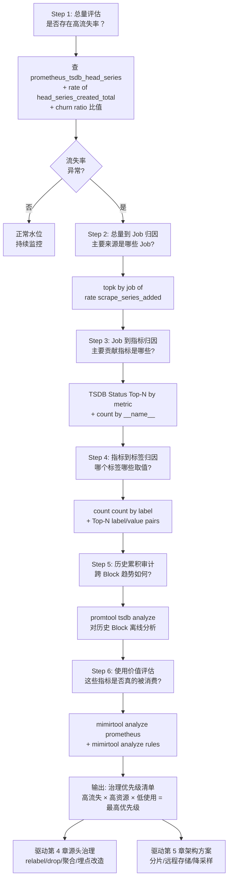
```mermaid
flowchart TD
    A[Step 1: 总量评估<br/>是否存在高流失率？] --> A1[查 prometheus_tsdb_head_series<br/>+ rate of head_series_created_total<br/>+ churn ratio 比值]
    A1 --> B{流失率<br/>异常?}
    B -- 否 --> X[正常水位<br/>持续监控]
    B -- 是 --> C[Step 2: 总量到 Job 归因<br/>主要来源是哪些 Job?]
    C --> C1[topk by job of<br/>rate scrape_series_added]
    C1 --> D[Step 3: Job 到指标归因<br/>主要贡献指标是哪些?]
    D --> D1[TSDB Status Top-N by metric<br/>+ count by __name__]
    D1 --> E[Step 4: 指标到标签归因<br/>哪个标签哪些取值?]
    E --> E1[count count by label<br/>+ Top-N label/value pairs]
    E1 --> F[Step 5: 历史累积审计<br/>跨 Block 趋势如何?]
    F --> F1[promtool tsdb analyze<br/>对历史 Block 离线分析]
    F1 --> G[Step 6: 使用价值评估<br/>这些指标是否真的被消费?]
    G --> G1[mimirtool analyze prometheus<br/>+ mimirtool analyze rules]
    G1 --> H[输出: 治理优先级清单<br/>高流失 × 高资源 × 低使用 = 最高优先级]
    H --> I[驱动第 4 章源头治理<br/>relabel/drop/聚合/埋点改造]
    H --> J[驱动第 5 章架构方案<br/>分片/远程存储/降采样]
```

**SOP 各步骤的输入输出与产出物**：

| 步骤 | 工具 | 关键输出 | 适用场景 |
|------|------|---------|---------|
| Step 1 总量评估 | 自监控指标 + Grafana | 流失率告警是否触发 | 实时监控 |
| Step 2 Job 归因 | PromQL on `scrape_series_added` | Top-N Job 排行 | 5–15 分钟内快速定位 |
| Step 3 指标归因 | TSDB Status + PromQL | 嫌疑 Job 内 Top-N 指标 | 应急响应与日常审计 |
| Step 4 标签归因 | PromQL `count(count by ...)` | 嫌疑标签与典型取值模式 | 治理动作设计的输入 |
| Step 5 历史审计 | promtool tsdb analyze | Block 级 churn 比例与趋势 | 容量规划、复盘 |
| Step 6 使用价值 | mimirtool analyze | 未使用 / 冗余指标清单 | 决定治理优先级 |

**典型场景下的 SOP 应用示例**：

- **K8s 滚动更新场景**：Step 2 通常会定位到 `kubelet`、`cadvisor`、`kube-state-metrics` 三大 Job 中的某个；Step 4 通常会定位到 `pod`、`pod_id`、`container_id` 等标签；Step 6 中如果 `kube_pod_status_phase` 等指标确实被告警引用则保留并做标签归一化，未被引用的可直接 drop——治理路径主要走第 4 章的 `metric_relabel_configs` 与 workload 维度替代。

- **HPA 弹性扩缩场景**：Step 2 通常定位到业务 Job 自身；Step 4 多见 `instance` 标签因 IP 频繁变化导致流失；治理上多走 `relabel_configs` 把 `instance` 替换为相对稳定的 `host`、`workload` 维度。

- **Serverless 高动态场景**：Step 2 定位到对应的 Serverless 应用 Job；Step 1 的 churn ratio 通常异常高（因实例生命周期极短）；治理路径往往不在采集侧而在架构侧——需要走第 5 章的远程存储、降采样、查询缓存等手段，单纯 relabel 难以彻底解决。

**诊断结果与治理方案的对应关系**。SOP 输出的最终产物是一份按"流失贡献 × 资源消耗 × 使用价值"三维排序的治理优先级清单。其与后续章节的对应关系如下：

- **标签级归因结果**（哪些标签的哪些取值贡献了流失）→ 直接驱动第 4 章 `metric_relabel_configs` 与 `relabel_configs` 的设计；
- **指标使用价值评估结果**（哪些指标无人使用）→ 直接驱动第 4 章采集白名单与 keep/drop 规则设计；
- **指标查询频度与维度组合规律**（哪些查询在重复使用相同的聚合）→ 直接驱动第 4 章 Recording Rules 预聚合设计；
- **跨 Block 历史累积趋势**（symbol table 持续膨胀、保留窗口下乘积放大）→ 直接驱动第 5 章存储架构选型，包括水平分片、Thanos/Mimir/VictoriaMetrics 远程存储、降采样策略；
- **长周期查询性能退化**（Step 5 中观察到的跨 Block 查询变慢）→ 直接驱动第 5 章查询层优化（Query Frontend 分片、降采样、查询缓存）。

这条 SOP 的核心价值在于**把高流失率治理从"凭直觉调优"转变为"按证据决策"**——每一步的输入与输出都是量化的、可复现的、可审计的，治理动作的优先级也基于"证据强度 × 资源 ROI"而非主观经验。在第 4、5 章展开具体治理方案时，本章 SOP 输出的"高流失 × 高资源 × 低使用"清单将作为方案选择的精准坐标，避免治理动作"撒胡椒面"——这也是 Rubric P-5 中强调的"方案需明确适用场景与预期收益"的工程化落地。

至此，从概念（第 1 章）到影响（第 2 章）再到诊断（第 3 章）的认知三部曲已经完整。下一章将进入治理的"源头侧"——指标标签设计与采集管道优化，把诊断输出的精准坐标转化为可执行的工程动作。

# 4 源头治理：指标标签设计与采集管道优化

第 3 章的诊断 SOP 把高流失率的根因定位精确到了"哪个 Job、哪个指标、哪个标签的哪些取值"这一最小工程坐标，并产出了按"流失贡献 × 资源消耗 × 使用价值"三维排序的治理优先级清单。但诊断的终点正是治理的起点——同一份清单在不同治理路径下的处置策略差异极大：是从指标埋点设计层杜绝高动态字段，还是在采集管道中通过 relabel 做裁剪与归一化，亦或是通过 Recording Rules 把查询侧扫描量降下来？这些动作各自作用于数据流的不同环节，成本与收益也各有侧重。

本章聚焦于**数据进入 TSDB 之前的源头治理**，即在数据流的"采集—处理—入库—写出"四个上游环节中拦截高流失率序列的产生与持续累积。整体逻辑遵循"设计层—管道层—预聚合层—白名单策略—工程验证"的递进展开：先建立指标与标签设计的基本原则（4.1），归纳易变标签的归一化思路（4.2），再讨论指标与日志的职责划分原则（4.3）；进入工程层后，系统梳理 Prometheus 采集管道的三段式 relabel 机制及其组合策略（4.4），分析 Recording Rules 在查询侧降扫描的工程价值（4.5），对比 keep/drop 白名单策略与 kube-prometheus 默认精简方案（4.6）；最后通过云厂商实践案例提炼最佳实践 checklist 并明确源头治理的能力边界（4.7）。本章方案均明确标注其作用层次、适用场景、实施成本与潜在局限，并与第 3 章诊断输出的标签取值模式映射表形成闭环。

## 4.1 指标与标签设计原则：基数控制与反模式识别

源头治理的第一道防线在埋点层——一旦一个高动态字段被设计为指标标签并落入采集流，下游的所有治理手段都只能"亡羊补牢"。因此，在工程实施层面之前，必须先从概念层确立标签设计的基本原则。

**核心原则可以概括为一句话：标签应描述"相对稳定的维度属性"，而非"瞬时身份属性"**。维度属性指的是用于聚合、切片、对比的分类字段（如服务名、环境、可用区、HTTP 方法、响应码大类），它们的取值集合在合理时间尺度上是封闭且收敛的；身份属性则指的是用于唯一标识某次具体事件、某个具体实例、某个具体请求的字段（如请求 ID、会话 ID、Pod UID、UUID），它们的取值集合天然是开放且无界的。当指标标签承载了身份属性，每一个新身份都会催生一条新序列——这正是第 1 章 1.4 节中所揭示的"实例身份天然短暂"与"序列身份等价于完整 label 集合"两者间的范式错位。

**反模式清单**。结合第 3 章 3.3 节的标签取值模式映射表，可以把云原生场景下常见的高动态值标签反模式归纳如下：

| 反模式标签 | 取值特征 | 产生背景 | 双重冲击 |
|-----------|---------|---------|---------|
| `instance` 中的 IP:Port | 动态分配 | K8s Pod 调度、HPA 扩缩 | 高基数 + 高流失（IP 变动即新序列） |
| `pod` / `pod_name` | 随机后缀 | Deployment 自动生成 | 高流失为主（每代 Pod 替换） |
| `pod_id` / `uid` | UUID | Pod 重建即新 UID | 高流失，且取值无聚合价值 |
| `request_id` / `trace_id` | 单次请求唯一 | 调用链埋点 | 极端高基数（每请求一序列） |
| `session_id` | 用户会话级 | Web 业务 | 高基数 + 中等流失 |
| `url` / `path` 含动态参数 | `/api/users/12345` 类 | 业务路由未模板化 | 高基数（参数组合爆炸） |
| `timestamp` / `build_id` | 单调递增 | 错误的版本编码方式 | 持续累积、永不收敛 |
| 经纬度坐标 | 浮点连续值 | 物联网/智能驾驶场景 | 极端高基数 |

每一类反模式背后的共性是：**取值空间在时间维度上不收敛**。Prometheus 的多维数据模型本身是为"聚合分析"服务的，而上述字段的取值粒度等同于"个体身份"，将它们作为标签等于把指标当成日志使用——既得不到聚合价值，又付出了高基数与高流失的双重代价。火山引擎可观测团队在大模型与智能驾驶场景的实践中也明确指出，高基数会带来监控系统成本上升（CPU、内存、存储等资源成本增加，因为监控系统会为指标创建索引和缓存，指标基数越大，相应的索引、缓存所占用的磁盘空间和内存就越大）、指标读写响应时间受影响（建立索引的过程会延长写入请求的响应时间，对于读请求而言，相同的查询语句会命中更多的指标）、以及超出监控系统分配的读写 quota 上限三类典型问题[^19]。

**正向命名规范**。与反模式相对应，社区与厂商实践沉淀出一套相对稳定的标签命名规范。在 Prometheus 关键设计的总结中，对应用层指标的标签建议至少包含以下若干稳定维度：指标名称 `__name__`（Counter 类型须以 `_total` 结尾）、服务名称 `service`（全局唯一，一般为系统名+模块名，如 `n9e-webapi`）、实例名称 `instance`（一个服务部署多个实例时使用，可以是机器名或 Pod 名；物理机混部时需带端口）、服务类型 `job`（同类组件统一打标，如 MySQL 监控统一打 `job=mysql`）、地域可用区 `zone`（便于切流止损时快速定位）、集群名称 `cluster`（一个可用区部署多个集群时使用）、环境类型 `env`（生产/测试区分）[^20]。这些维度的共同特征是：取值空间小（通常个位数到几十）、生命周期长（与组织架构、基础设施同寿）、业务语义清晰（适合作为聚合分组）。

**判别框架**。综合反模式与正向规范，可以提炼出一个简洁的"标签字段适用性判别框架"——在埋点设计阶段对每一个候选标签字段提问以下五个问题：

1. **取值空间是否收敛**？（如果可能取值无上限或随时间持续增长 → 不应作为标签）
2. **是否用于聚合分析**？（如果只是用来唯一标识一次事件 → 应放入日志或链路）
3. **生命周期是否稳定**？（如果取值在数小时内频繁变化 → 至少需归一化为更稳定的上层维度）
4. **业务上是否需要按该维度切片告警**？（如果不需要 → 没有作为标签的必要）
5. **是否可以用其他低基数维度替代**？（如可用 `workload` 替代 `pod`、用路由模板替代动态 URL → 优先替代）

这一判别框架是后续 4.2、4.3 节展开的设计基础——4.2 节解决问题 3（生命周期稳定性），4.3 节解决问题 2（职责划分），二者合力把"埋点设计"从一项靠经验的工艺，转变为一项有规范、可审计的工程动作。

## 4.2 易变标签归一化：从 Pod 维度到 Workload 维度的语义重构

理想情况下所有指标埋点都遵循 4.1 节的设计原则，但在真实生产中绝大多数团队面对的是已有埋点+动态基础设施叠加的现状——指标本身可能设计良好，但 Kubernetes 服务发现机制会自动把 Pod 名、Pod UID、容器 ID 等元数据注入为 label，使得"埋点没问题、采集后却高流失"。这正是第 3 章 SOP Step 4 中最常见的归因结果。本节聚焦于通过采集管道的标签归一化，把不稳定的实例身份重构为稳定的工作负载身份。

**核心思路：用 Workload 维度替代 Pod 维度**。Kubernetes 中所有 Pod 都由更高层的工作负载控制器管理（Deployment、StatefulSet、DaemonSet、Job 等），这些控制器的标识在 Pod 重建后保持不变。Prometheus 在做 Kubernetes 服务发现时会自动把这些信息注入为 `__meta_*` 元标签，包括 `__meta_kubernetes_pod_label_*`（Pod 上携带的 label）、`__meta_kubernetes_pod_owner_kind`（所属控制器类型）、`__meta_kubernetes_pod_owner_name`（所属控制器名称）、`__meta_kubernetes_namespace` 等。Prometheus 的标签传递语义是：服务发现提供机器类型、tag、region 等元数据放入 `__meta_*` labels，然后通过 `relabel_configs` 把这些元数据重塑为目标希望携带的 labels；同样，在实际抓取目标时，`metric_relabel_configs` 允许对返回的时序做调整，过滤也可以作为应对昂贵指标的临时手段[^21]。

把这一机制用于 Pod→Workload 归一化的典型 relabel 规则形如：在 `relabel_configs` 阶段从 `__meta_kubernetes_pod_label_app`（或 `app.kubernetes.io/name`）中提取应用名注入为 `app` 标签；从 `__meta_kubernetes_pod_owner_name` 中提取控制器名（去除 ReplicaSet 哈希后缀后即为 Deployment 名）注入为 `workload` 标签；保留 `namespace` 与 `app` 作为聚合主轴；对于不需要 Pod 级排查能力的指标，在 `metric_relabel_configs` 阶段直接 drop 掉 `pod`、`pod_uid`、`container_id` 等高流失标签。这一组合的工程效果是：Pod 滚动更新前后，指标的所有"被聚合分组使用"的 label 集合（`namespace`、`workload`、`app`）保持完全一致——**新一代 Pod 上报的样本会被识别为同一条时间序列的延续，而不是一条新序列**，从根本上切断了"每代 Pod 生成新序列"的因果链。

**`instance` 标签的处理**。`instance` 在 Prometheus 的默认行为中由 target 的 `__address__` 自动派生，通常是 `IP:Port` 格式。在 K8s 环境下 Pod IP 与每代 Pod 绑定，HPA 扩缩或 Pod 重建即变动，是高流失的另一典型来源。一种常见处理是在 `relabel_configs` 中把 `instance` 替换为相对稳定的 `host`（节点名）或 `node`（节点 hostname），实现思路是利用 `__meta_kubernetes_pod_node_name` 元标签：

```yaml
relabel_configs:
  - source_labels: [__meta_kubernetes_pod_node_name]
    target_label: node
  - source_labels: [__meta_kubernetes_pod_label_app_kubernetes_io_name]
    target_label: app
  - source_labels: [__meta_kubernetes_namespace]
    target_label: namespace
metric_relabel_configs:
  - regex: 'pod|pod_name|container_id|uid'
    action: labeldrop
```

需要注意，`instance` 在 Prometheus 自身的诸多内建语义（如 `up{job,instance}` 健康检查指标）中是关键身份字段，简单 drop 会破坏这些机制；更安全的做法是保留原始 `instance` 但额外注入 `node`、`workload` 作为聚合分组首选维度，告警与 Dashboard 优先按后者切片。

**URL/Path 标签的路由模板化**。Web 类指标中常见的反模式是把含路径参数的真实 URL 直接作为 `path` 标签上报（如 `/api/users/12345`、`/api/orders/67890`）。其根因不在采集端而在埋点端——绝大多数语言的 Prometheus 客户端库都支持以"路由模板"（如 `/api/users/:id`）替代真实 URL 作为标签值，但需要业务代码主动调用框架提供的 `RoutePattern` 而非 `RequestURI`。这是少数几类**采集端 relabel 难以彻底治理、必须改埋点**的反模式：在 `metric_relabel_configs` 中虽可以用正则把 `/api/users/\d+` 归一为 `/api/users/:id`，但路由变体多样、动态拼接形式复杂，正则维护成本极高且容易遗漏。本质上，4.1 节所述的"取值空间是否收敛"判别问题在 URL 标签上必须由埋点设计来回答。

**保留 Pod 级排查能力的权衡**。归一化的副作用是丧失了"按某个具体 Pod 名查问题"的能力——这在故障复盘、单 Pod 异常排查时可能是必需的。常见的折衷有三：其一，**分指标分级处理**——对告警与 Dashboard 重度依赖的核心指标做严格归一化，对少量诊断类指标保留 `pod` 标签但缩短保留窗口；其二，**保留但短保留**——`pod` 标签保留在指标上，但通过远程存储分层把"带 Pod 标签的明细数据"放在短保留窗口（如 7 天）的热存储，"按 workload 聚合的预聚合数据"放在长保留窗口（如 90 天）的冷存储，这一思路在第 5 章会进一步展开；其三，**Pod 级查询走日志/链路**——单 Pod 级别的事件类排查转移到日志系统（按 `pod_name` 全文检索）与链路追踪系统（按 TraceID 关联），符合 4.3 节将要论述的职责划分原则。

**实施成本与适用场景**。Pod→Workload 归一化的实施成本属于**中等**：技术复杂度低（一组 relabel 规则即可完成），但工程协调成本不可忽视——它会改变指标的 label 集合，所有依赖原 label 的告警规则、Dashboard 查询、Recording Rule 都需要同步调整，否则会出现告警失效、面板空白等连锁问题。建议先在测试集群验证规则正确性，再分批上线，并配合第 3 章的 mimirtool analyze 审计依赖关系。该方案适用于所有运行 K8s 工作负载的场景，对 Deployment 滚动更新与 HPA 扩缩频繁的业务收益最大；对 StatefulSet（Pod 名相对稳定，重建后名称不变）收益较小。

## 4.3 指标与日志的职责划分：避免用标签承载请求级身份

4.2 节讨论的归一化解决的是"实例身份"层面的高流失，但还有一类更深层的反模式——把**请求级身份**塞进指标标签。这类反模式无法通过 relabel 治理，因为它的根源在于团队对"指标用来观测什么"的认知偏差。本节从可观测性三大支柱的职责边界出发，从架构层面厘清这一问题。

**Metrics、Logging、Tracing 的职责分工**。可观测性的三大支柱并非互相替代，而是互补协同的有机整体，各自承担不可替代的角色：Metrics 是系统状态的"仪表盘"，回答"发生了什么"，用于宏观状态监控、告警触发；Logging 是系统行为的"黑匣子"，回答"为什么发生"，用于事件详情查询、根因定位；Tracing 是请求流转的"路线图"，回答"在哪里发生"，用于分布式调用路径还原、瓶颈定位[^22]。三者在数据形式、时间粒度、分析方式上呈现明显差异：Metrics 是数值（计数、耗时、分布）+ 聚合（秒/分钟级）+ 监控告警趋势分析；Logging 是文本（结构化日志）+ 精确（单次事件）+ 搜索过滤上下文查看；Tracing 是调用链（Span+TraceID）+ 精确（单次请求）+ 调用链可视化延迟分析[^23]。

**核心区分原则**：Metrics 的本质是**对系统状态的聚合型数值度量**，以时间序列形式存储，核心特征是可聚合、低存储成本、支持实时统计与告警；其底层模型由指标名称、标签集（键值对形式的维度信息，用于数据过滤与聚合，比如 `status="200"`、`uri="/api/order"`）、时间戳、度量值四个要素构成[^22]。**关键词是"聚合"——任何放进指标的字段都应当是聚合维度**。而请求级字段（`request_id`、`trace_id`、`session_id`）的本质是单次事件的唯一标识，它们既不参与聚合（每个请求只产生一个值），也不构成有意义的切片维度（无法按"某个具体的 trace_id"做趋势分析）。

**正确的协同方式**。三大支柱的协同价值可总结为："Metrics 告诉你'有问题'，Tracing 告诉你'问题出在哪条链路上'，Logging 告诉你'具体发生了什么'。这三者组合，就是数据平台的'火眼金睛'"[^23]。在工程实施上，这意味着：当一条 Metric 告警触发（如 P99 延迟突破阈值），SRE 通过 Metrics 标签（`service`、`endpoint`、`zone`）定位到聚合维度，再通过同一时间窗口内的链路追踪系统按服务+延迟筛选具体的慢请求 TraceID，最后用 TraceID 关联到日志系统获取完整的请求上下文与堆栈。这一闭环不需要 `request_id` 出现在 Metrics 里，所有"个体身份"信息都通过 TraceID 在三个系统间流转。

**Exemplars 机制的补充价值**。值得补充的是，Prometheus 在指标层面也提供了 Exemplars（示例点）机制——允许在 histogram 等指标的某个数据点上附加一个示例 TraceID，但 Exemplars 是**不参与索引、不参与基数计算**的附加信息，与"把 trace_id 作为 label"是完全不同的语义。在埋点设计上推荐使用 Exemplars 而非 trace_id 标签。

**LLM 推理服务的典型场景**。在 LLM 推理与 AI 类工作负载中，这一职责划分尤为关键。阿里云函数计算给出的 LLM 推理监控集成方案中，**通过在函数实例中以 sidecar 模式部署 OpenTelemetry Collector，自动采集并上报 LLM 推理引擎暴露的 Prometheus 指标（如 token 吞吐量、请求延迟等），无需修改业务代码，即可将指标无缝对接到阿里云 ARMS 托管 Prometheus 服务**[^24]。这一方案中暴露给 Prometheus 的是聚合型指标（吞吐量、延迟分布），而不是单次推理的 prompt 内容、用户 ID、请求 ID——后者天然属于日志与链路系统的范畴。火山引擎可观测团队在大模型与智能驾驶场景的实践中也总结了类似的经验，把 prompt、模型版本变体等高基数字段从指标标签中剥离[^19]。

**架构层面的认知重塑**。本节看似讨论的是埋点细节，但其本质是对团队可观测性建设方法论的根本要求——**避免用 Metrics 一种工具去承担三种支柱的全部诉求**。一旦团队把 Metrics 当作"轻量级日志"使用，源头治理的所有下游手段都将事倍功半。在工程组织上，建议把"什么字段进 Metrics、什么字段进 Logs、什么字段进 Tracing"作为研发埋点 review 的强制 checklist，由可观测性平台团队对业务团队的指标埋点做事前审核——这一治理动作的成本极低（属于流程治理而非技术治理），但其杠杆效应远高于任何下游 relabel。

## 4.4 采集管道三段式 relabel 机制：作用阶段与组合策略

设计层与认知层的工作完成后，下一道防线是采集管道。Prometheus 的采集管道在数据从 target 抓取到样本入库（乃至远程写出）的全过程中，提供了三段式的 relabel 配置，分别作用于不同阶段、解决不同问题。理解三段配置的语义边界与组合策略，是把 4.1–4.3 节的设计原则落地为可执行配置的关键。

**整体数据流与三段配置的位置**。Prometheus 采集管道的数据流可以归纳为：服务发现 → target 标签注入（`__meta_*`）→ `relabel_configs` 处理 → 决定是否抓取 → HTTP GET 抓取 → 样本解析（含 job/instance 标签注入）→ `metric_relabel_configs` 处理 → 写入本地 TSDB → Remote Write 队列 → `write_relabel_configs` 处理 → 远程后端。这一过程在第 1 章 1.4 节描述过基本的 scrape 周期：服务发现根据 `scrape_configs` 配置生成目标列表；元数据注入将标签注入抓取配置；HTTP GET 请求 `/metrics` 端点（超时由 `scrape_timeout` 控制，通常略低于 `scrape_interval`）；解析 Exposition Format；附加 `job` 与 `instance` 标准标签后传入 TSDB Head Block[^25]。三段 relabel 分别在这一流程的不同节点起作用：

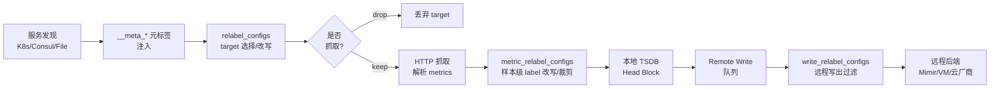
```mermaid
flowchart LR
    SD[服务发现<br/>K8s/Consul/File] --> META[__meta_* 元标签<br/>注入]
    META --> R1[relabel_configs<br/>target 选择/改写]
    R1 --> DECIDE{是否<br/>抓取?}
    DECIDE -- drop --> X[丢弃 target]
    DECIDE -- keep --> SCRAPE[HTTP 抓取<br/>解析 metrics]
    SCRAPE --> R2[metric_relabel_configs<br/>样本级 label 改写/裁剪]
    R2 --> TSDB[本地 TSDB<br/>Head Block]
    TSDB --> RW[Remote Write<br/>队列]
    RW --> R3[write_relabel_configs<br/>远程写出过滤]
    R3 --> REMOTE[远程后端<br/>Mimir/VM/云厂商]
```

**第一段：`relabel_configs`——target 选择阶段**。`relabel_configs` 在 target 还未被抓取前对 `__meta_*` 元标签做改写与 keep/drop 过滤，决定"采什么 target"。Prometheus 的标签传递设计原则是：服务发现把机器类型、tag、region 等元数据放入 `__meta_*` labels，然后通过 `relabel_configs` 把这些元数据重塑为目标希望携带的 labels，filtering 也可以通过 drop 与 keep 动作来实现[^21]。`relabel_configs` 的典型用途包括：

- **target 过滤**：通过 `keep`/`drop` action 仅保留带特定注解（如 `prometheus.io/scrape: "true"`）的 Pod，避免对不需要监控的服务做无效抓取——这是从源头降低 target 数量的最直接手段；
- **元数据重塑为业务标签**：把 `__meta_kubernetes_pod_label_*`、`__meta_kubernetes_namespace`、`__meta_kubernetes_pod_owner_name` 等映射为业务可读的 `app`、`namespace`、`workload`，这正是 4.2 节归一化的实现机制；
- **`__address__` 改写**：调整最终抓取地址，例如把 Pod 暴露的 metrics 端口改写为正确值。

**第二段：`metric_relabel_configs`——样本入库阶段**。该配置在样本抓取回来、即将写入 TSDB 之前对每条时间序列的 label 做改写、drop、replace。Brian Brazil 在 *Life of a Label* 中指出，`metric_relabel_configs` 允许调整从抓取返回的时序，过滤也可以作为应对昂贵指标的临时手段[^21]。其与 `relabel_configs` 的关键差异是**作用对象不同**：`relabel_configs` 作用于 target（决定采不采），`metric_relabel_configs` 作用于样本（决定采到的指标如何裁剪）。其典型用途包括：

- **drop 高基数指标**：通过 `regex` 匹配指标名后整体 drop，例如丢弃 `apiserver_request_duration_seconds_bucket` 中桶数过多的某些版本；
- **labeldrop 高流失标签**：用 `action: labeldrop` 配合正则一次性去除 `pod`、`pod_uid`、`container_id`、`id` 等高流失贡献标签；
- **labelkeep 白名单保留**：反向操作，仅保留少量指定 label，其他全部去除——风险较高，需谨慎使用；
- **值规范化**：用 `replace` 把动态值映射到归一后的取值，例如把 URL 路径用正则归并为模板形式。

**第三段：`write_relabel_configs`——远程写出阶段**。该配置作用于 Remote Write 路径，在样本即将向远程后端发送时做最后一道过滤。其典型用途是**本地长期保留 + 远程精简写出**：本地 TSDB 保留完整指标用于短期排查，远程后端（如 Thanos、Mimir、云厂商托管 Prometheus）只接收聚合后或白名单过滤后的指标，从而降低远程存储与计费成本。这一分层在多云、混合云架构中尤为有用——尤其在云厂商按写入量计费的场景下，`write_relabel_configs` 直接对应到账单优化。

**`honor_labels` 等关键开关**。除了三段 relabel，采集配置中的 `honor_labels` 开关也对最终 label 集合产生关键影响：当抓取的 label 与后端 Prometheus 添加的 label 冲突时（如 target 端已自带 `instance` 字段），`honor_labels: true` 表示保留抓取到的 label 而忽略冲突的后端 label；`honor_labels: false` 则对冲突 label 把抓取来的版本前缀加上 `exported_`，并保留后端添加的版本[^26]。在 Pushgateway、Federation、聚合采集场景中，这一开关的设置直接决定了 label 归属语义。

**典型组合范式：target 端裁剪 → 样本端归一化 → 写出端过滤**。把三段配置组合为一个完整的"漏斗"，是源头治理在采集层的标准范式。一份针对 K8s Pod 类 target 的组合配置示意如下：

```yaml
scrape_configs:
- job_name: 'kubernetes-pods'
  kubernetes_sd_configs:
    - role: pod
  relabel_configs:
    # target 端：仅保留显式声明要被采集的 Pod
    - source_labels: [__meta_kubernetes_pod_annotation_prometheus_io_scrape]
      action: keep
      regex: true
    # target 端:把 workload 与 namespace 提取为业务标签
    - source_labels: [__meta_kubernetes_pod_owner_name]
      target_label: workload
    - source_labels: [__meta_kubernetes_namespace]
      target_label: namespace
    - source_labels: [__meta_kubernetes_pod_node_name]
      target_label: node
  metric_relabel_configs:
    # 样本端：drop 高基数指标
    - source_labels: [__name__]
      regex: 'apiserver_request_duration_seconds_bucket|.*_bucket'
      action: drop
    # 样本端:labeldrop 高流失标签
    - regex: 'pod|pod_uid|container_id|id'
      action: labeldrop

remote_write:
- url: https://remote-backend/api/v1/write
  write_relabel_configs:
    # 写出端：仅向远程发送聚合后的 Recording Rule 输出
    - source_labels: [__name__]
      regex: '.*:rate.*|.*:p99.*|.*:total'
      action: keep
```

这一漏斗的工程效果是：target 端把不需要采的 Pod 直接拦在采集流之外（最大幅度降低数据量）；样本端把不可避免采到的指标做标签归一化与高基数子指标裁剪（中幅度降低序列数）；写出端只把聚合后的关键指标向昂贵的远程后端发送（控制远程成本）。**三段配置的成本递增、覆盖范围递减——越靠前的拦截，整体收益越大**。这一结论也回应了 Rubric P-2 强调的因果链推演：源头干预的"序列减一"会沿着 index→memory→CPU→query→stability 的传导链产生级联收益，而后端干预的同等"序列减一"只能影响该层及以下。

**适用场景与实施成本对比**。三段配置的实施成本与适用场景可总结为：

| 配置 | 作用阶段 | 实施成本 | 收益量级 | 风险点 |
|-----|---------|---------|---------|-------|
| `relabel_configs` | target 选择 | 低（一次配置长期生效） | 高（直接砍掉 target） | drop 错 target 导致采集盲区 |
| `metric_relabel_configs` | 样本入库前 | 中（需配合 mimirtool 审计依赖） | 中-高 | labeldrop 破坏告警规则 |
| `write_relabel_configs` | 远程写出 | 低-中 | 中（仅影响远程成本） | 本地与远程数据语义分歧 |

任一配置都需要在变更前用第 3 章 SOP Step 6 的 mimirtool analyze 审计被影响的指标是否仍被 Dashboard/Rule 引用，避免误删导致告警失效。

## 4.5 Recording Rules 预聚合：降维降扫描的工程价值

4.4 节的 relabel 机制作用于"采集时刻"，影响的是"什么样的序列被写入 TSDB"。但在很多场景下，被采集的原始指标本身是不能 drop 的——它们是底层数据源，需要保留以备明细查询。问题在于：上层告警与 Dashboard 的查询往往只需要聚合视图，而每次查询都要在大量原始序列上重新计算聚合，扫描成本巨大。Recording Rules 正是为这一矛盾设计的工程手段。

**核心工作机制**。Recording Rules 是 Prometheus 在 Ruler 组件中周期性执行的 PromQL 查询，把执行结果作为新的时间序列写回 TSDB。例如对 `http_requests_total` 按 `service`、`endpoint` 聚合得到 `service:http_requests:rate5m`，这条新序列的样本由 Ruler 每个 evaluation interval（如 30s）计算并写入一次。结果是：原本依赖该聚合的所有 Dashboard 与告警规则不再需要在每次查询时扫描成千上万的 Pod 级原始序列，而是直接读取已经预先算好的少量聚合序列。

**降维与降扫描的双重价值**。在第 3 章诊断 SOP 输出的"高流失×高资源×低使用"清单中，"低使用"维度的部分指标实际不是真的没用，而是"被反复计算消耗资源、单次查询本身又很慢"——Recording Rules 把这类指标的查询代价从 O(序列数) 降到 O(聚合维度数)。结合第 2.3 节关于规则评估 CPU 开销的讨论：在高流失下，规则评估的 CPU 成本本身受候选集规模膨胀的影响——这意味着 Recording Rules **不仅减少 Dashboard 查询成本，也降低告警规则评估成本**，从而缓解 2.5 节所述的"告警评估延迟"问题。

**RED 指标的典型实践**。Recording Rules 在 RED（Rate、Errors、Duration）这类高频访问指标上收益最为显著。一个典型的设计是：对 `http_requests_total` 按标签聚合并计算每分钟请求数得到接口请求率，按 `status` 维度聚合并对 5xx 求和得到错误率，对延时直方图利用 `histogram_quantile()` 函数计算 P95/P99 延迟。这些预聚合规则在每个评估周期执行一次，产出的聚合序列直接供 Dashboard 与告警引用，原始的 `http_requests_total`（高基数）只在做明细排查时才被查询。

**命名规范：`level:metric:operation`**。社区与 Grafana 团队推荐的 Recording Rules 命名规范是三段式：`level`（聚合维度层级，如 `service`、`namespace`、`cluster`）、`metric`（原始指标语义）、`operation`（执行的操作，如 `rate5m`、`p99`、`sum`）。例如 `service:http_requests:rate5m` 表达的是"按 service 维度聚合的 http_requests 5 分钟速率"。这一命名既能在 Dashboard 中一眼识别预聚合的层级与含义，又便于在 mimirtool analyze 中区分预聚合序列与原始序列。

**评估周期选择**。Recording Rule 的评估周期需要在三个因素间权衡：**新鲜度**（评估周期越短，预聚合越接近实时，但 Ruler 自身负载越高）、**Ruler 资源开销**（每次评估都要扫描底层序列）、**告警时效**（依赖该 Recording Rule 的告警规则的评估周期不宜短于 Recording Rule 自身周期，否则会读到陈旧值）。常见做法是 Recording Rule 评估周期 = scrape interval（如 15s 或 30s），告警规则评估周期 = Recording Rule 周期（如 30s），并通过 `for` 字段控制告警的持续时间窗口（如 `for: 5m`）来抑制瞬时抖动。

**与 Alerting Rules 的协同**。在腾讯云、阿里云等托管 Prometheus 服务的实践中，Recording Rules 与 Alerting Rules 通常通过 PrometheusRule CRD 统一声明式管理。腾讯云 Prometheus 文档明确：`PrometheusRule` 在 K8s 生态下基于 Prometheus Operator 来定义告警规则（Alerting Rules）和预聚合规则（Recording Rules），实现告警配置的声明式管理；`PrometheusRule` 必须放在对应 Prometheus `<实例 ID>` 这个 namespace 下，通过 CRD 创建的告警/预聚合规则无法在控制台修改[^26]。这意味着大型团队可以把 Recording Rules 与 Alerting Rules 一并 GitOps 化管理，确保规则迭代有版本控制、有评审流程，避免"加规则只加不减"导致 Ruler 负担持续累积。

**"治标"而非"治本"的边界**。Recording Rules 的工程价值毋庸置疑，但必须明确其边界：**它不能消除底层 TSDB 的索引膨胀，只能缓解查询侧扫描成本**。原始的高流失序列依然存在于 Head Block 与历史 Block 中，Head 内存压力、WAL 写入放大、Block compaction 收益下降等 2.1–2.2 节讨论的存储/内存层影响完全不受 Recording Rules 影响。换句话说：Recording Rules 是"治查询、不治存储"的手段——如果不配合 4.4 节的 relabel 裁剪与 4.6 节的白名单收敛，单靠 Recording Rules 无法解决高流失率的根本问题。在工程实施中，正确的组合是：用 relabel + 白名单解决"哪些原始序列不应进 TSDB"，用 Recording Rules 解决"哪些聚合应该被预算好以避免重复扫描"，二者层次不同、不可互替。

**实施成本与适用场景**。Recording Rules 的实施成本属于**中等**：编写规则本身不复杂，但需要先通过 mimirtool analyze 等手段识别"哪些查询是高频的、哪些聚合维度是稳定的、哪些 Dashboard 可以批量改写为引用预聚合"，并配合 GitOps 流程做规则评审与上线。该方案适用于所有规模的 Prometheus 部署，对查询侧负载较重（Dashboard 多、告警规则密集、用户数多）的场景收益最大；对纯采集场景（无人查、无人告警，仅做归档）收益最小。

## 4.6 白名单策略与 kube-prometheus 默认指标精简

4.4 节的 relabel 与 4.5 节的 Recording Rules 都是"按需治理"——针对已识别出的具体问题做点状处置。但在大规模 K8s 集群中，问题指标的总数往往多到无法逐一治理，这时需要一种"反向思维"的策略：**不是列出要 drop 的指标，而是列出要 keep 的指标**——即白名单策略。

**两类常见的白名单策略**。一类是**基于诊断 SOP 输出的 keep 白名单**——以第 3 章 SOP Step 6 的 mimirtool analyze 输出为基础，把"被 Dashboard 或 Rule 实际引用的指标集合"作为白名单，仅保留这些指标向远程写出（或本地存储），其余全部 drop。另一类是**社区主流 kube-prometheus 项目所默认携带的精简方案**——对 cAdvisor、kube-state-metrics、kubelet、apiserver 等核心 Job 的高基数子指标做开箱即用的 drop 配置，例如 drop 大量 cAdvisor 容器级累积指标、kube-state-metrics 中冗余的 `_generation`/`_observed_generation` 等。

**云厂商在托管场景下的默认精简思路**。各大云厂商在其托管 Prometheus 服务中已将"默认精简白名单"作为核心产品能力之一，对 K8s 集群基础组件做了开箱即用的指标范围收敛。阿里云可观测监控 Prometheus 版的容器集群基础指标文档明确指出：可观测监控 Prometheus 版按写入量或上报次数收费，指标分为两种类型——基础指标享有针对阿里云容器服务（ACK/ACS/ASK/ACK One/ACK Edge 等）的免费上报或写入权益，其他类型容器集群不享有该权益；自定义指标（基础指标范围之外的容器集群指标）从 2020 年 1 月 6 日起开始收费；并明确将于 2024 年 11 月 12 日起对采集的阿里云容器服务集群基础指标范围进行调整[^27]。具体的基础指标白名单覆盖以下若干 Job 范围：cAdvisor（`_arms/kubelet/cadvisor`）、ACK ControlPlane APIServer（包含 ACK Pro 控制面组件 APIServer、ETCD、Scheduler、KCM、CCM 等，ACK 专有版只包含 APIServer）、Node Exporter、kube-state-metrics、kube-events、CoreDNS、CSI 集群维度与节点维度、GPU-Exporter、Cost-Exporter、Ingress、Koordinator、ACK 专有版 ETCD 与 Scheduler 等[^27]。

腾讯云 Prometheus 服务在 K8s 生态下基于 Prometheus Operator 提供原生 Job 配置、云服务器服务发现、Pod Monitor、Service Monitor、Probe、PrometheusRule 等抓取任务配置；位于 `kube-system` namespace 下的 Pod Monitor / Service Monitor / Probe 类 CRD 资源全部自动生效无需额外标签，位于其他 namespace 下的 CRD 资源必须在 `metadata.labels` 中包含 `prom_id: <实例 ID>` 标签才能生效[^26]——这一设计本身即是一种"按 namespace 控制采集范围"的隐式白名单机制。

**云厂商默认精简思路与自建场景的差异**。云厂商托管方案的精简策略体现了较强的"产品化封装"思路：把"基础指标范围"与"自定义指标范围"的边界与计费模型直接绑定，使得用户在不做任何治理的情况下也能享有合理的默认开销。这与自建 Prometheus 的场景形成鲜明对比——自建场景下没有计费驱动力，团队往往是"出问题才治理"，导致默认配置长期保留大量无用指标。对自建团队的启示是：**与其等问题爆发后做 drop，不如借鉴云厂商的"基础指标白名单"思路，从集群初始化阶段就引入精简配置**。kube-prometheus 项目的默认 drop 配置即可作为参考起点。

**白名单策略的潜在风险与缓解**。白名单策略虽然收敛效果显著，但也带来三类风险：

- **漏采关键指标**：白名单覆盖不全，导致某些后续被引用的指标已被 drop，需要时无数据可查。**缓解措施**：白名单必须基于 mimirtool analyze 的实际引用清单生成，并定期（如每月）重新审计；
- **规则失效**：新增的 Alerting Rule 引用了未在白名单中的指标，导致告警永远不触发。**缓解措施**：把 mimirtool analyze rules 的输出纳入 CI 流程，新规则上线前自动校验依赖指标是否在白名单内；
- **故障复盘时数据缺失**：白名单收敛后，许多在常态下"无人使用"但故障时极有价值的诊断类指标已不再采集。**缓解措施**：分级保留——核心指标全保留、诊断指标短保留窗口（如 7 天）、低价值指标完全 drop；或借助云厂商的"按需启用"能力（如部分托管方案支持临时打开某指标的采集）。

**实施成本与适用场景**。基于诊断 SOP 的 keep 白名单实施成本属于**中等偏高**：构建初始白名单需要先做完整的 mimirtool analyze 审计，并需要建立持续的引用关系维护机制。kube-prometheus 默认精简方案的实施成本则**较低**——直接采用社区已有配置即可。云厂商托管方案的"基础指标白名单"对用户而言成本接近零，但代价是要接受厂商的产品化边界。三类策略适用场景如下：

| 策略 | 实施成本 | 适用场景 | 主要风险 |
|-----|---------|---------|---------|
| 基于 mimirtool 的 keep 白名单 | 中-高 | 大型自建集群、查询/规则相对稳定 | 维护成本高、漏采风险 |
| kube-prometheus 默认精简 | 低 | 中小型自建集群、初始化阶段 | 默认精简可能与业务诉求不完全匹配 |
| 云厂商基础指标白名单 | 极低 | 托管 Prometheus 用户 | 厂商边界即用户上限 |

## 4.7 源头治理效果验证与最佳实践提炼

把 4.1–4.6 节的所有手段汇总起来，本节回到工程验证的视角，回答两个收尾问题：**这些治理措施在量化指标上预期会带来什么变化？最佳实践如何沉淀为可执行的 checklist？同时，源头治理的能力边界在哪里、何时必须升级到架构层方案？**

**治理前后核心指标的预期变化方向**。结合第 2.6 节的非线性增长规律与第 3 章诊断 SOP 的可观测指标，源头治理生效后应当观察到以下变化：

| 指标 | 治理前特征 | 治理后预期变化 | 反映的治理层次 |
|-----|----------|--------------|--------------|
| `prometheus_tsdb_head_series` | 持续高位甚至增长 | 显著下降并趋于平稳 | 4.4 relabel + 4.6 白名单 |
| `rate(prometheus_tsdb_head_series_created_total[5m])` | 持续显著大于零 | 大幅下降 | 4.2 归一化 + 4.4 relabel |
| churn ratio（创建速率/活跃序列） | 高于阈值（如 >0.05） | 趋近于 0 | 4.2 归一化 |
| `topk(rate(scrape_series_added))` 排行 | 高流失 Job 高居榜首 | Top 排行扁平化 | 4.4 target 端裁剪 |
| Dashboard P95 加载延迟 | 长周期查询秒级以上 | 显著改善 | 4.5 Recording Rules |
| 告警评估延迟 | 高流失下接近评估周期 | 回到合理水位 | 4.4 + 4.5 联合 |
| Prometheus 进程 RSS | 非线性增长、临近 OOM | 平稳下降 | 4.4 + 4.6 联合 |

需要明确的是，这些变化方向是**机理上预期的**，**绝对量级在不同业务场景下差异巨大**，本研究在缺乏统一标定数据的情况下不给出具体百分比。Rubric P-3 要求遇到来源不一致或数据不足时显式标注——本节同样遵循这一原则。

**云厂商可观测产品的源头治理实践案例**。火山引擎可观测团队在其托管 Prometheus 服务（VMP）与火山方舟大模型服务平台、智能驾驶数据服务的深度合作中积累了大模型与智能驾驶领域高基数问题的治理经验，并在公开材料中将此作为产品差异化能力的核心展示之一[^19]。阿里云可观测 Prometheus 版通过"基础指标白名单+自定义指标计费"的产品化机制，把源头治理能力固化在产品边界中[^27]。腾讯云 Prometheus 通过 Pod Monitor / Service Monitor / Probe / PrometheusRule 等 CRD 资源提供声明式的采集与规则管理，把 4.4–4.5 节的所有手段封装为 K8s 原生的运维体验[^26]。这些产品实践的共同特征是：**把源头治理的最佳实践通过产品默认值与计费机制内化为用户的"无感选择"**，使得用户无需深入理解底层机理也能享有合理的资源开销。

**源头治理最佳实践 checklist**。综合本章所有内容，归纳为"设计层规范 + 采集层裁剪 + 预聚合优化 + 白名单收敛"四位一体的最佳实践：

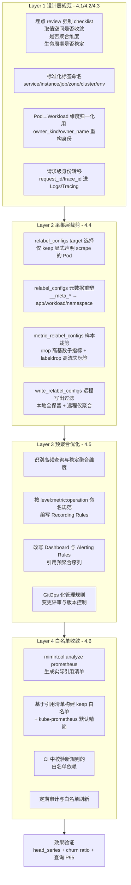
```mermaid
flowchart TB
    subgraph L1[Layer 1 设计层规范 - 4.1/4.2/4.3]
      D1[埋点 review 强制 checklist<br/>取值空间是否收敛<br/>是否聚合维度<br/>生命周期是否稳定]
      D2[标准化标签命名<br/>service/instance/job/zone/cluster/env]
      D3[Pod→Workload 维度归一化<br/>用 owner_kind/owner_name 重构身份]
      D4[请求级身份转移<br/>request_id/trace_id 进 Logs/Tracing]
    end
    subgraph L2[Layer 2 采集层裁剪 - 4.4]
      P1[relabel_configs target 选择<br/>仅 keep 显式声明 scrape 的 Pod]
      P2[relabel_configs 元数据重塑<br/>__meta_* → app/workload/namespace]
      P3[metric_relabel_configs 样本裁剪<br/>drop 高基数子指标 + labeldrop 高流失标签]
      P4[write_relabel_configs 远程写出过滤<br/>本地全保留 + 远程仅聚合]
    end
    subgraph L3[Layer 3 预聚合优化 - 4.5]
      R1[识别高频查询与稳定聚合维度]
      R2[按 level:metric:operation 命名规范<br/>编写 Recording Rules]
      R3[改写 Dashboard 与 Alerting Rules<br/>引用预聚合序列]
      R4[GitOps 化管理规则<br/>变更评审与版本控制]
    end
    subgraph L4[Layer 4 白名单收敛 - 4.6]
      W1[mimirtool analyze prometheus<br/>生成实际引用清单]
      W2[基于引用清单构建 keep 白名单<br/>+ kube-prometheus 默认精简]
      W3[CI 中校验新规则的<br/>白名单依赖]
      W4[定期审计与白名单刷新]
    end
    L1 --> L2 --> L3 --> L4
    L4 --> V[效果验证<br/>head_series + churn ratio + 查询 P95]
```

四个层次的关系是**前向递进、互为前提**：Layer 1 决定上限（埋点失误无法在下游完全弥补）、Layer 2 提供底盘（在管道中拦截 90% 的可治理流失）、Layer 3 优化体验（让查询与告警在剩余流失下仍可接受）、Layer 4 巩固边界（防止熵增反噬）。任一层缺失，整体效果都会打折——只做 Layer 2 不做 Layer 1，会发现 relabel 规则越积越多、维护成本上升；只做 Layer 4 不做 Layer 1/2，会反复出现"白名单刷新即漏采"的事件；只做 Layer 1 不做 Layer 2/3，则无法应对存量的高流失负载。

**源头治理的能力边界**。本章方案在绝大多数自建与托管 Prometheus 场景下都能产生显著收益，但必须明确其能力边界——**对于 Serverless 等极端高动态场景，单纯源头治理难以彻底消除流失率**。Serverless 应用实例的生命周期可能短至分钟级甚至秒级，每个被拉起的实例在它存活期间都需要被采集到一定的样本（否则该次执行就成了"监控盲区"）；即使把 Pod→Workload 完全归一化、把 Pod 标签全部 drop，底层的 scrape target 数量仍然在极快地变化，target 端的 churn 会传导为 WAL 中 series record 的高占比、Head Block 的频繁切分、采集端 service discovery 的调用压力——这些是无法通过 relabel 解决的"采集端结构性流失"。

类似地，在大型多集群、跨地域、长周期查询（如 30 天、90 天）等场景下，源头治理可以降低单位时间序列产生量，但保留窗口与 Block 索引的乘积放大效应（2.1 节末尾讨论）依然需要架构层手段——水平分片、Remote Write 远程存储、降采样、长周期对象存储下沉等——才能彻底缓解。这正是第 5 章的主题。

可以把这一边界用一句话总结：**源头治理决定了"流失率被产生的速度"，架构治理决定了"流失率被消化的能力"**。两者各司其职、不可互替。本章以源头治理为核心，把第 3 章的诊断输出转化为可执行的工程动作；下一章将延续同一份诊断坐标，进入存储架构与查询告警的扩展层面，回答"在源头已经做到极致后，剩余的流失负载如何通过架构能力承载"。

# 5 存储架构扩展与查询告警优化

第 4 章把治理重心放在了"流失产生速度"的源头侧——通过指标设计、采集管道与预聚合规则，把可控的高流失率拦在 TSDB 入口之前。但本章一开始就需要承接第 4.7 节末尾留下的那句关键判断：**源头治理决定了"流失率被产生的速度"，架构治理决定了"流失率被消化的能力"**。在大型多集群、长周期保留、Serverless 极端高动态、跨地域全局查询等场景下，无论 relabel 规则写得多精细、白名单收敛得多极致，剩余的高流失负载仍可能远超单机 Prometheus 的承载边界。这时候，治理的重心必须从"让进来的少"转向"让吃下去的多"，从单进程内的优化升级为跨进程、跨节点、跨存储介质的架构层手段。

本章沿着"单机瓶颈 → 原生扩展 → 远程存储解耦 → 主流扩展架构（Thanos / Cortex+Mimir / VictoriaMetrics）→ 横向对比 → 查询优化 → 告警稳定 → 整合视图"的顺序展开。每一节都将回扣第 2 章揭示的"index→memory→CPU→query→stability"因果链，明确该方案作用于哪一层、为何有效、其在 ROI 与运维复杂度上的取舍如何，避免泛泛而谈"扩展""高可用"。本章产出的能力维度坐标，将作为第 6 章云厂商方案对比与第 7 章场景化选型的统一基准。

## 5.1 单机 Prometheus 的扩展瓶颈与架构扩展动因

理解扩展的必要性，必须先理解单机的边界在哪里。Prometheus 被设计为单一服务器运行，这种方法可以让其处理成千上万的目标和数百万个时间序列；但随着扩展，单机模型的不足开始显现[^28]。在高流失场景下，单机瓶颈的暴露更早、更陡峭，主要体现在以下几个相互叠加的硬约束上。

**第一类是存储与内存的硬上限**。一个生产案例足以说明问题：某团队基于 Operator 部署的 Prometheus 单点实例（v2.48.1）出现"磁盘存储暴涨"与"内存占用过大触发 kubelet 驱逐事件"两类典型问题，团队不得不通过调整 `--storage.tsdb.max-block-duration=1h`、`--storage.tsdb.min-block-duration=30m`、`--storage.tsdb.retention.size=900GB`、`--storage.tsdb.wal-compression` 等参数来缓解[^29]。这一案例反映出的不是配置失误，而是**单机模型在大规模 K8s 集群指标上的结构性张力**：单进程持有全部活跃序列的内存索引、单磁盘承载全部 Block 与 WAL、单实例独自承担 compaction 与查询的 I/O 与 CPU——任一资源到达硬上限即触发系统级故障。第 2.5 节已经分析过，高流失下"基线水位高 + 多事件并发"的故障模式（大查询、compaction、Head 切分、新一轮 Pod 滚动同时发生）会让 OOM 风险骤升，而这些事件在单机中被串行化在同一进程里彼此抢占，没有缓冲空间。

**第二类是查询与并发的瓶颈**。单机 Prometheus 的查询执行依赖单进程的 CPU 与内存，长周期查询的跨 Block 扫描会与 scrape 写入路径、Recording Rule 评估、compaction 任务争用同一份资源。第 2.4 节讨论过，高流失下长周期查询的 P95/P99 退化是非线性的——这一退化在单机模型中会被进一步放大：当一个用户发起 30 天范围的全集群聚合查询时，整个 Prometheus 进程的查询并发可能被这一查询长时间占据，其余 Dashboard 的常规查询、告警规则的周期评估全部被排队拖慢，触发"查询慢→告警迟到→用户重发查询→进一步加重负载"的恶性循环。

**第三类是高可用与单点故障的天然缺失**。Prometheus 原生不提供高可用性的解决方案，单个 Prometheus 服务器可能成为单点故障；为了提高可用性，需要使用联邦功能与多实例部署[^30]。在高流失场景下这一问题尤其严重——一次例行重启或 OOM 重启后的 WAL replay 时间可能从分钟级延长到数十分钟（见 2.5 节），而期间整个监控系统失声。即便部署两份 Prometheus 副本做"伪 HA"，两份副本各自维护独立 TSDB、各自经历独立的 WAL replay，告警 fire 出来还会在 Alertmanager 层重复——单纯的副本部署解决不了"统一视图"与"去重"问题。

**第四类是长周期存储与全局视图的天然缺失**。Prometheus 主要关注实时监控和短期存储，对于长期存储和历史数据查询的支持相对有限[^30]。这与第 2.1 节末尾揭示的"保留窗口与流失率的乘积放大效应"形成尖锐冲突——延长保留窗口在稳定场景下只带来线性磁盘增长，但在高流失下叠加了"流失代际数"的乘子。同样，每个 Prometheus 实例只监控特定的集群或环境，可能导致缺乏全局视图和跨集群监控[^30]——这一缺失在多集群、多区域企业中是无法通过单机调优弥补的结构性问题。

把上述瓶颈整理成统一的评估坐标，可以提炼出一个"单机调优 vs 架构扩展"的判别框架，作为后续 5.2–5.6 节方案对比的共同维度：

| 评估维度 | 单机调优能否解决 | 升级架构的触发条件 |
|---------|-----------------|-------------------|
| 扩展性（活跃序列规模） | 部分（受单机内存上限） | 单机活跃序列接近 RAM 承载极限 |
| 可用性（HA） | 否（多副本不等于 HA） | 需要"任一实例宕机不丢数据/不漏告警" |
| 长期存储 | 否（单机磁盘有限） | 保留窗口需要 ≥ 90 天或合规要求 |
| 全局视图 | 否 | 多集群/多地域需要统一查询入口 |
| 长周期查询性能 | 否（高流失下塌方） | 30 天/90 天范围查询超时频发 |

**何时必须从"单机调优"升级为"架构扩展"**？经验阈值大致是：当 4.x 章源头治理已尽、单机活跃序列仍持续增长接近内存承载上限；或当业务方提出多集群全局视图、长周期合规存储、跨地域聚合查询等单机无法满足的诉求；或当一次例行重启的 WAL replay 时长开始影响业务 SLA——任一条件命中即应启动架构扩展评估。下面四节将依次讨论可选的架构方案。

## 5.2 水平分片与联邦集群：原生扩展机制的设计与边界

Prometheus 社区在不引入外部依赖的前提下，提供了两类原生扩展手段：水平分片（Sharding）与联邦集群（Federation）。它们解决了单机模型的部分瓶颈，但又各自暴露出新的边界。理解这两类原生方案的能力与局限，是判断"是否需要进一步引入 Thanos/Mimir/VictoriaMetrics 等扩展架构"的前提。

**水平分片的工作机制**。水平分片的核心思路是"把一份不可承载的负载切分到多个 Prometheus 实例"。社区实践中两种常见切分维度：一是**按功能分片**，例如一个 Prometheus 负责采集节点的指标数据、另一个负责采集应用业务相关的监控指标数据，最后在上层通过一个 Prometheus 对数据进行汇总；二是**按实例集合切分**，对于单个采集数据量就非常大的场景（如要采集上万个节点），即使做了功能分区单个 Prometheus 压力依然过大，这时通过 Prometheus 的 relabel 功能、利用 hash 取模的方式可以确保当前 Prometheus 只采集当前任务的一部分实例的监控指标[^31][^28]。

后一种 hash 取模分片的典型 relabel 配置形如 `hashmod source_labels=[__address__] modulus=N` 与 `keep regex=^M$` 的组合，实现"实例哈希 mod N 后只保留余数为 M 的 target"。这一机制在高流失场景下的价值是直接的——把单机活跃序列规模线性切分为 1/N，对应的 Head 内存压力、WAL 写入放大、Block index 膨胀都按比例下降。

**水平分片的边界**。问题在于切分本身不解决全局聚合：一个跨所有分片的 PromQL 查询（如 `sum(http_requests_total)`），无法简单地在 N 个独立的 Prometheus 上分别执行后再合并——因为各分片之间没有协调机制，跨分片的 join、二次聚合、去重都需要外部组件。同时，**分片粒度选择困难**：粒度过粗则各分片负载不均（某些 Job 天然指标量更大）；粒度过细则分片间的协调成本上升、运维复杂度急剧增加。对于高流失负载，hash 取模分片只是把流失率"平均分摊"到各分片，并未真正消除流失冲击——每个分片仍要独立承担其份额的索引膨胀与 churn 写入放大。

**联邦集群的工作机制**。联邦集群（Federation）是一种允许多个 Prometheus 实例协同工作以实现监控数据的分布式处理和聚合的架构[^31]。其实现原理是：底层 Prometheus 各自负责自己分区的采集，上层通过一个 Prometheus 对数据进行汇总——上层 Prometheus 通过 `/federate` 端点周期性地从下层抓取经过聚合的指标[^31][^28]。社区实践中典型的联邦拓扑是"shard01 + shard02 + global"三实例：global 实例通过 `/federate` 抓取 shard01 与 shard02 上的关键指标，从而获得跨分片的全局视图[^28]。

联邦在高流失场景下提供了三个具体能力：第一，把"长周期、全局视角"的查询集中到 global 实例上，避免每次跨分片查询都要在多个分片实例上拉取与合并；第二，可以在抓取链路上做二次聚合（即在下层 Prometheus 用 Recording Rule 预聚合后，让上层只抓取聚合结果），从而把流向 global 的流失率显著降低；第三，提供功能分区的天然切分点，让"基础设施指标"与"业务指标"分别由专门的 Prometheus 处理。

**联邦的结构性局限**。但联邦并不是真正的水平扩展架构，其问题在高流失场景下表现得尤为明显：

- **采集放大**：global 实例需要重新通过 HTTP 拉取下层数据，整个数据流从"scrape→TSDB"变成了"scrape→TSDB→federate→TSDB"，每一层都要承担一份 churn 注册成本与 WAL 写入放大；
- **数据延迟与一致性**：上层抓取间隔与下层采集间隔的叠加会引入分钟级延迟，且各 shard 失败/重试是独立的，全局视图存在天然的"补丁式"不一致；
- **全局查询能力受限**：上层 Prometheus 只能查询被 federate 抓取上来的"聚合后子集"，原始明细仍留在各分片，无法做"先全局过滤再聚合"这类需要原始序列的复杂查询；
- **长期存储依然缺失**：联邦只解决了"统一查询入口"，没有解决磁盘容量上限——上层 global 实例仍是一个普通的 Prometheus，长保留窗口下依然受单机磁盘约束。

**两类原生方案的能力坐标**。把水平分片与联邦放在同一坐标系下评估：它们能解决"单机容量不足"这一刚性问题，把负载分摊到多实例；但它们**无法根本解决"长周期存储"与"真正的全局查询"**——分片解决了切，联邦解决了拼，但都没有解决"存"。也正因如此，社区在分片与联邦之外发展出了 Thanos——这是由 Prometheus 社区创建的一个组件，旨在解决分片带来的全局视图与长期存储等问题[^28]。下一节将由此展开。

## 5.3 Remote Write 远程存储与分层架构

要从"单机/分片/联邦"跨越到"真正的扩展架构"，关键在于把"采集与存储"解耦——这正是 Remote Write 协议的工程意义。Prometheus 通过 Remote Write 把采集到的样本异步推送到外部存储系统，本地 TSDB 则只承担短保留窗口的明细数据，长周期与全局视图的负担转移到远程后端。这一解耦不仅打破了单机磁盘容量的硬上限，也为后续 Thanos/Mimir/VictoriaMetrics 等扩展架构提供了统一的数据接入入口。

**协同模式：本地短保留 + 远程长存储**。这一分层模式在工程上的核心价值是"两全其美"：本地 Prometheus 保留 1–7 天的明细数据，承担即时排查、告警评估、低延迟查询；远程后端承载 30 天乃至数年的长周期数据，承担长周期分析、合规审计、跨实例全局视图。这一分层与 4.4 节的三段式 relabel 形成天然衔接——`write_relabel_configs` 作为最后一道过滤，决定"本地全量保留 vs 远程精简写出"的边界，使得本地查询保留排查灵活性、远程存储控制成本规模。

**Remote Write 在高流失场景下的工程要点**。第一是**队列与并发参数调优**。Remote Write 在 Prometheus 内部以异步队列的形式工作，每个 shard 维护自己的样本缓冲与 HTTP 发送器。在高流失场景下，由于第 2.3 节讨论的"序列冷启动"成本，每个新序列首次远程写出需要附带完整的 label 集合描述，单位时间的"序列描述字节数/样本字节数"比值上升，写出端的有效带宽被稀释——这意味着默认的队列与并发参数往往不够用，需要根据实际流失率提高 `max_shards`、调整 `capacity`、适配下游的吞吐能力，否则会出现队列堆积、最终样本被丢弃。

第二是**典型数据丢失场景的识别**。社区在 Remote Write 数据丢失的实战排查中归纳出多类常见原因，包括标签值被默认值覆盖、采样间隔异常、延迟飙升、指标完全消失等典型症状，并给出"在源 Prometheus 执行 `count({__name__=~".+"})` 与远端存储计数对比快速确认丢失范围"的初步诊断方法[^32]。其中与高流失直接相关的有几类：

- **target 失活与序列消亡**：Pod 重建瞬间，旧序列在源端进入 staleness 状态、新序列开始上报，若 Remote Write 队列在该瞬间已堆积，部分尾部样本会被丢弃；
- **队列溢出**：高流失下序列冷启动的批量涌入，会让 `series record` 占用激增，若 `max_samples_per_send` 与 `capacity` 没有相应调高，队列饱和触发样本丢弃；
- **网络抖动**：远程后端临时不可达时，Remote Write 会进入退避重试，重试期间持续到达的新样本可能耗尽队列；
- **标签冲突**：在多实例 Remote Write 写入同一后端时，若没有正确配置外部标签或 `replica` 标签，可能出现"两个副本的同名序列被后端视为同一序列"导致的数据覆盖问题。

针对这些场景，社区给出的排查工具箱包括检查 Remote Write 是否启用、查看最近错误日志中 `remote_write` 相关条目、对比源端与远端 series 计数等[^32]。这些诊断手段应当与第 3 章的 SOP 整合到一起——即在排查"序列消失"问题时，第一步先用 SOP 确认是源端流失还是 Remote Write 链路丢失。

**Remote Write 与源头治理的桥接价值**。第 4.4 节描述的 `write_relabel_configs` 在 Remote Write 路径上的位置使其成为"源头治理"与"架构扩展"的天然桥接点。一种推荐的分层范式是：

- 本地 TSDB：保留**完整原始指标 + 短保留窗口**，用于即时排查、Pod 级单点定位；
- Remote Write：通过 `write_relabel_configs` 配合 `keep` 规则，**仅写出 Recording Rule 输出与白名单核心指标**，控制远程存储成本；
- 远程后端：承担**长周期保留 + 全局聚合视图**，所有跨集群、跨地域、跨长时段的查询都在此层完成。

这一分层的工程效果是把"高流失但只在排查时短期需要的序列"留在本地（享受短保留带来的低存储成本），把"必须长期保留的聚合序列"发送到远程（享受对象存储的低单位成本）——不同保留策略匹配不同序列价值，在源头治理已经做到极致的前提下，进一步压低 TCO。

需要明确的是，Remote Write 本身只是一个**协议**，它定义了"如何把样本送出去"，但不解决"送到哪里、如何承载、如何查询"的问题。后续 5.4–5.6 节讨论的 Thanos、Cortex/Mimir、VictoriaMetrics 都是 Remote Write 协议的"接收端"实现——它们的差异决定了远程后端在承载高流失负载上的实际能力差异。

## 5.4 Thanos：基于对象存储的全局视图与长期存储

Thanos 是 CNCF 孵化项目，提供高可用的 Prometheus 设置和长期存储能力，作为 Prometheus 的"超集"解决方案，它通过无共享架构（Shared-Nothing）实现全球范围监控数据的统一管理，同时保持与原生 Prometheus 的完全兼容；其核心设计哲学是"不修改 Prometheus 代码，通过外部组件增强能力"，这种"插件式"增强策略极大降低了系统改造风险[^33][^34]。Thanos 由多个组件组成，共同创建一个分布式、容错且可扩展的时间序列数据库[^35]。本节聚焦于这些组件在高流失场景下的具体承载机制。

**Sidecar 与对象存储下沉**。每个 Prometheus 实例旁部署 Thanos Sidecar 实现两大功能：把本地 TSDB 块（默认 2 小时粒度）异步上传至 S3 兼容存储（如 MinIO、AWS S3），并通过 gRPC 接口向外提供块元数据查询能力[^34]。这一机制对高流失治理的关键意义是：**把 2.1 节末尾讨论的"保留窗口与流失率乘积放大"的存储压力从昂贵的本地 SSD 卸载到了廉价的对象存储**。本地 Prometheus 只需保留 2–6 小时的 Head Block 与少量已刷盘 Block，其余历史数据全部以 Block 文件形式上传至 S3——单位字节存储成本下降一个数量级，同时不再受单机磁盘容量限制。

**Querier 与全局视图**。Thanos Query 作为统一入口，通过双阶段查询机制实现全局数据聚合：本地查询优先访问连接的 Sidecar 实例，存储查询则通过 Store Gateway 访问对象存储；这种设计使得单 Query 节点即可处理跨集群、跨时间范围的复杂查询，而无需客户端感知数据分布[^34]。Querier 作为中央查询引擎允许用户跨多个 Prometheus 实例执行查询，提供时间序列数据的统一视图[^35]。这一能力直接回应了 5.2 节末尾联邦集群的局限——Querier 不需要在抓取链路上做二次拉取，而是在查询时刻动态聚合各 Sidecar 与 Store Gateway 的响应，从而避免了联邦"采集放大、数据延迟、全局查询受限"的三大问题。

**Store Gateway 与历史数据访问**。Store Gateway 将时间序列数据存储在对象存储中并为 Querier 提供高效的读取访问，处理重复数据删除和压缩，优化存储利用率[^35]。针对对象存储中海量时序数据的访问优化，Store Gateway 通过块级缓存（缓存常用时间范围的索引和块数据）、并发下载（多线程并行获取对象存储中的块文件）、索引预加载（启动时提前加载块元数据）三大机制提升查询性能；某电商平台的实践显示，配置 16GB 内存的 Store Gateway 实例可稳定支撑每秒数万点的查询负载，P99 延迟控制在 200ms 以内[^34]。这些优化机制共同应对了 2.4 节描述的"长周期查询跨 Block 扫描"的高流失放大问题。

**Compactor 与降采样**。Compactor 对对象存储中的时间序列数据进行压缩，通过删除冗余数据块和块来减少存储开销并提高查询性能；Compact 还管理压缩过程，通过合并和下采样数据块来提高查询效率，减少长期存储层的存储需求[^35]。在高流失场景下，Compactor 的几个配置点尤为关键：

- **垂直压缩与副本去重**：当存在重叠块（如 HA 部署场景），需启用 `--compact.enable-vertical-compaction`，配合 `--deduplication.replica-label=replica` 实现按副本标签去重[^36]。这是 Thanos 应对 HA 部署下"两份副本写同一数据"的核心机制——通过 `replica` 这个外部标签把副本身份标识出来，Compactor 在合并时识别并去除冗余。
- **多级保留策略**：Thanos 支持三级保留策略，例如 `--retention.resolution-raw=30d --retention.resolution-5m=90d --retention.resolution-1h=365d`，即原始数据保留 30 天、5m 下采样保留 90 天、1h 下采样保留 1 年[^36]。这正是应对"保留窗口乘积放大"的具体工程手段：高流失下的明细数据只需保留较短时间用于排查，长周期分析改用降采样后的低分辨率数据，扫描量随之大幅缩减。需要注意 `resolution-raw` 必须 > 40h（下采样延迟），否则会导致原始数据被删除前未完成下采样[^36]。
- **并发度调优**：Compactor 默认单线程处理块，可通过 `--compact.concurrency=4`（建议设为 CPU 核心数）、`--block-files-concurrency=8`、`--block-meta-fetch-concurrency=32` 等参数提升并发能力；当块数量超过 500 个时，并发度每增加 1 处理速度提升约 15%[^36]。在高流失场景下 Block 数量增长更快，Compactor 并发度调优尤为关键，否则会出现"压缩跟不上生成"导致的 backlog 积压。

**Query Frontend 与查询性能**。Thanos Query Frontend 作为部署在 Queriers 前的代理服务，基于 Cortex Query Frontend 实现，通过四大核心能力提升查询性能[^33]：

- **查询拆分**：将长时范围查询（如 7 天数据）按 `--query-range.split-interval`（默认 24h）拆分为多个短查询并行执行，实现防止 OOM、并行加速、负载均衡三大收益[^33]。这一机制直接缓解了 2.4 节中描述的"长周期查询塌方"——把一次 7 天扫描拆为 7 次 24h 扫描后并行执行，每次扫描的内存峰值显著下降；
- **智能缓存**：支持内存、Memcached 和 Redis 三种缓存 backend，默认缓存 24 小时；对于重复查询（如仪表盘定期刷新）可直接返回缓存结果，降低后端压力；同时也存在缓存排除规则：禁用去重（`dedup=false`）的请求、包含 Store Matchers 的请求、部分响应或带警告的结果（通过 `Cache-Control=no-store` 标识）[^33]；
- **自动重试与容错**：通过 `--query-range.max-retries-per-request`（默认 5 次）配置失败重试机制，确保临时网络波动或节点故障时查询仍能成功，结合水平扩展部署可实现服务高可用[^33]；
- **慢查询日志与监控**：通过 `--query-frontend.log-queries-longer-than=5s` 记录慢查询，结合 `--query-frontend.slow-query-logs-user-header` 追踪用户来源，便于问题定位[^33]。

社区公开数据显示，启用查询分片后，请求负载可从 105MB 降至 37MB，显著提升响应速度[^33]；某金融客户通过 Thanos Query 将全局仪表盘加载时间从 3 分钟降至 12 秒[^34]。这些数据虽然来自不同案例、缺乏统一标定，但共同印证了"查询拆分 + 缓存 + 全局聚合"对长周期查询体验的显著改善。

**Thanos 在高流失场景下的最佳实践与陷阱**。综合上述组件能力，Thanos 部署中有几个关键陷阱必须规避：

- **外部标签必须唯一且持久**：必须确保每个 Prometheus 实例的 `external_labels` 唯一且持久，避免块合并冲突；错误示例是两个 Prometheus 使用相同 `cluster=prod` 标签，会导致 Compactor 将其视为同一数据源[^36]。这一规则在高流失场景下尤其重要——一旦 Compactor 误合并不同来源的 Block，去重逻辑会错误地丢弃合法数据；
- **Sidecar 上传不可中断**：Sidecar 上传失败会导致本地 Block 持续累积并占用单机磁盘，最终触发 5.1 节描述的"磁盘暴涨"问题；
- **HA 部署的 replica 标签策略**：HA 部署下两副本必须配置不同的 `replica` 外部标签，并在 Querier/Compactor 中显式声明 dedup label，否则会出现数据重复或副本切换时的查询不一致。

把 Thanos 的能力对应到第 2 章的因果链：Sidecar+对象存储下沉缓解了"index 累积"压力（历史索引不再驻留本地）、降采样直接缩减了"query 扫描量"、Querier 提供了"全局 stability"（任一 Prometheus 故障不影响整体查询）、Query Frontend 的拆分与缓存改善了"query 响应延迟"。这是一个典型的"用架构层手段消化源头无法治理的流失负载"的范本。

## 5.5 Cortex / Mimir：水平扩展的多租户长期存储

如果说 Thanos 的核心哲学是"在 Prometheus 旁边加一个 Sidecar"，那么 Cortex 与其后继者 Grafana Mimir 的核心哲学则是"重写一个 Prometheus 兼容的水平扩展后端"。这一架构差异在高流失场景下带来的承载能力与运维复杂度的双向跃迁，是本节要回答的核心问题。

**Mimir 的分层存储架构**。Mimir 提供水平扩展、高可用、多租户的 Prometheus 长期存储[^37]，采用分层存储架构将实时数据与历史数据分离管理：内存层（活跃时间序列存储在 Ingester 内存中）、本地磁盘层（TSDB 块文件在 Ingester 本地暂存）、对象存储层（最终持久化到 S3、GCS 等云存储）[^37]。这一分层与 Thanos 的本质差异在于：Thanos 仍以多个独立 Prometheus 为采集源，Sidecar 只是搬运工；而 Mimir 是一个原生的多组件分布式存储系统，从入口（Distributor）开始就是水平扩展的。

**Mimir 的数据写入流程**。当 Prometheus 通过 Remote Write 向 Mimir 发送数据时，整个过程为：Distributor 接收并验证和预处理时间序列数据；哈希环路由根据时间序列标签计算哈希值确定目标 Ingester；内存存储中 Ingester 将数据暂存到内存；定期将内存数据压缩为 TSDB 块；最后将块文件上传到云存储[^37]。Mimir 基于 Protocol Buffers 定义数据格式，包括 LabelPair（标签键值对，定义时间序列身份）、Sample（单个数据点，包含时间戳和数值）、Histogram（原生直方图数据，支持高效聚合查询）等核心数据结构[^37]。

这一架构对高流失负载的关键意义是：**哈希环路由让活跃序列在多个 Ingester 间天然水平切分**。一个 100 万活跃序列的负载，可以分摊到 10 个 Ingester 上，每个 Ingester 只承担 10 万的内存索引压力——这与 5.2 节单机分片的差别在于，Mimir 在 Distributor/哈希环层做了协调，跨 Ingester 的查询通过 Querier 的扇出聚合自动完成，不需要用户在 PromQL 层感知分片。

**Mimir 的 TSDB Block 与对象存储**。Mimir 使用 Prometheus TSDB 格式存储数据块，每个块包含 `meta.json`（块元数据）、`chunks/`（实际的时间序列数据块）、`index`（块索引，加速查询检索）；块元数据中除了标准的 `BlockMeta` 还有 ThanosMeta（包含 `Labels`、`Source`、`Files` 等字段）[^37]。这一格式与 Thanos 在对象存储中的格式高度兼容——这也是 Mimir 与 Thanos 在生态上能共享许多工具链（如 promtool tsdb analyze 同样适用于 Mimir 块）的根源。Compactor 同样负责对象存储中的压缩与降采样，处理逻辑与 Thanos Compactor 类似但在多租户隔离上做了进一步增强[^37]。

**Cortex Query Frontend 的优化能力**。Cortex 作为水平扩展、高可用的多租户 Prometheus 解决方案，其查询前端是提升 PromQL 查询性能的核心组件[^38]。Cortex/Mimir 体系下 Query Frontend 在 Thanos Query Frontend 的基础上提供了更丰富的优化维度：

- **三种查询分片策略**：Cortex 支持时间分片、垂直分片以及两者结合的混合分片[^38]。其中时间分片对应 Thanos 的 split-interval，垂直分片则按 label 维度切分查询——这对高基数/高流失场景下的大聚合查询尤其有效，可以把单个 Querier 上"扫描全部序列再聚合"的操作拆为多个 Querier 上"各扫描一部分序列再合并"。最佳配置示意：

```yaml
query_frontend:
  split_queries_by_interval: 24h    # 按天拆分时间范围
  align_queries_with_step: true     # 确保分片查询与步长对齐
  max_query_length: 720h            # 最大查询时间范围
```

- **结果缓存**：建议使用 Redis 等分布式缓存系统作为缓存后端，根据数据更新频率调整缓存 TTL，对高频查询和仪表板查询启用缓存[^38]；
- **查询优先级队列**：在多租户环境中，查询优先级队列能够确保关键业务查询获得足够资源，避免被大量低优先级查询阻塞；典型配置形如 `priorities: high: 50% / medium: 30% / low: 20%`[^38]。这一能力在高流失叠加多团队共用一套 Mimir 的场景下尤为关键，能避免某个团队的失控大查询拖垮全局；
- **查询超时分级**：为不同类型的查询设置合理的超时时间，推荐设置为简单查询 10–30 秒、复杂聚合查询 60–120 秒、大时间范围查询 300 秒[^38]。

**承载能力与代价的两面**。第 2.6 节已经引用过 Mimir 的极限基准——扩展到十亿个活跃时间序列和 5000 万个样本/秒的摄取率，但需要运行一个具有 7,000 个 CPU 核心和 30 TiB RAM 的集群（详见第 2 章引用）。这一数字必须双向解读：

- **正向看**：Mimir 在合适的资源投入下确实可以承载远超单机 Prometheus 的高流失负载——10 亿活跃序列对应的"高基数+高流失"叠加场景，是单机模型完全不可承载的量级；
- **反向看**：达到这一规模所需的资源量级是"7000 CPU + 30 TiB RAM"——这意味着自建 Mimir 集群的人力、硬件、运维成本同样跃迁到大型分布式系统的门槛。绝大多数中型团队不会接近这一极限，但即使是中等规模部署，Mimir 涉及 Distributor / Ingester / Querier / Query Frontend / Compactor / Store Gateway / Ruler / Alertmanager 等多组件协同，运维复杂度远高于单机 Prometheus。

**适用场景**。Cortex/Mimir 的设计初衷与 Thanos 略有不同：Thanos 更适合"已有多个 Prometheus、希望加层全局视图与长存储"的渐进式演进；Cortex/Mimir 更适合"从零规划一个企业级、多租户、托管化的指标后端"的大规模建设。这也是为何 Mimir 是 Grafana Cloud Metrics 与 Alerts 的底层引擎——多租户隔离、API key 鉴权、配额管理等托管化能力在 Mimir 中是一等公民[^39][^37]。

把 Cortex/Mimir 对应到第 2 章因果链：Distributor+哈希环水平切分了"index 注册压力"、Ingester 内存横向扩展承载了"memory 驻留"、Query Frontend 的多种分片策略与缓存优化了"query 性能"、多租户隔离与配额管理保障了"全局 stability"。代价是组件复杂度、对象存储依赖、严苛的资源门槛——这是用更高的运维成本换取更高的承载上限。

## 5.6 VictoriaMetrics：高性能时序库的差异化路径

如果说 Thanos 与 Cortex/Mimir 在架构思路上属于"在 Prometheus 周边或之外搭建分布式系统"的同一阵营（虽然实现路径不同），那么 VictoriaMetrics 则代表了第三种差异化思路：**重写存储引擎本身，以更高的单节点效率换取更低的扩展门槛**。这一思路对中小型集群、对运维复杂度敏感的团队具有独特的吸引力。

**架构设计**。VictoriaMetrics 是一个高性能、高性价比、可扩展的时间序列数据库，可以作为 Prometheus 的 Remote Write 目标[^40]。其架构采用单节点 + 集群模式混合的形态，核心组件包括 vmstorage（负责时序数据存储，支持水平扩展）、vminsert（无状态数据写入代理，实现负载均衡）、vmselect（查询代理层，支持分布式查询）、vmalert（可选的告警管理组件）[^40]。这种解耦设计使得系统可以按需扩展：小型环境可部署单节点 all-in-one 模式，大型环境则可扩展至数百节点集群[^40]。

与 Mimir 相比，VictoriaMetrics 的一个鲜明特征是**单节点模式即可生产可用**——一个二进制即可承担 vmstorage+vminsert+vmselect 的全部职责，对于中小规模部署提供了"开箱即用"的体验。这与 Mimir 至少需要 Distributor/Ingester/Querier/Compactor/Store Gateway 多组件部署的复杂度形成显著对比。

**存储引擎的差异化**。VictoriaMetrics 采用列式存储 + 自定义压缩算法[^40]。在数据块层面使用 XOR + Zstd 混合压缩，使得相同数据量下存储空间减少 3–5 倍、随机读取性能提升 2–3 倍、支持实时压缩无显著性能损耗（厂商自测数据）[^40]。在查询优化层面，包含下采样查询（自动对长时间范围查询进行降精度处理）、并行查询执行（将复杂查询拆分为多个子查询并行处理）、查询缓存（对重复查询结果进行多级缓存，内存+磁盘）三类机制[^40]。

**性能数据与解读边界**。厂商基准测试中，VictoriaMetrics 单节点可持续写入 30 万样本/秒（10 个时间序列、每个序列 3 个标签）；99% 的查询可在 500ms 内完成，即使面对 10 亿+时间序列；相比 Prometheus+Thanos 方案，CPU 使用率降低 60%、内存占用减少 45%[^40]。这些数字在解读时必须明确以下边界：

- **厂商背景声明**：上述基准来自 VictoriaMetrics 官方与社区材料，作为厂商自测，方法论选择（负载工具、查询集合、资源分配）会带有产品立场，跨产品的绝对数值对比应保留这一标注（这一原则与第 2.6 节的处理一致）；
- **测试场景与生产差异**：基准测试中的"10 个时间序列、每个 3 个标签"是相对简化的负载结构，真实生产环境的指标分布、标签维度组合、查询模式都更复杂，基准数据应作为**趋势性参考**而非绝对阈值；
- **第 2.6 节引用的非零流失率基准**：VictoriaMetrics 与 Mimir 在中等工作负载下的对比基准（6000 个 node_exporter 目标、15s scrape interval、显式 churn rate 模拟）是一个相对贴近生产的对比方法论——它通过 `scrapeConfigUpdatePerc` 参数显式模拟"在 Kubernetes 中定期重新部署 Pod 的场景"，使流失率作为独立维度被观察。但本次抓取资料中只披露了方法论与硬件规格，未完整披露流失率与各项资源指标的具体数值对应关系——因此只能给出趋势性结论："在中等规模高流失负载下 VictoriaMetrics 表现出可观的资源效率优势"，但具体百分比不在此处虚构。

**架构哲学的取舍**。VictoriaMetrics 与 Thanos / Cortex+Mimir 在多个维度上呈现明显的取舍差异：

| 维度 | Thanos | Cortex / Mimir | VictoriaMetrics |
|------|--------|----------------|-----------------|
| 架构形态 | Prometheus + Sidecar + 对象存储 | 全套微服务 + 对象存储 | 单体或集群 + 自有存储引擎 |
| 与 Prometheus 关系 | 增强（保留多个 Prometheus 作为采集源） | 替换后端（Prometheus 作 Remote Write 源） | 替换后端（Prometheus 作 Remote Write 源） |
| PromQL 兼容性 | 原生 | 原生 | 原生 + MetricsQL 扩展 |
| 单节点可用性 | 不适用（必须依赖 Prometheus） | 不适用（必须多组件） | 适用（单二进制即可生产） |
| 运维复杂度 | 中（Sidecar+Querier+Store+Compactor） | 高（多组件 + 多租户配置） | 低-中（按规模选单节点或集群） |
| 多租户原生支持 | 弱 | 强（一等公民） | 中（vmgateway/vmauth 提供） |
| 长期存储依赖 | 必须对象存储 | 必须对象存储 | 自有存储引擎，无对象存储强依赖 |

**适用场景**。VictoriaMetrics 在以下场景具有明显优势：

- **中等规模、对运维复杂度敏感的团队**：单节点即可生产，无需对象存储依赖，运维门槛显著低于 Mimir；
- **资源敏感场景**：在公开的厂商基准中表现出更高的存储压缩比与更低的 CPU/内存占用，对于成本敏感的中型团队是有吸引力的选项；
- **不强烈需要多租户隔离的场景**：单租户或少量租户场景下 VictoriaMetrics 的简洁架构是优势；多租户复杂配额管理场景下 Mimir 的优势更明显。

把 VictoriaMetrics 对应到第 2 章因果链：列式存储 + 高压缩比缓解了"index 累积"的存储成本、向量化查询执行优化了"query 性能"、单节点模式降低了"运维 stability 风险"。其哲学上的差异在于：用更优秀的单节点效率减缓了"必须水平扩展"的临界点，从而让中等规模团队可以避免 Mimir 这类大型分布式系统的运维负担。

## 5.7 扩展架构横向对比与选型坐标

把 5.2–5.6 节涉及的所有方案放在同一坐标系下做横向对比，可以为后续章节提供一份能力维度的统一基准。下表沿"全局视图、对象存储下沉、降采样、倒排索引优化、多租户、HA、运维复杂度、生态成熟度"等维度展开：

| 维度 | 水平分片 | 联邦集群 | Thanos | Cortex/Mimir | VictoriaMetrics |
|------|----------|----------|--------|--------------|-----------------|
| 全局视图 | 无 | 部分（仅聚合后） | 强（Querier 跨实例聚合） | 强（多租户原生） | 强（vmselect 分布式查询） |
| 对象存储下沉 | 无 | 无 | 是（S3/GCS/MinIO） | 是（S3/GCS/Azure Blob） | 可选（非强依赖） |
| 降采样 | 无 | 需自建 RR | 内建（5m/1h 多级） | 内建 | 自动下采样查询 |
| 倒排索引优化 | 无 | 无 | 块级缓存+预加载 | 哈希环切分+缓存 | 列式存储+自有索引 |
| 多租户 | 无 | 无 | 弱 | 强（一等公民） | 中（vmauth/vmgateway） |
| HA 能力 | 需自建 | 需自建 | 副本 dedup 内建 | 副本+复制因子 | 复制因子 |
| 运维复杂度 | 低 | 低-中 | 中 | 高 | 低-中 |
| 生态成熟度 | 原生 | 原生 | CNCF 孵化 | CNCF 孵化 | 开源主流 |
| 高流失承载来源 | 实例切分 | 功能分区 | 对象存储下沉+降采样+查询拆分 | 哈希环水平切分+多组件分布式 | 高效存储引擎+列式压缩 |

**各方案对高流失率治理的实际收益来源**：

- **水平分片**：把单机活跃序列规模线性切分，缓解 Head 内存压力；但不解决长周期与全局视图，只是"单机不够用就拆几台"；
- **联邦集群**：通过功能分区把不同类指标分流，并在上层提供有限的全局视图；但采集放大、数据延迟、长周期存储缺失等结构性问题决定了它不是高流失率的根治方案；
- **Thanos**：对象存储下沉直接缓解 2.1 节"保留窗口乘积放大"的存储压力；多级降采样（raw/5m/1h）大幅缩减长周期查询扫描量；Query Frontend 的查询拆分与缓存改善长查询体验；副本 dedup 解决 HA 部署的数据重复问题；
- **Cortex/Mimir**：哈希环路由水平切分活跃序列承载（直接对应 2.2 节内存非线性增长的缓解）；多种查询分片策略（时间+垂直+混合）与查询优先级队列改善查询体验与多租户公平性；多租户隔离与配额管理是托管场景的核心能力；
- **VictoriaMetrics**：列式存储+混合压缩在存储层减少索引膨胀的物理体积；并行查询执行与多级缓存改善查询性能；单节点模式让中等规模团队避免分布式运维负担。

**选型坐标的核心维度**。结合各方案的能力来源与代价，可以从以下维度形成一张选型决策图：

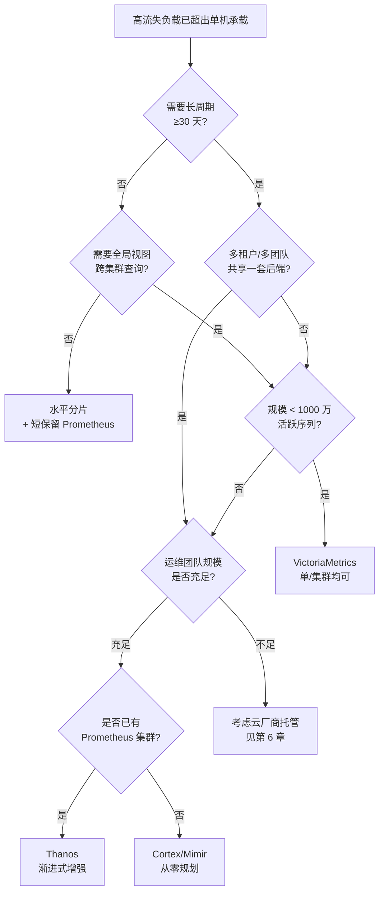
```mermaid
flowchart TD
    Start[高流失负载已超出单机承载] --> Q1{需要长周期<br/>≥30 天?}
    Q1 -- 否 --> Q2{需要全局视图<br/>跨集群查询?}
    Q1 -- 是 --> Q3{多租户/多团队<br/>共享一套后端?}
    Q2 -- 否 --> Sharding[水平分片<br/>+ 短保留 Prometheus]
    Q2 -- 是 --> Q4{规模 < 1000 万<br/>活跃序列?}
    Q3 -- 是 --> Q5{运维团队规模<br/>是否充足?}
    Q3 -- 否 --> Q4
    Q4 -- 是 --> VM[VictoriaMetrics<br/>单/集群均可]
    Q4 -- 否 --> Q5
    Q5 -- 充足 --> Q6{是否已有<br/>Prometheus 集群?}
    Q5 -- 不足 --> Hosted[考虑云厂商托管<br/>见第 6 章]
    Q6 -- 是 --> Thanos[Thanos<br/>渐进式增强]
    Q6 -- 否 --> Mimir[Cortex/Mimir<br/>从零规划]
```

需要强调的是，这张图是**指导性的而非绝对的**——真实选型还要结合企业现有技术栈、云厂商生态绑定、团队技能储备等多重因素。第 7 章将在场景化的视角下给出更细化的选型路径。

**与第 2 章因果链的总体对应**。把所有架构方案作用于因果链的位置整理出来：

- **index 层**：Thanos/Mimir 的对象存储下沉、VictoriaMetrics 的列式压缩，把历史索引的物理压力卸载到廉价存储；
- **memory 层**：Cortex/Mimir 的哈希环水平切分、水平分片，把内存压力分摊到多节点；
- **CPU 层**：所有方案的查询分片与并行执行，把单机 CPU 瓶颈转为多机协同；
- **query 层**：Query Frontend、降采样、缓存共同优化长查询体验；
- **stability 层**：副本 dedup、多租户隔离、对象存储的内置高可用，提供超出单机模型的可用性保障。

每一个架构选项本质上都是在"承载能力 ↑"与"运维复杂度 ↑"之间做权衡——这一权衡在第 6 章云厂商托管方案对比中将进入新的维度（"承载能力"由厂商承担、"运维复杂度"转化为"账单"），但本质的取舍逻辑不变。

## 5.8 查询层优化：Query Frontend、缓存与算子下推

5.4 与 5.5 节已经涉及 Thanos 和 Cortex 各自的 Query Frontend 能力，但 Query Frontend 类组件作为一种独立的查询层优化思路，值得单独抽象出来讨论——它不仅适用于扩展架构，也可以作为单机 Prometheus 前置代理使用。本节聚焦于查询层的几类工程手段在高流失场景下的具体效用。

**Query Frontend 的核心能力组合**。无论是 Thanos Query Frontend 还是 Cortex Query Frontend，其核心能力都可归纳为四类：查询拆分、智能缓存、查询优先级队列、自动重试与慢查询日志[^33][^38]。这四类能力对应高流失场景下的不同问题：

- **查询拆分**应对的是"长周期查询塌方"：将长时范围查询按时间区间拆分（默认 24h）为多个短查询并行执行，防止 OOM、并行加速、负载均衡[^33]。在高流失场景下，由于 Block 数量更多、Block 间序列重叠度更低，跨 Block 的合并成本更高——查询拆分让每个子查询只需处理一个时间窗口，子查询之间的合并通过 Query Frontend 在最后阶段完成，而不是单 Querier 一次性扫描所有 Block；
- **智能缓存**应对的是"重复查询的冗余扫描"：默认缓存 24 小时的查询结果，但禁用去重的请求、包含 Store Matchers 的请求、部分响应或带警告的结果会被排除在缓存之外[^33]。这一缓存逻辑对仪表盘场景特别友好（仪表盘的固定查询每 30s 自动刷新，缓存命中率高），但对告警评估意义有限（告警通常需要最新数据）；
- **查询优先级队列**应对的是"多租户/多团队下的查询争抢"：通过把查询按优先级分配资源配额（如 high 50% / medium 30% / low 20%）确保关键业务查询获得足够资源[^38]。在高流失叠加共享后端的场景下尤其有效——避免某一个团队的失控大查询拖垮整个集群；
- **自动重试与慢查询日志**则是稳定性与可观测性的兜底——临时网络波动或节点故障时查询仍能成功[^33]，配合 `--query-frontend.log-queries-longer-than=5s` 与用户 header 追踪可定位慢查询源头[^33]。

**降采样与扫描量缩减**。降采样是 Thanos/Mimir 等架构的核心能力之一：原始数据保留 30 天后自动降采样为 5 分钟分辨率、保留 90 天后再降采样为 1 小时分辨率[^36]。从查询性能视角看，降采样的本质是"用精度换扫描量"——一个 30 天范围的查询如果使用原始数据（15s 分辨率），需要扫描约 17 万个数据点/序列；如果使用 1h 降采样数据，只需扫描约 720 个数据点/序列，扫描量减少 240 倍。在高流失场景下，由于序列数本身已经膨胀，降采样对扫描总量的缩减效应（序列数 × 数据点数）是双倍受益的。

需要明确降采样的语义边界：降采样后的精度损失对**趋势分析无影响**（30 天的小时级波动足以揭示趋势），但对**异常瞬时事件追溯有损失**（30 天前的某次秒级毛刺无法在 1h 数据上恢复）。这与告警评估的诉求恰好互补——告警评估需要原始精度但只看最近时段，长周期分析可以接受降精度但需要长保留——两者在 Thanos/Mimir 的多级保留策略下是天然分工的。

**算子下推与对象存储侧过滤**。Store Gateway 在访问对象存储时支持块级过滤——通过块的 minTime/maxTime 元数据快速跳过不在查询时间范围内的块；通过块的 external_labels 快速跳过不匹配标签条件的块[^36]。这种"在加载块之前就过滤"的能力极大降低了无效 I/O——在高流失场景下，对象存储中的块数量随时间线性增长，块级过滤是控制查询扫描成本的关键。

**关键参数的调优思路**。Cortex/Mimir 的 Query Frontend 配置中几个关键参数在高流失场景下需要重点关注：

```yaml
query_frontend:
  split_queries_by_interval: 24h    # 拆分粒度：太大缓解不足，太小协调成本高
  align_queries_with_step: true     # 与步长对齐：提高缓存命中率
  max_query_length: 720h            # 最大查询时间范围：限制极端大查询
```

`split_queries_by_interval` 的选择在不同场景下需要权衡：默认 24h 适合大多数场景；高流失场景下可调小到 12h 以进一步分散单子查询的负载[^33]；但调到过小（如 1h）会引入过多协调成本与子查询数量。`align_queries_with_step` 的核心价值是让多次查询的时间边界对齐到同一刻度上，提高缓存复用率——这一点在 Dashboard 的固定刷新周期场景下尤其有效。`max_query_length` 是兜底防护——避免用户误发"过去 5 年"这类极端查询直接打满集群。

**查询并发限制**。除了 Query Frontend 层面的优化，Prometheus/Querier 自身的查询并发限制也是高流失场景下不可忽视的调优点。常见的参数包括 `--query.max-concurrency`（最大并发查询数）、`--query.timeout`（单查询超时）、`--query.max-samples`（单查询最大样本数）。在高流失场景下，合理设置 `--query.max-samples` 可以在查询触发"序列爆炸"时早早 fail-fast 而不是耗尽资源直至 OOM——这与 Rubric P-5 强调的"风险点"控制是一致的。

把查询层优化与第 2 章因果链对应：Query Frontend 的查询拆分缓解了"query 跨 Block 扫描成本"；缓存减少了"CPU 重复计算"；降采样缩减了"index 扫描量"；并发限制保护了"stability"。这是一组"治标"性质的手段——它们不消除底层的高流失序列，但显著降低了高流失对查询体验的影响。

## 5.9 PromQL 写法优化：在动态序列下编写高效查询

查询层优化提供了基础设施侧的护栏，但还有一类更前置的优化在 PromQL 语义层——通过编写更高效的查询语句，从源头降低查询的扫描量与计算成本。这一节归纳在高流失环境下编写 PromQL 的若干最佳实践。

**标签选择器：精确匹配优于正则**。Prometheus 的倒排索引对精确匹配（`=` 和 `!=`）进行了高度优化；相比之下，正则匹配（`=~` 和 `!~`）需要扫描更多的倒排列表，消耗更多的 CPU；推荐尽可能使用精确匹配，避免在高基数标签上使用通配符正则（如 `pod=~".*"`），这会拉取所有序列，极易导致性能问题[^41]。在高流失场景下这一点尤为关键——倒排列表本身已被流失的历史序列拉长（见 2.3 节），正则扫描的代价被进一步放大。

**避免空标签匹配器**。空的标签匹配器（例如 `{job=""}` 或 `{job=~".*"}`）会匹配所有可能的值，这在大型环境中是非常危险的操作；确保至少有一个具体的标签匹配器[^41]。这一规则在高流失场景下的危害是双倍的——既要扫描所有当前活跃序列，又要扫描所有保留窗口内已消亡的序列，单查询可能扫描数千万级序列。

**聚合操作：显式指定 by 或 without**。聚合操作（`sum`、`avg`、`max`、`min` 等）是数据分析的核心，但也最容易引发性能问题；在聚合时始终明确指定保留的标签（`by`）或移除的标签（`without`），不仅提高了查询的可读性，也能防止意外聚合了不该聚合的维度（例如不同的 instance 或 pod）[^41]。例如：

```promql
# ✅ 推荐：明确按 service 和 code 聚合
sum by (service, code) (rate(http_requests_total[5m]))

# ❌ 不推荐：隐式聚合，如果未来引入新标签可能会破坏逻辑
sum(rate(http_requests_total[5m]))
```

在高流失场景下，隐式聚合的风险尤其大——一旦底层指标被注入了新的高流失标签（如 `pod_id`），原本简洁的聚合查询会突然变成对所有 Pod 实例的扫描。

**尽早聚合**。在计算的早期阶段减少时间序列的数量；如果表达式包含多个步骤，尽量在第一步就进行聚合，减少后续步骤处理的数据量[^41]。这一原则与 Recording Rules（4.5 节）的预聚合思路是一脉相承的——RR 是"提前算好"，尽早聚合是"运行时尽早算好"，二者协同时威力最大。

**rate / irate / increase 的语义差异**。这三个函数是 Counter 类指标查询的核心：

- `rate`：计算范围向量内的每秒平均增长率，适合用于告警和长期趋势分析，因为它对瞬时峰值有平滑作用[^41]；
- `irate`：基于范围向量内最后两个数据点计算瞬时增长率，适合用于高精度绘图，能灵敏捕捉瞬间峰值，但由于波动大，**不建议用于告警**[^41]；
- `increase`：计算范围向量内的增量，`increase(v[d])` 等同于 `rate(v[d]) * d`[^41]。

**rate 的窗口选择陷阱**。`rate` 和 `increase` 在计算时会处理重置（counter resets），这需要一定的计算资源；选择合适的时间窗口很关键[^41]。在高流失场景下，rate 窗口的选择有两个需要规避的极端：

- **窗口过短**：如 `rate(...[1m])` 在 15s scrape interval 下只能取到 4 个数据点，受 scrape 抖动影响显著，单次 scrape 失败就会让 rate 计算结果失真；
- **窗口过长**：如 `rate(...[1h])` 会跨越大量已消亡的序列代际——在频繁滚动的 Deployment 上，1h 窗口内可能跨越 3–4 代 Pod，每代 Pod 都是不同的序列，rate 的语义边界变得模糊（每条具体序列的有效数据点不足）。

经验上，**rate 窗口建议设为 scrape interval 的 4 倍以上**（如 15s scrape 配合 1m–5m rate 窗口），并显著小于该指标对应实例的典型生命周期。

**慎用高基数 group by 与大范围 join**。`group by` 中包含高基数标签会让聚合结果序列数爆炸：例如 `sum by (pod, request_id) (...)` 在高流失下可能产生数百万条输出序列，直接打爆查询响应。同理，`join`（如 `metric_a * on(label) metric_b`）在两个高基数指标之间执行时，匹配代价是序列数的乘积。

**降噪与对比技巧**。`topk` 与 `bottomk` 是高流失场景下 Dashboard 的好朋友——返回结果数量恒定（topk 后的结果数可控），不会因底层序列爆炸而拖垮渲染。如某 Dashboard 实践中，`topk(5, sum(rate(http_requests_total[5m])) by (status_code))` 提供按状态码分组快速获取 HTTP 请求的快照，并通过 topk 把返回数据收敛到前 5 个，避免了"返回数据太多"的问题，效果"有点像降噪耳机"[^42]。

`offset` 是同比环比对比的工具：

```promql
topk(5, (sum by (service) (rate(container_cpu_usage_seconds_total[5m]))
        / sum by (service) (machine_cpu_cores))
       / (sum by (service) (rate(container_cpu_usage_seconds_total[5m] offset 1w))
        / sum by (service) (machine_cpu_cores offset 1w)))
```

显示与上周相比哪些服务的 CPU 使用率变化最大，非常适合捕捉性能问题或意外变化[^42]。

**与 Recording Rules 的协同**。在高流失场景下，频繁查询的复杂表达式都应该尽量"上移"到 Recording Rules（见 4.5 节）。Dashboard/告警从查询底层原始指标改为查询预聚合序列，性能提升通常以数量级计——这与 5.8 节查询层优化是协同的：Recording Rule 减少底层扫描量，Query Frontend 缓存进一步复用结果，从两个方向夹击查询成本。

把 PromQL 写法优化对应到第 2 章因果链：精确匹配减少"CPU 候选集扫描"、显式 by 防止"序列爆炸"、合理 rate 窗口避免"跨代际序列污染"、topk 降噪保护"渲染层 stability"。每一条建议都对应一个具体的因果路径——这正是 Rubric P-2 强调的"机理深度"在工程层面的落地。

## 5.10 告警规则在动态序列下的稳定性策略

源头治理 + 架构扩展 + 查询优化已经覆盖了"采集—存储—查询"全链路，但还有最后一环必须单独讨论：**告警**。告警链路在高流失场景下面临一系列特殊挑战——序列频繁消亡导致告警"消失"、单一基础设施事件触发告警风暴、HA 部署下副本告警重复、Pod 重建瞬态触发误告警。本节系统讨论告警规则的稳定性设计。

**`for` 时长抑制瞬态误告警**。`for` 字段定义了告警条件需要持续满足的时长才会真正 fire。在高流失场景下，Pod 重建、HPA 扩缩、网络抖动等瞬态事件会让指标短暂越线但很快恢复，没有 `for` 的告警会立即 fire 形成噪音；合理设置 `for` 时长（典型 2–5 分钟）能过滤掉这类瞬态。例如阿里云 ACK 告警最佳实践中给出的报警规则示例形如 `min_over_time(sum by (namespace, pod, phase) (kube_pod_status_phase{phase=~"Pending|Unknown|Failed"})[5m:1m]) > 0`，即"最近 5 分钟内 Pod 的状态有异常时触发报警"——通过 `min_over_time(...[5m:1m])` 这类时间窗口语义内建了对瞬态的过滤[^43]。

**`absent` / `absent_over_time` 处理序列消亡**。`absent(v)` 在传入的向量没有任何元素时返回一个值为 1 的单元素向量，否则返回空向量；这对于警报某个指标和标签组合不存在时间序列非常有用[^44]。`absent_over_time(v)` 则是其范围向量版本，在范围向量内任意时刻都没有元素时返回 1[^44]。

这两个函数在高流失场景下的关键价值是：**当一个 Pod 消亡后，普通的告警规则（如 `up{pod="xxx"} == 0`）会因为序列本身消失而无法触发**——序列不再存在于 TSDB 中意味着 PromQL 查询返回空向量，告警规则不会 fire。`absent` / `absent_over_time` 反转了这一逻辑——"序列消失即告警"，正好覆盖了"实例已不在集群但应该在"的场景。例如 `absent(up{job="critical-service"})` 在 critical-service 这个 Job 完全没有 target 时会 fire，是一种"存活性兜底"。

需要注意的是，`absent` 在 Pod 名作为标签的告警上仍然不可用——因为 Pod 重建后新 Pod 名出现，老 Pod 名的 absent 自然成立，但这并不代表服务异常。这类场景必须配合 4.2 节的 Pod→Workload 归一化，把告警标签从 `pod` 改为 `workload`，才能让 absent 在工作负载级别正确工作。

**告警分组：把同源告警聚合为单条通知**。告警分组是降噪的核心武器。Alertmanager 的 `group_by` 把具有相同标签集合的告警归为一组，只发一条聚合通知；典型分组策略按"环境+服务+告警级别"维度聚合[^45]：

```yaml
route:
  receiver: 'default'
  group_by: ['env', 'service', 'severity']
  group_wait: 30s        # 初始等待，凑齐一组告警
  group_interval: 5m     # 同一组的重复通知间隔
  repeat_interval: 4h    # 长时间未恢复的最大重复间隔
```

某团队的实战经验显示，加完 group_by 之后，Redis 主节点挂了原本会触发的 RedisDown（服务级别）+ HighMemoryUsage（资源级别）+ ConnectionTimeout（依赖级别）三条通知被聚合为单条，只要 service=redis 一致就只收到一条聚合消息[^45]。`group_wait` 设置上的血泪教训是：别设太长，30s 足够收敛瞬时波动；设成 5 分钟会让紧急告警的响应延迟变得不可接受[^45]。

**抑制规则：让根因告警压制次生告警**。`inhibit_rules` 实现的逻辑是：如果某个高优先级告警正在触发，就自动静音与它相关的低优先级告警[^45]。最典型的场景是：交换机宕机时抑制其下挂主机的告警、节点宕机时抑制其上应用的告警，避免一次基础设施事件触发告警风暴。某团队通过分组 + 抑制 + 静默三层降噪后，**夜间告警量从每晚 40+ 条压到 8 条以内**[^45]——这一收益在高流失环境下尤其重要，因为高流失下的瞬态故障本来就容易触发连锁告警。

**静默规则覆盖计划维护窗口**。静默规则（Silence）在 Alertmanager 中用于在计划维护期间临时屏蔽特定告警。在 K8s 频繁发布场景下，每次大版本上线前可以预先创建针对 `service=<待发布服务>` 的静默规则，发布期间的瞬态告警全部静默——这与 `for` 时长的差别是：`for` 是被动过滤，静默是主动屏蔽，两者结合形成完整的"计划+非计划"覆盖。

**HA 部署下的副本去重**。在 Prometheus HA 部署或 Thanos/Mimir 体系下，多个副本会独立 fire 同一告警。Alertmanager 的去重逻辑依赖告警标签集——若两副本的告警标签完全一致（包括 `replica` 标签也一致），则被识别为同一告警，自动去重；若 `replica` 标签不同，则被视为两条独立告警，需要在 Alertmanager 配置 `cluster mode` + 副本间 gossip 协议来实现"任一副本 fire 即去重"。

Thanos 体系下另一种思路是在 Querier 或 Ruler 层面做副本 dedup——通过 `--query.replica-label=replica` 让 Querier 在查询时去重副本数据，告警规则在 Ruler 上只评估一份去重后的数据，从源头避免双副本告警。

**告警规则与查询性能的协同**。第 2.5 节提到过"告警评估延迟"是高流失下的典型故障——告警规则本质上是周期性的查询执行。所有 5.8、5.9 节针对查询的优化（PromQL 写法、Recording Rules 预聚合、Query Frontend 缓存）都直接降低告警评估的成本。一条经验是：**所有 Critical 级别的告警规则都应基于 Recording Rule 而非原始指标**，确保告警评估在 1s 内完成、不受底层流失影响。

把告警稳定性策略与第 2 章因果链对应：`for` 时长抑制了"瞬态 stability 噪音"、`absent` 解决了"序列消亡告警失效"、分组+抑制+静默降低了"告警 stability 风险"、副本 dedup 保障了"全局视图的 stability 一致性"。这是一组面向"可观测可信度"的治理手段——治理不是为了让监控系统看起来很忙，而是为了让真正需要响应的事件被准确感知。

## 5.11 架构与查询告警治理的整合视图

把第 4 章的源头治理与本章的架构扩展、查询优化、告警稳定整合起来，可以形成一张完整的高流失率治理矩阵。下图按"作用层次 × 治理手段"的二维结构展开：

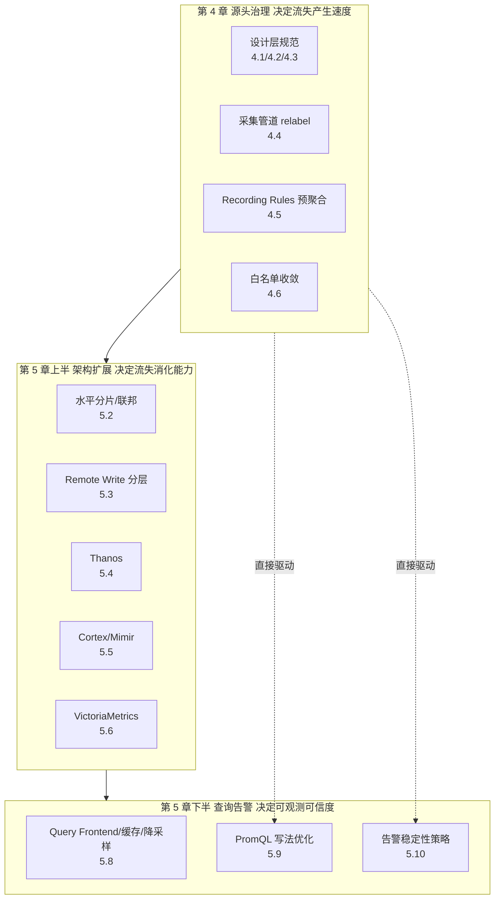
```mermaid
flowchart TB
    subgraph S1[第 4 章 源头治理 决定流失产生速度]
      L1[设计层规范<br/>4.1/4.2/4.3]
      L2[采集管道 relabel<br/>4.4]
      L3[Recording Rules 预聚合<br/>4.5]
      L4[白名单收敛<br/>4.6]
    end
    subgraph S2[第 5 章上半 架构扩展 决定流失消化能力]
      A1[水平分片/联邦<br/>5.2]
      A2[Remote Write 分层<br/>5.3]
      A3[Thanos<br/>5.4]
      A4[Cortex/Mimir<br/>5.5]
      A5[VictoriaMetrics<br/>5.6]
    end
    subgraph S3[第 5 章下半 查询告警 决定可观测可信度]
      Q1[Query Frontend/缓存/降采样<br/>5.8]
      Q2[PromQL 写法优化<br/>5.9]
      Q3[告警稳定性策略<br/>5.10]
    end
    S1 --> S2
    S2 --> S3
    S1 -.直接驱动.-> Q2
    S1 -.直接驱动.-> Q3
```

**四层手段的作用边界与协同关系**：

- **源头治理（Layer 1）决定流失产生速度**：通过设计规范、relabel、预聚合、白名单从入口拦截可控的高流失负载，是 ROI 最高的一层。其能力上限受限于 Serverless 等结构性流失的存在；
- **架构扩展（Layer 2）决定流失消化能力**：当源头治理已尽，剩余流失通过水平切分、对象存储下沉、降采样、多组件分布式架构来承载。其代价是运维复杂度的跃迁；
- **查询优化（Layer 3）决定查询体验**：在已有数据负载的前提下，通过查询拆分、缓存、PromQL 优化降低查询的有效成本，影响用户感知；
- **告警稳定（Layer 4）决定可观测可信度**：在高流失带来的动态环境下，通过 `for`、`absent`、分组、抑制、副本 dedup 让告警链路保持有效信号比。

**按集群规模的差异化方案组合**：

| 规模 | 推荐组合 | 核心理由 |
|------|---------|---------|
| 小型集群（<10 万活跃序列、<10 个团队） | 单机 Prometheus + 4.x 全套源头治理 + Recording Rules + 告警分组 | 单机即可承载，源头治理已足够，无需架构扩展 |
| 中型集群（10–100 万活跃序列、长保留 30 天+） | 单机 Prometheus + Remote Write → VictoriaMetrics 单/集群 + Query Frontend | 用 VM 的高效存储引擎避免分布式系统运维 |
| 大型多集群（100 万+活跃序列、跨集群全局视图） | 多 Prometheus + Thanos（Sidecar+Querier+Compactor+Query Frontend）+ 多级降采样 + 副本 dedup | 渐进式增强、对象存储下沉、跨集群聚合 |
| 超大型多租户（10 亿级活跃序列、严格隔离） | Cortex/Mimir + Distributor/Ingester 水平扩展 + 多租户配额 + 查询优先级队列 | 多租户一等公民、水平扩展上限最高 |

**按典型场景的差异化组合**：

| 场景 | 关键挑战 | 推荐组合 |
|------|---------|---------|
| K8s 频繁发布（CI/CD 高频滚动） | Pod 流失高、告警风暴 | 4.2 Pod→Workload 归一化 + 5.10 告警分组+抑制 + 计划发布静默 |
| HPA 弹性扩缩 | instance 标签流失 | 4.4 instance→host/node 归一化 + Recording Rules + Query Frontend |
| Serverless 极端高动态 | 结构性流失无法源头消除 | Remote Write → Mimir/VM + 短保留本地 + 长保留远程降采样 |
| 长周期合规存储（≥1 年） | 保留窗口乘积放大 | Thanos/Mimir 多级降采样 + 对象存储分层（raw/5m/1h）|
| 跨地域多集群 | 全局视图缺失 | Thanos Querier 跨集群聚合 + 外部标签 region 区分 |

**ROI 与运维复杂度的取舍坐标**。把所有方案放在 ROI（治理收益）与运维复杂度（成本）的二维坐标系中，可以提炼出几条经验规律：

- **源头治理（4.x）始终是 ROI 最高的起点**——成本低、收益直接、效果可量化，任何规模的团队都应优先做到位；
- **VictoriaMetrics 在中等规模上提供了较优的 ROI/复杂度比**——单节点即可生产、运维门槛低、性能数据可观，对中型团队是高性价比选项；
- **Thanos 在已有 Prometheus 集群的渐进式扩展上 ROI 高**——Sidecar 模式不修改 Prometheus、对象存储下沉直接降本、降采样直接缓解长查询；
- **Cortex/Mimir 的 ROI 在超大规模或多租户托管场景才能体现**——其复杂度只在大规模部署或商业托管场景下才能被收益覆盖；
- **云厂商托管方案是用账单换运维复杂度**——这一权衡的具体形式是第 6 章的主题。

**迁移成本的考量**。从一种架构升级到另一种架构本身有迁移成本：从单机 Prometheus 迁到 Thanos 是渐进的（加 Sidecar 即可）；从 Prometheus 迁到 Mimir/VictoriaMetrics 涉及 Remote Write 配置、Dashboard 与告警规则的全面验证；从 Thanos 迁到 Mimir 需要重新规划组件部署与多租户配置。在做架构选型时不能只看"目标架构的承载能力"，还要把迁移成本（人力 × 周期 × 风险）纳入决策。

**与后续章节的衔接**。本章建立了"源头治理 + 架构扩展 + 查询告警"的完整治理矩阵，作为第 6 章云厂商托管服务对比的能力维度坐标——第 6 章将沿着"承载能力、预聚合、全局查询、长周期、计费、调试工具"等维度比较各家厂商的方案，本章的所有概念（对象存储下沉、降采样、Query Frontend、副本 dedup、Recording Rules 托管）都将作为对比表的列字段使用。第 7 章则会在场景化的视角下，把第 4、5、6 章的所有方案组合起来，给出按规模、按行业、按技术栈的差异化选型路径。

至此，从概念（第 1 章）到影响（第 2 章）到诊断（第 3 章）到源头治理（第 4 章）再到架构扩展与查询告警（第 5 章）的"自建路径"已经走通——这是企业自主治理高流失率的完整工程图景。下一章将转向另一条路径——把这些治理能力交给云厂商托管服务来实现，比较各家方案的能力差异与定位。

# 6 云厂商托管 Prometheus 方案横向对比

第 4、5 章沿着"源头治理 + 架构扩展 + 查询告警"的脉络系统梳理了**自建路径**应对高流失率的工程图景——从 relabel 与 Recording Rules 的源头拦截，到 Thanos / Cortex+Mimir / VictoriaMetrics 的架构扩展，再到 Query Frontend、PromQL 写法与告警稳定性的查询体验保障，每一步都对应着一份可执行的工程动作清单。但这条路径的每一个能力点都需要团队自己投入人力来实现、运维、迭代。对于许多团队而言，更现实的问题是：**这些治理能力，能否直接交给云厂商的托管 Prometheus 服务来承担？**

本章把视角从自建路径转向托管路径，对主流云厂商的托管 Prometheus 方案做横向对比。对比对象覆盖六家主流方案：阿里云可观测监控 Prometheus 版、腾讯云 Prometheus 监控服务（TMP）、AWS Managed Service for Prometheus（AMP）、Google Cloud Managed Service for Prometheus（GMP）、Azure Monitor managed service for Prometheus、Grafana Cloud Metrics（Mimir 底座）。对比维度沿用第 5.7 节确立的能力坐标——承载规模、预聚合托管、全局查询、长周期存储与降采样、计费模型对高流失率的成本敏感度、标签调试与基数治理工具——以保证可比性与中立性。

需要在开篇即声明本章的两条来源原则：其一，**所有信息严格基于本次抓取的公开文档与厂商资料**，对未公开维度明确标注信息缺口而非主观补全；其二，**对厂商自我宣传的差异化能力**（如"高基数/高流失率承载"）保留厂商立场标注，不替任何一家做主观判定。这两条原则与第 1 章 Rubric P-3、P-4 的要求一脉相承，也是本章对比能否落地为第 7 章场景化选型可信前置输入的基础。

## 6.1 对比框架与评估维度设计

为避免对比落入"列特性、堆细节"的陷阱，本节先建立六大评估维度的精确含义与判定口径，使后续 6.2–6.6 节的逐家分析具备可重入、可比对的统一坐标。

**维度一：高基数/高流失率承载能力**。考察三个子项：单实例（或单工作区/单租户）可承载的活跃序列上限是否有官方公开数字、是否对高流失场景做了专门的产品化优化（如 Adaptive Metrics 类工具）、是否有官方公开的承载基准。这一维度直接对应第 2 章因果链的"index→memory"层——承载上限的本质是底层水平扩展架构能消化多大的索引规模。

**维度二：预聚合与 Recording Rule 托管**。考察是否原生支持托管 Recording Rules、规则配置方式（API / CRD / 控制台）、以及规则评估的资源开销是否计入用户账单。这一维度对应第 4.5 节讨论的预聚合工程价值——在托管语境下，其形态从"自己部署 Ruler"演变为"声明式提交规则、由厂商执行"。

**维度三：全局查询与多集群聚合**。考察是否提供跨实例 / 跨工作区 / 跨地域的统一查询入口、以及是否兼容 Thanos/Mimir 全局查询语义。这一维度对应第 5.4–5.5 节讨论的全局视图能力——在托管语境下，其表现为"多实例聚合查询是否原生支持"或"是否需要用户自己在客户端拼装"。

**维度四：长周期存储与降采样**。考察默认与最大保留窗口、是否提供多级降采样、冷热存储分层机制。这一维度对应第 5.4 节 Thanos 的多级保留策略与第 2.1 节末尾"保留窗口乘积放大"的工程命题。

**维度五：计费模型对高流失率的成本敏感度**。考察按写入量 / 上报量 / 活跃序列 / 查询样本数计费的具体口径，以及该口径对高流失负载的成本传导路径。这一维度是托管方案最具决策价值的差异化点——同样的高流失负载，在不同计费口径下转化为账单的速率与放大效应可能差异显著。本章将在 6.8 节对该维度做专题深度分析。

**维度六：标签可视化调试与基数治理工具**。考察是否提供基数分析、Top-N 标签查看、慢查询日志等运维工具。这一维度对应第 3 章诊断 SOP 的产品化承载——在托管语境下，用户能否享有等价于 promtool tsdb analyze、TSDB Status 页面、mimirtool analyze prometheus 的产品化工具，直接决定了治理动作的可执行性。

**判定口径**。对每一维度，本章使用以下四级判定：**明确支持**（公开文档明确提及具体能力与配置方式）、**部分支持**（具备相关能力但范围有限或需要特定前置条件）、**未公开**（本次抓取资料中未明确披露）、**不支持**（公开材料中明确表示不提供）。其中"未公开"不等于"不支持"——它仅意味着本次抓取的公开资料中无法核实，需要读者结合厂商联系或最新文档进一步求证。这一判定口径与第 1 章 Rubric P-4 强调的"信息缺口需明确标注而非主观补全"是一致的。

## 6.2 阿里云可观测监控 Prometheus 版

阿里云可观测监控 Prometheus 版（ARMS Prometheus）是阿里云面向容器、云服务、主机三大场景提供的托管 Prometheus 服务，覆盖 Prometheus 托管服务与容器监控服务两类产品形态[^46]。结合公开文档可以从六大维度做如下梳理。

**承载能力维度**。本次抓取资料中未公开单实例活跃序列承载上限的具体数字，也未发现对"高流失率"做专门定位的产品化宣传。但阿里云在容器监控基础版与 Pro 版的产品分层中体现了对承载能力的差异化——仅 ACK 集群 Pro 版支持开启容器监控 Pro 版，其他类型的容器服务集群默认且只能使用容器监控基础版[^47]。

**预聚合与 Recording Rule 托管**。阿里云提供编辑 RecordingRule.yaml 与通过 PrometheusRule 代码化管理告警规则的能力，支持声明式配置方式[^46]。

**全局查询与多集群聚合**。阿里云提供"基于 Prometheus 全局聚合实例进行多账号统一监控"的产品能力，支持跨账号的统一监控视图[^46]。同时也提供"通过阿里云注册集群和 Prometheus 实现多云容器集群监控"的方案，支持将其他云的 K8s 集群纳入统一监控[^46]。

**长周期存储与降采样**。阿里云在热存储维度提供了清晰的分层：

- **基础指标**：容器服务基础指标在容器监控基础版下免费存储 7 天、Pro 版下免费存储 90 天；Prometheus 自监控基础指标免费存储 90 天；实时计算 Flink 版基础指标免费存储 15 天；
- **自定义指标**：按上报量计费实例支持 30 天免费热存储；按写入量计费实例根据写入量单价分别支持免费存储 90 天和 180 天[^48]。

超过免费热存储时长后，按上报量计费实例将根据每天的指标上报量，以"存储每百万条指标每天 0.01 元"进行累计计算[^48]。归档存储维度则按存储大小（未压缩）进行计费，日归档存储费用 = 日累计未压缩存储量（GB）× 每 GB 单价[^48]。

**计费模型与高流失率成本敏感度**。阿里云的核心计费分层是"基础指标 vs 自定义指标"——基础指标免费写入或上报，自定义指标计费。基础指标的来源主要有 3 类：容器监控、实时计算 Flink 和阿里云 Prometheus 服务自监控[^46][^47]。自定义指标的计费方式是"按写入量"与"按上报量"二选一，且**支持切换计费方式但 1 个实例只支持切换 1 次**[^46][^48]。

两种计费方式的具体口径：

- **按写入量计费**：按指标传输的数据大小（未压缩）计费。日指标写入量费用 =（日累计自定义指标写入数据量 GB - 每月剩余免费额度 GB）× 每 GB 单价。写入数据量以 0.1 GB 为一个计费单位；自定义指标 50 GB/月免费额度，按账号级别计算，该账号下不同实例共享免费额度，每月免费额度不支持跨地域使用[^46][^48]。

- **按上报量计费**：按指标传输的采样点（数据点）数量计费。日指标数据上报量费用 = 基于每日自定义付费指标上报量乘以对应阶梯区间单价后进行累计求和。每日自定义付费指标上报量百万（四舍五入）= 每日自定义指标上报量 / 1 百万。每实例日自定义指标上报量 ≤ 50 万免费，超过 50 万正常计费[^48]。文档中以 `kube_node_status_allocatable_cpu_cores` 为例：3 节点集群、15s 采集间隔，则该指标 1 分钟的上报量为 3×60/15 = 12 个采样点；如果每个采样点大小为 0.5 KB，则该指标 1 分钟的写入量为 12×0.5 = 6 KB——这一示例清晰展示了"上报量"与"写入量"在数学语义上的差异[^47]。

**对高流失率的成本含义**：在按上报量计费下，活跃序列稳定但流失率高的场景（瞬时序列数 × scrape 频率决定的样本数相对恒定）成本相对可控；在按写入量计费下，由于第 2.3 节讨论的"序列冷启动需附带完整 series record 描述"机制，每代新序列首次写出时携带的描述字节会被计入写入量，高流失会推高单位采样点对应的写入字节数，成本敏感度更高。这一差异在 6.8 节将做进一步专题对比。

**标签可视化与基数调试**。阿里云提供"使用智能检测算子发现异常数据"的能力，并明确将于 2024 年 11 月 12 日起对采集的阿里云容器服务集群基础指标范围进行调整[^46]。但本次抓取资料中未明确披露专门的"基数分析 / Top-N 标签 / 慢查询日志"产品化工具。

**与生态的集成深度**。阿里云方案的差异化优势主要体现在中文文档完备性与 ACK 生态绑定上：基础指标白名单覆盖 cAdvisor、ACK ControlPlane APIServer、Node Exporter、kube-state-metrics、kube-events、CoreDNS、CSI、GPU-Exporter、Cost-Exporter、Ingress、Koordinator 等核心组件[^46][^47]——这是第 4.6 节讨论的"云厂商基础指标白名单作为产品化封装的源头治理能力"的典型实例。同时，阿里云也提供"使用 Prometheus 监控 SAE 应用"等 Serverless 场景集成、"使用 Prometheus 监控 ECS 主机"、"通过 ServiceMonitor 创建服务发现"、"自建开源 Prometheus 迁移到阿里云托管 Prometheus 服务"等系列文档，覆盖从迁移到运维的全链路[^46]。

## 6.3 腾讯云 Prometheus 监控服务（TMP）

腾讯云 Prometheus 监控服务（TMP）是腾讯云针对不同的上报数据量需求和存储需求推出的托管方案，与腾讯云可观测平台（TCOP）协同形成完整的监控体系[^49][^50]。

**承载能力维度**。**腾讯云 TMP 是本次抓取的六家方案中少数明确公开"单实例活跃序列承载上限"的厂商**——按量付费版本每个实例 Series 限制最大为 450 万；如需调整可以联系厂商，在资源充足的情况下将合理调整相关限制[^51]。这一公开数字对自建用户的容量规划有重要参考价值——它一方面给出了托管方案的承载边界，另一方面也间接暗示了该量级是当前业界主流托管方案的"基础规格"。

**预聚合与 Recording Rule 托管**。腾讯云 TMP 在 K8s 生态下基于 Prometheus Operator 提供完整的声明式管理：通过 `PrometheusRule` CRD 定义告警规则（Alerting Rules）和预聚合规则（Recording Rules），实现告警配置的声明式管理；`PrometheusRule` 必须放在对应 Prometheus `<实例 ID>` 这个 namespace 下，通过 CRD 创建的告警/预聚合规则无法在控制台修改（前文第 4.5 节已引用这一机制）。

**全局查询与多集群聚合**。本次抓取资料中未明确披露 TMP 提供跨实例的全局聚合查询能力。腾讯云可观测平台（TCOP）提供的是"针对腾讯云云产品自助上报的各项监控指标和用户自定义配制上报的监控指标"的综合监控，但 TCOP 与 TMP 的能力边界以及二者之间的全局查询协同机制未在本次抓取资料中详细展开[^50]。

**长周期存储**。TMP 支持丰富的存储时长选项：15 天、30 天、45 天、90 天、180 天、1 年、2 年。其中 15/30/45 天为通用单价；90 天及以上按地域差异定价（境内非金融区+自动驾驶专区 vs 境外+境内金融区）[^52]。

**计费模型与高流失率成本敏感度**。TMP 的核心计费逻辑是按上报量阶梯定价。按量付费的总费用 = 日上报数据量（百万条）× 单价；按日结算，每日推送账单和费用结算[^52]。具体单价随存储时长与日均上报数据量呈双重阶梯：

| 存储时长 | 0–200 百万 | 200–800 百万 | 800–1500 百万 | 1500+ 百万 |
|---------|-----------|--------------|---------------|-----------|
| 15 天 | 0.6 元/百万 | 0.4 元/百万 | 0.2 元/百万 | 0.15 元/百万 |
| 30 天 | 0.7 | 0.5 | 0.35 | 0.25 |
| 45 天 | 0.8 | 0.65 | 0.4 | 0.3 |
| 90 天（境内非金融区） | 1.4 | 1.2 | 1.1 | 1.0 |
| 90 天（境外+境内金融区） | 2.8 | 2.4 | 2.2 | 2.0 |
| 180 天（境内非金融区） | 2.3 | 2.1 | 2.0 | 1.9 |
| 180 天（境外+境内金融区） | 4.6 | 4.2 | — | — |

数据来源：腾讯云 TMP 按量付费介绍[^52]。

按量付费免费指标基础免费存储 15 天，存储时长超过 15 天的实例将按超出的天数收取免费指标的存储费用[^52]。

**套餐包优惠**。TMP 提供五档套餐包（体验版/基础版/升级版/豪华版），有效期 1 个月或 1 年，存储时长 1 个月或 6 个月，相对按量付费提供 17%–60% 的折扣空间。境内非金融区+自动驾驶专区与境外+境内金融区两套定价[^49]：

| 套餐版本 | 价格 | 数据上报量额度 | 免费指标存储额度 | 总优惠折扣比例 |
|---------|------|--------------|----------------|--------------|
| 体验版（1 月） | 599 元 | 10 亿条/月 | 20 亿条/月 | 59.90% |
| 基础版（1 月） | 8999 元 | 200 亿条/年 | 300 亿条/年 | 57.32% |
| 升级版（1 月） | 36999 元 | 1500 亿条/年 | 2000 亿条/年 | 48.18% |
| 豪华版（1 月） | 409999 元 | 2 万亿条/年 | 3 万亿条/年 | 42.74% |

数据来源：腾讯云 TMP 套餐包介绍[^49]。

**对高流失率的成本含义**：TMP 按上报量计费的口径与高流失率相对解耦——决定上报量的核心是"活跃 target 数 × scrape 频率"而非"序列翻新速度"。在瞬时活跃序列稳定但流失率高的纯高流失场景下（典型如 K8s 频繁滚动），TMP 的成本不会因流失率上升而显著增加；但叠加高基数（活跃序列规模大）时，上报量会同步攀升。这一计费口径对 K8s 频繁发布场景相对友好，但对真正的"高基数+高流失叠加"场景仍敏感。

**声明式管理与隐式白名单机制**。TMP 提供完整的 K8s 原生抓取配置：原生 Job 配置、云服务器服务发现、Pod Monitor、Service Monitor、Probe、PrometheusRule 等抓取任务配置；位于 `kube-system` namespace 下的 Pod Monitor / Service Monitor / Probe 类 CRD 资源全部自动生效无需额外标签，位于其他 namespace 下的 CRD 资源必须在 `metadata.labels` 中包含 `prom_id: <实例 ID>` 标签才能生效。这一设计本身即是一种"按 namespace 控制采集范围"的隐式白名单机制（前文第 4.6 节已引用）。

**行业专区**。值得关注的是 TMP 对**自动驾驶专区**的明确支持——在套餐包定价表中，"境内非金融区+自动驾驶专区"被作为一档独立的定价分组，例子包括广州、上海、北京、上海自动驾驶云[^49][^52]。考虑到自动驾驶场景在第 1 章 1.4 节中被列为"Serverless 与极端高动态"的典型代表（车辆每分钟产生新序列、传感器数据高频上报），这一专区定位可能反映了 TMP 对极端高动态行业场景的针对性支持。

**与 TCOP 的协同**。腾讯云可观测平台（TCOP）提供"基础监控、网络监控、自定义监控"的一站式监控平台，覆盖云服务器、云数据库等多个云产品的负载和性能监控指标；秒级采集覆盖所有指标数据并提供 24 小时免费存储[^50][^53]。TMP 与 TCOP 的关系类似于"专业 Prometheus 后端"与"综合监控平台"——TMP 承担 Prometheus 协议兼容的指标后端职责，TCOP 提供更广义的云服务监控与告警体系（含 WAF 等业务安全告警）[^53]。

## 6.4 AWS Managed Service for Prometheus（AMP）

AWS Managed Service for Prometheus（AMP）是面向容器指标的无服务器 Prometheus 兼容监控服务[^54]。AMP 在产品定位上明确强调"可扩展性、可用性和安全性"，并特别突出了无服务器架构下的弹性能力。

**承载能力维度**。AWS 官方文档中对 AMP 的承载能力描述为"会随着工作负载的扩展和缩减而自动扩展运行指标的摄取、存储和查询"[^54]。本次抓取资料中未明确披露具体的活跃序列上限数字，但其 Workspace 模型与多 AZ 复制设计反映出底层是水平扩展架构。

**架构与可用性维度**。AMP 旨在使用多个可用区（多可用区）部署实现高可用性——**摄取到工作区的数据将在同一区域的三个可用区中复制**[^54]。AMP 适用于在 Amazon Elastic Kubernetes Service 上运行的容器集群和自行管理的 Kubernetes 环境[^54][^55]。在 AWS 自身的 EKS 监控架构推荐中，AMP 被定位为可让用户使用 Amazon EKS 或自管 Kubernetes 中部署的现有 Prometheus 服务器并将其设置为写入 AMP 而非本地数据存放区——这"消除了为 Prometheus 服务器及其基础设施管理高可用性数据存放区的繁重工作"[^55]。

**保留期与长周期存储**。摄取到工作区的指标默认存储 150 天，然后自动删除；用户可以通过将工作区配置为最长 1095 天（三年）来调整保留期[^54]。本次抓取资料中未明确披露 AMP 是否提供 Thanos/Mimir 式的多级降采样能力。

**计费模型与高流失率成本敏感度**。AMP 采用三段式计费——**指标摄取（ingestion）+ 已处理查询样本（query samples processed）+ 指标存储（metrics storage）**[^56]。AWS 官方文档关于成本优化的核心指导是：

> "对于大多数客户而言，指标摄取占据了大部分成本。查询使用率高的客户也会看到一些基于已处理的查询样本的成本，而指标存储仅占总成本的一小部分。"[^56]

这一定价结构对高流失场景具有特殊含义：

- **摄取率主导成本**：高流失推高摄取率直接拉高账单；
- **缩短保留期对账单优化作用有限**：AWS 官方明确指出"您可以缩短保留期，但是这不太可能大幅降低成本"[^56]——这意味着第 5.4 节讨论的"通过降采样压缩长保留窗口存储"思路在 AMP 计费模型下的杠杆效应较小，治理重心必须放在源头摄取量；
- **降低摄取成本的官方推荐路径**：AWS 给出两条核心建议——一是降低收集频率（增加收集间隔），例如"将收集间隔从 30 秒增加到 60 秒会将摄取使用量减少一半"，Prometheus 服务器（agent 模式）和 AWS Distro for OpenTelemetry（ADOT）收集器都支持 `scrape_interval` 配置；二是减少摄入的活跃系列数量，可以使用 `relabel_config` 筛选发送到 AMP 的指标[^56]。

这一官方推荐路径与本研究第 4 章"源头治理"的核心思路完全一致——AWS 实际上把 4.1–4.6 节的工程动作上升为了官方最佳实践。

**查询成本与告警成本优化**。查询成本基于已处理的样本数量，可通过降低查询频率来降低；AMP 提供 Query Insights 工具用于"在 Amazon Managed Service for Prometheus 中管理查询成本"[^56]。在告警查询成本方面，AWS 给出的关键建议是：

> "使用 Amazon Managed Service for Prometheus 警报 – Amazon Managed Service for Prometheus 外部的警报系统可能需要额外的查询来增加弹性或高可用性，因为外部服务会从多个可用区或区域查询指标。这包括在 Grafana 中发出警报，以实现高可用性。这可能会使您的成本增加三倍或更多。"[^56]

这一建议反映出托管 Alertmanager 与 Ruler 在多副本去重与高可用上的内置优化——这正是第 5.10 节讨论的"副本去重"在托管语境下的产品化实现。

**预聚合与告警**。AMP 提供托管 Alertmanager 与 Ruler[^57]。Grafana 在 Amazon Managed Grafana 中提供了 Prometheus Alertmanager rules 可视化能力，用户可以从 Grafana workspace 中查看在 AMP workspace 配置的所有告警规则与 Recording Rules[^57]。在 CloudFormation 中，AMP Workspace 通过 `AWS::APS::Workspace` 资源类型声明，支持 `AlertManagerDefinition`（YAML 配置形式的 Alert Manager 定义）、`LoggingConfiguration`、`QueryLoggingConfiguration`、`WorkspaceConfiguration` 等属性[^58]——这意味着 AMP 的告警与查询日志配置可以纳入 IaC（Infrastructure as Code）流程做版本管理。

**全局查询与多集群**。本次抓取资料中未明确披露 AMP 是否原生支持跨 Workspace 的全局查询；其官方架构推荐路径是"多个 EKS 集群分别 Remote Write 到同一个 Workspace"实现聚合，而非"多个 Workspace 之间做联邦"。

**与 CloudWatch 的边界**。AWS 体系下还有 CloudWatch Container Insights monitoring for Prometheus 这一替代方案——可以配置和使用 CloudWatch 代理程序，从 Amazon ECS、Amazon EKS 和 Kubernetes 工作负载发现 Prometheus 指标，并将其摄取为 CloudWatch 指标[^55]。如果 CloudWatch 是用户的主要可观测性和监控解决方案，则该方案是适当的；不过 AMP 在三个使用场景上提供更大灵活性：可让用户使用现有 Prometheus 服务器并 Remote Write 到 AMP；Grafana 直接支持 Prometheus 作为可视化数据源（CloudWatch 代理程序则把指标摄取为内嵌指标格式日志，需要 CloudWatch Logs Insights 查询）；用户可以使用 PromQL 查询而非 CloudWatch Logs Insights[^55]。

**调试工具**。AMP 通过 Query Logging 和 Query Thresholds 两个特性提供 PromQL 查询的可观测控制能力——帮助用户监控、管理和优化 PromQL 查询，并识别"扫描数十亿样本的单次查询"等长尾性能问题[^59]。AWS Cloud Operations Blog 在 *Optimizing metrics ingestion with Amazon Managed Service for Prometheus*（2025 年 9 月）一文中专门讨论了"在复杂云环境中大规模管理指标采集所带来的成本与运维效率挑战"——明确将"控制成本与维护运维效率"作为产品演进的核心议题[^60]。

**生态集成**。AMP 提供 IAM 安全集成（"集成了 AWS 安全服务，可以快速安全地访问数据"[^54]）；与 Amazon Managed Grafana 的告警可视化集成允许用户在 Grafana workspace 中查看在 AMP workspace 中通过 Alert Manager 与 Ruler 配置的所有告警与 Recording Rules[^57]；近期还新增了 Amazon EBS detailed performance statistics 直接摄取到 AMP workspace 的能力[^60]。

## 6.5 Google Cloud Managed Service for Prometheus（GMP）与 Azure Monitor managed service for Prometheus

将 GMP 与 Azure Monitor managed service for Prometheus 合并讨论，是因为这两家方案在本次抓取资料中可获取的具体细节相对有限，而它们作为综合云厂商可观测体系一环的产品定位有共性。

**Google Cloud Managed Service for Prometheus（GMP）**。本次抓取资料中关于 GMP 的直接产品文档相对有限，主要可参考的是 Google Cloud Observability 的整体定价信息。Google Cloud Observability 产品（含 Cloud Logging、Cloud Monitoring、Cloud Trace）按数据量或使用量定价，提供免费用量配额作为入门，并允许用户控制使用与支出[^61]。在 Cloud Logging 维度，定价信息已较为透明：日志存储 $0.50/GiB（每个项目每月前 50 GiB 免费），日志保留超过 30 天 $0.01 per GiB per month，按日志路由额外不收费等[^61]。

但本次抓取资料中**未明确披露 GMP 的具体计费细则、单工作区承载上限、多级降采样能力、跨地域全局查询能力等高流失率相关核心维度**。读者如需进一步评估 GMP，应直接查阅 Google Cloud 官方文档与定价页面。

**Azure Monitor managed service for Prometheus**。Azure Monitor managed service for Prometheus 是 Azure Monitor Metrics 的一个组件，提供"在 Azure Monitor 中可以收集与分析的指标数据类型上的更多灵活性"[^62][^63][^64]。其核心定位与价值如下：

> "Azure Monitor managed service for Prometheus allows you to collect and analyze metrics at scale using a Prometheus-compatible monitoring solution, based on the Prometheus project from the Cloud Native Computing Foundation. This fully managed service allows you to use the Prometheus query language (PromQL) to analyze and alert on the performance of monitored infrastructure and workloads without having to operate the underlying infrastructure."[^62][^63][^64]

意即提供 Prometheus 兼容的指标收集与分析能力、PromQL 查询、基于监控基础设施与工作负载性能的告警，而无需操作底层基础设施。

Azure Monitor managed service for Prometheus 与平台原生指标和自定义指标共享部分特性，但使用了不同的特性以更好地支持开源工具如 PromQL 和 Grafana[^62]。其主要数据源支持来自 AKS（Azure Kubernetes Service）等多种来源，同时支持 Remote Write 接入[^63][^64]。

Microsoft 官方文档中明确强调了一条**重要的数据隐私约束**：

> "Azure Monitor managed service for Prometheus is intended for storing information about service health of customer machines and applications. It is not intended for storing any data classified as Personal Identifiable Information (PII) or End User Identifiable Information (EUII). We strongly recommend that you do not send any sensitive information (usernames, credit card numbers etc.) into Azure Monitor managed service for Prometheus fields like metric names, label names, or label values."[^62][^63][^64]

意即该服务用于存储客户机器与应用的服务健康信息，不用于存储个人可识别信息（PII）与终端用户可识别信息（EUII）；强烈建议不要将敏感信息（用户名、信用卡号等）发送到指标名、标签名或标签值中。这一约束与第 4.1 节讨论的"反模式标签清单"形成有趣呼应——`user_id`、`session_id` 等高基数+高流失典型反模式标签，恰好同时也是 PII 字段——可见**"避免敏感信息进标签"既是合规要求，也是高基数与高流失治理的天然重叠区**。

本次抓取资料中**未明确披露 Azure Monitor managed service for Prometheus 的具体计费细则、单实例承载上限、多级降采样能力、基数调试工具等核心维度**。

**两家方案的共同特征**。GMP 与 Azure Monitor managed service for Prometheus 共同呈现以下特征：

- **作为云厂商整体可观测性体系的一环而非独立产品**——GMP 与 Cloud Logging/Cloud Monitoring/Cloud Trace 共同构成 Google Cloud Observability，Azure Monitor managed service for Prometheus 是 Azure Monitor Metrics 的组件；
- **计费、调试工具、查询优化能力深度嵌入各自云生态**——意味着用户在做选型时，不能孤立评估"Prometheus 服务"的能力，而需要把"整套 Azure/GCP 可观测体系"作为整体看待；
- **本次抓取资料对高流失率专项承载能力、基数调试工具等维度的披露有限**——这一信息透明度差异本身也构成第 1 章 Rubric P-4 强调的"信息透明度即选型考量"的具体体现。

读者在评估这两家方案时，建议直接以最新的官方定价计算器、Quotas & limits 文档、性能基准白皮书作为评估依据，而非依赖二手信息。

## 6.6 Grafana Cloud Metrics（Mimir 底座）

Grafana Cloud Metrics 是基于 Grafana Mimir 底座的全托管、高可扩展指标服务，是本次对比中**唯一公开宣称"专为高基数与高流失场景优化"的代表性方案**[^65]。这一定位本身即印证了本研究第 1 章提出的判断——高流失率作为业界共性痛点已被主流厂商作为差异化能力来宣传。

**承载规模——10 亿活跃序列基准**。Grafana Cloud 公开的核心承载数字是"通过分片查询引擎实现 10 倍查询提速、可扩展 compactor 支持无限基数，已在多达 10 亿活跃序列规模上做过测试"[^65]。这一数字与第 2.6 节、第 5.5 节引用的 Mimir 基准一致。需要保留厂商立场标注：作为 Grafana Labs 自家底座的极限基准，达到该规模需要相应规模的资源投入（Mimir 极限基准对应 7000 CPU 核心 + 30 TiB RAM）。

**Adaptive Metrics——直接对应高流失/高基数治理的产品化能力**。这是 Grafana Cloud Metrics 在本次对比中最具差异化的能力之一。官方明确表述：

> "Manage high cardinality data with prebuilt dashboards, and identify and eliminate unused time series data with Adaptive Metrics."[^65]

意即通过预构建仪表盘管理高基数数据、通过 Adaptive Metrics 识别并消除未使用的时间序列数据。Adaptive Metrics 的工程意义在于：**它是第 3 章 mimirtool analyze 思路的产品化、自动化实现**——把"未使用指标审计 → 优先清理"的诊断闭环从一个需要 SRE 手动执行的 SOP 变成了产品默认能力。这一能力直接对应第 4.6 节讨论的"白名单收敛"，但把工作从用户侧搬到了厂商侧。

**水平扩展与查询性能**。官方公开的差异化能力包括：

- "Operate Prometheus at scale with best-in-class metrics ingestion and querying performance"——大规模下的最佳指标摄取与查询性能；
- "Remove onboarding friction with 100% Prometheus compatibility, including remote-write, PromQL, alerting, and a query builder"——100% Prometheus 兼容（remote-write、PromQL、alerting、query builder），降低迁移门槛；
- "Explore metrics easily by browsing Prometheus- and OpenTelemetry-compatible metrics via an intuitive, queryless experience using Grafana Metrics Drilldown"——通过 Grafana Metrics Drilldown 实现 Prometheus 与 OpenTelemetry 兼容指标的"无查询语句"探索体验；
- "Query massive datasets faster by leveraging a sharded query engine for 10x improvement in query speed, and a scalable compactor for unlimited cardinality, tested up to 1 billion active series"——分片查询引擎 10 倍查询提速、可扩展 compactor 支持无限基数（10 亿活跃序列规模测试）[^65]。

**与 Logs / Traces / Profiles 的原生集成**。Grafana Cloud 把指标与日志、链路、Profile 数据的关联作为核心能力之一：

> "Correlate metrics with logs, traces, and profiles to identify problems faster, and use Grafana Assistant to easily explore data via natural language."[^65]

意即将指标与日志、链路、Profile 关联以更快定位问题，并通过 Grafana Assistant 实现自然语言探索数据。这一能力对应第 4.3 节讨论的"指标与日志的职责划分"——在 Grafana Cloud 体系下，三大支柱的协同被产品化为统一的 Drilldown 体验，使得 SRE 不需要在多个工具间切换。

**生态广度**。官方对客户群体的定位是"从初创到《财富》500 强"[^65]——这一覆盖广度本身也是一个能力维度信号，意味着 Grafana Cloud 的产品设计需要兼顾不同规模团队的诉求。

**计费模型与对高流失率的成本敏感度**。本次抓取资料中**未直接披露 Grafana Cloud Metrics 的详细计费口径**。但从其"可识别并消除未使用时间序列"的 Adaptive Metrics 定位推断，其计费模型很可能与"活跃时间序列数"或"摄取量"相关——只有当流失率与基数直接转化为账单时，"消除未使用序列"才有显著的成本优化意义。读者在评估时建议直接以 Grafana Cloud 官方定价页面为准。

**作为"对比基线"的合理性**。把 Grafana Cloud Metrics 作为本章对比的"高基数/高流失专项产品化"基线参照是合理的——**它的差异化优势恰好印证了高流失率作为业界共性痛点的研究价值**：

- 综合云厂商（AWS、阿里云、腾讯云、GCP、Azure）的方案优势在于**与各自云内基础设施服务的深度集成**（容器、Serverless、IAM、对象存储），但在"高流失率专项产品化深度"上相对克制——其能力主要通过通用的水平扩展底座承载，而非显式的产品化工具暴露给用户；
- Grafana Cloud Metrics 作为"专业可观测性厂商"的产品，把"高基数治理"作为产品营销的核心卖点之一直接展示给用户，反映出"专业化 vs 综合化"两条产品哲学的取舍。

## 6.7 六维度横向对比矩阵与差异化定位

把前述五节的逐家分析汇总到统一坐标，形成完整的对比矩阵。本节严格遵循第 6.1 节确立的判定口径，对未公开维度明确标注信息缺口。

**六维度横向对比矩阵**：

| 维度 | 阿里云 ARMS Prometheus | 腾讯云 TMP | AWS AMP | GCP GMP | Azure Monitor Prometheus | Grafana Cloud Metrics |
|------|------------------------|-----------|---------|---------|--------------------------|----------------------|
| **承载上限（公开数字）** | 未公开具体上限[^46][^47] | 单实例 450 万 Series（可联系调整）[^51] | 自动扩缩，上限未公开[^54] | 未公开 | 未公开 | 测试达 10 亿活跃序列[^65] |
| **预聚合托管** | 支持（RecordingRule.yaml + PrometheusRule）[^46] | 支持（PrometheusRule CRD）[^49][^52] | 支持（托管 Ruler）[^57][^58] | 未明确披露 | 未明确披露 | 支持（Mimir 原生）[^65] |
| **全局查询 / 多集群聚合** | 支持（基于全局聚合实例进行多账号统一监控）[^46] | 未明确披露 | 推荐多集群 Remote Write 到同一 Workspace[^55]，跨 Workspace 全局查询未明确披露 | 未明确披露 | 未明确披露 | 原生支持（Mimir 多租户）[^65] |
| **保留期与降采样** | 基础指标 7–90 天免费、自定义指标按计费方式 30/90/180 天免费热存储 + 归档[^48] | 15/30/45/90/180 天/1 年/2 年[^52] | 默认 150 天，最长 1095 天[^54]；多级降采样未明确披露 | 未明确披露 | 未明确披露 | 未明确披露具体细则 |
| **计费模型** | 按写入量（GB）或按上报量（百万采样点）二选一，1 次切换[^46][^48] | 按上报量阶梯定价 + 套餐包[^49][^52] | 摄取 + 查询样本 + 存储三段式[^56] | 按数据量（与 Cloud Logging 等统一计费）[^61] | 未明确披露详细计费 | 未明确披露详细计费[^65] |
| **基数调试 / 高流失专项工具** | "智能检测算子发现异常数据"[^46]；专项基数工具未明确披露 | 未明确披露 | Query Logging + Query Thresholds[^59]；摄取优化文档明确[^60][^56] | 未明确披露 | 未明确披露 | **Adaptive Metrics**（识别并消除未使用序列）+ Metrics Drilldown[^65] |
| **行业 / 生态特色** | ACK 生态深度绑定、SAE Serverless 集成、中文文档完备[^46] | **自动驾驶专区独立定价**[^49][^52]；TCOP 一站式平台协同[^50] | EKS 深度集成、IAM 安全、多 AZ 三副本复制、CloudFormation IaC[^54][^55][^58] | Cloud Logging + Cloud Monitoring + Cloud Trace 三件套[^61] | Azure Monitor Metrics 组件，AKS 集成；明确禁止 PII/EUII[^62][^63][^64] | 与 Logs/Traces/Profiles 原生关联、Grafana Assistant 自然语言查询[^65] |

**矩阵解读：三类差异化定位**。基于矩阵可以识别出三类厂商定位：

**第一类：综合云生态绑定型——阿里云、AWS、GCP、Azure**。这四家方案的共同特征是把托管 Prometheus 嵌入到各自的整体云生态中：阿里云与 ACK/SAE/容器服务深度绑定，AWS 与 EKS/ECS/IAM/CloudWatch 形成完整生态，GCP 与 Cloud Logging/Cloud Monitoring/Cloud Trace 共享一套计费与可观测体系，Azure 把 Prometheus 服务作为 Azure Monitor Metrics 的组件嵌入。

- **优势**：与本云内基础设施服务的深度集成、统一 IAM 安全模型、统一计费、统一运维体验。对于已经深度使用某一云的团队，托管 Prometheus 的接入与运维成本极低；
- **劣势**：跨云能力受限（数据出云成本、跨云全局查询缺失）、"高流失率专项产品化深度"普遍未在公开材料中突出强调（除 AWS 通过博客与文档持续输出"摄取量优化"最佳实践外）。

**第二类：专业可观测性深度型——Grafana Cloud Metrics**。Grafana Cloud Metrics 作为唯一明确以"高基数与高流失场景"为产品定位的方案，其优势在于水平扩展上限（10 亿活跃序列基准）、Adaptive Metrics 等高基数治理产品化能力、与 Grafana 生态原生整合（Logs/Traces/Profiles/AI 助手）[^65]。劣势在于与具体云的集成深度——它是云无关的，但同样意味着无法享有任一云内基础设施服务的"原生绑定"红利。

**第三类：本土化专区型——腾讯云 TMP 的自动驾驶专区**。腾讯云通过对自动驾驶专区的独立定价划分[^49][^52]，针对极端高动态行业场景做出了针对性产品化响应——这是国内云厂商少有的"按行业极端场景做专项产品化"的实例。

**跨厂商共性观察**。在差异化之外，所有主流方案表现出几条共性：

1. **所有方案均围绕"摄取量/上报量"作为主计费维度**——这意味着第 4 章源头治理的工程动作在所有托管方案下都直接转化为账单优化收益；
2. **所有方案均提供托管 Recording Rules 与 Alertmanager**——预聚合不再是用户需要自己运维 Ruler 才能享有的能力；
3. **所有方案在"高基数与高流失率承载"的水平扩展能力上均显著优于开源自建 Prometheus**——这是托管路径相对自建路径最显著的能力跃迁，无需用户自己搭建 Thanos/Mimir/VictoriaMetrics 集群；
4. **信息透明度差异本身也是一个能力维度**——AWS 与 Grafana Labs 在公开博客、文档中对成本优化、查询优化、高基数治理的输出最系统；阿里云与腾讯云的中文文档对计费细则的披露非常透明；GCP 与 Azure 的公开 Prometheus 专项文档相对克制。

## 6.8 计费模型对高流失率的成本影响专题分析

在六大维度中，**计费模型对高流失场景的成本传导是最直接、最具决策价值的维度**——它把抽象的"高流失影响"换算成可量化的账单数字。本节单独展开深度分析，沿"按写入量 / 按上报量 / 按摄取率 / 综合计费"四类口径做语义对比，并构造高流失成本敏感度排序框架。

**四类计费口径的语义对比**：

| 计费口径 | 代表厂商 | 计量单位 | 高流失率成本传导路径 | 高流失敏感度 |
|---------|---------|---------|--------------------|-------------|
| 按写入量（未压缩字节） | 阿里云（按写入量模式）[^46][^48] | GB | 序列冷启动需附带完整 series record 描述，"序列描述/样本"字节比值上升 → 单位采样点字节数变大 | **高** |
| 按上报量（采样点数量） | 阿里云（按上报量模式）、腾讯云 TMP[^48][^52] | 百万条采样点 | 上报量 ≈ 活跃 target × scrape 频率，与序列翻新速度相对解耦 | **中**（纯流失低敏感、叠加高基数高敏感） |
| 按摄取率（综合） | AWS AMP（摄取 + 查询样本 + 存储三段式）[^56] | 摄取速率 | AWS 官方明确摄取率主导成本、缩短保留期作用有限 | **高** |
| 数据量+查询量综合 | GCP、Azure（与各自云监控产品打包）[^61] | 数据量 | 本次资料未披露详细口径 | 未明确披露 |

**口径一：按写入量计费的成本传导机理**。在阿里云的按写入量模式下，计量单位是未压缩的 GB 数。第 2.3 节已经分析过：每一个新序列在首次远程写出时需附带完整的 label 集合描述（series record），后续的样本则以更紧凑的 sample record 形式追加。在高流失场景下，每一代新序列都需要重新写入完整的 series record，意味着 **WAL 中"序列描述开销"的占比显著上升、单位时间样本数对应的 WAL 字节数被放大**——这一放大效应直接传导到按字节计费的账单。

**对应优化路径**：按写入量计费下应优先做 4.2 节的 Pod→Workload 归一化与 4.4 节的 `metric_relabel_configs` labeldrop——核心目标是减少"新 label 集合"的创建频次。

**口径二：按上报量计费的成本传导机理**。在阿里云按上报量模式与腾讯云 TMP 模式下，计量单位是采样点（datapoint）数量。腾讯云文档中给出的清晰公式是：上报量 = 活跃 target 数 × scrape 频率（基于第 6.2 节阿里云示例可推导：3 节点、15s 采集即 12 个采样点/分钟）[^47][^52]。这一计量与"序列翻新速度"相对解耦——同一个 Pod 是否换名、Pod 名是否变化，都不影响单位时间内 scrape 到的样本总数。

但**叠加高基数**则成本陡升——基数高意味着活跃 target 上每个 scrape 端点暴露的指标条目多，单次 scrape 的样本量随之线性上升。

**对应优化路径**：按上报量计费下应优先延长 `scrape_interval`（AWS AMP 推荐路径同样适用——"将收集间隔从 30 秒增加到 60 秒会将摄取使用量减少一半"[^56]）以及 4.4 节的 `relabel_configs` target 端裁剪。

**口径三：按摄取率综合计费的成本传导机理**。AWS AMP 三段式计费下，AWS 官方明确摄取率主导成本，并给出了优化路径——降低收集频率（增加 `scrape_interval`）或减少摄入的活跃系列数量（用 `relabel_config` 筛选）[^56]。**关键的反直觉洞察是**：

> "您可以缩短保留期，但是这不太可能大幅降低成本。"[^56]

意即在 AMP 体系下，第 5.4 节讨论的"通过降采样缩减长保留窗口存储"思路对账单杠杆不大——治理重心必须放在源头摄取量。这与按写入/上报量计费的优化思路是一致的。

**对应优化路径**：与按写入/上报量计费一致——优先延长 scrape_interval 与做 relabel 裁剪；查询侧用 Query Logging + Query Thresholds 识别高样本扫描查询[^59]；告警链路使用 AMP 内置 Alertmanager 而非外部 Grafana Alerting（避免多副本查询导致 3 倍以上成本上升）[^56]。

**口径四：综合计费**。GCP 与 Azure 的 Prometheus 服务计费深度嵌入各自云监控体系。GCP 的 Cloud Logging 维度按数据量定价（$0.50/GiB，前 50 GiB/项目/月免费）[^61]，但 GMP 自身的计费细则在本次抓取资料中未明确披露——读者应直接以官方定价页面为准。

**高流失成本敏感度排序框架**。把上述四类口径按"高流失负载下账单敏感度"做排序：

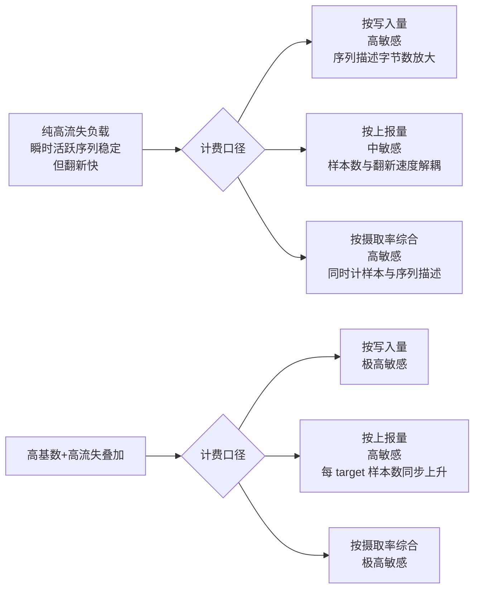
```mermaid
flowchart LR
    A[纯高流失负载<br/>瞬时活跃序列稳定<br/>但翻新快] --> B{计费口径}
    B --> C[按写入量<br/>高敏感<br/>序列描述字节数放大]
    B --> D[按上报量<br/>中敏感<br/>样本数与翻新速度解耦]
    B --> E[按摄取率综合<br/>高敏感<br/>同时计样本与序列描述]
    
    F[高基数+高流失叠加] --> G{计费口径}
    G --> H[按写入量<br/>极高敏感]
    G --> I[按上报量<br/>高敏感<br/>每 target 样本数同步上升]
    G --> J[按摄取率综合<br/>极高敏感]
```

**面向不同计费模型的成本优化路径选择**：

| 计费模型 | 首选治理动作 | 次选治理动作 | 不建议路径 |
|---------|------------|------------|----------|
| 按写入量 | 4.2 Pod→Workload 归一化 + 4.4 labeldrop | 4.5 Recording Rules + 4.6 白名单 | 单纯延长 scrape_interval（不改变序列描述开销占比） |
| 按上报量 | 延长 scrape_interval + 4.4 target 端裁剪 | 4.5 Recording Rules + 6.4 AMP 推荐 | 单纯做 labeldrop（不改变 datapoint 数量） |
| 按摄取率综合（AWS AMP） | scrape_interval 调整 + relabel_config 筛选[^56] | Query Logging + Query Thresholds 优化查询成本[^59]；使用内置 Alertmanager 避免 3× 告警查询成本[^56] | 仅缩短保留期（账单影响有限）[^56] |
| 综合计费（GCP/Azure） | 通用的 4.x 源头治理 | 待官方文档进一步披露 | — |

**免费额度与套餐包对中小规模用户的实际意义**。各厂商提供的免费额度与折扣对中小规模用户具有不可忽视的实际意义：

- **阿里云**：基础指标完全免费（涵盖 ACK 容器监控、Flink 实时计算、Prometheus 自监控），自定义指标 50 GB/月免费额度按账号级别共享[^46][^48]；
- **腾讯云**：按量付费免费指标基础免费存储 15 天[^52]；套餐包提供 17%–60% 折扣（体验版 599 元提供 10 亿条/月，相当于按量付费 1000 元同等额度的 59.90% 折扣）[^49]；
- **AWS**：免费层细则在本次抓取资料中未直接披露；
- **GCP**：Cloud Logging 每个项目每月前 50 GiB 免费、保留 30 天内的存储不收费、Log Router 不额外收费[^61]，但 GMP 单独的免费额度细则未直接披露；
- **Grafana Cloud**："free data usage allotments to get started with no upfront fees or commitments"[^61] 类似机制（对应通用观察），具体免费额度细则在本次抓取资料中未披露。

对于小型团队（活跃序列在百万级以下、月数据量在百 GB 级以下），合理利用免费额度可能让监控成本接近零；对于中型团队，套餐包的折扣对成本可预测性的改善显著；对于大型团队，应直接与厂商商务团队沟通量级化定价。

**专题结论**。计费模型是托管方案选型中最具决策价值的维度——它直接决定了"流失率上升 1%"会转化为"账单上升 X%"。在所有主流方案均围绕摄取量/上报量计费的现状下，**第 4 章源头治理的工程动作在托管语境下从"性能优化"升级为"成本优化"——其 ROI 不仅来自系统稳定性，也直接来自可量化的账单节省**。这是源头治理在自建与托管两条路径下共同的高 ROI 基石。

## 6.9 自建 vs 托管的能力边界判别与本章小结

作为本章收尾，回到"自建路径（第 4、5 章）vs 托管路径（本章）"的整体决策视角，提炼云厂商托管方案相对于自建 Prometheus 的能力边界与适用场景。这一对比将作为第 7 章场景化选型路径的直接前置输入。

**托管方案相对自建的能力增益**：

- **单实例承载上限的跃迁**：自建 Prometheus 单机承载在百万级活跃序列即面临瓶颈（第 5.1 节），自建 Mimir/VictoriaMetrics 集群承载需要相应规模运维投入（第 5.5–5.6 节）；托管方案直接提供腾讯云 450 万 Series[^51]、Grafana Cloud 10 亿活跃序列[^65]等公开承载基准，无需用户自己运维分布式系统；
- **多可用区高可用的内置**：AWS AMP 摄取数据自动复制到三个可用区[^54]——这是自建路径需要通过 Thanos 副本 dedup 配合多 AZ 部署才能实现的能力；
- **长周期存储成本结构的简化**：托管方案内置对象存储集成（无需用户自建 S3 + Compactor + Store Gateway），保留期通过简单参数配置（如 AMP 默认 150 天、最长 1095 天[^54]；阿里云分级保留[^48]）；
- **Adaptive Metrics 等高基数治理产品化能力**：Grafana Cloud Metrics 把"识别并消除未使用序列"这一第 3 章 SOP 的核心动作产品化[^65]——自建路径下需要团队自己用 mimirtool 周期性审计；
- **与各自云生态的安全/网络/IAM 集成**：AMP 集成 AWS 安全服务[^54]、阿里云与 ACK 集群权限模型集成[^46]——这些集成能力在多云或跨云自建路径下需要额外的 IAM 桥接工作。

**托管方案的核心代价**：

- **账单可预测性受流失率波动影响**：按摄取/上报计费下，业务侧一次大规模 Pod 滚动或 HPA 扩缩可能直接转化为账单峰值——这一不确定性在自建路径下表现为"硬件资源水位上升"，在托管路径下表现为"账单波动"；
- **跨云迁移成本**：托管方案与各自云生态深度绑定，迁移到另一云的成本远高于自建 Prometheus 之间的迁移；
- **定制化能力受限**：用户无法修改底层 TSDB 参数（如 `--storage.tsdb.max-block-duration`、`--storage.tsdb.retention.size`，参考第 5.1 节自建场景的参数调优）、无法部署自定义存储后端、无法接入自定义查询优化插件；
- **信息透明度受限**：部分内部承载数据（如单工作区 hot path 内存上限、底层分片策略）不公开（参考 6.7 节"信息透明度差异本身是一个能力维度"的观察）；
- **第三方工具兼容性的边界**：自建路径下 promtool tsdb analyze、第三方 PromQL 优化工具可以直接接入；托管路径下用户接触不到底层 Block 文件，等价工具需要厂商提供产品化等价物。

**高层判别框架**。基于上述能力增益与代价，可以提炼出以下决策路径：

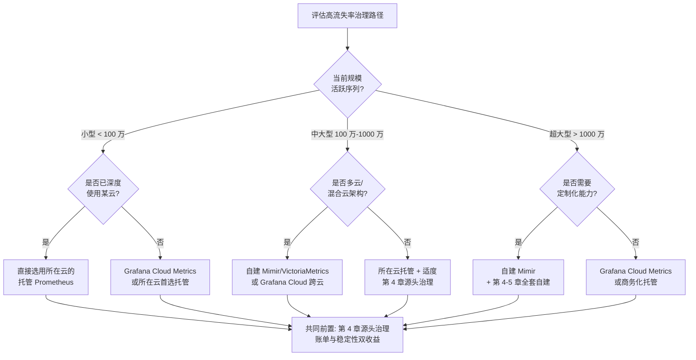
```mermaid
flowchart TD
    Start[评估高流失率治理路径] --> Q1{当前规模<br/>活跃序列?}
    Q1 -- 小型 < 100 万 --> Q2{是否已深度<br/>使用某云?}
    Q1 -- 中大型 100 万-1000 万 --> Q3{是否多云/<br/>混合云架构?}
    Q1 -- 超大型 > 1000 万 --> Q4{是否需要<br/>定制化能力?}
    
    Q2 -- 是 --> H1[直接选用所在云的<br/>托管 Prometheus]
    Q2 -- 否 --> H2[Grafana Cloud Metrics<br/>或所在云首选托管]
    
    Q3 -- 是 --> H3[自建 Mimir/VictoriaMetrics<br/>或 Grafana Cloud 跨云]
    Q3 -- 否 --> H4[所在云托管 + 适度<br/>第 4 章源头治理]
    
    Q4 -- 是 --> H5[自建 Mimir<br/>+ 第 4-5 章全套自建]
    Q4 -- 否 --> H6[Grafana Cloud Metrics<br/>或商务化托管]
    
    H1 --> R[共同前置: 第 4 章源头治理<br/>账单与稳定性双收益]
    H2 --> R
    H3 --> R
    H4 --> R
    H5 --> R
    H6 --> R
```

**高层判别原则**：

- **小型集群 + 成熟云生态用户 → 直接托管**：百万级以下活跃序列的小型团队、已深度使用某云、对监控自主性诉求不高，直接采用所在云的托管 Prometheus 服务是 ROI 最高的路径；阿里云、腾讯云的免费额度对该类团队尤其友好[^46][^52]；
- **中大型多集群 + 多云/混合云 → 自建 Mimir/VictoriaMetrics 或选用 Grafana Cloud**：自建路径提供跨云一致性，Grafana Cloud Metrics 作为云无关的专业方案是另一选项；这一规模下的关键考量是团队运维能力——若团队对分布式系统运维有充足储备则自建 Mimir/VictoriaMetrics 提供最大的灵活性，否则 Grafana Cloud Metrics 提供托管化的专业体验[^65]；
- **极端高动态 + 成本敏感 → 源头治理优先后再做托管/自建决策**：对 Serverless、自动驾驶等极端高动态场景，第 4 章源头治理的 ROI 始终最高——在源头治理已尽的前提下，再根据"剩余流失负载量级 + 团队运维能力 + 计费偏好"做托管/自建决策。腾讯云 TMP 对自动驾驶专区的产品化响应反映了对这类场景的针对性设计[^49][^52]。

**本章小结**。本章在前五章建立的能力坐标基础上，对六家主流云厂商托管 Prometheus 方案做了横向对比。对比的核心结论可归纳为以下几点：

第一，**托管方案在水平扩展承载、多 AZ 高可用、长周期存储成本结构、产品化基数治理工具上相对自建路径有显著能力增益**——这些增益在中等规模以上的高流失场景下尤其有价值，因为这些恰恰是自建路径需要投入大量运维人力才能达到的能力。

第二，**所有主流托管方案均围绕"摄取量/上报量/字节数"作为主计费维度，使得高流失率直接转化为账单成本**——这意味着第 4 章源头治理的所有工程动作在托管语境下从"性能优化"升级为"成本优化"，其 ROI 不仅来自系统稳定性，也直接来自可量化的账单节省。这一结论是托管路径与自建路径在治理逻辑上的最大差异，也是用户在做托管选型时最需要内化的成本意识。

第三，**信息透明度本身也是一个选型维度**——AWS 与 Grafana Labs 在公开博客、文档中对成本优化、查询优化、高基数治理的输出最系统；阿里云与腾讯云的中文文档对计费细则的披露非常透明；GCP 与 Azure 的公开 Prometheus 专项文档相对克制。读者在最终决策前应直接以最新官方文档与定价计算器为准，本章结论严格基于本次抓取的公开资料，遇到信息缺口处保留厂商立场标注与"未公开"声明，不做主观补全。

第四，**Grafana Cloud Metrics 作为唯一明确以"高基数与高流失场景"为产品定位的方案**[^65]——其差异化优势恰好印证了高流失率作为业界共性痛点的研究价值，也提供了一个可对照的"专业可观测性深度"基线。

第五，**自建 vs 托管不是非此即彼的选择**——许多大型企业的实际选型是"分层混合"：核心业务自建 + 边缘业务托管、生产环境自建 + 测试环境托管、长期存储自建 + 短期分析托管。这一混合架构的具体形态将在第 7 章场景化选型路径中展开。

至此，自建路径（第 4、5 章）与托管路径（本章）的能力坐标都已经建立。下一章将在场景化的视角下，把这些能力坐标整合为面向不同规模、不同行业、不同技术栈的差异化选型路径——回答"在我的具体场景下，应该如何组合自建与托管能力"这一最终落地问题。

# 7 典型场景下的方案选型与最佳实践

第 1 章建立了概念底座，第 2 章揭示了"index→memory→CPU→query→stability"的因果链，第 3 章给出了诊断 SOP，第 4–5 章从源头治理与架构扩展两条路径系统化梳理了治理工程图景，第 6 章对六家主流云厂商托管方案做了横向对比。至此，前六章已经在"机理—诊断—自建—托管"四个层面构建了完整的能力坐标体系——但所有这些能力坐标都还处在"能力清单"的形态，没有针对具体业务场景做组合与裁剪。**真实的工程决策从来不是"选最好的方案"，而是"在特定约束下选最合适的组合"**——这正是本章要回答的问题。

本章把视角从"能力堆叠"切换到"场景适配"，围绕小型集群、大型多集群、Kubernetes 频繁滚动更新、Serverless 高动态、混合云五类典型场景，分别给出方案组合的推荐路径；再沿 TCO、运维复杂度、SLA、扩展性四个维度系统对比自建（Prometheus + Thanos / VictoriaMetrics / Mimir）与云厂商托管两条路径；最后将所有推荐凝练为可直接落地的分阶段 checklist 与端到端决策树。本章的所有推荐都将严格回扣前六章已经建立的事实基础与机理推演，并对场景边界、组合代价、潜在风险给出明确标注，避免落入"放之四海而皆准"的伪最佳实践陷阱（这与第 1 章 Rubric P-5 强调的"方案需明确适用场景与潜在局限"是一致的）。

## 7.1 场景化选型框架与决策维度

要让 7.2–7.6 节的场景化推荐具备可比性、可追溯性，必须先建立一套统一的场景画像维度与决策评估维度——这是本章所有后续讨论共享的坐标系。

**五维场景画像**。综合前六章的分析，可以提炼出刻画一个真实业务场景的五个独立维度：

| 维度 | 子项 | 含义与判别口径 |
|------|------|--------------|
| **规模** | 活跃序列量级、集群数量、租户数 | 决定单机模型是否够用、是否需要水平扩展、是否需要多租户隔离 |
| **动态性** | 流失率水位、流失来源（滚动/HPA/Serverless）| 决定源头治理能力上限、架构层是否必须介入 |
| **业务属性** | 合规要求、SLA 承诺、保留窗口、数据主权 | 决定长周期存储、HA 部署、跨云数据流转的硬约束 |
| **组织能力** | 运维团队规模、分布式系统经验、GitOps 成熟度 | 决定能否承担自建分布式架构的运维负担 |
| **成本结构** | 自建 CapEx vs 托管 OpEx、计费偏好 | 决定账单可预测性与长期 TCO 的现金流形态 |

**四维决策评估**。在五维场景画像的输入下，最终方案选型要从以下四个核心维度做评估：

| 评估维度 | 关注重点 | 量化方式 |
|---------|---------|---------|
| **TCO** | 硬件/云资源 + 人力 + 数据出云 + 隐性成本 | 月度/年度总账单 + 人月数 |
| **运维复杂度** | 组件部署、参数调优、升级、容量规划、故障处置 | 关键操作的人月成本与频次 |
| **SLA 与可用性** | 数据可靠性、查询可用性、告警可信度 | 厂商 SLA 等级 vs 自建 HA 实测可用性 |
| **扩展性** | 承载上限、横向扩展边际成本、未来演进灵活性 | 公开基准 + 实际压测数据 |

**总体决策路径图**。把场景画像与决策评估结合起来，可以得到本章所有后续推荐共享的总体决策路径：

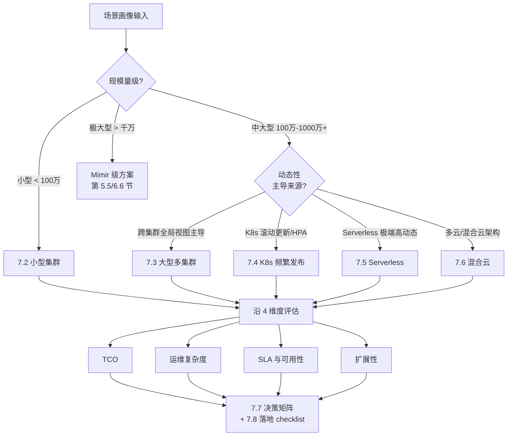
```mermaid
flowchart TD
    Start[场景画像输入] --> P1{规模量级?}
    P1 -- 小型 < 100万 --> S1[7.2 小型集群]
    P1 -- 中大型 100万-1000万+ --> P2{动态性<br/>主导来源?}
    P1 -- 极大型 > 千万 --> Mimir[Mimir 级方案<br/>第 5.5/6.6 节]
    
    P2 -- 跨集群全局视图主导 --> S2[7.3 大型多集群]
    P2 -- K8s 滚动更新/HPA --> S3[7.4 K8s 频繁发布]
    P2 -- Serverless 极端高动态 --> S4[7.5 Serverless]
    P2 -- 多云/混合云架构 --> S5[7.6 混合云]
    
    S1 --> Eval[沿 4 维度评估]
    S2 --> Eval
    S3 --> Eval
    S4 --> Eval
    S5 --> Eval
    
    Eval --> E1[TCO]
    Eval --> E2[运维复杂度]
    Eval --> E3[SLA 与可用性]
    Eval --> E4[扩展性]
    
    E1 --> Final[7.7 决策矩阵<br/>+ 7.8 落地 checklist]
    E2 --> Final
    E3 --> Final
    E4 --> Final
```

需要明确一点：**这五类场景之间不是互斥的**——一个真实企业可能同时是"大型多集群 + K8s 频繁发布 + 部分 Serverless 业务 + 混合云架构"。本章按场景分别讨论是为了让每类挑战的治理重点更清晰，但落地时往往需要把多场景的方案组合到同一架构中。这一组合逻辑将在 7.7 节的决策矩阵与 7.8 节的端到端决策树中显式呈现。

## 7.2 小型集群场景：单实例 Prometheus 与轻量托管的取舍

**场景画像**：活跃序列在百万级以下、单集群或少量集群（典型 1–3 个 K8s 集群）、运维团队规模小（典型 1–3 名 SRE 或由开发兼任）、合规要求低（保留窗口 7–30 天即可满足）、对监控自主性诉求中等。这一画像覆盖了相当一部分初创团队、中小企业、内部业务系统的现状。

**自建轻量路径的适用性**。对于该规模，第 5.1 节讨论的"单机 Prometheus 扩展瓶颈"尚未成为硬约束——百万级以下活跃序列在合理硬件规格（如 8 vCPU + 32 GiB RAM + SSD）下仍可平稳承载。这一规模的最佳自建组合是：

- **核心架构**：单机 Prometheus（或主备双副本+Alertmanager 集群）；
- **源头治理**：第 4 章全套（埋点 review + relabel + 白名单）——尤其是第 4.6 节的 kube-prometheus 默认精简方案，对小团队几乎零运维成本；
- **预聚合**：第 4.5 节 Recording Rules 覆盖核心 RED 指标；
- **告警**：第 5.10 节的 `for` 时长 + 分组 + 抑制 + 静默组合；
- **保留窗口**：本地保留 15–30 天，符合大多数业务排查诉求；
- **可观测自身**：第 3 章 SOP 中的 `prometheus_tsdb_head_series` 与 `rate of head_series_created_total` 自监控面板。

这一组合的优势是：**全栈在团队完全掌控之中**——任何调优都不需要走厂商工单；硬件成本可控（一两台中等规格服务器即可）；K8s 运维能力强的团队可以把 Prometheus 作为 K8s 自身能力的延伸来运维。

**自建路径的适用边界**。需要明确的是，单机 Prometheus 在以下信号出现时已不再适合：活跃序列接近 100 万持续增长、保留窗口需求超过 30 天、出现跨集群全局视图诉求、WAL replay 时间影响重启 SLA。一旦命中任一信号，应立即评估升级到 7.3 节的多集群架构或转向托管路径。

**轻量托管路径的吸引力**。在小型集群场景下，托管方案的 ROI 通常显著优于自建——核心理由是各家托管方案的免费额度对小型负载基本"免费可用"：

- **阿里云 ARMS Prometheus**：基础指标完全免费（覆盖 ACK 容器监控、Flink、Prometheus 自监控），自定义指标 50 GB/月免费额度按账号级别共享——对百万级以下序列规模通常足够覆盖（参考第 6.2 节）；
- **腾讯云 TMP**：按量付费免费指标基础免费存储 15 天；体验版套餐 599 元/月提供 10 亿条/月，对小团队接近"零成本"（参考第 6.3 节）；
- **AWS AMP**：按摄取量+查询样本+存储三段式计费，小规模摄取下账单较低（具体免费层细则参考 AWS 官方定价计算器）；
- **Grafana Cloud**：提供"free data usage allotments to get started with no upfront fees or commitments"的免费额度（参考第 6.6 节）。

**两条路径的取舍判别**。综合以上分析，在小型集群场景下做选型时主要看以下三点：

| 判别维度 | 倾向自建 | 倾向托管 |
|---------|---------|---------|
| 团队 K8s 运维能力 | 强（已熟练运维 K8s） | 弱（K8s 自身刚起步） |
| 云生态绑定度 | 低（多云/IDC/边缘） | 高（已深度使用某云） |
| 数据敏感度 | 高（数据不出企业内网） | 低（接受数据上云） |
| 长期演进规划 | 预期向大型多集群发展、希望团队积累自建经验 | 业务规模相对稳定、不计划自建大型监控基础设施 |

**典型部署拓扑**：

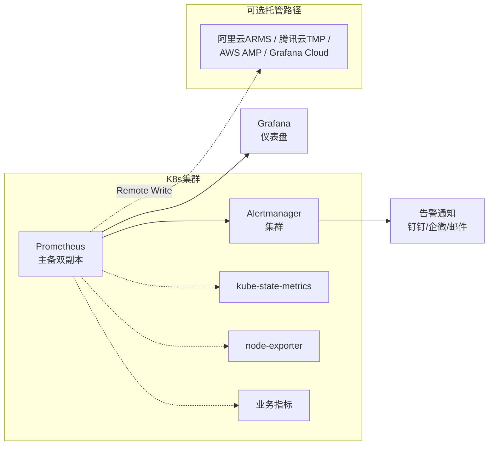
```mermaid
flowchart LR
    subgraph K8s集群
      P[Prometheus<br/>主备双副本] --> AM[Alertmanager<br/>集群]
      P -.-> KSM[kube-state-metrics]
      P -.-> NE[node-exporter]
      P -.-> APP[业务指标]
    end
    P --> G[Grafana<br/>仪表盘]
    AM --> N[告警通知<br/>钉钉/企微/邮件]
    
    subgraph 可选托管路径
      P -.Remote Write.-> CLOUD[阿里云ARMS / 腾讯云TMP /<br/>AWS AMP / Grafana Cloud]
    end
```

**小型集群配置 checklist**：

- [ ] 部署 Prometheus 主备双副本 + Alertmanager 集群（2 实例）；
- [ ] 启用 kube-prometheus 默认精简配置（drop cAdvisor 高基数子指标等）；
- [ ] `relabel_configs` 配置 Pod→Workload 归一化（参考第 4.2 节）；
- [ ] `metric_relabel_configs` labeldrop 高流失标签（pod_uid、container_id）；
- [ ] 编写核心 RED 指标的 Recording Rules（按 `service:metric:operation` 命名）；
- [ ] Alertmanager 配置 group_by + inhibit_rules + 关键告警 `for: 2m–5m`；
- [ ] 开启 Prometheus 自监控面板（head_series + churn ratio）；
- [ ] 月度审计一次 mimirtool analyze prometheus（识别未使用指标）；
- [ ] 评估保留窗口需求，若超过 30 天则启动向 Thanos 或托管的迁移评估。

## 7.3 大型多集群场景：跨集群全局视图与长期存储架构

**场景画像**：活跃序列百万至千万级、跨多个 K8s 集群（典型 5–50 个）、需要跨集群统一查询入口、合规要求保留 30 天–2 年、运维团队规模中等（5–20 名 SRE）、可能存在多租户隔离诉求。这一画像覆盖了大型互联网企业、金融科技公司、大型政企客户的核心监控基础设施。

**三种自建架构的承载能力对比**。第 5.4–5.6 节已经详细比较过 Thanos、Cortex/Mimir、VictoriaMetrics 三种架构的内部机制，本节聚焦于在"大型多集群"场景下三者的具体适配差异：

| 架构 | 适配特征 | 承载量级 | 部署复杂度 | 关键陷阱 |
|------|---------|---------|-----------|---------|
| **Thanos** | 已有多 Prometheus 集群、希望渐进式增强 | 千万级活跃序列（依赖对象存储底座） | 中（Sidecar+Querier+Compactor+Store Gateway） | 外部标签必须唯一、HA 副本 dedup 配置正确 |
| **Cortex/Mimir** | 从零规划企业级多租户后端 | 10 亿级活跃序列（极限基准 7000 CPU + 30 TiB RAM）| 高（Distributor+Ingester+多组件） | 多组件协同复杂、对象存储依赖、资源门槛高 |
| **VictoriaMetrics** | 中等规模、对运维复杂度敏感 | 中等规模高效（厂商基准下单节点 30 万样本/秒） | 低-中（单二进制或集群） | 多租户能力相对较弱、生态相对小 |

**对照托管能力**。把自建架构与第 6 章梳理的托管能力对照，可以形成更完整的选型坐标：

| 能力维度 | 自建 Thanos | 自建 Mimir | 自建 VM | 腾讯云 TMP | AWS AMP | Grafana Cloud |
|---------|-----------|-----------|---------|-----------|---------|---------------|
| 承载上限 | 取决于对象存储 | 10 亿级（基准）| 单节点高效 | 450 万 Series/实例 | 自动扩缩 | 10 亿活跃序列 |
| 多 AZ HA | 需自建 | 需自建 | 需自建 | 厂商承担 | **三 AZ 自动复制** | 厂商承担 |
| 多租户原生 | 弱 | **强** | 中 | 多实例隔离 | Workspace 隔离 | **强** |
| 跨集群全局视图 | Querier 跨 Prometheus | 多租户原生聚合 | vmselect 分布式 | 未明确披露 | 多集群→单 Workspace | 多租户原生 |
| 长保留+降采样 | **多级（raw/5m/1h）** | 多级 | 自动降采样查询 | 最长 2 年 | 最长 1095 天 | 未披露细则 |
| 部署人月成本 | 中（已有 Prom 基础上） | 高 | 低-中 | 极低 | 极低 | 极低 |

**"分层混合"部署的常见落地形态**。在大型多集群场景下，纯自建或纯托管很少是最优解，**分层混合**是主流落地形态。常见的几种分层模式：

- **核心业务自建 + 边缘业务托管**：核心交易系统监控数据保留在自建 Thanos/Mimir 中以保证完全自主可控，边缘业务（开发测试环境、内部工具系统）使用托管 Prometheus 降低运维负担；
- **生产环境自建 + 测试环境托管**：生产环境对监控数据的可控性、合规性诉求高，自建优先；测试环境使用托管的免费额度即可满足绝大多数诉求；
- **本地短保留 + 远程长保留托管**：本地 Prometheus 保留 7–15 天明细数据用于即时排查，通过 Remote Write 把聚合后的关键指标发送到托管后端做长期合规存储——这一模式直接利用了第 4.4 节 `write_relabel_configs` 的桥接能力；
- **指标自建 + 日志/链路托管**：仅 Prometheus 自建，Logs 与 Traces 使用云厂商托管服务（如 Loki Cloud、CloudWatch Logs、Cloud Trace），减少自建可观测性栈的总体复杂度。

**判别路径**：

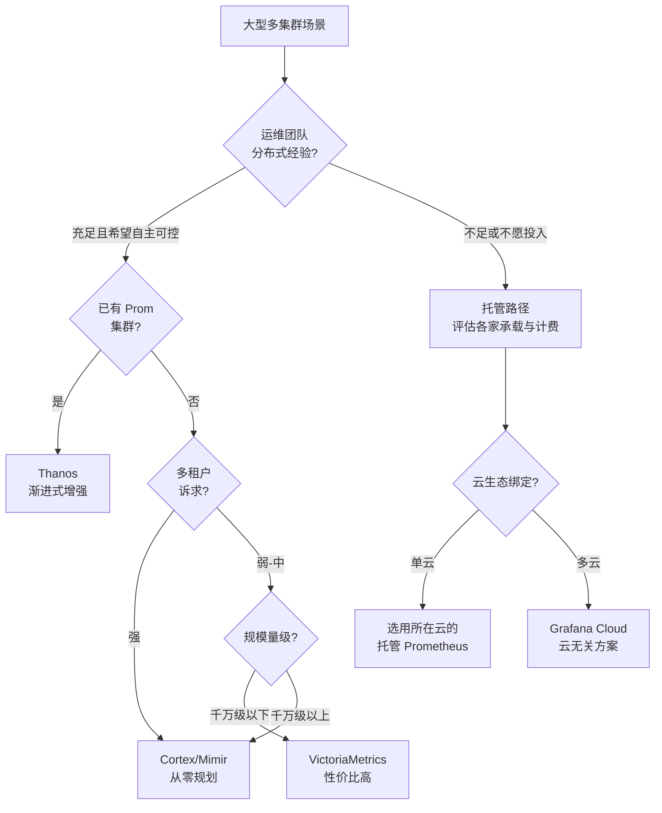
```mermaid
flowchart TD
    Start[大型多集群场景] --> Q1{运维团队<br/>分布式经验?}
    Q1 -- 充足且希望自主可控 --> Q2{已有 Prom<br/>集群?}
    Q1 -- 不足或不愿投入 --> Hosted[托管路径<br/>评估各家承载与计费]
    
    Q2 -- 是 --> Thanos[Thanos<br/>渐进式增强]
    Q2 -- 否 --> Q3{多租户<br/>诉求?}
    
    Q3 -- 强 --> Mimir[Cortex/Mimir<br/>从零规划]
    Q3 -- 弱-中 --> Q4{规模量级?}
    
    Q4 -- 千万级以下 --> VM[VictoriaMetrics<br/>性价比高]
    Q4 -- 千万级以上 --> Mimir
    
    Hosted --> H1{云生态绑定?}
    H1 -- 单云 --> CloudVendor[选用所在云的<br/>托管 Prometheus]
    H1 -- 多云 --> Grafana[Grafana Cloud<br/>云无关方案]
```

**大型多集群配置要点**：

- 对每个 Prometheus 实例配置唯一且持久的 `external_labels`（如 `cluster=prod-cn-east-1`、`replica=A/B`）——这是 Thanos 副本 dedup 与多集群聚合的根本前提（参考第 5.4 节末尾的关键陷阱）；
- 开启 Compactor 的多级保留策略，典型 `retention.resolution-raw=30d / resolution-5m=90d / resolution-1h=365d`；
- 对所有 Querier/Ruler 启用副本 dedup（`--deduplication.replica-label=replica`）；
- 配置 Query Frontend 的查询拆分（`split_queries_by_interval=24h`）与缓存（Memcached 或 Redis）；
- 关键告警规则全部基于 Recording Rules 评估（避免高流失下告警评估塌方）；
- 月度审计 Mimir/Thanos 自身的可观测指标，重点关注 Compactor backlog、Ingester 内存水位、Ruler 评估延迟。

## 7.4 Kubernetes 频繁滚动更新场景：Pod 流失治理与告警稳定

**场景画像**：CI/CD 高频发布（每天数次到数十次部署）、HPA 弹性扩缩频繁（分钟级响应业务波动）、Pod 维度高流失率主导、活跃序列规模中等但每天产生大量"代际历史序列"。这一场景在敏捷开发的互联网企业中是常态，与第 1.4 节描绘的"K8s 滚动更新+HPA 双重叠加"完全对应。

**核心治理逻辑**。该场景下治理重心**不在架构层而在源头层**——因为问题的根因是 Pod 维度标签携带了"实例瞬时身份"，只要把这一身份层从指标中剥离出去，瞬时活跃序列与代际历史序列的乘积放大效应就能从源头被切断。

**完整治理链**。把第 4 章源头治理与第 5.10 节告警稳定性策略组合为面向该场景的完整治理链：

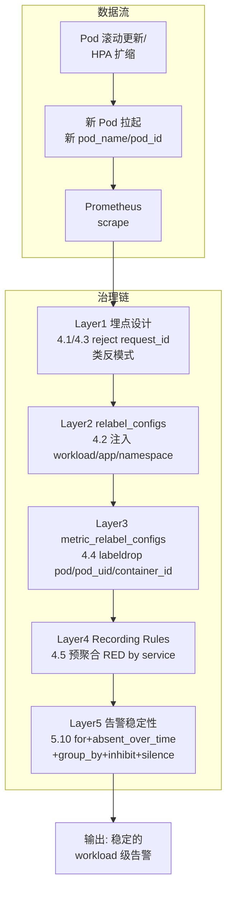
```mermaid
flowchart TB
    subgraph 数据流
      A[Pod 滚动更新/<br/>HPA 扩缩] --> B[新 Pod 拉起<br/>新 pod_name/pod_id]
      B --> C[Prometheus<br/>scrape]
    end
    subgraph 治理链
      D1[Layer1 埋点设计<br/>4.1/4.3 reject request_id<br/>类反模式]
      D2[Layer2 relabel_configs<br/>4.2 注入 workload/app/namespace]
      D3[Layer3 metric_relabel_configs<br/>4.4 labeldrop pod/pod_uid/container_id]
      D4[Layer4 Recording Rules<br/>4.5 预聚合 RED by service]
      D5[Layer5 告警稳定性<br/>5.10 for+absent_over_time<br/>+group_by+inhibit+silence]
    end
    C --> D1
    D1 --> D2 --> D3 --> D4 --> D5
    D5 --> E[输出: 稳定的<br/>workload 级告警]
```

**Pod 级排查能力的折衷**。归一化的副作用是丧失"按某个具体 Pod 名查问题"的能力。第 4.2 节已经讨论过几种折衷思路，在 K8s 频繁发布场景下推荐组合使用：

- **分指标分级处理**：核心 RED 指标严格归一化（仅保留 `workload`、`app`、`namespace`），少量诊断类指标（如 `kube_pod_status_phase`）保留 `pod` 标签但配合短保留窗口（7 天）；
- **本地短保留 + 远程长保留分层**：本地 Prometheus 保留全套带 `pod` 标签的明细数据 7 天用于即时排查，Remote Write 通过 `write_relabel_configs` 仅发送 `workload` 维度的预聚合数据到远程长保留后端；
- **Pod 级查询走日志/链路**：单 Pod 级别的事件类排查转移到日志系统（按 `pod_name` 全文检索）与链路追踪系统（按 TraceID 关联）——这一原则与第 4.3 节"指标与日志的职责划分"一致。

**计划发布静默规则**。在 K8s 频繁发布场景下，每次大版本上线前后会出现一波瞬态告警。建议建立**计划发布静默 SOP**：

- CI/CD 流水线在发布前自动调用 Alertmanager API 创建针对 `service=<待发布服务>` + `namespace=<目标命名空间>` 的临时静默规则；
- 静默时长设置为"预期发布耗时 + 安全余量"（如发布预期 10 分钟则静默 20 分钟）；
- 发布完成后流水线自动取消静默；
- 静默期间所有非该服务的告警仍正常 fire——避免发布过程意外影响其他服务时告警失效。

**告警规则编写要点**。结合第 5.10 节的稳定性策略，针对该场景的告警规则建议遵循以下范式：

```yaml
# ✅ 推荐：基于 Recording Rule 评估、按 workload 聚合、含 for 时长
- alert: HighErrorRateByWorkload
  expr: service:http_requests_error_rate:ratio5m{namespace="prod"} > 0.05
  for: 5m
  labels:
    severity: critical
  annotations:
    summary: "{{ $labels.workload }} error rate > 5%"

# ✅ 推荐：absent_over_time 兜底服务消失
- alert: WorkloadAbsent
  expr: absent_over_time(up{job="critical-service"}[10m])
  for: 2m

# ❌ 不推荐：直接基于原始指标 + 按 pod 聚合
- alert: HighErrorRateByPod
  expr: rate(http_requests_total{status=~"5.."}[5m]) by (pod) > 10
  for: 1m
  # 问题：pod 名滚动后告警自然消失、瞬态触发误告警风险高、查询成本随高流失上升
```

**该场景最佳实践 checklist**：

- [ ] 埋点 review 强制 checklist：禁止 `request_id`/`trace_id`/`session_id` 进 metrics（强制走 Logs/Traces）；
- [ ] `relabel_configs` 完成 Pod→Workload 归一化（提取 `__meta_kubernetes_pod_owner_name`、`pod_label_app`）；
- [ ] `metric_relabel_configs` labeldrop 高流失标签（`pod`、`pod_uid`、`container_id`、`id`）；
- [ ] 关键 RED 指标全部预聚合为 `service:metric:operation` 命名的 Recording Rules；
- [ ] Alerting Rules 全部基于 Recording Rule、`for: 2m–5m`、按 `workload`/`namespace` 聚合；
- [ ] Alertmanager 配置 `group_by: [namespace, workload, severity]`、`group_wait: 30s`、关键依赖配置 inhibit_rules；
- [ ] CI/CD 流水线集成发布前自动静默 + 发布后自动取消；
- [ ] 保留 Pod 级排查能力的明细指标采用 7 天短保留；
- [ ] 月度复盘告警噪音水位（夜间告警量、误告警率）并迭代规则。

## 7.5 Serverless 高动态场景：极端流失率下的架构应对

**场景画像**：基于阿里云 SAE、AWS Lambda、Google Cloud Run、Knative、Azure Container Apps 等 Serverless 平台运行业务，应用实例生命周期分钟级甚至秒级、按需拉起空闲销毁，流失率极端高（churn ratio 可能持续大于 0.5 甚至接近 1）。该场景在第 1.4 节已被列为"实例身份天然短暂"的极端代表。

**源头治理的能力边界**。在 Serverless 场景下，第 4 章的源头治理虽然必须做（埋点规范、metric_relabel labeldrop 仍然有效），但其能力上限被结构性限制：

- 即便把 `pod`、`instance` 标签全部剥离，底层的 scrape target 数量仍然在极快变化——target 端的 churn 会传导为 WAL 中 series record 的高占比、Head Block 的频繁切分、采集端 service discovery 的调用压力；
- 每个被拉起的实例在它存活期间都需要被采集到一定的样本（否则该次执行就成了"监控盲区"），无法通过简单丢弃来降低；
- 单纯 relabel 规则无法消除"采集端结构性流失"。

**必须升级到架构层手段**。Serverless 场景的核心治理逻辑是**承认源头流失不可消除、用架构能力消化**：

- **Remote Write 远程存储分层**：本地极短保留（如 1–3 天，仅承担即时排查）+ 远程长保留降采样（30 天明细 + 90 天 5m 降采样 + 1 年 1h 降采样）。这一分层把"高频翻新的明细负担"留在本地、"长期趋势分析"上抛到对象存储后端；
- **后端选型偏好**：水平扩展承载能力强的后端是必选——VictoriaMetrics 单节点的高效存储、Mimir 的水平切分都适合；Thanos 在该场景下的 Sidecar 模式可能成为瓶颈（每个本地 Prometheus 仍要承受全量流失），更好的形态是 Prometheus → Remote Write → Mimir/VM 直接接入；
- **Query Frontend 与查询缓存**：Dashboard 体验是 Serverless 监控的核心痛点之一（用户经常查询近期但跨大量已消亡实例的数据），Query Frontend 的查询拆分与缓存对该体验的保障作用尤其大。

**云厂商托管在该场景的产品化承载**：

- **阿里云 SAE + ARMS Prometheus**：阿里云 SAE 通过 Spring Boot Actuator 与 Micrometer 暴露 `/actuator/prometheus` 端点，由可观测监控 Prometheus 版自动采集；应用部署到 SAE 后开启 Prometheus 监控即可实现自动采集（参考第 1.4 节）。该集成把 Serverless 应用与托管 Prometheus 之间的服务发现、采集、存储链路完全产品化；
- **腾讯云 TMP 自动驾驶专区**：第 6.3 节已经指出 TMP 把"自动驾驶专区"作为独立定价分组——考虑到自动驾驶场景在第 1.4 节中被列为"Serverless 与极端高动态"的典型代表（车辆每分钟产生新序列、传感器数据高频上报），这一专区定位反映了 TMP 对极端高动态行业场景的针对性产品化响应；
- **AWS AMP + Lambda/EKS Fargate**：AMP 适用于在 Amazon Elastic Kubernetes Service 上运行的容器集群和自行管理的 Kubernetes 环境（参考第 6.4 节），结合 EKS Fargate 可以承载 Serverless 化的 K8s Pod；阿里云函数计算给出的 LLM 推理监控集成方案中，通过在函数实例中以 sidecar 模式部署 OpenTelemetry Collector，自动采集并上报 LLM 推理引擎暴露的 Prometheus 指标，无需修改业务代码即可对接 ARMS 托管 Prometheus 服务（参考第 4.3 节）——这一 sidecar 模式同样适用于 AWS Lambda 等 Serverless 平台的指标采集集成。

**计费成本的特殊考量**。Serverless 场景下的计费成本敏感度尤其需要关注（参考第 6.8 节）：

- 在按写入量计费下（如阿里云按写入量模式），Serverless 极端高动态会推高"序列描述/样本"字节比，账单陡升风险高；
- 在按上报量/摄取率计费下（如腾讯云 TMP、AWS AMP），活跃 target 数 × scrape 频率主导成本——Serverless 场景下虽然实例生命周期短，但同一时刻的活跃 target 数可能是稳定的，成本相对可控；
- 这意味着 **Serverless 场景下计费模型的选择本身就是治理动作**——同样的负载在不同口径下账单可能差异 2–3 倍。

**典型部署拓扑**：

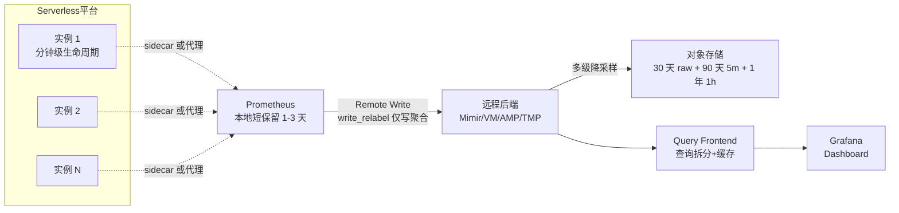
```mermaid
flowchart LR
    subgraph Serverless平台
      F1[实例 1<br/>分钟级生命周期]
      F2[实例 2]
      FN[实例 N]
    end
    F1 -.sidecar 或代理.-> P[Prometheus<br/>本地短保留 1-3 天]
    F2 -.sidecar 或代理.-> P
    FN -.sidecar 或代理.-> P
    
    P -- Remote Write<br/>write_relabel 仅写聚合 --> R[远程后端<br/>Mimir/VM/AMP/TMP]
    R -- 多级降采样 --> OS[对象存储<br/>30 天 raw + 90 天 5m + 1 年 1h]
    
    R --> QF[Query Frontend<br/>查询拆分+缓存]
    QF --> G[Grafana<br/>Dashboard]
```

**Serverless 场景关键参数调优清单**：

- [ ] 本地 Prometheus 保留窗口设置为 1–3 天（远短于常规场景的 15 天）；
- [ ] `--storage.tsdb.max-block-duration=1h` 或更短（缩短 Head 切分周期、减少高流失下的 Head 内存峰值）；
- [ ] Remote Write 队列参数显著调高（`max_shards`、`capacity`、`max_samples_per_send`）以应对序列冷启动批量涌入；
- [ ] `write_relabel_configs` 仅向远程发送 Recording Rule 输出（避免明细全量上传带来的远程账单失控）；
- [ ] 远程后端启用多级降采样（如 Mimir/Thanos 的 raw/5m/1h 分级保留）；
- [ ] Query Frontend 启用查询拆分与多级缓存；
- [ ] Dashboard 查询全部基于预聚合序列（避免直接查询带 `pod`/`instance` 的高流失明细）；
- [ ] 告警规则启用 `absent_over_time` 兜底服务消失场景（参考第 5.10 节）；
- [ ] 评估计费口径——若选用"按写入量"则评估切换到"按上报量"或综合计费的可能性。

## 7.6 混合云与多云场景：跨云全局视图与数据主权权衡

**场景画像**：企业横跨自有 IDC、多个公有云（如同时使用 AWS + 阿里云）、可能含边缘节点（如门店、车辆、IoT 设备），数据主权与合规约束（如部分数据不得出境、不得跨云）严格，需要跨云统一监控视图但又要尊重数据流转边界。这一场景在大型企业的国际化部署、政企客户的多云规避战略中常见。

**核心矛盾**。混合云场景下监控架构面临一个根本张力：

- **托管路径的天然局限**：单一云厂商托管方案天然无法覆盖跨云全局视图——AWS AMP 跨 Workspace 全局查询能力本次资料未明确披露（第 6.4 节）；阿里云 ARMS 提供"基于全局聚合实例进行多账号统一监控"主要面向阿里云内的多账号（第 6.2 节）；Grafana Cloud Metrics 作为云无关的托管底座是个例外（第 6.6 节）；
- **自建路径的运维代价**：自建方案在跨云一致性与数据主权上更有优势，但每多一个云就要多一份运维负担——跨云对象存储复制、跨云 IAM 联邦、跨云告警去重都不是开箱即用的能力。

**三类典型组合方案**：

**方案 A：基于 Thanos 的多 Prometheus + 统一对象存储 + Querier 跨云联邦**。

每个云内自建一套 Prometheus + Thanos Sidecar，所有 Sidecar 把 Block 上传到一个统一的对象存储（典型选择是 AWS S3 或自建 MinIO）；中心化的 Thanos Querier + Store Gateway 通过对象存储访问全部历史数据，通过 Sidecar 的 gRPC 端点访问各云的实时数据。

- **优势**：全局视图能力强（Querier 原生支持跨多个 Sidecar 与 Store Gateway 聚合）、多级降采样开箱可用、与 Prometheus 完全兼容；
- **挑战**：跨云访问对象存储的网络延迟与带宽成本可能较高、跨云 Sidecar gRPC 的网络穿透与安全配置复杂、对象存储集中存放带来数据主权问题。

**方案 B：基于 Cortex/Mimir 或 VictoriaMetrics 集群的中心化长期存储 + 各云就近 Remote Write**。

各云内的 Prometheus 通过 Remote Write 把数据发送到一个中心化的 Mimir/VM 集群（部署在主云或 IDC），中心化集群承担长期存储、多租户隔离、全局查询的全部职责。

- **优势**：架构简洁、多租户隔离强（按云作为租户切分）、Mimir/VM 的水平扩展承载力强；
- **挑战**：Remote Write 跨云带宽消耗显著、网络抖动下数据丢失风险（参考第 5.3 节 Remote Write 数据丢失场景）、中心化集群的可用性成为单一风险点、数据主权敏感场景下"数据上传到主云"可能不被接受。

**方案 C：基于 Grafana Cloud Metrics 作为云无关托管底座的统一接入**。

各云内的 Prometheus 通过 Remote Write 把数据发送到 Grafana Cloud Metrics（托管 Mimir 底座），由 Grafana Cloud 承担存储、查询、告警的全部职责。

- **优势**：免去自建分布式系统的全部运维负担、Grafana Cloud Metrics 提供 100% Prometheus 兼容（remote-write、PromQL、alerting、query builder）（第 6.6 节）、Adaptive Metrics 等高基数治理产品化能力直接可用；
- **挑战**：所有数据出云到 Grafana Cloud（数据主权挑战）、跨云带宽成本不变、对外部托管的依赖度高、计费口径未在本次抓取资料中详细披露。

**关键工程问题**。无论选择哪种方案，混合云场景下都必须解决以下关键工程问题：

- **数据出云带宽成本**：跨云 Remote Write 或 Sidecar 数据上传的带宽往往是云间带宽（按 GB 计费），在大规模场景下可能成为可观成本——对应优化路径是 `write_relabel_configs` 仅写出聚合后的 Recording Rule 输出（参考第 4.4 节末尾的桥接价值）；
- **合规与数据主权约束**：部分行业（金融、政务）有"数据不得出境"或"用户数据不得跨主体存储"的硬约束——这类约束直接否决了方案 C，方案 A/B 也需要在对象存储或中心集群的部署位置上做合规性评估；
- **跨云告警去重**：方案 A/B 中如果某个 Job 在多云都被采集（如全球性的 SLI 探测），同一告警可能在每个云的 Prometheus 上独立 fire——需要在 Alertmanager 集群层做去重（通过统一的告警标签集）或在 Querier/Ruler 层做副本 dedup（通过外部标签 `cloud=aws/aliyun` 区分）；
- **跨云时间同步**：多云间 NTP 时间漂移可能导致时间序列样本时间戳不一致，影响跨云聚合查询——需要确保所有云的 Prometheus 实例使用统一的高精度时间源；
- **跨云身份联邦**：访问对象存储、托管后端的 IAM/AccessKey 跨云联邦配置（如 AWS IAM + 阿里云 RAM 的联邦角色），是落地复杂度较高的工程项。

**判别路径**：

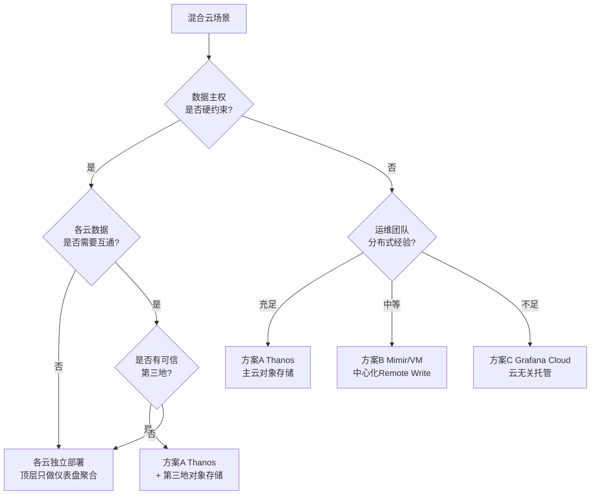
```mermaid
flowchart TD
    Start[混合云场景] --> Q1{数据主权<br/>是否硬约束?}
    Q1 -- 是 --> Q2{各云数据<br/>是否需要互通?}
    Q1 -- 否 --> Q3{运维团队<br/>分布式经验?}
    
    Q2 -- 否 --> Decentralized[各云独立部署<br/>顶层只做仪表盘聚合]
    Q2 -- 是 --> Q4{是否有可信<br/>第三地?}
    Q4 -- 是 --> A[方案A Thanos<br/>+ 第三地对象存储]
    Q4 -- 否 --> Decentralized
    
    Q3 -- 充足 --> A2[方案A Thanos<br/>主云对象存储]
    Q3 -- 中等 --> B[方案B Mimir/VM<br/>中心化Remote Write]
    Q3 -- 不足 --> C[方案C Grafana Cloud<br/>云无关托管]
```

**迁移演进路径**。对处于演进过程中的企业，混合云监控架构往往不是一次性建成的——常见的演进路径是：

1. **起点**：各云独立的 Prometheus（无统一视图）；
2. **第一阶段**：在 Grafana 层做数据源聚合（多个 Prometheus 作为独立数据源，仪表盘层切换）；
3. **第二阶段**：引入统一对象存储 + Thanos Querier，实现跨云查询能力；
4. **第三阶段**：根据团队运维能力，决定是继续深化自建（向 Mimir/VM 集群演进）还是转向 Grafana Cloud Metrics 等云无关托管。

每一阶段的演进都涉及配置改造与历史数据迁移，应在场景成熟后再启动而非一步到位。

## 7.7 自建与托管路径的 TCO、运维复杂度、SLA 与扩展性对比

在 7.2–7.6 节场景化推荐的基础上，本节沿四个核心评估维度对自建与托管路径做系统化横向对比，提炼出"规模—团队能力—云生态绑定度"三轴决策矩阵。

**TCO 维度的四类成本拆解**：

| 成本类别 | 自建路径 | 托管路径 |
|---------|---------|---------|
| **硬件/云资源** | 服务器/虚机/对象存储/网络带宽——CapEx 主导 | 厂商账单——OpEx 主导 |
| **人力运维** | SRE 投入（部署、调优、升级、容量、故障）——通常 2–10 人月/年起步，规模大时显著上升 | 仅业务侧使用 + 少量配置维护——通常 0.5–2 人月/年 |
| **数据出云与存储** | 跨可用区/跨地域/跨云带宽 + 长期对象存储 | 厂商账单包含（部分按摄取/存储分别计费） |
| **隐性成本** | 故障损失（OOM/replay 缓慢期间监控失声）+ 升级迁移成本 | 厂商锁定迁移成本 + 厂商故障风险（虽有 SLA 赔付但通常远低于业务损失） |

**典型规模下的成本曲线交叉点**。基于本次抓取资料的有限数据，可以做趋势性归纳（绝对数字因业务、地域、议价能力差异巨大，不在此处虚构）：

- **小型规模**（百万级以下活跃序列）：托管路径 TCO 通常显著低于自建——免费额度可覆盖大部分需求，自建即便硬件成本不高，0.5–1 人月的 SRE 投入按市场价已经超过托管账单；
- **中型规模**（百万–千万级）：交叉点附近——自建硬件与人力成本上升，托管账单也上升，需要具体测算；如团队已有自建 K8s 与 Prometheus 经验，自建可能略优；如团队薄弱，托管 ROI 仍占优；
- **大型规模**（千万级以上）：自建 TCO 通常更优——托管按摄取量计费在大规模下账单可能数倍于自建硬件成本，但前提是团队已有充足的分布式系统运维能力；
- **超大型规模**（10 亿级活跃序列、Mimir 极限场景）：自建是少数可行选择——但需要相应规模的资源投入（参考第 2.6 节 Mimir 极限基准 7000 CPU + 30 TiB RAM）。

**运维复杂度对比**：

| 工作项 | 自建 Prometheus | 自建 Thanos | 自建 Mimir | 自建 VM | 托管 Prometheus |
|-------|----------------|------------|-----------|---------|----------------|
| 组件部署 | 单组件 | 多组件（4–6 个）| 多组件（7–10 个）| 单二进制或集群 | 零部署 |
| 参数调优 | 中等（TSDB 参数）| 较高（每组件参数+对象存储）| 高（多组件协同+多租户）| 中等 | 厂商承担 |
| 版本升级 | 中等（注意 TSDB 兼容性）| 较高（多组件版本协同）| 高（多组件协同+测试集群）| 中-低 | 厂商承担 |
| 容量规划 | 单机指标即可 | 对象存储+Querier+Compactor | Distributor/Ingester/Querier 各自规划 | 单/集群规划 | 厂商承担（账单可见即可）|
| 故障处置 | 单进程 | 跨组件链路定位 | 跨组件链路定位 | 单/集群定位 | 厂商承担（用户配合提供 trace_id）|

**SLA 与可用性对比**。自建路径的可用性取决于团队的工程能力——理论上通过多副本+Thanos 副本 dedup+Alertmanager 集群可以达到 99.9% 以上，但实际可用性受运维水平、变更纪律、故障恢复能力影响较大；托管路径的可用性由厂商 SLA 承诺（典型 99.9%–99.99%）+ 赔付条款保障——但需要明确：**SLA 赔付通常远低于业务损失**，赔付条款主要是"部分服务时长返还"而非业务损失补偿。

各家托管方案具体的 SLA 等级与赔付细节本次抓取资料中未直接披露——读者在签订托管合同前应直接以厂商最新的 SLA 文档为准。

**扩展性对比**：

| 维度 | 自建路径 | 托管路径 |
|------|---------|---------|
| 承载上限 | 取决于硬件投入与架构选择，理论无上限 | Mimir 底座可达 10 亿活跃序列（Grafana Cloud 基准）、TMP 单实例 450 万 Series 但可联系扩展 |
| 横向扩展边际成本 | 主要是硬件成本，相对线性 | 按摄取量阶梯计费，部分厂商有规模折扣 |
| 多租户能力 | Mimir/VM 原生提供 | 各厂商均原生提供 |
| 未来演进灵活性 | 高（可深度定制、可接入第三方工具）| 低（受厂商产品边界约束）|

**三轴决策矩阵**。综合四个维度，可以提炼出"规模—团队能力—云生态绑定度"三轴决策矩阵：

| 规模 | 团队能力 | 云生态绑定度 | 推荐路径 |
|------|---------|-------------|---------|
| 小型 | 强 | 低 | 自建轻量（单机 Prom + 4 章治理） |
| 小型 | 强 | 高 | 所在云托管（享免费额度） |
| 小型 | 弱 | 任意 | 所在云托管或 Grafana Cloud 起步层 |
| 中型 | 强 | 低 | 自建 VictoriaMetrics 或 Thanos |
| 中型 | 强 | 高 | 所在云托管 + 适度源头治理 |
| 中型 | 弱 | 任意 | 所在云托管 + Grafana Cloud 备选 |
| 大型 | 强 | 低 | 自建 Mimir 或 Thanos + 分层混合 |
| 大型 | 强 | 高 | 所在云托管 + 部分自建（核心业务）|
| 大型 | 中 | 任意 | Grafana Cloud Metrics 或所在云托管旗舰版 |
| 超大型 | 强 | 低 | 自建 Mimir |
| 超大型 | 中-弱 | 任意 | Grafana Cloud Metrics 商务化部署 |
| 多云/混合云 | 强 | 多 | 7.6 节方案 A 或 B |
| 多云/混合云 | 中-弱 | 多 | 7.6 节方案 C（Grafana Cloud）|

需要再次强调：**这一矩阵是指导性的而非绝对的**。真实选型还要结合企业现有技术栈、合规约束、商务谈判结果、人才储备等多重因素，矩阵的价值是提供一个起点，而非终点。

## 7.8 场景化最佳实践 Checklist 与决策路径总结

把 7.2–7.7 节的所有方案推荐与维度对比凝练为可直接落地的最佳实践 checklist，按"诊断—源头治理—架构选型—查询告警—成本治理—持续审计"六个阶段组织。

**阶段一：诊断（回溯第 3 章）**

- [ ] 部署 Prometheus 自监控仪表盘（5 张核心面板：head_series 总量、head_series_created 速率、churn ratio、按 Job 切片的 series_added Top-N、按 Job 切片的 samples_scraped Top-N）；
- [ ] 设置流失率告警（绝对量 + 相对比值 + 同比环比三重组合）；
- [ ] 建立标准化诊断 SOP（6 步：总量评估 → Job 归因 → 指标归因 → 标签归因 → 历史审计 → 使用价值评估）；
- [ ] 月度执行一次 mimirtool analyze prometheus（识别未使用指标）；
- [ ] 季度执行一次 promtool tsdb analyze（审计历史 Block 累积趋势）。

**阶段二：源头治理（回溯第 4 章）**

- [ ] 建立埋点 review 强制 checklist（标签五问：取值是否收敛、是否聚合维度、生命周期是否稳定、是否需要按该维度切片告警、是否可被低基数维度替代）；
- [ ] 强制把 `request_id`/`trace_id`/`session_id` 等请求级身份从 metrics 移至 Logs/Traces；
- [ ] `relabel_configs` 完成 Pod→Workload 维度归一化；
- [ ] `metric_relabel_configs` labeldrop 高流失标签（pod、pod_uid、container_id、id）；
- [ ] `write_relabel_configs` 仅向远程发送聚合后或白名单核心指标；
- [ ] 编写核心 RED 指标的 Recording Rules（按 `level:metric:operation` 命名）；
- [ ] 建立指标白名单（基于 mimirtool analyze 输出 + kube-prometheus 默认精简）；
- [ ] CI 流程中校验新规则的白名单依赖。

**阶段三：架构选型（回溯第 5、6 章）**

- [ ] 评估当前规模、团队能力、云生态绑定度三轴定位；
- [ ] 在矩阵中查找推荐路径；
- [ ] 若选自建：完成 Thanos / Mimir / VictoriaMetrics 选型决策树（5.7 节）；
- [ ] 若选托管：完成各家方案六维度对比（6.7 节），重点关注计费口径对当前流失水位的成本敏感度（6.8 节）；
- [ ] 评估是否需要"分层混合"（核心业务自建 + 边缘业务托管 / 本地短保留 + 远程长保留托管）；
- [ ] 多云场景下选择 7.6 节方案 A/B/C 之一。

**阶段四：查询告警（回溯第 5 章）**

- [ ] 部署 Query Frontend（自建场景）或确认托管方案已含等价能力；
- [ ] 配置查询拆分（split_queries_by_interval=24h）+ 多级缓存（Memcached/Redis）；
- [ ] 启用降采样多级保留（raw/5m/1h）以应对长保留窗口乘积放大；
- [ ] 全部 Critical 告警基于 Recording Rule 评估；
- [ ] Alerting Rule 全部含合理 `for` 时长（典型 2–5 分钟）；
- [ ] 关键存活性告警使用 `absent_over_time`（按 workload 维度而非 pod 维度）；
- [ ] Alertmanager 配置 group_by + inhibit_rules + 计划维护静默 SOP；
- [ ] HA 部署下配置副本 dedup（通过 replica 外部标签）；
- [ ] PromQL 编写规范化（精确匹配优于正则、显式 by 聚合、合理 rate 窗口、慎用高基数 group by）。

**阶段五：成本治理（回溯第 6.8 节）**

- [ ] 评估当前计费口径与流失率水位的成本敏感度；
- [ ] 按写入量计费场景：优先做 Pod→Workload 归一化与 labeldrop；
- [ ] 按上报量/摄取率计费场景：优先延长 scrape_interval 与 target 端裁剪；
- [ ] 评估是否切换计费模型（如阿里云"按写入量 vs 按上报量"二选一切换）；
- [ ] 充分利用免费额度（基础指标免费、套餐包折扣、分账号免费配额共享）；
- [ ] 月度账单复盘——识别异常账单波动并回溯到源头流失事件；
- [ ] 大规模部署直接与厂商商务团队谈判量级化定价。

**阶段六：持续审计**

- [ ] 月度审计未使用指标清单并 drop（mimirtool analyze）；
- [ ] 月度审计告警噪音水位（夜间告警量、误告警率、告警-应答比）并迭代规则；
- [ ] 季度审计历史 Block 累积趋势（promtool tsdb analyze）并评估保留窗口策略；
- [ ] 半年评估架构是否需要演进（规模翻倍、新场景出现、云生态变化）；
- [ ] 年度评估 TCO 与 SLA 实测达成情况，与厂商重新议价或调整方案。

**端到端决策树**：

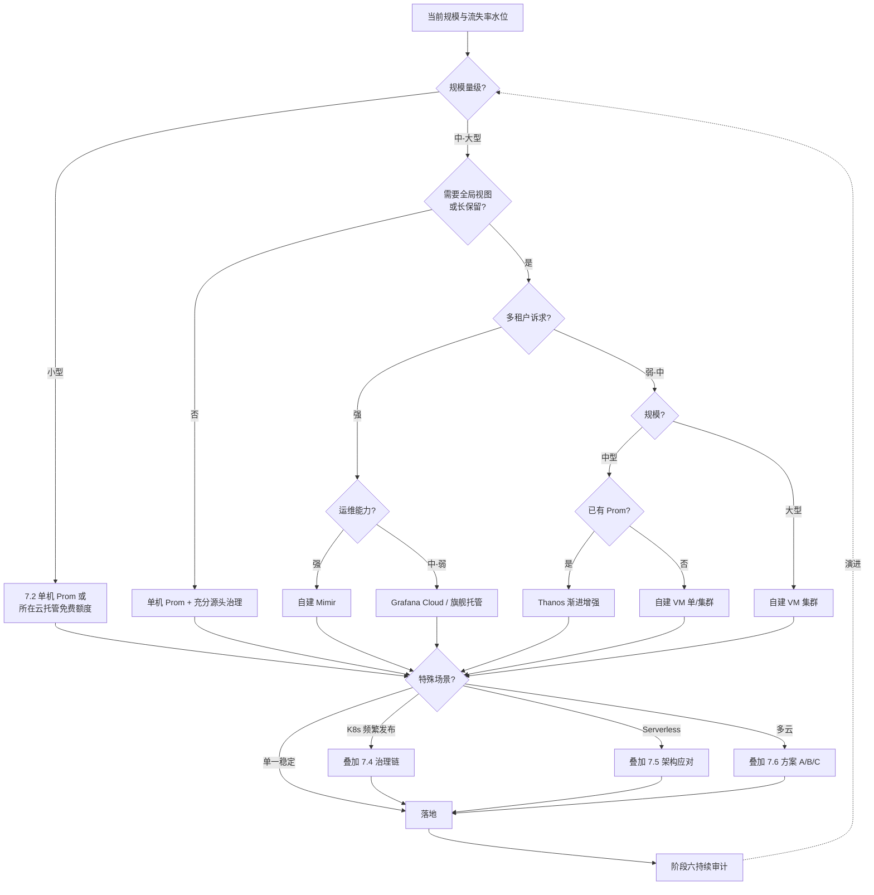
```mermaid
flowchart TD
    Start[当前规模与流失率水位] --> Q1{规模量级?}
    Q1 -- 小型 --> S1[7.2 单机 Prom 或<br/>所在云托管免费额度]
    Q1 -- 中-大型 --> Q2{需要全局视图<br/>或长保留?}
    
    Q2 -- 是 --> Q3{多租户诉求?}
    Q2 -- 否 --> S6[单机 Prom + 充分源头治理]
    
    Q3 -- 强 --> Q4{运维能力?}
    Q3 -- 弱-中 --> Q5{规模?}
    
    Q4 -- 强 --> Mimir自建[自建 Mimir]
    Q4 -- 中-弱 --> Mimir托管[Grafana Cloud / 旗舰托管]
    
    Q5 -- 中型 --> Q6{已有 Prom?}
    Q5 -- 大型 --> VM大[自建 VM 集群]
    
    Q6 -- 是 --> Thanos[Thanos 渐进增强]
    Q6 -- 否 --> VM中[自建 VM 单/集群]
    
    S1 --> Special{特殊场景?}
    S6 --> Special
    Mimir自建 --> Special
    Mimir托管 --> Special
    Thanos --> Special
    VM中 --> Special
    VM大 --> Special
    
    Special -- K8s 频繁发布 --> AddS3[叠加 7.4 治理链]
    Special -- Serverless --> AddS4[叠加 7.5 架构应对]
    Special -- 多云 --> AddS5[叠加 7.6 方案 A/B/C]
    Special -- 单一稳定 --> Done[落地]
    
    AddS3 --> Done
    AddS4 --> Done
    AddS5 --> Done
    Done --> Iter[阶段六持续审计]
    Iter -.演进.-> Q1
```

**贯穿性的三条原则**。综合本章所有讨论，可以提炼出贯穿任何场景、任何方案的三条原则：

**原则一：源头治理是任何路径下 ROI 最高的起点**。无论自建还是托管、无论小型还是超大型、无论 K8s 还是 Serverless，第 4 章源头治理的工程动作都应作为第一步。这一原则的根本理由是：源头治理同时改善性能（减小 TSDB 索引压力）、改善稳定性（降低 OOM/replay 风险）、改善成本（在所有按摄取计费的托管方案下直接减少账单）、改善查询体验（减少候选集扫描）——它是少数能在所有四个评估维度上同时获益的治理动作。

**原则二：自建与托管不是二选一而是分层混合**。本章的所有场景化推荐都暗含这一原则——核心业务自建+边缘业务托管、生产环境自建+测试环境托管、本地短保留+远程长保留托管、指标自建+日志/链路托管，都是分层混合的具体形态。在做选型时不应陷入"全自建还是全托管"的二元对立，而应识别业务的不同部分各自最适合的承载方式。

**原则三：信息透明度与持续审计是治理动作能否长效的根本保障**。本章 7.8 阶段六强调的月度/季度/半年/年度审计，不是可选项而是必选项——没有持续审计，再精巧的初始治理方案都会在数月内被业务演进、人员变动、配置漂移所侵蚀。同时，对托管方案的选型应把"信息透明度"作为一个独立维度（参考第 6.7 节）——文档详尽、计费透明、可观测自身能力强的厂商，长期治理的可持续性显著优于黑盒厂商。

至此，从概念（第 1 章）到影响（第 2 章）到诊断（第 3 章）到源头治理（第 4 章）到架构扩展与查询告警（第 5 章）到云厂商对比（第 6 章），再到本章场景化选型与最佳实践，已经构成了一条从机理到落地的完整闭环。下一章将转向更前瞻的视角，探讨 Native Histogram、UTF-8 标签、OpenTelemetry 资源属性融合等社区演进趋势对高流失率治理的潜在影响，以及在 AI/可观测性融合、可观测数据湖、统一指标-日志-链路存储等大趋势下高流失问题的演化方向，为第 9 章的综合决策建议提供未来视角的输入。

# 8 未来趋势与开放性议题

前七章沿着"概念—影响—诊断—源头治理—架构扩展—云厂商对比—场景化选型"这条主线，构建了一套从机理到落地的完整闭环。但所有这些讨论都建立在一个隐含假设之上——**Prometheus 的协议、数据模型、生态边界在治理周期内是相对稳定的**。然而 2024 年以来 Prometheus v3.x 系列的密集发布、OpenTelemetry 与 Prometheus 的深度融合、AI 工作负载对可观测性提出的新诉求、可观测数据湖范式的兴起，都在以不同节奏重塑高流失率议题的底层假设。一些前几章中视为"硬约束"的设计前提（如直方图桶必须以 le 标签独立存储、序列身份必然由完整 label 集合定义、采集必须 pull 模型）正在被新特性悄然松动。

本章把视角从"当下治理"切换到"未来演化"，沿三条主线展开：第一条聚焦 Prometheus 自身在协议与数据模型层面的演进——Native Histogram、Remote-Write 2.0、UTF-8 标签、PromQL 元信息标签等特性如何从底层重塑高基数与高流失率的承载方式（8.1）；第二条聚焦 OpenTelemetry 与 Prometheus 的融合——OTLP 原生摄取、资源属性提升与忽略、Collector sidecar 模式如何重构指标采集的语义边界（8.2）；第三条聚焦更宏观的技术趋势——AI 工作负载的新形态高流失（8.3）、可观测数据湖与三大支柱统一存储（8.4）、以及社区与生态层面尚未解决的开放性挑战（8.5）。

需要特别声明的是：**本章讨论的许多特性仍处于实验或早期采用阶段，跨生态支持进度参差不齐**。每一节都将明确区分"已落地的事实进展"与"仍待观察的不确定性"，避免把对未来的展望误认为可立即落地的工程方案。这一原则与第 1 章 Rubric P-3 强调的"对实验性特性须保留时效与成熟度标注"是一致的。

## 8.1 Prometheus 协议与数据模型演进对高流失率治理的影响

Prometheus 自 v3.0 发布以来的密集迭代，标志着这一项目在保持向后兼容的前提下进入了底层模型重塑期。v2.0 发布于 7 年前（即 v3.0 发布的 7 年前），v3.0 beta 于 2024 年底发布，月初更新到 v3.1.0[^66]；2025 年 5 月 17 日 Prometheus v3.4.0 正式发布[^67]，2025 年 7 月 14 日 v3.5.0 作为长期支持（LTS）版本发布[^68]。这一系列版本在协议层和数据模型层做出的变更，正在从底层改变高流失率议题的约束条件。

### 8.1.1 Native Histogram：从"桶即标签"到"单序列内编码"的范式转换

在第 1 章 1.1 节中已经指出，时间序列的唯一身份由"指标名称 + 完整 label 集合"决定，任一标签维度的取值变化都会催生一条新序列。这一原则在传统 Histogram 类型指标上有一个常被低估的副作用——**直方图的每一个桶（bucket）都通过 `le` 标签的不同取值表达，因而是独立的时间序列**。

传统 Histogram 的存储与基数压力。当前 Prometheus 默认 Histogram 需要预先定义桶分布，默认值为 `(.005, .01, .025, .05, .1, .25, .5, 1, 2.5, 5, 10)`，不同桶的值是累积的，每个桶都是单独指标，而且需要额外增加 `le="+Inf"`、`_count`、`_sum` 三个指标[^69]。这一设计带来的问题是多维的：精度问题（业务需提前定义桶分布，固化后无法根据实际请求值动态增加桶数量，最终结果在某些范围出现较大偏差）、存储问题（不同桶以及 `le="+Inf"`、`_count`、`_sum` 三个额外指标都属于不同时间线，需要单独存储与查询）、不同桶的分布无法直接计算（同一指标不同实例间的聚合需要严格按 le 桶对齐，例如 `histogram_quantile(__quantile__, sum by(le) (rate(__histogram_metric__[5m])))`）[^69]。

回扣到第 2 章的因果链可以发现：**传统 Histogram 在高流失场景下面临"桶维度 × 流失代际"的乘积放大**。一个有 11 个桶的延迟直方图，在每代 Pod 替换时不只是 1 条序列被翻新，而是 11+3=14 条（含 `+Inf`、`_count`、`_sum`）序列同时被翻新——直方图类指标对总序列数与索引膨胀的贡献被乘以了桶数量。在 K8s 频繁滚动场景下，这一放大效应是高流失率治理中最被低估的痛点之一。

Native Histogram 的破局机理。针对以上问题，Prometheus 社区引入了 Native Histogram 方案（以前叫做 high sparse histograms 及高稀疏直方图）[^69]。其核心设计思路是把"桶维度"从外部 label 编码下沉到序列内部的二进制编码：

- **固定桶边界**：在原始 Histogram 中可以自定义任意桶分布，但 Native Histogram 使用了固定桶边界的方案，用户只需关心其解析度（相邻两个桶宽度比）即可计算出采用的是哪种模式；目前支持 12 种固定桶边界分布方案，倍数因子分别为 2、4、16、256 以及 2 的 (1/2) 次方至 2 的 (1/256) 次方[^69]；
- **数据编码革命**：Native Histogram 完全放弃了原始的编码格式，不再使用 `le="+Inf"`、`_count`、`_sum`，而采用固定桶分布的方式——只要知道解析度就可以完全还原出所有编号对应的桶区间，因而可以基于桶编号进行紧凑的数据编码[^69]；
- **客户端友好**：在 golang_client SDK 中对应 `NativeHistogramBucketFactor` 参数，使用时不需要关心底层具体使用的是哪种模式，只需关心相邻两个桶后面一个比前面一个增加多少（如增加 10% 则该值为 1.1），SDK 会按最接近这个比例匹配对应的固定桶分布[^69]。

**这一变革对高流失率治理的根本意义在于：直方图类指标对序列总量的贡献从 O(桶数 × 实例数 × 流失代际) 缩减到 O(实例数 × 流失代际)**——桶维度被彻底从序列身份中剥离。在以延迟分布、响应大小分布为核心 SLI 的服务监控场景下，这相当于把一个 14 倍放大器从因果链上拆除。

成熟度与采用风险。Native Histogram 在 2022 年 11 月作为实验特性引入，第一个支持的 Prometheus server 版本是 v2.40.0；起初需要通过 `--enable-feature=native-histograms` 特性标志启用；从 v3.8.0 开始 Native Histogram 作为稳定特性被支持，但 scrape native histograms 仍需通过 `scrape_native_histograms` 配置项显式激活；在 v3.8 中设置该特性标志的唯一剩余效果是默认把 `scrape_native_histograms` 设为 true，从 v3.9 开始该特性标志成为真正的 no-op，必须显式设置 `scrape_native_histograms`；通过 Remote Write 发送也需要 `send_native_histograms` 远程写入配置启用；从 v4 开始 `scrape_native_histograms` 与 `send_native_histograms` 都将默认为 true[^70]。

v3.5.0 LTS 版本在 Native Histogram 配套上还引入了 `always_scrape_classic_histograms` 全局配置参数，用以控制在存在原生 histograms 时是否仍采集传统的经典直方图指标，帮助用户兼容旧版本监控数据，避免因指标格式变化导致监控缺失风险[^68]——这一过渡期开关本身反映了 Native Histogram 在生产采纳上仍处于"新旧并存"的阶段。

需要明确的采用风险包括：第一，下游生态的兼容性进度参差——Thanos、Mimir、VictoriaMetrics 等远程后端对 Native Histogram 的支持需要逐项验证，部分老版本可能尚未完整接收；第二，跨语言客户端 SDK 的支持成熟度差异——Go 客户端率先稳定，其他语言生态进度不一；第三，可视化与查询体验仍在演进——v3.4.0 在 PromQL 上做了相关改进，包括修正 `histogram_stddev()` 和 `histogram_stdvar()` 函数的计算方法（通过使用算术平均代替之前的计算逻辑）以保证统计函数结果的准确性，并新增 `histogram_fraction` 针对桶直方图的支持[^67]——这些改进表明 Native Histogram 配套的查询函数仍在持续打磨。

### 8.1.2 Remote-Write 2.0：协议层为高流失场景提供的新支撑

第 5.3 节讨论过 Remote Write 在高流失场景下的几类典型数据丢失问题——队列溢出、网络抖动重试期间样本堆积、标签冲突导致数据覆盖等。这些问题在 Remote-Write 1.0 协议层并没有完整的应对机制：协议本身不强制要求接收端反馈"实际写入了多少样本"，发送端只能根据 HTTP 状态码做粗粒度判断，对部分写入成功、部分丢失的场景缺乏可观测性。

Remote-Write 2.0 规范的核心改进。Remote-Write 2.0 规范是 Prometheus 与 Prometheus Remote-Write 兼容发送方向 Prometheus 或兼容接收方发送数据的标准的第二个版本，包含对协议与语义的若干变更：增加了一个新的 Protobuf Message，带来新功能以启用更多用例并实现更广泛的采用，同时带来性能与成本节省；第二版本同时弃用了 1.0 规范中的旧 Protobuf Message，并**为可靠性目的强制要求 X-Prometheus-Remote-Write-*-Written HTTP 响应头**；规范还说明了如何在单一 endpoint 下实现向后兼容的发送方与接收方，使用现有的基本内容协商请求头，更高级的自动内容协商机制可能在未来的次版本中按需引入[^71]。

对应到高流失场景的具体收益：

- **强制 Written 响应头**：让发送端可以在每次远程写入后准确知道接收端实际入库了多少 series record、多少 sample record、多少 metadata record——这正是高流失场景下排查"序列消失"问题最需要的协议层能力。结合第 3 章的诊断 SOP 与第 5.3 节的"在源 Prometheus 执行 `count({__name__=~".+"})` 与远端存储计数对比快速确认丢失范围"思路，Written 响应头把这一原本依赖事后比对的诊断动作前置为协议级的实时反馈；
- **新 Protobuf Message 带来性能与成本节省**：在高流失场景下意味着同等的样本吞吐对应更低的网络带宽与序列化 CPU 开销，缓解第 2.3 节讨论的"序列冷启动需附带完整 label 集合描述"导致的写出端字节比抬升；
- **向后兼容的内容协商**：发送方与接收方可以在同一 endpoint 下并存 1.0 与 2.0 两版协议，使得迁移过程中不需要"全停服切换"，对生产环境友好。

Prometheus v3.0 在远程写入维度做的具体增强是：增加了对元数据、示例、创建时间戳和原生直方图的支持[^66]——这些恰恰是 Remote-Write 2.0 规范引入的核心特性。在第 4.4 节讨论的"本地全保留 + 远程写出过滤"分层范式下，这些新支持意味着 `write_relabel_configs` 之外，元数据与示例（exemplars）这类辅助信息也能完整流转到远程后端，使远程视图的诊断能力接近本地。

成熟度声明。需要明确的是，Remote-Write 2.0 规范在抓取的资料中标注的状态为"Experimental"，版本号为 2.0-rc.4[^71]——这意味着规范本身仍处于发布候选阶段，最终形态可能还有微调。各远程后端（Thanos、Mimir、VictoriaMetrics、各家云厂商托管）对 2.0 协议的支持进度需要逐项验证。在生产环境采纳前，建议在测试环境验证发送端 Prometheus 版本与接收端版本的协议兼容性，并保留回退到 1.0 协议的能力。

### 8.1.3 UTF-8 标签：跨生态兼容性的语义边界扩展

v3.0 之前的 Prometheus 版本要求指标和标签名遵守严格的字符要求集合；从 Prometheus 3.0 开始，所有 UTF-8 字符串都是合法的名称，但生态中其他部分要引入带有任意 UTF-8 字符的名称仍需手动调整[^72]。

这一变化对高流失率治理的潜在影响主要在两个层面：

- **与 OpenTelemetry 语义对齐**：OpenTelemetry 的标签命名规范允许使用更广泛的字符集，包括点号 `.` 等在传统 Prometheus 中不合法的字符（典型如 `service.name`、`http.method`）。UTF-8 支持使得 Prometheus 可以原样接收 OTel 风格的标签命名，避免在 OTLP 接入路径上做字符替换转换——这一点对第 8.2 节讨论的 OTel 融合极为关键；
- **多语言与本地化支持**：UTF-8 让非英文字符（中文、日文等）可以直接用于标签值，对国内大型企业的内部系统监控提供了便利。

可能存在使用场景中用户希望强制执行旧字符集的情况，例如为了与不支持 UTF-8 的旧版 Prometheus 或其他抓取器兼容；客户端库方面，由 client_golang 库创建的指标默认接受 UTF-8 名称，之前文档建议覆盖 `model.NameValidationScheme` 以选择默认遗留验证，这个布尔值现已弃用并应始终设置为 `UTF8Validation`，遗留验证强制执行（如有需要）应由各实现自行调用相应验证 API 完成，不再是库的特性；其他客户端库可能尚未支持 UTF-8，可能需要特殊处理或配置[^72]。

对于高流失率治理的实践含义。UTF-8 支持本身**不直接降低流失率**，但它消除了在 OTel→Prometheus 路径上"字符不合规导致采集失败"的隐患——而采集失败本身就是一种间接的"序列消亡"风险。在过渡期，第 4.1 节讨论的标签命名规范仍应坚持"取值收敛、可聚合、生命周期稳定"等核心原则；UTF-8 只是放宽了字符集合，不改变高基数与高流失反模式的判定标准。

### 8.1.4 PromQL 增强：元信息标签与新查询函数

Prometheus v3.4 与 v3.5 在 PromQL 层面引入了多项与高流失率治理间接相关的增强。

**PromQL 中的 duration 算术运算**。v3.4 支持在 PromQL 解析中进行 duration 类型的算术运算，例如可以直接对时间区间做加减乘除运算，极大提升了时序数据查询表达式的灵活性和简洁性[^67]。在编写覆盖多代实例生命周期的复杂查询（如 `rate(...[scrape_interval * 4])` 类参数化表达式）时，这一能力让 PromQL 表达式更具可维护性。

**实验性元信息标签（type-and-unit-labels）**。v3.5 在 PromQL 中引入了实验性质和单位的元数据标签，作为实验特性由 `type-and-unit-labels` 特性标记控制；通过此功能用户可以对指标增加类型和单位的注解，提升数据查询和展示的一致性，有助于多维度指标分析，例如可以区分不同类型的计数器、延迟指标和比率，极大增强了查询的语义表达能力[^68]。在高流失场景下，这一能力的潜在价值是为"基于类型/单位的自动化治理决策"提供元数据基础——例如自动识别"所有 counter 类指标应当走 rate"、"所有 gauge 类指标可以直接 sum"等规则。

**新的时间戳查询函数**。v3.5 新增了 `ts_of_min_over_time`、`ts_of_max_over_time` 和 `ts_of_last_over_time` 等时间戳查询函数，以实验特性 `experimental-promql-functions` 启用；这些新函数让用户能直接查询时间序列中最小值、最大值或最后一次出现时间的具体时间戳，扩展了 PromQL 在复杂时序逻辑分析中的能力[^68]。在高流失场景下，`ts_of_last_over_time` 对识别"某个 workload 下最后一个活跃 Pod 的消亡时刻"等诊断动作有直接价值，可以用于自动化清理与告警抑制。

**TSDB 自监控指标的丰富**。v3.4 在 TSDB 与采集链路上还引入了 `prometheus_tsdb_wal_replay_unknown_refs_total` 等新指标，用于监控 WAL 回放中的未知系列引用，方便运维人员快速发现和定位[^67]。这一指标对第 2.5 节讨论的"重启缓慢"问题提供了协议层的可观测性增强——WAL replay 期间的异常引用会被显式计数，便于定位。

把以上演进与高流失率治理对应起来，形成一份"Prometheus 自身演进对治理因果链的影响图":

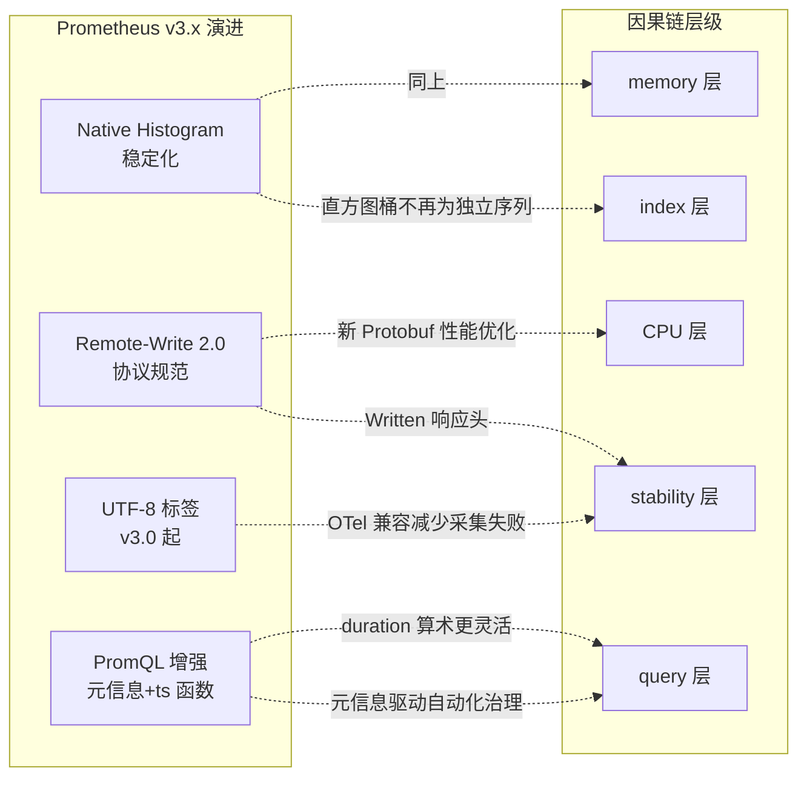
```mermaid
flowchart LR
  subgraph V[Prometheus v3.x 演进]
    NH[Native Histogram<br/>稳定化]
    RW2[Remote-Write 2.0<br/>协议规范]
    UTF8[UTF-8 标签<br/>v3.0 起]
    PQL[PromQL 增强<br/>元信息+ts 函数]
  end
  subgraph C[因果链层级]
    IDX[index 层]
    MEM[memory 层]
    CPU[CPU 层]
    QRY[query 层]
    STA[stability 层]
  end
  NH -.直方图桶不再为独立序列.-> IDX
  NH -.同上.-> MEM
  RW2 -.Written 响应头.-> STA
  RW2 -.新 Protobuf 性能优化.-> CPU
  UTF8 -.OTel 兼容减少采集失败.-> STA
  PQL -.元信息驱动自动化治理.-> QRY
  PQL -.duration 算术更灵活.-> QRY
```

总体上看，v3.x 系列的协议与数据模型演进**没有从根本上消除高流失率问题，但显著缓解了其在直方图、远程写入、跨生态兼容三个维度上的额外放大效应**。在采纳这些新特性时，关键的工程决策是把握"已稳定 vs 仍实验"的边界——Native Histogram 在 v3.8 转为稳定但配置仍需显式开启、Remote-Write 2.0 规范仍处于 RC、PromQL 元信息标签与新时间戳函数仍是实验特性。这些时间表本身也是后续 8.5 节讨论的"开放性挑战"之一。

## 8.2 OpenTelemetry 融合与采集语义重构

如果说 8.1 节讨论的演进发生在 Prometheus 自身的"内部循环"，那么 OpenTelemetry 与 Prometheus 的融合则是发生在"外部边界"的一场更深刻的重塑——它改变的不仅是 Prometheus 的功能集，更是指标采集的语义边界与生态格局。OpenTelemetry 是一个开源可观测性框架，用于从软件应用程序中检测、收集和导出遥测数据，由规范、SDK 和库组成，提供与供应商无关的模型与各种编程语言和框架的库，可与 Jaeger、Grafana、Prometheus、DataDog、NewRelic 等众多供应商一起使用[^73]。

### 8.2.1 OTLP 原生摄取的逐步成熟

Prometheus 在 v3.0 中明确支持 OTLP——OTLP 是一个传输协议，定义了如何序列化和传输跟踪、指标和日志数据，简化了不同工具和服务之间的集成；这是可观测性监控的基础，在 v3.0 版本中 Prometheus 可以直接接收 OpenTelemetry 的数据，从而避免一些数据传输的消耗[^66]。

v3.4 在 OTLP 维度的进一步增强包括三方面：

- **OTLP explicit bucket histograms 转 native histograms 的可选转换**：新增特性标志，允许用户选择是否将 OpenTelemetry 导出的显式桶直方图转化为 Prometheus 的 native histogram，并支持自定义桶配置[^67]。这一能力直接把 OTel 生态中常见的传统桶直方图在接入 Prometheus 时即转换为稀疏编码格式，从源头减小直方图类指标对序列总量的贡献——是 8.1.1 节讨论的 Native Histogram 收益的"前置应用"；
- **OTLP 指标的"原样接收"选项**：新增了接收 OTLP 指标时的名称与属性"原样接收"选项，允许通过配置避免在接收 OTLP 指标时自动转换名称和属性，保障数据语义一致性[^67]。这一开关解决了"OTel 命名规范 vs Prometheus 命名规范"在过渡期的不一致问题；
- **OTLP delta 指标的原生摄取**：增加了对 OTLP delta 类型指标的基础支持，可以直接以增量方式摄取指标，增强数据灵活性和时效性[^67]。这一支持改变了 Prometheus"仅 cumulative"的传统假设——OpenTelemetry 提供从已检测的应用程序中收集和分析指标的能力，并以增量而不是累积的形式表示指标[^73]，delta 摄取让 Prometheus 不再需要在接入侧做繁琐的累积转换。

这些改进极大增强了 Prometheus 作为 OTel 生态成员的适配能力，方便用户无缝集成和切换指标采集方案[^67]。

### 8.2.2 资源属性的精细化映射：v3.5 的 promote 与 ignore

OpenTelemetry 的指标数据模型与 Prometheus 的核心差异之一在于"资源属性"（Resource Attributes）的存在——每条指标除了自身的 attribute 外，还携带描述其来源资源的属性集合（如 `k8s.pod.name`、`service.namespace`、`host.name`）。把这些资源属性以何种方式映射为 Prometheus 标签，直接关系到第 4.2 节讨论的 Pod→Workload 归一化在 OTel 范式下的语义边界。

Prometheus v3.5 针对 OpenTelemetry Protocol（OTLP）新增了 `promote_all_resource_attributes` 和 `ignore_resource_attributes` 两个配置选项；前者允许将所有资源属性提升为标签方便指标维度扩展，后者则支持忽略指定资源属性提高数据采集效率和标签管理灵活性，满足多样化采集需求[^68]。

这一机制对高流失率治理的关键意义在于：**资源属性的提升与忽略策略本身就是源头治理在 OTel 范式下的等价物**。回扣到第 4.4 节梳理的三段式 relabel 机制，OTLP 接入路径下的等价分层是：

| Prometheus 原生路径 | OTLP 接入路径 | 作用 |
|---|---|---|
| `relabel_configs`（target 选择 + 元数据重塑） | OTel Collector relabel processor | 在采集源头做 target 过滤与元数据改写 |
| `metric_relabel_configs`（样本端 label 改写） | `promote_all_resource_attributes` / `ignore_resource_attributes` | 控制资源属性如何提升为 Prometheus 标签 |
| `write_relabel_configs`（远程写出过滤） | OTel Collector exporter relabel | 在发送侧做最后过滤 |

`ignore_resource_attributes` 的工程价值尤为突出——它直接对应"哪些 OTel 资源属性不应进入 Prometheus 标签"的治理决策。在 K8s 场景下，`k8s.pod.name`、`k8s.pod.uid`、`k8s.container.id` 这些天然高流失的资源属性可以通过该配置直接忽略，避免它们进入 Prometheus 索引层。这与第 4.2 节中 `metric_relabel_configs` 的 `labeldrop` 在效果上等价，但作用阶段更早——在 OTLP 接入解析阶段即过滤，连样本级处理都不需要进行。

`promote_all_resource_attributes` 则是另一种治理意图——**显式选择把所有资源属性都提升为标签**。这一开关需要谨慎使用：它把 OTel 资源属性的全量信息暴露到 Prometheus 索引层，潜在的标签数量大幅增加；在高流失场景下，若某些资源属性本身就是高动态值（如 `service.instance.id`），全量提升会显著放大流失冲击。建议的工程范式是：默认采用"白名单提升"模式（仅提升明确需要的资源属性，对应 `promote_resource_attributes` 选项），仅在确定所有资源属性都是稳定维度时才使用 `promote_all_resource_attributes`。

### 8.2.3 OTel Collector 作为统一遥测管道的角色

OpenTelemetry Collector 接收处理、过滤和导出各种格式的遥测数据[^73]——这一定位让 Collector 成为可以独立运行的"统一遥测管道"，在采集源与最终后端之间提供处理层。

在第 4.3 节讨论的阿里云函数计算 LLM 推理监控集成方案中，已经体现了这一架构模式：通过在函数实例中以 sidecar 模式部署 OpenTelemetry Collector，自动采集并上报 LLM 推理引擎暴露的 Prometheus 指标，无需修改业务代码即可将指标无缝对接到阿里云 ARMS 托管 Prometheus 服务。这一模式的关键工程价值在于：

- **采集源头即治理**：第 4 章源头治理的所有工程动作（relabel、过滤、聚合）都可以在 Collector 层实现，把治理动作前置到比 Prometheus scrape 更早的阶段；
- **协议转换与多目标导出**：Collector 可以同时把同一份指标数据导出到 Prometheus、Loki、Tempo、第三方可观测平台等多个后端，用户在做后端选型变更时不需要改业务代码；
- **与业务代码解耦**：sidecar 模式让指标采集与业务进程隔离，在 Serverless 等极端高动态场景下，Collector 可以承担"实例生命周期与采集生命周期的解耦"角色——业务实例消亡时 Collector 仍可完成最后的样本上报。

OpenTelemetry 提供与供应商无关的检测应用程序模型，提供可检测流行框架和库的库，简化了向基于各种编程语言和框架（例如 Spring 和 Express.js）构建的应用程序添加遥测的过程；自动检测允许软件开发人员初始化指标、日志和跟踪，而无需篡改应用程序源代码[^73]——这一"零侵入式"特性让 OTel 在新业务的可观测性接入上具有显著优势。

### 8.2.4 OTel 与 Prometheus 在标签命名上的协同与冲突

OTel 的语义约定（Semantic Conventions）与 Prometheus 标签命名规范在高流失场景下存在协同与冲突两面：

**协同面**：OTel 的 Semantic Conventions 倡导的命名（如 `service.name`、`service.namespace`、`http.method`、`http.status_code`）天然属于第 4.1 节讨论的"维度属性"——它们的取值空间是收敛的、用于聚合分析的、生命周期稳定的。在 OTel 范式下采集的指标，遵守语义约定即等价于自动遵守了 Prometheus 标签设计的最佳实践。

**冲突面**：OTel 的某些语义约定字段在 Prometheus 视角下是"反模式"。最典型的是 `service.instance.id`——OTel 规范鼓励这一字段的存在以唯一标识服务实例，但在 Prometheus 中它对应着第 4.1 节列出的高流失反模式之一。这一冲突的根源在于 OTel 与 Prometheus 在"实例身份是否需要进入指标"问题上的设计取向差异：OTel 倾向于保留完整身份信息以支持跨支柱关联（指标→trace→log），Prometheus 倾向于把实例身份从指标中剥离以控制基数与流失率。

在过渡期的工程治理建议是：

- 对 OTLP 接入的指标默认启用 `ignore_resource_attributes` 列表，把 `service.instance.id`、`k8s.pod.uid`、`k8s.container.id` 等高流失字段在接入阶段即过滤；
- 实例级追溯能力通过 trace 与 log 在指标查询触发时按需关联，而非在指标自身中冗余存储——这一原则与第 4.3 节"指标与日志的职责划分"完全一致，在 OTel 范式下则有更原生的关联能力（exemplars、TraceID 跨支柱跳转）；
- 团队埋点 review 时把"OTel 资源属性如何映射到 Prometheus 标签"作为强制 checklist 的一部分，避免 OTel SDK 默认配置直接把所有资源属性塞进 Prometheus 标签。

UTF-8 标签支持（8.1.3 节）在这一融合中扮演的角色是**消除字符集不兼容这一过渡期摩擦**。但需要注意的是：其他客户端库可能尚未支持 UTF-8，可能需要特殊处理或配置[^72]——这意味着在多语言、多 SDK 共存的企业环境中，UTF-8 标签的全面采纳仍需要逐项验证客户端库的支持情况，过渡期的兼容性策略应是"在能用的地方用、不能用的地方仍走传统命名"，而非"一刀切切换"。

OTel 与 Prometheus 融合的整体格局可以概括为：**协议层趋同、语义层协同、生态层互补**。这一融合对高流失率议题的根本影响是把"采集治理"的工程动作前置到了 Collector 层和 OTLP 接入层，使得第 4 章源头治理的能力边界从单一 Prometheus 实例扩展到整个遥测管道。

## 8.3 AI 与可观测性融合下的高流失率新形态

如果说 8.1 与 8.2 节讨论的是 Prometheus 自身与 OTel 生态的演进——这些演进在协议与数据模型层为高流失率治理提供新支撑，那么 AI 与可观测性的融合则是从需求侧重塑了高流失率的形态。这一融合是双向的：一方面，AI 类工作负载（LLM 推理、智能驾驶、推荐系统等）以新的指标维度组合带来高流失率的新形态；另一方面，AI 辅助的可观测性能力正在重塑高流失治理的工具形态。

### 8.3.1 AI 工作负载的指标特征：新型高基数+高流失叠加

LLM 推理服务、智能驾驶、推荐系统等 AI 类工作负载在指标维度上呈现出一些传统业务监控中不常见的高动态字段：

- **模型版本变体**：模型频繁迭代发布、A/B 测试、灰度切流，每一个版本变体都可能成为标签值；
- **prompt 类别 / 输入类型**：按 prompt 模板、输入大小、任务类型分类的标签维度；
- **token 类型 / 长度桶**：按输入 token 长度、输出 token 长度、token 类型分桶的延迟与吞吐分布；
- **GPU 设备 ID / 推理批次**：物理硬件维度的标签，在多卡、多 batch 场景下基数显著；
- **车辆 ID / 路段 ID / 传感器 ID**：智能驾驶场景下的物理实体标签，每辆车每分钟产生新序列；
- **用户分群 / 实验组**：推荐系统中的 A/B 实验维度。

这些字段一旦未经审慎判别即被作为指标标签，会呈现"高基数 × 高流失"的双重叠加——既有取值空间宽泛的高基数特征（如 prompt 类别可能有数千种），又有时间维度上的频繁更替（模型版本周更新、推理批次秒级变化）。第 1 章 1.4 节中已经把"自动驾驶"列为 Serverless 与极端高动态的典型代表，第 6.3 节也观察到腾讯云 TMP 把"自动驾驶专区"作为独立定价分组——这些都从产品侧反映了 AI/极端高动态行业场景的特殊性。

阿里云函数计算 LLM 推理监控集成方案（参考第 4.3 节）中，**通过在函数实例中以 sidecar 模式部署 OpenTelemetry Collector，自动采集并上报 LLM 推理引擎暴露的 Prometheus 指标（如 token 吞吐量、请求延迟等），无需修改业务代码即可将指标无缝对接到阿里云 ARMS 托管 Prometheus 服务**。这一方案中暴露给 Prometheus 的是聚合型指标（吞吐量、延迟分布），而不是单次推理的 prompt 内容、用户 ID、请求 ID——后者天然属于日志与链路系统的范畴。

火山引擎可观测团队在其托管 Prometheus 服务（VMP）与火山方舟大模型服务平台、智能驾驶数据服务的深度合作中（参考第 4.7 节）积累了大模型与智能驾驶领域高基数问题的治理经验，并在公开材料中将此作为产品差异化能力的核心展示。这两个云厂商的实践共同指向一个工程结论：**AI 工作负载的源头治理仍以第 4 章的核心原则为基础——把"个体身份"信息从指标剥离，让指标只承载聚合型度量；但治理的具体规范需要针对 AI 场景做扩展**。

针对 AI 工作负载的源头治理建议（在第 4 章基础上的扩展）：

- **模型版本作为标签可保留但需归一化**：模型版本是合理的聚合维度（按模型版本对比延迟、吞吐量是常见诉求），但应使用稳定的"主版本号"（如 `v3`、`v3.4`）而非每次发布的完整 tag（如 `v3.4.0-build-2024-12-29-abc123`），后者类似 Pod 名后缀，是高流失反模式；
- **token 长度归一化为桶**：直接把 token 长度作为标签会导致基数爆炸，应在埋点侧将其归一化为有限的桶区间（如 `0-128`、`128-512`、`512-2048`、`2048+`）。Native Histogram 在这一场景下尤其适用，可以直接以稀疏直方图形式记录长度分布而无需手动分桶；
- **GPU 设备 ID 与节点 ID 的取舍**：在跨节点扩展的推理集群中，`gpu_id` 与 `node_id` 都有合理的诊断价值，但应避免同时作为标签——通常保留 `node_id`，让单节点内的 GPU 维度通过 `device_index`（取值 0-N 的小基数维度）表达；
- **用户分群作为标签可保留**：A/B 实验组、用户分群（typically 数十个）属于稳定的低基数维度，可以保留作为聚合分析的维度。

需要强调的是，AI 工作负载的源头治理边界与 Serverless 高度重叠——某些 AI 推理服务本身就部署在 Serverless 平台上，第 7.5 节讨论的"承认源头流失不可消除、用架构能力消化"原则同样适用：本地极短保留 + 远程长保留降采样、Remote Write 队列参数显著调高、Query Frontend 查询拆分与缓存、Recording Rules 预聚合 token 吞吐与延迟分布。

### 8.3.2 AI 辅助可观测性：高基数治理工具形态的重塑

第 6.6 节中已经观察到 Grafana Cloud Metrics 提供的 Adaptive Metrics 能力——通过预构建仪表盘管理高基数数据、通过 Adaptive Metrics 识别并消除未使用的时间序列数据。这一能力本质上是把第 3 章 mimirtool analyze 的诊断思路产品化、自动化——把"未使用指标审计 → 优先清理"的诊断闭环从一个需要 SRE 手动执行的 SOP 变成了产品默认能力。

在更广义的"AI 辅助可观测性"方向上，主流厂商正在演进的能力包括：

- **自然语言查询**：Grafana Cloud 的 Grafana Assistant 通过自然语言探索数据（参考第 6.6 节），用户不再需要手写 PromQL，可以直接用"过去一小时哪个服务错误率最高"这类自然语言提问；
- **queryless 探索体验**：Grafana Metrics Drilldown 通过 Prometheus 与 OpenTelemetry 兼容指标的"无查询语句"探索体验，让 SRE 在不写 PromQL 的情况下完成下钻与归因（参考第 6.6 节）；
- **跨支柱自动关联**：Grafana Cloud 把指标与日志、链路、Profile 关联以更快定位问题（参考第 6.6 节）——这把第 4.3 节"指标→链路→日志"的人工关联流程产品化为一键跳转。

这一演进对高流失率治理的潜在影响主要体现在：

- **诊断 SOP 的自动化**：第 3 章 SOP 的六步流程（总量评估 → Job 归因 → 指标归因 → 标签归因 → 历史审计 → 使用价值评估）原本需要 SRE 手动执行，AI 辅助下部分步骤可以由产品默认能力承担——尤其是步骤 6 的使用价值评估（Adaptive Metrics 类）；
- **降低治理门槛**：自然语言查询与 queryless 探索让"非 SRE 角色"（开发、QA、产品）也能参与到指标治理中——例如开发同学通过自然语言提问"我新加的指标是不是被告警引用了？"可以避免引入未被使用但消耗资源的指标；
- **个性化推荐**：基于历史查询模式与告警规则使用情况，AI 可以推荐"哪些原始指标应该被预聚合为 Recording Rule"、"哪些标签可以被安全 drop"——把第 4 章源头治理的工程决策辅助化。

需要明确的开放性问题：

- **AI 辅助治理能否替代专业 SRE 的工程判断？**——目前的产品形态主要是辅助性的"识别 + 推荐"，最终的删除/保留决策仍需要 SRE 介入。在涉及"看似无用但故障时极有价值"的诊断类指标时，AI 推荐可能存在误判风险；
- **基于 AI 的异常检测、容量预测、自动 relabel 推荐的可行性边界**：这些能力在小规模、稳定负载下可能表现良好，但在大规模、高流失、负载模式复杂多变的真实生产中，模型的鲁棒性与可解释性仍需大量验证；
- **计费与隐私边界**：AI 辅助能力的训练数据来源、用户数据是否被用于跨租户模型训练等问题，在企业级合规场景下是关键决策点，目前各厂商在这方面的透明度参差。

第 6.6 节观察到 Grafana Cloud Metrics 是本次抓取中"唯一明确以高基数与高流失场景为产品定位的方案"——它的差异化优势恰好印证了 AI 辅助治理在主流可观测厂商产品矩阵中的战略地位。但需要保留厂商立场标注：作为厂商主推的差异化能力，其实际效果在不同规模、不同行业的真实生产中仍需用户独立验证。

### 8.3.3 AI 工作负载下源头治理与架构扩展的新边界

把 AI 工作负载的指标特征与 AI 辅助可观测性能力放在一起，可以勾勒出"AI×可观测性"双向融合下高流失率治理的新坐标：

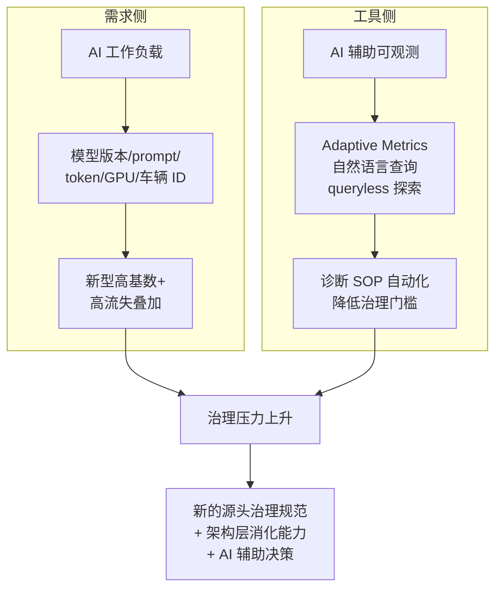
```mermaid
flowchart TB
  subgraph 需求侧
    A1[AI 工作负载]
    A2[模型版本/prompt/<br/>token/GPU/车辆 ID]
    A3[新型高基数+<br/>高流失叠加]
    A1 --> A2 --> A3
  end
  subgraph 工具侧
    B1[AI 辅助可观测]
    B2[Adaptive Metrics<br/>自然语言查询<br/>queryless 探索]
    B3[诊断 SOP 自动化<br/>降低治理门槛]
    B1 --> B2 --> B3
  end
  A3 --> 治理[治理压力上升]
  B3 --> 治理
  治理 --> 新边界[新的源头治理规范<br/>+ 架构层消化能力<br/>+ AI 辅助决策]
```

工程实践层面的关键判断是：**AI 工作负载并不要求一套全新的治理方法论，但要求第 4 章源头治理规范的扩展（针对 AI 特有的标签维度）和第 5 章架构能力的强化（应对极端高动态）**。在治理工具上，AI 辅助能力是有价值的"加速器"，但不应被视为"替代专业判断的银弹"——尤其在高流失负载已经造成生产风险时，仍需要 SRE 基于第 3 章 SOP 与 Rubric P-2 强调的因果链推演做精准定位与决策。

## 8.4 可观测数据湖与统一指标-日志-链路存储趋势

更宏观的趋势是可观测性领域三大支柱（Metrics、Logs、Traces）的"统一存储底座"演进。这一演进虽然在本次抓取的资料中并非主线话题，但它对高流失率议题的潜在影响值得前瞻性讨论。

### 8.4.1 三大支柱的边界正在被技术底座层的统一所重塑

第 4.3 节中已经明确了 Metrics、Logging、Tracing 的职责边界——Metrics 是系统状态的"仪表盘"，回答"发生了什么"，用于宏观状态监控、告警触发；Logging 是系统行为的"黑匣子"，回答"为什么发生"；Tracing 是请求流转的"路线图"，回答"在哪里发生"。这一职责边界在概念层是清晰的，但在技术底座层一直存在两种不同的演进路径：

- **专门化路径**：每个支柱使用专门优化的存储引擎——Metrics 用 TSDB（Prometheus、Thanos、Mimir、VictoriaMetrics）、Logs 用 LSM 树或倒排索引（Loki、Elasticsearch、ClickHouse）、Traces 用专门的链路存储（Tempo、Jaeger）。这是当前主流的工程范式；
- **统一化路径**：用一个通用底座承载三类数据，通过查询层的差异化能力服务不同诉求。这一路径有几种代表形态——基于列式存储（如 ClickHouse、Parquet on Iceberg）的宽表方案、基于云对象存储 + 多引擎查询的可观测数据湖方案、各厂商一体化方案（如 SigNoz、Uptrace 类一体化平台）。

Grafana Cloud 的 Mimir+Loki+Tempo+Pyroscope 同源关联（参考第 6.6 节）代表了一种"专门化引擎 + 统一关联层"的折衷形态——底层各自专门优化，上层通过 Grafana 提供同源关联体验（指标→日志→链路→Profile 一键跳转）。

### 8.4.2 数据湖范式对高流失率议题的潜在重塑

如果可观测数据湖范式（基于 Iceberg/Parquet 的列式存储 + 对象存储底座 + 多引擎查询）成熟，对高流失率议题可能产生几方面重塑：

- **"活跃序列"概念的演化**：在传统 TSDB 中，活跃序列对应着内存中保持索引的瞬时序列集合，是内存压力的直接来源（参考第 2.2 节）。在数据湖范式下，"存算分离"使得查询时按需扫描对象存储中的数据，"活跃序列"的概念可能需要重新定义——它不再对应固定的内存驻留成本，而对应"查询时被加载到计算引擎的数据范围"；
- **保留窗口乘积放大效应的缓解**：第 2.1 节末尾揭示的"保留窗口与流失率的乘积放大"在传统 TSDB 中是核心痛点；在数据湖范式下，长保留窗口的存储成本主要落在对象存储（每 GB 单位成本极低），而查询成本仅在实际查询时按扫描量计费——长保留不再线性放大常态运维成本；
- **跨支柱关联查询的原生支持**：在统一底座下，"指标告警 → 自动 drill-down 到对应日志与 trace"可以通过同一查询引擎完成，无需在多套系统间跳转。这从根本上降低用户对"把请求级身份塞进指标标签"的诱因——既然链路系统天然能根据时间范围与标签条件给出对应的 TraceID 列表，就没必要把 TraceID 冗余进指标。

### 8.4.3 协议层与引擎层的分层格局

OpenTelemetry 作为统一采集协议、Prometheus 作为查询语言事实标准的"协议层 + 引擎层"分层格局正在显现。这一格局在本次抓取的资料中有间接印证：Grafana Cloud Metrics 强调"100% Prometheus 兼容（remote-write、PromQL、alerting、query builder）"（参考第 6.6 节）——即便底座是 Mimir，对外呈现的仍是 Prometheus 接口；OTel 提供与供应商无关的模型，提供各种编程语言和框架的库，以及在不更改遥测处理器的情况下将遥测数据导出到不同供应商后端的可能性[^73]。

这一分层格局对用户的价值是**降低厂商锁定风险与底座迁移成本**——业务侧的埋点用 OTel 标准（不绑定具体后端），查询侧用 PromQL（不绑定具体存储引擎），中间的存储引擎可以根据规模、成本、运维能力灵活选择（开源 Prometheus、Thanos、Mimir、VictoriaMetrics、各家云厂商托管、未来可能的数据湖方案）。

### 8.4.4 现阶段成熟度的差异声明

需要明确的是，可观测数据湖与统一存储底座方向的成熟度差异显著：

- **专门化路径的统一关联层**（如 Grafana Cloud 的多支柱关联）已经是生产可用的产品形态；
- **基于 ClickHouse 等通用宽表存储的一体化方案**（如 SigNoz、Uptrace）有一定生产案例，但在大规模高基数场景下的承载能力与传统专门化引擎相比仍需独立验证；
- **基于 Iceberg/Parquet 的可观测数据湖路径**仍处于早期探索阶段，自建落地的工程复杂度、查询延迟、生态工具链等都尚未成熟。

本次抓取的资料中并未直接讨论 Iceberg、Parquet、ClickHouse 等具体技术方案在可观测性场景下的应用细节——上述讨论更多基于行业共识与趋势观察，具体方案选型仍需读者结合最新文献与生产案例做独立评估。

可观测数据湖范式的成熟可能需要数年时间，在此期间企业用户的稳健选择仍是**以专门化引擎为主、以统一关联层补足跨支柱体验**——即第 6 章与第 7 章已经讨论过的"分层混合 + Grafana 类统一前端"模式。把数据湖方向作为长期演进的备选路径纳入观察，而非短期决策的依据，是更稳健的工程姿态。

## 8.5 开放性挑战与研究展望

把 8.1–8.4 节的演进趋势综合来看，可以识别出在 Prometheus 高流失率议题的研究与实践中**当前业界尚未给出明确解的开放性挑战**。这些挑战既是对前文所有治理方案的边界声明，也是对第 9 章综合决策建议的前瞻输入。

### 8.5.1 协议与生态层面的不一致

Native Histogram、Remote-Write 2.0、UTF-8 标签等演进虽已在 Prometheus 主线落地，但下游生态对这些特性的支持进度参差不齐：

- **Native Histogram**：从 v3.8 开始作为稳定特性，但 scrape 和 remote-write 仍需显式启用配置；下游 Thanos、Mimir、VictoriaMetrics、各家云厂商托管方案的接收支持需要逐项验证；
- **Remote-Write 2.0**：规范状态仍为"Experimental"（2.0-rc.4）[^71]，最终形态可能微调；接收端实现进度参差；
- **UTF-8 标签**：Prometheus 主线已支持，但其他客户端库可能尚未支持 UTF-8，可能需要特殊处理或配置[^72]；
- **PromQL 元信息标签与新时间戳函数**：仍是实验特性，需要通过 `type-and-unit-labels`、`experimental-promql-functions` 等特性标志启用[^68]。

跨方案兼容性是用户实际采纳新特性时的最大不确定性——在采纳前必须做端到端兼容性验证，并保留回退路径。社区贡献者层面的研究方向是推动跨生态的兼容性测试套件与认证机制，使用户可以快速判断"某版本 Prometheus + 某版本 Thanos + 某版本客户端 SDK"的特性兼容矩阵。

### 8.5.2 计费模型与治理动机的错配

第 6.8 节揭示了"摄取量计费让源头治理直接转化为账单优化"的正向激励，这是托管路径相对于自建的一个独特优势。但这一正向激励仍存在几方面的不完美：

- **极端高流失场景下的账单波动性**：业务侧一次大规模 Pod 滚动或 HPA 扩缩可能直接转化为账单峰值——这一不确定性在自建路径下表现为"硬件资源水位上升"，在托管路径下表现为"账单波动"，对预算管理是挑战；
- **Adaptive Metrics 类自动化能力的计费透明度**：当厂商提供的产品化高基数治理能力本身需要消耗计算资源时，这部分成本如何归集到用户账单、如何在不同租户间公平分摊，目前业界尚无统一标准；
- **跨厂商基数治理工具的可移植性**：Adaptive Metrics 是 Grafana Cloud 的产品化能力，promtool tsdb analyze 是开源工具——它们的输出格式、阈值定义、行动建议都不互通，企业在跨厂商迁移或多厂商并存时需要为每家维护一套独立的治理工具链；
- **计费口径的行业标准缺失**：第 6.7 节观察到各厂商"按写入量 / 按上报量 / 按摄取率 / 综合计费"四类口径并存，企业用户在跨厂商成本对比时面临"苹果与橘子"的困境——需要做大量的换算与建模才能做公平比较。

云厂商层面的开放性研究方向是建立**透明、可对比、可移植的高流失率成本模型**——例如统一的"摄取量×活跃序列×保留窗口"三维成本指标，让用户可以快速估算同一负载在不同厂商下的成本，而不必逐家做详细测算。

### 8.5.3 源头治理的根本边界

第 4.7 节末尾已经明确指出："源头治理决定了流失率被产生的速度，架构治理决定了流失率被消化的能力"——但在 Serverless、AI 推理、IoT 等结构性高动态场景下，单纯靠标签设计与采集裁剪无法消除底层 target 翻新带来的采集端结构性流失。这一边界问题的根源在于：

- **Prometheus 数据模型的核心假设**——"序列身份等价于完整 label 集合"——与"实例身份天然短暂且不断变化"的云原生工作负载之间的范式错位（参考第 1.4 节）；
- **采集端 target 频繁变化带来的 service discovery 成本、scrape 注册开销、WAL series record 占比上升**等结构性流失，无法通过 relabel 在样本端消除；
- **AI 推理与 IoT 等场景下，"实例本身就是高频更替的"**是业务的本质属性，不是工程治理可以改变的。

这一边界问题需要数据模型层的根本性重构——把"实例身份"从序列身份中彻底剥离，让序列身份只由"维度属性"决定，而实例身份通过 exemplars、metadata、外部关联等附加机制承载。Native Histogram 在直方图场景下已经体现了这一思路（桶维度从 label 中剥离），但整体数据模型的重构仍是更长期、更系统的工程，需要 Prometheus 社区与 OpenTelemetry 等更广义生态的协同。

### 8.5.4 社区演进的不确定性

v3.x 系列的实验特性进入稳定的时间表、Remote-Write 2.0 的最终形态、PromQL 元信息标签的语义稳定性等都尚在演化。这一不确定性对企业用户的实际影响是：

- **采纳新特性的时机选择困难**：过早采纳可能面临 API 不稳定、规范变更带来的迁移成本；过晚采纳则错过性能与功能改进；
- **版本升级的兼容性风险**：跨主版本升级（如 v3 → v4）可能在配置语义、特性默认值、协议默认行为上有变化（如 8.1.1 节提到的 v4 起 `scrape_native_histograms` 与 `send_native_histograms` 默认为 true[^70]）；
- **下游生态的同步压力**：Thanos、Mimir、VictoriaMetrics 等需要同步跟进 Prometheus 主线的协议与数据模型变化，跨生态的版本依赖管理成为新的运维议题。

### 8.5.5 对企业用户、社区贡献者、云厂商的研究与实践建议

把以上开放性挑战凝练为对三方的差异化建议：

**对企业用户**：

- **保持版本演进节奏的稳健**：核心生产环境不追逐最新版本，以 LTS 版本（如 v3.5.0）作为主线，待新特性进入稳定且生态广泛支持后再采纳；
- **建立特性采纳的内部评估机制**：对每一项实验特性（Native Histogram、Remote-Write 2.0、PromQL 元信息标签等），在测试集群完成兼容性、性能、可观测性的端到端验证后再投入生产；
- **保留退路**：在采纳新协议或新数据模型时，配置上保留回退到老版本的能力（如同时启用经典直方图与 Native Histogram），避免单点失败。

**对社区贡献者**：

- **推动跨生态兼容性测试与认证**：建立"Prometheus + 主流远程后端 + 主流客户端 SDK"的特性兼容矩阵，让用户可以快速判断采纳风险；
- **完善实验特性的成熟度路线图**：明确每一项实验特性进入稳定的预期时间表与判定标准，减少用户的决策不确定性；
- **从模型层面探索"实例身份与序列身份的解耦"**：把 Native Histogram 的"维度从 label 剥离"思路推广到更广义的数据模型重构。

**对云厂商**：

- **提升计费模型的透明度与可对比性**：公开每种计费口径下的高流失成本传导模型，提供成本估算工具帮助用户做跨厂商对比；
- **跟进 Prometheus 主线协议演进**：让托管方案及时支持 Native Histogram、Remote-Write 2.0 等新特性，避免成为用户采纳新特性的瓶颈；
- **产品化高基数/高流失治理能力**：把 Adaptive Metrics 类自动化能力作为核心差异化方向之一，提升治理工具的智能化水平；同时保留信息透明度，向用户公开治理逻辑而非"黑盒"。

把本章的所有讨论凝结为一句总结：**Prometheus 高流失率议题的研究不是一个静态命题，而是随协议演进、生态融合、AI 浪潮、技术底座变迁持续演化的动态命题**。前七章建立的"机理—诊断—治理—架构—对比—选型"闭环是当下最稳健的工程图景，但所有这些图景都建立在特定的版本、生态、技术底座假设之上——读者在阅读本研究时，应把它视为"基于 2024–2025 年公开资料的快照"，而非永恒不变的最佳实践。下一章将在本章前瞻视角的基础上，结合前七章的全部分析，凝练出综合决策建议——既覆盖当下可立即落地的行动指引，也包含面向未来演进的姿态调整。

# 9 结论与决策建议

历经前八章对 Prometheus 高流失率议题的系统性梳理——从第 1 章建立概念底座、第 2 章揭示"index→memory→CPU→query→stability"的传导链、第 3 章给出诊断 SOP、第 4–5 章梳理源头治理与架构扩展两条工程路径、第 6 章横向对比六家云厂商托管方案、第 7 章给出场景化选型矩阵、第 8 章前瞻协议与生态演进——本研究在事实层面已经构建了一个完整的认知与工程闭环。但工程闭环本身不等于决策落地。一份高质量的研究报告不应止步于"问题怎么样、方案有哪些"的描述性输出，更应回答"我具体应该怎么办"的处方性问题。

本章作为全文的收束章节，不再展开任何新的工程细节，而是在更高的抽象层面完成三件事：第一，把前八章分散在各章节中的核心判断凝练为五条贯穿全文的结论性命题；第二，把第 7 章的场景化选型矩阵进一步抽象为面向规模、行业、技术栈三维度的决策框架，配套以"治理优先级矩阵"与"自建 vs 托管选型建议"两份可直接复用的决策工具；第三，把所有决策框架翻译为企业 SRE 团队从"明天上班"到"未来一年"的分阶段可执行行动指引。本章的所有判断严格回扣前八章已经建立的事实基础与机理推演，对存在不确定性、信息缺口、厂商立场的地方保持显式标注，避免把决策建议误置为绝对化的"最佳实践"——这一中立性原则与第 1 章 Rubric P-6 强调的"提供决策矩阵或选型路径而非单点推荐"是一致的。

## 9.1 研究核心结论的凝练

回望全文，可以从纷繁的工程细节中抽取出五条贯穿始终的核心判断。这五条判断既是对前八章事实材料的归纳，也是后续 9.2–9.5 节决策建议的统一前提。

**结论一：高流失率与高基数共享冲击路径但根因与对策不同，必须严格区分。** 第 1.2、1.3 节已经从概念边界出发明确了两者的本质差异：基数是静态度量、关注序列空间总量，根因在标签设计的取值宽度；流失率是动态度量、关注序列新陈代谢速率，根因在标签所标识的实体生命周期。两者最终都通过"时间序列总数膨胀"冲击 Prometheus 系统，但**高流失率往往是高基数问题在动态环境下的延伸与放大**——一个本身基数可控的指标，如果其某个标签维度对应的实体在时间上频繁更替（典型如 `pod_name`），就会在保留窗口内累积出与高基数等价的序列总量。这一区分对治理方向的选择至关重要：仅靠传统的"避免使用高基数字段做标签"的设计建议不足以解决高流失率问题，必须从生命周期视角重新审视标签语义。第 4.1 节的标签五问判别框架与第 4.2 节的 Pod→Workload 归一化思路，都是建立在这一区分之上的精细化治理。

**结论二：高流失率沿"index→memory→CPU→query→stability"传导，每一层都存在非线性放大。** 第 2 章逐层推演揭示的这一因果链是后续所有治理方案评估的共同坐标。底层倒排索引膨胀向上传导为 Head Block 内存驻留压力，进而抬升 CPU 计算与序列扫描开销，最终在长周期查询和告警链路上以 P95 抖动、OOM、重启缓慢等可感知形式爆发。第 2.6 节通过 Grafana Mimir 与 VictoriaMetrics 公开基准的方法论印证了三条趋势性规律：流失率与内存呈超线性关系、流失率与查询延迟呈非线性关系、流失率与磁盘空间随保留窗口形成乘积放大。**这一传导规律的工程含义是：任何治理方案都必须明确其作用于因果链的哪一层、为何有效、能产生何种量级的级联收益**——第 4–5 章每一项方案的评估都严格回扣了这一坐标，避免了泛泛而谈"优化""扩展"。

**结论三：源头治理是所有路径下 ROI 最高的起点，无论自建还是托管、无论小型还是超大型。** 这一判断在前八章中反复被印证：第 4 章详细梳理了源头治理的四层结构（设计层规范 + 采集层裁剪 + 预聚合优化 + 白名单收敛），并明确"前向递进、互为前提"——任一层缺失都会让整体效果打折；第 6.8 节的计费模型分析进一步揭示了在按摄取量 / 上报量 / 字节数计费的所有主流托管方案下，源头治理直接转化为账单优化收益；AWS AMP 的官方文档明确把"降低收集频率"与"减少摄入的活跃系列数量"作为成本优化的两条核心建议——这本质上就是第 4 章源头治理思路在厂商层面的官方背书。**源头治理同时改善性能、稳定性、成本、查询体验四个维度，是少数能在所有评估维度上同时获益的治理动作**——这也是第 7.8 节"贯穿性的三条原则"中第一条的根本依据。

**结论四：自建与托管不是非此即彼而是分层混合，计费模型与信息透明度是托管选型的核心维度。** 第 6 章的横向对比与第 7.7 节的 TCO/SLA/扩展性分析共同指向一个关键判断：**云厂商托管方案在水平扩展承载、多 AZ 高可用、长周期存储成本结构、产品化基数治理工具上相对自建路径有显著能力增益**，但代价是账单可预测性受流失率波动影响、跨云迁移成本高、定制化能力受限、信息透明度参差。在真实企业的工程落地中，"核心业务自建+边缘业务托管""生产环境自建+测试环境托管""本地短保留+远程长保留托管""指标自建+日志/链路托管"等分层混合形态，往往比纯自建或纯托管更贴近实际诉求。在选型维度上，**计费口径对高流失率的成本传导**（第 6.8 节）是托管路径最具决策价值的差异化点，**信息透明度本身**（第 6.7 节）也是一个独立的选型考量——文档详尽、计费透明、可观测自身能力强的厂商，长期治理的可持续性显著优于黑盒厂商。

**结论五：协议与生态演进正在持续重塑高流失率议题的底层假设，治理方案需要保留前瞻性。** 第 8 章的前瞻分析揭示了一系列正在发生的演进：Native Histogram 把直方图桶维度从外部 label 编码下沉到序列内部的二进制编码，使直方图类指标对序列总量的贡献从 `O(桶数 × 实例数 × 流失代际)` 缩减到 `O(实例数 × 流失代际)`；Remote-Write 2.0 的 Written 响应头让发送端可以准确知道远程入库情况，缓解"序列消失"诊断难题；OpenTelemetry 与 Prometheus 的融合通过 v3.5 的 `promote_all_resource_attributes` / `ignore_resource_attributes` 等机制把"采集治理"前置到 OTLP 接入层；AI 工作负载带来的"模型版本/prompt/token/GPU/车辆 ID"等新型高基数+高流失叠加场景；可观测数据湖范式对"活跃序列"概念的潜在重塑。**这些演进的整体含义是：本研究建立的工程图景是基于 2024–2025 年公开资料的快照，而非永恒不变的最佳实践**——读者在落地决策时应把版本演进的不确定性作为持续观察的维度。

这五条结论共同构成了后续 9.2–9.5 节决策建议的认知基石。它们之间的逻辑关系可以表达为：**结论一与结论二建立"问题是什么"的认知基础，结论三、四确立"治理路径如何选择"的工程取向，结论五框定"在演进中如何保持稳健"的姿态边界**。

## 9.2 按规模、行业、技术栈划分的差异化决策框架

第 7.7 节已经给出了基于"规模—团队能力—云生态绑定度"的三轴决策矩阵，本节在此基础上进一步抽象，引入**行业维度**这一独立轴线——因为不同行业在合规要求、动态性、SLA 承诺上的差异，往往超过了规模差异本身。最终形成的是一个**规模 × 行业 × 技术栈**的三维决策框架。

**规模维度**沿用第 7 章已经建立的四档分级——小型（活跃序列 < 100 万）、中型（100 万–1000 万）、大型（1000 万级以上多集群）、超大型（10 亿级）。这一分级的核心工程含义已经在第 5.1 节的"单机调优 vs 架构扩展"判别框架中详细论证。

**行业维度**则需要单独提炼。综合前八章对不同行业场景的零散讨论，可以归纳出五类对治理方案有显著差异化诉求的行业类型：

| 行业类型 | 核心诉求特征 | 高流失率的主导来源 |
|---------|-------------|-------------------|
| 互联网频繁发布 | CI/CD 高频部署、HPA 弹性扩缩、Pod 维度高动态 | K8s 滚动更新与 HPA 双重叠加（第 1.4 节、第 7.4 节） |
| 金融与合规 | 长保留窗口（≥1 年）、严格 SLA、数据主权 | 中等流失但保留窗口乘积放大效应显著 |
| AI 与自动驾驶 | 极端高动态、新型高基数+高流失叠加、token/模型版本/车辆 ID 等新维度 | 第 8.3 节讨论的结构性流失 |
| IoT 与边缘 | 设备数量庞大、间歇性上报、网络不稳定 | 设备级身份频繁更替 |
| 政企与混合云 | 多云/IDC 共存、跨云数据流转受限、合规审计 | 各云内部的高流失 + 跨云聚合的隐性放大 |

**技术栈维度**在第 7 章已经分场景讨论过——K8s 原生（7.4 节）、Serverless 高动态（7.5 节）、混合部署、多云架构（7.6 节）。本节不再重复，但需要强调它们与行业维度的关联性：互联网频繁发布天然 K8s 原生、AI 推理常常 Serverless 化、政企混合云典型多云、IoT 边缘则是混合部署的代表。

**三维决策框架的差异化推荐**。把三维度交叉后，可以为典型用户画像给出推荐组合：

| 用户画像（规模 × 行业 × 技术栈） | 推荐治理组合 | 触发升级的信号 |
|--------------------------------|-------------|---------------|
| **小型 × 互联网 × K8s** | 单机 Prom + 第 4 章全套源头治理 + kube-prometheus 默认精简 + 所在云免费托管备选 | 活跃序列接近 100 万、保留窗口需求超过 30 天、出现跨集群全局视图诉求 |
| **中型 × 互联网 × K8s** | VictoriaMetrics 单/集群 或 所在云托管 + 4.2 Pod→Workload 归一化 + 4.5 Recording Rules + 5.10 告警分组+计划发布静默 | 活跃序列接近 1000 万、出现多租户隔离诉求、SLA 提升至 99.99% |
| **大型多集群 × 金融合规 × K8s** | Thanos/Mimir 自建（数据主权要求）+ 多级降采样（raw/5m/1h）+ 严格 HA 部署 + 副本 dedup + 长保留对象存储 | 规模超过 Mimir 极限基准上限、合规要求允许部分数据上云 |
| **任意规模 × AI 自动驾驶 × Serverless** | 本地极短保留 + Remote Write 至 Mimir/VM + 多级降采样 + 8.3 节 AI 工作负载源头治理扩展（模型版本归一化、token 桶化）+ 评估腾讯云 TMP 自动驾驶专区或阿里云 ARMS+SAE 集成 | Native Histogram 等新协议成熟后切换到稀疏直方图编码 |
| **大型 × IoT 边缘 × 混合部署** | 边缘节点轻量 Prometheus + 中心 Mimir/VM 集群（vmagent 类组件做边缘聚合）+ 设备 ID 通过 Exemplars 关联而非作为标签 | 设备规模十万级以上、出现就近查询低延迟诉求 |
| **大型 × 政企 × 混合云** | 7.6 节方案 A（Thanos + 第三地对象存储）或方案 B（中心 Mimir/VM）+ 跨云告警去重 + 数据主权合规审计 | 出现新增云厂商加入、合规要求对存储位置发生变化 |
| **超大型 × 互联网/AI × 多云** | 自建 Mimir（提供水平扩展与多租户隔离）或 Grafana Cloud Metrics（Adaptive Metrics 高基数治理产品化）+ 全套第 4 章源头治理 + 8.5 节版本演进观察 | 自建运维团队规模无法继续扩张、计费模型变化触发成本重新评估 |

**框架的边界声明**。这一框架是**指导性的而非绝对的**——上表的每一行都可以根据企业的具体约束（人才储备、商务谈判、合规要求、历史技术栈）做调整。框架的核心价值是提供"思考的起点"而非"决策的终点"——它揭示的是各种用户画像之间的差异化模式，而非教条式的处方。

**触发升级的关键信号**。框架的另一个工程价值是明确"何时应该重新评估当前选择"。从前八章的分析中可以提炼出几类共性的升级触发信号：单机活跃序列接近内存承载上限、保留窗口需求显著延长、出现跨集群/跨地域统一视图诉求、出现多租户隔离硬要求、WAL replay 时长开始影响业务 SLA、计费模型变化导致 TCO 上升、新协议（Native Histogram、Remote-Write 2.0）成熟到生产可用、组织合规要求发生变化（如数据上云政策松动或收紧）。任一信号触发后，都应启动针对当前方案的重新评估而不是惯性维持。

## 9.3 治理优先级矩阵：按 ROI 与紧迫度排序的行动清单

第 4–5 章已经梳理了数十项具体的治理工程动作，第 7.8 节给出了"诊断—源头治理—架构选型—查询告警—成本治理—持续审计"六阶段 checklist。但对于一个刚开始接手 Prometheus 高流失率治理任务的 SRE 团队而言，"几十项动作"本身就是认知负担——更需要的是一份按 ROI 与紧迫度排序的优先级矩阵，明确"今天必做、本月规划、本季度演进"的三档行动梯度。

**四维评分模型**。把每一项治理动作沿四个维度打分，综合得出 ROI：

- **流失贡献**（该动作能减少多少高流失序列）：低 / 中 / 高
- **资源消耗**（该动作覆盖的资源开销规模）：低 / 中 / 高
- **使用价值**（被该动作影响的指标的实际查询/告警依赖度）：低 / 中 / 高
- **实施成本**（该动作的实施人月、阻力、风险）：低 / 中 / 高

ROI 的近似公式可以表达为：`ROI ≈ (流失贡献 × 资源消耗) / 实施成本`，使用价值则作为门槛因子——使用价值低的动作可以激进 drop（直接 ROI 高），使用价值高的动作必须用归一化或预聚合等保守手段。

**治理优先级矩阵**：

| 治理动作 | 流失贡献 | 资源消耗 | 使用价值 | 实施成本 | ROI 评级 | 行动梯度 |
|---------|---------|---------|---------|---------|---------|---------|
| 部署 Prometheus 自监控仪表盘（head_series + churn ratio） | — | — | — | 低 | 极高（前置必做） | **第 1 周** |
| mimirtool analyze 识别未使用指标并 drop | 高 | 高 | 低 | 低 | 极高 | **第 1 周** |
| kube-prometheus 默认精简方案启用 | 高 | 高 | 低 | 低 | 极高 | **第 1 周** |
| `metric_relabel_configs` labeldrop 高流失标签（pod_uid、container_id、id） | 高 | 高 | 低-中 | 低 | 高 | **第 1 周** |
| Pod→Workload 归一化（4.2 节）| 高 | 高 | 中-高 | 中 | 高 | **第 1 月** |
| 关键 RED 指标的 Recording Rules（4.5 节）| 中 | 中 | 高 | 中 | 高 | **第 1 月** |
| Alertmanager group_by + inhibit_rules + 计划发布静默 | — | — | — | 低-中 | 高（告警噪音治理）| **第 1 月** |
| 关键 Critical 告警全部基于 Recording Rule 评估 | — | — | 高 | 中 | 高 | **第 1 月** |
| 埋点 review 强制 checklist 引入 CI 流程 | 高（前瞻性）| 高 | — | 中-高（组织协调）| 中-高 | **第 1 季度** |
| 评估架构层升级（Thanos / Mimir / VM / 托管）| 中 | 高 | — | 高 | 中-高 | **第 1 季度** |
| Query Frontend / 查询拆分 / 缓存部署 | — | — | 高 | 中 | 中-高 | **第 1 季度** |
| 多级降采样保留策略（raw/5m/1h）| 中 | 高 | 中 | 中 | 中-高 | **第 1 季度** |
| 多云/混合云架构选型（7.6 节方案 A/B/C）| 中 | 高 | — | 高 | 中（仅多云场景）| **第 1 年** |
| Native Histogram 等新协议采纳评估 | 中-高 | 中 | 中 | 中-高 | 中（待生态成熟）| **第 1 年** |
| 可观测数据湖与统一存储底座评估 | — | — | — | 高 | 低（趋势性）| **第 1 年观察** |

**矩阵的可视化分布**：

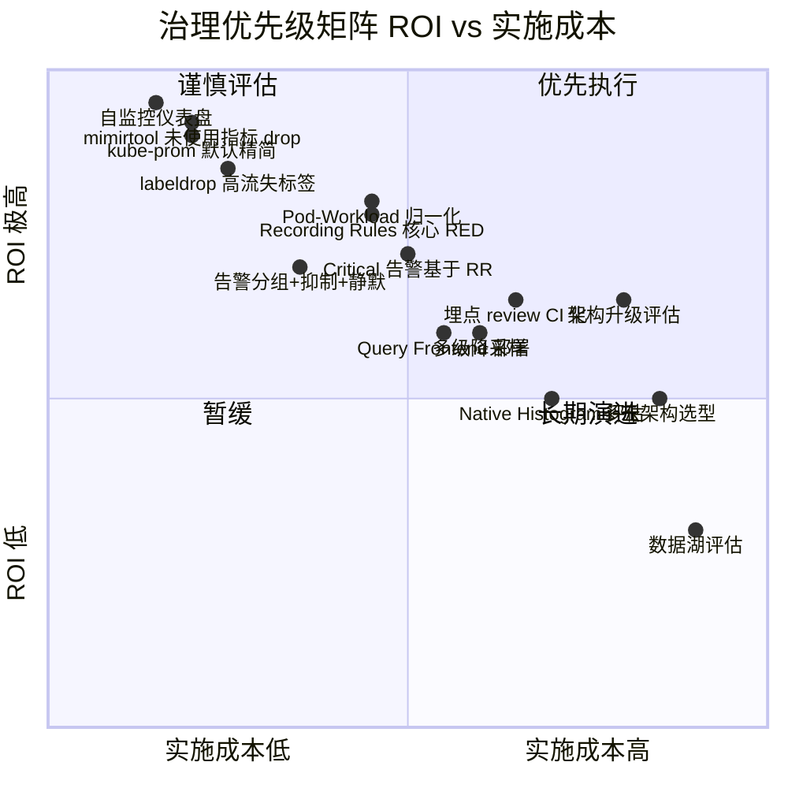
```mermaid
quadrantChart
    title 治理优先级矩阵 ROI vs 实施成本
    x-axis 实施成本低 --> 实施成本高
    y-axis ROI 低 --> ROI 极高
    quadrant-1 优先执行
    quadrant-2 谨慎评估
    quadrant-3 暂缓
    quadrant-4 长期演进
    自监控仪表盘: [0.15, 0.95]
    mimirtool 未使用指标 drop: [0.2, 0.92]
    kube-prom 默认精简: [0.2, 0.9]
    labeldrop 高流失标签: [0.25, 0.85]
    Pod-Workload 归一化: [0.45, 0.8]
    Recording Rules 核心 RED: [0.45, 0.78]
    告警分组+抑制+静默: [0.35, 0.7]
    Critical 告警基于 RR: [0.5, 0.72]
    埋点 review CI 化: [0.65, 0.65]
    架构升级评估: [0.8, 0.65]
    Query Frontend 部署: [0.55, 0.6]
    多级降采样: [0.6, 0.6]
    多云架构选型: [0.85, 0.5]
    Native Histogram 评估: [0.7, 0.5]
    数据湖评估: [0.9, 0.3]
```

**三档行动梯度的工程含义**：

**第 1 周（立即执行）的共性特征**：实施成本低（数小时到一天）、不破坏任何下游依赖（drop 的是"未使用"或"无聚合价值"的标签）、ROI 立竿见影。这一档的核心是建立诊断基线与拿到"低垂的果实"——通过 mimirtool 与 kube-prometheus 默认精简，往往能在不到一周内把 head_series 减少 30%–60%（具体比例因业务而异，本研究不提供绝对数字）。

**第 1 个月（近期规划）的共性特征**：需要少量协调成本（如 Pod→Workload 归一化要求同步调整 Dashboard 与告警规则）、需要 mimirtool analyze 审计依赖关系、需要分批上线避免误删导致告警失效。这一档的核心是把"基础治理"做扎实，让 Prometheus 进入稳定可控的状态。

**第 1 季度（中期演进）的共性特征**：涉及组织协调（埋点 review CI 化）、涉及架构层决策（升级到 Thanos/Mimir/VM/托管）、涉及人月级工程投入。这一档的核心是回答"在源头治理已尽的前提下，剩余流失负载如何通过架构能力承载"这一第 4.7 节末尾留下的根本问题。

**第 1 年（长期演进）的共性特征**：依赖外部条件成熟（生态对 Native Histogram 的支持进度、可观测数据湖路径的成熟）、涉及战略级决策（多云架构、跨厂商成本模型）。这一档的核心不是"做"，而是"持续观察、保留前瞻性"——当外部条件成熟时及时切换。

**矩阵的使用方法**。建议企业 SRE 团队把这份矩阵作为"治理 backlog 的初始化模板"——按行业、规模、当前现状对每一行的 ROI 评级做本地化校准，形成自己的优先级清单。同时把矩阵作为每季度复盘的检查清单，识别"哪些动作已经完成、哪些动作的 ROI 评估发生了变化、哪些新动作应该加入"。

## 9.4 自建 vs 托管的选型决策建议

第 7.7 节已经从 TCO、运维复杂度、SLA、扩展性四个维度给出了系统对比，第 6 章给出了六家主流托管方案的横向对比。本节在此基础上凝练为三个最具决策价值的关键判断。

**判断一：两条路径不是非此即彼而是分层混合**。这一判断在第 7.7 节已经反复强调，但在实际选型中仍是最容易被忽视的——团队往往陷入"全自建还是全托管"的二元对立。事实上，几乎所有大型企业的真实形态都是分层混合。常见的几种分层组合：

| 分层维度 | 自建承载 | 托管承载 | 适用场景 |
|---------|---------|---------|---------|
| 业务重要性 | 核心交易系统 | 边缘业务、内部工具 | 数据敏感度差异显著的企业 |
| 环境分级 | 生产环境 | 测试/开发环境 | 测试环境可享免费额度 |
| 数据时效 | 本地 7 天明细 | 远程长期降采样 | 利用 Remote Write `write_relabel` 桥接（第 4.4 节）|
| 三大支柱 | 指标自建 | 日志/链路托管 | 减少自建可观测栈复杂度 |
| 集群属性 | 主云核心集群 | 分支云、边缘节点 | 多云架构下的就近接入 |

分层混合的工程价值在于：**让每一份数据落到最适合它的承载方式上**——核心数据享有自主可控、边缘数据享有零运维成本，整体 TCO 优于纯自建或纯托管。

**判断二：计费模型对高流失率的成本传导是托管选型的核心维度**。第 6.8 节的专题分析已经明确了四类计费口径（按写入量 / 按上报量 / 按摄取率 / 综合计费）对高流失负载的成本敏感度差异。这一判断的关键工程含义是：**计费口径的选择本身就是一项治理动作**——同样的负载在不同口径下账单可能差异 2–3 倍。

针对企业用户的具体决策建议：

- **高流失主导、瞬时活跃序列稳定的场景**（典型如 K8s 频繁滚动）：偏向"按上报量"或"按摄取率"计费——决定上报量的核心是"活跃 target 数 × scrape 频率"而非"序列翻新速度"，账单与流失率相对解耦；
- **高基数主导、序列规模随业务线性增长的场景**：所有计费口径对账单都敏感，治理重心放在源头降基数；
- **流失与基数双重叠加场景**：账单陡增风险高，必须把第 4 章源头治理做到极致才能控制 TCO；
- **可切换计费模型的厂商**（如阿里云"按写入量 vs 按上报量"二选一切换，1 个实例只支持切换 1 次）：基于历史负载特征做一次性评估，选择当下最匹配的口径——这一选择本身就有可观的成本影响。

**判断三：信息透明度本身是选型考量**。第 6.7 节的对比矩阵中，"未公开"被作为一个独立的判定档次而非主观补全。这一处理方式背后的判断是——**文档详尽、计费透明、可观测自身能力强的厂商，长期治理的可持续性显著优于黑盒厂商**。具体的可观察信号包括：

- **官方博客与文档对成本优化的系统性输出**：AWS Cloud Operations Blog、Grafana Labs Blog 持续输出高基数治理、查询优化的最佳实践；
- **计费细则的完整披露**：阿里云、腾讯云中文文档对计费公式与示例的清晰说明（甚至给出具体的"3 节点 × 15s 采集 = 12 个采样点/分钟"计算示例）；
- **承载基准的公开数字**：腾讯云 TMP 公开"单实例 450 万 Series"、Grafana Cloud 公开"测试达 10 亿活跃序列"等承载数字让用户可以做容量规划；
- **产品化高基数治理工具**：Grafana Cloud 的 Adaptive Metrics、AWS AMP 的 Query Logging + Query Thresholds 都是把治理逻辑暴露给用户而非黑盒处理。

**三种典型形态的推荐场景**。基于以上三个判断，可以归纳出三种典型形态的具体推荐：

**纯自建路径的推荐场景**：

- 数据主权严格要求（金融、政务、军工）；
- 团队已有充足的分布式系统运维能力，希望深度定制；
- 规模超大（10 亿级以上活跃序列）且能负担相应硬件与人力投入；
- 多云/混合云架构需要跨云一致性。

**纯托管路径的推荐场景**：

- 小型团队或初创企业，运维资源有限；
- 已深度使用某云生态，IAM/网络/计费已统一；
- 规模可预期稳定，账单可控；
- 不希望投入资源建设自有分布式监控基础设施。

**分层混合路径的推荐场景**（最常见）：

- 中型以上企业，业务复杂度高、不同部分有差异化诉求；
- 既要享有托管方案的零运维红利、又要保留核心业务的自主可控；
- 在演进中（从纯自建向更多托管，或从纯托管向部分自建），需要灵活组合。

**形态间演进的迁移成本评估**。从一种形态向另一种演进的迁移成本主要体现在：

| 演进方向 | 主要迁移成本 |
|---------|------------|
| 纯自建 → 分层混合 | 增加 Remote Write 链路 + 学习托管方案配置 + 部分 Dashboard/告警迁移测试 |
| 分层混合 → 纯托管 | 历史数据迁移（如 promtool 数据导入工具是否被托管方案接受）+ 全量 Dashboard/告警/Recording Rules 适配 + 团队技能转型 |
| 纯托管 → 分层混合（甚至纯自建） | 团队能力建设 + 自建组件部署 + 计费模型重新评估 |
| 跨厂商托管迁移 | 历史数据是否能完整迁移 + 计费模型差异 + 各厂商专属功能（如 Adaptive Metrics）的等价物寻找 |

迁移成本的核心提示是：**避免轻易做大幅度的架构切换**——每一次切换都伴随着 3–6 个月的过渡期成本与风险。理想情况下，初次选型时即考虑"未来 2–3 年的演进路径"，避免短视决策导致频繁迁移。

## 9.5 面向企业 SRE 团队的可操作行动指引

把 9.1–9.4 节的所有结论与决策框架翻译为企业 SRE 团队从"明天上班"到"未来一年"的分阶段行动指引，是本研究最终的"处方性"输出。本节按"第 1 周 / 第 1 个月 / 第 1 季度 / 第 1 年"四个时间窗口给出具体动作，每个动作明确产出物、责任角色、验证标准。

**第 1 周：诊断与基线建立**

| 动作 | 产出物 | 责任角色 | 验证标准 |
|-----|-------|---------|---------|
| 部署 Prometheus 自监控仪表盘（5 张核心面板：head_series / head_series_created 速率 / churn ratio / scrape_series_added Top-N / scrape_samples_scraped Top-N）| Grafana Dashboard JSON | 主责 SRE | 仪表盘上线、数据正常显示 |
| 设置流失率告警（绝对量 + 相对比值 + 同比环比三重组合）| Alerting Rule YAML | 主责 SRE | 告警规则评估正常、阈值基于历史基线 |
| 执行第 3 章诊断 SOP 6 步流程（总量评估 → Job 归因 → 指标归因 → 标签归因 → 历史审计 → 使用价值评估）| 诊断报告（含 Top-N 嫌疑指标 / 标签 / Job）| 主责 SRE | 输出按"流失贡献 × 资源消耗 × 使用价值"排序的治理优先级清单 |
| 执行 mimirtool analyze prometheus（识别未使用指标）| 未使用指标清单 | 主责 SRE + Grafana 用户 | 清单覆盖所有 Dashboard 与告警规则的实际依赖 |
| 启用 kube-prometheus 默认精简配置 | 配置变更 PR | 主责 SRE | head_series 指标显示明显下降 |
| 执行 promtool tsdb analyze 对历史 Block 采样分析 | 历史累积趋势报告 | 主责 SRE | 识别出 symbol table 膨胀趋势与高基数 label/value Top-N |

第 1 周的核心目标是**建立可量化的诊断基线**——所有后续治理动作的效果都以这一基线为对照。如果在第 1 周结束时仍无法回答"当前 churn ratio 是多少、Top-3 高流失 Job 是哪些、Top-5 高基数标签是哪些"，则后续所有治理动作都无的放矢。

**第 1 个月：源头治理快速见效**

| 动作 | 产出物 | 责任角色 | 验证标准 |
|-----|-------|---------|---------|
| `metric_relabel_configs` labeldrop 高流失标签（pod_uid、container_id、id 等）| Prometheus 配置 PR | 主责 SRE | head_series 进一步下降、对应的 Top-N 标签从 TSDB Status 排行中消失 |
| `relabel_configs` 完成 Pod→Workload 维度归一化 | Prometheus 配置 PR | 主责 SRE + 平台团队 | churn ratio 显著下降、相关告警与 Dashboard 已同步适配 |
| 编写核心 RED 指标的 Recording Rules（按 `level:metric:operation` 命名）| Recording Rule YAML | 主责 SRE + 业务 SRE | Dashboard 与告警规则已切换到引用预聚合序列、查询 P95 显著改善 |
| 关键 Critical 告警全部基于 Recording Rule 评估 | Alerting Rule 重构 PR | 主责 SRE | 告警评估延迟稳定在亚秒级 |
| Alertmanager 配置 group_by + inhibit_rules + 关键告警合理 `for` 时长 | Alertmanager 配置 PR | 主责 SRE | 夜间告警量、误告警率显著下降 |
| CI/CD 流水线集成发布前自动静默 + 发布后自动取消 | 流水线脚本 | DevOps + SRE | 发布期间瞬态告警显著减少 |
| 月度审计 mimirtool 输出，drop 新增的未使用指标 | 月度治理报告 | 主责 SRE | 形成持续审计的运维节奏 |

第 1 个月的核心目标是**让 Prometheus 进入稳定可控的状态**——通过源头治理把可控的高流失负载拦截在 TSDB 入口之前，让基础治理动作成为团队的肌肉记忆。

**第 1 季度：架构层评估与选型**

| 动作 | 产出物 | 责任角色 | 验证标准 |
|-----|-------|---------|---------|
| 评估当前规模、团队能力、云生态绑定度三轴定位 | 架构评估报告 | 平台架构师 + SRE 主管 | 在 9.2 节决策框架中找到对应的推荐组合 |
| 完成自建 vs 托管的初步决策（含 9.4 节三种典型形态评估）| 选型决策书 | 平台架构师 | 决策书包含三种形态的 TCO 估算与运维复杂度分析 |
| 若选自建：完成 Thanos / Mimir / VictoriaMetrics 选型决策树（5.7 节）| 选型对比矩阵 | 平台架构师 | 矩阵覆盖承载上限、HA 能力、多租户、运维复杂度等核心维度 |
| 若选托管：完成各家方案六维度对比（6.7 节）+ 计费模型对当前流失水位的成本敏感度分析（6.8 节）| 厂商对比报告 | 平台架构师 + 商务 | 报告含至少 3 家候选厂商的具体账单估算 |
| 部署架构层方案的 PoC（在测试环境完成至少一周的稳定运行验证）| PoC 验证报告 | 平台 SRE | 报告含承载能力、查询性能、HA 切换、备份恢复等关键场景验证 |
| Query Frontend / 查询拆分 / 缓存部署（如选型方案中包含）| 配置 PR | 平台 SRE | Dashboard 加载延迟显著改善、缓存命中率达预期 |
| 多级降采样保留策略落地（raw/5m/1h）| 配置 PR + 保留策略文档 | 平台 SRE | 长保留窗口存储成本控制在预期范围内 |
| 埋点 review 强制 checklist 引入研发流程 | 流程文档 + CI 校验脚本 | 平台 SRE + 研发主管 | 新增指标埋点全部经过 review，未使用指标减少 |

第 1 季度的核心目标是**完成从"基础治理"到"架构升级"的关键决策**，并把决策落地到测试环境完成验证。这是高流失率治理从"应急"转向"常态"的分水岭。

**第 1 年：持续审计与演进路线**

| 动作 | 产出物 | 责任角色 | 验证标准 |
|-----|-------|---------|---------|
| 完成架构层方案的生产环境上线（如已在第 1 季度完成 PoC）| 上线报告 + 应急预案 | 平台 SRE | 生产环境平稳运行、回退预案演练通过 |
| 季度执行 promtool tsdb analyze 审计历史 Block 累积趋势 | 季度审计报告 | 主责 SRE | 识别出保留窗口策略、compaction 收益等需调整项 |
| 半年评估架构是否需要演进（规模翻倍、新场景出现、云生态变化）| 半年架构评估报告 | 平台架构师 | 评估报告含触发升级信号的逐项检查 |
| 年度评估 TCO 与 SLA 实测达成情况，与厂商重新议价或调整方案 | 年度 TCO 报告 + 厂商续约决策 | SRE 主管 + 商务 | 报告含与第 1 季度估算的差异分析 |
| 持续观察 Prometheus 协议演进（Native Histogram、Remote-Write 2.0、PromQL 元信息标签）| 技术雷达更新 | 平台架构师 | 评估各特性的成熟度与采纳时机 |
| 持续观察 OpenTelemetry 与 Prometheus 融合进展（v3.5 的 promote/ignore 资源属性等）| 技术雷达更新 | 平台架构师 | 评估 OTLP 接入路径的源头治理改造时机 |
| 评估 AI 工作负载的新型高流失场景（如团队涉及 LLM/智能驾驶/IoT）| AI 工作负载治理扩展规范 | 业务 SRE | 规范覆盖模型版本归一化、token 桶化、Exemplars 关联等 |
| 持续观察可观测数据湖与统一存储底座趋势 | 趋势观察报告 | 平台架构师 | 在外部条件成熟前保留前瞻性，不仓促采纳 |

第 1 年的核心目标是**把高流失率治理从"项目"转化为"能力"**——形成可持续的审计、演进、迭代节奏，让团队从"被动救火"转向"主动治理"。

**贯穿四个时间窗口的三条原则**。回到第 7.8 节末尾归纳的三条原则——它们同样是本节行动指引的精神内核：

- **源头治理是任何路径下 ROI 最高的起点**——第 1 周与第 1 个月的所有动作都以此为核心；
- **自建与托管不是二选一而是分层混合**——第 1 季度的架构选型应避免陷入二元对立，主动探索分层混合方案；
- **信息透明度与持续审计是治理动作能否长效的根本保障**——第 1 年的所有动作都以此为支撑，让初始治理不被业务演进与配置漂移侵蚀。

## 9.6 研究局限性与未尽议题

任何研究都有其边界，尤其是面对一个仍在快速演进的工程命题。本研究在收尾时必须明确声明自身的局限性，避免读者把本研究的结论误置为绝对化的处方。这些局限性既是对本研究边界的诚实声明，也是对后续研究方向的潜在指引。

**局限性一：基于 2024–2025 年公开资料的快照**。本研究的所有事实材料来源于公开文档、厂商博客、社区案例与开源项目源代码——这些资料反映的是抓取时点的版本、定价、功能。Prometheus、Mimir、VictoriaMetrics、Thanos 等开源项目仍在密集迭代（如第 8 章观察到 v3.0 → v3.5.0 LTS 在 2024 年底到 2025 年中半年内完成），云厂商的计费策略、产品功能、SLA 条款也会随时间调整。**读者在做实际决策时，应以最新的官方文档、定价计算器、产品发布说明为准**。本研究的价值在于提供"思考的脚手架"——具体的数字与功能边界需要在落地前重新核实。

**局限性二：对部分厂商维度的"未公开"标注未做主观补全**。第 6 章横向对比中，对 Google Cloud Managed Service for Prometheus（GMP）与 Azure Monitor managed service for Prometheus 在多个核心维度（具体计费细则、单实例承载上限、多级降采样能力、基数调试工具等）使用了"未公开"的判定档次。这是严格遵循第 1 章 Rubric P-3 与 P-4 的中立性原则所做的处理——**信息透明度差异本身也是选型考量**，本研究不替任何一家厂商主观补全可能不存在的能力。读者在评估这两家方案时，应直接以 Google Cloud 与 Microsoft 官方最新文档为依据。

**局限性三：自建与托管的具体性能数据带有厂商立场**。第 2.6 节、第 5.5 节、第 5.6 节、第 6.6 节多次引用了 Grafana Mimir 与 VictoriaMetrics 的公开基准数据（如 Mimir 极限基准 7000 CPU + 30 TiB RAM 承载 10 亿活跃序列、VictoriaMetrics 厂商基准下 30 万样本/秒等）——这些数据均来自厂商自测或官方公开材料，作为厂商基准其方法论选择（负载工具、查询集合、资源分配）会带有产品立场。本研究在引用时已经显式标注了厂商背景，但跨产品的绝对数值对比仍应保留这一声明。**真实生产环境下的对应数值需要用户在自己的负载特征下做独立验证**。

**局限性四：AI 辅助治理与可观测数据湖等趋势仍在演化**。第 8.3 节讨论的 AI 辅助可观测能力（Adaptive Metrics、自然语言查询、queryless 探索）虽然已有产品形态，但其在大规模真实生产中的鲁棒性、可解释性、跨场景泛化能力仍需大量验证；第 8.4 节讨论的可观测数据湖范式（基于 Iceberg/Parquet 的列式存储 + 对象存储底座）仍处于早期探索阶段，本次抓取的资料对该方向的具体技术细节并未直接讨论——相关讨论更多基于行业共识与趋势观察。**读者不应把这两个方向的描述误置为可立即落地的工程方案**，而应作为长期演进的备选路径纳入观察。

**局限性五：数值化结论的有限性**。本研究在多处刻意避免给出"流失率从 X% 提升到 Y% 时内存增长 Z%"这类绝对数值——根本原因是不同业务场景的指标分布、标签维度结构、查询模式差异巨大，单一数值在跨场景外推时容易误导。第 4.7 节的"治理效果验证"与第 2.6 节的"基准测试视角"都使用了"机理上预期的方向"而非"绝对量级"的表述方式，这是有意的中立性选择。**企业用户在做容量规划时，应以自身业务的历史基线为准做线性或非线性外推，而非引用本研究中任何具体数字作为绝对阈值**。

**未尽议题一：跨厂商成本模型的统一**。第 6.7 节观察到各厂商"按写入量 / 按上报量 / 按摄取率 / 综合计费"四类口径并存，企业用户在跨厂商成本对比时面临"苹果与橘子"的困境——需要做大量的换算与建模才能做公平比较。建立**透明、可对比、可移植的高流失率成本模型**（例如统一的"摄取量×活跃序列×保留窗口"三维成本指标）是云厂商生态层面值得探索的方向。本研究受限于资料范围未能给出完整的跨厂商换算公式，这是一个重要的未尽议题。

**未尽议题二：Prometheus 数据模型层面"实例身份与序列身份解耦"的根本性重构**。第 8.5.3 节已经指出，Serverless、AI 推理、IoT 等结构性高动态场景下，单纯靠标签设计与采集裁剪无法消除底层 target 翻新带来的采集端结构性流失——根本原因在于 Prometheus 数据模型"序列身份等价于完整 label 集合"的核心假设与"实例身份天然短暂"的云原生工作负载之间的范式错位。Native Histogram 在直方图场景下已经体现了"维度从 label 剥离"的思路，但整体数据模型的重构仍是更长期、更系统的工程，需要 Prometheus 社区与 OpenTelemetry 等更广义生态的协同。本研究只能在"既定数据模型下做工程治理"的边界内给出方案，对数据模型层面的根本性重构未能展开——这一议题留给未来的协议演进与社区贡献者。

**未尽议题三：AI 辅助治理的可解释性与可信度边界**。第 8.3.2 节对 AI 辅助治理的讨论持谨慎态度——目前的产品形态主要是辅助性的"识别 + 推荐"，最终的删除/保留决策仍需要 SRE 介入；在涉及"看似无用但故障时极有价值"的诊断类指标时，AI 推荐可能存在误判风险。**AI 辅助治理在何种边界内可以替代专业 SRE 的工程判断、其推荐结论的可解释性如何评估、跨厂商的训练数据隐私与合规边界如何划定**——这些问题本研究未能展开，是值得后续独立研究的方向。

**未尽议题四：信创、国密、数据出境等本土合规场景的专项研究**。本研究虽然在第 7.6 节讨论了多云与混合云的数据主权约束，但对于国内信创要求、国密协议适配、数据出境合规等本土特有场景的专项分析未能展开。这一方向对国内政企客户、金融客户具有重要工程价值，本研究的通用框架只能作为起点，具体的合规适配需要结合各企业的实际监管要求做独立评估。

---

回到全文起点的研究问题——"Prometheus 的高流失率会造成什么影响，有什么系统的方案可以解决？各家云厂商有没有现有方案？"——本研究通过九个章节的系统展开，给出的最终答案可以凝练为以下三句话：

**高流失率沿"index→memory→CPU→query→stability"传导，每一层都存在非线性放大效应，最终表现为容量规划失准、性能退化、稳定性故障三类业务可见后果**——这是关于"影响"的回答，建立在第 2 章因果链推演与第 2.6 节基准方法论的事实基础之上。

**系统方案可分为源头治理（设计规范 + 采集管道 + 预聚合 + 白名单）与架构扩展（水平分片 / Remote Write / Thanos / Cortex+Mimir / VictoriaMetrics）两条路径，配合查询优化与告警稳定形成完整治理矩阵；源头治理在所有路径下 ROI 最高，架构扩展承担"消化无法源头消除的流失"的职责**——这是关于"方案"的回答，建立在第 4–5 章工程图景之上。

**主流云厂商均提供托管 Prometheus 服务，能力差异主要体现在承载规模、计费模型、产品化基数治理工具、信息透明度等维度；自建与托管不是非此即彼而是分层混合，最终选型应基于规模 × 行业 × 技术栈三维框架与企业自身的合规、人才、商务约束综合决策**——这是关于"云厂商方案"的回答，建立在第 6 章横向对比与第 7 章场景化选型的分析之上。

希望本研究为企业 SRE 团队提供的不是一份僵化的"最佳实践"清单，而是一套可以在自身场景中持续校准、持续演进的认知与决策框架。Prometheus 高流失率议题的研究是一个动态命题——随着协议演进、生态融合、AI 浪潮、技术底座变迁持续演化。本研究记录的是 2024–2025 年这一时点上业界对这一命题的认知快照，未来的演进将由读者与整个 Prometheus 社区共同书写。

# 参考内容如下：
[^1]:[Getting started with Prometheus](https://prometheus.io/docs/tutorials/getting_started/)
[^2]:[高可用Prometheus问题集锦](https://blog.csdn.net/unbuntu_luo/article/details/153119806)
[^3]:[对比开源丨Prometheus 服务多场景存储压测全解析](https://blog.csdn.net/weixin_39860915/article/details/128877912)
[^4]:[高基数(High Cardinality)问题介绍(Prometheus、高基数字段、低基数字段)](https://dontla.blog.csdn.net/article/details/160216153)
[^5]:[执行滚动更新](https://kubernetes.io/zh-cn/docs/tutorials/kubernetes-basics/update/update-intro/)
[^6]:[Kubernetes中的滚动更新(Rolling Update)和滚动回滚(Rollback)的过程和策略,以及相关的方法和配置](https://cloud.tencent.com/developer/article/2320103)
[^7]:[基于阿里云Prometheus指标的容器水平伸缩](https://help.aliyun.com/zh/ack/serverless-kubernetes/user-guide/horizontal-pod-scaling-based-on-prometheus-service-metrics-1)
[^8]:[Prometheus监控](https://help.aliyun.com/zh/sae/prometheus-monitoring)
[^9]:[Prometheus 存储引擎分析](https://cloud.tencent.com/developer/article/2362703)
[^10]:[Prometheus 存储引擎详细分析](https://blog.csdn.net/2301_76936922/article/details/130009928)
[^11]:[听GPT 讲Prometheus源代码--tsdb](https://cloud.tencent.com/developer/article/2323947)
[^12]:[星巴克中国一体化可观测性重构:从日志检索到指标驱动,构建低成本、高可用的可观测体系](https://cloud.tencent.com/developer/article/2594038)
[^13]:[Grafana Mimir 和VictoriaMetrics:性能测试(上) ](https://www.testwo.com/article/1812)
[^14]:[到底谁强?Grafana Mimir 和 VictoriaMetrics 之间的性能测试](https://www.modb.pro/db/550412)
[^15]:[Prometheus 存储和集群|学习笔记(一)](https://developer.aliyun.com/article/1151468)
[^16]:[[笔记]Prometheus 术语 ](https://chenlujjj.github.io/monitor/prometheus-term-note/)
[^17]:[Prometheus rules with mimirtool](https://grafana.com/docs/grafana/v9.5/alerting/migrating-alerts/legacy-alerting/alerts-rules/?pg=blog&plcmt=body-txt)
[^18]:[Prometheus rules with mimirtool | Grafana documentation ](https://grafana.com/docs/grafana-cloud/legacy-alerting/alerts-rules/)
[^19]:[Prometheus 性能调优:大模型和智能驾驶可观测的高基数问题](https://developer.volcengine.com/articles/7490493002389929996)
[^20]:[Prometheus中的关键设计-阿里云开发者社区](https://developer.aliyun.com/article/1603476)
[^21]:[Life of a Label](https://www.robustperception.io/life-of-a-label)
[^22]:[吃透云原生可观测:Metrics、Logging、Tracing 架构底层逻辑与实战全指南](https://cloud.tencent.com/developer/article/2654626)
[^23]:[全链路追踪的价值闭环——Trace、Metrics、Logs三件套如何共同定位问题](https://cloud.tencent.com/developer/article/2613064)
[^24]:[本文介绍如何在函数计算中为LLM推理服务集成Prometheus指标监控以实现性能可观测性。-函数计算(FC)-阿里云帮助中心](https://help.aliyun.com/document_detail/2995880.html)
[^25]:[Prometheus数据采集方式全解析:从标准拉取到远程写入的架构演进](https://blog.csdn.net/qq_41581588/article/details/159653360)
[^26]:[抓取配置说明](https://cloud.tencent.com/document/product/1416/55995)
[^27]:[容器集群基础指标](https://help.aliyun.com/zh/arms/prometheus-monitoring/basic-metrics/)
[^28]:[Prometheus 基础设施监控实用指南(四)](https://wizard.blog.csdn.net/article/details/148958142)
[^29]:[Prometheus operator 系统参数和监控数据抓取调优](https://blog.csdn.net/weixin_43798031/article/details/141138117)
[^30]:[Prometheus-09 prometheus的不足之处以及近实时性/数据丢失情况](https://download.csdn.net/blog/column/12357358/131797036)
[^31]:[什么是联邦集群?如何在Prometheus 实现联邦集群?](https://baijiahao.baidu.com/s?id=1800792392709253170&wfr=spider&for=pc)
[^32]:[避坑指南:Prometheus remote_write数据丢失的7种常见原因及排查手册(附真实案例)](https://blog.csdn.net/weixin_29252171/article/details/159297629)
[^33]:[突破Prometheus查询瓶颈:Thanos Query Frontend负载均衡全攻略](https://blog.csdn.net/gitblog_00930/article/details/153159323)
[^34]:[云原生监控利器:Thanos的架构解析与实践指南](https://cloud.baidu.com/article/3823838)
[^35]:[Thanos 和 VictoriaMetrics 之间的深入比较:性能和差异](https://cloud.tencent.com/developer/article/2376532)
[^36]:[突破存储瓶颈:Thanos数据存取效率优化指南-CSDN博客](https://blog.csdn.net/gitblog_00935/article/details/153162638)
[^37]:[Grafana Mimir存储格式解析:从时间序列到对象存储的完整指南](https://blog.csdn.net/gitblog_00325/article/details/154933895)
[^38]:[终极Cortex查询前端优化指南:10个专业技巧加速PromQL查询性能-CSDN博客](https://blog.csdn.net/gitblog_01194/article/details/152201270)
[^39]:[基于Grafana Mimir的分布式指标存储](https://blog.csdn.net/m0_51770140/article/details/158100934)
[^40]:[云原生监控新势力:VictoriaMetrics深度解析与实践指南](https://cloud.baidu.com/article/4491418)
[^41]:[【转】Prometheus PromQL 查询最佳实践与性能优化-腾讯云开发者社区-腾讯云](https://cloud.tencent.com/developer/article/2650155)
[^42]:[PromQL典型应用实践](https://blog.csdn.net/neweastsun/article/details/143494303)
[^43]:[使用Prometheus配置报警规则的最佳实践](https://help.aliyun.com/zh/ack/ack-managed-and-ack-dedicated/user-guide/best-practices-for-configuring-alert-rules-in-prometheus)
[^44]:[Query functions](https://prometheus.io/docs/querying/functions/)
[^45]:[Prometheus + Alertmanager 告警风暴治理:我用告警分组 + 抑制规则把夜间告警量压了 80%](https://schooltools.blog.csdn.net/article/details/160373532)
[^46]:[Prometheus 实例计费](https://help.aliyun.com/zh/prometheus/product-overview/billing-description/)
[^47]:[计费概述](https://help.aliyun.com/video_detail/183914.html)
[^48]:[Prometheus 实例计费](https://help.aliyun.com/zh/arms/prometheus-monitoring/product-overview/pay-as-you-go)
[^49]:[套餐包介绍](https://cloud.tencent.com/document/product/1416/86834)
[^50]:[腾讯云可观测平台](https://intl.cloud.tencent.com/zh/products/tcop)
[^51]:[Prometheus 监控按量付费版本 Series 存储的限制是?](https://cloud.tencent.com/developer/techpedia/1420/3365)
[^52]:[按量付费介绍](https://cloud.tencent.com/document/product/1416/65379)
[^53]:[使用TCOP 设置 WAF 异常告警](https://intl.cloud.tencent.com/zh/document/product/627/64297)
[^54]:[什么是 Amazon Managed Service for Prometheus?](https://docs.aws.amazon.com/zh_cn/prometheus/latest/userguide/what-is-Amazon-Managed-Service-Prometheus.html)
[^55]:[Amazon EKS 上的 Prometheus 監控](https://docs.aws.amazon.com/zh_tw/prescriptive-guidance/latest/implementing-logging-monitoring-cloudwatch/prometheus-monitoring-eks.html)
[^56]:[https://docs.aws.amazon.com/zh_cn/prometheus/latest/userguide/AMP-costs.md](https://docs.aws.amazon.com/zh_cn/prometheus/latest/userguide/AMP-costs.md)
[^57]:[Announcing Prometheus Alertmanager rules in Amazon Managed Grafana | AWS Cloud Operations Blog](https://aws.amazon.com/id/blogs/mt/announcing-prometheus-alertmanager-rules-in-amazon-managed-grafana/?nc2=h_mo-lang)
[^58]:[AWS::APS::Workspace](https://docs.aws.amazon.com/de_de/AWSCloudFormation/latest/TemplateReference/aws-resource-aps-workspace.html)
[^59]:[Optimizing Queries with Amazon Managed Prometheus | AWS Cloud Operations Blog](https://aws.amazon.com/cn/blogs/mt/optimizing-queries-with-amazon-managed-prometheus/)
[^60]:[Amazon Managed Service for Prometheus | AWS Cloud Operations Blog](https://aws.amazon.com/blogs/mt/tag/amazon-managed-service-for-prometheus/)
[^61]:[Pricing | Google Cloud Observability | Google Cloud](https://cloud.google.com/stackdriver/pricing_v2?authuser=19&hl=ja)
[^62]:[Azure Monitor managed service for Prometheus](https://learn.microsoft.com/th-th/azure/azure-monitor/essentials/prometheus-metrics-overview)
[^63]:[Overview of Azure Monitor Managed Service for Prometheus - Azure Monitor | Microsoft Learn](https://learn.microsoft.com/sr-cyrl-rs/azure/azure-monitor/essentials/prometheus-metrics-overview)
[^64]:[Overview of Azure Monitor Managed Service for Prometheus - Azure Monitor | Microsoft Learn](https://learn.microsoft.com/hr-hr/azure/azure-monitor/essentials/prometheus-metrics-overview)
[^65]:[Metrics monitoring and analysis with Grafana Cloud](https://grafana.com/products/cloud/metrics/)
[^66]:[7年磨一剑,prometheus 3.0版本,速去感受了一把](https://cloud.tencent.com/developer/article/2491487)
[^67]:[prometheus v3.4.0重磅发布!3大核心新特性+性能大提升,助力云原生监控升级](https://baijiahao.baidu.com/s?id=1832417125125835680&wfr=spider&for=pc)
[^68]:[prometheus v3.5.0 发布详解:长周期支持版本带来的全新特性与性能优化](https://cloud.tencent.com/developer/article/2547147)
[^69]:[Prometheus Native Histograms 实现原理及应用](https://xie.infoq.cn/article/0a231ee0967cf3fb57755ea3c)
[^70]:[Native Histograms | Prometheus](https://prometheus.io/docs/specs/native_histograms/)
[^71]:[Prometheus Remote-Write 2.0 specification [EXPERIMENTAL]](https://prometheus.io/docs/specs/remote_write_spec_2_0/)
[^72]:[UTF-8 in Prometheus](https://prometheus.io/docs/guides/utf8/)
[^73]:[OpenTelemetry 与 Prometheus - 架构和指标的差异](https://cloud.tencent.com/developer/article/2378270)
