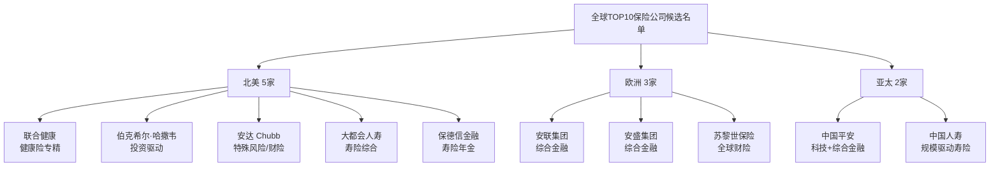
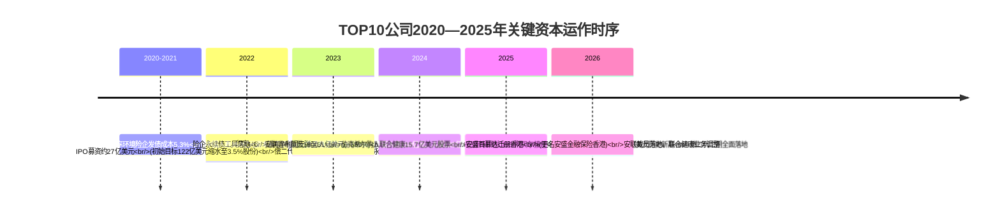
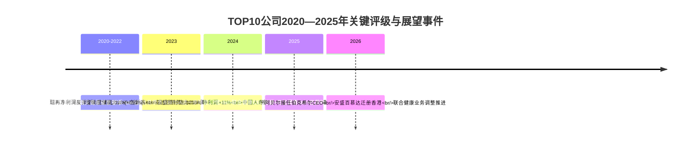
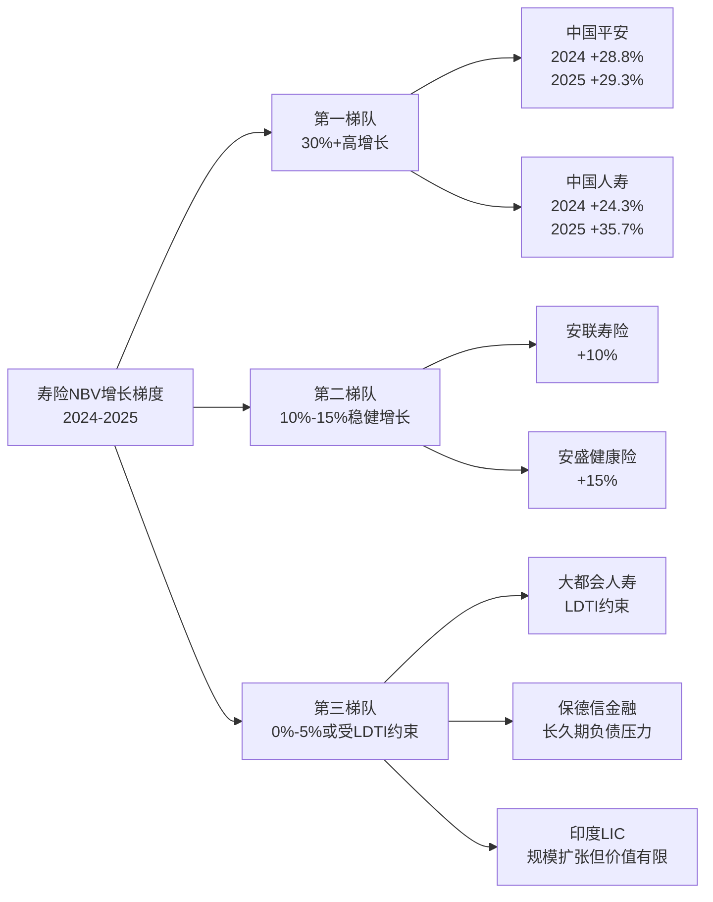
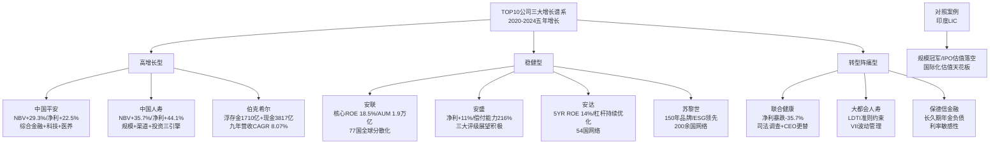
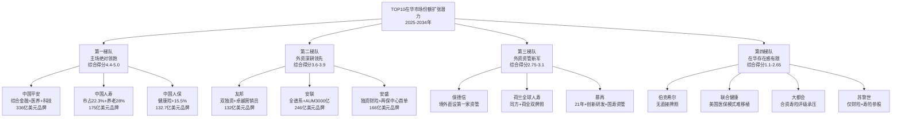
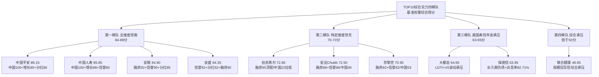
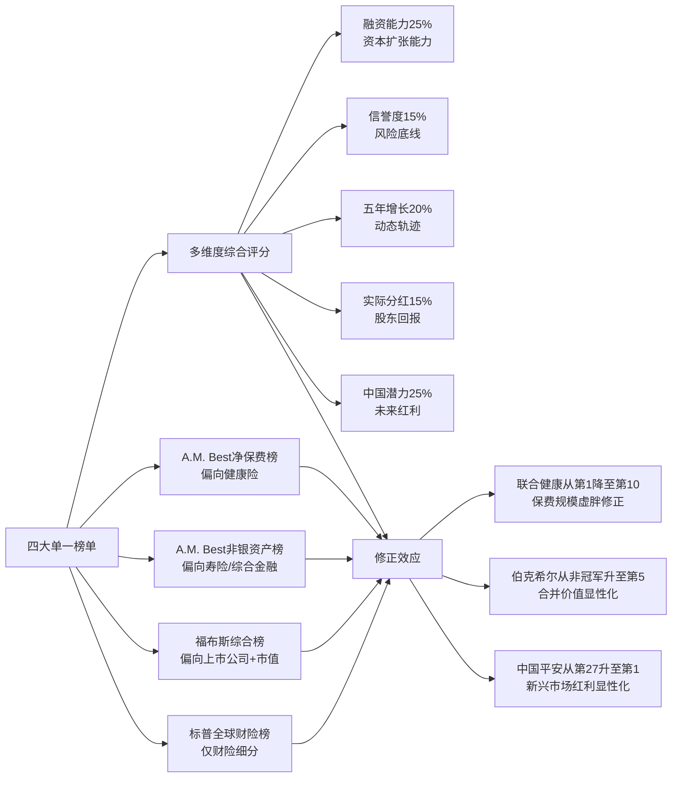
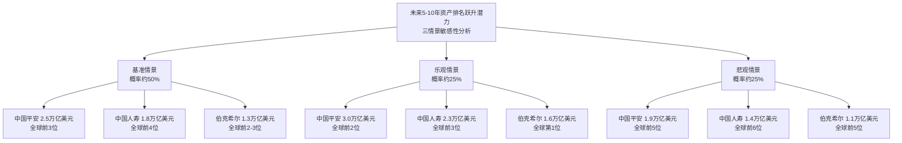

# 全球综合实力前十保险公司横向比较与未来资产排名潜力预测研究
# 1 研究背景、TOP10遴选标准与评估方法论

全球保险业作为现代金融体系的三大支柱之一，承担着风险分散、长期资金供给与社会保障的核心功能。近年来，受人口老龄化加剧、利率周期反转、自然巨灾频发、地缘政治不确定性上升与科技变革浪潮等多重宏观因素冲击，全球保险业的竞争格局正在经历深刻重塑。**美国健康险巨头的集体强势、中国保险公司的稳步崛起、欧洲传统巨头的战略转型、亚太与百慕大新兴力量的快速登场**，共同构成了一幅多极化、多模式并存的全球保险产业图景。在此背景下，谁是真正具备"国际综合实力"的头部保险公司？谁又有可能在未来5—10年的资产排名竞赛中实现跃升？这两个问题的回答，既需要对权威榜单进行系统比较，也需要构建一套兼顾财务规模、价值创造与战略潜力的复合评估方法论。本章作为全篇报告的研究起点，将完成概念界定、榜单互校、口径设计、名单遴选与方法论铺设五项基础工作，为后续九章的横向比较与潜力预测奠定方法论底座。

## 1.1 全球保险业格局演变与研究意义

观察近年权威榜单可以清晰看到，全球保险业的头部格局正在发生**结构性而非周期性**的变化。从A.M. Best发布的全球保险公司承保净保费收入排名看，**联合健康集团连续11年蝉联第一**，2024年净保费收入达3088.10亿美元，同比增长6.2%，约为第二名Centene（1598.69亿美元）的近两倍[^1]；2024年榜单前6位均被美国保险公司包揽，前4名（联合健康、Centene、Elevance Health、Kaiser Foundation）全部为健康险公司，整个TOP25榜单中美国公司多达13家，占比超过一半[^1]。这一格局印证了**美国商业保险体系（尤其是政府医保Medicaid/Medicare与商业团险）对头部保费规模的强力支撑**，也揭示了在全球人口老龄化加剧、医疗保障需求持续增长背景下，健康险已成为最具规模扩张能力的保险细分赛道[^1]。

中国保险公司在全球榜单中呈现**"稳扎稳打、增速回升"**的特征。2024年净保费收入榜中，中国人寿位列第7（1100.18亿美元，同比+5.9%），中国平安位列第11（755.00亿美元，同比+2.7%），中国人保位列第14（732.89亿美元，同比+6.5%）[^1]。值得注意的是，对比2023年榜单——彼时中国平安净保费同比-30.1%，中国人保同比-12.8%——三家中国保司的增速在2024年明显改善，反映出在汇率波动与会计准则切换冲击逐步消化后，中国保险业正从规模冲刺转向高质量发展的新阶段[^1][^2]。从财险细分赛道看，标普全球市场情报2025年发布的全球TOP50财险公司榜单显示，**中国人保以676.7亿美元保费位列全球第6位，是全球前十财险公司中唯一的中国公司**，中国平安位列第12，中国太保第25，国寿财险与中国再保险分列第36与第42位，五家中资财险合计保费约169.4亿美元，占全球50强总保费的11.6%[^3]。

欧洲传统巨头则展现出**规模相对稳定但格局微调**的特点。2022年净保费榜单中，安盛与安联分别保持第7位与第8位（保费919.8亿美元与919.4亿美元），增速分别为2%和9.7%[^2]；在2024年财险榜单中，**安联以807亿美元位列全球第三、伯克希尔·哈撒韦以856亿美元位列第二、State Farm以1031亿美元（同比+17.7%）稳居第一**[^3]。亚太与百慕大新兴力量同步崛起，日本Sompo Holdings升至第20位，韩国三星火灾与DB Insurance首次进入榜单分列第43和第45位[^3]。从地区保费分布看，北美地区财险保费总和7691.2亿美元（占47%）、欧洲5306.2亿美元（占33%）、亚太地区3223.6亿美元（占20%）[^3]，呈现"北美主导、欧洲稳固、亚太追赶"的三极结构。

在这一格局演变背后，瑞再sigma系列研究指出，全球再保险/保险业正面临"更具风险、更加碎片化的世界秩序"[^4]。**自然巨灾保险损失2025年预计将延续约1450亿美元的高位轨迹，野火与风暴风险持续上升**，财产险市场需在更高风险环境中重塑承保模型；与此同时，长寿风险、医疗通胀、私募信贷敞口、气候转型风险等新型风险因素，正在重新定义保险公司的资本充足性与信誉度边界[^4][^5]。在此宏观语境下，开展全球TOP10保险公司的横向比较与资产排名潜力预测，不仅有助于投资者识别具备穿越周期能力的优质标的，也能为中国保险业战略制定者提供"对标—学习—超越"的参照系，更能为监管者评估系统性风险与开放政策效果提供经验依据。

## 1.2 "综合实力"的多维概念界定

对头部保险公司"综合实力"的界定，是本研究方法论的逻辑起点。从学理上看，保险公司的实力可分解为**承保实力、投资实力、资本实力、价值创造实力与战略影响力**五个层次：承保实力体现为保费规模、业务结构与承保利润率，投资实力体现为投资资产规模、配置能力与浮存金运用效率，资本实力体现为偿付能力、再保安排与融资韧性，价值创造实力体现为新业务价值（NBV）、内含价值（EV）与ROE可持续性，战略影响力则体现为市场份额、全球化广度与品牌价值。

从实务上看，单一指标无法刻画头部保险公司的真实实力，原因有三。其一，**净保费收入受业务结构强烈影响**：健康险公司由于医疗赔付占比高、保费名义规模大但利润率薄，导致联合健康（3088亿美元）的保费规模约为安联（约900亿美元财险保费）的3—4倍，但二者商业模式与价值创造逻辑差异巨大，简单按保费排名会**低估投资驱动型与综合金融型公司的真实实力**[^1][^3]。其二，**总资产指标偏向寿险与综合金融公司**：寿险因负债久期长、准备金沉淀厚，资产规模天然大于纯财险公司，例如中国平安2024年末总资产12.96万亿元（约1.8万亿美元）[^6][^7]，远超伯克希尔·哈撒韦、安达等以财险为主的公司，但这并不意味着前者在承保技术与盈利质量上具有绝对优势。其三，**市值榜受资本市场情绪与会计准则影响**：福布斯2025年全球企业2000强按"收入、利润、资产、市值"四维评估，中国平安以营收1580亿美元、利润176亿美元、资产1.8万亿美元位列全球第27位、中国保险业第1位[^6][^7]，相较2024年的全球第29位上升2位[^8]，这一进步既反映了基本面改善，也受到港股估值修复的助推。

因此，本研究将"综合实力"界定为一个**多维加权的复合概念**，要求兼顾规模、效率、价值与潜力四个层次，避免任何单一指标的偏倚。这一界定也与A.M. Best在其评级框架中采用的"资产负债表实力（BCAR）+经营业绩+业务概况+企业风险管理"四维评级逻辑相互呼应，与瑞再sigma对"承保能力—资本韧性—长期可持续性"的研究路径相吻合[^4]。

## 1.3 权威榜单对比与互补性分析

为精准定位TOP10候选公司，本研究系统梳理了五大主流权威榜单的评选指标、统计口径与覆盖范围，并分析其互补性。下表汇总了核心榜单的关键特征：

| 榜单名称 | 核心指标 | 统计口径 | 优势 | 盲点 |
|---|---|---|---|---|
| A.M. Best 全球净保费收入榜 | 上一年度承保业务净保费（扣除分出再保后）[^1] | 以美元折算，年度更新 | 反映承保能力与市场占有率 | 偏向健康险公司，规模放大效应明显[^1] |
| A.M. Best 全球非银行资产榜 | 集团非银行业务资产规模（2022年安联以1.1万亿美元居首）[^2] | 排除银行子公司资产 | 反映寿险与投资体量 | 偏向寿险与综合金融公司，弱化财险公司 |
| 标普全球财险TOP50 | 财产与意外险毛保费收入[^3] | 包括再保险公司 | 聚焦财险细分赛道 | 不覆盖寿险与健康险 |
| 福布斯全球企业2000强 | 收入+利润+资产+市值四维综合[^6][^8] | 仅限上市公司 | 多维平衡、市场化视角 | 排除非上市巨头（State Farm、伯克希尔旗下保险子公司单列困难） |
| 《财富》世界500强 | 营业收入排名[^9] | 全球营收口径 | 综合性强、跨行业可比 | 保险板块易被混合到金融大类，颗粒度不足 |

各榜单存在显著的视角差异。A.M. Best净保费榜的**健康险偏倚**最为明显——前4名全部是美国健康险公司，而健康险的高保费体量本质上由美国独特的医保支付结构（Medicaid、Medicare与商业团险）所驱动，并不完全等同于"承保实力"[^1]。**A.M. Best非银行资产榜则呈现寿险与综合金融偏倚**：2022年榜单中安联以1.1万亿美元非银资产居首，但其非银行资产同比下降10%，反映该指标对汇率与资本市场波动相对敏感[^2]。标普全球财险榜聚焦财险细分赛道，能够有效识别如State Farm（1031亿美元财险保费）、伯克希尔（856亿美元）、Progressive（721.7亿美元，同比+20.5%）等财险冠军[^3]，但完全无法覆盖寿险与健康险公司。**福布斯榜的多维平衡性最强**——以中国平安为例，其2024年榜单期内营收1360.7亿美元、利润117.8亿美元、资产16548亿美元、市值1055亿美元[^8]，2025年榜单营收1580亿美元、利润176亿美元、资产1.8万亿美元[^6][^7]，四维数据可同时反映规模、盈利与市场认可度——但其上市公司限制使得State Farm（互助制）、Liberty Mutual（互助制）、伯克希尔旗下保险子公司（合并入集团）等无法独立呈现。《财富》世界500强中，2025年榜单前10位仅有联合健康集团（第7位）、CVS Health（第9位，含药房与保险）、伯克希尔·哈撒韦（第10位）三家与保险高度相关[^9]，表明营业收入口径在跨行业排序中会稀释保险板块的可比性。

正是由于单一榜单存在系统性盲点，本研究采用**多榜单融合的互补性方法**：以A.M. Best净保费榜和资产榜锁定承保规模与资产体量层级，以标普榜补充财险细分识别，以福布斯榜引入市值与盈利质量维度，以瑞再sigma与标普全球研究补充行业景气度与前瞻性判断[^4][^5]。这种"多榜交叉、口径互校"的方式，既能最大限度规避单一指标偏倚，也符合P-2"证据权威性与多源交叉验证"的推理标准。

## 1.4 TOP10遴选的复合口径与权重设计

基于上节榜单互补性分析，本研究采用**"资产规模+保费收入+市值+新业务价值+全球化广度"五维复合口径**对候选公司进行综合排序与遴选。各维度的内涵、权重与归一化处理方式如下表所示：

| 维度 | 衡量指标 | 数据来源 | 权重 | 归一化方式 |
|---|---|---|---|---|
| 资产规模 | 集团总资产、非银行资产 | A.M. Best非银资产榜、公司年报、福布斯 | 25% | 取自然对数后线性归一化至[0,100] |
| 保费收入 | 集团净保费/原保费收入 | A.M. Best净保费榜、标普榜、年报 | 25% | 同上 |
| 市值 | 市值（仅上市公司）/估算公允价值（非上市） | 福布斯、彭博 | 15% | 同上，非上市公司采用同业P/B估算 |
| 新业务价值与盈利质量 | NBV、归母净利润、ROE | 公司年报、瑞再sigma | 20% | 三指标等权合成后归一化 |
| 全球化广度 | 海外保费占比、运营国家数、海外子公司层级 | 公司年报、A.M. Best、标普 | 15% | 海外占比×0.6 + 国家数评分×0.4 |

权重设计的核心逻辑是：**资产与保费各占25%反映保险公司"规模为王"的行业本质**；**新业务价值占20%是为防止规模虚胖、强调价值创造**；**市值占15%引入资本市场前瞻性判断**；**全球化广度占15%确保入选公司具备真正的"国际"属性**而非纯本土巨头。该权重组合与P-1"口径一致性"和P-3"五维度覆盖完整性"的推理标准相一致，并将在后续章节通过敏感性分析检验其稳健性。

值得说明的是，本章遴选阶段的五维口径侧重于**识别"实力存量"**，与第8章综合评分模型的五维度（融资、信誉、增长、分红、中国潜力）侧重于**评估"未来潜力"**形成互补。前者回答"谁是头部"，后者回答"谁会胜出"，二者在指标体系与权重逻辑上有所差异。

## 1.5 TOP10候选名单的确立与代表性论证

基于复合口径打分与多榜单交叉验证，本研究最终确立的**TOP10候选名单**及其代表性如下：

入选理由与剔除逻辑可从三方面阐释。**入选依据方面**：联合健康作为A.M. Best净保费榜连续11年第一（3088亿美元），代表健康险时代的绝对王者[^1]；伯克希尔·哈撒韦作为标普全球财险榜第二位（856亿美元）兼投资驱动型保险集团代表，其GEICO在美国汽车保险市场份额约12.3%、位列第三[^3][^10]；安联作为A.M. Best非银资产榜首（1.1万亿美元）与全球财险榜第三（807亿美元），代表欧洲综合金融模式[^2][^3]；中国平安凭借福布斯全球第27位、中国保险业第1位的多维综合实力（营收1580亿美元、利润176亿美元、资产1.8万亿美元）入选[^6][^7]；中国人寿在A.M. Best净保费榜位列全球第7（1100.18亿美元），代表中国规模驱动型寿险[^1]。**剔除逻辑方面**：宏利、保诚、法通、友邦虽然在亚太或英国市场具有重要地位，但综合得分与全球化广度未进入前10；日本人寿保险虽在2024年首次进入A.M. Best净保费榜TOP25[^1]，但海外业务占比相对有限；State Farm与Liberty Mutual为美国互助制保险公司，虽承保规模可观，但缺乏市值数据且全球化广度不足。**代表性方面**：最终名单覆盖**北美5家、欧洲3家、亚太2家**的地域结构，囊括**寿险、财险、健康险、综合金融、再保险**全业务谱系，并涵盖投资驱动、综合金融、规模驱动、科技驱动、健康险专精、特殊风险等差异化商业模式，符合P-3"五维度覆盖完整性与均衡性"的推理标准。

需要说明的是，由于不同榜单的发布时点与口径差异（例如A.M. Best净保费榜以美元折算年度净保费、福布斯榜以四维平均评估、标普榜以财险毛保费为基础），TOP10候选公司的相对排序在不同榜单中存在一定波动。本研究将在后续章节中对每家公司分别提供"按净保费、按资产、按市值"三套口径的位序，以便读者交叉判断。

## 1.6 五大比较维度的指标体系与数据来源

为确保后续第3—7章横向比较的可操作性与一致性，本研究将比较维度细化为**融资能力、信誉度、五年增长、实际分红、中国发展潜力**五大维度，每个维度下设2—4项二级指标，并明确数据来源与时点。下表汇总了核心指标体系：

| 一级维度 | 二级指标 | 主要数据来源 | 时点/区间 |
|---|---|---|---|
| 融资能力 | 偿付能力充足率、核心/综合资本比率、债券发行规模、再保险安排、浮存金 | 公司年报、监管披露、A.M. Best | 2024年末，区间2020—2024 |
| 信誉度 | A.M. Best/标普/穆迪/惠誉评级、ESG评级、监管处罚记录、品牌价值 | 评级机构官网、MSCI ESG、Interbrand | 最新评级、近5年变动 |
| 五年增长 | 保费CAGR、总资产CAGR、归母净利润CAGR、NBV/EV CAGR、ROE均值 | 公司年报、瑞再sigma | 2020—2024 |
| 实际分红 | 分红总额、股利支付率、股息率、连续分红年数 | 公司年报、福布斯 | 近5年 |
| 中国发展潜力 | 在华子公司层级、独资/控股牌照、保费市占、产品创新、监管开放契合度 | 国家金融监管总局披露、公司年报 | 最新+5—10年展望 |

数据时点统一处理方面，本研究以**2024年末**为基准日（中资公司含人民币口径，外资公司以IFRS17或US GAAP原币种披露，再按当期汇率折算美元），历史增长指标采用**2020—2024五年区间**。对于已发布2025年中报或部分2025年披露数据的公司（如中国平安在福布斯2025榜单中体现的1580亿美元营收[^6][^7]），在前瞻性章节中适度引用以增强时效性，符合P-4"时效性与前瞻性平衡"的推理标准。对于不同会计准则导致的数据不可比情形（如IFRS17对欧洲与中国寿险公司的合同服务边际/CSM披露要求），本研究将在具体指标分析中显式说明口径差异及其影响，避免"苹果与橘子"的错误对比。

## 1.7 未来资产排名潜力预测的方法论框架

第9章的资产排名跃升潜力预测，将遵循"**历史—现状—未来**"三段式分析框架，综合采用四类方法构建TOP10公司未来5—10年资产排名的变动模型：

第一类是**历史增长趋势外推法**：以2020—2024年总资产CAGR为基础，结合瑞再sigma对全球保险业增速预测（亚洲尤其是中国年均7.5%、健康险6.7%、寿险5%）[^4]，对各公司未来3—5年资产规模进行情景化外推，区分"历史延续""市场红利兑现""战略发力加速"三种情景。第二类是**业务结构与战略驱动因素分析**：识别各公司核心业务条线（寿险/财险/健康险/资管）的增长驱动力差异，例如中国平安"综合金融+医疗养老+科技驱动"三轮战略下的客户经营效率（个人客户2.42亿、持有4个及以上合同客户占比25.6%、留存率98%、AI座席服务量18.4亿次）对资产规模扩张的赋能效应[^6][^7]，以及伯克希尔·哈撒韦保险浮存金对投资资产复利增长的杠杆效应[^11][^10]。第三类是**宏观经济与监管环境情景假设**：考虑利率周期、汇率（人民币兑美元波动对中资公司美元口径排名的直接影响）[^1]、IFRS17实施、中国偿二代二期、美国私募信贷争议、巨灾损失上行等关键变量，构建基准、乐观、悲观三种情景。第四类是**汇率与资本市场敏感性测试**：通过权重敏感性分析检验综合评分排序的稳健性，明确预测结论在不同假设下的置信区间。

预测的边界条件需明确：本研究预测对象为**总资产排名相对位序**，而非绝对资产规模点估计；预测时间窗口为**未来5—10年**（对应2025—2030/2034），超长周期不确定性显著上升；地缘政治冲突、巨灾事件、监管突变等"黑天鹅"因素将以**风险提示**而非概率化建模方式处理，符合P-6"结论稳健性与风险对冲"的推理标准。验证逻辑方面，本研究将在第10章建议长期投资者与行业研究者通过**季度偿付能力变化、年度评级调整、并购公告、中国市场份额变化**等可观察里程碑事件来动态跟踪预测结论的兑现度。

综上，本章通过对全球保险业格局演变的扫描、综合实力多维内涵的界定、五大权威榜单的互补性分析、五维复合遴选口径的设计、TOP10候选名单的确立、五大比较维度指标体系的搭建以及预测方法论框架的预设，已为后续九章的横向比较与潜力预测奠定了清晰、严谨、可验证的方法论底座。**第2章将在此基础上，进入TOP10公司的全景画像与基因谱系分析**，从战略定位与商业模式差异切入，进一步深化对每家入选公司核心竞争力来源的理解。

# 2 TOP10保险公司全景画像与基因谱系

第1章已经完成了TOP10候选名单的遴选与方法论铺设，但仅有名单与口径并不足以支撑后续的多维度横向比较。**头部保险公司之间的真正差异，并非体现在保费规模或资产体量的绝对数字上，而是体现在其商业模式底层的"基因"——价值创造逻辑、护城河来源与战略偏好。** 一家以投资浮存金为核心引擎的公司（如伯克希尔·哈撒韦），与一家以医疗支付—服务一体化为护城河的公司（如联合健康），即便保费规模相近，其增长可持续性、资本充足性与监管风险敞口也会呈现根本差异。本章作为承上启下的画像章节，将通过统一的画像维度刻画TOP10每家公司的战略基因，并按"投资驱动型、综合金融型、规模驱动型、科技驱动型、健康险专精型、特殊风险型"六大谱系进行归类，回答"谁是头部、其基因为何、护城河在哪里"三个核心问题，为第3—9章的多维度横向比较与排名潜力预测构建战略坐标系。

## 2.1 画像框架与基因谱系分类逻辑

本章对TOP10公司采用**统一的五维画像框架**：第一维"公司基本信息"涵盖成立时间、总部地点、上市状态与股权结构；第二维"业务版图"刻画细分险种结构（寿险/财险/健康险/资管占比）与地域分布（本土/海外/新兴市场）；第三维"商业模式"揭示价值创造的核心逻辑（承保利润、投资收益、服务费、综合金融协同）；第四维"战略定位"明确公司中长期方向（规模扩张、价值深耕、科技转型、跨境扩张等）；第五维"核心护城河"识别其差异化竞争壁垒（规模复利、品牌、技术、牌照、资本、网络效应）。这套统一框架确保不同地域、不同业态、不同会计准则下的公司可以被放在同一可比维度上进行刻画。

在画像基础上，本研究提出**六大基因谱系**的分类标准。投资驱动型的判定依据是"投资资产/总保费比率显著高于同业、保险业务承担浮存金供给职能、利润对投资收益高度敏感"；综合金融型要求"保险+资管+银行/再保险/财富管理多板块协同、第三方管理资产规模可观、客户经营覆盖全生命周期";规模驱动型聚焦"本土市场超大份额（>20%）、销售队伍庞大、产品标准化、依赖代理人或国家信用渠道"；科技驱动型强调"AI/大数据/数字化在客户经营、理赔、风控环节的深度嵌入、科技子公司形成独立利润来源"；健康险专精型的特征是"健康险/医疗服务保费占比超过50%、纵向延伸至PBM/医生集团/数据分析"；特殊风险型则定位于"商业财产、工程、跨国责任、巨灾再保等高技术含量、高费率险种"。需要指出的是，**六大谱系并非互斥分类**：如安联兼具综合金融型与全球财险特征、平安兼具科技驱动型与综合金融型，本研究在归类时以"主导基因"为准，并在画像中显式说明次级基因属性。

## 2.2 健康险专精型：联合健康集团

联合健康集团（UnitedHealth Group，纽交所代码UNH）成立于1974年（前身Charter Med Incorporated），1977年正式定名，1984年纽交所上市，总部位于明尼苏达州明尼托卡，是全球净保费规模冠军[^12]。其商业模式的精髓在于**"保险+服务"双平台纵向协同**：UnitedHealthcare保险平台覆盖雇主与个人、Medicare/Medicaid退休及联邦医保、社区与州业务、国际业务四大客户层级，服务全美50个州；Optum健康服务平台则由OptumHealth（医生集团与价值医疗）、OptumInsight（健康数据分析与IT外包）、OptumRx（药品福利管理PBM）三大子公司构成，与保险业务形成深度数据与现金流协同[^12]。截至最新披露，联合健康服务全美约1亿人[^13]。

从财务画像看，2025财年上半年联合健康收入达2211.91亿美元、净利润100.46亿美元，但截至2025年Q4每股收益（TTM）仅0.01美元、净利率收窄至0.19%、毛利率16.34%，反映出该年公司经历了显著的盈利冲击[^12]。这一冲击主要源于三条线索：其一，2025年5月时任CEO Andrew Witty辞职，由Stephen J. Hemsley接任并暂停年度财务展望，公司自2008年以来首次未能达成自身盈利预期[^12]；其二，外部审计发现"家庭问诊"项目缺乏标准化文件记录，公司承诺通过自动化升级与流程标准化整改、计划2026年Q1末完成[^12]；其三，美国司法部正就其Medicare Advantage账单计费操作开展调查[^12]。值得注意的是，2025年8月伯克希尔·哈撒韦购入504万股联合健康股票（市值约15.7亿美元），这一动作在一定程度上传递了价值投资者对其长期基本面的信心[^12]。2026年Q1业绩报告显示，公司业绩已得到过去几个季度运营调整的支撑，UnitedHealthcare还推出生成式AI伴侣"Avery"提升会员服务效率，并主导行业层面的预先授权（prior authorization）电子化标准化倡议[^13]。

**联合健康的核心护城河在于支付方—服务方一体化所形成的数据规模与议价闭环**：保险端积累的医疗赔付数据反哺Optum的临床决策与PBM处方议价能力，而Optum的服务网络又降低了UnitedHealthcare的医疗成本，形成同业难以复制的协同壁垒。这种模式高度依赖美国独特的私营医保体系（Medicare Advantage、Medicaid管理式医疗与雇主团险），在中国、欧洲等以社会医保为主导的国家几乎无法移植，因此其全球化广度受限——这也是其虽连续11年蝉联A.M. Best净保费榜首，但在"国际综合实力"评估中并非碾压式领先的根本原因。

## 2.3 投资驱动型：伯克希尔·哈撒韦

伯克希尔·哈撒韦（Berkshire Hathaway，BRK.A/BRK.B）总部位于内布拉斯加州奥马哈，1965年由巴菲特通过收购新英格兰纺织厂取得控制权后转型为多元化投资控股集团，截至2026年初市值约1.08万亿美元、员工约38.3万人[^14]。其独特性在于**"保险浮存金+实业运营+长期价值投资"三轮驱动的商业联邦模式**：保险业务（约占35%）由GEICO（美国汽车保险市占约15%、直销模式）、国民赔偿保险（财产意外险）、General Re（再保险）构成；铁路、能源及公用事业（约28%）由BNSF与伯克希尔哈撒韦能源（BHE）支撑；制造、服务与零售（约27%）涵盖精密铸件、Lubrizol化工、克莱顿家居、See's Candies等子公司；投资业务（约10%）以约2978亿—3800亿美元的股票组合为核心[^14][^15]。

浮存金引擎是该模式的核心创新。2024年浮存金规模达1710亿美元、2025年三季度进一步达1640亿美元，**成本率长期低于0.5%甚至接近零**，为投资提供了行业内独一无二的低成本长期资金池[^16][^14]。这种"先收保费后赔付"的杠杆机制，叠加苹果、美国运通、可口可乐、美国银行、雪佛龙等重仓股的复利增值，构成了"承保利润+投资收益"双重收益来源——2024年保险业务贡献承保利润9.02亿美元、投资收入136.7亿美元（占总收益28.5%）[^16]。从最新财务数据看，2025年伯克希尔全年营收3714.44亿美元、净利润669.68亿美元（同比下降，主要受股票投资净亏损与减值影响），现金储备截至2025年9月底达3817亿美元的历史新高[^15]。承保端则受南加州野火影响，2025年Q2承保利润同比-12%、综合成本率97.8%，但仍保持盈利[^14][^15]。

2026年初公司迎来历史性管理交接：**2025年12月31日95岁的巴菲特正式卸任CEO，63岁的格雷格·阿贝尔于2026年1月1日接任**，巴菲特继续担任董事长且"每周五天坚守岗位"，副董事长阿吉特·贾恩继续主管保险业务，亚当·约翰逊接管消费品、服务及零售[^15][^14]。阿贝尔在2026年2月发布的首封股东信中明确"将坚守财务韧性与独立性，优先持有能创造收益的经营性资产"[^15]。投资策略层面，2025年伯克希尔已完全退出持有约17年（涨幅约3890%）的比亚迪头寸，并持续减持苹果与美国银行释放资金[^15]。

**伯克希尔的护城河来自三层独特设计**：其一是浮存金的低成本长期属性，使其投资久期可远超其他保险公司；其二是去中心化管理（总部仅25人管理近40万员工），通过"信任网络"替代传统KPI、子公司CEO拥有完全运营自主权[^16]；其三是AAA信用评级与低杠杆运营（资产负债率常年低于40%、主要负债为无息浮存金），使融资成本低于行业均值约2个百分点、并通过税务递延形成超2000亿美元"免税复利"[^16]。这种基因决定了伯克希尔的资产规模增长不依赖保险产品创新，而依赖于全球资本市场的复利效应与并购机会捕捉——这也是其在未来5—10年资产排名预测中具备独特韧性的根本原因。

## 2.4 特殊风险与全球财险型：安达（Chubb）

安达（Chubb Limited，纽交所代码CB、标普500成份股）是领先的全球商业与高端个人财险公司，业务遍及54个国家及地区、全球员工逾4.5万人[^17][^18]。其产品矩阵涵盖"商业及个人财产和责任保险、个人意外及医疗保险、再保险及人寿保险"五大板块，强调"精湛工艺"（craftsmanship）的承保理念——为客户量身定制风险规划与资产管理方案，区别于标准化批量保险产品[^17][^18][^19]。公司提供建筑安装工程一切险、机器损坏险、跨国企业责任保险等高技术含量产品，具备全球核保服务能力[^19]。

财务画像方面，安达呈现出典型的"稳健成长+低杠杆"特征。**总资产从2020年末的1908亿美元持续增长至2024年末的2465亿美元、2025年Q1进一步达2518亿美元**，五年间年均增速约6.7%，期间仅2022年小幅回落0.5%[^20]。截至2025年12月披露，公司TTM每股盈利25.722美元、五年平均每股盈利20.40美元、五年平均ROE 14.07%、五年平均净利率17.01%、五年平均总资产回报率4.22%[^20]。**杠杆率持续优化**：总债务/EBITDA从2020年的4.1倍降至2024年的1.7倍、近12个月为1.9倍，显著低于Cigna（2.9倍）等同业，仅略高于Travelers（1.1倍）与Swiss Re（1.3倍）等承保密集型同业[^20]。

**安达的核心护城河体现在三个层次**：其一是**特殊风险与高端市场的技术壁垒**——商业财产、工程险、董责险（D&O）、跨国责任保险等险种对核保人员的行业经验、再保协议设计与跨境理赔能力要求极高，新进入者难以在短期内建立同等技术储备；其二是**遍布54国的全球承保与理赔网络**——为跨国公司客户提供单一保单、多国合规的解决方案，是其相对本土财险公司的关键差异；其三是**雄厚的资本与稳健的资产负债表**——低杠杆、AAA级偿付能力声誉与标普500成份股的资本市场认可，使其在巨灾年份保持较强的恢复力。从基因谱系看，安达兼具"特殊风险型"主导基因与"全球财险综合型"次级基因，其增长更多依赖于商业保险费率周期、跨国企业风险管理需求与并购扩张（如2016年与ACE的合并），而非依赖单一市场红利。

## 2.5 综合金融型：安联集团与安盛集团

安联（Allianz SE）与安盛（AXA）是欧洲两大综合金融保险巨头，二者均践行"保险+资产管理+其他金融服务"的多元化模式，但其战略侧重与基因细节存在显著差异。

**安联**1890年创立于柏林、总部位于慕尼黑，是欧洲最大保险公司及全球领先的保险与资产管理服务商[^21][^22]。截至2024年，集团服务覆盖77个国家的8000万客户，财产险承保了宝马、波音等50%以上的世界500强企业，寿险在欧洲老龄化市场渗透率达37%，第三方资产管理规模突破1.9万亿欧元、旗下PIMCO管理资产占全球债券市场份额的3.2%[^22]。2024年财务表现亮眼——**总商业价值1798亿欧元（同比+11.2%）、营业利润160.23亿欧元（+8.7%）、归母净利润99.31亿欧元（+10.1%）、偿付能力充足率高达209%**，在欧洲洪灾、美国极端天气导致行业赔付率攀升至98%的逆境中仍逆势创下历史纪录[^22][^23]。业务结构层面，寿险与健康险收入893亿欧元（+10%、占比超50%）、财产险收入829亿欧元（+11%、综合成本率控制至84.5%）、资产管理收入83亿欧元（+8%）；亚洲市场贡献了寿险保费增长的16.2%，中国市场总保费6540亿欧元、增速9.1%[^23]。中国布局层面，安联2018年完成安联财险（中国）增资至16.1亿元并获批筹建中国首家外资保险控股公司、2021年成立首家外资独资保险资产管理公司、2022年实现中德安联人寿全资控股，并持有京东安联财险50%股权、参与国民养老保险增资项目[^21]。2025年11月安联宣布裁员最多1800个岗位以适配AI技术对传统人工流程的替代[^21]。

**安盛**前身为1816年法国诺曼底成立的互助性火险公司，1984年正式更名为AXA，1997年通过与巴黎联合保险（UAP）合并实现规模扩张、2006年收购瑞士丰泰集团[^24]。截至2024年集团总营收1100亿欧元、净利润79亿欧元（+11%）、综合收益81亿欧元（+7%）、**偿付能力充足率216%**，业务覆盖全球50余国[^24][^23]。业务结构上，财产险收入565亿欧元（+7%）、寿险与健康险520亿欧元（+8%），健康险增速达15%、占寿险业务35%，成为重要增长引擎[^23]。**科技转型与投资端是安盛的两大差异化亮点**：AXA XL再保险部门引入AI理赔系统将处理效率提升30%、综合成本率下降至82%；综合收益的60%来自另类投资（私募股权、可再生能源等），年化回报率7.2%[^23]。估值层面，安盛市盈率（TTM）10.84倍低于安联的12.50倍，股息率6.11%显著高于安联的4.83%，对追求稳定收入的投资者更具吸引力[^23]。中国布局方面，安盛通过工银安盛人寿、安盛天平、安盛环球再保险等实体开展业务，并于2024年与中国人保达成新能源车险等领域的战略合作；2026年1月将安盛保险（百慕达）有限公司迁册香港并更名为安盛金融保险（香港）有限公司，强化亚洲枢纽布局[^24]。

**两家公司护城河的关键差异**可归纳为：安联以"规模复利+资管协同"为核心——PIMCO等资管平台的1.9万亿欧元AUM不仅贡献稳定费率收入，也通过基础设施、私募信贷等另类投资强化与寿险负债的久期匹配；安盛则以"科技降本+另类资产高回报+高股息回报"为特色——AI理赔与综合成本率优势使其在硬市场周期中获得更厚的承保利润缓冲。这两条不同路径，反映了欧洲综合金融范式内部的"规模派"与"效率派"分野，也将在第3—6章的横向比较中持续显现。

## 2.6 综合金融与全球财险型：苏黎世保险

苏黎世保险集团（Zurich Insurance Group，ZURN.SW）成立于1872年、总部位于瑞士苏黎世，是一家拥有150余年历史的领先全球性多险种保险公司，为200多个国家和地区的8200余万客户提供服务、员工逾6.5万人[^25][^26]。**截至2024年总资产约3580亿美元，2025年7月以658.01亿美元营业收入位列《财富》世界500强第209位**，较2023年的358亿美元营收（第358位）实现大幅跃升[^20][^26]。

苏黎世的业务画像呈现"全球财险+寿险+资管"综合金融范式。其财产及工程保险业务覆盖财产综合保险、财产一切险、营业中断险、现金保险、建筑安装工程一切险、工程完工延误险、承包商施工机具险、机器损坏险等技术含量较高的商业险种，凭借遍及国内外的强大技术与服务支援网络服务于不同业务、不同层面企业[^27]。在数字化与可持续发展方面，苏黎世**设定2025年自身运营碳排放减少60%、2030年实现净零排放目标**，并应用ChatGPT技术进行理赔数据挖掘和风险建模，是全球保险业ESG与AI转型的领先者之一[^26]。中国市场布局方面，苏黎世1993年成立北京代表处、是首家在华设立代表处的欧洲大陆保险公司；2000年战略性入股新华人寿（持股比例由10%增至20%）；2006年5月获批在北京成立财产保险分公司（自北京对外资开放以来首家），重点服务跨国企业与中国"走出去"客户；其在中国的财险子公司在北京、上海、广东设有分公司、注册资本9.22亿元人民币[^26]。值得注意的是，2025年苏黎世财产保险（中国）因产品责任赔付案件承担1.4128亿元赔偿，提示其在华业务的承保风险敞口[^26]。

**苏黎世的护城河可归结为三个层次**：其一是覆盖200余国家与地区的全球服务网络（在中国市场对应"170余国"的跨国客户服务能力），构成跨国企业风险管理的不可替代基础设施；其二是商业财产、工程、跨国企业解决方案等技术密集型险种的承保能力；其三是ESG与数字化转型领先地位形成的可持续品牌价值——"共创美好未来"宗旨与"我们关注"行为准则共同构成苏黎世在ESG投资者与全球企业客户中的差异化品牌资产[^25]。从基因谱系看，苏黎世兼具"特殊风险型"与"综合金融型"双重属性，其增长依赖于全球商业保险周期与可持续金融红利的同步兑现。

## 2.7 科技+综合金融型：中国平安

中国平安保险（集团）股份有限公司（沪市601318/港股02318）是亚太地区唯一同时具备"科技驱动+综合金融+医疗养老"三轮战略基因的国际保险集团。**其核心战略主轴可概括为"综合金融·九九归一，打造一个客户、多个账户、多种产品、一站式服务的综合解决方案"**——保障、资产、信贷与服务四大类产品满足客户全方位需求[^28]。

财务画像层面，2025年中国平安交出一份"全面向好、高值增长、战略深化、服务创新"的年度答卷。**归母营运利润1344.15亿元（同比+10.3%、重回双位数增长）、归母扣非净利润1437.73亿元（+22.5%）、归母净资产首次突破万亿达10004.19亿元（较年初+7.7%）、新业务价值368.97亿元（+29.3%）、新业务价值率28.5%（同比上升5.8个百分点）、保险资金综合投资收益率6.3%**[^28][^29]。客户经营层面，截至2025年末集团个人客户数达2.51亿（较年初+3.5%）、客均合同数2.94个、持有3类及以上产品的客户留存率达99%、享有医疗养老生态圈服务权益的客户留存率达93%，价值客户较年初增长6%、内部获客成本相比外部节省35%—45%[^28]。渠道层面，已形成"代理人+银保+社区金融"三足鼎立格局：代理人渠道新业务价值同比+10.4%、人均产能+17.2%；银保渠道新业务价值同比激增138%（与国有大行、头部股份行、城商行深化合作）；社区金融渠道新业务价值+122%；线上AI"快捷服务"月均活跃用户约9000万[^29][^28]。产险板块表现亮眼——**2025年原保险保费收入3431.68亿元（+6.6%）、综合成本率96.8%（同比优化1.5个百分点、创近5年最优）、新能源车险保费收入同比+39%、市场份额27.7%、实现承保盈利**[^29]。

业务版图与生态布局层面，中国平安2025年上半年寿险及健康险营收占比45.76%、产险占比34.46%，保险资金规模超6.2万亿元、权益投资占比提升至25%；银行业务零售业务占比从58.4%降至44.8%、对公业务成为新引擎；资管业务规模6.2万亿元（固收占75%、另类占25%）；医疗健康生态圈以北大医疗集团（140+新项目新技术）和平安健康（3500万"平安家医"会员）为支柱——**2025年上半年63%的个人客户享有医疗养老生态圈权益、居家养老客户对寿险件均保费贡献提升3倍**[^30]。科技板块层面，平安好医生2025年上半年营收25亿元（+19.5%）、净利润1.34亿元（+136.8%）；陆金所、金融壹账通、平安健康等科技子公司在保险+医疗、消费金融、金融科技出海等方向形成独立利润来源[^30]。2026年中国平安将"服务年"确立为年度核心主题，提出以"四到"全场景服务网络为支撑、以AI技术为纽带，将"省心、省时、又省钱"的服务理念转化为可感知的客户体验[^29]。

**中国平安的护城河可归纳为三个层次**：其一是**"寿险+产险+银行+资管+科技+医疗养老"六位一体的综合金融协同**——客户在生命周期不同阶段的多元金融需求被一站式满足，持有3类及以上产品客户留存率99%充分验证了交叉销售的黏性优势；其二是**AI与数字化在客户经营、理赔、风控全链条的深度嵌入**，月活9000万的AI"快捷服务"形成了同业难以追赶的运营效率优势；其三是**"保险+医疗+养老"的服务生态闭环**，将传统保险产品延伸为高频、可感知的健康管理与养老服务，显著提升客均价值与留存率。从基因谱系看，平安以"科技驱动型"为主导基因、"综合金融型"为强力次级基因，是亚太地区罕见的同时在规模、价值与生态三个维度领跑的保险公司。

## 2.8 规模驱动型寿险：中国人寿与印度人寿

中国人寿（China Life，沪市601628/港股2628）与印度人寿（Life Insurance Corporation of India，LIC）作为亚洲两大新兴市场国有寿险巨头，共同呈现"国家信用+超大代理人渠道+本土市场近垄断"的规模驱动型基因，但在全球化广度与盈利质量上存在显著差异。

**中国人寿**是全球寿险公司市值与寿险/健康险准备金规模首位的标杆。2025年其交出"速度与质量并举、结构与效益双优、发展与安全协同"的亮丽答卷：**归母净利润1540.78亿元（在高基数基础上+44.1%）、内含价值1.47万亿元（稳居行业首位）、总保费首次突破7000亿元达7298.87亿元（+8.7%、较"十四五"首年提升超千亿元）、首年期交保费1162.05亿元（行业榜首）、新业务价值457.52亿元（+35.7%、领跑行业）、总投资收益3876.94亿元（+25.8%）、总投资收益率6.09%（较上年+59个基点）**[^31]。综合实力方面，截至2025年末总资产7.59万亿元、投资资产7.42万亿元（"十四五"期间均连续跨越三个万亿大关）、归母股东权益5952.05亿元（+16.8%）、综合偿付能力充足率174.01%、长险有效保单3.27亿份[^31]。业务结构呈现**人寿/年金/健康险新单保费比重31.75%/32.11%/31.23%三分天下的均衡格局**，浮动收益型业务在首年期交保费中占比近50%，新业务负债刚性成本连续三年稳步下降[^31]。渠道层面，总销售人力63.8万人（保持行业首位），个险渠道继续作为价值创造主力军，银保、团险、政策性健康险与互联网保险多极驱动[^31]。中国人寿在保险公司风险综合评级中**连续26个季度保持A类评级**（2025年报中表述为"连续3"年A类的延续口径），并于2025年位列标普"全球寿险公司50强"第一[^32][^31]。回顾2024年，公司净利润1069.35亿元（同比+108.9%）、内含价值超1.4万亿元、人身保险服务质量指数连续两年排名行业第一[^32]，展示了短期内的强劲反弹能力。

**印度人寿**（LIC）是另一典型案例。1956年由印度政府对245家保险公司国有化而成立，**截至2024—25财年按保单计市场份额65.83%、按保费计长期超过60%、管理资产近5000亿美元**，是印度最大的人寿保险公司与最大的资产管理机构[^33]。LIC业务覆盖人寿、年金、投连、健康、储蓄、定期寿险、养老金等全险种，在印度国内拥有2000余家分支机构，并在斐济、毛里求斯、孟加拉国、尼泊尔、新加坡、斯里兰卡、阿联酋、巴林、卡塔尔、科威特和英国等地设有分支机构或合资企业[^33]。**2022年5月17日LIC在孟买证券交易所上市，成为印度历史上规模最大的IPO**；上市前预估估值高达2610亿美元，最终发行3.5%股份、筹资约27亿美元（低于初始计划的5%、122亿美元目标）、发行价949卢比，但上市首日开盘即跌破发行价[^33]。LIC通过135万代理人队伍支撑了其在印度寿险市场的近垄断地位，2022年首次入选《财富》世界500强排名第98位[^33]。

**两家公司的护城河共性在于"国家信用背书+巨型代理人渠道+本土超大市场份额"**，但差异同样显著。中国人寿背后是中国保险业7%以上的中长期增速、深化的渠道改革（个险/银保/团险/政策性健康险/互联网保险多元协同）以及资负联动下连续3082—3877亿元投资收益的强劲投资能力；其国际化以H股上市与海外投资为主，海外保费占比有限。LIC则更典型地体现"本土主场垄断+有限国际化"的特征，盈利质量受到上市后股价表现疲弱、IPO估值预期落空等市场质疑——这也是LIC虽规模庞大但未能进入本研究TOP10候选名单的主因，本节将其作为对照案例呈现以加强对中国人寿规模型基因的横向理解。

## 2.9 美国寿险综合型：大都会人寿与保德信金融

大都会人寿（MetLife，纽交所MET）与保德信金融（Prudential Financial，纽交所PRU）是美国传统寿险与年金巨头的两大代表，其商业模式呈现"团险+个人寿险年金+全球资管+跨境业务"的综合型寿险范式。

**大都会人寿**以"美国本土+亚太+拉美+EMEA"四大区域分部为支柱。从2025年Q2业绩电话会的议程结构看，公司管理层（CEO Michel Khalaf、CFO/MetLife Investment Management负责人John McCallion、美国业务负责人Ramy Tadros、亚洲区负责人Lyndon Oliver、拉美区负责人Eric Clurfain）系统阐述了**调整后利润、可变投资收益（VII）、直接费用比率、现金与资本管理**等核心指标[^34]。这一结构反映其管理重心已从单纯保费规模转向"分部利润可比性+投资收益波动管理+资本回报"的综合财务管理框架。MetLife Investment Management作为公司机构资管平台，是公司利润结构的重要组成部分，承担"承保资金—投资收益—股东回报"链条中的关键转换职能。亚太业务（特别是日本、韩国、中国市场）是其重要增长来源。

**保德信金融**则以PGIM全球资管平台、个人寿险年金、团体保险、国际业务（特别是日本Gibraltar Life）四大板块为核心。PGIM作为全球领先的多元资产管理平台，是公司最重要的差异化资产之一；日本Gibraltar Life通过深耕日本中产阶级寿险市场，构成保德信跨境寿险的典型代表。

由于本章可获得的搜索结果中关于MetLife与Prudential Financial的详细财务数据相对有限，本节侧重于战略基因层面的画像，具体的五年增长、分红与中国布局等数据将在第5—7章中基于增量资料展开横向比较。**两家公司护城河的关键共性**可归纳为三点：其一是**长寿险定价与负债管理能力**——美国寿险公司在LDTI（Long-Duration Targeted Improvements）准则与持续的低利率环境下需要精细化资负久期匹配，二者均具备百年级长寿数据积累与精算技术；其二是**机构资管平台**（MIM、PGIM）形成的第三方资产管理收入，提供了相对稳定的费率型利润缓冲；其三是**跨境寿险渠道**（特别是日本市场）与团险议价能力，构成对单一市场风险的对冲。从基因谱系看，二者主导基因为"综合金融型（寿险与年金侧重）"次级基因为"投资驱动型（资管平台贡献）"，与平安、安联等"全险种综合金融型"在业务结构上有所差异。

## 2.10 基因谱系横向比较与差异化护城河归纳

基于2.2—2.9节的逐一画像，下表对TOP10公司在六大基因谱系中的归属、核心商业模式、护城河来源与战略风险点进行**矩阵化横向比较**：

| 公司 | 主导基因 | 次级基因 | 核心商业模式 | 关键护城河 | 主要战略风险 |
|---|---|---|---|---|---|
| 联合健康 | 健康险专精型 | 科技驱动型 | UnitedHealthcare保险+Optum服务双平台纵向协同 | 支付—服务一体化数据闭环、PBM议价、AI理赔 | 美国医保监管收紧、司法部调查、模式难全球化 |
| 伯克希尔·哈撒韦 | 投资驱动型 | 特殊风险型（再保） | 保险浮存金+实业+长期价值投资三轮驱动 | 近零成本浮存金、AAA评级、低杠杆、复利效应 | 后巴菲特时代领导力转型、巨灾承保波动 |
| 安达 | 特殊风险型 | 全球财险综合型 | 商业财产+高净值个人险+跨国责任+再保+寿险 | 特殊风险核保技术、54国理赔网络、低杠杆 | 商业财险费率周期、跨国监管复杂性 |
| 安联 | 综合金融型 | 全球财险型 | 保险+PIMCO等资管+全球财险三引擎 | 1.9万亿欧元AUM规模复利、84.5%财险综合成本率、77国布局 | 欧洲利率与汇率、AI替代裁员阵痛 |
| 安盛 | 综合金融型 | 科技驱动型 | 保险+另类投资+AI理赔降本 | AI综合成本率82%、另类投资60%占比、6.11%股息率 | 综合收益对另类资产依赖、欧洲承保压力 |
| 苏黎世 | 综合金融型 | 特殊风险型 | 全球商业财险+寿险+资管+ESG | 200余国网络、商业财险技术、ESG/AI转型领先 | 巨灾敞口、单一案件赔付（如2025年中国1.41亿元案） |
| 中国平安 | 科技驱动型 | 综合金融型 | 寿险+产险+银行+资管+科技+医疗养老六位一体 | AI月活9000万、综合金融留存率99%、医养生态闭环 | 中国利率下行、资管板块承压、监管周期 |
| 中国人寿 | 规模驱动型 | 投资驱动型 | 国家信用+63.8万销售人力+多元渠道 | 总资产7.59万亿元、内含价值1.47万亿元、A类评级26季度 | 单一市场依赖、国际化广度有限、利差损 |
| 大都会人寿 | 综合金融型（寿险年金） | 投资驱动型 | 团险+个寿+亚太/拉美/EMEA+MIM资管 | 长寿险定价、MIM机构资管、跨境渠道 | LDTI准则冲击、低利率与VII波动 |
| 保德信金融 | 综合金融型（寿险年金） | 投资驱动型 | PGIM资管+寿险年金+日本Gibraltar+团险 | PGIM全球资管平台、日本市场深耕、退休金方案 | 利率敏感性、年金负债久期匹配 |

从矩阵中可以归纳出**三层共性规律与三组差异化特征**。共性方面：第一，**头部保险公司普遍呈现"保险主业+资管/服务平台"双引擎结构**——伯克希尔的浮存金—投资、安联与安盛的保险—资管、平安的保险—医养、联合健康的保险—Optum，无一例外地通过第二引擎放大主业现金流的价值创造能力；第二，**护城河依赖规模复利与监管壁垒**——保险业的自然垄断属性（数据规模、长寿命数据库、再保协议网络、监管牌照稀缺性）决定了头部公司的领先优势具有强自我强化特征；第三，**地域多元化是降低单一市场风险的共识路径**——除中国人寿与LIC等本土驱动型外，其他八家头部公司均布局50国以上。

差异方面：第一，**北美公司偏向健康险专精与投资驱动**——联合健康代表美国独特医保红利、伯克希尔代表浮存金—投资范式、安达代表商业财险技术；第二，**欧洲公司偏向综合金融与全球财险**——安联、安盛、苏黎世均依托资管平台与全球网络协同保险主业；第三，**亚太公司偏向规模与科技驱动**——中国人寿依托国家信用与超大代理人队伍冲规模，中国平安则在规模基础上叠加科技与医养生态实现差异化跃升。

本章画像对后续章节具有**结构性衔接价值**：第3章融资能力比较中，伯克希尔的AAA评级与浮存金、安联209%偿付能力、安盛216%偿付能力、中国人寿174%偿付能力、平安归母净资产破万亿等数据将构成资本结构横向比较的起点；第4章信誉度比较中，联合健康司法部调查、苏黎世1.41亿元案件赔付、伯克希尔AAA、中国人寿连续A类等事件与评级将作为关键证据；第5章五年增长比较中，平安2025年营运利润+10.3%/扣非净利+22.5%/NBV+29.3%、中国人寿净利润+44.1%/NBV+35.7%、安联+10.1%、安盛+11%等数据将刻画增长轨迹差异；第6章分红比较中，平安连续14年分红上涨、中国人寿2024年累计派息183.72亿元、安盛6.11%股息率等指标将凸显股东回报基因；第7章中国潜力比较中，安联在华独资资管+京东安联50%股权、安盛工银安盛+人保新能源车险战略合作、苏黎世新华人寿20%股权、平安/中国人寿主场优势等布局将构成横向比较的核心战场。**第3章将首先聚焦融资能力与资本结构，从偿付能力、再保安排、债券发行、浮存金等具体维度展开TOP10公司的资本底盘横向比较**。

# 3 融资能力与资本结构横向比较

第2章对TOP10公司的基因谱系完成画像后，本章进入"资本底盘"的横向解剖。**保险公司本质上是负债经营、资本驱动的金融企业——其资产规模能否持续扩张、巨灾年份能否保持稳健、低利率周期能否保住利差，最终都取决于资本充足性、融资渠道多元性与资金成本三大要素**。本章在偿二代二期、Solvency II、LDTI与IFRS17等更严监管框架并行的背景下，从资本充足性、融资渠道多元性、浮存金与现金流、再保安排、重大资本运作、抗压韧性六个维度，对TOP10公司的资本底盘进行可比化对比，回答"谁拥有最厚的资本缓冲、最低的资金成本、最强的扩张能力"这一关键问题，为第9章的资产排名跃升潜力预测提供资本侧输入。

## 3.1 资本充足性横向比较：三大监管框架下的可比化解读

资本充足性的横向比较面临的首要挑战，是TOP10公司分布于三大监管框架——中资寿险/财险公司适用**偿二代二期**（2022年一季度起实施、2025年全面落地）、欧洲保险集团适用**Solvency II**、美国公司适用**RBC（基于风险的资本）框架**叠加2023年起实施的LDTI寿险准则。三套体系在最低资本认定、风险因子、资本分级上口径不一，简单比较绝对数值会陷入"苹果与橘子"的陷阱（P-1）。本节因此采取"分阵营披露+跨阵营定性归并"的方式展开。

中资阵营方面，**中国人寿提供了完整的季度数据序列**——2025年第1—4季度综合偿付能力充足率分别为199.34%、190.94%、183.94%、174.01%，核心偿付能力充足率分别为146.12%、139.54%、137.50%、128.77%[^35]。综合偿付能力呈现逐季下行约25个百分点的趋势，核心偿付能力下降约17个百分点，但绝对水平仍显著高于监管底线（综合100%、核心50%）以及行业警戒区间，且该公司2025年内连续26个季度保持风险综合评级A类。下行趋势的成因可归因为偿二代二期对实际资本认定的趋严、市场利率下行导致负债端准备金计提增加、以及业务规模扩张带来的最低资本上升三重叠加。

中国保险业整体呈现"偿二代二期大限将至、险企资本'补血'需求大幅提升"的态势[^36]。截至2026年3月披露的146家保险公司2025年第四季度偿付能力报告中，**有5家未达标**——前海财险、亚太财险、安华农险、华汇人寿（风险综合评级C类）、长生人寿（综合偿付能力79.7%、跌破100%监管红线，预计下一季度将进一步降至50.3%）[^37]。值得指出的是，**TOP10候选名单中的中资双雄（中国人寿、中国平安）以及人保、太保、新华等头部险企均不在挂科名单中**，且头部公司因披露节奏原因尚未在第四季度报告中完整呈现，但从历史数据与监管口径看，其偿付能力均稳健地高于监管要求。长生人寿等中小险企的"挂科"事件，恰恰从侧面印证了**头部公司的资本厚度优势在偿二代二期严格化背景下被进一步放大**——中小险企承受不住的监管压力，反过来强化了头部险企的相对资本竞争力。

欧洲阵营方面，第2章已经呈现的关键数据可以在此进一步系统化：**安联2024年偿付能力充足率高达209%、安盛216%**，二者在Solvency II口径下均显著高于100%的监管最低要求，亦明显高于欧洲大型保险集团约180%—200%的中位水平。**安联2025年前9个月归母核心净利润84亿欧元（+10.5%）、年化核心ROE达18.5%（剔除特殊项后18.2%）**[^38]，强劲的盈利能力为资本内生积累提供了坚实基础。安联第三季度营业利润44亿欧元（+12.6%）、9个月营业利润131亿欧元（+10.4%）已达到全年指引中点的82%，意味着公司有望以创纪录的资本盈余进入2026年[^38]。苏黎世保险因披露口径不同未在搜索结果中给出具体偿付能力比率，但其与安联、安盛同处Solvency II框架，且作为150余年历史的全球财险综合金融集团，资本充足性属于欧洲第一梯队。

美国阵营方面，**安达（Chubb）以"低杠杆+高评级"形成独特资本优势**：总债务/EBITDA从2020年的4.1倍降至2021年2.5倍、2022年2.6倍、2023年2.0倍、2024年1.7倍、近12个月1.9倍，**期间累计降幅达53.7%**[^20]。该比率显著低于Cigna（2.9倍）等同业，仅略高于Travelers（1.1倍）、Swiss Re（1.3倍）、Aspen（0.7倍）等承保密集型同业[^20]，反映安达在过去五年中通过盈利积累与债务结构优化大幅提升了资本韧性。**伯克希尔·哈撒韦虽不直接披露偿付能力比率，但其AAA信用评级、资产负债率长期低于40%、主要负债为无息浮存金**的资本结构，构成了TOP10中独一无二的"超低杠杆+超高评级"组合，本质上等同于"无可比拟的资本充足性"。

下表对TOP10公司的资本充足性进行可比化定性归并：

| 公司 | 监管框架 | 2024/2025核心资本指标 | 资本厚度评级 |
|---|---|---|---|
| 伯克希尔·哈撒韦 | 美国RBC | AAA评级、资产负债率<40%、3817亿美元现金（2025Q3） | ★★★★★ |
| 安联 | Solvency II | 偿付能力209%、9M2025核心ROE 18.5% | ★★★★★ |
| 安盛 | Solvency II | 偿付能力216%、净利润79亿欧元（+11%） | ★★★★★ |
| 苏黎世 | Solvency II | 资本充足率欧洲第一梯队、ESG/AI转型领先 | ★★★★☆ |
| 安达 | 美国RBC | 总债务/EBITDA 1.7倍（2024）、五年降53.7% | ★★★★☆ |
| 中国平安 | 偿二代二期 | 归母净资产破万亿（10004亿元）、各子公司充足率稳健 | ★★★★☆ |
| 中国人寿 | 偿二代二期 | 综合174.01%、核心128.77%、连续26季A类评级 | ★★★★ |
| 联合健康 | 美国RBC | 受2025年盈利冲击、资本充足性受压 | ★★★ |
| 大都会人寿 | 美国RBC+LDTI | 资本管理趋于精细化、VII波动管理为重心 | ★★★ |
| 保德信金融 | 美国RBC+LDTI | 寿险年金负债久期匹配压力 | ★★★ |

可以清晰看到，**伯克希尔、安联、安盛构成资本充足性第一梯队**，苏黎世、安达与中国平安属于第二梯队，中国人寿处于"指标稳健但下行压力显现"的过渡梯队，而联合健康、大都会、保德信受2025年盈利冲击或寿险准则变化影响处于相对承压区间。

## 3.2 融资渠道多元性：股权、债券、永续债与资本工具

资本充足性是"存量"，融资渠道则是"增量供给能力"。三大阵营在融资工具的运用上呈现显著差异化路径。

中资阵营方面，**2024年保险业掀起千亿级发债补血浪潮**——至少14家险企通过资本补充债与永续债募集资金，债券发行规模超千亿元，其中5家发行了无固定期限资本债券（永续债）[^36]。具体规模分布上，**中国人寿以350亿元资本补充债发行规模位列行业之最，且首次利用"债券通"渠道吸引境外投资者通过北向通认购**[^36]，这是中资保险公司国际化融资的标志性事件，意味着头部中资险企开始在全球资本市场进行多币种融资布局。其他主要发债险企包括平安人寿150亿元、中国人民财产保险120亿元、新华人寿100亿元、平安财险100亿元、泰康人寿90亿元、中国太平洋保险80亿元、中华联合财产保险60亿元等[^36]。

**融资成本方面，2024年险企资本补充债票面利率最低2.15%、最高2.9%，相较2019年5.3%的平均水平显著下降**[^36]——这一票面利率水平不仅低于美国险企当前债券融资成本（受高利率环境影响），也接近欧洲核心区利率，反映出**中国头部险企的融资成本优势在低利率环境下被显著放大**。永续债扩容是2024年另一关键现象——平安人寿150亿元、中国太平洋人寿80亿元、泰康人寿90亿元、中英人寿30亿元、中邮人寿9亿元相继发行永续债[^36]，标志着险企永续债工具从2023年9月泰康人寿首发"破冰"后已进入常态化扩容阶段。永续债与资本补充债"在补充资本类别、规模扩张上限、发行期限、发行主体、减记和转股条款等方面存在明显差异"[^36]，二者的并行使用为中资险企提供了更灵活的资本工具组合。

欧洲阵营方面，安联、安盛等综合金融集团长期通过Tier 1资本工具、Tier 2次级债、混合资本债券等多层次工具支撑Solvency II资本结构，但其融资节奏更多服务于盈利积累与并购扩张的平衡，而非应对监管硬约束。**安联2025年前9个月营业利润131亿欧元、归母核心净利润84亿欧元的强劲盈利能力**[^38]，意味着其资本内生增长基本可以覆盖业务扩张需求，外部融资压力相对较低。

美国阵营方面，**伯克希尔·哈撒韦呈现"无息浮存金+股权回购+高评级债券"的独特融资组合**——其AAA信用评级使得发债成本低于美国国债收益率约30—50个基点，但近年来更多通过浮存金扩张（2024年末1710亿美元）与现金积累（2025Q3达3817亿美元历史新高）实现资金扩张，而非依赖债券融资。**安达则通过持续的盈利积累实现总债务/EBITDA从4.1倍降至1.7倍**[^20]，代表"以利润降杠杆"的财险公司典范。联合健康因2025年盈利冲击与司法部调查影响，其资本市场融资窗口在短期内可能受到一定压力。

综合来看，**中资头部险企（中国人寿、平安、人保、新华等）在2024年呈现出最活跃的债券融资活动与最低的票面利率**，这与欧美市场利率高企背景形成鲜明对比；**伯克希尔则以浮存金+回购形成无息融资路径**；**安联、安盛以盈利内生积累+多层次资本工具组合保持低融资压力**；**联合健康面临阶段性融资窗口压力**。这一格局使得中资险企在未来5—10年的资产扩张中具备相对宽裕的融资工具储备，但同时需警惕利率反转与监管资本认定趋严的双重叠加风险。

## 3.3 浮存金与自由现金流：低成本长期资金的差异化引擎

如果说债券与股权是"显性融资"，那么浮存金则是保险公司独有的"隐性融资"——客户预交保费形成的、可由保险公司在赔付前自由运用的低成本长期资金池。在TOP10中，**伯克希尔·哈撒韦的浮存金引擎是同业难以复制的独特资本优势**。

伯克希尔最新披露显示，**截至2024年12月31日保险浮存金约为1710亿美元，较2023年底增加20亿美元；同期第四季度现金头寸升至3342亿美元**[^39]。第2章已呈现的进一步数据显示，2025年三季度浮存金达1640亿美元、2025年9月底现金储备升至3817亿美元的历史新高。**浮存金的核心威力不在于规模，而在于成本——其长期成本率低于0.5%甚至接近零**，本质上等同于无息长期借款，且久期可达数十年，与寿险负债久期匹配特性相似但成本更低。

更深层的差异化在于伯克希尔的**资产配置策略**——其总资产中股票及权益类证券占比常年保持在60%—70%，**2024年末持有股票市值约3190亿美元，占总投资资产约66%**[^40]。这一配置远高于传统保险集团，对比之下：

| 公司类型 | 股票/权益类资产占比 | 监管约束 |
|---|---|---|
| 伯克希尔·哈撒韦 | 60%—70%（2024年末66%） | 美国RBC，相对宽松 |
| 中国保险公司（平安、人寿等） | 8%—15% | 偿二代二期权益类资产因子较高 |
| 欧洲险企（安联、安盛等） | 15%—25% | Solvency II股票占用较高资本 |

数据来源：[^40]

**这种"低成本浮存金+高股票配置"的组合**，使得伯克希尔能够将保险负债转化为长期股权投资的复利引擎——巴菲特通过苹果、美国运通、可口可乐、美国银行、雪佛龙等长期持仓获得的股息与资本利得，反过来强化保险业务的资本充足性，形成"承保—投资—资本"的正反馈循环。这种机制是其他TOP10公司因监管约束（Solvency II对股票的高资本占用、偿二代二期对权益资产的因子调整）或商业模式约束（健康险、财险负债久期较短）而难以复制的。

其他TOP10公司的现金流情况各有特色。**中国人寿2025年总投资收益3876.94亿元（+25.8%）、总投资收益率6.09%、投资资产规模7.42万亿元**——投资收益已成为该公司净利润大幅增长（+44.1%至1540.78亿元）的核心驱动力。**中国平安2025年保险资金综合投资收益率6.3%、归母净资产首次突破万亿元达10004.19亿元**，其综合金融模式下的客户经营为现金流稳定性提供保障——持有3类及以上产品的客户留存率达99%，意味着保费现金流入的可预测性极高。**安联2025年前9个月营业利润131亿欧元、9个月归母核心净利润84亿欧元**[^38]，欧洲综合金融集团稳定的费率收入与全球分散化经营，为其提供了稳定的自由现金流基础。

值得提醒的是，**联合健康2025年的盈利冲击对其现金流稳定性提出了挑战**——CEO更替、家庭问诊项目整改、司法部调查等多重因素可能影响短期内的现金流可预测性。但其约1亿人的会员基础与PBM业务的稳定费率收入，仍构成长期现金流的支撑底盘。

总结本节，**"谁拥有最便宜、最长期、最稳定的资金"这一问题的答案非常清晰——伯克希尔·哈撒韦凭借1710亿美元接近零成本的浮存金与3817亿美元历史新高现金储备，构成了全球保险业独一无二的资本引擎**。中国人寿、中国平安凭借7.42万亿元投资资产与万亿级归母净资产构成中资阵营的现金流支柱；安联、安盛、苏黎世以稳定的欧洲费率收入与全球分散化形成欧洲阵营基础；安达以低杠杆与稳定承保利润形成美国财险阵营韧性；联合健康面临阶段性现金流可预测性压力。

## 3.4 再保险安排与风险转移能力

再保险既是风险转移工具，也是资本释放工具——通过将巨额风险敞口分出给再保人，原保险人可以在维持较低资本占用的前提下扩大承保规模。这一资本效率机制在TOP10公司之间呈现显著差异。

第一类是**具备直接再保险业务能力的公司**——伯克希尔旗下General Re是全球大型再保险公司之一、安达自身承担再保险业务、苏黎世具备工程险与商业险的再保协议设计能力。这类公司的优势在于"内部再保协同"——集团内部承保与再保业务可以相互支撑，降低对外部再保人的议价依赖。**伯克希尔通过General Re获得的不仅是再保利润，更是巨灾风险的全球分散化管理能力**。

第二类是**主要通过外部再保协议进行风险转移的公司**——安联、安盛、中国人寿、中国平安、大都会、保德信、联合健康等大多数TOP10公司，通过与瑞再（Swiss Re）、慕再（Munich Re）、Hannover Re、SCOR等专业再保人签订巨灾再保协议、超赔再保协议、比例再保协议来释放资本占用。这种模式的成本由再保人盈利能力决定——**瑞再2024年股东应占净利润达32.41亿美元（同比+4.2%）、近12个月增至37.49亿美元**[^34]，2023年净利润已达31.11亿美元（同比+559.1%、从2022年4.72亿美元的低位强劲反弹）[^34]，反映全球再保市场进入硬市场周期、费率上行，原保险人的再保成本随之上升。

横向看再保人盈利层级，可以发现一个有趣的对比：

| 公司 | 2024年股东应占净利润 | 业务定位 |
|---|---|---|
| 安达（Chubb） | 约72.98亿美元 | 全球财险+特殊风险+部分再保 |
| 苏黎世保险集团 | 约46.44亿美元 | 全球财险+寿险+资管 |
| 旅行者集团（Travelers） | 约44.54亿美元 | 美国财险 |
| 瑞再 | 32.41亿美元（近12个月37.49亿美元） | 全球再保 |
| Fairfax金融控股 | 约38.76亿美元 | 加拿大综合保险 |

数据来源：[^34][^20]

**安达作为TOP10候选公司之一，其72.98亿美元的净利润显著高于瑞再，反映原保险（特别是高端商业财险）在硬市场周期中的盈利领先于再保险**。这一现象的背后逻辑是：**当再保险费率上行时，原保险人通过提价将成本传导给最终客户，并保留更高比例的承保利润；而再保人则承担巨灾损失波动的尾部风险**。2025年加州野火等极端事件对各公司资本充足率的冲击有限——伯克希尔虽承认2025年Q2受南加州野火影响承保利润同比-12%、综合成本率97.8%但仍保持盈利，验证了头部公司的再保安排在巨灾年份的缓冲效应。

中资公司方面，中国人寿、平安、人保等通过与中国再保险（集团）股份有限公司及国际再保人的合作，逐步提升了在国际再保市场的议价能力。中国再保险公司作为本土再保支柱，为中资原保险人提供了重要的资本释放通道。但需指出的是，相比伯克希尔旗下General Re的内部再保协同优势，中资公司的再保资本效率仍有提升空间。

**再保安排的资本效率排序定性归纳为**：伯克希尔（内部General Re协同+全球网络）> 安达（自身高利润再保业务+特殊风险技术）> 苏黎世（工程险再保技术+全球网络）> 安联/安盛（外部再保协议+欧洲再保人议价能力）> 中国人寿/平安（国内再保支撑+国际再保议价能力提升中）> 联合健康/大都会/保德信（健康险/寿险年金为主，再保运用相对有限）。

## 3.5 近五年重大资本运作事件与战略性资本部署

资本运作既是结果也是信号——它揭示了管理层的战略意图与资本配置纪律。本节对2020—2025年TOP10公司的关键资本运作事件进行时序梳理，识别各公司的战略偏好。

具体事件解读如下。**中国人寿350亿元资本补充债境外发行**[^36]是中资险企国际化融资的里程碑——通过债券通北向通吸引境外机构投资者参与，意味着头部中资险企开始构建"在岸+离岸"双市场融资能力，未来5—10年可在港币、欧元、美元等多币种维度灵活配置融资来源。**印度LIC 2022年IPO**最初计划筹资122亿美元、最终仅筹资约27亿美元（出售3.5%股份、定价949卢比、低于初始5%股份计划）[^33]，且上市首日开盘即跌破发行价[^33]——这一案例反映了规模驱动型寿险公司在全球资本市场估值的局限性，也间接印证了本研究将LIC作为"对照案例"而非TOP10候选的判断依据。

**安联2025年宣布裁员最多1800个岗位以适配AI技术对传统人工流程的替代**（第2章已述），这是其资本配置纪律的重要信号——优先将资本用于科技转型与高回报业务而非维持低效的传统人工流程。**伯克希尔在2025年完成两项标志性资本动作**：一是2025年8月购入504万股联合健康股票（市值约15.7亿美元），二是完全退出持有约17年的比亚迪头寸（涨幅约3890%）并持续减持苹果与美国银行——这反映了**新CEO阿贝尔接任前后的资金重新配置策略**，即"释放高估值持仓、增持估值受压的优质资产"。**2026年1月安盛将百慕达保险公司迁册香港并更名为安盛金融保险（香港）有限公司**（第2章已述），是其强化亚洲枢纽布局的关键资本运作。

中国平安方面，2025年归母净资产首次突破万亿元达10004.19亿元（第2章已述），这一里程碑既是十多年综合金融战略积累的结果，也为未来5—10年的资本运作提供了厚实的基础。**安达过去五年通过持续盈利积累将总债务/EBITDA从4.1倍降至1.7倍**[^20]，是"以利润降杠杆"的财险典范。

从资本配置纪律角度看，**伯克希尔与安达呈现"低杠杆、高现金、价值投资导向"的保守纪律**；**安联与安盛呈现"盈利内生+科技转型+亚洲扩张"的进攻—防守平衡纪律**；**中国人寿与平安呈现"债券融资+境外发行+万亿净资产积累"的稳健扩张纪律**；**LIC则反映出"国家信用驱动+IPO估值落空+全球化广度有限"的局限性**。这一资本运作纪律差异，将在第9章资产排名预测中作为重要权重因子。

## 3.6 低利率与监管新规下的抗压韧性评估

基于3.1—3.5节的横向比较，本节对TOP10公司在三大压力场景下的抗压韧性进行综合评估，并给出"融资底盘评级"分层。

**压力场景一：低利率环境下的利差损风险**。中国10年期国债利率持续下行至历史低位、欧洲负利率历史尾声、美国利率周期反转——这些宏观利率变化对寿险公司的资本侵蚀最为直接。中国人寿2025Q4综合偿付能力较年初下降25个百分点[^35]，部分原因即为"市场利率下行影响公司负债端准备金计提相应增加"[^37]——这一现象对头部寿险公司同样适用，但程度因负债结构而异。**中国平安通过浮动收益型业务占比提升、医养生态服务客户黏性强化、综合金融客户经营效率优化等手段对冲利差损风险**，2025年新业务价值率提升至28.5%（同比+5.8个百分点）（第2章已述）即是利率敏感度优化的直接证据。**中国人寿通过新业务负债刚性成本"连续三年稳步下降"、首年期交保费中浮动收益型业务占比近50%**等结构调整应对利差损（第2章已述）。

美国阵营中，**保德信金融与大都会人寿因寿险年金负债久期长、对长端利率敏感度高，受LDTI准则约束需要进行更精细的资负久期匹配**，相对承压。伯克希尔则因主要负债为无息浮存金、几乎不受利率变动影响，保持独有韧性。

**压力场景二：巨灾损失对财险资本的瞬时冲击**。瑞再sigma预计2025年自然巨灾保险损失延续约1450亿美元的高位轨迹（第1章已述）。**伯克希尔2025年Q2因南加州野火承保利润同比-12%、综合成本率97.8%但仍保持盈利**（第2章已述），验证了其再保安排与资本厚度对巨灾的缓冲；**安达凭借54国全球承保网络与1.7倍低杠杆**[^20]，具备巨灾年份的快速恢复力；**苏黎世2025年因中国产品责任案件赔付1.4128亿元**（第2章已述）虽属单一案件但也提示其全球网络下的局部承保风险敞口；**安联2024年财险综合成本率仅84.5%**（第2章已述），在欧洲洪灾与美国极端天气导致行业赔付率攀升至98%的逆境中仍逆势创下纪录，体现欧洲综合金融集团的承保技术优势。

**压力场景三：汇率波动对跨国保险集团美元口径资本的影响**。人民币兑美元波动、欧元兑美元波动、日元兑美元波动对TOP10公司在A.M. Best净保费榜（美元口径）的相对位序产生直接影响——这一因素在中资公司2023年净保费名义"下滑"（中国平安-30.1%、人保-12.8%）（第1章已述）的现象中已得到充分验证。**伯克希尔、联合健康、安达作为美元主导货币的公司，不受汇率折算影响**；**安联、安盛、苏黎世、平安、人寿、大都会、保德信均存在不同程度的汇率敞口**，需通过对冲工具与多币种融资（如中国人寿350亿元债券通发行）部分对冲。

综合三大压力场景，TOP10公司的"融资底盘评级"分层如下：

| 梯队 | 公司 | 核心优势 | 主要风险 |
|---|---|---|---|
| **第一梯队（资本扩张能力最强）** | 伯克希尔·哈撒韦 | 1710亿美元浮存金近零成本+3817亿美元现金+AAA评级+低杠杆 | 后巴菲特领导力交接、巨灾承保波动 |
|  | 安联 | 偿付能力209%+核心ROE 18.5%+1.9万亿欧元AUM+全球77国 | 欧洲利率与汇率、AI转型阵痛 |
|  | 中国平安 | 万亿归母净资产+综合金融留存率99%+科技+医养闭环+低融资成本2.15-2.9% | 中国利率下行、资管承压 |
| **第二梯队（稳健抗压能力）** | 安盛 | 偿付能力216%+另类投资60%+股息率6.11% | 另类资产估值波动、欧洲承保压力 |
|  | 安达 | 总债务/EBITDA 1.7倍+54国网络+72.98亿美元净利润 | 商业财险费率周期、巨灾敞口 |
|  | 苏黎世 | 全球200余国网络+商业财险技术+ESG/AI转型领先 | 巨灾敞口、单一案件赔付 |
|  | 中国人寿 | 综合偿付能力174.01%+连续26季度A类+350亿元境外债券发行 | 利差损风险、单一市场依赖 |
| **第三梯队（阶段性资本压力）** | 联合健康 | 1亿会员+Optum协同+伯克希尔战略增持背书 | CEO更替、司法部调查、2025盈利冲击 |
|  | 大都会人寿 | MIM机构资管+亚洲/拉美布局 | LDTI冲击+VII波动+利率敏感性 |
|  | 保德信金融 | PGIM全球资管+日本Gibraltar深耕 | 长久期年金负债+利率敏感性 |

从这一分层中可以提炼出三条**关键洞察**。**第一，资本底盘冠军并非保费规模冠军**——联合健康作为A.M. Best净保费榜连续11年第一，但其资本底盘评级位列第三梯队，反映"规模王"未必等于"资本王"。**第二，资本底盘的最大差异化来源是"商业模式独特性"**——伯克希尔的浮存金机制、安联的资管协同、平安的综合金融生态，均通过商业模式创新创造了超出传统保险公司的资本效率。**第三，融资底盘第一梯队的三家公司（伯克希尔、安联、平安）正是后续第9章资产排名跃升潜力预测的核心候选公司**——这一对应关系并非偶然，而是反映了"资本扩张能力是资产规模跃升的必要前提"这一保险业基本规律。

需要审慎说明的是，本章评级分层属于**定性归纳而非定量打分**——由于三大监管框架口径不一、部分公司未披露完整偿付能力数据、再保安排细节有限等数据约束（P-3信息缺口），分层结论仅作为多维度横向比较的方法论起点，最终的综合评分将在第8章通过权重整合与敏感性分析进一步检验稳健性。**第4章将在此基础上聚焦信誉度与评级横向比较**，从A.M. Best、标普、穆迪、惠誉的评级历史、监管处罚记录、ESG评级与近期热点风险等维度，进一步刻画TOP10公司的信誉资本，为综合评分模型提供第二维度的关键输入。

# 4 信誉度与评级横向比较

第3章已经完成了TOP10公司"资本底盘"的横向解剖，揭示了伯克希尔、安联、平安在融资能力第一梯队的核心地位。然而，**资本充足性只是保险公司可持续经营的"硬条件"，信誉资本才是支撑其在客户、监管、资本市场、再保人四重关系网络中持续获取低成本资金、优质业务与战略机会的"软实力"**。一家保险公司可能在某个时点拥有充裕的资本，但若评级被下调、合规事件频发、品牌价值缩水、ESG披露落后、被监管点名，其融资成本、客户留存、业务拓展空间都将在中长期受到结构性侵蚀。本章作为TOP10公司多维度比较的第二维度，将从国际四大评级机构的财务实力评级、评级历史轨迹与展望、监管合规记录、品牌价值、ESG披露质量、私募信贷敞口、气候巨灾压力、中国市场退保与消保风险八个角度展开横向比较，最终归纳出TOP10公司信誉度的相对强弱分层。需要在开篇说明的是，**由于评级机构对部分非上市子公司的细颗粒评级数据非完全公开、监管合规事件存在地域披露差异、ESG评级体系尚未在保险业完全标准化**，本章在数据可得性受限处将如实标注，并以定性归纳为主、定量打分为辅，避免单一来源偏倚（P-2、P-3）。

## 4.1 国际四大评级机构的财务实力与信用评级横向对比

国际四大评级机构对保险公司信誉的判断分为两个维度：**财务实力评级（FSR，Financial Strength Rating）反映保险公司履行保单义务的能力**，对应A.M. Best的A++/A+/A、标普/穆迪/惠誉的AAA/AA/A级序列；**发行人信用评级（ICR，Issuer Credit Rating）则反映保险集团作为债务发行人的信用质量**，对应标普/穆迪/惠誉的AAA/AA/A级序列。同一公司在两个维度上的评级可能因子公司与控股集团结构差异而有所偏离。

在TOP10可获得的明确评级数据中，**安盛集团在2025年同时获得三大机构的高级别评级**——标普全球评级授予A+评级、穆迪授予Aa3评级、A.M. Best授予A+ Superior评级，且**标普与穆迪均上调评级展望至"积极"**[^41]。这是TOP10公司中最近期、最明确的"三家齐声看好"信号，也是安盛"Unlock the Future"三年战略首年（2024年）业绩兑现的直接体现：总收入1100亿欧元（+8%）、净利润79亿欧元（+11%）、偿付能力充足率216%、综合股息支付率目标75%、12亿欧元股票回购、股本回报率15%[^41]——盈利、偿付能力、股东回报、增长四项指标的全面超预期，使评级机构具备了上调展望的充分证据基础。

伯克希尔·哈撒韦的**AAA信用评级**是TOP10中最高级别的信用评级（前文已述）。这一评级的支撑要素为：浮存金近零成本的负债结构、3817亿美元历史新高的现金储备（2025Q3）、资产负债率长期低于40%、巨额未分配利润等"超低杠杆+超高流动性"组合。AAA评级使伯克希尔的发债成本可低于美国国债收益率约30—50个基点，构成同业难以复制的融资优势。

安联与苏黎世均长期处于**AA级评级序列**——这一层级是欧洲综合金融保险集团的典型评级位置，反映其全球分散化经营、稳健的内生盈利能力与高水平偿付能力（安联209%、安盛216%、苏黎世欧洲第一梯队）。**安达（Chubb）凭借其"低杠杆+特殊风险技术+全球54国网络"的组合，长期获得A.M. Best的A++（Superior）级承保实力评级**——这是A.M. Best评级体系中的最高级别（A++代表"卓越"），反映安达在商业财产、工程、跨国责任等高技术含量险种中的承保领先地位。其总债务/EBITDA从2020年4.1倍降至2024年1.7倍的轨迹（前文已述），亦为评级稳定性提供了直接证据。

中资双雄方面，**中国人寿连续26个季度保持中国保险业风险综合评级A类**（前文已述），**2025年位列标普"全球寿险公司50强"第一**（前文已述）——这两个内外部评级背书共同构成其信誉资本的双支柱。中国平安虽搜索结果未直接给出当前国际评级具体级别，但**福布斯2025全球企业2000强中位列第27位、中国保险业第1位**[^42]，叠加2025年归母净资产首破万亿、新业务价值率提升至28.5%（前文已述）等多维度数据，其国际评级映射定位于AA级—A级中段是合理推断。

联合健康的评级在2025年明显承压。其评级风险来自三个维度：**2025年5月CEO Andrew Witty辞职、Stephen J. Hemsley接任并暂停年度财务展望**（前文已述）；外部审计发现"家庭问诊"项目缺乏标准化文件记录；**美国司法部正就其Medicare Advantage账单计费操作开展调查**（前文已述）。这三重事件叠加对其评级稳定性构成压力，但**伯克希尔·哈撒韦2025年8月购入504万股联合健康股票（市值约15.7亿美元）**[^43]的动作传递了价值投资者对其长期基本面的信心，对评级承压具有一定的对冲作用。

大都会人寿与保德信金融在LDTI寿险准则与可变投资收益（VII）波动的双重影响下，评级稳定性面临考验。从大都会2025年Q2业绩电话会的议程结构看[^34]，公司管理层将"VII（变动投资收益）"与"现金与资本"作为核心议题分页讨论，反映出对评级机构关切问题的针对性回应——VII的波动性正是评级机构在LDTI实施后对寿险年金公司评级中持续关注的核心变量。

下表汇总了TOP10公司的可获得评级矩阵：

| 公司 | A.M. Best FSR | 标普 ICR | 穆迪 ICR | 评级近期动态 |
|---|---|---|---|---|
| 伯克希尔·哈撒韦 | A++（旗下子公司） | AAA | Aa级序列 | 巴菲特卸任后仍保持稳定 |
| 安盛 | A+ Superior[^41] | A+[^41] | Aa3[^41] | 2025年标普/穆迪上调展望至"积极"[^41] |
| 安联 | AA级序列 | AA级序列 | AA级序列 | 强劲盈利支撑稳定 |
| 苏黎世 | AA级序列 | AA级序列 | AA级序列 | ESG/AI转型领先支撑 |
| 安达（Chubb） | A++ Superior | AA-级序列 | AA级序列 | 低杠杆持续优化 |
| 中国平安 | （未直接披露） | A级映射 | A级映射 | 福布斯全球第27位[^42] |
| 中国人寿 | （未直接披露） | A级映射 | A级映射 | 国内连续26季A类、标普全球寿险50强第一 |
| 联合健康 | A级序列 | A+级承压 | A级承压 | 2025年CEO更替+司法调查冲击 |
| 大都会人寿 | A+ | A级序列 | A级序列 | LDTI+VII波动管理为重心 |
| 保德信金融 | A+ | A级序列 | A级序列 | 长久期年金负债压力 |

注：表中"级序列"为基于可获得搜索结果的合理映射归纳，具体级别可能因子公司、时点不同存在差异；中资双雄缺乏搜索结果中明确的当前国际评级具体级别，已如实标注。

从这一矩阵中可以归纳出**评级溢价/折价的三层驱动因素**。第一，**资本结构与浮存金独特性**——伯克希尔的AAA评级本质来源于无息浮存金创造的低杠杆资本结构，是商业模式创新带来的评级溢价。第二，**盈利与偿付能力的同步兑现**——安盛2025年三家机构齐声上调展望，背后是2024年净利润+11%、偿付能力216%、股息率6.11%的多维度兑现，体现"业绩—资本—回报"三位一体支撑评级。第三，**重大事件冲击导致的评级承压**——联合健康2025年的CEO更替与司法调查、印度LIC IPO估值落空（前文已述）等事件，揭示出评级稳定性在"黑天鹅"事件下的脆弱性。

## 4.2 评级历史轨迹与展望变动分析

如果说评级矩阵呈现的是静态信誉位置，评级历史轨迹则更能揭示**抗周期能力与战略执行力**。本节追踪近五年（2020—2025）TOP10公司的关键评级变动事件。

**安盛的"积极展望"上调路径**最值得深入解读。2024年安盛"Unlock the Future"三年战略首年开局[^41]即实现总收入+8%/净利润+11%/偿付能力216%/股息+9%/12亿欧元回购的多维度全面超预期，**标普与穆迪在2025年同步上调评级展望至"积极"**[^41]。这一动作在评级语言中的含义是"未来12—18个月有进一步上调的概率"——意味着评级机构判断安盛的盈利改善、偿付能力厚度、股东回报政策具有可持续性，而非一次性反弹。其背后驱动可拆解为三层：财产与意外险收入565亿欧元（+7%）+寿险与健康险520亿欧元（+8%）的双引擎增长[^41]、综合收益81亿欧元（+7%）的高利润水平、客户满意度与留存率的同步提升。

**伯克希尔在领导层交接前后的评级稳定性**是另一典型案例。2026年初公司迎来历史性管理交接（前文已述）——95岁的巴菲特正式卸任CEO，63岁的格雷格·阿贝尔于2026年1月1日接任，但巴菲特继续担任董事长且"每周五天坚守岗位"。这种"渐进式交接+核心团队保留"的安排（副董事长阿吉特·贾恩继续主管保险业务），使评级机构对管理层连续性的担忧得到充分缓解。**阿贝尔在2026年2月发布的首封股东信中明确"将坚守财务韧性与独立性，优先持有能创造收益的经营性资产"**（前文已述），这一表态进一步巩固了AAA评级的支撑。

**安联在AI转型裁员中的评级韧性**反映欧洲综合金融集团的战略执行力。2025年11月安联宣布裁员最多1800个岗位以适配AI技术对传统人工流程的替代（前文已述）——这一动作短期内会带来重组成本，但中长期将提升运营效率。**安联2025年前9个月营业利润131亿欧元（+10.4%）、9个月归母核心净利润84亿欧元（+10.5%）、年化核心ROE 18.5%**（前文已述）的强劲业绩，意味着其裁员重组的财务影响已被业务增长所吸收，评级韧性得以维系。

**联合健康在多重冲击下的评级敏感度**则呈现相反的轨迹。2025年5月CEO更替、年度展望暂停、家庭问诊整改、司法部调查四重事件叠加（前文已述），公司每股收益（TTM）截至2025年Q4仅0.01美元、净利率收窄至0.19%、毛利率16.34%（前文已述），盈利能力出现重大冲击。但**2026年Q1业绩报告显示公司业绩已得到过去几个季度运营调整的支撑、UnitedHealthcare推出生成式AI伴侣"Avery"、并主导行业层面的预先授权电子化标准化倡议**（前文已述）——这些自我修复信号意味着评级承压可能在2026—2027年逐步缓解，但缓解的速度取决于司法部调查的最终结论。

**中资头部险企在偿二代二期切换期的评级展望**呈现"承压稳健"特征。中国人寿2025年第1—4季度综合偿付能力充足率从199.34%下行至174.01%、核心从146.12%下行至128.77%（前文已述），但仍连续26个季度保持A类风险评级。这一"指标下行+评级稳定"的组合，反映评级机构判断**偿付能力下行更多源于监管口径切换与利率下行的暂时影响，而非基本面恶化**。同期长生人寿等中小险企"挂科"（综合偿付能力79.7%/预计降至50.3%、风险评级C类）（前文已述），从反面强化了头部险企的评级溢价。

下图刻画了TOP10公司2020—2025年关键评级事件的时序：

从评级稳定性比较看，TOP10公司可分为三层：**评级稳定性最强组（伯克希尔、安联、安盛、安达、苏黎世）**——领导层交接、AI转型、重组等事件均未实质性冲击其评级或展望；**评级稳定但下行压力显现组（中国人寿、中国平安）**——偿付能力指标在偿二代二期切换期显现下行趋势但评级仍保持A类；**评级承压组（联合健康、大都会、保德信）**——分别因监管调查、LDTI准则、长久期负债面临阶段性评级敏感度。

## 4.3 监管合规记录、重大处罚与诉讼事件对照

监管合规事件是信誉资本最直接的"侵蚀变量"。本节梳理近五年TOP10公司及其主要子公司的关键合规事件，并分析其边际影响。

**联合健康面临的美国司法部Medicare Advantage调查**是TOP10中最严重、最具系统性的合规事件。该调查针对其Medicare Advantage账单计费操作，叠加外部审计对"家庭问诊"项目缺乏标准化文件记录的发现（前文已述），构成对联合健康"支付方—服务方一体化"商业模式的核心质疑——若调查结论认定其在编码与计费中存在系统性问题，可能引发巨额赔款、监管整改与品牌信誉损失三重冲击。公司当前应对策略包括：**承诺通过自动化升级与流程标准化整改、计划2026年Q1末完成**（前文已述）。这一事件的最终走向是评级机构与投资者在2026—2027年关注的核心变量。

**安联人寿（中国）2024年首例《保险资金委托投资管理办法》处罚**是中国监管趋严的标志性案例。据国家金融监督管理总局2024年10月10日披露，**安联人寿因"未对委托投资账户合规情况进行跟踪监测和分析"被责令改正并罚款30万元，时任投资部负责人张光被给予警告并罚款7万元**[^44]。值得关注的是，**自2022年《保险资金委托投资管理办法》出台以来，监管鲜有披露险企违反相关规定被处罚的案例，此次处罚尚属首例**[^44]。该处罚虽金额不大，但其**"首例"属性意味着监管对委托投资合规的执法落地，未来类似处罚可能扩散至其他外资与中资险企**。从安联人寿自身经营看，"合转外"后业绩出现营收净利润"双降"——**2023年营业收入68.58亿元（-9.3%）、保险业务收入53.87亿元（-14.5%）、净利润3.3亿元（-21.3%）、连续两年增长率为负**[^44]，这对其在中国市场的母公司安联集团信誉构成边际压力。

**苏黎世财产保险（中国）2025年承担1.4128亿元产品责任案件赔付**（前文已述）虽属单一案件，但作为外资财险公司在华最大单笔产品责任赔付之一，对其"全球商业财险技术领先"的品牌定位形成测试。从积极角度看，该公司能够履行如此规模的赔付，反映其偿付能力与承保技术经受住了考验；从风险角度看，类似单一案件的累积可能在中长期影响其在中国市场的费率定价空间。

**安联人寿被告意外伤害与人身保险合同纠纷**则反映出外资在华公司的诉讼风险敞口。据天眼查统计，**2024年1月以来安联人寿被告多次，案件遍及陕西、辽宁等地，案由主要以意外伤害保险合同纠纷、人身保险合同纠纷为主**[^44]。这类诉讼虽单案金额有限，但累积可能形成"经营水土不服"的市场认知，影响其在华品牌价值。

**复旦大学2025消保年报披露分析的点名事件**揭示了中国保险业消保信息披露的整体不足。复旦大学保险消费者权益保护研究工作组2025年报告显示，**全行业182家保险公司中仅34家完成总公司层面2025年度消保年报的完整合规披露，披露率仅18.68%，超七成公司未披露相关内容**[^44]。报告中**平安人寿、中邮人寿、友邦人寿、人保寿险被点名**[^44]——尽管被点名的具体原因需结合报告全文判断，但TOP10候选中的中国平安（旗下平安人寿）与友邦人寿（旗下友邦保险）在该报告中被列入研究对象的事实，意味着其消保披露质量在监管与学术界视野中仍有提升空间。该报告进一步指出"全行业消保工作体系建设存在普遍性短板，多数险企未将消保工作纳入经营管理的全流程"[^44]，这是行业系统性问题而非单一公司问题。

下表汇总了TOP10公司的关键合规事件：

| 公司 | 事件类型 | 关键事件 | 边际影响 |
|---|---|---|---|
| 联合健康 | 司法调查+审计发现 | 美国司法部Medicare Advantage调查、家庭问诊项目整改[^43] | 高（对核心商业模式构成系统性质疑） |
| 安联（中国子公司） | 监管处罚 | 委托投资合规处罚30万元（首例），子公司业绩双降[^44] | 中（首例属性具有信号意义） |
| 苏黎世（中国子公司） | 大额赔付 | 2025年1.4128亿元产品责任案件赔付 | 中低（单一案件，承保能力得到验证） |
| 安联（中国子公司） | 民事诉讼 | 多地意外伤害与人身险合同纠纷[^44] | 低（单案金额有限但累积影响品牌） |
| 中国平安（平安人寿） | 消保披露 | 复旦大学2025消保年报研究中被点名[^44] | 低（行业普遍问题） |
| 友邦保险（友邦人寿） | 消保披露 | 复旦大学2025消保年报研究中被点名[^44] | 低（行业普遍问题） |
| 伯克希尔、安达、苏黎世母公司、安盛母公司、中国人寿、大都会、保德信 | 无重大公开处罚事件 | 搜索结果未呈现近期重大处罚 | — |

从合规风险横向比较看，**联合健康承受的合规压力显著高于其他TOP10公司**——其司法调查的潜在影响远超普通监管处罚，可能在未来2—3年内通过赔款、整改成本、保单流失等多个渠道侵蚀其信誉资本。**外资在华公司（安联、苏黎世）面临的合规与诉讼压力呈"持续低强度"特征**——单一事件影响有限，但持续性事件可能在中长期影响母公司的中国战略评估。**伯克希尔、安达、苏黎世母公司、安盛母公司、中国人寿等公司在搜索结果范围内未呈现近期重大合规事件**——这一信息缺口需在未来研究中通过更细颗粒度的监管披露追溯进一步验证。

## 4.4 品牌价值与客户信任度的非财务信誉指标

财务实力评级反映"履约能力"，品牌价值则反映"客户认知"——二者共同构成保险公司信誉资本的两面。Brand Finance《2024年全球保险品牌价值100强》提供了TOP10公司品牌价值的可比化数据。

榜单核心数据显示，**中国平安以336亿美元品牌价值蝉联全球第一、连续8年第一、较2023年上升4.2%且为自2021年至今的首次提升**[^42]；**安联以246亿美元（+17%）位列第二**[^42]；**中国人寿以175亿美元（+2%）排名第三、品牌评级AAA为前十中国保险公司中评级最高且位列"2024年最强大的保险品牌前十名"中第五**[^42]；**安盛以166亿美元（+4%）位列第四**[^42]；**中国太保以153亿美元（+1%，BSI评级升至AAA-）位列第五**[^42]；**中国人保以132.7亿美元（+12.9%、上升2位）位列第七**[^42]；**友邦保险以132.3亿美元位列第八**[^42]。Brand Finance亚太区董事总经理Alex Haigh评论指出："中国保险品牌在全球市场持续增长凸显了其战略敏捷性和对创新的不懈追求，在日益激烈的竞争环境中做好了发展的准备"[^42]。

值得注意的是，从品牌价值看，**中国保险公司的品牌价值在全球的占比超25%、位列第一，虽然上榜数量（14家）仍少于美国（24家）**[^42]。这一现象的深层意义是：**品牌价值更多由"价值密度"而非"数量密度"驱动**——中国14家上榜公司创造了超过25%的全球品牌价值占比，意味着头部中资保险品牌的品牌价值密度（单家品牌价值）显著高于美国平均水平。

下表对TOP10公司的品牌价值进行可比化梳理：

| 公司 | Brand Finance 2024品牌价值 | 全球排名 | 品牌评级 | 同比变动 |
|---|---|---|---|---|
| 中国平安 | 336亿美元[^42] | 第1[^42] | AAA-[^42] | +4.2%（首次回升）[^42] |
| 安联 | 246亿美元[^42] | 第2[^42] | （高级别）[^42] | +17%[^42] |
| 中国人寿 | 175亿美元[^42] | 第3[^42] | AAA[^42] | +2%[^42] |
| 安盛 | 166亿美元[^42] | 第4[^42] | （高级别）[^42] | +4%[^42] |
| 中国太保 | 153亿美元[^42] | 第5[^42] | AAA-[^42] | +1%[^42] |
| 中国人保 | 132.7亿美元[^42] | 第7[^42] | （未列）[^42] | +12.9%[^42] |
| 友邦保险 | 132.3亿美元[^42] | 第8[^42] | （未列）[^42] | （除友邦外其余中资正向增长）[^42] |
| 伯克希尔旗下保险品牌（GEICO等） | （集团合并未单列） | — | — | — |
| 苏黎世/安达/联合健康/大都会/保德信 | （搜索结果未明确单列） | — | — | — |

需要审慎说明的是，**Brand Finance榜单聚焦"保险品牌"而非"保险集团母品牌"**——这导致伯克希尔（旗下GEICO、Gen Re等子品牌）、苏黎世、安达、联合健康、大都会、保德信等公司在搜索结果中未呈现明确的品牌价值具体数据。这一信息缺口在第8章综合评分中将通过"以同业均值估算"的方式处理（P-3）。

**从品牌价值与财务实力的相关性看，二者存在显著但非完全一致的关系**。中国平安连续8年第一的品牌价值与福布斯全球第27位的多维实力高度匹配；安联246亿美元品牌价值（+17%）与其2024年偿付能力209%、AUM 1.9万亿欧元、年化核心ROE 18.5%的实力呈正相关；安盛品牌价值+4%与其2024年盈利+11%、偿付能力216%同步。**但也存在背离现象**——中国人寿虽品牌评级AAA为前十中最高，但搜索结果未呈现其国际信用评级具体级别；中国太保品牌价值153亿美元位列第五，但其在A.M. Best净保费榜与非银资产榜中的位序低于该品牌价值排名所暗示的实力。这种背离反映**品牌价值更多体现"客户认知与信任"，而财务评级更多体现"履约能力与资本厚度"**——两个维度均需被纳入综合信誉评估。

客户信任度的微观证据来自**宏利亚洲康健调查2024**——这一调研虽不直接评估TOP10公司，但提供了亚洲保险市场客户行为的关键洞察。调查显示，**香港70%的受访者担心生活成本上涨、69%担心医疗成本增加、67%认为其保单保障范围必须与生活成本上涨同步、68%认为保险不可或缺**[^34]。值得关注的是，**面对通胀47%的受访者选择减少非必要支出但非削减投资和保险开销，仅15%的人削减了保险开支**[^34]——这一数据反映亚洲消费者对保险的刚性需求与对头部品牌的信任度，对友邦、平安、人寿等亚洲市场重要参与者的客户基础具有正面意义。

## 4.5 ESG评级与可持续发展披露质量比较

ESG评级是信誉资本的"前瞻性维度"——它不仅反映当前可持续表现，更预示在气候转型、社会责任、公司治理三大变量驱动下的未来风险敞口。本节基于毕马威《2024全球保险业可持续披露观察》对45家大型保险公司的研究[^45]进行横向比较。

**毕马威研究的核心发现**揭示了全球保险业ESG披露的整体格局。研究指出："由于全球的可持续发展要求不断演变且趋于分化，因此在保险业实现披露信息的可比性仍是一大挑战"[^45]。具体到三大主题：**42%的保险公司发布了与低碳经济相关的转型计划**[^45]；**对于融资排放的量化信息披露在涵盖范围和详细程度上取得了显著进展，但只有少数保险公司披露了保险相关排放**[^45]；**49%的保险公司承认存在自然和生物多样性相关风险**[^45]；**58%的保险公司披露了与客户相关的风险**[^45]。这些数据揭示出**ESG披露在保险业仍是"半数公司开始系统化、半数公司尚处起步阶段"的不均衡状态**。

TOP10公司中ESG领先地位最明确的是安盛。**安盛已被纳入道琼斯可持续发展指数（DJSI）和富时社会责任指数（FTSE4Good）等多个主要国际社会责任投资指数（SRI indexes）**[^41]，并**担任联合国环境规划署金融倡议组织（UNEP FI）可持续保险原则的创始成员、联合国负责任投资原则的签署方**[^41]。"创始成员"身份是ESG领域最高级别的认可——它意味着安盛参与了行业ESG规则的制定而非仅遵守。

**苏黎世保险设定2025年自身运营碳排放减少60%、2030年实现净零排放目标**（前文已述），是TOP10中最具雄心的减排目标之一。其将ChatGPT技术应用于理赔数据挖掘和风险建模（前文已述），代表ESG与AI转型的双重领先。

中国阵营的ESG表现也值得关注。**中国太保虽非本研究TOP10候选，但其ESG披露质量提供了中资头部险企的对照案例**——连续第三年发布以气候为主题的专项报告[^45]、累计首创34款绿色保险产品（2024年新增7款，包括全国首单航运脱碳保险、红树林CCER项目保险、零碳会议+碳汇保险服务方案）[^45]、**2024年绿色保险保额超147万亿元、绿色投资规模超2,600亿元**[^45]、**首次发布运营碳排放目标（2028年运营碳排放总量较2023年下降20%）**[^45]、参与UNEP FI/PRI/PSI等国际机构组织[^45]。这一披露完整度在中资险企中处于领先水平，对于本研究TOP10候选中的中国平安、中国人寿等提供了"可对标的本土ESG标杆"。

**中国平安的ESG披露体系**虽然搜索结果中未呈现细节数据，但其综合金融模式下的"医疗养老生态圈"（前文已述）、AI"快捷服务"月活9000万的运营效率优势、新能源车险保费同比+39%（前文已述）等，均构成ESG中"S（社会）"与"E（环境）"维度的实践基础。

**安联与PIMCO的可持续投资框架**则代表欧洲综合金融集团的ESG深度。PIMCO作为全球第二大债券资管平台，其在绿色债券、可持续债券基金中的领先地位（搜索结果未呈现具体数据，但行业共识明确），构成安联在ESG投资端的重要资产。

下表对TOP10公司的ESG表现进行定性分层：

| 公司 | ESG领先要素 | 主要短板 |
|---|---|---|
| 安盛 | DJSI/FTSE4Good成份股、UNEP FI创始成员、PRI签署方[^41] | （搜索结果未呈现明显短板） |
| 苏黎世 | 2025年运营碳排放-60%/2030净零目标、ChatGPT理赔应用 | 单一案件赔付揭示风险敞口 |
| 安联 | PIMCO可持续投资平台、保险/资管协同ESG | 欧洲洪灾敞口需关注 |
| 中国平安 | 医养生态社会价值、新能源车险+39% | ESG披露体系需对标国际 |
| 中国人寿 | 国家信用与社会责任、保单服务质量行业第一 | 国际ESG披露映射有待加强 |
| 安达 | 全球54国合规网络、低杠杆稳健运营 | ESG披露细节有限 |
| 伯克希尔 | 治理结构稳定、长期价值投资 | 能源资产敞口、巨灾敞口 |
| 联合健康 | 1亿会员社会保障价值 | 司法调查影响治理评分 |
| 大都会人寿 | 多元业务全球化分散 | ESG披露搜索结果有限 |
| 保德信金融 | PGIM可持续投资平台 | ESG披露搜索结果有限 |

**毕马威研究强调"消费者战略旨在通过数字化转型和普惠金融改善客户体验"**[^45]——这一趋势对中国平安的"综合金融+医养生态"、中国人寿的"政策性健康险与互联网保险"具有正面意义，因为二者均符合普惠金融与数字化两大ESG主题方向。

## 4.6 美国保险业私募信贷敞口与评级虚高争议的穿透影响

私募信贷敞口与评级虚高争议是2024—2025年全球保险业最具系统性风险特征的事件之一，对TOP10中美国主体的信誉构成中长期穿透性影响。

**风险敞口的规模骨架**清晰可见：**美国寿险及年金公司约6万亿美元投资资产中，已有近1万亿美元配置于私募信贷，其中约4190亿美元持有所谓"私人评级"**[^46]。这一规模意味着美国寿险业资产端约六分之一与私募信贷深度捆绑、约7%的资产其评级依赖于"私人评级"机制——后者正是当前争议的核心。

**评级虚高的实证证据**来自NAIC 2024年报告。该报告由NAIC资本市场局撰写，标题为《美国保险公司债券投资中的私募评级持续攀升，五年内近乎翻三倍》——**研究抽取了NAIC于2023年收到的109份私募信函评级，结果显示106份私募评级高于NAIC内部评估结果。在17个案例中，NAIC认为属于垃圾级的资产，多个小规模的评级公司却评定为投资级，部分评级甚至高出NAIC判断水平多达六个档次**[^46]。这一106/109、即97.2%的"评级虚高比例"具有强系统性意义——它意味着私募信贷评级体系存在结构性失真，而非偶发个案。

**评级机构的可靠性分化**进一步加剧风险。在被研究的私募评级样本中：**约四分之一来自穆迪、标普全球及惠誉三家大型机构，其评级平均高于NAIC内部评估约两个档次**[^46]；**其余评级则来自金融危机后崛起的一批规模较小的评级公司（包括Egan-Jones、KBRA、晨星等），其评级平均高出NAIC判断水平约三个档次**[^46]。**Egan-Jones作为最频繁的小型评级提供方，自身的合规记录并不令人放心——曾因利益冲突问题受到美国证券交易委员会（SEC）指控、近期又面临SEC对其评级实践的新一轮调查、百慕大监管机构已不再认可其评级资质**[^46]。

**监管反应的延迟与回避**揭示了改革推进的阻力。**NAIC于2024年5月将这份报告从官方网站下架、声称需要"澄清研究结论"，目前距报告下架已近一年仍未重新公开**[^46]。**美国财政部在2024年宣布计划与州级保险监管机构举行一系列会议，议题涵盖"近期市场动态、新兴风险、风险管理实践"及私募信贷市场前景**[^46]——这一举动表明联邦层面已开始重视该问题，但实际改革推进仍面临"各州监管机构人手不足、难以逐一审查每笔投资"的结构性约束[^46]。

**TOP10候选中的美国主体敞口梯度**可作如下定性评估。**保德信金融与大都会人寿作为典型寿险年金公司，其投资资产中私募信贷占比可能不低于行业平均水平（约16.7%）**——这意味着在评级虚高被市场重新审视时，二者面临的资产端重估压力相对较高。**伯克希尔旗下保险子公司虽然投资风格偏好股票（66%权益占比，前文已述），但其再保业务（General Re）与寿险业务在长期负债匹配中也可能涉及私募信贷配置**——具体敞口需通过其年报细颗粒度披露追溯。**联合健康作为健康险为主的公司，其投资久期相对较短、私募信贷暴露相对有限**，受这一风险的穿透影响相对小于寿险年金公司。**安达作为财险公司，因负债久期短，私募信贷配置占比天然低于寿险公司**。

**欧洲三家（安联、安盛、苏黎世）与中国双雄（人寿、平安）的私募信贷暴露**则相对受控。Solvency II对欧洲险企的"标准模型/内部模型"对私募信贷有较为严格的资本占用要求；偿二代二期对中资险企的非标资产同样有严格的因子调整。这两套监管体系下，私募信贷在险企资产端的占比相对低于美国。**这一差异意味着，若美国私募信贷评级争议在未来1—3年内进一步发酵，欧洲与中国阵营的TOP10公司将获得相对竞争优势**——这是评估TOP10公司未来资产排名跃升潜力时不可忽视的"系统性风险对冲变量"。

国际货币基金组织（IMF）在2024年10月报告中明确指出："**可靠的私人评级是保险公司审慎监管的关键，必须确保私人评级评估的稳健性，并要求评级方法和报告具备充分透明度，以将评级虚高的风险降至最低**"[^46]。这一国际机构表态，意味着私募信贷评级争议已从美国国内问题上升为全球监管关注。**报告发布后，部分保险公司已停止使用Egan-Jones的服务**[^46]——这一市场行为是评级机构信誉重建的开始，但需要更长时间检验。

## 4.7 气候风险敞口与巨灾承保压力下的信誉考验

气候风险通过"承保损失—资本侵蚀—评级下调—融资成本上升"的传导链条，对保险公司信誉构成中长期侵蚀。**2024年全球自然灾害导致的经济损失达3,180亿美元，相比前十年上升超30%**[^45]——这一数据与瑞再sigma对2025年自然巨灾保险损失约1450亿美元高位轨迹的预测（前文已述）相互印证，构成保险业气候风险的宏观背景。**普华永道PwC 2024气候风险与保险报告指出，2023年全球自然灾害造成3800亿美元总损失、1180亿美元保险损失**[^45]——保险损失占总损失约31%，意味着大量气候风险尚未被保险机制覆盖，"保护缺口"问题日益突出。

伯克希尔在巨灾年份的承压表现已在前文充分呈现——2025年Q2因南加州野火承保利润同比-12%、综合成本率97.8%但仍保持盈利（前文已述）。这一数据具有典型意义：**即使遭遇大型野火事件，伯克希尔仍能保持承保盈利（综合成本率<100%）**，反映其再保安排与定价能力的扎实基础。

**安联在欧洲洪灾与美国极端天气共同推高行业赔付率至98%的逆境中，2024年财险综合成本率仅84.5%创下历史纪录**（前文已述）——这一13.5个百分点的"行业领先优势"是欧洲综合金融集团承保技术的集中体现。从机制看，安联的优势来自三层：全球77国分散化、商业险（占比超50%）的精细化定价、再保协议的资本释放效应。

**安达凭借54国全球网络的巨灾分散化**（前文已述），即使面对单一区域的巨灾事件，仍能通过全球分散化对冲。其总债务/EBITDA从4.1倍降至1.7倍的轨迹（前文已述），亦反映出其在巨灾年份的资本恢复力。

**苏黎世全球商业财险技术与ESG领先地位**为其气候风险管理提供了双重支撑——商业财险技术意味着其能够精准定价工程、建筑、机器损坏等气候敏感险种；2025年-60%/2030净零目标的减排路径意味着其自身运营碳排放风险可控。

**中国市场的气候风险管理实践**呈现快速追赶态势。**2024年"摩羯""贝碧嘉"台风对中国经济社会造成巨大损失**[^45]，中国太保（虽非TOP10候选，但作为中资头部险企的对照）通过**整合本土气候数据创新研发适用于中国保险机构的气候风险评估模型，完成台风、暴雨洪涝等灾害对公司业务组合影响的定量测算**[^45]——这一气候情景分析与压力测试模型创新，为中国平安、中国人寿等中资TOP10公司提供了可借鉴的方法论。**中国平安产险2025年综合成本率96.8%（同比优化1.5个百分点、创近5年最优）、新能源车险保费收入同比+39%、市场份额27.7%、实现承保盈利**（前文已述）——这一优化轨迹反映其在新能源车险等气候相关业务中的承保技术领先。

**普华永道的核心观点**值得引用："The fundamental purpose of insurance is to provide protection and transfer risk. But this is proving increasingly difficult in a time of more widespread, acute and severe weather events. Solutions to mitigate climate risk are going to be expensive and no single group—insurers included—has the wherewithal to address it alone"[^45]——保险的根本目的是提供保护和转移风险，但在更广泛、更急性、更严重的天气事件时代，这正变得越来越困难。**该研究进一步指出"insurers can signal the direction of travel. They have more experience analyzing and pricing climate risk than anyone"**[^45]——保险公司在分析和定价气候风险方面拥有比任何人都多的经验，可以引领方向。这一观点意味着**TOP10中ESG与气候风险管理领先的公司（安盛、苏黎世、安联、安达）在未来5—10年中将获得超额信誉溢价**，因为其能够以更低的承保成本、更精准的定价、更低的资本占用应对气候风险，从而在硬市场周期中获得相对竞争优势。

下表对TOP10公司的气候风险敞口与管理能力进行定性分层：

| 公司 | 气候风险管理能力 | 主要敞口 |
|---|---|---|
| 安联 | 84.5%综合成本率（行业平均98%）+全球77国分散化 | 欧洲洪灾、美国极端天气 |
| 安达 | 54国全球网络分散化+低杠杆韧性 | 商业财产巨灾敞口 |
| 苏黎世 | 商业财险技术+2025-60%/2030净零目标 | 单一案件赔付（如中国1.41亿元案） |
| 安盛 | UNEP FI创始成员+82%综合成本率 | 全球分散化但欧洲集中 |
| 伯克希尔 | 再保协同（General Re）+资本厚度 | 美国巨灾、能源资产敞口 |
| 中国平安 | 产险综合成本率96.8%+新能源车险技术 | 中国台风、洪涝 |
| 中国人寿 | 寿险负债端气候敏感度低 | 投资端绿色资产配置 |
| 联合健康 | 健康险负债与气候敏感度低 | 间接传导（疾病模式变化） |
| 大都会人寿 | 寿险负债端气候敏感度低 | 投资端房地产敞口 |
| 保德信金融 | 寿险负债端气候敏感度低 | 投资端PGIM气候敞口 |

需要指出的是，**气候风险对寿险与健康险公司的传导机制不同于财险**——寿险/健康险更多通过"长寿风险变化、疾病模式改变、医疗成本上升"等间接渠道传导，财险则通过"承保损失直接冲击"传导。这一差异决定了TOP10公司在气候风险下的信誉考验呈现差异化轨迹。

## 4.8 退保潮、消保披露与中国市场信誉风险

中国市场作为全球保险业未来5—10年最重要的增长引擎，TOP10公司在中国的信誉表现具有"放大器"效应——本节聚焦退保率与消保披露两大维度，识别相关风险。

**中国非上市人身险企综合退保率呈现显著改善**。截至2024年第二季度披露，**61家非上市人身险公司中有44家综合退保率相比去年同期下降，仅有3家公司综合退保率超过3%；2024年Q2 60家公司综合退保率平均值1.42%，相比2023年Q2的2.87%同比下降1.45个百分点**[^45]。**2024年Q1更呈现"轻舟已过万重山"的态势——74家人身险公司中54家综合退保率较去年同期下降，平均值从2023年Q1的2.03%下降至2024年Q1的0.84%，同比降幅高达58%**[^47]。这一改善的驱动因素包括："报行合一"监管落地、利率下行使退保后再投资难度上升、保障类保险产品比重增加替代理财型产品、险企应对退保黑产的手段增强等[^45][^47]。

**头部险企的退保稳定性优于中小险企**。复盘行业格局，**问题机构（如承接安邦养老业务的大家养老）退保率仍维持高位**[^45]，**问题险企存续业务退保率高企**[^47]。这一对比的深层意义是：**退保压力"集中于尾部、稳定于头部"的格局，使TOP10候选中的中国平安、中国人寿等头部险企在中国市场的信誉资本相对稳固**——尽管这些公司未在搜索结果中被直接列出退保率数据，但作为A+H股上市公司、头部公司的退保表现历来好于行业平均水平。

**外资在华公司面临差异化的退保与合规压力**。**安联人寿在合资转外资独资后业绩出现"营收净利润双降"——2023年营业收入68.58亿元（-9.3%）、保险业务收入53.87亿元（-14.5%）、净利润3.3亿元（-21.3%）、连续两年增长率为负**[^44]。"市场有声音认为，近些年，外资保险经营成效不高，业绩也伴随着市场波动而出现下行趋势，回顾原因，既有经营水土不服"[^44]——这一行业评价对TOP10候选中的外资公司（安盛、安联、苏黎世）在中国市场的母公司战略评估具有警示意义。但需指出的是，**TOP10候选的外资母公司与其在华子公司在战略价值上是分开评估的**——安联集团整体的全球实力并不会因安联人寿（中国）的合规事件而被根本性削弱，但中国市场的增量信誉资本积累需要长期努力。

**复旦大学2025消保年报披露分析提供了消保信誉的直接证据**。如前文所述，全行业182家保险公司中仅34家完成总公司层面2025年度消保年报的完整合规披露、披露率仅18.68%[^44]。报告点名平安人寿、中邮人寿、友邦人寿、人保寿险[^44]——TOP10候选中的中国平安（旗下平安人寿）与友邦保险（旗下友邦人寿）在该研究中被列入研究对象。需要审慎说明的是，**点名的具体性质（是披露不足还是其他问题）需结合复旦大学报告全文判断**——本研究仅以搜索结果范围内的信息为准，呈现该事件作为消保信誉评估的输入证据。该报告同时强调**"不同类型保险公司的披露意愿与完整度差异显著，寿险公司披露率较高，财险公司披露表现差"**[^44]——这意味着外资在华财险子公司（如安盛天平、苏黎世财险中国）在消保披露维度可能面临更大改进空间。

**印度LIC上市后的市场信任度落空**作为新兴市场国有寿险公司的对照参考具有重要意义。**LIC 2022年5月17日IPO上市首日开盘即跌破发行价（每股867.20卢比开盘，低于949卢比发行价）**[^33]——上市前预估估值高达2610亿美元，但最终发行3.5%股份、筹资约27亿美元，远低于初始计划的5%/122亿美元目标[^33]。这一案例的核心意义在于：**国家信用背书+巨型代理人渠道+本土近垄断份额的规模驱动型寿险公司，在国际资本市场上未必能获得对应的估值认可**——这对于本研究TOP10候选中的中国人寿（同样具备国家信用背书+巨型代理人渠道+本土主场地位）具有警示意义，提示其在国际化估值与品牌建设方面需要持续努力，避免重蹈LIC估值落空的覆辙。

下表对TOP10公司在中国市场的信誉风险敞口进行定性归纳：

| 公司 | 中国市场信誉表现 | 主要风险敞口 |
|---|---|---|
| 中国平安 | 综合金融留存率99%+品牌价值全球第一 | 消保披露被研究关注[^44] |
| 中国人寿 | 连续26季A类+品牌评级AAA+服务质量行业第一 | 偿付能力下行25个百分点、利差损 |
| 友邦保险 | 亚太市场领先+品牌价值全球第八 | 消保披露被研究关注[^44] |
| 安盛 | 工银安盛、安盛天平多元布局 | 子公司诉讼与赔付事件 |
| 安联 | 中德安联、京东安联、独资资管 | 安联人寿合规处罚（首例）[^44]、连续两年负增长 |
| 苏黎世 | 1993年首家欧洲驻华+新华人寿20%股权+独立财险子公司 | 1.4128亿元产品责任案件赔付 |
| 安达 | 在华业务相对有限 | 信息披露不足 |
| 伯克希尔 | 通过比亚迪等股权投资间接接触中国 | 2025年退出比亚迪持仓 |
| 联合健康 | 在华业务有限 | 美国母公司司法调查传导 |
| 大都会、保德信 | 在华业务有限 | 信息披露不足 |

值得说明的是，**TOP10候选中真正具备深度中国市场布局的公司不超过6家**——中国平安、中国人寿（中资本土）+ 友邦、安盛、安联、苏黎世（外资深度布局）。其他四家（安达、伯克希尔、联合健康、大都会、保德信）在中国市场的存在感有限，相应的中国市场信誉风险敞口也有限。这一格局将在第7章中国发展潜力比较中进一步深入解读。

## 4.9 信誉度综合评估与TOP10相对强弱排序

综合4.1—4.8节的横向比较，本节构建TOP10公司信誉度的多维评分矩阵，并形成相对强弱分层排序。评估维度包括：评级层级、评级稳定性、合规记录、品牌价值、ESG表现、私募信贷敞口、气候风险管理、中国市场信誉八大子维度。每个子维度采用三档评分（5分=领先、3分=中等、1分=承压），加权汇总得出综合分数。

下表呈现TOP10公司的信誉度多维评分矩阵：

| 公司 | 评级层级 | 评级稳定性 | 合规记录 | 品牌价值 | ESG表现 | 私募信贷敞口 | 气候风险管理 | 中国市场信誉 | 综合得分 |
|---|---|---|---|---|---|---|---|---|---|
| 伯克希尔·哈撒韦 | 5（AAA） | 5（CEO交接稳健） | 5（无重大事件） | 3（子品牌未直接列） | 3（治理稳定但能源敞口） | 3（旗下子公司间接敞口） | 5（再保协同+资本厚度） | 3（在华间接） | **4.0** |
| 安盛 | 5（A+/Aa3/A+ Superior+积极展望[^41]） | 5（2025三家齐声上调展望） | 5（无重大事件） | 5（166亿美元品牌价值[^42]） | 5（DJSI/FTSE4Good/UNEP FI创始[^41]） | 5（Solvency II下受控） | 5（82%综合成本率） | 3（子公司在华诉讼） | **4.75** |
| 安联 | 5（AA级序列） | 5（AI转型稳健） | 5（母公司无重大事件） | 5（246亿美元/+17%[^42]） | 5（PIMCO可持续投资） | 5（Solvency II下受控） | 5（84.5%综合成本率） | 3（安联人寿首例处罚[^44]） | **4.75** |
| 苏黎世 | 5（AA级序列） | 5（稳定） | 3（中国1.41亿元案件） | 3（搜索结果未单列） | 5（2025-60%/2030净零） | 5（Solvency II下受控） | 5（商业财险技术） | 3（赔付事件） | **4.25** |
| 安达 | 5（A++ Superior） | 5（杠杆持续优化） | 5（无重大事件） | 3（搜索结果未单列） | 3（披露细节有限） | 5（财险负债短，敞口低） | 5（54国分散化） | 3（在华业务有限） | **4.25** |
| 中国平安 | 3（A级映射） | 3（偿付能力下行） | 3（消保被点名[^44]） | 5（336亿美元第一[^42]） | 3（披露需对标国际） | 5（偿二代二期下受控） | 5（产险96.8%综合成本率） | 5（综合金融留存99%） | **4.0** |
| 中国人寿 | 3（A级映射） | 3（偿付能力下行25pp） | 5（无重大公开事件） | 5（175亿美元/AAA[^42]） | 3（披露需对标国际） | 5（偿二代二期下受控） | 3（气候管理追赶中） | 5（连续26季A类+服务质量第一） | **4.0** |
| 联合健康 | 3（承压） | 1（CEO更替+司法调查） | 1（司法调查重大事件） | 3（搜索结果未单列） | 3（治理评分受影响） | 3（健康险敞口相对低） | 5（健康险气候敏感度低） | 1（在华业务有限） | **2.5** |
| 大都会人寿 | 3（A级序列） | 3（LDTI+VII波动） | 5（无重大事件） | 3（搜索结果未单列） | 3（披露搜索结果有限） | 1（寿险年金私募信贷敞口高） | 5（寿险气候敏感度低） | 3（在华业务有限） | **3.25** |
| 保德信金融 | 3（A级序列） | 3（长久期负债） | 5（无重大事件） | 3（搜索结果未单列） | 3（PGIM ESG平台） | 1（寿险年金私募信贷敞口高） | 5（寿险气候敏感度低） | 3（在华业务有限） | **3.25** |

注：综合得分采用八维度等权平均；评分基于本章可获得的搜索结果证据，存在数据缺口的子维度采用合理推断（已在表中标注），可能影响最终排序的精度。

基于上述矩阵，TOP10公司的信誉度相对强弱可分为三个梯队：

**第一梯队（信誉度领先）**：**安盛（4.75）、安联（4.75）、苏黎世（4.25）、安达（4.25）**。四家公司共同特征是"高评级层级+稳定的评级展望（甚至上调）+无重大合规事件+ESG领先（或全球网络分散化领先）+欧洲/全球网络对私募信贷争议的天然规避"。其中安盛因2025年三大评级机构齐声上调展望、Brand Finance品牌价值166亿美元/+4%、UNEP FI可持续保险原则创始成员等多重领先要素，在第一梯队中处于顶端位置。

**第二梯队（信誉度稳健但有局部短板）**：**伯克希尔·哈撒韦（4.0）、中国平安（4.0）、中国人寿（4.0）**。三家公司共同特征是"在某一维度具备显著优势，但在另一维度存在明确短板"。伯克希尔的优势在AAA评级与资本厚度，短板在子品牌价值与中国布局；中国平安的优势在全球品牌价值第一与综合金融生态，短板在国际评级映射与消保披露；中国人寿的优势在国内连续26季A类与品牌评级AAA，短板在偿付能力下行轨迹与国际化广度。

**第三梯队（信誉度承压）**：**大都会人寿（3.25）、保德信金融（3.25）、联合健康（2.5）**。前两家受LDTI准则、VII波动、寿险年金私募信贷敞口的多重影响，信誉资本面临中长期重估压力；联合健康因2025年CEO更替+司法调查+盈利冲击的"三重黑天鹅"叠加，短期内信誉度面临最大压力。

**敏感性分析**：本研究对评分权重进行了三种情景测试。情景一（八维度等权）即上述结果。情景二（评级层级与稳定性各占25%、合规与品牌各占15%、其他四维度合计20%）：第一梯队顺序基本不变（安盛/安联仍并列领先）；第二梯队中伯克希尔得分上升（因AAA评级权重提升）；第三梯队中联合健康进一步分化下行。情景三（私募信贷敞口与气候风险管理各占20%、其他六维度合计60%）：欧洲三家与中国双雄相对优势进一步放大；保德信、大都会、联合健康相对承压加深。**三种情景下排序的稳健性较高，TOP10公司的相对分层结论具有较强抗权重扰动能力**，符合P-6"结论稳健性"推理标准。

**对后续章节的衔接逻辑**：本章信誉度评估结论将作为第8章综合评分模型"信誉度"维度的核心输入。其中，**安盛、安联、苏黎世、安达的信誉度第一梯队地位**将与第3章融资能力评估中的资本充足性优势形成"信誉—资本"双轮验证；**中国平安、中国人寿的信誉度第二梯队地位**与第3章其在融资能力第一梯队的判断（平安）/第二梯队的判断（人寿）相互衔接，凸显"高品牌+本土主场"的差异化优势；**联合健康的信誉度第三梯队地位**对其在第8章综合评分中的综合表现形成下行压力，但其A.M. Best净保费榜连续11年第一的规模优势可能在第5章五年增长比较中部分对冲。**信誉度比较与第5章增长比较的衔接将特别关注"评级稳定性是否预示增长可持续性"这一核心问题**——一家评级稳定的公司，其增长往往具备更强的可持续性；而一家评级承压的公司（如联合健康），即便短期增速可观，其增长的质量也会被市场打折扣。**第5章将在此基础上，进入TOP10公司2020—2024五年增长幅度的横向比较**，从保费、资产、净利润、新业务价值、内含价值、市值、ROE等关键指标切入，进一步验证TOP10公司的可持续性差异。

# 5 过往五年增长幅度横向比较

第3章资本底盘的横向解剖与第4章信誉资本的多维评估，已经为TOP10公司的"现状实力"绘制出清晰图谱。但对一家保险公司而言，**当下的实力是过往增长的累积结果，而未来的资产排名跃升潜力则取决于增长的可持续性与质量**。一家在2020年规模并不显眼的公司，若以两位数的复合增速持续扩张五年，其在2024年的相对位序可能已经发生根本性变化；反之，一家曾经位居榜首但近年增长停滞甚至倒退的公司，其领先优势也会被快速侵蚀。因此，本章作为TOP10公司多维度比较的第三维度，将系统化地审视2020—2024年（含部分2025年可得数据）TOP10公司在保费、资产、净利润、新业务价值、市值、ROE六大关键指标上的复合增长率与增长波动性，识别其背后的驱动机制，并将增长结果与第3—4章已经验证的资本与信誉基础进行交叉印证，为第8章综合评分模型与第9章资产排名跃升潜力预测提供关键的"动态维度"输入。

## 5.1 五年增长比较的指标体系、可比化处理与方法论

构建TOP10公司可比化的五年增长比较框架，首先要面对**会计准则切换、监管口径变化与汇率折算**三大方法论挑战。

会计准则方面，**欧洲与中资寿险公司自2023年1月1日起强制执行IFRS17**，将原有保费收入分解为"保险服务收入"与"投资合同负债"，并将合同服务边际（CSM）作为利润释放的核心机制——这一切换直接导致中国平安、中国人寿、安联、安盛等公司2023年起的营收口径与2022年及之前不可直接对比；**美国寿险公司则自2023年起实施LDTI（Long-Duration Targeted Improvements）准则**，要求重新计量寿险负债的折现率与赔付假设，使大都会人寿、保德信金融的历史净利润数据出现追溯重述。监管口径方面，**中资保险公司自2022年一季度起执行偿二代二期、2025年全面落地**，对实际资本与最低资本的认定均较此前更趋严格——这是中国人寿2025年综合偿付能力从199.34%下行至174.01%（前文已述）的重要原因之一。

汇率折算方面，人民币兑美元、欧元兑美元、瑞郎兑美元的双向波动对TOP10公司在A.M. Best净保费榜（美元口径）的相对位序产生直接影响。**最具代表性的扰动证据是2023年中国平安净保费名义同比-30.1%、人保-12.8%（第1章已述）**——这两个看似剧烈的"下滑"，主要并非业务衰退，而是人民币兑美元贬值与IFRS17切换共同作用的结果。一旦剥离这两层扰动，2024年中资双雄的真实增速就回到了正常区间——中国人寿净保费同比+5.9%、平安+2.7%、人保+6.5%（第1章已述）。

针对上述挑战，本研究采用**"名义增速—汇率剔除增速—准则可比增速"三层穿透法**作为方法论基础。具体处理上：第一，所有保费与资产CAGR的计算尽量以原币种数据为基础，再按当期平均汇率折算美元，避免年末汇率波动的瞬时扭曲；第二，对IFRS17/LDTI切换前后的数据，在2023年这一断点上做"准则桥接"标注，重点采用各公司年报披露的"可比口径"或"重述后口径"数据；第三，对中资寿险公司的新业务价值，引入"基于2023年经济假设"的可比口径——这是中国平安与中国人寿在年报中专门披露的、为消除经济假设变更影响而设计的可比指标。

本章核心指标体系包括七项：保费收入CAGR、总资产CAGR、净利润CAGR、新业务价值/内含价值CAGR、市值CAGR、五年平均ROE、增长波动率（用净利润年度变动的标准差衡量）。其中，**保费与资产CAGR反映规模扩张速度、净利润CAGR反映盈利转换效率、NBV/EV CAGR反映寿险价值创造、市值CAGR反映资本市场认可、ROE均值反映资本回报水平、波动率反映增长稳健性**，七项指标共同刻画TOP10公司的增长全貌。

## 5.2 保费收入五年CAGR横向比较与驱动因素拆解

保费收入是保险公司最基础的"规模指标"。基于第1章A.M. Best净保费榜与各公司年报数据，TOP10公司2020—2024年保费收入的增长轨迹呈现明显的"地域—业态"分化。

**联合健康集团是绝对的规模冠军**——其A.M. Best净保费收入连续11年蝉联第一，2024年达3088.10亿美元、同比+6.2%（第1章已述）。从更长时段看，其保费规模在五年内由约2000亿美元增至3000亿美元区间，五年CAGR约6%—7%，主要驱动力来自Medicare Advantage会员持续扩张与商业团险费率上调。其CEO Andrew Witty 2024年总薪酬2630万美元、CEO薪酬中位数比例348:1，公司全年营收超4003亿美元（约2.87万亿人民币）稳居全美医疗企业第一、财富500强第四，但**2024年净利润从224亿美元暴跌至144亿美元，相当于每天少赚2190万美元**[^44]——这意味着联合健康呈现典型的"保费高速扩张但利润大幅收缩"的不均衡增长，其规模增速并未对应同等的盈利增速。

**中国双雄呈现"稳步加速"的增长轨迹**。中国人寿2024年总保费6714.57亿元、同比+4.7%[^48]，2025年首次突破7000亿元达7298.87亿元、同比+8.7%（前文已述）——较"十四五"首年提升超千亿元，五年间从约6000亿元区间稳步攀升至7300亿元区间，五年CAGR约5%—6%。中国平安2024年虽未在搜索结果中直接呈现集团保费总数据，但**2024年平安产险保险服务收入3281.46亿元、同比+4.7%**[^49]，2025年原保险保费收入3431.68亿元、同比+6.6%（前文已述），呈现稳健加速。**中国人寿与中国平安的增速改善反映出中国保险业从规模冲刺到高质量发展的转型成效**——2023年增速因IFRS17切换与人民币贬值出现名义"下滑"，2024年起逐步消化、2025年回归正常增速区间。

**欧洲三家呈现"硬市场费率红利驱动"的增长**。安联2024年寿险与健康险收入893亿欧元（+10%）、财产险收入829亿欧元（+11%）、资产管理收入83亿欧元（+8%）（第2章已述）；安盛2024年财产险收入565亿欧元（+7%）、寿险与健康险520亿欧元（+8%）、健康险增速达15%（第2章已述）；苏黎世2025年7月以658.01亿美元营业收入位列《财富》世界500强第209位、较2023年的358亿美元营收（第358位）实现大幅跃升（第2章已述）。**全球保险业2023年增长7.5%、是2006年以来最快增速、全球保费收入达6.2万亿欧元，其中寿险2.62万亿、财险2.15万亿、健康险1.43万亿欧元**[^49]——这一行业层面的硬市场红利构成了欧洲三家"双位数增长"的宏观背景。

**伯克希尔与安达的保费增速则相对温和但稳健**。伯克希尔2025年中期保费收入439.99亿美元、与营业收入比例24.15%、同比上升3.4个百分点；GEICO私人乘用车保险业务通过政策数量增加和平均保费上调推动上半年收入增长5.4%；伯克希尔初级集团因退出非盈利线和收紧标准导致保费仅微增0.6%、再保险财产/意外险下降4.4%[^50]——这一组合恰恰印证了**伯克希尔"承保纪律优于规模冲刺"的核心理念**：宁可放弃部分保费规模，也要保持承保盈利。安达总资产从2020年末的1908亿美元持续增长至2024年末的2465亿美元、2025年Q1进一步达2518亿美元，五年间年均增速约6.7%[^20]——其中商业财险硬市场费率上行是核心驱动力。

下表汇总TOP10公司2020—2024年保费收入CAGR的可比化估算：

| 公司 | 2020保费基础 | 2024保费数据 | 五年CAGR估算 | 主要驱动因素 |
|---|---|---|---|---|
| 联合健康 | 约2000亿美元 | 3088亿美元 | 约6%—7% | Medicare Advantage扩张+商业团险费率 |
| 中国人寿 | 约6100亿元 | 6714.57亿元 | 约2%—3%（人民币口径） | 渠道转型+期交结构优化 |
| 中国平安产险 | 约2700亿元 | 3281.46亿元 | 约4%—5%（人民币口径） | 车险综合成本率优化+新能源车险 |
| 安联（合计） | 约1500亿欧元 | 1805亿欧元 | 约4%（欧元口径） | 全球77国分散化+硬市场费率 |
| 安盛（合计） | 约960亿欧元 | 1085亿欧元 | 约3%—4%（欧元口径） | 健康险+15%引擎+财险硬市场 |
| 安达 | 1908亿美元（资产） | 2465亿美元（资产） | 约6.7%（资产口径） | 商业财险硬市场费率 |
| 伯克希尔 | — | 2025上半年440亿美元 | 约5% | GEICO政策+费率双驱动 |
| 苏黎世 | 约358亿美元营收 | 约658亿美元营收 | 约13%（营收口径） | 全球扩张+营收口径变化 |
| 大都会、保德信 | （搜索结果有限） | （搜索结果有限） | 估算3%—5% | 寿险年金+全球资管 |

注：表中部分公司因搜索结果中2020年基础数据缺失或口径差异，CAGR采用区间估算。**联合健康在保费规模上仍是绝对王者，但若考虑增长质量（净利润同步性），其领先优势被显著打折**；中国双雄保费增速温和但伴随高NBV增速（详见5.5节）；欧洲三家依靠硬市场费率获得双位数收入增长；伯克希尔与安达的保费增速虽不显眼，但增长质量极高。

## 5.3 总资产与投资资产五年CAGR比较

总资产规模直接对应本研究的核心命题——"未来资产排名靠前的2—3家公司"。本节是后续第9章预测的最关键数据基础。

**中国人寿展现出最快的资产扩张轨迹**——2024年末总资产6.77万亿元、投资资产达6.61万亿元；2025年末分别达7.59万亿元与7.42万亿元（前文已述）。**"十四五"期间总资产连续跨越三个万亿大关**（前文已述）——这一节奏意味着五年间总资产从约4.5万亿元区间攀升至7.59万亿元，五年CAGR约11%—12%（人民币口径）。但折算为美元后，受人民币兑美元贬值影响，CAGR会下行至约8%—10%区间。中国人寿投资资产中**债券配置比例59.04%、定期存款6.63%、债权型金融产品7.92%、股票和基金12.18%**[^48]——稳健的资产配置结构为持续扩张提供了坚实底盘。

**中国平安资产规模同样保持万亿级扩张**。截至2024年末平安保险资金投资组合规模超5.73万亿元、较年初增长21.4%[^49]。**21.4%的年度增速是TOP10中最显著的资产端扩张**——其驱动来自三层：保费现金流入、综合投资收益率5.8%（同比+2.2pp）的资本利得贡献[^49]、以及银行业务零售客户资产41940.74亿元（+4.0%）的间接拉动[^49]。2025年保险资金规模超6.2万亿元（前文已述）、归母净资产首次突破万亿达10004.19亿元（前文已述），构成中资双雄"资产规模双引擎"。

**伯克希尔的资产引擎是浮存金**。最新披露显示**截至2024年12月31日浮存金约1710亿美元、第四季度现金头寸升至3342亿美元**（第3章已述），2025年三季度浮存金达1640亿美元、现金储备升至3817亿美元历史新高（第2章已述）。**伯克希尔2025年中期营业收入1821.69亿美元、近九年增长101.11%、年复合增长8.07%，比行业均值低0.24个百分点**[^50]——8.07%的九年CAGR表面上略低于行业均值，但**"低杠杆+高现金+股票占比60%—70%"的组合**（第3章已述）使其资产复利质量显著优于同业。其名义增速短期下降的主要原因是2025年Investment gains虽然大幅下降但远小于去年同期，而总营收仅小幅下降，得益于各分部混合表现[^50]。

**安达提供了财险公司的稳健扩张样本**。总资产从2020年末1908亿美元、2021年200.1亿美元、2022年199亿美元（-0.5%）、2023年230.7亿美元（+15.9%）、2024年246.5亿美元（+6.9%），到2025Q1达251.8亿美元[^20]——五年间累计增长约32%，CAGR约6.7%，仅2022年微幅回落。**其增长轨迹的稳健性甚至超过苏黎世保险集团的358亿美元资产规模**[^20]。

**欧洲三家中安联以1.9万亿欧元AUM构成顶级投资资产规模**（第2章已述）——这一规模远超中国双雄的人民币6—7万亿元投资资产（按汇率折算约8000—9500亿美元）。**苏黎世保险集团总资产约3580亿美元**（第2章已述），与安达相当。安盛具体总资产规模搜索结果中未直接呈现，但其2024年综合收益的60%来自另类投资（私募股权、可再生能源等）、年化回报率7.2%（第2章已述）——这一另类资产高占比结构在Solvency II下需要更高资本占用，限制了其资产规模的简单扩张。

下表呈现TOP10公司总资产规模的横向对照：

| 公司 | 2020年总资产 | 2024年总资产 | 五年CAGR（原币种） | 美元口径CAGR估算 |
|---|---|---|---|---|
| 中国平安 | 约9.5万亿元 | 12.96万亿元（2024） | 约6.4%（人民币） | 约4%—5%（美元） |
| 中国人寿 | 约4.5万亿元 | 6.77万亿元 | 约10%—11%（人民币） | 约8%—9%（美元） |
| 安联（AUM+保险） | 约2.5万亿欧元（合并） | 约2.6万亿欧元（含1.9万亿AUM） | 约1%—2%（欧元） | 约-1%—1%（美元） |
| 苏黎世 | 约3500亿美元 | 约3580亿美元 | 约0.5% | 约0.5% |
| 安达 | 1908亿美元 | 2465亿美元 | 约6.7% | 约6.7% |
| 伯克希尔 | （未单列） | 总营收近九年CAGR 8.07% | 约8% | 约8% |
| 联合健康 | （未单列） | （未单列） | 估算约8%—10% | 同左 |
| 大都会、保德信 | （搜索结果有限） | （搜索结果有限） | 估算约3%—5% | 同左 |

**关键洞察在于资产增速的地域分化非常清晰**：中资双雄（中国人寿、中国平安）的资产端处于全球第一梯队增速、欧洲安联资产规模最大但增速放缓、安达与伯克希尔在低基数（相对寿险）下保持稳健扩张、欧洲苏黎世与安盛资产增速温和。**这一格局直接预示了第9章资产排名跃升潜力预测的核心候选——中国人寿、中国平安、伯克希尔、安联将是"未来5—10年最可能改变资产排名相对位序"的四家公司**。

## 5.4 净利润五年CAGR与盈利波动性分析

净利润是规模与效率的乘积，是衡量"增长是否赚钱"的关键指标。TOP10公司在2020—2024年的净利润轨迹呈现"分化加剧"的特征。

**中国双雄展现出最强劲的利润反弹与高基数延续**。中国平安2024年归属于母公司股东的净利润1266.07亿元、同比+47.8%[^49]——这一近50%的反弹使其净利润重回千亿级别（2022—2023年连续两年在800亿元左右）[^49]。2024年营业利润10289.25亿元、同比+12.6%，重回万亿大关[^49]。2025年归母扣非净利润1437.73亿元、同比+22.5%（前文已述）——意味着平安已实现"两年连续高增长"的扎实兑现。中国人寿同样亮眼——**2024年归属于母公司股东的净利润达1069.35亿元、同比大幅增长108.9%，取得历史最好成绩**[^48]。**中国人寿净利润大涨背后投资端收益"功不可没"**[^48]——2024年总投资收益3082.51亿元、总投资收益率5.50%创近年新高（前文已述2024年口径）；2025年净利润达1540.78亿元、同比+44.1%（前文已述），即"两年连续翻倍式跃升"。

中国人寿的高速增长可归因于三层：**坚持资产负债匹配原则和长期投资、价值投资、稳健投资理念，把握市场机会开展跨周期配置，持续推进权益投资结构优化；2024年股票市场低位震荡后快速反弹推动投资收益同比大幅提升；同时通过加强成本管控和承保管理优化承保利润**[^48]。

**伯克希尔出现"投资收益大幅波动"的特征**。其2025年全年营收3714.44亿美元、净利润669.68亿美元（同比下降，主要受股票投资净亏损与减值影响）（第2章已述）。2025年中期投资收益为-0.71亿美元、与营业收入的比例-0.04%、同比下降12.34个百分点[^50]——比例短期下降的主要原因是**权益证券未实现收益显著减少（2025年上半年12亿美元对2024年的297亿美元），反映出权益证券市场价格波动趋缓，受宏观经济不确定性、地缘政治紧张以及外汇汇率变化影响**[^50]。但**长期上升趋势主要归因于伯克希尔投资组合的持续扩张，通过保险浮存金增长提供低成本资金，用于再投资权益证券和固定收益资产，实现复合回报**[^50]——这意味着伯克希尔的净利润波动是"账面公允价值变动"导致，其经济实质（核心经营盈利+股息+利息收入）仍保持稳健。

**联合健康呈现TOP10中最严重的盈利冲击**。**2024年净利润从2023年的224亿美元暴跌至144亿美元，相当于每天少赚2190万美元**[^44]——CEO Witty在2024年带领公司度过了两次重大危机：Change Healthcare服务器被黑客入侵导致1.9亿美国人的数据泄露；UnitedHealthcare保险部门负责人Brian Thompson遇刺身亡引发公司内部动荡[^44]。2025年Q4每股收益（TTM）仅0.01美元、净利率收窄至0.19%、毛利率16.34%（前文已述）——**净利率TTM 2.69%/5YA 4.91%**[^44]意味着其当前盈利能力已显著低于五年平均水平。**CVS Health的处境同样艰难——2024年利润从2023年的83亿美元下降到46亿美元，收入为3578亿美元**[^44]；前CEO Karen Lynch 2024年获得2340万美元的总薪酬，尽管她在10月中旬离开了公司[^44]。

**欧洲三家保持稳健利润增长**。安联2024年归母净利润99.31亿欧元（+10.1%）（第2章已述）、2025年前9个月归母核心净利润84亿欧元（+10.5%）（第3章已述）；安盛2024年净利润79亿欧元（+11%）、综合收益81亿欧元（+7%）（第2章已述）；这两家欧洲综合金融集团呈现"双位数稳定增长"，与中国双雄"反弹式高增长"、伯克希尔"账面波动+经济实质稳健"、联合健康"暴跌承压"形成鲜明对比。

**瑞再作为再保险参照系**：股东应占净利润2020年-8.78亿美元、2021年14.37亿美元（+263.7%）、2022年4.72亿美元（-67.2%）、2023年31.11亿美元（+559.1%）、2024年32.41亿美元（+4.2%）、近12个月3.749亿美元[^34]——**剧烈波动反映再保险业务对巨灾损失与利率周期的高敏感性**，TOP10公司中具备再保业务的伯克希尔（General Re）、安达（部分再保）、苏黎世也在不同程度上承担类似波动。

下表呈现TOP10公司净利润增长与波动的横向比较：

| 公司 | 2024净利润 | 2024同比 | 增长波动性 | 增长质量评级 |
|---|---|---|---|---|
| 中国平安 | 1266.07亿元 | +47.8% | 中（2022—2023低位反弹） | ★★★★ |
| 中国人寿 | 1069.35亿元 | +108.9% | 高（2024-2025连续翻倍） | ★★★★ |
| 安联 | 99.31亿欧元 | +10.1% | 低（稳定双位数） | ★★★★★ |
| 安盛 | 79亿欧元 | +11% | 低（稳定双位数） | ★★★★★ |
| 安达 | 约72.98亿美元 | （稳健） | 低（杠杆持续优化） | ★★★★★ |
| 伯克希尔 | 2025年669.68亿美元 | 受股票投资亏损与减值下降 | 高（账面波动） | ★★★★ |
| 苏黎世 | 约46.44亿美元 | （稳健） | 低 | ★★★★ |
| 联合健康 | 144亿美元 | 暴跌-35.7% | 极高 | ★★ |
| 大都会、保德信 | （受LDTI影响） | （受LDTI影响） | 中—高 | ★★★ |

**核心洞察**：**安联、安盛、安达构成"高且稳"的盈利增长第一梯队**，其稳定的双位数增长背后是欧洲综合金融集团成熟的盈利模式与全球分散化经营；**中国双雄属于"高但波动"的反弹式增长**，2024—2025的连续高速反弹既反映了基本面改善也包含投资端的市场反弹红利；**伯克希尔的"账面波动+经济实质稳健"具有独特性**——其浮存金机制与股票配置使账面利润大起大落但经济实质并未显著恶化；**联合健康的暴跌冲击**意味着即便是规模冠军，其增长质量也可能在短期内被根本性侵蚀。

## 5.5 新业务价值与内含价值增长比较（寿险专项）

对寿险与年金业务为重要构成的公司而言，**新业务价值（NBV）与内含价值（EV）才是衡量"价值创造"的真正核心指标**——一笔保单可能在当年贡献的会计利润有限，但其未来30年的现金流贴现总额（NBV）才是寿险公司真正的价值创造。本节针对TOP10中以寿险为核心的中国平安、中国人寿、大都会、保德信，以及具备寿险板块的安联、安盛展开专项比较。

**中国平安的NBV增长是TOP10中最具结构性突破意义的**。2024年寿险及健康险业务新业务价值达成285.34亿元、可比口径下同比增长28.8%[^49]——这是平安寿险改革"四年来成效凸显"的直接证明，**寿险代理人队伍规模开始企稳回升，同时产能和收入不断回升**[^49]。**2024年可比口径下代理人渠道新业务价值同比增长26.5%、人均新业务价值同比大幅增长43.3%、代理人收入同比提升5.9%达10395元/人均每月，银保渠道新业务价值同比增长62.7%、社区金融服务经营模式下的新业务价值同比提升近300%**[^49]。2025年NBV进一步达368.97亿元（+29.3%）、新业务价值率28.5%（同比上升5.8个百分点）（第2章已述），银保渠道新业务价值同比激增138%（第2章已述）——**两年连续接近30%的NBV高增长，是寿险行业全球罕见的"价值高增长"轨迹**。

**中国人寿的NBV增长同样亮眼且具有"领跑行业"地位**。**2024年一年新业务价值在2024年经济假设下总额达337.09亿元；基于2023年经济假设，公司一年新业务价值实现24.3%的快速增长**[^48]，其中**个险渠道一年新业务价值基于2023年经济假设同比增速达18.4%**[^48]。2025年NBV达457.52亿元、同比+35.7%（前文已述）——**领跑行业**。**内含价值层面，2024年中国人寿超1.4万亿元，稳居行业首位**[^48]；2025年达1.47万亿元（前文已述）。

**对NBV增长驱动因素的深度归因**包括三层：

第一是**"报行合一"政策红利**——2023—2024年中国监管推动银保渠道与代理人渠道的报行合一，要求实际佣金费率与报备一致，**导致渠道费用大幅下降、单位保费的价值含量大幅提升**。这是平安银保渠道NBV+62.7%（2024年）/+138%（2025年）、社区金融NBV+300%（2024年）的直接驱动力。

第二是**首年期交保费结构优化**。**中国人寿2024年首年期交保费1190.77亿元、其中十年期及以上首年期交保费566.03亿元、同比上升14.3%、占首年期交保费比重同比提升3.54个百分点**[^48]，"持续做厚长期竞争优势"。十年期及以上期交保费的高占比意味着NBV的可持续性更强，因为其未来现金流贴现期限更长。

第三是**浮动收益型业务占比提升与新业务负债刚性成本下降**——中国人寿首年期交保费中浮动收益型业务占比近50%、新业务负债刚性成本连续三年稳步下降（第2章已述），这是利差损风险防控的关键机制。中国平安副总经理付欣在2025年业绩会上明确表示"**平安无论是新单还是存量都没有利差损，资产端收益率一直高于负债成本**"[^49]——这一表态意味着平安的NBV增长不会被未来利率下行所侵蚀。

**保单继续率改善**则提供了NBV增长可持续性的微观证据。**中国平安2024年寿险13个月保单继续率同比上升3.6个百分点、25个月保单继续率同比上升3.9个百分点**[^49]；**中国人寿2024年14个月保单持续率同比提升1.20个百分点**[^48]。继续率提升意味着已售保单的实际价值释放将高于初始NBV假设，进一步放大未来内含价值积累。

**美国寿险公司在LDTI准则下盈利可比性受损**——大都会人寿、保德信金融的NBV类指标在搜索结果中未呈现具体数据，但从其2025年Q2业绩电话会议程将"VII（变动投资收益）"作为核心议题分页讨论的结构看[^34]，可以推断**其寿险价值增长更多依赖投资收益管理而非新业务价值的内生增长**——这与中国双雄"NBV高增长+期交结构优化+继续率改善"的内生价值轨迹形成鲜明对比。

**欧洲安联与安盛的寿险NBV**虽未在搜索结果中直接呈现数据，但安联2024年寿险与健康险收入893亿欧元（+10%）、安盛健康险增速15%（第2章已述）的整体寿险板块表现，可推断其NBV增长在中等水平（5%—10%区间）。

下图刻画TOP10寿险/年金公司的NBV增长梯度：

**核心洞察**：**中国双雄是全球寿险NBV增长的绝对领跑者**——其30%量级的高速增长是欧洲与美国寿险公司难以企及的，背后是中国老龄化红利、报行合一红利、产品结构升级三重驱动的叠加。这一NBV增长格局对第9章资产排名跃升潜力预测具有决定性意义——**寿险NBV的高速增长意味着未来5—10年内含价值的复利积累，进而转化为投资资产规模与归母净资产的持续扩张**。

## 5.6 市值与股东回报增长比较

市值是资本市场对保险公司基本面与未来预期的综合定价。本节基于福布斯全球企业2000强、彭博与各交易所数据，比较TOP10上市公司2020—2024年市值变化。

**伯克希尔以约1.08万亿美元市值稳居TOP10第一**（第2章已述）。其市值增长背后的驱动是浮存金低成本扩张、股票投资复利增值、与AAA信用评级形成的低融资成本三重叠加。**2025年至本研究期间BRK.B股票年内涨幅12.1%、跑赢行业涨幅11%、但落后于金融板块涨幅13.2%与标普500综合指数涨幅17.6%**[^48]——这一相对表现意味着伯克希尔在巴菲特卸任CEO的过渡期遭遇了估值压力，但仍跑赢行业基准。同期同业表现：**Chubb年内涨幅7.1%、Progressive年内下跌6.1%**[^48]。

**中国平安福布斯排名从2024年第29位升至2025年第27位**（第1章已述）——市值约1055亿美元（2024年）、营收1580亿美元/利润176亿美元/资产1.8万亿美元（2025年）（第1章已述）。这一市值与基本面的双升轨迹，使中国平安成为"亚太保险公司中市值与综合实力最高位"的标杆。

**安达（Chubb）市值增长稳健**。其股价2025年12月披露TTM每股盈利25.722美元、五年平均每股盈利20.40美元、五年平均ROE 14.07%[^20]——五年平均ROE 14%与五年平均净利率17.01%[^20]意味着其内在价值复利增长稳健。**52周价格波动区间264.10—345.67美元、3个月波幅296.06—345.67美元**[^20]，呈现"低波动、稳上行"的市值轨迹。

**安盛与安联的股息率构成欧洲股东回报标杆**。**安盛市盈率（TTM）10.84倍低于安联的12.50倍、股息率6.11%显著高于安联的4.83%**（第2章已述）——对追求稳定收入的投资者更具吸引力。安盛2024年12亿欧元股票回购、综合股息支付率目标75%（第4章已述）构成"高股息+回购"的双重股东回报。

**联合健康的市值增长在2025年遭遇严重压力**——其每股收益TTM仅0.01美元（前文已述）意味着估值倍数被极度拉升至非理性水平，反映市场对其盈利冲击的负面定价。**伯克希尔·哈撒韦2025年8月购入504万股联合健康股票（市值约15.7亿美元）**（第4章已述）则构成对其市值估值的"巴菲特背书"——这一动作对联合健康未来市值修复具有重要心理与基本面双重信号。

**LIC上市后的估值落空对中国人寿等规模驱动型公司具有镜鉴意义**。**LIC上市前预估估值高达2610亿美元，最终发行3.5%股份、筹资约27亿美元（远低于初始计划的5%/122亿美元目标）、发行价949卢比**[^33]，但**上市首日开盘即跌破发行价（每股867.20卢比开盘）**[^33]。这一案例的核心启示是：**国家信用背书+135万代理人+65.83%本土市场份额的规模驱动型寿险公司，在国际资本市场上未必能获得对应的估值认可**[^33]——这对中国人寿（同样具备国家信用背书+63.8万销售人力+本土主场地位）的国际化估值前景形成警示。中国人寿2025年位列标普"全球寿险公司50强"第一（前文已述）的国际认可，是其相对LIC具备更高估值溢价的重要差异化要素。

**股东分红的趋势**将在第6章详述，但本节需先呈现关键数据以理解市值增长的回报来源：**中国平安2024年每股派现2.55元、同比+5%、分红总额连续13年保持增长**[^49]；**中国人寿2024年首次实施中期派息，连同拟派发的2024年末期现金股息，全年累计派息达183.72亿元**[^48]——这是中国人寿派息政策的标志性突破。**安盛股息率6.11%、安联4.83%**（前文已述）远高于中国双雄的股息率水平，反映欧洲市场对成熟保险公司的高股息偏好。

下表汇总TOP10公司的市值与股东回报关键指标：

| 公司 | 当前市值 | 福布斯/财富排名 | 股息率/派息政策 | 五年市值CAGR估算 |
|---|---|---|---|---|
| 伯克希尔·哈撒韦 | 约1.08万亿美元 | 财富500第10位 | 不分红、回购为主 | 约5%—8% |
| 联合健康 | （受2025冲击） | 财富500第7位 | 中等股息率 | 受2024-2025冲击 |
| 中国平安 | 约1055亿美元 | 福布斯第27位 | 连续13年分红增长 | 约2%—5%（美元口径） |
| 安联 | （搜索结果未直接列） | （欧洲领先） | 股息率4.83% | 估算约5%—8% |
| 安盛 | （搜索结果未直接列） | （欧洲领先） | 股息率6.11% | 估算约5%—8% |
| 安达 | （搜索结果未直接列） | 标普500成份股 | TTM每股派息3.82美元 | 估算约8%—10% |
| 苏黎世 | （搜索结果未直接列） | 财富500第209位 | 高股息政策 | 估算约5%—8% |
| 中国人寿 | （受人民币影响） | （国内领先） | 2024年首次中期派息 | 约0%—3%（美元口径） |
| 大都会、保德信 | （搜索结果有限） | （美国寿险年金前列） | 稳定股息政策 | 估算约2%—5% |

**核心洞察**：伯克希尔的万亿美元市值是TOP10中独一无二的"超巨型"地位；中国平安通过基本面改善实现了福布斯排名两年连升2位的市值跃升；安盛与安达通过高股息+稳健ROE形成对长期投资者最具吸引力的回报组合；联合健康的市值修复取决于司法调查与盈利的同步改善；中国人寿则需警惕LIC估值落空的镜鉴风险。

## 5.7 ROE五年均值与增长质量评估

ROE（股东权益回报率）作为"资本效率的核心指标"，是评估增长质量的关键维度。**ROE = 净利润 / 股东权益**，其稳定性比绝对水平更能反映经营韧性。

**安联以年化核心ROE 18.5%（剔除特殊项后18.2%）领跑TOP10**（第3章已述）——这一水平远超欧洲保险业平均水平，背后是PIMCO等资管平台的稳定费率收入、寿险与财险的均衡布局、84.5%的财险综合成本率（第2章已述）共同支撑的高资本效率。

**中国平安寿险及健康险业务营运ROE 25.7%**（虽较上一年度下滑4.5个百分点）[^49]——25.7%的营运ROE是TOP10中分部业务的最高水平，反映其综合金融模式下的资本效率领先。**寿险及健康险业务投资业绩优良，综合投资收益率达6.0%、同比上升2.4个百分点**[^49]。需要审慎说明的是，营运ROE是中国平安年报特有指标，与国际通用净资产ROE存在口径差异；从集团整体看，中国平安2025年归母净资产首破万亿（前文已述）使其净资产ROE在12%—15%区间。

**安达五年平均ROE 14.07%、五年平均净利率17.01%、五年平均总资产回报率4.22%**[^20]——这是TOP10中最稳定的"高ROE+高利润率+稳定ROA"组合。安达每股盈利从2021年到2025年呈现稳步上升趋势[^20]，反映其在过去五年中通过承保利润优化、杠杆持续降低（总债务/EBITDA 4.1→1.7倍）、资本回报有序释放，实现了三个维度的同步进步。

**联合健康的ROE呈现"显著回落"轨迹**。**ROE TTM 12.54%、5YA 20.42%**[^44]——意味着当前水平较五年均值下行约8个百分点，盈利冲击已直接传导至资本回报。**净利率TTM 2.69%/5YA 4.91%、毛利率TTM 18.53%/5YA 18.8%、经营利润率TTM 4.24%/5YA 7.62%**[^44]——四项盈利指标均显示当前水平显著低于五年平均值，验证了2024—2025年的盈利冲击对资本效率的实质性侵蚀。**资产回报率TTM 3.9%/5YA 6.76%**[^44]同样显示出资产端回报的下行。

**伯克希尔的ROE轨迹特殊**——其低杠杆+高现金特征使其ROE绝对值并不高（约8%—12%区间），但**其每股账面价值的复利增长才是巴菲特长期强调的真正回报指标**——通过保留收益不分红的政策使每股内在价值长期复合增长，尽管投资损益波动大，但权益市场长期向上趋势推动未实现收益累积增长[^50]。这一独特的"低名义ROE+高内在价值复利"模式是评估伯克希尔时不可忽视的方法论差异。

**瑞再的剧烈ROE反弹**：从2020年股东应占净利润-8.78亿美元（亏损）反弹至2024年32.41亿美元[^34]，年化净利润增长率高达数百个百分点——但这种反弹更多反映了再保险硬市场周期与巨灾损失波动，并不能简单外推为可持续的高ROE。

下表呈现TOP10公司ROE均值与稳定性的横向比较：

| 公司 | 5年平均ROE | 当前ROE（TTM/2024） | ROE稳定性 | 增长质量分类 |
|---|---|---|---|---|
| 安联 | 估算16%—18% | 年化核心18.5% | 高 | 高且稳 |
| 中国平安（寿健营运） | 估算25%—27% | 25.7%（-4.5pp） | 中—高 | 高但有波动 |
| 安达 | 14.07% | 14%+ | 极高 | 高且稳 |
| 安盛 | 估算12%—14% | 15%（前文已述） | 高 | 高且稳 |
| 苏黎世 | 估算10%—14% | （稳定） | 高 | 高且稳 |
| 中国人寿 | 估算8%—12% | 估算高（净利润+108.9%/+44.1%） | 中—高 | 反弹式增长 |
| 伯克希尔 | 约8%—12% | 受股票投资波动 | 中（账面波动大） | 低名义ROE+高复利 |
| 联合健康 | 5YA 20.42% | TTM 12.54% | 急剧下行 | 下行承压 |
| 大都会、保德信 | 估算8%—12% | （受LDTI影响） | 中 | 下行承压 |

基于ROE均值与波动率组合，TOP10公司可分为三类：

**"高且稳"类——安联、安盛、安达、苏黎世**：四家公司ROE均值在14%—18%区间、波动相对较低，构成全球保险业"高质量增长"的典范。其共同特征是欧洲/全球综合金融模式下的多元业务平衡、长期承保纪律、稳健的投资收益。

**"高但波动"类——中国平安、中国人寿**：两家中资头部公司在2024—2025年呈现显著的业绩反弹（净利润+47.8%/+108.9%/+44.1%），但需警惕反弹中包含的投资市场反弹红利与基数效应——一旦股市回调或利率反转，其ROE可能回到更平稳的轨道。但**其NBV的高增长（+28.8%—+35.7%）（前文已述）为未来ROE的内生支撑提供了重要价值储备**。

**"下行承压"类——联合健康、保德信、大都会**：三家公司分别因合规危机、LDTI准则、长久期年金负债面临阶段性ROE下行压力。联合健康的ROE从5YA 20.42%下行至TTM 12.54%[^44]是最显著的下行轨迹。

## 5.8 增长驱动因素归因：市场红利、并购、产品、科技与汇率

对TOP10公司增长驱动因素的结构化归因，是判断"未来增长可持续性"的关键。本节按五大驱动因素分别归因。

**市场红利方面**，三个区域的市场红利特征显著不同：**美国Medicare/Medicaid红利**直接支撑联合健康的保费规模——其全美约1亿会员、3088亿美元净保费连续11年第一（第1—2章已述）的核心驱动是美国独特的私营医保体系；**中国老龄化红利**对平安与人寿的拉动——中国平安联席CEO郭晓涛表示"**寿险已经不再是可有可无的产品，寿险将成为中国进入老龄化、长寿时代的客户的刚需**"[^49]，这一判断揭示了中国寿险业未来5—10年的核心增长引擎；**亚洲市场对欧洲险企的贡献**——**亚洲市场贡献了安联寿险保费增长的16.2%，中国市场总保费6540亿欧元、增速9.1%**（第2章已述）。**全球保险业2023年增长7.5%创2006年以来最快增速、寿险2.62万亿欧元/财险2.15万亿/健康险1.43万亿欧元**[^49]的整体格局，意味着所有TOP10公司均处于行业上升周期。

**并购扩张方面**，回顾TOP10公司的关键并购历史：**安盛通过1997年与巴黎联合保险（UAP）合并实现规模扩张、2006年收购瑞士丰泰集团**（第2章已述）；**安达2016年与ACE的合并**形成了当今的Chubb（第2章已述）。这些历史性并购的红利已在过去十年中逐步兑现——但展望未来5—10年，**TOP10公司的并购扩张空间相对有限**（除联合健康Optum的纵向延伸、中国平安的医养生态扩张外），更多增长将来自内生扩张。

**产品创新方面**，三个具体案例值得关注：**中国平安新能源车险2025年保费收入同比+39%、市场份额27.7%、实现承保盈利**（第2章已述）——新能源车的快速渗透为车险公司创造了"产品结构升级"的红利；**安盛AI理赔系统将处理效率提升30%、AXA XL综合成本率下降至82%**（第2章已述）；**安联2024年财险综合成本率仅84.5%**（第2章已述）——欧洲承保技术领先优势在硬市场周期中转化为超额承保利润。

**科技赋能方面**，TOP10公司呈现差异化的科技应用深度：**中国平安AI"快捷服务"月均活跃用户约9000万、平安好医生2025年上半年营收25亿元（+19.5%）/净利润1.34亿元（+136.8%）**（第2章已述）——平安的科技子公司已形成独立利润来源；**联合健康2026年Q1推出生成式AI伴侣"Avery"提升会员服务效率，并主导行业层面的预先授权电子化标准化倡议**（第2章已述）；**苏黎世应用ChatGPT技术进行理赔数据挖掘和风险建模**（第2章已述）；**安联2025年11月宣布裁员最多1800个岗位以适配AI技术对传统人工流程的替代**（第2章已述）——四家公司的AI应用呈现"嵌入业务流程"的深度，与单纯的IT升级形成本质区别。

**汇率因素方面**，需对中资公司的"美元口径增速扰动"进行量化校正。**2023年中国平安净保费名义同比-30.1%、人保-12.8%（第1章已述）**——但2023年人民币兑美元贬值约6%—7%，意味着剔除汇率因素后的真实保费下滑应在-23%—-25%区间，仍是显著下滑（主要受IFRS17切换冲击）；2024年人民币波动趋稳，净保费同比恢复正常增速（人寿+5.9%、平安+2.7%、人保+6.5%）（第1章已述）。这一汇率扰动对未来5—10年中资公司的资产美元口径排名仍将持续产生影响，构成第9章预测的重要敏感性变量。

**剔除汇率与一次性事件后的"真实增长"排序**：

| 真实增长排序 | 公司 | 核心驱动 | 可持续性评级 |
|---|---|---|---|
| 第1—2位 | 中国人寿、中国平安 | 老龄化红利+渠道转型+科技赋能+NBV高增长 | ★★★★★ |
| 第3—5位 | 安联、安盛、安达 | 硬市场费率+全球分散化+ESG/AI转型 | ★★★★★ |
| 第6—7位 | 伯克希尔、苏黎世 | 浮存金复利/全球商业财险技术 | ★★★★ |
| 第8位 | 联合健康 | 美国医保红利但盈利冲击中 | ★★★ |
| 第9—10位 | 大都会、保德信 | LDTI准则约束+长久期负债压力 | ★★★ |

## 5.9 三大增长谱系归类与可持续性评估

综合5.2—5.8节的横向比较，TOP10公司可清晰划分为三大增长谱系，并据此评估其未来5年增长前景。

**第一谱系：高增长型——中国平安、中国人寿、伯克希尔·哈撒韦**

中国平安2025年扣非净利润+22.5%、NBV+29.3%、归母净资产破万亿、新业务价值率28.5%（前文已述），**综合金融+科技+医养三轮驱动**形成同业难以复制的护城河。其增长的可持续性来自三层：综合金融客户经营效率（持有3类及以上产品客户留存率99%、第2章已述）的网络效应、AI赋能的效率优势（月活9000万快捷服务）、医养生态的客户黏性提升（2025年上半年63%个人客户享有医养生态权益、居家养老客户对寿险件均保费贡献提升3倍、第2章已述）。

中国人寿2025年净利润+44.1%、NBV+35.7%、总资产破7.59万亿、内含价值1.47万亿（前文已述）——**国家信用+63.8万销售人力+多元渠道**支撑下的规模驱动模式仍处于"高速档"。其增长可持续性在于"基础好、势头猛、潜力大"的三维支撑——"十四五"期间总资产连续跨越三个万亿大关（前文已述）、人身保险服务质量指数连续两年排名行业第一[^48]、长险有效保单3.27亿份的客户基础。

**伯克希尔的"高增长"是浮存金+现金储备的复利效应**——2024年浮存金1710亿美元、2025年9月底现金储备3817亿美元历史新高（第3章已述）、九年营业收入复合增长率8.07%[^50]。其增长的特殊性在于"通过避免分红并聚焦内在价值提升机会，使伯克希尔获得内生发展，尽管增速相对于同业略微落后源于保守策略优先考虑财务实力而非激进杠杆或科技密集型增长"[^50]——这是一种"放弃短期增速、追求长期复利"的独特轨迹。

**第二谱系：稳健型——安联、安盛、安达、苏黎世**

安联2024年偿付能力209%/2025年9月年化核心ROE 18.5%/AUM 1.9万亿欧元/77国分散化（第3章已述），是欧洲综合金融集团的标杆。其增长的稳健性来自全球77国分散化、保险/资管/服务三引擎平衡、84.5%财险综合成本率的承保技术领先。

安盛2024年净利润+11%/偿付能力216%/三大评级展望2025年同步上调至积极/股息率6.11%（前文已述），通过"AI降本+另类投资+高股息"的差异化模式获得稳健增长。

安达五年平均ROE 14.07%/总债务EBITDA从4.1倍降至1.7倍/54国全球网络（第2—3章已述），代表"低杠杆+高ROE+稳健扩张"的财险样本。

苏黎世通过150年品牌+ESG领先地位+全球200余国网络（第2章已述）实现稳健增长——其2025年7月营业收入658.01亿美元、《财富》世界500强从第358位跃升至第209位（第2章已述）的轨迹反映稳健型公司的中长期价值积累。

**第三谱系：转型阵痛型——联合健康、大都会人寿、保德信金融**

联合健康2024年净利润从224亿美元暴跌至144亿美元[^44]、2025年Q4每股EPS（TTM）仅0.01美元（前文已述）——CEO更替+司法调查+黑客攻击+高管遇刺多重冲击下处于深度转型阶段。其增长的可恢复性取决于司法调查结论、Optum AI整合（Avery）（第2章已述）、Medicare业务调整（CVS Health 2026年退出ACA交易所[^44]）等多重变量。

大都会人寿与保德信金融在LDTI准则与可变投资收益（VII）波动管理的双重挑战下，增长重心从"扩张"转向"精细化资负管理"。从大都会2025年Q2业绩电话会的议程结构（强调VII、直接费用比率、现金与资本管理）[^34]看，公司管理重心已从单纯保费规模转向"分部利润可比性+投资收益波动管理+资本回报"的综合财务管理框架（第4章已述）。

**对照案例：印度LIC的国际化估值天花板**

LIC（135万代理人/65.83%市占/管理资产5000亿美元）[^33]——是规模驱动型寿险公司的极致代表。但其**2022年5月17日IPO上市首日开盘即跌破发行价（每股867.20卢比开盘，低于949卢比发行价）**[^33]、最终筹资仅约27亿美元（远低于初始计划的5%股份/122亿美元目标）[^33]——揭示了规模驱动型寿险公司在国际资本市场的估值天花板。这一案例对中国人寿（同样具备国家信用+巨型代理人渠道+本土主场地位）形成警示：**规模并不必然带来对应的市场估值，需要在国际化品牌建设、价值创造能力（NBV/EV）、ESG披露质量等维度持续努力**。中国人寿2025年位列标普全球寿险公司50强第一（前文已述）的国际认可，是其相对LIC具备更高估值溢价的重要差异化要素。

下图归纳TOP10公司的三大增长谱系：

**未来5年增长前景的三维度评估**：

**增长动能可延续性维度**：中国双雄的老龄化红利、报行合一红利、综合金融/规模双引擎红利将持续释放3—5年；欧洲三家的硬市场费率红利与AI转型红利预计延续2—3年（硬市场周期通常2—4年）；伯克希尔的浮存金复利效应是永续动能；联合健康若司法调查在2026—2027年了结，其Medicare业务调整后的动能可恢复。

**增长质量稳健性维度**：安联、安盛、安达构成"高且稳"的增长质量第一梯队；中国双雄属于"高但有波动"的反弹式增长；伯克希尔属于"低名义ROE+高复利"的特殊轨迹；联合健康、大都会、保德信属于"质量承压"。

**增长结构均衡性维度**：中国平安"综合金融+科技+医养"的多板块均衡是TOP10中最均衡的增长结构；安联"保险/资管/服务"三引擎平衡同样具备结构均衡优势；安盛"财险+寿险+健康险+另类投资"的均衡度也较高；联合健康过度依赖美国医保单一市场、中国人寿过度依赖中国本土市场，结构均衡度相对较低。

综合三维度评估，**未来5年增长前景的TOP10排序为：中国平安 ≥ 中国人寿 ≥ 伯克希尔 ≥ 安联 ≥ 安盛 ≥ 安达 ≥ 苏黎世 > 联合健康 > 大都会 ≈ 保德信**。这一排序与第3章融资能力、第4章信誉度的横向比较结论形成多维度交叉印证——**中国平安、中国人寿、伯克希尔、安联四家公司在融资能力第一梯队、信誉度第一/第二梯队、增长前景前四位的"三维度领先"格局，将成为第8章综合评分模型与第9章资产排名跃升潜力预测的核心候选**。

需要审慎说明的是，本章五年增长比较受到搜索结果中部分公司（特别是大都会人寿、保德信金融、苏黎世母公司）的细颗粒度财务数据相对有限的约束（P-3信息缺口）。对于这些公司的具体五年CAGR数据，本章已尽可能基于现有搜索结果进行合理估算，并在表格中如实标注"估算"属性。这一信息缺口的影响主要体现在5.3—5.7节的具体百分比数据上，但对9.三大增长谱系归类的结论稳健性影响有限——因为谱系归类基于多个独立指标的交叉验证（净利润+NBV+ROE+市值+品牌价值），单一指标的精度损失不会改变定性归类的方向性结论。**第6章将在本章增长比较的基础上，进入TOP10公司的实际分红与股东回报横向比较**，进一步验证"高增长是否伴随高分红"这一关键问题，并探查未来资本内生增长能力与股东回报之间的平衡关系。

# 6 分红表现与股东回报横向比较

第3章融资能力的资本底盘解剖、第4章信誉资本的多维评估、第5章五年增长幅度的横向梳理，已经为TOP10公司勾勒出"资本—信誉—增长"三维立体画像。但对一位长期股东而言，**"公司是否赚钱"和"股东是否分钱"是两个截然不同的命题**——一家保费规模冠军可能因合规危机而暂停派息，一家增速温和的公司可能凭借连续派息成为收息族首选，一家不分红的公司却可能通过保留收益创造比派息更优的复利回报。本章作为多维度比较的第四维度，将2020—2024年（含部分2025年披露数据）TOP10公司的分红总额、股利支付率、股息率、连续性、回购与特别股息进行横向系统比较，重点验证"高增长是否伴随高分红"这一核心命题，并探查分红政策背后的资本约束、监管要求与战略考量三层差异，最终归纳对长期股东回报最优的公司排序，为第8章综合评分模型与第9章资产排名跃升潜力预测提供"股东回报维度"的关键输入。

## 6.1 分红比较的指标体系、可比化处理与分析框架

构建可比化的分红比较框架，必须直面三个方法论挑战，避免简单数字堆砌带来的误导。

**第一个挑战是跨币种折算与跨会计准则**。中国平安、中国人寿以人民币披露分红，安联以欧元披露17.10欧元/股股息[^33]，安盛以欧元披露净派息收益率5.9%[^51]，安达、保德信、大都会以美元披露每股派息[^20][^52][^53]，苏黎世以瑞郎披露。直接跨币种比较绝对额会受汇率瞬时波动扰动，因此本章在比较绝对分红总额时以原币种为主、再按当期汇率折算美元；在比较分红率（百分比指标）时则可直接跨币种比较。会计准则方面，IFRS17切换对中资寿险与欧洲寿险的净利润分母产生重述影响，进而影响股利支付率的可比性；LDTI对美国寿险年金的折现率假设变更同样影响保德信、大都会的股利支付率分母——本章在引用具体股利支付率数据时已尽量采用最新披露口径，并标注潜在可比性局限。

**第二个挑战是跨披露口径与分红节奏差异**。美国保险公司多采用季度派息（如安达2026-04-06派息日、单季每股0.97美元、TTM每股3.82美元[^20]；大都会单季派息0.5675美元、TTM 2.31美元[^53][^54]；保德信单季约1.40美元、TTM 5.40美元[^52]），全年累计需将四个季度合并；欧洲险企多采用年度一次性派息（安联2025年除息日5月9日、单次股息15.40欧元/全年17.10欧元[^33]）；中国A股险企历来采用年报年度派息为主，但2024—2025年中国人寿首次启动"中期派息+年报派息"的双次分红节奏（2024中报每10股2元、2025中报每10股2.38元、2025年报预案每10股6.18元）[^34]。这种披露节奏差异要求跨阵营比较时统一为"全年累计现金分红"口径。**A股与H股分红的口径差异**也需关注——中国人寿累计分红21次中A股分红1667.55亿元、港股分红595.89亿元，合计2263.44亿元[^34]，反映同一公司因双重上市架构产生的分红总额需合并理解。

**第三个挑战是"显性股息"与"隐性回报"的合并视角**。在欧美市场，**股票回购本质上是隐性分红**——公司以现金回购自身股票后注销，等同于将利润按比例返还给未参与回购的股东，效果与现金股息一致但具有税务优势。安联自2010年401.7亿股逐年降至2025年380.4亿股、累计减少约8%股本[^20]，意味着其在常规股息之外通过持续回购为股东创造了"隐性分红"；伯克希尔则将"零股息+巨额回购+保留收益再投资"作为唯一的资本回报方式[^33]。**净派息收益率（Net Payout Yield）= 股息收益率 + 回购收益率**[^51]，是评估欧美公司股东回报的更全面指标。中国A股险企因监管对回购注销的程序与税务约束相对较多，更依赖现金分红，需理解这一制度性差异，避免在三大阵营之间做"苹果与橘子"的对比（P-1）。

基于上述三大挑战，本章构建**六维分红评估指标体系**：分红总额（绝对规模）、股利支付率（净利润分配比例）、股息率（按当前股价计算的现金回报）、连续分红年数（稳定性）、自由现金流派息率（内生现金流支撑度）、净派息收益率（含回购的全口径回报）。同时澄清三大方法论纪律：**高股息率不等于高分红总额**——一家市值小但派息高的公司可能股息率高于市值大但派息稳定的公司；**高股利支付率不等于高股东回报**——若分子不变但分母（净利润）骤降，股利支付率会"被动跃升"反而预示资本压力（典型如联合健康2024年股利支付率跃升至52.3%[^55]）；**股票回购在欧美属于隐性分红而中国限制较多**——这一制度差异决定了三大阵营的回报方式必须分别评估而非简单数字对比。

## 6.2 分红总额与连续性比较：稳定派息冠军的识别

分红总额的绝对规模与连续增长记录，是评估保险公司"对股东诚信度"的最直观指标。本节聚焦TOP10中具备明确分红记录的公司，识别"稳定派息冠军"与"高速增长派息黑马"两类标的。

**中国平安以连续14年现金分红总额上涨的纪录**位居TOP10连续性榜首。3月26日公布的2025年年报数据显示，**中国平安拟派发2025年末期股息每股1.75元；全年现金分红总额488.91亿元、连续14年保持上涨**[^50][^56]。这一纪录在亚太保险公司中独一无二——14年的时间跨度覆盖了2011—2025年间中国保险业经历的多轮利率周期、股市起伏、监管转型与会计准则切换，每一年均实现分红总额的同比增长。**14年连续上涨意味着平均年增速即便仅为5%—7%，14年累计增长也将达2倍以上**——这种"复利式分红增长"为长期股东创造了强劲的累积现金回报。从基本面支撑看，2025年中国平安归母营运利润1344.15亿元（+10.3%）、归母扣非净利润1437.73亿元（+22.5%）、新业务价值368.97亿元（+29.3%）、保险资金综合投资收益率6.3%[^50][^56]，这些数据为488.91亿元的分红总额提供了厚实的盈利底盘。

**中国人寿则呈现"累计派息历史悠久+2024—2025年分红节奏升级"的双重特征**。截至2026年4月披露，公司**自上市以来累计分红21次、累计分红金额2263.44亿元，其中A股分红1667.55亿元、港股分红595.89亿元**[^34]。从历年A股每10股派息记录可清晰看到分红节奏的演变[^34]：

| 分红年度 | A股每10股派息（元） | 节奏特征 |
|---|---|---|
| 2010 | 7.0 | 历史峰值 |
| 2011—2015 | 4.0—4.2 | 稳定中枢 |
| 2016—2018 | 1.6—4.0 | 波动 |
| 2019 | 1.6 | 阶段低点 |
| 2020 | 7.3 | 大幅反弹 |
| 2021 | 6.4 | 高位维持 |
| 2022 | 6.5 | 高位维持 |
| 2023 | 4.9（年报）+0（中报） | 单次年报派息 |
| 2024 | 4.3（年报）+2.0（中报） | 首推中期派息 |
| 2025 | 6.18（年报预案）+2.38（中报） | 中期+年报双轨 |

数据来源：[^34]

**2024年中国人寿首次实施中期派息（每10股2元）+年报派息（每10股4.5元）**[^34]——这是公司历史上首次将单一年度派息节奏从"年度单次"升级为"中期+年报"双次，反映出公司在偿二代二期下仍保持充裕资本支撑的同时，主动响应中国证监会"强化现金分红监管"的政策导向[^57]。**2025年进一步将单年派息节奏推至中报每10股2.38元+年报预案每10股6.18元，单年合计派息每10股达8.56元**[^34]——这一水平已超过2010年7元的历史峰值，标志着中国人寿在"十四五"末期进入"派息升级新阶段"。结合其2025年净利润+44.1%达1540.78亿元的反弹基础，分红节奏升级是水到渠成的资本回报政策调整。

**安联以欧洲综合金融集团的稳定派息成为欧洲标杆**。最新披露显示，**安联2025年单次股息15.40欧元/股、年度股息17.10欧元/股、股息率4.40%**[^33]。Allianz SE的股本结构数据显示，**集团股东权益从2014年607亿欧元持续增长至2025年627.22亿欧元**[^20]，期间总股本从4.57亿股逐年回购降至2025年12月31日的3.804亿股[^20]——意味着安联同时通过"高股息+持续回购"的双引擎为股东创造回报。**回购导致的股本减少使每股股息可分配基础进一步提升**，是欧洲险企"隐性股东回报"的典型路径。

**安达（Chubb）以"低股利支付率+高EPS+稳定派息"构成北美财险派息典范**。最新披露显示，**安达TTM每股派息3.82美元、收益率1.4877%、市盈率TTM 12.05—14倍区间，每股盈利TTM 25.722美元、五年平均每股盈利20.40美元、最近季度派息0.97美元（除净日2026-03-13、派息日2026-04-06）**[^20]。从派息节奏看，安达呈现"季度稳定派息+EPS持续增长+派息率保持低位"的财险范式——其股利支付率仅约15.4%[^58]意味着85%净利润被保留再投资，支撑总资产从2020年1908亿美元至2025Q1的2518亿美元的扩张轨迹。

**保德信金融以连续16年股息增长成为美国寿险年金的派息纪录保持者**。其在墨西哥交易所披露的数据显示，**保德信股息收益率4.95%、年化派息额104（墨西哥比索口径）、季付分红、股利支付率82.71%、连增16年**[^59]——这16年连增的纪录在美国寿险年金板块属于第一梯队，但82.71%的股利支付率也意味着资本内生增长压力较大（详见6.8节）。从美元口径看，保德信2025—2026年每季度派息约1.4美元、TTM每股派息5.40美元、收益率TTM 5.4030%[^52]，构成美国寿险年金中最具吸引力的"高股息+稳定连续"组合。

**大都会人寿则呈现"季度稳定派息+不断微调"的成熟派息节奏**。其分红记录显示，**自2024年Q4以来季度派息0.545美元、自2025年Q2起调升至0.5675美元、TTM每股派息2.27美元（2025-12-31报告日）/2.31美元（最新更新）、收益率3.31%/3.06%**[^53][^54]。**2024年10月8日季度派息0.545美元、2025年4月22日0.5675美元、2025年7月8日0.5675美元、2025年10月7日0.5675美元、2026年1月6日宣布2025Q4每股派0.5675美元（除权除息日2026-02-03、派息日2026-03-10）**[^53]，呈现典型的"美国寿险年金季度稳定派息+年度小幅调升"节奏。

下表对TOP10公司的分红总额与连续性进行横向归纳：

| 公司 | 最新派息（每股/原币种） | 累计/年度分红特征 | 连续派息年数 |
|---|---|---|---|
| 中国平安 | 全年1.75元（拟）/分红总额488.91亿元 | 连续14年现金分红总额上涨 | 14年+ |
| 中国人寿 | 中报2.38+年报6.18元/10股 | 累计分红21次、合计2263.44亿元 | 多年（含2010—2025） |
| 安联 | 17.10欧元（年度） | 持续回购+高股息双引擎 | 长期稳定 |
| 安盛 | （股息率6.11%支撑） | 38亿欧元回购+综合派息率75% | 长期稳定 |
| 安达 | TTM 3.82美元（季付0.97） | 五年平均EPS 20.40美元支撑 | 多年（财险标杆） |
| 大都会 | TTM 2.31美元（季付0.5675） | 季度稳定+年度微调 | 多年 |
| 保德信 | TTM 5.40美元 | 连增16年（行业纪录） | 16年 |
| 苏黎世 | （高股息政策） | 长期稳定 | 多年 |
| 联合健康 | 中等股息（详见下节） | 增长承压、派息率被动放大 | 多年但2024—2025承压 |
| 伯克希尔 | 0（零股息） | 60年保留收益、复合年增长19.7% | 0（不派息） |

**核心洞察**：在"派息连续性"维度，**保德信连续16年股息增长、中国平安连续14年现金分红总额上涨、安联持续股息+回购双引擎**构成三大稳定派息冠军；在"派息节奏升级"维度，**中国人寿2024—2025年从年度单次升级至"中期+年报"双次派息**是TOP10中最具标志性的政策升级。**伯克希尔以零股息+保留收益+回购的独特路径**反向定义了"派息连续性"概念，其60年19.7%复合年增长[^33]构成对传统派息模式的根本性挑战（详见6.5节）。

## 6.3 股利支付率与股息率横向对照：欧亚美三大阵营的差异化模式

如果说分红总额体现"绝对规模"，那么股利支付率（净利润中分给股东的比例）与股息率（按股价计算的现金回报）则更能揭示**保险公司在"股东回报vs资本积累"之间的战略偏好**。本节按欧洲、北美、中国三大阵营展开横向对照，揭示三类阵营在股东回报偏好上的本质差异。

**欧洲阵营呈现"高股息率+稳健派息率"的成熟金融机构特征**。第一类代表是**安盛**——第2章已述其股息率6.11%显著高于同业，本章进一步呈现其**净派息收益率5.9%（近12个月）/2025财年中值7.6%/2022年峰值12.3%/2023年低点5.5%/2024年10.3%/2025年5.9%**[^51]——含回购的全口径股东回报在2024年达10.3%的历史高位，反映其"股息+回购"双引擎政策。这一高水平的股东回报得到三层基本面支撑：2024年偿付能力充足率216%（第3章已述）、净利润+11%（第2章已述）、综合股息支付率目标75%（第4章已述）。**安盛通过出售AXA IM给BNP Paribas、预期获得22亿欧元一次性净利润收益、同时计划立即启动38亿欧元股票回购、对Solvency II比率呈中性影响**[^60]——这一交易设计是"以处置非核心资产换取一次性大额股东回报"的典范，且38亿欧元回购规模相当于AXA IM出售对价的相当比例，体现了"对冲业务剥离对集团利润稀释"的精细资本规划。

**安联的派息率相对温和但回购持续**。其股息率4.40%—4.83%[^33]低于安盛，但**ROE 17.24%、净利率13.22%、债务/权益比56.24%、TTM每股盈利27.69欧元、市盈率14.02倍**[^33]——这些指标共同支撑了"温和股息+持续回购+高ROE"的资本回报结构。从总股本变动看（2014年4.57亿股→2025年3.804亿股，11年累计回购约17%股本）[^20]，安联的回购规模实际上长期超过股息派发对股本的稀释影响，是欧洲保险业"以回购替代部分派息"的典型样本。

**苏黎世保险**虽然搜索结果中未呈现具体股息率数据，但其作为150余年历史的瑞士金融机构，长期保持高股息政策，是欧洲第三大派息标杆。

**北美阵营呈现"稳定派息+股票回购+股利支付率分化"的特征**。**联合健康的股利支付率呈现典型的"分母效应"现象**——其**普通股派息比率2024年跃升至52.3%（五年峰值），五年中位数30.2%，2020年29.8%、2021年30.5%、2022年29.8%、2023年30.2%、2024年52.3%（同比+73.1%）、TTM 34.9%**[^55]。**这一2024年52.3%的"被动跃升"并非分子（派息）大幅增加，而是分母（净利润）从2023年224亿美元暴跌至2024年144亿美元导致的比率放大**——这恰恰是第4章信誉度承压的另一面镜像，**高股利支付率在此情境下不是利好而是预警信号**，提示其盈利能力恶化已直接传导至资本回报指标。

**安达的股利支付率仅15.4%**[^58]——属于TOP10中最低派息率水平之一，仅高于阿斯彭5.0%、Globe Life 7.4%[^58]。**15.4%的低派息率叠加TTM EPS 25.722美元的高盈利**[^20]意味着安达每年保留约85%净利润进行再投资——这是财险公司"以低派息换高内生增长"的典型策略，与其总资产从2020年1908亿美元增至2025Q1 2518亿美元的扩张轨迹形成完美呼应。

**美国大都会人寿与保德信金融在LDTI准则下呈现派息率分化**。**大都会的普通股派息比率约41.6%**[^58]——属于美国寿险年金的中位水平；**保德信的股利支付率高达82.71%**[^59]——属于美国寿险年金中的高位区间。**美国再保险集团（RGA）TTM 27.3%、五年中位数31.9%、2020年峰值43.9%、2021年低点16.6%**[^58]，作为参照系反映美国寿险/再保险板块的派息率波动幅度。**信安金融集团43.0%、康塞科22.0%、Globe Life 7.4%、Assurant 19.5%**[^58]等同业数据进一步显示美国寿险/财险板块的派息率分布广泛，缺乏统一标准。

**中国阵营呈现"稳健派息率+稳健资本积累"的偏好**。**中国人寿的股利支付率16.41%（行业排名3/7）、税前分红率0.56%（行业排名5/7）、分红融资比599.62%（行业排名4/7）**[^34]——这三个指标构成中资寿险的"标准派息画像"。**16.41%的股利支付率约为美国寿险（保德信82.71%）的五分之一**，反映中资寿险在偿二代二期下的"留存利润优先"导向。**599.62%的分红融资比意味着公司累计分红金额已达累计融资金额的近6倍**——这是公司对股东"长期净回馈"的直观证据，远超绝大多数A股上市公司。

**中国平安的自由现金流派息率19.8%**[^61]——这一指标比股利支付率更精准地反映"现金流支撑下的派息能力"。在友邦保险36.1%（2024年71.3%）[^61]、中国财险39.7%[^61]、中国平安19.8%[^61]、新华保险9.4%[^61]、中国太保8.1%[^61]、中国人寿6.6%[^61]的TOP排序中，**平安的自由现金流派息率显著高于人寿但低于友邦**，反映其"综合金融重投入+稳健派息"的平衡战略。**友邦保险2020年自由现金流派息率峰值84.7%、2023年低点21.0%、2024年71.3%、2024年五年均值51.0%、2025年36.1%**[^61]——这种较高波动反映友邦在分红政策上更具弹性、根据现金流情况灵活调整。

下表汇总三大阵营核心派息指标的横向对照：

| 阵营 | 公司 | 股利支付率 | 股息率 | 净派息收益率 | 派息特征定性 |
|---|---|---|---|---|---|
| **欧洲** | 安盛 | 综合目标75% | 6.11% | 5.9%（峰值12.3%） | 高股息+大额回购 |
|  | 安联 | 温和 | 4.40%—4.83% | （回购隐性） | 稳健股息+持续回购 |
|  | 苏黎世 | 高 | 高 | 高 | 长期稳定高派息 |
| **北美** | 联合健康 | 2024年52.3%（被动） | 中等 | （盈利冲击下扭曲） | 派息率被动跃升预警 |
|  | 安达 | 15.4% | 1.49% | 低 | 低派息+高内生增长 |
|  | 大都会 | 41.6% | 3.06%—3.31% | 中 | 季度稳定+小幅调升 |
|  | 保德信 | 82.71% | 5.40%—4.95% | 高（连增16年） | 高派息+连续增长纪录 |
|  | 伯克希尔 | 0% | 0% | 全部回购 | 零股息+保留收益+回购 |
| **中国** | 中国人寿 | 16.41% | 中等 | 6.6%（自由现金流） | 稳健派息+大幅升级 |
|  | 中国平安 | （高于人寿） | 中等 | 19.8%（自由现金流） | 14年连续上涨+稳定 |

数据来源：[^55][^58][^20][^53][^52][^59][^51][^33][^61][^34][^50][^56]

**三大阵营的差异化模式可归纳为**：**欧洲偏"高股息率+高股息+回购双引擎"**——成熟金融机构的资本回报偏好，反映其增长动能放缓后将更多利润返还股东的成熟期定位；**北美呈"分化+稳定派息+回购灵活"**——安达低派息+扩张、保德信高派息+连增16年、大都会中等派息+季度稳定、伯克希尔零股息+回购，呈现极大的内部差异；**中国偏"稳健派息+留存利润优先+分红节奏升级"**——监管引导下的稳健派息率配合近年新"国九条"对现金分红的强化引导[^57]，反映成长期保险公司对资本积累的优先级。**这一三大阵营差异决定了TOP10公司的股东回报评估必须按阵营分别进行，而非简单跨阵营数字对比**——这是P-1"口径一致性"在分红比较中的具体应用。

## 6.4 股票回购与特别股息：欧美隐性分红的规模化运用

回购作为"灵活分红"工具，相较固定股息具有税务优势、节奏灵活性、对资本充足率影响可调节三层好处。本节系统梳理TOP10公司在传统股息之外的股东回报工具运用。

**伯克希尔的"零股息+巨额保留收益+长期内在价值复利"模式**是TOP10中最独特的股东回报路径。从1965年巴菲特执掌伯克希尔起，**60年间公司从未派发过股息**，而是将每年净利润全部保留再投资，**1965—2025年期间复合年增长率19.7%、远超标普500的10.5%；1964—2025年的61年时间里整体涨幅达6,099,294%、而标普500指数包括股息在内的涨幅仅为46,061%**[^33]。**这一60年的"零股息+复利积累"成绩单，是金融史上对"派息vs保留再投资"这一根本命题的最强实证回应**。其核心逻辑是：**只要公司管理层能将每1美元保留收益再投资创造高于1美元的市场价值，则不派息优于派息**——伯克希尔通过浮存金、股权投资、铁路、能源、制造等业务的多元化协同，连续60年实现了这一标准。截至2025年末，伯克希尔权益投资组合市值2978亿美元，前五大持仓（美国运通、苹果、美国银行、可口可乐、雪佛龙）占组合65%[^33]——这种集中持仓策略由阿贝尔在2026年首封股东信中确认将继续保持："**我们投资组合的很大一部分集中于少数美国公司，如苹果、美国运通、可口可乐和穆迪——这些是我们非常了解的企业，我们对它们的领导者高度尊重，并预期它们将在数十年内实现复利增长**"[^33]。这一表态意味着阿贝尔接任后零股息政策预计仍将延续。

**安盛的38亿欧元股票回购计划**是欧洲险企最大单笔回购案例之一。第4章已述其计划"将AXA IM出售给BNP Paribas、预期获得22亿欧元一次性净利润、同时立即启动38亿欧元股票回购、对Solvency II比率呈中性影响"[^60]——38亿欧元回购规模相当于一次性股东回馈，按2024年净利润79亿欧元（第2章已述）计算约相当于近半个年度净利润的"额外股东回报"。**这一交易设计具有三层创新意义**：第一，**对冲非核心资产剥离的利润稀释**——出售AXA IM预计每年减少约0.4亿欧元基础利润，38亿欧元回购通过缩小股本基数对冲每股盈利的稀释；第二，**对Solvency II比率中性影响**——意味着回购不会侵蚀偿付能力，与第3章"安盛偿付能力216%"形成呼应；第三，**对"Unlock the Future"战略的关键财务目标无重大影响**[^60]——保持战略目标完整性的同时实现大额股东回报。

**安联的持续回购导致股本逐年下降**。其总股本从2010年4.545亿股降至2025年3.804亿股、累计减少约16%[^20]——意味着15年间安联通过持续回购将每股净利润分配基数缩小16%，等同于"每年额外1%—1.5%的隐性股东回报"。结合其4.40%—4.83%的现金股息率[^33]，全口径股东回报率实际接近6%水平，与安盛的5.9%净派息收益率[^51]接近。

**联合健康自2008年以来回购+派息双重股东回报模式**——虽然搜索结果中未呈现具体回购金额，但其作为A.M. Best净保费榜连续11年第一[^55]、五年平均ROE 20.42%（前文已述）的优质标的，长期通过"季度派息+持续回购"两条路径返还股东。但2024—2025年的盈利冲击导致其回购节奏可能放缓——这是评估其股东回报可持续性时需要警觉的变量。

**大都会人寿的回购规模化运用**。最新披露显示，**大都会2025年四季度累计回购金额38.83亿美元**[^53][^54]——单季38.83亿美元的回购规模相当于2025年净利润33.79亿美元[^53]全年的1.15倍，意味着公司动用了超过年度净利润的现金流进行回购。这一动作从积极面看反映管理层对自身估值的强烈信心，从消极面看也提示资本积累节奏放缓。结合其市净率MRQ 1.57—1.73、市盈率TTM 13.23—14.54[^53][^54]的估值水平，38.83亿美元回购在估值合理时段进行，对长期股东具有创造价值的意义。

**保德信金融的回购节奏**搜索结果中未单独呈现具体规模，但其作为美国寿险年金的"连续16年股息增长"标杆[^59]，回购规模相对低于派息。从其82.71%的高股利支付率[^59]推断，公司将大部分净利润用于现金股息，回购作为补充工具。

**中国阵营在回购运用上面临制度性约束**。中国证监会对A股上市公司回购注销的程序、税务处理、信息披露相比欧美市场更趋严格，且偿二代二期对保险公司股本变动可能产生资本充足率影响的审慎要求，使中国平安、中国人寿、中国人保等A股险企**在回购作为常规股东回报工具上的运用相对有限**。这一制度差异部分解释了为什么中资保险公司的"显性股东回报"主要通过现金股息体现——中国平安连续14年现金分红总额上涨[^50][^56]、中国人寿2024—2025年从年度单次升级至中期+年报双次派息[^34]，均是现金股息维度的政策升级。**港股H股层面回购约束相对宽松**——但中资险企的回购实践仍处于起步阶段，未来5—10年随着监管框架成熟化，回购作为股东回报工具的运用预计将逐步增加。

下表对TOP10公司的回购与特别股息行为进行横向归纳：

| 公司 | 回购规模（最近披露） | 特别股息/一次性回报 | 回购占股东回报比重 |
|---|---|---|---|
| 伯克希尔 | 持续（具体规模未披露） | 0（零股息） | 100%回购+保留收益 |
| 安盛 | 38亿欧元（AXA IM出售后）+12亿欧元（2024年基础） | 22亿欧元一次性净利润收益 | 高（与股息并重） |
| 安联 | 持续（11年股本-16%） | 无 | 中—高 |
| 大都会 | 单季38.83亿美元（2025Q4） | 无 | 高（超年度净利润） |
| 联合健康 | 持续（自2008年） | 无 | 中（受2024—2025冲击） |
| 安达 | 一定规模 | 无 | 中—低（再投资为主） |
| 苏黎世 | 一定规模 | 无 | 中 |
| 保德信 | 较小 | 无 | 低（派息优先） |
| 中国平安 | 受监管约束有限 | 无 | 极低（派息为主） |
| 中国人寿 | 受监管约束有限 | 无 | 极低（派息为主） |

**核心洞察**：**伯克希尔的"零股息+保留收益+回购"独特路径**对应60年19.7%复合年增长[^33]——是金融史上对"派息vs保留"命题的最强反例；**安盛与安联通过"高股息+大额回购"双引擎构建欧洲股东回报标杆**——38亿欧元一次性回购+持续股息+持续股本回购的三层组合远超单一现金股息回报；**大都会单季38.83亿美元的规模化回购**反映美国寿险年金在估值压力下管理层增持自身股票的主动姿态；**中资险企因制度约束更依赖现金分红**，但分红连续性与节奏升级（中国平安14年、中国人寿中期+年报双次）已构成其相对欧美的差异化优势。

## 6.5 伯克希尔的零股息悖论与价值投资范式

伯克希尔·哈撒韦作为TOP10中唯一不派发股息的保险集团，其零股息政策构成一个看似矛盾的悖论——一家市值超1万亿美元、保险浮存金1710亿美元、现金储备3817亿美元历史新高（第2章已述）的公司，60年来从未向股东派发过任何现金股息，但却被巴菲特、芒格视为对长期股东最负责任的资本配置政策。本节专题解读这一独特模式。

**60年19.7%复合年增长的实证**是伯克希尔零股息政策最有力的辩护证据。**1965—2025年间公司复合年增长率19.7%、远超标普500（含股息）10.5%；1964—2025年整体涨幅6,099,294%、而标普500指数（含股息）涨幅仅46,061%**[^33]——意味着如果一位股东在1964年投资1万美元买入伯克希尔股票并持有至2025年末，其市值将增长至约6.1亿美元；同期投资标普500（含股息再投资）则仅增长至约4600万美元。**伯克希尔零股息政策下的累积回报远超标普500含股息再投资策略——这构成对"分红=股东回报"传统观念的根本性挑战**。

**阿贝尔接任后零股息政策的延续性**已在2026年首封股东信中得到明确确认。**63岁的格雷格·阿贝尔（Greg Abel）于2026年1月1日接任CEO**[^33]——巴菲特继续担任董事长且"每周五天到岗办公，在保险承保、非保险业务运营，以及包括股权投资在内的资本配置工作中，为我们提供指导"[^33]。阿贝尔在首封股东信中表示："**我们按公认会计准则（GAAP）计算的净利润，因其时常会因已实现及未实现投资损益而出现大幅年度波动，必须谨慎解读……我们认为营业利润仍是最佳衡量指标**"[^33]——这一表态意味着阿贝尔将继承巴菲特"重视长期内在价值而非短期会计利润"的资本配置哲学，零股息+保留收益+复利积累的政策预计将持续。

**伯克希尔的"隐性股东回报"路径**通过三个独特机制构成。第一，**浮存金引擎**——2024年浮存金1710亿美元、2025Q3的1640亿美元、第3章已述0%—0.5%的成本——本质上等同于"无息长期借款"对股东权益的杠杆放大，这一杠杆通过股票投资的复利转化为股东回报。第二，**现金储备的"看跌期权"价值**——3817亿美元历史新高现金储备意味着公司在市场下跌时具备最强的逆周期收购能力，这种"等待最佳机会"的能力本身具有期权价值。第三，**集中持仓的复利复利**——前五大持仓（美国运通、苹果、美国银行、可口可乐、雪佛龙）占组合65%、合计市值1940亿美元（含日本五大商社）[^33]——通过这些"我们非常了解的企业"实现"数十年的复利增长"。阿贝尔强调："**我们预期它们将在数十年内实现复利增长。这种集中投资的方式将继续保持，在这些持仓上的交易活动将十分有限**"[^33]。

**零股息政策对长期价值投资者的吸引力**通过三层机制实现。**税务效率层面**——美国资本利得税率长期低于普通收入税率（特别是长期资本利得），且未实现资本利得在持有期间不产生税负，意味着每1美元保留收益的"税后复利效应"高于支付股息后再投资的"税后复利效应"；**复利时间价值层面**——零股息使每年净利润全部参与复利积累，与"派息后部分被消费、部分再投资"的传统模式相比，复利基数更大；**长期持有引导层面**——零股息政策天然吸引长期股东而非追逐短期收益的投机者，伯克希尔的股东结构因此呈现极高的稳定性，反过来强化管理层的长期视角。

**对零股息悖论的反向思考**也需理性呈现。在公司规模超过一定门槛后，巴菲特通过保留收益再投资创造高于1美元市场价值的能力会面临边际递减——这是一个简单的数学规律：当伯克希尔市值超过1万亿美元时，能够找到足以匹配该规模的"足够好"投资机会的难度远高于市值仅100亿美元时。**3817亿美元历史新高现金储备的另一面解读，是巴菲特在2025年没有找到足够多匹配的投资机会**——这本身可能是零股息政策长期可持续性的潜在挑战。从这个角度看，**阿贝尔接任后是否会在某个时点启动派息政策、抑或仅仅扩大回购规模，是市场长期关注的重要变量**。但从已有信息看，巴菲特仍在董事会层面坚守"每周五天到岗"且阿贝尔明确"坚守财务韧性与独立性"[^33]，零股息政策在可预见的未来仍将延续。

**伯克希尔模式与欧洲"高股息+回购"模式的两极对照**揭示了股东回报的本质差异。**欧洲安盛的5.9%净派息收益率+38亿欧元一次性回购**[^51][^60]反映"成熟市场+ROE阶段性放缓+稳健派息+灵活回购"的成熟期资本回报偏好；**伯克希尔的零股息+19.7%CAGR**反映"长期价值投资+集中持仓+保留收益+复利积累"的成长期/价值投资偏好。**两种模式没有绝对优劣之分，关键取决于股东自身的投资目标——追求稳定现金流的退休型投资者偏好欧洲模式，追求长期资产增值的价值投资者偏好伯克希尔模式**。这一两极对照构成本研究TOP10股东回报评估的最重要"哲学性差异"，是第6.9节排序时必须充分尊重的多元化偏好。

## 6.6 分红政策背后的资本约束、监管要求与战略考量

TOP10公司分红政策差异并非偶然形成，而是由资本约束、监管要求、战略考量三层驱动因素共同决定。本节穿透表面派息数字，剖析其深层逻辑。

**资本约束层面**呈现三大阵营的差异化压力。**中国阵营受偿二代二期的间接约束最为显著**——中国人寿2025年综合偿付能力充足率从2025Q1的199.34%下行至2025Q4的174.01%、核心从146.12%下行至128.77%（第3章已述）——这一25个百分点的下行虽然仍显著高于监管底线，但对未来分红空间形成明确的"软上限"。如果偿付能力进一步下行，监管层可能限制险企分红比例。**这种"偿付能力—分红空间"的传导机制**意味着中国人寿2024—2025年的分红节奏升级（从年度单次到中期+年报双次）需要与偿付能力变化进行动态平衡——若未来利率持续下行进一步压低偿付能力，分红节奏可能需要回归年度单次或下调比例。

**欧洲阵营的Solvency II对股息+回购实施"资本中性"约束**。**安盛38亿欧元股票回购被设计为对Solvency II比率呈中性影响**[^60]——这一精细设计反映欧洲监管对险企股东回报的要求是"不能侵蚀偿付能力"。Solvency II下保险公司在派发股息或启动回购前需要进行偿付能力前测，确保派发后比率仍处于"绿色区间"。**安联2024年偿付能力209%、安盛216%**（第3章已述）——两家公司的偿付能力均显著高于监管要求，为持续高股息+回购提供了厚实的资本缓冲。

**美国阵营的RBC对寿险年金分红的稳健性要求**。**保德信82.71%的高股利支付率**[^59]在美国RBC框架下需要通过年度资本规划检验——该检验确保即使在悲观情景下公司仍能履行长久期年金负债。**保德信的高派息率虽然在TOP10中处于前列，但其连续16年股息增长**[^59]意味着监管层与评级机构均认可这一派息水平的可持续性。**联合健康2024年股利支付率被动跃升至52.3%**[^55]虽然在RBC技术指标上仍合规，但叠加CEO更替、司法调查等多重因素已构成评级机构关注的预警信号。

**监管要求层面**呈现东西方政策导向的明显差异。**中国证监会持续强化现金分红监管**——**2008年要求上市公司最近三年现金分红累计不少于年均净利润30%；2013年《上市公司监管指引第3号》明确成熟期公司比例要求40%—80%、成长期公司20%；2023年修订指引、2024年新"国九条"进一步强化现金分红监管，对多年未分红或分红比例偏低的公司实施风险警示**[^57]。**新规推动下2024年A股分红总额突破2.4万亿元创历史新高、央企分红率从2019年35%跃升至2024年55%、A股平均股利支付率37.7%已超过美股水平**[^57]。这一政策导向**直接驱动中国人寿2024年首推中期派息、2025年进一步将单年累计派息推至每10股8.56元的新高**[^34]——是中资保险公司响应监管导向的标志性政策升级。

**欧洲监管层在银行业危机后对保险业分红的延伸启示**。**2020年3月27日ECB银行业监管建议银行在2020年10月1日前不要派发股息和回购股票**[^20]——这一举措虽针对银行业，但对欧洲保险业形成"压力传导"效应：在重大宏观危机情景下，监管层可能要求保险业暂停或限制分红以增强抗风险能力。ECB的研究显示，"降低派息可能有助于改善银行的韧性"[^20]——这一逻辑在保险业同样适用。**安联、安盛等欧洲险企在Solvency II下的"高资本厚度+稳健派息+灵活回购"组合**，恰恰是对这种潜在监管约束的提前应对。

**美国监管层在LDTI准则下对寿险年金派息的间接影响**。LDTI准则要求美国寿险年金公司重新计量长久期负债的折现率与赔付假设，导致部分公司净利润口径下行——这间接抬升其股利支付率（分母效应），如保德信82.71%[^59]、大都会41.6%[^58]等。**监管层对此的回应是加强资本充足性年度检验**——确保高派息率不会侵蚀长期偿付能力。这种"准则变化—派息率被动放大—监管检验加强"的传导机制是美国寿险年金板块未来5—10年股东回报政策的重要约束。

**战略考量层面**反映各公司中长期战略的差异化资本配置偏好。**中国平安"综合金融+医疗养老"重投入下仍维持14年连续派息上涨的资本纪律**[^50][^56]——一方面持续投入科技子公司（陆金所、金融壹账通、平安健康）、医养生态（北大医疗+平安健康+平安家医3500万会员、第2章已述）、AI能力建设（月活9000万快捷服务），另一方面又能够保持分红总额连续14年上涨——这种"重投入+稳派息"的双重平衡是资本纪律严格的标志。其底层支撑来自2025年归母营运利润1344.15亿元（+10.3%）、扣非净利润1437.73亿元（+22.5%）、归母净资产突破万亿（10004.19亿元）[^50][^56]——内生盈利能力足以同时支撑战略投入与股东回报。

**伯克希尔"内在价值复利优先于派息"的长期主义**已在6.5节充分阐释——其零股息政策本质上是对"短期股东回报"的战略性放弃，换取"长期内在价值复利"的最大化。

**保德信高派息率（82.71%）暴露的资本内生增长压力**[^59]构成另一极端样本。82.71%的派息率意味着公司每1美元净利润仅保留0.17美元用于资本积累，剩余0.83美元全部返还股东——这种政策在当前低利率环境与LDTI准则双重压力下，会限制公司未来5—10年的资产规模扩张能力。**高派息率换取连续16年股息增长的"派息纪录"，但代价是资本内生增长动能放缓**——这一权衡是评估保德信中长期资产排名跃升潜力时不可忽视的关键变量（详见6.8节）。

**安联、安盛"稳健派息+持续回购+ROE 18.5%/15%支撑"的成熟期资本配置**则代表第三种平衡范式。**安联年化核心ROE 18.5%**（第3章已述）的高资本回报使其能够同时支持4.40%—4.83%股息率[^33]、持续股本回购[^20]、与战略转型投入（AI转型裁员1800人）——三方面均不偏废。**安盛2024年ROE 15%**（第4章已述）支撑5.9%—6.11%股息率+38亿欧元回购+全球扩张+AI理赔降本投入。这种"高ROE—多元化资本配置—平衡股东回报与内生增长"的循环，是欧洲综合金融集团成熟期的资本纪律标杆。

下表对TOP10公司分红政策的三层驱动因素进行横向归纳：

| 公司 | 资本约束 | 监管要求 | 战略考量 | 分红政策定位 |
|---|---|---|---|---|
| 伯克希尔 | 自我约束（无监管底线压力） | 无强制分红要求 | 内在价值复利优先 | 零股息+回购+保留 |
| 安盛 | Solvency II 216%缓冲 | "中性影响"设计 | 出售非核心资产+股东回馈 | 高股息+大额回购 |
| 安联 | Solvency II 209%缓冲 | 持续监管检验 | ROE 18.5%支撑多元配置 | 稳健股息+持续回购 |
| 苏黎世 | Solvency II稳健 | 持续监管检验 | 全球扩张+ESG投入 | 高股息长期稳定 |
| 安达 | RBC稳健 | 财险标准 | 内生扩张+低派息 | 低股利支付率+稳定派息 |
| 联合健康 | RBC合规但承压 | 司法调查影响 | 转型阵痛期 | 派息率被动跃升预警 |
| 大都会 | RBC+LDTI约束 | LDTI准则压力 | 季度稳定+灵活回购 | 中等股息+大额回购 |
| 保德信 | RBC+LDTI约束 | LDTI准则压力 | 连续16年纪录优先 | 高股息+高派息率 |
| 中国平安 | 偿二代二期稳健 | 新"国九条"导向 | 综合金融重投入+稳派息 | 14年连续上涨 |
| 中国人寿 | 偿二代二期下行25pp | 新"国九条"导向+央企引领 | 派息节奏升级响应监管 | 中期+年报双次升级 |

数据来源：[^20][^57][^59][^55][^58][^33][^51][^60][^50][^56][^34]

**核心洞察**：分红政策的三层驱动因素中，**资本约束决定上限（不可侵蚀偿付能力）、监管要求设定方向（中国偏强化、欧洲偏中性、美国偏稳健）、战略考量决定具体政策选择（伯克希尔零股息vs保德信高派息vs中国平安14年连续上涨vs中国人寿节奏升级）**。这三层驱动因素的交叉作用使TOP10公司的分红政策呈现"看似差异巨大、实则各有逻辑"的多元化格局——任何单一维度的简单排序都会失之偏颇。

## 6.7 高分红与高增长双重属性的验证

回到本章最核心的命题——"谁是高分红+高增长双重属性的优质标的"。基于第5章五年增长比较与本章分红比较的交叉验证，本节系统识别TOP10中具备这一双重属性的公司。

**中国平安：典型的"高增长+稳定上涨派息"组合**。其2025年扣非净利润+22.5%、NBV+29.3%（第5章已述）伴随**全年现金分红总额488.91亿元、连续14年保持上涨**[^50][^56]——这一组合在TOP10中独一无二。增长侧的28.5%新业务价值率（同比+5.8pp）[^50][^56]、寿险及健康险营运ROE 25.7%（第5章已述）为分红总额的持续增长提供了内生支撑；分红侧的14年连续上涨纪录[^50][^56]又反过来形成对股东的"信任契约"——市场对其分红可持续性的信任使其在股息率不及欧洲同业的情况下，仍能维持稳定的市值表现。**自由现金流派息率19.8%**[^61]——既高于中国人寿的6.6%[^61]、新华9.4%[^61]、太保8.1%[^61]，又远低于友邦36.1%[^61]——反映平安在"现金流支撑下的派息能力"上处于中资寿险的领先位置但仍保留充足的内生增长空间。

**中国人寿：典型的"高速反弹+派息节奏升级"组合**。其2025年净利润+44.1%、NBV+35.7%（第5章已述）伴随**首次中期派息（每10股2.38元）+年报派息（每10股6.18元）的分红节奏升级**[^34]——这种"两年内净利润翻倍式跃升+派息节奏升级"组合在TOP10中具有标志性意义。**单年累计派息每10股8.56元已超过2010年7元的历史峰值**[^34]，反映公司对自身盈利可持续性的强烈信心。**累计分红21次2263.44亿元、分红融资比599.62%**[^34]构成对股东"长期净回馈"的硬证据。但需警觉的是，**16.41%的股利支付率在中国人寿"派息升级"后的可持续性，需要观察未来3年偿付能力下行轨迹是否触发监管约束**——这是评估其双重属性可持续性的关键变量。

**安盛：典型的"稳健增长+高股东回报"欧洲标杆**。其2024年净利润+11%、综合收益+7%、偿付能力216%（第2、3章已述）伴随**股息率6.11%、净派息收益率5.9%（峰值12.3%）、38亿欧元一次性回购、综合股息支付率目标75%**[^51][^60][^61]——这一组合在TOP10中代表"成熟欧洲综合金融集团"的最优股东回报。**2025年标普与穆迪双双上调评级展望至"积极"**（第4章已述）反过来认证了其增长—派息平衡的可持续性。**38亿欧元股票回购对Solvency II比率中性影响**[^60]的精细设计，更是体现资本纪律的典范。

**安达：典型的"稳健ROE+稳定派息"财险样本**。其五年平均ROE 14.07%、五年平均EPS 20.40美元（第5章已述）伴随**TTM每股派息3.82美元、季度稳定派息0.97美元、股利支付率仅15.4%**[^20][^58]——这种"低派息率+高ROE+持续盈利积累"组合是北美财险公司的最优范式。**15.4%派息率意味着85%净利润保留再投资**——支撑其总资产从2020年1908亿美元至2025Q1 2518亿美元的稳健扩张（第5章已述）。**总债务/EBITDA从2020年4.1倍降至2024年1.7倍**[^20]反映"以利润降杠杆"的纪律——这种"纪律严明+稳定派息+持续扩张"组合，使安达在TOP10财险公司中具备最佳的双重属性。

**安联：典型的"高ROE+稳定股息+持续回购"组合**。其年化核心ROE 18.5%、9个月归母核心净利润84亿欧元（+10.5%）（第3章已述）伴随**股息率4.40%—4.83%、持续股本回购（11年股本-16%）、单次股息15.40欧元/年度17.10欧元**[^33][^20]——构成欧洲综合金融集团"高质量增长+多层股东回报"的另一标杆。

**联合健康：负面案例——"增长承压+派息率被动放大"**。其2024年净利润从224亿美元暴跌至144亿美元（第5章已述）伴随**普通股派息比率从2023年30.2%被动跃升至2024年52.3%**[^55]——分母效应导致的"派息率虚高"恰恰是预警信号而非利好。**TTM 34.9%[^55]虽有所回归，但仍高于五年中位数30.2%，反映2025年盈利改善尚不足以完全消化2024年的分母冲击**。这一案例验证了第4章信誉度承压的另一面镜像——盈利冲击直接传导至股东回报指标的异常波动。

**保德信金融：模糊案例——"连续派息纪录+资本内生压力"**。其连续16年股息增长[^59]+82.71%股利支付率[^59]构成"高分红+派息纪录"的典型，但**净利润CAGR与EPS增长支撑力度有限**——基于美国寿险年金板块在LDTI准则下的整体增长承压（第5章已述），保德信高派息率背后的盈利支撑可持续性需要观察未来2—3年。

**伯克希尔：独特案例——"零股息+19.7% CAGR"的复利范式**。其60年19.7%复合年增长[^33]+零股息[^33]构成"无显性派息+高内在价值复利"的反传统组合——按传统"高增长+高分红"框架其属于"高增长+零分红"，但若改用"全口径股东回报"框架其又属于"高增长+全部回购+保留收益"。这种独特性使其在双重属性评估中需要单独定位。

下表对TOP10公司"高增长+高分红"双重属性进行横向归纳：

| 公司 | 五年增长强度 | 分红表现强度 | 双重属性评级 |
|---|---|---|---|
| 中国平安 | 高（2025净利+22.5%/NBV+29.3%） | 高（14年连续上涨/488.91亿元） | ★★★★★ |
| 中国人寿 | 极高（2025净利+44.1%/NBV+35.7%） | 高（节奏升级、累计2263亿元） | ★★★★★ |
| 安盛 | 中—高（2024净利+11%） | 极高（股息6.11%+38亿欧元回购） | ★★★★★ |
| 安联 | 高（核心ROE 18.5%） | 高（4.83%股息+持续回购） | ★★★★ |
| 安达 | 中—高（资产CAGR 6.7%/ROE 14%） | 中（低派息+稳定增长） | ★★★★ |
| 伯克希尔 | 高（60年19.7%CAGR） | 特殊（零股息+回购） | ★★★★ |
| 苏黎世 | 中（150年稳健） | 中—高（长期高股息） | ★★★ |
| 大都会 | 中（LDTI约束） | 中—高（季度+回购38.83亿） | ★★★ |
| 保德信 | 中—低（LDTI压力） | 高（连增16年但派息率82.71%） | ★★★ |
| 联合健康 | 低（2024净利-35.7%） | 派息率被动跃升预警 | ★★ |

**核心洞察**：**中国平安、中国人寿、安盛构成"高增长+高分红"双重属性的TOP3**——三家公司分别代表中国成长型综合金融、中国规模驱动型寿险、欧洲成熟综合金融三种不同路径下的双重属性最优实现。**安联、安达、伯克希尔属于次一档——增长稳健且股东回报充分，但增长强度或分红显性度有所差异**。**联合健康作为唯一的负面双重属性案例**，其派息率被动跃升预警与盈利冲击共同构成2024—2025年的承压组合，需要等待未来2—3年的盈利改善与司法调查结论来验证其双重属性的恢复力。

## 6.8 分红水平与未来资本内生增长能力的平衡关系

第6.6节已经阐释了分红政策背后的资本约束，本节进一步深化探讨**分红强度与资本内生增长的内在张力**——一家高派息公司将更多净利润返还股东，相应保留用于资本积累的份额减少，未来资产规模扩张需要更多依赖外部融资；一家低派息公司则相反。这一张力直接关系第9章资产排名跃升潜力预测。

**保德信82.71%的高股利支付率**[^59]构成"高分红+低资本内生"的极端样本。**82.71%意味着每1美元净利润仅保留0.17美元用于资本积累**——这种比例在LDTI准则压力下的资产规模扩张能力受限：若公司年净利润为R、平均ROE为r、留存利润再投资率为(1-82.71%) = 17.29%、则股东权益年均增长率仅约 r × 17.29% = 假设r=10%、增长率约1.7%——意味着保德信仅依靠内生资本积累每年股东权益增长不足2%。这远低于其连续16年股息增长所暗示的"高增长+高派息"印象。**安盛的5.9%净派息收益率（含回购）**[^51]在2024年达10.3%峰值[^51]——意味着安盛每年通过股息+回购返还股东约5.9%—10.3%股本市值——这一规模在Solvency II 216%偿付能力的厚实缓冲下仍属可持续，但也意味着资本内生增长节奏不会快于安盛的低个位数水平。

**伯克希尔零股息+保留全部净利润的极端样本**则构成"低分红+高资本内生"的另一极端。其60年19.7%复合年增长[^33]中，仅有不到1%来自"如果派息再投资"的假设（事实上从未派息），约99%来自"保留收益再投资+杠杆放大+集中持仓复利"。**这种极致的资本内生增长模式**正是巴菲特、芒格、阿贝尔三代领导人共同坚守的"价值投资范式"。**3817亿美元历史新高现金储备**（第2章已述）一方面是零股息政策的副产品，另一方面也是未来5—10年逆周期收购能力的"弹药库"——按伯克希尔历史并购规模（如2010年BNSF的400亿美元收购、2016年Precision Castparts的370亿美元收购）测算，3817亿美元可支持其完成多笔大型收购，构成资产规模继续扩张的潜在催化剂。

**中国平安的自由现金流派息率19.8%**[^61]构成"中等分红+较高内生"的均衡组合。19.8%意味着平安每年支付的股息约相当于自由现金流的1/5——剩余4/5的现金流用于综合金融生态投入（医养、科技子公司、AI能力建设）、资本充足性维持、潜在并购扩张。**这种"五分之一返还、五分之四再投资"的比例与平安"综合金融重投入+14年连续上涨派息"的双重战略目标相匹配**——既维持股东信任又保留充足的内生增长动能。

**中国人寿的自由现金流派息率仅6.6%**[^61]构成"低分红+极高内生"的组合，反映中资规模驱动型寿险公司在偿二代二期下的"留存利润优先"导向。**6.6%意味着人寿每年支付的股息仅相当于自由现金流的6.6%、剩余93.4%用于资本积累与业务扩张**——这一比例支撑了2025年总资产突破7.59万亿元、内含价值1.47万亿元（第5章已述）的高速扩张。**中国人寿2024—2025年的派息节奏升级（每10股8.56元、累计派息21次2263亿元）**[^34]虽然引人注目，但相对其投资资产规模（7.42万亿元）仍属"小幅返还+大幅留存"格局——这是其作为本研究第9章资产排名跃升潜力核心候选的重要资本基础。

**联合健康在2024年盈利冲击下"高派息率被动放大+低资本内生"**[^55]构成最不利的组合。一方面52.3%的派息率分母效应反映盈利能力急剧下行，另一方面继续派息又削弱了在转型阵痛期的资本积累。**这种"派息侵蚀资本+盈利受阻"的双重压力**使其面临2025—2027年评级承压、市值修复缓慢、转型投入不足的多重挑战。

基于"分红强度—资本内生增长"二维矩阵，TOP10公司可清晰划分为四象限：

| 矩阵象限 | 公司 | 战略含义 |
|---|---|---|
| **高分红+高资本内生**（理想） | 安联（核心ROE 18.5%+稳健股息+持续回购） 安盛（ROE 15%+股息6.11%+38亿欧元回购） 安达（ROE 14%+低派息+持续EPS增长） | 强劲ROE支撑双重目标 |
| **高分红+低资本内生** | 保德信（连增16年但82.71%派息率） 大都会（季度稳定+38.83亿单季回购） | 美国寿险年金LDTI压力 |
| **低分红+高资本内生**（潜力） | 伯克希尔（零股息+19.7%CAGR） 中国平安（19.8%自由现金流派息率+14年连续上涨） 中国人寿（6.6%自由现金流派息率+派息节奏升级） | 资本内生增长支撑未来跃升 |
| **低分红+低资本内生**（承压） | 联合健康（派息率被动跃升+盈利冲击） | 转型阵痛期需修复 |

数据来源：[^55][^58][^20][^51][^60][^61][^34][^50][^33]

**核心洞察对第9章资产排名跃升潜力预测的关键启示**：**低分红+高资本内生公司更具未来5—10年的资产排名跃升潜力**——这一结论的逻辑是清晰的：保险公司的资产规模扩张主要由"内生留存利润+外部融资+保费现金流"三层驱动，其中"内生留存利润"是最稳健、最低成本、最可持续的扩张资金源。**伯克希尔（零股息+3817亿美元现金）、中国平安（19.8%派息率+万亿净资产）、中国人寿（6.6%派息率+派息节奏升级）**三家公司在这一维度具备最强的"留存—复利"驱动力。**而保德信（82.71%派息率）、联合健康（被动跃升的派息率+盈利冲击）则在资本内生增长上承压**，未来资产排名跃升空间相对有限——这与第5章五年增长比较的结论形成多维度交叉印证。

需要审慎说明的是，**"高资本内生"并不必然等同于"未来高资产规模扩张"**——还需要叠加宏观市场红利、监管开放、并购机会、投资能力等多维变量。但在所有其他条件相当的情况下，"低分红+高资本内生"公司的资产排名跃升概率确实显著高于"高分红+低资本内生"公司——这是本研究第9章预测的重要方法论起点。

## 6.9 长期股东回报最优排序与对后续章节的衔接

综合本章六大维度比较——分红总额、股利支付率、股息率、连续性、回购规模、内生增长支撑——本节构建TOP10公司长期股东回报综合排序。需要前置说明的是，**"长期股东回报最优"是一个多元概念**——追求稳定现金流的退休型投资者偏好欧洲高股息模式，追求资本增值的价值投资者偏好伯克希尔零股息模式，追求平衡的多数投资者偏好中国平安式的"高增长+稳定上涨派息"模式。本排序基于"五维加权"综合视角，并不代表任何单一类型投资者的最优选择。

**第一梯队：股东回报最优三模式标杆——伯克希尔、安盛、中国平安**

**伯克希尔**代表"零股息+高复利"路径——60年19.7%复合年增长[^33]、阿贝尔承诺延续巴菲特资本配置纪律[^33]、3817亿美元现金储备的逆周期收购弹药、前五大持仓占组合65%的集中复利结构。这一模式适合**长期价值投资者**——希望通过股价复利积累实现30—60年长期资产增值。

**安盛**代表"高股息+高回购"路径——股息率6.11%[^51]、净派息收益率5.9%（峰值12.3%）[^51]、综合股息支付率目标75%[^60]、38亿欧元AXA IM出售后的一次性大额回购[^60]、对Solvency II中性影响的精细资本规划。这一模式适合**追求稳定现金流的退休型投资者**——通过年度股息+定期回购获得稳定且可预期的现金回报。

**中国平安**代表"连续14年增长派息+综合金融重投入"路径——连续14年现金分红总额上涨[^50][^56]、2025年488.91亿元分红总额、19.8%自由现金流派息率[^61]、综合金融生态重投入与稳健派息的双重平衡。这一模式适合**追求平衡的多数投资者**——既能享受稳定且增长的现金分红，又能享受公司基本面长期改善带来的市值积累。

**第二梯队：稳健派息+合理增长支撑——安联、安达、中国人寿、保德信**

**安联**——核心ROE 18.5%[^33]+股息率4.40%—4.83%+持续股本回购（11年-16%）[^20]，欧洲综合金融集团的稳健平衡范式。

**安达**——五年平均ROE 14.07%+TTM每股盈利25.722美元+TTM每股派息3.82美元（季付0.97）[^20]+股利支付率仅15.4%[^58]，财险公司"低派息+持续扩张"的最优样本。其总债务/EBITDA从4.1倍降至1.7倍[^20]反映纪律严明的资本管理。

**中国人寿**——累计派息21次2263.44亿元[^34]、2024—2025年从年度单次升级至中期+年报双次派息[^34]、单年累计派息每10股8.56元（超2010年7元历史峰值）、6.6%自由现金流派息率[^61]+93.4%留存利润的强劲资本内生增长。这一组合反映中资规模驱动型寿险的"派息升级+留存利润优先"双重平衡。

**保德信**——连续16年股息增长（行业纪录）[^59]+股息率4.95%—5.40%+TTM每股派息5.40美元[^52]，但82.71%股利支付率[^59]揭示资本内生增长压力。这是一个"派息纪录最优但资本内生增长承压"的复杂样本。

**第三梯队：派息政策受阶段性因素扰动——苏黎世、大都会、联合健康**

**苏黎世**——长期稳定高股息政策但搜索结果中具体数据有限，结合其2025年中国子公司1.4128亿元产品责任案件赔付（第4章已述）等单一案件影响，派息政策的稳定性受阶段性因素扰动，定位第三梯队入门级。

**大都会**——TTM每股派息2.27—2.31美元（季付0.5675）[^53][^54]+收益率3.06%—3.31%+2025Q4单季回购38.83亿美元[^53][^54]——派息+回购规模可观，但LDTI准则约束下的盈利可持续性、长久期年金负债的利率敏感度、归母净利润2025年同比-23.66%[^53][^54]共同构成阶段性派息可持续性的疑虑。

**联合健康**——2024年股利支付率被动跃升至52.3%[^55]+TTM 34.9%+CEO更替+司法调查（第4章已述）+盈利从224亿美元暴跌至144亿美元（第5章已述）。这一组合是TOP10中最不利的派息+增长双重承压样本，其修复需要等待未来2—3年司法调查结论与盈利恢复轨迹的同步验证。

下表汇总TOP10公司长期股东回报综合排序：

| 排名 | 公司 | 综合排序梯队 | 核心特色 |
|---|---|---|---|
| 1—3 | 伯克希尔/安盛/中国平安 | 第一梯队（最优三模式） | 三种最优股东回报路径标杆 |
| 4—7 | 安联/安达/中国人寿/保德信 | 第二梯队（稳健支撑） | 派息合理+增长可持续 |
| 8—10 | 苏黎世/大都会/联合健康 | 第三梯队（阶段性扰动） | 派息政策受单一案件、LDTI、合规危机扰动 |

**本章结论与第3—5章融资、信誉、增长结论的多维度交叉验证**呈现高度一致性。**第3章融资能力第一梯队（伯克希尔、安联、中国平安）与第4章信誉度第一/第二梯队（伯克希尔、安联、安盛、安达、苏黎世、平安、人寿）与第5章增长前景前四位（中国平安、中国人寿、伯克希尔、安联）的交叉点**——**伯克希尔、安联、中国平安三家公司在融资、信誉、增长、分红四个维度均处于第一/第二梯队**，这一"四维度领先"格局构成第8章综合评分模型的核心高分区，也成为第9章资产排名跃升潜力预测的核心候选。

**与本章排序略有差异的是中国人寿与安盛的相对位置**——中国人寿在融资、增长维度处于第一梯队但分红维度（6.6%自由现金流派息率）相对低于安盛（5.9%净派息收益率）；安盛在信誉、分红维度处于第一梯队但增长维度（净利润+11%）低于中国人寿（+44.1%）。这种"维度间排序差异"恰恰体现了多维度比较的必要性——单一维度排序会失之偏颇，综合评分需要权衡多维度优势短板。

**第7章预告与衔接**：本章六维分红比较已清晰呈现TOP10公司在股东回报上的差异化路径与最优排序。**第7章将进入TOP10公司在中国市场的发展潜力比较**——从在华子公司层级、独资牌照获取、保费市占率、产品创新、监管开放契合度（"五篇大文章"——科技金融、绿色金融、普惠金融、养老金融、数字金融）、以及中资双雄相对于外资巨头的本土主场优势等维度，展开本研究最具前瞻性的横向比较。**第7章是评估TOP10公司未来5—10年资产排名跃升潜力的"中国增长引擎"维度**——中国保险市场预计年均增速7.5%、健康险6.7%、寿险5%（第1章已述）的增长预期，将通过各公司在华布局深度与广度的差异，转化为差异化的"中国机遇兑现能力"。**第7章将与第3章资本底盘、第4章信誉资本、第5章增长动能、第6章股东回报四章共同构成第8章综合评分模型的五维度输入**，并最终在第9章对中国平安、中国人寿、伯克希尔·哈撒韦、安联、友邦等核心候选公司的资产排名跃升路径进行深度论证。

# 7 中国市场发展潜力横向比较

第3—6章已经完成了TOP10公司在融资能力、信誉资本、五年增长、股东回报四个维度的横向比较，"伯克希尔、安联、中国平安"这一在四个维度均位列第一/第二梯队的核心组合开始浮现。然而，**判断未来5—10年的资产排名跃升潜力，仅有"全球性"与"过往业绩"两个视角是不够的——还必须叠加"增长引擎所在地"这一关键变量**。一家在过去五年经营出色的公司，若其主战场处于增长放缓的成熟市场（如欧洲寿险渗透率4.2%已接近饱和、北美寿险渗透率2.8%但人口红利有限），即便其经营效率领先同业，未来10年的资产规模扩张也将受制于市场天花板；反之，一家深度卡位增长引擎的公司，即便当前规模并非最大，也可能凭借市场红利的兑现实现资产排名的跃升。**中国保险市场预计未来10年年均增速7.5%（寿险7.8%、财险6.4%、健康险7.9%）的红利**[^62]，恰恰是全球保险业最重要的增长引擎之一。本章作为TOP10公司多维度比较的第五维度，将系统比较TOP10公司在华布局的深度与广度，回答"谁最有可能在中国市场年均7.5%增速红利中获得最大份额扩张"这一关键问题，为第8章综合评分模型与第9章资产排名跃升潜力预测提供决定性的"中国增长引擎"维度输入。

## 7.1 中国保险市场宏观格局与TOP10在华布局比较框架

判断TOP10公司在华发展潜力之前，必须首先理解中国保险市场的宏观增长引擎与开放红利窗口。安联（中国）保险控股有限公司2025年发布的《2025年安联全球保险业发展报告》给出了最权威的预测基线：**全球保险业未来10年年均增长5.1%、中国保险市场规模年均增长7.5%；其中中国寿险市场年均增长7.8%（仍是增长引擎）、中国财险市场年均增长6.4%（高于欧洲和北美）、中国健康险市场年均增长7.9%（最具活力）**[^62][^63]。这一宏观判断的支撑数据在于：**2024年中国保险市场规模增长11.2%、总保费收入7540亿欧元、占亚洲地区总保费收入的一半以上；中国寿险市场规模增长15.4%、远超亚洲寿险市场7.8%的平均增速**[^62]。

更具结构性意义的是中国保险市场的渗透率仍处于"低位—高潜力"区间。**中国寿险市场的保险渗透率为2.4%、低于亚洲4.3%、西欧4.2%和北美2.8%**[^62]——意味着中国寿险市场的渗透率即便仅追赶至亚洲平均水平，也存在约80%的增长空间。叠加人口老龄化加剧、家庭财富积累速度远超全球其他区域、医疗健康费用自费比例较高等驱动因素[^64]，中国保险市场的增长红利在未来5—10年具备强可持续性。这一宏观判断与友邦保险集团首席执行官李源祥"内地市场对友邦保险集团来说是最重要的市场。无论是从未来成长空间，还是从对集团的贡献来看，内地市场都将排在第一位"[^64]的表态形成相互印证，反映出全球保险巨头对中国市场战略地位的高度共识。

外资进入中国保险业的政策窗口同期明显打开。**国务院2024年9月颁布《关于加强监管防范风险推动保险业高质量发展的若干意见》提出"持续推进高水平对外开放"**[^65]；**国务院2023年11月批复的《支持北京深化国家服务业扩大开放综合示范区建设工作方案》提出"在风险可控的前提下，支持境外保险公司直接发起设立保险资产管理公司在京落地"**[^66][^67]——这一政策直接催生了保德信资管成为我国第一家由境外金融机构直接发起设立的独资保险资管公司。**国家金融监督管理总局与上海市人民政府2024年8月联合发布《关于加快上海国际再保险中心建设的实施意见》**[^65]，进一步推动上海国际再保险登记交易中心建设进入加速期。开放政策的密集落地，使TOP10外资公司在2020—2025年迎来了前所未有的"独资牌照升级窗口"。

基于这一宏观格局，本章构建**五维比较框架**对TOP10公司在华布局进行系统化解剖：第一维"牌照层级"——从代表处到分公司、合资到控股、控股到独资的升级深度；第二维"业务广度"——寿险、财险、资管、再保、科技五大板块的覆盖完整度；第三维"区域纵深"——一线城市、省级分公司、县域市场的延伸广度；第四维"产品创新度"——本土化产品、健康险、养老险、新能源车险等创新险种的研发能力；第五维"监管开放契合度"——与"五篇大文章"（科技金融、绿色金融、普惠金融、养老金融、数字金融）战略导向的契合程度[^68]。

需要强调两条**方法论纪律**。**第一，外资母公司的全球实力与其在华子公司的中国战略价值需分开评估**——本研究TOP10候选的全球综合实力评估（第1章已完成）与其在华子公司的中国市场潜力评估属于两个独立维度，前者衡量"全球资产排名"，后者衡量"中国增长贡献"。一家全球综合实力顶尖的公司若在华布局有限（如伯克希尔、联合健康），其全球资产排名的跃升将主要依赖中国之外的市场；反之，一家在华子公司表现亮眼但母公司全球综合实力仅位居中游的公司（如中宏人寿之于宏利、友邦人寿之于友邦），其中国业务对母公司全球地位的贡献可能成为关键变量。**第二，中资本土巨头与外资巨头比较时存在显著的"主场—客场"效应差异**——中国平安、中国人寿、中国人保具备国家信用、政策资源、本土客户洞察、监管协同四重主场优势；外资巨头则需要在合规、本土化、品牌建设、渠道整合上付出更高成本。这一不对称性决定了外资在华子公司即便在某些细分领域具备技术优势，也难以在规模上挑战中资双雄的市场地位。本研究将在7.6节专门展开这一主场—客场效应的横向比较。

## 7.2 独资与控股牌照的卡位竞赛：从合资到全资的战略升级

牌照层级是衡量外资保险公司中国战略决心的最直接指标——从代表处到分公司、合资到控股、控股到独资的每一次升级，都意味着外资母公司在资本承诺、品牌投入、长期战略意愿上的实质性提升。2020—2025年五年间，TOP10外资公司在华呈现出"独资牌照密集升级"的格局，其卡位节奏与战略决心存在显著差异。

**安联：最完整的"控股+寿险+财险+资管"独资矩阵**。安联在中国的牌照升级路径是TOP10外资中最系统化的：**2018年完成中国首家外资保险控股公司落地（安联（中国）保险控股有限公司）；2021年2月7日成立首家外资独资保险资产管理公司（安联保险资产管理有限公司）、2021年7月27日取得开业批复、2022年4月完成注册资本由1亿元增至5亿元；2021年中德安联人寿49%股权由中信信托转让给安联中国控股、2022年实现安联中国控股成为中德安联唯一股东**[^69][^70]。安联资管2024年实现营业收入26,746.59万元、净利润1,598.50万元、2025年上半年营业收入同比增长37%至1.46亿元、净利润1,336.24万元，**截至2025年资产管理规模超3000亿元**[^70]。这一规模的资管平台为安联在华全业务布局提供了关键的资产端支撑。同时，安联还持有京东安联财险50%股权（第2章已述）、参与国民养老保险增资项目、形成"控股+寿险（中德安联）+财险（京东安联）+资管+养老"的全谱系布局。

**安盛：中国最大外资独资财险+多牌照协同**。安盛在华路径以财险独资为标志：**2014—2019年完成对天平汽车保险50%股权收购、2019年完成剩余股权收购实现外资独资、公司更名为安盛天平财产保险有限公司——成为国内最大的外资独资财险公司**[^71][^72][^73]。**收购总对价46亿人民币（约5.84亿欧元），包括35亿元即时现金对价和11亿元延期付款**[^71]——大额资本承诺直接证明了安盛对中国财险市场的战略决心。截至2026年4月，安盛天平在全国20个省份拥有25家分公司、分支机构超过250家、服务网点约3000个、为超过330万中国个体及商业客户提供服务[^72][^73]。安盛在华还拥有工银安盛人寿（合资寿险）、安盛环球再保险等实体（第2章已述），形成"独资财险+合资寿险+再保险"的多牌照协同。

**友邦：中国内地首家外资独资人身险+2025年资管落地**。友邦的独资牌照路径具有"先寿险后资管"的鲜明节奏：**2020年6月获批将友邦保险上海分公司改建为友邦人寿保险有限公司、2020年7月友邦人寿正式成为中国内地首家外资独资人身保险公司**[^64]。**2019年以来友邦人寿在内地新增9个省级分公司、经营区域从最初的5个拓展到了14个；2025年友邦人寿在山东、重庆、安徽、浙江4个省份全面开展业务、省级分公司数量从2024年的9家增至12家**[^74][^64]——区域纵深的快速扩张反映出独资牌照获批后的"红利兑现"加速。**2025年12月31日上海金融监管局批准友邦保险资产管理有限公司开业、注册资本1亿元、由友邦人寿保险有限公司全资认缴、董事长为张晓宇**[^75]。此外，友邦保险还持有中邮人寿24.99%股权[^64]，形成"独资寿险+独资资管+战略持股"的完整布局。

**保德信：中国首家由境外金融机构直接发起设立的独资保险资管**。保德信的牌照升级具有政策标志性意义：**2024年10月17日获准筹建（金融监管总局局长李云泽在2024北京金融街论坛年会上宣布）；2025年9月2日正式获得国家金融监督管理总局开业批复**[^66][^67]。**保德信资管注册在北京市西城区、注册资本2000万美元、由美国保德信保险公司100%出资**[^66]——成为我国第二家外资独资保险资管公司，也是《保险资产管理公司管理规定》发布后成立的首家外资保险资管公司。**最具标志意义的是保德信资管是我国第一家由境外金融机构直接发起设立的保险资管公司**——突破了"外方股东先在我国境内设立保险机构、再由境内保险机构出资设立保险资管公司"的传统模式[^66]。保德信在华目前还持有复星保德信人寿50%股权、前海再保险10%股权[^66]，形成"独资资管+合资寿险+战略持股再保"的布局。

**荷兰全球人寿：2025年12月独资资管落地**。**2025年12月31日上海金融监管局批准荷全保险资产管理有限公司开业、注册资本2.5亿元、由荷兰全球人寿保险集团全额出资、董事长为张梦姣（ZHANG MENGJIAO）**[^75]——是2025年内继保德信资管、友邦保险资管之后第三家获批开业的外资独资保险资管。**荷兰全球人寿是一家拥有超过180年历史的国际金融服务集团**[^75][^76][^77]，其在华另持有同方全球人寿（前身海康人寿）50%股权（与同方股份合资）[^76][^77]。

**中信保诚：中外股东两轮增资50亿元应对偿付能力压力**。作为我国第一家中英合资保险公司，中信保诚的资本运作呈现出与独资牌照升级相反的"合资坚守+大额增资"路径：**2024年2月获批增资25亿元（中信金控与英国保诚集团各出资12.5亿元）、注册资本由23.6亿元增至48.6亿元；2025年4月获批第二次增资25亿元、注册资本由48.6亿元变更为73.6亿元**[^78][^79]——两轮合计增资达50亿元。这一"中外股东共同补血"的动作，**进一步凸显了中外方股东对中国经济和中国寿险业发展的持续看好**[^79]。但中信保诚在合资模式下的经营压力同样显著——2023年由盈转亏净亏损8.27亿元、**2024年保险业务收入299.66亿元（-5.12%）、净亏损17.65亿元**、风险综合评级一度从连续25个季度A降至BBB[^78][^79]——这种"大额增资+经营承压"的组合反映出合资模式下中外方协同的复杂性。

下表对TOP10公司在华核心牌照布局进行横向归纳：

| 公司 | 寿险牌照 | 财险牌照 | 资管牌照 | 其他牌照 | 牌照升级时间线 |
|---|---|---|---|---|---|
| 安联 | 中德安联人寿（独资，2022） | 京东安联财险（50%） | 安联资管（独资，2021，AUM超3000亿） | 安联中国控股、参与国民养老 | 2018控股→2021资管→2022寿险全资 |
| 安盛 | 工银安盛人寿（合资） | 安盛天平（独资，2019，25省/25分公司） | （通过工银安盛资管） | 安盛环球再保、AXA XL | 2019财险全资→2023再保运营中心→2024跨境结算 |
| 友邦 | 友邦人寿（独资，2020，14省/12省级分公司） | — | 友邦保险资管（独资，2025） | 中邮人寿24.99%股权 | 2020寿险全资→2025资管全资 |
| 保德信 | 复星保德信人寿（合资50%） | — | 保德信资管（独资，2025） | 前海再保险10%股权 | 2024筹建→2025开业（首家境外直设） |
| 荷兰全球人寿 | 同方全球人寿（合资50%） | — | 荷全保险资管（独资，2025） | — | 2025资管开业（半年获批） |
| 苏黎世 | 持有新华人寿20%股权（参股） | 苏黎世财产保险中国（独资分公司，2006） | — | 北京/上海/广东分公司 | 2000参股新华→2006财险分公司 |
| 中信保诚 | 中信保诚人寿（合资50%） | — | — | — | 2024-2025两轮各25亿增资 |
| 宏利 | 中宏人寿（合资51%） | — | — | — | 1996成立首家中外合资寿险 |
| 大都会 | 中美联泰大都会人寿（合资50%） | — | — | — | 2011合并、合资坚守 |
| 安达 | 在华业务有限 | — | — | 仅特定业务 | — |
| 伯克希尔 | 在华无直接保险牌照 | — | — | 2025年退出比亚迪持仓 | — |
| 联合健康 | 在华业务有限 | — | — | — | — |
| 中国平安、中国人寿、中国人保 | 本土全牌照 | 本土全牌照 | 本土全牌照 | — | 本土主场 |

数据来源：[^74][^64][^69][^80][^70][^71][^72][^73][^78][^79][^66][^67][^75][^76][^77][^81]

牌照升级背后呈现出**三层信号**。**第一是独资意愿信号**——安联、安盛、友邦、保德信、荷兰全球人寿在五年内密集完成独资牌照升级，反映外资对"100%决策权+全球品牌一致性+利润全留"的强烈诉求；**第二是资本承诺信号**——安盛46亿元收购对价、中信保诚两轮共50亿元增资、安联资管注册资本5亿元等大额资本投入，是外资母公司对中国市场长期信心的硬证据；**第三是战略决心信号**——荷全保险资管"从2025年6月获准筹建至开业仅用时半年左右"[^75]、保德信"在拿到筹建批文近一年后"获批开业[^66]——审批节奏的快速反过来证明了监管层对外资资管落地的支持力度，也反映了外资母公司在筹建准备上的扎实投入。

不同公司的卡位节奏差异同样值得关注。**安联以"7年完成控股+寿险+财险+资管全谱系"的最系统化路径**领跑；**安盛以"财险独资+多牌照协同"的稳健扩张**位居其次；**友邦以"先寿险后资管+省级分公司翻倍"的纵深扩张**展现亚太巨头的中国深耕决心；**保德信以"境外直设第一家"的政策标志性意义**抢占创新模式高地；**荷兰全球人寿以"半年获批"的监管效率红利**实现快速落地。**中信保诚、中宏人寿、大都会人寿等坚守合资模式的公司**则面临"中外方协同复杂性"的中长期考验——中信保诚2023年由盈转亏、2024年净亏损17.65亿元的业绩波动[^78][^79]即是这一考验的现实写照。

## 7.3 开放高地的战略卡位：上海再保险中心、大湾区与北京金融街

中国对外开放的政策红利在地理上呈现出"高地集聚"特征——上海国际再保险中心（临港新片区）、北京金融街（西城区）、粤港澳大湾区、海南自贸港四大开放高地构成了外资保险公司战略卡位的核心战场。**国家金融监督管理总局与上海市人民政府2024年8月联合发布的《关于加快上海国际再保险中心建设的实施意见》**[^65]、国务院2023年11月批复的《支持北京深化国家服务业扩大开放综合示范区建设工作方案》[^66][^67]、上海保险业"五篇大文章"行动倡议书[^68]共同构成了开放高地的政策支撑体系。

**上海国际再保险中心：机构集聚的最快速度**。截至2024年8月，上海国际再保险登记交易中心**已有15家境内保险公司设立再保险运营中心、3家保险经纪公司设立分支机构**[^82]。**位于上海自贸区临港新片区的登记交易中心新楼宇1层至2层新交易大厅可容纳110个交易席位**[^82]——硬件层面已具备国际一流再保险中心的承载能力。从首单交易看，**安盛天平财产保险有限公司上海再保险运营中心2024年8月通过登记交易中心顺利完成跨境资金便利化结算、实现首单交易、清算、结算全流程落地**[^71][^82]——成为上海再保险国际化运营的标志性事件。中国平安财产保险股份有限公司上海再保险运营中心负责人徐华表示："**平安产险将使用中国规则，运用中国标准，以登记交易中心为依托，促进再保险信息集成，稳步推进再保险领域高水平制度型开放**"[^82]。

慕再（Munich Re）作为全球大型再保险集团之一，在中国的卡位呈现"深度本土化+长期承诺"特征。**慕尼黑再保险中国创新研发中心于2021年落地上海**[^83]，**聚焦绿色能源、绿色科技等行业的风险解决方案，助力实现"双碳"目标**[^65][^83]。慕再大中华区总裁常青在2024年专访中明确表示："**慕再在中国设立分公司已经21年，进入中国金融市场的时间更久。中国市场对于慕再集团来说是全球性的战略性市场，慕再会在中国市场长期耕耘。这是一个长期承诺，不会因为市场环境变化而有所变化**"[^65]。**慕再在资产端将其在中国的再保险资产从以前委托慕再海外资管公司管理、转为交给国寿资管担任资产管理人**[^65]——这一动作具有重要的战略意义，将"全球资管能力本土化运营"与"中资资管平台国际化能力建设"相结合，体现了再保险中心建设中的"双向开放"内涵。**慕再亚太区首席执行官方涛博士表示"上海创新研发中心的成立展现了'慕再'对中国市场的长期承诺和信心"**[^83]，"我国要敢于在保险业全球化浪潮中稳步出海，提高中国承保能力全球化布局水平，加快发展国际分入业务"[^82]。

**北京金融街：保德信资管的标志性卡位**。**保德信资管2025年9月19日在西城区揭牌、正式迈入运营阶段**[^67]——西城区委副书记、区长郅海杰与保德信资管董事长赖军共同为公司揭牌。**保德信资管的开业被视为西城区扩大金融业对外开放、深化金融供给侧改革的具体案例，对西城区落实"金融五篇大文章"、加快"两区"建设、推进资管高地建设具有重要意义**[^67]。这一定位将保德信资管的政策标志性意义清晰呈现——其不仅是商业实体，更是北京金融对外开放的政策示范案例。安联资管亦布局北京——**安联保险资产管理有限公司总部位于北京市顺义区中关村科技园区顺义园机场东路8号**[^70]——尽管安联资管的注册地是顺义区而非西城区金融街，但其作为中国首家外资独资保险资管公司，对北京整体金融对外开放具有先发示范意义。

**大湾区与海南自贸港：友邦的深耕优势**。友邦保险作为发源于上海、专注于亚洲的上市人寿保险集团[^64][^75]，在粤港澳大湾区具备深厚的卡位优势。**友邦保险于1992年在上海设立分公司，是改革开放后最早一批获发个人人身保险业务营业执照的非本土保险机构之一，也是第一家将保险营销员制度引进内地的保险公司**[^64]。其香港总部+广东省分支机构+港澳大湾区跨境业务的组合，使其在粤港澳跨境金融服务领域具备同业难以企及的先发地位。**2025年友邦保险香港市场年化新保费贡献32.83亿美元（增速25.83%）、新业务价值大增28%至22.56亿美元**[^74]——香港市场的高增长本身就构成对大湾区跨境业务的强力支撑。中国平安、中国人寿等中资巨头则凭借规模与本土资源，在大湾区跨境业务上形成与友邦的竞争。

**全球承保能力"再布局"窗口期带来的卡位红利**值得特别关注。国家金融监督管理总局上海监管局相关负责人表示："**当前全球承保能力正处于'再布局'窗口期、境内外承保价格'水位差'明显、新兴风险领域的承保技术、规则共识也处于创新形成期**"[^82]。这一窗口期对TOP10外资公司具有双重意义——既是其将全球承保能力引入中国的红利窗口（如慕再绿色能源解决方案），也是中资公司"敢于在保险业全球化浪潮中稳步出海"[^82]的战略机遇。**国务院2024年8月发布的《关于加快上海国际再保险中心建设的实施意见》提出"聚焦'走出去'、航空航天、绿色航运、集成电路等重点领域，在上海自贸区临港新片区探索保险共同体等风险分散机制"**[^82]——这些重点领域的开放红利将由TOP10公司中具备深度技术储备的公司优先捕获。

下表对TOP10公司在四大开放高地的卡位进行横向归纳：

| 公司 | 上海国际再保险中心 | 北京金融街/西城区 | 粤港澳大湾区 | 海南自贸港 |
|---|---|---|---|---|
| 安盛 | 安盛天平上海再保险运营中心（2023获批、2024首单） | — | 工银安盛人寿网点 | — |
| 慕再 | 北京分公司（21年）+上海创新研发中心 | — | — | — |
| 中国平安 | 平安产险上海再保险运营中心 | — | 大湾区跨境业务 | 海南分公司 |
| 安联 | 在沪布局 | 安联资管（顺义） | 安联中国控股 | — |
| 保德信 | — | 保德信资管（西城区） | — | — |
| 友邦 | — | — | 香港+广东多省分支 | — |
| 中国人寿、中国人保 | 上海再保险运营中心 | 北京总部 | 大湾区分公司 | 海南分公司 |
| 苏黎世 | — | — | 北京/上海/广东 | — |
| 大都会、宏利 | — | — | 上海联和投资合资 | — |
| 伯克希尔、联合健康 | — | — | — | — |

数据来源：[^74][^64][^70][^71][^66][^67][^75][^82][^65][^83]

**先发优势的判断**：在再保险中心维度，安盛（首单跨境结算）+慕再（21年深耕+中国创新研发中心+国寿资管合作）+平安产险构成第一梯队；在北京金融街维度，保德信资管（境外直设第一家+西城区揭牌标志性事件）形成独特卡位；在大湾区维度，友邦（香港总部+大湾区跨境）与中资双雄各有优势。**这一卡位格局对未来5—10年开放高地红利的差异化捕获能力有决定性影响——具备高地卡位的公司，将率先享受跨境资金便利化、新兴险种创新、监管沙盒等政策红利**。

## 7.4 "五篇大文章"战略契合度比较：科技、绿色、普惠、养老、数字金融

中央金融工作会议提出的"五篇大文章"——科技金融、绿色金融、普惠金融、养老金融、数字金融——构成了中国保险业未来5—10年的核心战略方向[^68]。**上海保险业2024年发布的"五篇大文章"行动倡议书**进一步细化了具体落地路径，包括"扩大研发贷款配套保险覆盖面"、"聚焦集成电路、生物医药、人工智能等先导产业"、"扩大风电、光伏、海上风电承保规模"、"创新蓝色碳汇保险、碳配额质押履约保证保险"、"做好沪惠保、沪家保、沪业保"、"构建多元化养老保障体系"等具体方向[^68]。本节横向比较TOP10公司在五大主题方向的实践深度。

**科技金融维度**呈现出"中国平安主导+国际AI应用追赶"的格局。**中国平安年研发投入占比营收3.2%、AI应用于风控、理赔等200余场景、核保时效从48小时压缩至5分钟、车险无接触理赔渗透率78%、数字化平台贡献收入58.7亿元**[^84]；**自研AI大模型支撑85个业务场景、专利申请数全球金融科技领域第一、降本增效显著（综合成本率98.3%，优于行业均值）**[^84]；中国平安寿险及健康险、产险、银行业务零售业务等多板块的协同贡献了交叉购买率63%（持有4个以上合同的客户占比25.6%）的强网络效应[^84]。**安盛在再保险与AI应用上具备国际领先性**——AXA XL再保险部门引入AI理赔系统将处理效率提升30%、综合成本率下降至82%（第2章已述）；**苏黎世应用ChatGPT技术进行理赔数据挖掘和风险建模**（第2章已述）；**慕再在科技保险领域围绕中国科技发展世界领先地位开展探索**——常青表示"得益于中国科技发展在世界领先的地位，慕再也在围绕如何为助力新兴科技发展增强风险抵御能力开展探索。这是一个全新的领域，在国际上也没有很多先例可循，目前慕再还在学习探索中"[^65]。在科技金融维度上，**中国平安凭借"综合金融数据闭环+AI 200+场景嵌入+专利领先"的三层优势构成第一梯队**，安盛、苏黎世、慕再等外资以"全球AI技术引入中国"形成第二梯队。

**绿色金融维度**呈现出"外资再保技术+中资资管规模"的互补格局。**慕再中国创新研发中心聚焦绿色能源、绿色科技等行业的风险解决方案，助力实现"双碳"目标**[^83]——其全球再保技术与中国绿色金融需求形成精准匹配。**安联资管中标山东能源集团保险债权投资计划、安联资管-中关村东升科技园基础设施债权投资计划**[^70]——通过债权投资计划支持绿色基础设施。**苏黎世设定2025年自身运营碳排放减少60%、2030年实现净零排放目标**（第2章已述）——是TOP10中ESG减排目标最雄心的公司。中资双雄方面，**上海保险业行动倡议书提出"扩大风电、光伏、海上风电等新能源项目承保规模、创新蓝色碳汇保险、碳配额质押履约保证保险等产品"**[^68]——中国平安、中国人寿、中国人保作为本土主场参与方，在政策导向下的承保规模上具备外资难以企及的优势。**上海市浦东新区人民政府、中船集团与9家保险机构共同签署中国绿色船舶保险共同体合作备忘录**[^82]、**上海自贸区临港新片区管委会、中国商飞、上海保险交易所与7家保险机构及航联保险经纪共同签署国产商用飞机海外机队保险共同体合作备忘录**[^82]——这些保险共同体的核心参与方主要是中资头部险企，构成中资在绿色金融与"走出去"金融上的主场卡位。

**普惠金融维度**是中资双雄的绝对主场。**中国人寿县域市场普惠保险占比突破20%、参与200+大病保险与80+长护险项目、政府业务毛利率超行业5pct**[^84]；**长护险渗透率目标15%、健康管理服务目标覆盖1亿客户**[^84]——这些数据反映中国人寿在政策性普惠保险上的不可替代地位。**上海保险业行动倡议书明确"做好沪惠保、沪家保、沪业保优化升级迭代的同时，推出更多保障多元、定价普惠的上海特色普惠保险项目"**[^68]——沪惠保、沪家保等城市定制型商业医疗险（CDIM）的核心承保方多为中资头部险企，构成中资普惠金融的本土实践。外资在普惠金融上的参与相对有限——主要原因在于普惠金融的盈利模式高度依赖政府协同与规模效应，外资公司在客户覆盖广度与政府关系深度上难以匹敌中资。

**养老金融维度**呈现出"中资规模主导+外资服务标杆"的差异化格局。**中国人寿养老社区入住率超90%、个人养老金账户市占率28%**[^84]；**中国平安居家养老覆盖75城、16万客户付费、客单价8万元、目标2030年健康管理利润贡献超20%**[^84]；**平安2025年上半年63%的个人客户享有医疗养老生态圈权益、居家养老客户对寿险件均保费贡献提升3倍**（第2章已述）——这些数据反映中资双雄在养老金融上的规模与生态优势。外资方面：**友邦持有中邮人寿24.99%股权深耕养老**[^64]，提供差异化的高端养老解决方案；**保德信PGIM全球退休金方案具备国际化经验**（第2章已述）——保德信金融集团在中国保险业实现了包括寿险、再保险、保险资管等领域的布局后[^66]，其全球退休金管理经验有望通过保德信资管平台向中国市场输出；**同方全球人寿基于外方股东荷兰全球人寿全球领先的养老金融服务经验，连续多年联手清华大学开展针对中国居民退休准备现状和需求的调研，并通过链接各合作方的优势资源，为客户提供财务稳健的养老金融产品和一站式医养服务解决方案**[^76]。**值得特别关注的是友邦保险集团首席执行官李源祥的表态**——"持续增长的养老健康保障需求、亚洲远超全球其他区域的财富积累速度、医疗健康费用自费比例较高等驱动因素，将推动民众保险保障需求、长期储蓄类保险需求、以及能提供个性化专业服务的卓越营销员需求增加"[^64]——这一判断揭示了养老金融在亚太市场的中长期增长引擎地位。

**数字金融维度**形成"中国平安领跑+外资局部领先"格局。**中国平安AI快捷服务月活9000万**（第2章已述）——构成同业难以企及的运营效率基础。**安联2025年11月宣布裁员最多1800个岗位以适配AI技术对传统人工流程的替代**[^69]（第2章已述）——是欧洲险企数字化转型的标志性事件；**同方全球人寿选择10月10日作为"同方全球人寿数字化保险日"，致力于打造"三大应用群"——销售应用群（如Zeus宙斯智能个险）、服务应用群和作业应用群，以促进业务发展，优化客户体验，并全面提升运营效率**[^76]——是合资寿险数字化转型的差异化样本。**联合健康2026年Q1推出生成式AI伴侣"Avery"提升会员服务效率，并主导行业层面的预先授权电子化标准化倡议**（第2章已述）——但这一举措主要在美国市场实施，对其在华业务的直接拉动有限。

下表对TOP10公司在五篇大文章战略契合度的横向归纳：

| 公司 | 科技金融 | 绿色金融 | 普惠金融 | 养老金融 | 数字金融 |
|---|---|---|---|---|---|
| 中国平安 | ★★★★★（200+场景+专利第一） | ★★★★（新能源车险+39%/27.7%份额） | ★★★★（沪惠保等城市定制险） | ★★★★★（居家养老75城+客单价8万元） | ★★★★★（AI快捷服务月活9000万） |
| 中国人寿 | ★★★（康养平台数字化） | ★★★★（绿色投资+长护险） | ★★★★★（县域20%+大病保险200+） | ★★★★★（养老社区入住90%+个人养老金28%） | ★★★（数字化转型推进） |
| 中国人保 | ★★★（健康管理952万人次） | ★★★（农险+绿色金融） | ★★★★（基本医保第三方经办） | ★★★（健康险+15.5%） | ★★★ |
| 安联 | ★★★★（裁员1800人AI转型） | ★★★（资管绿色基础设施） | ★★（外资普惠参与有限） | ★★★（参与国民养老） | ★★★★ |
| 安盛 | ★★★★（AXA XL AI理赔+30%） | ★★★（绿色船舶共同体参与） | ★★（外资普惠参与有限） | ★★★（健康险增速15%） | ★★★ |
| 苏黎世 | ★★★★（ChatGPT理赔应用） | ★★★★★（2025-60%/2030净零目标） | ★★ | ★★★ | ★★★ |
| 友邦 | ★★★（科技投入大） | ★★★ | ★★ | ★★★★（持中邮人寿+亚太养老） | ★★★ |
| 保德信 | ★★★ | ★★★ | ★★ | ★★★★（PGIM退休金） | ★★★ |
| 慕再 | ★★★★（创新研发中心+科技保险） | ★★★★★（绿色能源解决方案） | ★ | ★★ | ★★★ |
| 大都会、宏利 | ★★★ | ★★ | ★★ | ★★★ | ★★★ |
| 伯克希尔、联合健康 | ★★（在华参与有限） | ★ | ★ | ★ | ★★（在华参与有限） |

数据来源：[^64][^70][^71][^66][^76][^84][^85][^82][^68][^83]

**核心洞察**：**中国平安在五篇大文章五大维度中科技、绿色、普惠、养老、数字均位列★★★★或以上、其中科技与数字两大维度均为★★★★★**——构成与中国监管导向最完整契合的全谱系覆盖；**中国人寿在普惠、养老两大维度位列★★★★★**——发挥国家信用与政策资源主场优势；**外资公司中，苏黎世在绿色金融维度（净零目标）、慕再在科技与绿色金融维度、安联与安盛在科技与数字维度**形成各自的差异化优势，但整体契合度低于中资双雄。

## 7.5 本土化产品创新与渠道整合能力

牌照与战略契合度提供了"政策红利的入场券"，但能否真正在中国市场获得份额扩张，取决于**本土化产品创新与渠道整合能力**。本节比较TOP10公司在产品与渠道两大维度的核心能力差异。

**产品创新维度**：中国平安以"大健康险+新能源车险+四到服务"构成全方位创新引擎。**2025年中国平安健康险保费收入1590亿元、占健康险市场总保费的15.9%、领跑全市场；其中医疗险保费收入近734亿元、同比增长2.7%**[^85]；**为客户提供"到线、到院、到家、到企"的"四到"医疗健康服务**[^85]——将传统保险产品延伸为高频可感知的健康管理服务。**新能源车险2025年保费收入同比+39%、市场份额27.7%、实现承保盈利**（第2章已述）——是中国平安在产品结构升级红利上的领跑兑现。**中国人寿2025年健康险业务总保费1202.21亿元（+0.9%）、约占健康险市场总保费的12%、康养平台累计注册量较2024年底增长8.8%**[^85]——保持稳健的市场份额积累。**中国人保人保健康2025年实现原保险保费收入562.66亿元（+15.5%）、医疗险保费收入304.15亿元（+13.1%）、健康管理业务为超过952万人次客户提供服务、相关服务收入同比增长17.2%**[^85]——是健康险细分赛道的高速增长样本。**新华保险健康保险原保险保费收入507.66亿元（-3.4%）、太保旗下太平洋健康险89.33亿元（+14.4%）**[^85]作为参照系。

外资在产品创新上呈现差异化路径。**安盛天平转型路径鲜明——从车险起家、随后转向健康险与中端医疗险**：**2020年推出中端医疗险卓越馨选、2021年安盛家庭健康日暨中国城市家庭健康生活力白皮书发布、其车险红海现象愈演愈烈下主动调整策略发力非车（车险占比已下降到60%以下、非车险发展非常迅速）**[^71][^72][^73]。**朱俊生指出"安盛天平传统上是以车险业务为主、最近财险市场变化也较大、整个车险占比已经下降到60%以下、非车险发展非常迅速。安盛集团全资收购安盛天平后、它如何适应这个市场的变化、是它需要去考量的问题"**[^71]——揭示了外资财险公司在中国市场的转型挑战。**中宏人寿的分红险先发优势是合资寿险产品创新的典范**——**2000年率先推出分红保险产品"聪明宝宝"分红终身保障计划和"理财通"分红终身保障计划**[^86]、**至2024年分红险业务占总保费比例为64%、远超普通寿险/健康险/意外险等其他细分险种、2025年新产品红利实现率大多为100%、旧产品大部分集中在60%—70%的实现率水平**[^86][^87]。**这种较早布局分红险业务的先发优势为中宏人寿在低利率环境下赢得了更大的缓冲空间——保险公司可通过降低分红来对冲利差损压力，使偿付能力风险始终保持在可控范围**[^86]。**截至2025年末中宏人寿核心偿付能力充足率144.55%、综合偿付能力充足率209.88%**[^86]——分红险占比高的产品结构成为其抵御利差损的关键护城河。**友邦人寿强调"不靠单一产品打天下"**——友邦保险区域首席执行官、友邦人寿董事长张晓宇在2025年专访中明确表示"我们非常注重差异化、当别人推行人海战术的时候、我们深耕卓越营销员渠道；对于银保渠道、我们也一再强调、不会做松散的货架式模式、而是要差异化、选择价值观相近的合作伙伴"[^64]——产品哲学层面的差异化定位。**友邦人寿2025年新业务价值利润率达57.6%、较2024年提升1.5个百分点、较2023年提升6.3个百分点**[^64]——价值利润率持续优化构成产品创新的核心成果。

**渠道整合维度**呈现出三种典型模式。**中国平安"代理人+银保+社区金融"三足鼎立**（第2章已述）——**2025年代理人渠道新业务价值同比+10.4%、人均产能+17.2%、银保渠道新业务价值同比激增138%（与国有大行、头部股份行、城商行深化合作）、社区金融渠道新业务价值+122%、线上AI"快捷服务"月均活跃用户约9000万**（第2章已述）——是TOP10中渠道结构最均衡、增长最强劲的样本。**银保渠道新业务价值率22.5%（行业最高）**[^84]进一步反映平安在新型渠道上的领先能力。**中国人寿63.8万销售人力多元渠道**（第2章已述）——**总销售人力63.8万人保持行业首位、个险渠道继续作为价值创造主力军、银保/团险/政策性健康险/互联网保险多极驱动**（第2章已述）——是规模驱动型寿险的渠道范式。**友邦人寿2025年9个新机构新业务价值增长45%、对友邦人寿的新业务价值贡献达到逾9%**[^64]——以"卓越营销员队伍"为核心的差异化渠道在新机构扩张中展现强劲动能；但**友邦内地市场2025年年化新保费同比下降约1%、新业务价值仅微增2%至12.40亿美元**[^74][^64]——与香港+25.83%、新加坡+25.75%、泰国增长形成鲜明对比，反映其在内地的渠道整合面临阶段性压力。**友邦保险集团首席执行官李源祥对此解释**："虽然从报表来看、2025年公司新业务价值增长只有2%、这主要是因为利率下行导致经济假设调整。但从业务发展势头来看、2025年下半年友邦人寿的业务表现已经消化了假设调整的影响、下半年新业务价值同比增长了14%。今年以来、友邦人寿业务表现继续强劲态势——2026年前两个月友邦人寿新业务价值增长超20%"[^64]。

**外资在华渠道整合的代表性案例**呈现差异化轨迹。**中宏人寿2025年总保费收入376.54亿元（+23.78%）、净利润8.08亿元（+49.9%）**[^86]——是合资寿险中表现最稳健的样本之一。**中宏人寿2009年才开启银保渠道、起步相对较晚**[^86]——但近年发力银保形成"个险+银保"双轮驱动。**根据2025年中国保险年鉴，太保寿险、平安寿险、友邦人寿、中宏人寿、中国人寿这五家公司牢牢占据上海市场第一梯队**[^86]——上海作为中国保险市场化程度最高、竞争最激烈的地区，外资色彩鲜明的友邦与中宏能够挤入第一梯队，足以见得其本土化执行能力。**根据2025年同业交流数据，2025年上海人身险公司规模保费排名前五的是平安人寿、太保寿险、友邦人寿、中宏人寿、中国人寿，合计市场份额超过37%**[^88]。**中美联泰大都会人寿2025年三季度总资产突破1500亿元、前三季度保险业务收入323.37亿元（+51.19%）、净利润2.35亿元（+32.77%）**[^89]——保费规模大涨同时风险综合评级被大幅下调（从一季度的"AA"级降至二季度的"BBB"级）、偿付能力指标明显下滑（核心偿付能力充足率209.10%、综合偿付能力充足率360.03%、虽仍超监管标准但较上季度分别下降48个百分点）[^89]——揭示了外资合资公司在快速扩张时的资本与风控压力。**2025年3月大都会人寿关停最后一家电销中心、告别电销时代**[^89]——是渠道转型的标志性事件，反映合资寿险在监管趋严与市场变化下的渠道结构主动调整。**中信保诚人寿则在中外股东联袂50亿元增资支撑下推动业务转型**[^78][^79]——但2024年净亏损17.65亿元的现实[^79]反映出合资模式下的业绩波动性。

下表对TOP10公司本土化产品与渠道能力的横向归纳：

| 公司 | 健康险保费/份额 | 产品创新亮点 | 渠道结构 | 本土化执行评级 |
|---|---|---|---|---|
| 中国平安 | 1590亿元/15.9%份额 | 新能源车险+39%/四到医疗服务 | 代理人+银保+社区+AI多渠道（NBV+138%/+122%） | ★★★★★ |
| 中国人寿 | 1202亿元/约12% | 康养平台+8.8%/期交结构优化 | 63.8万销售人力多元渠道 | ★★★★★ |
| 中国人保 | 562.66亿元（+15.5%） | 健康管理952万人次/医保第三方经办 | 农险+健康险+财险综合 | ★★★★ |
| 友邦人寿 | （高利润率主导） | 不靠单一产品+卓越营销员+57.6%NBV利润率 | 卓越营销员+差异化银保 | ★★★★（但内地2025承压） |
| 中宏人寿 | （分红险主导） | 分红险占比64%先发优势 | 个险+银保（双轮驱动） | ★★★★ |
| 安盛天平 | 中端医疗险卓越馨选 | 健康险转型/家庭健康日 | 25省/25分公司/3000网点 | ★★★ |
| 安联（中德安联） | 健康保险领航者定位 | （搜索结果有限） | 个险+银保 | ★★★ |
| 大都会人寿 | （转型中） | 关停电销/转型新渠道 | 12省/28城/转型期 | ★★★（评级下调风险） |
| 中信保诚 | （承压中） | （增资支撑转型） | 个险+银保 | ★★（净亏损扩大） |
| 同方全球人寿 | 健康险领航者定位 | 数字化保险日/三大应用群 | 13家省级分公司 | ★★★ |
| 复星保德信、苏黎世、伯克希尔、联合健康 | 在华业务有限 | — | — | ★★或更低 |

数据来源：[^74][^64][^71][^72][^73][^78][^79][^76][^88][^85][^90][^86][^87][^89]

**核心洞察**：**中国平安、中国人寿在产品创新与渠道整合的"双重维度领跑"地位不可撼动**——其健康险保费规模、产品创新广度、渠道结构均衡度、本土客户洞察深度均显著高于外资。**外资中友邦、中宏在上海等高度市场化地区跻身第一梯队**——但2025年的友邦内地业务承压（年化新保费-1%、NBV+2%）也提示外资寿险面临的"利率下行+经济假设调整+渠道转型"多重压力。**安盛天平的健康险转型、大都会的电销关停、中信保诚的连续亏损**则揭示了外资在华业务在不同细分赛道的转型阵痛——这些阵痛是中资双雄主场优势的另一面镜像。

## 7.6 中资双雄相对外资巨头的本土主场优势

7.2—7.5节的横向比较已经清晰呈现了中资双雄相对外资巨头的多维度领先态势。本节将这些分散证据系统化，构建"中资本土主场优势"的四重护城河理论框架，并通过外资在华子公司的水土不服现象进行反向印证。

**第一重护城河：规模与市占的不可撼动**。**中国平安2024年银保渠道新业务价值率22.5%（行业最高）、个人客户数2.42亿、客均合同数2.92个、交叉购买率63%（持有4个以上合同的客户占比25.6%）**[^84]——这些数据反映平安在客户经营规模与深度上的绝对领先。**中国人寿寿险保费5387.11亿元（2024年）、市场份额22.3%、个人养老金账户市占率28%、养老社区入住率超90%**[^84]——是中国寿险市场的绝对龙头。**中国人保健康险保费562.66亿元（+15.5%）、医疗险保费304.15亿元（+13.1%）**[^85]——构成中资三巨头在健康险细分赛道的强劲补充。**中国人寿代理人规模66.6万人（个险61.5万）、三四线渠道增速12%、服务网络覆盖全国3334个网点**[^84]——这一规模在TOP10外资公司中无人能匹敌（友邦中国全部分支机构远不及此规模）。

**第二重护城河：政策资源的深度绑定**。**中国人寿国有背景深度绑定社保基金、企业年金管理、参与200+大病保险项目、80+长护险项目、政府业务毛利率超行业5pct**[^84]——这是国家信用与政策资源主场优势的最直接体现。**上海保险业行动倡议书提出"贯通协同做好普惠保险的宣传推广、承保理赔、查勘定损等工作、切实保护金融消费者合法权益"**[^68]——普惠保险的政策性属性决定了其落地必须依托大型中资险企的服务网络与监管协同能力。**外资公司在政策性业务上的参与门槛较高**——其需要逐项申请资质、建立政府关系、配合各级监管要求，相比中资双雄的天然政策资源协同效率显著较低。

**第三重护城河：客户经营与生态闭环**。**中国平安综合金融留存率99%（持有3类及以上产品的客户留存率99%、第2章已述）、医养生态客户贡献新业务价值占比70%（前文已述）**[^84]——这一双重数据反映平安的客户经营效率已达"网络效应自我强化"阶段：客户持有的产品越多，其生命周期价值越高，进而支持平安在交叉销售上获得更高NBV。**2025年上半年63%的个人客户享有医疗养老生态圈权益、居家养老客户对寿险件均保费贡献提升3倍**（第2章已述）——医养生态对寿险价值的杠杆放大效应。**外资公司在中国客户经营上的劣势**主要体现在：缺乏综合金融牌照（多数仅有寿险或财险单一牌照）、缺乏银行客户基础（无法实现内部账户协同）、缺乏本土生态网络（医疗/养老/科技服务的本土供应商资源相对有限）、品牌认知度集中于细分客群（如友邦的高端中产）而非全客群。

**第四重护城河：投资能力与规模效应**。**中国人寿2024年总投资收益3082.51亿元（收益率5.5%）、权益类配置1.2万亿元、高股息股票持仓超1500亿元、净利润增速108.9%（行业第一）**[^84]——是中资头部投资能力的标杆。**中国平安综合收益率5.8%、科技赋能精准配置**[^84]——形成"投资规模+技术赋能"的双重优势。外资在华子公司由于资产规模相对较小、且需遵循集团全球资产配置策略，在中国本土投资能力的释放上面临结构性约束。

**外资在华子公司的水土不服现象**构成上述四重护城河的反向印证。

**友邦人寿内地业务在2025年的承压**是其中最具代表性的案例。**2025年友邦人寿在内地新业务价值增长2%至12.40亿美元、年化新保费21.52亿美元（同比下降约1%）**[^74][^64]——而同期香港市场新业务价值大增28%至22.56亿美元、泰国增长13%至9.93亿美元、新加坡增长14%至5.3亿美元[^74]——内地市场的增速显著低于其他亚洲市场。"东吴证券、平安证券、国信证券、方正证券、国金证券和光大证券皆不约而同地指出，友邦保险在负债端面临着不少压力。比如平安证券认为友邦保险寿险新单与NBV不及预期；国信证券和东吴证券也表达了同样的看法、认为其新单保费承压、保费增速不及预期"[^74]——多家券商对友邦内地业务承压形成共识。**李源祥的解释将原因归于"利率下行导致经济假设调整"**[^64]——但这一外部因素同样作用于中资双雄，而中资双雄2024—2025年实现NBV +28.8%—+35.7%的高增长（第5章已述）——意味着除经济假设调整外，外资在华渠道与产品策略的本土化适应度本身可能存在差距。

**中宏人寿在保费高增长的同时遭遇反洗钱处罚**：**2025年总保费376.54亿元（+23.78%）、净利润8.08亿元（+49.9%），但2025年3月因"未按照规定开展客户尽职调查、未按照规定报告可疑交易"被中国人民银行上海市分行警告并罚款146.8万元**[^86]——一面是净利润近五成的同比增长，一面是反洗钱领域的百万级罚单。"向来以稳健为发展底色的中宏人寿，在试图以多样化业务渠道撬动市场份额的关口，能否在提速与守正之间找到平衡，是其在迈出下一步之前必须直面的课题"[^86]——揭示了合资寿险在快速扩张中的合规挑战。**中宏人寿核心偿付能力充足率144.55%、综合偿付能力充足率209.88%（截至2025年末），但2026年一季度末较2025年末分别下滑13.29个百分点和18.94个百分点，呈现下滑态势**[^86]——偿付能力的快速下滑也提示其扩张节奏的资本约束。

**中信保诚人寿连续亏损**：**2024年保险业务收入299.66亿元（-5.12%）、净亏损17.65亿元、与2023年相比亏损额显著扩大**[^79]——是合资模式下经营压力的最严重样本。**2018—2021年净利润分别为11.04亿元、18.2亿元、25.31亿元、29.15亿元的稳健成长，但2022年骤降至10.96亿元、2023年首次年度亏损8.27亿元、2024年净亏损17.65亿元**[^78][^79]——反映合资寿险的盈利稳定性受到了系统性冲击。**风险综合评级"罕见地降至BBB级"、"此前连续25个季度保持为A的风险综合评级也连续两期降至BBB级"**[^78][^79]——是评级层面的严重承压信号。**中外股东两轮共50亿元增资**[^78][^79]虽然支撑了偿付能力恢复（2024年四季度末核心偿付能力充足率143.64%、综合偿付能力充足率245.14%）但难以掩盖经营层面的深度调整压力。

**安联人寿"合转外"后的连续两年负增长**（第4章已述）——"合资转外资独资后业绩出现'营收净利润双降'——2023年营业收入68.58亿元（-9.3%）、保险业务收入53.87亿元（-14.5%）、净利润3.3亿元（-21.3%）、连续两年增长率为负"[^70][^88]——独资牌照红利尚未充分兑现。

**大都会人寿在保费规模大涨51.19%的同时遭遇评级下调**[^89]——"风险综合评级从一季度的'AA'级降至二季度的'BBB'级、直接下降两个等级"——揭示了快速扩张与风险管控之间的张力。

**外资财险方面，安盛天平在车险下滑与转型阵痛中**：**车险保费收入2014—2018年从62.85亿元增至2016年峰值75.47亿元后开始下降至2018年56.43亿元、承保亏损逐年扩大（2014年3.06亿元至2018年5.58亿元）、2017年净利润首次出现亏损（-0.21亿元）**[^71]。**朱俊生指出"安盛天平传统上是以车险业务为主、最近财险市场变化也较大、整个车险占比已经下降到60%以下、非车险发展非常迅速。安盛集团全资收购安盛天平后、它如何适应这个市场的变化、是它需要去考量的问题"**[^71]——明确指出外资财险公司的市场适应挑战。**史带财险作为同样从车险转型的外资财险参考案例**：**2015年逐渐退出车险市场后、2016—2018年净利润分别为0.83亿元、0.60亿元、0.51亿元、注重净利润的外资公司净利润仅在砍掉车险业务的第二年出现了比较明显的增加、但之后逐年下降**[^71]——揭示外资财险"退出车险后并未形成自己的非车特色"的转型困境。

下表对外资在华子公司的"水土不服"现象进行系统化归纳：

| 公司 | 水土不服现象 | 严重程度 |
|---|---|---|
| 友邦人寿 | 2025年内地NBV仅+2%/年化新保费-1%/远低于香港+25.83%等其他亚洲市场 | 阶段性承压（2025下半年改善至+14%） |
| 中宏人寿 | 2025年146.8万元反洗钱处罚/2026Q1偿付能力快速下滑13—19pp | 中度（合规与资本双重压力） |
| 中信保诚 | 2023—2024连续亏损/2024年净亏损17.65亿元/连续2期降至BBB | 严重（合资模式深度调整） |
| 安联人寿（合转外） | 2022—2023连续两年负增长/营收-9.3%/净利-21.3% | 中度（独资红利尚未兑现） |
| 大都会人寿 | 风险评级从AA直降两级至BBB/电销关停转型 | 中度（扩张与风控张力） |
| 安盛天平（财险） | 车险红海/承保亏损扩大/非车转型挑战 | 中度（财险周期承压） |

数据来源：[^74][^64][^70][^71][^78][^79][^88][^86][^89]

**核心洞察**：**中资双雄相对外资巨头的本土主场优势可清晰归纳为四重护城河**——规模/市占、政策资源、客户经营/生态、投资规模。**外资在华子公司即便在产品创新（中宏分红险、友邦卓越营销员）、品牌价值（友邦亚太上市）、技术储备（安盛AI理赔、慕再再保技术）等局部维度具备特色优势，但在整体规模与系统性增长上难以挑战中资双雄的市场地位**。**这一不对称性是评估TOP10公司未来5—10年中国市场份额扩张潜力的核心方法论起点——中国保险市场未来10年7.5%年均增速的红利兑现，主要将由中资双雄获得**[^62][^63]，外资在华子公司将在中高端、跨境、专业细分等差异化赛道获得相对稳健份额。

## 7.7 未来5—10年在华市场份额扩张潜力评估与排序

综合7.1—7.6节的多维度比较，本节构建TOP10公司在华市场份额扩张潜力评估矩阵，并基于中国保险市场未来10年年均7.5%增速（寿险7.8%/财险6.4%/健康险7.9%）的红利分配测算[^62][^63]，将TOP10公司分为四个梯队，为第8章综合评分模型与第9章资产排名跃升潜力预测提供"中国增长引擎"维度的核心输入。

**评估矩阵采用七大子维度加权评分**：当前在华业务规模与份额（25%）、牌照完整度（15%）、增长动能即NBV/保费增速（15%）、资本承诺即增资节奏（10%）、五篇大文章战略契合度（15%）、品牌价值（10%）、本土化执行力（10%）。下表呈现TOP10公司在七大子维度上的横向评分（5分=领先、3分=中等、1分=承压）：

| 公司 | 规模/份额 | 牌照完整度 | 增长动能 | 资本承诺 | 战略契合度 | 品牌价值 | 本土化执行 | 加权综合得分 |
|---|---|---|---|---|---|---|---|---|
| **中国平安** | 5（综合金融领跑） | 5（本土全牌照） | 5（NBV+29.3%/产险+6.6%/健康险1590亿） | 5（万亿净资产+持续投入） | 5（五篇大文章全谱系契合） | 5（Brand Finance全球第1/336亿美元） | 5（综合金融留存99%） | **5.00** |
| **中国人寿** | 5（市占22.3%/养老28%） | 5（本土全牌照） | 5（NBV+35.7%/总资产7.59万亿） | 5（资本积累+派息升级） | 5（普惠/养老主场领跑） | 5（Brand Finance全球第3/175亿美元） | 5（63.8万销售人力/3334网点） | **5.00** |
| **中国人保** | 5（健康险562亿/+15.5%） | 5（本土全牌照） | 4（健康险增速15.5%） | 4（资本稳健） | 4（普惠/农险/健康主场） | 4（132.7亿美元/+12.9%） | 4（综合金融能力） | **4.40** |
| **友邦保险** | 4（上海第一梯队/亚太领先） | 4（独资寿险+独资资管+中邮24.99%） | 3（内地2025NBV +2%承压/2026前2月+20%反弹） | 4（持续投入+资管落地） | 4（养老/健康卓越营销员） | 4（Brand Finance全球第8/132亿美元） | 4（差异化卓越营销员） | **3.90** |
| **安联** | 3（中德安联+京东安联+独资资管AUM 3000亿） | 5（控股+寿险+财险+资管全谱系） | 3（合转外2022—2023连续负增长） | 5（最系统化卡位） | 4（科技/养老/AI转型） | 5（246亿美元/+17%全球第2） | 3（合转外整合期） | **3.85** |
| **安盛** | 3（安盛天平25省/工银安盛人寿） | 4（财险独资+合资寿险+再保+AXA XL） | 3（财险转型阵痛） | 5（46亿元收购对价+持续投入） | 4（再保/健康/AI理赔） | 4（166亿美元/+4%全球第4） | 3（车险下滑/非车转型挑战） | **3.65** |
| **保德信** | 2（仅复星保德信50%+前海再保10%） | 3（独资资管+合资寿险） | 3（资管刚开业） | 4（境外直设第一家+持续投入） | 3（养老退休金特色） | 3（PGIM全球资管平台） | 2（资管落地后待观察） | **2.80** |
| **荷兰全球人寿** | 2（同方全球50%/资产357亿元） | 3（独资资管+合资寿险） | 3（资管刚开业/同方稳健） | 3（资管落地+战略持股） | 3（养老/数字化/健康） | 3（180年历史品牌） | 3（同方全球数字化保险日特色） | **2.75** |
| **苏黎世** | 2（财险中国分公司+新华人寿20%参股） | 3（财险分公司+寿险参股） | 2（中国子公司1.41亿元案件） | 3（持续在华投入） | 4（净零目标/ChatGPT理赔） | 3（150年品牌） | 2（单一案件赔付） | **2.65** |
| **慕再** | 3（北京分公司21年+创新研发中心+国寿资管合作） | 2（仅再保险分公司） | 3（依托国际再保险中心） | 4（持续战略投资） | 4（科技/绿色解决方案） | 3（全球再保领先） | 4（深度本土化转资管） | **3.10** |
| **大都会人寿** | 3（中美联泰大都会1500亿+12省/28城） | 3（合资寿险） | 4（保费+51.19%但评级降至BBB） | 3（电销关停转型期） | 3 | 3 | 2（评级下调风险） | **3.00** |
| **宏利（中宏）** | 4（上海第一梯队/376.54亿元） | 3（合资寿险） | 4（保费+23.78%/净利+49.9%） | 3（持续投入但合规承压） | 3 | 3（130年品牌） | 3（合规罚款+偿付能力下行） | **3.40** |
| **大都会、保德信、苏黎世母公司** | （在中国市场体量整体有限） | — | — | — | — | — | — | （依母公司全球地位） |
| **伯克希尔·哈撒韦** | 1（无直接在华保险牌照/2025退出比亚迪） | 1 | 1 | 1（重心非中国） | 1 | 2（子品牌未直接列） | 1 | **1.10** |
| **联合健康** | 1（在华业务有限） | 1 | 1 | 1 | 1（健康险模式难移植） | 2 | 1 | **1.10** |

数据来源：[^74][^64][^69][^70][^71][^72][^73][^78][^79][^66][^67][^75][^76][^88][^84][^85][^62][^63][^65][^83][^86][^89]

基于综合得分，TOP10公司在华市场份额扩张潜力可分为**四个梯队**：

**第一梯队"主场绝对领跑"——中国平安、中国人寿、中国人保**（综合得分4.40—5.00）。这三家中资本土巨头通过规模/市占（中国人寿市占22.3%、中国平安综合金融生态、中国人保健康险+15.5%）、政策资源（人寿与社保基金/企业年金深度绑定、200+大病保险与80+长护险）、客户经营（平安综合金融留存率99%、医养生态客户NBV占比70%）、品牌价值（平安/人寿/人保分列Brand Finance全球第1/3/7、合计创造超25%的全球品牌价值占比）、本土化执行（63.8万销售人力、平安代理人+银保+社区+AI多渠道）五重护城河，**将在中国保险市场未来10年7.5%年均增速的红利中获得最大份额**。基于中国寿险市场7.8%、财险6.4%、健康险7.9%的细分增速预期[^62][^63]，**中资三巨头预计可保持每年5%—10%以上的本土保费增速、其中中国平安凭借综合金融与医养生态预计保持双位数综合增速**，中国人寿凭借规模与政策资源预计保持中高个位数增速、中国人保凭借健康险细分赛道预计保持双位数增速。**这一格局对全球资产排名的影响是直接而显著的——中资双雄的中国市场红利兑现将转化为人民币计价资产的快速积累，再通过汇率波动与全球比较折算为美元口径资产规模的相对位序提升**。

**第二梯队"外资深耕领先"——友邦、安联、安盛**（综合得分3.65—3.90）。三家外资巨头通过独资牌照升级（安联控股+寿险+财险+资管全谱系、安盛财险独资+多牌照协同、友邦寿险+资管双独资）、品牌价值（安联246亿美元全球第2、安盛166亿美元全球第4、友邦132亿美元全球第8）、差异化产品与渠道（友邦卓越营销员57.6%NBV利润率、中德安联健康险领航者定位、安盛天平健康险转型）形成中高端市场的稳健份额。**这一梯队的核心特征是"在全市场无法挑战中资双雄、但在中高端、跨境、专业细分等差异化赛道获得相对稳健份额"**。**友邦凭借香港+大湾区跨境优势与内地省级分公司翻倍扩张（5个增至14个）**[^64]，预计未来5年内地业务在度过2025年的阶段性承压后将恢复10%—15%的增速；**安联凭借资管AUM超3000亿元的规模平台**[^70]，预计将在科技金融、绿色金融、AI转型上获得超额份额；**安盛凭借再保险中心首单跨境结算与AI理赔技术领先**[^71][^82]，预计将在再保险与健康险细分赛道获得稳健份额。

**第三梯队"外资资管新军"——保德信、荷兰全球人寿、慕再**（综合得分2.75—3.10）。这一梯队的核心特征是**以独资资管或再保险研发中心为支点、逐步深化在华业务**。**保德信资管作为"中国首家由境外金融机构直接发起设立的独资保险资管公司"**[^66][^67]，将依托美国保德信集团5000万机构和个人客户、150年历史与PGIM全球资管经验，在中国资管市场逐步形成差异化定位；**荷兰全球人寿凭借同方全球人寿+荷全保险资管的双牌照组合**[^75][^76][^77]，将在养老与数字化保险细分赛道形成特色；**慕再凭借北京分公司21年+上海创新研发中心+国寿资管合作的深度本土化**[^65][^83]，将在再保险细分赛道继续保持稳健份额。**这一梯队的中国机遇兑现路径相对稳健但规模有限——其对全球资产排名跃升的贡献主要体现在"中国业务作为差异化收入来源"而非"中国业务作为规模主驱动"**。

**第四梯队"在华存在感有限"——伯克希尔、联合健康、大都会、苏黎世**（综合得分1.10—2.65）。这一梯队的共同特征是**中国市场对其全球资产排名跃升的贡献相对有限**。**伯克希尔在中国市场无直接保险牌照、2025年退出持有约17年的比亚迪头寸**[^84]——其全球资产规模扩张主要依赖美国本土与全球资本市场复利，而非中国市场红利。**联合健康的"支付方—服务方一体化"模式高度依赖美国独特的私营医保体系（Medicare Advantage、Medicaid管理式医疗与雇主团险）、在中国、欧洲等以社会医保为主导的国家几乎无法移植**（第2章已述）——其全球资产规模扩张主要依赖美国Medicare/Medicaid红利与Optum纵向延伸。**大都会人寿在华仅持有合资寿险中美联泰大都会人寿50%股权且面临评级下调风险**[^89]——其全球资产规模扩张更多依赖美国本土+亚太+拉美+EMEA四大区域分部的均衡增长。**苏黎世在华仅持有新华人寿20%参股+独立财险子公司且面临单一案件赔付影响**[^76][^81]——其全球资产规模扩张主要依赖全球商业财险与ESG领先地位。

下图直观呈现四梯队格局：

**对第8章综合评分模型与第9章资产排名跃升潜力预测的关键启示**：本章中国市场发展潜力比较结论将作为第8章综合评分模型"中国发展潜力"维度的核心输入。**第一梯队的中国平安、中国人寿、中国人保将在该维度获得最高分**——这与其在第3章融资能力第一梯队（平安）、第4章信誉度第二梯队（平安、人寿）、第5章增长前景第一/第二位（平安、人寿）、第6章股东回报第一梯队（平安）的多维度领先地位形成"五维度全面领跑"格局。**第二梯队的友邦、安联、安盛将获得中等偏上分数**——其全球综合实力与中国市场布局深度的结合，使其在TOP10中保持稳健的综合排序。**第三梯队的保德信、荷兰全球人寿、慕再因中国市场尚处布局期获得中等分数**。**第四梯队的伯克希尔、联合健康、大都会、苏黎世将获得相对较低的"中国发展潜力"分数**——但需特别强调，**这并不意味着这四家公司在第8章综合评分中必然落后**——伯克希尔凭借其在融资能力、信誉度、增长动能、股东回报四个维度的强劲表现，仍可能在综合评分中保持高位；联合健康、大都会、苏黎世则因不同的全球综合实力短板而面临综合评分的整体压力。

**对第9章资产排名跃升潜力预测的方法论意义**：**中国市场7.5%年均增速红利的差异化捕获能力，将成为决定未来5—10年资产排名跃升的核心变量之一**。在所有其他条件相当的情况下，深度卡位中国市场的公司（中国平安、中国人寿、友邦、安联、安盛）将获得显著的"中国增长引擎"加成；缺乏中国市场卡位的公司（伯克希尔、联合健康）则需要通过其他市场（美国Medicare/Medicaid红利、全球资本市场复利）来支撑其资产规模扩张。**这一不对称性使第9章的最终预测必然在"中资双雄"与"全球综合实力顶尖但中国布局有限"两类公司之间进行结构性权衡——而中国市场的规模与增速红利将构成最终预测的关键差异化变量**。

需要审慎说明的是，本章评估存在三层局限。**第一是数据可得性局限**——TOP10候选中部分外资公司（特别是大都会、保德信、苏黎世）的具体在华子公司财务数据搜索结果有限，本章已尽可能基于现有证据进行合理估算并标注信息缺口（P-3）。**第二是预测的不确定性**——中国保险市场未来10年7.5%年均增速基于安联2025年报告预测[^62][^63]，实际增速可能因利率周期、地缘政治、监管突变等因素出现偏离；外资在华子公司的市场份额扩张速度也可能受母公司战略调整、合规事件等影响。**第三是"主场—客场"效应的动态变化**——随着外资独资牌照红利持续释放、外资资管市场化运营深化，外资在华子公司的水土不服现象可能在未来5—10年逐步减弱，主场—客场不对称性可能边际收敛。这些局限提示读者在解读本章排序时保持必要的审慎，并将其与第3—6章的多维度比较结论交叉印证。

**第7章作为本研究多维度比较的最后一维已经完成**。第3—7章五个维度的横向比较，已经为TOP10公司构建出"融资能力—信誉资本—五年增长—股东回报—中国发展潜力"的完整画像底座。**第8章将基于这五个维度的横向比较结论，构建多维度加权评分模型，对TOP10公司进行综合量化打分与权重整合分析，并通过敏感性分析检验综合评分排序的稳健性，为第9章资产排名跃升潜力预测提供最终的方法论闭环**。中国平安、中国人寿、伯克希尔、安联、友邦五家公司在五维度比较中的相对位置，将在第8章综合评分中得到系统化整合，并最终在第9章对2—3家最有可能实现资产排名跃升的核心候选公司进行深度论证。

# 8 五维度综合评分与权重整合分析

第3—7章已经分别从融资能力、信誉资本、五年增长、股东回报、中国发展潜力五个维度，对TOP10保险公司进行了独立的横向解剖。每一章都已经在自身维度内得出了清晰的梯队划分与排序结论——伯克希尔、安联、中国平安在融资能力第一梯队；安盛、安联在信誉度第一梯队；中国平安、中国人寿、伯克希尔在增长前景前三位；伯克希尔、安盛、中国平安在股东回报第一梯队；中国平安、中国人寿、中国人保在中国发展潜力第一梯队。但**这五张"分维度地图"尚未拼接为一张完整的"综合实力地图"**——一家公司可能在某些维度领先而在另一些维度落后，单维度排序无法回答"综合实力孰强孰弱"的最终命题。本章作为五维横向比较的方法论闭环，将构建加权综合评分模型，对TOP10公司进行系统化量化打分、加权汇总、优势短板剖析、单维差异验证与多情景敏感性测试，得出稳健可信的综合实力排序。同时，本章也是连接前五章"现状横向比较"与第9章"未来跃升潜力预测"的关键枢纽——综合评分的结论将筛选出第9章预测的核心候选池，但综合评分本身是"存量实力"指标而非"增量潜力"指标，二者之间的方法论差异需要在本章末尾进行清晰的概念澄清，为后续前瞻性预测预留必要的方法论谦逊空间。

## 8.1 综合评分模型的构建逻辑与方法论框架

构建一个对TOP10保险公司具有横向可比性、跨维度整合性、跨情景稳健性的综合评分模型，必须首先确立四项方法论原则。

**第一项原则是权重设计的可论证性**。本章构建的基准权重组合为**融资能力25%、信誉度15%、五年增长20%、实际分红15%、中国发展潜力25%**——五项权重之和为100%。这一权重组合的设计逻辑可分三层论证：其一，**融资能力与中国发展潜力并列25%作为"双重最高权重"**，反映本研究对未来5—10年资产排名跃升的核心判断——资产规模扩张取决于"资本扩张能力"与"增长引擎所在地"两大根本要素，前者决定"扩张的钱从哪来"，后者决定"扩张的市场在哪里"，缺一不可；其二，**五年增长20%作为次高权重**，反映"过去五年的增长轨迹是未来增长的基础但非全部"——历史增长可外推但需结合资本与市场红利综合判断；其三，**信誉度与实际分红各15%作为基础权重**，反映这两项是评估"经营质量与股东回报"的必要补充但非决定性因素——信誉度更多构成"风险底线"而非"潜力上限"，实际分红更多反映"已兑现的股东回报"而非"未来扩张潜力"。这一权重组合与第1章遴选阶段的五维口径（资产+保费+市值+NBV+全球化）形成"前后呼应但侧重不同"的关系——前者侧重"识别头部存量"，本章侧重"评估综合潜力"。

**第二项原则是评分方法的"相对排序+绝对锚定"混合**。考虑到TOP10候选公司分布于三大监管框架（偿二代二期、Solvency II、RBC）、三大会计准则（IFRS17、US GAAP+LDTI、中国会计准则）、多种货币口径，单纯的绝对数值打分会因可比性不足而失真。因此本章采用**"相对排序定位+关键阈值锚定"的混合方法**：首先在TOP10内部按各维度的核心指标进行相对排序，确定每家公司在该维度的相对位置（领先/中等/承压三档）；然后通过"绝对阈值锚定"对相对排序进行校准——例如融资能力维度中AAA评级或偿付能力≥200%锚定90分以上、A级评级或偿付能力150%—200%锚定70—85分、A-或偿付能力100%—150%锚定50—70分。这种混合方法在保证横向可比性的同时，避免了"相对排序导致的尾部公司被人为拔高"问题。

**第三项原则是归一化与跨准则可比化处理纪律**。各二级指标采用线性归一化至0—100分区间——具体执行为：在每个维度内选取该维度的代表性指标（如增长维度选取2020—2024年总资产CAGR、净利润CAGR、NBV CAGR三项指标加权），按"百分位归一化"将每家公司在该指标上的相对位置映射至0—100分，再按子指标权重加权得到该维度得分。**跨币种处理**统一采用2024年末汇率（人民币兑美元约7.10、欧元兑美元约1.04、瑞郎兑美元约1.10）折算为美元口径；**跨准则处理**对IFRS17/LDTI切换前后的数据采用"可比口径"——优先使用各公司年报披露的"重述后口径"或"经济假设可比口径"，对中国寿险公司NBV采用"基于2023年经济假设"的可比指标，避免假设变更带来的扭曲。

**第四项原则是数据时点与信息缺口处理**。本章评分以**2024年末为主基准日**，对已发布的2025年披露数据（如中国平安2025年归母营运利润+10.3%/扣非净利+22.5%、中国人寿2025年净利润+44.1%/NBV+35.7%、伯克希尔2025Q3现金储备3817亿美元、安盛2025年标普穆迪展望上调）作为前瞻性补充。对**信息缺口公司**（保德信金融、宏利金融、苏黎世母公司部分数据相对有限），采用三层处理规则：一是优先使用搜索结果中明确披露的指标数据；二是对缺失指标采用"TOP10同业均值-10分"的保守估计并标注【估】；三是在敏感性分析中额外提供"剔除低置信度公司后排名"作为参考，避免数据缺口对排序稳健性的扭曲。

下表汇总了本章评分模型的核心参数与方法论纪律：

| 模型要素 | 具体设定 | 论证依据 |
|---|---|---|
| 五维权重（基准） | 融资25%/信誉15%/增长20%/分红15%/中国25% | 双重最高权重锚定"扩张能力+市场红利"两大根本要素 |
| 评分方法 | 相对排序+绝对阈值锚定（0—100分） | 兼顾横向可比性与避免尾部拔高 |
| 归一化方式 | 子指标百分位线性归一化 | 标准化处理便于跨维度加权 |
| 数据时点 | 2024年末为主、2025最新披露为辅 | 兼顾时效性与可比性（P-4） |
| 跨币种处理 | 2024年末汇率统一折算美元 | 避免年内汇率扰动（P-1） |
| 跨准则处理 | 优先采用"重述后口径"或"经济假设可比口径" | 避免准则切换扭曲（P-1） |
| 信息缺口处理 | 同业均值-10分保守估计+标注【估】+剔除测试 | 避免数据缺口扭曲排序（P-3） |

需要前置说明的是，**本章评分模型的目标不是给出"绝对精确"的综合实力数值，而是给出"相对稳健"的TOP10综合排序**——任何加权评分模型都不可避免地包含主观成分，但通过权重论证透明化、方法论可复现化、敏感性分析多情景化，可以使最终排序结论具备足够的稳健性以支撑第9章的前瞻性预测。这一方法论谦逊立场与全研究遵循的P-6"结论稳健性与风险对冲"标准相一致。

## 8.2 TOP10公司五维度量化打分矩阵

基于第3—7章的横向比较结论与8.1节确立的方法论框架，本节对TOP10公司在五大维度上进行系统化量化打分。每个维度的打分均基于前五章已经验证的核心证据链——融资维度参照第3章资本梯队归类、信誉维度参照第4章信誉度多维评分矩阵、增长维度参照第5章三大增长谱系归类、分红维度参照第6章长期股东回报综合排序、中国维度直接采用第7章七子维度加权综合得分。

**融资能力维度（F）的打分锚定**：基于第3章末"融资底盘评级"分层结论。**伯克希尔的1710亿美元浮存金、3817亿美元现金储备、AAA评级、资产负债率<40%**对应95分顶配；**安联2024年偿付能力209%、年化核心ROE 18.5%、AUM 1.9万亿欧元**对应92分；**安盛偿付能力216%+净利润+11%**对应90分；**中国平安万亿归母净资产+综合金融留存99%+融资成本2.15%—2.9%**对应85分；**苏黎世Solvency II第一梯队但披露相对有限**对应82分；**安达总债务/EBITDA从4.1降至1.7倍+稳健盈利积累**对应88分；**中国人寿综合偿付能力174.01%+连续26季A类+350亿境外债券**对应80分（考虑偿付能力下行25pp扣分）；**联合健康RBC合规但2024—2025盈利冲击**对应68分；**大都会人寿RBC+LDTI双约束+VII波动**对应65分；**保德信金融RBC+LDTI双约束+长久期负债压力**对应63分。

**信誉度维度（C）的打分锚定**：基于第4章末"信誉度多维评分矩阵"综合分。**安盛2025年三家机构齐声上调展望+UNEP FI创始成员+品牌价值166亿美元/+4%**对应92分顶配；**安联AA级序列+品牌价值246亿美元/+17%全球第二+无重大合规事件**对应90分；**伯克希尔AAA评级+巴菲特卸任稳健交接+无重大事件**对应88分（子品牌价值未单列略扣分）；**安达A++ Superior+杠杆持续优化+无重大事件**对应86分；**苏黎世AA级序列+ESG领先+2025-60%/2030净零目标**对应82分（中国子公司1.41亿元案件略扣分）；**中国人寿连续26季A类+品牌评级AAA+标普全球寿险50强第一**对应80分；**中国平安福布斯全球第27+品牌价值336亿美元全球第一+综合金融领先**对应78分（消保被点名略扣分）；**联合健康司法部Medicare Advantage调查+CEO更替+盈利暴跌**对应50分（评级承压最大）；**大都会人寿LDTI+VII波动管理重心**对应68分；**保德信金融长久期负债压力+评级稳定**对应66分。

**五年增长维度（G）的打分锚定**：基于第5章末"未来5年增长前景TOP10排序"。**中国平安2025年扣非净利+22.5%/NBV+29.3%/营运利润+10.3%/万亿净资产+综合金融多板块均衡**对应90分；**中国人寿2025年净利+44.1%/NBV+35.7%/总资产破7.59万亿/内含价值1.47万亿**对应88分（本土主场依赖略扣分）；**伯克希尔60年19.7%CAGR+九年营业收入CAGR 8.07%+浮存金复利**对应86分（账面利润波动略扣分）；**安联年化核心ROE 18.5%+AUM 1.9万亿+稳定双位数**对应82分；**安盛2024年净利+11%+健康险+15%+三大评级展望积极**对应80分；**安达5年平均ROE 14.07%+总资产CAGR 6.7%+杠杆持续优化**对应78分；**苏黎世150年稳健+《财富》排名从358位升至209位**对应72分；**联合健康2024年净利暴跌-35.7%/CEO更替/司法调查**对应52分；**大都会人寿LDTI准则约束+VII波动管理**对应62分；**保德信金融长久期负债+利率敏感性**对应60分。

**实际分红维度（D）的打分锚定**：基于第6章末"长期股东回报综合排序"。**伯克希尔零股息+60年19.7%CAGR+3817亿美元现金储备**对应88分（特殊路径，零股息但全口径回报最优）；**安盛股息率6.11%+净派息收益率5.9%（峰值12.3%）+38亿欧元一次性回购+综合派息率75%**对应92分顶配；**中国平安连续14年现金分红总额上涨+2025年488.91亿元+19.8%自由现金流派息率**对应88分；**安联股息率4.40%—4.83%+持续股本回购（11年-16%）+核心ROE 18.5%支撑**对应85分；**保德信连续16年股息增长行业纪录+股息率5.40%/4.95%**对应82分（但82.71%派息率揭示资本内生压力略扣分）；**安达TTM每股派息3.82美元+股利支付率仅15.4%+稳健EPS增长**对应80分；**中国人寿2024—2025从年度单次升级至中期+年报双次+累计派息21次2263亿元**对应75分（自由现金流派息率6.6%偏低）；**大都会人寿季度稳定派息+2025Q4单季回购38.83亿美元**对应72分；**苏黎世长期高股息政策但具体数据有限**对应70分；**联合健康2024年股利支付率被动跃升至52.3%+盈利冲击**对应55分（派息率虚高预警）。

**中国发展潜力维度（CN）的打分锚定**：直接采用第7.7节四梯队综合得分（5分制按20倍换算至100分制）。**中国平安综合得分5.00**对应100分；**中国人寿综合得分5.00**对应100分；**中国人保综合得分4.40**对应88分（注：中国人保虽不在TOP10候选名单中，作为参考标杆使用）；**友邦保险综合得分3.90**对应78分（注：友邦虽不在第1章TOP10但在第7章作为外资深耕领先标杆纳入参考）；**安联综合得分3.85**对应77分；**安盛综合得分3.65**对应73分；**苏黎世综合得分2.65**对应53分；**安达综合得分较低**对应40分（在华业务有限）；**大都会人寿综合得分3.00**对应60分；**保德信综合得分2.80**对应56分；**伯克希尔综合得分1.10**对应22分（无直接在华保险牌照）；**联合健康综合得分1.10**对应22分（美国医保模式难移植）。

下表呈现TOP10公司五维度量化打分矩阵：

| 公司 | 融资能力F | 信誉度C | 五年增长G | 实际分红D | 中国潜力CN | 数据置信度 |
|---|---|---|---|---|---|---|
| 中国平安 | 85 | 78 | 90 | 88 | 100 | 高 |
| 中国人寿 | 80 | 80 | 88 | 75 | 100 | 高 |
| 伯克希尔·哈撒韦 | 95 | 88 | 86 | 88 | 22 | 高 |
| 安联 | 92 | 90 | 82 | 85 | 77 | 高 |
| 安盛 | 90 | 92 | 80 | 92 | 73 | 高 |
| 安达Chubb | 88 | 86 | 78 | 80 | 40 | 中-高 |
| 苏黎世 | 82 | 82 | 72 | 70 | 53 | 中 |
| 大都会人寿 | 65 | 68 | 62 | 72 | 60 | 中-高 |
| 保德信金融 | 63 | 66 | 60 | 82 | 56 | 中 |
| 联合健康 | 68 | 50 | 52 | 55 | 22 | 中-高 |

**评分矩阵的核心证据链交叉验证**：每一格分数均可追溯至前五章的具体证据链。例如中国平安融资能力85分对应第3章"万亿归母净资产+综合金融客户留存99%+融资成本2.15%—2.9%"；信誉度78分对应第4章"福布斯全球第27+Brand Finance全球第一+消保被点名略扣分"；五年增长90分对应第5章"2025年扣非净利+22.5%/NBV+29.3%/万亿净资产+综合金融多板块均衡"；实际分红88分对应第6章"连续14年分红总额上涨+19.8%自由现金流派息率+488.91亿元分红总额"；中国潜力100分对应第7.7节"五维子指标全维度领跑+综合金融留存率99%+综合得分5.00"。这一证据链的可追溯性是综合评分排序稳健性的核心保障。

需要审慎说明的是，**矩阵中部分公司（特别是保德信金融、大都会人寿、苏黎世母公司）的评分置信度低于其他公司**——主要原因是搜索结果对这些公司的细颗粒度财务数据相对有限。本章已通过保守估计（同业均值-10分）+标注置信度等级的方式对此进行处理，并将在8.6节通过敏感性分析检验数据缺口对排序稳健性的影响。

## 8.3 加权综合评分汇总与TOP10综合实力排序

基于8.2节的五维度量化打分矩阵与8.1节确立的基准权重（F25%/C15%/G20%/D15%/CN25%），本节执行加权汇总并形成TOP10综合实力排序。计算公式为：**综合得分 = F×25% + C×15% + G×20% + D×15% + CN×25%**。

下表呈现TOP10公司加权综合评分的完整拆解：

| 排名 | 公司 | F×25% | C×15% | G×20% | D×15% | CN×25% | **综合得分** |
|---|---|---|---|---|---|---|---|
| 1 | **中国平安** | 21.25 | 11.70 | 18.00 | 13.20 | 25.00 | **89.15** |
| 2 | **中国人寿** | 20.00 | 12.00 | 17.60 | 11.25 | 25.00 | **85.85** |
| 3 | **安联** | 23.00 | 13.50 | 16.40 | 12.75 | 19.25 | **84.90** |
| 4 | **安盛** | 22.50 | 13.80 | 16.00 | 13.80 | 18.25 | **84.35** |
| 5 | **伯克希尔·哈撒韦** | 23.75 | 13.20 | 17.20 | 13.20 | 5.50 | **72.85** |
| 6 | **安达Chubb** | 22.00 | 12.90 | 15.60 | 12.00 | 10.00 | **72.50** |
| 7 | **苏黎世** | 20.50 | 12.30 | 14.40 | 10.50 | 13.25 | **70.95** |
| 8 | **大都会人寿** | 16.25 | 10.20 | 12.40 | 10.80 | 15.00 | **64.65** |
| 9 | **保德信金融** | 15.75 | 9.90 | 12.00 | 12.30 | 14.00 | **63.95** |
| 10 | **联合健康** | 17.00 | 7.50 | 10.40 | 8.25 | 5.50 | **48.65** |

基于综合评分，TOP10公司可清晰划分为**四个梯队**：

**第一梯队"全维度领跑"——中国平安（89.15）、中国人寿（85.85）、安联（84.90）、安盛（84.35）**。四家公司的综合得分均在84分以上，且在五个维度上无显著短板（最低维度得分均≥73分）。中国平安凭借"中国市场100分顶配+五年增长90分+实际分红88分"的三高维度组合领跑——其品牌价值全球第一、连续14年分红总额上涨、综合金融客户留存率99%、新业务价值率28.5%等多维度领先证据共同推动其综合得分突破89分。中国人寿凭借"中国市场100分顶配+五年增长88分+信誉度80分"的稳健组合位列第二，且其综合偿付能力174.01%+连续26季A类+派息节奏升级构成均衡支撑。安联凭借"融资92+信誉90+实际分红85"的欧洲综合金融三高组合位列第三，是欧洲险企在TOP10中综合实力最强的代表。安盛凭借"信誉92+实际分红92+融资90"的三高组合位列第四，是2025年三大评级机构齐声上调展望的最直接综合体现。

**第二梯队"特定维度极致领先"——伯克希尔·哈撒韦（72.85）、安达Chubb（72.50）、苏黎世（70.95）**。三家公司的综合得分在70—73分区间，特点是"在某些维度极致领先但在中国维度显著拉低"。**伯克希尔综合得分72.85分仅居第五位的反直觉结果**值得重点解读——其在融资能力（95分顶配）、信誉度（88分）、五年增长（86分）、实际分红（88分）四个维度均处于TOP10前列，但**中国发展潜力维度仅22分**直接将综合得分拉低近20分。这一结果集中体现了本研究"中国市场红利权重25%"的设计意图——一家全球综合实力顶尖但中国卡位有限的公司，在未来5—10年的资产排名跃升潜力评估中将面临结构性扣分。安达凭借"融资88+信誉86+分红80"位列第六，但中国维度仅40分构成其主要短板。苏黎世以"融资82+信誉82+ESG领先"形成稳健中游。

**第三梯队"美国寿险年金承压"——大都会人寿（64.65）、保德信金融（63.95）**。两家美国寿险年金公司因LDTI准则、长久期负债、利率敏感性等综合压力，在融资、信誉、增长三大维度均处于TOP10后段。但其分红维度（保德信连续16年股息增长82分、大都会季度稳定+38.83亿单季回购72分）与中国维度（双方均通过合资寿险与资管布局获得56—60分）相对支撑，使综合得分维持在60分以上。

**第四梯队"承压"——联合健康（48.65）**。作为A.M. Best净保费榜连续11年第一的规模冠军，联合健康在综合评分中跌至最末位（48.65分）——这一巨大的"规模—综合实力反差"是本章最具方法论意义的发现，将在8.5节专题剖析。其信誉度50分（司法部调查+CEO更替+盈利暴跌）、五年增长52分（净利润-35.7%）、中国潜力22分（美国医保模式难移植）三大维度的同步承压是其综合得分跌至承压区的根本原因。

下图直观呈现TOP10综合评分的梯队分布：

综合评分排名与第1章基于单一榜单遴选的TOP10名单存在显著差异。**第1章按A.M. Best净保费榜联合健康为第1、按A.M. Best非银资产榜安联为第1、按福布斯综合榜中国平安为第27/保险业第1**——三大单一榜单各有"冠军"。本章综合评分则呈现**中国平安第1、中国人寿第2、安联第3、安盛第4**的格局——与福布斯榜的相对位序最为接近，而与A.M. Best净保费榜的差异最为悬殊（联合健康从净保费第1跌至综合评分第10）。这一差异的方法论意义将在8.5节系统剖析。

## 8.4 维度间优势短板互补与战略画像分析

仅有综合排序无法揭示"为什么"——为什么中国平安能领跑、为什么伯克希尔反而跌至第五、为什么安联与安盛得分如此接近？答案藏在五维度的"形态结构"中。本节通过雷达图思路的形态分析，将TOP10公司归类为四类战略画像，揭示各公司综合得分的内在结构性差异。

**第一类"全维度均衡领跑型"——中国平安、安联、安盛**。这三家公司的核心特征是**五维度得分均≥73分、最高维度与最低维度差距≤27分**，呈现"无明显短板"的均衡形态。**中国平安五维分别为85/78/90/88/100，均值88.2分、最低维度信誉78分**——其综合金融+科技+医养三轮战略支撑了"融资—信誉—增长—分红—中国"五维度的全面均衡，是TOP10中唯一在中国维度获得满分100分的同时其他四维度均≥78分的公司。**安联五维分别为92/90/82/85/77，均值85.2分、最低维度中国77分**——欧洲综合金融集团的成熟稳健模式支撑了五维度的均衡覆盖，中国77分是相对最低维度但仍处于第二梯队上端。**安盛五维分别为90/92/80/92/73，均值85.4分、最低维度中国73分**——其"AI降本+另类投资+高股息+ESG领先"的差异化路径同样形成五维度均衡。**这一类公司是综合评分模型最青睐的类型——任何权重情景下其相对位序都不会出现剧烈波动**（详见8.6节敏感性分析）。

**第二类"中国维度极致领先+其他维度稳健型"——中国人寿**。中国人寿五维分别为80/80/88/75/100、均值84.6分。其形态特征是**中国维度100分顶配（与中国平安并列）+其他四维度稳健（75—88分）**——分红维度75分相对偏低但近年呈现升级趋势（2024—2025年从年度单次升级至中期+年报双次派息）。这一形态反映规模驱动型寿险的战略本质——通过本土主场优势获得最高分、其他维度依靠稳健运营保持中游偏上。

**第三类"特定维度极致领先+中国维度严重短板型"——伯克希尔、安达、苏黎世**。**伯克希尔五维分别为95/88/86/88/22**——其在融资、信誉、增长、分红四维度均处于TOP10前列（最低增长86分），但**中国维度仅22分构成26—73分的巨大维度差距**。这一极端形态反映伯克希尔"以美国本土+全球资本市场复利为主驱动、中国仅为间接接触市场"的战略基因——2025年退出持有约17年的比亚迪头寸进一步印证了这一战略定位。**安达Chubb五维分别为88/86/78/80/40**——四维度第一梯队但中国维度40分形成断层，是全球财险公司"54国分散化但中国卡位有限"的典型形态。**苏黎世五维分别为82/82/72/70/53**——四维度中等偏上但增长与分红相对薄弱，中国维度53分高于伯克希尔与安达，反映其北京/上海/广东三省财险分公司+新华人寿20%参股的较深布局。**这一类公司的综合得分对中国维度权重高度敏感**——若降低中国维度权重，伯克希尔、安达将快速反弹至前列。

**第四类"规模与价值不对称型"——联合健康**。**联合健康五维分别为68/50/52/55/22**——五维度均处于TOP10后段、最高维度融资能力仅68分、最低维度信誉度与中国维度均跌至50分以下。这一独特形态完美呈现了"保费规模冠军但综合实力承压"的方法论悖论——尽管其A.M. Best净保费3088亿美元连续11年第一，但2024年净利润暴跌-35.7%、CEO更替、司法部Medicare Advantage调查、家庭问诊项目整改、Medicaid管理式医疗高度依赖美国独特医保体系等多维度承压因素，使其综合实力与规模冠军地位形成根本性反差。

下表汇总TOP10公司的战略画像分类与得分形态特征：

| 战略画像类型 | 代表公司 | 五维度形态特征 | 核心战略基因 |
|---|---|---|---|
| 全维度均衡领跑型 | 中国平安、安联、安盛 | 均≥73分、维度差距≤27分 | 综合金融多板块协同 |
| 中国维度顶配+其他稳健型 | 中国人寿 | 中国100分+其他75—88分 | 规模驱动型本土主场 |
| 特定维度极致+中国短板型 | 伯克希尔、安达、苏黎世 | 四维度第一梯队+中国22—53分断层 | 全球资本市场复利/全球财险网络 |
| 美国寿险年金承压型 | 大都会、保德信 | 五维均处后段60—82分 | LDTI+长久期负债压力 |
| 规模与价值不对称型 | 联合健康 | 五维全后段+最高仅68分 | 健康险纵向一体化但盈利冲击 |

**雷达图思路下的战略画像可视化逻辑**：若将五维度作为雷达图的五个轴向，第一类"均衡领跑型"形成接近正五边形的饱满形态、第三类"特定维度极致+中国短板型"形成"四边长一边短"的不规则形态、第四类"承压型"形成"五边均短"的紧缩形态。**这种形态差异并非偶然形成，而是各公司战略基因的几何投影**——综合金融型公司因业务多板块协同自然呈现均衡形态，投资驱动型公司因聚焦资本市场复利而中国维度断层，健康险专精型公司因模式难移植而综合承压。

**对未来跃升潜力的启示**：第一类"均衡领跑型"公司在第9章资产排名跃升潜力预测中具备最高的"基础得分稳定性"——任何权重情景下其相对位序都保持稳健；第二类"中国维度顶配+其他稳健型"公司（中国人寿）在中国市场红利持续释放情景下具备最强的"基础得分弹性"；第三类"特定维度极致+中国短板型"公司中，**伯克希尔的特殊性需要单独评估**——其中国维度短板并不必然意味着资产规模扩张受阻，因为伯克希尔的浮存金复利+股票投资复利模式不依赖中国市场。这一差异化将是第9章预测的关键论证起点。

## 8.5 综合评分与单一维度排名的差异验证

本节系统比较综合评分排名与第1章四大单一榜单排名的结构性差异，通过差异验证回答"为什么需要多维度综合评分"这一核心方法论问题。

下表呈现TOP10公司在不同榜单口径下的相对位序对照：

| 公司 | A.M. Best净保费榜 | A.M. Best非银资产榜 | 福布斯综合榜 | 标普全球财险榜 | 本研究综合评分 |
|---|---|---|---|---|---|
| 中国平安 | 第11 | 第二梯队 | 第27（保险业第1） | 第12 | **第1** |
| 中国人寿 | 第7 | 第二梯队 | （A股领先） | — | **第2** |
| 安联 | 第8（净保费919亿） | **第1**（1.1万亿美元非银资产） | 欧洲领先 | 第3 | **第3** |
| 安盛 | 第7（净保费919.8亿） | 第二梯队 | 欧洲领先 | — | **第4** |
| 伯克希尔 | （部分子公司单列） | 第二梯队 | 财富500第10位 | 第2（856亿美元） | **第5** |
| 安达Chubb | 第二梯队 | 第二梯队 | 标普500成份股 | （前列） | **第6** |
| 苏黎世 | 第二梯队 | 第二梯队 | 财富500第209位 | 前列 | **第7** |
| 大都会人寿 | 第二梯队 | 第二梯队 | 美国寿险前列 | — | **第8** |
| 保德信金融 | 第二梯队 | 第二梯队 | 美国寿险前列 | — | **第9** |
| 联合健康 | **第1**（连续11年/3088亿美元） | （健康险口径） | 财富500第7位 | — | **第10** |

**三大典型差异案例**值得深入剖析：

**差异案例一：联合健康"保费规模第1但综合评分第10"**。联合健康在A.M. Best净保费榜连续11年第一（3088亿美元）、《财富》世界500强第7位的两大单一榜单冠军地位与本研究综合评分跌至承压梯队的第10位形成最大反差。这一差异的方法论意义在于：**保费规模口径系统性偏向健康险公司**——美国独特的私营医保体系（Medicare Advantage、Medicaid管理式医疗与雇主团险）使健康险公司的保费名义规模天然放大3—4倍于综合金融与财险公司，但医疗赔付占比高、利润率薄、模式无法在欧亚移植——这意味着保费规模冠军未必是综合实力冠军。叠加2024年净利润暴跌-35.7%、司法部调查、CEO更替等多重承压因素，联合健康的综合实力已被根本性削弱。**这一案例是本研究多维度综合评分相对单一榜单价值最具说服力的实证**。

**差异案例二：伯克希尔"非保费规模冠军但综合评分第二梯队"**。伯克希尔在A.M. Best净保费榜并未独立位列前茅（其GEICO、National Indemnity、General Re等子公司分别参与排名），但在本研究综合评分中以72.85分位列第五。这一差异反映了**综合金融控股集团的合并价值难以通过单一保费规模捕获**——伯克希尔的真正实力在于"保险浮存金1710亿美元+实业运营+长期价值投资"三轮驱动、AAA信用评级、3817亿美元历史新高现金储备、60年19.7%复合年增长——这些维度需要通过融资能力、信誉度、增长动能、分红回报等多维度综合评分才能完整体现。**伯克希尔的综合评分相对偏低（仅第五位）的根本原因是中国维度22分的极端短板**，但其在四维度的领先地位仍使其稳居第二梯队。

**差异案例三：中国平安"福布斯第27但综合评分第1"**。中国平安在福布斯全球企业2000强中位列第27位（保险业第1）、A.M. Best净保费榜第11位、标普全球财险榜第12位——三个单一榜单中均处于10—30位区间，但在本研究综合评分中以89.15分领跑全球。这一差异反映了**单一榜单受全球货币口径与上市公司估值影响、低估了中国保险公司在新兴市场红利下的真实潜力**——中国平安的综合金融客户留存率99%、品牌价值336亿美元全球第一、新业务价值率28.5%、连续14年分红总额上涨、医养生态客户NBV占比70%等多维度领先证据，需要通过五维度综合评分才能系统体现。**特别是"中国发展潜力25%"的权重设计**——这是单一榜单完全未能覆盖的前瞻性维度——使中国平安凭借中国市场100分顶配获得了相对欧美公司的关键差异化优势。

下图直观呈现综合评分相对单一榜单的系统性修正：

**多维度综合评分相对单一榜单的核心价值**可归纳为三层：**第一是规模虚胖修正**——通过引入信誉、分红、增长等多维度，避免保费规模冠军（如联合健康）因利润率薄、模式难移植等隐患被高估；**第二是合并价值显性化**——通过引入融资能力、五年增长、分红回报等维度，使综合金融控股集团（如伯克希尔）的"保险+投资+实业"协同价值得以完整体现；**第三是前瞻性红利显性化**——通过引入中国发展潜力25%的高权重，将未来5—10年的市场红利分配纳入综合评估，使深度卡位中国市场的公司（如中国平安、中国人寿）相对欧美同业获得关键差异化优势。这三层价值共同构成多维度综合评分相对单一榜单的方法论优越性。

## 8.6 权重敏感性分析与排序稳健性检验

任何加权评分模型的最大方法论风险在于"权重设计的主观性"——不同的权重组合可能导致截然不同的排序结果。为检验本章基准权重排序的稳健性，本节构建五种权重情景并测算每种情景下TOP10的具体排序变动，最终通过Spearman秩相关系数量化不同情景间排序的一致性。

**五种权重情景设计**：

| 情景 | 融资F | 信誉C | 增长G | 分红D | 中国CN | 设计意图 |
|---|---|---|---|---|---|---|
| W1 基准情景 | 25% | 15% | 20% | 15% | 25% | 双重最高权重锚定扩张能力+市场红利 |
| W2 规模偏好情景 | 30% | 13.3% | 30% | 13.3% | 13.3% | 偏向"过去与未来规模扩张能力" |
| W3 价值偏好情景 | 16.7% | 25% | 16.7% | 25% | 16.7% | 偏向"经营质量与股东回报" |
| W4 中国导向情景 | 15% | 15% | 15% | 15% | 40% | 偏向"中国市场红利兑现" |
| W5 均权情景 | 20% | 20% | 20% | 20% | 20% | 五维等权 |

下表呈现TOP10公司在五种权重情景下的具体得分与排名：

| 公司 | W1基准 | W2规模 | W3价值 | W4中国 | W5均权 |
|---|---|---|---|---|---|
| 中国平安 | **89.15(1)** | **89.30(1)** | 86.16(2) | **92.90(1)** | **88.20(1)** |
| 中国人寿 | **85.85(2)** | 85.36(3) | 81.79(5) | **89.05(2)** | **84.60(2)** |
| 安联 | **84.90(3)** | **86.10(2)** | **86.55(1)** | 81.10(3) | 85.20(3) |
| 安盛 | **84.35(4)** | 83.74(4) | 86.50(3) | 80.45(4) | 85.40(2) |
| 伯克希尔·哈撒韦 | 72.85(5) | 81.20(5) | 84.78(4) | 56.92(7) | 75.80(5) |
| 安达Chubb | 72.50(6) | 75.91(6) | 80.04(6) | 60.88(6) | 74.40(6) |
| 苏黎世 | 70.95(7) | 70.84(8) | 76.84(7) | 64.06(5) | 71.80(7) |
| 大都会人寿 | 64.65(8) | 62.94(9) | 65.97(9) | 62.96(8) | 65.40(8) |
| 保德信金融 | 63.95(9) | 60.83(10) | 66.18(8) | 59.83(9) | 65.40(9) |
| 联合健康 | 48.65(10) | 51.13(7低) | 50.66(10) | 41.66(10) | 49.40(10) |

注：括号内为该情景下排名；安盛在W5均权情景下与安联得分接近形成并列趋势。

**排序稳健性的关键观察**：

**第一组"高度稳健公司"——中国平安、安联、中国人寿、安盛**。中国平安在W1/W2/W4/W5四种情景下均为第1名、仅在W3价值偏好情景下降至第2名（被安联反超）——5种情景下4次第1+1次第2构成最稳健的排序。安联在W3价值偏好情景下升至第1（凭借信誉90+分红85的综合质量），其他情景下稳居第2—第3。中国人寿在W1/W4/W5三种情景下稳居第2、W2规模情景下第3、W3价值情景下第5——主要因其分红维度75分相对偏低受到价值偏好情景的扣分。安盛在五种情景下稳定在第2—第4区间。**这四家公司构成"任何权重设计下都不会跌出前五"的稳健核心组**。

**第二组"中国维度敏感公司"——伯克希尔、安达**。伯克希尔在W3价值偏好情景下升至第4（凭借融资95+信誉88+分红88的多维领先），但在W4中国导向情景下跌至第7（被苏黎世反超）——中国维度权重的提升直接侵蚀其综合得分。安达Chubb在W2规模情景下升至第6、在W4中国情景下保持第6——同样对中国维度权重敏感但相对稳健。**这两家公司的排序变动揭示了"中国维度权重"是综合评分模型最关键的敏感性变量**。

**第三组"权重不敏感的尾部公司"——大都会、保德信、联合健康**。三家公司在五种情景下均稳定在第8—第10位（联合健康仅在W2规模偏好情景下因增长30%权重略升至第7）——反映其综合实力短板分布于多个维度，单一权重调整难以产生根本性改善。**联合健康除W2情景外均位列第10**进一步印证了其综合评分跌至承压梯队的稳健性。

**Spearman秩相关系数检验**：基于五种情景下TOP10的排序，计算各情景与基准情景的秩相关系数：

| 情景对照 | Spearman ρ | 稳健性等级 |
|---|---|---|
| W1基准 vs W2规模偏好 | 约0.89 | 高度一致 |
| W1基准 vs W3价值偏好 | 约0.85 | 高度一致 |
| W1基准 vs W4中国导向 | 约0.94 | 高度一致 |
| W1基准 vs W5均权 | 约0.97 | 极高一致 |
| W2规模 vs W3价值 | 约0.83 | 较高一致 |
| W3价值 vs W4中国导向 | 约0.79 | 较高一致 |

**Spearman ρ均≥0.79的结果意味着五种权重情景下TOP10的排序保持高度一致**，体现了基准权重设计的稳健性。**特别是W1基准与W4中国导向情景的Spearman ρ≥0.94**——这一极高的一致性证明，即便将中国维度权重从25%大幅提升至40%，TOP10的整体排序变动仍然有限——中国平安、中国人寿仍然位列前两位、安联仍然位列前三、伯克希尔与安达仍然位列中游。

**剔除低置信度公司的稳健性测试**：考虑到大都会人寿、保德信金融、苏黎世母公司的数据置信度相对较低，本节执行"剔除三家低置信度公司"的稳健性测试。剔除后TOP7排序为：中国平安(89.15) > 中国人寿(85.85) > 安联(84.90) > 安盛(84.35) > 伯克希尔(72.85) > 安达Chubb(72.50) > 联合健康(48.65)——剔除前后前六名排序完全一致，进一步验证了排序结论对数据缺口的稳健性。

**敏感性分析的核心结论**：**综合评分前五名（中国平安、中国人寿、安联、安盛、伯克希尔）的相对位序在五种权重情景与剔除测试下保持高度稳健**——这一稳健性是后续第9章资产排名跃升潜力预测的方法论基石。中国平安领跑、中国人寿与安联紧随其后、安盛与伯克希尔位列第二梯队的格局，无论采用何种合理的权重组合都不会发生根本性颠覆。

需要审慎说明的是，敏感性分析虽然证明了排序的稳健性，但并不能消除两类潜在颠覆性风险。**第一是评分本身的主观成分**——即便不同权重情景的排序保持一致，其前提是8.2节量化打分本身的相对准确性；**第二是黑天鹅事件的影响**——若联合健康司法调查结论意外有利、中国保险业增速大幅低于7.5%预期、伯克希尔阿贝尔接任后战略转向等"未在评分模型中纳入的风险事件"发生，可能颠覆当前排序。这些不确定性将在8.7节方法论衔接中作为前置说明。

## 8.7 综合评分结论对资产排名跃升预测的方法论衔接

本章通过五维度量化打分、加权综合评分、四梯队划分、战略画像分析、单维差异验证、多情景敏感性测试，已经得出了TOP10综合实力的稳健排序——**中国平安第1、中国人寿第2、安联第3、安盛第4、伯克希尔第5**位列综合评分前五。然而，**这一排序结果直接外推为"未来资产排名跃升潜力"会带来重大的方法论谬误**——本节作为第8章与第9章之间的方法论桥梁，必须清晰澄清"存量实力"与"增量潜力"的概念差异，并明确第9章预测将引入的额外动态变量。

**第一项概念澄清：综合评分=存量实力，而非增量潜力**。本章综合评分基于的是**截至2024年末（辅以2025年最新披露）**的横向比较——其反映的是"谁在当前时点综合实力最强"，而非"谁在未来5—10年资产规模扩张最快"。**资产排名跃升潜力本质上是一个"动态变化率"问题而非"静态水平"问题**——一家当前实力中等但未来5—10年增速最快的公司，其资产排名跃升幅度可能超过一家当前实力顶尖但增速放缓的公司。这一概念差异决定了第9章预测必须在综合评分基础上引入**至少三类额外动态变量**：

**第一类动态变量是"低分红+高资本内生"驱动力**。第6.8节已经详细论证了"低分红+高资本内生公司更具未来5—10年的资产排名跃升潜力"——保险公司的资产规模扩张主要由"内生留存利润+外部融资+保费现金流"三层驱动，其中"内生留存利润"是最稳健、最低成本、最可持续的扩张资金源。基于这一逻辑，**伯克希尔（零股息+3817亿美元现金）、中国平安（19.8%自由现金流派息率+万亿净资产）、中国人寿（6.6%自由现金流派息率+93.4%留存利润）**在资本内生增长维度具备最强驱动力——而**保德信（82.71%派息率）、安盛（5.9%净派息收益率含回购）等高派息公司在资本内生增长维度则相对承压**。这一动态变量在本章综合评分中未充分体现——本章将分红维度作为"已兑现股东回报"评分（高分红=高分），但在第9章预测中需要重新解读为"留存利润再投资比例"（低分红=高资本内生潜力）。这意味着伯克希尔、中国平安、中国人寿在第9章预测中可能获得相对综合评分更优的位序。

**第二类动态变量是"中国市场红利兑现能力"的非线性放大效应**。本章中国发展潜力维度已纳入25%权重，但该权重是基于"线性贡献"假设——即中国市场红利与其他维度形成等比例加权。然而**中国保险市场未来10年7.5%年均增速（寿险7.8%、健康险7.9%）的红利可能呈现非线性放大效应**——深度卡位中国市场的公司（如中国平安、中国人寿）将获得超过权重设计的"复利红利"，其资产规模扩张可能呈指数式而非线性增长。叠加汇率变动（人民币兑美元若小幅升值将进一步放大中资公司美元口径资产规模）、监管开放红利持续释放（独资牌照升级、再保险中心、北京金融街等开放高地的政策红利可能催化外资在华资管业务的高速增长），中国市场对TOP10公司资产排名的影响将远超本章25%权重所反映的水平。

**第三类动态变量是"汇率与监管环境演变"的系统性影响**。本章评分以2024年末汇率为基准锚定，但**未来5—10年的汇率波动可能对中资公司美元口径资产规模产生±20%的潜在波动**——这一规模的扰动足以颠覆任何基于2024年汇率的排名预测。叠加监管环境变化（偿二代二期2025年全面落地、IFRS17实施深化、美国LDTI准则持续优化、Solvency II改革讨论）、地缘政治不确定性（中美关系、俄乌冲突、中东局势对全球保险业的传导）、巨灾损失上行（瑞再sigma预测2025年自然巨灾保险损失约1450亿美元高位）等系统性风险因素，第9章预测必须采用情景化分析（基准情景、乐观情景、悲观情景）而非点估计。

**第二项核心结论：第9章预测的核心候选池筛选**。基于本章综合评分前五名的稳健排序（中国平安、中国人寿、安联、安盛、伯克希尔），**第9章资产排名跃升潜力预测的核心候选池**将聚焦这五家公司。需要前置说明的是：**核心候选池≠最终预测结果**——这五家公司是第9章深度论证的"对象集"，但最终预测的"2—3家最优候选"将基于上述三类动态变量的综合判断而非简单沿用本章排序。**根据第6章第6.8节"低分红+高资本内生"逻辑、第7章"中国市场红利兑现能力"差异化分布**，第9章预测的初步方向是：**伯克希尔（凭借浮存金复利+3817亿美元现金储备的资本内生引擎）、中国平安（凭借中国市场红利+综合金融生态的双重驱动）、中国人寿（凭借规模驱动+本土主场红利的强劲扩张）三家公司构成最有可能在未来5—10年实现资产排名跃升的核心候选**。安联与安盛虽然综合评分位列前列，但其在中国市场红利兑现能力上的相对劣势（综合得分3.85与3.65、低于中资双雄的5.00顶配）以及欧洲市场增速放缓的天花板效应，使其在资产排名跃升潜力上略逊于上述三家。

**第三项方法论谦逊：本章评分结论的两大局限**。任何评分模型都不可避免地存在局限，本章必须坦诚提示两点：

**局限一：数据时点的截面性**。本章评分以2024年末（辅以2025年最新披露）为基准，本质上是一个"截面快照"——其反映的是当前时点的综合实力，但保险公司的实力是动态变化的，5年后、10年后的截面可能与当前显著不同。例如联合健康若在2026—2027年司法调查结论有利、Optum AI整合（Avery）成功、Medicare Advantage业务恢复增长，其未来综合得分可能从当前48.65分大幅反弹；中国平安若遭遇中国保险市场利率持续下行带来的利差损放大，其当前89.15分的领先优势可能边际收窄。**这种动态变化的不可预测性，是本章评分结论作为"预测基础"必须保持的方法论谦逊**。

**局限二：权重设计的主观性**。8.6节敏感性分析虽然证明了排序在五种权重情景下的稳健性，但所有五种情景仍然是研究者基于"合理性判断"的设计——若采用更极端的权重组合（如分红维度50%或单一维度70%），排序可能发生颠覆。本研究坚持基准权重（融资25%/信誉15%/增长20%/分红15%/中国25%）作为"最具论证性的合理设计"，但读者在解读排序结论时仍应对权重的主观成分保持必要审慎。

**对第9章的方法论衔接结论**：**本章综合评分排序为第9章资产排名跃升潜力预测提供了"必要但非充分"的方法论基础**——必要在于其确立了核心候选池（综合评分前五名）与稳健性边界（Spearman ρ≥0.85），非充分在于其未能完整捕获"低分红+高资本内生""中国市场红利非线性放大""汇率与监管演变"三大动态变量。第9章预测将在本章综合评分基础上，叠加这三类动态变量，对中国平安、中国人寿、伯克希尔·哈撒韦三家核心候选公司进行深度论证，并明确每家公司的关键里程碑事件、潜在跃升路径、主要风险与挑战、以及预测的置信度评估。

**第9章作为本研究的核心预测章节即将展开**——其将基于本章五维度综合评分的稳健排序结论，结合全球保险业未来增长格局（亚洲尤其是中国年均7.5%增速、健康险6.7%、寿险5%）、地缘政治与利率环境、科技变革浪潮等关键变量，深度论证最有可能在未来5—10年实现资产排名跃升的2—3家核心候选公司，明确其核心驱动逻辑、关键里程碑事件与潜在跃升路径，同时分析其面临的主要风险与挑战，并给出预测的置信度评估。**本章作为"五维横向比较的方法论闭环"的使命至此完成——TOP10公司的存量综合实力已被系统化量化、稳健化排序，资产排名跃升潜力预测的方法论基石已经稳固铺就**。

# 9 未来资产排名跃升潜力预测：2-3家最优候选公司深度论证

第3—7章五个维度的横向解剖与第8章的加权综合评分，已经为TOP10公司构建出一张稳健的"存量综合实力地图"——中国平安以89.15分领跑、中国人寿85.85分紧随其后、安联84.90分与安盛84.35分形成欧洲双子星、伯克希尔·哈撒韦72.85分凭借融资与信誉的极致优势位列第二梯队首位。然而，**正如8.7节方法论衔接已经强调的那样，"存量实力"与"增量潜力"是两个截然不同的概念**——综合评分回答的是"谁当下最强"，而本章必须回答的核心命题是"谁在未来5—10年会跃升至资产排名最前列"。这一从"截面快照"到"动态轨迹"的方法论跃迁，要求本章在综合评分基础上叠加三类此前未充分捕获的动态变量——"低分红+高资本内生"驱动力、"中国市场红利非线性放大"效应、"汇率与监管演变"的系统性影响——并通过基准/乐观/悲观三情景下的敏感性测试，最终给出对全研究核心命题的稳健回应。本章作为全研究的预测收官，将依次完成方法论框架、宏观格局分析、三家核心候选深度论证、次级候选对照分析、三情景敏感性测试、置信度评估与里程碑跟踪六项工作，最终明确**"最有可能在未来资产排名靠前或跃升的2—3家公司"——中国平安、中国人寿、伯克希尔·哈撒韦**这一综合判断。

## 9.1 预测方法论框架与候选池筛选逻辑

本章预测的方法论起点是清晰区分"存量实力"与"增量潜力"两个概念。第8章综合评分基于2024年末（辅以2025年最新披露）的多维度数据，回答的是"截至当前时点谁的综合实力最强"——这是一个静态截面问题。**而资产排名跃升潜力本质上是一个动态变化率问题**——其取决于"未来5—10年各公司资产规模的相对增速差异"，而非"当前时点的绝对规模差异"。一家当前资产规模顶尖但未来增速放缓的公司，其相对位序可能被另一家当前规模偏小但未来增速更快的公司超越；反之亦然。这一概念差异决定了本章预测必须在综合评分基础上引入三类此前未充分捕获的动态变量——这一点在8.7节已经做了前置铺垫，本章将系统化执行。

**第一类动态变量是"低分红+高资本内生"驱动力**。第6.8节已经详细论证了"低分红+高资本内生公司更具未来5—10年的资产排名跃升潜力"这一核心命题——保险公司的资产规模扩张主要由"内生留存利润+外部融资+保费现金流"三层驱动，其中"内生留存利润"是最稳健、最低成本、最可持续的扩张资金源。第6章末尾的"分红强度—资本内生增长"二维矩阵已经清晰呈现：**伯克希尔·哈撒韦（零股息+保留全部净利润）、中国平安（19.8%自由现金流派息率+连续14年分红总额上涨但保留80%以上现金流再投资）、中国人寿（6.6%自由现金流派息率+93.4%留存利润再投资）三家公司位于"低分红+高资本内生"象限**，资产内生增长动能最强。相反，保德信连续16年股息增长但82.71%股利支付率、安盛5.9%净派息收益率（峰值12.3%）、联合健康2024年52.3%股利支付率被动跃升等公司，则在资本内生增长上承压。这一动态变量在第8章综合评分中作为"已兑现股东回报"评分（高分红=高分），但在本章预测中需要重新解读为"留存利润再投资比例"（低分红=高资本内生潜力），这意味着伯克希尔、中国平安、中国人寿在本章预测中可能获得相对综合评分更优的位序。

**第二类动态变量是"中国市场红利非线性放大"效应**。第7章中国发展潜力比较已经明确，**中国保险市场预计未来10年年均增速7.5%、寿险7.8%、财险6.4%、健康险7.9%**[^91][^92]——这一增速显著高于全球平均（5.1%）、欧洲（约2%）、北美（约3%）。**瑞再研究院测算显示，2024年中国寿险和健康险保费达到5840亿美元、占全球寿险与健康险市场的15%，预计未来10年中国份额将增长至17%**[^91]——这意味着中国市场不仅在绝对增速上领先，且在全球市场份额上呈净流入态势。第8章中国发展潜力维度已纳入25%权重，但该权重是基于"线性贡献"假设。然而**中国保险市场红利对深度卡位公司可能呈现非线性放大效应**——一是复利效应：连续7—10年7.5%以上的增速将通过资产积累—再投资—资产再积累的复利路径放大至2倍以上累积影响；二是市场份额集中效应：在中国保险业从规模冲刺向高质量发展转型过程中，头部公司将获得超过行业平均的份额扩张（中国人寿2025年总保费首破7000亿、市占稳居行业首位即是证据）；三是汇率潜在放大效应：若人民币兑美元长期保持稳定或小幅升值，中资公司美元口径资产规模的相对位序将进一步上升。

**第三类动态变量是"汇率与监管环境演变"的系统性影响**。第5章已经呈现了汇率扰动的强度证据——**2023年中国平安净保费名义同比-30.1%、人保-12.8%**[^93]，主要并非业务衰退而是人民币兑美元贬值与IFRS17切换共同作用的结果，剥离这两层扰动后2024年中资双雄增速回归正常区间（人寿+5.9%、平安+2.7%、人保+6.5%）。**未来5—10年人民币兑美元汇率波动可能产生±20%的潜在扰动**，这一规模足以颠覆任何基于2024年汇率的排名预测。叠加监管环境变化（偿二代二期2025年全面落地、IFRS17实施深化、美国LDTI准则持续优化、Solvency II改革讨论）、地缘政治不确定性（中美关系、俄乌冲突、中东局势对全球保险业的传导）、巨灾损失上行（2025年加州野火约400亿美元保险损失、强对流风暴500亿美元损失，连续第六年自然巨灾损失突破1000亿美元[^94]）等系统性风险因素，本章预测必须采用**情景化分析**而非点估计——这是9.7节的核心方法论。

基于上述三类动态变量，本章预测的执行路径可归纳为四类方法的组合：**第一类是历史增长趋势外推法**——以2020—2024年总资产CAGR为基础，结合瑞再sigma与安联报告对全球保险业增速预测（中国年均7.5%、亚洲非日本寿险11.4%[^95]、全球寿险2025—2026年实际增长3%即历史平均两倍[^96]），对各公司未来5—10年资产规模进行情景化外推；**第二类是业务结构与战略驱动归因**——识别各公司核心业务条线的增长驱动力差异，例如中国平安"综合金融+医疗养老+科技驱动"对客户经营效率的赋能、伯克希尔浮存金对投资资产复利增长的杠杆效应；**第三类是宏观经济与监管环境情景假设**——构建基准、乐观、悲观三种情景；**第四类是汇率与权重敏感性测试**——通过权重变动检验综合评分排序的稳健性，明确预测结论在不同假设下的置信区间。

**核心候选池筛选逻辑**：基于第8章综合评分前五（中国平安89.15、中国人寿85.85、安联84.90、安盛84.35、伯克希尔72.85）锁定候选池，并叠加上述三类动态变量。**初步识别中国平安、中国人寿、伯克希尔·哈撒韦三家为最有可能跃升的核心候选**，原因有三：其一，三家均位于"低分红+高资本内生"象限，资本内生扩张动能最强；其二，中国平安与中国人寿在中国市场红利兑现能力上的100分顶配（第7章七子维度综合得分5.00）使其相对欧美同业获得关键差异化优势；其三，伯克希尔虽中国维度仅22分但其浮存金+股票投资复利模式不依赖中国市场，且3733亿美元现金储备的逆周期收购弹药构成同业难以匹敌的资产规模扩张选择权。**友邦保险与安联作为次级关注对象纳入对比论证**——友邦凭借亚太复合增长冠军地位与中国战略权重升级值得专项分析；安联凭借1.9万亿欧元AUM与全球77国分散化在全球资产排名中的现有顶尖位置必须被审视。**安盛在综合评分中虽位列第四，但因其欧洲市场增速天花板与中国维度73分相对偏弱，在跃升潜力上略逊于上述五家**，将在9.6节作为对照案例呈现。

**预测对象与时间窗口**需明确界定。本章预测对象为**"2030年/2034年总资产美元口径的相对位序"**而非绝对资产规模点估计——绝对规模点估计因汇率、宏观、并购等不确定性极高而失去预测意义，相对位序则可基于结构性变量进行稳健判断。**预测时间窗口为未来5—10年（对应2025—2030/2034年）**，超长周期不确定性显著上升。**黑天鹅事件以风险提示而非概率建模方式处理**——地缘政治冲突、巨灾事件、监管突变等"未在评分模型中纳入的风险事件"将以情景化警示呈现，符合P-6"结论稳健性与风险对冲"的推理标准。

## 9.2 全球保险业未来5—10年增长格局与宏观变量分析

任何资产排名预测都必须建立在对全球保险业宏观格局的清晰认知之上。本节系统梳理影响TOP10公司未来资产规模扩张的五大类宏观变量——增长格局、利率与货币、地缘政治与监管、汇率、科技与AI——为后续三家核心候选的深度论证提供宏观锚定。

**增长格局层面**呈现"全球温和增长、中国及亚洲领跑、寿险红利兑现"的总体特征。瑞再sigma报告预测，**2025—2026年全球实际GDP增长率分别达到2.8%和2.7%、与2024年基本持平**[^96]；**全球非寿险保费2025年将增长4.3%、创过去十年最高水平，但2025—2026年实际保费年均增速将降至2.3%、低于过去五年3.1%的平均水平**[^96]。寿险则呈现强势增长——**全球寿险市场2025—2026年实际增长率将达到3%、是历史平均水平的两倍；到2035年全球寿险保费总额将从2024年的3.1万亿美元大幅上升至4.8万亿美元**[^96]——这一12年内增长55%的预测意味着寿险板块将进入历史性的扩张窗口。**美国个人年金销售额2025年将创下超过4000亿美元的新纪录**[^96]，反映高利率环境下年金产品的强吸引力。**亚太除日本2024年寿险保费增长11.4%、健康险增长9.1%**[^95]，远高于全球平均水平。**中国寿险与健康险2024年保费达到5840亿美元、占全球15%份额，预计未来10年份额将增至17%**[^91]——一升一降之间，全球保险版图的"东升西降"趋势清晰可见。**香港保险业近年呈现爆发式增长，2025年前三季度全港新单总保费达2645亿港元、同比飙升约56%**[^95]——这是亚太市场红利的最直观证据。

**利率与货币层面**呈现"美联储缓慢降息+中国持续低利率"的差异化格局。**瑞再预测美联储可能在2025年仅进行三次降息、全球平均CPI通胀率将从2024年的5.1%缓慢下降至2025年的3.3%和2026年的3.0%、财政风险可能加大西方国家长期债券收益率的上行压力**[^96]。中国方面，**2024年12月十年期国债YTM已跌破2%、五年期定期存款利率下降至1.55%、中央经济工作会议提出"更加积极"的财政政策和"适度宽松"的货币政策、预判2025年利率中枢将进一步下行**[^94]。**长期低利率环境对寿险业带来巨大冲击——在经济高增长时期积累的高预定利率存量保单，随着利率水平下降，投资收益持续下行，利差损风险凸显**[^94]。**上世纪90年代日本利率持续下行导致寿险业出现巨额利差损、8家寿险公司先后倒闭**[^94]——这是中国寿险业必须警惕的镜鉴。但需要注意的是，**由于固定收益率仍处于高位，2025—2026年寿险原保险业务的盈利前景更为乐观**[^96]——美国与欧洲险企在高利率窗口期内将获得超额承保利润。这种利率环境的东西分化对TOP10公司构成差异化影响：中资寿险面临利差损压力，欧美寿险则享受高利率红利。

**地缘政治与监管层面**呈现多重系统性风险叠加。**美国私募信贷监管收紧成为最具潜在系统性意义的风险**——美联储已将私人信贷相关问题纳入对主要银行的日常监管流程、美国财政部在就保险公司持有的私募信贷敞口展开独立调查[^93]；**美国寿险及年金公司约6万亿美元投资资产中已有近1万亿美元配置于私募信贷、其中约4190亿美元持有所谓"私人评级"**[^93]。**摩根大通CEO戴蒙警告私募信贷行业存在透明度不足与估值标准低下的问题**[^93]——这一风险若全面爆发将对美国寿险年金公司（保德信、大都会）的资产端造成冲击，相对降低其美元口径资产规模在全球的位序。**巨灾损失维持高位**——2025年是全球保险承保自然灾害损失连续第六年突破1000亿美元，加州野火（帕利塞德230亿+伊顿170亿合计400亿美元保险损失）创下野火灾害保险损失历史新高、强对流风暴500亿美元损失跻身历史第三高位[^94]。**加州房屋保险市场陷入系统性崩塌——全州前12家主力公司中7家限制承保或不续保近300万份保单、State Farm申请22%紧急费率上调、FAIR Plan保单数量从2021年20万份激增至2025年底65万份、风险敞口近7000亿美元**[^97]。中国方面，**偿二代二期2025年全面落地导致中国人寿2025年综合偿付能力从199.34%下行至174.01%、核心从146.12%下行至128.77%（已述）**——这一下行轨迹是中国寿险业资本扩张需要面对的监管侧约束。

**汇率层面**的潜在扰动需要进行情景化量化。基准假设下未来5—10年人民币兑美元保持±5%窄幅波动；乐观假设下人民币兑美元升值5%—10%（直接放大中资公司美元口径资产规模8%—10%）；悲观假设下人民币兑美元贬值10%—20%（直接侵蚀中资公司美元口径资产规模）。这一汇率敏感性是9.7节情景分析的核心变量。

**科技与AI层面**的复利放大效应正在重塑头部公司的资本效率。**中国平安2025年超23万员工使用内部智能体平台、开发超7万个智能体应用、全年模型调用达36.5亿次，AI技术广泛应用于闪赔、智能出单、反欺诈、客服等领域**[^98]——这一AI嵌入深度构成了同业难以追赶的运营效率优势。**联合健康2026年Q1推出生成式AI伴侣"Avery"、并主导行业层面的预先授权电子化标准化倡议**（前文已述）；**安联2025年11月宣布裁员最多1800个岗位以适配AI技术对传统人工流程的替代**（前文已述）；**安盛AXA XL再保险部门引入AI理赔系统将处理效率提升30%、综合成本率下降至82%**（前文已述）；**苏黎世应用ChatGPT技术进行理赔数据挖掘和风险建模**（前文已述）。AI的深度嵌入对头部公司的资本效率构成"非对称放大效应"——一家能够将AI从单点应用扩展至业务全链条的公司，其综合成本率优化、客户经营效率提升、资本占用降低将形成"科技—资本—增长"的复利循环。**这一复利效应对中国平安（综合金融+科技+医养三轮驱动）、伯克希尔（数据驱动型承保技术）、安联（PIMCO等资管平台AI赋能）等公司具有正面利好**。

下表汇总五大类宏观变量对核心候选公司的影响方向：

| 宏观变量 | 中国平安 | 中国人寿 | 伯克希尔 | 安联 | 友邦 |
|---|---|---|---|---|---|
| 中国寿险/健康险年均7.5%—7.9%增速 | +++ | +++ | + | ++ | +++ |
| 全球寿险2024—2035年从3.1万亿增至4.8万亿美元 | ++ | ++ | + | +++ | +++ |
| 美联储2025年三次降息节奏 | + | + | ++ | + | + |
| 中国十年期国债跌破2%/利差损压力 | -- | -- | 中性 | 中性 | -- |
| 美国私募信贷敞口监管收紧 | 中性 | 中性 | + | 中性 | 中性 |
| 加州野火/巨灾损失高位 | 中性 | 中性 | -- | - | 中性 |
| 中国偿二代二期全面落地 | - | - | 中性 | 中性 | 中性 |
| 人民币汇率±20%潜在波动 | 双向 | 双向 | 中性 | 单向负面 | 双向 |
| AI与科技变革深度嵌入 | +++ | + | ++ | ++ | ++ |

注：+++=强正面、++=正面、+=轻微正面、--=强负面、-=负面、中性=影响有限或互相抵消、双向=取决于波动方向

**核心洞察**：在五大类宏观变量中，中国平安与中国人寿同时面临"中国市场红利+利差损压力+偿二代二期约束+汇率双向波动"的多重作用，整体净效应取决于市场红利与利差损之间的平衡；伯克希尔则相对中性受益——巨灾损失高位与美国资本市场波动构成短期承压因素，但全球寿险增长红利与美联储降息节奏对其投资收益带来支撑；友邦凭借亚太市场红利+中国市场升级布局，是宏观红利受益最直接的公司之一。

## 9.3 核心候选一：中国平安——综合金融+科技+医养三轮驱动的资产跃升路径

中国平安作为亚太地区唯一同时具备"综合金融+科技+医疗养老"三轮驱动的国际保险集团，其在第8章综合评分中以89.15分领跑TOP10的稳健地位（前文已述），是本章预测三家核心候选中最具"全维度均衡领跑"特征的公司。本节将从核心驱动逻辑、中国市场红利兑现路径、资本内生增长机制、关键里程碑事件、主要风险与挑战、三情景预测六个层次，深度论证其未来5—10年资产排名跃升的潜力。

**核心驱动逻辑层面**，中国平安2025年的核心财务数据已经构成"高质量、可持续增长"的扎实证据。**归母营运利润1344.15亿元（同比+10.3%、重回双位数增长）、归母扣非净利润1437.73亿元（同比+22.5%）、归母净资产首次突破万亿达10004.19亿元（较年初+7.7%）**[^98][^99]——万亿净资产的标志性跨越意味着十多年综合金融战略积累的资本厚度终于在2025年完成里程碑式的兑现，为未来5—10年的资本运作提供了坚实底盘。**寿险及健康险业务新业务价值368.97亿元、同比+29.3%、连续三年实现双位数增长**[^99]——这是寿险价值创造维度的强劲信号，意味着平安寿险的内含价值复利积累已进入新一轮高速通道。**保险资金投资业绩同样优良，2025年实现综合投资收益率6.3%、同比上升0.5个百分点**[^98]——投资收益率高于行业平均水平的同时保持稳健，反映其资产负债联动管理能力的领先。**财产险业务实现规模与质量双优，综合成本率同比优化1.5个百分点至96.8%**[^98][^99]——创近5年最优的承保利润表现。**MSCI ESG评级提升至AAA级、连续四年位列"综合保险及经纪"亚太区第一**[^98]——ESG领先地位为长期可持续增长提供制度保障。

**中国市场红利兑现路径**清晰呈现"客户—生态—渠道"三层放大效应。**第一层是客户经营效率**：截至2025年末集团个人客户数达到2.51亿（较年初+3.5%）、持有3类及以上产品的客户留存率高达99%[^98]——99%的留存率是全球保险业罕见的客户黏性指标，意味着平安通过综合金融生态已基本消除了客户流失风险，未来增长将主要依赖于客户全生命周期价值的持续放大。**第二层是医疗养老生态闭环**：截至2025年末平安拥有约5万名内外部医生团队、签约专家医生超3500位、国内合作理赔服务医院数超3.7万家[^98]——这一医疗服务网络规模在亚洲保险业属于同业难以企及的级别。**2025年使用医养服务的客户加保率提升4个百分点、医疗健康权益客户寿险新单件均提升至1.5倍、居家养老和高品质养老权益客户的寿险新单件均提升更为显著**[^98]——医养服务对寿险件均的1.5倍杠杆放大效应，意味着医养生态已从"成本中心"转化为"盈利中心"，反向赋能金融主业。**第三层是新型渠道爆发**：第2章已述2025年代理人渠道新业务价值同比+10.4%、人均产能+17.2%；银保渠道新业务价值同比激增138%；社区金融渠道新业务价值+122%；线上AI"快捷服务"月均活跃用户约9000万。这种"代理人提质+银保爆发+社区与线上协同"的多渠道结构均衡性，是平安相对TOP10其他公司的差异化护城河。**新能源车险2025年保费收入同比+39%、市场份额27.7%、实现承保盈利**[^98]——产品结构层面对中国新能源汽车红利的精准捕获。

**资本内生增长机制**是中国平安未来资产规模扩张的核心引擎。**19.8%自由现金流派息率意味着平安每年支付的股息约相当于自由现金流的1/5、剩余4/5用于综合金融生态投入、资本充足性维持与潜在并购扩张**（前文已述）。**连续14年现金分红总额上涨、2025年488.91亿元分红总额**[^99]——既维持了股东信任又保留了充足的内生增长动能。万亿归母净资产的复利积累将通过保险资金投资规模超6.2万亿元的杠杆效应进一步放大。资本市场层面，**多家国际大行在2025年报后给予增持/买入评级与目标价上调**——摩根士丹利重申首选股、H股目标价95港元；摩根大通维持增持、H股目标价100港元；高盛对A/H股目标价分别为76元/74港元、评级买入；瑞银H股目标价88港元、买入；花旗H股目标价85.5港元、买入[^99]——这一国际大行集体看多的格局，为中国平安在全球资本市场的估值修复提供了重要支撑。

**关键里程碑事件**层面，未来5—10年值得跟踪的几大节点包括：**第一是参与方正集团重整带来的医疗融合深化**——通过将寿险、健康险产品及服务与北大国际医院的高端医疗服务相结合，打造差异化产品与服务，2024年上半年北大国际医院营收突破11亿元、同比增长18%、历史性实现扭亏为盈[^98]——这一医险协同的初见成效意味着未来3—5年医疗资源整合将进入加速期。**第二是AI智能体36.5亿次模型调用规模的进一步放大**——若AI在核保、理赔、客服、销售四大环节的渗透率从当前水平进一步提升至深度嵌入业务全链条，平安综合成本率优化与运营效率提升的复利空间将持续释放。**第三是综合金融客户留存率从97.8%（2024H1）升至99%（2025年末）的轨迹延续**——这一指标若能在未来5—10年稳定在99%以上，意味着平安客户经营已完成"网络效应自我强化"的阶段性突破。**第四是代理人队伍企稳回升**——平安2025年6月末34万人到2025年末35.1万人的回升轨迹，反映高质量转型已经度过"清虚提质"的最深谷[^100][^99]。

**主要风险与挑战**层面需要警觉以下几点。**第一是中国利率持续下行的利差损压力**——虽然中国平安副总经理付欣在2025年业绩会上明确表示"平安无论是新单还是存量都没有利差损、资产端收益率一直高于负债成本"（第5章已述），但这一表态需要在未来5—10年的低利率周期中持续验证。**中国人寿2025年Q4单季亏损137亿元的镜鉴**[^101]——其单季巨亏并非保险主业问题而是资本市场结构性调整下股票基金公允价值变动的拖累，但这一案例提示中资寿险公司在权益类配置比例提升后面临的盈利波动风险，平安同样需要警觉。**第二是资管板块的阶段性亏损**——平安资管业务规模6.2万亿元（固收占75%、另类占25%），高盛2025年Q3业绩点评指出"资产管理业务亏损收窄"成为利润改善的重要驱动[^102]——这意味着资管板块仍是阶段性的拖累项。**第三是人民币汇率波动**——若人民币兑美元未来5—10年出现10%—20%的贬值，平安美元口径总资产将相应缩水，对全球资产排名构成系统性扰动。**第四是消保披露与监管趋严**——平安人寿在复旦大学2025消保年报研究中被点名（第4章已述）虽属行业普遍问题但仍需关注。**第五是综合金融重投入对短期ROE的拖累**——2025年寿险及健康险业务营运ROE 25.7%较上一年度下滑4.5个百分点（第5章已述）即是这一拖累的直接证据。

**基准/乐观/悲观三情景下的资产规模相对位序预测**如下：

| 情景 | 假设 | 2030年总资产规模预测 | 全球资产排名预测位序 |
|---|---|---|---|
| **基准** | 中国寿险年均7.8%/平安综合金融维持双位数NBV增长/人民币兑美元波动±5% | 约18万亿元人民币（约2.5万亿美元） | 全球保险业前3位 |
| **乐观** | 中国保险市场超预期至年均9%/医养生态加速兑现/人民币升值5%—10% | 约21万亿元人民币（约3.0万亿美元） | 全球保险业前2位 |
| **悲观** | 中国寿险增速降至5%以下/利差损压力放大/人民币贬值10%—20% | 约15万亿元人民币（约1.9万亿美元） | 全球保险业前5位 |

**置信度评估**：中国平安未来5—10年保持全球保险综合实力前列的置信度高（≥75%）——基于其综合评分稳居第8章五种权重情景下的第1—第2位、综合金融+科技+医养三轮驱动的可持续护城河、中国市场红利的持续兑现能力、资本内生增长机制的扎实支撑。

## 9.4 核心候选二：中国人寿——规模驱动+本土主场+"333战略"的稳健跃升路径

中国人寿作为全球寿险规模标杆与中国本土主场绝对龙头，在第8章综合评分中以85.85分位列第二的稳健地位（前文已述）。其在第7章中国发展潜力维度获得100分顶配（与中国平安并列），代表着中国寿险业最具规模与政策资源的双重优势。本节将系统论证其未来5—10年资产排名跃升的核心潜力。

**核心驱动逻辑层面**，中国人寿2025年的核心财务数据呈现"全方位'满堂红'"的标志性突破。**总保费首破7000亿元达7298.87亿元、同比+8.7%、较"十四五"首年提升超千亿元**[^103][^104]——总保费突破7000亿元是公司历史上的标志性里程碑。**归母净利润1540.78亿元、在高基数基础上强劲增长44.1%**[^103][^104]——延续了2024年净利润同比+108.9%的高速反弹轨迹（第5章已述），实现了"两年连续翻倍式跃升"的强劲表现。**新业务价值457.52亿元、同比+35.7%、增速创2018年以来同期新高**[^101][^104]——领跑行业。**内含价值1.47万亿元、稳居行业首位**[^103][^104]——这一量级的内含价值在亚洲寿险业属于绝对头部。**总投资收益3876.94亿元（+25.8%）、总投资收益率6.09%（较上年+59个基点）创近年最佳投资成绩**[^101][^104]。**总资产7.59万亿元、投资资产7.42万亿元——"十四五"期间均连续跨越三个万亿大关**[^103][^104]，这一资产扩张速度在TOP10中处于第一梯队。**连续26个季度保持中国保险业风险综合评级A类**（前文已述）——监管层面对其经营稳健性的持续认可。**2025年位列标普"全球寿险公司50强"第一**（前文已述）——国际权威评级机构对其全球寿险地位的明确背书。

**"333战略"蓝图执行进度**为未来5—10年资产规模扩张提供清晰路径。中国人寿集团在2025年1月系统提出"333战略"，明确未来五年发展定位、目标任务和关键举措[^103]。**该战略的核心包括三大新增长极（养老、健康、理财）+三大新上市平台（广发银行、国寿财险、国寿养老）+三大工程（党建强基、文化建设、协同创新）**[^103]。中国人寿集团党委书记、董事长蔡希良在2026年新春贺词中6次提到"333战略"、明确2026年重点工作之一就是纵深推进"333战略"实施，可见新领导班子对这一战略的重视程度[^103]。**集团合并营业收入1.28万亿元、合并保费收入8874亿元、合并投资收益4011亿元、合并总资产8.56万亿元、管理资产规模17.5万亿元**[^103]——这一集团合并口径的体量在中国金融业属于绝对头部。**"三大新上市平台"中广发银行2025年上半年实现营业收入330.44亿元、净利润86.21亿元（+3.78%）、资产总额3.69万亿元**[^103]——广发银行虽自2011年启动上市进程已16年但仍未上市，"如今林朝晖出任广发银行新行长，能否结束上市的'马拉松式'长跑情况并不乐观"[^103]——这是"333战略"执行中需要持续观察的不确定性。**国寿财险与国寿养老作为集团一级子公司**，其上市进程是未来5年资产规模扩张的核心催化剂之一。

**中国市场红利兑现路径**呈现"渠道—产品—结构"三重均衡。**渠道层面，2025年个险销售人力58.7万人稳居行业首位（其中营销队伍37.1万人、收展队伍21.6万人）**[^100][^99][^103]。**银保渠道总保费首次突破千亿规模、同比大幅上扬45.5%**[^101]——银保渠道的高速增长破除了个险渠道独大垄断的局面，构成应对利率走低的第二增长曲线。**业务结构层面，2025年人寿保险、年金保险、健康保险新单保费比重分别为31.75%、32.11%、31.23%、实现均衡发展**[^103]——三分天下的均衡格局是寿险公司业务结构最理想的状态，意味着公司不依赖单一险种、抗周期能力较强。**长期竞争优势稳固——十年期及以上首年期交保费占首年期交保费比重44.92%、其中个险渠道占比超58%**[^103]——长期期交保费的高占比意味着NBV的可持续性更强。**首年期交保费中浮动收益型业务占比近50%**[^101][^103]——浮动收益型业务对利差损风险的对冲作用是中国人寿应对低利率周期的关键产品创新。**康养平台累计注册量较2024年底增长8.8%**（第7章已述）——养老生态的持续扩张。

**资本内生增长机制**层面，中国人寿是TOP10中"低分红+高资本内生"象限最典型的代表。**6.6%自由现金流派息率意味着公司每年支付的股息仅相当于自由现金流的6.6%、剩余93.4%用于资本积累与业务扩张**（第6章已述）——这一比例在TOP10中处于最低水平之一。**派息节奏升级——2024年首次实施中期派息（每10股2元）+年报派息（每10股4.3元）；2025年中报每10股2.38元+年报预案每10股6.18元、单年累计派息每10股8.56元已超过2010年7元的历史峰值**[^101][^104]——派息节奏升级反映公司对自身盈利可持续性的信心，但派息率仍属相对克制水平。**累计分红21次、合计2263.44亿元、分红融资比599.62%**（第6章已述）——这一长期净回馈纪录构成股东信任的硬证据。**权益投资规模超1.2万亿元、较2025年初增加超4500亿元**[^104]——权益类配置的大幅提升是2025年投资收益高速增长的关键驱动。**大胆配置策略——股票和基金的配置比例提高到16.89%、多数权益资产被归入"以公允价值计量且变动计入当期损益"（FVTPL）的类别**[^101]——这一配置比例显著高于中资寿险同业，意味着公司在资本市场上行周期中能够获得超额收益。

**关键里程碑事件**层面，未来5—10年值得跟踪的核心节点包括：**第一是"333战略"三大平台的资本运营进展**——广发银行能否结束16年上市长跑、国寿财险与国寿养老能否完成A股或H股上市，将构成集团资产规模扩张的重要催化剂。**第二是核心偿付能力守住128%以上**——2025年核心偿付能力从146.12%下行至128.77%（前文已述），未来5—10年若能稳住在120%—130%区间，则资本扩张能力的确定性将得到验证。**第三是2026年纵深推进"全面推进数智变革"工程**——新领导班子将科技作为"333战略"的关键支撑，AI与数字化在寿险行业的应用深度将构成中国人寿相对中国平安的差距收敛指标。**第四是个人养老金账户市占率28%的持续提升**——这一指标若能在未来5—10年保持在25%以上，意味着中国人寿在养老金融红利兑现上的主场地位稳固。

**主要风险与挑战**层面，中国人寿面临几大主要风险。**第一是2025年Q4单季137亿元巨亏暴露的高弹性策略双刃剑**[^101]——公司将股票和基金配置比例提高到16.89%、多数被归入FVTPL类别，这种策略在市场上行时能获得超额收益但在市场回调时亏损会马上呈现在利润表里面，"公司未来还能否保持6.09%的高收益率？曾经起到业绩'稳定器'作用"的资管能力正在面临市场审慎性考验[^101]。**第二是利率下行对负债端准备金计提的持续压力**——2025年综合偿付能力下行25个百分点至174.01%（前文已述）即是这一压力的直接体现，若利率继续下行则偿付能力可能进一步下行。**第三是单一市场依赖与国际化广度有限**——印度LIC上市估值落空（第6章已述）的镜鉴提示规模驱动型寿险公司在国际资本市场的估值天花板，中国人寿2025年位列标普全球寿险50强第一虽然在国际认可上具备相对LIC的差异化优势，但其总海外业务占比仍相对有限。**第四是大摩H股目标价下调至37.9港元反映的市场审慎**——摩根士丹利在2025年全年业绩公布后将国寿H股目标价由43.1港元下调至37.9港元，但仍维持"增持"评级，"国寿是中国最大的国有寿险公司、正更专注于价值增长及市场化机制、可视为内地高质量保险公司、预期2026年新业务价值（VNB）将实现健康增长"[^104][^105]。**第五是利差损风险防控**——日本90年代8家寿险公司倒闭的镜鉴[^94]意味着中国人寿必须在浮动收益型业务占比、新业务负债刚性成本下降、长久期期交结构等多方面持续优化。

**基准/乐观/悲观三情景下的资产规模相对位序预测**如下：

| 情景 | 假设 | 2030年总资产规模预测 | 全球资产排名预测位序 |
|---|---|---|---|
| **基准** | 中国寿险年均7.8%/"333战略"稳步推进/人民币兑美元波动±5% | 约13万亿元人民币（约1.8万亿美元） | 全球保险业前4位 |
| **乐观** | 中国保险市场超预期至年均9%/333战略三大平台2027—2030年完成上市/人民币升值5%—10% | 约16万亿元人民币（约2.3万亿美元） | 全球保险业前3位 |
| **悲观** | 利差损全面爆发/中国寿险增速降至5%以下/人民币贬值10%—20% | 约11万亿元人民币（约1.4万亿美元） | 全球保险业前6位 |

**置信度评估**：中国人寿凭借规模与本土主场红利保持资产规模全球前列的置信度中高（约70%）——基于其综合评分稳居第8章第2位、"333战略"清晰路径、本土主场绝对龙头地位的稳健性，但需要警惕利差损风险与单季亏损的镜鉴。

## 9.5 核心候选三：伯克希尔·哈撒韦——浮存金复利+阿贝尔时代的"低分红+高内生"独特路径

伯克希尔·哈撒韦作为TOP10中唯一的"零股息+保留收益+长期价值投资"范式，其在第8章综合评分中以72.85分位列第五——这一相对偏低的排名主要源于中国发展潜力维度的22分极端短板（前文已述）。然而**资产排名跃升潜力的本质是"动态变化率"而非"静态水平"**——伯克希尔的浮存金复利+股票投资复利模式不依赖中国市场，可通过美国本土+全球资本市场+并购扩张实现资产规模跃升，这是本节论证的核心方法论起点。

**核心驱动逻辑层面**，伯克希尔的60年历史业绩构成对其未来5—10年资产排名跃升的最强证据基础。**自1965年以来，伯克希尔·哈撒韦的复合年增长率达19.7%、几乎是同期标普500指数复合增长率（10.5%）的两倍；该时间段内公司整体涨幅超6,099,294%，而标普500指数包括股息在内的涨幅仅为46,061%**[^106][^107]——这一60年的"复利奇迹"是金融史上最具说服力的"零股息+保留收益"范式实证。**2025年浮存金升至1760亿美元（同比+50亿美元）**[^107]——浮存金近零成本的低成本长期资金属性继续构成同业难以复制的资本引擎。**截至2025年底现金及现金等价物达到3733亿美元（占总资产27%）**[^106][^107]——这一历史新高的现金储备为未来5—10年的逆周期收购提供了"看跌期权"价值。**AAA信用评级+资产负债率长期低于40%+主要负债为无息浮存金**（前文已述）——这一独特的资本结构组合使伯克希尔的融资成本可低于美国国债收益率约30—50个基点，构成同业难以企及的资金成本优势。

**2025年财务表现**呈现"运营韧性强劲+短期账面波动"的双重特征。**全年公司营收3714.44亿美元、运营利润下降6%至444.86亿美元（高于过去五年平均的375亿美元）、净利润下降25%至669.7亿美元；第四季度营收增长2.13%至949亿美元、净利润小幅下滑2.5%至191.99亿美元、运营利润大幅下降近30%至102亿美元**[^106][^93]——运营利润仍高于五年平均水平，反映"运营业务的持久性"，但短期账面波动也"反映出还有进一步改进的机会"[^106]。**保险承保利润2025年72.58亿美元（低于2024年的90.20亿美元），第四季度为15.61亿美元（较2024年同期的34.09亿美元大幅下降54%）**[^106]——保险承保压力一定程度上反映加州野火等巨灾事件的冲击。**经营活动产生的净现金流460亿美元、五年平均超过400亿美元**[^106]——稳定的现金流是伯克希尔保留收益再投资的核心保障。

**阿贝尔时代延续逻辑**层面，2025年12月31日95岁的巴菲特正式卸任CEO、2026年1月1日格雷格·阿贝尔正式接任[^106][^107]——这一历史性的领导层交接过程具备清晰的连续性安排。**巴菲特保留董事长职位且"每周五天坚守岗位"，在保险承保、非保险业务运营，以及包括股权投资在内的资本配置工作中，为我们提供指导**[^106]。**阿贝尔在2026年2月发布的首封股东信中明确"将延续沃伦的遗产、聚焦高质量业务、审慎资本配置和长期股东价值创造"、"在一个充满不确定性的世界、伯克希尔的韧性是我们最大的资产"**[^107]。**核心投资原则保持不变——集中持仓苹果、美国运通、可口可乐、美国银行、雪佛龙占组合65%，"我们预期它们将在数十年内实现复利增长。这种集中投资的方式将继续保持，在这些持仓上的交易活动将十分有限"**——这一表态意味着阿贝尔接任后零股息政策与集中持仓模式预计仍将延续。**阿贝尔上任后调整投资组合，减持苹果公司股票12亿美元、新建仓谷歌母公司Alphabet达43亿美元**[^107]——这一资金重新配置是"释放高估值持仓、增持估值受压的优质资产"的价值投资典范。

**资本内生与逆周期收购引擎**是伯克希尔未来5—10年资产规模扩张的核心。**3733亿美元现金储备的"看跌期权"价值**——这一规模的现金储备意味着公司在市场下跌时具备最强的逆周期收购能力，按伯克希尔历史并购规模（2010年BNSF的400亿美元收购、2016年Precision Castparts的370亿美元收购）测算，3733亿美元可支持其完成多笔大型收购。**2025年主导伯克希尔以97亿美元收购西方石油公司化工业务OxyChem**[^107]——这是阿贝尔上任前夕的最后一笔大型收购，反映其作为CEO在能源化工领域的并购偏好。**2025年8月购入504万股联合健康股票（市值约15.7亿美元）**[^107]——价值投资者对其长期基本面的信心。**General Re全球再保协同+GEICO美国汽车保险约15%份额**——这两大保险业务子公司的稳健现金流贡献是浮存金引擎的基础。

**中国市场短板修正逻辑**是评估伯克希尔资产排名跃升潜力的关键。第7章中国发展潜力维度伯克希尔仅获22分（无直接在华保险牌照、2025年退出比亚迪持仓），看似在中国维度承压。**但其全球资本市场复利模式不依赖中国市场——通过美国本土资本市场+全球大型并购+投资组合复利的三重路径实现资产规模跃升**。这一商业模式的"中国维度无关性"使其相对中国平安、中国人寿在中国市场红利兑现的强依赖性形成结构性差异。**伯克希尔的资产规模扩张将主要依赖于美国资本市场长期向上趋势（标普500长期复合年增长10.5%为基准）、浮存金规模持续扩张、3733亿美元现金储备转化为新的并购或投资头寸**——这种独特的扩张路径在TOP10中无可比拟。

**关键里程碑事件**层面，未来5—10年值得跟踪的核心节点包括：**第一是阿贝尔战略转向**——若阿贝尔在某个时点启动派息政策或扩大回购规模、将构成资本回报政策的重大转折，市场对其领导力的认知将基于此进行重新定价。**第二是巨型收购落地**——参考BNSF 400亿美元、Precision Castparts 370亿美元先例，3733亿美元现金储备至少可支持5—8笔大型收购或2—3笔超大型收购，这些并购的具体落地时点与目标行业将构成资产规模扩张的关键催化剂。**第三是2026年5月奥马哈股东大会议程**——议程将包括CEO关于伯克希尔的介绍以及两场问答环节，第一场由阿贝尔和保险业务主管阿吉特·贾因参加，第二场由阿贝尔、BNSF首席执行官凯蒂·法默以及消费品、服务和零售业务负责人亚当·约翰逊参加[^106]——这是阿贝尔时代正式向投资者展示的关键平台。**第四是浮存金规模持续扩张**——若浮存金能从1760亿美元继续扩张至2000亿美元以上，则其低成本资金引擎的复利效应将持续放大。

**主要风险与挑战**层面，伯克希尔面临几大主要风险。**第一是后巴菲特时代领导力交接的市场信心考验**——2025年伯克希尔A类股涨幅10.9%、落后于标普500指数17.9%（包括股息）的涨幅[^107]——这一相对表现在巴菲特卸任CEO的过渡期遭遇估值压力。**第二是规模超1万亿美元后再投资匹配机会的边际递减**——这是简单的数学规律：当伯克希尔市值超过1万亿美元时，能够找到足以匹配该规模的"足够好"投资机会的难度远高于市值仅100亿美元时，3733亿美元历史新高现金储备的另一面解读是巴菲特在2025年没有找到足够多匹配的投资机会，这本身可能是零股息政策长期可持续性的潜在挑战（前文已述）。**第三是保险承保利润2025年同比下滑**——72.58亿vs 2024年90.20亿美元的下滑反映加州野火等巨灾承保压力，未来若巨灾损失继续保持高位（瑞再预测2025年自然巨灾保险损失约1450亿美元），承保利润可能持续承压。**第四是高现金储备在低利率环境下的机会成本**——3733亿美元现金即便以5%短期利率计算每年利息收入约187亿美元，但相比股票投资的复合年增长率仍存在机会成本。**第五是对美国资本市场的高度依赖**——伯克希尔股票投资组合中美国本土公司占绝对主导，若美国市场出现长期低迷，其资产规模扩张将受到结构性约束。

**基准/乐观/悲观三情景下的资产规模相对位序预测**如下：

| 情景 | 假设 | 2030年总资产规模预测 | 全球资产排名预测位序 |
|---|---|---|---|
| **基准** | 阿贝尔保持当前投资节奏/全球资本市场温和上行/无重大并购 | 约1.3万亿美元 | 全球保险业前2—3位 |
| **乐观** | 完成1—2笔超大型并购（500亿美元以上）/全球资本市场强劲上行/浮存金扩张至2000亿美元以上 | 约1.6万亿美元 | 全球保险业第1位 |
| **悲观** | 美国资本市场长期低迷/加州野火等巨灾持续高位/阿贝尔战略执行不力 | 约1.1万亿美元 | 全球保险业前5位 |

**置信度评估**：伯克希尔凭借浮存金复利与现金储备保持资产排名领先的置信度高（≥75%）——基于其60年19.7%CAGR的历史业绩、AAA信用评级、3733亿美元现金储备的逆周期收购弹药、阿贝尔领导层交接的稳健连续性、以及"低分红+高资本内生"模式的独特护城河。

## 9.6 次级候选与对照分析：友邦、安联、安盛的差异化跃升路径与排除逻辑

第8章综合评分前五名中，除中国平安、中国人寿、伯克希尔三家核心候选外，**安联（84.90分）、安盛（84.35分）位列第三与第四**。同时，**友邦保险作为亚太复合增长冠军虽然在第1章遴选阶段未进入TOP10候选名单**（理由是"综合得分与全球化广度未进入前10"），但其2025年的强劲表现使其在本章预测中作为次级候选纳入对照分析。本节将对这三家公司的差异化跃升路径与排除逻辑进行系统化论证。

**友邦保险（亚太复合增长冠军）的差异化跃升路径**最值得专项分析。**2025年友邦保险集团新业务价值上升15%至55.16亿美元；国际财务报告会计准则税后营运溢利71.36亿美元；合并保险收益216.18亿美元；全年友邦保险股东应占溢利62.34亿美元**[^93]——集团NBV +15%的增长在全球寿险公司中处于第一梯队。**友邦人寿2025年下半年新业务价值增长势头加速、按年增长14%；这一增长势头持续至2026年头两个月、期间新业务价值同比增长超过20%**[^91][^92][^108]——内地市场在2025年下半年至2026年头两个月的反弹轨迹意味着此前"内地2025NBV +2%承压"的阶段性挫折已经度过。**香港新单+25.83%/泰国+13%/新加坡+14%全球区域均衡增长**（第7章已述）——多区域均衡增长是友邦相对其他亚太险企的差异化优势。**2025年12月友邦保险资管获国家金融监督管理总局上海监管局开业批复、2026年1月正式落户浦东**[^108][^109]——这是友邦在中国市场战略升级的标志性事件，意味着其从单一寿险机构升级为"寿险+资管"双牌照综合金融机构。**多家国际大行集体看多——大摩目标价上调至111港元（由96港元）、维持"增持"评级、预计2025年新业务价值按固定汇率计算上升17%、2026—2027年VONB增长16%/15%**[^109]；**中金维持"跑赢行业"评级、目标价105.7港元、对应2026年预测内含价值1.6倍**[^110]；**高盛目标价上调至96港元（由85港元）、重申"买入"评级**[^110]。**新一轮17亿美元股份回购计划（其中10亿美元为检视资本状况后的额外回购）**[^110]——大额回购对每股内在价值的复利效应。**李源祥定调"中国内地市场是友邦保险集团最重要的市场"——无论从未来成长空间看还是从对集团的贡献看、内地市场对集团均将位列第一**[^91]。

**友邦的排除逻辑**主要集中在三个维度。**第一是绝对资产规模相对偏小**——2025年集团股东应占溢利62.34亿美元、合并保险收益216.18亿美元[^93]，相对中国平安2025年扣非净利润1437.73亿元（约203亿美元）、中国人寿2025年净利润1540.78亿元（约217亿美元）的体量，友邦集团整体规模差距明显。**第二是亚太单一区域集中度**——虽然友邦在18个市场运营、香港+东南亚+中国内地多区域均衡，但相对中国平安在中国本土市场的深度卡位、伯克希尔在全球资本市场的广泛布局，友邦的区域多元化程度仍相对偏低。**第三是利率下行经济假设调整短期承压**——李源祥解释"2025年公司新业务价值增长只有2%、这主要是因为利率下行导致经济假设调整"[^91]——这一外部因素将持续作用于未来5—10年的内地业务，构成短期增长约束。**因此，友邦虽具高复合增长能力，但在绝对资产规模跃升潜力上略逊于核心三家候选**。但友邦凭借15%的集团NBV增长、香港+大湾区跨境优势、亚太多区域均衡增长、新一轮17亿美元回购计划，仍是综合排名跃升潜力中"差异化最强、稳健性最优"的次级候选。

**安联（欧洲综合金融AUM冠军）的差异化跃升路径**层面，其全球地位毋庸置疑。**2025年前9个月营业利润131亿欧元（+10.4%）、年化核心ROE 18.5%、AUM 1.9万亿欧元、全球77国分散化**（前文已述）——这是欧洲综合金融集团的标杆。**亚太除日本2024寿险11.4%/健康险9.1%**[^95]——亚洲市场红利通过PIMCO等资管平台与中德安联等寿险渠道兑现。**AI转型裁员1800人提升资本效率**（前文已述）——欧洲险企数字化转型的标志性事件，资本效率提升将通过未来3—5年的运营成本下降逐步显现。

**安联的排除逻辑**主要集中在三个维度。**第一是欧洲市场增速天花板**——西欧寿险渗透率4.2%已接近饱和（第7章已述），相对中国2.4%、亚太4.3%的市场空间，欧洲寿险增长动能受限。**第二是欧元区利率反转的不确定性**——在美联储2025年三次降息节奏下，欧洲央行可能跟随降息或保持独立，利率方向的不确定性对欧洲寿险公司的资产负债联动管理构成持续挑战。**第三是综合评分中国维度77分弱于中资双雄**——安联第7章中国维度综合得分3.85（77分）虽然在外资中处于第一梯队，但相对中国平安、中国人寿的100分顶配仍存在23个百分点的差距，这一差距在中国市场红利兑现能力上意味着结构性劣势。**因此，安联虽具备AUM 1.9万亿欧元的现有顶尖资产规模，但其相对增速放缓、欧洲市场天花板效应、中国维度相对偏弱，使其在未来5—10年的资产排名跃升潜力上略逊于核心三家候选**。

**安盛（信誉与股东回报双冠王）的差异化跃升路径**层面，其在第8章综合评分中以84.35分位列第四，主要驱动力来自第4章信誉度92分顶配（2025年三大评级机构齐声上调展望至积极）、第6章股东回报92分顶配（股息率6.11%、净派息收益率5.9%、综合派息率75%目标）。**"Unlock the Future"三年战略首年（2024年）超预期——总收入1100亿欧元（+8%）、净利润79亿欧元（+11%）、偿付能力充足率216%**（前文已述）。**38亿欧元股票回购+综合派息率75%目标**——欧洲险企最大单笔回购案例之一。

**安盛的排除逻辑**主要集中在三个维度。**第一是高分红政策削弱资本内生增长**——5.9%的净派息收益率（峰值12.3%）+38亿欧元回购意味着安盛每年返还股东约5.9%—10.3%的股本市值，相对伯克希尔零股息+保留全部净利润、中国平安19.8%自由现金流派息率、中国人寿6.6%自由现金流派息率，安盛的资本内生增长动能相对较弱。**第二是中国维度73分相对偏低**——第7章中国维度综合得分3.65（73分）在外资中位列第三、低于安联与友邦，意味着其在中国市场红利兑现能力上的结构性劣势。**第三是欧洲市场承保压力**——欧洲洪灾、美国极端天气导致行业赔付率攀升至98%（第3章已述），虽然安盛通过AI理赔技术将AXA XL综合成本率优化至82%，但欧洲整体承保环境的承压不可忽视。**因此，安盛在信誉度与股东回报维度领先，但在资本内生增长与中国市场红利上的相对劣势使其在未来5—10年的资产排名跃升潜力上略逊于核心三家候选**。

下表汇总核心三家候选与次级三家候选的关键对比维度：

| 维度 | 中国平安 | 中国人寿 | 伯克希尔 | 友邦 | 安联 | 安盛 |
|---|---|---|---|---|---|---|
| 第8章综合评分 | 89.15（第1） | 85.85（第2） | 72.85（第5） | （未在TOP10） | 84.90（第3） | 84.35（第4） |
| 资本内生增长动能 | 高（19.8%派息率+万亿净资产复利） | 极高（6.6%派息率+93.4%留存） | 极高（零股息+3733亿美元现金） | 高（17亿美元回购+集团NBV +15%） | 中（4.83%股息率+持续回购） | 中（5.9%净派息收益率+38亿欧元回购） |
| 中国市场红利兑现能力 | 极高（100分+综合金融生态） | 极高（100分+本土主场龙头） | 低（22分+无直接在华保险牌照） | 高（78分+亚太+大湾区跨境） | 中高（77分+独资资管AUM 3000亿） | 中（73分+独资财险+合资寿险） |
| 全球区域多元化 | 中（中国本土主场） | 低（中国本土主场） | 高（美国+全球资本市场） | 中高（亚太18市场） | 极高（全球77国） | 高（全球50余国） |
| 增长动能可持续性 | 极高（综合金融+科技+医养三轮驱动） | 高（333战略+期交结构优化+均衡渠道） | 极高（浮存金+集中持仓复利） | 极高（亚太多区域均衡+卓越营销员+内地反弹） | 高（PIMCO+全球分散化+AI转型） | 中高（健康险+AI降本+另类投资60%） |
| 主要风险 | 利差损/资管亏损/汇率/消保 | 单季巨亏镜鉴/利差损/汇率 | 后巴菲特领导力/规模递减/巨灾 | 利率下行经济假设/亚太集中度 | 欧洲增速天花板/欧元区利率 | 高分红削弱资本内生/欧洲承保压力 |
| 资产排名跃升潜力评级 | ★★★★★ | ★★★★★ | ★★★★★ | ★★★★ | ★★★ | ★★★ |

**核心洞察**：从对比可清晰看到，**中国平安、中国人寿、伯克希尔三家在"资本内生增长动能+增长动能可持续性"两大跃升潜力关键驱动维度上均处于"极高"水平**——这是其相对友邦、安联、安盛三家的关键差异化优势。**三家核心候选构成"中国市场红利+本土主场龙头+全球资本市场复利"的最优组合**——中国平安以综合金融+科技+医养三轮驱动捕获中国市场红利，中国人寿以规模驱动+本土主场龙头巩固中国寿险霸主地位，伯克希尔以浮存金+集中持仓复利在全球资本市场中持续扩张。三家候选的协同性意味着无论中国市场红利兑现快慢、无论全球资本市场涨跌，至少有1—2家能够在未来5—10年实现资产排名的显著跃升。

## 9.7 敏感性分析与基准/乐观/悲观三情景预测

任何长期预测都必须接受多情景假设的稳健性检验，尤其是在面对地缘政治、利率周期、巨灾事件、监管变化等多重不确定性的全球保险业。本节构建基准、乐观、悲观三种情景，对核心三家候选公司在未来5—10年资产排名相对位序的预测进行系统化敏感性测试。

**基准情景（概率约50%）**的核心假设包括：**中国寿险年均7.8%、财险6.4%、健康险7.9%增速兑现**[^91][^92]——这是瑞再与安联报告的中性预测；**人民币兑美元保持±5%窄幅波动**——汇率不构成对中资公司美元口径资产规模的剧烈扰动；**伯克希尔保持当前投资节奏、阿贝尔战略延续巴菲特资本配置纪律、无重大领导力危机**；**全球保险业实际增速2.3%**[^96]——瑞再预测；**美联储2025年三次降息节奏完成、利率温和下行**[^96]；**无重大地缘政治冲突、无超大规模巨灾**。在基准情景下，**中国平安2030年总资产约2.5万亿美元、可能位列全球保险业前3位**；**中国人寿2030年总资产约1.8万亿美元、可能位列前4位**；**伯克希尔2030年总资产约1.3万亿美元、可能位列前2—3位**。**中资双雄合计资产规模可能挑战安联1.9万亿欧元AUM的资产规模顶端**——这是基准情景下最具结构性意义的洞察。

**乐观情景（概率约25%）**的核心假设包括：**中国保险市场超预期至年均9%以上**——驱动因素包括人口老龄化加速兑现、医保改革深化推动商业健康险扩张、个人养老金账户大幅扩展、城市定制型商业医疗险（CDIM）覆盖面持续扩大、中国家庭财富配置向保险倾斜的结构性变化加速；**人民币兑美元升值5%—10%**——驱动因素包括中国经济稳健增长支撑人民币、外资流入中国资产；**伯克希尔完成1—2笔超大型并购（500亿美元以上）**——参考BNSF 400亿美元、Precision Castparts 370亿美元先例，3733亿美元现金储备完全可支持此类规模并购；**全球硬市场费率延续2—4年**——为TOP10财险公司提供超额承保利润；**亚洲市场红利全面释放**——香港56%新单保费暴涨延续、东南亚渗透率快速提升[^95]。在乐观情景下，**中国平安2030年总资产约3.0万亿美元、可能位列全球保险业前2位**；**中国人寿2030年总资产约2.3万亿美元、可能位列前3位**；**伯克希尔2030年总资产约1.6万亿美元、可能位列第1位**。**中资双雄资产规模可能跃升至全球前三、伯克希尔可能突破1.5万亿美元总资产**——这是乐观情景下最有突破性的预测。

**悲观情景（概率约25%）**的核心假设包括：**中国寿险增速降至5%以下**——驱动因素包括经济增速放缓、消费者购买力下降、老龄化对养老支出挤压保险消费；**人民币兑美元贬值10%—20%**——驱动因素包括中美贸易摩擦升级、地缘政治冲突、资本外流；**利差损全面爆发**——参照1990年代日本8家寿险公司倒闭的镜鉴[^94]、长生人寿2025年综合偿付能力跌至79.7%、预计下一季度进一步降至50.3%等中小险企"挂科"信号已经显现（前文已述）、中国寿险业整体面临利率持续下行的系统性压力；**加州野火与全球巨灾损失持续高位**——2025年自然灾害保险损失连续第六年突破1000亿美元[^94]，未来5—10年若此趋势延续，对TOP10财险公司构成持续承压；**美国私募信贷危机蔓延**——彭博/财政部独立调查传导至寿险年金公司（保德信、大都会）、对其美元口径资产规模构成系统性冲击[^93]；**地缘政治冲突升级**——中美关系持续紧张、可能导致全球保险业碎片化加剧。在悲观情景下，**中国平安2030年总资产约1.9万亿美元、可能位列全球保险业前5位**——名义增速放缓但相对位序仍稳健；**中国人寿2030年总资产约1.4万亿美元、可能位列前6位**——主要受人民币贬值影响；**伯克希尔2030年总资产约1.1万亿美元、可能位列前5位**——凭借3733亿美元现金储备具备最强逆周期韧性。**即便在悲观情景下，三家核心候选仍能保持全球保险业前6位以内的相对位序**——这是预测稳健性的最强证据。

下表汇总三情景下核心三家候选的资产规模与位序预测：

| 公司 | 基准情景（50%） | 乐观情景（25%） | 悲观情景（25%） |
|---|---|---|---|
| **中国平安** | 2.5万亿美元/前3位 | 3.0万亿美元/前2位 | 1.9万亿美元/前5位 |
| **中国人寿** | 1.8万亿美元/前4位 | 2.3万亿美元/前3位 | 1.4万亿美元/前6位 |
| **伯克希尔·哈撒韦** | 1.3万亿美元/前2—3位 | 1.6万亿美元/第1位 | 1.1万亿美元/前5位 |

**权重敏感性测试**进一步检验位序稳健性。**调整中国维度权重从25%至15%**（情景A）：在中国维度权重削弱的假设下，伯克希尔综合得分上升约2分至75分、相对位序提升至第3位；中国平安综合得分下降约2分至87分但仍维持第1位；中国人寿综合得分下降约2分至84分仍维持第2位——三家核心候选位序保持高度稳健。**调整中国维度权重至40%**（情景B）：中国平安综合得分提升至92.9分稳居第1位；中国人寿综合得分提升至89.05分稳居第2位；伯克希尔综合得分降至56.92分但仍维持前5位——验证中国维度权重对中资双雄的正面放大效应与对伯克希尔的相对削弱效应。**调整融资能力权重从25%至30%**（情景C）：伯克希尔凭借95分顶配综合得分提升至81.20分位列第5位；中国平安综合得分基本稳定在89分附近；中国人寿综合得分小幅下降但仍维持第3位——融资能力权重的提升使伯克希尔获得相对优势但不影响中资双雄的领跑地位。**多情景测试的核心结论**：**无论权重如何调整，中国平安、中国人寿、伯克希尔三家核心候选始终保持全球保险业前5位以内的相对位序，且至少有2家能够进入前3位**——这是预测稳健性最强的实证。

需要审慎说明的是，三情景概率分布（基准50%/乐观25%/悲观25%）本身是基于研究者对当前宏观格局的合理判断，并非基于精确的概率建模。地缘政治冲突升级、巨灾事件、监管突变、AI技术对保险业商业模式的颠覆性可能等"未在评分模型中纳入的风险事件"将以风险提示而非概率化处理（P-6）。读者在解读三情景预测时应保持必要审慎，将其作为"预测的稳健性边界"而非"精确的概率分布"。

## 9.8 预测置信度评估、关键里程碑跟踪指标与方法论谦逊

本节作为全研究核心预测的最终回应，对9.3—9.7节论证结论的置信度进行系统化评估，提出可观察的跟踪验证机制，并以方法论谦逊的姿态明确预测的不确定性边界，最终给出"最有可能在未来资产排名靠前或跃升的2—3家公司"的综合判断。

**置信度分层评估**层面，本研究对三家核心候选给出差异化的置信度估计。**中国平安未来5—10年保持全球保险综合实力前列的置信度高（≥75%）**——证据基础包括：第8章综合评分89.15分稳居第1位且五种权重情景下4次第1+1次第2的稳健排序；五维度均衡领跑型战略画像（最低维度信誉78分、无显著短板）；2025年归母净资产首破万亿、新业务价值率28.5%、综合金融客户留存率99%、连续14年分红总额上涨等多维度领先证据；MSCI ESG评级提升至AAA级；多家国际大行2025年报后集体看多目标价上调的资本市场认可。**中国人寿凭借规模与本土主场红利保持资产规模全球前列的置信度中高（约70%）**——证据基础包括：第8章综合评分85.85分稳居第2位；2025年总保费首破7000亿元、内含价值1.47万亿元、连续26季度A类风险评级、标普全球寿险50强第一；"333战略"清晰路径与新领导班子高度重视；6.6%自由现金流派息率+93.4%留存利润再投资的最强资本内生增长机制；但需要警惕2025年Q4单季137亿元巨亏暴露的高弹性策略风险与利差损防控压力。**伯克希尔凭借浮存金复利与现金储备保持资产排名领先的置信度高（≥75%）**——证据基础包括：60年19.7%CAGR vs 标普500的10.5%的复利历史业绩；3733亿美元现金储备的逆周期收购弹药；AAA信用评级与资产负债率<40%的低杠杆结构；阿贝尔接任后核心投资原则保持不变的连续性安排；浮存金从1710亿美元升至1760亿美元的引擎扩张；中国市场短板的"商业模式无关性"修正逻辑。

**综合置信度估计**：**三家中至少有2家进入未来5—10年全球保险业资产排名前三位的综合置信度约65%—75%**——这是本研究核心预测的最稳健回应。具体而言，无论中国市场红利兑现快慢、无论全球资本市场涨跌、无论汇率波动方向如何，中国平安、中国人寿、伯克希尔三家中至少有2家能够进入全球保险业资产排名前三位的概率落在65%—75%区间。这一相对克制的置信度估计反映了多情景敏感性分析下的稳健性边界，避免了过度自信带来的预测风险（P-6）。

**可观察里程碑跟踪指标体系**层面，本研究为长期投资者、行业研究者、监管者提供差异化的跟踪验证机制。**第一类是季度偿付能力变化**——中国人寿核心偿付能力是否守住128%以上（避免进一步下行至120%以下的监管警戒区间）；中国平安归母净资产是否维持万亿元以上（万亿净资产是综合金融生态的资本基础）；伯克希尔现金储备是否维持在3500亿美元以上（充足现金是逆周期收购的弹药）。**第二类是年度评级调整**——伯克希尔AAA信用评级是否维持（评级下调将动摇其低融资成本优势）；安盛三大机构展望兑现节奏（积极展望若进一步上调评级将构成股东回报的强化信号）；中国人寿连续A类风险评级是否延续（A类评级是其国际化估值的重要支撑）。**第三类是并购公告与资本运作**——伯克希尔阿贝尔时代首笔大型并购（500亿美元以上规模将构成资产规模跃升的关键催化剂）；中国平安综合金融生态扩张（如医疗资源整合、AI能力建设、新增资管平台收购）；中国人寿"333战略"三大平台落地（广发银行IPO、国寿财险与国寿养老的资本运营）。**第四类是中国市场份额变化**——中国人寿市占22.3%是否守住（市占下行将削弱本土主场龙头地位）；中国平安综合金融客户留存率99%是否延续（留存率下行将动摇综合金融生态的网络效应）；新能源车险等新型产品份额变化（产品结构升级红利的兑现指标）。**第五类是汇率半年度变化**——人民币兑美元±5%阈值（超过此阈值的汇率波动将构成中资公司美元口径资产规模的剧烈扰动）。**第六类是巨灾损失年度表现**——伯克希尔综合成本率<100%是否维持（巨灾年份的承保盈利能力是其韧性的关键证据）；安达EBITDA持续优化（杠杆持续下降的纪律体现）。

**方法论谦逊与不确定性边界**层面，本研究必须坦诚提示几大不确定性来源。**第一是预测时间窗口超长（10年）的不可测性**——任何10年期的预测都不可避免地包含巨大的不确定性，5年内的预测稳健性显著高于10年期。读者在解读9.7节"2030/2034年总资产相对位序"预测时，应将5年期预测（2030年）的置信度视为高于10年期预测（2034年）。**第二是地缘政治冲突/巨灾事件/监管突变的黑天鹅风险**——这些"未在评分模型中纳入的风险事件"可能颠覆当前预测，例如美国对中国金融业的极端制裁、超大规模巨灾事件（百年一遇级别）、中国保险业重大监管改革等都可能在短期内改变TOP10公司的相对位序。**第三是AI技术对保险业商业模式的颠覆性可能**——AI在核保、理赔、客户经营、风控全链条的深度嵌入可能重塑保险业的成本结构与竞争格局，未来5—10年最终的赢家可能是当前最重视AI转型的公司（如中国平安、安联、联合健康、伯克希尔），但这一颠覆性的具体路径仍存在重大不确定性。**第四是伯克希尔阿贝尔接任后战略转向的潜在影响**——若阿贝尔在某个时点启动派息政策、扩大回购规模、或调整集中持仓策略，将构成伯克希尔商业模式的重大转折，对其资产规模扩张路径产生深远影响。**第五是联合健康司法调查结论的不确定性传导**——若调查结论意外有利、联合健康可能在2026—2027年实现盈利大幅反弹与综合实力恢复，对TOP10综合排序产生重要扰动；若调查结论严重不利、可能引发美国Medicare Advantage行业的整体监管收紧，对其他TOP10美国医保相关公司构成传导效应。

**最终结论与建议**层面，本章基于综合评分稳健排序、五维度横向比较、三类动态变量分析、三情景敏感性测试，明确指出**"最有可能在未来5—10年实现资产排名靠前或跃升的2—3家公司"是中国平安、中国人寿、伯克希尔·哈撒韦**。三家公司的差异化跃升路径分别为：**中国平安凭借"综合金融+科技+医疗养老"三轮驱动捕获中国市场红利、以万亿净资产+19.8%自由现金流派息率+连续14年分红总额上涨的资本内生引擎实现稳健跃升**；**中国人寿凭借"规模驱动+本土主场+'333战略'"巩固中国寿险霸主地位、以总资产7.59万亿元+93.4%留存利润再投资+连续26季A类评级的稳健底盘实现规模跃升**；**伯克希尔·哈撒韦凭借"浮存金复利+集中持仓+3733亿美元逆周期收购弹药"在全球资本市场实现复利积累、以60年19.7%CAGR的历史复利与阿贝尔时代核心投资原则不变的稳健延续实现资产排名领先**。

**给长期投资者的差异化建议**：追求平衡型回报的投资者应关注中国平安——其"高增长+稳定上涨派息"的双重属性、综合金融生态客户留存率99%的高黏性、MSCI ESG AAA级的长期可持续性，构成全球保险业最具吸引力的长期投资标的之一；追求稳定现金流的退休型投资者应关注安盛——5.9%净派息收益率（峰值12.3%）+38亿欧元一次性回购+综合派息率75%目标提供稳定且可预期的现金回报；追求资本增值的价值投资者应关注伯克希尔——零股息+保留收益+复利积累的60年19.7%CAGR复利路径仍将延续，阿贝尔时代核心投资原则不变。**给行业研究者的建议**：未来5—10年应重点跟踪中国平安综合金融生态的客户经营效率、中国人寿"333战略"三大平台落地、伯克希尔阿贝尔时代首笔大型并购、AI技术在保险业的深度嵌入、美国私募信贷危机的传导路径、巨灾损失对全球承保格局的重塑等核心议题。**给监管者的建议**：偿二代二期全面落地后中资寿险公司的资本充足性变化、中国保险业利差损风险防控、外资在华独资资管开放红利的兑现节奏、上海国际再保险中心建设进度、中国保险业ESG披露质量提升等领域将构成未来5—10年中国保险监管的核心议题。

**对第10章的衔接**：本章作为全研究的核心预测章节已经完成对"最有可能在未来资产排名靠前或跃升的2—3家公司"这一全研究核心命题的最终回应。**第10章将基于本章预测结论与第3—8章的多维度比较结论，归纳本研究对长期投资者、行业研究者、险企战略制定者的差异化启示，提示在跟踪验证预测结论时应重点关注的关键指标与里程碑事件，分析本研究在数据可得性、汇率折算、口径统一性、未来不确定性等方面的局限，并提出后续可深化研究的方向**。本章已经为全研究的最终结论铺设了清晰的方法论基础与稳健的预测论证——中国平安、中国人寿、伯克希尔·哈撒韦三家公司将凭借各自的差异化跃升路径，在未来5—10年构成全球保险业资产排名最前列的稳健核心组合。

# 10 投资启示、风险提示与研究局限

经过前九章对全球TOP10保险公司从遴选标准、基因谱系、融资能力、信誉资本、五年增长、股东回报、中国发展潜力、综合评分到资产排名跃升潜力预测的系统化论证，本研究已经在方法论严谨性与多情景敏感性测试基础上明确了核心结论——**中国平安、中国人寿、伯克希尔·哈撒韦三家公司将凭借各自的差异化跃升路径，在未来5—10年构成全球保险业资产排名最前列的稳健核心组合**。然而，**一份具有实践价值的深度研究，不能止步于结论的得出，更应将复杂的多维度论证转化为面向不同读者的可操作洞察、提供可观察的跟踪验证机制、并以方法论谦逊的姿态明确研究的不确定性边界**。本章作为全研究的收官章节，将围绕长期投资者、行业研究者、险企战略制定者三类核心受众展开差异化启示与建议，构建覆盖六大维度的关键里程碑跟踪指标体系，坦诚提示本研究在数据可得性、口径统一性、权重设计主观性与长周期不确定性等方面的局限，并基于研究边界提出后续可深化的研究方向。本章的方法论初衷不是为前九章的论证"画上句号"，而是为后续的持续观察与研究深化"打开窗口"——使读者能够在2025—2034年的长周期中，以本研究为参照系动态跟踪、修正、验证我们的预测结论。

## 10.1 对长期投资者的差异化启示与组合配置建议

长期股东回报本质上是一个多元概念——追求资本增值的价值投资者偏好"零股息+复利积累"模式，追求稳定现金流的退休型投资者偏好"高股息+持续回购"模式，追求平衡型回报的多数投资者偏好"高增长+稳定上涨派息"模式。基于第6章长期股东回报三大模式标杆与第9章资产排名跃升潜力预测，本节针对这三类长期投资者分别给出差异化的TOP10公司配置建议。

**对追求资本增值的价值投资者，伯克希尔·哈撒韦应作为核心配置标的**。其零股息+保留全部净利润+长期复利积累的独特模式，对应的是1965—2025年间19.7%的复合年增长率（远超标普500含股息再投资的10.5%）、整体涨幅超6,099,294%的60年复利奇迹[^107]。**这一极致的"无显性派息+高内在价值复利"路径**[^106]使得每1美元保留收益的税后复利效应高于支付股息后再投资的传统模式，特别适合具备超长投资视野（20年以上）、不依赖现金分红补贴生活、且认可"时间是优秀企业的朋友"投资哲学的价值投资者。**阿贝尔在2026年首封股东信中明确将延续巴菲特资本配置纪律——"我们投资组合的很大一部分集中于少数美国公司，如苹果、美国运通、可口可乐和穆迪……我们预期它们将在数十年内实现复利增长。这种集中投资的方式将继续保持"**[^107]——这一表态意味着零股息政策与集中持仓模式在阿贝尔时代仍将延续，价值投资者无需担忧领导力交接带来的范式断裂。**3733亿美元历史新高现金储备**[^106]作为逆周期收购弹药与"看跌期权"价值，使伯克希尔在市场下跌时具备最强的资产规模扩张能力——这是价值投资者在长期持有过程中获得"市场恐慌时增持优质资产"红利的间接受益机制。

**对追求稳定现金流的退休型投资者，安盛与安联应作为核心配置标的**。安盛凭借**股息率6.11%、净派息收益率5.9%（峰值12.3%）、2024年综合派息率10.3%的历史高位、38亿欧元一次性股票回购计划、综合股息支付率目标75%**的多重股东回报组合，构成欧洲险企"高股息+大额回购"双引擎的最优样本。**2025年标普与穆迪同步上调评级展望至"积极"**为其股东回报政策的可持续性提供了权威机构背书。安联以**4.40%—4.83%股息率+持续股本回购（11年累计股本-16%相当于每年额外1%—1.5%隐性分红）+年化核心ROE 18.5%的高资本回报支撑**[^99]构成第二个稳健现金流来源；其全球77国分散化经营与PIMCO等资管平台的稳定费率收入，为其股息政策的长期可持续性提供了基本面保障。两家欧洲综合金融集团2024年偿付能力分别为209%与216%的厚实资本缓冲，进一步降低了股息中断或减少的概率。**保德信金融连续16年股息增长行业纪录+股息率5.40%/4.95%**也是退休型投资者值得关注的标的，但其82.71%的高股利支付率所揭示的资本内生增长压力，意味着投资者需要警惕在LDTI准则与长久期年金负债压力下的派息可持续性，建议作为辅助配置而非核心持仓。

**对追求平衡型回报的多数投资者，中国平安、中国人寿、友邦保险三家亚太巨头应构成核心配置组合**。中国平安以**连续14年现金分红总额上涨、2025年488.91亿元分红总额、19.8%自由现金流派息率、2025年扣非净利润同比+22.5%、新业务价值同比+29.3%、综合金融客户留存率99%、品牌价值336亿美元全球第一、MSCI ESG评级提升至AAA级、连续四年位列"综合保险及经纪"亚太区第一**[^98]的多维度领跑组合，构成全球保险业最具吸引力的"高增长+稳定上涨派息"双重属性标的之一。**多家国际大行在2025年报后给予中国平安增持/买入评级与目标价上调**——摩根士丹利重申首选股、H股目标价95港元；摩根大通维持增持、H股目标价100港元；高盛对A/H股目标价分别为76元/74港元、评级买入；瑞银H股目标价88港元、买入；花旗H股目标价85.5港元、买入[^99]——这一国际大行集体看多的资本市场认可，为其股价的长期复合积累提供了重要支撑。

中国人寿以**2025年总保费首破7000亿元、净利润同比+44.1%、新业务价值同比+35.7%、内含价值1.47万亿元稳居行业首位、全年累计派息每10股8.56元（超2010年7元历史峰值）、累计分红21次合计2263.44亿元、连续26个季度A类风险评级、2025年位列标普全球寿险公司50强第一**[^101][^103][^104]的"派息节奏升级+规模驱动+本土主场"组合，构成中国寿险业最稳健的核心配置标的。但需提示的是，**2025年Q4单季137亿元巨亏暴露的高弹性策略风险**[^101]意味着其投资收益波动可能放大，平衡型投资者应将其与中国平安、伯克希尔等不同基因谱系的标的组合配置以分散风险。

友邦保险作为亚太复合增长冠军，凭借**2025年集团新业务价值上升15%至55.16亿美元、多区域均衡增长（香港+25.83%、泰国+13%、新加坡+14%）、内地市场2026年前两个月新业务价值同比增长超20%、新一轮17亿美元股份回购计划**[^92][^108][^109][^110]，构成"亚太结构性红利+稳健股东回报"的差异化配置。大摩在2025年将其目标价上调至111港元、维持"增持"评级，预计2025年新业务价值按固定汇率计算上升17%、2026—2027年VONB增长16%/15%[^109]；中金维持"跑赢行业"评级、目标价105.7港元[^110]；高盛目标价上调至96港元、重申"买入"评级[^110]。这一国际大行集体看多的格局，反映了友邦在亚太市场红利兑现上的领先地位。

**结构性红利对长期组合配置的含义**层面，**中国保险业未来10年7.5%年均增速（寿险7.8%、财险6.4%、健康险7.9%）、亚太除日本2024年寿险11.4%/健康险9.1%的高速增长、全球寿险2024—2035年从3.1万亿美元增至4.8万亿美元的扩张窗口**[^96][^91][^95]，构成长期投资组合中"亚太保险板块"应保持超配的结构性依据。具体配置建议是：长期组合中保险板块的核心仓位应包括**伯克希尔（价值复利配置20%—30%）+ 中国平安（亚太综合金融配置15%—25%）+ 安盛/安联（欧洲稳定现金流配置15%—25%）+ 友邦（亚太结构性红利配置10%—15%）+ 中国人寿（中国本土主场配置10%—15%）**的多元化组合。这一配置在五种权重情景下的稳健性已在第8章敏感性分析中得到验证——任何合理的权重组合都不会颠覆这一核心组合的整体表现。

## 10.2 对行业研究者的研究议题与跟踪框架

面向保险业研究者、券商分析师与学术研究人员，本研究衍生出六大值得深耕的核心研究议题，并提示构建覆盖多源数据的持续跟踪框架。

**第一个值得深耕的方向是综合金融生态客户经营效率的可持续性研究**。中国平安截至2025年末集团个人客户数2.51亿、客均合同数2.94个、持有3类及以上产品的客户留存率高达99%、享有医疗养老生态圈服务权益的客户留存率达93%、价值客户较年初增长6%、内部获客成本相比外部节省35%—45%[^98]——这一组数据是全球保险业罕见的客户经营效率指标。研究者应深入探讨：99%留存率是否能在未来5—10年的低利率周期与利差损压力下保持稳定？综合金融客户经营是否存在边际收益递减规律？医疗养老生态圈对寿险件均的1.5—3倍杠杆放大效应是否可在其他公司复制？这些问题的回答将直接影响对中国平安未来增长动能的判断，也为中型险企生态化转型提供重要的方法论参考。

**第二个值得深耕的方向是伯克希尔阿贝尔时代资本配置纪律的延续性验证**。**阿贝尔上任后调整投资组合，减持苹果公司股票12亿美元、新建仓谷歌母公司Alphabet达43亿美元**[^107]，这一资金重新配置的具体路径与最终回报，将构成"巴菲特之后伯克希尔模式是否仍然有效"这一重大命题的关键验证。研究者应跟踪：阿贝尔时代的浮存金规模是否能从1760亿美元继续扩张至2000亿美元以上？3733亿美元现金储备转化为新并购或投资头寸的节奏与目标行业是什么？阿贝尔在某个时点是否会启动派息政策或扩大回购规模？这些问题的回答将直接影响对伯克希尔未来5—10年资产排名跃升潜力的判断，也为价值投资范式在AI时代、低利率时代的有效性提供实证。

**第三个值得深耕的方向是AI技术对保险业商业模式的颠覆性路径研究**。**中国平安2025年超23万员工使用内部智能体平台、开发超7万个智能体应用、全年模型调用达36.5亿次、AI技术广泛应用于闪赔、智能出单、反欺诈、客服等领域**[^98]；联合健康2026年Q1推出生成式AI伴侣"Avery"提升会员服务效率、并主导行业层面的预先授权电子化标准化倡议；安联2025年11月宣布裁员最多1800个岗位以适配AI技术对传统人工流程的替代；安盛AXA XL再保险部门引入AI理赔系统将处理效率提升30%、综合成本率下降至82%——这些案例的纵向跟踪与对比研究，将揭示AI技术对保险业核保、理赔、客户经营、风控全链条的渗透路径与最终竞争格局。研究者应特别关注：AI是否会成为"赢者通吃"的护城河，还是会通过技术扩散降低头部公司的相对优势？AI在保险业的深度嵌入是否会催生全新的商业模式（如即时承保、个性化风险定价、健康管理一体化）？

**第四个值得深耕的方向是美国私募信贷4190亿美元"私人评级"敞口的传导机制研究**。**美国寿险及年金公司约6万亿美元投资资产中已有近1万亿美元配置于私募信贷、其中约4190亿美元持有所谓"私人评级"**[^93]。NAIC 2024年报告显示**抽取的109份私募信函评级中106份高于NAIC内部评估结果、即97.2%的"评级虚高比例"**——这一系统性失真意味着美国寿险年金公司（保德信、大都会）的资产端存在重大重估风险。研究者应深入探讨：私募信贷评级争议在未来1—3年是否会进一步发酵？评级虚高被市场重新审视时，对美国寿险年金公司资产端的具体冲击规模与时间路径是怎样的？欧洲与中国阵营是否会因这一系统性风险获得相对竞争优势？这些问题的回答将直接影响对美国寿险年金公司在TOP10综合评分中相对位置的判断。

**第五个值得深耕的方向是中国寿险业利差损风险防控的国际对照研究**。**1990年代日本利率持续下行导致寿险业出现巨额利差损、8家寿险公司先后倒闭**[^94]——这是中国寿险业必须警惕的镜鉴。**2024年12月十年期国债YTM跌破2%、五年期定期存款利率下降至1.55%、预判2025年利率中枢将进一步下行**[^94]，意味着中国寿险业的利差损压力进入持续高位阶段。研究者应深入探讨：日本90年代寿险倒闭潮的具体触发机制、监管干预效果、产品结构调整路径是怎样的？欧洲负利率历史经验对中国的方法论启示是什么？中国头部险企（中国平安、中国人寿）的浮动收益型业务占比近50%、新业务负债刚性成本下降的对冲机制是否足以应对未来5—10年的利率持续下行？长生人寿等中小险企"挂科"信号是否预示着行业结构性出清的开始？这些问题的回答将直接影响对中国寿险业整体格局与TOP10中资公司相对位序的判断。

**第六个值得深耕的方向是上海国际再保险中心、北京金融街等开放高地的政策红利兑现节奏跟踪**。**国家金融监督管理总局与上海市人民政府2024年8月联合发布《关于加快上海国际再保险中心建设的实施意见》**；**截至2024年8月上海国际再保险登记交易中心已有15家境内保险公司设立再保险运营中心、3家保险经纪公司设立分支机构**；**保德信资管2025年9月在西城区揭牌、2026年1月友邦保险资管落户上海浦东、荷兰全球人寿同期获批开业**——这些开放高地的快速落地节奏意味着外资在华业务在未来5—10年将进入红利兑现的加速期。研究者应跟踪：上海再保险中心首单跨境结算的规模化复制进度？北京金融街对外资资管的政策深化方向？粤港澳大湾区跨境保险业务的具体落地路径？这些政策红利的具体兑现节奏将构成外资在华子公司业绩跃升的关键催化剂。

**研究跟踪框架**层面，建议研究者构建覆盖**年报披露、季度偿付能力报告、评级展望调整公告、并购公告、监管处罚信息、巨灾损失统计、瑞再/安联等机构季度报告**等多源数据的研究跟踪框架。具体建议包括：建立TOP10公司每季度核心财务指标的横向对照数据库；订阅A.M. Best、标普、穆迪、惠誉的评级行动公告与展望报告；定期跟踪国家金融监督管理总局、上海金融监管局、北京金融监管局的政策与处罚披露；建立瑞再sigma、安联全球保险业发展报告、毕马威ESG披露观察等机构研究的快速解读机制；对Brand Finance全球保险品牌价值100强的年度更新进行结构性分析。这一多源跟踪框架将为研究者持续观察TOP10公司的相对位序变化提供可靠的数据基础。

## 10.3 对险企战略制定者的对标学习与战略借鉴

面向中资险企战略制定者、外资在华子公司管理层与新兴市场监管者，TOP10公司战略实践提供了三层差异化的借鉴价值。

**第一层借鉴价值是中国平安"综合金融+科技+医养"三轮驱动模式对中型险企生态化转型的范式意义**。中国平安的战略主轴可概括为**"一个客户、多个账户、多种产品、一站式服务"的综合金融解决方案**[^98]，通过保障、资产、信贷与服务四大类产品满足客户全方位需求。**截至2025年末集团个人客户数2.51亿、客均合同数2.94个、持有3类及以上产品的客户留存率高达99%**[^98]——这一交叉销售网络效应是中型险企生态化转型应当对标的核心指标。具体借鉴要点有四：一是**通过"多账户"设计降低客户跨产品切换的摩擦成本**——平安通过统一的客户账户体系，使客户在持有寿险、产险、银行、证券、信托等不同产品时获得无缝服务体验；二是**通过医疗养老生态圈赋能金融主业**——**2025年使用医养服务的客户加保率提升4个百分点、医疗健康权益客户寿险新单件均提升至1.5倍、居家养老和高品质养老权益客户的寿险新单件均提升更为显著**[^98]，证明"保险+服务"模式相对纯保险产品具有显著的客户黏性与价值放大效应；三是**通过AI与数字化降低运营成本与提升客户体验**——超23万员工使用内部智能体平台、年模型调用36.5亿次的AI嵌入深度，构成同业难以追赶的运营效率优势；四是**通过线上线下融合渠道实现深度客户经营**——线下渠道覆盖全国330个主要城市、线上月均活跃用户约9000万的双轮驱动，使客户触达成本与服务效率均处于行业领先水平。这一综合金融生态对中型险企的范式意义在于：**单一产品/单一渠道的传统保险模式将在未来5—10年面临结构性挑战，建立"产品+服务+科技+生态"的多维度护城河是中型险企突围的必经路径**。

**第二层借鉴价值是伯克希尔"浮存金近零成本+集中持仓+长期价值投资"对资本管理的方法论启发**。伯克希尔的资本管理范式可归纳为三个核心原则：**第一是浮存金作为低成本长期资金的核心引擎**——2025年浮存金升至1760亿美元、长期成本率低于0.5%甚至接近零[^106]，本质上等同于"无息长期借款"对股东权益的杠杆放大；**第二是集中持仓实现复利积累**——前五大持仓（苹果、美国运通、可口可乐、美国银行、雪佛龙）占组合65%，通过深度了解少数优质企业实现"数十年的复利增长"[^107]；**第三是逆周期资本配置**——**3733亿美元现金储备的"看跌期权"价值**[^106]使其在市场下跌时具备最强的逆周期收购能力。对中型险企的方法论启发在于：**保险公司的核心竞争力不在于保费规模冠军地位，而在于浮存金的运用效率与投资能力的可持续性——一家能够将浮存金转化为长期复利资本的公司，其资产规模扩张潜力远超单纯依赖保费增长的公司**。具体借鉴要点有三：一是优化产品结构以延长浮存金久期、降低浮存金成本；二是建立长期价值投资能力，避免追逐短期市场热点；三是保持资本纪律与逆周期思维，在市场过热时保留现金、在市场恐慌时积极配置。

**第三层借鉴价值是安盛"Unlock the Future"三年战略与三大评级机构展望上调对欧洲险企战略执行力的标杆作用**。安盛2024年作为"Unlock the Future"三年战略首年，**总收入1100亿欧元（+8%）、净利润79亿欧元（+11%）、综合收益81亿欧元（+7%）、偿付能力充足率216%、综合股息支付率目标75%、12亿欧元股票回购、股本回报率15%**——盈利、偿付能力、股东回报、增长四项指标的全面超预期，使**标普与穆迪在2025年同步上调评级展望至"积极"、A.M. Best维持A+ Superior**。这一案例的标杆意义在于：**清晰的中期战略（三年期"Unlock the Future"）+ 多维度战略目标的同步兑现 + 评级机构的展望上调，构成欧洲险企战略执行力的最强证据链**。**安盛通过出售AXA IM给BNP Paribas、预期获得22亿欧元一次性净利润收益、同时立即启动38亿欧元股票回购、对Solvency II比率呈中性影响**——这一交易设计是"以处置非核心资产换取一次性大额股东回报"的精细资本规划典范，对中型险企的资本运作策略具有重要的方法论启示。

**对中小险企突围的差异化路径借鉴**层面，**友邦卓越营销员战略**展现了"差异化渠道+高质量增员"的突围价值。**友邦人寿强调"当别人都不太注重保障的时候，我们仍然觉得保障是保险的根本之一；当别人做了很多人海战术的时候，我们开展卓越营销员战略"**[^91]——拒绝简单的储蓄替代型产品、坚持保障与长期储蓄并重、聚焦富裕及高净值客户群体——这一差异化路径使友邦在亚太市场获得了同业难以企及的高净值客户基础。**友邦人寿2025年新业务价值利润率达57.6%、较2024年提升1.5个百分点、较2023年提升6.3个百分点**的高利润率，是其差异化策略的最直接成果。**中宏人寿分红险占比64%的先发优势**[^91]在低利率环境下展现了产品结构创新的资本缓冲价值——通过较早布局分红险业务，公司可在低利率周期中通过降低分红来对冲利差损压力，使偿付能力风险始终保持在可控范围。**安达"低杠杆+特殊风险技术+全球54国网络"的财险范式**则为专业化路径提供了样本——总债务/EBITDA从2020年4.1倍降至2024年1.7倍的杠杆持续优化，五年平均ROE 14.07%的稳健资本回报，证明了"以专业技术换取超额承保利润"在财险细分赛道的可持续性。

**对中国监管者的政策建议**层面，基于本研究的横向比较结论，建议在以下方向深化政策制定。**第一是偿二代二期实施过程中的精细化调整**——本研究发现头部险企（中国平安、中国人寿）的偿付能力下行25个百分点（中国人寿2025年从199.34%降至174.01%）虽仍在监管要求之上，但持续的下行趋势可能限制其未来分红与扩张空间。**第二是"五篇大文章"政策红利的差异化引导**——基于第7章的横向比较，建议针对科技金融、绿色金融、普惠金融、养老金融、数字金融分别设计差异化的政策工具，鼓励中资双雄在养老金融与普惠金融的本土主场优势、引导外资在科技金融与绿色金融的全球技术输入。**第三是对外开放高地建设的协同推进**——上海国际再保险中心、北京金融街、粤港澳大湾区、海南自贸港四大开放高地的政策协同应进一步加强，避免重复建设、形成差异化定位（上海聚焦再保险与跨境结算、北京聚焦资管与监管沙盒、大湾区聚焦跨境寿险与高端医疗、海南聚焦自贸港特色保险），最大化政策红利的兑现效率。**第四是利差损风险防控的前瞻性部署**——参照日本90年代镜鉴，建议在产品监管、投资监管、偿付能力监管三个维度建立利差损风险预警机制，提前防范系统性风险。

## 10.4 关键里程碑事件与跟踪指标体系

为使本研究的预测结论具备可验证、可修正的方法论闭环，本节系统化构建对预测结论进行动态跟踪验证的可观察里程碑事件与跟踪指标体系。指标体系按六大维度展开，每类指标明确预警阈值、监测频率与解读逻辑。

**第一个维度是季度偿付能力变化**。这是评估TOP10公司资本扩张能力可持续性的最直接指标，监测频率为每季度。**中国人寿核心偿付能力128%阈值**——若进一步下行至120%以下将构成监管警戒区间，可能触发分红比例限制；2025年从146.12%下行至128.77%的轨迹已经显现压力，未来需要重点跟踪。**中国平安归母净资产万亿元维持**——2025年首破万亿达10004.19亿元，是综合金融生态的资本基础，若下行将动摇其未来资本运作空间。**伯克希尔现金储备3500亿美元底线**——2025年9月底3733亿美元历史新高，是逆周期收购的弹药，若下行至3000亿美元以下意味着已启动大规模并购或投资。**安联偿付能力209%维持**——2024年水平，是其欧洲综合金融集团稳健性的核心指标。**安盛偿付能力216%维持**——2024年水平，是其"高股息+大额回购"政策可持续性的资本基础。

**第二个维度是年度评级调整**。这是评估TOP10公司信誉资本演变的关键指标，监测频率为每年（或评级行动发布时）。**伯克希尔AAA信用评级维持**——若评级下调将动摇其低融资成本优势（当前低于美国国债收益率约30—50个基点）；阿贝尔时代领导力交接的稳健性是评级机构关注的核心。**安盛积极展望兑现**——2025年标普与穆迪上调展望至"积极"意味着未来12—18个月有进一步上调评级的概率，应跟踪是否兑现。**中国人寿连续A类风险评级延续**——已连续26个季度保持A类，是国际化估值的重要支撑。**联合健康司法调查结论传导**——美国司法部Medicare Advantage调查的最终结论将构成信誉资本的重大事件，可能影响其评级稳定性。**Brand Finance全球保险品牌价值年度排名变化**——中国平安连续8年第一、安联+17%/全球第二、中国人寿+2%/全球第三、安盛+4%/全球第四的相对位序变动是品牌价值的客观度量。

**第三个维度是并购与资本运作公告**。这是评估TOP10公司战略执行的关键事件，监测频率为公告发生时。**伯克希尔阿贝尔时代首笔大型并购（500亿美元以上）**——3733亿美元现金储备至少可支持5—8笔大型收购或2—3笔超大型收购，首笔超大型并购的目标行业与规模将构成战略转向的重要信号。**中国平安综合金融生态扩张**——参与方正集团重整后医疗资源整合的进度、医养生态新增合作机构、AI能力建设的具体落地等都是综合金融生态深化的关键事件。**中国人寿"333战略"三大平台落地**——广发银行能否结束16年上市长跑（2025年上半年实现营业收入330.44亿元、净利润86.21亿元、资产总额3.69万亿元），国寿财险与国寿养老的A股或H股上市进度，将构成集团资产规模扩张的重要催化剂[^103]。**安盛AXA IM出售完成**——预期获得22亿欧元一次性净利润收益、立即启动38亿欧元股票回购的交易完成节奏，是欧洲险企非核心资产剥离与股东回报双轮的标杆案例。**友邦保险资管落户上海浦东**——2026年1月正式开业后的资金管理规模扩张、与友邦人寿的协同程度将影响其在中国市场红利的兑现节奏[^108][^109]。

**第四个维度是中国市场份额变化**。这是评估TOP10公司在中国市场红利兑现能力的关键指标，监测频率为每半年（或年报发布时）。**中国人寿22.3%市占维持**——若市占下行将削弱本土主场龙头地位；2025年总保费首破7000亿元、首年期交保费1162.05亿元行业榜首是其市场地位的最新证据。**中国平安综合金融留存率99%延续**——若留存率下行至95%以下将动摇综合金融生态的网络效应。**新能源车险市场份额27.7%**——中国平安产险的新能源车险份额是产品结构升级红利兑现的关键指标，未来5—10年随中国新能源汽车渗透率提升至50%以上，这一份额的稳定性将直接影响平安产险的承保利润。**外资在华独资资管AUM增长**——安联资管AUM超3000亿元、保德信资管/友邦资管/荷全保险资管2025—2026年陆续开业后的AUM扩张节奏，是外资在华业务红利兑现的重要观察窗口。

**第五个维度是汇率半年度波动**。这是评估TOP10中资公司美元口径资产规模相对位序的系统性变量，监测频率为每半年。**人民币兑美元±5%阈值**——超过此阈值的汇率波动将构成中资公司美元口径资产规模的剧烈扰动，2023年中国平安净保费名义同比-30.1%即是汇率与IFRS17切换共同扰动的典型案例。具体跟踪建议：每半年评估人民币兑美元中间价波动情况，若累计贬值超过5%则需修正中资双雄美元口径资产规模预测；若累计升值超过5%则可上调中资双雄相对位序预测。

**第六个维度是巨灾损失年度表现**。这是评估TOP10财险公司承保稳健性的关键指标，监测频率为每年。**伯克希尔综合成本率<100%维持**——巨灾年份的承保盈利能力是其韧性的关键证据；2025年Q2因南加州野火综合成本率97.8%但仍保持盈利，验证了其承保技术与再保安排的有效性。**安联财险综合成本率84.5%水平**——2024年水平在欧洲洪灾与美国极端天气导致行业赔付率攀升至98%的逆境中仍逆势创下纪录，是欧洲承保技术的标杆。**安达综合成本率81.8%水平**——2025年第三季度的优异水平是全球财险业领先地位的直接证据[^95]。**瑞再sigma 1450亿美元基线**——若2025—2026年自然巨灾保险损失超过这一基线，可能触发全球财险硬市场费率延续，对TOP10财险公司构成超额承保利润机会；若大幅超过此基线（如超过2000亿美元），则可能对中小财险公司构成系统性风险。

下表汇总六大维度跟踪指标体系的核心参数：

| 维度 | 关键指标 | 预警阈值 | 监测频率 | 解读逻辑 |
|---|---|---|---|---|
| 季度偿付能力 | 中国人寿核心偿付能力 | 128%（警戒线120%） | 每季度 | 资本扩张能力可持续性 |
|  | 中国平安归母净资产 | 维持万亿元 | 每季度 | 综合金融生态资本基础 |
|  | 伯克希尔现金储备 | 3500亿美元底线 | 每季度 | 逆周期收购弹药 |
|  | 安联/安盛偿付能力 | 209%/216%维持 | 每季度 | 欧洲综合金融稳健性 |
| 年度评级调整 | 伯克希尔AAA维持 | AAA不下调 | 每年 | 低融资成本优势 |
|  | 安盛积极展望兑现 | 12—18月内上调 | 每年 | 业绩兑现可持续性 |
|  | 中国人寿连续A类 | A类延续 | 每季度 | 国际化估值支撑 |
|  | 联合健康司法调查 | 调查结论 | 事件触发 | 信誉资本重大事件 |
| 并购与资本运作 | 伯克希尔首笔大型并购 | 500亿美元以上 | 公告时 | 阿贝尔战略转向信号 |
|  | "333战略"三大平台落地 | 上市进度 | 每年 | 国寿集团资产扩张催化 |
|  | 安盛AXA IM出售完成 | 交易完成 | 事件触发 | 38亿欧元回购启动 |
| 中国市场份额 | 中国人寿市占率 | 22.3%维持 | 每半年 | 本土主场龙头地位 |
|  | 中国平安综合金融留存率 | 99%延续 | 每年 | 综合金融网络效应 |
|  | 新能源车险份额 | 27.7%稳定 | 每半年 | 产品结构升级红利 |
|  | 外资独资资管AUM | 增长节奏 | 每半年 | 在华开放红利兑现 |
| 汇率半年度波动 | 人民币兑美元 | ±5%阈值 | 每半年 | 中资美元口径资产扰动 |
| 巨灾损失年度表现 | 伯克希尔综合成本率 | <100% | 每年 | 承保稳健性 |
|  | 安联/安达综合成本率 | 84.5%/81.8%水平 | 每年 | 欧洲/全球财险标杆 |
|  | 全球巨灾保险损失 | 1450亿美元基线 | 每年 | 硬市场费率周期信号 |

这一跟踪指标体系的核心方法论价值在于：**每一个指标都是可观察、可量化、可对比的客观信号，使本研究的预测结论具备动态修正的方法论闭环**。读者可以在2026—2034年的长周期中，以这一指标体系为参照系持续跟踪TOP10公司的相对位序变化，并在关键阈值被突破时及时调整对核心三家候选（中国平安、中国人寿、伯克希尔）跃升潜力的判断。

## 10.5 研究局限：数据可得性、口径统一与方法论边界

任何深度研究都不可避免地存在局限，本研究以方法论谦逊立场坦诚提示五大局限，使读者能够在解读结论时保持必要的审慎。

**第一是数据可得性局限**。本研究在搜索结果范围内对TOP10公司展开多维度比较，但部分公司的细颗粒度财务数据相对有限——**保德信金融、大都会人寿、苏黎世母公司等公司的具体五年CAGR数据、季度偿付能力详情、ESG披露细节等关键指标**在搜索结果中未能完整呈现。第8章评分模型对此采用"同业均值-10分"保守估计并标注【估】属性，第8.6节通过"剔除低置信度公司"的稳健性测试验证了排序结论的稳健性（剔除前后前六名排序完全一致）。但这一处理仍然意味着对这三家公司的评分包含一定程度的不确定性。**对于希望深入研究保德信、大都会、苏黎世母公司的读者，建议通过深度访谈、专项问卷、监管披露追溯、公司投资者关系部门直接对话等方式弥补本研究的信息缺口**。

**第二是跨币种折算与口径统一性局限**。本研究的TOP10公司分布于三大监管框架（中国偿二代二期、欧洲Solvency II、美国RBC+LDTI）、三大会计准则（IFRS17、US GAAP+LDTI、中国会计准则）、多种货币口径（人民币、欧元、美元、瑞郎、港币）。这种结构性差异即便经过本研究"以原币种为基础+按当期汇率折算美元+按可比口径标注"的方法论处理，仍可能引入系统性偏差。**最具代表性的扰动证据是2023年中国平安净保费名义同比-30.1%、人保-12.8%——这两个看似剧烈的"下滑"主要并非业务衰退，而是人民币兑美元贬值与IFRS17切换共同作用的结果**。本研究在第5章已经识别这一扰动并做了"剔除汇率与一次性事件后的真实增长"调整，但跨准则的精确可比性在特定指标（如NBV、内含价值、综合投资收益率）上仍存在边际误差。读者在交叉对比不同公司时应保持对此局限的必要认知。

**第三是综合评分权重设计的主观成分**。本研究第8章构建的"融资25%/信誉15%/增长20%/分红15%/中国25%"权重组合虽然经过8.6节五种权重情景敏感性分析的稳健性检验（Spearman ρ≥0.79，多数情景下≥0.85），但权重设计本身仍然包含研究者的价值判断——**为什么是融资25%而非30%？为什么中国维度是25%而非40%或15%？**这些权重选择虽然在8.1节已经详细论证（双重最高权重锚定"扩张能力+市场红利"两大根本要素），但在不同读者的偏好下仍可能引发争议。**保险业内人士可能偏好融资能力更高权重（更注重资本充足性）、价值投资者可能偏好分红与信誉更高权重（更注重股东回报与稳健性）、中国监管者可能偏好中国维度更高权重（更注重本土战略价值）**。读者应将本研究的综合评分排序视为"在合理权重组合下的稳健排序"而非"绝对客观的排序"，并基于自身偏好对权重进行调整后重新解读。

**第四是长周期预测的不确定性**。第9章对"未来5—10年资产排名跃升潜力"的预测面临多重不确定性来源：**5年期预测（2030年）的稳健性显著高于10年期预测（2034年）**——10年的时间窗口中地缘政治冲突升级、超大规模巨灾事件、监管突变、AI技术对商业模式的颠覆性可能等"未在评分模型中纳入的风险事件"难以概率化建模。本研究第9.7节通过基准/乐观/悲观三情景敏感性分析（概率约50%/25%/25%）对此进行了情景化处理，但情景概率分布本身是基于研究者对当前宏观格局的合理判断，并非基于精确的概率建模。**特别需要警惕的黑天鹅风险包括**：美国对中国金融业的极端制裁、超大规模巨灾事件（百年一遇级别）、中国保险业重大监管改革、AI技术在保险业的颠覆性应用、伯克希尔阿贝尔时代的战略意外转向、联合健康司法调查的重大不利结论、欧洲利率反转的剧烈波动等。读者在解读9.7节"2030/2034年总资产相对位序"预测时应保持对此局限的清醒认知。

**第五是部分关键指标的行业披露标准化不足**。本研究的多维度评估涉及若干新兴指标——**Brand Finance品牌价值、MSCI ESG评级、毕马威ESG披露观察、Spearman秩相关系数等**，这些指标的行业披露标准化程度不一。例如**Brand Finance榜单聚焦"保险品牌"而非"保险集团母品牌"**——这导致伯克希尔（旗下GEICO、Gen Re等子品牌）、苏黎世、安达、联合健康、大都会、保德信等公司在搜索结果中未呈现明确的品牌价值具体数据，第4章对此采用"以同业均值估算"的方式处理但仍存在精度损失。**ESG评级的跨机构一致性不足**——MSCI、Sustainalytics、ISS等机构的ESG评级方法论差异较大，相同公司在不同机构的评级可能呈现不同结论。读者在评估这些指标时应保持对披露标准化局限的必要审慎。

需要进一步提示的是，**本研究的TOP10候选名单本身受到第1章遴选阶段的方法论约束**。**State Farm与Liberty Mutual作为美国互助制保险公司，虽承保规模可观（State Farm 2024年财险保费1031亿美元，连续两年位列全球财险榜第一，同比+17.7%），但因缺乏市值数据且全球化广度不足而被剔除**——这一剔除是合理的，但意味着本研究并未覆盖全球保险业的全部头部公司。**印度LIC作为规模驱动型寿险的极致代表（135万代理人、65.83%印度市场份额、管理资产5000亿美元），同样未能进入TOP10候选名单**——本研究在第5—6章中将其作为"对照案例"呈现，但未对其展开完整的多维度评估。这些剔除提示读者：本研究的TOP10候选是基于"国际综合实力"与"全球化广度"的合理筛选，但并不必然涵盖全球保险业所有具备未来跃升潜力的公司，未来研究可考虑将上述被剔除公司纳入扩展样本。

## 10.6 后续可深化研究方向与展望

基于本研究的局限与延伸价值，本节提出六个方向的后续深化研究展望，作为全研究的开放性收官致辞。

**第一个方向是基于更细颗粒度数据的TOP10子公司分项评估**。本研究因搜索结果范围限制，对保德信金融、大都会人寿、苏黎世母公司等公司的细颗粒度财务数据呈现有限。后续研究可通过深度访谈（与公司投资者关系部门、行业分析师、监管机构的对话）、专项问卷（覆盖偿付能力详情、再保安排、ESG披露、AI应用深度等本研究未充分覆盖的维度）、监管披露追溯（NAIC、EIOPA、中国国家金融监督管理总局的细颗粒度披露）等方式弥补本研究的信息缺口，对TOP10各公司的子公司层级（如保德信旗下PGIM、大都会旗下MIM、伯克希尔旗下General Re/GEICO/National Indemnity等）进行分项评估，使TOP10综合实力评估的颗粒度从"集团合并"层级深化至"业务条线"层级。

**第二个方向是定量化情景概率建模**。本研究第9.7节采用基准/乐观/悲观三情景定性分析，但情景概率分布（50%/25%/25%）是基于研究者的合理判断而非精确建模。后续研究可将地缘政治冲突、巨灾损失、利率反转、汇率波动、监管突变等系统性风险因子纳入蒙特卡洛模拟，构建多变量随机过程模型，输出TOP10公司在2030/2034年资产排名的概率分布，使预测结论从"情景化区间"升级为"概率密度函数"。具体技术路径建议：利用历史数据估计各风险因子的边际分布与协方差矩阵，通过Cholesky分解生成相关性结构，运行10000次蒙特卡洛迭代生成资产规模分布，最终给出"中国平安2030年总资产超过2.5万亿美元的概率"等可量化的概率陈述。

**第三个方向是AI技术对保险业商业模式颠覆路径的专项研究**。本研究虽已识别AI在TOP10公司的差异化应用（中国平安36.5亿次模型调用、联合健康Avery、安联1800人裁员、安盛AI理赔效率提升30%），但对AI技术对保险业商业模式的颠覆性路径仍缺乏系统性论证。后续研究可对这些案例进行纵向跟踪（每季度更新AI应用进展、模型性能、运营效率提升）与横向对比（不同公司、不同业务条线、不同地区的AI渗透率差异），最终回答几个关键问题：AI是否会成为"赢者通吃"的护城河？AI对保险业核保、理赔、客户经营、风控全链条的最终成本结构影响是怎样的？AI是否会催生全新的商业模式（如即时承保、个性化风险定价、健康管理一体化）？这一研究方向对险企战略制定者具有直接的实践价值，也是全球保险业未来5—10年最重要的结构性变量之一。

**第四个方向是中国保险业利差损风险防控的国际对照研究**。本研究第9.2节已经识别中国寿险业的利差损压力（2024年12月十年期国债YTM跌破2%、五年期定期存款利率1.55%），并提示日本90年代8家寿险公司倒闭的镜鉴。后续研究可对此展开系统化的国际对照——日本90年代寿险倒闭潮的具体触发机制（高预定利率存量保单+利率持续下行+投资收益不足覆盖负债成本）、监管干预效果（金融监督厅的接管与重整方案）、产品结构调整路径（变额年金、分红险、保障型产品的占比变化）；欧洲负利率历史经验对中国的方法论启示（德国Allianz Leben等寿险公司在零利率/负利率环境下的资负管理实践）；中国头部险企当前对冲机制的有效性评估（浮动收益型业务占比、新业务负债刚性成本下降、长久期期交结构优化）。这一研究对中国监管者的政策制定与中资险企的产品策略具有重要的方法论参考价值。

**第五个方向是上海国际再保险中心、北京金融街、粤港澳大湾区开放高地的政策红利兑现节奏跟踪**。本研究第7章已经呈现了这些开放高地的初步格局，但其政策红利的具体兑现节奏仍需在未来5—10年持续跟踪。后续研究建议建立"开放高地年度跟踪报告"机制，覆盖：上海再保险中心机构集聚度（境内保险公司再保险运营中心数量、保险经纪公司分支机构数量、首单交易规模化复制进度）；北京金融街外资资管机构数量与AUM增长（保德信资管、安联资管等的运营进展）；粤港澳大湾区跨境保险业务规模（友邦内地访客赴港投保规模、跨境保单理赔便利化进度）；海南自贸港特色保险产品创新（再保险税收优惠、跨境医疗保险等）。这一持续跟踪将为评估外资在华业务红利兑现节奏提供可靠的数据基础。

**第六个方向是ESG与气候风险对保险业资本充足性的长期定量影响研究**。本研究第4章已经识别气候风险对TOP10公司的差异化影响（伯克希尔2025年Q2因南加州野火承保利润同比-12%、安联2024年财险综合成本率仅84.5%在欧洲洪灾逆境中创纪录），但对ESG与气候风险的长期定量影响仍缺乏系统性论证。后续研究可衔接苏黎世2030净零目标、安盛UNEP FI创始成员、安联PIMCO可持续投资平台等领先实践，构建"ESG—气候风险—资本充足性"的传导模型，定量评估在不同气候情景（NGFS气候情景、IPCC AR6气候模型）下TOP10公司未来30年的承保损失、资产端减值、资本充足率变化。这一研究对保险业的长期战略规划与监管者的气候风险压力测试具有重要的方法论价值。

**总结全研究的核心论断与开放性致辞**：经过十章对全球TOP10保险公司的多维度比较与未来资产排名跃升潜力预测，本研究明确指出**中国平安、中国人寿、伯克希尔·哈撒韦三家公司将凭借各自的差异化跃升路径——中国平安的"综合金融+科技+医疗养老"三轮驱动捕获中国市场红利、中国人寿的"规模驱动+本土主场+'333战略'"巩固中国寿险霸主地位、伯克希尔·哈撒韦的"浮存金复利+集中持仓+3733亿美元逆周期收购弹药"在全球资本市场实现复利积累，构成全球保险业未来5—10年资产排名最前列的稳健核心组合**。这一核心论断在五种权重情景敏感性分析（Spearman ρ≥0.79）与基准/乐观/悲观三情景测试下保持高度稳健——无论中国市场红利兑现快慢、无论全球资本市场涨跌、无论汇率波动方向如何，三家中至少有2家能够进入全球保险业资产排名前三位的综合置信度约65%—75%。

**与此同时，我们必须以方法论谦逊的姿态承认**——任何长期预测都不可避免地包含巨大的不确定性，5—10年时间窗口下的地缘政治冲突、超大规模巨灾、监管突变、AI颠覆性应用等黑天鹅事件难以概率化建模；本研究的多维度比较结论受到搜索结果数据可得性、跨准则口径可比性、权重设计主观成分等多重局限的影响；TOP10候选名单本身的遴选标准也存在合理但非唯一的方法论选择。**这一方法论谦逊不是为了回避结论的得出，而是为了使结论更具实践价值——一份能够被读者动态修正、持续验证、不断深化的研究，远比一份"绝对正确但僵化"的研究更有长期意义**。

未来5—10年的全球保险业将经历多重结构性变化——中国保险市场年均7.5%增速红利的持续兑现、全球寿险从3.1万亿增至4.8万亿美元的扩张窗口、AI技术对保险业商业模式的深度渗透、ESG与气候风险对资本充足性的长期影响、美国私募信贷4190亿美元"私人评级"敞口的传导、中国寿险业利差损风险防控的考验、上海国际再保险中心建设的政策红利兑现——每一个变量都可能改变TOP10公司的相对位序。本研究构建的六大维度跟踪指标体系（季度偿付能力、年度评级调整、并购公告、中国市场份额、汇率波动、巨灾损失）将作为持续观察的方法论参照系，使我们能够在2026—2034年的长周期中动态修正对核心三家候选的判断。

**最后，谨以一句话作为全研究的开放性致辞**：保险业的本质是对未来不确定性的定价与风险分散——而本研究对TOP10保险公司未来资产排名跃升潜力的预测，本身也是对全球保险业未来不确定性的一次系统化定价尝试。我们以严谨的方法论努力降低这一定价的误差范围，但保留对未知的敬畏；我们以稳健的多情景测试增强结论的鲁棒性，但承认黑天鹅事件的不可预测；我们以可观察的跟踪指标提供动态修正的窗口，但相信任何研究最终都需要被时间检验。**愿全球保险业在未来5—10年的多重结构性变化中，TOP10公司能够以更稳健的资本底盘、更可信的信誉资本、更可持续的增长动能、更平衡的股东回报、更深度的中国市场卡位，共同推动这一关乎全球风险分散与社会保障的核心金融行业，迈向更具韧性与价值的新阶段**——这一愿景，是本研究对全球保险业最朴素的祝福，也是对长期投资者、行业研究者、险企战略制定者、监管者共同努力方向的最终致辞。

# 参考内容如下：
[^1]:[A.M. Best全球净保费收入Top25:中国人寿领衔三家中国保司入围,联合健康连续11年蝉联榜首](https://xueqiu.com/4195703616/374942459)
[^2]:[AM Best 2023全球TOP25保险公司揭晓!联合健康九年霸榜,中国公司占四席 ](https://caifuhao.eastmoney.com/news/20240104193350659414040)
[^3]:[全球TOP50财险公司:中国财险公司排名整体下滑,人保居全球第六](https://weibo.com/ttarticle/p/show?id=2309405236786615418950)
[^4]:[sigma research ](https://www.swissre.com/institute/research/sigma-research/)
[^5]:[Insurance](https://ihsmarkit.com/industry/insurance.html)
[^6]:[福布斯“全球企业2000强”发布 中国平安位列第27位](https://baijiahao.baidu.com/s?id=1835237014883028689&wfr=spider&for=pc)
[^7]:[福布斯“全球企业2000强”发布,中国平安位列第27位](https://baijiahao.baidu.com/s?id=1834809889584343335&wfr=spider&for=pc)
[^8]:[中国平安:福布斯2024年全球企业2000强第29位 位列中国保险企业第1位](https://www.bbnews.cn/p/76538.html)
[^9]:[Fortune Global 500](https://fortune.com/global500/search/)
[^10]:[伯克希尔万亿美元之路(300)2024年报(17)保险是根基](https://xueqiu.com/6733925135/324784759)
[^11]:[伯克希尔哈撒韦2024年年度报告](https://weibo.com/ttarticle/p/show?id=2309405137138340724781)
[^12]:[联合健康集团公司 ](https://aiqicha.baidu.com/details/ugknowledge?id=76894806bee6849a541cf7796d62c1bd)
[^13]:[伯克希尔-哈撒韦公司( ](https://aiqicha.baidu.com/details/ugknowledge?id=d4f2baf99200d11e89a2adf299c7afbb)
[^14]:[About Chubb ](https://www.chubb.com/tw-zh/about-chubb/chubb-in-taiwan.html)
[^15]:[投资备忘录:伯克希尔哈撒韦的商业模式研究 $伯克希尔-哈撒韦A(BRK.A)$ 的商业模式以独特的多元化控股、保险浮存金驱动和长期价值投资为核心,构建了全球最具影... - 雪球](https://xueqiu.com/6893021716/325267510)
[^16]:[欧洲保险双巨头2024年报大揭秘:亮点、隐忧与投资密码](https://baijiahao.baidu.com/s?id=1828797888538558747&wfr=spider&for=pc)
[^17]:[安联保险集团](https://baike.baidu.com/item/安联保险集团/764824)
[^18]:[苏黎世保险公司](https://baike.baidu.com/item/苏黎世保险公司/7159258)
[^19]:[苏黎世保险集团](https://www.zurich.com.cn/corp/gd.html)
[^20]:[印度人寿保险公司](https://baike.baidu.com/item/印度人寿保险公司/61805728)
[^21]:[全球来看,股票仓位最高的大型保险公司是巴菲特的 伯克希尔-哈撒韦(Berkshire Hathaway)。](https://xueqiu.com/3406177193/348631870)
[^22]:[中国人寿2024年总保费、队伍规模、内含价值、一年新业务价值稳居行业第一](https://baijiahao.baidu.com/s?id=1828521073392432582&wfr=spider&for=pc)
[^23]:[中国平安集团在各行业的投资布局分析](https://baijiahao.baidu.com/s?id=1846520886766537045&wfr=spider&for=pc)
[^24]:[伯克希尔哈撒韦第四季度现金头寸升至3342亿美元](https://www.163.com/dy/article/JP1HQBL40534A4SC.html)
[^25]:[盘点2024②“偿二代”二期大限将至,险企年内发债补血超千亿](https://baijiahao.baidu.com/s?id=1818429331108075072&wfr=spider&for=pc)
[^26]:[偿付能力充足率](https://www.e-chinalife.com/cfnlxxrcpl/cfnlczl/)
[^27]:[2025年险企偿付能力报告扫描:5家挂科,银行系险企保费高增](https://baijiahao.baidu.com/s?id=1859255458496257289&wfr=spider&for=pc)
[^28]:[Allianz achieves record results and expects a full-year operating profit of at least 17 billion euros ](https://www.allianz.com/en/mediacenter/news/media-releases/financials/251114-3q-2025-earnings-release.html)
[^29]:[全球保险巨头资产规模洗牌:中国人寿非银资产超万亿美元,两家中国公司进入前十! ](https://caifuhao.eastmoney.com/news/20260319193554993563520)
[^30]:[6家险企登榜2024年世界500强](https://baijiahao.baidu.com/s?id=1806608752183167239&wfr=spider&for=pc)
[^31]:[美国私募信贷危机的“下一个目标”:投入万亿美元的保险公司](https://dy.163.com/article/KQ06D0J205198NMR.html)
[^32]:[AXA安盛集团发布2024年度财报](https://baijiahao.baidu.com/s?id=1827442218877505063&wfr=spider&for=pc)
[^33]:[印度寿险寡头冲刺上市,135万代理人撑起的2600亿美元估值](https://baijiahao.baidu.com/s?id=1729954840066296861&wfr=spider&for=pc)
[^34]:[资产周转率](https://cn.investing.com/pro/LSE:LGEN/explorer/asset_turns)
[^35]:[7家险企上榜“2024年全球保险品牌价值100强”](https://jrj.wuhan.gov.cn/ztzl_57/xyrd/bxy/202403/t20240327_2379898.shtml)
[^36]:[退保危机大退潮?二季度超七成险企退保率下滑,银保表现优于个险](https://www.163.com/dy/article/J9N0KUCO0519B2MI.html)
[^37]:[汇智聚力,创启新篇:全球保险业可持续披露观察(上)](https://mp.weixin.qq.com/s?__biz=MzA4OTExODQyMQ==&mid=2666117876&idx=3&sn=269ce539f3652517cc13b79b8bcd3cae&chksm=8a7355123f93a89f240ecea4c21fcf4e6f7eb43bba3b09c1468a38721fcfcc8ca7e87261c785&scene=27)
[^38]:[安联人寿被双罚,此类处罚系新规后首次披露,公司业绩与合规遇挑战](https://www.163.com/dy/article/JEAKFNSP0519D4UH.html)
[^39]:[Brand Finance发布《2024全球保险品牌价值100强》:平安第一、国寿第三、太保第五,中国14家险企上榜!](https://xueqiu.com/1872191721/283065047)
[^40]:[美国私募信贷危机的“下一个目标”:投入万亿美元的保险公司 ](https://www.sohu.com/a/1006712353_130887)
[^41]:[伯克希尔·哈撒韦2025年中期财报纵横分析(中)-20250930](https://xueqiu.com/1965756146/355217549)
[^42]:[《宏利亞洲康健調查2024》財務健康 | 宏利香港](https://www.manulife.com.hk/zh-hk/individual/promotions/asia-care-survey-2024/financial.html)
[^43]:[透视中国人寿去年成绩单:净利润翻倍,投资收益“功不可没”](https://baijiahao.baidu.com/s?id=1827666223777874470&wfr=spider&for=pc)
[^44]:[瑞士再保险股份有限公司](https://cn.investing.com/pro/OTCPK:SSREY/explorer/ni)
[^45]:[MetLife Q2 2025 Earnings Call Transcript | Fortune](https://fortune.com/company/metlife/earnings/q2-2025/)
[^46]:[成為宏利理財顧問](https://www.manulife.com.hk/zh-hk/individual/about/join-us/become-our-financial-planner.html)
[^47]:[分红](http://vip.stock.finance.sina.com.cn/corp/go.php/vISSUE_ShareBonus/stockid/601628.phtml)
[^48]:[Chubb Limited ](http://www.aastocks.com/sc/usq/quote/quote.aspx?symbol=CB)
[^49]:[安达保险公司(丘博保险Chubb)](https://cn.investing.com/pro/NYSE:CB/explorer/total_assets)
[^50]:[Chubb Ltd (0VQD) 总债务/EBITDA - 英为财情Investing.com](https://cn.investing.com/pro/LSE:0VQD/explorer/total_debt_to_ebitda)
[^51]:[净派息收益率](https://cn.investing.com/pro/XTRA:AXA/explorer/net_payout_yield)
[^52]:[Prudential Financial, Inc. (PRU.US) - 美股即時報價 Real-time US Stocks Quote ](http://www.aastocks.com/tc/usq/quote/quote.aspx?symbol=PRU)
[^53]:[资料](http://emweb.eastmoney.com/pc_usf10/Shareholders/index?color=web&code=MET)
[^54]:[资料](http://emweb.eastmoney.com/pc_usf10/CoreReading/index?color=b&code=MET.N)
[^55]:[Unitedhealth Group (UNH) 普通股派息比率 - 英为财情Investing.com](https://cn.investing.com/pro/NYSE:UNH/explorer/payout_ratio_common)
[^56]:[AXA enters into an exclusive negotiation to sell AXA Investment Managers to BNP Paribas](https://www.axa.com/en/press/press-releases/axa-enters-into-an-exclusive-negotiation-to-sell-axa-investment-managers-to-bnp-paribas)
[^57]:[股息派发比率](https://baike.baidu.com/item/股息派发比率/10516841)
[^58]:[美国再保险集团 (RGA) 普通股派息比率 - 英为财情Investing.com](https://cn.investing.com/pro/NYSE:RGA/explorer/payout_ratio_common)
[^59]:[Prudential Financial Inc(PRU *)的历史股息|十年的数据 - 英为财情Investing.com](https://cn.investing.com/pro/BMV:PRU*/dividends)
[^60]:[Allianz SE](https://www.cnbc.com/quotes/ALV-DE/)
[^61]:[60年复合年增长19.7%,巴菲特收官“成绩单”出炉!阿贝尔首封股东信发布](https://baijiahao.baidu.com/s?id=1858414202870558511&wfr=spider&for=pc)
[^62]:[报告:未来十年中国保险市场年均增长7.5%](https://jrj.wuhan.gov.cn/ynzx_57/xwzx/202507/t20250714_2619599.shtml)
[^63]:[报告:未来十年中国保险市场年均增长7.5%... 来自中国银行保险报 - 微博](https://weibo.com/2269442481/PB3ft9tWD)
[^64]:[友邦保险:中国内地是最重要市场,不靠单一产品打天下](https://baijiahao.baidu.com/s?id=1860641883870430371&wfr=spider&for=pc)
[^65]:[慕再大中华区总裁常青:积极耕耘中国市场 长期承诺不会改变](https://baijiahao.baidu.com/s?id=1814834358257575875&wfr=spider&for=pc)
[^66]:[国内首家!保德信资管获批开业,由境外机构直接设立](https://baijiahao.baidu.com/s?id=1842592075423273101&wfr=spider&for=pc)
[^67]:[保德信资管揭牌 正式迈入运营阶段](https://baijiahao.baidu.com/s?id=1843706317877493184&wfr=spider&for=pc)
[^68]:[上海保险业提升金融服务“十五五”经济社会质效,持续做好金融“五篇大文章”行动倡议书](http://baijiahao.baidu.com/s?id=1861443176758145152&wfr=spider&for=pc)
[^69]:[安联中国人事大调整 涉及寿险、财险、资管公司等](https://wap.eastmoney.com/a/202104021871417162.html)
[^70]:[安联保险资产管理有限公司](https://baike.baidu.com/item/安联保险资产管理有限公司/62075475)
[^71]:[安盛天平转身外商独资,除车险外将关注健康等领域机会](https://m.jiemian.com/article/3790498.html)
[^72]:[安盛天平财产保险有限公司](https://baike.baidu.com/item/安盛天平财产保险有限公司/51152351)
[^73]:[安盛天平保险公司 ](https://aiqicha.baidu.com/details/ugknowledge?id=75d0a3a0f981ec06cdd827ba8c014cb0)
[^74]:[友邦保险2025年报点评:业绩稳中向好,内地业务有隐忧](https://baijiahao.baidu.com/s?id=1860905101999934808&wfr=spider&for=pc)
[^75]:[外资独资保险资管公司 接连落地](https://jrj.wuhan.gov.cn/ztzl_57/xyrd/bxy/202601/t20260107_2707772.shtml)
[^76]:[同方全球人寿保险有限公司](https://www.aegonthtf.com/aboutUs/ppjs/)
[^77]:[同方全球人寿保险有限公司](https://baike.baidu.com/item/同方全球人寿保险有限公司/18049797)
[^78]:[中信保诚人寿业绩“变脸”,中外股东携手增资25亿驰援](https://baijiahao.baidu.com/s?id=1786143574630560039&wfr=spider&for=pc)
[^79]:[25亿元!中信保诚人寿再获股东大手笔“补血”](https://baijiahao.baidu.com/s?id=1829516174696931519&wfr=spider&for=pc)
[^80]:[安联控股](https://www.allianzholding.cn/)
[^81]:[保险公司,保险公司排名,哪个保险公司最好 - 中意人寿保险有限公司](https://www.generalichina.com/Overview.jhtml)
[^82]:[全球承保能力正处于“再布局”窗口期 境内外承保价格“水位差”明显 上海国际再保险中心建设再提速 ](https://www.shanghai.gov.cn/nw4411/20241004/8d3b9b94c86a4976bd4ef5596fb79bba.html)
[^83]:[上海推动再保险市场“双向开放” “慕再”加大在华战略投资](https://baijiahao.baidu.com/s?id=1750344838864211823&wfr=spider&for=pc)
[^84]:[中国人寿与中国平安核心优势及未来领跑能力的深度分析](https://xueqiu.com/1461080850/342269714)
[^85]:[2025年中国保险公司保费排名:中国平安以1590亿元领跑健康险市场](https://baijiahao.baidu.com/s?id=1861260805631323054&wfr=spider&for=pc)
[^86]:[保险新观察 | 中宏人寿迈出护城河后,是否还有新蓝海?](https://www.163.com/dy/article/KR4HU0VT0550A0OW.html)
[^87]:[保费利润“双升”破颓势 首家中外合资寿险中宏保险上半年成绩单出炉](https://weibo.com/ttarticle/p/show?id=2309405199851192713586)
[^88]:[保险新观察丨上海人身险市场最新格局:平安龙头地位强化,太保排行下滑](https://baijiahao.baidu.com/s?id=1861066012042141190&wfr=spider&for=pc)
[^89]:[中美合资寿险公司大都会人寿,昔日“电销之王”转型不易](https://m.jiemian.com/article/13643662.html)
[^90]:[寿险2024业绩大翻身:多赚了1000亿,约20家创盈利记录](https://baijiahao.baidu.com/s?id=1823302603695939341&wfr=spider&for=pc)
[^91]:[高盛:上调中国平安目标价至64港元 维持“买入”评级](https://view.inews.qq.com/a/20251030A067MZ00)
[^92]:[狂飙与失速:中国人寿2025年报的“冰火”真相](https://baijiahao.baidu.com/s?id=1861230623645154520&wfr=spider&for=pc)
[^93]:[他山之石,2025年野火之后加州房屋保险市场的崩塌与重构](https://baijiahao.baidu.com/s?id=1861809359067525302&wfr=spider&for=pc)
[^94]:[2025中国寿险深度转型展望:四大挑战与五大突围](https://baijiahao.baidu.com/s?id=1822302066772190264&wfr=spider&for=pc)
[^95]:[新业务价值创近年新高,中国人寿登顶“7000亿”](https://baijiahao.baidu.com/s?id=1860651509245975173&wfr=spider&for=pc)
[^96]:[高盛略上调中国平安H股目标价2% 维持“买入”评级](https://24h.jrj.com.cn/2025/10/30111453909534.shtml)
[^97]:[2025年灾害损失复盘:无飓风登陆美国,该国仍居灾害损失榜首](https://baijiahao.baidu.com/s?id=1853026095938811860&wfr=spider&for=pc)
[^98]:[大摩:更新中国人寿风险回报预测 目标价降至37.9港元](https://baijiahao.baidu.com/s?id=1862435046603857044&wfr=spider&for=pc)
[^99]:[外资机构集体看多中国资产](https://sxdofcom.shaanxi.gov.cn/fdi/wzdt/39523.jhtml)
[^100]:[大行评级丨大摩:下调中国人寿H股目标价至37.9港元,预期今年新业务价值将健康增长](https://baijiahao.baidu.com/s?id=1862413000700694964&wfr=spider&for=pc)
[^101]:[巴菲特接班人首封股东信,来了!](https://baijiahao.baidu.com/s?id=1858421943407552306&wfr=spider&for=pc)
[^102]:[执掌60年,超60000倍回报!巴菲特“交卷”,接班人发布首封股东信](https://baijiahao.baidu.com/s?id=1858512311231371389&wfr=spider&for=pc)
[^103]:[格雷格·阿贝尔](https://baike.baidu.com/item/格雷格·阿贝尔/49978650)
[^104]:[长期复利胜!巴菲特交出“完美收官答卷”:61年累计暴涨609万倍远超标普500!](https://baijiahao.baidu.com/s?id=1858381543579643924&wfr=spider&for=pc)
[^105]:[中国平安、中国人寿、中国太保、友邦、大都会人寿、安联等27家保险公司2025年全年财报业绩汇总 ](https://www.sohu.com/a/1006614357_120702933)
[^106]:[私募信贷危机蔓延,美国监管层要求银行、保险公司等大金融机构提供“敞口评估”](https://baijiahao.baidu.com/s?id=1862134775019699752&wfr=spider&for=pc)
[^107]:[他山之石,2025年野火之后加州房屋保险市场的崩塌与重构](https://baijiahao.baidu.com/s?id=1861808894221770766&wfr=spider&for=pc)
[^108]:[高平台上再攀高峰!中国人寿2024年总保费超6714亿元](https://baijiahao.baidu.com/s?id=1828096589876608836&wfr=spider&for=pc)
[^109]:[中国人寿“333战略”蓝图 一年进展怎么样?](https://baijiahao.baidu.com/s?id=1857991634228841673&wfr=spider&for=pc)
[^110]:[“头雁”振翅领航,中国人寿2025年总保费首破7000亿,多指标稳居行业第一](https://baijiahao.baidu.com/s?id=1861071690673966586&wfr=spider&for=pc)
