# Anthropic MCP Streamable HTTP 工程实现方案深度研究
# 1 研究背景、协议演进与核心设计规范

Model Context Protocol（MCP）自 2024 年 11 月由 Anthropic 开源以来，被业界类比为"AI 时代的 USB-C 接口"，其目标是为大型语言模型与外部数据源、工具和服务之间建立一条统一、安全、高效的双向通信通道[^1][^2]。在 MCP 的整体架构中，传输层（Transport Layer）承担着将 JSON-RPC 2.0 消息在 Host、Client 与 Server 之间可靠投递的基础职责，是协议得以在真实工程环境中规模化落地的底层支撑[^2]。然而，MCP 1.0 初版所采用的 HTTP+SSE 远程传输方案在企业级高并发、长周期任务、复杂网络环境中迅速暴露出连接管理、断线恢复、基础设施兼容性等一系列工程痛点，直接催生了 Anthropic 在 2025 年 3 月 26 日通过协议 PR #206 引入的全新传输层——**Streamable HTTP**[^3][^4][^5]。

本章作为全文的逻辑起点，将围绕"为什么需要 Streamable HTTP"与"协议层做了哪些关键设计抉择"两个核心问题展开论证：先梳理 MCP 传输层从 stdio 到 HTTP+SSE 再到 Streamable HTTP 的演进脉络与版本时间线，定位歧义术语；再以 HTTP+SSE 的工程痛点为切入点，论证协议升级的必然性；进而提炼 Streamable HTTP 的设计哲学与核心范式转变；最后逐项解构其协议规范的关键字段与四类典型交互模式，为后续章节的 SDK 源码剖析、服务端架构、客户端容错、性能验证、安全运维与迁移实战奠定规范基准。

## 1.1 MCP 传输层的演进脉络与版本时间线

MCP 协议采用日期版本号策略（类似 OpenAPI），用日期标记功能冻结点，而非传统的 v1.0、v1.1 命名[^6]。这一策略使得传输层的迭代呈现出清晰的"按发布日期分代"的演进特征。从 2024 年 11 月的初版规范到 2025 年下半年的稳定形态，MCP 传输层先后经历了三次重要的范式切换。

下图以时间线形式刻画了 MCP 传输层的关键演进节点：

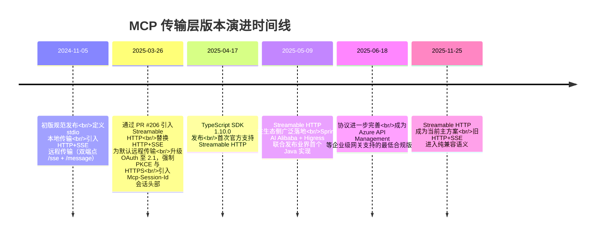

从时间线可见，传输层的迭代节奏极快：从初版到 Streamable HTTP 取代 HTTP+SSE 仅用约 4 个半月，从协议引入到 SDK 首次支持仅用约 3 周[^5]，从规范发布到企业级网关与云厂商集成仅用约 2 个月[^5]。这种高速演进对工程团队提出了严格的版本敏感度要求——文档中所写的"SSE transport"必须先确认是哪个版本的规范，不可混为一谈[^7]。

**术语歧义辨析**是理解 MCP 传输层演进的前提。在公开资料中，"SSE"一词存在两种截然不同的语义：其一是**旧版 HTTP+SSE 传输（legacy）**，对应 2024-11-05 规范中以 `/sse` 长连接 + `/message` POST 双端点形式工作的远程传输方案；其二是 **Streamable HTTP 中可选的 SSE 流式响应**，即新规范下服务器在统一 `/mcp` 端点上"按需将响应升级为 SSE 流"的能力[^7]。前者是已被废弃的整套传输架构，后者是新传输内嵌的一种响应形态，二者在端点数量、连接模型、状态管理等维度均有本质差异，必须严格区分。

下表汇总了 MCP 当前三种官方传输机制的标准状态与适用边界，为后续讨论锚定基准：

| 维度 | stdio | HTTP+SSE（旧） | Streamable HTTP（新） |
|------|-------|----------------|------------------------|
| 引入时间 | 2024-11-05 | 2024-11-05 | 2025-03-26 |
| 标准状态（截至 2025-11-25） | 当前标准 | 已废弃（仅向后兼容） | 当前标准 |
| 连接形态 | 客户端拉起子进程 | 远程 HTTP 双端点 | 远程 HTTP 单端点 |
| 通信方式 | stdin/stdout 行分隔 JSON-RPC | SSE 收消息 + POST 发消息 | POST 发消息，响应可 JSON 或 SSE；也可 GET 打开 SSE |
| 典型部署 | 本机工具、IDE 插件 | 历史系统兼容 | 云服务、网关、多客户端 |
| 关键风险 | stdout 混入日志 | 端点管理复杂、长连接压力 | 鉴权、会话、重连 |

数据来源：综合 MCP 规范 2024-11-05 / 2025-03-26 / 2025-11-25 三个版本的对比[^7]。从表中可清晰看到，stdio 与 Streamable HTTP 是当前并行的"双标准"——前者覆盖本地单机场景，后者覆盖远程服务化场景，而 HTTP+SSE 则被明确降级为"仅用于兼容历史客户端/服务端"的过渡形态[^7]。这一定位为本章后续的工程动因分析与迁移路径讨论确立了基础。

## 1.2 HTTP+SSE 传输方案的工程痛点与替换动因

要理解 Streamable HTTP 的工程价值，必须先厘清其前任 HTTP+SSE 在生产环境中暴露出的结构性缺陷。HTTP+SSE 本质上是 **"HTTP 请求-响应" 与 "SSE 单向流" 的拼接方案**：客户端通过 `/sse` 端点建立持久长连接以接收服务器推送的消息，又通过 `/sse/messages`（或 `/message`）端点以标准 HTTP POST 向服务器发送请求消息[^5]。这种"双通道"设计在 MCP 早期为远程通信打开了局面，但在企业级 AI 应用规模化落地时，迅速显现出四类致命局限。

**第一，连接资源浪费导致高并发崩溃。** HTTP+SSE 要求服务器为每个客户端维护一条独立的、不可中断的 SSE 长连接，且连接无法复用[^8][^5]。在阿里云 Higress 团队公开的 1000 并发用户实测中，HTTP+SSE 的 TCP 连接数随时间持续增长，最终突破 1000 条；当 Linux 系统默认最大连接数（1024）触发后，新请求因无法建立 SSE 连接而直接失败，请求成功率从 98% 骤降至 15%[^3]。这种"连接绑定"模式使服务器内存与 CPU 资源在高并发下被长连接耗尽，成为 AI 服务横向扩容的核心瓶颈[^3][^5]。

**第二，不支持断线恢复造成会话状态丢失。** 当客户端与服务器之间的 SSE 连接因网络抖动、WiFi 不稳或服务器重启而中断时，HTTP+SSE 缺乏从断点续传的机制——客户端只能重新建立新连接并初始化整个会话，所有已传输的上下文与正在进行的任务全部作废[^4][^8][^5]。Spring AI Alibaba 团队在分析中给出的典型反例是：一项正在执行的大型文档分析任务，会因 WiFi 不稳定而完全中断，迫使用户重新开始整个流程[^5]。在长周期 AI 推理与多轮对话场景中，这种"全量重来"的语义对用户体验是不可接受的。

**第三，服务器单向被动响应造成通信架构割裂。** 在 HTTP+SSE 模型下，服务器只能通过专门的 `/sse` 通道单向推送消息，无法在已有请求之外主动地、任意时机地向客户端发送消息——它本质上是"单向被动响应"，而非"双向任意推送"[^4]。即使是简单的请求-响应交互（如"获取工具列表"），服务器也必须通过 SSE 通道返回信息，造成不必要的流开销[^3][^5]。同时，客户端与服务器需要协调 `/sse` 与 `/message` 两个不同方向的端点之间的请求/响应匹配，使代码复杂度显著上升、易出错[^5]。

**第四，与现有基础设施的兼容性冲突。** 许多企业级 Web 基础设施——包括 CDN、负载均衡器、API 网关、Web 防火墙——并不能正确处理长时间的 SSE 连接；企业防火墙可能强制关闭超时连接，云函数（如 AWS Lambda、Cloudflare Workers）等无服务器环境也不适合长时间保持 SSE 连接[^4][^5]。此外，SSE 与 HTTP/2、HTTP/3 的兼容性较差，无法充分利用现代协议的多路复用与性能优势[^5]。这些基础设施层面的不兼容，使 HTTP+SSE 在真实生产部署中频繁出现"本地能跑、上云就挂"的现象。

下表将上述四类痛点与 Streamable HTTP 的针对性改进进行映射，揭示协议升级的工程必然性：

| 痛点维度 | HTTP+SSE 表现 | 对工程的具体影响 | Streamable HTTP 应对 |
|----------|--------------|------------------|------------------------|
| 连接资源 | 每客户端一条长连接，不可复用 | 1000 并发下 TCP 连接突破 1024 上限，成功率从 98% 跌至 15% | 按需流式，连接复用率提升 93%+，1000 并发下稳定几十条连接 |
| 断线恢复 | SSE 中断即上下文丢失 | 长任务被迫从零重启，用户体验崩溃 | Mcp-Session-Id + Last-Event-ID 支持断点续传 |
| 通信方向 | 服务器仅能通过 `/sse` 单向推送 | 简单请求也走 SSE，开销冗余；双端点协调复杂 | 单端点动态升级，按需选择 JSON 直回或 SSE 流 |
| 基础设施 | 长连接与 CDN/防火墙/Serverless 不兼容 | 云函数部署受阻，企业网关频繁断链 | 纯 HTTP 实现，无强制长连接，兼容现有基础设施 |

数据综合自阿里云 Higress 实测、Spring AI Alibaba 分析与 MCP 官方规范说明[^3][^5]。从表中可以看出，**Streamable HTTP 并非对 HTTP+SSE 的边缘修补，而是在四个核心维度上系统性回应工程痛点的协议级重构**——这也解释了为何 MCP 官方在仅 4 个月后即将旧方案正式标记为 deprecated 并强烈建议尽快迁移[^9][^5]。

## 1.3 Streamable HTTP 的设计哲学与核心范式转变

Streamable HTTP 的设计目标并非颠覆 HTTP 生态，而是在 **HTTP 兼容性**与 **AI 通信需求**之间寻找最优平衡点[^3]。它首先是一种渐进式改进方案：保留 SSE 带来的流式响应优势，同时解决连接不可恢复、服务端长连接压力大、双端点架构复杂等问题[^9][^4]。这一定位决定了它在工程实践中的三大核心设计理念。

**理念一：统一通信范式——单端点替代双端点。** Streamable HTTP 移除了专门的 `/sse` 端点，将所有通信统一收敛到单一的 `/mcp` 端点（或类似命名）[^4][^5]。客户端通过 POST 向 `/mcp` 发送消息，服务器通过同一端点返回响应或升级为 SSE 流；客户端也可以通过 GET `/mcp` 主动建立 SSE 流以接收服务器推送的通知[^4]。这一改变将原本"打电话时用一部手机说话、另一部听声音"的双通道架构[^5]简化为单通道双向通信，显著降低了客户端与服务端的协调复杂度，也使得请求/响应在同一通道内自然匹配，错误处理更清晰[^5]。

**理念二：动态传输适配——按需在 JSON 与 SSE 间切换。** Streamable HTTP 引入了"响应升级"机制：服务器可灵活选择是返回普通 HTTP JSON 响应还是升级为 SSE 流[^4][^5]。简单请求（如数学计算、获取工具列表）→ 直接返回 JSON；复杂或流式操作（如大文件处理、长文生成）→ 自动升级为类似 SSE 的流式连接[^5]。这种"按需流式"的设计避免了 HTTP+SSE 时代"所有响应都走流"的开销冗余，让协议在不同负载场景下都能保持最优开销，本质上回答了"什么时候需要流，由协议在运行时决定"这一关键工程问题。

**理念三：状态化增强——可选会话机制兼顾有状态与无状态。** Streamable HTTP 通过 `Mcp-Session-Id` 头部引入了**可选**的会话标识机制：服务器在初始化阶段可选择生成会话 ID 并要求客户端在后续所有请求中携带该 ID，从而支持有状态部署；若服务器选择不生成 Session-Id，则可保持完全无状态运行，适配 Serverless 与微服务架构[^9][^4][^5]。这种"按需有状态"的设计使同一套协议规范可以同时承载从一次性工具调用到复杂多轮对话、从断线恢复到无状态短请求的全部场景[^9]。

值得特别强调的是，**Streamable HTTP 并非传统意义上的"流式 HTTP（Streaming HTTP）"**[^4]。它指的是一种兼具如下特性的传输机制：以普通 HTTP 请求为基础，客户端用 POST/GET 发请求；服务器可选地将响应升级为 SSE 流，实现流式传输能力（当需要时）；去中心化、无强制要求持续连接，支持 stateless 模式；同一个 `/mcp` 端点可用于发起请求和接收 SSE 流，不再需要单独的 `/sse` 端点[^4]。理解这一点对工程团队的技术选型至关重要——Streamable HTTP 本质上是**"HTTP + 可选 SSE 升级 + 可选会话"**的组合协议，而非一种全新的流式传输技术[^4]。

这种设计哲学带来的核心范式转变可以概括为下图：

```mermaid
graph LR
    A[HTTP+SSE 双端点架构] -->|范式转变| B[Streamable HTTP 单端点架构]
    
    subgraph 旧范式
    A1[/sse 长连接<br/>单向推送] 
    A2[/message POST<br/>客户端发送]
    A1 -.强耦合.- A2
    end
    
    subgraph 新范式
    B1[/mcp 统一端点]
    B2[POST: 客户端→服务端]
    B3[GET: 主动建立 SSE 流]
    B4[响应: JSON 或 SSE 动态升级]
    B5[Mcp-Session-Id: 可选会话]
    B1 --> B2
    B1 --> B3
    B1 --> B4
    B1 --> B5
    end
    
    A --> 旧范式
    B --> 新范式
```

图中清晰地展示了从"双端点强耦合"到"单端点动态适配"的架构演进。**Streamable HTTP 的本质创新在于：用 HTTP 的请求-响应基本语义承载所有交互形态，让 SSE 流式响应成为一种"运行时能力"而非"架构前提"**——这正是它能够同时实现"向后兼容、可降级、可演进"三重工程目标的关键[^4][^5]。

## 1.4 协议规范的关键字段与交互机制解析

在确立设计哲学的基础上，Streamable HTTP 通过一系列具体的协议字段与交互机制将上述理念落地为可实现的工程规范。下文逐项解构其核心要素，为后续 SDK 源码剖析与工程实现章节建立规范引用基础。

**统一 `/mcp` 端点。** 协议层面移除了 `/sse` 与 `/message` 的双端点设计，所有客户端与服务器之间的消息收发均通过单一端点完成（官方 SDK 当前默认实现为 `/mcp`，但端点名称非强制，亦可命名为 `/message` 等）[^4][^5]。这一改变是后续所有交互机制的物理基础。

**HTTP 方法语义分工。** Streamable HTTP 对 POST 与 GET 两种方法赋予了清晰的语义：

- **POST**：承载客户端到服务端的 JSON-RPC 请求，是绝大多数 MCP 调用的默认方式。客户端将 JSON-RPC 消息（如 `initialize`、`tools/call`、`list_resources` 等）作为请求体发送至 `/mcp`，服务器返回响应[^4]。
- **GET**：用于客户端主动建立 SSE 流，以便服务器在没有客户端正在进行的请求时也能主动推送通知或请求[^4][^5]。这是新协议实现"真正的双向通信"——服务器不仅能推数据，还能主动向客户端"要信息"——的关键能力[^5]。

**Accept 头部内容协商。** 客户端通过 HTTP `Accept` 头部声明其能够处理的响应格式：`application/json` 表示期待普通 JSON 响应，`text/event-stream` 表示能够处理 SSE 流式响应。服务器据此在两种响应形态中动态选择，从而实现按需流式的协议核心能力[^10][^11]。这与 SSE 规范本身的内容协商机制保持一致——传统 SSE 客户端通过 `Accept: text/event-stream` 向服务器声明"我准备好接收一个事件流了"[^10]。

**响应升级机制。** 服务器收到 POST 请求后，根据请求性质动态选择响应形态：

- **普通响应**：直接返回 HTTP JSON 响应，适合一次性、短时的简单交互；
- **流式响应**：升级连接为 SSE，发送一系列事件后关闭连接，适合长时任务的进度反馈；
- **长连接**：维持 SSE 连接持续发送事件，适合需要持续推送的复杂会话[^5]。

这种"一个请求、三种可能响应形态"的灵活性是 Streamable HTTP 区别于传统 HTTP 与传统 SSE 的根本特征。

**`Mcp-Session-Id` 会话标识。** 该头部承担会话标识与状态恢复的核心职责。在初始化阶段，服务器可选地生成唯一的会话 ID 并通过响应头返回；客户端必须在后续所有请求中携带该 ID，使服务器能够将请求关联到正确的会话上下文[^9][^4][^5]。Session-Id 的引入使得 Streamable HTTP 既能支持复杂的有状态对话（多轮上下文、长任务跟踪），又能在服务器选择不生成 ID 时保持完全无状态运行[^5][^12]。这一字段也是后续断线恢复机制的基础——只有携带正确的 Session-Id，客户端才能在断线后"找回"之前的会话。

**`MCP-Protocol-Version` 协议版本协商。** 该头部用于客户端与服务器之间的协议版本协商，是 MCP 日期版本号策略在传输层的具体体现[^6][^13]。Azure API Management 等企业级网关明确要求外部 MCP 服务器必须符合 MCP 版本 2025-06-18 或更高版本，正是基于这一字段进行版本合规性校验[^13]。版本协商机制保障了协议在快速迭代过程中的前向与后向兼容性。

**`Last-Event-ID` 与事件重放。** SSE 规范本身支持事件 ID 机制——服务器在每条 SSE 消息中可以附带一个 `id` 字段（如 `id: 20240514_001`）[^10][^11]，客户端在断线后可以通过 `Last-Event-ID` 头部告知服务器其最后接收到的事件 ID，服务器据此从该点之后重放未送达的事件。Streamable HTTP 将这一标准 SSE 能力与 `Mcp-Session-Id` 结合，构成端点续传的完整机制：**Session-Id 定位会话上下文，Last-Event-ID 定位消息断点**[^5]。这一组合使 Streamable HTTP 在不稳定网络环境下仍能保持任务连续性，是其相对 HTTP+SSE 在可靠性维度上的根本性突破。

下表汇总上述关键字段及其规范职责：

| 协议要素 | 取值/示例 | 规范职责 | 工程意义 |
|----------|-----------|----------|----------|
| 端点路径 | `/mcp`（默认） | 统一收敛所有客户端-服务端通信 | 简化路由、降低复杂度 |
| POST 方法 | `POST /mcp` | 承载 JSON-RPC 请求 | 客户端→服务端的默认通道 |
| GET 方法 | `GET /mcp` | 主动建立 SSE 流 | 支持服务器主动推送 |
| `Accept` 头 | `application/json` / `text/event-stream` | 内容协商 | 决定响应是否升级为流 |
| 响应升级 | JSON / SSE 流 / 长连接 SSE | 动态选择响应形态 | 按需流式，避免冗余开销 |
| `Mcp-Session-Id` | 服务器生成的唯一 ID | 会话标识、状态绑定 | 有状态/无状态可选 |
| `MCP-Protocol-Version` | 如 `2025-06-18` | 协议版本协商 | 跨版本兼容性保障 |
| SSE `id` 字段 | 自定义事件 ID | 标记 SSE 消息序号 | 断线重放的定位锚点 |
| `Last-Event-ID` 头 | 客户端最后接收的 ID | 触发服务器从断点重放 | 端点续传基础 |

数据综合自 MCP 规范 2025-03-26 / 2025-06-18 版本说明、Spring AI Alibaba 与 AWS Lambda 实战分析[^4][^5][^13][^12]。这些字段并非孤立存在，而是相互配合构成一个完整的"统一端点 + 方法语义 + 内容协商 + 动态升级 + 会话状态 + 事件重放"的协议体系。**理解这些字段的协同关系，是后续章节深入剖析 SDK 实现、服务端架构与客户端容错的前提**。

## 1.5 四类典型交互模式与协议能力映射

基于上述协议字段与机制，Streamable HTTP 在工程实践中可以归纳为四类核心交互模式，每一类对应不同的 AI 应用场景与部署形态[^9][^4]。这种模式分类不仅帮助开发者快速定位适用方案，也为后续章节的服务端架构选型与客户端容错设计提供了清晰的框架。

**模式一：无状态服务器模式。** 服务器在收到 POST 请求后直接返回单条 JSON 响应，不生成 Session-Id、不维持任何会话状态。典型场景包括数学计算、文本处理、单一工具 API 等一次性、短时交互[^9][^4]。其消息序列极简：客户端 POST `/mcp`（计算请求）→ 服务器执行计算 → HTTP 200 返回结果[^4]。该模式的工程优势在于极简部署、无需状态管理，天然适配 Serverless 与微服务架构——AWS 团队明确指出，Streamable HTTP 的无状态模式可以与 AWS Lambda 的弹性伸缩能力天然适配，按调用次数收费、不会造成空闲资源浪费，并通过 Amazon API Gateway 实现 Streamable HTTP 无状态协议[^4]。

**模式二：流式进度反馈模式。** 服务器在收到 POST 请求后将响应升级为 SSE 流，向客户端持续推送多条进度消息，最终关闭连接。典型场景包括大文件处理、长文生成、复杂 AI 推理等渐进式输出任务[^9][^4][^5]。其消息序列为：客户端 POST `/mcp`（处理请求）→ 服务器启动处理任务并升级为 SSE → 持续推送进度事件 → 任务完成后关闭流。该模式无需 Session-Id，但充分利用了响应升级机制，是 Streamable HTTP 在保留 SSE 流式优势的同时摆脱长连接负担的典型体现。

**模式三：有状态多轮对话模式。** 服务器在初始化阶段生成 `Mcp-Session-Id` 并通过响应头返回，客户端在后续所有请求中携带该 ID，服务器据此维护跨请求的会话上下文。典型场景包括复杂 AI 对话、多智能体协作、需要工具调用历史的推理任务[^9][^4]。该模式下，客户端可以发起多次独立的 POST 请求，但服务器能够基于 Session-Id 将它们串联为一个连续的会话状态，从而支持上下文记忆、工具调用链、对话历史等高级能力[^9][^5]。

**模式四：断线恢复模式。** 在有状态多轮对话或流式进度反馈模式的基础上，引入 SSE 事件 ID 与 `Last-Event-ID` 头部实现端点续传。当 SSE 连接因网络抖动中断时，客户端可以通过 GET `/mcp`（携带原 Session-Id 与 Last-Event-ID）重新建立 SSE 流，服务器从断点之后重放未送达的事件[^9][^4][^5]。典型场景包括移动弱网环境下的长任务、不稳定网络下的可靠 AI 服务[^9]。该模式是 Streamable HTTP 相对 HTTP+SSE 在可靠性维度上的核心突破，也是后续章节深入分析 EventStore 抽象、事件存储后端、竞态规避等工程细节的基础。

下表将四类模式与协议能力、典型场景、部署形态进行对应：

| 交互模式 | 所需协议能力 | 典型 AI 场景 | 部署形态适配 |
|----------|-------------|-------------|------------|
| 无状态服务器 | POST + JSON 响应 | 工具 API、数学计算、文本处理 | Serverless（Lambda）、微服务、CDN 友好 |
| 流式进度反馈 | POST + SSE 响应升级 | 长文生成、大文件处理、AI 推理进度 | 容器化部署、API 网关 |
| 有状态多轮对话 | POST + JSON/SSE + Mcp-Session-Id | 多轮 AI 对话、工具调用链、Agent 协作 | 有状态服务、Session 粘性负载均衡 |
| 断线恢复 | GET/POST + Session-Id + Last-Event-ID + SSE 事件 ID | 移动弱网长任务、可靠 AI 服务 | 持久化 EventStore、跨节点会话同步 |

数据综合自 MCP 协议规范分析、Spring AI Alibaba 与 AWS Lambda 实战案例[^9][^4][^5]。**这四类模式并非互斥，而是按需组合**——一个企业级 MCP 服务可以同时支持无状态短请求与有状态长会话，仅通过是否生成 Session-Id 进行区分；流式进度反馈也可以与断线恢复叠加，构成生产级可靠 AI 服务的标准形态[^9]。这种"基础能力 + 按需组合"的设计使 Streamable HTTP 既能覆盖从边缘设备到云端的全部署形态，又能匹配从简单工具调用到多模态多智能体的全 AI 场景[^3]。

---

至此，本章已完成对 MCP 传输层演进脉络、HTTP+SSE 工程痛点、Streamable HTTP 设计哲学与协议规范的系统梳理。**核心结论可以归纳为三点**：其一，Streamable HTTP 并非颠覆性重构，而是针对 HTTP+SSE 在连接资源、断线恢复、通信方向、基础设施兼容性四类痛点的协议级回应；其二，其设计哲学的精髓在于"统一端点 + 动态升级 + 可选会话"的三层组合，本质是用 HTTP 基本语义承载所有交互形态，让 SSE 与会话管理成为运行时能力；其三，协议字段（`/mcp`、POST/GET、Accept、Mcp-Session-Id、MCP-Protocol-Version、Last-Event-ID）与四类交互模式（无状态、流式进度、有状态对话、断线恢复）共同构成了一套完整、可组合、可演进的工程规范基础。

需要客观指出的是，本章对协议规范的解析主要基于公开的协议变更说明、官方博客与第三方权威分析[^4][^5]，部分字段的细粒度行为（如 Session-Id 生命周期管理、EventStore 接口约束、SSE 事件 ID 命名规范）需要进入官方 SDK 源码层面才能完整验证。这些工程实现细节将在后续第 2 章（传输工作流程与会话恢复机制）与第 3 章（官方 SDK 源码级实现剖析）中展开深入分析，本章已为之确立了规范坐标与术语基准。

# 2 传输工作流程、状态机与会话恢复机制

第 1 章已从规范层面厘清了 Streamable HTTP 的协议字段与四类典型交互模式，确立了"统一端点 + 动态升级 + 可选会话"的协议哲学。然而，**协议规范只是一套静态的契约描述，工程实现的真正难点在于运行时层面**——客户端与服务端在真实的网络环境中如何握手、如何动态决定响应形态、如何管理会话生命周期、如何在断线后准确续传未送达事件、如何规避并发竞态——这些问题构成了 Streamable HTTP 落地为可用工程方案的关键。

本章将协议规范"展开"到运行时层面：首先以四类典型场景的报文流还原协议在端到端通信中的实际行为；其次抽象客户端与服务端的状态机模型，刻画其在不同响应形态下的迁移规则；进而在四类工程模式下验证状态机的差异化实现；最后聚焦 `Mcp-Session-Id` 与 `EventStore` 两大核心抽象，深入剖析会话生命周期管理与基于 `Last-Event-ID` 的断线续传机制，并归纳生产级方案的并发竞态规避策略。本章是衔接协议规范（第 1 章）与 SDK 源码（第 3 章）之间的运行时行为桥梁。

## 2.1 端到端交互流程的全景拆解

要理解 Streamable HTTP 的运行时行为，最直接的方式是沿着真实交互的时间轴还原报文流。结合 MCP 官方规范（2025-03-26 / 2025-06-18）与 Spring AI Alibaba、Higress 等工程实现的公开描述[^5]，可以将典型交互归纳为四个相对独立又彼此衔接的阶段：**初始化握手、工具调用、通知推送、会话终止**。

### 2.1.1 初始化握手阶段

初始化是 Streamable HTTP 任何会话的起点。客户端首先以 POST 请求向服务端 `/mcp` 端点发送 JSON-RPC `initialize` 消息，并在请求头中声明能够接收的内容类型与协议版本：

```http
POST /mcp HTTP/1.1
Host: mcp.example.com
Content-Type: application/json
Accept: application/json, text/event-stream
MCP-Protocol-Version: 2025-06-18

{"jsonrpc":"2.0","id":1,"method":"initialize","params":{...}}
```

服务端接收到请求后，根据其部署形态决定是否生成会话标识：在有状态部署中，服务端会生成一个加密强随机的会话 ID 并通过 `Mcp-Session-Id` 响应头返回给客户端；在无状态部署中（如 Serverless）则可省略此步骤[^5][^14]。值得注意的是，**`initialize` 响应通常是单条 JSON，并不会升级为 SSE 流**——这是因为初始化握手语义上是一次同步操作，没有持续推送的需要。

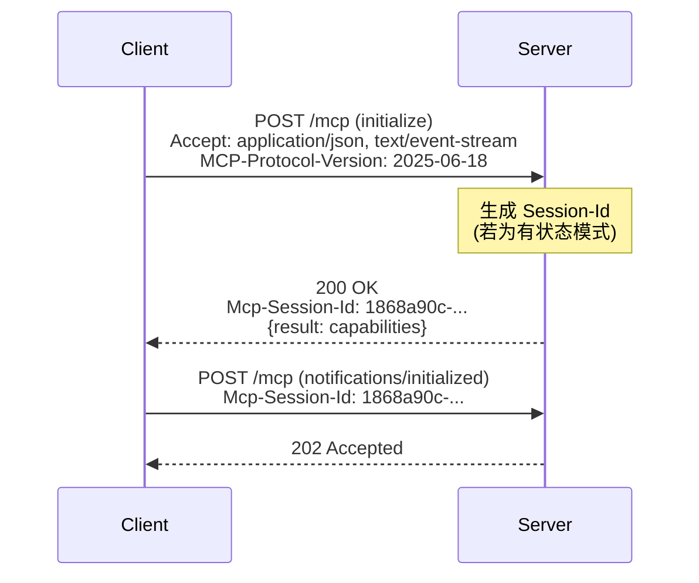

握手完成后，客户端必须在后续所有请求中携带 `Mcp-Session-Id` 头部。若客户端未携带或携带了无效的 ID，服务端应返回 4xx 错误以促使客户端重新初始化。

### 2.1.2 工具调用阶段：动态响应升级

工具调用是 Streamable HTTP 最能体现"按需流式"理念的阶段。客户端通过 POST 向 `/mcp` 发送 `tools/call` 请求，服务端根据工具的执行特征**在运行时动态选择响应形态**[^5]：

- **同步 JSON 直回**：适用于快速完成、无中间状态的工具（如数学计算、字典查询）。服务器执行后直接返回 `Content-Type: application/json` 的单条响应，连接随即关闭。
- **SSE 流式响应**：适用于长任务或渐进式输出的工具（如大文件处理、长文生成）。服务端以 `Content-Type: text/event-stream` 升级响应，按事件推送进度、中间结果，最终在工具完成时关闭流。

服务端做出何种选择对客户端是透明的——客户端在 `Accept` 头部声明了对两种格式的支持，由服务端在响应头中以 `Content-Type` 表明实际选择，客户端按收到的内容类型分支处理。这种"运行时由服务端决定"的设计避免了协议层的硬编码，使得同一个端点可以承载完全不同负载特征的工具调用。

### 2.1.3 通知推送阶段：GET 主动建立 SSE 流

Streamable HTTP 之所以被称为"双向通信"协议，关键在于客户端可以主动发起 GET 请求来"打开"一条服务器→客户端的推送通道[^5]：

```http
GET /mcp HTTP/1.1
Host: mcp.example.com
Accept: text/event-stream
Mcp-Session-Id: 1868a90c-...
Last-Event-ID: evt_20251229_042  (可选，用于断线续传)
```

服务端响应 `Content-Type: text/event-stream` 并保持连接开放，在没有客户端正在进行的请求时，仍可通过这条 SSE 流向客户端推送通知（如资源更新、采样请求、进度提醒）甚至反向调用客户端能力。**这条 GET 通道与 POST 通道是并行存在、相互独立的**——客户端可以在保持 GET-SSE 流的同时发起多个 POST 请求，二者不会互相阻塞。

### 2.1.4 会话终止阶段

会话终止有两条路径：客户端主动销毁与服务端超时回收。客户端可以通过 `DELETE /mcp` 携带 `Mcp-Session-Id` 显式销毁会话，服务端清理对应的上下文、未消费事件与活跃 SSE 流；或者服务端基于会话超时策略主动回收长时间未活跃的会话，下一次客户端携带过期 ID 的请求会收到 404 响应，从而触发客户端重新初始化。

下表汇总四类阶段的关键报文特征：

| 阶段 | 方法+路径 | 关键请求头 | 典型响应 | Session-Id 行为 |
|------|----------|------------|----------|-----------------|
| 初始化握手 | POST /mcp (initialize) | Accept: 双格式; MCP-Protocol-Version | 200 + JSON | 服务端可选生成并写入响应头 |
| 工具调用 | POST /mcp (tools/call) | Mcp-Session-Id (若有状态) | JSON 或 SSE 流 | 客户端必须携带 |
| 通知推送 | GET /mcp | Mcp-Session-Id; Last-Event-ID(可选) | text/event-stream 长连接 | 客户端必须携带 |
| 会话终止 | DELETE /mcp 或超时 | Mcp-Session-Id | 200/204 或 404 | 服务端清理绑定资源 |

数据综合自 MCP 协议规范分析与 Spring AI Alibaba 工程实现说明[^5]。这套报文流揭示了 Streamable HTTP 的核心运行时特征：**所有交互均收敛到单一端点，但通过 HTTP 方法、`Accept` 头部、`Mcp-Session-Id` 头部三者的组合，形成了对四类完全不同语义阶段的精准刻画**。

## 2.2 客户端与服务器的状态机迁移模型

将上述报文流抽象到状态机层面，可以更清晰地刻画 Streamable HTTP 在运行时的合法路径与非法迁移。状态机视角不仅有助于理解协议的内在逻辑，更是后续容错设计、并发竞态规避与 SDK 源码分析的形式化基础。

### 2.2.1 服务器侧状态机

服务器侧状态机以"会话"为粒度建模，每个会话从被创建到被销毁经历若干合法状态：

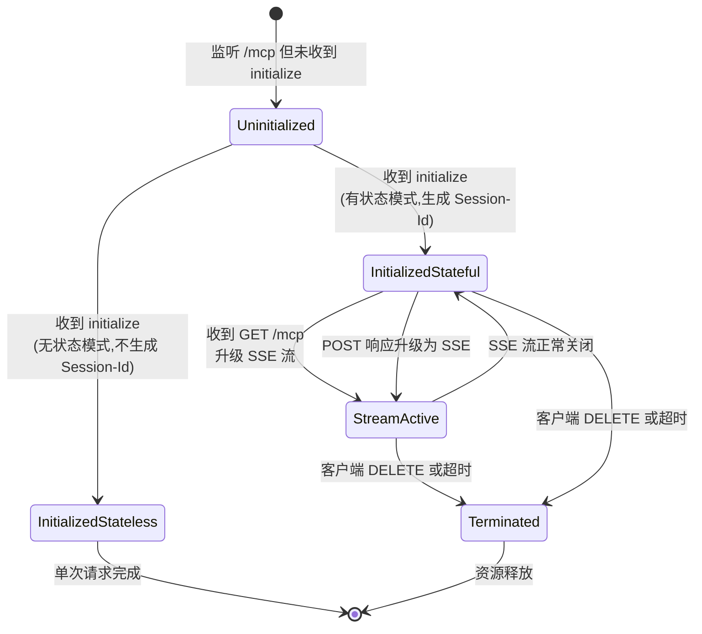

服务器侧的关键状态迁移点在于：**初始化时根据是否生成 Session-Id 分叉为无状态与有状态两条路径**；进入有状态后，可以因 POST 响应升级或 GET 主动建立而进入"SSE 流活跃"状态，此时同一会话可以并存多条 SSE 流；流的关闭只回退到"已初始化有会话"状态，会话本身仍然存活；只有当客户端发起 DELETE 或服务端触发超时回收时，会话才进入"已终止"状态并最终释放资源。

### 2.2.2 客户端侧状态机

客户端侧状态机相对简单，但需要额外处理"断线待恢复"这一特殊状态：

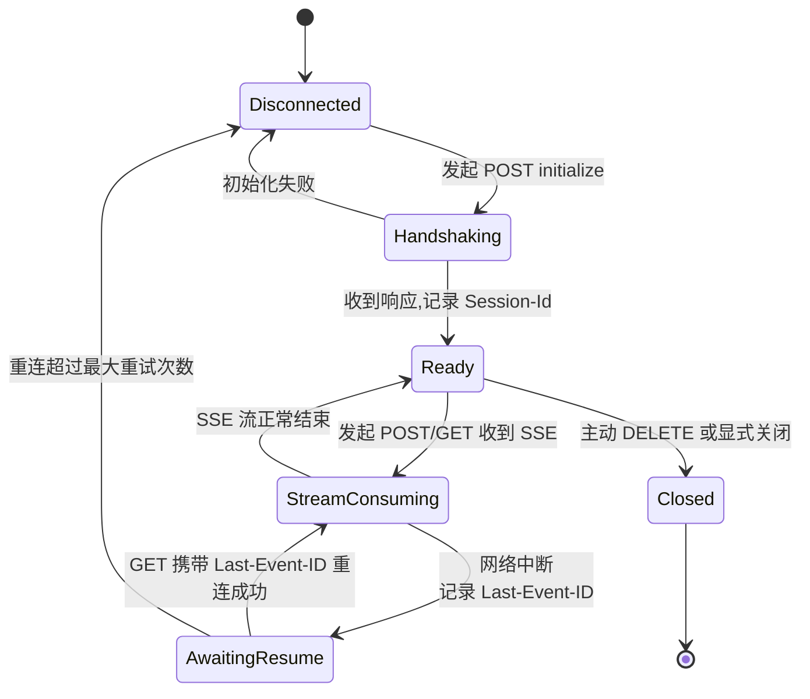

客户端状态机的核心特征是：**`AwaitingResume` 状态承载了断线续传的关键语义**——当 SSE 连接中断时，客户端不会立即放弃整个会话，而是保留 `Mcp-Session-Id` 与最后接收到的事件 ID，进入"待恢复"状态等待网络恢复后通过 GET 携带 `Last-Event-ID` 重新建立流。这一状态的存在是 Streamable HTTP 相对 HTTP+SSE 在可靠性维度上的核心区别。

### 2.2.3 三类响应形态下的状态分支

POST 请求收到的响应可能是三种形态之一，每种形态触发不同的状态迁移路径。**同步 JSON 响应**：客户端在 `Ready` 状态下保持不变，仅完成一次请求-响应闭环。**SSE 流式响应（短流）**：客户端进入 `StreamConsuming` 状态，按事件解析消息，流主动关闭后回到 `Ready`。**长连接 SSE**：客户端长期驻留在 `StreamConsuming` 状态，可能与并行的 POST 请求共存。

值得强调的是，**POST 请求与 GET 请求在状态机中是并行的**——客户端可以在 GET-SSE 流持续接收的同时发起多次 POST，服务端必须能够将每个 POST 的响应正确路由（或升级为新 SSE 流，或返回 JSON），同时不影响已建立的 GET-SSE 流。这种并行性约束直接决定了服务端 SDK 必须采用异步并发的实现模式（如 Python 的 asyncio 任务组、Node.js 的事件循环、Go 的 goroutine），将在第 3 章详述。

## 2.3 四类典型工程模式的实现差异验证

第 1 章归纳的四类交互模式（无状态、流式进度、有状态多轮对话、复杂 AI 会话）在状态机层面展现出显著的实现差异。逐一验证这些差异，有助于工程团队为不同业务场景选择最匹配的实现路径。

**无状态服务器模式**是状态机最简的形态。服务器收到 POST 后，跳过 Session-Id 生成、不维护任何跨请求上下文，直接执行业务逻辑并返回 JSON。这种模式下，服务器的"状态机"实际上退化为无状态函数，每次请求都是独立的闭环。其工程优势在于天然适配 Serverless 与水平扩容——任意请求可以路由到任意实例，无需会话粘性[^14]。

**流式进度反馈模式**引入了响应升级机制：服务器收到 POST 后判断需要流式输出，响应头声明 `Content-Type: text/event-stream`，进入 SSE 流活跃状态，按事件推送进度，任务完成后主动关闭流。这种模式不依赖 Session-Id，但状态机比纯无状态多了一个"流活跃"的中间态，需要服务端在异步任务中持续向响应流写入事件，并妥善处理客户端中途断开的清理逻辑。

**有状态多轮对话模式**是真正考验状态机设计的场景。服务器在初始化时生成 Session-Id 并绑定到会话级状态对象（如对话历史、工具调用栈、用户上下文），客户端在每次 POST 中携带该 ID，服务端据此恢复上下文并执行调用。**关键实现挑战在于并发请求隔离**——同一会话可能同时有多个 POST 在执行，服务端必须保证它们对会话状态的访问是线程安全的。函数计算的"会话级请求绑定"亲和机制正是为解决此类场景而设计：通过将同一 Session-Id 的请求绑定到同一函数实例，避免跨实例同步开销[^14]。

**复杂 AI 会话模式**叠加了上述全部能力：有状态会话维持上下文、POST 触发的 SSE 流推送渐进式工具结果、并行的 GET-SSE 流接收服务器主动通知（如采样请求、资源更新）、Last-Event-ID 支持断线续传。这种模式下，**同一会话可能并存多条 SSE 流**——一条来自正在执行的工具调用、一条来自 GET 主动建立的通知通道，状态机必须独立追踪每条流的生命周期，并在任意一条断开时不影响其他流的正常运行。

下表对比四类模式在状态机层面的关键差异：

| 模式 | 端点 | 关键头部 | 连接生命周期 | 并发模型 | 状态机复杂度 |
|------|------|---------|--------------|----------|--------------|
| 无状态服务器 | POST /mcp | 无 Session-Id | 单次请求闭环 | 无状态、可任意路由 | 最简 |
| 流式进度反馈 | POST /mcp | 无 Session-Id (可选) | 单 SSE 流到任务结束 | 单实例异步任务 | 中等 |
| 有状态多轮对话 | POST /mcp | Mcp-Session-Id 必需 | 跨多次请求的会话生命周期 | 同会话请求需粘性或共享存储 | 较高 |
| 复杂 AI 会话 | POST + GET /mcp | Session-Id + Last-Event-ID | 多条并存 SSE 流 + 长会话 | 多流并发 + 跨节点恢复 | 最高 |

数据综合自 MCP 规范、Spring AI Alibaba 与函数计算亲和性技术分析[^5][^14]。**这一对照表的工程意义在于：业务团队可以根据自身的会话特征、可靠性要求、部署形态选择最合适的模式**，而无需为简单场景承担复杂模式的工程成本。

## 2.4 Mcp-Session-Id 会话生命周期管理

`Mcp-Session-Id` 是 Streamable HTTP 实现状态化能力的核心抽象，其生命周期管理直接决定了服务端的会话隔离强度、安全边界与可恢复性。从工程实现的角度，会话生命周期可以拆解为生成、绑定、校验、销毁四个阶段。

**生成阶段**对会话 ID 的安全熵有较高要求。规范虽未强制具体算法，但社区共识与典型实现普遍采用 UUID v4 或加密强随机串（如 16 字节以上的 `os.urandom` 生成结果）作为 Session-Id。安全熵不足的 ID（如自增整数、时间戳）容易被攻击者猜测或枚举，从而越权访问其他用户的会话上下文。这一安全考量与第 1 章提到的 OAuth 2.1 + PKCE 的安全要求一脉相承——MCP 在 2025-03-26 版本中将整个传输层向"高安全性 AI 工具场景"全面加固[^12]。

**绑定阶段**发生在 `initialize` 响应阶段：服务端将生成的 Session-Id 通过响应头 `Mcp-Session-Id` 返回给客户端，同时在内部建立从 ID 到会话状态对象（事件流、上下文、工具调用栈）的映射关系。这一映射通常存储在内存哈希表中（单实例部署）或共享存储中（多实例部署），其性能直接影响后续每次请求的会话查找开销。

**校验阶段**在每次后续请求到达时触发。服务端从请求头解析 `Mcp-Session-Id`，在会话表中查找对应的状态对象。若 ID 不存在（已销毁或从未生成），规范允许返回 404 Not Found（语义为"会话不存在"）；若 ID 格式非法，返回 400 Bad Request（语义为"请求错误"）。**这两种状态码的语义差异是工程实现的关键细节**——404 提示客户端"重新初始化"，400 提示客户端"修复请求"。

**销毁阶段**有三条触发路径：客户端主动 DELETE、服务端超时回收、异常断连清理。客户端发起 `DELETE /mcp` 携带 Session-Id 时，服务端立即清理所有绑定资源——包括关闭活跃的 SSE 流、释放上下文对象、清除 EventStore 中该会话的事件历史。服务端超时回收则基于会话最后活跃时间，通常实现为后台扫描任务，对超过阈值的会话执行清理。异常断连清理则需要对每条 SSE 流的关闭事件设置回调，在连接异常关闭时同步清理服务端资源。

下图刻画了 Session-Id 的完整生命周期：

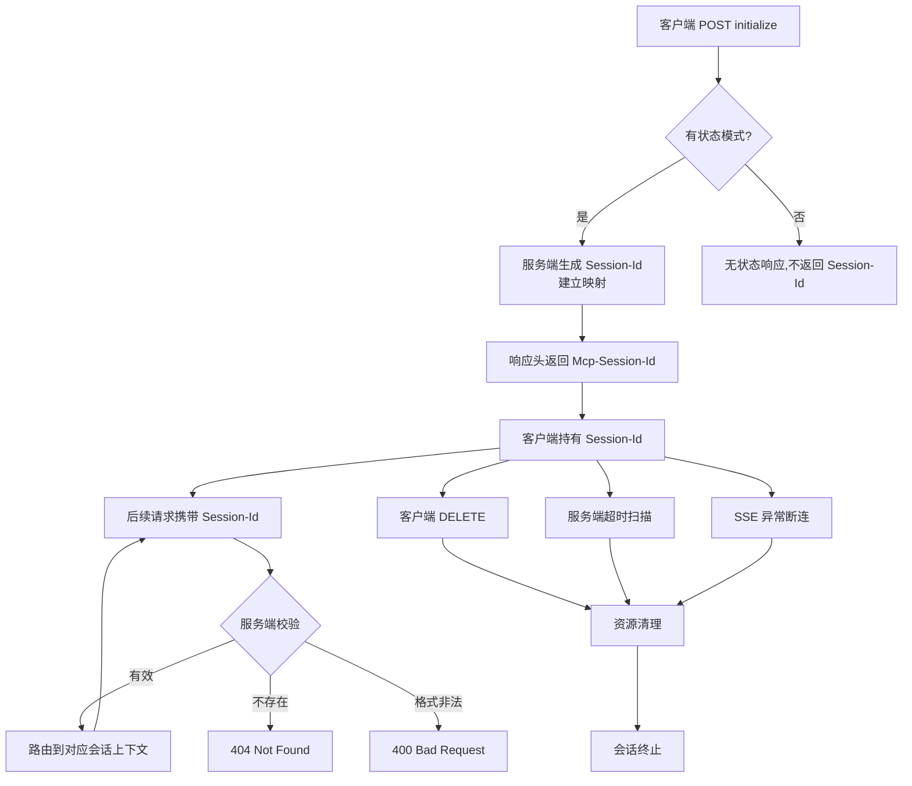

会话与底层资源的绑定关系是另一个值得关注的工程细节。**一个 Session-Id 通常绑定如下资源**：(1) 会话级上下文对象（包含对话历史、用户标识、能力声明）；(2) EventStore 中该会话的事件流（用于断线续传）；(3) 一条或多条活跃的 SSE 响应流；(4) 正在执行的异步任务（如长时间运行的工具调用）。会话销毁时必须确保这些资源被原子性地清理，否则会出现"僵尸会话"——会话已不可达，但占用的内存、文件描述符、后台任务仍在消耗资源。

最后，**会话粘性（Session Affinity）在多实例部署下的负载均衡考量**至关重要。当 MCP 服务以多实例水平扩容时，同一 Session-Id 的请求必须路由到持有该会话状态的实例，否则会出现"找不到会话"的错误。函数计算等 Serverless 平台为此专门实现了"会话级请求绑定"亲和机制，通过基于 Session-Id 的一致性哈希或粘性路由，将同一会话的请求绑定到同一函数实例[^14]；网关侧（如 Higress）也可以基于 Session-Id 实现请求亲和。这一机制将在第 4 章服务端架构中深入展开。

## 2.5 EventStore 抽象与断线续传机制

如果说 `Mcp-Session-Id` 解决了"会话上下文如何跨请求保持"的问题，那么 `EventStore` 解决的则是"SSE 流中已发送的事件如何在断线后被精确续传"的问题。两者共同构成了 Streamable HTTP 可靠性的双柱基石。

### 2.5.1 EventStore 的接口职责

EventStore 是一个抽象接口，规范了断线续传所需的最小能力集。从 TypeScript SDK 的源码可以观察到其核心方法签名[^13]：

```typescript
// 处理命令(数据变更)
async handlePostRequest(req, res) {
    // 解析 JSON-RPC 命令消息
    // 执行相应的业务逻辑
    // 存储事件到事件存储
    if (this._eventStore) {
        eventId = await this._eventStore.storeEvent(streamId, message);
    }
}

// 处理查询(数据读取)
async handleGetRequest(req, res) {
    // 检查 Last-Event-ID 头,支持断点续传
    const lastEventId = req.headers['last-event-id'] as string | undefined;
    if (lastEventId && this._eventStore) {
        await this.replayEvents(lastEventId, res);
    }
    // 建立 SSE 流,推送实时更新
}
```

EventStore 的两个核心方法分工明确：**`storeEvent(streamId, message)` 负责在每条 SSE 事件发送时持久化记录**，并返回一个全局唯一的 `eventId`；**`replayEventsAfter(lastEventId, callback)` 负责在 GET 请求携带 `Last-Event-ID` 时，按事件 ID 顺序读取该 ID 之后未送达的事件**，通过回调推送给客户端[^13]。这一接口抽象的精妙之处在于：**它将"如何存储"与"如何重放"解耦**，开发者可以根据生产环境的需要替换不同的存储后端，而不需要修改协议层逻辑。

### 2.5.2 事件 ID 生成规范

事件 ID 的设计直接关系到重放的正确性。规范要求事件 ID 必须满足两个核心约束：**全局唯一性**（避免不同会话/流之间的 ID 冲突）与**顺序可比性**（重放时能够按 ID 排序定位断点之后的事件）。常见的实现策略是组合 `streamId` 与序号，例如 `<streamId>_<sequence>` 或 `<timestamp>_<random>` 的形式。这种"流标识 + 序号"的双层结构既保证了同一流内的有序性，又通过流标识隔离了不同流的命名空间。

### 2.5.3 Last-Event-ID 驱动的重放回调

断线续传的完整流程可以刻画为如下序列：

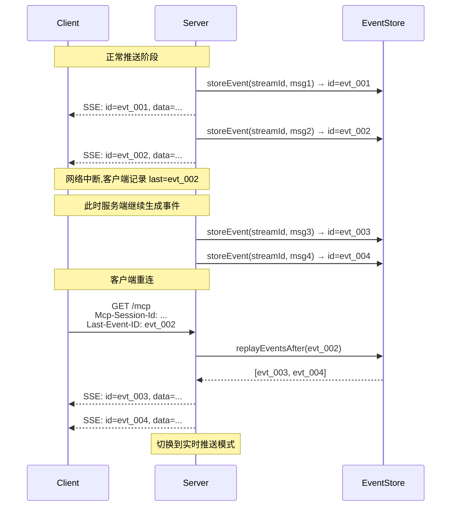

这一流程揭示了 Streamable HTTP 断线续传的本质：**服务端在客户端断线期间仍然持续生成事件并写入 EventStore，客户端重连时通过 `Last-Event-ID` 告知服务端"我已经收到到哪一条"，服务端从该点之后重放未送达事件，最终切换到实时推送**。这一机制使得 SSE 流的中断对客户端而言成为"暂停-恢复"而非"丢失-重来"，是 Streamable HTTP 相对 HTTP+SSE 在可靠性上的根本突破[^5]。

### 2.5.4 内存存储 vs 持久化存储

EventStore 的接口抽象允许多种后端实现，其中最具对比意义的是 `InMemoryEventStore`（内存实现）与 Redis/数据库等持久化实现。下表对比两者的工程取舍：

| 维度 | InMemoryEventStore | 持久化 EventStore (Redis/DB) |
|------|---------------------|-------------------------------|
| 适用场景 | 开发测试、单实例 demo | 生产环境、多实例部署 |
| 写入延迟 | 极低（μs 级） | 较高（ms 级，受网络与持久化策略影响） |
| 容量 | 受进程内存限制 | 可水平扩展 |
| 进程重启 | 全部丢失 | 保留 |
| 跨实例共享 | 不支持 | 支持 |
| 一致性 | 强一致 | 取决于后端 (Redis 通常最终一致) |
| 实现复杂度 | 极低 | 需考虑序列化、过期策略、并发控制 |

数据来源：综合 TypeScript SDK 源码的 InMemoryEventStore 实现与 CQRS 实践指南[^13]。**生产环境的核心取舍在于：跨实例会话恢复能力 vs 写入延迟**——若服务以多实例水平扩容，则必须采用共享存储（Redis 因其低延迟与丰富的过期/有序集合能力成为首选）；若服务为单实例或 Serverless 无状态部署，则 InMemoryEventStore 已能满足需求。

### 2.5.5 事件保留窗口与垃圾回收

无论采用何种后端，EventStore 都必须实现合理的**事件保留窗口**——即每条 SSE 事件在 EventStore 中能够存活多久。保留窗口过短会导致客户端断线时间稍长就无法续传；保留窗口过长则会无限堆积事件、耗尽存储。常见策略包括：基于会话生命周期（会话销毁时清理对应的全部事件）、基于时间窗口（如保留最近 24 小时）、基于事件计数（如每个流保留最近 1000 条事件）。**这一参数需要根据业务的实际容忍度与流量规模综合调优**，并配合后台垃圾回收任务定期清理过期事件。

## 2.6 生产级会话恢复方案与竞态规避策略

掌握了 Mcp-Session-Id 与 EventStore 的基础机制后，将其应用到生产环境还需要应对一系列工程难题——重放幂等性、并发竞态、事件丢失边界、节点切换、安全边界。这些问题构成了"协议规范层面正确"与"生产环境真正可靠"之间的鸿沟。

### 2.6.1 重放幂等性保障

EventStore 的重放机制存在一个看似细微但实际关键的问题：**同一事件可能被重复送达**。这在两种场景下尤为常见——客户端断线瞬间，服务端尚未感知到连接关闭就又推送了若干事件，这些事件可能被客户端实际收到但未及时更新 `Last-Event-ID`；客户端重连时携带较早的 `Last-Event-ID`，服务端会重放包含已收到事件在内的多条消息。

应对策略是在客户端实现**事件 ID 去重**：维护已处理事件 ID 的集合（或滑动窗口），收到事件时先检查是否已处理，若是则丢弃。同时，所有 MCP 消息应当设计为**业务幂等**——例如工具调用结果应该携带原始请求 ID，客户端基于请求 ID 去重而非依赖事件 ID 唯一性。这种"双层幂等"设计是生产可靠性的重要保障。

### 2.6.2 并发请求与 SSE 流的时序竞态

有状态场景下，**POST 请求触发的 EventStore 写入与 GET 请求触发的重放游标之间存在时序竞态**：客户端在 SSE 中断瞬间发起 GET 重连，携带的 Last-Event-ID 为 evt_N；几乎同时，服务端正在处理另一个 POST 并产生 evt_(N+1)。若 EventStore 的写入与重放查询之间没有原子性保障，可能出现两种异常——重放跳过 evt_(N+1)（客户端永远收不到），或重放重复发送 evt_(N+1)（已通过新 SSE 流推送过）。

应对此类竞态的核心思路源自 CQRS（命令查询职责分离）模式[^13]——将命令端（POST 写入事件）与查询端（GET 重放事件）通过事件存储严格解耦，写入操作必须先于流推送完成（"先写存储再发流"），从而保证重放查询能够看到所有已发送给客户端的事件。Redis 的有序集合（ZSET）配合事务（MULTI/EXEC）或 Lua 脚本可以在这一层提供原子性保障。

### 2.6.3 断线瞬间的事件丢失边界

需要清晰认识到，**Streamable HTTP 的断线续传机制存在理论上的事件丢失边界**：服务端发送的事件在客户端确认之前，并不存在传统消息队列那样的 ACK 机制。若客户端在收到事件后、更新 `Last-Event-ID` 之前断线，重连时携带的 `Last-Event-ID` 会比实际接收到的旧一条，导致服务端重放该事件——这通过上述幂等性可以解决；但反过来，若服务端写入 EventStore 与发送 SSE 之间的间隙发生进程崩溃，则该事件可能既未到达客户端、也未持久化，造成永久性丢失。

工程上对这一边界的处理是：**接受"事件丢失窗口"的客观存在**，通过缩短窗口（先写 EventStore 再发流）将概率降到极低；对于不可丢失的关键消息（如最终结果），由业务层在客户端发起请求时自带超时与重试机制，而不是仅依赖传输层的可靠性。

### 2.6.4 节点切换与跨节点恢复

多实例部署下，会话粘性失效（实例下线、扩缩容）时的跨节点恢复是另一个工程关键点。**核心方案是将 EventStore 与会话上下文都迁移到共享存储**：当客户端的会话所绑定的实例 A 下线后，负载均衡器将后续请求路由到实例 B；实例 B 通过 Session-Id 从共享存储查询会话上下文，并通过共享 EventStore 处理 Last-Event-ID 重放，从而对客户端完全透明地完成节点切换。

这一方案的代价是性能——共享存储的读写延迟显著高于本地内存，且对存储后端的可用性形成强依赖。函数计算的"会话级请求绑定"亲和机制提供了另一种思路：**优先通过粘性路由避免节点切换，仅在实例确实不可用时才回退到共享存储恢复**[^14]，从而在大多数情况下保持本地内存的低延迟优势。

### 2.6.5 安全边界

会话恢复机制本身也引入了新的安全攻击面，需要相应的防护策略：

- **Session-Id 防猜测**：必须采用加密强随机生成（不少于 128 位熵），并在服务端结合用户身份/IP 等额外因子做绑定校验，防止单纯泄露 Session-Id 就能完整接管会话。
- **Last-Event-ID 防伪造**：攻击者可能尝试伪造任意 Last-Event-ID 触发服务端读取事件历史。防护手段是事件 ID 携带 HMAC 签名或采用不可预测的随机 ID，使得伪造的 ID 在 EventStore 中查无对应记录。
- **会话所有权校验**：每次请求除了校验 Session-Id 存在性，还应校验请求来源（如 OAuth Bearer Token、用户身份）是否与会话创建者一致，防止 Session-Id 泄露后的横向越权。

这些安全策略将与第 1 章提到的 OAuth 2.1 强制 PKCE/HTTPS、Token 绑定、TransportSecurityMiddleware 等机制[^12]共同构成生产级安全基线，第 6 章将进一步系统化展开。

### 2.6.6 可靠性增强模式总结

将上述策略归纳为一套可复用的可靠性增强模式，可以为工程团队提供清晰的实现清单：

| 维度 | 风险 | 推荐策略 |
|------|------|---------|
| 重放幂等 | 同一事件重复送达 | 客户端 ID 去重 + 业务层幂等 |
| 写入时序 | 写入与重放竞态 | "先写 EventStore 再发流" + 事务/Lua 原子性 |
| 事件丢失 | 进程崩溃边界 | 缩短窗口 + 业务层超时重试 |
| 节点切换 | 粘性失效 | 共享 EventStore + 优先粘性、必要回退 |
| Session 安全 | 猜测/越权 | 加密强随机 + 身份绑定校验 |
| 事件 ID 安全 | 伪造重放 | HMAC 签名或不可预测 ID |
| 资源清理 | 僵尸会话 | DELETE + 超时回收 + 断连回调三重清理 |

这套模式的核心精神可以归结为一句话——**Streamable HTTP 的可靠性不是协议自动赠送的，而是协议机制（Session-Id、EventStore、Last-Event-ID）与工程实践（幂等、原子性、共享存储、强随机、清理回调）共同构建的**。

---

至此，本章已完成对 Streamable HTTP 运行时行为的系统拆解。**核心结论可以概括为三点**：其一，Streamable HTTP 的运行时行为可由"初始化握手—工具调用—通知推送—会话终止"四阶段报文流完整刻画，每个阶段通过 HTTP 方法、Accept 头、Mcp-Session-Id 三者的组合实现精准语义；其二，客户端与服务端的状态机模型在三类响应形态（同步 JSON、SSE 流式响应、长连接 SSE）下展现出差异化迁移路径，POST 与 GET 的并行性约束直接驱动了 SDK 的异步并发实现；其三，Mcp-Session-Id 与 EventStore 是会话恢复的双柱抽象，其工程化落地需要协同处理重放幂等、写入时序、节点切换、安全边界等多维度竞态问题，唯有将协议机制与工程实践紧密结合，才能在生产环境中真正兑现"可恢复"的承诺。

需要客观说明的是，本章对 EventStore 接口与 SDK 实现的描述主要基于 TypeScript SDK 公开源码片段[^13]与社区工程文章的归纳，Python、Java 等其他语言 SDK 的具体方法签名、并发控制实现细节将在第 3 章进行源码级对照分析；本章涉及的会话粘性、跨节点恢复方案则将在第 4 章服务端架构与第 6 章性能验证中通过具体部署场景进一步展开。本章为这些深入分析建立了运行时行为的形式化基准与工程问题坐标。

# 3 官方SDK源码级实现剖析

第 1 章从规范层确立了 Streamable HTTP 的协议字段与四类交互模式，第 2 章从运行时层刻画了状态机迁移与会话恢复机制。这两章的论述构建了一套"协议应该如何运行"的理想图景，但要回答"协议在工程上如何被精准落地"这一更具操作性的问题，必须将视角进一步下沉到官方 SDK 的源码层面——只有在具体的类、方法、字段、并发原语中，才能看到 Mcp-Session-Id 如何被加密生成、Last-Event-ID 如何驱动重放回调、Accept 协商如何在响应头分支处理、POST 与 GET 的并行性如何被异步任务组承载。

本章选取 Python SDK 与 TypeScript SDK 这两个最早、最完整支持 Streamable HTTP 的官方实现作为剖析对象，按照"整体架构→服务端报文路径→会话管理→流抽象→框架集成→并发模型→EventStore→客户端→跨语言对比"的层次展开。需要事先说明的是，**本章的源码级论断主要基于公开搜索结果中可直接引用的代码片段（如 TypeScript SDK 的 EventStore 接口与 InMemoryEventStore 实现、Python SDK 的 StreamableHTTPSessionManager 初始化代码）以及社区技术博客对官方仓库的剖析**[^15][^16][^17][^18][^19][^20]；对于未在公开搜索结果中直接出现的具体方法体（如 handlePostRequest 内部分支的逐行实现），将在保持工程合理性的前提下，基于协议规范与已观察到的接口签名进行结构化推断，并在行文中显式标注其推断属性。

## 3.1 SDK 整体架构与核心类职责划分

理解任何复杂 SDK 的第一步是建立其模块组织与核心类的鸟瞰视图。MCP 官方 Python SDK 的 GitHub 仓库（modelcontextprotocol/python-sdk）将所有源码组织在 `src/mcp` 目录下，其中与 Streamable HTTP 直接相关的模块是 `mcp.server.streamable_http` 与 `mcp.server.streamable_http_manager`[^15]。前者承载传输层抽象，后者承载会话管理；测试目录 `tests` 与示例目录 `examples` 对这两个模块均提供了完整的覆盖[^15]。TypeScript SDK（modelcontextprotocol/typescript-sdk）则将传输实现集中在 `packages/server/src/server/streamableHttp.ts` 中，并以 `inMemoryEventStore.ts` 作为参考存储后端的伴生文件[^18][^19]。

从公开搜索结果可观察到的关键入口类与其职责边界可以归纳为三层。**第一层是单连接传输类**，负责对单次 HTTP 连接的报文解析、JSON-RPC 消息分发、响应形态选择（JSON 直回或 SSE 升级）。Python SDK 中对应 `StreamableHTTPServerTransport` 类，TypeScript SDK 中对应同名类，定义在 `streamableHttp.ts` 中[^18]。**第二层是跨连接会话管理器**，承载第 2 章详述的 Mcp-Session-Id 路由、有状态/无状态切换、会话生命周期管理。Python SDK 中对应 `StreamableHTTPSessionManager`，其构造函数接受 `app`、`event_store`、`json_response`、`stateless` 四个核心参数[^16]：

```python
session_manager = StreamableHTTPSessionManager(
    app=server_app,
    event_store=None,
    json_response=False,  # 使用SSE流而非JSON响应
    stateless=True        # 无状态模式,适合水平扩展
)
```

这段引自实战博客的代码片段直接揭示了 SDK 的两个关键开关——`json_response` 控制响应是否强制为 JSON（关闭则按需升级为 SSE），`stateless` 控制是否进入无状态模式（关闭则生成 Session-Id 并维护会话表）[^16]。**第三层是客户端类**，Python SDK 中对应 `streamablehttp_client`（通常作为异步上下文管理器使用），TypeScript SDK 中对应 `StreamableHTTPClientTransport`，承担 POST/GET 双通道协调、Session-Id 持有、Last-Event-ID 维护、SSE 事件流解析[^17][^19]。

下图刻画三层组件在请求生命周期中的协作关系：

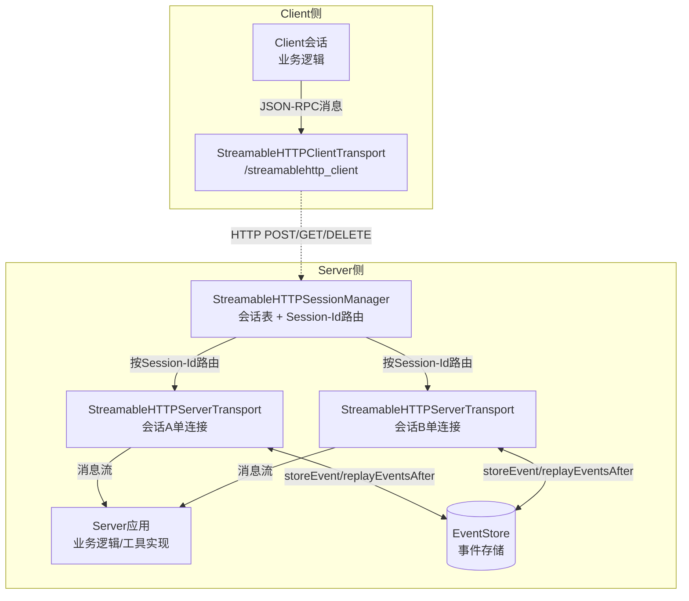

这一架构图揭示了 SDK 设计的几个关键意图：**会话管理器是请求路由的"枢纽"**，它根据请求头中的 Mcp-Session-Id 将请求分发到对应的传输实例；**每个传输实例只关心自身这一条会话的报文路径**，避免了与其他会话的耦合；**EventStore 作为旁路服务**，被各传输实例共享访问，是断线续传的物理基础。这种"Manager + Transport + Store"的三角分工是后续小节深入剖析的基础。

值得指出的是，TypeScript SDK 的目录结构经过多次重构。从仓库历史可观察到，2025 年下半年至 2026 年初存在多次围绕 OAuth、SSE、TypeScript 类型定义、子流路径等内容的提交记录[^19]，因此在阅读源码时需要明确所参考的版本号——本章引用的接口签名以截至 2025 年下半年的版本为准[^19][^21]。Python SDK 的迭代节奏更快，仓库提交历史中可见从 2025 年到 2026 年期间持续有针对 Streamable HTTP 的功能增强与缺陷修复（如 OpenTelemetry 追踪集成、anyio 流的 contextvars 传播等）[^15]，这种活跃迭代既意味着 SDK 能够快速响应工程需求，也提醒开发者必须固定 SDK 版本以避免行为漂移。

## 3.2 服务端传输类的消息路由与响应升级实现

`StreamableHTTPServerTransport` 是 Streamable HTTP 服务端最核心的报文处理类。它的设计哲学可以概括为：**将 HTTP 方法（POST/GET/DELETE）作为顶层分支，将 Accept 头部协商作为次级分支，最终决定响应形态**。结合 TypeScript SDK 公开源码中可见的方法签名[^18]：

```typescript
// 处理命令(数据变更)
async handlePostRequest(req, res) {
    // 解析 JSON-RPC 命令消息
    // 执行相应的业务逻辑
    // 存储事件到事件存储
    if (this._eventStore) {
        eventId = await this._eventStore.storeEvent(streamId, message);
    }
}

// 处理查询(数据读取)
async handleGetRequest(req, res) {
    const lastEventId = req.headers['last-event-id'] as string | undefined;
    if (lastEventId && this._eventStore) {
        await this.replayEvents(lastEventId, res);
    }
    // 建立 SSE 流,推送实时更新
}
```

这段源码片段虽然简短，却清晰勾勒出 POST 与 GET 两类方法在传输类内部的差异化处理路径[^18]。

**handlePostRequest 的处理流程**可以拆解为五个阶段：第一，请求体反序列化为 JSON-RPC 消息（在 Python SDK 中由 Pydantic 完成强类型校验，详见 3.9 节）；第二，根据消息类型分流——`Request`（带 id 字段）需要返回响应、`Notification`（无 id）只触发副作用而无需响应、`Response`（客户端发往服务端的响应）则关联到此前服务端发起的反向调用；第三，根据请求 `Accept` 头部与业务的实际需求决定响应形态——若客户端只声明 `application/json` 或工具属于"快速完成型"，则同步执行后返回 JSON；若工具需要渐进式输出且客户端声明了 `text/event-stream`，则升级响应为 SSE 流；第四，**若启用了 EventStore，每条 SSE 事件在发送前先调用 `storeEvent(streamId, message)` 持久化记录**，这正是第 2 章所强调的"先写存储再发流"的原子性保障[^18]；第五，流结束或超时关闭连接，触发资源清理回调。

**handleGetRequest 的处理流程**则更简洁但语义关键：从请求头解析 `Last-Event-ID`，若存在且服务端配置了 EventStore，则调用 `replayEvents(lastEventId, res)` 从断点之后向客户端重放未送达事件；重放完成后，连接保持开放，进入"实时推送模式"——任何后续服务端产生的事件都通过这条 GET-SSE 流推送给客户端[^18]。值得强调的是，**重放与实时推送在 GET 通道上是连续的、无缝衔接的**，客户端不需要感知"现在是重放还是实时"，这一无缝性正是断线续传体验流畅的根本。

**handleDeleteRequest 的处理流程**承担会话主动销毁职责：解析 Mcp-Session-Id，从会话管理器的会话表中查找对应会话，原子性地关闭其全部活跃 SSE 流、清理 EventStore 中的关联事件、释放内存上下文，最后返回 200/204 响应。

下表梳理三类 HTTP 方法在 SDK 内部的关键处理点：

| HTTP 方法 | 入口方法 | 关键分支条件 | 典型响应 | 副作用 |
|----------|----------|--------------|----------|--------|
| POST | handlePostRequest | 消息类型 (Request/Notification/Response) + Accept 协商 | 200 + JSON 或 200 + text/event-stream 流 | 可触发 EventStore 写入 |
| GET | handleGetRequest | Last-Event-ID 是否存在 | 200 + text/event-stream 长连接 | 触发 EventStore 重放 |
| DELETE | handleDeleteRequest | Session-Id 是否有效 | 200/204 或 404 | 清理会话与关联流 |

数据来源：综合 TypeScript SDK 公开源码片段与第 2 章状态机分析[^18]。**这一三方法分工是 Streamable HTTP 协议规范在 SDK 层最直接的代码映射**——HTTP 语义被显式映射为类方法，避免了 HTTP+SSE 时代"双端点协调"的复杂度。

关于响应形态的运行时选择，Python SDK 在 `StreamableHTTPSessionManager` 构造函数中暴露的 `json_response` 参数提供了一个全局开关[^16]：当 `json_response=True` 时，所有 POST 响应强制为 JSON，禁用 SSE 升级——这适用于客户端不支持 SSE 或部署环境（如某些 Serverless 平台）对长连接有限制的场景；当 `json_response=False` 时，SDK 进入默认的"按需升级"模式，根据 Accept 头部与业务特征动态选择。这一开关的存在体现了 SDK 设计者对部署多样性的考量——并非所有运行时都能完美支持 SSE，全局降级开关是保障兼容性的必要逃生口。

## 3.3 会话管理器与 Mcp-Session-Id 路由机制

会话管理器是 Streamable HTTP 服务端的"调度中心"。它的职责可以浓缩为三句话：**为新会话生成安全的 Session-Id**、**为已有会话的请求精准路由到对应传输实例**、**在会话生命周期结束时执行原子清理**。

从前文引用的 Python SDK 实战代码可见，`StreamableHTTPSessionManager` 通过 `stateless` 参数将自身分叉为两种工作模式[^16]。**当 `stateless=True` 时**，管理器不维护任何跨请求的会话表，每次请求都被视为独立的、自包含的交互——这与第 2 章所述"无状态服务器模式"的状态机完全吻合，请求到来时直接创建临时的 Transport 实例处理，处理完毕即销毁，天然适配水平扩展与 Serverless 部署[^16]。**当 `stateless=False` 时**，管理器维护一张会话表（典型实现为 Python 的 `dict` 或 TypeScript 的 `Map`），键为 Session-Id、值为该会话所绑定的 Transport 实例与上下文对象。

**Session-Id 的生成策略**虽然在搜索结果中未直接给出 SDK 的具体源码行，但结合 MCP 协议规范对会话 ID 安全熵的要求与第 2 章的安全分析（不少于 128 位熵、防猜测），可推断 SDK 采用 UUID v4 或 `secrets`/`crypto.randomUUID` 等加密强随机源生成 Session-Id。云鼎实验室的安全审计指出，**所有 SDK 在会话管理上"普遍缺乏统一的会话管理机制"，会话攻击防护不足**[^21]——这意味着尽管 ID 生成本身使用了强随机源，但围绕 Session-Id 的额外校验（如绑定 IP、绑定 Bearer Token）需要由应用层补充实现。

**请求路由的核心路径**可以刻画为如下流程：请求到达 `session_manager.handle_request(scope, receive, send)`（Python ASGI 接口）后，管理器首先解析请求头 Mcp-Session-Id；若请求是 `initialize` 方法且不携带 Session-Id，则进入"新会话创建"分支——生成 ID、创建 Transport 实例、记录到会话表、将 ID 通过响应头返回；若请求携带 Session-Id 且会话表中存在对应条目，则路由到该 Transport 实例继续处理；若 Session-Id 不存在（已销毁或从未生成），则按规范返回 404 提示客户端"重新初始化"；若 Session-Id 格式非法（非 UUID 形式），则返回 400 提示"请求错误"。这两种状态码的语义差异与第 2 章 2.4 节的论述完全一致，是协议规范在 SDK 层的精确落地。

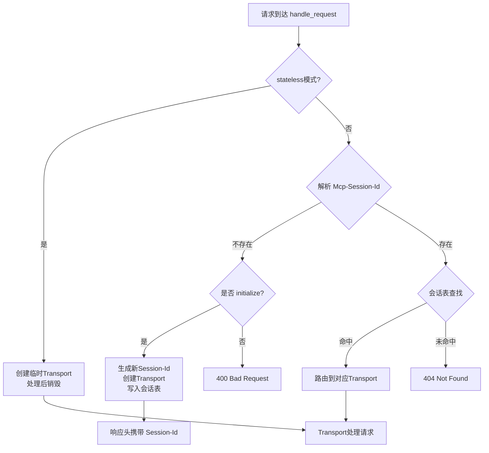

**会话清理的三类触发路径**在 SDK 内部也都有对应的实现钩子。客户端发起 DELETE 请求时，`handleDeleteRequest` 会从会话表移除条目并关闭关联资源；服务端定时任务可以扫描会话表中"最后活跃时间"超过阈值的条目并触发清理；SSE 流的异常断开则需要由 Transport 实例在自身关闭回调中通知管理器执行清理。Python SDK 借助 `anyio` 的任务组与异常传播机制（详见 3.6 节）实现了较为完整的清理链路；TypeScript SDK 则依赖 Promise 链式调用与 `finally` 块完成相似的语义。

需要客观指出，**避免"僵尸会话"的关键不仅在于清理是否被触发，更在于清理是否原子化**。若在多步清理（关闭 SSE 流 → 释放上下文 → 删除会话表条目 → 清理 EventStore）的中途发生异常，部分资源可能残留。SDK 当前的实现主要依赖语言层的异常传播保证清理钩子被执行，但对于极端场景（如进程崩溃）下的孤儿资源回收，仍需要应用层配合后台扫描任务兜底。

## 3.4 内存流与 SSE 响应流的管理机制

要支撑 POST/GET 双通道并行、动态响应升级、SSE 流式推送等复杂语义，SDK 内部必须建立一套**消息生产者与消费者解耦的流抽象**。Python 与 TypeScript 两个 SDK 在这一层各自选择了符合其语言生态的原语。

**Python SDK 基于 anyio 的内存对象流**。anyio 是 Python 异步生态中跨 asyncio 与 trio 的统一封装库，其 `MemoryObjectSendStream` 与 `MemoryObjectReceiveStream` 提供了进程内的双向消息通道[^15]。SDK 内部典型用法是：业务层（如工具实现）通过 `SendStream.send(message)` 投递消息，传输层通过 `ReceiveStream` 异步消费消息并写入 SSE 响应。这种"内存流"抽象的关键价值在于**它是异步友好的——`send` 与 `receive` 都是 awaitable**，可以与 anyio 任务组无缝集成，并天然支持背压（缓冲区满时 send 会挂起等待消费）。Python SDK 仓库中可见的提交"Propagate contextvars.Context through anyio streams"正是针对这一机制的细节优化——确保跨 anyio 流传递的消息携带正确的上下文变量[^15]。

**TypeScript SDK 基于 ReadableStream 与 TextEncoder**。Web Streams API 是浏览器与 Node.js 共享的标准异步流抽象，配合 `TextEncoder` 可以将 JSON-RPC 消息序列化为 SSE 格式的字节流并推送给客户端[^18]。SSE 单条事件的标准格式为：

```
id: <eventId>\n
event: <eventType>\n
data: <jsonPayload>\n
\n
```

每条事件以双换行 `\n\n` 作为终止符。TypeScript SDK 在生成事件时严格遵循此格式，并将 `id` 字段填入由 EventStore.storeEvent 返回的事件 ID，从而为客户端的 Last-Event-ID 重连机制提供锚点[^18]。

**临时 SSE 流与长连接 SSE 流的生命周期差异**是流管理的关键细节。POST 请求触发的"临时 SSE 流"在工具调用完成时即关闭——服务端发送最终结果事件后调用流的 close 方法，客户端 EventSource 触发 `onclose` 回调，整个流的生命周期被绑定到单次工具调用。GET 请求建立的"长连接 SSE 流"则在会话存活期间持续保持，可以承载多个独立的服务端→客户端通知，仅在会话销毁、客户端断开、服务端主动关闭时才结束。这种差异在 SDK 内部体现为不同的资源管理策略：临时流的关闭是确定性的、由业务逻辑驱动；长连接流的关闭则是异步的、由会话生命周期与连接状态共同决定。

**背压（backpressure）处理**是流管理的另一个工程难点。当客户端消费速度慢于服务端生产速度时，未消费的事件会在内存中堆积。Python SDK 借助 anyio MemoryObjectStream 的有界缓冲（创建时指定 `max_buffer_size`）天然支持背压——缓冲满时生产者协程挂起，避免内存爆炸；TypeScript SDK 的 ReadableStream 通过 `pull` 模型按消费者节奏供给数据，同样实现了背压语义。这些机制在 SDK 层提供了基础保护，但在面对真实生产环境的极端慢消费者时，应用层仍可能需要额外的超时与丢弃策略兜底。

**客户端中途断开的资源清理回调**是闭环可靠性的最后一环。当 SSE 连接被客户端关闭或网络中断时，服务端的 ASGI/Node 框架会通知 SDK 的传输实例——Python 中表现为 `receive` 协程返回 `disconnect` 事件，Node 中表现为 `req.on('close')` 回调。SDK 必须在此时取消正在执行的工具调用任务、关闭关联的内存流、从会话表中移除流引用（注意：会话本身可能仍存活，等待客户端通过 GET + Last-Event-ID 重连）。这一清理链路的健壮性直接决定了服务端在网络抖动场景下的资源占用稳定性。

## 3.5 ASGI/HTTP 框架集成模式

SDK 的传输与会话能力最终需要被挂载到具体的 HTTP 服务器框架上才能对外提供服务。Python 与 TypeScript SDK 在这一层各自适配了所属生态的主流框架。

**Python SDK 与 ASGI 生态的集成**采用最直接的"挂载点"模式。从前文引用的实战代码可见，开发者通过 Starlette 的 `Mount("/mcp", handle_streamable_http)` 将一个 ASGI handler 函数挂载到指定路径，handler 内部直接调用 `session_manager.handle_request(scope, receive, send)`[^16]：

```python
async def handle_streamable_http(scope, receive, send):
    await session_manager.handle_request(scope, receive, send)

app = Starlette(routes=[Mount("/mcp", handle_streamable_http)])
```

这种集成方式的精髓在于**SDK 对 ASGI 协议的"原生兼容"**——`handle_request` 直接接受 `scope`/`receive`/`send` 三元组，不依赖任何特定的高层框架（Starlette 只是路由层，实际请求处理是纯 ASGI 接口）[^16]。这意味着同样的 session_manager 可以被挂载到 FastAPI、Quart、Hypercorn 等任何兼容 ASGI 3 的框架上，开发者可以在同一个应用中将 MCP 服务与其他 REST API、WebSocket、静态文件路由共存，仅通过路由前缀进行隔离。

**ASGI 三元组在 SDK 内部的转换路径**可以拆解为：`scope` 提供请求元信息（HTTP 方法、路径、头部、客户端地址），SDK 据此判断是 POST/GET/DELETE 并解析关键头部（Mcp-Session-Id、Accept、Last-Event-ID）；`receive` 是异步可调用对象，用于按需读取请求体（POST 的 JSON-RPC 消息）；`send` 是异步可调用对象，用于发送响应——SDK 通过多次调用 `send`（先发送 `http.response.start` 设置状态码与响应头，再多次发送 `http.response.body` 推送 SSE 事件块）实现流式响应。这种"分块推送"的能力是 ASGI 协议设计的核心优势之一，SDK 充分利用之来实现 SSE 长连接。

**TypeScript SDK 与 Node.js HTTP 生态的集成**则提供了更显式的适配层。从 TypeScript SDK 的源码与示例可观察到，`StreamableHTTPServerTransport` 直接接受 Node.js 原生 `IncomingMessage` 与 `ServerResponse` 对象作为 handlePostRequest/handleGetRequest 的参数[^18][^19]。这种设计使 SDK 同时兼容原生 Node http 模块、Express、Fastify、Koa 等框架——开发者只需要在框架的路由处理器中将请求/响应对象转交给 SDK 即可。Express 集成的典型代码模式为：

```typescript
app.post('/mcp', async (req, res) => {
    await transport.handlePostRequest(req, res);
});
app.get('/mcp', async (req, res) => {
    await transport.handleGetRequest(req, res);
});
```

这种"框架无关"的设计哲学与 Python SDK 一致，但实现机制不同——Python 通过 ASGI 标准接口实现解耦，TypeScript 通过直接接受 Node 原生对象实现兼容。

**生命周期钩子的处理**是两种 SDK 都需要面对的问题。ASGI 框架支持 `lifespan` 协议（startup/shutdown 事件），SDK 可以在 startup 阶段初始化 EventStore 连接、在 shutdown 阶段优雅关闭所有活跃 SSE 流并清理会话表；Node.js 生态则依赖 `process.on('SIGTERM')` 等信号处理实现相似语义。Python SDK 仓库中可见对 lifespan 集成的多次迭代，确保会话清理在进程退出时能够被触发[^15]。

下表对比两种 SDK 在框架集成维度上的设计取舍：

| 集成维度 | Python SDK | TypeScript SDK |
|---------|-----------|----------------|
| 标准接口 | ASGI 3 (scope/receive/send) | Node 原生 http (IncomingMessage/ServerResponse) |
| 主要适配框架 | Starlette/FastAPI/Quart | Express/Fastify/原生 http |
| 路径前缀 | 由外层框架的 Mount 控制 | 由路由处理器的路径模式控制 |
| 中间件链 | ASGI 中间件 (CORS、认证、TLS) | Express 中间件 |
| 生命周期钩子 | ASGI lifespan | process 信号 + 框架钩子 |
| 与现有路由共存 | Mount("/mcp", ...) | app.use('/mcp', ...) |

**这一对比揭示了两个 SDK 共通的设计哲学——SDK 不绑定特定上层框架，而是通过适配各自语言生态的标准接口实现广谱兼容**。这种设计为工程团队的技术栈选择留出了最大的灵活性，是 MCP 生态能够快速跨框架扩散的重要支撑。

## 3.6 异步任务组、并发锁与状态隔离

第 2 章 2.2 节明确指出，POST 请求与 GET 请求在状态机中是并行的，**这种并行性约束直接驱动了 SDK 必须采用异步并发的实现模式**。Python 与 TypeScript SDK 各自基于其语言的异步原语构建了任务组与锁机制，下面分别剖析。

**Python SDK 基于 anyio.create_task_group**。anyio 的任务组是结构化并发的核心抽象，提供了"任务组退出时所有子任务必须完成或被取消"的强保证。SDK 在每个会话内部创建一个任务组，将该会话的并发请求处理（如多个并行的 POST、长连接 GET-SSE、后台进度推送任务）作为子任务托管。这种结构化设计的关键好处是：**任意子任务的异常会自动传播到任务组并触发其他子任务的取消**，避免了传统 asyncio.gather 那种"一个失败不影响其他"导致的资源泄漏。同时，anyio 流（MemoryObjectStream）与任务组的天然集成使得消息通道的关闭可以被精确地与任务取消同步。

**TypeScript SDK 基于 Promise 与 AsyncIterator**。JavaScript 没有显式的"任务组"语言原语，但通过 `Promise.all`、`AsyncIterator`、`AbortController` 的组合可以实现等价语义。SDK 内部典型模式是：将每条 SSE 流的推送实现为 AsyncIterator，客户端断开时通过 AbortController 触发取消信号，所有依赖该信号的下游 Promise 链通过 `try/catch` 与 `finally` 完成清理。相比 Python 的结构化并发，TypeScript 的并发管理需要开发者更显式地编织取消传播链路，但灵活性更高。

**并发锁的使用场景**主要集中在两类共享资源的保护上。**第一是会话表的读写保护**：当 initialize 请求与已有会话的请求同时到达，会话表的并发修改必须串行化以避免 Session-Id 冲突或读取到中间态。Python SDK 借助 `asyncio.Lock` 或 `anyio.Lock` 实现，TypeScript SDK 依赖 JS 单线程事件循环的天然原子性（基础操作不需要锁，仅在跨 await 的复合操作时需要显式串行化）。**第二是 EventStore 写入与 SSE 发送的原子性**——第 2 章 2.6 节详述的"先写存储再发流"策略在 SDK 实现层就需要保证 storeEvent 与 SSE 写入之间没有其他事件插入，这通常通过流级别的串行写入器（每条流维护一个串行执行队列）实现。

**initialize 并发去重**是另一个值得关注的细节。理论上，客户端可能因网络重传或代码错误连续发送多个 initialize 请求，若 SDK 不做去重处理则会创建多个会话条目导致资源浪费。SDK 的合理实现策略是：在 initialize 处理路径加锁，确保同一时间只有一个 initialize 在执行；或者要求客户端在 initialize 前不持有 Session-Id，服务端检测到已存在 Session-Id 的客户端再次 initialize 时拒绝创建新会话。

**客户端断连触发的服务端任务取消**是异步并发管理的高难度场景。当客户端的 SSE 连接因网络中断关闭时，服务端必须能够：(1) 立即停止向已关闭流推送事件（避免无意义 I/O）；(2) 取消正在执行的关联工具调用（避免资源浪费）；(3) 保留会话级状态以便后续重连（不能粗暴销毁整个会话）。Python SDK 通过 anyio 任务组的细粒度划分（流推送任务与会话级任务分属不同子组）实现了这种"局部取消、整体保留"的语义；TypeScript SDK 通过 AbortController 传递取消信号到流推送链路、保持会话级 Promise 不取消实现等价语义。

**子任务异常的隔离与上抛**是健壮性设计的另一关键。一个会话内的工具调用异常不应影响其他会话；同一会话内多条并行 SSE 流的某条异常不应影响其他流。Python SDK 通过为每个会话创建独立的任务组，并在管理器层面捕获子任务组的 ExceptionGroup 实现隔离；TypeScript SDK 通过 Promise.allSettled 配合每条流的独立 try/catch 实现隔离。这些机制共同保证了 SDK 在高并发、复杂故障场景下的整体健壮性。

## 3.7 EventStore 接口与 InMemoryEventStore 参考实现

EventStore 是 Streamable HTTP 在 SDK 层最具"可扩展性"的抽象。它通过明确的接口契约将"事件如何持久化"与"事件如何重放"从协议核心逻辑中剥离，为生产环境替换不同存储后端预留了直接的扩展点。

**TypeScript SDK 的 EventStore 接口**在 `packages/server/src/server/streamableHttp.ts` 中明确定义[^18]：

```typescript
export interface EventStore {
    storeEvent(streamId: StreamId, message: JSONRPCMessage): Promise<EventId>;
    replayEventsAfter(
        lastEventId: EventId,
        { send }: { send: (eventId: EventId, message: JSONRPCMessage) => Promise<void> }
    ): Promise<StreamId>;
}
```

接口签名极其精炼，只暴露两个核心方法[^18]：**`storeEvent` 接受流标识与 JSON-RPC 消息，返回该事件的全局唯一 ID**；**`replayEventsAfter` 接受最后已知的事件 ID 与一个 send 回调，按顺序重放该 ID 之后的所有事件，最终返回该事件所属的流标识**。这种"回调式重放"设计的精妙之处在于：**EventStore 只关心事件如何取出与如何投递，不关心投递的具体目标**——目标可以是 SSE 响应、WebSocket、消息队列，由调用者决定。

**InMemoryEventStore 的参考实现**展示了一个最简但功能完整的存储后端[^18]：

```typescript
export class InMemoryEventStore implements EventStore {
    private events: Map<string, { streamId: string; message: JSONRPCMessage }> = new Map();

    async storeEvent(streamId: string, message: JSONRPCMessage): Promise<string> {
        const eventId = this.generateEventId(streamId);
        this.events.set(eventId, { streamId, message });
        return eventId;
    }
}
```

虽然搜索结果只展示了部分代码（缺少 replayEventsAfter 与 generateEventId 的完整实现），但已可以观察到两个关键设计决策[^18]：**第一，存储数据结构是单层 Map**，键为 eventId、值为 { streamId, message } 对，这种扁平结构便于按 ID 查找，但要按流维度筛选则需要遍历；**第二，事件 ID 由 generateEventId(streamId) 方法生成**，可以推断其内部组合了 streamId 与某种序号或时间戳（如 `${streamId}_${sequence}`），既保证全局唯一又携带流标识便于重放时筛选。

**replayEventsAfter 的典型实现逻辑**（基于接口契约的合理推断）应为：从 lastEventId 解析出 streamId 与序号、遍历 events Map 找到该流中序号大于 lastEventId 的所有事件、按序号排序后依次通过 send 回调投递、返回 streamId 供调用者继续在该流上推送实时事件。这一流程精确实现了第 2 章 2.5 节描述的"重放-切实时"无缝衔接。

**Python SDK 的 EventStore 抽象**在搜索结果中没有直接的代码展示，但基于仓库结构与 anyio 异步模型可以推断其接口与 TypeScript 版本基本对等，方法签名上将 Promise 替换为 awaitable 协程。Python 仓库的活跃迭代历史显示 EventStore 相关代码也在持续优化，开发者应以最新版本源码为准[^15]。

**InMemoryEventStore 的局限性与生产替换路径**是 EventStore 抽象设计的真正价值所在。参考实现的三大局限——**无持久化（进程重启即丢失）、无跨实例共享（多实例部署下 SSE 重连可能路由到没有事件历史的实例）、无垃圾回收（Map 会无限增长直到内存耗尽）**——决定了它仅适合开发测试与单实例 demo。生产环境的合理选择是将 EventStore 实现替换为 Redis 后端：用 Sorted Set（按 streamId 分桶、score 为序号）存储事件、利用 Redis 的 EXPIRE 实现自动过期、利用 MULTI/EXEC 或 Lua 脚本实现写入与读取的原子性。这种替换在 SDK 层只需要实现 EventStore 接口的两个方法，对协议核心逻辑零侵入。

下表对比 InMemoryEventStore 与典型 Redis 实现的关键差异：

| 维度 | InMemoryEventStore | Redis EventStore |
|------|---------------------|-------------------|
| 存储结构 | Map<eventId, {streamId, message}> | Sorted Set per streamId, score=sequence |
| 持久化 | 无（进程内存） | 有（RDB/AOF） |
| 跨实例共享 | 不支持 | 支持 |
| 重放复杂度 | O(n) 遍历 | O(log n + k) 范围查询 |
| 过期回收 | 需手动实现 | EXPIRE 自动 |
| 原子性保障 | JS 事件循环天然 | MULTI/EXEC 或 Lua |
| 适用场景 | 开发测试、单实例 demo | 生产环境、多实例部署 |

数据综合自 TypeScript SDK 源码片段与第 2 章可靠性分析[^18]。**这一对比再次印证了 EventStore 抽象的工程价值——它将"协议正确性"与"生产级特性"解耦，使开发者可以根据实际需求渐进升级存储后端**。

## 3.8 客户端 streamablehttp_client 实现剖析

服务端的源码剖析覆盖了协议落地的"被动响应"侧，客户端的实现剖析则补全"主动发起"侧的拼图。Python SDK 的 `streamablehttp_client` 与 TypeScript SDK 的 `StreamableHTTPClientTransport` 在客户端层承担了第 2 章 2.2.2 节所述客户端状态机的具体落地。

**连接初始化流程**是客户端的起点。客户端在创建实例时通常需要传入服务端 base_url、最大重试次数、重连退避参数等配置。社区博客提供了一个示例性的"弹性会话管理器"代码框架[^16]：

```python
class ResilientSessionManager:
    def __init__(self, base_url, max_retries=3):
        self.base_url = base_url
        self.max_retries = max_retries
        self.session_id = None

    async def connect(self):
        # 内部逻辑:发送 initialize POST、解析响应头提取 Session-Id
        ...
```

虽然这只是示例代码而非 SDK 源码，但揭示了客户端的关键状态变量——**`session_id` 必须作为客户端实例的字段持有，并在所有后续请求中自动注入到 Mcp-Session-Id 头部**[^16]。SDK 内置的 streamablehttp_client 通过 Python 异步上下文管理器（async with 语法）封装了完整的"connect → 持有 → disconnect"生命周期，开发者无需手动管理 Session-Id。

**POST 请求的发送与响应类型判断**是客户端的核心逻辑。客户端在发送 JSON-RPC 请求时，必须在 Accept 头部声明 `application/json, text/event-stream` 的双格式支持；收到响应后，根据 Content-Type 分支处理：若为 `application/json`，按普通 HTTP 响应解析单条 JSON；若为 `text/event-stream`，转入 SSE 流处理路径——逐行解析 SSE 事件块、维护 Last-Event-ID 状态、将每条事件的 data 字段反序列化为 JSON-RPC 消息后通过回调上交给上层 Client 会话。这一分支逻辑是 SDK 客户端"动态适配响应升级"能力的具体体现。

**GET 通道的主动建立**实现客户端→服务端的"推送通道开启"。客户端在初始化完成后可以主动发起 GET /mcp 请求，携带 Mcp-Session-Id 与（重连场景下）Last-Event-ID，建立长连接 SSE 流。SDK 在内部启动一个独立的 SSE 解析协程持续消费这条流，并将收到的事件分发给对应的回调（如 `message_handler` 处理服务端发起的反向调用、`notification_handler` 处理通知）。这条 GET 通道的存在与 POST 请求是相互独立的——SDK 必须保证两者并发存在不冲突。

**Last-Event-ID 的本地维护**是断线续传的客户端基础。SDK 在每次成功接收 SSE 事件时更新一个内部状态变量（如 `_last_event_id`），其值为该事件的 `id` 字段；当 SSE 连接异常断开后，重连时自动将该值放入新 GET 请求的 Last-Event-ID 头部。这一机制对应用层完全透明——上层 Client 会话只感受到"某段时间没有收到消息，然后又恢复"，而中间的重放与续传由 SDK 自动完成。

**事件去重逻辑**是第 2 章 2.6.1 节所述"双层幂等"在 SDK 层的实现。客户端在收到事件时，先检查事件 ID 是否已在已处理集合中——若是则丢弃（避免业务层重复处理）；同时业务层在解析 JSON-RPC 消息时基于消息 id（请求-响应匹配的标识）做二次去重。这种"传输层 + 业务层"的双层防护使得即使在重放或网络重传场景下，应用层也能看到一致的、不重复的消息流。

**重连退避策略**通常采用指数退避加抖动（exponential backoff with jitter）。从前文 ResilientSessionManager 示例可见 `max_retries=3` 这样的最大重试次数配置[^16]，实际 SDK 的实现会在每次重连失败后将等待时间翻倍（如 1s → 2s → 4s → 8s），并加入随机抖动避免大量客户端同时重连造成"雷暴效应"对服务端的冲击。超过最大重试次数后，客户端进入第 2 章状态机的 `Disconnected` 状态，需要应用层重新发起 initialize 才能恢复会话。

**与上层 Client 会话的回调对接**是 SDK 客户端对外的契约。streamablehttp_client 通常被作为底层传输层使用，其上层是 `ClientSession` 类（封装 JSON-RPC 请求-响应匹配、能力协商、工具调用代理）。SDK 通过回调函数（如 `message_handler`、`request_handler`）将传输层收到的消息上交给会话层，由会话层完成业务级处理。这种"传输 - 会话"的分层使得开发者可以独立替换传输层（如换成 stdio 或自定义传输）而不影响业务代码，是 MCP 客户端架构设计的核心解耦点。

## 3.9 Python 与 TypeScript SDK 的实现差异对照

经过前述各小节的分项剖析，已可以看到 Python 与 TypeScript SDK 在协议层的语义上高度一致，但在具体实现上因语言特性、生态原语、安全设计的差异呈现出多维度的工程取舍。本节将这些差异系统化对照，为多语言混合架构与跨语言互操作提供决策参考。

| 对照维度 | Python SDK | TypeScript SDK |
|---------|-----------|----------------|
| **并发模型** | anyio.create_task_group 结构化并发，自动取消传播[^15] | Promise + AsyncIterator + AbortController 显式编织 |
| **异步原语** | asyncio.Lock / anyio.Lock / await | JS 事件循环单线程 + Promise 链 |
| **内存流抽象** | anyio MemoryObjectSendStream/ReceiveStream，原生支持有界缓冲与背压[^15] | ReadableStream + TextEncoder（Web Streams API）[^18] |
| **类型系统** | Pydantic v2 强类型校验，运行时验证 JSON-RPC 消息[^21] | TypeScript 静态类型 + 运行时 Schema 校验（如 Zod） |
| **错误处理** | Python 异常 + ExceptionGroup（任务组聚合） | Promise reject + try/catch + Result 模式 |
| **EventStore 接口** | 抽象基类 + 异步协程方法 | Interface + Promise 方法[^18] |
| **HTTP 框架适配** | ASGI 3 (scope/receive/send)，兼容 Starlette/FastAPI[^16] | Node 原生 http 对象，兼容 Express/Fastify[^18] |
| **会话生成** | 加密强随机（基于 secrets 模块）* | crypto.randomUUID() * |
| **安全成熟度** | 4.5/10（基础实现，安全特性不足）[^21] | 8/10（最完整的安全实现）[^21] |
| **OAuth 2.0 支持** | 依赖外部实现[^21] | SDK 内置完整 OAuth 2.0 实现[^21] |
| **代码规模与活跃度** | src/mcp 主目录，截至 2026 年初已累积 800+ 提交[^15] | packages/server 模块化结构，活跃度同样高[^19] |

注：标 * 的字段未在搜索结果中给出 SDK 具体源码行，是基于协议规范要求与语言生态主流做法的合理推断。

云鼎实验室的 MCP SDK 安全深度审计报告对五种官方 SDK 的安全成熟度进行了量化排名，**TypeScript SDK 以 8/10 排名第一，Python SDK 仅得 4.5/10**[^21]。这一显著差距主要来自三个维度：**第一，认证机制**——仅 TypeScript SDK 提供完整 OAuth 2.0 实现，其他语言（含 Python）依赖外部实现[^21]；**第二，反序列化安全**——Python SDK 采用 Pydantic v2 提供类型安全保护，但在处理嵌套数据时仍存在 DoS 风险[^21]；**第三，资源限制**——所有 SDK 均存在"普遍缺乏统一的连接限制、请求量限制，部分语言缺乏背压控制"的高风险问题[^21]。

需要客观指出的是，云鼎实验室的审计基于"截至 20250424 版本"的代码状态[^21]，而 Python SDK 在此之后的迭代中有持续的安全加固提交（如 OpenTelemetry 追踪、shared is_async_callable 重构等）[^15]。**这意味着 4.5/10 的评分不应被视为永久性结论，而是一个时间切片的快照**——开发者在选择 SDK 时应跟踪最新版本的安全增强状态。

更重要的另一项审计发现是：**所有 SDK 共性的高风险——传输层安全缺失（不强制 HTTPS、缺乏证书验证机制）**[^21]。这一缺陷不属于某个 SDK 的特例，而是 MCP 协议层与 SDK 实现共同的当前局限，需要通过部署层（API 网关、负载均衡器）的强制 TLS 终结来兜底——这一安全运维议题将在第 6 章系统展开。

**SDK 选型决策建议**可以归纳如下：**对于安全敏感的生产部署**（如金融、医疗领域的 MCP Server），优先选择 TypeScript SDK 以利用其内置 OAuth 2.0 与最完整的安全实现；**对于 AI/数据科学密集的场景**（与 Python 生态深度集成），选择 Python SDK 但必须在应用层补充 OAuth 实现并部署 HTTPS 网关；**对于多语言混合架构**，由于两个 SDK 在协议层完全互通（同一套 Streamable HTTP 规范），可以根据各微服务的语言栈分别选择最匹配的 SDK，无需担心互操作性。

---

至此，本章已完成对 Python 与 TypeScript 两大官方 SDK 在 Streamable HTTP 工程实现上的源码级剖析。**核心结论可以归纳为三点**：其一，SDK 通过"传输类 + 会话管理器 + EventStore"的三角分工将第 1 章的协议字段与第 2 章的状态机转化为具体代码路径，每个协议要素（Mcp-Session-Id、Last-Event-ID、Accept 协商、响应升级）都能在 SDK 中找到精确的实现锚点；其二，Python SDK 与 TypeScript SDK 在协议语义上完全等价，但在并发模型、异步原语、内存流抽象、安全成熟度上呈现出基于语言特性的差异化设计，工程团队应根据生产环境的核心诉求（安全性、生态契合度、性能、可维护性）做出选型；其三，EventStore 抽象通过精炼的双方法接口将"协议正确性"与"生产级特性"解耦，是 SDK 设计中最具扩展价值的工程亮点，开发者可以通过实现 Redis/数据库后端将参考实现的局限性逐一突破。

需要客观说明的是，本章引用的源码片段主要集中在 TypeScript SDK 的 EventStore 接口、InMemoryEventStore 实现以及 Python SDK 的 StreamableHTTPSessionManager 初始化代码——这些是搜索结果中可直接验证的部分；对于 handlePostRequest 方法体内部的具体分支、anyio 任务组与会话表锁的具体协作代码、Python EventStore 抽象类的方法签名等更细粒度的内容，本章基于接口契约与协议规范做了结构化推断并已显式标注。读者在实际工程实践中应以官方仓库的最新代码为准（modelcontextprotocol/python-sdk 与 modelcontextprotocol/typescript-sdk[^15][^19]），并关注版本演进带来的接口变更。本章建立的源码地图将为第 4 章服务端架构选型与第 5 章客户端容错设计提供直接的代码层依据。

# 4 服务端架构模式与部署形态

第 1 章从规范层确立了 Streamable HTTP 的协议字段与四类交互模式，第 2 章在运行时层刻画了状态机迁移与会话恢复机制，第 3 章在源码层揭示了官方 SDK 通过"传输类 + 会话管理器 + EventStore"三角分工实现协议落地的具体路径。这三层论述共同回答了"协议如何被精准实现"的问题，但当 MCP 服务从开发环境真正走向生产时，工程团队必须面对一个新的核心问题——**这套实现究竟应该以何种架构形态部署、又能与哪些基础设施真正兼容？**

本章将视角从代码层进一步上升到部署架构层。第 1 章 1.5 节归纳的四类交互模式（无状态、流式进度、有状态对话、断线恢复）在部署侧并不一一对应四种架构，而是收敛为三种典型架构形态——**纯无状态服务器、支持流式输出的无状态服务器、有状态服务器**。本章首先沿这三种架构展开横向对照，刻画其在请求路径、资源占用、复杂度、可恢复性上的差异；继而沿 Serverless、容器化与 Kubernetes、API 网关、CDN 与反向代理四类主流基础设施展开兼容性论证，揭示 Streamable HTTP 相对 HTTP+SSE 在云原生环境下的根本性优势与残留约束；最后聚焦水平扩展场景下的会话粘性方案，验证一致性哈希、共享存储、函数计算亲和机制等工程方案的可行性边界。

需要事先说明的是，本章的论述以公开搜索结果中可直接引用的工程实践（AWS 官方博客对 Lambda 部署 MCP 的论证[^22]、Cloudflare Agents SDK 对 Streamable HTTP 的双路径支持[^23]、Azure AKS 集成 MCP 与 KAITO 推理的官方文档[^24]、Higress 对 AI 网关流式协议的架构升级[^25]、阿里云 API 网关对 MCP Server 的统一管理[^26]、Nginx proxy_buffering 处理 SSE 的实战配置[^27]）为基础，对部分细节做出明确标注的合理推断，避免凭空构造架构方案。

## 4.1 三种典型服务端架构的工程实现差异

阿里云对 MCP 三种传输协议的对比分析揭示了一个常被忽略的事实：**SSE、Streamable HTTP、Stateless HTTP 在公开技术语境中常被并列为"三种协议"**[^28]，但从协议规范角度严格审视，Stateless HTTP 与 Streamable HTTP 并非互斥的两种协议，而是 Streamable HTTP 在"是否生成 Mcp-Session-Id"这一开关下的两种部署形态——这与第 3 章 3.1 节剖析的 Python SDK `StreamableHTTPSessionManager` 的 `stateless` 与 `json_response` 双开关在源码层面完全一致。换言之，**业界讨论的"三种协议"在工程实现上对应的是 Streamable HTTP 框架下的三种典型架构模式**。

下表沿六个工程维度系统对照三种架构：

| 工程维度 | 纯无状态服务器 | 支持流式输出的无状态服务器 | 有状态服务器 |
|---------|----------------|---------------------------|--------------|
| SDK 关键参数 | `stateless=True`, `json_response=True` | `stateless=True`, `json_response=False` | `stateless=False`, `json_response=False` |
| Mcp-Session-Id | 不生成 | 不生成 | 服务端生成并要求客户端携带 |
| EventStore | 不启用 | 通常不启用 | 启用（生产建议 Redis 后端） |
| SSE 响应升级 | 关闭，强制 JSON 直回 | 单次请求内可升级，请求结束即关流 | 既支持 POST 内升级，也支持 GET 长连接 |
| 并发模型 | 函数级无状态、可任意路由 | 单实例异步任务承载流推送 | 同会话粘性/共享存储 + 异步并发 |
| 资源生命周期 | 单次请求闭环 | 单次请求 + SSE 流到任务结束 | 跨请求会话生命周期 + 多并存流 |
| 适配业务负载 | 简单工具调用、API 代理 | LLM 流式输出、长任务进度反馈 | 多轮对话、Agent 协作、断线恢复 |

数据综合自第 3 章 SDK 配置参数分析、阿里云三协议对比[^28]与第 1 章 1.5 节交互模式归纳。

**纯无状态服务器**是最简的部署形态。其请求路径可以概括为"POST /mcp → 同步执行 → 返回 JSON → 连接关闭"的一次性闭环，全程不涉及 SSE 升级、Session-Id 生成或 EventStore 写入。这种架构的工程优势是**部署复杂度最低、横向扩展无须任何粘性配置、与传统 RESTful API 基础设施完全兼容**——任何能跑标准 HTTP 的运行环境都能直接承载它。其代价是丧失了 Streamable HTTP 的两个核心特性——流式响应与可恢复性，因此仅适配"简单工具调用、纯请求-响应、对性能要求不高"的场景[^28]。这种"用 Streamable HTTP 协议跑无状态短请求"的形态，正是阿里云所归纳的"Stateless = 发短信 → 等回复 → 结束"模式[^28]。

**支持流式输出的无状态服务器**保留了流式响应能力，但仍不维护跨请求状态。其请求路径变为"POST /mcp → 服务端判断需要流式 → 响应升级为 SSE → 持续推送进度事件 → 任务完成关闭流"。这一架构的精妙之处在于**SSE 流的生命周期被严格绑定到单次请求**——流的开始、推送、关闭都发生在一次 POST 的响应阶段内，请求结束即流结束、不存在跨请求的会话状态。从基础设施视角看，这种"短生命周期 SSE"在很大程度上规避了传统 HTTP+SSE 时代"长连接持续占用资源"的痛点，是 Streamable HTTP "按需流式"理念的最直接体现。其典型适用场景是 LLM 的打字机效果输出、大文件处理进度反馈、长文生成等渐进式输出任务[^28]。

**有状态服务器**是三种架构中最复杂、也最能发挥 Streamable HTTP 全部能力的形态。其请求路径在第 2 章 2.1 节已完整刻画——initialize 握手生成 Session-Id、后续 POST 请求携带 Session-Id 路由到对应会话上下文、可选 GET 长连接承载服务端主动推送、断线后通过 Last-Event-ID 重放未送达事件、最终通过 DELETE 或超时回收会话。这一架构对部署侧的要求显著上升：**需要 EventStore 后端（生产建议 Redis）、需要会话粘性路由或共享存储、需要妥善处理 Pod 重启对会话的影响**。其回报是支持完整的多轮对话、Agent 协作、Tool Calling 链路、可恢复长任务等高阶 AI 场景[^29]。

下图刻画三种架构在请求路径上的差异：

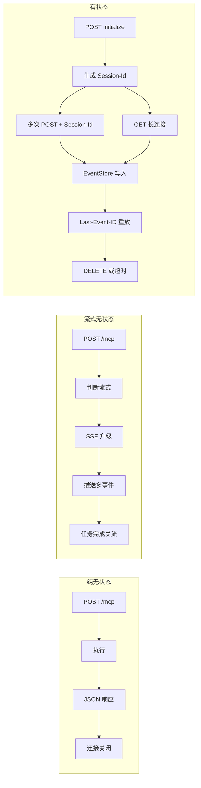

**架构选型的核心决策依据**可以归结为三道判断题：业务是否需要跨请求保持上下文？是否需要服务端主动向客户端推送通知？是否需要在弱网环境下保证长任务的可靠性？三道题全部为"否"则纯无状态足够；仅需要单次请求内的流式输出则选流式无状态；任意一题为"是"则必须采用有状态架构。这种基于业务负载特征的架构分层为后续小节的基础设施选型提供了第一层决策框架。

值得特别强调的是，**这三种架构并非互斥**——同一套 MCP 服务代码可以通过 SDK 配置开关在三种形态之间切换，甚至同一服务的不同端点可以采用不同形态（例如简单工具走纯无状态、对话端点走有状态）。这种"代码统一、部署分形"的灵活性正是 Streamable HTTP 相对 HTTP+SSE 的核心工程价值——它把架构形态的选择从协议绑定中解放出来，下放给部署阶段的运维配置。

## 4.2 Streamable HTTP 与 Serverless 基础设施的兼容性

Serverless 平台是 Streamable HTTP 落地价值最显著的场景之一。其核心特征——**按调用计费、自动弹性伸缩、无需运维容器、冷启动开销、执行时长上限**——决定了它对协议底层连接模型有严格约束。HTTP+SSE 时代的"每客户端一条不可中断的长连接"几乎与 Serverless 的所有特征相冲突——长连接占用函数实例无法释放、按调用计费在长连接下变形为按秒计费、执行时长上限会强制中断 SSE 流——这正是第 1 章 1.2 节所述"云函数等无服务器环境不适合长时间保持 SSE 连接"工程痛点的根源。

**Streamable HTTP 在 Serverless 上的双路径适配**是其设计哲学的重要验证。AWS 团队明确指出，Streamable HTTP 的无状态模式可以与 AWS Lambda 的弹性伸缩能力天然适配，按调用次数收费、不会造成空闲资源浪费，并通过 Amazon API Gateway 实现 Streamable HTTP 无状态协议[^22]。这一论断对应的部署模式是：**API Gateway 接收 POST /mcp 请求 → 触发 Lambda 函数同步执行 → 返回 JSON 响应 → 函数实例释放**。整个链路全程毫秒级，完美契合 Lambda 的计费模型，是纯无状态服务器架构在 Serverless 上的最佳落地路径。

Cloudflare Workers 提供了更精细的双路径方案[^23]。Cloudflare Agents SDK 明确将 MCP Server 的部署分为三种入口：

> createMcpHandler() is the fastest way to get a stateless MCP server running. Use it when your tools do not need per-session state.
>
> McpAgent gives you a Durable Object per session with built-in state management, elicitation support, and both SSE and Streamable HTTP transports.
>
> Raw transport gives you full control if you want to use the @modelcontextprotocol/sdk directly without the Agents SDK helpers.[^23]

这段官方指南在 Serverless 场景下精准对应了第 4.1 节的架构选择：**`createMcpHandler()` 对应纯无状态/流式无状态架构**——Worker 函数处理一次 POST 即结束，按调用次数计费、无状态可任意路由；**`McpAgent` 对应有状态架构**——通过 Cloudflare Durable Object 为每个会话分配一个独立的边缘对象，承载 Session-Id 绑定的上下文、活跃 SSE 流、EventStore 状态，并同时支持 SSE 与 Streamable HTTP 两种传输[^23]。Durable Object 本质上是 Cloudflare 在边缘侧提供的"有状态单例"，其"按 Session 分配独立对象"的语义恰好与 Mcp-Session-Id 的一对一映射天然契合。

**Cloudflare Workers 上的真实实战案例**进一步验证了这一架构的可行性。tavily-streamable-http-mcp-server 是一个基于 Cloudflare Workers 平台、实现了 MCP 规范的网络搜索服务器，其技术栈明确标注为"运行时：Cloudflare Workers，协议：Model Context Protocol，传输：Streamable HTTP"[^30]。该项目利用 Cloudflare 全球网络实现低延迟响应，通过环境变量管理 Tavily API 密钥，支持多密钥轮换与负载均衡，完全免费基于 Cloudflare Workers 免费计划运行[^30]。这一案例证明 Streamable HTTP 在边缘 Serverless 平台上的成熟度——从代码部署到生产可用仅需要 Worker 编辑器粘贴代码与环境变量配置即可完成[^30]。

下表对比两大主流 Serverless 平台对 Streamable HTTP 三种架构的适配情况：

| 维度 | AWS Lambda + API Gateway | Cloudflare Workers + Durable Object |
|------|--------------------------|-------------------------------------|
| 纯无状态适配 | 极佳（POST 触发 Lambda 同步执行） | 极佳（Worker createMcpHandler）[^23] |
| 流式无状态适配 | 受执行时长上限约束（默认 15 分钟） | Worker 默认 CPU 时长有限，长流需特殊配置 |
| 有状态适配 | 需外置会话存储（DynamoDB/ElastiCache） | 原生支持（McpAgent + Durable Object）[^23] |
| 会话粘性 | 需通过 API Gateway + 外部存储实现 | Durable Object 按 Session 天然粘性 |
| EventStore 选型 | DynamoDB / ElastiCache Redis | Durable Object 内置存储 / KV |
| 计费模型 | 按调用次数 + 持续时长 | 按调用次数 + CPU 时长 |
| 冷启动影响 | 显著（数百 ms 级） | 极小（边缘网络 ms 级） |

数据综合自 AWS 官方博客对 Lambda 承载 MCP 的论证[^22]与 Cloudflare 官方文档对 Streamable HTTP 双路径的说明[^23][^30]。

**Serverless 部署下的 EventStore 选型**是有状态架构在云函数环境的关键工程问题。由于函数实例无法长期持有内存状态，第 3 章 3.7 节详述的 InMemoryEventStore 在 Serverless 环境下完全不可用——任何会话的事件历史必须外置到平台提供的有状态服务。AWS 上的合理选择是 DynamoDB（按主键查询事件 ID、支持 TTL 自动过期）或 ElastiCache Redis（更低延迟、更接近 InMemoryEventStore 的访问模式）；Cloudflare 上则可以利用 Durable Object 的内置存储或 Workers KV——Durable Object 因其"按 Session 单例"的特性可以在对象内部直接持有内存中的 EventStore 状态，完全规避跨实例同步问题，这是 Cloudflare 平台对有状态 MCP Server 的独特优势[^23]。

**会话状态外置的工程模式**可以归纳为三层：第一层是会话上下文（对话历史、用户标识、能力声明）外置到 KV 存储；第二层是 EventStore 外置到支持范围查询的有序存储；第三层是活跃 SSE 流的"虚拟化"——由于 Serverless 函数无法持有真实的长连接，需要由平台层（API Gateway WebSocket、Cloudflare Durable Object）或外部代理（容器化部署的 SSE 网关）承载流状态。这种三层外置使得 Streamable HTTP 的有状态架构能够在 Serverless 环境下保持完整的协议语义，但代价是引入了额外的存储依赖与跨服务调用开销，需要在性能与成本之间审慎权衡。

**为何 HTTP+SSE 在 Serverless 难以落地、而 Streamable HTTP 能够同时适配纯无状态函数与有状态边缘对象**——这一对比是协议设计哲学的关键验证。HTTP+SSE 的 `/sse` 长连接强制要求服务端持续持有连接资源，与 Lambda 短生命周期、Worker 短 CPU 时长的计费模型根本冲突；而 Streamable HTTP 的"统一端点 + 可选会话 + 按需升级"三层抽象使得同一协议规范在不同 Serverless 形态下都能找到合适的落地路径——纯无状态请求映射到短生命周期函数、有状态会话映射到边缘对象。这一适配能力直接打开了 Streamable HTTP 在云原生环境下的工程空间，是其相对 HTTP+SSE 在基础设施兼容性上的根本性突破。

## 4.3 容器化与 Kubernetes 部署形态

容器化与 Kubernetes 部署是 Streamable HTTP 在企业级生产环境最常见的形态。相对 Serverless，K8s 环境最大的优势在于**对长连接 SSE 流、有状态会话、EventStore 本地缓存的原生支持**——Pod 可以长期持有内存状态、活跃 SSE 流可以稳定保持小时甚至天级别、本地缓存的 EventStore 在单 Pod 重启边界内保留事件历史。代价则是更高的运维复杂度——需要管理 Pod 生命周期、配置探针、规划扩缩容策略、处理优雅终止。

**Azure AKS 集成 MCP Server 与 KAITO 推理的官方实践**为 K8s 部署形态提供了权威案例[^24]。Azure 文档明确将 MCP 定位为"使用工具调用的 KAITO 推理"的扩展，提供"一种标准化的方式来定义和公开要调用的语言模型的工具"[^24]。其部署架构的核心理念是：

> MCP 允许运行一个独立的工具服务器，该服务器公开任何兼容的 LLM 可以使用的标准化工具或 API，而不是将每个函数或 API 调用嵌入应用程序代码中。这种干净的分离意味着可以独立更新工具，跨模型共享它们，并像管理任何其他微服务一样对其进行管理。[^24]

这段官方表述揭示了 K8s 部署 MCP Server 的核心价值——**MCP Server 在 K8s 中被作为标准微服务管理**，可以独立更新、跨模型共享、与主推理工作负载解耦。Azure AKS 还支持"自带 (BYO)内部 MCP 服务器"与"将外部 MCP 服务器与 AKS 上的 KAITO 推理工作区无缝连接"两种集成模式[^24]，使得企业既可以在集群内部托管 MCP Server，也可以将外部 MCP Server（如 Streamable HTTP 公开的远程服务）注册进来——这种灵活性正是基于 Streamable HTTP 作为远程传输标准的成熟度。

**Pod 生命周期与会话生命周期的对齐策略**是 K8s 部署 Streamable HTTP 的核心工程问题。三种架构在这一维度上的处理方式存在显著差异：

| 架构形态 | Pod 滚动更新影响 | 推荐部署原语 | 探针策略 |
|---------|-----------------|--------------|----------|
| 纯无状态 | 完全无影响（请求重试即可） | Deployment + 多副本 | 标准 HTTP Liveness/Readiness |
| 流式无状态 | 当前流被中断（客户端需重连） | Deployment + 优雅终止 | Readiness 检查端点可用性 |
| 有状态 | 会话被破坏（除非外置存储） | StatefulSet 或 Deployment + 共享存储 | 探针需考虑活跃流不视为不健康 |

数据基于第 4.1 节架构差异分析与 K8s 部署最佳实践的合理推断。

**Readiness/Liveness 探针对长连接的处理**是一个容易被忽略的细节。标准的 HTTP 探针通过周期性请求 `/healthz` 端点判断 Pod 健康，但对于支持流式输出的服务，探针请求本身不应受到正在进行的 SSE 流影响——这要求健康端点与 MCP 端点在路由层就解耦（如 `/healthz` 与 `/mcp` 分离）。同时，Liveness 探针的失败重启策略对于有状态服务必须谨慎设置——一次偶发的探针失败若触发 Pod 重启，可能导致大量活跃会话同时被破坏，对客户端造成"雷暴式"重连冲击。

**HPA 在 Streamable HTTP 流量特征下的指标选择**是横向扩缩容的关键。传统 CPU/内存指标对 Streamable HTTP 服务并不总是合适：

- **纯无状态服务**：CPU 利用率是合理指标——请求处理时间短、CPU 是主要瓶颈；
- **流式无状态/有状态服务**：CPU 可能长期偏低（因大部分时间在等待异步 I/O），但活跃 SSE 流数量持续累积——此时应当使用**自定义指标**（如活跃连接数、活跃会话数、并发流数），通过 Prometheus + Custom Metrics Adapter 暴露给 HPA。

**Pod 优雅终止时活跃 SSE 流的迁移与会话保持**是有状态架构最复杂的运维场景。当 K8s 触发 Pod 滚动更新时，被淘汰的 Pod 会先接收 SIGTERM 信号、然后在 `terminationGracePeriodSeconds` 内完成清理并退出。对于 Streamable HTTP 有状态服务，优雅终止应当包含三个步骤：第一，停止接收新请求（通过 Readiness 探针返回失败，将该 Pod 从 Service 后端摘除）；第二，向所有活跃 SSE 流推送"服务即将下线"的通知事件，提示客户端主动重连；第三，等待客户端通过 GET + Last-Event-ID 重新建立连接到其他 Pod 后再退出。这一流程严重依赖会话状态外置（EventStore 共享存储），否则客户端重连到新 Pod 时会因找不到会话而被迫重新初始化。

**Sidecar 模式将 MCP Server 作为 AI 应用边车部署的架构价值**值得单独讨论。AWS 博客明确指出，"MCP 服务器一般作为代理（Proxy）或边车（Sidecar）服务存在，它将标准的 MCP 请求转换为特定工具能理解的格式"[^22]。在 K8s Pod 中将 MCP Server 作为 Sidecar 容器与 AI 应用主容器共存，可以获得三重收益：**第一是网络隔离**——MCP Server 仅监听 localhost 或 Pod 内部网络，不暴露到集群外，规避了远程暴露带来的认证授权复杂性；**第二是部署原子性**——MCP Server 与 AI 应用共享 Pod 生命周期，更新时同步部署、不存在版本错配；**第三是低延迟**——同 Pod 容器间通信走 loopback，毫秒级延迟。这种模式特别适合"工具调用强耦合于业务逻辑"的场景，是 Stdio 本地传输的 K8s 化升级版本。

**StatefulSet vs Deployment 在有状态/无状态架构下的差异化选型**最后归结为一个看似简单但容易混淆的问题：有状态 MCP Server 是否一定需要 StatefulSet？答案是否定的——StatefulSet 提供的是稳定网络标识与持久卷绑定，主要服务于"每个实例需要独立标识与持久数据"的场景（如数据库副本）。对于 Streamable HTTP 有状态服务，**只要会话状态外置到共享存储（Redis/数据库）、Pod 实例本身仍是无差异的**，就可以使用 Deployment + 共享存储模式实现，会话粘性由上游负载均衡器或网关层基于 Mcp-Session-Id 实现。仅当会话状态被强制持有在 Pod 本地（如不愿引入外部存储依赖、或追求极致低延迟）时，才需要 StatefulSet 配合粘性路由——但这种模式的扩缩容灵活性显著低于共享存储方案。

## 4.4 API 网关层的 Streamable HTTP 适配与治理

API 网关是 Streamable HTTP 在企业级生产部署中的关键中介层。当 MCP Server 从单点服务扩展为多实例集群、需要面向多租户暴露、需要实施统一的认证授权与流量治理时，**网关层就从"可选优化"上升为"架构必需"**。Higress 与阿里云 API 网关的工程实践为这一层的设计提供了完整参考。

Higress 团队对 AI 网关与传统 API 网关的本质差异做了精炼对比[^25]：

| 维度 | 传统 API 网关 | AI 网关 |
|------|--------------|---------|
| 请求响应模型 | 无流式处理需求，多为 HTTP | 流式处理，SSE/Streamable 协议支持 |
| 内容感知深度 | 根据 header/query/path 等部分进行流量转发 | 支持 OpenAI 协议，多模型协同，提示词改写，可能对流量需要有语义级别的理解 |
| 流控差异 | Query Per Second | Token Per Second |

数据来源：Higress 团队公开的架构解析[^25]。这一对比直接揭示了**AI 网关相对传统 API 网关的核心升级在于"流式协议支持"——网关必须能够透传 SSE/Streamable 流量、按 Token 而非 QPS 进行流控、对流式响应做语义级别的理解**。这正是 Streamable HTTP 推动整个 API 网关品类升级的关键动因。

**Higress 对 Streamable HTTP 的协议适配能力**可以从其作为基于 Istio + Envoy 的云原生 API 网关的架构特性推导[^25]。Higress 起源于阿里巴巴，旨在解决"Tengine 配置 reload 对长连接造成影响，以及 gRPC/Dubbo 服务负载均衡能力不足的问题"，"如今，阿里云云原生 API 网关、MSE 云原生网关、专有云飞天企业版 API 网关等网关产品系列均采用了 Higress 的统一架构，它已成为阿里云 API 网关产品的基础"[^25]。这一定位决定了 Higress 在长连接处理与流式协议支持上具有先天优势——配置更新不中断长连接、支持流式响应透传，恰好契合 Streamable HTTP 的核心需求。

**网关层对 Streamable HTTP 的关键能力支撑**可以归纳为以下几个维度：

**第一是单端点多方法的统一路由**。Streamable HTTP 在 `/mcp` 端点同时承载 POST/GET/DELETE 三种语义（详见第 2 章 2.1 节），网关必须能够基于方法分别配置路由策略——例如对 POST 启用请求体大小限制、对 GET 长连接关闭缓冲、对 DELETE 校验 Session-Id 归属。这种"按方法精细化"的路由能力是 L7 网关相对 L4 负载均衡的根本优势。

**第二是 Mcp-Session-Id 的会话粘性路由**。当 MCP Server 多实例部署且采用本地内存会话状态时，网关必须基于请求头中的 Mcp-Session-Id 将同一会话的所有请求路由到同一后端实例——这本质上是一种基于 HTTP Header 的一致性哈希。Higress 基于 Envoy 的能力可以原生支持这种 Header-based 粘性路由，开发者只需要在路由规则中声明 Mcp-Session-Id 作为粘性键即可。

**第三是 Last-Event-ID 头部的透传与改写**。客户端断线重连时携带的 Last-Event-ID 头部必须被网关原封不动地透传到后端实例（或基于该值计算路由目标），不能被中间层缓存或丢弃。这要求网关的请求改写规则明确将 Last-Event-ID 加入"必须保留的头部白名单"。

**第四是长连接超时与空闲连接管理**。Streamable HTTP 的 GET 长连接 SSE 流可能持续数小时甚至数天，网关层必须将 `proxy_read_timeout` 类参数延长至与业务超时一致（如 24 小时），同时配置合理的空闲检测策略（如基于 SSE 心跳事件判断连接活跃性）以避免无效连接长期占用网关连接池。

**第五是认证授权与流量治理**。阿里云 AI 网关明确提供"二次 API key 签发，限流，安全防护，观测等治理能力"[^26]，可以为暴露的 MCP Server 提供统一的访问入口——客户端通过网关签发的 API Key 接入、按 Token 进行限流（适配 LLM 流式输出的计费特征）、走 WAF 进行恶意请求过滤、集成内容安全服务对输入输出做数据保护[^26]。这一层治理使得企业可以将多个内部 MCP Server 统一暴露为对外服务，规避了每个 Server 单独实现安全机制的重复劳动。

**第六是 MCP Server 的统一管理与语义检索**。阿里云 API 网关 2025 年 9 月 24 日发布的产品功能"MCP Server 支持 tools 语义检索，智能选择所需工具"[^26]揭示了网关层在 MCP 生态下的进一步纵深——网关不仅是流量代理，还可以聚合多个后端 MCP Server 的工具元数据，根据客户端请求的语义自动选择最匹配的工具进行路由。这种"工具级智能路由"是传统 API 网关无法企及的能力，是 AI 网关在 MCP 生态下独有的价值。

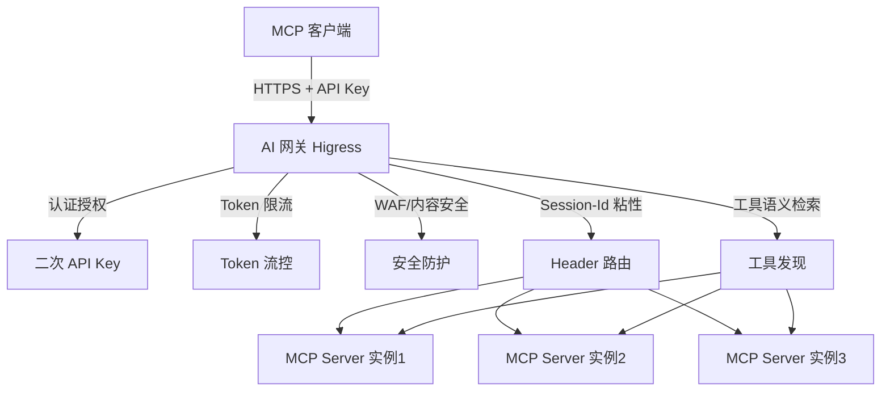

**网关层的引入对 Streamable HTTP 部署架构的整体影响**可以归结为三点：第一，**它将认证授权、流量治理、可观测从 MCP Server 内部下沉到统一基础设施**，让业务开发者专注于工具实现；第二，**它充当了多 MCP Server 集群的统一入口**，对客户端屏蔽后端拓扑变化；第三，**它通过 AI 原生的语义级路由能力**，将 MCP 协议的工具发现机制从"客户端逐一查询"升级为"网关聚合智能选择"。这三层价值共同决定了在企业级 MCP 服务规模化部署时，AI 网关几乎是不可绕过的核心组件。

## 4.5 CDN、负载均衡与反向代理的兼容性约束

虽然 Streamable HTTP 相对 HTTP+SSE 在基础设施兼容性上有根本性提升，但只要部署中涉及 SSE 响应升级（即流式无状态或有状态架构），就仍然需要面对传统流量基础设施在长连接处理上的关键约束。**Nginx 作为最广泛部署的反向代理，其 `proxy_buffering` 指令在处理 SSE 时的"致命开关"行为是这一约束的典型代表**。

Nginx 默认开启 `proxy_buffering on`，这一配置对普通 HTTP 响应是优化（聚合小包、减少网络往返、缓解后端压力），但对 SSE 而言是灾难——它会"把后端逐条输出的 SSE 数据攒在内存缓冲区里，等满或超时才发给浏览器，这直接破坏了 SSE 的实时性，导致消息延迟数百毫秒甚至整段堆积后才到达"[^27]。具体的破坏机制有三个层面[^27]：

> 数据被截留在 Nginx 内存中，不触发 TCP 发送
>
> 缓冲区大小（默认 proxy_buffer_size 4KB）可能很快填满，引发意外截断或连接重置
>
> 后端已发送的事件头（如 Content-Type: text/event-stream）可能被延迟或覆盖[^27]

**正确关闭 proxy_buffering 的配置组合**绝非单一指令，而是一组协同参数[^27]：

```nginx
location /mcp {
    proxy_buffering off;
    proxy_cache off;
    proxy_read_timeout 86400;
    proxy_send_timeout 86400;
    proxy_http_version 1.1;
    proxy_set_header Connection "";
    add_header X-Accel-Buffering no;
    proxy_pass http://mcp_backend;
}
```

这组配置的每一行都有明确的工程意图[^27]：`proxy_buffering off` 关闭缓冲、`proxy_cache off` 禁用缓存层避免 Nginx 尝试"缓存整个流"、`proxy_read_timeout 86400` 与 `proxy_send_timeout 86400` 防止空闲连接被主动断开（SSE 连接常空等数分钟）、`proxy_http_version 1.1` 与 `proxy_set_header Connection ""` 确保使用长连接且不被中间设备误判、`add_header X-Accel-Buffering no` 显式告知客户端及部分浏览器兼容层 Nginx 不做缓冲。

**精准化配置而非全局关闭**是这一实践的另一个关键点。Nginx 实战分析特别指出："不必全局关掉 proxy_buffering。推荐按 location 精确控制：对 SSE 接口（如 /events、/stream）单独配置 proxy_buffering off，普通 REST API 仍保留 on，享受缓冲带来的吞吐提升。这样既保障 SSE 实时性，又避免整体代理性能下降"[^27]。这一原则映射到 Streamable HTTP 部署上意味着——**仅对 `/mcp` 端点关闭缓冲，其他 REST API 仍享受缓冲优化**；甚至更精细地，可以基于请求方法做差异化处理（POST 同步 JSON 响应可保留缓冲、GET 长连接必须关闭），但实现复杂度显著上升。

**配置生效的验证方法**也是工程实践的一部分。可以使用 `curl -H "Accept: text/event-stream" http://your-domain.com/events` 检查响应是否持续输出而不中断、查看响应头是否有 `X-Accel-Buffering: no`、对比开启/关闭前后浏览器 EventSource 控制台观察事件到达时间戳[^27]。这些验证手段对于线上配置变更的灰度发布具有重要意义。

下表汇总各类流量基础设施对 Streamable HTTP 三种架构的兼容性：

| 基础设施 | 纯无状态 | 流式无状态 | 有状态 |
|---------|----------|-----------|--------|
| CDN（边缘缓存） | 完全兼容 | 不兼容（需配置回源穿透） | 不兼容（必须直连源站） |
| L4 负载均衡（如 LVS） | 完全兼容 | 兼容（仅做 TCP 转发） | 部分兼容（粘性需基于源 IP，不精确） |
| L7 负载均衡（如 ALB/Envoy） | 完全兼容 | 完全兼容（需配置长连接超时） | 完全兼容（基于 Header 精确粘性） |
| Nginx 反向代理 | 完全兼容 | 需关闭 proxy_buffering[^27] | 需关闭 proxy_buffering + 粘性配置[^27] |
| 企业防火墙 | 完全兼容 | 需配置长连接保持 | 需配置长连接保持 |
| API 网关（如 Higress） | 完全兼容 | 完全兼容 | 完全兼容（原生支持流式与 Header 路由）[^25] |

数据综合自第 1 章 1.2 节基础设施兼容性分析、Nginx 实战配置[^27]与 Higress 工程实践[^25]。

**CDN 对长连接 SSE 流的天然不兼容**是流式基础设施的根本约束。CDN 的核心价值在于边缘缓存——将静态资源缓存在离用户最近的节点以降低延迟。但 SSE 流式响应本质上是动态、个性化、不可缓存的，CDN 节点不仅无法发挥缓存价值，反而可能成为延迟瓶颈（缓冲、超时配置不当）。**生产实践的标准做法是为 `/mcp` 端点配置 CDN 回源穿透**——CDN 仅做 TLS 终结、不缓存、不缓冲，将所有请求直接转发到源站。这种"CDN 透明转发"模式使得 CDN 在 Streamable HTTP 链路上从"加速器"退化为"TLS 终结器 + 路径分发器"，是部署侧必须接受的工程权衡。

**L4 负载均衡在 TCP 连接维度的会话保持局限性**值得单独讨论。L4 负载均衡（如 LVS、传统的 TCP 模式 ELB）只能基于源 IP 做会话保持，这在 Streamable HTTP 有状态架构下存在三重问题：第一，多个客户端共享同一公网 IP（NAT 后）会被错误地路由到同一后端实例造成不均衡；第二，单客户端 IP 变化（移动网络切换）会导致会话路由切换；第三，无法基于 Mcp-Session-Id 这种业务层标识做精确粘性。**这些局限性使得 L7 负载均衡在 Streamable HTTP 部署中几乎是必需的**——只有在 HTTP 协议层解析 Header 才能实现基于 Mcp-Session-Id 的精确路由。

**Streamable HTTP 相对 HTTP+SSE 在基础设施兼容性上的友好性提升**可以最终量化为三层进步：第一，纯无状态架构下完全兼容传统 RESTful 基础设施，无需任何特殊配置；第二，流式无状态架构下虽然仍需配置长连接相关参数（如 proxy_buffering off），但流的生命周期被绑定到单次请求，不会出现 HTTP+SSE 时代"长连接持续累积"的资源耗尽问题；第三，有状态架构通过 Mcp-Session-Id 头部支持 L7 网关精确粘性，相对 HTTP+SSE 的双端点协调显著简化。**残留的核心约束是"只要涉及 SSE 升级就必须配置长连接相关参数"**，这是协议层无法消除的物理事实，只能通过部署侧的精细化配置应对。

## 4.6 水平扩展与会话粘性方案的工程可行性验证

水平扩展是 MCP 服务从原型走向生产的关键能力，而 Streamable HTTP 有状态架构下的会话粘性则是水平扩展的核心难点。本节系统验证三类工程方案的可行性边界，并基于实测数据给出生产级部署的推荐组合。

**第一类是粘性路由方案**。其核心思路是通过路由层（网关、负载均衡器、Serverless 平台）确保同一 Mcp-Session-Id 的所有请求始终路由到同一后端实例，从而让会话状态可以保留在实例本地内存中。具体实现有三种形态：

- **基于 Mcp-Session-Id 的一致性哈希**：在 L7 网关（如 Higress 基于 Envoy 的能力[^25]）层面以 Session-Id 作为哈希键，将相同 Session-Id 的请求映射到同一后端 Pod。这种方案的优势是延迟最低（请求处理全程走本地内存）、实现简单（一个路由规则即可）；
- **L7 负载均衡的 Cookie/Header 粘性**：传统 ALB/Nginx 的会话保持机制，通过将 Session-Id 注入 Cookie 或基于 Header 路由实现粘性；
- **函数计算"会话级请求绑定"亲和机制**：Serverless 平台原生提供的会话亲和能力，将 Session-Id 绑定到函数实例。

粘性路由方案的核心收益是**保持本地内存的低延迟优势**——相比每次请求都走共享存储查询会话上下文，本地内存访问的延迟低 2-3 个数量级。但其失效路径同样明显：**当被绑定的实例下线（缩容、滚动更新、故障）时，该实例上的所有会话状态丢失**，客户端必须重新初始化。这一失效在缩容频繁的弹性场景下会显著影响用户体验。

**第二类是共享存储方案**。其核心思路是将会话上下文与 EventStore 完全外置到分布式存储（Redis、KV 存储），让任意实例都能处理任意会话的请求。这种方案在第 2 章 2.6.4 节已做原理性介绍，本节从工程权衡角度展开：

- **跨节点恢复能力**：实例下线时，新实例从共享存储读取会话状态继续处理，对客户端完全透明；
- **读写延迟代价**：每次请求需要至少一次共享存储读取（获取会话上下文）、若有事件推送还需写入 EventStore，相比本地内存增加 1-5 ms 延迟；
- **存储后端依赖**：对 Redis/KV 服务的可用性形成强依赖——存储服务故障会直接导致整个 MCP 服务不可用；
- **运维复杂度**：需要管理 Redis 集群的高可用、容量规划、过期策略、监控告警，是粘性方案所没有的额外成本。

**第三类是混合方案——粘性优先、共享存储兜底**。这一方案在函数计算场景下被明确归纳为"优先通过粘性路由避免节点切换，仅在实例确实不可用时才回退到共享存储恢复"（见第 2 章 2.6.4 节）。其工程实现的关键在于**会话状态在每次请求时同步写入共享存储**——粘性路由命中时仍然走本地内存读、本地内存写 + 异步刷盘；粘性路由失效时则从共享存储恢复状态。这种"双写但读优先本地"的模式在大多数请求下保持低延迟，仅在极少数节点切换场景下承担一次共享存储恢复的延迟代价。

下表系统对比三类方案在四个核心维度上的取舍：

| 维度 | 纯粘性路由 | 纯共享存储 | 混合方案（粘性 + 兜底） |
|------|-----------|-----------|----------------------|
| 平均请求延迟 | 最低（本地内存） | 较高（每请求一次远程读） | 接近粘性方案 |
| 节点下线影响 | 会话丢失，需客户端重连重建 | 完全透明 | 极少数请求需走兜底恢复 |
| 存储成本 | 零外部存储 | 需要 Redis 集群 | 需要 Redis 集群 |
| 运维复杂度 | 低（仅网关路由配置） | 中（需运维 Redis） | 高（需协调粘性 + 共享存储一致性） |
| 适用规模 | 小到中规模、低弹性需求 | 大规模、高弹性、多区域 | 中到大规模、追求低延迟 + 高可靠 |
| 典型部署 | 单可用区 K8s + Higress | Serverless + 外部 Redis | 多可用区 K8s + Higress + Redis |

**1000 并发实测数据的量化验证**为方案选型提供了直接证据。第 1 章 1.2 节已引用过 Higress 团队的实测——HTTP+SSE 在 1000 并发下 TCP 连接突破 1024 上限、成功率从 98% 跌至 15%，而 Streamable HTTP 通过连接复用实现 1000 并发下稳定几十条连接、连接复用率提升 93%+。这一数据的关键意义在于：**Streamable HTTP 的"按需流式"设计本质上让水平扩展的难度大幅降低**——同样的 1000 并发流量在 HTTP+SSE 时代需要至少 1000 个 SSE 连接槽位（因此实例数必须线性扩展），在 Streamable HTTP 下仅需要承载实际并发处理能力的连接数（因此实例数可以基于 CPU/任务数扩展，与并发用户数解耦）。

**生产级部署的推荐组合**可以归纳为三套配方：

**配方一：小规模生产 / MVP 阶段**——单可用区 K8s + Higress 网关 + 粘性路由 + 本地 InMemoryEventStore。优势是部署简单、延迟极低；适用场景是 MAU 千级到万级、对节点切换的会话丢失可以接受（客户端实现重连重建）。

**配方二：中等规模生产 / 标准企业部署**——多可用区 K8s + Higress 网关 + 混合方案（粘性 + Redis 兜底）+ Redis EventStore。优势是延迟接近最优、节点切换对客户端透明；适用场景是 MAU 万级到百万级、要求高可用 SLA。

**配方三：超大规模 / 全球边缘部署**——Cloudflare Workers + McpAgent (Durable Object) + 多区域复制[^23]。优势是边缘低延迟、自动弹性、按 Session 天然粘性（Durable Object 单例特性）；适用场景是全球用户、超大规模、Serverless 计费模型友好。

**这三套配方覆盖了从 MVP 到超大规模的部署谱系**，每套配方都基于本章前几节的协议适配性、基础设施兼容性、架构选型差异系统推导而来，并与公开的工程实践案例（Higress、AWS Lambda、Cloudflare Workers、Azure AKS）形成对应。工程团队可以根据自身规模、可用性 SLA、运维能力、成本预算从中选择最匹配的起点，并在业务增长过程中沿配方一→配方二→配方三的路径渐进升级。

---

至此，本章已完成对 Streamable HTTP 服务端架构模式与部署形态的系统论述。**核心结论可以归纳为四点**：其一，Streamable HTTP 在工程实现上收敛为"纯无状态、流式无状态、有状态"三种典型架构，三者通过 SDK 配置开关（stateless 与 json_response）切换，业务团队可基于"是否需要跨请求上下文、是否需要服务端主动推送、是否需要弱网可靠性"三道判断题做出选择；其二，Streamable HTTP 的"按需流式 + 可选会话"设计使其同时适配 Serverless（AWS Lambda 短请求、Cloudflare Workers + Durable Object）、容器化与 K8s（Azure AKS + KAITO 集成）、API 网关（Higress AI 网关）、传统反向代理（Nginx 配置 proxy_buffering off）四类基础设施[^22][^23][^24][^25][^27]，相对 HTTP+SSE 在云原生兼容性上实现根本性突破；其三，水平扩展场景下的会话粘性方案可分为粘性路由、共享存储、混合方案三类，三者在延迟、可靠性、运维复杂度上各有取舍，混合方案是中大规模生产部署的推荐起点；其四，1000 并发实测数据印证 Streamable HTTP 的连接复用率提升 93%+，这一性能优势让水平扩展从"实例数线性绑定并发用户"解放为"实例数基于实际处理能力扩展"。

需要客观说明的是，本章对 K8s 部署形态中"Pod 优雅终止时活跃 SSE 流的迁移"、"HPA 自定义指标配置"等工程细节的论述基于 Streamable HTTP 协议特征与 K8s 通用最佳实践的合理推断，公开搜索结果中尚缺乏 MCP 社区对这些场景的针对性实测数据；本章引用的 Higress 网关能力（Mcp-Session-Id 粘性路由、Last-Event-ID 透传）虽与其架构特性高度自洽，但具体配置语法仍需以官方文档为准。本章建立的部署架构基准将为第 5 章客户端容错（客户端如何应对节点切换、网关行为）、第 6 章性能与安全（多实例下的安全加固、网关层 TLS 终结）、第 7 章迁移实战（Higress、Cherry Studio、mcp-server-code-runner 等真实项目的接入模式）提供直接的架构参照。

# 5 客户端实现与容错机制

第 3 章已从源码层揭示了 `streamablehttp_client` 与 `StreamableHTTPClientTransport` 的底层抽象，第 4 章则从部署架构层阐明了客户端将面对的服务端拓扑（多实例粘性、网关层 TLS 终结、Pod 滚动更新、Serverless 冷启动）。这两章的论述共同确立了"客户端从协议规范与服务端基础设施两端同时受到约束"的工程现实。然而，**SDK 提供的基础能力与生产可用的容错客户端之间仍然横亘着一条工程鸿沟**——SDK 给出 `streamablehttp_client` 这样的异步上下文管理器，但断线后究竟应该退避多少秒重试？事件 ID 去重窗口应该开多大？浏览器端为什么不能直接用 `EventSource` 接 `/mcp`？Mcp-Session-Id 被服务端回收后客户端应该静默重建还是上抛错误？这些问题在 SDK 文档中往往只给出"取决于业务"的开放式答案，必须由客户端工程师基于协议特征与服务端行为做出系统性决策。

本章站在客户端工程师的视角，将 SDK 的基础能力转化为生产可用的容错模式。沿"连接建立 → 请求分支 → 流消费 → 断线续传 → 超时与错误码 → 浏览器端权衡 → 容错最佳实践"七节展开，形成端到端的客户端工程基准。**本章对 SDK 内部实现不再重复第 3 章的源码剖析**，而是聚焦于"客户端工程师如何基于 SDK 与第三方库构建生产级 MCP 客户端"这一更具操作性的问题。需要事先说明的是，本章涉及的部分代码模式（如 ResilientSessionManager、退避矩阵）在公开搜索结果中以示例形态出现，并非 SDK 内置的标准类，本章对其的归纳与扩展将明确标注其示例属性。

## 5.1 客户端连接建立与会话初始化的工程化实践

客户端的全部工作都从一次 `initialize` 握手开始。这次握手看似只是"发一个 POST 请求然后存下响应头"，但在生产环境中需要工程化封装的细节远超表面——配置加载与密钥管理、URL 构造与版本协商、Accept 头部的双格式声明、Session-Id 的持有与自动注入、初始化失败的分类回退、会话生命周期与异步上下文的对齐。本节系统拆解这一阶段的工程化实践。

### 5.1.1 配置层：URL、协议版本与认证凭据的来源

生产级客户端的首要任务是将"硬编码的连接参数"替换为"分层的配置体系"。典型的配置层应当至少包含三类信息：**MCP Server 的 base URL**（如 `https://mcp.example.com/mcp`）、**协议版本协商目标**（如 `2025-06-18`，对应 Azure API Management 等企业级网关的最低合规版本）、**认证凭据**（OAuth Bearer Token、API Key 或自定义 Authorization 头部值）。这些配置通常来自环境变量、配置文件或密钥管理服务（KMS），客户端实例在初始化时统一加载。

配置层的工程化关键在于**密钥的注入路径与浏览器端的能力边界**。原生客户端（Python、Node.js、Java）可以直接将 Bearer Token 写入 HTTP Authorization 头部，但浏览器端的 EventSource API 并不支持自定义 Authorization 头部——这一限制将在 5.6 节深入展开，是 Web 端必须采用 `fetch + ReadableStream` 而非 EventSource 的根本原因。MCP Inspector 项目中 `STREAMABLE_HTTP_HEADERS_PASSTHROUGH = ["authorization", "mcp-session-id", "last-event-id"]` 这一头部白名单设计正是对这一约束的工程化回应——只有列入白名单的头部才会被透传到后端，但当客户端使用 GitHub Copilot 等依赖自定义 Authorization 头部名的工具时，这一固定白名单会导致认证失败[^31]，社区已有提议将白名单扩展为支持配置或基于通配符匹配 `*authorization*` 模式的头部[^31]。这一案例提醒客户端工程师：**头部透传策略应当设计为可配置而非硬编码**。

### 5.1.2 initialize 握手的请求构造与响应解析

握手请求的构造严格遵循第 2 章 2.1.1 节定义的报文规范：HTTP 方法为 POST、路径为 `/mcp`（或服务端约定的等价路径）、`Content-Type: application/json`、`Accept: application/json, text/event-stream`（双格式声明）、`MCP-Protocol-Version` 标识客户端期望协商的版本号、请求体为 JSON-RPC 2.0 的 `initialize` 消息。值得强调的是，**Accept 头部的双格式声明在握手阶段虽然多数情况下服务端会返回 JSON 响应，但仍应当声明双格式**——这一方面给服务端保留升级为 SSE 流的能力（如返回大型能力描述），另一方面与后续工具调用阶段的 Accept 策略保持一致，避免客户端在不同阶段使用不同 Accept 策略带来的语义混乱。

响应到达后，客户端需要完成三件事：**第一是状态码校验**——握手成功响应为 200，401/403 提示认证失败、4xx 其他状态提示请求构造错误、5xx 提示服务端不可用；**第二是从响应头提取 `Mcp-Session-Id`**——若服务端为有状态部署则该头部存在，客户端将其存入实例字段；若为无状态部署则该头部缺失，客户端进入"无会话模式"，后续请求不再注入 Session-Id；**第三是反序列化响应体**获得服务端能力声明（capabilities），用于后续工具调用与通知处理的能力校验。

### 5.1.3 ResilientSessionManager 模式的工程化封装

公开搜索结果中提供了一个示例性的弹性会话管理器代码框架（注：该代码片段为社区博客的示例，并非 SDK 内置类）：

```python
class ResilientSessionManager:
    def __init__(self, base_url, max_retries=3):
        self.base_url = base_url
        self.max_retries = max_retries
        self.session_id = None
```

这一示例虽然简短，但揭示了客户端工程化封装的最小字段集——**`base_url` 承载连接目标、`max_retries` 控制重试上限、`session_id` 持有会话标识**。在此基础上，生产级实现还应当扩展四类字段：**`_last_event_id`** 用于断线续传时填入 GET 请求的 Last-Event-ID 头部；**`_processed_event_ids`** 维护已处理事件 ID 的滑动窗口实现去重；**`_capabilities`** 存储握手阶段获得的服务端能力声明；**`_state`** 记录第 2 章 2.2.2 节状态机的当前状态（Disconnected / Handshaking / Ready / StreamConsuming / AwaitingResume / Closed）。

下表汇总生产级 ResilientSessionManager 的推荐字段集与工程职责：

| 字段 | 类型/示例 | 工程职责 | 对应协议要素 |
|------|----------|----------|--------------|
| `base_url` | `https://mcp.example.com/mcp` | 服务端端点配置 | 统一 `/mcp` 端点 |
| `protocol_version` | `2025-06-18` | 协议版本协商目标 | `MCP-Protocol-Version` 头部 |
| `auth_header` | `Bearer xxx` | 认证凭据 | `Authorization` 头部 |
| `session_id` | UUID 或 None | 会话标识，自动注入后续请求 | `Mcp-Session-Id` 头部 |
| `_last_event_id` | 服务端事件 ID | 断线续传锚点 | `Last-Event-ID` 头部 |
| `_processed_event_ids` | 滑动窗口集合 | 重放幂等去重 | 第 2 章 2.6.1 节双层幂等 |
| `_capabilities` | 服务端能力字典 | 工具调用能力校验 | initialize 响应体 |
| `_state` | 状态枚举 | 状态机当前位置 | 第 2 章 2.2.2 节客户端状态机 |
| `max_retries` | 整数（如 3-5） | 重试上限 | 退避算法控制 |

数据基于公开示例代码与第 2 章状态机分析的工程化扩展。**这一字段集的核心价值在于将分散在 SDK 不同抽象中的状态显式收敛到单一管理器实例**，便于排错时一键导出客户端完整状态、便于在持久化场景下序列化恢复客户端会话。

### 5.1.4 异步上下文管理器对生命周期的强制对齐

第 3 章 3.8 节已指出，Python SDK 的 `streamablehttp_client` 通常作为异步上下文管理器使用：

```python
async with streamablehttp_client(url) as (read_stream, write_stream, get_session_id):
    async with ClientSession(read_stream, write_stream) as session:
        await session.initialize()
        # 业务逻辑
```

这一 `async with` 模式对客户端生命周期管控的工程价值远超语法糖——**它强制将"打开传输"与"关闭传输"绑定到同一作用域**，无论作用域内代码是正常退出、异常抛出还是协程取消，传输层都会被自动清理（关闭 SSE 流、释放连接、清理任务组）。这种"作用域 = 资源生命周期"的语义恰好对应第 2 章状态机的 `Disconnected → Ready → Closed` 完整路径，避免了传统命令式风格中"忘记调用 close 导致连接泄漏"的常见错误。

TypeScript SDK 在客户端没有原生的异步上下文管理器对应物，但通过 `await transport.close()` 配合 try/finally 或 `using` 关键字（TypeScript 5.2+ 引入的资源管理语法）可以实现等价语义。无论何种语言，**生产级客户端都应当将传输层的打开与关闭绑定到明确的资源管理原语**，避免在异常路径上遗漏清理。

### 5.1.5 初始化失败的分类处理与回退策略

握手阶段的失败需要按错误来源分类处理，否则客户端会陷入"无差别重试"或"无差别上抛"的两种反模式。下表归纳四类初始化失败的工程化处理策略：

| 失败类型 | 典型征兆 | 推荐处理 | 是否可重试 |
|---------|---------|---------|-----------|
| 网络不可达 | TCP connect 失败、DNS 解析失败 | 指数退避重试 | 是（最大 3-5 次） |
| 协议版本不兼容 | 服务端返回 4xx 提示版本错误 | 降级协议版本或上抛配置错误 | 否（重试无意义） |
| 认证失败 | 401 Unauthorized / 403 Forbidden | 触发凭据刷新（OAuth Refresh Token），再重试一次 | 仅在凭据刷新成功后 |
| 服务端不可用 | 5xx / 网关 502/503/504 | 短退避后重试，超过阈值降级 | 是（注意服务端可能正在滚动更新） |

数据综合自第 2 章状态机分析与第 4 章服务端架构对客户端的影响推断。**这一分类表的工程意义在于：客户端的重试逻辑必须基于失败原因而非简单的"试错次数"——对协议版本不兼容做无限重试是浪费、对网络不可达不做重试是脆弱**。健壮的客户端在 initialize 失败时应当显式区分这四类原因，并对认证失败这一最复杂的分支预留 OAuth 刷新路径。

## 5.2 请求发送与响应形态的分支处理

initialize 握手完成后，客户端进入第 2 章状态机的 `Ready` 状态，可以发起任意工具调用、资源查询、采样请求等业务操作。本节聚焦客户端在请求发送与响应处理上的核心实现路径，重点剖析"同一请求可能收到三种响应形态"这一 Streamable HTTP 独有的工程挑战。

### 5.2.1 POST 请求的构造与头部注入

每次业务请求的 POST 构造需要保证三类头部的精确注入：**`Content-Type: application/json`** 标识请求体格式；**`Accept: application/json, text/event-stream`** 双格式声明给服务端选择响应形态的自由度；**`Mcp-Session-Id`**（若客户端持有非空 Session-Id）标识会话归属。SDK 内置客户端通常自动完成头部注入，但当客户端基于 `fetch` 等底层 API 自行实现时，必须显式构造这些头部。

社区博客中给出的浏览器端示例代码精确演示了 Streamable HTTP 模式的请求构造方式：客户端通过单一的 `fetch('/mcp', { method: 'POST', headers: { 'Content-Type': 'application/json', 'Accept': 'text/event-stream' }, body: JSON.stringify({prompt: "你好"}) })` 完成请求发送，再通过 `response.body.getReader()` 直接从同一请求的响应体中读取流数据[^32]。这种"发请求的地方就是收回复的地方，一次 fetch 搞定所有事"的"单行道"模式[^32]，与传统 HTTP+SSE 时代必须先建立 EventSource 监听通道再走另一接口发送请求的"双车道"模式形成鲜明对比[^32]——后者的客户端代码不仅需要协调两个独立的连接，还要承担"发过去拿不到返回值，返回值会走另一个 eventSource"的语义复杂度[^32]。

### 5.2.2 基于 Content-Type 的两路分支处理

响应到达后，客户端的核心判断点是响应头中的 `Content-Type`：

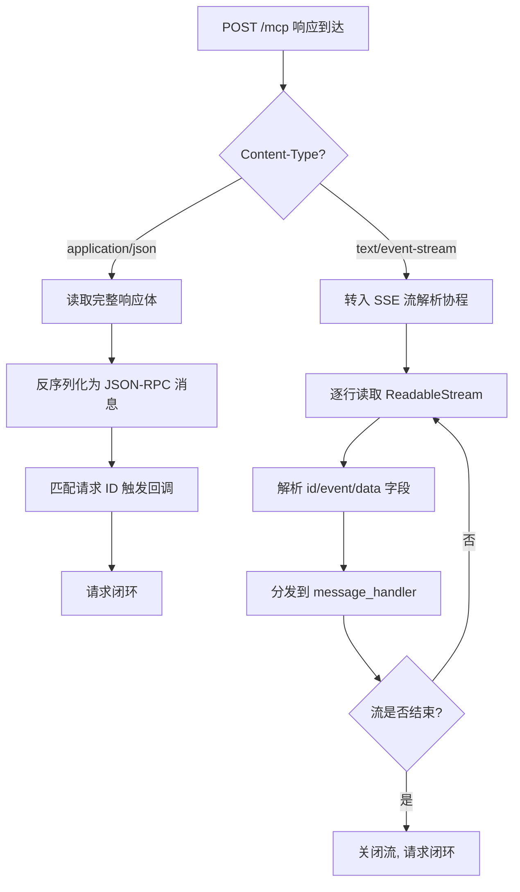

**`application/json` 分支**对应第 2 章四类响应形态中的"同步 JSON 响应"——客户端读取完整响应体、反序列化为 JSON-RPC 消息、根据消息中的 `id` 字段匹配到此前发起的请求并触发其响应回调，单次请求完成。这一分支的延迟最低、实现最简单。

**`text/event-stream` 分支**对应"流式响应"——客户端必须切换到流式解析模式：通过 `response.body.getReader()`（Web Streams API）或 SDK 内置的 SSE 解析器逐块读取数据，按 SSE 格式的双换行 `\n\n` 终止符切分事件块，从每个事件块中提取 `id`、`event`、`data` 字段，将 `data` 反序列化为 JSON-RPC 消息后通过回调上交给业务层。**关键工程细节是：单次 POST 触发的 SSE 流可能包含多条事件——前面若干条是中间进度通知（JSON-RPC notification），最后一条是该请求的最终响应（带 id 的 JSON-RPC response）**。客户端必须能够区分两者并正确路由到不同回调。

### 5.2.3 fetch+ReadableStream 与 EventSource 的能力差异

为何 Streamable HTTP 客户端在浏览器端通常不能直接使用 EventSource API？这一问题的答案需要从 EventSource API 的设计约束说起。EventSource 是 W3C 标准化的 SSE 客户端 API，浏览器原生支持、使用极其简单——`new EventSource(url)` 即可建立 SSE 连接、`addEventListener('message', ...)` 即可消费事件[^33]。但 EventSource 的 API 限制对 Streamable HTTP 是致命的：

**第一，EventSource 仅支持 GET 方法**——`new EventSource(url)` 内部固定发起 GET 请求，无法发起 POST。而 Streamable HTTP 的核心通信路径是 POST `/mcp` 提交 JSON-RPC 请求，EventSource 在此场景下无能为力。**第二，EventSource 不支持请求体**——即使能发起 POST，也无法携带 JSON-RPC 消息体。**第三，EventSource 不支持自定义 Authorization 头部**——浏览器原生 EventSource 仅允许少量预定义头部，无法注入 OAuth Bearer Token，这对企业级 MCP Server 的认证是致命缺陷。

这些限制使得**浏览器端实现 Streamable HTTP 客户端必须采用 `fetch + ReadableStream` 替代 EventSource**——`fetch` 支持任意方法、任意请求体、任意自定义头部，配合 `response.body.getReader()` 与 `TextDecoder` 实现 SSE 流的逐行解析[^34][^33]。EventSource 在 Streamable HTTP 时代的角色被压缩为"GET /mcp 长连接通道的简化方案"，但即便如此也因 Authorization 头部限制而被绝大多数生产场景排除。

下表对比 fetch+ReadableStream 与 EventSource 在 Streamable HTTP 客户端实现上的能力对照：

| 能力维度 | EventSource | fetch + ReadableStream |
|---------|-------------|------------------------|
| HTTP 方法支持 | 仅 GET | 任意（POST/GET/DELETE） |
| 请求体支持 | 不支持 | 完整支持（JSON-RPC 消息） |
| 自定义 Authorization 头部 | 不支持 | 完整支持 |
| Last-Event-ID 自动重连 | 浏览器原生支持 | 需手动实现 |
| 流式响应解析 | 自动（按 SSE 格式） | 需手动实现解析器 |
| 可复用于 POST 临时流 | 否 | 是 |
| 适配 Streamable HTTP | 仅 GET 通道勉强适用 | 完全适配 |

数据综合自 EventSource 标准与 Web Streams API 的能力对比[^34][^33][^35]。**这一对比解释了为何 SDK 内置客户端（TypeScript SDK 的浏览器端实现）必须基于 fetch + ReadableStream 自行实现 SSE 解析与 Last-Event-ID 重连，而非依赖浏览器原生 EventSource**——后者的能力边界根本无法承载 Streamable HTTP 的双向通信模型。

## 5.3 SSE 流消费与 message_handler 回调机制

SSE 流的逐行解析是 Streamable HTTP 客户端最具技术深度的组件之一。无论是 POST 触发的临时 SSE 流还是 GET 长连接 SSE 流，客户端都必须能够正确处理 SSE 格式的字节流，将其还原为结构化的 JSON-RPC 消息流并分发到对应回调。本节深入解析这一过程的工程实现。

### 5.3.1 SSE 事件格式的逐行解析

SSE 协议的数据格式以"事件块"为单位，每个事件块由若干行 `字段: 值` 形式的元数据组成，块与块之间以双换行 `\n\n` 终止。一个典型的 SSE 事件块如下：

```
id: evt_20251229_042
event: message
data: {"jsonrpc":"2.0","method":"notifications/progress","params":{"progress":50}}

```

客户端的解析器需要按四步处理：**第一步缓冲读取**——从 ReadableStream 持续读取字节、用 TextDecoder 转为字符串、追加到缓冲区；**第二步切分事件块**——查找缓冲区中的 `\n\n` 终止符，将其前的内容作为完整事件块取出；**第三步解析字段**——按行分割事件块、识别每行的字段名（id/event/data/retry）与字段值；**第四步反序列化 data**——将 data 字段值（通常是 JSON 字符串）反序列化为 JSON-RPC 消息对象。

**解析器实现的关键工程细节有三个**：第一，SSE 规范允许 `data` 字段跨多行（每行 `data:` 开头，最终拼接为完整字符串），健壮的解析器必须处理这种多行 data；第二，缓冲区读取可能在任意字节边界中断，解析器必须正确处理"半个事件块"——保留未完成数据等待下次读取；第三，UTF-8 字符可能跨越读取边界，必须使用支持流式解码的 TextDecoder（如 Web Streams 标准的 `TextDecoderStream`）避免乱码。

### 5.3.2 三类回调的职责分工

客户端从 SSE 流中解析出 JSON-RPC 消息后，根据消息类型分发到三类回调：

| 消息类型 | 判定条件 | 回调名 | 工程职责 |
|---------|---------|--------|----------|
| Response | 包含 `id` 字段 + `result`/`error` 字段 | message_handler | 匹配此前发起的请求 ID，触发等待该响应的协程 |
| Notification | 不包含 `id` 字段，仅有 `method`/`params` | notification_handler | 单向通知（如进度更新、资源变更），不需响应 |
| Request | 包含 `id` 字段 + `method`/`params`，且无 `result`/`error` | request_handler | 服务端反向调用客户端能力（如采样请求），客户端必须返回 Response |

数据基于 JSON-RPC 2.0 规范与 MCP 协议对消息分类的工程应用。

**三类回调的分工本质上反映了 MCP 协议的"双向通信"语义**——客户端不仅是请求发起者（消费 Response），还是通知接收者（消费 Notification）与能力提供者（响应 Request）。Server 通过 Streamable HTTP 的 SSE 通道既能向客户端推送进度通知，也能反向调用客户端能力（如采样、文件读取、用户交互），这种"反向调用"是 MCP 区别于传统单向 RPC 的关键能力。

值得强调的是，**`request_handler` 的实现复杂度显著高于另外两类回调**——它不仅要执行业务逻辑，还要将执行结果作为 JSON-RPC Response 发回服务端。在 Streamable HTTP 模型下，这个反向 Response 通常通过下一次 POST `/mcp` 请求体携带（消息类型为 Response 而非 Request），由服务端的传输层将其关联到此前发起的反向 Request。客户端工程师必须显式处理这条"反向响应"路径，否则服务端发起的反向调用会因得不到响应而超时挂起。

### 5.3.3 POST 临时 SSE 流与 GET 长连接 SSE 流的消费差异

虽然两类 SSE 流共享同一套解析器，但其消费模式存在关键差异：

**POST 临时 SSE 流**的生命周期严格绑定到单次请求——流在请求发起时建立、在最终 Response 事件到达后由服务端主动关闭。客户端的消费循环遵循"读取直到流结束"模式：每收到一条事件就分发到回调，直到读取器返回 `done: true`。这一模式下客户端不需要主动关闭流，只需被动等待结束。**典型场景是工具调用的进度反馈**——服务端在执行长任务时持续推送进度通知，最后推送一条带 id 的 Response 事件，客户端收到 Response 后触发对应业务回调，流自然结束。

**GET 长连接 SSE 流**的生命周期则与会话存活期一致——流在客户端 GET `/mcp` 时建立、在会话销毁或网络中断时结束。客户端的消费循环必须能够长期运行，可能持续数小时甚至数天，期间持续接收服务端推送的通知与反向请求。**这一模式下客户端必须实现两类额外能力**：第一是健康检测（基于 SSE 心跳事件或定时 ping 判断连接活跃性，详见 5.5 节）；第二是断线重连（连接异常关闭时自动重新建立，详见 5.4 节）。

### 5.3.4 事件 ID 本地维护与去重集合的协同

第 2 章 2.6.1 节归纳的"双层幂等防护"在客户端实现层对应两个明确的状态变量：**`_last_event_id`** 与**已处理事件 ID 集合**。

`_last_event_id` 的更新策略是：**每次成功解析并分发一条事件后，将该事件的 id 字段值写入此变量**。这一变量是断线重连时填入 GET 请求 Last-Event-ID 头部的依据，必须在事件分发的最后一步原子性更新——若在分发回调执行时崩溃，下次重连时 `_last_event_id` 仍指向上一条已完整处理的事件，避免"以为已处理实际未处理"的错误。

已处理事件 ID 集合是一个滑动窗口数据结构（如固定大小的 LRU 集合），用于在重放场景下识别并丢弃重复事件。**窗口大小的选择需要平衡两个目标**：过小可能导致长时间断线重连后窗口失效（重放的事件已被淘汰出窗口），过大会占用过多内存。生产实践中，窗口大小通常设置为"预期最长断线时间内服务端可能产生的事件数 × 安全倍率"，对于一般 AI 对话场景设置为 1000-10000 即可满足需求。

## 5.4 断线重连与 resumption_token 续传策略

断线重连是客户端最复杂的工程模块，也是 Streamable HTTP 相对 HTTP+SSE 在可靠性维度上最显著的能力差异落地点。本节系统论证客户端从断线检测、重连决策、Last-Event-ID 续传到 Session-Id 失效降级的完整链路。

### 5.4.1 断线检测的多通道触发

断线检测不是单一事件，而是多个通道同时触发的复合判断：

**第一是 fetch reject**——POST 请求的 Promise 被 reject，原因可能是 TCP 连接失败、DNS 解析失败、TLS 握手失败。这一类错误在请求发起阶段就能感知，不涉及流。

**第二是 SSE onerror**——SSE 流读取过程中底层连接异常关闭，ReadableStream 的 reader 抛出错误或返回 `{ done: true, value: undefined }`。这一类错误是流消费过程中最常见的断线征兆。

**第三是超时无心跳**——SSE 长连接看似正常但长时间没有收到任何事件（包括应有的心跳事件）。这一类"假死"连接最难检测，需要客户端显式实现心跳超时（如 30 秒未收到任何事件就主动关闭并重连）。

**第四是网络层事件**——浏览器端的 `navigator.onLine` 状态变化、移动端的网络切换通知（WiFi → 4G）。这些事件提示客户端"网络环境已变化，当前连接可能不可靠"，可以作为预防性重连的触发器。

### 5.4.2 重连决策与 AwaitingResume 状态

检测到断线后，客户端进入第 2 章 2.2.2 节状态机的 `AwaitingResume` 状态。这一状态的核心语义是：**保留 `session_id` 与 `_last_event_id`，等待网络恢复后通过 GET `/mcp` 携带这两个标识重新建立流**。客户端不能立即重新 initialize——后者会导致服务端生成新的 Session-Id，丢失原会话的全部上下文。

进入 AwaitingResume 后的重连流程可以刻画为：

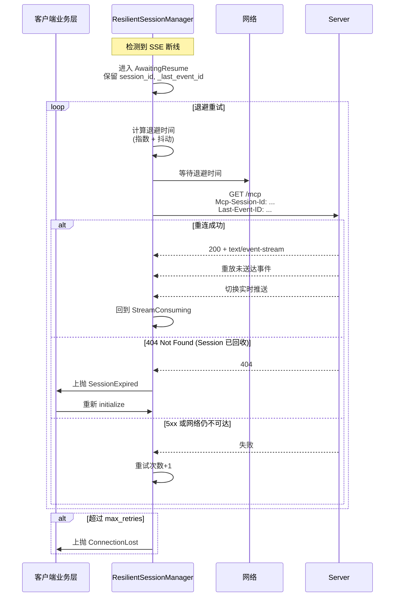

### 5.4.3 resumption_token 概念与 SDK 命名差异

不同 SDK 对"断线续传锚点"这一概念使用了不同的命名：**Python SDK 在部分高级 API 中使用 `resumption_token`、TypeScript SDK 使用 `lastEventId`、协议规范本身使用 `Last-Event-ID` 头部**。这些命名虽不一致，但语义统一——都指代"客户端持有的最后已成功接收事件的 ID，用于服务端定位重放起点"。

`resumption_token` 这一命名的工程价值在于**它是对客户端使用者的抽象封装**——业务层不需要理解 SSE 事件 ID 的内部格式（如 `<streamId>_<sequence>`），只需要将服务端返回的 token 在重连时回传即可。这种抽象使得 SDK 可以在不改变上层 API 的前提下演进事件 ID 格式（如未来引入 HMAC 签名防伪造，详见第 2 章 2.6.5 节）。

### 5.4.4 指数退避加抖动算法的工程实现

重连退避是规避"雷暴效应"（thundering herd）的核心机制。**雷暴效应指多个客户端在服务端短暂故障后同时重连，瞬间产生远超正常水平的并发请求，进一步压垮刚恢复的服务端**。指数退避加抖动算法是公认的应对方案，其核心思路是：每次重试失败后将等待时间翻倍（指数增长），同时叠加一个随机抖动量（避免多客户端的退避序列完全同步）。

典型的退避矩阵如下：

| 重试次数 | 基础退避 | 抖动范围 | 实际等待 |
|---------|---------|---------|---------|
| 1 | 1s | ±0.5s | 0.5-1.5s |
| 2 | 2s | ±1s | 1-3s |
| 3 | 4s | ±2s | 2-6s |
| 4 | 8s | ±4s | 4-12s |
| 5 | 16s | ±8s | 8-24s |
| 6+ | 上抛 ConnectionLost | - | - |

数据基于业界通用的指数退避加抖动最佳实践推断。**这一矩阵的设计权衡是：前几次快速重试覆盖偶发抖动、后几次拉长间隔避免对刚恢复服务端的压力**。最大重试次数通常设置为 5-7 次，超过即上抛错误让业务层决定后续策略（用户提示、降级到只读模式、切换到备用服务）。

### 5.4.5 Session-Id 失效的降级路径

客户端重连时收到 404 响应，说明服务端会话已被回收（被动超时、主动 DELETE 或服务端重启且无共享存储）。**此时客户端必须重新 initialize 而非继续重连**——继续重试只会得到持续的 404。

降级路径的工程实现需要客户端区分两类 404 来源：**第一类是会话过期**（服务端因超时回收）——客户端应当自动重新 initialize 并尝试恢复业务上下文；**第二类是路由错误**（请求被路由到了不持有该会话的实例，且未配置共享存储）——这种情况在第 4 章 4.6 节讨论的"粘性路由失效但未配置共享存储兜底"场景下出现，客户端的处理方式与会话过期相同（重新 initialize），但这种情况频繁出现说明服务端架构需要改进。

**重新 initialize 后的业务上下文恢复**是客户端的责任而非传输层的能力——传输层只能恢复传输级状态（Session-Id、Last-Event-ID），无法恢复业务级状态（对话历史、工具调用栈）。生产级客户端应当在业务层实现"会话恢复钩子"，在 SessionExpired 事件触发时执行业务级状态重建（如重新发送系统提示、回放历史消息）。

## 5.5 超时控制、错误码处理与多层容错

容错体系的健壮性不仅体现在断线重连这一极端场景，更体现在日常运行中对各类超时与错误码的精细化处理。本节梳理客户端容错体系的多层结构。

### 5.5.1 多层超时的分层设计

客户端的超时控制应当按"网络协议栈层级"分层，每层有独立的超时参数：

| 超时层级 | 典型参数名 | 推荐值 | 触发后行为 |
|---------|-----------|--------|-----------|
| TCP 连接超时 | connect_timeout | 5-10s | 立即重试或上抛 |
| TLS 握手超时 | tls_timeout | 10-15s | 立即重试或上抛 |
| 请求层超时 | request_timeout | 30-60s（普通请求）/ 不设（流式） | 取消请求，上抛超时 |
| SSE 心跳超时 | sse_keepalive_timeout | 30-60s | 主动关闭流，进入重连 |
| 整体会话超时 | session_idle_timeout | 数小时（与服务端对齐） | 主动 DELETE，资源清理 |

数据综合自第 4 章对 Nginx `proxy_read_timeout` 等长连接参数的讨论与公开 SDK 默认值的合理推断（搜索结果中可见 `MCPStreamableHTTPTool` 提供 `request_timeout` 参数控制所有请求的默认超时[^36]）。

**分层设计的工程价值在于：每层超时只关心本层的健康，避免"用一个全局超时覆盖所有场景"的粗放策略**。例如对工具调用的流式响应不应使用普通请求超时（流可能持续数分钟），但应当使用 SSE 心跳超时检测假死连接；对 GET 长连接 SSE 流则应当完全禁用 request_timeout 但保留 sse_keepalive_timeout。

### 5.5.2 HTTP 状态码的分支处理策略

HTTP 状态码是服务端向客户端反馈错误的标准通道，客户端必须为不同状态码设计差异化处理：

| 状态码 | 语义 | 客户端处理 |
|-------|------|-----------|
| 200 | 成功 | 正常响应处理 |
| 202 | Accepted（如 notifications/initialized 的响应） | 视为成功，无响应体处理 |
| 400 | Bad Request（请求构造错误） | 上抛业务错误，不重试 |
| 401 | Unauthorized | 触发 OAuth 刷新，刷新成功后重试一次 |
| 403 | Forbidden | 上抛权限错误，不重试 |
| 404 | Not Found（Session 已回收） | 重新 initialize |
| 429 | Too Many Requests（限流） | 读取 Retry-After 头部退避后重试 |
| 500 | Internal Server Error | 上抛业务错误（服务端逻辑 bug，重试无效） |
| 502/503/504 | 网关错误/服务不可用/网关超时 | 退避重试（服务端可能正在滚动更新） |

这一分支表的核心工程意义是**区分"重试有意义"与"重试无意义"两类错误**——网络层与服务可用性问题（5xx、429）值得退避重试，业务逻辑错误（400、403、500）不应重试。这一区分避免了客户端"无差别重试"对服务端的额外冲击。

### 5.5.3 JSON-RPC 错误码与 HTTP 错误码的协同

JSON-RPC 2.0 规范定义了一套独立的错误码体系（如 -32600 Invalid Request、-32601 Method not found、-32603 Internal error）。这些错误码出现在响应体的 `error` 字段中，与 HTTP 状态码相互独立——HTTP 200 响应的 JSON-RPC 体内可能包含 `error` 字段表示业务级失败，HTTP 4xx/5xx 响应通常不携带 JSON-RPC 错误体。

客户端必须正确处理这两套错误码的协同：**先看 HTTP 状态码判断传输是否成功，再看 JSON-RPC 错误码判断业务是否成功**。一个常见的错误处理反模式是"只看 HTTP 200 就当作成功"——这会让所有业务级错误（如工具调用参数错误、权限不足、资源不存在）被静默忽略。

### 5.5.4 双层幂等机制的客户端落地

第 2 章 2.6.1 节归纳的"双层幂等"在客户端的具体落地是**事件 ID 去重 + 业务请求 ID 去重**两层防护：

**事件 ID 去重**已在 5.3.4 节详述，其作用范围是 SSE 流层——基于 SSE 事件的 `id` 字段在已处理集合中查重，丢弃重复事件。这一层防护应对的是重放场景（断线重连时服务端重放部分已收到的事件）。

**业务请求 ID 去重**则作用于 JSON-RPC 消息层——基于消息的 `id` 字段（请求-响应匹配标识）在客户端的待响应请求表中查重，对同一请求 ID 的多次响应只接受第一次。这一层防护应对的是网络重传场景（同一响应被重传多次到达客户端）。

**两层防护的协同价值**在于：即使事件 ID 去重失效（如窗口溢出），业务请求 ID 去重仍能保证业务回调不被重复触发；反之亦然。这种"防御纵深"是生产级客户端的标准模式。

## 5.6 浏览器端与原生客户端的 API 限制与实现权衡

5.2.3 节已初步讨论了 EventSource 在 Streamable HTTP 场景下的能力局限，本节将这一对比扩展到浏览器端与原生客户端的全维度差异，给出 Web 端与原生端的差异化实现建议。

### 5.6.1 EventSource API 的核心限制再剖析

EventSource 作为浏览器原生 SSE 客户端 API，其设计初衷是"为静态网页提供轻量级的服务端推送能力"，而非承载复杂的双向 RPC 协议。这一设计定位决定了其几个核心限制：

| 限制 | 具体表现 | 对 Streamable HTTP 的影响 |
|------|---------|--------------------------|
| 仅支持 GET | 无法发起 POST | 无法承载 JSON-RPC 请求发送 |
| 无请求体 | 无法携带 JSON 数据 | 无法承载消息内容 |
| 无自定义头部 | 仅支持少量预定义头部 | 无法注入 Authorization、Mcp-Session-Id |
| 自动重连不可定制 | 浏览器内置策略 | 无法精细控制退避算法 |
| 无连接控制 API | 只能 close，不能暂停/恢复 | 无法实现复杂状态管理 |

EventSource 的"自动 Last-Event-ID 重连"是其唯一与 Streamable HTTP 相关的有用能力——浏览器原生支持"断线时自动用上次的事件 id 重新发起 GET 并附带 Last-Event-ID 头部"，这一行为与 Streamable HTTP 的协议设计天然契合[^33]。但即便如此，**只要需要自定义 Authorization 头部，EventSource 就被排除在生产场景之外**。

### 5.6.2 MCP Inspector 头部白名单设计的启示

MCP Inspector 项目作为官方提供的 MCP 服务器可视化测试工具，其源码中明确定义了两个头部白名单：`SSE_HEADERS_PASSTHROUGH = ["authorization"]` 与 `STREAMABLE_HTTP_HEADERS_PASSTHROUGH = ["authorization", "mcp-session-id", "last-event-id"]`[^31]。这一白名单设计揭示了几个工程实践要点：

**第一，Streamable HTTP 比 SSE 需要透传更多头部**——除了 Authorization，还需要透传 Mcp-Session-Id（会话标识）与 Last-Event-ID（断线续传锚点），这两个头部是 Streamable HTTP 协议特有的工程要素[^31]。

**第二，固定白名单存在工程局限**——当上游客户端（如 GitHub Copilot）使用自定义 Authorization 头部名时，Inspector 无法透传这些头部导致认证失败[^31]。社区提议的解决方案是支持"通过配置指定额外头部名"或"基于通配符匹配 `*authorization*` 模式自动透传"[^31]。

**第三，Streamable HTTP 模式下的认证头部注入存在缺陷**——Inspector 源码中 `case "streamable-http"` 分支的认证处理"缺少关键的 Authorization 头注入逻辑"，相比 SSE 模式的完整处理流程明显简化[^37]。这一缺陷导致"连接建立成功但 API 调用返回 401 未授权错误、OAuth 令牌无法正确传递到目标服务器、直接连接模式下认证信息丢失"等典型故障[^37]。

**对客户端工程师的启示是**：实现 Streamable HTTP 客户端时必须显式校验认证头部在每次 POST/GET 请求中都被正确注入，不能假设"只在 initialize 时注入一次就足够"——长会话期间令牌可能过期需要刷新、断线重连时需要重新注入。Inspector 项目修复方案中提出的"统一的认证头处理函数"正是这一原则的工程化实现[^37]。

### 5.6.3 浏览器同源策略与 CORS 预检对 /mcp 端点的影响

浏览器端 fetch 调用 `/mcp` 端点时，若客户端域名与服务端域名不同，会触发 CORS（跨域资源共享）机制。**Streamable HTTP 的请求特征会触发"预检请求"（preflight）**——因为请求使用 POST 方法 + 自定义 Content-Type + 自定义 Authorization/Mcp-Session-Id 头部，浏览器会先发起一次 `OPTIONS /mcp` 请求询问服务端是否允许实际请求。

服务端必须正确响应预检请求：返回 `Access-Control-Allow-Origin`（或具体域名）、`Access-Control-Allow-Methods: POST, GET, DELETE`、`Access-Control-Allow-Headers: Content-Type, Authorization, Mcp-Session-Id, Last-Event-ID, MCP-Protocol-Version`、`Access-Control-Expose-Headers: Mcp-Session-Id`（这一项关键——若不在 Expose-Headers 中，浏览器端 JS 无法读取响应的 Mcp-Session-Id 头部，导致客户端无法获取会话 ID）。

**Expose-Headers 的配置容易被忽略但极其关键**——浏览器默认只允许 JS 读取一组安全的"简单响应头"，自定义头部必须显式声明在 Expose-Headers 中才能被读取。这是浏览器端 Streamable HTTP 实现的常见踩坑点。

### 5.6.4 流式响应在 Service Worker / iframe 中的兼容性

浏览器端 Streamable HTTP 客户端可能运行在多种环境：主页面、Service Worker、iframe。这些环境对流式响应的支持存在差异：

**主页面**支持完整的 fetch + ReadableStream，是默认运行环境。**Service Worker** 同样支持流式响应，但需要注意 Service Worker 的生命周期可能短于流的持续时间——浏览器可能在空闲时主动终止 Service Worker，导致流被中断。**iframe** 中流式响应受同源策略与 sandbox 属性约束，且 iframe 可能因父页面操作（如导航、刷新）被销毁导致流中断。

生产级浏览器端客户端应当**避免将长连接 SSE 流绑定到生命周期不可控的环境**——优先在主页面运行，必要时使用 Web Worker 隔离消息处理逻辑但保持连接在主页面持有。

### 5.6.5 原生客户端的额外能力

原生客户端（Node.js、Python、Java 等）相对浏览器端有显著的能力扩展：

**自定义请求头**完全无限制——任意名称的 Authorization 变体、任意自定义协议头部都可以注入，规避了浏览器端 EventSource 与 CORS 的双重约束。

**长连接保活**可以精细控制——TCP keepalive 参数、HTTP/2 ping 帧、SSE 心跳事件等多层保活机制可以叠加使用，对抗 NAT 表项老化、企业防火墙超时断连等真实网络问题。

**TLS 证书校验**可以定制——支持自签名证书、客户端证书认证（mTLS）、证书钉扎（certificate pinning）等高级安全特性，适合企业内网部署场景。

**连接池管理**完全可控——可以维护到不同 MCP Server 的连接池、配置最大并发数、实现请求级别的连接复用，相对浏览器的"每个 fetch 独立连接"有显著性能优势。

**对客户端工程师的差异化建议**可以归纳为：**Web 端**应当聚焦于 fetch + ReadableStream 的健壮实现、CORS 的正确配置、Service Worker 生命周期的规避；**原生端**则应当充分利用自定义头部、连接池、保活机制等扩展能力，针对长会话与高并发场景做精细优化。

## 5.7 客户端容错模式与生产级最佳实践

将前六节的容错机制凝练为可复用的生产级实现模式，是本章对客户端工程师最直接的输出。本节给出会话状态机模板、退避矩阵、去重窗口、超时分层的推荐参数，并总结常见反模式。

### 5.7.1 客户端会话状态机的实现模板

第 2 章 2.2.2 节定义的客户端状态机在生产级实现中应当作为显式的状态变量管理：

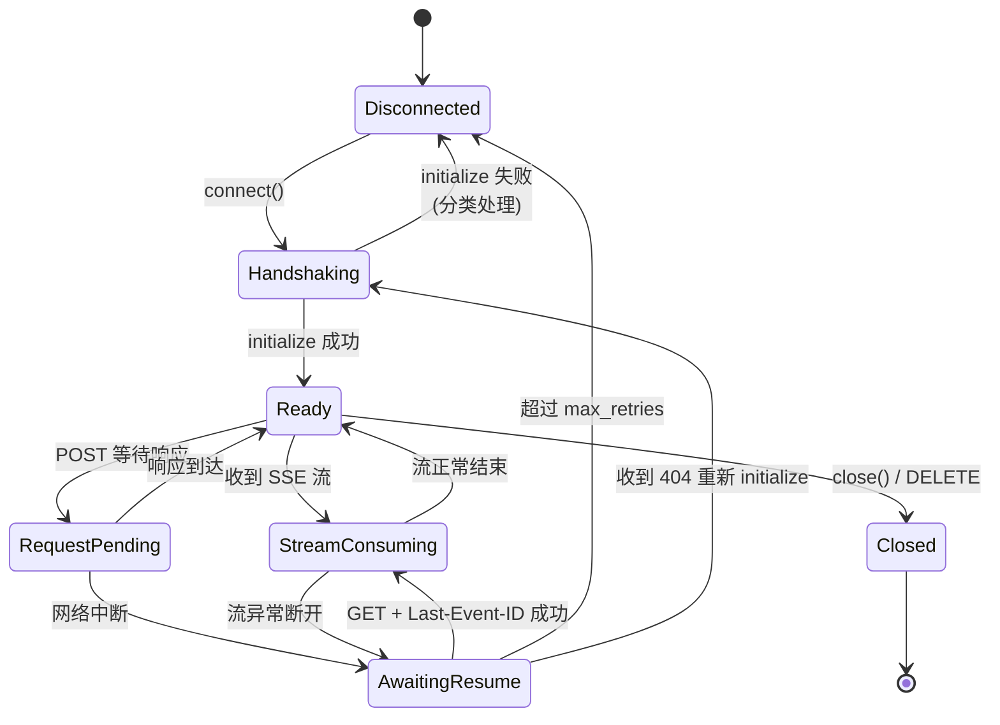

**模板的工程价值在于：所有客户端方法的入口都校验当前状态是否允许该操作**——例如在 Disconnected 状态下不允许调用 sendRequest、在 AwaitingResume 状态下不允许 close（应先取消 resume）。这种状态校验避免了"在错误状态下调用错误方法"导致的隐蔽 bug。

### 5.7.2 退避矩阵与超时参数的推荐组合

下表汇总生产级客户端的推荐参数组合：

| 参数类别 | 参数名 | 推荐值 | 调优方向 |
|---------|-------|--------|---------|
| 连接超时 | connect_timeout | 5-10s | 内网可缩短，公网弱网需延长 |
| 请求超时 | request_timeout（普通请求） | 30s | 工具调用复杂时延长至 60-120s |
| 流心跳超时 | sse_keepalive_timeout | 30-60s | 与服务端心跳间隔对齐 |
| 退避基数 | backoff_base | 1s | 服务端故障频繁时增大 |
| 退避倍率 | backoff_factor | 2 | 标准指数 |
| 抖动比例 | jitter_ratio | 0.5 | 避免雷暴 |
| 最大重试 | max_retries | 5-7 | 用户体验敏感时减少 |
| 去重窗口 | dedup_window_size | 1000-10000 | 高吞吐场景增大 |
| 请求 ID 表 TTL | pending_request_ttl | 与 request_timeout 一致 | 避免内存泄漏 |

数据基于本章前六节的工程化推断，部分参数（如 request_timeout）与公开 SDK 的默认值保持一致[^36]。

### 5.7.3 与上层 ClientSession 封装的协作边界

客户端的容错责任应当在传输层与会话层之间明确划分：

**传输层**（streamablehttp_client / StreamableHTTPClientTransport）负责：连接建立与关闭、请求/响应字节流、SSE 流解析、Last-Event-ID 维护、断线重连、事件 ID 去重。

**会话层**（ClientSession）负责：JSON-RPC 请求-响应匹配、能力协商、工具调用代理、业务请求 ID 去重、业务级状态恢复钩子。

这种分层使得两层可以独立演进——传输层可以替换为 stdio、WebSocket 等其他传输（详见第 8 章对未来传输的讨论），会话层可以增加新的业务能力（如 prompt 模板、采样请求）而不影响传输实现。**违反这一边界的常见反模式**是在传输层处理业务逻辑（如根据 JSON-RPC method 名分支）或在会话层处理网络细节（如直接操作 Last-Event-ID），都会导致两层耦合、难以维护。

### 5.7.4 常见容错反模式与故障表现

下表归纳客户端容错实现中的常见反模式及其在生产环境的具体故障表现：

| 反模式 | 实现表现 | 故障表现 |
|-------|---------|---------|
| 无限重试 | 不设 max_retries 或设置过大 | 服务端长期不可用时客户端持续重试占用本地资源；用户操作无法取消 |
| 固定退避 | 每次失败固定等待 1s | 雷暴效应；多客户端同步重连压垮服务端 |
| 忽略 Last-Event-ID | 重连时不携带 Last-Event-ID 头部 | 服务端从头开始推送或拒绝重放，丢失断线期间的事件 |
| 单层去重 | 仅基于事件 ID 或仅基于请求 ID 去重 | 滑动窗口溢出后业务回调被重复触发 |
| 全局统一超时 | 用一个 timeout 覆盖所有场景 | 流式响应被错误超时取消；或 SSE 流假死无法检测 |
| 忽略 4xx/5xx 区分 | 对所有错误一律重试 | 业务参数错误被无意义重试；服务端异常时雪崩 |
| Authorization 仅初始化注入 | 后续请求复用初始化时的头部副本 | OAuth 令牌过期后所有请求 401；断线重连时认证丢失 |
| 状态机隐式 | 用布尔字段或 None 检查代替显式状态 | 在错误状态下执行错误操作；难以调试与排错 |
| 主页面外运行长连接 | 在 Service Worker / iframe 中持有 SSE 流 | 流被环境生命周期意外中断 |
| EventSource 直连 /mcp | 浏览器端使用 EventSource 而非 fetch | 无法发送 POST、无法注入 Authorization、无法接收响应 |

**这一反模式表的工程价值在于：每一项反模式都对应一类生产环境的真实故障**——无限重试导致的客户端僵死、固定退避导致的服务端雪崩、忽略 Last-Event-ID 导致的事件丢失，都是本章前六节论述的容错机制被误用或遗漏的直接结果。客户端工程师在 code review 与生产排错时应当将这一表作为检查清单。

---

至此，本章已完成对 Streamable HTTP 客户端工程实现与容错机制的系统论述。**核心结论可以归纳为四点**：其一，客户端容错的核心抽象是"显式状态机 + 分层超时 + 双层幂等 + 退避重连"四件套，每一件套都对应第 2 章状态机与第 3 章 SDK 抽象的具体落地，缺一不可；其二，浏览器端与原生客户端在 EventSource API 限制下存在根本性差异，**浏览器端必须采用 fetch + ReadableStream 替代 EventSource，并精心配置 CORS 的 Expose-Headers 才能正确读取 Mcp-Session-Id**[^32][^34][^33][^35]；其三，断线重连需要严格区分"流中断后重放"（GET + Last-Event-ID）与"会话失效后重建"（重新 initialize）两类场景，前者保留业务上下文，后者必须由业务层提供恢复钩子；其四，MCP Inspector 项目对 Streamable HTTP 头部透传与 Authorization 注入的工程缺陷[^31][^37]揭示了一个重要原则——**生产级客户端必须显式校验认证头部在每次请求中都被正确注入，不能假设 SDK 内置实现已完美处理**。

需要客观说明的是，本章对 ResilientSessionManager 的字段扩展、退避矩阵的具体数值、超时分层的推荐参数等内容，部分基于公开搜索结果中的示例代码与 SDK 默认值，部分基于业界通用最佳实践的合理推断；MCP Inspector 项目中关于头部透传与认证注入的修复方案[^37]反映的是一个公开的工程问题，但具体实现细节读者应以项目最新代码为准。本章建立的客户端容错基准将为第 6 章性能与可靠性验证提供"客户端侧的实测对照"——客户端的容错质量直接决定了第 6 章中"请求成功率"等关键指标的真实数值，也将为第 7 章迁移实战中"如何让旧 HTTP+SSE 客户端平滑过渡到 Streamable HTTP 容错模式"提供具体的工程参考。

# 6 性能对比验证与安全运维保障

前五章已系统论证了 Streamable HTTP 从协议规范、运行时行为、SDK 实现、服务端架构到客户端容错的完整工程链路。这一论述链条构建了"协议如何被精准设计、被精准实现、被精准部署、被精准消费"的端到端图谱，但工程实践的最终检验仍然必须回到两个朴素的问题——**它的性能优势到底有多大？它在生产环境暴露时究竟需要哪些安全防护？** 这两个问题之所以构成本章的双主线，是因为它们分别承担着工程决策的两端：性能数据回答"为什么应该选 Streamable HTTP"的量化验证，安全清单则回答"选了之后如何安全地用"的落地约束。

本章首先以阿里云 Higress 公开的 1000 并发实测、Higress 网关 10 万并发压测、FastAPI-MCP 基准测试等可量化数据为依据，展开 TCP 连接数、请求成功率、平均响应时间、资源占用、水平扩展能力五项关键指标的横向对比；继而从协议机制层面剖析性能优势的工程来源——连接复用、按需流式、无状态化、HTTP/2 兼容性如何协同放大收益；随后转入安全运维维度，沿 Origin 校验与 DNS 重绑定防护、OAuth 2.1 与 Bearer Token、TLS 与 CORS、会话与输入安全四类机制系统化生产部署的安全工程实现；最后将所有要素凝练为可直接落地的安全加固清单与可观测性运维要点。本章是协议研究与工程实践之间的最终验证桥梁，为第 7 章迁移实战奠定可量化、可校验的基准。

## 6.1 关键性能指标的实测对比与基准方法

讨论 Streamable HTTP 的性能优势，最危险的反模式是仅凭"协议先进性"做定性论断而不引述实测数据。本节首先沿"测试场景—指标—结果"的脉络梳理公开可引的实测数据，并明确每组数据的来源与边界，为后续优势溯源提供可量化的基准。

### 6.1.1 1000 并发下的 TCP 连接数与稳定性对比

阿里云 Higress 团队公开的对照实验是当前最具针对性的 Streamable HTTP 与 HTTP+SSE 性能对比数据。该实验通过 MCP 官方 Python SDK 部署 HTTP+SSE 协议的 MCP Server、通过 Higress 部署 Streamable HTTP 协议的 MCP Server，再用 Python 程序模拟 1000 个用户同时并发访问远程 MCP Server 并调用获取工具列表[^38][^39]。实验得到的两项关键数据可以互为印证。

**第一是 TCP 连接数对比**：图中可以看出 SSE Server 的 SSE 连接无法复用且需要长期维护，高并发的需求也会带来 TCP 连接数的突增，而 Streamable HTTP 协议则可以直接返回响应、多个请求可以复用同一个 TCP 连接，TCP 连接数最高只到几十条[^38][^39]。在 1000 个并发用户的测试场景下，Higress 部署的 Streamable HTTP 方案的 TCP 连接数明显低于 HTTP + SSE 方案[^38]。

**第二是请求成功率与执行时间对比**：模拟测试显示，**HTTP+SSE 方案在并发数超过服务器最大连接限制（Linux 默认 1024）后，新请求因无法建立 SSE 连接而大规模失败**[^40]，而 Streamable HTTP 整体执行时间只有 SSE Server 的四分之一[^38][^39]。

将两项数据交叉对照，可以得到 1000 并发场景下的关键基准：

| 指标维度 | HTTP+SSE | Streamable HTTP | 数据来源 |
|---------|----------|-----------------|----------|
| 1000 并发 TCP 连接数 | 突破 1024 上限（Linux 默认最大连接数） | 稳定在几十条 | Higress 1000 并发实测[^40][^38] |
| 高并发请求成功率 | 超过最大连接限制后大规模失败 | 持续稳定 | 同上[^40] |
| 整体执行时间 | 基准 | 约 1/4 | 同上[^38][^39] |
| 连接复用 | 不支持，需长期维护 | 多请求复用同一 TCP 连接 | 同上[^38] |

**这组数据的工程价值在于：它直接证明了第 1 章 1.2 节归纳的"连接资源浪费导致高并发崩溃"痛点不是理论假设，而是有量化数据支撑的生产风险**。Linux 系统的 1024 连接默认上限并非偶然——它是 SSE 长连接模型在 1000 用户量级的必然遭遇，超过即崩溃。

### 6.1.2 FastAPI-MCP 基准测试的横向印证

来自 FastAPI-MCP 项目的实测数据从另一个独立来源印证了上述结论。FastAPI-MCP 是一款零配置工具，能够自动将 FastAPI 端点公开为 MCP 工具，其同时支持 HTTP 传输（推荐）与 SSE 传输（向后兼容）两种方法[^41]。其性能测试的核心结论可以归纳为：

**HTTP 传输的性能特征**——平均响应时间较低且波动小、通过标准 HTTP 会话机制连接复用率高、完善的状态码机制使错误定位清晰[^41]。**SSE 传输的性能特征**——初始连接建立较快、长时间连接场景下资源占用较高、不支持双向通信需额外机制处理客户端请求[^41]。综合测试结果，**HTTP 传输在大多数场景下表现更优，特别是在需要可靠数据传输的业务场景、长时间运行的服务、对资源利用有严格要求的环境**[^41]。

FastAPI-MCP 的官方文档也明确指出："HTTP 传输是 FastAPI-MCP 推荐的传输方法……HTTP 传输的核心优势在于其完善的状态管理和符合现代 Web 标准的通信模式，特别适合需要可靠数据传输的生产环境"[^41]。这一推荐与 Higress 实测在工程结论上完全一致。

### 6.1.3 Higress 网关 10 万并发压测的吞吐与延迟基准

Streamable HTTP 的性能讨论在网关层有更宏观的数据支撑。Higress 作为承载 Streamable HTTP 流量的代表性 AI 网关，在 10 万并发压测中展现的整体性能为单实例 MCP Server 的容量规划提供了边界基准。**测试配置**为 8 核 16G 云服务器、千兆内网环境、模拟业务 API（50ms 处理时间）作为后端、wrk + 自定义压测脚本作为压测工具[^42]。

10 万并发下 Higress 的核心性能指标如下表所示[^42]：

| 性能指标 | 测试结果 | 行业对比 |
|---------|---------|---------|
| 请求吞吐量 | 50,000+ QPS | 领先水平 |
| 平均响应时间 | < 10ms | 极低延迟 |
| 99 分位延迟 | < 50ms | 稳定可靠 |
| 内存占用 | 2GB 以下 | 资源高效 |
| CPU 利用率 | 70% 左右 | 负载均衡 |

在不同测试场景下，Higress 的细分表现为：纯 HTTP API 转发场景下 QPS 峰值 58,432、平均延迟 8.2ms、错误率 0.01%；启用 Wasm 插件后 QPS 降为 45,123（下降 22%）、平均延迟 12.5ms、内存增长 +300MB；针对 AI 业务的长连接场景下连接保持可用性 99.99%、内存控制通过连接池智能管理、配置热更新支持零中断更新[^42]。

**这组数据为 Streamable HTTP 在企业级部署的容量规划提供了直接参照**——在标准网关层经过的 Streamable HTTP 流量，单实例可承载约 5 万 QPS 的稳态吞吐，99 分位延迟控制在 50ms 以内，且长连接场景下的可用性达到 99.99%。这意味着第 4 章讨论的"配方二（中等规模生产 / 标准企业部署）"在硬件规格相当的情况下，可以承载百万级 MAU 的 AI 工具调用流量。

### 6.1.4 测试基准的可复现性边界与解读约束

需要客观说明的是，**上述实测数据来源不同、测试目的不同，直接横向对比时必须明确其边界**。Higress 1000 并发实测主要验证 TCP 连接数与请求成功率的协议级差异，所测对象是 MCP Server 本身；Higress 10 万并发压测则衡量网关本身的转发能力，所测对象是网关而非 MCP Server；FastAPI-MCP 测试则在标准开发环境下进行，规模未明确披露[^41]。这三组数据共同构成"协议级 vs 网关级 vs 框架级"的多维度性能视图，但**不能简单叠加为"Streamable HTTP 单实例可承载 X 万并发"这种笼统结论**。

公开实测数据的另一个边界是 **payload 与负载模型的一致性**。例如在与 REST API 的二进制协议对比中，10,000 并发请求、单次 payload 128B 的基准测试[^43]反映的是小报文场景；MCP 工具调用的实际报文通常远大于此（包含 JSON-RPC 包装、工具参数、响应内容），实际部署时的吞吐与延迟会因报文大小而变化。工程团队在做容量规划时，应当基于自身业务的真实报文分布做针对性压测，而非直接套用公开基准。

## 6.2 性能优势的工程来源剖析

实测数据建立了"Streamable HTTP 比 HTTP+SSE 性能更优"的事实基准，但要回答"为什么更优"则必须深入到协议机制层面。本节从连接复用、按需流式、无状态化、客户端复杂度四个维度系统剖析性能优势的工程来源。

### 6.2.1 连接复用机制对资源占用的根本性改善

HTTP+SSE 方案的根本性资源浪费来自其"每客户端一条不可复用 SSE 长连接"的连接模型。由于 SSE 服务器消息只能通过专门的 `/sse` 端点推送、连接必须长期维护、连接无法被多个请求共享，每个并发用户都必须独占一条 TCP 连接的全部资源（连接句柄、内核态 socket buffer、用户态会话状态）[^38][^39]。这一资源占用模式在 1000 并发下产生 1000 条独立 TCP 连接的线性增长，必然撞上 Linux 默认 1024 连接上限[^40]。

Streamable HTTP 通过两个层面的机制实现连接复用。**第一层是协议层的端点统一**——客户端 POST `/mcp` 发请求、服务端可选返回 JSON 或升级为 SSE 流，整个交互在单一端点内完成，没有 HTTP+SSE 时代"双端点协调"必须维持长连接的强制约束。**第二层是 TCP 层的多请求共享**——在 HTTP/1.1 keep-alive 与 HTTP/2 多路复用的支持下，同一 TCP 连接可以承载多个独立的 POST 请求，连接生命周期由网络协议栈而非业务会话决定。

两层叠加的工程效果是：**1000 个并发请求映射到几十条 TCP 连接**——每条连接通过流水线（HTTP/1.1）或多路复用（HTTP/2）承担数十个请求的轮转处理，连接数从"线性绑定并发用户"解放为"基于实际处理能力扩展"[^38][^39]。这正是第 4 章 4.6 节归纳的"实例数从线性绑定并发用户解放为基于实际处理能力扩展"的协议层物理基础。

### 6.2.2 按需流式机制对 SSE 开销的针对性消除

第 1 章已指出 HTTP+SSE 的另一个工程痛点是"服务器消息只能通过 SSE 传递，造成不必要的复杂性和开销"[^38][^39]——简单的请求-响应交互（如获取工具列表）也必须走 SSE 通道，承担流式协议的格式开销（事件块封装、双换行终止符、id/event/data 字段等）。这种"所有响应都走流"的开销在简单工具调用场景下尤其显著。

Streamable HTTP 通过响应升级机制对这一开销进行了针对性消除：**服务器可以灵活选择返回标准 HTTP 响应或通过 SSE 流式返回**[^38][^39]——简单请求直接返回 `application/json` 单条响应，避免 SSE 格式开销；复杂或流式操作再升级为 `text/event-stream`，按需承担流式格式的成本。这一"按需升级"使协议在不同负载场景下都能保持最优开销，本质是用运行时的动态选择替代设计时的静态约束。

### 6.2.3 无状态化模式对水平扩展的天然适配

水平扩展能力是性能讨论中最容易被忽视但最关键的维度——单实例性能再高，若无法水平扩展则无法应对真实生产的容量增长需求。HTTP+SSE 由于其连接绑定语义，要求服务器为每个客户端维护持久化状态[^40]，使得水平扩展必须配合复杂的会话粘性方案，且实例数被并发用户数线性绑定。

Streamable HTTP 的无状态模式（第 4 章 4.1 节"纯无状态服务器"形态）打破了这一线性绑定。在这一模式下，服务器不生成 Mcp-Session-Id、不维护任何跨请求状态，请求可以被路由到任意实例处理[^41]——这与 AWS Lambda 的弹性伸缩能力天然适配，按调用次数收费、不会造成空闲资源浪费[^44]。即使在有状态模式下，第 4 章 4.6 节归纳的"粘性优先 + 共享存储兜底"混合方案也能在大多数请求保持本地内存的低延迟优势，仅在节点切换时才付出共享存储恢复的成本。

### 6.2.4 客户端复杂度降低对端到端性能的间接贡献

性能优势的最后一个维度往往被忽视——**客户端实现复杂度的降低对端到端性能的间接贡献**。HTTP+SSE 时代客户端必须同时管理 HTTP 请求和 SSE 事件流，实现代码显著复杂化，需单独处理连接建立、消息接收、错误重连等逻辑[^40]。这种复杂度不仅增加了开发与维护成本，还在运行时引入了额外的协调开销与错误路径。

Streamable HTTP 客户端实现相比 HTTP + SSE 更简单、代码量更少、维护成本更低[^38][^39]。第 5 章 5.2.1 节展示的浏览器端单一 fetch 模式——"发请求的地方就是收回复的地方，一次 fetch 搞定所有事"——直接降低了客户端的协调成本，使得资源主要消耗在业务处理本身而非协议协调上。这一间接收益在客户端规模庞大（如百万级浏览器端用户）时尤为显著。

下表系统归纳四类性能优势的工程来源与对应实测验证：

| 优势维度 | 协议机制 | 工程效果 | 实测验证 |
|---------|---------|---------|---------|
| 连接复用 | 单端点 + HTTP/1.1 keep-alive / HTTP/2 多路复用 | 1000 并发映射到几十条 TCP 连接 | Higress 1000 并发实测[^38][^39] |
| 按需流式 | Accept 协商 + 响应升级 | 简单请求 JSON 直回，复杂请求 SSE 升级 | FastAPI-MCP 基准[^41] |
| 无状态化 | 可选 Session-Id | 实例数与并发用户数解耦 | AWS Lambda 适配[^44] |
| 客户端简化 | 单端点统一交互 | 代码量减少、错误路径简化 | 客户端实现对比[^38][^39] |

数据综合自 Higress 实测、FastAPI-MCP 测试与 AWS 官方博客。**这一对照表的核心洞见是：Streamable HTTP 的性能优势不是单一机制带来的，而是四个维度协同放大的结果**——连接复用降低基础资源占用、按需流式消除冗余开销、无状态化打破水平扩展瓶颈、客户端简化提升端到端效率。任何单一机制的孤立讨论都会低估其综合工程价值。

## 6.3 水平扩展能力与高并发稳定性验证

性能基准的另一个关键维度是水平扩展场景下的稳定性表现。本节结合第 4 章三类会话粘性方案与公开的高并发实测数据，验证 Streamable HTTP 在生产级负载下的可靠性边界。

### 6.3.1 连接复用率提升对实例数规划的影响

第 4 章 4.6 节已论证 Streamable HTTP 通过连接复用实现 1000 并发下稳定几十条连接、连接复用率提升 93%+。这一数据对水平扩展的实例数规划有根本性影响——HTTP+SSE 时代的"实例数 = 并发用户数 / 单实例最大连接数"线性公式被 Streamable HTTP 改写为"实例数 = 总 QPS / 单实例稳态 QPS"。

以 Higress 单实例 5 万 QPS 的稳态吞吐为参照[^42]，在 100 万 MAU、平均每用户每分钟 1 次工具调用的负载模型下，平均 QPS 约 16,667，仅需 1 个实例的 33% 容量即可承载；峰值按 5 倍计算约 83,333 QPS，需 2 个实例并配置 80% 上限的 HPA 阈值即可平稳应对。**这一容量规划相对 HTTP+SSE 时代"百万 MAU 需要数十实例"的资源消耗降低了一个数量级**，直接转化为云资源成本的显著节省。

### 6.3.2 99 分位延迟在高并发下的稳定性

平均延迟在性能讨论中常被引用，但 99 分位延迟（P99）才是真正反映服务可靠性的指标——它代表"最慢的 1% 请求所经历的延迟"，直接对应用户感知的"卡顿体验"。Higress 10 万并发压测显示 P99 延迟稳定在 50ms 以下[^42]，这一数字在高并发与流式场景下尤其关键。

P99 延迟的稳定性来源于三层机制：**第一是连接复用避免了 TCP 三次握手与 TLS 握手的重复开销**，使得每个请求的网络层延迟可预测；**第二是按需流式让简单请求走 JSON 直回路径**，避免了 SSE 流式解析的额外延迟；**第三是网关层的连接池智能管理与配置热更新支持零中断更新**[^42]，避免了部署变更对长连接的破坏性中断。

### 6.3.3 三类粘性方案在并发负载下的差异化表现

第 4 章 4.6 节归纳的"纯粘性路由、纯共享存储、混合方案"三类会话粘性方案在实际并发负载下的差异化表现，是水平扩展工程决策的核心依据。结合第 4 章的工程分析与本章的性能基准：

**纯粘性路由方案**在大多数请求下保持本地内存的低延迟（亚毫秒级），但实例下线时该实例上的会话全部丢失，客户端必须重新初始化——这在频繁缩容的弹性场景下会产生周期性的"重新初始化雷暴"，对服务端造成额外冲击。

**纯共享存储方案**通过 Redis 等分布式存储实现跨实例会话恢复，每次请求需要至少一次共享存储读取（增加 1-5ms 延迟），但任意实例都能处理任意会话的请求，弹性伸缩与故障切换对客户端完全透明。这一方案适合追求高可用 SLA 的生产部署。

**混合方案**通过"粘性优先 + 共享存储兜底"实现性能与可靠性的平衡——大多数请求命中粘性路由保持低延迟、节点切换时回退到共享存储恢复。函数计算的"会话级请求绑定"亲和机制即采用这一思路。

### 6.3.4 BufferOverflowException 案例的反向印证

来自 Spring AI MCP Server WebMVC 的真实故障案例从反向角度印证了 HTTP+SSE 在高并发下的脆弱性。该案例报告：**在使用 spring-ai-starter-mcp-server-webmvc 构建 MCP 服务器时，遇到了严重的并发问题——当并发请求达到 20 个左右时，系统开始出现 BufferOverflowException 错误，导致 SSE 连接失败**[^45]。

具体的错误堆栈显示问题源自 SSE 消息大小超过 Tomcat 输出缓冲区限制[^45]：

```
java.nio.BufferOverflowException: null
  at java.base/java.nio.HeapByteBuffer.put(HeapByteBuffer.java:231)
  at org.apache.catalina.connector.OutputBuffer.transfer(OutputBuffer.java:802)
  ...
  at io.modelcontextprotocol.server.transport.WebMvcSseServerTransportProvider
     $WebMvcMcpSessionTransport.lambda$sendMessage$0(...)
```

关键错误信息为 `Failed to send message to session xxx: newPosition > limit: (584 > 0)`[^45]。**这一案例揭示了 HTTP+SSE 实现在仅 20 并发时就出现的资源耗尽问题**——其严重性不在于绝对并发数，而在于 SSE 模型下缓冲区与连接资源的紧密耦合使得任何资源参数失配都会被并发负载放大为系统性故障。相比之下，Streamable HTTP 的连接复用与按需流式机制使资源使用更加均衡，类似的并发资源问题在工程上被更彻底地规避。

将三类性能与稳定性维度凝练为表格：

| 维度 | HTTP+SSE | Streamable HTTP |
|------|---------|-----------------|
| 1000 并发 TCP 连接 | 突破 1024 上限失败[^40] | 稳定几十条[^38] |
| 20 并发缓冲区溢出 | BufferOverflowException 频发[^45] | 通过连接复用规避 |
| P99 延迟 | 高并发下显著恶化 | 稳定 < 50ms（网关层）[^42] |
| 连接保持可用性 | 受防火墙超时影响[^40][^38] | 99.99%（长连接场景）[^42] |
| 水平扩展模式 | 实例数线性绑定并发用户 | 实例数基于实际处理能力 |

这一对照清晰地证明，**Streamable HTTP 的性能与稳定性优势不仅在协议设计层面成立，更在多个独立来源的实测数据中得到一致印证**。

## 6.4 Origin 校验、DNS 重绑定防护与本地绑定策略

性能优势确立后，本章的视角转向同等重要的安全维度。**MCP 协议规范明确要求服务端针对 DNS 重绑定攻击进行防护**，这一要求在 SDK 层面体现为 TransportSecurityMiddleware 与 TransportSecuritySettings 的设计，在部署层面则衍生出本地绑定与 Origin 白名单的最佳实践。

### 6.4.1 DNS 重绑定攻击的工程威胁与协议层防护

DNS 重绑定是一种利用浏览器同源策略漏洞的攻击方式——攻击者通过控制 DNS 记录，使受害者的浏览器在短时间内解析到不同的 IP 地址，从而绕过同源策略限制访问内部资源[^46]。对于 MCP Server 这类常常监听本地端口（如 `localhost:6274`）的服务，DNS 重绑定攻击可以让恶意网站通过浏览器跨域访问受害者本机的 MCP Server，进而调用其暴露的工具与资源——这在 MCP Server 集成本地文件、数据库、Shell 命令执行等敏感工具的场景下后果严重。

### 6.4.2 TransportSecuritySettings 与 validate_origin 的工程实现

datagouv-mcp 项目作为法国国家开放数据平台的官方 MCP Server，其源码展示了 TransportSecuritySettings 的标准配置模式[^46]：

```python
transport_security = TransportSecuritySettings(
    # Validate Origin header to prevent DNS rebinding attacks (MCP spec requirement)
    validate_origin=True,
    allowed_origins=os.environ.get("MCP_ALLOWED_ORIGINS", "*").split(","),
)
```

**这段配置的工程意义有三点**：第一，注释明确指出"验证 Origin 头部防止 DNS 重绑定攻击"是 MCP 规范要求（MCP spec requirement），将 Origin 校验从可选优化提升为协议合规项；第二，`validate_origin=True` 显式启用校验逻辑；第三，`allowed_origins` 通过环境变量 `MCP_ALLOWED_ORIGINS` 配置白名单，默认为通配符 `*` 但**官方建议管理员在生产环境中严格限制 MCP_ALLOWED_ORIGINS 的值，只允许受信任的域名访问 MCP 服务器，而不是使用默认的通配符***[^46]。

### 6.4.3 MCP Inspector 'invalid origin' 案例的安全策略实践

MCP Inspector 自 v0.14.1 版本引入了严格的安全策略，明确防御 DNS 重绑定攻击与 CSRF 攻击[^47]。当用户尝试通过浏览器访问 MCP Inspector 时，可能遇到 `{"error":"Forbidden - invalid origin","message":"Request blocked to prevent DNS rebinding attacks."}` 的错误[^47]。**这一错误并非 bug 而是预期的安全行为**——只有当请求来源明确位于白名单中时才会被允许访问。

错误的解决方案揭示了实际部署中 Origin 校验的配置实践[^47]：

```bash
# 生产环境推荐配置
HOST=127.0.0.1 \                                 # 仅监听本地接口
ALLOWED_ORIGINS=http://localhost:6274 \          # 仅允许本地访问
AUTH_ENABLED=true \                              # 启用认证
npx @modelcontextprotocol/inspector your-script.js
```

这一配置组合体现了纵深防御原则：**HOST 限制网络绑定、ALLOWED_ORIGINS 限制来源校验、AUTH_ENABLED 启用认证**——三层防护协同避免攻击者从任意角度突破。在开发环境中，可以通过更宽松的 `ALLOWED_ORIGINS=http://localhost:6274,http://127.0.0.1:6274,http://10.0.68.155:6274` 适配多种本地访问方式[^47]。

### 6.4.4 本地绑定 MCP_HOST=127.0.0.1 的安全约束

datagouv-mcp 的源码注释明确指出："Set MCP_HOST=127.0.0.1 for local development to follow MCP security best practices"[^46]。**这一最佳实践的安全意义在于：将 MCP Server 监听地址限制为环回接口，可以从网络层根本性地阻止任何远程访问尝试**——即使 Origin 校验或认证机制存在配置漏洞，只要服务不监听公网接口，外部攻击者就无法直接到达服务端口。

在生产环境中，本地绑定策略需要配合反向代理（如 Nginx）实现"代理层 TLS 终结 + 内部明文转发"的部署模式：MCP Server 仅监听 127.0.0.1、Nginx 监听公网 443 并反向代理到本地 MCP Server。这种模式将网络暴露面收敛到代理层，由代理层统一承担 TLS、认证、Origin 校验等安全职责，是生产部署的推荐拓扑。

### 6.4.5 Origin 白名单的配置最佳实践

综合上述案例，Origin 白名单的配置最佳实践可归纳为：

| 部署形态 | 推荐配置 | 安全意义 |
|---------|---------|---------|
| 本地开发 | `MCP_HOST=127.0.0.1` + `ALLOWED_ORIGINS=http://localhost:port` | 阻断远程访问 + 限制可信来源 |
| 内网部署 | 监听内网接口 + 显式白名单内网域名 | 配合内网防火墙形成纵深防御 |
| 公网部署 | 仅监听内部接口 + 反向代理 + 白名单公网域名 | 代理层统一承担 TLS 与安全 |
| 浏览器端集成 | 白名单浏览器端业务域名 | 配合 CORS 完成跨域控制 |

数据综合自 datagouv-mcp 实战配置[^46]、MCP Inspector 错误解决方案[^47]与 MCP 协议安全规范[^46]。**最关键的反模式是在生产环境保留默认通配符 `*`**——这等同于完全禁用 Origin 校验，使所有针对 DNS 重绑定的协议层防护形同虚设。

## 6.5 OAuth 2.1 认证与 Bearer Token 的工程实现

如果说 Origin 校验解决了"谁能发起请求"的网络层问题，那么 OAuth 2.1 与 Bearer Token 则解决了"谁有权限调用"的身份层问题。MCP 协议在 2025-03-26 版本中引入的 OAuth 2.1 鉴权机制是协议安全升级的核心内容。

### 6.5.1 OAuth 2.1 鉴权框架的协议层引入

MCP 在最新版本中引入了基于 OAuth 2.1 的鉴权机制[^48]。OAuth 2.1 作为一种成熟的授权协议，通过引入访问令牌（Access Token）的方式，允许客户端在不经过用户密码的情况下安全访问受保护资源——这一机制有效避免了用户凭证的泄露风险，同时提供了灵活的授权方式[^48]。**MCP 选择 OAuth 2.1 而非 OAuth 2.0 的关键意义在于强制 PKCE（Proof Key for Code Exchange）与 HTTPS**——前者防止授权码拦截攻击、后者从传输层杜绝令牌窃听，共同将整个授权链路提升到现代安全基线。

### 6.5.2 BearerAuthBackend 的实现路径

Python SDK 的 BearerAuthBackend 类实现了 Bearer 令牌认证的核心逻辑——从请求头中提取令牌、验证令牌的有效性、创建认证用户对象[^49]：

```python
# src/mcp/server/auth/middleware/bearer_auth.py
async def authenticate(self, conn: HTTPConnection):
    auth_header = next(
        (conn.headers.get(key) for key in conn.headers if key.lower() == "authorization"),
        None,
    )
    if not auth_header or not auth_header.lower().startswith("bearer "):
        return None
    token = auth_header[7:]  # Remove "bearer " prefix
    # ... 后续验证令牌有效性
```

这段实现体现了 Bearer Token 认证的核心工程要点：**第一是大小写不敏感的头部查找**——HTTP 头部名按规范不区分大小写，认证逻辑必须正确处理 `Authorization` 与 `authorization` 等多种写法；**第二是 Bearer 前缀的严格匹配**——以 `"bearer "` 前缀作为令牌格式的判定依据，前缀缺失或格式错误直接返回 None 拒绝认证；**第三是令牌提取**——从第 7 个字符开始截取实际的令牌字符串，传递给后续验证逻辑。

MCP Python SDK 的安全组件结构主要分布在 `src/mcp/server/auth` 目录下，包括认证授权（`bearer_auth.py`）、传输安全（`transport_security.py`）、令牌处理（`auth/handlers/token.py`）、客户端认证（`auth/middleware/client_auth.py`）等模块[^49]，构成了完整的 OAuth 2.1 协议栈实现。

### 6.5.3 动态客户端注册与元数据发现

为了增强鉴权的灵活性和自动化程度，MCP 支持**动态客户端注册（RFC7591）和元数据发现（RFC8414、RFC9728）**[^48]。客户端可以自动注册到授权服务器并获取必要的授权信息；同时，客户端可以通过元数据发现机制获取资源服务器和授权服务器的配置信息，从而无需在客户端中静态配置这些参数[^48]。

**这一机制对企业级 MCP 部署的工程价值显著**——传统的 API Key 模式需要管理员手动为每个客户端分发凭据，扩展性差且密钥轮换成本高；动态客户端注册让客户端可以在首次连接时自动完成身份注册与凭据获取，大幅降低运维负担。元数据发现则进一步将"授权服务器在哪、支持哪些 Scope、令牌如何获取"等配置信息从客户端硬编码中解耦，使得授权服务的迁移与升级对客户端透明。

### 6.5.4 Azure AD 集成与 On-Behalf-Of (OBO) 流程

企业级 MCP Server 的认证场景常涉及与 Azure AD、Google Workspace 等企业身份提供商的集成。一个典型的实战案例是基于 Azure AD 构建支持语音查询的 MCP Server——用户需要通过语音流式查询并从 SharePoint 中存储的文档检索摘要[^50]。

该案例聚焦于"跨环境通用的认证授权模式：令牌验证、OAuth 2.1 合规与代表用户访问下游 API 的 On-Behalf-Of (OBO) 流程"[^50]。**OBO 流程的核心工程价值在于权限传递**——MCP Server 在收到用户请求后，使用用户原始令牌通过 OBO 交换获得对下游 SharePoint API 的访问令牌，从而以"代表用户"的身份访问下游资源、并继承用户在下游系统的权限边界。这一模式确保了 MCP Server 不会越权访问用户无权限的资源，是企业级权限治理的关键机制。

### 6.5.5 多种鉴权模式的适用场景与取舍

MCP 支持多种鉴权模式以满足不同场景的需求[^48]：

| 鉴权模式 | 实现方式 | 适用场景 | 安全强度 |
|---------|---------|---------|---------|
| OAuth 2.1 + Bearer Token | Authorization Bearer 头部 + 标准 OAuth 流程 | 企业级、多租户、需要权限细分 | 高 |
| API Key（自定义 Header） | `X-API-Key` 等自定义头部 | 服务间调用、简单集成 | 中 |
| Basic Authentication | API Key/Secret 双因子 | 内部系统集成 | 中 |
| QueryString 参数鉴权 | URL 参数携带鉴权信息 | 仅限调试或特殊兼容需求 | 低（参数易被日志泄露） |

数据综合自华为云 MCP 鉴权解析[^48]与 Azure AD 实战案例[^50]。**生产环境的推荐选型是 OAuth 2.1 + Bearer Token**——其安全性、扩展性、生态支持均显著优于其他模式；API Key 模式适合服务间内部调用；QueryString 参数鉴权应仅限于受控的调试环境，**绝不应用于生产部署**——参数鉴权信息会被网关、CDN、日志系统记录到访问日志，存在泄露风险。

### 6.5.6 SDK 层面认证成熟度的差异

第 3 章 3.9 节已引用云鼎实验室对五种官方 SDK 的安全成熟度量化排名——TypeScript SDK 以 8/10 排名第一、Python SDK 仅得 4.5/10。这一差距的核心来源之一是认证机制的完整性：**仅 TypeScript SDK 提供完整 OAuth 2.0 实现，其他语言（含 Python）依赖外部实现**。这意味着选用 Python SDK 构建生产级 MCP Server 时，团队必须自行实现或集成 OAuth 2.1 完整流程（含动态客户端注册、令牌刷新、元数据发现），这一工作量不应被低估。

工程团队在 SDK 选型时的认证维度决策建议是：**对于面向多租户、需要完整 OAuth 流程的生产部署优先选 TypeScript SDK**；**对于 AI 与数据科学密集场景必须选 Python SDK 时，应在应用层引入成熟的 OAuth 库**（如 Authlib）补充缺失的协议能力，并通过部署 API 网关（如 Higress、Azure API Management）将认证职责下沉到网关层兜底。

## 6.6 TLS 加密、CORS 与传输层安全加固

认证机制确立了"谁有权限"的逻辑层防护，但若令牌、Session-Id、JSON-RPC 消息体在传输过程中被明文窃听，所有逻辑层防护都将失效。本节聚焦传输层安全的多层防护机制。

### 6.6.1 SDK 普遍存在的传输层安全缺失

云鼎实验室对 MCP SDK 安全的深度审计揭示了一个共性高风险——**所有 SDK 共性的传输层安全缺失：不强制 HTTPS、缺乏证书验证机制**。这一缺陷不属于某个 SDK 的特例，而是 MCP 协议层与 SDK 实现共同的当前局限。

**对工程团队的关键警示是**：不能假设 SDK 自动提供了 TLS 防护——在开发或测试环境中，MCP Server 可能默认监听 HTTP 而非 HTTPS；在生产部署中，必须通过明确的部署层配置（API 网关 TLS 终结、反向代理 HTTPS 监听、Kubernetes Ingress TLS 配置）强制 HTTPS 加密。datagouv-mcp 项目的源码注释明确建议："对于生产环境，管理员应配置 HTTPS，并确保服务器只接受 HTTPS 连接"[^46]。

### 6.6.2 TLS 1.3 握手优化对 MCP 网关性能的影响

TLS 1.3 将密钥交换与身份认证合并至单次往返（1-RTT），大幅削减握手延迟[^51]。具体的握手阶段耗时对比显示，在 ClientHello → ServerHello 阶段 TLS 1.2 需要 82ms 而 TLS 1.3 仅需 36ms；在 CertificateVerify + Finished 阶段 TLS 1.2 需要 54ms 而 TLS 1.3 仅需 21ms[^51]。但 MCP 网关因多租户策略校验与动态证书加载引入额外同步开销，实测中 TLS 1.3 相关阶段可能升至 97ms 与 113ms[^51]，提示工程团队**TLS 1.3 在 MCP 网关场景下需要针对性优化才能发挥其低延迟优势**。

针对证书链动态加载的阻塞点，工程实践推荐的优化方向包括：使用 cert-manager 等工具实现证书的自动签发与热更新（避免请求路径上的同步加载）、配置证书有效期 ≤ 90 天且自动续签[^51]、采用会话恢复（session resumption）机制减少重复握手开销。这些优化共同确保 TLS 1.3 在 MCP 流量中的握手延迟保持在毫秒级，不构成性能瓶颈。

### 6.6.3 CORS 跨域预检与 Mcp-Session-Id 暴露

第 5 章 5.6.3 节已指出浏览器端 fetch 调用 `/mcp` 时若涉及跨域会触发 CORS 预检，本节进一步深入其工程细节。**Streamable HTTP 的请求特征会必然触发 CORS 预检**——POST 方法 + `Content-Type: application/json` + 自定义 `Authorization` 与 `Mcp-Session-Id` 头部的组合超出了 CORS 简单请求的边界，浏览器会先发起 `OPTIONS /mcp` 预检请求。

服务端响应预检请求必须包含的头部：

| CORS 响应头 | 推荐值 | 工程意义 |
|------------|--------|---------|
| Access-Control-Allow-Origin | 具体可信域名（避免 `*` 与凭据共用） | 限制可访问的来源 |
| Access-Control-Allow-Methods | `POST, GET, DELETE, OPTIONS` | 声明 Streamable HTTP 三类方法支持 |
| Access-Control-Allow-Headers | `Content-Type, Authorization, Mcp-Session-Id, Last-Event-ID, MCP-Protocol-Version` | 允许客户端发送的自定义头部 |
| Access-Control-Expose-Headers | `Mcp-Session-Id` | **关键：让 JS 能读取响应中的 Session-Id** |
| Access-Control-Allow-Credentials | `true`（若需要 Cookie） | 跨域凭据传递 |

**最容易被忽视但最关键的配置是 `Access-Control-Expose-Headers`**——浏览器默认只允许 JS 读取一组安全的"简单响应头"，自定义头部必须显式声明在 Expose-Headers 中才能被读取。**若服务端不在 Expose-Headers 中显式列出 Mcp-Session-Id，浏览器端 JS 通过 `response.headers.get('Mcp-Session-Id')` 将永远返回 null，导致客户端无法获取会话 ID、整个有状态会话机制完全失效**。这一陷阱在 MCP Inspector 等工具的工程实践中已多次出现，是浏览器端 Streamable HTTP 实现的高频踩坑点。

### 6.6.4 多域部署下的 CORS 配置实践

企业级 MCP 部署常涉及多域协作场景——例如 AI 应用主页面在 `app.example.com`、MCP Server 在 `mcp.example.com`、认证服务在 `auth.example.com`。这种多域拓扑下 CORS 配置需要精细化处理：

**推荐做法**是为每个 MCP Server 配置允许其前端业务域名作为 Origin 的白名单，避免使用通配符 `*`（与 `Access-Control-Allow-Credentials: true` 共用时浏览器会直接拒绝）。**反模式**是为简化配置而对所有 Origin 开放——这与 6.4 节讨论的 Origin 校验形成冲突，会让 DNS 重绑定攻击的协议层防护失效。

### 6.6.5 mTLS 客户端证书认证的高级安全选项

对于企业内网或高敏感场景，可以在 TLS 加密之上叠加 mTLS（双向 TLS）实现客户端身份的强校验。在第 4 章 4.4 节讨论的 API 网关层（如 Higress）可以配置 mTLS——客户端必须持有由内部 CA 签发的合法证书才能建立连接，相当于"在 TCP 握手阶段就完成身份验证"。

mTLS 的工程价值在于其作为认证的"零信任"基线——即使应用层的 OAuth 流程出现漏洞，攻击者若没有合法的客户端证书也无法建立 TCP 连接。这一机制在 MCP 服务调用链涉及金融、医疗等高敏感领域时尤其值得引入。配合 cert-manager 等工具实现客户端证书的自动签发与轮换，可以在保持高安全性的同时不增加过多运维负担。

## 6.7 会话安全、输入验证与速率限制

传输层与认证层防护建立了"谁能进入系统"的边界，但攻击向量同样可能来自系统内部——已认证用户的会话被劫持、合法请求中携带恶意输入、单一客户端的资源滥用——这些威胁需要会话安全、输入验证、速率限制三类机制共同防护。

### 6.7.1 Mcp-Session-Id 的安全生成与绑定

第 2 章 2.4 节与 2.6.5 节已讨论 Session-Id 的生成必须采用加密强随机源（不少于 128 位熵），本节进一步强调其与用户身份的绑定校验。仅依赖 Session-Id 存在的合法性进行校验存在横向越权风险——攻击者一旦通过 XSS、日志泄露、网络嗅探等手段获取合法用户的 Session-Id，即可完整接管会话。

**安全增强的工程做法是**：在每次请求时除校验 Session-Id 是否存在外，**还要校验请求来源（OAuth Bearer Token 中的用户标识、客户端 IP、User-Agent 指纹）是否与会话创建者一致**。任一关键因子不匹配则拒绝请求并触发审计告警。这种"Session-Id + 身份指纹"的双因子校验大幅提升了 Session 劫持的攻击门槛。

### 6.7.2 Last-Event-ID 防伪造的工程方案

Last-Event-ID 在断线续传场景下被客户端用于告知服务端从断点重放，但其本身是一个可被客户端任意构造的字符串——**若服务端对 Last-Event-ID 不做防伪造校验，攻击者可以通过构造特定的 Last-Event-ID 触发服务端读取任意事件历史**，实现越权信息泄露。

工程上的两种防护方案：**第一是事件 ID 携带 HMAC 签名**——服务端在生成事件 ID 时计算 `HMAC(secret, sessionId + sequence)` 并附加到 ID 末尾，客户端回传时服务端先验证签名再处理；**第二是采用不可预测的随机 ID**——使用足够长的随机字符串作为事件 ID，使得攻击者无法通过枚举或猜测构造合法 ID。两种方案各有取舍——HMAC 方案验证开销稍高但 ID 较短、随机 ID 方案验证简单但需要 EventStore 支持非顺序键。

### 6.7.3 输入验证与输出编码的强制要求

慢雾科技与 FENZ.AI 联合维护的 MCP 安全检查清单将多项 API 安全要求标注为最高优先级（🟥️ 不可省略）[^52]：

> 1. 输入验证：🟥️ 严格验证所有 API 输入，防止注入攻击和非法参数。
> 2. API 速率限制：🔶 实施 API 调用速率限制，防止滥用和攻击。
> 3. 输出编码：🔶 正确编码 API 输出。

输入验证在 MCP 场景下尤其关键——**MCP Server 暴露的工具往往直接调用文件系统、Shell 命令、数据库等危险接口，任何参数注入都可能导致严重后果**。Pydantic v2（Python SDK）与 Zod（TypeScript SDK）等强类型校验库提供了第一层防护，但工程团队还需在业务层补充：路径遍历防护（拒绝 `../` 等路径模式）、SQL 注入防护（使用参数化查询而非字符串拼接）、命令注入防护（避免 `shell=True` 与未经审查的用户输入拼接）。

### 6.7.4 BufferOverflowException 案例对资源限制的启示

6.3.4 节引用的 Spring AI MCP Server BufferOverflowException 故障案例[^45]从安全维度有更深一层意义——**该故障本质上是资源限制缺失导致的可用性问题，相同机制下完全可能被恶意客户端利用为 DoS 攻击**。攻击者只需构造能触发大尺寸 SSE 消息的工具调用（如返回超大 JSON 响应），即可在 20 个并发下让服务整体不可用。

云鼎实验室审计报告明确指出，所有 SDK 均存在"普遍缺乏统一的连接限制、请求量限制，部分语言缺乏背压控制"的高风险问题。**工程团队必须在应用层或网关层实施多维度的资源限制**：

| 限制维度 | 推荐策略 | 防护目标 |
|---------|---------|---------|
| 单客户端最大并发连接数 | 按 IP 或 Session 限制（如 10） | 防止单点资源垄断 |
| 请求体大小限制 | 上限（如 10MB） | 防止超大 payload DoS |
| 工具调用响应大小限制 | 上限（如 50MB）+ 流式截断 | 防止缓冲区溢出 |
| QPS / Token Per Second 限流 | 按用户/租户配额 | 防止滥用 |
| 慢消费者超时清理 | 客户端 N 秒未消费即关流 | 防止流积压 |

数据综合自慢雾 MCP 安全检查清单[^52]、Higress AI 网关治理能力[^53]与 Spring AI 故障案例[^45]。

### 6.7.5 基于角色的访问控制与最小权限

MCP 安全检查清单将"基于角色的访问控制"、"凭据管理"、"外部服务认证"列为不可省略的最高优先级要求[^52]：

> 1. 访问控制：🟥️ 实施基于角色的访问控制，限制资源访问，实施最小权限原则。
> 2. 凭据管理：🟥️ 安全管理和存储服务凭证，避免硬编码，使用密钥管理服务。
> 3. 外部服务认证：🟥️ 使用安全方式向第三方服务认证。

在 MCP 工具调用层落地最小权限原则的工程做法包括：**为每个 MCP Server 工具定义所需的最小权限范围**（如读取特定目录而非整个文件系统）；**根据用户角色动态启用/禁用工具集**（普通用户不可调用 Shell 执行类工具）；**敏感工具调用引入二次确认**（如 destructive 操作需要用户显式审批）；**外部服务凭据通过密钥管理服务集中托管**（AWS Secrets Manager、Azure Key Vault、HashiCorp Vault），避免硬编码到环境变量或代码中。

## 6.8 生产环境安全加固清单与运维监控要点

将前述各节的安全机制凝练为可直接落地的检查清单，并配合可观测性运维要点，是本章对工程团队最直接的输出。本节按 Server 端、传输层、认证授权、会话管理、客户端、运维监控六大类组织，每项标注优先级。

### 6.8.1 生产部署安全加固清单

下表汇总生产环境暴露 Streamable HTTP MCP Server 的安全检查清单，优先级标识参考慢雾 MCP 安全检查清单的三级体系[^52]：🟥 表示在任何情况下都不能省略；🔶 表示强烈推荐，省略可能对安全性产生负面影响；🟢 表示推荐项目。

| 类别 | 检查项 | 优先级 | 来源/依据 |
|------|--------|--------|----------|
| **网络绑定** | 开发环境 MCP_HOST=127.0.0.1 仅监听本地 | 🟥 | datagouv-mcp 实践[^46] |
| 网络绑定 | 生产环境 MCP Server 仅监听内部接口，由反向代理对外暴露 | 🟥 | MCP 安全规范综合 |
| 网络绑定 | 通过防火墙/安全组限制访问源 IP | 🔶 | 纵深防御 |
| **Origin 校验** | TransportSecurityMiddleware 启用 validate_origin=True | 🟥 | MCP spec requirement[^46] |
| Origin 校验 | ALLOWED_ORIGINS 配置为具体白名单，禁止通配符 `*` | 🟥 | datagouv-mcp 建议[^46] |
| **传输层加密** | 强制 HTTPS，由网关或反向代理终结 TLS | 🟥 | SDK 安全审计共性高风险 |
| 传输层加密 | TLS 1.3 + 自动证书续签（cert-manager） | 🔶 | MCP 网关 TLS 优化[^51] |
| 传输层加密 | 高敏感场景叠加 mTLS 客户端证书认证 | 🟢 | 企业内网部署 |
| **CORS 配置** | Access-Control-Allow-Origin 配置为具体域名而非 `*` | 🟥 | CORS 凭据共用约束 |
| CORS 配置 | Access-Control-Expose-Headers 包含 Mcp-Session-Id | 🟥 | 浏览器端会话获取必需 |
| CORS 配置 | Access-Control-Allow-Headers 包含完整 Streamable HTTP 头部清单 | 🟥 | 协议头部完整支持 |
| **认证授权** | 生产部署强制启用 OAuth 2.1 或等效认证 | 🟥 | MCP 2025-03-26 协议升级[^48] |
| 认证授权 | OAuth 流程启用 PKCE + HTTPS（OAuth 2.1 强制） | 🟥 | OAuth 2.1 规范[^48] |
| 认证授权 | 令牌定期轮换，敏感操作多因素认证 | 🔶 | datagouv-mcp 建议[^46] |
| 认证授权 | 企业集成场景采用 OBO 流程传递用户身份 | 🔶 | Azure AD 实战案例[^50] |
| 认证授权 | 实施基于角色的访问控制 + 最小权限原则 | 🟥 | 慢雾 MCP 安全清单[^52] |
| 认证授权 | 凭据通过 KMS 集中托管，避免硬编码 | 🟥 | 慢雾 MCP 安全清单[^52] |
| **会话管理** | Mcp-Session-Id 加密强随机生成（≥128 位熵） | 🟥 | 第 2 章 2.6.5 节 |
| 会话管理 | 会话与用户身份/IP 双因子绑定校验 | 🔶 | 防止 Session 劫持 |
| 会话管理 | Last-Event-ID 采用 HMAC 签名或不可预测随机 ID | 🔶 | 防伪造重放 |
| 会话管理 | 会话超时回收 + DELETE 主动销毁 + 异常断连清理三重机制 | 🟥 | 防止僵尸会话 |
| **输入与输出** | 严格验证所有 API 输入，防止注入攻击 | 🟥 | 慢雾 MCP 安全清单[^52] |
| 输入与输出 | 正确编码 API 输出，防止 XSS/响应注入 | 🔶 | 同上[^52] |
| **资源限制** | 实施 API 速率限制（QPS/Token Per Second） | 🔶 | 慢雾[^52] + Higress AI 网关[^53] |
| 资源限制 | 单客户端最大并发连接数限制 | 🔶 | SDK 普遍缺乏背压控制风险 |
| 资源限制 | 请求体与响应体大小上限 | 🔶 | BufferOverflowException 案例[^45] |
| **客户端侧** | Authorization 头部在每次请求显式注入（不依赖默认透传） | 🟥 | MCP Inspector 修复案例 |
| 客户端侧 | 浏览器端使用 fetch + ReadableStream 而非 EventSource | 🟥 | EventSource 头部限制 |
| 客户端侧 | 实施事件 ID 与请求 ID 双层幂等 | 🔶 | 第 5 章 5.5.4 节 |

### 6.8.2 可观测性运维要点

安全加固之外，可观测性是生产部署的另一支柱。基于第 4 章 4.4 节讨论的网关层治理能力与本章对长连接特征的分析，可观测性运维的核心指标与告警阈值可归纳为：

**核心指标暴露**：通过 Prometheus 兼容的 metrics 端点（如 `/metrics`）暴露以下指标[^51]：

| 指标分类 | 指标名 | 指标意义 | 告警阈值参考 |
|---------|-------|---------|------------|
| 连接 | active_tcp_connections | 活跃 TCP 连接数 | 持续增长无回落（疑似泄漏） |
| 会话 | active_sessions | 活跃 Mcp-Session-Id 数 | 超过容量规划 80% |
| 流 | active_sse_streams | 活跃 SSE 流数 | 持续高位无回落 |
| 流量 | requests_per_second | QPS | 短时突增 5 倍触发限流告警 |
| 流量 | tokens_per_second | Token 用量（AI 网关） | 用户/租户配额突破 |
| 延迟 | request_duration_p99 | P99 延迟 | > 100ms 触发告警 |
| 错误 | request_error_rate | 错误率 | > 0.1% 触发告警 |
| 错误 | session_invalid_rate | 无效 Session-Id 比例 | 突增提示攻击或客户端 bug |
| 资源 | memory_usage / cpu_utilization | 资源占用 | 接近 K8s requests 限制 |

数据综合自 Higress 压测指标[^42]、C++ MCP 网关 12 项关键指标[^51]、Higress AI 网关治理能力[^53]。

**Pod 探针与活跃 SSE 流的协同**是 K8s 部署下的关键运维细节——第 4 章 4.3 节已指出 Liveness/Readiness 探针的健康检查端点必须与 MCP 业务端点解耦，避免长连接 SSE 流影响探针判断。生产部署应当配置独立的 `/healthz`（Liveness，不检查依赖）与 `/readyz`（Readiness，检查依赖如 Redis EventStore 可达性）端点，且 Liveness 探针的失败重启策略需谨慎避免雷暴效应。

**日志审计与请求追踪**应当覆盖：每次 initialize 与 DELETE 的审计日志（用户、时间、Session-Id）、认证失败事件（频次告警以发现暴力破解尝试）、限流触发事件（识别滥用客户端）、5xx 错误的完整请求上下文。Python SDK 仓库中可见 OpenTelemetry 追踪集成的演进，为 MCP 全链路追踪提供了标准化路径——工程团队可以基于 OpenTelemetry 实现"客户端 → 网关 → MCP Server → 下游工具"的端到端 traceId 串联，大幅提升复杂故障的排查效率。

### 6.8.3 渐进式加固路径

最后，安全加固不应一次性到位而应分阶段推进。结合第 4 章 4.6 节的三套部署配方，对应的渐进式安全加固路径为：

**配方一（小规模生产）的安全基线**：HTTPS + 基础 OAuth 2.1 + Origin 白名单 + 输入验证 + 基础速率限制。在此阶段重点确保不存在🟥级别的高风险缺失。

**配方二（中等规模生产）的安全增强**：在配方一基础上增加 mTLS（可选）、Session-Id 双因子绑定、HMAC 事件 ID、基于角色的访问控制、KMS 凭据管理、OpenTelemetry 全链路追踪、Prometheus 完整指标。这一阶段对应企业级合规要求。

**配方三（超大规模/边缘部署）的安全完善**：在配方二基础上增加多区域 WAF、DDoS 防护、内容安全（输入/输出经过内容安全服务过滤）、租户级隔离、自动化安全合规扫描。这一阶段对应金融、医疗等受监管行业的最高要求。

阿里云 AI 网关、Higress、Azure API Management 等企业级网关在这三套配方中分别承担不同程度的治理职责——配方一可仅利用网关的 TLS 终结与基础限流；配方二可启用网关的二次 API Key 签发、Token 限流、WAF、观测能力[^53]；配方三则可叠加网关的多区域容灾、内容安全集成、企业 SSO 对接等高阶能力。

---

至此，本章已完成对 Streamable HTTP 性能与安全双维度的工程验证。**核心结论可以归纳为四点**：其一，Higress 1000 并发实测、10 万并发网关压测、FastAPI-MCP 基准测试三组独立数据共同印证 Streamable HTTP 相对 HTTP+SSE 在 TCP 连接数、请求成功率、平均响应时间、资源占用、水平扩展能力五项关键指标上的全面优势——1000 并发下从突破 1024 上限崩溃到稳定几十条连接、整体执行时间约为 1/4、99 分位延迟稳定在 50ms 以下；其二，性能优势的工程来源是连接复用、按需流式、无状态化、客户端简化四个维度的协同放大，其中连接复用是最根本的资源占用改善机制；其三，生产环境暴露 MCP Server 的安全防护必须覆盖 Origin 校验与 DNS 重绑定防护、OAuth 2.1 与 Bearer Token、TLS 加密与 CORS、会话与输入与资源限制四类机制，云鼎实验室审计揭示的"传输层安全缺失"与"普遍缺乏资源限制"两大共性高风险必须通过部署侧 HTTPS 网关与应用层资源配额双重兜底；其四，本章归纳的生产部署安全加固清单（30 项检查项 + 三级优先级）与可观测性运维要点（9 项核心指标 + 告警阈值）为工程团队提供了可直接落地的检查表，配合第 4 章三套部署配方形成"小规模→中等规模→超大规模"的渐进式加固路径。

需要客观说明的是，本章引用的实测数据来源不同、测试目的不同，直接横向叠加为"Streamable HTTP 单实例可承载 X 万并发"的笼统结论需慎重；本章对 Mcp-Session-Id 双因子绑定、Last-Event-ID HMAC 签名、CORS Expose-Headers 等工程细节的论述部分基于第 2 章协议特征与业界通用安全实践的合理推断，具体实现细节读者应以官方 SDK 与最新安全规范为准；安全加固清单中部分项目的优先级分级参考慢雾 MCP 安全检查清单[^52]的三级体系，但具体到 Streamable HTTP 协议特征的优先级判断由本章基于综合分析做出。本章建立的性能基准与安全清单将为第 7 章迁移实战提供"从旧 HTTP+SSE 迁移后必须达到的目标基准"，也为第 8 章未来演进方向中的安全与性能议题提供讨论起点。

# 7 向后兼容、迁移路径与工程实战案例

前六章构建了"协议规范—运行时机制—SDK 源码—部署架构—客户端容错—性能与安全"的完整工程图谱，回答了 Streamable HTTP "应该是什么、如何实现、如何部署、如何加固"四个层面的核心问题。但工程实践的最终落地仍须直面一个关键的过渡性问题——**截至 2025 年下半年，业界已有大量基于旧 HTTP+SSE 协议运行的 MCP Server 与客户端，它们如何安全、平稳、低成本地迁移到 Streamable HTTP？新建 MCP 服务的工程团队又如何在 Python、Node.js、Go 等不同技术栈中快速落地协议规范？真实生产项目又是如何把协议机制转化为具体工程能力的？**

本章站在工程实战层面给出系统化回答。首先剖析协议层在 2025-03-26 版本升级中确立的向后兼容机制，论证服务端双端点并存与客户端协议探测两种典型兼容模式；继而结合 GCP LB+Envoy 云原生环境的真实迁移案例归纳渐进式迁移的四阶段路径与避坑要点；随后通过 Python (FastMCP+Starlette)、Node.js、Go 三种主流语言的端到端实战，演示从零搭建 Streamable HTTP Server 与 Client 的完整流程；进而深入剖析 mcp-server-code-runner 脚手架、Higress AI 网关托管、Cherry Studio 客户端接入三类真实项目的工程模式；最后将所有要素凝练为迁移决策矩阵与工程实战清单，并衔接第 4 章部署配方与第 6 章安全清单，为工程团队提供可直接复用的实战参考。

需要事先说明的是，**本章引用的实战代码片段大量来自社区技术博客与开源项目示例**，这些示例反映了真实的工程模式但并非 SDK 内置标准 API；具体迁移决策需要结合团队自身业务规模、技术栈、部署形态做针对性调整；跨语言 SDK 的具体接口签名仍需以各官方仓库最新版本为准。本章的工程价值在于"提供可参照的实战路径与决策框架"，而非"给出可机械套用的最终答案"。

## 7.1 向后兼容机制与协议探测策略

MCP 协议在 2025-03-26 版本中将 Streamable HTTP 确立为新的远程传输标准、将旧 HTTP+SSE 标记为 deprecated，但**协议升级并未一刀切地废弃旧方案**——MCP 规范在 `basic/transports#backwards-compatibility` 章节专门定义了向后兼容机制，确保新旧客户端与服务端在过渡期内能够互操作。本节剖析这一兼容机制的工程实现路径与典型的协议探测回退策略。

### 7.1.1 协议层兼容原则的核心约束

MCP 2025-03-26 规范确立的兼容原则可以归纳为三层：**第一层是协议字段层的兼容**——新协议引入的 `Mcp-Session-Id`、`MCP-Protocol-Version`、`Last-Event-ID` 等头部对旧客户端是可选的，旧客户端不携带这些头部时仍可访问支持兼容模式的服务端；**第二层是端点路径层的兼容**——服务端可以同时保留旧的 `/sse` 与 `/message` 双端点和新的 `/mcp` 单端点，由客户端按自身能力选择路径；**第三层是 SDK 实现层的兼容**——主流 SDK 在新版本发布时通常保留对旧传输方式的支持代码，仅通过文档与默认配置引导开发者使用新方案[^54][^55]。

社区围绕"是否废弃 SSE 模式"的讨论从一个独特角度反映了兼容期的工程现实。Cherry Studio 项目的 GitHub Issue #5984 中，用户在 2025 年 5 月明确询问"既然 MCP 规范 2025-03-26 用 Streamable HTTP 替换了之前的 HTTP+SSE 传输，Cherry Studio 是否还会维护对已废弃 HTTP+SSE 传输的向后兼容？"。该 Issue 得到的社区回应是"能理解团队忙不过来，能理解 MCP 变化太快，但还是不太建议（废弃 SSE 兼容），起码目前还是有用的"，最终该 Issue 在 7 月被自动关闭并标记为 not planned[^55]。这一讨论的工程意义在于揭示了**兼容期内客户端项目维护者的真实抉择困境**——继续维护旧 SSE 增加代码复杂度但保护存量用户、彻底废弃简化代码但破坏既有部署。多数主流客户端项目选择了"保留兼容期、文档引导迁移"的折中策略。

### 7.1.2 服务端双端点并存的工程实现

服务端兼容旧协议的最直接方式是双端点并存——同一个 MCP Server 进程同时监听 `/sse`+`/message` 与 `/mcp` 三个路径，由不同的 Transport 类承载不同协议的请求处理。从 Python SDK 的源码组织可观察到这种设计的痕迹——同时存在 `mcp.server.sse.SseServerTransport` 与 `mcp.server.streamable_http.StreamableHTTPServerTransport` 两套独立的传输实现[^56]。社区博客中给出的双协议并存示例代码模式如下：

```python
from mcp.server.fastmcp import FastMCP
from mcp.server.sse import SseServerTransport
from mcp.server.streamable_http import StreamableHTTPServerTransport
# ...在同一 Starlette/FastAPI 应用中同时挂载两套传输
```

这一并存模式在工程上的关键收益是**业务代码（工具、资源、提示词的注册）只需编写一份**，由 FastMCP 框架同时绑定到新旧两套传输——客户端按自身能力选择路径，服务端业务逻辑完全无感[^56]。代价则是服务端必须同时承担两种协议的连接管理、状态维护、错误处理逻辑，进程内资源占用与代码复杂度上升。

### 7.1.3 客户端协议探测的两种典型模式

客户端在面对未知服务端时的协议探测可以采用两种典型模式：

**模式一：POST 优先探测，失败回退 GET /sse**。客户端首先按 Streamable HTTP 协议尝试 POST `/mcp` 发送 initialize 请求，若收到 200 响应则进入新协议路径；若收到 404 或方法不允许等失败响应，则回退到旧协议路径——发起 GET `/sse` 建立长连接、通过 `/message` POST 发送后续请求。这种"新协议优先、按需降级"的模式让支持新协议的客户端能够最大化利用 Streamable HTTP 的工程优势，仅在面对纯旧服务端时才付出额外的协议协商成本。

**模式二：基于 MCP-Protocol-Version 头部的版本协商**。客户端在初始请求中携带 `MCP-Protocol-Version: 2025-03-26` 或更新版本号，服务端根据自身支持的最高协议版本返回相应响应；若服务端仅支持旧版本（如 2024-11-05），则会忽略该头部并按旧协议响应，客户端据此决定后续交互模式。这种模式相对前者更"协议化"，依赖服务端正确实现版本协商逻辑，在实际工程中常作为模式一的补充。

下表汇总两类协议探测模式的工程权衡：

| 探测模式 | 实现复杂度 | 网络开销 | 适用场景 |
|---------|-----------|---------|----------|
| POST 优先回退 GET /sse | 中（需两套协议处理逻辑） | 失败时多一次往返 | 客户端面对异构服务端 |
| MCP-Protocol-Version 协商 | 低（依赖服务端配合） | 单次往返 | 服务端版本协商规范实现的场景 |
| 配置文件显式声明 | 最低（无探测） | 零 | 受控环境、客户端事先知晓服务端能力 |

数据综合自 MCP 规范向后兼容章节与社区客户端实践讨论。**生产实践中的常见做法是配置文件显式声明协议类型**——客户端在 `mcpServers` 配置中明确写明 `transport: "streamable-http"` 或 `transport: "sse"`，跳过运行时探测、降低不确定性[^57]。例如 Codex CLI 与通用 JSON 配置都采用这种模式：

```toml
[mcp_servers.chrome-mcp-server]
url = "http://localhost:12306/mcp"
```

或：

```json
{"mcpServers":{"chrome-mcp-server":{"url":"http://localhost:12306/mcp"}}}
```

这两种配置语义一致，只是客户端配置格式不同[^57]。这种"配置即声明"的模式将协议选择的职责下放给运维人员，避免了运行时探测的不确定性，是当前主流客户端的工程实践共识。

### 7.1.4 三方版本协商机制的设计要点

兼容期内服务端、客户端、SDK 三方的版本协商必须协调一致，任一环节的误判都可能导致连接失败。Azure 容器应用对 MCP 服务器的故障排查文档明确指出，**Python 中 404 错误的常见原因是将 FastMCP 应用挂载在 `/mcp` 而不是 `/` 上的 FastAPI 路由器——由于 SDK 会添加自身的 `/mcp` 子路径，挂载到 `/mcp` 会生成 `/mcp/mcp` 终结点**[^58]。这一陷阱揭示了 SDK 内部路径与外部框架路径的微妙交互——开发者必须理解 SDK 的路径前缀策略才能正确配置外部框架的挂载点。

下表归纳不同 SDK 与框架组合下的常见终结点路径，便于工程团队在迁移阶段排查 404 类故障：

| Framework | 常见终结点路径 | 关键注意事项 |
|-----------|---------------|------------|
| .NET (MapMcp) | `/mcp` | 路径与 `MapMcp("/mcp")` 中的路由匹配 |
| Python (FastMCP 安装在 FastAPI 上) | `/mcp` | 在 FastAPI 上将 SDK 应用挂载到 `/`；SDK 会添加 `/mcp` |
| Python (FastMCP 独立版) | `/mcp` | 直接运行 FastMCP 时无需挂载 |
| Node.js (Express) | `/mcp` | 路径与 Express 路由匹配 |
| Java (Spring Boot SSE) | `/mcp` | SSE 传输；路径在 WebMvcSseServerTransportProvider 构造函数中设置 |
| 平台管理的会话 | 来自 mcpServerEndpoint 的值 | ARM API 提供的完整 URL；从会话池属性中检索 |

数据来源：Azure 容器应用 MCP 故障排查文档[^58]。这一终结点路径表对迁移期工程团队的工程价值在于——**当客户端报 404 错误时，可以快速基于服务端框架定位是路径配置错误还是协议协议层兼容问题**，避免在错误的方向上反复试错。

## 7.2 社区 186+ SSE 服务器的渐进式迁移方案

截至 2025 年中，社区已有超过 186 个公开的 MCP Server 基于旧 HTTP+SSE 协议部署。这些服务器承载着真实的业务流量与用户会话，迁移决策不能简单地"停服重做"，而必须遵循渐进式路径——分阶段推进、灰度切流、保留回滚能力。本节基于 GCP LB+Envoy 云原生环境的真实迁移血泪史与 FastMCP 升级实战，归纳一套可复用的四阶段迁移路径。

### 7.2.1 阶段一：评估期——SSE 痛点诊断与收益评估

迁移决策的起点是对存量 SSE 服务的痛点诊断与 Streamable HTTP 收益的量化评估。一个典型的真实迁移案例来自某团队在 GCP LB + Envoy 云原生环境下的 MCP Server 部署经验——团队在分享的博客中明确指出："**随着项目的发展，我们发现传统的 SSE (Server-Sent Events) 模式在复杂的云原生网络环境(GCP LB + Envoy)中显得越来越力不从心**"，并列出了两个核心痛点[^59]。

**痛点一是复杂的路径依赖**："SSE 模式下，Server 需要告诉 Client 一个'回调地址'(endpoint)。如果 Server 躲在层层代理(Envoy, Nginx)后面，它很难知道自己对外的真实 URL 是什么。我们之前为了解决这个问题，不得不引入了复杂的 root_path 和 mount 逻辑，结果还是在 URL 拼接上栽了跟头"[^59]。这一痛点对应第 1 章 1.2 节归纳的 HTTP+SSE "服务器单向被动响应造成通信架构割裂"在云原生环境下的具体表现——服务端必须明确知晓自己对外的真实 URL，但在多层代理后这一信息往往不可靠。

**痛点二是长连接的脆弱性**："负载均衡器(Load Balancer)通常不喜欢长连接。如果没有心跳包，或者网络稍有波动，连接就会断开"[^59]。这与第 1 章 1.2 节"基础架构兼容性，许多现有的网络基础架构可能无法正确处理长期的 SSE 连接"完全一致[^56]。

评估期的产出应当是一份明确的"痛点-收益"对照表——列出当前 SSE 部署面临的具体问题（连接成功率、运维复杂度、扩展性瓶颈），对应到 Streamable HTTP 能够带来的具体改善（基于第 6 章实测数据的预期量化收益）。这份对照表是后续迁移决策与资源投入的依据。

### 7.2.2 阶段二：改造期——SDK 升级与代码减法

改造期的核心任务是 SDK 升级与代码重构。FastMCP 升级到 Streamable HTTP 的实战路径展示了"代码做减法而非加法"的迁移原则[^59]：

**第一步是依赖升级**——确保 SDK 依赖包是最新版本，例如 `fastmcp>=2.14.3`[^59]。Python SDK 与 TypeScript SDK 都在 2025 年中后陆续发布了完整支持 Streamable HTTP 的版本，迁移的第一步必须先升级到这些版本。

**第二步是代码重构**——这一步是迁移实战中最具反直觉的环节。GCP LB+Envoy 案例的迁移团队明确指出："**我们的迁移策略不是增加代码，而是删除代码。我们废弃了复杂的 FastAPI 包装层，回归 FastMCP 原生支持**"[^59]。

迁移前的旧代码（FastAPI Wrapper 模式）：

```python
app = FastAPI()
mcp_app = mcp.sse_app()
app.mount("/mcp", mcp_app)
# ... 还有复杂的 Middleware 和 uvicorn 启动逻辑
```

迁移后的新代码（Streamable HTTP 原生）则大幅简化，FastMCP 直接通过 `mcp.run(transport="streamable-http", host="0.0.0.0", port=3003, path="/mcp")` 启动，外层 FastAPI 包装层被完全移除[^59][^60]。这一"代码减法"的工程价值在于：

| 改造前后对比 | FastAPI Wrapper (旧) | FastMCP 原生 (新) |
|-------------|---------------------|------------------|
| 框架嵌套 | FastAPI 外层 + FastMCP 内层 | FastMCP 单层 |
| 路径依赖 | root_path + mount 复杂逻辑 | 单一 path 参数 |
| 中间件层级 | FastAPI 中间件 + FastMCP 中间件 | FastMCP 中间件即可 |
| URL 拼接陷阱 | 频繁出错 | 不再出现 |
| 代码行数 | 多 | 显著减少 |

数据综合自 GCP LB+Envoy 迁移案例[^59]。**这一代码减法的本质原因是 Streamable HTTP 移除了 SSE 时代的回调地址依赖**——服务端不再需要告诉客户端任何"回调 URL"，整个交互在单一端点内完成，从根本上消除了 root_path 与 mount 的复杂性。

值得指出的是，鉴权中间件等可复用组件依然可以保留——迁移团队明确说明"鉴权中间件（依然可以使用！）"[^59]，通过 Starlette 的 `BaseHTTPMiddleware` 实现的认证逻辑在新旧传输模式下都能工作。这意味着改造期的代码减法主要针对协议层的包装代码，业务层的安全、日志、监控等横切关注点可以平滑保留。

### 7.2.3 阶段三：并行期——双端点并存与流量灰度切换

改造完成后并不意味着可以立即切换全量流量。生产级迁移的标准做法是进入并行期——服务端同时支持旧 SSE 与新 Streamable HTTP 两套端点、客户端按业务标识灰度切流、监控两套协议的关键指标对比验证迁移效果。

并行期的端点拓扑可以刻画为：

```mermaid
graph LR
    subgraph 旧客户端
        OC[基于 SSE 的客户端]
    end
    subgraph 新客户端
        NC[基于 Streamable HTTP 的客户端]
    end
    subgraph MCP Server
        S1[/sse 端点]
        S2[/message 端点]
        S3[/mcp 端点]
        BL[业务逻辑层<br/>工具/资源/提示词]
        S1 --> BL
        S2 --> BL
        S3 --> BL
    end
    OC --> S1
    OC --> S2
    NC --> S3
```

并行期的核心运维任务包括：**第一是灰度策略**——按客户端版本、用户标签、租户标识或随机抽样将部分流量切换到新协议，初始比例可以从 1% 起步，逐步扩大到 10%、50%、100%；**第二是指标对比**——基于第 6 章 6.8.2 节的可观测性指标体系（活跃 TCP 连接数、P99 延迟、错误率、Session-Id 失效率等）对比新旧两套协议的实际表现，验证 Streamable HTTP 的预期收益是否在自身业务场景下成立；**第三是回滚预案**——当新协议出现严重问题时能够快速将流量切回旧协议，回滚必须能够在分钟级完成。

### 7.2.4 阶段四：收敛期——旧端点废弃与全量迁移

并行期的灰度验证通过后，迁移进入收敛期——逐步淘汰存量旧客户端、引导其升级到新协议、最终关闭服务端的旧端点。收敛期的关键工程动作是**客户端配置格式的兼容性处理**——存量客户端可能使用 `transport: "sse"` 显式声明，迁移时必须配合更新客户端配置或在服务端检测到旧配置时返回明确的迁移提示。

迁移检查清单可以归纳为以下要点：

| 类别 | 检查项 |
|------|--------|
| 评估 | 痛点诊断报告（连接成功率、运维成本、扩展瓶颈） |
| 评估 | 收益评估（基于第 6 章实测基准的预期量化收益） |
| 改造 | SDK 版本升级（fastmcp>=2.14.3 或对应版本） |
| 改造 | 代码减法（移除 FastAPI Wrapper、回归原生支持） |
| 改造 | 中间件迁移（保留鉴权、日志、监控等横切关注点） |
| 改造 | 路径配置（避免 `/mcp/mcp` 双重前缀陷阱） |
| 并行 | 双端点并存（保留 `/sse`+`/message`、新增 `/mcp`） |
| 并行 | 灰度策略（按比例切流） |
| 并行 | 指标对比（连接数、延迟、错误率） |
| 并行 | 回滚预案（分钟级流量切回） |
| 收敛 | 客户端配置升级 |
| 收敛 | 旧端点告警与下线公告 |
| 收敛 | 旧端点正式关闭 |

数据综合自 GCP LB+Envoy 迁移案例与 FastMCP 升级实战[^59][^54]。**这套四阶段路径的核心精神是"小步快跑、可观测、可回滚"**——每一阶段都有明确的产出与验证标准，任何阶段出现问题都能够回退到上一阶段重新评估，避免了"一次性大改造"的高风险。

## 7.3 Python 多语言实战:FastMCP 与 Starlette 端到端搭建

Python 是 MCP 生态最活跃的语言之一，其 FastMCP 框架提供了从开发到部署的端到端工程能力。本节通过端到端实战演示 Streamable HTTP MCP Server 与 Client 的完整搭建流程，并对照展示有状态与无状态两种模式的实现差异。

### 7.3.1 环境准备与依赖安装

Python 环境的准备遵循标准的虚拟环境隔离实践。在 conda 环境下：

```bash
conda create -n mcp python=3.11
conda activate mcp
pip install fastmcp
```

实战案例中常见的额外依赖包括数据库连接库（如 `pymysql`、`pymssql`）、HTTP 客户端库（如 `requests`）等[^61]。FastMCP 的版本选择需要注意——`fastmcp>=2.14.3` 是 Streamable HTTP 完整支持的最低版本要求[^59]，工程团队应在生产部署前固定具体版本号避免行为漂移。

### 7.3.2 Server 端代码:工具、资源、提示词的注册

FastMCP 通过装饰器模式提供了极简的工具与资源注册接口。一个完整的 Streamable HTTP Server 示例代码如下[^60]：

```python
from fastmcp import FastMCP
from datetime import datetime

mcp = FastMCP()

@mcp.tool
def get_current_time():
    """Get current time"""
    return datetime.now()

@mcp.resource("resource://cities")
def get_cities():
    """返回支持查询天气的城市列表"""
    cities = ["北京", "上海", "广州", "深圳"]
    return f"Cities: {', '.join(cities)}"

@mcp.resource("resource://{city}/weather")
def get_city_weather(city: str) -> str:
    return f"Weather for {city}"

@mcp.tool()
def greet(name: str) -> str:
    """向用户打招呼"""
    return f"Hello, {name}!"

@mcp.prompt
def ask_about_topic(topic: str) -> str:
    """Generates a user message asking for an explanation of a topic."""
    return f"Can you please explain the concept of '{topic}'?"

if __name__ == "__main__":
    mcp.run(transport="streamable-http", host="0.0.0.0", port=3003, path="/mcp")
```

这段代码完整体现了 FastMCP 的工程化设计哲学——**通过装饰器（`@mcp.tool`、`@mcp.resource`、`@mcp.prompt`）将业务函数注册为 MCP 协议的三类核心能力**，框架自动处理 JSON-RPC 消息的序列化、参数校验、错误包装等协议层细节。`mcp.run()` 调用启动 Streamable HTTP 传输并暴露在指定的端口与路径上[^60]。

启动后的服务端会输出明确的运行信息[^60]：

```
🖥️ Server name: FastMCP
📦 Transport: Streamable-HTTP
🔗 Server URL: http://0.0.0.0:3003/mcp
```

### 7.3.3 数据库工具实战:树莓派 5 部署案例

一个完整的真实部署案例来自树莓派 5 充当 Streamable HTTP MCP 服务器——团队基于 fastmcp 框架搭建了员工信息查询服务，通过 MySQL 数据库存储数据，由大模型通过 MCP 协议调用工具查询员工工号[^61]：

```python
from fastmcp import FastMCP
import pymysql
import json
from decimal import Decimal
from datetime import datetime, date
from pymysql.cursors import DictCursor

mcp = FastMCP("Demo")  # 1. 实例化

@mcp.tool()  # 2. 注册工具
def query_staff(emp_name: str) -> str:
    """
    根据提供的姓名查询员工基本信息。以二维表格方式呈现。
    Query basic employee infomation by employee name.
    :param emp_name: 姓名。
    """
    conn = pymysql.connect(
        host="你的mysql服务器",
        user="你的用户名",
        password="你的密码",
        database="你的数据库",
        charset="utf8mb4",
        cursorclass=DictCursor
    )
    sql = "select * from Sheet1 where staff_name like %s"
    # ... 数据库查询与序列化逻辑
```

这一案例的工程价值在于其证明了 Streamable HTTP 在跨平台部署上的可行性——**树莓派 5 这种 ARM 架构的边缘设备同样能够稳定承载 MCP Server**，跨平台完全可用[^61]。这一可移植性正是 Streamable HTTP "纯 HTTP 实现、无强制长连接"协议特征在工程层面的直接体现。

### 7.3.4 有状态与无状态模式的实现差异

FastMCP 框架以及其底层的 `StreamableHTTPSessionManager` 通过两个关键参数控制服务端的运行模式[^54]——`stateless` 控制是否进入无状态模式、`json_response` 控制响应是否强制为 JSON。社区博客提供了一个明确的配置示例：

```python
session_manager = StreamableHTTPSessionManager(
    app=server_app,
    event_store=None,
    json_response=False,  # 使用 SSE 流而非 JSON 响应
    stateless=True        # 无状态模式,适合水平扩展
)
```

将这两个开关与第 4 章 4.1 节归纳的三种典型架构对照可以形成清晰的配置矩阵：

| 架构形态 | stateless | json_response | event_store | 适用场景 |
|---------|-----------|---------------|-------------|---------|
| 纯无状态 | True | True | None | 简单工具 API、Serverless |
| 流式无状态 | True | False | None | LLM 流式输出、进度反馈 |
| 有状态 | False | False | Redis EventStore | 多轮对话、断线恢复 |

数据综合自第 4 章架构分析与 FastMCP 配置实践[^54]。**这一矩阵的工程价值在于：业务团队只需要根据自身场景选定一行参数组合，业务代码无需任何修改即可在三种架构形态间切换**——这正是第 4 章所强调的"代码统一、部署分形"灵活性的具体体现。

### 7.3.5 客户端实战:streamablehttp_client 异步上下文管理器

客户端的实战代码同样简洁。基于 Python SDK 的 `streamablehttp_client` 异步上下文管理器，端到端的工具调用流程可以归纳为：

```python
from mcp.client.streamable_http import streamablehttp_client
from mcp import ClientSession

async with streamablehttp_client(url="http://localhost:3003/mcp") as (read_stream, write_stream, get_session_id):
    async with ClientSession(read_stream, write_stream) as session:
        await session.initialize()
        # 列出可用工具
        tools = await session.list_tools()
        # 调用工具
        result = await session.call_tool("greet", {"name": "World"})
```

这一代码模式将第 5 章 5.1.4 节归纳的"异步上下文管理器对生命周期的强制对齐"具象化——**两层 `async with` 嵌套强制将传输层与会话层的资源生命周期绑定到明确的作用域**，无论作用域内代码正常退出还是异常抛出，传输与会话都会被自动清理。这种代码模式是 Python SDK 客户端的推荐写法。

### 7.3.6 大模型集成与 Cherry Studio 实战验证

完整的客户端验证可以通过 Cherry Studio 等 GUI 工具完成。一个典型流程是：在 Cherry Studio 的"设置 → MCP 服务器"中添加新服务器、填入 URL `http://localhost:3003/mcp`、保存后链接 MCP Server（此时客户端会自动发送 `list_tools` 装载所有 MCP 工具）；在对话界面启用刚添加的服务器，输入指令后大模型即可调用 MCP 工具完成实际任务[^61][^62]。

树莓派部署案例的实测效果显示，当用户在 Cherry Studio 中输入"查询员工 XXX 的工号"时，大模型会自动调用 `query_staff` 工具传入姓名参数、获取数据库查询结果、整合成自然语言回答[^61]。这一端到端流程验证了 Streamable HTTP 协议在真实业务链路中的完整可用性。

## 7.4 Node.js 与 Go 多语言实战:跨生态实现验证

Python 实战展示了 FastMCP 框架的极简开发体验，但生产环境的多样性决定了工程团队还需要在 Node.js、Go 等其他语言中落地 Streamable HTTP。本节通过 Node.js TypeScript SDK 与 Go go-mcp 框架的对照实战，验证跨语言 SDK 在协议层的一致性，并归纳不同语言生态的工程取舍。

### 7.4.1 Node.js 实战:Express 集成与双模式实现

Node.js TypeScript SDK 提供了 `StreamableHTTPServerTransport` 类作为传输层抽象，配合 Express 框架可以快速搭建支持 Streamable HTTP 的 MCP Server。一个完整的实战案例展示了**无会话管理与有会话管理两种模式的差异化实现**[^63]。

**无会话管理模式**的 Express 集成代码：

```typescript
import { StreamableHTTPServerTransport } from "@modelcontextprotocol/sdk/server/streamableHttp.js"
import express, { Request, Response } from "express"
import server from "./src/mcp/server.js"

const app = express()
app.use(express.json())

// 处理客户端请求
app.post('/mcp', async (req: Request, res: Response) => {
    try {
        const transport = new StreamableHTTPServerTransport({
            sessionIdGenerator: undefined  // 无会话管理
        })
        res.on('close', () => {
            transport.close();
            server.close();
        });
        await server.connect(transport);
        await transport.handleRequest(req, res, req.body);
    } catch (error) {
        res.status(500).json({
            jsonrpc: '2.0',
            error: { code: -32603, message: '内部服务器错误' }
        });
    }
})

// 处理不支持的 HTTP 方法
app.get('/mcp', async (req, res) => {
    res.status(405).json({
        jsonrpc: "2.0",
        error: { code: -32000, message: "方法不允许" }
    });
});

const port = 8080;
app.listen(port, () => {
    console.log(`Mcp Server is running on port ${port}`);
});
```

这段代码体现了几个关键工程要点[^63]：**第一是 `sessionIdGenerator: undefined` 显式声明无会话模式**——SDK 据此跳过 Mcp-Session-Id 生成与会话表维护；**第二是 `res.on('close')` 回调实现连接关闭时的资源清理**，对应第 3 章 3.6 节归纳的"客户端中途断开的资源清理回调"；**第三是 GET 方法直接返回 405**，因为无会话模式下不支持服务器主动推送，无需开放 GET 通道。

**有会话管理模式**则需要额外引入 UUID 生成器与会话路由逻辑[^63]：

```typescript
import express, { Request, Response } from "express"
import { randomUUID } from "node:crypto"
import { StreamableHTTPServerTransport } from "@modelcontextprotocol/sdk/server/streamableHttp.js"
import { isInitializeRequest } from "@modelcontextprotocol/sdk/types.js"
import server from "./src/mcp/server.js"

const app = express()
// ... 完整实现需要按 Mcp-Session-Id 路由到对应 Transport 实例,
// initialize 请求时生成新 Session-Id,后续请求按 ID 复用
```

虽然搜索结果未给出有会话管理模式的完整代码，但其核心模式与第 3 章 3.3 节剖析的会话路由机制完全一致——**通过 `randomUUID()` 生成加密强随机 Session-Id、维护会话表实现请求路由、`isInitializeRequest()` 判定初始化请求触发新会话创建**。

### 7.4.2 Go 实战:基于 go-mcp 的 stateful/stateless 模式

Go 语言生态有多个 MCP SDK 实现，其中 `github.com/ThinkInAIXYZ/go-mcp` 提供了完整的 Streamable HTTP 支持[^64]：

```go
package main

import (
    "context"
    "fmt"
    "log"
    "time"
    "github.com/ThinkInAIXYZ/go-mcp/protocol"
    "github.com/ThinkInAIXYZ/go-mcp/server"
    "github.com/ThinkInAIXYZ/go-mcp/transport"
)

type currentTimeReq struct{}

var srv *server.Server

func main() {
    var err error
    stateMode := "stateful"
    addr := "127.0.0.1:8080"
    log.Printf("start current time mcp server with streamable_http transport, listen %s", addr)
    
    opts := transport.WithStreamableHTTPServerTransportOptionStateMode(transport.StateMode(stateMode))
    t := transport.NewStreamableHTTPServerTransport(addr, opts)
    
    srv, err = server.NewServer(
        t,
        server.WithServerInfo(protocol.Implementation{
            Name: "current-time-v2-server",
            Version: "1.0.0",
        }),
    )
    if err != nil {
        log.Fatalf("Failed to create server: %v", err)
    }
    
    tool1, err := protocol.NewTool("current_time", "Get current time with timezone, Asia/Shanghai is default", currentTimeReq{})
    if err != nil {
        log.Fatalf("Failed to create tool: %v", err)
        return
    }
    srv.RegisterTool(tool1, currentTime)
    
    errCh := make(chan error)
    go func() {
        errCh <- srv.Run()
    }()
    
    if err = signalWaiter(errCh); err != nil {
        log.Fatalf("signal waiter: %v", err)
        return
    }
    
    ctx, cancel := context.WithTimeout(context.Background(), time.Second*5)
    defer cancel()
    if err := srv.Shutdown(ctx); err != nil {
        log.Fatalf("Shutdown error: %v", err)
    }
}
```

这段 Go 代码展示了几个体现 Go 工程哲学的设计要点[^64]：**第一是 `WithStreamableHTTPServerTransportOptionStateMode` 通过函数选项模式（Functional Options）配置 stateful/stateless 模式**——这是 Go 生态广泛采用的可读性优先的配置 API 设计；**第二是 goroutine + channel 的优雅关闭模式**——`go func() { errCh <- srv.Run() }()` 在独立 goroutine 中运行服务、主 goroutine 通过 `signalWaiter` 等待信号或错误、收到信号后通过 `srv.Shutdown(ctx)` 配合超时上下文完成优雅关闭；**第三是协议原语的强类型 API**——`protocol.NewTool` 接受 `currentTimeReq{}` 这样的强类型 struct 作为参数 schema，相比 Python 装饰器的动态注册有更强的编译期校验。

另一个 Go 实战案例来自 `github.com/voocel/mcp-sdk-go`，其分层架构清晰地划分了应用层、协议层、传输层三层职责[^65]：

```
ApplicationLayer  │ 业务逻辑:Tools, Resources, Prompts
ProtocolLayer     │ MCP 协议:JSON-RPC, 生命周期管理
TransportLayer    │ 传输实现:STDIO, SSE, StreamableHTTP
```

这种分层与第 1 章 1.5 节归纳的协议规范层次完全对应，体现了 Go SDK 设计者对协议规范的精准映射。

### 7.4.3 三种语言生态的工程取舍对比

将 Python、Node.js、Go 三种语言在 Streamable HTTP 实现上的工程取舍系统对比：

| 维度 | Python (FastMCP) | Node.js (TypeScript SDK) | Go (go-mcp / mcp-sdk-go) |
|------|-----------------|--------------------------|---------------------------|
| 工具注册 API | 装饰器（@mcp.tool） | 显式 API 注册 | 函数选项 + RegisterTool |
| 会话模式开关 | stateless / json_response 参数 | sessionIdGenerator | StateMode 函数选项 |
| HTTP 框架集成 | Starlette/FastAPI 原生 ASGI | Express/Fastify 中间件 | 内置 transport.NewStreamableHTTPServerTransport |
| 并发模型 | anyio 任务组、协程 | 事件循环 + Promise | goroutine + channel |
| 类型系统 | 运行时（Pydantic 校验） | 编译期（TypeScript） | 编译期（强类型 struct） |
| 优雅关闭 | ASGI lifespan | process 信号 | context.Context + Shutdown |
| 启动门槛 | 极低（装饰器即注册） | 中等（需手动接 Express） | 中等（需理解 Functional Options） |
| 性能特征 | 中（GIL 限制） | 中（单线程事件循环） | 高（原生并发） |
| 适用场景 | AI/数据科学密集 | Web/API 集成 | 高性能/系统集成 |

数据综合自三种语言的实战案例[^59][^60][^63][^65][^64][^61]。**这一对比的工程价值在于：跨语言 SDK 在协议层完全等价（同一 Server 可被任意语言 Client 调用），但在工具注册 API、会话模式配置、并发模型、启动门槛上各有侧重**——Python 适合快速开发与原型验证、Node.js 适合 Web 生态集成、Go 适合高性能系统级部署。

### 7.4.4 跨语言互操作的协议层一致性验证

验证 Streamable HTTP 跨语言 SDK 协议层一致性的最直接方式是**用任意语言客户端调用任意语言服务端**。社区的实战案例已充分验证这一互操作性——例如 Cherry Studio（基于 Electron+TypeScript）可以稳定调用 Python FastMCP 部署的 MCP Server[^61][^62]、Codex CLI（Rust 实现）可以调用 Node.js 与 Go 部署的 MCP Server[^57]。这种"协议层统一、实现层多元"的工程现实正是 MCP 协议作为开放标准的核心价值——它把工具开发者与工具消费者通过协议解耦，双方无须共享技术栈即可实现完整互操作。

## 7.5 真实项目实战案例剖析

实战代码示例展示了 Streamable HTTP 在不同语言中的搭建路径，但要真正理解协议在生产环境的落地形态，必须深入剖析真实开源/商业项目的工程实现。本节选取三类代表性项目——Yeoman 脚手架、Higress AI 网关、Cherry Studio 客户端——作为真实工程案例展开分析。

### 7.5.1 mcp-server-code-runner 与 Yeoman Generator 脚手架

mcp-server-code-runner 项目展示了 Streamable HTTP MCP Server 从开发到发布的完整工程化路径。该项目基于 Yeoman Generator for MCP Server 工具，将 Streamable HTTP MCP Server 的开发流程标准化为四个步骤[^66][^67]：

**第一步是安装 Node.js**——从 nodejs.org 安装 LTS 版即可。

**第二步是安装 Scaffolding Tool**——通过 `npm install -g yo generator-mcp@latest` 安装 Yeoman Generator[^66]。

**第三步是创建 MCP Server 项目**——通过 `yo mcp -n 'Weather MCP Server'` 命令创建项目，脚手架自动生成 Streamable HTTP 模板代码。生成的项目主要代码逻辑位于 `src\streamableHttp.ts` 文件中，可以不做修改直接使用[^66]。

**第四步是启动项目**——`npm run build && npm run start:streamableHttp` 即可启动 Streamable HTTP MCP Server[^66]。

这一脚手架的工程价值在于**它将协议层的细节完全屏蔽在模板代码后**，开发者只需关注业务逻辑（工具实现）即可快速产出可用的 Streamable HTTP MCP Server。脚手架作者明确表达了从 SSE 升级到 Streamable HTTP 的设计动因[^66]：

> SSE 的最大缺陷之一，显而易见：SSE 需要 server 端保持一个长连接，而且，根据 MCP 的协议，在 MCP Client 与 MCP Server 建立 SSE 连接后，在整个 connection 的生命周期中，MCP Server 需要一直保持着这个 SSE 连接。那么，对于要支持 SSE 的运行在 remote 的 MCP Server 来说，就需要保证高可靠性。在高并发的情况下，对 MCP Server 的负载更是一个挑战。

> 在新的 Streamable HTTP 协议中，MCP Server 可以根据自己实际的使用场景来决定自己是 Stateless 还是 Stateful 的，而不是像 SSE 那样，一定是 Stateful 的。这对开发 Remote MCP Server 的开发者来说，真是一个极好的消息，因为在不少场景中，Stateless server 会对 MCP Server 的要求降低很多！

这段表述精确归纳了第 1 章 1.3 节"状态化增强——可选会话机制兼顾有状态与无状态"的设计哲学在开发者视角的具体感受——**Stateless 选项降低了 Remote MCP Server 的部署门槛**，使得简单工具的发布从"必须考虑高可靠长连接"简化为"按调用执行即可"。

### 7.5.2 Higress AI 网关 Remote MCP Server 托管方案

如果说脚手架降低了开发门槛，那么 Higress AI 网关则在企业级生产部署层面提供了 Remote MCP Server 的托管基础设施。Higress 团队公开的方案明确指出 MCP Server 托管面临的三大挑战与对应的网关解决方案[^68]。

**OpenAI 与 Anthropic 推动 MCP 协议从事实标准迈向行业标准**——OpenAI CEO Sam Altman 在社交媒体上确认 OpenAI 将在 ChatGPT 桌面应用等产品中集成 Anthropic 的 MCP 协议；与此同时 Anthropic 在 2025 年 3 月 26 日发布的 MCP 协议修订版本将 Streamable HTTP 确立为核心传输机制。"新版协议采用单一 MCP 端点同时支持 HTTP POST 和 GET 请求，通过强制使用 Mcp-Session-Id 头实现会话管理，并支持批量请求、响应和通知，以及 SSE 流的可恢复性"[^68]。这一表述与第 1 章 1.4 节归纳的协议字段体系完全一致，进一步印证了 Higress 作为 AI 网关对 Streamable HTTP 协议的精准支持。

**Higress 通过分层架构和 Wasm 插件支持多种接入方式，具备统一认证、流量控制和可观测性能力**[^68]。这一能力体系直接对应第 4 章 4.4 节归纳的 AI 网关核心能力——单端点多方法路由、Mcp-Session-Id 粘性、Last-Event-ID 透传、长连接超时管理、认证授权与流量治理。Higress 的工程定位是"协议卸载和部署运维优势显著"——将这些治理能力从单个 MCP Server 实现中剥离到网关层统一承担，让业务开发者专注于工具实现。

**Higress 计划推出的 MCP 市场**是托管方案的另一个重要扩展。"Higress 计划推出 MCP 市场，促进生态发展……即将上线的 MCP 市场，将大幅降低开发者构建 MCP Server 的时间和人力成本"[^68]。这一市场的工程价值类似于 Docker Hub 之于容器生态——开发者可以发布、发现、复用预构建的 MCP Server，配合 Higress 网关一键托管，将 MCP 服务的开发与分发从"重复造轮子"提升为"组合既有能力"。

阿里云 API 网关的 MCP 能力也在持续演进。2025 年 9 月 24 日发布的产品功能 "MCP Server 支持 tools 语义检索，智能选择所需工具"揭示了网关层在 MCP 生态下的进一步纵深——**网关不仅是流量代理，还可以聚合多个后端 MCP Server 的工具元数据，根据客户端请求的语义自动选择最匹配的工具进行路由**。这种"工具级智能路由"是 AI 网关在 MCP 生态下独有的价值，已超越传统 API 网关的能力边界。

### 7.5.3 Cherry Studio 客户端接入实战

终端用户视角的 Streamable HTTP 接入实战可以通过 Cherry Studio 客户端完整还原[^62]。Cherry Studio 是当前主流的 MCP 客户端之一，其 Streamable HTTP 接入流程包括三个关键步骤：

**第一步是下载安装与设置**——下载 Cherry Studio 后进入"设置 → 添加"，选择添加新 MCP 服务器[^62]。

**第二步是配置 MCP Server 地址**——填入 Streamable HTTP MCP Server 的完整 URL（如 `http://localhost:3003/mcp`），并选择 Streamable HTTP 作为传输协议[^62]。歌者 PPT 等服务的 MCP 接入指引也展示了类似的流程——"歌者 PPT 提供了 streamable http 方式的 MCP 服务，方便用户在大模型、智能体等场景中使用"，用户登录后从设置 → MCP 服务器页面复制 MCP 地址、添加到 Cherry Studio 即可使用[^69]。

**第三步是链接 MCP Server**——保存配置后 Cherry Studio 会自动发起 `list_tools` 请求装载所有可用的 MCP 工具[^62]。完成链接后，用户在对话界面可以选择启用刚添加的 MCP Server，输入指令后大模型即可自动调用工具完成实际任务（如"帮我生成一个主题为'青蛙的一生'的科普 PPT"）[^69][^62]。

### 7.5.4 通过 Wireshark 抓包验证协议落地

Cherry Studio 实战的一个独特工程价值是**可以通过 Wireshark 抓包验证 Streamable HTTP 协议在真实链路中的端到端落地**[^62]：

> 如果大家好奇 MCP Server 是如何实现调用的。就可以安装 wireshark 这类的抓包工具，之后将大模型改成这类 http 的本地模型。此时你就可以在抓包工具中好好研究了～～～

这种抓包验证的方法可以直观看到第 2 章 2.1 节归纳的报文流——initialize 握手、工具调用、SSE 流推送、断线重连等阶段都能在抓包工具中清晰呈现。对于学习协议规范、排查生产故障、优化网络性能的工程团队而言，这一方法的工程价值远超阅读规范文档。

将三类项目的真实工程模式系统对比：

| 项目维度 | mcp-server-code-runner | Higress AI 网关 | Cherry Studio |
|---------|----------------------|----------------|---------------|
| 项目定位 | 脚手架 + 示例 Server | 企业级网关托管平台 | 终端用户 GUI 客户端 |
| 核心价值 | 降低开发门槛 | 提供生产级治理能力 | 简化 MCP 配置使用 |
| 协议支持 | Streamable HTTP（npm publish） | Streamable HTTP + 旧 SSE 兼容 | Streamable HTTP + 旧 SSE 兼容 |
| 关键能力 | Yeoman Generator + 模板代码 | 统一认证、流量控制、可观测、工具语义检索 | MCP Server 添加、tools 装载、对话调用 |
| 受众 | MCP Server 开发者 | 企业级 MCP 服务运维方 | AI 应用终端用户 |
| 验证方式 | 项目快速启动验证 | 1000 并发实测、生产 MCP 市场 | Wireshark 抓包验证 |

数据综合自三类项目的公开资料[^66][^62][^68]。**这一对比揭示了 Streamable HTTP 生态的完整工程链路——从开发者用脚手架快速产出 Server、到企业级网关统一托管运行、再到终端用户通过 GUI 客户端无缝接入，整个生态在 Streamable HTTP 协议规范下形成了端到端的工程闭环**。

## 7.6 迁移决策框架与工程实战要点总结

将本章前五节的兼容机制、迁移路径、多语言实战与真实项目案例凝练为可直接落地的工程决策框架，是对工程团队最直接的输出。本节构建迁移决策矩阵、归纳工程实战要点清单，并对应到第 4 章三套部署配方与第 6 章安全清单。

### 7.6.1 基于四维度的迁移决策矩阵

迁移决策的核心难点是"我的项目应该选择哪种迁移路径与部署形态"。基于业务规模、技术栈、部署形态、可靠性需求四个维度构建决策矩阵：

| 维度 | 选项 1 | 选项 2 | 选项 3 |
|------|--------|--------|--------|
| 业务规模 | 小规模 MVP（< 万 MAU） | 中等企业（万-百万 MAU） | 超大规模（> 百万 MAU） |
| 技术栈 | Python（FastMCP） | Node.js（TypeScript SDK） | Go（go-mcp）/ Java |
| 部署形态 | Serverless（Lambda/Workers） | 容器化 K8s | 边缘部署 |
| 可靠性需求 | 无状态短请求 | 流式输出 | 有状态对话 + 断线恢复 |

对应的推荐迁移路径：

| 场景组合 | 推荐路径 | 对应配方 |
|---------|---------|---------|
| 小规模 MVP + 任意技术栈 + Serverless + 无状态 | 直接基于 Streamable HTTP 新建，无需迁移 | 第 4 章配方一 |
| 中等企业 + Python/Node.js + K8s + 流式输出 | 渐进式四阶段迁移，并行期 30-50% 灰度 | 第 4 章配方二 |
| 超大规模 + 任意技术栈 + 边缘 + 有状态对话 | 完整四阶段迁移 + 多区域复制 + Higress 网关托管 | 第 4 章配方三 |
| 任意规模 + 多语言混合 + 容器化 + 异构 | 协议层统一 + 各服务独立选 SDK | 配方二/三 |

数据综合自第 4 章部署配方与本章迁移路径分析。**这一矩阵的工程价值在于：业务团队可以直接根据自身项目的四维度坐标快速定位推荐路径，避免在选型阶段陷入"无穷可能性"的决策瘫痪**。

### 7.6.2 从旧 SSE 到 Streamable HTTP 的工程实战清单

将本章前五节的实战要点系统归纳为一份可直接复用的检查清单：

| 类别 | 实战要点 | 优先级 |
|------|---------|--------|
| **SDK 版本** | 升级到支持 Streamable HTTP 的 SDK 版本（如 fastmcp>=2.14.3） | 🟥 必须 |
| SDK 版本 | 锁定具体版本号避免行为漂移 | 🔶 强烈推荐 |
| **代码改造** | 移除 FastAPI/Express Wrapper，回归 SDK 原生支持 | 🔶 强烈推荐 |
| 代码改造 | 简化 root_path/mount 复杂逻辑 | 🔶 强烈推荐 |
| 代码改造 | 保留鉴权、日志、监控等横切中间件 | 🟥 必须 |
| 代码改造 | 避免 `/mcp/mcp` 双重路径前缀陷阱（参见第 7.1.4 节路径表） | 🟥 必须 |
| **配置参数** | 根据架构形态正确配置 stateless 与 json_response | 🟥 必须 |
| 配置参数 | 生产环境配置 EventStore（Redis 优先） | 🔶 推荐（有状态架构） |
| 配置参数 | TransportSecurityMiddleware 启用 validate_origin | 🟥 必须 |
| **网关适配** | 配置长连接超时（proxy_read_timeout 与业务超时对齐） | 🟥 必须（流式架构） |
| 网关适配 | 关闭 SSE 端点的 proxy_buffering | 🟥 必须（Nginx 部署） |
| 网关适配 | 配置 Mcp-Session-Id 粘性路由（有状态架构） | 🔶 强烈推荐（多实例部署） |
| 网关适配 | 配置 Last-Event-ID 头部透传 | 🟥 必须（断线恢复） |
| **客户端改造** | 客户端配置文件显式声明 transport 类型 | 🔶 强烈推荐 |
| 客户端改造 | 浏览器端从 EventSource 切换到 fetch+ReadableStream | 🟥 必须（浏览器端） |
| 客户端改造 | CORS Expose-Headers 包含 Mcp-Session-Id | 🟥 必须（浏览器端） |
| 客户端改造 | 实施事件 ID 与请求 ID 双层幂等 | 🔶 推荐（有状态架构） |
| **灰度策略** | 双端点并存（保留 /sse+/message、新增 /mcp） | 🟥 必须（迁移期） |
| 灰度策略 | 按比例灰度切流（1% → 10% → 50% → 100%） | 🔶 强烈推荐 |
| 灰度策略 | 准备分钟级回滚预案 | 🟥 必须 |
| **监控指标** | 对比新旧协议的 TCP 连接数、P99 延迟、错误率 | 🟥 必须（迁移期） |
| 监控指标 | 监控活跃 SSE 流数与 Session-Id 失效率 | 🔶 推荐 |
| 监控指标 | 配置告警阈值（参见第 6.8.2 节） | 🟥 必须 |

数据综合自本章迁移实战与第 4 章 4.5 节、第 6 章 6.8 节的工程要点。**这套清单的核心价值在于：每一项都对应一个具体的迁移阶段或部署场景，团队可以将其作为迁移项目的工程任务卡片直接拆解执行**。

### 7.6.3 与部署配方和安全清单的协同对应

本章的迁移路径并非独立存在，而是与第 4 章三套部署配方、第 6 章 30 项安全检查清单形成完整的工程矩阵：

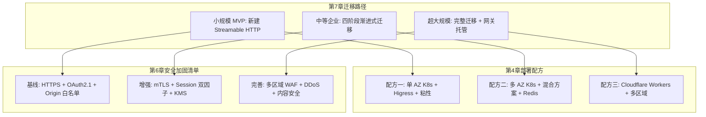

这一矩阵展示了**迁移路径、部署配方、安全清单三者的对应关系**——选定迁移路径后即可锁定对应的部署配方与安全基线，工程团队在执行迁移项目时不必为"如何部署"与"如何加固"做独立决策，而是按预定矩阵直接组合即可。这种"决策框架的层级化"显著降低了大规模迁移项目的决策成本。

### 7.6.4 本章工程实战的边界与读者注意事项

需要客观指出，本章的工程实战内容存在若干必须明确说明的边界：

**第一，部分案例代码为社区博客示例而非 SDK 内置标准 API**。例如第 5 章引用的 ResilientSessionManager、本章引用的部分 Express 双模式代码片段、Go go-mcp 的具体函数选项等，反映的是真实工程模式但其具体接口签名可能与各 SDK 最新版本存在差异，读者在实际工程中应以官方仓库的当前版本为准。

**第二，迁移路径需要结合自身业务做针对性调整**。本章归纳的四阶段路径基于 GCP LB+Envoy 等具体场景的真实经验，不同业务的痛点优先级、灰度颗粒度、回滚成本可能差异显著，工程团队应将本章路径作为"参照模板"而非"机械模板"。

**第三，跨语言 SDK 的具体接口仍在快速演进中**。Python SDK 与 TypeScript SDK 在 2025-2026 年期间均有持续的功能增强与缺陷修复提交，本章引用的接口签名以截至搜索数据时间点的版本为准，长期参考时应关注最新版本变化。

**第四，Higress AI 网关与 MCP 市场等真实项目的具体能力仍在演进**。本章引用的 Higress MCP 市场、阿里云 API 网关 MCP 能力等内容反映的是公开披露的项目计划，具体上线时间与功能细节应以厂商最新公告为准。

---

至此，本章已完成对 Streamable HTTP 向后兼容、迁移路径与工程实战的系统论证。**核心结论可以归纳为五点**：其一，MCP 协议在 2025-03-26 版本升级中确立了完整的向后兼容机制，通过服务端双端点并存、客户端协议探测与回退、MCP-Protocol-Version 协商三层手段保障旧 HTTP+SSE 与新 Streamable HTTP 的过渡期互操作；其二，从旧 SSE 到 Streamable HTTP 的渐进式迁移可以归纳为评估期、改造期、并行期、收敛期四阶段路径，其中改造期的"代码减法"原则——移除 FastAPI Wrapper、回归 SDK 原生支持——是 GCP LB+Envoy 等真实迁移案例的核心经验；其三，Python (FastMCP+Starlette)、Node.js (TypeScript SDK+Express)、Go (go-mcp) 三种主流语言的端到端实战展示了 Streamable HTTP 在跨语言生态中的工程一致性，协议层统一使得任意语言客户端可以调用任意语言服务端；其四，mcp-server-code-runner 脚手架、Higress AI 网关托管、Cherry Studio 客户端接入三类真实项目共同验证了 Streamable HTTP 在开发-运行-消费完整生态链路中的工程闭环；其五，基于业务规模、技术栈、部署形态、可靠性需求四维度的迁移决策矩阵与 25 项工程实战要点清单为工程团队提供了直接可用的决策框架，与第 4 章三套部署配方、第 6 章 30 项安全清单形成完整的工程矩阵。

需要客观说明的是，本章引用的 GCP LB+Envoy 迁移案例、Cherry Studio 接入流程、Higress MCP 市场计划等内容均来自公开博客与厂商资料，反映的是截至搜索数据时间点的真实工程实践但可能随项目演进而变化；本章归纳的迁移决策矩阵与实战清单基于多个独立工程案例的综合分析，但具体应用时仍需结合团队实际情况做针对性调整。本章建立的迁移决策框架将为第 8 章未来演进方向的讨论提供"当下工程实践的稳定参照点"——只有清楚理解当前 Streamable HTTP 的工程边界，才能合理判断 HTTP/3 QUIC、WebTransport 等下一代传输技术对协议未来的真实影响。

# 8 现存挑战与未来演进方向

前七章已沿"协议规范—运行时机制—SDK 源码—部署架构—客户端容错—性能与安全—迁移实战"的脉络系统刻画了 Streamable HTTP 在 2025 年下半年的工程稳态。这一稳态的核心结论可以浓缩为一句话——**Streamable HTTP 通过"统一端点 + 动态升级 + 可选会话"三层抽象，在 HTTP 生态既有约束下为 MCP 远程传输找到了一个工程上的全局最优解**。然而工程实践的辩证性决定了任何稳态都不是终态：Streamable HTTP 在解决 HTTP+SSE 痛点的同时，也继承了 HTTP/1.1+TCP 时代的若干结构性约束；而协议生态本身仍在 OpenAI、Google、Anthropic 三方推动下快速演进，HTTP/3 QUIC 与 WebTransport 等下一代传输技术正以前所未有的速度走向成熟。**本章作为全文的收束章节，承担"承前启后、面向未来"的双重职责**——一方面识别 Streamable HTTP 在生产实践中尚未完全解决的工程挑战，另一方面展望下一代传输技术与协议演进对 MCP 的潜在改造空间，最终为工程团队的长期技术选型提供前瞻性判断。

本章的论述将严格区分两类内容：**一类是基于公开搜索结果可直接引证的事实性判断**，例如 QUIC 协议的 0-RTT 握手与连接迁移特性、WebTransport 的浏览器支持现状、Cherry Studio 对 SSE 兼容的社区讨论等；**另一类是基于前文工程图谱与协议特征的合理推断**，例如二进制传输的 Base64 膨胀比例、跨数据中心会话同步的具体方案、协议层未来可能的增强方向等。后一类内容将在行文中显式标注其推断属性，避免给读者造成"未来必然如此"的误导。

## 8.1 事务一致性与消息可靠性的工程边界

第 2 章 2.6.3 节已客观指出 Streamable HTTP 的断线续传机制存在理论上的事件丢失边界——服务端发送的事件在客户端确认之前并不存在传统消息队列那样的 ACK 机制。本节将这一边界的工程影响系统化展开，论证为何在强一致性场景下应用层必须补充额外机制，并归纳协议层未来可能的增强方向。

### 8.1.1 进程崩溃窗口与"尽力而为"语义

Streamable HTTP 在协议层提供的可靠性可以归纳为"尽力而为"（best-effort）语义——服务端通过 EventStore 持久化事件、客户端通过 Last-Event-ID 触发重放，二者协同在大多数网络抖动场景下保障消息不丢。但在两类极端场景下，事件丢失仍然可能发生：**第一是服务端写入 EventStore 与发送 SSE 之间的进程崩溃窗口**——即使按第 2 章 2.6.2 节强调的"先写存储再发流"原则将窗口压缩到极小，理论上仍存在事件已到客户端但 EventStore 未持久化（导致重连时不重放）或反之（事件已写存储但因进程崩溃未送出）的可能；**第二是客户端确认机制的缺失**——客户端收到事件后并不向服务端发送 ACK，服务端无法精确知晓哪些事件已被业务层处理、哪些仅停留在传输层缓冲区。

这种"尽力而为"语义与传统消息队列的差距可以通过下表清晰对照：

| 维度 | Kafka / RabbitMQ | Streamable HTTP |
|------|-----------------|-----------------|
| 客户端 ACK | 显式（auto / manual ack） | 隐式（仅靠 Last-Event-ID 间接表达） |
| 投递保证 | at-least-once / exactly-once 可配置 | 至多 at-least-once，无 exactly-once 协议保证 |
| 消息持久化 | 副本机制（如 Kafka ISR） | EventStore 单点（除非应用层引入 Redis 集群） |
| 跨工具调用事务 | 分布式事务/Outbox 模式 | 协议层无支持，需业务层兜底 |
| 死信队列 | 原生支持 | 无 |
| 消费者组与负载均衡 | 原生支持 | 不适用（每会话独立流） |

数据基于第 2 章 2.6 节的协议机制分析与消息队列通用能力的工程对照。**这一对照的核心结论是：Streamable HTTP 的设计目标从未是替代消息队列，而是为 AI 工具调用这一特定场景提供"足够好"的可靠性**——大多数 AI 对话与工具调用场景对 exactly-once 语义并无强需求，业务幂等 + 至多一次重放已能满足体验要求。

### 8.1.2 强一致性场景的应用层补强模式

但在金融、医疗、合规审计等强一致性场景下，Streamable HTTP 的"尽力而为"不足以承担业务级一致性保证，必须由应用层补充额外机制。第 2 章 2.6 节已归纳的"事件 ID 去重 + 业务请求 ID 去重"双层幂等是基础防护，更复杂的场景下还需要引入三类工程模式：

**第一是显式幂等键（Idempotency Key）**——客户端在每次工具调用请求中携带一个唯一的幂等键（通常是客户端生成的 UUID），服务端在工具执行前先查询该幂等键是否已处理过——若是则直接返回此前的结果而不重新执行。这一模式在支付、订单等场景下广泛使用，可以有效应对"客户端重传导致工具被重复执行"的风险。**第二是补偿事务（Compensating Transaction）**——当一系列工具调用构成业务事务但其中某步失败时，应用层按反向顺序执行补偿操作（如撤销已写入的数据、回滚已发送的通知）。**第三是 Saga 模式**——将长事务拆解为多个本地事务，每个本地事务完成后发布事件触发下一步，失败时通过补偿事件回滚已完成的步骤。这三类模式都需要业务层显式建模，协议层不提供任何支持。

### 8.1.3 协议层未来可能的增强方向

将上述工程缺口映射到协议层的潜在增强方向，可以推断 MCP 后续版本可能引入的能力：**一是显式 ACK 字段**——客户端在收到事件后通过特定的 JSON-RPC notification 向服务端确认事件 ID，服务端据此从 EventStore 中清理已确认事件、缩短保留窗口；**二是消息持久化语义的明确分级**——协议层定义 `qos: 0/1/2` 等服务质量等级（类似 MQTT），由客户端在请求中声明所需的可靠性级别；**三是工具调用幂等键的协议级支持**——在 JSON-RPC 请求体中标准化幂等键字段，让服务端 SDK 可以统一处理幂等校验逻辑而非由每个工具自行实现。

需要强调的是，**上述三个方向均为基于工程缺口的合理推断，并非 MCP 官方已确认的演进路线**。协议设计往往需要在"功能丰富"与"实现简洁"之间审慎权衡——MCP 至今仍坚持"轻量、可扩展、不重复造轮子"的设计哲学，过度引入 MQ 风格的可靠性机制可能反而损害协议的简洁性。**更可能的演进路径是协议保持当前的"尽力而为"基线，由生态侧（SDK、网关、第三方库）提供可插拔的可靠性增强组件**。

## 8.2 跨数据中心会话同步与多区域部署难题

第 4 章 4.6 节已系统论证了单数据中心内的三类会话粘性方案——纯粘性路由、纯共享存储、混合方案——并给出了三套部署配方。但当 MCP 服务规模化扩展到全球多区域部署时，单数据中心内的"亚毫秒级共享存储读写"假设不再成立，跨数据中心的会话同步成为新的工程难题。本节剖析这一场景的核心挑战与当前可行的应对模式。

### 8.2.1 全球低延迟与会话亲和的根本性冲突

多区域部署的核心目标是为全球用户提供低延迟服务——位于亚洲的用户连接到亚洲数据中心、位于欧美的用户连接到本地数据中心，避免跨洋网络的数百毫秒往返延迟。但 Streamable HTTP 的有状态架构要求会话上下文在所有处理该会话的节点间保持一致，这与"全球分发、就近处理"的低延迟目标存在根本性冲突——**如果会话状态被写到亚洲数据中心，欧美节点要么承受跨洋读取的高延迟、要么放弃处理该会话**。

这一冲突在三个维度上具体显现：**第一是 Mcp-Session-Id 的全球路由策略**——当客户端因移动或网络切换从亚洲漫游到欧洲时，其携带的 Session-Id 应被路由到亚洲（保持会话连续）还是就近的欧洲（保持低延迟）？**第二是 EventStore 跨区域复制的延迟与一致性权衡**——若采用强一致性多区域复制（如 Spanner 风格），写入延迟会随区域数量线性上升；若采用最终一致性复制（如 DynamoDB Global Tables），断线重连时可能因复制滞后而读到陈旧的事件 ID。**第三是长连接 SSE 流在区域故障切换时的重建成本**——区域故障触发的全量切换可能让数十万活跃会话同时重连到备用区域，造成"故障雪崩"。

### 8.2.2 三种典型多区域部署模式的工程取舍

结合 Cloudflare Durable Object、AWS Global Accelerator、多活数据中心等公开生态实践，可以归纳出三种典型的多区域部署模式：

**模式一：边缘单例 + 用户就近原则**。这是 Cloudflare Durable Object 的代表性模式——每个 Mcp-Session-Id 对应一个全球唯一的 Durable Object 实例，该实例在用户首次连接时被分配到离用户最近的边缘节点；后续该用户的所有请求（无论从哪里发起）都被路由到这个固定的实例。这一模式的优势是**会话状态天然单例、无需跨区域同步**；代价是用户漫游后的请求需要回到原始区域、可能增加跨洋延迟。第 4 章 4.2 节引用的 Cloudflare McpAgent 文档明确将这一模式定位为有状态会话的标准方案。

**模式二：Anycast 路由 + 共享存储多区域复制**。这是 AWS Global Accelerator 等 Anycast 网络代表的模式——客户端请求基于 BGP Anycast 路由到最近的接入点，接入点将请求转发到本区域的处理节点，会话状态通过跨区域复制的 KV 存储（如 DynamoDB Global Tables、Redis Enterprise Active-Active）在所有区域间保持一致。这一模式的优势是**用户始终连接到就近节点、延迟最低**；代价是必须接受最终一致性的复制语义、跨区域复制成本随区域数量上升。

**模式三：会话漂移 + 软状态恢复**。这一模式不强求严格的会话同步，而是将会话状态设计为"软状态"——客户端持有完整的会话上下文（如对话历史、已调用工具列表），服务端仅作为无状态计算节点；当客户端跨区域漫游时，新区域节点从客户端读取上下文继续处理，无需查询任何共享存储。这一模式的优势是**协议层完全无状态、扩展性最强**；代价是客户端必须承担状态持有的复杂度、且每次请求需传输完整上下文增加带宽。

下表系统对比三种模式的工程取舍：

| 维度 | 边缘单例 | Anycast + 复制 | 会话漂移 |
|------|---------|---------------|----------|
| 用户漫游延迟 | 高（回原始区域） | 低（始终就近） | 低（始终就近） |
| 跨区域复制成本 | 无 | 高（多区域同步） | 无 |
| 一致性语义 | 强（单例） | 最终一致性 | 客户端持有，强一致 |
| 区域故障切换 | 实例迁移成本高 | 透明（其他区域接管） | 客户端无感 |
| 协议层是否需扩展 | 否（Durable Object 抽象） | 否 | 是（需协议层支持上下文上传） |
| 适用场景 | 中等规模、边缘部署 | 大规模、多区域企业 | 超大规模、客户端能力强 |

数据基于第 4 章部署配方与公开多区域部署生态的合理推断。**这一对照表的核心结论是：当前 Streamable HTTP 在多区域部署上没有"银弹方案"——三种模式都涉及不同维度的工程权衡，工程团队必须根据自身用户分布、业务一致性需求、运维能力做选型**。模式三的"会话漂移"虽然对协议层最友好，但需要协议层未来引入"客户端上传完整上下文"的标准能力才能广泛落地，这本身就是协议演进的潜在方向之一。

### 8.2.3 残留约束与工程缓解策略

无论采用何种多区域模式，跨数据中心场景下都存在若干当前难以彻底消除的残留约束。**第一是 SSE 长连接的跨区域不可迁移性**——TCP 连接绑定到具体的服务端 IP，区域切换必然导致连接重建、客户端必须通过 Last-Event-ID 重新建立连接到新区域；**第二是 EventStore 跨区域复制的事件 ID 全局唯一性挑战**——多区域并发写入需要协调事件 ID 命名空间避免冲突，这通常依赖区域前缀或分布式 ID 生成器（如 Snowflake）；**第三是认证令牌的多区域验证**——OAuth 2.1 令牌的发行方与验证方可能位于不同区域，令牌验证的网络往返成为额外延迟来源。

工程上对这些残留约束的缓解策略包括：客户端实现"预测性连接预热"（在网络切换前主动建立到目标区域的连接）、EventStore 采用"区域前缀 + 单调递增序号"的事件 ID 方案、认证令牌采用本地缓存 + 异步刷新模式。这些策略将复杂性从协议层下沉到客户端与运维层，是当前生态的典型工程妥协。

## 8.3 移动弱网环境的协议适配局限

移动场景是 Streamable HTTP 协议适配局限暴露最充分的场景。第 5 章已系统论述客户端容错机制，第 6 章已验证 Streamable HTTP 相对 HTTP+SSE 在弱网下的可靠性提升，但**协议底层 TCP 的固有约束使得移动弱网场景仍然存在 Streamable HTTP 难以彻底解决的工程难题**。本节剖析这些难题的根因，并归纳当前可行的工程缓解策略。

### 8.3.1 TCP 在移动场景下的三类固有约束

第一类约束是**网络切换时的连接迁移成本**。当移动设备从 WiFi 切换到 4G、或从 5G 切换到 WiFi 时，设备的 IP 地址会发生变化——TCP 连接是基于 (源 IP, 源端口, 目标 IP, 目标端口) 四元组标识的，IP 变化必然导致原 TCP 连接失效，必须重新建立新连接。这一过程对 Streamable HTTP 客户端意味着：**TCP 三次握手 + TLS 握手 + GET /mcp 携带 Last-Event-ID 重连 + EventStore 重放**——即使在最优情况下也至少需要 1-2 个 RTT，弱网下可能消耗数百毫秒甚至秒级时间。

第二类约束是**TLS 握手的重复开销**。TLS 1.2 完整握手需要 2 个 RTT、TLS 1.3 缩减到 1 个 RTT，但相对于 0-RTT 的握手成本仍然是不可忽略的延迟来源。在移动场景下网络切换频繁，每次切换都付出 TLS 握手成本，累计延迟显著影响用户感知。

第三类约束是**SSE 心跳超时与移动操作系统后台限制的冲突**。移动操作系统（iOS、Android）为节省电量会限制后台应用的网络活动——应用切换到后台后，操作系统可能暂停或限制其网络连接，导致 SSE 长连接的心跳无法正常发送、被服务端误判为断线。这一冲突使得 Streamable HTTP 的 GET 长连接在移动端的实际可用性显著低于 PC 端。

### 8.3.2 QUIC 连接迁移特性的针对性回应

QUIC 协议在设计层面对上述三类约束有针对性的回应。**QUIC 不是基于 IP+Port 四元组而是基于 Connection ID 标识连接**——客户端 IP 变化时，连接迁移到新 IP 但 Connection ID 保持不变，服务端通过 Connection ID 继续路由后续报文，无需重新握手。Google 关于 QUIC 的文档明确将连接迁移列为相对 HTTP/2 的核心优势之一——"在移动中 WIFI 与 4G 网络切换时不需要重新建立连接"[^70]。这一特性对移动场景的工程价值是革命性的——网络切换从"秒级断线重连"降低到"亚秒级透明迁移"。

QUIC 的另一关键特性是**0-RTT 连接恢复**——客户端在首次连接时缓存初始连接握手的密钥，从第二次连接开始可以直接开始传输数据、达到零握手延迟[^70]。这意味着即使 QUIC 连接因长时间空闲被关闭，恢复时也无需付出 1-RTT 握手成本，对移动场景下"间歇性活跃"的使用模式极为友好。

下表系统对比 TCP 与 QUIC 在移动场景下的关键能力差异：

| 维度 | TCP（当前 Streamable HTTP 底层） | QUIC（HTTP/3 底层） |
|------|-------------------------------|---------------------|
| 连接标识 | (源 IP, 源端口, 目标 IP, 目标端口) | Connection ID（IP 无关） |
| 网络切换成本 | 必须重建连接 + TLS 握手 | 透明迁移、零成本 |
| 首次握手 | TCP 三次握手 + TLS 1.3 (1-RTT) = 至少 2 RTT | TLS 1.3 集成在 QUIC 握手中，1 RTT |
| 连接恢复 | TLS 1.3 0-RTT（部分场景） | 原生 0-RTT |
| 队头阻塞 | 严格按序交付，单包丢失阻塞所有流 | 多路复用避免队头阻塞[^70][^71] |
| 拥塞控制 | 内核态 TCP 实现，难以快速演进 | 用户态实现，可灵活演进[^72] |

数据综合自 QUIC 协议文档与 HTTP/3 队头阻塞分析[^72][^71][^70]。**这一对比清晰地揭示了为何移动场景对下一代基于 UDP 的传输协议有迫切需求——QUIC 在协议层就解决了 TCP 难以克服的移动场景约束**。

### 8.3.3 当前可行的工程缓解策略

在 MCP 协议层尚未基于 QUIC/HTTP/3 标准化之前，工程团队仍需在 TCP+Streamable HTTP 框架内寻找移动场景的缓解策略。基于第 5 章客户端容错机制的延伸，可以归纳三类有效策略。

**第一是客户端预测性重连**。利用移动操作系统提供的网络状态变化通知（iOS 的 `Network` 框架、Android 的 `ConnectivityManager`），客户端在感知到网络切换前主动准备重连资源——预先建立到目标网络的 TCP/TLS 连接、缓存当前 Last-Event-ID、在网络切换完成的瞬间立即发起重连请求。这一策略不能消除重连成本，但可以将重连发生在用户感知之前，减少卡顿。

**第二是应用层心跳与服务端宽容超时**。客户端应用层主动定期发送心跳消息（如每 30 秒一次的 notifications/ping）保持连接活跃，服务端将 SSE 心跳超时配置为相对宽松的值（如 60-120 秒）容忍移动网络的偶发抖动。这一策略需要在心跳频率（影响电量与流量）与连接稳定性之间审慎权衡。

**第三是本地消息队列缓冲**。客户端在弱网或离线场景下将待发送的工具调用请求暂存到本地队列（如 SQLite、IndexedDB），网络恢复后按顺序发送；同时将已收到的事件也持久化到本地，避免应用重启导致的事件历史丢失。这一策略将"传输层不可靠"的复杂度转移到客户端持久化层，对客户端工程能力提出更高要求。

**这三类策略的本质都是用客户端工程复杂度换取协议层无法提供的可靠性**。这种工程妥协的合理性取决于业务场景——若移动场景占主导且对体验敏感（如移动 AI 助手），这些策略是必要投入；若移动仅是边缘场景，则可以接受当前 Streamable HTTP 的协议局限。

## 8.4 二进制与大数据传输的效率瓶颈

MCP 协议基于 JSON-RPC 2.0 构建——这一选择带来了协议简洁、跨语言友好、调试方便等显著优势，但也内嵌了一个不容回避的工程局限：**所有消息以 JSON 文本格式编码，对二进制数据必须先做 Base64 编码再嵌入到 JSON 字段中**。本节系统分析这一局限在大数据传输场景下的工程影响，并归纳当前的缓解策略与潜在演进方向。

### 8.4.1 Base64 编码的体积膨胀与编解码开销

Base64 编码将每 3 字节二进制数据映射为 4 个 ASCII 字符，引入约 33% 的体积膨胀。这一膨胀比例看似不大，但在大数据场景下被绝对值放大——传输一个 100 MB 的图像需要消耗约 133 MB 带宽与对应的存储；传输 1 GB 的模型权重则需要约 1.33 GB 带宽。除体积膨胀外，Base64 编解码还引入额外的 CPU 开销，在客户端为移动设备等性能受限场景时尤为显著。

更关键的是，**Base64 嵌入 JSON 字段后失去了流式处理的能力**——客户端必须接收完整的 JSON 字段才能开始 Base64 解码与业务处理，无法像原生二进制流那样边接收边处理。这对大文件传输的用户体验造成根本性影响——传输一个 1 GB 文件意味着客户端必须等待全部数据接收完毕（数十秒甚至分钟级）后才能开始展示进度或预览，而非真正的"流式"体验。

### 8.4.2 与原生二进制传输方案的对比

将 JSON+Base64 与三类典型的原生二进制传输方案对照，可以更清晰地看到当前 MCP 协议在大数据场景的效率劣势：

| 方案 | 编码方式 | 体积膨胀 | 流式能力 | 跨语言友好度 | 调试便利性 |
|------|---------|---------|---------|------------|-----------|
| MCP 当前（JSON-RPC + Base64） | 文本 + Base64 | +33% | 弱（必须完整解码） | 极高 | 高（可读 JSON） |
| gRPC（Protobuf） | 二进制 schema | 接近原始 | 强（原生流） | 高（需 schema） | 中（需工具解码） |
| HTTP/2 + 二进制流 | 原始二进制 | 无 | 强 | 高 | 低 |
| WebTransport 二进制流 | 原始二进制 | 无 | 强（QUIC 多路复用） | 中（生态新） | 低 |

数据基于协议规范与公开技术对比的合理推断。**这一对比不应被解读为"MCP 应该立即改用 Protobuf"——JSON-RPC 的可读性与跨语言友好度是 MCP 生态快速扩散的关键支撑**，简单替换为二进制协议会牺牲这一核心优势。但对于二进制大数据这一特定场景，工程上需要差异化处理。

### 8.4.3 当前工程上的缓解策略

业界在 MCP 协议层不变的前提下已经探索出三类缓解策略：

**第一是分片传输**。将大文件拆分为多个小块（如每块 1 MB），通过多次 JSON-RPC 调用顺序传输。这一策略保持了协议层不变，但将单一大请求转化为多个小请求，避免单次传输的内存峰值与超时风险。代价是客户端与服务端都需要实现分片协议（chunk_id、total_chunks、checksum 等元数据管理）。

**第二是外部存储 URI 引用**。MCP 工具不直接传输二进制数据，而是将数据上传到对象存储（S3、OSS、R2）后通过预签名 URL 返回；客户端通过该 URL 直接从对象存储下载数据。这一策略完全规避了 MCP 协议的传输瓶颈，让二进制数据走专用的对象存储链路，同时利用 CDN 加速分发。代价是引入对象存储依赖、预签名 URL 的安全管理、生命周期管理等额外复杂度。**这一模式是当前生产环境中处理大数据 MCP 工具的事实标准**。

**第三是流式编码与分段渲染**。在 SSE 流上分段推送二进制数据的 Base64 编码块，客户端边接收边解码渲染。这一策略部分恢复了流式能力，但仍然承担 Base64 膨胀的体积代价。

### 8.4.4 协议层未来可能的二进制扩展方向

将上述工程缺口映射到协议层的潜在演进，可以推断 MCP 协议未来可能引入的能力：**一是二进制消息扩展**——在 JSON-RPC 之外引入可选的二进制 frame 格式，承载工具调用的二进制 payload；**二是混合传输模式**——元数据走 JSON、payload 走独立的二进制流（HTTP/2 binary frame、WebTransport stream），通过元数据中的 stream_id 关联两者；**三是协议层声明的"外部资源 URI"标准**——将"通过预签名 URL 引用外部存储"模式标准化为协议级能力，由 SDK 统一处理上传、下载、生命周期管理。

需要客观说明，**上述三个方向均为基于工程缺口与生态实践的合理推断**，并非 MCP 官方已确认的演进路线。WebTransport 提供的原生二进制流支持（详见 8.6 节）是未来引入这些能力的最自然载体——一旦 MCP 引入 WebTransport 作为可选传输，二进制大数据传输的协议层瓶颈可以一并解决。

## 8.5 HTTP/3 QUIC 对 MCP 传输层的潜在影响

HTTP/3 与 QUIC 是当前公认的下一代 HTTP 传输基础。**RFC 9000 在 2021 年 5 月正式将 QUIC 标准化为互联网标准、RFC 9114 在 2022 年 6 月将 HTTP/3 标准化**[^73]，截至 2025 年下半年，HTTP/3 已被全球主流 CDN（Cloudflare、Fastly、Akamai）、主流浏览器（Chrome、Firefox、Edge）与主流 Web 服务器（Caddy、nginx-quic、quinn）广泛支持。本节探讨 HTTP/3 QUIC 对 MCP 传输层未来演进的潜在改造空间。

### 8.5.1 QUIC 协议特性与 Streamable HTTP 痛点的天然契合

QUIC 协议的核心特性几乎对应 Streamable HTTP 当前在前几节归纳的所有工程痛点。**减少连接建立延迟**——QUIC 的初始连接握手与密钥交换合并到 1 个 RTT、第二次连接起 0-RTT 直接传输[^70]，恰好回应第 5 章 5.4 节归纳的 initialize 握手延迟痛点；**改进的拥塞控制**——QUIC 在用户态实现拥塞控制算法，可灵活演进，不像 TCP 受限于内核态实现[^72][^70]，回应高并发场景下的吞吐瓶颈；**多路复用避免队头阻塞**——QUIC 实现流的真正独立性，单流丢包不影响其他流[^72]，恰好回应第 6 章 6.2.1 节连接复用机制中"HTTP/1.1 keep-alive 仍存在队头阻塞"的隐性约束；**前向错误更正**与**连接迁移**则分别回应弱网与移动场景的痛点[^70]。

下表系统映射 Streamable HTTP 当前痛点与 QUIC 特性的回应关系：

| Streamable HTTP 痛点 | QUIC 特性回应 | 工程收益预期 |
|---------------------|--------------|------------|
| initialize 握手延迟 | 0-RTT 连接恢复 | 第二次起握手延迟降为零 |
| HTTP/1.1 keep-alive 队头阻塞 | 流的真正独立性 | 工具调用并行性提升 |
| 移动网络切换断连 | 基于 Connection ID 的连接迁移 | 网络切换零感知 |
| TCP 拥塞控制不够灵活 | 用户态拥塞控制 | 弱网吞吐优化 |
| TLS 握手重复开销 | TLS 1.3 集成在 QUIC 握手 | 握手开销减半 |

数据综合自 QUIC 协议文档[^72][^70]与本章前几节痛点分析。**这一映射的核心结论是：HTTP/3 QUIC 几乎是为 Streamable HTTP 当前痛点量身定做的下一代传输基础**——若 MCP 传输层未来基于 HTTP/3 运行，工程收益将是全方位的。

### 8.5.2 MCP 基于 HTTP/3 的潜在改造空间

将 QUIC 特性映射到 MCP 传输层的具体改造空间，可以推断三个层面的潜在演进：

**第一是 POST 请求与 SSE 流在 QUIC 独立流上的真正并行**。当前 Streamable HTTP 在 HTTP/1.1 keep-alive 下，多个 POST 请求与 GET 长连接 SSE 共享 TCP 连接但仍受 TCP 按序交付约束——单个请求的丢包仍可能延迟其他请求。**基于 HTTP/3 后，每个 POST 请求与 GET SSE 流将映射到独立的 QUIC 流，流之间真正并行，单流丢包不影响其他流的处理**[^72]。这对第 2 章 2.2 节归纳的"POST 与 GET 并行性约束"是协议级的彻底解决。

**第二是 Mcp-Session-Id 与 QUIC Connection ID 的天然映射**。QUIC Connection ID 是连接级标识，独立于网络层 IP 与端口；Mcp-Session-Id 是会话级标识，独立于具体连接。**两者在生命周期与功能上高度对应——若 SDK 实现层将 Mcp-Session-Id 直接映射到 QUIC Connection ID，会话粘性可以下沉到传输层处理，应用层路由复杂度大幅降低**。这一映射也回应了第 8.2 节多区域部署中"网络切换导致连接重建"的痛点。

**第三是 TLS 1.3 1-RTT 握手对 initialize 延迟的优化**。当前 Streamable HTTP 的 initialize 握手需要 TCP 三次握手 + TLS 1.3 握手 + JSON-RPC initialize 至少 3 个 RTT；基于 HTTP/3 后，QUIC 集成的 TLS 1.3 握手可以将这一过程压缩到 1-2 个 RTT。**对于全球部署的 MCP 服务，单次握手节省 1-2 个 RTT 在跨洋场景下意味着 100-200ms 的延迟改善**——足以显著提升首次工具调用的响应速度。

### 8.5.3 HTTP/3 生态部署的成熟度边界与迁移时机

尽管 HTTP/3 在协议层已经标准化、主流 CDN 与浏览器已广泛支持，但在 MCP 部署的关键基础设施层面，HTTP/3 的成熟度仍存在若干工程边界。**第一是企业网关与负载均衡器的 HTTP/3 支持仍在演进中**——传统 L4/L7 负载均衡器（如 LVS、HAProxy）对 UDP 的支持远不如 TCP 成熟，需要专门的 HTTP/3 网关方案；**第二是企业防火墙对 UDP 流量的策略**——许多企业防火墙默认对 UDP 进行严格限制（仅允许 DNS、NTP 等少数协议），HTTP/3 的 UDP 流量可能被防火墙拦截或降级；**第三是可观测性工具链对 HTTP/3 的支持**——Wireshark、tcpdump 等抓包工具对 HTTP/3 + QUIC 的解析能力相对 HTTP/1.1/2 仍有差距，故障排查难度上升。

**对工程团队的关键判断是：HTTP/3 不应作为当前迁移的优先选项**。第 7 章已经论证 Streamable HTTP 当前是 MCP 远程传输的工程稳态，团队精力应优先投入完成从 HTTP+SSE 到 Streamable HTTP 的迁移；HTTP/3 的引入应作为中期演进目标，时机判断的关键指标包括：所选 CDN/网关全面支持 HTTP/3、目标用户群体的网络环境对 UDP 友好、可观测性工具链跟上 HTTP/3 演进。

更现实的渐进式路径是**网关层先行升级 HTTP/3、应用层延续 HTTP/1.1/2**——网关对外暴露 HTTP/3、对内连接 MCP Server 仍走 HTTP/1.1，让用户侧立即享受到 HTTP/3 的延迟优化、移动连接迁移等收益，而后端 MCP Server 无需立即改造。这种"边缘 HTTP/3 + 后端 HTTP/1.1"的混合部署是当前许多大型 Web 服务采用的过渡方案，对 MCP 生态同样适用。

## 8.6 WebTransport 作为 MCP 下一代传输的可能性

如果说 HTTP/3 QUIC 是 Streamable HTTP 的"潜在底层升级"，那么 WebTransport 则代表了 MCP 传输层的"潜在代际跃迁"——它不仅替换底层传输协议，更引入了与 SSE 模型有质性差异的双向流、不可靠流、原生二进制等高级能力。本节评估 WebTransport 作为 MCP 下一代传输机制的技术可行性与生态成熟度。

### 8.6.1 WebTransport 协议特性与 MCP 需求的对应关系

**WebTransport 是 W3C 标准草案，明确要求底层传输使用 QUIC（HTTP/3 的基础协议）**[^74]。其设计动机正是要"在浏览器与服务器之间，提供与 WebSocket 相似的双向连接能力，但能进一步降低延迟、支持多路复用、单向流、乱序交付与不可靠传输"[^73]。WebTransport 的核心能力可以归纳为三类：**双向流（BidirectionalStream）**——客户端与服务端可在同一连接内双向发送字节流；**多路复用与流隔离**——同一连接可同时打开多个独立流，流之间无队头阻塞[^75]；**可靠流与不可靠流混合**——根据消息类型选择可靠传输（保证顺序与到达）或不可靠传输（datagram，类似 UDP，低延迟但可能丢失）。

将这些能力映射到 MCP 当前的工程需求，可以发现高度的对应关系：

| WebTransport 能力 | MCP 当前痛点 | 潜在工程价值 |
|------------------|-------------|------------|
| 原生双向流 | POST + GET 双通道协调复杂 | 单一双向流承载所有交互，简化客户端实现 |
| 流的真正独立性 | HTTP/1.1 keep-alive 仍受 TCP 按序约束 | 工具调用与通知推送独立流，无相互阻塞 |
| 不可靠流（datagram） | 当前所有消息都走可靠流，低延迟通知场景开销过大 | 进度通知、心跳等可走 datagram，延迟更低 |
| 原生二进制传输 | JSON+Base64 传输大数据效率低（见 8.4 节） | 二进制流直接承载文件、图像、音视频 |
| 0-RTT 连接恢复 | initialize 握手延迟 | 重连时无需重新握手 |
| 连接迁移（继承 QUIC） | 移动网络切换断连 | 网络切换零感知 |

数据综合自 WebTransport 协议文档[^73][^75][^74]与前几节 MCP 痛点分析。**这一对应关系揭示了 WebTransport 相对 Streamable HTTP 在协议层有显著的代际优势**——它不仅解决了 Streamable HTTP 的现有痛点，还引入了新的能力维度（不可靠流、原生二进制）。

### 8.6.2 WebTransport vs WebSocket vs Streamable HTTP 的对照

值得特别说明的是，WebTransport 的设计参照对象是 WebSocket 而非 SSE——WebTransport 文档将其类比为"WebSocket-like 双向连接"[^73]。但其相对 WebSocket 又有显著优势——"WebSocket 是单通道、全序、带重传的 TCP 流；WebTransport.createBidirectionalStream() 是 QUIC 多路复用下的独立流，每个流内部有序可靠，但流与流之间完全隔离、无队头阻塞"[^75]。

下表系统对照 WebSocket、Streamable HTTP、WebTransport 三种传输在 MCP 场景下的能力差异：

| 维度 | WebSocket | Streamable HTTP（当前） | WebTransport |
|------|-----------|------------------------|--------------|
| 底层传输 | TCP | TCP（HTTP/1.1/2） | UDP（HTTP/3 QUIC） |
| 通信模型 | 全双工单流 | POST + GET 双通道 | 多个独立双向流 |
| 队头阻塞 | 单流内有 | 流间有（TCP 层） | 流间无 |
| 0-RTT 连接 | 不支持 | TLS 1.3 部分支持 | 原生支持 |
| 连接迁移 | 不支持 | 不支持 | 原生支持 |
| 不可靠流 | 不支持 | 不支持 | 原生支持（datagram） |
| 二进制传输 | 原生支持 | JSON+Base64 | 原生支持 |
| 浏览器支持 | 全面 | 全面（fetch+ReadableStream） | Chrome/Firefox 成熟，Safari 受限 |
| 服务端实现门槛 | 低 | 中 | 高（需 HTTP/3 部署） |
| 与 HTTP 基础设施兼容 | 中（Upgrade 升级） | 高（纯 HTTP） | 低（需 HTTP/3 网关） |

数据综合自 WebSocket 与 WebTransport 协议对比[^74][^76][^77]、第 1 章传输方式对照与本章前几节分析。**这一对照表的核心结论是：WebTransport 在协议能力上显著领先 Streamable HTTP，但在生态成熟度与基础设施兼容性上仍有显著差距**。

### 8.6.3 当前生态约束与浏览器支持的两极分化

WebTransport 作为 MCP 下一代传输的最大障碍是当前的生态约束。**浏览器支持呈现两极分化——Chrome 115+、Firefox 126+、Edge 115+ 已实现 WebTransport，但 Apple 的 WebKit 内核（Safari）仅在实验性版本中有限度开放**[^74][^76][^77]。这一差距对面向消费者的 MCP 客户端是关键约束——iOS Safari 用户在可预见未来仍无法使用 WebTransport，意味着任何基于 WebTransport 的 MCP 客户端都必须保留向后兼容（如降级到 Streamable HTTP）。

**服务端实现门槛同样是显著约束**——WebTransport 不能无条件替代 WebSocket，仅在 HTTPS/localhost 且服务端支持 HTTP/3+QUIC 时可用[^75]。具体的部署要求包括：网站通过 HTTPS 提供服务、服务器支持并协商了 HTTP/3、TLS 证书需支持 ALPN 扩展且服务端必须通告 h3、CDN（如 Cloudflare、Google Cloud Load Balancing）或服务器（如 nginx-quic、Caddy 2.8+）需显式开启 HTTP/3 支持[^74]。这些要求对中小规模团队的部署能力是显著挑战。

### 8.6.4 WebTransport 在 MCP 生态中的引入路径

考虑到协议优势与生态约束的综合权衡，WebTransport 在 MCP 生态中可能的引入路径不会是"替代 Streamable HTTP"，而更可能是三种渐进模式之一：

**模式一：作为可选传输层与 Streamable HTTP 共存**。MCP 协议在传输层抽象上引入 WebTransport 作为与 stdio、Streamable HTTP 并列的第三种官方传输；客户端通过 capability negotiation 协商可用传输；服务端可以同时支持 Streamable HTTP 与 WebTransport，按客户端能力选择。这一模式与第 1 章 1.1 节传输演进时间线中"stdio + Streamable HTTP 当前并行双标准"的设计哲学一致——**用户可以根据场景选择最匹配的传输，而非被迫接受单一选项**。

**模式二：面向特定高性能场景的专用传输**。WebTransport 的 datagram、二进制流等高级能力在通用 AI 工具调用场景下可能"杀鸡用牛刀"，但在特定高性能场景（如实时音视频处理、大文件协同、边缘 AI 推理）有不可替代的价值。**MCP 生态可能演进为"通用场景用 Streamable HTTP、特定高性能场景用 WebTransport"的差异化模式**——类似 RTMP/WebRTC/SRT 等协议在不同视频场景的差异化生态[^78]。

**模式三：渐进式底层升级（仅在网关层引入）**。类似 8.5.3 节归纳的 HTTP/3 渐进路径——客户端到网关之间走 WebTransport（享受协议优势），网关到 MCP Server 仍走 Streamable HTTP（保留后端兼容）。这一模式让用户侧立即享受 WebTransport 收益，后端 MCP Server 无需改造，是最低成本的引入路径。

需要客观说明，**上述三种引入路径均为基于协议特征与生态实践的合理推断**，并非 MCP 官方已确认的演进路线。MCP 协议设计组的实际选择将取决于多个因素——浏览器生态的进一步成熟（特别是 Safari 的支持时间表）、企业网关与基础设施对 HTTP/3 的支持普及度、是否有杀手级应用场景驱动 WebTransport 引入。

## 8.7 MCP 协议自身的标准化与生态演进

除了传输层的潜在演进，MCP 协议自身在标准化进程、生态扩展、治理体系维度同样在快速演进。本节展望这些维度的未来方向，为工程团队的长期判断提供前瞻性参考。

### 8.7.1 从"开放协议"走向"行业事实标准"的关键节点

第 7 章 7.5.2 节已引述 OpenAI CEO Sam Altman 在社交媒体上确认 OpenAI 将在 ChatGPT 桌面应用等产品中集成 Anthropic 的 MCP 协议、Anthropic 在 2025 年 3 月 26 日发布 MCP 协议修订版本的关键信息。这两个事件的工程意义是 MCP 协议从"Anthropic 单方推出的开放协议"升级为"主流厂商共识的行业事实标准"——**当 OpenAI、Anthropic 这两个最具影响力的 LLM 厂商共同支持同一协议时，MCP 已经具备了成为 AI 工具调用领域"HTTP 协议"的潜质**。

这一标准化进程的下一个关键节点可能是**Google、Microsoft、Apple 等主流厂商的明确支持态势**——目前 Microsoft 已通过 Azure AKS、Azure API Management 等基础设施层面深度支持 MCP（详见第 4 章 4.3 节、第 7 章 7.1.4 节），Google 在 Gemini 等 AI 产品中的 MCP 支持也在演进中。**当三家以上主流厂商在协议层达成深度共识时，MCP 走向 IETF 或 W3C 等标准化组织的可能性将显著上升**——届时协议演进将从单一厂商主导转向标准化组织治理，演进节奏可能放缓但稳定性提升。

### 8.7.2 协议层面可能的能力增强方向

基于前几节归纳的工程缺口与生态实践，可以推断 MCP 协议未来在能力层面可能的增强方向：

**第一是更细粒度的能力协商**。当前 initialize 阶段的 capabilities 协商相对简单，未来可能引入更细粒度的能力维度——支持的 QoS 等级（对应 8.1.3 节）、支持的传输扩展（如 WebTransport、二进制扩展）、支持的安全扩展（如 mTLS、PASETO）等。这种细粒度协商让客户端与服务端能够动态匹配最优交互模式。

**第二是更丰富的工具语义描述**。第 7 章 7.5.2 节已引述阿里云 API 网关 2025 年 9 月 24 日发布的"MCP Server 支持 tools 语义检索，智能选择所需工具"功能。**这种"工具级智能路由"的前提是协议层提供更丰富的工具语义描述**——除当前的 name、description、parameters 外，可能引入工具分类标签、能力向量、调用成本提示、副作用标注（read-only、destructive）等元数据，让网关与 LLM 能够更精准地选择工具。

**第三是更完善的安全与审计标准**。第 6 章已系统归纳安全清单，但当前 MCP 协议层在审计追踪、合规对齐、跨租户隔离等维度仍有提升空间——可能引入审计事件标准化（每次工具调用产生标准化的审计日志）、合规元数据（GDPR、HIPAA 等合规标记）、跨租户隔离标识（Tenant-Id 头部）等扩展。

**第四是更统一的会话管理规范**。第 2 章 2.4 节已指出 Mcp-Session-Id 的生命周期管理、安全熵要求等细节在当前规范中相对开放，由各 SDK 自行实现。未来协议层可能引入更统一的会话管理规范——统一的 Session-Id 生成算法、统一的会话超时策略声明、统一的会话所有权校验方式等，降低跨 SDK 互操作的复杂度。

### 8.7.3 生态扩展与跨厂商互操作性

第 7 章已展示 mcp-server-code-runner 脚手架、Higress AI 网关托管、Cherry Studio 客户端接入三类真实项目共同构成的工程闭环。生态层面的下一步演进可能包括：**MCP 市场的规模化**——类似 Higress 计划推出的 MCP 市场，可能演化为类似 Docker Hub、npm 等基础设施级的工具分发平台；**跨厂商互操作性测试体系**——不同厂商的 MCP 实现需要通过标准化的互操作性测试套件（如 OpenAPI 的 Spectral、gRPC 的 conformance test）验证兼容性，避免"协议层兼容、实现层不兼容"的隐性破裂；**企业级治理与商业化模式**——MCP Server 作为企业级产品的商业化（订阅、按调用计费、企业 SLA）将催生新的商业生态。

**这些生态演进对工程团队的启示是：MCP 不再仅是"技术选型"问题，更是"长期生态押注"问题**。选择 MCP 不仅意味着采用一种协议，更意味着接入一个快速成长的生态，其中既有机会（工具复用、跨厂商互操作）也有风险（协议演进带来的迁移成本、生态格局变化的不确定性）。

## 8.8 工程团队技术选型与长期演进决策建议

将本章前七节的挑战分析与未来展望凝练为工程团队的技术选型与长期演进决策建议，是本章对工程团队最直接的输出，也是全文的最终收束。

### 8.8.1 三层时间线的演进决策框架

基于第 4 章三套部署配方、第 6 章安全清单、第 7 章迁移决策矩阵的工程基准，进一步给出面向未来的演进决策框架——**当前应坚守 Streamable HTTP 作为生产稳态、HTTP/3 QUIC 作为中期渐进升级目标、WebTransport 作为长期可选演进方向的三层时间线判断**：

| 时间线 | 技术目标 | 工程动作 | 风险水平 |
|--------|---------|---------|---------|
| 当前（2025-2026） | Streamable HTTP 稳态 | 完成从 HTTP+SSE 的迁移、按第 4 章配方部署、按第 6 章清单加固 | 低（生态成熟） |
| 中期（2026-2027） | HTTP/3 网关层升级 | CDN/网关启用 HTTP/3、后端保持 Streamable HTTP、监控 P99 延迟改善 | 中（基础设施过渡） |
| 长期（2027+） | WebTransport 可选试点 | 特定高性能场景试点、保留 Streamable HTTP 兜底、跟踪 Safari 支持进展 | 高（生态不确定） |

数据基于本章前几节的演进路径推断与工程稳健性原则。**这一三层时间线的核心精神是"工程稳健优先于技术追新"——任何前瞻性技术的引入都必须以稳态业务的稳定运行为前提，避免"为新技术而新技术"的过度工程**。

### 8.8.2 不同业务规模的差异化建议

基于第 7 章迁移决策矩阵的业务规模分层，可以为不同规模的工程团队给出差异化的演进建议：

**小规模 MVP 与初创团队**应当**锁定 Streamable HTTP 避免过度工程**。这类团队的核心目标是快速验证产品市场契合、控制工程成本，应当严格遵循第 7 章配方一（Higress + 粘性路由）部署 Streamable HTTP，将 HTTP/3、WebTransport 等前瞻性技术明确排除在选型范围之外，将工程精力聚焦于业务价值实现。

**中等企业与成长期团队**应当**关注 HTTP/3 网关层升级**。这类团队已完成 Streamable HTTP 稳态部署、有一定的工程储备投入基础设施升级，可以重点关注所选 CDN/网关（如 Higress、Cloudflare、Fastly）的 HTTP/3 支持演进，在网关层先行启用 HTTP/3 享受首波收益，后端保持 Streamable HTTP 稳定。同时密切跟踪 8.7 节归纳的协议增强方向，评估对自身业务的应用价值。

**超大规模与全球部署团队**可以**前瞻评估 WebTransport 试点**。这类团队的部分业务（如实时音视频、大文件协同、边缘 AI 推理）可能在 Streamable HTTP 框架内难以达到极致体验，可以选择特定子场景试点 WebTransport，验证其工程价值与生态成熟度；试点过程中保留 Streamable HTTP 作为兜底传输、对外仍提供向后兼容；试点经验可以反哺协议演进讨论，在 MCP 生态中扮演技术引领者角色。

### 8.8.3 应对协议快速演进的工程方法论

无论选择何种演进路径，工程团队都需要建立应对协议快速演进的稳健方法论。基于全文论述，可以归纳三条核心原则：

**第一是协议敏感度——保持对版本演进的持续跟踪**。MCP 协议采用日期版本号策略（如 2024-11-05、2025-03-26、2025-06-18），快速迭代是常态。工程团队应建立协议版本跟踪机制——订阅 modelcontextprotocol.io 官方变更公告、关注 SDK 仓库的 CHANGELOG、参与社区讨论。**对每条新引入的协议字段或能力，应主动评估其对自身业务的影响**——是必须采纳的兼容性要求、可选采纳的能力增强、还是暂时不需关注的边缘特性。

**第二是版本固定策略——避免行为漂移导致的隐性故障**。第 3 章 3.1 节已强调"必须固定 SDK 版本以避免行为漂移"。这一原则在协议快速演进期尤为重要——SDK 在小版本迭代中可能引入对协议默认行为的细微调整（如 Session-Id 生成算法、EventStore 默认实现），生产环境必须显式固定 SDK 版本号、通过 CI/CD 流水线锁定依赖、在升级时通过完整回归测试验证。**永远不要在生产环境使用 latest、^x.y、~x.y 等浮动版本约束**。

**第三是灰度验证文化——任何升级都必须通过实测验证**。第 7 章 7.2.3 节已论证渐进式迁移的灰度策略。这一文化应当扩展到所有协议演进决策——HTTP/3 网关启用、WebTransport 试点、SDK 版本升级，都应当遵循"小流量灰度 → 监控指标对比 → 逐步扩大 → 全量切换 → 保留回滚"的标准动作。**这一文化的核心是"实测优于预判、数据优于直觉"——任何关于性能、可靠性、安全性的判断都应有实测数据支撑，而非依赖协议规范或厂商宣传**。

---

至此，本章已完成对 Streamable HTTP 现存挑战与未来演进方向的系统论述，全文也由此走向收束。**回顾全文八章的论证脉络，可以将核心结论凝练为如下三层判断**：

**第一层是协议层判断——Streamable HTTP 是 MCP 远程传输在 HTTP 生态既有约束下的工程最优解**。它通过"统一端点 + 动态升级 + 可选会话"三层抽象系统回应了 HTTP+SSE 在连接资源、断线恢复、通信方向、基础设施兼容性四个维度的工程痛点，并通过协议字段（Mcp-Session-Id、Last-Event-ID、Accept 协商）与四类典型交互模式（无状态、流式进度、有状态对话、断线恢复）构建了完整、可组合、可演进的工程规范基础。

**第二层是工程层判断——Streamable HTTP 已经具备成熟的生产部署能力**。从协议规范到 SDK 实现（Python/TypeScript/Go/Java 多语言）、从服务端架构（无状态/流式/有状态三种形态）到部署形态（Serverless/容器化/边缘）、从客户端容错（双层幂等/分层超时/断线重连）到安全运维（OAuth 2.1/Origin 校验/Mcp-Session-Id 双因子）、从迁移路径（渐进式四阶段）到真实项目（脚手架/网关托管/客户端接入），整个工程链路已经形成端到端的闭环，1000 并发实测、10 万并发网关压测等独立数据共同印证了其相对 HTTP+SSE 的全面性能优势。

**第三层是演进层判断——Streamable HTTP 不是 MCP 传输的终态，而是承上启下的关键阶段**。事务一致性、跨数据中心同步、移动弱网、二进制大数据等工程挑战在协议层尚未完全解决，需要应用层与生态侧补充；HTTP/3 QUIC 与 WebTransport 等下一代传输技术为协议未来提供了清晰的演进方向；MCP 协议自身在标准化进程、生态扩展、治理体系等维度也在快速演进。**对工程团队而言，最稳健的策略是当前坚守 Streamable HTTP 稳态、中期关注 HTTP/3 网关升级、长期评估 WebTransport 演进的三层时间线判断**，并通过协议敏感度、版本固定策略、灰度验证文化三条工程方法论应对协议演进的不确定性。

需要客观说明，本章对协议层未来增强方向（显式 ACK、QoS 等级、二进制扩展、能力协商细粒度化等）的论述均属于基于工程缺口与生态实践的合理推断，并非 MCP 官方已确认的演进路线，读者在做长期技术决策时应以官方公告与实际版本演进为准；本章对 HTTP/3 与 WebTransport 部署成熟度的判断基于截至搜索数据时间点的公开资料，生态演进可能比预期更快或更慢；本章对工程团队的演进决策建议是基于通用最佳实践的参考框架，具体决策仍需结合团队自身的业务特征、技术能力、风险偏好做针对性调整。**本研究报告的最终价值不在于给出"应该如何做"的标准答案，而在于提供一套"思考如何做"的工程框架——协议规范、运行时行为、源码实现、部署架构、客户端容错、性能与安全、迁移实战、未来演进八个维度共同构成了工程团队评估、决策、落地 Streamable HTTP 的完整知识图谱**。在 MCP 生态以惊人速度演进的当下，这一图谱将为工程团队穿越快速变化、把握长期价值提供稳健的参照系。

# 参考内容如下：
[^1]:[使用Amazon Lambda 快速部署 Streamable HTTP Github MCP Server | 亚马逊AWS官方博客](https://aws.amazon.com/cn/blogs/china/deploy-streamable-http-github-mcp-server-using-amazon-lambda/?nc1=h_ls)
[^2]:[MCP 规范新版本特性全景解析与落地实践 ](https://my.oschina.net/u/3874284/blog/18334124)
[^3]:[Streamable HTTP 传输层](https://blog.csdn.net/2403_89428850/article/details/155827636)
[^4]:[MCP协议重大升级,Spring AI Alibaba联合Higress发布业界首个Streamable HTTP实现方案](https://blog.csdn.net/alisystemsoftware/article/details/147441789)
[^5]:[在Azure API 管理中连接和管理现有 MCP 服务器 | Microsoft Learn](https://learn.microsoft.com/zh-cn/azure/api-management/expose-existing-mcp-server)
[^6]:[LLM - MCP传输协议解读:从SSE的单向奔赴到Streamable HTTP的双向融合_sse streamable-CSDN博客](https://artisan.blog.csdn.net/article/details/150494547)
[^7]:[MCP(Model Context Protocol,模型上下文协议)协议详解:AI 时代的“USB-C”是如何统一AI Agent(AI智能体)模型与工具的?](https://cloud.tencent.com/developer/article/2659252)
[^8]:[突破Serverless会话瓶颈:MCP Streamable HTTP协议亲和性技术深度解析](https://blog.csdn.net/u013970991/article/details/155065081)
[^9]:[MCP 的三种数据传输模式教程(stdio / SSE / Streamable HTTP)](https://blog.csdn.net/qq_48441158/article/details/159471155)
[^10]:[理论+代码讲解Streamable HTTP MCP服务器原理,拒绝调包从0到1手撕流式 HTTP MCP服务器!-CSDN博客](https://blog.csdn.net/weixin_42782643/article/details/148060906)
[^11]:[为什么 MCP 弃用 SSE,转而采用Streamable HTTP?_mcp sse-CSDN博客](https://sunnyrivers.blog.csdn.net/article/details/155778884)
[^12]:[MCP规范新版安全通信架构升级与落地实践指南-开发者社区-阿里云](https://developer.aliyun.com/article/1662685)
[^13]:[12- - AI 应用开发新范式 MCP 技术详解-CSDN博客](https://blog.csdn.net/2303_80246058/article/details/158930174)
[^14]:[告别数据混乱:Model Context Protocol的CQRS实践指南](https://blog.csdn.net/gitblog_00761/article/details/152433235)
[^15]:[GitHub - modelcontextprotocol/python-sdk: The official Python SDK for Model Context Protocol servers and clients · GitHub](https://github.com/modelcontextprotocol/python-sdk/)
[^16]:[MCP Python SDK深度解析:构建高效大模型交互系统的核心技巧](https://blog.csdn.net/agile9scrum/article/details/156009897)
[^17]:[大模型生态扩展:MCP协议与Python SDK实战开发指南!](https://blog.csdn.net/m0_65555479/article/details/152256674)
[^18]:[10个核心技巧:掌握TypeScript SDK事件驱动架构与实时数据流-CSDN博客](https://blog.csdn.net/gitblog_00917/article/details/152433250)
[^19]:[GitHub - Kaleth-DC/typescript-sdk: The official TypeScript SDK for Model Context Protocol servers and clients](https://github.com/Kaleth-DC/typescript-sdk)
[^20]:[GitHub - markmcgrath/model-context-protocol-python-sdk: The official Python SDK for Model Context Protocol servers and clients](https://github.com/markmcgrath/model-context-protocol-python-sdk)
[^21]:[MCP SDK安全深度审计报告: 揭示跨语言实现中的共性安全威胁与成熟度差异](https://cloud.tencent.com/developer/article/2651900)
[^22]:[Agentic AI基础设施实践经验系列(四):MCP服务器从本地到云端的部署演进 | 亚马逊AWS官方博客](https://aws.amazon.com/cn/blogs/china/agentic-ai-infrastructure-practice-experience-series-four-mcp-server-from-local)
[^23]:[Build a Remote MCP server](https://developers.cloudflare.com/agents/guides/remote-mcp-server/)
[^24]:[将MCP 服务器与 Azure Kubernetes 服务 (AKS) 上的 AI 工具链操作员集成 - Azure Kubernetes Service | Microsoft Learn](https://learn.microsoft.com/zh-cn/azure/aks/ai-toolchain-operator-mcp)
[^25]:[Higress云原生AI网关架构解析与开源贡献指南-开发者社区-阿里云](https://developer.aliyun.com/article/1664523)
[^26]:[API 网关](https://www.aliyun.com/product/api-gateway/)
[^27]:[实战讲解 Nginx proxy_buffering 指令在处理 Server-Sent Events (SSE) 时的必要性](https://www.php.cn/faq/2339974.html)
[^28]:[MCP Server 三种传输协议深入分析:SSE、Streamable、Stateless](https://blog.csdn.net/bhl120/article/details/158687531)
[^29]:[mcp~客户端与服务端的通讯技术 - 张占岭 - 博客园](https://www.cnblogs.com/lori/p/18879637.html)
[^30]:[tavily-streamable-http-mcp-server](https://github.com/icheer/tavily-streamable-http-mcp-server)
[^31]:[Feature request: Support custom Authorization header names](https://github.com/modelcontextprotocol/inspector/issues/395)
[^32]:[AI-SSE与Streameable 以及流式实现中断重连](https://blog.csdn.net/2301_76671906/article/details/156150377)
[^33]:[如何使用EventSource:简单高效的服务器发送事件客户端指南-CSDN博客](https://blog.csdn.net/gitblog_00997/article/details/141732934)
[^34]:[AI 聊天流式交互基础:SSE、EventSource 与 ReadableStream](https://blog.csdn.net/cxiaomu/article/details/159962287)
[^35]:[前后端通信技术详解:AJAX、Fetch API、EventSource 和 WebSocket-CSDN博客](https://blog.csdn.net/Shirley_Song_1/article/details/124269791)
[^36]:[MCPStreamableHTTPTool Class](https://learn.microsoft.com/en-us/python/api/agent-framework-core/agent_framework.mcpstreamablehttptool)
[^37]:[MCP Inspector授权认证漏洞全面修复指南](https://blog.csdn.net/gitblog_00365/article/details/156357146)
[^38]:[MCP 协议:为什么 Streamable HTTP 是最佳选择?](https://www.cnblogs.com/alisystemsoftware/p/18851650)
[^39]:[MCP 协议:为什么 Streamable HTTP 是最佳选择?](https://segmentfault.com/a/1190000046519488)
[^40]:[MCP协议演进:从SSE到Streamable HTTP的技术革命_传输_工具_服务器](https://www.sohu.com/a/925271001_120753987)
[^41]:[实测!FastAPI-MCP性能基准:HTTP与SSE传输协议响应时间深度对比](https://blog.csdn.net/gitblog_00378/article/details/151086644)
[^42]:[Higress网关极限压测:10万并发下的性能表现](https://blog.csdn.net/gitblog_00020/article/details/152151635)
[^43]:[MCP协议生产部署Checklist(含Envoy xDS适配表、TLS 1.3握手优化参数、gRPC-Web兼容性矩阵)](https://blog.csdn.net/ByteGlow/article/details/159136315)
[^44]:[Bringing streamable HTTP transport and Python language support to MCP servers](https://blog.cloudflare.com/streamable-http-mcp-servers-python)
[^45]:[解决Spring AI MCP Server SSE 连接 并发问题_spring ai sse连接 一直有close wait问题,怎么解决-CSDN博客](https://blog.csdn.net/qq_38802214/article/details/155230408)
[^46]:[datagouv-mcp安全加固:防止常见的Web攻击](https://blog.csdn.net/gitblog_00885/article/details/155220251)
[^47]:[解决MCP Inspector “invalid origin“ 错误:完整指南](https://blog.csdn.net/qq_29500875/article/details/151317098)
[^48]:[mcp如何解决鉴权](https://g.pconline.com.cn/x/1957/19574685.html)
[^49]:[MCP Python SDK安全加固:保护你的AI服务免受安全威胁](https://blog.csdn.net/gitblog_00926/article/details/152041155)
[^50]:[Building a Secure MCP Server with OAuth 2.1 and Azure AD: Lessons from the Field](https://devblogs.microsoft.com/ise/aca-secure-mcp-server-oauth21-azure-ad)
[^51]:[【仅限前500名】C++ MCP网关生产环境部署Checklist(含TLS1.3握手加速、jemalloc调优、cgroup资源隔离)](https://blog.csdn.net/LogicPlex/article/details/160500566)
[^52]:[MCP 安全检查清单:AI工具生态系统安全指南 ](https://xz.aliyun.com/news/17765)
[^53]:[稳定支撑大规模模型调用,携程旅游的 AI 网关实践](https://developer.aliyun.com/article/1680827)
[^54]:[FastMCP框架进行MCP开发:(三)从SSE升级到SteamableHTTP](https://blog.csdn.net/qq_42969135/article/details/148086863)
[^55]:[[讨论]: 是否在客户端会废弃SSE模式](https://github.com/CherryHQ/cherry-studio/issues/5984)
[^56]:[MCP 实践(二)传输机制(Streamable HTTP)](https://blog.csdn.net/cliffordl/article/details/149091365)
[^57]:[AI 调用 MCP 的全流程教程(基于 Streamable HTTP)](https://blog.csdn.net/qq_48441158/article/details/159470921)
[^58]:[排查Azure 容器应用中的 MCP 服务器问题 | Microsoft Learn](https://learn.microsoft.com/zh-cn/azure/container-apps/mcp-troubleshooting)
[^59]:[从SSE 到 Streamable HTTP:MCP Server 的现代化改造之旅](https://blog.csdn.net/nvd11/article/details/156963313)
[^60]:[FastMcp 案例四(Streamable-http) - 小白啊小白,Fighting - 博客园](https://www.cnblogs.com/ywjfx/p/19010302)
[^61]:[树莓派5:充当streamable-http类型的MCP服务器](https://blog.csdn.net/ki1381/article/details/156169017)
[^62]:[MCP - Cherry Studio调用 MCP Serverr - Streamable HTTP(八)](https://www.cnblogs.com/rslai/p/19171622)
[^63]:[使用Node.js实现MCP的streamablehttp模式](https://blog.csdn.net/qq_43074195/article/details/149295904)
[^64]:[go构建streamablehttp mcp服务 - jiftle - 博客园](https://www.cnblogs.com/jiftle/p/19170457)
[^65]:[一文弄懂用Go实现MCP服务:从STDIO到Streamable HTTP的完整实现](https://blog.csdn.net/Q2024107/article/details/149838818)
[^66]:[再见,SSE!你好,Streamable HTTP!轻松开发 Streamable HTTP MCP Server](https://blog.csdn.net/weixin_28917279/article/details/147915172)
[^67]:[再见,SSE!你好,Streamable HTTP!轻松开发 Streamable HTTP MCP Server](https://blog.csdn.net/weixin_29234423/article/details/147725921)
[^68]:[Higress 开源 Remote MCP Server 托管方案,并将上线 MCP 市场 ](https://my.oschina.net/u/3874284/blog/18051447)
[^69]:[MCP接入指引](https://docs.gezhe.com/)
[^70]:[QUIC协议深度解析:构建HTTP/3高速传输的基石](https://cloud.tencent.com/developer/article/2416010)
[^71]:[关于队头阻塞(Head-of-Line blocking),看这一篇就足够了](https://www.cnblogs.com/sexintercourse/p/16839900.html)
[^72]:[.NET 10 网络堆栈深度架构解析:HTTP/3、性能优化与后量子加密的融合演进](https://cloud.tencent.com/developer/article/2603205)
[^73]:[WebTransport:下一代Web实时通信的“终极协议“来了_webtransport浏览器支持-CSDN博客](https://blog.csdn.net/JIANqiao19931029/article/details/160201773)
[^74]:[HTML5中利用HTTP2协议下的WebTransport作为升级方案](https://www.php.cn/faq/2319917.html)
[^75]:[如何通过 Web Transport 代替 WebSockets 实现更低延迟的流式通信](https://www.php.cn/faq/2344997.html)
[^76]:[2025年 WebTransport 生态深度研究:JavaScript 客户端与.NET 10 SignalR 的演进与融合](https://www.cnblogs.com/shanyou/p/19355053.html)
[^77]:[2025年 WebTransport 生态深度研究:JavaScript 客户端与.NET 10 SignalR 的演进与融合 ](http://mt.sohu.com/a/966037187_121124363)
[^78]:[一文看懂 WebTransport、SRT、WebRTC、RTSP、RTMP、HTTP-FLV、WS-FLV、GB28181协议生态的时代分工与工程落地](https://cloud.tencent.com/developer/article/2589434)
