# 双向赋能：人工智能与教育深度融合的应用图景、落地场景、挑战治理与高端人才培养体系研究
# 1 研究背景与分析框架：AI与教育的双向赋能逻辑

## 1.1 时代语境：智能社会变革对教育体系的根本性挑战

人工智能特别是生成式AI与大模型技术的爆发式发展，正在以前所未有的广度与深度重塑人类社会的生产方式、生活方式乃至思维方式，深刻改变着知识供给模式、科研创新范式以及社会分工结构[^1][^2]。一个直观而具有冲击力的事实是，中国教育科学研究院开展的覆盖全国31个省份、涉及学生、教师、家长共65万余人次的调研显示，**85%以上被调研的中小学生在写作业时都曾尝试使用过人工智能**[^3]。这一数据揭示出一个不可逆转的趋势：AI已经不是徘徊在校园门外的"新兴工具"，而是已经渗透进千万学习者日常学习行为肌理之中的现实存在，全社会对"人工智能+教育"的态度已经发生巨大转变[^3]。

这种渗透对传统教育体系构成了根本性挑战。传统教育体系建立在一个隐含前提之上——知识相对稳定，学生需要在规定时间内完成规定内容的学习。这一前提在工业时代是成立的，但在人工智能时代正在迅速瓦解：知识的更新速度已经远超教材和课程的迭代周期，而人工智能能以极低成本完成大量原本需要人类记忆和复现的知识性工作[^2]。换言之，工业时代的标准化、规模化"教育流水线"——"就像培育人工林一样"的整齐划一加工方式[^4]——与智能时代对个性化、创新型人才的需求之间，出现了日益尖锐的适配性矛盾。

由此，教育的底层逻辑面临"双重命题"。一方面是**知识稳定性的瓦解**：当ChatGPT能够一秒钟解出复杂奥数题、当大模型能够生成比学生更漂亮的英语作文，过去十年家长投入数十万元用于补奥数、补英语的教育投资逻辑被迫重新审视——是培养"会做题的机器"，还是培养"能驾驭机器的人"[^5]？另一方面是**培养目标的升级**：在工业时代，教育的目的是培养合格的劳动者，侧重标准化、规模化的知识传授；而进入人工智能时代，简单重复性、纯知识性的工作逐渐被AI替代，教育的目标必须升级为"培养能够使用AI去创造美好生活的人"，使学生掌握AI无法替代的批判性思维、创新能力和人文素养，能够与AI协同合作[^3]。教育的核心目标已经从"让学生记住尽可能多的知识"，转移到"让学生具备在不确定性中建构认知、解决问题和持续学习的能力"[^2]。

更进一步，这一变革还叠加着国家竞争维度的紧迫性。当前我国人工智能发展已处于全球第一梯队，需要源源不断地培养相关人才以巩固这一优势；与此同时，随着AI技术的普及，"智能鸿沟"呈现扩大趋势，如何利用人工智能实现公平优质的教育，成为体现我国办学特色的时代命题[^3]。高盛2026年发布的《AI岗位替代趋势报告》预测，到2030年60%的基础岗位将被AI全面或部分替代，会计、数据录入、客服乃至部分律师和医生的工作都在被AI快速改变[^5]。这意味着教育体系已经无法以"渐进式调整"的姿态应对智能社会的到来，而必须主动求变、系统重塑。这正是本研究得以展开的现实紧迫性与时代坐标。

## 1.2 政策驱动：国家战略对"人工智能+教育"的顶层部署

如果说技术演进与社会变革构成了"人工智能+教育"议题的"势"，那么国家层面的政策部署则提供了引导这一进程的"道"。近年来，围绕AI与教育的深度融合，我国已经形成了一条层次清晰、节奏紧凑的政策演进脉络，呈现出从专项部署走向系统重塑的鲜明特征。

从政策时间线来看，这一战略部署大体经历了从信息化向数字化、再向智能化的递进。2018年4月，《教育信息化2.0行动计划》率先将人工智能纳入教育信息化的核心任务[^2]。2025年1月，中共中央、国务院印发《教育强国建设规划纲要（2024—2035年）》，明确将"促进人工智能助力教育变革"列为教育强国建设的重点任务[^2][^6]。2025年4月，教育部等九部门联合印发《关于加快推进教育数字化的意见》（教办〔2025〕3号），就"促进人工智能助力教育变革"作出专门部署，并提出聚焦集成化、智能化、国际化，扩大优质教育资源受益面[^7][^8]。同年8月，国务院印发《关于深入实施"人工智能+"行动的意见》（国发〔2025〕11号），将教育模式变革列为"人工智能+"行动的重要组成部分[^3][^9]。2026年4月2日，教育部、国家发展改革委、工业和信息化部、科技部、国家数据局五部门联合印发《"人工智能+教育"行动计划》（教科信〔2026〕1号），明确提出到2030年"人工智能与教育深度融合格局基本形成"的战略目标[^10][^11][^12]。

为更直观呈现这一政策演进逻辑，下表汇总关键政策文件的时间节点、核心定位与主要内容：

| 时间 | 政策文件 | 战略定位 | 核心要点 |
|------|---------|---------|---------|
| 2018.04 | 《教育信息化2.0行动计划》 | 信息化阶段奠基 | 首次将人工智能纳入教育信息化核心任务[^2] |
| 2025.01 | 《教育强国建设规划纲要（2024—2035年）》 | 教育强国总纲 | 将"促进人工智能助力教育变革"列为重点任务[^2][^6] |
| 2025.04 | 《关于加快推进教育数字化的意见》 | 数字化全面推进 | "联结为先、内容为本、合作为要"向"集成化、智能化、国际化"升级[^8] |
| 2025.08 | 《国务院关于深入实施"人工智能+"行动的意见》 | "AI+"国家行动 | 教育成为"AI+"重点领域，推行更富成效的学习方式[^9] |
| 2026.03 | 国家教育数字化战略行动2026年部署会 | 数字化2.0新格局 | 提出"AI for学校教育/终身教育/科技创新/国际交流/教师发展/教育治理"六大布局[^13][^1] |
| 2026.04 | 《"人工智能+教育"行动计划》 | 系统性重塑指南 | 部署人才培养、教育融合、基础环境、发展生态四大重点任务[^10][^11] |

这一政策谱系揭示了一个根本性的战略转向：**国家教育数字化战略行动正在从1.0阶段的"基础设施建设"迈向2.0阶段的"系统性重塑"**[^2]。1.0阶段回答的是"有没有"的问题——资源有没有覆盖、网络有没有接入、平台有没有建成；而从2026年开始，要回答的是"好不好"和"怎么办"的问题，人工智能不再是教育的"辅助工具"，而正在成为重塑教育底层逻辑的核心力量[^2]。这一判断在国家智慧教育公共服务平台的演进中得到印证：平台用户总量已突破1.78亿，汇集13万余条中小学优质资源、1.25万余门职业教育精品课程、14.5万门高等教育优质课程[^2]，并在2025年上线智能版2.0[^14]，于2026年3月新版本发布时全新上线终身学习中心、科技创新中心、中文教育中心和教育大数据中心[^13]。

在政策逻辑层面，《"人工智能+教育"行动计划》凝练出**"育人为本、素养为先、应用导向、智能向善"**的十六字基本遵循[^10][^11][^12]，这一原则贯穿于四大重点任务：一是推动人工智能人才培养与素养提升，覆盖基础教育、高等教育、职业教育、终身教育全学段；二是促进AI与教育深度融合，包括赋能学生学习、教师教学、学校治理、科学研究"四个赋能"；三是建强基础环境，重点打造国家教育智能算力服务平台（教育智联网）；四是打造开放生态，构建"政产学研金"协同机制[^11][^12]。教育部部署的"AI for学校教育、AI for终身教育、AI for科技创新、AI for国际交流、AI for教师发展、AI for教育治理"六大布局，则进一步明确了"全要素、全过程、全场景"的融合路径[^13][^7][^2]。

值得注意的是，"人工智能+"已连续三年写入政府工作报告，从"开展"到"持续推进"再到"深化拓展"，每一步都彰显国家层面的坚定决心[^7]。这一政策脉络对本研究的指引意义在于：它既划定了AI教育研究的合法性边界与价值导向，也为"赋能与反哺"双向逻辑提供了顶层依据——《行动计划》同时部署"人工智能人才培养"与"AI赋能教育应用"两条线索，本身就是对双向闭环逻辑的政策确认。

## 1.3 AI赋能教育：技术对教育全要素、全过程、全场景的重塑

立足上述政策与时代语境，我们需要进一步厘清AI"赋能"教育的具体逻辑。这种赋能并非传统意义上的技术工具叠加，而是一场深入到教育理念、教学方式、教学资源与治理决策各个层面的范式转向。

**第一，教学理念从知识传递转向能力建构**。传统教学受限于资源配置、时空组织方式等，难以针对个体差异实现精准教育，本质上是"工业时代整齐划一的规模化加工"[^4]。生成式AI的出现使知识生产更加便捷，反向促使教学理念向应用、分析、评价、创造等高阶能力发展，鼓励学生在质疑与辨析中深化理解、在跨情境跨学科联结中形成可迁移的认知结构，最终获得"胜于机器、优于机器、不可被机器替代的品质"[^4]。

**第二，教学方式从师生传导转向人机协同**。传统课堂以"教材—教师—学生"的单向传导为主，教学常被简化为"教教材而非教学生"[^4]。在生成式AI的介入下，教师角色转向"学习设计者"与"人机协调者"，AI成为超越教师、比肩同伴的"智慧学伴"，学生与同伴的协作结构由此发生改变，更倾向于协作探究[^4]。教育部已在国家智慧教育平台上线"AI试验场"，遴选23个教育专用大模型和14个学科领域垂直模型，构建"师—机—生"三元协同的教学新模式[^14]。

**第三，教学资源从静态呈现转向动态生成**。传统课堂教学资源多为教材、视频、音频等，数量有限、类型单一；生成式AI的出现使教学资源呈现出**适切性、生成性与交互性**特征，成为贯穿教、学、评全过程的生成性支撑[^4]。

**第四，教育治理从经验驱动转向数据驱动**。一个来自基层的典型案例是，广西民族师范学院附属第三小学依托国家智慧教育公共服务平台的智能组卷功能进行分层定制练习，教师通过分析数据开展一对一辅导，仅一学期，四年级小数运算的正确率就从62%提升至94%；同样依托平台资源生成的个性化运动方案，使学生课间运动参与率从23%跃升至87%，体能达标率提升40个百分点[^2]。这一案例直观展示了"从经验驱动到数据驱动"的教学决策转型。

为系统呈现这一范式转向，下表归纳了AI赋能教育的四大核心维度：

| 范式维度 | 传统范式 | AI赋能下的新范式 | 关键支撑 |
|---------|---------|-----------------|---------|
| 教学理念 | 知识传递、记忆复现 | 能力建构、高阶思维培养 | 生成式AI与高阶认知任务设计 |
| 教学方式 | 师生单向传导 | 人机协同、师—机—生三元 | 教育大模型、智能学伴 |
| 教学资源 | 静态呈现、有限单一 | 动态生成、交互适切 | 知识图谱、生成式资源 |
| 教育治理 | 经验驱动、模糊决策 | 数据驱动、精准科学 | 教育大数据、智能治理平台 |

在赋能边界上，**"育人为本、智能向善"是不可逾越的价值底线**。《行动计划》明确强调"技术应用与人文关怀相统一"，要求充分发挥AI在因材施教、优质资源普惠、促进教师队伍发展等方面的独特优势，同时严守育人底线、杜绝技术越位[^1][^10][^12]。教育的政治属性、人民属性和战略属性始终不变——人工智能等前沿技术必须严格服务于"培养社会主义建设者和接班人"这一重大政治任务[^6]。这意味着AI赋能教育的核心维度——**因材施教、教育公平、科研范式变革、终身学习体系构建**——都必须在"以人为本、AI为用"的方向上展开，而不能滑向"将学生简化为可预测的数据点、把学习变成机械化标准反馈过程"的技术异化[^6]。这一价值取向与边界，构成了本研究分析AI教育应用与挑战治理的根本判准。

## 1.4 教育反哺AI：高端人才培养与产学研协同对AI发展的支撑

如果说"AI赋能教育"已被广泛讨论，那么这一议题的另一面——**教育对AI产业本身的反哺与支撑**——则相对未被充分阐发，而这恰恰是本研究强调"双向赋能"的核心动因之一。

当前AI产业的迅猛扩张暴露出一系列结构性人才瓶颈。许多企业和科研单位发现，相关**人才存量不足、现有知识技能滞后、跨领域结合能力薄弱**已经成为横在面前的一座大山[^15]。从供给侧看，教育部已增设智能科学与技术一级学科，相关硕博授权点近2000个，在校生规模超过60万人，每年毕业近10万人[^14]——这一规模虽显著缓解了高层次人才供给不足问题，但与产业实际需求相比仍存在结构性缺口，尤其是在能够进行原始创新与跨学科攻坚的拔尖人才层面。

教育对AI的反哺逻辑可从三个层面把握。**其一，基础研究的理论支撑**。高校和科研机构的基础研究为人工智能技术突破提供理论支撑，推动算法、算力等核心领域的原始创新[^15]。AI发展已从粗放扩张转入对基础理论、底层架构突破的渴求阶段，没有教育体系持续输出的基础研究力量，"算法跑得再快也终将触顶"。**其二，复合型交叉人才的培养**。《"人工智能+教育"行动计划》明确要求高校"指导高校开设人工智能交叉融合课程，丰富跨学科、跨专业课程群，培养复合型交叉人才"，并"整合高水平研究型大学、科技领军企业、国家实验室等力量，深化学科交叉、产教融合、科教融汇，探索人工智能拔尖创新人才培养新模式"[^10]。"十五五"规划纲要进一步提出"超常规布局人工智能、集成电路等新兴领域急需学科专业"[^2]，这意味着教育体系不仅要输送数量上充足的AI人才，更要在学科结构上完成"人工智能+X"的系统重组。**其三，真实需求与场景的反向校准**。产业界的真实需求为人工智能技术研发校准方向，避免技术创新陷入"闭门造车"的困境；高校与产业的深度协同，使AI算法、模型在教育、医疗、制造等具体场景中得到验证、迭代与优化[^15]。

更重要的是，教育本身就是AI最具价值的"训练场"和"反馈场"之一。教育部部署的"AI for科技创新"战略要求"高起点建设科技创新中心，汇聚创新要素资源、服务科技成果转化"[^13]，依托"启悟学习社区"等开源生态、谋划人工智能应用中试基地，正是要让教育场景成为AI技术规模化落地与持续迭代的承载体[^14]。从这个角度看，教育不仅是AI的"应用下游"，更是支撑AI**核心算法、算力、数据要素持续突破与生态健康发展**的根基性力量。这种反哺机制为后续章节关于高校AI学科布局、贯通式人才培养、产学研协同生态等内容的讨论奠定了根本性的逻辑前提。

## 1.5 双向赋能的核心内涵与运行机理

将上述两条线索整合起来，"AI赋能教育—教育反哺AI"的双向赋能并非两条平行轨道，而是一个相互支撑、相互校准、共同演进的有机闭环。理解这一闭环的运行机理，是建立本研究分析框架的关键。

中国教育科学研究院数字教育研究所副所长包昊罡明确提出，破解人工智能在教育发展中面临的难题，**关键在于实现"技术与教育双向奔赴"**：从技术层面要打造教育专用大模型、知识库和技术屏障，提高技术的可解释性；从教育层面则需要进行体系性变革；从政府层面要加强监管，尤其关注中小学生的AI使用[^3]。这一表述揭示了双向赋能在实操层面的三方协同特征。

进一步从理论上看，人工智能与产学研"双向赋能"具有清晰的三层逻辑结构：**以创新生态的开放协同为根本遵循，以技术赋能与主体反哺的双向互动为运行路径，以价值共创共享的良性循环为最终目标**[^15]。这三个层次环环相扣、层层递进，共同构成了AI与产学研融合发展的完整逻辑体系。

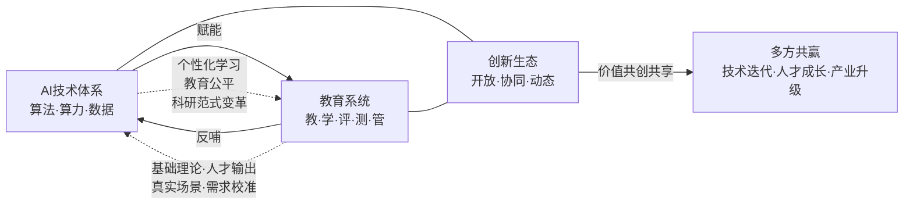

在**要素配置**层面，传统创新模式以资本、设备等实体要素为核心，而AI融合创新的核心要素已转变为数据、算法和算力，要素配置的变动直接带来组织模式的改变——传统线性创新模式难以跟上AI技术快速迭代的步伐，要求构建动态联盟、柔性课题等新型组织形态，实现跨领域、跨地域的高效协同[^15]。在**组织模式**层面，《"人工智能+教育"行动计划》提出构建"政产学研金"协同机制，整合高水平研究型大学、科技领军企业、国家实验室等多元主体力量[^10][^11]。在**价值分配**层面，AI技术的深度介入打破了产学研各自的价值创造边界，让知识生产、技术研发与产业应用形成强大的价值共创合力，既保障高校和科研机构的知识价值充分实现，也确保企业的应用价值有效转化，同时为人才价值提升搭建广阔平台[^15]。

相较于传统单向"技术应用"视角，**双向赋能的理论突破在于**：它不再把教育视为AI技术的被动接受方，也不再把AI视为脱离教育生态的外生变量；而是把两者放到同一个开放协同生态中，让技术演进与教育变革相互校准、价值共创。具体表现为：AI的发展为教育提供个性化学习、教育公平、科研范式变革等赋能价值，而教育又通过基础理论原始创新、复合型人才培养、真实需求场景反向支撑AI的核心突破——形成一个自我增强的良性循环。这一逻辑突破构成了本研究区别于"技术中心论"或"教育中心论"单一叙事的核心创新点。

## 1.6 分析框架构建与研究路线图

基于上述对时代语境、政策驱动、AI赋能逻辑、教育反哺逻辑及双向赋能机理的层层递进分析，本研究构建"**AI赋能教育—教育反哺AI**"双向分析框架，作为统领全篇的逻辑主线与研究视角。该框架将围绕用户最关切的四大核心议题——**AI在教育领域的应用现状、可落地场景、面临的挑战、教育对AI高端人才培养的支撑作用与高校培养体系**——展开层层递进的论述。

具体而言，本报告后续章节构成如下递进结构：

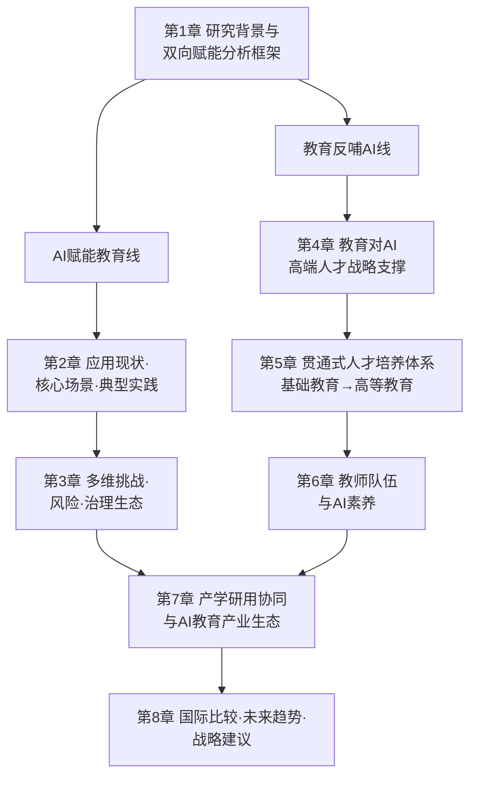

各章节在双向框架中的定位与衔接关系如下：**第2、3章**对应"AI赋能教育"线，分别从应用图景（宏观格局与典型场景）和挑战治理（风险防控与治理路径）两个维度，回应用户对"应用现状"和"实际落地场景"以及"面临挑战"的关切；**第4、5、6章**对应"教育反哺AI"线，从战略定位、贯通式培养体系、教师支撑三个维度，回应用户对"教育如何强化AI高端人才培养"和"学校的AI人才培养体系"的核心关切；**第7章**作为双向赋能的产业接口，揭示产学研用协同如何将两条线索打通；**第8章**则在国际比较与趋势研判基础上提出面向多元主体的战略建议，使全篇形成"现状—挑战—支撑—生态—趋势"的完整闭环。

在研究边界与资料范围上，本研究聚焦中国语境下的"人工智能+教育"实践，以国家政策文件、权威研究报告、学术论文与典型案例为核心资料来源，时效优先采用2024—2026年的最新政策与实践，对较早资料则作为趋势对比与背景铺垫。在分析单元上，将区分**学段**（基础教育/高等教育/职业教育/终身教育）、**主体**（学生/教师/学校管理者/家长/企业/政府）、**地区**（东中西部、城乡）等多个维度，避免笼统化结论。在论证立场上，坚持赋能价值与风险边界并重、技术乐观与教育本质坚守并重、本土实践与国际比较并重的多视角平衡。

需要特别说明的是，"双向赋能"框架本身既是分析工具，也是价值主张——**它要求我们在审视AI教育的每一个具体议题时，既看到技术对教育的解放性力量，也看到教育对技术的塑造性责任**。这一立场将贯穿后续各章节的分析，并在第8章的战略建议中得到集中回应。带着这一框架与立场，下一章将首先深入"AI赋能教育"线索的第一个维度：AI在我国教育领域的整体应用现状、核心场景与典型实践。

# 2 AI在教育领域的应用现状、核心场景与典型实践

承接第1章构建的"AI赋能教育—教育反哺AI"双向分析框架，本章聚焦于"AI赋能教育"线索的第一个维度——**实然图景**。如果说第1章回答了"为什么要做"和"如何思考"的问题，本章则要回答"做到了什么程度、落到了哪些场景、呈现了哪些差异"的问题。我们将沿着"宏观渗透格局—双轨供需分化—学段区域差异—全链条场景落地—家庭社会延展—区域典型实践"的递进逻辑，借助多源权威数据与丰富的一线案例，系统呈现AI在我国教育领域已经发生和正在发生的深度变化，并为第3章关于挑战与治理的讨论提供实证坐标。

## 2.1 整体渗透格局:用户规模、市场规模与"规模化试水期"判断

理解AI教育应用的现状,首先需要从宏观渗透数据出发,把握其在用户、市场、政策三个维度上的整体态势。

**用户侧的"亿级"渗透**已经成为不可忽视的现实。QuestMobile发布的《2025年中国移动互联网秋季大报告》显示,截至2025年9月,**移动端AI应用用户规模已达7.29亿,其中应用插件(In-App AI)整体规模达7.06亿,三季度复合增长率9.3%**[^16]。在通用大模型层面,中国互联网络信息中心发布的《生成式人工智能应用发展报告(2025)》显示,**截至2025年6月,我国生成式人工智能用户规模达5.15亿人,普及率为36.5%,半年内增长2.66亿人、规模翻番**;40岁以下中青年用户占比达74.6%,大专、本科及以上高学历用户占比为37.5%,这两个群体恰恰高度重合于"教育用户"的核心画像[^17][^18]。聚焦到教育主体,中国青少年研究中心2025年面向7省(市)8563份问卷的调查显示,**超六成(60%以上)受访中小学生用过AI,其中近两成经常使用,71.0%用AI辅助完成作业**,高中生的使用比例最高达69.5%[^19]。国际比较视角下,Codegnan与盖洛普2026年度报告显示,**全球K-12阶段学生AI渗透率已飙升至86%**,瓦尔基基金会调查则显示**80%的中国学生对在课堂使用AI感到兴奋,远高于英美等国**[^20]。

**市场侧呈现"千亿级"规模与"分赛道"爆发并存的格局**。从总量看,华经产业研究院数据显示,**2024年中国智能教育行业市场规模约为3693.9亿元,产值约3821亿元**[^21]。从学校B端看,艾瑞咨询数据表明,**2023年学校端(To B)AI智慧教育市场规模为213亿元,预计到2027年可达476亿元,年复合增长超过20%**;同年中国AI教育市场规模整体已突破500亿元人民币[^22]。从C端硬件看,**2025年前11月我国AI教育硬件累计销量突破1000万台,同比激增83%,市场规模突破380亿元;2030年有望飙升至1200亿元,年复合增长率保持在25%以上**,3000-5000元中高端机型销量占比超60%,成人英语口语训练仪销量同比增长150%,适老化AI学习设备成为银发经济爆款[^23]。从云基础设施看,IDC《中国教育云市场份额,2024》显示,**中国电信天翼云以16.38%的市场份额位居中国教育公有云市场第一**[^24]。

**政策侧的资源供给与平台建设正在密集落地**。第1章已述及的国家智慧教育平台,2025年5月发布的《中国智慧教育白皮书》披露其**注册用户已突破1.64亿,覆盖220余个国家和地区,成为全球最大的教育资源数字化中心**[^25]。截至2025年8月,我国累计有538款生成式人工智能服务完成备案,263款应用或功能完成登记,到11月这一数字进一步攀升至611款和306款[^17][^18]。

将上述多源数据并置,可以更清晰地把握AI教育应用的整体渗透态势:

| 维度 | 关键指标 | 数据(2024-2025) | 来源 |
|------|---------|---------------|------|
| 用户规模(总量) | 移动端AI应用用户 | 7.29亿(2025.09) | QuestMobile[^16] |
| 用户规模(GenAI) | 生成式AI用户/普及率 | 5.15亿/36.5%(2025.06) | CNNIC[^17] |
| 用户规模(K-12) | 全球学生AI渗透率 | 86%(2026) | Codegnan/盖洛普[^20] |
| 用户规模(中国中小学) | 用过AI的比例 | 60%以上,高中69.5% | 中青研[^19] |
| 市场规模(智能教育) | 行业总规模 | 约3693.9亿元(2024) | 华经[^21] |
| 市场规模(学校B端) | AI智慧教育市场 | 213亿元→476亿元(2023→2027E) | 艾瑞[^22] |
| 市场规模(AI硬件) | 销量/规模 | 1000万台/380亿元(2025前11月) | 行业数据[^23] |
| 教育云市场 | 头部份额 | 天翼云16.38%(2024) | IDC[^24] |
| 平台与备案 | 国家智慧教育平台用户 | 1.64亿(2025.05) | 教育部白皮书[^25] |

将这些数据综合判断,**当前我国AI教育应用整体已经走出"探索期",进入"规模化试水期",但尚未进入"系统化解决方案"阶段**。这一判断在职业教育领域得到清华大学教育学院刘英群团队主编、覆盖32个省份140万份有效数据的《职业教育人工智能应用发展报告(2024-2025)》中得到直接印证——报告作者韩锡斌明确指出,职业教育"已进入改变底层逻辑、重塑教育生态的智能时代",但**当前AI教学应用进入"规模化试水期"却"缺乏系统化解决方案"**[^26]。这一总体定位,为我们理解后续章节的具体场景、挑战与治理提供了基准坐标。

## 2.2 C端与B端的应用分化:消费市场与机构采购的双轨格局

AI教育应用并非铁板一块,而是呈现出消费市场(C端)与机构采购(B端)显著分化、双轨并行的供需结构。

**C端市场以"用户主动选择"为特征,呈现旺盛而多元的消费驱动**。在通用AI助手层面,QuestMobile数据显示,2025年第三季度涌现出诸多"黑马"应用,其中蚂蚁集团旗下AQ与抖音集团旗下豆包爱学的月活复合增长率分别达**83.4%和15.7%**,反映出"大厂"在垂类教育应用上的加速释放[^16]。在家庭教育市场,QuestMobile《2025有孩家庭人群消费洞察报告》显示,**有孩家庭月活规模达3.62亿,90后父母占比超45%,Z世代已初入育儿阶段、有孩比例达28.2%,有孩家庭线上千元以上消费能力占比达85.5%**;**AI教育产品迅速崛起,在儿童全学科场景中,通过陪伴学习和个性化成长支持,成为家长和孩子们的新宠**[^27]。这种消费驱动力进一步推高了AI硬件市场:某电商平台数据显示,2025年"AI学习机"搜索量同比增长210%,华为智选AI学习机凭借鸿蒙系统与DeepSeek大模型加持,**上市3个月销量破80万台**;科大讯飞AI学习机T30通过10分钟诊断测试即可生成个性化学习方案,某重点中学试点数据显示**使用该设备的学生平均提分效率提升40%**[^23]。

值得关注的是大学生群体形成了独特的"AI军师"使用图景。南都大数据研究院2025年3月调查显示,**56.38%的受访青年最常使用通用对话类AI工具,24.82%每日高频率使用5次以上,53.19%通过AI进行职场效能提升(方案撰写、PPT制作),近三成受访青年将AI作为心理疏导陪伴对象**[^28]。广州大学人工智能学院副教授王显珉指出,在校学生主要将AI用于学术辅助(编程解题、论文框架生成)、语言学习、时间管理与创意写作[^28]。

**B端市场则以"政府与学校采购"为特征,呈现出以政策导向为引擎、以平台化供给为路径的鲜明特点**。一方面,基础设施层面以教育云为载体的市场格局已经形成,中国电信天翼云依托"4+4+31+X+O"云网融合架构、80Gbps专网与50毫秒低时延网络,构建起教育新基建数字底座,在西藏扎囊县、重庆巴蜀云校、清华大学等地落地教学与科研场景[^24]。另一方面,基础教育领域的政府主导供给路径正在快速成型:北京市依托智慧教育平台搭建的"基础教育AI应用超市"**已汇聚40余款经过一线实践检验的优质AI教育产品,全面覆盖教、学、管、评、研、育等核心环节**[^29][^30];金山办公"春芽计划"2.0计划**为20000所中小学提供智慧教育平台,与百个区县合作,为教师配备"AI助教"、为学生引入"AI学伴"**[^31]。

但B端供给的痛点也十分突出。《规范高校AI教育装备采购》文章指出,**高校AI装备采购仍面临"行业缺少统一的技术、质量和验收标准,产品参差不齐","部分企业产品同质化明显,和高校个性化、专业化需求难以匹配","优质智能装备成本较高"等多重痛点**,需要从"重硬件、轻软件""重采购、轻应用"的旧模式转向软硬件结合、全链条服务的新模式,并推广"租赁+运维"等灵活模式[^32]。这一论述揭示出当前B端市场"规模上去了、效果跟不上"的结构性矛盾。

C端与B端的双轨分化也带来了供需对接的机遇与错位:**C端创新速度快、用户体验导向强,但容易陷入营销驱动与同质化竞争;B端规模化能力强、政策支持稳定,但灵活度与场景适配能力欠佳**。如何打通两者,正在成为产业生态的关键议题(将在第7章深入展开)。

## 2.3 学段与区域差异:基础教育、高等教育、职业教育的渗透梯度

AI教育应用在不同学段、不同区域呈现显著差异化的渗透特征,需要分层分类地把握其格局。

### 2.3.1 学段差异:从"作业辅助"到"学科交叉"再到"规模化试水"

**基础教育层面**,AI主要在作业辅助、智慧课堂、智能体育等场景实现快速渗透。前述中国青少年研究中心调查显示,**71.0%的中小学生用AI辅助完成作业**,高中生使用比例最高(69.5%),农村中小学生使用AI辅助完成作业的比例(73.2%)反而比城市学生(68.4%)高4.8个百分点[^19]——这一"反向"数据揭示出AI正在成为教育资源不均衡地区的重要补充。

**高等教育层面**呈现"985引领、规模化接入"的格局。一项针对147所"双一流"高校DeepSeek本地部署的统计研究显示,**截至2025年8月30日,已有125所高校明确披露完成本地部署,扩散过程符合创新扩散理论的S型曲线特征,"985"高校部署率最高**,2025年因此被视为我国高校的"DeepSeek元年";应用以教学、科研、管理多场景综合性应用为主,但同时也存在"技术导向偏误、供需匹配失衡、数据底座薄弱及成本效益评估缺位"等问题[^33]。

教育部连续三批组织的"人工智能+高等教育"典型应用场景案例征集,是观察高校AI应用走向系统化的重要窗口。教育部第三批30个典型案例中,共有**北京大学、浙江大学、哈尔滨工业大学、西安电子科技大学等10所高校连续三批获批该项典型案例**[^34][^35]。这些案例覆盖**智能教学、虚拟仿真、知识图谱、学业预警等全场景**,形成四个共性公约数:智能化教学系统、多模态数据融合、教学决策从经验走向数据驱动、教学应用更好跨学科和跨场景[^36]。

**职业教育层面**,清华大学教育学院刘英群主编的《职业教育人工智能应用发展报告(2024-2025)》是当前最权威的实证证据。报告基于全国32个省份140万份有效数据,呈现以下关键事实:

- **71.5%的职业院校学生将生成式AI用于知识扩展,超过七成学生对这种使用持积极态度**;
- **近50%的高职院校已开设人工智能通识课**,超六成学生认为AI课程"基本满足"学习需求;
- **67.33%的职业院校已应用AI提升教学效率,45.79%已开发数字资源,35.47%完成了智能化升级**;
- 教师层面"两成教师使用AI工具超过1年",已"初步具备智能教学素养",但"区域差异明显"[^26]。

报告同时指出14项挑战,核心包括"师生智能素养发展不均衡""学生应用较活跃但高阶使用仍待提升""教师层面局限于效率提升工具,在教学中的成效尚不明显""学校层面整体AI渗透率较低,尚处于初步探索阶段"等[^26]。这一图景印证了2.1节"规模化试水期但缺乏系统化解决方案"的总体判断。

### 2.3.2 区域差异:东中西、城乡之间的应用鸿沟与协同机制

区域层面的差异同样显著。一方面,发达地区与欠发达地区在AI教育的硬件部署、师资水平、平台能力上均存在明显鸿沟;另一方面,通过国家政策引导、对口支援、京津冀协同等机制,这种鸿沟正在被有意识地弥合。

最典型的"援助赋能"案例是**安徽省援疆智慧教育"皮山模式"**:2020年安徽省援疆指挥部依托科大讯飞人工智能技术、**投入1.4亿元援疆资金,配套开发"三大平台、五大系统、九大模块"的智能教学系统**,以国家通用语言文字能力提升和铸牢中华民族共同体意识为两大着力点。近6年深耕,**皮山县小学生听说理解能力提升22.16%、书写理解能力提升29.67%,学前儿童口语测评合格率提升40.13%;82%的学生表示能了解"中华成语""中华经典"背后蕴含的深刻内涵;84%的教师认为学生的书写习惯、发音、语调都有了明显进步**;模式从首批14所学校试点扩展至全县中小学及幼儿园全覆盖,再到全疆106所学校推广应用[^37][^38]。

最具示范意义的"协同输入"案例是**京雄"AI+教育"合作**。2025年4月9日,"京智赋能·育见未来"——"人工智能+教育"京雄合作启动会在雄安史家胡同小学举办,**北京AI应用超市汇聚的40余款AI教育产品向雄安师生免费开放,首都教育新地图、雄安"班超运动汇"实现双向接入,北京AI教育讲师团55位专家为雄安培养"种子教师"**[^39][^29][^40][^30]。雄安史家胡同小学副校长宋莎莎表示,该校已开展17场"班超"足球赛,4月底将与北京史家教育集团其他学校同台竞技[^39]。北京市第八十中学雄安容东分校信息技术教师张梦雅坦言,雄安教师"基本上就比较年轻,大部分的老师都是95后,甚至有00后",京雄资源联动正是为了搭建学习交流平台[^40]。

为更清晰地呈现学段与区域差异,下表汇总三大学段的核心渗透指标与典型路径:

| 学段 | 应用渗透核心数据 | 主导场景 | 发展阶段判断 |
|------|----------------|---------|-------------|
| 基础教育 | K-12学生使用率86%(全球);中国中小学60%以上;71%用于辅助作业 | 作业辅助、智慧课堂、智能体育、AI通识课 | 规模化扩张,场景多元 |
| 高等教育 | 147所"双一流"高校125所部署DeepSeek;教育部三批AI+高等教育典型案例150项 | 教·学·管·评全链路;科研辅助;学科交叉 | "985"引领,从观望转入系统接入 |
| 职业教育 | 67.33%院校应用AI提升教学;近50%高职开设AI通识课;71.5%学生用GenAI知识扩展 | 教学资源制作、课程设计、就业指导、情景模拟 | 规模化试水期,缺乏系统化方案 |

这一梯度分布表明,**AI在教育领域的应用并非线性同步推进,而是呈现出"基础教育以场景普及为主、高等教育以系统重塑为主、职业教育以应用试水为主"的差异化节奏**。

## 2.4 教师侧应用场景:备—教—批—研—沟通的智能化重构

教师是AI教育应用最直接的承载者,也是其能否真正"落地"的关键节点。AI在教师工作全流程中的渗透,正在重构传统教学的"备—教—批—研—沟通"五大环节。

**备课与教学设计环节**正在经历深度智能化。科大讯飞2025年4月在第87届中国教育装备展上发布的教师超级智能体"星光"是典型代表——它**能根据教师课表、进度和习惯,主动生成包含优质资源、交互式动画及配套习题的教学课件,打通多平台壁垒;针对重难点,可通过交互式动画拆解抽象知识;复习测评阶段,教师通过自然语言指令即可快速生成标准化试卷**;还提供"智能导师"功能,长期使用后能记忆教师的教学风格、沉淀专属教学资产[^41]。郑州市第十三中学的实践印证了这一价值,数学老师翟大焕介绍"讲解正方体截面时,原本两节课才能讲透的内容,一节课就让学生透彻掌握";教学副校长荆媛丽强调"我们现在是让'数据'说话,先摸清学生的学情,再根据学生的学习需求设计教学活动,不再是经验主义教学"[^42]。

**课堂教学辅助环节**形成了"师—机—生"三元协同的新形态。在雄安史家胡同小学五年级数学课上,教师"指尖轻点,屏幕上的几何图形便瞬间变得立体生动——可旋转、可拆分,图形的构成与计算逻辑一目了然"[^43][^44]。在郑州市第十三中学地理课上,教师王琳"通过前测数据锁定学生对'东南亚气候与农业'的共性薄弱点……智能体根据学情数据分层推送图文资料与虚拟路线;互动中实时组织抢答并记录正确率;巩固阶段发布'设计行李清单'等任务,课后自动生成思维导图和个性化复习包"[^42]。

**智能批改与学情分析环节**已经实现"零时差"的范式跨越。合合信息旗下的蜜蜂AI是行业标杆:依托多模态文本智能技术,**AI批改准确率达99%,业内率先推出"手抄作业批改"功能,目前已拥有千万级用户、覆盖全国上百所学校,累计帮助教师批改作业超12亿题次**[^45]。这一能力的现实意义巨大——华东师范大学出版社发布的2025年《国家教师发展报告》显示**我国中学的平均班额为46人**,以一位老师任教两个班级、单份作业批改2分钟计算,**每天仅批改作业就耗时至少3小时**,而蜜蜂家校小程序能在5分钟内完成全班作业的识别和批改[^45]。深圳中学龙岗学校英语教师蒋亿加同样反馈,**应用智能批改系统将100份作文批改耗时由6小时压缩至20分钟**[^46]。

**AI协同教研环节**正在成为教师专业发展的新引擎。江苏赣榆区的实践极具代表性:**全区75所学校C30智慧教学软件全覆盖,投入1000万元引入智慧化助学系统,建成区级AI赋能教学名师工作室,搭建"日监测、周通报、月评估"数据看板;以和安中学为例,从2025年6月至2026年2月,全校作文平均分由75.3分提高到78.0分**[^47][^48]。在4月20—22日举办的江苏省中小学人工智能教育领航教师研修活动上,2025年度"领航杯"江苏省教育数字化应用能力大赛**吸引全省4000余所大中小学、11万名师生参与;江苏"名师空中课堂"汇聚精品资源5.73万节,注册师生1189万人,点播量达34.62亿次**[^49]。青海师范大学附属第三实验中学则探索出"一师一画像"机制——**从教学质量、课题研究、团队协作、家校沟通、技术应用五个维度建立动态更新的"教师数字画像",形成"数据诊断—资源供给—跟踪评价"的教师发展闭环**,以雷达图、折线图、词云图等直观形式呈现每位教师的专业发展轨迹[^50]。

**家校沟通与行政减负环节**借助AI实现了"7×24小时响应"。"星光"智能体能够对接智学网数据自动整合学生信息、生成成长档案,并支持接入QQ、微信等通讯工具自动归档学生信息;针对填表、统计等行政事务支持全自动处理,**实现7×24小时响应,让教师专注于教学本身**[^41]。这些场景的累计效应,正在改变中国基础教育长期以来"教师疲于事务、缺乏教研深度"的结构性痛点。

## 2.5 学生侧应用场景:个性化学习、智能辅导与跨学科探究

如果说教师侧的AI应用聚焦于"减负增效",学生侧的AI应用则更多指向"因材施教"与"能力进阶"。

**个性化学习路径**已经从理念走向工程化实现。郑州市第十三中学数学教研组长刘晓芳介绍,**"作业数据自动成为学生学习的'数据画像',每个学生知识点掌握得怎么样、哪里有漏洞,一眼就能看清";基于全量学情数据,系统生成分层练习资源,打造"千人千面"的个性化学习方案,让后进生"吃得了"、中等生"吃得好"、学有余力的学生"吃得饱"**[^42]。在邯郸星博桃源高中,**"基础薄弱的学生,系统自动推送同类基础题夯实基础;学有余力的学生,会收到拓展题激发潜力,真正实现了分层教学"**[^51]。

**智能辅导从"给答案"演进到"启发思考"**,这是教育产品的重大价值升级。邯郸桃源高中数学教师李辉演示了系统的错题库功能:**"这道几何题,系统不会直接给解法,而是一步步引导学生思考'已知条件能推出什么''辅助线该怎么画',就像老师一对一辅导,慢慢打开学生的思维"**[^51]。学生王恣瑜则反馈:"现在有了AI智慧平板,我可以根据自己的节奏放慢语速、重复听讲,并随时能发起AI答疑"[^51]。这种从"搜题工具"向"学习伙伴"的演进,正是2.1节所述AI教育硬件用户价值重构的微观体现。

**AI陪练与素质拓展**显著拓宽了学习场景的边界。在皮山县安徽实验学校,五年级学生穆尼热·麦麦提通过AI系统实时评测朗读和默写,**"以前很多字词发音不准,现在跟着专题课堂学习,我的语文成绩进步很快"**[^37]。在雄安史家胡同小学体育课上,**智能监测设备实时捕捉运动轨迹,跳跃次数、动作标准度、卡路里消耗值以及全校排名同步显示在大屏幕上;通过AI动作捕捉生成运动剪影,精准分析学生动作短板**[^43]。

**跨学科探究与创意实践**则呈现学生从"AI使用者"向"AI共创者"的进阶。深圳明德实验学校(集团)的学生王嘉人**运用不同的AI工具创作了一本科幻环保绘本《超能小艺》**:"我自己出创意和初步文稿,让人工智能帮我修改,然后,我用豆包来帮助画图,可灵(AI工具)又可以帮助我们把这些图片变活"[^46]。在更高层次上,复旦大学的"X+AI"双学士学位项目代表了这种共创模式的高阶形态——2024年学校立项建设116门AI-BEST课程(AI通识基础-专业核心-学科进阶-垂域应用四层),**截至2025年底完成108门AI-BEST课程开课实践,3学期共计1.3万人次本研学生修读;共获批并推出41个"X+AI"双学士学位项目,234名学生进入项目修读**[^52]。这一从启蒙到共创的能力进阶链条,将在第5章深入展开。

需要特别指出的是,学生侧应用并非全无隐忧。中国青少年研究中心调查显示,**29.0%的受访中小学生表示"AI的评价会影响我对自己的看法",47.4%担心AI泄露隐私,21.0%遇到过因过多使用AI感到焦虑的情况;农村中小学生中"依赖AI不想自己思考"的比例达22.8%**[^19]。这些数据为第3章治理议题埋下了重要伏笔。

## 2.6 学校管理侧应用场景:智慧校园、学情诊断与教育治理

AI在学校管理层面的应用,正在催生"治理智能化"的范式转向,本质上是把AI从"教学工具"提升为"治理引擎"。

**智慧校园基础设施**正在成为学校的"数字底座"。青海师范大学附属第三实验中学的智慧管理平台**整合了AI备课、智能教学分析、作业自动批改等功能,实现"备、教、批、辅、评"全流程数字化闭环;依托物联网技术接入考勤统计、班级常规管理、资产设备台账等模块;开通智能课表查询、线上心理咨询、电子离校申请等服务场景**,打通学生、教师、家长三方服务通道[^50]。

**学情诊断与教学决策**实现了"经验驱动"向"数据驱动"的转型。郑州市第十三中学**通过星火智能批阅机将一份份作业扫描,系统在线生成每道题学生作答的正确率,实现"批改不过夜、讲评不隔夜"**[^42]。雄安容和第一高级中学的"平板教室"中,**精准教学智能系统能高效地将全班学生做题正确率、错误率、作答质量等数据实时显示在教室大屏幕上**[^43][^44]。

**学生综合评价与画像**则代表了AI教育治理的"高地"。西安电子科技大学连续三届入选教育部"人工智能+高等教育"应用场景典型案例——其第三批入选案例《"西电智评"——数智赋能学生评价的探索与实践》,**聚焦"个性化培养、智能化适配、全面化发展"三化目标,创新链通"精准识别—精准供给—精准评价"三维育人路径,打造"电子档案—数字画像—综合测评—能力证书—成长助手"五位一体的学生评价链闭环反馈评价体系**;并以"1+1+N for all"的评价体系创新首创"飞环"模型,**依托校内自研慧通大模型搭建"AI成长助手",实现从"关于学生"的静态评定到"为了学生"的动态推演,推动评价范式从管理工具转向育人生态**[^34][^35]。这一案例集中展现了从"知识图谱"向"能力图谱"转变的方向,为后续高校学生评价改革提供了可复制的范本。

杭州师范大学附属未来科技城学校则在中小学场景探索"一生一档":**依托"天元大脑"整合政产学研资用"六位一体"资源,构建覆盖教学、考试、评价、校园管理及运营的"五位一体"全场景数字教育体系;发挥幼小初高15年连贯制办学优势,构建覆盖全学段的一体化人工智能课程体系,建立"一生一档"评价体系**[^53]。海盐县武原中学教育集团进一步系统构建"135"智能教学应用模式:1个中枢("学校数字大脑")、3类场景(AI双师课堂、智能批改、智能测评)、5大范式(精准教学、自适应学习、智能导学、虚拟仿真、协作探究)[^53]。

**教育治理智能化**则在更高层级体现。西电首批入选教育部典型案例《打造AI赋能督导新模式,启动教学质量提升新引擎》**通过人工智能技术重构教学督导流程,实现对教学过程的智能监测与精准干预**;第二批《XD-eChat大模型:赋能教学管评的智能新引擎》依托自研教育大模型平台**推动教学、管理、评价等环节的智能化升级,构建覆盖"教、学、管、评"全场景的智能支持体系**[^34][^35]。三批连续入选揭示出**"大模型引擎"→"智能督导"→"智评生态"**的清晰创新路径,这种从工具应用到治理范式重塑的渐进升级,为教育治理智能化提供了可借鉴的演化逻辑。

## 2.7 家庭与社会教育侧应用场景:家长伴学、终身学习与AI教育硬件

AI对教育的赋能并不止步于校园围墙之内,家庭与社会教育场景已经成为AI应用的"新蓝海"。

**家长辅导与伴学监督**正在缓解长期存在的"陪读压力"。蜜蜂家校小程序的应用案例显示,以英语跟读作业为例,**"过去家长要一边陪孩子反复朗读,一边判断发音是否准确,既耗时间,也容易产生亲子沟通矛盾。借助蜜蜂家校小程序,学生可以独立完成跟读练习并获得纠音反馈,家长只需花几分钟查看练习结果,让'盯进度'变成有效的学习支持"**[^45]。这种"AI替代低效陪伴、家长聚焦关系陪伴"的角色重置,具有深远的家庭教育意义。

**家庭AI教育硬件**正以惊人速度爆发。如2.1节所述,2025年AI教育硬件市场迎来颠覆性变革——**前11月累计销量突破1000万台、市场规模380亿元**;消费群体扩容覆盖学前到终身学习的全龄段;技术革命方面,知识图谱+个性化适配、多模态交互+实时反馈、内容动态更新+跨端协同三大革新成为行业标配,构建起"学校—家庭—移动场景"的全链路学习生态[^23]。

**社会与终身教育**也正在被AI重塑。第1章已述国家智慧教育平台2026年3月新版本上线了终身学习中心、科技创新中心、中文教育中心和教育大数据中心。AI英语口语训练仪成为职场人刚需,2025年销量同比增长150%;适老化AI学习设备集成识字、健康知识科普功能,跻身银发经济爆款品类[^23]。这些场景共同回应了《"人工智能+教育"行动计划》"AI for终身教育"的布局要求,使AI教育从"在学群体"向"全龄群体"延展。

但这一延展也带来了新的隐忧。**农村中小学生中"依赖AI不想自己思考"的比例达22.8%,21.0%因过多使用AI感到焦虑**[^19];麻省理工学院媒体实验室对54名波士顿地区居民的研究发现,**使用ChatGPT组的参与者大脑活跃度最低,在神经、语言及行为表现上也最差,大语言模型的使用可能抑制学习过程,尤其对年轻人影响显著**[^54][^55];沃顿商学院的一项实地实验更发现,**虽然AI辅导短期内显著提升测试表现(AI辅导师组比纯纸笔组高127%),但在闭卷考试中使用ChatGPT的学生分数反而比普通班级低17%**[^55]。这些证据揭示出"赋能"的另一面——**当AI从"伙伴"滑向"代劳",学生的批判性思维与认知成长可能受到损伤**,这正是第3章需要重点回应的核心治理议题。

## 2.8 区域典型实践:四类模式的成熟度与可复制性比较

宏观图景与场景拆解之后,需要通过区域典型实践来验证AI教育落地的成熟度与可复制性。基于前述案例,可以归纳出四类具有代表性的区域路径。

**模式一:"示范区系统化"路径——以广州"数·智·融·创"为代表**。作为国家人工智能创新应用先导区、全国"智慧教育示范区",广州市秉持"德术并举、协同育人"AI教育理念,**创新构建"数字为基、智能为翼、融合为径、创新为核"的"数·智·融·创"中小学AI教育模式**[^56][^57][^58]。其核心抓手是AI教育"1+8"模式:**以"广州中小学人工智能教学平台"为核心枢纽,统筹政策保障、资源建设、教学实施、装备配置、师资培养、评价考核、辐射推广、协同创新八大支撑体系**;制度上明确**一至二年级每学期不少于3课时、三至八年级每2周不少于1课时,AI课程从社团、校本课程升级为必修课**;**截至2025年12月,平台覆盖广州市1517所学校,注册学生125.6万人,提交AI编程作品超463.52万个**;教学空间上从2002年中山大学附属中学"智能机器人实验室"演化至如今融合AI导学、生成式人工智能、XR、元宇宙的"AI—元宇宙空间"[^56][^57][^58]。这一模式的核心机制是**"市级统筹+全域普及+课程标准化+硬件虚拟化"**,适合在中心城市与省会城市推广。

**模式二:"新区+协同输入"路径——以雄安未来课堂与京雄合作为代表**。作为全国首批智慧教育示范区创建区域,雄安新区"以改革创新为动力,让智慧教育赋能学生全面发展,逐步构建起现代化教育体系";**在新建学校按1∶1比例配建普通教室和功能教室,运动场、风雨操场、报告厅、图书馆成为学校标准配置;建立了智慧教育云平台,推广平板精准教学教室**[^43][^44]。京雄合作启动会则带来了北京AI应用超市40余款产品、首都教育新地图、AI讲师团等系统性资源[^39][^29][^40][^30]。**"十五五"期间,雄安新区还将着力打造20所中小学"人工智能+教育"试点校**[^59]。这一模式的核心机制是**"白纸建城+协同输入+体制创新"**,适合于新区、新城与协同发展示范地区。

**模式三:"援助赋能"路径——以皮山智慧教育模式为代表**。如2.3节所述,2020年安徽援疆投入1.4亿元资金、配套开发"三大平台、五大系统、九大模块"智能教学系统,以"智能助教系统+专题模块+教师国通语学习平台"三大方向发力,**从首批14所学校试点扩展至全县中小学及幼儿园全覆盖,再到全疆106所学校推广应用**;**小学生听说理解能力提升22.16%、书写理解能力提升29.67%,学前儿童口语测评合格率提升40.13%**[^37][^60][^38]。这一模式的核心机制是**"专项资金+技术合作伙伴+特色主线(国通语+共同体意识)+逐步外溢"**,具有鲜明的边疆教育特色,可在对口支援、东西部协作场景推广。

**模式四:"县域均衡"路径——以连云港赣榆AI"智变"为代表**。赣榆区"以'AI赋能教育'为核心,有序推进平台搭建、系统落地、专业培训与教学创新,全力构建'区域统筹、平台支撑、数据贯通、校校有为'的智慧教育新生态";**投入1000万元引入智慧化助学系统,实现全区75所学校C30智慧教学软件全覆盖;城乡联盟云教研机制有效助力城乡教育协同发展,义务教育学段小学均衡指数小于0.15,居全省领先水平;教师周活跃率稳定在95%以上**;成熟的实践经验吸引徐州、安徽等地教育部门组团考察学习[^47][^48]。这一模式的核心机制是**"县级统筹+硬件全覆盖+教研提质+城乡联盟"**,适合于县级行政单位推动区域均衡。

**学校层面的高水平案例**进一步丰富了上述区域路径的微观印证。除前述复旦AI-BEST、西电"智评生态"外,**教育部第二批325个中小学人工智能教育基地名单**为基础教育AI应用提供了系统化标杆,如温州市实验中学教育集团构建"CREATE人工智能教育课程体系、部署本地化大语言模型、打造小实AI助手"[^53];滁州市紫薇小学构建"基础课程渗透—特色课程深化—跨学科融合实践"的"阶梯式+融合化"课程体系[^61];上海闵行浦汇小学探索"AI赋能,让每个孩子的成长'看得见'"的五育融合实践[^62][^63]。

为系统比较四类区域模式,下表归纳其核心机制、显性成效与可复制性:

| 模式类型 | 代表区域 | 核心机制 | 关键成效 | 可复制性条件 |
|---------|---------|---------|---------|-------------|
| 示范区系统化 | 广州 | 1+8架构、AI必修课、平台-空间-课程-机制四维联动 | 1517所学校覆盖,125.6万学生注册,AI通识课全覆盖 | 中心城市,具备政策、资金、产业生态 |
| 新区+协同输入 | 雄安+北京 | 智慧教育云平台、AI应用超市、京雄协同、20所试点校 | 一对一配建、班超运动汇双向接入、AI讲师团送教 | 新区/新城,具备协同发展机制 |
| 援助赋能 | 皮山(安徽援疆) | 1.4亿专项+科大讯飞技术+三大平台五大系统九大模块 | 听说理解+22%、书写+30%、口语合格率+40% | 对口支援机制,边疆/民族地区适用 |
| 县域均衡 | 赣榆 | 县级统筹+1000万投入+75所全覆盖+城乡联盟 | 周活跃率95%、均衡指数<0.15、作文均分+2.7 | 县级行政单位,具备教研基础 |

四类模式的对比揭示了一个重要洞见:**AI教育落地不存在唯一最优路径,而需要根据不同区域的资源禀赋、行政层级、协同机制和教育基础进行差异化选择;但所有路径的共同要素是"政策引领+平台底座+课程体系+师资培育+长效机制"五位一体**。这一结构性发现为后续章节(尤其是第3章治理路径与第8章战略建议)提供了关键支点。

---

综上,本章从"渗透格局—双轨分化—学段区域差异—全链条场景—家庭社会延展—典型实践"六个层次,**全景式呈现了AI在我国教育领域的应用图景**。可以得出以下核心判断:**第一,AI教育已经从"概念热"走向"应用热",形成亿级用户、千亿级市场的真实生态;第二,应用呈现C端创新与B端规模并行、基础教育普及与高等教育系统化升级并行、发达地区引领与援助协同弥合鸿沟并行的"双轨多元"特征;第三,在"教—学—评—测—管"全链条上,AI已经形成相当数量的可复制场景,但绝大多数应用尚处"规模化试水期",离"系统化解决方案"仍有距离;第四,场景成熟度的提升必然带来风险与挑战的暴露——从学生认知惰化到数据安全、从师资数字鸿沟到伦理边界**。这些已在本章末尾若干处显露端倪的隐忧,恰恰是下一章("AI教育应用的多维挑战、风险与治理生态")需要直面的核心议题。

# 3 AI教育应用的多维挑战、风险与治理生态

第2章勾勒的应用图景揭示了一个清晰但矛盾的事实：AI在教育领域已经形成亿级用户、千亿级市场、覆盖"教—学—评—测—管"全链条的真实生态，却仍处在"规模化试水期"而非"系统化解决方案"阶段。这种"规模上去了、效果跟不上"的张力，正是治理议题生成的根本土壤。如果说赋能图景回答了"AI能为教育做什么"，那么本章必须回答的是"AI在教育中正在出什么问题，以及如何让它不出问题、出更少的问题"。本章沿着"技术风险—伦理边界—教育本质—治理短板—差异化表现—国际比较—中国体系—学校规则—工程支撑—协同生态"的递进逻辑展开，识别风险、梳理规则、提炼路径，为后续教育反哺AI线索（第4—6章）和产学研用协同生态（第7章）提供风险防控与制度托底。

## 3.1 技术层面的风险：幻觉、可解释性、安全合规与基础设施脆弱性

AI教育应用面临的第一类挑战来自技术底层本身。这些挑战并非教育领域独有，但在教育这一关乎认知发展与公共利益的特殊场域被显著放大。

**第一，大模型"幻觉"对教学内容真实性与学术诚信的侵蚀**。生成式AI的工作原理决定了它"通过将查询中词汇的模式与训练数据进行比较，利用统计模型提取模式，并预测最可能回答的文本"，因此具有"一本正经地胡说八道"的固有特性[^64]。这种特性在教育场景中具有直接危害：学生让AI生成参考文献时，AI可能编造作者、书名甚至期刊卷期，导师查证后发现根本不存在；学生引用AI生成的论据时，可能基于虚假案例与数据得出结论[^65][^66]。联合国教科文组织《生成式AI教育与研究应用指南》明确指出，生成式AI模型"并非通过对现实世界的观察和科学取证的方法来输出结果，因此其生成的文本准确性和真实性有待商榷"，且"智能模型本身不是建立在真正理解语言和现实社会的基础之上"，这必然给"知识、技能和价值的传承带来风险，进而导致信任赤字的发生"[^67]。

**第二，黑箱特性带来的可解释性困境**。当AI被用于学情分析、能力评估、分班推荐乃至升学决策时，其决策过程的不可解释性成为合法性挑战。欧盟《在教学中合乎伦理地使用AI和数据的教育者指南》将"透明可解释（拒绝黑箱）"列为五大黄金伦理原则之一，明确要求"AI批改、评分、推荐的逻辑要能说清，教师要懂原理、能复核"，并直接"禁用无法解释的AI系统做升学、分班、评优等关键决策"[^68]。中国学界研究亦指出，"当前大模型多为黑箱模型，我们只知晓最终结果，却无法追溯其推理逻辑、数据来源与运算过程，极易产生信息偏差与AI幻觉"，提升人工智能的可解释性已被列为AI良性发展的首要技术任务[^69][^70]。

**第三，教育数据安全与合规事件频发**。教育系统因其数据敏感性高（学生未成年、学籍/成绩/家庭信息密集）和防护能力相对薄弱，正成为网络攻击的高频靶点。一个标志性案例是2025年3月被公安部"护网—2025"通报的**河南舞钢市某学校系统数据泄露案**：该校"智慧刷卡计费系统在建设与运维过程中，既未对数据实施加密存储，也未设置访问控制与身份认证机制，导致系统长期存在高危漏洞"，且在委托第三方公司处理业务数据时"未在合同中明确接收方的数据安全保护义务并监督其履约"，最终学生及教职工个人信息在境外被非法兜售[^71]。专家解读指出，这"是一起典型的因技术防护缺失、管理制度缺位、外包监管空白导致的个人信息泄露事件，深层次地揭示了教育数据治理在制度建构与责任落实层面的结构性困境"[^71]。

新型AI智能体的"野蛮渗透"则带来更高维风险。2026年3月，全国数十所高校紧急发布禁令，剑指开源AI智能体**OpenClaw（俗称"红色龙虾"）**：工信部监测显示该工具存在严重高危漏洞，由于"设计之初赋予了AI极高的系统权限"（高权限特性），一旦被恶意利用或自身逻辑出现偏差，"它可以绕过常规的防火墙，直接访问敏感数据库、读取本地文件，甚至控制终端设备发起网络攻击"[^72]。事件被网友戏称为"校园缉毒"行动，但其暴露的深层问题更为严峻：高校信息化建设长期存在"重应用、轻安全"的倾向，对新兴AI工具缺乏快速响应机制和准入审核标准，"当技术狂欢压倒风险意识，校园网络就成了不设防的城市"[^72]。

**第四，算力、数据底座与本地化部署的工程难题**。第2章已述147所"双一流"高校中已有125所完成DeepSeek本地部署，但这一过程中暴露的"技术导向偏误、供需匹配失衡、数据底座薄弱及成本效益评估缺位"等问题极为典型。教育部《"人工智能+教育"行动计划》也直言"算力不足、数据不优、模型不强"是当前人工智能发展的三大堵点[^73]。这些问题指向治理对策中的一系列硬核工程议题——私有化部署、安全审核、教育语料库建设、技术屏障构建（详见3.9节）。

## 3.2 伦理层面的边界：隐私、偏见、价值观与公平—隐私张力

技术风险之外，AI教育应用还面临更深层的伦理边界问题。这些问题往往不是"技术故障"，而是"价值冲突"。

**第一，敏感数据过度采集与跨境流转的隐私威胁**。教育场景中AI对学生人脸、声音、注意力、情绪、成绩、行为轨迹的高密度采集，构成对未成年人隐私的严重挑战。欧盟《教育者AI伦理使用指南》明确要求"最小化采集：只拿教学必需数据，严禁收集人脸、声音、位置等敏感信息"，"学生数据所有权归学生/家长，学校无权擅自给第三方"，并要求"禁用免费但偷数据的工具，优先选教育合规、开源平台"[^68]。这种警惕并非空穴来风——美国家长对孩子学校大规模发放预装Gemini的Chromebook感到恐惧的根源正在于此："如今他读她写的诗，知道她的密码。他始终通过那块屏幕凝视着她"[^74]。

**第二，训练数据偏差导致的算法歧视与隐性边缘化**。UNESCO指南指出，生成式AI模型的数据来源于互联网，"如果互联网中某一话题或内容经常出现，就会传递给模型，这是主流或主导信息的信号，使其在输出结果时更倾向于重复这些话题和信息"，从而"边缘化弱势群体，造成不均衡发展"[^67]。欧盟指南则进一步将此具象化为教育场景的"公平与非歧视"原则：警惕AI对"贫困、少数族裔、残障、女生"等群体的不公对待，避免"因使用AI让无设备/无网络的学生被边缘化"，更要拒绝"AI给学生'贴差生'标签"的标签化分层[^68]。在洛杉矶四年级学生用Adobe Express设计《长袜子皮皮》书封时，程序"竟生成了带有明显性暗示的图像"——这一事件正是训练数据偏差在教育场景的赤裸呈现[^74]。

**第三，强势价值观投射、深度伪造与意识形态渗透**。生成式AI的内容输出"往往偏离人类社会的价值取向，容易产生误导性的术语和话语体系"，并在"深度造假变得更加简捷容易"的背景下，使"假新闻的制造成本也会更低"[^67]。对世界观、价值观尚处形成期的青少年而言，这种隐性影响尤为深远。教育部《"人工智能+教育"行动计划》据此将"网络思政育人"和"启智、心灵的培养"置于核心地位，要求"客观评估人工智能对教育规律、认知发展等影响"[^73]。《教师生成式人工智能应用指引》则将"强化价值引领，把牢育人方向"列为首要原则，"更加注重思想引领，更加注重智慧启迪和心灵滋养"[^75]。

**第四，教育与工作场所情绪识别的"红线禁令"**。欧盟《人工智能法案》直接将"工作场所和教育机构中的情绪识别系统（医疗/安全目的除外）"列为不可接受风险并予以禁止，2025年2月起强制执行[^76][^77]。欧盟《教育者AI伦理使用指南》进一步重申"严禁AI进行情绪识别、注意力监控、压力侦测"，强调"人是主体，AI是工具：禁止用AI完全替代教师决策、情感关怀与价值引导"[^68]。这一国际共识与我国《行动计划》中"防范算法歧视、惰化思维、过度依赖、应试内卷、隐私泄露"的治理重点形成呼应[^73][^78]。

**第五，公平—隐私与普惠—合规的内在张力**。一个深刻的悖论是：AI实现因材施教必然依赖大量个性化数据，但越多数据采集就意味着越大隐私暴露；AI普惠覆盖弱势地区必然依赖云端模型，但云端调用又面临合规与数据主权风险。这一张力没有简单解，只能通过"分级分类"的精细化治理回应——既要"数据脱敏、合规授权"，又要"避免人工智能加剧教育不均衡，推动人工智能在中西部农村边远地区的应用，弥合教育智能鸿沟"[^73][^79]。

## 3.3 教育本质层面的隐忧：主体性削弱、思维惰化与情感共同体消解

如果说前两节聚焦的是"AI做错了什么"，本节关注的则是更根本的命题——**当AI做对了，是否反而损害了教育本身？**

**第一，"认知卸载—批判性思维退化—元认知抑制"的连锁链条已被多项实证研究证实**。这一全球争议的标志性证据来自麻省理工学院媒体实验室一项205页的脑电研究：研究团队招募54名18—39岁的波士顿地区居民，分为ChatGPT组、Google搜索组、纯手写组，借助脑电图监测32个脑区活动完成多篇SAT作文。结果显示，**使用ChatGPT的参与者大脑活跃度最低，在神经、语言及行为表现上也最差**；ChatGPT组的作文"在语言和内容上高度趋同，缺乏独立思考，两位英语教师评价这些文章'毫无灵魂'"；到第三篇作文时，"许多人已不再参与写作，而是将题目直接交由ChatGPT完成"[^54][^55]。更值得警觉的是，在第四轮"互换"实验中，原ChatGPT组在不能使用工具时"对自己写过的内容几乎毫无记忆，α和θ脑波也明显减弱，说明深层记忆几乎未被激活"——任务完成了，但"几乎没有任何内容进入他们的大脑记忆系统"[^54]。

更系统的证据来自沃顿商学院发表的一项土耳其高中实地实验：1000名9—11年级学生被分为对照组、GPT基础组和AI导师组完成数学课程。**最初使用AI的学生表现显著进步，使用ChatGPT和AI导师的学生分别比纯纸笔同学高出48%和127%；然而在闭卷测试中，使用ChatGPT做复习指导的班级比普通班级成绩低17%**[^55]。这一"先扬后抑"的曲线在国内同样得到印证——清华大学的研究显示，"使用AI学伴的学生在初期课后测试中表现优于未使用者，但两到三周后，这一优势发生逆转，AI使用者的得分反落后于对照组"[^80]。

巴斯大学教授Dirk Lindebaum将此机制概括为：大型语言模型"从根本上削弱了我们的认知能动性：即对信息负责、获取、评估和综合信息的能力"，"将我们变成被动的知识消费者"，并对"批判性思考思维过程的能力"即元认知造成损伤[^64]。北京邮电大学校长徐坤更直接将这种现象命名为"**结果提升—能力停滞**"反常现象：技术过度介入下，"结果变好，但学生的独立思考能力、问题解决能力和自我矫正能力出现退化"[^81]。华中师范大学吴冠军教授则从哲学层面警示，过度依赖会使"使用者停止思考，于是产生了'功能性愚蠢'"，并随技术迭代升级为"系统性愚蠢"[^82]。

**第二，本土真实图景印证了上述实验风险已成现实**。中国青少年研究中心面向7省（市）8563份问卷的调查数据极具警示意义：**29.0%的受访中小学生表示"AI的评价会影响我对自己的看法"**，47.4%担心AI泄露隐私，21.0%遇到过因过多使用AI感到焦虑的情况；**农村中小学生中"依赖AI不想自己思考"的比例达22.8%**。Anthropic对其Claude百万条学生对话的分析则更为直接："近半数学生直接索要答案或现成内容"[^80]。

**第三，AI对师生情感联结、价值引领与"灵魂唤醒"功能的边界冲击**。如果说思维退化是"认知层"的隐忧，情感共同体消解则是"关系层"的更深隐忧。OECD《数字教育展望2026》明确指出，"AI能提升学习表现，却无法替代师生间真实的情感联结——这种'表现与学习的错位'，正是技术与教育的本质边界"[^83]。教育的本质是"一棵树摇动另一棵树，一朵云推动另一朵云，一个灵魂唤醒另一个灵魂"，而AI"或许可以模拟情绪反馈，但却无法真正感知学生的迷茫、挫败与渴望；可以输出标准化安慰，却无法给予一个眼神、一次拍肩、一场促膝长谈的温度"[^83]。心理学层面，过度沉浸于AI对话还可能使学生"情感表达单一化，对现实中微妙情绪识别迟钝，甚至产生逃避心态，加剧心理疏离感"——AI成为社交焦虑学生的"避风港"，却阻碍了真实社交技能锻炼[^77]。

**第四，"AI依赖症"的临床信号**。精神科医生齐尚·汗指出，许多学生已严重依赖AI完成作业，"从精神健康角度来看，长期依赖大语言模型会带来意想不到的心理和认知影响，信息提取、事实记忆和心理韧性等神经连接都会随之弱化"[^54]。荷兰奈梅亨拉德布大学教授奥利维亚·盖斯特表示，近年明显观察到"学生能力滑坡，有些学生已难以独立完成论文或深度文章的撰写"；2024年6月，全球1000多位专家发布公开信，反对大学不加批判地采用AI技术[^80]。MIT研究的主要作者Nataliya Kosmyna警告："我担心再等上半年，政策制定者就可能会推动什么'GPT幼儿园'项目，这将极其有害，特别是对仍在发育的大脑"[^54]。

值得指出的是，争议并非一边倒。美国俄亥俄州立大学教务长拉维·贝拉姆孔达持相对乐观立场，认为"就像计算器取代基础运算，将某些任务交由AI处理，反而能为大脑腾出更高阶的思考空间"；哈佛大学格里戈·科斯汀团队的实验也显示，在物理学科学习中接受定制AI导师辅导的本科生学习效率显著提升[^80]。MIT研究中"纯手写组首次启用AI后写作质量未下降，神经连接甚至在所有频段都有显著增强"的发现也表明，**AI的影响并非工具决定论，而是使用方式决定论——"如果正确引导，AI也能辅助而非阻碍学习"**[^54]。这恰恰把治理议题指向了第3.4节关注的素养与方法论层面。

## 3.4 治理层面的短板：素养、适配、监管与评价的滞后

技术、伦理、本体三层风险的暴露，归根到底要通过治理生态来回应。但当前的治理生态本身存在结构性短板。

**第一，多主体数字素养鸿沟显著**。教师层面，调研发现"一线教师大多掌握基础AI工具的使用方法，但缺乏将人工智能技术有机融入教学设计、课堂实施全流程的系统能力，普遍面临'会用工具但不会融于课堂'的现实困境"，难以充分发挥AI的育人价值[^81]。学生层面，《补齐AI素养短板》一文从职业教育视角直接指出，"高职课堂，学生将通用大模型视作'高级搜索'，不善拆解任务、核验结果"，AI素养绝非等同于学会使用某个软件，其核心应是"面向真实职业任务的人机协同能力"，包括"任务识别与判断力、工具协同与表达力、流程优化与再造力、伦理安全与质量治理力"四项核心能力[^84]。家长层面，则普遍存在监管能力欠缺、代际数字鸿沟等结构性短板。

**第二，B端供给的场景适配困境**。第2章已述高校AI装备采购面临"行业缺少统一的技术、质量和验收标准、产品参差不齐"、"部分企业产品同质化明显，和高校个性化、专业化需求难以匹配"等多重痛点。智能教育产品普遍存在"对教育核心场景与关键需求识别不足的问题，表现为产品功能与教学流程、环境兼容性弱，技术介入时机与方式脱离教育情境的动态性与复杂性"，被形象描述为"**方案空盒子**"现象[^85]。这种"重硬件、轻软件，重采购、轻应用"的旧逻辑，正是治理需要破除的对象。

**第三，监管法规与评价标准的制度真空**。UNESCO《指南》直言"技术立法往往落后于技术发展的步伐，缺少法规和条例的引导和规制"，"政府对许多提供生成式人工智能服务的公司监督监管政策法规与手段有限，随意获取和使用数据的行为泛滥"[^67]。在评价层面，"现有考核又较少衡量协同效率、流程改进贡献与安全合规水平，导致'教、学、评'与岗位标准脱节"[^84]；学术诚信认定层面，"现在的查重系统已经升级，能检测出AI生成的痕迹"，但新加坡国立大学等机构同时强调"当前检测工具的判定不应作为学术不端处分的充分证据，应辅以"其他方法[^65][^83]，AI生成内容的认定边界仍是悬而未决的难题。

**第四，"智能鸿沟"扩大的结构风险**。科大讯飞董事长刘庆峰直言："不同地区因为经济发展水平、硬件设施配备、网络条件等差异，存在AI服务覆盖不均的情况，部分偏远山区、欠发达地区难以享受优质的AI服务，这可能拉大区域间的发展差距"[^81]。《职业教育人工智能应用发展报告（2024—2025）》指出的14项挑战中，"师生智能素养发展不均衡"、"学校层面整体AI渗透率较低，尚处于初步探索阶段"等亦印证了这一结构性图谱。

## 3.5 风险的差异化表现：学段、区域、主体的分层透视

延续第2章建立的分层框架，需要进一步指出：上述风险并非均匀分布于教育系统，而是在学段、区域、主体维度上呈现显著的分层特征，这一特征是分类施策的前提。

**学段维度上**，基础教育以认知发展抑制、价值观渗透、家校沟通失序为主要风险——MIT研究主要作者特别强调"对仍在发育的大脑"的担忧[^54]，UNESCO《指南》据此提出"为生成式AI设置年龄限制"的关键建议[^72]；高等教育以学术诚信、科研伦理、就业冲击为主要风险——多所高校相继发布的AI使用红线均聚焦"代写、伪造数据、考试作弊"三大违规[^65][^66]；职业教育则呈现"应用较活跃但高阶使用仍待提升"、"教师层面局限于效率提升工具"的特点。

**区域维度上**，呈现一种值得关注的"双重病灶"格局：发达地区面临过度使用与认知惰化的"**富裕病**"——城市学生、高学历家庭更易陷入"作业全外包"的依赖陷阱；欠发达地区则面临接入鸿沟与师资能力短板的"**贫困病**"——皮山案例显示边疆地区"教育基础薄弱、教学资源匮乏曾是制约发展的最大瓶颈"，需要通过"援疆资金+科大讯飞技术"的协同模式才能起步[^38]。一个有意思的反差是第2章数据显示"农村中小学生使用AI辅助完成作业的比例（73.2%）反而比城市学生（68.4%）高4.8个百分点"，但农村学生中"依赖AI不想自己思考"的比例也达22.8%，这表明**单纯的接入扩大并不必然带来素养提升，反而可能放大依赖风险**——这是治理者必须正视的"两难"。

**主体维度上**，学生侧重思维退化与情感焦虑，教师侧重职业身份重塑与素养压力，学校管理者侧重数据治理与责任界定（舞钢案直接将管理者"未在合同中明确接收方的数据安全保护义务并监督其履约"列为追责依据[^71]），家长则侧重监管失能与代际数字鸿沟。差异化的风险图谱要求差异化的治理工具——这也是后续国内外治理框架共同遵循的设计逻辑。

## 3.6 国际治理框架比较：UNESCO人本范式、欧盟刚性立法与各国实践

放眼国际，AI教育治理已经形成多元并存的代表性范式，对中国治理路径具有重要参照价值。

**UNESCO的人本范式**确立了全球共识的价值底座。2023年发布的《生成式AI教育与研究应用指南》是"ChatGPT生成以来、用户突破100万时颁布的首份规范生成式AI相关内容和行为的指导性文件"，"秉持以人为本理念制定框架规范，守护人类主体性，保障教育公平、文化语言多元、性别平等等基础人文价值"，"强制规范数据隐私保护，推行人机协同，平衡AI赋能效率与学术伦理、科研诚信"，并提出"为生成式AI设置年龄限制"等关键举措[^72][^67][^79]。配套的《学生AI能力框架》《教师AI能力框架》（2024）则"构建了'教师—AI—学生'协同育人新范式，兼顾技术实效、伦理安全与人本价值"[^79]。2025年9月发布的《AI与教育：保护学习者权利》报告进一步强调"以人为本、基于权利的方法"，警示"截至2024年，全球近三分之一人口（约26亿人）仍缺乏互联网接入，加深数字鸿沟可能导致AI鸿沟"[^86]。

**欧盟的刚性立法范式**则代表了制度化治理的最高强度。2024年7月正式生效、2025年2月起分阶段强制执行的《人工智能法案》以风险分级为核心，将"工作场所和教育机构中的情绪识别系统"、"基于社会行为的社会评分"等列为不可接受风险予以禁止；将"教育与职业培训"列为附件Ⅲ的八大高风险领域之一，须履行严格合规义务；针对生成式AI，要求"通用GPAI模型需更新技术文档、遵守版权法，并发布训练数据的详细摘要"，对"具系统性风险的GPAI模型"（训练算力大于10²⁵ FLOPs）施加额外义务[^76][^77]。2026年3月欧盟委员会发布更新版《教育者AI伦理使用指南》，确立**人的尊严至上、公平与非歧视、透明可解释、隐私与数据安全、学术诚信与合理依赖**五大伦理原则，并按教师、学生、学校三维度给出"即插即用"的全场景合规方案[^68]。

**各国实践呈现鲜明的国别特色**。一份系统比较揭示了不同国家的治理优先级差异[^83]：

| 国家/地区 | 治理理念 | 核心特色举措 |
|---------|---------|-------------|
| 英国 | 风险评估优先 | 学校引入GenAI须先评估收益与风险；学生使用须在成人监护下；学校只能用具备过滤监测功能的工具 |
| 德国 | 反对一刀切+弱势保障 | 反对禁止学生用AI做作业；用文本朗读、自动翻译、无障碍图片描述等帮助学习困难/语言多样/视障群体 |
| 新加坡 | 伦理框架+学校分层授权 | "人工智能教育伦理框架"提出透明、可说明原则；学校和教师明确使用范围与标注要求 |
| 北欧 | 数字鸿沟防范 | 加强终身学习；瑞典要求评估网络与终端可及性、优先保障弱势学生使用机会 |
| 韩国 | AI数字教材合规 | "AI数字教材开发指南"规定遵守个人信息保护法规，仅在明确教育目标下使用学生数据 |
| 丹麦 | GDPR合规 | 学校仅使用符合欧盟GDPR的GenAI工具，并主动向家长说明使用目的、数据范围和潜在影响 |
| 法国/俄罗斯/印度/巴西 | 因地制宜 | 在UNESCO框架下结合本国国情构建监管体系 |

**境外高校层面**，对27所高校AIGC使用规范的梳理揭示出清晰的"四维框架"——**数据隐私+学术诚信+教学应用+伦理合规**：欧美高校"明确严禁用AI替代作业、论文等核心成果"；德国"严格管控机密数据输入、AI工具采购审批，契合GDPR对数据安全的高要求"；澳大利亚"细化AI学术违规处罚，严格学术规范把控"；美国"多数高校覆盖伦理合规维度，同时兼顾数据隐私保护、信息安全审批"；中国台湾地区"授权教师设定'全开/条件/禁用'分层次权限，聚焦技术服务教学实践"[^87]。

**美国"市场主导+企业输入"模式**值得特别审视。OpenAI推出的ChatGPT Edu于2024年5月专为高等教育机构设计，集成GPT-4o、提供高级数据分析、支持构建领域定制GPT、超过50种语言支持、企业级安全控制（SSO、SCIM、SOC2合规、数据不用于训练），并已被牛津、宾夕法尼亚大学沃顿商学院、得克萨斯大学奥斯汀分校、亚利桑那州立大学、哥伦比亚大学等校大规模部署[^78][^88][^89]。但这一"企业先行+学校跟进"的路径也带来争议——《纽约客》报道揭示美国基础教育阶段已成为多家公司"未经家长充分知情同意"的渗透战场：六年级学生使用ChatGPT和Claude驱动的聊天机器人为标准化考试做准备，幼儿园学生与游戏化阅读机器人Amira对话被录音，"亚马逊未来工程师项目"等企业品牌通过"结业证书"完成对儿童的隐性营销，"谷歌凭借Chromebook及其内置的'学习管理系统'……占据了得天独厚的机构优势"[^74]。这种格局与中国的国家统筹路径形成鲜明对照。

国际比较的核心启示是：**AI教育治理已经从"原则倡导"阶段进入"制度化、规范化、可操作"的新阶段**[^90]，但不同国家选择了不同的强制力工具——欧盟以法案与禁令为代表的"刚性立法"、UNESCO以指南与框架为代表的"软法引导"、美国以企业产品+学校采购为代表的"市场驱动"、新加坡以伦理框架+学校分层为代表的"柔性治理"——各有得失，无单一最优解。

## 3.7 中国治理体系构建：政策框架、伦理审查与多层次规范

立足国际坐标，中国正在加速构建一套层次清晰、刚柔并济的"人工智能+教育"治理体系。其核心特征可概括为"**刚性制度+柔性指引**"的混合治理架构。

**第一层：顶层政策框架——《"人工智能+教育"行动计划》的"十六字方针"与四大机制**。该计划确立"育人为本、素养为先、应用导向、智能向善"的基本遵循，并明确以"统筹好发展和安全的关系"为核心原则[^73][^91]。在治理机制上，《计划》部署了**评估备案、技术监测、风险预警、应急响应**四大机制，要求"有效防范利用人工智能伪造诈骗、学术造假、应试内卷、泄露隐私等问题"；同时构建覆盖"模型算法、数据资源、基础设施、应用系统"的安全保障体系，"分类分级确定安全防护标准"，"深化建立教育大模型安全审核机制，确保生成内容积极健康、向上向善"，并"强化人工智能进校园管理，明确智能产品、终端的应用规范"[^78]。

**第二层：伦理审查制度——《人工智能科技伦理审查与服务办法（试行）》的三位一体善治体系**。2026年4月由工业和信息化部等十部门联合印发的该办法，"标志着我国人工智能伦理治理实现了从原则倡导、行业自律向制度化、程序化、全链条、可落地的关键跨越"，构建起"**预防、服务、监管**"三位一体的善治体系[^90][^92][^93]。其制度突破集中体现在两个维度：

一是**从"监管约束"转向"服务促进"**。《办法》"突破传统治理中'重监管、轻服务'的固有思路，专设'服务与促进'章节"，通过"多层次、全方位的人工智能科技伦理标准体系"建设、"伦理风险监测预警、检测评估、认证咨询等公共服务供给"、对中小微企业的合规支持、"伦理审查技术创新与高质量数据集有序开源开放"，实现伦理治理与产业发展同向发力[^90]。

二是**构建"单位主责、专业支撑、部门监管"的协同共治格局**。《办法》"清晰界定了三级责任主体"：高校、科研机构、企业等作为实施主体"必须设立独立运行的人工智能科技伦理委员会"，"将伦理要求全面嵌入研发、测试"全流程；地方主管部门可"依托相关单位建立专业性人工智能科技伦理审查与服务中心"提供专业支撑；部门层面则通过"申请与受理、一般程序、简易程序、专家复核程序、应急程序"等多元程序实现"风险防控为导向"的精准监管[^92][^90]。

**第三层：分主体、分学段的规范矩阵**。这是中国治理体系的最具操作性的部分，至少包括三份代表性文件：

- **《教师生成式人工智能应用指引（第一版）》**（2025年11月由教育部教师队伍建设专家指导委员会发布）确立"强化价值引领、遵循教育规律、恪守伦理规范、加强协同共治"四大基本原则，从"助力学习变革、助力教学提质"等多场景给出指引[^75][^94][^95][^79]。

- **《中小学人工智能通识教育指南（2025年版）》**构建"分层递进、螺旋上升"的教育体系：**小学阶段注重兴趣培养与基础认知，初中阶段强化技术原理与基础应用，高中阶段注重系统思维与创新实践**，培养"知识、技能、思维与价值观"四位一体的人工智能素养[^66]。

- **《中小学生成式人工智能使用指南（2025年版）》**则首次给出明确的分学段使用边界：**小学阶段禁止学生独自使用开放式内容生成功能，教师可在课内适当使用辅助教学；初中阶段可适度探索生成内容的逻辑性分析；高中阶段允许结合技术原理开展探究性学习**[^96]。这一"刚性年龄边界"是中国治理体系中具有国际比较优势的精细化设计。

**第四层：行业标准与平台机制**。2025年5月发布的《智慧教育平台个人信息保护通用要求》《中小学教职工基础数据》两项行业标准"为教育数据的采集、存储、传输与使用提供了明确的技术指引，成为衡量教育机构数据合规性的关键标尺"[^71]；同期发布的《中国智慧教育白皮书》同步发布的《教育大模型总体参考框架》联盟标准则"明确生成内容版权归属，护航技术应用安全"[^25]。教育部还要求"国家开展有组织攻关，分教育阶段研发人工智能教育大模型，强化价值对齐、逻辑推理、安全伦理等能力"，避免"资源浪费和低水平重复建设"[^78]。

中国治理体系与国际同行的差异化优势在于：**一方面以"伦理审查与教师指引"作为柔性引导；另一方面以"分学段使用边界"和"教育大模型安全审核"作为刚性约束；同时以"国家平台+集约化算力"作为统一基础设施支撑**——这种"政策—审查—指引—标准—平台"的五层联动，是其他国家治理模式中较少见到的整体设计。

## 3.8 高校与中小学AI使用规则：学术诚信红线与场景化指引

国家层面的制度框架最终需要通过学校层面的微观规则落地。这一落地呈现出"**红线—绿区**"二元结构。

**高校层面的"5允许+3禁止"细则**已在多所重点大学形成清晰边界。复旦大学2026年1月正式上线《生成式人工智能教育教学应用指引》（1.0版）及AI3A教育共创平台，其名字源于"掌握AI（Acquire）—驾驭AI（Apply）—共创AI（Advance）"的进阶学习路径设计，是国内高校首个生成式AI教学指引与共创平台[^52]。清华大学发布了《人工智能教育应用指导原则》，"鼓励教师大胆探索人工智能赋能教育教学"[^81]。青岛科技大学、江苏大学医学院等多所高校则相继发布通知，"严禁学生使用AI工具生成论文核心观点、研究方法、研究结论等关键内容，不允许利用AI工具代替本人进行学术问题的思考、逻辑推理和论证过程，不能依赖AI生成未经本人深入思考的论述内容"[^66]。

汇总各校规则，可以提炼出清晰的"红线—绿区"对照表：

| 类型 | 内容 | 边界要求 |
|------|------|---------|
| 🟢 绿区（允许） | 1. 辅助头脑风暴与大纲生成 | AI给"灵感"非"成品"，需修改延伸 |
| | 2. 解释复杂概念与知识点 | "降低理解门槛"，不"替代阅读" |
| | 3. 语言润色与语法检查 | 核心内容必须自己写，仅做语法润色 |
| | 4. 编程辅助与代码调试 | 必须自己跑通理解逻辑，不能直接复制 |
| | 5. 文献整理与格式调整 | **必须人工核实**，警惕AI幻觉 |
| 🔴 红区（禁止） | 1. 直接生成整篇论文/报告 | "代写"将被判定违规，可能挂科取消学位 |
| | 2. 伪造数据与虚假引用 | "学术欺诈"，AI幻觉不是借口 |
| | 3. 考试/作业实时作弊 | 等同传统作弊，明确违规 |

数据来源：综合自[^65][^66]

学校政策传递的一致导向是：**"AI可以是学术辅助工具，但绝不能代替主体思考；技术可以赋能学习，但绝不能让学生把'脑子'轻易外包"**[^66]。其底层逻辑在于：撰写论文不只是完成一项学业任务，"更是锤炼思维、构建体系、提升能力的关键过程……通过强制性的深度思考，帮助学生完成从'知识消费者'到'知识生产者'的转变"[^66]。这种"非创新环节支持AI、关键学术训练禁止AI"的辨识，正是治理智慧的核心。

**中小学层面的分学段使用边界**则在3.7节《中小学生成式人工智能使用指南》中已有规定。为推动落地，各地在采购、本地化部署、AI产品准入审核与教师签字负责等风险防控制度上同步发力——前述OpenClaw禁令事件正是"准入审核"机制的紧急启动；前述舞钢案则是"外包合同合规"被纳入追责的标志案例。

**从"AI检测"到"AI素养教育"的范式转向**是更具战略意义的趋势。当AI生成内容已难以可靠检测时，单纯的"打猫鼠游戏"已无可持续性。正如《AI使用不能触及学术底线》所言："教育部门与高校应加强引导，将AI素养教育纳入人才培养体系，帮助学生认清过度依赖AI的危害，树立正确的工具观与伦理观。既要教会学生善用AI提升效率，更要引导学生坚守学术底线、保持独立思考"[^66]。这一范式转向也将成为第6章关于教师素养、第8章关于战略建议的关键命题。

## 3.9 关键治理举措落地：教育大模型安全审核、私有化部署与数据主权

制度规则要真正生效，必须有工程化的支撑举措。这一节聚焦三项关键工程议题。

**第一，教育大模型分级分类安全审核机制**。前述《"人工智能+教育"行动计划》明确要求"国家开展有组织攻关，分教育阶段研发人工智能教育大模型，强化价值对齐、逻辑推理、安全伦理等能力"，并"建立人工智能教育应用的安全测评标准，一体保障模型算法、数据资源、基础设施、应用系统等安全"[^78]。截至2025年11月，全国已累计有611款生成式人工智能服务完成备案、306款应用或功能完成登记[^18]。教育部已在国家智慧教育平台上线"AI试验场"，遴选教育专用大模型与学科领域垂直模型，本质上正是"价值对齐"与"分级审核"的实践化操作。

**第二，高校大模型私有化部署成为主流路径**。2025年12月发布的全国首部《人工智能大模型私有化部署技术实施与评价指南》团体标准（由中国电子商会归口管理，浪潮科技深度参编）"填补了国内在该领域系统性技术指引与评价规范的空白"，应对"模型选型、资源规划、实施部署、质量评价及持续优化"全流程问题[^97]。其工程要素包括：

- **硬件基础设施**：GPU服务器（8×A100 80GB或H100 PCIe）满足70B参数模型推理；NVMe SSD RAID 5+分布式文件系统平衡IOPS与可靠性；25Gbps InfiniBand+RDMA降低多卡通信延迟[^98]；
- **模型压缩与优化**：8位量化"将模型体积压缩4倍，推理速度提升2.3倍"；Top-k稀疏激活"在保持95%准确率的前提下，使计算量减少60%"[^98]；
- **安全合规架构**：基于Kubernetes的最小权限原则、加密存储、特权能力剥离构建多层次防御体系[^99]；
- **领域知识嵌入**：将企业内部知识库嵌入模型，"某法律科技公司测试显示，通用模型对复杂合同条款的解析准确率仅62%，而经过私有化训练的专用模型准确率提升至89%"[^99]。

私有化部署对教育的特殊意义在于回应"数据主权"——"在金融、医疗、政务等高敏感行业，数据不出域已成为合规红线"[^98]。教育数据虽不与金融医疗等同，但学生个人信息与学籍数据的敏感性同样要求"数据本地化存储"。前述舞钢案教训的本质正是云端外包风险，而本地化部署能够"完全控制数据流转路径，避免云端传输带来的泄露风险"[^98]。

但私有化部署不是无成本的银弹。第2章提及的147所高校DeepSeek本地部署研究，揭示出"技术导向偏误、供需匹配失衡、数据底座薄弱及成本效益评估缺位"等问题。这要求高校在部署决策时同时回答"为什么部署、部署后做什么、怎么持续运维"等系统性问题。

**第三，教育数据主权与训练数据合规**。《"人工智能+教育"行动计划》提出"围绕思政教育、学科知识、科学研究等方向，组织开发国家基础语料库，鼓励地方和高校开发领域特色数据集"，"建强国家教育大数据中心，建立跨部门、跨地域、跨平台的数据网络"[^78]。这一布局直击UNESCO指南所揭示的"数据来源未获授权，侵犯知识产权"风险——生成式AI模型构建所需的大量数据"是从互联网抓取的，其使用和传播往往没有获得数据和信息所有者的授权许可"[^67]。中国构建国家级合规语料库的努力，可视为对该全球性难题的本土化破解，也为中国教育大模型摆脱对国外训练数据的依赖提供战略基础。

## 3.10 协同治理生态："技术与教育双向奔赴"与多元共治机制

治理工具的最终生效，依赖于治理生态的协同性。第1章已明确指出"破解人工智能在教育发展中面临的难题，关键在于实现'技术与教育双向奔赴'"——这一命题在本章末尾需要从治理角度做出系统化回应，呼应并深化第1章的"双向赋能"框架。

**第一，"技术—教育—政府"三方协同机制**。中国教育科学研究院数字教育研究所副所长包昊罡的判断揭示出协同治理的三角结构：**技术侧打造教育专用大模型、知识库与可解释性屏障；教育侧推进体系性变革；政府侧加强尤其针对未成年人的监管**。其中政府层面的关键不是"全面禁止"，也不是"放任自流"，而是分层精细化——既建立国家级教育大模型安全审核机制（《行动计划》），又针对中小学生设定"分学段使用边界"（《中小学生成式AI使用指南》），还为科研伦理风险设立"伦理审查与服务办法"（工信部等十部门）。

**第二，产学研用协同机制**。《"人工智能+教育"行动计划》提出构建"政产学研金"协同机制；《人工智能科技伦理审查与服务办法》专设"服务与促进"章节，"推动构建多层次、全方位的人工智能科技伦理标准体系"，"加快国际标准、国家标准、行业标准、团体标准的协同衔接"，"重点加大对中小微企业的伦理审查支持力度，破除其合规能力不足的困境"[^90]。这种协同机制的实质是让真实教育场景成为AI迭代"训练场"，让企业、高校、科研单位、行业组织共建标准与工具——这一议题将在第7章（产学研用协同）系统展开。

**第三，教师先行先试机制**。前述《教师生成式人工智能应用指引》、教育部第二批人工智能助推教师队伍建设行动试点工作（广州市2025年11月组织验收[^100]）、"领航杯"江苏省教育数字化应用能力大赛（吸引全省4000余所大中小学、11万名师生参与）、教育部启动的人工智能赋能教育试点（17个省市和18所高校）共同构成教师先行先试的制度网络。其本质是让教师**从风险被动承担者转为治理共建者**——这正是欧盟指南中"教师不能当甩手掌柜：AI产出必须人工审核、签字负责"的中国语境实践[^68]。

**第四，教育社会实验循证机制**。早在2021年，中央网信办等八部门就联合组织建设了**19个国家智能社会治理实验特色基地（教育）**，"围绕教育领域智能社会治理的关键技术、应用场景、安全防护与伦理治理等内容，系统推进理念创新、工具研发与实践探索"[^85]。教育部2025年启动的"人工智能赋能教育试点"在17个省市和18所高校展开，《"人工智能+教育"行动计划》进一步部署"持续开展人工智能社会实验，深化人工智能伦理研究，科学评估技术对教育的影响"[^85]。这种"以社会实验为抓手、以证据驱动政策"的循证机制，是中国治理体系区别于其他国家的重要创新——它通过"长期观察和探究教育变革实践"识别"工业时代规模化与智能时代个性化的矛盾"、"新型人才需求与现有培养体系适配不足"、"区域差异与教育公平的新诉求"等核心挑战，并据此实施"前瞻性、实证性的教育社会实验"对技术驱动的教育变革加以"识别、干预与调适"[^85]。

将四类协同机制整合成系统图景：

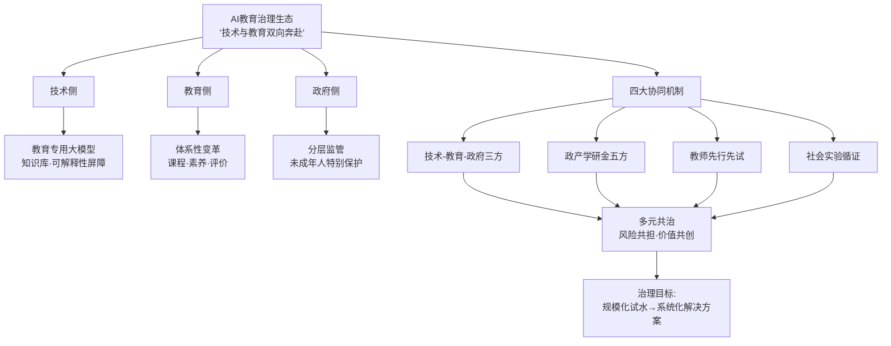

这一协同生态的核心洞见是：**单点治理工具均有局限——技术治理无法替代制度治理，制度治理无法替代教师素养，教师素养无法替代国家政策**。AI教育治理必须构建"政策—制度—工具—生态—证据"的多层闭环，才能从"问题暴露—被动应对"的旧逻辑转向"主动识别—系统调适—持续演进"的新逻辑。

---

综上，本章从十个层次系统呈现了AI教育从"规模化试水"走向"系统化解决方案"必须直面的多维挑战与治理命题。可以得出以下核心判断：**第一，技术幻觉、算法偏见、数据泄露、认知惰化、情感消解构成AI教育风险的"五维拼图"，每一维都不可孤立处理；第二，"结果提升—能力停滞"反常现象、"功能性愚蠢→系统性愚蠢"演化、师生情感共同体消解，揭示出教育本质层面的最深层隐忧——治理的根本目的不是限制AI，而是守护人之为人的认知能动性与情感共同体；第三，中国治理体系正在形成"刚性制度（行动计划+伦理审查+使用指南）+柔性指引（教师指引+学校规则）+工程支撑（私有化部署+教育大模型审核+国家语料库）+协同生态（技术-教育-政府三方+政产学研金五方+教师共建+社会实验循证）"的整体设计，与欧盟刚性立法、UNESCO人本范式、美国市场主导形成差异化路径；第四，治理的根本方向是从"AI检测"转向"AI素养教育"——这一转向把治理视野从"规则约束"提升到"能力建构"层面，呼应第1章"双向赋能"框架，并直接为后续教育反哺AI线索的展开（第4章人才战略支撑、第5章贯通式培养体系、第6章教师队伍建设）和第7章产学研用协同生态铺设了价值与制度的双重底座**。

带着这一治理视野，下一章将转向"教育反哺AI"线索，深入剖析教育在培养AI高端人才中应承担的战略使命与素养重构。

# 4 教育对AI高端人才培养的战略支撑作用

第1章构建的"AI赋能教育—教育反哺AI"双向框架在前三章中已沿"赋能教育"线索展开了系统性论证：从政策驱动与技术演进的时代语境（第1章），到教—学—评—测—管全链条的应用图景（第2章），再到风险识别与治理生态的制度设计（第3章）。但这一图景仍停留在"AI如何作用于教育"的单向叙事中。从本章开始，研究视野将转向更具深远意义的另一面——**教育如何反哺AI**。这不是简单的逻辑对称，而是直击一个被广泛感知却未被充分阐发的根本命题：**当AI正在以不可逆的速度重塑社会、产业与认知结构时，教育能否、如何为AI产业本身的可持续发展输送真正的"人之火种"？**

第3章末尾揭示的治理转向——从"AI检测"走向"AI素养教育"——已经在制度层面预示了这一答案的轮廓：**真正的治理不是限制AI，而是培养能够驾驭AI、超越AI、重新定义AI的人**。这意味着治理与培养是同一枚硬币的两面，而培养的根本，在于教育能够回应AI时代对人才能力结构的根本性重塑。本章作为"教育反哺AI"线索的开篇，将沿着"时代倒逼—使命转向—素养重构—国际共识—价值底座—中国方案—战略定位"七个层次展开，为第5章贯通式培养体系、第6章教师队伍建设奠定能力坐标与价值基准。

## 4.1 AI时代对人才能力结构的根本性重塑

理解教育反哺AI的逻辑起点，必须从AI正在如何改变"人才需要是什么样的人"这一根本问题入手。这一问题的答案，正在被一系列权威研究和实证趋势所共同勾勒。

**就业市场的结构性震荡已经成为不容回避的现实**。世界经济论坛于2025年1月发布的《2025年未来就业报告》基于全球1000多家企业的调研数据，呈现出一组震撼的数字：到2030年，全球技术演进、经济转型、人口变迁与绿色转型四大力量的叠加，**预计将创造1.7亿个新岗位、取代9200万个岗位，净增7800万个就业机会，相当于全球22%的工作岗位将被颠覆**[^101]。更具警示意义的是技能结构的剧烈重组——**如果将全球劳动力比作100人，将有59人需要在2030年前接受再培训；其中29人可在现有岗位上完成技能升级、19人将被重新部署到组织内其他岗位、但有11人很可能无法获得所需的再培训，就业前景堪忧**[^101]。**63%的企业雇主将技能差距列为2025—2030年企业转型的最大障碍，85%的雇主计划优先开展员工技能升级培训**[^101]。

这种结构性震荡在AI密集型领域尤为显著。赵勇院士援引斯坦福大学、哈佛大学的研究指出，**AI对入门级工作岗位的冲击已极为明显**，在美国医疗领域同样呈现不容忽视的冲击趋势，"我们如今讨论的AI功能发展历程也不过数年时间，但其技术质量的提升速度、具备的能力已经远超大多数人的智力和认知水平"，AI对未来就业市场的冲击是必然的，"只是具体程度尚难以精准预判"[^102]。前述章节已援引高盛预测——**到2030年60%的基础岗位将被AI全面或部分替代**——会计、数据录入、客服乃至部分律师和医生的工作正在被AI快速改变。新校长传媒援引《2025年未来就业报告》进一步指出，**未来近40%的工作技能将会发生改变，知识的"半衰期"在缩短，一次性教育已经无法满足需求**[^103]。

**面对这一冲击，对人才能力结构的需求已经悄然完成跃迁**。WEF报告明确指出，**到2030年增长最快的技能将兼具"技术性技能"与"人类专属技能"——前者包括AI和大数据相关能力，后者则涵盖认知技能、协作能力等**[^101]。这一判断与赵勇院士所论述的逻辑高度一致：**AI取代的是标准化、重复性、记忆性的知识与技能**，因此教育的核心任务必须从"培养会做题的人"彻底转向"培养AI无法替代的人"，他将这种"AI无法替代"的人才素养概括为四大支柱：**独立生存能力、完整的人格与责任、独特的创造力、幸福生活的能力**[^102]。

将WEF的就业图景与赵勇的素养图景并置，可以清晰地看到一种**双层重塑**正在发生：浅层是岗位结构的"消失—创造—迁移"，深层则是能力结构的"标准化—个性化、重复性—创造性、确定性—不确定性"的根本跃迁。下表汇总了AI时代人才能力结构跃迁的核心维度：

| 维度 | 工业时代旧坐标 | AI时代新坐标 | 关键支撑能力 |
|------|--------------|-------------|--------------|
| 知识基础 | 稳定知识体系、长半衰期 | 知识快速迭代、近40%技能改变 | 元认知、终身学习能力 |
| 任务结构 | 标准化、重复性 | 复杂、非结构化、跨领域 | 复杂问题解决、问题定义 |
| 工作角色 | 个体执行+垂直分工 | 人机协同+跨学科整合 | 协作力、整合力、表达力 |
| 价值衡量 | 知识掌握、技能熟练度 | 创造力、判断力、共情力 | 创新、批判性思维、人文素养 |
| 教育需求 | 一次性学历教育 | 持续再培训、人人需要 | 全球59%劳动力需在2030前再培训 |

这一跃迁的紧迫性还体现在国家竞争维度。第1章已述我国相关硕博授权点近2000个、在校生超60万人、年毕业近10万人；但与产业实际需求相比仍存在结构性缺口，尤其在原始创新与跨学科攻坚的拔尖人才层面。换言之，**人才数量的扩张已不足以应对AI时代的挑战，能力结构的根本性重塑才是教育反哺AI的核心命题**。

## 4.2 教育使命的三大转向：从知识灌输到思维塑造

人才能力结构的跃迁，必然倒逼教育使命的根本转向。赵勇院士在与上海交通大学教学发展中心的访谈中，将AI时代教育者必须重新回答的根本问题凝练为三个："**培养什么人、教什么、如何教与何为师**"——这三个问题"不是技术应用的技巧探讨，而是关乎教育未来走向的灵魂之问"[^102]。围绕这三问，AI时代教育使命可以提炼出三大根本转向。

**转向一：从"教知识"到"教思维"——告别标准化生产，走向个性化成全**。赵勇尖锐批判：当下教育仍沉迷于分数、标准答案与同质化培养，而**AI能轻松输出完美答案、撰写标准文案、解答海量习题。当知识可以秒搜、技能可被AI复刻，教育若还聚焦"知识灌输"，就是在培养未来的"失业者"**[^102]。他直指传统教育的两大痛点——"课程过度标准化、同质化，用统一内容剪裁不同天赋的学生"和"重知识记忆、轻能力素养，大量时间耗费在AI可瞬间掌握的事实性知识上"——并给出清晰的价值重构方向：**淘汰AI可替代的机械记忆内容，保留底层思维、学科思想、元认知与人文价值；聚焦"三创能力"——创新、创造、创业**[^102]。新校长传媒的概括与之呼应：智能时代课堂的基本任务"不再是知识点过关，而是注重学科核心概念和基本原理"，"帮助学生掌握基础科学方法，减少认知冗余，让学科内核构成后续学习的'认知锚点'"[^103]。

这一转向意味着教育必须从"标准化生产"转向"个性化成全"，让每个孩子发现天赋、发展特长，成为"独一无二、不可替代的个体"[^102]。它直接呼应了第1章所述工业时代"整齐划一的规模化加工"与智能时代"个性化、创新型人才需求"之间的尖锐矛盾，也为第5章高校"X+AI"双学位、微专业、跨学科融合等具体培养机制提供了使命坐标。

**转向二：从"解已知"到"定义未知"——会提问的孩子比会解题的更珍贵**。这一转向是AI时代教育最具颠覆性的使命重构。当以千问为代表的AI工具已将知识获取成本降至极低、"十万个为什么"变成了毫秒级的"亿万个解答"时，**如果教育仍固守"只求标准答案"的思维，AI可能沦为应付作业的"高级作弊外挂"，从而稀释孩子的思考密度**[^103]。真正的危机在于"孩子们正逐渐失去提问的能力"——他们在传统课堂中被训练精准命中"靶心"，却很少思考"为什么要有这个靶子"；提问往往被等同于"不懂"或偏离轨道[^103]。

这一危机的反面，正是AI时代教育的核心使命：**未来属于那些能提出更好问题的人，因为答案越来越容易，问题却越来越珍贵；所有知识创生的起点，都始于那个被精心雕琢的问号**[^103]。教育需要培养学生的"问题敏感性"，将"已知世界的答案"转化为"未知领域的地图"。中国新高考命题的演进印证了这一趋势——**新高考已经引入"结构不良试题"，即在题目所给的多个条件中选取一个，或是补充条件，亦或去掉冗余条件进行作答**[^103]，这本质上是从"解题"到"解决问题"的评价范式深度转型，回应"当AI可轻易完成标准化问题求解时，人类更需要培养'问题定义—方案设计—价值判断'的完整认知能力"[^103]。

**转向三：从"工匠"到"指挥家"——人机协同的新角色定位**。当AI能讲课、答疑、批改作业、制定学习计划，传统"会讲、讲得好、会做实验"的能力标准是否还适用？赵勇的第三个问题直击这一时代命题[^102]。这一转向的核心，是人才角色从"被动执行者"向"人机协同的指挥者"的根本转变——人不再是机器的替代品，而是机器无法替代的协调者、判断者与价值赋予者。

这种新角色对人才素养提出了具体要求。第3章关于职业教育"高阶使用仍待提升"的诊断进一步指出，AI素养的核心应是"面向真实职业任务的人机协同能力"，包括四项核心能力：**任务识别与判断力、工具协同与表达力、流程优化与再造力、伦理安全与质量治理力**。这一"四力框架"实质上勾勒了"指挥家"型人才的能力底盘——既要懂"何时分派给AI"（任务识别），又要会"如何协调AI产出"（工具协同），更要能"重新设计流程"（流程再造），还要守住"伦理与质量底线"（治理力）。

三大转向共同构成AI时代教育使命的"灵魂三问"：

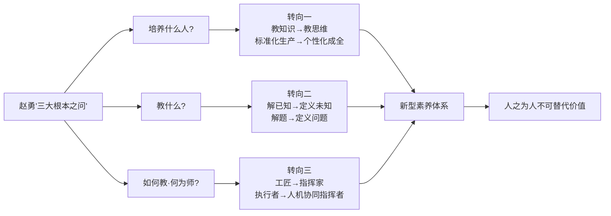

这三大转向不是孤立命题，而是相互嵌套、共同指向"教育回归育人本质、回归人之为人"的统一逻辑。它们既是AI时代教育使命的纲领，也是后续素养内涵剖析的逻辑前提。

## 4.3 "干细胞式"复合型创新人才的素养内涵

教育使命的三大转向，最终需要落实到具体的素养标准。在2025年4月教育部就《"人工智能+教育"行动计划》举行的新闻发布会上，复旦大学校长金力提出了一个极具传播力的隐喻：**"我们要培养'干细胞式'的人才——能在未知领域快速建立认知框架、跨越学科边界去整合资源、面对失败能持续迭代的人。这三样，是AI时代的'核心素养'"**[^103]。这一比喻精准捕捉了AI时代复合型创新人才的本质——具有高分化潜能、多向适应性与持续生成能力。

金力的判断背后是一种鲜明的危机意识："模型几个月一迭代，今天的热门技能明天可能就过时了。如果大学还在培养'成品式'人才，那就是刻舟求剑"[^103]。"成品"vs"干细胞"的对比，深刻揭示了工业时代培养逻辑的失效——前者强调"被定义、可使用、有明确规格"，后者强调"未定型、可生长、能不断分化"。

**"干细胞式"素养的三大支柱清晰可识**：其一，**在未知领域快速建立认知框架的能力**，呼应了4.2节"定义未知"的转向；其二，**跨越学科边界整合资源的能力**，呼应"教思维"中的元认知与系统思维；其三，**面对失败持续迭代的能力**，回应了AI时代知识半衰期缩短、技能频繁切换的本质要求[^103]。复旦大学据此抓住三个关键："一是通识教育，让AI不是'加进课'……"[^103]，并通过116门AI-BEST课程构建从基础到垂域的完整学习链条（第2章已详述）。

**清华大学的"三位一体"培养理念形成补充印证**。清华大学校长李路明在同一发布会上坦言，"有位老师说'我现在已经不会上课了'，因为学生可以花很短的时间，在人工智能大模型的协助下获得与课程相关的学习内容，乃至解答各种疑问"——他的回答是：**"清华大学特别强调，在这个时代要让学生有深厚的人文素养，培养学生强烈的家国情怀，同时重视用人工智能赋能人才培养"**[^103]。这一"人文素养+家国情怀+AI赋能"的三位一体，与"干细胞"的开放生长性形成价值锚定，确保技术能力的发展不偏离人之为人的根本方向。清华2025年新设的"无穹书院"打造面向AI时代的拔尖创新人才培养新模式，《人工智能教育应用指导原则》"鼓励教师大胆探索人工智能赋能教育教学"[^103]——这些机制设计正是"三位一体"理念的工程化落地。

**北大清华的"通识—通智—通用"育人范式**则代表了又一种重要探索。朱松纯教授在2026年1月教育部代表委员座谈会发言中介绍，他与团队**在本科生培养层面创立"通识、通智、通用"的育人范式，依托北京大学、清华大学开设"通用人工智能实验7班"，以先进的课程体系和前置的科研训练培养了一批拔尖创新本科人才**[^104]。"通识"对应人文价值与学科基础、"通智"对应智能科学与跨学科思维、"通用"对应面向通用人工智能的研究素养——这一范式实质上将"干细胞式"素养细化为可教、可学、可评的三层能力结构。

赵勇的"四大支柱"框架——独立生存能力、完整的人格与责任、独特的创造力、幸福生活的能力[^102]——则从更宽广的人格维度补充了上述素养内涵。他强调：教育必须从"标准化生产"转向"个性化成全"，**让每个孩子发现天赋、发展特长，成为独一无二、不可替代的个体**[^102]。"独特的创造力"被定义为"不是简单模仿，而是能提出新问题、创造新价值、引领式创新的能力"[^102]——这与"干细胞式"中的"未知建框"高度契合。

**鄂维南院士关于"大科研时代"人才需求的判断**则将素养图景推向更高维度。鄂维南院士在上海交通大学首届"AI交汇点"学术论坛上直言："**人工智能快速发展的当下，如果还是让学生淹没在壁垒森严的细分学科中，不改变课程老化、学习效率低下的问题，不改变科研与产业脱节的问题，那么很难培养出领军人才**"[^101]。他进一步阐释："AI的发展必然使我们进入'大科研时代'，必须要打破学科之间的界限、理论与实验之间的界限、科研与产业之间的界限"[^101]。这一"三破除"判断对人才素养的要求是革命性的——领军人才不仅要在自己的学科内深耕，更要具备跨学科、跨范式、跨产业的协同能力。鄂维南举例道："电池的研发横跨化学、材料、电子工程等领域，目前不可能有哪个专业能系统集成所有研发工作"[^101]，因此他在上海交大人工智能学院推进**"平台科研"模式，即通过整合理论、实验、文献和计算工具，打造类似"安卓系统"的底层科研平台，任何领域的科研问题，都能在这个平台上调用跨学科资源，直接对接产业需求**[^101]。这一构想本质上将"干细胞式"人才的成长生态从"课堂"延展到了"科研平台"。

将上述多元论述整合，可以勾勒出AI时代复合型创新人才素养的"金字塔"结构：**底层是"干细胞式"的开放生长性（金力）与"四大支柱"的人格底盘（赵勇）；中层是"通识—通智—通用"的能力分化（朱松纯）与"三位一体"的价值锚定（李路明）；顶层是"大科研时代"的跨学科领军素养（鄂维南）**。这一金字塔从"专才"到"通才"再到"创造性复合人才"的演进逻辑，构成了第5章贯通式人才培养体系设计的素养蓝图。

## 4.4 提出问题能力与批判性思维：人之为人的不可替代价值

在"干细胞式"素养的诸多维度中，**提出问题的能力**值得被单列出来作为AI时代教育的核心命题——它不仅是一项具体素养，更是人之为人不可替代价值的集中体现。

**"会提问的孩子比会解题的更珍贵"已经成为新教育共识**。研究指出，随着人工智能进入学生书包，**教育模式面临变革，专家指出教育应从训练孩子"找答案"转向培养其"提问题"的能力，因为定义问题的能力已成为人类在AI时代最不可替代的价值**[^103]。这一判断的逻辑底层并不复杂——当AI能够瞬间给出"无数答案"，人类的独特价值就转移到了"提出值得回答的问题"上。"在算力爆炸的时代，机器能计算无数答案，但唯有人类的心灵能提出改变世界的问题"[^103]。

**OECD智能时代"高质量教学框架"对这一命题给出了体系化回应**。新校长传媒援引该框架指出，OECD最近发布了智能时代的"高质量教学框架"，提出五大教学目标，"其中之一就是学科内容质量——帮助学生深刻理解所学科目，从掌握学科核心概念和技能到探究学科的本质问题"[^103]。"探究学科本质问题"的提法，将提问能力上升到学科教学的核心目标层面。

**新高考"结构不良试题"的命题改革**则在评价层面给出了制度回应。这种试题的本质，是要求学生在条件不完整、信息有冗余、答案不唯一的情境中重新定义问题、建构方案、做出判断——它直接训练的就是"问题敏感性"与"问题定义能力"。这种命题改革"本质是回应智能时代的核心挑战：当AI可轻易完成标准化问题求解时，人类更需要培养'问题定义—方案设计—价值判断'的完整认知能力"[^103]。

**提问能力背后是更深层的批判性思维与元认知素养**。这一逻辑可以分解为三层：表层是"提问技能"——会问开放性问题、追问能力、问题分解能力；中层是"批判性思维"——质疑既定结论、辨别信息真伪、识别隐含假设；深层是"元认知"——知道自己知道什么、不知道什么，以及如何获取自己不知道的内容。这一三层结构正是第3章所警示的"认知卸载—批判性思维退化—元认知抑制"链条的反向解药——MIT脑电研究、清华学习研究、沃顿学习实验所揭示的"结果提升—能力停滞"反常现象，本质上都是因为在使用AI过程中，学习者跳过了"提问—批判—反思"的关键环节，沦为AI输出的被动消费者。

**因此，提问能力的培养必须与AI使用方式的设计深度耦合**。理想的AI教育应致力于"让思维可见"，扮演"**苏格拉底式的导师**"——优秀的AI工具不应止步于给出结论，而应通过追问和引导，帮助孩子拆解困惑，引发新一轮思考；这标志着教育从"直接送孩子上山"转向"教孩子如何下山"[^103]。这一论述对AI教育产品的设计哲学提出了根本要求——AI不应是"答案机器"，而应是"思维伙伴"。

**教师角色也因此发生根本重塑**。当AI能更详尽地讲解知识、更耐心地批改作业时，**教师的核心价值不再是传授知识，而是回归"灵魂陪伴"的本位。教师应鼓励孩子挑战AI的回答、发现算法偏见、提出关乎情感与价值的"傻问题"，保护并激发每个孩子独特的提问视角和好奇心**[^103]。这一新角色定位，将在第6章关于教师队伍建设中进一步展开。

**提问能力的培养更具战略性的意义在于"认知公平"的提升**。"第四件文具"的普及让优质教育资源以低门槛进入千家万户，促进了教育公平；**但更深层的公平在于认知公平：教育必须形成新共识——会提问的孩子远比会解题的孩子更珍贵**[^103]。这一论述将提问能力上升到AI时代教育公平的核心指标——**接入公平只是基础门槛，认知公平才是终极目标**。第3章揭示的"农村中小学生使用AI辅助作业比例高于城市学生4.8个百分点、但'依赖AI不想自己思考'比例达22.8%"的"双重病灶"格局，恰恰说明单纯的接入扩大反而可能加剧认知不公平——只有通过提问能力、批判性思维的培养，才能真正实现"会用AI"到"会驾驭AI"的跃迁。

## 4.5 人机协同能力与AI素养框架：国际共识与中国实践

提问能力与批判性思维构成了"人之为人"的内核，但AI时代的人才还必须掌握"与AI共处"的具体能力——这正是国际权威组织正在密集构建的**AI素养框架**所要回应的命题。

**OECD与欧盟联合发布的AILit框架是当前最具权威性的中小学AI素养蓝图**。2025年5月22日，由经济合作与发展组织（OECD）与欧盟委员会联合发布的《赋能学习者迎接AI时代：一个面向中小学教育的AI素养框架》（简称AILit框架），不仅"为PISA 2029评估提供了重要参考"，更"为全球AI素养教育的实践与发展，提供了具备科学性与系统性的行动框架"[^105]。这意味着**AI素养将正式纳入PISA 2029国际学生评估**——这是全球教育评价体系对AI时代人才标准的标志性确认。

AILit框架对AI素养给出了远超"会用工具"的深刻定义：**AI素养是指在一个受AI影响的世界中茁壮成长所需的技术知识、通用技能和面向未来的态度。它使学习者能够与AI互动、用AI创造、管理AI和设计AI，同时能批判性地评估其益处、风险和伦理内涵**[^105]。框架将AI素养比作"AI时代的驾照"——不仅意味着会"踩油门"（使用AI），更意味着"懂交规（Knowledge）、会驾驶（Skills）、有心态（Attitudes）"三层能力的整合：懂AI如何工作及其能力边界、社会公平/隐私/偏见问题；掌握高效协作、提出好问题、批判性评估其输出并创造性应用的能力；保持好奇心、适应性，以及对AI使用的责任感和同理心[^105]。

框架将这些能力划分为四大互动领域，构成从认知到创造的完整路径：

| 互动领域 | 核心目标——成为AI时代的—— | 关键任务 |
|---------|-----------------------|---------|
| 与AI互动（Engaging with AI） | 批判性消费者 | 识别AI的存在，并批判性地评估其输出的准确性、相关性和潜在偏见 |
| 与AI共创（Creating with AI） | 高效协作者 | 在创造性或解决问题的过程中与AI协作，通过提示和反馈引导、优化AI的输出 |
| 管理AI（Managing AI） | 明智管理者 | 有意识地将结构化任务分配给AI，使人类能专注于需创造力、同理心和判断力的工作 |
| 设计AI（Designing AI） | 未来塑造者 | 通过探索性实践，理解数据和算法如何影响AI的行为，并思考如何设计一个服务于人类福祉的AI |

数据来源：[^105]

这一"四领域—四角色"框架的精妙之处在于：它清晰地划定了人机协同的能力进阶路径——从"评估AI"（批判）到"协作AI"（创造）再到"管理AI"（指挥）最终到"设计AI"（塑造）。每一层都对应着前述4.2节"指挥家"型人才的具体能力跃升。

**UNESCO的双框架则为教师与学生分别构建了能力进阶坐标**。2024年8月，联合国教科文组织发布《教师人工智能能力框架》与《学生人工智能能力框架》两份指南。**学生框架从"以人为本的思维方式""人工智能伦理""人工智能技术和应用"以及"人工智能系统设计"四个方面，在理解、应用和创造三个等级维度下，概述了包括设计伦理和应用技能等在内的学生应具备的12项能力**[^106]。**教师框架则从"以人为本的思维方式""人工智能伦理""人工智能基础和应用""人工智能教学法"和"人工智能专业学习"五个方面，在习得、深化和创造三个等级维度下，概述了包括社会责任和应用技能等在内的教师应具备的15项能力**[^106]。

UNESCO框架的独特价值在于其"以人为本"的明确定位——将"以人为本的思维方式"和"AI伦理"列为四/五大维度的前两位，确保技术能力的发展不偏离人文价值底线。框架同时披露了一个值得警示的现实：**到2022年，只有7个国家为教师制定了人工智能框架或相关项目，15个国家将人工智能学习目标纳入其国家课程**[^106]——这一全球性的"AI素养教育滞后"是国际框架密集出台的直接动因。

**中国《中小学人工智能通识教育指南（2025年版）》构建了本土化的分层递进体系**。第3章已述该指南"小学阶段注重兴趣培养与基础认知，初中阶段强化技术原理与基础应用，高中阶段注重系统思维与创新实践"，培养"知识、技能、思维与价值观"四位一体的人工智能素养。这一体系与AILit/UNESCO框架在能力分层逻辑上高度一致，但在两个维度上做出了差异化创新：**一是将"价值观"作为与"知识、技能、思维"并列的核心维度，强化了价值塑造的中国特色；二是与《中小学生成式人工智能使用指南》形成"能力培养+使用边界"的双轨设计**，更具操作性。

将国际共识与中国实践对照，可以勾勒出AI素养框架的全球图景与本土路径：

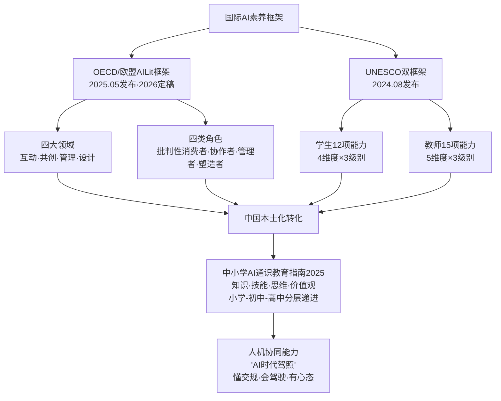

国际框架的核心启示是：**AI素养已成为全球教育的"新基础"，与读写算并列成为21世纪学生的"第四素养"**；而中国的本土实践已经在分学段使用边界、价值观维度强化等方面形成了差异化的创新空间。这一"全球共识+本土创新"的格局，将在第5章贯通式培养体系中得到进一步展开。

## 4.6 "德力"与价值塑造：智能时代"何以为人"的中国答卷

如果说AI素养框架解决的是"人如何与AI共处"的能力问题，那么更深层的命题是——**当人工智能逐步推动智力平等化时，人之为人的根本标志究竟是什么？** 这是一个超越能力本身、回归人性本质的哲学之问。朱松纯教授在2026年1月教育部代表委员座谈会上提出的"**德力**"命题，给出了具有中国哲学厚度的当代答卷。

**朱松纯的论述以一种极具洞察力的历史比较展开**："**随着工业革命实现了'体力'的平等化，人工智能的快速发展正逐步推动'智力'的平等化，以智力培养和筛选为导向的教育与评测体系正面临深刻转型**"[^104]。这一"体力—智力—德力"的演进逻辑深刻揭示了人类能力评价坐标的代际跃迁：**工业革命前，体力是核心生产力，体力的强弱构成人际差异的基础；工业革命后，体力被机器替代而走向平等化，智力上升为差异性核心；AI时代，当智力也被技术推向平等化，人之为人的根本标志将转移到"德力"——以价值判断、社会认知与意义追寻为核心的能力维度**[^104]。

朱松纯进一步阐释："**教育的重心必须转向培育以价值判断、社会认知与意义追寻为核心的'德力'，塑造并不断提升学生的格局、心智与认知能力，才能在智能时代突出人性的优势，回答好'何以为人'这个时代之问**"[^104]。这一论述背后的根本判断是："通用人工智能作为人工智能发展的初心与终极目标，其研究目标是造出全面达到甚至超越人类水平的通用智能体，实现通用人工智能的关键在于深入理解'何以为人'。过去，关于这一问题的研究主要从人类学和心理学角度探索人与其它动物的差异；如今，需进一步厘清人类与人工智能（通用智能体）的区别"[^104]——AI时代的"何以为人"已经不是人与动物的比较，而是人与机器的比较。

**朱松纯将这一命题深植于中华文明的精神土壤**。他特别引用儒家经典《大学》的开篇主旨："**大学之道，在明明德，在亲民，在止于至善**"，指出"**智能时代的人才培养要回归'立德树人'这一根本任务，充分发挥中国传统文化的优势与智慧，引导学生构建完备的价值体系，深入社会实际，与不同人群建立情感纽带，形成共情共鸣，将个体关于人生意义的追求融入国家富强、民族复兴与人类文明进步的愿景中，最终形成完全人格，成长为堪当历史重任、引领未来发展的青年人才**"[^104]。

值得注意的是，朱松纯还指出了一个亟待修正的认知偏差："**近现代以来我国教育体系十分侧重'智力'培育与知识传授，中国传统文化长期以来注重的'德'未被视为一种生产力，这一认知偏差亟待修正**"[^104]。这一判断的深刻意义在于：它将"德"从传统的伦理范畴提升为AI时代的"生产力"——德力不再仅仅是道德修养，而是人才在AI时代不可替代的核心竞争力。

**将"德力"命题与前述素养框架对照，可以看到一种独特的中国贡献**。AILit框架强调"批判性消费者—协作者—管理者—塑造者"的能力链条，UNESCO框架强调"以人为本"的价值底座，但都更多聚焦于"人与AI关系"的横向能力维度；而"德力"命题则深入到"人之意义与价值"的纵向哲学维度，回答了"为什么需要这些能力""这些能力服务于什么终极目标"的根本问题。这一价值贡献在四个层面具有差异化意义：

第一，**将"立德树人"上升为AI时代教育的根本使命**——这与第1章所述《"人工智能+教育"行动计划》"育人为本、智能向善"的政策导向高度契合。第二，**将中华传统文化中的"明明德、亲民、止于至善"转化为当代教育智慧**——为人才价值塑造提供深厚文化根基。第三，**将"完全人格、家国情怀、共情能力、文明使命感"作为AI时代青年的素养标尺**——这与赵勇"完整的人格与责任"、李路明"深厚人文素养+强烈家国情怀"形成强烈共振。第四，**将技术能力的发展锚定在"将个体追求融入国家富强、民族复兴与人类文明进步"的宏大愿景**——这是中国式现代化在教育领域的具体体现。

更重要的是，"德力"命题直接呼应了第3章治理章节的核心价值底座。第3章曾明确指出，欧盟伦理指南强调"**人是主体，AI是工具：禁止用AI完全替代教师决策、情感关怀与价值引导**"，治理的根本目的"不是限制AI，而是守护人之为人的认知能动性与情感共同体"。"德力"命题正是这一价值守护的中国哲学表达——它告诉我们：**在AI时代，技术越是强大，价值越是珍贵；智力越是平等，德力越是凸显**。这一价值底座，将贯穿后续教师队伍建设、产学研协同、战略建议等所有章节的论述。

## 4.7 破解"钱学森之问"：拔尖创新人才培养的中国方案

价值底座之上，需要回到一个困扰中国教育多年的根本之问——**"为什么我们的学校总是培养不出杰出的人才？"** 钱学森2005年提出的这一发问，在AI时代获得了新的紧迫性：当国际AI竞争已上升到拔尖创新人才的较量层面，破解"钱学森之问"不再是教育领域的内部命题，而是关乎国家AI竞争力的战略议题。值得欣慰的是，在AI时代背景下，中国的教育改革者们已经探索出三套各具特色的解题方案。

**方案一：清华"钱班"与深圳零一学院的"内生动力—独特激情"路径**。中国科学院院士郑泉水从2009年牵头创建清华大学"钱学森力学班"（钱班）到2021年创办深圳零一学院，逐渐确立了一条独特的拔尖创新人才培养逻辑。郑泉水的初心源于一个令人震惊的现实：**2002年清华大学一个本科生告诉他"班上可能只有他一个人仍然对科研保持兴趣"；2007年清华大学航天航空学院应届90多名本科毕业生中，竟有14人未能获得学位——学生的迷茫现象愈发严重**[^107][^108]。

钱班的破解方案，是把传统培养逻辑彻底反转。**"钱班"每届30个学生，不应该出现第一名到第三十名的排序，这样会打击多数学生的自信心。那么，有没有根本性的方法让每一个学生都成为真的'第一'呢？** 郑泉水从诺贝尔物理学奖得主卡尔·威曼"在实验室里干3年比在书本上学16、17年更有成效"的研究中获得启发，号召"钱班"学生进到教授们的实验室做研究[^107][^108]。在与杨锦、薛楠两位学生长期共同实验的过程中，郑泉水获得了关键洞察："**针对已知知识的学习思维和针对未知世界的研究思维是完全不同的，而从学习思维向研究思维的转变需要时间，也需要耐心**"[^107][^108]。

到2011年，钱班的教育改革核心被明确为"**激发学生的内生动力，帮助他们每个人找到其独特的激情方向**"，使命凝练为"**发掘并培养有志于通过科技改变世界、造福人类的创新人才**"[^107][^108]。这一路径的革命性在于：它彻底打破了传统拔尖人才培养"分数排序+知识灌输"的旧逻辑，转向"内生动力+个性化激情+研究思维"的新逻辑——这与4.2节"个性化成全"的转向、4.4节"提出问题"的核心素养形成内在一致。

**方案二：鄂维南院士的"平台科研—跨界整合"路径**。中国科学院院士、上海交通大学人工智能学院讲席教授鄂维南给出了一个直击痛点的判断：**"传统的教学体系如果不变革是很难培养出大师的，那些已有的大师很可能都是'漏网之鱼'，是他们自己想方设法或者无意间绕开了那些会影响他们成长为大师的障碍"**[^101]。这一论述实质上是在说：**传统教育体系不是"培养大师的体系"，而是"培养螺丝钉的体系"**——少数能成为大师的人，是因为绕开了体系的束缚。

鄂维南诊断了大学的"双重困局"——一是"高校科研受困于评价体系，对实际问题的关注不够，教师忙于'刷论文''接项目'……当科研工作者长期不关注实际问题，那么研究者对社会需求的敏感度必然下降，研究者的社会责任感也会下降"；二是"学科专业越分越细，也让高校难担重任"[^101]。他还以DeepSeek春节前后的产业热与高校"风平浪静"的鲜明对比，警示高校在新一轮AI浪潮中的边缘化风险[^101]。

破解之道，是构建"平台科研"模式——通过整合理论、实验、文献和计算工具，打造类似"安卓系统"的底层科研平台，**任何领域的科研问题，都能在这个平台上调用跨学科资源，直接对接产业需求**[^101]。鄂维南直言："如果按传统课程培养AI人才，可能需要300个学分，更不用说领军人才……"[^101]——这一"300学分焦虑"形象揭示了传统培养体系对领军人才的束缚。"平台科研"的革命性在于：它不再让学生在300门课程中"积分式"地学习，而是让学生在跨学科平台上"项目式"地成长——这与4.3节鄂维南强调的"打破学科界限、理论与实验界限、科研与产业界限"三大破除形成体系化对应。

**方案三：朱松纯团队的"四个层次—贯通体系"路径**。朱松纯在教育部代表委员座谈会上系统介绍了他与团队在人工智能人才培养方面的四个层次探索，构建了贯通高等教育、职业教育与基础教育的全学段、全社会AI人才培养体系：

| 层次 | 培养对象 | 核心模式 | 典型平台 |
|------|---------|---------|---------|
| 第一层 | 本科生 | "通识、通智、通用"育人范式，先进课程体系+前置科研训练 | 北京大学、清华大学"通用人工智能实验7班" |
| 第二层 | 博士 | 跨校跨专业协同育人 | "通用人工智能协同攻关合作体人才培养计划" |
| 第三层 | 中西部人才 | "政产学研用"五位一体协同育人联合体，助力区域科技创新与产业发展 | 北京、武汉、重庆等地育人实践 |
| 第四层 | 全社会 | AI基础与职业教育体系 | 全民人工智能素养与技能提升 |

数据来源：[^104]

朱松纯指出，这"四个层次的改革探索，构建了贯穿高等教育、职业教育与基础教育的全学段、全社会AI人才培养体系，初步形成一套可供借鉴与推广的实践方案"[^104]。这一体系的价值在于其**贯通性与系统性**——它不再聚焦于某一类人才的培养，而是构建了从拔尖到普惠的全谱系培养格局，与第5章"贯通式人才培养体系"的设计逻辑形成直接对应。

**三套方案的内在一致性与互补性**清晰可见：

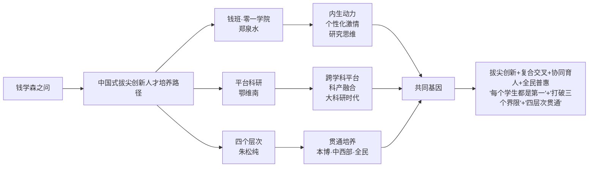

三套方案虽路径各异，却在底层基因上高度共鸣：**都拒绝"标准化筛选+排序竞争"的旧逻辑，都强调"个性化生长+跨界融合+真实问题驱动"的新逻辑，都将拔尖人才培养与产业需求、社会进步紧密耦合**。它们共同回答了"钱学森之问"的当代版本——**在AI时代，杰出人才不是"筛选"出来的，而是"生长"出来的；不是"在已知中追赶"出来的，而是"在未知中开拓"出来的**。这正是郑泉水"在他的心目中，'钱学森之问'终于有了中国人自己的解题方案"[^107]这一判断的深层底气。

## 4.8 教育在国家AI竞争力构建中的先导性战略地位

将前述素养重构、价值塑造、培养路径整合上升到国家战略层面，可以更清晰地把握教育对AI高端人才支撑的根本意义——它不是教育系统的局部命题，而是国家AI竞争力构建的**基础性、先导性、战略性**议题。

**基础性：教育是AI产业的根基性供给端**。第1章已论及"教育反哺AI"的三层逻辑——基础研究的理论支撑、复合型交叉人才的培养、真实需求与场景的反向校准。其中基础研究的理论支撑尤为关键——AI发展已从粗放扩张转入对基础理论、底层架构突破的渴求阶段，没有教育体系持续输出的基础研究力量，"算法跑得再快也终将触顶"。鄂维南院士的诊断与之印证："基础研究与应用落地之所以脱节，很重要的原因就是'我们不重视工程'……深度神经网络本质是数学工具，本应由数学界主导突破，但至今为止，数学对AI的贡献不大，正是数学科学研究对工程不重视所导致的"[^101]——这一论述直接将"高校基础研究的工程化能力"与"AI产业的根基性突破"画上等号，揭示出教育在AI竞争力构建中的不可替代地位。

**先导性：教育周期长于产业周期，必须提前5—10年完成结构性重组**。AI产业的迭代周期以"月"为单位，而教育从课程设计、师资培养、招生培养到人才输出的完整周期至少需要4—8年。这种**周期性错配**意味着：**今天的教育改革，决定的是5—10年后产业的人才供给**。这正是"十五五"规划纲要强调"超常规布局人工智能、集成电路等新兴领域急需学科专业"的根本原因——"超常规"三个字本身就是对教育先导性的政策确认。从更现实的层面看，《"人工智能+教育"行动计划》同时部署"人工智能人才培养"与"AI赋能教育应用"两条线索，并明确要求"指导高校开设人工智能交叉融合课程，丰富跨学科、跨专业课程群，培养复合型交叉人才"，本身就是对教育先导性的工程化落实。

**战略性：AI高端人才已成为大国竞争核心要素**。第1章已述教育部已增设智能科学与技术一级学科，相关硕博授权点近2000个，在校生规模超过60万人，每年毕业近10万人——这一规模数据从总量看已显著缓解了高层次人才供给不足问题。但与产业实际需求相比，**结构性缺口依然显著**：拔尖创新人才稀缺、跨学科复合型人才不足、AI素养教师严重短缺（UNESCO数据显示2022年全球仅7个国家为教师制定AI能力框架[^106]）、与中西部地区AI人才储备薄弱。这些结构性缺口的破解，必须依托教育体系的系统性重塑——这正是钱班/零一学院、平台科研、四层次贯通等中国方案承担的战略使命。

**进一步看，教育的战略地位还体现在"双向校准"机制中**。一方面，教育向AI产业输送基础研究力量、复合型人才与价值底座；另一方面，AI产业向教育反向输送真实需求、产业场景与技术工具。这种双向校准在朱松纯"政产学研用"五位一体、鄂维南"平台科研"对接产业需求、清华"无穹书院"等机制中已经形成实践化探索，并将在第7章"产学研用协同与AI教育产业生态"中得到系统展开。

将基础性、先导性、战略性三层定位整合，可以勾勒出教育对国家AI竞争力的整体支撑图景：

| 战略维度 | 核心命题 | 对教育的具体要求 | 关键证据 |
|---------|---------|-----------------|---------|
| 基础性 | 没有教育输出的基础研究，AI产业触顶 | 强化基础理论、原始创新、底层算法研究 | 鄂维南"数学对AI贡献不大"诊断[^101] |
| 先导性 | 教育周期长于产业周期，需提前5—10年布局 | "超常规布局"急需学科专业；同步部署人才培养与赋能应用 | 十五五规划；《行动计划》四大重点任务 |
| 战略性 | AI高端人才是大国竞争核心要素 | 破解拔尖创新、复合交叉、AI素养教师、中西部储备四大结构性缺口 | 60万在校生、10万年毕业；钱班/零一/平台科研/四层次中国方案 |

这一战略定位的根本启示是：**AI竞争的本质不是算法的竞争、算力的竞争、数据的竞争，而是培育算法、运营算力、生成数据的"人"的竞争；而"人"的竞争，最终必然回到教育的竞争**。这正是本研究将"教育反哺AI"作为与"AI赋能教育"并立的核心命题、将"双向赋能"作为统领框架的根本动因。

---

综上，本章作为"教育反哺AI"线索的开篇，从七个层次系统论证了教育对AI高端人才培养的战略支撑作用。可以得出以下核心判断：**第一，AI时代人才能力结构正在经历从"标准化—复杂问题解决"的根本性跃迁，知识半衰期缩短、近40%技能改变、22%岗位被颠覆已是不可回避的现实坐标；第二，教育使命必须完成"教知识→教思维、解已知→定义未知、工匠→指挥家"三大转向，这是赵勇"灵魂三问"在中国语境下的工程化回应；第三，"干细胞式"复合型创新人才（金力）、"通识—通智—通用"范式（朱松纯）、"三位一体"育人理念（李路明）、"四大支柱"素养（赵勇）、"大科研时代"领军人才（鄂维南）共同构成AI时代人才素养的金字塔图景；第四，提问能力与批判性思维构成"人之为人"的不可替代价值，AILit/UNESCO国际素养框架与中国《通识教育指南》形成"全球共识+本土创新"的能力坐标；第五，朱松纯的"德力"命题深刻回应了"何以为人"的时代之问，将技术能力锚定于价值底座，构成中国AI教育的独特哲学贡献；第六，钱班/零一学院、平台科研、四层次贯通三套中国方案共同破解"钱学森之问"，形成"拔尖创新+复合交叉+协同育人+全民普惠"的系统化路径；第七，教育在国家AI竞争力构建中的基础性、先导性、战略性地位是教育反哺AI的总纲领——AI竞争最终是人的竞争、人的竞争最终是教育的竞争**。

带着这一战略坐标与价值基准，下一章将进一步聚焦"教育反哺AI"的具体落地——基于贯通基础教育与高等教育的视角，系统剖析中国高校与中小学AI人才培养体系的多元路径、典型机制与实施挑战，回应用户对"学校都有怎样的对应的培养AI人才的体系"的核心关切。

# 5 贯通式AI人才培养体系：从基础教育到高等教育

第4章已确立"教育反哺AI"的战略坐标与素养金字塔——从"干细胞式"复合型创新人才到"通识—通智—通用"育人范式，从"德力"价值底座到钱班、零一学院、平台科研、四层次贯通的中国方案。但价值蓝图与培养理念终究需要通过具体的组织架构、课程体系、教学机制、衔接路径才能落地为真实的"人才输出"。本章承接这一战略坐标，聚焦AI人才培养体系的工程化落地命题，沿"高校多元路径—课程与跨学科创新—学段差异化定位—产教科教融合—基础教育下沉—风险平衡—贯通衔接"的递进逻辑展开，全景式呈现中国从中小学到高等教育、再到职业教育的全链条AI人才培养图景。

需要在本章开篇明确的是：贯通式培养体系不是某一所大学或某一段学制内部的"内循环",而是一个跨越基础教育、高等教育、职业教育、终身教育的**全谱系生态**。第4章末尾已论证教育在国家AI竞争力中的"基础性、先导性、战略性"地位,本章正是要将这一战略地位"翻译"为可观察、可比较、可推广的工程化方案。

## 5.1 高校AI人才培养的组织架构创新：学院、研究院与交叉平台

高校是AI高端人才培养的主战场。面对AI技术与人才需求的快速迭代,我国研究型大学正在以前所未有的力度重构组织架构,形成实体学院、新型研究机构、拔尖创新平台、跨校协同体四类并行的多元探索格局。

**第一类:实体学院模式——以"特区机制"突破学科壁垒**。清华大学人工智能学院致力于人工智能前沿创新研究及顶尖人才培养,目标是"实现人工智能核心基础、底层架构和未来计算模式的重大创新突破,建成世界一流的汇聚及培养顶级人工智能人才的大基地",其研究生教育**涵盖计算机科学与技术、控制科学与工程、电子科学与技术、信息与通信工程四个关键学科方向,形成多学科深度交叉融合的培养体系**[^109]。上海交通大学人工智能学院则以更鲜明的"特区"姿态出现——这是"举全校之力组建的特区学院",秉承"用人工智能变革世界,用人才变革人工智能"的愿景,以"引育顶尖人才、产出顶尖成果、孵化顶尖企业"为目标,致力于打造中国人工智能领域的"黄埔军校"[^110]。其师资规模惊人:**汇聚两院院士2名、外籍院士1名、IEEE Fellow 14名,国家杰出青年基金获得者、长江学者奖励计划等高层次人才66人次,"四青"人才110人次;全校有700余位从事人工智能及相关领域研究的博士导师**[^110]。学院依托国家唯一的教育部人工智能重点实验室,获批国家人工智能产教融合创新平台,并与上海、重庆、宁波、苏州等地方政府合作共建5家人工智能研究院[^110]。北京大学则于2021年12月成立智能学院,使北大通班成为该校智能学科本科人才培养旗舰项目[^63]。

实体学院模式的共同基因在于**"高层次定位+全新体制机制"**——上海交大人工智能学院"携手上海市、上海人工智能实验室、龙头企业构建'学院-产教融合平台-工业创新研究院'三位一体协同体系,贯通'0到1'、'1到100'的创新链",由中国科学院院士鄂维南担任人才工作专门委员会主任,中国科学院院士梅宏、清华大学惠妍讲席教授周伯文等加盟[^110]。这种"特区机制"的核心,是为AI这一快速演化领域配置传统院系无法提供的人才引育、考核、合作等"绿色通道"。

**第二类:新型研究型机构——以"无围墙"重塑育人逻辑**。北京中关村学院是这一模式最具颠覆性的代表。这所"位于西山脚下海淀大悦信息科技园"、2024年9月成立的年轻学院,**没有传统的院系围墙、没有固定的学科边界,却汇聚了全国31所共建高校的顶尖生源**;成立不到两年,**已有超100个成果转化和创新创业项目正在孵化,总融资额超3亿元,投后估值近20亿元**[^111]。学院院长刘铁岩对其育人逻辑给出鲜明阐释:"我们不像传统的学校,用一两年时间让同学们去上课,然后再进行科研训练。现在可能每三个月人工智能领域的知识体系都会迭代,我们从第一天起就要求学生走进一个科研项目,遇到不会的知识,再反过来去学习。**传统'先课堂后科研'模式已追不上人工智能发展的速度**"[^111]。

学院机制创新颇具启示性。在招生环节,设置传统AI、AI交叉、"天偏怪才"三条赛道,**每年从31所共建高校中遴选出330名优秀的博士生**,其特别招生环节是"AI黑客马拉松"——12小时内学生团队要做出一个AI创新创业项目[^111]。在课程设计上,秉持"极经典、极前沿、极实战"理念,**要求每一名教师提供一门8学时的短课,用4周时间浓缩讲解最前沿的人工智能知识,在第二次讲这门课时,要有至少50%内容被更新,让课程体系始终保持"奔跑"姿态**[^111]。复旦大学的上海科学智能研究院(2023年9月挂牌)及其打造的星河启智科学智能开放平台,则提出"以科学家为中心""加速科学新发现",**已汇聚400余个科学模型和工具,沉淀海量数据与文献资源**;2026年平台全面升级并发布超级科研合伙人"大圣"[^25]。这种"研究院承载平台、平台反哺人才"的逻辑,与第4章鄂维南"平台科研"理念一脉相承。

清华大学研究生院的"博士生导师组轮转制度(Rotation)"是另一项关键机制创新——**学院博士生入学第一学年原则上由导师组共同指导,并以3至6个月为周期在2位(含)以上不同导师课题组进行轮转培养**,旨在鼓励学生自主探索研究志趣[^109]。这一借鉴国际先进经验的安排,实质上是把"先选方向再做研究"翻转为"在做研究中选方向",恰恰回应了刘铁岩对传统模式的批判。

**第三类:拔尖创新人才培养平台——以"通班"模式打造领军后备军**。北京大学-清华大学联合创立的**通用人工智能实验班(简称"通班")**是这一模式的标志性探索。该班于2021年1月由战略科学家朱松纯领衔,分别设立于北京大学元培学院与清华大学自动化系,**以通用人工智能为核心,课程体系覆盖视觉、语言、认知、机器人、机器学习、多智能体六大领域,实现人工智能学科间大交叉、大融合,旨在培养"通识、通智、通用"型复合领军人才,依托北京通用人工智能研究院构建本硕博贯通的培养体系**[^112]。通班的特色机制包括:以人工智能为核心的知识体系、以交叉学科为补充的方向选择、以前沿研究为导向的广阔视野、以思想自由为风格的智能学派[^63]。北大智班(智能科学与技术专业实验班)则承载我国第一个智能科学与技术专业的历史积淀,首批28名学生汇集各地青年才俊[^113]。

清华大学交叉信息研究院的人工智能班(姚班)则代表另一种拔尖路径,其本科培养方案设定**150学分总学分,实习实践17周;校级通识教育46学分、院系设置课程104学分**,培养目标明确为"全面掌握人工智能基础理论与前沿应用知识""成为能够从事人工智能领域研究的领跑国际拔尖创新人工智能领域人才"[^17]。中科大人工智能科技英才班则结合该校基础教学优势、"类脑智能技术及应用"和"语音及语言信息处理"两个国家工程实验室、科大讯飞等产业技术优势,**面向全校二年级学生招生,每届30名,标准学制4年,总学分修满160学分**[^114]。

**第四类:跨校协同体——以"开放联盟"汇聚优质资源**。2024年底成立的**人工智能开放联盟**是这一模式的国家级平台。联盟由17所高水平研究型大学以及8所科技领军企业和科研机构组成,致力于成为"人工智能时代人工智能基础突破和技术创新的策源地、人工智能国际合作的重要窗口和推进'人工智能+'行动的战略支点"[^115]。其分工机制清晰:**北京大学承担科学智能语料库的建设项目,高教社牵头承担高等教育语料库的建设项目;上海交通大学牵头承担启悟学习社区建设;北京邮电大学牵头谋划国家教育智算服务平台建设**[^115]。

将上述四类组织架构对照,可以提炼出明显的差异化定位与共同基因:

| 模式类型 | 代表机构 | 体制特征 | 培养目标 | 共同基因 |
|---------|---------|---------|---------|---------|
| 实体学院 | 清华AI学院、上交AI学院、北大智能学院 | 全新特区机制、跨学科建制 | 顶尖创新人才与领军企业家 | 打破学科壁垒 |
| 新型研究机构 | 北京中关村学院、复旦上科智院 | 无围墙、跨高校共建、研项一体 | AI企业领军型人才 | 政产学研用协同 |
| 拔尖创新平台 | 北大-清华通班、清华姚班、中科大英才班 | 小班化、本博贯通、领衔学者制 | 通用AI领军后备军 | 对接国家战略 |
| 跨校协同体 | 人工智能开放联盟 | 17所大学+8家企业、任务分工 | 国家级基础设施与人才生态 | 资源开放共享 |

四类组织架构虽路径各异,却共享三大基因:**打破学科壁垒、构建"政产学研用"协同体系、对接国家战略需求**。这一基因正是第4章"大科研时代"判断在组织层面的工程化回应——领军人才不可能在"传统院系内部"自然生长,必须通过跨学科、跨边界、跨主体的新型组织架构来"催熟"。

## 5.2 AI通识课程与公共基础课:从"选修"走向"必修"的体系建设

组织架构是骨架,课程体系是肌理。教育部等五部门《"人工智能+教育"行动计划》明确提出"**推动人工智能成为高校公共基础课**,按学科专业分类编写课程教材,推动全体学生掌握人工智能知识"[^44]。这一政策落地催生了高校AI通识课程的密集建设,形成了多种富有启示意义的本土范式。

**复旦大学AI-BEST四层课程体系是当前最具系统性的探索**。学校于2024年启动人工智能课程体系建设和教育模式改革会战("AI大课"1.0版),2025年启动AI驱动的教与学融通改革("AI大课"2.0版),本研一体化打造进阶式AI-BEST课程体系——**该体系将课程划分为AI通识基础课程(AI-Basic)、AI专业核心课程(AI-Essential)、AI学科进阶课程(AI-Subject)、AI垂域应用课程(AI-Thematic)四大层级**[^25][^52]。截至2025年底,**全校已完成108门AI-BEST课程的开课实践,累计1.3万余人次本研学生修读**;实现"AI课程覆盖全体本研学生、AI+教育覆盖全部一级学科、AI素养能力要求覆盖全部专业"的三个100%目标[^25][^52]。

复旦校长金力将这一改革提炼为"工具层、范式层、使命层"三层推进:**工具层让AI真正嵌入每一个学科,让每个学生都能用AI解决本领域的真问题;范式层依托新型科研基础设施,让有潜力的学生借助AI驱动的新范式探索科学前沿;使命层对接国家战略部署,让拔尖学生在国家平台上承担真正的科学使命**[^52]。这一从工具到使命的递进逻辑,与第4章"教知识→教思维"的转向高度契合。

**上海财经大学"1+10+100+N"AI+课程矩阵彰显行业特色**。学校2025年5月发布的研究生"AI+课程体系"以"通识筑基、专核强技、交叉赋能、产业驱动"为设计理念,**预计每年培养3000余名具有"财经底蕴+数字素养+AI技能"的复合型人才**[^52]。具体架构为:"1"门《人工智能前沿与产业趋势》必修课实现全校研究生AI基础素养全覆盖;"10"门AI核心课聚焦人工智能基础理论、算法设计、数据处理及财经应用等关键能力;"100"门AI+专业融合课覆盖经济、管理、文法等学科;"N"个实践项目通过产学研深度联动打造企业实训营、产业命题攻关[^52]。研究生院院长魏航坦言:"AI已是不可避免的浪潮,作为一种方法论,对于目前科学研究的范式和人才培养的范式都产生了巨大的影响……'1'是让所有学生理解什么是AI;在这个过程中……(让学生)懂得AI在产业中的具体应用"[^52]。

**西北工业大学"7大行动"AI赋能"总师型"人才培养**则代表行业特色高校的国防军工路径。作为首批设立"人工智能"本科专业的高校,西工大实施7大行动:**"AI+"三航专业智慧提升行动、"AI+"三航优质课程铸锻行动、"AI+"国防特色教材融凝行动、"AI+"科教产教融合项目、"AI+"实践基地建设、"AI+"师资能力提升、"AI+"评价机制改革**(列举主要可识别行动)[^69]。其特色在于:**强化AI赋能传统工科改造升级,设立智慧三航班,瞄准未来航空、航天、航海等基础性、关键性领域,围绕"系统与设计、信息与控制、材料与制造、动力与能源"四大方向,让学生在"飞行器设计与工程、计算机科学与技术"主专业基础上,同步修读"智能飞行器技术、智能水下航行器、空天智能制造、智能传感芯片、智能零碳动力、智能通信、智慧能源"等智能前沿交叉微专业其一**[^69]。学校已开设《人工智能系统概论》《人工智能导论》《航空航天人工智能基础》《人工智能与航空发动机工程》等200余门AI+通识通修、学科专业和素质拓展课程[^69]。

**清华大学的姚班本科培养方案则展示了拔尖班级的细致设计**。该方案以"全面掌握人工智能基础理论与前沿应用知识,科研实践能力强,并能终身学习"为首要目标,要求毕业生具备"应用数学,科学和工程知识的能力""发现,提出和解决工程问题的能力""理解所学专业的职业责任和职业道德""有效沟通的能力"等7项培养成效[^17]。课程结构上,**校级通识教育46学分(含思想政治理论课17学分、体育4学分、外语6-8学分、写作与沟通课2学分、通识选修课11学分、军事课程4学分),专业教育104学分**[^17]。这种"厚通识+强专业"的结构,正是培养"具备从本专业角度理解当代社会和科技热点问题的知识"的工程化回应[^17]。

**浙江大学的"AI+特色模块3选1"模式在本科招生层面对接产业需求**。2025年浙大新增智能制造与机器人创新班,**以机械工程学科为核心,实施"机械+特色模块3选1"的模式,在机械工程核心基础课程的基础上,设置"机器人控制""人工智能""生物机器人"三个模块;实施"主学位+辅修"双证书制度,符合要求学生授予机械工程学士学位证书+机器人工程或人工智能等微辅修专业证书**[^116]。新增智能光电芯片及系统创新班则"实施'光电+特色模块'的培养模式,在光电信息科学与工程核心基础课程的基础上,设置'微纳光电集成'和'智能光电感知'创新课程模块"[^116]。新增工科试验班(EE类)由电气工程学院和信息与电子工程学院共同组建,聚焦"全球战略新兴产业和未来产业的核心支撑技术",构建"贯通'基础研究-技术应用-产业实践-全球拓展'的全链条人才培养新范式"[^116]。

将上述高校课程体系对照,可清晰识别出AI公共基础课建设的共性设计理念与差异化路径:

| 高校 | 课程架构 | 设计理念 | 覆盖目标/规模 |
|------|---------|---------|--------------|
| 复旦大学 | AI-BEST四层(基础-核心-进阶-垂域) | 工具层·范式层·使命层 | 三个100%覆盖,108门课程,1.3万人次 |
| 上海财经大学 | "1+10+100+N"矩阵 | 通识筑基·专核强技·交叉赋能·产业驱动 | 每年3000余名"财经+AI"复合人才 |
| 西北工业大学 | 7大行动+AI+三航 | 系统观·实践观·未来观 | 200余门AI+课程,智慧三航班建制化 |
| 清华大学姚班 | 校通识46学分+专业教育104学分 | 全面掌握+终身学习+创新精神 | 拔尖班·30人/届 |
| 浙江大学 | AI+特色模块3选1 | 复合型+主学位+辅修 | 多个新增创新班对接产业 |

值得关注的是,这一系列课程改革面临三大共性挑战:**第一,师资能力跟不上课程更新速度**——上财副校长姚玲珍坦言"如何提升教师队伍的AI素养,打造一支既懂专业又能熟练运用AI技术教学的师资队伍"是教学改革面临的核心挑战之一[^52];**第二,教材体系尚需迭代**——传统教材内容滞后于AI技术演进,需要通过短课程、知识图谱、AI智能助教等新形态弥补;**第三,评价机制有待重构**——"如何建立科学合理的AI+课程评价体系等"问题"需要学界和产业界人士共同深入研究、寻找解决方案"[^52]。这三大挑战的解决,既需要第6章教师队伍AI素养建设,也需要第7章产教融合的系统支撑。

## 5.3 跨学科融合:"X+AI"双学位、微专业与交叉课程群

公共基础课解决"全员AI素养"问题,跨学科融合则解决"AI×专业"的深度复合问题。这正是第4章"干细胞式"复合型人才素养在课程层面的直接落地。

**复旦大学"X+AI"双学位项目是当前最大规模的本科跨学科机制**。学校以AI-BEST课程为基座,创设"X+AI"人才培养项目:**2024-2025年,共获批并推出41个"X+AI"双学士学位项目,234名学生进入项目修读;率先试点"学术型学科博士+专业型AI硕士"双学位项目,为长学制跨学科人才培养提供新尝试;紧扣"2+X+Y"交叉融通培养体系改革,建设AI相关微专业13个**[^25][^52]。"数学+人工智能"双学位项目的遴选机制颇具代表性:**面向大一在籍本科生,从第一主修专业为数学专业(包括数学英才班、数学类)就读学生中遴选,要求"参与遴选学生大一第一学期结束后基本上已修读相应'数学与应用数学-人工智能'双学位项目修读建议中第一学期要求的专业课程",拟接收学生计划数不超过20人,经面试遴选录取**[^117]。"法学+人工智能"双学位项目则采取"由法学院专家与人工智能领域专家共同参与面试""每位考生面试时间10分钟左右",计划录取额度同样不超过20人[^118]。这种跨学院联合面试、专业准入门槛、严格学籍审核的设计,确保了双学位的学术含金量。

**南京大学的"博士+硕士"双学位项目则代表跨学科贯通培养的"3.0版本"**。2024年12月该项目正式启动,获教育部学科专业设置调整优化机制改革试点批准,**计划于2025年起面向全校博士生开展跨学科双学位培养**[^119]。研究生院院长王孝磊将这一探索置于学校长期演进脉络中:"南大自2005年起即开始探索跨学科培养项目,通过创新项目鼓励'学生自发结对探索';2019年进一步推出'跨学科博导'制度,升级为'团队有组织培养',允许博士生导师跨学院招收和指导学生,实现'学生不动,导师流动'。如今的双学位项目可视为交叉复合型人才培养的'3.0版本'——学生可跨学科修读,导师可跨院系指导"[^119]。首批聚焦人工智能交叉领域,根据《计算机学院"博士+硕士"双学位项目培养方案》,**计算机科学与人工智能被确定为首批核心交叉领域,主修学科的博士生在课题相关、导师协同指导的条件下,系统修读计算机或AI方向的硕士课程并完成相应学位论文,最终可获得"主修学科博士学位+计算机相关硕士学位"**[^119]。例如南京大学化学专业的博士生,其科研课题涉及计算化学或AI赋能化学方向,并获化学与计算机领域的导师共同指导,即具备申请跨学科双学位的基础[^119]。全国政协委员、南京大学副校长、中国科学院院士周志华2025年全国两会上提出,**支持博士研究生在攻读AI专业博士学位期间,跨学科攻读一个科学专业硕士学位,系统化培养既深谙领域知识又掌握前沿AI技术的"双语"科学家**[^119]。

**省级政策层面的推动同样值得关注**。福建省教育厅日前发布的《推进"人工智能+教育"十条措施》明确:**"鼓励高校建设'人工智能+X''X+人工智能'新兴交叉学科专业,开设人工智能微专业。支持有条件的高校建设人工智能学院、人工智能产业学院、未来技术学院和卓越工程师学院,鼓励高校开展本研贯通培养和'人工智能+其它专业'的双学士学位复合型人才培养项目。到2027年,建设一批适应人工智能产业发展需求的学科专业"**[^117]。这一省级政策不仅推动跨学科培养项目的扩面,还将"建设100门'人工智能+'精品课程、10个人工智能虚拟仿真实验室和实训基地"等量化目标列入"十条措施"[^117],显示出地方政府对跨学科融合人才培养的系统化推动。

**典型课程层面,"医学影像深度学习"提供了一个降低学科交叉学习门槛的范本**。早在2021年,这门面向医学生的AI课程就已正式开设,并在2025年入选复旦"AI-BEST"体系中的AI-S(AI学科进阶课程)类跨学科融合课程[^30]。课程负责人、基础医学院教授宋志坚明确了门槛降低的设计哲学:"人工智能是一个专业性较强的领域,如果不经过系统学习,自己摸索对医学生来说非常困难。**我们不希望为这门课的学习设置过高的门槛**"[^30]。教学团队采取的策略包括:**"整门课程的设置由浅入深,配套的案例亦是从简单到复杂。从最基本的机器学习和深度学习原理开始,延展至医学影像处理领域的常用算法,学习调用包括但不限于卷积神经网络、循环神经网络等网络构架";"在讲到梯度下降法时,老师用地形高度作比,将抽象的概念形象化"**[^30]。教学语言的选择也颇有讲究——"在教学中选择Matlab授课,我们考虑了很长时间","课程团队希望学生能够通过MATLAB掌握计算机语言的基本逻辑,并将课程所学的初步模型调用到各种不同场景中"[^30]。基础医学院副教授章琛曦在授课中观察到一个可喜的趋势:"以后的学生对于学科交叉的认识会更加深入,程序设计和人工智能理论的基础会越来越好。有些本身对这方面感兴趣的同学,在课程之前就自发地选修了其他相关课程,读过很多前沿文章,还会使用大模型生成代码处理数据"[^30]。这一观察印证了AI-BEST四层课程体系的"基础课—进阶课—交叉课"贯通效应——基础打牢了,进阶课的学习坡度自然降低。

跨学科融合机制的核心设计原则可归纳为:**"主修专业基础+AI技术模块+真实场景实践"的三段式架构**。无论是复旦"X+AI"双学位、南大"博士+硕士"贯通、还是西工大"主专业+智能微专业",都遵循这一架构。其内在逻辑是:**先在主修专业领域形成"领域知识深度",再叠加AI技术能力,最后通过真实问题/项目把两者融合为"双语能力"**——这正是周志华院士所言的"既深谙领域知识又掌握前沿AI技术的'双语'科学家"。

## 5.4 研究型大学、行业特色高校、地方应用型高校与职业院校的差异化定位

我国高校群体规模庞大、类型多元,AI人才培养必然不能"一刀切"。按高校层次与类型差异化定位,是构建分层分类培养体系的客观要求。

**研究型大学定位:基础理论突破与拔尖创新人才**。"AI学科五强高校深度解析"显示,**清华大学2025年软科AI专业排名稳居第一,第五轮学科评估获评A+,ESI计算机科学领域全球第1位;由图灵奖得主姚期智院士领衔的师资团队;2024年全球AI科研份额位居中国第一;科研经费投入超218亿元**[^120]。上海交通大学软科2025排名第二、第五轮学科评估A+、全球AI排名稳居前10,**与微软、阿里云、商汤科技等9家龙头企业共建合作平台,还与上海人工智能实验室合办"国智班"**;ESI计算机科学领域排名全球第7位[^120]。中国科学技术大学软科2025排名第四、第五轮学科评估A+,**走"精而深"路线,在类脑智能、量子AI交叉研究领域全球领先;采用小班化精英培养模式,每班仅30人左右,大二即可分方向深耕**;校友创办的寒武纪等企业已成为AI芯片领域的重要力量[^120]。中科大智能科学与技术学科普通招考博士研究生培养方案确立**人工智能、智能交叉、人工智能应用、数据科学四个二级学科方向**,要求博士生取得总学分不低于13学分,其中博士专业课不少于4学分[^112]。

人民大学高瓴人工智能学院的特色实践则展示了综合性大学AI学院的另一种打开方式——"边读书边创业的体验与感悟:人大高瓴创业领航讲座";"人大高瓴'人工智能+'成果系列|DeepAgent:能自己找工具的通用推理智能体""玉兰·融观:获奖的金融研报生成系统,开源了!""玉兰-万象在线版,开启Social Simulation as a Service新范式""高瓴人工智能学院团队与蚂蚁集团合作发布LLaDA-MoE系列模型"等成果展示了"研究+开源+创业"的多元路径[^54]。

**行业特色高校定位:学科特色优势对接产业需求**。**西安电子科技大学是这一类型的"逆袭典范"**:软科2025排名第三、第五轮学科评估A+,ESI计算机科学领域跃居全球第3位,**专利数量更是位居全国高校第一**[^120]。早年间便布局AI专业的西电,在电子信息与AI交叉领域积累深厚,5G通信优化算法斩获国家技术发明奖;特色方向聚焦电子对抗、智能防御系统等军工-民用交叉领域[^120]。**北京邮电大学卓越工程师学院**则代表信息通信领域的国家工程师培养路径——该学院**成立于2023年5月6日,2023年9月入选第二批国家卓越工程师学院建设高校名单,理事长单位为中国星网集团有限公司,理事单位包括航天科工、航空工业、电科、电信、联通、移动、华为等头部企业**[^96];学院"以'战略导向、问题导向、系统导向、目标导向'构建'北邮模式',具体包括横纵交叉网络化体系、三条支撑线与保障线、双千计划"[^96]。在人才培养上,学院的"卓越链程"入企教育、"邮通企程"访企交流、入企教育之职业素养提升课堂等品牌活动,展现出"工程实践场景中的开学第一课"鲜明导向[^96]。

**西北工业大学的"AI+三航"则锚定国防军工的战略命题**。如前述5.2节所及,西工大形成了**"国家基础学科拔尖班+强基班+三航特色班+智慧三航本研衔接班、网络安全拔尖班、本博翱翔总师班等校级专项班16个"**的本研贯通拔尖班培育梯队[^121]。学校2025年12月落成启用的"智慧三航"学研空间,"汇集思政引领、科研创新、智慧生活于一体",标志着"两院一中心"(教育实验学院、未来技术学院、学科交叉中心)一体化建设进入新阶段[^46]。"十四五"末成绩单尤其值得关注:**与"十三五"末相比,本科招生理工类录取分数排名由全国第32名大幅提升至14名,本科生深造率达到72.81%;牵头获得国家级教学成果奖14项,获奖总数居全国高校第七;2023年、2025年分别获评国家教学名师2人,两次居全国高校并列第一**[^121]。三个100%是其鲜明特色:**三航专业100%学生毕业论文选题来源于大飞机、载人航天、深海探测等国家重大重点科研项目,100%学生参与国防军工领域科研项目,100%学生赴国防科研单位开展实习实践和科研工作**[^121]。

**地方应用型与省属高校定位:AI应用人才培养与区域产业对接**。福建《推进"人工智能+教育"十条措施》明确"加强人工智能与相关学科专业融合发展""推进学生入企实践和邀请企业工程师入校授课同步开展,深化校企协同育人"[^117];这种省级层面的政策设计实质上为地方应用型高校提供了"对接区域产业、培养应用人才"的清晰路径。各地"AI+财经""AI+教育""AI+医疗""AI+制造"等方向的微专业、二学位项目密集涌现,形成了与研究型大学错位发展的格局。

**职业院校定位:面向真实职业任务的人机协同能力培养**。这一类型的图景在清华大学教育学院刘英群主编的《职业教育人工智能应用发展报告(2024-2025)》中得到清晰呈现。该报告基于全国32个省份140万份有效数据,揭示出几个关键事实:**71.5%的职业院校学生将生成式人工智能用于知识扩展,超过七成学生对这种使用"持积极态度";近50%的高职院校已开设人工智能通识课;67.33%的职业院校已应用AI提升教学效率,45.79%已开发数字资源,35.47%完成了智能化升级**[^122]。报告项目策划人、清华大学教育学院人工智能教育研究所所长韩锡斌坦言,职业教育"已进入改变底层逻辑、重塑教育生态的智能时代",但也面临"师生的智能素养发展存在不均衡""学生层面应用较为活跃,但高阶使用仍待提升""教师层面局限于效率提升工具,在教学中的成效尚不明显"等14项挑战[^122]。

南京信息职业技术学院(南信院)是高职AI通识课建设的先行者之一。该校人工智能学院院长何淼指出,课程目标旨在"以人工智能技术认知与应用培养为切入口",面向非人工智能类专业的学生,"培养他们在本专业中应用AI"[^122]。这种"AI赋能本专业"的设计哲学,正是第3章治理章节所述"高职课堂AI素养四力框架"——任务识别与判断力、工具协同与表达力、流程优化与再造力、伦理安全与质量治理力——的具体落地。

将四类高校的差异化定位整合,可形成清晰的分层分类培养图谱:

| 高校类型 | 代表机构 | 培养重心 | 关键机制 |
|---------|---------|---------|---------|
| 研究型大学 | 清华、北大、上交、复旦、中科大 | 基础理论突破·拔尖创新 | 国家级实验室·开放联盟·X+AI双学位 |
| 行业特色高校 | 西电、北邮、西工大 | 学科特色+AI交叉 | 电子+AI、信息通信+AI、AI+三航·卓越工程师学院 |
| 地方应用型/省属高校 | 各省地方高校 | 区域产业对接·应用人才 | "AI+X"专业群·校企协同 |
| 职业院校 | 高职院校 | 人机协同能力·"四力框架" | AI通识课·岗位标准对接 |

这一分层分类格局印证了第4章朱松纯"四个层次"贯通体系——本科生"通识通智通用"、博士跨校协同、中西部"政产学研用"、全社会基础与职业教育——在高校类型层面的具体投射。其根本逻辑是:**国家AI竞争力的构建,既需要研究型大学的"金字塔尖",也需要行业特色高校的"特色支柱",还需要地方应用型与职业院校的"普惠基座";只有四类高校协同发力、错位发展,才能形成"塔尖+塔身+基座"的完整人才生态**。

## 5.5 产教融合与科教融汇:从课堂到产业的能力闭环

无论是组织架构、课程体系还是跨学科融合,最终都需要在"真实产业场景"中接受检验。产教融合与科教融汇正是把课堂能力转化为产业贡献的关键闭环。

**鄂维南的"平台科研"模式提供了顶层方法论**。如第4章所述,鄂维南院士直击中国高校的双重困局——评价体系导致教师"刷论文""接项目"、学科专业越分越细——并以DeepSeek春节前后的产业热与高校"风平浪静"的对比警示边缘化风险。其破解之道是构建"安卓系统式"的底层科研平台,**让任何领域的科研问题都能在这个平台上调用跨学科资源,直接对接产业需求**。这一方法论在上海交通大学人工智能学院的实践中得到工程化落地:**"携手上海市、上海人工智能实验室、龙头企业构建'学院-产教融合平台-工业创新研究院'三位一体协同体系,贯通'0到1'、'1到100'的创新链,推动形成'人才促进创新,创新推动产业,产业吸引人才'的正循环"**[^110]。学校7个国家级平台、4个教育部平台和5个上海市平台共同支撑人工智能学科交叉,与上海、重庆、宁波、苏州等地方政府合作共建人工智能研究院5家[^110]。

**北京中关村学院"以终为始"的实战培养理念**则代表了新型育人模式的极致探索。学院创立之初就明确目标——"不是单纯的科研人员,而是有能力创立和领导国际顶尖人工智能企业和机构的领军型人才"[^111]。其特色课程设计令人耳目一新:**在《现代软件工程》课上,邹欣老师引导学生以三种身份去实践:像船舱水手一样埋头实干,像甲板协作者一样在评价与互动中思辨,再像山巅观察者一样进行大胆的俯瞰与思考。课程还引入模拟的"天使投资"环节,要求每个项目团队不仅展示技术实现,更要像创业公司一样进行"路演"**[^111]。学生何绍斌的反馈极具说服力:"天使投资评审这个环节把'技术自嗨'直接打回原形。它强迫我们从'制造者'视角切换到'利益相关者'视角。技术再强,如果不考虑用户痛点和商业价值,就是一堆废代码"[^111]。这种"从制造者到利益相关者"的视角切换,正是产教融合最深层的价值——**它训练的不只是技术能力,而是把技术与真实需求耦合的"产品思维"和"商业思维"**。

刘铁岩院长对AI时代教育科技人才一体化的阐释更具理论高度:"AI时代教育、科技、人才一体化背后蕴含的是一种正向的飞轮效应。首先,教育为科技创新提供人才的储备和知识基础。其次,科技发展为教育的内容和方法注入新的活力。第三,人才会成为教育和科技协同发展的核心载体"[^58]。这一"飞轮效应"恰恰呼应了第4章"教育反哺AI"的双向机制——教育不仅是产业的"下游",更是产业的"上游";产业不仅是教育的"应用场",更是教育的"训练场"。

**北京市教委关于高校变革的理念**则将这一逻辑提升至区域战略层面。北京市委教育工委委员、市教委副主任张耀天明确指出:"AI时代高校专业变革的核心是'人工智能+'的内涵式深度融合,绝非简单增设专业、叠加课程,必须打破传统学科壁垒,推动人工智能与全学科领域的交叉融合,推动高校与企业的全面跨界融合,实现从'专业相加'到'内涵相融'的本质跨越"[^118]。北京市的具体探索包括:"以'人工智能+'为牵引,系统性重构学科专业体系,既聚焦人工智能核心领域技术攻坚,推动AI for Science进项目、进课堂,也全面拓宽交叉融合边界,推进双学位、微专业建设,构建'学用研赛创'五位一体的AI育人体系";"举办首届北京市大学生'人工智能+'创新大赛,以产业真题真做深化产教融合,实现人才选拔、技术攻关、成果转化同频推进,大力推动AI+实践成果申请学位"[^118]。

**中小学层面的产教联动同样值得关注**。深圳市中小学人工智能联合实验室在深圳市高级中学(集团)南校区的启用,展示了"名校+名企"协同培养未来人才的新机制——**实验室由业内领先的人工智能企业云天励飞捐建,该公司"拥有算法和芯片两大核心技术平台,技术实力雄厚、行业经验丰富";配备先进的技术和设备,以及卓越的师资和课程,集教学、科研、创新于一体;在体验区,学生可接触到最新的人工智能应用场景,进行互动体验和阅读学习,如脑机接口、芯片制造等;教学区则划设工作坊和作品展示区,配备硬件模组,方便学生动手操作**[^123]。云天励飞副总裁罗忆指出:"未来很长一段时间内,掌握人工智能工具是最核心的人才竞争力。希望通过实验室,让学生从了解和接触人工智能开始,逐步进行项目型的操作实践,甚至延伸到白名单赛事"[^123]。深圳明德实验学校则**联合18家头部企业共建AI主题实验室,学生斩获26项国家专利;深圳中学与国内外高校共建23个创新实验室和体验中心**[^63]。

**省级政策的全面推动**则把产教融合从局部探索升级为系统机制。福建《推进"人工智能+教育"十条措施》明确:"创新人工智能人才培养模式,推进学生入企实践和邀请企业工程师入校授课同步开展,深化校企协同育人""鼓励学校建设以学生为中心的智能化学习平台""推动人工智能教育大模型应用,积极参与生成式人工智能大模型建设""到2027年,遴选推广100个'人工智能+教育'应用场景典型案例"[^117]。上海市教育委员会主任周亚明则介绍了上海"人工智能促进科研范式改革赋能学科跃升计划":"围绕'AI for Science、Engineering、Education、Social Science'领域,引导高校、科研机构科研人员从科学思维、研究手段、科研方向等方面拥抱人工智能"[^122]。

将上述产教科教融合实践提炼为系统逻辑,可识别出三大关键作用:

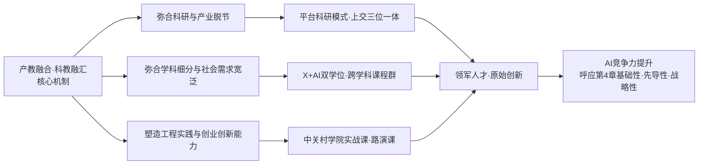

这一逻辑图揭示出产教科教融合的根本价值:**它不是把课堂搬到工厂、也不是把企业项目装进课程,而是从根子上重构"学—研—产"的关系网络,让教育既输出人才、又输出技术,让产业既消费人才、又反哺培养**。这正是第4章"双向校准"机制在培养层面的具体落地。

## 5.6 基础教育阶段AI素养教育的政策框架与课程标准

如果说高等教育解决"如何培养拔尖人才"的问题,基础教育则要回答"如何为AI时代奠基"的更根本命题。第4章已论及朱松纯"四个层次"体系把基础教育纳入贯通框架的战略眼光,本节聚焦其工程化落地——AI素养教育向基础教育下沉的政策框架与课程标准。

**《中小学人工智能通识教育指南(2025年版)》是国家层面的顶层设计**。该指南由教育部基础教育教学指导委员会发布,**构建分层递进、螺旋上升的中小学人工智能通识教育体系,培养学生适应智能社会的核心素养。通过知识、技能、思维与价值观的有机融合,形成四位一体的人工智能素养,培育科技创新思维、批判性思维、人机协作能力、人工智能素养及社会责任意识**[^111]。其分学段培养目标具体清晰:

- **小学阶段**:认知方面侧重体验与兴趣培养,感知技术价值,了解语音识别、图像分类等基础人工智能技术;技能方面强调基础应用能力,掌握简单人工智能工具的基础操作;思维方面重视培养基础思维,启蒙逻辑思维,通过任务拆解训练计算思维基础;价值观方面主要培养文化感知与安全习惯[^111]。
- **初中阶段**:认知方面侧重理解技术逻辑,掌握机器学习基本流程与监督学习概念;技能方面强调实际问题解决,通过项目式学习等方式完成简单数据整理和分析等任务;思维方面重视发展工程思维,形成"需求分析—技术适配—效果评估"的技术决策链;价值观方面主要深化伦理认知[^111]。
- **高中阶段**:认知方面注重系统思维与创新实践(由综合各方信息可推得)。

第3章已述该指南在伦理层面坚持"立德树人,发展素养""主动引领,公平普惠""多方参与,融合创新""面向未来,安全可控"四大基本原则[^111]。配套的《中小学生成式人工智能使用指南(2025年版)》进一步给出明确的分学段使用边界:**小学阶段禁止学生独自使用开放式内容生成功能,教师可在课内适当使用辅助教学;初中阶段可适度探索生成内容的逻辑性分析;高中阶段允许结合技术原理开展探究性学习**[^96]。这种"能力培养+使用边界"的双轨设计,是中国治理体系的差异化创新。

**地方层面的实施方案则呈现"百花齐放"的实践图景**。北京市2025年9月起实施的《北京市中小学人工智能教育地方课程纲要(试行)(2025年版)》**明确了1-12年级的人工智能课程内容和教学目标,要求"全市中小学校开展人工智能通识教育,每学年不少于8课时,实现中小学生全面普及。评价结果也将纳入学生综合素质评价体系"**[^124]。课程包括"人工智能意识与思维能力、人工智能应用与创新能力、人工智能伦理与社会责任三个方面",**帮助学生从"基本了解人工智能"到"合理使用人工智能"再到"创新应用人工智能"**[^124]。1-2年级设置5大模块:人工智能基本概念、人工智能应用技术、人工智能实现方法(模拟人的行为)、人工智能伦理与社会(人工智能与人类)、人工智能伦理与社会(人工智能与社会),教学策略强调"以生活场景为切入点,打造沉浸式体验""强化游戏化与动手实践,激发学习兴趣""提供丰富的生活应用,感知人工智能的价值"[^124]。

**上海则采取"刚性课时"模式**。上海市教委2024年9月印发的《上海市推进实施人工智能赋能基础教育高质量发展的行动方案(2024-2026年)》明确:**"义务教育阶段,在小学四年级、初中七年级开设人工智能地方课程;高中阶段,在国家信息(科技课程基础上深化人工智能教学内容)"**[^125];周亚明主任进一步介绍:"从2024年秋季学期开始,上海已全面推进中小学人工智能课程实施。义务教育阶段在四年级、七年级开设《人工智能基础》地方课程,**每周1课时,每个年级总计不少于30课时**;高中阶段通过打造专题学习资源和选修课程,深化人工智能教学内容"[^122]。

**广东省则推出"2素养1纲要"方案**。广东省推进中小学人工智能教育新闻发布会于2025年4月在穗召开,广东省教育厅相关负责人介绍了广东推进中小学人工智能教育落地的"2素养1纲要"方案,**"在全国率先提出中小学师生人工智能素养框架,为中小学教师系统提升人工智能素养提供指引,在课时安排、资源开发和平台支持等方面都提出明确要求,打出AI教育'组合拳'"**[^25]。

**地方差异化探索的"百花齐放"格局**还包括:北京"课程超市+应用超市+百千种子计划";山东"十大行动",从课程纲要到AI素养评价,形成省、市、县、校一体化的闭环机制;江苏"治理驾驶舱",通过算力平台和质量监测系统将人工智能教育纳入教育治理现代化整体架构;广西国际化视野,将人工智能教育与中国—东盟人才合作战略结合,提出建设大中小学一体化体系;安徽分层递进+全面普及,**从小学三年级到高中二年级八个年级独立开设人工智能课程,并通过学科融入覆盖其他年级**;西安将红色教育、航天资源与人工智能课程相结合;云南将普洱茶、梯田和民族服饰等元素融入项目化学习;成都依托大规模实验室建设,将人工智能引入德育、美育、体育乃至心理健康教育[^17]。这种"百花齐放"的政策图景"折射出各地在竞逐特色与话语权方面的积极态度"[^17]。

总体趋势上,可识别出三个明显的整合特征:**第一,人工智能教育的实施明显向低学段延伸**——"过去这类课程多见于高中甚至大学,而如今,小学阶段已经被普遍纳入,部分地区甚至从一二年级就开始设计体验式学习内容";**第二,课程体系的分层逻辑日益清晰**——"小学注重兴趣激发与感知体验,初中强调原理理解与生活化应用,高中则以跨学科项目和实践创新为重点";**第三,资源与师资建设成为政策设计的核心**[^17]。

为更直观呈现各地差异化路径,下表汇总主要地区的AI教育实施方案:

| 地区 | 课时安排 | 特色机制 | 关键创新 |
|------|---------|---------|---------|
| 北京 | 1-12年级每学年≥8课时 | 课程超市+应用超市+百千种子计划 | 评价纳入综合素质评价 |
| 上海 | 四年级/七年级每周1课时,每学段≥30课时 | 师生机协同发展理念 | 高中专题学习资源+选修 |
| 广东(广州) | 1-2年级每学期≥3课时,3-8年级每2周≥1课时 | "2素养1纲要"+"1+8模式" | 1517所学校全覆盖 |
| 山东 | 省级统筹 | "十大行动"+省市县校闭环 | AI素养评价 |
| 江苏 | 省级推进 | "治理驾驶舱" | 算力平台+质量监测 |
| 安徽 | 3-12年级8个年级独立开课 | 分层递进+学科融入 | 高校+科研院所+企业资源整合 |

以广州为例,**1至2年级每学期安排不少于3课时,3至8年级每2周安排不少于1课时。无论是在城区学校还是乡村学校,同学们至少每两周有一节人工智能课**[^25]。在课堂中,老师应用广州市人工智能地方教材、广州中小学人工智能教学平台开展教学活动[^25]。这种"地方教材+地方平台+刚性课时"的三位一体保障,正是广州能从2018年启动编写地方人工智能教材、2019年入选全国首批"智慧教育示范区"、2022年9月起在全市中小学校落地使用全国首套省级审定通过的中小学人工智能教材的关键支撑[^25]。

## 5.7 中小学AI教育落地的师资、空间与平台建设

政策框架与课程标准要变成真实的课堂教学,必然要回答三个工程化问题:谁来教、在哪里教、用什么资源教。师资、空间、平台三大要素,正是中小学AI教育落地的"三驾马车"。

**师资困境是首要瓶颈**。第3章已述全国"73%的学校都在依赖跨界教师去对孩子们进行AI教育,AI教师的招聘竞争则更是激烈到无法想象"[^126]。各地试点案例展现出师资来源的多元化探索:北京地区"主要聚焦于AI绘画和机器人编程,北京地区给孩子们请的AI教师更是来自于高校的博士兼职和企业导师";上海地区"则是侧重于ChatGPT的应用以及无人机群的控制,他们的教师就相较于兼职博士们更加专业成为了专职AI教师";广州地区"则是更侧重于语音的识别开发和智慧农场的实践,相较于北京和上海地区的老师,他们的老师则是由普通的信息技术老师转型成为AI教师的"[^126]。这种差异化路径揭示出师资建设的多元渠道,但也暴露了城乡、地区间师资力量的不均衡。

**多主体协同培训成为破解之道**。广州"政企学研"协同合作模式作为"1+8"体系中的师资体系支柱,**截至2025年12月,联合高校、科研机构、企业等多元主体,通过教研培体系构建起覆盖1517所学校125.6万学生的人工智能教育师资网络**[^58]。广州市教育局2026年1月发布的《关于公示人工智能助推教师队伍建设行动实验区、校及教育集团验收结果的通知》表明,该市正在推进"教育部人工智能助推教师队伍建设行动试点"项目验收[^100]。北京则推出"AI教育讲师团"机制——**讲师团成员来自北京中小学人工智能教育工作专家委员会,由高校和中小学教育管理和教学一线的55位专家代表组成**;讲师团成员、北京市中小学人工智能教育工作专家委员会副主任委员余胜泉表示,"未来讲师团将探索建立京雄两地中小学人工智能教师交流、研修共同体,通过线上教研、线下工作坊、名师结对等多种形式,助力雄安新区快速培育一批人工智能教育的'种子教师'和领军人才"[^30]。北京市第八十中学雄安容东分校信息技术教师张梦雅对这种机制充满期待:"人工智能是一个新兴事物,我们的教师又普遍比较年轻,在课程教授上经验有限。如果能有优秀的课程案例,可以让我们更好地学习,也更好地把知识教给孩子们"[^30]。

师资建设的更大尺度赋能则来自国家级赛事与研修。2025年度"领航杯"江苏省教育数字化应用能力大赛**吸引全省4000余所大中小学、11万名师生参与**(此前章节已述);第二章已述江苏"名师空中课堂"汇聚精品资源5.73万节,注册师生1189万人,点播量达34.62亿次。《"人工智能+教育"行动计划》"将人工智能纳入教师资格考试和认证内容"的制度安排,以及"在国家及省级教学成果奖中设立智能教育项目"的激励机制,共同构成师资建设的国家级保障[^58](具体教师培养路径将在第6章系统展开)。北京市教委主任李奕介绍北京模式:"北京市将师生人工智能素养作为根本的保障,在基础教育阶段,研制《北京市中小学人工智能教育地方课程纲要》,全市中小学每学年开足开好8学时的通识课程,组建市、区两级的'AI教育讲师团',汇聚高校、科研院所、高科技企业的专家'送课到校'"[^58]。

**空间建设呈现"实体+虚拟"融合迭代**。广州市的空间演化路径具有典型性:**2002年广州市便在中山大学附属中学建成智能机器人实验室;2015年升级为"智创空间";2019年打造多功能"智能空间";如今建成融合AI导学、生成式人工智能(GAI)、XR、元宇宙的"AI-元宇宙空间"**[^58]。深圳市中小学人工智能联合实验室建设标准指引则推动"校园+产业""学校+高校"的实验室建设模式[^63]。雄安新区的空间布局更是从源头规划入手:"我们遵循学习多样化、个性化、智能化发展趋势,**在新建学校按1∶1比例配建普通教室和功能教室。运动场、风雨操场、报告厅、图书馆成为学校标准配置**"[^44]。云溪小学则"开办三年以来,开设了3D打印、无人机、机器人、VR体验等129项校本课程,探索如何在'未来之城'这片沃土上创办一所以科学教育为发展引擎的高质量学校"[^59]。

**平台建设是普惠覆盖的关键支柱**。广州"1+8"模式中的"一个平台"——**广州中小学人工智能教学平台,集教材、工具、实验、评价、共享于一体,搭载3D虚拟仿真、图形化编程等实验室,将智能机器人、无人机等硬件教具虚拟化、云端化,学生可在线完成编程、调试、实验等,大幅降低教学硬件门槛**[^58]。该平台"配套一至八年级标准化课程、课件、名师视频、虚拟场景等全流程资源,支持教师备课、授课、批改、分析,支持学生自主学习、实践创作"[^58]。这一平台的核心价值在于"通过市级统一规划、资源统筹,破解硬件投入高、资源不均衡、校际差距大等共性难题,**让农村学校、薄弱学校低成本共享优质资源,实现城乡教育起点公平**"[^58]。北京AI教育应用超市则**已汇聚40余款经过一线实践检验的优质AI教育产品,全面覆盖教、学、管、评、研、育等核心环节**,正式落地雄安[^30]。福建则在福建智慧教育平台开设人工智能教育专栏,"广泛汇聚在线课程、教学视频等优质教育资源,鼓励各地各校研发人工智能教育教学资源,实现优质资源共建共享"[^117]。

广州"1+8"模式作为国家中小学AI教育平台化普及的典型样板,其平台机制可视化为下图:

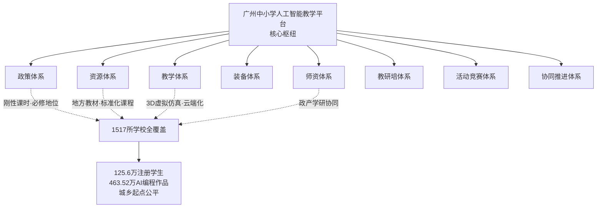

这一"核心引领、多维支撑、全域联动"的平台化普及机制,实质上把政策、资源、教学、装备、师资、教研、活动、协同八大要素整合在一个数字底座上,既保障了规模化推进,又通过虚拟化、云端化破解了硬件投入与师资能力的"双重痛点"。

但落地中也存在显著挑战。第3章末尾已揭示"农村中小学生使用AI辅助作业比例反而高于城市学生4.8个百分点、但'依赖AI不想自己思考'比例达22.8%"的"双重病灶"格局,提示我们**单纯的平台覆盖与设备配齐并不必然带来教育效果的提升**——还必须搭配师资素养提升、课程理念升级、家庭引导参与等多重支撑,才能真正把"接入公平"转化为"认知公平"。

## 5.8 基础教育AI教育的育人价值与早期苗子培育

师资、空间、平台是工具底座,真正的教育价值还要通过课堂教学的"人性化输出"来实现。基础教育AI教育的育人价值,可在四个维度展开。

**第一,激发好奇心与计算思维**。第2章已展示深圳明德实验学校学生王嘉人创作AI科幻绘本《超能小艺》、雄安史家胡同小学智能数学课、皮山县学生穆尼热·麦麦提通过AI系统提升语文成绩等案例。在广州,**截至2025年12月平台覆盖广州市1517所学校,注册学生125.6万人,提交AI编程作品超463.52万个**[^58]——这一数字本身就是好奇心被激发、计算思维被训练的规模化证据。深圳市深中南山创新学校"作为深圳市唯一一所入选教育部中小学人工智能教育基地的学校"已取得显著成就[^112];学校将人工智能教育作为特色课程,"通过开设人工智能课程、组织学生参加各类竞赛等方式,培养学生的人工智能素养和创新能力"[^112]。从"AI使用者"向"AI共创者"的进阶,正是基础教育AI教育最具价值的输出。

**第二,塑造伦理意识与价值观**。《通识教育指南》"坚持立德树人,发展素养""坚持面向未来,安全可控"等基本原则,以及《使用指南》"坚持育人导向,强化素养本位""坚持价值引领,确保技术向善"等应用原则,共同构成了价值观引领的政策底座[^111][^96]。具象到课堂层面,小学阶段"价值观方面主要培养文化感知与安全习惯。树立安全观念,体验AI文化创作活动感知技术双面性,建立隐私保护与数字身份的基本认知"[^111];家长建议中的"三不原则"——"不传真人照片、不填真实住址、不信AI生成谣言"[^127]——则把价值观引领延伸到家庭场景。这种"学校教育+家庭引导"的双重塑造,是中国治理体系的特色优势。

**第三,早期发现拔尖创新苗子**。2026年4月在控江中学举办的杨浦区"顶峰相见·未来有我"科学家讲堂首场活动便是这一价值的鲜活体现——中国工程院院士、同济大学党委书记郑庆华以"人工智能何以改变未来"为题,与师生面对面交流,前期面向杨浦全区中小学发起"我给院士的小纸条"提问征集,**短短时间内收到数百条来自学子、教师的疑问与畅想**[^69]。**控江中学高二学生张栗铭就"过拟合、泛化能力薄弱"等机器学习领域核心难题向院士提问,得到郑庆华关于"训练数据优化+模型架构优化+数学能力支撑"的专业回应**[^69]——这种院士与中学生的对话本身,就是早期苗子培育的生动场景。

更系统化的拔尖苗子机制则来自一线名校的实践。深圳"科创学院、零一学院的'科创营'中,**300多名具备拔尖创新潜质的学生孵化出50多个科创项目;深圳明德实验学校初中生提出的'生物通道'设想,最终转化为梅观高速鲲鹏径一号桥现实工程**,成为AI时代青少年创新的典范"[^63]。深圳还构建"高阶课程搭建'一流大学+一流企业+一流中学'联合培养机制,为拔尖创新人才成长铺路搭桥"[^63]。上海《上海市推进实施人工智能赋能基础教育高质量发展的行动方案(2024-2026年)》明确"支持中小学与高校积极合作探索人工智能领域拔尖创新人才早期发现并构建一体化培养模式"[^125]。这种"中小学+高校+企业"的早期苗子识别与培育机制,是第4章郑泉水钱班"内生动力"理念在基础教育阶段的延伸——**真正的拔尖人才不是在高考分数中筛选出来的,而是在科创项目、研究实践、跨界对话中识别和培育出来的**。

**第四,夯实AI素养金字塔底座**。从全国看,广州"1+8"模式覆盖200多万名学子、1500多所学校[^25],已形成"惠及千万级学生"的规模效应。深圳近年来"率先探索中小学人工智能教育新路径,加快构建独具特色的中小学人工智能教育体系"[^46],并以"小学一年级'打卡身边AI'的趣味实践,到高中阶段的跨校科创项目"贯穿"基础教育全学段的人工智能育人链路"[^63]。从规模到质量,基础教育AI教育正在为高等教育阶段的拔尖创新人才培养输送日益优质的生源,与朱松纯"四个层次"贯通体系的基础教育—高等教育衔接逻辑形成直接对应。

需要警觉的是,基础教育AI教育的育人价值不能被简化为"会用AI"的工具技能。雄安新区贤溪云溪小学校长张春伶的判断值得回味:"云溪小学开办三年以来,开设了3D打印、无人机、机器人、VR体验等129项校本课程,探索如何在'未来之城'这片沃土上创办一所以科学教育为发展引擎的高质量学校"[^59]——AI素养教育的根本是"科学教育",其目标不是培养更多的"AI使用者",而是培养更多有好奇心、有探究精神、有创新能力的"科学少年"。

## 5.9 过早使用AI的认知风险与平衡之道

基础教育AI教育的育人价值真实存在,但同时必须直面一个核心争议——**过早接触AI是否伤害认知发展?** 这一争议在国际国内都激起了激烈讨论。

**风险证据正在快速积累**。第3章已系统呈现MIT脑电研究、沃顿土耳其实验、清华学习研究等批判性证据。基础教育阶段的特殊证据则更具警示意义:剑桥大学"早期AI"项目研究团队近期发布开创性报告,"首次系统聚焦生成式AI玩具对5岁以下幼儿的影响",**研究发出明确警示:这些被包装成"玩伴"的智能玩具,可能在情感回应、心理安全及隐私保护方面构成意想不到的风险**[^30]。具体风险分为三类:**风险一,情感交互的"错位"——发育心理学研究表明,0至6岁是儿童建立安全依恋关系、发展社会情绪能力的关键时期,"当孩子的情感流露(无论是爱意还是悲伤)数次得到笨拙、冷漠或错误的反馈时,他们可能会潜移默化地认为自己的感受不重要";风险二,削弱与真实世界的情感纽带——"研究人员观察到,儿童会拥抱、亲吻玩具,并认为玩具也爱自己,导致儿童将情感需求诉诸玩具,而非身边的成年人";风险三,隐私保护风险**[^30]。

中国青少年研究中心面向7省(市)8563份问卷的调查数据极具代表性:**超六成(60.0%的小学生、56.1%的初中生、69.5%的高中生)使用过AI,其中近两成(18.3%)经常使用;20.5%的受访中小学生表示"想依赖AI思考不想自己思考",其中农村学生比例(22.8%)高于城市学生(17.7%);分学段看,小学生占21.2%,初中生占17.6%,高中生占22.7%**[^30]。"在用途上,超七成(71.0%)用AI辅助完成作业,三成多(35.2%)与AI聊天或说心里话,小学生用AI进行创作、与AI聊天或说心里话的比例更高"[^30]。

国际层面,**2026年4月16日,来自美国和加拿大的120家机构及142位专家联署呼吁暂停在学前至12年级学校使用生成式AI产品五年,称这些产品对儿童"存在重大危害"**[^44]。该立场文件认为,当前生成式AI产品在六个方面构成威胁:学生与教育工作者的隐私和自主选择权;核心能力发展(包括认知、批判性思维、分析推理、决策、情绪管理与人际交往能力);心理健康、公平性、人身安全,以及接受优质教育的权利;教育工作者的专业角色;学术诚信;环境[^44]。立场文件特别指出几个具体事实:**"生成式AI产品和平台威胁着儿童的认知、社交及情感发展"——"生成式AI破坏并侵蚀了认知发展。生成式AI产品助长了'认知卸载'现象,并阻碍了那些对儿童成长至关重要的能力的发展——包括需付出努力的深度加工、推理、从错误中学习、创造力、批判性思维、研究技能、读写掌握能力以及解决问题的能力"**[^44]。

兰德公司2026年3月发布的报告则提供了数据演进证据:**2025年5月至12月,学生使用AI帮助完成家庭作业的学生比例从48%跃升至62%。其中中间学校(5-8年级)和高中(9-12年级)学生增长最为显著。到2025年12月,近一半的中间学校学生(46%)表示他们在至少一门课程中使用了AI来辅助完成家庭作业**[^52];同时,**2025年2月至12月,认同"学生使用AI(如ChatGPT)完成学校作业越多,就越会损害他们的批判性思维能力"这一说法的比例从54%升至67%。其中中间学校(5-8年级)学生的担忧涨幅最大,达20个百分点**[^52]。

国内一些一线案例则把抽象风险具象化。一位四岁儿童家长赵女士分享的经历令人警醒:"上学好像也有点心不在焉,每天都不想去上学了,以前他是很喜欢上学的。开学后他就是说,妈妈走,快回家。我说,这么早回家干吗?你不跟小朋友们一起玩吗?他说,不要,我就要回家玩AI,玩AI比他们有趣多了"[^128];她进一步发现孩子"思维发展变缓""社交能力受限",最终选择卸载AI软件[^128]。清华大学社会心理服务研究中心管委会副主任倪子君指出:"3至6岁这个年纪的小孩子发育大脑最棒的方式,实际上是大动作的训练,攀爬、跳、去捕捉,家长和孩子一起游戏,跟伙伴一起游戏"[^128];她还引用"55387"理论——"身体的姿态占传递信息的55%,语气占38%,内容只占7%"——警示AI替代真实社交的深层风险[^128]。

**平衡证据则提示问题不是非黑即白**。2025年11月18日发布的《南京市小学生生成式人工智能素养白皮书》——**这是国内首份专门针对小学生的生成式人工智能素养的白皮书**——给出了相对积极的图景。报告基于对南京市12个区17所学校3-6年级8795名小学生的线下问卷调查和对其中8所学校74名学生的面对面深度访谈[^118]。关键发现包括:**"81.93%知晓生成式人工智能,其中80%以上每周都会使用,25.16%至少每天使用一次及以上";"超过80%的学生对生成式人工智能生成内容持审慎态度,会通过对比、理解、整合等方式对生成式人工智能生成内容进行认知加工";"多数学生(72.33%)尚未依赖生成式人工智能完成作业,少数学生(27.67%)依赖生成式人工智能完成作业,存在认知依赖"**[^118]。

参与起草白皮书的南京邮电大学教育科学与技术学院副院长刘永贵的判断中肯而辩证:"从这次调研情况看,**其实大多数孩子他会主动调整自己的思维,调整自己的策略,找到与生成式人工智能和谐相处、相互赋能一条路径**,从这个角度来讲,我觉得我们不必过于担忧生成式人工智能,会给我们小学生群体带来不可逆的认知影响。但我们也要看到,确实会有一小部分孩子,他对生成式人工智能产生了依赖,产生了不想自己去思考的这种倾向,对这类孩子我们需要去共同关注,给他们提供一些针对性的教育指导"[^118]。

**中国治理体系给出了具有特色的平衡之道**。其核心是"**适度使用+素养教育+伦理引导**"的三维平衡框架,具体落地于多个层面:

第一,**《使用指南》分学段使用边界**——小学禁止学生独自使用开放式生成、初中适度探索、高中允许探究——已在第3章和本章5.6节多次论及[^96]。这一"刚性年龄边界"是中国治理体系的关键工程支撑。

第二,**上海周亚明"师生机协同发展"理念**为价值底座提供哲学回应。周亚明指出:"教育被普遍理解为是培养独立、自主、理性的个体的过程,而生成式人工智能的出现对此构成了前所未有的挑战。从教育学视角看,一方面,AI确实具备增强人类认知的潜力,能够帮助处理海量信息、提供多元视角、加速方案生成,培养学生高阶思维。另一方面,**若长期依赖AI的外部支持,可能会削弱学生对自身思维过程的监控和调节,导致学习深度下降与思维主动性退化。每一次关于'能不能用AI'的讨论,都应该成为关于'什么是负责任行为'的价值判断**"[^122]。"师生机协同发展"既不是对AI的全面禁止,也不是对AI的不加限制,而是把"使用AI"这一具体行为提升到"价值判断"的高度。

第三,**家长"三不原则"家庭规则与"产品哲学"重塑**。家长层面的"三不原则"——"不传真人照片、不填真实住址、不信AI生成谣言"[^127];以及第4章已述的"AI苏格拉底式导师"产品设计哲学——AI不应是"答案机器",而应是"思维伙伴",通过追问引导学生思考而非直接给答案。

第四,**新一代教材的"阶梯式"设计**。新华网开发的《人工智能通识》系列教材"通过6册课本、48个生活化主题和'接地气'的表述让抽象的人工智能技术变得可触可感";课程设计上,"由南开大学计算机学院副院长刘晓光教授、北京教育科学研究院副院长杨德军研究员等领衔的主编团队……将高深的AI技术拆解为'**观察思考-体验探究-实验探究**'的阶梯式学习链。借助这套教材,低年级学生可以通过游戏感知AI,中年级学生可以通过小实验理解技术原理,高年级学生可以在动手操作中思考AI伦理。这种'螺旋上升'的设计思路,更加符合儿童的认知规律"[^69]。

教育部基础教育教学指导委员会发布双指南后,首都师范大学教育学院教授方海光的建议尤具操作性:"中小学信息科技与人工智能课程的协同实施是当前教育改革最可行性的实施路径之一。**小学低年级通过'不插电编程'培养学生逻辑思维,中高年级接触图形化编程中的条件判断,这样到高年级学生才能理解人工智能中的基础规则**……可在信息科技课程中动态调整人工智能内容的比重和深度,比如可以在学前教育阶段增设'人工智能和生活礼仪'课程,在义务教育阶段增设'人工智能与智能社会'课程模块,在高中阶段则通过选择性必修课深化技术原理,衔接高校课程"[^66]。

将上述风险与平衡机制整合,可形成基础教育AI使用的"风险—平衡"框架:

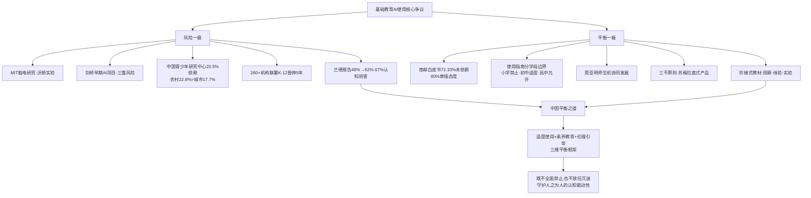

这一框架的核心启示是:**风险与价值都不是孤立存在的,关键在于使用方式的设计**——当AI被设计为"思维伙伴",它就成为认知的脚手架;当AI被使用为"答案机器",它就成为认知的替代品。这恰恰呼应了第3章治理章节的核心判断——"AI的影响并非工具决定论,而是使用方式决定论"。

## 5.10 贯通式培养体系的衔接机制与中国方案

将本章前九节整合,可以勾勒出中国贯通式AI人才培养体系的完整图景。这一体系的根本特征是"**纵向贯通、横向联通**"——纵向贯通基础教育、高等教育、职业教育、终身教育全学段,横向联通学科、专业、学院、产业、国际全要素。

**朱松纯"四个层次"框架是顶层架构**。如第4章已述,这一框架包括:**第一层本科生"通识、通智、通用"育人范式(北大-清华通班);第二层博士跨校跨专业协同育人(通用人工智能协同攻关合作体);第三层中西部"政产学研用"五位一体协同育人联合体(北京、武汉、重庆等地);第四层全社会AI基础与职业教育体系**[^112]。这一架构的精妙之处在于,它不仅覆盖"拔尖到普惠"的全谱系,还把"中西部均衡"作为独立层次纳入,直接回应区域均衡发展的国家战略。

**学校层面的本土实践则进一步丰富了贯通体系的工程化样本**。上海《上海市推进实施人工智能赋能基础教育高质量发展的行动方案(2024-2026年)》明确"支持中小学与高校积极合作探索人工智能领域拔尖创新人才早期发现并构建一体化培养模式"[^125]。深圳"高阶课程搭建'一流大学+一流企业+一流中学'联合培养机制"[^63]。这种从中学到大学的"接力机制"在浙江大学的拔尖班招生中得到精细化实现——竺可桢学院"求是科学班"2025年招生100人,涵盖8个热门专业,"采用'通识教育+专业教育'的模式,学生可以自己选专业,还能依托全国重点实验室搞科研训练"[^125]。求是科学班的导师制设计是亮点:**"每位学生都有'两师三友'导师团队,学术导师管科研,生涯导师规划未来,还有学长、校友、行业导师帮忙,一路有人带";"100%的学生都能拿到海外交流奖学金"**[^125]。

**贯通体系的四大共性要素清晰可识**:

第一,**纵向贯通的课程标准衔接**。从《中小学人工智能通识教育指南》小学—初中—高中三级递进,到高校公共基础课、AI-BEST四层课程体系、X+AI双学位、博士+硕士贯通,形成了从启蒙到拔尖的完整课程谱系。北京《北京市中小学人工智能教育地方课程纲要》"明确了1-12年级的人工智能课程内容和教学目标"[^124]——12年的纵向贯通本身就是"小学—中学—大学"衔接的政策基础。

第二,**横向联通的学科交叉融合**。从X+AI双学位、微专业到AI+特色模块3选1,从医学+AI、法学+AI、财经+AI到AI+三航、AI+文科,跨学科融合已成为AI人才培养的"标配机制"。复旦的"2+X+Y"交叉融通培养体系、清华的本研贯通拔尖班培育梯队、南大的"博士+硕士"双学位"3.0版本",都是这一逻辑的工程化产物。

第三,**"政产学研金"多元主体协同**。从北京中关村学院31所共建高校、人工智能开放联盟17所大学+8家企业,到福建的"政企学研"协同合作、北京的"AI教育讲师团"55位专家,再到深圳的"名校+名企"联合实验室、京雄合作"种子教师"培育,多元主体协同已经从"有没有"进入"系统化运作"阶段。

第四,**价值观引领的全程贯穿**。从《通识教育指南》的"立德树人"基本原则到高校的"思政引领"师资培养,从家长的"三不原则"到国家《行动计划》的"育人为本、智能向善"——价值观引领并非附加要求,而是贯穿全学段、全主体、全场景的根本底色。这正是第4章朱松纯"德力"命题的工程化落实。

**回应《行动计划》战略目标**。教育部、国家发展改革委等五部门印发的《"人工智能+教育"行动计划》明确目标:"到2030年,人工智能与教育深度融合格局基本形成,**构建起纵向贯通、横向联通的人工智能全学段教育和全社会通识教育体系**"[^44]。这一战略目标的实现路径,正是本章所论证的"基础教育下沉+高等教育系统化+职业教育试水转型+终身教育延展+多主体协同"的整体设计。

将贯通式培养体系完整呈现,可形成中国AI人才培养体系的"全景地图":

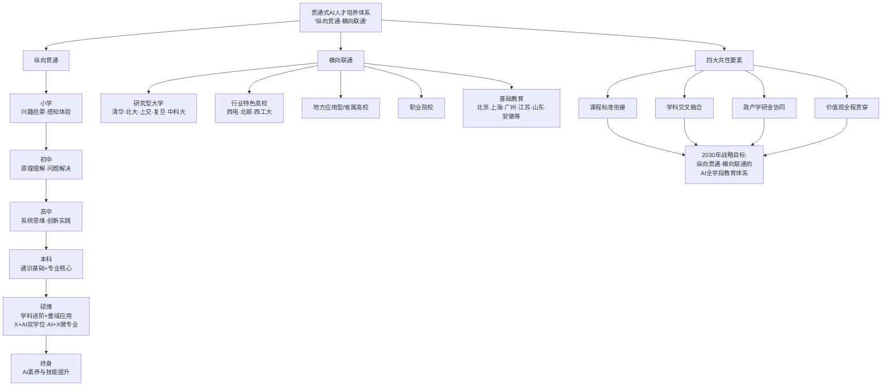

---

综上,本章作为"教育反哺AI"线索的工程化主体,从十个层次系统呈现了中国贯通式AI人才培养体系的多元路径与衔接机制。可以得出以下核心判断:**第一,高校组织架构创新已形成"实体学院+新型研究机构+拔尖创新平台+跨校协同体"四类并行的多元格局,共同基因是打破学科壁垒、构建政产学研用协同、对接国家战略;第二,AI通识课程从"选修"走向"必修",形成复旦AI-BEST、上财"1+10+100+N"、西工大"7大行动"、浙大"AI+特色模块"等本土化课程范式,但仍面临师资、教材、评价三大共性挑战;第三,X+AI双学位、博士+硕士贯通、医学影像深度学习等典型课程展示了跨学科融合的工程化路径,核心是"专业基础+AI模块+真实场景"三段式架构;第四,研究型大学、行业特色高校、地方应用型高校与职业院校形成"塔尖+塔身+基座"的分层分类格局,呼应朱松纯"四个层次"贯通体系的具体投射;第五,产教融合与科教融汇通过"平台科研""三位一体""以终为始"等机制创新,弥合了科研与产业、学科细分与社会需求的双重脱节,实质重构了"学—研—产"关系网络;第六,基础教育AI素养教育已在《通识教育指南》《使用指南》顶层设计下形成北京、上海、广东等"百花齐放"的地方实践,通过师资、空间、平台三大支撑实现规模化普及;第七,基础教育AI教育的育人价值体现在激发好奇心、塑造价值观、发现拔尖苗子、夯实素养底座四大维度,但需要与高校形成"早期发现—一体化培养"的衔接机制;第八,过早使用AI的认知风险真实存在,但中国通过"分学段使用边界+师生机协同发展+三不原则+苏格拉底式产品+阶梯式教材"构建了具有特色的"适度使用+素养教育+伦理引导"三维平衡框架;第九,贯通式培养体系的根本特征是"纵向贯通基础到拔尖、横向联通学科与产业",其四大共性要素——课程衔接、学科融合、多主体协同、价值观引领——共同回应了《行动计划》"纵向贯通、横向联通的全学段AI教育体系"的战略目标**。

但贯通式培养体系的真正落地,最终取决于一个关键支撑要素——**教师**。无论是基础教育的AI通识课、高等教育的X+AI双学位,还是职业教育的"四力框架"、产教融合的实战项目,都需要一支具备AI素养、能够设计学习生态、敢于人机协同共创的高水平教师队伍。第6章将进一步深入这一关键支撑,系统剖析AI时代教师角色的根本转型、智能素养标准的内涵建构,以及教师队伍能力建设的多元路径与结构性挑战。

# 6 教师队伍与AI素养：人才培养的关键支撑

第5章勾勒的贯通式AI人才培养体系——从基础教育《通识教育指南》分学段递进，到高等教育"X+AI"双学位与平台科研，再到职业教育"四力框架"——其每一处工程化落地的关键节点，最终都汇聚到同一个根本性的人格化变量上：**教师**。一份再先进的课程标准、一个再前沿的实验空间、一套再完整的平台底座，倘若没有一支具备AI素养、能够设计学习生态、敢于人机协同共创的教师队伍承接，都只能停留在"硬件齐备但软件失能"的状态。这一判断在第3章治理章节关于"会用工具但不会融于课堂"的诊断、第5章关于"73%学校依赖跨界教师"的警示中已被反复印证。

由此，"教育反哺AI"线索的工程化论证必须在本章完成关键的合龙——**教师既是AI赋能教育的执行者，也是教育反哺AI的塑造者；既是人才培养体系的关键支撑，也是"成熟个体填补AI漏洞"的不可替代守护者**。本章沿"角色转型—素养框架—培育路径—工具赋能—规则托底—不可替代性—结构性挑战—生态共建"八个层次展开，既承接第4章"德力"命题与"灵魂三问"的价值底座，也为第7章产学研用协同生态铺设师资基石。

## 6.1 AI时代教师角色的根本转型：从知识传授者到学习生态创建者

理解教师AI素养建设的逻辑起点，必须先回答一个根本问题——**当AI能讲课、答疑、批改作业、制定学习计划，教师还能、还应当做什么？**这一问题不是简单的"工具替代论"挑衅，而是直击教师职业身份的本体性命题。

**教师角色转型的第一重逻辑：从"教教材"到"教学生"的对象重置**。第1章曾援引行业判断——传统课堂常被简化为"教教材而非教学生"，本质上是工业时代规模化、整齐划一加工方式在教育领域的投射。郑州市第十三中学教学副校长荆媛丽在第2章已述的实践反思中给出鲜明对照：**"我们现在是让'数据'说话，先摸清学生的学情，再根据学生的学习需求设计教学活动，不再是经验主义教学"**。这一从"教材中心"到"学生中心"的对象重置，使教师必须重新定义自己与课程、与学生的关系——不再是站在讲台上"复读教材"的人，而是基于学情数据为每一个学生设计学习路径的人。

**教师角色转型的第二重逻辑：从"单向传导"到"师—机—生三元协同"的关系重构**。第1章曾论述AI赋能下教学方式从"教材—教师—学生"的单向传导转向"师—机—生"三元协同。在这一新关系中，AI不是被动工具，而是"超越教师、比肩同伴的智慧学伴"——这从根本上改变了教师在课堂结构中的位置。雄安史家胡同小学五年级数学课的场景生动展示了这一新关系：教师"指尖轻点，屏幕上的几何图形便瞬间变得立体生动"，AI承担了图形演示、动态拆分等机器擅长的任务，教师则将精力聚焦于引导思考、组织讨论、激发洞察等"人之专属"的环节。郑州十三中地理老师王琳的课堂实践更进一步——智能体"根据学情数据分层推送图文资料""实时组织抢答并记录正确率""课后自动生成思维导图"，教师从"全程主导者"转化为"协调指挥者"，与AI共同构成对学生的"双师陪伴"。

**教师角色转型的第三重逻辑：从"知识权威"到"学习生态创建者与师生共创引导者"的本体重塑**。当AI能在毫秒级提供更详尽、更精准、更个性化的知识讲解时，教师的"知识权威"地位被根本性挑战。第4章已援引清华大学校长李路明的坦言："有位老师说'我现在已经不会上课了'，因为学生可以花很短的时间，在人工智能大模型的协助下获得与课程相关的学习内容，乃至解答各种疑问"。这一困惑的破解之道，正是教师本体角色的根本重塑——**从"知识的提供者"转向"学习的设计者"、从"答案的发布者"转向"问题的激发者"、从"评价的裁决者"转向"成长的陪伴者"**。这种重塑直接呼应第4章赵勇"灵魂三问"中的"何为师"之问——AI时代教师的核心价值不再是"会讲、讲得好、会做实验"，而是"如何让学生在与AI的协同中成为更完整的人"。

将三重转型逻辑整合，可以勾勒出AI时代教师的四大新职能定位：**学习设计者**——基于学情数据为每位学生设计个性化学习路径；**人机协调者**——在师—机—生三元协同中担任流程指挥与质量把关；**价值引导者**——在AI输出的海量内容中守护育人方向、引导价值判断；**灵魂陪伴者**——以"一棵树摇动另一棵树"的真实情感联结，承担机器无法完成的人格滋养。这四大职能共同构成对第4章"工匠→指挥家"使命转向的师者层面回应——教师不再是"标准化生产线上的工匠"，而是"学习生态中的指挥家"。

值得强调的是，这一转型不是对教师价值的削弱，恰恰是对教师价值的提升。教育部部长怀进鹏在2025年4月新闻发布会上的论断——"AI能讲课、答疑、批改作业、制定学习计划"——并未导向"教师可被替代"的结论，反而引出"清华大学特别强调，在这个时代要让学生有深厚的人文素养，培养学生强烈的家国情怀"的回应。这一对照清晰揭示：**当AI承担了越多机械性、重复性、标准化的教学任务，教师就越要承担起价值引领、情感陪伴、灵魂唤醒等不可替代的高阶职能**——这正是后续素养框架与不可替代性论证的逻辑基础。

## 6.2 教师智能素养框架的内涵建构：UNESCO与中国本土双轨参照

教师角色转型为素养标准设定了价值坐标，但这一坐标必须进一步细化为可教、可学、可评的能力框架，才能支撑大规模、规范化的教师能力建设。当前国际国内已形成"全球共识+本土创新"的双轨参照体系，分别由UNESCO框架与中国地方框架代表。

**UNESCO《教师人工智能能力框架》：全球共识的"五维15项"能力体系**。第4章已述，UNESCO于2024年8月发布的这份框架"从'以人为本的思维方式''人工智能伦理''人工智能基础和应用''人工智能教学法'和'人工智能专业学习'五个方面，在习得、深化和创造三个等级维度下，概述了包括社会责任和应用技能等在内的教师应具备的15项能力"。该框架的国际权威性体现在两个层面：一是它构建了"教师—AI—学生"协同育人新范式，与同期发布的《学生AI能力框架》形成配套；二是它将"以人为本的思维方式"列为五大维度之首，将"AI伦理"列为第二位，体现出"人本优先、价值优先"的全球共识——这与第3章治理章节所述"人是主体、AI是工具"的欧盟伦理原则形成体系化呼应。

**广东省《中小学教师人工智能素养框架（试行）》：中国本土的"五维16项"能力体系**。这是国内最早发布的省级教师AI素养框架之一，**围绕中小学教师在教育教学活动过程中对人工智能应用的意识理念、知识技能、实践应用、专业发展以及社会责任五大维度构建，包含16个二级维度**[^129]。框架的研制背景紧扣国家战略——2025年1月《教育强国建设规划纲要（2024—2035年）》"强调实施国家教育数字化战略，推动人工智能助力教育变革，深化人工智能助推教师队伍建设"，2024年11月教育部办公厅《关于加强中小学人工智能教育的通知》"强调加强中小学人工智能教育相关师资队伍建设"，2024年《广东省基础教育课程教学改革深化行动实施方案（2024—2027年）》"提出要加强中小学人工智能教育发展，强调教师队伍数字化建设"[^129]。

广东框架对教师人工智能素养的定义具有本土化的概念厚度——**"教师正确认识人与人工智能关系，合理运用人工智能技术发现、分析并解决教育教学问题、开发高质量教育教学资源、优化和创新教育教学活动，以智能化促进教育教学水平提升而必须具备的意识、能力和责任"**，这一定义将素养锚定于"意识、能力、责任"三位一体，超越了单纯的"会用AI"的工具维度[^129]。

更具价值导向特色的是，广东框架以四维追问作为五大维度的哲学注脚——**意识理念回答"因何为师"的教育初心与使命；知识技能回答"以何为师"的专业支撑；实践应用与专业发展阐释"何以为师"的职业能力；社会责任回答"师者为何"的价值定位**[^129]。这种"四问四答"的设计，是中华教育文化中"师者使命"传统在AI时代的工程化转译，与第4章朱松纯"德力"命题的"何以为人"之问形成跨章共振——前者追问"何以为师"，后者追问"何以为人"，共同构成中国AI教育的人文哲学底色。

**国家层面的理论建构同步推进**。基于UNESCO《教师人工智能能力框架》与国内相关实证研究，已有研究将中小学教师人工智能素养构建为六个维度——**人工智能教育态度、人工智能基础知识、人工智能教育伦理、人工智能教学设计**等[^130]。其中"教育态度"被视为人工智能素养形成的前提和导向，"主要包括教师对人工智能教育价值的认知、自我效能信念以及对技术的信任程度"，"只有当教师建立起积极的信任感和效能感，才能真正将人工智能视为教学的协同助力而非替代工具，进而把外部技术压力转化为自身专业发展的内在动力"[^130]。"基础知识"则是人工智能素养的基石，"要求教师系统掌握人工智能的核心概念、基本工作原理以及典型应用场景，尤其需要深入理解生成式人工智能的运行机制和相关数字工具的操作技能"，"只有牢固掌握这些理论基础与运行规律，教师才能摆脱单纯的技术使用者角色，逐步成长为智能教学的设计者，并在教育数字化进程中占据主动地位"[^130]。"教育伦理"被定义为不可逾越的底线，"教师应当高度重视算法公平性、数据隐私保护以及人机互动中可能出现的伦理风险"，"在生成式人工智能日益普及的当下，提升伦理素养已成为守护教育核心价值的重要保障"[^130]。"教学设计"则被视为"人工智能素养转化为课堂教学质量的关键一环"，要求教师"学会选择适宜的人工智能工具，用以丰富教学内容呈现、优化教学方式"[^130]。

国内外双轨框架的对照分析具有重要的诊断价值。下表汇总两个框架的核心维度与价值导向：

| 维度位置 | UNESCO框架（5维15项） | 广东省框架（5维16项） | 价值导向差异 |
|---------|---------------------|---------------------|------------|
| 第一维 | 以人为本的思维方式 | 意识理念（"因何为师"） | 共同坚持人本优先；广东更强调教育初心与使命的师道追问 |
| 第二维 | 人工智能伦理 | 知识技能（"以何为师"） | UNESCO伦理前置，广东将专业知识置于第二、社会责任置于第五 |
| 第三维 | 人工智能基础和应用 | 实践应用（"何以为师"） | 共同强调应用，广东更突出实践创新与协同育人 |
| 第四维 | 人工智能教学法 | 专业发展（"何以为师"） | UNESCO突出教学法，广东突出终身学习与教研创新 |
| 第五维 | 人工智能专业学习 | 社会责任（"师者为何"） | 广东将社会责任独立成维，强化师者价值担当 |

数据来源：综合自[^129][^130]

这一对照揭示出两个值得深入的特点：**第一，全球共识在"以人为本"和"伦理底线"上高度一致**——UNESCO将其列为第一、第二维度，广东框架将"意识理念"作为第一维度并将"社会责任"作为压轴维度，本质都是对"教育不可技术化"的价值守护。**第二，中国本土框架在"师道追问"维度具有差异化创新**——以"因何为师、以何为师、何以为师、师者为何"四问统领五大维度，把素养建设从"能力清单"提升为"师道追问"，让教师在掌握技术能力的同时不忘"为什么当老师"的初心；这一设计是中华教育传统"立德树人"在AI时代的具体延续，也是第4章"德力"命题在师者层面的工程化体现。

将国际共识与本土创新整合，可以归纳出**教师智能素养的"五位一体"核心内涵——意识、知识、实践、发展、责任**：**意识维度**强调对AI教育价值的理解、对人机关系的正确认知、对智能教学的积极意愿；**知识维度**要求系统掌握AI核心概念、生成式AI运行机制、数字工具操作技能；**实践维度**包括智能教学设计、智能资源开发、智能教学实施、智能教学评价、智能化协同育人五个子维度；**发展维度**涵盖终身学习、合作交流、教研创新；**责任维度**包括人工智能安全、伦理规范、示范引领[^129]。

这一"五位一体"框架与第4章AILit的"懂交规·会驾驶·有心态"三层结构形成跨章呼应——AILit是面向学生的"AI时代驾照"，"五位一体"则是面向教师的"AI时代师道证书"。两者共同构成师生协同的能力坐标，也为后续培育路径提供了设计依据。从数字素养到智能素养的进阶逻辑由此清晰可见——**数字素养解决"会不会用数字工具"的问题，智能素养则要解决"会不会驾驭智能、引领智能、超越智能"的更高层次命题**。

## 6.3 教师能力建设的多元路径：阶梯式培育与试点先行

素养框架是能力坐标，能力建设则是工程实践。当前我国教师AI能力建设已形成多元路径并行的实施格局，呈现出"阶梯式培育+试点先行+赛事引领+制度激励"四类机制相互嵌套的整体设计。

**第一类：阶梯式培育——"头雁—鸿雁—菁雁"分层逻辑**。这一模式的核心是按教师能力层次进行分层培养——"头雁"为高水平骨干教师，承担引领、示范、辐射功能；"鸿雁"为中坚力量教师，承担骨干带动、教研推进功能；"菁雁"为青年教师与基础层教师，承担基础能力提升功能。这种分层逻辑充分回应教师群体的内部差异，避免"一刀切"培训的低效困境。第5章已述北京模式：北京市将师生人工智能素养作为根本保障，"组建市、区两级的'AI教育讲师团'，汇聚高校、科研院所、高科技企业的专家'送课到校'"，本质上就是"头雁"层面的精英引领。北京"百千种子计划"则进一步把"头雁"产出转化为"鸿雁"扩散——通过百名领军教师与千名骨干教师的双层结构，把领军教师的实践转化为可复制的种子样本。

**第二类：试点先行——"政企学研"协同的网络化建设**。第5章已述广州"政企学研"协同合作模式作为"1+8"体系中的师资体系支柱，**截至2025年12月联合高校、科研机构、企业等多元主体，通过教研培体系构建起覆盖1517所学校125.6万学生的人工智能教育师资网络**。广州市教育局2026年1月发布的《关于公示人工智能助推教师队伍建设行动实验区、校及教育集团验收结果的通知》表明，该市正在推进教育部"人工智能助推教师队伍建设行动试点"项目验收。这种从"试点遴选—探索创新—验收总结—经验推广"的完整闭环，正是国家"先行先试"政策思路在师资建设领域的工程化落地。教育部2025年启动的"人工智能赋能教育试点"在17个省市和18所高校展开（详见第3章），同样遵循这一"试点—验收—推广"逻辑，在更大尺度上构建师资能力建设的国家级实验网络。

**第三类：赛事引领——以竞赛驱动规模化研修**。江苏的实践极具代表性。第2章已述2025年度"领航杯"江苏省教育数字化应用能力大赛**吸引全省4000余所大中小学、11万名师生参与**；江苏"名师空中课堂"汇聚精品资源5.73万节，注册师生1189万人，点播量达34.62亿次。这种"以赛代训、以赛促建"的机制将能力建设嵌入真实任务情境，避免了纯讲座式培训的"听过就忘"困境，并通过赛事的公开性、竞争性、规模性带动教师群体的整体素养跃升。同期举办的江苏省中小学人工智能教育领航教师研修活动则进一步把赛事产出转化为研修资源——以"研训赛一体"的方式构建教师素养螺旋上升的长效机制。

**第四类：制度激励——把AI素养纳入师资管理全链条**。《"人工智能+教育"行动计划》提出的两项关键制度安排具有里程碑意义：**一是把人工智能纳入教师资格考试和认证内容**——这意味着AI素养从"鼓励性能力"上升为"准入性能力"，所有未来进入教师队伍的人都必须通过AI素养门槛；**二是在国家及省级教学成果奖中设立智能教育项目**——这意味着AI教学创新被纳入教师职业荣誉体系，从荣誉激励维度引导教师投入AI教研创新。两项制度相互配合，从准入端与激励端共同重塑教师能力发展的制度生态。第5章已述福建省的省级配套——《推进"人工智能+教育"十条措施》中"建设100门'人工智能+'精品课程、10个人工智能虚拟仿真实验室和实训基地"等量化目标，构成省级层面的制度激励。

四类路径的整合呈现出清晰的协同图景：

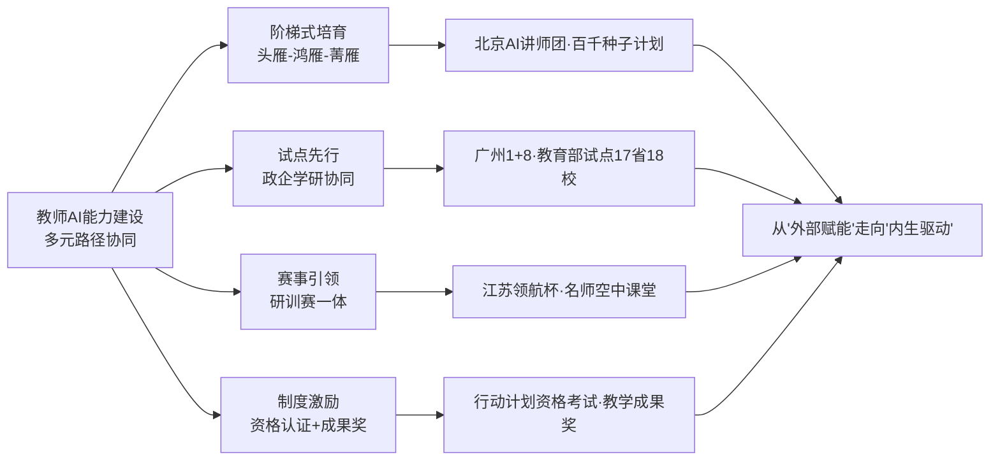

四类路径的演进还呈现出一个深层趋势——**从"外部赋能"走向"内生驱动"**。早期的教师培训以"专家讲、教师听"的外部赋能为主，但单纯的外部赋能难以持续；当前的多元路径正在通过赛事激发自驱、试点共建归属、制度刚性约束、阶梯路径示范等机制，把教师从"被动培训对象"转化为"主动建设主体"。这一转化的关键意义在于：**只有当教师把AI素养发展内化为职业自我成长的有机部分，AI教育的规模化高质量推进才有真正的人格基础**。

## 6.4 教师超级智能体与AI助教：工具赋能下的减负增效

能力建设之外，教师还需要"趁手的工具"。AI教育产业的迅速演进，正在为教师提供一系列旨在解放生产力、提升教学质量的智能工具。这些工具的价值与边界，需要从应用图景与认知陷阱两个维度同时把握。

**工具赋能的"五大环节重构"已经形成实证图景**。第2章已系统呈现这一图景的关键节点，本节从"工具—教师"互动逻辑视角进行整合性梳理。

**备课与教学设计环节**——科大讯飞2025年发布的教师超级智能体"星光"是典型代表，它"能根据教师课表、进度和习惯，主动生成包含优质资源、交互式动画及配套习题的教学课件，打通多平台壁垒"，针对重难点"可通过交互式动画拆解抽象知识"，复习测评阶段教师"通过自然语言指令即可快速生成标准化试卷"，长期使用后能"记忆教师的教学风格、沉淀专属教学资产"。郑州十三中数学老师翟大焕的反馈印证了这一价值——"讲解正方体截面时，原本两节课才能讲透的内容，一节课就让学生透彻掌握"。这一环节的工具价值核心是"把教师从重复性备课中解放出来，聚焦于教学创意"。

**课堂教学辅助环节**——已经形成"师—机—生"三元协同的新形态（详见第2章雄安、郑州十三中实例），AI承担动态演示、实时反馈、分层推送等"机器擅长"的任务，教师承担引导思考、组织讨论、激发洞察等"人之专属"的环节。

**智能批改与学情分析环节**——合合信息蜜蜂AI系统"AI批改准确率达99%，业内率先推出'手抄作业批改'功能"，深圳龙岗英语教师蒋亿加的实践数据——**"应用智能批改系统将100份作文批改耗时由6小时压缩至20分钟"**——是"技术解放教师"最直观的量化证据。这一环节的工具价值核心是"把教师从作业批改的繁重劳动中解放出来，聚焦于个性化辅导"。

**教研协同环节**——青海师范大学附属第三实验中学探索出的"一师一画像"机制（第2章已详述）——**从教学质量、课题研究、团队协作、家校沟通、技术应用五个维度建立动态更新的"教师数字画像"，形成"数据诊断—资源供给—跟踪评价"的教师发展闭环**——是教研环节工具赋能的高阶形态。它把AI从"教学工具"提升为"教研助手"，让教师群体的协作从经验直觉走向数据驱动。

**家校沟通环节**——"星光"智能体"对接智学网数据自动整合学生信息、生成成长档案，并支持接入QQ、微信等通讯工具自动归档学生信息"，"实现7×24小时响应，让教师专注于教学本身"。复旦大学2026年1月正式上线的《生成式人工智能教育教学应用指引》（1.0版）及AI3A教育共创平台、金山办公"春芽计划"2.0为20000所中小学提供"AI助教"——这些工具共同构成了教师减负的"基础设施"。

**工具赋能的边界：脚手架而非替代者**。但工具赋能不等于素养提升，这是必须明确的关键判断。第3章曾援引调研发现："一线教师大多掌握基础AI工具的使用方法，但缺乏将人工智能技术有机融入教学设计、课堂实施全流程的系统能力，普遍面临'会用工具但不会融于课堂'的现实困境"。这一诊断揭示出工具与素养之间的关键鸿沟——**工具是脚手架，素养才是建筑的灵魂**。把"会用智能批改系统"等同于"具备AI教学素养"，无异于把"会用Office"等同于"具备数字素养"——前者是后者的必要不充分条件。

更深层的边界在于：**当工具被滥用为"教学外包"时，不仅不能提升教师能力，反而可能削弱教师专业判断**。这一警示与第3章MIT脑电研究、沃顿土耳其实验所揭示的"使用AI做思考的人，在AI不可用时表现反而更差"的"先扬后抑"曲线，在教师群体中同样存在——一个长期依赖AI生成教学课件的教师，可能在面对突发的、非标准的、需要专业判断的教学情境时反而失去应对能力。因此，第6.5节将要论及的《教师生成式人工智能应用指引》明确强调"加强协同共治"——教师不是工具的被动使用者，而是工具产出的"签字负责人"。

整合工具赋能图景，可以提炼出三条原则性判断：**第一，工具的价值在于解放教师的低附加值劳动，让教师聚焦于高附加值的育人创造**；**第二，工具的边界在于不能替代教师的专业判断、价值引领与情感陪伴，否则就违背了赋能的初衷**；**第三，工具的可持续性依赖于教师素养的同步提升——没有素养支撑的工具使用，终将沦为"用工具掩饰能力欠缺"的伪装**。这三条原则将贯穿后续规则托底与不可替代性论证。

## 6.5 《教师生成式人工智能应用指引》的规则托底

工具的力量越强大，规则的重要性就越凸显。第3章已论及，教育部教师队伍建设专家指导委员会于2025年11月发布的《教师生成式人工智能应用指引（第一版）》是中国教师AI应用治理体系的关键支柱。本节聚焦其作为规则托底对教师角色定位的塑造作用。

**指引四大原则的内在逻辑结构**。指引确立的四大基本原则——**强化价值引领、遵循教育规律、恪守伦理规范、加强协同共治**——并非平行罗列，而是具有内在的递进逻辑。"强化价值引领"是首要原则，要求教师"更加注重思想引领，更加注重智慧启迪和心灵滋养"，把把牢育人方向作为前置约束；"遵循教育规律"是方法论原则，要求技术应用必须服从教育内在规律，不能为了用AI而用AI；"恪守伦理规范"是底线原则，对应第3章伦理章节的隐私、偏见、价值观风险防控；"加强协同共治"是机制原则，把教师从"风险被动承担者"提升为"治理共建者"。这四大原则的递进关系，本质上是从"为什么用、怎么用、不能怎么用、与谁共建"四个维度构建了教师AI应用的完整规则坐标。

**指引的具体场景指引**。在"助力学习变革"层面，指引明确AI可以辅助教师设计个性化学习路径、提供差异化资源推荐、支持探究性学习；在"助力教学提质"层面，指引指明AI可用于备课设计、教学资源生成、学情分析、智能批改等具体环节。但每一项应用指引都伴随着"应当注意什么"的边界约束——例如，AI生成的教学资源必须经教师审核、AI批改的结果不能直接作为最终评价、AI推荐的学习路径不能替代教师的专业判断。这种"应用引导+边界约束"的双轨设计，避免了指引沦为单纯的"鼓励手册"或单纯的"禁止清单"。

**与欧盟《教育者AI伦理使用指南》的对照分析**。第3章已述欧盟指南确立的五大伦理原则——**人的尊严至上、公平与非歧视、透明可解释、隐私与数据安全、学术诚信与合理依赖**，并按教师、学生、学校三维度给出"即插即用"的全场景合规方案。其核心规则之一——"教师不能当甩手掌柜：AI产出必须人工审核、签字负责"——与中国指引"加强协同共治"的原则形成精确对应。这一全球共识的核心价值在于：**它把教师从"工具使用者"提升为"质量责任人"，AI产出必须经过教师的专业判断与价值审核才能进入教学过程**。

下表对照中欧两大指引的关键要素：

| 维度 | 中国《教师生成式人工智能应用指引》 | 欧盟《教育者AI伦理使用指南》 | 共同原则 |
|------|--------------------------------|--------------------------|--------|
| 价值定位 | 强化价值引领·育人方向 | 人的尊严至上 | 人本优先 |
| 教师责任 | 加强协同共治 | 教师不能当甩手掌柜·签字负责 | 责任不可外包 |
| 数据底线 | 恪守伦理规范 | 最小化采集·禁用情绪识别 | 隐私守护 |
| 公平要求 | 遵循教育规律 | 公平与非歧视·拒绝标签化分层 | 普惠包容 |
| 透明要求 | （隐含于伦理规范） | 透明可解释·拒绝黑箱 | 可解释性 |

数据来源：综合自第3章引用资料

**教师角色定位的根本转化：从"风险被动承担者"到"治理共建者"**。指引最深远的意义不在于具体规则，而在于通过"协同共治"原则把教师角色定位从被动客体提升为主动主体。这一转化具有三层含义：**第一，教师不是规则的执行者，而是规则的共建者**——指引明确鼓励教师在使用过程中反馈问题、贡献经验、参与规则迭代；**第二，教师不是风险的承担者，而是风险的识别者**——教师作为最接近学生、最了解教学场景的群体，是发现AI教育风险的"哨兵"；**第三，教师不是治理的对象，而是治理的伙伴**——治理的有效性依赖教师的专业判断、价值守护与日常规约。这一定位呼应第3章"刚柔并济"的治理体系核心命题——**治理的根本不是限制AI，而是培养能驾驭AI、超越AI的人；治理的主体不是少数专家，而是包括教师在内的全部教育从业者**。

**指引的"红线—绿区"二元结构**。第3章已系统呈现高校层面的"5允许+3禁止"规则、中小学层面的分学段使用边界。这一"红线—绿区"二元结构在教师场景同样适用——**绿区（允许）**：教学设计辅助、资源生成、学情分析、智能批改、家校沟通自动化等不涉及核心育人决策的环节；**红线（禁止）**：未经审核的AI内容直接进入课堂、AI替代教师做出关键评价、AI替代教师承担情感陪伴与价值引领、AI产出未经教师签字负责。这一二元结构既给教师留出充分的工具应用空间，又守住"人之专属"的不可让渡领域。

总体而言，指引为教师AI应用提供了**"价值引领+教育规律+伦理底线+协同共治"四维规则托底**——价值引领回答"应该用AI做什么"，教育规律回答"如何用AI才符合教育本质"，伦理底线回答"什么不能用AI做"，协同共治回答"由谁来共同完善规则"。这一规则体系不是对教师创新的束缚，而是对教师专业自主权的保护——**有了清晰的规则边界，教师才能在边界内放心创新，避免在试错中承担本不应由其承担的风险**。

## 6.6 教师不可替代性："成熟个体填补AI漏洞"的价值守护

规则托底之上，需要直面一个更根本的命题——**在AI日益强大的背景下，教师究竟有什么是不可替代的？**这一问题不仅关乎教师的职业安全感，更关乎AI教育的方向性判断——如果教师真的可被替代，那么所有的素养建设、能力建设、规则建设都将失去最终意义；反之，如果教师确有不可替代性，那么这一不可替代性就构成AI教育的根本边界与价值底座。

**"成熟个体填补AI漏洞"的根本判断**。这一表述凝练了教师不可替代性的核心逻辑——AI不是一个完美的、自洽的系统，而是一个充满"漏洞"的概率工具：第3章已系统呈现这些漏洞的图谱，包括幻觉（一本正经地胡说八道）、偏见（训练数据导致的边缘化）、黑箱（决策过程不可解释）、价值偏移（容易产生误导性术语和话语体系）、情感缺失（无法真正感知学生的迷茫、挫败与渴望）等。这些漏洞不是AI技术发展某一阶段的暂时缺陷，而是AI作为"基于模式预测的统计工具"的本质特征。**唯有作为"成熟个体"的教师——具备独立判断、价值锚定、情感共鸣、人格完整的人——才能识别这些漏洞、补救这些漏洞、引导学生认识这些漏洞**。

**教师不可替代性的四个维度**清晰可识：

**维度一：认知卸载防护墙**。第3章已援引MIT媒体实验室的脑电研究、沃顿土耳其高中实验、清华学习研究等多重证据，揭示出"使用AI做思考的人，在AI不可用时表现反而更差"的"先扬后抑"曲线，以及巴斯大学Lindebaum教授所言"将我们变成被动的知识消费者""削弱认知能动性"的根本风险。北京邮电大学校长徐坤将此命名为"结果提升—能力停滞"反常现象。**面对这一全球性认知风险，教师是最关键的防护墙**——通过设计"先思考后用AI""用AI后再反思""不允许AI完成核心思考环节"等学习活动结构，教师可以让AI从"认知替代品"变回"认知脚手架"。这一价值在第4章已被精炼为"AI不应是'答案机器'，而应是'思维伙伴'"——而把"答案机器"扭转为"思维伙伴"的关键，正是教师的教学设计与课堂引导。

**维度二：批判性思维引路人**。第4章已论证"会提问的孩子比会解题的更珍贵"是AI时代教育的核心命题，OECD"高质量教学框架"将"探究学科本质问题"列为五大教学目标之一。这种"提问能力"和"批判性思维"的培养，恰恰是机器无法独立完成的——AI可以回答问题，但难以激发好问题；AI可以验证答案，但难以教会学生质疑既定结论。教师作为"苏格拉底式的导师"——通过追问、反诘、引导拆解困惑——是批判性思维的真正引路人。这一价值在第3章已被论证："教师应鼓励孩子挑战AI的回答、发现算法偏见、提出关乎情感与价值的'傻问题'，保护并激发每个孩子独特的提问视角和好奇心"。

**维度三：情感共同体守护者**。第3章OECD《数字教育展望2026》明确指出"AI能提升学习表现，却无法替代师生间真实的情感联结——这种'表现与学习的错位'，正是技术与教育的本质边界"。教育的本质是"一棵树摇动另一棵树，一朵云推动另一朵云，一个灵魂唤醒另一个灵魂"。这一"灵魂唤醒"的功能不是AI能力增强后可以补足的"暂时短板"，而是AI作为非人格化系统的本质局限——AI"或许可以模拟情绪反馈，但却无法真正感知学生的迷茫、挫败与渴望；可以输出标准化安慰，却无法给予一个眼神、一次拍肩、一场促膝长谈的温度"。雄安史家胡同小学教师在AI智能数学课上"指尖轻点"演示几何图形的同时，"看着学生闪烁的眼神"做出的微妙鼓励、对学习困难学生的私下关心、对班级氛围的体察与调节——这些都是机器无法承担的"情感生态守护"。

**维度四：价值底座塑造者**。这是教师不可替代性的最深层维度，呼应第4章朱松纯"德力"命题。在AI日益接管"智力"工作的背景下，"德力"——以价值判断、社会认知与意义追寻为核心的能力——成为人之为人的根本标志。而这一"德力"的培育，本质上是"以人格塑造人格"的过程——教师以自身的家国情怀、人文素养、师者风范，潜移默化地影响学生的价值观、世界观、人生观。第5章已述清华大学校长李路明的"三位一体"育人理念——"深厚的人文素养+强烈的家国情怀+人工智能赋能人才培养"——其中"人文素养"和"家国情怀"的塑造主要靠教师而非AI。朱松纯"立德树人"命题的工程化落实，最终也必须通过教师的言传身教来实现。

将四个维度整合，可以勾勒出教师不可替代性的"四维价值地图"：

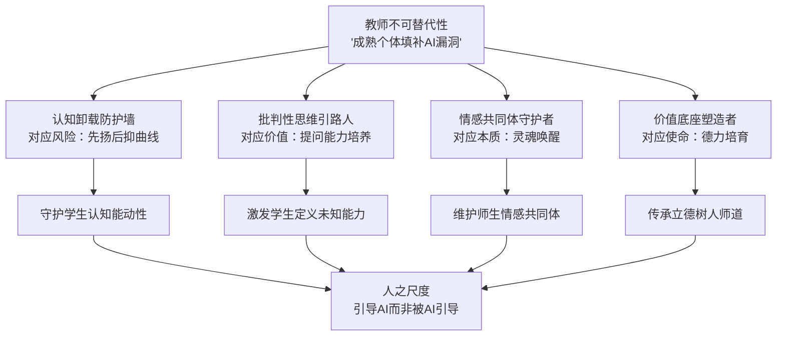

**"AI素养"的真正内涵：会驾驭AI、超越AI、用人之尺度引导AI**。基于上述四维不可替代性，可以重新定义教师"AI素养"的内涵——它不只是"会用AI"的工具技能，更是"会驾驭AI、超越AI、用人之尺度引导AI"的高阶素养。**"会用AI"是基础门槛，对应素养框架中的"知识技能"维度**——掌握AI核心概念、操作技能、典型应用；**"会驾驭AI"是中阶能力，对应"实践应用"维度**——把AI整合到教学设计、课堂实施、评价反馈的全过程；**"超越AI"是高阶能力，对应"专业发展"维度**——通过教研创新发现AI的边界、识别AI的漏洞、贡献人类教师的独特价值；**"用人之尺度引导AI"是终极境界，对应"意识理念"和"社会责任"维度**——以"育人为本、智能向善"的价值底座引导AI使用方向，让AI服务于"完全人格、家国情怀"的培养目标。

这一定位呼应第4章"德力"命题在师者层面的工程化落实——**当人工智能逐步推动"智力"平等化时，教师作为"德力"的承载者与传递者，其不可替代性反而在增强而非减弱**。这是AI时代教师职业最深层的安全感来源，也是教师素养建设的根本动力。

## 6.7 教师队伍的结构性挑战：数字鸿沟、城乡差距与代际落差

不可替代性的论证为教师价值提供了价值底座，但现实是——**当前我国教师队伍的AI素养水平离这一价值定位仍有显著距离**。前述章节已多处揭示这些挑战，本节进行系统性整合。

**挑战一：应用鸿沟——"会用工具但不会融入课堂"**。第3章已述调研发现"一线教师大多掌握基础AI工具的使用方法，但缺乏将人工智能技术有机融入教学设计、课堂实施全流程的系统能力"。这一鸿沟的本质是工具应用能力与教学融合能力之间的脱节——教师可能熟练使用ChatGPT生成教案，但不知道如何把AI生成的教案与学生学情、课程标准、教学目标、班级特点深度融合；可能熟练使用智能批改系统获得分数，但不知道如何把分数背后的学情数据转化为针对性辅导。这一鸿沟的填补需要素养框架中"实践应用"维度的系统化训练——这正是第6.2节"智能教学设计、智能资源开发、智能教学实施、智能教学评价、智能化协同育人"五大子维度的工程化意义所在。

**挑战二：全球性滞后——UNESCO数据揭示的师资体系"裸奔"**。第4章已援引UNESCO数据——**到2022年，只有7个国家为教师制定了人工智能框架或相关项目，15个国家将人工智能学习目标纳入其国家课程**。这一滞后状态意味着大多数国家的教师在AI时代是"裸奔"的——没有系统的能力坐标、没有规范的培育路径、没有清晰的责任边界。我国虽已通过广东省框架、《教师生成式人工智能应用指引》等开始填补这一空白，但全国性、统一性的国家级教师AI素养框架仍处于建设阶段，地方实践与国家标准的衔接仍需深化。

**挑战三：城乡师资能力悬殊**。第5章已述基础教育AI教育落地中的师资多元化探索——北京"高校博士兼职和企业导师"、上海"专职AI教师"、广州"信息技术老师转型"——这些路径的差异本身就反映了不同城市师资基础的悬殊。更显著的差距出现在城乡之间。雄安新区的实情极具代表性：北京市第八十中学雄安容东分校信息技术教师张梦雅坦言，雄安教师"基本上就比较年轻，大部分的老师都是95后，甚至有00后"——年轻教师专业积淀有限、AI教学经验不足，成为雄安等新城面临的师资短板，需要通过京雄合作"种子教师"机制（第2章已详述）、北京AI教育讲师团送课到校等外部赋能弥补。皮山县的边疆教育案例则展示了另一种形态的师资落差——通过安徽援疆"教师国通语学习平台"，在国通语能力提升的同时配套AI教学能力培育，实现"语言能力+智能能力"的双重赋能。

**挑战四：东中西部AI素养发展不均衡**。第5章已援引清华职教报告（《职业教育人工智能应用发展报告（2024—2025）》）的14项挑战中明确提及"师生智能素养发展不均衡"、"教师层面局限于效率提升工具，在教学中的成效尚不明显"等结构性问题。报告"两成教师使用AI工具超过1年""初步具备智能教学素养"但"区域差异明显"的诊断，准确刻画了职教师资AI素养的真实图谱。这一不均衡格局也存在于普通中小学和高校师资群体——发达地区的研究型大学已经在推进"X+AI"双学位的教学，而中西部地方应用型高校的部分教师可能还在为"如何用ChatGPT备课"困惑。

**挑战五：跨界教师占比过高与AI专职教师严重短缺**。第5章已述"73%的学校都在依赖跨界教师去对孩子们进行AI教育，AI教师的招聘竞争则更是激烈到无法想象"的现实，并对北京、上海、广州的AI教师来源差异进行了对比——北京"高校博士兼职"、上海"专职AI教师"、广州"信息技术老师转型"。这一图景反映出AI教育扩张速度与AI教师培养速度之间的"剪刀差"——课程要求来得快，专业教师跟不上。短期内只能依赖跨界教师"赶鸭子上架"，但跨界教师的AI专业积淀、教学经验、伦理判断能力都难以与专职教师比拟。AI专职教师培养体系的滞后，是当前师资建设最关键的结构性瓶颈之一。

**挑战六：代际数字鸿沟**。第3章已述家长层面"普遍存在监管能力欠缺、代际数字鸿沟等结构性短板"，这一鸿沟在教师群体中同样存在。资深教师拥有丰富教学经验和深厚学科积淀，但对生成式AI等前沿技术的接受度可能较低；年轻教师对AI技术敏感度较高，但教学经验和育人智慧相对不足。这种"经验—技术"的代际错配如果不能通过共同体机制弥合，反而可能形成"老教师不愿用、年轻教师不会教"的双重困境。

**挑战七：使用者素养与认知风险**。中国青少年研究中心面向7省（市）8563份问卷的调查（详见第3章和第5章）揭示出学生侧的认知依赖问题——20.5%的中小学生"想依赖AI思考不想自己思考"、农村学生比例（22.8%）高于城市学生（17.7%）。这一学生侧风险反向折射出教师侧的素养压力——**只有当教师自身具备清晰的"AI使用方式辨识"能力，才能有效引导学生避免认知卸载、培养批判性思维**。从这一意义上说，教师AI素养的薄弱不仅是教师自身的发展瓶颈，更是学生认知健康的关键风险。

将七大挑战整合，可以勾勒出我国教师队伍AI素养建设的"挑战图谱"：

| 挑战类型 | 核心问题 | 关键证据 | 影响维度 |
|---------|---------|---------|---------|
| 应用鸿沟 | 会用工具但不会融入课堂 | 一线教师调研 | 教学质量 |
| 体系滞后 | 国家级框架建设不足 | UNESCO仅7国制定 | 标准缺位 |
| 城乡悬殊 | 城乡师资能力差距 | 雄安95后/00后教师·皮山边疆教师 | 教育公平 |
| 区域不均 | 东中西部发展不均衡 | 职教报告14项挑战 | 整体水平 |
| 师资短缺 | 跨界教师占比过高 | 73%学校依赖跨界教师 | 专业深度 |
| 代际错配 | 经验—技术错位 | 资深-年轻教师双重困境 | 共同体进化 |
| 风险传导 | 教师素养弱→学生风险高 | 22.8%农村学生认知依赖 | 育人安全 |

数据来源：综合自[^130]及前述章节引用资料

这一图谱并非要传递悲观情绪，而是要为应对路径提供准确的诊断坐标。挑战的真实暴露恰恰是治理的起点——只有看清挑战的多维结构，才能设计出多层次、多主体、多机制的应对方案。

## 6.8 应对路径与制度保障：从能力赋能到生态共建

面对七大结构性挑战，单一路径的应对都难以见效。当前我国正在形成"国家平台+区域联盟+学校实践+个体内驱"四级联动的师资生态共建机制，回应挑战的多维结构。

**第一级：国家平台——"AI for教师发展"的顶层布局**。第1章已述教育部部署的"AI for学校教育、AI for终身教育、AI for科技创新、AI for国际交流、AI for教师发展、AI for教育治理"六大布局，其中"AI for教师发展"是教师生态共建的国家级战略锚点。国家智慧教育公共服务平台作为这一布局的核心载体，**已突破1.78亿用户总量，汇集13万余条中小学优质资源、1.25万余门职业教育精品课程、14.5万门高等教育优质课程，并在2025年上线智能版2.0**——这一规模的优质资源库为全国教师特别是中西部、农村教师的能力建设提供了普惠基础。前述教师资格考试纳入AI内容、智能教育项目教学成果奖等制度安排，构成国家平台的制度激励配套。教育部启动的"人工智能赋能教育试点"在17个省市和18所高校展开，则构成国家平台的实验性载体。

**第二级：区域联盟——跨区协同的师资能力外溢**。这一层级的代表性实践已在第2章和第5章详述。**京雄合作"种子教师"培育机制**——北京AI教育讲师团55位专家送课到校，雄安史家胡同小学副校长宋莎莎反馈"班超运动汇双向接入、京雄两地中小学AI教师交流研修共同体"——是跨区域师资能力外溢的标志案例。**安徽援疆智慧教育"皮山模式"**——投入1.4亿元援疆资金、配套"教师国通语学习平台"——则展示了对口支援机制下"语言+智能"双重赋能的边疆师资建设路径。**赣榆区"AI赋能教学名师工作室与城乡联盟云教研"**——投入1000万元、城乡联盟云教研机制、教师周活跃率稳定在95%以上——则是县域层级城乡协同的典型样本。这三类区域联盟模式分别对应"东西部协作""对口援疆""县域均衡"三种治理场景，共同构成区域联盟层级的多元工具箱。

**第三级：学校实践——校本化的能力建设与教研创新**。学校层级的应对路径呈现出"校本数据画像+协同教研+实战课程"三位一体的工程化形态。**青海师范大学附属第三实验中学"一师一画像"**机制（第2章已详述）——从教学质量、课题研究、团队协作、家校沟通、技术应用五个维度建立动态更新的"教师数字画像"，形成"数据诊断—资源供给—跟踪评价"的教师发展闭环——是校本数字化教师管理的高阶探索。**广州"政企学研"协同合作**——覆盖1517所学校125.6万学生的师资网络——展示了示范区层级的学校实践协同。**北京中关村学院"以终为始"实战课程**——8学时短课、每两次开课迭代50%内容、"天使投资"路演环节——则代表了高校层级师资创新的极致探索。

**第四级：个体内驱——教师从"被动培训"到"主动成长"的转化**。第6.3节已论及教师培育从"外部赋能"走向"内生驱动"的演进趋势。这一转化的关键机制在于：**通过赛事激发自驱（领航杯）、通过试点共建归属（教育部试点）、通过制度刚性约束（资格考试纳入AI）、通过荣誉激励引导（教学成果奖）、通过共同体协作进化（教研工作室）**等多元工具，让教师把AI素养发展内化为职业自我成长的有机部分。第6.6节论及的不可替代性——四维价值地图——则在更深层次为个体内驱提供价值动力：当教师真正理解自身在AI时代的不可替代价值时，"成长"就从外部要求转化为内在驱动。

将四级机制整合，可以勾勒出"四级联动"的师资生态共建路径：

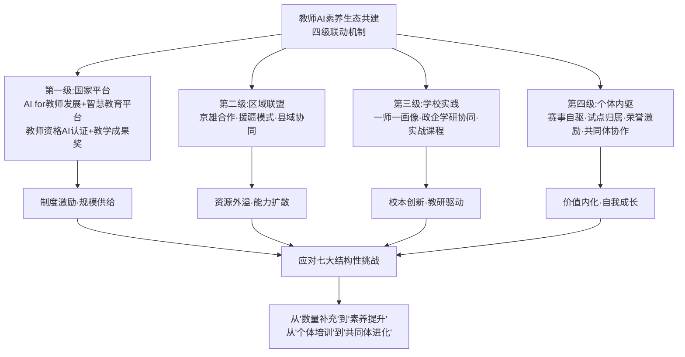

**演进方向：从"数量补充"转向"素养提升"、从"个体培训"转向"共同体进化"**。回顾我国教师队伍AI能力建设的发展脉络，可以看出两条清晰的演进主线：**一是从数量到质量的转向**——早期重点是"补足AI教师数量缺口"，包括跨界教师转型、企业导师兼职等；当前的重点已经转向"提升存量教师的AI素养"，通过素养框架、应用指引、培育路径等系统化机制实现质的跃升。**二是从个体到共同体的转向**——早期重点是"对单个教师的培训"，主要通过课程、讲座、自学完成；当前的重点已经转向"教师专业共同体的协同进化"，通过教研工作室、城乡联盟、跨区共同体、产学研协作等机制实现群体性进化。这两条转向共同指向AI时代教师队伍建设的根本逻辑——**教师不是孤立的工具使用者，而是教育生态中的协同共创者；教师素养不是静态的能力清单，而是与AI技术、教育需求、学生发展同频共振的动态生成物**。

研究亦明确指出："基于联合国教科文组织《教师人工智能能力框架》与国内相关实证研究"建构本土素养框架，正是要"为加强新时代教师队伍建设、推动教育高质量发展"提供"契合我国基础教育实际、兼具国际视野的人工智能素养框架"[^130]。这一定位将教师AI素养建设上升到"建设教育强国的重要战略举措"层面[^130]——它"不仅关系到自身教学能力的更新升级，更直接影响着教育领域创新人才的早期培育和国家教育竞争力的提升"[^130]。当前，"人工智能驱动的教育数字化转型正处于从外部支持转向内在驱动的关键阶段。提升中小学教师人工智能素养，实质上是在为教育数字化转型奠定坚实的微观支撑"[^130]——这一判断深刻揭示出教师在国家AI教育战略中的"微观支撑"地位。

---

综上，本章作为"教育反哺AI"线索的关键支撑环节，从八个层次系统呈现了AI时代教师队伍建设的角色转型、素养框架、培育路径、工具赋能、规则托底、不可替代性、结构性挑战与生态共建。可以得出以下核心判断：**第一，AI时代教师角色经历"对象重置（教教材→教学生）、关系重构（单向传导→师机生三元协同）、本体重塑（知识权威→学习生态创建者）"三重转型，新职能定位为"学习设计者+人机协调者+价值引导者+灵魂陪伴者"四维一体；第二，教师智能素养已形成UNESCO"五维15项"和广东省"五维16项"的双轨参照框架，"五位一体"核心内涵——意识、知识、实践、发展、责任——与"因何为师、以何为师、何以为师、师者为何"四维师道追问相互支撑，体现中国本土的人文哲学底色；第三，能力建设呈现"阶梯式培育+试点先行+赛事引领+制度激励"四类机制并行的工程化格局，演进方向是从"外部赋能"走向"内生驱动"；第四，教师超级智能体、AI助教等工具在备—教—批—研—沟通五大环节实现工具赋能，但工具是脚手架而非替代者，工具的可持续性依赖于素养的同步提升；第五，《教师生成式人工智能应用指引》通过"价值引领+教育规律+伦理底线+协同共治"四维规则托底，把教师从"风险被动承担者"提升为"治理共建者"，与欧盟伦理指南形成全球共识；第六，教师不可替代性体现为"认知卸载防护墙+批判性思维引路人+情感共同体守护者+价值底座塑造者"四维价值地图，其本质是"成熟个体填补AI漏洞"——AI素养的真正内涵是会驾驭、会超越、用人之尺度引导AI；第七，结构性挑战呈现"应用鸿沟+体系滞后+城乡悬殊+区域不均+师资短缺+代际错配+风险传导"七维图谱，需要通过"国家平台+区域联盟+学校实践+个体内驱"四级联动应对；第八，演进方向是从"数量补充"转向"素养提升"、从"个体培训"转向"共同体进化"，教师作为"教育数字化转型的微观支撑"，是国家AI教育战略的关键人格化变量**[^130]。

带着教师作为"成熟个体填补AI漏洞"的不可替代价值与"四级联动"的生态共建蓝图，下一章将进一步把视野拓展到教师之外更广阔的生态系统——产学研用协同与AI教育产业生态，剖析科技巨头、传统教育企业、垂直创业公司在GenAI+教育领域的差异化策略，验证"算法壁垒+私有数据+核心场景"的新商业逻辑，并探查产学研用融合机制如何反向支撑高校AI人才培养与科研创新，使"AI赋能教育"与"教育反哺AI"两条线索在产业接口层面实现深度合龙。

# 7 产学研用协同与AI教育产业生态

前六章的论证已经搭建起"AI赋能教育—教育反哺AI"双向框架的两根支柱：左侧支柱是应用图景（第2章）、治理生态（第3章）所揭示的"AI如何作用于教育"的实然格局与制度边界；右侧支柱是战略支撑（第4章）、贯通培养（第5章）、教师队伍（第6章）所论证的"教育如何反哺AI"的价值底座与人格化承载。两根支柱已立，但两者之间还需要一座**承重梁**——把应用、治理、人才、教师这四个看似分立的命题，整合到同一个产业生态中，让技术研发、人才培养、场景验证、价值反哺形成一个真实运转的飞轮。

这座承重梁就是产业生态。它既是AI技术下沉到课堂的"传输管道"，也是教育需求反向校准AI研发的"反馈通路"；既是高校学科创新的"协同伙伴"，也是教师专业发展的"工具供给方"。本章作为双向赋能框架的产业接口，沿"产业全景—主体竞争—商业逻辑—大模型演进—智能硬件—智慧校园—产教融合—双向反哺—生态挑战"九个层次展开，回应用户对"AI实际能落地的场景"与"学校培养AI人才体系"的双重关切，并为第8章战略建议铺设产业生态基础。

## 7.1 AI教育产业链全景：上中下游格局与CBDG四维生态

理解产业生态的逻辑起点，是把握其完整链条的结构图谱。当前我国AI赋能教育产业链已经形成"上游技术底座—中游应用场景—下游服务终端"的三层架构，并在此基础上演化出独具中国特色的"CBDG四维生态"范式。

**产业链三层架构的清晰图谱**。从产业链分工看，上游为AI应用提供算力基础设施和数据服务，包括AI芯片、AI服务器、存储设备、网络及基础数据服务；中游为AI应用提供商，根据不同领域开发解决方案；下游面向互联网、金融、教育、医疗、工业等领域[^131]。聚焦到教育产业链，多鲸推出的《2025 AI赋能教育行业图谱》以完整产业链视角呈现了**33个关键赛道、覆盖数百家主流教育企业**的创新格局[^132]。

上游层面，"算力平台、AI芯片、数据服务提供基础计算力，机器学习平台与知识图谱构建算法能力，而模型工具与大模型应用（OpenAI、DeepSeek、百度、讯飞星火等）则成为创新的直接驱动者"[^132]。这一层的产业规模数据极为震撼——中国AI计算加速芯片市场规模从2021年的301.28亿元增长至2024年的1425.37亿元，年均复合增长率达67.87%，预计2025年将达2398亿元、2026年达3813.9亿元；中国AI服务器市场2024年规模达1231亿元，较上年增长119.82%，2025年预计达2031亿元[^131]。这些数字构成了AI教育产业的"算力底盘"——没有上游算力的爆发式增长，就没有中下游教育大模型与智能硬件的规模化落地。

中游是AI赋能教育的核心落地场景，也是产业价值释放的"主战场"，呈现出三轨并进的格局：**toC端**——AI正在渗透早幼教、K12及职业教育，AI学习机、语言学习工具，以及素质教育赛道（编程、科创、艺术教育）不断拓宽边界；**toG端**——智慧校园解决方案、智慧纸笔、XR设备、AI PC、电子学生证等全面升级教学与管理，推动区域教育数字化转型；**toB端**——面向机构，SaaS和智能化营销工具正在改写运营逻辑，让教育企业从粗放增长走向精细运营[^132]。下游则直接连接用户与服务，涵盖学校、教育机构、学生与家长，实现从产品到场景、从体验到增值的闭环。

**CBDG四维生态：中国AI教育产业的独特范式**。如果说产业链架构呈现的是"产业的骨骼"，那么"CBDG四维生态"——消费者（C）、企业（B）、设备（D）、政府（G）——则刻画的是"产业的血脉"。36氪研究院发布的《2025年中国大模型行业发展研究报告》提出这一范式的核心洞察："大模型的成功不再取决于单一模型的性能，而在于能否在C、B、D、G四个维度形成高效联动的飞轮"，**戳破了"技术决定一切"的迷思**[^133][^134]。

四维生态并非简单并列，而是形成相互赋能的飞轮效应：消费者（C端）是应用创新的"试验场"与"反馈源"，C端是大模型应用创新的起点，也是商业模式的"试金石"[^133]；企业（B端）是产业价值变现的核心承载；设备（D端）是技术落地的物理终端；政府（G端）通过算力补贴、公共采购、安全标准为产业提供市场空间与发展红线[^134]。从典型企业的差异化路径看，"科大讯飞深耕政企市场的'稳'，到字节跳动用C端流量反哺模型的'快'，再到阿里夸克以工具集突围的'巧'，头部企业的差异化路径，已为行业画出了清晰的生存法则——谁能整合生态、深耕场景、平衡创新与安全，谁就能在智能革命的下半场占据主导权"[^133]。

**总体规模演进的多源数据印证**。把多份研究报告的数据并置整合，可以勾勒出AI教育产业规模演进的完整图谱：

| 维度 | 关键数据 | 来源 |
|------|---------|------|
| 中国大模型市场规模 | 2024年294.16亿元，2026年预计突破700亿元，2024年同比增长62%，2025-2026年增速维持50%以上 | [^133][^134] |
| 多模态大模型 | 2024年规模156.3亿元，占整体市场53%；数字人24%、游戏13%、广告商拍13% | [^133] |
| 教育大模型市场 | 2023年约0.27亿元，行业大模型市场规模约105亿元 | [^135] |
| 智能教育行业 | 2024年中国市场规模约3693.9亿元（第2章已述） | — |
| AI教育硬件 | 2025年前11月销量1000万台、规模380亿元；2030年预计1200亿元（第2章已述） | — |
| 全球教育智能硬件 | 2024年突破800亿美元，中国占比超40% | [^136] |
| 教育云市场 | 中国电信天翼云16.38%市场份额位居第一（第2章已述） | — |

这一组规模数据揭示了三个深层趋势：**第一，AI教育产业已从"可能性论证"走向"千亿级真实生态"**——大模型300亿、智能教育3700亿、教育硬件380亿等多个赛道并行扩张；**第二，多模态成为增长的核心引擎**——这背后是"Transformer架构优化、RLHF微调机制普及，让模型泛化能力显著提升"的技术成熟，与"企业端降本增效需求、消费端内容创新需求"的场景共振[^133]；**第三，政策从"鼓励创新"演进到"安全与发展并重"**——36氪报告将政策演进划分为战略确立期（2017-2020）、体系建构期（2020-2023）、规范引领期（2023-2025）三个阶段，形成"创新驱动、基础强化、场景牵引、安全治理"四位一体的格局[^133][^134]，与第3章治理章节论述形成产业层面的深度呼应。

承接这一产业坐标，下文将依次进入主体竞争、商业逻辑、大模型演进、智能硬件、智慧校园、产教融合、双向反哺、生态挑战的递进剖析。

## 7.2 产业主体的差异化竞争策略：科技巨头、传统教育企业与垂直创业公司

产业链格局之上，需要进一步聚焦主体维度——**谁在AI教育产业中扮演什么角色，又以何种逻辑展开竞争？**当前的产业图谱中，科技巨头、传统教育企业、垂直创业公司三类主体已经形成清晰的差异化竞争格局，分别对应"To B领跑、To C引爆、垂域深耕"三条主线。

**科技巨头层面：四大天王的差异化路径**。2024年的市场表现已经清晰呈现出科技巨头的分化格局——**讯飞、字节、腾讯、阿里**走出了"稳、快、巧、协"的四种打法[^133][^134][^137]。

科大讯飞代表"稳"——深耕政企B端市场。第三方机构智能超参数发布的《中国大模型中标项目监测报告（2024）》指出，**2024年在通用大模型厂商中标排行榜中，科大讯飞以91个中标项目、披露中标金额84780.8万元（8.48亿元）排名第一，成为2024年度标王——从披露的中标金额来看，它是百度的两倍、智谱AI的八倍**[^137]。这一"To B领跑"姿态背后，是讯飞的"先发先至"路径：OpenAI发布ChatGPT仅仅半个月后，科大讯飞就已经决定要把资源压上去做大模型，并在接下来两年时间里快速确定了技术思路和技术路线，完成多轮技术迭代[^137]。

字节跳动代表"快"——用C端流量反哺模型。**2024年8月至今，字节跳动在AI领域一共推出了包括豆包大模型家族在内的17款大模型、2个智能体开发平台**；2024年以来已在国内外推出包括豆包在内的20余款App，覆盖AI聊天助手、AI视频工具、AI娱乐应用、办公等多个领域[^137]。其投入力度堪称"大力出奇迹"——**2024年字节跳动在AI上的资本开支达到800亿元，甚至接近百度、阿里、腾讯的总和（约1000亿元）；字节2024年采购了约23万张英伟达芯片，成为仅次于微软的英伟达全球第二大买家**[^137]。市场结果同样亮眼：截至11月，豆包App月活跃用户数已经接近6000万，MAU增速达到16.92%[^137]；从全球月活规模看，豆包App已经成为仅次于OpenAI的ChatGPT的AI应用[^137]。

阿里夸克代表"巧"——以工具集突围；腾讯则代表"协"——依托微信生态构建家校协同打法。第2章已述2025年第三季度蚂蚁集团旗下AQ与抖音集团旗下豆包爱学的月活复合增长率分别达83.4%和15.7%，正是巨头垂类教育应用加速释放的体现。

**传统教育企业层面：好未来"乘法模型"与新东方"加法模型"的战略分化**。传统教育企业的竞争逻辑则呈现出与科技巨头截然不同的图景。从2026年财年的最新财报对比看：4月22日新东方公布2026财年第三财季业绩，**Q3净营收14.173亿美元，同比增长19.8%**；4月23日好未来公布2026财年第四季度及全年业绩，**Q4净收入8.02亿美元，同比增长31.5%；全年净收入30.09亿美元，同比增长33.7%**[^138]。"体量上，新东方仍稳居行业第一，但增速差距明显拉开。新东方13%的整体增长对应的是50亿美元级别的成熟体量，而好未来33.7%的增速则发生在约30亿美元规模之上，仍处于更强的增长弹性区间"[^138]。

两种增长结构呈现深刻分化：**"新东方更接近'加法模型'，通过教育、新业务与文旅等多业务线的横向叠加来驱动整体增长；而好未来则更接近'乘法模型'，通过核心教育体系的效率提升与AI能力嵌入，在既有业务基础上放大产出能力"**[^138]。

新东方的"加法模型"以"新东方之家"为核心载体——一个横跨教育、生活与文旅的家庭级客户服务系统，**已在杭州、苏州、西安、武汉等12个城市启动试点，累计吸引超过33万户家庭注册，营销活动激活率达到10%至15%**[^138]。CFO杨志辉明确了方向变化："过往，新东方一直致力于服务每位独立的客户。展望未来，我们将把视角延伸至服务整个家庭单元"[^138]。文旅业务则承担第二增长曲线功能——当前在55个城市开展K12与大学生游学研习营业务，并在30个特色省份及海外推出面向中老年群体的文旅产品[^138]。

好未来的"乘法模型"则把AI深度嵌入核心教育体系。其早在2023年8月就开启自研数学大模型MathGPT公测，**覆盖小初高数学题，是以解题和讲题算法为核心的数学垂直领域的大模型，也是国内首个专为数学打造的大模型**[^135]。AI能力的产品化落地体现在学而思学习机的小思智能学伴上——**好未来披露过一个数据，在学而思学习机上，2024年"小思"被累计唤醒2.3亿次。每一次唤醒的背后，都有AI能力在支撑**[^139]。好未来CTO田密的描述生动呈现了这一AI价值跃迁："以前没有大模型，只能做到一个题目对应一个知识点，但有了大模型之后，可以做到每一个步骤都能有对应的知识点，而且对孩子学习的判断和推荐也更加精准。孩子跟AI老师的对话，真的像和一位真人名师的对话一样"[^139]。

财务数据同样印证AI的"乘法效应"——好未来2024财年第四季度净收入从上年同期的2.69亿美元提升至4.30亿美元，**同比涨幅高达59.7%，高于彭博社公布的市场一致预期增速44%**；归属于好未来的净利润本季度成功转正，录得2,750.8万美元，相较于上年同期的净亏损3,941.7万美元实现财务逆转；2024财年全年净亏损大幅减少，从1.36亿美元减少至357.3万美元，**缩减了97.4%**[^140]。这一"亏损收窄超97%"的奇迹，正是"科教、科创、科普"战略转型下AI技术深度赋能的财务回报[^140]。

下表整合两类主体的差异化策略：

| 主体类型 | 代表企业 | 核心策略 | 关键数据 | 战略本质 |
|---------|---------|---------|---------|---------|
| 科技巨头·稳 | 科大讯飞 | 政企B端深耕 | 2024年中标91项、8.48亿元、年度标王 | 先发先至、To B领跑 |
| 科技巨头·快 | 字节跳动 | C端流量反哺模型 | 2024年AI投入800亿、豆包月活近6000万、17款大模型 | 大力出奇迹、To C引爆 |
| 科技巨头·巧 | 阿里夸克 | 工具集突围 | C端创新加速 | 工具入口、生态延伸 |
| 科技巨头·协 | 腾讯 | 家校协同 | 微信生态轻量化 | 关系连接、轻量起步 |
| 传统教育·乘法 | 好未来 | AI深嵌核心教育 | 全年增长33.7%、亏损收窄97.4%、小思2.3亿次唤醒 | 系统效率放大 |
| 传统教育·加法 | 新东方 | 多业务横向叠加 | 全年增长13%、新东方之家33万户家庭 | 业务扩张矩阵 |

数据来源：综合自[^137][^133][^138][^139][^140]

**垂直创业公司层面**：作业帮、网易有道等专注教育垂域的企业则呈现差异化路径——作业帮自研作业帮大模型、网易有道推出子曰教育大模型，瞄准学习辅助、语言学习、错题诊断等垂直场景[^141]，与科技巨头的"通用能力+教育场景"和传统教育企业的"内容积累+AI赋能"形成第三极。

整合三类主体的竞争图景，可以看出当前AI教育产业已经进入"**多元主体共生、差异化路径并行**"的成熟阶段——没有任何一类主体能够独占整个产业链，每一类主体都在自己的优势腹地构建独特的价值主张。这种多元共生格局的根本意义在于：**它通过竞争压力倒逼每一类主体提升核心能力，通过差异化路径满足教育场景的多元需求，最终为下游学校、机构、学生、家长提供更丰富的选择**。

## 7.3 GenAI+教育的新商业逻辑：算法壁垒、私有数据与核心场景三角

主体竞争的差异化路径背后，是新商业逻辑的根本转向。如果说2024年之前的AI教育竞争还停留在"参数规模—基准排名"的单点对决，那么2025年开始的竞争已经升级为"生态构建—技术研发—行业赋能—商业变现—创新拓展"的多维较量[^133]。理解这一逻辑跃迁的关键，是把握"40/60分割"哲学命题与"算法壁垒+私有数据+核心场景"三角护城河。

**"40/60分割"：教育中技术与人的根本边界**。2026年发布的《中国GenAI+教育行业发展报告》提出的"40/60分割"核心思考极具洞察力——**教育过程中约40%的部分属于技术工具化范畴，而剩下的60%则是人类的主场服务，涉及情感唤醒、价值塑造、悟性启发以及复杂问题的实时引导。技术的价值在于将人类教师从40%的繁琐中解放出来，使其全身心投入到60%不可替代的教育劳动中**[^142]。这一分割与第6章教师不可替代性的"四维价值地图"形成精确对应——AI承担的"40%"对应"学习设计辅助、资源生成、智能批改"等机器擅长的环节，教师守护的"60%"对应"认知卸载防护、批判性思维引领、情感共同体维护、价值底座塑造"四维不可替代价值。

报告进一步阐释这一分割的动态演进逻辑："关于教育中技术的不可替代之物是一个长期、宏大且充满争议的研究课题……技术与技术不可替代之物的博弈是一个动态迁移的过程，AI对复杂认知的深度渗透与顿悟在不断演进，技术的赋能半径持续扩张；或许未来GenAI跨越了元学习的技术奇点……40/60分割的边界线仍会被技术不断拓展，并迫使我们去反复思考教育中那块最核心、最无法被算法化的人类力量的领地应该如何定义"[^142]。这一动态边界观对教育科技企业的产品设计具有根本指导意义——**优秀的AI教育产品不是要扩大占领"60%"的人之领域，而是要在"40%"的工具化范畴内做深做透，让教师有更多精力投入"60%"的不可替代劳动**。

**GenAI技术驱动教育变革的演进方向**。报告对GenAI技术驱动教育变革的演进方向给出了清晰判断——以**"规模化的个性供给"和"可量化的教学成效"**为演进方向，"GenAI技术通过重构教育产业中四大核心要素带来显性变革：将静态的教学信息升级为可实时交互的动态智能体，将辅助性的效率工具进化为深度参与学习过程的认知伙伴，将能感知会思考的智能载体能力赋予到传统智慧教室终端场景，将刚性的班级组织形态逐步瓦解为更具弹性的人机协同网络"[^142]。"规模化的个性供给"和"可量化的教学成效"两个关键词，恰恰是教育科技产品的核心商业价值主张——前者解决"千人千面"的因材施教刚需，后者解决"提分提能"的可衡量结果。

**"算法壁垒+私有数据+核心场景"的三角护城河**。基于上述哲学边界与演进方向，新商业逻辑的核心是构建"算法壁垒+私有数据+核心场景"三位一体的护城河。

**算法壁垒**体现为教育垂域大模型的推理能力与思维链优化。第2章已述2025年初DeepSeek以出色的思维链效果和成本控制能力激发了教育行业从业者对大模型在教育场景落地应用的极大热情；但行业头部企业正在从简单接入DeepSeek转向"探索多模态和全局AI的应用前景"[^139]。学而思在新一代AI学习机产品中的实践——**当孩子遇到难题时，AI会先确定知识点，鼓励孩子自主解题，然后进行分步骤解析，最后引导追问，出几个同类型的题目，确认是否真实掌握。每一个步骤，AI都会及时做出反馈**[^139]——正是教育垂域算法壁垒的具体形态。

**私有数据**体现为长期积累的题库、学情、教研数据资产。这一壁垒在传统教育企业身上表现得尤为突出。好未来"以内容能力与科技能力为基础"的二十余年积累，使其拥有覆盖小初高的题库、错题数据、教研沉淀；学而思学习机上"小思"2024年累计唤醒2.3亿次产生的海量交互数据，更是任何后来者难以追赶的资产壁垒[^139]。这种私有数据的价值在于它不是公开互联网数据的简单子集，而是**经过教学场景验证、教研专家标注、学生真实反馈三重筛选的高质量训练养料**，对教育大模型的精度提升具有决定性意义。

**核心场景**体现为教学闭环的深度嵌入而非浅层工具叠加。区别于通用AI助手的"询问—回答"浅层应用，教育垂域产品需要嵌入"诊断—讲解—练习—反馈—巩固"的完整教学闭环。学而思的"小思AI"展示出"AI老师"的画面：先确定知识点—鼓励自主解题—分步骤解析—引导追问—出同类题确认掌握[^139]，正是核心场景嵌入的典型形态。"千亿学习机背后，比拼的是大模型能力和优质内容"[^139]——好AI（算法）+好内容（数据+场景）的双轮驱动，是这一商业逻辑的精炼概括。

**从"技术决定论"到"生态决定论"的范式转变**。三角护城河的整合逻辑指向一个更根本的范式转变。36氪报告指出，过去比拼"参数规模、基准测试排名的单点对决，正在被生态构建、技术研发、行业赋能、商业变现、创新拓展的多维较量取代"[^133][^134]。这一转变的根本意义在于：**单纯的技术领先无法转化为商业胜利，必须通过生态构建把技术能力下沉到具体场景、转化为真实价值**。

将新商业逻辑可视化：

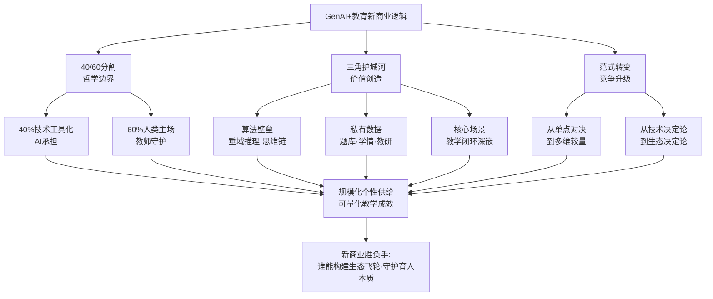

这一新商业逻辑对产业各类主体提出了不同的能力要求：科技巨头需要补足"教育垂域数据与场景嵌入"的短板，传统教育企业需要补足"算法能力与技术研发"的短板，垂直创业公司则需要在某一垂域形成"算法+数据+场景"的微型闭环。三角护城河的构建是一个长期工程，而非短期突击——这正是当前产业格局走向"分化与稳定"的根本动因。

## 7.4 教育大模型的演进趋势：垂域突破与多模态认知

如果说商业逻辑勾勒了产业的"竞争规则"，那么教育大模型则是这一规则下的"核心赛道"。作为AI教育产业的技术底座，教育大模型的演进直接决定了下游产品的能力上限与场景边界。

**教育大模型的市场属性与典型布局**。从市场属性看，**教育大模型是适用于教育场景、具有超大规模参数、融合通用知识和专业知识训练形成的人工智能模型，能够根据学生的学习行为、学习成果等信息进行自动化分析，并提供个性化的学习建议和教学方案**[^135]。它本质上属于行业大模型的范畴——基于通用大模型技术底座，在落地到特定行业时，针对特定行业需求和应用场景融入大量行业特定的数据和知识，从而在专业领域内表现出更高的准确性和实用性[^135]。从规模看，2023年中国行业大模型市场规模约105亿元，**教育领域是最受关注的大模型落地应用场景之一**[^135]。

国内主要教育大模型布局已经形成清晰的差异化格局。从厂商类型看，"百度、科大讯飞等科技类玩家到作业帮、学而思、猿辅导等教育科技品牌，还有步步高等传统教育硬件品牌，各家纷纷推出自家的大模型，比如讯飞的星火大模型、作业帮的作业帮大模型、网易有道的子曰教育大模型，学而思的九章大模型等，并不断迭代自家的AI学习机产品"[^141]。这一布局清单中，**好未来九章大模型MathGPT是2023年8月开启公测的国内首个专为数学打造的大模型**[^135]，覆盖小初高数学题，以解题和讲题算法为核心；讯飞星火则在政企B端市场广泛部署；网易有道子曰大模型聚焦语言学习与翻译；作业帮大模型则深耕作业辅导场景。

**多模态认知能力的跃迁是教育大模型最具想象力的演进方向**。2024-2025年，AI学习机赛道刮起了"多模态旋风"——从语音单模态走向语音+图像+情绪识别的全感知交互。学而思学习机AI旗舰产品T系列的"智慧岛Pro"是这一跃迁的典型代表——**摄像头区域做成了一体化设计，不仅集成了摄像头模组，也扮演着耳朵、嘴巴和脸的角色，比如拍一拍智慧岛Pro可以唤醒小思，滑动顶部还可以切换到不同的学习模式**[^139]。学而思学习机AI产品负责人李通明确指出："我们试着往学习陪伴机器人的方向又走了一步"，"智慧岛的设计，不仅让AI能说能看会思考，更关键的是让AI有了多模态的能力，以前的语音助手局限于语音层面，没有把语音和图像融合，也无法实现数字世界和物理世界的交互"[^139]。

多模态交互的具体形态进一步具体化："孩子只需拍拍学习机顶部的智慧岛Pro就能召唤出AI小思智能学伴。整个过程除了能用自然语言直接对话，也可以用手指指出桌面的内容，或者在屏幕上用手写笔圈出内容。摄像头不仅能识别各种物体和画面内容，**甚至可以感知孩子的情绪变化**"[^139]。这一从"识物"到"识情"的跃迁，标志着教育大模型从"知识引擎"走向"陪伴伙伴"——"现在的学而思T4/T4 Pro不仅有耳朵和嘴巴，也有眼睛和大脑。除了能听会说，也能看到孩子的作业和学习状态，根据现实的东西与孩子交互"[^139]。需要补充说明的是，这一"情绪识别"能力在教育场景的应用边界与第3章已述欧盟《人工智能法案》将"教育机构中的情绪识别系统（医疗/安全目的除外）"列为不可接受风险的红线相互参照——技术能力的扩张不应突破伦理边界，国内厂商在产品设计中应对此保持高度警觉。

**"一题一知识点"到"每步骤对应知识点"的精度跃迁**。多模态之外，教育大模型在精度维度也实现了根本跃迁。好未来CTO田密的描述形象呈现了这一变化："以前没有大模型，只能做到一个题目对应一个知识点，但有了大模型之后，可以做到每一个步骤都能有对应的知识点，而且对孩子学习的判断和推荐也更加精准"[^139]。这一跃迁在教学价值上具有决定性意义——**它把AI从"答案给予者"转化为"过程引导者"**，与第3章批评的"拍照搜题软件大多直接给出答案"[^139]形成鲜明对照。教师与学生最希望AI做到的，恰恰不是直接给答案，而是分步骤拆解、引导思考、确认掌握，"孩子跟AI老师的对话，真的像和一位真人名师的对话一样"[^139]。

**教育大模型与国家治理体系的协同演进**。教育大模型的演进不是脱离监管的野蛮扩张，而是与第3章已述的国家治理体系协同推进。教育部已在国家智慧教育平台上线"AI试验场"，**遴选了23个教育专用大模型和14个学科领域垂直模型，构建"师—机—生"三元协同的教学新模式**（详见第1章和第2章）。《"人工智能+教育"行动计划》提出的"国家开展有组织攻关，分教育阶段研发人工智能教育大模型，强化价值对齐、逻辑推理、安全伦理等能力"，正在为教育大模型的演进设定明确的国家级方向。这一从"价值对齐"到"逻辑推理"再到"安全伦理"的能力组合，与第3章伦理章节论及的"教育大模型分级分类安全审核机制"形成完整闭环，使教育大模型的技术演进始终服务于"育人为本、智能向善"的根本宗旨。

教育大模型的未来演进方向可以归纳为三条主线：**一是垂域专用化**——通用大模型向数学、语言、科学等学科领域大模型分化，每个垂域大模型都依托海量学科数据与教研经验做深做透；**二是多模态认知化**——从语音单模态走向语音+图像+视觉+情绪的全感知交互，并在边界内审慎处理情绪识别等敏感能力；**三是价值对齐化**——通过国家级安全审核、教育部"AI试验场"遴选机制、教育大模型总体参考框架等制度安排，让大模型的能力扩张始终在"价值对齐、逻辑推理、安全伦理"的轨道内推进。这三条主线共同指向一个目标：**让教育大模型从"通用工具的教育皮肤"成长为"真正服务教育本质的专用智能体"**。

## 7.5 AI智能硬件赛道：学习机、智能笔与教育机器人的爆发与分化

教育大模型作为软件层的核心赛道之外，AI智能硬件已经成为产业生态中爆发力最强、商业变现最直接的另一个核心赛道。这一赛道的爆发图景与产品形态分化，是理解C端AI教育产业的关键切片。

**爆发图景：千亿规模与全球第一市场地位**。第2章已述2025年前11月我国AI教育硬件累计销量突破1000万台、市场规模380亿元、2030年有望飙升至1200亿元的本土数据。从国际坐标看，**2024年全球教育智能硬件市场规模将突破800亿美元，中国占比超40%，成为全球最大单一市场**[^136]。其中K12教育硬件（如学习平板、智能笔）占比55%，职业教育硬件（如编程机器人、技能实训设备）增速最快，达32%[^136]。学习机的爆发尤为震撼——"苹果的iPad在中国市场的销量为800多万台，而国内学习机的销量将在今年突破700万台大关，市场规模突破1000亿元。这也意味着，**在通用型的消费电子产品之外，还没有哪个行业产品能像学习平板一样这么热销**"[^139]。

爆发的驱动因素是多维度的：政策红利层面，全球多国出台教育数字化政策；技术成熟层面，AI芯片、传感器、5G通信技术成本下降；用户习惯层面，Z世代（00后）成为消费主力，对智能化、个性化学习工具需求激增[^136]。从需求侧看，AI学习机已经成为家庭刚需——艾瑞咨询《2024年教育智能硬件市场与用户洞察报告》显示，**学习平板属于高使用频率的教育智能硬件，65.5%的家长表示每周使用超过5天，54%的家长认为学习平板是孩子学习的刚需标配**[^141]。社交媒体上的讨论也佐证这一刚需地位——小红书上关于"AI学习机推荐"的笔记有2万篇+，关于"学习机哪个牌子好用推荐"有108万+篇笔记[^141]。

**从"功能堆叠"到"AI赋能"的价值跃迁**。回顾学习机30余年的发展史，可以看到一条清晰的价值跃迁曲线："从小霸王学习机开始算起，智能教育硬件已经走过了30多年，从电子词典到复读机，从点读机到学习平板，功能不断迭代……传统的学习机，只是在一股脑地教，而并不能保证学生吸收，输出与接纳之间还存在巨大的鸿沟。因此，即使内置了课程等资源，也难以避免同质化"[^141]。

转折点出现在2019年——初阶AI功能出现；2022年——大模型横空出世。"AI的发展为智能教育硬件带来了革命性的影响，AI学习机让大规模的因材施教以及提升学习效果成为可能"[^141]。具体的价值跃迁体现在三个维度：**多模态交互**——能够同时接受文本、音频和图像作为输入并生成相应输出；**个性化路径**——大模型能够根据学生的学习进度、理解能力和知识掌握情况，为学生规划个性化学习路径，改变题海战术的学习模式；**自适应学习**——华东师大与作业帮硬件联合展开的研究显示，AI学习机为代表的自适应学习机制能够识别学生知识薄弱点并实现个性化精准学习[^141]。这一跃迁的产业证据是华创证券研报数据——**2017年和2018年传统教育平板的出货量增速只有2.5%和3.9%，AI赋能后井喷为2024年中国学习平板全渠道销量588万台、同比增长24.6%**[^141]。

**三大子赛道的产品形态分化**。AI教育硬件赛道已经清晰分化为三大子赛道：

**子赛道一：AI学习机——多模态交互与生态闭环**。AI学习机是当前规模最大、竞争最激烈的子赛道。从代表性产品看，**学而思学习机AI旗舰产品T系列以"智慧岛Pro"多模态交互为差异化卖点**[^139]，2024年推出的xPad2 Pro和xPad2 Pro Max"凭借其强大的硬件性能和集成的自研大模型MathGPT的AI功能，为用户提供了更加丰富的学习资源和更高效的学习工具"[^140]；**华为智选AI学习机凭借鸿蒙系统与DeepSeek大模型加持，上市3个月销量破80万台**（第2章已述）；**科大讯飞AI学习机T30通过10分钟诊断测试即可生成个性化学习方案**（第2章已述）。竞争从"单品对决"走向"硬件+内容+服务"生态闭环——"头部企业通过'硬件+内容+服务'模式构建闭环，如某品牌推出的'学习平板+AI课程+家长管理app'组合，用户复购率提升40%"[^136]。

**子赛道二：智能笔与错题打印机——细分品类的专精迭代**。2024年市场涌现出AI作文批改器、心理健康监测手环等新兴品类[^136]。"某教育科技公司推出的'智能笔+云端题库'方案，通过笔迹识别技术实时反馈学生书写质量，配套题库覆盖全国教材版本，**2024年Q1销量同比增长220%**"[^136]。这一子赛道的核心价值是"在大件硬件之外，提供更精准、更便携的细分场景解决方案"。

**子赛道三：编程机器人与素质教育硬件**。如前所述，职业教育硬件（编程机器人、技能实训设备）增速达32%，是增速最快的子赛道[^136]。这一子赛道延伸了AI教育硬件的边界——从"K12学习辅助"扩展到"科创素养培养"。

**全龄段扩容：从K12到银发经济的市场延展**。值得特别关注的是AI教育硬件的全龄段扩容趋势。第2章已述2025年市场出现"消费群体扩容覆盖学前到终身学习的全龄段；3000-5000元中高端机型销量占比超60%；成人英语口语训练仪销量同比增长150%；适老化AI学习设备成为银发经济爆款"。这一扩容的根本意义在于：**AI教育硬件已经从"K12专属市场"演进为"全龄段终身学习市场"**——这恰恰呼应了第1章已述《"人工智能+教育"行动计划》"AI for终身教育"的国家布局。

**"好AI+好内容"双轮驱动的产品哲学**。综合上述分析，AI教育硬件赛道已经形成"好AI+好内容"双轮驱动的产品哲学。"一台好的AI学习机背后，比拼的是大模型能力和优质内容"[^139]——好AI对应算法壁垒（教育大模型推理能力），好内容对应私有数据壁垒（题库、教研、视频资源积累）；两者结合，正是7.3节论及的"算法+数据+场景"三角护城河在硬件赛道的具体投射。**没有好AI的硬件，是过去那种"一股脑地教而不保证学生吸收"的旧学习机；没有好内容的AI，则是"算法跑得再快也终将触顶"的空壳大模型；只有好AI+好内容深度耦合，才能构建真正的产品护城河**。

将三大子赛道的特征整合：

| 子赛道 | 代表产品 | 价值跃迁核心 | 增长引擎 |
|-------|---------|-------------|---------|
| AI学习机 | 学而思T系列、华为智选、讯飞T30 | 多模态交互+生态闭环 | 硬件+内容+服务，复购率+40% |
| 智能笔/错题打印机 | 智能笔+云端题库 | 细分场景+精准反馈 | 笔迹识别+全国教材，2024Q1销量+220% |
| 编程机器人/素质教育 | 编程机器人、技能实训设备 | 科创素养+职业实操 | 职业教育硬件增速32% |

数据来源：综合自[^139][^140][^136]

## 7.6 智慧校园解决方案：全场景一体化与厂商竞争格局

C端硬件之外，B端的智慧校园是AI教育产业的另一大核心赛道。第2章已述2023年学校端（To B）AI智慧教育市场规模为213亿元、预计2027年达476亿元、年复合增长超过20%。这一千亿级B端市场，正在经历从"信息孤岛"到"全场景一体化"、从"硬件项目制"到"软件即服务（SaaS）订阅制"的双重转型。

**SaaS订阅制成为新主流：续费率85%以上的良性循环**。2026年的市场观察揭示出深刻的模式转向："还记得几年前，学校搞数字化，动不动就是几百万的硬件投入，大屏、平板、服务器堆得满满当当。结果呢？很多设备用了一两年就闲置了，系统之间数据不通，成了一个个'信息孤岛'，老师抱怨，校长头疼。但现在，情况彻底变了。**校园管理不再靠'砸钱买硬件'，而是转向了更聪明、更灵活的'软件即服务'（SaaS）模式**"[^143]。

SaaS模式的核心价值在于其良性循环机制：根据2025年教育信息化行业报告，**采用SaaS订阅模式的智慧校园解决方案，其学校续费率平均达到85%以上，远高于传统软件项目制采购**[^143]。"学校省心省钱：不用一次性投入上百万搞建设，每年固定支出，预算好规划。更重要的是，服务商要持续提供更新和维护，学校永远用着最新、最稳定的系统。企业有动力：只有把产品做好、服务做好，学校明年才会续费。这倒逼企业必须不断迭代，真正解决用户痛点，形成了一个'服务好-肯付费-迭代快'的良性循环"[^143]。这一模式转向的产业意义在于：**它把厂商的注意力从"一次性销售"转向"长期服务"，从"卖产品"转向"卖能力"**——而长期服务能力，正是教育科技企业在AI时代的核心竞争力。

**头部厂商的差异化定位**。智慧校园市场已经形成华为、腾讯、阿里云、中国电信天翼云等头部厂商的差异化竞争格局，不同厂商的优势腹地与适配场景各有不同[^144][^143]。

**华为代表"软硬一体+全场景安防+国产化+等保"路径**。华为方案的核心模块极为完整：**智慧安防（AI摄像头识别打架/翻墙/越界、烟火、区域入侵）、统一身份认证（人脸/码/卡三合一、校门/宿舍/教室/图书馆全场景）、应急与预警（一键报警、应急指挥、电子围栏、周界防护）、数据与网络（等保2.0三级、数据加密、漏洞修复、乾坤云自动防护）、运维（7×24驻场、季度迭代、事件自动闭环）**[^144]。其优势在于"云-网-边-端-全栈一体化、国产化（鲲鹏/麒麟/达梦）、7×24驻场运维、大型高校/重点K12案例最多"，"适合：高校、重点K12、要信创/等保、大项目总包、全域安防"[^144]。但其方案"整体偏'重'，部署周期和成本较高。对于已经有一定信息化基础，只想做部分模块升级或融合的学校来说，可能不够灵活"[^143]，更"适合谁：新建校、或需要进行全方位、高规格智能化改造的学校"[^143]。

**腾讯教育代表"轻量化+移动端+家校协同"路径**。其侧重点在于："校园云卡/身份鉴权（微信生态、家长接送核验、考勤、门禁）、预警+小程序（移动端告警、家校通知、异常推送）、数据安全（银行级加密、权限管控、操作审计）"[^144]。"短板：AI视频分析、硬件安防、应急指挥、网络能力弱于华为。适合：K12、民办、轻量、家校协同、快速上线"[^144]。腾讯教育的优势源于"社交基因强大，在家校互通、即时通讯方面体验流畅。依托微信生态，触达家长端非常方便。在智慧课堂、在线教学工具有一定积累"[^143]，"适合谁：非常看重家校沟通与线上教学融合的学校"[^143]。

**阿里云教育版代表"数据中台+集成+可视化"路径**。其侧重点在于："数据中台+数据治理（多系统数据打通、可视化）、风险预警+决策分析（数据大屏、态势感知）、身份认证+权限管理"[^144]。"短板：硬件安防、AI行为识别、应急联动、驻场运维不是强项。适合：已有安防硬件、只做数据整合+大屏、偏管理"[^144]。其更宏观的优势在于"背靠阿里云强大的IaaS（基础设施）能力，平台稳定性和数据安全性是顶级。生态整合能力强，能对接大量外部应用"，但"更偏向于提供通用的底层云资源和标准化产品，在深入教育教学和管理的具体场景时，定制化和贴合度有时不够'接地气'"[^143]，"适合谁：预算充足、技术团队较强、且希望自主权高的大型区域教育局或教育集团"[^143]。

**中国电信天翼云则以教育云基础设施的隐形冠军身份占据头部**。第2章已述IDC《中国教育云市场份额，2024》数据——**中国电信天翼云以16.38%的市场份额位居中国教育公有云市场第一**，依托"4+4+31+X+O"云网融合架构、80Gbps专网与50毫秒低时延网络，构建起教育新基建数字底座。

为更直观呈现头部厂商的差异化定位，下表整合关键对比维度：

| 厂商 | 核心优势 | 关键模块 | 短板 | 最适合场景 |
|------|---------|---------|------|----------|
| 华为 | 软硬一体+全场景+国产化+等保 | AI安防、统一身份、应急预警、网络安全 | 部署成本较高、灵活度有限 | 高校、重点K12、新建校、信创要求 |
| 腾讯教育 | 轻量化+移动端+家校协同 | 微信生态身份、家校通知、智慧课堂 | AI视频/硬件安防/应急指挥较弱 | 民办学校、家校协同、快速上线 |
| 阿里云 | 数据中台+集成+可视化 | 数据治理、风险预警、决策分析 | 硬件安防/AI行为识别/驻场运维较弱 | 大型教育局/集团、数据整合 |
| 天翼云 | 教育云基础设施 | 4+4+31+X+O云网融合、低时延网络 | 应用层方案需协同 | 全国性教育云底座 |

数据来源：综合自[^144][^143]及第2章引用资料

**从"信息孤岛"到"全场景一体化"的演进逻辑**。智慧校园的演进核心不在于某个厂商的产品多么先进，而在于整体生态从"信息孤岛"走向"全场景一体化"的范式跃迁。早期智慧校园建设的痛点正是"系统之间数据不通，成了一个个'信息孤岛'"[^143]——学校投入大量硬件，但教学系统、考勤系统、安防系统、家校系统各自独立，数据无法贯通。当前的演进方向是"覆盖'教、学、考、评、管'全场景的智慧校园一体化解决方案，构建集智慧教学、智慧管理、智慧服务、智慧安防于一体的校园数字生态，**打通校园各系统数据壁垒，实现资源共享、业务协同与数据互通**"[^144]。第2章已述北京AI应用超市40余款产品全面覆盖教、学、管、评、研、育等核心环节、金山办公"春芽计划"2.0为20000所中小学提供"AI助教"+"AI学伴"的实践案例，正是这一全场景一体化趋势的具体落地。

**直面结构性痛点**。智慧校园演进过程中也暴露出第3章已揭示的结构性痛点——B端供给的"方案空盒子"现象、产品同质化、个性化适配差等。"高校AI装备采购仍面临'行业缺少统一的技术、质量和验收标准、产品参差不齐'、'部分企业产品同质化明显，和高校个性化、专业化需求难以匹配'、'优质智能装备成本较高'等多重痛点"——这一诊断在第3章已详述，本章不再展开。SaaS订阅制的兴起正是对这些痛点的市场响应——通过"持续迭代+按需订阅+总拥有成本透明"重塑供需关系。学校"在做选型时，别再只看一次性投标价格，一定要算'总拥有成本'。重点考察服务商的持续迭代能力和过往客户的续约情况。一个敢承诺并做到持续更新的伙伴，比一个卖完就走的'项目公司'靠谱得多"[^143]——这一选型建议本质上是对B端市场治理逻辑的重塑。

## 7.7 产教融合机制：产业学院、订单班与AI实践实验室

产业生态的扩张不仅体现在产品供给层面，更体现在与教育系统的深度耦合层面。第5章已系统呈现了产教融合的宏观图景——平台科研模式、上海交大三位一体协同体系、北京中关村学院实战课程、北京市委教育工委关于"专业相加→内涵相融"的本质跨越判断。本节聚焦微观工程化机制，深入剖析三类典型路径：人工智能产业学院、AI赋能订单班、校企共建AI实践实验室。

**机制一：人工智能产业学院——"政产学研"四方共建的协同育人新平台**。这一机制的兴起反映了高校与产业深度融合的工程化探索。郑州师范学院人工智能产业学院于2025年4月14日揭牌，是这一模式的典型代表。校长张铟在揭牌仪式上指出："**共同建设人工智能产业学院，不仅是响应国家人工智能发展战略、深化产教融合校企合作的重要举措，更是学校落实'立足地方、面向产业、服务发展'的办学理念、创新人才培养模式的鲜活实践**"[^145]。学院的合作主体颇具代表性——"浙江大学区块链与数据安全全国重点实验室暨杭州高新区（滨江）区块链与数据安全研究院、杭州安泉数智科技有限公司"，构成了"高校+顶级科研机构+产业实践企业"的三方协同[^145]。

合作的价值主张被概括为"**资源共享、优势互补、协同创新、合作共赢**"——杭州高新区（滨江）区块链与数据安全研究院常务副院长张帅明确表示："此次校企携手共建人工智能产业学院，始终秉持……的核心宗旨，将通过联合打造特色化课程体系、筑牢高水平实训实践阵地，推动教育与产业深度衔接，为行业发展培育复合型人才"[^145]。从产业学院的具体功能定位看，其目标是"把产业学院建成人才培养的摇篮、科研创新的平台、成果转化的基地，塑造一批兼具扎实理论基础、较强实践能力与创新思维的人工智能领域特色人才"[^145]——这一"摇篮+平台+基地"的三位一体定位，正是产业学院区别于传统院系的核心特征。

**机制二：AI赋能订单班——"招生即招工、入校即入岗"的人才培养新范式**。订单班机制是产业学院之外的另一类典型实践，安徽信息工程学院的"汇英班"提供了高度成熟的样本。该校"作为科大讯飞全资举办的应用型本科院校，以订单班为突破口，构建起'招生即招工、入校即入岗'的人才培养新范式"[^146]。最直观的成效数据令人印象深刻——**新一届"汇英班"的40名学员已在结业仪式上迎来17家企业共60个优质岗位邀约，85%的现场签约率让这场校企双选会成为高招季里的焦点之一**[^146]。

订单班的"培养密码"体现在精细化的工程化设计上。**与汇川技术共建的订单班采用"理论+实训+项目实战"的三阶培养体系，将企业真实的生产流程分解为多个教学模块，学生在60天的集中培养中，需要完成从电路设计到系统调试的全流程项目实战**[^146]。课程标准直接对接企业岗位需求——"企业工程师参与制定教学计划，甚至亲自授课。在考核环节，采用'过程性考核+项目答辩+岗位胜任力评估'的多元评价机制，**其中企业导师评分权重超过40%**，这种'企业化管理+学业导师制'的双轨模式，实现了人才培养与产业需求的无缝对接"[^146]。

更具战略价值的是该校独创的"**三维联动**"岗位开发体系——"实施'五个一'访企工程，即每专业对接1家企业、每学科对接1个行业、每60名学生匹配1个实习基地、每年走访企业100+家、每年开发岗位1000+个"[^146]。这一体系展现出三个鲜明特征：**合作深度上**与中联重工、奇瑞汽车等企业共建产业学院，**与科大讯飞共建的"讯飞学院"将人工智能通识课全员覆盖，并开发出"学科知识引擎""学生成长助手"等特色应用，形成"AI+专业"的订单培养特色**[^146]；**合作广度上**构建"三纵三横"招聘生态，每年组织地区专场、行业专场招聘活动20余场次，**提供岗位数与毕业生数比不低于5:1**[^146]；**合作精度上**创新"校园招聘三步法"，近三年通过校招落实就业占比稳定在25%以上[^146]。

成效数据印证了订单班机制的价值——"该校毕业生从事技术及管理类岗位占比近70%，90%以上选择在长三角发展，65%留在安徽服务于重点支柱产业。更值得关注的是职业发展质量——麦可思调查显示，毕业生毕业三年超过50%获得职位晋升，在企业就业的超40%达到中级及以上职务"[^146]。**作为科大讯飞投资创办的高校，安徽信息工程学院的订单班建设天然带有"智能基因"**——其计算机与软件工程学院的实验室里，"学生们正在使用基于讯飞星火大模型开发的'AI伴学'系统，这套系统能根据每个学生的知识薄弱点生成个性化学习路径"[^146]。**2025年5月成立的"AI+高等教育研究院"由学校与安徽师范大学、科大讯飞三方共建，围绕AI+人才培养、科研创新等领域**[^146]——这种"科技领军企业+研究型大学+应用型高校"的三方协同，恰恰是7.8节产学研用反哺AI的微观载体。

宁波职业技术大学人工智能学院与360订单班则展示了"双导师制"的精细化设计。该订单班2025年4月开班，**校企共建实训基地正式启用，学院聘请企业总经理梁洁、商业化高级讲师吴彩英为产业导师与思政导师**[^147]。"双导师制将推动企业真实项目、前沿技术与课程教学、价值引领深度融合"[^147]——产业导师对接技术，思政导师对接价值，恰好回应了第6章教师不可替代性中"价值底座塑造"维度的工程化命题。校企共建实训基地的合作模式更是细化为"共同制定培养方案、共建课程体系、共派师资、共享实训资源"[^147]——四个"共"字揭示了订单班机制相对于传统校外实习的根本不同。

**机制三：校企共建AI实践实验室——从"技术叠加"到"范式变革"的深层跃迁**。第三类机制聚焦于教学空间与实训场域的深度协同。合肥经济学院与华为合作共建的人工智能实践实验室（AIPL）是这一模式的典型代表。**该校于2025年4月23日成为继北京理工大学之后，全国第二家建成该类实验室的院校，标志着该校"教育+AI"建设正式从技术叠加应用阶段，迈向教育教学深层次范式变革的全新征程**[^148]。

实验室的功能定位极具示范意义——"嘉宾实地参观了合肥经济学院与华为共建的AIPL实验室及人工智能现代产业学院样板点，直观感受人工智能与教育教学深度融合的最新成果。**合肥经济学院教师围绕人工智能通识、经济+AI、特色学科+AI、数智中心建设，以及智慧交通、智慧小车、昇腾、鲲鹏、鸿蒙等核心技术应用，开展创新教学展示与项目成果解读**"[^148]。这一覆盖"通识教学—学科融合—核心技术应用"全链条的实验室设计，与第5章上海财经大学"1+10+100+N"AI+课程矩阵在课程层面的设计逻辑形成空间层面的深度呼应。

实验室建设的协同机制则展现出多方力量整合的特点——会议汇聚"政府、教育、企业三方力量"，"围绕产教融合、校企协同、应用型人才培养、AI赋能教育创新等深入交流、互学互鉴、凝聚共识"[^148]。学校未来发展方向也清晰可识——"以AIPL样板点建设为核心抓手，持续深化与华为等行业领军企业的全方位合作，**聚焦师资培养、课程共建、学生实训三大维度**，推动务实举措落地见效，全力实现AI技术与各专业深度融合，让学生在实战实操中锤炼过硬本领，着力培养适配数字经济发展的高素质应用型人才"[^148]。"师资培养、课程共建、学生实训"三维聚焦，恰恰是第5章已论证的产教融合"三段式架构"在实验室空间层面的具体载体。

将三类机制整合，可以勾勒出产教融合工程化路径的多元图谱：

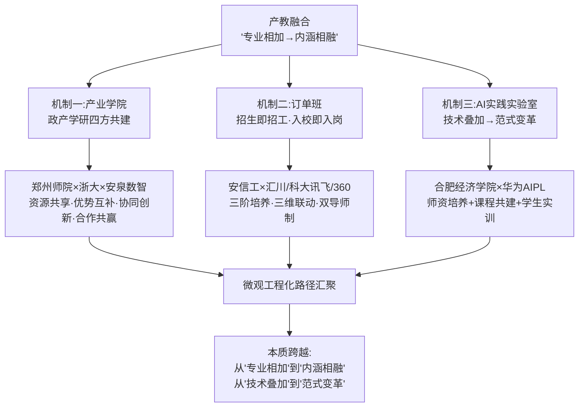

三类机制看似路径不同，但都共享一个根本特征——**它们都不是"高校单方面培养+企业单方面接收"的传统校企合作，而是"高校+企业+政府+科研机构"多方主体共同设计培养方案、共建教学资源、共享实训设施、共担育人责任的深度协同模式**。这种深度协同的根本意义在于：**它把企业从"用人方"提升为"育人方"，把高校从"供给方"提升为"协同方"，让人才培养真正回应产业实际需求**——这正是第4章鄂维南诊断"传统培养体系不是'培养大师的体系'，而是'培养螺丝钉的体系'"的破解之道。

## 7.8 产学研用反哺AI：从应用场景到基础研究的双向校准

产教融合的工程化机制为本章合龙双向赋能框架提供了切入点，但合龙的真正完成需要回答一个更根本的问题——**产学研用协同究竟如何反哺AI技术、AI人才、AI产业的根基性发展？**这一问题的答案，体现在三层反哺机制的环环相扣。

**第一层反哺：真实场景与海量数据反哺AI技术迭代**。教育是AI最具规模性、最具复杂性的真实场景之一。从场景特征看，教育覆盖0-18岁基础教育、本研学段、职教终身教育的全龄段，覆盖语言、数学、科学、艺术、体育的全学科，覆盖城市、农村、东中西部的全地域——这种"全龄段+全学科+全地域"的场景多样性，是AI大模型训练优化最珍贵的"养料"。

**学习机日均亿级唤醒、千万级用户互动数据成为大模型训练优化的关键养料**。第2章已述截至2024年学而思学习机上"小思"被累计唤醒2.3亿次；从产业整体看，2025年前11月AI教育硬件累计销量1000万台，假定每台日均唤醒10次，全行业日均交互数据已达亿级规模。这一规模的真实交互数据具有三个不可替代的价值：**真实性**——是真实学生在真实学习场景中的真实反馈，远胜于实验室合成数据；**专业性**——经过教研专家标注、教学场景验证、学习效果检验三重筛选；**多样性**——覆盖不同学段、学科、能力、地域的多维分布，能够避免AI模型的单一化偏见。这三重价值汇聚的结果是：教育场景成为AI大模型训练优化的"国家级试验场"——这正是第2章总结"AI教育已经走出探索期、进入规模化试水期"的产业内涵。

国家智慧教育公共服务平台上线的"AI试验场"是这一反哺机制的制度化载体。如第1章所述，平台**汇集13万余条中小学优质资源、1.25万余门职业教育精品课程、14.5万门高等教育优质课程**，并在2025年上线智能版2.0。"AI试验场"遴选23个教育专用大模型和14个学科领域垂直模型——这一遴选机制本身就是真实场景反哺AI技术迭代的国家级工程：通过国家平台汇聚全国教育数据资源，通过试验场遴选倒逼大模型在教育垂域做深做透，通过应用反馈持续优化大模型能力——形成了"数据→模型→应用→反馈"的完整闭环。

**第二层反哺：产业需求与岗位标准反哺人才培养**。这一层反哺的核心，是让产业的真实需求成为人才培养体系的"反向校准信号"。第5章已论及鄂维南诊断的"科研工作者长期不关注实际问题"困境，以及上海交大"学院-产教融合平台-工业创新研究院"三位一体协同体系作为破解之道。本节进一步通过几个微观案例呈现这一反哺机制的具体形态。

**安徽信息工程学院"AI+高等教育研究院"是这一反哺机制的典型样本**。该研究院"由学校与安徽师范大学、科大讯飞三方共建，围绕AI+人才培养、科研创新等领域展开"[^146]——这种"科技领军企业（科大讯飞）+研究型大学（安徽师大）+应用型高校（安徽信工）"的三方协同，把企业的产业需求、研究型大学的学术深度、应用型高校的工程实践能力深度耦合，让产业问题成为科研课题、科研课题成为教学内容、教学内容成为人才能力。

**北京中关村学院"以终为始"的实战训练模式**则展示了产业反哺的极致形态。第5章已述其"在《现代软件工程》课上引入模拟的'天使投资'环节，要求每个项目团队不仅展示技术实现，更要像创业公司一样进行'路演'"，学生何绍斌反馈"天使投资评审这个环节把'技术自嗨'直接打回原形"。这种把产业的"商业评价标准"直接搬到教学课堂的做法，本质上是让产业逻辑反向重塑教学逻辑——学生不再是"为考试而学习"，而是"为产业问题而学习"；不再是"被教师评价"，而是"被产业评价"。这一反哺的根本意义在于让学生在校期间就建立"产业思维"和"用户思维"，避免毕业后"从'制造者'视角切换到'利益相关者'视角"时的痛苦适应。

**北邮卓越工程师学院的"双千计划"与产业理事单位机制**则是更大尺度的产业反哺。第5章已述该学院理事单位包括中国星网集团、航天科工、航空工业、电科、电信、联通、移动、华为等头部企业。这种企业理事会机制的根本意义在于：**它让企业从"用人方"提升为"治理方"——参与培养方案设计、参与课程标准制定、参与人才能力评价**——从根本上避免了"高校教什么企业用什么"的脱节困境。

**第三层反哺：基础研究与原始创新反哺核心算法突破**。这是最深层、也最具战略性的反哺机制。第4章已论及"AI发展已从粗放扩张转入对基础理论、底层架构突破的渴求阶段，没有教育体系持续输出的基础研究力量，'算法跑得再快也终将触顶'"，以及鄂维南院士"数学对AI贡献不大，正是数学科学研究对工程不重视所导致的"诊断。

第5章人工智能开放联盟的分工机制，是这一深层反哺的国家级工程化载体。**北京大学承担科学智能语料库的建设项目，高教社牵头承担高等教育语料库的建设项目；上海交通大学牵头承担启悟学习社区建设；北京邮电大学牵头谋划国家教育智算服务平台建设**。这一分工机制揭示出高校在国家AI基础设施建设中的核心地位——**国家基础语料库、教育智能算力服务平台、启悟学习社区等国家级基础设施，主要由高校牵头建设**。这意味着高校不仅是AI产业的"人才供给方"，更是AI产业的"基础设施建设方"——这正是教育反哺AI在战略基础设施层面的最深表达。

**整合三层反哺的双向校准图景**。把三层反哺机制整合，可以勾勒出"AI赋能教育—教育反哺AI"双向赋能框架在产业接口层面的完整闭环：

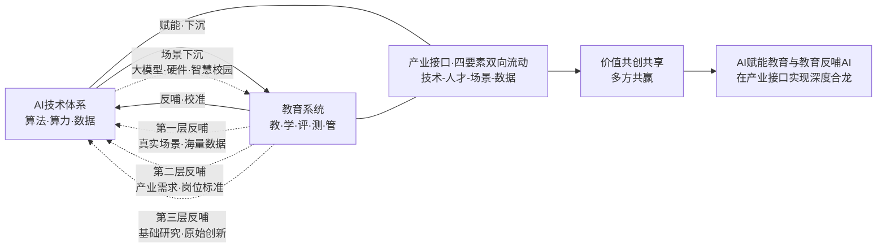

这一双向校准图景揭示出产学研用融合的根本逻辑——**它不是单向的"技术下沉"，而是"技术-人才-场景-数据"四要素的多向流动与价值共创**。第1章引述的"以创新生态的开放协同为根本遵循，以技术赋能与主体反哺的双向互动为运行路径，以价值共创共享的良性循环为最终目标"的三层逻辑结构，正是在产业接口层面通过三层反哺机制得以工程化落地。

至此，"AI赋能教育"与"教育反哺AI"两条线索在产业接口层面实现深度合龙：**AI通过教育大模型、智能硬件、智慧校园三大产品赛道下沉到教育场景；教育通过场景数据、产业需求、基础研究三层反哺反向校准AI发展；产学研用四方主体通过产业学院、订单班、AI实践实验室、协同研究院等机制成为价值共创的命运共同体**。这一合龙的完成，使第8章的战略建议得以建立在完整的双向赋能产业生态之上。

## 7.9 产业生态的结构性挑战与协同治理路径

产业生态的繁荣景象之外，必须直面其发展中的结构性挑战。这些挑战不是产业繁荣的对立面，而是繁荣进程中暴露出的"成长烦恼"——它们的及时识别与有效治理，决定了产业生态能否从"千亿规模"走向"高质量发展"。

**挑战一：产品同质化与"AI学习机乱象"**。第一类挑战集中体现在C端硬件赛道。在AI学习机赛道高速增长的背景下，"少不了想搭便车的厂商，它们一般只追求短期利益，由此导致AI学习机在增长的同时，也出现了一些乱象，**包括诱导购课或消费、虚假宣传、设备质量以及维保维修等多个方面**"[^141]。"学习机市场这片蓝海，既蕴藏着无限机会，也有重重挑战。**谁能真正代表品质、解决学习的痛点和家长的负担，谁才能真正吃到行业高速增长的红利，成为行业头部**"[^141]。这一诊断揭示出AI教育硬件赛道的"格雷欣现象"风险——劣币驱逐良币如不加治理，将损害整个赛道的产业健康。

**挑战二：B端供需错位的"方案空盒子"困境**。第二类挑战集中体现在B端智慧校园赛道。如第3章已述高校AI装备采购"行业缺少统一的技术、质量和验收标准、产品参差不齐"、"部分企业产品同质化明显，和高校个性化、专业化需求难以匹配"等多重痛点；以及智能教育产品普遍存在的"对教育核心场景与关键需求识别不足……表现为产品功能与教学流程、环境兼容性弱，技术介入时机与方式脱离教育情境的动态性与复杂性"的"方案空盒子"现象。这一挑战的根本原因是B端供给侧与需求侧的信息不对称、能力不匹配、利益不协同——厂商有技术能力但缺教育理解，学校有教育需求但缺技术评估能力，最终形成"重硬件、轻软件，重采购、轻应用"的旧模式陷阱。

**挑战三：教育数据安全合规风险**。第三类挑战集中体现在数据治理层面。第3章已系统呈现舞钢市学校系统数据泄露案、OpenClaw"红色龙虾"高校禁令事件等典型案例。这些事件的产业意义在于：**它们揭示出教育产业链各环节都存在数据安全的"短板"——从硬件供应商的设计漏洞、到软件服务商的合规缺失、到学校管理者的责任不清、到外包合同的监管空白**。教育数据涉及未成年人隐私，敏感性极高、合规要求极严，但产业链上各类主体的数据治理能力参差不齐，已经成为整个生态发展的关键风险点。

**挑战四：中小微教育科技企业的伦理审查能力不足**。第四类挑战集中体现在中小微企业层面。第3章已述2026年4月《人工智能科技伦理审查与服务办法（试行）》明确要求高校、科研机构、企业等实施主体"必须设立独立运行的人工智能科技伦理委员会"——但对中小微企业而言，独立伦理委员会的建设成本、专业人才储备、合规审查流程都构成显著负担。教育科技产业中的中小微企业占比极高，垂直创业公司、教育内容服务商、智能硬件中小厂商等主体都属于这一范畴；如果没有制度性支持，这些企业可能要么因合规成本过高被迫退出市场，要么以"伪合规"姿态规避审查，前者损害产业活力，后者埋藏深层风险。

**挑战五：产学研用价值分配机制不完善**。第五类挑战集中体现在协同机制的深层制度层面。第1章已论及"AI技术的深度介入打破了产学研各自的价值创造边界，让知识生产、技术研发与产业应用形成强大的价值共创合力，既保障高校和科研机构的知识价值充分实现，也确保企业的应用价值有效转化，同时为人才价值提升搭建广阔平台"。但在实践中，知识价值（高校）、应用价值（企业）、人才价值（学生与教师）的转化通道仍待打通——高校的科研成果如何高效转化为企业产品、企业的真实需求如何及时反馈到高校课程、学生的实战经验如何转化为职业起步资本、教师的产学研投入如何获得合理评价——这些价值流转的"管道堵塞"，是当前协同机制最需要疏通的深层问题。

**协同治理路径的四条建议**。面对上述五大挑战，单一治理工具均难以见效。基于前述分析，可以提出四条协同治理路径：

**路径一：构建"政产学研金"协同机制**。第1章已述《"人工智能+教育"行动计划》提出构建"政产学研金"协同机制，整合高水平研究型大学、科技领军企业、国家实验室等多元主体力量。这一协同机制的关键在于让政府、产业、学术、研究、金融五方主体形成稳定的对话与协作网络——政府提供政策引导与公共采购，产业提供真实需求与场景数据，学术提供基础研究与人才培养，研究提供技术验证与标准制定，金融提供长期资本与创新激励。

**路径二：推广"租赁+运维"灵活采购模式**。如第2章已述，B端供给痛点的破解需要"从'重硬件、轻软件''重采购、轻应用'的旧模式转向软硬件结合、全链条服务的新模式，并推广'租赁+运维'等灵活模式"。这一模式与7.6节论及的SaaS订阅制本质相通——都是把"一次性销售"转向"持续服务"，通过商业模式的转型倒逼供给侧能力升级。

**路径三：建立教育AI产品准入审核与质量评价标准**。这条路径的关键是把零散的产品评价标准升级为统一的国家级准入审核机制。第3章已论及2025年5月发布的《智慧教育平台个人信息保护通用要求》《中小学教职工基础数据》两项行业标准，以及《教育大模型总体参考框架》联盟标准。这些标准的整合与体系化，将为AI教育产品的市场准入、质量评价、合规审核提供统一的"标尺"，从根本上治理"产品参差不齐"的乱象。

**路径四：完善产学研用价值共创共享机制**。这条路径的关键是设计制度化的价值流转通道。第3章已述《人工智能科技伦理审查与服务办法》专设"服务与促进"章节，"重点加大对中小微企业的伦理审查支持力度，破除其合规能力不足的困境"——这一"政府服务支持"机制本身就是价值共创的工具创新。更深层的价值共创还需要在科研成果转化、产学研利益分配、人才双聘双酬等具体制度上做精细化设计。

四条治理路径的整合：

| 治理路径 | 核心机制 | 应对挑战 | 主要主体 |
|---------|---------|---------|---------|
| 政产学研金协同 | 五方主体协作网络 | 价值分配不完善 | 政府主导、多方协同 |
| 租赁+运维新模式 | SaaS订阅+持续迭代 | B端供需错位 | 厂商+学校 |
| AI产品准入审核 | 统一标准+质量评价 | 产品同质化、安全合规风险 | 政府+行业组织 |
| 价值共创共享 | 制度化流转通道 | 中小微企业合规、价值分配 | 多元主体 |

这四条治理路径既独立成章、各有侧重，又相互嵌套、互为支撑，共同构成AI教育产业生态健康发展的"治理工具箱"，为第8章面向多元主体的战略建议提供产业生态层面的具体支点。

---

综上，本章作为双向赋能框架的产业接口，从九个层次系统呈现了AI教育产业生态的全景图谱、主体竞争、商业逻辑、产品演进、协同机制与治理挑战。可以得出以下核心判断：**第一，AI教育产业链已形成"上游算力底盘+中游应用主战场+下游服务终端"的三层架构，并在此基础上演化出"CBDG四维生态"的中国特色范式，2024年大模型市场294亿元、智能教育3700亿元、AI教育硬件380亿元的多重规模数据印证产业已进入"千亿级真实生态"阶段；第二，产业主体形成科技巨头（讯飞稳·字节快·阿里巧·腾讯协）+传统教育企业（好未来乘法·新东方加法）+垂直创业公司三类共生格局，差异化竞争路径已成熟稳定；第三，新商业逻辑从"参数对决"升级为"算法壁垒+私有数据+核心场景"三角护城河，"40/60分割"哲学边界为产品设计提供根本指导；第四，教育大模型沿"垂域专用化+多模态认知化+价值对齐化"三条主线演进，从"一题一知识点"跃迁为"每步骤对应知识点"，与国家"AI试验场"遴选机制协同推进；第五，AI教育硬件赛道形成"AI学习机+智能笔/错题打印机+编程机器人"三大子赛道分化、全龄段扩容的爆发图景，"好AI+好内容"双轮驱动成为产品哲学；第六，智慧校园从"信息孤岛"走向"全场景一体化"，SaaS订阅制以85%续费率重塑供需关系，华为/腾讯/阿里云/天翼云各占差异化优势腹地；第七，产教融合形成产业学院、AI赋能订单班、AI实践实验室三类微观工程化机制，本质是把企业从"用人方"提升为"育人方"、从"专业相加"跨越为"内涵相融"；第八，产学研用三层反哺——真实场景与数据反哺技术、产业需求与岗位标准反哺人才、基础研究与原始创新反哺算法——使"AI赋能教育"与"教育反哺AI"两条线索在产业接口层面实现深度合龙，"技术-人才-场景-数据"四要素多向流动与价值共创成为新生态的核心逻辑；第九，产业生态面临产品同质化、B端供需错位、数据安全合规、中小微企业合规、价值分配机制等五大结构性挑战，需要通过"政产学研金协同+租赁运维新模式+准入审核标准+价值共创机制"四条协同治理路径破解**。

带着这一完整的产业生态全景与协同治理工具箱，下一章将进一步把视野拓展到全球——通过比较美国（ChatGPT-Edu）、欧盟、新加坡等国家和地区在AI教育应用与AI人才培养上的战略布局，归纳中国路径的独特优势与挑战，研判AI与教育双向融合的中长期演进趋势，并面向政府、高校、中小学、企业、教师、家长等多元主体提出可操作的战略建议，回应"AI赋能教育"与"教育反哺AI"双向闭环的长远命题。

# 8 国际比较、未来趋势与战略建议

历经七章的层层递进，本研究已完成"AI赋能教育—教育反哺AI"双向赋能框架的系统建构：从时代语境与政策驱动的逻辑起点（第1章），到应用图景与治理生态的实然格局（第2、3章）；从战略支撑与贯通培养的人才使命（第4、5章），到教师队伍与产业生态的关键支撑（第6、7章）。一座完整的双向赋能大厦已然立起。但任何一项中国实践的研究都不能闭门造车——它必须放在全球坐标中比较定位、必须面向中长期未来研判趋势、必须最终凝结为可操作的战略行动。本章作为全篇收官，沿"四大范式比较—人才培养国际经验—中国路径定位—40/60动态迁移—模式与评价变革—金字塔成熟与飞轮效应—六类主体行动建议"七个层次展开，使前七章累积的所有证据、判断、洞察在这一收官章节中实现"国际坐标—趋势研判—战略行动"的三重升华，回应"AI赋能教育"与"教育反哺AI"双向闭环的长远命题。

## 8.1 全球AI教育治理的四大典型范式比较

第3章曾从治理工具维度初步呈现欧盟刚性立法、UNESCO人本范式、美国市场主导、新加坡柔性治理的差异。本节进一步从国家战略层面进行系统性比较，提炼美国、欧盟、新加坡、英国四大代表性治理范式的根本差异，为中国路径定位提供国际坐标。

**范式一：美国"发展优先+市场主导"范式**。美国治理路径的鲜明特征是把AI教育议题深度纳入国家竞争力叙事。2025年4月23日特朗普签署的"推动美国青少年人工智能教育发展"行政令，**成立由科技政策办公室主任担任主席的"白宫人工智能教育特别工作组"**，成员包括农业部长、劳工部长、能源部长、教育部长、NSF主任等多家联邦机构负责人，部署了"设立总统人工智能挑战赛""通过人工智能改善教育""加强教育工作者在人工智能领域的培训""推广注册学徒制"等专项行动[^149]。这一行政令与拜登政府时期的《人工智能与教学和学习的未来》(2023年5月)、《关于安全、可靠和可信地开发和使用人工智能的行政命令》(2023年10月)在AI教育资源开发、改善教育、培养AI人才等方面"前后相续",显示出美国两党在AI教育推进上的战略一致性[^149]。

2026年3月白宫发布的《国家人工智能政策框架：立法建议》进一步明确了"**轻监管、强竞争、联邦优先**"的治理纲领——它"不打算建立一套类似欧盟那样的高风险AI分类制度，也没有提出一整套前置合规义务"，而是"先把美国AI产业跑起来，再逐步补上更细的制度围栏"，配套说明中直接强调"美国AI主导地位"和"赢得AI竞赛"[^150]。具体落地于教育领域，框架的核心立场包括"将AI培训纳入教育、学徒和劳动力项目""推动国会优先排除那些'负担过重'的州级AI法律，尽快形成全国统一标准""明确反对新设一个专门的联邦AI监管机构"[^150]。

市场层面，OpenAI与Google在2025年11月的"双寡头交锋"清晰呈现了美国"企业先行+学校跟进"的渗透路径。**OpenAI于2025年11月19日宣布教师版ChatGPT向美国K-12教师免费开放至2027年6月**，同步发布《AI应用的坚实与安全起点：OpenAI青少年AI素养蓝图》报告，提出"赋权教师，引领前行""强化核心知识""创设面向未来的课程""连接学习型社区""现代化基础设施与安全规范"五大倡议[^151]。这一战略被分析者称为"教育科技领域的范式转移"——OpenAI"通过'自下而上'的教师赋能策略，利用FERPA合规性和GPT-5.1 Auto的自适应推理能力，攻占K-12基础教育的高地"，而Google则"依托其Workspace、Android和ChromeOS的全球生态，通过多模态能力和代理式开发环境（Antigravity），试图将全球未来的知识工作者锁定在其技术栈中"[^152]。NSF作为基础研究的支柱，每年投入超过7亿美元支持AI研究、AI应用转化与劳动力建设[^153],并于2025年7月宣布**1亿美元投资设立国家人工智能研究所**[^154]，构成"产业渗透+学术供给"的双轮支撑。

**范式二：欧盟"风险分级+刚性立法"范式**。欧盟治理路径与美国形成鲜明对照。第3章已论及欧盟《人工智能法案》以风险分级为核心、把"工作场所和教育机构中的情绪识别系统"列为不可接受风险的根本架构。最新进展显示，**法案核心条款将于2026年8月2日全面生效，2025年2月起禁止条款已强制执行**，针对教育、关键基础设施等领域的高风险AI系统提出严格要求，包括建立风险管理体系、完善技术文档、落实人工监督、开展合规评估等[^155]。然而，2026年欧洲议会通过投票计划推迟部分条款实施时间——**针对生物识别、教育、就业、公共服务、执法等领域的高风险AI系统监管条款将延后至2027年12月2日，AI生成内容水印标识规则推迟至2026年11月2日**[^156]。

值得关注的是，监管推迟并不意味企业风险降低。Gartner副总裁分析师Nader Henein警示："企业不应将延期视为暂停行动的理由"；FormerGov执行董事Brian Levine指出"无论监管是在一年还是两年后实施，企业对自身AI系统带来的法律、运营和声誉风险都需要承担责任"[^156]。这一立场反映出欧盟治理范式的深层逻辑——**通过规则的明确性与刚性，把合规责任前置到产业链各主体身上**。配套的《在教学中合乎伦理地使用AI和数据的教育者指南》在《数字教育行动计划（2021—2027）》第6项行动框架下推出，强调"显著增加的AI使用""AI法案等法规的引入要求严格合规""日益增长的伦理与批判性AI素养需求"[^157],并系统提出五大伦理原则与即插即用的全场景合规方案。《数字教育行动计划》以"促进高性能数字教育生态系统的发展"和"增强数字技能和数字转型能力"为两大优先领域，部署13项具体行动[^158][^159]。

欧盟与美国的治理哲学差别一目了然——"欧盟AI法案是一部已经生效并分阶段实施的综合性法律，采取风险分级和前置合规路线。相比之下，美国目前仍处于'框架—立法—博弈'的阶段，更依赖现有部门监管、法院判例和行业标准。欧盟的做法就像先把围栏搭起来，再允许市场在围栏之内奔跑；而美国更希望先把跑道铺宽，让产业率先冲出去，再逐步处理争议"[^150]。

**范式三：新加坡"国家统筹+柔性治理"范式**。作为亚洲AI教育的标杆，新加坡走出了一条独特的国家统筹路径。其核心是2024年提出的"**四学**"框架（Four Learns）——**学习了解AI（Learn about AI）、学习使用AI（Learn to use AI）、借助AI学习（Learn with AI）、超越AI（Learn beyond AI）**[^160]。"超越AI"作为压轴一环，"在掌握AI技术的同时，强化自身的批判性思维与判断能力"[^160],与第4章"会提问的孩子比会解题的更珍贵"命题形成跨域呼应。

落实层面，**新加坡明确未来5年培养至少1万名学生掌握"实体AI"技能**——把AI嵌入机器人、无人机、自主驾驶设备，让AI"从虚拟走进现实"；计划由国家机器人计划（NRP）支持，覆盖从小学到大学的全学段，由清洁机器人龙头企业LionsBot提出，2026年年中正式启动[^160]。高校层面，**南洋理工大学2026年4月6日发布"2030 AI教育转型蓝图"——到2030年40%课程深度嵌入AI、覆盖52个本科专业（从目前的5%增长8倍）；从2026年8月起向全校本科生开放谷歌企业级AI工具（Gemini Enterprise、Google AI Studio、Vertex AI）；每位学生发放云计算点数训练自己的AI代理；这些AI代理"在毕业后可以带走，直接带入职场继续使用和迭代"**[^161][^160]。新加坡人工智能研究院创始执行主席、NTU教授评价：未来"学生从NTU毕业时，不仅能对AI有深刻的理解，还能掌握一套可在入职首日就能投入使用的AI智能体组合，这会成为他们的核心竞争力"[^161]。

产业层面，微软2025年4月宣布在2025—2029年间向新加坡投入**55亿美元用于建设云计算与人工智能基础设施**，同步推出"Microsoft Elevate"计划——向新加坡所有高等教育学生提供为期12个月的Microsoft 365 Premium订阅（内置Copilot AI助手），覆盖超过20万名大学和职业教育学生[^162]。LinkedIn数据显示新加坡对AI相关技能的需求同比增长超过70%[^162]。这一"国家战略+顶级高校+科技巨头"的三方合力，是新加坡范式区别于其他模式的鲜明特征。

**范式四：英国"务实平衡+渐进策略"范式**。英国走出了一条相对温和的中间路径。其核心是把AI定位为"教师减负工具"而非"教学替代者"。**英国教育大臣布里奇特·菲利普森强调"AI不是取代教师，而是让教师成为'学习架构师'"**——"当AI处理数据时，教师能专注于设计启发式问题，这种分工将重新定义教育本质"[^163]。具体举措包括首份《学校人工智能应用指南》（2025年6月发布）、100万英镑创新基金、覆盖全年龄段的数字技能培训计划[^163]。

务实平衡的精髓体现在量化数据上——**奇尔特恩学习信托基金开发的AI模板可"将教师单日文书工作量减少40%"，AI批改系统"教师审核时间较传统批改缩短65%"**[^163]；首相公布的**1.87亿英镑"TechFirst计划"将数字技能教育下沉至中小学课堂，每年为100万名学生提供AI编程基础课程，并设立"科技职业直通车"项目，为贫困地区学生预留20%的培训名额**[^163]。学校领导联盟秘书长保罗·怀特曼的提醒同样务实："调查发现，78%的教师担忧AI生成内容的准确性，因此政府必须建立透明化的工具评估机制"[^163]。教育部联合英国教育标准局启动的"AI教育影响追踪研究"将系统性评估技术对课堂互动、学生创造力等软性指标的长期影响，首批覆盖200所学校的监测数据预计明年公布[^163]。

将四大范式整合对比，可形成清晰的国际治理图谱：

| 维度 | 美国 | 欧盟 | 新加坡 | 英国 |
|------|------|------|--------|------|
| 治理强度 | 轻监管、联邦优先 | 刚性立法、风险分级 | 国家统筹、柔性治理 | 务实平衡、渐进策略 |
| 价值取向 | 国家竞争力优先 | 基本权利与可信AI | 实体AI与超越AI | 教师减负与公平接入 |
| 市场角色 | 企业先行（OpenAI/Google） | 法律严格规制 | 国家+顶级高校+巨头协同 | 政府主导工具采购 |
| 教师定位 | 课堂"守门人" | 价值审核与签字负责 | 数字策展人+学习设计师 | "学习架构师" |
| 标志性举措 | 白宫AI教育行政令、ChatGPT-Edu | AI法案高风险分类 | 万人实体AI计划、NTU 2030蓝图 | TechFirst 1.87亿英镑 |

数据来源：综合自[^151][^152][^161][^150][^149][^155][^156][^157][^163][^162][^160]

四大范式的根本差异不在于"谁更先进"，而在于**对"创新与治理""市场与政府""技术与人文"三对张力的不同权衡**——美国选择创新优先、市场主导、技术驱动；欧盟选择治理优先、政府主导、人本驱动；新加坡选择国家统筹、多方协同、应用驱动；英国选择平衡渐进、政府引导、教师中心。这四条路径各有得失，构成了中国路径定位的国际坐标系。

## 8.2 AI人才培养的国际经验：从K-12到高等教育的全链条

治理范式之下，各国AI人才培养体系的工程化实践同样值得系统比较。这一比较的价值在于，它揭示出国际共同关心的"基础设施—课程标准—师资体系—产教协同"四大共性议题，以及不同国家的差异化破解之道。

**美国：联邦研究院+总统挑战赛+学徒制三位一体**。美国AI人才培养的核心特征是"联邦投入+赛事激励+实践导向"。**NSF国家人工智能研究院计划自2020年启动，至2025年7月再追加1亿美元投资**，已布局多个研究院，覆盖天文、材料、农业、教育、天气预报等多元主题[^154][^164]。2023年发布的国家AI研究和发展战略计划更新版，"将长期投资作为首要战略目标"，强调"持续的联邦投入和指向国家重要议题的方向"[^164]。教育层面，白宫AI教育行政令的"总统人工智能挑战赛""通过人工智能改善教育""推广注册学徒制"等专项行动，构成了从赛事激励到实践培养的多元路径[^149]。教育部长麦克马洪的判断揭示了战略意图——"教育应为学生的生活成功做好准备，这意味着美国课堂必须更好地调整其活动，以满足加速创新和快速变化的劳动力需求……特朗普政府将引领潮流，培训我们的教育工作者，在课堂中培养早期和负责任的人工智能教育，以保持美国在全球经济中的领导地位"[^149]。

**欧盟与OECD：AILit框架与PISA 2029纳入**。第4章已述OECD与欧盟联合发布的AILit框架是当前最具权威性的中小学AI素养蓝图。这一框架将AI素养纳入PISA 2029国际评估的标志性意义在于——**它把AI素养正式确认为21世纪学生的"第四基础素养"，与读写算并列**。框架强调AI素养"使学习者能够与AI互动、用AI创造、管理AI和设计AI，同时能批判性地评估其益处、风险和伦理内涵"，划分为"批判性消费者—高效协作者—明智管理者—未来塑造者"四大角色递进路径[^165]。配合UNESCO 2024年发布的《教师人工智能能力框架》（5维15项）与《学生人工智能能力框架》（4维12项），全球已经形成了从小学到高校、从学生到教师的完整能力坐标体系[^166]。值得注意的是，OECD 2025年5月发布的《教学罗盘：重新构想教师作为课程变革的推动者》提出"要转变传统的、自上而下的教学方法，赋权教师作为学习的共同设计者、适应性专家和变革的推动者"[^167],与第6章教师角色"从知识传授者到学习生态创建者"的转型逻辑形成全球同频共振。

**新加坡：南洋理工"AI分身"与算力平权**。新加坡在高校层面的探索极具前瞻性。南洋理工大学2030蓝图的革命性体现在三个维度：**算力平权**——"过去，理工科学生或者计算机学生会（更容易）获得AI工具的高级权限，而文科/商科学生通常只能接触到基础版工具。而NTU不分文理工商，从2026年8月起，所有本科生将获得Google全套高级AI工具的全面访问权限"[^161]；**AI分身培养**——"每年学生可以选择创建数十个'AI分身'来支持自己的学业。例如，一名工科学生，可以为新车设计项目构建一个智能体，自动生成多种设计方案，模拟其可能的能耗情况；一名商科学生，可以搭建智能体开展随机对照实验"[^161]；**双向能力建设**——40%课程被分成两类，"20%课程：用AI实现个性化学习""20%课程：教学生搭建AI智能体"[^161]。"未来的学生从NTU毕业时，不仅能对AI有深刻的理解，还能掌握一套可在入职首日就能投入使用的AI智能体组合"——这一定位与第4章"AI时代驾照"的素养隐喻形成精确对应[^161]。

**韩国：教育部—科技部协同+AI数字教科书分阶段落地**。韩国走出了一条政府主导、跨部门协同的独特路径。**韩国教育部和科技部就打破部门壁垒、协作培养AI人才达成共识，围绕4个主要方面开展合作：组建政策工作委员会并计划于2026年6月前制定出台《第五次科学技术人才培育·支持基本计划（2026—2030）》；联合成立专项工作组推进《韩国人工智能行动计划》；多主体协作体系建设；大学科研设施和设备共享利用**[^168]。具体举措包括"中小学阶段，联合搭建AI实践教育平台，制定生成式AI应用指南、强化AI伦理教育和开展教师AI素养培训；大学阶段，推动院校间联合研究、学分互认和课程共享，打造区域AI人才培养体系"[^168]。

教科书层面，**韩国教育部计划从2025年春季开始，韩国小学三四年级以及初一和高一的学生将使用韩语、数学、英语、信息科技AI教科书，并计划每年扩大应用科目和年级，2028年以前实现全面覆盖**[^169]。具体节奏为"2026年扩大至社会、科学、家庭经济学、科学技术等科目；2027年纳入历史课程；2028年完成除体育、音乐、美术等实践课程外的AI课程全面落地"[^169]。这一明确的时间表与覆盖广度，体现出政府主导式推进的高执行力。

**日本：MDASH认定制度+GIGA学校计划**。日本走出了一条以制度化认定为核心的特色路径。**日本文部科学省"数理·数据科学·AI教育认定制度"分为"素养水平（リテラシーレベル/MDASH Literacy）"与"应用基础水平"两个层级**——前者"作为数字社会的基础素养，是大学等所有学生应当掌握的能力"；后者"在素养水平基础上补充与发展，掌握从数据中提取意义、并反馈到现场的能力，以及运用AI解决问题的基础能力"[^170]。各高校通过提交"模型课程"由文部科学大臣认定与选定，形成了规模化的全国性数据科学素养建设。例如某大学的"数据·AI与社会"科目"由7个学部教师参与设计的'本校特有'文理融合型课程"[^171],课程履修者数从2021秋季的1009名增长至2024年度的3494名[^171]，呈现出快速扩张的良好态势。

**日本《人工智能战略2022》**则在国家层面布局了"构建符合时代需求的人才培养体系""运用AI技术强化产业竞争力""确立一体化的AI技术体系""发挥引领作用，构建国际化的AI研究教育、社会基础网络"四大战略目标[^172]。GIGA学校计划——"全国中小学实现'一生一终端'设备覆盖，截至2024年终端普及率已达98.3%，高速网络覆盖率同步提升"——为AI教育铺设了基础设施[^173]。**2021年4月日本通过修订《学校教育法施行规则》，首次将数字教科书列为法定教材，允许课堂使用比例达总课时50%；2025年2月，中央教育审议会工作小组发布《关于推进数字教科书的中期报告》，明确改革方向**[^173]。"AI时代的教育政策与教育研究"中日论坛中，山西润一教授指出"在人工智能时代，教师在教育数字化转型中的作用至关重要"——"人工智能是一个聪明的助手，但有时也会出错，需要人类教师成为学生打开新世界的一把钥匙"[^174],这与第6章教师不可替代性论证形成跨国共振。

将主要国家AI人才培养经验整合：

| 国家 | 顶层设计 | 中小学落地 | 高校机制 | 特色亮点 |
|------|---------|----------|---------|---------|
| 美国 | NSF年投入7亿美元+白宫工作组 | 行政令推动+学徒制 | 国家AI研究院+市场化产品渗透 | 总统AI挑战赛+ChatGPT-Edu |
| 欧盟/OECD | AILit框架+PISA 2029纳入 | 数字教育行动计划13行动 | UNESCO双框架推广 | AI素养国际评估坐标 |
| 新加坡 | "四学"框架+万人实体AI计划 | 国家机器人计划+全学段 | NTU 40%课程AI化+AI分身 | 算力平权+毕业带走的AI智能体 |
| 韩国 | 教育部—科技部协同 | AI数字教科书2025—2028 | 大学院校间联合研究 | 跨部门统筹+第五次科技人才计划 |
| 日本 | 人工智能战略2022 | GIGA学校+数字教科书改革 | MDASH认定制度（素养+应用基础） | 文部科学大臣认定+模型课程 |

数据来源：综合自[^154][^153][^164][^161][^149][^167][^166][^165][^160][^168][^169][^171][^170][^172][^174][^173]

国际经验提炼出四条共性逻辑：**第一，国家级顶层设计是基础性条件**——无论美国行政令、欧盟AI法案、新加坡四学框架还是日本AI战略，都把AI教育上升至国家战略高度；**第二，分学段课程标准化是工程化关键**——韩国2025—2028分阶段、日本MDASH双层认定、新加坡全学段覆盖都体现出"标准+认定"的精细设计；**第三，跨部门协同是治理有效性的核心保障**——韩国教育部与科技部协同、美国白宫工作组多部门联席、新加坡国家机器人计划+教育部+南洋理工三方协作均印证此点；**第四，产教协同与全球巨头深度参与已成为共同特征**——但同时也带来对国家数据主权、AI价值对齐、师生隐私保护的共同挑战。这些经验与挑战，正是中国路径定位需要参照的国际坐标。

## 8.3 中国路径的独特优势、挑战与全球话语权

立足国际坐标，中国"人工智能+教育"路径已经形成自身的独特优势与结构性挑战。从"技术追随者"走向"方案贡献者"的话语权构建，是中国路径中长期定位的核心命题。

**中国路径的五大独特优势**。基于前七章累积的实证证据，中国"人工智能+教育"路径在以下五个维度形成了差异化优势。

**优势一：国家战略部署的层次性与连贯性**。从《教育信息化2.0行动计划》(2018)到《教育强国建设规划纲要（2024—2035年）》(2025.01)、《关于加快推进教育数字化的意见》(2025.04)、《国务院关于深入实施"人工智能+"行动的意见》(2025.08)、《"人工智能+教育"行动计划》(2026.04)，再到《中国智慧教育白皮书》(2025.05)的政策谱系（详见第1章），呈现出从信息化到数字化再到智能化的连贯递进——这种**"政策谱系连贯+部署层次清晰+目标节点明确"**的特征是其他国家罕有的整体设计。"人工智能+"已连续三年写入政府工作报告，从"开展"到"持续推进"再到"深化拓展"的语词演进本身就是国家战略坚定性的证据。

**优势二：亿级用户与千亿级市场的规模优势**。中国AI教育生态在用户规模与市场体量两个维度均具全球独特性——5.15亿生成式AI用户、1.78亿国家智慧教育平台用户、3700亿智能教育市场、380亿AI教育硬件市场（详见第2、7章）。这种规模优势带来三层深远影响：**一是真实数据养料的不可替代性**——亿级真实学习交互数据是教育大模型训练优化的核心资产；**二是规模化场景验证能力**——任何AI教育产品都可以在中国市场获得快速规模验证；**三是商业模式与价值闭环的可持续性**——千亿级市场为产业链各主体提供了充足的发展空间。

**优势三：应用场景的多样性与全学段覆盖**。中国"人工智能+教育"实践覆盖**基础教育、高等教育、职业教育、终身教育全学段**，覆盖**东中西部全地域**，覆盖**研究型大学、行业特色高校、地方应用型高校、职业院校全类型**。这种"全学段+全地域+全类型"的多样性是任何单一国家难以比拟的——它不仅为AI教育的差异化探索提供了丰富的试验场，也为AI产业反哺提供了规模化的真实场景。**国家智慧教育平台覆盖220余个国家和地区**（详见第2章）的国际化输出更进一步把这种多样性优势从国内延展到全球。

**优势四：城乡差异治理的系统化机制**。中国是少数将"教育公平"作为AI教育治理核心命题的国家。第2章已系统呈现"皮山模式"（援疆机制下的1.4亿专项+科大讯飞技术）、京雄合作（北京AI应用超市40余款产品对雄安开放）、赣榆县域均衡（1000万投入+75所学校全覆盖+城乡联盟云教研）等差异化路径。这种"对口支援+协同输入+县域均衡+示范辐射"的多元治理机制，把AI教育的"接入公平"和"认知公平"作为治理目标——这与美国"数字鸿沟扩大"风险、欧盟"接入差异"风险、新加坡"国家整体推进"路径相比，呈现出中国独特的公平治理智慧。

**优势五："刚柔并济"治理体系与"德力"价值底座**。第3章已论证中国治理体系的"政策—审查—指引—标准—平台"五层联动设计。这一治理架构在国际比较中的独特性体现在：**它既不是欧盟式的"一部综合法律统揽"，也不是美国式的"轻监管+市场驱动"，而是顶层政策硬约束与分场景指引柔性引导相结合**。更深层的差异在价值底座——朱松纯院士提出的"德力"命题将技术能力锚定于"明明德、亲民、止于至善"的中华文化根基，把"将个体追求融入国家富强、民族复兴与人类文明进步"作为人才培养目标[^175][^176]——这种"立德树人"作为AI教育根本使命的中国哲学贡献，构成对全球AI教育治理的独特价值输入。

**中国路径的五大结构性挑战**。优势之外，必须直面挑战的多维结构。

**挑战一：基础研究原创性不足与"算法对工程的不重视"**。第4、5章已援引鄂维南院士的诊断——"基础研究与应用落地之所以脱节，很重要的原因就是'我们不重视工程'……深度神经网络本质是数学工具，本应由数学界主导突破，但至今为止，数学对AI的贡献不大，正是数学科学研究对工程不重视所导致的"。徐宗本院士同样指出"人工智能的背后除了大量的数据和知识，就是数学的算法"[^177]——但中国数学等基础学科与AI产业的协同仍待深化。

**挑战二：AI素养教师队伍的结构性滞后**。第6章已系统呈现教师队伍的"应用鸿沟+体系滞后+城乡悬殊+区域不均+师资短缺+代际错配+风险传导"七维挑战图谱。**73%的学校依赖跨界教师**的现实，与AI教育快速扩张的需求之间存在显著剪刀差。

**挑战三：智能鸿沟扩大风险与认知公平双重病灶**。第3章已揭示"农村中小学生使用AI辅助作业比例（73.2%）反而比城市学生（68.4%）高4.8个百分点，但'依赖AI不想自己思考'比例达22.8%"的双重病灶格局——单纯的接入扩大并不必然带来素养提升，反而可能放大依赖风险。这一悖论是中国路径需要重点破解的难题。

**挑战四：产业生态合规与价值分配难题**。第7章已论及产业链面临的产品同质化、B端供需错位、数据安全合规、中小微企业合规、价值分配机制不完善等五大结构性挑战。这些挑战是高速增长的"千亿级生态"必然伴生的"成长烦恼"。

**挑战五：国际话语权与标准制定参与度有限**。当前OECD/欧盟AILit框架、UNESCO双框架等全球性AI素养标准的制定话语权仍主要由欧美主导；PISA 2029纳入AI素养评估的指标体系、AI教育国际伦理共识、教育大模型全球技术标准等领域，中国的参与度与贡献度仍待提升。

**从"技术追随者"到"方案贡献者"：全球话语权的构建路径**。基于上述优势与挑战的综合诊断，中国路径在全球AI教育治理体系中的定位选择是清晰的——**从"技术追随者"走向"方案贡献者"**。这一定位的工程化路径包括三层支撑：

**第一层：依托国家智慧教育平台国际版输出"中国资源"**。**国家智慧教育公共服务平台已覆盖全球120多个国家和地区，发布全球首个智慧教育白皮书**（详见第1章）。这一国际化平台既输出中国优质教育资源，也为中国教育治理理念的全球传播提供载体。

**第二层：通过教育大模型总体参考框架贡献"中国标准"**。第3章已述2025年5月《教育大模型总体参考框架》联盟标准的发布，"明确生成内容版权归属，护航技术应用安全"。这一标准的国际化推广有望成为中国参与全球教育大模型标准制定的关键工具。

**第三层：通过"AI for教师发展""AI for终身教育"等行动布局贡献"中国方案"**。第1章已述教育部部署的"六大布局"（AI for学校教育/终身教育/科技创新/国际交流/教师发展/教育治理），其中"AI for国际交流""AI for教育治理"两大布局直接指向全球话语权构建。"中国愿与世界各国携手合作，共促国际文明互鉴、共享优质教育资源、共建协同创新生态、共护人工智能安全"的政策表态[^178],体现出中国从被动跟随到主动贡献的话语权姿态。

总体而言，**中国路径的全球定位不是要复制欧美范式，也不是要另立山头，而是基于"立德树人"价值底座、"双向赋能"框架与"刚柔并济"治理体系的中国实践，向世界提供"AI教育的另一种可能"**——这种可能既兼顾创新与治理、规模与均衡、技术与人文，又体现中国传统文化的"知行合一""明德为本"的当代转化。这正是中国路径在全球AI教育治理中的根本价值贡献。

## 8.4 40/60技术边界的动态迁移与教育本质的坚守

立足国际坐标与中国定位，下一步必须研判中长期演进趋势。其中最具哲学深度的命题，是第7章艾瑞咨询提出的"40/60分割"边界如何在技术加速演进中动态迁移。

**第一层趋势：技术能力的扩张正在压缩"40%"的边界**。生成式AI的演进速度已经远超教育界的传统预期。从2022年底ChatGPT出现到2025年11月OpenAI发布**GPT-5.1 Auto的"自适应推理"机制**[^152]、Google Gemini 3 Pro的"深度研究"功能，AI能力正在从语言、图像走向多模态、智能体（Agent）、具身智能、脑机接口等新形态。麦肯锡《2025年AI报告》调研全球近2000家组织揭示——**88%的受访企业表示已在至少一个业务职能中使用AI技术，比去年高出10个百分点；62%的受访组织已经在试验AI Agent类应用**[^179][^180]。在教育垂域，第7章已述学而思学习机从"一题一知识点"跃迁到"每步骤对应知识点"、"智慧岛Pro"实现"语音+图像+情绪识别"全感知交互的多模态认知能力。

技术能力的扩张正在压缩传统的"40%"工具化范畴。第7章已援引学者的判断——"AI对复杂认知的深度渗透与顿悟在不断演进，技术的赋能半径持续扩张……40/60分割的边界线仍会被技术不断拓展"。某种意义上，知识传授、作业批改、学情诊断等已经从"40%"的边缘逐步迁移到"40%"的核心；个性化学习路径设计、跨学科探究辅助、创意作品共创等也正在从"60%"的边界逐步进入"40%"的范畴。**40%边界的扩张并非匀速线性，而是呈现"功能性渗透—结构性扩张—范式性突破"三段式跃迁**——当前正处于从功能性渗透向结构性扩张的过渡阶段。

**第二层趋势：教育本质的坚守反而被技术压力放大"60%"的核心**。但技术边界的扩张并不意味着"60%"将无限缩小。深圳老教师"AI能教学生解题，但能教他们如何面对人生的困惑吗？"的反问[^181],艾瑞咨询"40/60分割"理论的核心论断——"教育中约40%属于技术工具可优化范畴，而剩下60%——情感唤醒、价值塑造、悟性启发与复杂引导——是人类教育者不可替代的主场"[^182],揭示出一个深刻的反向逻辑：**技术越是强大，"60%"中的不可替代价值反而越是凸显**。

第6章已论证教师"四维不可替代价值"——认知卸载防护墙、批判性思维引路人、情感共同体守护者、价值底座塑造者。当AI能完成更多机械性、标准化任务时，教师在"60%"中的角色不仅没有被削弱，反而被进一步聚焦和强化。"40/60分割理论"指出"AI最强大的能力在于'对事'——处理信息、优化路径、提供答案。它是完美的认知工具。但教育的对象是'人'。人有温度、有情感、有不可预测的心灵波动。一个学生课堂上的走神，背后可能是家庭的争吵、友谊的裂痕，或是一个难以启齿的困惑"[^182]——这种深层人性洞察是AI不可替代的。

朱松纯院士的"德力"命题正是这一趋势的哲学回应——**"随着工业革命实现了'体力'的平等化，人工智能的快速发展正逐步推动'智力'的平等化"——智力平等化必然引发"德力"的凸显**[^175]。从这一视角看，"60%"的核心要素（情感唤醒、价值塑造、悟性启发、灵魂触碰）将随技术压力而愈加凸显——它们不再是"教育的附属品"，而是"AI时代教育的核心命题"。

**第三层趋势：边界的动态校准机制——三重制衡守护人本根基**。40/60边界的迁移不是"放任自流"的市场过程，而是必须通过教师专业判断、学生认知能动性、教育治理刚性约束三重机制进行动态校准的过程。

**校准机制一：教师专业判断**。第6章已论证教师作为"成熟个体填补AI漏洞"的不可替代价值。在40/60边界迁移过程中，教师是核心校准者——通过专业判断决定何时让AI承担、何时坚守人本主导，把技术能力扩张始终服务于"育人为本"。OECD《教学罗盘》报告强调"赋权教师作为学习的共同设计者、适应性专家和变革的推动者"[^167],正是这一校准机制的全球共识。

**校准机制二：学生认知能动性**。第3、4章已论证"提问能力""批判性思维""元认知"等核心素养是学生应对AI浪潮的根本能力。当学生具备真正的认知能动性时，他们能够主动判断何时使用AI、何时拒绝AI——这种主体性是40/60边界迁移过程中"60%"得以守护的根本动力。

**校准机制三：教育治理刚性约束**。第3章已论证"分学段使用边界、教育大模型安全审核、'禁用情绪识别'等"刚性制度对边界迁移的"红线约束"作用。中国《中小学生成式人工智能使用指南（2025年版）》"小学阶段禁止学生独自使用开放式内容生成功能"等规定正是治理校准的中国实践。

**到2030、2035年的具体演进节点研判**。综合上述三层趋势，可以对中长期演进节点做出审慎研判：

**到2030年**——40%边界将完成"功能性渗透"向"结构性扩张"的转型。AI将深度嵌入备课、教学、批改、学情、家校沟通的"教学全闭环"；个性化学习路径将从理念走向规模化工程化（这一趋势在第7章新东方、好未来、强智科技、猿辅导等本土实践中已现端倪[^183][^184]）；AI Agent将在教育垂域形成稳定的"虚拟助教"形态。但"60%"的核心——师生情感共同体、价值底座塑造、悟性启发——仍将由人类教师主导。

**到2035年**——40%边界可能进入"范式性突破"前期。具身智能、脑机接口等新形态可能进入教育场景；AI Agent可能成为学生的"长期学习伙伴"——可类比新加坡NTU"AI分身"模式的全球扩散。但即便在这一深度演进阶段，**教育的人本根基仍将作为不可让渡的"压舱石"**——技术越强大，越需要教师守护"60%"的人之专属领域。

将这一动态演进逻辑可视化：

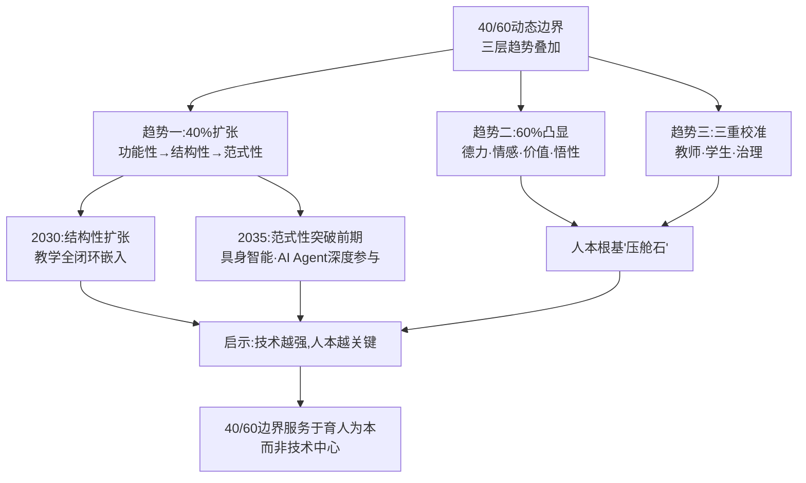

这一动态演进图景的根本启示是：**40/60边界的迁移不是"教师被边缘化"的过程，而是"教师价值被聚焦"的过程；不是"教育走向技术化"的过程，而是"教育回归人本根基"的过程**。这正是第4章"德力"命题、第6章"四维不可替代价值"、第7章"40/60分割"哲学命题在中长期演进趋势中的终极汇合。

## 8.5 教育模式与评价体系的系统性变革趋势

40/60边界的动态迁移必然带动教育模式与评价体系的系统性变革。这一变革不是局部调整，而是中长期教育生态的根本重塑。

**模式变革：从"标准化课堂"到"师机生三元协同"的范式转向**。第1、2章已述AI赋能下教学方式从师生单向传导转向"师—机—生"三元协同。中长期演进将进一步深化这一范式转向，呈现四条具体演进路径。

**路径一：人机共教从"局部探索"走向"主流形态"**。第2章雄安史家胡同小学、郑州十三中、皮山实验学校等案例已经展示了人机共教的早期形态。中长期看，**师机生三元协同将从"少数示范学校"扩展为"主流课堂形态"**——每一节课都将常态化嵌入AI助教，教师从"全程主导者"全面转化为"协调指挥者"。

**路径二：个性化学习路径从"理念"走向"规模化工程化"**。第2、5、7章已援引强智科技、猿辅导、AI学习机等本土实践证据。"猿辅导'小猿智能本'通过分析3000万学生错题数据，构建132个数学核心知识点关联网络，薄弱点识别准确率达89%。当学生遇到几何难题时，系统不仅推送同类习题，还能追溯至'全等三角形判定''辅助线构造'等前置知识点，生成个性化补弱路径"[^183]——这种知识图谱动态导航和自适应学习系统将在中长期演进为教育常态。强智科技基于AI能力中心引擎打造的"学智空间"，"以AI重构课程建设、作业与考试三大核心环节，基于学情数据实现'千人千面'的作业布置，让每个学生都有专属学习路径"[^184]，呈现了从理念到工程化落地的清晰路径。

**路径三：终身学习从"补丁式培训"升级为"AI驱动的全龄段持续学习生态"**。第1章已述教育部部署的"AI for终身教育"战略，第7章已述简知科技全龄产品矩阵——"简小知App专注6—12岁儿童素养教育""简知App聚焦成人心理健康、家庭教育与职业能力提升""简橙App深耕银发群体兴趣教育"[^185]。中长期看，"2026年被全球广泛认定为'全球AI教育元年'"[^185],终身学习将从"成人偶尔补课"升级为"覆盖0—100岁全龄段的连续学习生态"，AI将成为每个人贯穿生命周期的"学习共同体伙伴"。

**路径四：跨学科融合从"X+AI"双学位走向"平台科研+真实问题驱动"的领军人才培养新范式**。第5章已论证鄂维南院士"平台科研"模式的革命性——"通过整合理论、实验、文献和计算工具，打造类似'安卓系统'的底层科研平台"。中长期看，跨学科融合将从当前的"双学位+微专业"形态进一步演进为"基于真实问题的跨平台协同"——领军人才将不再受限于传统院系分工，而是以真实问题为入口、以跨学科平台为载体、以人机协同为方法完成知识生成与价值创造。

**评价变革：从"知识图谱"走向"能力图谱"的根本转向**。教育模式变革必然要求评价体系同步变革。中长期演进将呈现五条具体路径。

**路径一：从单一结果评价转向全过程多维度评价**。"十五五"规划纲要明确要求"以创新能力、质量、实效、贡献为评价导向，深化项目评审、机构评估、人才评价改革"[^184]。强智科技的实践揭示了工程化路径——"人工智能推动教学评价'从单一结果评价转向全过程、多维度评价，实现了对学生综合能力、创新素养的科学研判'"[^184]。在这种新评价体系下，**学生的"过程数据""协作表现""创新贡献""真实问题解决能力"将与考试分数同等重要**。

**路径二：从"知识图谱"走向"能力图谱"的根本转向**。第2章已援引西安电子科技大学"西电智评"案例——"打造'电子档案—数字画像—综合测评—能力证书—成长助手'五位一体的学生评价链闭环反馈评价体系"，实现"从'关于学生'的静态评定到'为了学生'的动态推演"。这一从"知识"到"能力"、从"静态"到"动态"的双重跃迁，将成为中长期评价变革的核心特征。强智科技的洞察印证了这一趋势——"某高校的李同学，大学从不挂科，也从不拔尖，他的成绩单平淡如水。但是，他修完了两个专业的课程，独立完成了一个开源项目"[^184]——传统评价体系无法识别这种隐性卓越，而新评价体系应能精准刻画。

**路径三：从"教师评价"走向"教材贡献度等新型贡献评价"**。第4章曾援引徐星院士"教材贡献度"指标——"基础研究成果通过对人类自然科学知识体系建设的贡献度来体现，其评价指标便可结合各类自然科学教材中的引用情况、贡献度来衡量"[^175]。这一指标的革命性在于它把研究的"长期价值""根基性贡献"作为评价核心，与短期论文数、项目数等量化指标形成根本对照。中长期看，类似的"贡献度"指标将在科研评价、教学评价、人才评价中扩散。

**路径四：从"解题"到"定义问题"的评价导向转型**。第4章已述新高考"结构不良试题"的命题改革。中长期看，"结构不良试题""开放式探究任务""真实问题解决"将成为评价主流——这种评价方式不仅倒逼教学从"教知识"转向"教思维"，更倒逼学生从"解已知"转向"定义未知"。

**路径五：AI素养纳入PISA 2029带来的全球评价坐标重构**。OECD/欧盟AILit框架将AI素养纳入PISA 2029国际学生评估[^165],意味着全球教育评价体系正在从"读写算"三基础走向"读写算+AI素养"四基础。这一全球坐标重构将倒逼各国基础教育同步引入AI素养评价——中国《中小学人工智能通识教育指南》提出的"知识、技能、思维与价值观"四位一体素养正是面向这一全球评价坐标的本土回应。

**系统性变革对治理框架、教师角色、家长认知、产业产品的同步要求**。教育模式与评价体系的系统性变革不能孤立推进，必须与治理框架、教师能力、家长认知、产业产品同步演进。**治理框架**层面，第3章构建的"政策—审查—指引—标准—平台"五层联动设计需要随模式变革而扩展——例如对AI Agent教学伙伴的合规审查、对全过程数据采集的隐私保护、对人机协同评价的标准制定等。**教师角色**层面，第6章论证的"学习设计者+人机协调者+价值引导者+灵魂陪伴者"四维定位需要从"理念"落实为"能力"——"五位一体"素养建设、"四级联动"生态共建必须加速推进。**家长认知**层面，需要从"分数焦虑""排名焦虑"转向"成长焦虑""能力焦虑"——这是更深层的家庭教育观念变革。**产业产品**层面，第7章三角护城河逻辑需要从"算法+数据+场景"扩展到"算法+数据+场景+评价闭环"——只有支持新评价体系的产品才能真正服务教育模式变革。

到2030年前后，模式变革与评价变革的协同推进将构成中国教育生态的根本图景。这一图景不是单点突破的零散变化，而是从底层逻辑的系统重塑——**它要求教育治理者、学校管理者、教师、学生、家长、企业六类主体都要主动拥抱变革，而不是被动应对**。

## 8.6 AI高端人才培养体系的成熟路径与教育反哺AI的飞轮效应

模式与评价变革的根本目标，是支撑AI高端人才培养体系的成熟与"教育反哺AI"飞轮效应的释放。这一议题是双向赋能框架在中长期演进中的最终汇合点。

**金字塔成熟模型：基础教育普及—高等教育规模化—拔尖创新中国方案**。基于第4—6章累积证据，可以提出AI高端人才培养体系的"金字塔成熟模型"。

**塔基：全民AI素养与基础教育普及**。塔基的成熟标志是2030年前"纵向贯通基础到拔尖、横向联通学科与产业"的全学段AI教育体系基本形成。第5章已述教育部、国家发展改革委等五部门《"人工智能+教育"行动计划》明确目标——"到2030年，人工智能与教育深度融合格局基本形成，构建起纵向贯通、横向联通的人工智能全学段教育和全社会通识教育体系"。北京《北京市中小学人工智能教育地方课程纲要》"明确了1-12年级的人工智能课程内容和教学目标"——12年的纵向贯通本身就是"小学—中学—大学"衔接的政策基础。塔基成熟的工程化指标包括：全国所有中小学开设AI通识课程、全国所有高校开设AI公共基础课程、教师AI素养纳入资格认证、AI素养评价进入综合素质评价。

**塔身：高等教育复合型创新人才规模化培养**。塔身的成熟标志是"X+AI"双学位、产业学院、订单班、AI实践实验室成为高校标配。第5章已述福建《推进"人工智能+教育"十条措施》"鼓励高校建设'人工智能+X''X+人工智能'新兴交叉学科专业"，到2027年"建设一批适应人工智能产业发展需求的学科专业"。中长期看，复旦"X+AI"双学位、南大"博士+硕士"贯通、清华姚班、北大-清华通班、浙大"AI+特色模块"等模式将在更多高校扩散，形成"研究型大学+行业特色高校+地方应用型高校+职业院校"四类机构错位发展的成熟格局。塔身成熟的工程化指标包括：60%以上高校开设AI双学位/微专业、所有高校建立产业学院或AI实践实验室、产学研协同育人机制制度化。

**塔尖：拔尖创新人才中国方案的协同效应释放**。塔尖的成熟标志是钱班/零一学院、平台科研、北大-清华通班、四层次贯通体系等中国方案的协同效应充分释放。第4章已论证这些方案"共同回答了'钱学森之问'的当代版本——在AI时代，杰出人才不是'筛选'出来的，而是'生长'出来的"。塔尖成熟的工程化指标包括：每年培养千名级拔尖AI创新人才、每年涌现批量AI领军企业家、中国学者在国际顶级AI会议/期刊的影响力大幅提升。

**飞轮效应：教育反哺AI的中长期演进**。塔基扎实、塔身丰满、塔尖锐利的金字塔成熟模型，将进一步释放"教育反哺AI"的飞轮效应。

**反哺路径一：基础研究原始创新成为AI产业突破的根基**。第4章已援引鄂维南院士的判断——"数学对AI贡献不大，正是数学科学研究对工程不重视所导致的"。中长期看，随着高校"平台科研"模式扩散、跨学科融合深化、产学研协同制度化，**数学、物理、生物、心理学等基础学科对AI的原始贡献将显著提升**。徐宗本院士关于数学技术性日益凸显的判断——"随着信息技术的发展，尤其是随着大数据、人工智能（AI）的发展，数学的技术性日益凸显"[^177]——揭示出基础研究反哺AI的深层逻辑：基础学科不仅是AI的工具供给方，更是AI范式突破的引领方。

**反哺路径二：教育场景成为大模型规模化训练与价值对齐的核心试验场**。第7章已论证教育场景因其"全龄段+全学科+全地域"多样性、亿级真实交互数据规模成为"AI大模型训练优化的国家级试验场"。中长期看，国家智慧教育平台"AI试验场"将进一步制度化——遴选教育专用大模型、建立教育语料库、推进价值对齐工程。这一过程不仅服务于教育大模型的能力提升，更为AI产业的"价值对齐"提供国家级的试验场域——**教育场景对"育人为本、智能向善"的内生需求，将倒逼大模型在伦理安全、价值判断、文化传承等维度的根本突破**。

**反哺路径三：产学研用"政产学研金"五方协同从局部探索升级为系统机制**。第7章已述产业学院、AI赋能订单班、AI实践实验室等典型机制。中长期看，这些局部探索将升级为系统性制度——可类比北邮卓越工程师学院"理事单位"机制的扩散，全国高校将普遍建立"政产学研金"协同治理结构；产业届"双导师制"将成为标配；学生"在校期间承担产业真实问题"将成为常态。

**反哺路径四：教育反哺为AI产业输送"双语科学家"与"AI+各行业"复合型领军人才**。第4章已援引周志华院士"双语科学家"愿景。中长期看，**油气+AI、医疗+AI、法律+AI、教育+AI、金融+AI等"AI+各行业"复合型人才将在产业界全面崛起**。李根生院士关于"培养通晓石油、精通AI的数智化复合型人才"的论述清晰呈现这一趋势——"全球油气行业正在加速数字化转型和智能化发展，我国主要石油企业都将数智化作为保障国家能源安全和高质量发展的核心战略。面对数智化转型的挑战，石油石化行业对培养'既通晓石油专业知识、又精通人工智能技术'的数智化复合型人才的需求日益迫切"[^175][^176]。郑庆华院士的判断更直接揭示需求结构——"现实更需AI+人才"——"金融管理、土木工程、汽车等各个领域都需要人工智能，所以其实应该说更多需要专业加人工智能这样的人才"[^186]。

**院士观点的多维印证**揭示出教育在AI国家竞争力构建中的"压舱石"地位。除李根生、徐宗本、徐星、郑庆华院士的判断外，李隽院士提出"助力中国在人工智能时代凝练民族文化精神"——把AI时代国家发展与教育建设的根本使命定位于民族文化精神凝练[^175]。郭源生院士则从应用型人才视角强调"除了在算力、算法、数据和模型4个要素方面培养大批基础研究人才外，更要注重培养具有创新理念的应用型人才，通过行业应用和场景牵引、长期规划与因势利导，培养出具备真正操作能力、拥有创新理念、懂得场景需求的应用创新型人才"[^187]。这些来自不同学科、不同视角的院士论述共同指向一个根本结论：**教育不是AI产业的"下游"，而是AI国家竞争力的"压舱石"——基础研究的厚度决定AI突破的高度，人才培养的广度决定AI应用的深度，价值塑造的精度决定AI伦理的可信度**。

将"金字塔成熟模型"与"四路径反哺"整合：

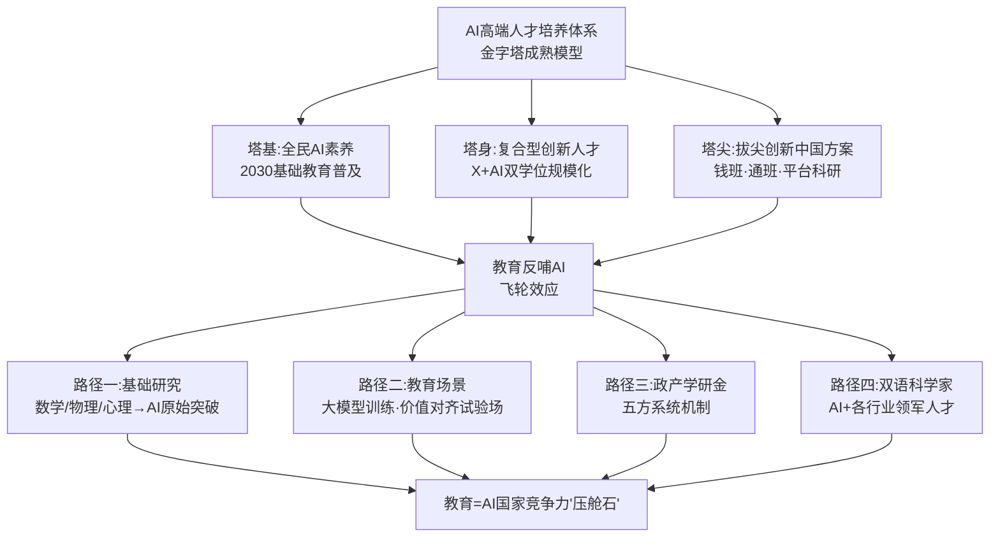

这一汇合点的根本意义在于：**它使"AI赋能教育"与"教育反哺AI"两条线索在中长期演进中实现真正的"双向锁定"——AI赋能教育的深化为教育反哺AI提供更高质量的人才和场景，教育反哺AI的释放为AI赋能教育提供更强大的技术和产品**。这种自我增强的良性循环，正是双向赋能框架的终极生命力所在。

## 8.7 面向多元主体的可操作战略建议

研究的最终升华，落在面向多元主体的可操作战略建议上。基于前述国际比较、优势诊断与趋势研判，本节面向政府、高校、中小学、企业、教师、家长六类主体，提出可操作、有差异、有节奏的战略建议。

**对政府：构建国家级治理体系，深化全球话语权**。政府层面的战略建议聚焦于五条主线。**一是完善国家级AI教育大模型分级分类安全审核机制**——基于第3章已述《"人工智能+教育"行动计划》部署的"评估备案、技术监测、风险预警、应急响应"四大机制，进一步细化教育大模型的全生命周期审核标准，构建覆盖"模型算法、数据资源、基础设施、应用系统"的安全保障体系。**二是加强部门协同**——可借鉴韩国教育部—科技部协同机制[^168],建立教育部+网信办+工信部+科技部+国家数据局五部门联席治理机制，破解政策碎片化困境。**三是推进AI教育社会实验循证治理**——基于第3章已述19个国家智能社会治理实验特色基地（教育）的探索基础，扩大社会实验的覆盖范围与议题深度，以"前瞻性、实证性"的循证机制替代"被动应对"模式。**四是参与全球标准制定与话语权构建**——主动对接OECD/AILit框架、UNESCO双框架、PISA 2029评估，依托国家智慧教育平台国际版输出"中国方案"。**五是深化中西部AI教育援助机制**——将"皮山模式""京雄合作""赣榆县域均衡"等典型经验制度化，加大对中西部、农村、民族地区的专项投入。

**对高校：超常规布局，强化原创**。高校层面的战略建议聚焦于五条主线。**一是超常规布局AI交叉学科专业**——落实"十五五"规划纲要"超常规布局人工智能、集成电路等新兴领域急需学科专业"要求，加快"AI+各行业"交叉专业建设。**二是推进"X+AI"双学位与微专业规模化**——在复旦、南大等先行高校的基础上，到2030年实现60%以上高校开设至少一个"X+AI"双学位项目。**三是构建产教科教融合的"平台科研"生态**——参照鄂维南院士"安卓系统式"底层科研平台理念，建设跨学科、跨高校、跨产业的协同科研平台。**四是强化基础研究与原始创新**——破解"评价体系导致教师'刷论文''接项目'"的困境，把对AI产业根基性突破的贡献度纳入科研评价。**五是改革科研评价体系**——借鉴徐星院士"教材贡献度"指标[^175],建立兼顾"短期成果产出"与"长期根基性贡献"的多维评价。

**对中小学：刚性落实+早期苗子**。中小学层面的战略建议聚焦于四条主线。**一是刚性落实分学段使用边界**——严格执行《中小学生成式人工智能使用指南（2025年版）》"小学禁止学生独自使用开放式生成功能、初中适度探索、高中允许探究性学习"的分学段规定。**二是构建AI通识课程刚性课时与师资保障**——参照北京"每学年≥8课时"、上海"每周1课时×30课时"、广州"每2周≥1课时"等模式，把AI通识课程从"鼓励性"升级为"刚性"。**三是推进"一师一画像"与"一生一档"数字治理**——参照青海师范大学附属第三实验中学"一师一画像"、杭州师范大学附属未来科技城学校"一生一档"等本土实践，构建数据驱动的精细化教育治理。**四是强化早期苗子识别与高校协同培养**——参照深圳"一流大学+一流企业+一流中学"联合培养、上海"中小学与高校积极合作探索人工智能领域拔尖创新人才早期发现"等政策，建立中小学与高校的拔尖人才一体化培养机制。

**对企业：守底线+构生态**。企业层面的战略建议聚焦于四条主线。**一是坚守"40/60"产品设计哲学**——把AI教育产品定位于"工具化40%"的辅助赋能，避免越位侵蚀"60%"的人之专属领域，特别是在情绪识别等敏感能力上严守欧盟《人工智能法案》等国际伦理边界。**二是构建"好AI+好内容+好场景"三角护城河**——参照学而思、好未来、科大讯飞等头部企业实践，避免"参数对决"的简单逻辑，转向"算法壁垒+私有数据+核心场景"的深度构建。**三是积极承担伦理审查与合规义务**——基于2026年4月《人工智能科技伦理审查与服务办法（试行）》要求，建立独立运行的人工智能科技伦理委员会，把伦理要求嵌入研发、测试全流程。**四是深度参与产学研协同育人**——通过产业学院、订单班、AI实践实验室等机制深度参与高校人才培养，从"用人方"提升为"育人方"。麦肯锡报告揭示——"部署Agent不是接个API就完事了，而是要重构流程+重塑组织+重训员工"[^179][^180]——企业必须从底层重新设计AI产品与服务模式。

**对教师：内化价值+主动构建**。教师层面的战略建议聚焦于四条主线。**一是内化"四维不可替代价值"认知**——主动认识自身在AI时代作为"认知卸载防护墙+批判性思维引路人+情感共同体守护者+价值底座塑造者"的不可替代价值，在职业身份层面建立坚定的安全感。**二是主动构建AI素养"五位一体"能力**——基于第6章已论证的意识、知识、实践、发展、责任五维框架，把AI素养发展内化为职业自我成长的有机部分。**三是积极参与治理共建与教研创新**——基于《教师生成式人工智能应用指引》"加强协同共治"原则，把AI教育治理从"被动接受规则"提升为"主动共建规则"。**四是把握"指挥家"新角色定位**——从"知识传授者"转向"学习生态创建者"、"师生共创引导者"，在人机协同中担任流程指挥与质量把关。山西润一教授的提醒尤为关键——"人工智能是一个聪明的助手，但有时也会出错，需要人类教师成为学生打开新世界的一把钥匙。真正和学生接触的还是教师，脱离教师，教育的数字化转型很难实现"[^174]。

**对家长：树规则+育能力**。家长层面的战略建议聚焦于四条主线。**一是树立"三不原则"家庭规则**——"不传真人照片、不填真实住址、不信AI生成谣言"，把价值观引领延伸到家庭场景。**二是培育孩子"提问能力"与批判性思维**——基于"会提问的孩子比会解题的更珍贵"命题，主动设计家庭讨论场景，引导孩子质疑AI输出、追问深层逻辑。**三是参与家校协同治理**——主动了解学校AI使用政策、参与家长委员会讨论、配合教师引导孩子合理使用AI。**四是避免认知卸载与情感外包**——警惕"作业全外包给AI""陪伴全外包给AI"的双重风险，重新定位家长在孩子成长中"情感陪伴+价值引领"的不可替代角色。

**整合：四级联动的行动路线图**。将六类主体的战略建议整合，可以形成"国家战略—产业生态—学校实践—个体行动"四级联动的行动路线图：

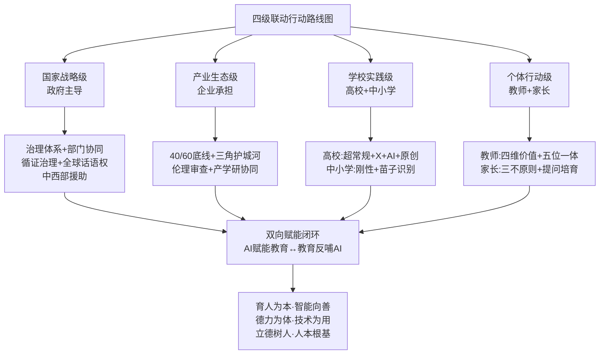

四级联动的根本逻辑在于：**没有任何一类主体可以独立完成AI教育的转型，必须通过四级主体的协同行动才能形成真正的双向赋能闭环**。国家战略级主体提供"顶层设计与价值引导"，产业生态级主体提供"工程化实现与商业可持续"，学校实践级主体提供"育人主战场与人才输出"，个体行动级主体提供"日常实践与价值守护"——四级主体相互嵌套、互为支撑，共同构成AI教育健康发展的"治理共同体"与"价值共同体"。

---

## 全篇研究的总体收束与价值升华

至此，本研究已完成"现状—挑战—支撑—生态—趋势—行动"的完整闭环。回望前八章累积的所有论证，我们可以清晰地看到一条核心主线——**"AI赋能教育—教育反哺AI"双向赋能框架不是抽象的理论建构，而是中国"人工智能+教育"实践的真实写照与未来导向**。

从第1章奠定的"双向赋能"理论框架，到第2章呈现的应用图景与第3章构建的治理生态——回应了用户最关心的"AI在教育领域应用现状、可落地场景与面临挑战"三大问题；从第4章论证的战略支撑到第5章勾勒的贯通培养体系与第6章构建的教师队伍生态——回应了用户对"教育对培养AI高端人才的支撑作用如何强化、学校的AI人才培养体系"两大核心关切；从第7章合龙的产业生态到第8章升华的国际比较与战略建议——把所有具体议题整合到全球坐标与未来导向中。

研究全篇始终坚持三层价值底座：**一是"双向赋能"的辩证视野**——既关注AI对教育的赋能，更重视教育对AI的反哺，两者互为支撑、不可偏废；**二是"育人为本、智能向善"的价值锚定**——技术能力的扩张始终服务于"立德树人"的根本使命，而非反向异化；**三是"分层分类、动态演进"的方法论**——避免"一刀切"判断，在学段、地区、主体、阶段的多维差异中把握AI教育的真实复杂性。

带着这一价值底座与方法论，回望AI时代的教育——我们看到的不是"AI将取代教师"的恐慌，而是"教师在AI时代的不可替代价值愈加凸显"的笃定；不是"教育被技术异化"的悲观，而是"教育借助技术回归人本根基"的自信；不是"AI竞争是技术与算力的较量"的简单判断，而是"AI竞争最终是教育与人才的较量"的深层洞察。

这正是本研究的最终回应——**在AI时代，技术越是强大，教育越是关键；AI越是聪明，"成为人"越是珍贵；机器越是平等化"智力"，人类越是需要"德力"**。"明明德、亲民、止于至善"的中华教育智慧，与"以人为本、智能向善"的当代价值，与"AI赋能教育—教育反哺AI"的双向赋能框架，共同汇聚为中国"人工智能+教育"实践的精神底色。这一精神底色，既是对"教育是立国之本""强国必先强教"的当代诠释，也是中国向世界贡献的"AI教育的另一种可能"——**让技术服务于人，让教育成全人，让人之为人在AI时代不仅未被削弱，反而更加完整**。

带着这一价值升华，本研究在此收笔。但研究结束之处，也正是实践开启之处——AI教育的真实变革，不在文字的论述中，而在每一位政府工作者的政策制定中、每一位高校校长的学科布局中、每一位中小学教师的课堂创新中、每一位企业产品经理的设计哲学中、每一位学生的学习选择中、每一位家长的家庭教育中。让我们以"双向赋能"的智慧、"立德树人"的初心、"智能向善"的方向，共同迎接AI时代的教育变革——让每一个人在AI时代不仅"会用AI"，更能"超越AI"，最终成为完整的、有创造力的、有家国情怀的"AI时代之人"。

# 参考内容如下：
[^1]:[以“人工智能+教育”奋力开创教育数字化新格局](https://baijiahao.baidu.com/s?id=1861341965192039010&wfr=spider&for=pc)
[^2]:[观点丨朱丹:从“赋能”到“重塑”,人工智能开启教育系统性变革](https://new.qq.com/rain/a/20260417A04QX800)
[^3]:[中国教科院包昊罡:破解AI教育难题,需科技与教育双向奔赴](http://field.10jqka.com.cn/20260425/c676282377.shtml)
[^4]:[生成式人工智能驱动的学科教学范式转向](http://www.jyb.cn/rmtzcg/xwy/wzxw/202604/t20260407_2111463675.html)
[^5]:[2026年起,AI通识课成为中小学必修课:这个政策将如何影响你的孩子?](https://view.inews.qq.com/a/20260402A01GPA00)
[^6]:[科学把握人工智能在教育强国建设中的定位方向方法](https://www.ccps.gov.cn/xxwx/202604/t20260410_170628.shtml)
[^7]:[循序渐进 久久为功](https://baijiahao.baidu.com/s?id=1861798244556251730&wfr=spider&for=pc)
[^8]:[教育部等九部门关于加快推进](http://www.moe.gov.cn/srcsite/A01/s7048/202504/t20250416_1187476.html)
[^9]:[全文|国务院关于深入实施“人工智能+”行动的意见](https://baijiahao.baidu.com/s?id=1841508401941431607&wfr=spider&for=pc)
[^10]:[教育部等五部门关于印发《“人工智能+教育”行动计划》的通知](https://zq.jspi.cn/xjzx/info/1861/6901.htm)
[^11]:[速递!教育部等五部门联合印发《“人工智能+教育”行动计划》](https://baijiahao.baidu.com/s?id=1862082045578782006&wfr=spider&for=pc)
[^12]:[从机制创新找动力,开辟智能时代教育发展新赛道](http://m.jyb.cn/rmtzgjyb/202604/t20260421_2111469338_wap.html)
[^13]:[教育部:全面深入推动“人工智能+教育”](https://baijiahao.baidu.com/s?id=1861185592031533572&wfr=spider&for=pc)
[^14]:[教育部推动智能技术与教育教学深度融合](http://www.legaldaily.com.cn/index/content/2026-04/10/content_9371974.html)
[^15]:[人工智能如何与产学研“双向赋能”](https://edu.fy.gov.cn/Content/show/1276968.html)
[^16]:[连续三届入选教育部典型案例!祝贺西电!](https://mp.weixin.qq.com/s?__biz=MjM5MTAxMTUyMA==&mid=2655189329&idx=1&sn=65a571750cc1448986e3ced6d3e94902&chksm=bc1e187b00ffc59a7ad09a05fb274fb16fcfbe55e85eb2664aac6ad515c90d1887cec0854168&scene=27)
[^17]:[AI学科五强高校深度解析:数据见证硬核实力,各有千秋藏锋芒](https://baijiahao.baidu.com/s?id=1851671746554046643&wfr=spider&for=pc)
[^18]:[AI正重塑职业教育:近五成高职院校开设人工智能通识课](https://news.cctv.com/2026/02/06/ARTImnzGMp0mjgudhmmKs4dT260206.shtml)
[^19]:[援疆品牌背后的故事⑫智慧教育“皮山模式”炼成记](https://news.aksxw.com/sy/rdxw/xj/202604/t20260423_34121655.html)
[^20]:[AI 教育硬件爆卖 1000 万台!大模型重构学习场景,政策加持下的机遇与暗礁 ](https://it.sohu.com/a/970405210_120928605)
[^21]:[2025全球人工智能技术应用洞察报告解读](https://weibo.com/ttarticle/p/show?id=2309405261904162979893)
[^22]:[2025人工智能引领中国教育变革 “AI+教育”市场迎来黄金发展期](https://browser.qq.com/mobile/news?doc_id=54868c28dba60252)
[^23]:[优质均衡“出圈”,AI赋能成长!黄浦江畔这所“黑马小学”如何做到“五育融合”?](https://www.163.com/dy/article/KREUEVMC0534B3IC.html)
[^24]:[AI赋能智慧课堂](https://baijiahao.baidu.com/s?id=1862425008988097488&wfr=spider&for=pc)
[^25]:[复旦大学“法学+人工智能”双学士学位复合型人才培养项目 2024 级本科生遴选工作细则](https://law.fudan.edu.cn/ed/47/c27452a716103/page.htm)
[^26]:[广州市创新构建“数·智·融·创”AI教育模式](https://www.gz.gov.cn/xw/zwlb/bmdt/sjyj/content/post_10780097.html)
[^27]:[IDC报告:中国电信天翼云位居中国教育公有云市场第一](http://szjj.china.com.cn/2025-10/17/content_43251695.html)
[^28]:[《纽约客》丨要把人工智能赶出学校吗?](https://new.qq.com/rain/a/20260425A03D2Z00)
[^29]:[如何推进“人工智能+教育”行动计划?教育部详解](https://baijiahao.baidu.com/s?id=1862063345452994229&wfr=spider&for=pc)
[^30]:[» 人工智能科技英才班](http://catalog.ustc.edu.cn/program/t14)
[^31]:[AI渗透率86%,全球基础教育体系将被迫变革](https://m.163.com/dy/article/KR7HLO2U055616YL.html)
[^32]:[星光教师智能体亮相教育装备展 为教师减负增效提供一站式解决方案](http://news.10jqka.com.cn/20260424/c676268784.shtml)
[^33]:[教育部等五部门联合印发《“人工智能+教育”行动计划》](https://baijiahao.baidu.com/s?id=1862049692184201346&wfr=spider&for=pc)
[^34]:[QuestMobile2025有孩家庭人群消费洞察报告](https://www.tmtpost.com/7578378.html)
[^35]:[数智赋能校园 AI让课堂“活”力全开](https://baijiahao.baidu.com/s?id=1862073843148510303&wfr=spider&for=pc)
[^36]:[AI重塑高等教育:50个教育部典型案例](https://xxzx.hbeu.edu.cn/info/1054/4169.htm)
[^37]:[防止偏见歧视、算法压榨,重磅政策出台剑指AI科技伦理治理](https://baijiahao.baidu.com/s?id=1861808761314673466&wfr=spider&for=pc)
[^38]:[深度|深圳以AI擘画未来学校新图景,培养有温度的AI时代新质人才](http://ycpai.ycwb.com/content/ikimvkhtjc/content_54016196.html)
[^39]:[连云港赣榆区举办江苏省中小学人工智能教育领航教师研修活动](https://baijiahao.baidu.com/s?id=1863254008018902311&wfr=spider&for=pc)
[^40]:[教育AI技术的可解释性研究-洞察阐释](https://www.renrendoc.com/paper/421253691.html)
[^41]:[教育部举行《“人工智能+教育”行动计划》新闻发布会 ](http://www.scio.gov.cn/xwfb/bwxwfb/gbwfbh/jyb/202604/t20260414_984731.html)
[^42]:[规范高校AI教育装备采购 让智能技术真正服务育人](http://www.ccgp.gov.cn/llsw/202604/t20260424_26452510.htm)
[^43]:[浙江入选10所!教育部公布第二批中小学人工智能教育基地名单](https://mp.weixin.qq.com/s?__biz=MzA4ODY3MjkxNA==&mid=2651391976&idx=2&sn=8b5fcf46f93286ce57c9621857a7adb4&chksm=8af4de24ebc1257496a421060436dd876e7044fb953f4b61243d8647826638556ad1ee0d21f5&scene=27)
[^44]:[中国科学技术大学 智能科学与技术学科普通招考博士研究生 培养方案(2025 版)](https://gradschool.ustc.edu.cn/static/upload/article/ueditor/1758538285163-442126.pdf)
[^45]:[衡水新闻网](http://www.hsrb.com.cn/detail/177719347321955.html)
[^46]:[麻省理工学院新研究:ChatGPT可能会削弱批判性思维能力](https://baijiahao.baidu.com/s?id=1835428213631572296&wfr=spider&for=pc)
[^47]:[AI时代的教育革命:当知识不再稀缺,我们该如何学习](https://baijiahao.baidu.com/s?id=1862541294642554618&wfr=spider&for=pc)
[^48]:[频用AI让学生思维活跃还是懈怠?](http://www.kepu.gov.cn/news/2025-11/06/content_427292.html)
[^49]:[聊天机器人正在削弱我们的思考能力吗?](https://baijiahao.baidu.com/s?id=1863436205970981255&wfr=spider&for=pc)
[^50]:[广州市创新构建“数·智·融·创”AI教育模式](https://www.gz.gov.cn/xw/zwlb/bmdt/content/mpost_10780096.html)
[^51]:[探索人工智能赋能教师发展的路径](http://www.jyb.cn/rmtzcg/xwy/wzxw/202604/t20260407_2111463676.html)
[^52]:[优质均衡“出圈”,AI赋能成长!黄浦江畔这所“黑马小学”如何做到“五育融合”?](http://baijiahao.baidu.com/s?id=1863524924450162688&wfr=spider&for=pc)
[^53]:[《心语》第135期 | ChatGPT依赖症——便利背后的心理暗礁与理性导航](https://mp.weixin.qq.com/s?__biz=MzI2MTA1MDg5Nw==&mid=2653020732&idx=3&sn=46a8e1581cfd96a7f98443f9bff777b3&chksm=f0ba9a70f792b10f18935e3652b4b2997fff3aa447d027b9df6edcf208a75e3560f75e219949&scene=27)
[^54]:[长期研究发现:课堂上使用 AI 的学生成绩更差](https://browser.qq.com/mobile/news?doc_id=55567a23ba880452)
[^55]:[生成式人工智能及其教育应用的基本争议和对策 ](https://mp.weixin.qq.com/s?__biz=MzIzNjU3MDY4NA==&mid=2247573091&idx=2&sn=93a6189e143962ba599a184bb84a7e8a&chksm=e8d64f30dfa1c626bca5933097ff997c24da2871f00f93736bb762f95495c4fd2f0c8547b7f1&scene=27)
[^56]:[人工智能 | 高等教育数字化的技术部署节奏与路向——以147所高校DeepSeek布局为例 | 刘骥 薛梦姣 苏福根](https://ghc.shnu.edu.cn/dd/04/c28783a843012/page.htm)
[^57]:[援疆品牌背后的故事⑫智慧教育“皮山模式”炼成记 ](https://www.tlfw.net/yj/202604/t20260423_34116838.html)
[^58]:[高校AI教育新图景:中美德三国路径探索与差异化发展剖析_课程_人工智能_模式](https://news.sohu.com/a/965769847_362225)
[^59]:[通用人工智能实验班](https://baike.baidu.com/item/通用人工智能实验班/56843901)
[^60]:[立规定轨驱动智能向善](https://finance.sina.cn/2026-04-27/detail-inhvwscu8032742.d.html)
[^61]:[补齐AI素养短板](https://baijiahao.baidu.com/s?id=1859233384361445580&wfr=spider&for=pc)
[^62]:[“ChatGPT宕机,我连作业都不会写了?”这届学生的“AI依赖症”,可能比想的更严重! ](https://mp.weixin.qq.com/s?__biz=MzA5MjEwODYyMw==&mid=2651496511&idx=1&sn=1d2d7b724098dfd18850b032b1cf0793&chksm=8ac7ebdfa7641abaee19f3501a1d970a2704e0df3e6fd8a0f8cafc8fc216063581d01818a3f1&scene=27)
[^63]:[教育部出台人工智能教育双指南—— 培养AI技能“童子功”,中小学要这样做](https://news.cnu.edu.cn/mtsj/12773c4061044db9aa87664226b8fd1c.htm)
[^64]:[联合国教科文组织发布教师与学生人工智能能力框架](https://untec.shnu.edu.cn/6e/d6/c26039a814806/page.htm)
[^65]:[西山脚下这所“没有围墙”的学院,正在锻造定义未来的AI领军者](https://baijiahao.baidu.com/s?id=1861167524471277706&wfr=spider&for=pc)
[^66]:[麻省理工学院新研究:ChatGPT 可能会削弱批判性思维能力 - 腾讯云开发者社区-腾讯云](https://cloud.tencent.com/developer/news/2698109)
[^67]:[交叉信息研究院 计算机科学与技术(人工智能班)专业本科培养方案](https://www.tsinghua.edu.cn/jxjywj/bksjywj/28-3-jisuanji.pdf)
[^68]:[广州以1+8模式普及人工智能通识教育](https://baijiahao.baidu.com/s?id=1832140017777627451&wfr=spider&for=pc)
[^69]:[AI使用不能触及学术底线](https://baijiahao.baidu.com/s?id=1863585845642895158&wfr=spider&for=pc)
[^70]:[信息素养 | 全球视野:境外高校AIGC使用规范汇总](https://mp.weixin.qq.com/s?__biz=MzI1NzQ3ODI1Ng==&mid=2247503538&idx=1&sn=7d491b43075ab88bdd34729dd843d4df&chksm=eb8e8104fcd3d2525b825c80a7666bde70318d1aa1eda3c272107c20d41abe593fba17b408d4&scene=27)
[^71]:[构建跨学科交叉研究体系-清华大学110年校庆云上科研展](https://yskyz.tsinghua.edu.cn/tjkytzjzgg/gjkxkjcyjtx1.htm)
[^72]:[中国互联网络信息中心发布《生成式人工智能应用发展报告(2025)》](https://baijiahao.baidu.com/s?id=1846475601182174777&wfr=spider&for=pc)
[^73]:[AI and education: Protecting the rights of learners](https://www.unesco.org/en/articles/ai-and-education-protecting-rights-learners)
[^74]:[ChatGPT Edu](https://baike.baidu.com/item/ChatGPT%20Edu/65746683)
[^75]:[“人工智能+”,如何加好教育](http://www.moe.gov.cn/jyb_xwfb/xw_zt/moe_357/2026/2026_zt03/lhjy/lhjj/lhjj_rgznfnjy/202603/t20260309_1430341.html)
[^76]:[AI时代教育的“破与立”:传统模式的困境与新生之路](https://baijiahao.baidu.com/s?id=1860595390142172860&wfr=spider&for=pc)
[^77]:[刚刚,《中国智慧教育白皮书》发布](http://www.moe.gov.cn/jyb_xwfb/xw_zt/moe_357/2025/2025_zt06/mtbd/202505/t20250516_1190804.html)
[^78]:[生成式人工智能应用发展报告(2025)](https://baike.baidu.com/item/生成式人工智能应用发展报告(2025)/66914369)
[^79]:[广州市教育局关于公示人工智能助推教师队伍建设行动实验区、校及教育集团验收结果的通知](https://jyj.gz.gov.cn/gk/zfxxgkml/qt/gs/qt/content/post_10629371.html)
[^80]:[AI时代教育重心转向:会提问的孩子比会解题的更珍贵](http://yuanchuang.10jqka.com.cn/20260407/c675783243.shtml)
[^81]:[学院简介](https://soai.sjtu.edu.cn/cn/article/xyjj)
[^82]:[复旦大学发布AI赋能教育新范式 覆盖全体学生与全部学科](http://news.10jqka.com.cn/20260410/c675911770.shtml)
[^83]:[雄安新区依托智慧城市提升现代化治理能力丨未来校园的“未来课堂”](https://baijiahao.baidu.com/s?id=1863590726500672641&wfr=spider&for=pc)
[^84]:[教育部新规:中小学每周增加4节AI课,师资团队又该如何解决](https://www.360doc.cn/article/8142314_1147375737.html)
[^85]:[9月起实施:北京发布1-12年级人工智能课程纲要(附项目示例、教学要点)——义务教育阶段](https://mp.weixin.qq.com/s?__biz=Mzg3OTc3NDM3NQ==&mid=2247505750&idx=1&sn=df4323ea89135009804488261e00490d&chksm=ce1e698bc199b68d2e247f950302cb4f966c6fca77f1fb8a843e90a51768c61bd0b658cac96f&scene=27)
[^86]:[最新发布!教育部划定AI教育红线!小学到高中分层教学,家长必看 ](https://mp.weixin.qq.com/s?__biz=MzI2NjI4NTcyMA==&mid=2247543109&idx=1&sn=b816999564059345d8d3491b7ba2636b&chksm=eb220b7997c54733db6571a73822eb017392873df5ea716e1f36438ffbb4b06539ae25b742e1&scene=27)
[^87]:[市教育局](https://www.gz.gov.cn/xw/zwlb/bmdt/sjyj/)
[^88]:[五部门联合发文:中小学人工智能教育纳入地方课程,教师资格增考“智能素养”](https://baijiahao.baidu.com/s?id=1862066967524932682&wfr=spider&for=pc)
[^89]:[广州市创新构建“数·智·融·创”AI教育模式](https://jyj.gz.gov.cn/yw/jyyw/content/post_10779572.html)
[^90]:[中国科学院院士郑泉水:“钱学森之问”终于有了中国人自己的解题方案](https://www.jfdaily.com/news/detail?id=1084003)
[^91]:[别再瞎用AI了!高校明确:允许用AI做这5件事,但绝不能做这3件事](https://baijiahao.baidu.com/s?id=1863131697951093475&wfr=spider&for=pc)
[^92]:[教育新观察:AI时代,理想课堂的路在何方?——人机共生,向教育本质的诗意回归](https://cj.sina.com.cn/articles/view/7295511724/1b2d8acac01901cca4)
[^93]:[赵勇:AI时代,教育者需要重点思考3个问题——美国教育科学院院士的观点](https://cj.sina.com.cn/articles/view/7295511718/1b2d8aca601901hhws)
[^94]:[国际生成式人工智能教育应用治理图景](https://baijiahao.baidu.com/s?id=1862583396501189303&wfr=spider&for=pc)
[^95]:[访美国教育科学院院士赵勇:AI时代,教育者需要重点思考3个问题](https://dy.163.com/article/KPBO8SLE0516DRAR.html)
[^96]:[ChatGPT用多了,人会“降智”?!MIT放出206页研究实证!](https://baijiahao.baidu.com/s?id=1835446116528531804&wfr=spider&for=pc)
[^97]:[“人工智能+教育”,“加”什么?如何“加”?](https://baijiahao.baidu.com/s?id=1862176346309887031&wfr=spider&for=pc)
[^98]:[中国科学院院士郑泉水:“钱学森之问”终于有了中国人自己的解题方案](https://www.jfdaily.com/staticsg/res/html/web/newsDetail.html?id=1084003)
[^99]:[The Future of Jobs Report 2025 ](https://www.weforum.org/publications/the-future-of-jobs-report-2025/digest/?gad_source=1&gclid=CjwKCAjwtdi_BhACEiwA97y8BK80Uzl6yaxHRuyo5GjpZch7oRycogpKsNa-Jxb-sIe1Si08jqZnjhoCDwEQAvD_Bw/)
[^100]:[上海市教育委员会关于印发《上海市推进实施人工智能赋能基础教育高质量发展的行动方案(2024-2026年)》的通知 ](https://stem.zjnu.edu.cn/2026/0223/c9134a547416/page.htm)
[^101]:[解锁教育新范式!复旦大学这样用AI赋能教与学](https://finance.sina.com.cn/tjhz/2026-04-10/doc-inhtztiu0093510.shtml)
[^102]:[智慧教育“皮山模式”炼成记](http://xj.people.com.cn/n2/2026/0424/c186332-41562016.html)
[^103]:[复旦大学“数学与应用数学+人工智能”双学士学位复合型人才培养项目 2024 级本科生遴选工作细则](https://math.fudan.edu.cn/dd/74/c30358a712052/page.htm)
[^104]:[AI化身“助手”,人类学习能力会变弱吗? ](https://www.ncsti.gov.cn/kjdt/kjrd/rgzn_kjrd/202507/t20250711_209877.html)
[^105]:[南大启动“博士+硕士”双学位项目,首批聚焦人工智能交叉领域!](https://baijiahao.baidu.com/s?id=1861774201887297770&wfr=spider&for=pc)
[^106]:[长期研究发现:课堂上使用 AI 的学生成绩更差 ](https://mp.weixin.qq.com/s?__biz=Mzg3NzU5NjMyNg==&mid=2247741444&idx=1&sn=d9f94e0113da7922ceeedf44c7173953&chksm=ce4eb6c84fc17fa0cc8f04a9954183d130bd2b0cf29790dcc9790713b3295326a1962cd4d83c&scene=27)
[^107]:[上财发布“AI+课程体系”,人工智能如何赋能财经教育?](https://baijiahao.baidu.com/s?id=1831687721935521351&wfr=spider&for=pc)
[^108]:[兰德报告:越来越多学生认为AI会损害批判性思维技能](https://www.163.com/dy/article/KRBL6GEU0514QKLR.html)
[^109]:[北京市教委副主任张耀天:高校要更积极主动拥抱科技前沿和产业发展需求](https://baijiahao.baidu.com/s?id=1863528592513993834&wfr=spider&for=pc)
[^110]:[100人!浙江大学竺可桢学院「求是科学班」2025年招生简章发布!](https://baijiahao.baidu.com/s?id=1839982101065878099&wfr=spider&for=pc)
[^111]:[从“任务型扩招”到“高质量供给”](https://www.clssn.com/2025/09/25/wap_9967371.html)
[^112]:[教育部基础教育教学指导委员会发布《中小学生成式人工智能使用指南(2025年版)》](http://jyj.jcs.gov.cn/zwgk/zcwj/zcwj/art/2025/art_cf140f8131ce4c93a100f434fd470bb0.html)
[^113]:[高擎思想旗帜 勇担时代使命 奋力打造建构中国自主知识体系的先锋高地](https://news.ruc.edu.cn/2047840032983756801.html)
[^114]:[北京邮电大学卓越工程师学院](https://baike.baidu.com/item/北京邮电大学卓越工程师学院/62972472)
[^115]:[中小学如何开展人工智能教育?深圳这场论坛展开探讨](https://baijiahao.baidu.com/s?id=1802274819858190963&wfr=spider&for=pc)
[^116]:[交叉拓新 智创未来|“智慧三航”学研空间落成启用,强力赋能“总师型”拔尖人才培养](https://news.nwpu.edu.cn/info/1003/146589.htm)
[^117]:[一场特殊的“科学第一课”:杨浦学子向院士递上“小纸条”](http://baijiahao.baidu.com/s?id=1863538121012121108&wfr=spider&for=pc)
[^118]:[中小学AI启蒙新教材来了 6册带孩子看懂人工智能](https://news.cctv.com/2025/07/25/ARTI20foP70eWXmqDP4S15CI250725.shtml)
[^119]:[智班简介](https://sai.pku.edu.cn/rcpy/zbpy/zbjj.htm)
[^120]:[【“十四五”巡礼】 扎实推进“总师育人文化”走深走实 不断提高“总师型”人才培养质量](https://www.nwpu.edu.cn/info/3058/116608.htm)
[^121]:[首页](http://ai.ruc.edu.cn/index.htm)
[^122]:[深圳加快构建中小学人工智能教育体系 AI来了,书本活了,学生爱了](https://www.163.com/dy/article/JS7BGBRK0514R9KQ.html)
[^123]:[北京邮电大学卓越工程师学院](https://gce.bupt.edu.cn/)
[^124]:[深圳市中小学人工智能联合实验室在深圳市高级中学(集团)南校区启用](https://baijiahao.baidu.com/s?id=1796946427802493760&wfr=spider&for=pc)
[^125]:[2024版深圳市义务教育人工智能课程纲要.ppt 33页VIP](https://m.book118.com/html/2025/0325/5102314240012122.shtm)
[^126]:[别担心!调查显示:超七成小学生未依赖AI完成作业](https://baijiahao.baidu.com/s?id=1849172370444391030&wfr=spider&for=pc)
[^127]:[浙大发布2025本科招生培养亮点!总体招生规模扩大,新增多个专业项目_人工智能_创新_基础](https://www.sohu.com/a/904859514_121627717)
[^128]:[北京大学通用人工智能实验班](https://baike.baidu.com/item/北京大学通用人工智能实验班/61641803)
[^129]:[全文:广东省中小学教师人工智能素养框架(试行)](https://zy.gdedu.gov.cn/studio/index.php?r=studio/post/view&sid=300053&id=76056)
[^130]:[我国中小学教师人工智能素养框架的理论逻辑与建构路径](http://caijing.chinadaily.com.cn/a/202603/23/WS69c0e6c8a310942cc49a475b.html)
[^131]:[2025年中国AI应用产业链图谱及投资布局分析(附产业链全景图)](https://baijiahao.baidu.com/s?id=1850905174230179642&wfr=spider&for=pc)
[^132]:[一张图,读懂 2025 AI 赋能教育产业链全景! ](https://caifuhao.eastmoney.com/news/20250727100436028626190)
[^133]:[2025中国AI大模型终极对决!讯飞、字节、腾讯、阿里四大天王,谁能笑到最后?看这篇深度分析就够了!](https://blog.csdn.net/Python_cocola/article/details/155489890)
[^134]:[中国大模型行业2025全景解读:讯飞、字节、腾讯、阿里的差异](https://blog.csdn.net/python123456_/article/details/155580979)
[^135]:[2025年中国教育大模型行业市场规模、重点企业分析及行业发展趋势](http://finance.sina.cn/2025-08-10/detail-infkntrv1430264.d.html)
[^136]:[2024教育智能硬件:市场趋势与用户需求深度解析](https://cloud.baidu.com/article/3658234)
[^137]:[字节跳动与科大讯飞:大模型之战的AB面](https://m.jiemian.com/article/12270582.html)
[^138]:[新东方与好未来最新财报对比:增长、盈利与战略的全面分化](https://baijiahao.baidu.com/s?id=1863421185001407613&wfr=spider&for=pc)
[^139]:[千亿学习机背后,好未来的AI战局 ](https://mp.weixin.qq.com/s?__biz=MzU5NzY3ODQ3Ng==&mid=2247553572&idx=1&sn=8b8eb4d6418f88a1a118f61d01910440&chksm=ff91414a202f127353907e0b66cfbde1e5dad046b8f567eb33d12ee45f9a7e90d4121cd850a3&scene=27)
[^140]:[好未来2024财年增长背后:AI技术的战略角色 ](https://news.sohu.com/a/774971544_222256)
[^141]:[学习机竞逐2024:科技与“狠活”引发的市场变革 ](http://mt.sohu.com/a/851424702_116132)
[^142]:[2026年中国GenAI+教育行业发展报告](https://baijiahao.baidu.com/s?id=1859237888325864643&wfr=spider&for=pc)
[^143]:[2026年智慧校园平台TOP5揭秘:谁才是真正靠谱的管理利器?_服务器_信息_SaaS](https://news.sohu.com/a/994076987_122651717)
[^144]:[要做智慧校园的校园管理,选哪家](https://www.byxx.com/g88072669.html)
[^145]:[郑州师范学院人工智能产业学院揭牌](http://baijiahao.baidu.com/s?id=1862995299480274519&wfr=spider&for=pc)
[^146]:[稳岗促就业|“订单式”培养 破解就业难题](https://www.hf365.com/2025/0706/1642098.shtml)
[^147]:[深化产教融合,共育安全英才——人工智能学院360订单班顺利开班](https://dxxy.webs.nbpt.edu.cn/2026/0423/c213a5574132/page.htm)
[^148]:[全国第二家本科高校产教融合人工智能实践实验室落户合肥经济学院](https://baijiahao.baidu.com/s?id=1863339946643149927&wfr=spider&for=pc)
[^149]:[推动美国青少年人工智能教育发展——白宫最新发布AI教育行政令 ](https://mp.weixin.qq.com/s?__biz=MzA4ODY3NjUyMw==&mid=2649221135&idx=4&sn=4effaaf49f44d9ecc3cc72171b35a038&chksm=8938599c0cbbc0dcb0f91132edc7d7304f12ce9f1281434c10c7e48787e7ec0228e40404d81c&scene=27)
[^150]:[新质观察|白宫《国家人工智能政策框架》释放了什么信号?](https://baijiahao.baidu.com/s?id=1861134838853864025&wfr=spider&for=pc)
[^151]:[OpenAI发布提升青少年AI素养五大倡议报告](https://www.163.com/dy/article/KETEUS4M0514QKLR.html)
[^152]:[「ChatGPT 大战 Gemini」:OpenAI 教师版上线ChatGPT Plus免费,Google Gemini Pro 大学生免费延长一年!](https://cloud.tencent.com/developer/article/2591755)
[^153]:[Artificial Intelligence | NSF - U.S. National Science Foundation](https://www.nsf.gov/focus-areas/ai)
[^154]:[National AI Research Institutes](https://www.nsf.gov/focus-areas/ai/institutes)
[^155]:[欧盟《人工智能法案》进入合规准备关键期](https://chinawto.mofcom.gov.cn/article/jsbl/dtxx/202602/20260203618535.shtml)
[^156]:[欧盟拟推迟高风险AI监管](https://baijiahao.baidu.com/s?id=1860808607181732584&wfr=spider&for=pc)
[^157]:[Guidelines on the ethical use of artificial intelligence and data in teaching and learning](https://education.ec.europa.eu/focus-topics/digital-education/action-plan/ethical-guidelines-for-educators-on-using-ai)
[^158]:[Digital learning and ICT in education | Shaping Europe’s digital future](http://ec.europa.eu/digital-single-market/en/policies/digital-learning-ict-education)
[^159]:[教育新闻 | 国际:欧盟委员会发布《数字教育行动计划》(2021-2027) ](https://mp.weixin.qq.com/s?__biz=MzIwNTEyNzg1NQ==&mid=2652249031&idx=1&sn=218dbbd6df3988324f7660c0e6894378&chksm=8cd71207bba09b11be961f88f5703768180ddd6aa2d5b8b1fbac4e73c89102efc1832e3f1aa5&scene=27)
[^160]:[全球首创!新加坡启动万人AI培养计划,南大40%本科项目将应用～](https://dy.163.com/article/KQ0SBK1I0524A4QN.html)
[^161]:[南洋理工重磅改革:40%课程将AI化,所有专业学生标配“AI分身”!只会卷绩点的人,要被淘汰了?](https://mp.weixin.qq.com/s?__biz=MzA5NTE2NTIwMQ==&mid=2661722415&idx=1&sn=39625fd2a17c7c05b4a29e2052bc5afe&chksm=8a4ed5acc1202722367e4b9fc1ef4fefdf7fa48ecd79c82b920f6a13f61474e79aa3ffa13574&scene=27)
[^162]:[微软宣布55亿美元投资新加坡AI与云基础设施](https://baijiahao.baidu.com/s?id=1861258794257466100&wfr=spider&for=pc)
[^163]:[英国启动AI教育革命支持教师减负与学生个性化学习](https://untec.shnu.edu.cn/b5/57/c26039a832855/page.htm)
[^164]:[National Artificial Intelligence Research Institutes](https://www.nsf.gov/funding/pgm_summ.jsp?pims_id=505686)
[^165]:[联合欧盟发布面向中小学教育的人工智能素养框架](https://xzx.shnu.edu.cn/d7/38/c18437a841528/page.htm)
[^166]:[AI素养框架](http://tsg.wust.edu.cn/kyfw/AIfw1/AIsykj.htm)
[^167]:[全球视野下教师数智素养重塑](https://baijiahao.baidu.com/s?id=1862583396494061648&wfr=spider&for=pc)
[^168]:[韩国教育部科技部布局AI人才培养战略](https://baijiahao.baidu.com/s?id=1860678688800748977&wfr=spider&for=pc)
[^169]:[韩国2025年起将AI引入中小学课程](https://www.cnii.com.cn/gxxww/rmydb/202306/t20230616_479676.html)
[^170]:[数理・データサイエンス・AI教育プログラム認定制度](https://www.mext.go.jp/a_menu/koutou/suuri_datascience_ai/00001.htm)
[^171]:[数理・データサイエンス・AI教育](https://www.kyoto-su.ac.jp/kyotsu/sy_ai/)
[^172]:[日本发布《人工智能战略2022》](http://www.casisd.cn/zkcg/ydkb/kjzcyzxkb/2022/zczxkb202206/202209/t20220927_6517785.html)
[^173]:[日本数字教科书进入制度调整新阶段](https://untec.shnu.edu.cn/ab/e9/c26039a830441/page.htm)
[^174]:[“AI时代的教育政策与教育研究”中日论坛在上海师范大学成功举办](https://ec.shnu.edu.cn/_t131/a6/22/c6131a828962/page.htm)
[^175]:[来自民主党派 院士们共议AI时代人才培养](https://www.93.gov.cn/xwjc-szyw/783866.html)
[^176]:[院士共议AI时代培养复合型人才 新路径立足科研与教育实践 加快布局数智化新业态 积极推动人才培养与科技创新协同发力](https://m.yunnan.cn/system/2026/03/20/033923949.shtml)
[^177]:[科学教育大家谈 | 徐宗本院士专访:人工智能与科学教育协同共进 加快培养拔尖创新人才 ](https://mp.weixin.qq.com/s?__biz=MzU4NTU3MTMwMg==&mid=2247523612&idx=1&sn=cee41410ea8ac24d19859535263b1f83&chksm=fcefd4143d1cd9d058d98115a7857c4bbc7c44171860406281e3e598e33a1f224f8534729357&scene=27)
[^178]:[全文:中国智慧教育白皮书](https://zy.gdedu.gov.cn/studio/index.php?r=studiowechat/album/view&id=76058&sid=300053)
[^179]:[88%的公司在用AI,但只有39%吃到真金白银?麦肯锡2025 AI报告来了](https://baijiahao.baidu.com/s?id=1848389796082125004&wfr=spider&for=pc)
[^180]:[麦肯锡2025 AI报告深度解读:88%普及率背后的秘密与大模型学习策略!](https://blog.csdn.net/m0_63171455/article/details/155261779)
[^181]:[一堂课,到底需要多少AI?——技术融入教育的边界与分寸](https://mp.weixin.qq.com/s?__biz=MzA3NzA5NDA3Mw==&mid=2653067854&idx=1&sn=ee52524d4f7fd2acfe4a49eafcb59b0d&chksm=856b4b062cba5335082cafccac769993c8c2598c33639681897eee0cba826e125d16c005d578&scene=27)
[^182]:[AI能取代你的孩子老师吗?十年后,这40%和60%的博弈将决定答案 ](https://www.sohu.com/a/1007197896_121865784)
[^183]:[人机共学:AI时代学习方式的重构与坚守](https://baijiahao.baidu.com/s?id=1859056616359143891&wfr=spider&for=pc)
[^184]:[强智科技:以AI能力中心引擎驱动教育模式个性化变革](https://www.xyxww.com.cn/jhtml/chanj/60231.html)
[^185]:[2026,AI教育元年启幕:简知科技用全龄产品与智能技术,重塑终身学习新图景](https://baijiahao.baidu.com/s?id=1862979852043232320&wfr=spider&for=pc)
[^186]:[乌镇专访郑庆华院士:不要盲从人工智能专业 现实更需AI+人才](https://baijiahao.baidu.com/s?id=1816480014504284392&wfr=spider&for=pc)
[^187]:[AI时代人才培养如何破局?院士专家热议新路径](https://baijiahao.baidu.com/s?id=1849043491939102175&wfr=spider&for=pc)
