# 突破边界：艺术生多元化就业路径与艺术人才价值重构研究
# 1 艺术生就业现状的结构性困境与突围动因

中国艺术教育在过去二十年经历了规模空前的扩张，每年百万级的艺考生群体源源不断地涌入高等艺术教育体系，但与之相伴的却是艺术类专业反复出现在就业预警名单中的尴尬现实。当一名普通二本绘画专业的毕业生在毕业半年后仍未找到对口工作，当一所地市级中学的初中美术教师岗位竞争比飙升至436∶1，当中央音乐学院、中国传媒大学、四川大学等头部院校开始密集撤销艺术类专业，**艺术生就业问题已经不再是个别专业、个别院校的局部现象，而是一个由人才供给、产业需求、技术变革与制度安排共同交织的结构性困境**。本章作为全篇研究的起点，将系统刻画这一困境的多重维度，从就业数据、传统渠道收缩、培养端矛盾、AI技术冲击、高校撤并潮、院校分化六条线索切入，最终归纳艺术生从"单一对口就业"向"价值重构"转向的内外动因，为后续章节探讨多元化就业路径与艺术人才价值提升机制奠定问题基础。

## 1.1 艺术类专业的红牌困局与就业数据画像

红牌专业是由麦可思研究院自2009年起在《中国大学生就业报告》中持续发布的就业预警分类，其核心判定标准包括毕业生规模增速远超对口岗位增速、连续三年就业率低于全国本科平均水平、薪资中位数同比下降以及就业满意度综合较低[^1]。截至2024年，法学专业累计上榜达14次，而在艺术学门类中，**音乐表演与法学并列，过去十年中均上榜9次，绘画在2018—2022届的5年间上榜5次**，成为艺术类红牌专业中的"常客"[^1][^2][^3]。麦可思研究院发布的《2025年中国本科生就业报告》进一步将公共事业管理、音乐表演、绘画、法学、美术学等列为2025年本科红牌专业，艺术学门类专业占据醒目位置[^3]。

从关键就业指标来看，艺术类红牌专业呈现"低就业率、低薪资、低满意度"三重困境。绘画专业2024年就业率不到60%，麦可思相关数据显示其就业率为59.6%[^4]；公共事业管理专业就业率仅为57.6%，意味着近一半毕业生在离开校园时面临"毕业即失业"的困境[^2]。在薪资水平上，2024届"美术学"类专业毕业生平均月收入仅5420元，明显低于全国本科平均水平6050元[^5]；2025年视觉传达设计、环境设计等传统专业毕业生虽就业率可达62%，但**平均起薪仅4800元/月，且约30%毕业生从事与专业无关的工作**[^6]。麦可思对红牌专业的判定标准可概括为：近三年就业率低于本科平均水平（2024年本科平均就业率约78%多）、毕业生半年后月薪低于平均（2024年平均6800元）、就业满意度不足60%[^4]。

值得注意的是，艺术类专业内部并非全面冷却，部分专业反而呈现较高的就业满意度。麦可思发布的《2025年中国本科生就业报告》显示，**2024届本科毕业生就业满意度TOP20专业中，艺术学专业占据4席**——播音与主持艺术（87%）、摄影、舞蹈学、广播电视编导，这4个艺术类专业毕业生主要从事的行业均为文化、体育和娱乐业[^7]。报告分析指出，"近年来信息技术和新型文化业态的发展，带动了文化、体育和娱乐业的就业增长。同时，2024届本科毕业生自由职业和自主创业最集中的行业均为文化、体育和娱乐业。相关职业（如自媒体）工作自由度更高、工作环境更宽松，因此就业满意度较高"[^7]。

下表汇总了艺术类相关专业在红牌与高满意度榜单上的反差表现：

| 类别 | 代表专业 | 关键数据 | 就业特征 |
|------|---------|---------|---------|
| 红牌专业 | 绘画 | 就业率59.6%；上榜5次（近5年）[^4][^1] | 对口岗位稀缺，转行比例高 |
| 红牌专业 | 音乐表演 | 近10年上榜9次[^2] | 市场需求有限，收入不稳定 |
| 红牌专业 | 美术学 | 月收入5420元（低于本科平均630元）[^5] | 师范编制岗位竞争白热化 |
| 红牌专业 | 公共事业管理 | 就业率57.6%[^2] | 定位模糊、岗位匹配度低 |
| 高满意度专业 | 播音与主持艺术 | 满意度87%[^7] | 文化体育娱乐业带动 |
| 高满意度专业 | 摄影、舞蹈学、广编 | 入选满意度TOP20[^7] | 自由职业与新型文化业态 |

这种"冷热不均"的图景表明，艺术生就业困境并非源于艺术学科整体性衰退，而是**传统纯艺术与同质化设计专业的容量饱和，与新型文化业态、跨界融合赛道之间的结构性错位**。这一观察将贯穿后续章节对多元化路径与价值重构的分析。

## 1.2 传统就业渠道的容量收缩与供需失衡

艺术生的传统就业出口主要包括中小学艺术编制、文艺院团、博物馆与文物机构、画廊与公共艺术项目、房地产相关设计岗位等。然而近年来这些对口渠道几乎同步出现容量收缩与质量下滑，构成艺术生就业的最直接压力源。

**中小学美术编制是艺术类师范生最稳妥的出口，却已演化为"千军万马过独木桥"。** 教育部数据显示，2026年全国师范类毕业生有望突破200万人，较2025年增加超20万人，与此同时中小学教师编制正在收紧——中西部多个三四线城市已明确不再增加编制，部分小县城因生源不足开始教师转岗[^5]。美术学科在中小学长期被视为"副科"，岗位需求本就有限，加之十余年来艺考热将大量学生导入美术专业，毕业后齐刷刷涌向考编出口，形成"上口宽、下口窄"的漏斗效应[^8]。具体竞争数据令人瞠目：2024年4月山东临沂教师编招聘中，**初中美术教师岗位以1∶436的比例成为最激烈岗位**[^8]；2025年贵阳环西小学1个美术岗吸引600人竞争，杭州余杭区1个岗报考人数达303人，安徽蚌埠怀远县初中美术岗竞争比120∶1，2024年广州市属学校小学美术教师岗位竞争比达112∶1[^9]。公费师范生入编率约为35.3%，意味着近三分之二的师范生需要另谋出路[^5]。

**房地产寒冬重创环境设计、公共艺术等设计类岗位。** 房地产行业进入深度调整期已四年有余，全国800余所本科高校开设环境设计，每年毕业生数量早已远超市场需求，大量中专毕业生涌入市场进一步稀释就业机会[^5]。即便部分院校就业率数据较为乐观（如哈尔滨华德学院2024届96.59%、豫章师范学院85%以上），就业质量已大打折扣——毕业生起薪普遍在6000—8000元/月，且大量岗位集中在装修装饰行业（占比39.1%），加班修图成为常态[^5]。公共艺术专业则高度依赖政府财政投入和房地产景气度，2025年全国平均就业率虽达92.7%，但**45.1%的岗位月薪仅在4500—8000元区间**，毕业生最集中的行业是房地产（21.5%）和广告（11.91%）——这两个行业近年均受经济环境影响严重[^5]。

**文博机构与公共艺术项目在精兵简政中加剧岗位稀缺。** 经济增速放缓背景下，各地事业单位编制收紧，博物馆、考古所等文博机构招聘大幅减少。安徽省文物考古研究所2025年招聘12名工作人员，其中文物保护与修复相关岗位仅1个，且要求本科为文物保护与修复或文物保护技术专业；成都博物馆2026年招聘的有机质文物保护与修复岗位，明确要求5年及以上文物修复相关工作经历，应届生几乎被排除在外[^5]。高层次博物馆不仅对学历要求高（普遍要求硕士以上），还要求相关工作经验。

**纯艺术从业渠道更是早已逼仄。** 中国美院的就业报告显示，**只有38%的学生最终从事纯艺术工作，大部分转去做设计、教育**[^4]；北京师范大学应用心理学就业报告显示，仅65%的学生从事心理相关工作[^4]。一位带过绘画专业学生的从业者描述道："去年带过一个学绘画的学生，在普通二本读的，毕业时班里30多人，真正搞纯艺术的就2个，大部分转去做游戏原画、插画了"[^4]。

红牌专业形成的根本原因被归结为长期、深刻的结构性供需失衡，"这并非短期市场波动所致，而是人才培养规模与市场实际消化能力错配的必然结果"[^2]。**一边是连续多年高位扩张的毕业生供给，一边是受经济周期、财政紧缩、行业转型多重影响的对口岗位收缩**——这种双向挤压使得传统就业渠道无力消化艺术类毕业生，倒逼多元化路径成为必然选择。

## 1.3 艺考扩招与人才培养的结构性矛盾

艺术生就业困境的供给端根源，可追溯至过去十余年的艺考扩招潮。彼时家长普遍认为"孩子文化课不行，走普通高考没戏，那就学门艺术吧，好歹能上个大学"，而美术类因门槛相对较低、半年集训即可应试，成为艺考的最大入口[^8]。这一选择路径累积成为今日就业漏斗的根源。

**从招生规模看，美术与设计类长期占据艺考主导地位。** 2024年全国艺考总招生计划数约64.66万人，其中美术与设计类招生计划占比达66.78%，音乐类占比14.56%，舞蹈类占比8.35%[^10]。具体到考生端，2024年全国美术类艺考生报考人数约52.8万人，相较改革前的2023年减少近7.94万人，本年度全国美术与设计类招生计划总人数约43.2万人，美术类录取率达81.8%，与普通文化生录取率基本相当[^11]。**美术与设计类专业招生专业点数量自2015年以来共新增953个、撤销314个**，其中数字媒体艺术新增236个招生专业点，服装与服饰设计、产品设计、动画专业撤销数量较多[^10]。这种"高度集中+持续扩张"的格局，决定了美术类毕业生的供给端长期高位运行。

**2024—2025年艺考人数出现明显回落。** 全国艺考生总人数从2023年的117万人下降到2024年的101.55万人，整体降幅达13.2%[^11]。2025年各省美术统考人数继续维持下跌趋势：河北降幅约23%、贵州约21%、江西约17.6%、四川14.3%、重庆13.7%、甘肃13.6%、湖南13%、山东13%、江苏13%、安徽11.25%、浙江11%、广东9.1%、湖北8.6%等[^12]。下降原因主要包括艺考改革提高文化课要求、统考科目及要求统一压缩特长发挥空间、校考录取办法改变增加难度、"双减"政策限制校外培训机构、家长心态转变等多重因素[^12]。

然而即便招生规模出现回调，**人才培养端的结构性矛盾仍未得到缓解**。从培养模式看，艺术类专业的红牌问题源于教育培养与产业需求之间的微观脱节：高校培养模式存在滞后性，许多专业课程体系更新缓慢，重理论轻实践，未能及时融入行业新发展[^2]。具体表现为：

- **宽口径培养与岗位细分需求严重脱节**。艺术类专业如音乐表演、绘画等专业布点过多，市场对纯艺术人才需求有限，就业渠道狭窄；公共事业管理专业定位模糊，课程设置偏理论化，缺乏核心技能支撑[^1][^3]。
- **课程内容与市场前沿严重错位**。普通学校的绘画课仍在教素描、色彩，"跟市场需要的数字插画、游戏原画根本不搭"[^4]；某高校美术学院产品设计专业学生反映，"课程设置和教学内容与市场需求脱节，教学设施十分落后，无法满足艺术类专业的教学需求"[^13]。
- **教育资源分配不均与师资力量薄弱**。"当下许多艺术类专业都存在着教育资源分配不均的问题，在艺术类专业的投入不足"[^13]；广东第二师范学院美术学院院长钟香炜指出，许多普通院校缺乏师资和实验条件，培养质量难以保障[^13]。

南方评论的一篇分析将这一矛盾的本质表述得相当精准：**"人才培养与产业需求的结构性错位，才是问题的关键所在。'退'是表象，深层反映的是培养规模与质量还不够匹配，知识体系与产业需求存在脱节情况，课程内容更新速度仍滞后于技术迭代，产教融合深度还不足"**[^14]。这一判断为后续章节关于教育供给侧改革的分析提供了核心命题。

## 1.4 AI技术冲击下的岗位重构与技能错位

如果说艺考扩招与培养同质化是艺术生就业困境的"存量矛盾"，那么AI技术的快速渗透则构成了"增量冲击"。当Midjourney、Stable Diffusion等AI绘画工具席卷全球，当"3分钟生成海报""5分钟生成短片"成为普遍现实，艺术生既有的技能体系正在被重新定义。

**基础执行类岗位首当其冲被替代。** AI技术重塑了艺术创作的生产范式，**基础美工、简单建模、中间帧制作等所谓的"初级艺术技术"，面临很大的被替代风险**，这也是部分传统艺术专业遇冷的重要原因[^14]。一位从业者直接指出："产品设计、动画和视觉设计这类方向，专业能力较为普通的毕业生所做出来的作品也很容易被AI代替"[^13]。香港无线科技商会主席李劲华更预测："AI将取代部分创意职位，不会十年这么久远，一定是未来三年之内"，插画师黄慧彤坦言"她现在30%的图像工作已交给AI完成"[^6]。

**AI冲击带来的不只是替代威胁，更是岗位结构的重构。** 2026年春季招聘数据显示，**人工智能相关艺术类岗位数量同比大幅增长，在新经济艺术类岗位中的占比由2.29%迅速攀升至26.23%**[^15]。猎聘平台数据显示，2026年开年第一周，在个人简历中注明具备AI工具使用能力的艺术类求职者数量同比上升139.67%，其中AI产品设计、AI视觉设计与AI平面设计位列市场需求前三[^15]。这一冷一热的反差揭示了岗位结构的根本性重构：

| 岗位类型 | 起薪/月薪水平 | 供需特征 |
|---------|-------------|---------|
| 视觉传达设计、环境设计等传统专业 | 平均起薪4800元/月，30%从事专业无关工作[^6] | 供过于求 |
| 智能交互设计、数字时尚等交叉领域 | 起薪普遍超过8000元/月，**供需比1∶8**[^6] | 严重供不应求 |
| AI漫剧编剧/导演 | 月薪2.5万—5万元[^15] | 新兴增长 |
| AI视频生成师、多模态交互设计师 | 字节、腾讯等企业实习月薪最高6万元[^15] | 高薪争抢 |

**腾讯、网易等头部企业的招聘要求也清晰传递了能力升级信号。** 腾讯2026年校招为美术生开放15个岗位（2D角色设计师、3D场景设计、技术美术等），网易雷火工作室提供场景原画设计师、技术美术工程师等岗位，这些岗位的核心要求已从"软件熟练"升级为"引擎掌握+商业思维+跨部门协作"——熟练使用UE或Unity等游戏引擎、对材质系统与光照系统有较深理解、能完成"用户洞察—3D建模—CMF落地—生产跨进"全流程[^6]。"我们需要能完成全流程的设计师"，网易游戏招聘负责人这样表述需求[^6]。

**站酷《AI时代的超级设计师研究手册》总结了"超级设计师"的七大能力**：强审美、敢创造、会工具、能跨界、懂商业、善表达、有温度[^6]。美图公司创始人吴欣鸿指出："AI时代的超级设计师除了传统视觉工具，也会使用AI进行各种领域的创作，深度参与功能定义与市场权衡、市场运营、商业决策等等"[^6]。一位游戏行业HR的判断更为直接："作品集固然重要，但我们更关注求职者能否借助AI工具实现创意落地、产出具备商业价值的作品。如今市场不再单纯青睐技术熟练的执行者，而是更愿意为具备问题解决能力的创作者提供机会"[^15]。

需要客观看到的是，AI视频赛道本身亦面临商业化困境。OpenAI于2025年宣布关停Sora视频生成服务，原因之一是该应用每天亏损约100万美元，全球用户数从约100万峰值降至50万以下[^16]——这一事件提示AI内容生产工具的产业化路径仍存在不确定性，但**也恰恰说明审美判断、商业转化、用户洞察等"非技术性"能力的不可替代价值**。

工信部对AI冲击的判断为这一现象提供了恰当的注脚："技术进步往往会伴随就业结构重构和就业岗位的迭代，但重构不等于消失，迭代不等于替代"[^14]。**AI的介入恰恰凸显了人类艺术的核心能力——审美判断力、创意想象力和情感感知力**[^14]。然而问题在于，传统艺术教育的技能体系仍偏向于纯技法训练，与"艺术+AI+商业"复合能力的市场需求之间存在显著错位，这一错位是当下艺术生就业困境的深层技术成因。

## 1.5 高校艺术专业大规模撤并与教育供给侧改革

面对就业困境与AI冲击的双重压力，高校艺术专业自2024年起进入了密集的撤并调整周期，构成中国艺术教育供给侧改革最直观的信号。

**撤并规模与节奏空前。** 2024年全国高校撤销专业点1428个、停招2220个，数量远超新增的1839个专业点[^17]。近5年（2019—2023年）共计4000余本科专业布点被撤销，撤销数量呈总体上升趋势——2019年仅367个，2023年增加到1670个为历年最多[^17]。从学科门类看，工学、管理学撤销总量最多，**理学和艺术学门类紧随其后**[^17]；服装与服饰设计累计被70所高校撤销，产品设计被66所高校撤销，均位居撤销专业前列[^17]。

**头部艺术院校与综合性大学的密集动作尤为引人关注。** 2025年以来，吉林大学停招6个艺术类专业；华东师范大学停招绘画、雕塑、艺术教育；南昌大学撤销动画等4个艺术类专业；中央音乐学院宣布2025年暂停音乐艺术管理、音乐治疗、音乐录音三个招考方向的本科阶段招生；四川大学撤销音乐学、表演、动画、产品设计等艺术类专业；中国石油大学（北京）撤销音乐学、视觉传达设计、环境设计、产品设计等专业[^14][^13]。中国传媒大学党委书记廖祥忠在2026年全国两会期间证实，**学校砍掉了翻译、摄影等16个本科专业和方向**，其指出"传统摄影专业已无法独立成科；传统翻译专业的存在必要性同样大幅下降，是对国家资源的巨大浪费"[^18]。

**撤并背后的逻辑是政策约束与就业现实的双重驱动。** 2023年发布的《普通高等教育学科专业设置调整优化改革方案》提出，到2025年优化调整高校20%左右学科专业布点，新设一批适应新技术、新产业、新业态、新模式的学科专业，淘汰不适应经济社会发展的学科专业[^13]。教育部建立专业预警机制，对就业质量不高的专业实行红黄牌提示制度，并推动高校撤销不适应社会需要的专业布点；**全国已有四川、重庆、江西、福建、山东等多个省市出台落地细则，对毕业去向落实率连续低于50%的专业实行红黄牌提示并调减或停止招生**[^1]。某音乐艺术工作室主理人劳莎雯直言："艺术类专业撤销跟就业率有直接关系，比如能匹配音乐治疗专业的就业岗位很少，收入也相对有限"[^13]。

**撤并不等于艺术学科衰落，而是供给侧的结构性更替。** 在撤销传统专业的同时，数字演艺设计、虚拟空间艺术等新兴专业在多所高校落地生根[^14]。2024年新增审批47个艺术类本科专业，新增备案182个艺术类本科专业，共新增艺术类本科专业229个[^13]。这一"有进有出"的过程清晰传递了改革方向——**从"同质化扩张"转向"特色化深耕"，从"传统手工技能型培养"转向"艺术+科技+产业"复合型培养**。南方评论的判断颇具穿透力："艺术不会被替代，只会以更多元、更融合的形态焕发新生，艺术教育仍然大有未来"[^14]，而"高校艺术专业的'减法'，绝非艺术学科式微的信号。恰恰相反，这种调整是艺术教育向内涵式发展转型的重要标志"[^14]。

下图呈现了艺术教育供给侧改革的核心逻辑链条：

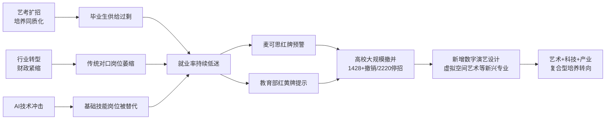

## 1.6 顶尖美院与普通艺术院校的就业分化

在艺术生整体就业承压的同时，**院校之间的分化呈现愈加鲜明的两极格局**。这种分化不是简单的"名校光环"差异，而是反映了产教融合深度、数字工具培养、校企合作资源、地域产业生态等多重因素对艺术生就业质量的决定性影响。

**头部美院的就业表现相当亮眼。** 中央美术学院数据显示，毕业生**就业率99%**，应届生平均工资9500元（比全国应届生高4500元），毕业2年12000元，毕业5年16100元，毕业10年达24900元（比全国平均高14100元）[^19]。中央美术学院毕业生中，25%在媒体行业、12%在教育培训、10%在互联网、8%在广告、7%在房地产行业有较好发展，79%在北京找到工作[^19]。中央美术学院设计艺术专业就业率高达95%，**一半以上毕业生签约互联网大厂和4A广告公司**[^5][^6]；2024年应届本科毕业生中43.12%选择升学或深造，其中209人国内升学、214人出国（境）深造[^19]。其他头部院校的产教融合也颇具示范性——上海视觉艺术学院和腾讯互娱共建了数字艺术实验室，2024届数字绘画方向就业率89%；南京艺术学院学生辅修数字媒体后，进入米哈游做原画师月薪可达1.8万[^4]。

**普通艺术院校与综合院校艺术专业的就业现实则严峻得多。** 普通二本绘画专业的就业率仅59.6%，毕业班中真正从事纯艺术的占比不到10%，大部分转向游戏原画、插画、设计、教育等领域[^4]。前述中国美院数据显示纯艺术从业比例也仅为38%[^4]。普通院校学生缺乏的不仅是名校品牌，更是数字工具培养（Procreate、PS、UE引擎等）、行业认证体系（如米哈游原画培训认证）、校企合作资源等就业竞争力的关键支撑[^4]。

下表对比呈现了顶尖美院与普通艺术院校的就业差异：

| 维度 | 中央美术学院（顶尖代表） | 普通二本艺术院校 |
|------|---------------------|----------------|
| 就业率 | 99%[^19] | 60%左右（如绘画59.6%）[^4] |
| 应届生月薪 | 9500元（高出全国平均4500元）[^19] | 5000—5420元（美术学）[^5][^20] |
| 主要就业行业 | 媒体25%、教培12%、互联网10%、广告8%[^19] | 装修装饰、考编、培训机构 |
| 头部企业签约 | 设计艺术专业一半以上签约互联网大厂、4A[^6] | 极少进入大厂 |
| 升学深造率 | 43.12%（含国内升学与境外）[^19] | 显著偏低 |
| 数字工具与产教融合 | 校企共建实验室、产业导师网络[^21] | 课程仍偏传统素描色彩[^4] |

**综合院校的艺术招生格局也在加剧分化。** 南京理工大学2025年设计学类招生中，**江苏省内招生从2024年16人猛增至40人（增幅150%），省外各省几乎全线腰斩**——安徽从12人减至5人、河北从9人减至5人、河南从11人减至5人、山东从8人减至5人、浙江从8人减至5人[^22]。2025年江苏考生获得40个名额，而安徽、河北、河南、山东、浙江五个省份加起来才25个名额[^22]。江苏师范大学2025年美术类专业招生计划从160人猛增至270人，扩招幅度接近70%[^23]。**这种地域倾斜与扩招动作，进一步加剧了普通省份艺术生进入优质院校的难度，间接强化了就业分化趋势**。

院校分化背后的深层逻辑可归纳为四个维度：第一，**品牌溢价与校友网络**直接影响进入头部企业的概率；第二，**产教融合深度**决定学生是否能在校期间接触真实产业项目（上海音乐学院新增13家涵盖文化艺术、演艺产业及人工智能领域的实习基地，聘任13名校外导师[^21]）；第三，**数字工具与跨学科能力培养**决定毕业生与AI时代岗位需求的匹配度；第四，**地域产业生态**——上海、北京、深圳等一线城市的文化创意产业密度直接拉动头部院校就业，而中西部普通院校则面临产业空心化压力。这种分化提示，单纯讨论"艺术生就业难"已不够精准，更准确的命题是：**普通艺术院校如何借助产教融合、数字化转型、跨学科培养等手段缩小与头部院校的就业鸿沟**。

## 1.7 突围动因：从单一对口就业向价值重构转向

综合上述六节分析可以看到，艺术生就业困境是供给端扩张、传统渠道收缩、AI技术冲击、教育供给滞后、院校分化加剧等多重力量共同作用的结构性结果。然而，困境本身也酝酿了突围的动因——**艺术生的就业出口正在从"单一对口就业"向"价值重构"转向**。

**内部动因体现为传统岗位饱和倒逼路径多元化与艺术生自身复合能力诉求增强。** 当事业单位编制、文艺院团、画廊机构等传统出口的容量已被毕业生规模远远超过，转型已不再是选项而是必然。麦可思数据显示，2024届本科毕业生**自由职业和自主创业最集中的行业均为文化、体育和娱乐业**[^7]，这表明艺术生群体正在主动探索体制外的灵活就业模式。同时，新一代艺术生对复合能力的诉求显著提升——上音音乐工程系刘思淼研究生阶段聚焦扩声混音、录音及音乐制作，主动考虑跨行就业；本科主修二胡表演、研究生转向艺术管理的谢心怡因复合型专业背景获得多个面试机会[^21]。

**外部动因体现为文化创意产业升级、文体旅融合、数字经济与AI产业带来的新岗位增量。** 电影《哪吒2》、游戏《黑神话·悟空》等现象级IP的走红，彰显了文化创意与技术融合的强大生命力；十五运会吉祥物"大湾鸡"爆火，打通文体旅融合链路，开辟了艺术IP商业化新路径；文博热、非遗热不断升温，催生文化符号、情感体验与制造业的"化学反应"——这些背后都离不开**既懂艺术审美、又通技术应用、还兼具文化素养的复合型人才**[^14]。AI漫剧赛道的兴起则提供了直观例证：相较传统动画每分钟成本1.5万—2.6万元、制作周期30天，AI漫剧每分钟成本仅1000—2500元、制作周期缩短至3天左右，整体成本下降近九成，催生了AI漫剧编剧/导演（月薪2.5万—5万元）、漫剧运营投放/动画制作（月薪1万—1.8万元）等高薪岗位[^15]。

**跨界就业的真实样态已经在头部艺术院校中显现。** 2024年4月在上海音乐学院举办的"艺聚上音·职创未来"招聘会上，**160家用人单位带来了400余个岗位，预计招聘人数超过2800人**——既有上海淮剧团、苏州交响乐团、上海话剧艺术中心等专业文艺院团，也有上海电影技术厂、上海沐恩之科技有限公司等文化科技类企业，还有上海迪士尼度假区等文旅服务类机构[^21]。其中，上海音乐学院音乐工程系2026届硕士研究生江雨晨已成功签约南芯半导体科技有限公司，将成为一名调音工程师[^21]——这一案例生动印证了"跨领域就业、多元化发展正成为当下艺术专业毕业生的就业新趋势"[^21]。蔚来汽车声音体验负责人聂俊指出："未来，科技行业对懂艺术、懂审美、懂声音的人才需求会越来越大。AI或许能替代基础的技术工作，但音乐品味、艺术美学等核心素养难以被替代，这正是艺术类人才的核心竞争力所在"[^21]。

基于以上动因，**艺术人才价值需要从"技法执行者"向"审美判断+创意叙事+技术驾驭+商业转化"复合型角色重构**——这一价值重构是后续章节讨论多元化就业路径、评价体系改革、知识产权保护、教育体系转型与国际经验借鉴的逻辑起点。下图概括了本章揭示的困境—动因—转向逻辑：

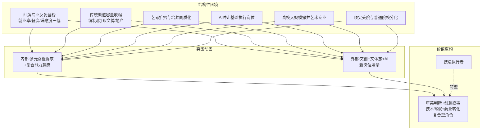

需要客观指出的是，这一转型过程并非线性顺畅。3年打底百万成本的艺考投入、毕业后5000元底薪的现实落差，使大量在校艺考生与家长仍处于"先考进去，未来的事再说"的焦虑状态[^20]。当中戏门口的家长坦言"我是看很多新闻说，之前电影不行了，都去干短剧，结果短剧也不行了。但孩子走都走到这里了，你也不可能因为考虑未来的事情就不考了"[^20]，**这种现实的复杂性提示价值重构既是机遇也是挑战**。后续章节将围绕多元化就业路径的具体赛道（第2章）、社会评价体系改革（第3章）、知识产权与文化消费（第4章）、国际经验借鉴（第5章）、艺术教育转型（第6章）与综合政策建议（第7章）展开系统分析，回应"艺术生如何突破传统就业领域的限制，实现多元化职业发展"这一核心命题。

# 2 多元化就业路径的赛道图谱与突破逻辑

第1章揭示了艺术生就业的结构性困境：传统对口出口持续收缩、AI技术冲击基础执行岗位、院校与培养模式陷入同质化扩张困境，而与此同时，文化创意产业升级、艺术与科技融合、文旅消费升级又催生出大量"非传统"岗位增量。这一困境与机遇并存的格局，倒逼艺术生群体从"等待编制""挤进院团"的单一对口思维，转向**主动开拓"艺术+X"复合赛道、以多元路径重构职业可能性**的价值再造过程。本章将在前文奠定的问题基础上，系统勾画艺术生突破传统就业边界的五大核心赛道——艺术+科技、艺术+商业、艺术+教育、艺术+乡村振兴、自由职业与自主创业，逐一刻画各赛道的市场容量、典型岗位、薪资分层与能力要求，并以代表性案例佐证突破路径的真实可行性；在分赛道分析的基础上，进一步提炼跨赛道共通的"复合型能力构建"逻辑，揭示"艺术+X"复合人才相较于单一技法人才的市场溢价机制，为后续章节探讨评价体系（第3章）、知识产权保护（第4章）、教育体系转型（第6章）等支撑机制提供赛道层面的现实依据。

## 2.1 艺术+科技：数字媒体、游戏与元宇宙赛道

艺术与科技的融合已经超越了"把技术当作工具"的初级阶段，二者的深度交叉催生出交互设计、数字媒体艺术、生成艺术、虚拟现实艺术、数据可视化、创意编程等一系列新兴方向。在这些领域中，学生不仅需要掌握传统艺术理论与设计原则，还要熟悉编程语言、物理计算、机器学习、计算机视觉等技术能力，由此成为兼具艺术创意与技术驾驭力的复合型人才[^24]。**正是这种"艺术功底+科技应用"的稀缺组合，使艺科融合赛道成为艺术生群体近年来最具高薪潜力与岗位增量的突破方向**。

### 2.1.1 数字媒体艺术：覆盖广、岗位多元的"艺科基础设施"

数字媒体艺术专业作为艺科融合的"基础设施型"赛道，市场覆盖面极广。从就业结构看，**该专业需求量最大的行业是互联网/电子商务，占比达20%；地域上以北京为首，占15%**，岗位分布涵盖UI设计、视频剪辑、短视频拍摄、影视后期、三维动画、展厅设计、新媒体运营、插画设计等数十种细分方向[^25]。薪资水平上，数字媒体艺术设计应届生平均起薪在5000—8000元区间，**一线城市北上广深起薪中位数6800元、二线省会5500元、三四线城市约4500元**；具体到岗位差异，UI/UX设计师应届生起薪约6500元、三年后月薪12000—18000元；游戏美术设计师起薪7000元起步、五年经验主美年薪普遍30万起；动态设计师两年内涨幅50%很常见，北上广深月薪25000+岗位持续在招；影视特效师起薪偏低（5500元），但掌握Houdini、Nuke等专业工具者三年后月薪不低于15000元[^26]。

行业内部的薪资分化逻辑相当清晰：**游戏行业给钱最痛快，毕业生起薪平均比广告行业高出25%**；会3D建模、动效设计、UE引擎的学生薪资比只会PS/AI的高30%以上；有成熟作品集的毕业生起薪至少多1500元[^26]。从招聘市场实时数据看，BOSS直聘上数字媒体艺术设计师岗位（北京、1-3年硕士）月薪可达15-30K，深圳的数字媒体艺术总监岗位（3-5年本科）月薪20-40K·14薪，这类岗位的核心要求已升级为"参与全球数字媒体公共艺术项目的创意构思，深度结合在地文化、社会环境与可持续发展理念，输出符合艺术疗愈与思辨性核心的视觉方案框架"[^27]——**典型的"创意+技术+在地文化+商业理解"的复合能力诉求**。

### 2.1.2 游戏艺术：高薪天花板与人才缺口并存

游戏赛道是艺科融合中收入天花板最高的方向。原画、3D建模、特效设计、技术美术（TA）四个方向构成核心岗位族群。**头部企业的应届生待遇相当有竞争力：腾讯、米哈游为优秀毕业生开出9000+月薪，网易游戏为硕士校招生提供月薪20K-25K（14薪）的待遇**；行业整体上，2024届本科毕业生平均起薪8408元/月、硕士10201元/月，技术美术（TA）与引擎开发、高级程序开发、产品经理/制作人等核心岗位年薪中位数可达40万至100万以上，全国游戏开发工程师平均年薪范围12万至36万元[^28]。

技术美术（TA）作为艺科交叉的典型岗位尤其值得关注。从BOSS直聘的招聘信息看，**杭州TA技术美术月薪20-40K·14薪、广州海珠琶洲TA技术美术月薪30-40K·13薪、北京朝阳TA技术美术月薪30-60K·14薪、上海闵行虹桥TA技术美术月薪30-50K**[^29]——这一岗位明确要求"熟悉并研究Unity/UE引擎的各项功能，与主美、主程一起选定相关美术表现和性能优化的技术方案，为美术资源制作和优化提供制作流程"[^29]，是典型的"美术理解+程序能力+引擎驾驭"三位一体的复合岗位。

游戏原画岗位虽起薪相对较低，但作为艺术生进入游戏行业的主入口具有重要意义。BOSS直聘数据显示，初级游戏美术原画师月薪在3-5K（汕头）至8-13K·13薪（深圳乙女向二次元偏写实风格）区间，资深岗位如北京海淀清河"游戏美术-原画师"月薪可达12-23K·16薪[^30]。从市场总量看，**仅中国就有超60万的游戏岗位需求，欧美也有超30万的需求；全球游戏市场预计2027年收入将从1877亿美元攀升至2133亿美元**[^31]。游戏《黑神话：悟空》主美（首席游戏图形设计师）年薪百万的案例，更直观折射出游戏行业对高端艺术人才的巨大需求[^31]。

腾讯、字节跳动等头部企业2026实习生招聘的规模也释放出明确信号——**腾讯提供超过一万个实习机会，岗位分为技术、产品、设计、市场、职能五大类；字节跳动ByteIntern计划面向2027届招聘超7000名实习生，整体转正率超50%**[^32]，这些岗位为艺术生切入科技大厂提供了清晰通道。

### 2.1.3 元宇宙、AI与"艺术+科技"教育赛道升级

元宇宙作为新一代信息技术的集大成者，其落地正在文化娱乐、虚拟人、教育培训、工业制造、医疗健康、远程办公等六大领域催生大量新兴岗位[^33]。元宇宙的五大支撑技术（计算、感知、生成、协同、交互）共同构建了元宇宙生态系统的核心功能[^33]，其中"生成"与"交互"环节高度依赖艺术家的视觉叙事与体验设计能力，催生了虚拟人设计师、沉浸式内容策划师、XR体验设计师等新兴岗位。

教育部2025年新增专业信息也清晰呼应了艺科融合趋势：**新增的8个艺术类专业全部为"艺术+科技"组合**，包括音乐科技、智能影像艺术、虚拟空间艺术、游戏艺术设计等；新增29个专业中艺术相关专业占比约27.6%，其中"艺术+科技"专业占据大半[^31]。中国传媒大学的"智能影像艺术"专业重点培养学生运用AI生成创意视频的能力；北京电影学院的"虚拟空间设计"专业教授学生用VR搭建元宇宙场景；上海交通大学"人居设计"要求学生既懂建筑设计、又会编程、还得研究城市规划；南京艺术学院"音乐科技"既要懂乐器又要会结合VR[^31]。

院校层面的产教融合也在加速升级。**四川美术学院与成都电子科技大学携手培养联合学士学位项目**，本科阶段学生除传统美术技能学习外，还须完成《大学数学基础》《电子线路基础及应用》《高级语言程序设计》《人工智能通识》《数字系统基础及应用》《数字图像智能处理》《电子信息系统与应用》《信号分析与处理》等工学课程[^31]。**上海音乐学院音乐工程系自2003年起前瞻性布局，将产业需求与学科教学紧密结合**，研究生培养阶段学生需完成30%—40%的实践类学分，江雨晨从音乐设计与制作专业到音乐科技专业，最终签约南芯半导体科技有限公司成为调音工程师，正是艺术生跨领域进入科技企业的标志性案例[^34][^35]。

### 2.1.4 艺科赛道核心岗位与薪资分层

下表汇总了艺术+科技赛道核心岗位的薪资分布与能力要求：

| 岗位类别 | 应届生/初级薪资 | 资深/头部薪资 | 核心能力要求 |
|---------|---------------|--------------|------------|
| UI/UX设计师 | 6500元/月 | 12000-18000元/月（3年）[^26] | 交互逻辑、用户研究 |
| 游戏原画师 | 7000元起步，腾讯米哈游可达9000+ | 主美年薪30万+，爆款翻倍[^26][^28] | 风格驾驭、商业理解 |
| 3D建模/技术美术TA | 11-22K（1-3年）[^29] | 30-60K·14薪[^29] | Unity/UE引擎、Shader、性能优化 |
| 动态设计师 | 6000元起[^26] | 北上广深25000+[^26] | C4D、Blender、动效叙事 |
| 影视特效师 | 5500元[^26] | 三年后15000+，院线分红[^26] | Houdini、Nuke专业工具 |
| 数字媒体艺术总监 | — | 20-40K·14薪（深圳）[^27] | 跨学科素养+在地文化整合 |
| AI漫剧编剧/导演 | — | 月薪2.5-5万元 | AI工具+叙事+商业转化 |
| 调音工程师（艺科跨界） | — | 取决于企业（如南芯半导体）[^34] | 音乐功底+音频技术+硬件理解 |

需要客观指出的是，艺科赛道也存在不平衡：BOSS直聘数据显示数字媒体艺术专业**54.3%的岗位月薪仅在4.5-8K区间**，应届生工资约5K，按学历统计大专平均7.8K[^25]——这表明赛道整体高薪集中在头部企业与高阶岗位，初级岗位仍承受较大竞争压力。**艺科融合的红利更多倾向于"既掌握艺术语言、又掌握科技工具"的复合型人才**，单一技法或单一软件操作者难以真正享受赛道溢价。

## 2.2 艺术+商业：设计管理、艺术管理与策展运营赛道

如果说艺术+科技解决的是"如何用技术放大艺术表达"的问题，那么艺术+商业回答的则是"如何让艺术作品与商业系统对接、实现价值变现"的问题。这一赛道的本质并非"商业化艺术"，而是**将创造性思维、设计方法和艺术敏感度应用于商业创新的各个层面**，培养既懂商业逻辑、又具备艺术视野的复合型人才[^24][^36]。

### 2.2.1 设计管理：连接创意与商业的中枢岗位

设计管理是艺术+商业赛道中市场容量最大、薪资稳定性最强的岗位之一。从招聘平台数据看，**设计管理本科岗位66.1%月薪在10-30K区间，年薪12-36万元**；按经验统计，应届生月薪即可达15.1K，2024年较2023年增长1%；2025年招聘职位达896个，地区分布主要集中在深圳、北京、上海[^37]。区域市场上，西安设计管理岗位**56%月薪在10-30K，2025年较2024年增长54%**，按学历统计大专工资达25.0K[^38]——这一数据反映了设计管理岗位的高溢价特征：即便在西部城市，相关岗位的薪资水平仍显著高于一般设计执行岗位。

设计管理岗位的招聘行业分布以**实业投资（48.5%）、投资（47.8%）、投资/投资管理（44.5%）**为主[^37]，反映该岗位主要服务于企业战略层面的设计决策。其核心能力要求是"把设计资源转化为商业价值"——既要懂设计专业语言，又要理解市场趋势、财务逻辑与组织管理。

### 2.2.2 品牌视觉策划与美术指导：4A广告与营销链路的核心岗位

品牌视觉策划是艺术生进入营销与广告产业的主流岗位。猎聘数据显示，**品牌视觉策划全部年限平均月薪23093元，5年以上经验平均月薪34566元；本科学历平均月薪24446元，大专学历16405元**[^39]。具体岗位案例上，广州服装品牌视觉策划（5-10年本科）月薪18-19K·15薪，上海整合营销品牌策划（3-5年本科）月薪18-20K·14薪，欧普照明品牌策划（3年以上本科）月薪13-20K·15薪[^39]。

美术指导（Art Director）作为4A广告体系的标志性岗位，是艺术生与商业系统深度对接的典型出口。**奥美美术指导岗位薪资区间10-15K（占比100%）**，要求"在各种媒体中引领品牌的视觉语言、负责创意想法的继续提升、独立跟进项目、概念化创意想法和开发多渠道活动"[^40]，并要求"懂得并熟练使用AI工具进行产出，包括但不限于Midjourney、Stable Diffusion等"——这进一步印证了第1章所提的能力升级趋势：美术指导岗位的核心已从"视觉执行"升级为"创意引领+AI驾驭+商业落地"的复合能力组合。

### 2.2.3 艺术管理：从画廊拍卖行到时尚传媒的多元出口

艺术管理作为艺术+商业的交叉学科，已逐步成为艺术留学的"黑马专业"。其本质是"教授如何让艺术品落地、与市场接轨的专业行业知识"[^36]，分类形式上可从艺术形式（视觉艺术管理 vs 表演艺术管理）和盈利属性（盈利性 vs 非盈利性）两个维度划分：盈利性以画廊、拍卖行、专业艺术表演机构、电影节电视节音乐节为代表；非盈利性包括美术馆、博物馆、国家剧院、艺术基金会等[^36]。

艺术管理的就业方向高度多元，可在文化机构和商业企业中**从事展览策划、行业研究、公共关系、项目发展与测评等工作**，或进入芭莎/ELLE等国际时尚艺术杂志、美国在线/时代华纳、沃特迪士尼等传媒集团，亦可作为独立策展人[^24][^36]。从全球知名招聘网站Indeed.com盘点的薪资数据看，**艺术管理领域核心岗位年薪在4万至10万美元（折合人民币28万至70万元）区间**：

| 岗位 | 年薪（美元） | 折合人民币（约） |
|------|------------|----------------|
| 拍卖专家 | $54,126 | 38万元 |
| 艺术顾问 | $60,647 | 43万元 |
| 美术老师 | $52,401 | 37万元 |
| 博物馆档案管理员 | $57,647 | 41万元 |
| 艺术总监 | $77,358 | 54万元 |
| 艺术行业销售经理 | $81,041 | 57万元 |
| 市场总监 | $91,394 | 64万元 |

数据来源：Indeed.com艺术与商业交叉领域岗位盘点[^24][^36]

### 2.2.4 艺术+商业的能力升级与院校支撑

该赛道对人才能力的核心要求是"艺术敏感度+商业逻辑+项目管理+跨文化沟通"四位一体。学生不仅需要学习艺术史和批判理论，还需要掌握市场营销、财务管理、商业策略和创业技能[^36]。**美国、英国、法国是该领域的主流留学目的地**：美国艺术产业规模庞大且多元化，拥有好莱坞、百老汇等世界级艺术平台；美国的艺术管理教育强调商业创新与资源全球化[^36]。

值得关注的是，伦敦艺术大学创意人工智能学院（CCI）、罗德岛设计学院与布朗大学合开的设计工程文学硕士MADE项目（每年全球仅招生20人），均代表了艺术+商业赛道与艺术+科技赛道的进一步融合趋势——**单纯的"艺术+商业"或"艺术+科技"已不足，跨多元领域的"艺术+商业+科技"复合能力正成为高端岗位的隐性门槛**[^24]。

## 2.3 艺术+教育：艺术疗愈、美育普及与社区美育赛道

艺术+教育赛道在传统的中小学美术编制之外，正向社会化、专业化、疗愈化方向加速延伸。一边是艺术疗愈作为新兴蓝海的兴起，另一边是社会美育、社区美育、银发美育等多元美育服务体系的构建——这两条支线共同构成艺术生在教育领域突破传统编制限制的新路径。

### 2.3.1 艺术疗愈：万亿级情绪经济催生的新蓝海

艺术疗愈赛道的崛起根植于全球精神健康需求的爆炸性增长。**世界卫生组织数据显示，全球已有近10亿人受到精神障碍影响——平均每8个人中就有1位正在与精神困境抗争**[^41]。市场规模上，全球疗愈经济正以10%的速度持续增长，预计2025年全球市场规模将达7万亿美元；在我国，2022年中国疗愈市场规模为52.6亿元，**2025年中国泛心理健康服务市场规模将达104.1亿元，年复合增长率达34.5%**[^42][^43]。

政策层面的突破为艺术疗愈职业化提供了关键支撑。**四川省医疗保障局率先将"音乐疗法"纳入医保报销**，标志着我国医疗体系对心理健康关注迈上新台阶；2023年出台的《"健康中国2030"规划纲要》明确提出要发展艺术治疗等特色干预手段，目前北京、上海等地多家三甲医院已陆续设立艺术疗愈门诊；2021年中央美术学院率先开设艺术疗愈方向的专业课程，成为中国高等教育体系对该领域的首次正面回应[^41]。

国际市场的薪资水准为该赛道的成长性提供了参照系。**美国艺术疗愈师年均收入约48,368美元（约33万元人民币），随着经验积累可提升至54,349美元（约54.3万元人民币）**；个性化艺术治疗以小时计费，费用区间在300至1500美元（约1900至10000元人民币），其中八成以上可通过医保报销[^41]。从就业场景看，除传统医院与精神卫生机构外，学校、养老院、社区服务中心以及企业EAP（员工援助计划）都在积极引入艺术疗愈服务，**谷歌、微软等科技巨头将艺术疗愈课程作为员工心理关怀的重要组成部分，相关岗位年薪甚至可达8万美元以上**[^41]。

国内艺术疗愈师的现实薪资分布则更为分化：以一线城市为例，兼职按小时收费客单价200—500元，全职月薪在7000—10000元[^42][^43]。这一水平虽不及美国市场，但相较于传统美术教师编制岗位仍具吸引力。

然而，**国内艺术疗愈赛道当前仍处于"野蛮生长+认证缺失"的早期阶段**，行业乱象不容忽视。北京商报记者调查发现，目前疗愈类证书的考培形式均为线上，机构自主定价，**最快20天就可以拿证，初级2380元、中级2580元、高级2880元**；甚至有机构称"只需1500元就可以拿到疗愈师证书，从报名到出证仅需20天"，并承诺"我们会安排教务老师帮忙考"[^42][^43]。一位疗愈师王鑫坦言："这个行业还没有统一标准，从业者多是依托于一些培训机构课程，获得一个疗愈师的称号，证书其实没什么用……现在行业内鱼龙混杂，真正好的疗愈师非常少，并非证书在手就能轻松找到高薪工作"[^43]。这一现实警示艺术生在选择疗愈赛道时需关注**专业体系扎实度、长期实践沉淀与正规院校学历背景**——纽约大学艺术治疗整合心理治疗与视觉艺术实践、要求修满18个艺术学分+12个心理学学分+30个行为或社会科学学分、需完成1000个实习小时，并可获得纽约州创意艺术治疗师（LCAT）执照[^41]，这种系统化培养路径与国内速成证书的差异在第3章评价体系讨论与第5章国际经验比较中将进一步分析。

### 2.3.2 美育普及：从校内编制到社会化美育的延伸

中国美育的政策性扩张为艺术生在该赛道提供了确定性增量。教育部数据显示，截至2022年，**99.8%的义务教育学校开齐开足音乐、美术课；97.7%的高中落实艺术类必修课程要求；全国基础教育阶段美育教师人数十年增加了30.4万人，增长50.3%**[^44]。"十三五"期间，全国义务教育阶段美育教师人数由2015年的59.9万人增加到2019年的74.8万人，四年增加14.9万人，平均增速5.7%；美育教师占专任教师总数比例由6.5%提高到7.5%[^45]。

虽然如第1章所述校内美术编制已高度饱和，但**社会化、专业化美育正打开新出口**。上海市文化和旅游局2025年实施的"社会大美育课堂"项目颇具代表性：通过线上平台申报与专家评审，遴选出8大类别143家"社会大美育课堂"（博物馆27家、革命纪念馆9家、美术馆30家、剧场17家、艺术院团10家、图书馆13家、非遗场馆23家、其他文艺类机构14家），**截至6月底143家场馆共开展各类艺术教育普及活动4107场次**[^46]。这一格局直接催生了文博美育策划师、艺术教育项目经理、社区艺术导师、银发美育课程开发者等岗位需求。

具体到细分美育模式，上海博物馆翻译制作英、法、德等8个语种的《常设展览导览手册》、笔墨宫坊开设双语工作坊、上海大剧院为自闭症儿童推出"星星的孩子"专属观演服务、金山区博物馆推出"非遗里的金山"系列体验活动、上海市中医文献馆打造全龄段品牌课程"中医拾趣"[^46]——这些项目背后都需要**懂艺术、懂教育心理、懂特殊群体需求、懂跨文化沟通的复合型美育人才**。BOSS直聘相关招聘信息也显示，数字媒体艺术教师（太原、1-3年本科）月薪3-6K，主要负责"学生平面设计、视频制作教学，激发学生学习兴趣及设计思维能力，组织学生活动及比赛、研发设计课程"[^27]——这一类岗位虽薪资不及商业赛道，但稳定性较高且适合艺术生作为长期职业沉淀。

乡村美育也是不容忽视的细分市场。我国农村小学在校生众多、不满16周岁的农村留守儿童数量达900多万[^44]，由此催生了一批专门服务乡村美育的公益组织与社会企业，并衍生出乡村美育志愿者、艺术支教师、乡土美育课程开发者等岗位。这一方向虽商业化程度有限，但与第2.4节"艺术+乡村振兴"赛道存在天然交集。

## 2.4 艺术+乡村振兴：公共艺术、非遗活化与文旅融合赛道

中共中央、国务院印发的《乡村全面振兴规划（2024—2027年）》提出，要"深化农村一二三产业融合发展""壮大乡村人才队伍""重塑乡村文化生态"[^47]。在乡村全面振兴战略与文旅融合背景下，艺术正在成为激活乡村价值的关键变量，催生了公共艺术介入、非遗活化、传统村落改造、文创产品开发、艺术节策划、驻村艺术家等多元岗位形态。**这一赛道的特殊性在于，它既是公益性使命感的承载，又是商业化市场拓展的试验场，对艺术生而言是兼具情怀与机遇的双重选项**。

### 2.4.1 文艺乡建模式的多元化探索

中国艺术乡建实践已形成多种代表性模式。**碧山计划被视为中国最早的艺术振兴乡村实践**——2011年艺术家欧宁、左靖在安徽黟县碧山村发起，通过艺术介入挖掘乡村文化、改造历史建筑（如将村内汪氏祠堂启泰堂改造为碧山书局、将老供销社改造为碧山·工销社）、开展百工调研出版《黟县百工》、举办"碧山丰年祭"文化节[^48][^49]。策展人左靖随后将经验拓展到贵州茅贡，提出"乡镇建设"概念以及"空间生产""文化生产""产品生产"三个实施步骤；后又延伸到云南景迈山，参与古茶林申遗工作分支[^48]。

许村模式是另一种长周期艺术乡建样本。当代艺术家渠岩自2008年受邀到山西和顺县许村考察以来，开启了**为期十余年的艺术乡建实践**，举办许村国际艺术文化节，让"传统与现代化艺术设计完美融合"，受到当地村民的高度认可[^50]。山东诸城蔡家沟村则以"党建+艺术"破题——2018年艺术家团队进村，常山社区党委敏锐抓住"苏轼文化"IP，**建成13处艺术家工作室、9处商业运营门店，完成大型绘画40多幅、"彩虹计划"涂鸦6000平方米**，吸引八方来客[^51]。

更具市场化色彩的是"艺术在浮梁"大地艺术节模式与云南"艺术家第二居所"建设。前者邀请国内外知名艺术家（TANGO、马岩松、刘建华、保拉·皮维、大卫·歌诗坦等）创作《泉有米酒酒馆》《大地之灯》《渠道一之形》《梯》《对饮》等作品，将整个浮梁打造为大地艺术展场[^52]；后者由云南省探索推出，**通过"艺术家第二居所"建设和评选，构建乡村地区吸引艺术家、赋能文旅融合、培育文艺旅居业态的新载体**[^47]。这一制度设计对艺术家驻村、文创特派员、"艺术村长"和"候鸟"人才等制度具有先行示范意义。

### 2.4.2 非遗活化与文旅融合的就业增量

非遗活化构成乡村振兴赛道的核心增量。**广西百色那西屯"印象那T"项目**采用"企业投资、政府支持、校企合作、村民参与"模式，累计投入1200万元打造"印象·那西"品牌，**麽乜馆衍生出香包、香薰等文创产品，年销售额突破500万元**；与百色学院合作开发非遗研学课程，自2024年以来仅研学活动就开展300余批次，2万余名青少年参与体验[^53]。这种"非遗+旅游+研学"的多元链路，背后需要非遗设计师、文创产品经理、研学课程开发者、文旅活动策划师等多元岗位支撑。

山东泰山九女峰乡村振兴示范片区则展示了"文艺+野趣+商业"的高端文旅模式。**九女峰书房"重若泰山、轻如浮云"的设计意象、"故乡的云"野奢度假酒店13套院落改造、艺术化建筑与泰山云海视觉呼应**，开业以来累计接待游客超30万人次[^53]——这类项目对建筑设计、空间设计、品牌视觉、内容运营等艺术类人才形成了持续需求。

四川达州毕城村的"花田艺绘计划"通过艺术家在地创作（主题墙绘、卷帘门彩绘、微景观营造、公共空间景观化处理）实现村落环境艺术化改造；甘肃天水石节子村**整个村庄就是一座美术馆，村里13户人家成为13个分馆**；明月村、帕连艺术村、乌镇横港国际艺术村等案例也都呈现了艺术介入与乡村发展深度结合的多种路径[^52]。

### 2.4.3 现实挑战与艺术生角色定位

需要客观看到的是，艺术乡建并非一条平顺的成功之路。**碧山计划在持续两年的"丰年祭"艺术节后被迫停止，发起人欧宁也搬离了碧山**，碧山计划逐渐淡出公众视野——其原因被归结为"政府期望借碧山计划的知名度开发出一条致富的旅游之路，与艺术家推崇纯粹的艺术乡村理念相悖，且未能带动当地产业"[^49]。此外，"艺术乡建不是简单的单向帮扶，更不是我行我素的创作实验，设计必须处理好艺术与实用的关系，既要考虑进村游客的消费需求，更要回应村民的生活需要"[^51]。

基于上述分析，艺术生在乡村振兴赛道的角色可归纳为**"创意引入者—文化转译者—产业链接者"三位一体**：一是作为创意引入者，把外部的"新元素"引入乡村，通过"创造性破坏"重构乡村旅游体系[^47]；二是作为文化转译者，将乡土文化、非遗技艺、传统村落形态转化为可被现代消费市场理解的产品与体验；三是作为产业链接者，连接政府、企业、村民、消费者多方利益相关者，确保艺术乡建可持续。**艺术家为乡村带来了新的理念、知识、信息和技术，为发现、宣传、转化乡村文化资源，开发文创产品、建设文化空间、组织文旅活动，提供了无限可能**[^47]——这也正是艺术生在乡村振兴中实现职业突破的核心机会窗口。

## 2.5 自由职业与自主创业：个人IP、独立工作室与跨境变现赛道

第1章中提到，麦可思数据显示**2024届本科毕业生自由职业和自主创业最集中的行业均为文化、体育和娱乐业**。这一趋势的背后，是数字平台基础设施成熟、国内外创意经济市场打通、AI工具降低生产门槛三股力量共同作用，使艺术生具备了去机构化、个体化就业的现实可能。本节将从五条变现路径、新兴自由职业岗位与典型风险三个层面展开分析。

### 2.5.1 商业插画接单：可量化的入门型变现路径

商业插画是自由职业赛道中入门门槛相对较低、可量化程度较高的变现方式。从市场报价看：**普通商业插画200—1000元/张、绘本内页500—3000元/页、角色设定图1000—5000元/套、LOGO设计800—5000元/个、UI界面设计2000元起/套**[^54]。如果每月能接到5—10个订单，按平均每个500元计算，月入5000—10000元是可以实现的目标[^54]。这一收入水平与传统美术教师编制岗位起薪基本持平，但具有更高的时间灵活度。

技术支撑层面，"远程办公技术的发展使越来越多的设计公司、出版机构、广告公司接受线上协作模式；插画师可以通过网络平台接单、交付作品并通过电子支付方式获得报酬"[^54]。国内外平台生态也已基本成熟——**国内有猪八戒网、人人都是产品经理等平台，国际有Behance、Dribbble、ArtStation等平台**，不仅面向国内客户，也支持国际接单，拓宽了收入来源[^54]。

### 2.5.2 个人IP打造：从粉丝运营到商业变现

个人IP打造是自由职业赛道中天花板最高的方向之一。短视频博主赵小黎是该路径的标志性案例——**"一个人，一支笔，拥粉近千万"**[^55]。其IP打造的核心逻辑包括三个层面：第一，人设前置——选择"高冷"作为人设标签，与高度垂直又"0剧情"的绘画内容形成搭配，通过过硬的作品质量支撑高冷人设[^55]；第二，内容形式——"人画合一"风格不需要跨界，每一幅创作出来的作品都是赵小黎要呈现的整体内容的一部分[^55]；第三，IP转化——通过粉丝积累实现商业变现。

赵小黎案例的启示意义在于：**艺术生的个人IP不需要复杂剧情设计或大量团队支持，但需要"独特风格+持续输出+差异化人设"的核心组合**。除短视频外，开发表情包、明信片、手机壳、T恤、贴纸等文创产品，在淘宝、小红书、Etsy等平台销售，也是个人IP变现的常见路径[^54]。

### 2.5.3 多元变现路径与新兴自由职业岗位

自由职业赛道的变现路径可归纳为五大类：

| 变现路径 | 典型形式 | 收入水平 |
|---------|---------|---------|
| 商业插画接单 | LOGO、海报、产品包装、社交媒体配图 | 月入5000-10000元（5-10单/月）[^54] |
| 个人IP+文创周边 | 表情包、明信片、手机壳、T恤等 | 取决于粉丝量与转化率 |
| 出版绘本/图文书籍 | 投稿出版社或自费出版 | 单本版税+长尾收入 |
| 在线教学/知识付费 | B站、知乎Live、网易云课堂、荔枝微课 | 课程销售+会员订阅 |
| 游戏/动画外包 | 角色设计、场景绘制、UI界面 | 较高单笔报酬 |

数据来源：综合插画师变现路径分析[^54]

新兴自由职业岗位中，**AI漫剧编剧/导演月薪2.5—5万元、AI视频生成师与多模态交互设计师在字节、腾讯等企业实习月薪最高6万元**（详见第1章），均展示了AI工具大幅降低制作成本之后，原本需要团队完成的工作正在向"个体+AI工具"模式迁移，为艺术生独立创业提供了前所未有的杠杆。

数字媒体艺术实习招聘中也展现了大量灵活就业入口：北京朝阳"数字艺术多媒体方向实习"日薪140—190元、太原"图文设计制作"日薪100—150元、安康"数字媒体设计专业实习生"日薪200—250元、北京"数字媒体实习生"日薪130—150元[^27]——这类实习岗位为艺术生从在校期间即开始积累自由职业经验提供了过渡通道。

### 2.5.4 自由职业的能力门槛与现实风险

自由职业并非低门槛的"躺赚"路径，其对从业者的综合能力要求实际上更高。**核心能力组合包括：扎实的绘画基础（构图、色彩搭配、光影处理、人物结构、透视原理）、熟练的绘图软件（Photoshop、Clip Studio Paint、Procreate、SAI、Illustrator等至少精通一款）、良好的沟通能力（理解客户需求、及时反馈修改）、持续学习与风格更新能力**[^54]。

收入分化问题尤为突出："插画师的收入差距非常大，初学者可能每张图只能拿到几十元甚至免费练手，而经验丰富的资深插画师一张图报价可达数千元，甚至上万元"[^54]。**典型风险包括：收入波动（项目断档期收入归零）、行业鱼龙混杂（前述疗愈培训乱象在自由职业领域普遍存在）、版权保护薄弱（作品被盗用却维权困难）、缺乏社保保障**——这些问题为第4章关于知识产权保护的讨论埋下了直接伏笔。

此外，从市场层面看，AI视频赛道本身亦面临商业化困境。如第1章所述，OpenAI于2025年宣布关停Sora视频生成服务，全球用户数从约100万峰值降至50万以下，这一事件提示AI内容自由职业的产业化路径仍存在显著不确定性。**艺术生选择自由职业路径需要正视"高自由度+高不确定性"的天然组合**，并通过多元收入组合、长期个人品牌沉淀、跨平台分散风险等策略来降低职业风险。

## 2.6 复合型能力构建与"艺术+X"溢价机制

通过2.1—2.5节对五大赛道的系统梳理可以观察到一个共通规律：**无论是艺术+科技、艺术+商业、艺术+教育、艺术+乡村振兴还是自由职业，赛道内部的高薪岗位与稀缺机会均集中向"复合型人才"倾斜，而单一技法执行型岗位则普遍面临供过于求与AI替代双重压力**。本节将在分赛道分析基础上提炼跨赛道共通的突破逻辑，构建"艺术+X"溢价机制的分析框架，并指出复合化突破的现实路径与约束。

### 2.6.1 "艺术+X"复合人才的四类核心溢价来源

第一类是**稀缺性溢价**。智能交互设计、数字时尚等交叉领域起薪普遍超过8000元/月、**供需比1∶8**（详见第1章），技术美术（TA）月薪可达30—60K·14薪[^29]，反映了艺术与科技深度交叉岗位的人才稀缺度。第二类是**跨界整合溢价**。当艺术功底+技术工具+商业思维形成不可替代的组合时，岗位议价能力显著提升——四川美院与电子科大联合学位项目培养"既要有艺术素养，还需具备扎实的科技知识"的人才[^31]，正是为了构造这种跨界整合能力。第三类是**商业转化溢价**。"市场不再单纯青睐技术熟练的执行者，而是更愿意为具备问题解决能力的创作者提供机会"——能完成"用户洞察—3D建模—CMF落地—生产跨进"全流程的设计师，相较于只完成单一环节的执行者，市场愿意支付更高溢价（详见第1章）。第四类是**情感与文化溢价**。AI难以替代的审美判断与文化叙事是艺术人才的核心壁垒——"AI或许能替代基础的技术工作，但音乐品味、艺术美学等核心素养难以被替代，这正是艺术类人才的核心竞争力所在"[^34]，艺术疗愈、非遗活化、个人IP等赛道的价值创造高度依赖这一类情感文化溢价。

### 2.6.2 "超级设计师"复合能力模型

站酷《AI时代的超级设计师研究手册》总结了"超级设计师"七大能力——**强审美、敢创造、会工具、能跨界、懂商业、善表达、有温度**（详见第1章）。这一能力框架可结合本章五大赛道的差异化诉求形成更具针对性的能力图谱：

| 赛道 | 核心通用能力 | 赛道差异化能力 |
|------|------------|--------------|
| 艺术+科技 | 强审美+会工具 | 引擎驾驭（Unity/UE）、AI工具、跨学科技术素养 |
| 艺术+商业 | 懂商业+善表达 | 项目管理、品牌策略、跨文化沟通、财务理解 |
| 艺术+教育 | 有温度+敢创造 | 教育心理、特殊群体服务、课程设计、临床实践（疗愈） |
| 艺术+乡村振兴 | 能跨界+有温度 | 在地文化研究、社区组织、文旅运营、利益相关者协调 |
| 自由职业 | 强审美+会工具+懂商业 | 个人品牌运营、客户沟通、平台流量获取、持续学习 |

这一能力图谱的核心启示在于：**艺术生不可能掌握所有能力，但需要在通用能力之外针对目标赛道构建差异化能力组合**——这一逻辑也将贯穿第6章艺术教育转型的讨论。

### 2.6.3 复合能力的实现路径

从本章前述案例可以归纳出复合能力构建的四条主流实现路径。第一，**院校微专业与跨学科联合学位**——上海音乐学院音乐工程系微专业课程帮助江雨晨"遇到了许多业内不同领域的专家老师，对AI音乐产生了浓厚兴趣，逐渐打通了专业间的壁垒"[^34]；四川美院与电子科大联合学士学位项目通过工学课程嵌入构建艺术+科技复合能力。第二，**产教融合实践基地与校企合作**——上海音乐学院"研究生培养阶段学生需要完成30%—40%的实践类学分""校院两级领导带头'访企拓岗'""与文艺演艺、新闻出版与传媒、广播影视、科技等行业的多家企业建立学生实习基地、聘请行业精英担任校外导师"[^35]；上海视觉艺术学院和腾讯互娱共建数字艺术实验室（详见第1章）。第三，**行业认证体系与项目实战经历**——纽约大学艺术治疗专业要求完成1000个实习小时并可获得LCAT执照[^41]；游戏行业校招中"作品集应质量高于数量，展示设计思路和过程稿，并体现对生产管线的理解"[^28]——这些都是复合能力外化为可验证证据的路径。第四，**个人作品集与终身学习生态**——AI时代"插画行业发展迅速，流行趋势变化快，需要不断学习新技法、关注行业动态"[^54]，复合能力构建并非一次性完成的项目，而是贯穿整个职业生命周期的持续学习过程。

下图概括了"艺术+X"溢价机制的核心逻辑：

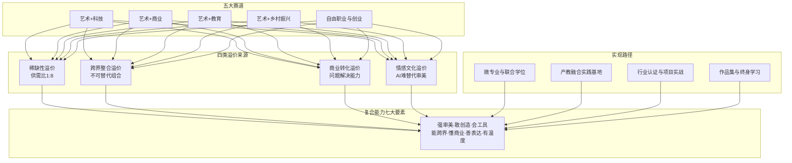

### 2.6.4 复合化突破的现实约束与下章衔接

需要客观指出的是，复合化突破并非线性顺畅过程，存在三类显著约束。**一是入门门槛较高**——艺术+科技赛道对编程、引擎、AI工具的掌握并非短期可达，第1章提及的"普通学校的绘画课仍在教素描、色彩"与市场需要的数字插画、游戏原画"根本不搭"的现实，意味着大量普通院校学生在校阶段就已经处于复合能力构建的劣势。**二是试错成本较高**——艺术疗愈赛道的速成证书乱象、自由职业赛道的收入波动、乡村振兴赛道的项目可持续性问题，都构成现实约束；中央美术学院应届生月薪9500元的优秀就业表现并不普遍适用于所有艺术生（详见第1章）。**三是个体差异较大**——艺术生的个体禀赋、家庭背景、地域资源差异显著，并非所有人都适合同一条复合路径。一名擅长情感叙事的学生可能更适合艺术疗愈或个人IP方向，而擅长结构思维的学生可能更适合设计管理或技术美术方向。

更为根本的是，**当前社会评价体系、知识产权保护体系、文化消费市场成熟度仍构成"艺术+X"复合人才价值实现的外部制约**——即便艺术生构建起了复合能力，如果传统评价体系（学院派话语权、官方奖项体系）仍主导职称评审，如果知识产权保护与版权运营机制仍滞后，如果文化消费市场对复合艺术产品的支付意愿仍有限，那么复合能力的市场溢价就难以充分兑现。这一现实制约正是后续三章的核心议题：第3章将系统分析评价体系单一化对艺术人才发展空间与收入的塑造机制，第4章将探讨知识产权保护与文化消费升级对艺术人才经济待遇的提升效应，第5章将通过国际经验比较寻找制度改革的可借鉴方向。本章绘制的赛道图谱与溢价机制，是后续制度分析与政策建议的现实参照系。

# 3 社会评价体系对艺术人才发展空间与收入的塑造机制

第2章揭示了艺术生在艺科融合、艺商交叉、艺教延伸、乡村振兴与自由职业五大赛道上突破传统边界的可能性，并提炼了"艺术+X"复合人才的市场溢价机制。然而，**赛道的开拓只是问题的一半，价值的兑现还取决于谁来评价、如何评价、评价结果与权益分配如何挂钩**——也就是社会评价体系这一深层制度变量。当一名独立音乐人在短视频平台获得千万级粉丝却在申报省级文化项目时仍因"身份不符"而被排除在外，当一名艺术疗愈师在三甲医院门诊积累三年临床经验却找不到一张被国家承认的职业资格证书，当一名游戏技术美术拿着月薪四万的市场价却在职称序列中找不到对应等级，**艺术人才的市场价值与制度认可之间出现了显著的"价值断层"**。本章将系统剖析中国艺术人才评价体系的多维结构，揭示传统评价机制对职业流动性与收入分配的双重锁定效应，重点考察以新文艺群体职称改革为标志的破壁实践，并针对艺术疗愈、AI创作、技术美术等新兴职业认证缺失的现实困境展开分析，最终验证"评价体系单一化—职业路径窄化—收入水平受限"的三段式传导链条，提炼评价体系改革对释放艺术人才价值的关键作用，为第4章知识产权与文化消费、第5章国际经验比较与第7章政策建议提供制度分析支点。

## 3.1 中国艺术人才评价体系的多维结构与制度图谱

中国艺术人才评价体系并非单一制度，而是由行政评价、行业协会评价、学术评价与市场评价四个维度共同构成的复合系统。这四个维度各有其制度逻辑、权威来源与适用边界，共存中又存在张力，共同塑造艺术人才的发展空间。

### 3.1.1 行政评价：以艺术系列职称为核心的国家制度框架

行政评价以艺术专业人员职称评审为核心，是国家层面最具普适效力的评价机制。**根据2020年人社部、文化和旅游部联合印发的《关于深化艺术专业人员职称制度改革的指导意见》（人社部发〔2020〕68号），各省陆续修订形成本地艺术系列职称评审标准**。从制度框架看，艺术系列职称评审在专业类别、级别划分与申报主体三个维度形成了相对统一的结构。

在**专业类别**上，河南省依据《河南省艺术专业人员中高级职称申报评审标准（试行）》设置艺术表演、艺术创作和技术保障3个大类，其中艺术表演类包括演员、演奏员等；艺术创作类包括编剧、导演（编导）、指挥、作曲、作词、摄影（摄像）、舞台美术设计、动漫游戏设计、美术、文学创作等；技术保障类包括舞台技术、录音、剪辑等[^56][^57]。辽宁省2024年修订的《辽宁省艺术系列部分专业职称评审基本标准》设置演员、演奏员、编剧、导演（编导）、指挥、作曲、作词、舞美设计师（含灯光、服装、人物造型设计师）、演出监督、舞台技术等10个具体专业[^58]。**全国文联系统新文艺群体职称申报渠道一览表**显示，河北省文联负责的新文艺群体职称评审涵盖演员、演奏员、编剧、导演（编导）、指挥、作曲、摄影（摄像）、舞台美术设计、艺术创意设计、动漫游戏设计、美术、舞台技术、录音、剪辑、电影放映等15个专业；山西省文联可作为新文艺群体初审单位推荐参评的专业达17个，包括演员、演奏员、编剧、导演（编导）、作曲、作词、指挥、美术（含雕塑、书法、篆刻等）、摄影（摄像）、动漫游戏设计、舞台美术设计、艺术创意设计、演出监督、制片、舞台技术、录音、剪辑等[^59]。

在**级别划分**上，全国艺术系列职称统一分为四级、三级、二级、一级，依次对应初级、中级、副高级和正高级。**为体现专业属性，职称名称以级别加专业命名，如四级演员、三级演员、二级演员、一级演员**[^56][^58]。其中"一级演员"相当于艺术领域的"教授"级别[^60]。

在**申报主体**上，改革后的制度已突破传统体制边界。河南标准明确"本标准适用于全省从事艺术专业工作的在职在岗专业技术人员（包括网络作家、签约作家、自由撰稿人、独立制片人、独立演员歌手、自由美术工作者等新的文艺群体从业人员）"[^56][^57]；辽宁标准则覆盖"与我省企事业单位、社会团体、非公有制经济组织、新文艺组织等建立人事劳动关系并从事艺术专业工作的在职在岗专业技术人员，以及在我省工作1年以上的自由职业文艺工作者"[^58]；天津2025年艺术系列职称评审方案进一步将"从事艺术专业技术工作的新就业形态劳动者、自由职业者"纳入参评范围[^61]。

在**学历资历要求**上，以辽宁标准为例：四级（初级）需具有硕士学位，或本科满1年，或专科满3年，或高中（含中专、职高、技校）毕业满5年；三级（中级）需博士学位，或硕士学位+初级满2年，或初级满4年，**其中杂技、舞蹈、戏曲武功等舞台生命较短的演员可降低1年任职年限要求**[^58]。山西省2024年艺术系列中级职称评审甚至对学历不作硬性要求，更注重业绩条件——艺术表演类的三级演员要求"任现职期内须在本团演出（播出、上映）或保留剧（节）目中担任两个及以上主演或次主演（艺术骨干），并且年演出场次占受聘单位演出场次的80%以上"[^62]。

在**评价标准**上，最具突破性的是代表作制度的全面推行。河南标准明确"坚持'破四唯'与'立新标'并举，推行职称评审代表作制度，将艺术专业人员的代表性作品作为职称评审的重要内容。影视、戏剧（戏曲）、舞蹈、音乐、创意设计、动漫游戏、文学创作作品和舞台美术设计方案、大型演出策划方案、舞台技术报告等均可作为代表作"[^56][^57]。这一规定与传统的"唯论文、唯学历、唯奖项"导向形成鲜明对比。

### 3.1.2 行业协会评价：以中国美协入会积分制与中国书协入会条件为代表

行业协会评价是行政评价之外最具影响力的专业认证机制，其核心载体是各全国性艺术家协会的会员制度。**中国美术家协会2026年3月修订的个人会员入会细则采用积分制，申请入会分值积分9分即达到申报入会的业绩条件**[^63]。

中国美协入会积分体系的核心节点包括：独立创作的作品获得五年一届全国美术作品展览中国美术奖**金奖申请入会分值为9分**——一次获奖即可达到入会条件；银奖7分、铜奖5分；入选五年一届全国美展申请入会分值为3分。多人合作作品则按署名顺位递减：金奖第一作者5分、第二作者2分、第三作者1.5分、第四作者0.5分、第五位（含）之后不计分[^63]。这一积分体系实质上构建了一个**以全国美展、中国美术奖为顶端，省级重大综合类展览、专题学术展览为腰部，壁画城雕等专项展览为支撑的层级化荣誉体系**，其权威性辐射至高校招聘、画廊代理、美术馆收藏、市场定价等多个环节。

**中国书法家协会个人会员入会细则**则按书法创作类、书法理论类、书法教育类、书法新闻出版类、书法组织类五大类别分别设置申报条件。书法创作类要求"由中国书协主办的'全国届展'入展一次"或"由中国书协主办的'全国专项届展'入展二次"等；书法教育类则要求**同时满足"书法创作或书法理论具备一次入会条件"+"在大专院校、中小学校和非全日制教育机构从事书法教育工作15年（含）以上，有教育类、文艺类、群艺类副高以上专业职称"**[^64]——这一双重门槛将行业协会评价与行政职称评价直接挂钩，形成评价体系内部的相互嵌入。

行业协会评价的另一重要载体是国家级文艺奖项。**中国电影金鸡奖由中国文联和中国影协联合主办，设最佳故事片、最佳中小成本故事片、最佳儿童片、最佳纪录/科教片、最佳美术片、最佳戏曲片、最佳外语片等影片奖和最佳编剧、最佳导演、最佳男主角、最佳女主角等12个单项奖**[^65][^66]。金鸡奖评奖以"思想精深、艺术精湛、制作精良"为标准，"按照德艺双馨的标准，把参评者的社会声誉和艺术成就作为参评的前提条件"[^65]，其评选结果对演员、导演、编剧等从业者的市场议价能力具有显著影响。

### 3.1.3 学术评价与市场评价：分立并存的两条平行赛道

学术评价以学历、论文、学术专著、学术职称为核心载体，主要在高校艺术学科与艺术研究机构内部运行。中国书协书法理论类入会条件要求"在中国书协认可的人文社科类学术期刊、书法专业报刊（如《中国书法》《书法》《书法丛刊》《中国书法报》《书法导报》《书法报》等），发表有较高学术水平和影响的论文三篇以上，每篇字数不少于五千字"[^64]——这一要求即为典型的学术评价路径。然而正如第1章所述，艺术系列职称改革已明确"艺术等实践性强的职称系列不将论文作为主要指标"[^67]，这意味着学术评价在艺术领域的权重正在结构性下降。

市场评价则以票房、销量、流量、市场报价等可货币化指标为信号，主要在文化产业市场中自发运行。陈丽君凭借越剧《新龙门客栈》中"公主抱旋转"短视频"几天内播放量突破亿次大关"[^60]、《我的大观园》"五城连演、场场售罄"——这些都是典型的市场评价信号。市场评价的最大特点是反应快、传导直接，但**长期以来其与行政评价、行业协会评价之间存在显著的"评价断层"**：拥有市场认可度的从业者未必能获得职称序列与行业协会的对应认可，反之亦然。

下表汇总了四维评价体系的结构特征：

| 评价维度 | 核心载体 | 权威来源 | 主要指标 | 适用群体 |
|---------|---------|---------|---------|---------|
| 行政评价 | 艺术系列职称（一至四级） | 人社部门、文旅部门 | 代表作、任职年限、学历、业绩 | 在职在岗专业技术人员+新文艺群体 |
| 行业协会评价 | 中国美协/书协会员、金鸡奖等 | 中国文联及各全国性协会 | 入会积分、展览入选、奖项等级 | 全行业从业者 |
| 学术评价 | 学历、论文、学术专著、教职 | 高校与研究机构 | 学历层次、论文数量与质量 | 学院派艺术家、艺术研究者 |
| 市场评价 | 票房、销量、流量、市场报价 | 市场与消费者 | 商业转化、社会影响力 | 全行业从业者，尤其自由职业者 |

四维评价体系的共存格局意味着**艺术人才面临"多重评价标尺"的现实**：一方面，多元评价为不同类型人才提供了多条认可通道；另一方面，**评价标尺的不统一也带来了"评价错位"风险**——一名在市场端取得巨大成功的网络作家可能在学术评价中处于劣势，一名学院派研究者可能缺乏市场影响力，一名体制外的独立艺术家可能在职称评审中"申报无门"[^68]。这种张力构成了后续3.2—3.5节分析的制度起点。

## 3.2 传统评价体系对职业流动性与收入分配的锁定效应

在四维评价体系中，行政评价（职称序列）与基于事业单位编制、官方奖项、学院派话语权的传统通道，长期居于核心地位。这种核心地位通过职称等级与岗位工资挂钩、专业技术岗位聘用、奖项与项目申报资格绑定等机制，形成了对体制内人才的**"双重锁定"**——既锁定收入分配格局，也锁定职业流动方向；同时也对体制外人才形成"身份壁垒"，使第2章所述多元赛道从业者长期处于"有作品有市场却无身份认可"的尴尬处境。

### 3.2.1 职称晋升的稀缺性：通过率持续收紧的现实

传统职称评审的稀缺性首先体现在通过率的严格控制上。从2025年各省高级职称评审通过率数据看，**广东省全年整体评审通过率降至40%，部分市级通过率低至35%，其中初审通过率仅51.4%；山西省正高控制在40%以内、副高控制在55%以内；辽宁省副高及以上高级职称评审通过率原则上不超过50%；湖南省正高通过率控制在40%以内、副高不超过55%**[^69]。虽然这些数据主要来自卫生系列高级职称，但其反映的"层级差异显著、正高严控、副高有限放宽"的政策取向同样适用于艺术系列。

具体到艺术系列，2023年安徽省艺术系列高级职称评审仅有**周升慧等58人通过**[^70]；同年湖南省广电艺术专业职称评审通过人数为175人[^71]，均体现出年度通过名额的稀缺性。这一稀缺性的实质是**事业单位岗位结构比例的硬约束**——天津市2025年艺术系列职称评审方案明确"对于全面实行岗位管理、专业技术人才学术技术水平与岗位职责密切相关的事业单位，一般应在岗位结构比例内开展职称评审"[^61]。换言之，副高、正高的数量在很大程度上取决于单位事业编制结构，而非市场需求或人才供给。

### 3.2.2 路径依赖的强化：年限、考核与单位推荐的三重门

传统职称评审的另一锁定效应来自一系列前置性制度安排。**第一是任职年限的硬性门槛**——按常规路径，取得二级演员职称后需再从事表演工作满5年方可申报一级演员[^60]。山西省艺术系列中级职称评审要求"具备硕士学位，从事本专业技术工作满2年（其中，舞蹈、戏曲武功、杂技演员等舞台生命较短的演员，从事本专业技术工作满1年）；或具备大学本科及以下学历，聘任初级职称满4年"[^62]。这种"熬年头"式的资历要求与第2章所述游戏行业、AI内容赛道"用作品快速跃迁"的市场逻辑形成鲜明对比。

**第二是年度考核的绑定机制**。河南标准要求"规定任职年限内年度考核均为合格以上等次。任现职以来年度考核有基本合格等次或未确定考核等次的，扣除考核基本合格或未确定考核等次的年份，任职年限累计计算；年度考核有不合格等次的，从考核不合格年份的次年重新计算任职年限"[^56][^57]——这意味着体制内艺术人才的职称晋升与单位年度考核高度绑定，离开单位即可能丢失晋升积累。

**第三是单位推荐的前置审核**。天津市评审方案规定"用人单位审核申报人员提交的各种申报信息和佐证材料……组织单位推荐小组或推荐委员会，以无记名投票表决的方式提出推荐意见，推荐委员会或推荐小组赞成票未超过一半的，用人单位不得推荐"[^61]。山西省更明确"事业单位申报职称评审的人员须在本单位专业技术岗位上聘用且兑现相应专业技术岗位工资"[^62]。这一系列要求实质上**将职称评审的入口锁定在"有单位挂靠"的群体之内**，构成对自由职业者最直接的制度性排除。

### 3.2.3 体制外人才的"身份壁垒"：申报无门、评价无据

正是上述路径依赖机制，使得传统评价体系对体制外艺术人才形成了显著的"身份壁垒"。**《人民日报》2026年4月的报道直言："长期以来，'无单位挂靠'的身份，让他们在职称评审中面临'申报无门、评价无据'的尴尬处境，不少有实力的文艺人才藏在民间，难以获得专业认可"**[^68]。《中国艺术报》对四川首批新文艺群体职称评审的报道同样指出，新文艺群体"有作品、有市场、有观众，却长期面临职业发展的无形壁垒——缺乏职称，导致广大新文艺群体在申报项目、参评人才或角逐奖项时，常因评价体系的'缺席'而遭遇一定障碍"[^72]。

四川省文联2022年专题调研覆盖7个方面28个项目，回收有效问卷517份，**数据显示超9成新文艺群体工作者有强烈的职称评审意愿**[^72]——这一极高的意愿比例，从需求端反向印证了传统评价体系长期"缺位"对体制外艺术人才的制度性压抑。从摄影工作40年的罗勇在获评一级摄影师后感慨："以前参加学术交流，被问起职称总有些身份焦虑。如今获得正式职称，不仅是对个人专业的肯定，更是对未来艺术道路的明确指引"[^60]——这一表述生动揭示了传统评价体系缺位下，体制外艺术人才长期承受的"身份焦虑"。

身份壁垒的实际后果体现在三个层面。**第一，职业流动受阻**——体制外艺术人才向体制内流动的通道狭窄，反向流动则面临职称积累归零的风险。**第二，资源获取受限**——在政府文化项目申报、文艺基金资助、专业奖项参评等方面，无职称往往意味着无资格。一篇时评指出："许多新文艺群体人才对职称评审抱有强烈意愿，他们期待获得职业认可，渴望拥有清晰的成长路径"[^67]。**第三，收入稳定性受损**——体制内职称等级与岗位工资、绩效奖金、退休待遇直接挂钩，体制外艺术从业者则需要完全通过市场议价获取收入，承担更高的收入波动风险。

### 3.2.4 锁定效应的传导链：从评价到收入

将上述分析串联起来，可以清晰看到传统评价体系对收入分配的传导路径：**职称等级与岗位工资挂钩 → 单位编制结构限制晋升名额 → 单位推荐前置过滤申报主体 → 体制外人才被排除在制度外 → 体制内/外收入分化加剧**。第1章中提到的中小学美术教师编制岗位竞争比飙升至436∶1，正是这一传导链的终端表现——当传统评价体系将"编制内职称晋升"作为艺术生职业发展的主路径时，普通艺术院校毕业生只能挤入这条狭窄通道，进而推高竞争烈度，挤压跨界复合能力的培养空间。

需要客观指出，传统评价体系并非全无价值——其规范化程序、专家集中评议、监督公示机制等保障了职称评审的严肃性与公信力。天津市评审方案规定"赞成票达到出席评委专家的三分之二及以上为通过"[^61]，山西省评审强调"严格落实职称评审公开制度，实行政策公开、标准公开、程序公开和结果公开"[^62]——这些程序性安排确保了评价过程的相对公平。问题不在于程序本身，而在于**评价主体范围、评价标尺多元性、评价通道开放性**长期未能与艺术行业的多元化发展相匹配。这一不匹配正是新文艺群体职称改革试图破解的核心命题。

## 3.3 新文艺群体职称评审改革与体制外人才的破壁路径

2020年9月，人力资源和社会保障部、文化和旅游部联合印发《关于深化艺术专业人员职称制度改革的指导意见》（人社部发〔2020〕68号），**明确充分发挥文联、作协在联系新文艺群体人才方面的优势和作用，坚持文联、作协作为新文艺群体职称评审主渠道**[^72]。这一文件成为破除"身份壁垒"的政策起点，开启了一场持续多年的制度变革。

### 3.3.1 三大核心突破：代表作、绿色通道与破除身份限制

改革的核心变化在于评价标准——传统评审看重学历、资历、论文，新政策明确要求"重能力、重业绩，'用作品说话、用能力说话、用影响力说话'"[^60][^73]。从制度文本看，关键突破集中体现在三个方面：

**第一是代表作制度**。河南标准明确"将艺术专业人员的代表性作品作为职称评审的重要内容。影视、戏剧（戏曲）、舞蹈、音乐、创意设计、动漫游戏、文学创作作品和舞台美术设计方案、大型演出策划方案、舞台技术报告等均可作为代表作"，并强调"严格代表作审核机制，注重代表作的质量、贡献和影响力，确保具有行业领先水平、具有引领带动作用"[^56][^57]。这一制度设计**将艺术评价从"看简历"转向"看作品"**，与第2章所述多元赛道中"作品集导向、实战项目嵌入"的能力导向形成制度呼应。

**第二是绿色通道**。对德艺双馨、成果显著的拔尖人才，新文艺群体职称评审改革放宽学历、年限限制，实行一次申报、直接评定[^60][^73]。**最具标志性的案例是2026年初浙江小百花越剧院的青年演员陈丽君、李云霄，凭借现象级作品《新龙门客栈》和国家级奖项，拟直接评定为国家一级演员（正高级职称），距离她们走红仅两年时间**[^60][^73]。陈丽君凭借越剧《我的大观园》中贾宝玉一角摘得第十八届文华表演奖（中国舞台艺术的最高荣誉），按常规路径取得二级演员职称后需再从事表演工作满5年方可申报一级演员，而她们的破格晋升依据的正是"代表作制度"和"绿色通道"的特别规定[^60]。全国政协委员、著名粤剧表演艺术家曾小敏在2026年全国两会上进一步建议，**统一破格标准，畅通优秀人才成长"快车道"**[^60][^73]。

**第三是破除身份限制**。改革明确"不设档案、户籍、单位性质门槛，面向自由职业者、民营机构从业者、网络文艺创作者开放"[^60][^73]。河南标准将"网络作家、签约作家、自由撰稿人、独立制片人、独立演员歌手、自由美术工作者等新的文艺群体从业人员"明确纳入适用范围[^56][^57]；天津市2025年方案将"从事艺术专业技术工作的新就业形态劳动者、自由职业者"纳入参评范围[^61]。

### 3.3.2 文联作协主渠道与四川"兜底申报"机制

改革的制度落地关键在于**文联、作协作为新文艺群体职称评审主渠道**的角色确立。从2025年更新版《全国文联系统新文艺群体职称申报渠道和联系方式一览表》看，全国各省级文联已普遍承担新文艺群体职称评审的"属地评审"职能：北京市文联负责本市艺术系列文学创作专业职称评审，对申报艺术系列（动漫游戏设计专业除外）及工艺美术系列（民间文艺相关专业）各专业的自由职业者履行审核推荐程序；天津市文联协助开展演员、演奏员、编剧、导演（编导）等16个专业的中、高级职称的政策解读、审核推荐等工作；河北省文联负责省内新文艺群体职称评审，可申报专业涵盖15个；山西省文联可作为新文艺群体初审单位推荐参评17个专业[^59]。

**四川的实践被《人民日报》誉为"破冰之举"**。2024年9月，四川省人社厅正式授权以四川省文联为主渠道开展全省艺术系列新文艺群体副高级职称评审工作；四川省文联指导组建"四川省艺术系列新文艺群体副高级职称评审委员会"，**成立由121名高级职称专家组成的评委会专家库，其中正高级专家96人、副高级专家25人**，专家主要来源于各省级文艺家协会、重点高校及各大院团[^72]。

四川改革最具创新性的制度设计是**"兜底申报"机制**——对无单位挂靠的独立文艺从业者，由省文联直接受理，确保"应评尽评"[^74]。这一机制直接破解了3.2节所述"单位推荐前置"对自由职业者的制度性排除。在政策支撑上，《四川省艺术系列职称申报评审基本条件》明确规定："新文艺群体首次申报职称时，可按照不低于同类人员的专业工作年限、结合专业水平和工作实绩，直接申报中级艺术系列职称。在民营企业的艺术专业技术人才能力较强、业绩贡献特别突出的，首次申报职称时，可根据本人学历、资历、专业水平和工作实绩，参照同类人员评审标准，直接申报相应级别职称"[^74]。

**四川首批集中评审的成果数据相当具有标志性**：2025年9月30日四川省文联印发通知正式启动评审；2025年12月首批55人申报，历经资格审核、答辩、同行评议及投票表决，最终12名佼佼者脱颖而出，**包括彝族歌手海来阿木、降央卓玛在内的12名新文艺工作者获评副高级职称**[^74][^72][^68]。获评二级演员的降央卓玛感慨："以前总觉得自己是'个体户'，没什么归属感。能申报职称，就像回了'娘家'一样温暖，这不仅是对我专业能力的肯定，更让我创作的底气更足了"[^68]。

### 3.3.3 多地落地与覆盖范围扩展

新文艺群体职称改革的政策红利正在全国范围内加速释放。**2024年11月，新疆出台《特殊人才认定高级职称实施细则》，首次将音乐、舞蹈等新文艺群体纳入职称评定体系；2025年，河南省文联完成首批新文艺群体高级职称评审，36人获评副高级职称、2人获评正高级职称**[^60][^73]。在广东、陕西、海南等地，新文艺群体职称评审工作也已全面展开。一篇时评指出："上海、广州、江苏等地也相继展开探索，将网络文学创作者、工艺美术人才等自由职业者纳入评审范围，开辟专门申报通道，逐步编织起覆盖更广、机制更公平的人才评价网络"[^67]。

服务下沉层面，**四川省文联构建了"环环相扣、靶向施策"的工作机制**：服务触角向下延伸，变"等人上门"为"主动服务"，通过官方网站、微信公众号及各省级文艺家协会平台精准推送评审通知[^72]。地市层面，洛阳市文联编制了《洛阳市"文艺两新"职称评定程序指南》，**由洛阳市文艺家服务中心提供政策咨询、指导服务、宣传引导等全方位支持**：对于不能按个人建立申报账户的文化艺术自由职业者，由洛阳市文艺家服务中心开设专用账户，专供"文艺两新"自由职业者参与职称评定[^75]。这种"主动服务+专用账户"的设计，**有效降低了无单位挂靠艺术工作者的申报技术门槛**。

下图概括了新文艺群体职称改革的制度突破路径：

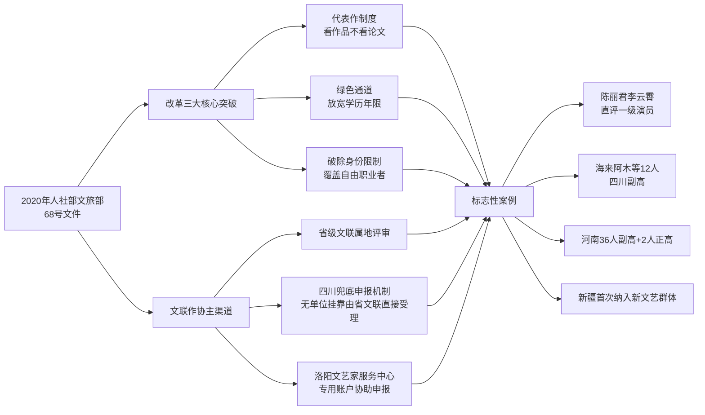

### 3.3.4 改革的现实约束：材料门槛、专业局限与标准统一性

需要客观指出的是，新文艺群体职称改革仍面临三类显著约束。**第一是材料整理门槛**。记者走访发现，"申报材料如何规范整理"成为现实"拦路虎"——艺术类职称申报涉及的材料复杂多样，以表演类为例，需提供演出节目单、获奖证书、媒体报道、专家评价等多维度证明材料；音乐类则需附上音乐会节目单、作品音频视频、专业评论等。一位连续两年申报未果的舞蹈演员坦言："我的作品明明符合条件，却总是卡在材料格式和业绩证明的认定上"[^60]。

**第二是覆盖专业的局限**。四川首批新文艺群体职称评审"主要开展了艺术系列演员、导演（编导）、美术3个专业副高级职称评审工作"[^74]，尚未覆盖第2章所述艺术疗愈、技术美术、AI内容创作等更前沿的新兴领域。北京市文联的评审范围明确将"动漫游戏设计专业除外"[^59]——动漫游戏作为艺术与科技深度交叉的代表性赛道，反而暂时未纳入新文艺群体职称主渠道，体现了制度供给与产业现实之间的滞后。

**第三是评审标准的区域差异**。曾小敏在2026年全国两会上专门建议"统一破格标准"[^60][^73]，反映出当前各省制度落地存在差异——河南、辽宁、山西等省的评审标准在专业类别、级别要求、代表作认定细则上各有不同[^56][^57][^58][^62]，可能导致跨地域职称互认与人才流动出现摩擦。

尽管存在上述约束，新文艺群体职称改革对艺术生多元化职业路径的支撑意义仍然深远。**当一名网络作家、独立音乐人、自由美术工作者能够通过省级文联兜底申报，凭借代表作而非学历资历获得副高甚至正高级职称时**，第2章所述五大赛道的职业路径就获得了一条与体制内并行的、规范化的认可通道——这是评价体系改革对释放艺术人才价值最具实质性的制度突破。

## 3.4 新兴职业认证缺失与艺科商交叉领域的评价空白

新文艺群体职称改革主要解决了"传统艺术专业的体制外从业者"被认可的问题，但对于第2章所述艺术+科技、艺术+商业、艺术+教育、自由职业等赛道中**全新涌现的复合型职业**，现有评价体系仍存在显著的"评价空白"。这一空白表现为行业认证标准缺失、专业职业资格未纳入国家认证体系、职级晋升通道不清晰等多重困境，对新赛道从"野蛮生长"走向"专业化职业化"形成实质性阻碍。

### 3.4.1 艺术疗愈赛道：万亿蓝海背后的认证乱象

如第2章所述，艺术疗愈作为情绪经济中的新蓝海，市场规模快速增长，但其认证体系的滞后程度令人担忧。在国内市场，**疗愈类证书的考培形式均为线上，机构自主定价，最快20天就可以拿证，初级2380元、中级2580元、高级2880元；甚至有机构称"只需1500元就可以拿到疗愈师证书，从报名到出证仅需20天"，并承诺"我们会安排教务老师帮忙考"**（详见第2章对北京商报调查的引用）。一位疗愈师王鑫坦言："这个行业还没有统一标准，从业者多是依托于一些培训机构课程，获得一个疗愈师的称号，证书其实没什么用……现在行业内鱼龙混杂，真正好的疗愈师非常少，并非证书在手就能轻松找到高薪工作"。

国际经验则形成鲜明对比。**纽约大学艺术治疗专业整合心理治疗与视觉艺术实践、要求修满18个艺术学分+12个心理学学分+30个行为或社会科学学分、需完成1000个实习小时，并可获得纽约州创意艺术治疗师（LCAT）执照**（详见第2章引述）。这种"系统化学分体系+长时实习+州级执照认证"的规范化路径，与国内"20天速成证书"的乱象形成显著反差，也直接关联到第5章将要展开的国际经验比较。

值得关注的是，国内已有部分前瞻性布局——2021年中央美术学院率先开设艺术疗愈方向的专业课程（详见第2章），北京、上海等地多家三甲医院已陆续设立艺术疗愈门诊，四川省医疗保障局率先将"音乐疗法"纳入医保报销。但这些试点尚未形成国家层面的职业资格认证体系，**艺术疗愈师作为一个职业仍未被正式纳入《国家职业分类大典》或人社部职业资格目录**，导致从业者面临"市场有需求、培训有供给、医保有支持，但职业身份无认定"的尴尬局面。

### 3.4.2 艺科交叉新岗位：高薪市场背后的职级真空

第2章揭示了AI视频生成师、技术美术（TA）、数字媒体艺术总监、AI漫剧编剧/导演等新兴岗位的高薪表现——技术美术月薪可达30—60K·14薪、数字媒体艺术总监20—40K·14薪、AI漫剧编剧/导演月薪2.5—5万元。然而，**这些岗位虽市场薪资高，但缺乏行业职级标准、缺乏纵向晋升通道**，对从业者长期职业发展的规范化保障明显不足。

观察现行艺术系列职称的专业类别可以发现，河南标准已纳入"动漫游戏设计""创意设计"[^56][^57]，山西、河北等省级文联可推荐评审"动漫游戏设计""艺术创意设计"等专业[^59]，这是制度供给的进步。但**对智能影像、虚拟空间、AI音乐、技术美术、数字策展等更前沿的复合岗位，现有评价体系仍存在显著滞后**。中国传媒大学新增的"智能影像艺术"专业、北京电影学院新增的"虚拟空间设计"专业、南京艺术学院新增的"音乐科技"专业（详见第1—2章），其毕业生未来的职称序列对应、职业发展通道、行业认证标准等问题仍待进一步制度回应。

四川的应对相对前瞻——根据省人社厅介绍，四川**"率先在全国建立彩灯艺术、动漫游戏职称评审专业及完善的评价体系，率先在全国制定网络创作、艺术创意设计、非遗保护三个新文艺群体职称标准体系"**[^74]。这一前瞻性布局对其他省份具有示范意义，但全国层面的统一性、覆盖范围的全面性仍待提升。

### 3.4.3 行业协会会员制度的覆盖局限

行业协会评价同样面临覆盖局限。中国美协入会积分制以"全国美术作品展览中国美术奖"等传统展览体系为核心评价标尺[^63]，对数字艺术、生成艺术、AI辅助创作、虚拟空间艺术等新兴艺术形态的评价权重相对有限。中国书协入会细则的五大类别（创作、理论、教育、新闻出版、组织）也未明确针对数字书法、生成式书法等新形态预留评价通道[^64]。中国电影金鸡奖的最佳美术片、最佳戏曲片等奖项设置仍以传统类型片为基础[^66]，对AI辅助制作、虚拟拍摄、数字人表演等新业态的评价机制尚处于探索阶段。

### 3.4.4 评价空白对新赛道职业化的阻碍

认证体系滞后对新赛道职业化进程的阻碍体现在三个层面。**第一，市场信号失真**。当艺术疗愈赛道充斥20天速成证书时，消费者难以辨别从业者真实水平，市场出现"劣币驱逐良币"风险——王鑫指出"真正好的疗愈师非常少"，正是这一问题的直接表现。**第二，职业发展通道模糊**。一名月薪3万的技术美术从业者，向上晋升缺乏清晰的职级阶梯，向横向流动缺乏可识别的资质背书，长期职业稳定性受损。**第三，制度性资源排除**。当从业者无法对应到国家认可的职业资格或职称序列时，其在政府文化项目申报、文艺基金资助、税收优惠、社会保障等方面均处于劣势，与第3.2节所述传统体系下"申报无门、评价无据"的处境如出一辙。

这种评价空白与第2章所述五大赛道的快速扩张之间形成了**"市场跑得快、制度跑得慢"的张力**——市场已经创造出月薪数万的新岗位、孕育出万亿级新赛道，但评价体系仍主要聚焦于演员、演奏员、编剧、导演、美术等传统类别。这种张力的根源不在于制度本身的保守，而在于**艺术行业本身的演化速度过快，AI、元宇宙、情绪经济等新兴变量在过去三五年内集中涌现，制度供给的反应周期相对较长**。这一现实为第6章艺术教育转型与第7章政策建议提供了直接的制度改革议程。

## 3.5 评价体系单一化—职业路径窄化—收入受限的传导机制

在3.1—3.4节系统分析基础上，本节构建并验证"评价体系单一化—职业路径窄化—收入水平受限"的三段式传导链条。这一链条揭示了为什么第1章所述艺术生就业困境无法仅通过开拓第2章所述多元赛道而完全化解——**评价体系作为深层制度变量，对赛道开拓的实际效果具有放大或抑制的双向作用**。

### 3.5.1 第一段：评价标准单一化挤压复合能力培养空间

传导链的第一段表现为评价标准向学历、奖项、单位身份倾斜，使艺术生在校阶段就被驱动竞争考编、考证、获奖等单一目标。**当传统职称评审仍以"任职年限+学历+单位推荐"为主路径，当事业单位编制岗位仍是收入稳定性最高的选项，当中国美协入会积分仍以全国美展为顶端时，艺术生的在校时间分配自然被引导向"基本功+应试技巧+体制内通道"**——这与第1章所述"普通学校的绘画课仍在教素描、色彩，与市场需要的数字插画、游戏原画根本不搭"的培养现实形成内在一致。

具体表现为：第一，备考逻辑替代专业逻辑。如第1章所述，2024年4月山东临沂初中美术教师岗位以1∶436的比例成为最激烈岗位，2025年贵阳环西小学1个美术岗吸引600人竞争——这种极端竞争吸纳了大量本可以投入跨界复合能力培养的时间精力。第二，单一作品集替代多元能力组合。当中国美协入会要求集中体现于全国美展层级的展览入选与获奖时，艺术生倾向于围绕展览体系打磨单一作品方向，而非构建第2章所述"强审美+会工具+懂商业+能跨界"的多元能力。第三，体制内话语权过滤跨界能力价值。学院派教育体系中，跨学科尝试、AI工具使用、商业项目实战等能力在传统评价标尺中难以充分体现，使得勇于跨界的学生在校内反而处于评价劣势。

### 3.5.2 第二段：评价通道窄化倒逼职业选择路径化

传导链的第二段表现为评价通道的窄化倒逼职业选择路径化。**当只有进入事业单位编制、加入官方协会、获得官方奖项才能换取稳定的职称晋升与收入增长时，"考编、考研、考证"成为艺术生最主流的"安全选项"**，进而强化了第1章所述传统对口岗位的极端竞争态势。

第1章对中央美术学院与普通二本绘画专业的对比已揭示了路径化的现实——中央美院应届生月薪9500元、设计艺术专业一半以上签约互联网大厂和4A，而普通二本绘画专业就业率仅59.6%、毕业班30余人中真正搞纯艺术的仅2个，大部分转行。这一分化背后的制度逻辑是：**头部院校学生通过校企合作、产业导师网络、品牌溢价等"非传统评价"通道实现价值兑现，而普通院校学生在缺乏这些非传统通道的情况下，只能依赖传统评价体系（编制、协会、奖项）作为职业起点**——而传统评价体系的稀缺性又决定了这条通道无法承载所有人的职业期待。

四川省文联调研数据从反向证据印证了这一传导：超9成新文艺群体工作者有强烈的职称评审意愿[^72]，恰恰说明在体制外开拓多元赛道的从业者，仍然渴望传统评价体系的认可——这种"市场已成功，但仍需制度认可"的心态，本身就是评价通道窄化对职业心理的深层塑造结果。

### 3.5.3 第三段：单一评价导致收入分配集中向体制内倾斜

传导链的第三段表现为单一评价导致收入分配集中向体制内倾斜。**体制外艺术从业者难以通过职称晋升获得稳定加薪，且在项目申报、平台资源、媒体曝光等方面处于劣势**。

体制内外的收入分化在多个层面均有体现。**艺术疗愈师月薪7000—10000元（一线城市全职）**（详见第2章）——这一水平与中央美院应届生9500元接近，但稳定性和增长曲线远不如体制内（中央美院毕业10年月薪可达24900元）。**自由插画师收入波动巨大**——"插画师的收入差距非常大，初学者可能每张图只能拿到几十元甚至免费练手，而经验丰富的资深插画师一张图报价可达数千元，甚至上万元"（详见第2章），这种波动性意味着即便平均收入不低，但缺乏稳定性溢价。**新文艺群体获评副高后"底气更足"的对照案例**则提供了正向证据——降央卓玛"获评二级演员……让我创作的底气更足了"[^68]，从摄影工作40年的罗勇在获评一级摄影师后强调"获得正式职称……更是对未来艺术道路的明确指引"[^60]，证明制度认可对体制外从业者的收入预期与议价能力具有显著拉动作用。

下图概括了三段式传导机制：

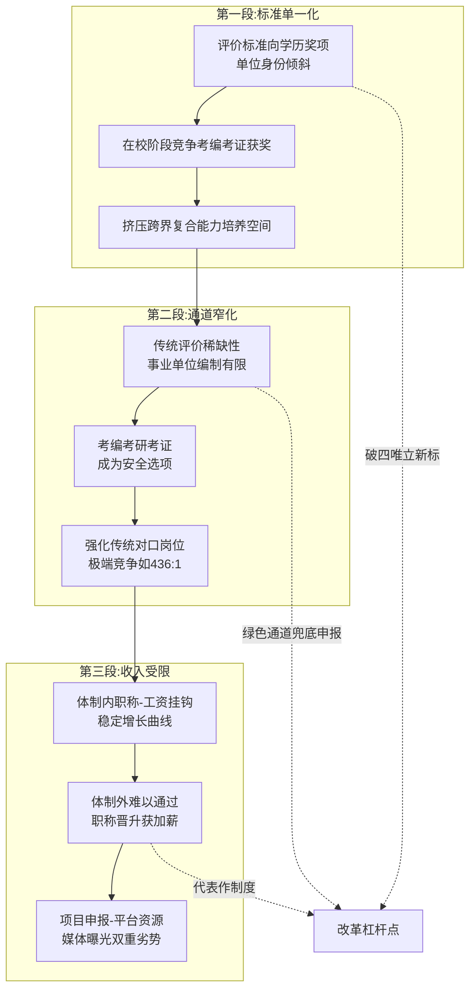

### 3.5.4 传导机制的实证逻辑与改革杠杆点

这一传导机制的实证逻辑可以通过两组对比数据得到进一步验证。**正向验证组**：陈丽君、李云霄从市场走红到拟评一级演员仅两年[^60][^73]——评价通道打开后，市场端的成功能够快速转化为制度认可，进而支撑职业可持续性；河南首批新文艺群体36人获副高、2人获正高[^60][^73]，四川首批12人获副高[^74][^68]，新疆首次纳入新文艺群体[^60][^73]——制度通道的打开直接产出大批"原本无身份认可"的体制外人才。**反向验证组**：连续两年申报未果的舞蹈演员"卡在材料格式和业绩证明的认定上"[^60]，疗愈师"证书其实没什么用"——评价通道未打开或认证体系缺失时，市场端的能力积累难以转化为制度认可，导致收入预期与议价能力受损。

两组对比共同指向同一结论：**评价体系是连接市场端能力与收入端兑现的关键制度桥梁，传导链上任何一段断裂，都会使艺术人才价值难以充分实现**。这也意味着改革的杠杆点应当从单一节点的修补，转向全链条的协同优化。

## 3.6 评价体系改革对艺术人才价值释放的关键作用与改革方向

基于3.5节验证的传导机制，本节进一步提炼评价体系改革对释放艺术人才价值的关键作用，归纳改革方向，并指出本章与后续章节的内在呼应。

### 3.6.1 改革对价值释放的四重核心作用

**第一，"破四唯"与"立新标"并举，重塑评价标尺**。从河南、辽宁、天津、福建、山西等省的艺术系列职称评审标准可以看到，"破除唯学历、唯资历、唯论文、唯奖项倾向"已成为各省评审改革的统一表述[^56][^57][^58]。辽宁标准明确"重点考察艺术专业人员的政治立场、品德操守、专业技能、工作业绩和社会贡献，突出专业特点、创新实践……更好发挥人才评价'指挥棒'和风向标作用"[^58]。这一价值导向的转换，使得作品质量、行业贡献、社会影响力成为评价核心，与第2章所述"艺术+X"复合人才的市场溢价机制形成制度对接。

**第二，拓展申报主体覆盖范围**。从最初的"在职在岗专业技术人员"，到现在覆盖"网络作家、签约作家、自由撰稿人、独立制片人、独立演员歌手、自由美术工作者"[^56][^57]，再到天津2025年明确将"新就业形态劳动者、自由职业者"纳入参评范围[^61]，申报主体的扩展正在打通体制内外的"身份壁垒"。这一扩展直接呼应第2章所述五大赛道——尤其是自由职业与自主创业赛道——从业者的制度需求。

**第三，建立特殊人才直接认定通道**。四川省人社厅明确表示"下一步，四川拟研究制定特殊人才高级职称认定办法，对在全省关键核心技术攻关突破、现代产业体系构建、重点产业链发展、文艺创作和文化传承等领域作出颠覆性贡献、取得标志性或不可替代性成果且符合申报条件的'体制外'专业技术人才可直接认定取得高级职称"[^74]。新疆2024年11月出台的《特殊人才认定高级职称实施细则》已开此先例[^60][^73]。这一通道为现象级文艺成果的创造者提供了"快车道"，避免顶尖人才长期被挡在职称体系之外。

**第四，新兴专业评审通道前置布局**。四川"率先在全国建立彩灯艺术、动漫游戏职称评审专业及完善的评价体系，率先在全国制定网络创作、艺术创意设计、非遗保护三个新文艺群体职称标准体系"[^74]，这一前瞻性布局为艺科商交叉新职业的认证空白填补提供了路径示范。湖南省播音系列、广电艺术专业职称评审"首次启用网上申报评审系统"[^71]，福建省2025年艺术系列中初级职称评审采用网络申报与现场审核相结合方式[^76]，天津市评审实现电子证书生成、不再提供纸质材料[^61]——这些技术与流程层面的现代化，进一步降低了申报门槛。

### 3.6.2 改革方向：多元主体、分类评价、贡献导向、动态调整

基于上述改革进展，艺术评价体系的整体转型可归纳为四个方向：

**多元主体**——从"事业单位+文联协会"二元主导，扩展为"政府+行业协会+院校+市场+第三方专业机构"的多元主体协同。一篇时评指出："拆除'身份围墙'，并非降低标准，而是让评价更契合文艺规律；打破体制壁垒，也非放松要求，而是使人才评价更具公信力和包容性"[^67]。

**分类评价**——根据艺术专业人员所处的不同行业、不同岗位、不同发展阶段，建立差异化的评价标准。如山西标准对"舞蹈、戏曲武功、杂技演员等舞台生命较短的演员"降低任职年限要求[^62]，体现了分类评价的具体落实。对艺术疗愈、技术美术、AI内容创作等新兴职业，更需要建立与传统艺术专业差异化的评价框架。

**贡献导向**——以代表作质量、行业领先水平、引领带动作用、社会影响力作为核心标尺，而非简单的论文数量、获奖等级、任职年限。河南标准强调"严格代表作审核机制，注重代表作的质量、贡献和影响力，确保具有行业领先水平、具有引领带动作用"[^56][^57]，这一表述准确捕捉了贡献导向的实质。

**动态调整**——根据行业发展需要，动态调整专业设置（如河南标准明确"根据行业发展需要，动态调整专业设置"[^56][^57]）；根据技术变革，及时纳入新兴职业；根据市场反馈，定期修订评审标准。这一动态机制是回应3.4节所述"市场跑得快、制度跑得慢"张力的核心制度安排。

### 3.6.3 与后续章节的内在呼应

评价体系改革作为深层制度变量，与后续各章议题形成紧密的内在呼应。**与第4章呼应**——评价体系改革打破"身份壁垒"后，艺术人才的代表作、版权、IP才有进一步通过知识产权保护与文化消费升级实现经济价值兑现的制度基础；反之，没有评价体系的认可，作品的市场价值与版权议价能力都将受到抑制。**与第5章呼应**——美国、英国、德国等国艺术家社会保障、艺术疗愈职业认证体系、人间国宝制度等国际经验，本质上都是评价体系的不同制度形态，第5章将系统比较其对中国的可借鉴空间。**与第6章呼应**——艺术教育转型如果不与评价体系改革同步推进，将面临"教得多元、评得单一"的内在矛盾；只有当代表作制度、贡献导向评价、新兴专业认证全面落地，"艺术+科技+商业"的复合培养才能在毕业出口端获得制度承接。**与第7章呼应**——政策建议的核心抓手之一就是评价体系的多维改革，包括完善艺术人才职称评审与职业认证体系（覆盖新文艺群体、新兴职业）、建立特殊人才直接认定办法、推动评价标准动态调整等。

**评价体系改革是激活第2章多元赛道、支撑艺术人才价值重构的关键制度基础设施**。当一名独立音乐人通过省文联兜底申报获得副高职称，当一名艺术疗愈师能够依靠规范的国家职业资格证书在医院门诊执业，当一名技术美术工程师可以在艺术系列职称中找到对应的专业类别与级别——艺术生从"单一对口就业"向"价值重构"的转向才能真正在制度层面落地。下一章将进一步探讨知识产权保护与文化消费升级如何在评价体系改革打开制度通道之后，进一步提升艺术人才的经济待遇与议价能力。

# 4 知识产权保护与文化消费升级对艺术人才经济待遇的提升效应

第3章揭示了评价体系作为深层制度变量如何通过"标准单一化—通道窄化—收入受限"的传导链条锁定艺术人才的发展空间，并以新文艺群体职称改革为切口呈现了制度破壁的可能性。然而，**评价体系打开制度通道只是艺术人才价值实现的第一步——价值能否真正兑现为可持续的经济待遇，还取决于产权能否被有效保护、市场能否提供足够的支付意愿**。当一名独立设计师的9幅原创纹样被8家关联公司"组团抄袭"、销售额120余万元最终却只获赔15万元时，当中国艺术家在全球拍卖前十中占据6席却因追续权缺失而"分文未得"时，当2.72万亿元的情绪经济与2.5万亿元的国潮市场为艺术人才打开万亿级需求空间时——**产权保护与消费升级正在以"双轮驱动"的方式重塑艺术人才的经济待遇格局**。本章将依次解析中国艺术领域知识产权保护的制度框架（4.1）、侵权治理短板对收入稳定性的抑制（4.2）、追续权缺失的制度遗憾（4.3）、数字版权与NFT的赋能与风险（4.4）、情绪经济与艺术疗愈对需求结构的拉动（4.5）、国潮与博物馆文创对IP议价能力的抬升（4.6），最终在4.7节构建"产权保护强化+消费需求升级"双轮驱动模型，提炼艺术人才从"单件作品出售"向"IP全链条运营"转型的路径，为第5章国际经验比较与第7章政策建议提供市场端与产权端的现实参照系。

## 4.1 中国艺术领域知识产权保护体系的制度框架与权利结构

艺术人才的经济权益保障首先依托于知识产权法律体系的制度供给。中国艺术领域的产权保护制度以《著作权法》为核心，辅以商标权、专利权、反不正当竞争法等协同机制，并在2020年第三次修正后形成了相对完整的权利结构与保护框架。

### 4.1.1 著作权法第三次修正：作品类型扩展与权利谱系完善

2020年11月11日，第十三届全国人民代表大会常务委员会第二十三次会议通过《关于修改〈中华人民共和国著作权法〉的决定》，对《著作权法》进行第三次修正[^77][^78]。这一修正在三个层面对艺术人才的权利保护具有里程碑意义。

**第一层面是作品类型的开放性扩展**。修正后的《著作权法》第三条将作品定义为"文学、艺术和科学领域内具有独创性并能以一定形式表现的智力成果"，列举的作品类型包括文字作品、口述作品、音乐戏剧曲艺舞蹈杂技艺术作品、美术建筑作品、摄影作品、视听作品、图形作品和模型作品、计算机软件，以及"符合作品特征的其他智力成果"[^79][^77]。这一"兜底条款"的设计颇具前瞻性——**"符合作品特征的其他智力成果"为AI辅助创作、生成艺术、虚拟空间艺术等第2章所述新兴艺术形态预留了法律保护空间**，避免了原《著作权法》将"电影作品和以类似摄制电影的方法创作的作品"作为封闭类型时的解释困境。

**第二层面是权利谱系的系统化构建**。修正后《著作权法》将著作权细分为17项权利，包括人身权4项（发表权、署名权、修改权、保护作品完整权）和财产权13项（复制权、发行权、出租权、展览权、表演权、放映权、广播权、信息网络传播权、摄制权、改编权、翻译权、汇编权及"应当由著作权人享有的其他权利"）[^79]。这一谱系覆盖了艺术作品从创作、固定、传播到二次开发的全生命周期，为艺术家通过许可、转让等方式实现经济变现提供了完整的法律工具箱。

**第三层面是保护期与权利限制的合理平衡**。自然人作品的发表权与财产权保护期为作者终生及死亡后50年；法人作品、特定职务作品及视听作品发表权保护期为创作完成后50年、财产权保护期为首次发表后50年；署名权、修改权、保护作品完整权的保护期不受限制[^79]。同时，第四节"权利的限制"规定了为个人学习研究、介绍评论、新闻报道、课堂教学、国家机关执行公务等情形可以合理使用的具体边界，"应当指明作者及作品名称，并不得影响作品的正常使用或不合理地损害著作权人合法权益"[^79]。

### 4.1.2 邻接权、集体管理与跨部门协同保护

除著作权本体外，《著作权法》第四章对出版者、表演者、录音录像制作者、广播电台、电视台等"与著作权有关的权利"（即邻接权）作了专章规定[^77][^78]。这一设计对艺术人才尤其重要——**演员、演奏员、舞蹈演员等表演者依靠邻接权获得表演收入与录音录像传播分成，唱片公司、演出制作公司则依靠邻接权获得制作投入回报**。

**著作权集体管理组织**作为非营利法人，在《著作权法》第八条获得明确法律地位——"被授权后可以以自己的名义为著作权人和与著作权有关的权利人主张权利，并可以作为当事人进行涉及著作权或者与著作权有关的权利的诉讼、仲裁、调解活动"[^77][^78]。这一机制为分散的艺术人才（如音乐作者、摄影师）提供了集体维权与许可使用费收取的专业化通道，有效降低了个体维权的成本门槛。从司法实证看，中国音像著作权集体管理协会已成为雕塑作品著作权侵权纠纷案件中担任原告角色最多的当事人之一，仅次于华强方特(深圳)动漫有限公司[^80]。

**侵权责任制度**则形成了民事、行政、刑事三位一体的协同保护体系。《著作权法》明确侵权人应根据情况承担"停止侵害、消除影响、赔礼道歉、赔偿损失等民事责任"；对于同时损害公共利益的行为，著作权主管部门可"责令停止侵权、警告、没收违法所得、罚款";构成犯罪的依法追究刑事责任。**赔偿数额可依据实际损失、违法所得、权利使用费或法定赔偿确定，并包括权利人为制止侵权行为所支付的合理开支**[^79]。

### 4.1.3 2025年新政与版权事业高质量发展

2025年是中国版权制度向数字化、智能化方向加速演进的关键一年。**2025年7月，国家版权局印发《关于加快推进版权事业高质量发展的意见》，全面统筹版权创造、运用、保护、管理、服务全链条相关工作，明确适应人工智能、大数据等新技术的版权规则体系建设方向**[^81]。这一文件紧扣新质生产力与文化强国战略，标志着中国版权事业进入以"高质量发展"为目标的系统推进阶段。

与意见配套推出的**版权金融生态综合试点**具有标志性意义。2025年3月，国家版权局联合有关部门联合印发《知识产权金融生态综合试点工作方案》，**在北京、上海、江苏、浙江、广东、四川、深圳、宁波等八省市开展试点**，针对金融机构服务机制待优化、风险补偿机制待健全等问题，在登记、评估、处置、补偿等环节提出政策措施，支持相关机构研究制定版权评估指引，**探索开展版权质押融资、版权保险、版权证券化等工作**[^81]。这一布局直接回应了第2章自由职业赛道艺术家长期面临的"作品有价值但难以转化为融资抵押物"的困境，为版权资产化与金融化打开了制度入口。

**司法保护层面，2025年最高人民法院、最高人民检察院发布新修订的《关于办理侵犯知识产权刑事案件适用法律若干问题的解释》及典型案例**，对著作权犯罪的未经许可、复制发行、入罪数额、情节认定等问题作出规定。国家版权局与最高人民检察院等联合挂牌督办109件涉影视、网络文学、软件、音像的重大侵权盗版案件[^81]。**院线电影版权保护专项工作中，执法部门查办春节档电影侵权案件21起，查获侵权盗版影视网站(APP)320个，处置侵权链接43.87万条，处理侵权账户1492个**——在版权保护护航下，2025年电影票房达518.32亿元，观影人次12.38亿，同比分别增长21.95%和22.57%[^81]。这组数据直观印证了产权保护强化对文化产业整体价值释放的拉动效应。

下表汇总了中国艺术领域知识产权保护体系的核心制度安排：

| 制度层级 | 核心法律/政策 | 主要内容 | 对艺术人才的意义 |
|---------|------------|---------|---------------|
| 基础法律 | 《著作权法》（2020修正） | 9类作品+17项权利+保护期+权利限制 | 全生命周期权益保障 |
| 协同保护 | 《商标法》《反不正当竞争法》 | 商标权、商品装潢、商业秘密 | IP开发的法律支撑 |
| 集体管理 | 著作权集体管理组织制度 | 集体许可、收费、维权 | 降低个体维权成本 |
| 司法保护 | 知识产权法院、互联网法院 | 专门审判+电子存证+惩罚性赔偿 | 提升维权效能 |
| 行政保护 | "剑网"专项行动等 | 行政处罚+刑事移送 | 治理规模化侵权 |
| 金融赋能 | 八省市版权金融试点（2025） | 质押融资、保险、证券化 | 版权资产化变现 |
| 新规衔接 | 国家版权局2025年高质量发展意见 | AI、大数据版权规则建设 | 适应新技术新业态 |

### 4.1.4 国际版权交流与制度开放性

第十届中国国际版权博览会暨2025国际版权论坛于2025年10月在山东青岛举办，**共吸引57个展团、超1100家企业参展，达成战略合作363项、金额7.76亿元**，集中展示了中国版权工作的最新成果，搭建起中外版权交流合作的重要平台[^81]。这一国际化趋势对艺术人才的意义在于——**当中国版权制度与国际版权规则深度对接时，本土艺术家的作品出海与跨境维权将获得更稳固的制度基础**，这与第3章评价体系国际接轨的方向形成内在呼应，也为第5章国际经验比较奠定了基础。

需要客观指出的是，中国艺术知识产权制度框架虽已相对完整，但落地效力仍存在显著短板——尤其是在侵权赔偿额度、维权周期、追续权缺失、新兴业态认定等方面，与艺术人才的实际需求仍有差距。这些短板的具体表现，将在4.2—4.4节展开分析。

## 4.2 侵权成本低与维权周期长对艺术人才收入稳定性的抑制

中国艺术领域知识产权制度的"形式完整"与"实效不足"之间的张力，最直接地体现在维权实践的现实困境上。基于司法实证大数据观察可以发现，**艺术作品侵权赔偿额偏低、地区差异巨大、维权周期长、举证负担重等问题，正在通过收入稳定性这一传导渠道，对艺术人才尤其是自由职业群体的可持续创作能力形成实质性抑制**。

### 4.2.1 图片版权案大数据：单张赔偿偏低与地区判罚悬殊

南方都市报知识产权研究中心发布的《图片类著作权诉讼案例统计报告》提供了迄今最系统的图片侵权司法数据。**在近半年的1715例涉及图片著作权的裁判文书样本中，超六成的图片单张赔偿金额在0至5000元区间内，以单张图片赔偿2000元最多，达352件**[^82]。具体到不同作品类型：摄影作品单张平均获赔金额仅2005.15元，图形作品单张平均获赔2015.01元，美术作品单张平均获赔4480.25元[^82]——这一水平与艺术家创作单件作品的实际成本之间存在显著倒挂。

更值得警惕的是地区判罚的悬殊差异。**针对美术作品侵权，山东省判罚的赔偿金额均值最高，达53400元，内蒙古自治区判罚的金额均值最低仅300元，前者是后者的178倍**[^82]。即便是同一张图片侵权，在不同地区的法院判罚金额也可差十倍以上——以上海美术电影制片厂"葫芦娃"美术作品8起著作权纠纷为例，判决法院所在地分别为江苏省（1起）、河南省（1起）、四川省（1起）、北京市（5起），赔偿金额平均值分别为30000元、16000元、10000元、2558元，**最高赔偿金额平均值是最低的11.7倍**[^82]。这种"同案不同判"现象意味着艺术家维权时面临着显著的"管辖地彩票效应"，损害了产权保护制度的可预期性。

**司法资源的"集中化"特征同样值得关注**：报告分析发现，半年来的1715起案件共计获赔1093.04788万元，**其中八家图片公司涉诉案件占同期总数的46.71%，共计获赔351.218万元，占总获赔金额的近四成**[^82]。这意味着图片版权诉讼形成了以视觉中国、华盖创意、汉华易美等专业图片公司为主导的"维权产业链"，而分散的独立摄影师、插画师在其中的获益比例相对有限。雕塑作品著作权权属和侵权纠纷的3032件裁判文书大数据也呈现类似集中度——华强方特(深圳)动漫有限公司作为原告身份的案件高达7000多件，多为名下"熊大""熊二""光头强"等动漫形象被侵权后的维权之诉[^80]。

### 4.2.2 "组团抄袭"产业链：典型案件揭示的恶意侵权模式

苏州工业园区人民法院审结的独立设计师纹样侵权案，是最具典型性的恶意侵权样本。**独立设计师李某创作完成《花颜玉兰花》《莲花珠链》等9幅原创美术作品后，发现一些电商平台的十余家店铺中，多款古风服饰产品使用的图案与自己的9幅原创作品高度相似**[^83]。经查，销售侵权产品的十余家店铺分属8家关联企业，法定代表人、股东、高级管理人员高度重合，**形成"采购样品—委托生产—多店分销"的完整侵权产业链**——一个与其中一家被告公司商号同名的淘宝用户，多次从李某店铺采购带有涉案美术作品的布料、辅料等样品，收货地址正是其中一家被告公司的注册地，八被告采购样品后直接仿制同款纹样，制作出8款服饰产品，**通过电商平台十余家店铺累计销量近2.5万件、销售额120余万元**[^83]。

法院最终判决八被告共同赔偿原告经济损失及维权合理开支共计15万元——这一判决相对原告主张的20万元已较为充分，但与侵权方120余万元的销售额相比，**赔偿金额仅占侵权获益的12.5%**。这意味着即便在认定共同侵权的最优情况下，恶意抄袭者仍可能通过侵权获得正向收益，这正是司法实践中"违法成本远低于违法收益"的直观体现。法官在判决说理中特别指出，"八被告利用关联公司架构套取'马甲'，通过'采购样品—精准抄袭—多平台分销'的模式实施侵权，妄图规避法律责任，属于典型的恶意知识产权侵权行为"[^83]。

### 4.2.3 高额判赔与惩罚性赔偿的标杆案例

北京知识产权法院李志峰法官审理的西某诉叶某侵害著作权纠纷案，则展示了高额判赔的另一面图景。**西某创作的13幅权利画作于1990年3月首次发表于法国巴黎中央画廊；2019年起诉主张被告叶某自1993年起、持续25年创作的176幅画作抄袭其享有著作权的13幅权利画作**[^84]。法院在判决说理中系统阐述了美术作品中思想与表达的区分原则——"美术作品作为造型艺术作品，其艺术形象体现为视觉形象……美术作品的表达就在于由构图、线条、色彩、形体等美学因素的有机融合所客观呈现的艺术造型"[^84]，最终判赔500万元。这一判赔规模虽属个案标杆，但其"长达25年的持续侵权+大规模复制+主观恶意明显"的事实背景具有相当特殊性，难以代表艺术家维权的常态情形。

烟台中院发布的"宝树堂"商标权侵权及不正当竞争纠纷案则展示了惩罚性赔偿的具体适用。**烟台宝某公司假冒北京宝某公司"宝树堂"商标生产假药，严重危害公共利益和社会公众人身健康，法院依法适用三倍惩罚性赔偿**，判令烟台宝某公司因商标侵权行为赔偿12万元、不正当竞争行为赔偿1万元、维权合理费用56947元[^85]。这一案例进一步明确了惩罚性赔偿司法解释关于"故意"和"情节严重"的适用规则。

### 4.2.4 维权成本结构与多元解纷路径

从维权成本结构看，鲸版权等版权服务平台总结的真实数据显示，**简单案件（如公众号抄袭）通过平台投诉1-3周可解决，但复杂案件诉讼可能需要1-3年；起诉时无争议金额的案件需缴纳500-1000元/件，有争议金额的按法定财产案件标准缴纳**[^86]。维权成本主要包括三大类：时间成本（影响个人创作或工作生活）、经济成本（公证费、律师费、诉讼费）、机会成本（投入时间精力影响主业）[^86]。

针对维权成本困境，多元解纷路径正在加速布局。**三亚市知识产权保护中心人民调解委员会2026年发布的4宗典型调解案例显示**，A公司诉B某通过微信公众号发布小游戏下载链接侵犯信息网络传播权一案，原告诉请赔偿3万元，经调解委员会"二次调解"——精准开展法律释明与事理剖析，联动海南自由贸易港知识产权法院调取同类案件判例——**最终B某一次性支付赔偿款2500元，纠纷快速办结**[^87]。另一起涉3家企业的批量计算机软件著作权纠纷案，调解委员会创新运用"信息联动+专业研判+分类调解"工作模式，3起关联案件同步达成调解协议[^87]。这种"调委会主导、法院联动、各方参与"的多元解纷机制，**为艺术人才尤其是中小规模侵权纠纷提供了低成本、高效率的维权通道**。

### 4.2.5 治理短板对收入稳定性的传导抑制

将上述司法实证综合起来观察，可以提炼出侵权治理短板对艺术人才收入稳定性的三层传导抑制：

**第一层传导是收入直接被侵权稀释**。当原创作品被低成本复制并低价销售时，原创艺术家的市场份额被直接挤压——李某案件中，120余万元的侵权销售额本应是设计师可获得的市场收入，却被8家关联公司截取。**这一稀释效应对依靠作品销售为主要收入的自由职业艺术家尤其致命**，与第2章自由职业赛道"插画师收入差距非常大、初学者每张图只能拿到几十元甚至免费练手"的现实形成残酷呼应。

**第二层传导是维权时间挤占创作时间**。复杂案件1-3年的维权周期，意味着艺术家需要在长期诉讼过程中持续投入精力，这对依靠持续创作维持收入的自由职业群体形成显著的"机会成本"压力。**艺术家因维权而中断创作，反而进一步削弱其市场议价能力——这是一个负向循环**。

**第三层传导是地区判罚差异削弱产权制度的可预期性**。当美术作品单张赔偿在山东可达53400元、在内蒙古仅300元时[^82]，艺术家在选择维权管辖地、评估维权回报时面临巨大不确定性。**不可预期的产权保护无法支撑稳定的市场价格信号，从而使艺术作品的市场定价机制长期处于"折扣定价"状态——预期被抄袭、预期维权困难，定价时只能向下调整**。这一机制与第3章评价体系单一化对收入分配的传导锁定形成叠加效应，共同压抑艺术人才的经济待遇空间。

针对这一困境，**惩罚性赔偿的扩大适用、调解前置的全面推广、电子存证（如区块链存证）的普及、跨区域判罚标准的统一化**，是产权保护强化的主要改革方向，与4.7节将归纳的双轮驱动模型形成制度对接。

## 4.3 追续权缺失与二次销售版税分配的制度空白

如果说4.2节揭示的是产权保护"事后救济不足"的问题，那么追续权（droit de suite）的缺失则是产权保护"事前权利缺位"的标志性短板。这一制度空白对画家、摄影家、雕塑家等造型艺术家的长期经济权益形成结构性损害，是当前中国艺术知识产权体系最值得关注的制度遗憾之一。

### 4.3.1 追续权的制度内涵与国际立法基础

追续权制度起源于20世纪初的法国。**法国历来是艺术家辈出和艺术领域繁荣的国家，艺术品交易市场蓬勃发展，但与此同时，艺术家与艺术品经销商之间的矛盾也日益凸显**[^88]。在艺术领域存在着艺术作品的价值被认可滞后于艺术家创作的普遍现象——画家的作品往往随着画家成名后价格才逐渐上涨，艺术品经销商通过作品转售获得巨额收益，但作者却不能从中获得任何补偿。**为了平衡画家与艺术品经销商的利益分配，法国于1920年在其著作权法中创造了追续权制度**，随后该制度被德国、意大利等大陆法系国家所效仿[^88]。

从国际立法的具体规则看，**《法国知识产权法典》规定"尽管作品原件已转让，平面及立体作品的作者，对拍卖或通过中间商转卖该作品所得收益有不可剥夺的分享权。分享比例统一为3%，但仅在超过法规确定的售价时适用"**[^88]。**《联邦德国著作权法》第二十六条规定"如果造型艺术作品的原作被再次让与并且有艺术商或拍卖商作为受让人、让与人或中间人参与，让与人应将让与所得收入的5%付给权利人"**[^88]。

国际公约层面，**《伯尔尼公约》布鲁塞尔文本第十四条第三款规定"对于艺术作品原作和作家与作曲家的手稿，作者或作者死后由国家法律所授权的人或机构享有不可剥夺的权利，在作者第一次转让作品之后对作品进行的任何出售中分享利益"**[^88]。但公约同时设置了对等保护原则——"只有在作者本国法律承认这种保护的情况下，才可在本同盟的成员国内要求上款所规定的保护"[^88]，这一对等条款使得未在本国立法承认追续权的艺术家无法在境外行使该权利。

### 4.3.2 中国立法的"擦肩而过"与现实损害

中国于1992年加入了《伯尔尼公约》。**2012年3月，国家版权局发布的《中华人民共和国著作权法》(修改草案)中，关于著作财产权的一条重要修改就是增加了追续权**——第十一条第二款第十三项规定："追续权，即美术作品、摄影作品的原件或者作家、作曲家的手稿首次转让后，作者或者其继承人、受遗赠人对该原件或者手稿的每一次转售享有分享收益的权利，追续权不得转让或者放弃"[^88]。然而，2020年第三次修正后正式通过的《著作权法》最终未将追续权纳入17项权利谱系——**这一立法"擦肩而过"使得中国造型艺术家在国际艺术品市场上长期处于"分享利益缺位"的状态**。

现实损害的规模相当惊人。北京君策知识产权发展中心主任许超指出："**由于中国没有对追续权立法，很多中国作品在欧洲被拍卖，却无法得到在欧洲艺术品市场上产生并应该分配给他们的版税，这不利于激励艺术家创作**"[^89]。从国际市场地位看，**目前在全球艺术家拍卖成交总额排名前十位中，中国艺术家占据6席，百万美元以上成交艺术品数量也远超美国、英国，但由于我国现行著作权法尚没有规定追续权，所以中国艺术家分文未得**[^89]。

这一现实数据揭示了一个残酷的对比：**中国艺术家创造了全球艺术品市场最庞大的二次销售价值，却因本土立法缺位而无法分享这一价值**。在《伯尔尼公约》对等保护原则下，欧洲拍卖行可以将本应支付给中国艺术家的3%—5%转售分成留作他用，这是一笔可能高达数十亿元规模的潜在收入流失。

### 4.3.3 追续权立法的核心争议与价值导向

追续权立法在中国学界存在一定争议。**有学者认为，追续权与权利穷竭原则存在矛盾冲突，追续权难以融入著作权的体系中**[^88]。然而，主流观点认为追续权"将消除当事人之间的利益悬殊，协调作者与传播者之间的利益分配，使之达到平衡状态，最终达到激励创造、促进传播，实现著作权法的价值目标"[^88]。

支持立法的核心理据在于**美术作品增值的多重贡献来源**。"美术作品的增值是多种因素共同作用的结果。首先，美术作品的价值来源于作者长期创造性劳动，是作者的智慧凝结的成果。其次，画廊、拍卖行等艺术品经销商的传播行为可能导致作品增值"[^88]。这意味着艺术品转售收益的分配应当考虑艺术家的原创贡献——若所有增值收益均归经销商所有，将造成显著的利益失衡。

从国际接轨与"文化走出去"的战略视角看，许超提出"**保护追续权，符合著作权发展的大趋势，也是我国艺术品市场和国际接轨的重要方面**"[^89]。在中国艺术品市场全球化、中国艺术家国际化拓展的大背景下，追续权的缺失已经从一个"专业技术问题"上升为一个"战略性制度短板"——它直接影响中国艺术家在国际市场上的长期收益分配格局。

### 4.3.4 追续权对艺术人才长期权益的实质意义

具体到艺术人才的经济待遇层面，追续权的实质意义体现在三个维度：

**第一是长期收益分享机制**。许多艺术家在创作初期作品价格低廉，依靠成名后的二次销售实现作品价值的市场重估——若没有追续权，**艺术家终生只能获得首次销售的低价回报，而后期由市场认可带来的巨额增值则全部归经销商所有**。这与第2章自由职业赛道"初学者一张图只能拿到几十元甚至免费练手"的现实形成长期效应——若初创期的低价作品在艺术家成名后多次转售，追续权可使艺术家获得"成名后的回溯性分享"。

**第二是激励原创创作的制度信号**。追续权的设立向市场传递了"艺术作品的长期价值与艺术家长期权益挂钩"的明确信号，强化了原创创作的激励机制。在第3章所述新文艺群体"用作品说话"的代表作制度框架下，追续权的引入将进一步强化"作品作为长期资产"的制度定位。

**第三是国际市场议价能力**。在《伯尔尼公约》对等保护原则下，**只有本国立法承认追续权，本国艺术家才能在境外艺术品市场行使该权利**[^88]。这意味着中国追续权立法不仅是国内利益分配问题，更是中国艺术家在国际艺术品市场上获得平等议价地位的前提条件。

需要客观指出的是，追续权立法也面临实施层面的现实挑战——如何确定征收主体、如何追踪二次销售、如何处理跨境交易、如何平衡市场流动性与艺术家权益等问题，需要详细的实施细则配套。但**就立法层面而言，将追续权纳入下一次《著作权法》修正应当成为优先议程**——这一制度突破口与第3章评价体系改革、第5章国际经验比较、第7章政策建议形成完整的制度逻辑链。

## 4.4 数字版权与NFT数字藏品对艺术人才价值变现的赋能与风险

如果说传统著作权制度回应的是物理时代的艺术品产权问题，那么NFT与数字藏品则是产权保护应对数字时代的新工具。这一新工具既为艺术人才打开了前所未有的确权与变现通道，也带来了平台炒作、监管滞后、法律性质模糊等新型风险，构成产权制度演进中最具张力的前沿议题。

### 4.4.1 数字藏品的法律属性确立：杭州互联网法院判例

中国数字藏品行业的法律属性长期处于模糊地带，直到杭州互联网法院的标志性判例确立了基本框架。**杭州互联网法院在审理一起NFT数字藏品交易引发的信息网络买卖合同纠纷案中明确认定：NFT数字藏品作为虚拟艺术品，本身凝结了创作者对艺术的独创性表达，具有相关知识产权的价值。同时，NFT数字藏品是基于区块链节点之间的信任和共识机制，在区块链上所形成的独一无二的数字资产。因此，NFT数字藏品属于虚拟财产范畴**[^90]。

法院进一步阐述："NFT数字藏品具有价值性、稀缺性、可支配性、可交易性等财产权客体特征，同时还具有网络虚拟性、技术性等网络虚拟财产特有属性，属于网络虚拟财产。涉案合同并不违反我国法律规定，亦未违反我国防范经济金融风险的现实政策及监管导向，应当受我国法律保护"[^90]。**这一判例的核心意义在于：第一，明确数字藏品的财产权地位；第二，区分中国数字藏品与具备金融属性的境外NFT；第三，为数字艺术作品的合同效力认定提供裁判规则**。

需要明确的是，**国内数字藏品与NFT本质区别在于国内数字藏品不具备NFT的资金属性及社交属性，与虚拟货币划清了明确的界限**[^91]。这一界限决定了中国数字藏品市场走的是"文化产品+收藏价值+合规框架"的路径，而非"金融化投机+加密货币结算"的境外NFT路径。

### 4.4.2 市场规模、平台格局与艺术家变现案例

中国数字藏品行业市场规模处于快速扩张期。**2021至2022年我国数字藏品销售额增长率为40%，2022年我国数字藏品市场规模达到3.3亿元，同比增长17.86%，较2020年复合增长19.22%**[^91][^92][^93]。从市场结构看，文物类数字藏品占据较大比例，其次是音乐类和头像类数字藏品，电影类和艺术品类也占有一定的市场份额[^91]。

**平台格局以阿里、腾讯、百度、网易等科技公司为主导**——这些平台通过区块链技术和数字平台推出各类数字藏品，积极布局市场[^92][^93]。需要警惕的是，"国内的数字藏品一般发行在商业机构的联盟链甚至私有链上，被商业机构中心化控制明显；同时由于缺乏有效监管，数字藏品很容易被单一商业机构操控或者暗箱操作"[^94]——这种中心化特征与境外NFT基于公链的去中心化模式形成本质差异。

艺术家通过数字藏品实现价值变现的代表性案例已陆续出现。**2025年10月22日，艺术大师左古山数字藏品(NFT)全球首发仪式在中国人民大学复兴美术馆古道书院举行——左古山在大阪世博会上获得的金奖作品《佛法本从空处起》及《松下论道》正式以数字藏品(NFT)形式发行，"古山松系列(一)"两幅精品之作各发行3000份**[^95]。发行平台数藏中国的运营总监赵鹏表示，平台"始终致力于利用区块链技术，为优秀的文化艺术作品提供安全、可靠、高效的数字化发行与收藏通道，推动艺术品的数字化进程，让艺术以更亲民的方式触达更广泛的受众"[^95]。这一案例的标志性意义在于——**当一位国家一级美术师、博士生导师将其代表作通过数字藏品形式发行时，传统艺术家与数字版权变现路径形成了历史性对接**。

更具产业化样本意义的是视觉中国的"区块链+"战略。**视觉中国成立于2000年，是一家典型的文化与科技融合的公司，其核心业务为版权交易，主要是视觉内容的数字版权交易，具体交易的是各种视觉素材（图片、插画、视频、音乐）的使用权。作为全球领先的在线数字版权交易平台，视觉中国自2014年上市以来主营业务超过50亿元**[^96][^97]。视觉中国通过"元视觉"合规策略与"区块链+"战略构建数字版权交易机制，为艺术家提供从确权、登记、交易到变现的全链条服务。

### 4.4.3 消费者行为与市场支付意愿

艾媒咨询的消费者调研提供了数字藏品市场支付意愿的直观数据。**关于购买数字藏品的原因，43.87%的消费者看重其收藏价值，41.75%的消费者看重其未来升值潜力，32.78%的消费者购买数字藏品出于社交需求，32.55%的消费者因感到新颖好奇而购买数字藏品**[^94]。这一结构表明数字藏品市场已经形成"收藏+投资+社交+猎奇"的多维需求结构。

支付能力方面，**32.55%的消费者愿意为购买数字藏品花费201-500元，26.18%的消费者愿意花费的金额在501-1000元，愿意花费金额在1000元以上的用户占比17.92%**[^94]。从单件作品的支付意愿看，左古山案例中3000份的发行规模与"亲民"定价策略，正是面向这一支付意愿区间的市场化设计。

### 4.4.4 风险图谱：法律陷阱、监管滞后与平台乱象

数字藏品市场的快速扩张同时伴随着显著风险。从司法实践看，**2026年北京顺义法院正在审理首例数字藏品交易损失赔偿案**[^98]，标志着数字藏品纠纷已进入实质性司法处理阶段。

更具警示意义的是收藏纠纷司法案例所揭示的"五个法律陷阱"[^98]，其核心规则同样适用于数字藏品领域：

**陷阱一**：误信"保真承诺"，忽视司法拍卖"瑕疵不担保"的铁律——许多藏家最大的认知误区，是认为拍卖行或直播间的"保真承诺"具有法律强制力。然而《拍卖法》和最高人民法院相关司法解释都明确赋予了拍卖人"不承担拍卖标的物瑕疵保证"的权利。

**陷阱二**：混淆"消费行为"与"投资行为"，丧失惩罚性赔偿保护——**柳州刘先生在直播间花费26万余元拍下四件"清代官窑"，经司法鉴定全为现代仿品；一审法院支持"退一赔三"，二审却改判仅退还货款并酌情赔偿10万元。法官在判决书中写道："古董交易属投资属性，不适用消费者权益保护法"**[^98]。这一规则同样适用于具有投资属性的数字藏品交易。

陷阱三、四、五分别涉及文物来源合法性、专家鉴定的局限性、其他风险——这些规则共同构成数字藏品市场的法律警示框架。

平台乱象方面，**部分数字藏品平台存在过度投机和虚假宣传等行为，导致市场混乱和消费者利益受损……区块链技术的漏洞或黑客攻击可能导致数字藏品被盗或篡改，进而引发信任危机和市场动荡**[^92]。艾媒调研数据也显示："当前数字藏品交易仍面临一些挑战和风险，如平台炒作、哄抬价格、虚假发货等问题"[^94]。

杭州互联网法院案例本身也揭示了数字藏品交易的合同风险——**原告王某因填写手机号第四位与身份证第六位错误，被平台依据抢购公告中的"个人信息填错强制退款"条款解除合同；王某要求继续履行合同或赔偿99999元的诉讼请求被全部驳回**[^90]。这一判例提示数字藏品消费者必须严格遵守平台规则，否则可能丧失合同履行权。

### 4.4.5 数字版权赋能的双面性与发展方向

综合上述分析，数字版权与NFT数字藏品对艺术人才价值变现的赋能与风险呈现明显的双面性：

**赋能侧**：第一，区块链确权机制为艺术家提供了"独一无二"的数字版权凭证，破解了数字作品易被复制的固有难题；第二，发行渠道从画廊、拍卖行扩展到数字平台，触达全球年轻消费者；第三，每件数字藏品的销售记录在区块链上不可篡改，为追溯艺术家作品流转提供技术基础；第四，"创作者经济"的持续发展[^96][^97]为艺术家从"机构代理"向"个体直连"模式转型提供了平台支撑。

**风险侧**：第一，市场炒作与投机风险——"高昂的交易金额也易带来市场泡沫和投机风险，投资者应理性看待，避免盲目跟风"[^94]；第二，监管框架尚不完善——"数字藏品行业的法律性质模糊、监管存在困难，因此仍需进一步完善监管政策"[^92][^93]；第三，技术依赖性带来新型风险——区块链漏洞、黑客攻击、平台跑路等问题可能直接侵害艺术家与消费者权益。

发展方向上，**数字版权赋能与监管完善需要同步推进**——一方面通过国家版权局《关于加快推进版权事业高质量发展的意见》框架下的版权评估指引、版权质押融资、版权证券化等机制，让数字版权资产化变现获得制度通道；另一方面通过监管完善遏制平台炒作、虚假发货、过度投机等乱象，确保市场的健康发展。这一双向推进逻辑也将在4.7节双轮驱动模型中得到进一步整合。

## 4.5 情绪经济与艺术疗愈对艺术人才需求结构的拉动

如果说4.1—4.4节聚焦的是产权保护这一"防御性"机制，那么4.5—4.6节将转向消费升级这一"扩张性"机制——**当2.72万亿元的情绪经济与2.5万亿元的国潮市场打开万亿级新需求空间时，艺术人才的市场议价能力与岗位增量正在被结构性重塑**。本节聚焦情绪经济与艺术疗愈对艺术人才需求结构的拉动效应。

### 4.5.1 情绪经济的爆发式增长与市场结构

中国情绪经济市场规模呈现跨越式增长。艾媒咨询数据显示，**2024年中国情绪经济市场规模已达2.3万亿元，2025年达2.72万亿元，预计到2029年将突破4.5万亿元**[^99][^100][^101]。"情绪经济市场规模从2022年的1.63万亿元增长至2025年的2.72万亿元"[^100]——这一近三年增长67%的速度直接印证了"物质丰裕时代精神需求拉伸"的现实驱动力。

情绪经济的核心特征体现在消费决策逻辑的根本性转变。浙江大学管理学院教授周欣悦指出："情绪价值消费是消费者为获取特定情感体验而支付溢价的行为过程，其本质标志着消费从'为生活的功能'买单转向'为生存的状态'买单"[^100]。中央财经大学中国互联网经济研究院副院长欧阳日辉进一步阐释："**从经济学和消费行为学视角看，情绪价值消费与传统理性消费的区别在于，决策坐标系发生了根本性位移——从'效用最大化'转向了'体验最优化'**……这并非简单的'花钱买开心'，而是数字时代消费逻辑从功能驱动向意义驱动的深刻跃迁"[^100]。

从市场结构看，情绪消费已呈现三大主流场景——**以宠物经济、AI伴侣为代表的疗愈与陪伴类；以盲盒、二次元周边为代表的人设与表达类；以多巴胺穿搭、"发疯文学"联名产品为代表的瞬间快乐类**[^100]。具体到典型品牌：**2024年Jellycat年营收折合人民币约32亿元，2025年泡泡玛特的毛绒品类实现营收187.1亿元**[^99]；2025年有3.3万部微短剧上线播出，国内用户近7亿，市场规模破千亿元；淘宝平台公布的"2025年度十大商品"中，超过半数与情绪价值需求相关[^99]。

### 4.5.2 疗愈经济的细分爆发与需求基础

疗愈经济作为情绪经济的核心赛道，市场规模更为可观。**2024年中国疗愈经济市场规模已达10万亿人民币**，涵盖文化、旅游、酒店、美容、地产五大板块[^102][^103]。需求基础数据相当庞大——**根据《中国城镇居民心理健康白皮书》的权威数据，73.6%的城镇居民处于心理亚健康状态，16.1%存在不同程度心理问题，而心理完全健康者仅占10.3%；按2023年城镇人口9.3亿计算，这意味着中国有6.8亿心理亚健康人群和1.5亿心理问题人群，总计8.3亿人对疗愈服务存在潜在需求**[^103]。

具体到细分人群的精神困境：**中国睡眠研究会数据显示，中国失眠发生率超过38%，超过3亿人存在睡眠障碍，超过40%的成年人每天受到焦虑困扰；中科院心理研究所研究揭示，青少年抑郁检出率达24.6%，约60%城市青年存在焦虑情绪**[^103]。这一数据体系揭示了疗愈经济的需求基础已经从"小众体验"扩展为"大众日常"。

企业生态方面，**天眼查专业版数据显示，截至目前我国现存在业、存续状态的疗愈相关企业超8.6万余家；从区域分布来看，上海市、河南省、江苏省疗愈相关企业数量位居前列，分别为超1.1万余家、1万余家和9800余家**[^103]。地域上呈现"由一线城市向全国扩散"的辐射态势——疗愈博览会数据显示"北上广深"用户占比最高，其中深圳展会时广东观众占比达65.5%，但"二、三线城市消费升级，疗愈需求正快速下沉"[^103]。

### 4.5.3 艺术疗愈的多元业态与从业者画像

艺术疗愈作为疗愈经济中"以艺术为媒介"的重要分支，已发展出手碟、颂钵、舞动、绘画、音乐等多元业态。**郑州的实践提供了具有代表性的微观样本**：从业18年的珠宝商魏晓敏因爱人工作压力大偶然接触手碟，"手碟的音色太特别了，能让人短时间内精神聚焦，敲击时手指的运动能带动全身发汗发热，从精神到身体都得到放松"——基于自我疗愈经历，**她走访北京、上海、杭州等11个城市学习，于2024年2月正式成立了以手碟教育为主要业务的公司，主打音色、性价比与售后服务，最年长的学员已经72岁**[^104]。

业务模式上呈现"B端为主+C端教学补充"的格局——**郑州本地知名企业已成为长期合作客户，手碟疗愈被纳入员工福利体系，用于情绪疏导与团队建设；"政府也很支持这类积极向上的疗愈活动，经常邀请我们参与公益活动、企业慰问"**[^104]。颂钵疗愈则代表了听觉与触觉双重抚慰的细分形态——昆达里尼瑜伽老师徐菲将颂钵视为瑜伽修习的延伸，"颂钵是通过音频振动，让人的精神快速放松下来。钵在震动时触碰身体，会带动接触部位共振，起到疏通、按摩的作用"[^104]。

值得注意的是，市场扩张同时伴随着行业鱼龙混杂的现实困境——魏晓敏坦言"目前仍处于'大浪淘沙、良莠不齐'的阶段，官方政策约束尚待完善"[^104]，这与第3章关于艺术疗愈师认证缺失的制度空白讨论形成直接呼应。

### 4.5.4 情感容器创造者：艺术家角色的范式转变

情绪经济的核心商业模式可以从两类典型案例中清晰观察：**Jellycat模式**——英国毛绒玩具品牌Jellycat用"过家家"式的表演为消费者营造互动购物体验，"店员用甜品夹小心地取出一个蛋糕造型的毛绒玩具，对着空气认真挤了几圈'奶油'……回家三天内食用口感最好哦"[^99]；**臭宝×盐中甜模式**——螺蛳粉头部品牌臭宝与阿里农业板块"盐中甜"联合推出金酸菜柳州螺蛳粉，"知萌咨询发布的《2026中国消费趋势报告》指出，当前消费者的情绪需求已从表面的'解压'延伸至更深层的'被理解'和'被治愈'"[^101]。

这两类案例共同揭示了一个范式性转变：**艺术家在情绪经济中的角色正在从"技法执行者"向"情感容器创造者"演进**。西安交通大学马克思主义学院教授苏玉波分析认为："情绪价值消费的'价值'不再单纯追求物质功能和实体属性，而是以满足人们的情感诉求、精神体验与心理渴望为核心……商品价值依然来源于凝结其中的人类具体劳动……构成其'价值锚点'的要素已扩充至心理满足、社交归属感、符号身份象征等内容"[^100]。

这一价值锚点的扩展直接拉动了艺术人才的需求结构——**当消费者愿意为"被理解""被治愈""被陪伴"支付情绪溢价时，能够通过艺术语言转译这些情感体验的从业者就获得了前所未有的市场议价空间**。具体到岗位形态，包括艺术疗愈师、音乐疗愈师、舞动疗愈师、艺术陪伴师、声音设计师、空间疗愈策划师、AI伴侣内容创作者等多元角色，这与第2章艺术+教育赛道（艺术疗愈作为新蓝海）和自由职业赛道（个人IP打造）的多元路径形成产业基础。

### 4.5.5 多场景导入与议价能力提升

情绪经济对艺术人才需求结构的拉动还体现在多场景导入的扩展性。从应用场景看：**企业EAP（员工援助计划）领域**——魏晓敏的手碟疗愈被郑州本地知名企业纳入员工福利体系；"谷歌、微软等科技巨头将艺术疗愈课程作为员工心理关怀的重要组成部分"（详见第2章）。**博物馆领域**——艺术疗愈与博物馆教育结合催生新型岗位；上海市文化和旅游局"社会大美育课堂"143家场馆中即包含此类艺术疗愈服务的潜在合作伙伴（详见第3章相关讨论）。**医院领域**——四川省医疗保障局率先将"音乐疗法"纳入医保报销，北京、上海等地多家三甲医院已陆续设立艺术疗愈门诊（详见第2章）。**养老院与学校领域**——孤独缓解、青少年心理疏导等场景对艺术疗愈服务形成稳定需求。

议价能力提升的现实路径主要体现在三个层面：**第一是合作模式从单次咨询向长期合约转型**——B端企业合作通常采用"年度服务包"模式，比单次C端咨询更具收入稳定性；**第二是单价水平因专业稀缺性而提升**——美国艺术疗愈师年均收入约48,368美元、个性化艺术治疗以小时计费300至1500美元（详见第2章）的国际参照系，预示了中国市场的成长空间；**第三是公益与商业的双轮驱动**——"政府也很支持这类积极向上的疗愈活动，经常邀请我们参与公益活动、企业慰问"[^104]——政府公益采购为艺术疗愈师提供了稳定的"基础流量"，商业企业合作则提供"高溢价订单"。

需要客观指出的是，情绪经济的爆发式增长也伴随着"情绪疗愈变成情绪算计"的现实风险。"经济新脉动"评论指出："**当为情绪买单变成热点，我们也要警惕它变成'收割焦虑'的生意。有人为解压，花钱购买没有标签甚至有毒的'捏捏乐'；有人在陪聊服务中花费数千元，却发现标准模糊、退款无门**……'疗愈'变成了'算计'，掏钱的人到底是'被治愈'还是'被收割'？"[^99]。监管层面，"今年1月，国务院办公厅印发《加快培育服务消费新增长点工作方案》，将情绪式、体验式服务列为重点培育领域。但赛道越宽，规矩越要明晰"[^99]。这一监管完善方向与第3章艺术疗愈师认证缺失、第7章政策建议形成直接的制度衔接。

## 4.6 国潮与博物馆文创对艺术IP开发与艺术人才议价能力的提升

如果说情绪经济解决的是"为情感买单"的问题，国潮消费则回答的是"为文化身份买单"的问题。从2018年"中国李宁"登陆纽约时装周引爆"新国潮"运动开始，国潮消费已从商业突围的小众现象发展为万亿级市场，**正在以"传统符号现代表达"的产品逻辑大规模拉动原创设计师、插画师、产品设计师、品牌视觉策划等艺术岗位的需求增量**，并通过文化自信的支付意愿提升从根本上抬升艺术人才的议价能力。

### 4.6.1 国潮市场规模与产业结构

国潮经济的市场规模呈现持续扩容态势。**2024年我国国潮经济市场规模已突破2.3万亿元，2025年预计将突破2.5万亿元**[^105][^106]——更精确的数据是"2024年我国国潮经济市场规模已从2018年的12266.6亿元增长至22922.3亿元"[^106]，这意味着国潮市场在六年内规模接近翻倍。

具体到细分领域，**"新中式"服装作为国潮的代表赛道，2024年市场规模已超过2200亿元，2025年预计达到2500亿元**[^107]。消费者购买国潮产品的主要原因是"产品更具时尚感及具有独特的文化内涵，占比分别为32.6%和31.4%"[^106]——这一结构性数据表明国潮消费已经从"价格敏感型"转向"价值认同型"，为高溢价的原创设计提供了支付意愿基础。

产业链层面，**国潮行业产业链上游为文化资源与原材料供应链整合环节，主要包括非遗技艺、传统美学等核心文化资源IP开发；产业链中游为国潮品牌创新运营环节，代表品牌有李宁、安踏、海澜之家、华为、比亚迪、周大福、贵州茅台等；产业链下游为国潮产品销售消费环节**[^106]。这一产业链中，**上游的文化资源IP开发与中游的品牌创新运营都高度依赖艺术人才的创意输入**——非遗技艺的现代转译、传统美学的当代设计、品牌IP的视觉构建，每一个环节都为艺术家、设计师提供了岗位空间。

### 4.6.2 经典案例：李宁、故宫与博物馆文创的IP开发能量

故宫文创是国潮IP开发的标杆案例。从时间线看：**2014年故宫淘宝在发布公众号文章《雍正：感觉自己萌萌哒》后引起广泛关注；2016年《穿越故宫来看你》H5在朋友圈中刷屏，永乐皇帝跳街舞、唱RAP；2017年故宫淘宝全年销售收入达到15亿元，在售文创产品种类超过1万种，超过了1500家A股上市公司的收入**[^108]。**故宫文创年销售额突破15亿元**[^105]这一数字成为衡量博物馆IP商业价值的标杆。

故宫案例的核心启示在于"品牌IP+产品经理思维"——产品创意娱乐化、品类定位精准（手机壳、胶带、笔记本、水杯、折扇、娃娃、饰品、包包服饰、文房四宝），**80%产品在300元以下，最贵的产品1280元，契合年轻人的消费水平**[^108]；爆款产品如"朕知道了"胶带、"奉旨进京"行李牌、"朕就是这样汉子"衣服等带动全线产品销售。

李宁则代表了从国货低谷走向"国潮天花板"的典型轨迹。**2012年李宁巨亏20亿，库存高企，大量关店，陷入困境；创始人李宁复出后用了三年时间扭亏为盈，提出了国潮的概念，中国李宁的品牌定位再造了李宁的辉煌；2020年营收144亿，毛利70亿，毛利率49%**[^108]。"国潮，国是中国文化和元素，这是根，潮是市场和潮流，年轻人的表达方式，这就让专业运营和时尚完美的融合到了国潮"[^108]。

博物馆文创整体生态的扩张则提供了更广泛的IP开发图景。**国家文物局数据显示，全国备案博物馆总数从2016年底的4837家增加到2024年底的7046家**[^109]。在博物馆数量猛增的同时，**已有2500多家博物馆、美术馆、纪念馆围绕馆藏进行IP开发**[^109]。线上渠道方面，**截至目前有77家国内外博物馆在天猫开设官方旗舰店，2025年上新超5000款文创新品；过去一年有7亿人次在线"逛馆"，其中18-34岁用户占比超80%；博物馆文创连续三年在天猫保持50%以上的成交增速**[^109]。**淘宝天猫平台上粉丝数超过10万的博物馆有16家，故宫博物院以多店矩阵、单一店铺粉丝过千万的优势成为绝对头部**[^109]。

具体销售业绩方面：**2025年三星堆博物馆的文创销售额已突破2.5亿元**[^109]；**2025年泡泡玛特的毛绒品类实现营收187.1亿元**[^99]——这两个数字直观体现了文化IP的商业能量。

### 4.6.3 IP衍生品市场的现象级爆发与全链条保护

IP衍生品市场在2025年呈现现象级爆发。**国家版权局2025年版权十件大事中明确指出："2025年，以《哪吒之魔童闹海》周边产品和拉布布等为代表的IP衍生品市场呈爆发式增长。出品方在电影上映前申请作品登记400余件"**[^81]。这一数据揭示了IP衍生品产业链的成熟模式——**从前期作品登记到中期生产授权再到后期维权打击，全链条版权保护已成为IP商业化的标准动作**。

司法与行政机关对IP衍生品的保护力度也在显著强化。**"司法与行政机关持续强化文创IP全链条保护，多地重拳查办涉知名潮玩IP侵权大要案，对生产、仓储、销售各环节犯罪行为实施严厉打击，依法对侵权人判处实刑及高额罚金"**[^81]——这一治理强度直接保障了IP衍生品的市场价值不被侵权稀释，从而为参与IP开发的艺术人才提供了稳定的收益预期。

IP联名模式的扩展进一步拉动艺术人才需求。从典型案例看：**得力集团与现象级国漫《哪吒》的联名将"我命由我不由天"的精神内核注入文具设计；花西子"数字敦煌"系列通过AI技术，将飞天壁画的色彩体系转化为口红色号，设计周期缩短80%；施耐德电气取灵感于宣纸和卷轴文化，让开关插座也有了东方韵味**[^105]。这些联名背后都需要"既懂中华美学内核、又懂现代产业逻辑"的复合型设计师——清华大学教授胡钰指出"国潮设计已超越符号拼接阶段，深入中华美学内核"[^105]。

### 4.6.4 新中式与文化自信对艺术人才议价能力的双重抬升

"新中式"作为国潮在生活方式层面的延伸，其兴起背后是政策、文化和市场三重力量的共同推动。**2017年中共中央办公厅、国务院办公厅印发《关于实施中华优秀传统文化传承发展工程的意见》；2025年中共中央办公厅、国务院办公厅印发的《提振消费专项行动方案》提出，将中华优秀传统文化融入产品设计，支持开发原创知识产权品牌，开拓国货"潮品"国内外增量市场**[^107]。

新中式市场对艺术人才需求结构的拉动体现在三个层面：

**第一层是供给侧创新需要复合型设计能力**。"传统工艺中的美学元素，如服饰中的盘扣、立领、对襟与宽松廓形，家居空间中的木质结构、榫卯工艺与器物陈设等，经过现代设计的转译，在产品中呈现出契合当代审美的样貌"[^107]。这种"传统美学+现代设计"的双重能力，正是第2章所述"艺术+商业"复合人才的典型应用场景。

**第二层是产业体系支撑需要数字化设计能力**。"柔性生产使小批量、多品类的'新中式'产品成为可能；数字管理有效缩短设计迭代周期，提高产品更新速度；协同供应整合上下游资源"[^107]。这一链条意味着设计师必须熟悉数字化生产工具、跨部门协同流程，与第2章所述"艺术+科技"复合能力形成产业对接。

**第三层是文化自信带来支付意愿提升**。"'新中式'的流行体现出消费者对中华优秀传统文化的认同感正在不断加强，越来越多的消费者尤其是青年群体，开始以更为自信从容的态度对待传统文化，文化自信持续增强，并转化为消费诉求"[^107]。当消费者愿意为"文化身份"支付溢价时，**原创设计师的议价能力获得了相对于"无文化内涵"快消产品的结构性提升**——这是国潮市场最具长期意义的价值提升机制。

下表汇总了国潮经济对艺术人才需求结构的拉动效应：

| 国潮细分赛道 | 市场规模 | 艺术人才岗位拉动 | 议价能力提升机制 |
|------------|---------|---------------|---------------|
| 国潮经济整体 | 2.5万亿（2025E） | 原创设计师、品牌视觉、IP运营 | 文化自信→支付意愿提升 |
| 新中式服饰 | 2500亿（2025E） | 服装设计师、纹样设计师、面料研发 | 传统转译→设计溢价 |
| 故宫文创 | 单一渠道15亿+ | 文创产品经理、插画师、设计师 | 单一爆款带动全线 |
| 博物馆文创 | 三星堆2.5亿、77家天猫开店 | 文博IP开发、文创设计、内容运营 | 馆藏IP→稀缺性议价 |
| IP衍生品 | 哪吒、拉布布等爆发增长 | 美术总监、原画师、3D建模师 | 全链条版权保护 |

### 4.6.5 IP开发与议价能力提升的协同逻辑

将国潮、新中式、博物馆文创、IP衍生品等市场动能整合观察，可以提炼出艺术人才议价能力提升的协同逻辑：

**第一是稀缺性议价**——独特的文化IP（如故宫、敦煌、三星堆）形成不可替代的内容资源，参与这些IP开发的艺术人才获得稀缺性溢价。**第二是规模化议价**——15亿、2.5亿等量级的销售业绩支撑了IP开发团队较为充裕的预算空间，艺术人才的薪资水平相应提升。**第三是文化自信议价**——"中式国风已然深入百姓生活的方方面面"[^105]意味着文化产品的支付意愿在持续提升，而非仅限于价格敏感的"功能性消费"。**第四是版权保护议价**——前文400余件作品登记+严打侵权的全链条保护，确保艺术人才参与的IP开发成果不被低成本复制，从而维护其市场议价空间。

需要客观指出的是，国潮市场也面临"符号拼接式低端竞争"的潜在风险。"国潮设计已超越符号拼接阶段，深入中华美学内核"[^105]——这一表述既是对当前国潮设计成熟度的肯定，也暗示了大量低质量"贴标式"国潮产品的存在。在此情境下，**真正具备文化理解、美学素养、跨界整合能力的艺术人才才能享受国潮市场的高溢价红利**——这与第3章评价体系改革"用作品说话"的代表作制度、第6章艺术教育"特色化深耕"的转型方向形成内在一致的逻辑导向。

## 4.7 产权保护强化与消费升级双轮驱动下的价值变现机制优化

在4.1—4.6节系统分析基础上，本节构建"产权保护强化+消费需求升级"双轮驱动模型，验证两类机制对艺术人才经济待遇提升的协同效应，并归纳价值变现机制的优化方向。

### 4.7.1 双轮驱动的协同效应：保护与扩张的相互强化

产权保护与消费升级并非两条独立运行的赛道，而是相互强化的协同机制。这一协同效应可以从三个维度观察：

**第一维度是"产权保护为消费扩张提供市场信号"**。当版权保护从"事后维权"转向"全链条预防"时，IP衍生品市场获得了稳定的价值预期。最具说服力的实证是国家版权局2025年版权十件大事中关于院线电影的数据——"在版权保护护航下，2025年电影票房达518.32亿元，观影人次12.38亿，同比分别增长21.95%和22.57%"[^81]。**这意味着每打击一次盗版电影侵权行为，都直接转化为正版票房的消费扩张**。同样，《哪吒之魔童闹海》上映前申请作品登记400余件[^81]，确保了爆款IP的衍生品收益不被分散，从而为消费市场扩张提供了稳定预期。

**第二维度是"消费扩张为产权保护提供经济基础"**。当2.72万亿元情绪经济与2.5万亿元国潮市场为艺术作品提供高溢价支付意愿时，艺术作品的版权价值随之提升，这反过来支撑了更高的维权投入与更精细的保护机制。**版权金融生态综合试点在八省市推进**[^81]，正是消费升级背景下版权资产化变现的制度回应——只有当版权资产具备足够的市场价值时，质押融资、版权保险、版权证券化等金融工具才能找到经济基础。

**第三维度是"保护与升级共同重塑艺术人才的价值预期"**。第3章揭示的评价体系改革打开了制度通道，第4章揭示的产权保护强化与消费升级则填充了通道内的"经济实质"——当一名通过省文联兜底申报获得副高职称的新文艺工作者，能够依靠著作权保护维护作品收益、依靠IP授权放大作品价值、依靠数字版权拓展作品流通时，**艺术人才价值实现的全链条才真正完整**。

### 4.7.2 IP全链条运营：从"单件出售"到"价值杠杆"

双轮驱动的最直接产出是艺术人才价值变现路径的优化——**从"单件作品出售"向"IP全链条运营"转型**。这一转型的核心逻辑可以通过下图概括：

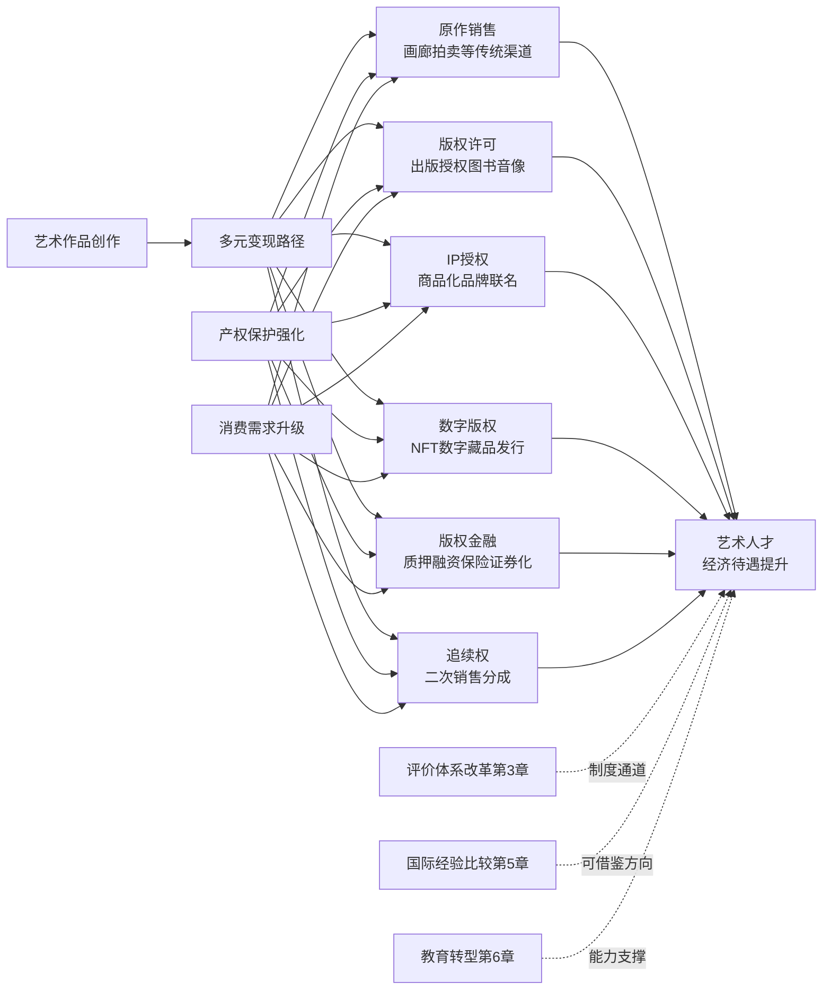

具体到价值变现机制的优化方向：

**第一是艺术经纪与中介服务专业化**。当艺术人才从"单件创作者"转变为"IP运营者"时，专业经纪机构的中介价值显著提升——画廊、拍卖行、版权代理、IP授权机构、数字藏品平台等中介服务可以放大艺术人才的市场议价能力。视觉中国"区块链+"战略的成功[^96][^97]即为艺术经纪专业化的典型样本。

**第二是版权运营机制的精细化**。从单纯的"卖断版权"转向"分阶段授权""分场景授权""分地域授权"等精细化运营。著作权法第三次修正确立的17项权利谱系[^79]为这种精细化运营提供了法律工具箱——艺术家可以选择仅授权信息网络传播权、保留改编权与摄制权，或仅许可二维平面使用、保留三维立体衍生开发权等。

**第三是版权金融工具的多元化**。八省市版权金融试点[^81]为版权质押融资、版权保险、版权证券化打开了制度入口——艺术家可以将版权作为抵押物获得融资支持，也可以通过版权保险对冲侵权风险，还可以将稳定的版权收益流证券化以加速资金回笼。这一金融化路径直接破解了第2章自由职业赛道艺术家长期面临的"轻资产、难融资"困境。

**第四是IP授权与品牌联名**。从故宫文创年销15亿、得力×《哪吒》联名、花西子"数字敦煌"等案例可以看到，**IP授权已从"附加性收入"演变为"主营业务模式"**。艺术家与商业品牌的联名合作，不仅放大了艺术作品的传播范围，也为艺术家提供了远超原作销售收入的版税分成空间。

### 4.7.3 双轮驱动的现实约束与系统性突破

需要客观指出的是，双轮驱动并非自动产生协同效应，仍受制于多重系统性约束。

**第一类约束来自评价体系（第3章）**——若评价体系仍以传统职称、单位身份、官方奖项为核心标尺，则市场端的IP开发成功难以转化为制度认可与长期收入稳定性。**第二类约束来自教育供给（第6章）**——若艺术教育仍偏向纯技法训练，则毕业生缺乏IP运营、版权管理、数字工具等复合能力，难以充分参与全链条价值变现。**第三类约束来自国际接轨（第5章）**——若中国艺术家的版权保护、追续权、二次销售分成等制度无法与国际通行规则对接，则跨境市场的价值释放将受到阻碍。**第四类约束来自监管完善**——情绪经济中的"伪疗愈"乱象、数字藏品市场的炒作风险、国潮领域的"贴标式"低端竞争等问题，都需要监管完善才能避免市场扩张转化为价值稀释。

针对这些约束，系统性突破的方向应当包括：**短期层面**——完善版权评估指引、推广电子存证、扩大惩罚性赔偿适用、建立调解前置机制；**中期层面**——研究追续权立法、建立艺术疗愈师等新职业认证体系、推进版权金融试点经验全国化推广；**长期层面**——构建艺术经纪与中介服务专业化体系、推动评价体系与产权保护协同改革、对接国际版权规则与艺术品市场。

### 4.7.4 本章小结与下章衔接

本章在第3章评价体系改革的制度通道之上，从产权保护与市场需求两个维度系统分析了艺术人才经济待遇提升的双轮驱动机制。**核心结论可以概括为三点**：

第一，中国艺术领域知识产权保护制度框架已相对完整，但**侵权赔偿偏低、地区判罚悬殊、追续权缺失、新兴业态认定滞后**等结构性短板仍对艺术人才收入稳定性形成显著抑制。第二，**情绪经济、艺术疗愈、国潮、博物馆文创、数字藏品**等新兴消费市场的扩张为艺术人才打开了万亿级需求空间，并通过文化自信支付意愿提升、IP全链条价值运营等机制结构性抬升艺术人才的议价能力。第三，**产权保护强化与消费需求升级形成相互强化的双轮驱动**，其协同效应正在重塑艺术人才价值变现路径——从"单件作品出售"向"IP全链条运营"、从"被动维权"向"主动金融化"、从"国内市场"向"国际接轨"转型。

然而，双轮驱动的系统性突破仍需国际经验的参照与本土实践的对接。第5章将系统比较美国、英国、德国、日本、韩国等国在艺术人才培养、职业认证、社会保障、市场培育、国际推广等方面的制度安排，归纳市场驱动型、政府主导型、行业自治型等不同模式，分析其对中国的可借鉴性与本土化适配空间——尤其是德国艺术家社会保险体系（KSK）、英国艺术疗愈职业认证体系、法国追续权制度、日本人间国宝制度等典型经验，将为中国艺术人才价值实现机制的完善提供具体方向参照。

# 5 艺术人才社会地位提升的国际经验比较

第3章揭示了中国艺术人才评价体系单一化对职业流动性与收入的传导锁定，第4章进一步剖析了产权保护短板与消费升级机遇并存下的双轮驱动机制。然而，无论是新文艺群体职称改革的破冰，还是版权金融试点的初探，本质上都是在中国制度语境内对既有体系的局部修补。**当艺术疗愈赛道的速成证书乱象与英国HCPC执业注册的1500小时门槛形成鲜明对照，当中国艺术家在全球拍卖前十中占据6席却因追续权缺失"分文未得"，当日本动画行业月薪9万日元、3年内离职率超90%的产业困境同样与中国动漫人才培养形成跨国镜像，国际经验便不再是可有可无的补充参照，而是理解中国制度短板与改革方向的必要坐标系**。本章将在前四章本土制度分析的基础上，将视野扩展至全球范围，依次剖析美国市场驱动型模式（5.1）、英国创意产业与艺术疗愈认证体系（5.2）、德国艺术家社会保险与公共资助机制（5.3）、日本人间国宝制度与动漫人才培养（5.4）、韩国文化创意产业振兴战略（5.5），随后归纳三类核心模式并结合教科文组织最新全球趋势（5.6），最终提炼国际经验对中国的可借鉴性与本土化适配空间（5.7），为第6章艺术教育转型与第7章综合政策建议提供国际参照系。

## 5.1 美国市场驱动型模式：基金资助、艺术管理职业化与全球艺术市场主导地位

美国是全球艺术市场的中心节点，也是市场驱动型艺术人才支持模式的典型代表。其核心制度逻辑在于——**政府公共资助维持基础生态，市场机制主导价值发现与人才筛选，高校与行业组织提供专业化中介服务**，三者协同构成艺术人才从培养到职业化的完整通道。

### 5.1.1 从NEA到院校奖学金：基础生态的公共资助

美国艺术资助体系采用"联邦基金—州资助—高校项目—私人基金会"的多层级架构。在高校层面，**威廉与玛丽大学的Catron奖学金由Louis E. Catron于1996年设立**，旨在支持学生在艺术创作和研究方面的探索，**单笔资助最高可达5000美元**，过去获奖者中"许多在艺术界取得了显著成就，例如2023年的获奖者Maria Garcia通过她的装置艺术项目，探讨了移民身份与文化认同，作品在纽约的一个知名画廊展出并获得广泛好评；2024年的获奖者David Lee则凭借其结合传统绘画技法与数字媒体的实验性作品，赢得了国际艺术竞赛的奖项"[^110]。俄亥俄大学的学生增强奖（SEA）计划则代表了"研究的定义是弹性的"这一资助理念——**研究不仅仅是为公众创造新知识，更是为自己创造新知识**[^110]。

资助机制的指导关系强化是另一关键特征。普瑞特艺术学院的Pratt>Forward计划与Refuge Art School的"Urban Healing"项目都强调了**导师关系对艺术家自信心和创造力培养的积极影响**[^110]。这种"资助+导师+实践机会"的三位一体模式，与中国高校的传统课程导向型培养形成显著差异，为艺术学生在校阶段就构建起进入产业网络的桥梁。

### 5.1.2 文艺研究组织的"基础设施型"运行机制

美国艺术人才支持体系的独特之处，还体现在文艺研究组织所扮演的"基础设施型"角色。美国的语言文学组织、艺术组织和文艺跨学科组织通过两类核心机制运作：**一是致力于提供可促进人文研究和教学的各类公共基础设施**——美国现代语言协会（MLA）成立于1883年，"会员至今已遍布世界一百多个国家，人数达两万余人"，1951年组织各人文领域学者讨论编撰《现代语言协会格式规范》，1977年发布更为完善的《现代语言协会研究论文和学位论文手册》[^111]；**二是设立并推行具有自主评判性、激励性与培育性的科研奖项**，并构建"具有包容性和相对平等的科研交流平台，设立涵盖包括年会和出版发表在内的以及囊括国际国内各种族和社会团体在内的多层次立体组织架构"[^111]。

这一组织机制的核心价值在于——**为学者和研究生形成了"自由而又相互促进的学术社区"，为各领域和各国的成员带来了归属感和认同感**[^111]。"第二次世界大战后，随着全球经济中心向北美转移，美国逐渐成为了全球文艺批评的中心，催生并播散了后殖民主义、后批评、环境人文和世界文学等批评潮流"[^111]——这一文艺中心的转移过程中，文艺研究组织的运行机制起到了关键支撑作用。

### 5.1.3 全球艺术市场主导地位与价值发现机制

美国艺术市场的全球主导地位，为艺术人才价值实现提供了无与伦比的市场化通道。著名艺术社会学家维多利亚·亚历山大在《十字路口的艺术》中指出，"在21世纪，艺术面临着各种因素带来的一系列挑战，其中首要的就是国际层面艺术市场的迅速扩张"；戴安娜·克兰则指出，**直到20世纪90年代，当代艺术的销售主要发生在纽约、巴黎、伦敦等几个最重要的大都会的艺术界内部**[^112]。

进入新世纪后的第一个十年，全球艺术市场体系已发生剧烈变迁。**就组织而言，双年展的数量从最早有限的威尼斯双年展、圣保罗双年展等增加到目前的超过150场，艺术博览会则从1970年代的3场增加到2018年的将近300场；就销售而言，艺术品尤其是重要或高价艺术品的销售逐渐集中在国际艺术博览会以及由大型拍卖行（以苏富比、佳士得为首）主导的拍卖市场这两个主要渠道，全球艺术博览会2018年的总销售额达165亿**[^112]美元规模。这一全球性艺术市场的形成"其影响力超出了主要城市艺术界"[^112]。

需要客观指出的是，美国主导的全球艺术市场虽然为顶尖艺术人才提供了高溢价兑现通道，但也带来了显著的不平等——这一议题将在5.6节结合教科文组织报告进一步展开。

### 5.1.4 艺术与可持续发展的交汇与社会责任溢价

美国艺术资助体系另一个值得关注的特征，是**艺术与可持续发展、社会责任的深度交汇**。巴西Inhotim博物馆中Olafur Eliasson作品、Julia Koerner的可持续设计等案例，"展示艺术在提升环保意识和社会责任方面的潜力"[^110]。这种"艺术+社会议题"的交汇为艺术人才打开了基金会资助、企业社会责任合作、跨学科研究等多元变现路径——艺术教育"面临的挑战"需要通过"跨学科合作和社会支持，确保艺术在未来继续发挥其独特价值"[^110]。

### 5.1.5 市场驱动型模式的核心启示

综合上述分析，美国模式的核心启示可以归纳为三点：**第一，公共资助维持基础生态而非主导评价**——NEA、高校奖学金等公共资助为艺术人才提供"试错空间"，但价值发现主要交由市场完成；**第二，研究组织的基础设施型角色**——通过格式规范、学术平台、奖项体系等公共品供给，为艺术人才形成自由而相互促进的专业社区；**第三，艺术市场化与艺术管理职业化的深度融合**——纽约作为全球艺术中心、苏富比佳士得拍卖行体系、艺术管理4万至10万美元年薪的多元岗位结构（详见第2章2.2.3节），共同构成了市场化机制下艺术人才价值兑现的成熟通道。这些特征对中国艺术市场化与艺术经纪专业化具有直接的借鉴意义，但也需要警惕市场驱动可能带来的不平等加剧问题。

## 5.2 英国创意产业政策与艺术疗愈职业认证体系

如果说美国模式以市场为主导，英国模式则呈现出**"政府引导+行业自治+市场化执行"的混合特征**——英国艺术理事会的资助机制提供基础保障，HCPC等独立监管机构提供专业认证背书，BAAT等行业协会提供专业自治平台，三者协同构成创意产业人才支持的"三角架构"。其中，艺术疗愈作为最典型的"行业自治型"职业认证案例，对中国艺术疗愈赛道认证空白填补具有最直接的参照价值。

### 5.2.1 HCPC—BAAT双重认证：艺术疗愈职业化的核心制度

英国艺术疗愈师的职业化通道建立在"硕士学历+HCPC注册+BAAT会员"的三重门槛之上。**HCPC即英国的医疗保健专业委员会，是一个法定的监管机构，拥有来自英国15个医疗保健专业的280,000多名专业人员**——相关医疗保健人员需要完成其批准的教育和培训计划，然后向HCPC进行注册；注册完成后，才能在相关领域开展工作[^113]。这一强制性注册机制确保了"未经注册不得执业"的制度刚性，从根本上遏制了无证执业与速成证书乱象。

在教育端，**英国艺术疗愈硕士是心理学与艺术跨界融合的两年制专业，受英国健康与护理专业委员会（HCPC）认证，毕业生可注册为专业艺术治疗师，服务自闭症儿童、创伤患者等群体**[^114]。课程结构高度规范化——以伦敦大学金史密斯学院MA Art Psychotherapy为例，**英国顶尖两年制艺术疗愈项目，受HCPC&BAAT双认证，课程融合心理动力学理论与当代疗愈实践，含两次60天临床实习**[^114];以布鲁内尔大学Art Psychotherapy MA为例，"课程融合艺术创作与临床心理学，旨在培养具备跨文化敏感性和循证实践能力的艺术疗愈师，学生将参与两次临床实习（共120天），在NHS、社区机构等真实场景中应用技能"[^114]。

申请门槛同样体现了对专业实践能力的严格要求。**金史密斯学院要求"一年全职工作经验或者1500小时相关工作经验"**[^114][^115]，布鲁内尔大学"建议提供12个月的综合相关工作经验，可以是在卫生、社会服务、教育、特殊需要、社区中心或慈善机构的志愿工作"[^114]，罗汉普顿大学要求"申请者在过去5年内最好要有相关临床经验，增加录取机会"[^114][^115]。德比大学的招生规模严格控制——**每年仅提供30个招生名额**[^115]——以保障教学质量与个性化指导。

下表汇总了英国主要艺术疗愈硕士项目的核心要求：

| 院校 | 学制 | 学术要求 | 工作经验要求 | 临床实习 | 认证 |
|------|------|---------|------------|---------|------|
| 金史密斯学院 | 2年 | 2:1学位/均分80% | 1年全职或1500小时 | 60天×2次 | HCPC+BAAT |
| 布鲁内尔大学 | 2年 | 2:2学位/均分70-75% | 建议12个月相关经验 | 120天 | HCPC |
| 罗汉普顿大学 | 2年 | 2:2学位 | 过去5年内有临床经验 | — | HCPC |
| 德比大学 | 2年 | 本科学位 | 1年相关公共经验 | — | HCPC+BAAT |
| 切斯特大学 | 2年 | 本科学位 | — | 60天×2次 | HCPC+BAAT |

数据来源：英国艺术疗愈硕士申请指南综合整理[^114][^113][^115]

### 5.2.2 就业生态与薪酬保障：NHS体系与多元出口

HCPC—BAAT双重认证的实质效力体现在就业生态的稳定性。"英国对艺术治疗师的需求稳定增长，尤其在公共卫生（NHS）、教育系统（特殊教育/学生心理健康）、社会服务（社区中心、难民支持）和司法领域（监狱、青少年管教机构）均有岗位空缺。毕业生还可选择私人执业，服务高净值客户或开设工作室"[^115]。

薪酬层面，**根据BAAT数据，经验丰富的艺术治疗师年薪可达£35,000-£45,000，NHS体系内职位更提供养老金等福利**[^115]。这一薪酬水平虽不及美国LCAT执照体系（详见第2章引述美国艺术疗愈师年均收入约48,368美元），但其NHS体系的养老金福利提供了显著的职业稳定性溢价——这一点对依靠市场化收入的自由职业艺术家而言尤为珍贵。

值得关注的是英国制度的国际化适配性提示——"国际学生需注意：部分国家（如中国）尚未建立完善的行业认证体系，回国就业需结合本土心理咨询资质，但新兴的私立医院、高端疗愈机构及国际学校正逐步引入这一职业角色"[^115]。这一提示一方面揭示了中国艺术疗愈赛道的认证空白（与第3章3.4.1节呼应），另一方面也指明了中国市场对国际化标准人才的现实需求。

### 5.2.3 浪漫小众专业的制度严谨性

艺术疗愈在文化层面被视为"浪漫小众专业"——"艺术治疗，是透过音乐冥想、艺术涂鸦与创作、身体雕塑、演剧、重新创作等过程来演绎自己的生命故事，藉此展现艺术的穿透力。从艺术创作中可以达到沟通、心理宣泄与心理治疗的效果"[^113]。但在英国制度框架下，这一"浪漫专业"的职业化路径却高度严谨——"**艺术治疗专业与其他专业不同的是，这个专业需要有专业机构的认证才能开设的，并不是学校排名够好就能够招生**"[^113]。

申请材料的复杂性进一步体现了制度严谨性：除常规推荐信、个人声明外，"还需要提交DBS（Disclosure and Barring Service，也就是我们说的无犯罪记录证明）、一份作品集（面试的时候会被要求讨论自己的作品集）、个人治疗的经验（理想情况下）"[^113]。这种对"无犯罪记录+作品集+个人治疗经验"三位一体的把关机制，确保了从业者具备专业能力与伦理素养的双重资质。

### 5.2.4 英国模式对中国的可借鉴路径

将英国艺术疗愈认证体系与第3章3.4.1节揭示的中国"20天速成证书+初级2380元/中级2580元/高级2880元"乱象对照可以看到，**两套体系的根本差异在于"是否存在国家强制性专业注册制度"**。英国HCPC作为法定监管机构的注册要求，从源头上杜绝了"机构自主定价、最快20天拿证"的认证乱象；而中国当前缺乏国家层面的艺术疗愈师职业资格目录，使得培训机构得以自主定价、自主发证，市场出现"劣币驱逐良币"的失序状态。

借鉴英国模式的本土化适配路径可以归纳为四个层面：**第一，建立国家层面的艺术疗愈师职业资格认证**——参照HCPC模式，在国家职业分类大典中明确该职业，由人社部或国家卫健委担任主管机构；**第二，规范教育准入**——参照"两年制硕士+1500小时工作经验+60-120天临床实习"框架，在中央美术学院等已开设艺术疗愈课程的院校基础上，建立标准化培养体系；**第三，依托行业协会自治**——参照BAAT模式，由行业协会负责会员发展、伦理监督、继续教育等专业化服务；**第四，对接医保与企业EAP通道**——参照NHS体系，扩大第2章所述四川省医疗保障局"音乐疗法"医保试点经验，并对接企业EAP采购，为认证艺术疗愈师提供稳定的就业出口。这一路径将与第7章政策建议形成具体对接。

## 5.3 德国艺术家社会保险体系（KSK）与公共艺术资助机制

德国模式的核心特色在于**国家通过社会保险制度兜底自由职业艺术家的基本社会保障**——这是市场驱动型模式（美国）与行业自治型模式（英国）都未能充分解决的"自由职业者保障难题"的德国答案。理解德国艺术家社会保险体系（KSK）的制度逻辑，需要先理解德国社会医疗保险整体框架的特点。

### 5.3.1 德国社会医疗保险体系的制度基础

德国是世界上最早建立社会保障制度的国家。**德国实行的是一种强制性的、以社会健康保险为主、辅之以商业保险的医疗保险制度，这种强制性的社会健康保险制度覆盖了德国91%的人口，加之商业保险的作用，德国整个健康保险制度为其99.8%的人口提供了医疗保障**[^116]。

制度模式上呈现两大核心特征。**第一是"统一制度、分散管理、鼓励竞争"的管理体制**——"德国的社会健康保险制度由1300个财务上独立、自我管理的疾病基金组成，强调社会团结互助，政府不参与社会医疗保险的具体操作。国家也没有统一的医疗保险经办机构，政府的主要作用就是设计制度和制定相关法律，担当中介及进行仲裁"[^116]。**第二是"法定保险（强制）为主、私人保险（自愿）为辅"**——"在德国，公民就业后可视其经济收入多少，自由地在法定的社会医疗保险和私人保险之间进行选择"[^116]。

保障水平的高度则建立在德国雄厚的经济实力之上。**"德国是世界上领先的工业化国家之一……德国共有2300多个医院，计60多万张病床，以及1000多个预防和康复机构。其中由政府或者公益性组织如教会承办的医院，其床位数占总数的80—90%"**[^116]。"参加法定保险的被保险人（包括其家属和未成年人）在患病时，不管其当时经济状况如何，都可以得到及时、免费或几乎免费的治疗，就诊时一般毋须支付现金"[^116]。这一制度框架为艺术家社会保险体系（KSK）提供了制度基础——KSK本质上是德国整体社会医疗保险制度在艺术家这一特殊职业群体上的专门化延伸。

### 5.3.2 KSK的制度设计与艺术家社保结构

德国艺术家社会保险体系（Künstlersozialkasse, KSK）是德国为破解"自由艺术家社会保障缺失"难题而设计的专门化制度。其核心机制可以概括为——**艺术家本人按职业艺术家身份纳入法定社会保险体系，缴纳的保费由艺术家自付一半，国家与艺术品使用者（出版社、画廊、广告公司、剧院等）共同承担另一半**，从而使自由艺术家在医疗、养老、护理保险方面与受雇佣员工享受同等保障。

虽然搜索结果中关于KSK的具体细节有限，但结合德国整体医疗保险制度的"强制覆盖99.8%人口"特征[^116]可以推断，KSK的制度功能在于**将自由职业艺术家——这一传统社保体系覆盖盲点群体——通过专门化制度安排纳入德国"全民保障"框架**，体现了"个体必须服从于社会责任，国家必须发挥在市场经济中的主要调节任务"[^116]这一社会市场经济基本理念。

### 5.3.3 德国追续权制度与著作权保护协同

德国在艺术家产权保护层面同样具有标杆意义。**《联邦德国著作权法》第二十六条规定"如果造型艺术作品的原作被再次让与并且有艺术商或拍卖商作为受让人、让与人或中间人参与，让与人应将让与所得收入的5%付给权利人"**（详见第4章4.3.1节引述）。这一5%追续权与法国3%形成欧洲大陆法系国家对追续权制度的共同立法承认，构成《伯尔尼公约》对等保护原则下中国艺术家在德国艺术品市场行使追续权的前提条件——但前提是中国本土立法承认追续权。

**德国艺术家保障的双轮结构**因此呈现出清晰的逻辑：**社会保险（KSK）兜底基本生存保障**，**追续权（5%二次销售分成）保障长期收益分享**，两者协同确保艺术家在不同生命阶段、不同收入波动下都能获得稳定的制度性保障。这一双轮结构与第4章4.7节归纳的"产权保护强化+消费需求升级"双轮驱动机制形成跨制度层面的对照——德国是在"社会保障+产权保护"维度构建双轮，中国则是在"产权保护+消费升级"维度探索双轮，两者各有侧重但都体现了多机制协同的制度智慧。

### 5.3.4 政府主导型模式的制度逻辑与社会基础

德国艺术家保障体系的成功，根植于"社会市场经济"的整体制度框架。**德国奉行的是"社会市场经济"的政经制度，该政经制度要求国家在尽可能只给予必要干预的前提下，保障个人首创性的自由发挥和私有财产基本权利，同时个体必须服从于社会责任，国家必须发挥在市场经济中的主要调节任务**[^116]。

这一社会基础对中国借鉴德国模式具有重要启示——**KSK等专门化社会保障制度并非孤立的"艺术家政策"，而是嵌入整体社会保障体系的有机组成部分**。中国若要借鉴德国经验，需要考虑两个层面的制度协同：一是整体社会保障体系（医保、养老、工伤等）的覆盖完整度，二是针对自由职业艺术家的专门化制度安排。当前中国正在推进新就业形态劳动者职业伤害保障试点，第3章3.3.1节亦提及天津2025年艺术系列职称评审已将"新就业形态劳动者、自由职业者"纳入参评范围——这些试点为借鉴KSK模式提供了制度接口。

### 5.3.5 德国模式对中国的可借鉴路径

德国模式对中国的可借鉴价值集中体现在三个方面：**第一，构建艺术家专门化社会保障制度**——参照KSK"艺术家自付50%+国家与艺术品使用者共担50%"的费率结构，探索由文旅部门、文联、人社部门协同推动的中国艺术家社会保险试点，覆盖第2章所述自由职业、个人工作室、独立艺术家等新文艺群体；**第二，推动追续权立法**——参照德国5%追续权与法国3%追续权的对等保护原则，在《著作权法》第四次修正中纳入追续权条款（与第4章4.3.4节呼应），破解中国艺术家"在全球艺术家拍卖前十中占据6席却分文未得"的制度困境；**第三，强化公共艺术资助的稳定性**——德国联邦文化基金会、地方艺术资助等公共资助体系为艺术人才提供了稳定支撑，与美国市场驱动型模式形成互补。这些借鉴方向将在5.7节进一步整合为系统化方案。

## 5.4 日本人间国宝制度与动漫产业人才培养机制

日本模式呈现出独特的"双轨结构"——**一方面通过人间国宝制度保护传统工艺与表演艺术的顶尖传承者，另一方面通过动漫产业人才培养应对现代创意产业人才短缺**。这两条轨道各有制度逻辑，但都体现了"全社会动员"的政府主导特征，对中国非遗传承人评价与动漫产业人才培养均具有可借鉴价值。

### 5.4.1 动漫产业人才困境：高离职率与生存危机

日本动漫产业的人才困境为理解其培养机制提供了现实背景。"动画市场规模超2兆日元的日本，在'人才困境'中也已经挣扎多年"[^117]。**根据NPO法人动画人支援机构（アニメーター支援機構）官网公布的信息，日本动画人3年以内的离职率高达9成，原因是贫困以及严酷的工作环境对身体的摧残；20多岁的年轻动画人每月平均收入只有9万日元（约合人民币5400元）**[^117]。

2016年非营利性组织AEYAC（年轻层动画制作者应援会）发布的《2016年度年轻动画人生活实态调查报告书》进一步揭示，"这些年轻动画人中的大部分人无法积攒存款，另一部分人面临存款用尽的状况，只有少数人不担心生活费的问题"[^117]。**人才流失的产业后果同样严峻——"截至10月，今年已有6家日本动画制作公司倒闭"**[^117]。"对于大量的中小企业而言，订单增加的时候，需要雇佣更多的人手或者培育新人，甚至寻求外包，从而造成成本增加利润减少。同时，人手不足带来的产能萎缩，也给原本就处于同行竞争导致订单量下降困境中的小型制作公司造成巨大压力"[^117]。

中国传媒大学薛燕平老师在动画纪录片《蝉噪林愈静》中向中国动画从业者提出过一个问题："**中国动画最不缺什么？**"——回答中"什么都不缺""什么都缺"这样极端的答案频现，**但有一点却是被提及最多的话题——人**[^117]。"相比于迪士尼、皮克斯精细化的分工，国内的制作团队构成更加'精简'。而国内目前无法支撑好莱坞式细致分工的原因之一，便是人才的不足"[^117]——这一中日动画产业人才困境的跨国共鸣，使日本经验对中国具有直接的参照价值。

### 5.4.2 全社会动员的人才培养体系

面对人才困境，日本动画行业形成了"政府—企业—行业组织—民间"的全社会动员格局。"作为日本最重要的产业之一，动画人才培养得到了全社会的关注。上到政府，下到民间企业、团体，甚至普通民众，不同的人从不同角度，提出和实施了多元化的方案"[^117]。

**政府主导层面，文化厅2010年开始制定"新人动画师培养计划"**（若手アニメーター育成プロジェクト）——"基于日本关于文化艺术的振兴的基本方针……并委托日本动画师演出协会实施"[^117]。计划针对的核心问题是"动画产量增加、数字化伴随的工作日程恶化、过度的海外外包等导致的前辈对后辈指导教育缺失，新人进阶困难，优秀动画师培养难度增加；新人动画师长期过劳、低收入水平加速了人才的流失；动画人才高龄化等问题"[^117]。

**培养计划的核心机制创新在于"提供相比商业动画拥有更充足时间和预算的项目"**——"除了达到让新人有充足时间学习成长，也使动画制作公司脱离外包制度，提供让导演制作原创作品的机会，也是有意识的对商业流程中合同、日程等问题进行"改善[^117]。从2000年开始实施至今，**由日本政府主导的新人动画师培养计划共完成了36部成品，作品中包括《小魔女学园》、《死亡台球》等超过四部作品得到了后续系列化，培养了超过232名新人动画师**[^118]。计划也曾两次更名，"现正式名称为动画之蛋（あにめたまご）"[^118]。

需要客观指出的是，"即使是政府主导，计划也不是一帆风顺。2014年主办方变更，导致计划结构重组，新人动画师的征募条件更改，并追加了推荐考试制度。而对于预算等问题，也有许多业界人士提出了包含制作、商品化、宣传等费用预算并不充足的质疑"[^118]——这一现实提示，即便是相对成熟的政府主导型培养计划，仍面临持续优化的现实挑战。

### 5.4.3 公司养成所与行业自治型培养实验

日本动画公司的养成所模式提供了另一类可借鉴样本。"养成所是日语中的用法，多用于培养专业人员、行业人才等设施的称呼，即中文意思中的培育学校。**日本动画公司的培育学校一般都是由本公司的老员工担当教师，课程时间为1年**"[^118]。

具体案例颇具代表性。**京都动画公司养成所成立38年，已经办到了第28届，公司中绝大部分的新人都是通过自己的养成所培育而来**[^118]。**P.A.Works本社2018年春开设P.A养成所，2019年4月1日入社式上有4名第一批学员正式加入P.A.Works本社**[^118]。**SUNRISE作画培训学校"在2018年的十多个学生中，有9人在课程结束后都直接被SUNRISE签约"**[^118]——这一极高的签约比例直观体现了养成所"招纳新人"的实质效力。

行业自治型实验则以"日本动画人博览会"为代表。**2014年11月，NICONICO动画母公司DWANGO与Khara共同推出了无商业性质的短篇动画制作企划"日本动画人博览会"（日本アニメ(ーター)見本市）**——"制作的动画类型不限，有原创动画、外传动画、宣传动画和音乐动画等。作为企业主导的动画实验企划，虽然不是明确的指向新人培养，但是很多新人都参与到了企划中，并在动画制作中得到成长"[^118]。**新人导演吉崎响是其突出案例——他的动画作品《ME!ME!ME!》在播出后广受欢迎，让他本人名声大噪。2014年到2016年，企划推出了35部不同类型的短篇**[^118]。

### 5.4.4 人间国宝制度与传统艺术人才保障

日本传统艺术领域的"人间国宝"（重要无形文化财保持者）制度则代表了政府主导型评价体系的另一典型样本。虽然搜索结果中对该制度的具体细节描述有限，但其制度逻辑可以归纳为——**国家对传统工艺、表演艺术等领域顶尖艺术家的认定、年金支持与传承资助机制**，体现了政府主导型评价体系对传统艺术人才社会地位的制度保障。

这一制度的核心价值在于：**第一，国家级权威认定为传统艺术家提供超越市场的社会地位**；**第二，年金支持解决传统艺术家在市场化时代收入不稳定的现实困境**；**第三，传承资助机制确保稀有技艺与表演艺术不因市场冷遇而失传**。这种"评价+保障+传承"三位一体的制度设计，对中国非遗传承人评价体系建设具有直接的参照价值。

### 5.4.5 日本模式对中国的可借鉴路径

日本模式对中国的借鉴价值体现在三个方面：

**第一，借鉴新人动画师培养计划构建中国动漫产业人才培养专项**。中国动漫产业同样面临人才困境（详见第1章关于AI冲击与岗位重构的讨论、第2章关于游戏与动漫人才需求的分析）。借鉴日本"政府主导+委托行业协会实施+提供超出商业项目的时间预算"的培养机制，可以由文旅部委托中国动漫艺术家协会等行业组织实施类似项目，**重点解决新人动画师"前辈指导缺失、长期过劳低收入"的现实困境**。

**第二，借鉴公司养成所模式推进产教融合深化**。京都动画、P.A.Works、SUNRISE等养成所"老员工担当教师+1年课程+高比例签约"的模式，与第6章将讨论的中国产业学院、产教融合模式存在天然契合点。借鉴养成所经验，可以推动中国头部动漫游戏企业（如米哈游、网易、腾讯）与高校共建专业培养基地，**在校企合作深度上从"实习基地"向"养成所"升级**。

**第三，借鉴人间国宝制度优化非遗传承人评价机制**。第3章揭示了中国艺术系列职称改革已将网络作家、独立美术工作者纳入评审范围，但**对非遗传承人这一特殊群体的国家级认定机制仍有完善空间**。借鉴日本人间国宝的"国家认定+年金支持+传承资助"三位一体设计，可以在现行国家级非物质文化遗产代表性传承人制度基础上进一步完善年金支持与传承资助机制。

需要客观指出的是，日本动画产业的人才困境本身也是借鉴的"反向警示"——即便是政府全社会动员，也未能从根本上扭转动画师月薪9万日元、3年内离职率超九成的产业现实。**这提示中国在借鉴日本经验时，需要警惕"路径依赖"——仅靠人才培养而不解决产业链利益分配机制（如制作委员会模式中底层动画师权益被压缩的问题），人才培养计划很难从根本上扭转人才流失趋势**。这一启示与第4章产权保护、第7章产业生态构建的讨论形成内在一致的逻辑指向。

## 5.5 韩国文化创意产业振兴与K-Content全球输出战略

韩国模式是政府主导型创意产业政策的全球标杆。"在亚洲，一些城市很早就确定了城市发展要走好文创这条路的方向"[^119]，韩国通过"文化立国"国家战略、完整的法律支撑体系、三位一体的管理机制和强有力的财税扶持，将文化产业打造为21世纪国家竞争力的核心。这一模式对中国文化产业政策体系完善与国际化推广具有最系统化的借鉴价值。

### 5.5.1 历届总统重视：文化立国的政策连续性

韩国文化产业振兴的首要特征是**国家战略的政策连续性**。"早在上世纪80年代，时任韩国总统的全斗焕就在第六个经济社会发展五年计划有关文化政策目标的内容当中明确指出，文化是'国家发展的动力'"[^120]。"1988年后，韩国陆续经历了六位总统，分别是卢泰愚、金泳三、金大中、李明博和朴槿惠"[^120]——多届政府的连续重视，形成了文化政策"接力推进"的稳定格局。

朴槿惠总统在2013年2月总统就职仪式上"阐明了'经济复兴、国民幸福、文化昌盛'的3大治国纲领，其对文化产业格外关注"[^120]。**2016年朴槿惠在主持首席秘书会议时，专门提及韩剧《太阳的后裔》——"称其不仅是对外宣传韩国文化的窗口，更提升了海外游客对韩国的关注。此外，朴槿惠还对《太阳的后裔》通过'先拍后播'制播模式，顺利在中韩两国掀起'观剧热'，并成功推动版权出口等给予高度评价"**[^120]。这种总统级的政策关注度，是中国文化产业政策推进者较少能企及的政治资源高度。

### 5.5.2 法律支撑体系：构建文创产业的制度基石

韩国文化产业的法律支撑体系相当完整。"在提出'文化立国'的战略后，韩国先后制定或修订了**《文化产业振兴基本法》《影像振兴基本法》《著作权法》《电影振兴法》《演出法》《广播法》**等多部法律，提出了振兴文化产业发展的基本方针政策，并形成了推动文化产业发展的法律体系"[^120]。"早在1998年，韩国就正式提出了'文化立国'战略。历任总统在这个战略的基础上，先后出台了**《文化产业促进法》《文化产业发展五年计划》《文化产业振兴基本法》《广播影视振兴基本法》《游戏产业振兴法》《著作权法》**等一批文创产业相关的基本法"[^119]。

"随着现实情况的改变，韩国有关部门陆续对一些法律进行了部分或全面修订，为文化产业的发展提供优质保障"[^119]。这种"专门立法+持续修订"的法律供给模式，与中国当前"以《著作权法》为核心+若干部门规章"的制度框架形成显著差异——**韩国的产业立法直接针对电影、游戏、广播等具体产业制定专门法律，制度供给的精度与针对性显著高于综合性立法模式**。

### 5.5.3 三位一体管理机制与多元支持职能

韩国采用了独特的"三位一体"文创产业管理机制。"**第一层是文化体育观光部下设具体的运营机构，如委员会、委托的运营机构以及营利的公司企业；第二层是运营机构下设的特殊法人，如各类振兴院和振兴委员会等；第三层是社团法人、财团法人等民间中介机构。3个管理层级各司其职，共同推进韩国文创产业的发展**"[^119]。

具体到组织演进——"一直以来，韩国政府都把发展文化产业列为政府的法定职能，由文化体育观光部负责管理文化艺术等相关业务。1994年，该部门细分出文化产业局；2000年，韩国文化产业振兴委员会成立，专门负责文化产业政策制定的宏观把控；次年，韩国又成立了文化内容产业振兴院"[^119]。

文化内容产业振兴院承担着相当全面的职能——"该机构从多个角度入手，提供了文创产业发展所需的各方面支持，比如**市场调查与统计工作；专门人才的培养与教育；相关技术的开发与管理；创业、经营与进军海外市场的指导；国内外文创资料的归集与保存；文创商品使用者权益保护**等"[^119]。这一"统一机构+全链条职能"的设计，为艺术人才提供了从培养、就业、创业、出海到维权的一站式公共服务，与中国当前文化政策分散在文旅部、广电总局、版权局、新闻出版总署等多个部门的"多头管理"格局形成显著对照。

### 5.5.4 财税优惠与专项基金的产业激励

韩国对文化产业的财税扶持力度相当可观。"韩国文化产业相关的税收政策包括公司所得税、不动产税、财产税、个人所得税、综合土地税等多个领域，在税收优惠形式上以减免为主"[^120]。具体优惠条款包括——**"创新文化企业享受2年内减免75%的不动产取得税；5年内免除财产税和减免综合土地税等等。正是这些税收政策，保证了韩国文化创新企业税负较低，从而产生更大的经济附加值"**[^120]。

专项基金布局同样力度空前。"**2015年，韩国文化体育观光部宣布，将相关资金从1.2亿美元提升至2.2亿美元，增幅超过80%；为促进韩国文化产业进军海外市场，韩国还设立了种子基金**"[^120]。游戏产业作为重点扶持领域获得专门基金支持——"韩国游戏产业规模居全球第4位，收益率极高，占据了文化内容产业出口规模的一半以上，被视为朝阳产业。此前，为了推动其发展，韩国还专门设立了'游戏产发展基金'"[^120]。

奖励机制层面，"韩国加大了对数字游戏、动漫、移动网络以及信息技术等文化产业众多领域的财政奖励支持的力度。其中比较知名的奖项包括总统奖（最高奖项）"[^120]等。这种"总统奖+财税减免+专项基金"的多层激励，形成了对文化产业人才与企业的强大吸引力。

### 5.5.5 艺术村与创意聚集：Heyri模式

韩国文化产业的载体建设同样具有特色。"**韩国还在城市中构建了各具特色的文创园区和艺术村落。其中，最有代表性的就是Heyri艺术村**"[^119]。"艺术村所在的统一东山区原先是政府借助印刷产业所发展的'书画村'，后来随着越来越多的艺术家加入社区建设，逐渐被定位成了一个全新的艺术家村落"[^119]。

Heyri模式的独特性在于其"慢工出细活"的建设过程。"这个艺术村的建设过程持续了较长时间，可谓'慢工出细活'，因为社区成员们希望将这里建成为一个稳定、成熟的供艺术家们思想交互的空间"[^119]。**社区治理结构相当完整——"这个占地面积并不算大的社区有着完整的组织体系负责社区的运作，包括行政委员会、秘书处、村协会、管理政策及建筑与环境委员会等，分工明确。在艺术村里，成员通过例会交流问题，分享、体验并处理大小事宜"**[^119]。

这一艺术村模式与第2章2.4节所述中国"碧山计划""许村模式""蔡家沟村"等乡村艺术振兴实践形成跨国对照——**Heyri艺术村强调"艺术家自治+社区共建"，而中国艺术乡建则更多体现"政府引导+艺术家介入+村民参与"的三方协作**，两种模式各有特色，借鉴价值在于Heyri的社区组织化经验对中国艺术家聚集地建设具有直接参照意义。

### 5.5.6 韩流与K-Content的全球输出机制

韩国文化产业振兴的最终成果是K-Content的全球输出。"韩剧是中国观众最常接触的韩国文化产品，从早期的《蓝色生死恋》到《冬季恋歌》，从《大长今》到《继承者们》，从《来自星星的你》到《匹诺曹》再到近日大热的《太阳的后裔》，爆款韩剧总是不断出现"[^120]。**"经过多年的发展，文化产业已经成为了韩国经济发展的战略性支柱产业，也是该国在21世纪最有发展活力和出口竞争力的产业之一"**[^119]。

韩国文化产业全球化的核心机制可以归纳为"国家战略制定+法律体系保障+财税持续投入+专门机构支持+海外市场开拓"。"在网络化、信息化、全球化的时代背景下，韩国与时俱进地将平面化的文化产业不断发展为立体生动的'内容产业'，牢牢占据着相当数量的世界文创产业的市场份额"[^119]。**"近年来韩国还大力吸收外国投资，缓解国内资金紧张，以促进文化产业的发展"**[^120]——这一开放性机制确保了韩国文化产业的资金充裕度与国际化对接深度。

### 5.5.7 韩国模式对中国的可借鉴路径

韩国模式作为政府主导型创意产业政策的标杆，对中国的借鉴价值最为系统化。**第一，借鉴"文化立国"战略提升文化产业的政策位次**——将艺术人才培养与文化产业发展上升为更高位次的国家战略，形成多届政府接力推进的政策连续性。**第二，借鉴专门立法补强中国文化产业法律体系**——在现有《著作权法》基础上，研究制定文化产业振兴专项立法，覆盖电影、游戏、动漫、网络文学等具体产业。**第三，借鉴"三位一体"管理机制整合文化产业公共服务**——参照韩国文化内容产业振兴院模式，整合现有分散在多部门的文化产业公共服务职能，形成"统一机构+全链条职能"的服务体系。**第四，借鉴财税优惠与专项基金扩大产业激励**——针对创新文化企业实施持续性税收减免，扩大文化产业专项基金规模，并向新兴赛道（如AI内容、数字藏品、艺术疗愈）倾斜。**第五，借鉴Heyri艺术村模式优化中国艺术家聚集地建设**——在第2章2.4节所述中国艺术乡建实践基础上，强化社区自治组织建设，提升艺术家聚集地的可持续性。

需要客观指出的是，韩国模式的成功有其特殊的国情条件——韩国作为人口约5000万的中等规模国家，文化产业的国际化输出具有"小国大业"的天然张力；中国作为超大规模文化市场的国家，文化产业政策的设计需要平衡国内市场培育与国际输出双重目标。这一国情差异是借鉴韩国经验时必须考虑的本土化适配挑战。

## 5.6 三类核心模式比较与全球创作者保护趋势

在5.1—5.5节五国国别分析基础上，本节归纳三类核心模式的制度逻辑，并结合教科文组织最新报告揭示的全球趋势，呈现国际艺术人才保护的最新动向。

### 5.6.1 三类核心模式的制度逻辑与运行机制

基于五国实践可以归纳出三类核心模式：

**市场驱动型（美国为典型）**——以全球艺术市场主导地位、苏富比佳士得等成熟拍卖体系、艺术管理职业化、私人基金会与高校奖学金为支撑，市场机制主导价值发现，政府公共资助维持基础生态而非主导评价。其制度优势在于**激发顶尖艺术人才的市场化收益空间**，劣势在于自由职业艺术家的社会保障相对薄弱、不平等加剧风险显著。

**政府主导型（德国、日本、韩国为代表）**——通过国家战略、专门立法、公共保障制度、政府主导培养计划等机制，由国家承担艺术人才支持的核心责任。德国侧重"社会保障+追续权"双轮，日本侧重"人间国宝+动漫产业培养"双轨，韩国侧重"文化立国+三位一体管理+全球输出"系统化布局。其制度优势在于**自由职业艺术家保障完整、传统艺术传承稳定、产业政策力度集中**，劣势在于政府评价主导可能压抑艺术多元性、官僚化运作影响政策灵活性。

**行业自治型（英国混合模式为代表）**——通过独立监管机构（HCPC）、行业协会（BAAT）、艺术理事会等专业自治组织，将国家强制性认证与行业自治、市场化执行相结合。其制度优势在于**专业化程度高、伦理监督严格、新兴职业认证规范**，劣势在于对小众艺术形态的覆盖范围有限、行业自治组织本身的代表性问题。

下表汇总了三类模式在五个核心维度上的差异：

| 维度 | 市场驱动型（美国） | 政府主导型（德/日/韩） | 行业自治型（英国混合） |
|------|----------------|-------------------|------------------|
| 评价体系 | 市场认可主导 | 国家认定+市场补充 | 行业认证+市场认可 |
| 职称与执照 | 艺术管理职业化 | 人间国宝/特殊法人体系 | HCPC执照注册 |
| 社会保障 | 自由市场保障+私人保险 | KSK艺术家社保 | NHS体系覆盖 |
| 版权保护 | 集体管理+诉讼维权 | 追续权立法（德5%/法3%） | 集体管理+协会维权 |
| 消费市场培育 | 私人资助+市场自发 | 政府基金+产业振兴 | 艺术理事会+创意产业政策 |
| 全球地位 | 全球艺术市场中心 | 韩流K-Content/日漫输出 | 创意产业先行者 |

### 5.6.2 全球创作者保护趋势：教科文组织2026年报告

将国别比较置于全球趋势中观察更具洞察价值。**联合国教科文组织2026年发布的《重塑创意政策》报告作为持续10年的全球基准，整合120多个国家数据，呼吁"在人工智能和数字变革重塑创意产业之际，重振并加强对艺术家和文化专业人士的支持，并提出一份涵盖100多项政策措施的蓝图"**[^121]。

报告揭示的核心趋势包括五个层面：

**第一，文化产业的政策位次仍未充分提升**。"虽然85%的受访国家将文化和创意产业纳入了国家发展计划，但只有56%的国家设定了具体文化目标——这体现了一般性承诺与实际行动之间的距离。全球范围内，政府对文化的直接公共资助仍然极低，不到GDP的0.6%，并持续下降"[^121]。这一数据表明各国对文化产业的政策承诺与实际投入之间存在显著落差。

**第二，文化贸易的南北差距加剧**。"2023年，全球文化产品贸易额翻倍，达到2540亿美元，其中46%的出口来自发展中国家。然而，在文化服务贸易方面，发展中国家在全球贸易额中的占比仅略高于20%，反映出市场数字化转型带来的差距扩大"[^121]。这一差距对中国艺术家国际化具有直接启示——**中国作为发展中国家最大经济体，需要在文化服务贸易（而非仅文化产品贸易）的全球布局上加大投入**。

**第三，签证壁垒限制艺术家国际流动**。"持续的'签证壁垒'限制了艺术家的流动：96%的发达国家支持本国艺术家向外流动，但仅有38%的国家为来自发展中国家的艺术家入境提供便利"[^121]。这一不对称性对中国艺术家的国际推广构成了制度性挑战。

**第四，AI对创作者收入的冲击迫近**。"数字收入目前占创作者收入的35%，高于2018年的17%，标志着伴随收入不稳定和知识产权侵权风险增加的结构性转变。**预计到2028年，生成式人工智能产出的影响将导致全球音乐创作者收入损失24%，视听创作者损失21%**"[^121]。这一预测与第1章关于AI技术冲击艺术生就业的分析形成跨国共鸣，提示AI冲击是各国艺术家共同面对的全球性挑战。

**第五，南北数字鸿沟加剧创意经济不平等**。"发达国家中67%的人拥有基本数字技能，而发展中国家这一比例仅为28%，这加剧了南北差距。少数流媒体平台的市场集中以及不透明的内容策展系统，导致知名度较低的创作者被边缘化"[^121]。这一现实提示中国在AI时代艺术教育转型（第6章）中需要特别关注数字技能的普及与平台垄断问题。

### 5.6.3 艺术自由与性别包容的全球关切

教科文组织报告进一步揭示了艺术自由与性别包容的全球关切。"**仅61%的国家设有独立的艺术自由监督机构。政局不稳、冲突和流离失所使文化专业人士面临更高风险，但只有37%的国家表示采取了保护他们的举措。针对处境危险艺术家的支持机制仍然分散且资源不足，同时数字监控和算法偏见带来了新的挑战**"[^121]。

性别平等方面，"**虽然女性在全球国家文化机构的领导层比例已从2017年的31%上升至2024年的46%，但显著差距依然存在：发达国家中，女性占领导者的64%，而该比例在发展中国家仅为30%。政策框架通常仍主要将女性定位为文化消费者，而非支持她们成为文化和创意产业中的创作者和领导者**"[^121]。

联合国艺术与文化影响联盟的"艺文献策"实践提供了一个全球治理视角的回应——"**自联合国艺术与文化影响联盟（UN Arts & Culture ImPACT Coalition/Working Group）启动'艺文献策'实践以来，该联盟正在国际社会上回答一个时代命题：在战争、气候变化与科技革命的漩涡中，艺术与文化如何成为弥合分歧、重构共识、振兴多边主义的桥梁？**"[^122]。这一实践表明，艺术人才保护已从单一国家政策上升为全球治理议题。

### 5.6.4 教科文组织的政策蓝图

针对上述全球趋势，教科文组织提出"涵盖100多项政策措施的蓝图"[^121]。**"教科文组织已帮助100多个国家设计或改革文化政策，重点关注加强艺术家社会经济保护、艺术家国际流动、艺术自由监督等领域**"[^121]。这一蓝图为各国艺术人才保护政策的国际比较与协同改革提供了基准框架。

### 5.6.5 全球趋势对中国的启示

将全球趋势与中国艺术人才价值实现的本土困境（前四章揭示）对照可以看到三层启示：**第一，AI冲击是全球性挑战而非中国独有**——教科文组织预测2028年生成式AI将导致全球音乐创作者收入损失24%，与第1章揭示的中国AI对艺术生就业的冲击形成跨国共鸣，提示中国应对AI挑战的政策需要参考国际通行做法；**第二，艺术家社会经济保护是国际共同议题**——这与5.3节德国KSK模式的借鉴方向形成内在一致；**第三，南北数字鸿沟加剧不平等是新增议题**——中国作为发展中国家，需要在数字技能普及与艺术教育转型中特别关注弱势群体的数字赋能。这些启示将在5.7节进一步整合为可借鉴方向。

## 5.7 国际经验对中国的可借鉴性与本土化适配空间

基于5.1—5.6节的五国比较与三类模式归纳，结合前四章揭示的中国艺术生就业困境（第1章）、多元赛道开拓（第2章）、评价体系单一化（第3章）、产权保护短板与消费升级机遇（第4章），本节系统提出五大借鉴重点，同时坦诚面对本土化适配挑战，为第6章艺术教育转型与第7章综合政策建议提供国际经验对接框架。

### 5.7.1 五大借鉴重点的具体方向

**借鉴重点一：构建中国艺术家社会保险与自由职业者保障体系**

参照德国KSK模式，针对第2章2.5节所述自由职业艺术家"高自由度+高不确定性"的现实困境，构建中国艺术家社会保险专项制度。具体路径包括：**第一，参照KSK"艺术家自付50%+国家与艺术品使用者共担50%"的费率结构**，由文旅部、人社部协同推动艺术家社会保险试点；**第二，将艺术品使用方（出版社、画廊、广告公司、平台企业）纳入保费分担机制**，体现德国"个体必须服从于社会责任"的制度理念；**第三，与中国现行新就业形态劳动者职业伤害保障试点对接**，避免重复建设。这一借鉴的本土化适配挑战在于——中国社保制度的整体覆盖完整度仍在持续完善中，艺术家专门化制度需要在整体框架内合理嵌入。

**借鉴重点二：填补中国艺术疗愈师等新兴职业认证空白**

参照英国HCPC—BAAT双重认证经验（5.2节），针对第3章3.4.1节所述中国艺术疗愈赛道"20天速成证书"乱象，建立国家强制性艺术疗愈师职业资格认证。具体路径包括：**第一，在《国家职业分类大典》中明确"艺术治疗师"等新兴职业**；**第二，参照HCPC法定监管机构模式，由国家卫健委或人社部担任主管机构**，对培训机构实施许可制；**第三，参照"两年制硕士+1500小时工作经验+60-120天临床实习"的培养框架**，在中央美术学院等已开设艺术疗愈课程的院校基础上建立标准化培养体系；**第四，依托中国心理学会、中国艺术疗愈协会等行业组织开展会员制管理与伦理监督**，形成"国家认证+行业自治"的双层架构。本土化适配挑战在于——中国心理咨询行业的认证体系本身仍在演进中，艺术疗愈师认证需要与心理咨询师认证形成清晰的分工。

**借鉴重点三：推动中国《著作权法》第四次修正纳入追续权**

参照法国3%、德国5%追续权制度（详见第4章4.3.1节及5.3.3节），破解第4章揭示的"中国艺术家在全球艺术家拍卖前十中占据6席却分文未得"的制度困境。具体路径包括：**第一，将2012年《著作权法》修改草案中曾纳入但最终未通过的追续权条款重新提上立法议程**；**第二，明确追续权的具体规则——分享比例（建议参照欧盟3%—5%区间）、适用范围（美术作品、摄影作品的原件及作家作曲家手稿）、不可转让与不可放弃属性、保护期限**；**第三，建立追续权征收的专门管理机构**，借鉴中国音像著作权集体管理协会经验，由相关行业协会担任征收主体；**第四，对接《伯尔尼公约》对等保护原则**，使中国艺术家在境外市场的追续权收益获得法律基础。本土化适配挑战在于——追续权立法需要与中国艺术品市场流动性、艺术经销商利益等多方诉求平衡，需要详细的实施细则配套。

**借鉴重点四：完善中国艺术经纪与中介服务体系**

参照美国艺术市场化运作与艺术管理职业化经验（5.1节），针对第3章评价体系改革打开制度通道之后市场化承接能力不足的问题，完善中国艺术经纪与中介服务专业化体系。具体路径包括：**第一，培育艺术经纪、版权代理、IP授权、数字藏品平台等中介服务机构**，与第4章4.7.2节所述IP全链条运营的转型方向形成对接；**第二，借鉴美国MLA等文艺研究组织的"基础设施型"角色**，由中国艺术研究院、中国美术家协会等机构提供格式规范、学术平台、奖项体系等公共品供给；**第三，加强艺术管理专业建设**，针对第2章2.2节所述艺术+商业赛道的人才需求，扩大艺术管理硕士项目规模与质量；**第四，培育中国本土的国际艺术博览会与拍卖品牌**，提升中国艺术市场在全球艺术市场体系中的位次。本土化适配挑战在于——中国艺术市场化程度与美国相比仍处于早期阶段，单纯市场驱动机制可能加剧中央美院与普通艺术院校之间的就业分化（详见第1章1.6节），需要市场驱动与政府引导相结合。

**借鉴重点五：优化中国文化产业政策框架与传统艺术人才评价机制**

参照韩国文化产业政策法律体系（5.5节）与日本人间国宝制度（5.4.4节），系统优化中国文化产业政策框架。**韩国经验的借鉴方向**：第一，将文化产业的政策位次进一步提升至国家战略层面，形成多届政府接力推进的政策连续性；第二，研究制定文化产业振兴专项立法，覆盖电影、游戏、动漫、网络文学等具体产业；第三，整合现有分散在多部门的文化产业公共服务职能，参照韩国文化内容产业振兴院模式形成"统一机构+全链条职能"的服务体系；第四，扩大文化产业专项基金规模，向AI内容、数字藏品、艺术疗愈等新兴赛道倾斜。**日本经验的借鉴方向**：第一，参照人间国宝制度优化国家级非物质文化遗产代表性传承人的年金支持与传承资助机制；第二，参照新人动画师培养计划由文旅部委托中国动漫艺术家协会等行业组织实施类似项目；第三，参照公司养成所模式推动头部动漫游戏企业与高校共建专业培养基地。本土化适配挑战在于——中国文化产业的超大市场规模与韩国"小国大业"模式存在国情差异，需要平衡国内市场培育与国际输出双重目标；日本动画产业的人才困境本身也警示纯人才培养而不解决产业链利益分配难以从根本上扭转人才流失趋势。

### 5.7.2 国际经验借鉴的协同框架

将上述五大借鉴重点整合观察可以看到，**它们并非孤立的政策模块，而是相互关联的协同体系**。下图概括了国际经验借鉴的协同框架：

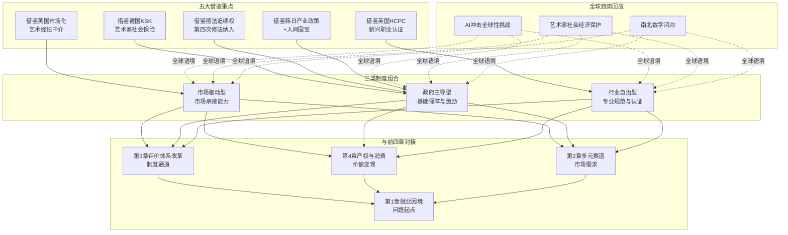

这一协同框架体现了三层逻辑：**第一层是模式组合**——五大借鉴重点分别对应三类核心模式，构成"市场驱动+政府主导+行业自治"的混合制度组合，避免单一模式的局限性；**第二层是与前四章对接**——五大借鉴重点直接回应第3章评价体系改革、第4章产权与消费、第2章多元赛道、第1章就业困境的具体诉求；**第三层是回应全球趋势**——AI冲击、艺术家社会经济保护、南北数字鸿沟等全球议题在中国语境下的适配方案。

### 5.7.3 本土化适配的核心挑战

国际经验借鉴绝非简单移植，必须充分考虑本土化适配的核心挑战。

**第一类挑战是文化制度差异**。德国"社会市场经济"理念下"个体必须服从于社会责任"[^116]的传统、英国"行业自治"的悠久传统、日本"全社会动员"应对人才困境的文化共识、韩国"文化立国"的政治社会基础——这些制度基础与中国的"政府主导、市场调节、社会参与"的政经体制存在显著差异。借鉴时需要避免脱离中国制度语境的理想化建议，重点提炼制度逻辑而非简单复制制度形式。

**第二类挑战是行政体制约束**。中国文化政策当前分散在文旅部、广电总局、版权局、新闻出版总署等多个部门，借鉴韩国"统一机构+三位一体"管理机制需要克服行政体制改革的现实阻力；中国艺术家社会保障的协同涉及人社部、文旅部、文联、行业协会等多方主体，借鉴德国KSK模式需要解决跨部门协作的机制问题。这些行政体制约束决定了借鉴必须采用渐进式而非颠覆式的改革路径。

**第三类挑战是市场成熟度差距**。中国艺术市场虽已成为全球艺术市场体系的重要组成部分（第4章、5.1节均有讨论），但艺术经纪、版权运营、数字藏品等中介服务体系的成熟度仍显著低于美国；中国艺术疗愈、AI内容等新兴赛道的市场需求虽然旺盛（第2章），但市场规范化程度仍处于早期阶段。这一市场成熟度差距决定了借鉴美国市场驱动型模式时需要避免"过度市场化"导致的不平等加剧，借鉴英国行业自治型模式时需要避免"自治组织代表性不足"等问题。

**第四类挑战是规模差异**。中国作为超大规模文化市场，文化产业政策的设计需要平衡国内市场培育与国际输出双重目标；中国艺术人才规模远超欧洲单国规模（仅2024年艺术类高校毕业生即超数十万），政策成本测算与制度落地难度均与韩日等中等规模国家存在数量级差异。这一规模差异决定了借鉴时必须在政策力度、覆盖范围、实施周期等维度做出针对性调整。

### 5.7.4 国际经验借鉴的优先级排序

考虑到本土化适配挑战的现实约束，国际经验借鉴宜采取分阶段、分优先级的推进策略：

**短期优先（1-3年）**：填补艺术疗愈等新兴职业认证空白（借鉴英国HCPC—BAAT），完善艺术经纪与中介服务专业化（借鉴美国），整合现有文化产业公共服务职能（借鉴韩国文化内容产业振兴院）。这三个方向技术难度相对较低，制度对接较为顺畅，能在短期内见到实效。

**中期推进（3-5年）**：推动《著作权法》第四次修正纳入追续权（借鉴法国德国），构建艺术家社会保险专项制度（借鉴德国KSK），优化国家级非遗传承人评价机制（借鉴日本人间国宝）。这三个方向涉及法律修订与跨部门协调，需要更长的政策推进周期。

**长期布局（5-10年）**：将文化产业上升为国家战略（借鉴韩国"文化立国"），构建完整的文化产业法律体系（借鉴韩国《文化产业振兴基本法》等），形成中国艺术市场在全球艺术市场体系中的稳定位次（借鉴美国全球艺术市场主导地位）。这三个方向涉及国家战略层面的系统性安排，需要长周期的接力推进。

### 5.7.5 本章小结与下章衔接

本章在前四章本土制度分析的基础上，将视野扩展至全球范围，系统比较了美国市场驱动型模式（5.1）、英国创意产业与艺术疗愈认证体系（5.2）、德国艺术家社会保险与公共资助机制（5.3）、日本人间国宝制度与动漫人才培养（5.4）、韩国文化创意产业振兴战略（5.5）五国制度安排，归纳了三类核心模式并对接教科文组织全球趋势（5.6），最终提出五大借鉴重点与本土化适配路径（5.7）。

**核心结论可以概括为三点**：第一，国际经验呈现"市场驱动+政府主导+行业自治"三类核心模式，各有制度逻辑与适用边界，单一模式难以独立解决艺术人才价值实现的所有问题；第二，借鉴德国KSK艺术家社保、英国HCPC—BAAT艺术疗愈认证、法国德国追续权、美国艺术市场化与艺术管理职业化、韩国文化产业政策与日本人间国宝制度等典型经验，可以系统填补中国艺术人才价值实现机制的关键短板；第三，借鉴必须充分考虑文化制度差异、行政体制约束、市场成熟度差距、规模差异等本土化适配挑战，采取分阶段、分优先级的渐进式推进策略。

需要特别指出的是，国际经验借鉴并非政策制定的终点，而是教育与产业转型的起点。当英国HCPC认证、德国KSK社保、法国追续权等制度元素被纳入中国制度供给后，**艺术教育与人才培养体系本身需要相应转型**——只有当艺术教育能够培养出符合HCPC认证标准的艺术疗愈师、能够输出参与全球艺术市场的艺术管理人才、能够支撑中国动漫产业向人间国宝级匠心质量演进的复合型人才时，国际经验借鉴的制度红利才能真正落地。这正是第6章艺术教育与人才培养体系转型的核心命题——从"同质化扩张"向"特色化深耕"转型，构建"艺术+科技+商业"的复合培养体系，为艺术人才价值重构提供教育供给侧的根本支撑。

# 6 艺术教育与人才培养体系的转型路径

第1章揭示了艺术生就业困境的根本症结之一在于"人才培养与产业需求的结构性错位"——课程内容更新滞后于技术迭代、产教融合深度不足、培养规模与质量不匹配；第2章勾勒了"艺术+X"复合人才的市场溢价机制；第3章揭示了评价体系改革对释放艺术人才价值的关键制度作用；第4章分析了产权保护与消费升级双轮驱动下价值变现路径的优化方向；第5章则通过国际比较提炼了制度借鉴的五大重点。**然而无论是制度通道的打开、价值变现的优化、还是国际经验的借鉴，最终都需要落地到一个根本支撑环节——艺术教育与人才培养体系本身的转型升级**。如果艺术教育仍停留在"普通学校的绘画课仍在教素描、色彩，与市场需要的数字插画、游戏原画根本不搭"（第1章引述）的传统范式，那么前五章揭示的所有制度改革都将面临"无米之炊"的尴尬——艺术生缺乏跨界复合能力，便无法承接多元赛道的市场机遇；缺乏数字工具与商业素养，便无法对接评价体系改革后的代表作贡献导向；缺乏IP运营与版权管理意识，便无法享受产权保护与消费升级的双轮红利。本章作为承上启下的关键章节，将系统探讨艺术教育从"同质化扩张"向"特色化深耕"、从"技能传授"向"复合能力培养与创新创业孵化"的转型路径，依次剖析转型总体方向（6.1）、艺术+科技交叉学科建设（6.2）、艺术+商业与艺术+疗愈新兴方向（6.3）、产教融合升级（6.4）、课程体系与教学方法改革（6.5）、创新创业教育与孵化机制（6.6），最终在6.7节整合形成艺术教育转型的系统化框架，为第7章综合政策建议提供教育供给侧的改革支点。

## 6.1 从同质化扩张到特色化深耕：艺术教育供给侧改革的总体方向

艺术教育供给侧改革的总体方向，在第1章揭示的高校大规模撤并潮中已经清晰显现——"撤并不等于艺术学科衰落，而是供给侧的结构性更替"，方向是"从'同质化扩张'转向'特色化深耕'，从'传统手工技能型培养'转向'艺术+科技+产业'复合型培养"。这一方向并非个别院校的自发选择，而是政策导向、产业变革、国际趋势三股力量共同作用下的系统性转型。本节将从政策导向、头部院校标杆实践、转型核心要义三个层面，构建本章后续各节展开的总体框架。

### 6.1.1 政策导向：从学科目录调整到新文科与交叉学科

政策层面，**2022年教育部发布新版学科专业目录，在新增的"交叉学科"门类下设"设计学"一级学科，可授工学或艺术学学位**[^123]——这一制度安排明确了艺术与工科交叉融合的学位授予合法性，破除了传统学科分类对艺术+科技复合型人才培养的制度障碍。教育部在新增专业层面的导向同样清晰，第1章已揭示2024年新增审批47个艺术类本科专业、新增备案182个艺术类本科专业，**新增的8个艺术类专业全部为"艺术+科技"组合**——音乐科技、智能影像艺术、虚拟空间艺术、游戏艺术设计等专业取代了被撤销的传统专业，构成"有进有出"的供给侧更替。

新文科建设构成另一重要政策杠杆。**"基于新文科建设理念的交叉整合设计学改革研究虚拟教研室"入选教育部首批虚拟教研室建设试点**[^123]，标志着艺术学科的跨学科整合已从单一院校的探索上升为国家层面的教研改革议程。武汉传媒学院艺术与科技专业的获批理由直接对接了"国家'文化和科技深度融合'与'发展新型文化业态'战略需求"[^124]，文华学院则将"新工科、新文科建设的时代要求"作为推动数智化新艺科人才培养的政策依据[^125]。

### 6.1.2 头部院校的标杆实践：三种特色化深耕模式

头部艺术院校的特色化深耕实践，为艺术教育转型提供了三种代表性模式。

**清华美院"一体两翼"格局**代表了综合性大学艺术学院依托母校理工科优势的艺科融合模式。清华美院明确"艺术与科学融合的办学特色和学术旗帜"——**1999年原中央工艺美术学院并入清华大学，依托清华大学综合学科平台和强大的理工科优势，美术学院的学科建设、人才培养模式和跨学科交流发展驶入快车道**[^123]。物理学家李政道与艺术家吴冠中共同倡导"科学和艺术是不可分割的，就像一枚硬币的两面"，于2001年发起成立清华大学艺术与科学研究中心，培养"完全新型的艺术科学家和科学艺术家"[^123]。在办学格局上，清华美院"持续健全'一体两翼'办学格局……重点推进清华青岛艺术与科学创新研究院和清华大学米兰艺术设计学院建设，形成以立德树人为根本、教学科研为重点、成果转化为动力、国际合作为突破的相互支撑、相互促进的'三院一体'有机体系"[^123]——青岛院"瞄准未来出行、生活、时尚、健康、学习、文化可持续发展等领域"，米兰院则成为"清华大学在欧洲设立的首个教育科研基地"[^123]。

**中央美院设计学院"五大学科建设模块"**代表了顶尖专业美院的全面学科重构模式。**自2015年起设计学院进行了全面而又深入的学科结构和教学方法改革，并通过从1.0到2.0、3.0、4.0版本的升级，完成了由"理念"到"系统"再到"范式"的深化过程**[^126]。改革"以全球视野为基础，立足对中国社会未来形态和经济模式的整体研判，形成了以'战略设计、科技设计、设计思维、产业设计、设计理论'为基本架构的大学科建设体系"[^126]。设计学院的本科专业方向已扩展至"视觉传达设计、产品设计、数字媒体艺术、摄影、时装设计、首饰设计、出行创新、艺术与科技、社会设计、创新设计、生态危机设计、系统设计、设计理论、叙事空间与设计策展"等14个方向[^127][^128]——这一专业方向矩阵本身就是"特色化深耕"的具象呈现。设计理论方向更进一步形成了"顶层-中观-基础"三层设计理论发展逻辑：顶层"以趋势研究、未来洞察、国家战略、前瞻应用为核心的战略设计教育与研究体系"，中观"以设计思维为核心，探索广泛应用于普遍社会和商业问题解决的创新思维设计教育和研究体系"，基础"以设计历史与理论、设计原理、设计方法、设计基础等为核心的设计史论教育与研究体系"[^128]。

**中国美院"绘画东方学"与"五位一体"教学结构**代表了立足本土文化主体性的特色化深耕模式。**从2015年起，中国美术学院把培养目标按照现在的学科建设确定下来，主要还是坚持"绘画东方学"的思想引领，以"技艺与方法——大绘画时代的绘画方法论的思考与重建"作为核心研究方向**[^129]。教学结构上"主要是把工作室、实验室、研究所、工作坊、美术馆'五位"一体推进[^129]——这一结构既保留了油画系等传统艺术学科的工作室制传承（"老一辈艺术家和教育家们尊重艺术的教育规律，教书育人，言传身教，构建出了我国本土美术特色的教学体系"[^129]），又通过实验室、研究所、工作坊等多元空间承接新技术、新方法、新议题的探索。中央美术学院油画系也呈现类似的特色化路径——"油画系副主任石煜梳理了油画系的历史沿革和学脉传承，并指出工作室的建制与发展是油画在与中国社会相结合的发展脉络中应运而生的"[^129]。

下表汇总了三类标杆模式的核心特征：

| 模式类型 | 代表院校 | 核心架构 | 特色化路径 |
|---------|---------|---------|----------|
| 综合大学艺科融合 | 清华美院 | 一体两翼+三院一体 | 依托清华理工科优势，国际化布局 |
| 顶尖专业美院重构 | 央美设计学院 | 五大学科建设模块 | 14个本科专业方向，"理念—系统—范式"三阶段升级 |
| 本土文化主体深耕 | 中国美院 | 五位一体教学结构 | "绘画东方学"+工作室制传承+实验室创新 |

### 6.1.3 转型核心要义：特色化、差异化、内涵化

将政策导向与头部院校实践综合观察，艺术教育转型的核心要义可以归纳为"特色化、差异化、内涵化"三个维度。**特色化**指从"千校一面"的同质化扩张转向各院校基于自身禀赋构建独特的学科架构与培养特色——清华美院依托综合大学理工优势，央美依托顶尖艺术资源，中国美院依托本土文化主体性，三种路径并不相同但都形成了不可替代的院校品牌。**差异化**指在专业方向、培养层次、学科交叉等维度形成可识别的差异定位——央美设计学院14个本科专业方向、清华美院艺术与科技非全日制硕士项目、中国美院设计专业硕士全日制与非全日制并行等[^130]，都体现了差异化定位。**内涵化**指从单纯的规模扩张转向培养质量、学科水平、社会影响力的实质提升——同济大学设计创意学院明确"标志着国家高等教育战略由规模建设向内涵建设转移"[^131]，中央美院设计学院"教学目标是创造学生价值核心和实际效益的最大化，帮助学生完成个人价值整合、知识融合"[^126]。

需要客观指出的是，特色化深耕的现实进度在不同层次院校间存在显著分化。第1章揭示的"中央美术学院应届生月薪9500元、设计艺术专业一半以上签约互联网大厂"与"普通二本绘画专业就业率59.6%、毕业班30余人中真正搞纯艺术的仅2个"的就业反差，背后即是特色化深耕程度的根本差距——头部院校已基本完成从"理念"到"系统"再到"范式"的升级，而普通院校仍处于规模扩张与专业撤并的阵痛期。这一分化现实意味着艺术教育转型不能"一刀切"，而需要在国家政策层面提供差异化支持，在院校层面探索符合自身禀赋的特色化路径——这一议题将在6.7节整合框架与第7章政策建议中进一步展开。

## 6.2 艺术+科技交叉学科建设：从专业设置到培养模式的创新实践

艺术+科技作为艺术教育转型最具代表性的方向，已从早期的"科技元素融入艺术课程"演化为系统性的交叉学科建设。这一建设涉及专业架构重构、课程体系跨界、师资团队多元化、实验平台升级等多维改革，国内外头部院校已形成多种可借鉴的实践范式。本节将依次剖析专业架构创新、跨学科课程体系、实验教学平台、师资团队建设四个维度的代表性经验，归纳艺术+科技交叉建设的关键支撑要素。

### 6.2.1 专业架构创新：从硕士项目到联合学位

**清华美院艺术与科技专业硕士非全日制项目**是国内最具创新性的专业架构样本。**2025年清华大学美术学院新增设计专业硕士-非全日制"艺术与科技"方向，通过非全日制艺术硕士培养项目不断创新硕士研究生培养模式，致力于培养具备艺术与科技整合创新能力的高层次实践创新型人才**[^130]。该项目"依托清华大学美术学院，汇集清华大学计算机系、金融学院等相关学科的优质科研资源，采用设计交叉学科的培养模式"——核心特色在于"以基于数据、智能的创新设计理论、思维与方法为核心，探究面向新场景和新业态的设计创新应用"[^130]。学生将"深入学习人工智能、创新工程技术和数字经济的基本理论和方法及其在艺术、设计领域的应用，掌握基于设计和计算思维整合创新的理念，艺术与科技相结合的方法论和具体方法"[^130]。具体到培养支撑，项目依托三大平台——"清华大学美术学院信息艺术设计系创建于2005年，是国内最早一批交互设计、数字媒体设计，艺术与科技的教学研究单位之一，是教育部'双万计划'国家级一流本科专业建设点"；"清华大学未来实验室是清华大学面向未来构建的校级学科交叉科研平台，重点开拓艺术、科技交叉领域的学术研究"；"清华清尚智慧场景创新设计研究院是由清华大学美术学院联合电子工程系、计算机科学与技术系成立的校级产学研一体化创新服务平台"[^130]。**首期招生人数13人，学费16万分两年交完，仅招收本科毕业后有2年及以上工作经验的原单位定向生**[^130]——这一精英化、定向化的培养模式与本科阶段的规模化教学形成互补。

**国际院校的代表性创新**则在RCA与RISD的同步课程改革中得到集中体现。**皇家艺术学院（RCA）将AI设计研究所（AiDLab）课程纳入硕士培养体系**——"RCA与香港理工大学合建的AiDLab正式开放硕士招生，研究方向直指'AI+人体工学设计''智能时装研发'等落地领域，课程由两校顶尖学者联合授课，将AI算法训练、用户行为预测等技术深度融入设计实践"[^132]。RCA Design Futures硕士专业进一步强化跨学科属性——**"要求学生必须从'环境可持续性、AI技术前沿、医疗健康'等五大领域中跨域选课，构建复合型知识体系"**[^132]。**罗德岛设计学院（RISD）2025年秋季开设的"生成系统"（Generative Systems）课程，作为面向全专业的必修课，刚开放报名即告满额——这门课程不设技术门槛，却要求学生掌握从Unity引擎到Diffusion模型的多元工具，探索AI在绘画、雕塑、产品设计等领域的应用可能**[^132]。

**国内联合学位项目**的代表是**四川美术学院与电子科技大学联合学士学位项目**——"本科阶段学生除传统美术技能学习外，还须完成《大学数学基础》《电子线路基础及应用》《高级语言程序设计》《人工智能通识》《数字系统基础及应用》《数字图像智能处理》《电子信息系统与应用》《信号分析与处理》等工学课程"（详见第2章2.1.3节）。这一联合学位通过双校学科互补，构造出本科阶段就具备艺工交叉素养的复合型人才。

### 6.2.2 课程体系跨界：从必修通识到模块化深耕

课程体系跨界的代表性做法是"AI工具课程化"与"模块化方向深耕"的结合。**RISD"物理计算导论"课程更具代表性，它将电子传感技术与艺术创作结合，引导学生把日常物品转化为智能交互装置，课程案例涵盖动能雕塑、智能产品等跨领域作品，完美诠释了RISD"设计+技术+心理学"的跨学科培养理念**[^132]。这种"日常物品+电子传感+艺术创作"的课程设计，打破了"美术课只学画画"的传统范式。

**武汉传媒学院艺术与科技专业**则提供了应用型院校的课程范式。该专业"依托学校'大传媒'学科集群优势，整合艺术学、传播学、计算机技术等多学科资源，形成'理论教学—实践实训—产业对接'三位一体培养模式"[^124]。**核心课程涵盖科学可视化设计、虚拟体验技术（VR/AR/MR）、科普IP策划与传播等前沿领域，既注重AI艺术创作、互动展教设计等专业技能培养，更强化融媒体传播、展览运营管理等传媒思维训练**[^124]。专业的主干课程包括"美学概论、设计心理学、科学图像传播、科学可视化设计、数字图像设计、科普IP策划与传播、展览策划与设计、用户体验设计、创意编程、互动展教设计、科技艺术装置设计、虚拟现实设计"等[^124]——这些课程的命名本身就体现了"艺术+科技+传媒"三向交叉的培养逻辑。

应用型院校的另一典型样本是**艺术与传媒学院艺术与科技专业**——"基于艺术设计与科学技术深度融合的基本理念……开设了智能产品设计、交互艺术语言、数字展示设计三个特色课程模块"[^133]。**专业核心课程主要有《创意编程》《设计思维与创新设计》《原型控制与交互》《科技交互体验》《CMF设计技术与管理》《智能包装设计》《新融合品牌认知与实践》《数字产品动态展示》《艺术策划与传播》等**[^133]——其中《创意编程》《原型控制与交互》《CMF设计技术与管理》等课程明显跨越了传统艺术教育的边界。

### 6.2.3 实验教学平台：从单一工坊到"原子+比特"融合

实验教学平台的升级是艺术+科技交叉建设的物质支撑。**同济大学设计创意实验教学中心提供了实验平台升级的典型样本——其核心理念之一是"结合'原子'和'比特'，支撑创新设计"**[^134]。具体而言，"实验教学中心是最早全面面向'原子'和'比特'时代融合的，技术支持全面，覆盖传统、现代和面向未来的全系列技术与数据处理手段，包括金工、木工、玻璃、金属、3D打印、数字加工、机械臂、人工智能技术、VR技术和大数据技术，综合联动各种材料、技术和信息化手"[^134]。这种"传统工艺+数字加工+AI/VR技术"的全系列覆盖，使得学生在同一实验空间内即可完成从材料触感到数字虚拟的全流程探索。

平台层面，同济大学还通过"中心下设科教结合实验室，如数字创新中心实验平台CDI、载运工具及系统创新实验室、人机交互与大数据可视化实验室等，紧跟技术与学科的最新动态，将研创成果引入实验教学之中"[^134]——这种"研创一体"的实验室架构，确保了实验教学始终保有先进性。

应用型院校的实验平台建设也呈现专业化趋势。**艺术与传媒学院"艺术与传媒学院拥有新媒介融合、影视摄制、虚拟现实、陶艺、工艺美术、3D打印、数控加工、造型实训等校内实验、实训室17个。其中虚拟现实实验室、3D打印与数字加工实验室、工艺美术实验室共同构成学科一站式、多专业适用的综合实验平台，配有光敏数脂打印机、SLA光固化工业级3d打印机、数据处理和图形渲染的工作站、虚拟现实环境显示系统等设备"**[^133]——17个实验实训室的规模与设备清单，反映了应用型院校在艺术+科技实验平台建设上的实质投入。

清华青岛艺术与科学创新研究院则代表了顶尖院校的产研一体平台升级。**"青岛院……包括以7座工坊为代表的融合研究创新区和成果展示区、交流区、转化区等。青岛院对照《清华大学2030创新行动计划》，积极发挥学校艺术设计等多学科优势和山东省区位及产业优势，瞄准未来出行、生活、时尚、健康、学习、文化可持续发展等领域，通过艺科融合创新、成果转化、企业孵化、人才培养、创业服务、艺术与文化交流传播等校地合作"**[^123]。这一架构将实验平台从校内拓展到校地协同的产业空间，为成果转化与人才孵化提供了实质支撑。

### 6.2.4 师资团队建设：从单一学科到跨学科协同

师资团队的跨学科化是艺术+科技交叉建设的深层支撑。武汉传媒学院艺术与科技专业"专业组建为高校学者、行业专家构成的双师型教学团队，聘请多位行业专家，从科普场馆策展、科技艺术设计、新媒体运营等多维角度深化课程建设与实践指导"[^124]。艺术与传媒学院艺术与科技专业的师资"学缘结构呈现艺术学、工学、交叉学科学等跨学科交叉趋势"[^133]——这种学缘多元化是艺术+科技师资建设的关键标志。

同济大学设计创意学院则进一步将师资建设嵌入"立体T型人才培养框架"——**"设计创意学院提出了立体'T型'的本、硕、博创新设计人才培养框架，分别按'技'、'理'、'道'三层级有侧重、分类型地培养各种不同设计、研究、教育和管理人才"**[^135][^131]。师资围绕"垂直能力"（专门知识和能力）和"水平能力"（广度思考和整合思考的能力）双重要求建设，确保T型人才培养在师资端得到对应支撑。

此外，**校企合作师资也是艺术+科技交叉的重要补充**。同济大学设计创意学院"与欧特克、阿里巴巴、中国中车、上汽、阿斯顿·马丁等行业领军企业以联合实验室或联合科研项目等多种形式开展了深度合作"[^134]——这些行业领军企业的技术专家通过联合实验室、联合科研项目等形式参与教学，弥补了学院内部纯艺术或纯工科师资的覆盖不足。

### 6.2.5 艺术+科技交叉建设的关键支撑要素

综合上述四个维度的分析，艺术+科技交叉学科建设的关键支撑要素可以归纳为"四位一体"框架：**专业架构层**——通过新增专业、联合学位、跨学院硕士项目等机制，破除学科壁垒；**课程体系层**——通过AI工具课程化、模块化方向深耕、跨学科必修通识等设计，构建"艺术功底+技术能力"双轮驱动；**实验平台层**——通过"原子+比特"融合、产研一体平台、跨专业共享实验室，提供物质支撑；**师资团队层**——通过学缘多元化、双师型团队、行业专家协同等机制，形成跨学科教学合力。这一"四位一体"框架与第2章2.1节揭示的艺科赛道核心岗位（UI/UX设计师、技术美术、动态设计师、影视特效师等）的能力要求形成精准对接，是艺术教育转型最具系统性的实践范式。

## 6.3 艺术+商业与艺术+疗愈：新兴交叉方向的探索路径

如果说艺术+科技代表了交叉学科建设最成熟的方向，那么艺术+商业与艺术+疗愈则代表了正处于探索期的新兴交叉方向。前者回应第2章2.2节所述设计管理、艺术管理、品牌策划等岗位的市场需求，后者回应第2章2.3节与第3章3.4.1节、第5章5.2节揭示的艺术疗愈赛道认证空白与需求扩张。本节将依次剖析艺术疗愈微专业的标杆实践、艺术+管理培养模式的探索、新兴交叉方向的现实挑战。

### 6.3.1 艺术疗愈微专业：西安美院"四维教学法+双导师制"标杆

**西安美术学院艺术疗愈微专业**是国内最具示范意义的艺术+疗愈交叉建设样本。该专业由艺术人文学院推出，**"积极响应《健康中国行动（2019—2030年）》关于加强心理健康人才培养的号召，依托西安美术学院雄厚艺术资源，聚焦西部地区文化特色，结合国际前沿动态，构建'理论—实践—反思'三位一体培养体系"**[^136]。

从专业建制看，**"学制1年，总学分11学分，课程门数5门，招生名额20人，开课时间2025年9月，产教融合合作单位包括北京爱因思管理咨询有限公司、西安绽放艺术文化传播有限公司"**[^136]。这一精炼的建制设计——一年学制、20人小班、5门核心课程——契合了微专业的灵活定位。

培养体系上，专业**"以'基础理论+实践技能'为核心理念，培养目标精准定位跨学科能力"**——具体目标是"培养兼具艺术创造力与心理干预能力的复合型人才，使学生系统掌握理论体系，熟练运用视觉艺术媒介进行心理评估与干预，具备独立设计实施个性化疗愈方案的能力"[^136]。培养方法采用**"'理论+案例+项目+实践'四维教学法，实施'校内导师+行业导师'双导师制，开展在地化实践培养与国际化视野拓展"**[^136]——这一"四维+双导师"框架是艺术疗愈微专业最具创新性的方法论设计。

课程体系设置同样体现了系统化设计。围绕"基础理论、专业知识、技术方法、应用拓展、督导实训"五大模块，设置5门课程共11学分、152学时——**基础知识模块的"艺术心理学"（1学分）建立心理学与艺术学交叉认知；专业理论模块的"艺术疗愈概论"（1学分）掌握核心理论；专业理论模块的"非遗艺术疗愈"（3学分）强化与本土文化相结合，"表达性艺术疗愈"（3学分）突出艺术本体的疗愈性；最后是"艺术疗愈实训与督导"（3学分），强化从理论到实践的全流程能力**[^136]。其中**"非遗艺术疗愈"是该课程体系最具中国特色的设计**——将本土文化资源（非遗）与艺术疗愈方法结合，既体现了"聚焦西部地区文化特色"的办学定位，也避免了完全套用西方艺术治疗范式的可能水土不服。

实践支撑方面，专业"已开展多项艺术疗愈实践，形成'艺术创作—心理疏导—社会服务'三位一体育人模式"，"实施'双导师制'（校内导师+行业导师），核心"师资由西安美术学院艺术人文学院教师与行业专家共同组成[^136]。学生"将参与团体工作坊和毕业设计，并在督导下积累真实案例经验"[^136]——这种"督导下的真实案例"机制，对接了第5章5.2节所述英国HCPC—BAAT认证体系中"60-120天临床实习"的国际通行标准。

中央美术学院在艺术疗愈方向也有早期布局。第2章2.3.1节已揭示**"2021年中央美术学院率先开设艺术疗愈方向的专业课程，成为中国高等教育体系对该领域的首次正面回应"**——这一开创性举措为后续院校的艺术疗愈专业建设提供了参照。

### 6.3.2 艺术+管理与艺术+商业的培养模式探索

广东艺术职业学院的"艺术+X"交叉理念为高职院校的艺术+商业方向探索提供了样本。该校在二级学院办学新格局中提出**"以'艺术+人文''艺术+科技''艺术+生活''艺术+教育''艺术+管理'交叉融合的职业教育创新办学理念，带动专业协调发展，涵盖文化艺术、教育类等37个高职专业，2个附设中职专业"**[^137]。其中"艺术+管理"方向直接对接第2章2.2节所述设计管理、艺术管理岗位需求；"艺术+生活"则对接情绪经济与文创衍生品市场需求；"艺术+教育"对接美育服务与艺术疗愈方向。这一"五个艺术+"的交叉理念虽然在应用层次上相对基础，但其覆盖面与系统性具备示范意义。

中央美院设计学院的"社会设计方向"与"创新设计方向"代表了顶尖美院在艺术+社会、艺术+商业方向的探索。**社会设计方向"致力于在不同的规模尺度下，洞察具体问题在'社会过程'中的系统运作，找到并时刻关注影响其变化的杠杆点，将各种资源创造性的重新配置，形成新的推动力和生产力，并用美学加叙事的设计语言进行传播，从而务实的达到社会改良的目的"**[^127]。培养目标设定为"五个有"——"有敏锐感知能力的人""有质疑能力的人""有系统思维能力的人""有领导力和协作能力的人""有执行能力的人"[^127]——其中"领导力和协作能力""程序意识、结果导向"等表述明显超越了传统艺术教育的能力框架，进入了管理学、商业逻辑的范畴。

课程体系上，"本科的教学课程分别从'原动力、价值创造、专业基础、设计思维、系统规模与组织、叙事、未来'这七个层面逐步展开"[^127]——其中"价值创造""系统规模与组织"等模块直接对接商业逻辑与组织管理。这种"艺术+社会+商业"的多向交叉，使得社会设计方向的毕业生能够进入企业战略部门、社会创新组织、政策研究机构等多元出口，远超传统艺术专业的就业边界。

中央美院设计学院的设计理论方向也呈现"上中下三层逻辑"——"顶层构建以趋势研究、未来洞察、国家战略、前瞻应用为核心的战略设计教育与研究体系"，"中观层面形成以设计思维为核心，探索广泛应用于普遍社会和商业问题解决的创新思维设计教育和研究体系，重点关注设计管理、服务设计、社会创新设计、跨领域创新设计等"[^128]——其中"设计管理"与"商业问题解决"明确将艺术设计与商业逻辑深度对接。

### 6.3.3 新兴交叉方向的现实挑战与师资困境

需要客观指出的是，艺术+商业与艺术+疗愈作为正处于探索期的新兴方向，仍面临三类显著挑战。

**第一是认证体系滞后导致的培养目标模糊**。如第3章3.4.1节、第5章5.2节所揭示，国内艺术疗愈师认证体系尚未与国家职业资格目录对接，使得艺术疗愈微专业毕业生面临"学什么—证什么—做什么"的链条断裂。西安美院微专业虽然形成了规范的课程体系，但毕业生进入职业市场后仍需面对"行业内鱼龙混杂，真正好的疗愈师非常少"（第2章引述王鑫观点）的现实困境。

**第二是跨学科师资稀缺**。艺术+商业与艺术+疗愈培养所需的师资是真正的"复合型师资"——既懂艺术语言又懂商业逻辑，或既懂艺术媒介又懂临床心理。这类师资在艺术院校内部供给极为有限，需要通过外部行业专家、跨学科联合培养等机制补充。西安美院通过"校内导师+行业导师"双导师制部分回应了这一问题，但行业导师的稳定性与系统性投入仍是实施层面的挑战。

**第三是实习实践通道有限**。艺术+疗愈的实习实践需要医院、心理咨询机构、社区服务中心等机构的开放配合，艺术+商业的实习实践需要4A广告公司、艺术经纪机构、画廊拍卖行等的系统对接。这种实习实践通道的建设依赖于产教融合的深度——这正是6.4节将专门讨论的议题。

新兴交叉方向的现实挑战提示，艺术教育转型不能仅靠院校单点努力，必须与第3章评价体系改革、第5章国际经验借鉴形成制度协同——只有当艺术疗愈师等新兴职业获得国家认证、当艺术+商业岗位的市场需求规模化释放，新兴交叉方向的培养才能在毕业出口端获得稳定承接。

## 6.4 产教融合与新型培养模式：从校企合作到产业学院的升级

产教融合是破解第1章揭示的"产教融合深度还不足"根本矛盾的关键路径。从早期的"实习基地"到现在的"产业学院""市域产教联合体""联合实验室"，产教融合的深度与广度都在显著升级。本节将依次剖析国家政策框架、头部院校与行业领军企业的合作样本、地方院校的访企拓岗实践、校企合作升级的关键路径。

### 6.4.1 国家政策框架：市域产教联合体的系统部署

**教育部办公厅2023年印发《关于开展市域产教联合体建设的通知》（教职成厅函〔2023〕15号），决定启动市域产教联合体创建工作**[^138]。该政策的核心目标是"坚持以教促产、以产助教，深化产教融合、产学合作，充分发挥政府统筹、产业聚合、企业牵引、学校主体作用，以产业园区为基础，打造一批兼具人才培养、创新创业、促进产业经济高质量发展功能的市域产教联合体"[^138]。**实施进度上"2023年底前建设50家左右，2024年底前再建设50家左右，到2025年共建设150家左右的市域产教联合体"**[^138]。

市域产教联合体的核心制度设计体现在五个条件要求：**第一，"产教资源相对集聚"——联合体依托的产业园区总产值在本省份位于前列，主要以先进制造业、现代服务业、现代农业等为核心主导产业**[^138]；第二，"组织治理机制完备"——"教育部门会同发展改革、工业和信息化、财政、人力资源社会保障、国资等部门建立密切配合、协调联动的工作机制，打造政府、行业、企业与学校四方协同的命运共同体"[^138]；第三，"人才培养取得突破"——"龙头企业深度参与职业学校专业规划、人才培养标准、教材课程开发、师资队伍建设等各个环节"[^138]；第四，"有效服务产业发展"——"联合体建设共性技术服务平台，打通科研开发、技术创新、成果转移链条"[^138]；第五，"保障条件切实到位"——"加大财政经费支持力度，吸引社会资本、产业资金投入"[^138]。

这一系统化政策为艺术类专业的产教融合提供了制度框架。虽然市域产教联合体最初聚焦先进制造业、现代服务业等核心产业，但艺术设计类专业（动漫游戏、数字媒体艺术、视觉传达等）作为现代服务业的重要组成部分，自然纳入了联合体建设的覆盖范围。第1章揭示的中国传媒大学砍掉16个本科专业、向"艺术+科技+传媒"复合型培养转向，本质上正是回应市域产教联合体所要求的产业适配性。

### 6.4.2 头部企业与多层次院校的合作图谱

头部互联网与AI企业正在成为艺术教育产教融合的核心合作伙伴，形成覆盖顶尖美院、综合大学、应用型本科、高职院校的多层次合作图谱。

**字节跳动火山引擎×文华学院**代表了AIGC赋能下的产教融合升级。**2026年3月文华学院城市建设工程学部前往字节跳动公司开展访企拓岗专项调研，针对"4个艺术专业和7个工科专业的学生搭建与前沿科技企业对接的桥梁"**[^125]。座谈核心议题包括"火山引擎及豆包大模型的最新技术能力进展""针对高等教育领域提出的产教融合整体解决方案""AIGC（人工智能生成内容）技术解决方案"等[^125]。**双方达成的关键共识是"将火山引擎相关的AIGC课程体系、数智化教学资源引入文华学院城建学部必修课程教学中"**[^125]——这一"必修课程级"的深度融合，远超传统的"实习基地"层次，是产教融合最深度的形态之一。学部主任姜应和的表述清晰传递了产教融合的底层逻辑——"面对新工科、新文科建设的时代要求，将前沿的AIGC、大数据等技术引入教学体系，是提升人才培养质量、增强学生就业竞争力的关键路径"[^125]。

**腾讯×网易×天津职业大学艺术工程学院**代表了高职层面与头部互联网企业的合作样本。**2024年7月艺术工程学院前往腾讯北京总部、网易北京总部进行调研**[^139]。在腾讯，"双方围绕学生实习就业、课题研究、教师学访、社会培训、实训室建设等内容进行了全面沟通，并达成了全面战略伙伴合作关系意向"[^139]；在网易，"双方就人才培养、课程共建、实习实训、AI赋能、文创开发及如何更好的引入天津地区非遗特色，服务天津区域经济等内容进行了探讨"[^139]。这一合作的特殊价值在于将"AI赋能""文创开发""非遗特色""区域经济"等多重要素整合，体现了产教融合的多向价值——既服务于学生就业，也服务于地方经济发展。

**网易（沈阳）数字产业中心×沈阳某校跨学院联合**则代表了"跨学科+跨学院"的产教融合升级。**学校党委副书记、副校长于宪宝带领计算机科学与工程学院与艺术设计学院组成访企团，共同走进网易（沈阳）数字产业中心**[^140]。这一"跨学院联合走访"的核心驱动力是"面对数字产业对'技术扎实、具备审美、善于创新'的复合型人才的迫切需求"[^140]——正是第2章揭示的艺科融合赛道对复合人才的市场需求传导到了高校组织层面，迫使计算机学院与艺术学院联合行动。座谈成果同样具有标志性，**双方达成四项推进方向："一是共建实习就业基地，网易（沈阳）数字产业中心将为我校学生开放技术研发与数字设计类实习岗位，探索构建'实习—毕业设计—就业'一体化培养链路；二是开展项目化教学与赛事合作；三是加强师资与技术交流；四是建立常态化合作机制"**[^140]。其中**"实习—毕业设计—就业"一体化培养链路**是产教融合最具系统性的设计，对接了日本养成所"老员工担当教师+1年课程+高比例签约"的成熟范式（详见第5章5.4.3节）。

**清华美院×行业头部企业**则代表了顶尖美院的产教融合深度。清华美院艺术与科技专业硕士项目"与行业紧密结合：项目与相关头部企业有紧密的教学和科研合作关系，支撑学生的专业考察、调研和产业项目实践"[^130]。同济大学设计创意学院则"与欧特克、阿里巴巴、中国中车、上汽、阿斯顿·马丁等行业领军企业以联合实验室或联合科研项目等多种形式开展了深度合作"[^134]——这种"联合实验室"层次的产教融合，超越了"实习派遣"的浅层合作，进入了科研协同、师资共建、成果转化的深度合作。

### 6.4.3 访企拓岗与高职院校的就业导向产教融合

教育部"访企拓岗促就业"专项行动是推动产教融合在普通院校落地的政策杠杆。**广东艺术职业学院2024届就业质量报告显示，"我校书记校长牵头走访企业数量累计超200家，新增对口岗位超1000个，实现校企资源共享、优势互补，全力促进毕业生更充分更高质量就业"**[^141]。"我校先后联系企业超200家，举办2024届毕业生线上招聘会、直播带岗、宣讲会，累计提供岗位数超1000个。以专业为基础，各二级学院积极开展小而精、专而优的小型专场招聘活动，为企业组织专场宣讲会18次，小型招聘会15次"[^141]。这种"书记校长访企拓岗+专业老师辅导员走访机制"形成了从顶层到一线的全员产教融合参与，确保产教融合不停留在校长签字的表面合作。

广东艺术职业学院的产教融合还呈现"地方文化深度融合"的特色——"佛山市南海区工商联组织影视传媒、文化旅游和艺术培训等领域的企业代表来我校开展交流活动……推动演艺领域的优秀人才、项目和平台等资源不断汇集南海，为校地合作注入新的活力"[^141]。这种"行业协会牵线+地方政府支持+艺术院校承接"的三方协同模式，对接了第5章5.5节所述韩国"政府主导、行业组织实施、市场化执行"的产业政策框架。

### 6.4.4 校企合作升级路径：从实习基地到养成所

整合上述案例可以归纳出校企合作的四级升级路径，下表呈现各级合作的特征对比：

| 合作层级 | 核心特征 | 代表案例 | 学生受益深度 |
|---------|---------|---------|------------|
| 一级:实习基地 | 学生派遣实习、单向输送 | 一般高职普遍模式 | 短期实习经验 |
| 二级:专场招聘+访企拓岗 | 校企双向沟通、岗位对接 | 广东艺职、上海音乐学院 | 就业岗位机会 |
| 三级:课程共建+联合实验室 | 课程嵌入企业资源、教学科研协同 | 文华学院×火山引擎、同济×欧特克阿里巴巴 | 必修课程级AIGC技术接触 |
| 四级:产业学院+一体化培养 | 实习—毕设—就业全链条、定向培养 | 沈阳某校×网易沈阳、清华青岛艺术与科学创新研究院 | 全链条职业孵化 |

数据来源：综合本节产教融合案例分析

从一级到四级的升级路径，对应的是产教融合从"形式合作"到"制度协同"的实质演进。第5章5.4.3节所述日本京都动画养成所"38年28届、绝大部分新人通过自养"、P.A.Works养成所、SUNRISE作画培训学校"9/10学员直接被签约"等模式，正是四级合作的国际范本。中国艺术院校的产教融合升级方向，正是从一二级合作向三四级合作的系统性跃升——这一升级既需要院校层面的组织调整，也需要企业层面的长期投入，更需要国家层面的财税激励与制度保障。

第1章1.6节所述"上海视觉艺术学院和腾讯互娱共建了数字艺术实验室，2024届数字绘画方向就业率89%"的案例，已经初步呈现了三四级合作对就业质量的拉动作用。第3章3.6节亦提及"上海音乐学院新增13家涵盖文化艺术、演艺产业及人工智能领域的实习基地，聘任13名校外导师"——这种"实习基地+校外导师"的多元化机制是中国产教融合升级的现实步伐。

## 6.5 课程体系与教学方法改革：AI工具、商业逻辑与跨学科素养的全面升级

第1章揭示的"课程内容更新速度仍滞后于技术迭代"是艺术教育最直接、最微观的供给侧短板。这一短板的破解路径，是课程体系与教学方法的全面升级——具体包括AI工具课程化、商业逻辑融入、跨学科素养培养、实战项目嵌入、作品集导向五个层面。本节将依次剖析这五个层面的代表性改革举措，提炼课程改革的有效路径。

### 6.5.1 AI工具课程化：从"工具使用"到"批判性运用"

AI工具课程化已从"是否纳入"演变为"如何深度纳入"的方法论命题。第5章已揭示RCA、RISD的AI课程改革，本节进一步整合分析其方法论创新。

**RCA对AI工具采取"支持但严格限制"的方法论立场**——"RCA把话挑得透亮：支持用MidJourney这类AI工具生成基础素材，但必须二次创作——加自己的风格，加批判性思考。光靠AI生成的作品？直接拒"[^142]。"对于申请者，RCA的态度十分明确：支持用MidJourney等AI工具生成基础素材，但必须通过二次创作注入个人风格与批判性思考，单纯的AI生成作品将直接被拒"[^132]。这一"AI工具+二次创作+批判性思考"的方法论，准确把握了第1章工信部判断"AI的介入恰恰凸显了人类艺术的核心能力——审美判断力、创意想象力和情感感知力"的核心要义。

**RISD的"全民AI"路径则采取了普惠性、通识化的方法论**。"生成系统"必修课"不设技术门槛，但得学Unity引擎、Diffusion模型这些工具，要探索AI在绘画、雕塑、产品设计里的各种可能——不管你是学纯艺还是产品，都得会用AI玩创意"[^142]。"物理计算导论"则"把电子传感技术和艺术创作绑在一起，让学生把日常的杯子、椅子这类东西，改成智能交互装置"[^142]——这种"日常物品智能化"的课程设计，将AI工具从"屏幕内的图像生成"扩展到"现实世界的智能交互"，体现了AI工具课程化的物理边界突破。

国内层面，**武汉传媒学院艺术与科技专业明确提出"探索'艺术+AI'新趋势，应用多模态人工智能（AI）赋能艺术创作与科学传播，具备创意策划、智能设计、产品开发、艺术教育、项目运营与管理全链条能力"**[^124]。这种将AI赋能贯穿"创作—传播—教育—运营"全链条的课程设计，体现了应用型院校在AI工具课程化上的本土探索。

### 6.5.2 商业逻辑融入：设计思维、用户研究与商业策略

商业逻辑融入是艺术教育从"作品导向"向"价值导向"转型的关键。中央美术学院设计学院的教学改革明确"教学改革的核心目标是建立一套以学生为中心的跨越学科、打破设计专业壁垒的新型设计教育模式……以全球视野为基础，立足对中国社会未来形态和经济模式的整体研判，形成了以'战略设计、科技设计、设计思维、产业设计、设计理论'为基本架构的大学科建设体系"[^126]——其中"战略设计""产业设计"两个模块直接对接商业逻辑与产业应用。教学目标设定为"创造学生价值核心和实际效益的最大化，帮助学生完成个人价值整合、知识融合，具备全球意识和战略意识"[^126]——"战略意识""效益最大化"等表述明显超越了传统艺术教育的范畴。

应用型院校的商业逻辑融入则更加具象。艺术与传媒学院艺术与科技专业核心课程包括"《设计思维与创新设计》《CMF设计技术与管理》《新融合品牌认知与实践》《艺术策划与传播》"[^133]——其中《CMF设计技术与管理》(Color, Material, Finish)直接对接产品商业化的色彩、材料、工艺管理，《新融合品牌认知与实践》对接品牌策划与商业运营，《艺术策划与传播》对接艺术管理与文化传播。武汉传媒学院艺术与科技专业的主干课程也包括"美学概论、设计心理学、科学图像传播、科学可视化设计……科普IP策划与传播、展览策划与设计、用户体验设计……艺术策划与传播"[^124]——其中"科普IP策划""展览策划""用户体验设计""艺术策划与传播"均深度涉及商业逻辑。

中央美术学院设计学院社会设计方向的课程体系尤其值得关注。其本科教学课程"分别从'原动力、价值创造、专业基础、设计思维、系统规模与组织、叙事、未来'这七个层面逐步展开"[^127]——**"价值创造"层面"包括了对社会价值和经济价值，个人价值与集体价值的理解。因此一年级教学通过大学认知系列必修课、造型基础课、设计基础课，导师工作坊，以及下乡社会实践课，围绕学生创作原动力的思考"**[^127]。这一从"原动力"到"价值创造"的课程逻辑，将商业价值思考前置到一年级教学，避免了传统艺术教育"先学技法、后想价值"的脱节困境。

### 6.5.3 跨学科素养培养：T型人才与"垂直+水平"能力结合

跨学科素养培养的方法论核心是"T型人才"模型。同济大学设计创意学院明确提出**"立体'T型'的本、硕、博创新设计人才培养框架，分别按'技'、'理'、'道'三层级有侧重、分类型地培养各种不同设计、研究、教育和管理人才"**[^135]。这一框架的核心理念是**"全球设计正经历着一场由Design Doing向Design Thinking延伸的革命……学科交叉性加强、'垂直能力（专门知识和能力）'和'水平能力（广度思考和整合思考的能力）'结合的'T'型创新型和复合型人才的培养以及新的设计领域的开拓、学习方式的改变和新价值观的确立成为了新设计教育的特征"**[^131]。

T型人才模型的实施层面，同济大学设计创意学院"充分利用'同济大学中芬中心'这一国际化跨学科开放创新平台，面向全校开设'创新创业辅修项目'，培养具有设计思维的跨学科创新人才"[^135][^131]。**"实验教学中心从跨学科专业学科定位与属性及社会产业需求与趋势出发，将设计创新驱动'产业转型升级与智慧生活'的理念引入实验教学环节，集成工业设计、数字技术、机电技术、人因工程等跨学科知识"**[^134]——这种"工业设计+数字技术+机电技术+人因工程"的跨学科集成，是T型人才培养在实验教学层面的具体落地。

T型人才框架直接对接第2章2.6节所述"超级设计师七大能力"——"强审美·敢创造·会工具·能跨界·懂商业·善表达·有温度"——其中"强审美·敢创造"对应垂直能力，"会工具·能跨界·懂商业·善表达·有温度"对应水平能力。两套框架的内在一致性，体现了艺术教育转型与产业人才需求之间的精准对接。

### 6.5.4 实战项目嵌入：小组毕业创作与协同创新

实战项目嵌入是教学方法改革最具操作性的层面。中央美术学院设计学院的小组毕业创作机制提供了顶尖美院的实践范本。**"21届小组毕业创作答辩……本次小组毕业创作主题为'面向关系'……请以'面向关系'话题出发进行发散性讨论，探讨当今与未来的人类话题，他们包括但不局限于科技话题、健康话题、贸易话题、伦理话题、社会话题、安全话题等"**[^126]。**"小组毕设要求：已经成组的学生（一个小组3—5人，需包含3个不同的专业方向）"**[^126]——这一"3个不同专业方向"的强制性要求，确保了小组创作的跨学科性与协同性。

小组毕业创作的能力培养目标设定相当全面：**"小组创作的目的是为了测试学生协作和独立工作的能力：希望学生能在不同的专业语境里以合适的行为职业规范工作；面对复杂和不可预期的情境下与小组制定出周全的决策，并能专业性的参与协同或独立工作；在分析问题的过程中，既能展示出方向感和独创性，又能显示出自主性和个人责任感；在相应的解决任务过程中，能一贯计划并执行，自主或合作。能在多样化的团队中，都能以任何角色为团队做出杰出的贡献"**[^126]。这一目标设定将"协作能力""跨专业沟通""复杂决策""项目执行"等市场端核心能力嵌入毕业创作环节，是教学方法改革最具综合性的设计。

应用型院校的实战项目嵌入则更加贴近产业。艺术与传媒学院艺术与科技专业"鼓励跨界创新融合，实行课题研发教学，打造以学生为中心的教学组织和人才培养模式"[^133]，并通过"与多家设计企业，如武汉漫步工业设计有限公司、武汉速美宅汇装饰设计工程有限公司、武汉联合迪赛模型设计有限公司等建立了联合培养模式，将项目建设与课堂教学相结合，使学生全方位接触实际工作流程"[^133]。武汉传媒学院艺术与科技专业则强调**"双师协同育人，强化实践教学体系……依托校企合作平台，学生在校期间可深度参与科技馆展览策划、科普短视频创作、数字艺术装置研发等真实项目，实现'课堂学习—项目实战—职业能力'的无缝衔接"**[^124]。

同济大学设计创意实验教学中心则提供了"竞教结合"的实战嵌入路径。"实验教学中心积极推行课堂教学与学生课外创作相结合的实验教学模式，为学生的设计创意提供充分的实验平台支撑，支持学生在教师的指导下积极参加各级各类大学生科技活动、艺术设计大赛、创意设计大赛及创新创业大赛等"[^134]——通过赛事驱动学生主动开展实战项目，是实战项目嵌入的另一有效路径。

### 6.5.5 作品集导向：跨领域项目与过程叙事

作品集导向是艺术教育评价方法改革的核心。第5章5.6节已揭示RISD"近两年录取的学生中，70%的作品集包含跨领域项目，如'纺织品+生物材料''AR技术+历史叙事'等组合已成标配"[^132]——这一70%的占比已经使"跨领域项目"从"加分项"变为"准入门槛"。

作品集导向的国内实施路径已在头部美院与产教融合实验中显现。第1章1.6节所述"中央美院数字绘画方向作品集培养标准""米哈游原画培训认证"等，都体现了作品集导向的实质效力。第2章2.5.4节亦提及游戏行业校招"作品集应质量高于数量，展示设计思路和过程稿，并体现对生产管线的理解"——这种**"过程稿+生产管线理解"的作品集要求**，直接对接了第5章5.6节教科文组织报告所述"作品集价值重构：从'结果展示'到'过程叙事'"[^132]的全球趋势。

### 6.5.6 五位一体改革路径的协同效应

将AI工具课程化、商业逻辑融入、跨学科素养培养、实战项目嵌入、作品集导向五个层面整合观察，可以看到课程体系与教学方法改革的协同框架。下图概括了五位一体改革路径：

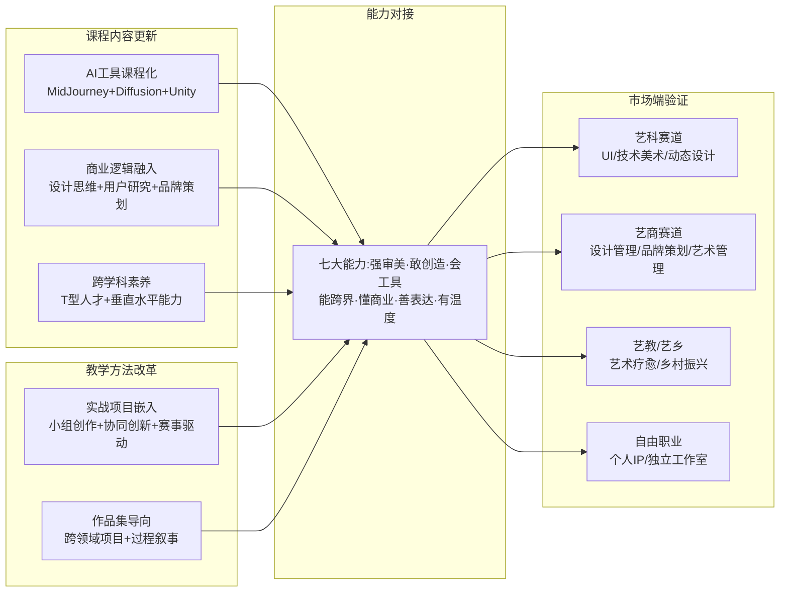

这一协同框架的核心价值在于——**任何单一改革举措都难以独立支撑艺术教育转型，必须五个层面同时推进才能形成实质效力**。AI工具课程化若没有商业逻辑融入，仍可能停留在"工具使用者"的浅层；跨学科素养培养若没有实战项目嵌入，可能停留在"知识叠加"而非"能力整合"；作品集导向若没有AI工具与商业逻辑的同步嵌入，可能继续停留在传统作品集的水平。五位一体的协同推进，是课程改革有效落地的根本保障。

## 6.6 创新创业教育与孵化机制：从课堂到工坊的全链条培育

如果说课程体系与教学方法改革解决的是"复合能力培养"的问题，那么创新创业教育则进一步回答"复合能力如何转化为职业行动"的命题。这一升级既回应第2章2.5节自由职业与自主创业赛道的现实需求，也呼应第5章5.7节"完善艺术经纪与中介服务体系"的国际经验借鉴方向。本节将依次剖析中国美院创新创业教育的标杆体系、大艺文创园的孵化平台运行机制、跨学科创新创业辅修项目，并归纳艺术院校创新创业教育的关键经验。

### 6.6.1 中国美院创业学院：从教育部示范到国家级实践基地

**中国美术学院的创新创业教育是中国艺术院校创业教育的标杆体系**。其发展时间线清晰展示了从单点突破到系统化升级的演进路径——**"自2011年，中国美术学院国家大学科技（创意）园被教育部、科技部认定为'高校学生科技创业实习基地'以来，通过十余年时间建设打造，现已成为省市重点的高校学生实习、实训、创业和就业的科技综合服务平台"**[^143]。后续重要节点包括：2014年11月李克强总理来杭考察期间视察了毕业生的创业工坊；2015年学校成立创业学院；2016年与西湖区人民政府共同创建"艺创小镇"成功入选浙江省第二批特色小镇；2017年获评教育部首批深化创新创业教育改革示范高校，**是全国99所大学中唯一的高等艺术院校**[^143]；2018年创业学院入选首批浙江省普通高校示范性创业学院；2022年获批教育部首批"供需对接就业育人项目"；**2022年成功入选国家级创新创业教育实践基地建设单位**[^143]。

**核心人才培养模式上，中国美院形成了"3+X"两段式创新创业骨干人才培养模式**[^143]。**通过"深化融合推进课堂教学体系建设""协同育人推动实践教学模式创新""以赛促改完善赛教融合项目培育"的创新创业改革路径，推动人才培养和高等教育改革、形成有艺术院校特色的创业教育教学模式和创新创业人才培养体系**[^143]。这一"课堂教学+实践教学+赛教融合"三轮驱动的设计，覆盖了创新创业能力培养的完整链条。

服务对象上，**"创业学院主要职责是：面向全体在校、包括毕业5年内的大学生，以人才培养为根本任务，以培养学生创业意识、创业精神和创业能力为目标，全面系统地开展创新创业教育、创业培训和创业实践，着力培养、培育具有创新型专业和实践特色专业风格的创新创业优秀人才和团队"**[^143]——"毕业5年内"的服务边界扩展，对接了第2章2.5节自由职业赛道艺术家"长期个人品牌沉淀"的现实需求，避免了创业服务"毕业即失联"的常见短板。

平台建设上，"中国美术学院与杭州市各级人民政府就进一步加强政校企合作、促进大学生就业创业工作，发挥中国美院的人才、创意、平台优势，围绕企业创业人才培养模式和就业岗位的提供，深化共建内容，创新合作方式，建立长效机制……目前已共建多个大学生创新创业孵化基地，总面积达5000多平方米"[^143]。**艺创小镇作为浙江省特色小镇，承担"大学生就业创业重要实践基地"的功能定位**[^143]——这一"特色小镇+创业基地"的协同模式，对接了第5章5.5.5节所述韩国Heyri艺术村"艺术家自治+社区共建"的国际经验，形成了具有中国特色的艺术家创业聚集地。

### 6.6.2 大连艺术学院文创园：6年营收1.53亿的孵化样本

**大连艺术学院文化科技创意园（大艺文创园）是中国应用型艺术院校创业孵化的标杆样本**。**"作为东北首家由大学创办的创业孵化基地……2014年8月，大连艺术学院文化科技创意园揭牌成立，本着'让创意插上文化与科技的翅膀，飞向世界'的宗旨，开启了孵化大学生创业企业的征程"**[^144]。

**核心运行成果数据相当亮眼——"2020年，实现营收4224万，较2019年增加420万。近6年来，园区共计实现营收1.53亿元，年均增幅近23%"**[^144]。从年度营收时间线看，"从2016年开始，大连艺术学院文化科技创意园分别实现营收1597万、2193万、3512万、3804万，到2020年实现营收4224万，总计销售1.53亿元"[^144]——这种"年均23%增幅"的稳定增长，体现了创业孵化平台的可持续运营能力。

孵化规模上，**"截至目前，大艺文创园累计孵化企业218家，孵出企业94家，另有21家在新四板市场上市挂牌企业，其业务经营涉及文化创意、艺术设计、影视产业、现代传媒与VR技术开发和互联网、电子商务等领域"**[^144]——218家累计孵化、94家成功孵出、21家新四板挂牌的"漏斗式"成果分布，呈现了创业孵化的真实成功率与价值传导机制。

孵化机制设计上，大艺文创园"搭建创业就业平台，不断完善园区服务功能，创新园区管理体制，积极做好园区发展路径设计，帮助大学生提升创业能力，提高大学生创业成功率。大艺文创园设立创业管理中心和服务中心，已成功培育了'晒艺'和'大艺至臻'两个原创文化品牌，用于线上线下展示和营销师生的文创商品"[^144]。**配套服务体系包括"引进了财税、法律、知识产权、人力资源、政务代理、广告传媒、电商平台、投融资机构等12家合作伙伴，为创业企业提供咨询和辅导，帮助企业实现内部管理升级"**[^144]——这种"12家合作伙伴"的专业化服务网络，回应了第4章4.1节所揭示的版权金融、知识产权保护等专业服务需求。

活动生态上，"园区每年多次举办创新创业大赛、凤凰市集、展览展示、培训讲堂、创业沙龙、论坛、项目路演以及大艺至臻颁奖典礼等一系列活动"[^144]——丰富的活动生态既提供了项目对接机会，也培育了创业氛围与社区认同。

入驻企业的实际感受提供了微观验证。**首批入驻企业大连蚂蚁文化发展有限公司负责人王元帅是大连艺术学院的毕业生，他表示"在大艺文创园，不管是公司注册成立还是税务法务事务处理，园区都有相应的解决办法，协助我们创业企业解决实际困难"**[^144]——这种"全链条创业服务"对应届毕业生创业的实际支撑作用，是创业孵化机制最直接的价值体现。

大艺文创园的政策认可同样系统化——"先后获得各级政府的认可。'辽宁省大学生创业孵化示范基地''辽宁省大学生创新创业实践教育基地''国家级众创空间'……2018年，大连艺术学院入选教育部评选的'全国创新创业典型经验50所高校'序列"[^144]。

### 6.6.3 跨学科创新创业辅修项目：同济大学的辐射型创业教育

**同济大学设计创意学院的"创新创业辅修项目"代表了综合大学艺术学院开展全校性创业教育的辐射型模式**。"设计创意学院提出了立体'T型'的本、硕、博创新设计人才培养框架……同时充分利用'同济大学中芬中心'这一国际化跨学科开放创新平台，面向全校开设'创新创业辅修项目'，培养具有设计思维的跨学科创新人才"[^135]。

辐射型设计的核心价值在于——**创业教育不局限于艺术专业学生，而是将设计思维、艺术思维输出到全校学生**。这种模式对接了清华美院"以美为媒"的学科辐射理念——"清华大学美术学院……要发挥美术在服务经济社会发展中的重要作用……要增强文化自信，以美为媒"[^123]。同济大学进一步将设计思维与创新创业教育结合，通过"普及设计教育实验实践行动能力、数字化设计与建造能力、开源硬件与软件能力和创新创业能力"[^131]，使艺术教育的价值从"专业内"扩展到"全校域"。

### 6.6.4 创业教育的多层次生态与"赛教结合"机制

整合上述案例可以看到，艺术院校创新创业教育已形成"国家级实践基地（中国美院）—省级孵化示范基地（大艺文创园）—校级创业辅修项目（同济）"的多层次生态。这一多层次生态的核心运行机制是"赛教结合"——通过创新创业大赛、艺术设计大赛、创意设计大赛等赛事驱动，将创业教育从课堂延伸到竞赛实践。

同济大学设计创意实验教学中心的"竞教结合"实践具有代表性。"实验教学中心积极推行课堂教学与学生课外创作相结合的实验教学模式……支持学生在教师的指导下积极参加各级各类大学生科技活动、艺术设计大赛、创意设计大赛及创新创业大赛等，支持学生对自己感兴趣的领域开展个性化设计与实验，通过全方位的实践，提高潜在的综合能力"[^134]。"鼓励教师引入竞赛课题、创新预研课题、工程实验课题，着重培养学生的设计实践及创新研究能力"[^134]——"教师引入竞赛课题"的机制，将赛事驱动从"学生自发参赛"提升为"教学体系内嵌"。

### 6.6.5 创新创业教育对多元就业的支撑作用

艺术院校创新创业教育对多元就业路径的支撑作用，可以从两个维度评估。**第一维度是直接孵化作用**——大艺文创园218家累计孵化、94家孵出、21家新四板挂牌等数据，直接转化为艺术生的自主创业就业出口；中国美院"毕业5年内"的服务延续，对自由职业艺术家长期发展提供了支撑。**第二维度是能力培养作用**——通过创业课程、孵化空间、政校企协同、品牌运营、赛事育人等环节培养出的创业意识、商业逻辑、项目管理、资源整合等能力，为艺术生进入第2章所述任何赛道都构成核心竞争力。

创新创业教育还呼应了第2章2.5节自由职业赛道的核心约束——"自由职业并非低门槛的'躺赚'路径，其对从业者的综合能力要求实际上更高"。当艺术生通过创新创业教育系统掌握"扎实的绘画基础+熟练的绘图软件+良好的沟通能力+持续学习与风格更新能力"等综合能力后，自由职业、自主创业等多元路径的成功率才能获得实质提升。

需要客观指出的是，艺术院校创新创业教育的现实进度同样存在显著分化。中国美院、大连艺术学院、同济大学等头部与示范院校已经形成相对成熟的体系，但大量普通艺术院校的创业教育仍停留在"开几门创业课、办几次创业讲座"的浅层阶段，缺乏实质的孵化平台、专业服务网络与持续运营能力。这一分化与第1章1.6节揭示的院校就业分化在内在逻辑上一致——**艺术教育转型的"特色化深耕"差距，最终都体现在创业孵化等综合服务能力的差距上**。

## 6.7 复合能力培养升级路径与艺术教育转型的整合框架

在6.1—6.6节系统分析基础上，本节构建艺术教育转型的整合框架，提炼"技能传授—复合能力培养—创新创业孵化"三阶段升级路径，并衔接前五章揭示的外部制度环境，明确艺术教育转型与外部制度协同的要求，为第7章综合政策建议提供教育供给侧的改革方向支点。

### 6.7.1 三阶段升级路径：技能—复合能力—创新创业

艺术教育转型的核心升级路径，可以归纳为从"技能传授"到"复合能力培养"再到"创新创业孵化"的三阶段递进。

**第一阶段是技能传授**——这是传统艺术教育的核心功能，对应第1章揭示的"普通学校的绘画课仍在教素描、色彩"的传统范式。技能传授阶段聚焦于绘画技法、设计软件、基础理论等单一技能模块，培养目标是"熟练的执行者"。这一阶段在艺术教育转型中并未被取消，但已被重新定位为"基础垂直能力"，需要叠加水平能力才能形成完整的T型人才框架。

**第二阶段是复合能力培养**——这是艺术教育转型的核心阶段，对应第2章2.6节"超级设计师七大能力"框架。复合能力培养阶段在技能传授基础上叠加AI工具、商业逻辑、跨学科素养、用户研究、传播能力等多元能力模块。同济大学T型人才框架"垂直能力（专门知识和能力）"和"水平能力（广度思考和整合思考的能力）"结合[^131]，正是这一阶段的代表性方法论。培养目标从"执行者"升级为"复合型创新者"。

**第三阶段是创新创业孵化**——这是艺术教育转型的高阶阶段，对应第2章2.5节自由职业与自主创业赛道。创新创业孵化阶段在复合能力培养基础上叠加创业意识、商业模式、项目管理、资源整合、品牌运营等创业能力模块。中国美院"3+X"两段式创新创业骨干人才培养模式[^143]、大艺文创园218家累计孵化的实证经验[^144]，都是这一阶段的代表性范式。培养目标从"复合型创新者"升级为"价值创造者"。

下图概括了三阶段升级路径与七大能力要素、五大赛道的对应关系：

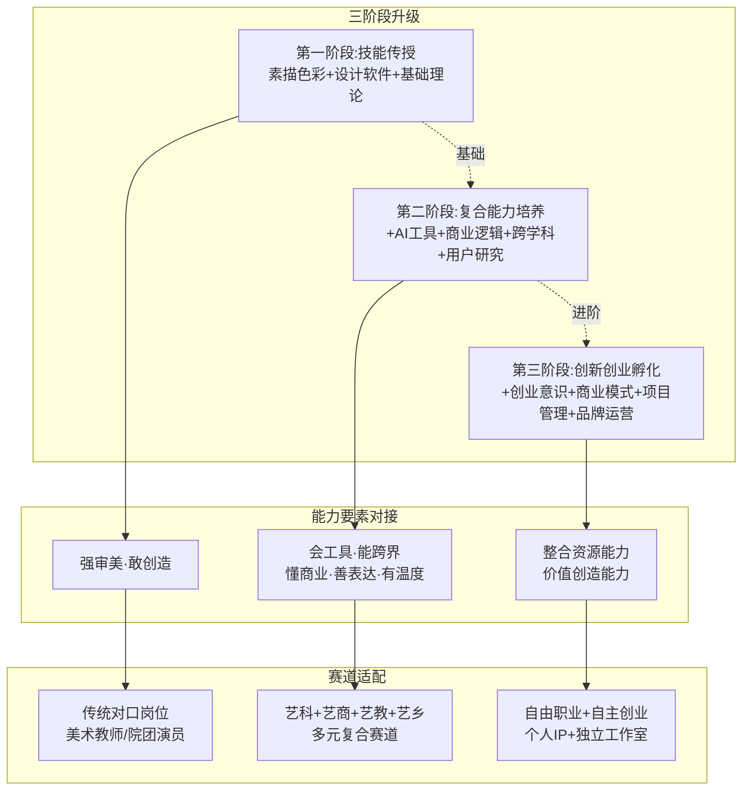

需要明确的是，三阶段并非线性替代关系，而是层层叠加的递进关系——第二阶段不否定第一阶段的技能基础，第三阶段不否定第二阶段的复合能力，三个阶段共同构成现代艺术教育的完整培养体系。**普通艺术院校的转型路径是"补齐第二阶段+培育第三阶段"，头部院校的转型路径是"深化第二阶段+引领第三阶段"**。

### 6.7.2 转型核心支撑：交叉学科+产教融合+课程改革+创业孵化

将6.2—6.6节四个层面的实践经验整合观察，艺术教育转型的核心支撑可以归纳为"四位一体"框架。**交叉学科建设**（6.2、6.3节）提供专业架构的供给侧改革，覆盖艺术+科技、艺术+商业、艺术+疗愈等多元方向；**产教融合**（6.4节）提供人才培养与产业需求的对接机制，从一级实习基地到四级产业学院实现升级；**课程体系与教学方法改革**（6.5节）提供微观教学层面的内容更新，五位一体推进AI工具、商业逻辑、跨学科素养、实战项目、作品集导向；**创新创业教育**（6.6节）提供从能力到行动的转化通道，构建多层次孵化生态。这四个层面相互支撑、相互验证，共同构成艺术教育转型的完整支撑体系。

### 6.7.3 转型现实约束：分化、师资与协同

艺术教育转型并非线性顺畅过程，至少面临四类显著约束。

**第一类约束是院校层次分化加剧**。第1章1.6节已揭示中央美院与普通二本绘画专业的就业反差，本章进一步揭示头部院校（清华美院、中国美院、央美、同济等）在交叉学科建设、产教融合深度、课程体系升级、创业孵化平台等四个层面均显著领先于普通院校。这种分化在艺术教育转型推进过程中可能进一步扩大——头部院校借助资源优势加速升级，普通院校则面临"想转型但缺资源"的现实困境。

**第二类约束是跨学科师资稀缺**。艺术+科技、艺术+商业、艺术+疗愈等交叉方向所需的复合型师资，在艺术院校内部供给极为有限。第6.2.4节揭示的"双师型团队、行业专家协同"机制可以部分弥补，但行业专家的稳定投入、跨学科教师的系统培养仍是长期挑战。这一师资困境与第1章揭示的"许多普通院校缺乏师资和实验条件"形成内在一致。

**第三类约束是产教融合深度不均**。第6.4节虽然展示了从一级到四级的多层次合作图谱，但真正达到三四级深度合作的院校仍是少数。大量普通院校的产教融合仍停留在"实习派遣+访企拓岗"的一二级层次，缺乏课程共建、联合实验室、一体化培养等深度机制。**第三类约束的本质是"企业愿意与谁深度合作"——头部院校能够以学生质量、师资水平、研发能力换取头部企业的深度投入，普通院校则缺乏这种交换价值**。

**第四类约束是国际经验本土化适配**。第5章揭示的英国HCPC—BAAT艺术疗愈认证、德国KSK艺术家社保、法国德国追续权、美国艺术市场化与艺术管理职业化、韩国文化产业政策等国际经验，对艺术教育转型构成重要参照，但本土化适配面临文化制度差异、行政体制约束、市场成熟度差距、规模差异四类挑战（详见第5章5.7.3节）。艺术教育转型不能简单移植国际经验，而需要在中国制度语境下进行本土化创新。

### 6.7.4 与外部制度环境的协同要求

艺术教育转型作为艺术人才价值实现机制的"教育供给侧"环节，必须与外部制度环境形成系统协同，才能真正释放转型红利。

**与第3章评价体系改革的协同**——艺术教育培养的复合型人才若不能在评价体系中获得制度认可，则毕业出口端将面临制度性折扣。当前新文艺群体职称改革已经覆盖网络作家、独立美术工作者等群体，但对艺术疗愈师、技术美术、AI内容创作等新兴职业仍存在评价空白（详见第3章3.4节）。艺术教育转型培养的艺术疗愈师、AI视觉设计师、数字策展人等需要在评价体系层面获得对应的职业认证与职称序列。

**与第4章产权与消费机制的协同**——艺术教育培养的IP运营、版权管理、数字藏品策展等能力，若没有完善的产权保护体系与文化消费市场承接，将停留在"学了用不上"的尴尬境地。第4章揭示的版权金融试点、追续权立法、文化消费升级等机制，为艺术教育转型提供了市场端的承接通道。**艺术教育需要主动嵌入产权保护与消费升级的实务环节**——例如将版权管理、IP开发、数字藏品发行等内容纳入课程体系，培养具备产权意识与市场议价能力的现代艺术人才。

**与第5章国际经验借鉴的协同**——艺术教育转型可以从国际经验中借鉴专业架构、课程体系、师资建设、孵化机制等多重维度，但本土化适配是关键。**英国HCPC认证体系**对中国艺术疗愈微专业建设具有直接借鉴意义——西安美院微专业"60-120天临床实习"对接英国"两年制硕士+1500小时工作经验"标准是可行的本土化路径；**美国艺术管理职业化**对中国艺术管理专业建设具有参照意义；**日本养成所模式**对中国产业学院升级提供了具体范式；**韩国文化内容产业振兴院**对中国艺术教育公共服务整合具有系统启示。

**与第7章综合政策建议的衔接**——艺术教育转型作为长期系统工程，需要国家层面的政策框架支持，包括财政投入倾斜、跨学科师资培养计划、产教融合激励机制、创业孵化平台扶持、评价体系改革配套等多重政策杠杆。这些政策建议将在第7章系统展开。

### 6.7.5 本章小结与下章衔接

本章在前五章揭示的就业困境、多元赛道、评价体系、产权与消费、国际经验基础上，聚焦艺术教育供给侧改革这一根本支撑环节，系统探讨了从"同质化扩张"向"特色化深耕"、从"技能传授"向"复合能力培养与创新创业孵化"的转型路径。

**核心结论可以概括为四点**：第一，艺术教育转型的总体方向是"特色化、差异化、内涵化"，头部院校已形成清华美院"一体两翼"、央美设计学院"五大学科建设模块"、中国美院"绘画东方学+五位一体"等代表性特色化深耕模式。第二，艺术+科技、艺术+商业、艺术+疗愈等交叉学科建设已从单点尝试演化为系统改革，"四位一体"（专业架构+课程体系+实验平台+师资团队）框架是关键支撑。第三，产教融合从一级实习基地向四级产业学院升级是必然趋势，市域产教联合体政策框架与AIGC课程共建、跨学院联合走访、一体化培养链路等实践共同推动产教融合深化。第四，课程体系与教学方法改革需要"AI工具课程化+商业逻辑融入+跨学科素养培养+实战项目嵌入+作品集导向"五位一体协同推进，创新创业教育需要在"国家级实践基地—省级孵化平台—校级辅修项目"多层次生态中形成"3+X""赛教结合"等成熟机制。

**艺术教育转型是连接前五章问题分析与第7章政策建议的关键枢纽**——只有当教育供给侧形成与产业需求、评价体系、产权保护、消费升级、国际经验相匹配的人才培养体系时，艺术生才能真正具备承接多元赛道的复合能力，艺术人才才能真正实现从"技法执行者"向"审美判断+创意叙事+技术驾驭+商业转化"复合型角色的价值重构（第1章问题命题）。第7章将在前六章本土制度分析、市场动能解析、国际经验借鉴、教育供给侧改革等系统性研究基础上，提出涵盖政府、高校、行业协会、企业、艺术家个体的综合性政策建议，明确短期、中期、长期的分阶段实施路径，为政策制定者与从业者提供可操作的行动框架。

[^129]: 新时代中国油画的学院建构
[^123]: 【学习运用"千万工程"经验案例】美术学院:艺科融合 向美而行
[^133]: 艺术与科技
[^124]: 推介| 设计学院2025年艺术与科技专业介绍
[^125]: 深化产教融合,共育数智化新艺科人才——文华学院城市建设工程学部赴字节跳动开展访企拓岗专项行动
[^139]: "职"击未来:艺术工程学院赴北京腾讯、网易开展访企拓岗调研
[^140]: 跨界融合,向"新"而行|校领导带队走访网易(沈阳)数字产业中心,共筑数字创意人才培养新生态
[^142]: 2026艺术留学变天?RCA/RISD最新课程改革:AI成必修课,跨学科是刚需
[^132]: 2026艺术留学彻底变天!RCA/RISD课程改革:AI成必修课,跨学科是准入门槛
[^143]: 创业教育
[^137]: 艺术教育发展年度报告(2024年)
[^144]: 大艺文创园6年结硕果:总计实现营收1.53亿元
[^138]: 教育部办公厅关于开展市域产教联合体建设的通知
[^135]: 教学
[^131]: 教学理念
[^134]: 中心特色
[^130]: 清华美院2025年新增设计专业硕士-非全日制"艺术与科技"项目招生简介
[^141]: 2024届毕业生就业质量报告
[^136]: 赋能心灵·艺启未来:西安美术学院艺术疗愈微专业首期招生!
[^126]: 中央美术学院-设计学院
[^127]: 中央美术学院-设计学院
[^128]: 中央美术学院-设计学院

# 7 构建艺术人才价值实现生态的政策与策略建议

前六章对中国艺术生就业的系统性研究已经清晰呈现出一幅"问题—机遇—制度—市场—国际—教育"的全景图：第1章揭示了艺考扩招、传统渠道收缩、AI技术冲击、高校撤并、院校分化等结构性困境，并指出艺术生正在经历从"单一对口就业"向"价值重构"的转向；第2章勾画了艺术+科技、艺术+商业、艺术+教育、艺术+乡村振兴、自由职业五大赛道及"艺术+X"复合人才的市场溢价机制；第3章揭示了评价体系单一化—职业路径窄化—收入受限的传导链条，并以新文艺群体职称改革为切口呈现制度破壁的可能性；第4章剖析了产权保护短板与消费升级机遇并存下的双轮驱动逻辑；第5章通过五国比较提炼了市场驱动型、政府主导型、行业自治型三类模式的可借鉴方向；第6章系统讨论了艺术教育从"同质化扩张"向"特色化深耕"转型的供给侧改革路径。**当问题诊断、市场图谱、制度分析、国际参照、教育改革六个维度的研究成果汇聚至此，研究的最后一公里便是将它们整合为一个可操作、可协同、可分阶段推进的政策与策略框架——这正是本章作为收官章节的核心使命**。本章将从制度供给、市场培育、教育改革、产业生态、主体协同五大维度构建综合性建议体系，明晰政府、高校、行业协会、企业、艺术家个体的角色分工与责任边界，并按短期、中期、长期三个时序提出分阶段实施路径，最终回应"艺术生如何突破传统就业领域的限制、艺术人才价值如何重构"这一全篇核心命题。

## 7.1 完善艺术人才职称评审与职业认证体系

评价体系作为连接市场端能力与制度端认可的关键桥梁，是艺术人才价值实现的"第一道闸门"。第3章揭示的"评价体系单一化—职业路径窄化—收入水平受限"传导链条，决定了完善艺术人才职称评审与职业认证体系必须成为政策建议的优先议程。基于前六章对新文艺群体职称改革实践、新兴职业认证空白、国际行业自治模式等多维分析，本节提出四层递进式建议。

**第一，巩固扩大新文艺群体职称评审主渠道作用，统一全国破格标准与代表作认定细则**。第3章已揭示四川省文联依托121名高级职称专家组成的评委会、首批12名新文艺工作者获评副高、河南36人副高+2人正高、新疆将音乐舞蹈等新文艺群体纳入评定等实质性进展。下一步的关键是将地方先行经验上升为全国统一标准——曾小敏在2026年全国两会上专门建议"统一破格标准，畅通优秀人才成长'快车道'"，这一建议应当成为制度推进的明确方向。具体路径包括：由人社部、文化和旅游部牵头制定《新文艺群体职称评审标准（全国版）》，统一专业类别、级别要求、代表作认定细则；推广四川"兜底申报"机制（无单位挂靠由省文联直接受理）与洛阳"专用账户"经验（市文艺家服务中心开设专用账户协助申报），破解第3章所揭示的"申报材料如何规范整理"成为现实"拦路虎"的技术门槛；扩展覆盖专业范围，将当前部分省份排除在外的动漫游戏设计、艺术创意设计等新兴专业全面纳入。

**第二，针对艺术疗愈师、技术美术、AI内容创作、数字策展人等新兴职业，借鉴英国HCPC—BAAT双重认证经验，建立国家层面职业资格认证体系**。第3章3.4节已指出当前存在"市场跑得快、制度跑得慢"的张力——AI视频生成师、技术美术、数字媒体艺术总监、AI漫剧编剧等岗位月薪可达2.5万至5万元甚至30—60K·14薪的高薪表现，但缺乏行业职级标准与纵向晋升通道。第5章5.2节进一步揭示了英国HCPC作为法定监管机构的"两年制硕士+1500小时工作经验+60—120天临床实习+州级执照"的成熟范式。借鉴这一国际经验的本土化路径包括：第一步，由人力资源和社会保障部主导在《国家职业分类大典》中新增"艺术治疗师""技术美术师""AI内容创作师""数字策展人"等新兴职业类别；第二步，参照HCPC法定监管模式，由国家卫健委（艺术疗愈师）、文化和旅游部（数字策展人）、工信部（技术美术师与AI内容创作师）等行业主管部门分别担任主管，对培训机构实施许可制以从根源遏制"20天速成证书、初级2380元"的乱象；第三步，依托中国心理学会、中国动漫艺术家协会等行业组织开展会员制管理与伦理监督，形成"国家认证+行业自治"的双层架构。

**第三，建立特殊人才直接认定通道，针对现象级文艺成果创造者开辟"快车道"**。四川省人社厅已明确表示"下一步，四川拟研究制定特殊人才高级职称认定办法，对在……文艺创作和文化传承等领域作出颠覆性贡献、取得标志性或不可替代性成果且符合申报条件的'体制外'专业技术人才可直接认定取得高级职称"，新疆2024年11月已出台《特殊人才认定高级职称实施细则》。建议将这一地方先行机制上升为全国通行制度，由人社部牵头制定《艺术领域特殊人才高级职称认定办法》，明确"现象级作品+市场认可+社会影响力"三位一体的直接认定标准——陈丽君、李云霄从市场走红到拟评一级演员仅两年的标杆案例（详见第3章3.3.1节）应当成为全国普遍可复制的制度范本。

**第四，构建评价标准的动态调整机制，建立行业发展与评价体系的常态化联动**。河南标准已明确"根据行业发展需要，动态调整专业设置"。建议建立以五年为周期的全国艺术系列职称评审标准修订机制，由人社部、文旅部联合相关行业协会组成专门工作组，每两年开展一次行业发展调研、每五年完成一次标准全面修订，确保评价体系不再滞后于产业现实。

## 7.2 强化知识产权保护与版权运营机制

知识产权保护是艺术人才价值兑现的"第二道闸门"，第4章揭示的侵权赔偿偏低、地区判罚悬殊、追续权缺失、新兴业态认定滞后等结构性短板，构成产权制度优化的明确议程。基于第4章本土制度分析与第5章国际经验比较，本节提出五层多维度优化路径。

**第一，推动《著作权法》第四次修正纳入追续权条款**。第4章4.3节与第5章5.3.3节已系统揭示了这一议题的关键意义——中国艺术家在全球艺术家拍卖前十中占据6席、百万美元以上成交艺术品数量也远超美国英国，但由于现行著作权法尚没有规定追续权，中国艺术家分文未得；2012年《著作权法》修改草案中曾纳入但最终未通过的追续权条款，应当在第四次修正中重新提上立法议程。具体规则建议参照法国3%、德国5%的国际通行区间确定分享比例，明确适用范围（美术作品、摄影作品的原件及作家作曲家手稿）、不可转让与不可放弃属性；建立追续权征收的专门管理机构，借鉴中国音像著作权集体管理协会经验由相关行业协会担任征收主体；通过对接《伯尔尼公约》对等保护原则，使中国艺术家在境外艺术品市场的追续权收益获得法律基础。这一立法突破对长期被市场低估却随成名后增值的艺术家而言，具有"回溯性分享"的实质意义。

**第二，统一跨地区侵权赔偿判罚标准，扩大惩罚性赔偿适用范围**。第4章4.2节揭示的"美术作品在山东判罚均值53400元、内蒙古仅300元"的178倍差异，损害了产权保护制度的可预期性。建议由最高人民法院发布《涉艺术作品著作权侵权案件赔偿计算指引》，统一摄影、图形、美术等不同作品类型的赔偿计算方法与裁量幅度；扩大惩罚性赔偿适用范围，将"组团抄袭"产业链、规模化数字盗版等恶意侵权行为列为惩罚性赔偿的明确适用情形；推广苏州工业园区法院共同侵权认定经验，对关联企业架构下的侵权行为统一追责。同步推广电子存证（区块链存证）与调解前置机制——三亚市知识产权保护中心人民调解委员会"一次性支付赔偿款2500元、纠纷快速办结"的多元解纷经验，为艺术人才尤其中小规模侵权纠纷提供了低成本、高效率的维权通道，应当全国普及。

**第三，深化版权金融生态综合试点，将八省市经验向全国推广**。第4章4.1.3节揭示的国家版权局2025年版权金融试点已在北京、上海、江苏、浙江、广东、四川、深圳、宁波八省市启动，建议在2026—2028年完成八省市试点经验评估，2028—2030年将试点经验向全国推广。具体路径包括：完善版权评估指引，建立艺术作品价值评估的标准化方法；拓展版权质押融资，破解第2章2.5节所揭示的自由职业艺术家"轻资产、难融资"困境；推广版权保险与版权证券化工具，让稳定的版权收益流可以加速资金回笼。视觉中国"区块链+"战略与左古山数字藏品全球首发等案例（详见第4章4.4.2节）已经初步验证了版权资产化路径的可行性。

**第四，加强数字版权与NFT数字藏品监管，遏制平台炒作与虚假发货乱象**。杭州互联网法院已确立NFT数字藏品作为虚拟艺术品的财产权地位，但市场仍存在"平台炒作、哄抬价格、虚假发货"等问题。建议由国家版权局会同网信办、市场监管总局发布《数字藏品平台运营管理办法》，对发行规模、定价机制、二级市场流转、平台备案等环节实施规范化监管；同时区分中国数字藏品（文化产品+收藏价值+合规框架）与境外NFT（金融化投机），守住"不具备资金属性、不与虚拟货币挂钩"的合规底线。

**第五，构建艺术作品全链条版权保护体系**。借鉴《哪吒之魔童闹海》上映前申请作品登记400余件的全链条保护经验，由国家版权局推动建立"作品登记—授权管理—衍生品监管—跨境维权—金融变现"端到端的版权服务体系，让单件作品的版权价值能够通过多元授权与衍生开发持续放大。

## 7.3 培育文化消费市场与拓展应用场景

如果说产权保护强化是"防御性"机制，文化消费市场培育则是"扩张性"机制——第4章揭示的2.72万亿元情绪经济与2.5万亿元国潮市场，已经为艺术人才打开了万亿级需求空间，但市场动能能否真正转化为艺术人才实质受益，仍取决于消费场景拓展与市场秩序规范的协同推进。

**第一，支持艺术疗愈服务进入医保目录、企业EAP采购、社会大美育课堂等多元场景**。第2章2.3.1节已揭示四川省医疗保障局率先将"音乐疗法"纳入医保报销，北京、上海等地多家三甲医院已陆续设立艺术疗愈门诊。建议将四川医保试点经验向全国推广，由国家医保局会同国家卫健委制定《艺术治疗服务医保支付目录》，逐步将经认证艺术疗愈师提供的临床艺术治疗服务纳入医保支付范围；同步推动艺术疗愈服务进入企业EAP（员工援助计划）采购目录——参照"谷歌、微软等科技巨头将艺术疗愈课程作为员工心理关怀的重要组成部分"的国际经验（详见第2章2.3.1节），引导大型企业将艺术疗愈采购纳入员工福利体系；扩大上海"社会大美育课堂"143家场馆的辐射范围，鼓励博物馆、美术馆、剧场、图书馆、非遗场馆开发艺术疗愈与美育普及融合的公共服务项目。

**第二，推动博物馆文创、非遗活化、IP衍生品等领域的开发深度，避免"符号拼接式"低端竞争**。第4章4.6节揭示的故宫文创年销15亿元、三星堆博物馆文创2025年销售额突破2.5亿元、国潮经济2.5万亿元等市场动能，需要通过制度引导避免低端"贴标式"竞争。建议由文化和旅游部牵头制定《博物馆与非遗文创开发指引》，鼓励"深入中华美学内核"的高质量IP开发，对原创设计的IP授权与衍生品提供知识产权保护倾斜；扩大博物馆IP开放授权范围，参照故宫"产品创意娱乐化、品类定位精准、80%产品在300元以下"的成熟模式，鼓励更多博物馆将馆藏IP通过规范授权进入消费市场。

**第三，培育艺术乡村振兴的可持续模式**。第2章2.4节已分析了碧山计划、许村模式、蔡家沟村、艺术在浮梁、云南"艺术家第二居所"等多元实践，并坦诚指出"碧山计划在持续两年的'丰年祭'艺术节后被迫停止"等现实挫折。建议借鉴浮梁大地艺术节"商业化运作+知名艺术家+大地艺术展场"的成熟经验与云南"艺术家第二居所"的制度化路径，由文旅部会同农业农村部、住建部联合制定《艺术乡村振兴示范项目认定办法》，对兼具艺术性、实用性、可持续性的项目给予政策与资金倾斜；同步建立"艺术家驻村—文创特派员—艺术村长—候鸟人才"的多层次人才下沉机制，破解"艺术家纯粹创作理念与乡村致富需求相悖"的结构性矛盾。

**第四，构建艺术品消费升级支撑体系，规范情绪经济"伪疗愈"乱象**。第4章4.5.5节已警示"疗愈变成算计"的现实风险——"有人在陪聊服务中花费数千元，却发现标准模糊、退款无门"。2025年国务院办公厅印发的《加快培育服务消费新增长点工作方案》已将情绪式、体验式服务列为重点培育领域，建议在此基础上由市场监管总局会同文旅部出台《情绪消费服务规范》，对艺术疗愈、陪伴服务、声音设计等新兴业态实施服务标准化、定价透明化、退款机制规范化管理。

**第五，引导文化、体育和娱乐业自由职业与自主创业的规范化发展**。麦可思数据显示2024届本科毕业生自由职业和自主创业最集中的行业均为文化体育娱乐业（详见第1章1.1节），这一群体的规范化发展需要税收便利、社保接入、平台监管、版权保护等多维支撑——这些将在7.6节生态构建与7.7节主体协同中进一步整合。

## 7.4 推动艺术教育结构性改革与产教融合深化

艺术教育作为艺术人才价值实现的"教育供给侧"，是前述所有制度改革能否真正落地的根本支撑。基于第6章对艺术教育转型路径的系统分析，本节提出六层政策杠杆。

**第一，分类支持院校特色化深耕，避免"一刀切"撤并**。第1章1.5节揭示的2024年全国高校撤销专业点1428个、停招2220个的密集调整，第1章1.6节进一步揭示的中央美院与普通二本绘画专业的就业反差，共同指向艺术教育转型中的院校分化加剧问题。建议由教育部建立"分层分类"政策框架——对清华美院、中央美院、中国美院等头部院校强化"特色化引领、国际化推进、跨学科深耕"的政策导向，鼓励其形成各具特色的世界级艺术学科；对普通艺术院校提供"转型资源倾斜"，包括师资培训专项、产教融合补贴、跨学科课程资源共享平台等支持，避免普通院校在撤并潮中丧失发展空间。具体到撤并机制，应当审慎评估"毕业去向落实率连续低于50%"的红黄牌标准在艺术学科的适用性，避免将文化、体育和娱乐业自由职业就业等弹性出口排除在统计口径之外。

**第二，加速交叉学科建设，扩大"艺术+科技""艺术+商业""艺术+疗愈"等新兴专业布点与联合学位项目**。第6章6.2节揭示的清华美院"艺术与科技"非全日制硕士项目（首期招生13人）、四川美院与电子科技大学联合学士学位项目，提供了交叉学科建设的成熟范式。建议教育部在"十五五"期间设立"艺术与新兴技术交叉学科建设专项"，每年支持50—100个艺术+科技、艺术+商业、艺术+疗愈交叉学科建设项目；同时在《学位授予和人才培养学科目录》框架下进一步完善交叉学科的学位授予规则，破除艺术学位与工学学位、管理学学位之间的转换障碍。

**第三，落实市域产教联合体建设，推动产教融合从一级实习基地向四级产业学院升级**。第6章6.4节已系统揭示了产教融合四级合作的升级路径，2023年教育部办公厅《关于开展市域产教联合体建设的通知》已明确"到2025年共建设150家左右"的目标。建议在2026—2030年第二阶段将艺术类专业明确纳入市域产教联合体建设重点，借鉴日本京都动画养成所"38年28届、绝大部分新人通过自养"与韩国文化内容产业振兴院"统一机构+全链条职能"的国际经验，推动头部互联网与文创企业（腾讯、网易、字节跳动、米哈游、火山引擎等）与艺术院校共建产业学院，形成"实习—毕业设计—就业"一体化培养链路。

**第四，推进课程体系五位一体改革**。基于第6章6.5节归纳的"AI工具课程化+商业逻辑融入+跨学科素养培养+实战项目嵌入+作品集导向"五位一体改革框架，建议教育部组织编制《艺术类专业本科教学质量国家标准（修订版）》，将AI工具应用、商业逻辑、跨学科素养纳入核心能力要求；推动RCA"AI工具+二次创作+批判性思考"与RISD"全民AI"课程改革经验在国内艺术院校的本土化落地，避免AI工具课程化停留在浅层"会用"层面。

**第五，培育跨学科师资队伍，建立行业专家进校园的常态化机制**。第6章6.3.3节已坦诚指出新兴交叉方向面临"跨学科师资稀缺"的现实困境。建议教育部联合财政部设立"艺术学科跨学科师资培养专项"，支持艺术院校教师攻读第二学位、跨学科博士后等；建立"行业专家进校园"的常态化机制，对长期担任艺术院校外聘导师、参与课程共建的行业专家给予税收优惠或职称评审加分，参照西安美术学院艺术疗愈微专业"校内导师+行业导师"双导师制经验全面推广。

**第六，支持创新创业教育多层次生态建设**。第6章6.6节揭示的中国美院国家级创新创业实践基地、大艺文创园6年营收1.53亿元、同济大学跨学科创新创业辅修项目等示范经验，应当通过政策引导扩大辐射范围。建议教育部认定一批"艺术院校创新创业教育示范基地"，给予资金、品牌与平台资源倾斜；同时推动艺术院校与地方政府共建"艺创小镇""艺术家第二居所"等空间载体，借鉴韩国Heyri艺术村模式形成中国特色的艺术家创业聚集地。

## 7.5 构建艺术经纪与中介服务专业化体系

针对中国艺术市场化机制成熟度不足的现状，构建艺术经纪与中介服务专业化体系是连接艺术人才与市场需求的关键制度桥梁。第5章5.1节揭示的美国全球艺术市场主导地位、艺术管理职业化、文艺研究组织"基础设施型"角色等经验，提供了中介服务专业化的国际参照。

**第一，培育艺术经纪、版权代理、IP授权、数字藏品平台等专业中介机构**。借鉴美国苏富比、佳士得等成熟拍卖体系与全球艺术博览会2018年总销售额达165亿美元规模的市场化运行经验，建议由文化和旅游部牵头制定《艺术经纪机构发展指引》，扶持一批具备国际竞争力的中国本土艺术经纪机构；同步规范画廊、拍卖行、艺术品保险、艺术品评估等中介服务行业标准，形成完整的艺术市场中介服务链条。

**第二，支持艺术管理专业建设与人才培养**。第2章2.2.3节已揭示艺术管理领域核心岗位年薪在4万至10万美元（约28万至70万元人民币）区间，反映出该方向的市场溢价空间。建议教育部扩大艺术管理硕士项目（MAM）的招生规模与院校布局，推动艺术管理专业从当前少数顶尖院校的"小众专业"扩展为覆盖区域艺术中心城市的标配专业；同步建立"艺术管理职业能力认证"体系，参照美国艺术行业销售经理、市场总监等岗位职级，构建中国艺术管理人才的职业化路径。

**第三，发挥艺术行业协会的"基础设施型"角色**。第5章5.1.2节揭示的美国MLA等文艺研究组织通过"格式规范、学术平台、奖项体系"提供公共品供给的经验，对中国艺术行业协会改革具有直接借鉴意义。建议中国文联、中国美协、中国书协、中国动漫艺术家协会等全国性艺术行业协会进一步强化"基础设施型"角色——除会员发展、奖项评选等传统职能外，增加格式规范制定、学术平台搭建、行业数据发布、新兴业态研究等公共品供给职能，参照英国BAAT在艺术疗愈领域的行业自治经验，让行业协会真正成为艺术人才"自由而又相互促进的专业社区"。

**第四，培育中国本土的国际艺术博览会与拍卖品牌**。"双年展数量从最早有限的威尼斯双年展、圣保罗双年展等增加到目前的超过150场，艺术博览会则从1970年代的3场增加到2018年的将近300场"（详见第5章5.1.3节）。中国艺术市场虽已成为全球重要节点，但本土国际艺术博览会与拍卖品牌的全球影响力仍有提升空间。建议由文旅部支持上海艺术博览会、北京国际画廊博览会、香港巴塞尔艺术展等本土与国际化平台进一步发展，鼓励中国本土拍卖行通过国际化合作提升全球位次。

**第五，构建艺术经纪与新文艺群体之间的对接通道**。第3章揭示的新文艺群体职称改革打破了"身份壁垒"，但市场端的中介服务承接能力仍需提升。建议由各省级文联牵头建立"新文艺群体经纪服务平台"，为获得职称认可的独立艺术家提供版权代理、商业合作对接、跨境市场拓展等专业化中介服务，让自由职业艺术家不再面临"作品有市场但缺乏专业经纪支持"的困境。

## 7.6 营造跨界融合的产业生态与艺术家社会保障体系

如果说前五节聚焦的是制度供给与市场培育，本节则进一步将视野拓展至产业生态与社会保障体系——这是艺术人才价值实现的"底层基础设施"，也是国际经验中最具系统性的借鉴方向。

**第一，借鉴德国KSK艺术家社会保险体系，探索中国艺术家社保试点**。第5章5.3节揭示的德国艺术家社会保险体系（KSK）以"艺术家自付50%+国家与艺术品使用者共担50%"的费率结构，将自由职业艺术家纳入医疗、养老、护理保险的"全民保障"框架。建议由人力资源和社会保障部、文化和旅游部、中国文联协同推动中国艺术家社会保险试点——选择已开展新文艺群体职称评审的省份（四川、河南、新疆、广东等）作为先行试点区域，针对获得职称认可的独立艺术家、签约自由职业者、平台型艺术从业者，建立专门化社会保险参保通道；将艺术品使用方（出版社、画廊、广告公司、平台企业、剧院等）纳入保费分担机制；与中国现行新就业形态劳动者职业伤害保障试点对接，避免重复建设。这一试点对解决第2章2.5节所揭示自由职业艺术家"缺乏社保保障"的现实困境具有根本性意义。

**第二，借鉴日本人间国宝制度，完善国家级非遗代表性传承人的年金支持与传承资助机制**。第5章5.4.4节揭示的日本"国家级权威认定+年金支持+传承资助"三位一体设计，对中国非遗传承体系完善具有直接参照价值。建议由文化和旅游部完善现行国家级非物质文化遗产代表性传承人制度，明确国家级传承人的固定年金待遇标准，建立"传承资助专项基金"覆盖徒弟培养、技艺记录、作品创作等长期投入需求；同时参照日本经验扩大对国家级传承人的社会地位认定与媒体宣传，让传统艺术家在市场化时代获得超越市场的社会认可。

**第三，参照韩国"文化立国"战略与"三位一体"管理机制，提升文化产业政策位次**。第5章5.5节系统揭示了韩国文化产业振兴的成功经验——"文化立国"国家战略的政策连续性（多届总统接力推进）、专门立法体系（《文化产业振兴基本法》《文化产业促进法》《游戏产业振兴法》等）、"三位一体"管理机制（文化体育观光部—特殊法人—社团法人）、强有力的财税扶持（创新文化企业2年内减免75%不动产取得税、5年内免除财产税等）。借鉴这一系统化经验，建议在国家"十五五"规划中将文化产业进一步上升为国家战略支柱产业；研究制定《文化产业振兴基本法》，覆盖电影、游戏、动漫、网络文学、数字内容等具体产业；整合现有分散在文旅部、广电总局、版权局、新闻出版总署等多部门的文化产业公共服务职能，参照韩国文化内容产业振兴院模式形成"统一机构+全链条职能"的服务体系。

**第四，营造艺术与科技、商业、教育、乡村振兴跨界融合的产业生态**。前六章揭示的"艺术+X"复合赛道、跨界融合人才需求、艺术人才作为"创意引入者—文化转译者—产业链接者"等议题，共同指向需要破除"艺术家孤岛"的传统角色定位，让艺术家深度嵌入数字产业、消费产业、教育产业、乡村振兴等多元生态。建议由发改委联合文旅部牵头编制《艺术与产业跨界融合行动计划》，鼓励科技企业、消费品牌、教育机构、地方政府主动引入艺术家驻场、艺术顾问、艺术合作等机制；蔚来汽车声音体验负责人聂俊"未来科技行业对懂艺术、懂审美、懂声音的人才需求会越来越大"的判断（详见第1章1.7节），需要在产业政策层面进一步放大。

**第五，支持艺术家驻村、艺术家聚集地、艺术特色小镇等空间载体建设**。借鉴韩国Heyri艺术村"艺术家自治+社区共建"经验与中国艺创小镇、明月村等本土实践，建议地方政府在城乡更新、特色小镇建设、乡村振兴等政策框架下，规划建设一批兼具创作空间、生活功能、产业承接的艺术家聚集地；同步完善艺术家驻村、文创特派员、"艺术村长"等制度安排，让艺术家在空间载体中获得稳定的生活保障与持续的创作环境。

## 7.7 多主体协同的角色分工与责任框架

艺术人才价值实现生态的构建是典型的"系统工程"，单一主体的努力难以撬动整体格局，必须通过多主体协同形成合力。基于前六节的政策与策略建议，本节系统梳理政府、高校、行业协会、企业、艺术家个体五大主体的角色分工与责任边界。

**政府层面承担制度供给、财税激励、公共服务整合的核心责任**。在制度供给方面，由文旅部牵头协同人社部、国家版权局、教育部、国家卫健委、市场监管总局等部门形成跨部门协作机制，重点推进新文艺群体职称改革、新兴职业认证、《著作权法》第四次修正、艺术家社保试点、文化产业立法等关键议程。在财税激励方面，扩大文化产业专项基金规模，设立艺术学科跨学科师资培养专项、艺术与新兴技术交叉学科建设专项等财政工具，对创新文化企业、艺术经纪机构、产教融合企业实施税收减免。在公共服务整合方面，参照韩国文化内容产业振兴院模式，研究整合现有分散的文化产业公共服务职能，形成"统一机构+全链条职能"的服务体系。地方政府层面则重点承担市域产教联合体建设、艺术乡村振兴示范项目、艺术家聚集地空间载体等具体落地任务。

**高校层面承担人才培养、学科建设、产教融合、创新创业孵化的供给侧责任**。头部院校（中央美院、中国美院、清华美院、中央戏剧学院、上海音乐学院等）承担"特色化引领、国际化推进、跨学科深耕"的引领责任，在艺术+科技、艺术+商业、艺术+疗愈等交叉学科建设上形成世界级标杆；普通艺术院校承担"特色化转型、产教融合深化、地方文化承载"的差异化责任，结合区域产业禀赋形成特色定位；高职院校承担"应用型人才培养、技能认证、创业孵化"的实操性责任，对接文化创意产业一线岗位需求。所有院校共同推进课程体系五位一体改革、跨学科师资建设、产教融合升级与创新创业教育多层次生态建设。

**行业协会承担专业评价、行业自治、伦理监督、新兴职业认证的中介责任**。中国文联、各全国性艺术家协会作为新文艺群体职称评审主渠道，进一步发挥"主动服务+专用账户"的兜底申报机制；借鉴英国BAAT经验，在艺术疗愈、技术美术、AI内容创作、数字策展等新兴职业领域建立行业自治型认证体系；参照美国MLA经验，强化"基础设施型"角色，提供格式规范、学术平台、奖项体系等公共品供给；建立伦理监督机制，对会员行为实施规范化管理。

**企业层面承担产业需求传导、产教融合深度参与、产权保护协同的市场端责任**。重点引导腾讯、网易、字节跳动、米哈游、火山引擎等头部互联网与文创企业从一级实习基地向四级产业学院深度合作升级，参与课程共建、联合实验室、一体化培养链路建设；同时承担产权保护协同责任，参与版权金融试点、IP衍生品全链条保护、追续权征收机制等制度建设；引导消费品牌、科技企业、地方文旅企业参与艺术家驻场、艺术合作、文创开发等跨界融合实践。

**艺术家个体层面承担复合能力构建、终身学习、品牌运营的主体性责任**。艺术家作为价值重构的最终主体，需要主动适应"审美判断+创意叙事+技术驾驭+商业转化"复合型角色的转型方向。具体包括：构建第2章2.6节所述"超级设计师七大能力"（强审美·敢创造·会工具·能跨界·懂商业·善表达·有温度）；通过院校微专业、行业认证、项目实战、作品集打磨等多元路径实现能力外化；积极适应新文艺群体职称评审、版权登记、数字版权运营等制度通道；面对AI技术冲击保持终身学习态度，将AI工具作为创意放大器而非简单替代者；在自由职业、个人IP、独立工作室等多元路径中持续打磨个人品牌。

下表汇总了五大主体的核心责任分工：

| 主体层级 | 核心责任 | 关键议程 | 落地抓手 |
|---------|---------|---------|---------|
| 政府（中央与地方） | 制度供给+财税激励+公共服务 | 评价改革、产权立法、社保试点、产业政策 | 跨部门协作机制、专项基金、市域产教联合体 |
| 高校（分层次） | 人才培养+学科建设+产教融合+创业孵化 | 交叉学科、五位一体课程改革、产业学院 | 特色化深耕、跨学科师资、孵化生态 |
| 行业协会 | 专业评价+行业自治+伦理监督+新兴认证 | 职称主渠道、新职业认证、行业基础设施 | 兜底申报、格式规范、行业自治 |
| 企业（头部+中小） | 产业需求传导+产教融合参与+产权协同 | 一体化培养、IP开发、版权保护协同 | 联合实验室、产业学院、跨界合作 |
| 艺术家个体 | 复合能力构建+终身学习+品牌运营 | 七大能力、价值重构、IP运营 | 微专业学习、作品集打磨、个人品牌 |

## 7.8 短中长期分阶段实施路径

考虑到艺术人才价值实现生态构建涉及的制度复杂性、跨部门协调难度与本土化适配挑战，分阶段、分优先级的实施路径是政策推进的现实选择。基于第5章5.7.4节国际经验借鉴优先级排序的方法论，本节构建短期、中期、长期三阶段实施时序。

**短期（1—3年）以就业服务优化与制度补缺为重点**。这一阶段的核心目标是回应当前艺术生就业困境最迫切的现实需求，落地相对成熟的改革议程。具体任务包括：第一，填补艺术疗愈等新兴职业认证空白，由人社部牵头在《国家职业分类大典》中新增艺术治疗师等职业类别，规范"20天速成证书"乱象；第二，扩大新文艺群体职称评审覆盖范围，将四川、河南、新疆等地经验向全国推广，统一全国破格标准与代表作认定细则；第三，深化访企拓岗与产教融合，将艺术类专业全面纳入市域产教联合体建设；第四，推广版权金融试点经验，加速八省市试点经验评估与全国推广进程；第五，规范情绪经济与艺术疗愈市场秩序，出台《情绪消费服务规范》与《数字藏品平台运营管理办法》；第六，深化艺术领域知识产权保护，统一跨地区侵权赔偿判罚标准、推广电子存证与调解前置机制。

**中期（3—5年）以评价体系改革与产权制度完善为重点**。这一阶段的核心目标是推动结构性制度变革，破解前期单点改革无法解决的深层议题。具体任务包括：第一，推动《著作权法》第四次修正纳入追续权条款，破解中国艺术家在全球艺术品市场"分文未得"的制度困境；第二，构建艺术家社会保险专项制度，借鉴德国KSK模式在试点省份基础上扩大覆盖范围；第三，优化国家级非遗代表性传承人评价机制，借鉴日本人间国宝制度完善年金支持与传承资助；第四，扩大艺术+科技、艺术+商业、艺术+疗愈等交叉学科建设规模，覆盖更多综合大学与专业艺术院校；第五，整合文化产业公共服务体系，推动跨部门职能整合形成"统一机构+全链条职能"的服务体系；第六，培育艺术经纪与中介服务专业化体系，扶持本土国际艺术博览会与拍卖品牌发展。

**长期（5—10年）以产业生态重塑与价值重构为重点**。这一阶段的核心目标是完成艺术人才价值实现生态的整体重构，让艺术教育、艺术市场、艺术评价、艺术保障形成有机协同。具体任务包括：第一，将文化产业上升为国家战略，借鉴韩国"文化立国"经验形成多届政府接力推进的政策连续性；第二，构建文化产业法律体系，研究制定《文化产业振兴基本法》及其配套立法；第三，形成中国艺术市场全球位次，提升中国本土艺术博览会与拍卖品牌的国际影响力，让中国艺术家在全球艺术市场体系中获得稳定的高位份额；第四，实现艺术教育从同质化扩张向特色化深耕的全面转型，让头部院校的"理念—系统—范式"升级路径在普通院校层面也获得实质落地；第五，完成艺术人才从"技法执行者"向复合型价值创造者的根本性重构，让"审美判断+创意叙事+技术驾驭+商业转化"复合型角色成为艺术教育与艺术市场的主流共识。

下图概括了三阶段实施路径的核心结构：

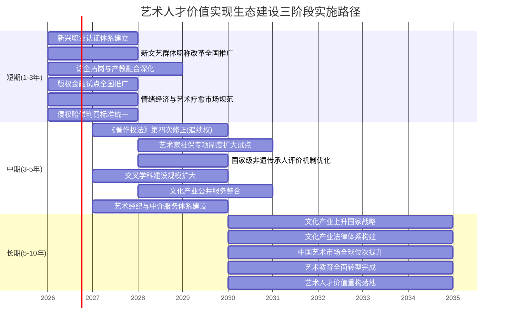

需要客观指出的是，三阶段时序并非机械的"分段切割"——许多议程在三个阶段中持续推进、相互衔接，例如艺术教育转型需要在短期建立基础、中期扩大规模、长期实现全面落地；评价体系改革需要在短期补缺、中期统一、长期与产权和保障形成协同。三阶段的核心价值在于明确各阶段的"重点议程"与"优先抓手"，避免改革议程的散乱与无序推进。

## 7.9 行动框架与价值重构愿景

作为全篇研究的最后一节，也是收束全章与全篇的关键论述，本节将前述五大维度建议与三阶段实施路径整合为艺术人才价值实现生态的整体行动框架，并坦诚面对生态构建的现实挑战，最终勾勒艺术人才价值重构的愿景图景。

**整体行动框架可以概括为"五大支柱+三阶段时序+多主体协同"的立体结构**。**五大支柱**对应7.1—7.6节的政策维度——制度供给（评价认证、产权保护）、市场培育（文化消费、艺术经纪）、教育改革、产业生态、主体协同；**三阶段时序**对应7.8节的实施路径——短期就业服务优化、中期评价与产权改革、长期产业生态重塑；**多主体协同**对应7.7节的角色分工——政府制度供给、高校人才培养、行业协会专业自治、企业市场端参与、艺术家个体能力构建。这三个维度交织形成的立体框架，回应了"突破边界：艺术生多元化就业路径与艺术人才价值重构"这一全篇核心命题。

下图概括了艺术人才价值实现生态的整体行动框架：

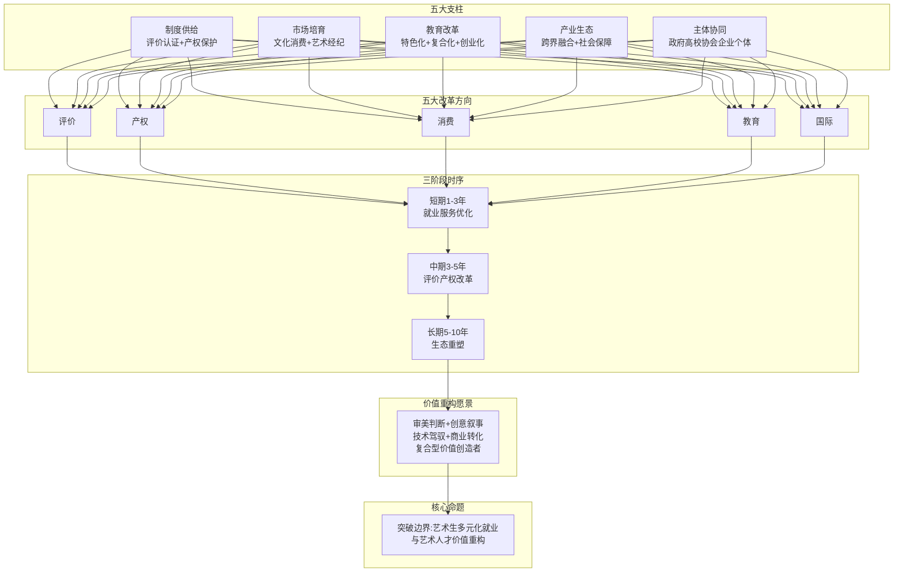

**生态构建必须坦诚面对的现实挑战包括四个层面**。**第一是院校分化挑战**——前六章反复揭示的中央美院与普通二本绘画专业、头部院校与普通艺术院校之间的就业反差与转型差距，并不会因为政策建议的发布而自动消弭，需要长期的资源倾斜与制度引导。**第二是师资稀缺挑战**——艺术+科技、艺术+商业、艺术+疗愈等新兴交叉方向所需的复合型师资在艺术院校内部供给严重不足，跨学科师资培养是5—10年的长周期任务。**第三是跨部门协调难度**——文旅部、人社部、教育部、国家版权局、国家卫健委、市场监管总局等多部门的协同涉及行政体制改革的现实阻力，建立高效的跨部门协作机制需要顶层设计的持续推动。**第四是本土化适配复杂性**——德国KSK艺术家社保、英国HCPC—BAAT认证、法国德国追续权、美国艺术市场化、韩国"文化立国"等国际经验的本土化落地，都需要在中国制度语境下进行结构性创新而非简单移植。

**价值重构是长期演进过程而非短期工程**。当中戏门口的家长坦言"我是看很多新闻说，之前电影不行了，都去干短剧，结果短剧也不行了。但孩子走都走到这里了，你也不可能因为考虑未来的事情就不考了"（详见第1章1.7节），当艺术疗愈师王鑫感叹"行业内鱼龙混杂，真正好的疗愈师非常少"（详见第2章2.3.1节），当连续两年申报新文艺群体职称未果的舞蹈演员仍卡在材料格式与业绩证明的认定上（详见第3章3.3.4节），这些个体经验提醒我们——**艺术人才价值实现生态的构建，不是一份政策文件就能实现的工程，而是涉及制度演进、市场培育、教育转型、文化重塑的长期系统性变革**。

**但变革的方向已经清晰**。当一名艺术生在校期间接受艺术+科技、艺术+商业的复合能力培养，毕业后通过新文艺群体职称改革获得专业认可，依靠完善的产权保护体系维护版权与IP收益，参与情绪经济与国潮市场的多元变现路径，享受艺术家社会保险体系的兜底保障，置身于艺术与科技、商业、教育、乡村振兴跨界融合的产业生态——这一艺术人才"全链条价值实现"图景，正是本研究所追求的核心愿景。

**艺术人才不再仅是"技法执行者"，而是"审美判断+创意叙事+技术驾驭+商业转化"的复合型价值创造者**。这一价值重构既是回应AI时代技术冲击的必然选择，也是中国从"文化大国"迈向"文化强国"的重要支撑，更是艺术生群体突破传统就业边界、实现自我价值的真实路径。在这一愿景图景下，每一位艺术生都将获得不止一种职业可能，每一位艺术工作者都将拥有不止一条价值实现通道，每一份艺术劳动都将获得与其创造性贡献相匹配的社会认可与经济回报。

回到全篇起点的核心命题——"艺术生如何突破传统就业领域的限制，实现多元化职业发展？当前社会评价体系如何影响艺术人才的发展空间与收入水平？知识产权保护与文化消费升级能否有效提升艺术人才经济待遇？不同国家在艺术人才社会地位提升方面有哪些可借鉴的经验与模式？"——七章的系统研究已经给出了相对完整的回答：**突破来自多元赛道的开拓与"艺术+X"复合能力的构建，发展空间与收入受制于评价体系的深层制度变量但正在通过新文艺群体职称改革等机制破壁，产权保护强化与消费升级双轮驱动下艺术人才经济待遇提升路径已经显现，国际经验在市场驱动型、政府主导型、行业自治型三类模式中提供了多元参照与本土化适配空间**。这四个回答最终汇聚为一个判断——**艺术人才价值重构既是机遇也是挑战，但更重要的是，它已经从理论命题演化为可操作的政策与策略框架**。

本研究的最终落点不是给出一套"标准答案"，而是为政策制定者、教育工作者、行业组织、企业与艺术家个体提供一份**可操作的行动指南**。当政府从制度供给端推进评价改革与产权立法、当高校从人才培养端深化交叉学科与产教融合、当行业协会从专业自治端规范新兴职业认证、当企业从市场端参与产业学院与IP共创、当艺术家个体从主体性端构建复合能力与持续学习——五大主体的协同行动便构成了艺术人才价值实现生态的真实建设过程。**艺术不会因AI而消失，反而会以更多元、更融合的形态焕发新生**（南方评论判断，详见第1章1.5节）；艺术教育也不会因撤并潮而式微，而会通过特色化深耕迎来内涵式发展的新阶段；艺术人才更不会因传统出口收缩而失去价值，而会在跨界融合的产业生态中实现从"技法执行者"向"复合型价值创造者"的历史性跃迁。

这正是本研究所揭示的艺术人才价值实现生态的根本愿景——**一个让每位艺术生都能找到自己路径、让每位艺术工作者都能获得制度认可、让每份艺术创造都能获得合理回报的开放、多元、可持续的生态系统**。从问题诊断到愿景图景，从制度分析到行动框架，从国际经验到本土实践，全篇研究的最终意义即在于此。

# 参考内容如下：
[^1]:[红牌专业](https://baike.baidu.com/item/红牌专业/5830558)
[^2]:[就业率最低仅57.6%!近10年本科红牌专业公布,这两个专业上榜9次](https://baijiahao.baidu.com/s?id=1851083900137229483&wfr=spider&for=pc)
[^3]:[2025麦可思本科红黄绿牌专业揭晓!工科霸榜绿牌,这些专业亮红灯](https://mp.weixin.qq.com/s?__biz=MzI4NDIxODQ1Nw==&mid=2247563386&idx=1&sn=c094fe23a5d1c9e3fac5fff37a64d96e&chksm=ea7fb832d67ed78e60a850657c1bc31409ad63507f9921b71f42dd308209749adbb9598f25dd&scene=27)
[^4]:[2025届高考生注意!这8个本科专业就业不理想,填志愿前得避坑](https://baijiahao.baidu.com/s?id=1835583212413937029&wfr=spider&for=pc)
[^5]:[2026美术生警惕!这四个专业已成就业“重灾区”](https://baijiahao.baidu.com/s?id=1859913031460628993&wfr=spider&for=pc)
[^6]:[AI时代,美术生进大厂是“黄金门票”还是“死亡陷阱”?](https://baijiahao.baidu.com/s?id=1863261585685686703&wfr=spider&for=pc)
[^7]:[播音与主持艺术、摄影、广编、舞蹈入选2025年就业满意度TOP20专业](https://mp.weixin.qq.com/s?__biz=MzA4NzMzNDAzMQ==&mid=2451070308&idx=2&sn=c40d8292a933d2cef9b24f3f5d0700f6&chksm=86d18d37afb59467047ed8c0a388132779718833abbba2007981382e41d5e92ad716d6859fcc&scene=27)
[^8]:[惊讶:436人抢一个老师岗!往年埋下的雷,今天爆了!](https://baijiahao.baidu.com/s?id=1861853774050094531&wfr=spider&for=pc)
[^9]:[师范十大'假热门'专业曝光!英语、美术考编竞争比100:1,慎选!](https://baijiahao.baidu.com/s?id=1853264531521528351&wfr=spider&for=pc)
[^10]:[扩招还是减少?2023-2024年艺术类招生计划分析](https://baijiahao.baidu.com/s?id=1819850658165841096&wfr=spider&for=pc)
[^11]:[2024艺考生总人数101.55万,录取率达63.7%,美术生占其中的66.8%](https://baijiahao.baidu.com/s?id=1820015242542662941&wfr=spider&for=pc)
[^12]:[2025年全国各省艺术统考落下帷幕,统考人数统计及分析 ](https://mp.weixin.qq.com/s?__biz=MzA5MDYyMzMyMg==&mid=2650845060&idx=1&sn=4a7e145cd70fda1d6db8d6824659581a&chksm=8a2b4aa94750ac4e187468c80c267009fa8bb485361c06bcb504ca714287f72a234240bc4d90&scene=27)
[^13]:[部分高校撤销艺术类专业 “大洗牌”透露什么信号?](http://k.sina.com.cn/article_7857201856_1d45362c001904nk9a.html)
[^14]:[部分高校“砍”艺术专业,AI时代学艺术凉了?](https://baijiahao.baidu.com/s?id=1854939843527798941&wfr=spider&for=pc)
[^15]:[2026AI时代改变艺术生就业](https://mp.weixin.qq.com/s?__biz=MzA5NDQ5MDUyMA==&mid=2649739054&idx=3&sn=61bc4a864e19ea1f5ffacfe2c9209d1d&chksm=89630e68086dc1cb5e4fca5b79ae9099023cf506f94a45f973d68a0df37ae1de030c845d0999&scene=27)
[^16]:[财经观察:Sora将关停,全球AI视频赛道迎来新阶段](https://baijiahao.baidu.com/s?id=1861854906783184936&wfr=spider&for=pc)
[^17]:[这些专业,正大规模淘汰! —教育在线](http://k.sina.com.cn/article_7857201856_1d45362c001904nmc8.html)
[^18]:[中传动手砍专业了,惊醒所有文科生](http://finance.sina.com.cn/wm/2026-04-22/doc-inhvkupu5535313.shtml)
[^19]:[中央美术学院好就业吗?就业前景怎么样?出来好找工作吗?](https://www.gk100.com/read_27060185.htm)
[^20]:[百万艺考费,归来5000月薪:艺考生缺一个张雪峰](https://baijiahao.baidu.com/s?id=1863092857971259034&wfr=spider&for=pc)
[^21]:[上海这个专场招聘会释放信号:跨领域就业成为艺术专业毕业生新去向](https://www.jfdaily.com/staticsg/res/html/web/newsDetail.html?id=1097345)
[^22]:[211高校“地方保护”引众怒:南京理工大学美术生招生,江苏独享1.5倍扩招红利!](https://baijiahao.baidu.com/s?id=1863181491622159303&wfr=spider&for=pc)
[^23]:[扩招近70%!江苏这所省属师大猛增美术生名额,有保研、学费低!](https://baijiahao.baidu.com/s?id=1863081410825208068&wfr=spider&for=pc)
[^24]:[艺术生就业“潜力股”揭秘:这三大“艺术+”学科,薪资高、就业机会丰富!](https://mp.weixin.qq.com/s?__biz=MjM5ODI4NTI1Mg==&mid=2650948530&idx=2&sn=c3259492977052db03e0e1aa1a0d0c87&chksm=bcb118419874d08246b1e172f74cbb667f971d35d931de59d2a9b76d6a1e56240b9a91c80a29&scene=27)
[^25]:[数字媒体艺术专业就业前景](https://edu.jobui.com/m/major/shuzimeiti/company/)
[^26]:[数字媒体艺术设计专业薪资水平介绍 ](http://www.yuloo.com/mbgx/1961530.shtml)
[^27]:[「数字媒体艺术实习招聘信息」-BOSS直聘](https://www.zhipin.com/zhaopin/4a11e2594393cbc73nV739m4/)
[^28]:[游戏公司校园招聘 ](https://aiqicha.baidu.com/details/ugknowledge?id=7077ac66b32716aa81cb83299c81cd75)
[^29]:[「TA技术美术招聘信息」-BOSS直聘](https://www.zhipin.com/zhaopin/0d1e73a22633c87a03R_396_/)
[^30]:[「游戏美术原画招聘信息」-BOSS直聘](https://www.zhipin.com/zhaopin/bcc8563d089ee7ae1nZ40tu_FQ~~/)
[^31]:[本报观察 | 艺术新赛道:“艺术+科技”引领未来就业潮 ](https://m.sohu.com/a/915820903_121124794)
[^32]:[腾讯、字节跳动启动大规模实习生招聘,艺术生可报岗位很多!](https://mp.weixin.qq.com/s?__biz=Mzk0MTM0MzcxOQ==&mid=2247509587&idx=2&sn=284e9084d459f6891602d07bed86115b&chksm=c3b066da8b3d7fdac220a0d80ff938d17a4f0cdd518c0f09bf47d55812e5ab6b39c2bcbe2c3d&scene=27)
[^33]:[重磅发布丨《中国人工智能系列白皮书—元宇宙技术(2024版)》发布 ](https://mp.weixin.qq.com/s?__biz=MzI2NTk5MTk1Mg==&mid=2247550178&idx=3&sn=4e53e6744cfe99f154e069bc533c1e09&chksm=ebda7d0434c91ed9870fb17910bfa6d4c81a54e633881d5587849b4d8fcaa9408e0701b14d98&scene=27)
[^34]:[上海音乐学院:艺术学子跨领域入职科技企业](https://baijiahao.baidu.com/s?id=1863157482647999521&wfr=spider&for=pc)
[^35]:[上海音乐学院:艺术学子跨领域入职科技企业](https://baijiahao.baidu.com/s?id=1863156137911343187&wfr=spider&for=pc)
[^36]:[艺术留学“黑马专业”,培养艺术+商科复合人才,超多就业岗位可选! ](https://mp.weixin.qq.com/s?__biz=MjM5ODI4NTI1Mg==&mid=2650930834&idx=1&sn=8849d7891200c72d270bc4f6619c4562&chksm=bc7db1744c24c4a6b8951635412d8bcf6318b9841cd5b72fa34d26ac61f5bd48d686fb3a3bf9&scene=27)
[^37]:[设计管理本科工资待遇](https://www.jobui.com/salary/quanguo-shejiguanli/edu2/)
[^38]:[西安设计管理工资待遇](https://www.jobui.com/salary/xian-shejiguanli/)
[^39]:[【品牌视觉策划薪资待遇_品牌视觉策划工资多少】-猎聘](https://www.liepin.com/zppinpaishijuecehua/xinzi/)
[^40]:[奥美 美术指导 招聘(工资待遇要求) ](https://www.jobui.com/company/950790/salary/j/meishuzhidao/)
[^41]:[利好机会!艺术疗愈纳入医保,艺术留学生喜提就业新蓝海!](https://baijiahao.baidu.com/s?id=1849653638526467552&wfr=spider&for=pc)
[^42]:[20天速成拿证,甚至不用自己考!宣传年薪百万的“疗愈师”职业,藏了多少猫腻?](https://baijiahao.baidu.com/s?id=1825196043476791618&wfr=spider&for=pc)
[^43]:[月薪万元的疗愈师或为20天速成 持证容易认证难](http://news.hnr.cn/shxw/article/1/1895071475503415298)
[^44]:[乡村美育:艺润童心,美启童趣 ](http://scdfz.sc.gov.cn/gzdt/zyhy/content_118816)
[^45]:[教育部:全国义务教育阶段美育教师四年增加14.9万人 ](https://www.eol.cn/news/meeting/202012/t20201214_2057025.shtml)
[^46]:[构建“全民参与、全域覆盖、全龄可享” 立体化美育网络,](https://www.mct.gov.cn/preview/whzx/qgwhxxlb/sh/202507/t20250707_961009.htm)
[^47]:[“艺术家第二居所”:乡村文旅融合的新探索](https://baijiahao.baidu.com/s?id=1842690696047970892&wfr=spider&for=pc)
[^48]:[碧山、茅贡及景迈山 ——三种文艺乡建模式的探索](https://m-news.artron.net/20190128/n1043884.html)
[^49]:[中国最早的艺术振兴乡村实践——碧山计划](http://baijiahao.baidu.com/s?id=1699721663050081211&wfr=spider&for=pc)
[^50]:[艺术振兴乡村:艺术传承古今吸引内外游客——许村国际艺术文化节](https://baijiahao.baidu.com/s?id=1741841488134553777&wfr=spider&for=pc)
[^51]:[乡村观察丨艺术乡建不只看上去很美](https://mp.weixin.qq.com/s?__biz=Mzg2NTA1MTY2Mw==&mid=2247566349&idx=1&sn=57a2bc5f3d23ea8a019bcacff008d2ee&chksm=cf9e1e5bfb9c400e27ec799ec30f1648d77d408aa03a74a5dd4d2f7b89711d4049384ef28960&scene=27)
[^52]:[城市艺术季 | 公共艺术,赋能乡村振兴](https://www.d-arts.cn/article/article_info/key/MTE5OTg3NDYwMDaDuXVlr5y8cw.html)
[^53]:[“文艺赋美乡村”的春日新曲](https://baijiahao.baidu.com/s?id=1861066767829948307&wfr=spider&for=pc)
[^54]:[学插画真的可以在家赚钱吗?揭秘自由职业插画师的生存现状与变现路径](https://m.ukqu.com/article/4f5a430de1e395348a26caa87e78b58d?fr=search)
[^55]:[一个人,一支笔,拥粉近千万,赵小黎是如何在绘画领域一路蹿红的?](https://baijiahao.baidu.com/s?id=1698362332025844055&wfr=spider&for=pc)
[^56]:[河南省人力资源和社会保障厅 关于印发《河南省艺术专业人员中高级 职称申报评审标准(试行)》的通知](https://hrss.henan.gov.cn/2023/11-03/2842132.html)
[^57]:[河南省艺术专业人员中高级职称申报评审标准(2023年10月30日) ](https://rsj.zhoukou.gov.cn/sitesources/zkrlzyhshbzj/page_pc/ztzl/zcps/sbpstj/articlea5be98eacd874ebbaeaea61774bfc219.html)
[^58]:[关于印发《辽宁省艺术系列部分专业职称评审基本标准》的通知 ](https://rst.ln.gov.cn/rst/zfxx/fdzdgknr/lzyj/rstgfxwj/lrsz/2024090508574265186/index.shtml)
[^59]:[全国文联系统新文艺群体职称申报渠道和联系方式一览表(2025年更新版)](http://wl.km.gov.cn/c/2025-12-30/5046117.shtml)
[^60]:[新文艺群体职称评审迎来春天:有代表作可破格晋升国家一级职称](https://dy.163.com/article/KQ0SVGBN0556LTAP.html)
[^61]:[2025年天津市艺术系列职称评审方案 ](https://whly.tj.gov.cn/TJSWHHLYJ/gabsycs/tzgggh/202509/t20250919_7137587.html)
[^62]:[山西省文化和旅游厅关于开展2024年度全省艺术系列 中级职称评审工作的通知](https://wlt.shanxi.gov.cn/zwgk/rsgz/202408/t20240821_9637711.shtml)
[^63]:[中国美术家协会](https://www.caanet.org.cn/Member.mx?id=4)
[^64]:[中国书法家协会个人会员入会细则](https://baike.baidu.com/item/中国书法家协会个人会员入会细则/57220513)
[^65]:[中国电影金鸡奖章程](https://baike.baidu.com/item/中国电影金鸡奖章程/65752857)
[^66]:[中国电影金鸡奖评选细则](https://baike.baidu.com/item/中国电影金鸡奖评选细则/65752824)
[^67]:[壹时评:海来阿木等获评副高说明什么](http://opinion.people.com.cn/n1/2026/0409/c223228-40697855.html)
[^68]:[四川12名新文艺群体人才获评副高级职称](https://baijiahao.baidu.com/s?id=1861861178245666667&wfr=spider&for=pc)
[^69]:[高级职称 | 2025年考试通过率汇总](https://mp.weixin.qq.com/s?__biz=Mzg5NzMyMzIzNg==&mid=2247536353&idx=4&sn=71efd9e4e09f26de703e75ea512d93de&chksm=c1390117f9c98262c459ccedfb5745902eb107a15c47da1ffc236af694585b7bd30cc57f0350&scene=27)
[^70]:[2023年艺术、图书、文博、群文系列高级职称评审结果公示](https://ct.ah.gov.cn/zwxw/tzgg/8790078.html)
[^71]:[2023年度湖南省播音系列、广电艺术专业职称评审工作顺利完成](https://gbdsj.hunan.gov.cn/xxgk/gzdt/sjxx/202312/t20231222_32608073.html)
[^72]:[海来阿木等人“破壁”评副高细节公布:对无单位挂靠文艺从业者由省文联直接受理](https://baijiahao.baidu.com/s?id=1861880829638528690&wfr=spider&for=pc)
[^73]:[新文艺群体职称评审迎来春天:有代表作可破格晋升国家一级职称](https://m.163.com/dy/article/KQ0SVGBN0556LTAP.html)
[^74]:[关于“体制外”人才职称评审,四川还有新突破→](https://baijiahao.baidu.com/s?id=1862537953127913071&wfr=spider&for=pc)
[^75]:[关注| 文艺两新职称评定程序指南来了 ](https://mp.weixin.qq.com/s?__biz=MzIxNDAxODA5Mw==&mid=2651346807&idx=4&sn=5f1ef2c0377516cf1b27e9c585d4a403&chksm=8d8b33e50d009d5162c958c8be9b58b754137b32d3f87aaf6765bc055a9957e98a6f8a3dca4b&scene=27)
[^76]:[福建省文化和旅游厅职改领导小组关于开展2025年度艺术系列中初级职称评审工作的通知 ](https://wlt.fujian.gov.cn/zwgk/rsxx/202604/t20260423_7130624.htm)
[^77]:[中华人民共和国著作权法-法律法规-国家版权局](https://www.ncac.gov.cn/xxfb/flfg/flfg_532/202103/t20210309_50530.html)
[^78]:[中华人民共和国著作权法(2020修正)](https://jcy.yantai.gov.cn/art/2022/6/30/art_63946_2902495.html)
[^79]:[《中华人民共和国著作权法》第三次修正 明确作品类型与权利保护](http://news.10jqka.com.cn/20260427/c676296422.shtml)
[^80]:[雕塑美术作品著作权权属和侵权纠纷之大数据报告](https://www.163.com/dy/article/H7IVKBE80553959Q.html)
[^81]:[2025年中国版权十件大事发布-业界动态-国家版权局](https://www.ncac.gov.cn/xxfb/yjdt/202604/t20260423_986609.html)
[^82]:[1715宗图片版权案背后的数据:8家图片公司近半年获赔超百万](https://www.163.com/dy/article/EDKN7JVV05129QAF.html)
[^83]:[采购样品后,八家关联公司“组团”抄袭](https://sxgy.shanxify.gov.cn/article/detail/2026/04/id/9283571.shtml)
[^84]:[一等奖裁判文书|北京知产法院法官李志峰:创作越界侵犯著作权,画家被判赔偿500万元](https://baijiahao.baidu.com/s?id=1856607329046147515&wfr=spider&for=pc)
[^85]:[烟台法院知识产权司法保护2025年度案例](http://baijiahao.baidu.com/s?id=1863424746389782695&wfr=spider&for=pc)
[^86]:[作品被侵权怎么办?维权成本全解析(附省钱攻略) ](https://www.whaleip.com/blog/what-to-do-if-your-work-is-infringed-full-analysis-of-rights-protection-costs-with-money-saving-strategies)
[^87]:[三亚发布4宗知识产权纠纷调解典型案例](http://finance.sina.com.cn/jjxw/2026-04-25/doc-inhvtfma2418993.shtml)
[^88]:[增加追续权平衡作者与艺术商利益](https://m-news.artron.net/20120705/n245797_1.html)
[^89]:[许超(北京君策知识产权发展中心主任):增加追续权是“文化走出去”的重要环节 ](http://www.xinhuanet.com/politics/2015-12/14/c_128525981.htm)
[^90]:[杭州互联网法院:NFT数字藏品属于网络虚拟财产,受法律保护](https://baijiahao.baidu.com/s?id=1751349643026386977&wfr=spider&for=pc)
[^91]:[2024年中国数字藏品行业市场深度调查报告:市场规模、市场结构、平台布局及发展趋势 ](https://caifuhao.eastmoney.com/news/20240904101108961144520)
[^92]:[2024数字藏品行业发展现状及市场规模、未来趋势分析](https://www.chinairn.com/hyzx/20241119/141458721.shtml)
[^93]:[2024年数字藏品行业发展现状分析 数字藏品行业市场规模及未来趋势分析--手机中研网](http://k.sina.com.cn/article_7879848900_1d5acf3c401902n2va.html)
[^94]:[艾媒咨询 | 中国数字藏品市场消费行为调查数据](https://www.iimedia.cn/c1088/103094.html)
[^95]:[艺术大师左古山数字藏品首发仪式在京举行](https://app.xinhuanet.com/news/article.html?articleId=981b17bc2a09a5f0fd8c9496d57943d3)
[^96]:[数字藏品NFT在中国 —— 以“视觉中国”为例](https://mp.weixin.qq.com/s?__biz=MzAxOTU4NDMwNg==&mid=2651260461&idx=1&sn=78dd0a27a151107754d4d95299fac9fd&chksm=80376270b740eb6602ab8033fea13b99da89bbfeb36c5c6d9a97a18bc366908ed0d59082817a&scene=27)
[^97]:[数字藏品NFT在中国 ——以“视觉中国”为例](https://icci.sjtu.edu.cn/news/view/1168)
[^98]:[收藏纠纷司法案例揭示哪些风险?从26万仿品瓷到博物馆名画争议的五个法律陷阱](https://baijiahao.baidu.com/s?id=1863335560963363570&wfr=spider&for=pc)
[^99]:[经济新脉动:情绪经济因何而火?](https://baijiahao.baidu.com/s?id=1863338810391509583&wfr=spider&for=pc)
[^100]:[情绪经济为提振消费打开空间](https://www.thepaper.cn/newsDetail_forward_32888273)
[^101]:[益生菌发酵酸菜搭配柳州螺蛳粉 臭宝联合盐中甜创造安心畅快嗦粉体验](https://news.iresearch.cn/yx/2026/04/552821.shtml)
[^102]:[2024年度中国疗愈经济发展研究报告:市场规模突破十万亿大关](http://word.baidu.com/noteview/8dfb533247323968011ca300a6c30c225901f040.html)
[^103]:[疗愈经济崛起情绪消费市场的繁荣与隐忧](https://www.sanqin.com/2025-08/24/content_11302079.html)
[^104]:[音符奏响郑州情绪疗愈乐章丨艺术疗愈in郑州](https://baijiahao.baidu.com/s?id=1863340761745324807&wfr=spider&for=pc)
[^105]:[2.5万亿市场背后的国潮:一场文化与商业的双向奔赴](https://baijiahao.baidu.com/s?id=1837070649212119642&wfr=spider&for=pc)
[^106]:[2025年中国国潮行业市场规模分析:“国潮”风盛行,产业经济加速发展](https://baijiahao.baidu.com/s?id=1830537862880475245&wfr=spider&for=pc)
[^107]:[风头正劲!“新中式”为何成为消费新“潮”向?](https://baijiahao.baidu.com/s?id=1862226860998900424&wfr=spider&for=pc)
[^108]:[国潮,让故宫淘宝和中国李宁大放异彩!能让百年老店复苏吗?](https://baijiahao.baidu.com/s?id=1697532913366917213&wfr=spider&for=pc)
[^109]:[进击的博物馆文创:多家操盘公司获投资,有的店铺粉丝超千万](https://www.163.com/dy/article/KR6G43DE051795TH.html)
[^110]:[美国艺术研究与资助:激发学生创造力与推动职业发展 ](https://www.forwardpathway.com/139867)
[^111]:[美国文艺研究组织及其运行机制(邹理 杨嘉宜)](https://www.zgwypl.com/content/details82_445235.html)
[^112]:[艺术市场全球化的社会学叙事:表现、机制与后果](http://baijiahao.baidu.com/s?id=1747098679100166526&wfr=spider&for=pc)
[^113]:[浪漫小众专业—艺术治疗,择校有哪些选择?|英国篇 ](https://mp.weixin.qq.com/s?__biz=MzUyOTc4NTk1NQ==&mid=2247523970&idx=1&sn=c4dadbcd80452259bdd00a7110efd551&chksm=fbd9b2d38e550078446ef9e7a8285a3a8a035f96634b383e2f710d9c6827c3c9b0bdbf3c43b4&scene=27)
[^114]:[英国留学丨高薪就业+全球认证!英国两年制艺术疗愈硕士申请攻略](https://mp.weixin.qq.com/s?__biz=MzI1MTM4ODMxMg==&mid=2247577440&idx=2&sn=73d0cfb31f8c3afcddefcdfbe662e6bb&chksm=e86b0e77884947c76c9c7232275cf1a7a1073a085ec5e84a42b0a1487cdc40c92f46aacb2bba&scene=27)
[^115]:[英国留学 | AI无法取代!新兴专业艺术治疗硕士申请指南~](https://mp.weixin.qq.com/s?__biz=MzU1MzU1ODYwNg==&mid=2247524710&idx=1&sn=8d6b583fc4e336cc803fab68d57224d3&chksm=facc46f5cba0ff7504121a7124aa1f9985388014a6cbfba75750f0192cb367d257eec7753c16&scene=27)
[^116]:[德国医疗保险制度](https://baike.baidu.com/item/德国医疗保险制度/4732536)
[^117]:[日本如何培养动画新人?](https://www.163.com/dy/article/E06DI6FD0517BDM9.html)
[^118]:[日本动画公司是怎么培养新人动画师的?](https://m.jiemian.com/article/3372357.html)
[^119]:[文创之路 城市如何走得快又稳](https://m-news.artron.net/20160331/n977368.html)
[^120]:[韩国文化振兴之路:文化产业列入国家战略](http://app.ikanchai.com/?action=show&app=article&contentid=69155&controller=article)
[^121]:[教科文组织新报告:到2028年,全球创作者收入或将锐减24%](https://www.unesco.org/zh/articles/jiaokewenzuzhixinbaogaodao2028nianquanqiuchuangzuozheshouruhuojiangruijian24)
[^122]:[4.15世界艺术日专题|艺术与文化如何影响世界:联合国艺术与文化影响联盟“艺文献策”实践](https://hea.china.com/articles/20250429/202504291667630.html)
[^123]:[【学习运用“千万工程”经验案例】美术学院:艺科融合 向美而行](https://www.tsinghua.edu.cn/info/1177/106053.htm)
[^124]:[推介| 设计学院2025年艺术与科技专业介绍](http://sjxy.whmc.edu.cn/info/1289/11834.htm)
[^125]:[深化产教融合,共育数智化新艺科人才——文华学院城市建设工程学部赴字节跳动开展访企拓岗专项行动](https://cj.hustwenhua.net/info/1073/6213.htm)
[^126]:[中央美术学院-设计学院](http://design.cafa.edu.cn/detail.html?id=5fcdbdb45e0cebee6ace1fd4)
[^127]:[中央美术学院-设计学院](http://design.cafa.edu.cn/detail.html?id=5d708687a310563433dcac7e)
[^128]:[中央美术学院-设计学院](http://design.cafa.edu.cn/detail.html?id=5d7085e6a310563433dcac79)
[^129]:[新时代中国油画的学院建构](https://baijiahao.baidu.com/s?id=1824187541899325652&wfr=spider&for=pc)
[^130]:[清华美院2025年新增设计专业硕士-非全日制“艺术与科技”项目招生简介](https://www.ad.tsinghua.edu.cn/info/1487/31333.htm)
[^131]:[教学理念](https://diif.tongji.edu.cn/syjx/jxln.htm)
[^132]:[2026艺术留学彻底变天!RCA/RISD课程改革:AI成必修课,跨学科是准入门槛](https://m.isixue.com/article/441132/)
[^133]:[艺术与科技](https://am.whxy.edu.cn/zyjs/ysykj.htm)
[^134]:[中心特色](https://diif.tongji.edu.cn/cgysf/zxts.htm)
[^135]:[教学](https://tjdi.tongji.edu.cn/Channel.do?ID=14)
[^136]:[赋能心灵·艺启未来:西安美术学院艺术疗愈微专业首期招生!](https://shilun.xafa.edu.cn/info/1014/10598.htm)
[^137]:[艺术教育发展年度报告(2024年)](https://www.gdddc.edu.cn/info/1059/6764.htm)
[^138]:[教育部办公厅关于开展市域产教联合体建设的通知](https://www.gov.cn/zhengce/zhengceku/2023-04/22/content_5752652.htm)
[^139]:[“职”击未来:艺术工程学院赴北京腾讯、网易开展访企拓岗调研 ](https://www.tjtc.edu.cn/info/1020/5673.htm)
[^140]:[跨界融合,向“新”而行|校领导带队走访网易(沈阳)数字产业中心,共筑数字创意人才培养新生态](https://mp.weixin.qq.com/s?__biz=MzI4NzI2NTQxMA==&mid=2248061918&idx=1&sn=f89e1417c735d211474743039c1e14b7&chksm=ea413044b329188a89b78a7c399bd81c523a778fecced9636aea0be2785f77c0eb0235ab7752&scene=27)
[^141]:[2024届毕业生就业质量报告](https://www.gdddc.edu.cn/info/1059/11780.htm)
[^142]:[2026艺术留学变天?RCA/RISD最新课程改革:AI成必修课,跨学科是刚需](https://www.jiaoyubao.cn/news/n258622.html)
[^143]:[创业教育](https://www.caa.edu.cn/jx/cyjy.htm)
[^144]:[大艺文创园6年结硕果:总计实现营收1.53亿元](http://baijiahao.baidu.com/s?id=1694732777930398507&wfr=spider&for=pc)
