# 全国高校教师教学创新大赛与青年教师教学竞赛全国一等奖课程研究——面向高校教师竞赛辅导工作的系统性参考
# 1 两项赛事的整体定位、制度框架与一等奖获奖格局画像

在高校教师辅导工作走向精细化的当下，准确把握"全国高校教师教学创新大赛"（以下简称"创新赛"）与"全国高校青年教师教学竞赛"（以下简称"青教赛"）这两项国家级标杆赛事的制度边界与一等奖产生逻辑，是构建有效备赛辅导体系的前提。两项赛事虽常被并称为高校教师教学竞赛"双子星",但其主办体系、制度沿革、赛制设计、评审逻辑乃至一等奖的认定方式存在系统性差异，这些差异直接决定了辅导工作在选手定位、能力培养、资源调配上的不同侧重。本章作为整篇报告的基础性章节，旨在通过制度对比与数据画像，为后续章节的课程剖析与辅导路径设计搭建一个清晰的"制度坐标系"与"实证数据底座"。

## 1.1 创新赛与青教赛的主办体系与制度沿革对比

两项赛事尽管同属国家级高水平教学竞赛，但其制度血脉与政策定位有所不同，这是理解一等奖含金量差异的逻辑起点。

**创新赛**由教育部高等教育司指导、中国高等教育学会主办，自2020年首次启动以来已连续举办五届。从承办院校的轮换来看，复旦大学（首届）、西安交通大学（第二届）、浙江大学（第三届）、电子科技大学（第四届）、北京理工大学（第五届）等高校先后承办全国赛现场赛，第六届将由南京大学、南京理工大学、复旦大学、西安交通大学、浙江大学、电子科技大学、北京理工大学共同承办[^1][^2][^3]。值得注意的是，创新赛是**唯一一项纳入《教育部直属单位三评一竞赛保留项目清单》的面向各学科、各专业、各职称教师参加的综合性教师教学竞赛**[^2][^4]，这一独特的政策定位赋予其在高校教师职称评审、绩效奖励和评优评先认定中的高度权威性。

**青教赛**则源自2012年，由中华全国总工会与教育部联合主办，中国教科文卫体工会、教育部教师工作司联合承办，每两年举办一届，至2024年已成功举办七届[^5][^6][^7]。与创新赛不同，青教赛的制度基因带有明显的"工会—劳动竞赛"色彩——其被纳入**全国总工会"十四五"全国引领性劳动和技能竞赛**项目，最具特色的激励机制是各组别一等奖第一名且符合条件的选手可按程序申报"全国五一劳动奖章"[^5][^8][^9]。这一与国家级劳动荣誉直接挂钩的机制，使青教赛一等奖第一名成为"含金量"极高的标志性奖项，例如四川大学朱桂全（第六届医科组一等奖第一名）、清华大学郭璐、上海交通大学赵维殳、上海交通大学医学院叶枫等均凭借此项获得2024年全国五一劳动奖章[^10][^11]。

从规模与影响力看，两项赛事均已形成可观体量。创新赛第五届共有1308所高校的12.7万名教师参加校赛、3.4万名教师参加省赛、588门课程的2253名教师入围全国赛[^12][^13]；青教赛第七届覆盖全国2028所高校，30余万名青年教师参与各层级竞赛，高校参赛率达65%[^5][^6]。可见两项赛事在制度合法性、激励机制与政策导向上呈现互补格局——创新赛承载着教育部教学改革风向标的功能，青教赛则承载着工会系统师德师风建设与基本功锤炼的使命。

下表对两项赛事的主办体系作系统比较：

| 维度 | 创新赛 | 青教赛 |
|------|--------|--------|
| 创办时间 | 2020年（已办5届） | 2012年（已办7届） |
| 举办频率 | 每年一届 | 每两年一届 |
| 指导单位 | 教育部高等教育司 | / |
| 主办单位 | 中国高等教育学会 | 中华全国总工会、教育部 |
| 承办单位 | 中国教科文卫体工会、教育部教师工作司 | 中国教科文卫体工会、教育部教师工作司 |
| 国家政策定位 | 唯一纳入《教育部直属单位三评一竞赛保留项目清单》的高校教师教学竞赛 | 纳入全国总工会"十四五"全国引领性劳动和技能竞赛 |
| 标志性激励 | 教育部直属赛事权威认定 | 一等奖第一名可申报"全国五一劳动奖章" |
| 第七/五届规模 | 12.7万校赛/3.4万省赛/2253人国赛 | 30余万人参赛/159人决赛 |

## 1.2 赛制结构、参赛对象与组别赛道设置的差异

两项赛事在赛制结构上的差异，直接塑造了不同的备赛逻辑与选才取向。

**创新赛**采取**校赛—省赛—全国赛三级赛制**[^1][^2][^3]，要求主讲教师近5年对所参赛的本科课程讲授2轮及以上，且参赛课程需纳入本科人才培养方案；以个人或团队形式参赛均可，团队成员包括1名主讲教师和不超过3名团队教师[^1][^2]。其参赛限制条款颇为严格：第五届起明确规定"已获得往届大赛全国赛一等奖的主讲教师不能再次参赛，已获得上届大赛全国赛二、三等奖的主讲教师不能连续参赛"[^1][^14]——这一规则的演进（第四届仅限制"前三届一等奖"，第五届扩展至"往届一等奖"+"上届二、三等奖")显著抬高了赛事的人才更迭速度，使一等奖更具"稀缺性"。

在赛道与组别设置上，创新赛呈现出动态扩展态势：第三届设6个大组（"四新"+基础课程+课程思政），按正高、副高、中级及以下分18个小组[^15][^16][^17]；第四届新增产教融合赛道，设7个大组[^2][^18]；第五届进一步将产教融合分为部属、地方两组，全国赛共分27个组[^19][^14][^20]；第六届再增"人工智能"和"实验教学"两个新赛道，共9个赛道[^2][^3]。**赛道扩容反映了赛事紧扣"四新"建设、课程思政、产教融合与AI赋能等国家战略的导向**。

**青教赛**则实行**省内选拔赛与全国决赛两阶段**赛制[^5][^8][^21]。参赛对象限定为40周岁（含）以下、近3学年持续从事一线教学工作的高校青年教师；分省名额严格控制，各省（区、市）和新疆生产建设兵团每个组别各推荐1名选手参加决赛，共5名，协办省份增加1个名额，总计参赛选手161人左右[^5][^8][^21]。组别设置经历了从第四届"文、理、工、思政课专项"4组别到第五届起增设"医科组"形成5组别的演进[^5][^22][^23][^24]。

两项赛事在选才取向上的差异由此清晰显现：**创新赛面向全体在职教师、强调团队协同与课程整体改革，门槛聚焦于教学创新成果的体系化沉淀；青教赛聚焦40岁以下青年个人，强调教学基本功的扎实打磨与即时应变能力**。这一定位决定了创新赛一等奖往往是教学改革"长跑"的果实，而青教赛一等奖更多体现青年教师"短期高强度淬炼"后的爆发力。

## 1.3 评审内容、环节与一等奖认定标准的本质区别

如果说赛制差异是骨架，那么评审逻辑差异则是血肉，它直接决定了一等奖课程的呈现形态。

**创新赛**的评审包含课堂教学实录视频、教学创新成果报告（或课程思政创新报告、产教融合创新报告）、教学设计创新汇报三大模块[^1][^2][^20]。其评分采取**网络评审60分（视频40+报告20）+现场评审40分**的复合评分体系，第五届现场汇报环节为"≤12分钟教学设计创新汇报+8分钟提问交流"（较第四届的15分钟+10分钟有所压缩）[^14][^20][^25]。这种评审结构强调"问题—方法—成效—闭环"的**教学学术逻辑**——上海师范大学杨婷在第五届基础课程中级及以下组一等奖的获奖访谈中明确指出："最重要的是形成闭环。研究问题——干预方法——可验证证据——循环改进，原来我认为自己在深耕教学，但后来我发现教学学术才是教创赛的起点和特点。"[^26]此外，第五届新增了证明材料要求——所有赛道参赛课程需上传教务系统中已完成学期的开设信息（课表、班次、人数等），产教融合赛道还需提供实践性教学学时占课程总学时比例不少于30%的证明[^14][^20]，进一步强化了"真实教学场景"的检验。

**青教赛**则由**教学设计、课堂教学（20分钟模拟授课）、教学反思（45分钟内500字）三部分**组成[^5][^8][^27][^6]。选手需在赛前提交参赛课程的教学大纲、16个学时（早期为20学时）的教学设计方案及对应的课堂教学节段PPT；决赛当天现场随机抽取一个教学节段进行无生模拟课堂教学，比赛结束后进入指定教室在45分钟内完成教学反思，反思室提供电脑但不允许携带任何书面或电子资料[^8][^28]。**这种"现场抽签—临场发挥—闭卷反思"的高压设计，决定了青教赛一等奖更考验教师在20分钟内呈现一段"教学微缩精品"的能力**。从公开评分细则看（参见山东省高校青年教师教学比赛评分表），评分维度涵盖教学设计20分、课堂教学75分（含教学内容30分、教学组织30分、语言教态10分、教学特色5分）、教学反思5分，对教学基本功的细颗粒度评估极为严苛[^29]。

两项赛事一等奖产生规则的本质差异由此显现：

- **创新赛**各赛道分组评定一等奖，规模随赛事扩容而增长——首届30项[^30][^31]、第二届63项[^32][^33][^34]、第三届72项[^35][^16][^17]、第四届73项[^18][^36][^37]、第五届88项[^12][^38]，累计达326项。其一等奖在每个赛道每个组别的获奖比例约为15%（基于"获奖总数=一等奖+二等奖+三等奖"的整体结构推算）。
- **青教赛**各组别一等奖固定5名，即每组前5名[^39][^40][^6]。第三届至第七届每届产生25个一等奖（5组×5名），五届合计仅125个一等奖席位，**单届一等奖的稀缺性远高于创新赛**。

这一规则差异直接影响辅导备赛策略——创新赛的辅导可以围绕"如何形成系统性教学改革闭环、提交规范的成果报告"展开；青教赛的辅导则需高度聚焦"20分钟无生授课的精彩呈现+随机抽签的全覆盖准备+教学反思的快速诊断"。

## 1.4 一等奖在赛道、组别与学科门类上的分布特征

把握一等奖在赛道与学科上的分布格局，是辅导对象选择"主战场"的关键依据。

**创新赛历届一等奖的体量演进**呈现稳步扩容态势。结合各届公开数据，可整理如下：

| 届次 | 时间 | 承办高校 | 一等奖 | 二等奖 | 三等奖 | 资料来源 |
|------|------|---------|--------|--------|--------|---------|
| 第一届 | 2021年7月 | 复旦大学 | 30 | 69 | 99 | [^30][^31] |
| 第二届 | 2022年8月 | 西安交通大学 | 63 | 142 | 201 | [^32][^33][^34] |
| 第三届 | 2023年8月 | 浙江大学 | 72 | 166 | 227 | [^35][^16][^17] |
| 第四届 | 2024年7月 | 电子科技大学 | 73 | 170 | 240 | [^18][^36][^37] |
| 第五届 | 2025年8月 | 北京理工大学 | 88 | 205 | 295 | [^12][^38] |
| 累计 | / | / | **326** | **752** | **1062** | / |

从赛道结构看，新工科、基础课程、课程思政赛道因覆盖学科广、组别多（每个赛道按职称分3组），一等奖体量较大；产教融合赛道自第四届新增、第五届扩展至两组（部属、地方），人工智能、实验教学赛道在第六届新增，形成新的"扩容窗口"[^2][^14][^3]。

**青教赛历届一等奖**则结构稳定。第三届至第七届的一等奖名额均为25项（5组×5名），其中：

- **第三届**（2016年，华东师范大学）：文、理、工三组各5名，共15名一等奖[^41][^42][^43]
- **第四届**（2018年，浙江师范大学）：增设思政课专项，文、理、工、思政四组共20名一等奖[^44][^28][^45][^46][^47]
- **第五届**（2020年，南京大学）：新增医科组，五组共25名一等奖[^22][^23][^48][^49]
- **第六届**（2023年，清华大学）：维持5组×5名格局，25名一等奖[^40][^50][^9][^51]
- **第七届**（2024年，上海交通大学）：5组×5名，25名一等奖[^5][^6][^7]

学科分布特征上，**两项赛事在医科领域均展现出极高的竞争烈度**：创新赛中哈尔滨医科大学连续多届产出一等奖，四届累计获6项一等奖，稳居全国地方高校首位[^4][^52][^53]；青教赛中四川大学华西口腔医学院朱桂全（第六届）、上海交通大学医学院叶枫（第七届）等先后斩获医科组一等奖第一名[^10][^11]。**工科领域**同样竞争激烈——清华大学李威（第四届）、上海交通大学刘晓晶（第五届）、上海交通大学高晓沨（第六届）、中国农业大学程楠（第七届）连续多届占据青教赛工科组一等奖第一名[^44][^45][^48][^5]。**思政课专项**因独立设组，成为青教赛的"政治高地"，第七届徐嘉鸿（武汉大学）、张青子衿（上海大学）、邢鹏飞（湖南师范大学）、王维（石河子大学）、赵冶（天津大学）等同获一等奖[^54][^55]。

这种学科分布对辅导工作的启示是明确的：**辅导对象的赛道选择应充分考虑本校优势学科与所在赛道的历史竞争烈度**，避免在已被特定院校垄断的赛道上盲目硬碰，转而寻找新设赛道（如AI、实验教学、产教融合地方组）或学科覆盖相对薄弱的组别突围。

## 1.5 一等奖在院校层次与区域上的集聚格局

一等奖产出的院校与区域分布，是判断辅导对象竞争位势的核心参照。

**创新赛**五届累计一等奖呈现明显的"头部集聚"特征。综合公开统计数据，**单从一等奖获奖数量看**：

- **南京航空航天大学**：累计8项一等奖（其中第四届2项[^56]、第五届2项[^57]），五届一等奖总数位居全国并列第二[^57][^58]
- **北京理工大学**：第五届独获3项一等奖，四届大赛累计至少5项一等奖[^38][^4][^58]
- **哈尔滨医科大学**：四届大赛累计6项一等奖，连续三届获参赛高校优秀组织奖[^4][^52][^53]
- **西安交通大学**：四届大赛累计获6项一等奖，作为发起及承办高校之一长期保持领先[^4][^59]
- **吉林大学、河北工业大学、陆军炮兵防空兵学院**：第五届均获3项一等奖[^38]
- **武汉理工大学、贵州大学**：第五届均获2项一等奖、合计7项奖项并列全国第一[^38][^13]

**从获奖总数看**，浙江大学（23项）、暨南大学（22项）、吉林大学（21项）、贵州大学（21项）、石河子大学（21项）、青海大学（20项）位居前列[^58]。其中暨南大学的表现尤为突出——前四届累计获19项奖项位居全国第一，五届合计22项，其教师发展中心建立的"以教师教学发展为重点"的服务机制和"多轮次材料打磨+实战演练"的备赛模式被视为"暨南模式"[^4][^59][^60]。

**青教赛**头部高校的集中度更高。清华大学多届蝉联一等奖第一名（第四届李威、李蕉，第六届梁思思，第七届郭璐）[^44][^40][^45][^61]；上海交通大学连续在第五、六、七届产出工科组一等奖第一名（刘晓晶、高晓沨、医科组叶枫、理科组赵维殳）[^5][^40][^48]；北京科技大学数学学科组在第二、三、四、五届连续四届获理科组一等奖（赵鲁涛、李娜、储继迅、刘白羽）[^49][^47]；南京大学（孙乐强）、武汉大学（徐嘉鸿）、上海大学（张青子衿）等也频频在思政及文科组别进入一等奖[^54][^23][^55]。

**区域分布**上，东部地区在两项赛事中均显著领先。创新赛三届数据显示，**东部地区一等奖累计83项、占全国50%**[^59]；江苏在第四届创新赛中获奖23项（一等奖8项、二等奖10项、三等奖5项），连续两年获奖总数和一等奖数居全国第一[^4]；北京在第五届创新赛中收获14项一等奖、8项二等奖、5项三等奖[^62]。中西部地区则依托特定强校形成区域亮点——黑龙江依托哈医大稳居"地方高校一等奖首位"[^52]；陕西依托西安交大保持全国第一方阵[^63]；贵州大学第五届创历史最好成绩（一等奖2项、二等奖2项、三等奖3项）[^13]；甘肃在第五届创下参赛以来最好成绩（一等奖1项、二等奖4项、三等奖8项）[^64]。

值得关注的是**非双一流院校与民办高校的突围案例**：

- **非双一流突围**：河北大学（前四届累计12项奖项，"双非"院校第一）[^4]、新疆医科大学（11项）、广西医科大学、西藏民族大学、西藏农牧学院（各9项）、浙江传媒学院（一等奖比例极高）等成为创新赛"双非"高校的代表[^4]；
- **民办高校突围**：第五届创新赛中21所民办高校的28个团队获奖，其中云南工商学院获奖5项（3项二等奖、2项三等奖）并获优秀组织奖，河北农业大学现代科技学院斩获本届民办高校唯一的1项一等奖[^65]；第三届中丽江文化旅游学院作为全国785所民办高校中唯一获得一等奖的高校引发关注[^16]。

**这一格局表明，重点院校在一等奖竞争中虽具明显优势，但赛道扩容、新设组别、地方与民办院校组别的设置，为不同层次的辅导对象提供了差异化的突围空间。**辅导工作应当因校而异、因人施策——头部高校可聚焦冲击一等奖第一名与累计强校排名，地方与民办高校则可在产教融合地方组、中级及以下组、新设赛道中寻找突破口。

## 1.6 一等奖获奖者的职称结构与个体特征画像

最后需要勾勒的，是一等奖获奖者本身的职称结构与个体特征，这为辅导对象的能力定位提供了"参照基准"。

**创新赛**按正高、副高、中级及以下分组，第三届起明确要求各赛区推荐参加全国赛的教师中**正高组人数不少于总人数的1/3**[^15][^14]，第五届第二轮通知中27个组的设置进一步细化了职称分层结构（如新工科正高1组、正高2组、副高1组、副高2组、中级及以下组等）[^19]。这种分层设置使得不同职业生涯阶段的教师都能获得公平竞争空间——既有资深教授如南京航空航天大学毛军逵教授（第五届基础课程正高组一等奖）、徐海燕教授（第四届新文科正高组一等奖第一名）、皮德常教授（第四届基础课程正高组一等奖第一名）等[^57][^56]；也有青年教师如上海师范大学杨婷（第五届基础课程中级及以下组一等奖、"90后青椒"）、闽江学院杨立娟（第三届新工科中级及以下组一等奖）、贵州大学巫云开（第五届新工科中级及以下组一等奖）等[^66][^26][^13]。

**青教赛**则限定40周岁以下，呈现明显的"中青年教师"画像特征。从第六届公开数据看，**决赛选手平均年龄36岁，最小28岁；男女比例分别为36.4%、63.6%；教授、副教授、讲师、助教比例分别为6.9%、39.6%、47.8%、5.7%**[^40][^50][^51]；第七届选手最小27岁、最大40岁、平均36.1岁[^5][^6]。**副教授与讲师群体合计占比超过85%**，是青教赛一等奖竞争的绝对主力。

将典型一等奖获得者的成长画像加以综合，可以归纳出若干**共性特征**：

**第一，"科研—教学—育人"三位一体的复合素养**。清华大学李蕉（第四届青教赛思政课一等奖第一名）出版学术专著1部、发表论文40余篇、主持国家社科基金1项、省部级项目4项[^45]；上海交通大学刘晓晶（第五届青教赛工科组一等奖）发表SCI论文56篇、主持科技部重点研发等基础类项目30余项[^48]；四川大学华西口腔医学院朱桂全（第六届医科组一等奖第一名）"教学、临床和科研是相辅相成的"理念，体现在其完成全国首例国产手术机器人辅助口腔颌面外科手术的突破[^10]。

**第二，长周期、高强度的备赛投入**。备赛周期普遍在6个月至2年——上海师范大学杨婷"备战6个月、从2253位竞争者中脱颖而出"，从2月份到8月份几乎没有休息过[^26]；山东师范大学张慧伦（第七届青教赛文科组一等奖第二名）经历"一年多陪伴、多次磨课、师生并肩战斗的日日夜夜"[^39][^27]；成都理工大学金思丁（第七届青教赛工科组一等奖）"历时两年备赛"[^67]；杭州电子科技大学任利团队"从校赛到国赛历时9个月、不断精雕细琢"[^68]；西南交通大学富海鹰、宣湟等五位教师"长达八个多月的全力以赴与精心雕琢"[^63]。

**第三，校院两级与跨学科专家协同支持的团队磨课体系**。上海大学张青子衿（第七届青教赛思政组一等奖）"先后组织各类磨课活动三十余次，从材料准备、课程节段、内容磨课以及讲课演绎等不同角度，为参赛教师提供全方位的竞赛支持"[^54]；华南师范大学许桂清（第五届青教赛理科组二等奖）"10堂课共试讲了20次、修改后的第7版教学课件和第15版演讲稿"[^69]；重庆交通大学张东培（第六届青教赛理科组二等奖）"大年初一就开始了备赛"，校工会、教师工作部、教务处等职能部门和数统学院"通过邀请学科专家及往届优秀选手指导等多种途径搭建起备赛培训交流平台"[^70]。

**第四，对教学的"敬畏感"与教学学术意识**。上海交通大学高晓沨（第六届青教赛工科组一等奖第一名）感言："对教学感受最多的，是'敬畏'。教学是个系统工程，涉及专业技能、教学设计、授课技巧、心理洞察等诸多方面，想上好一门课，绝非易事！"[^71]上海师范大学杨婷指出："教学学术才是教创赛的起点和特点"[^26]——这种从"自发教学"到"自觉教学学术"的认知跃迁，是一等奖获得者的共同思维特征。

**这四点共性，对部门辅导工作具有直接的"基准锚定"作用**：辅导对象的能力诊断需同时关注其科研基底、教学反思深度、备赛投入预期与团队支撑条件；而辅导路径设计应当围绕"长周期陪跑+多轮次磨课+教学学术意识培养+校院两级专家协同"展开，而非短期的速成式培训。

---

综合本章梳理，创新赛与青教赛作为高校教师教学竞赛的"双子星"，在制度定位、赛制结构、评审逻辑与一等奖产生机制上形成了清晰互补的格局：**创新赛重课程整体改革与教学创新成果的系统沉淀，青教赛重青年教师20分钟课堂基本功的精彩呈现**；一等奖在赛道、学科、院校层次、区域分布上虽存在明显的头部集聚，但赛道扩容、组别细分与新增赛道的设置，为不同层次辅导对象的差异化突围预留了制度性空间。这一制度坐标系与数据底座，将在后续章节中转化为评审解构、特征归纳、案例剖析与辅导策略设计的扎实基础——下一章将首先深入解构创新赛一等奖课程的评审维度与教学创新模式特征，从评分逻辑反推一等奖的"达标门槛"与"突破门槛"。

# 2 创新赛一等奖课程的评审维度与教学创新模式特征

承接第一章对两项赛事制度坐标系的勾勒，本章将研究焦点转向创新赛一等奖课程的"内部解构"。第一章已揭示创新赛的核心定位是"以教学创新成果与课程整体改革"为主线、采用"网络评审60分+现场评审40分"的复合评分体系。然而，仅了解制度框架尚不足以指导辅导工作——辅导对象真正需要回答的是：**评分细则下每一分如何获得？一等奖课程在共性上呈现出怎样的"创新基因"？哪些要素是可学习、可借鉴、可迁移的？**

本章遵循"评审规则反推"与"课程特征归纳"的双线逻辑展开：一方面逐项拆解三大评审模块的评价要点，揭示从"获奖"到"冲一等奖"必须突破的高阶门槛；另一方面基于前五届公开的一等奖成果报告与典型案例，归纳一等奖课程在教学理念、内容重构、模式创新、思政融入、技术赋能、评价改革、成果辐射七个维度的共性创新路径，并最终提炼出可供辅导工作复用的"一等奖创新范式"。需要说明的是，由于创新赛参赛材料的匿名化要求与全文获奖报告的非完全公开性，本章对部分案例的剖析以"创新点纲要"为主、细颗粒数据为辅，必要时坦诚说明资料局限。

## 2.1 网络评审60分的评分逻辑与一等奖达标门槛

网络评审是创新赛的"第一道筛子"，也是一等奖产出的关键基础——课堂教学实录视频40分与教学创新成果报告20分共同决定了能否进入现场评审环节。理解这60分的评分逻辑，是辅导工作的起点。

### 2.1.1 课堂教学实录视频40分的六维评价框架

依据创新赛历届评分标准（以第三届评分标准为基准，第五届基本延续），课堂实录评分采取**教学理念4分、教学内容8分、课程思政8分、教学过程8分、教学效果8分、视频质量4分**的六维分值结构[^72][^73]。这六个维度并非简单并列，而是形成一个"理念引领—内容支撑—思政铸魂—过程落实—效果验证—视频呈现"的完整闭环。

**教学理念（4分）虽分值最低，却是定调维度**。评审要点强调"学生中心"教育理念、立德树人思想以及"四新"建设引领[^72]。评委解读明确指出："不能是简单的'教师讲、学生听'的课堂，要符合专业特点，不能只教知识，要教做事做人，要引导价值取向和学科使命"[^74][^75]。这意味着一等奖课程的开篇必须展现教师对课堂的明确设计理念，呈现"如何调动学生在课堂中主动学习"的设计逻辑[^74]。

**教学内容（8分）是高阶门槛的关键所在**。评分要点要求教学内容具有深度、广度，体现高阶性、创新性与挑战度，反映学科前沿，使用质量高的教学资源[^72][^73]。评委的四条解读标准极具操作性：①不能是常规简单内容，要有一定的难度和前沿性；②能让听众在有限的时间内听明白；③使用了高质量的教学资源（一流课程、国内外的优质公开课、教学动画等）；④一定要因材施教[^74][^75]。**这条评分线意味着，一等奖课程必须同时满足"高阶但易懂、前沿但落地"的双重要求**——既不能停留在常规知识点讲授，也不能因追求前沿而曲高和寡。

**课程思政（8分）与教学过程（8分）共同构成"育人落实"维度**。课程思政评分要求"显性教育与隐性教育相统一，实现三全育人"，评委强调四点：政治立场与四个自信元素的展示、潜移默化的隐性教育、全员全过程全方位育人、与课程本身特有元素结合[^74][^75]。教学过程评分要求"教师主导、学生主体""创新教学方法与策略""信息技术创设教学环境""形成性评价与生成性问题"，评委特别指出"形成性评价是过程考核、动态考核而非简单的终结性考核""生成性问题是根据教学过程产生的动态的'活'问题，而不是静态的'死'问题"[^74][^75]。

**教学效果（8分）与视频质量（4分）则是"呈现品质"维度**。教学效果要求课堂讲授富有吸引力、学生思维活跃深度参与、形成可借鉴推广的教学模式；视频质量要求"画面完整美观，真实"，评委明确强调"让观众信服这是真实、正常的课堂，不是刻意表演、包装的"[^74][^75]。这一"反表演化"导向是创新赛与其他教学竞赛的重要区别，也是辅导工作中需特别提醒选手的"红线"。

### 2.1.2 教学创新成果报告20分的五维论证范式

教学创新成果报告20分按"明确的问题导向、明显的创新特色、课程思政特色、技术应用、成果辐射"五个维度评分[^72][^76][^73]。这五个维度并非孤立的评分项，而是一条**"背景—问题—举措—成效—闭环"的完整教学学术逻辑链**。

具体而言，"明确的问题导向"要求报告立足于课堂教学真实问题、提出解决问题的思路与方案；"明显的创新特色"要求把"四新"建设要求贯穿到教学过程中、对教学目标内容方法活动评价等环节分析全面透彻；"课程思政特色"要求形成可供借鉴推广的经验做法；"技术应用"要求充分利用现代信息技术开展课程教学活动和学习评价；"成果辐射"要求"对创新实践成效开展基于证据的有效分析与总结，形成具有较强辐射推广价值的教学新方法、新模式"[^72][^73]。

第五届国一等奖获得者、安徽大学张艳教授在备赛分享中明确指出：**报告须聚焦真实教学问题，构建"背景—问题—举措—成效"的逻辑闭环，从课程重构、方法创新、评价改革等维度系统呈现创新实践**[^77]。前文已述上海师范大学杨婷的"教学学术起点论"——"研究问题——干预方法——可验证证据——循环改进"，与此构成同一逻辑的不同表述。

### 2.1.3 从入围到一等奖的三阶门槛突破

将上述评分逻辑与一等奖课程的实际表现对照，可归纳出**"入围—获奖—一等奖"三阶门槛**：

| 阶段 | 核心达标线 | 突破要求 |
|------|----------|---------|
| **入围现场赛** | 视频清晰真实、报告结构完整、有明确的教学痛点与解决方案 | 痛点真实、方案有针对性 |
| **获奖（二三等）** | 五维评分均衡、教学过程体现学生主体、信息技术有效使用 | 创新点清晰、有数据支撑 |
| **冲击一等奖** | 高阶性—创新性—挑战度三性融合、教学学术闭环完整、成效证据链坚实、具有辐射推广价值 | **理论高度+原创方法+证据链+推广价值四位一体** |

第三届创新大赛权威赛制解读中指出，省赛正高组评委反馈的常见问题包括"痛点难点分析不够准确""解决问题的方法结合度不够""教学理论与课程教学结合不够""原创性方法不多""未上升到理论高度"[^76]——**这五条恰是从"获奖"到"一等奖"必须跨越的关键门槛**。

## 2.2 现场评审40分的汇报逻辑与高阶突破点

进入现场评审环节后，"≤12分钟教学设计创新汇报+8分钟提问交流"的40分将最终决定一等奖归属（第五届起较第四届的"15分钟+10分钟"有所压缩）[^78]。这一环节的高密度、高强度对教师的临场表达、理论提升与答辩从容应对提出了极高要求。

### 2.2.1 七维评分要点的实操要求

教学设计创新汇报评分围绕**理念与目标、内容分析、学情分析、课程思政、过程与方法、考评与反馈、文档规范**七个维度展开[^72][^73]。其中：

- **理念与目标**强调"教学目标清楚、具体，易于理解，便于实施，行为动词使用正确，阐述规范"[^72]；
- **内容分析**要求"教学内容前后知识点关系、地位、作用描述准确，重点、难点分析清楚"，并能"将教学内容与学科研究新进展、实践发展新经验、社会需求新变化相联系"[^72]；
- **学情分析**要求"学生认知特点和起点水平表述恰当，学习习惯和能力分析合理"[^72]；
- **过程与方法**强调"创造性地使用教材""创新的教学策略、方法、技术解决课堂中存在的各种问题和困难"[^72][^73]；
- **考评与反馈**要求"过程性评价与终结性评价相结合，有适合学科、学生特点的评价规则与标准"[^72]。

参考第五届变革解析提供的现场答辩问答指南，**教学目标的SMART化设计**（具体、可衡量、可实现、相关性、时限性）是现场汇报的关键加分点。例如对"如何避免教学目标过于宽泛"，建议表述为"学生能在3周内完成一份包含数据分析的调研报告，准确率≥90%"[^78]；对"如何兼顾知识、能力与思维"，应使用行为动词分层设计——知识层面"描述、识别"、能力层面"分析、设计"、思维层面"批判、创新"[^78]。

### 2.2.2 现场汇报的典型扣分点与一等奖突破要求

第三届创新大赛权威赛制解读披露的"现场汇报环节存在的问题"，是辅导工作中最值得引为警示的"反面教材"。结合不同组别评委反馈，可归纳为五类典型扣分点[^76]：

| 扣分类型 | 具体表现 | 评委反馈出处 |
|---------|---------|------------|
| **大词热词不落地** | 大词、热词、新词比较多，如何落地？ | 部属正高组 |
| **自我表演痕迹重** | 教的范式向学的范式转变，实际上自我表演痕迹较多 | 部属正高组 |
| **学生视角缺失** | 如何站在学生角度上谈提升？ | 部属正高组 |
| **思政大而化之** | 课程思政要恰到好处，不能大而化之 | 部属副高组 |
| **痛点分析不准** | 痛点难点分析不够准确，解决问题的方法结合度不够 | 省正高组 |
| **原创方法不足** | 原创性方法不多，未上升到理论高度 | 省正高组 |
| **以生为本不够** | 以学生为中心改革不够，课程内容体现不够充分 | 省副高组 |

针对这些扣分点，权威赛制解读总结了"八项注意"：**以生为本、目标导向、课堂互动、教学研究、内容重构、成果原创、评价设计、点线面体**[^76]。一等奖课程的现场汇报必须在以下三方面实现高阶突破：

**第一，构建严密的"痛点—对策—成效"逻辑链**。第六届获奖攻略明确建议"现场汇报要言简意赅，重点突出教学创新的'痛点-对策-成效'逻辑链。PPT制作要精美，但不要过度花哨。提前准备好可能被问到的问题，尤其是创新点的理论支撑和实践效果"[^79]。

**第二，从经验描述上升到理论高度**。这是省正高组评委反馈中"未上升到理论高度"扣分点的反向要求——一等奖课程的创新举措需有明确的教育学、学习科学或学科教学理论支撑（如建构主义、OBE、深度学习等），而非孤立的方法堆砌。

**第三，答辩环节体现"教学学术"反思深度**。第六届获奖攻略强调"提前准备好可能被问到的问题，尤其是创新点的理论支撑和实践效果"[^79]。8分钟提问交流是"出彩"也是"翻车"的高风险环节，一等奖获得者往往展现出对自身教学创新的深刻自我审视能力。

## 2.3 一等奖课程的教学理念升级与教学学术意识

理念是一等奖课程的"灵魂坐标"。从首届以来公开的一等奖成果报告看，**一等奖课程在教学理念层面普遍呈现出从"知识传授导向"向"学生发展为中心"的系统升级**，并在此基础上形成各具学科特色的理念创新。

中国矿业大学石礼伟团队的《普通物理（1）》（首届部属高校正高组一等奖）秉承"**德育为先、学生中心、研学融合、持续改进**"的教育理念，基于"建构性教学观"，渗透"互联网+"思维，构建师生学习共同体[^80][^81]。"建构性教学观"明确将学习视为学生主动建构知识的过程，而非被动接受——这一理念支撑下的"五充满"高效物理课堂，成为新工科基础课的标杆案例。

西安交通大学周屈兰、李娜团队的《燃烧学》（首届部属高校正高组一等奖）则提出"**共同构建法**"——使用"共同构建法"引导学生进行自组织学习、主动构建案例，而学生的创新成果又纳入课程内容，促进教学迭代优化[^80][^81]。这一理念的关键创新在于将学生从"知识的接受者"转变为"内容的共同建构者"，使教学进入了"师生共创"的高阶形态。

材料力学学科一等奖课程提出的"**学以成'师'**"理念——"师"包含两重含义：卓越工程师和同伴学习的"小老师"——通过"自主—为师—创新"三场域环节的教学方法，让学生成为"以行证道的'小老师'"[^82]。这是工科基础课在新工科建设背景下的理念创新典型。

第五届河南理工大学张丽教师团队的《数字电子技术》（基础课程副高组一等奖）则构建了多学科交叉融合的"**迁移导向式学习**"教学模式[^83]，强调知识在不同学科语境间的迁移能力培养，体现了基础课程从"学科本位"向"能力本位"的理念转向。

将上述理念创新汇总，可归纳出一等奖课程在理念层面的**三个共性升级方向**：

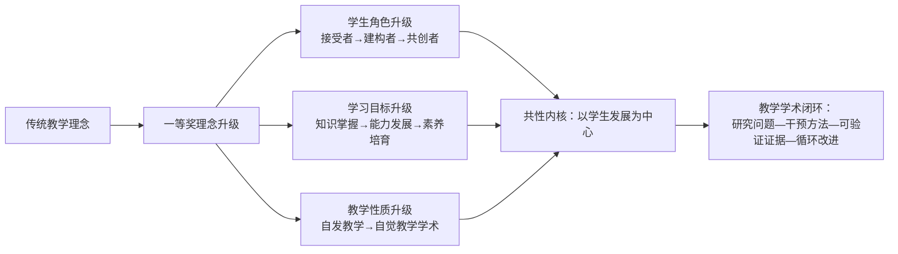

第三个升级方向尤为关键——**从"自发教学"到"自觉教学学术"的认知跃迁**。这是前文已述上海师范大学杨婷"教学学术才是教创赛的起点和特点"论断的核心要义，也是辅导工作中理念引导的核心抓手。**辅导对象需要被引导意识到：教学创新不是"教学经验的总结"，而是"基于真实问题、采用科学方法、产生可验证证据、形成可推广模式"的学术活动**。这一意识转变，是普通参赛教师与一等奖获得者之间最深层的分野。

## 2.4 教学内容重构的"四新"融合与立体化路径

教学内容重构是一等奖课程评分中"教学内容8分"与"内容分析"两个维度的核心呈现，也是辅导对象最容易"流于形式"的环节——许多教师将"内容重构"误解为简单的章节顺序调整或案例替换，而一等奖课程的内容重构呈现出深度的"立体化"特征。

### 2.4.1 "四新"建设引领下的学科前沿融入

创新赛的赛道设置本身就以"四新"建设为核心导向，一等奖课程在内容上必然体现学科前沿与社会需求新变化的融入。西安交通大学《燃烧学》将"燃烧与发电厂、内燃机、航空发动机、火箭发动机等'国之重器'直接相关"的国家战略需求融入课程内容，培养"能源动力工程领域的高端工程和科研人才"[^80][^81]，是新工科内容重构的代表。吉林大学白求恩第一临床医学院朴美花团队的《生命安全与灾难急救实践》（第四届课程思政副高组一等奖）则将"健康中国与教育强国的有机结合""高校急救育人体系"作为内容主线[^84]，体现新医科课程对国家重大战略的呼应。

### 2.4.2 多维度知识结构的"立体重构"

河北农业大学田苗团队的《概率论与数理统计》课程（首届成果报告中收录的获奖案例）提出**"四合三联"**创新路径，其中"立体重构"整合教学内容形成多维度知识结构，是基础课程内容重构的典型范式[^80][^81][^85]。其核心做法包括：

- **"立体重构"整合教学内容**——形成多维度知识结构
- **"概率统计+程序设计"融合教学模式**——实现多课程互融共促
- **"概率统计+课程思政"结合教学育人**——深化特色思政建设
- **"线混+BOPPPS"混合教学形态**——提升学生实践创新能力[^81][^86]

这一"四合三联"框架的可迁移性极强——其本质是**将单一知识点、单一学科、单一教学形态、单一育人维度的"线性课程"，重构为多维度耦合的"立体课程"**。

### 2.4.3 系列案例构建法与科研导入的层进式路径

西安交通大学《燃烧学》的"**系列案例构建法**"是教学内容组织策略的经典创新——以系列真实工程案例为知识载体，让学生在案例分析中建构知识，形成"案例驱动—知识建构—迭代优化"的内容组织逻辑[^80][^81]。

材料力学一等奖课程则提出"**科研导入，建立工程实践的知识体系**"——发掘科研和实践中的材料力学问题，同时融入情感元素，构建"层进式知识路径"，做到"知识纵横发展，思维探索求新"[^82]。这一路径将教师的科研积累转化为教学资源，体现了"研究型教学"的内涵。

### 2.4.4 内容重构的高阶性—创新性—挑战度三性融合

将上述案例归纳，一等奖课程的内容重构遵循**"三性融合"**的核心要求：

- **高阶性**：内容超越基础知识传授，触达学科思维、研究方法与综合应用层面；
- **创新性**：体现学科前沿、跨学科融合、真实问题情境；
- **挑战度**：对学生的认知能力、问题解决能力、创新思维提出明确挑战，符合"跳一跳，摘桃子"的难度阈值[^87]。

辅导工作中需提醒选手：**内容重构的真正难点不在于"加多少新内容"，而在于"如何让重构后的内容形成有机的能力培养链条"**——一等奖课程的内容重构都呈现出"问题链—知识链—能力链—素养链"四链贯通的特征。

## 2.5 教学模式创新的混合式与多元方法集成

教学模式创新是一等奖课程"创新特色"评分维度的直接体现。从五届公开案例看，一等奖课程的模式创新已形成丰富的方法谱系，但其共性内核并非方法标签的堆砌，而是"真问题驱动+学生主体活动+教师引导+证据反馈"的有效闭环。

### 2.5.1 混合式教学的多元变体

线上线下混合式教学（OMO）已成为一等奖课程的"标配模式"，但在具体实施中呈现出多元变体：

- **"五充满"高效混合式课堂**——中国矿业大学石礼伟团队基于"建构性教学观"，开展线上线下、课内课外深度融合的混合式教学[^80][^81]；
- **"线混+BOPPPS"融合形态**——河北农业大学田苗团队将线上线下混合与BOPPPS（导入—目标—前测—参与式学习—后测—总结）结构相结合[^81][^86]；
- **6E教学模式深度实践**——某《食品营养学》一等奖课程围绕"为什么要创新""教学中的真实问题是什么""如何进行创新设计""如何重构教学体系和内容""课程思政如何融入"展开6E模式实践[^88]。

### 2.5.2 OCAS逆向设计法

西安交通大学《燃烧学》提出的**OCAS逆向设计法**——以目标为导向，从"教学目标"向"教学活动"各个环节逆序推进，形成 Object（教学目标和思政目标）—Content（教学内容）—Activity（教学活动）—Strategy（讲授策略）的设计流程[^80][^81][^85]——是教学设计方法论层面的重要创新。这一方法将OBE理念落实到具体的设计流程中，对辅导工作中"如何撰写教学设计"具有直接的方法论指导价值。

### 2.5.3 "自主—为师—创新"三场域学习脉络

材料力学一等奖课程通过线上、线下共同营造场域来建立学生自主的学习脉络，形成**"自主-为师-创新"三个场域环节**的教学方法：以"师"创题（教师引导下学生自主设计力学题目）、以"师"答疑、以"师"创新等多个模式[^82]。这是将"翻转课堂"理念深度学科化的典型创新。

### 2.5.4 虚实结合的虚拟仿真实验

第六届创新赛新增"实验教学赛道"后，虚实结合的虚拟仿真实验成为新的关注焦点。河南理工大学土木与交通学院《钢结构设计原理》课程团队（第五届河南省本科高校教师课堂教学创新大赛虚拟仿真赛道特等奖）以"问实 探虚 索新 求质，构建四阶四度融合创新空间"为题，贯彻"以实带虚、虚实结合"的创新实验教学理念[^89]。江西工程学院杨振老师团队的《数字中国大动脉—IP城域网》（虚拟现实教学应用创新大赛三等奖）针对《计算机网络》课程教学中"设备成本高、实操风险大、抽象难理解"等痛点，创新构建"虚实结合、以虚补实"的教学新模式[^90]。这些案例虽非创新赛一等奖，但其"虚实结合"模式在第六届实验教学赛道与人工智能赛道中将具有高度借鉴价值。

### 2.5.5 模式创新的本质要义

将上述模式创新归纳，一等奖课程的教学模式创新呈现出三个本质要义：

**第一，模式服务于真问题解决**。任何模式创新都对应着具体的教学痛点——"五充满"对应"传统物理教学的兴趣不足"，"共同构建法"对应"学生主动性不足"，"OCAS"对应"教学设计目标—活动脱节"。

**第二，模式创新需有学生主体活动支撑**。课堂实录评分中"必须有学生参与的活动；学生的活动要符合教学目标，不是为活动而活动"[^74][^75]——这是一等奖课堂的硬指标。

**第三，模式创新需形成证据反馈闭环**。"形成性评价是过程考核、动态考核""生成性问题是动态的'活'问题"[^74][^75]，这要求模式创新必须配套相应的评价反馈机制，而非孤立的方法应用。

## 2.6 课程思政有机融入与信息技术、AI赋能的双轮驱动

课程思政（8分）与信息技术应用（教学过程评分要点）是一等奖课程的"双轮驱动"，也是评委反馈中"大而化之""贴标签式"问题最易出现的环节。

### 2.6.1 课程思政有机融入的四种典型路径

基于公开一等奖案例，课程思政的有机融入呈现出四种典型路径：

**第一，"贯穿全课程的人文元素"路径**。西安交通大学《燃烧学》"贯穿全课程的人文元素建立文化自信，实现思政内容与专业内容的协调"[^80][^81]——思政不是独立于课程内容之外的"外挂"，而是贯穿全课程的"底色"。

**第二，"课程思维方法+价值理念"结合路径**。课堂实录评分要求"结合所授课程特点、思维方法和价值理念，深挖课程思政元素，有机融入课程教学"[^72][^73]。河北农业大学《概率论与数理统计》的"概率统计+课程思政"结合教学育人，是基础课程思政的代表[^81][^85]。

**第三，"显性教育与隐性教育相统一"路径**。评委明确指出"隐性教育：耳濡目染、潜移默化；体现全员、全过程、全方位育人"[^74][^75]。吉林大学朴美花团队的《生命安全与灾难急救实践》将"健康中国战略"作为课程的根本价值底色，使学生在急救技能培训中自然形成"医者仁心"的职业认同[^84]。

**第四，"明暗交替、双线推动"路径**。材料力学一等奖课程"采用明暗交替、双线推动的方法提升精神素养"——专业知识为明线、精神素养为暗线，二者交替推动，最终培养"工程师所需的厚基础、强实践、重创新的卓越品质"[^82]。

辅导工作中需特别警惕**"贴标签式思政"的常见误区**：在每个章节生硬地添加思政元素、在PPT角落标注"思政点"、在课堂中突兀地"念思政"。一等奖课程的思政都符合评委所言"与课程本身的特有元素结合"——**思政元素是从课程内容中"长"出来的，而非外部"贴"上去的**。

### 2.6.2 信息技术赋能与AI赋能的范式创新

第六届创新赛新增"人工智能赛道"，明确要求"参赛课程须利用国家高等教育智慧教育平台（含接入平台）提供的资源或工具，或依托生成式人工智能技术建设并运用教学智能体开展教学"，并须明确体现数据驱动和人工智能技术运用，至少包括两个情境：**学情数据采集与分析、数字资源整合与运用、适配的教学场景设计、多维智能评价反馈、师生机协同教学、个性化学习支持**[^91]。

从近期获奖案例看，AI赋能教学已形成多样化范式：

- **知识图谱+大模型范式**：暨南大学马义教授团队《科研素养与伦理规范》的"图谱筑基、任务引擎驱动"智慧教学模式，破解科研伦理教育"认知碎片化、理解表层化"的问题[^92]；广东东软学院王越《软件测试》课程的"知识图谱+大模型+智能开发工具"人机协作新范式，覆盖520名学生，86.2%认为知识图谱有助于理解方法关联[^93]。

- **智能体助教范式**：信息技术工程学院张丽霞《"代码伴学智能体"助力Python课程个性化教学》通过智能学情分析、精准知识点推送、实时答疑解惑、个性化练习生成等功能，实现Python课程教学从"批量授课"向"精准育人"的转型[^94]。

- **虚拟仿真+知识图谱范式**：海南热带海洋学院丁文慈《大气污染控制工程》依托超星知识图谱引擎与虚拟仿真技术，将抽象的大气污染治理原理转化为可交互、可模拟的学习场景[^92]；皖南医学院王存琴《天然药物化学》借助知识图谱、任务引擎、元宇宙虚拟交互、AI助教等多维度技术建设智慧课堂[^92]。

需要特别强调的是，**第六届人工智能赛道现场评审"须重点展示最具创新性的人工智能教学设计及实施过程"**[^91]——这意味着AI赛道的评分将聚焦于"AI技术与教学设计的深度融合"，而非"AI技术展示秀"。辅导工作中需引导选手避免"技术堆砌"误区，回归"技术服务于教学创新"的本质要求。

## 2.7 多元过程性评价与成果辐射推广的成效论证

评价改革与成果辐射是创新赛评分的两个"硬指标"，也是一等奖课程区别于二三等奖的关键证据维度。

### 2.7.1 多元过程性评价的创新路径

课堂实录评分要点明确要求"创新考核评价的内容和方式，注重形成性评价与生成性问题的解决和应用"[^72]，教学设计创新汇报评分要求"采用多元评价方法，合理评价学生知识、能力与思维的发展""过程性评价与终结性评价相结合，有适合学科、学生特点的评价规则与标准"[^72]。

第五届中环信息学院王晓媛《财务分析》课程（市赛课程思政组一等奖）"实现创新评价手段，降低期末考核评价的比例，提高过程评价的考核比例和内容，提高学生的学习动机和团队配合意识，完善评价体系"[^95]，是评价改革的典型案例。

评委对评价改革的解读极具操作性："**形成性评价：过程考核、动态考核而非简单的终结性考核；生成性问题：根据教学过程产生的动态的'活'问题，而不是静态的'死'问题**"[^74][^75]。这意味着一等奖课程的评价改革必须呈现：

- **过程性证据多元化**：课堂表现、小组讨论、阶段作业、项目报告等多元证据；
- **评价主体多元化**：教师评价、学生自评、同伴互评、企业/行业评价等；
- **评价维度多元化**：知识、能力、思维、素养四维并重；
- **评价反馈实时化**：依托信息技术实现即时反馈与个性化调整。

### 2.7.2 成果辐射推广的多维证据链

成果辐射推广是教学创新成果报告评分中"注重创新成果的辐射"维度的核心要求——"能够对创新实践成效开展基于证据的有效分析与总结，形成具有较强辐射推广价值的教学新方法、新模式"[^72][^73]。

从公开一等奖案例看，成果辐射的证据链通常包括以下五个维度：

| 证据维度 | 典型表现 | 案例参考 |
|---------|---------|---------|
| **学生发展数据** | 学业成绩、高阶能力、参与度数据 | 中国矿大《普通物理》"教学效果好，学生学业成绩优良，高阶能力有效提升"[^80] |
| **学科竞赛成绩** | 学生在学科竞赛中的获奖情况 | 西安交大《燃烧学》"形成积极创新氛围，学科竞赛成绩优异"[^80] |
| **课程推广应用** | 课程被其他高校或专业采用 | 中国矿大《普通物理》"课程创新成果推广效果好"[^80] |
| **教学团队建设** | 团队教师获奖、团队建设成果 | 中国矿大《普通物理》"教师教学竞赛成绩优异、课程建设和教学团队建设成果丰硕"[^80] |
| **教学成果获奖** | 教学成果奖、一流课程认定等 | 朴美花团队《生命安全与灾难急救实践》依托"吉林大学万名新生心肺复苏急救技能培训"持续推广[^84] |

第五届起新增的证明材料要求——所有赛道参赛课程需上传教务系统中已完成学期的开设信息（课表、班次、人数等），产教融合赛道还需提供实践性教学学时占课程总学时比例不少于30%的证明[^78]——**进一步强化了"基于真实教学场景的成效证据"要求**。这意味着辅导工作中需提前帮助选手系统建设"成效证据库"，包括但不限于：教学日志、学生作品、课堂照片、考核数据、问卷调查、推广证明、媒体报道、获奖证书等。

## 2.8 一等奖创新范式的差异化亮点与可迁移要素

综合前七节的解构与归纳，可提炼出一等奖课程的**"八位一体"创新范式**：

```mermaid
graph TB
A[一等奖创新范式] --> B1[问题真实化]
A --> B2[理念学术化]
A --> B3[内容立体化]
A --> B4[模式融合化]
A --> B5[思政自然化]
A --> B6[技术适配化]
A --> B7[评价多元化]
A --> B8[成效证据化]

B1 -.-> C1[基于真实学情的痛点诊断<br/>避免"假问题"包装]
B2 -.-> C2[从自发教学到自觉教学学术<br/>研究问题—干预方法—证据—改进]
B3 -.-> C3[问题链—知识链—能力链—素养链四链贯通<br/>非简单章节重排]
B4 -.-> C4[混合式+BOPPPS+OCAS+三场域等<br/>方法服务于真问题]
B5 -.-> C5[显隐结合、明暗双线<br/>避免标签化思政]
B6 -.-> C6[知识图谱+智能体+虚拟仿真<br/>避免技术堆砌]
B7 -.-> C7[过程+终结、四维+多元主体<br/>实时反馈个性调整]
B8 -.-> C8[学生发展+竞赛+推广+团队+成果<br/>五维证据链]
```

这一"八位一体"范式并非僵化的标准模板，而是辅导对象在借鉴时需根据**赛道、组别、院校层次**进行差异化适配的弹性框架：

**赛道差异化适配**：

- **新工科、新医科、新农科赛道**：内容重构应突出学科前沿与"国之重器"国家战略呼应（如《燃烧学》对接航空发动机与火箭发动机），思政应与工程伦理、生命伦理、生态伦理等学科伦理紧密结合；
- **新文科赛道**：应突出跨学科融合与"理解当代中国"等课程特色[^96]，思政应自然融入价值观引导；
- **基础课程赛道**：应突出"基础课程+专业教育"的有机衔接（如《概率论与数理统计》与程序设计融合），避免"基础课与专业课脱节"；
- **课程思政赛道**：应突出"课程思政元素的系统挖掘+案例化呈现"，避免"思政与专业两张皮"；
- **产教融合赛道**：应突出"真实工程问题驱动+企业兼职教师深度参与+实践性学时不低于30%"的真实性证据[^78]；
- **人工智能赛道**：应突出"数据驱动+智能体+多维智能评价"的至少两个情境组合[^91]；
- **实验教学赛道**：综合设计型实验组应突出"多门专业课程知识与基本实验技能的融会贯通"，研究探索型实验组应突出"原始性创新结果"[^91][^97]。

**组别差异化适配**：

- **正高组**：突出系统性教学改革成果与团队建设辐射，对理论高度与原创方法的要求最高；
- **副高组**：突出"教学—科研—育人"三位一体的复合素养，对教学学术意识的要求显著；
- **中级及以下组**：突出"小切口、深挖掘"的精细化创新，避免与正高组在系统性上硬碰，转而在某一具体环节（如某一教学方法的创新、某一评价工具的研发）形成"微创新但深突破"。

**院校层次差异化适配**：

- **部属高校**：可依托学科优势冲击新工科、新医科等头部赛道一等奖；
- **地方高校**：可在产教融合地方组、基础课程、课程思政等赛道寻找突破口（如河南理工大学张丽团队《数字电子技术》的基础课程副高组一等奖[^83]）；
- **民办高校**：可在新设赛道（人工智能、实验教学）与中级及以下组寻找差异化突围空间（如河北农业大学现代科技学院第五届民办高校唯一一等奖案例）。

**辅导工作的核心启示**在于：**"八位一体"范式的可迁移性，不在于让辅导对象复制某一具体案例的方法标签，而在于引导其建立"基于自身真实教学问题—选择适配的创新理念—进行立体化内容重构—集成多元教学模式—实现自然化思政融入—配套适配化技术应用—构建多元化评价体系—沉淀证据化成效论证"的完整教学学术思维**。

---

综合本章解构，创新赛一等奖课程的"创新基因"既有清晰的评分逻辑可循（六维实录+五维报告+七维汇报的100分体系），也有共性的范式特征可循（八位一体创新范式），更有差异化的适配空间可循（赛道—组别—院校层次三维分层）。这些规律的提炼，为下一章青教赛一等奖课程的"三模块"设计精要分析提供了对照基础——青教赛与创新赛在"以学生为中心""课程思政有机融入"等理念层面共享同一价值底色，但在"系统创新vs.课堂精彩""长周期沉淀vs.20分钟呈现""成果证据vs.基本功展现"的本质差异上将形成清晰的对照分析图谱。

# 3 青教赛一等奖课程的"三模块"设计精要与课堂呈现规律

第二章对创新赛一等奖课程的"八位一体"创新范式作了系统解构，揭示了创新赛"以课程整体改革与教学学术沉淀"为核心的宏观范式。当研究视角转向青教赛时，需要切换到一种截然不同的分析尺度——青教赛的"以赛促教"逻辑聚焦于"上好一门课"，更确切地说，聚焦于**用20分钟无生模拟授课呈现一段"教学微缩精品"**的能力[^98]。这种"微观—精品—临场"的赛制基因，决定了一等奖课程的研究必须深入到节段选取、目标动词、重难点拆解、导入互动、板书课件、语言教态、反思诊断等近乎"显微镜级"的颗粒度。

本章承接第一章对青教赛"教学设计20分+课堂教学75分+教学反思5分"评分体系的总体描述，以及第二章对创新赛宏观范式的对照分析[^99][^100]，转入青教赛一等奖课程的微观剖析。研究样本以第七届青教赛文科组第一名《中国古代城市规划史》、第六届工科组一等奖谌援（湖北工业大学）、文科组一等奖邵佳德（南京大学）、文科组一等奖黄孝东（山西大学）、第七届工科组一等奖中国农大程楠等公开案例为主线[^101][^98][^102][^103]，逐项解构三模块的高分得分点，并最终提炼"简洁—层次—留白—通透"四维呈现规律，与第二章创新赛的"宏观范式"形成互补对照，为辅导工作中针对青教赛的"微观打磨"提供可复用的操作框架。

## 3.1 三模块评分体系的整体逻辑与分值结构解析

要把握一等奖课程的微观规律，首先需要厘清青教赛百分制评分体系内部的"分值地形图"——哪里是"决定性战场"，哪里是"门槛分"，哪里是"微差分"。

依据全国青教赛与各高校校赛比照参考的统一评分标准，三模块的分值与权重结构如下[^100][^99][^104]：

| 评分模块 | 总分 | 子维度（课堂教学） | 子维度分值 | 评分性质 |
|---------|------|-----------------|-----------|---------|
| **教学设计** | 20分 | —— | —— | 网络/前置评审 |
| **课堂教学** | 75分 | 教学内容 | 30分 | 现场评审主战场 |
| | | 教学组织 | 30分 | 现场评审主战场 |
| | | 语言教态 | 10分 | 现场评审 |
| | | 教学特色 | 5分 | 现场评审 |
| **教学反思** | 5分 | —— | —— | 闭卷限时（45分钟/500字） |
| **合计** | **100分** | | | |

这一分值结构内部蕴含三层关键逻辑：

**第一，课堂教学75分是绝对的"决定性战场"**。75分占总分四分之三，且其中教学内容与教学组织各占30分、合计60分，这意味着一等奖竞争的胜负主要在"内容设计的高阶性与教学组织的启发性"两条线上分晓。语言教态10分作为"基本功底色"，5分教学特色作为"差异化加分项"，共同构成课堂教学的辅助维度[^99][^104]。

**第二，教学设计20分扮演"门槛分"角色**。教学设计在网络评审或前置评审阶段提交完整的16学时方案（部分高校要求10或6学时，国赛标准为16学时），是入围现场赛的硬性门槛——河北大学校赛即明确"根据网络评审成绩从高到低排序，原则上不超过60%的参赛教师进入现场比赛阶段"[^99]。教学设计的整套方案打分意味着一旦某个学时方案出现明显疏漏，整体得分将受到拖累，因此"16个学时无短板"是一等奖的基础要求。

**第三，教学反思5分虽分值最低，却是"微差分"的关键**。在一等奖第一名与第二名、一等奖与二等奖的总分差距常以零点几分计的高烈度竞争中，5分反思往往成为"压舱石"。第六届青教赛文科组一等奖邵佳德明确指出，反思的"思路清晰、观点明确、联系实际、做到有感而发"是基本要求[^98]，而45分钟闭卷写500字的高压设计，使反思能力直接反映教师的教学诊断功底。

**这一分值结构对辅导工作的核心启示是**：备赛资源应按"75分课堂教学—20分教学设计—5分教学反思"的优先级科学分配，但绝不能因5分占比小而忽略反思训练——反思常常是从二等奖跃升至一等奖、从一等奖跃升至一等奖第一名的"临门一脚"。

## 3.2 教学设计模块的节段选取与16学时方案搭建策略

教学设计模块的核心难点在于"**16个学时方案的整体性与单学时的精致性如何兼顾**"，以及"**16个节段如何应对随机抽签的全覆盖准备**"。

### 3.2.1 节段选取的两条铁律

依据公共管理学院青年教师教学竞赛的评测要求，教学设计的核心评分点之一是"参赛课程所选节段反映所在章节重点，不避难就易"[^104]。从一等奖案例反推，可归纳出节段选取的两条铁律：

**第一铁律：每个节段必须是所在章节的"硬核重点"，不能是边缘性的过渡内容**。一等奖选手的16个节段，几乎都对应课程的核心知识模块或经典议题。以第七届青教赛文科组第一名《中国古代城市规划史》为例，其参赛节段聚焦"北魏都城洛阳规划"这一中国古代城市规划史中的核心案例，而非随便选取一段过渡性章节[^102][^105]。

**第二铁律：16个节段在难度分布、内容类型、思政融入点上形成互补结构**。由于现场抽签的随机性，参赛教师必须确保任何一个节段被抽到都能呈现一等奖水准。这意味着不能将精力集中打磨2—3个"明星节段"，而需对16个节段进行"均衡化、互补化"设计——避免出现明显的"短板节段"。

### 3.2.2 单学时教学设计的要素规范化

依据各高校校赛的统一要求，单学时教学设计需以"1学时45分钟为基本单位"，包含以下规范化要素[^100][^104][^99]：

| 要素类别 | 具体内容 | 一等奖呈现要点 |
|---------|---------|---------------|
| **基本信息** | 课程名称、章节定位、学时数 | 注明对应的参赛课程大纲章节 |
| **教学指导思想** | 立德树人、学生中心、OBE等理念 | 紧密围绕立德树人根本任务 |
| **学情分析** | 学生认知水平、已有知识、学习习惯 | 基于真实学情数据，避免笼统描述 |
| **教学目标** | 知识、能力、素养（含思政）三维目标 | 行为动词规范、可观测可测量 |
| **教学重难点** | 重点突出、难点拆解 | 不避难就易，正面突破 |
| **教学方法与策略** | 案例、讨论、互动、信息化技术 | 方法服务于真问题 |
| **教学过程设计** | 导入—展开—互动—小结的完整流程 | 体现"起承转合"逻辑 |
| **板书设计** | 主板书、副板书的预设结构 | 与PPT形成功能互补 |
| **课程思政** | 思政元素的有机融入点 | 与课程内容自然结合 |
| **课后作业** | 巩固—拓展—迁移的层次设计 | 体现经验留白[^102] |
| **学科前沿** | 新思想、新概念、新成果的呈现 | 反映学科"三新"[^103] |

这一要素清单并非僵化的填空模板——一等奖选手在使用时呈现出明显的"详略有度、逻辑贯通"特征，对核心模块（学情、目标、过程、思政）作精细化论证，对辅助模块作简明清晰的呈现。

### 3.2.3 16学时方案的整体性逻辑

16学时方案除了单学时的精致性，更需要呈现整体的逻辑贯通。一等奖选手通常会在方案首部以"目录+课程整体框架图"的形式呈现16个节段之间的递进关系，使评委在翻阅时能够快速把握"课程整体设计思路"。这一做法直接对应公共管理学院评分要求中的"章节重点、难点解析""教学进程""学科前沿"等综合维度[^104]。

格式规范同样不可忽视——河北大学决赛通知明确要求"一级标题用3号黑体加粗；二级标题用4号黑体加粗；三级标题用小4号黑体加粗。正文内容用小4号宋体，1.5倍行距"[^99]，西京学院、第七届青教赛全国材料指南也提出类似要求[^100][^106]。**辅导工作中需特别提醒选手严守格式规范——格式瑕疵虽不至于导致一票否决，但在网络评审阶段会形成不必要的"印象失分"**。

## 3.3 教学目标的可检测性设计与重难点拆解逻辑

如果说节段选取是"选战场"，那么教学目标设计与重难点拆解就是"定打法"，是教学内容30分中最核心的得分环节。

### 3.3.1 教学目标的SMART化呈现

第二章已述创新赛对教学目标"行为动词规范、SMART化"的要求，青教赛对教学目标的可检测性要求同样严苛。一等奖课程的教学目标普遍呈现以下特征：

**第一，行为动词的可观测性**。避免"了解、理解、掌握"等模糊动词，使用"识别、描述、分析、设计、评价"等可观测可测量动词。例如《亚硝酸盐》一等奖课堂的教学目标明确为"结合亚硝酸盐的基本特征，去分析它的作用原理，然后再进一步设计相应的检测方案"——"分析—设计"两个动词清晰指向能力层面的可观测行为[^103]。

**第二，三维目标的分层呈现**。知识目标、能力目标、素养（思政）目标需分层独立呈现，但又在20分钟课堂中有机交织。《亚硝酸盐》一等奖课堂在导入环节即明确标明本次课的学习目标——围绕亚硝酸盐的基本知识、作用原理和检测方法展开，整个课程都围绕这一目标推进，"体现了教学目标的明确性和导向性"[^103]。

**第三，目标与课程内容的紧密对应**。教学目标必须与课程内容紧密相关、可评可测，"内容的安排应遵循逻辑性和连贯性，从简单到复杂，从已知到未知，逐步引导学生深入理解"[^106]。

### 3.3.2 重难点拆解的"矛盾递进法"

一等奖课堂在重难点拆解上呈现出明显的"矛盾递进法"特征——以一个核心矛盾或核心问题为开题，通过认知梯度的逐级展开，引导学生递进式化解难点。第七届青教赛文科组第一名《中国古代城市规划史》是这一方法的经典示范[^102][^105]：

```mermaid
graph TD
A[核心矛盾开题<br/>游牧政权如何在中原建立都城?] --> B[基础矛盾层<br/>内城礼制严谨但空间不足<br/>如何安置数十万移民?]
B --> C[制度创新层<br/>引入里方制<br/>封闭居住单元 vs 开放市方]
C --> D[文化升华层<br/>南朝良人"礼仪富盛"赞叹<br/>交融创新对文明演进的推动]
D --> E[价值通透层<br/>礼制为经 交融为纬<br/>构建认知网络]
```

这一拆解逻辑的精妙之处在于：**每一层都是上一层矛盾的解决方案，同时又构成下一层的认知前提**——内城空间不足的矛盾通过里方制创新得到解决，里方制创新又揭示了血缘聚居到业缘聚合的社会组织变革，最终升华为文化交融的文明价值[^102][^105]。

这种"矛盾—对策—创新—升华"的认知阶梯，对应青教赛评分细则中"启发性强""教学过程安排合理""条理清楚，承前启后"等关键要点[^102][^105]。它的可迁移性极强——任何学科都可以从"核心矛盾或核心问题"开题，构建逐层递进的认知阶梯。

### 3.3.3 避免目标空泛与重难点扁平化

辅导工作中需特别警惕两类常见扣分点：

**第一类扣分：目标空泛化**。如使用"使学生了解XX的重要性""增强学生的学习兴趣"等无法观测、无法评价的笼统表述。化学与材料工程学院校赛评委即指出"部分教师在教学过程中的启发性不足，未能充分激发学生的主动思考能力"，其根源往往在于目标本身就缺乏可检测性[^107]。

**第二类扣分：重难点扁平化**。即将多个知识点平铺并列为"重点"，未对真正的难点进行专门的拆解设计。这一问题在公共管理学院评分要求"参赛课程所选节段反映所在章节重点，不避难就易"中已被明确预防[^104]——一等奖课程的重难点必须是真重点、真难点，而非"为列举而列举"。

## 3.4 课堂导入、互动与节奏控制的微观设计

20分钟无生模拟授课是青教赛最具特色、也最具挑战性的环节。一等奖课堂在这20分钟内呈现的微观节奏与互动设计，是辅导工作最需要细颗粒度参照的部分。

### 3.4.1 黄孝东"起承转合"四段式分析框架

第六届青教赛文科组一等奖、山西大学黄孝东在公开经验分享中提出的"起承转合"四段式框架，已被广泛视为青教赛课堂教学的"高分模板"[^101][^108]：

| 阶段 | 核心功能 | 关键属性 | 微观设计要点 |
|------|---------|---------|-------------|
| **起** | 课堂导入 | 故事性、趣味性 | 以故事、案例、矛盾、悬念抓住注意力 |
| **承** | 知识展开 | 逻辑性、前沿性 | 严密的知识链条，融入学科前沿 |
| **转** | 互动启思 | 互动性、启发性 | 提问、留白、思维冲突 |
| **合** | 结尾升华 | 权威性、提升性 | 价值升华、思政落点、知识网络收束 |

这一框架在一等奖案例中得到清晰印证：

- **"起"的故事性**：《亚硝酸盐》一等奖课堂以《舌尖上的中国》纪录片中"金华火腿"的例子作为导入，把抽象的亚硝酸盐概念具象化为实物，"有力地展现了亚硝酸盐在食品加工中的具体作用"[^103]——这一导入既有故事性、又有趣味性，迅速建立学生注意力锚点。

- **"承"的逻辑与前沿**：《中国古代城市规划史》以"游牧文明与中原礼制的交融创新"为单一主线，串联"内城礼制骨架—外郭里方实践—整体模式突破"三个模块[^102]；《亚硝酸盐》则呈现亚硝酸盐检测技术从1.0（分光光度法）到2.0（快速检测试纸）、3.0（磁吸式数字传感装置）、4.0（智能化、人工智能、大数据生物传感）的迭代图谱[^103]——既有严密逻辑，又有学科前沿。

- **"转"的互动启思**：《中国古代城市规划史》在讲解外郭四通市时暂停讲解，抛出"若你是北魏规划师，如何设计外来人口聚居区？"的开放性问题[^102][^105]——这种"内容留白"激活了学生的思维参与。

- **"合"的价值升华**：《中国古代城市规划史》以"礼制为经，交融为纬"构建认知网络，并对比北京中轴线申遗案例，"以中轴对称这一简洁符号，既点明儒家礼制内核，又自然融入文化自信的思政元素"[^102][^105]——结尾既收束知识，又升华价值。

### 3.4.2 无生授课情境下的"虚拟互动"设计

青教赛20分钟课堂没有真实学生，参赛教师需要通过"虚拟互动"营造课堂氛围。这是青教赛区别于真实课堂的独特技巧，也是辅导工作中最需要专项训练的环节：

**第一，提问—留白—模拟回答的三步设计**。参赛教师抛出问题后，需有意识地停顿2—3秒以模拟学生思考时间，然后通过"刚才有同学说……""非常好，这位同学注意到了……""那我们再看……"等过渡语，模拟一段虚拟的学生回应。

**第二，眼神调度与方位感营造**。参赛教师应通过有意识的眼神扫视（左侧—中部—右侧—后排）营造"目光与学生接触"的现场感，避免长时间盯着评委或PPT屏幕。

**第三，肢体语言的情境化**。通过手势、走位、表情变化营造课堂的情境感与现场感。

### 3.4.3 20分钟内的时间把控与节奏切换

化学与材料工程学院校赛评委明确指出，"时间把控不够精准，存在前松后紧或超时的情况"是常见共性问题[^107]。一等奖课堂的时间把控普遍呈现以下特征：

| 时间节点 | 内容比重 | 节奏特征 |
|---------|---------|---------|
| 0—2分钟 | 导入 | 快节奏、强吸引 |
| 2—14分钟 | 主体展开（知识承转） | 中节奏、稳推进、含1—2次互动留白 |
| 14—18分钟 | 升华与综合 | 加速节奏、价值升华 |
| 18—20分钟 | 收束总结 | 慢节奏、知识网络回顾、情感升华 |

这种"快—稳—快—慢"的情绪曲线设计，是一等奖课堂的隐性密码——既保证了内容密度，又控制了情感节奏，使评委在20分钟内获得完整的"课堂体验"。

## 3.5 板书设计与PPT配合的呈现规律

板书设计是青教赛区别于一般PPT展示的标志性元素，也是评委判断教师"基本功扎实度"的重要观察点。一等奖课堂的板书与PPT配合呈现出鲜明的"功能分工与互补"特征。

### 3.5.1 板书的结构化设计

依据第七届青教赛比赛现场设备说明——"电脑、翻页笔、黑白、粉笔（白、彩色）"均提供[^106]，板书是青教赛的标配呈现方式。一等奖课堂的板书通常分为三层：

**主板书**：呈现本节课的核心知识骨架与逻辑主线。例如《中国古代城市规划史》一等奖课堂的主板书很可能围绕"礼制为经、交融为纬"或"内城—外郭—整体模式"的核心结构展开[^102][^105]。

**副板书**：辅助呈现重要概念、关键公式或拓展信息，位于板书侧栏。

**生成性板书**：根据课堂"互动"过程中的学生（虚拟）回应即时书写的内容，体现课堂的生成性与应变性，对应评分细则中"课堂应变灵活"的要点[^102]。

### 3.5.2 PPT与板书的功能互补

第六届青教赛专题培训会明确将"PPT制作"与"板书设计"并列为青教赛备战核心要点[^101][^108]，体现了两者的同等重要性。一等奖课堂的PPT与板书呈现出清晰的功能分工：

| 维度 | PPT承载 | 板书承载 |
|------|---------|---------|
| **内容性质** | 图像、数据、动画、视频 | 逻辑骨架、关键概念、生成性思考 |
| **呈现节奏** | 预设性、跳跃性 | 即时性、连贯性 |
| **认知功能** | 直观感知、信息展示 | 思维过程、知识结构化 |
| **示例** | 北魏洛阳城布局图、亚硝酸盐分子结构 | "礼制经—交融纬"框架、检测技术1.0—4.0演进时间轴 |

第七届青教赛全国指南明确要求PPT为"16:9大小，分辨率1600*900"[^106]，这一硬性规范确保了PPT在比赛大屏上的显示效果。一等奖PPT普遍呈现"信息密度控制、视觉层级清晰、配色专业稳重"的共性特征，避免文字堆砌、特效泛滥的常见误区。

### 3.5.3 无生授课情境下的板书技巧

无生授课情境下板书书写需特别注意三点：

**第一，工整性**。板书字迹工整、间距合理、布局规整，体现教师的基本功底；
**第二，节奏感**。板书书写与口头讲授同步进行，既不能"边讲边写导致冷场"，也不能"先写完再讲导致割裂"；
**第三，现场感**。板书内容随讲授过程逐步生成，使评委感受到一个"真实展开的课堂"，而非"提前预演完毕的表演"。

后者尤为关键——化学与材料工程学院校赛评委的核心反馈"以内容为王，确保教学内容的准确性和前沿性""把评委带入课堂情境，更要让学生在课堂中实现从被动学到主动学，再到乐于学的转变"[^107]，本质上是对"现场感"的高度强调。

## 3.6 语言教态与教学特色的差异化打造

语言教态10分与教学特色5分合计15分，是一等奖课堂的"差异化加分项"。这两个维度的得分难以通过短期突击获得，更多依赖长期的基本功积累与个性化的学科特色打造。

### 3.6.1 语言教态10分的具体得分要素

依据各高校校赛评分细则与第六届国赛一等奖经验分享[^101][^108]，语言教态10分主要由四个要素构成：

| 要素 | 具体要求 | 训练要点 |
|------|---------|---------|
| **普通话标准度** | 发音准确、吐字清晰、无方言夹杂 | 长期训练、专业指导 |
| **声音抑扬顿挫** | 音量适中、语调有变化、重点强调 | 录音回放、刻意练习 |
| **肢体语言自然度** | 手势自然、走位合理、表情得体 | 视频回看、专家点评 |
| **教师仪表** | 着装得体、精神饱满、教师风范 | 整体形象设计 |

需要特别指出的是，语言教态的"自然度"远比"标准度"更难达到一等奖水准——许多参赛教师能做到普通话标准、声音洪亮，但肢体语言僵硬、表情紧张，反而扣分。第六届青教赛专题培训会专门将"教学语言与教态"作为关键比赛环节单独分享[^101][^108]，足见其重要性。

### 3.6.2 教学特色5分的差异化打造

教学特色5分虽然分值最低，却是"千人一面"与"令人记忆深刻"的分水岭。一等奖课堂的"教学特色"打造，普遍以学科属性为底色，形成差异化的"记忆点"：

**文科组的人文叙事**：以邵佳德、黄孝东、《中国古代城市规划史》为代表，通过故事化叙述、跨学科融合、文化情感渲染建立特色[^101][^98][^102]。黄孝东总结的"故事性、趣味性"正是文科特色的精髓[^101]。

**理科组的逻辑推演与抽象具象化**：北京科技大学数学学科组在第二、三、四、五届连续四届获理科组一等奖（赵鲁涛、李娜、储继迅、刘白羽），其特色普遍体现为"严密的数学推演+生动的具象化呈现"。

**工科组的工程情境与"三备"设计**：第六届工科组一等奖、湖北工业大学谌援提出的工科课堂"三备"——"备内容、备学生、备哲学"[^101][^108]，体现工科特色的核心要义。"备哲学"尤为深刻——它要求工科教师不仅传授技术知识，更要传递工程思维、科学精神与哲学反思，将工科课堂提升到育人哲学的高度。

**医科组的临床思维与生命教育**：以四川大学华西口腔医学院朱桂全（第六届医科组一等奖第一名）、上海交通大学医学院叶枫（第七届医科组）为代表，普遍体现"临床案例驱动+生命教育情感渗透"的特色。

**思政组的价值引领与理论深度**：以武汉大学徐嘉鸿、上海大学张青子衿等为代表（第七届思政组一等奖），普遍体现"理论深度+现实关切+价值引领"的三位一体特色。

**辅导工作的核心启示**在于：**教学特色不是"另起炉灶"打造一个独立卖点，而是基于学科属性、教师个人风格、参赛课程内容三者交集自然形成的"个性化记忆点"**。盲目模仿他人特色反而会导致风格割裂、特色失真。

## 3.7 教学反思的诊断性与改进性写作要领

教学反思5分虽然分值不高，但其在"45分钟内、500字以内、闭卷无资料"的高压情境下完成[^100][^106][^99]，对教师的教学诊断功底提出了极高要求。

### 3.7.1 反思的三段式结构

依据青教赛官方要求，教学反思须"从教学理念、教学方法和教学过程三方面着手""思路清晰、观点明确、联系实际、做到有感而发"[^100][^99]。一等奖反思普遍呈现清晰的三段式结构：

**第一段：基于教学理念的自我审视**。简明扼要呈现本节段所秉承的教学理念（如学生中心、OBE、深度学习等），以及在20分钟课堂中的具体落实情况——既要肯定理念的引领作用，也要审视落实中的不足。

**第二段：基于教学方法的得失分析**。结合本节段实际使用的教学方法（如案例驱动、问题链、小组讨论、信息化技术等），分析方法运用的成功之处与可改进之处——这是反思的"主体段落"，需要呈现具体的得失证据。

**第三段：基于教学过程的改进设想**。针对前两段诊断出的问题，提出具体可行的改进措施——避免空泛的"加强互动""提升趣味"，而应给出具体方案。

第六届青教赛文科组一等奖邵佳德的经验分享强调，反思应"以教学大纲、教学设计、节段内容、课件制作、板书和反思为课程体系的打磨重点"[^98]，体现反思与整套教学体系的紧密关联。

### 3.7.2 真问题、真诊断、真改进的核心要求

辅导工作中需特别警惕反思写作的三类常见误区：

**误区一：自我表扬式反思**。通篇赞美自己的设计与表现，缺乏对问题的真实诊断。这类反思虽然安全，但难以打动评委，往往得分平平。

**误区二：套话堆砌式反思**。使用"以学生为中心""课程思政有机融入""信息技术深度赋能"等套话填充篇幅，缺乏与所讲节段的紧密对应。

**误区三：脱离节段的泛化反思**。反思内容看似深刻，但与本节段的具体教学过程毫无关联，仿佛"通用模板"。

一等奖反思的核心要求是**"真问题、真诊断、真改进"——基于本节段的具体教学过程，发现真实存在的问题，作出诚实的诊断，提出可操作的改进**。这种"敢于直面问题"的反思态度，恰恰是教师"教学学术意识"的直接体现，与第二章所述创新赛"教学学术起点论"形成同频共振。

### 3.7.3 反思与所讲节段的紧密对应

由于反思针对的是当天现场抽签的具体节段，参赛教师必须做到"每个节段都有对应的反思预案"。这意味着16个节段的反思预案是一项与教学设计、PPT、板书并行的"第四套准备工程"。第七届西京学院青教赛通知明确要求"参赛选手需准备参赛课程6个节段对应的教学反思（每个500字以内）"[^100]，国赛标准则需要16个节段的反思预案。

辅导工作的可操作建议是：**辅导对象在打磨16个节段的同时，应同步撰写16段反思草稿，并经历多轮专家审阅与修改**——尽管现场反思必须临场完成，但反思预案的反复打磨能够形成"思维肌肉记忆"，使现场写作更加从容、深刻。

## 3.8 一等奖课堂"简洁—层次—留白—通透"四维呈现规律

将前述各模块的细颗粒度规律向上抽象，可提炼出一等奖课堂的四维呈现规律——**简洁、层次、留白、通透**。这一框架以第七届青教赛文科组第一名《中国古代城市规划史》为典型样本，但具有跨学科的可迁移性[^102][^105]。

### 3.8.1 简洁：锚定核心，削冗存真

评分细则明确要求教学内容"重点突出""内容充实"——这要求一等奖课堂必须做到简洁高效，锚定核心要点，去除冗余部分[^102][^105]。

《中国古代城市规划史》以"游牧文明与中原礼制的交融创新"为单一主线，将北魏都城洛阳规划这一复杂的城市要素归为"内城礼制骨架""外郭里方实践""整体模式突破"三个模块；在讲解内城时，仅以"9里城廓""中轴线偏移修正"等关键信息为切入点，避免陷入朝代更迭的细节铺陈[^102][^105]。这种"单一主线—三模块—关键信息"的简洁结构，是一等奖课堂的共性特征。

### 3.8.2 层次：制造思维褶皱，递进化解矛盾

评分细则要求教学组织"启发性强""教学过程安排合理"——一等奖课堂普遍设置认知梯度，激发探究动力[^102][^105]。

前文已述《中国古代城市规划史》的"基础矛盾—制度创新—文化升华"三层递进结构。这一层次设计的精髓在于**"思维褶皱"——每一层都不是平铺直叙的并列内容，而是上一层矛盾的解决+下一层矛盾的引出**，使学生的认知在层层推进中获得螺旋式上升[^102][^105]。

### 3.8.3 留白：留白引思，贯通内外

评分细则要求"给予学生自主探索时间""课堂应变灵活"——一等奖课堂普遍保留"思维孔洞"，激活学生的自主建构能力[^102][^105]。

《中国古代城市规划史》的留白呈现为两类：

**内容留白**：在讲解外郭四通市时暂停讲解，抛出"若你是北魏规划师，如何设计外来人口聚居区？"——为学生提供自主思考的空间[^102][^105]。

**经验留白**：课后作业要求学生"自选一朝代都城，分析其规划传承与突破"——将课堂经验延伸至更广阔的历史维度[^102][^105]。

这两类留白共同构成"课内—课外"贯通的探索空间，避免课堂沦为"教师独白"。

### 3.8.4 通透：纵横贯通，澄明见理

评分细则要求"条理清楚，承前启后""体现学科思想"——一等奖课堂普遍打通知识壁垒，彰显本质规律[^102][^105]。

《中国古代城市规划史》的通透呈现为两个维度：

**横向贯通**：融合历史学（民族迁徙）、建筑学（轴线布局）、社会学（城市治理）多学科视角，解析里方制的文化内涵——打破学科壁垒，形成全面认知体系[^102][^105]。

**纵向穿透**：上溯西周洛邑"择中而立"的传统，下连隋唐长安"里坊制"的继承——揭示中国古代城市规划的历史脉络与制度演进[^102][^105]。

将四维规律与评分细则的对应关系汇总如下：

| 维度 | 核心要义 | 对应评分要点 | 操作抓手 |
|------|---------|------------|---------|
| **简洁** | 锚定核心，削冗存真 | "重点突出""内容充实" | 单一主线+模块化结构+关键信息切入 |
| **层次** | 制造思维褶皱，递进化解矛盾 | "启发性强""教学过程安排合理" | 核心矛盾开题+认知梯度+螺旋上升 |
| **留白** | 留白引思，贯通内外 | "给予学生自主探索时间""课堂应变灵活" | 内容留白+经验留白+课内外贯通 |
| **通透** | 纵横贯通，澄明见理 | "条理清楚，承前启后""体现学科思想" | 跨学科横向贯通+历史脉络纵向穿透 |

**这一"简洁—层次—留白—通透"四维规律是青教赛一等奖课堂的"高分公式"**——它既具有学科普适性（四个维度在文、理、工、医、思政课堂中均可适配），又具有微观操作性（每个维度都有具体的抓手）。辅导工作中可以将此作为评估辅导对象课堂呈现质量的"四维诊断量表"，对照检查每个维度的达成情况。

## 3.9 课程思政有机融入与学科三新呈现的青教赛特色

第二章已分析创新赛课程思政融入的四种典型路径——"贯穿全课程的人文元素""课程思维方法+价值理念""显性教育与隐性教育相统一""明暗交替、双线推动"。青教赛因课堂时长压缩到20分钟，思政融入呈现出独特的"微浓缩"特征。

### 3.9.1 思政元素的"微浓缩"融入策略

第七届青教赛参赛指南明确指出"无论是教学设计还是课堂教学都要体现课程思政元素，要把思政元素融合到课程特色中（课程思政要贯穿整个教学内容中）"[^106]。一等奖课堂在20分钟内的思政融入策略可归纳为两条：

**策略一：单一思政主线贯穿20分钟**。避免在多个环节贴多个思政标签，而是确立一条核心思政主线，使整个20分钟的教学始终围绕这一主线展开。例如《中国古代城市规划史》通过"中轴对称"这一简洁符号，既点明儒家礼制内核，又自然融入文化自信的思政元素，使思政主线贯穿全课[^102][^105]。

**策略二：通过案例载体实现自然渗透**。一等奖课堂的思政元素普遍依托具体案例载体呈现，避免空洞说教：

- 《亚硝酸盐》一等奖课堂在课程开始即点出"食品安全的重要性"，并通过"想要将食品安全问题消灭于萌芽，让未雨绸缪代替亡羊补牢，那就离不开我们食品人的专业守护"的叙述，引导学生认识食品专业工作者的责任与使命；通过介绍金华火腿的制作，将亚硝酸盐的使用与中华民族的智慧联系起来，增强文化自信；通过"不能脱离剂量去谈毒性"的科学分析，培养科学精神和批判性思维[^103]。

- 《中国古代城市规划史》以北京中轴线申遗案例为思政落点，将历史规划的礼制内核与当代文化遗产保护、文化自信建设有机联通[^102][^105]。

这两个案例共同呈现出青教赛思政融入的本质特征——**思政不是在某个环节"念"出来的，而是从课程内容中"长"出来的**。

### 3.9.2 学科"三新"的精准呈现策略

学科"三新"（新思想、新概念、新成果）是青教赛"教学特色"评分中"反映或联系学科发展的新思想、新概念、新成果"的核心要点[^103][^106]。一等奖课堂在有限时长内的"三新"呈现普遍采用"迭代图谱法"——以一个清晰的演进图谱呈现学科发展前沿。

《亚硝酸盐》一等奖课堂的检测技术迭代展示是这一方法的典范——"从传统的分光光度法检测（1.0）的'准'，到快速检测试纸（2.0）的'快'，磁吸式数字传感装置（3.0）的'又准又快'，以及对智能化、人工智能、大数据生物传感（4.0）的展望"[^103]。这一图谱在2—3分钟内浓缩呈现了学科发展的纵深脉络，既体现学术高度又确保学生可理解。

### 3.9.3 思政贴标签与三新堆砌的扣分误区

辅导工作中需警惕两类常见误区：

**误区一：思政贴标签**。在PPT角落标注"思政点"、在每个章节生硬添加思政元素、在结尾突兀念一段思政套话——这种"外挂式"思政在评委眼中易被识破，反而扣分。一等奖课堂的思政都遵循"与课程本身的特有元素结合""潜移默化的隐性教育"原则[^106]。

**误区二：三新堆砌**。罗列大量学科前沿名词术语，缺乏清晰的逻辑梳理与可理解性呈现。第七届指南明确要求"使抽象的概念形象化，帮助学生更好地理解和记忆"[^106]——三新呈现必须服从于"学生听得懂"的基本前提。

## 3.10 五大组别一等奖课堂的差异化呈现特征

青教赛五大组别（文、理、工、医、思政）由于学科属性差异，一等奖课堂在共性的"四维规律"基础上呈现出明显的差异化特征。这一差异化分析是辅导工作"因组施策"的精细化参照。

### 3.10.1 文科组：人文叙事与多学科融合

文科组一等奖课堂以邵佳德（南京大学，第六届文科组）、黄孝东（山西大学，第六届文科组）、《中国古代城市规划史》（第七届文科组第一名）为代表[^101][^108][^98][^102][^105]，共性特征为**"故事化叙事+多学科融合+文化情感渲染"**。

黄孝东总结的"起承转合"框架——"起的故事性、趣味性""转的互动性、启发性"——本身即体现文科组的叙事特色[^101][^108]。《中国古代城市规划史》融合历史学、建筑学、社会学多学科视角的横向贯通，则是文科多学科融合的经典示范[^102][^105]。

### 3.10.2 理科组：逻辑推演与抽象具象化

理科组一等奖课堂以北京科技大学数学学科一等奖系列（赵鲁涛、李娜、储继迅、刘白羽连续四届）、上海交通大学赵维殳（第七届理科组）为代表，共性特征为**"严密逻辑推演+抽象概念具象化+定量分析支撑"**。

理科组的核心挑战在于将抽象的数理逻辑转化为学生可理解的具象呈现，因此板书的推演链条、PPT的可视化呈现、案例的具象化举例尤为关键。

### 3.10.3 工科组：工程情境与"三备"设计

工科组一等奖课堂以谌援（湖北工业大学，第六届工科组）、刘晓晶（上海交通大学，第五届工科组）、高晓沨（上海交通大学，第六届工科组第一名）、程楠（中国农业大学，第七届工科组）为代表[^101][^108]，共性特征为**"真实工程情境驱动+三备设计+工程哲学渗透"**。

谌援提出的"备内容、备学生、备哲学"三备框架是工科组的标志性方法论[^101][^108]：

- **备内容**：深挖工科知识点的内在逻辑与前沿动态；
- **备学生**：基于工科学生的认知特点设计教学策略；
- **备哲学**：将工科课堂从技术传授提升到工程伦理、科学精神、工匠哲学的高度。

"备哲学"尤其值得辅导工作借鉴——它将工科课堂的"立德树人"落到了具体可操作的设计层面。

### 3.10.4 医科组：临床思维与生命教育

医科组一等奖课堂以朱桂全（四川大学华西口腔医学院，第六届医科组第一名）、叶枫（上海交通大学医学院，第七届医科组）为代表，共性特征为**"临床案例驱动+循证医学逻辑+生命教育情感渗透"**。

医科组的独特之处在于将临床实际场景作为教学的基本场域——从临床问题出发，回到临床应用，使学生在真实临床情境中建构医学知识，并自然形成"医者仁心"的职业认同。

### 3.10.5 思政组：价值引领与理论深度

思政组（第四届起单独设组）一等奖课堂以李蕉（清华大学，第四届思政组第一名）、徐嘉鸿（武汉大学，第七届思政组）、张青子衿（上海大学，第七届思政组）、邢鹏飞（湖南师范大学）、王维（石河子大学）、赵冶（天津大学）为代表，共性特征为**"理论深度+现实关切+价值引领"**。

思政组的独特挑战在于"如何将抽象的理论讲得既有深度又能打动学生"——一等奖课堂普遍呈现"经典文本研读+当代现实回应+价值情感共鸣"的三位一体设计。

### 3.10.6 五组特征汇总与辅导启示

将五大组别的差异化特征汇总如下：

| 组别 | 共性特征 | 代表案例 | 辅导侧重 |
|------|---------|---------|---------|
| **文科组** | 故事化叙事+多学科融合+文化情感渲染 | 邵佳德、黄孝东、《中国古代城市规划史》 | 叙事能力、跨学科视野、文化敏感性 |
| **理科组** | 严密逻辑推演+抽象具象化+定量分析 | 北京科大数学系列、赵维殳 | 推演功底、可视化设计、案例具象化 |
| **工科组** | 工程情境+三备设计+工程哲学 | 谌援、刘晓晶、高晓沨、程楠 | 真实工程问题、三备框架、哲学高度 |
| **医科组** | 临床思维+循证医学+生命教育 | 朱桂全、叶枫 | 临床场景设计、循证逻辑、医德渗透 |
| **思政组** | 理论深度+现实关切+价值引领 | 李蕉、徐嘉鸿、张青子衿 | 理论功底、现实问题转化、价值共鸣 |

**辅导工作的核心启示**在于：**辅导对象的能力打造应以学科特征为底色，而非套用统一模板**。例如对工科教师强调"备哲学"的重要性，对文科教师强调"故事化叙事"的关键作用，对医科教师强调"临床场景设计"的核心地位——这种"因组施策"的差异化辅导，是提升一等奖产出概率的重要保障。

---

综合本章解构，青教赛一等奖课程的微观规律呈现出与第二章创新赛宏观范式截然不同的图景：**创新赛比拼的是"基于真实问题的系统性教学改革闭环"，青教赛比拼的是"20分钟无生模拟课堂的教学微缩精品"**[^98][^102]。前者需要长周期的教学学术沉淀与多维度的成果证据链，后者需要高密度的精细化打磨与高强度的临场应变能力。

但两者在更深层的价值底色上又共享同一基因——**以学生发展为中心、课程思政有机融入、学科前沿适度呈现、教学方法服务于真问题**。这种"差异中的共性"为辅导工作提供了重要启示：**辅导对象在同时备战两项赛事时，应充分利用价值底色的共通性进行能力的"复用培育"，同时针对赛制差异进行"差异化准备"——创新赛侧重"宏观范式"的系统打磨，青教赛侧重"微观规律"的精细操作**。这一"宏观范式+微观规律"的双轨辅导框架，将在第六章关于两类赛事一等奖课程的共性规律、差异化特征与院校培育机制的横向比较中得到进一步深化。下一章将首先转入创新赛一等奖典型案例的分学科深度剖析，从具体案例进一步验证本章已建立的对照分析图谱。

# 4 创新赛一等奖典型案例分学科深度剖析

承接第二章对创新赛一等奖课程评审维度与"八位一体"创新范式的系统解构，以及第三章对青教赛微观规律的对照分析，本章将研究视角从"评分逻辑反推"和"范式特征归纳"进一步下沉到"具体课程的微观解剖"。第二章已揭示一等奖课程在理念升级、内容重构、模式创新、思政融入、技术赋能、评价改革、成果辐射等维度的共性规律，但这些规律若仅停留在抽象层面，难以转化为辅导工作中可对照、可参照、可迁移的具体案例资源。本章因此选取覆盖**新工科、新医科、新农科、新文科、基础课程、课程思政、产教融合**七大赛道的标杆性一等奖案例，遵循"痛点诊断—创新举措—应用效果—辐射推广"的统一分析框架，对每一案例进行细颗粒度的"微观解剖"，并在末节作横向比较以提炼七大赛道的"学科创新基因"。需要特别说明的是，由于创新赛参赛材料的匿名化要求与全文获奖报告的非完全公开性，本章对各案例的分析深度受限于公开资料的颗粒度——对资料较为详尽的案例（如《燃烧学》《有机化学》《乡土建筑空间设计》）作较深剖析，对仅有创新点提纲的案例则以共性特征归纳为主。

## 4.1 新工科赛道一等奖案例剖析：西安交大《燃烧学》与哈工程《工业机器人》《工程热力学》

新工科赛道是创新赛参赛规模最大、竞争最激烈的赛道之一。本节选取首届正高组一等奖周屈兰团队《燃烧学》、第四届新工科正高组一等奖刘志林团队《工业机器人》、第四届基础课程副高组一等奖葛坤团队《工程热力学》三个典型案例（其中《工程热力学》虽属基础课程组别，但在新工科建设导向下与新工科赛道高度相通），呈现新工科一等奖课程的共性创新逻辑。

### 4.1.1 西安交大《燃烧学》：共同构建法与OCAS逆向设计法

《燃烧学》课程由西安交通大学能源与动力工程学院周屈兰教授主持，在2021年首届创新大赛中以"基于共同构建法的燃烧学创新与实践"为主题获得正高组一等奖[^109]。

**痛点诊断**：周屈兰教授对该课程的教学痛点诊断极为精准——"《燃烧学》教学的难点在于内容庞杂、概念和数学公式多，学生亲自操作燃烧设备的机会少，缺乏切身感受和生活体验，导致老师难教，学生难学"[^110]。这一痛点直击专业基础课的共性难题：抽象理论与实践体验的鸿沟。

**创新举措**：课程团队的创新举措围绕三条主线展开。**第一条主线是"共同构建法"的教学理念创新**——使用共同构建法引导学生进行自组织学习、主动构建案例，而学生的创新成果又纳入课程内容，促进教学迭代优化，使学生从"知识接受者"转变为"内容共同建构者"。**第二条主线是OCAS逆向设计法**——基于OBE教学理念，以目标为导向，使用逆向设计法，从"教学目标"向"教学活动"逐个环节逆序推进，形成Object（教学目标和思政目标）—Content（教学内容）—Activity（教学活动）—Strategy（讲授策略）的教学设计流程[^110]。**第三条主线是"问题引导式、交叉类比式、主动质疑式和竞争型学习"四类教学方法的集成**——在讲解燃烧过程中"三传"（动量、热量和质量的传递）的相似性时，用一种知识引导学生思考和理解另一种知识，帮助学生建立开放型的、善于类比关联的思维方式[^110]。

在评价体系上，课程构建了**分阶段渐进式的多元评价体系**——以第一章"燃烧学发展简史"为例，教学目标是让学生了解本学科发展史、描述常见燃烧设备的结构和工作原理、掌握主要燃料的性质，对应的测验内容包括绘制燃烧设备工作原理图和描述燃料物理化学性质的内涵，教学活动则是展示学科发展历史进程、介绍常见燃烧设备和燃料，通过线上习题和章节作业等考评方式检验学生的学习成果[^110]。**周屈兰教授的设计思路融合了"人文素养与文化自信的培养、正反叙事与自我迭代"等多元要素**[^110]，体现了一等奖课程的"明暗双线"思政融入特征。

**应用效果与辐射推广**：周屈兰教授本人在西安交大获得多项荣誉——2015年获西安交通大学"教书育人先进个人"，2016、2019年两次获得西安交通大学"我最喜爱的老师"称号，2021年获"王宽诚育才奖"[^109]。课程后续主持陕西省一流课程2项、陕西省课程思政示范课1项、陕西省在线教学典型案例课程1项，并发展为国家级线上线下混合式一流课程[^111]。在辐射推广层面，周屈兰教授作为创新赛资深获奖者多次受邀开展"创新成果报告撰写工作坊"——2022年应邀至他校进行"深度复盘、精准设计"的撰写指导，并以自己《燃烧学》课程创新成果报告为例，从课程简介、教学痛点分析、教学问题凝练、教学创新设计等多个方面详细介绍创新成果报告撰写的原则、思路和具体方法[^111]，形成了"获奖成果—理论提炼—培训传承"的完整闭环。

### 4.1.2 哈工程《工业机器人》：自主科研技术反哺与数字化转型赋能

《工业机器人》课程由哈尔滨工程大学智能学院刘志林教授主讲，在第四届创新赛中获得新工科正高组一等奖[^112]。

**痛点诊断**：作为新工科核心课程，《工业机器人》面临的核心痛点是"机器人结构复杂、实物教学困难、教学局限性大"——这是工科类涉及大型装备的课程的共性痛点。

**创新举措**：刘志林教授的创新汇报主题为"自主科研技术反哺、数字化转型赋能"，集中呈现四大举措[^112][^113]：**其一，引入自主科研案例实现课程内容案例式创建**——课程团队依托国家重大科研项目，将自主科研成果转化为教学案例；**其二，打造新型资源池实现教学资源全链条式重补**——构建覆盖知识、技能、案例、实验全链条的资源体系；**其三，借助自主科研技术实现学习环境沉浸式重塑**——依托"数字孪生、虚实融合、远程云控"等新技术成果开展数字化转型的教学实践；**其四，研发递阶式考核系统实现考核手段智能化升级**，全面实施"泛在式"教学方法和影响式课程思政[^112]。

**应用效果与辐射推广**：课程培养学生分析机器人、设计机器人、实现机器人的能力，"探索新工科建设的新理念、新模式、新方法、新技术，为全面推动新工科课程建设提供借鉴经验"[^112]。刘志林教授本人荣获国家级教学成果二等奖、省教学成果一等奖、二等奖各1项，培养学生在全国各类机器人竞赛中屡获佳绩，**获奖总数位列全国高校第四、省内第一**[^114]，在2025年入选黑龙江省教学名师[^114]。

### 4.1.3 哈工程《工程热力学》：螺旋进阶教学路径

《工程热力学》课程由哈尔滨工程大学动力学院葛坤副教授主讲，在第四届创新赛中获得基础课程副高组一等奖[^115][^113]。

**痛点诊断**：作为"能源与动力类专业本科生接触的第一门专业基础课、衔接基础课和专业课的重要纽带"，《工程热力学》面临的痛点是如何在新工科建设以及第四次能源革命背景下重塑课程定位[^115]。

**创新举措**：葛坤团队的创新思路凝练为"**重基础融创新、真翻转育高阶、全定制增挑战**"，围绕这一思路提出"强基增新的课程内容重构、虚实结合的教学环境创设、混合翻转的教学方法创新、多元个性的教学评价改革"四项创新举措[^115]。在第四届国赛现场，葛坤的汇报主题是"创螺旋进阶教学路径、育自主创新研发能力"——课程立足国家"双碳"战略以及舰船动力自主可控发展需求的高度，结合学校船海特色，**基于学习进阶理论创设了螺旋进阶的教学路径**，充分利用自主科研攻关成果反哺教学，最终实现自主创新研发能力的培养，以应对未来能源动力行业卡脖子问题[^113]。

**应用效果与辐射推广**：在课程团队备赛过程中，校院两级提供了系统支持——哈工程动力学院多年来"以服务人才培养定位，关注教师个性化、专业化发展诉求为落脚点，通过'抓老、培青、育新'三位一体培训体系，打造'雏鹰计划''馨星竞赛''馨苑师堂'等多个品牌活动"[^116]，构成了《工程热力学》得以打磨成熟的组织保障基础。

### 4.1.4 新工科一等奖的三大共性创新基因

将三个案例横向比较，可归纳出新工科一等奖课程的**三大共性创新基因**：

**基因一："国之重器"战略对接**。三个案例均显著呈现与国家重大战略的紧密呼应——《燃烧学》对接航空发动机、火箭发动机等"国之重器"；《工业机器人》依托"国家重大科研项目"；《工程热力学》立足"双碳"战略与"舰船动力自主可控发展需求"以及"卡脖子"问题应对。这种战略对接不是泛泛的口号包装，而是将国家战略需求作为课程内容设计的真实牵引力。

**基因二：自主科研反哺教学**。新工科一等奖课程普遍呈现"将教师团队的自主科研成果转化为教学资源"的鲜明特征——《工业机器人》"引入自主科研案例实现课程内容案例式创建"、《工程热力学》"充分利用自主科研攻关成果来反哺教学"、《燃烧学》主持人周屈兰本人"主持国家自然科学基金3项、国家重大科技专项任务1项"[^109]并将这些科研积累转化为教学案例。这一特征要求新工科辅导对象具备"教学—科研双轨并行"的复合素养。

**基因三：虚实融合数智赋能**。新工科一等奖课程的技术应用程度普遍较高——《工业机器人》的"数字孪生、虚实融合、远程云控"，《工程热力学》的"虚实结合的教学环境创设"，体现了新工科课程对数字技术的深度集成。

## 4.2 新医科赛道一等奖案例剖析：哈医大《神经系统疾病》《医学心理学》

新医科赛道在创新赛中竞争激烈，但**哈尔滨医科大学连续多届产出一等奖、四届大赛累计获6项一等奖、稳居全国地方高校首位**[^117][^118]，形成了独特的"哈医大现象"。本节选取第四届新医科副高组一等奖孙若晗团队《神经系统疾病》、新医科中级及以下组一等奖柯思源团队《医学心理学》两个案例展开剖析。

### 4.2.1 哈医大《神经系统疾病》：纵横整合与科教融汇

《神经系统疾病》课程由哈尔滨医科大学第一临床医学院孙若晗副教授主讲。

**痛点诊断**：孙若晗团队精准诊断了三大教学痛点——"知识迁移应用难、临床科研思维难建立和缺乏价值引领的育人环境"[^118][^117]。这三大痛点是医学专业课程的共性问题：医学知识的高度专业化导致迁移应用困难、临床实践与科研思维的衔接不畅、医学专业课程的育人维度往往被技术性内容遮蔽。

**创新举措**：针对三大痛点，孙若晗团队的创新汇报主题为"纵横整合，科教融汇，培养新医科拔尖创新人才"，集中呈现四大创新举措[^118][^119][^117]：**其一，构建纵横整合的《神经系统疾病》新的课程体系**——"纵向"即神经系统疾病发展的临床全周期整合，"横向"即跨学科知识体系的整合；**其二，搭建数智化教学资源平台**——以数字技术整合临床案例、影像资料、科研数据等多元教学资源；**其三，创设科教融汇环境**——将临床科研问题作为教学的真实情境，培养学生从临床现象提炼科研问题的能力；**其四，通过进阶式教学过程培养医学拔尖创新人才**——从基础理论到临床实践再到科研思维的层层递进。

**应用效果与辐射推广**：孙若晗"历经近长达八个月的精心备赛与细致打磨""凭借先进的教学理念、扎实的教学基本功与创新的教学方法在激烈角逐中脱颖而出"[^119]，体现新医科一等奖背后长周期投入的共性特征。

### 4.2.2 哈医大《医学心理学》：MOSAIC融创教学模式

《医学心理学》课程由哈尔滨医科大学心理科学与健康管理中心柯思源主讲，在第四届创新赛中获得新医科中级及以下组一等奖[^118][^117]。

**痛点诊断**：作为面向医学生的医学心理学课程，其核心定位是"立足新医科、助力大健康、职业素养为导向"——其痛点在于如何在有限学时内实现"整合资源内容、多元化教学方法、跨学科协同机制、特色化思心融合、优化评价体系"的多重目标[^118][^117]。

**创新举措**：柯思源团队**首次构建了MOSAIC融创创新性教学模式**——这是该案例的标志性创新。MOSAIC模式由六大要素构成[^118][^117]：

| MOSAIC要素 | 中文释义 | 设计内涵 |
|-----------|---------|---------|
| **M** (Multi-resource) | 整合资源内容 | 多源资源的系统整合 |
| **O** (Optimal evaluation) | 优化评价体系 | 多元过程性评价的科学设计 |
| **S** (Special integration) | 特色化思心融合 | 思政与心理育人的特色融合 |
| **A** (Active methods) | 多元化教学方法 | 主动学习的多元方法集成 |
| **I** (Interdisciplinary) | 跨学科协同机制 | 跨学科师资与资源的协同 |
| **C** (Career-oriented) | 职业素养为导向 | 以医学职业素养培育为目标 |

这一模式的命名本身体现了创新性——MOSAIC（马赛克）的英文意象暗示"多元元素的有机融合形成完整图景"，与课程"职业素养为导向的多维融创"的设计理念高度契合，是一等奖课程"原创性方法+理论高度"双重要求的典型呈现。

**应用效果与辐射推广**：哈尔滨医科大学**累计获得全国高校教师教学创新大赛国赛一等奖6项，二等奖2项，一等奖获奖数量位居全国参赛高校第一**[^118]。这一成绩的背后是学校"聚焦学校内涵式发展，遵循教师成长发展规律，从'保合格、提能力、创卓越'三个维度提高全体教师教育教学能力"的系统培育体系[^118]，为辅导工作中"以院校层面长效机制支撑一等奖产出"提供了样板参照。

### 4.2.3 新医科一等奖的学科创新基因

综合两个案例，新医科一等奖课程的**学科创新基因**可凝练为三点：

**基因一：临床思维驱动**。新医科课程的内容重构始终以临床真实问题为牵引——《神经系统疾病》的"科教融汇环境"、《医学心理学》的"职业素养为导向"，均体现了"从临床场景中来、回到临床场景中去"的医学课程独特逻辑。

**基因二：医德医风渗透**。新医科课程的思政融入呈现"专业认同+职业伦理+生命教育"的三维特征——《神经系统疾病》强调"价值引领的育人环境"、《医学心理学》以"特色化思心融合"将思政与心理育人结合。

**基因三：拔尖创新人才培养导向**。两个案例均明确指向"医学拔尖创新人才"的培养目标，呈现新医科课程从"医学知识传授"向"医学创新人才培养"的整体升级。

## 4.3 新农科赛道一等奖案例剖析：北林《花卉分子生物学》、青农《种子经营管理学》、南农《植物学》

新农科赛道是创新赛中相对较新的赛道，但已涌现出一批高质量一等奖案例。本节选取第五届新农科正高组一等奖第一名黄河团队《花卉分子生物学》、新农科副高组一等奖第一名崔丙群《种子经营管理学》、第三届新农科一等奖刘宇婧《植物学》三个案例进行剖析。

### 4.3.1 北林《花卉分子生物学》：教学内容重构、资源扩充、科教产融创、多元考评

《花卉分子生物学》课程由北京林业大学园林系黄河教授主讲，在第五届创新赛中获得新农科正高组一等奖第一名[^120]。

**痛点诊断**：《花卉分子生物学》作为"国家级一流本科专业园艺（观赏园方向）专业核心课"，其挑战在于如何对标新农科建设要求和学校"生态文明建设领军人才"培养定位，将分子生物学的前沿理论与花卉植物学应用紧密结合[^120]。

**创新举措**：课程"自2014年起开设，课程团队紧密对标新农科建设要求和我校生态文明建设领军人才的培养定位，依托双一流学科和园林植物与观赏园艺全国重点学科支撑"[^120]，从四个层面实施创新——**教学内容重构、教学资源扩充、科教产融创、多元多维度教学考评**[^120]。这四个层面的创新与第二章归纳的"八位一体"范式高度吻合：内容重构对应"内容立体化"、资源扩充对应"成效证据化"、科教产融创对应"模式融合化"、多元考评对应"评价多元化"。

**应用效果与辐射推广**：黄河教授本人"获第五届全国高校教师教学创新大赛新农科正高组一等奖、第四届、第五届北京市教学创新大赛二等奖、一等奖、北京市优质本科教案、国家级一流本科课程等教学奖励，参编出版'十四五'规划教材2部"[^120]，2025年获评校级教学名师，体现了一等奖获得者从"省级二等奖→省级一等奖→国家级一等奖第一名"的逐级跃升路径。

### 4.3.2 青农《种子经营管理学》：科产教融合协同育人

《种子经营管理学》课程由青岛农业大学经济管理学院（商学院）崔丙群副教授主讲，在第五届创新赛中获得新农科副高组一等奖第一名[^121]。

**痛点诊断**：种子学科是新农科建设的重点学科之一，但传统种子经营管理学课程面临"理论与产业实际脱节、专业知识与生物育种产业化趋势衔接不畅"的痛点。

**创新举措**：崔丙群团队的核心创新逻辑可凝练为"**教学科研双向赋能、科产教融合协同育人**"[^121]——以"生物育种产业化"为切入点，将教师本人主持的"2024国家社会科学基金'生物育种产业化扩面提速路径及对策研究'"等科研项目与教学内容深度融合，并以企业横向课题、北京四季青等规划项目为案例支撑，使种子经营管理课程紧贴产业前沿[^121]。

**应用效果与辐射推广**：该案例"实现了学校在该项赛事最高级别奖项的突破""成为山东省新农科赛道唯一的选手参加全国赛"[^121]。值得特别关注的是，**大赛专家委员会主任、中国科学院院士胡海岩对该课程的创新举措给予高度评价**[^121]，体现了一等奖第一名所达到的学术认可高度。

### 4.3.3 南农《植物学》：AI时代的三大教育支点

《植物学》课程由南京农业大学刘宇婧主讲，在第三届创新赛中获得新农科一等奖[^122]。

**痛点诊断**：刘宇婧对AI时代的农科教育痛点作了深刻反思——"当 AI 能快速解答知识疑问、生成标准化答案时，教育的核心价值正在重构""学生使用 AI 完成作业是否影响能力培养？教师应如何创新教学设计？""'即问即答'的便捷背后，隐藏着认知的浅尝辄止"[^122]。

**创新举措**：刘宇婧提出"**AI时代教育转型的三大支点**"[^122]：

**支点一：构建系统性思维，培育"会提问的大脑"**——"在植物学教学中，我们不再局限于课本上植物的形态特征描述，而是以植物热点真实案例为主线，将教学内容按照'跨学科、前沿性、实践性'三要素与新农科诸多领域交叉融合，实现从知识到思维的转变"[^122]。

**支点二：融合知识、能力与素养——从态度培育到格局提升**——"我们将每节课的教学目标升级为'知识传授+能力训练+价值引领'的三维融合体。例如，在讲解植物的花时，以'果实与人类文明的关系'导入课堂，借原产我国的水稻（自花传粉→异花传粉）和柑橘传粉（异花传粉→自花传粉）这对相反案例，拆解植物结构的精妙、生存智慧的演化"[^122]——构成"学科情感—创新能力—使命担当"的人文素养培育链条。

**支点三：创新教学模式与角色定位，激活沉浸式学习**——基于OBE理念打造沉浸式植物学高效课堂，"通过多感官刺激学生""通过'生'临其境的教学资源优化学生学习效果""通过物我相融的教学方式创设独立思考过程""通过知行合一的教学评价提升自主学习能力"[^122]。

**应用效果与辐射推广**：作为第三届新农科一等奖案例，《植物学》对AI时代农科教育的前瞻性思考，对第六届新增"人工智能赛道"的辅导工作具有重要参照价值——它揭示了"AI赋能不是技术堆砌，而是教育本质的回归与重构"这一深层命题。

### 4.3.4 新农科一等奖的学科创新基因

综合三个案例，新农科一等奖课程的**学科创新基因**可凝练为：

**基因一：生态文明导向**。三个案例都体现新农科课程对国家生态文明战略的呼应——《花卉分子生物学》对标"生态文明建设领军人才培养定位"是这一导向的最直接体现。

**基因二：服务三农战略**。新农科一等奖课程普遍以"服务三农"为价值底色——《种子经营管理学》以生物育种产业化服务种业振兴、《植物学》通过水稻和柑橘案例联通粮食安全、《花卉分子生物学》通过花卉生物育种服务花卉产业升级。

**基因三：科教产深度融合**。三个案例均呈现"教师科研项目+产业实际问题+教学内容重构"的三位一体——《种子经营管理学》将国家社科基金课题转化为教学内容，《花卉分子生物学》依托双一流学科与全国重点学科支撑，《植物学》将农业生产实际案例融入课堂。

## 4.4 新文科赛道一等奖案例剖析：嘉兴学院《比较文学》、贵大《国际战略学》、同济《营销管理》

新文科赛道一等奖案例的研究价值在于——它们打破了"文科课程难以呈现教学创新"的固有偏见，展示了人文学科与社会学科课程在创新赛中的独特创新路径。

### 4.4.1 嘉兴学院《比较文学》：知能用体系与ABC混合式教学

《比较文学》课程由嘉兴学院文法学院白春苏副教授（团队成员：白春苏、张宇、李俐兴、向洁茹）主讲，在首届创新赛中获得地方高校中级及以下组一等奖[^123][^124]。

**痛点诊断**：作为传统文科课程，《比较文学》面临的痛点是如何在"新文科"建设背景下，将传统的文本阅读式教学转化为"以高阶能力培养为目标"的现代化课程。

**创新举措**：白春苏团队"以'新文科'建设为指导，秉持'以德育人、以创带研、以评促学'理念，以高阶能力培养为目标实施课程重建"[^123]，构建了**"知·能·用"教学内容体系、"趣研·创研·专研"能力提升活动体系、双层评价体系及"ABC"混合式教学模式**[^124]。其课堂呈现极具创新性——"哈姆莱特与麦克白在花园中为彼此寻找罪证？潘金莲与繁漪殊途同归于精神病院？谁能想象，这些场景就发生在白春苏老师的比较文学课堂上"[^123]——通过跨文本、跨文化的"想象性场景设计"激活学生的高阶思维。

**应用效果与辐射推广**：白春苏老师被同学们亲切地称呼为"白姐姐"，2022年获浙江省"最美教师"提名奖，所主讲《比较文学》课程被认定为"浙江省线下一流课程"[^124]。**这一案例尤为重要的是它的"地方高校中级及以下组突围"价值**——白春苏老师"连续四年参加浙江省高校青年教师教学技能大赛"[^124]，体现了从青教赛到创新赛的能力跨界跃迁路径，为辅导工作中"青教赛+创新赛"双轨发展的辅导对象提供了借鉴。

### 4.4.2 贵大《国际战略学》：战略思维教学法与教学-科研互构

《国际战略学》课程由贵州大学东盟研究院院长杨达教授主讲，在第五届创新赛中获得新文科正高组一等奖[^125][^126][^127]。

**痛点诊断**：杨达教授对该课程的痛点诊断极为犀利——"《国际战略学》不仅要传专业知识，更要教'战略思维模式'，让它落地学生的学习、生活与工作"——他将课程的核心痛点界定为"内容本身可能比较枯燥、与生活距离远"[^126]。

**创新举措**：杨达团队的创新举措集中体现为三条：**第一，开放式教学法**——"课堂与考试中，他摒弃填空、选择等传统题型，以开放性问题引导学生发散思维"——讲军事内容时结合学生职业规划，论国际局势时关联企业出海需求，析战略思维时指导学业规划，让"遥远战略"变得可知可用[^126]。**第二，"教学-科研"互构式课程思政教学法**——通过教学-科研互构机制，推动学生参与真实项目，为国家培育国际战略领域人才[^126]。**第三，"浸润式"教学模式**——在课堂补充前沿科研内容，拓展学生国际视野；搭建服务"一带一路"课程体系[^126]。

**应用效果与辐射推广**：杨达教授获奖后受到学生高度评价——"杨老师的课不仅教知识，更引人生，我现在会把在杨老师课堂上学到的知识在我的课堂上讲给学生听，在他身上学到的大局意识、细心严谨、积极乐观也让我在工作中做出许多成绩"[^126]——这是一等奖课程"育人辐射"价值的生动注脚。**杨达教授备赛过程的描述对辅导工作具有重要启示**——"文科竞赛没有固定的标准，专家们的意见常存差异，甚至前一位专家认可的内容被后一位专家推翻的情况也不少见。面对这样的挑战，杨达坚持核心教学理念，筛选有价值建议融入课程设计：'不能全盘吸收专家建议，否则会丢了自己的特点'"[^126]——揭示了文科类一等奖竞争中"保持自我特色与吸纳专家意见"的辩证关系。

### 4.4.3 同济《营销管理》：理论奠基-案例解析-实战模拟三位一体

《营销管理》课程由同济大学经济与管理学院熊国钺教授主讲，在第五届创新赛中获得新文科正高组一等奖，**实现了同济大学经济与管理学院国家级最高奖项的零突破**[^128][^129]。

**痛点诊断**：作为商科核心课程，《营销管理》传统教学的痛点在于"理论与实践脱节、案例与中国情境契合度不足、学生跨学科思维培养缺失"。

**创新举措**：熊国钺团队的创新举措凝练为"**理论奠基+案例解析+实战模拟**"三位一体教学模式[^128]，并配套"**校企双导师制+真实案例引入+虚拟仿真系统**"的创新工具[^128]。课程秉持"理论、方法、实践三位一体""以学生为中心、注重价值观引领、教学资源库动态更新"的设计理念[^129]。

**应用效果与辐射推广**：同济大学经济与管理学院"长期坚持教学改革，组建跨学科团队，打造产教融合平台，建立资源转化机制，培养了好多创新型管理人才"[^129]，《营销管理》一等奖是这一长期改革的标志性成果。

### 4.4.4 新文科一等奖的学科创新基因

综合三个案例，新文科一等奖课程的**学科创新基因**可凝练为：

**基因一：跨学科融合**。新文科一等奖课程普遍突破单一学科边界——《比较文学》"将文学与语言学的教师进行搭配"[^123]、《国际战略学》"搭建服务'一带一路'课程体系"[^126]、《营销管理》"组建跨学科团队"[^129]。

**基因二：价值引领驱动**。新文科课程的思政融入呈现"价值观引领贯穿专业学习"的特征——《营销管理》"注重价值观引领"、《国际战略学》"教学-科研互构式课程思政教学法"。

**基因三：理论与实践互构**。新文科一等奖课程突破"重理论轻实践"的传统取向——《比较文学》的"趣研·创研·专研"活动体系、《营销管理》的"理论奠基+案例解析+实战模拟"、《国际战略学》的"开放式教学+真实项目参与"，均呈现理论与实践的深度互构。

## 4.5 基础课程赛道一等奖案例剖析：中国矿大《普通物理》与同济《高级语言程序设计》《设计基础Ⅱ》

基础课程赛道一等奖案例的特殊价值在于——这些课程是大学一二年级的"通识必修课"，其改革成效直接影响千百万本科生的培养质量，因此其辐射推广价值极高。

### 4.5.1 中国矿大《普通物理》：建构性教学观与五充满课堂

《普通物理（1）》由中国矿业大学石礼伟教授团队（团队成员：石礼伟、王洪涛、张荣、唐军）主讲，在首届创新赛中获得**部属高校正高组一等奖，是江苏省部属高校正高组唯一一等奖**[^130]。石礼伟教授本人亦曾获**第二届全国高校青年教师教学竞赛一等奖**[^131]，是创新赛和青教赛"双料一等奖"的代表性人物。

**痛点诊断**：作为面向新工科学生的物理基础课，《普通物理》面临"学生差异大、自主学习能力不足"等共性痛点。

**创新举措**：石礼伟团队基于"**建构性教学观**"——明确将学习视为学生主动建构知识的过程，构建"师生学习共同体"——打造"**五充满**"高效物理课堂[^131]：

| "五充满"维度 | 课堂呈现 | 设计意图 |
|------------|---------|---------|
| **充满激情** | 教师感染力与课堂热度 | 唤起学生学习动力 |
| **充满互动** | 师生与生生多元互动 | 建立学习共同体 |
| **充满智慧** | 物理思想与学科本色 | 体现学科深度 |
| **充满挑战** | 高阶问题与思辨训练 | 落实"挑战度" |
| **充满温度** | 师生情感与人文关怀 | 育人无痕 |

石礼伟教授本人秉承"启智润心，育人无痕"的教学理念[^132]——这八字凝练出基础课程思政"自然渗透"的本质要义。

**应用效果与辐射推广**：所主讲的《普通物理》课程被评为**首批国家级课程思政示范本科课程、首批江苏省一流本科课程**[^132][^131]，石礼伟教授本人成为"国家级课程思政教学名师和团队负责人、国家级一流本科专业建设点负责人"[^132]。其团队"先后获评国家级课程思政教学团队、江苏省'青蓝工程'优秀教学团队、江苏省优秀基层教学组织及徐州市'彭城恩师'先进集体"[^131]——构成完整的"教师—团队—课程—专业"四维荣誉体系。**石礼伟教授的辐射推广能力尤为突出**——"受邀在全国性教学会议及兄弟高校开展教学经验交流与示范授课逾200场，成功指导百余位青年教师在省级及以上教学竞赛中获奖"[^131]，体现了一等奖获奖者"获奖—推广—育才"的完整闭环价值。

### 4.5.2 同济《高级语言程序设计（进阶）》：AI+X拔尖创新人才的人机协同

《高级语言程序设计（进阶）》由同济大学计算机科学与技术学院陈宇飞教授主讲，在第五届创新赛中获得一等奖[^133][^134]。

**痛点诊断**：在AI技术变革程序设计教学的背景下，传统程序设计课程面临"如何与AI共生、如何培养AI+X拔尖创新人才"的全新痛点。

**创新举措**：陈宇飞团队的创新设计高度契合"AI+教育"的时代命题[^134]——课程旨在为"AI+X"拔尖创新人才的培养奠定程序设计逻辑思维能力和创新素养基础，强化程序设计核心进阶知识，**深化人机协同编程理念**，引导学生巧用大模型辅助编程，并通过**科企项目双驱动**的实践方式，激发学生的学习兴趣和创造力。课程师生**自主研发的智能教学平台**，内嵌智能助教系统，已服务不同专业的学生2095人次，编辑代码约6454万行[^134]。

**应用效果与辐射推广**：课程成果"曾获全国程序设计类实训案例特等奖，并入选上海市一流本科课程和上海市重点课程（AI+课程）"[^134]，**6454万行代码的真实使用数据**为成效证据链提供了极具说服力的量化支撑。

### 4.5.3 同济《设计基础Ⅱ》：人民城市理念与1:1建造实践

《设计基础Ⅱ》由同济大学建筑与城市规划学院王珂老师主讲，在第五届创新赛中获得一等奖[^133][^134]。

**痛点诊断**：作为建筑学专业基础课，《设计基础Ⅱ》面临"如何让低年级学生在抽象设计训练中树立社会责任感与工匠精神"的痛点。

**创新举措**：王珂团队以"**人民城市**"理念为引领，依托城乡社区为真实场景，**陆续开展以前期调研、社区微更新、老年食堂设计和1:1的建造实践等活动为课程内容，通过小班化的深度实践和大班化的前沿讲授，指导学生把国家战略、民生痛点、传统文化和低碳技术融入空间设计，在真实建造中塑造"为老百姓设计"的价值观和工匠精神**[^134]。"1:1建造实践"是该案例最具特色的创新——它打破了建筑设计教学"纸上谈兵"的传统局限，让学生在真实建造中检验设计、反思设计。

**应用效果与辐射推广**：课程成果"曾获国家级教学成果奖二等奖和省部级教学成果奖二等奖，获评国家级精品课程和省部级'思政领航课程'"[^134]，体现了基础课程一等奖"教学成果奖+一流课程+思政示范"的多维荣誉积累特征。

### 4.5.4 基础课程一等奖的学科创新基因

综合三个案例，基础课程一等奖课程的**学科创新基因**可凝练为：

**基因一：夯实学科基础**。基础课程一等奖始终坚守学科本色——《普通物理》"充满智慧"维度即体现物理学科思想、《高级语言程序设计》"强化程序设计核心进阶知识"、《设计基础Ⅱ》"为后续专业设计课奠定坚实基础"。

**基因二：融合专业引领**。基础课程一等奖普遍呈现"基础课与专业课的有机衔接"——《高级语言程序设计》对接"AI+X"拔尖创新人才培养、《设计基础Ⅱ》衔接后续专业设计课。

**基因三：智能技术赋能**。基础课程因覆盖学生量大，对AI、智能教学平台等技术应用尤为依赖——《高级语言程序设计》自主研发的智能教学平台是这一基因的典型呈现。

## 4.6 课程思政赛道一等奖案例剖析：同济《中国玉石及玉文化鉴赏》、华师《政治经济学》、华中农大《有机化学》

课程思政赛道是创新赛"立德树人"使命的最直接载体，一等奖案例呈现出鲜明的"专业知识与思政元素深度融合"特征。

### 4.6.1 同济《中国玉石及玉文化鉴赏》：科技与人文相融合的硬度温度课堂

《中国玉石及玉文化鉴赏》由同济大学海洋与地球科学学院周征宇副教授主讲，在第四届创新赛中获得课程思政副高组一等奖[^135][^136][^137]。

**痛点诊断**：周征宇教授对该课程的痛点诊断极为深刻——"在理工科优势高校的通识教育体系中，传统文化通识课应当承担怎样的教育使命？""要实现从兴趣导向的选课行为到专业志趣树立的转变，必须首先解决学生对通识教育的认知偏差问题"[^137]。

**创新举措**：周征宇团队的创新逻辑围绕四个关键要素展开[^137]——**课程知识体系构建的系统性、教学理念设计的科学性、教学方法实施的针对性以及教学技术运用的有效性**。具体举措包括：**第一，科技与人文相融合**——"通过科技与人文相融合，引领学生领略中华玉文化之美，传播并弘扬玉文化，传递中国自信"[^135][^136]；**第二，思创融合的课程任务设计**——"通过思创融合的课程任务设计激发学生的跨学科创新潜能"[^137]；**第三，智能教学工具的辩证应用**——"以知识图谱促进跨学科思维，以智慧课堂实现精准教学，以课程思政锚定价值方向，从而构建面向未来的既有硬度又有温度的教学新生态"[^137]——"既有硬度又有温度"成为该课程的标志性表述。

**应用效果与辐射推广**：周征宇教授本人是"国家级一流本科课程、上海市高校示范性本科课堂、上海高校市级重点课程、上海市课程思政示范课及上海市课程思政示范团队负责人，首届同济大学名课优师"[^135]，**课程团队已先后获得7项国家级奖项和10项省部级荣誉**[^135]——构成极为完整的成果证据链。

### 4.6.2 华师《政治经济学》：数字思政新生态与70年金课的新时代重生

《政治经济学》由华南师范大学王颖教授主讲，在第三届创新赛中获得课程思政一等奖[^138]。

**痛点诊断**：作为创建于1953年、入选首批国家级一流本科课程的"70年金课"，《政治经济学》面临的痛点是"数字化转型与课程思政的双重命题"——如何让一门有70年历史的经典课程在数字时代焕发新生。

**创新举措**：王颖教授将"对得起"翻译成三个关键词——"**内容要硬、方法要新、育人要柔**"[^138]，构建数字思政新生态：

**举措一：构建"数据河"课堂**——"课前，平台预警'劳动二重性'掌握率仅 58%，我便把原定 20 分钟讲授拆成'概念拼图'任务：学生用平板将抽象术语与外卖骑手、直播主播等真实案例配对，大屏实时显示各组进度条。当进度条由红转绿，知识在协作中悄然落地"[^138]——这一具体场景生动诠释了"数据驱动思政"的新形态。

**举措二：精准思政与数字画像**——"课后，系统自动生成的数字画像告诉我，一名学生在'劳动尊严'维度出现显著跃升，我为他推荐了《数字劳工》的延伸阅读——技术让精准思政第一次有了可量化的注脚"[^138]——将思政从模糊的"价值引领"提升到可量化的"维度跃升"。

**举措三：教师角色的根本转变**——"教师不再是讲台中央的'独奏者'，而是学习动线的'编曲人'"[^138]——这一比喻精准刻画了数字时代教师角色的本质变迁。

**应用效果与辐射推广**：王颖教授的反思——"它首先是一场自我打碎：打碎'我讲了=学生学了'的幻觉，打碎'技术与我无关'的疏离，打碎'教师只是传递者'的单一身份"[^138]——为辅导工作中"教师认知突破"的引导提供了极具感染力的话语资源。

### 4.6.3 华中农大《有机化学》：唤醒三部曲与HI+AI协同三醒三思

《有机化学》是华中农业大学的国家精品在线开放课程，由曹敏惠教授团队主讲。曹敏惠教授作为该课程长期负责人，**曾获华中农业大学教学创新大赛一等奖、西交利物浦全国教学创新大赛二等奖、全国高校混合式教学设计创新大赛二等奖**[^139]。在2024年湖北省高校教师教学创新大赛中，曹敏惠教授团队的《有机化学》获得**特等奖**——这意味着将代表湖北省参加全国大赛[^140]，是新近的标杆案例。

**痛点诊断**：《有机化学》面向全校约2500名新生，肩负"给学生'第一堂课'留下美好'第一印象'、把好'第一道关'扣好'第一粒扣子'的任务"[^141]——其痛点是如何让一门基础课在新生"拔节孕穗期"实现"价值引领与专业基础"的深度融合。

**创新举措**：曹敏惠教授构建了**"三醒三思"混合式教学模式**——这一模式具有极强的可识别性与可迁移性[^141]：

**"唤醒三部曲"催化"三个反应"**——"课程思政不是简单的加法，不是物理变化，而是化学变化，是教学过程中的'催化剂'，催化发生'氧化反应''化合反应''取代反应'，实现内容和思政的有机融合统一"[^141]：

| "唤醒三部曲" | 化学反应隐喻 | 教学内涵 |
|------------|------------|---------|
| **好老师唤醒学生** | 氧化反应 | 以爱为桥的潜移默化改变 |
| **好课程吸引学生** | 化合反应 | 课程内容与思政的有机融合 |
| **好思想引领学生** | 取代反应 | 价值理念替代功利取向 |

这一设计的精妙之处在于**将思政融入用化学反应作类比**，与课程学科属性形成深度同构，是"思政与课程本身的特有元素结合"的典范[^141]。

**举措二：六大维度教学创新举措**[^140]——围绕"树立学生正确的三观和远大人生理想以及知农爱农、强农兴农的家国情怀"为思路，**"三醒三思"混合式教学模式**的具体实施包括"课前学生在MOOC平台完成线上学习，小组讨论，勤思广议，朋辈互助，实现知识学习；课堂上教师点评、课堂测试、学习反思、小组研讨、案例分析、专题讲解等方式实现质疑解惑，线下赋能，研学思辨；课后，通过巩固练习，举一反三，拓展提高"[^141]。

**举措三：HI+AI协同的最新升级**——曹敏惠教授近期进一步将模式升级为"**HI（人类智能）与AI（人工智能）协同**"的教学理念[^142][^143]——"教师应始终处于主导地位，充分发挥HI在价值引领、内驱力激发（'三醒'）方面的关键作用；同时，智慧化融入AI技术，通过'三思'优化学习流程与能力培养，推动课堂的数字化转型"[^142]。曹敏惠教授强调"未来，教师想不被取代，核心之处就是要有情感的力量，要以生命影响生命，这是AI做不到的"[^143]。

**应用效果与辐射推广**：曹敏惠教授作为创新赛资深专家，"应邀来校开展为期两天的专题培训与教学指导活动""紧扣大赛评审体系，围绕'问题导向、创新设计、实施成效、辐射推广'四大维度，系统剖析了教学创新成果报告的撰写逻辑与方法"[^142]——成为创新赛辅导生态的重要支柱。

### 4.6.4 课程思政一等奖的学科创新基因

综合三个案例，课程思政一等奖课程的**学科创新基因**可凝练为：

**基因一：隐性渗透**。课程思政一等奖普遍体现"思政自然渗透而非贴标签"——《有机化学》"催化反应"的化学隐喻、《中国玉石及玉文化鉴赏》"科技与人文相融合"、《政治经济学》"育人要柔"的设计取向。

**基因二：真情实感**。"课程思政的真正核心，是教师队伍职业素养和敬业精神的提升""为人师表，以身作则，才是最好的课程思政"[^144]——周屈兰教授的这一论断同样适用于课程思政赛道一等奖课程的共性特征。

**基因三：技术辅助**。三个案例均呈现"技术服务于思政"的特征——《政治经济学》数字画像精准思政、《中国玉石及玉文化鉴赏》智能教学工具、《有机化学》HI+AI协同。

**基因四：模式可推广**。三个案例都形成了具有普适性的可命名模式——"五个步骤"（周屈兰）[^144]、"硬度温度新生态"（周征宇）[^137]、"三醒三思"（曹敏惠）[^141]——这种模式化沉淀是课程思政创新成果辐射推广的关键。

## 4.7 产教融合赛道一等奖案例剖析：嘉兴大学《乡土建筑空间设计》

产教融合赛道作为创新赛第四届新增赛道，其核心导向是"引导高校教师通过教学创新，推动产教融合走深走实"[^145][^146]。本节聚焦第四届产教融合赛道一等奖嘉兴大学俞梅芳团队《乡土建筑空间设计》，作为该赛道的标杆性案例进行深度剖析。

### 4.7.1 痛点诊断：合而不深、真题虚做、评价片面

俞梅芳团队对产教融合赛道的痛点诊断极为精准——课程"针对产教融合课程中'**合而不深**''**真题虚做**''**评价片面**'等共性问题"[^145][^146]。

- **"合而不深"**：校企合作停留在挂牌签约层面，未深入到课程内容、教学过程、育人机制；
- **"真题虚做"**：表面引入企业真题，但学生作业仍是"纸上谈图"，未真正落地实施；
- **"评价片面"**：评价主体单一（仅教师评价）、评价维度单一（仅作业评价）、评价时点单一（仅总结性评价）。

这三个痛点是产教融合课程的共性问题，准确切中了产教融合赛道的核心矛盾。

### 4.7.2 创新举措：三堂联动、四模四阶与十年校企村融合

俞梅芳团队的创新举措围绕"**三堂联动**""**四模四阶**"两大核心方法论展开[^145][^146]，并以**十年校企村深度融合**为时间维度的根本支撑。

**举措一：多情景教学空间构建**——"从课堂、校园、企业、乡村等不同场地对空间思维、空间设计、空间逻辑等方面实施现场教学，增强学生的学习兴趣与空间思维"[^147]。这一"四场地"教学空间设计是"三堂联动"的具体落地——传统课堂的"一堂"扩展为"课堂+企业+乡村"的"三堂"协同。

**举措二："真题实战"项目化全流程教学**——"创建'真题实战'项目化全流程教学模式，从教学组织、教学内容、课堂手段等方面展开论述如何实现项目实践教学，解决传统'真题虚做'的纸上谈'图'的缺陷，提升学生的实践能力与高阶能力"[^147]。课程聚焦秀洲区洪合镇洪合村村庄规划和风貌提升，以洪合村为校外大学生实践教学基地——"洪合村是嘉兴大学设计学院的校外大学生实践教学基地，早在三年前，学院就与洪合村开展合作，围绕乡村规划、村落改造、产业建设、文创发展等课题，推进项目建设"[^148]。

**举措三：多元化教学评价**——"建立多元化教学评价，按照项目化教学阶段设置了形成性评价、总结性评价和高阶附加分的多元化评价方式，提高学生的学习动力与综合能力"[^147]。这种**形成性评价+总结性评价+高阶附加分**的三元评价体系，直接破解了"评价片面"的痛点。

**举措四：跨学科多主体协同团队**——"课程团队是由设计学、建筑学、企业导师共同组成的跨学科团队，整个教学创新过程经历了十年的校企村三方深度融合"[^145][^146]。**十年的时间维度**是这一案例最具说服力的"积累证据"——它告诉辅导对象，产教融合赛道的一等奖不是短期突击的结果，而是长期校企合作的自然沉淀。

### 4.7.3 应用效果：洪合村从破旧到3A级景区村庄

《乡土建筑空间设计》的应用效果具有罕见的"社会可见度"——"如今的洪合村已经摆脱了曾经相对破旧面貌，变成了一个3A级景区村庄，这种巨大的变化，与我们的课程紧密相关，因为这个村有很多设计就来自于我们的学生作品"[^148]。这一效果不仅是教学层面的，更是社会经济层面的——"持续深化村校企合作，为乡村振兴带来更好的方案和思路"[^148]。

俞梅芳团队的合作伙伴——浙江中房建筑设计研究院副总经理张珽（曾是洪合镇驻镇规划师、现为洪合村驻村设计师）的角色定位极具典型性——"企业在项目落地的过程中，起到的就是一个桥梁的作用。学生有许多天马行空的创意思考，但是村里的需求偏向于实用性，我们在其中就是让双方达到一个平衡，通过我们的技术手段和建设经验，让项目能够落地、建成"[^148]。这一"驻镇规划师→驻村设计师→课程企业导师"的复合身份，是产教融合"合而能深"的人格化体现。

### 4.7.4 辐射推广：从西浦大赛到省赛特等奖再到国赛一等奖的逐级跃升

《乡土建筑空间设计》课程的辐射推广路径具有典型的"逐级跃升"特征——"依托于该课程的教学创新还曾获得2022年第七届西浦全国教学创新大赛全国一等奖，2022年第二届浙江省高校教师教学创新大赛副高组三等奖，2023年第三届浙江省高校教师教学创新大赛思政组二等奖等"[^149]，最终在2024年浙江省第四届高校教师教学创新大赛获得**产教融合赛道特等奖**[^149]，进而代表浙江省参加全国赛获得**国赛一等奖**[^145][^146]。

**这一长达数年的"省赛三等奖→省赛二等奖→省赛特等奖→国赛一等奖"的跃升路径，是辅导工作中"长周期培育"理念的最佳实证**——一等奖不是单次比赛的奇迹，而是多次省赛淬炼后的自然结果。

### 4.7.5 产教融合一等奖的学科创新基因

综合该案例，产教融合一等奖课程的**学科创新基因**可凝练为：

**基因一：真实工程项目驱动**——以洪合村真实乡建项目为载体，确保"实践性教学学时不少于30%"的硬性要求得到实质性满足。

**基因二：跨学科多主体协同**——校（嘉兴大学）+企（浙江中房建筑设计研究院）+村（洪合村）三方深度融合，形成稳定的协同育人机制。

**基因三：服务国家战略**——直接对接国家乡村振兴战略，将学生设计作品转化为乡村治理实际成果。

**基因四：落地辐射社会**——课程成果不仅停留在校内，而是辐射至社会经济发展——3A级景区村庄的形成是这一基因的最直观体现。

## 4.8 七大赛道一等奖案例的横向比较与差异化创新逻辑提炼

在前七节分学科个案剖析的基础上，本节从**痛点类型、创新理念、内容重构方式、教学模式特色、思政融入路径、技术应用程度、成效证据形态**七个维度对七大赛道典型案例进行横向比较，归纳差异化创新逻辑与共性成功要素。

### 4.8.1 七维差异化对比

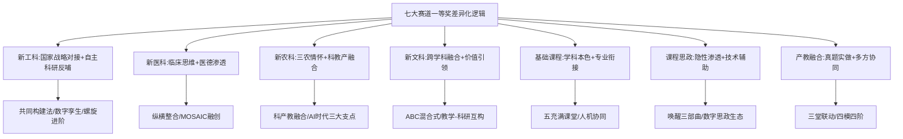

七大赛道一等奖案例在七个维度上的差异化呈现可总结如下：

| 维度 | 新工科 | 新医科 | 新农科 | 新文科 | 基础课程 | 课程思政 | 产教融合 |
|------|--------|--------|--------|--------|---------|---------|---------|
| **痛点类型** | 内容庞杂抽象、学生缺乏体验 | 知识迁移难、临床思维难建立 | AI冲击、产业脱节 | 理论枯燥、与生活距离远 | 学生差异大、自主性不足 | 思政与专业两张皮 | 合而不深、真题虚做 |
| **创新理念** | 共同构建/数字化转型 | 纵横整合/MOSAIC融创 | 系统性思维/科产教融合 | 知能用/教学-科研互构 | 建构性教学观 | 唤醒三部曲/HI+AI协同 | 真题实做项目化 |
| **内容重构** | 系列案例构建/科研反哺 | 课程体系纵横整合 | 跨学科前沿融合 | 哲学/理论体系重构 | 学科基础+专业衔接 | 思政元素挖掘融入 | 项目化全流程 |
| **模式特色** | OCAS/螺旋进阶/虚实融合 | 数智化+进阶式 | OBE沉浸式 | ABC混合式/浸润式 | 五充满/科企双驱动 | 三醒三思 | 三堂联动+四模四阶 |
| **思政路径** | 文化自信/工程伦理 | 医德医风/生命教育 | 三农情怀/生态文明 | 价值观引领/家国情怀 | 启智润心/育人无痕 | 隐性渗透为主线 | 服务乡村振兴 |
| **技术应用** | 数字孪生/虚实融合（深） | 数智化教学资源平台（中） | 沉浸式教学资源（中） | 教学资源库动态更新（中） | 智能教学平台（深） | 知识图谱/HI+AI（深） | 现场教学/真实建造（弱） |
| **成效证据** | 国家级一流课程/科研奖 | 6项一等奖累计 | 国家级一流课程/教材 | 一流课程/最美教师 | 国家级思政示范/200场推广 | 7项国家级+10项省部级 | 3A级景区村庄落地 |

### 4.8.2 七大学科范式的内在差异

从上表可清晰看出七种学科范式的内在差异：

- **新工科**侧重"国家战略对接+自主科研反哺"——以国之重器战略为牵引，以教师科研成果为内容支撑；
- **新医科**侧重"临床思维+医德渗透"——以临床真实问题为情境，以医者仁心为价值底色；
- **新农科**侧重"三农情怀+科教产融合"——以服务三农为价值导向，以科研项目+产业实际为内容载体；
- **新文科**侧重"跨学科融合+价值引领"——以打破学科壁垒为方法路径，以价值观引领为思政底色；
- **基础课程**侧重"学科本色+专业衔接"——以坚守学科基础为底色，以服务专业培养为目标；
- **课程思政**侧重"隐性渗透+技术辅助"——以思政与专业的深度融合为核心，以技术工具为辅助手段；
- **产教融合**侧重"真题实做+多方协同"——以真实项目落地为根本要求，以校企村多主体协同为组织保障。

### 4.8.3 共享的底层成功要素

尽管七大赛道在创新逻辑上呈现明显差异，但所有一等奖案例共享以下**底层成功要素**：

**要素一：长周期备赛投入**。从《乡土建筑空间设计》"十年校企村三方深度融合"[^145]、《花卉分子生物学》"自2014年起开设"持续打磨11年[^120]、《政治经济学》"70年金课"的代际传承[^138]，到孙若晗"近长达八个月的精心备赛"[^119]——所有一等奖案例都呈现长周期沉淀的共性特征。

**要素二：校院两级精准支持**。哈尔滨医科大学"从'保合格、提能力、创卓越'三个维度提高全体教师教育教学能力"的体系化培育[^118]、嘉兴大学"校领导靠前指挥、教师发展中心邀请校内外专家开展精准有效的指导"[^145]、青岛农业大学"组建赛事专项工作领导小组、组织校内外专家开展线上线下指导30余次"[^121]——都体现校院两级培育的关键作用。

**要素三：教学学术意识**。第二章已述上海师范大学杨婷的"教学学术起点论"——这一意识在本章七大案例中得到完整印证：周屈兰的"OCAS流程"、孙若晗的"纵横整合体系"、刘宇婧的"三大支点"、王颖的"自我打碎"、曹敏惠的"三醒三思"——都体现了从经验描述上升到理论提炼的教学学术自觉。

**要素四：闭环逻辑论证**。所有案例都呈现"痛点—举措—成效—辐射"的完整闭环——这一闭环正是第二章评分逻辑解构中"教学学术闭环"要求的具象化呈现。

---

综合本章七节的分学科剖析，可以清晰看出：**创新赛一等奖课程的"八位一体"创新范式（第二章归纳）在七大赛道中呈现出鲜明的"基因变异"——同一范式因学科属性不同而表现出不同的具体形态**。这一发现对辅导工作具有重要启示：**辅导对象的能力打造不能机械套用统一模板，而应以学科创新基因为参照，针对所在赛道的差异化逻辑进行精准辅导**——为新工科辅导对象重点强调"国家战略对接+自主科研反哺"，为新文科辅导对象重点强调"跨学科融合+价值引领"，为产教融合辅导对象重点强调"真题实做+多方协同"，依此类推。这种"分学科精准化辅导"是从一般化方法论辅导走向高水平差异化辅导的关键升级。

下一章将转入青教赛一等奖典型案例的剖析，与本章形成创新赛/青教赛"宏观范式具象化+微观规律具象化"的双轨对照分析体系，进一步丰富辅导工作的案例资源库。

# 5 青教赛一等奖典型案例的课堂教学剖析

承接第三章对青教赛"教学设计20分+课堂教学75分+教学反思5分"三模块设计精要与"简洁—层次—留白—通透"四维呈现规律的归纳，以及第四章对创新赛七大赛道一等奖案例的"宏观范式具象化"剖析，本章将研究视角进一步下沉到青教赛近三届（第五至第七届）一等奖代表性案例的细颗粒度课堂教学剖析。如果说第四章呈现的是创新赛"长周期教学改革闭环"的具象化样本，那么本章则要呈现青教赛"20分钟教学微缩精品"的具象化样本——这两类案例库共同构成辅导工作可对照、可参照、可迁移的双轨案例资源。

研究样本以第六届与第七届青教赛各组别一等奖第一名为主线（兼及部分一等奖案例），共选取覆盖文、理、工、医、思政五大组别的11个标杆案例，遵循"引入设计—知识展开—案例板书—提问互动—前沿思政—结尾升华"的统一分析框架进行剖析。需要预先说明的是：青教赛参赛节段由现场抽签决定，公开渠道流传的实录视频与文字材料对单一节段的报道较为详尽，但16个节段的整体方案细节通常不外公开。本章因此采取"以单节段细颗粒度剖析为主、以教师整体教学理念与备赛历程为辅"的策略，必要时坦诚说明资料局限。

## 5.1 文科组一等奖案例剖析：梁思思与郭璐两届"清华建筑"现象

第六届与第七届青教赛文科组一等奖第一名连续由清华大学建筑学院产出——梁思思（第六届，《城市设计理论与实践》）[^150][^151]与郭璐（第七届，《中国古代城市规划史》）[^152][^153]。这一"两届蝉联"现象不仅仅是个体教师的成就，更折射出清华建筑学院青年教师教学传承梯队的院系培育机制，是辅导工作研究院系长效化建设的标杆样本。

### 5.1.1 梁思思《城市设计理论与实践》：启发性问题情境驱动与案例融入

梁思思2011年自美国宾夕法尼亚大学博士毕业回到母校清华大学，投身城市规划与设计专业的教学工作。她对该学科的独特理解为课堂设计奠定基调——"可以把科技、社会、人文艺术融合在一个大的空间载体里，通过科研课题与参与社会调查、决策相结合，融合空间设计方式，营建可持续发展的人居空间环境"[^154][^155][^156]。

**第一，启发性问题情境的层级化设计**。梁思思在课堂上彻底摒弃传统的照本宣科式教学方式，"在讲解城市街道时，梁思思不会简单罗列各种街道的样式——这些信息学生很容易在网络上找到。相反，她会以启发性的问题引导学生思考"[^154][^155][^156]。其问题链具有清晰的认知层级递进特征：

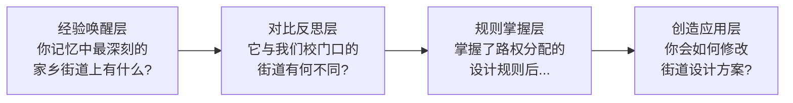

这一从"经验唤醒—对比反思—规则掌握—创造应用"的四层问题链，恰好对应第三章所归纳的青教赛一等奖课堂"层次"维度——"制造思维褶皱、递进化解矛盾"的核心要义。

**第二，与时俱进的内容范式转型**。梁思思紧密围绕时代发展的脉搏调整课程方向：**"近年来，中国的城市发展从增量扩张转向存量更新改造的新阶段，为此，建筑学及其相关领域也需要思考范式转型"**[^154][^155][^156]。这一"增量转向存量"的范式转型自觉，使其课程内容始终保持学科前沿性，对应青教赛评分细则中"反映或联系学科发展的新思想、新概念、新成果"要点。

**第三，思政元素的自然落点——基于"国之大者"的城市设计实践**。梁思思的科研经历支撑着课堂的厚度——她参与了"北京首都功能核心区总体城市设计"项目，深刻意识到"历史街区的保护更新不仅要保存静态物质空间，也要保护人在场所中的社会生活、文化空间和非物质文化"，最终课题组的工作成果被吸收纳入北京市控制性详细规划[^154][^155][^156]。这种从"规划师社会责任"中自然生长出的思政元素，正是教育部相关一等奖经验所归纳的"《城市设计理论与实践》在课堂小结环节，总结了城市设计的美学秩序、城市功能、公共政策……引导学生思考城市规划师的责任与担当"[^157]——与第三章所述青教赛思政"微浓缩"融入策略高度契合。

**第四，学生反馈印证课堂温度**。在期末匿名课堂打分系统中，学生们为梁思思给出"花式"好评："**内容深入浅出，知识体系、结构性强，几乎每节课都有超越认知的知识，醍醐灌顶，让我大呼过瘾**！""**梁老师很有人格魅力，好喜欢您**！"[^154][^155][^156]——这一类不掺水分的学生评价是一等奖课堂"温度"的最朴实证据。

### 5.1.2 郭璐《中国古代城市规划史》："内容为王、课比天大"的教学哲学

郭璐第七届以32名文科组教师中的一等奖第一名脱颖而出[^152][^153]。她的成长路径与备赛细节，是辅导工作"如何陪伴青年教师从忐忑走向从容"的极佳样本。

**第一，从"贪大求全"到"找准穴位"的教学反思演进**。郭璐刚刚走上讲台时的状态极具代表性——"她感到忐忑不安，担心讲课中忘词，她在每一页PPT下做详细的逐字稿标注，而且时不时就要看一眼教室里的钟表，唯恐30分钟就讲完45分钟的内容"[^152][^153]。这种"新手期通病"的真实记录，对辅导工作中识别青年教师常见困境具有诊断价值。

更宝贵的是郭璐的反思演进路径——"她反思自己从前有贪大求全的问题，总想把所有知识事无巨细地教给学生，却往往只能浮于表面。但学生其实是聪慧的，只要把一个点讲清楚，其他的知识他们能够融会贯通。郭璐于是把重心放在寻找'**钩子**'——'**这节课要解决的核心问题**'，就像中医点穴，关键是找准穴位"[^152][^153]。**这一"贪大求全→找准穴位"的认知跃迁，与第三章归纳的青教赛一等奖课堂"简洁—锚定核心、削冗存真"维度形成精准印证**。

**第二，"钩子型核心问题"的设计示例**。郭璐为不同知识点设计的"钩子问题"具有极强的代表性[^152][^153]：

| 钩子问题 | 学科锚点 | 认知功能 |
|---------|---------|---------|
| 长城如何发挥防御作用，不打仗的时候又有什么用？ | 军事建筑的复合功能 | 跳出"防御=战时"的固有认知 |
| 元大都地表水供应不足，如何支撑宏大都城的建设？ | 城市基础设施与水利 | 水资源调配的工程智慧 |
| 成都平原降水量大、洪灾频发，为什么能够成为天府之国？ | 水患治理与农业文明 | 反向思维探究治水智慧 |

这些问题并非随意提出的"提问"，而是每个对应一节课的核心穴位——"清华的学生都是'识货'的，得把真正有价值的东西拿给他们看"[^152][^153]。**这种"钩子问题—学科核心—课堂主线"三位一体的设计逻辑，是青教赛一等奖课堂高阶问题设计的范本**。

**第三，跨专业学情的认知降维设计**。"在通识课的课堂上，学生来自不同专业，知识背景参差不齐。郭璐因此在教案和教具上花了很多心思"[^152][^153]——她的"降维"举措构成了一个完整的教具体系：

- **PPT层面**：插入大量直观描摹古代城市生活的画作，如**明代《南都繁会图》、元代《西湖清趣图》**，以及城市建筑的三维模型动画；
- **实物层面**：为帮助非建筑专业学生更好地识图，**专门制作3D打印的模型，哪里是山、哪里是水、城市如何规划，便一目了然**；
- **课堂之外**：组织班级到博物馆、规划展览馆现场实地学习。

这一"画作—动画—3D模型—现场实地"的四层教具递进，是文科组一等奖课堂"案例直观化"维度的精彩呈现，对辅导工作中"如何为非本专业学生设计可理解的教学素材"具有直接借鉴价值。

**第四，结尾升华的文化自信落点**。郭璐参赛课程定位极为清晰——"中华文明植根中华大地，5000多年来持续不断的城市规划建设是中华文明的伟大实践，至今仍具重要现实意义。课程旨在阐释中华文明发展进程中的城市规划实践，分析中国古代城市规划的思想和方法，揭示中国特色的城市规划传统；进而引导学生立足中国特色，古今融贯地思考城乡发展中的现实问题，树立当代中国规划师的责任感和使命感"[^158]。这一定位本身就构成了思政落点的自然底色——"一砖一瓦，一楼一城，都是整个文明的具象化体现，其中蕴藏着广大的世界，给我一种'**芥子纳须弥**'的感觉"[^152][^153]——"芥子纳须弥"作为思政升华的诗性凝练，远比直白的"文化自信"标签更具感染力。

### 5.1.3 清华建筑学院青教赛传承梯队对辅导工作的启示

梁思思与郭璐两届蝉联文科组第一名并非偶然——这一现象的制度密码在于清华建筑学院的青教赛传承梯队。郭璐获得北京高校第十三届青年教师教学基本功比赛文科类A组一等奖第二名时的指导教师为**景观学系郑晓笛**，而郑晓笛"自2015年起，**郑晓笛、刘佳燕、陈宇琳、梁思思**等教师先后在北京市青年教师教学基本功比赛中夺得3个一等奖和1个二等奖，**梁思思还获得2023年全国高校青年教师教学竞赛文科组第一名**"[^158]。这一"前辈获奖→指导后辈→后辈再获奖"的代际传承链，呈现出极为清晰的梯队培育结构：

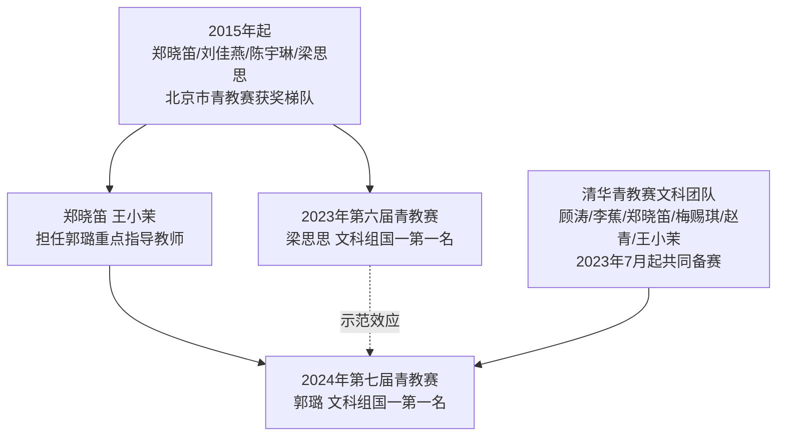

清华大学青教赛文科团队"自2023年7月起共同进行备赛，每位选手又有两位重点指导教师，郭璐的指导教师为我院郑晓笛老师与美术学院王小茉老师"[^158]。**这一"团队整体备赛+每人双导师"的运作模式，对辅导工作的核心启示是：青教赛一等奖不是个体英雄主义的产物，而是院系长周期梯队培育的自然成果**——辅导部门应当致力于构建本单位"前辈获奖—示范引领—指导后辈—后辈再获奖"的代际传承机制，而非追求单次比赛的偶然突破。

## 5.2 理科组一等奖案例剖析：周峰与赵维殳的"具象化—前沿化"双路径

理科组一等奖课堂面临的核心挑战是"将抽象的数理逻辑转化为学生可理解的具象呈现"。第六届理科组第一名周峰（山东师范大学）[^159][^160][^161][^162]与第七届理科组第一名赵维殳（上海交通大学）[^163][^164][^165][^166][^167]分别代表了两条典型路径——**周峰以"具象化教具+问题链"破解经典数学课程的抽象性，赵维殳以"小众前沿+科研反哺"建设极端生物学这一新兴课程**。

### 5.2.1 周峰《概率论与数理统计》：自制教具与五段式问题链

周峰2010年毕业于南开大学数学基地班，2015年获新加坡国立大学博士学位，2018年入职山东师范大学数学与统计学院，先后在新加坡国立大学四次荣获理学院Teaching Assistant Award与四次荣获数学系Top Graduate Tutor奖项[^168][^162]——这一海外助教经验对其后来的国赛课堂表现具有深远影响。

**第一，自制教具的抽象具象化**。周峰最具识别度的教学特色是"**坚持手写板书与脱稿讲解，自制纸杯、雨伞等教具将抽象数学概念形象化**"[^161]。在国赛参赛节段《概率论与数理统计·离散型随机变量的数学期望》中[^169]，他以**奥运会射击比赛平均环数的计算案例**[^157]切入——"采用奥运会射击比赛平均环数的计算案例，讲述基本的数理知识外，体现了科学研究对数据处理和逻辑推理的精确性，引导学生在处理任何问题时，都要保持理性且科学的态度，收集证据证实结论"[^157]。这一案例选择的精妙之处在于：体育情境提供了情感切入点，数学公式提供了科学严谨度，思政元素自然内嵌于"理性与证据"的精神内核——是青教赛思政"自然渗透"的范例。

**第二，五段式问题链的认知阶梯**。周峰在公开经验分享中提出的"上好每一节课"方法论极具操作性——"他选取《离散型随机变量的数学期望》这一阶段，从'**发现问题—提出问题—分析问题—解决问题—拓展问题**'这五个方面进行介绍"[^160]。这五段式恰好对应第三章所归纳的青教赛一等奖课堂"层次—制造思维褶皱"维度的具体落地：

| 阶段 | 教学行为 | 认知功能 |
|------|---------|---------|
| **发现问题** | 由情境/案例引出现象 | 唤起认知需求 |
| **提出问题** | 凝练核心数学问题 | 锚定学习目标 |
| **分析问题** | 拆解已知/未知/路径 | 启动认知探索 |
| **解决问题** | 公式推演与求解 | 完成知识建构 |
| **拓展问题** | 迁移应用与升华 | 形成能力素养 |

**第三，参赛感悟的"五板块"教学理念**。周峰在受邀至兄弟院校的报告中，将其教学心得凝练为"**立德树人—基建五金—金课标准—教学能力—教学艺术**"五个板块[^160]，并提出"高校青年教师在课堂上，应当立足学生能力素养提升，把握核心教学内容；引导学生在自主、合作和探究中学习；注重知识建构，培养学生提出、分析、解决问题的思想方法；凝练育人价值，引导学生树立正确的价值观"[^160]——这一总结呈现出从"教学技法"到"教学学术"的认知跃迁，与第二章创新赛"教学学术起点论"形成跨赛事的同频共振。

**第四，备赛历程的"八轮淬炼"**。周峰获奖背后是"**院赛、校赛、省初赛、省复赛、省决赛、省遴选赛第一轮、省遴选赛第二轮、国赛共8轮比赛**"的长周期淬炼[^159]——"周峰老师放弃了大量休息时间，从选题到课件制作，从案例修改到仪表仪态，**每一句表述、一个动画次序、一个数学符号、一处板书，都精益求精，追求完美**"[^159]。这一精细打磨标准对辅导工作的启示是直接的——青教赛一等奖的微观规律不可能通过几次粗放的磨课获得，必须经过"精到一句话、一个动画、一个符号、一处板书"的极致打磨。

### 5.2.2 赵维殳《极端生物学》：小众前沿课程的科研反哺设计

赵维殳是第七届青教赛理科组一等奖第一名，本人也是上海交通大学生命科学技术学院副研究员、深部生命与资源研究院副院长[^163][^166]。她的案例最独特之处在于——参赛课程《极端生物学》是一门**"小众而前沿"的新建课程**，这与多数青教赛参赛课程为成熟基础课的常规情境形成鲜明对比。

**第一，"上天入海"的真实科考经历作为课堂底色**。赵维殳"长期从事极端环境微生物研究，足迹遍布马沟、珠峰等多种极端环境，曾搭乘'奋斗者'号、'深海勇士'号载人深潜器完成多次深海科考任务"[^165]。**2021年11月，33岁的赵维殳搭乘我国自主研发的"奋斗者"号载人潜水器，下潜到马里亚纳海沟9700米深处**[^163]——这种"亲历极端环境"的真实经历是任何二手讲述都无法替代的课堂底色。其备赛感悟道出了这一底色的深层力量：

> "尽管站在讲台上的是我一个人，但在我的背后其实是我国科学家团体对极端环境的不断探索，是我们上天入海所用到的那些**大国重器**，是那些'**宁冒风险，不当逃兵**'的英雄事迹，更是那些能够生活在雪山之巅、深海之渊、冰里来火里去的极端生命的精彩故事"[^164]

这一表述揭示了青教赛一等奖课堂"情感共鸣"的最高境界——**教师不是孤独的演讲者，而是科学共同体使命的传递者**。

**第二，"共适应"理论的科研反哺教学路径**。赵维殳"围绕原创的'共适应'理论，引入代谢网络分析，将'共适应'理论在细胞水平验证，逐步拓展至生物大分子与生态系统水平，已初步实现量化并扩展至与人工智能、地球科学等交叉研究中"[^164]。这一原创理论框架直接成为《极端生物学》课程的知识脉络主轴。她在备赛中的关键收获是——"有幸遇到了许多在教学上充满热情又颇有建树的前辈老师们为我指导，他们从**物理、化学、数学等经典学科的角度**，帮助我不断地梳理知识框架和逻辑思路，帮我完善理论框架，启发我对极端生物前沿结果的深入理解并进行知识重构"[^164]。**这是青教赛一等奖备赛过程中"跨学科专家协同"价值的鲜活注脚——前沿小众课程的清晰呈现，恰恰需要经典学科视角的"逻辑重构"**。

**第三，从课件结构到板书呈现的全方位精雕**。赵维殳在华东师范大学生命科学学院"生科乐教"工作坊的分享中，详细呈现了其打磨经验——"在案例教学环节，赵老师选取课程经典片段，**从课件的结构设计、逻辑梳理，到教具的多元化运用与板书的精准呈现，全方位拆解了高效教学的实践路径**"[^165]，并强调"要充分发挥个人专业特长、系统搭建教学素材库，并重视教案优化与板书设计的协同发力"[^165]——这一"教案—课件—教具—板书"四维协同设计，是青教赛一等奖在新建课程上突围的标准动作。

**第四，"不断的来者"的学科使命传递**。赵维殳的一句话最具感染力："虽然我们的课程可能'**前无古人**'，但希望通过我们的课程建设能让极端生命的研究领域有不断的'**来者**'加入其中"[^164]。这种将课程使命与学科未来人才储备直接挂钩的情感升华，是理科组一等奖课堂"价值情感升华"的标杆呈现。

### 5.2.3 理科组一等奖的"具象化—前沿化"共性经验

将周峰与赵维殳两个案例横向对照，可归纳理科组一等奖课堂的共性经验：

| 共性维度 | 周峰路径 | 赵维殳路径 |
|---------|---------|----------|
| **抽象概念具象化** | 自制纸杯、雨伞等教具 | 真实科考实物与数据可视化 |
| **学科前沿融入** | 数学思想与生活联系 | 《Cell》封面成果、深渊微生物数据库 |
| **逻辑链条严密** | 五段式问题链 | "共适应"理论统领的代谢网络分析 |
| **思政落点设计** | 理性与证据的科学精神 | 大国重器与极端生命英雄事迹 |
| **板书核心地位** | 手写板书脱稿讲解 | 板书与课件结构、教具协同 |

这两个案例共同呈现的核心启示是——**理科组一等奖课堂的本质突破不在于"如何把数学/生物讲生动"，而在于"如何让学生从课堂走出去时，对学科本身、学科背后的科学共同体、学科指向的人类未来有更深的理解与认同"**。这一深层突破要求辅导对象不仅有扎实的学科功底，更要有"科学家共同体一员"的身份自觉。

## 5.3 工科组一等奖案例剖析：高晓沨与程楠的"敬畏教学—渡人渡己"

工科组一等奖在第六届与第七届分别由上海交通大学高晓沨[^168][^170][^171][^172][^173][^174]与中国农业大学程楠[^175][^176][^177]摘得。两个案例共同的特征是——**两位获奖者都将教学视为一项"系统工程"与"修行"，呈现出工科教师对教学的高度敬畏**。

### 5.3.1 高晓沨《计算机科学导论》：起承转合与严谨学规设计

高晓沨"主要从事计算机学科基础教育，先后负责《计算机科学导论》、《算法与复杂性》等多门课程的建设和主讲工作，主持五项省级课程建设项目"[^168][^173]，其参赛课程《计算机科学导论》"有十年建设历史，是图灵奖获得者**John Hopcroft**教授在2011年首次访问上海交通大学时开设的专业通识课程"[^170][^171]。

**第一，"起承转合"四阶段的工科基础课情境化**。高晓沨在课堂上以"**让我们先化身一个机器人，来解决生活中的一些问题**"[^172]这样的情境化导入开启课堂——这与第三章所述青教赛一等奖课堂"起的故事性、趣味性"高度契合，将抽象的计算机科学转化为可感知的生活场景。

**第二，逐层递进的"学科概览"教学法**。高晓沨备赛过程中"**逐渐对计算机科学有了更深入的认知，设计了逐层递进学科'概览'的教学方法**"[^174]——这与第三章归纳的"层次—制造思维褶皱、递进化解矛盾"高度吻合。其设计逻辑是：用一节课让学生既能"概览"整个计算机学科的全貌，又能在"逐层递进"中深入到关键知识点，实现"广度"与"深度"的统一。

**第三，"严谨学规"的工科底色**。高晓沨极具识别度的特色是为自己和学生制定的"**学规**"——"于她自身而言，课程所提供的教学大纲、教学课件、后测文档等都完备而专业；于学生而言，撰写作业和伪代码的格式要规范，递交课程材料的流程要规范，展示小组项目的汇报也要规范"[^174]。她对此的解释是："**计算机这个专业本身对严谨性的要求很高，写错一个代码这样的小失误就可能会酿成大事故。我一方面要严于律己，给学生们做好榜样；一方面希望'从小抓起'，让初入大学的学生能够把规范严谨刻入骨血**"[^174]——**这种"学科属性—教学规范—育人目标"三位一体的严谨度设计，是工科课堂思政融入的内生路径**，远比贴标签式思政更具学科生命力。

**第四，人文关怀的细节设计**。高晓沨的"温度"体现在与"严谨"看似相反的细节中——"**高老师会为每门课设计标志，为我们专门制作桌牌、名册，并记录下我们的成长点滴，潜移默化地影响我们的成长之路**"[^174]，"利用自己专业特长，设计编写了课程交互网站，有效地将项目教学、案例教学、情景教学等教学方法融入自己的课程，通过线上线下频繁交互实时调整，时刻宏观把握课程进度，积极引导学生在轻松愉快的氛围中学习、思考，并全过程记录学生的成长经历，制作成照片墙、光荣榜等，提升课程人文关怀"[^172]。**这种"工科严谨度+人文温度"的张力平衡，是工科组一等奖课堂超越纯技术呈现的关键密码**。

**第五，"敬畏教学"的认知深度**。高晓沨的获奖感言是辅导工作中最值得引为镜鉴的——"**从2019年备赛至今，一千多日夜的磨砺中，我从最初的懵懂莽撞，到如今的严谨求真，感受最多的，是'敬畏'。教学是个系统工程，涉及专业技能、教学设计、授课技巧、心理洞察等诸多方面，想上好一堂课，谈何不易**！"[^170]从2019年备赛到2023年获国赛一等奖，"先后参加了5轮教学比赛，3轮磨课特训，还有数十次各类教学培训与分享"[^172]——**1000多日夜、5轮教学比赛、3轮磨课特训、50多位专家指导**[^171]——这一组数字共同勾勒出青教赛一等奖背后的"长周期—多专家—大投入"基本规律。

### 5.3.2 程楠《食品卫生与安全控制》：渡人渡己与"亚硝酸盐天使魔鬼"

程楠是中国农业大学食品科学与营养工程学院副教授，"长期从事食品科学中的纳米技术、智能生物传感技术相关研究，主持国家自然科学基金面上项目及青年项目、国家'十四五'国家重点研发子课题及科技创新2030子课题等"[^175]。其国赛参赛课程《食品卫生与安全控制A·亚硝酸盐：天使还是魔鬼》[^176][^177]在课程设计上极具记忆点。

**第一，三段记忆点构成的"心动课堂"导入**。程楠的课堂以三组生活化案例构筑导入——"**讲授火腿'肌红脂白'和亚硝酸盐之间的奥妙；挖掘'红伞伞白杆杆，吃完一起躺板板'背后的秘密；剖析从'舍命吃河豚'到'安全吃河豚'的科学机制**"[^175]。这三组案例分别对应"食品添加剂的合理使用""野生菌的安全风险""毒物代谢与饮食安全"三个核心议题，每个案例都自带文化记忆点（金华火腿的传统、网络流行歌的时代感、林则徐式典故的历史感），构成第三章所述青教赛"故事化叙事"导入的范本。

**第二，"《舌尖上的中国》导入+亚硝酸盐技术1.0—4.0迭代图谱"的内容架构**。程楠"以《舌尖上的中国》纪录片中'金华火腿'的例子作为导入，把抽象的亚硝酸盐概念具象化为实物，有力地展现了亚硝酸盐在食品加工中的具体作用"[^157]——这是第三章所述青教赛"案例直观化"的生动呈现。在内容主体部分，则呈现亚硝酸盐检测技术从分光光度法（1.0）到快速检测试纸（2.0）、磁吸式数字传感装置（3.0）、智能化人工智能大数据生物传感（4.0）的清晰迭代图谱——既有学科前沿的高度，又有可视化的清晰路径。

**第三，"学为中心、关注成长"的备赛理念升华**。程楠的备赛感悟揭示了一等奖背后的认知突破——"教师发展中心组织的培训和各种能力提升活动，给了她很大帮助。'**让我知道教学要从知识与技能、过程与方法、情感态度价值观三个维度去思考和设计，也让我知道设计的关键是从学情出发，把握学生的思维角度、关注学生的思想内核、共情学生的情感体验，与学生一起在教学相长中向更高层次迈进**'。据悉，这套理念被教师发展中心凝练为'**学为中心、关注成长**'八个字，不仅写进了程楠的比赛教案，也深刻的影响着她所有的教学工作"[^175]。**这种"院校理念—教师内化—课堂落地"的传递链条，对辅导工作建设本单位"统一的教学话语体系"具有借鉴意义**。

**第四，思政落点的"专业守护"使命感**。程楠在课程开始即点出"食品安全的重要性"，并通过"**想要将食品安全问题消灭于萌芽，让未雨绸缪代替亡羊补牢，那就离不开我们食品人的专业守护**"[^157]的叙述，引导学生认识食品专业工作者的责任与使命。同时"通过介绍金华火腿的制作，将亚硝酸盐的使用与中华民族的智慧联系起来，增强文化自信；通过'不能脱离剂量去谈毒性'的科学分析，培养科学精神和批判性思维"[^157]——形成"专业认同—文化自信—科学精神"三维一体的思政落点。

**第五，"教学是渡人渡己的修行"的师者境界**。程楠的两段感悟具有很强的引领性——"**教学是一场渡人渡己的修行**""**'教学'是教育理念、教学方法、教学设计、教学展示、教学技巧、教学手段等多维因素的综合呈现**"[^175]。她的另一段表述更将这种修行提升到代际传承的层面——"上海交通大学举行的喜迎第四十个教师节暨第七届全国高校青年教师教学竞赛总结大会上，闻玉梅、丁文江两位院士上台与青年教师分享他们的教书育人故事。**丁文江院士赠予程楠一面仿制西汉古铜镜，程楠对丁文江院士表达感谢，并表示未来一定以院士们、老师们、前辈们为镜，时时刻刻提醒自己，将教育家精神传承下去，希望有一天也能成为学生心目中的'镜子'**"[^176]——以"古铜镜"作为教育家精神传承的物化象征，是青教赛一等奖背后"教育情怀"的生动定格。

### 5.3.3 工科组一等奖的"严谨—温度—哲学"共性经验

将高晓沨与程楠两个案例横向对照，可归纳工科组一等奖课堂的共性经验：

| 共性维度 | 高晓沨路径 | 程楠路径 |
|---------|----------|---------|
| **学科严谨度** | 学规设计—代码规范—格式严谨 | 食品安全—剂量科学—风险评估 |
| **真实情境驱动** | "化身机器人解决生活问题" | 金华火腿—野生菌—河豚饮食 |
| **技术迭代脉络** | John Hopcroft经典+学科概览 | 亚硝酸盐检测1.0—4.0图谱 |
| **人文温度** | 桌牌—名册—成长记录 | "渡人渡己的修行" |
| **工程哲学** | "敬畏教学"系统工程观 | "学为中心、关注成长" |

**这两个案例共同呈现的工科组一等奖深层密码是——工科课堂的"温度"必须从工科本身的"严谨度"中生长出来，而非外加的"煽情"。"严谨"是工科课堂的生命线，"温度"是工科课堂的高境界，而"哲学"则是从"严谨"通向"温度"的桥梁**。这一内在逻辑，与第三章所述谌援"备内容—备学生—备哲学"的工科"三备"框架形成跨届呼应。

## 5.4 医科组一等奖案例剖析：朱桂全与叶枫的"临床案例—医德渗透"

医科组一等奖在第六届由四川大学华西口腔医学院朱桂全[^168][^178][^179]、第七届由上海交通大学医学院附属瑞金医院叶枫[^180][^164][^167]获得。两个案例共同体现了医科组课堂"临床案例驱动+医德医风渗透"的鲜明学科属性。

### 5.4.1 朱桂全《口腔颌面外科学》：双轨教学法与"喜欢"的初心

朱桂全是四川大学华西口腔医学院头颈肿瘤外科副主任，"将价值引领、知识传授、能力培养融入课程设计，精心打磨《口腔颌面外科学》课程，**形成了以'系统性思维能力培养'为特点的理论教学方法和以'临床胜任力培养'为特点的实践教学法**"[^178]。

**第一，"系统性思维+临床胜任力"双轨教学法**。这一双轨设计精准切中医学教育的核心矛盾——理论教学侧重抽象的系统性思维框架，实践教学侧重具体的临床胜任能力，两者通过课程设计有机衔接。其底层逻辑是医学教育"从书本到病房、从思维到操作"的完整闭环。

**第二，"面神经麻痹"案例的医德医风渗透**。教育部相关一等奖经验归纳指出——"医科组一等奖第一名的《口腔颌面外科学》，**在课堂教授环节采用学生在临床实验中因操作不规范而导致的面神经麻痹的案例，向学生讲述了规范操作的重要性，并引导学生思考医生的职业道德和责任感，让学生明白在医术精进的同时也要把患者的利益放在首位**"[^157]。这一案例的精妙之处在于：**反面案例自带强烈的情感冲击力，规范操作与职业道德两个层面的教学目标在同一案例中自然实现，远比正面赞美式教学更具感染力**——是医科课堂"医德医风渗透"的典型范本。

**第三，"喜欢"作为优秀教师的核心素养**。朱桂全在受访谈及登上讲台经验时坦言——"当初选择口腔专业是因为兴趣，现在承担教学任务之后，面临着更加繁重的工作量，**更需要'喜欢'来作为支撑**"[^179]。他将"喜欢"视为成为一个优秀老师必备的素质，"口干舌燥是朱桂全登上讲台之后的第一感受……一般而言上课之前，他会在科室内部试讲，与其他老师探讨、修正，进而才正式在讲堂上进行教学"[^179]——这种"科室预演—专家点评—讲堂正式呈现"的三段式打磨，是医科教师备课的常规高标准。

**第四，"集体的荣誉"——医科备赛的科室协同机制**。朱桂全获奖后特别强调——"**这次比赛获胜并非自己一人的功劳，而是整个团队的荣誉**"[^179]。他描述的协同机制极具可借鉴性：

> "从口腔颌面外科学的十八个章节中挑选出覆盖面超过百分之七十内容的十五个章节只是第一步，接下来是对其详细展开讲授，包括一些自己从未讲过的知识点……**学院的协助下，其他老师慷慨地提供了帮助，分享自己负责课程的教案，并演示讲课的方式与流程。此外，学院还多次组织教学督导组的老师为朱桂全提供指导，如题目的拟定是否合适，内容的组织是否合理。对于一些他感到陌生的课程，熟知该领域的老师们也积极地为课件制作提供帮助**"[^179]

**这一"科室教案分享—督导专项指导—跨课程互助—校工会教务处人事处协调"的多层协同机制，是医科组一等奖背后院校长效培育的标准动作**——对辅导工作设计本单位备赛支持体系具有直接的样板价值。

### 5.4.2 叶枫《腹外疝概论》：七阶段教学链与生动比喻

叶枫是上海交通大学医学院附属瑞金医院普外科主治医师，"瑞金临床医学院外科学教研室骨干师资，参与上海市教委重点课程建设，曾获上海市青年五四奖章，第六届上海高校青年教师教学竞赛特等奖"[^164]。其参赛课程《普通外科学·腹外疝概论》[^180]在公开教学设计资料中得到了较为完整的呈现，是青教赛医科组课堂解构的难得样本。

**第一，七阶段教学链的层次铺陈**。叶枫的课堂呈现出极为清晰的七阶段结构[^180]：

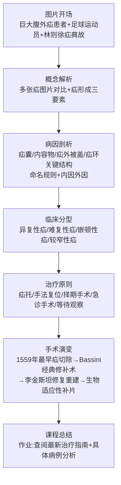

这一七阶段结构对应了第三章所述青教赛一等奖课堂"层次—制造思维褶皱"的高级形态——**每一阶段都是上一阶段问题的解决，又是下一阶段问题的引出，形成完整的"概念—病因—分型—治疗—手术—升华"认知阶梯**。

**第二，生动比喻的认知降维**。叶枫的课堂对临床概念的具象化呈现极具特色——"用**狐狸来阐释异复性疝**的特点，通过**肠管和肠鸣音**来讲解难复性疝的病理机制。同时，结合日常生活中的实例，如**搬重物时的感觉**，来深入剖析嵌顿性疝的成因。此外，叶老师还通过讲解**汉字中'疝'字的由来**和疝内的内容物，以及真实的手术案例，强调了嵌顿性疝在临床上的重要性"[^180]。这些比喻与文化考据的运用，是医科组一等奖将"专业概念抽象性"降解为"学生认知可接近性"的范本。

**第三，板书与PPT的精细配合**。叶枫的课堂在板书设计上极为讲究——"叶老师首先利用板书，**详细讲解了疝形成后的关键结构，包括疝囊、内容物、疝外被盖和疝环**……接着，他结合实际临床情况，解释了如何通过触诊上环来诊断腹外疝，并由此引出了疝的命名规则和一些具体的疝名"[^180]。**板书承载的是逻辑骨架与解剖结构的关系网络，而PPT承载的是大量的临床图片、手术视频与历史影像**——这一功能分工正是第三章所述青教赛一等奖课堂"板书—PPT功能互补"的精彩落地。

**第四，从林则徐到生物适应性补片的学科前沿呈现**。叶枫"通过讲述**林则徐与疝的典故**，再次强调了手术时机的重要性。随后，追溯了腹外疝手术的历史，从1559年最早将腹外疝视为包块进行切除，到Bassini的经典修补术，再到李金斯坦的修复重建理念，逐步展现了手术方式的演变。同时，探讨了修补术的局限性以及患者的不适感，为后续的生物适应性补片的应用提供了背景"[^180]。这一历史脉络的串联使学生在20分钟内完整把握了疝外科500年的发展史，是医科组课堂"学科前沿"呈现的高级形态。

**第五，"瑞金底蕴+前辈肩膀"的传承感恩**。叶枫获奖后的一段感言道出了医科组备赛的深层支撑——"瑞金普外科叶枫拿到了全国高校青年教师教学竞赛第一名，有人问他'你是如何做到的？'**他谦虚地说：'瑞金有着深厚的教学底蕴，我有幸能站在国赛的讲台上，是因为站在了前辈们的肩膀上'**"[^167]。这种"院系底蕴—前辈传承—个人努力"的认知，与朱桂全"集体的荣誉"形成医科组一等奖共同的"集体主义"备赛文化。

### 5.4.3 医科组一等奖的"临床—医德—循证"共性经验

将朱桂全与叶枫两个案例横向对照，可归纳医科组一等奖课堂的共性经验：

| 共性维度 | 朱桂全路径 | 叶枫路径 |
|---------|----------|---------|
| **临床案例驱动** | 面神经麻痹反面案例 | 巨大腹外疝+林则徐+足球运动员 |
| **概念具象化** | 系统性思维框架 | 狐狸/肠鸣音/搬重物比喻 |
| **学科前沿融入** | 国产手术机器人辅助颌面外科 | 1559→Bassini→李金斯坦→生物补片 |
| **医德医风渗透** | 规范操作—职业道德—患者利益至上 | 真实手术案例—生命教育—医者使命 |
| **科室协同备赛** | "整个团队的荣誉" | "瑞金底蕴+前辈肩膀" |

**两个案例共同呈现的医科组一等奖深层密码是——医科课堂的"专业性"必须始终与"人性"同在**。每一个临床案例背后都是一个具体的生命，每一次规范操作背后都是一份对生命的敬畏。这种"专业即伦理、伦理即专业"的内在统一，是医科组一等奖区别于一般专业课的根本特征。

## 5.5 思政组一等奖案例剖析：赵坤、徐嘉鸿与张青子衿的"问题导向—学理支撑—情感浸润"

思政组一等奖在第六届与第七届分别由浙江大学赵坤[^168][^181][^182][^183][^184][^185][^186]、武汉大学徐嘉鸿[^187][^188][^189][^190]获得，第七届思政组一等奖还包括上海大学张青子衿[^191]。三个案例共同呈现思政课堂"问题导向、学理支撑、情感浸润"的三重密码。

### 5.5.1 赵坤《马克思主义基本原理》：三重密码与"魅力"的整体性在场

赵坤是浙江大学马克思主义学院讲师（后晋升副教授），第六届青教赛思政组一等奖第一名[^168][^183]，2024年全国五一劳动奖章获得者。

**第一，"问题导向、学理支撑、情感浸润"三重密码的明确提炼**。赵坤在福建师范大学马克思主义学院教学能力提升专题培训中明确提出——"如何让思政课更有魅力"的"**课堂魅力的三重密码**"——"**突出问题引导以增强课堂吸引力，厚植学理基础以增强课堂穿透力，强化情感浸润以人品之美、人格之美和人性之美增强课堂感染力**"[^192]。这一三重密码框架，与第三章所归纳的青教赛思政组共性特征——"理论深度+现实关切+价值引领"——形成精准对应：

| 三重密码 | 设计内涵 | 对应青教赛维度 |
|---------|---------|-------------|
| **问题导向** | 突出问题引导以增强课堂吸引力 | 启发性、互动性 |
| **学理支撑** | 厚植学理基础以增强课堂穿透力 | 学科深度、逻辑严密 |
| **情感浸润** | 人品/人格/人性之美增强感染力 | 情感共鸣、价值引领 |

**第二，"实现共产主义的历史必然性何在"的国赛参赛节段**。赵坤在第六届青教赛"以'**实现共产主义的历史必然性何在？**'为题，回应了共产主义虚无缥缈论的观点，呈现了实现共产主义的历史必然性，引导大学生胸怀共产主义理想、坚定共产主义信念、投身共产主义运动"[^183]。这一选题的精妙之处在于——**直面学生最真实的思想困惑（共产主义虚无缥缈论），用马克思主义基本原理的学理资源进行严密回应**，避免了思政课堂常见的"自说自话"误区。

**第三，"日常生活中学生最疑惑的关于共产主义的三个问题"贯穿全节**。武汉大学马克思主义基本原理教研室在2023年秋季学期第三次集体备课会专门观摩了赵坤的课堂实录——"赵坤老师的《马克思主义基本原理》第七章第二节'实现共产主义的历史必然性何在'一课，**以日常生活中学生最疑惑的关于共产主义的三个问题为牵引贯穿整节课的讲授过程**，从中我们能够感受到，思政课教师应当**不回避尖锐问题、不回避难点问题，应当积极回应学生感兴趣的热点问题的'问题式'教学模式**，对于解答学生的疑惑、牵引学生跟住课堂，切实提升课堂实效具有一定的参考价值"[^184]。**"三个真问题贯穿全课"的设计，是思政组一等奖"问题导向"的具体落地——既为整节课提供清晰的认知主线，又确保了思政教学的"针对性、亲和力"**。

**第四，"课程魅力、学识魅力、人格魅力的整体性在场"**。赵坤的核心理念——"**最好的教学，一定是课程魅力、学识魅力和人格魅力的整体性在场**"[^192]——是思政课堂"魅力构建"的三维框架。这一论断深刻揭示了思政课堂的本质要求：教师本身就是课程的有机组成部分——**学识与人格不是教学的辅助变量，而是与教学内容并列的"三维支撑"**。这一视角对辅导工作的启示是直接的——思政组辅导对象的能力打造不能仅停留在"教学技法层面"，必须延伸到"学识深度"与"人格修养"的长期培育。

**第五，"思政课改革创新的重心放在切实提升课堂教学质量上"的战略眼光**。赵坤在公开理论文章中提出——"对于一线教师而言，**只有把思政课改革创新的重心放在切实提升课堂教学质量上，以此带动思政课教学的整体课程革命**，才能让思政课真正成为让大学生终生受益的金课，让思政课教师成为受大学生喜爱和敬重的好老师"[^186]。这一"课堂教学是主渠道、主阵地"的论断，与青教赛"上好一门课"的根本理念高度契合。

### 5.5.2 徐嘉鸿《中国近现代史纲要》：教研一致性与"党书故事"

徐嘉鸿是武汉大学马克思主义学院中共党史党建系副教授，第七届青教赛思政组一等奖第一名[^187][^188][^189]。她"曾先后获得湖北省第八届高校青年教师教学竞赛一等奖、第二届湖北省高校思想政治理论课教学竞赛特等奖、**第三届全国高校思政课教学展示活动特等奖**"[^190]——是青教赛参赛者中"竞赛纪录最完整"的代表性教师之一。

**第一，"延安整风运动中的党史学习教育"两板块设计**。徐嘉鸿"以一系列思考题切入，通过'**延安整风运动是中国共产党的自我革命**''**以党史学习教育推进延安整风运动**'两大板块内容，循循善诱、深入浅出地讲授了'党书'故事——延安整风运动中的党史学习教育的相关内容"[^188]。这一两板块设计的精妙之处在于：第一板块给出"是什么"的史实判断，第二板块给出"如何做"的方法路径，构成"史实—方法"的完整逻辑链。

**第二，"以新颖的选题、详实的史料、循循善诱的价值引导"的国赛表现**。"备赛以来，马克思主义学院联合历史学院成立专家团队，徐嘉鸿老师依托'中国近现代史纲要'课程中心教学团队的丰富资源，**精心打磨16个教学节段，以新颖的选题、详实的史料、循循善诱的价值引导赢得了评委专家的肯定**"[^188]。这一表述揭示了思政组一等奖在内容层面的三个关键词——**新颖的选题**（避免陈词滥调）、**详实的史料**（学理支撑）、**循循善诱**（情感浸润），与赵坤的三重密码形成精准对应。

**第三，"教学比赛是依托集体智慧攻坚克难的机会"的备赛理念**。徐嘉鸿在第三届全国高校思政课教学展示活动获奖后的反思极具代表性——"比赛需要在有限的时间内吃透相关问题，但个人的精力和经验总是有限的。因此，最终的成果得益于教学团队的指导与帮助……**带着具体的问题与前辈、同辈老师们的交流，令我受益匪浅。教学比赛其实是提供了一个依托集体智慧去攻坚克难的机会**"[^190]。她进一步指出："**抓住一条一条困惑的问题，不搞清楚就过不去，这个搞清楚的过程，最有助于个人能力的提升**"[^190]——**这种"以问题驱动备赛、以备赛锤炼研究能力"的认知，是思政组一等奖背后"教研一致性"的精准注脚**。

**第四，"日常教研与备战比赛相辅相成"的教研融合理念**。徐嘉鸿提出——"**日常教学研究与备战比赛是相辅相成的，平时的教学研究活动为教学比赛提供了基础，教学比赛也促进了日常教学与研究走向高阶**"[^190]。她进一步阐释——"备赛的过程凸显了教学和研究的一致性。教学与研究一样，都要明确的问题意识，鲜明的立场观点、严密的逻辑层次、充实的史料论据，**尽可能讲出听者或者读者'知其然'背后的'其所以然'**。**以研究的态度来回应教学的重难点问题，逐步引导和启发学生主动思考，或许才是教学最大的意义**"[^190]——这一表述将"教学—研究"的辩证关系提炼到最深刻的层面，对辅导工作中"如何引导教师摆脱'教学是研究之外的负担'认知"具有重要价值。

**第五，"心怀敬畏、行有担当"的师者使命感**。徐嘉鸿在国赛总结大会作为获奖教师代表参加圆桌微论坛时表示——"**教学有法、教无定法**……我看到的是立德树人的多重路径以及开拓创新的巨大可能。这对我是一种激发，也是一种鞭策。**我将带着这份珍贵的收获继续努力，精进教学与科研，不断前行，做心怀敬畏、行有担当的好老师**"[^187]——"心怀敬畏、行有担当"作为师者使命的凝练，与高晓沨的"敬畏教学"形成跨组别的同频共振。

### 5.5.3 张青子衿《习近平新时代中国特色社会主义思想概论》：问题导向与高挑战性

张青子衿是上海大学马克思主义学院教师，第七届青教赛思政课专项组一等奖获得者[^191]。她的获奖具有特殊的院校突破意义——"**这是上海大学全国高校青年教师教学竞赛参赛选手第一次入围国赛，也是第一次获得国赛一等奖奖项，创造了学校参加历届青年教师教学竞赛的最好战绩**"[^191]。

**第一，"问题导向、案例牵引、应用现代新技术"的设计取向**。"张青子衿老师在比赛中**坚持问题导向，案例牵引，应用现代新技术等加强教学改革和创新实践，赢得了评委的一致认可**"[^191]——这一表述与赵坤的"问题导向、学理支撑、情感浸润"形成思政组一等奖共同的方法论底色。

**第二，"超越简单知识传授，走向知识育人、思政育人、立德树人"的育人观**。张青子衿明确指出——"**讲好思政课，要超越简单的知识传授，走向知识育人、思政育人、立德树人**"[^191]。这一"知识传授→知识育人→思政育人→立德树人"的四阶递进，是思政课堂"价值引领"维度的清晰认知图谱。

**第三，"项目驱动和高挑战性问题牵引"的教学改革理念**。她所在的"《习近平新时代中国特色社会主义思想概论》课程……课程团队具有丰富的教学实践经验，**始终用项目驱动和高挑战性问题牵引来开展教学改革和打造课程内容**"[^191]。"项目驱动+高挑战性问题"的双轨并行，使思政课跳出了传统的"宣讲式"教学，走向"探究式""任务式"的现代形态。

**第四，"30余次磨课"的院校支持体系**。张青子衿获奖背后是上海大学完整的备赛支持体系——"为准备上海市和全国高校青年教师教学竞赛，**学校工会和教务部牵头，协同校内各职能部门和学院，组织校内外专家进行校赛评审、市赛选拔和国赛磨课等各个阶段的评选和系列培训，先后60余次进行集体磨课、一对一磨课等**"；"自今年4月底，张青子衿老师入围国赛后，学校由校工会和教师教学发展中心牵头，组建教师国赛支持团队，包括马院支持团队、教务部支持团队和校外专家团队等。**学校先后组织各类磨课活动三十余次**"[^191]——这一"60余次校市级磨课+30余次国赛磨课"的高密度支持，是地方高校实现思政组国赛突破的关键保障。

### 5.5.4 思政组一等奖的"理论—现实—情感"共性经验

将赵坤、徐嘉鸿、张青子衿三个案例横向对照，可归纳思政组一等奖课堂的共性经验：

| 共性维度 | 赵坤路径 | 徐嘉鸿路径 | 张青子衿路径 |
|---------|---------|----------|------------|
| **问题导向** | 学生最疑惑的三个问题贯穿全课 | 一系列思考题切入两板块 | 高挑战性问题牵引 |
| **学理支撑** | 马克思主义基本原理学理回应 | 详实史料的研究态度 | 项目驱动—案例牵引 |
| **情感浸润** | 人品/人格/人性之美 | 心怀敬畏、行有担当 | 知识育人—思政育人—立德树人 |
| **教研融合** | 教学与研究的整体性在场 | 日常教研与备赛相辅相成 | 高水平科研牵引教学改革 |
| **院校支撑** | 浙大马院备赛体系 | 武大马院+历史学院专家团队 | 上大60余次磨课+30余次国赛磨课 |

**三个案例共同呈现的思政组一等奖深层密码是——思政课的"魅力"既不能仅靠"激情演讲"，也不能仅靠"理论堆砌"，必须在"真问题—真学理—真情感"三重维度的整体性在场中自然形成**。这一密码与赵坤的"课程魅力、学识魅力、人格魅力的整体性在场"高度同构，为辅导工作识别思政组一等奖潜质教师提供了三维诊断框架。

## 5.6 五大组别一等奖课堂的横向比较与节奏控制规律

在前五节分组别个案剖析的基础上，本节从"导入设计、知识展开节奏、案例与板书运用密度、提问互动频率、思政融入位点、结尾升华方式"六个维度对11个一等奖案例作横向比较，进一步提炼共性的节奏控制规律。

### 5.6.1 六维横向比较

| 维度 | 文科组（梁/郭） | 理科组（周/赵） | 工科组（高/程） | 医科组（朱/叶） | 思政组（赵/徐/张） |
|------|--------------|--------------|--------------|--------------|----------------|
| **导入设计** | 街道记忆/钩子核心问题 | 奥运射击/深潜实物 | 化身机器人/金华火腿 | 反面案例/巨大疝图片 | 学生疑惑/思考题切入 |
| **知识展开节奏** | 问题链层级递进 | 五段式问题链/共适应理论脉络 | 起承转合/学科概览 | 双轨并行/七阶段教学链 | 两板块/三个问题贯穿 |
| **案例与板书密度** | 画作+3D模型多层次 | 自制教具+板书核心 | 桌牌设计+技术迭代图 | 板书结构+生动比喻 | 史料论据+循循善诱 |
| **提问互动频率** | 4层问题链 | 5段递进问题 | 学规规范+情境问题 | 临床思考+生活实例 | 3—5个核心问题 |
| **思政融入位点** | 规划师责任结尾升华 | 大国重器+科学精神 | 食品守护+严谨之骨 | 医德医风+生命教育 | 全程贯穿价值引领 |
| **结尾升华方式** | 文化自信/芥子纳须弥 | 不断的来者/家国情怀 | 渡人渡己/教育家镜子 | 集体的荣誉/前辈肩膀 | 立德树人/心怀敬畏 |

### 5.6.2 "快—稳—快—慢"情绪曲线的跨组别共性

将上述六维比较抽象到时间轴层面，可清晰呈现一等奖课堂"快—稳—快—慢"的情绪曲线共性：

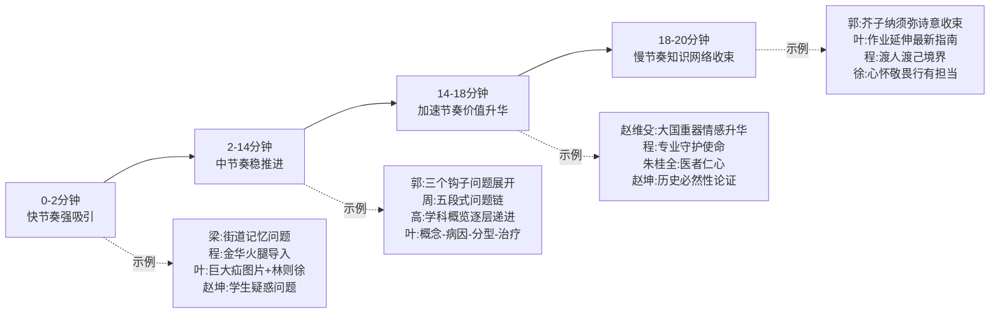

这一"快—稳—快—慢"情绪曲线在五大组别中均得到清晰体现：**导入阶段必须"快节奏强吸引"以建立注意力锚点，主体展开阶段必须"中节奏稳推进"以保证内容密度，价值升华阶段必须"加速节奏"以推向情感峰值，结尾收束阶段必须"慢节奏"以留下回味空间**。

### 5.6.3 "3—5个核心钩子问题"的认知锚点布局

横向比较发现，一等奖课堂普遍呈现"少而精的钩子问题"特征——而非"频繁但浅薄的提问"。这一规律的代表案例可汇总如下：

| 案例 | 核心钩子问题 | 数量 |
|------|----------|-----|
| **梁思思** | 家乡街道记忆？校门口街道差异？路权设计修改？ | 3—4个 |
| **郭璐** | 长城防御之外功用？元大都地表水？成都为何天府？ | 3个 |
| **程楠** | 亚硝酸盐天使还是魔鬼？金华火腿何以肌红脂白？河豚如何安全食用？ | 3个 |
| **叶枫** | 腹外疝为何如此常见？背后原因是什么？ | 2—3个 |
| **赵坤** | 共产主义虚无缥缈？历史必然性何在？ | 3个 |

**这一"3—5个核心钩子问题"的认知锚点布局，是青教赛一等奖课堂区别于一般课堂的关键特征**——它与第三章郭璐"找准穴位"的反思形成精准对应，也是辅导工作中"如何避免选手陷入提问过密但浅薄"的直接抓手。

### 5.6.4 板书与PPT的功能分工密度

横向比较确认，一等奖课堂普遍呈现"板书承载逻辑骨架与生成性思考、PPT承载图像数据动画"的清晰分工：

- **板书的核心地位**：周峰"坚持手写板书与脱稿讲解"[^161]、叶枫"利用板书详细讲解疝形成后的关键结构"[^180]、赵维殳"重视教案优化与板书设计的协同发力"[^165]、郭璐参赛背景下"郑晓笛获得最佳教案、最佳现场展示、最佳教学回顾三个单项奖"传承机制[^158]——板书是一等奖课堂"基本功扎实度"的关键观察点；
- **PPT的辅助作用**：郭璐"PPT中插入大量直观描摹古代城市生活的画作"[^152][^153]、叶枫七阶段中大量临床图片与手术演变历史影像[^180]、程楠技术迭代1.0—4.0图谱、赵维殳"课件结构设计、逻辑梳理"[^165]——PPT承载的是板书无法呈现的"图像、数据、动画、视频"。

**这一"板书—PPT"清晰分工的微观规律，是辅导工作中防止参赛教师陷入"PPT过度设计、板书形同虚设"误区的直接参照**。

## 5.7 一等奖课堂的信息密度与情感共鸣微观设计

横向比较揭示了节奏控制层面的共性规律，但一等奖课堂还有两个更深层的微观维度需要专门剖析——**信息密度**与**情感共鸣**。这两个维度往往是一等奖与一般获奖之间的最深分野。

### 5.7.1 信息密度的"高密度但不拥挤"科学控制

一等奖课堂在20分钟内传递的信息量远超一般课堂，但又呈现出"密而不挤、多而不乱"的清晰感。其底层规律是"主线单一、模块清晰、关键信息切入"：

**第一，主线单一是高密度的前提**。郭璐《中国古代城市规划史》的"贪大求全到找准穴位"反思最具启示性——"她反思自己从前有贪大求全的问题，总想把所有知识事无巨细地教给学生，却往往只能浮于表面"[^152][^153]。**贪大求全的实质是"主线不单一"——同时想讲多个主题，结果每个主题都浅尝辄止**；而找准穴位的实质是"主线单一"——围绕一个核心问题展开，反而能深入透彻。这一反思演进与第三章所述青教赛一等奖课堂"简洁—锚定核心、削冗存真"高度吻合。

**第二，模块清晰是高密度的结构支撑**。叶枫的"图片开场—概念解析—病因剖析—临床分型—治疗原则—手术演变—课程总结"七阶段[^180]，徐嘉鸿的"延安整风是党的自我革命—以党史学习教育推进延安整风"两板块[^188]，赵坤的"三个学生疑惑问题贯穿全课"[^184]——这些案例都呈现出**清晰可数的模块边界**，使学生在20分钟内能够清晰把握课堂的"知识地图"。

**第三，关键信息切入是高密度的密度控制器**。高晓沨"逐层递进学科概览的教学方法"[^174]——其精妙之处在于"概览"的精准切入：不是面面俱到地讲所有计算机科学的细节，而是用关键信息切入展现学科全貌。这种"关键信息切入"是控制信息密度的关键技巧，与郭璐为不同知识点设计的"钩子问题"在认知功能上同构。

### 5.7.2 情感共鸣的三层微观设计

如果说信息密度是一等奖课堂的"硬度"，情感共鸣就是一等奖课堂的"温度"。横向比较11个案例可发现，一等奖课堂在以下三层均有精细的情感共鸣设计：

**第一层：师生情感连接的"温度细节"**。这是最朴素也最持久的情感支撑——梁思思学生"梁老师很有人格魅力，好喜欢您！"的口碑[^154][^155][^156]、高晓沨"为每门课设计标志、为我们专门制作桌牌、名册"的细节[^174]、程楠对学生"主题式、小班制、强互动"教学模式的坚持[^175]——这些温度细节并非比赛专属，而是日常教学中长期积淀的师生连接，在比赛课堂中自然流露。

**第二层：学科情感渗透的"专业之美"**。这是青教赛一等奖区别于一般教学课堂的关键所在——
- 郭璐对建筑与城市规划的"芥子纳须弥"感悟：**"一砖一瓦，一楼一城，都是整个文明的具象化体现，其中蕴藏着广大的世界"**[^152][^153]；
- 程楠的师者初心："**'教学'是一个非常复杂的过程，是教育理念、教学方法、教学设计、教学展示、教学技巧、教学手段等多维因素的综合呈现**"[^175]；
- 赵维殳的科研激情："**那些能够生活在雪山之巅、深海之渊、冰里来火里去的极端生命的精彩故事**"[^164]；
- 叶枫的瑞金传承感："**站在了前辈们的肩膀上**"[^167]。

**这种从学科本体中自然生发的"专业之美"，是任何刻意煽情都无法企及的高级情感共鸣**。

**第三层：价值情感升华的"家国情怀"**。这是一等奖课堂的"最高音"——
- 赵维殳的"上天入海大国重器与极端生命英雄事迹"传递[^164]；
- 徐嘉鸿的"心怀敬畏、行有担当"师者使命感[^187]；
- 程楠"愿成为学生心目中的镜子"的教育家精神传承[^176]；
- 张青子衿"超越简单知识传授，走向立德树人"的育人观[^191]；
- 赵坤"课程魅力、学识魅力、人格魅力的整体性在场"[^192]。

这一层情感升华的关键是**"自然生长而非外加贴附"**——每个升华点都从课程内容中自然生长出来，与学科本体形成有机统一，避免了"刻意煽情"的低级误区。

### 5.7.3 "硬度+温度"双维并存的"高分密码"

将信息密度（硬度）与情感共鸣（温度）合并观察，可揭示青教赛一等奖课堂的最深层"高分密码"——**硬度与温度并非对立选择，而是双维并存的辩证统一**：

```mermaid
graph TB
A[一等奖课堂的"高分密码"] --> B[硬度维度<br/>信息密度的科学控制]
A --> C[温度维度<br/>情感共鸣的微观设计]

B --> B1[主线单一<br/>避免贪大求全]
B --> B2[模块清晰<br/>2-7个模块]
B --> B3[关键信息切入<br/>避免事无巨细]

C --> C1[师生情感连接<br/>日常温度细节]
C --> C2[学科情感渗透<br/>专业之美自然生长]
C --> C3[价值情感升华<br/>家国情怀有机融入]

B1 -.辩证统一.-> C1
B2 -.辩证统一.-> C2
B3 -.辩证统一.-> C3

A --> D[最深层密码<br/>以生命影响生命<br/>以人格塑造人格]
```

**这一双维并存的密码揭示了一等奖课堂的本质——它不仅是"教学技法层面"的精彩呈现，更是"以生命影响生命、以人格塑造人格"的深层教育实践**。这与赵坤"课程魅力、学识魅力、人格魅力的整体性在场"[^192]、丁文江院士赠予程楠"古铜镜"的传承隐喻[^176]共同呈现的，是青教赛一等奖背后最深的教育情怀。

## 5.8 案例剖析对辅导工作的可迁移启示

综合本章11个案例的细颗粒度剖析，可提炼五条可供辅导工作直接复用的微观操作启示。

**启示一："钩子问题库"建设——为16个节段构建可随机应对的认知锚点库**。从郭璐"长城防御功用、元大都水源、成都天府之国"的钩子，到程楠"亚硝酸盐天使魔鬼"的钩子，到赵坤"学生疑惑共产主义"的钩子——这些钩子并非临场灵感，而是长期教学反思后的精到提炼。辅导工作中应当要求辅导对象**针对参赛课程16个节段各设计3—5个核心钩子问题，形成总计48—80个钩子问题的锚点库**，并经过多轮专家筛选保留最优钩子，形成可随机应对抽签的认知锚点库。

**启示二："案例—板书—PPT三维素材库"建设——参照一等奖标杆的可视化教学素材体系**。郭璐"明代《南都繁会图》、元代《西湖清趣图》、3D打印模型"的多层教具体系[^152][^153]、周峰"自制纸杯、雨伞等教具"将抽象数学具象化[^161]、叶枫"板书疝囊—内容物—疝外被盖—疝环关键结构"的板书逻辑[^180]、程楠"亚硝酸盐技术1.0—4.0迭代图谱"的可视化设计——这些都是辅导对象可参照的具象化样板。**建议辅导工作建立"分组别—分学科—分类型"的可视化教学素材资源库**，引导辅导对象从"PPT单一依赖"走向"案例—板书—PPT"三维协同。

**启示三："虚拟互动节奏脚本"打磨——基于一等奖五大组别的提问节奏编制精细化脚本**。一等奖课堂的"提问—留白—模拟回应"节奏并非自然产生，而是经过精细脚本化打磨。**辅导工作中应当为辅导对象编制"20分钟课堂的精细化互动脚本"，明确每个提问节点的时间位置、提问方式、留白时长、虚拟回应内容**——这种脚本化打磨虽显繁琐，但能避免临场表达的零碎与节奏失控，是工科组高晓沨"3轮磨课特训"[^172]、思政组张青子衿"30余次国赛磨课"[^191]的经验沉淀。

**启示四："情感共鸣点"自然挖掘——避免刻意煽情，从学科本体、师者初心、国家战略、专业使命中提炼**。本章5.7节归纳的三层情感共鸣设计提供了清晰的挖掘路径——
- 从**学科本体**挖掘（如郭璐的"芥子纳须弥"、赵维殳的"极端生命精彩故事"）；
- 从**师者初心**挖掘（如程楠的"渡人渡己修行"、徐嘉鸿的"心怀敬畏行有担当"）；
- 从**国家战略**挖掘（如赵维殳的"大国重器"、程楠的"食品专业守护"）；
- 从**专业使命**挖掘（如朱桂全的"医德医风"、梁思思的"规划师责任"）。

**辅导对象的情感共鸣点必须是"内生的、真诚的、与课程内容自然融合的"**——这与第二章周屈兰所述"为人师表，以身作则，才是最好的课程思政"形成跨赛事呼应。

**启示五："院系传承梯队"参照——建立辅导工作的长效化组织参照**。本章揭示的多个院系培育机制具有重要参照价值：

| 院系传承梯队 | 制度密码 | 辐射效应 |
|------------|---------|---------|
| **清华建筑学院** | 郑晓笛/刘佳燕/陈宇琳/梁思思—郭璐传承梯队<br/>团队整体备赛+每人双导师机制[^158] | 第六届+第七届文科组连续两届第一名 |
| **上海交大工科组** | 高晓沨2018—2023连续5轮教学比赛+50多位专家指导[^171] | 第四届李威/第五届刘晓晶/第六届高晓沨/第七届叶枫/赵维殳/王新昶 |
| **上海交大青教赛工会** | 校工会主席于朝阳/教学发展中心/党委教师工作部/电院工会等多部门合力保障[^170] | 历史最好成绩 |
| **武大马院思政组** | 马院联合历史学院专家团队+课程中心教学团队丰富资源[^188][^190] | 徐嘉鸿青教赛+教学展示双特等奖 |
| **山师大三航课堂** | 青师启航—优师助航—名师领航三航课堂+校院两级竞赛体系[^193] | 周峰理科组国赛第一名+张慧伦文科组一等奖 |
| **上海大学** | 校工会+教务部+教师发展中心+马院+校外专家四方支持团队[^191] | 张青子衿首次入围国赛即获一等奖 |

**这些院系培育机制为辅导工作的长效化建设提供了清晰参照——一等奖不是单次比赛的产物，而是"前辈获奖—示范引领—指导后辈—团队协同—多部门保障"的代际传承链的自然成果**。辅导部门应当致力于构建本单位可持续的"代际传承机制"，而非追求短期突击式的备赛培训。

---

综合本章11个案例的细颗粒度剖析，青教赛一等奖课堂在文、理、工、医、思政五大组别中呈现出鲜明的学科差异化特征，但又共享"简洁—层次—留白—通透"的微观规律，以及"硬度+温度"双维并存的高分密码。这些案例既是青教赛一等奖的具象化样本，也是创新赛/青教赛"宏观范式具象化+微观规律具象化"双轨案例库的重要组成。

至此，第二章—第五章构成的"评分逻辑解构（创新赛）+微观规律解构（青教赛）+案例剖析（创新赛）+案例剖析（青教赛）"四章已完整勾勒出两类赛事一等奖课程的内部图景。下一章将转入横向比较视角——对两类赛事一等奖课程在"以学生为中心"理念落地、课程思政融入方式、信息技术与AI应用深度、课堂教学呈现风格、成果产出与辐射要求等维度的共性与差异作系统比较，并对一等奖高产院校（如哈尔滨医科大学、暨南大学、清华大学、上海交通大学、武汉大学等）的教师发展中心运作模式、备赛培训体系、专家指导机制、校院两级联动、激励政策等组织保障要素作深入分析，为部门构建本单位竞赛辅导体系提供完整的制度借鉴与组织参照。

# 6 两类赛事一等奖课程的共性规律、差异化特征与院校培育机制

第二章至第五章已完成对两类赛事评分逻辑、范式特征与典型案例的"分赛事、分章节"解构。这种"分而析之"的分析虽便于深入把握各赛事的内部规律，但若止步于此，辅导工作将难以获得"两类赛事如何统筹布局、不同院校如何系统培育"的整体性认知。本章因此进入横向比较与组织机制分析的综合视角，承担"承上启下"的双重职能：**承上**——将前五章的微观规律归纳为可对照、可比较的整体图景；**启下**——为第七章辅导体系设计提供制度参照与组织依据。本章前三节聚焦两类赛事一等奖课程的共性规律、差异化特征与同步备战策略；中四节聚焦典型院校的培育机制；末三节聚焦教师发展中心运作模式、激励保障制度与以赛促教长效机制；最后归纳对部门竞赛辅导体系建设的制度借鉴启示。

## 6.1 两类赛事一等奖课程在五大维度的共性规律

虽然创新赛与青教赛在制度定位、赛制设计、评审重心上存在系统性差异，但深入到"一等奖课程"这一最高水准的具象呈现层面，两类赛事共享着清晰可辨的底层价值基因与方法论共性。这些共性是辅导对象同时备战两项赛事时能够"复用培育"的能力基础。

**第一，"以学生发展为中心"的理念底色高度一致**。第二章已揭示创新赛课堂教学实录评分中"教学理念4分"的核心评价要点是"学生中心教育理念、立德树人思想以及四新建设引领"，第三章揭示青教赛课堂教学75分中"教学组织30分"的核心评价点之一是"启发性强、给予学生自主探索时间"。两类赛事的一等奖课程在这一理念层面呈现高度同构——创新赛中西安交大《燃烧学》的"共同构建法"、中国矿大《普通物理》的"建构性教学观与师生学习共同体"、厦门理工学院"以学生发展为中心"的育人理念[^194]，与青教赛中郭璐"清华学生都是识货的，得把真正有价值的东西拿给他们看"的学情自觉、程楠"学为中心、关注成长"八字理念、梁思思"启发性问题引导思考"的课堂实践，共同呈现"从知识本位转向学生发展本位"的理念底色。

**第二，"思政与课程内容自然融合"的隐性渗透要求高度一致**。两类赛事的一等奖课程都坚决排斥"贴标签式思政"，而追求"从课程内容中长出来"的有机融入。创新赛中曹敏惠《有机化学》的"催化反应"思政隐喻、周征宇《中国玉石及玉文化鉴赏》的"硬度温度"科技人文融合，与青教赛中郭璐"芥子纳须弥"的文化自信落点、程楠"食品专业守护"的使命渗透、赵坤"人品人格人性之美"的整体性在场，共享同一深层逻辑——**思政元素必须与课程本身的特有元素结合，依托课程内容载体实现潜移默化的隐性教育**。

**第三，"技术服务于教学创新"的应用导向高度一致**。无论是创新赛第六届新增"人工智能赛道"明确要求"系统性融入教学全过程，避免工具化使用的浅层创新"[^195]，还是青教赛对"现代教学手段恰当运用"的评分要求，两类赛事的一等奖课程都回归"技术服务于真问题解决"的本质要求——同济《高级语言程序设计（进阶）》的智能教学平台累计编辑代码6454万行[^196]、暨南大学《科研素养与伦理规范》的"图谱筑基、任务引擎驱动"智慧教学模式、华南师大《政治经济学》的"数据河课堂"与"数字画像精准思政"、赵维殳"教案优化与板书设计协同发力"的传统基本功并重，共同体现**技术应用必须以解决真实教学痛点为前提，避免技术堆砌的形式化误区**。

**第四，"从自发教学到自觉教学学术"的认知跃迁高度一致**。这是两类赛事一等奖课程最深层的共同基因。第二章已述上海师范大学杨婷的"教学学术起点论"——"研究问题—干预方法—可验证证据—循环改进"；本章可对照的是徐嘉鸿在青教赛备赛中提出的"教学与研究一样，都要明确的问题意识、鲜明的立场观点、严密的逻辑层次、充实的史料论据""以研究的态度来回应教学的重难点问题，逐步引导和启发学生主动思考，或许才是教学最大的意义"。**两类赛事一等奖获得者共同呈现的认知特征，是从"凭经验讲课"到"将教学视为一种学术活动"的跃迁**——这一跃迁是任何辅导工作都必须重点引导的"认知突破点"。

**第五，"立德树人"根本导向与"真问题—真方法—真证据"学术闭环逻辑高度一致**。教育部相关赛事评审反复强调的"立德树人""四个回归"，在两类一等奖课程中分别以创新赛"教学创新成果报告"的"问题—举措—成效—闭环"和青教赛"45分钟教学反思"的"理念—方法—过程"诊断结构具体落地。这一学术闭环要求选手必须具备"诊断真实痛点—设计针对方法—收集成效证据—形成改进闭环"的完整教学学术能力——它既是创新赛"明确的问题导向"评分要点的核心，也是青教赛"反思有感而发、联系实际"要求的本质。

将上述五大共性归纳如下：

| 共性维度 | 创新赛体现 | 青教赛体现 | 共同基因 |
|---------|---------|---------|---------|
| **学生中心理念** | 共同构建法/建构性教学观 | "钩子问题"找准穴位/启发性引导 | 从知识本位转向学生发展本位 |
| **思政自然融入** | 催化反应隐喻/硬度温度生态 | 芥子纳须弥/食品专业守护 | 与课程特有元素自然结合 |
| **技术服务创新** | 知识图谱+智能体+虚实融合 | 自制教具+板书脚本+智能平台 | 解决真问题而非技术堆砌 |
| **教学学术意识** | 研究问题—干预方法—可验证证据 | 以研究态度回应教学重难点 | 自发教学→自觉教学学术 |
| **立德树人闭环** | 问题—举措—成效—闭环 | 理念—方法—过程诊断闭环 | 真问题—真方法—真证据 |

**这五大共性构成辅导对象同时备战两项赛事时的"能力复用基础"——以共性能力为底色，以差异化能力为延伸，是双轨备战的核心策略**。

## 6.2 两类赛事一等奖课程在赛制评审与呈现形态上的差异化特征

共性之下的差异化更值得辅导工作高度关注。从赛制设计、评审重心、内容载体、呈现形态、成果证据、时间尺度六个维度对照分析，可清晰呈现两类赛事一等奖课程的本质分野。

**第一，赛制设计：综合性团队赛 vs. 个人基本功赛**。创新赛"以个人或团队形式参赛，团队成员包括1名主讲教师和不超过3名团队教师"[^195]，并按正高、副高、中级及以下职称分组，覆盖各学科各年龄段教师；青教赛限定40周岁以下青年个人参赛，强调"师德高尚、爱岗敬业"与课堂基本功。这一赛制差异决定了创新赛一等奖往往是团队协同的成果，而青教赛一等奖更多体现青年个人的淬炼。

**第二，评审重心：课程整体改革闭环 vs. 20分钟教学微缩精品**。创新赛三模块"课堂教学实录视频40分+教学创新成果报告20分+教学设计创新汇报40分"考察的是"教师近5年讲授参赛课程2轮以上"的课程整体改革闭环；青教赛三模块"教学设计20分+课堂教学75分+教学反思5分"考察的是"20分钟无生模拟授课"的瞬间教学呈现能力。**这一评审重心的差异是两类赛事最本质的分野**——创新赛比拼"基于真实问题的系统性教学改革成果"，青教赛比拼"在20分钟内呈现一段完整的教学微缩精品"。

**第三，内容载体："成果概况表+创新成果报告+实录视频"三件套 vs. "16学时教学设计+节段PPT+板书+反思"四件套**。创新赛要求提交教学创新成果概况表、教学创新成果报告（或课程思政创新报告、产教融合创新报告）、课堂教学实录视频，第五届起新增教务系统课程开设证明材料；青教赛要求提交16学时教学设计方案及对应的节段PPT，比赛现场配粉笔板书，反思在闭卷情境下完成。两套内容载体对应着完全不同的备赛工作量与组织方式。

**第四，呈现形态：成果型呈现 vs. 表演型呈现**。创新赛现场汇报"≤12分钟教学设计创新汇报+8分钟提问交流"是"成果型呈现"——汇报的对象是评审专家，重在论证课程改革的系统性、创新性与有效性，强调逻辑严密与证据扎实；青教赛现场授课是"表演型呈现"——评委以观察者身份模拟"学生视角"评判教学效果，重在课堂感染力与教学技艺。**这一呈现形态的差异决定了创新赛重"汇报性表达"，青教赛重"教学性呈现"的根本分野**。

**第五，成果证据：多维证据链沉淀 vs. 即时课堂呈现**。创新赛对成果证据的要求极为系统——学生发展数据、学科竞赛成绩、课程推广应用、教学团队建设、教学成果获奖等"五维证据链"；青教赛的成效评判则浓缩在20分钟的现场呈现中，由评委即时打分给出。这种差异决定了创新赛备赛必须提前数年甚至十年（如《乡土建筑空间设计》"十年校企村三方深度融合"）系统沉淀证据，青教赛备赛则可在数月至两年内通过高强度打磨完成。

**第六，时间尺度：长周期沉淀 vs. 高密度淬炼**。创新赛的时间尺度通常是"以年为单位"——从课程改革启动到一等奖获得往往跨越3—10年；青教赛的时间尺度通常是"以月为单位"——周峰"8轮比赛"、高晓沨"1000多日夜+5轮教学比赛+3轮磨课特训"、张青子衿"60余次校市级磨课+30余次国赛磨课"，集中投入度远高于创新赛备赛后期。

由此可衍生出**三对核心张力**，对辅导工作的策略选择具有直接指导意义：

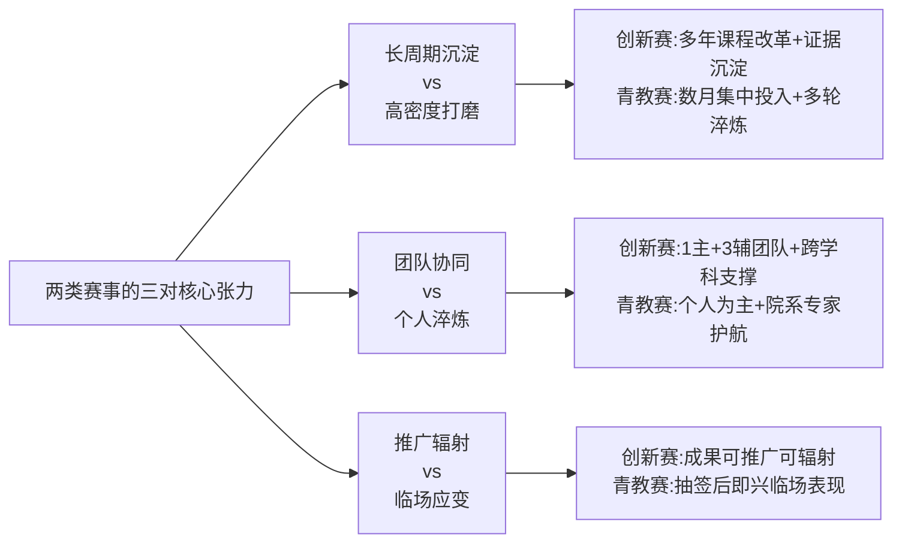

**这三对张力共同决定了两类赛事辅导工作的本质差异——创新赛辅导是"陪跑课程改革闭环建设"，青教赛辅导是"打磨教学微缩精品"**。

## 6.3 两项赛事同步备战的协同路径与差异化准备要点

基于6.1节的共性规律与6.2节的差异化特征，可构建辅导对象"同时备战两项赛事"的双轨策略框架。这一框架不是机械叠加两套准备工作，而是利用共性能力的复用培育、针对差异点的精准补强，实现备赛资源的高效配置。

**协同培育的五大复用能力**：

第一，**教学学术意识**——这是两类赛事一等奖最深层的共性认知，是辅导工作"开篇必抓"的核心素养。无论备战哪类赛事，都需要引导辅导对象建立"研究真问题—设计真方法—收集真证据—形成真改进"的教学学术思维。

第二，**课程思政有机融入能力**——两类赛事都拒绝贴标签式思政，要求"与课程特有元素结合"的隐性渗透。这一能力可通过"挖掘学科本体的思政基因+设计自然生长的思政落点"的统一方法论进行培育。

第三，**信息技术应用能力**——两类赛事都要求技术服务于教学创新而非堆砌。辅导对象在掌握知识图谱、AI助教、虚拟仿真等通用技术工具的基础上，需要根据所讲课程内容选择最适配的技术形态。

第四，**学情诊断与教学反思能力**——创新赛要求基于学情设计针对性创新举措，青教赛要求基于学情拆解重难点并撰写诊断性反思。这一能力的培育路径是"用研究方法诊断学情+用诚实态度反思教学"。

第五，**教学语言与课堂呈现基本功**——创新赛需要在课堂实录中呈现真实自然的课堂、青教赛需要在20分钟内呈现教学精品。语言教态、肢体语言、板书工整度等基本功是两类赛事都不可或缺的"底色能力"。

**差异化准备的两类侧重点**：

| 准备维度 | 创新赛侧重 | 青教赛侧重 |
|---------|---------|---------|
| **核心载体打磨** | 教学创新成果报告（或思政/产教融合报告）撰写 | 16节段教学设计精细化 |
| **逻辑闭环构建** | "背景—问题—举措—成效—辐射"五段闭环 | "起承转合"四段课堂结构 |
| **核心抓手** | 证据链系统沉淀（学生数据/竞赛/推广/团队/成果奖） | 钩子问题库与板书脚本打磨 |
| **现场表达** | ≤12分钟成果型汇报+8分钟答辩从容应对 | 20分钟节奏控制（"快—稳—快—慢"曲线） |
| **特殊环节** | 团队协同与跨学科支撑机制 | 闭卷45分钟反思预案准备 |
| **时间投入** | 长周期（年单位）的课程改革沉淀 | 高密度（月单位）的多轮淬炼 |

**双料获奖者的协同培育实证**：本研究已发现多位"创新赛+青教赛双料获奖"的标杆教师，其成长路径印证了协同培育的可行性。中国矿业大学石礼伟既获**第二届全国高校青年教师教学竞赛一等奖**，也获**首届创新赛部属高校正高组一等奖**——其"建构性教学观+五充满课堂"的能力底盘，既支撑了《普通物理》课程整体改革（创新赛维度），也支撑了20分钟课堂的精彩呈现（青教赛维度）。嘉兴学院白春苏在四年浙江省高校青年教师教学技能大赛历练后，获得首届创新赛地方高校中级及以下组一等奖——其"知能用体系+ABC混合式教学"的能力底盘，源自青教赛长期打磨的教学基本功。清华大学梁思思第六届青教赛文科组国一第一名后，其"启发性问题引导+学科范式转型"的能力沉淀同样支撑了课程的创新改革。

**这些案例共同印证：青教赛的"基本功淬炼"与创新赛的"系统改革沉淀"在能力发展路径上具有先后接续与相互支撑的关系——青教赛能力是创新赛的基础，创新赛能力是青教赛能力的系统化延伸**。辅导工作中针对青年教师的"先青教赛后创新赛"梯次培育路径，与针对骨干教师的"以创新赛为主、兼顾青教赛骨干指导"的反向定位，构成本单位辅导对象差异化分组的基本依据。

## 6.4 创新赛一等奖高产院校的培育机制剖析

第一章已揭示创新赛一等奖呈现明显的"头部集聚"格局——南京航空航天大学累计8项一等奖、北京理工大学第五届独获3项一等奖、哈尔滨医科大学四届累计6项一等奖、暨南大学前四届累计19项奖项位居全国第一。这些高产院校的背后是各具特色又共享某些共性的培育机制。

**暨南大学：以教师发展中心为枢纽的"创新大赛辐射"工作坊体系**。暨南大学构建了以"创新大赛辐射系列"教师教学创新工作坊为核心的培育平台，连续举办多场专题活动——第三场以"创新驱动学科交叉，培养复合型一流人才"为主题，邀请《化学生物学》《生物材料》两支国赛二等奖团队担任主讲嘉宾，围绕"学科交叉""产学研协同育人""课程团队建设""人工智能赋能教学"等主题对话交流，并设珠海、深圳分会场[^197];第四场聚焦"深耕理论实践融合，赋能高校教学创新"[^198]。其校赛组织采用**"校赛组织工作委员会+评审委员会+监督委员会"三委员会架构**——组委会由学校党委书记、校长担任主任，分管教学、教师发展工作副校长担任副主任，本科生院班子、各学院院长、教学名师等组成；监督委员会由校工会教代会代表组成[^199]。第十二届校赛暨第六届国赛选拔将参赛课程划分为四个组别：组1（新医科、新工科、新农科）、组2（新文科、新教师赛道新文科）、组3（课程思政、实验教学、人工智能）、组4（国际教育、基础课程、产教融合、新教师赛道）[^199]，体现了对国赛新增赛道的快速响应。

**西安交通大学："五阶段递进式"教师培养体系与"校赛—省赛—国赛"三级赛制全链条服务**。西安交大教师教学发展中心研究、创建的**"五阶段递进式"教师教学培养体系**，将教师培养规划为"以做合格教师为目标的新入职教师集中教学培训、以获得授课资格为目标的教学过程培训、以称职主讲教师为目标的新开课教师强化培训、以优秀教师为目标的成长过程跟踪培养、以骨干教师和教学名师为目标的个性化培养"五个阶段，该体系2017年入选中国高等教育学会高校教学改革优秀案例，2018年获国家高等教育教学成果二等奖[^200]。在赛事服务上，西安交大"深度参与组织'校赛-省赛-国赛'三级赛制的全链条工作""对标国赛开创了校授课赛'传统型'和'创新型'双赛道模式"，**助力学校相继荣获全国高校教师教学创新大赛一等奖6项、二等奖2项，一等奖获奖总数位列全国高校第一**[^201]。2025年陕西省高等教育教学成果奖中，西安交大28项成果获奖（特等奖8项、一等奖9项、二等奖11项）本研获奖数均列全省第一，这些成果"对全校的教育教学改革起到了示范引领带动作用"[^202]，构成创新赛一等奖产出的成果基础。

**同济大学："数智化赋能+新任教师研修班+AI素养提升培训"三位一体培育**。同济大学第五届创新赛"斩获一等奖2项、二等奖1项、三等奖1项，并获优秀组织奖，获奖总数位列上海高校第一，再创历史新高"，其中倪颖、熊国钺、陈宇飞、王珂分别获一等奖[^196]。同济培育机制的核心是"聚焦以'数智化'赋能高等教育高质量发展为目标，坚持'以学生发展为中心'的育人理念，多举措、全方位提升教师的教学创新能力。通过开办新任教师教学能力提升专项研修班，帮助教师了解更前沿的教育教学方法；通过开展教师人工智能素养与能力提升培训，主动探索教育教学新路径；通过举办教师教学创"[^196]——这一"理念引领+研修班+AI培训+教学创新大赛"的多元培育矩阵，是同济上海高校第一的制度密码。

**南京航空航天大学："院级选拔—校级初赛—校级决赛—备赛训练营"四阶段链条与"双赛事打通+直推机制"组合**。南航2024年教师教学创新大赛实施方案体现了精细化的赛事组织设计：**赛事流程涵盖院级选拔、校级初赛、校级决赛、备赛训练营四个阶段**；**赛道分常规赛道（新文科、新工科、基础课程、课程思政、产教融合）与专项赛道（实验实践、AI赋能教学创新）**，其中"AI赋能教学创新"为推荐赛道、不占学院推荐名额；**学院推荐名额采用"青教赛+教创赛两大赛事打通使用、总额控制"模式**；**直推名额机制极具激励性**——省部级一流本科专业建设点、省部级一流课程负责人、省部级及以上教学团队主要成员（排名前六）等可直推校赛不占学院名额；国家级一流本科专业建设点、国家级一流课程、国家级规划教材负责人可直推校决赛；往届省教创赛获奖未获国奖教师可不占学院名额直接进入校决赛，获省特等奖及以上（含国奖）教师可直接进入备赛集训营[^203]。这一"打通使用+直推机制+备赛训练营"的组合设计，确保了优质资源向高潜力教师倾斜。

**长江大学："本科生院—学院—课程团队"三级联动与"全周期培育链条"**。长江大学的培育机制典型体现了"以赛促教—以赛促改—以赛促创—以赛促建"的多元功能演进。其制度密码可凝练为：**第一，三级联动体系**——"本科生院发挥统筹核心作用"、"各学院（部）成立分管教学副院长牵头的工作小组"、"教学团队强化主体意识"；**第二，全周期精准培育链条**——"启动选拔—院内初建—校级打磨—冲刺参赛"，其中校级打磨阶段"组织专家多轮一对一辅导、2—4场集中打磨，开展课堂实录指导与材料审核"，**省赛备赛达八轮**，"各环节均有专家全程指导优化"；**第三，全方位保障支撑**——"经费上设立专项培育资金、专家上建立校内外专家库、激励上对获奖团队在教学评优、绩效分配上予以倾斜、宣传上通过多平台报道培育过程与成果"[^204]。

**厦门理工学院："理念重塑—赛练结合—梯队孵化"系统化培育与"教学培训师"全链条一对一指导**。作为应用型高校的代表，厦门理工学院"近5年来在全国高校教师教学创新大赛中连续4届获奖，成绩稳居福建省同类高校前列。设计艺术学院团队斩获国赛一等奖"[^194]。其培育机制核心是"**'理念重塑—赛练结合—梯队孵化'系统化培育体系，通过'校级培育—省级提升—国家级冲刺'的三级联动流程**"，并"组建了由校内外资深专家共同构成的'教学培训师'专业团队，为每一位参赛教师提供从初期痛点精准诊断，中期教学设计系统性重构，到后期课堂实录反复精细化打磨，直至最终汇报演练的'全链条、一对一'式深度精准指导"[^194]。这一"全链条一对一"指导模式将教师参与备赛"不再仅仅是针对一次竞赛的短期准备，而是转化为覆盖全学年的、持续性的'教学能力提升工程'"。

**哈尔滨医科大学："保合格、提能力、创卓越"三维培养体系**。第四章已述哈尔滨医科大学"累计获得全国高校教师教学创新大赛国赛一等奖6项，二等奖2项，一等奖获奖数量位居全国参赛高校第一"，其制度密码是"聚焦学校内涵式发展，遵循教师成长发展规律，从'保合格、提能力、创卓越'三个维度提高全体教师教育教学能力"[^205]——这一三维培养模型为辅导对象的能力发展提供了清晰阶梯。

将上述创新赛高产院校的制度共性归纳如下：

| 制度共性 | 具体表现 |
|---------|---------|
| **三级或多级联动** | 本科生院（教务处）—学院—课程团队的层级清晰责任分工 |
| **全链条一对一** | 从启动选拔到冲刺参赛各环节的专家精准指导 |
| **多轮次精打磨** | 普遍达到6—8轮以上的省赛备赛淬炼 |
| **专家库多元化** | 校内外资深专家+往届获奖教师+评审专家组合 |
| **激励政策倾斜** | 经费支持+评优倾斜+晋升直推+绩效奖励 |
| **以赛促改延伸** | 赛事经验反哺日常教学、形成可复制可推广的培育机制 |

## 6.5 青教赛一等奖高产院校的培育机制剖析

青教赛因聚焦40岁以下青年个人参赛，其高产院校的培育机制呈现与创新赛不同的特色——更重"代际传承+多对一指导+高密度磨课"。

**清华大学建筑学院：代际传承梯队与"团队整体备赛+每人双导师"机制**。第五章已详细剖析清华建筑学院"郑晓笛/刘佳燕/陈宇琳/梁思思—郭璐"的代际传承梯队，以及第六届与第七届青教赛文科组连续两届一等奖第一名的传承现象。这一机制的制度密码是"前辈获奖→指导后辈→后辈再获奖"的稳定循环，其运作核心是"团队整体备赛"——清华大学青教赛文科团队"自2023年7月起共同进行备赛，每位选手又有两位重点指导教师"。这一"双导师"配置既保证了指导的精度，又避免了单一导师视角的局限。

**上海交通大学："党委教师工作部+校工会+教学发展中心"三方共办与历史最好成绩**。上海交大第七届青教赛取得历史最好成绩——燕晓英获第四届创新赛一等奖、王新昶获第七届青教赛一等奖、刘晓晶/高晓沨/叶枫/赵维殳等连续多届工科组、医科组、理科组一等奖，其制度密码是**"党委教师工作部+校工会+教学发展中心"三方共办的青教赛颁奖启动会一体化运作机制**——2024年教师教学竞赛颁奖仪式暨2025年教师教学竞赛启动会"由党委教师工作部、校工会、教学发展中心共同举办""副校长张兆国，校长助理、校工会主席于朝阳，相关职能部处负责人，各学院负责人、教学副院长，校第九届青年教师教学竞赛及第五届教师教学创新大赛获奖教师代表参加会议"[^206]。**这种"颁奖+启动一体化"的设计将上届成果转化为下届动力，形成滚动循环的赛事文化**。同时学校"教学竞赛为青年教师提供了宝贵的锻炼平台，经过多年发展，学校已形成了教师踊跃参与、学院大力支持、职能部门协同推进的良好局面"[^206]。值得特别关注的是，2025年校赛举办时间将由秋季学期调整至春季学期，"旨在吸引更多教师参与，进一步营造'学在交大、育人神圣'良好氛围"[^206]——赛事时间的调整体现了对青年教师工作节奏的精细考量。

**华东师范大学：校工会全程护航+教师教学发展中心组织线上线下磨课+院系配备指导老师三层联动**。华东师大第七届上海高校青教赛"历史学系赵四方荣获人文科学组特等奖，信息与电子工程学院（集成电路科学与工程学院）鲍志强荣获自然科学基础学科组一等奖，经济与管理学院刘白璐荣获社会科学组二等奖。赵四方老师还将作为上海市代表参加第八届全国高校青年教师教学竞赛"[^207]。其培育机制是"**学校高度重视，校工会全程护航，协同校教师教学发展中心等精心组织培训，牵头统筹备赛各项保障工作，协调校内外资源，为参赛教师解决备赛过程中的实际困难；教师教学发展中心邀请各校专家开展线上线下磨课指导，组织校内模拟汇报，让选手们实战演练、锤炼技能；选手们所在院系更是通过配备指导老师等方式帮助他们精心准备教学节段，全面系统地对教学重点、教学难点进行把关**"[^207]——形成了"校工会—教师发展中心—院系指导老师"的清晰三层联动。

**武汉大学马克思主义学院：跨院系组建专家团队的协同机制**。第五章已述徐嘉鸿在第七届青教赛思政组国一第一名背后是"马克思主义学院联合历史学院成立专家团队，徐嘉鸿老师依托'中国近现代史纲要'课程中心教学团队的丰富资源，精心打磨16个教学节段"。这种"思政组+历史学院"的跨院系协同机制为思政课参赛打破了单一学科的局限，使史料运用、史学方法的呈现达到学术深度。

**上海大学："校工会+教务部+教师发展中心+学院+校外专家"四方支持团队与高密度磨课**。第五章已述张青子衿"创造了学校参加历届青年教师教学竞赛的最好战绩"——首次入围国赛即获一等奖。其制度密码是"**学校工会和教务部牵头，协同校内各职能部门和学院，组织校内外专家进行校赛评审、市赛选拔和国赛磨课等各个阶段的评选和系列培训，先后60余次进行集体磨课、一对一磨课等**"，"自4月底入围国赛后，学校由校工会和教师教学发展中心牵头，组建教师国赛支持团队，包括马院支持团队、教务部支持团队和校外专家团队等。学校先后组织各类磨课活动三十余次"——这一**"60余次校市级磨课+30余次国赛磨课"的高密度打磨**，是地方高校实现思政组国赛突破的关键保障。

**山东师范大学："青师启航—优师助航—名师领航"三航课堂与第七届国赛突破**。山东师范大学张慧伦老师作为"第七届全国高校青年教师教学竞赛文科组一等奖第二名获得者，有着丰富的备赛经验和深厚的教学积淀，曾在备赛过程中历经多轮打磨，形成一套科学系统的备赛方法与教学理念"[^208]。山师大的"三航课堂"机制——青师启航、优师助航、名师领航——构成了从青年教师到教学名师的递进式培育阶梯。第五章已述周峰在国赛备赛过程中"放弃了大量休息时间……每一句表述、一个动画次序、一个数学符号、一处板书，都精益求精，追求完美"，这一精细打磨标准是山师大三航课堂落地的具象化呈现。

**西安交通大学（青教赛维度）**：第一章已述西安交大"荣获全国高校青年教师教学竞赛一等奖2项，二等奖1项"[^201]，其青教赛培育依托同一套教师教学发展中心服务体系，并"特别邀请西安交通大学教师教学发展中心张健副主任出席"省青教赛备赛专题会，"结合多年带队参赛经验，对赛事规则、备赛重点进行了深入细致的指导"[^209]——构成对省内兄弟院校的辐射示范。

**复旦大学（青教赛维度）**：复旦大学教师教学发展中心专门组织"四校青年教师教学竞赛选手公开课活动"[^210]，通过校际公开课交流为青教赛选手提供实战演练平台。

将上述青教赛高产院校的制度共性归纳如下：

| 制度共性 | 具体表现 |
|---------|---------|
| **代际传承梯队** | 前辈获奖—指导后辈—后辈再获奖的稳定循环 |
| **多对一指导** | 院系导师+学校支持团队+校外专家的多元配置 |
| **高密度磨课** | 普遍达到30—60次集体磨课+一对一磨课 |
| **跨院系协同** | 思政组的马院+历史学院、文科组的多专业协同 |
| **赛事一体化运作** | 颁奖+启动一体化、校际公开课交流等 |
| **三层联动机制** | 校工会—教师发展中心—院系导师的清晰责任分工 |

**对比6.4节与6.5节可见，创新赛高产院校与青教赛高产院校的制度共性虽有差异，但都呈现"多级联动+多轮淬炼+多元专家+多维激励"的核心结构——只是在具体侧重点上根据赛事特征作出差异化设计**。

## 6.6 教师发展中心与校院两级联动的运作模式

无论是创新赛还是青教赛的培育，**教师发展中心（教师教学发展中心）都是竞赛辅导的核心枢纽**——它既是赛事的组织者，也是培训的主办方，又是专家协调的中介。深入剖析典型院校教师发展中心的运作模式，对辅导部门职能定位具有直接参照价值。

**复旦大学教师教学发展中心：多维平台运作的"创新教与学年会+教学学术分享日+智慧课程建设案例分享+长三角联盟"体系**。复旦大学教师教学发展中心构建了丰富的常态化平台：**第一，创新教与学年会**——"2025年长三角高校教师教学发展联盟春季论坛暨复旦大学创新教与学年会圆满举行""复旦-西浦2022年创新教与学研讨会"等连续举办[^210]；**第二，教学学术分享日**——已举办第七届，是教学研究成果的常态化交流平台[^210]；**第三，智慧课程建设案例分享**——2026年春季学期组织"智慧课程教学案例分享"分理科、医科、工科多场举办，并配套"教学魔法工坊"等AI智慧课程建设工作坊[^210]；**第四，长三角联盟运作**——"长三角高校教师教学发展联盟2026年春季论坛""长三角高校教师教学发展联盟召开2026年第一次理事长单位工作会议"[^210]。中心还"系统推进第六届上海市高校教师教学创新大赛备赛工作，积极选派教师参加长三角教师教学发展联盟2025年会"[^210]，将教学竞赛备赛与联盟交流深度结合。

**北京理工大学教师发展中心：常态化培训与赛事并行机制**。北理工教师发展中心呈现"鸿鹄学堂+求是讲坛+教学创新大赛"的并行运作格局——"北京理工大学第90期'鸿鹄学堂'新教师成长研修班"、"第293期'求是讲坛'：未来课堂——AI+VR赋能的高校教学新范式"、"北京理工大学第四届教师教学创新大赛顺利举办"等[^211][^212]。第六届北京高校教师教学创新大赛北航校内选拔工作通知透露的信息表明，第六届大赛"拟新增人工智能融合教育和实验教学两个新赛道"[^195]，**北京高校教师教学创新大赛分为校内推荐、市级比赛两个阶段。校内选拔主要分为赛前培训、院级推荐、网络评审、现场评审、重点指导五个阶段**[^195]——这一五阶段设计是常态化培训与赛事的精细化耦合。

**西安交通大学教师教学发展中心：国家级示范中心的引领作用与"西北地区高等学校教师教学发展中心联盟"的辐射示范**。西安交大教师教学发展中心"2012年先后被评为陕西省教师教学发展示范中心和国家级教师教学发展示范中心""牵头组织成立学术性组织'西北地区高等学校教师教学发展中心联盟'，带动促进各高校教师教学发展中心的建设；充分发挥国家级、省级示范中心的引领示范作用"[^200]。其主要工作范畴涵盖**"开展教师教学培训提高教师教学能力—组织教学改革研究解决教学疑难问题—举办教学研讨会及竞赛营造教学文化氛围—致力教学评估咨询帮扶指导教师成长—提供外校咨询培训发挥辐射示范作用"五大职能**[^200]。2024年西安交大承办全国高校教师教学发展中心工作会，"吸引了来自全国400余所高校的800余名专家学者齐聚一堂"[^201]，体现了国家级示范中心的引领地位。

**暨南大学："校赛组织工作委员会+评审委员会+监督委员会"三委员会架构**。暨南大学第十二届校赛暨第六届国赛选拔的组织架构层级清晰——**"组委会由学校党委书记、校长担任主任，分管教学、教师发展工作副校长担任副主任，本科生院班子、各学院院长、教学名师等组成。组委会办公室设在本科生院，秘书处设在教师发展中心。校赛评审委员会由校内外教学名师、资深教学专家等组成。校赛监督委员会由校工会教代会代表组成"**[^199]。这种**"组委会—评委会—监委会"三委员会分工架构**为校赛的权威性、专业性与公正性提供了制度保障。

**校院两级联动的标准动作**：综合上述案例，可归纳教师发展中心在竞赛辅导工作中的"**统筹规划—培训组织—专家协调—资源调配—赛事服务—成果转化**"六大职能：

| 职能维度 | 具体内容 | 典型案例 |
|---------|---------|---------|
| **统筹规划** | 制定校赛方案、分组方案、推荐方案 | 暨南三委员会架构、北航五阶段流程 |
| **培训组织** | 组织赛前培训、参赛指导、专题研讨 | 复旦智慧课程案例分享、北理鸿鹄学堂 |
| **专家协调** | 建立校内外专家库、组织专家审核与磨课 | 厦门理工"教学培训师"团队、长江大学校内外专家库 |
| **资源调配** | 设立专项经费、协调场地设备、提供平台支撑 | 长江大学专项培育资金、暨南教师发展中心秘书处 |
| **赛事服务** | 组织省赛国赛报名、参赛保障、心理调适 | 西安交大"校赛-省赛-国赛"全链条 |
| **成果转化** | 总结提炼可复制可推广模式、反哺日常教学 | 长江大学"参赛—培育—带动"辐射、西安交大教学成果奖 |

**校院两级的责任边界清晰**：学校层面（教师发展中心+教务处）侧重统筹规划、政策保障、专家协调、跨院系资源整合；学院层面（教学副院长+院级教学组织+院级专家）侧重院级选拔、初步打磨、本学科专家配置、备赛日常陪伴。两级联动的关键在于**"学校制定标准、学院落实标准、学校最后把关"**的闭环机制。

## 6.7 备赛专家指导与多轮磨课机制的精细化设计

专家指导与多轮磨课是一等奖产出的核心保障。从五个维度系统归纳一等奖高产院校在这方面的精细化设计：

**第一，专家库构成的多元结构**。一等奖高产院校的专家库普遍呈现"**校内教学名师+往届获奖教师+校外资深专家+评审专家**"的多元结构。长江大学"建立校内外专家库，邀请各领域专家提供全程智力支持"[^204]；厦门理工学院"特别组建了由校内外资深专家共同构成的'教学培训师'专业团队"[^194]；暨南大学校赛评审委员会"由校内外教学名师、资深教学专家等组成"[^199]；昆明理工大学第六届教创赛备赛"特邀多位省外知名专家"开展专项培育[^213][^214][^215]。**多元专家库的核心价值在于不同视角的互补——校内专家熟悉本校学情、往届获奖教师熟悉赛事规则、校外资深专家提供前沿视角、评审专家熟悉评分细则**。

**第二，指导方式的多元集成**。一等奖高产院校的指导方式典型呈现"**一对一精准辅导+集中工作坊+模拟答辩+课堂实录指导**"四元集成。昆明理工大学"特邀专家一对一指导"，秉持"精准把脉、名师引领、多维打磨"的核心思路，"采用'线上+线下'深度融合的指导模式""量身定制'一人一策'优化方案"[^213][^214][^215]；上海大学"组织校内外专家进行校赛评审、市赛选拔和国赛磨课等各个阶段的评选和系列培训，先后60余次进行集体磨课、一对一磨课等"；某高校经济学院"特邀全国高校青年教师教学竞赛一等奖获得者、西北师范大学文学院许琰教授主讲""紧扣教学竞赛核心要求与备赛关键环节，结合自身丰富的备赛与评审经验，系统解读了竞赛规则、评分标准与备赛要点"[^216]。

**第三，磨课轮次的层层递进**。多轮磨课是一等奖背后的"硬投入"。具体数据已在第五章充分呈现：周峰"院赛、校赛、省初赛、省复赛、省决赛、省遴选赛第一轮、省遴选赛第二轮、国赛共8轮比赛"；高晓沨"1000多日夜的磨砺中，先后参加了5轮教学比赛，3轮磨课特训，还有数十次各类教学培训与分享"；张青子衿"先后60余次进行集体磨课、一对一磨课等"+"30余次国赛磨课活动"；长江大学"省赛备赛达八轮，各环节均有专家全程指导优化"[^204]。**这些数据共同揭示一条规律——一等奖背后是8—60次量级的磨课轮次淬炼**，辅导工作必须为辅导对象规划清晰的多轮磨课节奏。

**第四，问题诊断的精准闭环**。专家指导的核心价值是"问题诊断"——"专家们结合各参赛团队的赛道特点、学科属性，围绕教学内容创新、信息技术与课堂教学深度融合、教学方法优化、成果凝练等关键维度，进行细致点评、精准问诊，直指现有教学设计中的薄弱环节与改进方向"[^213][^214][^215]。郭璐回忆"指导教师为我院郑晓笛老师与美术学院王小茉老师"——王小茉作为美术学院专家从可视化设计视角提供互补诊断，体现了跨学科诊断的精度。第二章评分细则解读已述创新赛省赛正高组评委反馈的常见问题——"痛点难点分析不够准确""解决问题的方法结合度不够""教学理论与课程教学结合不够""原创性方法不多""未上升到理论高度"——这五条本身就构成专家诊断的"参照清单"。

**第五，改进闭环的迭代优化**。专家点评后的"教师修改—二次审核—再修改"迭代是磨课质量的关键。哈尔滨医科大学曹天辉老师备赛黑龙江省青教赛"我院专家针对课件制作、教案书写、比赛技巧、教学反思等竞赛项目，对参赛教师进行了全过程、全覆盖的指导和协助，参赛材料几经打磨和修改"[^217]；浙江大学控制学院"多次组织专家进行指导，找问题、抓亮点，不断磨课，不断改善，力争教学课件和语言教态等精益求精"[^218]；浙江大学教育学院初赛"评委对各位参赛教师的表现进行了全面点评，既肯定了王地老师的优势，也提出了宝贵的改进建议"，从"内容选择""课堂流畅度""PPT配合""思政元素融入""文字资料规范"等多个维度提出具体改进意见[^219]。

**多轮磨课机制的精细化设计示意**：

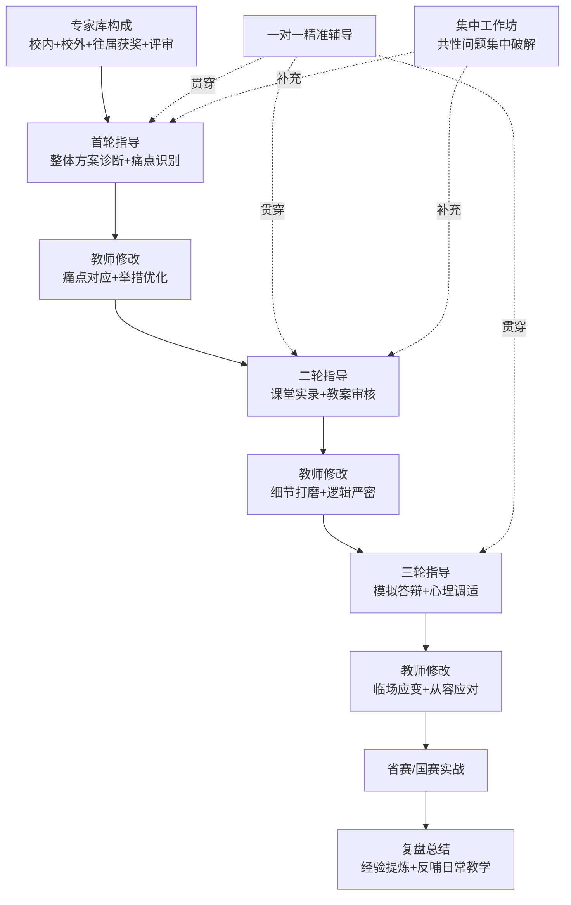

**这一精细化磨课机制对辅导工作的核心启示是——磨课不是简单的"试讲点评"，而是"精准诊断—量身改进—迭代优化"的闭环过程**。辅导部门应建立每位参赛教师的"问题诊断档案"，记录每轮磨课的核心问题、改进方向、专家建议，以便后续轮次指导的连续性与递进性。

## 6.8 激励政策与制度保障对一等奖产出的支撑作用

激励政策与制度保障是一等奖产出的"持续性动力源"。一等奖高产院校在这一维度的系统性设计可分为三类：

**第一类：经济激励——高额奖金与晋级激励**。一批高校通过"重金奖励"引导教师投入教学。**国家级层面**：甘肃中医药大学规定"国家级（含全国总工会）教师教学创新大赛个人获奖者一等奖奖励5万元，团队获奖者一等奖奖励10万元、二等奖奖励6万元、三等奖奖励3万元"[^220]；浙江广厦建设职业技术大学"建工学院教师王春福因获省级教学成果奖，获颁10万元奖金；马克思主义学院教师刘淑斌、工艺美术学院教师张翟团队则分别因在教师教学能力大赛中获奖，各获6万元奖励"[^221]；齐齐哈尔工程学院"第十五届教育质量奖颁奖大会奖金总额高达470万元，其中教学质量奖和育人质量奖各141万元"[^221]；深圳大学《本科教学奖励实施办法》设立"校长教学奖"奖励"长期扎根教学一线、水平高、口碑好的教师，获奖者可获10万元奖励"[^221]；西藏大学"教师高定国因获'国家级教学名师'荣誉，在'教师教学奖'项目中获得10万元奖励"[^221]；广州番禺职业技术学院"将最高奖励奖金50万元授予教学成果、教学资源库、教学团队、教学名师、教师教学能力竞赛，以及指导学生参加'互联网+'大学生创新创业大赛和'挑战杯'等六类项目中获国家级最高级别奖的教师"[^221]。**省级层面**：甘肃中医药大学"省级教师教学创新大赛个人获奖者一等奖奖励1万元，团队获奖者一等奖奖励2万元"[^220]。**晋级激励**：南航"省级以上可直接进入决赛、省特等直接进入备赛训练营""往届省教创赛获奖未获国奖教师可不占学院推荐名额直接进入校决赛""获省特等奖及以上（含国奖）教师可直接进入备赛集训营"[^203]——这种通过晋级特权的激励比单纯奖金更具递推性。

**第二类：职称与评优倾斜**。教学竞赛获奖纳入职称评审业绩范围已成为多数高校的规范做法。某河南师范高校"2025年度职称评审本专科教学业绩审核认定工作的通知"中明确"业绩范围及认定"包括"教学竞赛奖"，并明确"教学竞赛指中国高等教育学会公布的纳入全国普通高校教师教学竞赛状态数据统计的项目，以及其他省级及以上教育行政部门和学校组织开展的教师教学竞赛"[^221]。**中国高等教育学会发布的《纳入2024版全国普通高校教师教学发展指数的53项教学竞赛》**为高校识别和遴选高质量教学赛事提供了重要参考[^221]。甘肃中医药大学规定"校级教学比赛一、二等奖获得者或教师教学创新大赛获奖者主讲教师在职称晋升中经个人申请可不再安排教学督导听课，有效期两年"[^220]——这种"附加权益"虽看似细节，但对教师的实际激励作用显著。长江大学"对获奖团队在教学评优、绩效分配上予以倾斜，对优秀组织学院授予'优秀组织奖'"[^204]。

**第三类：荣誉与文化激励**。甘肃中医药大学"获得省级一、二等奖及国家级奖励者，学校授予'教学之星'荣誉称号"[^220]——以荣誉称号强化教师身份认同。"优秀组织奖"对学院的表彰则形成集体荣誉激励，长江大学"对优秀组织学院授予'优秀组织奖'"[^204]。媒体多平台报道营造重视教学文化——"通过多平台报道培育过程与成果，营造重视教学创新的浓厚氛围"[^204]，《光明日报》报道厦门理工学院"赛动教学、育见未来"也是这种文化激励的高级形态[^194]。

**国家级制度激励**：第一章已述教育部"三评一竞赛保留项目清单"对创新赛的权威认定、全国总工会"十四五"引领性劳动竞赛对青教赛的政策定位、青教赛一等奖第一名可申报"全国五一劳动奖章"等国家级激励，这些激励的"含金量"远超单纯奖金。例如四川大学朱桂全、清华大学郭璐、上海交通大学赵维殳、上海交通大学医学院叶枫等均凭借第七届青教赛一等奖第一名获得2024年全国五一劳动奖章。

**激励政策的复合矩阵示意**：

| 激励维度 | 校级 | 省级 | 国家级 |
|---------|------|------|--------|
| **经济激励** | 校赛奖金（如2000—4000元）+晋级直推权益 | 省级奖金（如1—2万元） | 国家级奖金（如5—10万元）+团队奖金加倍 |
| **职称激励** | 校级竞赛纳入业绩范围+免督导听课 | 省级竞赛纳入业绩范围+教学评优倾斜 | 国家级竞赛纳入业绩范围+优先职称晋升 |
| **荣誉激励** | 校教学竞赛获奖证书 | "教学之星"等省级荣誉 | "全国五一劳动奖章"等国家级荣誉 |
| **文化激励** | 校媒体报道+院系氛围营造 | 省级媒体宣传 | 央媒报道+教育部典型案例 |

**这一复合激励矩阵对辅导部门构建本单位激励政策具有直接借鉴意义——激励不是单一维度的奖金堆砌，而是经济、职称、荣誉、文化四维并举的系统设计**。

## 6.9 以赛促教长效机制的成果转化与可推广模式

将单次赛事的备赛活动升华为长效化的教学改革驱动力，是一等奖高产院校的共同追求。这一升华呈现"以赛促教—以赛促改—以赛促建—以赛促创"的多元功能演进。

**长江大学"参赛一批、培育一批、带动一批"的辐射机制**。长江大学"坚持'以赛促教、成果反哺'，推动参赛成果转化为日常教学实践，实现'参赛一批、培育一批、带动一批'。通过大赛培育，学校产出一批高质量创新成果，锻造了一支具备先进理念和创新能力的骨干教师队伍，参赛团队在各类赛事中表现突出，获奖项目覆盖多学科门类"[^204]。其"形成可复制、可推广的三级联动培育机制，将大赛创新理念、教学方法融入日常教学，推动信息技术与教育教学深度融合，引导教师聚焦教书育人、潜心创新，持续提升人才培养质量"[^204]——这是从"单次赛事"到"长效机制"的清晰升华路径。

**厦门理工学院"赛教融合"模式**：以"以赛促教—育见未来"为核心，"通过竞赛筑基—从尖子生到先锋队让每位教师都'燃'起来""赛教融合—从盆景到风景课堂直通生产线""育人实效—师生共进服务地方发展显担当"三步走，"已拥有11个国家级、20个省级一流专业建设点，打造了10门国家级、113门省级一流本科课程""推出'三三三制'人才培养方案，与宸鸿科技、厦门轨道交通集团、宏发电声等龙头企业深度合作，共建9个现代产业学院（含省级3个）"[^194]——这种从竞赛到产业的全链条转化，是应用型高校"以赛促教"的高级形态。

**西安交通大学"国家级教学成果奖+省级教学成果奖+一流本科课程认定"成果链转化**。西安交大"将AI赋能和交叉融合作为突破口"，"实施'人工智能先导计划'，开展'AI+七大教学改革创新工程'""以'招-培-就'三大环节为关键抓手，聚焦学生多元评价改革""深入开展专业内涵建设，推动学科交叉、产教融合和本研衔接，打造名师梯队、一流课程和精品教材"[^202]——其28项陕西省高等教育教学成果奖（特等8、一等9、二等11项）与全国创新赛一等奖6项、青教赛一等奖2项形成完整的成果转化链条[^202][^201]。

**获奖教师作为"获奖—理论提炼—培训传承"的师资资源辐射效应**。一等奖获奖者本身成为辐射推广的核心资源——周屈兰应邀至他校进行"创新成果报告撰写工作坊"指导（已述）；曹敏惠应邀来校"开展为期两天的专题培训与教学指导活动""紧扣大赛评审体系，围绕'问题导向、创新设计、实施成效、辐射推广'四大维度，系统剖析了教学创新成果报告的撰写逻辑与方法"（已述）；张慧伦应邀来校开展"以赛促教、以心育人——青教赛备赛经验与反思"专题培训，"100余名专任教师参与"[^208]；西北师范大学许琰教授应邀至他校举办"厚积薄发 守正创新——青教赛备赛工作坊"[^216]；西安交大张健副主任应邀至省内兄弟院校的青教赛备赛专题会担任指导专家[^209]。**这种"获奖教师→培训师"的角色转化，是以赛促教长效机制的关键节点——它使一等奖经验从单次比赛沉淀为可传播的教学知识资产**。

哈尔滨医科大学"教学创新大赛备赛管理经验交流会"是另一种成果转化模式——"教师发展中心副主任沈月娥以《评委视角，教师必备的能力要素——教师为主角，管理为导演：一场教育创新的'角色重塑'》为题，系统解析了教学创新大赛的本质、赛道内涵、评审重点，强调了教师能力五大核心要素及提升路径"，"将赛事经验转化为常态教学改革动力，助力学校人才培养质量提升"[^205]。

**长效机制的四大要素**可凝练为：

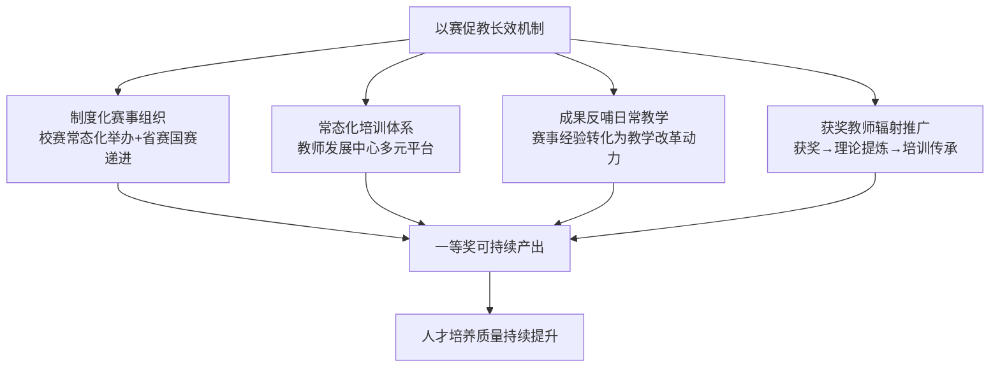

**这一长效机制的四大要素是一等奖可持续产出的制度根基**——任何一个要素的缺失都会导致一等奖产出的"昙花一现"难以为继。

## 6.10 对部门构建本单位竞赛辅导体系的制度借鉴启示

基于前九节的横向比较与机制剖析，结合本研究的辅导工作实用导向，可提炼对部门构建本单位竞赛辅导体系的核心制度借鉴启示。

**第一，组织架构层面：构建"校级组委会+教师发展中心+学院工作小组+课程团队"多级联动架构**。借鉴暨南大学三委员会架构、长江大学三级联动体系、厦门理工学院全链条机制、华东师大三层联动模式，建议本单位构建清晰的组织架构：**校级组委会**（学校党政主要领导任主任、分管副校长任副主任）负责战略统筹与重大决策；**教师发展中心**（联合教务处、人事处、校工会）作为核心枢纽承担"统筹规划—培训组织—专家协调—资源调配—赛事服务—成果转化"六大职能；**学院工作小组**（教学副院长牵头）负责院级选拔、初步打磨、本学科专家配置、备赛日常陪伴；**课程团队**（主讲教师+团队教师）作为参赛主体强化主体意识、深耕课程创新。各层级责任边界清晰，层层联动闭环。

**第二，培育体系层面：建立"分层培育+分赛事+分阶段"三维交织精准培育链**。借鉴西安交大"五阶段递进式"培养体系、哈医大"保合格、提能力、创卓越"三维培养、长江大学"启动选拔—院内初建—校级打磨—冲刺参赛"全周期链条、山师大"三航课堂"等模式，建议本单位建立三维交织精准培育链：

| 维度 | 分层 |
|------|------|
| **分层培育** | 新教师（保合格）—骨干教师（提能力）—名师（创卓越） |
| **分赛事** | 创新赛（团队系统改革）—青教赛（个人基本功）—其他赛事（如思政课展示活动等） |
| **分阶段** | 启动选拔—院内初建—校级打磨—省赛冲刺—国赛淬炼 |

三维交织意味着对每位辅导对象都可定位其"当前层级×目标赛事×所处阶段"的精准坐标，从而设计针对性的辅导方案。

**第三，专家资源层面：建立"校内+省内+全国"三级专家库与多元指导机制**。借鉴长江大学校内外专家库、厦门理工学院"教学培训师"团队、清华建筑学院"双导师"配置，建议本单位建立三级专家库：**校内专家**（本校教学名师+往届获奖教师，熟悉本校学情）；**省内专家**（省内兄弟院校资深教学专家，提供省赛视角）；**全国专家**（国家级教学名师+国赛评审专家+国赛一等奖获得者，提供国赛视角）。指导机制采取"**传帮带（前辈带后辈）+一对一（精准辅导）+集中磨课（共性问题破解）+模拟答辩（实战演练）+课堂实录指导（细节打磨）**"五元集成。

**第四，激励保障层面：设计"经费支持+职称倾斜+评优认定+荣誉表彰+宣传推广"复合激励体系**。借鉴甘肃中医药大学奖励办法、深圳大学"校长教学奖"、长江大学绩效倾斜、南航直推机制等模式，建议本单位激励体系包括：**经费支持**（设立校赛奖金+省赛/国赛差旅食宿+专项备赛资金）；**职称倾斜**（教学竞赛获奖纳入职称评审业绩范围+免教学督导听课等附加权益）；**评优认定**（教学评优、绩效分配优先倾斜）；**荣誉表彰**（"教学之星"等校级荣誉+优秀组织学院表彰）；**宣传推广**（学校媒体多平台报道+成果集编印）。同时主动衔接国家级制度激励（教育部三评一竞赛保留项目+全国五一劳动奖章），引导教师认识到一等奖的国家级"含金量"。

**第五，文化生态层面：通过常态化教学竞赛、教学经验分享、教学学术研讨等活动营造"重视教学、研究教学、潜心教学"的文化氛围**。借鉴复旦大学"创新教与学年会+教学学术分享日"、北理工"鸿鹄学堂+求是讲坛"、暨南大学"创新大赛辐射工作坊"等模式，建议本单位常态化举办：**教学竞赛文化季**（每学期至少一次校级竞赛或观摩活动）；**教学经验分享**（获奖教师定期分享、午餐研讨会等轻量化形式）；**教学学术研讨**（围绕学情研究、课程思政、AI赋能教学等专题）；**跨校交流**（与兄弟院校开展四校公开课等交流活动）。同时**充分利用本单位获奖教师的辐射推广价值**——将获奖教师转化为本单位的"获奖—理论提炼—培训传承"师资资源，避免一等奖经验仅停留在个人身上而无法沉淀为单位的知识资产。

**辅导部门职能定位的总体建议**：本单位辅导部门应以教师发展中心为核心枢纽（或承担类似职能），重点把握三个角色定位——**赛事的组织者**（统筹校赛、推荐省赛国赛）、**培育的设计者**（分层分赛事分阶段精准设计培育链）、**资源的协调者**（专家库、经费、平台、跨部门资源调配）。在具体辅导工作中要坚持"管理是导演、教师是主角"的角色边界——不替代教师的主体性，但通过专业的导演工作为教师的精彩呈现搭建最优舞台。

---

综合本章九节的横向比较与机制剖析，两类赛事一等奖课程在共性规律上共享"以学生为中心、思政有机融入、技术服务创新、教学学术意识、立德树人导向"五大底层基因；在差异化特征上呈现"系统创新与成果证据 vs. 课堂基本功与节段精彩"的本质分野与"长周期沉淀 vs. 高密度打磨"等三对核心张力。一等奖高产院校的培育机制虽各具特色，但都呈现"多级联动+多轮淬炼+多元专家+多维激励"的核心结构，并通过教师发展中心的核心枢纽作用、专家指导与多轮磨课的精细化设计、激励政策的复合矩阵、以赛促教的长效机制，构成了一等奖可持续产出的制度根基。

这些规律与机制为部门构建本单位竞赛辅导体系提供了清晰的制度参照与组织依据。下一章将在此制度基础上，进一步聚焦面向辅导工作的备赛策略、实操路径与优质资源获取渠道——从"院校层面的制度建设"下沉到"辅导团队层面的具体操作"，形成"制度借鉴—操作指引—资源地图"三位一体的辅导工作完整解决方案。

# 7 面向辅导工作的备赛策略、实操路径与优质资源获取渠道

承接前六章对两类赛事制度框架、评分逻辑、范式特征、典型案例与院校培育机制的系统剖析，本章将研究视角从"认知洞察"转入"操作落地"层面。前六章已经为辅导工作建立了清晰的"制度坐标系""评分标尺""范式图谱""案例库"与"组织参照"，但辅导团队和参赛教师真正需要回答的下一个问题是：**面对一项具体的备赛任务，从哪一步开始？每一步具体做什么？哪些资源可以直接使用？哪些红线绝对不能触碰？** 本章因此遵循"流程化—差异化—资源化"三重逻辑展开——前八节聚焦备赛全流程的八大关键环节操作要领，构成"端到端"的操作指引；中两节针对部门辅导工作设计四阶段递进与三类对象差异化的辅导路径；后三节梳理资源地图、合规边界与可持续闭环建设。本章作为整篇报告的"操作落地章节"，旨在将前六章的认知洞察转化为辅导团队可直接使用的工具箱与行动指南。

## 7.1 参赛课程与教学节段选择的策略要领

参赛课程与教学节段的选择是备赛全流程的"第一道决策门槛"——选错了，后续所有努力的边际效益将大打折扣。两类赛事在选择策略上的差异化要求，需要辅导对象在备赛启动期就建立清晰的判断标准。

**创新赛参赛课程选择的"三标尺"**。创新赛官方对参赛课程的硬性要求是"主讲教师近5年对所参赛的本科课程讲授2轮及以上，且参赛课程需纳入本科人才培养方案"[^222][^223]。在硬性条件之上，第一道筛选标尺是**改革成熟度**——课程是否已完成至少一轮系统性教学创新实践、是否积累了可量化的成效证据、是否形成了可命名的创新模式。第四章已述《乡土建筑空间设计》"十年校企村三方深度融合"、《花卉分子生物学》"自2014年起开设"持续打磨11年——这些案例共同揭示，创新赛参赛课程不是"为比赛而开发"的新课，而是"长期改革沉淀"的成熟课。第二道标尺是**赛道适配度**——课程内容与赛道定位是否高度契合。例如产教融合赛道明确要求"实践性教学学时占课程总学时比例不少于30%"[^223]、并需"至少含1名从行业企业聘请的兼职教师，且深度参与教育教学时间须达到2年及以上"[^224]，若课程实际未达到这些硬性指标，强行报送将在网络评审阶段即被淘汰。第三道标尺是**学科竞争烈度**——结合第一章的赛道分布数据，避免在已被特定院校垄断的赛道上盲目硬碰，转而寻找新增赛道（如第六届新设的人工智能、实验教学赛道[^225][^224]）或学科覆盖相对薄弱的组别突围。

**青教赛16节段选择的"两条铁律"**。第三章已述青教赛节段选取的两条铁律——**核心重点不避难就易**与**互补结构均衡覆盖**。这两条铁律在唐县青教赛备赛指南中被进一步细化为"四原则"——"**要选最典型的课例，要选自己最拿手的内容，要选不同的课型，建议选取的内容间有脉络线索或主题的联系，要结合自身优势选一般老师不敢讲、讲不好的内容，你讲出彩，一定是加分项**"[^226]。这一"四原则"对辅导工作具有直接操作价值：第一，"最典型的课例"对应"核心重点"原则；第二，"自己最拿手的内容"对应教师个人风格的差异化优势；第三，"不同的课型"对应青教赛新规中"教学设计方案应覆盖学科课型不少于3种、覆盖年级不少于2个"[^226]的硬性要求；第四，"有脉络线索或主题的联系"对应16节段方案的整体性逻辑。

第七届青教赛备赛要求显示，参赛选手需准备"6个节段对应的教学反思"——这一节段数变化提示辅导团队需密切关注每届赛事的最新规则。

**节段选择的"钩子问题筛选法"**。第五章已详细剖析郭璐"找准穴位"的钩子问题方法论——"她反思自己从前有贪大求全的问题……于是把重心放在寻找'钩子'——'这节课要解决的核心问题'，就像中医点穴，关键是找准穴位"。这一方法论对节段选择的操作启示是：**先列出参赛课程所有候选节段（通常多于16个），为每个候选节段设计1—3个"钩子问题"，再根据钩子问题的清晰度、吸引力与认知挑战度对节段进行排序，最终选出16个最具"穴位"潜力的节段**。湖北工业大学谌援的备赛经验同样印证这一逻辑——其国赛获奖节段《热膨胀》是从《材料科学原理》课程"内容揉碎"后"提炼课程思想"的精心选择[^227]，而非随意挑选。

**节段选择的决策清单**。综合上述策略，可形成可直接使用的决策清单：

| 决策维度 | 创新赛课程选择 | 青教赛节段选择 |
|---------|-------------|-------------|
| **硬性门槛** | 近5年讲授2轮以上+纳入培养方案 | 8—16学时方案+覆盖课型≥3种+年级≥2个 |
| **核心标准** | 改革成熟度+赛道适配度+学科竞争烈度 | 核心重点不避难就易+互补结构均衡覆盖 |
| **个人优势** | 教师团队的科研基底与教学积累 | 教师最拿手的内容与个性化风格 |
| **决策工具** | 痛点—举措—成效闭环初步评估 | 钩子问题筛选法+脉络线索梳理 |
| **致命陷阱** | 为比赛新开课/赛道严重不匹配 | 避难就易/16节段同质化 |

## 7.2 教学创新点的提炼与表达方法论

如果说课程与节段选择是"选战场"，那么创新点的提炼与表达就是"亮武器"——它直接决定了创新赛成果报告与青教赛教学特色评分的核心得分。

**"痛点—对策—成效"闭环的核心逻辑**。"任何有价值的教学创新，都必须回答一个根本问题：这个创新举措如何解决前面提出的痛点？如果举措与痛点脱节，再华丽的模式也是空中楼阁"[^228]。这一论断揭示了创新点提炼的根本逻辑——**创新点不是孤立的"亮点"展示，而是"痛点—对策—成效"完整闭环中的关键节点**。建议参赛教师在备赛初期建立"**痛点—举措对应表**"作为整个创新举措设计的逻辑框架——表格的核心作用是"确保每一个痛点都有对应的举措，每一个举措都指向明确的痛点，形成完整的逻辑闭环"[^228]。这张表格不仅是写作提纲，更是逻辑检验工具——"如果发现某个痛点找不到对应的举措，或者某个举措没有对应的痛点，说明逻辑链条存在断裂，需要重新审视和调整"[^228]。

**创新举措的四大设计维度**。比赛方案明确要求教学创新成果报告"聚焦教学实践的'真实问题'，通过课程内容的重构、教学方法的创新、教学环境的创设、教学评价的改革等维度解决教学问题"[^228]——这四大维度构成创新举措设计的基本框架：

| 维度 | 设计核心 | 经典范式 |
|------|--------|---------|
| **课程内容重构** | 让知识有"魂"有"脉"，找到逻辑主线 | 西安交大《燃烧学》系列案例构建法、河北农大"立体重构"四合三联 |
| **教学方法创新** | 让学习有"术"有"道"，避免生硬套用流行模式 | 西安交大OCAS逆向设计、曹敏惠"三醒三思"、哈医大MOSAIC融创 |
| **教学环境创设** | 物理环境+数字环境+人文环境的三维创设 | 哈工程数字孪生虚实融合、同济1:1建造实践 |
| **教学评价改革** | 过程性+终结性、多元主体、多维评价 | 多元过程性评价+高阶附加分体系 |

**创新层级的"人无我有→人有我好→人好我新"判断**。第二章已述权威赛制解读对创新层级的明确定义——"真正的创新是'人无我有'，与过去不同、与别人不同""至少要做到'人有我好'，有几项指标明显高于竞争对手""不要求每项都创新，但是，每项之间的逻辑关联性要很强"[^229]。这一三层判断为创新点的自我评估提供了清晰标尺：**辅导对象需诚实回答"我的创新举措到底处于哪一层"，避免将"人有我有"的常规做法包装为创新点**。

**经典命名范式的可迁移要素**。第二章与第四章已呈现多个经典命名范式——"四合三联"（河北农大田苗团队）、"MOSAIC融创"（哈医大柯思源团队）、"三醒三思"（华中农大曹敏惠团队）、"OCAS逆向设计"（西安交大周屈兰团队）、"五充满"（中国矿大石礼伟团队）、"三堂联动+四模四阶"（嘉兴大学俞梅芳团队）。横向比较这些命名可发现共性的可迁移要素：**第一，结构清晰**——多采用"X字数字+核心动词"或"英文缩略+学科隐喻"形式；**第二，与学科同构**——MOSAIC暗喻多元拼合、"三醒三思"用化学反应隐喻思政融入；**第三，可记忆可传播**——名称本身即传递核心创新理念，便于评委快速把握。命名工作不是文字游戏，而是创新理念的高度凝练——辅导对象在创新点提炼后期应专门投入时间打磨命名。

**对照评委高频反馈的扣分点反向升级**。第二章已述创新赛权威赛制解读披露的典型扣分点——"大词热词不落地""自我表演痕迹重""学生视角缺失""思政大而化之""痛点分析不准""原创方法不足""以生为本不够"[^229]。针对这些扣分点，可提出创新点表达的"**具象化、理论化、闭环化**"三重升级路径：

- **具象化升级**——避免"以学生为中心""信息技术深度赋能""课程思政有机融入"等大词，代之以具体的课堂场景、可视的实施流程、可量化的成效指标。第六届教创赛通关秘籍明确指出"切记，所有应答都要立足证据，做好具体举例，避免空泛表述"[^230]。
- **理论化升级**——回应"未上升到理论高度"的扣分点，将创新举措与建构主义、OBE、深度学习、教学学术等教育学理论建立明确关联，体现"基于学习闭环过程培养学生知识建构能力""多元化学习评价及反馈"等理论自觉[^231]。
- **闭环化升级**——回应"原创性方法不多"的扣分点，通过"痛点—理念—举措—成效—辐射"五段闭环的严密呈现，使每个创新点都嵌入完整的教学学术逻辑，避免孤立呈现。

## 7.3 教学设计文档与PPT的精细化打磨

教学设计文档与PPT是评委接触参赛教师的"第一窗口"——其精细化打磨水准直接决定第一印象的"印象分"。

**创新赛教学设计创新汇报PPT的"六段式结构+四原则"**。教创赛汇报PPT的核心定位是"在有限时间内向评委呈现教学创新全貌的'视觉名片'。一份优秀的答辩PPT需要在逻辑清晰、视觉美观、重点突出之间找到平衡。教创赛答辩通常为10-12分钟，PPT页数建议控制在15-20页"[^232]。其结构可采用"封面—痛点—理念—举措—成效—辐射"六段式：

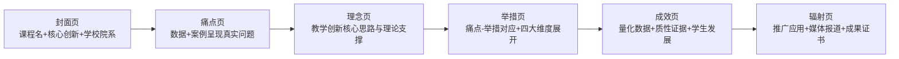

设计原则可概括为四条："**单页突出一个核心观点（避免信息过载）；图文并茂（用信息图、流程图替代大段文字，让评委3分钟内看懂设计亮点）；配色区分信息层级（用醒目颜色或加粗字体突出'高阶性''创新性'等关键词）；30秒传递核心信息（每页PPT应在30秒内让评委抓住重点）**"[^232]。**避免常见雷区**："避免大段文字堆砌""避免拼写错误""避免PPT风格与课程内容不匹配（如理工科课程使用过于花哨的模板）"[^232]。

**青教赛16学时教学设计方案的要素规范化**。第三章已述单学时教学设计的11类规范化要素（基本信息/学情/目标/重难点/方法/过程/板书/思政/作业/前沿等），此处需特别强调三点格式硬性规范：第一，整体目录与课程框架图——在方案首部以"目录+课程整体框架图"形式呈现16节段的递进关系；第二，格式规范严守——"一级标题用3号黑体加粗；二级标题用4号黑体加粗；三级标题用小4号黑体加粗。正文内容用小4号宋体，1.5倍行距"等格式要求；第三，"做到干净有序、自然舒适、实用适用""从序号、间距、排版、标题、错别字、空格、页面等方面"严守规范[^226]。

**青教赛PPT打磨的实战经验**。第三章已述李菁雯"时间管理、博人眼球、视觉设计、反复练习"四要点——"**视觉设计需兼顾专业性与美观度，课件的主色调更替可以代表教学流程的推进，切忌文字堆砌，巧妙利用图片、视频划分课件结构，其中视频最好转换为GIF格式，板书要有设计注重强化重点**"[^233]。岳远洋的"洗、剪、吹"三步法同样具有可操作性："**'洗'即通过文献检索深挖课程内容的学术内涵，融入前沿研究成果，提升教学理论高度；'剪'指自主掌握音视频剪辑技能，制作高质量的教学素材，丰富课堂内容；'吹'侧重于精准表达，通过撰写逐字说课稿，提炼逻辑框架，通过脱稿演练实现自然流畅的现场表达**"[^233]。这"三步法"将PPT打磨的"内容学术深度+素材质量+表达流畅"三维要求精准凝练。

**文档与PPT打磨的检查清单**：

| 检查维度 | 创新赛PPT | 青教赛PPT与教学设计 |
|---------|---------|------------------|
| **结构逻辑** | 六段式（封面—痛点—理念—举措—成效—辐射）清晰 | 整体目录+课程框架图+单学时要素完备 |
| **单页设计** | 单页一个核心观点+30秒传递 | 起承转合+视频/图片/板书互补 |
| **信息密度** | 信息图/流程图替代文字堆砌 | 不文字堆砌+主色调代表流程推进 |
| **格式规范** | 配色专业+字体统一+无拼写错误 | 严守标题字体字号+1.5倍行距+排版整洁 |
| **匿名要求** | 不出现教师姓名/学校/院系 | 不出现教师姓名/学校/院系 |
| **硬性参数** | 页数15—20页 | 16:9大小+分辨率1600*900 |

## 7.4 课堂教学实录视频的拍摄要点与质量控制

课堂教学实录视频是创新赛网络评审40分的核心载体。其拍摄要点与质量控制须严守官方硬性规范，并贯彻"反表演化"的核心导向。

**官方硬性规范的逐条把关**。依据创新赛历届课堂教学实录视频标准，硬性规范包括：第一，"参赛课程中两个1学时的完整教学实录（按2个视频文件上传）"[^234][^235]；第二，"视频须全程连续录制（不得使用摇臂、无人机等脱离课堂教学实际、片面追求拍摄效果的录制手段，拍摄机位不超过2个，不影响正常教学秩序）"[^234];第三，"主讲教师必须出镜，要有学生的镜头，须告知学生可能出现在视频中，此视频会公开"[^234][^235]；第四，"能够体现课程教学创新，**不允许配音，不得出现画中画**，不得出现参赛教师姓名、所在学校及院系名称等透露个人身份的信息"[^234][^235]；第五，"视频文件采用mp4格式，分辨率720p以上，每个视频文件大小不超过1200mb，图像清晰稳定，声音清楚"[^234]；第六，"视频文件命名按照'课程名称+授课内容'的形式"[^234]。第六届江苏省赛通知进一步明确了"教学大纲、课堂教学实录视频内容对应的教案和课件"等配套材料要求[^223]。

**"反表演化"导向的核心警示**。第二章已述创新赛"视频质量4分"评委的明确要求——"让观众信服这是真实、正常的课堂，不是刻意表演、包装的"。这一"反表演化"导向是创新赛与其他教学竞赛的本质区别。辅导工作中需特别警示选手：**真实日常课堂的自然呈现比刻意彩排的"完美表演"更易获得高分**——评委经验丰富，容易从课堂氛围、学生反应、教师状态等多维信号中识别出"过度排练"的痕迹。

**三阶段拍摄操作指引**。可将视频拍摄拆解为三阶段：

**拍摄前**：场地选择应优先实际授课的常规教室（避免临时调换至高规格智慧教室造成"陌生感"）；设备准备需检查机位、麦克风、补光、备用存储等；学生告知须在课前完整说明视频用途与授权情况；课件、教案、板书预设等需提前归位。

**拍摄中**：机位严格限定不超过2个、固定不动、覆盖教师与学生主要活动区域；连续录制不间断；教师状态保持自然授课节奏，避免眼神频繁望向摄像机；学生互动按日常课堂节奏推进，不做特殊"配合"；课堂用语规避自报姓名、自报学校等身份信息。

**拍摄后**：第一道审核检查视频完整性、声画同步、画面清晰度；第二道审核检查匿名化合规性（PPT是否含校徽、板书是否出现学校名、师生口头是否提及具体身份信息等）；第三道审核检查视频文件大小、格式、命名是否符合官方规范；最后按要求上传大赛系统[^223]。

**轻量化剪辑工具的合规边界**。市场上存在多种轻量化视频剪辑工具（如"影忆"等），其AI自动加字幕、降噪、声音质感增强等功能在合规边界内可适度使用[^236]。但需特别警示：**创新赛课堂实录"不允许配音""不得出现画中画""不另行剪辑"的硬性规范不可触碰**[^234][^235][^237]——任何对原始录制视频的实质性剪辑（如去除冷场、加配字幕注解、合成多镜头等）都将触发资格审查问题。轻量化工具的使用应严格限定在不违反官方规范的范围内，例如调整视频文件大小、转换格式等技术性处理。

## 7.5 创新成果报告与支撑材料的系统组织

创新成果报告是创新赛网络评审20分的核心载体。其撰写需遵循"背景—问题—举措—成效—辐射"五段闭环逻辑，并配套系统的支撑材料组织。

**4000字成果报告的撰写框架**。教学创新成果报告评分要求"明确的问题导向、明显的创新特色、课程思政特色、技术应用、成果辐射"五维评价[^229]，对应字数权重建议如下：

| 报告章节 | 字数建议 | 论证要点 | 证据呈现 |
|---------|---------|---------|---------|
| **课程基本情况与背景** | 约500字 | 课程地位+学情概述+教学历程 | 课程基本数据+开设历史 |
| **教学痛点诊断** | 约800字 | 真实痛点+数据支撑+学情依据 | 数据+案例+学生反馈 |
| **教学创新理念与思路** | 约500字 | 教学理念+创新思路+理论支撑 | 教育学理论+学科特色 |
| **创新举措的系统设计** | 约1500字 | 四大维度展开+痛点—举措对应+原创方法 | 流程图+案例+方法说明 |
| **创新成效的多元呈现** | 约500字 | 量化数据+质性证据+学生发展 | 学生作品+成绩对比+问卷数据 |
| **创新成果的辐射推广** | 约200字 | 推广案例+媒体报道+获奖成果 | 推广证明+报道链接+证书 |

**问题导向部分的"数据+案例"要求**。"问题导向不能泛泛而谈，必须基于真实的教学问题"——具体写作要求是"用数据+案例的方式呈现"[^232]。例如某课程的痛点呈现可参照范式："**根据连续3年的学生学习问卷调查（样本量N=326），有68.2%的学生反映'课程内容与就业岗位需求脱节'；通过对2021级毕业生跟踪访谈（n=15），发现……**"。这种"数据锚定真实痛点"的呈现方式远比"学生学习兴趣不高"等泛泛表述更具说服力。

**创新举措部分的"理念—路径—举措"闭环**。需"梳理从'课程痛点问题'到'创新理念/思路'再到'创新举措'的完整逻辑链条，确保论证顺畅闭环"[^232]。这一闭环的呈现技巧是：第一段先简明概括创新理念与总体思路；第二段用"痛点—举措对应表"或思维导图直观呈现逻辑骨架；第三段及之后分别展开四大维度的具体举措。**避免堆砌流行模式标签**——仅说"采用混合式教学+BOPPPS+OBE"等是评委高度警惕的"模式标签堆砌"，应代之以"基于OBE理念，以XX为目标导向，使用XX设计法，从教学目标向教学活动逆序推进"等具体路径表达。

**创新成效部分的"量化数据+质性证据"双轨**。成效需"用量化数据与质性证据凸显创新实效"——具体包括"学生成果（获奖证书、优秀作品、能力提升数据）、推广应用（兄弟院校采纳证明、企业应用情况）、课堂实录截图（展示真实的师生互动场景）"[^232]。第二章已述"成果需具体，建议附推广应用证明，而非仅口头说明"[^232]——这一要求与第五届起新增的教务系统课程开设证明等支撑材料要求形成呼应。

**支撑材料的"五维证据链"系统组织**。第二章已归纳成果辐射的五维证据维度——学生发展数据、学科竞赛成绩、课程推广应用、教学团队建设、教学成果获奖。在备赛后期需将这些证据系统归档：

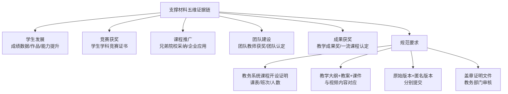

第六届江苏省赛通知明确要求"所有证明材料（含附加证明材料）均需经学校教务管理部门审核并加盖公章后上传大赛管理系统；所有赛道均需以PDF格式上传教务系统中参赛课程已完成学期的开设信息截图"[^223]——这种规范化要求需在备赛初期就纳入材料归档计划。

## 7.6 现场汇报与提问应对的临场技巧

现场汇报是两类赛事最具挑战性的"临场表现"环节——创新赛"≤12分钟教学设计创新汇报+8分钟提问交流"考验汇报性表达，青教赛"20分钟无生模拟课堂+45分钟教学反思"考验教学性呈现。

**创新赛汇报的"开门见山+思路简单+环环相扣"三关键点**。第一，**开门见山**——"不少参赛老师课程简介和基本信息说的偏多，15分钟的汇报，时间过半时还在讲课程背景。其实，这些内容要高度概括，作为开场白，几句话交代清楚即可，直奔学情及教学痛点"[^238]；第二，**思路简单**——"每张PPT一个大标题，下面分成2-3个小标题，每个小标题采取一列（行）文字+图片形式，一目了然，让外行评委看着毫不费劲，一看就明白"[^238]；第三，**环环相扣**——"把汇报设计成一堂15分钟的沉浸式堂课，分开场白、内容讲解、总结点睛三大环节，一环套一环，引人入胜，让评委无暇顾及其他。在国赛和省赛现场汇报时，用眼神、语音、语调照顾到每一个评委"[^238]。

**"计时—模拟—录像"三轮训练法**。一位国赛一等奖获得者建议的精细化训练方法包括：**计时演练**——严格控制12分钟，预留30秒弹性；**模拟答辩**——邀请同行模拟评委提问；**录像复盘**——观看自己的表达、语速、肢体语言[^232]。具体训练要求是"多观摩全国一等奖的汇报PPT和视频，要抠到细节！一个眼神、一个动作、一个音调"[^238]"先自己练，对着镜子练，每次都用手机录视频，录完可多看几遍，查找问题并记下来，注意眼神、手势、声调等细节"[^238]。

**问答环节的"问答库"预判建设**。建议提前准备"问答库"，预判评委可能提问的高频主题：**创新的核心突破点是什么？如何证明成效来源于创新而非其他因素？推广应用的可行性如何？课程思政如何融入？**[^232] 第六届教创赛通关秘籍提供了20个高频提问的应答思路示范，覆盖"教学创新核心特点""学生学习效果具体影响""与传统教学模式本质区别""'四新'要求体现""课程类型核心价值"等维度[^230]。**应对核心**："PPT中未展开细说的内容，往往是评委提问的重点突破口，务必提前准备好相关的解释素材和佐证材料，比如应答时可引用的具体案例、数据支撑等"[^230]。

**评委提问的礼仪应对与时间把控**。第一，**仪态与表达**——"主讲教师应答时需落落大方、自信从容，声音洪亮、语言流畅、思路清晰，避免磕巴、卡顿"[^230]；第二，**团队参与**——"尽量由主讲教师单独参与答辩，除非团队两人配合极度默契。避免出现主讲教师全程未发挥作用、或团队成员抢答核心问题的情况"[^230]；第三，**应答逻辑**——"回答问题务必紧扣主题，不做无关延伸，避免画蛇添足"[^230]；第四，**礼仪细节**——"可适当呼应评委的提问，如'您提出的这个问题，我们在实践过程中确实遇到过，具体处理方式是……'"，"切勿评价'您的问题更有深度'之类的表述，避免无意间贬低前一位评委的提问"[^230]；第五，**应急处理**——"遇到自身准备不足或不会回答的问题，切勿慌乱，保持沉着冷静。可先表达自己对问题的理解，再结合已开展的相关实践、积累的经验，以及后续的改进方向展开说明"[^230]；第六，**时间把控**——"答辩交流互动环节通常为10分钟，一般会有4个左右的提问，每个问题的应答时长建议控制在2分钟以内"[^230]。

**青教赛"起承转合"四段式课堂呈现的临场把控**。第三章已述黄孝东"起承转合"框架——"起的故事性、趣味性""承的逻辑性、前沿性""转的互动性、启发性""合的权威性、提升性"。聚焦青教赛公开经验分享的关键节奏分配——"导入1分钟，讲授15分钟，小结与作业1分钟，师生互动3分钟"[^233]——这一时间结构是青教赛20分钟课堂的典型节奏参照。临场把控的关键技巧包括："**赛前抽签与准备环节的时间与注意事项、现场20分钟教学展示的节奏分配，以及答疑环节的应对策略。特别提醒，需警惕比赛设备兼容性问题**"[^233]。

**镜子训练与录像复盘的精细化呈现训练**。"反复练习可借助镜子调整教态，录制视频复盘语言节奏，实现自然流畅的教学呈现"[^233]——这一训练方法对青教赛"虚拟互动设计"尤为关键。第三章已述青教赛无生授课情境下的"提问—留白—模拟回应"三步设计，需通过反复镜子训练形成"虚拟回应"的自然节奏。许琰在青教赛备赛工作坊中强调的"穿着打扮得体、仪态仪表自然，让人赏心悦目。穿精神得体的衣服，女老师画淡妆，最好穿一双有一点跟的鞋子，但不要穿高跟鞋，男老师可以皮"[^226]等仪表细节，同样是临场表现的"印象分"管控要点。

## 7.7 教学反思的撰写要领与诊断深度

教学反思是青教赛5分（45分钟内500字闭卷）与创新赛课程改革反思的核心载体——分值虽小，却往往是从二等奖跃升至一等奖、从一等奖跃升至一等奖第一名的"临门一脚"。

**"教学理念—教学方法—教学过程"三段式核心结构**。青教赛官方要求反思须"从教学理念、教学方法和教学过程三方面着手""思路清晰、观点明确、联系实际、做到有感而发"[^239]。第三章已归纳一等奖反思的三段式呈现：第一段基于教学理念的自我审视，第二段基于教学方法的得失分析，第三段基于教学过程的改进设想。这一结构对应创新赛"教学反思是教师针对以往教学中出现的一两个具体问题，以课题研究的方式在教学过程发生后进行的深刻思考，更多关注在微观层面"的要求[^240]。

**"真问题、真诊断、真改进"的核心要求**。第三章已警示反思写作的三类常见误区——**自我表扬式反思、套话堆砌式反思、脱离节段的泛化反思**。一等奖反思的核心要求是"基于本节段的具体教学过程，发现真实存在的问题，作出诚实的诊断，提出可操作的改进"。这一要求与"想在教学比赛获奖，教学反思还得这样写"中归纳的"反思授课实效""聚焦教学过程中存在的问题""关注学生参与互动情况""从特色与创新的角度出发"四类切入角度高度吻合[^241]——其共同的精髓是**摆脱套话、回归具体、敢于直面问题**。

**五大可选切入角度与详细说明**。综合教学反思撰写指南，可归纳五大可选切入角度：

| 切入角度 | 核心内容 | 写作要点 |
|---------|---------|---------|
| **写成功之处** | 达到预先设计的教学目的、引起教学共振效应的做法 | 详细记录教学方法的改革与创新等[^242] |
| **写不足之处** | 课堂教学的疏漏失误之处 | 系统回顾、梳理，作深刻反思、探究和剖析[^242] |
| **写教学机智** | 课堂中偶发事件而产生的瞬间灵感 | 课后反思去捕捉"智慧的火花"[^242] |
| **写学生创新** | 学生在课堂上提出的独特见解 | 充分肯定学生的好方法、好思路[^242] |
| **写"再教设计"** | 再教这部分内容时应该如何做 | 摸索教学规律、教法创新、知识点新发现等[^242] |

**反思切入的方法升级**。"从怀疑处反思""从转换立场处反思""从转换知识系统、学科领域处反思""从假设性问题处反思"[^242]——这些方法可使反思跳出"自说自话"的局限，呈现多视角的诊断深度。具体写作结构是"教学实例—得失（成败）分析—理性思考"，"第一、二部分是'反'，第三部分是'思'。第三部分是重点，应详写，尽量写出深刻的切实可行的方案策略"[^242]。

**16节段反思预案的同步打磨建议**。第三章已述一等奖反思的"思维肌肉记忆"形成机制。具体操作建议是：**辅导对象在打磨16个节段的同时，应同步撰写16段反思草稿，并经历多轮专家审阅与修改**——尽管现场反思必须临场完成，但反思预案的反复打磨能够使现场写作更加从容、深刻。第七届青教赛西京学院通知明确要求"参赛选手需准备参赛课程6个节段对应的教学反思（每个500字以内）"——这一节段反思预案数量需根据每届赛事最新规则调整，但"同步打磨"的核心方法论保持稳定。

**创新赛维度的课程改革反思**。创新赛的反思更多体现为成果报告中的"课程改革反思与持续改进"模块——其与青教赛闭卷反思的核心差异是：青教赛反思针对当天抽签的具体节段，创新赛反思针对整门课程的长周期改革。但二者共享"基于真实问题的真实诊断+基于诊断的可操作改进"的核心要求——这正是第二章所述"教学学术意识"在反思环节的具体落地。

## 7.8 匿名化处理与合规性自查的红线把控

匿名化与合规性是参赛材料的"红线"——任何细节疏漏都可能导致一票否决，使前期所有打磨努力付诸东流。

**两类赛事匿名化要求的统一规范**。创新赛与青教赛的匿名化要求高度一致——**参赛材料（除申报书与原始证明材料外）不得出现教师姓名、学校名称、院系名称等透露个人身份的信息**。具体规定：第一，"参评作品中不得出现作者单位及作者本人信息，一经发现取消作品参选资格"[^243]；第二，"除申报书和创新成果支撑材料、证明材料原始版本外，其余参赛材料及现场汇报环节中均不得出现参赛教师（团队）姓名、所在高校及院系名称等透露个人身份的信息，产教融合赛道对行业企业信息不做硬性要求"[^223]；第三，"证明材料需分别准备原始版本（用于资料审核）和匿名版本（用于专家评审）"[^223]；第四，山东省赛规范明确"不得出现参赛教师姓名、所在学校及院系名称等透露个人身份的信息"[^234]。

**视频技术合规的硬性红线**。第七章7.4节已述视频"不允许配音""不得出现画中画""不另行剪辑及配音""不加片头片尾、字幕注解"[^234][^235][^237]等硬性规范。补充强调：第一，**校徽校训等视觉标识需提前清理**——板书、PPT、教室背景中含校名校徽的元素需在拍摄前移除或遮挡；第二，**师生口头不可提及具体身份信息**——课堂用语回避自报姓名、自报学校、点名提及具体学院等；第三，**视频文件命名按"课程名称+授课内容"形式**[^234]，不能使用包含教师姓名的命名。

**报告查重率20%的硬性门槛**。"报告类材料省赛系统将自动查重，重复率高于20%将无法上传，需重新修改后提交"[^223]——这一硬性规则在第六届江苏省赛通知中明确写入。这意味着辅导对象的成果报告不能简单"借鉴"网络流传的获奖报告范本，必须基于自身课程实际进行原创撰写。建议在报告完成初稿后即先用第三方查重工具自查，避免在最后提交阶段发现超标无法处理。

**课程名称与教务系统一致性要求**。"参赛课程名称须与教务系统中显示情况一致"[^223]——这一要求在第五届创新赛起被明确强化。任何"为比赛而美化"的课程名称变更都将引发资格审查问题，需以教务系统中实际开设的课程名称为准。

**引用资料的知识产权合规**。"参赛作品应为作者独立完成，且为非正式出版物""课件内容60%以上为作者原创，引用的图文资料应注明来源，不得抄袭他人作品，侵害他人版权，若发现有侵犯他人著作权行为，或有任何不良信息内容，取消作者参赛资格，由此引起知识产权争议，由作者承担责任"[^243]。在AI生成内容大量使用的背景下，知识产权合规已成为新的重点关注领域——艺术设计系版权讲座中提及的"AI生成内容的版权边界、毕业设计和竞赛作品的原创性要求，以及学生创作的合规流程和风险防范"[^244]同样适用于教学竞赛参赛作品。

**涉密课程的脱密处理与师德师风红线**。"涉密课程应做脱密处理后参赛，如无法脱密不建议参赛"[^222]；"有学术不端或者师德失范行为的；在政治、学习、科研和生活等方面有违法、违规、违纪情况的"不得参赛[^222]；"主讲教师及团队教师成员不存在师德师风、学术不端等问题，遵纪守法，无违法违纪行为，五年内未出现过教学事故"[^245]——这些政治性与师德性红线需作为参赛资格的前置审查项。

**匿名化与合规性自查的标准清单**：

| 自查维度 | 具体检查项 | 不合规后果 |
|---------|---------|---------|
| **匿名化** | 教师姓名/学校/院系是否在所有材料中已隐去（除申报书与盖章证明） | 取消参赛资格 |
| **视频技术** | 不配音/不画中画/连续录制/格式分辨率符合规范 | 视频不予审核 |
| **查重** | 报告查重率<20% | 无法上传系统 |
| **课程名称** | 与教务系统一致 | 资格审查问题 |
| **知识产权** | 引用资料注明来源/课件原创度>60% | 侵权责任+取消资格 |
| **政治审查** | 无师德/学术不端/违法违纪情形 | 取消参赛资格 |
| **涉密处理** | 涉密课程已脱密 | 不建议参赛 |

**这一自查清单建议作为辅导对象提交材料前的最后一道把关程序——由辅导团队专人对照清单逐项核查并签字确认，避免"千里之堤毁于蚁穴"的红线疏漏**。

## 7.9 分阶段递进式辅导节奏的设计

将上述备赛策略落地到具体辅导工作中，需要设计"院赛—校赛—省赛—国赛"四阶段递进式精细化节奏。这一节奏设计需参照一等奖高产院校的成熟经验，并根据本单位实际情况灵活调整。

**院赛阶段：启动选拔+痛点诊断+创新点初步提炼**。这一阶段的核心目标是**发现潜质选手与建立教学学术意识**。具体辅导动作包括：第一，广泛动员宣讲——参照教育部认可的赛事价值与本单位激励政策，激发教师参赛动力；第二，参赛资格初审——核查近5年讲授课程轮次、教学大纲、教学事故记录等基础门槛；第三，潜质诊断访谈——结合第二章"教学学术意识"维度判断选手的教学反思深度与改革沉淀；第四，创新点初步提炼——指导选手填写"痛点—举措对应表"草表，初步勾勒创新逻辑闭环；第五，院赛选拔评审——按校赛评分要点组织院级专家评审，遴选出推荐至校赛的种子选手。这一阶段的时间通常为1—2个月。

**校赛阶段：院内初建+材料系统化+多轮专家点评**。这一阶段的核心目标是**形成完整参赛材料雏形**。具体辅导动作包括：第一，校赛动员培训——参照暨南大学"创新大赛辐射"工作坊、北理工"鸿鹄学堂"模式，组织校级培训；第二，专家库匹配——为每位种子选手匹配校内专家1—2人、校外专家1人，形成"双导师+1外援"的指导团队；第三，材料系统化打磨——围绕教学创新成果报告、课堂实录视频、教学设计创新汇报PPT等核心材料进行系统打磨；第四，多轮专家点评——参照长江大学"校级打磨阶段组织专家多轮一对一辅导、2—4场集中打磨"模式，安排至少3轮专家深度点评；第五，校赛现场评审——按国赛评分细则组织校级现场评审，模拟省赛实战。这一阶段的时间通常为3—4个月。

**省赛阶段：校级打磨+多轮淬炼+模拟答辩**。这一阶段的核心目标是**通过高密度淬炼达到一等奖竞争水准**。第六章已述一等奖背后的磨课轮次量级——长江大学"省赛备赛达八轮"、上海大学"60余次校市级磨课"、周峰"省初赛/省复赛/省决赛/省遴选赛第一轮/省遴选赛第二轮共5轮省级比赛"。具体辅导动作包括：第一，省赛专项集训——组建专门的备赛训练营，吸引选手集中投入；第二，多专家轮换指导——避免单一专家视角的局限，安排不同学科背景、不同评委经验的专家轮换指导；第三，模拟答辩高强度训练——重点针对评委高频提问准备问答库，进行多轮模拟答辩；第四，心理调适与状态管理——长周期高强度备赛对教师心理压力极大，需配套心理支持机制。这一阶段的时间通常为2—3个月。

**国赛阶段：冲刺集训+心理调适+临场细节**。这一阶段的核心目标是**在国赛舞台上呈现最佳状态**。参照清华建筑学院"团队整体备赛+每人双导师"机制、张青子衿"30余次国赛磨课活动"模式，具体辅导动作包括：第一，国赛冲刺集训——通常持续1—2个月的高强度集中打磨；第二，组建国赛支持团队——参照上海大学"组建教师国赛支持团队，包括马院支持团队、教务部支持团队和校外专家团队"模式，形成多层支持矩阵；第三，临场细节精雕——从着装、教具、设备到提问应对的每个细节均需反复演练；第四，心理调适——参照高晓沨"敬畏教学"理念引导选手以平和心态对待结果。这一阶段的时间通常为1—2个月。

**四阶段辅导节奏的整体示意**：

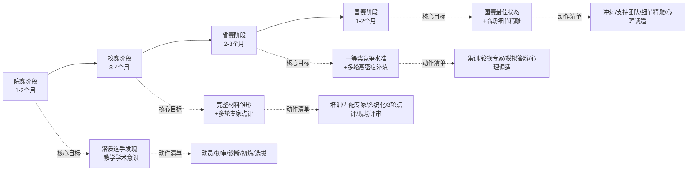

**质量评估指标**：每阶段需设定明确的质量评估指标——院赛阶段评估"选手潜质与创新点初步成型度"、校赛阶段评估"参赛材料完整度与多轮点评后的改进度"、省赛阶段评估"模拟答辩稳定度与材料一等奖竞争水准"、国赛阶段评估"临场表现稳定度与全程合规度"。

## 7.10 分对象差异化辅导路径的精准设计

不同辅导对象在不同赛事、不同阶段的能力需求差异显著，需要差异化辅导路径精准设计。

**第一类：青年教师——以青教赛为主战场**。对象特征为40岁以下、教龄5年内、副教授及以下职称为主。其核心能力短板通常是教学经验不足、教学反思深度不够、临场应变能力欠缺；核心能力优势是技术应用敏感、新知识接受快、可塑性强。辅导侧重点：第一，**重点培育20分钟课堂基本功**——参照山师大"青师启航"、清华建筑学院"代际传承"机制，安排前辈教师带教；第二，**强化教学学术意识**——通过案例研习、教学反思训练等方式，引导从"经验教学"向"自觉教学学术"跃迁；第三，**多轮磨课与心理陪伴**——参照周峰"8轮比赛"、高晓沨"5轮教学比赛+3轮磨课特训"标准，配套心理调适支持；第四，**鼓励"先青教赛后创新赛"梯次发展路径**——青教赛获奖后再以青教赛积累的基本功支撑创新赛的课程整体改革。

**第二类：资深教师——以创新赛为主战场**。对象特征为副高及以上职称、教龄10年以上、有较成熟的课程改革沉淀。其核心能力短板通常是新技术应用相对薄弱、教学创新模式表达欠精炼；核心能力优势是教学经验丰富、学科底蕴深厚、有团队号召力。辅导侧重点：第一，**重点培育课程整体改革闭环**——围绕"痛点—举措—成效—辐射"五段闭环系统打磨；第二，**强化成果证据沉淀**——提前数年规划学生发展数据、推广证明、媒体报道等"五维证据链"的归档；第三，**理论提炼路径培养**——参照周屈兰"OCAS逆向设计"、曹敏惠"三醒三思"等成熟教师的命名方法论，将经验性教学升华为理论化创新模式；第四，**积极拥抱新技术与新赛道**——重点关注第六届新增的人工智能赛道、实验教学赛道，避免"经验主义"路径依赖。

**第三类：团队选手——创新赛"1主+3辅"团队**。对象特征为创新赛团队赛参赛，含主讲教师与不超过3名团队教师。核心挑战是团队协同机制、跨学科专家配置、企业兼职教师深度参与等团队建设要素。辅导侧重点：第一，**团队角色清晰分工**——主讲教师负责整体汇报与答辩、团队教师按"内容创新""技术应用""思政融入""推广应用"等维度分工；第二，**跨学科专家配置**——产教融合赛道必须以团队形式参赛、且至少含1名从行业企业聘请的兼职教师且深度参与教育教学时间须达到2年及以上[^224]；第三，**参照《乡土建筑空间设计》"校企村三方深度融合"与同济《营销管理》"跨学科团队"范式**——长周期培育（如10年）+多主体协同（校企村+跨学科）+真实工程项目驱动；第四，**答辩环节的团队协同**——"尽量由主讲教师单独参与答辩"[^230]避免争答核心问题，但需具备团队协同应答的默契度。

**双轨复用培育策略：青教赛能力反哺创新赛、创新赛系统化延伸青教赛**。第六章已述石礼伟、白春苏、梁思思等"双料获奖"教师的成长路径——青教赛打磨的20分钟课堂精彩呈现能力，是创新赛课堂教学实录视频的基础；创新赛的课程整体改革闭环，是青教赛16节段教学设计方案的系统支撑。这一双轨复用对辅导工作的核心启示是：**辅导对象不应将两项赛事视为孤立的备赛任务，而应作为同一教学能力体系在不同维度的差异化展现**。建议辅导部门为本单位骨干教师规划"青教赛—创新赛"接续发展路径——青年教师阶段以青教赛为主，磨练课堂基本功；进入副高阶段后，以青教赛积累的能力底盘支撑创新赛的课程整体改革；高级职称阶段则可以创新赛为主、兼顾青教赛骨干指导。

**三类对象差异化辅导路径汇总**：

| 对象类型 | 主战场 | 核心能力短板 | 辅导侧重 | 参照范式 |
|---------|------|-----------|--------|---------|
| **青年教师** | 青教赛 | 教学经验/反思深度/临场应变 | 课堂基本功+学术意识+心理陪伴 | 山师大三航课堂+清华代际传承 |
| **资深教师** | 创新赛 | 新技术应用/创新模式表达 | 课程改革闭环+证据沉淀+理论提炼 | OCAS+三醒三思+MOSAIC |
| **团队选手** | 创新赛团队赛/产教融合 | 团队协同/跨学科配置/企业深度参与 | 角色分工+跨学科+真实项目 | 乡土建筑空间设计+营销管理 |

## 7.11 权威资源获取渠道的全景地图

资源获取是辅导工作的"基础设施"——辅导团队和参赛教师如能系统利用权威资源，将极大提升备赛效率。本节系统梳理一等奖课程相关资源的全景地图，按权威性与适用场景分五类组织。

**第一类：国家高等教育智慧教育平台官方资源**。中国高等教育学会在教育部高等教育司指导下，**已分批次在国家高等教育智慧教育平台发布历届国赛获奖课程的完整课堂实录视频**——"创新大赛已连续举办5届，累计吸引全国43万余名教师参赛，积累了60余万个课堂教学实录视频""**首批上线115门课程视频**……这些课程涵盖文、理、工、医、农等多个学科门类，集中展示了问题导向教学、混合式教学设计、课程思政有机融合、智慧教学工具应用等多元创新实践"[^246][^247][^248][^249]。

- **访问入口**：登录"国家高等教育智慧教育平台"（网址：https://higher.smartedu.cn/teacher）—点击"教师教研"模块—即可查看获奖课程[^246]。
- **资源特征**：完整课堂实录视频（区别于网络流传的片段）、覆盖文理工医农多学科门类、官方权威认证、持续更新。
- **适用场景**：观摩学习一等奖课堂的真实样态、研习不同赛道一等奖共性规律、为本单位选手提供对标范本。

**第二类：大赛官网与组委会渠道**。**全国高校教师教学创新大赛官网**（nticct.cahe.edu.cn）发布历届通知/规范/省赛文件/赛道培训视频[^225][^222]：

- 历届大赛通知（如第六届启动通知）、《全国高校教师教学创新大赛校赛和省赛工作规范》、各省赛通知；
- "全国高校教师教学创新大赛人工智能赛道专题研讨班"系列视频集锦——支持第六届新增的人工智能赛道备赛[^225]；
- "教创赛专家报告荟萃"系列——如复旦大学陆一教授关于"形具而神生——大学通识课程教学质量的关键所在"等专家报告[^225]；
- 大赛重要时间节点：校赛2025.11—2026.1、省赛2026.2—2026.4、国赛网络评审2026.5—2026.6、国赛现场赛2026.7—2026.8[^225]。

**ChatTIC智能问答机器人**——基于通用DeepSeek大模型通过知识库进行模型微调定制形成的专属智能体[^250]——为参赛教师提供智能化赛事咨询。这是北京理工大学在第五届创新赛中首创的"运用智慧力量推动大赛出新出彩"的工具创新[^250]，对辅导团队快速获取赛事信息、规则解读具有重要价值。

**第三类：承办高校与赛区资源**。复旦/西安交大/北理工/南京大学等历届承办高校的教师发展中心定期发布备赛专题资料：

- 复旦大学教师教学发展中心运营的"高校教师教学创新大赛经验分享""创新教与学年会""教学学术分享日"等持续举办的活动[^251][^252]；
- 南京大学教师教学发展中心组织的"全国高校教师教学创新大赛人工智能赛道专题研讨班（第三期）"等专题活动[^253]；
- 各省承办高校（如河南省郑州轻工业大学+郑州航空工业管理学院承办第七届河南省赛[^224]）发布的省赛通知与配套培训。

**各省赛通知与文件**——河南省第七届[^224]、江苏省第六届[^223]、南信大第六届[^254]等省赛与校赛通知，是辅导团队把握省赛实施细则、参赛名额分配、推荐机制等关键信息的重要资料源。

**第四类：获奖教师公开成果**。一等奖获奖教师的公开经验分享是最具针对性的备赛资源：

- **黄孝东《青教赛经验分享之赛制分析、教学设计与教学反思》**75分钟视频课程[^255]——系统介绍青教赛竞赛过程、教学设计"全准联新"原则、教学反思"真情改常"原则、《应用人类学》示范课等；
- **谌援《热膨胀》示范课**——湖北工业大学教授、第六届青教赛工科组一等奖、湖北省青教赛工科组一等奖第一名，应邀至他校开展"提炼课程思想，围绕中心主题——从选手视角看全国青教赛的顶格要求"专题报告[^227][^256]；
- **第七届青教赛一等奖课堂实录视频**——通过专业公众号汇编后批量公开[^257]；
- **混合式教学设计创新大赛一等奖PPT分享**（如杨楠、张娟、熊辉、马丽娜的说课PPT）[^258][^259]；
- **第六届青教赛各组一等奖名单及决赛课堂实录视频汇总**——包括思想政治课、工科、理科、文科、医科组各5名一等奖[^260]；
- **全国高校青年教师教学竞赛（青教赛）一等奖、二等奖获奖视频汇总**——按届次、组别系统整理[^261]。

**第五类：延伸资源与培训资料**：

- **第七届青教赛一等奖课堂实录视频专区**——专业平台批量收录[^257]；
- **教师培训研修平台**——如"高教国培""紫金教与学""笃行教育大讲坛"等专业公众号汇编的获奖资料、师资培训等[^262][^263]；
- **"备战教学创新大赛 聆听10位名师课堂"**等系统培训资料[^229]；
- **教学反思撰写指南、教学设计模板、答辩问题应对策略**等专项资料[^264][^265][^266][^241][^242]。

**资源地图的整体呈现**：

| 资源类别 | 入口 | 内容范围 | 适用场景 |
|---------|------|---------|---------|
| **国家高等教育智慧教育平台** | higher.smartedu.cn/teacher | 115+门一等奖完整课堂实录 | 观摩学习+对标研习 |
| **大赛官网与组委会** | nticct.cahe.edu.cn+ChatTIC | 历届通知/规范/赛道培训 | 规则把握+赛事咨询 |
| **承办高校与赛区** | 各高校教师发展中心+省赛承办高校 | 省赛文件/专题培训/经验分享 | 省赛备赛+培训资源 |
| **获奖教师公开成果** | 专业公众号+教师个人讲座 | 一等奖课堂视频+说课PPT+经验分享 | 一对一研习+个性化迁移 |
| **延伸资源** | 各类教师培训平台+专业公众号 | 培训资料/范本/工具 | 系统化学习+工具复用 |

## 7.12 资源使用的合规边界与学习方法

资源获取后的下一个问题是"如何合规、有效地使用"。本节剖析合规边界与学习方法。

**资源使用的合规边界与版权保护**。国家高等教育智慧教育平台资源依据《国家智慧教育平台数字教育资源内容审核规范》明确知识产权归属：**"未经书面许可，任何单位或个人不得以任何方式使用"教育部对'国家高等教育智慧教育平台'的全称和简称'智慧高教'及标志等享有的知识产权""任何媒体、网站和商业机构不得利用本网站发布的内容，也不得歪曲和篡改本网站发布的内容"**[^267]。**"凡本网站所展示未注明来源的所有文字、图片和音视频内容，版权均属本网站所有，任何媒体、网站或个人未经授权不得转载、链接、转贴或以其他方式使用"**[^267]。

具体合规边界包括：第一，**获奖课程实录视频仅供观摩学习，不得用于商业用途**；第二，**参赛教师在借鉴他人案例时需注重原创性，避免抄袭剽窃**——参赛材料"省赛系统将自动查重，重复率高于20%将无法上传"[^223]；第三，**引用资料必须注明来源**——"引用的图文资料应注明来源，不得抄袭他人作品，侵害他人版权"[^243]；第四，**AI生成内容的版权边界需特别关注**——"AI生成内容规范纳入教学的方式""AI工具使用规范"等是新兴合规议题[^244]。

**"观摩—研习—迁移"三阶学习方法**。借鉴他人一等奖案例不是简单的"抄作业"，而是需要遵循三阶学习法：

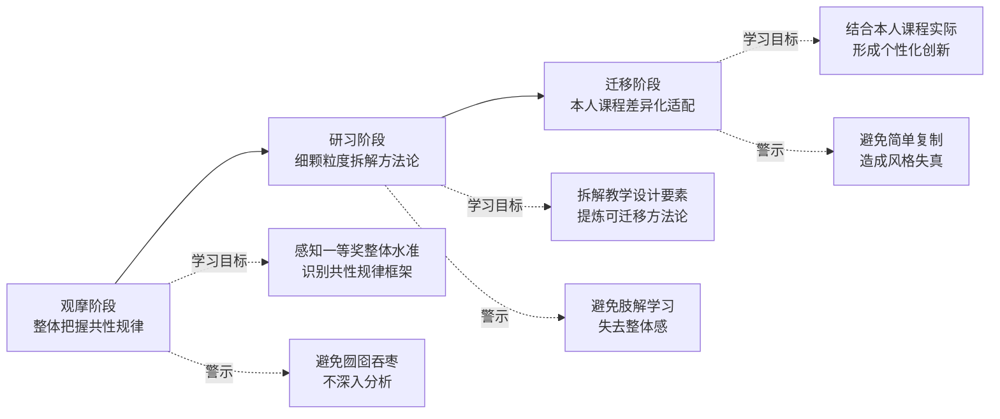

**第一阶"观摩"**——聚焦案例的整体把握与共性规律提炼。建议辅导对象选择本赛道、本职称组别、本学科门类的3—5个一等奖案例，先完整观看其课堂实录视频与成果报告，**重点感知一等奖的"整体气质"——课堂节奏、教师风格、学生反应、内容深度等**，形成"一等奖应该是什么样"的整体认知。

**第二阶"研习"**——聚焦案例的细颗粒度拆解与方法论提炼。建议辅导对象对所选案例进行"显微镜级"拆解：拆解课堂导入设计、拆解知识展开节奏、拆解板书与PPT配合、拆解提问互动设计、拆解思政融入位点、拆解结尾升华方式——**每一拆解维度都对照第三章"简洁—层次—留白—通透"四维规律或第二章"八位一体"创新范式进行评估**。这一阶段的输出是一份本人的"案例方法论提炼笔记"，记录可借鉴的具体技巧与方法。

**第三阶"迁移"**——聚焦本人课程的差异化适配与个性化创新。**避免简单复制造成风格失真**——这是辅导工作中最需要警示的误区。第四章已述杨达教授的反思——"不能全盘吸收专家建议，否则会丢了自己的特点"。具体迁移策略包括：第一，**学科适配**——根据本人课程的学科属性调整方法论的具体应用；第二，**风格适配**——根据教师个人风格选择最适合的呈现方式（不是所有教师都适合"故事化叙事"）；第三，**学情适配**——根据本人学生的认知特点设计教学策略；第四，**个性化创新**——在借鉴的基础上形成具有辨识度的个性化创新点。

**本单位"三库联动"学习资源体系建设**。建议辅导部门建立本单位的可持续学习资源体系：

- **获奖案例库**——按"赛道—学科—组别"分类整理本单位历届获奖案例与外校标杆案例的完整资料（视频/报告/PPT/教案），形成可检索可复用的本地资源库；
- **创新点资料库**——按"内容重构/方法创新/环境创设/评价改革"四维度归档创新点案例与命名范式，为本单位选手创新点提炼提供参考；
- **反面教材库**——归档评委高频反馈的扣分点案例，警示选手避免常见误区。

定期组织校内观摩研讨会、邀请获奖教师作经验分享、举办青年教师磨课沙龙——通过这些常态化活动形成可持续的学习共同体。第六章已述长江大学"参赛一批、培育一批、带动一批"的辐射机制、复旦"创新教与学年会"、暨南"创新大赛辐射工作坊"等模式，均可作为本单位学习共同体建设的参照。

## 7.13 辅导工作的可持续闭环与长效能力建设

将前述备赛策略、辅导路径与资源获取整合为辅导工作的可持续闭环。这一闭环的本质是从"应对单次赛事"升华为"长效能力建设"，使辅导部门从"赛事服务窗口"演进为"教师教学发展枢纽"。

**第一闭环："选拔—培育—参赛—复盘—传承"的人才闭环**。这是辅导工作的核心人才循环。具体环节包括：第一，**潜质选拔**——基于教学学术意识、改革沉淀度、个人风格等多维诊断，发现具有一等奖潜质的选手；第二，**长周期培育**——参照"代际传承梯队"模式，为选手匹配前辈导师，配套多轮专家指导；第三，**实战参赛**——以省赛、国赛为练兵场，在高强度淬炼中提升能力；第四，**获奖后复盘**——参照周屈兰"获奖—理论提炼—培训传承"模式，将获奖经验提炼为可传播的知识资产；第五，**指导后辈传承**——获奖教师转化为下一届指导专家，形成清华建筑学院式代际传承梯队。这一人才闭环的关键节点在于**"获奖教师→指导专家"的角色转化**——只有形成稳定的代际传承机制，辅导工作才能摆脱"一锤子买卖"困境。

**第二闭环："校赛—省赛—国赛—成果转化—日常教学"的成果闭环**。这是辅导工作与日常教学的深度融合循环。具体环节包括：第一，**赛事经验反哺日常教学**——参照长江大学"以赛促教、成果反哺，推动参赛成果转化为日常教学实践，实现'参赛一批、培育一批、带动一批'"模式；第二，**获奖案例转化为校本培训资源**——将本单位获奖案例汇编为内部培训教材，定期组织校内观摩研讨；第三，**创新模式推广至兄弟院系**——通过院系交流、专题报告、教学示范课等方式，扩大获奖经验的辐射范围；第四，**成果产出多元化**——除竞赛奖项外，进一步申报教学成果奖、一流课程认定、规划教材出版等成果。第二章已述石礼伟教授"国家级课程思政示范本科课程+国家级一流本科课程+国家级课程思政教学团队+国家级一流本科专业建设点"的多维荣誉体系，正是这一成果闭环的高级形态。

**第三闭环："制度—组织—专家—资源—激励"的保障闭环**。这是辅导工作的组织制度循环。具体环节包括：第一，**校院两级联动**——参照暨南"三委员会架构"、长江大学"三级联动体系"模式；第二，**教师发展中心枢纽**——发挥教师发展中心的统筹规划、培训组织、专家协调、资源调配、赛事服务、成果转化六大职能；第三，**三级专家库**——建设校内+省内+全国三级专家库，确保不同阶段的指导精度；第四，**国家平台资源**——充分利用国家高等教育智慧教育平台、大赛官网、ChatTIC等官方资源；第五，**复合激励矩阵**——经济激励+职称倾斜+评优认定+荣誉表彰+宣传推广五维并举。这一保障闭环的关键在于**长效化制度设计而非短期突击**——制度的稳定性是辅导工作可持续的根本前提。

**辅导工作三大闭环的整体协同**：

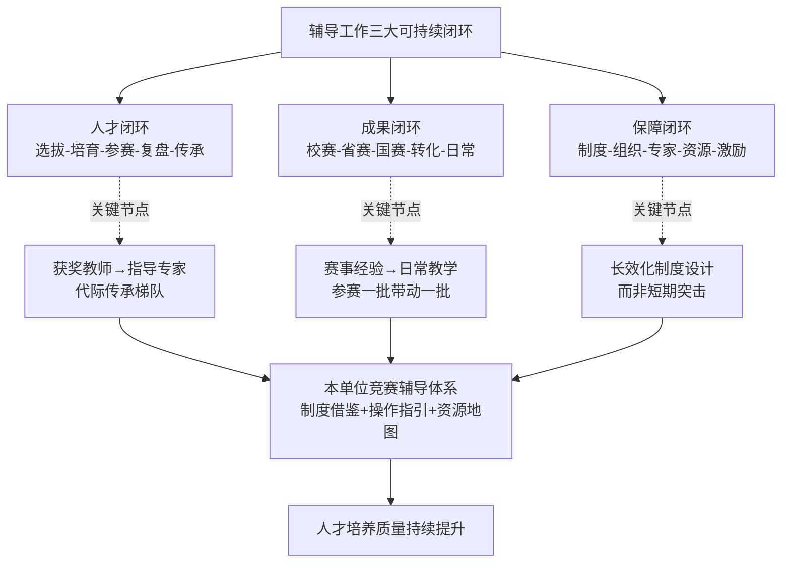

**面向未来的前瞻性展望**。当前两类赛事正呈现三大发展趋势，辅导工作需作前瞻性布局：

- **人工智能赛道扩容**——第六届创新赛已新增"人工智能"和"实验教学"两个赛道，第六届江苏省赛、河南省赛已系统配置AI赛道[^224][^223]。AI赛道明确要求"利用国家高等教育智慧教育平台（含接入平台）的资源/工具，或基于生成式人工智能技术搭建教学智能体开展教学"[^268]，至少包括"学情数据采集与分析、数字资源整合与运用、适配的教学场景设计、多维智能评价反馈、师生机协同教学、个性化学习支持"中的两个情境[^268]。辅导工作需提前布局AI素养培训，引导选手从"技术堆砌"误区回归"AI赋能真问题解决"的本质。

- **产教融合精细化**——第六届创新赛产教融合赛道明确要求"实践性教学学时占课程总学时比例不少于30%"[^223]、"至少含1名从行业企业聘请的兼职教师，且深度参与教育教学时间须达到2年及以上"[^224]。这一精细化要求意味着产教融合赛道不再是"挂牌签约"式合作，而需要长期校企深度融合的真实积累。辅导工作需提前数年规划产教融合课程的真实合作机制建设。

- **课程思政无痕融入**——第六届赛事进一步强调课程思政从"附加项"变为"必选项"，并明确"无痕融入"要求——"避免思政与专业两张皮""挖掘学科内核的价值元素""形成知识传播+价值塑造闭环"[^269]。辅导工作需引导选手从"贴标签式思政"彻底转向"从课程内容自然生长的隐性渗透"。

**辅导部门长效能力建设的核心抓手**：综合本章前12节的论述，辅导部门长效能力建设的核心抓手可凝练为"**制度借鉴—操作指引—资源地图**"三位一体：

- **制度借鉴**——参照暨南、西安交大、清华建筑学院、上海大学等一等奖高产院校的培育机制，构建本单位"校级组委会+教师发展中心+学院工作小组+课程团队"多级联动架构、"分层+分赛事+分阶段"三维交织培育链、"经济+职称+评优+荣誉+文化"复合激励体系；
- **操作指引**——以本章八大环节（参赛课程与节段选择、创新点提炼、文档与PPT打磨、视频拍摄、成果报告组织、现场汇报、教学反思、匿名化合规）为核心操作框架，形成本单位辅导工作的标准化作业流程；
- **资源地图**——以国家高等教育智慧教育平台为核心，整合大赛官网、承办高校资源、获奖教师公开成果、延伸培训资源，建设本单位"获奖案例库+创新点资料库+反面教材库"三库联动的可持续学习资源体系。

通过"制度—操作—资源"三位一体的长效能力建设，部门辅导工作将完成从"应急服务窗口"向"长效赋能枢纽"的关键升级——这种升级本质上是从"以赛促教"的工具性定位，迈向"以教师教学发展中心为枢纽的高校教师专业发展长效机制"的战略性定位。

---

综合本章十三节的论述，面向辅导工作的备赛策略、实操路径与优质资源获取渠道已形成完整的"流程化—差异化—资源化"操作体系：八大关键环节的"端到端"操作指引为参赛教师提供了从课程选择到合规自查的全流程地图；四阶段递进与三类对象差异化辅导路径为辅导团队提供了精准化分层服务方案；五大类权威资源渠道与"观摩—研习—迁移"三阶学习方法为可持续学习提供了基础设施；三大闭环建设与前瞻性布局为辅导部门长效能力建设提供了战略指引。

至此，第二章—第七章构成的"评分逻辑解构+案例剖析+院校机制+辅导操作"四维体系已完整勾勒出两类赛事一等奖课程辅导工作的全景图。下一章将在此基础上系统总结研究结论，提炼一等奖课程的"可学习—可借鉴—可迁移"要素清单，并对部门竞赛辅导工作的具体启示与未来发展作综合性阐述，使本研究形成自然闭环并对辅导实践提供持续的方向指引。

# 8 研究结论与对部门竞赛辅导工作的启示

作为整篇报告的收束章节，本章承担承前启后的整合性职能：向前，对第一章至第七章构建的"制度坐标系—评审解构—范式归纳—案例剖析—机制对比—操作路径"完整研究链条进行系统性凝练；向后，将研究洞察转化为对部门竞赛辅导工作的可操作启示与战略性展望。本章不再引入新的资料与论证，而是基于前七章已建立的事实底座与分析框架，通过结论凝练、要素提炼、建议落地与趋势展望四步推进，使整篇研究形成"认知洞察—操作落地—战略升华"的三层完整闭环。需要说明的是，部分行文将刻意呼应前七章的关键论断与典型案例，以确保研究结论的内在一致性与对辅导工作的连贯指导价值。

## 8.1 研究核心结论的系统性凝练

回望前七章构建的研究图景，可从六个维度凝练本研究对创新赛与青教赛全国一等奖课程的核心结论。

**第一，制度坐标系层面**：创新赛与青教赛作为高校教师教学竞赛的"双子星"，在制度血脉与政策定位上呈现互补格局——创新赛作为"唯一纳入《教育部直属单位三评一竞赛保留项目清单》的综合性教师教学竞赛"承载教育部教学改革风向标的功能，青教赛作为"全国总工会十四五全国引领性劳动和技能竞赛"承载工会系统师德师风建设与基本功锤炼的使命。两类赛事在赛制、参赛对象、组别赛道、评审环节上的系统性差异，决定了一等奖产生逻辑的本质不同。

**第二，评审逻辑层面**：创新赛形成"网络评审60分（视频40+报告20）+现场评审40分"的复合体系，强调"问题—方法—成效—闭环"的教学学术逻辑；青教赛形成"教学设计20分+课堂教学75分（教学内容30+教学组织30+语言教态10+教学特色5）+教学反思5分"的百分制体系，聚焦20分钟无生模拟授课的微观呈现。**两类赛事的评审重心由此形成"系统创新成果证据"与"瞬间教学微缩精品"的本质分野**。

**第三，范式特征层面**：创新赛一等奖课程呈现"问题真实化—理念学术化—内容立体化—模式融合化—思政自然化—技术适配化—评价多元化—成效证据化"的"八位一体"宏观范式；青教赛一等奖课堂呈现"简洁—层次—留白—通透"的四维微观规律，并在文、理、工、医、思政五大组别中形成差异化的学科创新基因。两套范式在学科层面进一步分化为新工科"国家战略对接+自主科研反哺"、新医科"临床思维+医德渗透"、新农科"三农情怀+科教产融合"等鲜明的学科创新基因。

**第四，案例规律层面**：创新赛七大赛道11个标杆案例（《燃烧学》《工业机器人》《神经系统疾病》《医学心理学》《花卉分子生物学》《比较文学》《国际战略学》《普通物理》《有机化学》《乡土建筑空间设计》等）共同验证了"长周期备赛投入+校院两级精准支持+教学学术意识+闭环逻辑论证"四大底层成功要素；青教赛11个一等奖代表案例（梁思思、郭璐、周峰、赵维殳、高晓沨、程楠、朱桂全、叶枫、赵坤、徐嘉鸿、张青子衿）共同呈现了"硬度+温度"双维并存的高分密码——信息密度的科学控制与情感共鸣的微观设计辩证统一。

**第五，院校机制层面**：一等奖高产院校（暨南大学、西安交通大学、同济大学、南京航空航天大学、哈尔滨医科大学、清华大学、上海交通大学、武汉大学、上海大学等）虽各具特色，但都呈现"多级联动+多轮淬炼+多元专家+多维激励"的核心结构。**教师发展中心作为辅导枢纽承担六大职能（统筹规划、培训组织、专家协调、资源调配、赛事服务、成果转化）**，配合"经济+职称+评优+荣誉+文化"复合激励矩阵和"以赛促教—以赛促改—以赛促建—以赛促创"长效机制，构成一等奖可持续产出的制度根基。

**第六，操作路径层面**：辅导工作可形成"流程化—差异化—资源化"三重操作体系——参赛课程与节段选择、创新点提炼、文档与PPT打磨、视频拍摄、成果报告组织、现场汇报、教学反思、匿名化合规等八大环节构成全流程操作框架；青年教师/资深教师/团队选手三类对象与院赛/校赛/省赛/国赛四阶段构成差异化辅导矩阵；以国家高等教育智慧教育平台为核心的五大类权威资源渠道支撑可持续学习闭环。

将上述六维结论凝练为整体性认知图景：**创新赛与青教赛的全国一等奖课程，本质上是高校教师"教学学术意识自觉+长周期教学改革沉淀+精细化课堂呈现能力+院校长效培育机制"四位一体的高度凝结**。两类赛事虽在评审重心与呈现形态上呈现"系统改革闭环 vs. 教学微缩精品"的本质分野，但在"以学生发展为中心、立德树人导向、思政有机融入、教学学术意识"等深层价值底色上共享同一基因。这一整体性认知，构成本研究对辅导工作的核心知识贡献。

## 8.2 两类赛事一等奖课程的共性密码与差异化基因

在六维结论基础上进一步深掘，可提炼出两类赛事一等奖课程的"五大共性密码"与"三对差异化基因"。这一深层提炼是辅导对象同时备战或差异化备战时最具战略价值的判断依据。

**五大共性密码**构成两类赛事一等奖课程共享的底层基因，是辅导工作中"能力复用培育"的核心抓手：

**密码一：教学学术意识的自觉跃迁**。从上海师范大学杨婷"教学学术才是教创赛的起点和特点"，到武汉大学徐嘉鸿"以研究的态度来回应教学的重难点问题，逐步引导和启发学生主动思考，或许才是教学最大的意义"，两类赛事一等奖获奖者共同呈现"从凭经验讲课到将教学视为一种学术活动"的认知跃迁。这种意识不是天生的，而是在长周期反思与多轮磨课中淬炼形成。

**密码二：问题导向的闭环逻辑**。无论是创新赛"背景—问题—举措—成效—辐射"五段闭环，还是青教赛"理念—方法—过程"反思诊断闭环，两类赛事一等奖课程都拒绝孤立的"亮点展示"，要求形成"真问题—真方法—真证据—真改进"的完整闭环。这是创新赛省赛正高组评委反馈中"原创性方法不多""未上升到理论高度"扣分点的反向呼应。

**密码三：以学生发展为中心的理念底色**。从西安交大《燃烧学》"共同构建法"到清华大学郭璐"清华学生都是识货的，得把真正有价值的东西拿给他们看"，两类赛事一等奖都呈现从"知识本位"向"学生发展本位"的根本转向。

**密码四：课程思政的自然融入**。两类赛事都坚决排斥"贴标签式思政"，要求"与课程特有元素结合"的隐性渗透——华中农大曹敏惠"催化反应"思政隐喻、清华郭璐"芥子纳须弥"文化自信落点共享同一深层逻辑。

**密码五：技术服务真问题解决**。无论是创新赛人工智能赛道的"至少两个情境组合"硬性要求，还是青教赛"教具+板书+PPT"功能互补设计，两类赛事都回归"技术服务于教学创新而非堆砌"的本质要求。

**三对差异化基因**则构成辅导对象差异化备战的战略判断坐标：

| 差异化基因 | 创新赛侧 | 青教赛侧 | 战略含义 |
|----------|---------|---------|---------|
| **改革沉淀 vs. 基本功淬炼** | 多年课程整体改革+成果证据沉淀 | 数月高密度多轮课堂打磨 | 创新赛是"长跑果实"，青教赛是"短跑爆发" |
| **团队协同 vs. 个人精磨** | 1主+3辅团队+跨学科支撑 | 40岁以下青年个人+院系导师 | 创新赛重团队协同，青教赛重个人淬炼 |
| **五维证据链 vs. 四维呈现** | 学生/竞赛/推广/团队/成果五维证据 | 简洁/层次/留白/通透四维微观 | 创新赛要"可推广可辐射"，青教赛要"可记忆可感染" |

**这五大密码与三对基因的辩证关系，构成辅导工作的核心战略判断框架**：辅导对象在能力培育上应充分利用五大共性密码作为"复用底盘"，避免在共性能力上重复投入；同时根据三对差异化基因进行"精准补强"，在主战场赛事上集中投入差异化准备。第六章已述石礼伟、白春苏、梁思思等"双料获奖"教师的成长路径恰好印证了这一战略——青教赛的基本功淬炼与创新赛的系统改革沉淀在能力发展路径上具有先后接续与相互支撑的关系。

## 8.3 一等奖课程的"可学习—可借鉴—可迁移"要素清单

将研究洞察转化为辅导工作可直接调用的工具箱，需将一等奖课程的成功要素按"理念—设计—呈现—证据—保障"五个层级系统梳理为可操作的要素清单。每一要素都明确其可学习内容（What）、可借鉴范式（How）、可迁移路径（Where to apply），形成辅导工作的"能力图谱"。

**理念层要素清单**：

| 要素 | 可学习内容 | 可借鉴范式 | 可迁移路径 |
|------|----------|----------|----------|
| **教学学术意识** | 从经验教学到自觉教学学术 | 杨婷"研究问题—干预方法—可验证证据—循环改进" | 适用所有辅导对象，开篇必抓 |
| **学生发展中心** | 从知识本位到学生本位 | 矿大《普通物理》"建构性教学观+师生学习共同体" | 适用所有学科，差异在表达方式 |
| **敬畏教学态度** | 从"上好一节课"到"系统工程认知" | 高晓沨"敬畏教学"+程楠"渡人渡己修行" | 适用青年教师起步阶段 |
| **学科范式自觉** | 从单一学科视角到学科范式转型 | 梁思思"中国城市发展从增量扩张转向存量更新改造的范式转型" | 适用资深教师课程升级 |

**设计层要素清单**：

| 要素 | 可学习内容 | 可借鉴范式 | 可迁移路径 |
|------|----------|----------|----------|
| **痛点诊断方法** | 数据+案例+学情真实痛点呈现 | "连续3年学生学习问卷调查N=326+毕业生跟踪访谈n=15"范式 | 适用创新赛报告撰写 |
| **创新点命名范式** | 结构清晰+学科同构+可记忆传播 | OCAS逆向设计/三醒三思/MOSAIC融创/四合三联 | 适用所有创新赛参赛课程 |
| **钩子问题设计** | 找准穴位+认知锚点+少而精 | 郭璐"长城防御+元大都水源+成都天府"3个钩子 | 适用青教赛16节段设计 |
| **起承转合结构** | 故事性+逻辑性+互动性+权威性 | 黄孝东四段式框架 | 适用青教赛20分钟课堂 |
| **逆向设计法** | 目标导向+逆序推进 | 周屈兰OCAS（Object—Content—Activity—Strategy） | 适用所有教学设计 |

**呈现层要素清单**：

| 要素 | 可学习内容 | 可借鉴范式 | 可迁移路径 |
|------|----------|----------|----------|
| **简洁—层次—留白—通透四维** | 单一主线+模块清晰+思维褶皱+纵横贯通 | 郭璐《中国古代城市规划史》范本 | 适用青教赛课堂呈现 |
| **快—稳—快—慢情绪曲线** | 0—2快/2—14稳/14—18快/18—20慢 | 五大组别共性节奏 | 适用青教赛20分钟节奏控制 |
| **虚拟互动节奏脚本** | 提问—留白—模拟回应三步设计 | 第三章无生授课情境训练 | 适用青教赛备赛专项训练 |
| **板书与PPT功能互补** | 板书承载逻辑骨架+PPT承载图像数据 | 叶枫七阶段+赵维殳教案优化 | 适用所有学科课堂 |
| **思政自然融入** | 单一思政主线+案例载体渗透 | 程楠"食品专业守护"+郭璐"芥子纳须弥" | 适用所有课堂思政设计 |

**证据层要素清单**：

| 要素 | 可学习内容 | 可借鉴范式 | 可迁移路径 |
|------|----------|----------|----------|
| **五维证据链** | 学生发展+竞赛+推广+团队+成果 | 矿大《普通物理》四维荣誉体系 | 适用创新赛成效论证 |
| **量化+质性双轨** | 量化数据+质性证据双轨支撑 | 同济《高级语言程序设计》6454万行代码数据 | 适用创新赛报告 |
| **成果辐射推广证明** | 推广证明+媒体报道+获奖证书 | 嘉兴《乡土建筑空间设计》3A级景区村庄落地 | 适用产教融合赛道 |
| **教务系统证明** | 课表+班次+人数等真实开设证明 | 第五届新增证明材料要求 | 适用创新赛所有赛道 |

**保障层要素清单**：

| 要素 | 可学习内容 | 可借鉴范式 | 可迁移路径 |
|------|----------|----------|----------|
| **代际传承梯队** | 前辈获奖→指导后辈→后辈再获奖 | 清华建筑学院郑晓笛—梁思思—郭璐传承 | 适用院系长效培育 |
| **多轮磨课机制** | 8—60次量级磨课轮次 | 张青子衿"60余次校市级+30余次国赛磨课" | 适用国赛冲刺阶段 |
| **三级专家库** | 校内+省内+全国三级专家 | 长江大学校内外专家库+厦门理工"教学培训师"团队 | 适用辅导部门资源建设 |
| **校院两级联动** | 学校统筹+学院落实+学校把关 | 暨南三委员会架构+长江三级联动 | 适用辅导组织架构设计 |
| **复合激励矩阵** | 经济+职称+评优+荣誉+文化 | 甘肃中医药大学"国奖10万+评教学之星" | 适用本单位制度设计 |

**这一五层要素清单构成辅导工作可直接调用的"能力图谱"**——辅导团队可根据辅导对象的具体定位，从清单中精准选取适配要素进行靶向培育，避免"漫无边际的全面铺开"低效辅导。需要特别强调的是，要素的可迁移性不在于机械复制，而在于把握其底层逻辑后进行学科适配、风格适配、学情适配的个性化创新——这与第七章"观摩—研习—迁移"三阶学习方法形成方法论呼应。

## 8.4 选手遴选与能力诊断的精准化建议

辅导工作的入口环节直接决定后续投入产出比。基于前七章对一等奖获得者画像的归纳，可建立"五维诊断模型"作为选手遴选的核心工具。

**遴选维度的五维诊断模型**：

第一维**教学学术意识**——这是一等奖获得者最深层的共性特征。诊断方法是通过深度访谈了解候选人对自身教学的反思深度——能否清晰描述教学中存在的真实问题？是否尝试过基于研究方法的教学改进？是否能从教育学理论高度审视自身实践？满足这些条件的教师才具备一等奖竞争的"思维基底"。

第二维**改革沉淀度**——尤其针对创新赛参赛对象，需重点考察课程改革的真实积累。诊断方法是查看候选人参赛课程的实际开设记录（年限、轮次、班次、人数）、已有的成果证据（学生作品、竞赛获奖、推广案例、媒体报道）、已获得的相关荣誉（一流课程认定、教学成果奖、思政示范课等）。第四章已述《乡土建筑空间设计》"十年校企村三方深度融合"、《花卉分子生物学》"自2014年起开设"等案例共同揭示，缺乏长期沉淀的"为比赛而开发的新课"难以冲击一等奖。

第三维**个人风格特色**——尤其针对青教赛参赛对象，需识别教师的差异化教学风格与学科底色。诊断方法是观摩候选人的真实日常课堂（而非比赛模拟课），评估其语言节奏、肢体语言、与学生的情感连接、学科思想的传递力等。第五章已述教学特色5分"是基于学科属性、教师个人风格、参赛课程内容三者交集自然形成的个性化记忆点"，缺乏个人辨识度的"千人一面"教师难以在国赛舞台脱颖而出。

第四维**团队支撑条件**——尤其针对创新赛团队赛参赛对象，需评估团队协同能力与跨学科资源。诊断方法是考察候选人所在课程团队的稳定性、团队成员的互补性、跨学科或校企合作资源的真实程度。第四章已述《乡土建筑空间设计》"由设计学、建筑学、企业导师共同组成的跨学科团队"是团队赛一等奖的标杆配置。

第五维**备赛投入预期**——这是一等奖背后"长周期高强度投入"的现实考验。诊断方法是与候选人坦诚沟通备赛周期（创新赛通常以年为单位、青教赛通常以月为单位）、磨课轮次预期（8—60次量级）、家庭与工作平衡的支持条件。**对备赛投入预期不充分的候选人，建议先期参与省级或校级比赛积累经验，避免在国赛投入巨大资源后功亏一篑**。

**三类对象差异化诊断量表**：

针对青年教师，重点诊断"教学经验积累程度+教学反思深度+临场应变潜力+心理韧性"，配套配置前辈导师与心理支持机制；针对资深教师，重点诊断"课程改革沉淀度+创新模式表达力+新技术应用敏感度+理论提炼能力"，配套配置跨学科专家与AI素养培训；针对团队选手，重点诊断"团队协同度+主讲教师领导力+跨学科或校企资源真实性+团队答辩默契度"，配套配置团队协同训练与角色清晰分工辅导。

**赛事匹配的战略判断**：第一章已揭示一等奖在赛道、组别、院校层次、区域分布上的集聚格局——东部地区一等奖累计占比50%、特定院校在特定赛道形成"传统优势"。基于这一格局，辅导部门应**引导选手基于自身能力位势进行差异化赛道选择**：本单位已有传统优势的赛道可继续深耕；非传统优势赛道则需评估学科竞争烈度，必要时转向新设赛道（人工智能、实验教学、产教融合地方组）寻找突围空间。盲目在已被特定院校长期垄断的赛道硬碰，是辅导投入产出比的重大风险。

## 8.5 分层分赛事分阶段的培训体系设计建议

培训体系是辅导工作的核心载体。基于第六章对哈尔滨医科大学"保合格、提能力、创卓越"三阶模型、西安交大"五阶段递进式"培养体系、山师大"青师启航—优师助航—名师领航"三航课堂等模式的剖析，本节为部门构建本单位辅导培训体系提供"三维交织"设计建议。

**分层维度——三阶模型的本单位适配**：

| 层级 | 对应群体 | 核心培训目标 | 主要培训内容 |
|------|---------|-----------|-----------|
| **保合格层** | 新入职教师/教龄≤3年 | 教学基本功合格 | 教学规范、学情分析、教案撰写、课堂组织、教学反思入门 |
| **提能力层** | 教龄3—10年/讲师/副教授 | 冲击省赛/校级名师 | 教学创新方法论、青教赛三模块训练、创新赛单点突破 |
| **创卓越层** | 骨干教师/教学名师/团队负责人 | 冲击国赛一等奖 | 教学学术意识深化、创新模式命名、成果证据系统沉淀、团队协同训练 |

**分赛事维度——创新赛与青教赛的差异化模块**：

针对创新赛设计的核心培训模块包括：教学学术意识培育（以杨婷"教学学术起点论"为引领）、痛点诊断方法训练（数据+案例呈现）、创新点命名范式工作坊（OCAS/三醒三思/MOSAIC等范例研习）、五维证据链系统沉淀（学生发展+竞赛+推广+团队+成果）、12分钟现场汇报训练（开门见山+思路简单+环环相扣）、成果报告四千字撰写指导（五段闭环逻辑）、答辩问答库建设（20个高频问题应答思路）。

针对青教赛设计的核心培训模块包括：20分钟课堂基本功打磨（语言教态+板书设计+PPT配合）、钩子问题库建设（每节段3—5个核心问题）、起承转合四段式训练（黄孝东框架）、虚拟互动节奏脚本编制（提问—留白—模拟回应三步）、45分钟闭卷反思预案打磨（16节段同步预案）、五大组别差异化呈现训练（文/理/工/医/思政各有侧重）、临场应变与心理调适。

**分阶段维度——四阶段递进式培训内容**：

院赛阶段培训聚焦"参赛意识唤醒+创新点初步成型+教学学术意识引入"；校赛阶段培训聚焦"参赛材料系统化+多轮专家点评+院级模拟评审"；省赛阶段培训聚焦"高密度磨课+模拟答辩+心理调适"；国赛阶段培训聚焦"冲刺集训+临场细节精雕+心理稳定收官"。每阶段配套阶段性质量评估指标，确保培训精度。

**培训形式的立体化矩阵**：

借鉴复旦"创新教与学年会+教学学术分享日"、北理工"鸿鹄学堂+求是讲坛"、暨南"创新大赛辐射工作坊"等模式，本单位培训形式可包括：**常态化工作坊**（每月固定主题专题培训）、**专题研讨会**（围绕赛事新规、AI素养、产教融合等主题）、**模拟答辩演练**（高频度、多专家点评）、**跨校交流活动**（参照复旦"四校青年教师教学竞赛选手公开课活动"模式）、**获奖教师经验分享**（将本单位往届获奖教师转化为培训师资）、**国家平台资源研习会**（组织教师集体观摩国家高等教育智慧教育平台一等奖课程）。这一立体化矩阵的核心价值在于**避免单一培训形式的局限，使培训内容能够通过多渠道渗透到教师教学发展的日常实践中**。

## 8.6 专家组建与多轮磨课机制的运作建议

专家指导与多轮磨课是一等奖产出的核心保障。第六章已剖析一等奖高产院校在这一维度的精细化设计——长江大学校内外专家库、厦门理工"教学培训师"团队、清华建筑学院"双导师"配置等。本节为本单位专家组建与磨课运作提供具体建议。

**三级专家库的多元结构**：

第一级**校内教学名师库**——由本校国家级、省级教学名师，各级一流课程负责人，国家级或省级教学成果奖获得者组成。这一级专家熟悉本校学情与教师特点，是日常陪伴指导的主力。

第二级**省内资深专家库**——由省内兄弟院校教学名师、往届省赛或国赛获奖教师、省级教学竞赛评委等组成。这一级专家提供省赛视角与跨校经验，弥补单一院校视角的局限。建议通过"互邀指导"形式与省内兄弟院校建立稳定的专家交流机制。

第三级**全国权威专家库**——由国家级教学名师、国赛评审专家、国赛一等奖获得者（特别是已退赛后转型为指导教师的资深获奖者）组成。这一级专家提供国赛视角与国家级权威指导，是国赛冲刺阶段的关键资源。建议通过参加全国性赛事会议、加入相关学会等渠道建立联系。

**五元集成的指导机制**：

指导方式应采用"双导师配置+一对一精准辅导+集中工作坊+模拟答辩+课堂实录指导"五元集成模式。**双导师配置**借鉴清华建筑学院经验，为每位重点选手匹配两位重点指导教师（一位本学科专家+一位跨学科专家），互补不同视角；**一对一精准辅导**借鉴昆明理工大学"精准把脉、名师引领、多维打磨"模式，针对个性问题量身定制改进方案；**集中工作坊**针对选手共性问题集中破解，提升培训效率；**模拟答辩**重点训练临场表达与提问应对；**课堂实录指导**专项打磨视频呈现细节与匿名化合规。

**8—60次量级的磨课节奏规划**：

参照周峰"8轮比赛"、高晓沨"5轮教学比赛+3轮磨课特训+50多位专家指导"、张青子衿"60余次校市级磨课+30余次国赛磨课"等量级，建议本单位磨课节奏规划为：**整体方案诊断（1—2轮）—痛点对应优化（2—3轮）—课堂实录打磨（3—5轮）—模拟答辩淬炼（3—5轮）—心理调适收官（1—2轮）**。每轮磨课应明确核心问题、改进方向、专家建议，形成可追溯的迭代记录。

**问题诊断档案的连续性管理**：

建议为每位重点选手建立"问题诊断档案"，记录每轮磨课的核心问题、改进方向、专家建议、教师修改情况，确保多轮指导的连续性与递进性——避免"每轮专家从头说一遍、教师反复在同一问题上犯错"的低效循环。档案应至少包括以下字段：磨课时间与地点、参与专家、主要问题（按"理念—设计—呈现—证据—合规"五维分类）、改进建议、教师修改完成情况、下轮磨课重点。

## 8.7 过程陪跑与心理支持的精细化建议

长周期高强度备赛对教师身心是双重考验。第二章已述上海师范大学杨婷"备战6个月、几乎没有休息过"、第五章已述高晓沨"1000多日夜的磨砺"、张青子衿"30余次国赛磨课"——这些数据背后是巨大的身心投入。辅导工作中的过程陪跑与心理支持，是被传统辅导认知普遍忽视但极为关键的"软性保障"维度。

**三层陪伴体系建设**：

第一层**全程导师**——每位重点选手配备一位贯穿全程的全程导师（通常是校内教学名师或往届获奖教师），承担"亦师亦友"的角色，既提供专业指导也提供情感支持。这一层导师的配置应保持稳定，避免频繁更换造成选手适应成本。

第二层**阶段专家**——根据备赛各阶段（院赛/校赛/省赛/国赛）的不同需求，灵活配置不同阶段的专项专家——如院赛阶段以校内专家为主、国赛阶段引入全国权威专家。各阶段专家的更替应有明确的交接机制，确保问题诊断档案的连续性。

第三层**同伴学习共同体**——组织本届参赛教师形成同伴学习共同体，定期开展互相观摩、经验交流、心理支持等活动。这一层的价值在于**避免选手在长周期备赛中陷入孤立无援的状态**——同伴间的"心同此心"的相互理解与支持，往往比专家指导更具情感慰藉力量。

**三类典型心理困境的针对性应对**：

困境一**获奖期待焦虑**——选手在长期投入巨大资源后，对获奖结果产生过高期待与强烈焦虑。应对方法：引导选手将关注焦点从"结果获奖"转向"过程成长"，参照高晓沨"敬畏教学"理念与徐嘉鸿"教学比赛是依托集体智慧攻坚克难的机会"认知，建立"无论获奖与否，能力都已切实提升"的健康心态。

困境二**多轮修改疲惫**——选手在经历30—60次磨课后出现明显的修改疲惫与自我怀疑。应对方法：在多轮修改之间设置必要的"休整窗口"，允许选手暂时离开备赛进行心理恢复；同时通过同伴交流分享，让选手意识到"多轮修改疲惫是普遍现象而非个人能力问题"。

困境三**临场压力恐慌**——国赛舞台的高规格、高曝光度对部分选手造成临场压力恐慌。应对方法：通过反复的实战模拟降低临场陌生感；引入心理调适专业资源（如本单位心理健康教育中心）提供专业的临场紧张应对训练；强化"心怀敬畏、行有担当"（徐嘉鸿语）的师者使命感，将注意力从"我会不会出错"转向"我要传递什么"。

**家庭与工作平衡的协调保障**：

部门应主动协调本单位为重点备赛教师提供必要的减负与支持——包括但不限于：备赛期间适度减少教学工作量、行政事务精简、备赛专项时间保障、备赛差旅费用支持等。同时关注教师家庭情况，必要时与配偶或家庭成员进行沟通，争取家庭对长周期备赛的理解与支持。这种"软性保障"虽不直接体现在备赛材料的精进上，但对选手的身心稳定具有决定性意义。

**"获奖即终结、落选即冷落"的功利化倾向警示**：

无论选手最终获奖与否，部门都应建立完整的赛后复盘与情感支持机制——**对获奖选手，要避免"获奖即结束"的工具化对待，而应将其转化为下一届的指导专家，形成代际传承梯队**；**对未获奖选手，要避免"落选即冷落"的功利化倾向，而应肯定其在备赛过程中的能力提升，鼓励其在下一届卷土重来或在其他平台继续发挥**。这种"全员长期支持"的辅导文化，是辅导工作可持续性的深层制度保障。

## 8.8 资源建设与制度保障的体系化建议

资源与制度是辅导工作的"基础设施"。本节将第七章资源地图与第六章院校机制的研究结论转化为本单位资源建设与制度保障的体系化设计建议。

**"三库联动"学习资源体系建设**：

**获奖案例库**——按"赛道—学科—组别"分类整理本单位历届获奖案例与外校标杆案例的完整资料（视频/报告/PPT/教案），形成可检索可复用的本地资源库。建议第一期重点收录第二章—第五章已系统剖析的案例（创新赛七大赛道11个标杆案例+青教赛五大组别11个一等奖代表案例），并随后续赛事持续更新。

**创新点资料库**——按"内容重构/方法创新/环境创设/评价改革"四维度归档创新点案例与命名范式（OCAS/三醒三思/MOSAIC/四合三联/三堂联动+四模四阶等），为本单位选手创新点提炼提供参考。

**反面教材库**——归档评委高频反馈的扣分点案例（"大词热词不落地""自我表演痕迹重""学生视角缺失""思政大而化之"等），警示选手避免常见误区。这一库的特殊价值在于"知道什么不该做"往往比"知道什么该做"更有指导意义。

**外部权威资源的系统对接**：

部门应建立稳定的外部资源对接渠道——**国家高等教育智慧教育平台**（higher.smartedu.cn/teacher）的115+门一等奖完整课堂实录的常态化研习；**大赛官网**（nticct.cahe.edu.cn）的历届通知/规范/培训视频的及时跟踪；**ChatTIC智能问答机器人**的赛事咨询利用；**承办高校教师发展中心**（复旦/西安交大/北理工/南京大学等）的备赛资源持续关注；**获奖教师公开成果**（黄孝东青教赛经验分享、谌援示范课、第六届第七届一等奖课堂实录视频汇编等）的研习。

**复合激励矩阵的本单位设计**：

参照甘肃中医药大学、深圳大学、长江大学等高校的激励政策，建议本单位激励矩阵设计如下：

| 激励维度 | 校级 | 省级 | 国家级 |
|---------|------|------|--------|
| **经济激励** | 校赛奖金+晋级直推权益 | 省级奖金（建议1—2万元） | 国家级奖金（建议5—10万元）+团队奖金加倍 |
| **职称激励** | 校赛获奖纳入业绩范围 | 省赛获奖纳入业绩+评教学之星 | 国赛获奖优先职称晋升+教学名师认定 |
| **评优认定** | 教学评优倾斜 | 优秀教师认定 | 优先推荐教学成果奖+一流课程 |
| **荣誉表彰** | 校级荣誉证书 | "教学之星"等省级荣誉 | 衔接全国五一劳动奖章等国家级荣誉 |
| **宣传推广** | 校媒体多平台报道 | 省级媒体宣传 | 央媒报道+教育部典型案例 |

**核心制度的衔接性设计**：

教学竞赛获奖应纳入本单位的核心制度——**职称评审**业绩范围、**绩效分配**倾斜机制、**教学评优**优先认定等。同时主动对接国家级制度——教育部"三评一竞赛保留项目清单"对创新赛的权威认定、全国总工会"十四五"引领性劳动竞赛对青教赛的政策定位、青教赛一等奖第一名可申报"全国五一劳动奖章"等——使本单位激励政策与国家级制度形成有机衔接。

**组织架构的清晰责任分工**：

明确**教师发展中心**作为辅导枢纽的核心定位，承担"统筹规划—培训组织—专家协调—资源调配—赛事服务—成果转化"六大职能；构建"校级组委会+教师发展中心+学院工作小组+课程团队"多级联动架构；明确校院两级责任边界——**学校层面**（教师发展中心+教务处+人事处+校工会）侧重统筹规划、政策保障、专家协调、跨院系资源整合；**学院层面**（教学副院长+院级教学组织+院级专家）侧重院级选拔、初步打磨、本学科专家配置、备赛日常陪伴；学校与学院通过"学校制定标准、学院落实标准、学校最后把关"的闭环机制实现联动。

## 8.9 以赛促教长效闭环与代际传承机制建设

辅导工作的最高境界是超越单次赛事的工具性定位，升华为"长效能力建设"的战略平台。第七章已勾勒"人才闭环+成果闭环+保障闭环"三大可持续闭环的整体框架，本节进一步聚焦其中最具战略价值的代际传承机制。

**人才闭环的核心节点：获奖教师→指导专家的角色转化**：

第五章已剖析清华建筑学院"郑晓笛/刘佳燕/陈宇琳/梁思思—郭璐"代际传承梯队的制度密码——"前辈获奖→指导后辈→后辈再获奖"的稳定循环，使青教赛文科组国一第一名在第六届与第七届连续两届被清华建筑学院摘得。这一传承梯队的关键节点不是"获奖"本身，而是**"获奖教师→指导专家"的角色转化**——只有当获奖教师真正转型为下一届的指导力量，传承才能从偶然走向必然。

部门在这一节点上的具体举措建议：**第一**，将"指导青年教师参赛"明确纳入获奖教师的职责清单，作为其评优晋升、教学奖励的隐性条件；**第二**，为获奖教师提供"获奖—理论提炼—培训传承"的转化平台——参照周屈兰"以自己《燃烧学》课程创新成果报告为例介绍报告撰写原则、思路和具体方法"、曹敏惠"紧扣大赛评审体系，围绕'问题导向、创新设计、实施成效、辐射推广'四大维度，系统剖析教学创新成果报告的撰写逻辑与方法"等模式，将获奖经验提炼为可传播的知识资产；**第三**，组织获奖教师与下一届潜质选手建立稳定的导师关系，形成至少跨两届的传承链条。

**成果闭环的核心节点：赛事经验反哺日常教学**：

参照长江大学"以赛促教、成果反哺，推动参赛成果转化为日常教学实践，实现'参赛一批、培育一批、带动一批'"模式，部门应推动赛事经验的"溢出效应"——**第一**，将获奖案例汇编为本单位内部培训教材，定期组织校内观摩研讨；**第二**，邀请获奖教师在院系层面作专题报告，扩大经验辐射；**第三**，鼓励获奖教师将参赛课程的创新模式系统化为可推广的教学改革方案，申报教学成果奖、一流课程认定、规划教材出版等延伸成果。**这种"竞赛—课程改革—多元成果"的延伸链条，是辅导工作超越单次赛事工具性定位的关键路径**。

**保障闭环的核心节点：制度稳定性优于短期突击**：

代际传承机制的根本前提是制度稳定性——只有"制度—组织—专家—资源—激励"五要素的长期稳定运转，传承才能持续发生。这要求部门在制度设计上避免"领导变化或政策调整即推倒重来"的短期化倾向，而应将辅导工作的核心制度（如三库联动学习资源体系、复合激励矩阵、教师发展中心枢纽职能等）通过正式的制度文件固化下来，形成不依赖于特定个人的可持续机制。

**三大闭环协同运转的整体图景**：

```mermaid
graph TB
A[辅导工作三大可持续闭环] --> B1[人才闭环<br/>选拔→培育→参赛→复盘→传承]
A --> B2[成果闭环<br/>校赛→省赛→国赛→转化→日常]
A --> B3[保障闭环<br/>制度→组织→专家→资源→激励]

B1 -.关键节点.-> C1[获奖教师→指导专家<br/>代际传承梯队]
B2 -.关键节点.-> C2[赛事经验→日常教学<br/>参赛一批带动一批]
B3 -.关键节点.-> C3[长效化制度设计<br/>而非短期突击]

C1 --> D[部门从"赛事服务窗口"<br/>升级为"教师教学发展枢纽"]
C2 --> D
C3 --> D

D --> E[以赛促教—以教促学—以学促人<br/>教育本质回归]
```

**这一战略升级的本质，是从"以赛促教"的工具性定位，迈向"以教师教学发展中心为枢纽的高校教师专业发展长效机制"的战略性定位**——辅导工作的根本使命不是追求短期获奖数字，而是通过竞赛这一杠杆撬动本单位教师教学能力的整体跃升。

## 8.10 未来赛事趋势下辅导工作的前瞻性布局

辅导工作不能停留在对当前赛事的应对上，必须对未来趋势作出前瞻性布局。基于第一至第七章对赛事演进规律的观察，可识别出三大主导趋势及对应的辅导前瞻性布局方向。

**趋势一：人工智能赛道扩容与AI赋能教学深化**：

第六届创新赛已新增"人工智能赛道"，明确要求"参赛课程须利用国家高等教育智慧教育平台（含接入平台）提供的资源或工具，或依托生成式人工智能技术建设并运用教学智能体开展教学"，并须明确体现数据驱动和人工智能技术运用，至少包括"学情数据采集与分析、数字资源整合与运用、适配的教学场景设计、多维智能评价反馈、师生机协同教学、个性化学习支持"中的两个情境。这一硬性要求标志着AI赋能教学已从"加分项"上升为"必选项"。

辅导部门的前瞻性布局建议：**第一**，提前组织教师AI素养培训——参照同济大学"开展教师人工智能素养与能力提升培训，主动探索教育教学新路径"模式，将AI素养纳入常态化培训体系；**第二**，引导选手从"技术堆砌"误区回归"AI赋能真问题解决"本质——华中农大曹敏惠"HI（人类智能）与AI（人工智能）协同"理念、暨南大学"图谱筑基、任务引擎驱动"智慧教学模式提供了可借鉴范式；**第三**，重点把握"至少两个情境组合"硬性要求，在备赛初期即明确AI应用的具体情境定位；**第四**，关注AI生成内容的版权合规边界，避免在新兴技术应用中出现知识产权争议。

**趋势二：实验教学与虚实结合的能力培育**：

第六届创新赛新增"实验教学赛道"分为"综合设计型实验组"与"研究探索型实验组"，前者强调"多门专业课程知识与基本实验技能的融会贯通"，后者强调"原始性创新结果"。这一新增赛道为以实验教学见长的院校与教师提供了新的突围空间。

辅导部门的前瞻性布局建议：**第一**，识别本单位在实验教学方面的优势学科与优势教师，提前开展赛道适配性评估；**第二**，关注虚实结合、虚拟仿真等新形态的能力培育——河南理工大学《钢结构设计原理》"问实 探虚 索新 求质，构建四阶四度融合创新空间"等案例提供了参照；**第三**，结合本单位实验教学中心的硬件资源，构建"实物实验+虚拟仿真+AI辅助"的多形态实验教学体系。

**趋势三：产教融合的精细化与深度化**：

第六届创新赛产教融合赛道明确要求"实践性教学学时占课程总学时比例不少于30%"、"至少含1名从行业企业聘请的兼职教师，且深度参与教育教学时间须达到2年及以上"。这一精细化要求意味着产教融合不再是"挂牌签约"式的形式合作，而需要长期校企深度融合的真实积累。

辅导部门的前瞻性布局建议：**第一**，提前数年规划本单位真实校企合作机制建设——参照嘉兴大学《乡土建筑空间设计》"十年校企村三方深度融合"经验，建立稳定的校企合作课程体系；**第二**，识别本单位在产教融合方面具有真实积累的课程团队，重点支持其向产教融合赛道（部属组或地方组）冲击；**第三**，构建"校企双导师制+真实项目驱动+实践性学时不低于30%"的产教融合课程标准，使本单位课程在硬性指标上达标。

**趋势四：课程思政从"附加项"到"必选项"再到"无痕融入"**：

两类赛事都进一步强调课程思政的"自然渗透"导向。这一趋势对辅导工作的核心启示是：必须彻底引导选手摆脱"贴标签式思政"的低级形态，构建从课程内核自然生长的隐性渗透能力——华中农大曹敏惠"催化反应"思政隐喻、华南师大王颖"内容要硬、方法要新、育人要柔"数字思政新生态、清华郭璐"芥子纳须弥"文化自信落点等都是无痕融入的标杆。

辅导部门可考虑组织"课程思政自然融入"专题工作坊，邀请课程思政赛道的获奖教师作经验分享，引导选手挖掘所在学科的"思政内核"——而非在已成形课程内容上强行"贴标签"。

**前瞻性布局的整体战略**：

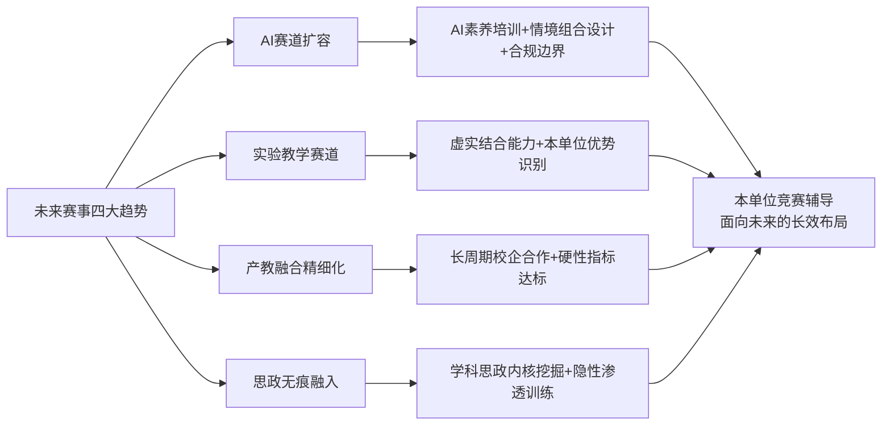

## 8.11 研究局限与对部门辅导工作的总体展望

任何研究都有其局限，本研究亦不例外。坦诚说明研究局限是研究严谨性的体现，也是后续研究改进方向的指引。

**本研究的主要局限**包括：

**第一，资料颗粒度的不均衡性**。创新赛参赛材料的匿名化要求与全文获奖报告的非完全公开性，导致本研究对部分案例的分析深度受限——对资料较为详尽的案例（如《燃烧学》《有机化学》《乡土建筑空间设计》）作较深剖析，对仅有创新点提纲的案例则以共性特征归纳为主。这一资料约束在第四章已多次坦诚说明。

**第二，青教赛节段方案的非完全外公开性**。青教赛参赛节段由现场抽签决定，公开渠道流传的实录视频与文字材料对单一节段的报道较为详尽，但16个节段的整体方案细节通常不外公开。本研究因此采取"以单节段细颗粒度剖析为主、以教师整体教学理念与备赛历程为辅"的策略，对16节段整体性逻辑的把握存在一定限制。

**第三，案例代表性的边界**。本研究选取的案例虽覆盖创新赛七大赛道、青教赛五大组别、不同院校层次与区域，但相对于五届创新赛累计326项一等奖、七届青教赛累计近百项一等奖的总量而言，仍属于"标杆样本研究"。部分非典型一等奖案例的特殊规律可能未被充分纳入。

**第四，时效性的动态变化**。两类赛事的规则、赛道、评分细则在持续演进——第六届创新赛新增人工智能赛道与实验教学赛道、青教赛节段反思预案数量的届次差异等。本研究主要基于第一至第五届创新赛与第三至第七届青教赛的资料，对第六届及之后的最新动态需后续研究持续跟踪。

**第五，组织机制的样本局限**。第六章对一等奖高产院校培育机制的剖析虽已覆盖东中西部不同层次院校，但对"双非"院校与民办高校的培育机制研究相对薄弱，这与高产院校多集中于部属高校与地方头部院校的客观格局相关。

**对后续研究的建议**：

后续研究可在以下方向深化：第一，对第六届创新赛AI赛道与实验教学赛道获奖案例进行专题研究，弥补本研究的届次时效性局限；第二，对"双非"院校与民办高校的差异化突围路径进行深度剖析；第三，对"创新赛+青教赛双料获奖"教师的成长路径进行追踪研究，揭示能力复用培育的具体机制；第四，对辅导部门的实证研究——通过案例研究法对若干典型辅导部门的运作进行跟踪，揭示制度设计与实际效果的对应关系。

**对部门辅导工作的总体展望**：

回望本研究的整体逻辑，从第一章的"制度坐标系与数据底座"出发，经过第二章—第五章的"评分逻辑解构+案例剖析"，到第六章的"院校培育机制对比"，再到第七章的"辅导操作路径"，最终在本章收束于"研究结论与启示"——这一研究链条本质上是从"理解一等奖课程是什么"到"理解一等奖课程如何产生"再到"如何辅导教师冲击一等奖"的认知递进，最终指向"如何使辅导工作成为本单位教师教学发展的长效杠杆"的战略命题。

辅导工作的根本使命不在于追求短期的获奖数字。**获奖只是结果，能力提升才是目的；竞赛只是杠杆，教师发展才是支点；赛事辅导只是路径，立德树人才是归宿**。一所高校的教育质量根本上不取决于它有多少国赛一等奖，而取决于它有多少能在课堂上真正打动学生、激发学生、塑造学生的教师——这正是李蕉、梁思思、郭璐、程楠、赵坤、徐嘉鸿、张青子衿等一等奖获得者背后共同传递的教育情怀。从这一意义上看，国赛一等奖既是教师教学能力的"高光呈现"，也是教师教学发展的"过程检验"，更是高校教育质量的"风向标志"。

部门辅导工作的战略升级，应从"赛事服务窗口"演进为"教师教学发展枢纽"——通过本研究构建的"制度借鉴—操作指引—资源地图"三位一体长效能力建设框架，将一等奖课程的"可学习—可借鉴—可迁移"要素转化为本单位教师专业发展的常态化资源；通过"选拔—培育—参赛—复盘—传承"人才闭环、"校赛—省赛—国赛—转化—日常"成果闭环、"制度—组织—专家—资源—激励"保障闭环的协同运转，将一时的备赛活动升华为持续的能力建设；通过对AI赛道、实验教学赛道、产教融合深化、课程思政无痕融入等未来趋势的前瞻性布局，将辅导工作从"被动应对"升级为"主动引领"。

**最终的辅导哲学回归**：辅导工作不应是教师教学的"代笔者"，而应是教师教学发展的"陪跑者"——尊重每位教师的学科底色、个人风格、学情特点，引导其在借鉴一等奖范式的过程中形成"具有自身辨识度的个性化教学创新"。正如第四章杨达教授的反思——"不能全盘吸收专家建议，否则会丢了自己的特点"——辅导工作的高境界是帮助教师"成为最好的自己"，而非"成为别人的复制品"。

至此，本研究关于创新赛与青教赛全国一等奖课程的探索画上句号，但部门辅导工作的实践之路才刚刚开始。愿本研究构建的认知图谱、案例库、操作工具箱、制度参照能为部门辅导工作的长效化建设提供切实的方向指引，使辅导工作真正成为"以赛促教、以教促学、以学促人"教育本质的有力推动者，使一等奖课程的研究最终归宿于教师教学能力的整体跃升与高校立德树人根本任务的扎实落实。

# 参考内容如下：
[^1]:[关于举办第五届全国高校教师教学创新大赛的通知](https://m.cahe.edu.cn/site/content/17962.html)
[^2]:[第六届全国高校教师教学创新大赛](https://baike.baidu.com/item/第六届全国高校教师教学创新大赛/67593278)
[^3]:[关于举办第六届全国高校教师教学创新大赛的通知](https://www.cahe.edu.cn/site/content/19380.html)
[^4]:[教学|国家级高校教师竞赛100强校 ](https://mp.weixin.qq.com/s?__biz=MzIwMTI1NzkyOA==&mid=2653877366&idx=3&sn=8e2ee672c32bde46f2232b577083076b&chksm=8c65230f25e03a06eeb7315fce33957f41f352789810ed7d6134139b3bba79a2bd28a1732176&scene=27)
[^5]:[第七届全国高校青年教师教学竞赛](https://baike.baidu.com/item/第七届全国高校青年教师教学竞赛/64838412)
[^6]:[第七届全国高校青年教师教学竞赛决赛成功举办 ](https://news.cau.edu.cn/mtndnew/b139c8922e394308b185c49c0585664d.htm)
[^7]:[第七届全国高校青年教师教学竞赛决赛举办](http://www.moe.gov.cn/jyb_xwfb/gzdt_gzdt/s5987/202409/t20240904_1148946.html)
[^8]:[第七届全国高校青年教师教学竞赛的解读与通知 ](https://mp.weixin.qq.com/s?__biz=MzA5NTEwNTM3NA==&mid=2247508845&idx=2&sn=bd7e5414679d3cda32c35ca678a5c05c&chksm=90469b5ca731124ae0ef22ce2f2094feb21e70ffea2b00c85dee0c4688229c6861215cd9160f&scene=27)
[^9]:[第六届全国高校青年教师教学竞赛决赛举办](http://www.moe.gov.cn/jyb_xwfb/gzdt_gzdt/s5987/202304/t20230425_1057138.html)
[^10]:[劳模风采·2024年全国五一劳动奖章|朱桂全:是医者,亦是师者](https://www.workercn.cn/c/2024-05-13/8252198.shtml)
[^11]:[公示-上海交大医学院-工会](https://www.shsmu.edu.cn/gh/info/1075/2903.htm)
[^12]:[闭幕!第五届全国高校教师教学创新大赛总结交流大会在北京理工大学举行](https://m.cahe.edu.cn/site/content/18878.html)
[^13]:[新华网贵州频道:贵州大学在第五届全国高校教师教学创新大赛中创历史最好成绩](https://www.gzu.edu.cn/2025/0905/c22305a257383/page.htm)
[^14]:[https://mp.weixin.qq.com/s?__biz=MzIzNDI0Njg2MQ==&mid=2651419773&idx=1&sn=73a417c65106086b235c54e016014c34&chksm=f28ffba316581f1e30bd99717202eac8b2d8d86d22f4649836a72345ce504c79cd9a83bcc307&scene=27](https://mp.weixin.qq.com/s?__biz=MzIzNDI0Njg2MQ==&mid=2651419773&idx=1&sn=73a417c65106086b235c54e016014c34&chksm=f28ffba316581f1e30bd99717202eac8b2d8d86d22f4649836a72345ce504c79cd9a83bcc307&scene=27)
[^15]:[第三届全国高校教师教学创新大赛-大学生竞赛-赛氪](https://www.saikr.com/vse/46225)
[^16]:[第三届全国高校教师教学创新大赛获奖教师(团队)名单_二等奖_一等奖_课程](https://news.sohu.com/a/715500229_120492088)
[^17]:[回顾| 多项重要名单数据,公布!](https://new.qq.com/rain/a/20230903A05SUQ00)
[^18]:[中国高等教育学会关于公布第四届全国高校教师教学创新大赛获奖教师(团队)名单的通知](https://m.cahe.edu.cn/site/content/17449.html)
[^19]:[关于举办第五届全国高校教师教学创新大赛全国赛的通知(第二轮)](https://cahe.edu.cn/site/content/18872.html)
[^20]:[2025第五届高校教师教学创新大赛大变革——参赛指南(内含现场汇报重点问答)](https://mp.weixin.qq.com/s?__biz=MzA4MjU5NzkyNA==&mid=2688800730&idx=1&sn=5f6506f1bca87faad963d2240e141865&chksm=bb595be122505cf166a355ed4c3b2e5d6fd7e5c7cf0ce832551d5c16ac06e6d1ba08fd63257c&scene=27)
[^21]:[关注!第七届全国高校青年教师教学竞赛即将开赛! ](https://mp.weixin.qq.com/s?__biz=MzI4NjAzNzcwMQ==&mid=2247523121&idx=1&sn=f370a0620937c6d9b5485a5ce33d6118&chksm=ebe1d89bdc96518d48535a3e881c35a5714ac337524c329632f79c6118b84c2a880ab76d870f&scene=27)
[^22]:[第五届青教赛决赛视频(文、理、工)](https://mp.weixin.qq.com/s?__biz=MzU2OTcwOTc3Nw==&mid=2247524080&idx=4&sn=731b7bfdda0c47289ed4d2ade086ac89&chksm=fcf85b4ecb8fd2586383c9562dacbc92b249bd53febeb9b32419c90e77166cd88c740fec320e&scene=27)
[^23]:[南京大学老师在第五届全国高校青年教师教学竞赛决赛荣获佳绩](https://www.163.com/dy/article/FQ9D484T0550A54Z.html)
[^24]:[> 培训详情 ](http://cqpc.ctld.chaoxing.com/trainingactivity/fanya2_info?id=470&typeid=271)
[^25]:[关于举办第四届全国高校教师教学创新大赛全国赛的通知(第一轮) ](https://mp.weixin.qq.com/s?__biz=MzU4NTA2MTYwMA==&mid=2247684696&idx=1&sn=fcdb54eadbf206b67c0b456e91b2d6a2&chksm=fc24778cd542e49d2b7024b493fa7088ac9095b3f760c3d994a0b281b47cc62653dfa8b8fb8e&scene=27)
[^26]:[AI时代,教师如何“突围”?——专访全国高校教师教学创新大赛一等奖得主、“90后青椒”杨婷](https://esfd.shnu.edu.cn/c0/c5/c27573a835781/page.htm)
[^27]:[再传喜报‼️全国一等奖‼️](https://baijiahao.baidu.com/s?id=1808840436315735074&wfr=spider&for=pc)
[^28]:[获奖啦!他们在第四届全国高校青年教师教学竞赛中喜获佳绩](https://static.nfapp.southcn.com/content/201809/03/c1456782.html)
[^29]:[山东省高校青年教师教学比赛评分表 ](https://www.wjx.cn/vm/Os1MiYI.aspx)
[^30]:[一等奖30项!首届全国高校教师教学创新大赛结果公布!](http://baijiahao.baidu.com/s?id=1706724218060037588&wfr=spider&for=pc)
[^31]:[西安交大独获2项一等奖!首届全国高校教师教学创新大赛成绩公布](https://baijiahao.baidu.com/s?id=1706784470479603767&wfr=spider&for=pc)
[^32]:[一等奖63个!第二届全国高校教师教学创新大赛获奖名单出炉](http://www.ecorr.org.cn/news/industry/2022-08-15/185515.html)
[^33]:[中国高等教育学会关于公布第二届全国高校教师教学创新大赛获奖教师(团队)名单的通知](https://chetc.cahe.edu.cn/h/news/news/2022-08-11/2049.html)
[^34]:[中国高等教育学会关于公布第二届全国高校教师教学创新大赛获奖教师(团队)名单的通知](https://www.cahe.edu.cn/site/content/15364.html)
[^35]:[第三届全国高校教师教学创新大赛获奖名单](https://jwc.tjcu.edu.cn/info/1097/1694.htm)
[^36]:[公布!第四届全国高校教师教学创新大赛获奖教师(团队)名单 ](https://mp.weixin.qq.com/s?__biz=MzIxNTI3NjQ1OA==&mid=2653219886&idx=1&sn=dc2b6043544097f2d73bf9f75d901157&chksm=8d4603b4c08b5f8362344894a0f7acba22c6e2e16fe4284741ba0b137b787dda40d24519a198&scene=27)
[^37]:[祝贺!这些教师和高校获奖!](https://baijiahao.baidu.com/s?id=1806138715223146813&wfr=spider&for=pc)
[^38]:[教育部指导,一重磅奖项名单公布](https://m.163.com/dy/article/K7E1ITF805349YKB.html)
[^39]:[文学院教师张慧伦荣获第七届全国高校青年教师教学竞赛一等奖](http://www.wxy.sdnu.edu.cn/info/1043/18525.htm)
[^40]:[第六届全国高校青年教师教学竞赛](https://baike.baidu.com/item/第六届全国高校青年教师教学竞赛/62926068)
[^41]:[第三届全国高校青年教师教学竞赛决赛获奖名单公布](http://www.moe.gov.cn/jyb_xwfb/xw_zt/moe_357/jyzt_2016nztzl/2016_zt15/16zt15_sxjs/201609/t20160905_277732.html)
[^42]:[张志林获第三届全国高校青年教师教学竞赛一等奖](https://news.hrbeu.edu.cn/info/1015/38973.htm)
[^43]:[许琰获第三届全国高校青年教师教学竞赛文科组一等奖](https://www.nwnu.edu.cn/2016/0905/c3338a95490/page.htm)
[^44]:[清华大学教师在第四届全国高校青年教师教学竞赛中获佳绩](https://www.tsinghua.edu.cn/info/1176/27124.htm)
[^45]:[黄沚青 ](https://www.nwu.edu.cn/__local/B/55/9B/698FC6C4B2A8A754A83E6A2263E_3B36F540_8400.doc)
[^46]:[我校教师荣获第四届全国高校青年教师教学竞赛一等奖](https://www.qztc.edu.cn/xcb/2018/0901/c1836a223048/pagem.psp)
[^47]:[储继迅老师荣获第四届全国高校青年教师教学竞赛理科组一等奖第一名](https://news.ustb.edu.cn/info/1167/33242.htm)
[^48]:[牛!全国一等奖!交大刘晓晶老师闪耀全国青教赛工科组!](http://baijiahao.baidu.com/s?id=1682055381202071094&wfr=spider&for=pc)
[^49]:[喜报!喜报!又是全国第一名!](http://baijiahao.baidu.com/s?id=1681965891130277360&wfr=spider&for=pc)
[^50]:[第六届全国高校青年教师教学竞赛落幕 五名教师折桂](https://baijiahao.baidu.com/s?id=1764042101762271648&wfr=spider&for=pc)
[^51]:[一等奖揭晓!第六届全国高校青年教师教学竞赛决赛举办](https://www.thepaper.cn/newsDetail_forward_22852027)
[^52]:[我省高校在第四届全国高校教师教学创新大赛再创佳绩 ](https://www.hlj.gov.cn/hlj/c107857/202408/c00_31756611.shtml)
[^53]:[我校在第四届全国高校教师教学创新大赛再获佳绩](https://www.hrbmu.edu.cn/info/1018/6761.htm)
[^54]:[喜报!创造历史!上大选手荣获全国高校青年教师教学竞赛思政专项组一等奖!](https://cfd.shu.edu.cn/info/1011/2779.htm)
[^55]:[转载丨5位思政课教师一等奖!第七届全国青教赛](https://mksxy.shzu.edu.cn/2024/0831/c1803a207383/page.htm)
[^56]:[祝贺!南京航空航天大学,全国一等奖+2!](https://baijiahao.baidu.com/s?id=1806329181654157800&wfr=spider&for=pc)
[^57]:[我校在全国高校教师教学创新大赛中再获佳绩](https://www.nuaa.edu.cn/2025/0822/c852a381493/page.htm)
[^58]:[TOP100!全国高校教学创新排名发布 ](https://learning.sohu.com/a/932891256_120492088)
[^59]:[原创国家级教师奖项公布!全国高校哪家强](https://roll.sohu.com/a/719471057_121294)
[^60]:[我校三位教师在第五届全国高校教师教学创新大赛中斩获国奖 ](https://news.jnu.edu.cn/content/202509/01/c5127.html)
[^61]:[青教赛-清华大学](https://www.tsinghua.edu.cn/info/1255/103976.htm)
[^62]:[祝贺!北京高校27个教师(团队)获奖](https://mp.weixin.qq.com/s?__biz=MzAwMzAyOTI1Mg==&mid=2653169852&idx=1&sn=976e1fce65cfc9031e23be558f36b2d3&chksm=80e9ae61f073ae9a6ce3419bbef58e2b872a0243ec4d57186d8e89e0d1b71a63d08bec6585cc&scene=27)
[^63]:[西南交大五位教师在第五届全国高校教师教学创新大赛中获奖](https://maths.swjtu.edu.cn/info/1149/21624.htm)
[^64]:[我省在第五届全国高校教师教学创新大赛上喜获佳绩](http://jyt.gansu.gov.cn/jyt/c120301/202508/174194563.shtml)
[^65]:[22所民办高校,斩获国家级奖项](https://www.163.com/dy/article/K7D8CFRF05218435.html)
[^66]:[第三届全国高校教师教学创新大赛落幕 ](http://www.fj.gov.cn/xwdt/mszx/202308/t20230824_6234703.htm)
[^67]:[历史突破!我校金思丁老师获得全国高校青年教师 教学竞赛一等奖!](https://www.aao.cdut.edu.cn/info/1172/6393.htm)
[^68]:[喜报!我校任利教师团队荣获全国教师教学创新大赛一等奖](http://baijiahao.baidu.com/s?id=1775317612001919375&wfr=spider&for=pc)
[^69]:[广东唯一!华师老师勇夺全国一等奖!](http://ctld.scnu.edu.cn/a/20201030/1242.html)
[^70]:[历史最好成绩,全国二等奖,厉害了张东培老师!](https://news.cqjtu.edu.cn/info/1021/50886.htm)
[^71]:[第六届全国高校青教赛圆满落幕,这些老师喜获佳绩!](https://sghexport.shobserver.com/html/baijiahao/2023/04/29/1016855.html)
[^72]:[附件7 第三届全国高校教师教学创新大赛评分标准 一、课堂教学实录视频评分表(40分)](https://www.bbc.edu.cn/_upload/article/files/f3/3d/84d25ebb429bb0d34af075003c03/0d79817b-ff06-48bc-b1b9-f548be3ad604.doc)
[^73]:[2024 年度山东省普通高校教师教学创新大赛 评分标准(第 1-5 组)](https://today.hitwh.edu.cn/_upload/article/files/08/4b/fe2e25b2463b84a209dec75a55b9/07972870-cc1a-4f94-8f07-b1ef42b4560e.pdf)
[^74]:[【课堂实录攻略】教学创新大赛课堂实录40分如何拿到手](https://mp.weixin.qq.com/s?__biz=MzA5NTEwNTM3NA==&mid=2247530044&idx=1&sn=0c6af6c6fd7586c70f1e3b568519dd13&chksm=91d3efd498edd9e59b5a04bd37b536ecf3d21632c3f923a02712eacd791159b25191b1cfd32b&scene=27)
[^75]:[满分攻略:如何在教学创新大赛中获得40分课堂实录高分 ](https://mp.weixin.qq.com/s?__biz=MzIzNDI0Njg2MQ==&mid=2651399676&idx=3&sn=935718e92f4539caea379a571fb5db28&chksm=f2000c47b484ec3e32190c269ffdb7bbce86df51bc84824e57b04ffaef68aff38b12e7ac8e95&scene=27)
[^76]:[第三届教学创新大赛权威赛制解读 ](https://mp.weixin.qq.com/s?__biz=MzIxNTI3NjQ1OA==&mid=2653213949&idx=2&sn=c8f1a953fb35cf5f6538815dd6c4d48f&chksm=8c4aba38bb3d332ecef5493bcdf069705b9e9866c500db88c280e489e9bf7175d3aab17d3376&scene=27)
[^77]:[【教育思想观念大讨论】教务处举办教师教学创新大赛备赛经验分享会](https://www.hsu.edu.cn/30/f7/c98a209143/page.htm)
[^78]:[参赛必备指南 | 2025年第五届高校教师教学创新大赛大变革解析,现场汇报重点问答全攻略 ](https://mp.weixin.qq.com/s?__biz=MzA5NTEwNTM3NA==&mid=2247523793&idx=1&sn=381fd17c271e1de70116dff9e2c794ac&chksm=91b075aa36387a99d18e00d66452ae1579d770b02e4728f364ba5f112b5b6655876059df85f6&scene=27)
[^79]:[一等奖模板 | 全国第六届高校教师教学创新大赛获奖攻略](https://mp.weixin.qq.com/s?__biz=MzA5NTEwNTM3NA==&mid=2247530028&idx=1&sn=2e53a6c36cd620016ea2b11b47f66ae2&chksm=91aaa2e301ef5ebc770ffa9cdb70f04fcd564f94e49b67c6580afcef889d0c08cd023d140cde&scene=27)
[^80]:[全国高校教师教学创新大赛教学创新成果报告(国一等奖) ](https://mp.weixin.qq.com/s?__biz=MzA5NTEwNTM3NA==&mid=2247523913&idx=1&sn=786039440b7b6cddf69ff191bc3e22ad&chksm=915510faf7b8164a0418bf06cf7acdac5d71a3a95662ceb35783297be886ccfd83a783f77400&scene=27)
[^81]:[干货分享||全国高校教师教学创新大赛教学创新成果报告(国一等奖) ](https://mp.weixin.qq.com/s?__biz=MzA4MjU5NzkyNA==&mid=2688776656&idx=1&sn=09a12a4590e05c65aef7fb4d524c06ea&chksm=bbfef327ff4afa82f8fabae60add89efe5c98eb22cc4f7dd32ec5b673ce6f43469112af7f73a&scene=27)
[^82]:[「教学创新大赛」国赛一等奖教学创新案例](https://baijiahao.baidu.com/s?id=1800794511045233271&wfr=spider&for=pc)
[^83]:[我校教师在第五届全国高校教师教学创新大赛中荣获一等奖](http://jwc.hpu.edu.cn/info/1032/3281.htm)
[^84]:[建院75周年丨吉大一院教授朴美花荣获第四届全国高校教师教学创新大赛一等奖](https://www.jdyy.cn/index.php?m=home&c=View&a=index&aid=74378)
[^85]:[全国高校教师教学创新大赛教学创新成果报告(国一等奖) ](https://mp.weixin.qq.com/s?__biz=MzU0NjM1Mzk5NQ==&mid=2247494434&idx=3&sn=80aab940744a7cb55d96a0d2df67ccf0&chksm=fb5c4d06cc2bc41057ad23c3beda8e07010e5732f2bf0df918096e66c56f0d40a7b3d036c8f7&scene=27)
[^86]:[全国高校教师教学创新大赛教学创新成果报告(国一等奖) ](https://mp.weixin.qq.com/s?__biz=MzA5NTEwNTM3NA==&mid=2247508713&idx=1&sn=3bebf4c884a9206eca7a4ae68a31eefb&chksm=90469ad8a73113ceefa3b20a0f8a24d8052d25a644ead96d2ce14453cc0fe644ee0913a1bdfb&scene=27)
[^87]:[南阳农业职业学院创新虚拟仿真教学资源共建共享模式 打造数字教育新方式](http://education.news.cn/20260330/cbec5d23213f4f27b7d3347ef5a2ee1b/c.html)
[^88]:[PPT | 全国高校教师教学创新大赛一等奖汇报及经验分享:6E教学模式的深度实践 ](https://mp.weixin.qq.com/s?__biz=MzA5NTEwNTM3NA==&mid=2247523816&idx=2&sn=d17caf8acd1dbfc49c24002d50653f13&chksm=917e35ffdbbc99543650456fc916922b8bfb8bb3281275f788a5ea4e9cfc4cbf81996e851539&scene=27)
[^89]:[数字赋能、以赛促教、创新育人——我院在教师教学技能竞赛中取得突出成绩](https://www2.ncwu.edu.cn/tumu/info/1164/4228.htm)
[^90]:[江西工程学院教学团队荣获2025年虚拟现实教学应用创新大赛三等奖](https://jx.cri.cn/20251201/74677822-c6c6-935c-7338-ffacfc418321.html)
[^91]:[关于举办浙江大学第六届教师教学创新大赛产教融合、人工智能和实验教学赛道赛事的通知 ](https://itc.zju.edu.cn/ydxw/2026/0227/c5075a3135570/pagem.psp)
[^92]:[获奖案例|AI赋能教学,教师人工智能应用案例](https://mp.weixin.qq.com/s?__biz=MzA5NTEwNTM3NA==&mid=2247530655&idx=2&sn=b4862361b8d36a2767f79f978b01bede&chksm=9139a4f89d46d20a536b3c0ace5d50010efc213fa9dacbb0f961d7054803663452d839ad294f&scene=27)
[^93]:[广东东软学院教师在2026全国高校软件工程教育大会荣获教学案例特等奖](https://baijiahao.baidu.com/s?id=1863611828316011363&wfr=spider&for=pc)
[^94]:[我校教师教学案例在全国高校人工智能教育大会上斩获一等奖](https://news.tute.edu.cn/info/1003/39960.htm)
[^95]:[『以赛促教 赛教融合』第四届全国高校教师教学创新大赛获奖教师风采展示 ](https://mp.weixin.qq.com/s?__biz=MzAxNzQyMjIyOA==&mid=2247608663&idx=1&sn=18b3613b87e8564694ba8d6a2ecbcd76&chksm=9a800c6b6f4f5e5c88ebd15a801d99ccd99c12ed38c72e8d3466add0d8e56ffdd20060274671&scene=27)
[^96]:[教务处:关于举办“第六届全国高校教师教学创新大赛”校赛的通知](http://tiangongjxyj.chaoxing.com/showNewsFulltext?id=224&newstype=25&currentPage=0&new_workbenches=0)
[^97]:[关于组织开展第六届河北大学教师教学创新大赛实验教学赛道比赛的通知](https://www.hbu.edu.cn/pgb/info/1183/4907.htm)
[^98]:[以赛促教 以赛育人——参加第六届全国高校青教赛有感 ](https://mp.weixin.qq.com/s?__biz=Mzg5MDU2MTM1NQ==&mid=2247489354&idx=2&sn=9171c780ad3fef5c763002768f2d1f58&chksm=cfdbe16ef8ac687847c85eeb398eefa9747d8453637b8d520266a086f464ca0a2f8f958cc04f&scene=27)
[^99]:[关于举办河北大学第十一届青年教师课堂教学大赛决赛的通知](https://www.hbu.edu.cn/pgb/info/1183/3506.htm)
[^100]:[关于开展第七届西京学院青年教师教学竞赛的通知](https://jwc.xijing.edu.cn/info/1097/5453.htm)
[^101]:[第六届全国青教赛经验分享专题](https://activity.sdut.edu.cn/event/140)
[^102]:[拆解青教赛一等奖:课堂教学设计的逻辑与技巧](https://mp.weixin.qq.com/s?__biz=MzU2MTU3NjAwMQ==&mid=2247710163&idx=3&sn=68ab8c1dcbbeadf2e42d32578fcd72b2&chksm=fd33fc3f5b0048c7198c75b4481b353baed2ea94b0f3e277862e7758b91a6a1fd5fcca96332d&scene=27)
[^103]:[青教赛一等奖好在哪里?详细拆解“课堂教学”环节](http://jky.sneducloud.com/webArticleAction/toNewsInformPage.jhtml?uuid=68f7e0d238994cdd80eb)
[^104]:[公共管理学院2024年青年教师教学竞赛通知](https://ggxy.hzau.edu.cn/info/1045/6931.htm)
[^105]:[拆解青教赛一等奖:课堂教学设计的逻辑与技巧](https://mp.weixin.qq.com/s?__biz=MzA4MjU5NzkyNA==&mid=2688801880&idx=3&sn=26ea2aeaf24f2274c250ecabc8f49af6&chksm=bbc73c925bfbcf06bb74d0a36ff1243748991e6032fcad990dd20f15219b98181d3e300377af&scene=27)
[^106]:[竞赛攻略 | 第七届全国高校青年教师教学竞赛参赛材料准备指南 ](https://mp.weixin.qq.com/s?__biz=MzIzNDI0Njg2MQ==&mid=2651388128&idx=4&sn=b1310821960a7338f6c8cfd96f6fbd7e&chksm=f273dcc43a9e0d66b8d793739dbebc24b24f8fe0e1ae1dc31132c12f1919de30e68c42ece9fd&scene=27)
[^107]:[化学与材料工程学院举办2025年度青年教师教学竞赛](http://chem.jiangnan.edu.cn/info/1059/9225.htm)
[^108]:[关于第六届全国高校青教赛国赛一等奖获得者经验分享专题培训会的通知](https://jwch.sdut.edu.cn/2023/0606/c5200a487956/page.htm)
[^109]:[祝贺我实验室学术骨干周屈兰教授荣获“首届全国高校教师教学创新大赛”一等奖 ](https://mp.weixin.qq.com/s?__biz=MzI0MDc0ODg4Ng==&mid=2247485935&idx=1&sn=9328ac3fd9de5ae1ae655789c1e59dc3&chksm=e91759d6de60d0c0d96a6fd629af67724dfb7ddf32f1f78fc7c9eeb47f9c9644d8c6ed285c39&scene=27)
[^110]:[案例分享 | OBE理念与多元化评价体系:提升高校教学质量的关键 ](https://mp.weixin.qq.com/s?__biz=MzU2MTU3NjAwMQ==&mid=2247689391&idx=3&sn=5a71f6b3d436827ea0b93902f0b4b0db&chksm=fc7b0581cb0c8c9769d74d57c60a63f94884de2d95f938b6b0d366780b81a34b9f3e17306ba0&scene=27)
[^111]:[西安交通大学周屈兰开展创新成果报告撰写工作坊](https://jfjp.upc.edu.cn/2024/0527/c7835a432512/page.htm)
[^112]:[国家级一等奖!我院教师在第四届全国高校教师教学创新大赛再创佳绩 ](https://mp.weixin.qq.com/s?__biz=MzI3ODY2ODM0NA==&mid=2247504928&idx=1&sn=506b648602e4fad98d28973ff60b03a2&chksm=eb51e177dc26686131ee491224cf716d45f50e2c06e0c38f3916fcc3e96a4501f5b360ef7c88&scene=27)
[^113]:[2项全国一等奖!哈工程教师再创佳绩](https://www.my399.com/p/362531.html)
[^114]:[祝贺!我院刘志林教授入选黑龙江省教学名师!](http://cisse.hrbeu.edu.cn/info/1219/5606.htm)
[^115]:[喜报!第四届全国高校教师教学创新大赛(黑龙江赛区)获奖+4](http://pnec.hrbeu.edu.cn/info/1002/8341.htm)
[^116]:[提升教师教书育人能力 塑造新时代“工程金师”](https://news.hrbeu.edu.cn/info/1395/82941.htm)
[^117]:[我省高校在第四届全国高校教师教学创新大赛再创佳绩 ](https://jyt.hlj.gov.cn/jyt/c110478/202408/c00_31758229.shtml)
[^118]:[我校在第四届全国高校教师教学创新大赛再获佳绩](https://www.hrbmu.edu.cn/xyh/info/1044/2987.htm)
[^119]:[哈医大一院教师在第四届全国高校教师教学创新大赛中再创佳绩](http://www.hlj.chinanews.com.cn/hljnews/2024/0806/138326.html)
[^120]:[校史突破!我院黄河教授团队荣获第五届全国高校教师教学创新大赛一等奖!](https://mp.weixin.qq.com/s?__biz=MzA4NzAyNDYyOA==&mid=2652769975&idx=1&sn=ab48f2f9c23a9628f8c1434744fc2557&chksm=8a117b66270f63ac95992b84aa42a82ce3e806ec0429eaaac0c6b008faf9196f276213e53c07&scene=27)
[^121]:[祝贺!教学界的“奥林匹克”|全国一等奖第一名!](https://mp.weixin.qq.com/s?__biz=MzA3NDIxNzgzMg==&mid=2650854483&idx=1&sn=8afcc5edcac35c5bd2ae15cb26a542a5&chksm=85dc007827c6af37863aa713d31dc47713ee7775ee326d928d65dbaedb19f44e4efa91c41989&scene=27)
[^122]:[教学创新星榜样⑩ | 第三届全国高校教师教学创新大赛课程新农科一等奖南京农业大学刘宇婧](https://mp.weixin.qq.com/s?__biz=Mzg4NTExOTg4OA==&mid=2247577938&idx=2&sn=7058e379176720fcb92ff6e2e7229f84&chksm=ceaafd3868cfcb5b091d46785677da0bac30118ad715396929f297406048fd076ddfe6773c11&scene=27)
[^123]:[深藏Blue!嘉兴学院“白姐姐”团队勇夺首届全国高校教师教学创新大赛最高奖 ](https://www.eol.cn/zhejiang/zhejiang_news/202108/t20210802_2142303.shtml)
[^124]:[白春苏](https://baike.baidu.com/item/白春苏/63125179)
[^125]:[贵州大学东盟研究院院长杨达教授荣获第五届全国高校教师教学创新大赛一等奖](http://asean.gzu.edu.cn/2025/0825/c21317a256517/page.htm)
[^126]:[杨达:以战略思维破教学之局,凭赤诚之心育时代新人](http://news.gzu.edu.cn/2025/0908/c18506a257586/page.htm)
[^127]:[喜讯!我院杨达副院长荣获第五届全国高校教师教学创新大赛一等奖](http://spa.gzu.edu.cn/_t428/2025/0822/c8646a256361/page.htm)
[^128]:[喜报:我院教师荣获全国高校教师教学创新大赛一等奖创历史佳绩](http://word.baidu.com/noteview/1bc351097d563c1ec5da50e2524de518964bd32d.html)
[^129]:[同济大学经济与管理学院教师荣获全国高校教师教学创新大赛一等奖创历史佳绩](http://word.baidu.com/noteview/be8024ee6694dd88d0d233d4b14e852458fb3908.html)
[^130]:[我校石礼伟教授团队荣获首届全国高校教师教学创新大赛一等奖](https://jwb.cumt.edu.cn/info/1041/5765.htm)
[^131]:[材料与物理学院石礼伟教授入选江苏省教学名师](https://smsp.cumt.edu.cn/87/62/c18888a690018/page.htm)
[^132]:[石礼伟 ](https://www.ryjiaoshi.com/teacher/details/319)
[^133]:[同济大学再创辉煌!全国高校教师教学创新大赛夺得多项大奖 ](https://www.sohu.com/a/926682290_121956425)
[^134]:[上海高校第一!祝贺同济! ](https://www.sohu.com/a/925882611_121106832)
[^135]:[同济大学获第四届全国高校教师教学创新大赛一等奖](https://news.tongji.edu.cn/info/1002/88129.htm)
[^136]:[全国一等奖!同济大学,创历史新高!](https://baijiahao.baidu.com/s?id=1806249121057912818&wfr=spider&for=pc)
[^137]:[教学创新星榜样① | 第四届全国高校教师教学创新大赛课程思政一等奖同济大学周征宇](https://mp.weixin.qq.com/s?__biz=Mzg4NTExOTg4OA==&mid=2247577816&idx=1&sn=50eed735ac1e37df9a1dcf5ed6af8f31&chksm=cecf078b96a8af11718c51c3c3a1bb66709b08f49fd96edb9bbea614705b27ed53e19ce64e59&scene=27)
[^138]:[教学创新星榜样⑨ | 第三届全国高校教师教学创新大赛课程思政一等奖华南师范大学王颖](https://mp.weixin.qq.com/s?__biz=Mzg4NTExOTg4OA==&mid=2247577921&idx=3&sn=663b7e56a51bafbdd116614b2dfbdd1b&chksm=ceb2538639585416f9b0c805e31d605dbda57b29a853503816f368eef0d21b626a145467ae3d&scene=27)
[^139]:[曹敏惠](http://s.enaea.edu.cn/h/gxqnjsnlts/skms/jcs/2024-07-19/67223.html)
[^140]:[这场赛事,华中农大特等奖+6,一等奖+3 ](https://mp.weixin.qq.com/s?__biz=MjM5NTIwMDgyMQ==&mid=2653524508&idx=1&sn=0ffff5e481731d20cd3b38894221aa19&chksm=bcf5a86e332e1820d648f5ab1c8b1b8bc78f01be0d889adda75ee8ac54cc8dfac01561bc350f&scene=27)
[^141]:[课程思政 | “唤醒三部曲”催化专业课堂的“三个反应” ](https://www.sohu.com/a/390303772_278520)
[^142]:[曹敏惠教授应邀开展教学创新与HI-AI协同专题培训](https://chem.xjnu.edu.cn/info/1045/4583.htm)
[^143]:[“HI+AI”协同“三醒三思”混合式教学设计与实践](https://mp.weixin.qq.com/s?__biz=Mzg5NDE4MTA2Ng==&mid=2247555738&idx=1&sn=5538e01d69c760782f01b5449953ead5&chksm=c17d67a583391f67a250fbc572e2cbd366a41ca7792b2afe9db84d9f4a2e732bae0ade86be9e&scene=27)
[^144]:[我校邀请西安交通大学周屈兰教授做课程思政专题报告](http://dwjs.www.sust.edu.cn/info/1004/2045.htm)
[^145]:[我校教师再获全国高校教师教学创新大赛一等奖](https://fzghc.zjxu.edu.cn/info/1008/4652.htm)
[^146]:[嘉兴大学教师获全国高校教师教学创新大赛一等奖](https://cj.sina.com.cn/articles/view/5895814239/15f6afc5f020019p4s)
[^147]:[大赛优秀案例分享丨俞梅芳团队:“真题实做”项目化全流程教学创新与实践——以《乡土建筑空间设计》为例 ](https://mp.weixin.qq.com/s?__biz=MzA5ODI3OTA2MQ==&mid=2652523008&idx=1&sn=fa350ecb11ea239e10bf0c8aedf452f3&chksm=8b7ae1fabc0d68ecf3fd64bb2dd932593d29f66617a7f05059d2522b22ee2f856971ed396e80&scene=27)
[^148]:[秀洲这个村和高校联手,斩获全国大赛一等奖!](https://mp.weixin.qq.com/s?__biz=MzAxOTA3NTA1MA==&mid=2651485469&idx=1&sn=efee383f6117718b4ce31ac8f66cffe5&chksm=817935f0f645c902d9be36e8711d041effabdfbceab2f42f5c366b3237cbd6ad9ac48e5750a1&scene=27)
[^149]:[【设院动态】喜讯!我院俞梅芳老师荣获浙江省第四届高校教师教学创新大赛特等奖](https://sjxy.zjxu.edu.cn/info/1290/8399.htm)
[^150]:[清华大学梁思思获第六届全国高校青年教师教学竞赛文科组一等奖第一名](https://www.tsinghua.edu.cn/info/1176/103168.htm)
[^151]:[祝贺!清华大学梁思思获第六届全国高校青年教师教学竞赛文科组一等奖第一名](https://mp.weixin.qq.com/s?__biz=MzA3NDU3MDc3OQ==&mid=2456611052&idx=1&sn=62c79bfcd6a6bfcbf80e13238a62f82a&chksm=88e58598bf920c8e8aefdb6a4fd32cf82c8a46d4c675c7eb74e445640cbf1aaa1b99ac059b66&scene=27)
[^152]:[青教赛一等奖得主郭璐:课堂内外,师生之间,一点灵明-清华大学](https://www.tsinghua.edu.cn/info/3045/114858.htm)
[^153]:[清华报刊](https://qhbk.tsinghua.edu.cn/xqh/2024-11/22/content_99183467.html)
[^154]:[劳模风采·全国五一劳动奖章|梁思思:清华园里的城市设计师](https://baijiahao.baidu.com/s?id=1826614444153776943&wfr=spider&for=pc)
[^155]:[清华园里的城市设计师](https://www.tsinghua.edu.cn/info/1182/117554.htm)
[^156]:[劳模风采·全国五一劳动奖章|梁思思:清华园里的城市设计师 ](https://gov.sohu.com/a/870962748_257321)
[^157]:[国赛一等奖都在用的思政元素,课堂融入得太好了! ](https://mp.weixin.qq.com/s?__biz=MzU2MTU3NjAwMQ==&mid=2247698925&idx=3&sn=9914267962414c267d3ed1529eece2c0&chksm=fc7b28c3cb0ca1d5b7bbf0ab5b52850b5c796ef022ecaf6bb3c652f222a77c21a4b526261fbb&scene=27)
[^158]:[郭璐获北京高校第十三届青年教师教学基本功比赛一等奖](https://www.arch.tsinghua.edu.cn/info/swiper/2426)
[^159]:[喜报!我院周峰老师获第六届全国高校青年教师教学竞赛一等奖](http://www.maths.sdnu.edu.cn/info/1011/2011.htm)
[^160]:[山东师范大学博士周峰来我院作报告 ](https://math.hgnu.edu.cn/2023/1017/c3597a93444/page.htm)
[^161]:[周峰](https://baike.baidu.com/item/周峰/64356514)
[^162]:[周峰](http://www.maths.sdnu.edu.cn/info/1811/29061.htm)
[^163]:[赵维殳](https://baike.baidu.com/item/赵维殳/66802958)
[^164]:[交大“青椒”,再创历史! ](https://mp.weixin.qq.com/s?__biz=MzI3ODMyNTkwOQ==&mid=2247511925&idx=1&sn=f97fce01d01342c2a9a93d4cd94cb516&chksm=ea4fb0bedb8cdd71fd772e2ca6b76536aded3879a10e602a0ef38a2e02a9a11950cf686375cd&scene=27)
[^165]:[青教赛赋能课程建设—第十三期“生科乐教”工作坊圆满落幕](https://mp.weixin.qq.com/s?__biz=MzI3NTM1OTQxMA==&mid=2247540145&idx=1&sn=e1da8680b3dce44ff73da46f194ad8e0&chksm=ead6de863c3087001edbed43c0c1adc0df945bfed1bf856d9bf1aec4416433d759b660f7d2aa&scene=27)
[^166]:[首页-上海交通大学生命科学技术学院](https://life.sjtu.edu.cn/teacher/weishuzhao)
[^167]:[风采人物](https://gh.sjtu.edu.cn/Article/18/page/1)
[^168]:[恭喜!川大医科获一等奖第一名,教育部公布重要奖项](https://mp.weixin.qq.com/s?__biz=MzUyMDk2MzMxNA==&mid=2247607851&idx=2&sn=00fe92bfdcf513917db5db5034bfa8b0&chksm=f9e133b6ce96baa08cd706ed979d7df85009a7522a5e0b340a4d90d6e65c477c29aea841af03&scene=27)
[^169]:[离散型随机变量的数学期望](https://www.workercn.cn/c/2025-05-22/8314577.shtml)
[^170]:[刷新历史成绩!](http://news.cyol.com/gb/articles/2023-05/10/content_xaN5bgsV6l.html)
[^171]:[上海市青教赛特等奖,+1! ](https://mp.weixin.qq.com/s?__biz=MzU5MTE1MDg4OQ==&mid=2247497586&idx=1&sn=c547afe40aaf88f7412793c703c7d306&chksm=fe31dd34c946542276eb4ccb62a477ea0e4b958e0e8a500b148dd7330cbd90c183cb301da70b&scene=27)
[^172]:[高晓沨:“教、竞、研”的有机融合者 ](https://gh.sjtu.edu.cn/Article/view/4680)
[^173]:[高晓沨](https://baike.baidu.com/item/高晓沨/64356442)
[^174]:[劳模风采·全国五一劳动奖章|高晓沨:笃教乐研,让每颗“星”都熠熠生辉](https://new.qq.com/rain/a/20240918A04J0X00)
[^175]:[恭喜!第一!程楠老师! ](https://mp.weixin.qq.com/s?__biz=MzA3MzM3MTUxOQ==&mid=2651227449&idx=1&sn=ada61966a2329e02252fa9f5c9d45317&chksm=85669ab5a038a4196b7e328e4ea04fd40daf3557828273cbd6b2881aae043a57ed9fa02ace1f&scene=27)
[^176]:[食品学院程楠荣获全国青教赛工科组一等奖第一名](https://spxy.cau.edu.cn/art/2024/9/3/art_51297_1035720.html)
[^177]:[第七届青教赛(工科组)一等奖参赛视频+逐字稿分享(五) ](https://mp.weixin.qq.com/s?__biz=MzU2MTU3NjAwMQ==&mid=2247692066&idx=4&sn=7604144e02ed8ef64fdd0af460fecef6&chksm=fc7b0e0ccb0c871a4f639069c2612178c742fbae8b9a00f56aab74470d8f3104a5d867128e7d&scene=27)
[^178]:[我校三名先进个人荣获全国和省级五一劳动奖章](https://scu.edu.cn/info/1207/28276.htm)
[^179]:[夺得第一名!川大这位青年教师的秘诀是……](https://m.thepaper.cn/newsDetail_forward_20223999)
[^180]:[青教赛一等奖的教学设计案例,附详细视频解析](https://baijiahao.baidu.com/s?id=1822904245133433540&wfr=spider&for=pc)
[^181]:[浙大4名教师在全国青教赛中获佳绩 ](https://www.zju.edu.cn/2023/0428/c75800a2751287/pagem.htm)
[^182]:[建功三尺讲台 培育时代新人 ](https://www.zju.edu.cn/2023/0505/c75820a2752628/pagem.htm)
[^183]:[微信公众平台](https://mp.weixin.qq.com/s?__biz=MzI0MDgyMDk3OQ==&mid=2247509231&idx=1&sn=6ae928349f556d8bc9a198762f41677f&chksm=e9161373de619a657f0be013cf6f56d37aae147e92e4c7c2bddaef4fb99e12390942818d31c7&scene=27)
[^184]:[马克思主义基本原理获奖课堂实录观摩与研讨 ——马克思主义基本原理教研室召开2023年秋季学期第三次集体备课会](https://mksxy.dgut.edu.cn/info/1034/6171.htm)
[^185]:[青教赛《马克思主义基本原理》教学阐释+片段教学 ](https://jxcj.xujc.com/2025/0327/c80a158969/page.htm)
[^186]:[理论之光|赵坤:如何上一堂走心的思政课 ](https://mp.weixin.qq.com/s?__biz=MzI0MDgyMDk3OQ==&mid=2247517221&idx=3&sn=97035c145318771564390685fdc500b4&chksm=e91633b9de61baaf9d39e18c2b639d63f002c4ebdd81b19285db6b2fbd11ad007fc2885da97b&scene=27)
[^187]:[徐嘉鸿荣获第七届全国高校青年教师教学竞赛一等奖第一名](https://gh.whu.edu.cn/info/1047/10031.htm)
[^188]:[我校教师徐嘉鸿荣获第七届全国高校青年教师教学竞赛一等奖第一名 ](https://news.whu.edu.cn/info/1013/464557.htm)
[^189]:[徐嘉鸿](https://marx.whu.edu.cn/info/1361/38801.htm)
[^190]:[马克思主义学院教师再度斩获全国高校思政课教学展示活动特等奖](https://marx.whu.edu.cn/info/1211/36631.htm)
[^191]:[喜报!创造历史!上大选手荣获全国高校青年教师教学竞赛思政专项组一等奖!](https://jwb.shu.edu.cn/info/1569/312354.htm)
[^192]:[学院定制--马克思主义学院举办“思政课教师教学能力提升” 专题培训](https://pgb.hbu.cn/home/show?id=f9863165-d415-41bd-bb31-7b1a565218ca)
[^193]:[守初心、建品牌,把好立德树人方向盘——山东师范大学“四力”支持体系助力学校高质量发展](https://baijiahao.baidu.com/s?id=1786674854801968639&wfr=spider&for=pc)
[^194]:[光明日报报道我校推动教学创新,赛教融合培育高素质应用型人才](https://www.xmut.edu.cn/info/1040/16412.htm)
[^195]:[关于第六届北京高校教师教学创新大赛北京航空航天大学选拔工作的通知](https://jiaowu.buaa.edu.cn/info/1017/8750.htm)
[^196]:[上海高校第一!祝贺同济!](https://mp.weixin.qq.com/s?__biz=MzA4NzIwNjM5Mw==&mid=2651606952&idx=1&sn=ea6e01495cbd9525a47b0d429b9ccfa2&chksm=8a977cfc624869f80f7b815ac16ddb02ba198c5c3eaa9403308b1873eda84c34531345279fbc&scene=27)
[^197]:[“创新大赛辐射系列”教师教学创新工作坊第三场主题活动举办](https://www.jnu.edu.cn/2024/1223/c2623a828437/page.htm)
[^198]:[本科生院教师发展中心](https://cffd.jnu.edu.cn/)
[^199]:[关于“第十二届暨南大学本科课程教学竞赛”暨“第六届全国高校教师教学创新大赛校内选拔赛”第二环节具体事项的通知](https://zhjw.jnu.edu.cn/2025/1225/c7164a848585/page.htm)
[^200]:[部门概况](http://ctld.xjtu.edu.cn/bmgk.htm)
[^201]:[李远康:聚力保障教学竞赛创佳绩,数智赋能教改创新促提升](https://mp.weixin.qq.com/s?__biz=MzUxMTMzODMzOQ==&mid=2247496981&idx=1&sn=fb2213803de621755fdea7dcc686f36c&chksm=f83242fc306c680e2c9947ebf04592ca5a9cf0463aa9e025c02d13e11b6361d45e542e2e2c7b&scene=27)
[^202]:[西安交大28项成果获2025年陕西省高等教育教学成果奖 ](http://news.xjtu.edu.cn/info/1002/231440.htm)
[^203]:[2024 年南京航空航天大学教师教学创新 大赛实施方案](http://cfd.nuaa.edu.cn/_upload/article/files/b8/4c/1db7f2314b84bb1a93272f83c663/e2021ebc-4555-46e4-849f-63bf4c50970a.pdf)
[^204]:[以赛赋能 以创提质 ——长江大学教师教学创新大赛典型经验做法](https://www.hahe.org.cn/html/1/xuehuidongtai/586.html)
[^205]:[学校举办教学创新大赛备赛管理经验交流会](https://www.hrbmu.edu.cn/info/1096/8482.htm)
[^206]:[上海交通大学举行2024年教师教学竞赛颁奖仪式暨2025年教师教学竞赛启动会](https://news.sjtu.edu.cn/jdyw/20250410/209092.html)
[^207]:[华东师大青年教师在第七届上海高校青教赛上喜获佳绩 ](https://www.ecnu.edu.cn/info/1094/72012.htm)
[^208]:[我校举办青教赛备赛专题培训](https://mp.weixin.qq.com/s?__biz=MjM5NjA2MDEyMg==&mid=2674253043&idx=3&sn=168edd50ac56919eaeb371dab2e739c0&chksm=bd95875705821c5bbcfbad0c660d28bd19c5f71034c4e2f5cc0b79703ff6934de34264aca3d7&scene=27)
[^209]:[我院组织召开第七届陕西省高校青年教师教学竞赛备赛专题会](http://www.dyyy.xjtu.edu.cn/info/7661/188991.htm)
[^210]:[复旦大学教师教学发展中心](https://cfd.fudan.edu.cn/index.html)
[^211]:[首页中心动态培训体系一站式服务咨询平台在线学习定制工作坊师德师风登录](http://cfd.bit.edu.cn/portal/menu?menuId=484450648871574299&articleId=915174353761550336)
[^212]:[首页中心动态培训体系一站式服务咨询平台在线学习定制工作坊师德师风登录](http://cfd.bit.edu.cn/portal/menu?menuId=484450648871574299&articleId=915631385480278016)
[^213]:[昆明理工大学特邀专家一对一指导 扎实开展第六届全国 教创赛校内选手专项培育](https://jwc.kmust.edu.cn/info/1014/4222.htm)
[^214]:[昆明理工大学特邀专家一对一指导 扎实开展第六届全国 教创赛校内选手专项培育](https://jwc.kust.edu.cn/info/1014/4222.htm)
[^215]:[昆明理工大学开展第六届全国教创赛校内选手专项培育活动](https://www.kmust.edu.cn/info/1011/56418.htm)
[^216]:[深耕教学促成长 备战竞赛提质效 ——经济学院成功举办青年教师教学竞赛专题培训](https://www.xbmu.edu.cn/jjxy/info/1201/15031.htm)
[^217]:[喜报!我院心内科曹天辉老师在第六届黑龙江省高校青年教师 教学竞赛中荣获一等奖](https://www.hrbmush.edu.cn/info/2009/1688.htm)
[^218]:[我院两位教师在2024年浙江大学青年教师教学竞赛荣获佳绩!](http://www.cse.zju.edu.cn/2024/1202/c39283a2998034/page.htm)
[^219]:[教院新闻丨2024年浙江大学青年教师教学竞赛教育学院初赛暨交流培训会顺利举行](http://www.ced.zju.edu.cn/2024/1122/c26951a2990666/page.htm)
[^220]:[学校及部门制度](https://rsc.gszy.edu.cn/show/id/116.html)
[^221]:[一批高校,重金奖励教学优秀的教师!](https://mp.weixin.qq.com/s?__biz=MzIzNDI0Njg2MQ==&mid=2651434041&idx=1&sn=daee455612f800cd7b9f360cab052f2c&chksm=f210fba87a3ce1168640effe26273834f97bb97e053e9ee125c3a462ceb15406494bcc9ab2c2&scene=27)
[^222]:[关于举办第六届全国高校教师教学创新大赛郑州大学校赛的通知](https://www5.zzu.edu.cn/jwc/info/1125/4755.htm)
[^223]:[关于组织参加第六届江苏省高校教师教学创新大赛的通知](https://hs.nufe.edu.cn/jxfzzx/2026/0301/c1566a26053/page.htm)
[^224]:[河南省教育厅办公室关于举办第七届河南省本科高校教师教学创新大赛的通知](https://jyt.henan.gov.cn/2026/03-03/3330268.html)
[^225]:[第六届全国高校教师教学创新大赛](http://nticct.cahe.edu.cn/)
[^226]:[仿学名师快成长青教赛课绽芳华 ](http://www.bdtxjys.cn/xiangqing_3/28.html)
[^227]:[湖北工业大学谌援教授受邀来校作青教赛培训专题报告](http://lxyz.hbpu.edu.cn/info/1041/35968.htm)
[^228]:[教学创新举措设计完全指南:让创新有逻辑、有深度、有亮点](https://mp.weixin.qq.com/s?__biz=MzU0NjM1Mzk5NQ==&mid=2247497166&idx=3&sn=f1e1b80de80fbedceb82f6d74912a1d4&chksm=fab32567c2f72d43cb7d2ba41f754e33a915fb55be439b37f4e9927e168319d8c3cada346386&scene=27)
[^229]:[攻略丨教学创新大赛创新成果报告撰写指南(附国一报告) ](https://mp.weixin.qq.com/s?__biz=MzA5NTEwNTM3NA==&mid=2247514668&idx=2&sn=a61c00f2a04f49e7e4b68a579ac50780&chksm=913eb016e41a02ff24a927931552c5d9e4ee9bc507ec4cae6856f37db996d61426fa3245ec6d&scene=27)
[^230]:[全国高校教创赛通关秘籍|评委高频提问+精准应答,关键时刻能救场,收藏即赚分!](https://mp.weixin.qq.com/s?__biz=MzA5NTEwNTM3NA==&mid=2247530852&idx=1&sn=822c4925d71288a9a53e8cd41325e90d&chksm=91b8b26c76ec7a426ade2d50efdb3c83a9d10557d1f86fe7ff1dce579bbdb42dad0604c92502&scene=27)
[^231]:[国赛一等奖 | 教学创新大赛备赛经验分享 ](https://mp.weixin.qq.com/s?__biz=MzU2MTU3NjAwMQ==&mid=2247701991&idx=4&sn=1d6c1fc1be0fbba1a2222b49cdf115f2&chksm=fc7b34c9cb0cbddf518b1feb845dc38eedf2fcbf3b9c3ac960c6d3838c79e7c6bf4508f625be&scene=27)
[^232]:[国赛评委在看什么?教师教学创新大赛申报答辩PPT设计全攻略](https://baijiahao.baidu.com/s?id=1860712657689856233&wfr=spider&for=pc)
[^233]:[聚焦青教赛:优秀教师倾囊相授,助力教学能力进阶](https://jyx.sthu.edu.cn/43/16/c229a82710/page.psp)
[^234]:[2024 年度山东省普通高校教师教学创新大赛 课堂教学实录视频标准](http://jwc.dzu.edu.cn/uploadfiles/file/20240220/1708417891335488.pdf)
[^235]:[第四届全国高校教师教学创新大赛 课堂教学实录视频标准](https://jxzlgl.sues.edu.cn/_upload/article/files/9d/5e/f4bfa03f41e3ad8672fb80b6f84a/27094650-e441-4a12-afb9-68d110cbf51f.pdf)
[^236]:[课堂视频剪辑不求人:3个技巧+1款工具,轻松剪出专业感 ](https://post.smzdm.com/p/a8wgkdm0)
[^237]:[2024教学能力比赛三机位拍摄的详细解析! ](https://mp.weixin.qq.com/s?__biz=MzIzNDI0Njg2MQ==&mid=2651390020&idx=3&sn=49033d39dfe8c9940c9c6d3cef5f83b5&chksm=f21b14a3094e63ce01e6afb7cb6c44654938884e40d060d8331060c155a200b0d0092387fbf2&scene=27)
[^238]:[教学创新大赛PPT这样汇报才有效!三个关键点+四个实战技巧 ](https://mp.weixin.qq.com/s?__biz=MzIzNDI0Njg2MQ==&mid=2651384910&idx=5&sn=f4f96e4ffa3cf814c3b3685403e78463&chksm=f3050becc47282fa66daed3d72cc5371e952c6890f33cb2f541118aea5f0464338e0888bec5e&scene=27)
[^239]:[关于第二十届青年教师教学竞赛课堂教学及教学反思环节工作安排的通知](https://jwc.xzit.edu.cn/1f/d9/c6056a204761/page.htm)
[^240]:[教学能力比赛“一等奖”教案设计模板、填写要点及参赛关键点! ](https://mp.weixin.qq.com/s?__biz=MzI4MTAyOTA0Ng==&mid=2652579256&idx=1&sn=15974ae46eca6e90f44c8772826935bd&chksm=f1879a14046f9897976f702f13eb326d320bdcd79fce6af28d1e639ad8d46f0b4ce08dfd8c2c&scene=27)
[^241]:[想在教学比赛获奖,教学反思还得这样写! ](https://mp.weixin.qq.com/s?__biz=MzIzNDI0Njg2MQ==&mid=2651415143&idx=1&sn=0e1c9e9823865f350823044bed1f36c3&chksm=f22fc26f4f84bd6b11d42284a7769e9abd292771f2edac3b92ecb8140f3275691c61c7e6f131&scene=27)
[^242]:[教学反思到底该怎么写?这些要点一个都不能少(请老师收藏) ](https://mp.weixin.qq.com/s?__biz=MzAxMTQ3MzcwNA==&mid=2650132293&idx=2&sn=3c2d93a11602f735e3cf033f77181579&chksm=8341e902b4366014e94ac344858484c4602640f38e6de83364b24eae9ea406f9e58e7beacb7a&scene=27)
[^243]:[关于举办2026年微课大赛和青年教师多媒体课件制作大赛的通知](https://jwc.hfu.edu.cn/2026/0323/c94a49683/page.htm)
[^244]:[艺术设计系举办版权规范与反抄袭专题讲座](https://www.sppc.edu.cn/_t171/2025/1204/c30a78951/page.htm)
[^245]:[附件 全国高校教师教学创新大赛申报书 一、基本情况](https://jwc.cdutetc.cn/site/cms_46/upload/file/20240927/1727409119119011812.doc)
[^246]:[重磅发布!全国高校教师教学创新大赛获奖课程正式上线国家高等教育智慧教育平台](https://mp.weixin.qq.com/s?__biz=MzIxNTI3NjQ1OA==&mid=2653225239&idx=1&sn=c3206be7645fa1724ef4f8f11a7114ae&chksm=8d87ebf467f129c1749b2f8b46706a674a40329b31f5aa17a330e85c2910b5307677e1da1cb5&scene=27)
[^247]:[重磅发布!全国高校教师教学创新大赛获奖课程正式上线国家高等教育智慧教育平台](https://m.cahe.edu.cn/site/content/19294.html)
[^248]:[重磅发布!全国高校教师教学创新大赛获奖课程正式上线国家高等教育智慧教育平台](https://www.163.com/dy/article/KIP10QUG0516RJ0M.html)
[^249]:[重磅发布!全国高校教师教学创新大赛获奖课程正式上线国家高等教 育智慧教育平台](https://jwc.tzc.edu.cn/__local/1/CB/C4/FF2A868ABC6ADFC6E60B6FB1E59_B99ECB16_18C831.pdf)
[^250]:[精彩纷呈!第五届全国高校教师教学创新大赛即将在北理工开幕!](https://mp.weixin.qq.com/s?__biz=MzA3NjM5Njg2OA==&mid=2653577587&idx=1&sn=09aabc38a71e06e06f32ae106c328521&chksm=8533e3ca994b14302fb0f8ae6d27dc4506286be410f42b83730b7993bac00d593931641d4b58&scene=27)
[^251]:[教学比赛](https://cfd.fudan.edu.cn/peixun/jxbs/index.html)
[^252]:[教学比赛](https://cfd.fudan.edu.cn/peixun/jxbs/)
[^253]:[教师教学发展中心](https://ctl.nju.edu.cn/_s415/main.psp)
[^254]:[关于举办第六届南京信息工程大学教师教学创新竞赛的通知](https://fdtec.nuist.edu.cn/2025/0911/c224a289925/pagem.htm)
[^255]:[青教赛经验分享之赛制分析、教学设计与教学反思](https://study.enaea.edu.cn/courseInfoRedirect.do?action=newCourseInfo&courseId=301541)
[^256]:[青年教师谌援获第六届全国高校青年教师教学竞赛工科组一等奖](https://smce.hbut.edu.cn/info/1071/2607.htm)
[^257]:[第七届全国高校青年教师教学竞赛一等奖课堂实录视频](https://dev.zueb.edu.cn/info/1073/1721.htm)
[^258]:[混合式教学设计创新大赛一等奖PPT分享 ](https://mp.weixin.qq.com/s?__biz=MzIzNDI0Njg2MQ==&mid=2651400044&idx=3&sn=3ba02bf705ec83b4229a8175f1aa7eba&chksm=f2138aefdf12050f0cb033186f2003a8c18e35aeedcb2534dabc217fd790b72977e972d6af80&scene=27)
[^259]:[混合式教学设计创新大赛一等奖PPT分享(共四份)](https://baijiahao.baidu.com/s?id=1811345666746768507&wfr=spider&for=pc)
[^260]:[第六届青教赛各组一等奖名单及决赛课堂实录视频](https://mp.weixin.qq.com/s?__biz=MzU0NjM1Mzk5NQ==&mid=2247493057&idx=3&sn=0bfeff7326277c22b3173c58c12f27fe&chksm=fb5c43e5cc2bcaf3bc619ebffc9cf778ee03c4429ef575d7855fc6b2e80b7b027a588939de74&scene=27)
[^261]:[全国高校青年教师教学竞赛(青教赛)一等奖、二等奖获奖视频! ](https://mp.weixin.qq.com/s?__biz=MzA5NTEwNTM3NA==&mid=2247522759&idx=1&sn=645bf9107be767d1723a1617b2979345&chksm=9142c890a5984d82c198ae0a1efbb69a0623d32546b3b724fc1bda052179ac74eafedbf96769&scene=27)
[^262]:[全国高校教师教学创新大赛一等奖PPT分享 ](https://mp.weixin.qq.com/s?__biz=MzU0NjM1Mzk5NQ==&mid=2247492093&idx=4&sn=fc0869cd34c0452d70391c93488e8ef4&chksm=fb5c47d9cc2bcecf162d046531fd3779bbbe89258737eddba535e5aecacade1900a6d952eb93&scene=27)
[^263]:[全网最全!231个高校教师教学创新大赛资料合集!](https://mp.weixin.qq.com/s?__biz=MzU4NTA2MTYwMA==&mid=2247715367&idx=1&sn=775a460cfd348386292ee8bba61e5f14&chksm=fc90e25f7817a31446091935f4d7472f0d3d589a39dfd655e93fdfed6df65ea9b61474203dfd&scene=27)
[^264]:[收藏|教学创新大赛详细教学设计模板](https://baijiahao.baidu.com/s?id=1788533521839880638&wfr=spider&for=pc)
[^265]:[青年教师教学竞赛教学设计分享(共三份)](https://mp.weixin.qq.com/s?__biz=MzIzNDI0Njg2MQ==&mid=2651433022&idx=1&sn=fabcc38fadbaaf3911f451a9774b49c3&chksm=f2228e0177f3487eaec35fec6569c82086153f0693720888d553f3ad75b39c1c36aeb620c45d&scene=27)
[^266]:[教学比赛答辩常见问题及应对方法.docx 36页VIP](https://m.book118.com/html/2026/0327/5133142233013141.shtm)
[^267]:[知识产权声明 ](https://higher.smartedu.cn/info/copyright)
[^268]:[雨课堂备赛全国教创赛人工智能赛道指南](https://mp.weixin.qq.com/s?__biz=Mzg5NDE4MTA2Ng==&mid=2247558901&idx=1&sn=31fb645e8c16805222668dd8cfeca0c1&chksm=c10ad926fdc04a3bf5c6ba394890d7a753d42e7639c3e0a230fa433800983e0628063e92b604&scene=27)
[^269]:[第六届全国高校教师教学创新大赛超详细备赛攻略](https://mp.weixin.qq.com/s?__biz=MzA5NTEwNTM3NA==&mid=2247529459&idx=1&sn=c652b7473233c92dd65ee6cc0da49b6e&chksm=919694ba01d2b67f6c395ab64c775843f8aebd25e51ff8c614961abe7370746607a8e8a4fc81&scene=27)
