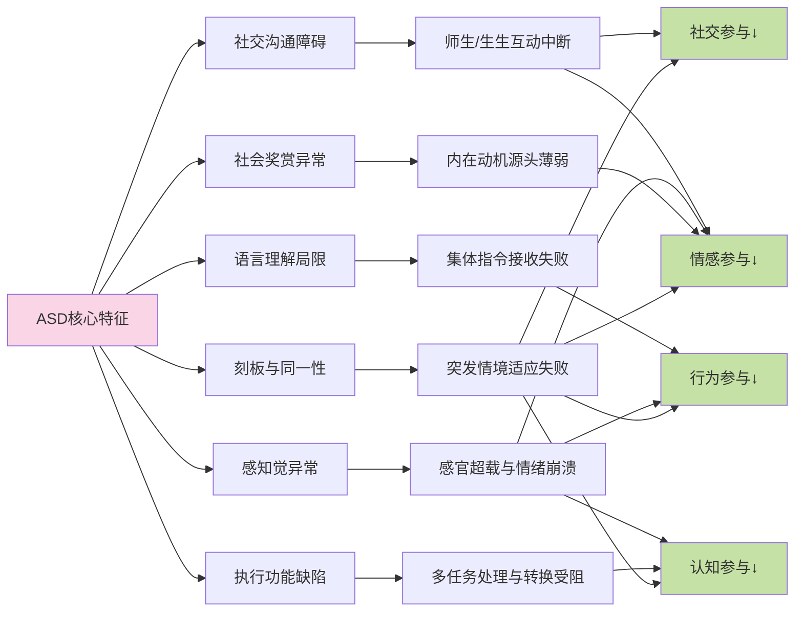
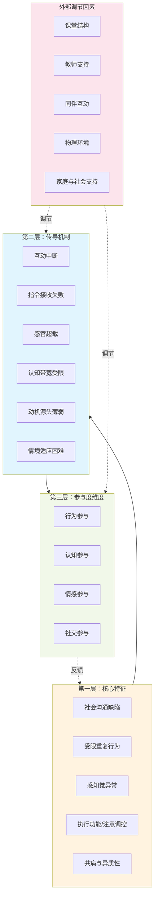
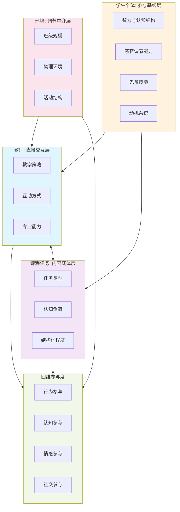
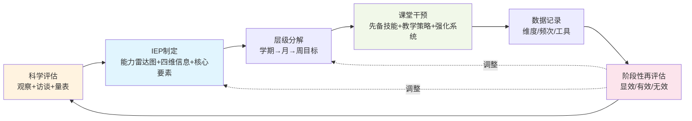
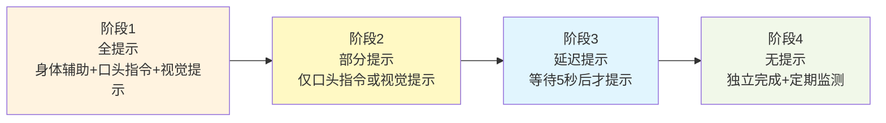
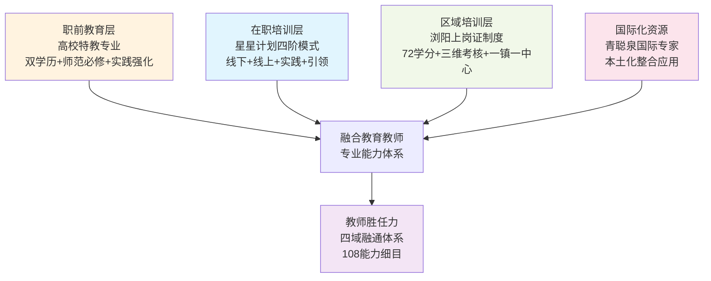
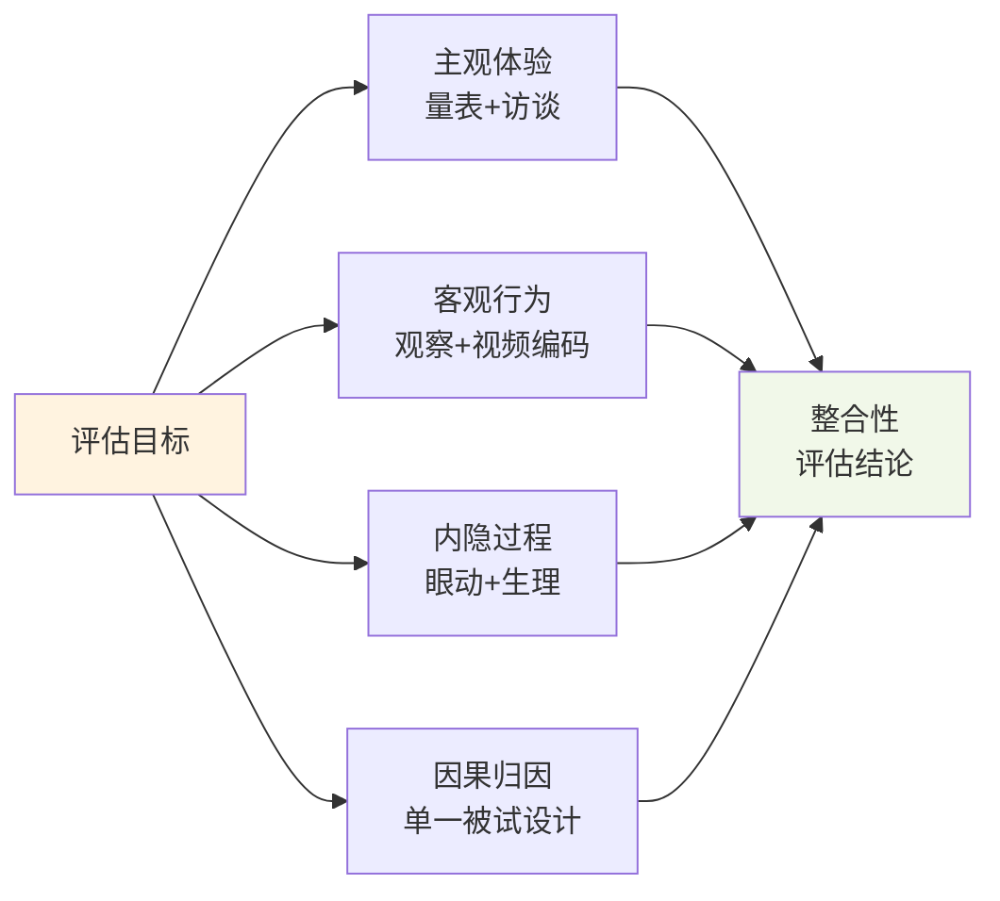

# 自闭症学生课堂参与度提升路径与有效策略研究
# 1 研究背景、概念框架与自闭症学生特征影响机制

当一个孩子在课堂上眼神游离于窗外的光线、对教师的集体指令毫无回应、对同伴的邀请视而不见，却能对教室角落旋转的风扇专注数十分钟——这样的画面，已成为越来越多融合教育课堂中的真实场景。自闭症谱系障碍（Autism Spectrum Disorder，ASD）作为一种以社会沟通缺陷与受限重复行为为核心的神经发育障碍，其在全球范围内的检出率持续上升，已成为我国儿童精神疾病之首[^1]。在融合教育成为国际共识、随班就读成为我国主要安置形式的背景下，越来越多的自闭症学生进入普通课堂，但"身在课堂、心在课外"的"形式融合"困境也日益凸显[^2][^3]。课堂参与度——作为衡量学生在学习活动中投入程度的核心过程性指标——能否在自闭症学生群体中得到真实而有效的提升，直接关系到融合教育从"有学上"向"上好学"的实质性跨越[^4][^1]。

本章作为全篇报告的理论起点，致力于厘清三个相互关联的基础性问题：课堂参与度究竟由哪些维度构成？为何在自闭症学生这一群体中讨论课堂参与度具有特殊的政策价值与现实紧迫性？自闭症的核心特征又通过怎样的内在路径削弱了学生的课堂参与？围绕这三个问题，本章首先梳理学习参与度理论的演进脉络并构建适用于自闭症学生的四维分析框架；其次结合国内外政策文本与统计数据论证研究价值；再次基于DSM-5诊断标准刻画自闭症谱系障碍的核心特征及其课堂表现；进而剖析特征向参与度传导的具体机制；最终整合形成"核心特征—传导机制—参与度维度"的三层级分析框架，为后续七章关于评估、策略、技术、协作、环境与师资等议题的展开奠定概念与逻辑基础。

## 1.1 课堂参与度的多维内涵与理论框架

课堂参与度的概念源自学习参与度（Learning Engagement）研究脉络，其理论建构经历了从一维到多维、从静态量化到动态结构化的演进过程。早期研究聚焦于学生时间投入的简单量化，但随着教育心理学与认知科学的发展，学界逐渐认识到学习参与是一个整合情感、认知与行为的多维框架，这一转向体现了从行为指标的简化测量向捕捉学习过程复杂动态的整体路径的根本转变[^5]。

**Kuh的"个体投入+院校环境感知"双维模型**是较早从结构化视角界定学习参与度的尝试。Kuh认为学习参与度指学习者参与到有效教育活动中的程度以及学习者对那些支持学习和发展的院校环境的感知程度，强调教育教学活动的有效性以及学习者对所在院校的认同感；屈廖健等在此基础上提出针对课程学习的双维参与模型，其度量指标包括课下自主学习、课堂投入、师生互动、生生互动、课程认知内驱力等[^6]。双维模型的优势在于同时涵盖了认知、情感、行为等个体要素与教师、同伴、学习媒介等环境要素，但其局限也较为明显——缺乏对个体投入与环境感知之间关系的深入分析，难以形成立体、系统的参与度模型[^6]。

在双维模型的基础上，**Fredricks提出的三维参与度模型**因其逻辑性与系统性成为目前最具影响力的理论框架。该模型将学习参与度划分为行为参与、认知参与与情感参与三个维度：行为参与包括努力、坚持、专注、注意、提问和讨论等外显行为；情感参与是指学习者在课堂上对教师、同伴言行及所学内容的情感反应，包括兴趣、厌倦、快乐、悲伤、焦虑等；认知参与既强调对学习的心理投资，又注重以认知为目标导向的策略学习，包括通过排练、总结和阐述来记忆、组织和理解材料[^6]。斯金纳进一步指出，三个维度之间并非孤立——情感参与直接影响认知参与与行为参与，学习动机、兴趣、信心、意志、态度等情感因素为认知活动提供内在动力；与此同时，认知参与与行为参与的水平也反过来影响积极情感的形成，**三维之间形成一个相互嵌套、动态循环的反馈系统**[^7]。

然而，对于自闭症学生这一特殊群体，仅以行为—认知—情感三维框架进行分析仍显不足。自闭症的核心障碍恰恰在于社会沟通与社会交往领域[^8][^9]，而传统三维模型中"师生互动""生生互动"等社交性内容往往被分散嵌入行为参与或情感参与之下，难以凸显其作为独立维度的重要性。结合El-Sayad等关于教学临场感（teaching presence）显著影响所有参与度维度的实证发现[^10]，以及共同注意（joint attention）作为自闭症儿童社会沟通核心缺陷的研究[^11][^12]，本研究将社交参与从三维框架中独立出来，构建**适用于自闭症学生的"行为—认知—情感—社交"四维分析框架**：

| 维度 | 核心内涵 | 在课堂中的典型表现 | 对自闭症学生的特殊意义 |
|------|---------|-----------------|-------------------|
| **行为参与** | 学生在教师指导下实施的可观察学习行为，是认知参与的外在表现[^7] | 注视教师、举手、回答问题、完成作业、参与讨论 | 直接受指令理解能力与执行功能影响，是最易观察、最常作为干预切入点的维度 |
| **认知参与** | 学生在课堂中开展认知活动、获取知识的内在智力活动，包括信息加工与策略学习[^6][^7] | 思考问题、运用记忆与组织策略、迁移知识、生成衍生理解 | 受执行功能、工作记忆、任务转换能力制约，是衡量学习深度的关键维度 |
| **情感参与** | 学习者对教师、同伴、内容的情感反应及伴随的积极情绪[^6] | 兴趣、愉悦、归属感、对学习活动的主动接近 | 受感官超载、社会性奖赏机制异常影响，常以情绪行为问题的形式呈现"负向参与"信号 |
| **社交参与** | 师生与生生之间的双向互动、共同注意与情感共享 | 眼神接触、轮替对话、合作学习、对同伴邀请的回应 | 直接对应ASD的核心障碍，是融合教育成败的关键，也是其他三维度的重要触发器 |

四个维度并非平行独立的静态结构，而是**通过动态交互共同决定参与质量**[^6][^7]：社交参与（如教师走到身边发出指令）触发行为参与（举手回应），行为参与的成功体验促成情感参与（愉悦与自信），积极情感又反过来支撑更深层次的认知参与（主动思考与策略运用），认知层面的理解又使学生能够发起更有质量的社交互动。这一闭环对普通学生而言相对自然，但对自闭症学生而言，每一个环节都可能因核心障碍而中断，这也正是本研究将四维框架作为分析自闭症学生课堂参与的核心工具的根本原因。

## 1.2 融合教育背景下自闭症学生课堂参与的研究价值与紧迫性

研究自闭症学生课堂参与度的现实紧迫性，根植于全球融合教育的政策共识与我国特殊教育从规模扩张转向质量提升的发展阶段。从国际层面看，1994年联合国教科文组织在西班牙萨拉曼卡召开"世界特殊需要教育大会"通过的《萨拉曼卡宣言》明确提出全纳教育（Inclusive Education）思想，强调"每个儿童都有受教育的基本权利""有特殊教育需要的儿童必须有机会进入普通学校"，并将"以全纳性为导向的普通学校"视为反对歧视、建立全纳社会以及实现全民教育的最有效途径[^13][^14][^15]。这一宣言确立了"教育系统适应学生差异，而非要求学生适应标准化课程"的核心理念，为各国推行融合教育提供了根本遵循[^14]。

我国在国际全纳教育思潮的推动下，逐步形成了以随班就读为主要实践形式的融合教育安置模式[^2]。2017年修订的《残疾人教育条例》明确规定"残疾人教育应当提高教育质量，积极推进融合教育，根据残疾人的残疾类别和接受能力，采取普通教育方式或者特殊教育方式，**优先采取普通教育方式**"[^16][^17]。2020年教育部印发《关于加强残疾儿童少年义务教育阶段随班就读工作的指导意见》（教基〔2020〕4号），进一步从评估认定、就近安置、资源教室建设、师资培训等方面构建随班就读支持体系，规定"对接收5名以上残疾学生随班就读的学校应当设立专门的资源教室"[^18][^19]。2021年印发的《"十四五"特殊教育发展提升行动计划》以"适宜融合"为目标，明确到2025年"适龄残疾儿童义务教育入学率达到97%"，并强调"融合教育全面推进，普通教育、职业教育、医疗康复、信息技术与特殊教育进一步深度融合"[^20][^21]。

| 政策文件 | 颁布时间 | 对自闭症学生课堂参与的关键指向 |
|---------|---------|--------------------------|
| 《萨拉曼卡宣言》 | 1994 | 确立全纳教育原则，要求普通学校接纳所有学生并通过课程、教学策略、资源利用等多方面调整提升教育质量[^13][^15] |
| 《残疾人教育条例》（修订）| 2017 | 优先普通教育方式，禁止基于残疾的教育歧视[^16] |
| 教基〔2020〕4号文件 | 2020 | 健全评估、安置、资源教室与师资支持体系[^18][^19] |
| "十四五"特教提升计划 | 2021 | 明确97%入学率目标、推进"康教结合"、加强孤独症儿童教育[^20] |

从最新统计数据看，截至2024年年底，我国全国残疾儿童义务教育入学率已达到97%的目标，国家孤独症儿童特殊教育资源中心和61个特殊教育改革试验区先后设立，全国已建立12个专门的孤独症儿童学校[^1]。然而**规模性的普及并不等同于实质性的融合**——中国残联副主席李东梅明确指出，伴随着孤独症儿童比例上升等情势变化，"人民群众的期待已从'有学上'升级为'上好学'"，"随班就读的学生规模虽已稳定，但依旧需要在培养普通教师的特教能力、加强专业的资源支持等方面进一步发力"[^4]。融合教育研究中"随班混坐""随班混读"现象较为严重的判断也印证了这一困境：相关教师缺乏专业性，无法有效辅导特殊学生；公众对融合教育理念的理解不够，仍是开展融合教育的最大难题[^3]。

具体到自闭症学生群体，这种"形式融合"的困境尤为突出。已有研究质疑"随班就读是否是ASD儿童理想的教育安置模式"，其担忧的核心正是ASD儿童的身心障碍造成其在融合学校中的学习、社交面临诸多障碍，**其融合教育的核心——课堂参与状况令人堪忧**[^2]。当一个自闭症学生坐在普通课堂，但全程不回应教师指令、不与同伴互动、不参与任务讨论，物理空间上的"在场"实际上掩盖了教育意义上的"缺席"。从这个意义上说，课堂参与度不仅是学习质量的过程性指标，更是衡量融合教育是否真正实现"实质平等"的关键标尺。

正是基于这一现实判断，本研究的价值得以确立：**在政策落地层面**，提升课堂参与度是将"优先普通教育""适宜融合"等政策原则转化为可操作教学实践的关键抓手；**在教学实践层面**，参与度的多维分析能够帮助教师跳出"在不在课堂"的二元判断，转向"如何参与、参与多深"的精细化诊断；**在个体发展层面**，高质量的课堂参与不仅直接关系到自闭症学生的学业成就，更通过同伴互动与社交体验影响其未来融入社会的根本能力[^15][^3]。

## 1.3 自闭症谱系障碍的核心特征及课堂表现

要理解自闭症学生为何在课堂参与上面临系统性困难，必先回到其核心障碍的本质。根据美国《精神疾病诊断与统计手册》第五版（DSM-5）的诊断标准，自闭症谱系障碍的诊断须同时满足社会沟通缺陷与受限重复行为两大核心症状领域，且这些症状必须在发育早期出现并造成临床显著的功能损害[^8][^22]。

**第一类核心特征：社会沟通与社会交往的持续性缺陷**。DSM-5明确该领域包含三个层次的表现：其一是社交与情感的交互性缺陷，从异常的社交行为模式、无法进行正常的你来我往的对话，到分享兴趣爱好、情感、感受偏少，再到无法发起或回应社会交往；其二是社会交往中非言语交流行为的缺陷，包括语言和非语言交流之间缺乏协调、眼神交流和身体语言的异常、理解和使用手势的缺陷；其三是发展、维持和理解人际关系的缺陷，难以根据不同的社交场合调整行为，难以一起玩假想性游戏、难以交朋友，对同龄人没有兴趣[^8][^9]。在课堂场景中，这一核心特征具体表现为：对教师的微笑、点头、眼神鼓励等社交反馈不敏感，难以理解教师"看老师这边"等隐含社交意图的指令，在小组活动中无法主动发起或回应同伴邀请，对同龄人的游戏邀约表现出回避或漠然[^23][^24]。

**第二类核心特征：受限的、重复的行为模式、兴趣或活动**。DSM-5要求至少满足以下四项中的两项：动作、对物体的使用或说话有刻板或重复的行为（如排列玩具、仿说、异常用词）；坚持同样的模式、僵化地遵守同样的做事顺序，或者语言或非语言行为有仪式化的模式（如很小的改变就造成极度难受、难以从做一件事过渡到做另一件事）；非常局限的、执着的兴趣，且其强度或专注对象异乎寻常；对感官刺激反应过度或反应过低，或对环境中的某些感官刺激有不寻常的兴趣[^8][^9]。这些特征在课堂中转化为：上课时反复摇晃身体、敲击桌面、自言自语；当教师改变上课流程或座位调整时出现剧烈情绪反应；对课程内容兴趣极度狭窄，仅在涉及自身特殊兴趣（如恐龙、列车时刻表）时才表现专注；对教室日光灯的嗡嗡声、同学的笔尖声、衣物标签摩擦皮肤等普通学生无感的刺激产生强烈不适[^9][^25]。

围绕上述两大核心特征，自闭症学生还表现出一系列**与课堂参与密切相关的关联性特征**，这些特征虽不属于诊断核心，却在课堂情境中产生显著影响：

第一，**语言理解与执行的差异性**。自闭症孩子通常能听懂简单指令，但理解和执行能力存在个体差异，高功能自闭症儿童可理解复杂指令，部分伴有语言发育迟缓的患儿仅能回应简短直接的口令；抽象指令或隐喻表达往往难以被接收，前额叶发育异常导致执行功能障碍，患儿可能理解指令但无法完成多步骤任务[^26]。

第二，**感觉统合失调**。研究表明，约90%的自闭症谱系儿童存在不同程度的感觉处理障碍，部分研究显示比例可达80%—85%[^25][^27]。其神经系统就像一台"过度灵敏的接收器"，难以有效过滤和调节信息——日光灯的嗡嗡声清晰可闻、衣服的标签像砂纸一样摩擦皮肤、超市的灯光闪烁得像迪斯科舞厅[^25]。

第三，**注意力调控异常**。最新神经认知研究揭示，自闭症个体存在"单向度注意"（Monotropism）现象，其在分配注意力资源时物理带宽极其狭窄，无法在极短时间内将注意力同时覆盖广阔的视野或编码多个并列目标；与此相关的还有"过度聚焦"（Hyperfocus），即在特定兴趣驱动下可维持数小时绝对专注的现象[^28]。

第四，**任务转换困难**。自闭症患者任务转换困难与自闭症疾病本身特点、脑结构变化、社交能力障碍以及共病注意缺陷多动障碍等多重原因有关；脑部杏仁核缩小、脑回缩小、脑沟加深等结构异常一定程度上影响患者的执行能力[^29]。

第五，**共病现象普遍**。ASD与ADHD共病率高达25.7%—28%，共病ADHD的ASD亚型在小脑认知区域呈现特异性耦合增强，提示小脑—前额叶通路在注意力调控中存在代偿机制[^30]。约半数阿斯伯格综合征患者还合并焦虑症或抑郁症[^31]。

第六，**社会奖赏机制异常**。基于Shank3缺陷大鼠模型的神经科学研究发现，ASD相关基因突变会导致中脑—伏隔核多巴胺通路的神经活动改变，进而引起社交奖励处理障碍——这从神经机制层面解释了为何对普通学生有效的"老师表扬""同伴掌声"等社会性强化物，对自闭症学生往往效力不足[^32]。

值得特别强调的是，自闭症是一个"谱系"，意味着症状的表现形式和严重程度在不同个体间差异很大；智力水平分布广泛，从智力障碍到智力超常都有，智力结构往往不均衡（可能在某些领域如记忆、视觉空间能力突出，而在抽象、社交理解方面较弱）[^9]。**这种高度的个体异质性意味着任何针对"自闭症学生"的概括性描述都需保留个别化的解读空间**，这也是本研究后续讨论各项策略时反复强调"个别化适配"的根本依据。

## 1.4 自闭症特征削弱课堂参与的传导路径与作用机制

明确了核心特征之后，更关键的问题是：这些特征究竟通过怎样的具体路径削弱了课堂参与？仅仅罗列"自闭症学生有社交障碍，所以参与度低"是过于粗糙的因果归纳，无法为后续策略设计提供精准靶点。本节按照行为—认知—情感—社交四维参与框架，逐一剖析特征向参与度传导的具体机制。

**机制一：社交沟通障碍→社交参与与情感参与的双重削弱**。自闭症的社交情感互动缺陷直接导致师生互动与生生互动的双向阻断。在师生互动维度，眼神对视的回避与面部表情的贫乏使教师难以读取学生的反馈信号，"老师好""我不明白"等基础互动语言的缺失则使教师无法及时发现学生的学习困惑[^9][^24]。在生生互动维度，对同龄人缺乏兴趣使其难以加入小组讨论，难以参与想象性游戏使其在以情境扮演为主的低年级课堂活动中处于边缘位置[^8][^9]。更深层次的是，社会奖赏通路的神经活动异常使社会性强化物对其效力大幅降低[^32]——当普通学生因教师的赞美而提升积极情感、进而强化后续行为时，自闭症学生可能对同样的赞美毫无反应，造成情感参与的源头被切断。

**机制二：语言理解局限与集体指令接收困难→行为参与的执行断裂**。课堂指令的接收涉及多重门槛：首先要从背景噪音中筛选出教师声音，其次要理解指令的语义，再次要识别指令是否针对自己，最后要将指令转化为执行动作。自闭症学生在每一环节都可能受阻：感觉过敏患儿易被环境刺激分散注意力，听觉过滤功能异常可能导致指令接收不全[^26]；在集体环境中，"已经习惯一对一指令的孩子，集体环境中老师给的指令是针对全班学生的，同时老师给予指令时与学生是有一定距离的……有些时候或许孩子能够理解指令，但是在这种情况下，孩子会以为这个指令并不是给自己的"[^33]；当教师在大段叙述中夹杂指令（如"刚才大家都讨论的非常好，接下来我们要把书翻到第50页"），抽象语言的理解困难也会导致执行失败[^33]。这些机制共同造成自闭症学生在集体课上"个训课过关、集体课不听指令"的典型困境。

**机制三：感知觉异常与感官超载→注意分散与情绪崩溃**。普通教室对自闭症学生而言可能是一个"感官风暴"环境：日光灯的嗡嗡声、空调运转声、同学的低语、墙面五彩斑斓的装饰画、衣服标签的持续摩擦——这些被普通学生大脑自动过滤的"背景噪音"，却被自闭症儿童的神经系统逐一捕获并放大[^25][^27]。长期处于感官超载状态会带来情绪行为问题（频繁的崩溃、攻击行为或自我刺激）、学习障碍（难以集中注意力，影响课堂表现）、社交困难（回避集体活动）[^25]。当感官刺激过载时，自闭症孩子无法用语言清晰地表达自己的不适，只能通过尖叫、摔东西、自伤等行为宣泄情绪，**这些表现常常被误解为"不听话"或"任性"**[^25][^27]。在课堂参与的视角下，这一机制同时损害了行为参与（被迫离座、捂耳）、情感参与（焦虑取代兴趣）与认知参与（注意资源被感官调节占用）。

**机制四：执行功能缺陷与任务转换困难→认知参与的深度受限**。最新神经认知研究揭示了"单向度注意"机制：自闭症个体的认知带宽极其狭窄，当强制要求"多线程并行处理"或"紧急认知转换"时，可能瞬间击穿其认知承载上限——此时孩子表现出的捂耳朵、尖叫、眼神空洞、身体僵直，**并非主观上的态度对抗或发脾气，而是大脑在面临严重信息超载与执行功能冲突时的生理性"宕机"**[^28]。课堂教学恰恰是一个高频要求多线程处理与任务切换的环境：从听讲切换到笔记，从语文课切换到数学课，从独立思考切换到小组讨论。任务转换困难意味着自闭症学生即使能完成单一环节，也可能在转换节点出现停滞；执行功能缺陷则使其难以将课堂指令分解为执行步骤，造成认知参与的深度被锁定在表层信息的接收，难以推进到信息加工、策略运用的高阶环节[^29][^26]。

**机制五：社会性强化物不敏感与共同注意缺陷→情感参与的内在动力不足**。共同注意（joint attention）是指两人共同对某一物体或事件加以注意以分享对其兴趣的能力，包括眼睛注视、注视跟随、手指指示、主动展示等行为，是后期言语能力与社会关系发展的重要基础[^11]。研究证实自闭症儿童共同注意的三项典型缺陷：较少出现共同注意行为；自发性共同注意（IJA）缺陷比应答性共同注意（RJA）更严重；共同注意更多指向要求行为而非分享行为[^11]。共同注意的缺陷意味着课堂上教师"看这里""注意这个"等引导性语言难以触发学生的注意聚焦；社会奖赏机制异常则意味着"老师表扬""同学鼓掌"等内在动机激励手段效力不足[^32]。两者共同造成自闭症学生情感参与的内在动力源头薄弱，需要外部支持系统（如代币制、个性化兴趣激励）的补偿性介入。

**机制六：刻板行为与坚持同一性→突发情境的适应性危机**。自闭症学生对常规变化的极度敏感，使其难以应对课堂中的突发性调整：座位临时变动、课程顺序调整、教师替换、突发的消防演习——这些对普通学生而言是有趣的"新鲜事"，对自闭症学生而言可能是引发焦虑甚至崩溃的危机源[^8][^9]。临床观察到的"分离焦虑""不能适应新环境，在学校会哭闹"以及"即使在早期ABA干预中已经掌握了集体环境中需要学生具备的各种能力，但是学生依然很难在新的环境、新的老师和新的干扰下执行这些技能"，反映的正是泛化困难与情境适应不足的问题[^33]。在课堂参与的角度看，这一机制使行为、认知、情感、社交四维参与都可能因一次突发情境而整体崩溃。

为了直观呈现上述六类机制的传导路径，可用以下流程图概括：

上图揭示了一个关键洞察：**自闭症学生的课堂参与困境并非由单一机制造成，而是六类传导路径同时作用、彼此叠加的系统性结果**。任何单一维度的干预（如仅调整教学语言、仅减少噪音）都可能因未能覆盖其他机制而效果有限，这正是后续章节倡导多维整合策略的根本逻辑依据。

## 1.5 特征—机制—参与度的整合分析框架

综合前述四节分析，本研究提出"**核心特征—传导机制—参与度维度**"三层级整合分析框架（图示见下），作为全篇报告的统摄性理论工具。

该框架包含三个层级与一个交互系统：

**第一层级——核心特征**（Why）：刻画自闭症学生作为生命主体的内在生理与心理特点，回答"是什么"的问题。这一层级的关键认识是，自闭症的核心特征源自神经发育层面的差异，包括前额叶—小脑通路重组、中脑—伏隔核奖赏通路异常、感觉处理系统过敏等[^30][^32]，这意味着这些特征不能简单通过"管教"或"纠正"消除，而需要通过支持性环境与策略实现适应与发展。

**第二层级——传导机制**（How）：揭示核心特征通过怎样的具体路径作用于课堂参与，回答"为什么"的问题。这一层级是连接生理特征与教育表现的关键中介，也是干预策略最直接的着力点——干预无法改变神经层面的核心特征，但可以通过优化传导路径（如降低感官刺激、简化指令、提供视觉支持、建立兴趣激励系统）显著缓解机制对参与度的负向影响。

**第三层级——参与度维度**（What）：将抽象的参与度具象化为行为、认知、情感、社交四个可观察、可评估、可干预的子维度，回答"成果如何衡量"的问题。这一层级既是评估的对象，也是干预效果验证的依据。

**外部调节系统**：课堂结构、教师支持、同伴互动、物理环境、家庭与社会支持等环境性因素并不改变自闭症的核心特征，但深刻调节着传导机制的强度与参与度的最终呈现。例如，**同样的语言理解局限，在结构化、视觉支持充分的课堂中可能仅造成轻微的指令延迟，而在大班、嘈杂、口头指令为主的课堂中可能造成完全的参与中断**。这一调节作用为融合教育的可行性提供了根本依据：通过环境、教学、关系等外部因素的优化，自闭症学生的课堂参与困境是可以被显著改善的。

**反馈回路**：课堂参与度的提升又会反过来影响特征表达——长期的成功参与体验有助于建立自我效能感，缓解共病焦虑与抑郁；高质量的同伴互动有助于通过共同注意训练改善社会奖赏体验[^11][^12]，形成"良性循环"；反之，长期的参与失败则可能加剧情绪问题与刻板行为，形成"恶性循环"[^27][^2]。

这一整合框架对全篇报告具有三重指导意义。**第一，定位干预靶点**：后续章节（第3—7章）讨论的各项策略——评估与IEP制定、行为干预、教学设计、同伴支持、技术辅助、环境调适——本质上都是针对第二层级"传导机制"的精准介入，而非试图改变第一层级的核心特征。**第二，统一评估视角**：第8章关于评估体系的讨论将围绕第三层级的四维参与度展开，通过观察、视频编码、量表评估等多模态方法对参与质量进行多维度测量。**第三，保留个体异质性**：框架中"共病与异质性"作为核心特征的独立要素，提示任何策略的应用都必须基于个别化评估，避免"一刀切"的标签化干预，这与全篇贯穿的"尊重谱系差异、坚持因材施教"基本立场保持一致[^20][^21][^19]。

总体而言，本章通过四个维度的概念建构、政策与现实价值的论证、核心特征的系统梳理、传导机制的精细剖析以及整合框架的最终提出，为后续七章关于策略路径、技术应用、协作机制、师资建设与评估体系的深入探讨奠定了概念基础与逻辑起点。需要坦承的是，受限于本章可获取证据的范围，部分关键机制（如社会奖赏通路异常对课堂参与的具体作用）目前主要依赖动物模型与神经影像研究的间接推论[^30][^32]，其在真实课堂情境中的精确表现仍有待更多教育情境下的实证研究加以验证；同时，本章对四维参与框架的提出虽建立在Fredricks三维模型的扩展之上，但作为一个针对自闭症学生的本土化框架，其结构信度与效度仍需在后续章节的策略与评估讨论中进一步检验与完善。

# 2 课堂参与度的现状困境与多层次影响因素剖析

第一章构建的"核心特征—传导机制—参与度维度"三层级整合框架，从理论层面回答了自闭症学生课堂参与困境为何发生的问题。然而，理论框架若不能落地于真实课堂的具象化诊断，便难以转化为有针对性的干预方案。本章承接前文逻辑脉络，将分析视角从概念建构推进至现实诊断层面：当一名自闭症学生进入普通教室或特教课堂，他/她的参与度究竟呈现出怎样的具体画像？这些参与困境又是如何在学生个体、教师、环境、课程四个层面的因素交互作用下被放大或缓冲的？

回答这两个问题对全篇报告具有承上启下的关键意义。一方面，只有精准刻画现状困境的"症状谱"，才能避免后续策略讨论沦为悬浮在政策口号层面的原则倡导；另一方面，只有清晰识别影响因素的层级结构与权重差异，才能为第3章至第7章的策略章节提供"问题诊断地图"与"靶向干预坐标"。本章首先通过普通课堂与特殊教育课堂的对比观察揭示同一学生在不同环境中参与表现的悬殊差距，继而按四维参与框架梳理参与时间、形式、互动、情绪四类典型困境的具象表征，再剖析教师、同伴、家长、陪读人员四类支持主体的能力短板与资源缺口，最后从学生个体、教师、环境、课程四个维度构建多层次影响因素分析框架，比较各因素对四维参与度的相对作用权重，为后续策略设计奠定诊断基础。

## 2.1 普通课堂与特殊教育课堂中参与度的典型表现差异

理解自闭症学生课堂参与困境的最直接方式，是观察同一学生在两类不同教育情境中的参与表现差异。这种对比不仅能揭示参与度的环境敏感性，也能验证第一章关于"外部调节因素深刻影响传导机制强度"的核心命题。

**普通课堂场景下的典型参与画像**可通过随班就读学生小亮的个案得到清晰呈现。小亮就读于普通学校二年级，语言发育迟缓，仅能表达自己的需求，刻板行为明显。研究者采用非参与式观察与对授课教师的半结构化访谈，对其课堂参与情况进行系统记录后发现：小亮的课堂参与有效时间显著低于班级普通学生的平均值，能够安静听讲的时间仅为课堂开始的前5分钟；所谓"完成指令的活动"也仅停留在简单地拿出学具、翻开书的浅层动作，其余时间小亮会拿出纸笔画画，虽未出现外显的干扰课堂行为，但实质上已游离于课堂教学进程之外；更值得关注的是，**在小亮有限的课堂参与时间里，相关活动都是在陪读人员的帮助下完成的**，这意味着其课堂参与具有强烈的"中介依赖性"——离开陪读支持，参与几乎无法独立维系[^34]。

如果说小亮的画像揭示了参与度的"碎片化"与"中介依赖"，那么阳阳妈妈历时6年的陪读经历则进一步暴露了普通课堂场景下的"隐性失学"困境。从幼儿园到四年级，阳阳妈妈"陪了他6年……可我突然发现，他坐在教室里，和不在，没什么区别"[^35]。这位母亲将6年陪读历程划分为五个阶段，从"半天陪读、满心笃定的融合尝试"到"风雨无阻、被动维系的表面融合"——尽管她为孩子降低了期待（"不奢求阳阳跟上学习进度，只求守住融合环境，语文、数学尽量跟随，英语果断放弃"），但实际呈现的仍是"无法独立参与任何游戏，关注点永远停留在物品上，规则意识几乎为零，集体环境下的指令充耳不闻、无从执行"的参与缺位状态[^35]。"身处校园不等于参与校园"的判断[^35]，正是普通课堂场景下自闭症学生参与困境的核心写照。

放眼更宏观的群体数据，这种困境并非个案。广州2024年针对2000名孤独症孩子家庭的调研显示，**近20%选择孩子目前没有在上学，其中27%曾经上过但被学校劝退；在5岁至15岁已经上学的孤独症孩子中，有80%收到过投诉**[^36]。"融合中国"家长组织2017—2018年的连续两年调查也显示，27%的6—15岁孤独症儿童曾被校方要求退学，26%的适龄孤独症儿童面临无学可上的困境[^36]。这组数据在群体层面印证了普通课堂场景下参与困境的普遍性。

**特殊教育课堂场景下的参与表现**则呈现出明显不同的画像。在结构化教学、个别化训练、视觉支持充分的情境下，自闭症学生的参与质量往往显著提升。永川区特殊教育学校的实践显示，5岁的自闭症儿童乐乐"刚入校时无法眼神对视、缺乏主动交流"，但在该校"小葵花"课程体系下经过"早发现、早干预、早康复"的精准干预与个性化教育方案后，"如今他已能主动互动、听从指令、牵手表达需求"[^37]。该校在义务教育阶段以"五育并举、四力协同"为核心，通过生活语文、生活数学、绘本创意、艺术手工、趣味运动等课程，重点培养自闭症学生的生活自理、基础认知、情绪调控、同伴协作能力，使其顺利完成从"被动适应"到"主动学习"的转变[^37]。这一对比说明，**当课程内容贴合学生认知水平、教学节奏与结构充分适配、感官环境得到调适时，自闭症学生的参与度并非天然低下，而是能够呈现出实质性的提升空间**。

为更系统地比较两类场景的差异，下表整合了已有研究与案例的核心观察：

| 参与维度 | 普通课堂典型表现 | 特殊教育课堂典型表现 | 差异成因 |
|---------|------------------|--------------------|---------|
| 行为参与 | 有效注意时长仅前5分钟；指令完成停留在拿学具、翻书等浅层动作[^34] | 通过任务分解、视觉支持、个别化指令完成度可显著提升[^34][^37] | 指令清晰度、任务结构化程度、辅助支持密度差异 |
| 认知参与 | 多停留于机械模仿、被动接收，难以参与深度讨论与策略运用 | 通过分阶段目标拆解（学期—月—周）实现循序渐进的能力建构[^34] | 认知负荷与个体能力的匹配度差异 |
| 情感参与 | 因感官超载、规则不适形成回避或焦虑，社会性强化物效力低 | 借助强化物评估找到调动动机的个性化奖励，结合社会性赞美激发内部动机[^34] | 强化系统的个体适配性差异 |
| 社交参与 | 师生互动依赖陪读中介，对同伴邀请漠然或回避[^35] | 在小班、结构化情境中实现初级互动与情感表达[^37] | 班级规模、同伴构成、社交支持密度差异 |

上述对比揭示了一个具有方法论意义的核心洞察：**自闭症学生的课堂参与表现是高度情境依赖的，同一学生在不同环境中可能呈现"判若两人"的参与画像**。这一洞察对融合教育的政策实践具有重要启示——简单的"物理融合"（即把孩子安置进普通学校）若不伴随系统性的环境调适与教学支持，可能反而比特殊教育安置带来更低的参与质量；只有当普通学校具备类似特殊教育课堂中的结构化、个别化、视觉支持等关键要素时，融合教育才能真正实现其设计初衷。

## 2.2 参与度困境的四类典型表征

按照第一章构建的"行为—认知—情感—社交"四维参与框架，自闭症学生在课堂中的参与困境可系统性地归纳为四类相互交织的典型表征。这一表征清单不仅描述"症状"，更力图揭示症状背后的机制根源，避免将参与困境简化为单纯的"态度问题"或"能力问题"。

**表征一：参与时间碎片化——有效注意时长有限且易被转移**。自闭症学生的课堂参与时间往往呈现"前段集中—中段流失—末段游离"的典型曲线。小亮的案例显示其安静听讲时间仅为课堂开始的前5分钟[^34]，这并非孤例，而是反映了自闭症学生在持续注意维持上的系统性困难。从机制角度看，这一困境源自三个叠加因素：一是注意力很难集中且易分散，**自闭症儿童常对感觉刺激（如视觉、听觉等）有很大的兴趣，过分专注于某些东西而忽略其他有意义的相关事物，如可以一直盯着理发店门口的旋转器而忘记自己要做什么事情，或是专注于作业本上的虚线而忘记做作业**[^38]；二是部分儿童几乎没有与人对视的能力或即使有视觉对视也只是短短的几秒钟[^38]；三是部分高功能自闭症学生的注意力缺陷反映了其难以集中精力于特定任务上，可能错过重要的课堂信息或完成作业所需的关键步骤[^39]。三类机制共同造成自闭症学生的课堂注意呈现"碎片化分布"，其有效参与时间往往集中在课堂开始与个人兴趣相关的片段，而对集体性、过程性、需要持续投入的环节则容易脱钩。

**表征二：参与形式单一化——浅层化、被动化、机械化**。即便自闭症学生表现出"在参与"的表象，其参与的深度与形式也往往停留在浅层。具体而言：自闭症儿童学习动机薄弱且缺乏主动性，**他们对普通儿童有兴趣的事物（如玩具或口头夸奖等）不感兴趣，难以构成学习动机**，因此往往对参与课堂活动毫无兴趣，即使参与，在学习过程中也处在被动状态，有时还会做出与实际情境不符的行为[^38]；其理解能力和意义记忆能力较弱，记忆的目的性较差，机械记忆远超过意义记忆——他们对数字和文字有较强的机械记忆力，但却很难将记忆的东西与实际生活相结合[^38]；其知识技能迁移能力弱，**有些自闭症儿童很容易学会学业知识和一些技能，但是他们很难将这些知识和技能运用到实际生活情景中，在学习、生活和实践中缺乏举一反三的能力，更缺乏灵活运用的能力**[^38]。这三个学习特点叠加，导致自闭症学生的课堂参与即便发生，也常停留在"翻书—画画—模仿动作"等浅层行为，难以推进到主动提问、策略选择、知识迁移等深度认知参与。已有系统综述同样指出，**几乎所有关于课堂参与的定义都侧重于可观察的行为，而忽视了自闭症学生的内在参与情况**——这一研究范式上的局限恰恰映射出实践层面参与形式单一化的现实[^40]。

**表征三：互动质量低——师生互动陪读中介化、生生互动稀疏单向**。自闭症学生的课堂互动质量在两个维度上都呈现明显短板。在师生互动维度，普通课堂中"自闭症学生—陪读人员—教师"的三方结构常常将本应直接发生的师生互动转化为"陪读中介化"互动——教师指令通过陪读传递、学生回应通过陪读代偿，使原本应当承载社交意义的师生互动失去了直接性[^34]。在生生互动维度，自闭症的核心障碍即表现在社会交往、言语沟通和行为三个方面，其语言理解和表达障碍、对话维持能力弱、难以理解他人意图等特征，使其在课堂指令遵循和集体互动参与等方面存在显著困难[^34]。系统综述指出，**在包容性课堂中，自闭症学生的学术参与度相对低于神经典型学生**[^40]；而互动质量正是参与度差距的核心组成部分。从神经机制层面看，社交沟通障碍是孤独症谱系障碍的核心症状，互动双方的行为和生理同步是维持和促进人际交流的重要因素[^41]，这意味着课堂互动若缺乏专门的同步性支持，自闭症学生的互动困境难以自然消解。

**表征四：情绪行为高频干扰——被误读的"求救信号"**。课堂干扰行为大致可分为尖叫/哭闹行为、不服从行为和不参与行为等[^42]。具体来看，高功能自闭症学生可能因课堂干扰行为、注意力缺陷、社交互动障碍、情绪调节困难以及学习进度落后等问题影响课堂——其情绪调节困难表现为难以识别、表达并管理自己的情感状态，**在课堂环境中，这可能导致他们因微小刺激而突然爆发强烈情绪反应，如过度焦虑或愤怒**[^39]。重复刻板行为特征与对预期外事件的敏感也是干扰行为的重要诱因——孤独症谱系障碍学生**容易因预期外事件引发情绪和行为问题，导致对课堂秩序和个人学习产生干扰**[^34]。

这里需要特别强调一个易被忽视的诊断洞察：**自闭症学生的课堂干扰行为常常并非主观上的"不听话"或"任性"，而是感官超载、认知宕机、沟通失败下的"求救信号"**。结合第一章揭示的传导机制，当一个自闭症学生在课堂上出现尖叫、自伤、攻击行为时，最大概率的原因是其感官系统已被环境刺激击穿、其认知带宽已被多任务要求耗尽、其语言系统无法将不适转化为可被理解的表达。然而在缺乏专业支持的普通课堂中，这些行为常被简化解读为"破坏纪律"——被班主任一天打十几个电话投诉孩子出现的"吐口水、到处乱跑"，**因为班主任没见过这样的孩子，根本无法处理**[^43]。这种解读的偏差使干扰行为的应对停留在"制止—惩罚—劝退"的负向循环，而非"诊断—理解—支持"的正向干预。

四类困境并非彼此独立，而是相互嵌套、互为因果：参与时间的碎片化使深度参与无从发生，浅层化的参与形式难以建立有质量的互动，互动失败累积为情绪挫败，情绪干扰又反过来进一步压缩有效参与时间。这一闭环困境正是后续章节倡导多维整合干预策略的现实依据。

## 2.3 关键支持主体的能力短板与资源缺口

自闭症学生的课堂参与困境从来不仅是学生个体的问题，更是支持系统能否提供充分专业支持的问题。教师、同伴、家长、陪读人员四类关键支持主体在应对参与困境时各自面临的能力短板与资源缺口，构成了参与困境得以持续存在的结构性条件。

**普通教师层面：特教知识储备不足、培训覆盖率低、应对能力有限**。融合教育的政策推进与一线教师的实际准备度之间存在显著落差。一方面，目前培智学校或自闭症康复机构从事自闭症儿童教育、康复的人员，绝大多数入职时缺乏自闭症相关的专业知识，甚至缺乏教育教学的一些基本素养；虽然一些教师具有特殊教育、学前教育等专业背景，但他们不了解自闭症[^44]。另一方面，普通学校教师面临的挑战更为严峻——**普通中小学普遍缺乏适配教材、专业特教老师与专项教学资源，无法为随班就读学生提供个性化支持训练**[^36]。

针对小学教师融合教育需求的调查显示，教师对孤独症学生的常见担忧聚焦在"影响课堂秩序、不知道怎么教、学生安全问题、与家长沟通困难"等方面；而其最需要的支持则集中在"专业知识、培训课堂管理策略、家校沟通技巧、特教老师协助、心理疏导"五个维度[^45]。融合教育教师专业素养调查也将"学生个体差异大难以满足特需儿童需求、缺乏适合的教材或教具、班级人数过多难以关注每位学生、家长配合度低或沟通困难、学校资源不足、自身专业能力需进一步提升"列为教学实践中的主要困难[^46]。这些调查数据集中指向一个核心判断：**普通教师面对自闭症学生的课堂参与问题时，并非缺乏责任心，而是缺乏将责任心转化为有效干预的专业工具箱**。

师资培养体系的结构性问题进一步放大了这一短板。我国目前的自闭症儿童教育师资培养仍依赖于特殊教育师资培养的纵向体系，在培养目标上多以培养特殊教育的"通才"为主，未凸显自闭症儿童教育师资的特色；现有本科或专科阶段的人才培养中，特殊教育专业的人才培养缺乏横向细分，对口度不高，精准化程度不足，缺乏专门针对自闭症儿童教育来培养适用的专业性人才——**迄今为止，仅有南京特殊教育师范学院儿童康复专科专业开设了自闭症儿童教育康复方向**[^44]。在现有的自闭症儿童教育职前师资培养中，最主要的问题是实践技能培养不足、理论脱离实践——有些特殊教育专业的人才培养方案中，涉及自闭症知识的课程只有一两门，只能让学生初步了解自闭症[^44]。

**同伴层面：认知有限、接纳态度依赖成人示范**。同伴是融合教育课堂中最重要的潜在支持力量，但同伴的接纳与支持并非自然发生，而是受成人示范深刻影响。**小学的儿童都是老师的向日葵，爸爸妈妈的小宝贝，一般儿童对自闭症儿童的看法和对待方式更多的是来源于他们能够接触到的成年人**[^43]。这一观察揭示了同伴支持系统的关键依赖关系：教师对自闭症学生的态度（接纳/排斥、耐心/焦躁）、家长对班级特殊学生的反应（友善/抵触）会直接通过镜像学习塑造同伴的态度。学校整体氛围的差异也极为关键——有的学校"开学不到两天就被家长拉横幅要求学生离开学校"，有的学校则"刚入学校就被安排融合老师积极跟进"[^43]，这两种氛围下同伴提供给自闭症学生的支持质量必然天差地别。

**家长层面：长期陪读耗竭、信息闭塞、心理压力高企**。家长作为自闭症学生最持续的支持者，自身却深陷多重压力交织的困境。从经济层面看，2024年广州孤独症康复机构月收费普遍在3000—10000元，10.8%的机构收费超过万元；《中国孤独症家长需求调查问卷》显示，**52.4%的家庭有一名成员被迫放弃工作全职照护患儿，其中绝大多数是母亲**——当母亲为孩子主带养者时，60.3%的母亲会辞掉工作全职照顾孩子[^36][^47]。从心理层面看，家长必须时刻警惕、防范孩子的安全风险，随时应对孩子突发的情绪行为问题，同时还需承担日常照料与教育辅导等繁重任务，极易导致身心俱疲与精力耗竭[^48]。

更具系统性意义的是信息闭塞问题。国家早已将特殊儿童隐性失学问题纳入重点保障范围，先后出台多项政策筑牢兜底防线，从《"十四五"特殊教育发展提升行动计划》到教育部"建立隐性失学台账""一人一案"帮扶要求，再到各地落实"送教上门、资源教室全覆盖、康复补贴直达、特校学位扩容"等配套政策——**这些政策从不是"纸上谈兵"，而是家长们可落地、可借力的"救命稻草"，关键在于，我们如何读懂、如何对接**[^35]。然而很多家长因信息闭塞、不懂流程，白白浪费了政策红利。这一现象提示，支持自闭症学生的政策资源与家庭实际可获得资源之间存在显著的"最后一公里"鸿沟。

**陪读人员层面：专业性参差不齐、易形成过度代偿**。陪读是我国融合教育实践中的特色制度安排，对维系自闭症学生的课堂在场具有重要作用，但陪读支持的两个潜在问题不容忽视：一是专业性参差不齐——陪读人员既可能是受过专业训练的影子教师，也可能是未经培训的家长本人，其干预质量差异巨大；二是易形成过度代偿——小亮案例中"在小亮有限的课堂参与时间里，相关活动都在陪读人员的帮助下完成"[^34]揭示了一种典型困境：陪读支持过度密集时，反而可能替代而非培育学生的独立参与能力，使学生进入"无陪读则无参与"的依赖循环。阳阳妈妈6年陪读后的反思——"他坐在教室里，和不在，没什么区别"[^35]——也从陪读家长视角印证了这一悖论。

**支持系统的结构性短缺：人才缺口的宏观图景**。上述各主体的能力短板背后，是一个宏观层面的人才结构性短缺。**中国约有近300万孤独症谱系障碍儿童，目前儿童康复教育存在30万人才缺口**；中国从事孤独症儿童康复的教师仅有10万人，其中持有国际认证干预资格证书的专业人员为1000人左右，**平均每个专业教师需要服务2500个孩子**[^47]。诊断能力同样不足：儿童孤独症通常由儿童精神科医生首先发现，但儿童精神科医生在全国不足500人，其中50%的医生在诊断孤独症过程中还需要更多协助[^47]。这一组数据从供给侧揭示了支持系统的结构性短缺——在专业人员严重稀缺的背景下，普通教师"独自面对自闭症学生"的局面在相当长时期内难以根本改变，这也使第7章关于教师专业能力建设与跨学科协作机制的讨论具有了根本性的紧迫性。

下表对四类支持主体的能力短板与资源缺口进行了系统性对比：

| 支持主体 | 主要能力短板 | 关键资源缺口 | 对参与度的影响路径 |
|---------|-------------|------------|-----------------|
| 普通教师 | 缺乏自闭症专业知识、行为管理技能、IEP制定能力 | 培训覆盖率低、特教师资仅10万、人才缺口30万[^45][^44][^47] | 指令设计粗糙、互动方式不适配、干扰行为应对失当 |
| 同伴 | 对自闭症认知有限、互动技巧不足 | 缺乏系统的同伴培训项目 | 自然互动稀疏、社交参与机会不足 |
| 家长 | 心理压力高企、信息对接能力有限 | 心理援助渠道匮乏、家长互助组织覆盖有限[^48] | 家校合作脆弱、长期陪读耗竭 |
| 陪读人员 | 专业性参差不齐 | 缺乏专业培训与资质认证体系 | 易形成过度代偿、抑制独立参与能力发展 |

四类主体的能力短板共同构成了一个"系统性低支撑"的支持网络，使自闭症学生的课堂参与困境难以仅靠个别主体的努力得到根本改善。这一诊断为后续章节强调多方协同、能力建设、专业支持体系完善等策略提供了现实依据。

## 2.4 学生个体维度的影响因素

在多层次影响因素分析框架的第一层级——学生个体维度，自闭症谱系障碍的高度异质性使得个体特征成为影响参与度的首要变量。**孤独症谱系障碍学生在学习中表现出极大的异质性，包括智力功能、感官调节、信息处理风格的多样性**[^34]，这一异质性意味着任何"标签化"的群体策略都必须以个别化评估为前提。

**子维度一：智力水平与认知结构**。自闭症谱系内部的智力分布呈现出显著分化。从课堂参与的角度看，高功能自闭症学生与伴有智力低下的自闭症学生表现出截然不同的参与画像：高功能自闭症儿童可理解复杂指令，但其参与困境主要表现为社交互动障碍与情绪调节困难[^39]；而伴有语言发育迟缓的患儿仅能回应简短直接的口令，其参与困境则更多集中在指令接收与任务执行层面。即使在同一个体内部，自闭症学生的认知结构也常呈现"不均衡发育"——对数字和文字有较强的机械记忆力，但很难将记忆的东西与实际生活相结合[^38]，这种机械记忆强、意义记忆弱的认知特征使其在偏重机械操作的任务中可能表现优异，而在需要理解、迁移、应用的任务中表现欠佳。

**子维度二：感官调节能力**。感官调节差异是自闭症个体异质性的另一关键维度。不同自闭症学生在听觉、视觉、触觉等通道上的过敏或钝感程度差异巨大，这一差异直接决定了同一物理环境对不同学生的"友好度"。一名对听觉敏感的学生可能因日光灯嗡嗡声而无法集中注意，而一名对触觉敏感的学生则可能因校服面料而频繁躁动；反之，感觉钝感的学生可能因感官输入不足而出现自我刺激行为以补偿。**感官调节差异意味着"统一的教室环境"对不同自闭症学生而言可能是完全不同的体验**，这也是后续环境调适策略必须坚持个别化原则的根本依据。

**子维度三：先备技能（模仿、观察学习、共同注意）**。自闭症谱系障碍学生的学习动机往往较弱，**先备技能（如模仿、观察学习等）不足，影响其课堂学习行为的建立和维持**[^34]。先备技能的缺失意味着即便课堂教学设计得当，自闭症学生也可能因缺乏将示范转化为自身行为的基础能力而无法跟进。共同注意作为社会沟通的核心先备技能，其缺陷尤其值得关注——孤独症儿童社交沟通障碍的核心症状之一即是社会性注意减少[^41]，而课堂教学高度依赖"教师指—学生看"的共同注意机制。先备技能层面的差异使得不同自闭症学生在面对同一课堂时呈现出迥异的"接入能力"，这也提示策略设计必须包含先备技能的专项训练（详见第3章）。

**子维度四：动机系统（社会性强化物敏感度、特殊兴趣偏好）**。自闭症学生在动机系统上呈现两个突出特征：一是对社会性强化物不敏感而更依赖于实体强化物[^34]，这意味着普通课堂常用的"老师表扬""同学掌声"对其激励效力有限；二是兴趣狭窄而专注，存在"非常局限的、执着的兴趣，且其强度或专注对象异乎寻常"的特征。这两个特征对参与度的影响具有双面性：一方面，社会性强化物的失效使常规课堂激励机制对其难以奏效；另一方面，特殊兴趣若能被识别并恰当融入教学内容，则可能成为撬动深度参与的关键支点——这一点为第4章关于动机激励策略的讨论奠定了基础。

需要特别强调，**自闭症谱系内部的异质性还体现在共病组合上**。约25.7%—28%的自闭症学生共病ADHD，约半数阿斯伯格综合征患者合并焦虑症或抑郁症（详见第1章）。共病ADHD的自闭症学生表现出更突出的注意力分散与冲动行为，共病焦虑的自闭症学生则可能在课堂上表现出更高的回避倾向。这些共病亚型的差异意味着即便都被诊断为自闭症，其课堂参与的影响因素与干预靶点也可能存在系统性差异。

综合四个子维度的分析可以得出一个核心判断：**学生个体因素决定了课堂参与的"基线水平"与"异质性边界"**。这一判断不是对干预可能性的悲观陈述，而是为干预策略的个别化设计提供了根本依据——每一名自闭症学生的参与起点不同，其干预靶点、强化系统、任务难度也必须随之调整。这正是个别化教育计划（IEP）成为整个支持体系基石的内在逻辑。

## 2.5 教师因素维度的影响

如果说学生个体因素是相对难以改变的"远端变量"，那么教师因素则是融合教育情境中**最具可干预性的近端变量**。教师因素通过三个子维度对课堂参与度产生系统性影响：教学策略、互动方式、专业能力。

**子维度一：教学策略——指令清晰度、视觉支持、任务分解**。教学策略的设计精细度直接决定了自闭症学生的指令接收效率。当教师采用"刚才大家都讨论得非常好，接下来我们要把书翻到第50页"这类夹叙夹议的复合指令时，自闭症学生很可能因抽象语言理解困难与集体指令距离感而无法识别指令对象。反之，当教师采用结构化的指令设计——明确的开始信号、清晰的步骤分解、配合视觉提示卡或学习任务单——参与度可显著提升。学习任务单的设置既要考虑学生的身心发展特点，又要结合学科核心素养，应当遵循以生为本、多样性、趣味性和一致性原则[^34]。系统综述也确认，**事先进行体育活动、通过协商进行合作规划、提供同伴支持、使用iPad进行教学以及自我监控，都是促进自闭症学生学术参与的有效策略**[^40]。这些策略的共同特征是降低了语言指令的理解门槛、增加了任务过程的可视化程度、减少了学生独立处理多步骤要求的认知负荷。

**子维度二：互动方式——接近距离、反馈频率、强化物使用**。互动方式的关键调节作用已被实证研究反复验证。系统综述明确指出，**成人或同伴的接近程度，是影响自闭症学生在包容性课堂中学术参与度的关键因素**[^40]。这一发现具有重要实践含义：教师在自闭症学生身边进行简短指令，往往比从讲台前发出集体指令更能有效触发其响应。反馈频率方面，孤独症谱系障碍学生的学习动机和参与活动的内部动机较弱，需要调动外部动机促进他们参与学习活动——一是对此类学生进行强化物评估，找到能调动其参与动机的强化物；二是设置奖励机制推动其参与课堂；**三是当学生的强化物为物质性强化物，教师在给予强化物时应配合社会性赞美，从而调动学生的内部动机，推动其主动参与课堂活动**[^34]。这一从"物质强化—配对社会强化—逐步过渡到内部动机"的策略路径，为教师互动方式的优化提供了清晰的操作指南。

**子维度三：专业能力——特教素养、行为管理、IEP制定**。教师的专业能力是教学策略与互动方式得以有效落地的根本保障。融合教育教师专业素养调查涵盖的关键能力包括"具备扎实的特殊教育理论知识和相关法律法规知识""能根据学生个体差异制定个性化教育计划（IEP）""熟悉并灵活运用多种教学策略（如视觉支持、行为干预、辅助技术等）""能有效评估学生的能力发展并调整教学方案""能够与家长、普通教师及其他专业人员合作支持学生发展"[^46]。教师在这些能力维度上的差异直接决定了课堂参与支持的专业上限。

国内教师在融合教育专业自信方面普遍偏低。教师调查显示，普校教师对自身应对孤独症学生的专业知识自评中，"不太具备"与"完全不具备"占比合计较高[^45]。教师培训的覆盖与质量也是关键瓶颈：调查显示教师最希望获得的支持包括"更多专业培训机会、增加教学助手或专业人员配备、优化教学资源配置、建立读书计划学习专业知识、建立校际经验交流平台、增加实践操作机会一对一指导"[^46]。这一需求清单提示，**教师专业能力的提升不能仅依赖一次性培训，而需要嵌入性、持续性、实践导向的支持系统**。

教师因素的可干预性使其成为提升自闭症学生课堂参与度最具杠杆效应的着力点。一名经过系统培训、掌握循证策略的教师，其在同样的教室、面对同样的学生时，能够创造出显著不同的参与生态。这正是第7章将师资专业能力建设作为核心议题的根本依据。

## 2.6 课堂环境维度的影响

课堂环境作为"中介性变量"，通过调节传导机制的强度对自闭症学生的参与度产生放大或缓冲作用。环境因素本身不改变学生的核心特征，但深刻影响特征向参与度传导的实际后果——这正是第一章框架中"外部调节因素"在现实层面的具体落地。

**子维度一：班级规模——大班额下个别关注的可行性约束**。班级规模直接决定了教师能够投入到每名学生的关注密度。融合教育教师调查中"班级人数过多，难以关注每位学生"被列为教学实践中的主要困难之一[^46]。在40—50人的大班环境中，即便教师具备专业能力，其物理上分配给自闭症学生的关注时间也极为有限；而当班级规模较小时，教师能够更频繁地走到学生身边、提供个别化指令、及时识别情绪信号。班级规模的影响不仅在于教师的注意分配，还在于环境刺激密度——大班环境中同学间的低语、动作、移动构成了密集的感官输入，对感官敏感的自闭症学生而言可能造成持续超载。

**子维度二：物理环境——光线、噪音、视觉刺激密度、座位安排**。物理环境对自闭症学生参与度的影响通过感官超载机制实现。教室中日光灯的频闪、空调运行声、墙面装饰画的视觉密度、衣物标签等触觉刺激，对普通学生构成可被自动过滤的"背景"，对感官敏感的自闭症学生则可能成为持续干扰参与的"前景"（详见第1章）。座位安排作为物理环境的一个特殊要素也值得重视——靠近窗户可能引入额外的视觉与听觉干扰，靠近门口可能因人员进出造成持续打断，而经过精心设计的座位（如靠近教师、远离主要干扰源、配备视觉隔挡）则能显著降低环境干扰。

上海资源教室建设标准为物理环境的专业化调适提供了政策实践参照。**经过十年发展，截至2025年3月，上海市义务教育阶段资源教室数量从2015年255间发展至2025年879间（含兼用），覆盖783所义务教育学校**[^49]。新版《上海市普通学校特殊教育资源教室建设指南》明确要求"开展随班就读工作的义务教育阶段普通学校应至少设置1间资源教室，宜单独设置；随班就读学生达5人及以上的学校，资源教室面积应不小于60m²"[^49]。徐汇区向阳育才小学的实践显示，学校根据听障学生的实际需要建设资源教室，**通过技术、硬件支持创建无障碍的声学环境，对窗户、墙面等进行专业隔音处理，使环境更利于听障学生进行听觉、言语与语言等个别训练**[^49]——这一案例为自闭症学生的感官友好环境建设提供了可借鉴的范式。

**子维度三：活动结构——结构化程度、过渡环节设计、规则可视化**。课堂活动的结构化程度直接关系到自闭症学生的可预测性与情境适应能力。当课堂活动按可预测的节奏推进、过渡环节有清晰的预告与缓冲、规则以可视化方式呈现时，刻板与同一性带来的情境适应困难能够被显著缓冲；反之，当课堂活动节奏多变、过渡突兀、规则隐含时，自闭症学生易陷入情境适应危机。香港教育局发布的《照顾学生个别差异～共融校园指标》将"管理与组织""学与教""校风及学生支援""学生表现"作为共融校园评估的四大层面[^50]——这一评估框架体现了将活动结构化与组织管理纳入融合教育质量核心要素的政策逻辑。

环境维度的影响具有显著的可干预性，这一点对融合教育实践具有重要启示。**与学生个体特征不同，环境因素是教育系统能够主动改造的对象**——通过资源教室建设、班级规模优化、物理环境调适、活动结构化设计，教育系统能够在不"治愈"自闭症的前提下，显著降低其特征向参与度的负向传导。这正是第7章环境调适策略的核心逻辑：**改变环境比改变学生更可行、更具规模化推广的可能**。

## 2.7 课程任务维度的影响

课程任务维度作为最直接面向学生学习活动的影响因素，其对自闭症学生参与度的作用具有"即时性"与"针对性"双重特征。课程任务设计的适配度直接决定了学生在每一节课、每一个环节中的参与可能性。

**子维度一：课程任务类型——学科性质、抽象程度、社交参与要求**。不同学科与任务类型对自闭症学生提出的参与要求差异巨大。对涉及高度社交互动的任务（如角色扮演、辩论、小组合作），自闭症学生的参与门槛显著高于普通学生；而对涉及机械记忆、规则操作的任务（如数字计算、字符识别），自闭症学生反而可能表现出超常的专注度。课程内容的抽象程度也是关键变量——抽象指令或隐喻表达往往难以被自闭症学生接收（详见第1章），需要通过具体化、情境化、视觉化的呈现方式降低理解门槛。教学内容要具体实用、贴近生活，**例如在帮助自闭症儿童学习识别生活用品这一课时，教师可根据儿童具体情况选择他们经常见到的物品，如杯子、牙刷、毛巾等**[^38]，这一设计原则同样适用于普通课堂中针对自闭症学生的内容调整。

**子维度二：认知负荷——多步骤指令、信息呈现密度、转换频率**。认知负荷是影响参与度的核心变量。当任务要求多步骤指令的并行处理或频繁转换时，自闭症学生的"单向度注意"特征使其极易出现认知带宽击穿。降低认知负荷的关键策略是任务分解——以小亮的训练为例，**学期目标"在没有任何提示下安静坐20秒"经过拆解、细化被分为不同的阶段；通过评估发现，小亮已经实现了"在提示下安静坐20个数"的目标，因此训练目标被定为"安静坐20个数"，即每个目标完成后都走向更高的目标，直至完成学期目标**[^34]。同样的逻辑适用于教学目标的分解：在自闭症儿童的运动课中教儿童学会"爬"，教学目标定为"儿童能够独立爬行"——由于这是一个长期的目标，为了让每一堂课都能有较好的教学效果，就要将这个长期目标具体化，即目标分解；**第一课时的教学目标可以设定为：儿童能够蹲下并跪到地垫上；第二课时教学目标可以设定为：儿童能够跪到地垫上并能够双手撑地；第三课时目标可以设定为：儿童能够跪在地垫上双手撑地，在家长辅助下能够向前爬一步**[^38]。这种细颗粒度的任务分解显著降低了单步任务的认知负荷，使自闭症学生能够获得"可见的进步"并积累成功体验。

**子维度三：结构化程度——任务单设计、可视化进度、明确信号**。任务的结构化程度直接关系到自闭症学生能否独立追踪自身的参与进展。学习任务单作为结构化教学的具体载体，其设置应当遵循以生为本、多样性、趣味性和一致性原则；**学生最初使用学习任务单时需要进行系统训练，资源教师应首先在资源教室进行训练**[^34]。任务单通过将抽象的学习目标转化为可勾选、可视化的具体步骤，既降低了学生的认知负荷，又提供了即时的进度反馈，对维持参与的连续性具有重要作用。明确的"开始—过程—结束"信号也是结构化设计的关键要素——当学生清楚地知道"这个任务什么时候结束""完成后会发生什么"时，其情境适应焦虑能够被显著降低。

系统综述对课程任务维度的整体性发现进一步强化了上述分析：**研究发现，个体差异、教学组织形式、课程调整以及成人或同伴的接近程度，是影响自闭症学生在包容性课堂中学术参与度的关键因素**[^40]。课程调整作为四大关键因素之一，其重要性在实证层面得到了确认。值得注意的是，iPad技术辅助教学作为已被Meta分析验证的有效策略，**其本质恰恰是通过技术工具实现了课程任务的结构化、可视化与个性化适配——基于12个效应量、99名参与者的合成样本，研究结果表明，使用iPad技术对自闭症学生的学习成果具有积极的、显著的效应**[^51]。这一证据从技术维度强化了课程任务适配性对参与度的核心作用，也为第6章关于智能技术辅助的讨论奠定了基础。

需要坦诚指出的是，**关于课程任务维度的研究证据存在方法学局限**：纳入系统综述的22项研究中，63.6%采用单被试实验设计且未报告样本的代表性和抽样策略，36.4%包含了自闭症学生及其他残疾学生从而限制了得出针对自闭症特定结论的能力[^40]。这意味着课程任务策略的具体效应量、跨情境泛化性等仍需更高质量研究的进一步验证，本研究在引用相关证据时应保留必要的方法学审慎。

## 2.8 多层次影响因素的权重比较与整合分析框架

综合前述四个维度的分析，本节通过比较视角探讨各因素对四维参与度的相对作用权重，并构建一个嵌套式的整合分析框架，作为后续策略章节的"诊断地图"与"干预坐标"。

**各层级因素的权重比较**。从对参与度的作用机理与可干预性两个维度综合判断，四类影响因素呈现出不同的角色定位：

| 因素层级 | 主要作用机理 | 可干预性 | 对四维参与度的作用重点 |
|---------|------------|---------|--------------------|
| 学生个体因素 | 决定参与的基线水平与异质性边界 | 较低（核心特征源自神经发育层面） | 全面影响四维参与，决定个别化干预的起点 |
| 教师因素 | 通过教学策略与互动方式直接塑造参与情境 | 高（培训、督导、协作可显著改变） | 行为参与（指令）、社交参与（互动）权重最高 |
| 环境因素 | 通过调节传导机制强度发挥放大或缓冲作用 | 中等（受资源投入与制度保障约束） | 情感参与（感官友好）、行为参与（注意维持）权重最高 |
| 课程任务因素 | 直接决定参与的深度与质量 | 高（教学设计层面可灵活调整） | 认知参与（深度）、行为参与（任务完成）权重最高 |

这一比较揭示几个关键判断：**第一，学生个体因素是首要变量但非干预靶点**——其作用是决定"起点不同"，而不能成为"无法干预"的借口。**第二，教师因素是最具杠杆效应的近端变量**——同样的学生在不同教师的课堂中可能呈现完全不同的参与画像，这使教师专业能力建设成为投入产出比最高的干预方向。**第三，环境与课程因素是系统性可改造对象**——通过制度安排（资源教室、班额规模）与教学设计（任务分解、视觉支持）能够实现规模化的环境与课程优化，是政策推动的主要着力点。**第四，四类因素并非独立加和，而是嵌套交互**——优秀教师在恶劣环境与不适配课程下也难以为继，良好环境若缺乏专业教师与适配课程也无法发挥作用。

**嵌套式整合分析框架**。基于上述权重比较，本研究构建"个体—教师—环境—课程"四层级嵌套式影响因素分析框架：

该框架具有四个核心特征：**第一，层级嵌套**——学生个体处于最内层作为参与的基线，教师、环境、课程作为外层因素围绕个体展开支持；**第二，交互作用**——教师与课程之间存在双向影响（优秀教师能够调整不适配课程，结构化课程能够减轻教师压力），环境对教师与参与都有调节作用；**第三，干预递进**——干预优先序应当从可干预性最高的因素切入，即教师因素（第7章）与课程任务因素（第4章），同时辅以环境调适（第7章）与个体能力建设（第3章）；**第四，参与映射**——不同因素对四维参与度的作用重点不同，使策略设计能够根据目标参与维度选择最有效的干预靶点。

**对后续章节的指导意义**。该整合框架为第3章至第8章的策略与评估讨论提供了系统性"问题—对策"映射：

第3章基于科学评估的IEP制定策略，对应于个体因素层的精准诊断与教师因素层的IEP制定能力建设；第4章行为干预、动机激励与教学设计调整策略，主要对应教师因素层的教学策略优化与课程任务层的任务设计调整；第5章同伴支持、辅助人员与多方协作支持策略，对应教师因素层的互动方式优化与支持系统建设；第6章智能技术辅助策略，对应课程任务层的内容呈现方式革新；第7章环境调适、实施路径与教师专业能力建设，对应环境因素层的系统性优化与教师因素层的能力发展；第8章评估体系，则贯穿四个层级，对四维参与度提供整体性的效果验证。

**坦承的研究局限**。本章在构建影响因素框架时面临两个主要局限：一是**因素权重的量化证据有限**——已有研究多采用定性描述与相对比较，缺乏对各因素效应量的精确测量，本章采用的"权重判断"主要基于综合证据的逻辑推论而非精确的量化排序；二是**因素交互机理的实证研究不足**——四类因素如何交互作用、是否存在临界效应（如班级规模超过某阈值后教师努力将完全失效），目前缺乏针对自闭症学生情境的本土化实证。这些局限提示，本章构建的整合框架应被理解为一个**有待后续实证检验与精细化调整的工作框架**，而非已被完全验证的定论体系。

总体而言，本章通过现状困境的具象诊断与多层次影响因素的系统剖析，将第一章的理论框架推进至现实操作层面，揭示了自闭症学生课堂参与困境的"症状谱"与"成因图"。**核心发现可概括为四点**：第一，自闭症学生的课堂参与表现高度情境依赖，普通课堂与特殊教育课堂中的参与质量呈现显著悬殊；第二，参与时间碎片化、形式单一化、互动浅层化、情绪干扰高频化构成四类相互嵌套的典型困境；第三，教师、同伴、家长、陪读人员四类支持主体的能力短板与全国30万康复教育人才缺口构成支持系统的结构性约束；第四，学生个体、教师、环境、课程四类因素以嵌套交互方式共同决定参与度，其中教师与课程因素是最具干预杠杆效应的着力点。这些发现为第3章至第8章的策略与评估讨论提供了清晰的问题诊断地图与靶向干预坐标——从下一章开始，本研究将依次展开针对各影响因素的精准干预策略。

# 3 基于科学评估的个别化教育计划制定策略

第二章的诊断分析已经清晰揭示：自闭症学生课堂参与的困境是学生个体、教师、环境、课程四类因素嵌套交互的系统性结果，其中学生个体因素决定了参与的"基线水平与异质性边界"，而任何干预策略若不能精准锚定个体的能力起点与短板分布，便会陷入"一刀切"的悬浮化困境。换言之，**没有科学评估，就没有真正的个别化干预；没有个别化教育计划（IEP），就没有可持续的课堂参与提升**。本章正是在这一逻辑前提下展开：将研究视角从"问题诊断"推进至"方案制定"，沿着"评估—计划—分解—训练—迭代"的内在逻辑链条，系统探讨如何通过科学评估精准刻画能力基线、如何基于评估结果生成可操作的IEP、如何将抽象的年度目标层级分解为周课时的微观教学单元、如何通过先备技能训练撬动课堂参与的入门门槛，以及如何构建评估—干预—再评估的动态闭环优化机制。

本章在全篇报告中扮演承上启下的核心枢纽角色——上承第1—2章的理论框架与现状诊断，下启第4—7章关于行为干预、教学设计、同伴支持、技术辅助、环境调适与师资建设的具体策略讨论。可以说，**评估与IEP是其余所有干预策略得以精准落地的"操作系统"**，缺失这一基础底层，后续任何策略都将退化为脱离个体的通用建议。

## 3.1 科学评估的多元方法与工具体系

科学评估是个别化干预的逻辑起点。其核心使命不是给学生贴上"自闭症"或"中度/重度"的诊断标签，而是回答三个具体问题：**学生当前的能力基线在哪里？哪些是其相对优势的"长板"？哪些是阻碍课堂参与的"短板"？** 围绕这三个问题，评估方法在实践中已形成"观察—访谈—量表"三位一体的多元方法体系，并通过多源信息的三角验证保障评估的精准度。

### 3.1.1 三类核心评估方法的功能定位

**非参与式观察法**是捕捉自闭症学生在真实课堂情境中参与表现的基础方法。第二章中对随班就读学生小亮的研究即采用这一方法：研究者作为非参与者进入课堂，对小亮在数学、语文、美术等不同学科课堂上的有效注意时长、指令执行情况、互动发生频次、情绪行为表现进行系统记录，最终发现"安静听讲时间仅为课堂开始的前5分钟""参与活动均依赖陪读支持"等关键现象。非参与式观察的优势在于其**生态效度**——观察对象是学生在自然情境下的真实表现，而非测试情境下的最佳表现；其局限则在于**单次观察样本有限**，可能因学生当日状态波动造成误差，且观察者编码存在主观性，需通过多日重复观察与编码者间一致性检验加以控制。

**半结构化访谈法**用于获取教师、家长、陪读人员等多主体视角下的功能性信息。在能力评估实务中，访谈通常作为评估的第一步：评估老师会通过访谈的方式向家长了解孩子的偏好物，也可以通知家长在评估时携带孩子的偏好物，利用这些信息可以使评估师熟悉孩子的兴趣，例如他喜欢的和熟悉的活动、歌曲、电影、点心和家庭成员等[^52]。这些信息对识别潜在的物品以便用于提要求、命名（强化物）、听者辨别（指认强化物）的评估也很有用[^52]。在自闭症问题诊断中，社工还可采用ABC量表配合个案会谈技巧，"通过谈话内容深入掌握研究对象的主观体验、感受和观点，内容不受问题和固定答案的限制"，从中识别出"较强的社会交往需求""自我表达意愿"等量表难以捕捉的功能性信息[^53]。访谈法的优势在于能够获取多主体的"知情者视角"，弥补观察的时段局限；其局限则在于受访谈者主观判断与回忆偏差影响。

**标准化量表评估**是评估体系中最具系统性与可比较性的方法，通过结构化的项目库对学生的多维能力进行系统测量。在自闭症儿童评估实践中，已形成覆盖不同年龄段、不同能力维度的量表工具群，下文将逐一展开讨论。

### 3.1.2 主流标准化评估工具的比较

针对自闭症儿童的能力评估，国内外已开发出多种循证支持的标准化工具。结合参考资料中VB-MAPP、PEP-3、ABLLS-R、自闭症儿童发展评估表、ABC量表的实证信息，下表对其核心特征进行比较：

| 评估工具 | 适用对象 | 评估维度 | 项目数量 | 评估方式与时长 | 主要功能定位 |
|---------|---------|---------|---------|--------------|-------------|
| **VB-MAPP**（语言行为里程碑评估及安置计划） | 0—4岁发育障碍儿童；生理年龄超过但发展年龄≤4岁同样适用[^54] | 16个里程碑领域（提要求、命名、对话、听者技能、仿说、模仿、阅读、抄写、听写等）；24个学习与语言获得障碍；转衔评估[^54] | 三大部分（里程碑、障碍、转衔）[^55] | 桌面活动+自由活动穿插，按6步骤实施[^52] | 基于ABA与斯金纳语言行为理论；明确干预重点与教学策略（DTT/NET）；2020年入选孤独症儿童康复服务团体标准[^54] |
| **PEP-3**（自闭症儿童心理教育评核第三版） | 2—7岁5个月孤独症或沟通障碍儿童[^56] | 10个能力维度（认知、语言表达、语言理解、大肌肉、小肌肉、模仿、情感表达、社交互动、行为特征非语言、行为特征语言）[^56] | 测试员记录册+儿童照顾者报告[^57] | 30—60分钟趣味互动；通过/部分通过/未能通过三级评分；形成"能力雷达图"[^56] | 香港协康会就中文版进行了信度和效度研究，证实是一套可靠而有效的评核工具，适用于华裔自闭症儿童[^57]；功能性量表代表 |
| **ABLLS-R**（基本语言与学习技能评估—修订版） | 0—12岁发育龄儿童[^58] | 25个评估大项、544个技能小项；A—Z字母排列；涵盖动机、对多重刺激反应、泛化、自发性等关键技能[^58] | 评估记录单+指导手册；含独特的技能追踪系统[^58] | 任务项目从简单到复杂衔接紧密 | 第一种基于语言行为原理的评估工具；技能追踪系统支持两次评估之间的进度可视化[^58] |
| **自闭症儿童发展评估表** | 0—6岁、能力与发展处于学前阶段的自闭症及其他广泛性发育障碍儿童[^59] | 八大功能领域，含情绪与行为及感官特殊偏好评估[^59] | 493个评估项目[^59] | 观察、测试、访谈三种方式；2周内完成；通过—中间反应—不通过—不适用四级评分[^59] | 中残联康复部参考香港协康会量表于2008年编制；发展性量表代表，结果绘制为剖面图[^59] |
| **ABC量表**（自闭症儿童行为检查量表） | 自闭症儿童及与患者共同生活2周以上者均可评定[^53] | 5个维度：感觉、自我照顾、语言、交往、运动[^53] | 总分158分 | 简单易操作；筛查界线53分，诊断分67分以上；评分越低自闭症程度越轻[^53] | 1989年引进；43例临床确诊率81.4%、疑似确诊率71.2%[^53]；用于干预前后对比的程度评估 |

上表的比较揭示了几个关键洞察：**第一，量表工具各有专长而非彼此替代**。VB-MAPP聚焦语言行为里程碑，特别适合0—4岁发展年龄的语言迟缓儿童；PEP-3覆盖10个能力维度，特别适合2—7岁的整体能力画像；ABLLS-R项目最为细致（544个小项），适合精细化的技能追踪；自闭症儿童发展评估表则以本土化适配性见长；ABC量表则以操作简便适合家长参与。**第二，功能性量表与发展性量表互为补充**——PEP-3作为功能性量表"按儿童功能发展领域为主线进行测评"，自闭症儿童发展评估表作为发展性量表"以儿童年龄发展阶段为主线进行测评"[^59]，两者结合可同时回答"能做什么"与"应做到什么"两个问题。**第三，本土化适配的差异性**——PEP-3经香港协康会信效度研究确认适用于华裔儿童[^57]，自闭症儿童发展评估表参考香港协康会量表于2008年由中残联编制，本土化程度更高[^59]。

### 3.1.3 VB-MAPP评估流程的标准化范式

为更具体地呈现量表评估的实施过程，可以VB-MAPP为例展开。完整的VB-MAPP评估包含六个步骤：**收集基本信息→准备评估材料及环境→向家长介绍基本流程→与孩子建立关系→正式评估→评估结束**[^52]。这一流程的精细化设计本身即体现了科学评估的方法论严谨性。

值得注意的是，VB-MAPP评估并非机械的"自下而上"逐项测试，而是根据评估对象能力呈现采用三种灵活顺序：对语言能力很好、能进行多回合对话、能完成多步骤模仿的儿童采用"自上而下"的评估方式（直接从里程碑第三阶段开始）；对能命名物品动作、可用短句提要求、模仿能力处于一步动作模仿的儿童采用"中间至上"的评估方式（从LEVEL 2开始）；对能力较弱的儿童则采用"自下而上"的传统顺序[^60]。这种灵活性体现了**评估应服务于精准画像而非僵化执行流程**的核心理念。

正式评估阶段的几个关键操作要点同样值得关注：评估师应"控制强化物，当孩子做出正面行为后要给予强化，除了对评估条目的反应，对于孩子的集中注意、安静坐好、眼神交流和微笑等也要给予间歇性的强化和自然又积极的社会性强化"；适当给予孩子短时间休息，尤其是年龄比较小的孩子，"评估可以慢慢进行，其目的是要得知孩子能做什么，并没有时间的限制"；重新进入评估后可"交替呈现简单和较难的任务"以维持参与动机[^52]。这些操作细节反映了评估本身就是一次"小型干预"，评估师需在测量学生能力与维系学生参与之间取得动态平衡。

### 3.1.4 多元方法三角验证与四维参与度的对接

单一评估方法都存在固有局限：观察法捕捉的是真实表现但样本有限，访谈法获取的是知情者视角但受主观偏差影响，量表法提供标准化数据但脱离真实情境。**唯有通过三类方法的三角验证，才能形成立体、可靠的能力画像**。在实践层面，专业评估机构通常根据孩子的年龄及能力发展水平为其提供VB-MAPP、PEP-3、ABLLS-R、Peabody、语言发育迟缓、构音功能等科学评估，"全面了解、准确衡量孩子在语言、社交、运动、认知、言语等各个方面的发展基线水平，并提供完整的评估结果及详实的评估报告，为个别化教育计划的制定提供客观的依据"[^55]。

将评估结果对接第一章的"行为—认知—情感—社交"四维参与度框架，可建立如下映射关系：**行为参与维度**主要对应VB-MAPP中的听者技能、模仿、独立游戏指标，PEP-3中的模仿、行为特征指标，以及观察记录的指令执行率、专注时长；**认知参与维度**对应VB-MAPP中的视觉配对—分类（MTS）、命名（Tact）等指标[^60]，PEP-3中的认知能力指标，以及任务完成质量与策略运用观察；**情感参与维度**对应自闭症儿童发展评估表中的情绪与行为领域、感官特殊偏好评估[^59]，PEP-3中的情感表达指标，以及观察记录的情绪信号；**社交参与维度**对应VB-MAPP中的对话能力、PEP-3中的社交互动指标，以及共同注意行为的专项观察。这一映射使评估不仅服务于干预目标的设定，也为后续课堂参与度的多维测量提供工具支持，与第8章的评估体系形成衔接。

## 3.2 基于评估结果的IEP制定路径与核心要素

科学评估的最终价值并非生成一份精美的报告，而是转化为可操作的个别化教育计划。**IEP是孤独症（自闭症）等特殊教育的核心，是特殊教育老师和家长对每一个需要特殊教育的孩子制定教学计划的基础；IEP就像是儿童干预路上的指南针，缺少了它，很大程度会影响着儿童康复干预效果**[^61][^62]。本节系统阐述从评估数据到IEP生成的标准化路径与核心要素。

### 3.2.1 评估结果向IEP转化的标准化流程

评估结果向IEP的转化需经过结构化的步骤序列，可概括为"画像—分型—确权—撰写—衔接"五步路径。

**第一步：整合评估结果绘制能力雷达图**。以PEP-3为例，整个评估过程包括三个具体步骤：首先是"观察记录"——评估人员和孩子一起玩30—60分钟，全程观察孩子的表现，比如玩积木时能不能搭出两层，和人对视时能坚持多久，有需求时是用哭闹还是用手势表达[^56]；然后是"评分整理"——根据观察和评估结果，给10个能力维度打分，每个维度分"通过、部分通过、未能通过"三个等级；最后形成一张"能力雷达图"，哪些是孩子的强项，哪些是薄弱项，一看就清清楚楚[^56]。例如，5岁的小晨宇评核后发现，他的认知能力和粗大动作能达到4岁孩子水平，但语言表达和模仿能力只相当2岁孩子水平，这张"画像"为后续制定计划指明了方向[^56]。自闭症儿童发展评估表则需将七大领域（除"情绪与行为"外）的评估结果转换到"自闭症儿童发展情况剖面图"上，将通过项用实线连接、中间项用虚线连接，分别绘出受测者能力发展现状曲线与个别化康复训练目标曲线[^59]。

**第二步：基于四维信息确定干预优先序**。中山三院儿童发育行为中心邹小兵主任医师提出制定针对性干预方案需先回答四个问题：**孩子是不是自闭症？属于哪个类型？有一些什么样的功能状态？家里的生态系统怎么样？** 只有解决了这4个问题，才能为孩子制定出一个针对性的干预方案，这其实就是大家经常听说的IEP，个性化的教育方案[^63]。具体而言，需综合考虑：① **自闭症分型**——世界卫生组织将自闭症分为8种类型，主要考虑是否有社交沟通障碍、智力是否落后、语言情况如何，例如"智力正常、语言基本正常""智力正常、语言落后""智力落后、几乎没有语言"等不同组合[^63]；② **共患病情况**——许多自闭症儿童都有共患病情况，包括多动症、学习障碍、焦虑、抑郁、强迫、癫痫等，针对每一种共患病要有对应的干预策略，比如自闭症共患癫痫，癫痫会加重自闭症的程度，就要搭配药物治疗癫痫[^63]；③ **个体功能评估**——包括社交能力、刻板行为、感觉状况、特殊兴趣、情绪状况、问题行为等项[^63]；④ **生态系统**——家庭支持度、社区资源、学校环境的匹配度。**当综合考虑上述疾病、共患病、个体功能、生态系统，会生成无数的组合；自闭症干预为什么效果迥异？就在于不同类型、不同维度组合后，是否有最适合的IEP**[^63]。

**第三步：明确IEP的核心要素**。一份规范化的IEP通常包含以下核心要素：现有能力水平描述（基于评估的客观陈述）、年度长期目标（学期或年度愿景）、短期教学目标（月度或周度可达成的子目标）、教学策略选择（结合DTT分段回合教学、NET自然环境教学等）[^54]、评估方法（用于追踪目标进展的具体观察与记录手段）、责任主体分工（资源教师、班主任、学科教师、家长、陪读人员各自的角色）。VB-MAPP评估技术能够"帮我们确定孩子在达到里程碑的能力之前如何对任务进行分解，需要具备哪些子能力，我们在短期内教什么、怎么教以及如何泛化"，"帮助家长和康复师确定孩子的干预方案应从能力的哪一个水平开始，帮助我们确定什么样的教学策略可能是最有效的（如分段回合教学、自然环境教学）"[^54]。这一从评估到IEP的内在衔接逻辑，体现了"以评估指导教学"的核心原则。

**第四步：撰写IEP并明确教学环境安置**。VB-MAPP评估的另一关键功能是"让我们明确什么类型的教育环境更能满足孩子的需要（如在家里、一对一的课堂、小组训练、融合教育训练等）"[^54]。这一安置决策对自闭症学生的课堂参与具有根本性影响——错位的安置（如能力远未达到融合标准的学生被勉强放入大班普通课堂）必然导致参与困境，正如第二章所揭示的"形式融合"现象。

**第五步：协同实施与衔接转化**。IEP在融合教育情境下连接资源教师、普通教师、家长、陪读人员的协同功能不容忽视。临西县人民医院儿童保健康复科的实践经验表明，可"根据里程碑评估、障碍评估、转衔评估、任务分析和技能跟踪、安置和IEP目标，全面了解孩子的发展水平，分阶段进行针对性和有效性的支持，促进孩子的整体进步"[^54]。

### 3.2.2 IEP制定的核心原则

邹小兵在自闭症个体化干预实践中总结的四项原则——**有效、可负担、可持续、个性化**——为IEP制定提供了根本遵循："个体化干预，一定要考虑到不同孩子和家庭的现实情况，提供有效的、可负担的、可持续的和个性化的干预"[^63]。其中"有效"指向循证策略的选择，"可负担"提示家庭经济与时间承受力的考量，"可持续"强调避免短期突击式干预，"个性化"则呼应自闭症谱系的高度异质性。

进一步地，邹小兵倡导"在自然情景下对孩子进行个性化干预。自然情景，就是家庭、学校、社区，就是生活；自然情景下的干预，一定要以社交为中心，根据孩子的年龄，根据他的社会交往水平的高低，有组织、有计划地做社交干预训练，帮助孩子在真实的生活中建立理想的稳态——也就是自闭症孩子自身的行为特征，与他所处的社会环境之间，能够达到契合"[^63]。这一理念对IEP制定的启示是：**课堂参与目标的设定必须紧扣自然情境的真实需求，而非脱离生活的抽象技能训练**。其最终目标是"即便孩子有自闭症特征，即使孩子不会变得和'普通人'一模一样，他仍然可以健康快乐地成长，长大以后成为和普通人士一样有自尊、有自信的人，过上快乐、自理、独立的一生"[^63]。

### 3.2.3 一线实施的痛点与VB-MAPP衔接机制

尽管IEP的重要性在政策与理论层面已成共识，但一线实施中的痛点仍较为突出。一项基于真实康复数据的课程调研指出，**在一线特教教学场景中，大量教师存在IEP制定不规范、目标设定不合理、实施过程脱节、数据记录不连贯、教学效率偏低等痛点，部分新教师更是面临"看不懂、写不出、用不好"IEP的困境**[^64]。这一痛点的根源在于评估结果与IEP内容之间缺乏标准化的衔接机制——评估师做出的能力画像难以直接转化为教师可执行的教学目标。

针对这一痛点，专业培训体系开始强调"VB-MAPP评估与ABA理论结合运用"，重点解决的是"不会将VB-MAPP评估结果、ABA理论转化为IEP具体内容"以及"IEP与日常教学脱节，目标无法落地、教学效率偏低"等核心问题[^64]。这一衔接机制的关键在于：**评估结果不只是分数，而是需要被翻译为具体的教学目标、强化策略、教学方法与数据记录方案**。例如，VB-MAPP评估发现学生在"命名—介词（Tact-12）"项目中无法用"在房子里面"这样的完整介词短语回答[^60]，这一评估发现转化为IEP时应包括：现有水平（仅能说出"里面"等单个介词）、月目标（用2字介词短语回答）、周目标（在视觉提示下用2字介词回答）、教学策略（DTT回合操作+NET自然情境）、强化策略（结合学生强化物评估结果）、数据记录（每节课记录正确反应率）。这种结构化的转化既保障了IEP的科学性，也使其真正具备"可落地、可优化"的实操价值。

## 3.3 学期—月—周目标的层级化分解逻辑

IEP的核心技术挑战之一在于**如何将抽象的年度长期目标分解为可操作的微观教学单元**。这一分解逻辑的科学性直接决定了课堂参与提升能否从纸面方案转化为真实进步。本节结合本土实践案例剖析层级化分解的核心逻辑、三大原则与典型方法。

### 3.3.1 三层级目标的结构与功能

学期—月—周三层级目标体系遵循"方向性—阶段性—操作性"的递进结构：

| 层级 | 时间跨度 | 核心功能 | 目标特征 | 典型示例（小亮"安静坐"） |
|-----|---------|---------|---------|----------------------|
| **学期目标** | 一学期/一年度 | 方向性年度愿景 | 概括性、能力性、可达性 | 在没有任何提示下安静坐20秒 |
| **月目标** | 4周左右 | 阶段性能力建构节点 | 渐进性、衔接性、阶段性 | 从"在提示下安静坐20个数"递进到"减少提示量并延长时长" |
| **周目标** | 1—2周/课时 | 可操作的微观教学单元 | 具体性、可测量、可强化 | 单次课时内"安静坐15个数→18个数→20个数"的小步推进 |

这一层级化分解逻辑可在小亮的训练中得到具体呈现：根据第二章对小亮的描述（语言发育迟缓、刻板行为明显、有效注意时长仅5分钟），其"安静坐"训练的学期目标"在没有任何提示下安静坐20秒"经过拆解、细化被分为不同的阶段。通过评估发现，小亮已经实现了"在提示下安静坐20个数"的目标，因此训练目标被定为"安静坐20个数"，即每个目标完成后都走向更高的目标，直至完成学期目标——这一分解过程典型体现了"以评估为起点、阶梯式推进"的核心理念。

另一个典型案例来自自闭症儿童的运动课"爬行"训练：教学目标定为"儿童能够独立爬行"——由于这是一个长期的目标，为了让每一堂课都能有较好的教学效果，就要将这个长期目标具体化，即目标分解；第一课时的教学目标可以设定为"儿童能够蹲下并跪到地垫上"；第二课时教学目标可以设定为"儿童能够跪到地垫上并能够双手撑地"；第三课时目标可以设定为"儿童能够跪在地垫上双手撑地，在家长辅助下能够向前爬一步"。这种细颗粒度的任务分析（task analysis）将复杂动作技能拆解为可教授、可测量、可强化的子步骤，使每一堂课都有明确的进步指标。

### 3.3.2 层级化分解的三大原则

**原则一：以评估基线为起点的可达性原则**。所有目标设定必须建立在对学生现有能力的精准评估之上，避免目标过高造成的参与挫败或过低造成的发展停滞。哈尔滨市第二医院儿童康复科的实践明确指出，定制成长计划"核心原则是从孩子的能力起点出发，小步子、多重复，在生活中学习"[^56]。例如，对语言表达能力相当于2岁水平的小晨宇，"不能直接给出'会说1句4—5个字的话'的目标，这就要拆成小步骤：第一步，用手势配合声音表达需求（比如指水杯说'要'）；第二步，说2个字短语（比如'要水'）；第三步，说完整短句（比如'我要喝水'）"[^56]——每个步骤练熟了再往下走，体现了基线起点对目标设定的根本约束。

**原则二：小步子多重复的渐进性原则**。自闭症学生的学习特征决定了其需要比普通儿童更小的"步子"与更高的"重复频率"。结构化任务训练即遵循这一原则——"通过将任务分解为简单明确的步骤，帮助自闭症儿童逐步完成目标。例如使用图片卡片或时间表明确任务顺序，减少因任务复杂导致的注意力分散；训练时可选择拼图、分类游戏等具体活动，每次任务持续时间控制在5—10分钟，完成后给予即时奖励强化正向行为"[^65]。引导—模仿—强化模式下的多维康复训练同样强调"由易到难、循序渐进地使用辅助技巧和强化物，以提高患儿的成就感和自信心"[^66]。这一原则的深层意义在于：**只有当任务难度处于学生的"最近发展区"内，且每一步成功都被及时强化时，参与的连续性才能得以维系**。

**原则三：与课堂场景紧密耦合的情境化原则**。目标分解不能脱离真实课堂情境。哈尔滨市第二医院的实践强调"把计划融进生活——比如练社交，可以在吃晚饭时让孩子说'我要米饭'；练认知，可以在逛超市时让孩子认蔬菜"[^56]。这一原则的课堂版本意味着：周目标的设定应当紧扣下周课堂活动的具体内容，使训练成果能够即刻在课堂参与中得到展现。例如，针对"举手回答问题"这一行为参与目标，月目标可设定为"在视觉提示下举手3次/课"，周目标则可结合下周特定课程内容（如数学课"20以内加法"）设定为"在该熟悉内容课堂中举手回答1次"——情境化耦合既提升了学习的迁移性，也使家长与教师能够直观看到训练成果在课堂中的"可见性"，进而形成积极的反馈强化。

### 3.3.3 任务分析方法与高频反馈循环

任务分析（task analysis）是层级化分解的核心技术工具。其基本逻辑是将一个复杂行为目标拆解为一系列前后衔接的子行为单元，每个子行为单元都可独立教授、独立测量、独立强化。前述爬行训练的三课时分解即是典型的任务分析应用。

任务分析在课堂参与提升中的应用具有特殊意义。课堂参与本身是一个由"听到指令—理解指令—注视教师—执行动作—等待反馈—接收强化"等多个微观环节构成的复杂行为链条，对自闭症学生而言每一环节都可能存在断点。通过任务分析将这一链条逐一拆解，可精准识别学生的具体短板并针对性强化。例如，针对"听到指令后举手"这一参与行为，可分解为：① 从背景声音中分辨教师声音；② 识别指令针对自己；③ 理解"举手"动作含义；④ 执行举手动作；⑤ 维持举手姿势直至被叫到——任何一个子环节的薄弱都可能导致整体行为失败，唯有通过任务分析才能对症下药。

周目标的高频反馈循环是层级化分解发挥效用的关键机制。当目标被分解到周课时层面时，每节课都构成一次"小型评估—调整—再尝试"的迭代单元，使学生能够在短周期内获得"可见的进步"——这种成功体验的高频积累对自闭症学生维持课堂参与具有特殊价值。这一机制与第一章揭示的"积极情感支撑深度认知参与、认知层面的理解又使学生发起更有质量的社交互动"的良性循环逻辑高度契合，是层级化分解在课堂参与提升中的核心作用机理。

## 3.4 先备技能训练在提升课堂参与中的作用

第二章明确指出，**自闭症学生的"先备技能（如模仿、观察学习等）不足，影响其课堂学习行为的建立和维持"**。先备技能作为课堂参与的"入门门槛"，其训练直接关系到后续所有干预策略能否有效起作用。本节聚焦六类核心先备技能，分析其内涵、训练方法及对四维参与度的传导效应。

### 3.4.1 先备技能的概念边界与课堂意义

先备技能是指支撑更复杂学习行为得以发生的基础性能力。在自闭症学生的课堂参与体系中，**模仿、共同注意、观察学习、安静坐、视觉追踪、听觉专注**六类先备技能构成最为关键的入门门槛——若这些基础技能尚未建立，再精巧的教学策略也难以激活有效的课堂参与。这一逻辑在ABLLS-R的设计理念中得到体现：该评估工具不仅包含语言技能，还涵盖"动机、对多重刺激的反应、泛化能力、自发性"等关键技能，其项目按"从简单到复杂的任务排列，并且衔接紧密"[^58]——这种结构本身就体现了对先备技能层级化建构的认识。

### 3.4.2 模仿能力训练：撬动多维发展的核心支点

模仿是儿童学习的基础途径，**实证研究表明，模仿与语言的发展、游戏能力、共同注意有着显著相关，说明模仿能力对于儿童的社会交流能力发展发挥着重要作用；而近年来诸多自闭症研究成果认为，模仿缺陷成为自闭症儿童早期发展中的显著特征之一，也是阻碍自闭症儿童后来的社会交流发展的重要影响因素之一**[^67]。这一研究判断揭示了模仿训练的特殊价值——撬动模仿能力可同时带动语言、游戏、共同注意三个领域的连锁提升。

陈光华等研究者将核心反应训练（PRT）理念和**交互模仿训练（RIT）**干预策略有机结合，对4名39—62个月、IQ为43—73的学龄前自闭症儿童开展临床干预研究[^67]。该研究采用单一被试多基线设计，每星期两次模仿干预训练，每次30—40分钟，全部干预过程持续4个月[^67]。其干预策略包括五项自然干预技能：**(1)后效模仿/关联性模仿；(2)语言回应/语言映射；(3)跟随儿童的脚步；(4)后效强化/关联性强化；(5)肢体辅助**[^67]。这一策略组合的关键创新在于"跟随儿童的脚步"——治疗师不预设固定示范，而是根据儿童当时的行为选择有相关性的动作进行示范，"每一次的交互模仿训练，大约示范20种动作；所示范的动作要有意义，且与儿童当时的行为要有相关"[^67]，这种自然情境下的关联性模仿显著提升了训练的生态效度。

引导—模仿—强化模式下的多维康复训练则提供了另一种实施范式：**首先选择特定的字让患儿进行模仿训练，一旦患儿模仿发出这个字的音，立即给予奖励，同时采取游戏形式，如吹泡泡，在弄破泡泡的同时发出"啪"的声音，充分调动患儿的积极性；模仿训练中注重由易到难、循序渐进地使用辅助技巧和强化物**[^66]。这种将模仿训练嵌入游戏与生活情境的做法，使技能习得与情感体验同步发生。

### 3.4.3 共同注意训练：弥补核心障碍的关键介入

共同注意作为自闭症的核心障碍领域（详见第一章），其训练对课堂参与的影响具有根本性——课堂教学高度依赖"教师指—学生看"的共同注意机制，缺乏共同注意则师生互动通道无法建立。社交互动训练采用联合注意训练技术，**培养儿童对他人面部表情、手势等社交线索的关注能力；可通过模仿游戏、轮流拍手、共同阅读绘本等方式，引导儿童观察并回应互动对象；初期由家长主导互动，逐步过渡到与同龄人简单协作，每次训练需保持愉悦氛围避免儿童抵触**[^65]。

共同注意训练的特殊价值在于其"低输入、高产出"特征——通过相对简单的眼神跟随、手指指示训练，能够同时激活多个参与维度：行为参与（注视目标）、社交参与（与他人共享关注）、认知参与（理解他人意图）、情感参与（享受共享体验）。这一连锁效应使共同注意训练成为自闭症早期干预的核心抓手。

### 3.4.4 注意力相关先备技能的训练方法

注意力相关的先备技能包括视觉追踪、听觉专注、安静坐、结构化任务专注等，这些技能直接对应第二章揭示的"参与时间碎片化"困境。

**视觉追踪训练**利用儿童感兴趣的物品或图像，引导其用眼睛追踪物体的移动，通过这种训练可以刺激视觉系统，增强视觉注意力的稳定性和专注度；例如选择色彩鲜艳、形状独特的玩具，让儿童跟随其在不同方向、速度下移动；持续的视觉追踪训练有助于改善自闭症儿童的视觉注意力相关神经通路的功能[^68]。具体应用如"玩追光点游戏，用手电筒的光点在墙面或地面上移动，让儿童的眼睛始终跟随光点；对于年龄较小的儿童，可选择会闪烁或移动的卡通形象卡片，让儿童用眼睛追着卡片移动"[^68]。

**听觉专注训练**通过让儿童聆听不同的声音信号，如特定的音频、指令等，来训练其听觉注意力；可以进行听声辨物训练，播放不同物品发出的声音，让儿童指出对应的物品；或者进行听指令做动作训练，如听到"拍手"就拍手，听到"跺脚"就跺脚等[^68]。这一训练直接对应第二章揭示的"集体环境中指令接收失败"机制，通过强化听觉信号的分辨与响应能力，提升学生对教师集体指令的敏感度。

**结构化任务训练**通过将任务分解为简单明确的步骤，帮助自闭症儿童逐步完成目标——使用图片卡片或时间表明确任务顺序，减少因任务复杂导致的注意力分散；训练时可选择拼图、分类游戏等具体活动，每次任务持续时间控制在5—10分钟，完成后给予即时奖励强化正向行为[^65]。

**认知行为训练**结合正念技巧与行为塑造，帮助儿童识别并调节注意力分散行为；例如使用沙漏计时完成静坐任务，通过代币制奖励持续专注行为；训练中需明确具体行为目标，如保持眼神接触10秒、完成指定动作等，同时配合简单的自我提示语强化行为控制能力[^65]。这一方法将"安静坐"等基础参与行为转化为可量化、可强化的具体目标，与小亮"安静坐20秒"的IEP目标设定逻辑高度契合。

### 3.4.5 训练实施的注意事项与个体化适配

针对不同年龄儿童的训练设计需有所区分：**幼儿期（3—6岁）此阶段儿童注意力持续时间短，训练应采用趣味性强、互动性高的方式，例如将训练融入简单的游戏中，每次训练时间控制在5—10分钟；学龄期（6岁以上）随着年龄增长，可适当延长训练时间和增加训练难度**[^68]。家长在实施注意力训练时需保持耐心，根据儿童反应灵活调整训练强度——建议每天安排2—3次短时训练，每次不超过30分钟，避免儿童疲劳；训练环境应安静简洁，移除无关刺激物；可结合儿童特殊兴趣设计个性化活动，如喜欢汽车的儿童可用车辆模型开展视觉追踪[^65]。

针对自闭症儿童的特殊考虑还包括感官敏感问题——视觉追踪训练时避免周围有过多繁杂的视觉干扰因素，选择光线柔和、背景简单的环境；听觉专注训练时要控制声音的音量和清晰度，避免过强或混杂的声音刺激导致儿童情绪波动；要注重与儿童的情感互动，建立良好的信任关系，因为积极的情感体验有助于提高训练的依从性和效果[^68]。这些注意事项与第一章揭示的感官超载机制及第二章揭示的物理环境调节作用形成了内在呼应。

### 3.4.6 双轨实施与泛化迁移

先备技能训练的实施应当遵循**资源教室个训与普通课堂自然情境的双轨模式**。一方面，资源教室提供低干扰、高强化密度的结构化训练环境，使新技能得以稳固建立；另一方面，技能必须通过自然情境下的反复练习才能真正泛化到课堂参与中。引导—模仿—强化的循环模式正是这一双轨实施的具体范式：通过引导建立基础技能、通过模仿巩固技能、通过强化推动技能向真实情境的迁移[^66]。

双轨实施的关键挑战在于泛化——第一章已指出"即使在早期ABA干预中已经掌握了集体环境中需要学生具备的各种能力，但是学生依然很难在新的环境、新的老师和新的干扰下执行这些技能"。针对这一挑战，参考资料提示了几个方向：在训练的后期主动引入"家属参与"——鼓励家属参与活动，增加家属和患儿之间的互动性，可以邀请家属参与集体活动、观看患儿的表演，或与患儿一起参加户外活动[^66]；模仿训练应包括"对家属的生活自理行为进行模仿"——于晨间向患儿演示穿衣、刷牙、洗脸等基本自理方法[^66]，使训练成果嵌入日常生活场景。这些做法本质上都是通过情境多样化降低技能对单一训练情境的依赖，从而提升其在课堂等新情境中的可用性。

## 3.5 评估—IEP—干预的闭环优化机制

IEP并非一次性文件，而是动态调整的闭环系统。**这种更新的过程为父母和教育者提供了大量的强化来源，因为他们可以看见随时看到孩子的进步**[^58]——这一观察揭示了闭环机制的双重价值：既保障干预的科学性，也维系干预参与方的持续动力。本节探讨闭环系统的运作机制、效果判定标准、本土化实施局限与改进路径。

### 3.5.1 数据记录与目标达成度追踪

闭环系统的运转始于规范化的数据记录。在一线教学场景中，**数据记录不连贯、IEP与日常教学脱节**是导致干预失效的核心痛点[^64]。规范化数据记录需明确三个要素：**记录维度**（记录哪些行为指标——如指令执行率、独立完成度、情绪发生频次）、**记录频次**（每节课、每天、每周——视目标性质而定）、**记录工具**（结构化数据表、视频编码、电子化系统）。专业化的IEP教学指南课程将"数据记录技巧与IEP实施效果的优化方法"列为核心模块，重点解决"不会用数据记录支撑IEP实施，无法有效优化教学方案"的痛点[^64]。

数据记录的核心价值不仅在于"留痕"，更在于支撑教学决策的科学化——当周目标的达成数据显示连续多次未达标时，教师应及时反思任务难度是否过高、强化物是否失效、教学策略是否需要调整；当数据显示快速达标时，则应及时上调难度避免发展停滞。**这种"数据驱动的教学决策"是IEP从"静态文件"转化为"动态系统"的关键机制**。ABLLS-R独特的技能追踪系统为这一机制提供了工具支持："在第一次ABLLS-R评估完成以后，可以把结果填写到技能追踪系统的表格中，通过此表可以清楚地看出孩子特定技能表现的水平；在干预同时，可以定期填写表格，在两次评估之间可以进行三次技能追踪"[^58]——这种结构化的追踪工具显著降低了数据记录的实施难度。

### 3.5.2 阶段性再评估与"显效—有效—无效"判定

闭环系统的关键节点是阶段性再评估。多数主流评估工具都支持重复测量——VB-MAPP评估并未限定一次性使用，而是配合"任务分析和技能跟踪"形成持续性的能力监测[^54]；PEP-3的"通过、部分通过、未能通过"三级评分天然支持复测对比[^56]；自闭症儿童发展评估表更明确指出"该量表在不同阶段多次用于同一儿童评估，会有不同的含义；第一次是为制定训练目标的诊断性评估，第二次、第三次既是对训练效果的阶段性评估，也是对调整后续训练提供指导"[^59]。

效果判定的标准化框架以"**显效—有效—无效**"三级判定最具操作性。以自闭症儿童发展评估表配套的《自闭症儿童康复训练效果评估表》为例，**八大领域的训练效果评判是"显效""有效""无效"——例如，感知觉领域的视觉在训练前评估为"中间反应"，训练后的评估是"通过"，则效果为"显效"；训练前评估为"未通过"，训练后是"中间反应"，效果为"有效"；前后无变化视为"无效"；其他领域的训练效果评判类似方法**[^59]。这一三级判定框架将抽象的"是否有进步"转化为可操作的标准化判断，对课堂参与提升的效果评估具有直接借鉴意义。

将这一框架应用于课堂参与度评估，可建立类似的对应关系：以"指令执行率"为例，从"未通过"（如指令执行率<30%）提升到"中间反应"（30%—70%）为有效，提升到"通过"（>70%）为显效；情绪行为问题发生频次的相应下降也可采用类似分级。这一对应关系为第8章关于评估体系的整体讨论提供了底层方法论支撑。

### 3.5.3 评估—计划—实施—反馈四环节的闭环结构

整合前述讨论，可构建评估—IEP—干预的完整闭环结构：

闭环结构的核心特征是**反馈驱动的持续优化**：再评估结果不仅用于验证干预效果，更通过反馈通路实现对IEP目标、教学策略、强化系统的精准调整。当某项目标长期"无效"时，可能需要返回评估环节重新审视基线水平是否准确、能力短板是否被正确识别；当某项目标快速"显效"时，则应及时上调难度、推进至下一层级目标。这种闭环优化机制使IEP真正成为"活的"教学工具，而非束之高阁的纸面文件。

### 3.5.4 本土化实施的方法学局限与改进路径

需要坦承的是，评估—IEP—干预闭环在本土化实施中面临若干方法学局限。

**第一，评估工具的本土常模适配性不足**。VB-MAPP、PEP-3、ABLLS-R等主流工具均源自国外研究体系，虽然PEP-3经香港协康会进行了中文版信效度研究[^57]，自闭症儿童发展评估表参考香港协康会量表实现了部分本土化[^59]，但针对中国大陆不同地区、不同社会经济背景儿童的常模数据仍较为有限，可能影响评估结果的解读准确性。**自闭症儿童发展评估表的评估结果统计方法略复杂，需治疗师自行算分及绘图转换，人工耗时大**[^59]——这一操作性问题进一步限制了本土工具的推广效率。

**第二，教师评估能力参差不齐**。VB-MAPP评估的6步流程、PEP-3的10维度评分均要求评估者具备较高的专业训练水平。临西县人民医院儿童保健康复科派出主治医师与主管护师"到中国康复中心进行了为期半年的学习"[^54]——这一案例从侧面反映了规范掌握评估工具的高门槛。在更广泛的一线教育场景中，教师评估能力的差异直接影响IEP质量。

**第三，数据记录连贯性差**。一线教学中"数据记录不连贯""实施过程脱节"是公认痛点[^64]，其根源既在于教师工作负荷过高，也在于缺乏便捷的记录工具与制度化的督导机制。

针对这些局限，可行的改进路径包括：**第一，依托资源教室作为IEP实施的专业基地**——资源教室作为融合教育的核心支持平台，应承担评估实施、IEP撰写、数据记录、阶段性再评估的核心功能，使专业要求高的环节得到集中保障；**第二，构建跨学科协作团队**——医生、康复治疗师、特教教师、普教教师、家长共同参与评估与IEP制定，弥补单一主体能力局限，临西县人民医院的实践即体现了医学评估与教育评估结合的范式[^54]；**第三，开展专业督导与持续培训**——通过IEP教学指南类的系统性培训，结合"线上录播教学、案例深度剖析、课后测试巩固、线下直播答疑的多元模式"[^64]，逐步提升一线教师的评估与IEP制定能力；**第四，推动评估工具的本土化研究**——增加针对中国儿童的常模数据收集、简化结果统计与绘图工具、开发数字化数据记录系统，降低实施门槛。这些改进路径与第7章关于教师专业能力建设、第8章关于评估体系完善的讨论形成自然衔接。

---

综合本章五节的讨论，可形成一个核心判断：**科学评估、IEP制定、目标分解、先备技能训练、闭环优化构成自闭症学生课堂参与提升的"操作系统"，是连接理论框架与具体策略的关键枢纽**。从评估方法的多元三角验证，到IEP撰写的标准化路径；从学期—月—周目标的层级分解，到模仿、共同注意等先备技能的精准训练；从数据记录的规范化要求，到"显效—有效—无效"的效果判定——每一个环节都直接服务于提升课堂参与的具体目标。需要再次强调的是，本章构建的评估—IEP体系并非孤立运转，而是为后续章节的具体策略提供"诊断地图"与"干预坐标"：第4章讨论的强化物评估、代币制、教学设计调整本质上都是基于本章评估结果的具体应用；第5章讨论的同伴支持、多方协作的责任分工依赖于IEP明确的角色界定；第6章讨论的智能技术辅助、第7章讨论的环境调适与师资能力建设，也都需要在评估—IEP的总体框架下找到精准的介入位置。从本章开始，本研究将从"诊断"层面正式进入"干预"层面，下一章将聚焦行为干预、动机激励与教学设计调整这一最直接面向课堂教学的策略集群。

# 4 行为干预、动机激励与教学设计调整策略

第三章构建的"评估—IEP—干预"操作系统回答了"以什么为依据进行干预"的问题，本章则要回答"具体如何在课堂教学中进行干预"的问题。从第二章揭示的多层次影响因素分析框架来看，**教师因素与课程任务因素是最具可干预性、最具杠杆效应的两类近端变量**——同样的学生在不同教师的教学策略与不同任务设计下可能呈现完全悬殊的参与画像。本章正是聚焦这两类靶点，系统展开行为干预、动机激励与教学设计调整三大策略集群。

需要在开篇明确的是，本章讨论的策略并非孤立的"招式集合"，而是建立在严密内在逻辑之上的有机整体：行为干预方法论提供基础范式（4.1节），强化系统作为动机调动核心工具（4.2—4.5节），结构化教学与视觉支持作为认知接入路径（4.6—4.7节），任务类型与课程适配作为深度参与保障（4.8—4.9节）——五个层级共同构成从"行为塑造"到"内驱激发"再到"认知深化"的递进链条。同时，本章策略并非要在普通课堂内复制特殊教育训练机构的密集干预模式，而是要将循证干预原理转化为可在班级集体教学情境下灵活落地的教学策略，使每一名教师都能成为"懂自闭症"的融合教育实践者。

## 4.1 行为主义干预方法在课堂参与中的作用机制

理解任何教学策略之前，须先回到其方法论根基。在自闭症教育领域，应用行为分析（Applied Behavior Analysis，ABA）作为唯一具有数百项实证研究支持的循证干预范式，构成了本章绝大多数具体策略的共同理论基础。**ABA的基本思想方法来源于以斯金纳（Skinner）为代表的部分心理学家关于人类和动物行为的研究及其理论成果**[^69]，其核心命题是"除了一些本能外，大部分的行为是通过后天学习获得的，通过改变相应的环境与教育训练的策略也是可以改变的"[^69]。这一命题对自闭症学生课堂参与提升具有根本性意义——它意味着自闭症学生的低参与状态并非"无法改变的本性"，而是可以通过环境调整与系统教学得以重塑的"可塑学习产物"。

### 4.1.1 ABA的核心原理与课堂参与重塑逻辑

ABA基于操作性条件反射原理建立"刺激—反应—强化"的基本逻辑链条。其基本原理可概括为三点：**行为改变原理（通过改变外部诱因即刺激可以改变人的行为）、刺激—反应理论（在行为训练中进行强化刺激的做法会产生条件反射）、操作性条件反射论（一个人的行为并非单纯是刺激的反应，往往行为是根据他人的反应而加强他是否去发展此行为）**[^69]。简言之，ABA对学习的理解是：**对许多孩子，孤独症的行为过多和过少大部分源自学习"受阻"，我们可以通过强化教学来克服这些受阻**[^70]。

这一逻辑应用于课堂参与场景的核心启示是：当一个自闭症学生表现出"不举手、不应答、不互动"时，并非其"不能"举手或应答，而是其在自然环境下未能习得"参与课堂—获得正向回报"的稳定关联。**普通发育的孩子在没有我们干预的情况下学习；他们自出生起就生活的"普通"环境提供了学习语言、玩耍和社会技能的条件；孤独症儿童从环境学到的东西要少得多，他们通常有学习能力，只不过其学习环境却是为普通孩子设置的"自然"学习同样技能的最优化的高度结构化环境**[^70]。这一认识使ABA的应用聚焦于"建立使孤独症儿童学习的环境"——通过精心设计的强化体系，让原本难以"自然发生"的参与行为得以建立、稳固并最终泛化到日常课堂。

ABA对自闭症儿童干预的有效性主要体现在五个方面：教授新的技能；帮助增加并保持合适的行为；帮助行为技能泛化；帮助找出和控制引发不良行为的环境；帮助减少不良行为[^71]。这五个方面恰好对应课堂参与提升的核心任务——**教授学生原本不具备的参与技能、维持已有的参与行为、将训练成果迁移到不同课堂、识别引发参与中断的环境因素、减少干扰课堂秩序的问题行为**。

### 4.1.2 行为干预的六项必备要素及其课堂落地

ABA行为干预并非随意施行的奖励发放，而是有严格方法学要求的系统化干预过程。**ABA行为干预的必备要素包括：明确的目标行为（即目标行为必须要可观察、可测量）；基于目标行为发生的频次或强度的测量数据对目标行为的改变有明确的标准评判；开始干预前需要对目标行为进行测量和记录，作为干预效果的评判基线；干预过程中对目标行为进行测量和记录，以评判干预的有效性；要根据干预数据及时对干预计划做出调整；在干预计划中应考虑到目标行为的保持和泛化**[^71]。

将这六项要素映射到课堂参与提升场景，可形成如下落地路径：

| 必备要素 | 课堂场景的具体落地 | 与前文章节的衔接 |
|---------|------------------|----------------|
| 明确的目标行为 | 将"提升参与度"具体化为可观察的行为（如"听到指令后3秒内举手""安静坐15分钟""主动发起1次互动"） | 衔接第3章周目标分解逻辑 |
| 可测量的评判标准 | 设定明确的频次、时长、独立度指标（如举手率从30%提升至70%为达标） | 衔接第3章"显效—有效—无效"判定 |
| 基线测量 | 干预前进行3—5次课堂观察，建立学生参与水平的客观基线 | 衔接第3章非参与式观察方法 |
| 过程数据记录 | 每节课记录目标行为的发生情况，形成趋势数据 | 衔接第3.5.1节数据记录规范 |
| 及时调整 | 根据数据趋势在2—4周内决定保持、上调或调整策略 | 衔接第3.5.3节闭环优化机制 |
| 保持与泛化 | 确保参与行为能够维持稳定、并迁移到不同教师、学科、教室情境 | 衔接第4.5节内化路径与第3.4节泛化挑战 |

这一映射揭示了一个核心洞察：**ABA并非"另起炉灶"的特殊技术，而是为第3章构建的IEP操作系统提供了"操作学的方法论保障"**。换言之，第3章的层级化目标分解逻辑、第8章的评估体系本质上都是ABA六要素在不同环节的具体化展开。

### 4.1.3 ABA衍生技术：DTT与PRT在集体课堂的适配性

基于ABA发展而来的技术还有回合分步教学（DTT）、关键反应训练（PRT）等[^71]。在融合教育的集体课堂情境下，这两类技术的应用需要进行适配性调整。

**回合分步教学（Discrete Trial Training，DTT）**是ABA最广泛应用的具体技术。**应用行为分析法是指将任务（即所要学的知识、技能、行为、习惯等）按照一定的方法和顺序分解成一系列较小的和相对独立的步骤，然后采用适当的强化方式，进行训练，直到独立完成任务**[^69]。在传统一对一训练中，DTT通过"指令—反应—强化"的高频回合密集教授新技能——**ABA老师训练新的技能时一般给儿童10次**[^69]反复练习的机会。然而在40—50人的普通班级中，这种高频一对一回合显然不可行。DTT在集体课堂的适配方式是**"碎片化嵌入"**：教师在常规集体教学中保留主体节奏，仅在自闭症学生身边针对其个别化目标设计简短的"小回合"——例如教师在巡视环节走到学生身边，发出"翻到第10页"的明确指令，等待学生反应后给予即时强化，这一过程在20—30秒内完成，对全班教学进度影响极小，但对自闭症学生而言已构成一次完整的DTT训练回合。

**关键反应训练（Pivotal Response Training，PRT）**则更适合融合课堂的应用。PRT的核心理念是聚焦少数"关键反应"（如对刺激的回应、自我管理、共同注意等），通过这些关键反应的提升带动多领域能力的连锁发展。陈光华等研究者将"PRT理念和交互模仿训练（RIT）干预策略有机结合"对学龄前自闭症儿童开展的临床干预研究即体现了PRT的应用范式（详见第3.4.2节）。在课堂场景中，PRT的应用更多体现为**"跟随学生兴趣的自然教学"**——当学生对某个教学元素（如恐龙图片、数字序列）表现出兴趣时，教师顺势在该元素上展开互动，把握住学生的"动机窗口"实现教学嵌入。这种"动机驱动"的教学方式与传统DTT的"教师主导"形成互补，特别适合维系自闭症学生在集体课堂中的持续参与。

### 4.1.4 强化与负强化的概念辨析

理解ABA的最后一个关键概念是强化的分类。**强化可以分为正强化和负强化。正强化是指通过奖励性刺激，促进正向行为的增加，帮助孩子体验到与人交往的愉快，建立自信、体验成就感；比如奖励孩子喜欢的东西。负强化是指在ABA训练中，移除孩子不喜欢的刺激物，促进正向行为的增加，帮助孩子建立是非感，增强其自我控制能力**[^72]。需要特别澄清的常见误读是：**负强化并不是通过惩罚、责骂的方式，这样可能反而在无意中强化了孩子不适当的行为**[^72]——许多教师将"负强化"等同于"惩罚"，这一概念混淆是行为干预实务中错误操作的主要根源之一。

正强化是课堂参与提升的主要工具，因为其直接对应"建立新行为"的目标；负强化（如移除噪音刺激、暂停高负荷任务）则更多用于减少干扰行为发生的环境条件。本章后续讨论的强化物评估、代币制、社会性赞美都属于正强化的具体应用范式。

## 4.2 强化物评估与多层级强化系统的构建

强化系统是行为干预方法论落地的核心载体。第二章已指出，**孤独症谱系障碍学生的学习动机往往较弱，尤其对社会性强化物不敏感而更依赖于实体强化物**[^73]——这一特征意味着自闭症学生课堂参与的动机调动不能依赖普通课堂常用的"老师表扬""同学掌声"等社会性激励机制，而需要构建一个个性化、多层级、可调节的强化系统。本节系统讨论强化物的概念边界、分类体系、评估方法与使用原则。

### 4.2.1 强化物的概念边界与核心原则

强化物的定义看似简单——"对孩子能起到鼓励性作用的事物都可能成为强化物"[^72]——但在实务中常因忽视一个核心原则而失效。这一原则即：**强化物一定是孩子喜欢的物品，但它形式不局限于食物，也可以是玩具、游戏，或者是活动（比如看动画片，捉迷藏，游泳，听音乐，蹦蹦床）等只要是孩子特别喜欢的，不限形式，都可以作为强化物**[^72]。

值得特别强调的是个体异质性对强化物选择的根本影响。**自闭症孩子的兴趣爱好和其他孩子往往有差异，甚至会比较"怪异"。在教学和生活中，大人们往往会将自己的意志强加给他们，主观认为自己选择的东西是他们喜欢的。但他们喜欢的事物可能是一片树叶，甚至是一个动作（夸奖、拥抱，触摸等）**[^72]。这一观察揭示了强化物选择中最常见的失败模式——教师/家长基于"普通儿童视角"的善意揣测，往往与自闭症学生的真实偏好系统性错位。

一个生动的实务案例可印证这一原则的实际复杂性：小明妈妈发现小明最近喜欢上了一个牙膏盒，于是买了好多牙膏盒准备作为强化物，但效果不佳；将最初的牙膏盒还给小明后他却又爱不释手——**通过观察，小明妈妈发现，原来小明喜欢这个牙膏盒，是因为这个盒子的开口处破了一个小洞，小明最喜欢做的事是不停用小手指捅进这个小洞，似乎在享受探秘的乐趣；而小明妈妈后来买的牙膏盒没有任何破损，小明当然不喜欢了**[^74]。这一案例提示，**强化物的"喜欢"维度往往涉及非常具体的特征细节，仅凭表面相似的"同类替代"可能完全失效**。

更具警示意义的是一则关于"强化错位"的诊断案例。康复治疗师在对自闭症儿童小杰的训练中发现其"始终拿不对卡片"，多次反思后才意识到：**当他有拿错误卡片的趋势时，教师会遵从无错误教学程序，赶在他出现错误前用手辅助儿童做出正确的反应。而老师用手去碰触它，对于儿童来说就是强化物，强化的行为却是不去拿正确卡片的行为**[^75]。这一案例从反向印证了强化物识别的复杂性——**教师以为的"辅助"，对学生而言可能恰恰是其追求的强化物，从而强化了错误反应**。这一现象在课堂参与场景中同样可能存在：教师为提醒走神的学生而走到其身边轻拍肩膀，若学生喜欢这种身体接触，则其"走神行为"反而会因这种"提醒"而被强化。

### 4.2.2 强化物的层级分类体系

按照强化物的来源与作用机制，参考资料中形成了较为系统的分类体系。**一级强化物——直接与孩子的生理需求有关，如食物、饮品、亲抚、依恋物品等，所以也称为"直接性强化物，初级强化物，原始强化物"**[^72]。**二级强化物——成为一级强化物信号的实物，它是在一定条件下习得的，因为它伴随初级强化物的反复出现，而对孩子具有了强化的作用，所以也被称为"间接性强化物，次级强化物"**[^72]。

二级强化物又可进一步分为五类：**社会性强化物——鼓励、赞扬的表情和动作；活动性强化物——中断一下学习，玩孩子喜欢的游戏，听音乐等；象征性强化物——分数、红花、代币等；内在性强化物——自豪感，完成一个课题后的成就感；自然强化物——你给孩子一个盒子盒子里面有他喜欢吃的奥利奥，他打开以后就可以吃到奥利奥**[^72]。

按本身性质的另一种分类则将强化物划分为食物（饼干、饮料、糖果、水果）、实物（玩具、小饰品、文具）、感官（各种形式的感官刺激、视觉刺激、听觉刺激）、活动（参与某些行为的机会：看绘本、玩滑梯、踢球）、社会性（拥抱、亲吻、鼓掌、语言赞美）五类[^74]。

这一分层体系对课堂参与提升具有重要的策略指引意义：**自闭症学生的强化物使用应当遵循"一级强化物为基础、逐步过渡到二级强化物、最终目标为内在性强化物"的发展路径**——一级强化物用于建立基本的"参与—奖励"关联，二级强化物用于将这种关联延伸到课堂自然情境（如代币、贴纸），内在性强化物则是动机内化的最终归宿（详见4.5节）。

需要特别注意的是，**不要给孩子过多的一级强化物——给孩子满足太多，可能会导致孩子吃饱了不愿意配合**[^72]。这一警示直接指向强化物使用中"动机操作"的概念——只有当强化物对学生构成真实的"想要"时，其强化效力才能维持。这意味着课堂强化物的使用必须考虑学生的当下需求状态，而非机械地按照预设方案发放。

### 4.2.3 强化物开发与评估的三步流程

强化物评估是强化系统建立的起点，其方法可概括为"多观察—整理评估—建立关联"三步流程[^74]。

**第一步：多观察**。强化物开发的首要工作是观察发现学生的真实偏好。这一步骤的关键是搞清楚孩子对于这个强化物的需求点是什么——喜欢吃、喜欢玩还是其他什么[^74]。在评估实务中，**评估老师会通过访谈的方式向家长了解孩子的偏好物，也可以通知家长在评估时携带孩子的偏好物**（详见第3.1.1节VB-MAPP评估流程）。结合家长访谈与教师观察，能够形成对学生偏好物的初步识别清单。

**第二步：整理评估**。强化物不止一个，也不是一成不变的——比如孩子喜欢吃玉米粒，然后每次学习完都给孩子，长此以往，孩子肯定也会吃腻，就起不到强化的效果[^74]。整理评估的核心任务是建立一个**动态的、有梯度的强化物清单**：将统计出来的强化物进行筛选，把有可能在康复中使用的强化物列出来，并根据孩子的喜欢程度排序——如先吃了哪个食物、某个玩具玩的时间更长[^74]。同时需要注意给强化物的方式——如某学生只用吸管喝牛奶、只吃放在盘子里的食物，如果用杯子装牛奶递给孩子，他可能会哭、尖叫、推开牛奶，这个时候就要考虑强化物给予的方式是否合适[^74]。

**第三步：建立关联**。建立关联是指将环境、人、材料和孩子的强化物联系在一起的过程[^74]——通过反复在课堂学习场景中将"参与行为—强化物"配对呈现，使学生建立稳固的条件反射式预期。这一步骤的实现不能靠口头承诺，而需要通过实际的"参与—即时强化"循环逐步建立。

经过三步流程后，教师即可形成针对每名自闭症学生的个性化强化物档案。这一档案应作为IEP的附件被纳入第3章构建的评估—IEP系统，并随学生兴趣变化定期更新。

### 4.2.4 强化物使用的常见误区与规避策略

实务中强化物使用的失败案例不胜枚举，归纳其中规律可识别若干常见误区：

**误区一：拿强化物当贿赂**。**孤独症孩子喜欢玩游戏，不喜欢训练。于是家长每次做训练前都会说："乖，完成这个任务就让你玩游戏"。这样做开始的效果也许不错，但时间一长往往就没有效果了**[^72]。这就是典型的拿强化物当成贿赂的情况——孩子开始做任务是因为家长承诺给予强化物，而不是因为他觉得要做的任务是该做的；这样单纯的物质激励，非常容易使原本的目标发生蜕变，让孩子把努力变为获取物质回报的手段[^72]。**正确做法是：不要事先说好要给孤独症孩子强化物，强化应该是在行为发生之后**[^72]——这一原则的课堂应用是：教师不应在课堂开始前承诺"今天你专心听讲就给你贴纸"，而应在学生表现出专心听讲行为后立即给予贴纸，使强化物成为行为的"自然后果"而非"前置条件"。

**误区二：强化时机错位**。**只要孩子出现了预定的目标行为，我们就应该立即发放代币，以此来巩固强化正向行为的出现；即使强化才能让孩子明白为什么得到奖励，从而增加此行为出现的频率**[^76]。强化时机错位通常表现为延迟强化——在学生出现目标行为后的一段时间才给予强化物，导致学生无法将强化物与目标行为建立准确关联。课堂场景中尤其要警惕这种错位，因为40分钟的课堂内可能发生多种行为，延迟强化容易造成"奖励了下一个不该奖励的行为"。

**误区三：单一化使用**。长期使用同一强化物会导致学生的"饱和效应"——同样的玉米粒重复使用必然失效。规避策略是**根据孩子完成任务的难度，给予不同的强化物**[^74]，并定期更新强化物清单。

**误区四：标准过严或过松**。**获得代币的难度要适中，是孩子踮踮脚就能够到的；若标准过高，会使孩子丧失积极性，那代币也就失去了意义；相反，太容易得到时，孩子也会变得不珍惜**[^76]——这一原则同样适用于所有强化物的使用。

### 4.2.5 强化的关键操作原则

综合参考资料中的实务经验，强化使用的关键操作原则可归纳为四条：**及时性**——目标行为发生后立即强化；**一致性**——同一目标行为应得到稳定一致的强化反应，避免今天奖励、明天忽视的随意化；**精确性**——强化的对象必须是具体目标行为而非泛化的"表现好"，这一点在4.4节社会性赞美的精细化技术中将进一步展开；**间歇性递进**——随着行为稳固，逐步从"每次必强化"过渡到"间歇强化"，最终建立行为的内在自我维持能力。这四项原则共同构成了强化系统得以发挥效用的方法学保障，也为下一节代币制的具体设计提供了基础规范。

## 4.3 代币制的设计与实施路径

代币制（Token Economy）作为强化系统中最具结构性、最适合课堂集体环境应用的具体方法，在自闭症教育中具有独特价值。本节系统讨论其理论起源、作用机制、实施流程、多维价值与常见误区。

### 4.3.1 代币制的理论起源与作用机制

代币制并非新兴方法，而是有着60年历史的成熟干预技术。**在应用行为分析领域，代币首次登上舞台是在1965年；1993年，美国心理学会确认了代币是一种有效的心理干预程序；2008年，代币成为有实证支持的干预方法**[^76]。这一时间脉络表明，代币制经历了从临床实践到学会认证再到循证地位确立的完整专业化过程，其有效性已得到长期验证。

代币制的本质是**"中介性奖励—延迟满足—行为塑造"**的三层逻辑。**代币用以换取强化物的一种媒介，也就是我们以代币作为一种中介物，当孩子完成了某项规定的行为后，我们奖励孩子一定数量的代币，孩子可以用累积到的代币来换取相应的强化物**[^76]。这一机制对自闭症学生的特殊价值在于：**代币本身是中性的，其价值在于能兑换到个体喜爱的奖励，从而形成正强化的机制**[^77]——通过代币这一中介，自闭症学生学会将"当下行为"与"后续奖励"建立稳定关联，这正是延迟满足能力发展的核心机制。

从作用机制看，代币制具有**塑造正向行为、矫正不良行为**的双重功能。**当儿童做到一个正向行为时，就可以获得一个代币，当他得到了预先设定好的代币数量，就可以用这些代币换取一种喜欢的活动或是物品**[^76]；同时，**代币制通过奖励符合预期行为，惩罚不良行为，帮助建立起良好行为模式；当自闭症儿童停止哭闹、攻击等不良行为时，立即发放代币作为正强化，让其明白良好行为会获得奖励**[^77]。

### 4.3.2 代币制实施的六步流程

代币制并非简单的"贴贴纸—换玩具"操作，而需要严格的设计流程。综合参考资料中的实务指引[^76]，可归纳为六步实施流程：

**第一步：确定目标行为成功的检验标准和规则**。在使用代币制之前，首先需要做的就是确定此项任务成功完成的检验标准和规则，然后界定行为目标，以达到借助代币来修正与塑造孤独症儿童的行为的目的[^76]。这一步骤直接呼应第3章IEP中的目标设定——代币制的目标行为应当是IEP中已经经过任务分析、明确量化的具体行为（如"独立完成3道数学题""课堂上保持坐姿15分钟""举手回答1次"），而非模糊的"表现好"。

**第二步：基于学生能力制定规则与数量**。代币制规则和数量需要按照儿童的能力来制定，并要尽量给孩子详细说明行为目标和正确行为，在此过程中你可以使用词语、图片或示范的方法，让儿童明确检验标准和规则——**如果孩子对代币系统完全不了解，那么代币制将不会起到强化作用**[^76]。这一原则衔接第3章评估—IEP操作系统：**代币制的难度梯度必须基于VB-MAPP/PEP-3评估结果对学生能力基线的精准画像，避免目标过高造成挫败或过低造成不珍惜**。

**第三步：设计可视化代币载体**。看得见，摸得着——可以选择一个较为结实的代币板，搭配粘贴使用；也可以选择其它方式来记录代币进程，比如将积木放进碗里，在代币表格上画对勾等等[^76]。这一可视化设计与4.6节将讨论的视觉支持系统形成内在呼应——**代币板本身就是一种视觉支持工具，将抽象的"积累—兑换"过程转化为可见的进度条**。

**第四步：放置在学生可见位置**。代币图表要放在孩子进行任务时能看得到的地方——这样是为了方便孩子能够随时看到自己已经完成了多少目标，还有多少目标需要完成[^76]。这一设计的认知机制是为学生提供持续的"进度反馈"，避免因目标距离感过大而失去动机。

**第五步：配对后效强化物**。代币对于儿童来说本身并不具有强化价值，而它换取的后效强化物才是真正具有强化价值的刺激物。所以，对于后效强化物的选择一定是能够激励孩子正向行为的物品或活动；后效强化物的照片可以引入代币系统中——比如手机的照片代表换取玩手机，糖果的图片代表可以换取吃糖果[^76]。这一步骤直接对接4.2节强化物评估的成果——代币能否有效，最终取决于其对接的后效强化物是否真正"被学生想要"。

**第六步：逐步过渡**。代币制实质上是一种刻意安排的奖励系统，并且是灵活和易于使用的，可以是很明确和短暂的，也可以要求孤独症儿童在获得某个强化之前继续保持良好行为持续一段时间，可以是几天也可以是几周[^76]。随着学生行为稳固，应逐步延长"代币兑换强化物"的间隔——从"5个代币立即兑换"过渡到"10个代币周末兑换"，再过渡到"代币本身成为成就感的象征"，最终实现向内在动机的转化。

### 4.3.3 代币制的多维价值

代币制对自闭症学生课堂参与的价值具有多个维度。**矫正不良行为，塑造良好行为**——自闭症儿童通常在情感和言语表达方面存在障碍，导致他们常通过哭闹、攻击等方式表达不满；代币制通过奖励符合预期行为，帮助建立起良好行为模式[^77]。**建立社会规则意识**——通过代币制，可以与自闭症儿童签订契约合同，明确个体的"权利"与"义务"，帮助他们理解社会生活中的基本规则和契约性；契约合同规定了完成任务可以获得代币，以及代币可以兑换的奖励，培养了自闭症儿童的社会规则意识[^77]。**增强注意力和意志力**——代币制可以帮助自闭症儿童集中精力完成任务，从而增强了他们的注意力；同时，通过需要等待、付出时间和精力来积累代币，培养了他们的意志力和延迟满足能力[^77]。

需要特别强调的是，**延迟满足能力**对自闭症学生具有特殊发展价值。第一章已揭示自闭症学生在执行功能、自我调节方面的固有挑战，而代币制通过结构化的"延迟—兑换"循环，恰恰为这一执行功能短板提供了系统训练。这一价值远超过"奖励行为"的表层意义，触及自闭症教育的核心发展目标。

随班就读学生小亮的案例同样体现了代币制的实务应用——其个别化教育学科课堂支持计划中明确**针对能力较强的学生可以适当延长给予强化物的时间，采取代币制等方法；针对能力较弱的学生可以先频繁奖励，行为稳定后再采取代币制等方法**[^73]。这一分层应用原则将在4.5节进一步展开。

### 4.3.4 代币制的常见误区与改进路径

参考资料系统梳理了代币制实施的五类常见误区[^77]，对实务工作具有重要警示价值：

**目标行为定义不清晰**——在使用代币制时，必须确保目标行为的定义清晰明了，符合个体的能力基础以及未来的发展需要；否则，个案可能会产生学习效果不佳的情况[^77]。改进路径是确保目标行为遵循"可观察、可测量"的ABA基本要求（详见4.1.2节）。

**回馈语言表述不准确**——在奖励过程中，必须使用准确的语言表述，让自闭症儿童明确为什么会受到表扬，避免错误强化[^77]。这一原则与4.4节"具体化夸奖"技术高度一致——发放代币时教师不应仅说"很棒"，而应明确说出"你刚才主动举手回答问题做得很好，奖励1个代币"。

**局限使用**——代币制在团体课程中使用较少，应该根据自闭症儿童的特点设计合适的代币系统，使教学更加灵活多样化[^77]。这一观察提示融合课堂中代币制设计需要特别考虑——如何在不打扰其他学生的前提下个别化使用代币？一种可行做法是**全班统一代币制+个性化达标线**：全班所有学生都使用同一套代币体系，但自闭症学生的"达标线"根据其IEP能力基线进行个别化调整。

**实施过程单调刻板**——对于不同程度的自闭症儿童，应根据其能力基础和兴趣特点，灵活调整代币制的实施方式，避免单调刻板的教学过程[^77]。

**缺乏动机操作**——应根据自闭症儿童的兴趣和偏好，及时调整强化物的选择，使代币制更加符合个体需求[^77]。这一原则呼应4.2节强化物评估的动态更新要求。

## 4.4 社会性赞美与物质性强化的配对使用

如前所述，社会性奖赏机制异常是自闭症学生的核心特征之一（详见第1.4节）。基于Shank3缺陷大鼠模型的神经科学研究发现，ASD相关基因突变会导致中脑—伏隔核多巴胺通路的神经活动改变，进而引起社交奖励处理障碍——这从神经机制层面解释了为何对普通学生有效的"老师表扬""同伴掌声"等社会性强化物，对自闭症学生往往效力不足。然而，这并不意味着应放弃社会性强化的运用，反而意味着需要通过专门的"配对建立"策略人为构建社会性强化物的效力——这正是本节讨论的核心议题。

### 4.4.1 社会性强化物的形式与课堂嵌入优势

社会性强化物一般是指孩子比较喜欢接受的语言或身体刺激，例如口头赞美：好孩子！你真棒！太好了！等等，或者温柔的轻拍，拥抱、点头、微笑等等，甚至有时候是一个关注的眼神[^78]。这些形式具有一个共同的天然优势——**它们可以无痕嵌入课堂自然情境**，无需额外的物质载体、不打断教学节奏、不引起其他学生的注意失衡，是融合课堂中最具可持续性的强化资源。

试想一名教师在课堂中需要用代币制强化自闭症学生的参与行为：每次都需要走到学生身边、贴一个贴纸、记录在代币板上——这一流程虽然有效，但对教学节奏的影响显而易见。而若能用"点头微笑+一个赞许的眼神"替代物质性强化，则强化过程几乎是"瞬时无痕"的，可以高频次地嵌入课堂任意环节。这一对比说明，**社会性强化是融合课堂可持续运转的关键资源——若长期依赖物质性强化，融合教育的常态化运行将面临严峻挑战**。

### 4.4.2 "夸奖不太管用"的诊断与配对建立期操作

为何社会性赞美对自闭症学生效果不彰？参考资料给出了精辟的诊断："**含蓄、不善表达，这道标签似乎已经深深的烙印在了中国父母身上，如果要求家长们把孩子'夸出一朵花'来，一定难倒了一大片的人；有的家长不会夸，说几句就没词了；有的家长不爱夸，说强化效果没有吃的管用；有的家长想夸，但是总是'不好意思'，夸一夸就放弃了；这么一来，你的赞美肯定大打折扣，孩子听了根本不买账，对干预效果也起不到作用**[^78]。"

但更深层的原因不在教师/家长的表达技巧，而在于自闭症学生本身**尚未理解赞美的"意义"**。**我们先反思一个问题：孩子真的懂你的赞美是什么意思吗？当你"张牙舞爪"对孩子表达你的开心、认同、赞美时，孩子可能根本不知道你在干什么，不知道你说的是什么意思；这就不怪人家孩子不给你反应了**[^78]。这一诊断指向社会性强化物效力建立的根本路径——**学生必须先理解"赞美意味着好事"，赞美才能成为有效的强化物**。

针对这一根本问题，参考资料提出了清晰的"配对建立期"操作方案：**在一开始的时候，我们不必等孩子做对了，做好了才给他赞美，给表扬，给拥抱……我们可以经常这么做，或者伴随着一些物品、活动的强化；先让孩子明白，"称赞"是一个特别好的事情，慢慢孩子自然就会喜欢上称赞；孩子真正喜欢上称赞以后，再把它变成强化物；你再赞美孩子的时候，他自然就明白了其中的意义了；这时候，赞美，才是孩子有力的强化**[^78]。

这一操作方案的关键是颠覆了普通教育的常识——**社会性赞美的有效性不能预设，而需要通过"赞美—物质强化"的反复配对人为建立**。其内在机制即第4.2.2节讨论的"二级强化物建立逻辑"：社会性赞美作为二级强化物，"是在一定条件下习得的，因为它伴随初级强化物的反复出现，而对孩子具有了强化的作用"[^72]。在课堂场景中，这意味着教师初期对自闭症学生的赞美应该频繁伴随物质强化（贴纸、小食物、活动机会），使学生在数十次甚至数百次配对后建立"教师的微笑+口头赞美=好事"的稳定预期。

### 4.4.3 从配对期到独立强化期的过渡

配对建立期不是终点，而是为后续独立强化期奠基。**家长都会慢慢开始尝试用表扬孩子来代替食物、活动的给予**[^78]，这一过渡过程的具体路径可表述为：

| 阶段 | 操作要点 | 强化物组合 | 衔接节点 |
|-----|---------|-----------|---------|
| **配对建立期** | 频繁使用社会性赞美，每次必须伴随物质强化 | "你做得真好！+ 1个贴纸 + 1块饼干" | 学生开始对赞美产生反应（如微笑、看向教师） |
| **配对淡化期** | 仍使用社会性赞美，物质强化频率逐步降低 | 每3次赞美中的1次配对物质强化 | 学生在无物质强化时仍维持参与行为 |
| **独立强化期** | 主要使用社会性赞美，物质强化偶发出现 | "你做得真好！"（间歇性额外奖励） | 学生对赞美有稳定积极反应 |
| **内在驱动期** | 社会性赞美与自我效能感共同驱动 | 学生主动展示成果以获得认可 | 进入第4.5节内在动机阶段 |

这一过渡逻辑直接呼应第4.5节将系统讨论的"外—内动机转化路径"，体现了本章策略集群的有机连贯性。

### 4.4.4 夸奖的精细化技术：具体化替代笼统化

参考资料中"天天打招呼"的案例生动揭示了笼统夸奖的局限。天天妈妈带天天去公园看到几个熟悉的小朋友，让天天过去打招呼说"嗨，我是天天"——天天很听话地就去了，走到小朋友面前说了一句"嗨，我是天天"，然后马上跑回了妈妈身边，妈妈看天天做的很好，马上对他说"你真棒！"——**这里面有2个问题：首先，天天只是去打招呼，并没有说出他要做什么，小伙伴也会感觉到莫名其妙；其次，天天做到了妈妈的要求后，返回到妈妈身边，妈妈说了一句"你真棒！"这个称赞是很笼统的**[^78]。

这一案例提示夸奖的精细化技术核心——**"具体化"替代"笼统化"**：在使用赞赏时，除了说"很好"、"真棒"以外，也应该明确地表明你所强化、表扬的是什么行为[^69]。课堂场景中的具体化夸奖范例对比如下：

| 笼统化夸奖（低效） | 具体化夸奖（高效） |
|------------------|-----------------|
| "你真棒！" | "你刚才听到老师说翻到第10页就立刻翻开了，做得很好！" |
| "做得不错！" | "你举手回答问题，回答了'5+3=8'，回答正确！" |
| "继续努力！" | "你已经安静坐了10分钟没有走动，老师为你感到骄傲！" |

具体化夸奖的认知机制是**精确锚定被强化的行为**——使学生明确知道"哪一个具体行为得到了奖励"，避免学生将奖励错误归因于无关行为（如4.2.1节中提到的"碰触强化错误反应"现象）。在自闭症学生缺乏自我反思与因果归因能力的背景下，具体化夸奖的重要性远超普通学生。

### 4.4.5 课堂中可被夸奖的"小事"识别

许多教师认为自闭症学生"很少有可夸奖的事"，这一认知误区源于将"可夸奖事项"的标准设定过高。参考资料提供了价值极高的实务清单：**生活中有特别多的"小事儿"值得夸一夸**——

▶ 我们让一个小孩子自己玩，他听从了这个指令，坚持自己玩了3分钟，没哭没闹也没打扰家长——对我们这些大人来说，3分钟可能很短，但是对于孩子来说可能很漫长了，就应该夸；
▶ 玩完玩具，孩子自己把玩具放回了盒子里，没用家长提醒，应该夸；
▶ 和孩子说话的时候，他看了我们一眼，即便只是短短的一眼，也意味着孩子主动发起了对视，应该夸；
▶ 吃饭的时候，孩子自己吃了几口，没用全程喂，自己吃饭是好的行为，也应该夸一夸[^78]。

将这一思路转化到课堂场景，可识别出大量可夸奖的"参与小事"：**学生听到指令后看了教师一眼、按要求拿出了课本、安静坐下没有发出声音、对同伴邀请没有拒绝、完成了第一道题、举起手（即使没被叫到）等**。这些被普通教师视为"理所当然"的微行为，对自闭症学生而言每一项都可能是经过艰难训练才达成的进步——若教师能够建立"高灵敏度的参与行为识别能力"，则课堂中夸奖的频次可大幅提升，社会性强化的累积效应也将显著增强。

## 4.5 不同能力水平学生的强化机制差异与外—内动机转化路径

第一章已系统讨论自闭症高功能与低功能在认知能力、语言能力、社交能力等维度的差异——高功能自闭症患者智商通常超过70，语言能力相对较好，而低功能患者智商普遍低于70，伴随显著发育迟缓[^79]。这一差异决定了二者适用的强化机制存在系统性区别。本节基于个体异质性诊断，构建不同能力水平学生的强化机制差异图谱与外—内动机转化路径。

### 4.5.1 高功能与低功能学生强化机制的差异比较

高功能与低功能学生在强化机制上的差异可从多个维度系统比较：

| 维度 | 低功能学生 | 高功能学生 |
|------|----------|----------|
| **核心强化物类型** | 一级强化物为主（食物、感官刺激） | 二级强化物为主（活动、特殊兴趣相关） |
| **强化频率** | 高频即时反馈（每个微行为后立即强化） | 中低频间歇反馈（可累积后兑换） |
| **代币制适配性** | 初期不适用（先频繁奖励，行为稳定后再采取代币制）[^73] | 高度适用（可适当延长给予强化物的时间）[^73] |
| **社会性强化效力** | 需要长期配对建立期 | 配对建立期较短 |
| **内在动机基础** | 需通过外部强化系统建立基础动机 | 可借助特殊兴趣激发深度参与 |

低功能学生干预的核心策略是**"高频物质强化—密集即时反馈"**。其原理是：在学生认知能力有限、社会性强化物理解困难的初期，必须依靠最直接的一级强化物（食物、感官刺激）建立基本的"参与—奖励"关联，并通过极高的强化频率确保每一个微行为都得到即时反馈。**针对能力较弱的学生可以先频繁奖励，行为稳定后再采取代币制等方法**[^73]——这一原则提示低功能学生的强化路径必须是渐进式的，不可跨越基础阶段直接进入代币制。

高功能学生干预的核心策略则是**"代币制延迟满足—社会性强化为主"**。**针对能力较强的学生可以适当延长给予强化物的时间，采取代币制等方法**[^73]——其原理是高功能学生的认知能力支持其理解延迟满足、规则契约等抽象概念，可直接进入二级强化物体系。同时，高功能学生具有一个独特的强化资源——**特殊兴趣**——这一资源对低功能学生的可用性较为有限。

### 4.5.2 特殊兴趣作为高功能学生的天然强化资源

研究发现，**约82%的自闭症儿童对特定视觉刺激表现出异常强烈的特殊兴趣，这种偏好强度可达普通儿童的4-7倍；通过科学的兴趣引导教学法，将儿童对火车、数字或特定图案的痴迷转化为学习媒介，可使知识吸收效率提升65%，问题行为减少48%**[^80]。这一数据揭示了特殊兴趣作为强化资源的巨大潜力——但需注意"这种教学方法不是简单迎合兴趣，而是建立在对自闭症儿童视觉认知特点的深度理解之上"[^80]。

特殊兴趣作为强化资源的应用可包括：**将字母印在火车图案上（机械兴趣者）；用数字序列教授社交故事（数字兴趣者）；用地铁线路图教地理概念**[^80]。这一思路将在4.9节"兴趣媒介—知识载体"转化原则中进一步系统化讨论。需要警惕的是，应**避免将刻板行为误判为教学资源**[^80]——特殊兴趣的应用应该是"扩展性"的（基于兴趣引入新元素），而非"刻板化"的（强化已有的重复模式）。

### 4.5.3 外部动机向内部动机转化的四阶段路径

强化机制的根本目标不是让学生持续依赖外部奖励，而是培养其内在动机驱动的自主参与。这一转化过程可概括为四阶段路径：

**阶段1：物质强化建立期**。学生处于参与基线最低点，强化系统主要使用一级强化物，强化频率高且即时。教学目标是建立最基本的"参与行为—奖励"关联。这一阶段的典型表现是学生开始稳定响应特定指令（如"看老师")。

**阶段2：物质+社会配对期**。在物质强化的基础上，叠加社会性赞美与象征性强化（如代币）。教学目标是使社会性强化物习得二级强化物效力。这一阶段的典型表现是学生对教师的微笑、点头开始有积极反应。

**阶段3：社会强化主导期**。物质强化频率显著降低，社会性赞美成为主导强化形式。教学目标是使学生能够仅凭社会性强化维持参与行为。这一阶段的典型表现是学生主动展示成果以寻求教师认可。

**阶段4：内驱动机期**。学生进入"自豪感，完成一个课题后的成就感"[^72]为代表的内在性强化阶段，外部强化系统的角色从"驱动力"转化为"反馈调节"。教学目标是培养真正的自我效能感与内在学习动机。这一阶段的典型表现是学生在无外部反馈的情况下仍能持续投入学习。

需要坦诚的是，并非所有自闭症学生都能达到阶段4——部分严重低功能学生可能长期停留在阶段1或阶段2，这是个体异质性的客观结果，不应以"未达到阶段4"作为干预失败的判定。本研究的立场是：**任何阶段的稳定建立都是有意义的进步，强化机制的最终目标是与学生现有能力匹配的最佳参与水平，而非统一标准的"内驱化"**。

### 4.5.4 共病亚型的强化策略调整

第一章已揭示自闭症学生中共病ADHD的比例高达25.7%—28%，约半数阿斯伯格综合征患者合并焦虑症或抑郁症。不同共病亚型对强化策略提出了差异化的调整需求：

**共病ADHD的学生**对结构化反馈与即时强化的需求更为突出。ADHD的行为治疗强调"通过即时奖励（如口头表扬、积分制）强化积极行为，逐渐减少负面行为；设计积分兑换机制，患者积累代币后可兑换实物或特权，培养延迟满足能力和目标感"[^81]。这一策略路径与自闭症代币制高度契合，提示共病ADHD的自闭症学生特别适合代币制干预。同时，ADHD干预强调"用'描述性鼓励'替代笼统表扬（如'你专注了20分钟，步骤清晰'），避免过度批评"[^82]——这一精细化夸奖原则与4.4.4节具体化夸奖技术形成方法学共振。

**共病焦虑的学生**对"惩罚性反馈"高度敏感，因此应避免使用任何形式的"剥夺式"或"批评式"反馈，**对不良行为采取非惩罚性措施（如暂时移除干扰物），结合"冷静角"引导情绪平复，避免直接批评**[^82]。这一原则与第7章将讨论的环境调适策略（设立冷静角）形成衔接。

### 4.5.5 与VB-MAPP/PEP-3评估结果对接的强化机制选择决策框架

整合前述讨论，可构建强化机制选择的标准化决策框架：

| 评估结果指征 | 适用强化机制 | 核心操作要点 |
|-----------|-----------|-----------|
| VB-MAPP里程碑Level 1（0—18个月）发展水平 | 阶段1：高频一级强化 | 食物/感官刺激为主，每个微行为后立即强化 |
| VB-MAPP里程碑Level 2（18—30个月）发展水平 | 阶段1—2过渡：一级强化+社会性赞美配对 | 开始建立社会性强化效力 |
| VB-MAPP里程碑Level 3（30—48个月）发展水平 | 阶段2—3过渡：代币制+社会性赞美主导 | 引入延迟满足与规则契约 |
| PEP-3评估显示语言/认知接近同龄水平 | 阶段3—4：社会性强化为主+特殊兴趣强化 | 借助特殊兴趣激发深度参与 |
| 共病ADHD | 在对应阶段强化代币制与即时反馈 | 提高反馈频次与可视化程度 |
| 共病焦虑 | 在对应阶段避免惩罚性反馈+设立情绪缓冲 | 重视非惩罚性措施与冷静角 |

这一框架将第3章评估结果与本章强化机制直接对接，使强化策略的选择具备客观依据，避免凭直觉或经验进行的随意判断。

## 4.6 结构化教学（TEACCH）与视觉支持系统

如果说强化系统主要解决"动机调动"问题，那么结构化教学与视觉支持系统则主要解决"认知接入"问题——即如何让自闭症学生能够"看懂、跟上、不掉队"课堂教学进程。本节系统讨论TEACCH结构化教学的核心策略与视觉支持工具的应用。

### 4.6.1 TEACCH的本土实践与五大核心策略

TEACCH（Treatment and Education of Autistic and related Communication-handicapped Children）是北卡罗来纳大学开发的针对自闭症学生的结构化教学体系，在我国一线教学实践中已得到广泛应用。一线教学中，不少老师会遇到这样的难题：**孩子进教室易焦虑崩溃、听不懂口头流程提醒、换环境就手足无措……而TEACCH结构化教学，正是解决这些问题的关键。TEACCH是专为孤独症孩子设计的教学方法，核心是给孩子"看得见的秩序"；针对孩子听觉弱、注意力差、环境敏感的特点，用环境、视觉流程和规则，简化复杂世界，帮孩子专注学习**[^83]。

TEACCH的五大核心实操策略可直接适配课堂教学[^83]：

**1. 环境结构化**：用物理边界划分功能区，搭配颜色、标识，减少干扰，让孩子快速分清区域用途。在普通课堂中，这一策略可转化为座位分区设计——学习区、阅读角、安静区等用不同颜色地垫或标识区分，使学生通过视觉信号即可识别"现在该做什么"。

**2. 视觉支持**：用图片、流程图等可视化形式，替代抽象语言，帮助孩子理解流程和规则。这一策略将在4.6.2节深入展开。

**3. 日程安排**：可视化日程表呈现每日流程，孩子完成一项取下对应卡片，清晰掌握进度、缓解焦虑。在课堂应用中，可设置当节课的"流程卡"（如"听讲—练习—反馈—小结"），学生完成一项即取下一张，形成清晰的"进度可视化"。

**4. 常规建立**：阶梯式任务进度图，让孩子直观看到任务推进，建立安全感，减少情绪崩溃。这一策略与4.7节学习任务单形成内在呼应。

**5. 任务组织**：将复杂任务拆分为小步骤，明确目标，降低孩子畏难情绪，助力完成任务。这一策略直接对接第3章的任务分析方法与4.1节的ABA分步教学逻辑。

需要客观说明的是，TEACCH作为干预方法虽在一线实践中得到广泛应用并显示出实务价值，但**在某些循证评估体系中，TEACCH的整体证据等级仍存在争议**——部分国际评估指南将其列入"成熟度有待进一步确证"的类别。这一证据强度的争议提示，TEACCH应被视为有效的"教学组织框架"而非完整的"独立循证干预"，其各组成元素（如视觉支持、任务分析）在循证文献中的支持度高于TEACCH作为整体方法论的支持度。在本研究中，我们采用的立场是：**TEACCH的具体技术（视觉支持、结构化日程、任务组织）有充分的循证支持，可在融合课堂中灵活应用；但应避免将其作为"包治百病"的整体方案，而应根据学生个别化需求选择适用的具体技术**。

### 4.6.2 视觉支持工具的四大类型与十二种应用

视觉支持作为TEACCH的核心组成，也是融合课堂中应用最广、效果最直接的支持工具。**视觉支持策略是指综合利用各种视觉工具，包括图片、表格、实物、符号等来帮助儿童适应并完成日常活动，理解时间顺序，了解环境特点等的一种策略**[^84]。这一策略与自闭症儿童所擅长的学习模式十分契合——研究表明，视觉支持策略能帮助学生维持注意、理解周围环境；在视觉支持下，自闭症儿童的问题行为的发生率有所下降，指令依从性增高[^84]。

Marion Rutherford等（2019）在文献综述中总结出视觉分类支持的4种类型和12种应用[^85]：

| 视觉支持类型 | 功能定位 | 具体应用 | 课堂场景适用性 |
|-----------|---------|--------|-----------|
| **A. 理解环境** | 帮助个体在无人协助的情况下，理解并自主应对各种情境，从而提高新活动或日常活动的可预测性和可控性，理解时间的流逝 | 视觉时间表、计时器、环境视觉标识 | 高度适用——课堂日程表、铃声计时器、座位标识 |
| **B. 沟通支持** | 用于增强个体对他人的沟通内容、意图、愿望或行为的理解，或辅助个体进行表达性沟通 | 实物符号和照片、选择板社交互动支持、图片交换沟通系统（PECS） | 适用于无语言或语言障碍学生的课堂沟通 |
| **C. 理解社交规则** | 帮助个体理解在特定情境中他们应如何行动以及相应的后果 | 奖励图表、社交故事、基于技术的视觉支持 | 高度适用——课堂规则卡、奖励图表（与代币制结合） |
| **D. 支持跨场景一致性** | 用于在不同场景中与个体互动的成年人之间共享信息，以支持实践的一致性 | 沟通护照、家校日记 | 适用——家校协同的核心工具 |

具体到课堂应用，视觉支持工具主要包括四类[^84]：

**视觉流程图**——通过清晰的图像呈现一天、一段时间内活动的流程，把抽象的概念具体的呈现，以有效增进孩子对活动顺序的理解，提高他们对活动的预期并降低焦虑；视觉支持物可以从实物到照片，也可以根据孩子的接受程度由易到难。

**视觉任务分析图**——呈现完成一项活动所需要的步骤，从而促进孩子准确理解活动内容；比如洗手可以分成多个步骤，从挽袖子开始，到把手擦干，孩子跟着提示卡一步一步完成洗手的动作。

**规则提示卡**——将抽象的规则具体化、可视化，以提示孩子考虑行为是否恰当；这种视觉提示在生活场景中随处可见，不仅可以很好帮助成人遵守规则，家长也可以根据需求将提示卡贴在对应的位置，以提示孩子。

**信息分享表**——自闭症孩子常常不能说出自己在学校或家里做了什么，有可能是因为他们不能回忆一天的内容、不理解活动、不能组织思想；当家长询问孩子学校或周末活动时，信息分享表可以很好地帮助孩子和家长进行沟通，提高主动沟通的动机。

### 4.6.3 视觉支持的应用案例与情境化设计

视觉支持的具体应用价值可通过案例进一步呈现。**小A每天从学校放学都会和家长在附近的公园玩耍20分钟才回家，某一天放学家长没有按照原来的安排带小A去公园，而是直接回家，小A出现了明显的不安和情绪波动，即使答应带小A去公园玩，其情绪也不能很好地得到缓解**[^85]——这一案例正是第一章揭示的"刻板行为与坚持同一性"机制下的典型情绪事件。**通过使用行事历让小A知晓每天的行程安排，比如上午上学，中午午餐，下午上学，放学后回家、去公园或者去淘气堡等等；制作成一日流程图，即使出现一些突发情况，比如放学之后需要和家长一起去超市等，也会及时告知小A**[^85]——通过视觉化的事先预告，"突发情况"被转化为"已知信息"，情绪危机得以预防。

这一思路同样适用于课堂场景。当突发情境（如临时调整座位、更换教师、增加额外活动）出现时，教师应通过视觉化的"预告卡"提前告知自闭症学生：**今天数学课调整到第3节—下节课王老师代课—下午会有消防演习**。这种"提前可视化告知"能够显著降低自闭症学生因突发变化引发的情绪危机，是预防性干预的核心策略。

### 4.6.4 视觉支持使用的注意事项

视觉支持并非"万能解药"，其使用需注意三个核心原则[^84]：

**第一，使用视觉支持策略时，同样包括口语，而不是单一呈现图卡**——视觉支持是对口语的"补充"而非"替代"，应同步呈现以建立"口语—视觉"的多通道理解。

**第二，视觉支持策略是一种暂时性的支持手段，随着孩子的进步，要考虑逐渐减少支持**——这一原则与第3章关于"逐步褪除辅助"的逻辑一致，避免学生形成对视觉支持的过度依赖而无法适应"无支持"环境。

**第三，这种策略并不是适用于所有的自闭症群体，应根据孩子的个体情况选择是否使用以及如何使用**——再次呼应个体异质性原则。

视觉支持的整体价值是显著的——**使用视觉干预策略好处很多：不仅能帮助孩子理解环境，规范行为，增加主动沟通，还能降低孩子对活动预期的焦虑，减少情绪波动**[^84]。这种"低成本、高效益、易上手"的特征使其成为融合课堂中最具推广价值的支持策略。

## 4.7 学习任务单、分步指令与活动节奏调整

如果说TEACCH与视觉支持是较为系统的支持框架，那么学习任务单、分步指令与活动节奏调整则是教师在课堂教学中可即时操作、随时调整的微观策略。本节聚焦这三类工具的设计原则与实施要点，为一线教师提供具体的"工具箱"。

### 4.7.1 学习任务单的设计原则与双轨实施

第二章曾引述小亮个案中的学习任务单设计经验：**学习任务单的设置既要考虑学生的身心发展特点，又要结合学科核心素养；设置学习任务单应当遵循以生为本、多样性、趣味性和一致性原则；学生最初使用学习任务单时需要进行系统训练，资源教师应首先在资源教室进行训练**[^73]。这四项原则可进一步具体化：

**以生为本原则**——任务单内容必须基于学生IEP中的能力水平与目标进行设计，不能简单复制普通学生的任务单。例如同一节数学课，普通学生的任务单可能是"完成5道应用题"，自闭症学生的任务单则可能是"完成3道单步骤计算题+涂色1幅"。

**多样性原则**——任务单形式应当多样，避免单一文字呈现。可结合图片、勾选框、连线、贴纸等多种形式，使任务呈现具有视觉吸引力。

**趣味性原则**——任务单应融入学生的兴趣元素。例如喜欢恐龙的学生，其数学任务单可设计为"恐龙吃了几片叶子"的应用情境；喜欢火车的学生，认字任务单可使用火车主题的字卡。这一原则呼应4.5.2节特殊兴趣作为强化资源的应用。

**一致性原则**——任务单的格式、规则、奖励机制应当跨学科、跨课时保持稳定，使学生形成稳定的"任务单使用习惯"，避免每次都要重新理解新规则。

**双轨实施路径**是任务单成功落地的关键。**资源教师应首先在资源教室进行训练**[^73]——即任务单的初次引入应在低干扰、高密度支持的资源教室环境中进行，待学生掌握使用方法后，再迁移到普通课堂作为"已有的工具"使用。这一双轨路径与第3.4.6节先备技能训练的双轨实施逻辑高度一致，体现了"专业训练—自然应用"的内在衔接。

### 4.7.2 分步指令的设计要点

分步指令是课堂指令传递的核心策略，其设计需要遵循若干具体要点：

**避免"夹叙夹议"的复合表达**。第一章已揭示自闭症学生在集体指令接收上的固有困难——"已经习惯一对一指令的孩子，集体环境中老师给的指令是针对全班学生的，同时老师给予指令时与学生是有一定距离的；有些时候或许孩子能够理解指令，但是在这种情况下，孩子会以为这个指令并不是给自己的"。当教师在大段叙述中夹杂指令（如"刚才大家都讨论的非常好，接下来我们要把书翻到第50页"），抽象语言的理解困难也会导致执行失败。改进做法是将指令"剥离"出来——教师可在叙述完背景后，明确停顿，然后单独发出清晰指令："请大家把书翻到第50页"。

**采用"一次一指令"原则**。复合指令（如"先翻到第10页，然后做第3题，做完后举手"）对自闭症学生构成多步骤工作记忆挑战，应拆解为序列化的单一指令——"翻到第10页"（等待学生完成）→"做第3题"（等待学生完成）→"做完后举手"。这一原则来自第3.3节任务分析方法的延伸，本质上是将一个复合任务在指令传递层面进行拆解。

**配合视觉提示**。仅靠口头指令对听觉处理能力有限的自闭症学生构成单通道挑战，应配合视觉支持——指令配合手势指向、PPT页面提示、任务卡呈现等。这一做法直接呼应4.6节视觉支持系统的应用。

**接近距离与个别化提示**。第二章已引述系统综述的关键发现——**成人或同伴的接近程度，是影响自闭症学生在包容性课堂中学术参与度的关键因素**。教师在发出集体指令后，可走到自闭症学生身边重复一次个别化指令，并配合手势提示，显著提升其指令接收效果。这一做法即是4.1.3节DTT在集体课堂"碎片化嵌入"的具体应用。

### 4.7.3 活动节奏调整

活动节奏对自闭症学生的参与维持具有关键影响。第二章已揭示其有效注意时长的碎片化特征——**安静听讲的时间仅为课堂开始的前5分钟**。这意味着传统的"40分钟单一节奏"课堂对自闭症学生构成天然不友好。调整活动节奏的核心策略包括：

**短任务循环**。将一节课拆解为多个5—10分钟的短任务单元，每个单元后插入1—2分钟的"过渡缓冲"（如简单的整理任务、视觉化的进度反馈）。这一思路与ADHD干预中"分段式教学，每20分钟穿插身体活动"[^86]的逻辑一致，对共病ADHD的自闭症学生尤为重要。

**任务难度交替**。在评估流程中已强调"重新进入评估后可交替呈现简单和较难的任务以维持参与动机"[^74]——这一原则同样适用于课堂教学。将简单巩固性任务与较难挑战性任务交替安排，可避免学生因连续遭遇困难而失去信心。

**过渡环节预告**。课堂中的环节切换（如从听讲转向做题、从独立学习转向小组讨论）对自闭症学生构成"任务转换困难"挑战。教师应在切换前1—2分钟预告——"大家再做完这道题，我们就开始小组讨论"——给予学生心理准备时间。配合视觉化倒计时（如沙漏、计时器）可进一步增强预告效果。

**情绪信号识别与缓冲机制**。当观察到自闭症学生出现情绪信号（频繁动作、捂耳、躁动），应及时插入"情绪缓冲点"——允许学生短暂去"冷静角"调节、或暂时切换到其偏好的简单任务。这一做法可有效预防情绪危机的爆发，是基于第一章"感官超载与情绪崩溃"机制的预防性干预。

## 4.8 任务类型与认知参与度的匹配关系

前述各节策略主要围绕行为与情感参与展开，本节将视角推进到**认知参与的深度**——即如何使自闭症学生不仅"在参与"，而且能够"参与有质量的认知活动"。这一议题的展开需要借助布卢姆的知识分类框架。

### 4.8.1 布卢姆知识四分类与自闭症认知特征的匹配

**布卢姆把知识分为事实性知识、概念性知识、程序性知识和元认知知识四类**[^87][^88]。每类知识的特征与自闭症学生的认知能力存在系统性匹配关系，下表对其进行结构化分析：

| 知识类型 | 内涵特征 | 自闭症学生的相对优势/短板 | 教学策略要点 |
|--------|---------|----------------------|-----------|
| **事实性知识** | 术语、名词、细节、要素等，方法在于积累[^87]；包括具体的事实、数据、信息和描述[^88] | **相对优势**——机械记忆强、视觉信息处理能力突出、对细节敏感 | 作为参与的"切入点"，建立成功体验 |
| **概念性知识** | 类别、原理、概括、理论等，方法在于深度理解[^87]；涉及对概念、类别、原理、理论以及它们之间关系的理解[^88] | **相对短板**——抽象思维与类别归纳能力弱、难以将事实组织成有意义整体 | 需要视觉化、具体化、案例化的支持 |
| **程序性知识** | 步骤、流程、技能等，方法在于观察、提炼、结合理论[^87]；强调技能和过程，包括算法、策略、方法和技巧等[^88] | **双面性**——任务分解后程序性学习是优势领域；但跨情境迁移困难 | 通过任务分析与重复练习建立稳定程序，但需专门设计泛化训练 |
| **元认知知识** | 对内容、思考、策略、自己的认知，方法在于监视、反思[^87]；指对自己认知过程的认识和控制，包括了解和调节自己的学习策略、监控自己的理解和思考过程[^88] | **显著挑战**——自我监控、策略选择、反思调整能力薄弱 | 需要外部脚手架支持（视觉化思考过程、规则提示卡） |

这一匹配分析对自闭症学生课堂参与的策略指引具有根本性意义。**自闭症学生"对数字和文字有较强的机械记忆力，但却很难将记忆的东西与实际生活相结合"**——这一观察从认知科学层面被解读为"事实性知识优势+概念性知识短板"的典型表现。**自闭症儿童视觉感知能力是他们的优势，我们可以充分利用好这一优势**[^85]——这一优势使其在视觉化呈现的事实性知识学习中表现突出。

### 4.8.2 任务类型选择的"长板优先—短板支撑"策略

基于上述匹配分析，本研究提出任务类型选择的**"长板优先—短板支撑"策略**：

**长板优先**——在自闭症学生课堂参与的初期与维持期，应优先安排事实性与程序性任务。这类任务匹配学生认知优势，能够使其建立"我能完成"的成功体验，为深度参与积累情感动力。例如数学课的"数字识别""加减计算"、语文课的"识字""背诵"、英语课的"词汇拼写"等环节，是自闭症学生最容易参与的切入点。

**短板支撑**——在概念性与元认知任务环节，应通过专门的支持措施降低参与门槛。具体包括：使用视觉化思维导图呈现概念关系；提供"思考脚手架"（如规则提示卡、思考步骤图）；通过具体案例与生活情境降低抽象度；预留更长的思考时间。

**渐进引入**——长期目标是逐步从"长板任务为主"过渡到"长板+短板任务并重"——避免长期局限于学生的舒适区而导致认知发展停滞。这一渐进过程可通过IEP的目标层级化分解实现。

### 4.8.3 不同任务类型对四维参与度的差异化激活

不同任务类型对四维参与度的激活效应存在系统性差异：

| 任务类型 | 行为参与 | 认知参与 | 情感参与 | 社交参与 |
|--------|--------|--------|--------|--------|
| **事实性任务** | 高（指令清晰易执行） | 中（停留在记忆层面） | 高（成功体验易得） | 低（多为独立学习） |
| **程序性任务** | 高（步骤清晰） | 高（涉及策略运用） | 中（依赖步骤掌握度） | 中（可设计协作步骤） |
| **概念性任务** | 中（需要持续投入） | 高（深度理解） | 低（抽象易挫败） | 中（可通过讨论激发） |
| **元认知任务** | 低（需高度自主） | 极高（深度反思） | 低（需自我效能） | 中（依赖反思分享） |

这一差异化激活提示教师在课程设计时应根据当节课的参与目标选择任务类型——若以建立基础参与为主，应选择事实性任务；若以深化认知为主，应在充分支持的前提下引入概念性任务；若以促进社交参与为主，则应选择具有协作维度的程序性或概念性任务。

### 4.8.4 元认知任务的特殊价值与外部脚手架

元认知任务对自闭症学生构成最大挑战，但也具有最高的发展价值。**很多人参加公务员考试，脑子里蹦出一个念头"我要培训"，于是选一家各方面自己觉得差不多满意的机构，报班培训；而"元认知"能力强的同学呢，在他产生"我要培训"这个念头的同时，会对这个念头本身进行思考及回答**[^87]——这一对比说明元认知能力是从"被动学习"走向"主动学习"的核心分水岭。

对自闭症学生而言，元认知能力的培养必须通过外部脚手架逐步建立，不能寄希望于其"自然产生"。可行的脚手架包括：**思考过程可视化**——使用思维导图、流程图等工具将抽象的思考过程外化为可见图形；**自我监控提示卡**——制作"我现在该做什么？我做得对吗？我需要帮助吗？"等元认知问题卡，帮助学生建立自我反思的固定流程；**反思分享环节**——课堂结束前留出"今天我学了什么、做得好的是什么、需要改进的是什么"三句话反思环节，并通过具体化夸奖强化反思行为本身。

这种外部脚手架支持下的元认知训练，使原本对自闭症学生看似不可及的高阶认知活动具备了可操作性。这一做法也体现了本研究的核心立场——**自闭症学生的认知发展不是"是否可能"的问题，而是"如何提供恰当支持"的问题**。

## 4.9 课程内容与呈现方式的适配性原则

本节作为本章策略集群的整合性总结，将前述各节的具体策略提炼为五条核心适配性原则，作为课程设计的指导框架。

### 4.9.1 内容选择的"具体实用、贴近生活"原则

教学内容的选择必须贴近自闭症学生的生活情境，避免高度抽象的脱情境内容。**教学内容要具体实用、贴近生活，例如在帮助自闭症儿童学习识别生活用品这一课时，教师可根据儿童具体情况选择他们经常见到的物品，如杯子、牙刷、毛巾等**——这一原则同样适用于普通课堂中针对自闭症学生的内容调整。

具体实用原则的认知科学依据是：自闭症学生在"概念性知识"维度的相对短板使其难以将抽象内容与生活实际建立连接，而具体的、生活化的内容能够直接对接其日常经验，降低理解门槛。这一原则与第3.2.2节邹小兵倡导的"在自然情景下对孩子进行个性化干预"的理念一脉相承。

### 4.9.2 内容呈现的"视觉优先"原则

**大部分孤独症儿童是视觉优势学习者，教师在课程设计与实施的过程中，可以配文字、图片、视频等视觉支持，帮助儿童找到适合的学习通道，提升他们接受知识和技能的能力**[^89]。视觉优先原则要求课程呈现充分利用图片、流程图、视频、思维导图等视觉化形式，弥补听觉处理通道的相对薄弱。

这一原则的应用范围远不止"课堂PPT配图"——它涉及课程的每一个环节：板书的视觉化设计、任务的视觉化呈现、规则的视觉化提示、进度的视觉化反馈。可以说，**视觉优先不是局部技术，而是贯穿课程全过程的设计哲学**。

### 4.9.3 内容编排的"小步子、多重复、循序渐进"原则

教学内容的编排应遵循"小步子、多重复、循序渐进"的原则。这一原则衔接第3.3节学期—月—周目标的层级化分解逻辑——长期目标必须被拆解为可在每节课、每周内达成的微观单元。哈尔滨市第二医院儿童康复科的实践明确指出，定制成长计划"核心原则是从孩子的能力起点出发，小步子、多重复，在生活中学习"。

"循序渐进"还意味着课程的难度递增必须基于学生能力的实际增长，而非按照普通学生的发展速度。一名自闭症学生可能需要数周时间稳固一个对普通学生只需一节课的概念——这种节奏差异不是"学习能力低下"的表现，而是个体差异的客观体现，应在课程编排中得到尊重。

### 4.9.4 特殊兴趣融入的"兴趣媒介—知识载体"转化原则

特殊兴趣的教育价值已在4.5.2节充分论述。整合后，特殊兴趣融入应遵循"兴趣媒介—知识载体"转化原则——将学生的特殊兴趣（火车、地铁、数字、恐龙等）作为承载知识的媒介，而非简单迎合。具体路径包括[^80]：

- **课程嵌入技术**：将字母印在火车图案上（机械兴趣者）；用数字序列教授社交故事（数字兴趣者）；
- **视觉提示系统设计**：根据兴趣设计个性化课表；将任务分解为兴趣元素组成的链条；用地铁线路图教地理概念；
- **数字化工具应用**：将特殊兴趣制作成互动PPT；使用兴趣主题的编程教学软件；
- **兴趣拓展训练**：从单一兴趣点向外辐射（如火车→轨道→城市）；每周引入1个关联新元素。

需要警惕的是，**兴趣拓展训练可使兴趣广度增加2.3倍**[^80]——但应"警惕兴趣固化为刻板行为"[^80]，避免将特殊兴趣的应用变成对刻板模式的强化。

### 4.9.5 课程的人际互动维度——四原则整合

校本化"人际互动"课程的设计原则提供了课程人际互动维度的整合框架——**趣味体验、视觉优先、同伴互助、积极反馈**[^89]：

**趣味体验原则**——可以使孤独症儿童在快乐的学习氛围中放松自己，逐渐信任同伴与教师，对学习感兴趣的同时提高学习的积极性；通过游戏开展自我认知教学，引导儿童接纳自己的外貌、性格，发现自己的优势和价值，从而提升自信和自我觉知。

**视觉优先原则**——大部分孤独症儿童是视觉优势学习者，教师在课程设计与实施的过程中，可以配文字、图片、视频等视觉支持，帮助儿童找到适合的学习通道。

**同伴互助原则**——孤独症儿童因社交沟通障碍，无法与同伴维持良好的人际关系，也不能很好地参与集体教学；教师可以选择一名有良好人际互动能力且愿意与孤独症儿童交往的同伴，引导儿童在日常学习中进行社交互动，通过与同伴进行分享、帮助、关心和安慰等亲社会行为建立和维持友谊；在互动的过程中模仿与学习社交技能，提高儿童的社会交往能力。

**积极反馈原则**——当孤独症儿童在课程实施的过程中或实际社交互动的过程中表现出互动性的微笑、短暂的眼神对视或会控制情绪、会主动表达情绪和需求时，教师需要及时给予适合儿童的强化物以巩固他良好的社交行为，帮助儿童掌握社交规则。

这四条原则共同构成了课程人际互动维度的设计框架，是本章策略集群面向社交参与维度的整合性总结。

### 4.9.6 本章策略集群与后续章节的衔接

本章五条课程适配性原则不是封闭系统，而是与后续章节形成有机衔接：**同伴互助原则**直接导向第5章"同伴支持、辅助人员与多方协作支持策略"——课程人际互动维度的进一步深化；**视觉化与数字化呈现原则**导向第6章"智能技术辅助的课堂参与提升策略"——视觉支持工具向智能技术工具的延伸；**环境结构化原则**导向第7章"环境调适、实施路径与教师专业能力建设"——课堂内的结构化向整体环境的结构化扩展。

### 4.9.7 研究局限的坦诚说明

最后需要坦诚指出本章讨论中存在的若干方法学局限，避免对策略效果的过度乐观估计。

**第一，效应量的精确量化证据有限**。本章引用的多数策略虽有实证支持，但其在不同情境、不同学生群体中的具体效应量、置信区间等高强度量化指标，在可获取的中文文献中较为缺乏。这意味着读者应将本章策略视为"具有循证基础的方向性指引"，而非"已被精确量化的标准化方案"。

**第二，跨情境泛化性的实证证据不足**。第一章已指出"即使在早期ABA干预中已经掌握了集体环境中需要学生具备的各种能力，但是学生依然很难在新的环境、新的老师和新的干扰下执行这些技能"——这一泛化困难对本章所有策略都构成挑战。本章策略在资源教室或一对一情境中的有效性证据较为充分，但在普通班级集体教学情境下的泛化效应，仍需更多研究加以验证。

**第三，TEACCH等具体方法的循证等级存在争议**。本章对TEACCH的应用持适度积极立场，但需提醒读者这一方法的整体证据等级在不同评估体系中存在分歧，应避免将其视为"包治百病"的整体方案。

**第四，本章对个体异质性的考虑仍显粗放**。虽然4.5节区分了高功能与低功能学生、共病ADHD与共病焦虑等亚型，但实际上自闭症谱系的异质性远超这些粗略分类——不同感官调节特征、不同先备技能水平、不同特殊兴趣类型的学生，其适用策略可能存在更精细的差异。这些精细差异有待第3章评估—IEP系统的进一步深化与个性化。

---

综合本章九节的讨论，**核心结论可概括为四点**：第一，行为干预方法论以ABA为基础，通过"刺激—反应—强化"的精细化操作为课堂参与提升提供方法学保障；第二，强化系统作为动机调动的核心工具，应根据学生能力水平在物质强化、代币制、社会性赞美之间进行个性化组合，并遵循从外部强化向内在动机转化的四阶段路径；第三，结构化教学与视觉支持系统通过"看得见的秩序"为自闭症学生的认知接入提供了基础支撑，是融合课堂中应用最广、效果最直接的支持策略；第四，任务类型选择与课程内容设计应基于自闭症认知特征的"长板优先—短板支撑"策略，并遵循具体实用、视觉优先、小步子多重复、特殊兴趣转化、人际互动设计五大原则。

本章策略不是孤立工具的简单堆砌，而是建立在第3章评估—IEP操作系统之上的精准干预集群——每一个策略的应用都应基于具体学生的能力评估、目标分解、强化偏好等个别化信息。从下一章开始，本研究将从"教师独立的课堂教学"维度推进到"多主体协同支持"维度，系统讨论同伴支持、辅助人员、家校协作等支持系统的构建路径。

# 5 同伴支持、辅助人员与多方协作支持策略

第四章系统讨论了教师如何通过行为干预、动机激励与教学设计调整提升自闭症学生的课堂参与度，但这些策略的有效性都隐含一个前提——教师能够获得来自其他主体的协同支持。然而真实的融合教育情境中，单凭一名学科教师的努力难以应对自闭症学生在40分钟课堂内同时呈现的指令理解困难、社交互动障碍、情绪行为问题与认知带宽限制——正如第二章所揭示的，30万康复教育人才缺口与10万特教教师服务规模背景下，"普通教师独自面对自闭症学生"的局面在相当长时期内难以根本改变。这一现实困境意味着，**课堂参与度的实质性提升不能仅依赖教师的"独角戏"，而必须依托一个由同伴、陪读人员、资源教师、班主任、学科教师、家长、医疗康复人员等多元主体协同构成的支持生态系统**。

本章承接第四章的教师独立教学策略讨论，将干预视角从"单一教师—学生"的二元关系拓展至"多主体协同支持"的生态系统，按照"同伴层—辅助人员层—多方协作层"的递进逻辑展开：第一层聚焦同伴作为最具生态效度的课堂资源，剖析其理论基础、实施路径、培训必要性与文化建构作用（5.1—5.4节）；第二层聚焦陪读人员（影子老师）这一我国融合教育的特色制度安排，分析其角色定位、渐进淡出原则与专业化培养路径（5.5—5.7节）；第三层聚焦校内三方协作、家校协同与医教结合的整合性支持网络，构建持续提升课堂参与度的协作机制（5.8—5.10节）；最后坦承多方协作中的现实困境并提出优化路径（5.11节）。本章在全篇报告中扮演承上启下的关键角色——上承第3—4章的评估与教学策略，下启第6—7章的技术辅助与环境调适，构建起从"个体干预"到"生态支持"的完整链条。

## 5.1 同伴支持的理论基础与作用机制

在融合教育课堂中，同伴是与自闭症学生共同度过最长时间、共享最多情境、参与最多自然互动的群体。**与教师支持相比，同伴支持具有不可替代的生态效度优势**——教师的支持是"专业的、刻意的、有边界的"，而同伴的互动是"自然的、即兴的、嵌入日常的"。这一根本差异决定了同伴支持在自闭症学生课堂参与提升中的独特价值定位，特别是在第一章构建的四维参与框架中——同伴支持对**社交参与维度**具有根本性意义，是教师支持难以替代的核心资源。

### 5.1.1 同伴介入法（PMI）的理论基础

同伴介入法（Peer-Mediated Intervention，PMI）作为循证干预范式，其理论基础融合了社会学习理论、生态系统理论与行为主义干预方法。其核心命题是：**自闭症学生的社交技能习得最有效的发生情境，不是成人主导的训练室，而是与同龄典型发育同伴的自然互动**。这一命题的内在逻辑包括三点：第一，同龄同伴是社交技能"原生使用场景"的代表，其互动方式、语言节奏、兴趣话题对自闭症学生的迁移价值高于成人；第二，同伴互动具有"在场性"特征——课堂中、课间里、操场上随时可发生，使社交训练能够嵌入日常生活而非局限于专门的训练时段；第三，同伴接纳带来的归属感与情感支持，是任何专业干预都无法替代的发展性体验。

在具体技术路径上，**SCERTS模式下同伴介入法**整合了社交沟通（Social Communication）、情感调节（Emotional Regulation）与交往支持（Transactional Support）三个核心维度，通过结构化的同伴配对、技能训练与互动支持，系统提升自闭症儿童的社交能力。这一模式区别于传统单一行为强化范式之处在于，它将社交沟通、情感调节与环境支持视为三位一体的整合系统——任何单一维度的干预都难以独立产生效果，必须通过三维协同才能实现真正的社交参与提升。

### 5.1.2 实证证据：120例随机对照研究的循证支持

西安中医脑病医院针对SCERTS模式下PMI的临床疗效开展了一项随机对照研究，提供了重要的循证证据。该研究选取2023年4月至2024年4月确诊的120例轻中度ASD儿童作为研究对象，采用随机数字表法分为试验组及对照组各60例：试验组予SCERTS模式下PMI进行干预；对照组予常规康复训练方案，包括认知、语言、行为干预、针刺等[^90]。

研究结果显示，经过12周干预，两组儿童的社交反应量表（SRS）、孤独症社会技能评定量表（ASSS）及孤独症治疗评定量表（ATEC）评分均较治疗前出现具有统计学意义的变化（均P<0.05），且**试验组治疗后SRS评分（83.25±14.56分）、ATEC评分（79.41±15.36分）低于对照组（SRS 89.80±12.69分、ATEC 85.95±16.13分），ASSS评分（112.77±22.42分）高于对照组（103.80±24.13分），差异均有统计学意义**[^90]。研究结论明确指出，SCERTS模式下PMI的干预方法对改善ASD儿童社交能力具有显著疗效，值得进一步研究和推广应用[^90]。

这一研究的特殊价值在于其同时回应了三个关键问题：**第一**，PMI不仅在国外文献中得到验证，在中国本土的临床情境下同样有效；**第二**，PMI的效果不仅体现在社交技能的局部提升（ASSS），还体现在自闭症综合症状的整体改善（ATEC），这意味着同伴支持的影响远超"提升社交能力"的单一维度，能够辐射到行为、情感、认知等多维参与；**第三**，对照组接受的是包括认知、语言、行为干预、针刺等在内的常规康复训练方案，试验组的优势效应说明PMI相对于纯成人主导的干预具有独立增量价值——这一发现为本章倡导的"从单一教师转向多主体协同"提供了直接的实证支撑。

### 5.1.3 同伴支持区别于教师支持的独特生态效度

将同伴支持与教师支持进行系统比较，可揭示其独特的生态效度优势：

| 比较维度 | 教师支持 | 同伴支持 | 对课堂参与的差异化作用 |
|---------|---------|---------|--------------------|
| **互动性质** | 专业的、目标导向的、刻意设计的 | 自然的、情境驱动的、即兴生成的 | 同伴提供更接近"真实社交"的训练场景 |
| **时间分布** | 集中在课堂教学时段 | 课堂、课间、午餐、活动等全时段 | 同伴支持的"时间总量"远超教师支持 |
| **情感联结** | 师生关系中的权威成分较强 | 同龄人的平等关系与归属感 | 同伴互动更易激发情感参与 |
| **语言风格** | 教学语言（相对正式、抽象） | 儿童语言（具体、生动、贴近兴趣） | 同伴语言更易被自闭症学生理解 |
| **泛化效力** | 训练情境与目标情境分离 | 训练情境即目标情境 | 同伴支持的技能习得直接发生在自然情境 |

这一比较揭示了一个根本性洞察：**同伴支持的独特价值不是"补充"教师支持，而是为自闭症学生提供了一种教师支持无法替代的"原生社交体验"**。在普通课堂的真实情境中，自闭症学生最终需要面对的是"如何与同龄人一起学习、一起游戏、一起完成任务"——这一终极目标只能通过同伴互动本身来达成，无法通过教师的专业训练间接实现。

### 5.1.4 群体动力作为隐性课堂资源

除直接的同伴互动外，"群体动力"作为隐性课堂资源同样不容忽视。一个班级作为相对稳定的群体，其内部形成的接纳氛围、互助文化、共同期待会通过"环境压力"持续影响每一名成员的行为——当全班同学都自然地接纳一名自闭症同伴时，这种群体氛围本身就成为支持自闭症学生参与的"软性环境"；反之，当班级文化中存在排斥或冷漠时，再多的个别化策略也难以抵消群体氛围的负向影响。

这一隐性资源的运作机制不同于显性的同伴互动设计——它不依赖于具体的"配对"或"任务"，而是通过日常细节的累积塑造稳定的接纳文化。这一维度的策略将在5.4节包容性课堂文化建构中进一步展开。

## 5.2 同伴学习小组、结对互助与合作学习的实施路径

在确立同伴支持的理论基础之后，关键问题转向具体实施——**同伴支持如何从理念转化为可在普通课堂中操作的具体机制**？本节聚焦同伴学习小组、结对互助、合作学习三类同伴支持机制的实施路径，从同伴选择、配对方式、活动设计三个核心维度展开讨论。

### 5.2.1 同伴选择标准

同伴支持的第一步是选择合适的同伴。**校本化"人际互动"课程的"同伴互助"原则**明确指出："孤独症儿童因社交沟通障碍，无法与同伴维持良好的人际关系，也不能很好地参与集体教学；教师可以选择一名有良好人际互动能力且愿意与孤独症儿童交往的同伴，引导儿童在日常学习中进行社交互动。"这一原则提示同伴选择需关注三个核心维度：

**社交意愿维度**——同伴必须**愿意**与自闭症学生交往，强迫式的配对可能造成同伴的抵触情绪，反而损害互动质量。教师在选择时应通过日常观察识别那些主动表现出关心、好奇、友善的学生，而非简单按照"成绩好""听话"等标准指定。

**互动技能维度**——同伴需具备一定的社交沟通能力与情绪管理能力，能够在自闭症同伴出现刻板行为或情绪波动时保持耐心。这一维度并非要求同伴具备专业知识，而是要求其具备基本的同理心与稳定的情绪反应能力。

**稳定性维度**——同伴关系一旦建立应保持相对稳定，避免频繁更换造成自闭症学生的适应困难。第一章已揭示自闭症学生对常规变化的敏感性，配对同伴的频繁更换会直接触发其情境适应危机。

### 5.2.2 配对方式与活动设计

具体的配对方式可分为三类：**一对一结对**适用于自闭症学生社交能力相对较弱、需要稳定关系建立的初期；**小组协作**（通常为1名自闭症学生+2—3名典型发育同伴）适用于已建立基础互动能力、需要拓展互动范围的发展期；**轮换制**则在已有稳定互动基础上引入更多互动伙伴，避免对单一同伴的过度依赖，同时帮助技能向更广的人际范围泛化。

在活动设计层面，参考资料提供了一个极具实务价值的工具——**通用加入3步法**，专为自闭症儿童设计、适配拼积木、玩玩具、集体小游戏等校园常见场景[^91]：

| 步骤 | 操作要点 | 教师辅助方式 |
|-----|---------|------------|
| **靠近观察** | 引导孩子走到同伴身边，停下脚步，安静地观察他们玩 | 家长/教师模拟时，可故意放慢动作，提醒孩子"不打断别人，先看看他们怎么玩"[^91] |
| **说出请求** | 教孩子用练熟的加入语表达需求 | 通过反复练习核心表达："我能一起玩吗？""能带上我吗？""我和你们一起玩好不好？"[^91] |
| **参与互动** | 得到同伴同意后，引导孩子主动参与 | 比如拼积木时递一块积木、玩跳绳时跟着排队、玩过家家时主动扮演[^91] |

这一三步法的方法学价值在于，它将原本对自闭症学生看似"自然发生"但实际充满隐性规则的社交加入过程，**拆解为可教授、可练习、可强化的具体步骤**——这一拆解逻辑与第3章任务分析方法、第4章ABA分步教学完全一致，体现了循证干预方法论在同伴互动设计中的具体应用。

参考资料还强调了表达不足时的支持策略：**如果孩子语言表达困难，可搭配简单手势辅助，比如轻轻拍一拍同学的胳膊、伸出手做出"一起"的动作，让表达更简单，也让同伴更容易理解**[^91]。这一配合手势的做法实际是第4章视觉支持系统在同伴互动情境下的延伸——通过多通道表达降低沟通门槛。

### 5.2.3 合作学习任务的角色分工设计

合作学习作为更复杂的同伴支持机制，其核心是通过**结构化的角色分工**使每一名学生都能在小组任务中扮演具体角色，避免自闭症学生因社交劣势而成为"旁观者"。具体设计要点包括：

**第一，明确每个角色的具体职责**——在分组任务中为自闭症学生安排清晰、具体、可视化的角色（如"记录员""材料管理员""时间提醒员"），使其有明确的"参与凭据"，而非模糊地要求"和大家一起讨论"。

**第二，匹配学生能力的角色分配**——基于第3章评估—IEP系统的能力画像，为自闭症学生分配其相对优势领域的角色。如机械记忆强的学生可担任"信息整理员"，视觉空间能力突出的学生可担任"图表绘制员"。

**第三，共同目标的设定**——合作学习任务应设计为"小组成员必须协作才能完成"的目标，避免任务可由个别成员独立完成而使自闭症学生被边缘化。

### 5.2.4 自然互动场景的延伸：课间与课外

同伴支持不应局限于课堂内的合作学习任务，更应延伸到课间、课外等自然互动场景。无锡国济康复医院儿童康复科针对发育迟缓孩子迈出校园社交第一步的实务建议指出：**课间十分钟，孩子会不会独自坐在角落，望着同伴嬉笑打闹却不敢靠近？小组拼积木时，能不能鼓起勇气对同学说一句"我也想玩"**[^91]。这些课间场景虽然不属于正式课堂教学环节，但它们对自闭症学生整体的"参与体验"具有根本影响——一个在课堂中被同伴接纳但在课间被孤立的学生，其总体参与质量仍是低下的。

针对课间场景的同伴支持策略包括：**家庭示范先行**——家长可以从家庭场景入手，用直观、具象的示范，让孩子感知"邀请"与"加入"的具体方式；当爸爸陪孩子玩他喜欢的拼图、积木时，妈妈可以笑着走近，轻声、温和地问："我能跟你们一起玩吗？"[^91]**基础表达建立**——家长和家人可以扮演"同学"，在孩子面前玩积木、搭拼图、玩玩具，故意营造热闹的互动氛围，引导孩子说出加入的话语；哪怕孩子只是小声嘟囔、模仿只言片语，或是用手势示意，都要立刻热情回应："好呀，快来吧！" 这种及时的肯定，能慢慢打消孩子的胆怯，让他敢于主动表达[^91]。

这种从家庭示范到学校实战的训练路径，体现了**同伴支持作为家校协同议题的双重属性**——课堂内的同伴互动质量很大程度上依赖于家庭对社交基础技能的预先训练，二者构成有机闭环。

## 5.3 同伴培训与渐进式指导的必要性

同伴支持的有效性绝非"自然发生"。第二章已明确指出："小学的儿童都是老师的向日葵，爸爸妈妈的小宝贝，一般儿童对自闭症儿童的看法和对待方式更多的是来源于他们能够接触到的成年人。"这一观察揭示了同伴支持有效性的关键前提——**同伴需要被培训，互动需要被指导**。如果不进行系统培训而期待同伴"自发地"支持自闭症同伴，结果往往是无效互动甚至负向互动（如忽视、排斥、嘲笑）。本节系统讨论同伴培训的核心内容、培训方式与教师渐进式指导的阶梯。

### 5.3.1 同伴培训的核心内容

同伴培训的核心内容应围绕三个维度展开：

**第一，自闭症认知科普**。让普通同伴以儿童能理解的方式了解自闭症同伴的"不同之处"。**在PBS KIDS节目《丹尼尔·泰格的邻居》中，哈里特老师的侄子马克斯来到教室；在她的帮助下，学生们了解了马克斯的不同之处以及他喜欢玩什么**[^92]。**哈里特老师向全班同学解释说，大声的声音会让马克斯感到不舒服，他需要更多的空间和时间才能与朋友交流或回答问题；当马克斯感到不知所措时，他会使用加重毯子来帮助自己平静下来**[^92]。这种"具体化、情境化、去标签化"的科普方式，使同伴能够理解自闭症同伴的具体需求而非贴上抽象的"特殊"标签。在中国课堂情境中，可借助"星星的孩子"等本土化叙事，结合绘本共读，传达"不同的人、共同的伙伴"理念。

**第二，互动技巧示范**。教授同伴具体的互动方式——如何邀请自闭症同伴加入活动、如何在自闭症同伴出现刻板行为时保持耐心、如何在情绪波动时寻求成人帮助。这些技巧需要通过具体场景的反复演练才能内化。

**第三，突发情境应对**。培训同伴在自闭症同伴出现情绪危机、感官超载、刻板行为时的应对方法。核心原则是"不指责、不嘲笑、不强迫"——当同伴出现情绪行为问题时，应及时告知老师而非独自应对；当同伴有刻板行为（如排列物品、自言自语）时，应理解这是其调节情绪的方式而非"奇怪"。

### 5.3.2 培训方式的多样化

同伴培训的方式应当多样化以适应不同年龄段儿童的认知特点。常见方式包括：

**角色扮演**——通过模拟情境（如"假如你的同桌突然不说话了""假如他对铃声特别敏感"），让同伴在角色扮演中亲身体验自闭症学生的感受，培养同理心。

**视频示范**——播放短视频展示具体的互动技巧，借鉴《丹尼尔·泰格的邻居》等专业制作的儿童节目，使学习过程具象化。

**绘本引导**——通过适合儿童阅读的自闭症主题绘本，以故事方式传达接纳与理解的理念。

**世界孤独症日主题活动**——结合每年4月2日的世界孤独症日，开展全校层面的主题活动。湘潭日报记者在第17个世界孤独症关注日来临之际走访了几个试点幼儿园和校园[^93]，虹口区开展的"世界孤独症日"主题活动覆盖更多有需要的学生、家长和教师[^94]——这些活动通过仪式化的集体参与，将自闭症认知融入校园文化。

### 5.3.3 教师渐进式指导的阶梯

教师作为同伴互动的"引导者"，其指导强度应随同伴互动能力的成熟而逐步降低，形成"全程在场示范→部分撤出观察→偶发介入→自然互动"的渐进阶梯：

**阶段1：全程在场示范**——教师全程参与同伴互动，亲自示范如何邀请、如何回应、如何处理冲突，同伴在直接观察中学习。

**阶段2：部分撤出观察**——教师不再全程参与，但保持在场观察，仅在关键节点（如冲突初现、互动停滞）介入指导。

**阶段3：偶发介入**——教师退到更远的位置，仅在同伴遇到无法独立解决的困难时才介入。

**阶段4：自然互动**——同伴具备自主互动能力，教师不再常态化介入，但通过定期的"复盘讨论"持续优化互动质量。

这一渐进阶梯本质上是第4章"提示褪除"原理在同伴互动指导中的应用——避免教师介入的"过度代偿"反而抑制同伴自主互动能力的发展。

### 5.3.4 同伴支持从"自然发生"到"系统建构"的方法学转变

将本节讨论整合为方法学层面的核心判断：**同伴支持的有效性建立在系统培训与持续指导之上，不能将其浪漫化为"不需要专门设计的自发过程"**。这一判断的现实意义在于：当一所学校决定开展同伴支持项目时，其前期投入必须包括同伴培训课程开发、教师指导能力建设、活动设计与评估等系统性建设，而非简单的"安排几个孩子坐一起"。第二章揭示的"同伴对自闭症认知有限、接纳态度依赖成人示范"的能力短板，正是这一系统建构尚未到位的直接体现。

## 5.4 包容性课堂文化的群体动力建构

超越个体层面的同伴互动设计，从班级群体层面探讨包容性课堂文化的建构路径，是同伴支持系统的"土壤性条件"。**当班级文化整体接纳差异时，再普通的同伴都能成为支持者；反之，当班级文化整体排斥差异时，再精心设计的配对都难以发挥作用**。这一根本判断使包容性课堂文化建构成为同伴支持的隐性但关键议题。

### 5.4.1 教师作为"文化塑造者"的关键示范作用

第二章已经明确："一般儿童对自闭症儿童的看法和对待方式更多的是来源于他们能够接触到的成年人。"这意味着教师对自闭症学生的态度——接纳还是排斥、耐心还是焦躁、表扬还是批评——会通过镜像学习机制深刻塑造全班同学的态度。一个教师在课堂上一句"安安，你今天比昨天进步了"的真诚表扬，远比十次刻意的"大家要包容特殊同学"的说教更能塑造接纳氛围；反之，教师一次表现出对自闭症学生的不耐烦，就可能瞬间打破长期建立的包容文化。

这一"示范效应"的根本意义在于：**包容性课堂文化的建构不是通过宣讲实现的，而是通过教师每一个细微的日常互动累积而成的**。教师对自闭症学生的眼神、语调、肢体语言、关注频次，都构成了同伴学习的"教材"。从这一意义上说，融合教育对教师提出的不仅是教学能力的要求，更是一种"以身作则"的人格示范要求。

### 5.4.2 班级规则建立与显性文化活动

包容性文化的建构需要显性的制度安排作为支撑。具体路径包括：

**班级规则建立**——在学期初通过师生共同讨论制定班级规则，将"尊重差异""鼓励帮助""不嘲笑、不排斥"作为基础规则。规则需要可视化呈现（如张贴在教室醒目位置），并通过日常的具体场景反复巩固。

**显性文化活动**——以"世界孤独症日""融合教育大篷车进校园"等仪式化活动作为文化建构的关键节点。虹口区"组织开展虹口区'世界孤独症日'主题活动、'融合教育大篷车进校园'活动，覆盖更多有需要的学生、家长和教师"[^94]——这种全区域、全校园的覆盖式活动，使融合教育从个别教室的个别实践上升为全校乃至全区的共同议题。

**融合课堂教学展示**——南京理工大学实验小学开展的"融合课堂教学展示，南京市孤独症教育种子教师徐桂华带来二年级数学游戏课《双环小秘密》，将知识融入趣味游戏，为特需学生搭建学习支架，获得一致好评"[^95]——这种公开课展示既是教研活动，也是文化建构的关键环节，使融合教育的具体实践被全校教师与家长所看见、所理解、所认同。

### 5.4.3 隐性文化渗透：叙事、绘本与日常细节

显性活动之外，隐性文化渗透同样重要。"星星的孩子"作为一种本土化叙事，已经成为公众理解自闭症的核心意象——湘潭日报开展的"让'星星的孩子'走进阳光里"等系列报道[^93]，无锡国济康复医院的"守护成长，从容社交"宣传[^91]，都是这一叙事建构的具体载体。这种叙事的力量在于其将自闭症学生从"异类"重构为"星星"——保留了"不同"的事实，同时赋予了"美好"的情感色彩。

绘本共读、班会讨论、角色扮演等日常细节，也是隐性文化渗透的重要载体。当一名教师在班会上和孩子们一起阅读自闭症主题绘本，当一群同学一起为同伴的进步鼓掌，当老师为一名自闭症学生主动加入小组而真诚表扬——这些细微的瞬间累积起来，构成了远比任何制度文件都更有力量的文化基础。

### 5.4.4 文化层面与策略层面的双轨并行

整合本节讨论可形成一个核心判断：**包容性课堂文化作为同伴支持有效性的"土壤性条件"，与具体的同伴互动策略构成双轨并行的关系**——文化层面提供生态环境，策略层面提供具体方法，两者缺一不可。一所学校若仅有详细的同伴支持流程而缺乏包容文化，同伴互动会沦为"任务式"的机械执行；一所学校若仅有包容文化氛围而缺乏具体策略，同伴支持会停留在"道德上的善意"而难以转化为实质性的参与提升。这一双轨观也提示，本研究第7章关于"实施路径与教师专业能力建设"的讨论必须同时涵盖具体策略培训与文化建设方法。

## 5.5 陪读人员（影子老师）的角色定位与支持形式

如果说同伴支持代表了课堂参与生态系统中的"水平支持"力量，那么陪读人员（在我国一些地区也被称为"影子老师""助理教师""陪读人员""专业助手"）则代表了"垂直支持"的核心力量。**影子老师又称助理教师、陪读人员或专业助手，指在普通学校中伴随特殊需求儿童（如孤独症、学习障碍等）学习的专业人员；他们通过一对一或小组形式，提供教育支持、行为引导和心理辅导，帮助儿童适应学校生活并提升学习能力**[^96]。

陪读支持作为我国融合教育的特色制度安排，其专业化程度直接关系到自闭症学生在普通课堂中的参与质量。本节系统阐述陪读人员的角色定位、支持形式与具体功能。

### 5.5.1 影子老师的多重功能：翻译官、稳定器、桥梁

**陪读人员的核心功能可概括为"翻译官、稳定器、桥梁"三重角色**[^97]——

**作为"翻译官"**——将教师的集体指令"翻译"为自闭症学生能理解的个别化指令；将学生的非言语信号（情绪波动、感官不适）"翻译"为教师能理解的需求表达。这一翻译功能直接对应第一章揭示的"集体环境中指令针对全班学生时学生以为不是给自己"的传导机制，通过中介性翻译解决指令接收难题。

**作为"稳定器"**——在情绪波动初现时及时介入，使用预先设计的稳定策略（如视觉提示、深呼吸引导、暂时隔离）防止情绪危机的升级。市星晨康复中心的"影子老师"郑老师"在督导的支持下通过'阶梯式目标分解法'，结合视觉提示、正向强化等策略，逐步延长其专注时长"[^96]——这种结构化的情绪与行为管理，正是稳定器功能的具体体现。

**作为"桥梁"**——在自闭症学生与同伴之间搭建社交桥梁。湘机小学一年级的"影子老师"周英担任了萌萌和轩轩两名孩子的"影子老师"[^93]，"课堂上，他们巧妙运用视觉提示、肢体辅助等手段，帮助孩子紧跟老师的教学节奏，理解复杂的知识内容；课间休息时，'影子老师'又积极引导孩子参与集体活动，通过角色扮演、游戏互动等方式，逐步打破孩子内心的社交壁垒"[^96]。

这三重功能的整合性体现在揭阳市8岁孤独症儿童安安的蜕变案例中：**初入校园时，安安在课堂上如坐针毡，在座位上安坐不到2分钟，便会因注意力分散而躁动不安、起身走动，课堂常规对他而言，犹如天方夜谭，除此之外安安还存在情绪波动大、指令执行困难等问题；"影子老师"在督导的支持下通过"阶梯式目标分解法"，结合视觉提示、正向强化等策略，逐步延长其专注时长**[^96]。**经过系统干预与支持，如今的安安不仅能全程参与课堂，更在期中考试中取得优异成绩，获得全班一等奖荣誉**[^96]。这一案例从"安坐不到2分钟"到"全程参与课堂+全班第一"的跨越，生动展现了陪读支持的实质性价值。

### 5.5.2 陪读支持的具体策略与工具

陪读人员在课堂中使用的具体策略与工具，可整合第3—4章讨论的循证干预方法形成系统化的工具箱：

**阶梯式目标分解法**——将课堂参与的长期目标分解为可在每节课、每周内达成的微观单元（详见第3.3节学期—月—周目标分解逻辑）。安安案例中"逐步延长其专注时长"的具体路径，正是这一方法的应用。

**视觉提示工具**——使用图片、流程图、规则提示卡等视觉支持降低指令理解门槛（详见第4.6节）。"课堂上，他们巧妙运用视觉提示、肢体辅助等手段，帮助孩子紧跟老师的教学节奏"[^96]——这一描述明确指向视觉支持系统的应用。

**正向强化策略**——通过及时的强化物（社会性赞美、代币、活动机会）激励参与行为（详见第4.2—4.4节）。

**肢体辅助与无声提示**——湘潭湘机小学的"影子老师"花花的实务案例非常生动："3月29日上午10点多，湘机小学一间教室内正在上语文课，同学们聚精会神地看向老师，大声回答问题；在教室第一大组的最后一排，容容却低着头，用手漫无目的地在书本上划圈；这时，他的同桌'影子老师'花花轻轻地拍了拍他的肩膀，然后用手点着课本，再用手势辅助指向前方老师的方向，容容下意识地点点头，开始听课并在书上做下简单的笔记"[^93]。这一案例展示了陪读人员如何通过最小化的、不打扰课堂的肢体提示与视觉指引，将走神的学生重新拉回课堂——这种"无声而精准"的介入方式，正是陪读支持艺术性的核心体现。

### 5.5.3 陪读支持的形式、强度与情境匹配

陪读支持的形式可根据自闭症学生的能力水平与课堂情境进行差异化设计：

| 支持形式 | 适用情境 | 教师/陪读配比 | 课堂应用要点 |
|---------|---------|------------|-----------|
| **一对一陪读** | 学生处于融合初期或能力较弱阶段 | 1名陪读对1名学生 | 全程贴身支持，及时翻译与稳定 |
| **一对二支持** | 学生已具备基础参与能力或有相近水平的同伴 | 1名陪读对2名学生 | 小剑桥幼儿园的实践——两位"影子老师"陈佳悦和丁芝艳分别对秀秀、远远、年年和博博4名孩子进行一对二的融合教育支持[^93] |
| **巡回支持** | 学生已具备较稳定的独立参与能力 | 1名陪读支持多名学生 | 关键节点介入而非全程贴身 |

**支持强度的调节**则需要根据三个维度动态判断：

**第一，学生能力评估**——基于第3章评估—IEP系统的能力画像，能力较弱的学生需要更高强度支持，能力较强的学生可逐步降低强度。

**第二，课程难度**——同一名学生在不同学科、不同课程内容下的支持需求差异显著。对其相对优势学科（如数学计算）可降低支持强度，对其相对短板学科（如需要抽象表达的语文）则需要提高支持强度。

**第三，情境复杂度**——结构化高的常规课堂（如已建立稳定流程的语文课）支持需求较低，结构化低的活动（如户外活动、班会、考试）则需要提高支持强度。

### 5.5.4 陪读人员区别于学科教师的专业属性

需要特别强调的是，陪读人员的专业属性区别于学科教师——**"'影子老师'并非传统意义上的学科教师，而是孩子们的'贴身伙伴'"**[^96]。这一专业属性的核心是"行为引导者"而非"学科教学者"——陪读人员的核心使命不是替代学科教师讲授知识，而是支持自闭症学生能够更好地接收、理解、回应学科教师的教学。

这一区分对融合教育实践具有重要意义：陪读人员的培养方向应聚焦于行为干预、情绪管理、社交支持、视觉支持工具应用等"特殊教育核心技能"，而非学科教学能力；陪读人员的考核标准应聚焦于自闭症学生参与质量的提升，而非学科成绩的提升。这一专业属性的明确，是5.7节专业化培养体系建设的根本依据。

## 5.6 陪读支持的渐进淡出与"终极目标是失业"原则

第二章已揭示陪读支持的一个核心困境——**过度代偿造成依赖循环**。小亮案例中"在小亮有限的课堂参与时间里，相关活动都是在陪读人员的帮助下完成的"，揭示了一种典型困境：陪读支持过度密集时，反而可能替代而非培育学生的独立参与能力，使学生进入"无陪读则无参与"的依赖循环。本节针对这一困境，系统探讨陪读支持渐进淡出的方法学原则，以"终极目标是失业"为核心理念展开讨论。

### 5.6.1 "终极目标是失业"：核心理念的方法学意义

**"影子老师，我们的终极目标是失业"**[^97]——这一理念以其极致的表达揭示了陪读支持的本质。陪读人员的"成功"不应以"持续被需要"来衡量，而应以"逐步不被需要"来衡量；陪读人员"像影子一样，他们出现在教室里，守护在孤独症儿童身边，充当翻译官、稳定器和桥梁；直至孩子融入集体，使命结束，'影子'撤出"[^97]。

这一理念的方法学意义包括三个层面：**第一，目标定位**——明确陪读支持的终极目标是培育学生独立参与课堂的能力，而非维持长期的陪读关系；**第二，能力建设**——陪读人员需要不断思考"如何让自己被替代"，主动设计减少自身介入的策略；**第三，伦理立场**——陪读不应成为剥夺学生独立成长机会的"舒适保护"，而应成为助推其走向独立的"临时支架"。

Starlit机构的实践理念与此完全一致："Our shadow teaching employees act as coaches, identifying opportunities for students to adapt and face challenges independently, while recognizing when assistance is needed."（陪读教师作为教练，识别学生独立适应和面对挑战的机会，同时识别何时需要协助）[^98]——这种"教练"的定位明确区别于"保姆"，强调对学生独立性的培育而非全方位的代偿。

### 5.6.2 提示渐褪（prompt fading）的循证技术基础

陪读支持的渐进淡出在循证干预层面有其方法学基础——即"提示渐褪"（prompt fading）技术。**Prompt（提示）的定义是：成人为帮助某人执行某种行为而采取的某种动作；提示的目的是"使学生执行目标行为，以便在目标刺激出现时该行为能够得到强化"；提示给某人提供关于如何执行行为的线索，并提供不同程度的协助来帮助其执行**[^99]。

提示渐褪的具体应用已在多项实证研究中得到验证。**自闭症儿童表达性语言电子学习中的渐褪应用研究**针对印度尼西亚锡多阿尔朱市一名12岁、患DSM-V自闭症谱系障碍的男孩开展，研究采用单一被试实验设计，在10天内开展5次干预（每次1—2小时），结果证明渐褪干预对患有表达性语言障碍的自闭症儿童具有有效性[^100]。**针对ASD儿童容忍延迟强化的研究**针对一名6岁ASD男孩，应用基于塑造程序的延迟强化方案，在11次会话中孩子掌握了所需技能，**与该方案在家庭环境中由父母应用以及行为自我调节策略的自主使用相关的进步显著**[^101]——这一研究特别揭示了延迟强化与自主自我调节能力发展的内在联系。

**视频提示与最低至最多提示系统的结合**也已得到实证支持。一项针对中度智力障碍个体职业任务（卷起银餐具）的研究采用单一被试多重探测研究设计，结果证明：使用iPad传递的视频提示能够有效提高中度智力障碍个体在职业任务中正确独立反应的比例；**研究结果还支持将最低至最多提示系统与视频提示配对**——研究表明虽然两者都有效，但**将最低至最多提示系统与视频提示结合使用比单独使用视频提示在更少的试验中实现技能习得**[^102]。

针对AAC设备定位技能的研究同样体现了最低至最多提示的应用价值——研究采用最低至最多提示程序教学生在需要时定位其AAC设备，结果显示该干预在教学生需要请求物品时定位其AAC设备方面是有效的[^103]。

### 5.6.3 四阶段淡出路径

整合上述循证技术基础，陪读支持的渐进淡出可构建为"全提示—部分提示—延迟提示—无提示"的四阶段路径：

**阶段1：全提示**——陪读人员使用最强的支持组合：身体辅助（如握住学生的手指向课本）、口头指令、视觉提示同步呈现。这一阶段适用于学生尚未掌握目标行为的初期，重点是建立"刺激—反应"的基本关联。

**阶段2：部分提示**——陪读人员减少支持强度，仅使用口头指令或视觉提示之一，移除身体辅助。这一阶段需要陪读人员仔细观察学生的反应，避免过早撤出造成失败累积。

**阶段3:延迟提示**——陪读人员在学生听到指令后等待5秒（或更长，视具体行为而定），如学生未独立反应再给予提示。这一阶段的核心是"创造独立反应的机会窗口"，让学生有时间自主完成行为。

**阶段4：无提示**——陪读人员撤离主要支持位置，仅在学生确实需要帮助时才介入。同时通过定期数据记录监测学生的独立完成率，确保撤离不造成行为退化。

### 5.6.4 淡出时机的判断依据

何时从一个阶段过渡到下一个阶段？淡出时机的判断需要基于客观数据而非主观感觉。可参考的判断依据包括：

**独立完成率**——目标行为在当前阶段下的独立完成率连续多次超过80%，可考虑过渡到下一阶段。这一判断标准与第3章"显效—有效—无效"判定逻辑一致。

**行为稳定性**——独立完成不应是偶发的，而应在不同时间、不同教师、不同情境下表现稳定。

**情绪自我调节能力**——学生在面对情境变化或小幅挫折时能够独立调节情绪，不再依赖陪读的安抚介入。

**社交参与质量**——学生能够独立发起或回应同伴的简单互动，不再完全依赖陪读的中介。

### 5.6.5 淡出过程中的反复风险与应对

需要坦诚指出的是，渐进淡出过程并非线性单向推进，而常伴随阶段性反复。**当学生进入新环境（新学期、新教师、新教室）、面对新挑战（新课程、新任务）或处于身心状态不佳时，可能出现"行为退化"现象——已经掌握的独立参与能力暂时退步，需要重新提高支持强度**。

这一现象不是"淡出失败"，而是自闭症学生跨情境泛化困难的客观体现（详见第一章）。应对策略包括：**一是重新评估与提高支持强度**——基于退化的具体行为重新进行短期的强支持，而非长期回退；**二是分析退化原因并针对性干预**——若退化由感官超载引起则调整环境、若由情绪问题引起则补充情绪支持；**三是使用应用褪除法的灵活节奏**——退化期使用更高强度支持，恢复后再次开启淡出循环。

### 5.6.6 不同能力学生的淡出节奏差异

不同能力水平学生的淡出节奏存在系统差异。高功能自闭症学生在认知能力支持下可能在数月内完成全程淡出；中功能学生可能需要1—2年的渐进过程；低功能学生可能在某些环节长期需要支持，无法实现完全的"零陪读"。

这一差异提示渐进淡出不是"越快越好"，而是"匹配学生实际能力"——过早强行淡出可能造成累积性失败与情绪挫败，反而损害已建立的参与基础。陪读人员与督导团队需要基于持续的数据监测做出科学判断，避免主观追求"淡出速度"。

### 5.6.7 "陪伴是为了更好地撤离"的本质

整合本节讨论可形成核心判断：**陪读支持的本质是"陪伴是为了更好地撤离"**——避免陪读支持从"促进独立"异化为"替代独立"，确保学生最终具备无支持参与课堂的实质能力。**与文章开头的"影子老师"花花一样，周英也是入驻小学的"影子老师"……陪伴是为了更好地撤离**[^93]——这一标题本身就是对陪读本质的精炼概括。

这一原则的现实意义在于挑战了"陪读越久越好""陪读越密越好"的常见误区。从教育投入产出的角度看，长期密集的陪读不仅消耗大量人力资源，更可能在事实上剥夺学生独立成长的机会。真正高质量的陪读支持，应是一种"以自身退场为目标"的专业服务。

## 5.7 陪读人员的专业化培养与督导支持体系

第二章揭示的陪读人员"专业性参差不齐"是我国融合教育实践中的结构性问题。本节针对这一问题，探讨专业化培养与督导支持体系的构建路径。

### 5.7.1 现有陪读人员的来源结构

我国陪读人员的来源呈现多元化但专业化程度参差的特征：

**特殊教育专业毕业生**——湘潭"影子老师"陈佳悦"今年刚满20岁，是长沙职业技术学院特殊教育专业的毕业生，曾在特殊学校当过助教的她，学习过孤独症儿童的专业教育，'但是真正实践与接触，发现要学习的东西还是挺多的'"[^93]。这一群体具备基础的特教知识，但实践经验有限，从理论到实务转化仍需进一步培养。

**家长本人**——丁芝艳"今年44岁，是两个孩子的母亲，'因为有一个孩子患有孤独症，经历了各种求医求学的困苦之后，我加入了湘潭市心智障碍者关爱协会，并系统学习了相关知识，在资深"影子老师"许瑞芳的倡议下一起创办了湘潭尚学融合文化传播发展有限公司，现在不仅是机构负责人之一，更是一名"影子老师"'"[^93]。这一群体具有强烈的内在动机与实务经验，但需要系统的理论补充与方法学训练。

**社工或医护背景人员**——周英"今年38岁，在影子老师中年龄算大的，之前我学过护理，当过幼师"[^93]。这一群体具备相关的护理或教育背景，但需要专门的特教转岗培训。

这一多元来源结构既是现实的丰富资源，也是专业化建设的复杂起点——不同来源的陪读人员需要差异化的培训路径。

### 5.7.2 专业化培训的核心内容

陪读人员的专业化培训应覆盖以下核心内容模块：

**ABA基础**——掌握应用行为分析的基本原理、强化系统设计、行为干预方法（详见第4章）。这是陪读人员开展行为引导的方法学基础。

**视觉支持工具应用**——熟练运用视觉时间表、流程图、规则提示卡、PECS等视觉支持工具，能够根据具体情境快速设计或选择合适的工具。

**情绪行为干预**——识别情绪信号、预防情绪危机、应对突发行为问题的具体策略，包括"冷静角"使用、深呼吸引导、感官调节方法等。

**IEP理解执行**——理解IEP文件的结构、目标设定逻辑、阶段性评估机制，能够将IEP目标转化为日常陪读中的具体支持策略（详见第3章）。

**沟通协作能力**——与学科教师、班主任、资源教师、家长的有效沟通方法，会议参与、报告撰写、信息共享等基本职业技能。

### 5.7.3 培训路径的多元化

陪读人员的培训路径需要多元化以适应不同来源与不同发展阶段：

**高校特教专业培养**——这是培养专业化陪读人员的根本路径。第二章已指出，**目前我国仅有南京特殊教育师范学院儿童康复专科专业开设了自闭症儿童教育康复方向**——这一供给规模与30万人才缺口形成显著反差。提升高校培养能力是长期战略。

**机构内部培训**——由专业机构（康复中心、融合教育资源中心）开展系统化培训。市星晨康复中心自2024年9月起在揭阳率先推出"影子老师"入校支持项目；经过近一年的实践探索，该服务已形成科学化、规范化的支持体系，成功帮助多名孤独症儿童突破成长瓶颈，实现校园融合质的飞跃[^96]——这种依托专业机构的培养模式，是当前阶段的主要路径之一。Starlit机构的描述也展示了这一路径的应用特征："Through them, we have had the privilege of taking individual sessions with more than 400 children with special needs across Mumbai and Pune."（通过他们，我们有幸为孟买和浦那的400多名特殊需求儿童提供个别课程）[^98]

**跨学科合作培训**——医院、康复机构、特教学校、普通学校之间的跨机构合作培训。黑龙江省第六医院儿童康复中心组建的多学科团队由"儿科医师、康复治疗师、特教教师、心理治疗师、护士构成"[^104]——这种跨学科合作不仅服务于学生干预，本身也为陪读人员提供了多视角的学习资源。

**短期专项培训+长期实践督导**——结合短期密集的理论培训与长期的实践督导，使理论学习与实务经验形成持续互动。

### 5.7.4 督导支持机制的关键作用

仅有前期培训不足以保障陪读支持的持续质量，督导支持机制的建立同样关键。市星晨康复中心的督导机制提供了具有借鉴意义的范式——**"影子老师"背后有市星晨康复中心强大的督导团队支持，与督导保持着高频次的沟通交流，每周定期召开联合会议，共同探讨孩子的进步与挑战，实时调整教学策略，确保孩子在校园环境中稳步成长**[^96]。

这一督导机制的核心要素包括：

**督导团队的专业性**——督导人员应为具备丰富经验的资深特教或康复专家，能够对一线陪读人员的具体困境提供专业指导。

**周例会的常态化**——每周定期会议是督导机制的运行核心，通过定期的案例研讨与策略调整，使陪读人员的专业能力持续提升。

**实时调整的灵活性**——督导不仅是定期的反馈，还应包括突发问题的实时响应，使陪读人员在遇到棘手问题时能及时获得专业支持。

**学生数据的共享分析**——督导讨论应基于具体的学生参与数据，避免主观印象主导的低质量讨论。

### 5.7.5 制度化建设方向

除前期培训与日常督导外，陪读支持的制度化建设是长期保障。可借鉴的方向包括：

**资质认证体系**——参考第二章提及的"星星计划"等培训项目，建立陪读人员的资质认证体系，使从业人员需通过专业考核才能上岗。这种制度化能够从源头保障陪读支持的基本质量。

**行业规范**——制定陪读人员的行为准则、伦理规范、服务标准，明确陪读支持的边界、责任与限制。

**薪酬保障**——目前陪读人员普遍面临薪酬偏低、职业前景不明的困境，影响人才稳定性。改善薪酬保障是吸引高素质人才进入这一领域的关键。

**政策对接**——对接《"十四五"孤独症儿童关爱促进行动实施方案（2024～2028年）》等国家层面政策[^96]，将陪读人员的培养纳入特殊教育师资建设的整体框架。

需要坦承的是，目前我国陪读人员的制度化建设仍处于早期探索阶段，各地实践差异显著，统一的标准与规范尚未形成。这一现状的改善有待政府、学校、机构、研究者的持续协同推进。

## 5.8 资源教师、班主任、学科教师的协作分工

校内层面，资源教师、班主任、学科教师的三方协作是支撑陪读人员、家长、医疗专业人员等更广泛协作网络的核心枢纽。本节构建三方协作机制，明确各角色的差异化职能与协作接口。

### 5.8.1 资源教师作为"总体统筹协调者"

资源教师在校内三方协作中扮演"总体统筹协调者"角色，承担评估实施、IEP撰写、专业咨询、教研培训等专业核心功能。**邰丽华建议在《特殊教育三期提升计划》中加强落实普通学校、特殊需要学生"一人一案"，呼吁准许普通学校根据需要临聘特教教师，围绕儿童需要，形成"班主任全面负责儿童发展，特教教师入班支持，资源教师总体统筹协调"的教育资源整合体系**[^105]——这一表述明确了资源教师在三方协作中的核心地位。

资源教师的具体职能包括：**第一，评估实施与结果整合**——基于第3章的多元评估方法对学生进行系统评估，整合形成能力画像；**第二，IEP撰写与团队协调**——主笔IEP文件，组织IEP团队会议，协调各方意见；**第三，专业咨询与策略指导**——为学科教师、班主任、家长提供具体的策略指导；**第四，教研培训与资源建设**——开展校本教研，组织培训，建设教学资源库。

### 5.8.2 班主任作为"全面负责者"

班主任承担"全面负责儿童发展"的枢纽功能，其职能定位区别于学科教师的具体教学，更聚焦于学生发展的整体性。**班主任和学科老师从同伴交往、课堂规则遵守、情绪行为表现三个维度，细致分享了学生在班级中的融合情况，让我们看到了支持与陪伴带来的积极变化**[^106]——这一描述揭示了班主任在班级层面整合性视角的关键价值。

班主任的具体职能包括：**第一，班级文化营造**——通过日常的细节示范与显性活动塑造包容性课堂文化（详见5.4节）；**第二，家校沟通**——作为家校沟通的主要接口，协调家长期待与学校能力；**第三，跨学科协调**——协调各学科教师对自闭症学生的支持方式，确保支持的一致性；**第四，情绪行为整体监测**——从班级整体视角监测学生的情绪行为变化，识别需要专业介入的信号。

### 5.8.3 学科教师作为"教学执行者"

学科教师承担"教学执行"功能，是课堂教学策略落地的具体执行者。学科教师的具体职能包括：**第一，学科目标的个性化调整**——基于IEP对学科教学目标进行难度调整与重点聚焦。厦门一中集美分校的IEP研讨会案例展示了具体路径："各学科教师结合学生实际能力，对原有目标进行科学调整与细化：英语聚焦核心字母与基础生活词汇，数学简化任务链条、强化视觉辅助，语文降低表达难度、以理解与应答为主，史地生、道法、物理等学科弱化知识难度，聚焦课堂适应与参与感"[^106]——这一表述清晰展现了学科目标个性化调整的具体内容。

**第二，课堂支持策略落地**——在具体课堂教学中应用第4章讨论的各类教学策略；**第三，学习数据记录**——记录学生在本学科课堂中的参与表现，为IEP的阶段性评估提供数据支持；**第四，与陪读人员协调**——与陪读人员就具体课堂支持点进行沟通协调。

### 5.8.4 IEP团队会议作为协作核心载体

IEP团队会议是三方协作（以及更广泛多方协作）的核心载体。厦门一中集美分校（灌口中学）为初二年级小恒同学召开的个别化教育计划研讨会提供了一个完整的本土化案例：**学校资源教室分管领导、资源教室负责人、德育科和总务科负责人、班主任、各学科教师、巡回指导教师、心理教师、校医、资源教师与家长共同参会，以专业、温暖与责任，为"星星的孩子"铺就适宜成长之路**[^106]。

这一案例揭示了IEP团队会议运行的几个关键要点：

**第一，参与主体的全面性**——会议不仅包括学科教师，还应涵盖资源教师、班主任、德育与总务部门、心理教师、校医、巡回指导教师、家长等关键主体。这种全面参与确保了对学生发展的多视角整合。

**第二，议程设计的结构化**——典型议程包括：核心理念阐述（"接纳、支持、适宜"的融合教育核心理念，以及"能学会、能参与、能稳定完成"的育人目标）、能力分析（资源教师从优势能力、待发展领域及支持需求两个视角出发，全方位剖析每位学生的能力特点）、班级融合分享（班主任与学科教师从同伴交往、课堂规则遵守、情绪行为表现三个维度分享）、家长反馈（学生家长真诚分享孩子在家中的日常表现）、目标对齐（各学科教师结合学生实际能力对原有目标进行科学调整与细化）、责任分工（家校协同安排、各部门协同发力的具体方案）[^106]。

**第三，目标对齐的"最近发展区"原则**——"所有学科目标立足'最近发展区'，适度下调难度，让学生在成功体验中建立自信；统一采用单步指令、视觉辅助、一对一提示、及时鼓励、分段完成等支持策略，以最适合的方式陪伴成长"[^106]——这一原则确保了协作的具体性与可操作性。

**第四，会后的持续优化**——"会后，巡回指导蔡露露、李诗娜两位老师建议，学科短期目标可以进一步细化、具体化，让学生的每一小步进步都'看得见、可测量'；同时需关注长短期目标之间的衔接是否紧密、是否逐步递进"[^106]——这一持续优化机制使IEP会议不是一次性的"形式主义"，而是动态调整的工作机制。

### 5.8.5 区域级协作支持网络

校内三方协作还需要区域级支持网络的支撑。上海市虹口区构建的"区域—片区—学校"三级支持网络提供了具有借鉴意义的范式——**创新架构"区域—片区—学校"三级支持网络，依托5个片区融合教育资源中心，开展50余场片区教师工作坊；发布《虹口区融合教育学校建设行动倡议书》，推动12所融合教育先行校积累实践经验，并在各类平台进行交流分享**[^94]。

宁镇跨城携手共研融合教育的案例也展示了跨区域协作的价值——"4月23日，镇江市融合教育考察团来到南京理工大学实验小学，开展专题交流活动……双方围绕融合课堂实施、校本教研等议题深入交流，实现互学互鉴"[^95]。这种跨区域、跨校的协作交流，使先进实践能够快速扩散，整体提升融合教育的质量。

铜陵市特殊教育研究与指导（资源）中心的成立则展示了市级层面的协作机制建设——**该中心将聚焦六个重点工作职责，构建覆盖全市特殊教育全链条的服务体系；统筹特殊儿童评估与入学入托安置，联合残联、卫健、民政等部门及各县区建立"筛查—评估—转介—安置"联动机制；指导普通学校建好资源教室，制定差异化教育计划，推动融合教育文化建设，营造接纳、尊重、支持的校园融合环境**[^107]。这种市级层面的统筹机制，为校内三方协作提供了上位的资源支撑与专业指导。

### 5.8.6 资源教室作为协作物理载体

资源教室不仅是为学生提供康复训练的场所，更是校内多方协作的物理载体。**IEP制订有一定的流程，并需要由资源教师联合特殊学生班主任、任课教师、专家及家长等形成团队共同制订；资源教室为这个团队的共同商议提供了专门的场所，资源教室中保存的学生个案资料、评估信息及丰富的教学、康复资源，可供团队在制订IEP时参考使用**[^108]。

资源教室作为协作物理载体的核心功能包括：**第一，作为IEP团队会议的固定场所**，使协作有稳定的物理空间；**第二，作为学生个案资料的集中保存地**，使各方协作基于统一的信息基础；**第三，作为教学与康复资源的共享空间**，为协作提供工具支持；**第四，作为咨询服务的接口**，使家长、教师能够便捷地获取专业支持。**资源教室可为普通学校特殊学生提供全方位的支持与帮助，促进他们的健康成长和全面发展，并提供课程教学、康复训练、教育评估、教研培训、咨询服务、资源管理等多方面的专业服务**[^108]。

## 5.9 家校协同与家长在课堂参与提升中的角色

第二章已揭示家长在自闭症学生支持系统中面临的多重困境——长期陪读耗竭、信息闭塞、心理压力高企。然而，家长不仅是支持者，更是课堂参与提升过程中不可替代的关键参与者。本节探讨家校协同的具体路径与家长参与机制。

### 5.9.1 家长在课堂参与提升中的双重角色

家长在课堂参与提升过程中扮演双重角色：

**作为家庭训练的实施者**——将课堂目标延伸至家庭情境，实现技能泛化。第一章已指出自闭症学生在跨情境泛化方面的固有困难——"即使在早期ABA干预中已经掌握了集体环境中需要学生具备的各种能力，但是学生依然很难在新的环境、新的老师和新的干扰下执行这些技能"。家庭作为学生最熟悉、待时间最长的情境，是技能泛化的关键阵地。**家庭参与干预是指将家庭成员纳入到治疗过程中，共同学习和实践新的教育策略；这可以增强家庭凝聚力，同时也有助于改善患者的行为问题**[^109]。

**作为IEP团队成员**——参与目标设定、效果评估、方案调整。厦门一中集美分校IEP研讨会案例展示了家长参与的具体形式：**学生家长真诚分享了孩子在家中的日常表现，以及他们眼中一点一滴的进步；爸爸特别提到，最大的心愿是孩子未来能够完全自理——目前连冷热加减衣物、主动如厕表达这些基本需求都还难以独立完成，他流露出对孩子更长远的未来担忧；老师们立足学生优势，逐一给出了贴切可行的家庭指导建议**[^106]。这种以家长真实诉求为出发点、以教师专业指导为支撑的双向沟通，使IEP真正贴合家庭实际需求。

### 5.9.2 家长面临的多维支持需求

自闭症家庭的支持需求是多维度的。一份较为完整的支持框架可参考以下结构[^110]：

**情感与心理支持**——家长心理调适（"接受诊断是一个过程，可能经历否认、愤怒、讨价还价、抑郁和接受等阶段；允许自己感受这些情绪，同时寻求专业心理咨询支持"）、兄弟姐妹支持（"典型发育的兄弟姐妹可能需要特别关注；帮助他们理解自闭症，提供表达感受的安全空间"）、夫妻关系维护（"养育特殊需要孩子可能给婚姻带来压力；定期安排夫妻独处时间，开放沟通养育决策和情感需求"）[^110]。

**教育与干预资源**——早期干预服务、学校教育选择、治疗服务获取。**研究当地的教育选择，包括融合教育、特殊教育班级和特殊学校；了解孩子的权利，包括个性化教育计划（IEP）或504计划**[^110]。

**财务与法律支持**——政府福利项目、税收优惠、未来规划。

**日常生活管理**——建立可预测的日程（"视觉日程表和提前预告变化可以帮助减少焦虑和行为挑战"）、创造感官友好的环境、自我照顾策略[^110]。

**倡导与社区参与**——成为有效倡导者、参与社区活动、连接支持网络。

这一多维框架揭示了家校协同的内涵远超"沟通孩子情况"——学校在支持自闭症学生的同时，也需要在适当范围内回应家庭的多维支持需求，特别是教育与干预资源的对接、心理支持的提供、信息渠道的开放等。

### 5.9.3 家校协同的具体策略

家校协同需要落实为具体的协同策略。厦门一中集美分校IEP研讨会的具体建议提供了实务参考：**家校协同是融合教育的重要支撑；家长积极反馈居家训练情况，指导教师提出统一视觉提示、短时段多频次训练、家校步调一致等科学建议**[^106]。

**统一视觉提示**——家庭与学校使用一致的视觉支持工具（视觉日程表、规则提示卡、PECS符号等），避免学生在跨情境时因工具差异而产生混乱。

**短时段多频次训练**——家庭训练应避免长时段密集训练，转而采用与学生注意力特征匹配的"短时段多频次"模式，将训练嵌入日常生活而非作为专门的"作业"。

**家校步调一致**——家校在目标设定、强化系统、规则要求等方面保持一致，避免学生在两种不同标准间无所适从。

具体的家校沟通工具包括[^92]：

**保持井然有序的记录系统**——"记录医疗和学校事项（如考试、成绩和论文）可能很棘手；有一个系统来保持一切井然有序会有所帮助；我使用一个三孔活页夹来保存我孩子的个性化教育计划（IEP），这就像一份计划，记录他们在学校需要什么特殊帮助；与孩子的老师分享你的活页夹会很有帮助"[^92]。

**与教师保持密切联系**——"在学年开始时开会分享孩子独特的学习需求，有助于教学人员打造一个让每个人都参与其中的课堂"[^92]。

**主动提问**——"鼓励家长们不要害怕提问，包括询问老师教育自闭症儿童的经验。可以考虑问以下问题：课堂上是否有针对学生的行为计划？如何修改才能适应我的孩子？如何满足我的孩子的感官需求？对于离家出走的孩子来说，学校安全吗？"[^92]

**确保IEP目标清晰、可衡量且可实现**——"您的孩子的IEP目标应该清晰、可衡量且可实现。例如，Emily的孩子在IEP中有一个目标，即他需要使用他能看到和触摸到的东西来学习数字；要掌握这一点，他必须证明他四次中有三次可以做到"[^92]。这一目标设定标准与第3章关于学期—月—周目标层级化分解的逻辑完全一致，体现了循证方法在家校协同中的应用。

### 5.9.4 家长从"被动陪读者"到"专业协同者"的角色转化

第二章揭示的家长长期陪读耗竭困境，根源在于家长被动地承担了原本应由学校提供的支持职能。家长从"被动陪读者"到"专业协同者"的角色转化，是改善这一困境的根本路径。具体路径包括：

**第一，专业化培训**——为家长提供系统的特教知识与技能培训，使家长不仅能"陪伴"孩子，更能"专业地支持"孩子。家庭参与干预正是这一思路的体现——"将家庭成员纳入到治疗过程中，共同学习和实践新的教育策略"[^109]。

**第二，互助网络建设**——家长支持小组、互助协会、信息共享平台等组织化形式，使家长能从"孤军奋战"转变为"群体支持"。"加入家长支持小组，与有相似经历的家庭连接，可以减轻孤独感"[^110]。

**第三，政策资源对接**——第二章已强调"政策从不是'纸上谈兵'，而是家长们可落地、可借力的'救命稻草'，关键在于，我们如何读懂、如何对接"。学校与专业机构应主动协助家长对接政策资源，避免"信息不对称"造成的资源浪费。

**第四，心理健康支持**——"记住，照顾好自己的身心健康不是自私，而是成为有效照顾者的必要条件"[^110]。家长的心理健康直接关系到家校协同的可持续性，需要纳入支持体系的核心环节。

这一角色转化的本质是**重新分配支持系统中各主体的职能**——学校承担其应承担的专业支持职能，家长承担其应承担的家庭训练职能，而非将本应由学校承担的责任转嫁给家长。这是改善家长困境的根本方向，也是家校协同的伦理基础。

## 5.10 医教结合与多专业团队协作机制

超越校园边界，医疗、康复、教育、家庭、社区五方协同的整合性支持网络是自闭症学生支持体系的最高层级。本节探讨医教结合的运作机制及其对课堂参与的关键作用。

### 5.10.1 多学科团队的构成与运作机制

黑龙江省第六医院儿童康复中心17载医教结合实践提供了具有标杆意义的本土范式——**儿康中心组建了由儿科医师、康复治疗师、特教教师、心理治疗师、护士构成的多学科团队，为孤独症儿童开展医学诊断、发育水平、语言沟通、感觉统合、执行功能、家庭环境等全方位综合评估，实现了干预起点的精准定位**[^104]。

这一多学科团队的运作机制包括几个关键要素：

**第一，全方位综合评估**——"迄今为止，儿康中心已完成孤独症儿童综合评估3200人次，采用ABA、PEP-3、SRS等标准化评估工具，将评估准确率稳定在95%；在全面评估的基础上，团队为每名儿童制定'一人一案'的个性化医教干预计划"[^104]。这一评估工具组合与第3章讨论的多元评估方法体系高度一致，体现了医教结合在评估环节的整合性优势。

**第二，"一人一案"的个性化方案**——"明确可量化的干预目标、可追踪的实施步骤，让原本模糊的康复过程变得清晰具体，从根源上避免了盲目干预的问题"[^104]。这一表述与本研究第3章关于IEP制定的方法学要求完全一致。

**第三，多学科协同视角**——"我们的评估从不是单一维度的检查，而是兼顾孩子的生理状况、能力水平和成长环境，因为孤独症儿童的康复，从来不是单方面的努力"[^104]。这种"生理—能力—环境"的三维整合视角，超越了单一学科的局限。

### 5.10.2 "评估—计划—干预—反馈—调整"全流程闭环

医教结合的核心方法学价值在于构建"评估—计划—干预—反馈—调整"的全流程闭环。**儿康中心成立17年来，在全省率先探索并完善孤独症儿童医教结合康复模式，整合医疗、康复、教育、家庭、社区多方资源，构建起"评估—计划—干预—反馈—调整"的全流程闭环，不仅为上千名孤独症儿童提供了规范的康复干预服务，更在大龄儿童学习困难干预领域形成了可复制、可推广的实践经验，康复总有效率95%、家长满意度96%、融合入学率71%**[^104]。

这一闭环机制与第3章构建的评估—IEP—干预闭环完全一致，但其运行规模与跨机构整合度更高。**康复总有效率95%、融合入学率71%**的实证数据[^104]，从效果层面验证了多学科协同闭环的有效性——这一数据虽来自单一机构，但其覆盖上千名儿童的样本规模仍具有重要的参考价值。

### 5.10.3 双向赋能机制：医学诊断为教育导航，教育训练为康复赋能

医教结合的深层价值在于"医学诊断为教育干预精准导航、教育训练为康复效果持续赋能"的双向赋能机制：

**医学先行兜底，扫清学习与康复的生理障碍**[^104]——"针对孤独症儿童常见的睡眠障碍、情绪焦虑、注意力缺陷、感觉敏感等难题，团队通过西医规范共病干预、营养支持与体质调理，中医运用推拿、刮痧等适宜技术改善躯体不适与情绪状态；数据显示，经医学干预后，87%的患儿睡眠质量提升，79%的情绪冲动行为减少50%以上，91%的儿童能稳定进入学习与康复状态，解决了'坐不住、听不进、情绪躁、配合差'的学习困境"[^104]。这一数据从神经生理层面揭示了医学干预对教育干预的支撑作用——当生理基础未稳定时，再精巧的教育策略也难以发挥作用。

**康复与教育的深度融合，把课堂打造成康复训练的"主阵地"**[^104]——"言语治疗师、作业治疗师、感统治疗师与特教教师共同备课、同步施教，在语言认知课中融入沟通训练与注意力培养，在生活适应课中嵌入精细动作与感觉统合训练，在集体课中强化社交规则与行为规范；儿康中心还采用适配孤独症儿童的教学方法，用图片日程、环境分区降低学习难度，累计开展医教融合课程超12万节次，患儿社交反应量表评分较干预前下降了16.2分"[^104]。这一设计将课堂从单一的"教学场所"扩展为"教学+康复"的整合场所，使康复训练能够在自然的教育情境中持续发生。

### 5.10.4 "三位一体"服务模式与五大行动路径

上海市虹口区"教育、康复、保健三位一体"服务模式提供了区域层面的整合范式——**深化医教结合，构建教育、康复、保健"三位一体"服务模式，研发形成1套资源包、18个在线视频资源；一年来共提供入园、入户、入校服务392次，开展康复训练1617人次，学校和家长满意度达100%**[^94]。

虹口区的五大行动路径——"全域保障、服务扩容、质量提升、专业进阶、数智赋能"[^94]——展示了区域层面整合性支持网络的建设逻辑。这一逻辑超越了单一机构的实践，提供了系统性、可复制的政策工具。

### 5.10.5 资源教室作为校内医教结合载体

资源教室不仅是校内多方协作的载体，也是校内医教结合的具体落地平台。**虹口区凉城第四小学运用资源教室中的平衡杠、矫形器等康复设备，邀请区中心医院康复医生每周四下午入校对脑瘫学生开展针对性的运动康复训练，开展针对性的肢体运动康复**[^108]——这种"医生入校"的模式，使医教结合不再是"学校送学生到医院"的单向流动，而是"医院进入学校"的双向整合。

资源教室的医教结合功能也体现在其"安心港湾"角色——"当特殊学生在学习或生活中遇到心理困扰时，特教专职教师可联合学校心理教师及时给予心理支持和疏导，帮助他们树立积极的心态，克服困难"[^108]。这种心理支持功能，是医教结合在情感参与维度的具体落地。

### 5.10.6 跨学科合作的方法学挑战

跨学科合作并非自然发生，存在显著的方法学挑战。Capella大学Trujillo-Jenks的质性研究指出，**通用教育教师与特殊教育教师之间的协作合作虽对自闭症学生的成功至关重要，但许多教师因时间不足、日程安排冲突、预算限制等因素难以坚持这一合作模式**[^111]。这一发现与第二章揭示的多方协作困境一致——制度安排、时间冲突、资源约束是协作落地的主要障碍。

应对这一挑战的关键路径是**制度化保障**——通过明确的协作机制、固定的会议时间、共享的信息平台、清晰的责任分工，将协作从"自愿性配合"转化为"制度性安排"。这一思路也是5.11节优化路径讨论的核心。

## 5.11 多方协作中的常见困境与优化路径

前述各节系统讨论了多方协作的理论与实践，但落地过程中面临的现实困境同样不容忽视。本节坦诚梳理这些困境并提出优化路径，避免对协作机制的浪漫化想象。

### 5.11.1 多方协作的现实困境

**困境一：协作主体之间的时间冲突与信息不对称**。学科教师、班主任、资源教师、家长各自有不同的时间安排与信息渠道，定期协作面临实际的时间协调困难。**许多教师因时间不足、日程安排冲突、预算限制等因素难以坚持这一合作模式**[^111]——这一发现具有跨情境的普适性。

**困境二：陪读人员与学科教师权责关系紧张**。陪读人员作为非传统师资进入课堂，可能面临与学科教师权责模糊的问题——陪读人员的介入是否影响课堂教学秩序？学科教师对陪读支持的质量是否拥有评价权？这些问题在缺乏制度规范时容易引发紧张。

**困境三：家长期望与学校能力之间的落差**。第二章已揭示家长对融合教育的高期望与学校实际能力之间的显著落差。当家长期望"孩子在普通学校得到充分支持"而学校实际只能提供有限支持时，期望落差容易转化为家校关系紧张。阳阳妈妈"陪了他6年……可我突然发现，他坐在教室里，和不在，没什么区别"的反思，正是这种落差的具体体现。

**困境四：专业人员稀缺导致的协作"断点"**。第二章已揭示30万康复教育人才缺口、儿童精神科医生不足500人等结构性短缺问题。当协作链条上的某一环节（如资源教师、督导专家、儿童精神科医生）严重短缺时，整个协作机制都会因"断点"而难以有效运转。

**困境五：考核评价机制缺位影响协作动力**。当前融合教育的考核评价体系仍主要以学科成绩为核心，缺乏对协作行为本身的评价机制。这意味着教师参与多方协作的努力难以在考核中得到体现，影响其协作动力。

### 5.11.2 优化路径

针对上述困境，可从五个方向探索优化路径：

**优化路径一：依托资源教室作为协作物理载体**。如5.8.6节所述，资源教室可为多方协作提供稳定的物理空间、统一的信息基础、共享的工具资源。这一物理载体的存在能够降低协作的组织成本，使定期会议、案例研讨等成为常态化机制。

**优化路径二：建立IEP团队定期会议制度**。将IEP团队会议从"项目式"提升为"制度化"，明确会议频率（如每学期2次定期会议+不定期的专题会议）、参与主体、议程模板、记录与跟进机制，使协作有可依托的制度规范。

**优化路径三：构建数字化协作平台实现信息共享**。虹口区"建设'云识别''云响应''云资源'和'云管理'四个平台，整合形成融合教育'云支持'一站式服务管理平台，初步实现学生数字画像、资源共享辐射、即时远程指导、精准决策支持四大功能"[^94]——这一数字化平台模式有效解决了"信息不对称"困境，使各协作主体能够基于统一数据开展协作。

**优化路径四：明确协作责任清单与考核机制**。将多方协作的具体职责转化为可考核的责任清单，明确每一名参与者的具体义务与评价标准，使协作行为本身成为考核内容。

**优化路径五：推动跨学科师资培养与持续督导**。从根本上缓解专业人员稀缺的结构性约束，需要扩大相关学科的师资培养规模，并通过持续督导提升现有人员的专业能力。这一路径与第7章关于教师专业能力建设的讨论形成衔接。

### 5.11.3 方法学局限的坦诚说明

需要在本章结尾坦诚指出若干方法学局限：

**第一，对协作有效性的实证测量证据有限**。本章引用的多方协作机制虽有丰富的实践案例支撑，但针对协作有效性的精确测量（如协作行为对课堂参与度的具体效应量、不同协作模式的比较研究）在中文文献中较为缺乏。**康复总有效率95%、融合入学率71%**[^104]等数据虽有说服力，但仍来自单一机构的实践数据，缺乏多机构比较与随机对照设计。

**第二，各协作主体相对作用权重的量化分析不足**。本章基于参考资料构建了多方协作的整体框架，但同伴、陪读、教师、家长、医疗等不同主体对课堂参与提升的相对作用权重未能进行量化分析。这一分析的缺失意味着实践中难以判断"在资源有限时应优先投入哪一类支持"。

**第三，本土化协作机制与国外模式的比较研究不足**。我国的陪读制度、资源教室体系、医教结合模式具有鲜明的本土化特征，但这些特征与国外融合教育中的Co-teaching、Para-educator等模式的比较研究仍较为有限，跨文化的协作机制比较有待进一步深化。

**第四，协作机制的可持续性与扩散性证据有限**。本章引用的"星晨康复中心""黑龙江省第六医院儿康中心""虹口区"等优秀案例虽具有标杆价值，但其经验向更广泛地区、更多学校的扩散性如何，仍缺乏系统性证据。

这些局限提示，本章构建的多方协作框架应被理解为一个**有待后续实证检验与精细化的工作框架**，而非已被完全验证的成熟体系。后续研究方向包括：开展多机构比较研究以验证不同协作模式的效应差异；建立协作行为对课堂参与度的影响测量工具；推动本土化协作机制的国际比较；研究协作机制的扩散路径与可持续性条件。

---

综合本章十一节的讨论，**核心结论可概括为四点**：第一，多主体协同支持是自闭症学生课堂参与提升的生态性基础——单凭教师独立教学难以应对自闭症学生的复杂需求，必须依托同伴、陪读、资源教师、家长、医疗专业人员等多元主体协同构成的支持网络；第二，同伴支持作为最具生态效度的课堂资源，其有效性建立在系统培训、渐进式指导与包容性课堂文化建构的"三位一体"基础上，不能浪漫化为不需设计的自发过程；第三，陪读人员作为我国融合教育的特色制度，其专业化培养与"渐进淡出"原则的把握直接关系到学生独立参与能力的发展，"终极目标是失业"的核心理念应成为陪读支持的根本伦理立场；第四，校内三方协作、家校协同与医教结合构成多方协作的三个层级，IEP团队会议作为协作核心载体、资源教室作为协作物理空间、数字化平台作为信息共享工具，是这三个层级有效运作的支撑机制。

本章的讨论使本研究从"个体教师与学生"的二元干预视角拓展到了"多主体协同生态"的整合视角，为后续章节的展开奠定了协作网络基础。从下一章开始，本研究将聚焦智能技术辅助这一新兴而重要的支持维度，探讨社交机器人、人工智能教育应用、虚拟现实等技术工具如何在多方协作生态中发挥独特价值。

# 6 智能技术辅助的课堂参与提升策略

第五章构建的多主体协同支持生态系统揭示了一个关键事实——同伴、陪读、教师、家长、医疗专业人员等"人的力量"是自闭症学生课堂参与提升的根本性资源。然而当我们坦然面对第二章揭示的现实约束——全国30万康复教育人才缺口、平均每名专业教师需服务2500名孤独症儿童、儿童精神科医生不足500人——便不得不承认，仅靠"人的扩容"难以在可预见的时期内填补支持系统的结构性短缺。正是在这一现实背景下，智能技术作为一种**可规模化、可标准化、可持续在场**的辅助力量，开始在自闭症教育领域受到越来越多的关注。从早期辅助沟通设备（AAC）到当下的社交机器人、人工智能教育应用、虚拟现实、自适应学习平台，技术工具谱系正在快速演进，并在国内外的实证研究与应用案例中展现出独特的赋能潜力。

本章将干预视角从"人的协同"推进至"技术赋能"维度，按照"工具谱系—循证证据—四维整合—调节边界—伦理审慎"的逻辑展开：首先梳理智能技术的发展脉络与工具谱系（6.1节），随后分别剖析社交机器人、AI教育应用与自适应学习平台、虚拟现实三类技术工具的作用机制与实证证据（6.2—6.4节），继而将各类工具的效能映射到四维参与度框架进行整合分析（6.5节），探查影响技术介入效果的调节因素与适用边界（6.6节），最终坦诚讨论技术介入的伦理风险与本土化落地的审慎判断（6.7节）。本章在全篇报告中扮演"技术赋能层"的角色——它既不试图取代第4章的教学策略与第5章的协作生态，也不应被理解为脱离教师与家长的"独立方案"，而应被视为多维支持体系中具有独特价值定位的一翼，与人工干预形成有机互补。

## 6.1 智能技术介入自闭症教育的发展脉络与工具谱系

智能技术介入自闭症教育并非新近现象，而是一个跨越数十年、伴随技术发展逐步深化的演进过程。回顾这一脉络可帮助我们理解当前工具谱系的内在逻辑——技术工具的迭代不是简单的"硬件升级"，而是与自闭症学生认知特征不断深度适配的探索过程。

### 6.1.1 从AAC到多元化技术生态的发展演进

最早进入自闭症教育领域的技术工具是辅助沟通设备（Augmentative and Alternative Communication，AAC）。第4章已讨论过PECS图片交换沟通系统作为视觉支持工具的应用价值，AAC则是这一思路在电子化、智能化方向上的延伸——通过专门设计的电子设备帮助语言发育迟缓或无语言的自闭症学生进行表达性沟通。第5章引述的循证研究即指出，"使用最低至最多提示程序教学生在需要时定位其AAC设备"在帮助学生独立请求物品方面是有效的，体现了AAC作为基础辅助工具的实证价值。

进入21世纪后，随着移动设备的普及与人工智能技术的发展，自闭症教育的技术生态开始多元化。**新的工具能利用人工智能来帮助患有自闭症和阅读障碍的学生学习，并解决盲人或聋人的无障碍问题**[^112]。社交机器人、AI教育应用、VR沉浸式系统、自适应学习平台等新型工具相继涌现，使技术介入从单一的"沟通辅助"扩展到了"社交训练、认知支持、情绪调节、注意维持"等更广泛的支持维度。

值得注意的是，这一发展脉络背后的核心驱动力不是技术本身的进步，而是研究者对自闭症认知特征的逐步深入理解。**人工智能在这个过程中是如何发挥作用的？科技在进步，对"感知是如何形成的、人们如何推断出他人的感受和想法，以及情商是由什么构成的"的研究也在进步；这些见解可以转化为算法，让机器人能够解读语音、手势、复杂的语言和非语言线索，并从反馈中学习**[^112]。这一观察揭示了智能技术与自闭症教育结合的深层逻辑——只有当我们对自闭症的注意力机制、社会奖赏机制、感官处理特征有了更精确的科学认识时，才能开发出真正适配的技术工具。

### 6.1.2 三类工具谱系的整体框架

基于参考资料中的实证案例，可将当前主流的智能技术工具按交互形式划分为三大类型，构建整体性的工具谱系框架：

| 工具类型 | 代表性产品 | 交互形式 | 核心作用机制 | 主要应用维度 |
|---------|-----------|---------|------------|-----------|
| **实体交互类** | KASPAR（Hertfordshire大学）、NAO、Zeno、Jibo[^113][^112] | 物理在场的人形/拟物机器人，多模态触觉与视听交互 | 简化面部表情与肢体动作、零判断性互动、可重复模式 | 社交参与、情感参与、行为参与 |
| **屏幕交互类** | iPad自适应学习应用、AI教育平台、AAC沟通设备[^112] | 平板/屏幕的视觉与触摸交互 | 数据分析驱动的个性化适配、视觉化呈现、即时反馈 | 认知参与、行为参与 |
| **沉浸式体验类** | VR头戴设备、AR增强现实系统[^114] | 沉浸式视听场景模拟 | 创设安全可控的"低风险情境"、可重复练习 | 社交参与、情感参与（情绪应对） |

这一谱系框架的核心价值在于揭示了不同技术工具的差异化定位——它们并非彼此竞争的"替代品"，而是面向不同支持目标、适用不同情境的互补性工具。

### 6.1.3 技术工具与自闭症认知特征的内在适配

为何智能技术能够在自闭症教育中展现独特价值？这一问题的答案在于技术工具与自闭症认知特征之间的内在适配。综合参考资料的核心观察，可识别三个关键适配点：

**第一，可预测性与零判断性的天然契合**。耶鲁大学计算机科学、认知科学和机械工程教授布莱恩·斯卡塞拉蒂指出，自闭症学生**对机器人的反应往往与"木偶或宠物疗法"或许多其他东西不同；这可能是因为机器人看起来像人类，但没有判断力**[^112]。这一观察揭示了技术工具的根本优势——其互动模式高度可预测、不会因学生表现不佳而流露失望或不耐烦、不会因情绪波动而改变行为模式。这种"零判断性"恰恰对应了第一章揭示的自闭症学生在社交中常因"读不懂他人情绪"而陷入焦虑的困境，技术工具因此成为社交训练的"低焦虑入口"。

**第二，视觉优势学习通道的有效利用**。第四章已系统讨论自闭症儿童的视觉优势学习特征——大部分孤独症儿童是视觉优势学习者。屏幕交互类工具与VR沉浸式工具天然契合这一通道，能够将抽象的概念、流程、规则转化为可视化呈现，降低理解门槛。

**第三，可重复性对技能习得的支撑**。技术工具不会疲劳、不会失去耐心、可以无限次重复同一互动模式。这一特征对自闭症学生需要"小步子、多重复"才能习得新技能的特点构成天然支撑（详见第3章先备技能训练逻辑），使大量重复练习成为可能而不增加教师负担。

### 6.1.4 技术介入相对于人工干预的独特价值定位

整合上述讨论，可形成对技术介入价值定位的核心判断：**技术工具的独特价值不在于"做得比教师更好"，而在于"做得与教师不同"——它在可重复性、零判断性、可个性化调节、规模化覆盖等维度具有人工干预难以匹敌的相对优势，与教师、同伴、陪读、家长等"人的力量"形成功能互补**。

这一判断也提示了本章后续讨论的核心立场：技术介入的合理定位是"辅助工具"而非"替代方案"，其有效性建立在与多方协作支持网络的有机整合之上。脱离这一立场而走向"技术崇拜"或"技术替代"，反而可能损害自闭症学生发展的根本目标——融入真实的人际社会。这一立场将在6.2节关于"机器人作为社交中介者"以及6.7节关于伦理风险的讨论中进一步具体化。

## 6.2 社交机器人在课堂参与中的循证应用与作用机制

社交机器人作为实体交互类工具的代表，在自闭症教育领域已积累了相对丰富的循证证据。**社交机器人是机器人通过社交互动帮助人们提高社交能力的一种工具，其重点是实现机器人与用户的有效交互**[^115]。本节以KASPAR、Jibo、NAO、Zeno等代表性产品为分析对象，剖析其作用机制、循证证据与课堂应用路径。

### 6.2.1 代表性社交机器人及其设计理念

不同社交机器人采用了差异化的设计形态——**它们有各种各样的设计外形，比如被设计成一个小男孩、一个经典的科幻机器人，或者一个毛茸茸的雪人，它们还有一些活泼的名字，比如卡斯帕（Kaspar）、小闹（Nao）和芝诺（Zeno）**[^112]。这种形态多样化的背后体现了一个共同的设计理念——**通过"类人但简化"的特征，为自闭症儿童提供一个比真实人类更易理解、比纯粹机械装置更具情感意义的互动对象**。

以英国Hertfordshire大学开发的KASPAR为代表，其设计理念可清晰呈现这一思路。**KASPAR是一个儿童尺寸的人形机器人，被设计为社交伙伴以改善自闭症儿童及其他沟通障碍儿童的生活。通过儿童化的互动与行为方式，KASPAR帮助教师与家长支持自闭症儿童克服在社交沟通方面的挑战**[^113]。其具体能力涵盖多个维度：

| 能力维度 | 具体表现 |
|---------|---------|
| 社交中介者 | 帮助儿童更好地与成人和其他儿童互动沟通[^113] |
| 情感探索 | 帮助儿童探索基本情绪[^113] |
| 多模态表达 | 使用一系列简化的面部与肢体表情、手势和语言与儿童互动，帮助打破社交孤立[^113] |
| 自主回应触摸 | 通过脸颊、手臂、身体、手部与脚部的传感器自主回应触摸，帮助儿童学习社交可接受的触觉互动[^113] |
| 互动游戏场景 | 参与多种互动游戏场景，帮助儿童学习模仿与轮替等基础社交技能——这些技能正是自闭症儿童感到极具挑战的[^113] |
| 双人协作 | 通过两名儿童共同参与帮助发展协作技能[^113] |
| 认知学习 | 通过涉及个人卫生或饮食的游戏（KASPAR可以握梳子、牙刷或勺子）实现认知学习[^113] |
| 信心建设 | 通过共同唱歌或敲鼓等活动帮助儿童建立自信[^113] |

KASPAR的设计深度反映了对自闭症儿童社交障碍的精准回应——简化的面部表情降低了"读懂他人情绪"的认知负荷，可触摸的传感器引入了真实人际互动中常见但自闭症儿童常感困难的触觉维度，而模仿与轮替等核心游戏场景则直接对应了自闭症儿童的关键社交技能短板。这一机器人**通过Hertfordshire大学世界知名的自适应系统研究小组超过十年的研究开发而来**[^113]，其严谨的研发周期本身即体现了循证导向的设计思路。

### 6.2.2 KASPAR荷兰特殊学校研究的关键证据

KASPAR的应用效果在多项研究中得到了实证支持。一项在荷兰特殊需求学校开展的试点研究为我们提供了具有代表性的循证证据。**该研究采用ABAB混合方法设计，在一所特殊需求学校开展，旨在检验机器人KASPAR在与自闭症儿童建立联系方面的效果。9名8—12岁的儿童参与了这项研究，每名儿童参加4个会话，其中两个与KASPAR、两个与教师（常规照护），共完成36个录像会话。主要结果是基于录像记录的儿童会话期间的微观行为与教师反应**[^116]。

该研究的具体发现具有重要的统计学意义：

| 行为指标 | 结果方向 | 统计学显著性 |
|---------|---------|------------|
| 非言语模仿 | KASPAR会话显著多于教师会话 | p=0.028[^116] |
| 触摸（如击掌） | KASPAR会话显著多于教师会话 | p=0.012[^116] |
| 注意维持时长 | KASPAR会话显著长于教师会话 | p=0.011[^116] |
| 分心频次 | KASPAR会话显著少于教师会话 | p=0.021[^116] |
| 积极言语回应 | 教师会话多于KASPAR会话 | p=0.028[^116] |

研究的最终结论指出：**儿童在非言语行为表现量与儿童主动发起的自发性言语使用方面均存在临床相关差异，且两项差异都是有利于KASPAR条件的；总体而言，KASPAR能够与儿童建立联系**[^116]。

这一研究结果具有几个层面的重要意义：**第一**，注意维持显著延长、分心频次显著降低，直接对应第二章揭示的"参与时间碎片化"困境——这一发现为社交机器人改善行为参与提供了直接证据；**第二**，非言语模仿显著增多，反映了机器人在激活自闭症儿童社交学习关键先备技能（详见第3章先备技能训练）方面的潜力；**第三**，触摸频次显著增多说明儿童愿意与机器人建立物理接近的互动，体现了机器人作为"低焦虑社交对象"的独特价值；**第四**，值得特别关注的是积极言语回应在教师会话中更多的发现——这一结果提示**机器人在某些维度上不能也不应替代教师，二者具有不同的效能优势**，为"人机协同"而非"机器替代"的立场提供了实证支撑。

### 6.2.3 Jibo研究：自适应难度调节的应用范式

耶鲁大学Scassellati团队开展的Jibo机器人研究展示了社交机器人应用的另一种范式——基于学生表现的自适应难度调节。**在Scassellati和他的同事在最近的一项研究中，有一个名为Jibo的早期机器人原型；它看起来像一盏小台灯，有一个可以全方位旋转的圆头，在触摸屏上有一个发光的白色圆圈作为它的脸；Jibo与12个孩子和他们的照顾者一起工作了30天；Jibo模拟了"社交凝视行为"，如眼神交流和分享注意力，并通过屏幕上玩的6个互动游戏提供反馈和指导**[^112]。

Jibo研究最具启示意义的是其工作机制——**机器人的工作是根据孩子的表现来调整游戏的难度**[^112]。这一机制本质上是第3章评估—IEP操作系统中"基于评估调整目标"逻辑的自动化实现——机器人通过实时分析儿童在互动游戏中的表现数据，自动调节任务难度，使每一次互动都处于儿童的"最近发展区"。这种自动化的难度调节相对于人工调整具有显著优势：能够基于客观数据而非主观判断、可以高频率细微调整而不增加教师负担、能够在数十次甚至数百次重复中持续优化。

Jibo研究还揭示了社交机器人作为"社交凝视行为"训练工具的独特价值。眼神交流与分享注意力（即第一章讨论的共同注意）正是自闭症儿童的核心社交障碍，传统人际训练中往往因儿童的回避反应而难以有效推进——而机器人提供的"无判断性凝视"使儿童能够在低焦虑的环境中反复练习这一核心技能。

### 6.2.4 社交机器人作为"社交中介者"的核心作用机制

整合KASPAR、Jibo以及NAO等多款机器人的应用证据，可归纳出社交机器人作为"社交中介者"的核心作用机制：

**机制一：简化的表达降低认知负荷**。第一章已揭示自闭症儿童在解读复杂面部表情与肢体语言方面的困难。社交机器人通过简化的面部与肢体表达模式，将社交线索的"信噪比"显著提升——儿童无需在复杂细微的表情变化中筛选关键信息，从而降低了社交互动的认知门槛。

**机制二：零判断性触发自发互动**。机器人不会因儿童的"错误反应"流露失望、不会因互动节奏缓慢表现不耐烦、不会因刻板行为产生异样目光。这种零判断性使儿童能够在不承担社交失败心理代价的前提下进行互动尝试，从而触发更多的自发性社交行为——这正是KASPAR研究中"非言语模仿与自发言语使用"显著优于教师条件的内在机理。

**机制三：可重复模式支持技能巩固**。机器人能够无限次重复同一互动模式（如"我们来玩拍手游戏吧"），使自闭症儿童所需的"小步子、多重复"训练得以充分实现。这一机制对模仿、轮替、共同注意等先备技能的稳固建立尤为关键。

**机制四：作为社交脚手架支持人际泛化**。**机器人有助于提高孩子的学习和社交技能**[^112]——这一研究判断的关键意义在于，机器人不应被视为社交训练的终点，而是支持儿童最终走向真实人际社交的"脚手架"。儿童在与机器人的互动中习得的模仿、轮替、共同注意等基础技能，应当通过精心设计的训练路径逐步迁移到与教师、同伴、家长的真实人际互动中。

### 6.2.5 "辅助工具"而非"替代者"的根本立场

社交机器人应用的最重要原则是其作为"辅助工具"而非"替代者"的根本立场。Scassellati教授对这一立场作了清晰的阐述：**这样做的目的并不是让机器人代替老师或看护者；"我们从来不想鼓励孩子们只对科技做出反应，这对他们没有任何好处"，他说，"我们希望让孩子们能够以一种更有意义的方式与人互动"**[^112]。

这一立场具有根本性的方法论意义——**社交机器人的最终成功标准不是儿童与机器人互动质量的提升，而是儿童与人类互动质量的最终提升**。这一标准提醒我们警惕一种潜在的异化风险：当儿童在与机器人的互动中获得过多舒适感，反而可能强化对真实人际互动的回避，从而背离社交训练的根本目标。这一风险将在6.7节伦理讨论中进一步展开。

国内学术综述同样从循证研究角度支持这一定位。安徽医科大学等机构的研究指出，**孤独症谱系障碍儿童的核心症状之一是社交互动障碍，早期干预对ASD儿童的社交能力发展至关重要，而传统康复干预方法存在耗时长、花费高昂、专业康复治疗师短缺等诸多局限性；随着人工智能技术的发展，社交机器人被广泛应用于ASD儿童社交能力的干预研究，并发现其能有效改善ASD儿童的社交互动障碍**[^115]。该综述也客观指出当前研究的局限——**社交机器人普遍存在种类繁杂、使用标准不统一**[^115]等问题，并呼吁未来研究"探索人机双方特点开发新的社交场景，结合多模态和脑科学技术揭示人机互动的心理过程以及关注人工智能技术发展构建社交机器人闭环系统"[^115]。

## 6.3 人工智能教育应用与自适应学习平台的课堂赋能

如果说社交机器人主要面向社交参与维度，那么AI教育应用与自适应学习平台则主要面向认知参与与行为参与维度，通过基于数据驱动的个性化适配为课堂教学提供赋能。本节剖析其具体应用路径与实证证据。

### 6.3.1 AI教育应用的多元场景

人工智能在自闭症及更广泛特殊教育领域的应用呈现多元化场景。**社交机器人可以与人类互动，帮助向各类学生传授社交和教育技能，包括那些患有注意缺陷多动障碍、听力障碍、唐氏综合症和自闭症的学生**[^112]——这一描述揭示了AI教育应用的跨群体适用性。具体到自闭症学生，主要应用场景包括：

**指令翻译与简化**。第一章揭示的"集体指令接收失败"机制可通过AI工具部分缓解——基于自然语言处理的工具可将教师的复杂口头指令实时转化为简化文字、视觉图标或语音放大版本，降低自闭症学生的理解门槛。

**学习困难精准识别**。**有能通过数据分析来确定识别阅读障碍者的有效方法**[^112]——这一应用的逻辑同样可延伸到自闭症学生的学习困难识别：通过对学生在课堂任务中的反应模式、错误类型、注意分配等数据的持续采集与分析，AI能够识别出学生在特定环节的具体困难，为教师的针对性介入提供精准依据。

**情绪状态实时反馈**。基于多模态识别（面部表情、声音、肢体动作）的AI系统可对自闭症学生的情绪状态进行实时监测与反馈。当系统识别到焦虑、超载等负面情绪信号时，及时提示教师介入或自动启动情绪缓冲机制（如降低任务难度、播放偏好的视觉刺激）。这一应用对应了第一章揭示的"感官超载与情绪崩溃"机制的预防性干预需求。

**多元障碍辅助**。**新的工具能利用人工智能来帮助患有自闭症和阅读障碍的学生学习，并解决盲人或聋人的无障碍问题；想象一下人工智能的这些应用场景：有帮助自闭症儿童学习社交技能的机器人，有为聋哑学生提供更流畅和互动体验的翻译软件**[^112]——这一描述揭示了AI在共病或多元障碍学生支持中的潜力，特别是对存在沟通障碍的自闭症学生具有直接价值。

### 6.3.2 自适应学习平台的核心机制

自适应学习平台是AI教育应用中最具系统性的形态，其核心机制是基于学生表现数据的任务难度自动调节。第4章已讨论代币制等强化系统的"难度匹配"原则——"获得代币的难度要适中，是孩子踮踮脚就能够到的"，自适应学习平台本质上是这一原则在数字化教学中的自动化实现。

具体而言，自适应学习平台通常包含四个核心模块：

**第一，能力诊断模块**——通过初始测试或前期任务表现建立学生的能力画像，对接第3章的评估—IEP操作系统。

**第二，内容推荐模块**——基于能力画像与既定目标，自动选择与学生当前水平匹配的任务内容，避免过难造成挫败或过易造成停滞。

**第三，过程监测模块**——实时记录学生在任务中的具体表现（正确率、反应时间、错误模式、求助行为等），形成动态数据流。

**第四，自动调节模块**——根据过程数据动态调节后续任务的难度、提示量、强化频率等参数，使每一步学习都处于最优区间。

这四个模块的协同运作，实质上是将传统教学中需要专业教师进行的"基线评估—目标设定—过程监测—动态调整"工作流程在数字化平台上进行了自动化重构，使密集的个别化教学得以在规模化场景下实现。

### 6.3.3 iPad辅助教学的循证证据

在所有AI教育应用与自适应学习平台中，基于平板设备（特别是iPad）的应用具有最为成熟的循证证据。第二章已引述系统综述的关键发现——**事先进行体育活动、通过协商进行合作规划、提供同伴支持、使用iPad进行教学以及自我监控，都是促进自闭症学生学术参与的有效策略**。第二章进一步指出，**基于12个效应量、99名参与者的合成样本，研究结果表明，使用iPad技术对自闭症学生的学习成果具有积极的、显著的效应**。

这一Meta分析证据具有重要意义：**第一**，它来自合成多项研究的综合证据，其外部效度高于单一研究结论；**第二**，12个效应量涵盖不同任务类型、不同年龄段、不同能力水平的研究情境，证明iPad辅助教学的效应具有跨情境的相对稳健性；**第三**，"积极的、显著的效应"判断为iPad辅助教学的循证应用提供了直接支撑。

iPad辅助教学的核心价值在于其将多重支持机制整合于单一设备：**视觉化呈现**（屏幕作为天然的视觉支持媒介）、**触摸交互**（直观的操作降低认知负荷）、**即时反馈**（每一步操作都能获得视听反馈）、**应用生态**（数千款专为特殊教育开发的应用可灵活组合）、**便携性**（可跨课堂、家庭、康复中心使用）。这种整合性使iPad成为最具"普适性"的智能技术工具——相较于成本高昂、内容有限的社交机器人或VR设备，iPad的可及性显著更高，更适合在融合课堂中规模化应用。

### 6.3.4 AI教育应用在中国课堂的本土化挑战

需要客观指出的是，AI教育应用在中国自闭症课堂中的落地仍面临显著的本土化挑战。**这些工具都结合了人工智能技术，旨在找到更好的方法来检测、教育和帮助有学习障碍的人；有些应用场景已经出现在教室里了，另外一些还在研究阶段**[^112]——这一描述提示，AI教育应用整体上仍处于"部分成熟、部分探索"的发展阶段，其在中国本土的落地至少面临三个层面的具体挑战：

**第一，语言与文化适配**。多数成熟AI教育应用基于英语开发，其语音识别、语义理解、文化情境对中文的支持仍存在系统性差距。例如基于面部表情的情绪识别算法多基于西方面孔数据训练，对东亚面孔的识别准确率可能存在偏差。

**第二，本土实证证据有限**。如本章引用的循证证据所示，社交机器人与iPad辅助教学的核心实证主要来自欧美研究——KASPAR来自英国Hertfordshire大学[^113]、Jibo来自美国耶鲁大学[^112]、iPad Meta分析数据也以国际研究为主。中国本土针对这些技术工具的高质量随机对照研究仍较为有限，跨文化的效应迁移性有待进一步验证。

**第三，教师使用能力短板**。第二章已揭示我国普通教师在融合教育专业素养方面的普遍不足——81.5%的教师缺乏特教技能。在这一基础上，能够有效使用AI工具开展自适应教学的教师比例可能更低。"用而不会用"——即设备购置而使用质量低下——可能成为AI教育应用在中国课堂普及过程中的主要障碍。

这些挑战提示，AI教育应用在中国本土的落地不能采取"购置即应用"的简化思路，而需要配套的本土化研发、循证评估、师资培训等系统性建设。这一议题将在6.7节本土化落地讨论中进一步展开。

## 6.4 虚拟现实与沉浸式技术的社交技能训练价值

虚拟现实（VR）作为沉浸式体验类工具的代表，在自闭症教育领域的应用相对较新，但展现出独特的潜在价值。本节基于参考资料中的VR人类训练系统综述发现，分析VR的核心机制、应用场景与现实约束。

### 6.4.1 VR的核心机制：创设"低风险情境"

VR的核心机制可概括为创设安全、可控、可重复的"低风险情境"。一项基于82篇文献的VR人类训练系统综述指出，**传统课堂训练会议可能对参与者的参与度和知识保持产生负面影响。作为回应，多个组织正转向创新且更具吸引力的方法，如虚拟现实（VR）；通过使用VR，参与者可以沉浸在模拟环境中，获得在自然环境中无法体验或无法在没有风险的情况下体验的稀有和危险情境的经验**[^114]。这一描述虽然主要面向成人职业训练情境，但其核心逻辑——**"在不承担真实后果的前提下反复体验高难度情境"**——对自闭症学生的社交技能训练具有直接的启发意义。

将这一机制应用到自闭症教育情境，VR可创设的"低风险情境"包括：

**社交场景模拟**。如初次见面打招呼、加入小组讨论、应对同伴邀请等社交情境，自闭症学生可在VR中反复练习5.2节讨论的"通用加入3步法"等技能，每一次练习都是无后果的——即使表现不佳也不会面临真实社交失败的心理代价。

**感官调适训练**。可通过定制化场景模拟感官刺激不同强度的环境，帮助自闭症学生逐步适应日光灯嗡嗡声、嘈杂教室、人群拥挤等可能触发感官超载的场景，建立感官调节能力。

**情绪应对预演**。模拟可能引发情绪危机的情境（如突发改变、考试压力、被同伴拒绝），并在VR中练习深呼吸、寻求帮助等应对策略，使应对策略在真实情境出现前已得到充分预演。

**职业与生活技能训练**。如乘坐公共交通、超市购物、求职面试等成年期生活情境，可通过VR提前训练，缓解真实情境下的焦虑。

VR综述研究的方法论价值还在于其揭示了"行为、技术与组织三层效益"的整合分析视角——**第一，描述性结果概述了VR文献及其作为创新培训和学习工具的应用；第二，规范性主题分析确定了与行为、技术和组织效益相关的新兴主题**[^114]。这一框架提示VR的价值不仅在于具体的训练效果，还在于其作为创新教学方法对教育组织变革的整体推动。

### 6.4.2 VR对自闭症学生的双面性

需要客观分析的是，VR对自闭症学生的应用具有显著的双面性，其潜在风险不容忽视。

**积极面**：VR的视觉优势呈现、可控的情境设计、可重复的练习机会，与自闭症学生的认知特征高度契合。第一章揭示的"刻板行为与坚持同一性"困境对应了自闭症学生对可预测性的高度偏好——VR提供的"完全可控环境"恰好满足了这一偏好，使学生能够在心理舒适区内开展技能训练。

**消极面**：VR的视听沉浸感本身可能加剧某些感官敏感学生的不适。第一章指出**约90%的自闭症谱系儿童存在不同程度的感觉处理障碍**，部分研究显示比例可达80%—85%。对这部分学生而言，VR头戴设备的强光、立体声、密闭感反而可能成为新的感官超载源，造成训练情境的二次失败。这一风险使VR应用必须建立在对学生感官特征的充分前期评估之上，不能采取"一刀切"的推广模式。

VR综述研究本身也客观指出了VR应用的整体性挑战——**结果还显示了VR在技术限制、资源受限**[^114]等方面的挑战。这些挑战在自闭症教育情境下进一步放大：VR内容资源主要面向普通学习者开发，专门针对自闭症学生的VR课程库仍较为稀缺；VR设备成本高昂，规模化普及面临经济约束；VR内容的本土化（中文语言环境、中国文化情境）程度相对有限。

### 6.4.3 VR应用的现实约束与适用边界

整合上述讨论可形成对VR应用的核心判断：**VR是一个"前景广阔但成熟度有限"的工具，其在自闭症课堂中的应用应当采取审慎渐进的路径**。具体的适用边界包括：

**适用学生群体**：VR更适合具有一定认知能力、感官敏感度相对较低、已表现出对屏幕媒介积极反应的自闭症学生；对低龄、严重感官敏感、低功能学生应谨慎使用。

**适用任务类型**：VR最具价值的是社交场景模拟与情绪应对预演，对纯粹的认知技能训练（如计算、识字）相对iPad等屏幕工具优势不显著。

**适用使用强度**：基于VR沉浸感可能造成的潜在不适，初期使用应控制在短时段（如5—10分钟），并密切监测学生反应。

**适用配套条件**：VR不能孤立使用，必须与教师指导、技能迁移训练相结合，避免形成"在VR中表现良好但无法迁移到真实情境"的孤立技能。

由于参考资料中针对自闭症VR应用的具体效应量数据相对有限，本节的讨论主要基于VR人类训练综述的整体性发现与自闭症认知特征的逻辑推论。这一证据局限提示，VR在自闭症教育中的具体效应仍需更多高质量实证研究加以验证，本研究在引用相关分析时保持必要的方法学审慎。

## 6.5 四维参与度视角下的技术工具效能整合分析

将前述各类技术工具的作用机制系统映射到第一章构建的"行为—认知—情感—社交"四维参与度框架，可形成一个整合性的效能矩阵。这一矩阵的核心价值在于：**为教师在具体课堂情境下的技术选用提供决策参考，使技术介入从"试用什么工具"转向"针对什么参与目标选择什么工具"的精准化路径**。

### 6.5.1 技术工具效能整合矩阵

下表对四类技术工具在四维参与度上的相对效能进行差异化分析：

| 参与维度 | 社交机器人 | AI教育应用与自适应学习平台 | 虚拟现实 | 辅助沟通设备（AAC） |
|---------|-----------|-----------------------|---------|------------------|
| **行为参与** | ★★★★（注意维持显著、分心率低）[^116] | ★★★★（自适应难度匹配维持任务投入） | ★★★（沉浸感支持持续投入但有疲劳风险） | ★★★（任务定位辅助） |
| **认知参与** | ★★（认知教学功能存在但非主要优势）[^113] | ★★★★★（数据驱动个性化学习的核心优势） | ★★★（情境化学习有效但内容有限） | ★★（沟通辅助为主，认知支持有限） |
| **情感参与** | ★★★★（零判断性触发积极情绪体验）[^112] | ★★★（即时反馈带来成就感） | ★★★★（"低风险情境"降低焦虑） | ★★★（成功表达带来满足感） |
| **社交参与** | ★★★★★（社交中介者的核心优势）[^113][^116] | ★★（多用于独立学习场景） | ★★★★（社交场景模拟的独特价值） | ★★★★（沟通发起的关键支持） |

矩阵阅读说明：星级反映该工具在该维度上的相对优势程度，并非绝对效应量评分；"★★★★★"表示该工具在该维度具有显著的不可替代优势，"★"表示该工具在该维度作用有限。

### 6.5.2 各维度的"优势工具"与"短板工具"识别

基于矩阵分析，可识别四维参与度上的"优势工具"与"短板工具"：

**注意力维度**：社交机器人与自适应学习平台均具有显著优势，但作用机制不同——机器人通过"新颖性触发"维持注意（KASPAR研究中注意维持显著长于教师条件[^116]），自适应平台通过"难度匹配"避免认知带宽击穿。两类工具在不同情境下可形成互补——机器人适合训练初期的"破冰"，自适应平台适合常态化的稳定训练。

**沟通促进维度**：AAC、AI翻译、机器人简化语言三类工具各有所长——AAC适合无语言或低语言能力学生的基础表达辅助；AI翻译适合理解教师复杂指令的"翻译官"角色；机器人简化语言适合社交沟通场景下的双向互动训练。

**互动评估维度**：AI教育应用具有突出优势，多模态识别、行为数据自动记录、互动质量量化为传统人工观察提供了精准化工具。这一维度的应用与第3章"数据记录与目标达成度追踪"以及第8章评估体系构成自然衔接——AI工具能够实现远超人工的数据采集密度与精度，使第3章倡导的"数据驱动教学决策"得以充分落地。

**情绪状态维度**：VR的"低风险情境"训练与AI的情绪识别反馈构成互补——前者面向情绪应对能力的"事前训练"，后者面向情绪状态的"实时监测"。两类工具的组合应用可建立"事前预演—实时识别—及时介入"的完整情绪支持链条。

### 6.5.3 矩阵应用的方法论原则

技术工具效能矩阵的应用应当遵循三个方法论原则：

**第一，目标导向选择原则**。教师选用技术工具时应首先明确"想要提升哪一维度的参与"，再基于矩阵选择该维度上具有相对优势的工具，而非"哪个工具流行就用哪个"。

**第二，组合应用优于单一使用原则**。任何单一工具都不能覆盖四维参与度的全部需求，将不同工具按各自优势组合应用（如"机器人破冰+iPad自适应+AI情绪监测"的组合），效果优于孤立使用单一工具。

**第三，工具适配优先于工具升级原则**。最先进的工具不一定是最适合的工具——一名严重感官敏感的学生可能从简单的AAC设备中获益，远胜于使用最先进的VR沉浸式系统。工具选择的核心标准应是与学生个体特征的适配度，而非技术先进性本身。

这三项原则将矩阵从"工具清单"提升为"决策框架"，使技术工具的效能整合分析能够真正服务于课堂参与提升的具体目标。

## 6.6 技术介入的调节因素与适用边界

技术介入的有效性并非"放之四海而皆准"，其效果受到多重调节因素的影响。本节系统探讨年龄、任务类型、干预时长、个体特征四类关键调节因素，并明确技术介入的适用边界。

### 6.6.1 年龄因素的差异化效应

不同年龄段的自闭症学生对技术工具的接受度与使用效果存在显著差异。

**学龄前阶段（3—6岁）**是社交机器人应用的相对黄金期。这一阶段儿童对新颖物体的好奇心强，社交焦虑相对较低，对机器人的"陪伴感"接受度高。KASPAR研究中8—12岁儿童在与机器人的互动中表现出显著的非言语模仿与触摸行为[^116]，提示这一年龄段对机器人的开放性。同时这一阶段也是先备技能（模仿、共同注意）建立的关键期，机器人作为"低焦虑社交对象"的价值最为突出。

**学龄期（6—12岁）**对AI教育应用与自适应学习平台的适配度较高。这一阶段学生具备基本的屏幕操作能力，能够充分利用iPad等工具的视觉化与交互性优势；同时课堂学习任务密度增加，自适应平台的个性化适配价值最为凸显。

**青春期（12岁以上）**学生对VR与AI工具的接受度更高，但对社交机器人可能因"幼稚化"印象而产生抵触。这一阶段技术应用的重点应转向社交场景模拟（VR）、认知支持（AI辅助学习）以及生活技能训练（VR职业预演等）。

不同年龄段的差异化适配提示，技术工具不应"一刀切"地推广，而应基于学生的发展阶段进行精准选择。

### 6.6.2 任务类型因素

第四章已基于布卢姆知识四分类讨论不同任务类型与自闭症认知特征的匹配关系。这一分析框架同样适用于技术工具选择：

**事实性任务**（如词汇记忆、数字识别）——iPad辅助应用具有突出优势，能够通过游戏化、视觉化呈现充分利用自闭症学生的机械记忆优势。

**程序性任务**（如计算步骤、操作流程）——自适应学习平台的难度递进机制最为适合，能够通过小步子、多重复的训练巩固程序性技能。

**概念性任务**（如概念理解、类别归纳）——技术工具的相对优势减弱，需要更多依赖教师的直接讲解与具体案例引导。AI工具可作为辅助提供视觉化的概念图、思维导图等支持。

**社交性任务**（如对话练习、协作完成）——社交机器人与VR具有独特价值，能够提供低风险的练习情境；但最终目标是迁移到真实人际情境。

任务类型与技术工具的精准匹配，是提升技术介入有效性的关键环节。

### 6.6.3 干预时长因素：新奇效应衰减的方法学审慎

干预时长是影响技术介入效果的另一关键因素。许多技术工具——特别是社交机器人——在初次使用时常表现出突出的"新奇效应"，但其长期使用的效果是否能够维持，是循证研究中尚未充分回答的方法学问题。

Scassellati团队在Jibo研究中明确指出了这一审慎立场：**研究发现，机器人有助于提高孩子的学习和社交技能，但还需要更多的研究来探索如何使这些变化更持久，更适应现实世界**[^112]。这一表述揭示了两个层面的方法学问题：**第一**，技术介入的短期效应已被多项研究验证，但**长期持续效应**的证据相对有限；**第二**，技术介入的现实世界泛化能力——即技能能否从机器人/平板互动情境迁移到真实人际课堂情境——仍是研究关注的重点。

国内综述也呼应了这一审慎立场——**未来社交机器人在ASD儿童中的研究可考虑从探索人机双方特点开发新的社交场景，结合多模态和脑科学技术揭示人机互动的心理过程以及关注人工智能技术发展构建社交机器人闭环系统等方面展开**[^115]。这一研究展望提示，技术介入的长期机制与泛化路径仍是有待深化的研究前沿。

这一方法学审慎对实践具有重要启示：**第一**，教师不应基于初次使用的积极效果就决定大规模常态化嵌入，而应在前2—3周持续监测效果是否衰减；**第二**，技术介入的设计应当从一开始就考虑迁移训练——即如何将机器人/平板情境下的技能迁移到与真实教师、同伴的互动中；**第三**，技术工具的多样化使用——避免长期使用单一工具——可能有助于缓解新奇效应衰减。

### 6.6.4 个体特征因素

自闭症谱系的高度异质性意味着不同学生对技术工具的响应存在系统性差异：

**高功能与低功能学生的差异**：高功能学生通常能够更充分地利用AI教育应用的复杂功能，而低功能学生可能从简单的AAC设备或基础视觉支持中获益更多。盲目为低功能学生引入复杂的AI系统可能反而造成认知负担。

**共病ADHD与共病焦虑的差异**：第四章已讨论共病ADHD学生对结构化反馈与即时强化的需求，自适应学习平台的即时反馈机制特别适合这一群体；共病焦虑的学生对VR沉浸式场景可能反应分化——有些学生从可控环境中获得安全感，有些则可能因新颖刺激而加重焦虑。

**特殊兴趣类型的差异**：第四章已讨论82%的自闭症儿童存在特殊兴趣的现象。技术工具若能与学生的特殊兴趣结合（如喜欢火车的学生使用以列车为主题的iPad应用、对机械感兴趣的学生使用机器人形态明显的NAO），其效果可显著提升。这一原则要求技术工具的内容选择具有充分的个性化空间。

### 6.6.5 适用边界的明确：避免"技术崇拜"

整合上述调节因素分析，可形成对技术介入适用边界的核心判断：**技术不是万能解药，其有效性高度依赖于情境匹配与个体适配；脱离这些条件的盲目推广不仅难以达成预期效果，还可能造成资源浪费甚至学生体验恶化**。

需要警惕的"技术崇拜"具体表现包括：**将技术工具视为解决所有问题的"银弹"**、**忽视个体差异而进行统一化推广**、**用技术先进性替代教育有效性的判断**、**以技术介入替代而非补充教师与同伴的支持**。

正确的立场应是将技术介入作为多维支持体系中的一部分——它在特定情境、特定任务、特定学生身上具有独特价值，但不能脱离教师专业判断、同伴自然互动、家校协同支持等"人的力量"而独立运作。这一立场也是6.7节伦理风险讨论的核心起点。

## 6.7 伦理风险与本土化落地的审慎判断

智能技术在自闭症教育中的应用不是中性的——其引入伴随着多维度的伦理风险与本土化挑战。本节坦诚讨论这些风险与挑战，避免对技术介入的浪漫化想象。

### 6.7.1 多维伦理风险的识别

智能技术介入自闭症教育至少涉及五个层面的伦理风险：

**风险一：过度依赖与情感异化**。当自闭症学生在与社交机器人或AI伙伴的互动中获得过多舒适感，可能产生情感依赖，反而抗拒真实人际互动。这一风险直接呼应Scassellati教授强调的根本立场——**我们从来不想鼓励孩子们只对科技做出反应，这对他们没有任何好处；我们希望让孩子们能够以一种更有意义的方式与人互动**[^112]。技术工具若被设计或使用为"陪伴的终点"而非"通向人际互动的脚手架"，其结果可能背离自闭症教育的根本目标。

**风险二：社交替代与人际萎缩**。在班级教学场景中，若教师过度依赖技术工具与自闭症学生互动，反而可能减少对该学生的直接关注与同伴互动机会。技术工具占用的"互动时段"若挤占了原本应发生的真实人际互动，则可能造成自闭症学生的人际经验进一步贫乏化。这一风险在融合教育情境下尤为值得警惕。

**风险三：隐私安全与数据伦理**。AI教育应用与多模态识别系统涉及大量敏感数据采集——面部表情、语音、行为模式、学习数据、情绪状态等。这些数据若管理不当，可能造成学生隐私的严重泄露；同时，针对未成年人特殊群体的算法决策若存在偏差，可能对学生的发展轨迹产生深远影响。在中国情境下，《个人信息保护法》对未成年人个人信息的特殊保护要求，对自闭症学生这一双重敏感群体（未成年+特殊需求）提出了更高的合规标准。

**风险四：技术不平等与资源差距**。社交机器人、VR设备、专业AI系统的成本通常较高——KASPAR这类研究级机器人的开发成本可达数十万元，VR设备虽相对便宜但批量配置仍是显著支出。这意味着技术介入资源在不同地区、不同学校、不同家庭间的可及性差异巨大，可能在已有的融合教育资源差距上叠加新的"技术差距"——经济发达地区的孩子能够享受全套技术支持，而欠发达地区的孩子连基本特教资源都难以保障。

**风险五：内容文化适配的潜在错位**。如6.3.4节所述，多数成熟AI教育应用基于西方文化情境开发，其内容素材、互动模式、价值取向可能与中国课堂文化存在潜在错位。例如某些VR社交场景模拟基于西方学校的开放讨论文化，与中国学校相对集体主义的课堂文化存在差异；某些机器人的互动话题与中国儿童的兴趣语境不完全契合。这一文化适配问题不仅影响技术效果，还可能在潜移默化中传递不当的文化预设。

### 6.7.2 教师"用而不会用"的能力困境

第二章揭示的师资专业能力短板在技术介入情境下进一步放大。能够熟练使用AI教育应用、社交机器人、VR系统的教师比例显著低于具备基础特教知识的教师比例——这一供给侧约束意味着即便学校配置了先进设备，其使用质量仍可能严重低下。

"用而不会用"的具体表现包括：**仅使用工具的最基础功能而忽视核心机制**（如将自适应学习平台当作普通的练习题应用使用，未启用其个性化调节核心功能）、**缺乏数据解读能力**（AI工具产生的丰富数据未能转化为教学决策依据）、**无法与教学整体设计有机整合**（技术工具孤立使用，与课堂其他环节脱节）、**应对设备故障与异常情况的能力不足**。

这一能力困境提示，技术介入的成功不能仅依赖设备配置，必须配套以系统性的师资培训。培训内容应至少覆盖三个层次：**第一层**，工具的基本操作与功能介绍；**第二层**，工具背后的循证逻辑与适用条件；**第三层**，工具与教学设计、IEP目标、评估体系的有机整合。这一三层培训体系将在第7章关于教师专业能力建设的讨论中进一步展开。

### 6.7.3 本土化落地的审慎路径

整合前述风险与挑战的分析，可提出技术介入本土化落地的三项审慎原则：

**原则一：技术作为"辅助工具"而非"核心方法"**。本土化落地应当坚持技术工具的辅助性定位——任何技术介入都应嵌入教师专业判断、IEP操作系统、多方协作生态之中，而非作为独立运作的"解决方案"。这一原则的具体落实是：技术工具的使用决策应由IEP团队（详见第5章）共同商议，技术效果应纳入第3章的闭环评估体系，技术问题应通过第7章构建的协作平台获得专业支持。

**原则二：循证评估先于规模推广**。在技术工具引入前，应基于本土化的小规模试点研究验证其有效性、可行性、安全性，再决定是否进行规模化推广。这一原则与本研究始终强调的循证立场一致——避免基于"先进性""国外案例"等非循证依据进行盲目引入。

**原则三：人机协同优于技术替代**。技术工具的最佳应用场景是与教师、同伴、家长形成协同——例如机器人为自闭症学生提供初期"破冰"互动后，由教师引导技能向真实人际情境迁移；AI平台采集学习数据后，由教师基于数据做出教学决策；VR提供社交场景预演后，由同伴提供真实社交训练机会。这种"人机协同"模式既发挥了技术工具的独特优势，又坚守了"以人为本"的教育根本立场。

### 6.7.4 方法学局限的坦诚说明

本章的讨论存在若干方法学局限，需要在此坦诚说明：

**第一，证据基础以国外研究为主**。本章引用的核心循证证据——KASPAR荷兰特殊学校研究[^116]、Hertfordshire大学十年研发项目[^113]、Yale大学Jibo研究[^112]、iPad辅助教学Meta分析、VR人类训练综述[^114]——主要来自欧美研究体系。中国本土的高质量随机对照研究虽有起步，但整体证据规模与多样性仍有限。这意味着本章的部分判断在跨文化迁移中可能存在偏差，本土化效应仍需中国研究者的进一步实证验证。

**第二，技术工具迭代速度快于研究证据积累速度**。AI、VR、机器人等技术领域的迭代速度极快——一项工具的最新版本可能在研究发表时已被淘汰；新工具的涌现速度远快于循证研究的开展速度。这一不对称性意味着任何"循证清单"都可能存在时效性问题，本章的具体工具讨论应被视为方法论框架的具体化，而非固定不变的工具目录。

**第三，长期效应与现实世界泛化证据有限**。如6.6.3节所述，技术介入的长期持续效应与现实世界泛化能力是研究的关键空白。本章引用的多数研究为短期试验性研究（如KASPAR研究的4个会话[^116]、Jibo研究的30天[^112]），长期常态化使用的效应衰减/累积曲线仍有待更多研究揭示。

**第四，多模态整合应用的研究相对稀缺**。本章按工具类型分别讨论，但实践中往往是多种工具的整合应用。社交机器人+iPad、VR+AI情绪监测等组合的协同效应在研究中尚未得到充分探索，本章的"组合应用优于单一使用"原则更多基于理论推论而非直接实证。

这些局限提示，本章构建的技术介入框架应被理解为**一个有待持续更新与本土化深化的开放性框架**，而非已被完全验证的成熟体系。后续研究方向包括：开展中国本土的高质量随机对照研究、探索长期效应与泛化路径、研究多模态工具的协同机制、构建本土化的伦理与隐私保护规范。

---

综合本章七节的讨论，**核心结论可概括为四点**：第一，智能技术作为"技术赋能层"在自闭症学生课堂参与提升中具有独特价值，其相对优势体现在可重复性、零判断性、可个性化调节、规模化覆盖等维度，与教师、同伴、家长的"人的力量"形成功能互补；第二，社交机器人、AI教育应用与自适应学习平台、VR、AAC等技术工具具有差异化的适用维度——机器人面向社交参与、AI平台面向认知参与、VR面向情绪应对训练、AAC面向沟通发起，应基于具体参与目标进行目标导向的工具选择；第三，技术介入的有效性受到年龄、任务类型、干预时长、个体特征的多重调节，"技术不是万能解药"——脱离情境匹配与个体适配的盲目推广不仅难以达成预期效果，还可能造成资源浪费；第四，技术介入伴随多维伦理风险（过度依赖、社交替代、隐私安全、技术不平等、文化错位），本土化落地需要坚持"辅助工具而非核心方法、循证评估先于规模推广、人机协同优于技术替代"三项审慎原则。

本章的讨论使本研究从"人的协同"维度拓展到了"技术赋能"维度，但也再次强化了一个根本立场——技术不能也不应替代教师专业判断、同伴自然互动、家校协同支持，其最佳定位是作为多维支持体系的有机一翼。从下一章开始，本研究将从"工具与策略"层面推进到"环境与体系"层面，系统讨论物理环境调适、心理环境营造、实施路径设计与教师专业能力建设——为前面各章讨论的策略与工具提供生态土壤与制度保障。

# 7 环境调适、实施路径与教师专业能力建设

第六章对智能技术辅助的讨论结束于一个关键判断：技术工具的最佳定位是嵌入"人的力量"与教学生态之中作为有机一翼，而非独立运作的解决方案。这一判断引出了一个更具基础性意义的问题——**所有前述讨论的策略与工具，究竟需要怎样的环境条件与体系保障才能真正落地**？无论是第3章构建的评估—IEP操作系统、第4章讨论的强化与教学策略、第5章倡导的多方协同支持、还是第6章探索的技术赋能路径，其有效性都隐含着两个共同前提：**一是适配自闭症学生认知特征的环境土壤，二是具备专业能力的教师作为执行主体**。脱离这两个前提，再精巧的策略设计也会退化为纸面方案，再先进的技术工具也会沦为闲置摆设。

本章作为全篇报告的策略整合与体系保障层，将研究视角从"做什么、用什么"推进到"在什么条件下做、由谁来做"——围绕"环境—实施—师资"三位一体的逻辑链条系统展开：首先剖析物理环境调适的感官友好原则（7.1节）与心理环境营造的可预测性、安全感、包容氛围（7.2节）；继而将第4章TEACCH讨论延伸至更宏观的结构化日程层面（7.3节），并构建突发情绪行为的预防—识别—应对—复盘四阶段框架（7.4节）；之后比较普通学校（7.5节）与特殊教育学校（7.6节）两类情境下的实施路径差异，探讨资源教室作为枢纽的核心功能；最终聚焦教师作为融合教育最关键近端变量的专业能力结构（7.7节）、培训体系（7.8节）与督导协作机制（7.9节），并坦承研究的方法学局限。本章承担的根本使命是回应第二章揭示的"30万人才缺口、81.5%教师缺乏特教技能"等结构性约束，为前面六章讨论的策略、工具与协作机制提供生态土壤与制度保障。

## 7.1 物理环境调适：感官友好型课堂的设计原则

第一章揭示的"感知觉异常→注意分散与情绪崩溃"传导机制，与第二章关于物理环境作为中介性变量的诊断分析，共同指向一个根本性认识：**普通教室对自闭症学生而言往往不是中性的"背景"，而是充斥着持续干扰参与的"前景刺激"**。要使自闭症学生在课堂中真正达成有质量的参与，必须从光线、声音、视觉刺激密度、座位布局四个核心维度系统调适物理环境，构建感官友好型课堂。

### 7.1.1 视觉与声音触发器的循证识别

感官友好型课堂设计的逻辑起点，是基于循证研究精准识别哪些环境刺激最易触发自闭症学生的感官超载。一项针对英美两国自闭症教学环境的循证比较研究为这一识别提供了系统性证据——该研究对所选学校建筑的教学布局与活动序列进行了分析，最初通过焦点小组（包括与自闭症谱系障碍学生工作的教师与照顾者）了解感官问题的程度并突出设计限制与约束，随后基于焦点小组反馈形成问卷并施测于目标群体，搜集了关于行为对各类感官刺激反应的相关感知信息，并通过收集所选学校的视觉信息（包括ASD工作站的照片与图纸）进行标注分析[^117]。

研究识别的视觉触发器包括**明亮色彩与光线、图案、眩光**等关键要素；声音触发器则包括**突发声与冲击声、高频与低频声音、背景噪音水平**等[^117]。这一识别清单与第一章引用的"日光灯的嗡嗡声、空调运转声、墙面五彩斑斓的装饰画"等具体描述高度吻合，从循证层面确认了感官友好设计应当系统应对的具体刺激类型。**两项研究在特定感官触发器及其重要性方面存在一些差异，可归因于学校设计、室内布局以及英美两国实施的政策的差异**[^117]——这一跨文化发现提示，感官友好设计需要结合具体国家与学校的环境特征进行本土化适配，不能简单套用单一标准。

### 7.1.2 四维核心要素的系统调适原则

整合循证研究发现与第一章传导机制分析，可构建感官友好型课堂的四维系统调适原则：

**第一，光线维度——柔和均匀、避免眩光与频闪**。具体而言，光线需柔和均匀，避免强光直射或频繁闪烁[^118]。这一原则的实施要点包括：用柔和色温的LED灯替代易频闪的传统日光灯；为窗户配备遮光窗帘以防强光直射；避免过亮的反光板面或玻璃幕墙造成的眩光。值得注意的是，**休息区则配置柔和色调的家具与遮光窗帘，营造放松氛围**[^118]——这一区域设计提示光线调适不应是教室的统一标准，而应根据功能区进行差异化配置。

**第二，声音维度——控制背景噪音、减少突发刺激**。声音环境应控制背景噪音，如使用隔音材料减少外部干扰，同时通过白噪音机或轻柔音乐调节氛围[^118]。课堂中的声音调适具体可包括：选择低噪音运行的空调与照明设备；在墙面、地面、天花板使用吸音材料降低混响；为特别敏感的学生提供降噪耳机选项。突发声与冲击声的应对则需要在课堂活动设计中加以考虑——例如避免突然的拍掌指令、提前预告即将出现的较响声音（如下课铃、突发活动）。

**第三，视觉刺激密度维度——简洁明了、减少非必要装饰**。座位周围环境布置简单明了——随读学生附近的教室墙面、桌面尽量少放与教学无关的东西[^119]。这一原则与普通教室常见的"色彩缤纷、装饰丰富"的氛围营造存在显著张力——对普通学生而言激发兴趣的墙面装饰，对自闭症学生而言可能构成持续的视觉干扰源。可行的折衷做法是在自闭症学生周边的"个人空间"内保持视觉简洁，而在远离其座位的区域保留一定装饰，实现"局部简洁+整体活泼"的双轨设计。

**第四，座位布局维度——靠近教师、远离干扰源、保留个人空间**。老师可将自闭症儿童座位尽量安排在离门远、离位时有少许障碍物的位置，最好能靠近老师坐，便于老师及时提醒和作相应处理[^119]。这一布局原则同时实现了三个目标：教师能够便捷地提供个别化指令与即时强化（呼应第4.7节"接近距离"原则）；离门远减少了人员进出造成的视觉与听觉干扰；少许障碍物限制了离位行为的频次但不彻底剥夺空间。

### 7.1.3 资源教室作为感官调适标杆

资源教室作为校内特殊教育资源的集中载体，其物理环境建设标准为感官友好课堂提供了可操作的标杆参照。**自闭症儿童的结构化教学环境设置需围绕其感知、认知及社交发展需求构建，通过清晰的空间划分、视觉提示体系与可预测的日常流程，帮助其建立安全感并提升参与能力；环境设计应遵循"功能分区明确、感官刺激适度、信息传递直观"的原则，避免过度复杂或混乱的布置**[^118]。

资源教室的空间布局通常采用开放式与半封闭式结合的方式划分区域：**设置独立的学习角用于专注任务，配备高度适宜的桌椅与减震地垫，减少外界干扰；活动区可铺设软质地垫，配备安全的感官探索材料，如不同质地的布料、可挤压的玩具，满足触觉刺激需求；休息区则配置柔和色调的家具与遮光窗帘，营造放松氛围；各区域间通过低矮书架或可移动屏风自然分隔，既保持空间通透性，又避免视觉干扰**[^118]。

材料管理也强调有序与可及性——**学习材料可分类存放在透明收纳箱中，并贴上对应图片标签，便于儿童自主取用；玩具区采用低矮开放式的货架，按类别摆放，每类玩具旁放置示例图，展示玩法或收纳方式，培养儿童的整理习惯**[^118]。这种结构化的材料管理不仅服务于物理整洁，更深层的意义在于为自闭症学生提供"环境信息的可预测性"——每件物品都有固定的位置与可视化的标识，降低学生在环境中的认知负荷。

### 7.1.4 大班额普通课堂的局部感官调适路径

需要坦承的是，资源教室的标杆性环境配置在40—50人的普通班额课堂中难以全面复制——这是第二章揭示的"大班额下个别关注的可行性约束"在物理环境维度的具体体现。然而这并不意味着普通课堂无法开展感官调适，可行的渐进路径是从"局部调适"切入：

**学生周边的个人空间优化**——在自闭症学生周边1—2米范围内执行严格的视觉简洁原则（无装饰、无杂物），形成相对友好的"感官小气候"，而无需对整个教室进行改造。

**关键工具的低成本配置**——为自闭症学生配置降噪耳机、视觉日程卡、个人座位垫等便携式工具，通过工具补足环境的不足。

**座位选择的精细化**——在班级整体座位安排中为自闭症学生预留最优位置（靠近教师、远离门窗、视觉干扰源较少），这一调整成本极低但效果显著。

**关键时段的环境管理**——在课堂中的关键学习时段（如新知识讲解）主动降低环境干扰水平（关闭走廊门、暂停其他活动），而非要求全天候的环境改造。

这一渐进路径与第六章倡导的"技术介入逐步落地"思路一脉相承——任何环境改造都不可能一蹴而就，关键是在现实约束下找到最具杠杆效应的切入点，使物理环境调适从"理想方案"转化为"可行起点"。

## 7.2 心理环境营造：可预测性、安全感与包容氛围

如果说物理环境调适应对的是感官层面的传导机制，那么心理环境营造则应对的是认知与情感层面的深层需求。**心理环境的本质是学生对所处情境的主观感知与情绪体验，它由教师态度、班级氛围、互动模式等无形要素共同塑造，对自闭症学生情绪稳定与参与持续性的根本性作用甚至超越物理环境**。本节围绕可预测性、安全感、包容氛围三个核心维度展开，并结合典型案例反思心理环境与物理环境的双轨平衡逻辑。

### 7.2.1 可预测性的建构：应对刻板与同一性需求

第一章已揭示自闭症学生对常规变化的极度敏感——自闭症孩子的安全感大多来源于"可预测的routine"，固定的作息、固定的流程、固定的环境，能让他们感受到掌控感，减少未知带来的焦虑[^120]。当熟悉的规律消失，孩子会陷入"混乱感"，进而用抗拒、哭闹等行为表达自己的不安与无助[^120]。可预测性的建构因而成为心理环境营造的首要任务。

可预测性的核心载体是视觉日程表与改变卡。**任何改变提前告知，并使用"改变卡"在日程表中标示出来，减少因"意外"引发的焦虑**[^121]——这一做法将"突发情况"转化为"已知信息"，使自闭症学生在心理上完成从"被动应对"到"主动准备"的转换。第六章贺荟中教授指出的核心机制对此提供了根本解释——"孤独症障碍给幼儿带来的影响就是僵化与刻板，比如，要求环境尽可能保持高度一致性，不要变化"[^122]。在课堂场景中，这一机制可转化为三类具体工具：

**一日流程视觉化**——将一天的主要活动（晨间—第一节课—课间—第二节课……）以图文形式呈现于学生可见位置，每完成一项即取下或标记[^120]。

**改变预告卡**——当日程出现调整（教师替换、活动取消、临时增加内容）时，在原有日程表上贴上"改变卡"，配合简短的口头说明使学生提前理解。

**先/后视觉提示**——当孩子不想离开当前活动时，不要硬拉，给他看一张卡片："先洗澡（图片），后看电视（图片）"，这比语言指令更容易被他们的大脑接受[^123]。

### 7.2.2 安全感的营造：情绪安全氛围与"平静角"设置

可预测性回答了"接下来会发生什么"，安全感则回答了"如果出现困难我能否得到支持"。安全感的营造需要从教师态度、物理空间、表达机制三个层面同步推进。

**教师温和回应作为安全感的主要来源**。第二章已强调"一般儿童对自闭症儿童的看法和对待方式更多的是来源于他们能够接触到的成年人"——教师的反应模式直接塑造学生的安全感预期。当教师面对学生的情绪波动时表现出焦躁或批评，学生学到的是"出现困难等于面临惩罚"；当教师以接纳与共情回应时，学生学到的是"出现困难时可以求助"。**家长不要责备孩子，也不要用蛮力强迫制止；家长也要做好自我调节，保持冷静；家长冷静下来才能给孩子关爱和安全感**[^124]——这一原则同样适用于课堂中的教师。

**"平静角"或"解压角"作为物理空间载体**。在家里设置一个"解压角"，放一些撕不坏的纸、可以捏的解压球、甚至一个可以安全摔打的大靠垫；教他在有压力时去那里"发泄"[^123]。课堂中可借鉴这一思路设置"平静角"——一个安静的空间（如一个小帐篷、有软垫的角落），配备压力球、毛绒玩具、降噪耳机等安抚工具，并告知学生这是他感到不安时可以去的"平静角"[^121]。这一空间的设置具有双重价值：一是为学生提供合法的"情绪缓冲场所"，避免情绪在课堂正中央升级；二是其存在本身就传递了"出现情绪是被允许的"信号，从根本上塑造接纳氛围。

**合法泄压通道的建立**。与"平静角"配套的是合法泄压通道——为学生提供恰当的情绪表达方式，使其无需通过破坏性行为传递不适。具体方式包括：教孩子做"停"的手势（双手交叉比X），或者递给大人一张写着"帮帮我"或"休息"的卡片[^123]。当孩子能在崩溃前递出这张卡片时，就是巨大的进步——这种"用替代行为表达需求"的能力建设，是7.4节将系统讨论的"教授替代行为"原则的具体应用。

### 7.2.3 包容氛围的延伸：班级整体接纳态度的隐性支撑

心理环境营造的第三维度是班级整体的包容氛围，这一议题与第五章包容性课堂文化讨论形成自然衔接。**学校整体氛围的差异极为关键——有的学校"开学不到两天就被家长拉横幅要求学生离开学校"，有的学校"刚入学校就被安排融合老师积极跟进"，这两种氛围下同伴提供给自闭症学生的支持质量必然天差地别**——从心理环境视角看，前者为自闭症学生构造的是"持续敌意"的体验环境，后者则是"被欢迎"的归属感环境。

包容氛围的具体建构路径已在第5.4节详细展开，此处仅强调其对心理环境的根本性作用：**当一个学生感受到自己被班级整体接纳时，其面对个别化困难的心理韧性会显著提升；反之当感受到持续的排斥或敌意时，再多的个别化策略也难以抵消整体氛围的负向影响**。这一判断意味着教师应将"班级文化建设"作为心理环境营造的核心任务，而非可有可无的"软性工作"。

### 7.2.4 案例反思：辰辰物理隔离的伦理代价

参考资料中辰辰的案例为心理环境与物理环境的双轨思考提供了具有深刻警示意义的反例。辰辰是一名三年级培智学校的自闭症学生，因存在抓人的攻击行为，老师将其安排在教室一角——**这个处于教室一角的座位，是班主任的办公桌、柜子、辰辰的课桌和墙面围起来的一个位置，离集体教学的区域有一定的距离；阿姨是陪伴了辰辰三年时间的照顾者……大部分的时间，辰辰是坐在自己角落里的位置的**[^125]。这一物理空间的隔离确实达成了减少攻击行为的目的——"他习惯之后，也习惯坐在那里了，后面抓人就少了"[^125]。

然而这一"成功"背后的代价令人警醒：**这样的隔离确实减少了辰辰攻击别人的机会，但是也阻断了他与同伴交往的机会，形成了角落里孤独的身影；由此可见，辰辰在空间上处于被隔离的状态，基本上游离在课堂教学之外，在课堂生态环境中，他生存所需的物理空间被剥夺，缺少与人互动的机会，也缺少获取学习资源的机会**[^125]。从课堂参与的视角看，辰辰的"问题行为"得到了控制，但其行为参与（基本不听课）、社交参与（被隔离于互动之外）、认知参与（远离教学资源）、情感参与（孤独的身影）四个维度全部被压制——这恰恰是融合教育所要避免的"形式在场、实质缺席"的极端形态。

辰辰案例的深层启示在于：**物理环境调适若缺乏心理环境营造的同步推进，可能异化为"以隔离换取秩序"的简化方案，背离自闭症教育的根本目标**。真正的环境调适不是将自闭症学生从课堂生态中剥离出来，而是通过物理与心理的双轨设计使其能够在生态中获得真实的参与体验。这一伦理立场对一线教师具有重要的方法论提醒——任何环境策略的有效性都不能仅以"行为问题减少"作为单一指标，而必须同时审视其对四维参与度的整体影响。

## 7.3 结构化日程与课堂常规的稳定性建构

将第四章TEACCH讨论延伸至更宏观的日程与常规层面，是本节的核心任务。如果说第四章的TEACCH应用聚焦于课堂内的具体教学组织，那么本节关注的则是跨课时、跨日、跨学期的整体性日程结构与常规系统——这一更宏观的稳定性建构对自闭症学生参与持续性具有根本性的支撑作用。

### 7.3.1 可视化一日流程表的设计与实施

可视化一日流程表是结构化日程的核心载体。其设计与实施要点可整合为以下要素：

**图文并茂的呈现方式**——自闭症孩子对文字不敏感，但对图片、实物的接受度更高；家长可以制作一张图文并茂的日程表，用照片或简笔画，标注出"早上起床→刷牙洗脸→吃早餐→整理书包→出门上学→放学回家→洗漱睡觉"的完整流程，贴在孩子容易看到的地方[^120]。课堂场景中可对应制作"一日学习流程表"——晨间活动、第一节课、课间、第二节课……以图文形式呈现，每完成一项即标记或取下。

**完成进度的可视化**——日常流程可采用视觉时间表呈现，每项活动旁配以对应图片，配合可移动的"已完成"标识，帮助儿童预知活动转换，减少因不确定性引发的焦虑[^118]。这种"已完成"标识的设置具有双重价值：一是给予学生"我已经做了多少"的成就感反馈；二是使学生清晰看到"还剩多少"，避免对未知时长的焦虑。

**任务步骤的分解可视化**——任务步骤也可通过视觉提示卡分解，如"洗手"步骤分解为"拧开水龙头→涂肥皂→搓手→冲洗→关水龙头→擦手"，每步配以简图，引导儿童逐步完成[^118]。这一方法在课堂场景中同样适用——将复杂任务（如"完成数学练习"）分解为可视化步骤（"打开课本→翻到X页→读题→列算式→计算→检查"），降低任务执行的认知负荷。

**家校工具一致性**——家庭与学校使用一致的视觉支持工具，避免学生在跨情境时因工具差异产生混乱（详见第5.9.3节家校协同策略）。这一一致性要求使可视化日程表不仅是课堂工具，更是家校协同的接口。

### 7.3.2 过渡环节的预告与缓冲机制

课堂中的过渡环节——课间、学科切换、突发调整——是自闭症学生最易出现参与中断的高风险节点。第一章揭示的"任务转换困难"特征意味着学生即使能完成单一环节，也可能在转换节点出现停滞。结构化的过渡机制因而成为日程稳定性建构的关键要素。

**常规过渡的可视化预告**——在每节课临结束前1—2分钟主动预告下一环节："还有2分钟下课，下课后我们要做X"，配合视觉化倒计时（沙漏、计时器）增强预告效果。这一做法给予学生心理准备时间，避免突然切换造成的认知带宽击穿。

**学科切换的稳定流程**——为不同学科切换设计稳定的过渡仪式（如整理桌面、深呼吸、跟随特定提示音切换），使切换本身成为可预测的"小程序"而非随机的"任务突变"。

**突发调整的应急预告**——当出现日程调整（如教师替换、活动取消、临时活动）时，应在调整发生前以最大的提前量进行预告，并配合视觉化的"改变卡"（详见7.2.1节）加以标记。许多自闭症学生情绪危机的爆发都源于"无预告的突发调整"——避免这类危机的关键就在于将预告作为日程管理的常规要求。

### 7.3.3 课堂常规的稳定性建立

除可视化日程外，课堂常规（routine）的稳定性也是结构化建构的核心维度。常规是指课堂中反复发生的固定流程——开始信号、规则提示、回答方式、结束仪式等。**结构化教学的"常规建立"原则——阶梯式任务进度图，让孩子直观看到任务推进，建立安全感，减少情绪崩溃**——为常规设计提供了基本指引。

具体的课堂常规建设要点包括：

**开始信号的固化**——每节课以稳定的开始信号（如特定的口令、铃声、动作）启动，使学生能够通过这一信号迅速完成"进入学习状态"的心理切换。

**规则提示的可视化**——将课堂规则以图文形式张贴在教室醒目位置，并通过日常的具体场景反复巩固。**通过图片、符号或颜色编码标识各区域功能，如用蓝色标签标记学习区，绿色标签标记活动区**[^118]——这一思路同样适用于规则提示的可视化设计。

**回答方式的一致性**——建立稳定的"举手—被叫—回答"流程，避免每节课使用不同的互动方式给学生带来困扰。引导学生按信号（如点名、眼神等方式）提示发言；课前辅导时教导自闭症儿童举手发言，一旦举手发言，立即给予正性强化[^119]。

**结束仪式的固化**——以稳定的结束仪式（如"今天我们学了X"的总结语、整理书包的固定流程）结束课堂，使学生能够通过这一仪式完成"退出学习状态"的心理切换。

### 7.3.4 节假日与开学衔接期的"收心"路径

结构化日程的稳定性不仅体现在常态期间，更体现在节假日与开学衔接期等高风险时段。第二章曾引述阳阳妈妈的反思——节假日的松弛会显著破坏学生已建立的稳定参与状态。针对这一困境的"开学收心"路径具有重要的实务价值。

**自闭症孩子节后"收心难"的三个核心原因**包括：规律被打破带来安全感缺失、感官过载后的"逃避"、技能泛化不足适应能力薄弱[^120]。针对这三个原因，可构建从作息、情绪、技能、家校协同四个维度的过渡支持：

**作息维度——逐步调整**。每天比假期晚睡时间提前30分钟、早起时间提前30分钟，循序渐进，直到恢复上学时的作息（建议晚上20:30-21:00入睡，早上7:00-7:30起床）[^120]。这种渐进调整避免突然切换造成的生理性抗拒。

**情绪维度——可视化日程提前启动**。家长可以制作图文并茂的日程表，标注出完整流程，贴在孩子容易看到的地方，每天陪孩子对照执行，让孩子清晰知道"接下来要做什么"，找回掌控感[^120]。

**技能维度——感官刺激控制**。收心期间，尽量减少孩子看电视、玩电子产品的时间（每天不超过30分钟），避免过度刺激导致孩子注意力不集中；同时控制饮食[^120]——这一原则是为了让学生的感官系统从"假期高刺激"状态过渡到"上学常规刺激"状态，避免开学初期因感官超载触发的情绪危机。

**家校协同维度**——家长与教师应在开学前的最后几天进行沟通，了解孩子的状态、可能的应对策略、需要的特殊支持，确保开学第一天的过渡有充分的协同准备。

**收心计划至少提前3-5天启动，核心是"循序渐进，逐步调整"，避免引发情绪反抗**[^120]——这一时间节点提示开学衔接不能等到开学前一天才仓促应对，而需要提前规划。

### 7.3.5 "可预期的自由"：结构化的非僵化本质

结构化日程的设计常面临一种误解——将"结构化"等同于"僵化约束"。这一误解需要在本节结尾予以澄清：**结构化日程的根本意义不是限制学生的行为自由，而是为其提供"可预期的自由"——只有当环境足够可预测时，学生才有心理资源去探索自由的可能性；当环境完全不可预测时，所有的认知带宽都被用于应对未知的焦虑，反而失去了真正的自由**。

适当的灵活性同样是结构化日程的重要补充——**在日常的生活与学习中，要有意识地把各种活动安排得有规律，并注意孩子的实际状况积极地改变活动和环境的细节；适当的改变也可以锻炼孩子适应必要的环境变化的能力**[^126]。结构化与灵活性的平衡是结构化日程设计的高阶艺术——结构提供基础安全感，灵活性培育适应能力，两者共同构成自闭症学生发展所需的"安全的探索空间"。

## 7.4 突发情绪行为的预防、识别与阶梯式应对

第一章已确立"情绪行为是求救信号而非任性对抗"的诊断立场——孩子情绪崩溃的每一次爆发，都是在传递"我做不到""我很不安"的信号[^120]；问题行为是孩子在用他仅有的、笨拙的方式，告诉我们他遇到了无法处理的困难[^127]。本节基于这一立场，构建突发情绪行为的"预防—识别—应对—复盘"四阶段框架，并结合积极行为支持（PBIS）的三级干预逻辑明确不同强度需求的差异化路径。

### 7.4.1 ABC功能分析作为框架基础

整个四阶段框架建立在ABC功能分析（Antecedent-Behavior-Consequence）这一循证方法论之上。**在行为发生前、中、后，像侦探一样记录：前因（A）发生了什么？环境太吵？任务太难？日程改变了？还是他饿了、累了？行为（B）具体做了什么？尖叫多久？打了谁？结果（C）行为后发生了什么？他得到了想要的东西？还是被所有人关注了？**[^127]

ABC分析的核心价值是通过系统性记录揭示行为的功能——孩子撕本子的沟通信息可能是"这个任务对我来说太难了，我无法承受，请停止！"[^127]当行为的功能被识别后，干预就从"压制行为"转向了"满足功能"——通过更恰当的方式回应学生的真实需求。这一思路是PowerSchool等PBIS评估系统所采用的核心方法[^128]，也是本节四阶段框架的逻辑基石。

### 7.4.2 预防层面：构筑"防波堤"

最有效的情绪管理是在风暴形成前就削弱它的能量[^121]。预防层面的核心任务是通过环境调适、感官触发器识别、情绪温度计训练、合法泄压通道建立等"防波堤"策略系统降低情绪危机的发生概率。

**环境调适的预防作用**——前述7.1—7.3节系统讨论的物理环境调适、心理环境营造、结构化日程，从根本上减少了情绪危机的触发条件。这是预防层面的"基础设施性"工作。

**感官触发器的精准识别**——观察并记录孩子容易情绪崩溃的场合：是超市的噪音？是衣领的标签？还是拥挤的人群？提前采取措施：使用降噪耳机、选择无标衣物、避开人流高峰[^121]。这一精准识别需要教师与家长共同建立学生的"感官触发器档案"，作为日常环境管理的依据。

**情绪温度计的可视化训练**——在日常平静时，通过绘本、表情卡片、镜子游戏，教孩子认识"开心""生气""伤心""害怕"等基本情绪；并帮助他识别自己身体的变化（如"我心跳很快""我拳头握紧了"），这是情绪升级的早期信号[^121]。情绪温度计可设计为从绿色（平静）到红色（爆发）的视觉量表——"宝贝，你现在看起来在黄色区域（有点烦躁），我们需要做点什么回到绿色吗？"[^121]这一工具不仅服务于情绪应对，更通过日常的命名训练帮助学生建立情绪自我觉察能力。

**合法泄压通道的建立**——见7.2.2节"平静角"与"帮帮我"卡片的讨论。

### 7.4.3 识别层面：抓住"黄金干预窗口"

识别层面的核心任务是在情绪危机的早期信号出现时及时识别，抓住"黄金干预窗口"将情绪危机化解于萌芽状态。

**早期信号的具体表现**——崩溃前通常有征兆：比如开始捂耳朵、语速变快、来回走动、发出哼哼声[^123]。这些征兆比明显的崩溃行为出现得早数分钟甚至十几分钟，构成宝贵的干预窗口。教师在课堂观察中应特别关注这些"微表情"，将其作为情绪监测的核心指标。

**早期介入的可执行选项**——一旦发现这些信号，立刻介入（给个深压按摩、带离现场），把情绪掐灭在萌芽状态[^123]。在孩子尚能处理信息时，给出简单、可执行的选项："你是想深呼吸5次，还是去跳跳床跳10下？""你需要抱抱，还是想自己待一会儿？"同时，提供他熟悉的安抚物（安抚巾、压力背心、喜欢的玩具）[^121]。

识别层面的成功关键在于教师需要具备"高灵敏度的情绪信号识别能力"——这种能力不是与生俱来的，而是通过系统观察与经验累积逐步形成的。这也是7.7—7.9节将讨论的师资能力建设的核心组成。

### 7.4.4 应对层面："恒温器"式阶梯安抚策略

当情绪危机已经爆发，应对层面的核心任务是通过系统性策略稳定情绪、保障安全、为后续复盘做准备。这一层面的核心原则是**"先处理情绪、后处理问题；先降低压力、再寻找原因"**[^123]。

**保持冷静——做"恒温器"而非"火焰喷射器"**。当孩子已经开始尖叫、摔东西或满地打滚时，他的大脑负责理智的"前额叶皮层"已经宕机了，此时讲道理、批评甚至安慰都是无效的[^123]。教师必须保持自身的绝对冷静——你的情绪越激动，孩子越恐慌；深呼吸，降低语调，放慢语速，做孩子情绪的"恒温器"，把周围的温度降下来[^123]。

**安全优先——确保危险移除与必要束缚**。迅速移开周围危险的物品（剪刀、玻璃杯）；如果孩子有自伤或伤人行为，从背后温柔但坚定地环抱住他（俗称"安全束缚"），保护他不受伤害[^123]。如果孩子用头撞墙，可以用枕头等缓冲物垫在墙上[^124]。

**减少环境刺激——降低输入"音量"**。如果在公共场所，果断带离现场，去车里或安静的角落；如果在家里，关掉电视、拉上窗帘、调暗灯光、让其他人离开房间，给大脑"减负"[^123]。课堂场景中可对应为：将学生带到平静角或资源教室、减少周围学生的围观、降低教室照明与声音水平。

**非语言陪伴为主**——此时少说话；不要问"你怎么了？""你想要什么？"；你可以蹲下来，和他保持视线平齐，或者只是安静地陪在旁边，递给他一个喜欢的安抚物（如毛绒玩具）[^123]。在没有伤害行为发生的情况下，把孩子带到车上、休息室这类安静的环境里，不用过多的对话交流，在旁边陪着孩子，等孩子自己平静下来[^124]。

**深压觉支持**——如果孩子允许，可以提供有节律的、稳定的深压力，如用被子裹紧、从背后给予稳定的拥抱、或使用重力毯；规律的摇摆或缓慢的前后摇晃也可能有帮助；观察孩子的身体反应，如果他抗拒，立即停止[^121]。深压觉对部分自闭症学生具有显著的镇静作用，但需要基于个体偏好选择性应用。

下表整合应对层面的阶梯式安抚策略：

| 阶梯阶段 | 核心任务 | 具体技术 | 注意事项 |
|---------|---------|---------|---------|
| 第1阶 | 保持自身冷静 | 深呼吸、降低语调、放慢语速 | 教师状态直接影响学生状态 |
| 第2阶 | 确保安全 | 移除危险物、必要时安全束缚 | 束缚动作温和但坚定 |
| 第3阶 | 降低环境刺激 | 带离、关闭电子设备、调暗灯光 | 整体降低感官输入"音量" |
| 第4阶 | 非语言陪伴 | 蹲下保持视线平齐、安静陪伴 | 此时讲道理无效 |
| 第5阶 | 深压觉支持（可选） | 拥抱、重力毯、轻柔摇晃 | 需基于学生偏好，抗拒立即停止 |
| 第6阶 | 等待自然平复 | 静观陪伴 | 风暴的强度通常会自然回落 |

### 7.4.5 复盘层面：将危机转化为教育良机

复盘层面的核心任务是将一次情绪危机转化为教育良机——通过事后的反思与教学，帮助学生建立更恰当的情绪表达与应对策略。

**修复关系与情感连接**——当孩子完全平静下来（可能需要15—30分钟甚至更久），认知能力恢复后，才是进行教学的时机；给予拥抱、喝水，做一件他喜欢的安静活动，重建安全感；让他知道，情绪风暴不会影响你对他的爱[^121]。这一步骤的关键意义是：使学生明确"情绪问题不会损害关系"，从根本上避免"情绪崩溃—被疏远—更焦虑—更崩溃"的恶性循环。

**简单复盘——用图片辅助**——可以聊聊刚才发生了什么事情，是什么导致了情绪崩溃，想要某个东西，或是不理解别人说的话；在这个过程中，家长不要对孩子做任何评判，只需要描述发生的事情，例如"你是在为这幅画没有画好感到难过吧"[^124]。家长也要回顾自己当时的反应和做法，但不要评价自己的做法对与错[^124]。

**教授替代沟通方式**——如果他想逃避任务，教他使用"休息卡"图片或说"帮帮我"；如果他想要某个玩具，教他指一指或说"要"[^127]。当孩子使用正确方式沟通时，立即、热情地满足他，让他明白"这个方法比你哭闹更管用！"[^127]这一替代行为的教授是复盘层面的核心环节——它将一次情绪危机转化为新技能习得的契机。

**记录积累与模式识别**——记录每次的回顾情况，包括出现情绪崩溃前发生的事情、孩子当时的行为表现、自己的做法；再做分析整理，以便确定容易导致孩子情绪崩溃的相关因素[^124]。这种系统记录与第3.5节讨论的数据驱动决策机制一脉相承——通过累积的记录揭示行为的功能模式，为未来的预防策略提供依据。

### 7.4.6 PBIS三级干预框架与差异化应对

不同强度需求的学生需要差异化的应对路径，积极行为支持（PBIS）的三级干预框架为这一差异化提供了循证基础。

**第一层（一级支持）——全校范围的普遍干预**。一级干预措施以保真度实施后，对大约80%的学生有效；其核心要素包括教授行为期望，为学生提供多种机会来展示适当的技能并获得反馈/鼓励，并以建设性和指导性的方式回应问题行为[^128]。**一级支持是普遍支持，针对大多数学生的需求**[^128]。在课堂场景中，一级支持对应的是7.1—7.3节讨论的环境调适、心理环境营造、结构化日程等普惠性策略。

**第二层（二级支持）——针对性小组干预**。二级支持更具针对性，关注10—15%可能需要更多支持或来自一级干预的额外干预的学生[^128]。二级干预措施在班级内进行，二级策略围绕三个主要焦点：额外的社交技能指导、自我管理、学术支持[^129]。这一层级针对的是已表现出一定情绪行为问题但尚未达到严重程度的学生。

**第三层（三级支持）——个性化强化干预**。三级支持是针对约5%可能需要强化干预的学生[^128]。**具体来说个性化的干预措施侧重于以下方面：预防问题的发现；指导功能相当的技能和指导期望的表现技能的指导；将问题行为消除的策略；加强期望行为的应急奖励的策略；后果处理策略**[^129]。这一层级针对的是已表现出严重持续情绪行为问题的学生，需要基于ABC功能分析的高度个别化干预方案。

PBIS三级框架与本节四阶段框架的整合应用逻辑是：**一级支持对应预防层面的普遍策略；二级支持在预防策略效果有限时引入针对性小组干预；三级支持则在前两级仍不足以应对时启动高度个别化的功能本位干预**。这一整合应用确保不同强度需求的学生都能获得与其需求匹配的支持密度，避免"一刀切"的应对方式。

PBIS的循证支持已得到多项研究确认。**有研究者探讨积极行为支持对听力障碍儿童攻击行为的干预效果，研究结果表明两名被试的攻击行为在干预的过程中逐渐弱化；该程序能够有效降低听力障碍儿童攻击行为的发生频率，而且两名被试的被试课堂的参与度和沟通合**作行为均有提升[^129]。虽然该研究对象为听障儿童，但PBIS的普适性使其结论对自闭症儿童的应用同样具有参考价值——这一证据从循证层面支持了情绪行为干预与课堂参与度提升之间的内在关联。

PBIS的本土化实践也得到了云南昆明蒙多贝自闭症儿童康复中心张春艳老师等一线工作者的持续探索——其学习钮文英教授"用爱理解、用对方法"的PBS理念后，在融合班级实践中应用于学生的行为支持工作[^130]。这一本土化实践为PBIS在中国融合教育情境下的可行性提供了实证素材。

## 7.5 普通学校融合课堂的实施路径与现实约束

将7.1—7.4节讨论的环境调适与情绪行为应对策略转化为普通学校融合课堂的具体实施，是本节的核心任务。普通学校情境下的策略落地面临大班额、师资专业性不足、家长接纳度差异等结构性约束，需要构建渐进式的实施路径。

### 7.5.1 普通学校融合课堂的现实约束

第二章已系统揭示普通学校融合课堂的多重约束——大班额下个别关注的可行性约束、教师专业能力短板、家长接纳度差异、陪读人员制度尴尬、人才结构性短缺。这些约束在策略落地层面的具体表现包括：

**约束一：大班额限制环境改造的彻底性**。40—50人的班额使教室物理空间高度紧张，难以为单个自闭症学生开展全面的环境改造。

**约束二：师资专业能力影响策略执行质量**。**调查发现，有69%的教师认为自己缺乏特殊教育知识，而有81.5%的教师反映自己缺乏特殊教育的技能**[^131]。这意味着即便策略本身合理，其执行质量仍可能严重低下。

**约束三：班级家长群体接纳度的张力**。第二章引述的"开学不到两天就被家长拉横幅要求学生离开学校"的案例提示，普通学校面临的不仅是教学层面的挑战，还有班级家长群体的接纳度张力。这一张力在融合教育推进中常常成为隐性但关键的阻力。

**约束四：陪读人员制度的尴尬定位**。**受雇于家长的"影子老师"目前仍属于市场行为，尚未纳入学校管理机制，在学校陪读的过程往往陷入身份不明的尴尬处境**[^132]。这一制度尴尬使陪读支持的有效性面临挑战——能接受"影子老师"进入课堂陪读的学校并不多，王静吃了无数次闭门羹，几乎学校都会问"怎么保证让陌生人进入学校的可控性"[^132]；庄雪在2019年转行做"影子老师"后，会主动提供教师资格证、行为技术员（RBT）、融合教育基础证书等，"但有时还是会被拒绝，之前有学校要求我去派出所开具无犯罪证明"[^132]。

### 7.5.2 渐进式实施路径

针对上述约束，普通学校的策略落地应采取从微观到宏观的渐进式路径：

**起步阶段——局部环境调适**。从自闭症学生周边1—2米的"个人空间"开始优化（详见7.1.4节），降低改造的复杂度与成本。这一阶段的目标是建立"局部友好的感官小气候"，使学生在最直接的环境中获得感官支持。

**第二阶段——个别化日程视觉支持**。为自闭症学生制作专属的可视化日程卡（每日流程、过渡预告、改变标识），使其在不打扰全班的前提下获得日程结构化支持。这一阶段的资源投入主要是教师的设计时间，对班级整体影响最小。

**第三阶段——班级整体规则可视化**。将课堂规则以图文形式张贴在教室醒目位置，建立稳定的开始、结束信号，使全班学生（不仅是自闭症学生）都能从结构化中受益。这一阶段开始向班级整体层面扩展，但其受益面包括所有学生，因此推进阻力相对较小。

**第四阶段——包容性课堂文化建设**。结合第5.4节讨论的包容氛围建构路径，开展显性活动（世界孤独症日主题活动）与隐性渗透（绘本共读、班会讨论），系统塑造班级整体的接纳态度。

**第五阶段——多方协作机制制度化**。建立IEP团队定期会议、家校沟通常规、资源教室运行机制等制度性安排（详见第5章），使支持从"个人努力"转化为"制度运转"。

这一渐进路径的核心逻辑是：**在现实约束下从最具杠杆效应、最低推进阻力的环节切入，逐步累积经验与资源，最终扩展到系统性建设**。任何试图"一步到位"的全面改造在普通学校情境下往往因资源约束与协调成本而难以落地。

### 7.5.3 资源教室作为校内支持枢纽的核心功能

资源教室在普通学校融合教育中扮演的"枢纽"角色已在第3章、第5章多次提及。本节从环境与实施视角进一步明确其核心功能定位。**资源教室可为普通学校特殊学生提供全方位的支持与帮助，促进他们的健康成长和全面发展**——其专业服务覆盖**课程教学、康复训练、教育评估、教研培训、咨询服务、资源管理**等多方面。

资源教室的具体功能包括：

**作为环境调适的标杆**——资源教室通过专业化的物理环境设计（详见7.1.3节）为自闭症学生提供高质量的感官友好空间，作为普通课堂调适的参照标准。

**作为IEP实施的专业基地**——评估实施、IEP撰写、阶段性再评估等专业要求高的环节集中在资源教室开展（详见第3章）。

**作为先备技能训练的低干扰场所**——模仿、共同注意、安静坐等先备技能的初期训练在资源教室的高密度支持环境中开展，待技能稳固后再迁移到普通课堂（详见第3.4节双轨实施路径）。

**作为情绪缓冲的安全空间**——当学生出现情绪危机时，资源教室成为应对层面的"平静角"，为情绪平复提供专业空间。

**作为多方协作的物理载体**——IEP团队会议、家校沟通会议在资源教室开展，资源教师作为协作的统筹协调者发挥核心作用（详见第5.8节）。

**作为教师专业能力建设的现场**——资源教室是校本教研、案例研讨、教学示范的核心场所，资源教师承担着对学科教师与班主任的专业咨询与指导功能。

### 7.5.4 "影子老师"入校的制度化探索

针对陪读人员制度尴尬的现实，制度化探索是改善其支持效果的关键方向。第五章已讨论陪读人员的专业属性、培养路径与渐进淡出原则。从普通学校的实施视角看，可推进的制度化方向包括：

**纳入学校管理体系**——将"影子老师"从"家长雇佣的外部人员"转化为"学校认可的助教角色"，明确其在课堂中的权责边界、与学科教师的协作关系、与班级管理的接口。

**建立资质审核机制**——对入校的"影子老师"建立基础的资质审核（教师资格证、行为技术员证、特教培训记录、无犯罪证明等），从源头保障基本质量。

**配套督导与培训机制**——对入校的"影子老师"提供持续的督导与培训，使其专业能力与学校专业人员形成互补而非孤立。

这一制度化探索目前仍处于早期阶段，各地差异显著。其全面落地有待《"十四五"特殊教育发展提升行动计划》中"逐步建立助教陪读制度"等政策导向的进一步细化与配套规范的出台。

## 7.6 特殊教育学校的环境优势与实施特征

相对于普通学校的多重约束，特殊教育学校在环境调适与策略实施上具有系统性优势。本节通过对比分析揭示这些优势与特征，并坦诚指出特殊学校在融合体验等方面的相对短板，最终提出"各取所长、双向衔接"的整合视角。

### 7.6.1 特殊教育学校的环境与实施优势

特殊教育学校的优势可从五个维度系统刻画：

**优势一：小班额带来的高密度个别关注**。特殊教育学校的班级规模通常在6—12人之间，远低于普通学校的40—50人。这一规模差异使教师能够分配给每名学生的关注时间数倍于普通学校，为个别化指令、即时反馈、情绪监测提供了根本性的可能。第一章引述的辰辰所在班级"三年级2班一共有12个学生，两位随班阿姨全天在班级里面照顾学生的一日生活"[^125]——这一师生比是普通学校难以企及的。

**优势二：专业化感官友好环境的系统配置**。特殊教育学校在建校伊始即可基于自闭症学生的感官特征进行系统化的环境设计——光线、声音、视觉刺激、空间布局等都可按专业标准配置，而非如普通学校那样在已有教室中"局部调适"。资源教室的标杆性环境（详见7.1.3节）在特教学校中通常是常态化配置，而非例外。

**优势三：结构化教学的常态化嵌入**。特殊教育学校的教学体系本身即建立在结构化教学的基础之上——TEACCH原则、视觉支持系统、任务分析方法已嵌入日常教学的每一个环节。**孤独症儿童在课程上的状态和表现很大程度上反应了他的教育生态状况**——这一观察在特教学校情境下意味着教育生态本身就是为自闭症学生设计的，而非需要额外调适的"非友好环境"。

**优势四：跨专业团队的协同支持**。特殊教育学校通常配备多元化的专业团队——特教教师、康复治疗师、心理咨询师、语言治疗师、感统训练师等。**永川区特殊教育学校在义务教育阶段以"五育并举、四力协同"为核心，通过生活语文、生活数学、绘本创意、艺术手工、趣味运动等课程，重点培养自闭症学生的生活自理、基础认知、情绪调控、同伴协作能力**——这种多专业协同在普通学校难以全面实现。

**优势五：医教结合的整合资源**。第5.10节讨论的医教结合机制在特教学校的常态化嵌入显著高于普通学校。**广州市天河区启慧学校校长李娜提出"生活品质导向的学习空间设计"理念，强调通过环境重构满足孤独症学生的学习需求；东莞市康复实验学校校长李俊强分享技术赋能精准学情分析的经验，展示创新课堂教学实践策略**[^133]——这些学校的实践展示了特教学校在医教融合、技术赋能等高阶整合上的领先地位。

### 7.6.2 特殊教育学校的相对短板

需要坦诚指出的是，特殊教育学校在某些维度上也存在相对短板：

**短板一：融合体验的相对缺失**。特教学校的学生群体主体是特殊需求儿童，缺乏与普通典型发育同龄人的常态化互动。这意味着自闭症学生在特教学校中的同伴互动经验主要发生在与其他特殊需求儿童之间，与"未来需要融入的真实社会"之间存在显著差距。

**短板二：典型发育同伴示范的不足**。第5章已强调同伴典型发育示范在自闭症学生社交技能习得中的关键作用——同龄典型发育同伴是社交技能"原生使用场景"的代表。在特教学校情境下，这一示范资源相对缺失，学生缺乏观察并模仿"普通同龄人如何互动"的机会。

**短板三：社会泛化机会的有限性**。特教学校的高度结构化与专业化使学生在校内的参与质量较高，但其技能向社会真实情境的泛化面临挑战。第一章已揭示的"即使在早期ABA干预中已经掌握了集体环境中需要学生具备的各种能力，但是学生依然很难在新的环境、新的老师和新的干扰下执行这些技能"——这一泛化困难在特教学校情境下因情境单一性而进一步放大。

### 7.6.3 普通学校与特殊学校的对比框架

将上述分析整合为对比框架可如下表所示：

| 比较维度 | 普通学校融合课堂 | 特殊教育学校 |
|---------|---------------|-----------|
| 班级规模 | 大班额（40—50人）个别关注稀缺 | 小班额（6—12人）高密度关注 |
| 物理环境 | 局部调适，整体环境为典型发育学生设计 | 系统化感官友好设计 |
| 教学体系 | 普通教学体系，需为自闭症学生进行调适 | 结构化教学常态化嵌入 |
| 专业团队 | 学科教师为主，特教专业支持有限 | 跨专业团队协同 |
| 同伴构成 | 典型发育同伴为主，提供示范资源 | 特殊需求同伴为主，示范资源有限 |
| 融合体验 | 真实的融合情境 | 相对单一的特殊教育情境 |
| 社会泛化 | 自然嵌入真实社交情境 | 泛化机会需专门设计 |
| 师资专业性 | 普遍缺乏特教知识技能 | 系统的特教专业能力 |

这一对比框架揭示了一个核心洞察：**普通学校与特殊学校并非"替代关系"或"优劣关系"，而是各自在不同维度具有独特优势与相对短板的"互补关系"**。任何"非此即彼"的二元选择都可能错失另一类学校的独特价值。

### 7.6.4 "各取所长、双向衔接"的整合视角

基于上述对比，可提出"各取所长、双向衔接"的整合视角作为指导原则：

**双向衔接路径一：通过资源教室建设使普通学校接近特教学校的专业支持密度**。普通学校通过建设高标准资源教室、配备专业资源教师、引入医教结合机制，可在不放弃融合优势的前提下显著提升专业支持的密度。第二章引述的虹口区"区域—片区—学校"三级支持网络、铜陵市特殊教育研究与指导中心建设等区域级支持机制，正是这一路径的具体体现。

**双向衔接路径二：通过融合活动安排使特教学生获得普通课堂的社交体验机会**。特教学校可通过与普通学校结对、联合开展活动、组织融合班体验等方式，为学生创造与典型发育同伴互动的机会。这一安排既保留了特教学校的专业优势，又弥补了融合体验的相对缺失。

**双向衔接路径三：基于学生发展阶段的安置动态调整**。同一学生在不同发展阶段可能适合不同的安置形式——能力较弱、感官敏感严重、情绪行为问题突出的初期阶段可能在特教学校受益更多；随着能力建设达到一定水平后逐步转入普通学校的融合课堂可能更具发展价值。这种基于学生实际状态的动态调整，避免了"一次安置定终身"的僵化格局。

**双向衔接路径四：跨校教研与师资互通**。普通学校的资源教师与特教学校的专业教师之间建立常态化的教研合作与师资互通，使两类学校的专业经验形成持续的双向流动。这一路径有助于普通学校获得特教专业知识，也使特教学校教师增加对融合教育情境的理解。

整合视角的根本意义在于**超越普通学校与特教学校的二元对立，构建两类学校协同共进的整体格局**——其最终服务于一个共同目标：每名自闭症学生都能在最适合其发展阶段的环境中获得最高质量的课堂参与体验。

## 7.7 融合教育教师的专业知识、技能与态度结构

环境与实施层面的所有努力最终都需要落实到具体的执行主体——教师。第二章已揭示**69%教师缺乏特殊教育知识、81.5%缺乏特殊教育技能**[^131]的师资能力短板，这一短板构成融合教育推进中最关键的近端约束。本节系统阐述融合教育教师所需的"普通教育+特殊教育"双重知能结构，并结合"星星计划"四域融通胜任力指标体系构建可测评、可培养的教师专业能力框架。

### 7.7.1 "普通教育+特殊教育"的双重知能结构

随班就读教师的根本特征是其专业能力需要超越普通教师的标准——**具备融合教育教学相关的知识与技能素养，是普通教师应对融合教育提出的挑战所应具备的能力，是保障教师顺利开展教育教学的核心**[^131]。**国外在实行全纳教育的过程中，最普遍的做法就是：对普通学校的教师进行特殊教育方面的训练；因此，随班就读教师应比普通教师有更为全面的知识结构，除了具有普通教育的知识、技能外，还应具备基本的特殊教育的知识与技能，即"普通教育+特殊教育"的知识与能力**[^131]。

这一双重知能结构的核心要义是：**融合教育教师不是"普通教师+一些特教知识"的简单加总，而是同时承担两套教学逻辑——既能开展面向典型发育学生的常规教学，又能为自闭症学生进行个别化适配**。两套逻辑之间存在内在张力（如班级整体进度与个别化目标的张力、统一标准与差异化评估的张力），处理这一张力恰恰是融合教育教师的核心能力。

### 7.7.2 知识层面的核心要素

融合教育教师所需的特教知识可整合为以下要素：**融合教育发展的历程与趋势，相关的法律法规，自闭症儿童的定义、分类及身心特点、学习特点及教学策略、行为管理、早期发现与早期诊断等方面的知识，以及作为特定班级的教师，至少应当具备与自己班上的自闭症儿童有关的基础知识**[^131]。

具体可细化为五个知识模块：

**模块一：融合教育的政策与历程**——包括《残疾人教育条例》《"十四五"特殊教育发展提升行动计划》等政策文件、随班就读制度的发展脉络、国际全纳教育的核心理念。这一模块的知识基础使教师能够从宏观视野理解融合教育的价值定位与方向指引。

**模块二：自闭症的核心特征与分类**——包括DSM-5诊断标准、社会沟通缺陷与受限重复行为两大核心症状、谱系内部的高度异质性、共病现象等（详见第一章）。这一模块的知识基础使教师能够准确理解学生的核心特征而非依赖刻板印象。

**模块三：学习特征与认知机制**——包括视觉优势学习通道、机械记忆强而意义记忆弱、共同注意缺陷、感官处理异常、执行功能挑战等。这一模块的知识基础使教师能够设计与学生认知特征匹配的教学策略。

**模块四：行为管理与情绪干预**——包括ABC功能分析、积极行为支持（PBIS）三级框架、情绪行为是求救信号的诊断立场等。这一模块的知识基础使教师能够基于循证理论而非主观经验应对行为问题。

**模块五：早期发现与诊断**——包括典型征兆识别、转介流程、与专业医疗资源的对接方式。这一模块的知识基础使教师能够在第一时间识别可能的自闭症学生并启动专业介入。

### 7.7.3 技能层面的十大核心能力

技能层面的要求更具操作性。整合参考资料的核心论述，可识别融合教育教师所需的十大核心技能：**与自闭症儿童沟通、交流的能力（如手语），自闭症儿童评估能力，个别化教育计划制订与实施能力，差异教学能力，课程调整能力，与家长、同事及专业人员合作能力，实施合作教学能力，环境创设能力，班级管理能力，获取支持的能力**[^131]。

这十大技能可分为四类：

**第一类：直接与学生互动的技能**——沟通能力、行为干预能力（隐含在"班级管理能力"中）、情绪应对能力。

**第二类：教学设计与实施的技能**——评估能力、IEP制定能力、差异教学能力、课程调整能力。

**第三类:合作协同的技能**——与家长、同事、专业人员合作能力、合作教学能力。

**第四类：资源获取与运用的技能**——环境创设能力、获取支持能力。

值得注意的是，**随班就读教师专业素养水平不平衡，其专业知识得分显著低于专业技能及专业态度，获取支持能力最差；随班就读教师对各方面的支持缺乏主动利用的意识，利用度也较低**[^131]——这一调查发现揭示了一个重要洞察：**教师能力短板不仅体现在"自身有什么"，还体现在"能从外部获取什么"——后者甚至可能是更关键的短板**。这一洞察意味着师资能力建设不能仅聚焦于教师个人能力的提升，还需要培养其主动利用资源教室、专家咨询、跨校合作等外部支持的意识与能力。

### 7.7.4 态度层面的核心立场

态度层面的核心立场是融合教育教师专业能力的"价值底色"。这一层面的内容可从三个维度展开：

**维度一：接纳尊重的教育情怀**——基于"尊重谱系差异、坚持个别化"的根本立场（详见全篇贯穿的伦理立场），将每名自闭症学生视为有尊严、有潜力的发展主体，而非"问题学生"或"特殊负担"。

**维度二："用爱理解、用对方法"的专业立场**——这一立场源自钮文英教授在《身心障碍者正向行为支持》一书中的核心理念——**正向行为支持提供"用爱理解"和"用对方法"的介入方法，"用爱理解"是其背后的价值观，主张同理地了解个体产生行为问题的原因与功能，以"提升个体的生活品质"作为介入目标，让个体成为有喜乐、价值和希望的人；而"用对方法"是正向行为支持倡议"多元素且功能本位"的介入**[^130]。这一立场既反对"只讲爱不讲方法"的浪漫化干预，也反对"只讲方法不讲爱"的工具化干预，将共情与专业性辩证统一。

**维度三：持续学习的成长心态**——融合教育是一个快速发展的领域，新的研究、新的工具、新的理念不断涌现。教师需要保持开放的成长心态，将自身定位为"终身学习者"而非"已学成的专家"。

### 7.7.5 "星星计划"四域融通胜任力指标体系

"星星计划"项目的核心成果之一是构建了我国首个标准化的孤独症教育教师胜任力指标体系。**联合国内55位权威专家，系统梳理国际循证实践与本土教学经验，构建"教育情怀—理解学生—教育教学—建立关系"四域融通的胜任力指标体系，涵盖4大领域、12个板块、108个能力细目，结束了我国孤独症教育教师无统一能力标准的历史**[^134]。

四大领域的内涵可对应于本节前述的知识、技能、态度三层框架：

| 领域 | 内涵 | 对应本节框架 |
|------|------|------|
| 教育情怀 | 接纳尊重、价值认同、成长心态 | 态度层面 |
| 理解学生 | 自闭症核心特征、学习特点、个体差异 | 知识层面（核心模块二、三） |
| 教育教学 | 评估、IEP、差异教学、行为干预、环境创设 | 技能层面（前两类） |
| 建立关系 | 与学生、家长、同事、专业人员的关系建立 | 技能层面（第三类） |

这一指标体系的创新意义在于：**它将抽象的"专业能力"操作化为108个可测评、可培养的具体能力细目，使师资培训能够基于明确的目标体系而非模糊的整体性培养**。这一标准化的指标体系也为7.8节将讨论的师资培训提供了内容基础与考核依据。

### 7.7.6 教师胜任力测评模型的数字化探索

在"星星计划"指标体系基础上，特殊教育领域已开始探索教师胜任力测评的数字化路径。**有研究聚焦孤独症学生关键能力发展与教师在实践中面临的"教什么""如何教""如何评"的专业困境，构建特殊教育教师教学胜任力测评模型；遵循系统性、导向性与层次性原则，综合运用文献**研究等方法[^135]。这一数字化测评探索的方法学价值在于：通过标准化测评工具使教师能力的提升可视化、可追踪，从根本上解决"培训了但不知道效果如何"的传统困境。

数字化测评的具体路径与第6章讨论的AI教育应用形成内在呼应——教师能力的测评本身可以借助AI工具实现规模化、个性化、动态化。这一交叉应用为大规模师资能力建设提供了技术路径。

## 7.8 师资培训体系的多元路径与四阶混合培养模式

针对教师能力短板，建立系统、持续、多元的师资培训体系是根本应对路径。本节按照"职前教育—在职培训—区域培训"三层结构展开，并以"星星计划"四阶混合培养模式为标杆分析创新路径。

### 7.8.1 职前教育层面：高校特殊教育专业培养的结构性问题

职前教育是师资培养的根本起点，但目前我国职前教育体系存在显著的结构性问题。**我国特殊教育教师职前培养存在结构性矛盾：191名专任教师中博士占比22.7%，地方本科院校该比例低至12.8%，专科院校仅5.3%；专业配置与教学需求脱节现象突出，教师普遍缺乏特殊教育实践经验**[^136]。

这一问题在自闭症教育方向尤为突出——**目前我国自闭症儿童教育师资培养仍依赖于特殊教育师资培养的纵向体系，在培养目标上多以培养特殊教育的"通才"为主，未凸显自闭症儿童教育师资的特色；现有本科或专科阶段的人才培养中，特殊教育专业的人才培养缺乏横向细分，对口度不高，精准化程度不足，缺乏专门针对自闭症儿童教育来培养适用的专业性人才——迄今为止，仅有南京特殊教育师范学院儿童康复专科专业开设了自闭症儿童教育康复方向**。这一供给规模与30万人才缺口形成显著反差。

针对这些问题的改革方向包括：

**双学历制度建设**——华东师范大学等机构建议建立特殊教育学本科双学历制度，并在师范院校开设特教必修课[^136]。这一改革使未来教师在职前阶段即获得"普通教育+特殊教育"的双重能力基础。

**师范必修课设置**——2024年佛山市将特教师资培训纳入中小学师资整体规划[^136]——将特教知识从"特教专业的专属内容"转化为"所有师范生的必修内容"，从源头扩大融合教育师资的供给规模。

**实践技能强化**——**职前课程需加强心理学、现代教学技术（如多媒体应用）等内容设置，弥补理论与实践割裂问题**[^136]——这一改革指向"实践导向"的课程改革，避免培养出的教师面对真实自闭症学生时仍束手无策的困境。

**自闭症方向细分**——参考南京特殊教育师范学院的探索路径，在更多特教专业开设自闭症儿童教育康复方向，培养精准化的专业人才。

### 7.8.2 在职培训层面："星星计划"四阶混合培养模式

在职培训是弥补职前教育不足、应对在岗教师能力提升需求的核心路径。**"星星计划"孤独症教育教师教学能力提升项目**作为我国首个覆盖全国、规模最大的孤独症教育师资培训项目，提供了具有标杆意义的创新模式。

该项目的基本规模与组织架构包括：**在教育部基础教育司、教师工作司指导下，由北京字节跳动公益基金会捐资支持，中国教师发展基金会设立并实施"星星计划"孤独症教育教师教学能力提升项目，浙江师范大学（国家孤独症儿童特殊教育资源中心）提供专业支持**——**第一轮实施周期为2024年9月-2025年12月**[^134]。

四阶混合培养模式的核心创新是**"线下研学筑基—线上研修固能—情境实践转化—成果引领区域"**的递进逻辑：**组织207名来自全国31个省（区、市）及新疆生产建设兵团的骨干教师完成4期共24天线下培训+12个月线上研修+6个月情境实践；在"潭水源"平台打造专题研修空间，提供"自主学习+社群互动"双轨模式，全国23372名教师完成80学时课程学习；赴云南、陕西、青海、新疆等八省（区）开展送教培训，覆盖885名教师并建成12个区域示范基地**[^134]。

这一模式的方法学价值体现在多个层面：

**第一，长周期+高密度的结合**——24天线下集中培训保障了知识系统性的建立，12个月线上研修提供了持续学习与社群互动，6个月情境实践使学习成果在真实课堂中得到检验。**实践课时占比提升至50%以上，有效解决了传统培训"雨过地皮湿"的问题**[^134]——这一实践占比的提升直接回应了职前教育"理论与实践割裂"的核心问题。

**第二，四阶递进的逻辑设计**——线下研学解决"知不知道"的问题，线上研修解决"会不会"的问题，情境实践解决"做不做得到"的问题，成果引领解决"能不能扩散"的问题。每一阶段都有明确的目标定位，避免培训流于形式。

**第三，规模化扩散效应**——**参训教师返岗后累计开展区域二次培训102场，带动2万余名教师专业成长，推广区域教师胜任力平均提升82%，实现"培训一人、带动一校、辐射一片"的良性效应**[^134]。这一扩散效应是有限师资资源应对庞大培训需求的关键路径。

**第四，本土化资源体系**——**组织专家自主研发适合中国国情的系列培训教材、评估工具与教学资源，编写《孤独症儿童教育骨干教师培训教材》《培训指南》等成果资料，出版《孤独症学生关键能力框架、指标与培养路径》，人均培训成本仅为进口同类项目的1/10，摆脱了对境外技术体系的依赖**[^134]。这一本土化建设是培训内容真正适配中国课堂情境的根本保障。

### 7.8.3 区域培训层面：浏阳"特殊教育上岗证"制度

在职培训的区域化推进同样关键。湖南省浏阳市的"特殊教育上岗证"制度提供了具有借鉴意义的区域化路径。**2024年，湖南省浏阳市推行"特殊教育上岗证"制度，明确资源教师职责和待遇，要求普通教育教师两年内完成72学分的特教专业培训；教师需通过理论考试，提交融合教育案例和资源教室个别辅导录像课，经审核合格后获证，实现"一镇一中心一专干"目标；首批50名资源教师持证上岗，标志着融合教育教师队伍建设规范化、专业化**[^136]。

这一制度的创新要点包括：

**第一，强制性培训学分要求**——72学分的明确学分要求使培训从"自愿性参与"转化为"制度性义务"，从根本上扭转了培训覆盖率低的困境。

**第二，多维考核机制**——理论考试+融合教育案例+资源教室个别辅导录像课的三维考核，避免了培训"走形式"的传统困境，使学分认证真正基于实际能力的提升。

**第三，"一镇一中心一专干"的覆盖目标**——这一目标确保每个乡镇都有专业的资源教师，避免融合教育资源在城乡之间的过度不均衡。

**第四，扩散机制设计**——**例如，荷花街道金沙路小学教师张瑶作为资源中心专干，每月走村入户了解辖区残障儿童状况和需求，协助随班就读教师制定个别化辅导方案**[^136]。这一资源中心专干的设计使每名持证教师都成为辐射周边的"专业节点"，扩大了培训成果的实际影响范围。

**第五，效果数据的可追踪**——**学生小钊通过参与丰富的音乐活动，释放了压力和情绪，学会与人沟通合作，变得较为自信开朗；数据表明，浏阳市在籍适龄残疾儿童991人，其中随班就读学生656人；近4年累计帮助150名特殊学生进入普通学校就读**[^136]。这一数据使培训成果不仅停留在教师层面，更体现为学生层面的实际变化。

教育局官员苏启平表示，该制度旨在通过系统化、标准化培训，实现"培训一人、带动一校、惠及一片"的目标[^136]——这一目标与"星星计划"的"培训一人、带动一校、辐射一片"在表述上高度一致，反映了我国师资培训扩散机制设计的内在共识。

### 7.8.4 国际化与本土化的整合：青聪泉等机构的探索

师资培训的另一个重要路径是国际化与本土化的整合。上海青聪泉的实践提供了具体案例：**长宁区代表处持续资助开展"自闭症教师师资培训"项目；上海市慈善基金会长宁区代表处多年来资助上海青聪泉儿童智能训练中心开展"自闭症教师师资培训"项目；今年，该项目如期开展，青聪泉邀请了经验丰富的美国特教专家孙幼菊女士进行在线授课；孙女士在自闭症儿童教育领域拥有深厚的专业背景，曾在多家美国特殊教育机构担任要职，并精通应用行为分析（ABA）、结构化教学（TEACCH）等教学方法；她长期致力于中美特殊教育领域的交流，为教师们引入了国际先进的教学理念和实践方法**[^137]。

这一模式的价值在于：**通过引入国际前沿专家与本土实践场景的结合，使中国教师能够直接接触最新的国际经验，同时通过本土化的应用使其与中国课堂情境形成有机契合**。**在孙幼菊女士的悉心指导下，青聪泉的教师团队不仅全面掌握了自闭症儿童行为干预的技巧和个性化教学策略，还深入了解了如何建立有效的家校合作机制，将教育支持从课堂扩展到家庭环境**[^137]——这一跨学科、跨国界的整合培训，为本土师资培训提供了"开放式学习"的范例。

国际经验的整合还可参考**美国实行教师资格分级认证制度，要求特教教师具备学科背景与特教知识双主修学历；英国通过细化资格种类层级强化准入标准，日本在师范教育中强制设置特教课程**[^136]。这些国际经验与"星星计划""浏阳上岗证"等本土实践的对照，为我国师资培训体系的进一步完善提供了多元参照。

### 7.8.5 师资培训的整体格局图

整合本节讨论可形成师资培训的整体格局图：

这一格局的核心特征是**多元路径共同支撑的协同结构**——职前教育解决基础性问题，在职培训应对在岗能力提升，区域培训确保覆盖普及，国际化资源提供前沿引领，四类路径共同服务于"四域融通"的胜任力体系建设。

## 7.9 督导支持与跨学科协作平台的体系建设

前期培训不足以保障教师专业能力的持续提升，必须配套以督导支持与跨学科协作机制。本节系统讨论这两类机制的运作逻辑，并整合考核评价机制的关键作用，最终坦承本章讨论的方法学局限。

### 7.9.1 多层次督导支持网络

第5.7.4节已引述市星晨康复中心的督导机制——**"影子老师"背后有市星晨康复中心强大的督导团队支持，与督导保持着高频次的沟通交流，每周定期召开联合会议，共同探讨孩子的进步与挑战，实时调整教学策略，确保孩子在校园环境中稳步成长**。这一机制可作为督导支持网络的微观范例进一步扩展。

覆盖一线教师的常态化督导网络应包括三个层次：

**第一层次：校内资深教师督导**。校内资深特教教师或骨干学科教师对一线教师进行的日常督导，包括课堂观察反馈、案例研讨、教学方案咨询。这一层次的优势是地理便捷、情境熟悉、响应及时；其局限是专业深度受限于校内资深教师的能力上限。

**第二层次：校外专家咨询**。区域级或国家级专家对学校教师团队的定期咨询，包括专题培训、疑难案例会诊、教学示范观摩。这一层次的优势是专业深度高、视野开阔；其局限是频次有限、响应延迟。

**第三层次：跨校教研共同体**。多所学校的教师组成的教研共同体，通过定期的跨校交流、案例分享、联合研究开展持续的相互学习。**4月23日，镇江市融合教育考察团来到南京理工大学实验小学，开展专题交流活动……双方围绕融合课堂实施、校本教研等议题深入交流，实现互学互鉴**——这种跨城跨校的交流是跨校教研共同体的具体形态。

三个层次的督导网络应形成有机整合——日常的校内督导解决具体问题，定期的校外专家咨询解决疑难问题，常态的跨校教研拓展视野与建立长期合作关系。这一整合网络将师资能力建设从"一次性培训"转化为"持续性发展"，与7.8节讨论的培训体系共同构成完整的师资支持系统。

### 7.9.2 数字化协作平台的整合赋能

跨学科协作的有效落地需要数字化平台作为信息共享与协作运转的工具支持。第5章已引述虹口区"云支持"平台的探索——**建设"云识别""云响应""云资源"和"云管理"四个平台，整合形成融合教育"云支持"一站式服务管理平台，初步实现学生数字画像、资源共享辐射、即时远程指导、精准决策支持四大功能**。

这一数字化平台的四大功能对教师专业能力建设具有直接支撑：

**学生数字画像**——基于多源数据形成的学生综合画像为教师提供精准的学情依据，使个别化教学有客观基础。

**资源共享辐射**——优秀教学资源、典型案例、循证策略通过平台快速共享，使欠发达地区教师能够便捷获取一线先进经验。

**即时远程指导**——专家通过平台对一线教师进行即时远程指导，突破地理约束实现专业资源的扁平化分配。

**精准决策支持**——基于数据的教学决策建议帮助教师在面临复杂情境时做出更具循证依据的判断。

数字化平台的进一步发展将与第6章讨论的AI教育应用、自适应学习平台形成深度整合——教师专业能力建设、学生个别化教学、家校协同支持都可在统一的数字化生态中协同运作。这一整合是融合教育系统化升级的技术路径。

### 7.9.3 资源教室、IEP团队与医教结合的协作生态

数字化平台之外，资源教室、IEP团队、医教结合机制构成协作生态的物理与制度载体。第5章已系统讨论这些载体的具体运作（详见5.8、5.10节），本节仅强调其对教师专业能力建设的支撑作用：

**资源教室作为教师专业发展的现场**——资源教室不仅是为学生提供服务的场所，也是教师开展校本教研、案例研讨、教学示范的核心场所。资源教师作为校内特教专业的"种子人才"，承担着对学科教师的咨询指导功能。

**IEP团队作为协同学习的载体**——IEP团队会议（详见第5.8.4节厦门一中集美分校案例）是不同角色教师（资源教师、学科教师、班主任）以及家长共同参与的"集体备课"过程，每名参与者都在协同中获得成长。这种"在做中学"的能力建设方式，效果往往优于纯粹的脱岗培训。

**医教结合作为跨学科能力的补足**——医教结合机制（详见第5.10节黑龙江省第六医院案例）使学校教师能够直接接触医疗康复专业人员，弥补教育专业在医学知识方面的短板。这种跨学科协作本身就是一种持续的相互学习。

### 7.9.4 考核评价机制的关键作用

师资能力建设若缺乏考核评价机制的对接，往往沦为形式。第5.11节已指出"考核评价机制缺位影响协作动力"——当前融合教育的考核评价体系仍主要以学科成绩为核心，缺乏对协作行为本身的评价机制，这意味着教师参与多方协作的努力难以在考核中得到体现，影响其协作动力。

针对这一问题的制度化路径包括：

**第一，将协作行为纳入教师考核**——明确协作行为（IEP团队会议参与、家校沟通频次、跨学科合作记录、督导反馈等）作为教师考核的组成部分，使协作行为本身具有制度化激励。

**第二，建立融合教育专项评价**——为承担融合教育任务的教师建立专项评价指标体系，避免仅以学科成绩单一指标评判其工作成效。

**第三，引入学生参与度多维评估**——将自闭症学生的行为、认知、情感、社交四维参与度变化作为教师工作成效的重要指标，使评估指标与本研究全篇贯穿的四维框架形成对接（详见第8章评估体系讨论）。

**第四，将师资能力提升纳入学校考核**——将学校的融合教育师资能力建设情况（培训完成率、督导参与率、获证教师比例等）纳入对学校的考核，形成"学校重视—教师参与—能力提升"的良性循环。

考核评价机制改革的深层意义在于：**它将本章前述的所有专业能力建设举措从"自愿参与"转化为"制度义务"，从根本上扭转师资能力建设动力不足的困境**。

### 7.9.5 师资能力建设的整体闭环

整合本章三节关于师资的讨论可形成完整的能力建设闭环：

这一闭环的核心特征是**目标—培养—支持—激励的循环驱动**——能力结构界定目标方向，培训体系实现初期建立，督导支持保障持续提升，考核评价提供制度激励，四个环节共同支撑教师专业能力的螺旋式发展。

### 7.9.6 方法学局限的坦诚说明

需要在本章结尾坦诚指出若干方法学局限：

**第一，环境效应的精确量化证据有限**。本章对感官友好课堂、心理环境、结构化日程的有效性论述主要基于循证研究的方向性发现与一线实践经验的描述性报告，针对具体环境调整的精确效应量（如背景噪音降低多少分贝带来多少注意维持时长的提升）的量化证据较为缺乏。这意味着环境调适的设计原则在本章具有方向性指引价值，但具体参数的精细化校准仍需更多研究支持。

**第二，师资培养体系的本土化适配证据不足**。本章引用的"星星计划""浏阳上岗证"等本土实践虽具标杆意义，但其经验向更广泛地区、更多学校扩散的可复制性、长期可持续性仍需更多评估。**截至2025年，我国已形成"基础理论+实践操作"分段式省级培训体系，并通过康复基地建设、网络教育探索等方式完善培训架构**[^136]——这一整体进展是积极的，但区域间的不均衡仍是显著问题，本章构建的师资培训框架在全国范围内的均衡落地仍面临挑战。

**第三，督导机制的可持续性证据待积累**。市星晨康复中心、虹口区等优秀督导案例展示了机制设计的可行性，但其在更大规模、更长时间跨度下的可持续运行仍待积累更多证据。督导专家的稀缺、督导频次的下降、督导效果的衰减等可能影响可持续性的因素，目前在中文文献中讨论较少。

**第四，环境—实施—师资三层级的交互机理研究不足**。本章按三个层级展开讨论，但真实情境中三层级是高度交互的——优秀的环境设计在缺乏专业教师时无法发挥效用，专业教师在缺乏环境支持时也难以为继。这种交互机理的研究在中文文献中相对稀缺，本章构建的整合框架更多基于逻辑推论而非实证验证。

**第五，PBIS等国际循证框架的本土化效应仍需验证**。PBIS作为西方发展的循证框架，在中国融合教育情境下的具体效应、文化适配性、本土化调整需求等仍是有待研究的重要议题。

这些局限提示，本章构建的"环境—实施—师资"三层级整合框架应被理解为**一个有待持续实证检验与精细化调整的工作框架**。后续研究方向包括：开展环境因素与参与度之间的精确量化研究；评估师资培训体系的长期效应与扩散性；研究督导机制的可持续性条件；探索三层级交互的具体机理；推动PBIS等国际框架的本土化适配研究。

---

综合本章九节的讨论，**核心结论可概括为四点**：第一，物理环境调适应基于循证研究识别的视觉与声音触发器系统应对，从光线、声音、视觉刺激密度、座位布局四个维度构建感官友好型课堂，资源教室作为标杆参照，普通课堂可采取"局部调适"的渐进路径；第二，心理环境营造需通过可预测性建构、安全感营造、包容氛围延伸三个维度实现，与物理环境调适形成双轨并行——辰辰物理隔离的伦理代价警示我们必须超越"以隔离换秩序"的简化方案；第三，结构化日程通过可视化流程表、过渡预告机制、课堂常规稳定化、节假日衔接路径为参与持续性提供整体性支撑，结构化的本质不是僵化约束而是"可预期的自由"；第四，突发情绪行为应基于ABC功能分析建立预防—识别—应对—复盘四阶段框架，结合PBIS三级干预实现差异化应对，将每次危机转化为教育良机；第五，普通学校与特殊学校并非替代关系而是互补关系，应基于"各取所长、双向衔接"的整合视角通过资源教室建设、融合活动安排、动态安置调整、跨校教研互通构建协同共进的整体格局；第六，融合教育教师所需的"普通教育+特殊教育"双重知能结构应整合为"四域融通"的胜任力体系，通过职前教育—在职培训—区域培训三层路径系统建设，"星星计划"四阶混合培养模式与浏阳上岗证制度提供了创新标杆；第七，督导支持网络（校内—校外—跨校三层）、数字化协作平台（云支持四大功能）、考核评价机制改革共同构成师资能力建设的持续保障。

本章的讨论使本研究从"工具与策略"层面推进到了"环境与体系"层面，为前面六章讨论的策略、工具与协作机制提供了生态土壤与制度保障。从下一章开始，本研究将进入全篇报告的最后一章——评估体系、效果验证与未来研究方向，构建对前述所有策略实施效果的多维评估框架，并在更宏观的视野下审视当前研究的局限与未来发展的方向。

# 8 评估体系、效果验证与未来研究方向

第七章的讨论结束于一个根本判断——所有前面六章讨论的策略、工具与协作机制，都需要环境土壤与师资保障才能真正落地。然而即便策略已经落地、师资已经具备、环境已经调适，一个更具基础性意义的问题仍悬而未决：**我们如何知道这些努力真的提升了自闭症学生的课堂参与度？哪些策略真正起了作用？哪些只是看似有效？哪些尚未真正解决？** 这一问题正是本章作为全篇收官章节所要系统回应的。

如果说前七章构建的是一个"做什么、怎么做"的策略与体系框架，那么本章则要回答"做得怎么样、还有什么没做好、未来该往哪里走"——三个相互关联的元问题。这一回应不是简单的总结陈词，而是承担着三重核心使命：第一，将第一章构建的"行为—认知—情感—社交"四维参与框架转化为可操作、可测量、可归因的评估指标体系，为前七章策略的效果验证提供方法学工具；第二，坦诚剖析当前实务中尚未充分解决的关键难题，并系统识别其中涉及的伦理与隐私议题——既是研究的反思性回归，也是对全篇贯穿的"尊重谱系差异、坚持因材施教"立场的伦理深化；第三，基于研究全局展望未来研究方向与实践建议，使本研究不仅是对既有知识的整合，更成为推动后续探索的"问题清单"与"行动指南"。

本章的写作特别强调三个立场上的自觉：**反思性**——对全篇讨论的方法学局限进行坦诚审视，避免对策略效果的过度乐观估计；**前瞻性**——超越对当下实践的描述，识别真正需要研究突破的关键空白；**伦理性**——将神经多样性范式的伦理立场作为评估体系与未来研究的根本底色。围绕这一立场，本章按照"评估体系建构—尚未解决的实务难题—伦理反思—未来方向—系统总结"的递进逻辑展开，最终为全篇报告划上一个系统性、反思性、前瞻性的句号。

## 8.1 课堂参与度的多维评估指标体系构建

效果验证的逻辑起点是建立一个既具理论严密性又具实务可操作性的指标体系。**没有可测量的指标，所有的干预效果都只能停留在主观印象层面**——这一基本判断使指标体系的构建成为评估章节的首要任务。本节基于第一章构建的"行为—认知—情感—社交"四维参与框架，系统梳理具体可观察、可测量、可比较的评估指标。

### 8.1.1 四维参与度的具体指标分解

将抽象的四维框架转化为具体指标，需要遵循"可观察、可测量、可比较"三项基本原则。这一原则与第4章讨论的ABA"明确目标行为"要求一脉相承——只有指标具体到可观察、可测量的层级，才能真正服务于效果验证。

**行为参与维度**作为最易观察的外显层面，其核心指标聚焦于学生在课堂中的可见行为表现：在线注意时长、指令执行率、独立完成度、离座频次、任务参与持续度。这些指标对应第二章揭示的"参与时间碎片化"困境——小亮"安静听讲时间仅为课堂开始的前5分钟"的具体描述，正是典型的行为参与基线数据。这些指标的优势在于客观性强、易于跨观察者达成一致，但**可见的"在参与"不等于实质的"有质量参与"**。在儿童注意力相关的标准化测量中，**持续操作测试（CPT）通过计算机任务评估儿童的注意力持续性、反应抑制能力及认知灵活性，CPT要求儿童对特定刺激做出反应，记录错误率和反应时间**[^138]——这一思路同样可应用于行为参与维度的客观指标采集。

**认知参与维度**深入到学习的智力活动层面，其核心指标包括：任务完成质量、策略运用频次、知识迁移度、错误模式、主动提问与衍生思考。认知参与维度的测量难度显著高于行为参与——许多认知活动是内隐的，需要通过外显行为进行间接推断。这一维度与第4章讨论的布卢姆四类知识任务直接对接——事实性、程序性、概念性、元认知任务的不同表现，对应认知参与的不同深度。

**情感参与维度**关注学生在课堂中的情绪状态与主观体验，其核心指标包括：积极情绪比例、负向情绪频次、情绪自我调节信号、参与主动性、任务接近—回避倾向。情感参与维度对自闭症学生具有特殊意义——其常以情绪行为问题的形式呈现"负向参与"信号，这与第七章"情绪行为是求救信号"的诊断立场直接对应。

**社交参与维度**作为本研究将其从Fredricks三维框架中独立出来的核心维度，其指标体系最为丰富：有效沟通频次、共同注意发起与回应、师生互动质量、生生互动频次、同伴邀请响应率、合作任务参与度。早期研究已表明可对自闭症儿童的共同注意行为进行测量与跟踪——共同注意作为社会沟通核心能力**包括使用协调发声、眼神接触和手势来吸引他人注意某物，或对他人这些行为做出回应**[^139]，是衡量社交参与基础能力的关键指标。

### 8.1.2 指标体系与干预靶点的对接关系

四维指标体系的真正价值不在于"有了一份清单"，而在于其与前七章具体策略干预靶点的精准对接，使评估能够直接服务于策略调整：

| 指标维度 | 核心指标 | 主要对接的干预策略 | 衔接章节 |
|---------|---------|------------------|---------|
| 行为参与 | 注意时长、指令执行率、独立完成度 | ABA分步教学、任务分解、视觉支持、强化系统、陪读渐进淡出 | 第3、4、5章 |
| 认知参与 | 任务质量、策略运用、知识迁移 | 长板优先—短板支撑策略、特殊兴趣转化、自适应学习平台 | 第4、6章 |
| 情感参与 | 积极情绪比例、情绪调节信号、参与主动性 | 强化系统、心理环境营造、情绪温度计训练、平静角 | 第4、7章 |
| 社交参与 | 共同注意、互动质量、同伴响应 | 同伴介入法、SCERTS模式、社交机器人、陪读社交桥梁 | 第5、6章 |

这一对接关系揭示了一个重要的方法论判断：**评估指标的选择应当反向决定于干预目标的设定，而非先选指标再寻找干预**。当一名教师明确"本月IEP重点提升该学生的指令执行率"时，其评估指标应聚焦于指令执行率的精确测量；而当目标转向"促进同伴互动质量"时，社交参与的相关指标即成为测量重点。

### 8.1.3 指标变化的标准化判断标尺

仅有指标本身不足以支撑评估——还需要明确"什么样的变化算是有效"的判断标尺。第三章已引入自闭症儿童发展评估表配套的"显效—有效—无效"三级判定框架。将这一框架应用于四维参与度评估，可建立类似的标准化判断标尺：以"指令执行率"为例，未通过（<30%）→中间反应（30%—70%）→通过（>70%）的三级分布，从"未通过"提升到"中间反应"为有效，从"未通过"或"中间反应"提升到"通过"为显效。其他指标也可建立类似的三级阈值——如离座频次从"5次以上/课"降至"2—4次"为有效、降至"1次以下"为显效；社交互动从"无自发互动"提升到"每课1—2次"为有效、提升到"每课3次以上"为显效。

需要强调的是，这些阈值并非普适的固定标准，而应基于学生个体的IEP基线进行个别化校准。**指标体系的判断标尺必须结合学生个体异质性进行精细化设定**——这一立场与第3章贯穿的个别化原则、全篇贯穿的"尊重谱系差异"立场保持一致。

### 8.1.4 指标体系的实务可操作性考量

理论严密的指标体系若缺乏实务可操作性，仍难以在一线落地。针对一线教师的工作负荷与专业能力实际，指标体系的实施应当遵循以下原则：**分层使用原则**——核心高频指标作为日常监测必备项，其他指标作为定期评估专项使用；**工具化简化原则**——将抽象的指标转化为简洁的记录工具；**协同分担原则**——不同指标可由不同主体分担记录责任；**数字化辅助原则**——借助第六章讨论的AI教育应用、自适应学习平台等工具实现部分指标的自动采集。这四项原则共同确保指标体系不仅在理论上严谨，更在实务中可行。

## 8.2 多元数据收集方法的适用性比较与三角验证

有了指标体系还不够，**用什么方法采集这些指标的数据，直接决定了评估结论的客观性与可靠性**。本节系统比较六类主要数据收集方法的方法学特征，重点剖析单一被试设计与眼动追踪等方法对自闭症教育研究的特殊价值。

### 8.2.1 六类数据收集方法的方法学特征比较

整合参考资料中各类研究的具体方法运用，可识别出六类主要的数据收集方法：

| 方法类型 | 核心特征 | 适用情境 | 信效度水平 | 实施成本 |
|---------|---------|---------|----------|---------|
| **观察法**（非参与/参与式） | 对真实情境中行为的直接记录 | 行为参与、社交互动、情绪行为 | 生态效度高，需通过IOA控制观察者偏差 | 低—中等 |
| **视频编码** | 对录像的结构化行为编码与微观分析 | 复杂行为序列、多人互动 | 客观性高、可重复分析 | 中等 |
| **标准化量表** | 基于标准项目库的系统测量 | 整体能力画像、纵向对比 | 信效度有规范化研究支撑 | 低—中等 |
| **单一被试设计** | 多基线/倒返/多探测等设计 | 个体异质性背景下的因果归因 | 内部效度高（适合小样本） | 中等 |
| **生理与神经测量** | 眼动、脑电、心率变异性等客观指标 | 注意分配、情绪唤醒、认知负荷 | 客观性极高、不受报告偏差影响 | 高 |
| **AI多模态采集** | 屏幕、语音、面部、行为的自动化采集 | 大规模、长期、多维度数据 | 数据丰富度高、需关注算法偏差 | 高—很高 |

这一比较揭示了几个关键判断：**第一**，没有任何一种方法能够独立支撑全维度的评估需求；**第二**，方法选择必须基于评估目标；**第三**，方法成本与方法效力之间存在权衡。具体到自闭症儿童的标准化筛查，**国家卫生健康委办公厅2022年印发的0~6岁儿童孤独症筛查干预服务规范推荐的孤独症量表包括修订版孤独症筛查量表（M-CHAT）、孤独症行为评定量表（ABC）和0~6岁儿童发育行为评估量表等**[^140]——这一政策规范明确了我国儿童孤独症筛查的标准量表组合。在干预效果评估层面，社交反应量表（SRS）、孤独症社会技能评定量表（ASSS）及孤独症治疗评定量表（ATEC）等量表也已在SCERTS模式同伴介入法等本土化研究中得到应用验证。

### 8.2.2 单一被试设计在自闭症教育研究中的特殊价值

在所有方法中，**单一被试设计**对自闭症教育研究具有不可替代的特殊价值。**特殊儿童是一个异质性极高的群体，这就决定了即使是那些基于循证的有效干预方法在实际应用时也不一定适合每一位儿童；所以教师、家长及其他服务提供者在实际干预过程中要具备辨别干预方法是否适用于个体的能力——单一被试设计就可以帮助实践者们完成这一任务**[^141]。

单一被试设计的方法学优势可归纳为四点：适合小样本研究、简便易行、灵活性强、结构紧凑[^142]。**由于特殊教育等领域的研究对象的特殊性，可用作研究被试的人数较少，个体差异又非常大，因此传统的研究方法并不适用；单一被试设计具有许多传统的研究方法无法比拟的优点，如样本量很小，简便易行，有较大的灵活性等**[^142]。这一方法论特征恰恰对应了自闭症教育研究中"难以组建大样本、个体差异极大、需要个别化论证"的现实约束。

具体的设计类型包括移除设计、倒返设计、多基线设计、多探测设计、比较设计、联合设计等[^141][^142]。其中**多基线设计**因其内部效度保障机制完善、不需要撤除有效干预（避免伦理问题）而最为常用——杨凌燕团队**采用多基线单一被试设计，评估"在线培训+个别督导"模式对10名大学生志愿者和2孤独症儿童的影响**[^143]，这一研究即是多基线设计在自闭症课堂参与研究中的本土化实证应用。

单一被试设计在循证实践判定中的角色尤为关键。**单一被试设计与ABA研究同义但也应整合到日常临床实践中；作为科学家—实践者要求我们以尽可能严谨的控制与方法评估实践效果——单一被试设计满足这一标准，可适配多种咨询项目，并为对咨询者提出的建议提供坚实的实证基础**[^144]。**单一被试设计在判定循证实践时具有重要作用**[^141]。

具体到自闭症儿童研究，单一被试设计的本土化实证已积累相对丰富的成果。**2026年1月，杨凌燕（第一作者兼通讯作者）和社会工作专业硕士毕业生赵广赢、厦门市特殊教育学校教师蔡静雯与施蓉合作完成的研究成果"Effectiveness of Training University Volunteers Supporting Children With Autism Spectrum Disorder in the Classroom—Two Single Client Studies"正式发表于社会工作领域知名期刊《Research on Social Work Practice》**[^143]——这一研究通过严谨的多基线单一被试设计验证了课堂志愿者支持模式的有效性。**研究发现**：志愿者实施教学干预的准确性在接受培训后立即提高并持续维持；无论初始能力水平如何，所有志愿者在服务过程中均感受到显著的胜任力成长；随着志愿者能力的提升，两名孤独症儿童对课堂指令"起立"的独立回应率同步提高，从依赖身体辅助逐步走向独立完成；社会效度高，教师和家长均反馈培训模式可行、有效[^143]。

针对照顾者远程指导ASD儿童学习信息请求的研究同样体现了单一被试设计的应用价值——**通过远程医疗指导照顾者教3名ASD儿童使用"我不知道，请告诉我"短语提出信息请求；所有3名参与者在干预和干预后泛化探测中独立做出该响应**[^145]，研究**结果还反映了让照顾者通过远程医疗实施循证干预的益处**[^145]。

单一被试设计的方法学要素已被规范化。**单一被试设计研究的内外部效度、基本原则及实施程序**[^141]构成了完整的方法学体系；测量方面涵盖**测量的参数、测量的程序、计算观察者间一致性、培训观察者、测量干预的忠诚度、测量社会效度**[^141]；数据呈现与分析方面涵盖**以图表形式呈现数据的目的与特征、以视觉/图表呈现分析数据的步骤、单一被试研究的其他统计学和量化分析方法**[^141]。新版教材**详细地讲述了与单一被试设计有关的方法论、研究伦理、具体的设计类型、实验的实施和数据分析方法**[^142]。

### 8.2.3 眼动追踪等客观生理指标的弥补价值

眼动追踪作为客观生理指标的代表，在自闭症评估与研究中展现了显著的弥补价值。**ADHD的传统诊断如同一场"主观描述考试"，医生往往依赖家长和老师填写的行为量表，通过询问像"孩子是否经常打断别人说话""能否专注完成作业"等问题进行主观判断；这种"靠嘴说"的诊断方式就像用肉眼判断天气，缺乏客观的"气象数据"**[^146]。

眼动追踪技术的核心机制是**通过捕捉瞳孔的运动轨迹，如同给大脑的注意力"拍视频"——当孩子盯着屏幕中心的十字叉，图片随机出现在不同位置时，眼球追踪系统能记录下"看哪里""看多久""如何转移视线"等数据；其中"正向眼动"测试注意力聚焦，"反向眼动"考验抗干扰能力，"延迟眼动"评估时间管理，从多维度还原大脑的注意力网络**[^146]。这一技术在临床中的诊断准确率已达到**90.8%**[^146]。**研究显示，ADHD患儿在这类任务中，眼球轨迹往往混乱，反应速度比正常儿童慢15%~20%**[^146]。

眼动追踪在阅读流畅度评估中的应用同样具有启示意义。**当孩子阅读文章时，正常儿童的眼球会像火车一样平稳地逐行移动，而阅读障碍或ADHD患儿可能像"跳棋"一样漏字、跳行，或在某个字上"卡住"很久——这些细微的眼球运动差异，正是大脑认知活动的外在体现**[^146]。

眼动追踪在自闭症研究中的应用还体现在早期筛查领域。**眼动追踪技术在婴儿实验的实际应用中有较大优势——它的实验设备几乎完全没有不适感，婴儿只需要观看一些实验场景就可以采集到数据，不需要穿戴设备；实验时婴儿可以坐在婴儿车、餐椅或者家长腿上，也不需要具备语言能力，因此较小月龄的婴儿也可以参与**[^140]。研究者**通过收集这些发病率更高婴儿的眼动数据，与普通人群婴儿比较，再持续关注这些高风险婴儿**[^140]——使早期识别成为可能。

更具方法学突破意义的是多模态融合的发展方向。**眼动追踪技术如同装上"监控器"，让ADHD的评估从模糊推测迈向了精准定位，但未来仍有很长的路要走；"就像验血不能单独确定肺炎位置，眼动技术需要和其他脑功能评估'组队'"——目前团队正在整合近红外脑功能成像、脑电定位等技术，打造"多模态脑功能评估体系"**[^146]——这一**"先通过眼动测试获取注意力数据，再通过近红外设备监测大脑前**额叶等区域的功能[^146]的多模态融合范式，为未来评估发展提供了清晰方向。

需要客观指出的是，眼动追踪在课堂参与研究中的本土化应用仍较为有限——**90.8%的诊断准确率**数据来自单一来源（上海市儿童医院）且尚未广泛交叉验证。其在普通课堂常规评估中的可行性也面临约束（设备成本、操作复杂度、与教学进程的兼容性）。因此，眼动追踪当前更适合作为研究层面的客观指标补充，而非一线评估的常规工具。

### 8.2.4 多模态评估的本土化研究范例

王雪珂等研究者针对自闭症儿童负性情绪调节的研究是多模态评估在中国本土的典型实证范例。其方法学特征是**结合多模态（量表、行为观察和生理测量）多场景（实验室、日常生活）的评估方法，全面考察ASD儿童的情绪调节特征**[^147]。研究通过挫折任务收集了**ASD（n=23）和典型发育儿童（n=22）负性情绪的应对策略和生理指标，并通过量表评估他们在日常生活中的情绪调节能力**[^147]——这种量表+行为观察+生理测量的三方法整合，体现了多模态评估的实证可行性。

研究结果以多源数据相互印证的方式得出：**ASD儿童在应对负面情绪时更多采用非适应性调节策略（行为观察层面），且呈现生理唤醒水平显著更高、波动更大以及恢复速度更慢的特点（生理测量层面）；父母报告也显示ASD儿童在日常生活中更频繁体验消极情绪，情绪调节能力低于典型发育儿童（量表层面）**[^147]。这一三方法的相互印证使研究结论的可靠性远超单一方法所能达到的水平。

### 8.2.5 多方法三角验证的整合框架

整合上述讨论，可构建"多方法三角验证"的整合性数据采集框架：

这一框架的核心特征是**通过多方法的相互印证降低单一方法的偏差风险**。三角验证框架的实务价值在于：**它使评估结论既基于客观数据又涵盖主观体验，既反映即时变化又揭示因果机制，既具理论严谨性又具实务说服力**。对一线学校而言，并非所有评估都需要应用全部六类方法——基础日常监测可主要依赖观察+简化量表，专项评估增加视频编码+多基线设计，研究层面探索引入眼动+多模态。

## 8.3 参与度变化的测量路径与归因分析

测量到了变化不等于证明了干预效果——这一方法学跨越是评估体系最具挑战性的环节。本节按照"前后测局限—单一被试因果归因—社会效度评估—视觉化与统计量化分析"的递进逻辑展开。

### 8.3.1 前后测设计的方法学局限

最朴素的效果验证逻辑是前后测对比——干预前测量一次基线，干预后测量一次结果，若结果优于基线则判定干预有效。这一逻辑虽然直观，但在方法学上存在显著局限。**第一，自然成熟干扰**——自闭症学生本身处于发育过程中，即使没有干预其能力也可能随年龄增长而自然提升；**第二，霍桑效应**——当学生意识到自己处于被关注、被评估的状态时，可能因这种关注本身（而非干预内容）而表现出短期改善；**第三，测量工具偏差**——前后两次测量可能因评分者状态不同造成"标准漂移"；**第四，回归均值效应**——若学生被纳入干预的初始原因是其表现处于异常低值，则即使没有干预其表现也可能因统计上的回归均值而看似改善。这些局限提示，**单纯的前后比较虽然可以揭示"是否发生了变化"，但难以归因为"干预的因果效应"**。

### 8.3.2 单一被试设计的内部效度保障机制

针对前后测的方法学局限，单一被试设计通过精巧的内部效度保障机制提供了可行的因果归因路径。

**基线稳定性**作为内部效度的第一道保障，要求在引入干预前持续记录3—5个数据点，确保基线表现处于稳定状态。**干预引入时机**的设计是内部效度的第二道保障——多基线设计通过在不同被试、不同行为或不同情境间错时引入干预，若每次干预引入后立即出现行为变化，且不同基线的变化时点与干预引入时点对应，则可以高度排除"巧合"的可能性。**多基线设计的特征、多基线设计的实施、多基线设计的变**式构成了完整的方法学规范[^141]。

**撤除/倒返验证**（ABAB设计）是内部效度的第三道保障——**移除和倒返设计**[^141][^142]作为单一被试设计的核心类型之一已有规范化的方法学指引——若行为随干预的引入与撤除呈现规律性变化，则因果归因可信度极高。但这一设计在自闭症教育中需谨慎使用——撤除有效干预可能造成学生的实质性损失，存在伦理顾虑。

**多基线交错引入**是更具伦理友好性的内部效度保障方式。这一方法在杨凌燕团队的研究中得到了具体应用——研究采用多基线单一被试设计验证了志愿者干预准确性的显著提升、服务效能感增强、儿童指令听从行为改善、社会效度高等多维效果[^143]。

### 8.3.3 社会效度评估的关键作用

即使因果归因得到了方法学保障，还有一个根本问题需要回应：**测量到的变化是否在学生真实生活中具有意义？** 社会效度的概念在ABA循证体系中具有重要地位。**测量社会效度**作为单一被试设计的核心要素之一[^141]，**第6章自变量、忠诚度和社会效度**作为方法学规范的组成部分[^142]——其本质是通过教师、家长、同伴等多方知情者的反馈验证干预成果是否具有实际生活意义。

杨凌燕团队的研究为社会效度评估提供了具体范式——研究的关键发现之一是**社会效度高：教师和家长均反馈培训模式可行、有效，志愿者成为课堂中"可靠的合作伙伴"，甚至激发了家长在家延续使用相同教学策略的意愿**[^143]。这种"专业评估+多方反馈"的整合，使研究不仅证明了"行为指标改善"，更证明了"实际意义的获得"。

社会效度评估的具体维度通常包括：**目标的社会重要性**、**程序的社会接受性**、**结果的社会重要性**。这三个维度共同确保评估不停留在数据层面，而真正回归到"为谁干预、为什么干预"的根本立场。

### 8.3.4 视觉化分析与统计量化分析的互补性

数据有了，归因有了，社会效度也有了，最后一个方法学议题是数据如何呈现与解读。视觉分析作为单一被试设计的传统分析方法，**第4章理解数据：使用图表分析和解释数据**[^141]、**第7章数据的视觉表现**与**第8章图表数据的视觉分析**[^142]构成了系统的方法学体系。视觉分析的优势在于其直观性——通过简单的折线图，研究者与一线教师都能直接看到行为的变化趋势、稳定性、即时性变化等关键信息。

统计量化分析作为视觉分析的补充，提供了更精确的量化指标。**单一被试研究的其他统计学和量化分析方法**[^141]包括非重叠数据百分比（PND）、效应量计算等具体技术。视觉分析与统计量化分析的互补性体现在：**视觉分析适合一线实务（直观、快速、低门槛），统计分析适合研究层面（精确、可比、跨研究综合）**。

### 8.3.5 教育情境下因果归因的现实约束

需要坦承的是，教育情境下严格的因果归因面临若干现实约束：**伦理限制**——理想的因果归因研究往往要求随机分配、对照设计、撤除验证等，但这些设计在教育情境下可能涉及伦理问题；**生态效度与内部效度的张力**——控制严密的实验情境往往脱离真实课堂；**长期跟踪的困难**——学生流动、教师变动、家庭迁移等因素都使长期跟踪面临实际操作障碍；**多重干预的归因困难**——真实情境下学生通常同时接受多种干预，任何观察到的变化都难以严格归因到某一具体策略。

面对这些约束，效果验证应采取**"尽可能严谨而非追求完美"的务实立场**——在条件允许范围内尽可能强化方法学严谨性，同时对剩余的方法学局限保持坦诚说明，避免过度解读结果。

## 8.4 尚未解决的实务难题：突发行为处理与情绪调节困境

评估体系建立起来后，我们必须坦诚审视前七章策略实施中尚未充分解决的关键难题。本节聚焦突发行为与情绪调节这一第一类核心难题。

### 8.4.1 多模态评估揭示的ASD情绪调节特征

王雪珂等研究者基于多模态评估的研究为理解ASD情绪调节困境提供了关键的本土化实证。研究发现，**ASD儿童在应对负面情绪时更多采用非适应性调节策略，且呈现生理唤醒水平显著更高、波动更大以及恢复速度更慢的特点；父母报告也显示ASD儿童在日常生活中更频繁体验消极情绪，情绪调节能力低于典型发育儿童**[^147]。

这一发现具有重要的方法学意义——它从行为、认知、生理三个层面同时确认了自闭症学生情绪调节困境的客观性，三个层面的相互印证使这一困境的客观存在性得到了充分确认。研究还揭示了**情绪调节困难是导致问题行为（如攻击、自残等）、情感障碍（如焦虑、抑郁等）以及社会功能损害（如学业、人际等）的关键风险因素**[^147]——这意味着情绪调节困境不仅是一个独立问题，更是引发其他参与困境的"上游因素"。

### 8.4.2 攻击行为应对的多元路径整合

针对突发行为中较为严重的攻击行为，已有的临床实践积累了较为系统的应对路径。**自闭症儿童打人可通过行为干预、情绪管理训练、感觉统合训练、家庭支持和药物治疗等方式改善；自闭症儿童攻击行为通常由沟通障碍、感觉异常、情绪失控、环境压力或共患病等因素引起**[^148]。

这一多元路径的具体内涵包括：**应用行为分析疗法针对攻击行为制定个性化方案，通过正向强化培养替代行为；记录行为发生的前因后果，用视觉提示卡教导正确表达需求的方式；对于无语言能力的儿童，可引入图片交换沟通系统减少因沟通受挫产生的攻击行为**[^148]。**通过社交故事、情绪卡片等工具帮助儿童识别自身情绪状态，建立冷静角作为安全空间；家长需示范深呼吸等放松技巧，在儿童情绪升级前及时引导**[^148]。**部分攻击行为源于触觉防御或前庭觉失调，职业治疗师可设计针对性感觉饮食方案；定期进行本体觉活动如推墙游戏，有助于提升身体感知和情绪稳定性**[^148]。

对于严重攻击行为，**药物治疗作为辅助路径同样有循证支持——医生可能开具利培酮口服液、阿立哌唑片等药物调节神经递质；使用盐酸胍法辛缓释片改善冲动控制时需监测血压；所有药物均须严格遵医嘱使用，配合定期行为评估调整剂量**[^148]。同时，**家长需保持耐心记录行为日记，注意识别攻击行为的触发模式；若攻击行为频繁发生或造成伤害，应及时联系发育行为儿科医生或儿童精神科医生进行专业评估**[^148][^149]。

需要强调的是，**持续的积极行为支持和环境适应是改善自闭症儿童攻击行为的长期策略**[^148]——这一立场与第七章PBIS三级干预框架的核心理念一致。

### 8.4.3 第7章四阶段框架在真实课堂的执行约束

第七章构建的"预防—识别—应对—复盘"四阶段框架虽然方法论上较为完整，但在真实课堂的高密度场景中面临具体执行约束：**约束一：教师识别能力的稳定性问题**——在40—50人的大班额课堂中，教师对自闭症学生情绪信号的持续监测难以保证稳定性；**约束二：应对资源的瞬时调度困难**——课堂中爆发的情绪危机往往要求教师在数秒内做出反应，难以进入完整的阶梯流程；**约束三：复盘机制的常态化困难**——许多复盘可能流于形式或被省略，使危机的教育价值未被充分挖掘；**约束四：跨情境一致性问题**——家庭、康复机构、其他课堂等情境的应对方式可能与学校不一致，造成学生在不同情境下接收的干预信号矛盾。

### 8.4.4 正念干预与认知行为策略的整合应用前景

针对突发行为应对的局限性，**正念干预与认知行为策略训练**作为新兴方法提供了从"应对突发危机"转向"建构日常调节能力"的范式转换可能。王雪珂等研究者的实验2开发的综合干预方案对此提供了重要实证支持——**基于实验1的发现，实验2开发正念和认知行为策略的综合干预方案，并采用2（干预组、对照组）× 2（前测、后测）实验设计，干预组进行8周，每周2次，每次60分钟，每组2~3人的干预训练**[^147]。

研究结果显示，**与对照组相比，训练后干预组在实验室场景中使用适应性策略的频率显著增加，非适应性策略显著减少，且日常生活中的情绪调节能力也显著提升**[^147]。该研究**为改善其情绪调节能力提供了多模态评估与综合干预的新路径**[^147]。这一发现的关键意义在于：**第一**，证明了情绪调节能力是可以通过专门干预提升的；**第二**，揭示了8周16次的干预剂量足以产生显著效果，为一线实施提供了可参考的剂量参数；**第三**，表明正念与认知行为策略的整合应用相对于单一方法可能更具效力。

### 8.4.5 从"应对突发危机"到"建构日常调节能力"的范式转换

整合上述讨论，可识别情绪调节干预的范式转换方向——从被动的"应对突发危机"转向主动的"建构日常调节能力"。传统范式的核心特征是反应性——学生出现情绪问题时介入应对；新范式的核心特征是发展性——通过日常的正念训练、情绪温度计练习、认知行为策略学习等系统培养学生的自我调节能力。两类范式不是替代关系而是互补关系，但在资源分配的优先序上，应当从过度倾向"危机应对"逐步调整为"能力建构与危机应对并重"。

## 8.5 尚未解决的实务难题：技能跨情境泛化与维持

第二个核心难题是技能的跨情境泛化与长期维持——这一困境贯穿全篇报告的多个章节。

### 8.5.1 泛化失败的层级化表现

技能泛化失败并非"全或无"的二元现象，而是呈现层级化的具体表现：**第一层级：换教师即失效**——学生与原干预教师建立的特定互动模式难以迁移到其他教师；**第二层级：换学科即失效**——同一教师在不同学科课堂中学生的参与表现也可能显著差异；**第三层级：换教室即失效**——仅是教室物理环境的改变就可能导致学生参与的明显倒退；**第四层级：换学校即失效**——学生从特殊学校转入普通学校时，已建立的参与能力可能大幅退化。**泛化困难不是单一问题，而是不同层级问题的累积——干预设计若仅在最低层级有效，其实质效用仍然有限**。

### 8.5.2 远程指导支持的泛化探索路径

针对跨情境泛化困境，远程指导技术的应用提供了一条新的探索路径。**通过远程医疗指导照顾者教3名ASD儿童使用"我不知道，请告诉我"短语提出信息请求；所有3名参与者在干预和干预后泛化探测中独立做出该响应；该研究的结果还反映了通过远程医疗指导照顾者实施循证干预的益处**[^145]。这一研究的方法学价值在于：**第一**，展示了照顾者作为干预实施主体的潜力；**第二**，揭示了远程指导作为"专业资源延伸"的可行性，弥补了专业人员稀缺的结构性约束；**第三**，为家校协同的具体实施模式提供了实证支撑。

### 8.5.3 现有干预策略中泛化设计要素的局限

前面各章已涉及若干针对泛化的干预设计要素：第三章讨论的双轨实施、第五章讨论的家校协同、第三章讨论的多人多场景训练、第六章讨论的现实世界泛化等。整合来看，**现有干预策略对泛化的关注虽然存在，但泛化通常是作为"事后补救"考虑——在主要训练完成后再考虑如何泛化，而非从干预设计之初就将泛化作为核心目标**。这一思路上的根本性局限，是泛化困境难以充分突破的深层原因。

### 8.5.4 技能维持的时间衰减问题

参考资料中关于自闭症干预效果的整体性论述揭示了维持的复杂性。**早期密集干预对许多自闭症儿童的功能发展有显著影响——它使一些儿童能够完全参与常规教育系统，而另一些儿童尽管取得了实质性进展，仍然存在显著症状；尽管教育与语言能力的获得比社交/情感技能更易达成，在改变复杂的人际行为方面也已取得重要进展**[^139]——这一表述提示，即使早期密集干预对部分儿童效果显著，仍有一部分儿童在显著进步后仍存在持续症状，且**社交情感技能的获得比教育与语言能力更难达成**[^139]。

这一发现对维持问题的启示是：不同维度的技能可能呈现不同的衰减规律——教育与语言能力相对易获得也可能相对易维持，而社交情感能力既难获得也可能更易衰减。需要客观指出的是，针对自闭症学生课堂参与度的长期维持研究在中文文献中尤为稀缺。

### 8.5.5 "泛化与维持作为干预设计的内置要素"的方法学立场

针对上述局限，本研究主张采取一个根本性的方法学立场：**泛化与维持应作为干预设计的内置要素而非事后补救**。这一立场的具体含义包括：干预目标设定阶段就应明确"在哪些情境、对哪些教师、在多长时间维度上"达成目标；训练方案设计阶段就应纳入多情境、多人物、多任务类型的元素；效果评估阶段就应包括跨情境、跨时间的测量；训练结束后应安排定期的"维持监测"。

## 8.6 尚未解决的实务难题：技术新奇效应衰减与个体异质性应对

第三类核心难题涉及智能技术介入的两个相互交织的挑战——技术新奇效应衰减与个体异质性应对。

### 8.6.1 新奇效应衰减的循证证据空白

第六章已坦承新奇效应衰减是技术介入领域的关键证据空白。代表性研究的会话数与跟踪周期均较短：KASPAR荷兰特殊学校研究中每名儿童参加4个会话；Jibo研究中与12个孩子和他们的照顾者一起工作了30天——这些研究虽然提供了短期效果的有力证据，但难以回答数月乃至数年长期使用后的效果是否维持。

新奇效应衰减背后可能的机制包括：技术工具的新颖性吸引力随使用次数增加而下降；技术工具的互动模式相对固定，难以持续提供新颖刺激；学生在与机器人的互动中习得的技能未能有效迁移到真实人际情境，造成"机器人情境表现良好但人际情境无改善"的孤立效应。

### 8.6.2 个体异质性的多维挑战

自闭症谱系的高度异质性使任何"通用方案"都面临系统性挑战。这一挑战的循证基础已得到广泛确认。**孤独症患者具有很大的异质性，每个人表现出的症状可能存在非常明显的差异；例如，部分患者语言能力出现障碍，可能无法正常发音或交流，而有的患者语言发展与常人没有啥不同**[^140]。这一差异化在课堂参与提升场景下具有多个维度的具体表现：智力水平维度、感官特征维度、共病组合维度、特殊兴趣类型维度、发展阶段维度。

这一复杂性也是为何**关于孤独症的干预方法已经超过一百种，尽管国际上已有研究机构对部分干预方法的有效性进行总结或实证，但结论比较零散，对于效果也缺乏统一的判断标准；孤独症患者和他们的家人、教师及相关专业人员，在选择干预方法时，往往缺乏参考依据，具有随机性，不利于孤独症的康复与治疗**[^150]——这一困境的根源正是个体异质性与方法多元化的双重叠加。

### 8.6.3 综合干预方案的方法学逻辑

针对个体异质性的应对，**综合性干预方案**已成为业界共识。**孤独症干预方法主要有行为干预、语言训练、社交技能训练、感觉统合训练、应用行为分析、结构化教学、药物治疗、家庭支持等8种；自闭症谱系障碍主要表现为社交沟通障碍和重复刻板行为，需根据个体情况选择综合干预方案**[^151]。

进一步的方法学论述提供了综合干预的具体内容：**应用行为分析是循证等级最高的干预方法，通过ABC行为记录分析行为功能；采用回合式教学法密集训练认知、自理等技能，每周需保证20-40小时干预时长**[^151]；**结构化教学利用视觉日程表、工作系统等降低焦虑感；将学习环境划分为明确功能区域，通过图片提示建立可预测的日常流程**[^151]。

整合性立场尤为重要：**自闭症干预需要医疗机构、康复机构和家庭形成三位一体支持网络；建议定期评估干预效果，根据发育阶段调整训练重点**[^151]。这一"三位一体支持网络"的理念与第五章讨论的多方协作生态高度契合。

### 8.6.4 应对路径：精细评估、动态调整、AI辅助推荐

针对新奇效应衰减与个体异质性应对两大难题，可探索的应对路径包括：**路径一：更细颗粒度的评估**——不仅评估"能力水平"，还评估"对不同教学方法的响应模式";**路径二：动态调整机制**——高频次的微观数据采集、基于趋势分析的早期预警、基于学生反应模式的策略组合优化；**路径三：AI辅助的个体化推荐**——通过机器学习分析建立"特定特征学生—最优策略组合"的推荐系统。

需要客观指出的是，AI辅助推荐面临显著的方法学与伦理挑战——**算法"黑箱"与透明度缺失，引发知情同意、公平性与责任追溯多重法律困境**[^152]。这一伦理挑战将在8.7节进一步展开。

### 8.6.5 "组件分析"作为研究方向的方法学价值

针对"技术新奇效应"与"个体异质性"的整合性研究方向，**组件分析**作为方法学具有重要价值——对一个综合性干预拆解为各个组件，通过控制实验识别每个组件的独立效力与协同效应。这一思路对自闭症教育研究的具体应用包括：识别多模态干预中真正承担效力的核心组件；识别不同组件对不同个体的差异化效力；识别新奇效应主要由哪些组件触发。需要坦承的是，组件分析在自闭症教育研究中的应用目前仍较为有限，构成了未来研究方向的重要议题。

## 8.7 伦理与隐私议题的系统反思

技术介入与综合干预带来效力的同时也带来伦理风险。本节系统识别五类核心伦理议题，并将神经多样性范式作为伦理立场的根本底色。

### 8.7.1 数据合规与隐私保护

AI教育应用、多模态情绪监测、视频编码评估等涉及大量自闭症学生敏感个人信息的采集与处理。**医疗数据涵盖病历、检查检验结果、基因信息、生物识别特征等，属于《个人信息保护法》明确界定的敏感个人信息，一旦被泄露、滥用，将严重侵害患者的人格尊严与人身财产安全**[^152]。

教育情境下的数据合规挑战具体包括："告知—同意"在未成年特殊群体情境下的具体落实、**最小必要原则**在多模态采集中的具体执行、**数据脱敏与存储防护**的技术规范——**部分机构未经患者同意就收集数据用于模型训练，违反"告知—同意"核心原则；数据脱敏不彻底、存储防护薄弱，易引发黑客攻击、内部信息泄露等安全事件；训练数据来源不合法、不规范，使用未经伦理审批的临床数据，触碰法律红线**[^152]。

针对这些挑战，《生成式人工智能服务管理暂行办法》明确要求训练数据来源合法、保障用户知情同意——**作为高风险应用场景，必须严格遵循"最小必要"原则，规范数据全生命周期管理，严禁非法收集、使用、传输患者医疗信息，筑牢数据安全与隐私保护防线**[^152]。

AI共享屏幕等新兴交互技术带来的隐私风险同样不容忽视——**当AI"看见"用户的屏幕并作出反馈，其实也同步采集、处理了大量极具敏感性的个人信息乃至他人隐私、商业秘密；在提升交互效率与沉浸体验的同时，也存在滥用收集系统敏感权限的嫌疑**[^153]。**屏幕采集数据可能涵盖个人信息、重要数据或商业秘密，系多种数据类型的复杂混合体，其核心属性取决于在特定场景中采集的具体内容**[^153]。

更具方法学意义的是数据收集行为本身的认定标准。**对于"屏幕共享是否构成信息收集"这一问题存在不同观点；一种观点认为，只要平台未存储原始图像、分析过程在本地完成，即不构成信息收集；另一种观点则强调用户知情与数据利用意图，认为只要用户未明确知晓处理路径，或平台将分析结果用于算法训练、功能优化等用途，即应视为"收集"；从权利保护角度出发，第二种观点更具合理性**[^153]。

### 8.7.2 算法黑箱与公平性

第二类伦理议题涉及AI辅助决策的透明度与公平性。**AI模型多为复杂深度学习架构，决策逻辑难以被医生、患者与监管部门理解，形成典型的算法"黑箱"；这一问题直接侵犯患者的知情同意权——医疗机构未充分告知诊疗过程中AI的介入环节、决策依据、潜在风险与局限性，患者无法对AI辅助诊疗做出有效自主选择，违背医疗伦理与法律基本原则**[^152]。

更具结构性的问题是算法歧视风险。**训练数据的结构性偏差、样本不均衡易导致算法歧视，如影像诊断AI对特定人群、罕见病的识别准确率偏低，造成诊疗不公，侵害患者平等就医权利**[^152]。在自闭症教育情境下，若AI工具的训练数据主要来自特定文化、特定经济水平、特定能力水平的学生，则对未充分代表的学生群体的服务质量可能系统性偏低。

更深层的责任追溯问题是：**算法不透明导致医疗损害发生后，难以区分是算法缺陷、数据误差、医生操作失误还是系统漏洞，责任追溯与因果关系认定陷入僵局，成为医疗纠纷处理的核心障碍**[^152]。《医疗机构人工智能应用与治理专家共识（2026版）》明确"人机协同、以人为主"原则——**医师拥有最终诊疗决策权，医疗机构承担法律责任，尽到审查义务后可向厂商追偿，为责任划分提供了实践指引**[^152]。这一原则同样可以应用于教育情境下AI工具的使用——教师拥有最终教学决策权，AI工具仅作为辅助参考。

### 8.7.3 标签化与污名化风险

第三类伦理议题源于评估结果的不当使用。当评估结果被简化为"自闭症""中度""低功能"等标签时，可能强化对学生的刻板定位，损害其自尊与发展可能性。参考资料中的关键提示提供了清晰的伦理立场——自闭症儿童**因为疾病他们缺乏基本生存技能和社交技能，甚至会因为怪异的举止受到排斥和歧视**[^140]。这一观察表明，自闭症学生面临的不仅是发展挑战，更是社会认知层面的污名化风险。

避免标签化的核心路径是**功能性表达替代分类性表达**——不说"小明是自闭症学生"，而说"小明在指令理解上需要视觉支持"；不说"他是低功能"，而说"他在语言表达上目前处于2字短语阶段"。这种语言上的细微调整反映了根本性的伦理立场转变——将学生定位为"有具体支持需求的发展主体"而非"有固定标签的特殊群体"。

### 8.7.4 技术依赖与人际萎缩

第四类伦理议题是技术工具过度使用对真实人际互动机会的潜在挤占。第六章已坦承——当儿童在与机器人的互动中获得过多舒适感，可能产生情感依赖，反而抗拒真实人际互动。这一风险背后是一个根本性的目标定位问题：技术介入的最终目标是什么？**自闭症学生的发展目标不是"成为更与机器互动良好的人"，而是"成为能在人际社会中获得归属与价值的人"——这一目标的根本性使得任何技术介入都必须以"最终促进人际互动"作为效果评判的核心标准**。

### 8.7.5 神经多样性范式的伦理立场

最具根本性的第五类伦理议题，是对干预目标本身的范式反思——我们究竟是在"矫正缺陷"还是"支持发展"？

神经多样性范式作为对传统病理学范式的根本性挑战，其核心立场可清晰表述如下：**"病理学范式"主张人类心智和大脑或者说人类的神经认知功能中存在着一种或一类对的、正常的、健康的状态；如果你的神经配置或功能（以及由其所决定的思考和行为方式）区别于上面所谓的"正常的"标准，那你就是异常的，你就是有问题的；"神经多样性范式"则主张人类大脑和心智的差异与多样性是人类多样性的一部分，是自然的、健康的、有价值的，不存在某一种或某一类所谓"正常的"人类大脑或心智类型；和其他人类的多样性（如种族、性别、文化、性取向等）一样，神经多样性会受到社会权力互动的影响，而且这一多样性一旦被接纳和拥抱，便可以成为人类潜力的有益贡献者**[^154]。

这一范式转换"最大的意义在于其对'范式转换'的推动作用"——**范式并不是一种方法或观点，而是一系列的基础性的假设和原则，它塑造了人们如何理解和转译信息、如何提问以及问题的内容是什么；范式转换所带来的影响是巨大的，范式一经转变，之前所有提问和回答的意义都有可能随其发生改变；范式转换一个最经典的例子就是从"地心说"到"日心说"的转换**[^154]。

将这一范式应用到课堂参与提升的语境，意味着对干预目标的重新审视："提升参与度"的目标不应被理解为"让自闭症学生像普通学生一样参与"，而应理解为"让学生以适合其神经特征的方式获得有质量的参与体验"；"减少刻板行为"的目标应理解为"减少损害学生自身发展的功能性问题行为，同时尊重其作为情绪调节工具的合理重复行为"；"促进社交参与"的目标应理解为"使学生获得有意义的人际连接，无论这种连接的具体形式是否符合传统标准"。

神经多样性范式的伦理意义在最深层次上体现为：**在这一范式下进行思考，自闭人士的神经功能模式不是一种异常，不是一种耻辱的来源，而是一种自然的、应该被接纳的状态，而其在现实生活中所面临的障碍，正反映了其所生活的社会并没有足够开化和文明，并没有为其提供应有的接纳的态度和行动**[^154]。

最新研究进一步深化了这一范式的具体内涵。基于第一人称叙事的神经多样性视角研究指出：**自闭症研究领域正经历深刻变革，从强调社交缺陷的"心智盲"理论（Mindblindness）转向神经多样性范式；传统研究将自闭症视为需要矫正的发育障碍，而新范式则关注认知风格的差异性；这种转变催生了双共情问题理论（Double Empathy Problem）——指出自闭症与神经典型人群间的社交障碍源于双向理解差异，而非单向缺陷**[^155]。

**双共情问题理论**对融合教育实践具有深远启示——传统理论将社交障碍归因于自闭症学生的"共情缺陷"，因此干预目标聚焦于"训练自闭症学生学习神经典型人的社交方式"；双共情理论则揭示了社交障碍的双向性。这一理论转向意味着，融合教育的真正目标应当是**双向互动能力的建构**——既支持自闭症学生学习与神经典型人互动的方式，也支持神经典型同伴学习理解自闭症同伴的方式。

研究还揭示了**"超共情"现象**的存在——**78%受访者描述存在"超共情"现象，部分人在音乐会中因情绪过载而离场**[^155]——这一发现挑战了传统认为自闭症人"缺乏共情"的刻板印象。同样具有方法论挑战意义的是：**对照实验显示，自闭症儿童在识别音乐表达的愤怒/恐惧/胜利等情绪时，准确率与神经典型儿童无差异，在部分抽象情绪（如"沉思"）识别中表现更优**[^155]。研究还揭示了传统评估工具的方法论局限：**传统问卷（如EQ共情商问卷）的设计缺陷：自闭症参与者常因题干模糊（如"我对所有人感兴趣"的绝对化表述）而无法准确作答，强调参与式研究设计的重要性**[^155]。

神经多样性范式对未来研究与实践的根本启示是：**研究问题的提出方式本身就需要反思——不是问"如何让自闭症学生更好地适应正常课堂"，而是问"如何让课堂以更包容的方式适应不同神经特征的学生"**。这一研究问题的根本性转换，与第二章讨论的"教育系统适应学生差异，而非要求学生适应标准化课程"的全纳教育核心理念形成深刻共鸣。这一立场也呼应联合国2030年议程中**"确保包容、公平和优质的教育，并促进所有人的终身学习机会"**等可持续发展目标[^154]。

## 8.8 长期纵向研究与多模态融合干预的研究方向

基于全篇揭示的研究空白，未来研究的优先方向可识别为多个层面。本节聚焦其中两大优先方向。

### 8.8.1 长期纵向研究的关键议题

当前文献中针对自闭症学生课堂参与度的研究多为短期试点或单一时点测量，真正回答"干预是否带来持久发展"的问题需要跨年度、跨学段、跨情境的长期跟踪。具体研究议题包括：

**议题一：早期干预对学龄期参与度的累积效应**。早期干预对自闭症儿童后续发展的累积效应是研究的核心议题。早期识别的循证支持已得到确认——**最近的研究表明，可以测量和跟踪婴儿期的某些这类行为**[^139]，为早期干预的循证研究提供了方法学起点。

**议题二：不同安置形式下的发展轨迹比较**。同一基线水平的学生在普通学校随班就读、特殊学校、动态调整安置三种路径下的5年、10年发展差异如何？这一问题的回答需要长期跟踪研究，对融合教育政策的制定具有根本性意义。

**议题三：技能泛化与维持的时间曲线规律**。8.5节已坦承泛化与维持研究的证据空白。**虽然教育与语言能力的获得比社交情感技能更易达成**[^139]——这一差异化提示不同技能可能具有不同的维持规律，需要分类研究。

**议题四：成年期发展与生活质量**。课堂参与度高的学生是否在成年期获得更好的就业、人际、生活质量？这一根本问题需要数十年跨度的长期研究。

### 8.8.2 多模态融合干预的研究议题

多模态融合干预倡导整合行为干预、教学策略、技术辅助、环境调适、家校协同等多维要素的综合性干预模型，是本研究全篇贯穿的核心立场。具体研究议题包括：

**议题一：多元素干预的组件分析**。8.6.5节已讨论组件分析的方法学价值——具体研究问题包括：在"环境调适+教师培训+陪读支持+家校协同"的综合方案中，每个组件的独立效力如何？哪些组件具有显著的协同效应？哪些组件相对独立？

**议题二：个性化组合方案的算法生成**。基于大样本的策略响应数据，能否训练算法生成针对特定特征学生的最优策略组合？其核心挑战是数据规模的获取——需要数千名学生的多维特征与策略响应数据才能支撑可靠的算法学习。

**议题三：多模态评估对干预效果的精细化测量**。如何整合行为观察、量表、生理指标、AI数据形成综合性的"参与质量指数"？这一指数能否对不同干预组合的效果差异进行精确比较？

### 8.8.3 这两类研究方向的方法学挑战

长期纵向研究与多模态融合干预研究都面临显著的方法学挑战：长期纵向研究的样本流失；多模态干预的实验设计复杂性（组件分析在教育情境下面临伦理约束与现实约束）；跨学科与跨机构协作的稳定性建立；研究资源的持续性投入。

### 8.8.4 可行的实施路径

针对上述挑战，可行的实施路径包括：**路径一：依托区域级支持网络**——借助既有的服务网络开展长期跟踪；**路径二：建立跨机构数据共享机制**——通过标准化的数据采集协议与隐私保护框架建立跨学校、跨机构的自闭症学生发展数据库；**路径三：分阶段实施长期研究**——将10年长期研究拆分为2—3年的阶段性子研究；**路径四：政策对接与资源整合**——与《"十四五"特殊教育发展提升行动计划》等政策对接，使研究成果直接服务于政策制定。

## 8.9 文化适应性策略开发与本土化研究的深化

针对全篇多次坦承的本土化证据不足问题，文化适应性研究是另一关键方向。本节按照"评估工具本土化—循证策略文化适配—本土特色实践循证基础建设"的递进逻辑展开。

### 8.9.1 评估工具的本土化深化

第三章已讨论VB-MAPP、PEP-3、ABLLS-R等主流评估工具的本土化适配现状。具体研究方向包括：**方向一：中国常模建设**——针对中国大陆不同地区、不同社会经济背景儿童的常模数据收集；**方向二：跨文化等值性检验**——对国外评估工具的中文版进行跨文化等值性检验；**方向三：本土化简化与数字化**——开发数字化、自动化的评估工具，降低实施门槛；**方向四：本土特色评估工具开发**——基于中国教育情境独特性的原创性建构。

### 8.9.2 循证策略的文化适配研究

国际成熟的循证框架（TEACCH、PBIS、SCERTS等）在中国课堂文化下的适配性是另一关键研究方向。中国课堂文化的若干特征对循证策略的适配提出了具体挑战：**集体主义氛围**（中国课堂强调集体性、纪律性、教师权威，与TEACCH等强调个体化结构化的框架存在张力）、**大班额情境**（限制了TEACCH"环境结构化"的全面执行）、**师生权威关系**（与PBIS强调的"民主参与的行为契约"存在张力）、**家长期望特征**（中国家长对孩子学业成就的高期望与SCERTS强调的"情感调节优先"可能产生冲突）。

具体研究议题包括：TEACCH在中国大班额课堂中的局部应用效力、PBIS三级干预框架在中国师生关系下的本土化执行模式、SCERTS模式与中国家长期望的整合路径等。文化适应性研究应避免简单的"西方框架本土化复制"，而应基于中国教育情境的独特性发展具有原创性的理论与策略框架。

### 8.9.3 本土特色实践的循证基础建设

我国融合教育已发展出若干特色实践——陪读制度、资源教室体系、医教结合机制、IEP团队会议等。这些实践在一线已被广泛应用，但其循证基础建设仍较为薄弱——缺乏严格的实证研究将其纳入国际循证文献体系。具体研究方向包括：**陪读制度的循证基础研究**（不同陪读模式的效力差异、陪读渐进淡出的最优时间曲线）、**资源教室运行模式的实证评估**、**医教结合的循证证据深化**、**IEP团队会议的协作效力研究**。通过这些研究，本土特色实践能够获得严格的循证基础，进而提升其在国际学术界的可见度与认可度。

杨凌燕团队两项研究分别发表于《Research on Social Work Practice》和**生活质量研究领域国际权威期刊《Applied Research in Quality of Life》**[^143]——这一国际发表实践提示：本土特色研究通过严谨的方法学设计完全能够进入国际循证文献体系。**研究二**关于服务学习与包容性态度的研究**揭示了"降低不适感在服务学习与包容性态度关系中的中介作用"**[^143]——这种基于本土场景的原创性理论建构，是中国融合教育研究提升国际话语权的关键路径。**社会工作系杨凌燕副教授连续在两本国际权威期刊发表服务学习研究成果**[^143]的实践范例，为本土特色实践的国际循证证据建设提供了重要范本。

### 8.9.4 神经多样性范式深化的本土化研究

第8.7.5节已讨论神经多样性范式的根本伦理立场，本土化研究的另一重要方向是这一范式在中国文化情境下的具体内涵与实践路径。中国传统文化中包含的"和而不同""因材施教""有教无类"等理念，与神经多样性范式具有内在的精神契合。如何将这一传统文化资源与神经多样性范式有机整合，发展具有中国特色的融合教育伦理框架，是值得深入探索的研究方向。

具体议题包括：**"因材施教"理念在自闭症教育中的当代诠释**、**"和而不同"理念对神经多样性范式的本土化贡献**、**中国家长接受神经多样性范式的具体路径与障碍**、**中国教师从"病理学范式"转向"神经多样性范式"的专业发展支持**等。

## 8.10 研究总结、实践建议与全篇反思

作为全篇报告的最终收尾，本节从研究层面与实践层面进行系统性总结。

### 8.10.1 全篇核心发现的整体性归纳

整合前面七章的讨论，本研究的核心发现可整合为完整的理论与策略图谱：

**第一，理论框架层面**——提出适用于自闭症学生的"行为—认知—情感—社交"四维参与框架，构建"核心特征—传导机制—参与度维度"三层级整合分析框架，揭示自闭症核心特征通过六类传导机制系统性削弱课堂参与，外部调节因素深刻调节传导机制的强度（第1—2章）。

**第二，操作系统层面**——构建"评估—IEP—干预—反馈—调整"的闭环操作系统，强调多元评估方法的三角验证、学期—月—周目标的层级化分解、模仿与共同注意等先备技能的精准训练、"显效—有效—无效"的标准化效果判定（第3章）。

**第三，策略集群层面**——系统阐述行为干预方法论、教学设计调整、任务类型与课程适配性原则（第4章）。

**第四，协作生态层面**——建构同伴支持、陪读人员、资源教师、班主任、学科教师、家长、医疗专业人员等多主体协同的支持网络，强调"陪伴是为了更好地撤离""终极目标是失业"等核心立场，建立IEP团队会议、资源教室、家校协同、医教结合的整合性机制（第5章）。

**第五，技术赋能层面**——剖析社交机器人、AI教育应用与自适应学习平台、虚拟现实、辅助沟通设备四类技术工具的差异化适用维度与作用机制，明确"辅助工具而非核心方法、循证评估先于规模推广、人机协同优于技术替代"三项审慎原则（第6章）。

**第六，环境与体系保障层面**——系统讨论物理环境调适、心理环境营造、结构化日程、突发情绪行为应对、教师专业能力建设（第7章）。

**第七，评估与反思层面**——构建四维参与度的多维评估指标体系、多元数据收集方法的三角验证框架、参与度变化的因果归因方法学路径，坦诚识别四大尚未解决的实务难题，系统反思五类伦理议题（第8章）。

这七个层面构成的整合图谱，体现了本研究的核心方法论立场——**自闭症学生课堂参与度的提升不是单一策略的实施，而是从理论到操作系统、从具体策略到协作生态、从技术赋能到环境保障、从效果验证到伦理反思的系统性建构**。任何脱离这一系统性的局部努力，都难以达成实质性的参与提升。

### 8.10.2 全篇研究的整体性方法学局限

坦诚审视全篇研究的方法学局限，是研究反思性立场的具体体现。本研究的整体性局限可归纳为五点：

**第一，证据基础以国外为主**。本研究引用的核心循证证据主要来自欧美研究体系。中国本土的高质量随机对照研究虽有起步，但整体证据规模与多样性仍有限。

**第二，本土化实证的相对不足**。虽然本研究尽可能纳入了多个本土实践案例，但这些实践多为单一机构或区域的描述性报告，针对其效力的严格实证研究仍较为有限。

**第三，效应量精确量化的有限性**。本研究引用的多数策略虽有循证支持，但其在不同情境、不同学生群体中的具体效应量、置信区间、效应曲线等高强度量化指标，在可获取的中文文献中较为缺乏。

**第四，长期效应跟踪的稀缺**。如8.5节所讨论，针对自闭症学生课堂参与度的长期维持研究在中文文献中尤为稀缺。

**第五，跨情境泛化机理的研究空白**。泛化机理是自闭症教育的核心方法学议题，但其在课堂参与度领域的具体研究仍相对有限。

这些局限共同提示：本研究构建的整合框架应被理解为**一个有待持续实证检验与精细化的工作框架**，而非已被完全验证的成熟体系。

### 8.10.3 对一线教师的实践建议

针对一线教师群体，具体建议聚焦评估能力、IEP制定能力、循证策略应用能力的持续提升：**建议一：建立基础的特教知识素养**——学习自闭症的核心特征、传导机制、谱系内部的高度异质性等基础知识，避免基于刻板印象的判断；**建议二：掌握评估—IEP的基本技能**——学习多元评估方法的基本应用、IEP的撰写规范、目标层级化分解的方法；**建议三：积累循证策略的应用经验**——从最易掌握的策略开始实践，逐步扩展到更复杂的策略；**建议四：参与多方协作机制**——主动参与IEP团队会议、家校沟通、跨学科教研；**建议五：保持持续学习的成长心态**——主动参加培训、阅读专业文献、与同行交流。

### 8.10.4 对学校管理者的实践建议

针对学校管理者，具体建议聚焦资源教室建设、多方协作机制、教师专业发展、感官友好环境的系统性投入：**建议一：高标准建设资源教室**；**建议二：建立IEP团队定期会议制度**；**建议三：投入教师专业能力建设**；**建议四：开展感官友好环境调适**；**建议五：推动考核评价机制改革**——将协作行为、学生参与度变化、师资能力提升纳入对教师与学校的考核。

### 8.10.5 对家长的实践建议

针对家长群体，具体建议聚焦家校协同、专业知识学习、互助网络建设、心理健康维护：**建议一：从被动陪读者转向专业协同者**——学习基础的特教知识与技能，参与专业化培训；**建议二：积极参与IEP团队**；**建议三：建立互助网络**——加入家长支持小组、互助协会、信息共享平台；**建议四：主动对接政策资源**；**建议五：维护自身心理健康**——家长的心理健康直接关系到长期支持的可持续性。

### 8.10.6 对政策制定者的实践建议

针对政策制定者，具体建议聚焦师资供给扩大、考核评价改革、资源均衡配置、循证研究支持：**建议一：扩大师资供给规模**——从根本上缓解人才缺口的结构性约束；**建议二：推动考核评价改革**——使协作行为、学生参与度、师资能力等成为可考核的对象；**建议三：促进资源均衡配置**——通过专项转移支付、师资轮岗、远程支持等机制实现资源的更均衡分配；**建议四：支持循证研究投入**——设立融合教育专项研究基金；**建议五：完善法律与伦理框架**——针对AI教育应用、多模态评估等新兴领域的伦理风险，完善《个人信息保护法》在未成年特殊群体中的具体落实。

### 8.10.7 全篇报告的根本愿景

本研究的根本愿景可以一个简洁但深远的目标来表达：**每名自闭症学生都能在最适合其发展阶段的环境中获得最高质量的课堂参与体验**。

这一愿景的内涵包括四个层面：**第一，"每名自闭症学生"**——尊重谱系内部的高度异质性，反对"一刀切"的标准化方案，坚持每个生命都值得被看见、被理解、被支持的根本立场；**第二，"最适合其发展阶段的环境"**——拒绝简单的安置二元选择（普通学校vs特殊学校），倡导基于学生实际发展状态的动态调整与"各取所长、双向衔接"的整合视角；**第三，"最高质量的课堂参与体验"**——超越"在场"的形式融合，追求行为、认知、情感、社交四维度都获得有意义、有深度的实质性参与；**第四，"获得"——**强调发展的主体性，参与不是被动地"被推动"，而是主动地"获得"，体现对学生作为发展主体的根本尊重。

这一愿景与全篇贯穿的"尊重谱系差异、坚持因材施教、共建包容社会"核心立场形成深刻共鸣。**自闭症学生的课堂参与困境从来不是一个单纯的教育技术问题，更是一个关于我们如何理解差异、如何对待少数、如何构建一个真正包容的社会的根本问题**。从这一意义上说，本研究讨论的所有策略、工具、协作机制、师资能力、环境调适——都不仅服务于"提升参与度"这一具体目标，更服务于一个更宏大的社会愿景：建设一个"自然的、应该被接纳的"神经多样性社会，使每一名自闭症学生不仅能够"上学"，更能够"上好学"——并最终"健康快乐地成长，长大以后成为和普通人士一样有自尊、有自信的人，过上快乐、自理、独立的一生"。

回望本研究全篇八章的展开——从第一章的概念建构与机制剖析，到第二章的现状诊断与影响因素分析；从第三章的评估—IEP操作系统，到第四章的强化与教学策略；从第五章的多方协同支持生态，到第六章的智能技术辅助；从第七章的环境调适与师资能力建设，到本章的评估体系与未来方向——这一系统性的递进逻辑构成了一个完整的研究图谱。然而，正如本章所反复强调的，这一图谱并非最终答案，而是一个开放性的问题清单与行动指南。**真正的研究永远在路上，真正的实践永远在持续——正如自闭症学生的发展永远在持续一样**。当一名教师在课堂上耐心地等待一个自闭症学生完成第一次主动举手、当一位家长在饭桌上欣喜地听到孩子说出第一句完整的"我要喝水"、当一个班级的同学自然地伸手邀请特殊同伴加入游戏——这些看似细微的瞬间，正是本研究所有讨论的根本意义所在。愿本研究为这些瞬间的更频繁发生贡献微薄的力量，也愿更多的研究者、实践者、政策制定者投身于这一意义深远的事业。融合教育从"形式融合"走向"实质包容"的道路虽然漫长，但每一步真诚的努力都在让这条道路变得更加清晰——这正是研究的意义、教育的意义、也是人类社会不断走向文明的意义。

# 参考内容如下：
[^1]:[中国残联:残疾儿童少年义务教育入学率97%](https://baijiahao.baidu.com/s?id=1838325114535072192&wfr=spider&for=pc)
[^2]:[辅助教师支持随班就读自闭症谱系障碍学生课堂参与的行动研究](http://d.wanfangdata.com.cn/thesis/D01771899)
[^3]:[民生周刊:融合教育——特殊孩子新选择](http://www.sdmm.org.cn/bencandy.php?fid=43&id=4330)
[^4]:[推进特殊教育高质量发展迈出新步伐](https://www.chinadp.net.cn/magazine/special/ssssw1/30899.html)
[^5]:[Overview of Learning Engagement Research](https://link.springer.com/chapter/10.1007/978-981-96-6894-6_1)
[^6]:[各维度间的交互作用动态影响着课程参与度的水平](https://baijiahao.baidu.com/s?id=1739412172814232992&wfr=spider&for=pc)
[^7]:[【学习】学生参与](https://www.jianshu.com/p/999d7cd89153)
[^8]:[自闭症(孤独症)谱系障碍诊断标准(美国DSM-5) ](https://www.haodf.com/neirong/wenzhang/8546618504.html)
[^9]:[孤独症谱系儿童特征](https://mp.weixin.qq.com/s?__biz=MzUzNjAzMzQzMg==&mid=2247490022&idx=1&sn=c9d923168a729060d16d7445360159bf&chksm=fb1c367ef602e37eb035cd445970f6775463dfeb25389fe3e63c78fe8c3dfda08c35c3fe97cb&scene=27)
[^10]:[How higher education students in Egypt perceived online learning engagement and satisfaction during the COVID‑19](https://link.springer.com/content/pdf/10.1007/s40692-021-00191-y.pdf)
[^11]:[自闭症共同注意能力研究.](https://www.renrendoc.com/paper/212605241.html)
[^12]:[探索针对ASD儿童的共同注意干预策略](https://baijiahao.baidu.com/s?id=1729429041914748893&wfr=spider&for=pc)
[^13]:[萨拉曼卡宣言](https://baike.baidu.com/item/萨拉曼卡宣言/6796251)
[^14]:[全纳教育](https://baike.baidu.com/item/全纳教育/1354121)
[^15]:[什么是融合教育?](https://mp.weixin.qq.com/s?__biz=MzU2MTgzMzIzNA==&mid=2247513906&idx=1&sn=39fcc72a92e1a74214d1282b60da0a88&chksm=fd86a9a12a6d406ccf3afded874b9b4d6b4d995a354b3ec3b84bf9be9005c18c025b5cd44335&scene=27)
[^16]:[残疾人教育条例](https://www.cdpf.org.cn/ztzl/zxzt1/2024/cjrqybzflfggzxxgkxt/xzfg/jyqybz4/0c1d3ca0c5aa4f30bc1bda26ef580328.htm)
[^17]:[【政策文件】残疾人教育条例全文_六安市叶集区人民政府](https://www.ahyeji.gov.cn/public/6620671/25103802.html)
[^18]:[教育部关于加强残疾儿童少年义务教育阶段随班就读工作的指导意见_烈山区人民政府信息公开网](https://www.lieshan.gov.cn/zwgk/grassroots/222/64966968.html)
[^19]:[教育部关于加强残疾儿童少年义务教育阶段 随班就读工作的指导意见](https://www.ndpf.org.cn/swgk/zcwj_1/jyjy/202405/t20240520_873670.html)
[^20]:[“十四五”特殊教育发展提升行动计划](https://www.jxth.gov.cn/xxgk-show-10246777.html)
[^21]:[关于印发自治区“十四五”特殊教育发展提升行动计划的通知](https://www.xjkz.gov.cn/xjkz/c114539/202211/6a520a5bb6854139a7d61bdeb9543e46.shtml)
[^22]:[孤独症谱系障碍简介 ](https://www.haodf.com/zhuanjiaguandian/drzhoujiaxiu_1202979935.htm)
[^23]:[孤独症谱系障碍对儿童的危害](https://www.mfk.com/article/3363611.shtml)
[^24]:[自闭症特殊教育教学案例](https://www.renrendoc.com/paper/453438118.html)
[^25]:[当世界太吵闹:自闭症儿童的感官超载困境与应对之道 ](https://www.sohu.com/a/894977759_122321419)
[^26]:[自闭症孩子听得懂指令吗](https://www.fh21.com.cn/jibing/view/6190756.html)
[^27]:[你绝对想不到,超80%自闭症儿童正经历这种痛苦…](https://mp.weixin.qq.com/s?__biz=MzA5NzAwNDQxNg==&mid=2650106713&idx=1&sn=dd1abc1b6417a72f57d2224f48eb8c55&chksm=8992a91e5d9b3e5f966961541eabaf03c7d159e7e89167c71b7fc0708af78e5a486f15df944f&scene=27)
[^28]:[为啥自闭症孩子,要么突然"死机"要么"上头"停不下来?科学家找到了答案!](https://dy.163.com/article/KNOSDU2J052682N1.html)
[^29]:[自闭症为什么任务转换困难](https://www.bohe.cn/zx/414312.html)
[^30]:[自闭症谱系障碍共病注意缺陷多动障碍的结构-功能耦合神经机制解析](https://www.ebiotrade.com/newsf/2026-1/20260115173259587.htm)
[^31]:[阿斯伯格综合征会有什么危害](https://www.bohe.cn/article/view/8uiochhlkotbw4m.html)
[^32]:[Adv Sci︱自闭症儿童社交困难?科学家揭示中脑奖赏通路神经活动异常机制](https://m.thepaper.cn/newsDetail_forward_30434193)
[^33]:[自闭症孩子个训课过关,「集体课」却不听指令?!家长记住这个方法,把握干预时机! ](https://mp.weixin.qq.com/s?__biz=MzI1NTEzNjk2Mw==&mid=2651766973&idx=1&sn=bcca89ab6ff611b6b035980012b47228&chksm=f1c0e511c6b76c074f7600897e3433117f59d36632803227759cf1efc9dee7b99584af8e30cd&scene=27)
[^34]:[基于孤独症谱系障碍学生心理特征的课堂参与支持策略研究](https://baijiahao.baidu.com/s?id=1844107502031441656&wfr=spider&for=pc)
[^35]:[6年陪读,孩子仍在“隐性失学”:阳阳妈妈的挣扎,藏着万千特殊家庭的困境](https://www.163.com/dy/article/KQDQQVS90528DL18.html)
[^36]:[“我走了,孩子怎么办?”1300万孤独症人群和他们背后的家庭](https://baijiahao.baidu.com/s?id=1861330010135977528&wfr=spider&for=pc)
[^37]:[永川特教“小葵花”课程体系:从康复启蒙到自立就业15年贯通](https://baijiahao.baidu.com/s?id=1863260012204666196&wfr=spider&for=pc)
[^38]:[【特教专题】自闭症儿童的集体课怎么上?教学建议来了! ](https://mp.weixin.qq.com/s?__biz=MzA3Njk0NzY0Mw==&mid=2666620586&idx=4&sn=b37cfe3b99fee4828b47bcb5c099920c&chksm=85fe1b3955e61e2d81f1812727cfb75e6db68515fe985ff6a10fc2b4ee60b3007e7b820aa485&scene=27)
[^39]:[高功能自闭症学生影响课堂](https://fitness.39.net/a/230805/r7apik7.html)
[^40]:[综述:自闭症学生在包容性课堂中的学术参与情况:一项系统评价](https://www.ebiotrade.com/newsf/2025-11/20251117083356547.htm)
[^41]:[孤独症儿童社交沟通障碍的神经生理机制: 基于亲子同步性的视角*](https://journal.psych.ac.cn/xlkxjz/CN/article/downloadArticleFile.do?attachType=PDF&id=7514)
[^42]:[数字家校——自闭症儿童课堂干扰问题行为 ](https://mp.weixin.qq.com/s?__biz=MzU4OTIzOTM3NA==&mid=2247503984&idx=2&sn=1131a9ecea8a670e7643776d94baf36b&chksm=fcfc1d6d327bf1c2a31ee9c2c37f3b80fa47e73dda95dc800308d86373aff8bd3d950d4679c6&scene=27)
[^43]:[【家校共育】融合教育中有关特殊儿童融合的各项指标,收藏起来! ](https://mp.weixin.qq.com/s?__biz=MzIxMTIwNDI2Mg==&mid=2649745081&idx=1&sn=190b88c24b8e335dce81580b04e3c126&chksm=8eb419350916cc292ac1fb1f1ba3e383d371c1d35221ae5f03d0ab7e686ed8b72ed88d599c07&scene=27)
[^44]:[自闭症儿童教育师资培养相关问题和对策](https://baijiahao.baidu.com/s?id=1777461384193932223&wfr=spider&for=pc)
[^45]:[小学教师融合教育(孤独症)需求调查 ](https://www.wjx.cn/vm/PKMYFqd.aspx)
[^46]:[融合教育教师专业素养及教学困难调查问卷 ](https://www.wjx.cn/vm/wWScQTk.aspx)
[^47]:[中国约有近300万孤独症儿童,康复教育人才缺口达30万](https://m.jiemian.com/article/7289291.html)
[^48]:[给孤独症患儿家庭更多社会支持](https://app.xinhuanet.com/news/article.html?articleId=8ef26cb25e63d1128c9997395425027c)
[^49]:[资源教室2.0时代!上海定义新标准:让资源和空间支持特殊孩子成长](https://www.163.com/dy/article/K29FFHDE055040N3.html)
[^50]:[照顧學生個別差異](https://sense.edb.gov.hk/uploads/page/integrated-education/guidelines/indicators-082008_tc.pdf)
[^51]:[iPads/tablets and students with autism: A meta-analysis of academic effects](http://doi.org/10.1080/10400435.2018.1463575)
[^52]:[收藏!一个完整的VB-MAPP评估流程,这6步不能少 ](https://mp.weixin.qq.com/s?__biz=MzU3MTM3MTU5Mg==&mid=2247569695&idx=1&sn=0bca150d3865b35d6bbf857cede146d9&chksm=fce2a838cb95212e6964ce1d45bcb834519d7fb4459649563d0f0227573923ec40d5aaf63727&scene=27)
[^53]:[如何对自闭症儿童患者进行心理问题诊断与需求评估?](https://baijiahao.baidu.com/s?id=1779360965366251714&wfr=spider&for=pc)
[^54]:[精准康复的前提是精准评估——VB—MAPP(语言行为里程碑评估) ](https://mp.weixin.qq.com/s?__biz=MzI1MjQyNzgyNg==&mid=2247570458&idx=2&sn=592ab9a64684e31a2d5260d9c8ff498b&chksm=e8eada7134a483291acc9c358ac15e3ab06a5c6453d815235ca0d616d9f2bc742b75991d66c1&scene=27)
[^55]:[能力评估](http://www.smilingrainbow.cn/pinggu/)
[^56]:[用好PEP-3工具,为孤独症孩子定制专属“成长地图”](https://baijiahao.baidu.com/s?id=1848652854301499786&wfr=spider&for=pc)
[^57]:[https://mp.weixin.qq.com/s?__biz=MzI1NzMyNTQ2OA==&mid=2247522674&idx=1&sn=24beea8faca8535ced469da61df44441&chksm=ea1bf981dd6c709714d1bde12557ab65c67c55764ef18b6f65c8f09b7c01b491f26c80a0d52d&scene=27](https://mp.weixin.qq.com/s?__biz=MzI1NzMyNTQ2OA==&mid=2247522674&idx=1&sn=24beea8faca8535ced469da61df44441&chksm=ea1bf981dd6c709714d1bde12557ab65c67c55764ef18b6f65c8f09b7c01b491f26c80a0d52d&scene=27)
[^58]:[自闭症儿童评估工具介绍(二)—ABLLS](http://liaoningautism.cn/archives/7422)
[^59]:[ASD 诊断评估系列|自闭症儿童发展评估表 ](https://mp.weixin.qq.com/s?__biz=MzU3NDQzODUwMw==&mid=2247484020&idx=1&sn=c1de04a34a76e63dea84a39f0c811ac4&chksm=fd332f7cca44a66a5a9cebd408c61b58acfc6f5541a790a13fa141f058de45026d714de850bd&scene=27)
[^60]:[VB-MAPP评估的3种顺序及指导语(含具体评估流程的实施+评估对象) ](https://mp.weixin.qq.com/s?__biz=MzU3MTM3MTU5Mg==&mid=2247571606&idx=1&sn=2315ccc44a32f19d36d4d2c4b3e0fdab&chksm=fce2a1b1cb9528a71a28bf3fd6e441962bb5fd72c9c4cdd29f3698b7d877a82cdc9151fe7037&scene=27)
[^61]:[自闭症个别化教育计划(IEP),应该怎么做?(附实操案例)](https://baijiahao.baidu.com/s?id=1800814383979085195&wfr=spider&for=pc)
[^62]:[自闭症个别化教育计划(IEP),应该怎么做?(附实操案例) ](https://www.sohu.com/a/783372533_121396629)
[^63]:[自闭症干预的一个关键因素,邹小兵用7个典型案例讲明白了](https://baijiahao.baidu.com/s?id=1815782915491976665&wfr=spider&for=pc)
[^64]:[IEP教学指南课程介绍](https://weibo.com/5049901007/QCiivlcwD)
[^65]:[自闭症儿童适用的注意力训练有哪些](https://www.bohe.cn/zx/48545.html)
[^66]:[【实证研究】引导-模仿-强化模式下多维康复训练在孤独症患儿康复干预中的应用 ](https://mp.weixin.qq.com/s?__biz=MzU5NDY3NjQzNg==&mid=2247489803&idx=1&sn=c5e68b621b135e1fdff484e225f08712&chksm=fe7cc6b0c90b4fa6333c6804de7ce9073c4564dfc0fe7b6f26a2888406a4f95d1d2966166a63&scene=27)
[^67]:[交互模仿训练对自闭症幼儿社会交流能力发展的干预研究 ](https://spe.hpe.cn/P/C/274493.htm)
[^68]:[自闭症注意力训练](https://www.mfk.com/ask/19315957.shtml)
[^69]:[ABA 应用行为分析法 ](https://m.haodf.com/neirong/wenzhang/518126772.html)
[^70]:[孤独症儿童治疗应用行为分析(ABA)](https://www.renrendoc.com/paper/145547575.html)
[^71]:[自闭症康复的科学方法:ABA应用行为分析](https://www.alsolife.com/column/art/1506200668781608962/)
[^72]:[【健康科普】孤独症康复教育技巧-强化 ](https://mp.weixin.qq.com/s?__biz=MzAxNzQxODcwMA==&mid=2247494480&idx=4&sn=effba430c924d2d6127f3b7c5f180740&chksm=9be77bf3ac90f2e5c887336e968494b868ef6b5ceaa7306fa31089a3a33d5ab07e354f463466&scene=27)
[^73]:[基于孤独症谱系障碍学生心理特征的课堂参与支持策略研究](http://www.jyb.cn/rmtzgjsb/202509/t20250924_2111394675.html)
[^74]:[总说孤独症干预要及时强化,强化是什么,怎么强化?一文说清楚 ](https://mp.weixin.qq.com/s?__biz=MzA3MjM2Mzg0Ng==&mid=2650629303&idx=4&sn=de5a8889d07f5d96684ac7acdb113c81&chksm=86141de7c53045471e458bd76d185a668d5dc5ef0fb128b23db46f345f756b83ae2c77ebdb7e&scene=27)
[^75]:[孤独症儿童充满无限可能!康复治疗师化身“福尔摩斯”的故事](https://baijiahao.baidu.com/s?id=1765786871982614718&wfr=spider&for=pc)
[^76]:[塑造孩子正向行为,不妨试试这个方法! ](https://mp.weixin.qq.com/s?__biz=MzU1MzExOTA4OA==&mid=2247487548&idx=1&sn=d4f8c343b42888d33b82ef1ffea5b340&chksm=fbf6ec23cc816535e93086d580e24d214de4fa4934445c694981d37d83bf00e92005434bc239&scene=27)
[^77]:[代币制在自闭症儿童教育中的应用](https://www.asd-home.cn/wzdetail_45997.html)
[^78]:[干预时能“夸”到点子上,自闭症孩子想不进步都难!](https://www.163.com/dy/article/GJ0FBFMH05148F8J.html)
[^79]:[自闭症高功能和低功能区别有哪些](https://m-mip.39.net/askar/mipso_a899yf0.html)
[^80]:[自闭症儿童视觉偏好,利用特殊兴趣进行教学](https://www.asd-home.cn/wzdetail_70080.html)
[^81]:[adhd行为治疗方法 | 百度健康·医学科普](https://health.baidu.com/m/detail/ar_6170285997951481351)
[^82]:[ADHD行为疗法具体方法与实施策略 ](https://mp.weixin.qq.com/s?__biz=MzUzNjAzMzQzMg==&mid=2247489813&idx=1&sn=0d1f91d7750c8270d9d673c5bf880288&chksm=fafd38e2cd8ab1f4db9cc721aa6c44d038adf8c392bb3f20d64b89f67c5fcea6771ec049f59b&scene=27)
[^83]:[星途・师说②|孤独症教师技能培训:结构化教学TEACCH全解析](https://mp.weixin.qq.com/s?__biz=MzIzMjk2MzMwMw==&mid=2247537229&idx=1&sn=7cfc72185a23d4298f9142f0b9f70587&chksm=e9e68a429b596aa1026766afbf8001fca5cd6ae670e8457eac7a7653aa58fc9ec174d9174c81&scene=27)
[^84]:[如何使用视觉支持系统帮助自闭症孩子更独立?](https://baijiahao.baidu.com/s?id=1674887825520583927&wfr=spider&for=pc)
[^85]:[视觉支持工具在自闭症儿童情绪教学中的应用](https://asd-home.cn/wzdetail_69357.html)
[^86]:[ADHD患者如何进行行为干预](https://www.cndzys.com/ylcore/art_detail/1_3972188.html)
[^87]:[知识分四种,真正的精英都在死磕第4种! ](https://mp.weixin.qq.com/s?__biz=MzAwODcwMTQ0Ng==&mid=2456612961&idx=1&sn=05db9bd9043f04f4965b8a46b173180c&chksm=8d0aba342750888daf0e8f069d72fd852d0be34228fef7825d3f87eee809bd795a237c28bfff&scene=27)
[^88]:[你对“知识”进行哪些类型的分类?](https://dy.163.com/article/JM70MMTH0556BDW1.html)
[^89]:[【孤独症教育】普通学校孤独症儿童校本化“人际互动”课程的设计与实施 ](https://news.sohu.com/a/791020687_121124211)
[^90]:[SCERTS模式下同伴介入法对孤独症儿童社交能力的疗效研究](https://rs.yiigle.com/cmaid/1548097)
[^91]:[守护成长,从容社交——无锡国济康复医院儿童康复科帮发育迟缓孩子迈出校园社交第一步](https://baijiahao.baidu.com/s?id=1861986162453777960&wfr=spider&for=pc)
[^92]:[为自闭症孩子营造一个支持性课堂](https://baijiahao.baidu.com/s?id=1805769863083879982&wfr=spider&for=pc)
[^93]:[让“星星的孩子”走进阳光里——从“影子老师”看湘潭市融合教育发展成果](https://www.xiangtan.gov.cn/109/171/174/content_1291940.html)
[^94]:[虹口教育亮相教育部官网 ](https://www.shanghai.gov.cn/nw15343/20260421/f7e68f6808f84661b9590fafc2fe4028.html)
[^95]:[宁镇跨城携手,共研融合教育](http://njcb.xhby.net/pc/con/202604/27/content_1549378.html)
[^96]:[“影子老师”成功帮助孤独症儿童突破成长瓶颈](https://www.jynews.net/newsWeb/toDetail?desId=223109)
[^97]:[新闻周刊|影子老师:我们的终极目标是失业](https://baijiahao.baidu.com/s?id=1842613998365686214&wfr=spider&for=pc)
[^98]:[Starlit shadow teachers, remedial teachers, special educators and counselors bring out your child’s inner shine](https://www.starlitservices.com/)
[^99]:[Prompting](https://link.springer.com/rwe/10.1007/978-1-4419-1698-3_1167)
[^100]:[Application of Fading in Expressive Language E-Learning for Autistic Children](http://doi.org/10.2991/assehr.k.211229.011)
[^101]:[TEACHING A CHILD WITH AUTISM SPECTRUM DISORDERS TO TOLERATE DELAYED REINFORCEMENT | Gajić | European Journal of Special Education Research](https://www.oapub.org/edu/index.php/ejse/article/view/3767)
[^102]:[The use of video prompting via an iPadRTM and a system of least-to-most prompting to teach individuals with moderate intellectual disabilities the vocational task of rolling silverware ](https://www.zhangqiaokeyan.com/academic-degree-foreign_mphd_thesis/02061195204.html)
[^103]:[Teaching students with developmental disabilities to locate their AAC device](http://europepmc.org/abstract/med/15193671)
[^104]:[医教融合:为龙江“星宝”撑起一片天](https://baijiahao.baidu.com/s?id=1861318751860929555&wfr=spider&for=pc)
[^105]:[无处安放的自闭症“星娃”:高质量的融合教育还有多远](http://baijiahao.baidu.com/s?id=1693977187396910149&wfr=spider&for=pc)
[^106]:[资源教室 | 融合有爱 静待花开 ](https://www.sohu.com/a/1009538175_121124011)
[^107]:[铜陵市成立特殊教育研究与指导(资源)中心 推动特殊教育优质融合发展](https://baijiahao.baidu.com/s?id=1862320233146209793&wfr=spider&for=pc)
[^108]:[【装备内刊】资源教室支持融合教育教学的高质量发展](https://mp.weixin.qq.com/s?__biz=MzUzNjAxMjI1NA==&mid=2247548852&idx=1&sn=dff9204b75529d0162b74f221571b763&chksm=fb6093486752c5072bd73381948507ea8ea665bb5d05f995aaa469263cad8ec6724d36c41b28&scene=27)
[^109]:[自闭症陪读行为干预](https://m.39.net/js/a_p2gzyi2.html)
[^110]:[自闭症家庭支持体系构建:从心理调适到资源获取的完整指南](https://baijiahao.baidu.com/s?id=1862994884745439848&wfr=spider&for=pc)
[^111]:[Collaborative teaming between general and special education teachers of students with autism in an elementary inclusive classroom setting](http://search.proquest.com/docview/1735800977)
[^112]:[现实版《克拉拉与太阳》:机器人是如何帮助残障儿童和学生的?](https://36kr.com/p/1688078080119684)
[^113]:[Meet Kaspar](https://www.herts.ac.uk/kaspar/meet-kaspar)
[^114]:[The use of virtual reality in human training: trends and a research agenda](https://link.springer.com/article/10.1007/s10055-024-01093-x)
[^115]:[社交机器人在孤独症谱系障碍儿童中的应用*](https://journal.psych.ac.cn/xlkxjz/EN/article/downloadArticleFile.do?attachType=PDF&id=7111)
[^116]:[Robot KASPAR as Mediator in Making Contact with Children with Autism: A Pilot Study](http://www.nstl.gov.cn/paper_detail.html?id=1254ec0d48a15efc9e40d581f4579b08)
[^117]:[Evidence-Based Classroom Design for Individuals with Autism: United States and United Kingdom](http://doi.org/10.18848/2154-8587/cgp/v02i04/37359)
[^118]:[自闭症儿童结构化教学环境设置](http://m.dxb.120ask.com/hljfyetyy/tsyl/163559.html)
[^119]:[对自闭症儿童如何进行课堂行为管理?](https://www.163.com/dy/article/IG1NHFVE05532IMZ.html)
[^120]:[幼师提醒:给自闭症孩子的4个开学收心建议,请家长收藏!](https://www.163.com/dy/article/KN3UGO88052682N1.html)
[^121]:[情绪风暴来临怎么办?阶梯式安抚策略,帮孩子找回情绪坐标](https://baijiahao.baidu.com/s?id=1862069073454672050&wfr=spider&for=pc)
[^122]:[学龄前孤独症儿童入幼儿园面临重重融合难题,专家支招破解!](https://baijiahao.baidu.com/s?id=1837798590384940030&wfr=spider&for=pc)
[^123]:[如何处理孩子的情绪问题?](https://baijiahao.baidu.com/s?id=1861820407490376883&wfr=spider&for=pc)
[^124]:[家庭支持|如何应对自闭症儿童情绪崩溃](https://mp.weixin.qq.com/s?__biz=MzU3NDQzODUwMw==&mid=2247485252&idx=1&sn=ebae638db10e4b3439d75aab421511d9&chksm=fd332a4cca44a35a5fe4b2eb480b1f2b12e1a3d2ee45314c6230e2fb9beacf94facd6e6668fa&scene=27)
[^125]:[自闭症儿童的课堂攻击行为,给教师带来了哪些方面的心理压力?](https://baijiahao.baidu.com/s?id=1780813082554063093&wfr=spider&for=pc)
[^126]:[什么是TEACCH结构化教学?在家如何使用结构化教学?](https://www.youkee.com/wenda/20639.html)
[^127]:[孩子情绪崩溃、行为刻板?家庭日常应对的“破冰”指南](https://baijiahao.baidu.com/s?id=1863504374318452937&wfr=spider&for=pc)
[^128]:[What is PBIS? (A Guide on Positive Behavioral Interventions )](https://www.powerschool.com/wp-json/oembed/1.0/embed?url=https%3A%2F%2Fwww.powerschool.com%2Fblog%2F9-examples-of-positive-behavior-supports-interventions%2F)
[^129]:[基于积极行为支持的干预策略,对听障儿童的攻击行为干预效果显著](https://baijiahao.baidu.com/s?id=1763052338635170303&wfr=spider&for=pc)
[^130]:[正向行为(PBS)在特教工作的运用](https://www.163.com/dy/article/GPDOQE4F0552QGJN.html)
[^131]:[自闭症随班就读教师的融合教育能力](http://www.99zbz.com/53759.html)
[^132]:[“星星”背后的“影子”](https://baijiahao.baidu.com/s?id=1799445173794225420&wfr=spider&for=pc)
[^133]:[南方教研大讲堂第152场开讲——优化课堂教学支持策略,助力孤独症学生成长](https://gdae.gdedu.gov.cn/gdjyyjy/bygzdt/202507/17a912562fab41c18e1312318c8e7e7f.shtml)
[^134]:[中国慈善联合会推介“星星计划”孤独症教育教师教学能力提升项目](https://www.ctdf.org.cn/site/webfile/article/2056.html)
[^135]:[面向孤独症学生关键能力发展的特教教师教学胜任力测评模型构建——数字化赋能的视角与路径](https://read.cnki.net/web/Conference/Article/GTSJ202510001039.html)
[^136]:[特殊教育师资培训](https://baike.baidu.com/item/特殊教育师资培训/22559688)
[^137]:[长宁区代表处持续资助开展"自闭症教师师资培训"项目 ](https://www.scf.org.cn/csjjh/n3421/n3778/n3779/n3788/u1ai310386.html)
[^138]:[儿童注意力测试方法](https://www.mfk.com/article/9936991.shtml)
[^139]:[Autism Intervention](https://www.researchgate.net/profile/Sandra-Harris-4/publication/267362460_Autism_Intervention/links/54a59c140cf256bf8bb4d7b0/Autism-Intervention.pdf)
[^140]:[透过眼睛守护“星星的孩子”|世界自闭症日 ](https://kepu.gmw.cn/2023-04/02/content_36480347.htm)
[^141]:[新书| 干预方法有效吗?单一被试告诉你! ](https://mp.weixin.qq.com/s?__biz=MzA3MjE4NjYzMA==&mid=2652511978&idx=1&sn=daca13aaa2ff49488b9687bee4badeef&chksm=84cc9083b3bb1995558c62719f95cce7b228cba53f86cd597c64cd972e28056baa76ad0cba57&scene=27)
[^142]:[新书上架 | 特殊教育和行为科学中的单一被试设计(第3版) ](https://mp.weixin.qq.com/s?__biz=MzA3MjE4NjYzMA==&mid=2652518039&idx=2&sn=df5df6530c14f4c4ab51b05102195a9d&chksm=85be417784ff51299f55648c3d67c78ac202a623e0c16c28b153cefc216c1d7512a67f9face9&scene=27)
[^143]:[科研动态 | 我院社会工作系杨凌燕副教授连续在两本国际权威期刊发表服务学习研究成果](https://mp.weixin.qq.com/s?__biz=Mzg2NzExNjUwOQ==&mid=2247534831&idx=2&sn=44cdec86bc9ab5a71f883d76738260d8&chksm=cfee7320c104e712bf4e4dd610263707ee6beb8cdd6f2915adacac69f088bef7f9fcc651147b&scene=27)
[^144]:[Single-Case Designs - an overview | ScienceDirect Topics](https://www.sciencedirect.com/topics/psychology/single-case-designs)
[^145]:[Teaching children with autism spectrum disorder to mand for answers to questions via telehealth: A caregiver implementation](http://doi.org/10.1002/bin.2015)
[^146]:[眼动追踪技术,让ADHD诊断从主观走向客观](https://www.thepaper.cn/newsDetail_forward_31260191)
[^147]:[孤独症儿童负性情绪调节特征及干预:基于 多模态评估的正念与认知策略训练*](https://journal.psych.ac.cn/xlxb/CN/article/downloadArticleFile.do?attachType=PDF&id=16216)
[^148]:[自闭症儿童打人怎么办](https://m.bohe.cn/article/mip/4mh1m15xkkawb14.html)
[^149]:[自闭症孩子打人怎么办](https://www.bohe.cn/article/view/gjhrqg12nk2nyw6.html)
[^150]:[【知识普及】上百种常见的自闭症干预方法,只有它们是有效果的 ](https://mp.weixin.qq.com/s?__biz=MzUxNzc2NTM4OQ==&mid=2247485474&idx=1&sn=8156677908c0f791eaad131a996369e7&chksm=f9926840cee5e1564edb064428ff4c1143d256a1ab1e719d9c8e0574befb9e4a14f70e392e0f&scene=27)
[^151]:[自闭症干预方法8种是什么](https://www.bohe.cn/article/view/cbzqs7bv7kon6kn.html)
[^152]:[医疗AI:数据合规与隐私保护是首要法律难题](https://www.cnii.com.cn/rmydb/202604/t20260423_731897.html)
[^153]:[AI共享屏幕下隐私保护与数据安全的思考](https://www.time-weekly.com/post/323245)
[^154]:[什么是「神经多样性」?如何看待 2016 年世界自闭症日的主题中「神经多样性」这一提法?](https://www2.zhihu.com/question/41191466/answer/91406629)
[^155]:[自闭症谱系障碍的音乐性与共情:基于第一人称叙事的神经多样性视角](https://www.ebiotrade.com/newsf/2025-6/20250619003234038.htm)
