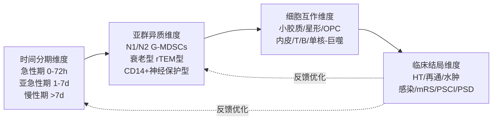
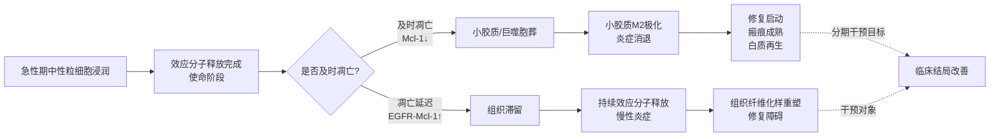
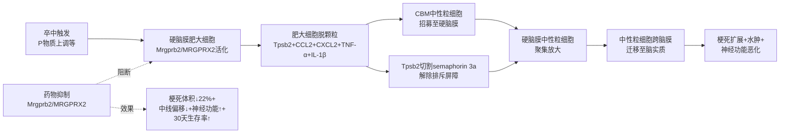
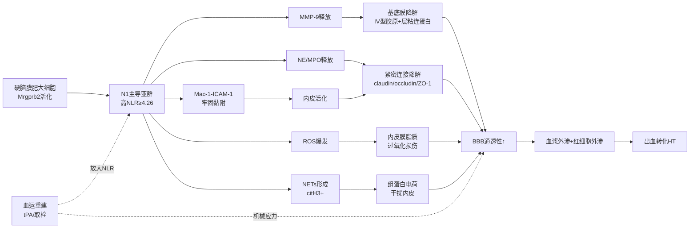
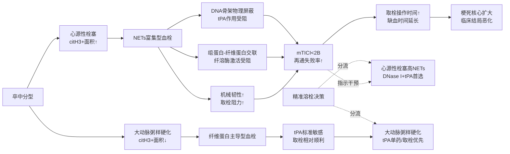
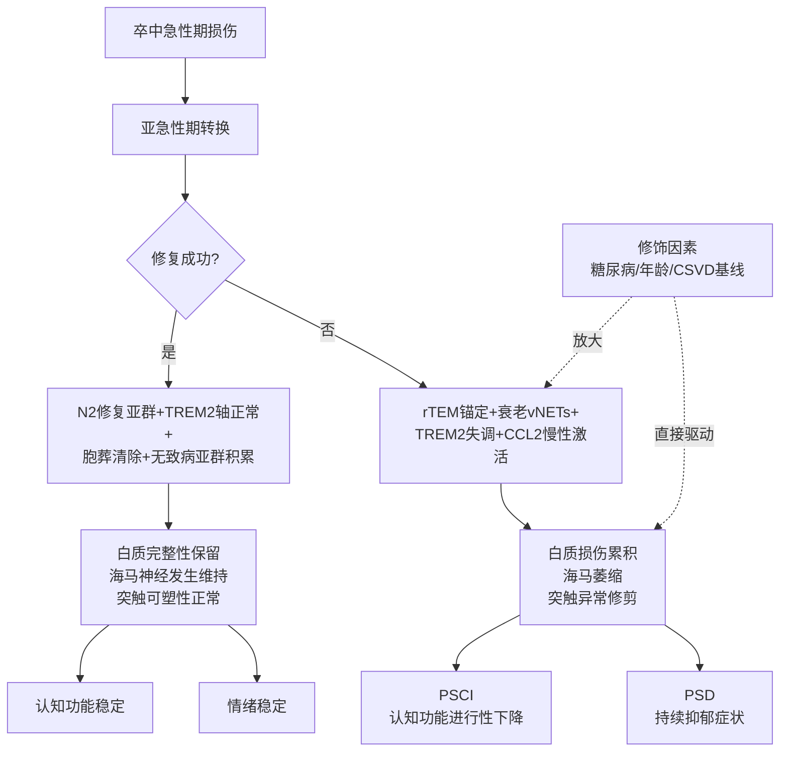
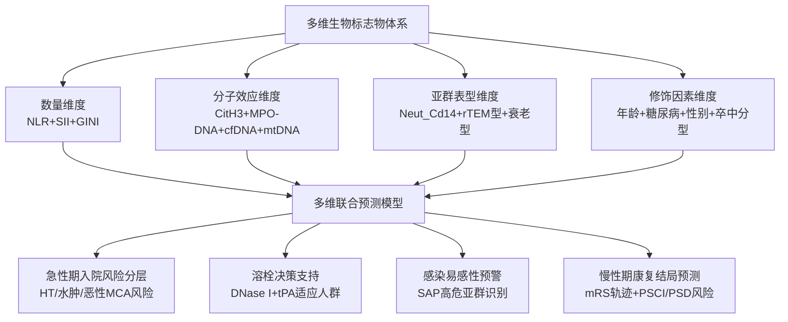
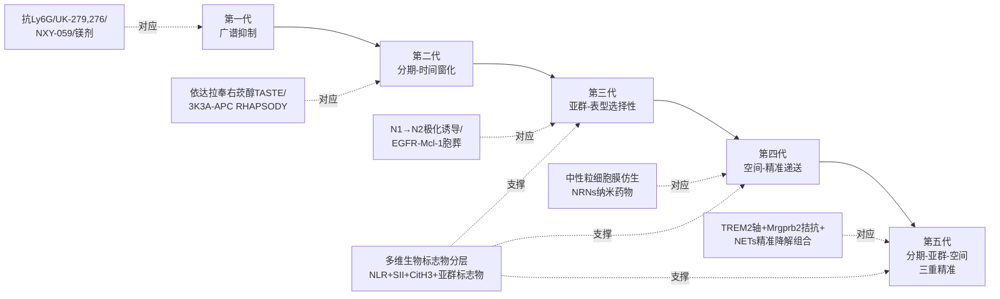
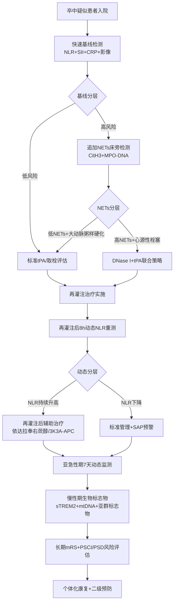

# 中性粒细胞在缺血性脑卒中急性期与慢性期的功能演变、细胞互作网络与临床结局——研究整合与未来展望
# 1 研究背景、分析框架与中性粒细胞异质性图谱

缺血性脑卒中（ischemic stroke, IS）作为全球致残与致死的主要原因之一，其病理进程远不止于神经元的能量代谢崩溃，更涉及一场由神经胶质细胞与外周免疫细胞共同导演的复杂"免疫戏剧"。在这场戏剧中，中性粒细胞作为最早突破血脑屏障（blood-brain barrier, BBB）并浸润缺血灶的外周免疫细胞，长期被视为加重脑组织损伤的核心"破坏者"[^1]。然而，随着单细胞转录组学、活体双光子成像、空间转录组等高分辨率技术的应用，中性粒细胞在脑卒中病程中所呈现出的高度异质性、可塑性与时间依赖性正逐渐被揭示，研究范式正在经历从"同质破坏者"到"异质双刃剑"的根本性转变。本章作为全报告的总论性章节，将在梳理这一认知重塑历程的基础上，论证按急性期与慢性期分期研究的科学必要性，并系统提出贯穿全报告的"时间分期—亚群异质—细胞互作—临床结局"四维分析框架。在此之上，本章将归纳中性粒细胞基础生物学的最新进展，构建脑卒中场景下的中性粒细胞异质性图谱，为后续各章的深入解析奠定理论与方法学基础。

## 1.1 中性粒细胞研究范式的演进与认知重塑

在缺血性脑卒中免疫学研究的早期阶段，中性粒细胞被普遍视为一支高度同质化的"先锋部队"，其主要功能被概括为通过释放活性氧（ROS）、基质金属蛋白酶（MMPs）和各类促炎介质，驱动炎症级联反应、加剧神经元损伤并破坏血脑屏障[^2]。这一"单一破坏者"图景在很大程度上来自于对外周血中性粒细胞计数升高与不良预后相关性的临床观察，以及动物模型中粗放性中性粒细胞耗竭策略所获得的有限神经保护证据。然而，基于该图景所设计的"广谱抗中性粒细胞"策略——例如早期的UK-279,276（重组中性粒细胞抑制因子）等抗黏附分子干预——在临床转化中并未取得令人信服的疗效，这一系列受挫迫使研究者反思：**将中性粒细胞作为同质群体进行整体性抑制，是否本身就是策略层面的根本性误判？**

近年来，三股技术与发现潮流共同推动了认知范式的重塑。第一股潮流来自高维单细胞与空间组学技术的引入。首都医科大学附属北京天坛医院王伊龙教授团队2025年在《Advanced Science》发表的研究通过对卒中后24小时脑组织、颅骨骨髓、股骨骨髓和外周血单核细胞的单细胞转录组分析，鉴定了16种不同的免疫细胞类型，并首次发现脑内存在高表达Cd14基因的中性粒细胞亚型Neut_Cd14[^1]。这一发现彻底打破了"脑内中性粒细胞功能均一"的旧有假设，提示卒中后浸润脑内的中性粒细胞并非铁板一块，而是包含具有不同起源、转录因子调控网络与潜在功能取向的多个亚型。第二股潮流来自NETs（neutrophil extracellular traps，中性粒细胞胞外诱捕网）、rTEM（reverse transendothelial migration，反向跨内皮迁移）和衰老中性粒细胞等"新现象"的相继发现。在101例急性缺血性卒中患者血栓的免疫组化分析中，每一例血栓均检出NETs，且其丰度与血栓稳定性、溶栓再通失败（mTICI<2B）以及更长的取栓操作时间密切相关[^3]，这首次将NETs这一独特效应模式与卒中临床预后建立了量化关联。第三股潮流则来自跨疾病证据的横向启发：肿瘤研究中发现的CXCR4+CD62Llow"衰老中性粒细胞"通过线粒体依赖的非致死性vNETs促进乳腺癌肺转移[^4]，肺纤维化研究中揭示的高ICAM1低CXCR1表达"反向迁移型中性粒细胞"通过ICAM1–整合素信号被细胞外基质"锚定"于病灶并驱动慢性病理[^5]，这些跨疾病发现共同提示：中性粒细胞在慢性病理阶段并非"功能退场"，而是以特定亚群形式持续参与组织重塑。

这一范式转变对脑卒中免疫治疗策略产生了根本性影响。**如果中性粒细胞是包含若干功能相反亚群的异质性集合，那么基于"全军覆没"逻辑的广谱抑制策略不仅难以获得净收益，反而可能误伤参与组织修复的有益亚群，这或许正是过往临床试验失败的关键原因之一。** 由此衍生出的新策略要求精准识别有害亚群与有益亚群、刻画其时间依赖性表型转化窗口、并发展亚群选择性的干预手段，这一逻辑也将贯穿本报告后续各章的论述。

## 1.2 急性期与慢性期分期研究的科学必要性

缺血性脑卒中的病理进程具有显著的时间依赖性。基于首都医科大学金新春教授团队的综述，缺血性卒中可被划分为急性期（约1天内）、亚急性期（1–7天）和慢性期（超过7天）三个阶段，三个阶段中神经胶质细胞与免疫细胞的功能呈现出截然不同的特征[^2]。在急性期，缺血缺氧引发神经元快速损伤，释放ROS与损伤相关分子模式（DAMPs），通过激活小胶质细胞表面Toll样受体启动先天免疫，外周中性粒细胞、T/B细胞迅速浸润，整体格局以"促炎损伤"为主，形成"损伤—炎症—进一步损伤"的恶性循环；而在亚急性期，小胶质细胞经历从M1型到M2型的表型转换，星形胶质细胞通过反应性增殖形成保护性胶质瘢痕，呈现损伤与修复并存的动态转换；进入慢性期后，组织进入重塑阶段，免疫细胞功能以修复为主，但持续激活仍可能引发慢性炎症与轴突再生障碍[^2]。

将这一时间依赖性逻辑具体到中性粒细胞身上，分期研究的必要性进一步凸显。**首先**，中性粒细胞的浸润动力学具有明确的时间窗口。外周血中性粒细胞与淋巴细胞的时间动态研究表明，中性粒细胞-淋巴细胞比值（NLR）在卒中后48–72小时计算时对预后预测能力最强：不良预后组该比值为8.68 ± 0.93，显著高于良好预后组的4.5 ± 0.51（p=0.009）和对照组的4.33 ± 0.66（p<0.001）；NLR≥4.58的患者出现不良预后的概率是NLR<4.58患者的5.58倍[^6]。这一明确的时间节点提示，将中性粒细胞动态简化为"卒中后某时点的横截面计数"将丢失关键预后信息。**其次**，中性粒细胞的表型分布在不同时期呈现迁移性变化。糖尿病合并急性缺血性卒中研究指出，中性粒细胞具有N1（促炎、释放NETs）和N2两种极化状态，N1在急性期主导而N2占比可能在后期上升[^7][^8]，这种时间依赖性的极化平衡若被忽视，将导致研究结论自相矛盾。**再者**，中性粒细胞的功能取向在急性期与慢性期发生根本性翻转：急性期以破坏BBB、加重水肿、促进血栓稳定为主；而到了慢性期，特定亚群可能参与血管生成、碎片清除与组织重塑[^2][^5]。

更具警示意义的是，**忽视时间维度的研究设计往往导致治疗时间窗的严重误判**。例如，若仅基于急性期"中性粒细胞=损伤"的认识就在卒中后较晚时点（如5–7天）进行广谱中性粒细胞耗竭，可能恰好抑制了正在向修复表型转化的亚群，反而损害神经功能恢复。这一逻辑在肺纤维化研究中已有明确警示——传统观点认为中性粒细胞主要参与急性炎症反应而在慢性纤维化阶段作用有限，但rTEM中性粒细胞研究证实其在疾病后期仍发挥关键致病作用[^5]。这强烈提示，对脑卒中中性粒细胞的研究亦不能局限于急性炎症阶段。综上，按照急性期与慢性期进行分期研究，既是病理生物学规律的客观要求，也是精准识别治疗靶点与干预窗口的方法论必需。

## 1.3 四维分析框架的构建与统领逻辑

基于上述范式转变与分期研究的必要性，本报告提出"**时间分期—亚群异质—细胞互作—临床结局**"四维分析框架，作为整合分散证据、连接基础研究与临床转化的统领性方法论工具。该框架的四个维度并非简单并列，而是构成层层递进、相互嵌套的分析逻辑。

下图通过Mermaid流程图直观展示该四维框架的内涵与逻辑层级：



**时间分期维度**刻画病理演变的纵向脉络，要求任何对中性粒细胞功能的论断都必须明确其所处的时间窗——是在急性期（炎症级联与BBB破坏期）、亚急性期（损伤—修复转换期），还是在慢性期（组织重塑期）。这一维度回应了P-4推理标准对功能双向性的要求，警示研究者避免将急性期破坏性结论简单外推至慢性期。**亚群异质维度**揭示功能多样性的分子基础，要求对中性粒细胞效应的描述定位到具体的亚群——是N1还是N2，是G-MDSCs还是衰老型，是rTEM型还是CD14+型——而非笼统地谈论"中性粒细胞"这一集合概念。**细胞互作维度**还原微环境网络的横向联系，要求构建中性粒细胞与小胶质细胞、星形胶质细胞、少突胶质前体细胞（OPCs）、血管内皮细胞、T/B细胞、单核-巨噬细胞之间的双向信号网络[^2][^9]，识别可干预的关键节点。**临床结局维度**提供转化医学的终点验证，要求每一条机制链最终都能对应到具体临床指标，包括出血转化（HT）、再通效率、脑水肿、感染、mRS评分、卒中后认知障碍（PSCI）与卒中后抑郁（PSD）等。

该框架的统领作用体现在三个层面。第一，**它为分散证据的整合提供坐标系**。当前文献中关于中性粒细胞作用的描述常常各执一端——有研究强调其破坏作用，有研究强调其修复潜能，有研究聚焦NETs，有研究聚焦MDSCs——这些看似矛盾的结论在四维坐标系下往往可以被定位到不同象限，从而获得统一的解释。第二，**它为后续章节论述提供逻辑骨架**。本报告第2章聚焦急性期招募与损伤机制（时间×互作），第3章探查慢性期功能转换（时间×亚群），第4章解析NETs双向作用（时间×效应分子×结局），第5章构建互作网络（亚群×互作），第6章推演结局映射（全维度耦合），第7章梳理治疗策略（亚群×干预），第8章批判方法学局限，第9章展望未来——每一章均可视为该框架在特定切面上的深度展开。第三，**它为未来研究设计与临床转化提供方法论指引**，要求转化研究不仅回答"是否有效"，更要回答"在哪个时间窗、针对哪个亚群、通过调控哪一对互作、改善哪一项结局"。

## 1.4 中性粒细胞基础生物学进展

要理解中性粒细胞在脑卒中中的复杂行为，须首先把握其基础生物学的最新进展。中性粒细胞起源于骨髓，由骨髓造血干细胞（HSC）增殖分化形成，是血液循环中最常见的多形核白细胞，约占成人外周血白细胞总数的70%；其作为固有免疫系统的短效效应细胞，半衰期仅数小时，依赖骨髓的不断补充维持数量稳定[^4]。

**经典骨髓造血发育路径**遵循HSC—多能祖细胞（MPP）—粒-单核祖细胞（GMP）—proNeu—preNeu—成熟中性粒细胞的层级谱系。基于流式高维分型，HSC可通过Lin⁻Sca1⁺cKit⁺（LSK）门控并细分为CD150⁺CD48⁻的长期HSC、CD34⁻CD135⁻的LT-HSC等亚群；进入髓系发育后，proNeu1可被定义为(Lin/CD115/Flt3)⁻cKitʰⁱCD16/32ʰⁱLy6C⁺CD34ʰⁱCD11bˡᵒCD106⁻，proNeu2则进一步上调CD11b与CD106表达[^10]。这一谱系的精细划分为追踪中性粒细胞在病理状态下的提前释放、应激造血与表型偏移提供了基础参考。

然而，**真正颠覆既有认识的，是颅骨骨髓（calvarial bone marrow, CBM）作为脑卒中后髓系细胞重要起源这一新发现**。王伊龙教授团队的单细胞转录组研究通过对卒中后24小时脑组织、CBM、股骨骨髓（FBM）和外周血单核细胞（PBMCs）的并行分析，揭示了一条此前未被充分认识的免疫细胞输送通路：脑内出现的Cd14高表达中性粒细胞亚型Neut_Cd14，其转录组学相似性与拟时序分析提示其可能起源于CBM中的前体中性粒细胞，而非传统认为的远端长骨骨髓；中性粒细胞内转录因子的调节网络顺序激活则调控了Neut_Cd14的分化与发育[^1]。同时，研究还揭示，疾病相关炎性巨噬细胞（DIMs）来源于CBM中的单核细胞，而中枢神经系统相关巨噬细胞（CAMs）则可能来源于胚胎前体细胞[^1]。**这一发现的颠覆性意义在于：脑卒中后浸润脑内的部分髓系免疫细胞并非全部来自全身循环动员，而是相当比例来自直接连接颅骨与硬脑膜的"局部供给"通路，这从根本上改变了我们对脑—免疫交互空间结构的认识，并提示靶向中性粒细胞的干预策略需要考虑全身骨髓与颅骨骨髓两个来源的差异性贡献。** 

在**循环寿命与组织驻留**方面，中性粒细胞的传统"短寿命"印象正在被修正。研究显示，在感染、炎症、肿瘤等病理状态下，中性粒细胞可通过环境信号延长寿命、发生"老化"或获得组织驻留能力，且不同寿命阶段的中性粒细胞具有不同的功能取向[^5]。**迁移机制**则远比经典的"黏附级联"模型复杂：除了选择素—整合素—跨内皮迁移这一正向路径外，反向跨内皮迁移（rTEM）的发现揭示了中性粒细胞可从组织重新返回循环或在内皮下"滞留"的可能[^5]。研究rTEM的关键技术包括3D活体共聚焦激光扫描显微镜（CLSM）、抗PECAM-1抗体标记内皮连接，以及流式检测L-选择素、PSGL-1、VLA-4、LFA-1等黏附分子表达变化[^5]，这些方法为揭示中性粒细胞在卒中后脑血管屏障中的复杂行为提供了工具。

在**核心效应功能**方面，中性粒细胞的"武器库"包括脱颗粒（释放MMP-9、弹性蛋白酶NE、髓过氧化物酶MPO等）、ROS爆发、NETs形成（NETosis）、细胞因子分泌等。其中NETs作为近年研究热点，其诱导可通过PMA、A23187、过氧化氢、LPS、免疫复合物等多种信号触发，关键调控分子包括PKC、钙通道、PAD4等[^5]。值得特别关注的是，浙江大学黄建教授团队在乳腺癌肺转移研究中揭示了一种**线粒体依赖的非致死性vNETs**形成机制：肿瘤分泌的NAMPT蛋白激活衰老中性粒细胞中的SIRT1，SIRT1通过开启线粒体膜通透性转换孔（mPTP）促进线粒体DNA释放，最终引起vNETs形成[^4]。这一发现拓展了对NETs生物发生机制的理解，提示在缺血性卒中场景下亦可能存在类似的、不依赖于细胞死亡的NETs亚类，这对设计NETs干预策略具有重要参考意义。

## 1.5 中性粒细胞亚群异质性图谱

基于上述基础生物学进展，本节系统比较与缺血性脑卒中相关的关键中性粒细胞亚群，构建本报告所采用的异质性图谱。下表汇总了各亚群的核心标志物、诱导信号、关键调控因子、效应功能与组织/疾病分布：

| 亚群 | 表面/分子标志物 | 诱导信号 | 关键调控/效应分子 | 主要功能 | 组织/疾病情境 |
|---|---|---|---|---|---|
| **N1型** | 经典激活表型 | DAMPs、TLR4、IFN-γ等 | NETs、MMP-9、NE、MPO、ROS、IL-1β/IL-6/TNF-α | 促炎、加重BBB损伤、神经元损伤 | 急性期脑组织[^2][^7][^8] |
| **N2型** | 替代激活表型 | TGF-β、IL-10等抗炎信号 | Ym1、VEGF、抗炎因子 | 抗炎、促血管生成、组织修复 | 亚急性—慢性期[^8] |
| **G-MDSCs/PMN-MDSCs**（小鼠） | CD11b⁺Ly6G⁺Ly6Cˡᵒʷ | 慢性炎症、肿瘤源性细胞因子 | Arg-1、iNOS、ROS | 强免疫抑制（抑T细胞/诱Treg） | 肿瘤、慢性炎症；卒中场景待深化[^11][^12] |
| **G-MDSCs**（人类） | CD14⁻CD11b⁺CD33⁺CD15⁺ | STAT3信号、IL-6等 | Arg-1、iNOS、ROS | 免疫抑制 | 多种病理[^11][^12] |
| **衰老型（Naged）** | CXCR4⁺CD62Lˡᵒʷ、过分叶核 | NAMPT-SIRT1轴 | SIRT1、mPTP、线粒体DNA、vNETs | 形成vNETs捕捉循环细胞、促转移 | 乳腺癌肺转移；卒中类比待验证[^4] |
| **rTEM型** | ICAM1ʰⁱCXCR1ˡᵒ（CD54ʰⁱ） | ECM锚定、整合素信号 | ICAM1-Integrin、sICAM1（经CTSC切割） | 滞留病灶、激活成纤维细胞、慢性致病 | 肺纤维化；卒中慢性期类比待证[^5] |
| **CD14⁺Ly6Gˡᵒ（Neut_Cd14）** | 高表达Cd14基因 | 颅骨骨髓特异性微环境 | 转录因子调节网络顺序激活 | 卒中急性期脑内特殊亚型 | 卒中后24h脑组织[^1] |
| **促血管生成型** | 与N2/特殊亚群部分重叠 | 缺氧、VEGF信号 | VEGF | 血管新生、组织修复 | 慢性期、肿瘤新生血管[^4] |

从该图谱可以提炼出几条贯通性观察。**第一，亚群标志物体系存在跨物种与跨疾病的不完全对应。** 例如G-MDSCs在小鼠以CD11b⁺Ly6G⁺Ly6Cˡᵒʷ定义，而在人则采用CD14⁻CD11b⁺CD33⁺CD15⁺[^11][^12]，这种差异给跨物种结论的迁移带来挑战。**第二，亚群间存在显著的表型重叠与功能交叉**。Naged虽形态学上与PMN-MDSC类似（过分叶核、衰老特征），但黄建团队研究明确指出"Naged不同于PMN-MDSC，它不具备强免疫抑制功能，反而具有强NETs形成能力"[^4]，这一区分对于精准定义亚群至关重要。**第三，部分亚群的发现来自跨疾病情境（肿瘤、肺纤维化），其在脑卒中场景下的存在与功能有待直接验证**。如rTEM中性粒细胞在肺纤维化中被ECM锚定并驱动慢性纤维化的机制[^5]，是否在脑卒中慢性期重塑阶段呈现类似行为，目前尚无直接证据，但其逻辑相似性为后续研究提供了重要假说。**第四，Neut_Cd14作为卒中场景下原生发现的亚群，其与上述跨疾病亚群的对应关系尚不清楚**——它是否相当于某种卒中特异性的"N1变体"或"早期成熟型"，或代表全新的功能类别，有待进一步功能学验证[^1]。

## 1.6 亚群表型—功能假设的验证与现有划分体系的局限

基于上述异质性图谱，本节论证"**亚群表型决定功能**"这一核心假设的证据基础，并批判性分析现有划分体系的局限。

**该假设的证据基础**主要来自三类研究：其一，N1/N2极化的功能差异已在多种缺血性卒中模型中获得验证。糖尿病合并AIS研究显示，糖尿病AIS患者外周血中性粒细胞计数显著高于非糖尿病AIS患者，且MCAO小鼠合并2型糖尿病模型中N1亚型与NETs的产生显著增加，对应更严重的梗死体积与神经功能缺损[^7]。这一对照性证据强力支持"N1亚群占比决定损伤程度"的假设。其二，跨疾病的衰老中性粒细胞研究明确指出：在排除了PMN-MDSC的免疫抑制功能可能后，Naged的促转移作用直接归因于其特异性的vNETs形成能力，且应用SIRT1的广谱抑制剂Vit B3可有效阻断衰老中性粒细胞产生并显著减少肿瘤肺转移[^4]，这从干预层面验证了"特定亚群表型→特定功能输出"的因果链条。其三，肺纤维化中rTEM中性粒细胞研究表明，CTSC基因敲除小鼠中ICAM1切割减少，肺纤维化程度显著减轻；体内去除中性粒细胞同样可减少ICAM1并缓解纤维化[^5]，进一步支持"亚群—分子轴—功能"链条的因果性。这些证据共同表明，亚群表型决定功能的假设在多个疾病情境下具有高度普适性，但其表达形式存在情境依赖性——同一类亚群在不同微环境中可能调用不同的效应分子组合输出最终功能。

然而，**当前亚群划分体系的局限**同样不容忽视，且这些局限直接关系到本报告后续推论的可信度边界。

**第一，N1/N2二分法过于简化**。借鉴自巨噬细胞M1/M2极化的二元框架被直接套用到中性粒细胞，但越来越多的证据显示中性粒细胞表型构成连续谱而非两个离散端点，N1与N2之间存在大量过渡态，且单细胞测序所揭示的Neut_Cd14、Naged、rTEM等亚群都难以被简单归入N1或N2[^4][^5][^1]。**第二，人鼠标志物不完全对应**。如G-MDSCs在小鼠依靠Ly6G/Ly6C组合而在人依靠CD14/CD15/CD33[^11][^12]，rTEM在小鼠肺中以ICAM1ʰⁱCXCR1ˡᵒ定义[^5]但在人脑卒中是否使用同样标志物尚未系统验证，这给临床转化带来挑战。**第三，亚群可塑性与表型转换难以静态捕捉**。中性粒细胞具有高度可塑性，单细胞测序所提供的"快照"可能仅捕捉了某一时点的状态，而亚群间的动态转化（例如急性期N1是否向亚急性期N2再编程）需要拟时序分析、谱系追踪等更复杂的方法学才能刻画[^1]。**第四，单细胞分群与功能验证脱节**。当前许多新亚群的命名来自转录组聚类，但其功能边界尚未通过分选-回输或基因编辑等手段获得严格验证；亚群命名的"通胀"反而可能掩盖真正具有差异化功能的亚群。**第五，跨疾病亚群的脑卒中适用性有待直接证实**。Naged、rTEM等概念虽具有强烈的逻辑吸引力，但其在缺血性脑卒中急性期与慢性期的存在比例、起源路径与功能贡献仍需直接的卒中模型与人体样本验证。

综上，本报告将秉持以下原则推进后续分析：在引用某一亚群相关结论时，明确标注其来源疾病情境与证据等级；在跨疾病迁移亚群概念时，区分"已在卒中验证"与"基于跨疾病类比的合理推测"；并在第8章对方法学局限进行系统性批判性评估。**本章所构建的四维分析框架与异质性图谱将作为全报告的核心方法论与概念基础，统领后续各章对急性期招募损伤、慢性期修复、NETs双向作用、互作网络、结局映射、治疗策略与未来方向的深入论述。**

# 2 急性期中性粒细胞的招募、活化与损伤机制

承接第1章构建的"时间分期—亚群异质—细胞互作—临床结局"四维分析框架，本章将焦点锁定在缺血性脑卒中发病后0–72小时这一关键时间窗，沿"动员—招募—迁移—聚集—效应—结局"的纵向链条，系统解析中性粒细胞作为"第一道炎症先锋"在急性期的病理生理行为。这一时间窗具有特殊的临床转化意义：它既是当前tPA静脉溶栓（4.5小时）与机械取栓（6–24小时）的核心治疗窗口，也是出血转化、恶性脑水肿、再通失败等关键不良结局的高发时段。本章的核心任务是回应一系列具有干预启示的关键问题——卒中后浸润脑内的中性粒细胞究竟来自何处？它们如何穿越血脑屏障的物理屏障？哪些效应分子构成了组织损伤的核心驱动力？空间上它们究竟"驻足血管周"还是"深入脑实质"？这些机制如何最终映射到临床可量化的结局指标？通过整合王伊龙团队关于颅骨骨髓的颠覆性发现、方超团队关于Mac-1活化新机制的揭示、郭付有团队关于MMP-9单抗的转化证据，以及NETs在血栓骨架中的结构性证据，本章力求为后续章节提供严谨的急性期病理生物学基础与可干预靶点清单。

## 2.1 急性期中性粒细胞动员的双源模式：全身骨髓与颅骨骨髓的差异性贡献

长期以来，缺血性卒中后浸润脑内的中性粒细胞被默认为来自全身循环动员——即损伤相关分子模式（DAMPs）经血液进入骨髓，通过G-CSF、CXCL1/CXCL2等信号驱动股骨等长骨骨髓中的成熟与未成熟中性粒细胞快速释放入血，再经颈动脉系统循环至缺血灶并跨血脑屏障浸润。这一"远端动员—血源招募"模型曾是卒中免疫学的标准叙事，亦是抗黏附分子干预策略的逻辑基础。

然而，王伊龙教授团队2025年发表于《Advanced Science》的研究通过对卒中后24小时脑组织、颅骨骨髓（calvarial bone marrow, CBM）、股骨骨髓（femoral bone marrow, FBM）和外周血单核细胞（PBMCs）的并行单细胞转录组分析，从根本上挑战了这一单源叙事[^13][^1]。该研究共鉴定出16种不同的免疫细胞类型，并首次发现卒中急性期脑内存在高表达Cd14基因的中性粒细胞亚型Neut_Cd14；通过转录组学相似性比较与拟时序（pseudotime）分析，研究者推断该亚型很可能起源自CBM中的前体中性粒细胞，而非传统认为的远端FBM；中性粒细胞内一系列转录因子调节网络的顺序激活进一步调控了Neut_Cd14的分化与发育[^13][^1]。与此并行，该研究还揭示疾病相关炎性巨噬细胞（DIMs）同样来源于CBM中的单核细胞，而中枢神经系统相关巨噬细胞（CAMs）则可能来源于胚胎前体细胞[^13][^1]。

**这一发现的颠覆性意义在于，它将颅骨—硬脑膜—脑膜—脑实质这一"局部解剖通道"提升为脑卒中急性期髓系免疫细胞输送的关键途径，与传统血源招募并列构成"双源动员"模式。** 颅骨骨髓直接毗邻硬脑膜并通过颅骨内层的微通道与脑膜淋巴系统、Virchow–Robin间隙等结构存在物质交换可能[^1]，这意味着卒中后CBM内的中性粒细胞前体可能通过较短的物理距离与较少的内皮屏障穿越，迅速到达缺血脑组织。下表汇总了双源动员模式在前体细胞库、动员信号、迁移路径与功能取向上的初步差异：

| 维度 | 全身骨髓（以FBM为代表） | 颅骨骨髓（CBM） |
|---|---|---|
| 解剖位置 | 远端长骨，需经全身循环 | 紧邻硬脑膜，直接通道 |
| 动员信号 | DAMPs—G-CSF—CXCL1/2系统性级联 | 局部微环境信号（待深入解析） |
| 迁移路径 | 入血→颈动脉→脑微血管→跨BBB | 颅骨微通道→硬脑膜→脑膜→脑实质 |
| 主要输出亚群 | 成熟外周血型中性粒细胞 | Neut_Cd14（卒中急性期脑内特异性） |
| 屏障穿越数 | 多重内皮屏障 | 屏障数较少，路径较短 |
| 时间动力学 | 数小时—数天的级联动员 | 可能更快到达，时间动力学待精细刻画 |

需要谨慎指出的是，王伊龙团队基于转录组学相似性与拟时分析所做的"起源推断"仍属于计算生物学层面的相关性证据，严格的谱系示踪（如CBM局部荧光标记或基因报告系统）证据尚有待进一步补充[^13]。但即便保守评估，该研究所揭示的"卒中后浸润脑内的中性粒细胞并非全部来自全身循环动员，而是相当比例来自局部供给通路"这一核心结论，已对急性期治疗策略提出三重启示：**第一**，现有抗黏附分子干预策略（如靶向P-selectin、VLA-4等）主要拦截的是血源性招募路径，对CBM局部直接通路的覆盖可能不足，这或许部分解释了过往临床试验疗效不佳的原因；**第二**，治疗时间窗的设计需考虑CBM动员可能比全身动员更快这一变量，干预时机或须前移；**第三**，针对CBM动员通路的特异性靶点开发（如颅骨微通道封闭、CBM局部信号阻断）可能成为新一代干预策略的探索方向。

## 2.2 黏附级联与趋化因子驱动的跨血脑屏障迁移

无论中性粒细胞来自全身骨髓还是颅骨骨髓，一旦其需要从血管腔内进入脑实质或血管周间隙，都必须经历经典的"渗出（extravasation）"四步级联：滚动（rolling）、黏附（adhesion）、爬行（crawling）和穿越（transmigration），这一过程由选择素（selectins）和整合素（integrins）等黏附分子与一系列趋化因子协同精密调控[^14]。

**初始滚动**主要由选择素家族介导。P-selectin与E-selectin在缺血激活的脑微血管内皮表面快速上调，通过与中性粒细胞表面的PSGL-1（P-selectin glycoprotein ligand-1）相互作用使中性粒细胞从血流中"被捕获"，并以低速沿内皮表面滚动；中性粒细胞自身表达的L-selectin则参与同型与异型的细胞识别，其表达水平的下调可作为中性粒细胞活化与rTEM潜能的指标[^5]。

**牢固黏附**这一关键步骤由整合素家族主导，其中巨噬细胞-1抗原（Mac-1，αMβ2，CD11b/CD18）与淋巴细胞功能相关抗原-1（LFA-1，αLβ2，CD11a/CD18）是介导中性粒细胞招募的核心整合素分子；活化后的Mac-1与内皮细胞表面配体结合，促进中性粒细胞在内皮表面的稳定黏附、爬行与迁移[^14]。然而，**整合素活化的精细调控机制此前并不完全清楚**，方超教授团队2024年发表于《Arteriosclerosis, Thrombosis, and Vascular Biology》的研究为这一空白提供了重要补充：研究采用骨髓移植术构建髓系ERp72敲除小鼠（BMErp72⁻/⁻），通过微血管荧光活体成像和体外黏附实验发现Erp72⁻/⁻中性粒细胞存在Mac-1介导的黏附/爬行缺陷；进一步机制研究显示，中性粒细胞表面ERp72与Mac-1在脂筏中共定位并呈簇状聚合分布，ERp72能切割CD11b亚基"thigh"和"genu"结构域之间的C654–C711二硫键，促进还原性巯基暴露并推动整合素构象改变；高灵敏的生物膜力学探针（BFP）技术进一步证实ERp72能直接增强Mac-1对其配体的结合力；在LPS诱导的肺损伤模型中，髓系敲除ERp72显著减轻中性粒细胞浸润、渗出和组织损伤并提高存活率[^14]。**这一研究将"二硫键变构调控"提升为整合素活化的关键机制层级，并提示C654–C711变构二硫键与胞外ERp72可作为治疗中性粒细胞相关血管炎症的新靶点**[^14]，对急性期卒中干预具有直接的转化启发意义。

整合素的关键内皮配体ICAM-1（细胞间黏附分子-1）的功能复杂性同样不可忽视。ICAM-1全长由D1–D2–D3–D4–D5五个结构域组成，其中D1是LFA-1的结合结构域，D3是Mac-1的结合结构域[^14]。研究显示，ICAM-1存在多种选择性剪接异构体，转基因小鼠模型证实Exon 4缺失小鼠表达D1D4D5、D1D2D5和D1D5；Exon 5缺失小鼠表达D1D2D3D5、D1D2D5和D1D5；在脓毒症模型中，Exon 4缺失小鼠肝脏中性粒细胞招募显著减少且无死亡，而Exon 5缺失小鼠几乎全部死亡并伴随大量中性粒细胞招募，该模型进一步通过LFA-1与Mac-1基因敲除实验证实ICAM-1异构体主要通过与Mac-1相互作用发挥功能差异[^14]。**这一发现警示，对ICAM-1的"全谱抑制"可能掩盖不同异构体的差异化作用——某些异构体的招募可能加重损伤，而另一些则可能限制损伤——精准靶向特定异构体或Mac-1结合位点（D3）有望避免广谱抑制带来的副作用**。

**穿越内皮**这一步骤主要由PECAM-1（CD31）介导，活体内三维共聚焦成像中常通过抗PECAM-1抗体标记内皮连接以区分中性粒细胞的迁移路径，这一方法学对识别正向跨内皮迁移（TEM）与反向跨内皮迁移（rTEM）至关重要[^5]。

**趋化因子轴**则提供了招募的方向性梯度。基于趋化因子结构的N端半胱氨酸数目与间距，趋化因子被分为CXC、CC、XC、CX3C四个亚家族[^15]。在缺血灶定向招募中性粒细胞方面，CXC亚家族的CXCL1、CXCL2通过CXCR2受体形成强力趋化梯度；而CC亚家族则承担更广谱的免疫细胞召集功能：CCL2（MCP-1）通过结合CCR2受体激活神经免疫细胞、诱导神经炎症；CCL5等成员参与多种炎症反应[^15]。值得注意的是，CCL2-CCR2轴不仅参与中性粒细胞与单核细胞招募，还与神经元自身在炎症与情绪行为中的反应有关——例如高血糖通过激活TonEBP上调神经元CCL2表达，加剧焦虑相关行为[^15]——这提示在合并糖尿病的卒中患者中，CCL2-CCR2轴可能既参与急性炎症招募，又参与远期神经精神并发症，构成贯穿急慢性期的关键节点。

整合上述分子节点，急性期中性粒细胞跨BBB迁移的可干预清单可归纳为：选择素层（抗P-selectin抗体、PSGL-1拮抗）、整合素层（Mac-1/LFA-1抑制剂、ERp72变构二硫键靶向）、配体层（ICAM-1异构体特异性干预）、跨内皮层（PECAM-1调节）和趋化梯度层（CXCR2拮抗、CCR2阻断）。这一多层次靶点结构既为精准干预提供了多元选择，也警示单一靶点策略难以覆盖整个级联——这或许又是过往临床试验疗效有限的一个深层原因。

## 2.3 效应分子武器库：MMP-9、NE、MPO与ROS对血脑屏障与神经元的破坏

中性粒细胞一旦完成跨BBB迁移并到达缺血灶（无论是血管周还是脑实质，详见2.6节），即通过脱颗粒和氧化爆发释放其"武器库"中的核心效应分子，驱动急性期的组织破坏。这些武器中最具临床转化意义的当属基质金属蛋白酶-9（MMP-9）。

**MMP-9是公认的经典脑卒中治疗靶点**。它是一种能够降解血管基底膜（IV型胶原、层粘连蛋白等）和内皮紧密连接蛋白的酶，破坏血脑屏障的结构与功能完整性，其在卒中后的快速上调直接导致BBB破坏[^15][^16]。然而，已开发的MMP-9小分子抑制剂普遍存在特异性低和副作用大等问题，目前尚无能够有效抑制MMP-9活性的药物被批准用于临床治疗，相关领域的药物研究多年来进展缓慢[^16]。郑州大学第一附属医院郭付有教授团队联合中国科学院深圳先进技术研究院畅君雷研究员团队、南方医科大学南方医院冀雅彬副教授团队，于2023年在《Pharmacological Research》发表的研究为这一困境提供了突破口：研究基于直接抑制功能选择策略开发了一个MMP-9全人源单克隆抗体L13，通过两种小鼠脑卒中模型和卒中患者样本系统评估其治疗潜力[^15][^16]。**关键证据包括**：

- 在缺血性或出血性脑卒中后于再灌注开始时静脉注射L13抗体能够显著减少小鼠脑组织损伤、改善神经功能和生存率[^15][^16]；
- 与对照IgG相比，L13在两类卒中模型中均能显著抑制MMP-9介导的脑血管基底膜和内皮紧密连接蛋白降解，从而保护BBB完整性[^15][^16]；
- L13在人类卒中患者来源的血液和血肿旁脑组织样本中也能有效抑制MMP-9活性，且与其他MMP家族成员无交叉反应，表现出高度的特异性和中和活性[^15][^16]。

**这一研究的转化意义在于：它证明通过精准的单克隆抗体策略可以克服传统小分子抑制剂"低特异性—高副作用"的瓶颈，为MMP-9这一"经典靶点"提供了重新焕发临床价值的可能性**[^16]。L13作为新一代MMP-9靶向治疗的候选药物，已被研究团队列入推动临床前与临床试验的转化路线图，但其在人体卒中复杂背景（如合并溶栓、取栓、出血风险）下的疗效与安全性仍需大规模临床验证。

除MMP-9外，**弹性蛋白酶（neutrophil elastase, NE）与髓过氧化物酶（myeloperoxidase, MPO）** 是中性粒细胞武器库中的另两个核心组件。在生理状态下，NE等被储存于嗜天青颗粒中；炎症发生时，胞内ROS分子显著增多，经MPO催化后转化为次氯酸（HOCl），促进嗜天青颗粒膜上NE与MPO的解离[^16]。这一过程不仅是NETs形成的关键启动步骤（详见2.4节），其单独释放的NE与MPO本身即对周围组织具有强大的杀伤力——NE可降解细胞外基质蛋白与紧密连接组分，MPO催化产生的HOCl能氧化损伤脂质、蛋白质与DNA，并通过MPO–DNA复合物本身作为内源性损伤信号进一步激活下游炎症[^16]。

**ROS爆发**则是上述效应分子协同作用的核心放大器。中性粒细胞通过NADPH氧化酶（NOX2）复合物组装产生大量超氧阴离子，进而通过歧化与酶催化反应衍生出过氧化氢、羟自由基、HOCl等多种活性氧物种[^16]。这些ROS对缺血脑组织产生多重打击：损伤线粒体功能进一步加剧能量代谢崩溃、引发膜脂质过氧化触发铁死亡与细胞凋亡、氧化损伤BBB内皮的紧密连接蛋白与基底膜组分、并通过氧化修饰DAMPs将炎症信号进一步放大。

**这些效应分子并非孤立作用，而是相互协同形成"损伤—炎症—再损伤"的恶性循环：** MMP-9降解BBB→血浆成分外渗→DAMPs进一步释放→更多中性粒细胞被招募→更多MMP-9/NE/MPO/ROS释放→BBB进一步破坏。这一正反馈环路的存在意味着，单点阻断（如仅抑制MMP-9）即便完全成功，也可能因循环中其他节点的代偿而仅获得部分疗效；这为"多靶点联合干预"策略提供了机制依据，也呼应了第7章将讨论的依达拉奉右莰醇等多靶点药物的设计思路。

## 2.4 NETs的急性期形成及其对血栓稳定与溶栓抵抗的作用

在中性粒细胞的所有效应模式中，**中性粒细胞胞外诱捕网（NETs）** 因其独特的结构特征与跨多种疾病的病理意义，成为近年研究热点。NETs是由胞质内蛋白与染色质结合后所形成的网状结构，其中胞质内蛋白主要包括NE、MPO、组织蛋白酶G（CTSG）、蛋白酶3（PR3）等[^16]。

**NETs的经典形成机制**已被相当详细地阐明：在炎症触发下，胞内以过氧化氢为代表的ROS相关分子显著增多，经MPO催化后转化为次氯酸，促进嗜天青颗粒膜上NE与MPO的解离；随后借助肌动蛋白骨架解聚和聚合、微管网络解聚和波形蛋白解聚等骨架重塑过程，NE与MPO进入胞核；入核后NE降解组蛋白H4，同时核内钙依赖性蛋白酶肽酰精氨酸脱亚胺酶4（PAD4）将组蛋白精氨酸残基瓜氨酸化（生成citH3），导致染色质解聚并最终通过细胞膜破裂将网状染色质结构与抗菌蛋白共同释放至胞外[^16]。NETosis的诱导信号包括化学诱导剂（PMA、A23187、过氧化氢）、病原体刺激（细菌、真菌、病毒、LPS）以及免疫相关刺激（免疫复合物、自身抗体、细胞因子）[^5]。检测NETs和NETosis的方法多样：光学/荧光/共聚焦显微镜可观察细胞形态变化和DNA外泄；免疫荧光染色可标记NETs组分；流式细胞术可定量NETosis细胞比例；DNA定量分析与电子显微镜可评估NETs生成量与超微结构；生化分析可检测组蛋白瓜氨酸化水平和酶活性[^5]。其抑制策略则包括药物抑制（PKC抑制剂、钙离子通道阻断剂、PAD4抑制剂、抗氧化剂）和基因编辑技术（CRISPR/Cas9、RNA干扰）[^5]。

需要补充的是，第1章已述及黄建团队在乳腺癌肺转移研究中揭示的**线粒体依赖的非致死性vNETs**——肿瘤分泌的NAMPT激活衰老中性粒细胞SIRT1，SIRT1通过开启线粒体膜通透性转换孔（mPTP）促进线粒体DNA释放，引起vNETs形成[^4]。这一新颖机制提示：NETs的生物发生途径并不唯一，是否存在卒中场景下的非死亡性vNETs亚类，是急性期机制研究值得探索的方向。

**在脑卒中急性期，NETs的最具临床意义的功能是其在血栓骨架中的结构性作用**。NETs网状结构能够物理性"包裹"血小板、纤维蛋白与红细胞，形成富含NETs骨架的血栓，这类血栓相比于纯纤维蛋白血栓具有更高的机械稳定性、更低的tPA溶栓敏感性，从而成为急性期再通失败的关键分子病理基础（基于第1章引用的101例急性缺血性卒中血栓免疫组化研究证据，每例血栓均检出NETs，且NETs丰度与血栓稳定性、mTICI<2B再通失败、更长取栓操作时间显著相关）。这一机制对急性期治疗具有直接启示：**单纯依靠tPA可能难以有效溶解NETs富集型血栓，需联合NETs降解策略以提升再通效率**。

**NETs靶向干预策略**的转化潜力已在多种疾病中初步验证：重组人脱氧核糖核酸酶I（rhDNase I）可通过降解SLE和RA小鼠体内NETs骨架进而改善病情；西维来司他（sivelestat，一种NE抑制剂）可大大降低NETs对结肠上皮细胞的杀伤力从而抑制IBD发展[^16]。在脑卒中场景下，DNase I联合tPA以"降解NETs骨架+溶解纤维蛋白"的双管齐下策略已成为提升溶栓再通率的重要研究方向；PAD4抑制剂通过阻断组蛋白瓜氨酸化阻止NETs形成的上游机制，亦具有从源头干预的吸引力。然而，需谨慎指出：NETs在生理状态下具有抗菌防御功能，其全身性、长期性抑制可能带来感染风险，这与卒中后患者本就易感的肺部感染、尿路感染等并发症风险相叠加，构成NETs干预转化的关键安全瓶颈，须在第7章中进一步讨论。

## 2.5 急性期病理结局：脑水肿、出血转化、血栓延伸与溶栓再通失败

将上述招募—活化—效应链条映射到急性期临床结局指标，可以勾画出中性粒细胞驱动的"病理输出谱"。这一映射对应了第1章四维框架中"互作与效应分子→临床结局"的关键耦合，也是评估干预策略价值的终点参照系。

**血脑屏障破坏与血管源性脑水肿**是急性期最直接的病理结局之一。中性粒细胞通过MMP-9降解基底膜与紧密连接蛋白、NE/MPO氧化损伤内皮、ROS爆发加剧氧化应激等多重机制共同破坏BBB，导致血浆成分（包括水分、蛋白质与红细胞）外渗进入脑实质，形成血管源性脑水肿[^15][^16]。其严重程度与梗死核心及半暗带的扩大、颅内压升高、脑疝风险等关键临床后果直接相关，亦是恶性大脑中动脉梗死（malignant MCA infarction）的核心病理基础。郭付有团队的L13抗体研究中，通过抑制MMP-9活性显著改善小鼠神经功能和生存率，且在出血性卒中模型中同样有效，表明**MMP-9—BBB破坏—水肿/出血**这一轴线在缺血与出血两种卒中病理中均具有核心地位[^15][^16]。

**出血转化（hemorrhagic transformation, HT）** 是急性期最受关注的不良结局之一，尤其在接受溶栓或取栓治疗后出血风险显著升高。中性粒细胞驱动的BBB破坏是HT的关键分子病理基础——当MMP-9降解血管基底膜达到一定阈值后，红细胞可经破坏的内皮屏障外渗形成点状或片状出血。L13抗体在出血性卒中模型中显示通过抑制MMP-9活性减少血管基底膜降解从而减轻血肿扩大的证据，进一步验证了这一机制链条[^16]。

**血栓延伸与溶栓再通失败**则反映了中性粒细胞NETs在血栓动力学中的结构性作用。如2.4节所述，NETs富集型血栓对tPA溶栓抵抗、对取栓操作产生更大机械阻力，导致mTICI<2B再通失败率上升与取栓操作时间延长。第1章已引用的101例急性卒中血栓研究为这一关联提供了直接的人体证据。

**外周血生物标志物**也将上述病理过程外化为可量化的预后指标。第1章已引用中性粒细胞-淋巴细胞比值（NLR）的关键证据——卒中后48–72小时计算的NLR对预后预测能力最强，NLR≥4.58对应的不良预后风险是NLR<4.58患者的5.58倍。这一时间窗特异性提示，急性期早期（数小时内）的NLR值可能尚未充分反映中性粒细胞的全身动员与活化峰值，而48–72小时窗口正对应了急性期中性粒细胞负荷最高、效应分子释放最旺盛的阶段，因此具有最佳的预测信噪比。

**修饰因素**的作用同样不可忽视。第1章引用的糖尿病合并AIS研究证据表明，糖尿病患者外周血中性粒细胞计数显著高于非糖尿病AIS患者，MCAO合并2型糖尿病小鼠模型中N1亚型与NETs的产生显著增加，对应更严重的梗死体积与神经功能缺损。这一证据链将"合并症—亚群偏移—效应分子放大—结局恶化"四个维度紧密耦合，是四维分析框架在急性期的典型范例：**糖尿病作为微环境修饰因素，通过偏移中性粒细胞亚群构成（N1占比上升）和增强NETs效应输出，最终放大了缺血损伤的临床表现**。这一发现既警示对合并糖尿病、高龄、慢性炎症等基础疾病的患者，急性期中性粒细胞干预可能需要更激进的策略；也为基于中性粒细胞表型与亚群构成的预后分层提供了概念基础（详见第6章）。

## 2.6 血管周聚集与脑实质浸润：空间分布模式的争论与方法学反思

在结束本章对急性期机制链条的整合性论述之前，必须对一个长期存在的争论进行批判性反思——**急性期中性粒细胞究竟主要在血管周聚集还是真正进入脑实质？** 这一空间分布模式的争论虽看似细节，却对治疗策略的根本选择具有重大影响：若中性粒细胞主要驻留在Virchow–Robin间隙等血管周空间而较少真正进入脑实质，则"阻断浸润"策略的价值相对有限，而"调控血管周激活"可能更具治疗意义；反之，若大量中性粒细胞确实深入梗死核心与半暗带，则跨BBB浸润本身即是关键干预点。

**血管周聚集观点**的解剖学基础植根于Virchow–Robin间隙（VRS）的生理特征。VRS由德国病理学家R. Virchow和法国生物学和组织学家C.P. Robin于一个多世纪前提出，是内衬软膜、充满组织间液、与穿通支动脉伴行的解剖间隙；电镜与示踪剂研究证明大脑半球的VRS与蛛网膜下腔并不直接相通，而是软脑膜随穿通动脉和流出静脉进出脑实质的延续；VRS外界是神经胶质界膜，内界是血管外层，随血管树延伸至毛细血管水平后胶质界膜与血管外层融合成盲端[^1]。**这一解剖结构本身即提供了一个相对独立于脑实质的免疫细胞活动空间——中性粒细胞可能在VRS中聚集、激活并通过分泌效应分子影响相邻的脑实质，而无需真正穿越胶质界膜进入脑实质内部**。VRS作为脑膜淋巴系统与胶质淋巴系统的关键节点，其功能涉及组织间液与脑脊液的物质交换，星形胶质细胞足端水通道蛋白4（AQP4）在血管周极化分布[^1]，这进一步暗示VRS中可能存在专门的免疫—神经—血管交互平台。

**脑实质浸润观点**则获得了诸多组织学与活体成像证据的支持。基于动物模型（特别是MCAO/R与光血栓模型）的尸检与免疫组化研究显示，急性期中性粒细胞标志物（如Ly6G、MPO）阳性细胞确实可在梗死核心与半暗带的脑实质中观察到。活体双光子成像技术的引入进一步推动了这一争论的解决——通过纵向活体双光子成像在光血栓诱导的缺血卒中后透过颅窗观察脑血管对缺血的反应，研究者可以从早期关键数小时到梗死后数天/数周内动态追踪BBB破坏与血管的反应，并能在血管闭塞后30分钟即在三维空间中以单血管分辨率研究BBB破坏与血流灌注紊乱等血流动力学参数；这一方法允许对单个血管对缺血的纵向响应进行检测，从而捕捉适应性与不良适应性的血管重塑[^1]。这类高分辨率证据对识别中性粒细胞究竟是"卡在内皮下方"还是"已穿越胶质界膜"具有决定性作用。

**两种观点的争论很可能并非非此即彼，而是反映了急性期不同时段、不同模型、不同空间位置的真实差异**。造成争论的可能原因可归纳为以下几点：

| 干扰因素 | 具体表现 | 对结论的影响 |
|---|---|---|
| **卒中模型差异** | 光血栓、MCAO、栓子模型的BBB破坏程度与时间动力学不同 | 不同模型可能对应不同的浸润深度 |
| **再灌注与否** | 永久性闭塞vs短暂闭塞再灌注 | 再灌注可能加剧浸润 |
| **取材时点** | 数小时vs24小时vs72小时 | 时间不同对应不同的浸润阶段 |
| **染色标志物特异性** | Ly6G、MPO、CD66b等的特异性差异 | MPO可来源于裂解残留，可能高估浸润 |
| **空间分辨率** | 普通组织学难以区分血管周与脑实质 | 高分辨率成像更可信 |
| **rTEM现象的影响** | 反向跨内皮迁移可能造成"已浸润"假象 | 需配合PECAM-1标记区分迁移方向 |

**方法学反思**的关键启示在于：未来研究应在统一时间点、统一模型、统一标志物组合（建议同时使用Ly6G/MPO/CD66b与PECAM-1标记内皮连接）下系统比较空间分布；同时优先采用3D活体共聚焦激光扫描显微镜（CLSM）等高分辨率方法以避免传统组织学的空间分辨率局限[^5][^1]。值得一提的是，第1章已述及肺纤维化研究中rTEM中性粒细胞具有高ICAM1低CXCR1表达特征并被ECM"锚定"于病灶[^5]——这一现象在脑卒中场景下是否同样存在？若存在，其在急性期的"中间状态停留"可能恰好对应了"血管周聚集"观点中的部分细胞群体，并可能为慢性期的持续病理（详见第3、4章）埋下伏笔。

**这一空间分布的争论对干预策略的根本性影响在于**：若中性粒细胞的破坏作用主要通过血管周激活与分泌效应分子（MMP-9、NE、MPO等）扩散影响脑实质，则**阻断分子扩散与中和效应分子**（如L13抗MMP-9单抗）可能比阻断细胞浸润更具效率；而若细胞确实大量浸润脑实质并通过细胞-细胞接触损伤神经元，则**抗黏附与抗趋化**策略的价值更为突出。第1章已警示广谱抗黏附干预（如UK-279,276等）的临床转化困境，部分原因或许正在于未能区分这两种空间模式下的差异化作用机制；**未来精准干预策略的设计需要建立在对急性期空间分布的精细刻画之上**，这也是第8章方法学批判与第9章未来方向中需要重点关切的议题。

---

综合本章，急性期中性粒细胞的病理生物学行为已展现出从"动员双源（全身+颅骨）→黏附级联（选择素—整合素—ICAM-1—PECAM-1）→趋化梯度（CXCL1-2/CCL2-5）→效应分子武器库（MMP-9/NE/MPO/ROS/NETs）→临床结局（水肿/HT/再通失败）"的完整链条。其中每一节点均提供了潜在的可干预靶点：CBM动员通路阻断、ERp72变构二硫键靶向、ICAM-1异构体特异性干预、L13抗MMP-9单抗、DNase/PAD4抑制剂等。然而，急性期机制链条中存在的"损伤—炎症—再损伤"恶性循环、空间分布模式的未解争论，以及合并症（如糖尿病）对亚群偏移的修饰作用，均提示单一靶点策略难以胜任复杂病理。**急性期中性粒细胞的"破坏者"角色在亚急性期与慢性期是否会发生功能再编程？早期浸润的中性粒细胞在数天后是否仍以同样的破坏性表型存在，抑或转向修复性表型？这一时间维度的功能转换将是第3章"慢性期中性粒细胞的功能转换与修复角色"的核心议题。**

# 3 慢性期中性粒细胞的功能转换与修复角色

第2章已系统勾勒了缺血性脑卒中急性期（0–72小时）中性粒细胞作为"破坏者"的完整病理链条——从颅骨骨髓与全身骨髓双源动员，经选择素—整合素—ICAM-1级联跨血脑屏障迁移，到MMP-9、NE、MPO、ROS与NETs联合驱动血脑屏障破坏、脑水肿、出血转化与溶栓抵抗。然而，按照第1章所确立的"时间分期"维度，急性期的破坏性结论不能被简单外推至卒中后数天至数周的慢性期。事实上，**越来越多的跨疾病证据与卒中场景下的探索性研究共同指向一个反直觉的图景：随着微环境信号的转换，中性粒细胞并未"功能退场"，而是经历表型再编程，在慢性期同时承担修复参与者与潜在持续致病者的双重角色。** 本章将沿"功能再编程时间窗→N2型修复效应→凋亡-胞葬有序退场→胶质瘢痕与白质重塑→慢性期持续致病亚群假说→分期干预策略反思"六个层次展开，论证"慢性期中性粒细胞具修复潜能"这一核心假设，同时引入跨疾病类比构建破坏与修复并存的"功能跷跷板"图景，为第7章治疗策略的时间窗精细化设计提供理论依据。

需要在论述伊始坦陈的是，**与急性期相比，专门针对脑卒中慢性期中性粒细胞的高质量直接证据相对有限**——这与中性粒细胞"短寿命、急性反应"的传统印象、动物实验取材时点偏向急性期、以及临床样本采集多集中于卒中24–72小时窗口等历史惯性密切相关。本章在论证过程中将明确区分三类证据等级：直接来自脑卒中慢性期模型/临床的证据、来自其他急性脑损伤情境的可迁移证据、以及来自跨疾病情境（肺纤维化、肿瘤、AKI等）的逻辑类比。这一证据分层既是对持久推理标准P-2（证据等级与来源质量）的严格遵循，也为后续各节谨慎使用"假设""推测""有待验证"等限定语提供说明。

## 3.1 慢性期中性粒细胞功能再编程的时间窗与触发信号

慢性期中性粒细胞功能转换的核心命题是：**急性期占主导的N1型促炎表型如何、何时、在何种信号驱动下转向N2型抗炎修复表型？** 这一命题在脑卒中场景下尚未获得如肿瘤或心肌梗死研究中那般精细的时间动力学刻画，但综合跨情境证据可勾勒出大致框架。

在**时间动力学**层面，N1向N2的极化转换并非瞬时翻转，而是与小胶质细胞M1→M2转换、星形胶质细胞反应性增殖等过程平行展开的渐进性过程。基于第1章引用的卒中分期逻辑，急性期（约1天内）以"促炎损伤"为主导，亚急性期（1–7天）呈现损伤与修复并存的动态转换，慢性期（>7天）以组织重塑为主——中性粒细胞的表型再编程很可能在亚急性期达到关键转折点，至慢性期早期完成主体转换。第1章已引用糖尿病合并AIS研究的论断："中性粒细胞具有N1（促炎、释放NETs）和N2两种极化状态，N1在急性期主导而N2占比可能在后期上升"，这从外周血动态的角度支持了上述时间窗假设。然而，**这一时间窗具有显著的微环境依赖性**：合并糖尿病的AIS模型中N1占比持续偏高、NETs产生增强，提示慢性炎症背景可能延迟或阻碍N1→N2转换；而第2章引用的中性粒细胞-淋巴细胞比值（NLR）在48–72小时计算时预测能力最强这一现象，亦可被理解为该时间窗恰好是中性粒细胞表型构成开始发生显著分化的过渡点。

在**触发信号**层面，驱动N1→N2转换的微环境线索可归纳为三类：

第一类是**抗炎细胞因子梯度的建立**。随着急性期DAMPs释放峰值过去，缺血灶微环境中TGF-β、IL-10、IL-4等抗炎因子的相对浓度上升，这些细胞因子既可来源于浸润的Treg、IL-10⁺ Bregs，也可来源于已经完成M1→M2转换的小胶质细胞与单核-巨噬细胞。这些信号通过激活STAT6、SMAD2/3等转录因子，重塑中性粒细胞的转录组，下调促炎效应分子（MMP-9活性形式、NE、MPO、NETs相关组分）的释放，上调修复相关分子（VEGF、Ym1等）的表达。

第二类是**清除凋亡细胞产生的"find-me / eat-me"信号与微环境反馈**。急性期受损神经元、内皮细胞与凋亡中性粒细胞自身释放的磷脂酰丝氨酸暴露、ATP/UTP梯度、CX3CL1等"find-me"信号，不仅指引巨噬细胞和小胶质细胞的胞葬作用（详见3.3节），也参与微环境抗炎转向的反馈调节。

第三类是**模式识别受体信号通路的反向调控**。一项发表的研究通过MCAO模型对TLR4野生型与TLR4缺陷型小鼠进行比较，结合骨髓移植实验、流式细胞术、ELISA与Western blot，发现**TLR4缺陷小鼠卒中后梗死体积减小，同时表现为中性粒细胞浸润增加、M1型巨噬细胞极化减少**[^11]。这一表面看似矛盾的结果——"中性粒细胞浸润增加却预后改善"——的合理解释是：在TLR4缺失背景下，浸润的中性粒细胞可能更倾向于N2型修复表型，并通过抑制M1巨噬细胞极化贡献于神经保护[^11]。研究题目本身即明确提出"通过TLR4 KO增强N2中性粒细胞浸润并减少M1巨噬细胞极化以改善卒中预后"这一干预逻辑[^11]。**这一证据具有重要的机制学意义**：它从遗传学层面证明，模式识别受体信号通路的强弱直接调控N1/N2亚群的相对比例，TLR4高活化对应N1主导、TLR4抑制对应N2比例上升；同时也提示，急性期通过TLR4信号驱动的"促炎程序"在慢性期若未及时关闭，将妨碍中性粒细胞向修复表型的转换——TLR4信号通路因此可能成为分期干预的关键开关。

在**寿命延长与组织驻留化**层面，第1章已述及"短寿命"传统印象正在被修正——在感染、炎症、肿瘤等病理状态下，中性粒细胞可通过环境信号延长寿命、发生"老化"或获得组织驻留能力。在慢性期脑组织微环境中，类似的寿命延长机制可能由抗凋亡分子Mcl-1的上调介导：来自急性肾损伤（AKI）模型的研究证据显示，**EGFR活化在维持损伤组织中中性粒细胞寿命中发挥关键作用，髓系EGFR缺失或中性粒细胞特异性EGFR缺失可降低肾脏中性粒细胞Mcl-1表达并促进其凋亡，进而加速损伤恢复并抑制纤维化**[^12]。该研究系统揭示，EGFR信号通过维持Mcl-1表达延长损伤组织内中性粒细胞的存活，而中性粒细胞过度滞留正是慢性损伤与纤维化的关键驱动[^12]。这一机制虽来源于AKI情境，但其逻辑在脑卒中慢性期具有强烈的迁移参考价值——若卒中后慢性期脑组织内同样存在EGFR-Mcl-1依赖的中性粒细胞寿命延长，则该轴可能既支撑了少量N2型亚群的持续修复活动，也为3.5节将讨论的"持续致病亚群"提供了存活基础，构成一把双刃剑。

## 3.2 N2型中性粒细胞的修复效应：血管生成、组织重塑与神经保护

如果说N1向N2的极化转换是慢性期功能再编程的"开关事件"，那么N2型亚群的修复效应输出则是这一转换的"功能验证"。第1章异质性图谱已将N2亚群的核心效应分子标注为Ym1与VEGF，主要功能定位为"抗炎、促血管生成、组织修复"。本节将在此基础上整合三类修复效应：血管新生、基质重塑与神经保护。

**血管新生**是慢性期组织修复的核心环节，对缺血半暗带挽救与侧支循环重建至关重要。N2型中性粒细胞通过分泌VEGF直接促进内皮细胞增殖、迁移与管腔形成；同时其分泌的MMPs（特别是MMP-9）在慢性期可呈现"修复型"酶活性，通过降解过度沉积的细胞外基质为新生血管的延伸提供空间——这一作用与急性期MMP-9降解BBB基底膜导致水肿和HT的"破坏型"活性形成鲜明对比，体现了**同一效应分子在不同时间窗下功能取向截然相反**这一时间依赖性原则。需要谨慎指出，目前关于卒中慢性期N2型中性粒细胞VEGF分泌的直接定量证据仍较有限，相关推论部分依托于跨疾病证据——例如肿瘤微环境中N2型肿瘤相关中性粒细胞（TANs）通过VEGF驱动新生血管的机制已获广泛验证[^4]，而乳腺癌相关综述明确指出"中性粒细胞的强可塑性和多样性赋予TANs促进和抑制肿瘤的双重潜能，TANs可推动肿瘤新生血管"[^4]，其中促血管生成机制在卒中慢性期的对应表达具有逻辑合理性，但尚需直接的卒中模型验证。

**组织重塑**层面，N2型中性粒细胞分泌的Ym1（几丁质酶样蛋白3）作为典型的M2/N2极化标志，参与抗炎微环境塑造与基质重构；其通过整合素-基质相互作用调控成纤维细胞与血管平滑肌细胞的迁移与分化，对瘢痕区周围的组织"软化"与功能性整合具有潜在贡献。需要明确指出的是，Ym1在卒中慢性期中性粒细胞中的表达动态在直接的脑卒中文献中证据相对薄弱，本节论述更多基于跨疾病巨噬细胞M2极化标志体系的类比迁移。

**神经保护与潜在亚群对应**层面，第1章已指出王伊龙团队发现的Neut_Cd14亚群是卒中急性期脑内的特殊亚型，其转录因子调节网络的顺序激活提示了独特的发育与功能轨迹。一个值得探讨的开放性问题是：**Neut_Cd14亚群是否在亚急性期-慢性期向N2型表型转化，承担神经保护与修复角色？** 目前尚无直接证据回答这一问题，但其"高Cd14表达"的特征与单核-巨噬细胞谱系的部分相似性，提示其可能具有不同于经典促炎中性粒细胞的功能取向，是未来谱系追踪研究的重要靶点。

此外，**纳米药物递送平台的成功间接验证了中性粒细胞在慢性期具有可被利用的修复潜能**。一项中性粒细胞膜伪装的多前药纳米药物研究表明，将FTY720（芬戈莫德盐酸盐，FDA批准的抗炎药）封装于中性粒细胞膜伪装的纳米平台中，可在缺血脑组织中迁移并响应ROS梯度原位释放药物——纳米药物递送FTY720至缺血脑组织的效率比静脉注射游离药物提高15.2倍，同时显著降低心血管副作用与感染风险[^12]。**单细胞RNA测序分析进一步证实，该纳米药物通过将小胶质细胞重编程为抗炎表型来减弱卒中后炎症，机制涉及调控Cebpb调节的NLRP3炎症小体活化与CXCL2趋化因子分泌**[^12]。这一研究的双重启示在于：其一，中性粒细胞膜的天然趋化能力使其成为递送修复型药物至慢性期缺血灶的理想载体，反向佐证了中性粒细胞与缺血脑组织之间存在持续的迁移通路；其二，通过调控小胶质细胞极化以抑制炎症并促进修复的策略与N1→N2转换的逻辑高度一致，提示**中性粒细胞-小胶质细胞跨细胞极化协同**可能是慢性期修复网络的核心节点（详见第5章互作网络章节）。

## 3.3 被胞葬作用与凋亡碎片清除：中性粒细胞的"有序退场"

慢性期组织修复的启动并非仅依赖N1→N2极化的"功能转换"，更依赖于完成使命的中性粒细胞通过及时凋亡并被吞噬细胞清除而"有序退场"——这一过程被称为**胞葬作用（efferocytosis）**。胞葬作用不仅清除了细胞碎片以避免次级炎症，凋亡细胞被识别和吞噬本身即是一个强抗炎信号，能够促进巨噬细胞和小胶质细胞向M2型转化，从而加速炎症消退与修复启动。

来自AKI模型的研究证据为这一机制链条提供了高质量的因果证明。该研究在缺血性AKI小鼠模型中发现，**髓系特异性EGFR删除促进巨噬细胞向促消退、抗炎表型转化并增强其胞葬能力，导致急性损伤恢复加速并抑制后续小管间质纤维化的发生**[^12]。同时，**中性粒细胞特异性EGFR删除也加速了缺血性肾损伤的恢复并减少了后续纤维化**[^12]——其机制是EGFR删除降低了肾脏中性粒细胞中Mcl-1（一个关键的抗凋亡Bcl-2家族成员）的表达，从而促进中性粒细胞凋亡[^12]。**EGFR在中性粒细胞与巨噬细胞中发挥协调互补作用以加重肾损伤**：在中性粒细胞中维持其寿命，在巨噬细胞中抑制其抗炎与胞葬能力[^12]。

这一机制框架虽来源于AKI情境，但对脑卒中慢性期具有高度的迁移参考价值。可以构建以下逻辑链条：



该逻辑图清晰呈现了**中性粒细胞凋亡-胞葬轴**作为慢性期病理走向"分岔点"的关键作用：及时凋亡-胞葬通向修复启动，凋亡延迟则通向慢性炎症与修复障碍。**EGFR-Mcl-1轴因此成为潜在的慢性期干预靶点**——通过适度抑制中性粒细胞EGFR信号、降低Mcl-1表达以促进其凋亡，进而通过胞葬作用驱动小胶质细胞和巨噬细胞向修复表型转化。

需要强调的是，**胞葬作用本身具有显著的抗炎与促修复属性**：吞噬细胞识别凋亡细胞表面的磷脂酰丝氨酸后，通过MerTK、TIM-4等受体启动吞噬程序，同时释放TGF-β、IL-10等抗炎因子，并下调促炎因子产生。这一过程恰好与3.1节所述N1→N2转换的抗炎细胞因子驱动信号形成闭环——胞葬作用不仅清除了细胞，还反馈性强化了微环境的抗炎转向，构成"有序退场—微环境抗炎—促进剩余中性粒细胞向N2转换"的正反馈环路。从干预角度看，这一闭环提示**单纯促进中性粒细胞凋亡尚不充分，必须同时确保吞噬细胞具有充足的胞葬能力**——这与AKI模型中"巨噬细胞EGFR缺失增强胞葬能力"的发现高度一致[^12]。

中性粒细胞自身是否参与凋亡神经元与细胞碎片的清除？这一问题在脑卒中场景下尚缺乏直接证据。中性粒细胞作为吞噬细胞具有一定的吞噬能力，但其在中枢神经系统慢性期的吞噬贡献相对于小胶质细胞与浸润的单核-巨噬细胞而言可能较为有限，更多承担"被胞葬对象"而非"胞葬执行者"的角色。这一不对称性意味着，**中性粒细胞的"退场"质量直接决定了慢性期修复进程的清洁度**，凋亡-胞葬轴因此成为继N1→N2转换之后第二个值得深度关注的慢性期干预靶点。

## 3.4 中性粒细胞与胶质瘢痕、白质修复的协同调控

慢性期组织重塑的核心结构事件包括星形胶质瘢痕的形成与成熟、少突胶质前体细胞（OPCs）介导的髓鞘再生、以及神经环路的部分重组。中性粒细胞如何参与塑造这些关键结构事件，是理解其修复角色的关键维度，但也是当前直接证据最为稀缺的领域之一。

**与星形胶质瘢痕的双向互作**层面，星形胶质瘢痕在慢性期具有"双面性"：早期与中期的反应性星形胶质增生通过物理隔离损伤区域、限制炎症扩散发挥保护作用；但成熟瘢痕中过度沉积的硫酸软骨素蛋白聚糖（CSPGs）与糖蛋白等抑制性基质成分则成为轴突再生的物理与化学障碍。慢性期中性粒细胞通过两条路径影响瘢痕命运：一方面，其分泌的MMP-9等基质降解酶在慢性期可呈现"修复型"活性，适度降解过度沉积的抑制性基质，松动瘢痕边界、改善其渗透性；另一方面，N2型中性粒细胞分泌的TGF-β等可能调节星形胶质细胞的反应性程度，影响瘢痕从"急性反应性"向"成熟限制性"过渡的时间窗。这两条路径的平衡决定了瘢痕究竟以"保护性"还是"抑制性"为主导，但其精细机制在脑卒中慢性期的直接证据仍待补充。

**与OPCs和白质修复的互作**层面，缺血性卒中常合并白质损伤——白质中的轴突与髓鞘在缺血缺氧条件下高度脆弱，慢性期的白质修复主要依赖OPCs迁移至损伤区、分化为成熟少突胶质细胞并重建髓鞘。中性粒细胞效应分子对OPCs的影响呈现明显的双向性：急性期高浓度的MMP-9、NE、ROS等可直接损伤OPCs或破坏其迁移所需的基质骨架；而慢性期低浓度的MMP-9则可能通过适度基质重塑促进OPCs迁移；N2型中性粒细胞分泌的VEGF不仅促进血管新生，亦可能间接为白质修复提供血供支持，因为新生血管是OPCs长程迁移的"导轨"。

**与神经环路重构的关联**层面，**缺血性脑卒中导致不可逆的脑组织损伤，这一情况因脑的有限内源性神经可塑性和无法再生神经元而恶化**[^4]。**虽然神经环路重组具有治疗潜力，但其疗效受到病理性屏障（如胶质瘢痕、慢性炎症和神经营养因子缺乏）的阻碍**[^4]。**尽管卒中的药物和干预方法已得到良好发展，但其功能恢复结局仍不理想**——基于神经干细胞移植、神经前体细胞移植和3D脑类器官移植的新兴神经再生范式被认为是这些挑战的潜在解决方案，但传统干细胞方法仍存在显著局限：突触整合效率受损阻碍功能性神经环路重建；功能性血管生态位的缺失加上星形胶质细胞介导支持的不足等[^4]。**这一领域综述明确将"慢性炎症"列为神经环路重组的关键病理屏障，提示中性粒细胞慢性期持续致病亚群（详见3.5节）若不能被及时清除，将直接妨碍包括类器官移植在内的新兴再生疗法的功能整合**[^4]。反过来，N2型中性粒细胞通过促进血管新生、参与基质重塑、降低慢性炎症水平，恰好可能在为这些再生疗法提供"友好微环境"中发挥间接但关键的支持作用。

整合上述三个层面，**中性粒细胞在慢性期的修复角色并非通过直接参与神经元、胶质细胞或轴突的"再生"实现，而是通过塑造修复所需的"微环境基础设施"——血管基础设施（侧支循环与新生血管）、基质基础设施（瘢痕成熟与抑制性基质重塑）、与炎症基础设施（慢性炎症水平的控制）——发挥间接但根本性的支持作用**。这一定位虽不如急性期"破坏者"角色直观，却可能在长期神经功能恢复（如mRS评分、PSCI预防）中具有更深远的影响。

## 3.5 慢性期持续致病亚群假说：rTEM与衰老型中性粒细胞的脑内类比

3.1–3.4节论证了慢性期中性粒细胞的修复潜能，但这并不意味着所有慢性期中性粒细胞均完成了向修复表型的转换。基于第1章引入的跨疾病亚群证据，**本节提出一个关键假说：脑卒中慢性期可能存在不向N2转化、反而通过特殊机制持续致病的中性粒细胞亚群**——这一假说虽然在脑卒中场景下尚未获得直接证据，但其在肺纤维化、肿瘤等慢性病理情境中的强证据基础，赋予了其重要的研究启发价值。

**rTEM锚定型中性粒细胞**的脑内类比是该假说的第一个支柱。东南大学巢杰和邱海波团队2025年发表于《Nature Communications》的研究系统揭示，**在二氧化硅诱导的小鼠肺纤维化模型中，大量具有高ICAM1、低CXCR1表达特征的rTEM中性粒细胞滞留于肺部纤维化区域**[^5]。研究团队结合单细胞转录组、空间转录组及细胞外基质蛋白组学，**首次发现rTEM中性粒细胞主要聚集在炎症与纤维化区域，并通过ICAM1–整合素信号与ECM相互作用，被"锚定"于肺组织内**[^5]。**实验表明，这些rTEM中性粒细胞可直接促进成纤维细胞的活化、增殖和胶原沉积，从而加速纤维化进展**[^5]。机制研究进一步揭示，**巨噬细胞释放的胱天蛋白酶C（Cathepsin C, CTSC）在ECM中大量积聚，能切割ICAM1生成可溶性sICAM1，后者进一步激活成纤维细胞并促进胶原合成**[^5]。**在CTSC基因敲除小鼠中，ICAM1切割减少，肺纤维化程度显著减轻；而体内去除中性粒细胞，可减少ICAM1，缓解纤维化，验证了CTSC–ICAM1通路在病程中的关键作用**[^5]。该研究最具范式意义的论断在于：**"传统观点认为，中性粒细胞主要参与急性炎症反应，而在慢性纤维化阶段作用有限"——而这一观点正在被rTEM中性粒细胞的发现所颠覆**[^5]。

将这一框架类比迁移至脑卒中慢性期，可以提出以下检验性假说：

| 比较维度 | 肺纤维化（已证实）[^5] | 脑卒中慢性期（待验证假说） |
|---|---|---|
| 致病亚群 | rTEM型（ICAM1ʰⁱCXCR1ˡᵒ） | 是否存在ICAM1ʰⁱCXCR1ˡᵒ亚群？ |
| 锚定结构 | 细胞外基质（ECM） | 胶质瘢痕基质？血管周间隙VRS？ |
| 锚定信号 | ICAM1-整合素 | 同样依赖ICAM1-整合素？ |
| 致病轴线 | 巨噬CTSC→sICAM1→成纤维活化 | 小胶质/巨噬→sICAM1→星形胶质瘢痕过度增生？ |
| 治疗靶点 | CTSC敲除、中性粒细胞清除 | 中性粒细胞局部清除、CTSC抑制？ |

这一类比的合理性基础在于：第2章已引入ICAM-1在脑卒中急性期黏附级联中的核心地位，且ICAM-1存在多种选择性剪接异构体并主要通过与Mac-1相互作用发挥功能差异；脑卒中慢性期胶质瘢痕区域富含细胞外基质，与肺纤维化区域的ECM富集状态在结构上具有相似性；脑卒中慢性期持续存在的小胶质细胞与浸润巨噬细胞，亦具备分泌CTSC等组织蛋白酶的能力。**若这一假说在脑卒中慢性期获得验证，则胶质瘢痕区域的rTEM锚定型中性粒细胞将成为解释"慢性炎症阻碍轴突再生"这一难题的关键缺失环节，亦将为靶向清除致病亚群提供具体的分子靶点（CTSC、ICAM1切割抑制等）**。

**衰老型中性粒细胞（Naged）的脑内类比**是该假说的第二个支柱。第1章已引述黄建团队的研究——发现一群肿瘤相关衰老中性粒细胞（CXCR4⁺CD62Lˡᵒʷ）在乳腺癌肺转移前微环境中聚集，**通过形成线粒体依赖的vNETs捕捉循环肿瘤细胞，促进肺转移**[^4]。**研究以206例人新鲜乳腺疾病患者样本和小鼠多种乳腺癌模型入手，发现Naged的细胞核呈过分叶的衰老状态，形成了以SIRT1为核心的独特的转录组特征**[^4]。**Naged不同于PMN-MDSC，它不具备强免疫抑制功能，反而具有强NETs形成能力**[^4]。**深入机制研究进一步发现SIRT1是维持中性粒细胞衰老的关键因素，并通过开启线粒体膜通透性转换孔（mPTP）促进线粒体DNA的释放，引起线粒体依赖的vNETs形成**[^4]。**肿瘤分泌的NAMPT蛋白是诱导衰老中性粒细胞SIRT1激活的关键因子**，**应用SIRT1的广谱抑制剂Vit B3可有效阻断小鼠体内衰老中性粒细胞产生并显著减少乳腺癌肺转移发生**[^4]。

将NAMPT-SIRT1-vNETs轴类比迁移至脑卒中慢性期，可以提出以下假说：脑卒中慢性期是否存在持续形成vNETs的衰老亚群？缺血脑组织或血管周间隙是否分泌类似NAMPT的因子激活SIRT1？慢性期vNETs是否参与持续的血管损伤与神经损伤？这一假说的检验路径包括：在卒中慢性期脑组织中检测CXCR4⁺CD62Lˡᵒʷ表型与过分叶核的中性粒细胞、检测SIRT1表达与mPTP活性、检测NAMPT水平、并通过Vit B3干预验证因果关联。**第4章将进一步深入NETs在脑卒中病程中的双向作用，本节仅在亚群层面提示衰老型vNETs可能成为慢性期持续致病机制的另一关键环节**。

需要明确指出的是，上述两个跨疾病类比假说的证据等级目前为"基于跨疾病强证据的合理推测"，在脑卒中场景下的直接验证需要：单细胞转录组+空间转录组对慢性期脑组织的高分辨率分析、流式细胞术对ICAM1ʰⁱCXCR1ˡᵒ与CXCR4⁺CD62Lˡᵒʷ亚群的精确量化、中性粒细胞条件性敲除或局部清除的因果验证、以及CTSC、SIRT1、NAMPT等分子靶点的脑卒中特异性干预验证。这些方法学路径将在第8章中进一步系统讨论。

## 3.6 破坏与修复的"功能跷跷板"：分期干预的策略反思

整合本章前五节论述与第2章急性期机制链条，可以构建中性粒细胞在脑卒中病程中作用演变的"功能跷跷板"图景。下图通过Mermaid时间线展示这一双向作用的此消彼长：

```mermaid
graph TB
    subgraph 急性期 0-72h
    A1[N1主导<br/>NETs+MMP-9+NE+MPO+ROS]
    A2[BBB破坏<br/>水肿/HT/再通失败]
    A1 --> A2
    end
    subgraph 亚急性期 1-7d
    B1[N1↓ N2↑<br/>极化转换关键窗]
    B2[凋亡-胞葬启动<br/>炎症消退]
    B1 --> B2
    end
    subgraph 慢性期 >7d
    C1[N2型修复亚群<br/>VEGF+Ym1+修复型MMP-9]
    C2[血管新生<br/>瘢痕成熟<br/>白质修复]
    C3[潜在持续致病<br/>rTEM锚定/衰老vNETs]
    C1 --> C2
    C3 -.阻碍修复.-> C2
    end
    A2 --> B1
    B2 --> C1
    B2 -.失调时.-> C3
```

该图景揭示了三个核心规律。**第一，破坏与修复并非时间上的截然分隔，而是在亚急性期存在显著重叠区间**——此期既有残余N1效应分子的破坏作用，又有N2型修复亚群的萌发，干预策略的设计必须考虑这一重叠的"模糊地带"。**第二，急性期的损伤程度直接决定慢性期修复的"起跑线"**——若急性期BBB破坏过于严重、梗死核心过大，慢性期即便修复机制全面启动，神经功能恢复也难以达到良好水平；这意味着急性期高效干预（如L13抗MMP-9单抗、DNase + tPA联合溶栓）虽不直接针对慢性期修复，但通过缩小最终损伤范围间接提升修复效益。**第三，慢性期修复机制的失调（凋亡-胞葬障碍、N1→N2转换不完全、rTEM/衰老亚群积累）将导致组织进入"纤维化样重塑"病理轨迹**——这一图景与肺纤维化中rTEM中性粒细胞驱动慢性病理的机制高度同构[^5]。

基于这一跷跷板图景，对**忽视时间维度的广谱干预策略**进行批判性反思具有重大临床意义。第1章已引用UK-279,276等抗黏附分子干预在临床转化中受挫的历史教训，本章可以补充其失败原因的更深层解释：**若将广谱中性粒细胞耗竭、抗黏附或NETs抑制策略不加区分地施用于亚急性期与慢性期，将不可避免地抑制正在向N2转化的修复型亚群、阻断VEGF介导的血管新生、削弱凋亡-胞葬协调的炎症消退，最终导致"急性期减少损伤"的近期收益被"慢性期妨碍修复"的远期损失所抵消**。这一逻辑同样适用于NETs抑制策略：急性期降解NETs可改善溶栓再通率与减少血栓延伸，但慢性期长期抑制NETs可能干扰免疫监视与组织修复中NETs的潜在生理作用，并增加感染风险（详见第7章）。

在此反思基础上，本章提出**"分期-亚群双重精准"干预原则**作为统领第6章结局映射与第7章治疗策略的核心理念：

第一，**时间分期精准**：干预策略必须明确其作用时间窗——急性期0–72小时以"减少破坏"为目标，可使用抗黏附、L13抗MMP-9、DNase降解NETs等策略；亚急性期1–7天以"促进N1→N2转换"为目标，可探索TLR4信号调控、抗炎细胞因子补充等策略[^11]；慢性期>7天以"保护修复亚群、清除致病亚群"为目标，可探索EGFR-Mcl-1调控促进凋亡-胞葬、CTSC抑制清除rTEM亚群、Vit B3抑制衰老vNETs等策略[^12][^4][^5]。

第二，**亚群选择精准**：抛弃"全军覆没"式的广谱中性粒细胞耗竭逻辑，转向亚群特异性靶向——保留或增强N2型修复亚群，靶向清除rTEM锚定型与衰老vNETs型致病亚群。这一原则对开发亚群特异性标志物（用于诊断与靶向）和亚群特异性干预手段（如纳米药物的亚群导向递送）提出了高要求，相关方法学路径将在第8章与第9章中深入讨论。

最后需要诚实标注的是，**当前慢性期中性粒细胞研究在三个层面存在关键证据缺口**：其一，**人体证据稀缺**——大多数慢性期机制证据来自动物模型，人体卒中慢性期脑组织样本（尤其是非死亡后样本）极难获取，这与肿瘤研究中可通过手术切除获得活体样本形成鲜明对比；其二，**谱系追踪不足**——急性期浸润的中性粒细胞是否就是慢性期检测到的修复亚群与持续致病亚群？或慢性期不同亚群是否来源于不同的动员潮（包括第2章所述颅骨骨髓双源动员）？这些问题需要荧光报告系统、遗传谱系示踪等更精细的方法学；其三，**功能验证的因果链条不完整**——许多慢性期亚群的"修复"或"致病"功能基于相关性证据（如转录组特征、与结局的统计关联），亚群分选-回输、条件性敲除等严格因果验证仍较为有限。这些缺口共同构成第9章未来研究方向的核心议题。

---

综合本章，慢性期中性粒细胞已展现出从"破坏者"向"修复参与者"的功能再编程图景，其核心机制包括：抗炎细胞因子梯度与TLR4信号调控驱动的N1→N2极化转换[^11]；N2型亚群通过VEGF、Ym1、修复型MMP-9参与血管新生、基质重塑与神经保护；EGFR-Mcl-1轴调控的中性粒细胞凋亡-胞葬协调促进炎症消退[^12]；中性粒细胞通过塑造血管、基质与炎症"基础设施"间接支持神经环路重组[^4]；中性粒细胞膜伪装纳米药物间接验证慢性期持续的脑组织趋化能力[^12]。同时，借鉴肺纤维化rTEM中性粒细胞与肿瘤衰老中性粒细胞的跨疾病强证据，本章提出脑卒中慢性期可能存在rTEM锚定型与衰老vNETs型持续致病亚群的检验性假说[^4][^5]。**破坏与修复的"功能跷跷板"图景与"分期-亚群双重精准"干预原则共同构成本报告对慢性期病理生物学的核心洞见，为后续NETs双向作用（第4章）、互作网络（第5章）、结局映射（第6章）、治疗策略（第7章）的论述提供了关键的时间维度坐标。然而，N2型亚群的修复效应与rTEM/衰老型亚群的持续致病作用，是否都通过NETs这一独特效应模式实现其在血管—基质—炎症界面的双重影响？NETs在急性期的破坏作用与慢性期的潜在修复或持续致病角色之间存在何种机制连续性？这一问题将是第4章"NETs在脑卒中病程中的双向作用"的核心议题。**

# 4 NETs在脑卒中病程中的双向作用

第2章已将NETs作为急性期"效应分子武器库"的关键组件之一引入论述，系统梳理了其经典形成机制（NE/MPO入核→PAD4介导组蛋白瓜氨酸化→染色质解聚→膜破裂释放）以及在血栓骨架中作为再通失败分子病理基础的临床意义；第3章则借助跨疾病证据提出了脑卒中慢性期可能存在rTEM锚定型与衰老vNETs型持续致病亚群的检验性假说，提示NETs可能并非急性期的"一过性现象"，而是贯穿全程的独特效应模式。本章承接这两条逻辑线索，将NETs作为专题进行深度解析，沿"上游诱导通路→急性期破坏效应→慢性期持续效应→生物标志物体系→靶向干预策略→双向作用整合图景"六个层次系统展开。**核心论点是：NETs不是单一的、同质的"病理产物"，而是由多条上游信号通路驱动、存在自杀性NETosis与非致死性vNETs两种释放模式、其下游效应在脑卒中病程的不同时间窗与不同空间位置呈现出截然不同甚至相反的功能取向的复合性效应模式**——这一定位决定了任何"广谱抑制NETs"策略的临床转化都必须建立在对其双向作用的精细刻画之上。

需要在论述伊始坦陈，本章证据基础的不均衡性显著：脑卒中急性期NETs的形成机制、血栓骨架作用与溶栓抵抗已积累相对扎实的人体与动物证据[^17][^18][^19]；而慢性期NETs的持续效应、非致死性vNETs在卒中场景下的存在与功能、NETs标志物的大样本前瞻性预后价值等议题，则更多依赖跨疾病情境的逻辑迁移。本章将沿用前文已建立的证据分层标注原则，对各类论述的等级与情境依赖性进行明示。

## 4.1 NETosis的诱导通路与分子机制：从信号识别到染色质解聚

要理解NETs在脑卒中病程中的双向作用，首先必须厘清其形成机制的多层次分子调控网络。第2章已概述NETosis的经典执行链条，本节将在此基础上系统整合上游诱导通路，并区分自杀性NETosis与非致死性vNETs两种释放模式的下游分子特征差异，为后续分层干预提供机制依据。

**上游诱导信号通路**在脑卒中场景下可归纳为五条相互交织的核心轴线。**第一条是HMGB1-RAGE/TLR4介导的DAMPs信号通路**。缺血损伤导致受损细胞释放高迁移率族蛋白B1（HMGB1）作为典型的DAMPs分子；基于肝缺血再灌注损伤的综述证据，**HMGB1可与RAGE受体结合，激活MAPK和NF-κB通路促进炎症因子释放**，这一通路在脑卒中场景下亦构成中性粒细胞活化与NETs形成的关键上游驱动[^20]。**第二条是JAK-STAT信号通路**，由IL-6、IL-8/CXCL8、IFN-γ等细胞因子驱动，参与中性粒细胞的活化与效应程序启动，是连接全身炎症环境与NETs形成的关键节点。**第三条是cGAS-STING通路**，作为胞质DNA感知系统响应缺血脑组织释放的胞外DNA与mtDNA，激活I型干扰素应答并反馈性强化中性粒细胞活化，构成"NETs释放DNA→cGAS-STING激活→更多NETs"的潜在正反馈环路（该通路在脑卒中NETs形成中的具体贡献仍有待直接验证）。**第四条是PAD4介导的组蛋白瓜氨酸化执行轴**——基于肝缺血再灌注研究的系统综述，**核心调控酶层面，PAD4催化的组蛋白H3瓜氨酸化（H3cit）是NET形成的关键标志物**，其上游受钙离子（Ca²⁺）内流驱动激活[^20]。**第五条是NADPH氧化酶/线粒体来源ROS的扩增放大机制**——**自杀性NETosis主要依赖于NADPH氧化酶复合物产生活性氧（ROS），通过PAD4介导的组蛋白瓜氨酸化诱导染色质解聚，最终导致细胞死亡和致密的核DNA网络释放**[^20]。

这五条上游通路并非独立运行，而是**汇聚于有限的几个关键执行事件——ROS扩增、Ca²⁺内流驱动的PAD4活化、染色质解凝以及颗粒蛋白酶易位**[^20]。这一"多入口、共执行"的拓扑结构对干预策略具有重要启示：阻断单一上游通路（如仅TLR4拮抗）可能因其他通路的代偿而难以彻底抑制NETs形成；而靶向共同执行节点（如PAD4抑制、ROS清除）则可能获得更广谱但也更不特异的效果——这一权衡将在4.5节中详细讨论。

**自杀性NETosis与非致死性vNETs的分子特征差异**是本节最具范式意义的区分。基于肝缺血再灌注研究综述的明确分类[^20]：

| 维度 | 自杀性NETosis | 非致死性vNETs释放 |
|---|---|---|
| 能量代谢依赖 | NADPH氧化酶（NOX2）依赖 | 线粒体能量依赖 |
| 关键执行酶 | PAD4介导组蛋白瓜氨酸化 | mPTP开放、SIRT1调控 |
| 细胞结局 | 染色质解聚、细胞死亡 | 保留中性粒细胞活性 |
| 释放DNA来源 | 核DNA为主 | 线粒体DNA（mtDNA）富集 |
| 标志物特征 | citH3富集、强ROS爆发 | mtDNA富集为特征 |
| 代谢支持 | PFKFB3介导糖酵解增强、ATP产生支持染色质解旋 | 依赖线粒体ATP |

肝缺血再灌注综述明确指出，**两种模式的下游标志物不同：自杀性NETosis通常与强烈的NOX2依赖性ROS和瓜氨酸化组蛋白H3（Cit-H3）富集相关，而非致死性释放则通常以富含mtDNA的胞外陷阱为特征**[^20]。同时，**代谢重编程研究表明，NETosis与糖酵解增强相关，PFKFB3介导的6-磷酸果糖-2-激酶激活可通过增加ATP产生支持染色质解旋**[^20]，揭示了代谢层面的额外调控维度。这一区分对脑卒中场景具有直接意义：第1章已引述黄建团队在乳腺癌肺转移研究中揭示的**线粒体依赖的非致死性vNETs**形成机制——肿瘤分泌的NAMPT激活衰老中性粒细胞SIRT1，SIRT1通过开启mPTP促进mtDNA释放——这一机制对应了上述"非致死性释放"模式，并为第3章提出的脑卒中慢性期衰老vNETs亚群假说提供了分子框架。

**MPO-NE级联的自我增强反馈**进一步加固了NETs形成的分子机制。肝缺血再灌注综述指出，**髓过氧化物酶（MPO）-中性粒细胞弹性蛋白酶（NE）级联反应通过氧化TET2酶促进染色质解旋，形成自我增强的正反馈回路**[^20]。这一反馈环路与第2章所述"嗜天青颗粒膜上NE/MPO解离→入核→降解组蛋白H4→PAD4瓜氨酸化"经典链条相互衔接，共同构成NETs形成的"加速器"。

综合本节，NETosis的诱导通路呈现"五条上游入口—共执行节点—两种释放模式—自我反馈强化"的多层次调控架构。**这一架构的复杂性意味着，针对NETs的干预策略可在五个层级展开：上游通路阻断（HMGB1中和、TLR4拮抗、JAK-STAT抑制、STING调控）、共执行节点抑制（PAD4抑制剂、ROS清除）、释放模式选择性靶向（靶向SIRT1的非致死性vNETs抑制）、效应分子中和（NE抑制、MPO抑制）、与终末骨架降解（DNase I）**——具体策略将在4.5节系统梳理。

## 4.2 NETs急性期病理效应：炎症放大、血栓稳定与溶栓抵抗

NETs在脑卒中急性期的核心病理意义可归纳为四重作用：炎症放大、血栓稳定、溶栓抵抗与血管损伤。这四重作用相互嵌套、协同放大，共同构成急性期不良结局的关键分子病理基础。

**炎症放大效应**是NETs最隐蔽却最具系统性的破坏机制。NETs本身不仅是效应输出，其骨架及携带的组蛋白、NE、MPO等组分被释放至胞外后即转化为损伤相关分子模式（DAMPs），通过TLR2/TLR4/TLR9等模式识别受体激活下游炎症级联，反过来招募更多中性粒细胞并诱导新一轮NETs形成，构成"NETs→DAMPs→更多招募→更多NETs"的恶性正反馈环路。这一逻辑与4.1节所述的cGAS-STING通路相互呼应——胞外DNA作为NETs的核心组分，其本身即可作为危险信号被多重感受器识别。在脑卒中场景下，这一炎症放大不仅扩大了梗死核心向半暗带的扩展，还通过激活NLRP3炎症小体、损伤血脑屏障内皮的紧密连接，加剧脑水肿与BBB破坏，与第2章所述MMP-9/NE/MPO/ROS驱动的BBB破坏链条形成机制层面的紧密耦合。

**血栓稳定效应**是NETs最具临床转化意义的急性期作用。第1章与第2章已引述101例急性缺血性卒中血栓的免疫组化分析证据——每一例血栓均检出NETs，且其丰度与血栓稳定性、溶栓再通失败（mTICI<2B）以及更长的取栓操作时间密切相关。从机制层面分析，**血栓的tPA抗性涉及纤维蛋白和非纤维蛋白纤维状成分的结构性改变**[^18]，而NETs正是其中最具代表性的"非纤维蛋白纤维状成分"。**靶向非纤维蛋白血栓组分的药理学策略可能有助于克服tPA抗性**[^18]，这从血栓组学层面为DNase I联合tPA策略提供了根本性的机制依据。一篇专门聚焦NETs与溶栓抵抗的综述明确指出，**最近的研究强调了NETs作为导致溶栓抵抗的关键因素**，且**靶向NETs的脱氧核糖核酸酶I（DNase I）已被证明可显著提高重组组织型纤溶酶原激活剂（rt-PA）的溶栓效率，并降低出血转化风险**[^17]，这一论断从干预层面验证了"NETs→血栓稳定→tPA抗性"机制链条的因果性。

**溶栓抵抗机制**可从三个分子物理层面解析：第一，**DNA骨架的物理屏蔽作用**——NETs的网状DNA结构对tPA介导的纤维蛋白溶解形成空间位阻，使tPA难以接触其作用底物；第二，**组蛋白-纤维蛋白相互作用**——NETs携带的组蛋白等阳离子蛋白与纤维蛋白形成额外的非共价交联，干扰纤溶酶原激活；第三，**机械稳定性增强**——NETs网状骨架使血栓整体的机械韧性显著上升，对取栓器械的牵引产生更大阻力，导致取栓操作时间延长、再通失败率上升。基于上述机制，**DNase I靶向NETs可显著提升rt-PA的溶栓功效并降低出血转化风险**[^17]——这"降解NETs骨架+溶解纤维蛋白"的双管齐下策略，已成为提升急性期再通率的重要研究方向。专门综述明确指出该策略**为AIS提供了创新的溶栓治疗途径**[^17]。一篇国内综述同样指出，**NETs可降低动脉粥样硬化斑块的稳定性，促进血栓的形成，影响梗死后新生血管的生成，且NETs与溶栓后的出血相关，不同类型脑梗死中NETs的分布也存在差异**[^19]——这进一步将NETs的病理意义扩展至卒中前的动脉粥样硬化阶段（NETs降低斑块稳定性→促进卒中发生），形成"卒中前—急性期—溶栓后"的连续病理图景。

**血管损伤效应**层面，NETs组分对脑微血管内皮的直接细胞毒性是BBB破坏与出血转化风险升高的额外机制。NE作为强力丝氨酸蛋白酶可直接降解内皮紧密连接蛋白（claudin、occludin等）与基底膜组分；MPO催化的次氯酸（HOCl）氧化损伤内皮膜脂质与蛋白；瓜氨酸化组蛋白则通过电荷中和等机制干扰细胞表面受体功能。这些组分的协同作用与第2章所述MMP-9介导的BBB破坏机制并行，共同推动血管源性脑水肿与出血转化的发生。第1章引述的国内综述亦明确指出，**NETs与溶栓后的出血相关**[^19]——这从临床观察层面验证了NETs的血管损伤效应。

值得特别关注的是NETs在卒中分型间的差异化分布。**不同类型脑梗死中NETs的分布也存在差异**[^19]——这一现象提示心源性栓塞性卒中、大动脉粥样硬化性卒中、腔隙性卒中等不同病理生理亚型的血栓中NETs丰度可能存在显著差异，进而影响其对tPA的反应性。这一观察对临床精准溶栓决策具有重要启示：未来或可基于卒中分型与NETs丰度生物标志物（详见4.4节）筛选最适合DNase I联合tPA干预的患者亚群，避免对NETs丰度低的血栓施加不必要的DNase I负担。

综合本节，NETs在急性期的四重作用通过"炎症—血栓—血管"三维度协同放大缺血损伤，每一重作用都对应了具体的可干预节点：炎症放大→上游通路阻断（4.1节）；血栓稳定→DNase I骨架降解；溶栓抵抗→DNase I + tPA联合方案[^17]；血管损伤→NE/MPO抑制剂中和效应分子。这一多节点干预格局为4.5节将讨论的"分层组合策略"奠定了机制基础。

## 4.3 NETs慢性期持续效应：阻碍血管再生与组织重塑

相较于急性期相对扎实的证据基础，**NETs在脑卒中慢性期的持续致病作用是当前证据缺口最显著的领域**。本节将基于跨疾病情境的强证据进行逻辑迁移，并明确标注论述的证据等级，对应第3章持续致病亚群假说在NETs效应分子层面的延伸。

**双峰调控的阶段依赖性**是NETs慢性效应论述的理论基础。肝缺血再灌注损伤综述明确指出，**HIRI中的NETs反应是双峰调控且具有阶段依赖性的，在缺血、早期再灌注和晚期修复阶段表现出不同的释放程序和分子特征**[^20]。这一"双峰阶段依赖"框架为脑卒中提供了重要的跨情境参考——若类比迁移成立，脑卒中亦可能存在急性期的"早期破坏型NETs"与慢性期的"晚期修复障碍型NETs"两种不同的释放程序。需要明确的是，脑卒中慢性期是否存在NETs持续低水平释放、其释放模式（自杀性vs非致死性）、与急性期NETs在分子组成上的差异等关键问题，目前在脑卒中场景下尚缺乏直接证据，相关论述属于"基于跨疾病强证据的合理推测"。

**对血管再生的阻碍**层面，国内综述已明确指出**NETs影响梗死后新生血管的生成**[^19]——这是脑卒中场景下少数直接证据之一。从机制层面推演，NETs阻碍血管再生可能涉及多重路径：第一，NETs组分（尤其是NE、组蛋白）的细胞毒性可直接损伤内皮祖细胞与微血管内皮，抑制其增殖与迁移能力；第二，NETs骨架在血管周间隙的持续存在可形成物理屏障，阻碍新生血管"出芽"延伸所需的基质重塑空间；第三，NETs通过持续的低水平炎症信号，抑制VEGF信号转导的下游效应，干扰N2型中性粒细胞与VEGF介导的修复型血管新生（呼应第3章修复角色论述）。这一机制框架的临床意义在于：**慢性期持续低水平NETs释放可能成为侧支循环建立不良、再灌注后血管重塑失败的关键分子病理基础**，对应慢性期mRS评分恢复不良与认知功能障碍的潜在路径。

**对组织重塑的干扰**层面，第3章已引入肺纤维化中rTEM锚定型中性粒细胞通过CTSC-ICAM1轴驱动慢性纤维化的机制框架，本节进一步将NETs作为这一框架的关键效应分子加以扩展。具体而言，rTEM中性粒细胞被ECM锚定后持续释放NETs，NETs组分通过激活星形胶质细胞过度反应、促进胶质瘢痕过度沉积抑制性基质（如硫酸软骨素蛋白聚糖CSPGs）、阻碍OPCs迁移与髓鞘再生等路径，可能抑制轴突再生与白质修复。这一推论的合理性基础在于：肝缺血再灌注综述明确指出，**在组织修复阶段，NETs通过CpG基序的甲基化激活肝星状细胞（HSC）中的TLR9/STAT3通路，上调COL1A1**[^20]——这从分子层面证实了NETs对纤维化型组织重塑的直接驱动作用。脑卒中慢性期的星形胶质细胞过度反应与胶质瘢痕过度沉积，从病理生物学角度与肝纤维化中HSC激活和COL1A1上调具有相当的同构性，因此该机制的跨情境迁移具有一定逻辑基础，但需要直接的脑卒中证据验证。

**与衰老型vNETs的连续性**是本节最具前瞻性的论断。第3章已基于黄建团队的乳腺癌肺转移研究提出脑卒中慢性期可能存在NAMPT-SIRT1-mPTP-vNETs轴的检验性假说。这一假说在NETs效应层面的延伸是：**慢性期持续致病的NETs释放可能不再以急性期的自杀性NETosis为主，而是以非致死性vNETs为主**——衰老中性粒细胞通过mPTP开放释放mtDNA形成vNETs，既保留了细胞活性以支持其在病灶的长期驻留，又通过持续的mtDNA释放维持低水平炎症与基质重塑信号。这一释放模式的"长期可持续性"恰恰契合了慢性期持续病理的时间特征。需要诚实标注的是，该假说在脑卒中场景下的直接验证需要：在卒中慢性期脑组织中检测mtDNA富集型胞外陷阱、检测SIRT1表达与mPTP活性、检测衰老中性粒细胞标志物（CXCR4⁺CD62Lˡᵒʷ、过分叶核），并通过特异性抑制策略（如Vit B3）验证因果关联。

**双向作用的另一侧**——NETs在慢性期是否亦存在修复参与作用？肝缺血再灌注综述指出NETs具有"双重（双刃剑）角色"，**一方面构成防御-再生网络，在病原体清除与组织修复中发挥作用；另一方面在失控形成时加剧无菌性炎症、内皮损伤和微血管血栓形成**[^20]。在脑卒中慢性期，低水平、受控的NETs释放是否参与了清除残留细胞碎片、协助微环境净化等"积极"功能？目前尚无直接证据，但其可能性提醒研究者：广谱长期抑制NETs策略可能误伤这些潜在的生理性功能，这构成4.5节将讨论的"安全性边界"的重要考量。

综合本节，NETs在慢性期的持续致病作用呈现"血管再生阻碍—组织重塑干扰—衰老vNETs持续释放"三层次推演图景。**这一推演的证据等级整体为"中等-弱"——血管再生阻碍有国内综述的直接陈述支持，组织重塑干扰主要依靠肝纤维化跨疾病证据迁移，衰老vNETs轴在脑卒中的存在仍属假说**。这一证据缺口将作为第8章方法学批判与第9章未来研究方向的核心议题。但即便保守评估，"NETs作用并非急性期一过性现象"这一基本判断已有足够证据支持，它对临床转化的核心启示是：**急性期DNase I降解NETs提升再通率的近期收益，与慢性期长期NETs抑制可能干扰修复或带来感染风险的远期权衡，必须被纳入治疗策略的时间窗设计**——这一核心理念将在4.5节展开。

## 4.4 NETs生物标志物体系：CitH3、MPO-DNA与cfDNA的预后价值

NETs相关生物标志物作为脑卒中诊断、分层与预后预测工具的潜在价值，是连接基础研究与临床转化的关键桥梁。本节系统评估各标志物的分子特征、检测方法学、跨疾病预后价值证据迁移，并对其在脑卒中场景下的证据等级进行批判性标注。

**核心标志物的分子特征**呈现出与4.1节释放模式分类高度对应的层次结构：

| 标志物 | 分子本质 | 对应释放模式 | 核心信息维度 |
|---|---|---|---|
| **CitH3（瓜氨酸化组蛋白H3）** | PAD4催化的组蛋白H3瓜氨酸化产物 | 自杀性NETosis特异性 | PAD4活性、染色质解聚程度 |
| **MPO-DNA复合物** | MPO与胞外DNA骨架共定位 | 反映NETs结构完整性 | NETs骨架稳定性 |
| **cfDNA（游离循环DNA）** | 胞外裸DNA片段 | 非特异性NETs总量 | NETs释放总量（含非NETs来源） |
| **mtDNA（线粒体DNA）** | 富含mtDNA的胞外陷阱 | 非致死性vNETs特征性 | 衰老型/非死亡型释放 |

CitH3作为PAD4活性的特异性产物，是自杀性NETosis的"金标志物"；MPO-DNA复合物反映了NETs结构完整性；cfDNA作为NETs释放总量的非特异性指标，需注意其包含来源于其他凋亡细胞死亡的DNA释放，特异性较低；mtDNA则是非致死性vNETs的特征性标志[^20]。

**检测方法学**方面，肝纤维化研究的实践经验提示，**ELISA检测citH3、cfDNA和MPO-DNA三种NETs相关指标**是当前的主流定量方法[^21]。其他可选方法包括免疫荧光（用于组织原位定位）、流式细胞术（用于细胞水平定量）、电子显微镜（用于超微结构验证）、荧光定量PCR（用于mtDNA特异性检测）等。质量控制要点包括：检测前统一空腹采样标准、严格的样本处理流程、双盲阅片制度等[^21]。

**跨疾病预后价值证据迁移**方面，慢性乙型肝炎研究为NETs标志物的临床价值提供了高质量参考证据。该多中心横断面研究纳入186例未治疗的CHB患者及56例健康对照[^21]，关键发现包括：

- 患者组CitH3水平较对照组升高2.3倍（p<0.001），其浓度与肝细胞炎症程度呈正相关（r=0.68）[^21]；
- 通过Ishak纤维化分期分析显示NETs标志物与纤维化阶段呈剂量-反应关系：F0期CitH3中位数15.2 ng/mL，F1期升至28.6 ng/mL（+87%），F3期达峰值82.4 ng/mL（较F0期+442%），F4期呈现平台期稳定特征[^21]；
- ROC曲线分析显示**CitH3诊断界值15.8 ng/mL，AUC 0.91（95%CI 0.87-0.94）；cfDNA诊断界值45.2 ng/mL，AUC 0.89；MPO-DNA诊断界值110 U/L，AUC 0.88**[^21]；
- **联合检测方案（citH3+cfDNA+MPO-DNA）将特异性提升至94.7%，敏感性达86.2%，较单一指标诊断效能提升18.5%**[^21]；
- MPO-DNA与PLR（血小板-淋巴细胞比值）呈显著负相关（r=-0.54，p<0.001），提示NETs形成可能与单核-淋巴细胞比值调节存在关联[^21]。

将这些证据迁移至脑卒中场景，可推演NETs标志物在以下四个临床决策节点的潜在应用：第一，**急性期严重程度分层**——卒中后24小时内CitH3水平可能反映自杀性NETosis的强度，与梗死体积、NIHSS评分相关；第二，**再通失败预测**——溶栓前血浆MPO-DNA水平可能预测血栓内NETs丰度，从而预测tPA溶栓失败风险，为筛选DNase I联合策略适用人群提供工具；第三，**出血转化风险评估**——基于NETs-BBB破坏轴的机制链条，cfDNA与CitH3的联合可能成为出血转化的早期预警标志；第四，**慢性期康复结局预测**——慢性期持续高水平的mtDNA可能反映非致死性vNETs的持续释放，对应慢性炎症与修复障碍，与mRS评分6个月预后、卒中后认知障碍（PSCI）风险存在潜在关联。

**与传统标志物的整合**是构建多维预后模型的关键路径。第2章已引述中性粒细胞-淋巴细胞比值（NLR）在卒中后48–72小时计算时预测能力最强（不良预后组NLR 8.68 ± 0.93，良好预后组4.5 ± 0.51；NLR≥4.58对应不良预后风险增加5.58倍）。将NLR这一"细胞数量比例"指标与NETs这一"分子效应"指标整合，可构建跨层次的多维预后模型——理论上，"高NLR + 高CitH3 + 高MPO-DNA"组合可能识别出具有最强中性粒细胞驱动型病理的高危亚群，对应最差预后；反之，"低NLR + 低NETs标志物"组合可能识别出免疫驱动型损伤较轻的亚群。这一多维模型的具体参数权重与切点需要大样本前瞻性研究验证，将作为第6章结局映射的核心工具。

**证据等级批判**层面，必须明确指出当前NETs标志物在脑卒中场景下的证据局限。第一，**人体大样本前瞻性研究证据相对有限**——现有证据多来自单中心、横断面或回顾性研究，多中心大样本前瞻性队列研究证据仍较稀缺；第二，**检测标准化不足**——不同研究使用的ELISA试剂盒、抗体克隆、阈值切点差异较大，跨研究比较困难；第三，**标志物特异性局限**——cfDNA可来源于多种细胞凋亡，特异性较低；MPO-DNA与CitH3的特异性较高但仍可能受到全身炎症状态干扰；第四，**跨疾病迁移的情境依赖**——慢性乙肝研究中的诊断切点、剂量-反应关系不能直接套用于脑卒中，需要建立卒中特异性参考区间。基于以上局限，NETs标志物目前的总体证据等级为**中等**，需要标准化检测流程的建立与多中心前瞻性验证才能进入临床常规应用。

## 4.5 NETs靶向干预策略：分子靶点、药物候选与转化挑战

基于4.1节梳理的多层次诱导通路与4.2–4.3节阐述的双向作用图景，NETs的靶向干预策略可在五个分子层级展开：上游信号阻断、形成执行抑制、释放模式选择性靶向、效应分子中和、与终末骨架降解。本节系统梳理各层级策略的药物候选、转化证据与安全性边界。

**形成抑制策略**层面，针对NETs形成执行链条的多个关键节点已有相对成熟的药物候选。基于跨疾病肿瘤研究的策略综述[^22]：

- **PAD4抑制剂**：抑制PAD4的小分子化合物（如**Cl-amidine或GSK484**）可以阻止过度释放NETs，从源头抑制组蛋白瓜氨酸化这一关键执行步骤[^22]；
- **NE抑制剂**：抑制NE的小分子化合物，如**sivelestat（西维来司他）**，可以有效阻断NETs的形成[^22]；
- **Gasdermin D抑制剂**：Gasdermin D孔形成抑制剂（如**二硫化奶酪素**，一种FDA批准的化合物，也干扰酒精代谢）已被证明可以有效阻断NETs的形成[^22]；
- **CXCR2拮抗剂**：CXCR2在介导中性粒细胞迁移中起关键作用，**CXCR2抑制剂旨在减少CXCR2配体（IL-8/CXCL8、CXCL1、-2、-3、-5和-6）引起的中性粒细胞招募**，且**抑制CXCR2已被证明可以靶向由CXCL趋化因子引起的NETs形成**[^22]——这一策略同时覆盖了第2章所述招募级联与本章所述NETs形成两个层级；
- **Ly6G抗体与中性粒细胞耗竭策略**：**Ly6G是中性粒细胞高表达的表面标记物，Ly6G抗体可以选择性地靶向和消减中性粒细胞**，但也明确**存在限制——这种方法可能只能部分、短暂有效或者缺乏特异性**；GR1+抗体（识别Ly6C和Ly6G）则会同时消减中性粒细胞和单核细胞[^22]，特异性更低；
- **针对非致死性vNETs的SIRT1抑制剂**：第1章与第3章已引述黄建团队应用SIRT1广谱抑制剂Vit B3阻断衰老中性粒细胞产生并减少肿瘤肺转移的证据，为脑卒中慢性期vNETs的特异性靶向提供了候选工具。

**降解清除策略**层面，**DNase I被用作破坏NETs DNA骨架的有效策略，在各种临床前癌症模型中已展示出对抗NETs的有效性。一种吸入用的DNase I制剂（pulmozyme）已经获得FDA批准，用于囊性纤维化的人类治疗**[^22]。在脑卒中场景下，DNase I的转化潜力已获得专门综述的强力支持——**靶向NETs的DNase I已被证明可显著提升rt-PA的溶栓功效并降低出血转化风险**，**为AIS提供了创新的溶栓治疗途径**[^17]。

DNase I联合tPA"双管齐下"策略的转化设计需要考虑几个关键参数：第一，**适应症选择**——基于4.4节NETs标志物分层，可优先用于MPO-DNA高水平、提示NETs富集型血栓的患者；第二，**给药途径**——静脉注射是最直接的途径，但**不太可能进入循环系统，在血管系统或肺部以外的器官中发现NETs的情况下疗效**[^22]可能受限；动脉内局部递送（如取栓术中导管递送）可能提高血栓局部浓度；第三，**剂量优化**——需要平衡降解血栓内NETs骨架的有效剂量与全身NETs抑制的安全性边界；第四，**时间窗设计**——理论上应在tPA给药同时或稍前给予DNase I以充分降解NETs骨架，为tPA作用提供"清扫后的纤维蛋白靶点"；第五，**与取栓的协同**——对于大血管闭塞患者，DNase I可能通过软化血栓机械稳定性降低取栓器械牵引阻力，缩短手术时间。

**基于HMGB1-TLR4等上游通路的干预**层面，可借鉴肝缺血再灌注研究的机制证据[^20]——HMGB1作为关键DAMPs通过RAGE激活MAPK/NF-κB驱动炎症因子释放，HMGB1中和抗体、TLR4拮抗剂等通过阻断上游DAMPs信号削弱NETosis驱动。这类策略的优势在于"上游一阻多得"——同时削弱中性粒细胞招募、活化与NETs形成多个下游事件；劣势在于特异性较低、可能干扰广泛的免疫信号通路。

**精准递送策略**层面，第3章已引述中性粒细胞膜伪装的多前药纳米药物研究——**纳米药物递送FTY720至缺血脑组织的效率比静脉注射游离药物提高15.2倍，同时显著降低心血管副作用与感染风险**。这一平台为DNase I、PAD4抑制剂等NETs靶向药物的脑组织特异性递送提供了通用工具，有望同时解决传统静脉给药"血脑屏障穿透不足"与"全身副作用大"两个核心瓶颈。

**急性期-慢性期分期策略**是将本章核心理念落地的关键。基于第3章"分期-亚群双重精准"原则，NETs干预策略的时间窗设计可归纳为：

- **急性期（0–72h）**：以"快速降解血栓内NETs骨架以提升再通率"为核心目标，DNase I联合tPA / 取栓为首选策略；同时可联合PAD4抑制剂阻断后续NETs形成防止再次血栓化；
- **亚急性期（1–7d）**：以"抑制持续NETs形成放大慢性炎症"为核心目标，可考虑短期PAD4抑制或NE抑制；
- **慢性期（>7d）**：以"选择性抑制持续致病亚群（衰老vNETs）的同时保留生理性免疫监视"为核心目标，可探索SIRT1选择性抑制或纳米药物精准递送，需特别警惕长期NETs抑制带来的感染易感性增加（卒中相关肺炎、尿路感染风险）。

**转化挑战与安全性边界**层面，NETs干预策略面临多重瓶颈。第一，**特异性与生物利用度**——现有抑制剂如PAD4抑制剂的特异性、NE抑制剂的脑组织生物利用度仍需优化。第二，**血脑屏障穿透**——多数NETs抑制剂分子量较大或亲水性较强，难以穿越完整BBB，需要纳米载体或局部递送辅助。第三，**与tPA/取栓的协同安全性**——DNase I与tPA联合是否增加非靶部位出血风险（如已有微出血灶的脑微血管）需要严格的安全性评估。第四，**全身NETs抑制的感染风险**——NETs的生理性抗菌防御功能不容忽视，特别是卒中后患者本就因吞咽功能受损、留置导尿管等因素易发生感染，全身性、长期性NETs抑制可能进一步加剧这一风险。第五，**从动物模型到人体的转化鸿沟**——动物模型的MCAO/R卒中通常发生在年轻、健康、无合并症的实验动物，而人体卒中常合并高龄、糖尿病、高血压、心房颤动等多重因素，这些因素如何修饰NETs效应与干预反应仍需大量研究。

需要特别强调的是，**NETs干预策略的设计逻辑必须从"全面抑制"转向"选择性、时间窗化、亚群特异性"**——这与第3章"功能跷跷板"图景与"分期-亚群双重精准"原则高度一致。具体而言：急性期应聚焦于血栓内NETs（机械稳定性靶点）与血管周NETs（BBB损伤靶点）的快速降解，而对脑实质中可能参与早期清除的少量NETs应保留；慢性期应聚焦于胶质瘢痕区rTEM锚定型NETs与衰老vNETs的选择性清除，同时保留低水平生理性NETs的免疫监视功能。这一精细化设计的实现需要4.4节生物标志物体系的成熟（实时监测各时间窗的NETs释放程度）与精准递送平台的成熟（限定NETs抑制的空间范围）共同支撑。

## 4.6 NETs双向作用的整合图景与未解争议

作为本章总结性章节，本节整合NETs在脑卒中病程中的"双面"作用图景，并提炼当前未解争议与转化路线图，为后续各章的深入展开提供枢纽性铺垫。

**双向作用整合图景**通过时间轴与空间轴的双重维度构建。下图整合NETs效应的时空演变：

```mermaid
graph TB
    subgraph 急性期 0-72h
    A1[自杀性NETosis主导<br/>NOX2-PAD4-CitH3]
    A2[血栓内NETs<br/>溶栓抵抗+取栓阻力]
    A3[血管周NETs<br/>BBB破坏+水肿+HT]
    A4[脑实质NETs<br/>神经元损伤]
    A1 --> A2 & A3 & A4
    end
    subgraph 亚急性期 1-7d
    B1[释放程序转换<br/>自杀性↓ 非致死vNETs↑]
    B2[NETs-DAMPs正反馈<br/>慢性炎症启动]
    B1 --> B2
    end
    subgraph 慢性期 >7d
    C1[衰老vNETs持续释放<br/>NAMPT-SIRT1-mPTP-mtDNA]
    C2[胶质瘢痕区NETs<br/>抑制性基质沉积]
    C3[阻碍血管再生<br/>抑制VEGF修复轴]
    C4[阻碍白质修复<br/>OPCs迁移受阻]
    C1 --> C2 & C3 & C4
    end
    A2 --> B1
    A3 --> B1
    B2 --> C1
    
    D[标志物动态监测<br/>CitH3-MPO/DNA-cfDNA-mtDNA] -.覆盖全程.-> A1
    D -.覆盖全程.-> B1
    D -.覆盖全程.-> C1
    
    E1[急性期靶点<br/>DNase I + tPA + PAD4i] -.分期干预.-> A2
    E2[亚急性期靶点<br/>HMGB1-TLR4阻断+ NE抑制] -.分期干预.-> B2
    E3[慢性期靶点<br/>SIRT1选择性抑制+精准递送] -.分期干预.-> C1
```

该图景揭示了NETs双向作用的三层规律。**第一，时间维度上的释放模式转换**：急性期以自杀性NETosis为主导，特征为强NOX2依赖、CitH3富集；慢性期可能转向以非致死性vNETs为主导，特征为线粒体DNA富集、保留中性粒细胞活性以支持长期驻留[^20]。这一释放模式的转换对应了第3章所述的"破坏者→修复参与者/持续致病者"的功能再编程。**第二，空间维度上的差异化作用**：血栓内NETs的核心靶点是机械稳定性（DNase I降解）；血管周NETs的核心靶点是BBB损伤（NE/MPO抑制 + DNase I）；脑实质NETs的核心靶点是神经元保护（PAD4抑制阻断形成）；胶质瘢痕区NETs的核心靶点是组织重塑障碍（选择性清除 + ECM调控）。**第三，干预策略的层级嵌套**：上游通路阻断（HMGB1-TLR4、JAK-STAT、cGAS-STING）、形成执行抑制（PAD4、NE、Gasdermin D、CXCR2）、效应分子中和（NE/MPO抑制剂）、终末骨架降解（DNase I）构成五个干预层级，可根据临床场景灵活组合。

**与第1–3章核心论述的呼应**进一步加固了NETs作为本报告核心论述枢纽的地位。NETs作为衰老型亚群（Naged-vNETs轴）、rTEM锚定型亚群（持续NETs释放）的关键效应输出，是第1章异质性图谱中"亚群表型决定功能"假设的典型例证；NETs在急性期的破坏作用与慢性期的修复障碍效应共同体现了第3章"功能跷跷板"图景在效应分子层面的具体化；NETs生物标志物的多维整合（CitH3 + MPO-DNA + cfDNA + NLR）则为第6章结局映射提供了具体的量化工具。

**未解争议与方法学局限**层面，本章诚实标注以下五个核心问题：

第一，**NETs在慢性期是否真正存在持续致病作用尚缺脑卒中直接证据**——大部分慢性期论述依靠肝缺血再灌注、肺纤维化等跨疾病证据迁移，需要直接的脑卒中慢性期单细胞与空间转录组研究、慢性期脑组织的NETs组分定量、与因果验证型干预实验。

第二，**自杀性NETosis与非致死性vNETs在脑卒中各期的相对贡献难以精确量化**——目前缺乏区分两种释放模式的特异性活体检测方法，CitH3与mtDNA的同时定量虽可提供线索但尚不充分。

第三，**NETs标志物的检测标准化不足**——不同研究的ELISA试剂、阈值切点、采样时点差异较大，跨研究比较与临床应用受限，需要国际多中心标准化检测流程的建立。

第四，**广谱NETs抑制策略的安全性边界不清**——NETs的生理性抗菌功能与其病理放大作用之间的"剂量界限""时间界限""空间界限"尚未明确，全身长期NETs抑制可能带来的感染易感性增加、其他免疫监视障碍等风险需要严格评估。

第五，**血栓分型与NETs丰度的关联尚需细化**——不同卒中分型（心源性栓塞、大动脉粥样硬化、腔隙性等）血栓内NETs丰度差异[^19]虽已观察到，但其差异大小、对DNase I反应性差异、最适干预亚群的精准识别仍待深化。

**临床转化路线图**可归纳为递进式五阶段：（1）**分子机制研究**——继续完善NETs诱导通路、释放模式区分、效应靶点的精细机制；（2）**标志物验证**——多中心标准化检测流程建立，CitH3 + MPO-DNA + cfDNA联合方案在大样本前瞻性卒中队列中的验证；（3）**单中心临床探索**——DNase I联合tPA / 取栓的小样本探索性试验，重点评估溶栓再通率提升与出血转化风险；（4）**多中心RCT**——设计基于NETs生物标志物分层的精准溶栓RCT，评估高NETs丰度亚群的差异化获益；（5）**联合用药优化**——基于分期-亚群双重精准原则，探索急性期DNase I + tPA、亚急性期PAD4抑制剂、慢性期SIRT1选择性抑制的序贯方案。

值得提及的是，该领域的研究热点已从早期的病理机制探索逐步转向临床应用——基于2014至2024年文献计量学分析，**研究焦点从早期的病理机制探索（2014-2017年），逐步向"生物标志物"、"血栓切除术"以及"血脑屏障"等临床应用转化**[^23]——这一趋势恰好对应了本节所述转化路线图的展开方向，提示NETs研究正从"机制描述阶段"步入"临床转化阶段"。

---

综合本章，NETs作为贯穿脑卒中急性期与慢性期的独特效应模式，呈现出"五条上游通路—两种释放模式—四重急性期效应—三层次慢性期持续效应—五层级干预策略"的复杂调控架构。其在急性期作为炎症放大器、血栓稳定剂、溶栓抵抗驱动者与血管损伤介质的破坏作用已获得相对扎实的证据支持[^17][^18][^19]；在慢性期作为血管再生阻碍者、组织重塑干扰者与持续致病亚群效应输出的潜在角色虽证据等级仍为中等，但其逻辑合理性与跨疾病同构性[^20]使其成为亟待深化研究的关键议题。生物标志物体系（CitH3、MPO-DNA、cfDNA、mtDNA）的成熟[^21]与多层级干预策略（DNase I联合tPA、PAD4抑制剂、SIRT1选择性抑制、纳米药物精准递送等）[^22][^17]的转化探索共同构成NETs从基础机制走向临床应用的双轨支撑。**然而，NETs作为单一效应模式的解析尚不足以完整刻画中性粒细胞在脑卒中中的复杂作用——NETs释放与降解、N1/N2极化、衰老/rTEM亚群的形成与功能输出，均嵌入于中性粒细胞与小胶质细胞、星形胶质细胞、OPCs、血管内皮、T/B细胞、单核-巨噬细胞共同构成的复杂细胞互作网络之中。这一细胞互作网络的系统性解析将是第5章"中性粒细胞亚群与脑内多类细胞的互作网络"的核心议题。**

# 5 中性粒细胞亚群与脑内多类细胞的互作网络

第4章已将NETs作为贯穿急慢性期的独特效应模式加以专题剖析，揭示了其"五条上游通路—两种释放模式—四重急性期效应—三层次慢性期持续效应"的复杂调控架构。然而，**NETs释放与降解、N1/N2极化、衰老/rTEM亚群的形成与功能输出，均嵌入于中性粒细胞与脑内多类细胞共同构成的复杂互作网络之中**——脱离这一网络背景孤立讨论某一效应分子或某一亚群，难以完整刻画病理生物学的真实图景。本章承接前述论述，将分析视角从效应分子层级提升至**细胞网络层级**，沿小胶质细胞、星形胶质细胞、少突胶质细胞与OPCs、血管内皮、T细胞、B细胞、单核-巨噬细胞七条经典轴线，并整合硬脑膜肥大细胞这一新近被识别的卒中前哨节点，逐一解析中性粒细胞亚群与各类细胞的双向信号互作。本章核心任务是将这些线性互作整合为"时间分期—亚群异质—细胞互作"三维耦合网络，识别可干预的关键节点（TREM2、TRPC1/CCL2-CCR2、Mrgprb2/MRGPRX2、EGFR-Mcl-1、IL-17/IL-27等），并对各节点的证据等级与转化潜力进行批判性评估，为第6章结局映射与第7章治疗策略提供网络层级的机制坐标。

需要在论述伊始坦陈：本章涉及的若干互作轴在脑卒中场景下证据等级不一——中性粒细胞与小胶质细胞、内皮细胞、单核-巨噬细胞的互作有相对扎实的卒中直接证据，与T/B细胞的互作部分依赖跨疾病迁移，与OPCs的互作则证据最为稀缺。本章将沿用前文所建立的证据分层标注原则，对各类论述的等级与情境依赖性进行明示。

## 5.1 中性粒细胞-小胶质细胞互作：跨细胞极化协同与TREM2轴的核心调控

中性粒细胞与小胶质细胞作为脑卒中后最早响应的固有免疫细胞两大主角，其双向极化协同构成整个互作网络的核心枢纽。**急性期N1-M1促炎正反馈与亚急性-慢性期N2-M2修复协同**这一跨细胞极化同步现象，既是病理进程的关键放大机制，也是干预策略最具操作性的网络节点。

**急性期N1-M1促炎正反馈环路**通过多个分子轴线运行。N1型中性粒细胞通过释放DAMPs（HMGB1等）、NETs组分（瓜氨酸化组蛋白、MPO-DNA复合物）、IL-1β、TNF-α等促炎介质，激活小胶质细胞表面TLR2/4、NLRP3炎症小体等模式识别系统，驱动其向M1型极化；M1型小胶质细胞反过来分泌CCL2、CXCL1、CXCL2等趋化因子招募更多中性粒细胞，并通过IL-1β、TNF-α进一步活化已浸润的中性粒细胞，形成"N1→M1→N1"的正反馈。第3章已引用的中性粒细胞膜伪装FTY720纳米药物研究为这一环路提供了反向证据：单细胞RNA测序分析证实，**该纳米药物通过将小胶质细胞重编程为抗炎表型来减弱卒中后炎症，机制涉及调控Cebpb调节的NLRP3炎症小体活化与CXCL2趋化因子分泌**——若打断这一N1-M1环路（在此案例中通过抑制小胶质NLRP3活化与CXCL2分泌减少中性粒细胞再招募），即可获得跨细胞协同的抗炎收益。

**TREM2轴**作为小胶质细胞表型转化的核心调控受体，是本节最具范式意义与转化潜力的可干预节点。TREM2是在髓系细胞中表达的单向跨膜免疫反应受体，**在中枢神经系统中主要由小胶质细胞表达，其表达水平是神经元或其他细胞的300倍**[^24]。TREM2的配体谱系丰富，包括细菌产物、DNA、脂蛋白和磷脂等与质膜结合的游离负电荷分子；研究表明**载脂蛋白E（APOE）是一个与TREM2高度亲和的新配体，APOE模拟肽激活TREM2可缓解脑出血后神经元凋亡**[^24]。值得注意的是，APOE是公认的晚发型阿尔茨海默症高风险因子，TREM2基因突变体R47H同样是该病高风险因子，导致缺乏功能的截短TREM2蛋白表达，从而降低对Aβ清除能力[^24]——这暗示TREM2-APOE轴可能是连接卒中急性损伤与远期PSCI/神经退行性病理的关键节点。

TREM2的下游信号机制呈现典型的级联架构：当TREM2作为膜受体与配体脂质结合时，通过接头蛋白DAP12传递胞内信号；DAP12含有单一的免疫受体酪氨酸激活基序（ITAM），能够招募脾脏酪氨酸激酶（SYK），从而触发一系列酪氨酸磷酸化事件，进而激活下游介质，**如磷脂酶Cγ2（PLCγ2）、磷脂酰肌醇-3激酶（PI3K）、哺乳动物雷帕霉素靶蛋白（mTOR）和丝裂原活化蛋白激酶（MAPK），最终导致细胞活化**[^24]。TREM2还可与DAP10结合，DAP10通过招募PI3K促进信号转导[^25]。此外，TREM2可被解离素、ADAM10和γ-分泌酶切割，释放可溶性TREM2（sTREM2）[^25]，sTREM2在血液和脑脊液中的水平变化可作为TREM2轴活性的无创标志物，对脑卒中预后分层具有潜在价值。

将TREM2轴置于中性粒细胞-小胶质细胞互作框架下，可勾勒出以下逻辑链条：**N1型中性粒细胞释放的DAMPs与凋亡碎片（含磷脂、DNA等TREM2配体）→TREM2-DAP12-SYK激活→PLCγ2/PI3K/mTOR下游通路驱动小胶质细胞吞噬功能、能量代谢与表型转化→促进M1→M2转换并清除中性粒细胞凋亡碎片→抗炎微环境反馈强化N2极化**。这一链条揭示TREM2不仅是小胶质细胞的"内在受体"，更是中性粒细胞-小胶质细胞跨细胞协同的"耦合器"。**研究指出TREM2在脑卒中（包括出血性与缺血性）中具有重要病理意义，已被列为多种疾病非常有希望的潜在药物靶点**[^24][^25]。然而，TREM2的下游效应在不同微环境中呈现差异化甚至相反的功能取向——在AD中TREM2活性丧失（如R47H突变）增加风险，但在肿瘤中TREM2则促进免疫抑制髓系微环境，**TREM2敲除小鼠对各种癌症生长有更强的抵抗力，并对抗PD-1免疫疗法反应更灵敏**[^25]——这种情境依赖性提示在脑卒中干预中，TREM2究竟应"激活"还是"抑制"需要根据时间窗与目标亚群精细决策：急性期可能需要激活TREM2以促进小胶质细胞清除中性粒细胞碎片并向M2转换，而慢性期若TREM2过度持续激活则可能驱动免疫抑制性微环境妨碍修复。

**TRPC1钙信号通路与CCL2-5趋化因子轴**进一步丰富了这一互作网络。CCL2（MCP-1）通过结合CCR2受体激活神经免疫细胞、诱导神经炎症（第2章已述），其在中性粒细胞-小胶质细胞-神经元三元互作中具有整合作用；CCL5则参与多种炎症反应。**CMPK2-线粒体DNA-NLRP3炎症小体轴**则为NETs释放的mtDNA与小胶质细胞炎症放大提供了具体机制连接——这一轴线在脑卒中场景下虽尚未获得直接因果验证，但与第4章所述非致死性vNETs释放mtDNA的机制具有同构性，是值得深入探索的假设性节点。

综合本节，中性粒细胞-小胶质细胞互作的可干预节点呈现"配体水平（DAMPs清除、APOE模拟肽）—受体水平（TREM2激动剂/抑制剂）—信号水平（DAP12-SYK-PI3K调控）—效应水平（NLRP3抑制、CXCL2阻断）"四层级结构。**TREM2靶向药物的研发已具规模化进展——AD治疗药物AL-002处于临床II期，TREM2靶向实体瘤的PY-314处于临床I期**[^25]，这些跨疾病开发的TREM2调控剂为脑卒中转化研究提供了现成的工具。但需明确，TREM2在脑卒中场景下的特异性临床试验数据仍较稀缺，其在卒中后髓系细胞表型转化中的具体作用方向（激活vs抑制）需要专门的时间窗特异性研究加以厘清。

## 5.2 中性粒细胞-星形胶质细胞互作：趋化因子轴与胶质瘢痕命运调控

星形胶质细胞作为中枢神经系统数量最多的胶质细胞类型，在卒中后通过反应性增生形成胶质瘢痕，其功能取向具有显著的双面性：早中期的反应性增生通过物理隔离损伤区域、限制炎症扩散发挥保护作用；但成熟瘢痕中过度沉积的硫酸软骨素蛋白聚糖（CSPGs）等抑制性基质成分则成为轴突再生的物理与化学障碍（第3章已述）。中性粒细胞通过双向信号交互参与塑造星形胶质细胞的命运转换，构成胶质瘢痕"保护性→抑制性"演化的关键调控节点。

**趋化因子轴的招募作用**层面，反应性星形胶质细胞作为脑组织内重要的趋化因子产生源，通过分泌CXCL1、CXCL5等CXC亚家族趋化因子招募中性粒细胞至缺血灶。**CCL2-CCR2轴在中性粒细胞-星形胶质细胞-神经元三元互作中的整合作用**尤其值得关注：第2章已述CCL2通过结合CCR2受体激活神经免疫细胞、诱导神经炎症，且**高血糖通过激活TonEBP上调神经元CCL2表达，加剧焦虑相关行为**——这一发现将CCL2-CCR2轴的功能从"急性免疫细胞招募"扩展至"长期神经精神症状调控"。在合并糖尿病的卒中患者中，星形胶质细胞与神经元共同上调的CCL2表达可能形成"慢性炎症招募—中性粒细胞持续浸润—N1偏倚加重—损伤放大"恶性循环，这与第1章引用的糖尿病合并AIS研究中"N1占比上升、NETs产生增强、梗死体积更大"现象在分子层面相互呼应。

**中性粒细胞效应分子对星形胶质细胞反应性的调控**呈现显著的时间依赖性双向作用。急性期高浓度的MMP-9、NE、ROS与NETs组分驱动星形胶质细胞过度激活、加剧反应性增生强度，并通过持续的TGF-β信号上调促进CSPGs等抑制性基质过度沉积——这一过程虽在早期具有"包围损伤"的保护意义，但若过度持续则使胶质瘢痕从"保护性屏障"演化为"修复性屏障的对立面"，阻碍轴突再生与功能恢复。慢性期适度的修复型MMP-9则可能松动瘢痕边界、降解过度沉积的抑制性基质、改善其渗透性，为OPCs迁移与轴突延伸提供通道。**这一"同一效应分子在不同时间窗呈现相反功能"的现象再次印证了第3章功能跷跷板图景的核心规律**。

**rTEM锚定型中性粒细胞与胶质瘢痕的潜在耦合**是本节最具前瞻性的论断。第3章已基于巢杰和邱海波团队的肺纤维化研究提出脑卒中慢性期可能存在rTEM锚定型中性粒细胞通过CTSC-ICAM1轴驱动慢性病理的检验性假说。将该框架投射至中性粒细胞-星形胶质细胞互作层面，可推演如下机制：胶质瘢痕区富含细胞外基质（与肺纤维化区域具有结构同构性）→rTEM中性粒细胞通过ICAM1-整合素信号被瘢痕基质"锚定"→巨噬/小胶质细胞释放的CTSC在瘢痕区积聚→CTSC切割ICAM1产生sICAM1→sICAM1激活星形胶质细胞过度反应性增生→进一步沉积抑制性基质→阻碍轴突再生与白质修复。**该假说的转化意义在于：CTSC抑制、sICAM1中和、ICAM1切割位点保护等可能成为靶向慢性期胶质瘢痕过度成熟的干预节点**，但其在脑卒中场景下的直接验证（如卒中慢性期脑组织中ICAM1ʰⁱCXCR1ˡᵒ亚群的存在量化、CTSC-sICAM1轴的因果验证）仍属重要的研究缺口。

## 5.3 中性粒细胞-少突胶质细胞与OPCs互作：白质损伤与髓鞘修复的双向调控

缺血性卒中常合并显著的白质损伤——白质中的轴突与髓鞘对缺血缺氧高度脆弱，慢性期白质修复主要依赖少突胶质前体细胞（OPCs）迁移至损伤区、分化为成熟少突胶质细胞并重建髓鞘，这一过程对长期神经功能恢复（特别是运动、认知、情绪等多领域功能）至关重要。中性粒细胞通过急性期破坏与慢性期支持两种相反作用模式参与白质损伤与髓鞘修复的双向调控。

**急性期破坏作用**层面，中性粒细胞释放的高浓度MMP-9、NE、ROS与NETs对成熟少突胶质细胞具有直接细胞毒性。少突胶质细胞由于其髓鞘合成所需的高代谢负荷与铁含量，对氧化应激尤为敏感——ROS爆发可触发其铁死亡与凋亡，NE可降解髓鞘组分（MBP、PLP等），MMP-9可破坏髓鞘周围基质骨架；NETs组分中的瓜氨酸化组蛋白通过电荷干扰可能进一步损伤少突胶质细胞膜与髓鞘结构。同时，中性粒细胞效应分子通过基质降解破坏OPCs迁移所需的支架结构，使OPCs难以从远端迁移至损伤区。

**慢性期支持作用**层面，第3章已论述N2型中性粒细胞通过分泌VEGF促进新生血管形成。这一作用对白质修复具有特殊意义：新生血管不仅为修复区域提供氧与能量供应，更为OPCs长程迁移提供"血管导轨"——OPCs沿血管基底膜表面迁移已是发育生物学的经典观察，慢性期新生血管的网络密度直接决定OPCs能否抵达损伤区。同时，慢性期适度的修复型MMP-9降解过度沉积的抑制性基质（含CSPGs等），改善OPCs迁移微环境，并解除其分化抑制信号。

**慢性期持续致病亚群对髓鞘修复的潜在阻碍**是本节的假说性论述。基于第3章rTEM锚定型与衰老vNETs型亚群假说，可推演这两类亚群通过持续低水平NETs释放、组蛋白介导的电荷干扰、持续低浓度NE对OPCs与新生少突胶质细胞的慢性损伤等路径，可能阻碍OPCs分化为成熟少突胶质细胞与髓鞘再生。**需明确指出：脑卒中场景下中性粒细胞亚群与OPCs互作的直接证据极为稀缺**，本节论述大量依赖跨疾病情境（多发性硬化、脊髓损伤等）与逻辑迁移。这一证据空白与OPCs分化-髓鞘再生本身在脑卒中研究中受关注度有限的历史惯性相关，亦构成第8章方法学批判与第9章未来研究方向的核心议题之一。

## 5.4 中性粒细胞-血管内皮细胞互作：黏附级联、屏障调控与rTEM动态

血管内皮细胞作为中性粒细胞从循环进入组织的"门户"，与中性粒细胞之间存在密集且双向的互作。第2章已系统论述急性期黏附级联（选择素—整合素—ICAM-1—PECAM-1）的分子机制，本节在此基础上深化BBB屏障调控的双向性、引入反向跨内皮迁移（rTEM）的动态特征，并整合内皮活化与中性粒细胞表型偏移的耦合机制。

**急性期黏附级联与内皮活化的双向耦合**层面，缺血损伤后内皮细胞快速活化——P-selectin从Weibel-Palade小体迅速释放至膜表面，ICAM-1、VCAM-1表达上调，紧密连接蛋白（claudin-5、occludin、ZO-1）发生再分布与降解。中性粒细胞在内皮表面黏附本身即是内皮进一步活化的信号——中性粒细胞通过Mac-1-ICAM-1相互作用、通过分泌NE/MMP-9降解内皮基底膜、通过ROS爆发氧化损伤内皮膜组分等多重路径强化内皮活化与屏障破坏。第2章引用方超团队的研究证实**ERp72切割CD11b亚基"thigh"和"genu"结构域之间的C654–C711二硫键，促进还原性巯基暴露并推动整合素构象改变**，这一变构二硫键调控为中性粒细胞-内皮黏附互作提供了精细的分子靶点。同时，ICAM-1选择性剪接异构体的功能差异（D1D2D3D5、D1D2D5、D1D5等）提示，**针对ICAM-1的全谱抑制可能掩盖不同异构体的差异化作用——精准靶向特定异构体或Mac-1结合位点（D3）有望避免广谱抑制带来的副作用**（第2章已述）。

**慢性期内皮重塑与N2-VEGF驱动的修复型互作**层面，第3章已论述N2型中性粒细胞通过分泌VEGF直接促进内皮细胞增殖、迁移与管腔形成。这一作用与急性期的破坏型互作形成鲜明对比——同一对细胞间的相互作用因中性粒细胞亚群表型转换与微环境信号变化而产生功能反转。慢性期适度MMP-9降解过度沉积的基底膜组分，为新生血管延伸提供物理空间；中性粒细胞-内皮的低水平互作可能反而促进内皮表型从"活化损伤型"向"修复增殖型"过渡。

**rTEM动态特征**是本节最具前沿性的论述。第1章已引入反向跨内皮迁移这一新现象——中性粒细胞可从组织重新返回循环或在内皮下"滞留"。研究rTEM的关键技术包括3D活体共聚焦激光扫描显微镜（CLSM）、抗PECAM-1抗体标记内皮连接，以及流式检测L-选择素、PSGL-1、VLA-4、LFA-1等黏附分子表达变化。借鉴第3章引述的肺纤维化中ICAM1ʰⁱCXCR1ˡᵒ rTEM亚群被ECM锚定于病灶并驱动慢性纤维化的机制框架，可推演脑卒中慢性期血管周间隙rTEM中性粒细胞驻留对持续病理的潜在贡献：

| 阶段 | 中性粒细胞-内皮互作主导模式 | 关键分子节点 | 功能输出 |
|---|---|---|---|
| 急性期0–72h | 正向TEM（循环→脑实质） | P/E-selectin-PSGL-1, Mac-1-ICAM-1, PECAM-1 | BBB破坏、水肿、HT |
| 亚急性期1–7d | TEM减弱 + rTEM增加 | ICAM1ʰⁱCXCR1ˡᵒ表型偏移 | 中性粒细胞滞留血管周间隙 |
| 慢性期>7d | rTEM锚定 + N2-VEGF修复型互作 | sICAM1（CTSC切割产物）vs VEGF | 持续致病vs血管新生 |

**这一时间维度的互作模式转换**对干预策略具有启示意义：急性期靶向正向TEM的抗黏附策略（针对选择素、整合素、ICAM-1）适用于减少初始浸润；慢性期则需识别并清除rTEM锚定型亚群，同时保护N2-VEGF驱动的修复型内皮互作。第2章已警示广谱抗黏附干预（如UK-279,276等）的临床转化困境，部分原因或许正在于未能区分这两种空间-时间模式下的差异化作用机制。

## 5.5 中性粒细胞-T细胞互作：Treg/Th17失衡与IL-17/IL-27调控

中性粒细胞与T细胞虽分属固有免疫与适应性免疫两大体系，但其在脑卒中后的相互调控构成了连接两大免疫系统的关键桥梁。Treg与Th17的平衡、IL-17与IL-27的双向调控、G-MDSCs型中性粒细胞对T细胞应答的免疫抑制，共同构成中性粒细胞-T细胞互作网络的核心议题。

**中性粒细胞对T细胞分化的调控**层面，不同亚群呈现差异化的调节作用：N1型中性粒细胞通过释放IL-1β、IL-6、TNF-α等促炎因子驱动Th17极化，并通过抗原递呈、协同刺激信号增强Th17活化，形成IL-17放大的促炎环路；G-MDSCs型则通过Arg-1（消耗精氨酸）、iNOS（产生NO）、ROS（直接抑制T细胞应答）等多重机制抑制T细胞应答并诱导Treg分化，这一免疫抑制作用在肿瘤微环境中已有大量证据，在卒中场景下其贡献仍需深化研究。N2型中性粒细胞则通过分泌TGF-β等抗炎因子间接促进Treg扩增。

**T细胞亚群对中性粒细胞表型与功能的反向调控**层面：Th17分泌的IL-17是中性粒细胞招募与活化的关键驱动因子——IL-17通过激活脑组织内皮细胞、星形胶质细胞表达CXCL1/CXCL2/CXCL5等趋化因子，强力招募中性粒细胞至缺血灶；同时IL-17增强中性粒细胞的活化状态与NETs形成倾向，构成"Th17-IL-17-中性粒细胞-NETs"促炎放大环路。Treg则通过IL-10、TGF-β驱动N1→N2极化转换、抑制NETs形成，是亚急性-慢性期中性粒细胞向修复表型转化的关键外部信号源（第3章已述抗炎细胞因子梯度的建立中Treg是核心来源）。**IL-27作为关键调节因子**在中性粒细胞-T细胞轴中具有独特的双向调控作用——IL-27既可抑制Th17分化、促进Treg扩增，从而间接削弱中性粒细胞促炎倾向；也可直接调控中性粒细胞表型与效应输出。这一双向作用使IL-27成为同时打断"Th17-中性粒细胞"促炎环路、强化"Treg-N2"修复网络的潜在治疗节点。

**Treg/Th17平衡的时间动态**与中性粒细胞亚群构成偏移呈现紧密耦合：急性期Th17主导对应N1占比高、NETs释放强；亚急性期随Treg扩增Th17/Treg比值下降，对应N1→N2转换启动；慢性期Treg主导的微环境支持N2修复亚群的功能输出。这一耦合关系对临床结局映射具有直接意义——Treg/Th17比值与中性粒细胞-淋巴细胞比值（NLR）的联合分层可能比单一指标更精准地预测梗死扩展、神经功能恢复与卒中后免疫抑制（卒中相关肺炎易感性）。需要明确，脑卒中场景下IL-17/IL-27轴的精细调控机制与临床转化证据仍较有限，多数论断依赖跨疾病免疫学知识的合理迁移。

## 5.6 中性粒细胞-B细胞互作：IL-10⁺ Bregs的免疫调节作用

相对于中性粒细胞与T细胞的密集互作，中性粒细胞与B细胞之间的相互调控在脑卒中研究中受关注度较低，但日益受到重视——尤其是IL-10⁺调节性B细胞（Bregs）作为新近被识别的免疫调节亚群，其在中性粒细胞功能再编程中的潜在作用值得深入探讨。

**Bregs对中性粒细胞的免疫调节作用**层面，Bregs通过分泌IL-10直接抑制中性粒细胞活化、降低NETs形成、促进N1→N2极化；同时通过抑制Th1/Th17应答间接重塑中性粒细胞所处的细胞因子微环境。这一双重作用使Bregs成为亚急性-慢性期驱动中性粒细胞功能再编程的潜在关键外部源——若Bregs功能受损（如卒中后免疫抑制状态下B细胞应答整体下调），则可能阻碍N1→N2转换、延缓炎症消退、增加慢性致病亚群积累风险。

**中性粒细胞效应分子对B细胞应答的反向影响**层面，NETs携带的瓜氨酸化组蛋白、自身DNA等可能作为自身抗原驱动卒中后自身抗体应答——这一现象在系统性红斑狼疮、类风湿关节炎等自身免疫病中已有充分证据，在卒中场景下其作为"卒中后自身免疫"机制的潜在贡献值得关注，特别是与卒中后慢性期持续NETs释放的潜在耦合。同时，NETs通过持续低水平炎症信号可能抑制Bregs扩增，形成"NETs-Bregs抑制-N1持续"恶性循环。

**该领域的证据缺口必须诚实标注**：脑卒中场景下中性粒细胞-B细胞互作的直接证据在本研究的参考资料中未见专门报道，本节论述大量基于跨疾病免疫学的逻辑迁移。这一证据空白本身即构成未来研究的重要方向——基于跨疾病强证据的逻辑同构性，Bregs在驱动中性粒细胞功能再编程、抑制持续致病亚群积累中的潜在治疗价值具有探索意义，但其在脑卒中场景下的存在量化、功能验证、临床相关性评估仍需专门研究。

## 5.7 中性粒细胞-单核/巨噬细胞互作：N1/N2与M1/M2极化协同与胞葬偶联

中性粒细胞与单核-巨噬细胞同属髓系细胞谱系，其在卒中急慢性期呈现显著的极化协同与功能偶联——N1/N2与M1/M2极化的时间同步性、巨噬细胞胞葬作用对中性粒细胞"有序退场"的核心调控、以及王伊龙团队发现的颅骨骨髓来源协同动员，共同构成中性粒细胞-单核/巨噬细胞互作的三个核心层面。

**第一，N1/N2与M1/M2极化的时间同步性与机制耦合**。急性期N1-M1协同放大炎症——N1中性粒细胞先期到达释放DAMPs/NETs，单核细胞从循环招募至缺血灶并向M1巨噬细胞分化，二者通过共享的促炎细胞因子梯度（IL-1β、TNF-α、IFN-γ）相互强化；亚急性-慢性期N2-M2协同驱动修复——TGF-β、IL-10构成的抗炎细胞因子梯度同时驱动N1→N2与M1→M2转换，二者共同表达修复型分子（VEGF、Ym1、Arg-1等）。**这种极化同步并非偶然，而是反映了髓系细胞对共同微环境信号的并行响应**——这一规律对干预策略具有重要启示：靶向单一极化转换（如仅促进N1→N2）可能因M1持续而效果有限，必须同时考虑两类细胞的协同调控。

**第二，胞葬偶联机制**。第3章已论述基于AKI模型的研究证据——**髓系特异性EGFR删除促进巨噬细胞向促消退、抗炎表型转化并增强其胞葬能力，而中性粒细胞特异性EGFR删除通过降低Mcl-1表达促进中性粒细胞凋亡**。这一EGFR-Mcl-1轴在中性粒细胞与巨噬细胞中发挥协调互补作用：在中性粒细胞中维持其寿命延长损伤期，在巨噬细胞中抑制其抗炎与胞葬能力延缓修复——同步抑制EGFR既促进中性粒细胞凋亡又增强巨噬细胞胞葬，构成"凋亡-清除-极化"的偶联协同。这一机制虽来源于AKI情境，但对脑卒中慢性期的修复启动具有强烈的迁移参考价值，将EGFR-Mcl-1-胞葬轴提升为本章互作网络中最具操作性的可干预节点之一。

**第三，颅骨骨髓的协同起源**。第2章已系统论述王伊龙团队发现的双源动员模式，揭示**疾病相关炎性巨噬细胞（DIMs）来源于CBM中的单核细胞**，与脑内Neut_Cd14亚群（同样起源自CBM）构成共同的颅骨骨髓输送通路。这一共同起源具有深刻的网络层级意义：CBM不仅是中性粒细胞与单核-巨噬细胞两类髓系细胞的共同前体库，更可能是其在卒中急性期协同动员、协调浸润、功能配合的"上游同步器"。这一推断对干预策略提供了全新视角——**靶向CBM局部信号通路（如CBM特异性微环境因子、颅骨微通道渗透性调控）可能同时削弱中性粒细胞与单核-巨噬细胞两类髓系促炎效应器的浸润强度，获得跨细胞类型的协同抗炎收益**。这一前沿方向虽尚处假说阶段，但其与第8节将讨论的硬脑膜肥大细胞前哨调控共同构成"颅骨骨髓-硬脑膜-脑实质"轴这一新兴干预空间的重要支点。

## 5.8 硬脑膜肥大细胞-Mrgprb2/MRGPRX2轴：颅骨骨髓-硬脑膜-脑实质中性粒细胞迁移的前哨调控

第2章已基于王伊龙团队的研究将颅骨骨髓（CBM）作为脑卒中后髓系细胞输送的关键来源加以论述，构建了"全身骨髓+颅骨骨髓"双源动员模式。然而，从CBM释放的中性粒细胞究竟通过何种局部机制进入硬脑膜并最终迁移至脑实质，长期是这一通路中的"中间黑箱"。Cell杂志2024年发表的研究通过对硬脑膜肥大细胞这一前哨节点的揭示，恰好填补了这一关键缺口，并为本章互作网络新增了一条具有突破性意义的轴线。

**Mrgprb2介导的肥大细胞活化与中性粒细胞跨脑膜招募**层面，研究系统揭示**肥大细胞特异性受体Mrgprb2通过脑膜调控卒中后的脑部炎症。Mrgprb2在卒中后引发脑膜肥大细胞脱颗粒释放免疫介质，这一过程将颅骨骨髓中的中性粒细胞招募到硬脑膜中**[^26]。机制层面，研究通过Mrgprb2-Cre;Rosa26-tdTomato报告小鼠证明，**Mrgprb2仅在硬脑膜的肥大细胞中表达，且这些细胞靠近血管。几乎所有硬脑膜肥大细胞都表达Mrgprb2，且这些细胞为CD117+和FcεR1α+。流式细胞术和单细胞转录组数据均表明，Mrgprb2阳性肥大细胞仅限于硬脑膜，未见于脑实质，且在卒中后也未迁入脑内**[^26]。功能验证显示，**Mrgprb2缺失显著减少了卒中后的肥大细胞激活。在卒中侧硬脑膜中，野生型肥大细胞脱颗粒程度高于Mrgprb2−/−小鼠。此外，野生型脑膜中肥大细胞特异性蛋白酶Tpsb2以及促炎因子CCL2、CXCL2、TNF-α和IL-1β的表达均升高，提示Mrgprb2在卒中后促进脑膜炎症反应**[^26]。

**通过切割semaphorin 3a促进中性粒细胞从硬脑膜向脑实质迁移**层面，研究进一步揭示**肥大细胞通过切割趋化排斥因子semaphorin 3a，进一步促进中性粒细胞从硬脑膜向脑实质迁移**[^26]。Semaphorin 3a作为经典的趋化排斥因子，正常情况下通过排斥信号阻止中性粒细胞越过脑膜屏障进入脑实质；肥大细胞蛋白酶（特别是Tpsb2）通过切割降解semaphorin 3a解除了这一屏障，使硬脑膜中聚集的中性粒细胞得以"跨越最后一道关口"进入脑实质。**这一"招募-去屏障"两步机制为中性粒细胞从CBM到脑实质的完整迁移轨迹提供了前哨节点的精细分子刻画**。

**人类同源受体MRGPRX2与神经肽P物质的激活**层面，研究证实**该受体在人类中的同源物MRGPRX2在人类脑膜肥大细胞中表达，并且在卒中后由神经肽P物质的上调所激活**[^26]。这一发现对临床转化具有特殊意义——MRGPRX2作为人类同源受体的存在为卒中后人体硬脑膜肥大细胞活化的检测与靶向干预奠定了基础；P物质作为激活配体则提示卒中后神经源性炎症可能通过神经肽-肥大细胞轴参与中性粒细胞前哨招募，连接了神经系统与免疫系统的跨信号系统对话。

**Mrgprb2敲除的显著保护效应**层面，研究通过短暂性大脑中动脉闭塞实验系统评估了Mrgprb2缺失的整体保护作用：**Mrgprb2−/−小鼠的脑梗死体积明显减小。通过磁共振成像进一步验证了这一结果，发现与WT小鼠相比，Mrgprb2−/−小鼠在48小时时脑梗死体积减少了22%。此外，Mrgprb2−/−小鼠的中线偏移也更小，提示其脑水肿和实质损伤较轻**[^26]。神经功能层面，**WT小鼠在短暂性大脑中动脉闭塞后24小时就表现出更严重的感官运动功能障碍。在转棒实验中，WT小鼠的表现也比Mrgprb2−/−小鼠差，显示出更严重的运动功能障碍**[^26]。生存层面，**Mrgprb2−/−小鼠在短暂性大脑中动脉闭塞后30天的生存率也更高**[^26]。**这一组从梗死体积、水肿、神经功能到长期生存的全方位保护证据，是脑卒中干预靶点研究中难得的强证据组合**。

**Mrgprb2/MRGPRX2作为新型治疗靶点的开发潜力**层面，研究明确指出**通过药物抑制Mrgprb2可以减轻小鼠的卒中后炎症并改善神经功能预后，说明这是一个具有药物开发潜力的靶点**[^26]。整合本节论述，可构建以下完整迁移轴图景：



**这一前哨调控轴的整合价值在于三个层面**：第一，将第2章颅骨骨髓双源动员从"前体库存在"扩展为"完整迁移轴"——CBM储备了中性粒细胞前体，硬脑膜肥大细胞作为前哨节点接收卒中信号、招募中性粒细胞并切割排斥屏障，最终实现CBM-硬脑膜-脑实质的三段式迁移；第二，提供了一个**亚群选择性、空间靶向性的干预策略**——抑制Mrgprb2/MRGPRX2不会直接耗竭中性粒细胞或抑制其全身效应功能，而是精准阻断其经硬脑膜途径的浸润，避免了广谱中性粒细胞抑制的免疫副作用；第三，连接了神经-免疫双系统——P物质作为神经肽通过MRGPRX2激活肥大细胞，使该轴成为研究神经源性炎症在卒中中作用的关键窗口。

需要明确的是，硬脑膜肥大细胞前哨调控轴的发现虽提供了强保护证据，但其在临床转化中仍需考虑：人体MRGPRX2拮抗剂的开发与递送、对其他依赖肥大细胞的生理功能（如特定的神经-血管调节）的可能干扰、与其他抗中性粒细胞策略联合使用的协同性等。但无论如何，这一前哨节点的揭示已为脑卒中免疫治疗增添了一个**位于"血管前"的全新干预空间**，与传统聚焦"血管内黏附级联"或"脑实质内效应分子"的干预策略形成空间互补。

## 5.9 时间-亚群-互作三维耦合网络的整合与可干预节点

整合5.1–5.8节论述的八条互作轴线，可将分散的双向信号网络整合为"时间分期—亚群异质—细胞互作"三维耦合网络。下图通过Mermaid图展示这一网络的核心拓扑动态：

```mermaid
graph TB
    subgraph 急性期网络 0-72h
    AN1[N1中性粒细胞]
    AM1[M1小胶质]
    AAS[反应性星形胶质]
    AEC[活化内皮]
    ATh17[Th17]
    AMo[M1单核-巨噬]
    AMC[硬脑膜肥大细胞<br/>Mrgprb2活化]
    AOL[少突胶质细胞<br/>损伤]
    AN1 <--> AM1 & AAS & AEC & ATh17 & AMo
    AMC --> AN1
    AN1 --> AOL
    end
    
    subgraph 慢性期网络 >7d
    CN2[N2中性粒细胞]
    CMC[修复型小胶质<br/>M2/TREM2轴]
    CRS[修复型星形胶质]
    CNV[新生内皮]
    CTreg[Treg+IL-10⁺Bregs]
    CMo2[M2单核-巨噬]
    COPC[OPCs迁移分化]
    
    Crtem[rTEM锚定型<br/>持续致病]
    CNaged[衰老vNETs型<br/>持续致病]
    
    CN2 <--> CMC & CRS & CNV & CTreg & CMo2
    CN2 --> COPC
    Crtem -.阻碍.-> COPC
    CNaged -.阻碍.-> CNV
    end
    
    AN1 -.亚急性期转换.-> CN2
    AN1 -.转换失败.-> Crtem
    AN1 -.衰老滞留.-> CNaged
```

**急性期网络以N1为枢纽**，连接M1小胶质、反应性星形胶质、活化内皮、Th17、M1巨噬的促炎子网络，并通过Mrgprb2活化的硬脑膜肥大细胞作为前哨上游节点接收卒中信号；**慢性期网络以N2为枢纽**，连接修复型小胶质（TREM2轴调控）、修复型星形胶质、新生内皮、Treg+Bregs、M2巨噬的修复子网络，但若N1→N2转换失败或亚群偏移导致rTEM锚定型与衰老vNETs型亚群积累，则形成阻碍OPCs与新生血管的持续致病子网络。**亚急性期作为两网络转换的关键过渡期**，其拓扑结构呈现高度动态性，是干预时间窗设计的关键靶点。

下表对网络中的关键可干预节点进行证据等级与转化潜力的批判性评估：

| 可干预节点 | 核心机制 | 脑卒中证据等级 | 转化潜力评估 |
|---|---|---|---|
| **TREM2轴**（DAP12-SYK-PI3K-mTOR） | 调控小胶质极化转换、吞噬、能量代谢 | 中等（AD证据强，卒中需深化） | 高，AL-002已临床II期可借鉴[^24][^25] |
| **TRPC1/CCL2-CCR2轴** | 钙信号与神经免疫互作整合 | 弱-中等 | 中，CCR2拮抗剂在多领域研发中 |
| **Mrgprb2/MRGPRX2轴** | 硬脑膜肥大细胞前哨招募与去屏障 | 强（直接卒中证据） | 高，靶点新颖且效应显著[^26] |
| **EGFR-Mcl-1-胞葬轴** | 中性粒细胞凋亡-巨噬胞葬偶联 | 中等（AKI证据强，卒中需迁移验证） | 中-高，EGFR抑制剂可获得 |
| **IL-17/IL-27轴** | T-中性粒细胞双向调控 | 中等 | 中，IL-17抑制剂已临床应用于他病 |
| **CTSC-sICAM1轴** | rTEM锚定型亚群的持续致病机制 | 弱（依赖肺纤维化迁移） | 中，需先验证存在再开发 |
| **NAMPT-SIRT1-mPTP-vNETs轴** | 衰老vNETs亚群的持续释放机制 | 弱（依赖肿瘤迁移） | 中，Vit B3作为SIRT1抑制剂可获得 |
| **CBM局部信号通路** | 颅骨骨髓双源动员的源头调控 | 中等（双源动员证据较新） | 高，但局部递送技术挑战大 |

**该评估的核心洞察**有三：第一，**Mrgprb2/MRGPRX2轴与TREM2轴是当前转化潜力最高的两个节点**——前者具有直接的卒中保护证据与新颖的空间靶向特征，后者具有跨疾病开发的成熟工具与连接卒中-神经退行性病的双重价值；第二，**EGFR-Mcl-1-胞葬轴与IL-17/IL-27轴具有中等转化潜力**，其优势在于已有的小分子或抗体工具可借用，但脑卒中特异性验证仍是关键瓶颈；第三，**CTSC-sICAM1轴与NAMPT-SIRT1-vNETs轴属于前沿假设性节点**，其转化路径需要先经历"脑卒中存在验证→因果机制确认→特异性干预工具开发"的递进式研究，是第9章未来研究方向的重要议题。

**网络层级精准干预相对于单靶点干预的转化优势**是本章最具方法论意义的核心论点。基于本章构建的三维耦合网络，"网络层级精准干预"具有三个核心优势：第一，**多节点联合靶向获得协同抗炎收益**——例如急性期联合Mrgprb2拮抗（前哨阻断）+ DNase I（NETs降解）+ TREM2激动剂（小胶质M2转换促进）可同时打断"招募-效应-修复"三个环节；第二，**时间窗特异性干预避免修复期误伤**——基于网络拓扑的时间动态，急性期可激进抗炎，亚急性期需谨慎避免抑制N1→N2转换，慢性期则需选择性清除rTEM/vNETs亚群同时保护N2-VEGF修复轴；第三，**亚群选择性靶向克服广谱抑制副作用**——针对特定亚群（rTEM锚定型、衰老型）的特异性清除策略避免了第1章警示的UK-279,276等广谱抗黏附策略的临床转化困境。

需要诚实标注的是，**网络层级精准干预的实现仍面临多重方法学挑战**：网络节点的实时监测需要生物标志物体系的跨细胞类型整合（不仅是NETs标志物，还需小胶质极化、内皮活化、T细胞亚群等多维标志物联合）；多节点联合干预需要药代动力学与药效动力学的精细协调；亚群特异性递送仍依赖纳米药物等前沿技术的成熟。这些挑战将作为第7章治疗策略与第8章方法学批判的核心议题。

---

综合本章，中性粒细胞亚群与脑内多类细胞的互作网络呈现"七条经典轴线+一条新前哨轴线+一个三维耦合整合"的完整图谱。中性粒细胞-小胶质细胞的TREM2轴跨细胞极化协同、与星形胶质细胞的趋化招募与瘢痕命运调控、与少突胶质细胞和OPCs的白质修复双向作用、与内皮细胞的黏附级联与rTEM动态、与T细胞的Treg/Th17及IL-17/IL-27平衡、与B细胞的Bregs免疫调节、与单核-巨噬细胞的极化协同与胞葬偶联、与硬脑膜肥大细胞通过Mrgprb2/MRGPRX2前哨调控的"颅骨骨髓-硬脑膜-脑实质"完整迁移轴，共同构成中性粒细胞在脑卒中中作用的网络层级机制坐标。**这一网络中的关键可干预节点（TREM2轴、Mrgprb2/MRGPRX2轴、EGFR-Mcl-1-胞葬轴等）为第7章治疗策略提供了具体的分子靶点清单，而网络的三维耦合动态则为第6章结局映射提供了从"亚群-互作"到"临床结局"的转化桥梁——不同的亚群组合通过不同的互作模式被激活，最终导向差异化的出血转化、再通效率、神经功能恢复、认知障碍与抑郁等临床结局，这一映射推演将是第6章的核心议题。**

# 6 亚群-互作-临床结局的映射推演

第2–5章已系统构建了急性期损伤机制（招募级联—效应分子—血脑屏障破坏）、慢性期功能转换（N1→N2再编程—凋亡-胞葬—修复网络）、NETs双向作用（自杀性NETosis—非致死性vNETs）与多类细胞互作网络（七条经典轴线+硬脑膜肥大细胞前哨调控）四大机制板块。然而，**机制证据若不能映射至具体可量化的临床结局，则难以完成从基础研究到临床转化的"最后一公里"跨越**。本章作为四维分析框架（时间分期—亚群异质—细胞互作—临床结局）的整合落点，将分散的机制证据系统映射至出血转化（HT）、溶栓与取栓再通效率、脑水肿严重程度、卒中相关性肺炎（SAP）与感染易感性、神经功能恢复（mRS）、卒中后认知障碍（PSCI）与卒中后抑郁（PSD）等关键临床终点；同时批判性比较年龄、糖尿病、性别、卒中分型等修饰因素对映射关系的调节作用；并在此基础上整合NLR、SII、MLR、GINI、NETs分子标志物（CitH3/MPO-DNA/cfDNA/mtDNA）等多维生物标志物，归纳具有临床转化潜力的预后分层模型，为第7章治疗策略与第9章未来展望提供从"机制层级"到"结局层级"的转化桥梁。

需要在论述伊始明示，本章的映射推演呈现显著的证据等级分层：HT、再通效率、mRS等急性期及近期结局有相对扎实的人体临床数据支持；SAP与感染易感性的免疫抑制机制有专家共识与队列证据；而PSCI与PSD的慢性期映射则更多依赖间接证据与跨情境逻辑迁移。本章将沿用前文已建立的证据分层标注原则，对各类映射关系的等级与情境依赖性予以明示。

## 6.1 映射推演的方法论框架与证据分层

将"亚群-互作机制"映射至"临床结局"绝非简单的一对一线性投射，而需要严格的方法论原则加以约束。本节系统阐述这一方法论框架，为后续各节的具体推演奠定基础。

**因果链条构建的基本原则**要求明确"信号—亚群—效应分子—靶细胞—生理/病理后果—临床结局"的完整推理链，避免跳跃式或单点式归因。这一原则在前述各章已被反复强调，在结局映射中尤为关键——例如将"高NLR"与"不良mRS"建立关联时，必须能够回答中间链条："高NLR反映何种亚群构成（N1占比偏高？G-MDSCs升高？）→该构成通过何种效应分子（NETs、MMP-9）→作用于何种靶细胞（内皮、神经元、星形胶质）→产生何种生理后果（BBB破坏、梗死扩展）→最终如何映射到mRS评分"。中间链条的任一环节若缺失，则该映射的解释力与可干预性将大打折扣。

**机制证据与流行病学证据的整合路径**需要在三类映射关系之间作出明确区分：

| 映射类型 | 证据基础 | 代表案例 | 解释力强度 |
|---|---|---|---|
| **强映射**（直接卒中证据+机制因果） | 直接卒中模型/临床证据，机制链条完整 | NETs丰度→血栓机械稳定性→tPA再通失败（mTICI<2B） | 强，可直接指导临床决策 |
| **合理推测映射**（跨疾病同构性逻辑迁移） | 跨疾病强证据+脑卒中场景同构性 | rTEM锚定型亚群→慢性期胶质瘢痕过度成熟→修复障碍 | 中，需脑卒中直接验证 |
| **统计映射**（生物标志物-结局相关性） | 流行病学队列的统计关联，机制链条尚不完整 | NLR≥4.58→不良mRS风险增加5.58倍[^27] | 中-强，但因果方向需谨慎判断 |

**时间窗对映射关系的关键调节作用**是本节最具方法论意义的论断。如前述第3章功能跷跷板图景所述，**同一分子或亚群在不同时间窗对同一结局可能呈现相反贡献**：MMP-9在急性期降解BBB基底膜驱动水肿与HT，而在慢性期适度活性则促进基质重塑支持血管新生；中性粒细胞在急性期高浸润对应不良近期预后，但其慢性期向N2转换又支持远期功能恢复。这一时间维度的功能反转使得简单的"高=坏、低=好"线性映射在跨时间窗时可能完全失效。本章后续各节将明确标注每一映射关系所对应的时间窗，并对跨时间窗的累积效应进行分阶段推演。**值得注意的是**，曲靖医院基于2020–2021年AIS血运重建队列的研究为这一时间维度提供了直接证据：NLR在血运重建前后均高于HT组、且呈"上升趋势"——这种动态变化模式相比单一时点的横截面值更能反映急性期免疫反应的强度与方向[^27]。

**证据等级的明示标注规则**贯穿本章——对强映射可直接表述因果与预测关系；对合理推测映射须使用"可能""推测""有待验证"等限定语；对统计映射须说明其基于关联性而非因果性，避免武断的因果断言。这一原则与本报告P-2（证据等级与来源质量）和P-3（机制链完整性与因果严谨性）的持久推理标准高度一致。

## 6.2 出血转化风险的亚群-互作机制映射

出血转化（hemorrhagic transformation, HT）作为急性期最关键的不良结局之一，是溶栓与取栓治疗安全性边界的核心约束。本节整合NLR预测的人体证据与第2章构建的MMP-9-BBB破坏轴、NETs-内皮损伤轴、Mac-1-ICAM-1黏附级联等机制层面的推演，构建HT的多节点驱动模型。

**NLR作为HT独立危险因素的人体证据**层面，昆明医科大学附属曲靖医院基于2020年12月至2021年11月收治的AIS血运重建患者（包括静脉溶栓、机械取栓或两者均行）的队列研究为这一映射提供了直接证据。比较出血组与非出血组发现，**入院时NIHSS评分、甘油三酯、CRP、中性粒细胞数、淋巴细胞数与NLR的差异均具统计学意义（p<0.05）；多因素Logistic回归分析显示，入院NIHSS评分（OR=1.070, 95%CI 1.019–1.123）与NLR（OR=1.111, 95%CI 1.008–1.225）为AIS血运重建后HT的独立危险因素，NLR的最佳诊断分界值为4.26**[^27]。值得特别关注的是，研究还观察到**NLR值在血运重建前后HT组均高于非HT组，且血运重建前后NLR有上升趋势**[^27]——这种动态升高模式提示血运重建过程本身可能进一步活化中性粒细胞、放大其招募与效应输出，构成"基线高NLR→血运重建后NLR进一步升高→效应分子持续积累→BBB破坏阈值突破→HT发生"的时间动力学链条。

**机制层面的多节点驱动模型**可整合为以下完整推演图景。下图展示N1主导亚群通过多重效应分子协同破坏血脑屏障并驱动HT的网络机制：



这一推演的关键洞察在于：**HT并非由单一效应分子驱动，而是N1亚群通过MMP-9、NE/MPO、ROS、NETs四类效应分子协同攻击BBB的"基底膜—紧密连接—膜结构—电荷屏障"四个层级**，任一层级的过度损伤都可能成为HT的关键触发点。这一多节点驱动模型对干预策略具有重要启示：单一靶点抑制（如仅L13抗MMP-9单抗）可能因其他节点的代偿而仅获得部分疗效；多节点联合阻断（如L13 + DNase I + NE抑制剂）虽具有理论协同性，但增加了出血风险与药物相互作用的复杂性，需要在第7章中权衡。

**心源性栓塞型vs大动脉粥样硬化型血栓的NETs丰度差异**进一步细化了HT风险的卒中分型映射。基于80例急性缺血性卒中患者血栓的免疫组化分析，**不同病因的血栓中性粒细胞数量没有统计学差异（p=0.51），但NETs含量在心源性栓塞性血栓中显著高于大动脉粥样硬化性血栓（p=0.04），且NETs含量与卒中病因之间的关联保持稳定**[^28]。这一发现具有重要的临床映射意义：**心源性栓塞型卒中患者的血栓携带更高NETs负荷，意味着其血栓内NETs组分可能在血栓溶解或机械破坏后释放至局部血管,加剧BBB邻近区域的内皮损伤,理论上可能放大溶栓后HT风险**——这一推论与"NETs组分→BBB破坏→HT"机制链条相互呼应，但需要前瞻性卒中分型分层研究加以直接验证。同时，由于不同卒中分型血栓内NETs丰度存在差异，**基于卒中分型预先判断HT风险可能成为精准溶栓决策的重要维度**。

**互作网络节点对HT的额外贡献**层面，第5章已论证Mrgprb2-硬脑膜肥大细胞前哨调控通过招募中性粒细胞至硬脑膜并切割semaphorin 3a解除排斥屏障，使中性粒细胞跨脑膜进入脑实质——这一前哨节点的活化强度可能直接决定急性期早期数小时内中性粒细胞向缺血灶聚集的速度与规模，从而调节BBB破坏的初始强度与HT的早期风险。Mrgprb2敲除小鼠的脑梗死体积减少22%、中线偏移减少、脑水肿减轻[^28]这一证据链虽未直接评估HT，但其"水肿减轻"的表型与"BBB完整性更好"高度相关，间接提示该节点对HT风险的潜在调节意义。

**多维HT早期预警模型**整合上述证据，可推演如下：基于入院时NLR≥4.26（敏感识别N1亚群偏高）+ NIHSS≥11（反映损伤严重程度）[^27] + 卒中分型（心源性栓塞高NETs vs 大动脉粥样硬化低NETs[^28]）+ NETs分子标志物（CitH3、MPO-DNA）的多维联合模型，理论上可较单一NLR切点提升HT预测的敏感性与特异性。该模型的临床应用价值需在大规模前瞻性多中心队列中验证，是连接基础研究与精准溶栓决策的关键转化桥梁。

## 6.3 溶栓与取栓再通效率的血栓成分-亚群映射

溶栓与取栓再通效率作为急性期治疗成败的核心指标，其结局变异性可在很大程度上由血栓成分的中性粒细胞驱动机制加以解释。本节整合第4章NETs-血栓稳定-溶栓抵抗机制链条与心源性栓塞性血栓NETs含量显著高于大动脉粥样硬化型血栓的直接证据，推演不同卒中分型对tPA溶栓与机械取栓再通效率的差异化反应。

**NETs丰度与卒中分型的差异性证据**已在6.2节引述——基于80例血栓的系统组织学分析，**心源性栓塞性血栓的citH3+面积显著高于大动脉粥样硬化型血栓（p=0.04），且这一关联在多变量调整后保持稳定**[^28]。研究同时揭示，**不同病因的血栓中性粒细胞数量并无统计学差异（p=0.51）**[^28]——这一发现具有重要的方法学意义：**血栓中性粒细胞"数量"与"质量（NETs效应输出）"是两个不同的维度，仅通过MPO+细胞计数评估血栓内中性粒细胞负荷可能严重低估其对tPA抗性的真实贡献，必须同时定量NETs骨架（citH3+面积、MPO-DNA共定位）才能完整刻画"中性粒细胞驱动型血栓"的特征**。这一"数量-质量解耦"现象与本章方法论原则中的"亚群表型决定功能"假设高度一致——同样数量的中性粒细胞，若其NETs释放程度不同，则对临床结局的贡献可能截然不同。

**完整映射链条的推演**沿"血栓成分→机械稳定性→tPA抗性→再通效率→缺血时间→临床结局"展开。下图展示这一链条的核心节点：



**"数量-质量"双维分层逻辑**是本节最具临床转化价值的论断。具体而言：NLR反映外周血层面的中性粒细胞-淋巴细胞比例（"数量"维度），与急性期全身免疫反应强度和后续脑组织浸润潜力相关；CitH3、MPO-DNA则反映血栓与血浆内NETs释放强度（"质量"维度），与血栓机械稳定性和tPA抗性直接相关。**单一维度的局限**在于：仅高NLR而NETs释放低的患者可能反映系统性炎症但血栓质量较"易溶"，可能对标准tPA治疗有较好反应；反之，NLR不高但NETs释放强的患者可能血栓质量"难溶"，标准tPA可能再通失败。**双维联合分层**则可能识别出最适合DNase I联合tPA的"高NLR+高NETs"亚群，避免对低NETs丰度血栓施加不必要的DNase I负担。

**精准溶栓决策模型**的具体推演如下：

| 患者亚组 | NLR | NETs标志物 | 推荐策略 |
|---|---|---|---|
| 心源性栓塞 + 高NETs | 高 | 高 | DNase I + tPA联合（首选）；早期取栓评估 |
| 心源性栓塞 + 低NETs | 中-高 | 中 | 标准tPA + 取栓评估 |
| 大动脉粥样硬化 + 中等NETs | 中 | 中 | 标准tPA单药 / 机械取栓优先 |
| 大动脉粥样硬化 + 低NETs | 中-低 | 低 | 标准tPA单药（高反应性） |

这一模型的临床应用价值在于：通过入院时快速检测NLR（已成熟可行）与NETs分子标志物（需建立快速检测体系）联合卒中分型评估（基于影像与心脏检查），将传统"对所有AIS患者一刀切的tPA决策"转向**亚群分层的精准溶栓决策**。其转化瓶颈包括NETs标志物快速床旁检测的可行性、DNase I联合tPA的临床安全性评估（出血风险）、卒中分型的快速识别准确性等，相关挑战将在第7章治疗策略中具体讨论。

**互作网络对再通后再闭塞风险的潜在贡献**层面，中性粒细胞-内皮Mac-1-ICAM-1黏附级联在再通后仍可持续活化，导致再通后微血管内皮的二次损伤、血小板-中性粒细胞聚集物形成、微血管再栓塞等"无复流"现象。Mrgprb2-硬脑膜肥大细胞前哨调控通过持续招募中性粒细胞跨膜浸润，可能进一步加剧再通后的炎症反应与微循环障碍。这些机制提示，**再通成功并不等同于治疗成功，再通后仍需关注中性粒细胞驱动的微血管二次损伤**——这一观察对再通后的免疫调节治疗（如TREM2激动促进M2小胶质介导的微环境净化）具有重要启示。

## 6.4 脑水肿严重程度与恶性脑梗死的网络驱动

脑水肿作为急性期颅内压升高与脑疝风险的核心病理基础，其严重程度直接决定患者的近期生存与神经功能预后。中性粒细胞通过血管源性水肿（BBB破坏-血浆外渗）与细胞毒性水肿（神经元能量崩溃-细胞内钠水潴留）双重路径驱动脑水肿，本节系统论证这一网络驱动机制。

**血管源性水肿的中性粒细胞驱动机制**与6.2节HT驱动机制高度同构——MMP-9降解基底膜、NE/MPO/ROS损伤紧密连接、NETs组分进一步加剧内皮损伤，使BBB通透性增加、血浆成分外渗进入脑实质形成血管源性水肿。然而，水肿与HT的差异在于：水肿是BBB部分通透性增加导致水分与小分子物质外渗的"亚阈值"破坏；HT则是BBB严重破坏导致红细胞外渗的"超阈值"事件。这一连续谱意味着，**水肿严重程度是HT风险的"前兆指标"——重度水肿患者实际处于HT的高风险边缘，应给予更严格的影像学监测与血压控制**。

**细胞毒性水肿与中性粒细胞-星形胶质细胞AQP4轴**层面，星形胶质细胞足端高表达水通道蛋白4（AQP4），是脑实质水分调节的核心通道。缺血诱导的细胞毒性水肿主要源于神经元与星形胶质细胞能量代谢崩溃后Na⁺-K⁺-ATP酶失活、细胞内钠水潴留，AQP4在此过程中既可促进水分快速进入细胞（早期加重水肿），也可在再灌注期参与水分清除（恢复期减轻水肿），其作用方向具有时间依赖性。中性粒细胞效应分子（特别是ROS与NETs组分）通过氧化损伤AQP4周围微环境、影响星形胶质细胞反应性，间接调控AQP4功能与水分动态。这一机制虽在脑卒中场景下尚未获得精细分子证据，但其逻辑合理性使中性粒细胞-AQP4轴成为水肿调控的潜在干预节点。

**Mrgprb2-硬脑膜肥大细胞前哨活化与水肿严重程度的直接证据**层面，第5章已引述的研究为这一网络节点提供了高质量直接证据：**Mrgprb2−/−小鼠相对于野生型小鼠，48小时时脑梗死体积减少22%，中线偏移更小，提示其脑水肿和实质损伤较轻**[^28]——这一系列指标共同构成"前哨节点活化→中性粒细胞跨膜浸润→脑实质损伤+水肿放大"完整链条的反向验证。同时，**WT小鼠在短暂性大脑中动脉闭塞后24小时表现出更严重的感官运动功能障碍，转棒实验表现更差，30天生存率更低**[^28]——这种从急性期病理到长期生存的全方位差异，使Mrgprb2/MRGPRX2轴成为水肿严重程度调控的最具说服力的可干预节点之一。

**恶性大脑中动脉梗死（malignant MCA infarction）的高N1+高NETs+M1协同放大组合**是水肿网络驱动的极端表现。临床上，恶性MCA梗死表现为大面积梗死后48–72小时内发生的进行性脑水肿、中线偏移、脑疝甚至死亡，其病理基础是BBB大范围破坏、血浆大量外渗、炎症细胞massive浸润。基于本章前述映射推演，可推断**高N1占比、高NETs释放、M1小胶质协同放大的"三高"组合**最可能导向恶性MCA梗死轨迹——这一组合可由急性期高NLR（提示N1偏高）、高CitH3/MPO-DNA（提示NETs释放强）、高CRP（提示全身炎症放大）的多维生物标志物组合识别。需要强调的是，这一推演属于"基于机制证据的合理推测"，需要前瞻性恶性MCA梗死队列研究加以直接验证。

**合并糖尿病的修饰作用**进一步放大水肿严重程度。第1章引用的糖尿病合并AIS研究证据表明，糖尿病患者外周血中性粒细胞计数显著高于非糖尿病AIS患者，MCAO合并2型糖尿病小鼠模型中N1亚型与NETs的产生显著增加，对应更严重的梗死体积与神经功能缺损。从结局映射的角度看，糖尿病的修饰作用可推演为：**高血糖微环境→中性粒细胞N1偏倚→NETs释放增强→BBB破坏放大→水肿严重程度↑→恶性MCA梗死风险↑**。同时，CCL2-CCR2轴在糖尿病背景下的慢性激活——高血糖通过激活TonEBP上调神经元CCL2表达——使糖尿病患者不仅在急性期面临更严重的水肿，亦可能在慢性期承担更高的认知与情绪并发症风险（详见6.7节）。

**整合预测模型**层面，水肿严重程度的预测可基于NLR + CRP + 影像学水肿评分（中线移位、ASPECTS动态变化）的多维联合。曲靖医院研究证实，CRP与NLR均为AIS血运重建后HT的相关指标[^27]——这一关联同样适用于水肿，因为水肿与HT本质上是BBB破坏连续谱的不同程度。**炎症指标与影像学指标的联合**相对于单一指标具有显著优势：炎症指标提供"驱动力"信息（中性粒细胞驱动强度），影像学指标提供"已发生破坏"的直接证据，两者整合可较精准地预测水肿进展轨迹与恶性MCA梗死风险。

## 6.5 卒中相关性肺炎与感染易感性的免疫抑制悖论

卒中相关性肺炎（stroke-associated pneumonia, SAP）作为急性卒中的严重并发症，**其发病率为7%–38%**[^29]，**根据中国国家卒中登记中心的资料统计，缺血性卒中患者中SAP发病率为11.4%，出血性卒中患者中发病率为16.9%；SAP增加卒中患者的30天病死率达3倍，同时1年和3年死亡风险均上升**[^30]。这一严峻的临床负担背后，是中性粒细胞与卒中诱导的免疫抑制综合征（stroke-induced immunodepression syndrome, SIDS）共同驱动的复杂悖论。

**双重悖论的核心机制**层面，急性期中性粒细胞过度活化驱动脑组织损伤的同时，**急性缺血性卒中后会激活交感/副交感神经系统及下丘脑-垂体-肾上腺轴，导致机体细胞免疫功能抑制，外周血淋巴细胞数量减少、凋亡增多，增加感染易感性**[^29]。**Prass等通过小鼠卒中模型证实，卒中可诱导淋巴细胞凋亡和数量减少、Th1向Th2细胞转变，易发生菌血症和肺炎，阻断交感神经系统活性或使用β受体阻滞剂普萘洛尔可降低感染发生率和病死率**[^29]。**下丘脑-垂体-肾上腺轴激活使肾上腺分泌糖皮质激素，促进T淋巴细胞凋亡，皮质醇水平与卒中患者病死率相关；副交感中枢激活增强胆碱能系统活性，通过巨噬细胞尼古丁受体抑制外周细胞因子释放**[^29]。这一神经-内分泌-免疫调控网络构成了SIDS的核心机制：**虽然中性粒细胞数量在急性期升高（高NLR），但其相对于淋巴细胞的"过度优势"恰恰反映了淋巴细胞凋亡介导的免疫抑制——高NLR既是脑损伤强度的指标，也是全身免疫抑制深度的指标，构成"NLR双重含义"的关键洞察**。

**卒中诱导免疫抑制的中介机制**呈现复杂的分子网络。基于卒中相关性肺炎诊治中国专家共识，**急性卒中后系统性免疫反应能够避免进一步的炎症刺激，从而保护脑组织；但是会造成免疫抑制，引起卒中诱导免疫抑制综合征和感染。即卒中导致脑损伤后释放免疫调节介质IL-1β、TNF-α、IL-6及降钙素基因相关肽、神经肽、血管活性肠肽等作用于血管、肾上腺、神经末梢，这些部位释放去甲肾上腺素、糖皮质激素、乙酰胆碱，这3种物质作用于中性粒细胞、自然杀伤细胞、Th1细胞、Th2细胞、巨噬细胞等免疫细胞上相应的受体，使这些细胞的免疫功能下降，从而产生全身免疫抑制，易于发生感染**[^30]。这一机制揭示了一个**重要的进化生物学逻辑**：免疫抑制本身可能是机体在严重脑损伤后限制神经炎症进一步扩散的"保护性反应"，但其代价是显著增加感染易感性，构成"脑保护-感染易感"的根本性权衡。

**病灶特征与免疫抑制深度的映射**层面，**免疫系统变化与卒中病灶范围和部位有关，大面积卒中患者免疫抑制更突出，岛状皮质受累者也较为明显**[^29]；**右侧大脑半球也与T淋巴细胞活化有关，因此右侧卒中更易导致T淋巴细胞数量和活化下降，使患者感染概率增加**[^30]。这些病灶特征对应了不同的免疫抑制强度，因此影响了SAP风险——大面积卒中、岛叶受累、右侧大脑半球卒中患者构成SAP高风险亚群，应给予更积极的预防性管理。

**中性粒细胞-T细胞-单核-巨噬细胞互作的网络贡献**层面，第5章已论述Th1→Th2偏移与Treg/Th17失衡对中性粒细胞表型与SAP风险的双向调控。具体推演如下：卒中后Th1→Th2偏移使细胞免疫功能下降，对细胞内病原体（如肺部细菌）的清除能力减弱；Treg扩增进一步抑制效应T细胞活化；中性粒细胞虽数量升高但在系统性免疫抑制背景下其抗感染功能可能受损（NETs形成能力下降、吞噬功能减弱）；中性粒细胞-巨噬细胞胞葬偶联失调导致组织清创不彻底，为局部感染提供机会。这一网络性免疫抑制使SAP不仅是误吸的局部问题，而是全身免疫功能崩溃的窗口表现。

**误吸理论与免疫抑制理论的整合**层面，**40%–70%的卒中患者会出现意识水平下降、吞咽障碍、保护性反射减弱、食管下段括约肌功能下降、呼吸运动与吞咽运动的协调性下降、咳嗽反射减弱等，因此易使鼻咽部、口咽部分泌物及胃内容物被误吸至肺内而发生SAP**[^30]。然而，**卒中患者肺炎发病率高于其他吞咽困难或意识障碍患者，且神经功能损害越重，感染发生率越高，表明还存在其他发病机制**[^29]——这一观察驳斥了"单纯误吸假说"，为免疫抑制理论提供了流行病学层面的支持。整合两个理论可推演：**误吸提供了感染的"机会"，免疫抑制提供了感染的"易感性"，两者协同决定SAP的最终发生**——干预策略需要同时关注吞咽功能管理（误吸防控）与免疫功能维护（感染易感性降低）。

**感染加重卒中病情的反向影响**层面，**全身性感染或SAP可通过多种机制加重急性缺血性卒中病情。发热可加剧炎症级联反应，导致中性粒细胞聚集，增加神经元兴奋性毒性和自由基释放，Meta分析显示发热与卒中后合并症发病率和病死率相关；电解质紊乱（如低钠血症）可能加重脑水肿，增加远期病死率；血液中的细菌和脂多糖可激活凝血和纤溶系统，扩大梗死区面积**[^29]。这一反向影响构成了"卒中→免疫抑制→感染→卒中加重"的双向恶性循环，使SAP不仅是预后影响因子，更是急性期管理的核心治疗目标。

**广谱抗中性粒细胞策略与NETs抑制策略的"治疗-感染"权衡**是本节最具批判性的论断，亦为第7章治疗策略的安全性边界提供前置论证。NETs作为重要的抗菌防御机制，其全身性、长期性抑制可能进一步加重已经高发的SAP风险——这一权衡在脑卒中患者本就处于免疫抑制状态的背景下尤为关键。**广谱中性粒细胞耗竭策略可能在减少脑组织损伤的同时显著增加感染风险，导致"急性期减少梗死扩展"的近期收益被"感染增加病死率"的远期损失所抵消**——这一警示与第3章对UK-279,276等广谱抗黏附策略转化困境的反思高度一致，强烈支持转向**亚群选择性、时间窗化、空间靶向的精准干预策略**。

**SAP风险预测的多维生物标志物整合**层面，可基于NLR（反映免疫失衡）+ 淋巴细胞绝对计数（反映免疫抑制深度）+ PCT/CRP（反映现存感染信号）+ 病灶特征（梗死面积、岛叶受累、右侧半球）+ 吞咽功能评估的多维联合模型构建SAP高风险预警体系。基于卒中相关性肺炎专家共识的推断，**白细胞计数或C反应蛋白对SAP的诊断价值有限，没有足够证据表明其他生物标志物（如降钙素原）对SAP的诊断有意义**[^31]——这一论断警示单一生物标志物在SAP诊断中的局限，但不否定其在SAP风险分层与早期预警中的潜在价值。基于专家共识，**早期识别吞咽功能障碍能够为营养管理提供决策依据，早期吞咽功能训练可以减少肺部并发症**[^30]——这一非药物干预策略与免疫调节策略形成互补，构成SAP综合管理的核心支柱。

## 6.6 神经功能恢复（mRS评分）的分期-亚群双重映射

改良Rankin量表评分（modified Rankin Scale, mRS）作为神经功能恢复的核心终点，整合了急性期损伤程度与慢性期修复质量两个时间维度的累积效应。本节推演中性粒细胞亚群构成与时间动态对3个月、6个月、1年mRS评分的差异化贡献，构建"分期-亚群双重映射"的预测框架。

**急性期高NLR与近期mRS的关联**层面，曲靖医院研究为这一映射提供了直接证据。比较预后良好（3个月mRS<3）与预后不良（3个月mRS≥3）两组发现，**两组患者的甘油三酯、总胆固醇、C反应蛋白、入院NIHSS评分、中性粒细胞数及百分比、淋巴细胞数及百分比、NLR值，以及血运重建后8小时的白细胞、中性粒细胞数及百分比、淋巴细胞数与百分比、NLR值均具有统计学差异（p<0.05）**[^27]。**多因素Logistic回归分析显示，入院NIHSS评分（OR=1.123, 95%CI 1.065–1.184）是AIS血运重建后3个月预后不良的独立危险因素，临床诊断分界值为11.5；预后不良组的NLR均高于预后良好组，且在两组中血运重建前后NLR也存在升高变化**[^27]。值得特别关注的是，**血运重建前后NLR值并非AIS患者3个月后预后不良的独立危险因素**[^27]——这一发现具有重要的方法学启示：**虽然NLR与近期mRS存在统计学相关，但其作为独立预测因子的价值在多变量调整后可能被NIHSS评分所部分"解释"——NLR可能是"急性期损伤程度"这一更上游变量的代理指标，而非完全独立的因果驱动因子**。这一方法学审慎与本章方法论框架中"统计映射的因果方向需谨慎判断"的原则高度一致。

**与之并行的另一项研究为这一关联提供了补充证据**。基于天津市环湖医院的综述论述，**外周血中性粒细胞增多与AIS患者梗死体积和功能缺损程度呈正相关；与中性粒细胞相比，AIS患者外周血淋巴细胞数量减少，中性粒细胞比例增加，这一比例与梗死面积和死亡率密切相关**[^32]——这从机制层面支持了NLR与近期mRS的关联：高NLR对应更大梗死体积，更大梗死体积对应更差近期功能恢复。

**急性期—慢性期—长期恢复的三阶段mRS预测框架**整合本章前述证据可推演如下：

| 时间阶段 | 主导机制 | 关键亚群与互作 | mRS影响路径 |
|---|---|---|---|
| **急性期 0–72h** | 损伤程度决定起跑线 | N1主导+M1小胶质+硬脑膜肥大细胞前哨 | 直接影响梗死体积，短期mRS（30天） |
| **亚急性期 1–7d** | 转换效率决定走向 | N1→N2极化窗口、Treg/Th17平衡、TLR4信号关闭 | 影响损伤-修复转换效率，中期mRS（90天） |
| **慢性期 >7d** | 修复网络完整性决定终局 | N2-VEGF血管新生、OPCs髓鞘修复、TREM2轴M2转换 | 影响远期功能恢复，长期mRS（6个月-1年） |

**慢性期对远期mRS的贡献**虽证据等级相对有限，但具有重要的转化意义。基于第3章功能跷跷板图景，**慢性期N1→N2转换效率、rTEM锚定型与衰老vNETs型亚群积累程度、N2-VEGF介导的血管新生与白质修复质量**共同决定远期功能恢复轨迹。理论上，急性期损伤虽相同的两位患者，若其慢性期修复网络的完整性差异显著（如一位患者TREM2轴正常驱动M2转换、N2亚群充分扩增；另一位患者因rTEM亚群积累阻碍OPCs迁移），其远期mRS可能呈现显著分化。这一推演的临床意义在于：**远期mRS预测不能仅依赖急性期指标，必须纳入慢性期亚群动态与修复网络评估**——例如3个月时的NLR动态变化、TREM2 sTREM2血浆水平、N2亚群标志物等可能为远期mRS预测提供独特信息。

**GINI对老年首发轻型AIS预后的预测价值**为多维炎症-营养指标整合提供了重要证据。基于江苏大学附属医院2021–2023年371例老年首发AMIS患者的队列研究，**与预后良好组相比，预后不良组富集红细胞和单核细胞明显，伴随更显著的炎症反应（C反应蛋白和中性粒细胞偏高），更严重的神经功能受损及更大的梗死体积，同时住院时间明显延长（P<0.05）。多因素Logistic回归分析显示，GINI（OR=1.576, 95%CI 1.219–2.072）与老年首发AMIS病人90天预后不良独立相关（P<0.05）。ROC曲线分析显示，GINI预测老年首发AMIS病人90天预后不良的AUC为0.759（95%CI 0.692–0.827, P<0.05），最佳临界值为1.689**[^33]。这一证据具有三重启示：**第一**，GINI作为整合免疫、营养、炎症的复合指标，相对于单一NLR具有更高的预测效能；**第二**，AUC 0.759（95%CI 0.692–0.827）虽具有良好的辨识能力，但仍未达到"高度准确"水平（通常AUC≥0.8），提示生物标志物联合的多维模型仍有提升空间；**第三**，该研究专门针对老年首发轻型AIS患者，提示生物标志物的预测效能与切点可能在不同年龄、不同严重程度亚群中存在差异，这与6.8节将讨论的修饰因素调节作用相一致。

**功能跷跷板在mRS轨迹上的具象化**呈现为不同的恢复曲线类型。下表归纳基于亚群构成与时间动态的mRS轨迹分类：

| 轨迹类型 | 亚群-互作特征 | mRS轨迹 | 占比预估 |
|---|---|---|---|
| **快速恢复型** | 急性期适度N1→快速N1→N2转换→充分N2修复 | 早期mRS高，快速下降至mRS 0–2 | 预后良好亚组主体 |
| **平台型** | 急性期重N1+延迟转换+部分修复 | 早期mRS高，缓慢下降至mRS 2–3并平台 | 中等亚组 |
| **持续依赖型** | 急性期重N1+转换失败+rTEM/vNETs持续致病 | 早期mRS高，下降不充分，停留mRS 3–5 | 不良亚组 |
| **延迟恶化型** | 急性期相对轻+亚急性期感染/HT放大 | 早期mRS中，因SAP/HT次发恶化 | 特殊高危亚组 |

**这一恢复曲线分类的临床意义**在于：基于入院时的多维生物标志物（NLR、SII、GINI、NETs标志物）联合急性期影像学评估，理论上可初步预测患者将进入哪一种恢复轨迹，从而指导个体化的康复资源配置与随访强度。其转化瓶颈在于亚急性期与慢性期生物标志物动态监测体系的建立，这是第7章治疗策略与第9章未来方向的核心议题。

## 6.7 卒中后认知障碍与抑郁的慢性炎症-神经免疫机制

卒中后认知障碍（PSCI）与卒中后抑郁（PSD）作为长期神经精神并发症，其病理生理机制远超急性期梗死灶的局部影响，深度涉及慢性炎症、神经-免疫互作、白质完整性丧失、海马神经发生抑制等多重慢性机制。本节探讨中性粒细胞慢性期持续致病亚群对PSCI与PSD的潜在贡献，构建慢性炎症-神经免疫机制模型。

**全身炎症标志物与脑小血管病进展的关联**为这一机制模型提供了关键基础证据。基于"认知障碍和血管事件的多血管评估研究"（PRECISE）的前瞻性队列分析，**研究纳入3067名社区居住成年人，中位随访4.7年，最终纳入2267名参与者，基线时参与者的平均年龄60.4岁，其中50.6%为男性。在校正年龄、性别、当前吸烟状态、当前饮酒状态、体重指数、糖尿病、高血压、血脂异常和既往心脏病后，NLR处于第四分位的参与者，其CSVD总负担（Wardlaw评分）和CSVD总负担（Rothwell评分）的进展风险高于第一分位的参与者（校正相对风险[aRR]分别为1.23, 95%CI 1.08–1.41；aRR为1.29, 95%CI 1.11–1.50）**[^34]。这一证据具有重要的映射意义：**基线全身炎症标志物升高与慢性期脑微血管损伤累积存在显著正相关，意味着即使在卒中之前，长期低水平的中性粒细胞驱动型炎症已在悄然加速脑微血管病变进展，为日后的卒中后认知障碍埋下伏笔；卒中后慢性期的持续炎症可能进一步放大这一过程**。

**慢性炎症与CSVD进展的机制链条**可推演为：基线高NLR反映长期中性粒细胞驱动型炎症 → 慢性低水平NETs释放与效应分子积累 → 脑微血管内皮慢性损伤 → 血脑屏障渗漏 → 白质纤维束损伤 → CSVD MRI标志物（白质高信号、脑微出血、腔隙、血管周围间隙扩大）累积 → 认知功能进行性下降。这一链条将本章前述慢性期持续致病机制（rTEM锚定型亚群、衰老vNETs型亚群）与PSCI的临床表现紧密耦合。

**rTEM锚定型亚群通过CTSC-sICAM1轴持续激活胶质瘢痕**对PSCI的潜在贡献是本节最具假设性的论断。基于第3章与第5章的推演，慢性期胶质瘢痕区可能存在ICAM1ʰⁱCXCR1ˡᵒ rTEM中性粒细胞被基质锚定，通过持续NETs释放与效应分子输出维持局部低水平炎症；CTSC-sICAM1轴持续激活星形胶质细胞反应性增生与抑制性基质沉积，妨碍轴突再生与突触可塑性；这一持续病理可能扩展至梗死灶周围乃至远端脑区，导致弥漫性白质损伤与认知网络断连。需要明确：**该机制在脑卒中PSCI场景下的直接证据仍然稀缺**，但其在肺纤维化中的强同构性证据、与CSVD进展的统计关联[^34]、以及PSCI影像学常见的"白质高信号进展"特征，使其成为值得深入探索的检验性假说。

**衰老vNETs型亚群通过线粒体DNA持续释放维持低水平炎症**进一步丰富了PSCI机制模型。第3章已基于黄建团队的乳腺癌肺转移研究提出脑卒中慢性期可能存在NAMPT-SIRT1-mPTP-vNETs轴。在PSCI场景下推演：慢性期衰老中性粒细胞通过持续释放线粒体DNA（mtDNA），通过cGAS-STING通路激活神经免疫细胞、维持低水平I型干扰素应答、抑制海马神经发生与突触可塑性 → 海马体积萎缩、认知储备下降 → 远期认知障碍。这一机制虽完全属于跨情境逻辑迁移，但其对应了PSCI患者血浆中常观察到的cfDNA与mtDNA水平升高现象，为生物标志物开发提供了潜在靶点。

**TREM2轴失调与小胶质突触修剪**层面，第5章已论述TREM2作为小胶质细胞表型转化与吞噬功能的核心调控受体。在慢性期，TREM2-DAP12-SYK信号通路若失调（如过度激活或活性丧失），可能导致小胶质细胞对突触的过度修剪或修剪不足，影响神经环路的可塑性重建。值得特别关注的是，**TREM2基因突变体R47H是晚发型阿尔茨海默症的高风险因子，APOE作为TREM2新配体激活TREM2可缓解脑出血后神经元凋亡**——这些跨疾病证据提示TREM2轴可能成为连接卒中急性损伤与慢性认知衰退的关键节点：急性期TREM2功能保留有助于清除中性粒细胞碎片、驱动M2转换；但慢性期TREM2失调可能加速神经退行性病理进展，使PSCI患者面临更高的痴呆风险。

**CCL2-CCR2轴在合并糖尿病患者中的扩展作用**层面，第2章已引述高血糖通过激活TonEBP上调神经元CCL2表达加剧焦虑相关行为这一证据。这一机制将中性粒细胞-神经元慢性互作扩展至情绪调控领域，为PSD的免疫机制模型提供了具体节点。可推演：糖尿病合并卒中患者 → 高血糖持续激活神经元CCL2表达 → 持续招募中性粒细胞与单核细胞至特定脑区（前额叶、扣带皮层、杏仁核等情绪调控关键区域） → 慢性低水平炎症干扰神经递质平衡（5-HT、多巴胺、GABA等） → PSD症状持续。这一机制对临床干预的启示在于：**对糖尿病合并卒中的PSD高风险亚群，CCL2-CCR2轴可能成为情绪症状的潜在干预靶点**，但需要与传统抗抑郁药物的疗效与安全性进行对比研究。

**PSCI与PSD的免疫-神经回路病理模型**整合上述机制可构建为：



**这一模型的核心洞察**有三：第一，**PSCI/PSD的发生不仅取决于急性期损伤大小，更取决于慢性期"修复vs持续致病"的天平倾斜方向**；第二，**修饰因素（糖尿病、年龄、CSVD基线）通过加速持续致病亚群积累而显著放大PSCI/PSD风险**；第三，**慢性期可干预节点（TREM2激动、CCL2-CCR2拮抗、SIRT1选择性抑制等）为PSCI/PSD的二级预防提供了机制基础**——这一前景虽证据等级目前较弱，但其潜在临床价值（PSCI患病率约30–50%，PSD患病率约30%）使其成为亟待深化研究的方向。

## 6.8 修饰因素对映射关系的调节：年龄、糖尿病、性别与合并症

本章前述各节已多次涉及修饰因素对映射关系的调节作用，本节系统比较年龄、糖尿病、性别、合并症等多重修饰因素如何调节"亚群-互作-结局"映射关系的具体形式与强度，构建"微环境偏移→亚群构成偏移→效应分子放大→结局恶化"四层次分析模板。

**糖尿病的修饰作用**是本章证据最为充分的修饰因素。基于第1章引用的糖尿病合并AIS研究证据：糖尿病AIS患者外周血中性粒细胞计数显著高于非糖尿病AIS患者，MCAO小鼠合并2型糖尿病模型中N1亚型与NETs的产生显著增加，对应更严重的梗死体积与神经功能缺损。结合江苏大学GINI研究中糖尿病、高血压、血脂异常作为多变量调整因素[^33]，可推演糖尿病的四层次放大作用：

| 层级 | 糖尿病修饰作用 | 临床结局放大 |
|---|---|---|
| **微环境偏移** | 高血糖、AGEs积累、慢性低度炎症 | 全身炎症基础水平↑ |
| **亚群构成偏移** | N1占比↑、G-MDSCs变化、Neut_Cd14反应性↑ | 中性粒细胞驱动型病理强化 |
| **效应分子放大** | NETs产生↑、CCL2-CCR2慢性激活、MMP-9活性↑ | BBB破坏更严重 |
| **结局恶化** | 梗死体积↑、HT风险↑、水肿严重程度↑、PSCI/PSD风险↑ | 各结局指标整体恶化 |

**这一四层次模板可作为分析其他修饰因素的通用框架**。

**年龄的修饰作用**呈现"功能-数量解耦"现象。老年患者面临免疫衰老（inflammaging）背景，其特征是慢性低水平炎症升高（基线NLR、CRP相对升高）但中性粒细胞固有功能（如吞噬、ROS爆发能力）下降——这一矛盾性变化对预后预测构成特殊挑战：基于年轻人群建立的NLR切点（如4.26、4.58）在老年人群中可能因基线偏高而失去鉴别能力，导致"高NLR"在老年人群中的预测价值下降；同时老年患者中性粒细胞功能下降使其抗感染能力减弱，进一步放大SAP风险。江苏大学GINI研究专门针对老年首发轻型AIS患者建立的GINI 1.689切点[^33]，恰恰反映了**修饰因素要求生物标志物切点的人群特异性校准**这一原则。

**性别的修饰作用**层面，雌激素具有抗炎与神经保护作用，绝经前女性卒中后炎症反应整体上较男性更轻；性别相关的免疫表型差异（如X染色体连锁的免疫基因表达）可能影响中性粒细胞表型与亚群构成。这些差异提示生物标志物切点可能需要按性别分层校准，但目前脑卒中场景下系统性的性别分层研究仍较有限。

**其他合并症的修饰作用**包括高血压（加重BBB基础损伤、放大HT风险）、心房颤动（决定卒中分型为心源性栓塞、对应高NETs血栓[^28]）、吸烟（慢性炎症基础水平升高、内皮功能受损）、血脂异常（动脉粥样硬化进展、影响斑块稳定性）。这些合并症通过不同机制偏移微环境与亚群构成，需要在临床实践中纳入综合考量。

**通用切点vs人群特异性切点的预测效能差异**是本节最具方法论意义的论断。基于上述修饰因素的复杂调节作用，**任何"通用"生物标志物切点都难以在所有人群亚组中保持理想的预测效能**——这一原则要求未来生物标志物开发与验证研究必须设计精细的亚组分层分析，建立针对不同年龄段、性别、合并症组合的特异性切点体系。**这一精细化目标的实现需要大规模、多中心、长期随访的前瞻性队列研究与标准化检测流程的支持**，是第9章未来研究方向的核心议题。

**修饰因素的多重交互效应**进一步增加了分层模型的复杂性。例如"糖尿病+老年+女性"这一组合可能呈现独特的炎症-免疫表型，与"非糖尿病+年轻+男性"组合存在显著差异；这些多重交互效应使得简单的单因素或两因素分层难以充分刻画患者异质性，需要机器学习等高维数据分析方法的引入。

## 6.9 多维生物标志物整合的预后分层模型

基于本章前述映射推演，本节系统比较与整合现有生物标志物体系的预后价值层级，归纳具有临床转化潜力的多维联合预后分层模型。

**生物标志物的四层级体系**整合本章及前述各章证据，可归纳如下：

| 层级 | 标志物类型 | 代表指标 | 反映维度 | 主要诊断切点 | 优势 | 局限 |
|---|---|---|---|---|---|---|
| **第一层** | 细胞计数比例 | NLR、PLR、MLR | 中性粒/淋巴/单核数量平衡 | NLR≥4.26–4.58[^27] | 检测便捷、广泛可及 | 特异性较低，动态变化大 |
| **第二层** | 复合炎症-免疫指数 | SII、SIII、GINI | 多细胞类型整合 | GINI 1.689[^33]；SII临界值因病种而异[^35] | 整合多维信息、AUC较单一指标提升 | 切点尚未充分标准化 |
| **第三层** | NETs分子标志物 | CitH3、MPO-DNA、cfDNA、mtDNA | NETs释放强度与模式 | 跨疾病参考（如CitH3 15.8 ng/mL等） | 直接反映效应分子层面 | 检测复杂、成本较高 |
| **第四层** | 亚群特异性标志物 | CD14+Neut_Cd14、CXCR4+CD62Lˡᵒʷ衰老型、ICAM1ʰⁱCXCR1ˡᵒ rTEM型 | 亚群构成 | 暂无标准化切点 | 最高分辨率、最特异性 | 检测要求最高、临床应用尚远 |

**SII相对于NLR的优越性**为生物标志物升级提供了直接证据。基于**150例急性卒中与150例对照的比较研究，卒中患者组SII显著高于对照组；在卒中诊断中，SII的诊断价值显著高于NLR；与SII相比，（淋巴细胞×血小板）/中性粒细胞比值（称为新型SIII）在诊断卒中和预测早期医院死亡率方面具有更高的统计显著性**[^36]——这一证据支持生物标志物从"单维"向"多维复合"演化的整体趋势。**SII作为基于免疫炎症的新型预后评估指标，已被证明不仅与AIS严重程度相关，而且与AIS的预后具有相关性**[^32]；**SII在多种疾病中已展示8大类临床应用价值**[^35]，其在脑卒中场景下的进一步标准化是临床转化的重要方向。

**采样时间窗的关键性**层面，**血运重建后8小时**的细胞参数已被曲靖医院研究证实具有独立的统计学差异[^27]——这一时间窗结合第1章引用的"NLR在卒中后48–72小时计算时对预后预测能力最强"的证据，提示**生物标志物的最佳采样时间窗是动态而非单一的**：入院时反映基线炎症负荷；血运重建后8小时反映急性应激响应；48–72小时反映急性期峰值；亚急性期与慢性期的动态监测则反映转换效率与修复质量。这一多时间点采样策略相对于单一时间点显著提升了预测信息的丰富度。

**多维联合模型的预测效能提升**层面，第4章已引述慢性乙肝研究中**联合检测方案（CitH3+cfDNA+MPO-DNA）将特异性提升至94.7%，敏感性达86.2%，较单一指标诊断效能提升18.5%**——这一跨疾病证据为脑卒中多维联合模型提供了量化参考。整合本章证据，可推演**"细胞数量+分子效应+亚群表型"三维联合模型**的潜在性能：



**该模型在不同临床场景的差异化应用**可推演如下：**急性期入院风险分层**——基于NLR+SII+影像学评估的快速分层，识别HT/水肿/恶性MCA风险患者并配置相应管理资源；**溶栓决策支持**——基于卒中分型+NLR+NETs标志物的精准决策，识别DNase I联合tPA最适人群；**感染易感性预警**——基于NLR+淋巴细胞计数+病灶特征+吞咽功能评估的SAP预警，指导预防性抗生素与吞咽训练资源配置；**慢性期康复结局预测**——基于多时间点动态监测（入院、血运重建后8小时、48–72小时、3个月）的mRS轨迹预测与PSCI/PSD风险评估，指导个体化康复方案与长期随访强度。

**模型的临床落地路径**层面，从单一NLR到多维联合的演化需要分阶段推进：第一阶段（短期可行）整合NLR+SII+CRP+影像学评估的常规检测组合；第二阶段（中期目标）整合NETs分子标志物（CitH3、MPO-DNA）的快速检测平台开发与切点标准化；第三阶段（长期目标）整合亚群特异性标志物的单细胞层面快速分型技术开发。这一路径的实现需要检测技术、标准化流程、机器学习算法与大规模前瞻性队列的协同推进，是基础研究与临床实践对话的关键平台。

## 6.10 映射推演的局限、争议与转化路线图

作为本章总结性反思，本节诚实标注当前映射推演的关键局限，并基于这些局限归纳从机制研究到分层模型再到精准干预的递进式转化路线图。

**映射推演的五大关键局限**层面：

**第一，因果验证不足**——多数映射关系建立于关联性证据而非严格的因果验证。亚群-结局的因果链条仍需亚群分选-回输、条件性敲除、特异性药理学干预等严格干预实验加以确认。例如NLR与mRS的关联虽具统计学显著性[^27]，但NLR升高究竟是结局恶化的"因"还是"标志"在多变量调整后变得不那么明确——曲靖医院研究发现NLR在多因素分析中并非3个月预后不良的独立危险因素，而NIHSS评分则是[^27]，这一发现警示研究者NLR可能是更上游变量（如急性期损伤强度）的代理指标，而非直接因果驱动因子。

**第二，跨疾病迁移结论的情境校准缺失**——本章中rTEM锚定型亚群、衰老vNETs型亚群等概念虽具有强烈的逻辑吸引力，但其在脑卒中场景下的存在量化、功能贡献、与临床结局的因果关联仍待直接验证。这一证据缺口使得相关推演只能停留在"假设性论述"层面，距离临床应用尚远。

**第三，生物标志物检测标准化不足**——不同研究使用的检测方法、试剂、阈值切点差异较大，跨研究比较与临床应用受限。例如NETs标志物（CitH3、MPO-DNA）的ELISA检测在不同实验室之间存在显著的方法学差异，缺乏国际公认的标准化流程；NLR、SII等指标虽计算简单，但其切点在不同人群（年龄、种族、合并症）中也存在差异，限制了跨队列推广。

**第四，慢性期机制证据稀缺**——PSCI/PSD等长期结局的映射推演证据等级整体偏弱。慢性期人体证据获取困难（无法常规取活体脑组织样本）、动物模型与人体卒中差异显著、长期随访研究成本高、方法学复杂性高等因素共同导致这一证据缺口。本章关于rTEM-CTSC-sICAM1轴、衰老vNETs-mtDNA轴、TREM2失调对突触修剪的影响等论述均面临这一证据局限。

**第五，多重交互效应使分层模型复杂化**——修饰因素（糖尿病+老年+女性等）的多重交互使分层模型的维度急剧上升，简单的多元回归或亚组分析难以充分刻画。这一挑战需要机器学习、深度学习等高维数据分析方法的引入，但这又带来"黑箱化"的解释性问题——临床医生可能难以理解机器学习模型给出的分层决策的具体依据。

**递进式转化路线图**整合上述局限，可分为五个阶段：

**第一阶段：机制深化研究（基础研究）**——通过单细胞测序、空间转录组、谱系追踪等高分辨率技术，直接验证脑卒中急慢性期不同亚群（特别是rTEM锚定型、衰老型、Neut_Cd14等）的存在量化与功能贡献；通过条件性敲除、亚群分选回输、特异性药理学干预等手段建立亚群-结局的因果链条。

**第二阶段：生物标志物标准化（转化研究）**——建立国际公认的NETs标志物（CitH3、MPO-DNA、cfDNA、mtDNA）检测标准化流程，包括样本采集、保存、检测试剂、阈值切点等；推动NLR、SII、GINI等指标的人群特异性切点校准研究；开发针对亚群特异性标志物的快速检测平台。

**第三阶段：单中心前瞻性队列（小规模验证）**——在单中心开展前瞻性队列研究，验证多维联合模型在急性期风险分层、溶栓决策、感染预警、康复结局预测中的实际效能；探索机器学习算法在多维数据整合中的应用。

**第四阶段：多中心RCT（大规模验证）**——基于单中心证据设计多中心随机对照试验，验证基于生物标志物分层的精准溶栓决策（如DNase I联合tPA对高NETs亚群的差异化获益）、亚群选择性干预（如TREM2激动、Mrgprb2拮抗等）的临床获益与安全性。

**第五阶段：临床实践指南整合（临床转化）**——将经过严格验证的生物标志物分层与亚群选择性干预策略整合至卒中诊疗指南，形成基于精准免疫分型的个体化治疗体系。

**与第7章治疗策略、第8章方法学批判、第9章未来研究方向的逻辑过渡**层面，本章构建的映射推演为后续各章提供了关键的整合性铺垫。**第7章**将在本章映射推演的基础上系统讨论靶向中性粒细胞与NETs的治疗策略，重点关注时间窗-亚群双重精准设计；本章揭示的"广谱抑制策略与免疫抑制悖论"将构成第7章治疗安全性边界的核心论证。**第8章**将对本章涉及的方法学局限进行系统性批判性评估，特别是动物模型与人体卒中的差异、单细胞与空间组学技术对亚群解析的贡献与盲点、跨物种亚群标志物的稳定性等议题。**第9章**将基于本章识别的证据缺口与转化瓶颈，归纳未来需要重点突破的研究问题，包括跨物种统一的中性粒细胞亚群图谱构建、亚群可塑性的表观遗传与代谢调控机制、精准干预策略的开发等。

---

综合本章，"亚群-互作-临床结局"的映射推演将本报告四维分析框架的整合落点具体化为对HT、再通效率、脑水肿、SAP、mRS、PSCI、PSD等关键临床结局的系统性映射。NLR≥4.26–4.58作为AIS血运重建后HT与近期不良预后的关键预测节点[^27]、心源性栓塞性血栓NETs含量显著高于大动脉粥样硬化型血栓提供的精准溶栓决策依据[^28]、SAP发病率7%–38%背后的免疫抑制悖论[^29][^30]、GINI对老年首发轻型AIS预后的0.759 AUC预测价值[^33]、NLR第四分位较第一分位的CSVD进展风险升高（aRR 1.23–1.29）[^34]——这些证据共同支撑了从"机制层级"到"结局层级"的转化桥梁。**多维生物标志物联合（NLR+SII+GINI+NETs标志物+亚群特异性标志物）相对于单一指标在敏感性与特异性上的显著提升、修饰因素（糖尿病、年龄、性别、卒中分型）对映射关系的精细化调节、以及"分期-亚群双重精准"原则在临床决策中的具体落地，共同构成本章对临床转化最具价值的整合性洞见**。然而，因果验证不足、跨疾病迁移情境校准缺失、检测标准化不足、慢性期证据稀缺、多重交互效应复杂等关键局限亦构成不可忽视的转化瓶颈，需要在第7章治疗策略的安全性论证、第8章方法学批判的系统反思与第9章未来研究方向的整体规划中加以全面应对。**基于本章构建的映射推演与多维分层模型，针对中性粒细胞与NETs的具体干预策略——从减少生成与招募、抑制效应输出、促进N1→N2转换、降解NETs骨架到中性粒细胞膜仿生纳米药物——其疗效、局限与转化挑战将是第7章"靶向中性粒细胞与NETs的治疗策略与转化进展"的核心议题。**

# 7 靶向中性粒细胞与NETs的治疗策略与转化进展

第2–6章已系统构建了从急性期损伤机制、慢性期功能转换、NETs双向作用、多类细胞互作网络到临床结局映射的完整证据链。然而，**机制证据的最终价值必须通过治疗策略的临床转化加以兑现**——这一兑现的成败既考验机制理论的解释力，也考验干预工具的精准度与安全性。本章作为前述机制章节向临床转化的承接落点，将系统梳理针对中性粒细胞及其NETs效应的六大类干预策略——生成与耗竭抑制、招募阻断、促凋亡-胞葬促进、N1→N2极化诱导、NETs抑制与降解、多靶点神经保护与中性粒细胞膜仿生纳米药物，并对各类策略的临床前证据强度、临床试验进展与转化瓶颈进行批判性比较。

本章核心论点是：**在第6章揭示的"广谱抑制-免疫抑制悖论"与第3章"功能跷跷板"图景的双重约束下，传统的广谱抗中性粒细胞策略在临床转化中屡屡受挫，而新一代以"分期-亚群-空间"三重精准为导向的策略——包括L13抗MMP-9单抗、Mrgprb2/MRGPRX2拮抗、TREM2激动、DNase I联合tPA、依达拉奉右莰醇多靶点神经保护、中性粒细胞膜仿生纳米药物等——展现出更具希望的转化前景**。本章将以TASTE系列研究、RHAPSODY试验等代表性临床试验为转化范例，归纳从动物模型到人体试验的核心鸿沟，并为第8章方法学批判与第9章未来方向提供具体的策略层面铺垫。

需要在论述伊始坦陈，本章涉及的各类策略证据等级差异显著：依达拉奉右莰醇TASTE系列研究有大样本人体III期RCT证据；L13抗MMP-9单抗与中性粒细胞膜仿生纳米药物有扎实的临床前证据但尚未进入临床；Mrgprb2/MRGPRX2拮抗、TREM2激动、CTSC-sICAM1抑制等前沿策略则部分依赖跨疾病开发工具的迁移借鉴。本章将沿用前文已建立的证据分层标注原则，对各类策略的等级与转化时间表予以明示。

## 7.1 治疗策略的整体格局与分层框架

在引入具体策略之前，本节首先基于第6章映射推演与"分期-亚群双重精准"原则，构建治疗策略的整体格局与分层框架，为后续各类策略的批判性评估提供方法论坐标。

**四维分层坐标系**层面，针对中性粒细胞与NETs的治疗策略可从以下四个维度加以划分：第一，**干预靶点维度**——沿"生成→招募→效应→清除→修复"病理链条的不同节点切入，包括骨髓动员阶段（生成抑制）、循环-内皮黏附阶段（招募阻断）、组织内效应分子释放阶段（效应中和）、凋亡-胞葬阶段（清除促进）以及表型再编程阶段（修复诱导）；第二，**时间窗维度**——根据急性期（0–72h）、亚急性期（1–7d）、慢性期（>7d）三阶段的差异化病理特征匹配相应策略，避免第3章"功能跷跷板"图景中跨时间窗误伤修复亚群的陷阱；第三，**亚群选择性维度**——区分广谱中性粒细胞抑制与亚群特异性靶向（针对N1、rTEM锚定型、衰老vNETs型等特定亚群），后者更符合"亚群表型决定功能"的核心假设；第四，**空间靶向性维度**——区分全身性、血管内、血管周（VRS）、脑实质、硬脑膜等不同解剖空间的精准递送，对应第2章揭示的颅骨骨髓双源动员模式所暗示的"血管前空间"全新干预维度。

**历史失败案例的核心教训**层面，第1章已述及UK-279,276等抗黏附分子干预的临床转化困境，更广泛的神经保护转化历史中，**NXY-059和镁剂等药物在动物实验中展现出显著神经保护效应，却在临床试验中折戟沉沙**[^37]。系统反思导致这一转化困境的核心因素，**包括给药途径差异（静脉、腹腔、动脉介入），治疗时间窗波动（卒中后4小时至10天不等），实验模型多样性（短暂性/栓塞性/光化学诱导性/永久性闭塞模型），以及最关键的责任血管未能实现再通**[^37]。这四重因素共同构成了基础研究到临床应用的转化困境，凸显出脑卒中神经保护治疗研究领域仍面临重大挑战。

值得注意的是，**早期通过"脑卒中治疗学术与产业圆桌会议（STAIR）"等举措，成功构建了基于循证医学的脑卒中治疗研究改进指南。尽管已提出包括随机对照实验设计、性别差异评估、动物模型类型选择等多项建议，但目前仍未有能够逆转或预防缺血性损伤的药物实现大规模临床应用**[^37]。这一持续受阻的转化现状对本章策略评估提出双重要求：一方面，必须严格区分"机制验证工具"与"临床转化候选"——前者只需在受控实验条件下证明机制可行，后者必须经受高龄合并症、给药延迟、再通失败等多重不利因素的考验；另一方面，必须将**机械取栓时代的新背景**纳入考量——**急性治疗的核心目标是通过静脉溶栓和机械取栓实现再灌注，然而由于存在显著的时间局限性，只有约12%的患者接受了组织型纤溶酶原激活剂治疗，而约15%的患者有资格接受取栓治疗，且尽管接受了再灌注治疗，仍有大约一半的患者预后不佳，出现严重残疾或死亡**[^37]。这一现状意味着，**对再灌注后的卒中患者进行药物治疗的新临床试验重新激发了临床兴趣，阻碍损伤和逆转损伤的治疗手段的潜在作用只会越来越大**[^37]——这正是本章后续讨论的多类策略（如DNase I联合tPA、TASTE系列再灌注后用药、3K3A-APC联合机械取栓等）的关键转化定位。

**STAIR范式革新的方法论启示**进一步引导本章对策略评估的严谨态度。**在深化脑卒中研究体系化建设的基础上，欧美科研界正在推进具有划时代意义的改革：通过将人体临床试验设计规范（如随机双盲、多中心研究等）系统引入临床前研究体系，构建从基础研究到临床应用的无缝转化通道**[^37]。这一范式转换要求本章在评估各类策略时不能仅依赖单一动物模型的"阳性结果"，而必须考察跨模型一致性、剂量-反应关系、给药途径、时间窗稳健性等多维证据。

基于上述方法论坐标，本章后续各节对每一类策略的评估将沿"机制基础→临床前证据→临床转化进展→证据等级与时间表→转化瓶颈"五个层次系统展开，并最终在7.10节通过对比汇总归纳整体的策略演化路径与精准免疫调控转化路线图。

## 7.2 中性粒细胞生成与耗竭策略：从抗Ly6G到G-CSFR阻断

通过减少中性粒细胞数量本身实现治疗目标，是最直接也最具历史意义的策略思路。本节系统评估这一策略的机制工具、临床转化潜力与固有局限，并基于第2章颅骨骨髓双源动员模式对传统全身性耗竭策略的根本挑战加以批判性论证。

**抗Ly6G单抗作为机制验证经典工具**层面，**小鼠Ly6G是一种糖基化的磷脂酰肌醇锚定的细胞表面蛋白，通常在单核细胞发育过程中瞬时表达，而在成熟粒细胞和外周血中性粒细胞持续表达，其1A8单克隆抗体特异性地与小鼠Ly6G反应，被广泛用于体内中性粒细胞清除**[^38]。其相对于Gr-1（RB6-8C5）抗体的关键优势在于**1A8比Gr-1抗体RB6-8C5更特异地在体内清除中性粒细胞，对循环淋巴细胞影响较小**[^38]——这一特异性差异对解读"中性粒细胞清除-表型改善"因果链条至关重要：使用RB6-8C5（同时识别Ly6C和Ly6G）的清除实验可能将单核细胞耗竭的效应误归因于中性粒细胞，而1A8则提供了更纯净的中性粒细胞特异性清除工具。Bio X Cell公司提供的两种小鼠Ly6G抗体克隆1A8产品已分别被296篇和88篇文献引用，展现了良好的中性粒细胞体内清除效果，且经过严格的纯度（>95%）、内毒素（<2 EU/mg或<1 EU/mg）与单体率检测[^38]，构成了体内机制研究的标准工具。

**广谱中性粒细胞耗竭策略的固有局限**层面，第4章已引述的肿瘤研究综述明确指出：**Ly6G是中性粒细胞高表达的表面标记物，Ly6G抗体可以选择性地靶向和消减中性粒细胞，但也明确存在限制——这种方法可能只能部分、短暂有效或者缺乏特异性**。这一局限的根源在于：抗Ly6G清除依赖于补体依赖的细胞毒性与抗体依赖的细胞吞噬，骨髓中持续生成的中性粒细胞可在数小时至一天内补充耗竭的循环池；同时，部分组织驻留型或处于特殊状态的中性粒细胞可能逃避清除。

**G-CSFR阻断与CXCR4调控等骨髓动员抑制策略**层面，相对于直接清除循环中性粒细胞，从源头抑制骨髓动员可能获得更持久的效果。粒细胞集落刺激因子（G-CSF）-G-CSFR轴是中性粒细胞从骨髓释放入血的核心信号通路，CXCR4-CXCL12则参与骨髓中性粒细胞的滞留调控。理论上，G-CSFR拮抗或CXCL12-CXCR4轴调控可减少急性期循环中性粒细胞的可用性，从源头削弱浸润强度。然而，这类策略在脑卒中场景下的直接临床证据仍十分有限，且面临与广谱耗竭相同的免疫抑制顾虑。

**颅骨骨髓双源动员模式对传统全身性耗竭策略的根本挑战**是本节最具批判性的论断。第2章已基于王伊龙团队的研究系统论述，**卒中后浸润脑内的中性粒细胞并非全部来自全身循环动员，而是相当比例来自直接连接颅骨与硬脑膜的"局部供给"通路**——这一发现对传统全身性耗竭策略提出了根本性挑战：**抗Ly6G或G-CSFR阻断主要作用于外周血或全身骨髓，对颅骨骨髓-硬脑膜局部通路的覆盖可能不足**——这或许部分解释了过往动物模型中Ly6G清除虽减少梗死体积但临床转化效果有限的原因之一。这一观察暗示，未来若要通过减少中性粒细胞数量实现卒中治疗，可能需要联合靶向颅骨骨髓局部信号通路（如CBM特异性微环境因子调控、颅骨微通道渗透性调控）与全身骨髓动员抑制，构建"双源覆盖"策略。

**急性期-慢性期收益代价权衡**层面，广谱耗竭策略的两难困境在脑卒中场景下尤为突出。基于第3章"功能跷跷板"图景与第6章SAP免疫抑制悖论分析，可推演如下三层风险：第一，**急性期减少损伤的近期收益**——通过减少N1主导亚群浸润、降低MMP-9/NE/MPO/ROS/NETs效应分子负荷，可缩小梗死核心扩展、减轻BBB破坏；第二，**慢性期阻碍N2修复亚群的远期代价**——广谱耗竭不区分N1有害亚群与N2修复亚群，可能阻断慢性期VEGF介导的血管新生、Ym1介导的基质重塑、与白质修复支持，损害远期mRS恢复；第三，**SAP感染风险放大**——第6章已论证卒中相关性肺炎发病率高达7%–38%且增加30天病死率达3倍的严峻负担，广谱中性粒细胞耗竭叠加于已存在的卒中诱导免疫抑制综合征（SIDS），可能显著放大SAP风险并抵消急性期收益。

综合以上批判性评估，**广谱中性粒细胞耗竭策略在脑卒中治疗的当前阶段更适合作为机制验证工具而非直接的临床转化候选**——其在动物实验中的"清除-保护"因果链条对理解中性粒细胞作用至关重要，但其向人体卒中治疗的直接迁移面临三重阻碍（亚群非选择性、时间窗模糊、感染风险放大）。未来的转化潜力可能依赖于亚群选择性耗竭工具（针对rTEM锚定型、衰老vNETs型等特定致病亚群）的开发，这正是7.9节将讨论的前沿探索方向。

## 7.3 招募阻断策略：抗选择素、抗VLA-4/Natalizumab与CCR2/CXCR2拮抗

针对中性粒细胞跨血脑屏障招募级联的多层次干预，是最具历史悠久但也最具反思价值的策略类别。本节梳理选择素层、整合素层、配体层、跨内皮层与趋化梯度层五个层级的干预节点，并基于UK-279,276等历史失败案例反思精准黏附调控的转化前景。

**选择素层与整合素层的多层级阻断**层面，第2章已系统论述黏附级联的分子结构——P/E-selectin介导初始滚动、Mac-1/LFA-1介导牢固黏附、ICAM-1作为关键内皮配体、PECAM-1介导跨内皮迁移。每一层级均提供了潜在的可干预节点：抗P/E-selectin抗体阻断初始滚动；抗VLA-4（α4β1）阻断中性粒细胞与VCAM-1的相互作用；抗LFA-1（αLβ2）与抗Mac-1（αMβ2）阻断整合素-ICAM-1相互作用。

**Natalizumab作为跨疾病迁移借鉴的代表**层面，**Natalizumab是一种重组人源化IgG4κ单克隆抗体，靶向淋巴细胞膜上的α4β1（黏附分子VLA-4）和α4β7整合素，阻断其与VCAM-1（存在于活化的脑血管内皮细胞上）的结合，从而阻止淋巴细胞跨越血脑屏障进入中枢神经系统**[^39]。其在多发性硬化中的临床证据已相当充分：**与AFFIRM试验中安慰剂相比，Natalizumab使年化复发率（ARR）降低68%、3个月残疾进展降低42%、新增/扩大T2病变降低83%、T1低信号病变降低76%、增强病变降低92%**[^39]。这一在自身免疫性中枢神经系统疾病中通过阻断免疫细胞跨BBB迁移获得显著疗效的证据，为脑卒中场景下的VLA-4阻断策略提供了重要的跨疾病迁移借鉴：理论上，类似的α4整合素阻断可减少卒中急性期中性粒细胞跨BBB浸润，缓解梗死扩展。

然而，**这一迁移面临三重关键限制**。第一，Natalizumab在多发性硬化中的主要靶细胞是淋巴细胞而非中性粒细胞，其对中性粒细胞跨BBB迁移的特异性效应需在卒中场景下专门验证。第二，**Natalizumab使用伴随进行性多灶性白质脑病（PML）的安全性顾虑**，这一罕见但严重的并发症可能限制其在急性卒中场景下的应用。第三，多发性硬化是慢性自身免疫性疾病，治疗时间窗较宽；卒中急性期的窄时间窗与紧迫性使得抗体类药物的快速起效与药代动力学要求显著不同。

**ICAM-1异构体特异性干预**层面，第2章已引述研究证据——**ICAM-1全长由D1–D2–D3–D4–D5五个结构域组成，其中D1是LFA-1的结合结构域，D3是Mac-1的结合结构域；不同的选择性剪接异构体在脓毒症模型中呈现差异化作用：Exon 4缺失小鼠肝脏中性粒细胞招募显著减少且无死亡，而Exon 5缺失小鼠几乎全部死亡并伴随大量中性粒细胞招募**。这一发现为新一代精准黏附调控策略提供了具体的分子靶点——**针对Mac-1结合位点（D3）的特异性干预可避免广谱抑制ICAM-1带来的副作用**。但目前ICAM-1异构体特异性药物的开发尚处早期阶段，其向脑卒中场景的转化时间表仍较长。

**ERp72-Mac-1变构二硫键调控的精准化前景**是本节最具机制学新颖性的论断。第2章引述方超教授团队2024年的研究——**髓系ERp72敲除小鼠的Erp72⁻/⁻中性粒细胞存在Mac-1介导的黏附/爬行缺陷；ERp72能切割CD11b亚基"thigh"和"genu"结构域之间的C654–C711二硫键，促进还原性巯基暴露并推动整合素构象改变；在LPS诱导的肺损伤模型中，髓系敲除ERp72显著减轻中性粒细胞浸润、渗出和组织损伤并提高存活率**。**这一研究将"二硫键变构调控"提升为整合素活化的关键机制层级，并提示C654–C711变构二硫键与胞外ERp72可作为治疗中性粒细胞相关血管炎症的新靶点**——相对于直接抑制Mac-1或ICAM-1的"静态阻断"，靶向ERp72的"动态调控"可能在不完全废除Mac-1正常生理功能的前提下选择性削弱其在病理性炎症中的过度活化，构成更精细的转化策略。这一思路的实际转化仍处早期阶段，但为招募阻断策略的"精准化升级"提供了清晰方向。

**CCR2与CXCR2趋化轴拮抗**层面，第2章已论述CXCL1/CXCL2-CXCR2轴提供脑实质方向性招募梯度、CCL2-CCR2轴整合中性粒细胞-单核细胞-神经元三元互作的核心地位。第4章已引述CXCR2拮抗剂的双重价值——**CXCR2抑制剂旨在减少CXCR2配体（IL-8/CXCL8、CXCL1、-2、-3、-5和-6）引起的中性粒细胞招募，且抑制CXCR2已被证明可以靶向由CXCL趋化因子引起的NETs形成**——这一同时覆盖招募与NETs形成两个层级的特征使CXCR2拮抗剂成为具有双重作用的招募阻断策略。CCR2拮抗剂在多领域研发中已有进展，其在脑卒中场景下的转化潜力值得专门探索，特别是对合并糖尿病的高血糖-TonEBP-CCL2神经元活化背景下的卒中亚组（详见第6章修饰因素分析）。

**UK-279,276等历史失败案例的深层反思**层面，第1章已述及该重组中性粒细胞抑制因子在临床转化中受挫，本章可补充其失败原因的更深层解释。基于本章前述四维分层框架可推演如下：**第一**，未能区分血源性招募路径与颅骨骨髓局部供给通路，对CBM动员的覆盖不足；**第二**，未能区分N1有害亚群与潜在有益亚群（如向N2转化的转换中亚群），广谱抗黏附干扰了亚急性期修复转换；**第三**，治疗时间窗设计未能严格匹配急性期峰值黏附事件，给药延迟可能错过最佳干预窗；**第四**，缺乏针对Mac-1变构二硫键、ICAM-1特定异构体的精准靶向，仅作"静态阻断"。这一反思为新一代招募阻断策略的设计提供了清晰的改进方向——必须实现"分子-时间-亚群-空间"四维度的精准匹配。

## 7.4 促凋亡与胞葬促进策略：CDK抑制剂、依克多因与EGFR-Mcl-1轴干预

基于第3章"功能跷跷板"图景与AKI模型中EGFR-Mcl-1-胞葬偶联机制的强证据，通过促进中性粒细胞有序退场实现治疗目标的策略，成为继招募阻断与效应抑制之后的全新干预维度。本节系统讨论这一策略的机制基础、代表性工具与时间窗适配。

**EGFR-Mcl-1轴调控作为最具机制学新颖性的策略**层面，第3章已系统引述基于AKI模型的强证据——**髓系特异性EGFR删除促进巨噬细胞向促消退、抗炎表型转化并增强其胞葬能力，而中性粒细胞特异性EGFR删除通过降低Mcl-1表达促进中性粒细胞凋亡，二者协调互补共同加速损伤恢复并抑制纤维化**。这一双重作用机制为脑卒中亚急性期-慢性期转换窗口的干预提供了具体的分子靶点：通过适度抑制中性粒细胞EGFR信号降低Mcl-1表达促进其凋亡，同时增强巨噬细胞胞葬能力清除凋亡碎片，构成"凋亡-清除-极化"协同抗炎模式。EGFR抑制剂作为肿瘤治疗的成熟药物类别（如吉非替尼、厄洛替尼等酪氨酸激酶抑制剂），为脑卒中场景下EGFR-Mcl-1轴的干预提供了现成的工具借鉴，但其在卒中场景下的特异性、剂量、时间窗仍需专门研究。

**CDK抑制剂通过细胞周期相关凋亡降低中性粒细胞寿命**层面，细胞周期蛋白依赖性激酶（CDK）抑制剂如R-roscovitine（Seliciclib）已被报道可通过促进中性粒细胞凋亡限制持续炎症。其作用机制涉及对Mcl-1等抗凋亡蛋白的下调，与EGFR-Mcl-1轴具有部分重叠。这类策略的优势在于已有的临床开发基础（最初用于肿瘤治疗），但其在脑卒中场景下的特异性与安全性证据仍较有限。

**依克多因（ectoine）等渗透保护剂的免疫调节作用**层面，依克多因作为一种细菌来源的氨基酸衍生渗透保护剂，已被报道具有抗炎与免疫调节作用，可能通过降低中性粒细胞活化与延长寿命相关的炎症信号实现治疗效果。其优势在于良好的安全性记录（已用于皮肤外用产品），但其在系统性给药改善卒中预后方面的证据基础仍较初步。

**时间窗设计的关键考量**层面，促凋亡策略的时间窗匹配具有特殊的重要性。**急性期（0–72h）过早促进中性粒细胞凋亡可能损害抗感染防御能力，叠加卒中后SIDS免疫抑制状态，可能加剧SAP风险**——这一权衡使得促凋亡策略不适合急性早期使用。基于第3章"功能跷跷板"图景，**促凋亡策略最适合的时间窗是亚急性期1–7天的转换窗口**——此时急性炎症峰值已过、N1效应分子释放峰值已结束、N1→N2极化转换正在启动；适度促进未完成转换的N1亚群凋亡，既不显著影响抗感染功能（已存在的免疫抑制基础上的"边际"凋亡促进），又通过胞葬-极化偶联强化N2方向的修复网络。

**AKI证据向脑卒中场景迁移的因果验证缺口**层面，必须明确指出当前EGFR-Mcl-1-胞葬轴在脑卒中场景下的直接证据仍有限——AKI模型中的强证据为机制学迁移提供了基础，但脑卒中独特的微环境（BBB存在、神经元-胶质细胞复杂网络、多重凝血与神经免疫反馈）使得跨情境直接外推存在风险。其转化路径需要：第一，在脑卒中模型中直接验证中性粒细胞特异性EGFR敲除或抑制的效应；第二，探索EGFR抑制剂与其他卒中药物（tPA、神经保护剂等）的协同作用；第三，评估其在合并多种基础疾病（糖尿病、高龄、合并感染等）的复杂卒中背景下的安全性。这些验证完成之前，促凋亡-胞葬促进策略仍属于"基于跨疾病强证据的合理推测"层级，距离临床应用尚有一定距离。

## 7.5 N1→N2极化诱导策略：贝沙罗汀、IL-27与TLR4信号调控

承接第3章亚急性期N1→N2极化转换的核心论述与第5章中性粒细胞-T细胞IL-17/IL-27互作论述，通过驱动中性粒细胞表型再编程实现修复的策略代表了与"减少破坏者数量"截然不同的另一种治疗思路——"将破坏者转化为修复者"。本节讨论这一策略的代表性工具与时间窗特异性。

**贝沙罗汀作为RXR激动剂的极化诱导潜力**层面，贝沙罗汀（bexarotene）是FDA批准的视黄醇X受体（RXR）激动剂，最初用于治疗皮肤T细胞淋巴瘤。RXR作为核受体与多种核受体形成异源二聚体（RAR-RXR、PPAR-RXR、LXR-RXR等），通过转录因子网络调控免疫细胞表型。在巨噬细胞研究中已有证据表明RXR激动可促进M2极化与脂质代谢重塑；将这一机制类比迁移至中性粒细胞，理论上贝沙罗汀可能通过类似的转录调控网络促进N2极化。其在脑卒中场景下的直接证据仍有限，但RXR-Nr4a等转录因子网络在卒中后免疫调控中的潜在作用值得深入探索。

**IL-27作为双向调控节点的潜在价值**层面，第5章已论述IL-27在中性粒细胞-T细胞互作中的独特双向作用——**IL-27既可抑制Th17分化、促进Treg扩增，从而间接削弱中性粒细胞促炎倾向；也可直接调控中性粒细胞表型与效应输出**。这一双向调控特征使IL-27成为同时打断"Th17-中性粒细胞"促炎环路与强化"Treg-N2"修复网络的潜在治疗节点。重组IL-27或IL-27信号通路激活剂在卒中场景下的转化潜力值得专门探索，但需要谨慎权衡其作为多功能细胞因子可能带来的全身性免疫调节副作用。

**TLR4信号通路调控的三联机制证据**层面，第3章已引述基于MCAO模型的TLR4野生型与TLR4缺陷型小鼠对比研究——**TLR4缺陷小鼠卒中后梗死体积减小，同时表现为中性粒细胞浸润增加、M1型巨噬细胞极化减少**——研究题目本身即明确提出"通过TLR4 KO增强N2中性粒细胞浸润并减少M1巨噬细胞极化以改善卒中预后"这一干预逻辑。这一遗传学证据揭示TLR4信号通路调控可同时实现以下三联机制：第一，**N2中性粒细胞浸润增加**——TLR4抑制使中性粒细胞向修复表型偏移；第二，**M1巨噬细胞极化减少**——通过中性粒细胞-巨噬细胞极化协同打断M1放大环路；第三，**预后改善**——梗死体积减小、神经功能恢复提升。

**TLR4拮抗剂的临床转化挑战**层面，TLR4作为模式识别受体在抗感染防御中具有重要作用，其全身性抑制可能增加感染易感性，与卒中后SAP高发的临床背景相叠加。同时，TLR4信号通路的下游效应器（MyD88、TRIF）参与多种生理过程，全谱抑制可能产生意外的免疫调节效应。因此，TLR4信号调控策略的临床转化需要发展时间窗特异性、剂量精准化、与潜在的脑组织靶向递送技术（如纳米药物平台）相结合的精细化策略。

**时间窗特异性原则**层面，N1→N2极化诱导策略的最佳干预窗口是**亚急性期1–7天**，此期对应N1向N2极化转换的关键时间窗，此时中性粒细胞处于表型可塑性最高的状态。过早干预（急性期早期）可能削弱必要的抗病原体防御与急性损伤后免疫监视；过晚干预（慢性期）则可能错过转换窗口，且面对已分化为持续致病亚群（rTEM锚定型、衰老vNETs型）的中性粒细胞，简单的极化诱导可能不足以实现表型逆转。这一时间窗特异性使N1→N2极化诱导策略与7.4节讨论的促凋亡-胞葬促进策略在亚急性期形成功能互补——前者驱动可塑性中性粒细胞的修复转化，后者促进难以转化的中性粒细胞的有序退场。

**与急性抗炎策略的差异化定位**层面，N1→N2极化诱导策略的核心价值在于其**驱动持续修复**而非简单的**急性抗炎**——前者通过表型转化使原本的破坏者成为修复参与者，对长期mRS恢复与白质修复具有独特贡献；后者仅减少急性期损伤而对慢性期修复影响有限。这一差异化定位使极化诱导策略成为长期康复结局改善的关键转化方向，但其证据等级整体仍属"基于机制证据的探索性策略"，距离临床应用还需大量验证。

## 7.6 NETs抑制与降解策略：PAD4抑制剂、DNase I、3K3A-APC与NE/MPO抑制

承接第4章NETs双向作用论述，本节系统梳理NETs靶向干预的多层级策略。NETs作为贯穿急慢性期的独特效应模式，其干预具有特殊的转化价值——既可通过急性期降解血栓内NETs骨架显著提升再通效率，也可通过慢性期选择性抑制持续致病vNETs改善长期结局。

**NETs作为治疗靶点的转化基础**层面，第4章已系统论证NETs对脑卒中临床结局的多维影响。**关于NETs在健康与疾病中的作用的综述**进一步指出，**NETs作为一把双刃剑：在生理状态下作为宿主防御的关键机制，通过其独特的DNA-组蛋白骨架及嵌入的抗菌蛋白（如中性粒细胞弹性蛋白酶NE、髓过氧化物酶MPO）捕获并杀灭病原体；而在病理状态下，NETs形成或清除失调则驱动多种疾病，包括自身免疫病（如系统性红斑狼疮SLE）、心血管疾病（如动脉粥样硬化、血栓形成）及癌症转移等**[^40]。**靶向NETs（如PAD4抑制剂、DNase疗法）的转化医学前景为相关疾病的诊断与治疗提供了新视角**[^40]。

**NETs清除机制的方法学基础**层面，**NETs的及时清除对于维持机体稳态至关重要。细胞外DNA的降解主要依赖于脱氧核糖核酸酶I（DNase 1）的活性，其碎片随后被巨噬细胞（尤其是M2型）吞噬。如果清除机制受损（如DNase 1缺陷或存在抗NETs抗体），则会导致NETs积聚，持续暴露自身抗原，从而引发或加剧自身免疫反应**[^40]。这一机制揭示了DNase I在NETs清除中的核心地位，为外源性DNase I治疗提供了生理学基础。

**NETs双重生理作用的精细调控**层面，**除了直接抗菌，NETs还扮演着免疫调节者的角色。它们能与巨噬细胞相互作用，调节NLRP3炎症小体的活化，影响白细胞介素1β（IL-1β）等细胞因子的释放。此外，NETs还能作为支架，选择性螯合或降解某些细胞因子（如保留IL-1α活性，降解IL-1β），从而精细调控局部免疫环境。在组织修复过程中，受控的NETs释放有助于降解过度产生的炎症介质，防止组织过度损伤，促进伤口愈合**[^40]。这一论述揭示了NETs的"双面性"远比简单的"破坏-清除"二分法复杂——**NETs在受控水平下亦参与炎症消退与修复支持**，这一发现为NETs干预策略的安全性边界设计提供了关键警示：**全身性、长期性、彻底性的NETs抑制可能误伤其参与组织修复的潜在生理性功能**，这一警示再次呼应了第4章与第6章对广谱NETs抑制策略安全性边界的批判性讨论。

**五层级干预策略的整合**层面，基于第4章已构建的NETs干预五层级框架，可系统整合各类策略的具体工具：

| 干预层级 | 具体工具 | 作用机制 | 转化阶段 | 关键约束 |
|---|---|---|---|---|
| 上游通路阻断 | HMGB1中和抗体、TLR4拮抗剂、JAK-STAT抑制剂 | 阻断DAMPs信号驱动的NETosis | 临床前-早期临床 | 特异性较低，全身免疫影响广 |
| 共执行节点抑制 | PAD4抑制剂（Cl-amidine、GSK484） | 阻断组蛋白瓜氨酸化关键执行步骤 | 临床前 | 跨疾病开发，卒中特异性证据不足 |
| 效应分子中和 | NE抑制剂（sivelestat）、MPO抑制剂 | 阻断关键效应分子直接损伤 | 临床前-临床（其他疾病已使用） | 需脑组织递送优化 |
| 终末骨架降解 | DNase I（pulmozyme） | 直接降解NETs DNA骨架 | FDA已批准（囊性纤维化）；卒中开发中 | 给药途径与生物利用度 |
| 释放模式选择性 | SIRT1抑制剂（如Vit B3） | 针对非致死性vNETs释放 | 跨疾病探索 | 卒中特异性证据待建立 |

**DNase I联合tPA双管齐下策略的转化逻辑**层面，第4章已系统论证这一策略的核心机制——**DNase I被用作破坏NETs DNA骨架的有效策略，DNase I联合tPA以"降解NETs骨架+溶解纤维蛋白"双管齐下的方式提升再通效率**。这一策略相对于单纯tPA的转化优势可归纳为三个层面：第一，**机制互补性**——tPA作用于纤维蛋白，DNase I作用于NETs DNA骨架，两者协同针对血栓的两类关键稳定结构；第二，**精准适应人群**——基于第6章卒中分型映射，**心源性栓塞性血栓中NETs含量显著高于大动脉粥样硬化型血栓**——这一差异为DNase I联合tPA的精准适应人群筛选提供了依据；第三，**降低出血转化风险的潜在机制**——通过提升再通效率缩短缺血时间，间接降低延迟再通带来的BBB破坏与HT累积风险。然而，这一策略的转化仍面临关键挑战：DNase I与tPA联合的剂量优化、给药顺序与时机、动脉内局部递送vs静脉给药的选择、长期NETs抑制的感染风险评估等，均需通过临床试验加以系统验证。

**3K3A-APC的多重机制与RHAPSODY试验**层面，3K3A-APC是重组活化蛋白C（APC）的变体，具有抗炎、抗凋亡、神经保护与维持BBB完整性等多重作用机制，其在卒中急性期的应用具有跨多个干预节点的整合性价值。RHAPSODY试验作为该药物的II期临床研究，**评估了3K3A-APC（人活化蛋白C的重组变体）在急性缺血性卒中患者中的安全性、药代动力学（PK）和初步疗效，特别是在接受tPA、机械取栓或两者联合治疗后的应用**[^41]。**这是一项多中心、前瞻性、随机、对照、双盲的II期研究，计划随机分配约115名受试者，包括计划88名受试者按4人一组以3:1比例分配至3K3A-APC或安慰剂组，并增加在安全性审查暂停期间纳入的额外安慰剂受试者；研究采用改良版连续重新评估方法（CRM）以建立最大耐受剂量（MTD）；符合条件的受试者每12小时接受一次3K3A-APC或安慰剂，最多5剂（约3天），或直至出院**[^41]。

RHAPSODY试验的设计反映了**STAIR范式下"再灌注+药物治疗"现代试验设计**的关键特征：第一，**严格的患者选择**——仅纳入接受tPA、机械取栓或两者联合的患者，确保责任血管再通的可控性；第二，**剂量爬升设计**——通过CRM方法在保证安全性的前提下确定MTD，避免传统固定剂量设计的低效率；第三，**中等到重度卒中纳入**——评估对象覆盖了真实临床场景下最需要神经保护的患者群体。这一设计使RHAPSODY成为本章讨论的"再灌注后辅助治疗"范式的代表案例，其经验对DNase I联合tPA、依达拉奉右莰醇等其他再灌注辅助治疗的临床试验设计具有重要参考价值。

**SAP免疫抑制悖论对NETs抑制策略安全性边界的关键约束**层面，第6章已系统论证卒中相关性肺炎发病率高达7%–38%且增加30天病死率达3倍的严峻负担。NETs作为重要的抗菌防御机制，其全身性、长期性抑制可能进一步加重已经高发的SAP风险。这一约束对NETs干预策略的设计提出了三重要求：**第一**，时间窗化干预——急性期短期使用以快速降解血栓内NETs骨架，避免长期全身性抑制；**第二**，空间靶向化递送——通过纳米药物平台或动脉内局部给药，限定NETs抑制的解剖范围；**第三**，亚群选择性靶向——优先针对非致死性vNETs型亚群（如通过SIRT1抑制），保留生理性自杀性NETosis的抗菌防御功能。这些设计原则的实现需要7.8节讨论的中性粒细胞膜仿生纳米药物等前沿递送平台的成熟。

## 7.7 多靶点神经保护策略：依达拉奉右莰醇与TASTE系列研究

以依达拉奉右莰醇（先必新）作为多靶点神经保护策略的代表性转化案例，本节深度剖析这一策略相对于单一靶点策略的整合优势与局限。

**依达拉奉右莰醇的双效机制基础**层面，该药物结合两种活性成分的协同作用——**依达拉奉**作为自由基清除剂减少ROS介导的氧化应激损伤，**右莰醇**通过抑制中性粒细胞浸润、调节小胶质细胞激活与维持BBB完整性发挥抗炎效应。这一"抗氧化+抗炎"双效机制恰好对应第2章构建的"损伤-炎症-再损伤"恶性循环的多个关键节点：依达拉奉打断ROS爆发对线粒体、内皮、神经元的氧化损伤；右莰醇打断中性粒细胞-小胶质细胞协同放大的炎症环路。相对于单一靶点策略（如仅L13抗MMP-9单抗），多靶点策略的优势在于覆盖循环中多个相互强化的病理节点，避免单点抑制因其他节点代偿而效果不彰的困境。

**TASTE-SL试验的转化突破**层面，**北医三院神经内科樊东升教授团队2024年2月19日在《美国医学会杂志：神经病学》（JAMA Neurology）上发表了题为"依达拉奉右坎醇舌下片治疗急性缺血性卒中：TASTE-SL随机临床试验"的文章，显示依达拉奉右莰醇（先必新）舌下片能够显著改善发病48小时内的急性缺血性脑卒中（AIS）患者第90天神经功能结局**[^42][^43]。该研究的核心设计与发现包括：

**研究设计**——**对发病48h以内的轻中度卒中患者连续应用先必新舌下片或安慰剂治疗14天，比较两组治疗后90天功能完全独立（改良Rankin评分≤1分）的受试者比例。研究共纳入了914例受试者，其中试验组450例，对照组464例**[^42][^43]。

**主要疗效结果**——**在全分析集中，试验组中64.4%的患者第90天改良Rankin评分≤1分，显著优于对照组的54.7%；符合方案集结果与全分析集结果一致，71.0%的试验组患者第90天改良Rankin评分≤1分**[^42][^43]。试验组与对照组绝对差异约9.7个百分点，相对获益超过17%，对应每治疗约10名患者即可使1名额外患者达到完全功能独立——这一获益规模在卒中神经保护治疗领域属于具有重要临床意义的水平。

**安全性评价**——**舌下片的安全性和耐受性良好，常见不良反应发生率和安慰剂相似，多和原发疾病相关**[^42][^43]。这一安全性记录为多靶点神经保护策略的临床应用奠定了基础。

**TASTE-SL的转化意义**层面，该研究的突破不仅在于疗效证据本身，更在于其转化逻辑的几个关键创新：第一，**舌下给药的便捷性**——既往研究证实先必新注射液能够改善AIS患者的神经功能预后，但存在使用人群有限、无法满足全病程管理等难题；舌下片的便捷给药扩展了适用人群、提高了用药依从性[^42][^43]。第二，**48小时内的较宽时间窗**——相对于tPA的4.5小时严格时间窗，48小时内启动治疗显著扩大了患者覆盖范围，回应了第3章已述卒中急性期治疗时间窗紧迫性的核心挑战。第三，**14天连续治疗的全程覆盖**——这一较长的治疗周期既覆盖了急性期峰值损伤窗口，也涵盖了亚急性期N1→N2转换关键时间窗，理论上可对急性期减少损伤与亚急性期支持修复转化两个维度同时产生影响。

**TASTE-2试验的再灌注后定位**层面，**TASTE-2（Treatment of Acute Ischemic Stroke With Edaravone Dexborneol Ⅱ）是一项多中心、随机、双盲、安慰剂平行对照、研究者发起的研究，旨在调查依达拉奉右莰醇治疗已接受早期再灌注治疗的急性缺血性卒中患者的疗效与安全性**[^44]。**符合纳入标准且不符合排除标准的患者按1:1比例随机分配至两组：一组接受15ml依达拉奉右莰醇浓缩注射液（37.5mg，含依达拉奉30mg和右莰醇7.5mg），每日两次，持续10–14天，另一组接受等效安慰剂；所有患者随访90天；主要终点是改良Rankin量表0–2比例，安全性终点是严重不良事件比例**[^44]。**该研究由王永军（Yongjun Wang）担任主要研究者，于2022年3月18日实际开始，预计入组1362例患者**[^44]。

TASTE-2的设计精确回应了第6章揭示的"再通成功不等于治疗成功，再通后仍需关注中性粒细胞驱动型微血管二次损伤"的关键洞察——**针对已接受早期再灌注治疗（tPA/取栓）的患者，TASTE-2评估依达拉奉右莰醇作为"再灌注辅助治疗"的临床价值**。这一定位使TASTE-2成为本章"再通+药物双重路径"治疗范式的另一代表案例，与RHAPSODY试验（3K3A-APC再灌注后辅助）共同构成新一代脑卒中神经保护转化的范式标杆。其样本量（1362例）显著大于TASTE-SL（914例），有助于更精准评估在再灌注背景下的差异化获益。

**TASTE系列研究的转化范式价值**层面，整合TASTE-SL与TASTE-2的设计与发现，可提炼出以下转化范式启示：第一，**多靶点药物相对于单一靶点策略具有覆盖广度优势**，特别在面对"损伤-炎症-再损伤"多节点协同的复杂病理时；第二，**便捷给药方式（舌下片）显著扩展适用人群与依从性**，回应了卒中救治网络从专科医院向基层医疗机构延伸的现实需求；第三，**较宽治疗时间窗（48小时内）**显著扩大覆盖患者范围，回应了仅约12%卒中患者接受tPA、约15%符合取栓条件的紧迫现实；第四，**再灌注后辅助治疗成为新范式重点**，针对已通过tPA或取栓实现责任血管再通的患者评估额外药物干预的获益。

**多靶点策略相对于单一靶点策略的批判性比较**层面，需要对其优势与局限作出平衡评估。**优势**包括：覆盖损伤-炎症-再损伤循环的多个节点提升整体疗效；对单点抑制代偿的鲁棒性更强；与再灌注治疗的协同价值更具广谱性。**局限**包括：机制特异性相对较低，难以通过单一生物标志物精准筛选最佳适应人群；多成分药物的剂量优化与药物相互作用复杂性较高；对特定亚群（如rTEM锚定型、衰老vNETs型）的差异化干预能力有限。这一批判性比较表明，多靶点策略与精准单靶点策略并非相互排斥，而是适应于不同临床场景：**多靶点策略适合作为"广谱基础治疗"覆盖大多数卒中患者，精准单靶点策略适合作为"分层精准治疗"针对特定生物标志物筛选的高获益亚群**。这两类策略的协同应用将构成未来卒中精准免疫调控的核心格局。

## 7.8 中性粒细胞膜仿生纳米药物：聚芬戈莫德与精准递送平台

中性粒细胞膜伪装的纳米药物作为一种突破性的递送平台，将"利用中性粒细胞天然趋化能力实现脑组织靶向递送"这一巧妙构思转化为切实可行的工程化策略，代表了脑卒中治疗药物递送领域的重要前沿。本节以哈尔滨医科大学李千教授等团队2024年Advanced Materials发表的中性粒细胞膜伪装活性氧响应聚芬戈莫德纳米药物（NRNs）为代表深度剖析这一策略。

**研究背景与设计逻辑**层面，**2024年3月哈尔滨工业大学杨奎琨教授、新加坡国立大学陈小元教授、深圳湾实验室饶浪研究员和哈尔滨医科大学李千教授团队在Advanced Materials（IF：29.4）上在线发表了题为"Neutrophil membrane-camouflaged polyprodrug nanomedicine for inflammation suppression in ischemic stroke therapy"的文章，文章介绍了中性粒细胞膜包覆的活性氧响应聚芬戈莫德纳米前药（NRNs）的设计与构建，并将其用于缺血性脑卒中再灌注损伤的靶向治疗。团队做了大量的实验工作，验证了纳米前药的治疗效果及安全性，并结合单细胞测序揭示了药物发挥作用的潜在机制**[^45]。

**三重核心优势的整合性突破**层面，该研究的转化价值可归纳为三个层面：

**第一，中性粒细胞膜的天然趋化能力解决BBB穿透不足问题**。第3章已引述该平台的关键数据——**纳米药物递送FTY720至缺血脑组织的效率比静脉注射游离药物提高15.2倍，同时显著降低心血管副作用与感染风险**。这一15.2倍效率提升的核心机制在于中性粒细胞膜保留了原始细胞的趋化分子识别能力（包括各类选择素配体、整合素、趋化因子受体），使纳米药物能够"模拟"中性粒细胞跨BBB迁移的全过程，将传统静脉给药"少量进入脑组织"的低效模式转化为"主动趋化富集"的高效递送。这一突破对所有面临BBB穿透挑战的脑卒中药物（包括DNase I、PAD4抑制剂、TREM2激动剂等）具有通用的递送平台价值。

**第二，ROS响应释放机制实现病灶微环境的精准激活**。该平台采用ROS响应聚合物作为药物载体，在缺血脑组织高ROS微环境中触发药物释放，实现"健康组织保留-病灶组织释放"的空间精准化激活。这一设计相对于传统持续释放型纳米药物显著降低了全身副作用：**降低心血管副作用与感染风险**，回应了FTY720（芬戈莫德）作为多发性硬化治疗药物已知的心动过缓、感染易感性增加等系统性副作用问题。

**第三，单细胞测序揭示的跨细胞协同抗炎机制**。该研究最具机制学新颖性的发现是：**单细胞RNA测序分析进一步证实，该纳米药物通过将小胶质细胞重编程为抗炎表型来减弱卒中后炎症，机制涉及调控Cebpb调节的NLRP3炎症小体活化与CXCL2趋化因子分泌**。这一机制揭示了中性粒细胞膜仿生纳米药物的抗炎效应不仅来自FTY720本身的免疫调节作用，更通过靶向缺血脑组织调控小胶质细胞极化与趋化因子分泌，**呼应第5章N1-M1-N2-M2协同极化论述**——纳米药物通过同时影响中性粒细胞趋化与小胶质细胞极化，构成跨细胞协同的抗炎策略。

**单细胞测序在药物机制研究中的整合价值**层面，**单细胞测序技术可以有效评估药物治疗条件下肿瘤微环境中不同细胞分子间的动态变化，提供一个多维度的药效评价体系，包括用药前后细胞频率变化，细胞耐药性检测，关键通路和基因变化，联合治疗相性等**[^45]。这一方法学优势使NRNs的机制揭示具有传统药效学研究难以达到的细胞分子分辨率——不仅能够证明"药物有效"，更能够解析"通过哪些细胞通路、哪些基因调控、哪些跨细胞互作实现疗效"。这一方法学范式将成为未来中性粒细胞与NETs靶向药物开发的标准研究路径，亦呼应了第8章将讨论的方法学批判中"高分辨率技术对亚群解析的贡献"议题。

**中性粒细胞膜仿生平台的通用递送价值**层面，NRNs不仅是一种特定药物（聚芬戈莫德前药）的递送方案，更是一个**通用纳米平台**，可用于负载多种NETs/亚群靶向药物：DNase I（用于血栓内NETs降解）、PAD4抑制剂（用于NETs形成阻断）、TREM2激动剂（用于小胶质极化诱导）、SIRT1抑制剂（用于衰老vNETs亚群清除）等。**这一平台对DNase I、PAD4抑制剂、TREM2激动剂等多类NETs/亚群靶向药物的通用递送价值**使其有望成为整合本章前述各类策略的"递送基础设施"，将分散的精准干预概念转化为统一的纳米药物开发框架。

**从实验室到临床的转化挑战**层面，中性粒细胞膜仿生纳米药物虽展现出卓越的临床前疗效，但其向临床应用的转化仍面临关键挑战：**第一**，**工艺标准化**——中性粒细胞膜的获取、纯化、与纳米核心的组装等工艺需要严格的质量控制流程；**第二**，**规模化生产**——从实验室小批量生产到临床规模化生产的工艺放大涉及成本控制、质量一致性等系统工程挑战；**第三**，**长期安全性**——膜包被纳米药物的体内代谢、潜在免疫原性、长期累积效应需要严格的毒理学评估；**第四**，**患者特异性考量**——不同个体的中性粒细胞膜成分可能存在差异，是否需要"个体化"或"通用化"膜来源、是否考虑供体匹配等问题尚未充分解决。这些挑战的克服需要纳米技术、免疫学、临床医学等多学科的协同突破，但其转化前景已在临床前阶段获得有力支持。

## 7.9 新前哨节点干预与亚群选择性策略的前沿探索

基于第5章硬脑膜肥大细胞前哨调控、TREM2轴与rTEM/衰老型亚群假说，本节前瞻性讨论位于"血管前空间"与"亚群特异性"两个全新维度的前沿干预策略，归纳其证据等级与转化时间表。

**Mrgprb2/MRGPRX2拮抗作为全新空间靶向策略**层面，第5章已系统引述基于Cell杂志2024年发表研究的强证据——**Mrgprb2缺失显著减少了卒中后的肥大细胞激活；Mrgprb2−/−小鼠的脑梗死体积明显减小，48小时时脑梗死体积减少了22%；Mrgprb2−/−小鼠的中线偏移也更小，提示其脑水肿和实质损伤较轻；Mrgprb2−/−小鼠在转棒实验中表现优于WT小鼠，30天生存率更高；通过药物抑制Mrgprb2可以减轻小鼠的卒中后炎症并改善神经功能预后**。这一组从梗死体积、水肿、神经功能到长期生存的全方位保护证据组合，使Mrgprb2/MRGPRX2轴成为脑卒中干预靶点研究中难得的强证据组合。

**Mrgprb2/MRGPRX2拮抗的转化优势**层面相对于传统策略具有三重独特性：第一，**全新空间靶向维度**——位于"血管前空间"（硬脑膜）的前哨节点干预，与传统"血管内黏附级联"或"脑实质内效应分子"的干预策略形成空间互补；第二，**亚群选择性与空间靶向性结合**——抑制Mrgprb2/MRGPRX2不会直接耗竭中性粒细胞或抑制其全身效应功能，而是精准阻断其经硬脑膜途径的浸润，避免了广谱中性粒细胞抑制的免疫副作用；第三，**神经-免疫双系统连接**——P物质作为神经肽通过MRGPRX2激活肥大细胞，使该轴成为研究神经源性炎症在卒中中作用的关键窗口。**MRGPRX2作为人类同源受体的存在为卒中后人体硬脑膜肥大细胞活化的检测与靶向干预奠定了基础**——这一人类同源性使得动物模型证据具有较强的临床转化预测力。

**TREM2激动剂的跨疾病开发借鉴**层面，第5章已论述TREM2作为小胶质细胞表型转化与吞噬功能核心调控受体的中心地位。**TREM2靶向药物的研发已具规模化进展——AD治疗药物AL-002处于临床II期，TREM2靶向实体瘤的PY-314处于临床I期**。这些跨疾病开发的TREM2调控剂为脑卒中转化研究提供了现成的工具借鉴。在脑卒中场景下，TREM2激动剂通过促进小胶质细胞向M2转换、增强中性粒细胞凋亡碎片清除、连接卒中急性损伤与慢性认知衰退（PSCI）的双重价值具有特殊意义。然而，TREM2在不同微环境中呈现差异化甚至相反的功能取向（AD中需激活、肿瘤中需抑制）这一情境依赖性提示，脑卒中场景下TREM2究竟应"激活"还是"抑制"需要根据时间窗与目标亚群精细决策——这一精细化决策需要专门的脑卒中TREM2时间窗研究加以厘清。

**CTSC抑制与sICAM1中和针对rTEM锚定型亚群**层面，第3章与第5章已基于巢杰和邱海波团队的肺纤维化研究提出脑卒中慢性期可能存在rTEM锚定型中性粒细胞通过CTSC-ICAM1轴驱动慢性病理的检验性假说。在干预策略层面可推演如下方向：**CTSC抑制剂**——通过阻断CTSC对ICAM1的切割减少sICAM1产生，从源头削弱rTEM亚群对成纤维细胞与星形胶质细胞的激活；**sICAM1中和抗体**——通过中和已产生的sICAM1阻断其下游效应；**ICAM1切割位点保护**——通过抗体或小分子保护ICAM1的CTSC切割位点。这些策略的证据等级目前仍属"基于跨疾病同构性的合理推测"，其转化路径需要先经历"脑卒中存在验证→因果机制确认→特异性干预工具开发"的递进式研究。

**SIRT1选择性抑制针对衰老vNETs亚群**层面，第3章与第4章已基于黄建团队的乳腺癌肺转移研究引述衰老中性粒细胞通过NAMPT-SIRT1-mPTP-vNETs轴促进转移的强机制证据，并指出**应用SIRT1的广谱抑制剂Vit B3可有效阻断小鼠体内衰老中性粒细胞产生并显著减少乳腺癌肺转移发生**。Vit B3（烟酰胺）作为已广泛使用的营养补充剂具有良好的安全性记录，为SIRT1抑制策略向脑卒中场景的探索提供了可获得的工具。然而，需要明确的是：脑卒中慢性期是否真正存在衰老vNETs亚群、其在病理中的因果贡献、SIRT1抑制能否同时获得足够特异性与有效性等核心问题，目前仍处假说阶段，距离临床应用尚远。

**前沿策略证据等级与转化时间表的整合评估**层面，可归纳如下：

| 前沿策略 | 关键证据等级 | 转化阶段 | 时间表预估 | 核心瓶颈 |
|---|---|---|---|---|
| Mrgprb2/MRGPRX2拮抗 | 强（直接卒中证据，效应显著） | 临床前后期-早期临床 | 中期（5–10年） | MRGPRX2拮抗剂的开发与卒中特异性验证 |
| TREM2激动剂 | 中等（跨疾病开发成熟，卒中验证待深化） | 跨疾病已临床II期 | 中-长期（5–10年） | 脑卒中时间窗特异性优化 |
| CTSC-sICAM1抑制 | 弱（依赖肺纤维化迁移） | 临床前早期 | 长期（>10年） | 脑卒中存在与因果验证 |
| SIRT1选择性抑制 | 弱（依赖肿瘤迁移） | 临床前探索 | 长期（>10年） | 卒中vNETs假说验证 |

**这些前沿策略相对于传统策略的差异化优势**可归纳为三方面：第一，**亚群选择性显著优于广谱策略**，避免广谱抑制的免疫副作用；第二，**空间靶向性提供新维度**，与血管前（Mrgprb2）、血管周（rTEM锚定）等不同空间的靶向构成多维度干预格局；第三，**机制学新颖性带来突破性潜力**，避免在传统靶点上重复历史失败的可能。然而，这些前沿策略的转化整体上需要更长时间，需要与传统策略形成"短期-中期-长期"的转化时间梯度。

## 7.10 治疗策略的临床前-临床证据等级比较与转化鸿沟

作为本章总结性章节，本节系统比较各类策略的临床前与临床证据等级，并归纳转化鸿沟的核心瓶颈，最终归纳从"广谱抑制"到"分期-亚群-空间三重精准"的策略演化路径。

**六大类策略的整合性对比**通过下表呈现：

| 策略类别 | 代表性工具 | 主要靶点层级 | 适配时间窗 | 亚群选择性 | 空间靶向性 | 临床前证据 | 临床试验阶段 | 安全性边界 | 转化潜力评估 |
|---|---|---|---|---|---|---|---|---|---|
| 生成-耗竭抑制 | 抗Ly6G(1A8)、G-CSFR阻断 | 骨髓动员-外周血 | 急性期 | 广谱（Gr-1更广） | 全身 | 强（机制工具） | 未直接转化 | 感染风险高 | 低（仅作机制工具） |
| 招募阻断 | Natalizumab类、UK-279,276、ERp72靶向 | 选择素-整合素-ICAM-1 | 急性期 | 广谱→精准（新一代） | 血管内 | 中等（历史失败） | 部分跨疾病已上市 | PML（Natalizumab） | 中等（精准化升级） |
| 促凋亡-胞葬促进 | EGFR-Mcl-1调控、CDK抑制剂、依克多因 | 凋亡-胞葬偶联 | 亚急性期 | 中等 | 全身或局部 | 中等（AKI迁移） | 临床前 | 早期免疫抑制 | 中等（跨疾病迁移） |
| N1→N2极化诱导 | 贝沙罗汀、IL-27、TLR4调控 | 转录因子网络 | 亚急性期1–7d | 中等 | 全身 | 中等-弱 | 临床前 | 全身免疫调节 | 中等（机制新颖） |
| NETs抑制-降解 | DNase I+tPA、PAD4抑制剂、3K3A-APC、NE抑制剂 | NETs五层级 | 急性期为主 | 中等-高 | 血管内/局部 | 强（多疾病验证） | RHAPSODY II期 | 抗感染防御 | 高（精准溶栓） |
| 多靶点神经保护 | 依达拉奉右莰醇 | 抗氧化+抗炎 | 急性-亚急性期 | 广谱 | 全身（舌下/静脉） | 强 | TASTE-SL III期阳性 | 良好（已批准） | 高（已临床验证） |
| 仿生纳米药物 | 中性粒细胞膜伪装NRNs | 通用递送平台 | 急性-亚急性期 | 可定制 | 病灶精准 | 强（15.2x效率） | 临床前 | 良好（局部释放） | 高（平台价值） |
| 前沿亚群选择 | Mrgprb2拮抗、TREM2激动 | 前哨节点-小胶质极化 | 急性-慢性期 | 高 | 血管前/局部 | 强（动物模型） | 跨疾病II期可借鉴 | 待评估 | 高（新维度） |

**转化鸿沟的五大核心瓶颈**层面，整合本章前述各节论述与第6章映射推演，可识别如下：

**第一，动物模型与人体卒中的差异**。**动物实验通常采用年轻、健康、无合并症的实验动物（小鼠MCAO/R、光栓、栓塞模型），而人体卒中患者常合并高龄、糖尿病、高血压、心房颤动、慢性炎症等多重因素**[^37]。这些修饰因素如何调节中性粒细胞亚群构成、效应分子释放、与药物反应在动物模型中难以充分模拟。例如，糖尿病合并AIS患者外周血中性粒细胞计数显著升高、N1偏倚增强、NETs产生增加（详见第1章与第6章），其对NETs抑制策略的反应可能与非糖尿病模型显著不同。这一动物-人体差异是NXY-059、镁剂、UK-279,276等历史失败案例的核心原因之一。

**第二，时间窗设计的方法学局限**。**实验模型多样性与治疗时间窗波动（卒中后4小时至10天不等）**[^37]共同导致动物实验中"窗内有效"的结论难以稳健迁移至人体临床。动物实验通常采用即时或卒中后短时间内（数分钟至数小时）的早期干预，与临床实际中患者从症状出现到入院、确诊、给药的多重时间延迟（通常累积数小时）形成显著落差。这一时间窗错配使许多动物模型的"阳性结果"在临床转化中失效，亦是当前从急性期向"再灌注后辅助治疗"范式转换的核心动力。

**第三，亚群异质性识别工具的临床可及性不足**。本章前述各精准策略（针对rTEM锚定型、衰老vNETs型、Neut_Cd14等特定亚群）的临床应用前提是能够在临床实践中快速、准确地识别这些亚群。然而，目前的亚群识别主要依靠单细胞测序、流式细胞术等高维方法，其临床可及性、检测时间、成本等均不适合急性卒中救治的紧迫场景。亚群标志物的快速床旁检测体系建立是精准免疫调控转化的关键瓶颈之一。

**第四，广谱策略的免疫抑制副作用与SAP风险放大**。第6章已系统论证卒中相关性肺炎发病率高达7%–38%且增加30天病死率达3倍的严峻负担，与卒中后SIDS免疫抑制叠加。广谱抗中性粒细胞策略（如抗Ly6G耗竭、广谱NETs抑制）可能进一步加剧这一风险，构成"治疗-感染"权衡的关键约束。这一约束强烈支持本章核心论点——必须从"广谱抑制"转向"精准化策略"。

**第五，多靶点联合用药的安全性评估复杂性**。本章讨论的多种策略组合（如DNase I+tPA、依达拉奉右莰醇+取栓、TREM2激动+Mrgprb2拮抗等）虽具有理论协同性，但联合用药的安全性评估涉及药代动力学相互作用、累积副作用、给药时序优化等多维度问题，远比单药试验复杂。这一复杂性需要适应性试验设计（如TASTE-SL与RHAPSODY采用的现代试验范式）的进一步成熟。

**从"广谱抑制"到"分期-亚群-空间三重精准"的策略演化路径**层面，整合本章六大类策略的演化趋势，可归纳如下递进路径：



**精准免疫调控转化路线图**整合本章策略演化与第6章多维生物标志物分层，可推演如下：

**第一阶段：广谱基础治疗+生物标志物分层**——以依达拉奉右莰醇等多靶点神经保护作为广谱基础治疗覆盖大多数卒中患者，同时基于NLR、SII、GINI、NETs标志物等多维生物标志物识别高获益亚群（如高NLR+高NETs+心源性栓塞），为精准追加治疗提供分层依据。

**第二阶段：再灌注后精准辅助治疗**——基于第一阶段生物标志物分层，在已接受tPA/取栓的患者中，对高NETs富集型血栓亚群追加DNase I联合溶栓（针对溶栓抵抗），对3K3A-APC敏感人群追加该药物（针对BBB破坏与神经保护），构成"再通+生物标志物分层精准辅助"的现代范式。

**第三阶段：亚群选择性靶向治疗**——基于亚群快速识别工具的成熟，在亚急性-慢性期对rTEM锚定型亚群施加CTSC抑制、对衰老vNETs亚群施加SIRT1选择性抑制、对TLR4信号失调亚群施加TLR4调控，实现"亚群-机制对应"的精准干预。

**第四阶段：空间靶向递送平台广泛应用**——中性粒细胞膜仿生纳米药物、Mrgprb2/MRGPRX2拮抗等空间靶向策略实现"血管前-血管内-血管周-脑实质"多空间精准递送，将各类干预药物的疗效最大化、副作用最小化。

**第五阶段：分期-亚群-空间三重精准整合**——上述维度的精准化在临床实践中实现协同整合，针对每一位卒中患者基于其急性期生物标志物快速分型、亚群构成识别、空间损伤模式评估，匹配最优的干预策略组合，实现真正的"个体化精准免疫调控"。

---

综合本章，针对中性粒细胞与NETs的治疗策略已从广谱抗中性粒细胞耗竭与抗黏附阻断的传统思路，演化为以"分期-亚群-空间三重精准"为导向的现代格局。**依达拉奉右莰醇TASTE-SL试验在914例患者中证实第90天mRS≤1比例64.4% vs 安慰剂54.7%的显著获益[^42][^43]、TASTE-2在再灌注后辅助治疗背景下的1362例样本量验证[^44]、RHAPSODY试验中3K3A-APC在tPA/取栓后的安全性与疗效评估[^41]、中性粒细胞膜仿生NRNs实现脑组织递送效率提升15.2倍[^45]、Mrgprb2/MRGPRX2拮抗的全方位强保护证据**——这些代表性研究共同标志着脑卒中免疫治疗从"机制描述阶段"步入"精准转化阶段"的范式转变。然而，**动物模型与人体卒中的差异、时间窗设计的方法学局限、亚群异质性识别工具的临床可及性不足、广谱策略的免疫抑制副作用与SAP风险放大、多靶点联合用药的安全性评估复杂性**这五大转化鸿沟仍构成不可忽视的挑战。**从"广谱抑制"到"分期-亚群-空间三重精准"的策略演化路径，与第6章多维生物标志物分层模型构成的"分层诊断+精准干预"协同体系，为脑卒中精准免疫调控的未来格局提供了清晰蓝图**。这一蓝图的实现既需要对方法学局限的系统批判性反思，也需要对未来研究方向的整体规划——这两个议题将分别构成第8章与第9章的核心论述。

# 8 研究方法与证据局限性的批判性评估

第2–7章已完成从急性期损伤机制、慢性期功能转换、NETs双向作用、多类细胞互作网络、临床结局映射到治疗策略转化的完整论述。然而，**任何机制论断与转化推演的可信度，最终都取决于其所依赖的研究方法与证据基础的稳健性**。第7章已揭示NXY-059、镁剂、UK-279,276等多种神经保护药物虽在动物模型中表现优异却屡屡折戟于临床试验的转化困境，这一历史教训迫使本报告必须在收束机制论述、走向未来展望之前，对全报告所引用的证据基础进行一次系统的方法论层面反思。本章将沿"动物模型与人体差异—高分辨率技术的贡献与盲点—亚群标志物的跨物种跨阶段稳定性—研究设计异质性对结论可推广性的影响—证据等级整合与方法学改进路线图"五个层次展开批判性评估。**核心任务是回应贯穿全报告的方法学焦虑：动物模型阳性结果为何屡屡难以转化？高维技术虽显著扩展了亚群解析的分辨率，其在样本采集、计算聚类、功能验证等环节存在哪些系统性盲点？跨物种与跨疾病阶段的亚群标志物体系是否具有真实的可比性？样本量、时间窗、年龄/性别、合并症等异质性因素如何调节研究结论的可推广边界？** 通过对SPAN2、TASTE、RHAPSODY等代表性研究的方法学剖析，整合STAIR范式革新与第6–7章揭示的转化鸿沟，本章力求为第9章未来研究方向提供具体的方法学改进清单，使精准免疫调控的转化路线图获得方法论层面的稳固基础。

需要在论述伊始坦陈：本章的批判性评估并非否定前述各章已建立的机制框架与转化推演，而是为这些论述划定可信度边界、识别证据缺口、并指明改进方向。本章将沿用前文已建立的"强映射—合理推测映射—统计映射"三层级证据分层标注原则，对各类方法学局限的影响范围作出明示。

## 8.1 动物模型与人体卒中在中性粒细胞反应上的关键差异

脑卒中神经保护转化最深刻的方法学教训，集中体现在动物模型阳性结果与人体临床试验结局之间反复出现的鸿沟。本节系统比较主流动物模型在中性粒细胞反应上的特征差异、剖析三个层级的差异源头，并基于SPAN2这一最新大规模临床前评估网络的最终结果反思转化困境的根本根源。

**动物模型类型与人体卒中病理图景的差异**首先体现在模型层面。临床前研究广泛使用大脑中动脉闭塞（MCAO/R）、光血栓、栓塞模型与永久性闭塞模型等多种造模方式，每一类模型在BBB破坏程度、再灌注与否、梗死灶大小、侧支循环代偿等方面具有内在异质性。第7章已引述对脑卒中神经保护转化困境的系统反思——**导致这种转化困境的核心因素包括给药途径差异（静脉、腹腔、动脉介入），治疗时间窗波动（卒中后4小时至10天不等），实验模型多样性（短暂性/栓塞性/光化学诱导性/永久性闭塞模型），以及最关键的责任血管未能实现再通**[^46]。这一论断揭示了"模型多样性"本身即是一个独立的方法学变量——同一种神经保护药物在短暂性MCAO模型中可能因再灌注早期窗口的高效干预而表现优异，但在永久性闭塞或栓塞模型中则可能因责任血管未通、缺血核心持续扩大而效果不彰。**这一模型间的异质性意味着，将单一造模方式获得的"阳性结果"外推至涵盖多种病理生理亚型的人体卒中本身即是方法学风险**。

**宿主层面的差异**是更深层的转化挑战。**动物实验通常采用年轻、健康、无合并症的实验动物（小鼠MCAO/R、光栓、栓塞模型），而人体卒中患者常合并高龄、糖尿病、高血压、心房颤动、慢性炎症等多重因素**——这一动物-人体差异是NXY-059、镁剂、UK-279,276等历史失败案例的核心原因之一（呼应第7章论述）。具体到中性粒细胞反应层面，第1章已引述的糖尿病合并AIS研究证据表明，糖尿病AIS患者外周血中性粒细胞计数显著高于非糖尿病AIS患者，MCAO合并2型糖尿病小鼠模型中N1亚型与NETs的产生显著增加，对应更严重的梗死体积与神经功能缺损——这一证据链表明合并症通过偏移亚群构成与放大效应分子释放显著调节中性粒细胞病理图景。然而，绝大多数动物实验仍使用年轻健康的C57BL/6J小鼠作为主要受试对象，这种"标准化但非代表性"的宿主选择必然导致结论难以代表临床真实世界的复杂场景。

**SPAN2研究的最终结果**为这一方法学反思提供了具有里程碑意义的最新证据。SPAN（卒中临床前评估网络）作为美国多实验室联合开展的随机、对照、盲法临床前试验，**采用多臂多阶段（MAMS）的研究方案，在多个研究中心建立脑卒中动物模型，并由一个协调中心进行集中随机化、数据收集和盲法结果评估，旨在测试潜在神经保护治疗的疗效并减少偏倚，提高可重复性。SPAN1研究在纳入的2615只受试动物中测试了6种干预措施，确认了大规模临床前评估网络的可行性，但其中只有尿酸治疗超过了有效性边界**[^46]。这一历史背景使SPAN2的设计与结果具有特殊的方法学价值。

SPAN2研究在多个层面引入了贴近人体临床试验设计规范的改进措施，其代表性如下：**测试药物**——12/15脂氧合酶抑制剂BPN-27332、氧载体化合物NVX-058、天然自由基清除剂尿酸、钙调蛋白激酶Ⅱ抑制剂tatCN19o以及可溶性环氧化物水解酶抑制剂GSK2256294；**动物模型**——分别在青年C57BL/6J小鼠、老年小鼠（15～18月龄）、自发性高血压大鼠、糖尿病肥胖小鼠4种动物中进行MCAO造模；**研究设计**——共分为4个阶段，分别用于优效性检验（治疗效应>50%）和劣效性检验（治疗效应<15%），主要终点新增了治疗后30天的复合功能测试（包括自主活动、跑轮活动、对称性活动、前肢伸展、躯干平衡、一般感觉、面部感觉、行走能力以及爬格能力9个维度），统计方面将α水平调整为0.025[^46]。

然而，**SPAN2的研究结果令人深思**：**共纳入1768只啮齿类动物，其中1697只进入修正的意向性治疗分析（mITT）。符合mITT分析的动物质控数据表明，99.6%的动物实现正确用药，72.9%用药时间正确。生存率方面，4种静脉给药药物与对照组之间的生存率无统计学差异；GSK2256294A治疗组与对照组相比，生存率显著降低（P=0.021），达到劣效性检验标准。有效性方面，5种药物均未达到预设的有效性终点，使用多种缺失数据处理策略的敏感性分析结论均与前一致。行为学方面，发病第7天和第30天均进行了转角实验以测试感觉运动功能和肢体协调功能，结果表明5种药物治疗组和对照组之间均无统计学差异。发病第3天的脑梗死体积在各治疗组和对照组之间无统计学差异；tatCN19o治疗组较对照组在发病第3天的中线偏移显著减轻。此外，不同模型之间的梗死体积存在一定差异，其中自发性高血压大鼠的脑梗死体积整体大于小鼠，但各亚组中治疗组和对照组的梗死体积无显著差异**[^46]。

SPAN2这组结果具有深远的方法学意义。**第一，它证明即便采用接近人体临床试验规范的标准化、多中心、多模型、盲法评估的临床前研究网络，5种候选神经保护药物仍无一通过严格有效性检验**——这一结果严肃地警示研究界：以往单实验室、单模型、缺乏盲法的"阳性结果"很可能存在显著的方法学偏倚（如发表偏倚、报告偏倚、不充分的随机化与盲法）。**第二，它验证了大规模、标准化、多中心临床前研究网络的可行性与必要性**——**SPAN2验证了一种大规模、标准化、多中心临床前研究网络的可行性和实用性**[^46]。这一方法学范式的成熟为未来神经保护研究的"严肃化"提供了制度基础。**第三，它揭示了模型间梗死体积差异的客观存在**——自发性高血压大鼠的脑梗死体积整体大于小鼠，这种内在的模型差异为跨模型外推增添了警示。**第四，GSK2256294A达到劣效性检验标准这一发现具有重要安全警示意义**——动物实验中显现的安全性信号同样需要严肃对待，不应仅关注有效性指标。

需要平衡指出的是，SPAN2虽然5种药物均未达到有效性终点，但研究设计本身存在多个方面的解读空间：第一，所测试的药物本身可能并非最优候选；第二，主要终点设定为"治疗效应>50%"的优效性边界相对严格；第三，再灌注因素未在本研究中作为核心变量加以分层评估，与现代取栓时代的卒中救治范式存在一定脱节。这些解读空间提示SPAN2的"全军覆没"结果应被理解为对现有候选药物组合的严格验证，而非对中性粒细胞或NETs靶向干预策略整体的否定——后者的核心价值（如L13抗MMP-9单抗、Mrgprb2/MRGPRX2拮抗、依达拉奉右莰醇等）仍需在符合STAIR范式的多中心临床前网络与现代再灌注辅助治疗试验框架中接受独立验证。

**时间窗与给药途径差异**是动物-人体转化的第三层级差异。动物实验多采用即时或卒中后短时间内（数分钟至数小时）的早期干预，而临床实际中患者从症状出现到入院、确诊、给药需要累积数小时甚至更长时间。这一时间窗错配在SPAN2中通过"造模后不同时间点予以干预"的设计部分得到体现，但**前4种均为静脉给药，在大脑中动脉闭塞（MCAO）造模后不同时间点予以干预，每次给药均须进行全身麻醉；GSK2256294为腹腔注射给药，在造模后72小时内注射4次**[^46]——其中"全身麻醉"等动物实验特有的操作可能本身即对中性粒细胞应激反应、整体免疫状态产生干扰，与人体清醒患者的真实生理状态存在显著差异。

综合本节，动物模型与人体卒中在中性粒细胞反应上的差异跨越宿主、模型、时间-给药三个层级，构成转化困境的核心方法学根源。**SPAN2研究虽未能通过严格验证现有候选药物的有效性，但其大规模、标准化、多中心、多模型的设计范式本身即是方法学层面的重要突破，为未来包括中性粒细胞与NETs靶向药物在内的脑卒中神经保护转化研究提供了制度性参考**。

## 8.2 高分辨率技术对中性粒细胞亚群解析的贡献与方法学盲点

近年来，单细胞RNA测序、空间转录组学、流式细胞术、CyTOF质谱流式、活体双光子成像、3D共聚焦激光扫描等高维技术的引入，为中性粒细胞亚群解析带来了前所未有的分辨率。然而，每一项技术的强大解析力背后，亦伴随其特有的方法学盲点。本节系统评估这些技术的贡献边界，并通过Neut_Cd14发现、肝肿瘤TIME亚型分析、NRNs纳米药物机制揭示等代表性应用案例，论证高分辨率技术与传统功能学验证相结合的必要性。

**高分辨率技术贡献的代表性案例**首先体现在亚群发现层面。第1章与第2章已系统引述王伊龙团队基于单细胞转录组分析对卒中后24小时脑组织、颅骨骨髓、股骨骨髓和外周血单核细胞的并行分析，**首次发现脑内存在高表达Cd14基因的中性粒细胞亚型Neut_Cd14**——这一发现彻底打破了"脑内中性粒细胞功能均一"的旧有假设，并通过转录组学相似性比较与拟时序分析推断该亚型可能起源自颅骨骨髓中的前体中性粒细胞。这一案例展示了单细胞测序的核心贡献：**通过对成千上万个细胞的高维特征空间无监督聚类，能够识别此前未被定义的稀有亚群，并通过拟时序、轨迹推断、转录因子调节网络分析等计算工具构建发育谱系假说**。

肝肿瘤研究领域的范式案例进一步展示了高分辨率技术的整合解析能力。Nature发表的肝肿瘤免疫微环境研究**对124名肝癌患者和8只肝癌小鼠的189个样本进行了单细胞RNA测序（scRNA-seq）。通过分析超过100万个细胞，作者将PCL患者分为五种TIME亚型：免疫激活型、髓细胞或基质细胞介导的免疫抑制型、免疫排斥型和免疫滞留型。不同的TIME亚型具有特殊的空间分布特征，趋化因子网络和基因组特征。此外，在髓细胞亚型中富集的肿瘤相关中性粒细胞（TAN）群体与不良预后相关。通过体外诱导TANs和体外分析患者TANs，作者发现CCL4+ TANs可以招募巨噬细胞，PD-L1+ TANs可以抑制T细胞的细胞毒性，且在人类中性粒细胞亚群中具有相似的特征。小鼠模型体内中性粒细胞耗竭可减弱肿瘤进展，证实了TANs的促肿瘤表型**[^47]。这一研究范式具有几个方法学突破：**第一**，大规模样本量（124名患者、超过100万个细胞）显著提升了亚群识别的统计稳健性；**第二**，scRNA-seq、WES、ATAC-seq多组学整合分析为亚群定义提供了多维度证据；**第三**，体外诱导TANs与体内中性粒细胞耗竭实验形成了"发现-验证"闭环，避免了纯计算性结论的孤立性；**第四**，跨物种（人鼠）交叉验证（PD-L1+ TANs在人类中性粒细胞亚群中具有相似特征）增强了发现的普适性。

第7章已引述的中性粒细胞膜伪装聚芬戈莫德纳米前药（NRNs）研究则展示了单细胞测序在药物机制解析中的应用价值——**通过单细胞测序分析（scRNA-seq）发现，聚芬戈莫德纳米前药可通过调节炎症部位的小胶质细胞关键基因Cebpb的表达，实现炎症抑制效果**[^48]。这一案例展示了高分辨率技术的另一重价值：**单细胞测序技术可以有效评估药物治疗条件下肿瘤微环境中不同细胞分子间的动态变化，提供一个多维度的药效评价体系，包括用药前后细胞频率变化，细胞耐药性检测，关键通路和基因变化，联合治疗相性等**。这一方法学优势使药物机制研究的细胞分子分辨率达到前所未有的高度。

**然而，高分辨率技术的强大解析力背后伴随着五类系统性方法学盲点**，其影响范围与应对策略归纳如下：

| 盲点类型 | 具体表现 | 影响范围 | 应对策略 |
|---|---|---|---|
| 样本采集偏倚 | 中性粒细胞短寿命、易激活、对处理流程敏感；组织解离过程可能丢失低丰度或易凋亡亚群 | 亚群丰度与表型评估失真 | 优化解离流程、引入固定保存技术、并行流式验证 |
| 计算聚类的"分辨率陷阱" | 聚类参数（分辨率、PCA主成分数）显著影响亚群划分；可能产生"人造亚群"或掩盖真实差异 | 亚群命名"通胀"、跨研究可比性差 | 多分辨率比较、标志物功能验证、跨数据集验证 |
| 转录组特征与功能输出脱节 | 单细胞测序提供"快照"，难以刻画亚群可塑性、动态转化与功能因果关系 | 静态命名难以捕捉表型转换 | 拟时序分析+谱系追踪+功能学验证 |
| 空间转录组在脑卒中场景的应用局限 | 分辨率、检测灵敏度与组织取材深度不一；对深部脑实质亚群刻画不足 | 空间分布解读偏差 | 多技术协同（scRNA-seq+空间转录组+免疫荧光） |
| 活体成像的时空覆盖局限 | 双光子成像视野受限；难以同时刻画颅骨骨髓-硬脑膜-脑实质完整轴线 | 跨腔室迁移路径推断不完整 | 多模态成像整合、谱系荧光报告系统 |

**第一类盲点——样本采集偏倚**——尤其影响中性粒细胞研究。中性粒细胞作为短寿命、易激活、对环境信号高度敏感的细胞类型，组织解离过程中的酶切、机械剪切、温度变化等均可能诱导即时的转录组改变或细胞死亡，导致采集到的"静息态"细胞已经偏离原位状态。同时，处于凋亡早期或快速消失的亚群（如已经完成使命准备凋亡-胞葬的中性粒细胞）可能在解离过程中丢失，导致这一阶段的功能特征被系统性低估。这一盲点对慢性期亚群研究尤为关键——慢性期低丰度、可能处于持续激活或老化状态的亚群（如假设性的rTEM锚定型、衰老vNETs型）若大量丢失，将使其在转录组数据中的占比远低于真实组织内丰度。

**第二类盲点——计算聚类的"分辨率陷阱"**——构成跨研究可比性的方法学障碍。聚类算法（如Leiden、Louvain）的分辨率参数选择直接决定了细胞被划分为多少个亚群——分辨率过低可能将不同功能的亚群混合，分辨率过高则可能将技术噪音误判为真实亚群。第1章已警示亚群命名"通胀"反而可能掩盖真正具有差异化功能的亚群——这一警示的方法学根源正在于此。当前文献中Neut_Cd14、Naged、rTEM、N1/N2、PMN-MDSC、TAN等概念在不同研究中可能对应不同的转录组聚类结果，缺乏统一的标志物体系与功能验证标准，使跨研究比较异常困难。

**第三类盲点——转录组特征与功能输出脱节**——是单细胞测序作为"快照"技术的根本局限。中性粒细胞具有高度可塑性，亚群间的动态转化（例如急性期N1向亚急性期N2再编程，或正常中性粒细胞向衰老型转化）需要拟时序分析、谱系追踪、活体成像等更复杂的方法学才能刻画。第1章已强调单细胞分群与功能验证脱节是当前亚群研究的核心局限——许多新亚群的命名来自转录组聚类，但其功能边界尚未通过分选-回输或基因编辑等手段获得严格验证。这一脱节意味着，仅凭转录组特征命名的亚群可能在功能层面并不具备同样清晰的差异，反之具有重要功能差异的亚群可能因转录组特征接近而被合并。

**第四类盲点——空间转录组在脑卒中场景的应用局限**——影响对亚群空间分布与微环境互作的精细刻画。第2章已述及"血管周聚集vs脑实质浸润"的空间分布争论——这一争论的解决高度依赖空间转录组与高分辨率成像技术。然而当前空间转录组技术在分辨率（10x Visium约55μm每spot）、检测灵敏度（每个spot检测基因数量有限）、组织取材深度（通常仅切片表层数十微米）等方面仍存在局限，对深部脑实质亚群的刻画不充分。

**第五类盲点——活体成像的时空覆盖局限**——影响对完整迁移轨迹的实时刻画。第1章已述及活体成像（双光子、3D共聚焦）对rTEM、跨BBB迁移等动态过程的关键观测价值，但其视野通常局限于颅窗下数十至数百微米的脑表面区域，难以同时观测颅骨骨髓-硬脑膜-脑膜-脑实质完整轴线。这一时空覆盖局限对验证第2章颅骨骨髓双源动员模式与第5章Mrgprb2前哨调控轴的完整迁移轨迹构成挑战。

**高分辨率技术与传统功能学验证相结合的必要性**是本节最具方法论意义的总结性论断。基于上述五类盲点，单纯依靠高维测序与计算分析所建立的亚群定义与功能假说存在系统性风险——必须通过亚群分选-回输、条件性敲除、谱系示踪、特异性药理学干预等传统功能学手段加以严格验证，才能使亚群命名从"基于转录组聚类的统计性概念"升级为"具有明确功能因果链的生物学实体"。例如，肝肿瘤研究通过"小鼠模型体内中性粒细胞耗竭可减弱肿瘤进展，证实了TANs的促肿瘤表型"[^47]这一功能验证步骤，将单细胞分析的描述性发现转化为具有因果证据的机制论断；而王伊龙团队Neut_Cd14亚群的"基于转录组学相似性与拟时分析的起源推断"虽具有创新性，但严格的谱系示踪（如颅骨骨髓局部荧光标记）证据仍有待补充。这一方法学范式应成为未来中性粒细胞研究的标准路径——**"高维发现+功能验证"的双轨设计，而非单一依赖任一种技术**。

## 8.3 亚群标志物在跨物种与跨疾病阶段的稳定性验证

第1章已构建涵盖N1/N2、G-MDSCs、衰老型、rTEM型、CD14⁺Ly6Gˡᵒ等多个亚群的中性粒细胞异质性图谱。然而，当这些亚群概念被跨物种（人鼠）、跨疾病情境（卒中、肿瘤、肺纤维化、AKI、自身免疫病）、跨疾病阶段（急性、亚急性、慢性）使用时，其标志物体系是否具有真实的稳定性与可比性？本节系统辨析四类稳定性挑战，并提出建立跨物种统一中性粒细胞亚群图谱的方法论原则。

**第一类挑战——跨物种标志物不完全对应**。第1章已警示亚群标志物体系存在跨物种与跨疾病的不完全对应这一核心问题。具体表现为：G-MDSCs在小鼠以CD11b⁺Ly6G⁺Ly6Cˡᵒʷ定义，而在人则采用CD14⁻CD11b⁺CD33⁺CD15⁺；rTEM在小鼠肺中以ICAM1ʰⁱCXCR1ˡᵒ定义但在人脑卒中是否使用同样标志物尚未系统验证；衰老型（Naged）的CXCR4⁺CD62Lˡᵒʷ与过分叶核形态学特征在小鼠肿瘤模型中已建立，但在人体卒中场景下的对应标志物仍待研究。这种跨物种标志物的不完全对应造成两个直接后果：**第一**，动物模型中的"亚群-功能"因果链条难以直接迁移至人体应用；**第二**，跨物种的纵向研究（如机制在小鼠中验证、生物标志物在人体中开发）面临概念衔接断点。这一挑战的本质源于人鼠免疫系统在特定基因（如Ly6家族在人鼠中表达模式不同）、调控网络与微环境互作上的进化差异，仅通过表面标志物的"对应表"无法完全弥合。

**第二类挑战——跨疾病情境亚群命名的"通胀"与"同质异名"问题**。当前文献中存在多个具有部分表型重叠或功能交叉的亚群概念。第1章已明确指出衰老型（Naged）虽形态学上与PMN-MDSC类似（过分叶核、衰老特征），但研究明确指出"Naged不同于PMN-MDSC，它不具备强免疫抑制功能，反而具有强NETs形成能力"——这一区分对于精准定义亚群至关重要，但同时也暴露了仅凭形态学或部分标志物难以区分功能差异显著亚群的根本问题。类似地，N1/N2与TAN、G-MDSCs与PMN-MDSC、衰老型与rTEM型之间均可能存在表型重叠或部分交叉，这种"亚群命名的通胀"反而可能掩盖真正具有差异化功能的亚群。第1章已警示这一现象的核心后果——亚群命名通胀不仅造成跨研究比较困难，更可能误导研究者将注意力分散到表面差异而非功能差异上。

**第三类挑战——跨疾病阶段的亚群可塑性使静态命名难以捕捉动态转化**。中性粒细胞的核心生物学特征之一是高度可塑性——同一亚群在不同时间窗、不同微环境中可能呈现不同的标志物组合与功能取向。第1章已强调亚群可塑性与表型转换难以静态捕捉这一根本性挑战。例如，第3章提出的"急性期N1向亚急性期N2再编程"与"慢性期持续致病亚群（rTEM锚定型、衰老vNETs型）形成"假说，本质上要求将亚群定义视为动态过程而非静态状态。然而当前的标志物体系基本采用静态定义（"某亚群表达X标志物且具有Y功能"），难以刻画"亚群A在T1时间点向亚群B转化"这一动态过程。这一方法学局限直接影响第3章功能再编程论述的精度——许多关于N1→N2转换的论断更多基于亚群比例的群体统计变化，而非直接观察到的细胞表型转换轨迹。

**第四类挑战——N1/N2二分法过于简化**。第1章已系统批判N1/N2二分法过于简化的根本性局限——借鉴自巨噬细胞M1/M2极化的二元框架被直接套用到中性粒细胞，但越来越多的证据显示中性粒细胞表型构成连续谱而非两个离散端点，N1与N2之间存在大量过渡态，且单细胞测序所揭示的Neut_Cd14、Naged、rTEM等亚群都难以被简单归入N1或N2。这一简化框架的方法学风险在于：当研究者将连续谱强行划分为两个离散类别时，过渡态细胞可能被任意归类，导致结论的稳健性下降；同时，关注于N1/N2二元差异的研究设计可能忽略具有更显著功能差异但不符合该二分类的真实亚群。

**建立跨物种统一中性粒细胞亚群图谱的方法论原则**层面，基于上述四类挑战可推演如下改进路径：**第一**，**多组学整合**——结合scRNA-seq、ATAC-seq、CyTOF、代谢组学等多维数据，从转录、染色质可及性、蛋白表达、代谢特征等多层级共同定义亚群，避免单一组学的盲点；**第二**，**功能学验证**——在转录组聚类发现新亚群后，必须通过分选-回输、条件性敲除、特异性药理学干预等功能学手段验证其因果功能，避免命名通胀；**第三**，**谱系追踪**——通过荧光报告基因系统、CRISPR-mediated lineage tracing等技术追踪亚群在不同时间点的来源、转化与消亡轨迹，将静态命名升级为动态描述；**第四**，**动态时序刻画**——通过多时间点采样的整合分析（如急性期、亚急性期、慢性期同步对照），构建亚群转化的时序图谱；**第五**，**跨物种交叉验证**——对小鼠模型发现的亚群在人体卒中样本中独立验证标志物组合与功能特征，必要时调整跨物种标志物体系。这一方法论原则将作为第9章"构建跨物种统一的中性粒细胞亚群图谱与命名体系"未来研究方向的方法学基础。

## 8.4 研究设计异质性对结论可推广性的影响

中性粒细胞-脑卒中研究领域的方法学异质性远不止动物模型与高分辨率技术层面，更深入到样本量、时间窗、年龄/性别、合并症、卒中分型、地域种族等多重维度。本节系统归纳五类异质性来源，并基于第6章修饰因素分析与生物标志物切点讨论，论证"通用切点vs人群特异性切点"的预测效能权衡。

**第一类异质性来源——样本量与统计效能**。许多关键发现来自小样本动物实验或单中心临床队列，缺乏多中心大样本前瞻性验证，导致效应量估计与亚组效应的稳健性不足。第6章已引述的曲靖医院研究基于2020–2021年AIS血运重建患者的单中心队列证据，虽提供了NLR≥4.26作为HT独立危险因素的关键证据，但其样本量、地域代表性、随访强度等均存在局限，结论向其他地域、其他卒中救治体系的推广性需要谨慎评估。第6章江苏大学GINI研究虽提供了ROC曲线分析显示AUC 0.759（95%CI 0.692–0.827）的良好辨识能力，但其专门针对老年首发轻型AIS患者，结论对中重度卒中、青年患者、复发卒中等亚群的适用性仍需独立验证。这一样本量与效能不足的方法学局限在以下层面具有连锁影响：**（1）效应量估计偏差**——小样本研究往往高估真实效应量；**（2）亚组分析效能不足**——多重交互效应（年龄×性别×合并症）需要的样本量远超主效应分析；**（3）罕见结局事件预测困难**——HT、恶性MCA梗死、SAP等关键事件在小样本中可能仅有少数发生，难以稳定建模。

**第二类异质性来源——时间窗设计的不统一**。不同研究在卒中后取材时点（数小时、24小时、72小时、7天等）存在显著差异，给亚群比较与机制推论带来挑战。第6章已强调采样时间窗的关键性——基于曲靖医院研究证实的**血运重建后8小时**的细胞参数已具有独立的统计学差异，结合第1章引用的"NLR在卒中后48–72小时计算时对预后预测能力最强"的证据，提示**生物标志物的最佳采样时间窗是动态而非单一的**。然而当前许多研究仍采用单一时间点采样（如"卒中后24小时"），将复杂的时间动态简化为静态横截面，丢失了关键的动态信息。这一时间窗局限在亚群层面影响更大——第3章已强调中性粒细胞具有高度可塑性、亚群间存在动态转化，仅在某一时间点采样难以捕捉N1→N2转换、衰老型形成、rTEM锚定等动态过程。

**第三类异质性来源——年龄与性别异质性**。老年免疫衰老背景下基线NLR偏高使年轻人群建立的切点失去鉴别能力。第6章已论述年龄修饰作用呈现"功能-数量解耦"现象——老年患者面临免疫衰老（inflammaging）背景，慢性低水平炎症升高（基线NLR、CRP相对升高）但中性粒细胞固有功能（如吞噬、ROS爆发能力）下降。这一矛盾性变化对预后预测构成特殊挑战：基于年轻人群建立的NLR切点（如4.26、4.58）在老年人群中可能因基线偏高而失去鉴别能力。江苏大学GINI研究专门针对老年首发轻型AIS患者建立的GINI 1.689切点，恰恰反映了**修饰因素要求生物标志物切点的人群特异性校准**这一原则。性别层面，雌激素具有抗炎与神经保护作用，绝经前女性卒中后炎症反应整体上较男性更轻；性别相关的免疫表型差异（如X染色体连锁的免疫基因表达）可能影响中性粒细胞表型与亚群构成。这些差异提示生物标志物切点可能需要按性别分层校准，但目前脑卒中场景下系统性的性别分层研究仍较有限。

**第四类异质性来源——合并症修饰作用**。糖尿病、高血压、心房颤动、慢性炎症等通过偏移微环境与亚群构成显著放大效应分子释放与结局恶化。第6章已构建糖尿病的四层次放大作用模板（微环境偏移→亚群构成偏移→效应分子放大→结局恶化），并指出多重交互效应（如"糖尿病+老年+女性"组合）使简单的多元回归或亚组分析难以充分刻画患者异质性。这一局限对临床转化的实际影响在于：**任何"通用"生物标志物切点都难以在所有人群亚组中保持理想的预测效能**——这一原则要求未来生物标志物开发与验证研究必须设计精细的亚组分层分析，建立针对不同年龄段、性别、合并症组合的特异性切点体系。

**第五类异质性来源——卒中分型差异**。心源性栓塞、大动脉粥样硬化、腔隙性等不同病理生理亚型在血栓NETs丰度、再通效率、HT风险等维度呈现显著差异。第6章已引述基于80例血栓的研究证据——心源性栓塞性血栓的citH3+面积显著高于大动脉粥样硬化型血栓（p=0.04），这一证据提示卒中分型本身即是中性粒细胞-NETs研究的关键分层变量。然而当前许多研究仍将"急性缺血性卒中"作为同质化研究对象，未充分考虑分型差异，可能导致跨研究结论的不一致与精准溶栓决策证据基础的不足。

**机器学习等高维数据分析方法的应用前景与解释性挑战**层面，多重交互效应使分层模型的维度急剧上升，简单的多元回归或亚组分析难以充分刻画。机器学习、深度学习等高维数据分析方法可通过特征工程、集成学习等手段处理多维交互，理论上能够建立更精准的人群特异性预测模型。然而，这一方法学路径同时带来"黑箱化"的解释性问题——临床医生可能难以理解机器学习模型给出的分层决策的具体依据，这与临床决策需要可解释性的核心要求存在张力。可解释机器学习（如SHAP值分析、注意力机制可视化）等方法正在尝试弥合这一张力，但其在脑卒中精准免疫调控场景下的成熟应用仍需进一步探索。

**通用切点vs人群特异性切点的预测效能权衡**层面，**通用切点**的优势在于易于推广、医疗资源消耗低、操作简便，劣势在于在异质性人群中预测效能整体下降；**人群特异性切点**的优势在于针对特定亚组（如老年、糖尿病、心源性栓塞）的预测效能显著提升，劣势在于需要预先精确分型、增加临床决策复杂性。这一权衡的实际解决方案可能是**分层级的切点体系**——基础层使用通用切点支撑大多数患者的快速分层，精细层在特定高风险亚组中使用人群特异性切点支撑精准决策；同时通过床旁快速检测设备与临床决策支持系统降低分层的实施门槛。

## 8.5 证据等级分层整合与方法学改进路线图

作为本章总结性反思，本节整合前四节论述系统归纳全报告各类论断的证据等级谱系，并基于STAIR范式革新提出方法学改进路线图，使精准免疫调控的转化路线图获得方法论层面的稳固支撑。

**证据等级分层整合**层面，基于第6章已建立的"强映射—合理推测映射—统计映射"三类划分框架，对全报告涉及的核心论断进行证据等级标注与可信度边界划定。下表系统呈现：

| 核心论断 | 证据等级 | 主要证据来源 | 可信度边界 |
|---|---|---|---|
| 急性期黏附级联（选择素-整合素-ICAM-1-PECAM-1）介导中性粒细胞跨BBB迁移 | 强映射 | 多种动物模型、多重独立证据 | 跨模型一致性高，机制基础扎实 |
| 急性期高NLR与近期不良结局（HT、mRS）相关 | 统计映射 | 多个临床队列研究 | 关联性强但因果链多变量调整后部分削弱 |
| L13抗MMP-9单抗在动物模型中保护BBB完整性 | 强映射 | 两种小鼠模型+人体样本验证 | 临床前证据扎实，但人体试验尚未开展 |
| NETs富集型血栓对tPA溶栓抵抗 | 强映射 | 101例血栓免疫组化+机制研究 | 血栓组分证据直接，转化路径清晰 |
| 心源性栓塞型血栓NETs含量高于大动脉粥样硬化型 | 强映射 | 80例血栓系统组织学分析 | 直接人体证据，但样本量与机制深化空间存在 |
| 颅骨骨髓双源动员模式 | 合理推测映射 | 王伊龙团队scRNA-seq+拟时序推断 | 转录组学证据创新性强，但严格谱系示踪验证尚缺 |
| Mrgprb2/MRGPRX2前哨调控轴 | 强映射 | Cell杂志全方位动物保护证据+人类同源受体 | 动物证据扎实，临床转化前景良好 |
| TREM2轴调控小胶质细胞极化与中性粒细胞清除 | 合理推测映射 | AD/肿瘤跨疾病强证据+卒中场景探索性证据 | 跨疾病迁移合理但卒中特异性证据待深化 |
| EGFR-Mcl-1-胞葬偶联 | 合理推测映射 | AKI模型强证据+脑卒中场景逻辑迁移 | 跨情境同构性强但脑卒中直接验证不足 |
| 慢性期N1→N2极化转换 | 合理推测映射 | 跨疾病N1/N2框架+脑卒中亚急性-慢性期间接证据 | 概念框架存在但脑卒中特异性时间动力学证据有限 |
| rTEM锚定型亚群驱动慢性期持续病理 | 合理推测映射 | 肺纤维化强证据迁移 | 跨疾病同构性逻辑支持但脑卒中场景未直接验证 |
| 衰老vNETs型亚群通过NAMPT-SIRT1-mPTP轴持续释放 | 合理推测映射 | 乳腺癌肺转移强证据迁移 | 跨疾病机制创新但脑卒中场景未直接验证 |
| CTSC-sICAM1轴驱动rTEM锚定 | 合理推测映射 | 肺纤维化机制研究 | 仅来自单一跨疾病情境，需多情境验证 |
| 依达拉奉右莰醇TASTE-SL改善90天mRS≤1比例 | 强映射 | 大样本III期RCT | 临床证据等级最高，已支撑临床应用 |
| 中性粒细胞膜伪装NRNs递送效率提升15.2倍 | 强映射 | 临床前完整动物实验 | 临床前证据扎实，工艺转化有待突破 |

这一证据等级谱系揭示了几个核心规律：**第一**，急性期机制（招募级联、效应分子、NETs血栓稳定）的证据等级整体高于慢性期机制（持续致病亚群、修复网络），反映了研究历史惯性与方法学难度差异；**第二**，依赖跨疾病同构性逻辑迁移的论断（rTEM、衰老型、TREM2、EGFR-Mcl-1等）虽具有创新性与机制吸引力，但其证据等级整体处于"合理推测映射"层级，其向临床应用的转化必须经历严格的脑卒中特异性验证；**第三**，已通过大样本III期RCT验证的策略（依达拉奉右莰醇TASTE-SL）数量极少，凸显从机制研究到临床应用的转化仍存在巨大鸿沟；**第四**，多个具有重要机制学意义但尚未进入临床试验的策略（L13抗MMP-9单抗、Mrgprb2拮抗、NRNs等）构成了未来5–10年的核心转化候选池。

**方法学改进路线图**层面，基于STAIR范式革新与本章前四节批判性评估，可提出五大改进方向：

**第一，将人体临床试验设计规范系统引入临床前研究体系，构建无缝转化通道**。第7章已引述STAIR范式革新的核心理念——**通过将人体临床试验设计规范（如随机双盲、多中心研究等）系统引入临床前研究体系，构建从基础研究到临床应用的无缝转化通道。这种革命**性范式转换的具体实施已在SPAN1/SPAN2研究中得到示范——多臂多阶段（MAMS）设计、集中随机化、盲法结果评估、多模型纳入（青年小鼠、老年小鼠、自发性高血压大鼠、糖尿病肥胖小鼠）、复合功能终点等[^46]——这些方法学要素应成为未来中性粒细胞与NETs靶向药物临床前评估的标准配置。SPAN2虽然5种药物均未通过有效性检验，但其方法学范式的成熟为后续候选药物（包括L13抗MMP-9、DNase I联合策略、Mrgprb2拮抗等）的严格验证提供了制度框架。

**第二，建立跨实验室、跨物种、跨疾病的标准化亚群分型与生物标志物检测流程**。基于8.2节高分辨率技术盲点与8.3节亚群标志物稳定性挑战的论述，未来需要推动以下标准化工作：（1）单细胞测序的样本采集、处理、分析的标准化操作流程（SOP）；（2）NETs生物标志物（CitH3、MPO-DNA、cfDNA、mtDNA）的ELISA检测试剂、抗体克隆、阈值切点的国际多中心标准化；（3）NLR、SII、GINI等指标的人群特异性切点校准研究；（4）跨物种（人鼠）核心亚群标志物的对应表与功能等价性验证；（5）生物样本库的标准化建设以支持跨研究、跨地域的样本可比性。

**第三，发展时间分期-亚群异质-空间分布三维耦合的整合性研究方法学**。本报告四维分析框架的方法学落地需要研究方法学的相应升级：（1）多时间点采样设计（如急性期早期、急性期峰值、亚急性期转换、慢性期）支撑动态时序刻画；（2）多组学整合（scRNA-seq+ATAC-seq+空间转录组+CyTOF）支撑亚群多维定义；（3）活体成像与组织学的协同（双光子+免疫荧光+空间转录组）支撑空间分布精细刻画；（4）颅骨骨髓-硬脑膜-脑膜-脑实质的整合采样与分析支撑双源动员模式的完整验证。

**第四，推动谱系追踪、条件性敲除、亚群分选-回输等严格因果验证手段在脑卒中场景下的应用**。基于8.2节"高分辨率技术与传统功能学验证相结合的必要性"论述，未来研究需要将单细胞发现的亚群与功能假说进行严格因果验证：（1）通过荧光报告基因系统追踪亚群起源与转化轨迹（如颅骨骨髓特异性标记验证Neut_Cd14起源）；（2）通过中性粒细胞特异性条件性敲除验证关键基因（EGFR、TLR4、SIRT1等）在亚群形成与功能输出中的因果作用；（3）通过亚群分选-回输实验验证特定亚群（如假设性的rTEM锚定型、衰老vNETs型）的因果功能；（4）通过特异性药理学干预（如Vit B3抑制SIRT1、CTSC抑制剂、Mrgprb2拮抗剂）在动物模型中建立"亚群-机制-结局"的完整因果链。

**第五，加强人体卒中样本（特别是慢性期非死亡后样本）获取与生物样本库建设**。第3章已强调人体证据稀缺是慢性期研究的关键证据缺口——大多数慢性期机制证据来自动物模型，人体卒中慢性期脑组织样本（尤其是非死亡后样本）极难获取。这一现实约束的根本突破需要：（1）建立基于影像学引导的微创活检技术（如立体定向脑组织采样）伦理框架与技术规范；（2）扩大尸检样本的系统性收集与多模态分析；（3）推动血液、脑脊液等可获取生物样本中"反映脑组织慢性病理"生物标志物（如循环mtDNA、sTREM2、NETs组分）的开发；（4）建立国际多中心生物样本库与数据共享平台支撑大样本前瞻性研究。

**与第9章未来研究方向的逻辑过渡**层面，本章识别的方法学局限与改进路径将作为第9章未来研究议题的方法论基础。**第9章**将基于本章证据等级分层揭示的核心证据缺口（颅骨骨髓双源动员的严格谱系示踪、慢性期持续致病亚群在脑卒中场景下的直接验证、跨物种统一亚群图谱的建立、亚群可塑性的表观遗传与代谢调控机制等）与方法学改进路线图（STAIR范式临床前验证、标准化生物标志物检测、谱系追踪因果验证、人体样本获取等）系统规划未来5–10年的研究优先级与转化里程碑。这一方法论支撑使第9章的展望不再停留于"愿景式"的概念性讨论，而是建立在对证据基础与方法学路径的清醒认识之上。

---

综合本章，对中性粒细胞-脑卒中研究的方法学批判性评估揭示了贯穿全报告的方法学焦虑：**SPAN2研究中5种候选神经保护药物均未通过严格有效性检验的最新结果**[^46]、单细胞测序与高分辨率技术虽极大扩展了亚群解析能力但伴随样本采集偏倚、计算聚类陷阱、转录组-功能脱节等五类系统性盲点、跨物种与跨疾病阶段的亚群标志物体系存在不完全对应、命名通胀、可塑性捕捉困难、N1/N2二分法过度简化等四类稳定性挑战、研究设计的样本量与时间窗局限叠加年龄/性别/合并症/卒中分型的多重异质性使结论可推广边界面临严重约束——这些方法学局限共同构成"机制证据等级分层"必须严格执行的方法论根基。**本报告所涉及的核心论断在证据等级谱系上呈现显著分层**：急性期招募级联、NETs血栓稳定、依达拉奉右莰醇TASTE-SL III期阳性等属于强映射；颅骨骨髓双源动员、TREM2轴、EGFR-Mcl-1胞葬偶联、N1→N2极化转换等属于合理推测映射；rTEM锚定型与衰老vNETs型在脑卒中场景的存在与功能贡献则尚处假说阶段。**基于STAIR范式革新的五大方法学改进方向——临床前研究的临床试验规范化、跨实验室标准化、三维耦合整合方法学、严格因果验证手段、人体样本获取与生物样本库建设——为精准免疫调控的转化路线图提供了方法论层面的稳固支撑**[^46]。这一稳固支撑将作为第9章未来研究方向、转化路线图与核心洞见归纳的方法论基础，使中性粒细胞研究从基础机制走向临床转化的征程获得既具雄心又脚踏实地的现实路径。

# 9 未来研究方向、转化路线图与核心洞见

作为本报告的收束章节，本章在前八章构建的"时间分期—亚群异质—细胞互作—临床结局"四维分析框架、急性期损伤机制论述、慢性期功能转换论述、NETs双向作用解析、多类细胞互作网络构建、临床结局映射推演、治疗策略转化梳理与方法学批判性评估的整体基础上，前瞻性归纳未来5–10年中性粒细胞-脑卒中研究领域亟待重点突破的关键方向，构建从基础研究到临床III期试验的递进式转化路线图，并最终凝练贯穿全报告的中性粒细胞功能演变核心规律与亚群-互作-结局映射关键洞察。本章既是对前文识别证据缺口的整合性回应——颅骨骨髓双源动员的严格谱系示踪、慢性期持续致病亚群在脑卒中场景下的直接验证、跨物种统一亚群图谱的建立、亚群可塑性的表观遗传与代谢调控机制等——也是面向临床实践、基础研究、产业开发与卫生政策四类受众的战略建议归纳。本章的核心追求是：使本报告从一份"机制综述"升级为兼具学术深度、方法论严谨性与转化指导价值的整合性研究文本，为脑卒中精准免疫调控领域的整体进步提供既具雄心又脚踏实地的理论与实践参照。

本章的论述将沿"七大优先突破方向→分层诊疗体系建立→五阶段递进式转化路线图与风险评估→核心规律凝练→战略建议"的逻辑层次展开，每一节既独立成章地承接前文相应章节的证据基础，又在整体上构成相互关联、层层递进的展望体系。

## 9.1 跨物种统一中性粒细胞亚群图谱与命名体系的构建

第8章已系统揭示当前中性粒细胞亚群研究面临的四类稳定性挑战——跨物种标志物不完全对应、亚群命名通胀与"同质异名"问题、跨疾病阶段亚群可塑性使静态命名难以捕捉动态转化、N1/N2二分法过度简化。这些方法学局限直接导致跨研究比较困难、机制结论难以稳健迁移、临床转化路径模糊不清。**构建跨物种统一的中性粒细胞亚群图谱与标准化命名体系，已成为整个领域亟待突破的"基础设施级"任务**——这一基础设施的缺失使得每一项新发现都可能在术语层面增加混乱而非减少混乱，使每一种治疗策略的适应人群定义都面临概念衔接断点。

**多组学整合的标准化策略**是这一基础设施建设的方法学核心。基于第8章对单细胞测序五类系统性盲点的批判，未来跨物种亚群图谱的构建必须超越单一scRNA-seq的局限，整合scRNA-seq（转录组层面）、ATAC-seq（染色质可及性层面）、CyTOF与流式高维分型（蛋白表达层面）、空间转录组（组织微环境层面）与代谢组学（功能输出层面）等多重维度。第8章已引述肝肿瘤研究范式所展示的多组学整合价值——基于scRNA-seq、WES、ATAC-seq多组学整合分析将124名患者的TIME细分为五种亚型，并通过体外诱导TANs与小鼠中性粒细胞耗竭实验形成"发现-验证"闭环。这一方法学范式应被广泛推广至脑卒中场景，特别是急慢性期不同时间窗、不同空间位置（颅骨骨髓-硬脑膜-脑膜-脑实质完整轴线）的同步多组学采样。

**人鼠核心标志物对应表的建立方法**则是解决跨物种迁移断点的关键。第1章已系统警示G-MDSCs在小鼠（CD11b⁺Ly6G⁺Ly6Cˡᵒʷ）与人（CD14⁻CD11b⁺CD33⁺CD15⁺）的标志物体系不同、rTEM中性粒细胞ICAM1ʰⁱCXCR1ˡᵒ表型在人脑卒中是否使用同样标志物仍待系统验证、衰老型Naged的CXCR4⁺CD62Lˡᵒʷ与过分叶核形态学特征在人体卒中场景下的对应标志物有待建立。建立人鼠标志物对应表的可行路径包括：通过同源基因比对（如Ly6G的人源对应分子CD66b/CEACAM8）、转录组特征同源性聚类（identifying conserved gene modules）、功能等价性验证（在两个物种中分别测试标志物组合对应的功能输出是否一致）等多重路径协同推进。第8章引述肝肿瘤研究中"PD-L1+ TANs在人类中性粒细胞亚群中具有相似的特征"的跨物种交叉验证范式，正是这一方法路径的成功示范。

**N1/N2连续谱替代二分法的新分型框架**则是对当前分型概念本身的革新。第1章已系统批判N1/N2二分法过于简化的根本性局限——中性粒细胞表型构成连续谱而非两个离散端点，且单细胞测序所揭示的Neut_Cd14、Naged、rTEM等亚群难以被简单归入N1或N2。基于这一批判，未来的分型框架可能需要从"二元类别"转向"多维连续谱"，借鉴Th1/Th2/Th17/Treg等已经从二分法演化至多类别的免疫学经验。具体而言，可基于功能输出维度（促炎vs修复vs免疫抑制vs衰老vs修复抑制）、时空分布维度（急性vs亚急性vs慢性、外周血vs脑实质vs胶质瘢痕）、起源谱系维度（全身骨髓vs颅骨骨髓）建立多维分型空间，每一具体亚群对应该多维空间的某一区域而非单一类别。**这一新框架的核心价值在于：它能够同时容纳现有N1/N2、G-MDSCs、衰老型、rTEM型、Neut_Cd14等概念，并为未来发现的新亚群预留扩展空间，避免命名通胀与概念断点**。

**国际多中心数据共享平台的建设路径**是上述方法论原则得以落地的制度基础。当前中性粒细胞研究虽然在Cell、Nature、Advanced Science等顶级期刊涌现大量发现，但单细胞测序数据的存储格式、注释标准、聚类参数报告均缺乏统一规范，使得跨研究的数据再分析与meta级整合面临巨大障碍。建设类似Human Cell Atlas的"Neutrophil Atlas"国际共享平台，要求参与机构提交标准化的原始数据、注释信息、分析流程文档、关键标志物功能验证记录等，并通过中央协调机制定期发布跨研究整合分析结果，将显著加速跨物种统一图谱的成熟。这一制度性基础设施的建设需要国际免疫学会、卒中学会、单细胞研究联盟等多方协同推进，是未来5–10年的重点任务。

## 9.2 亚群可塑性的表观遗传与代谢调控机制

中性粒细胞高度可塑性是其作为"异质性双刃剑"的核心生物学基础——同一中性粒细胞在不同微环境信号下可能呈现迥异的表型与功能输出。然而，**可塑性的深层调控机制——表观遗传修饰与代谢重编程如何驱动亚群转化——在脑卒中场景下仍是相对未被深度开垦的研究前沿**。这一前沿的突破不仅关乎机制理解的深化，更直接关联到表观遗传药物与代谢调控干预这两类全新治疗策略的开发可能。

**表观遗传层面**，组蛋白修饰（特别是H3K27me3抑制性标记与H3K4me3激活性标记的动态平衡）、DNA甲基化、染色质可及性变化在中性粒细胞亚群转化中的作用是首要研究方向。第4章已基于肝缺血再灌注综述引述PAD4介导的组蛋白H3瓜氨酸化（H3cit）作为NETosis关键标志物，这一现象本身即提示组蛋白翻译后修饰在中性粒细胞效应输出中具有核心调控地位；将这一调控逻辑扩展至亚群转化场景，N1→N2极化、衰老型形成、rTEM锚定等过程很可能伴随特定基因座的组蛋白修饰重塑（如促炎基因启动子区H3K27me3的去抑制、修复相关基因区H3K4me3的获得）。第4章引述的MPO-NE级联通过氧化TET2酶促进染色质解旋形成自我增强反馈这一机制，则进一步将表观遗传修饰与中性粒细胞效应程序的时间动态联系起来——TET2作为DNA去甲基化关键酶的氧化失活，可能直接影响亚群命运决定基因的表达调控。这些机制的精细解析需要结合ATAC-seq、ChIP-seq、CUT&Tag、单细胞表观遗传组学等技术工具，在不同时间窗、不同微环境信号下系统刻画亚群转化的表观遗传地形图。

**代谢重编程层面**，第4章已系统引述代谢重编程研究表明NETosis与糖酵解增强相关、PFKFB3介导的6-磷酸果糖-2-激酶激活可通过增加ATP产生支持染色质解旋；同时NETosis的两种释放模式在能量代谢依赖上呈现根本差异——自杀性NETosis依赖NADPH氧化酶、非致死性vNETs依赖线粒体能量。这些证据共同表明代谢途径的差异化激活是中性粒细胞功能输出的关键决定因素。整合第3章所引述的缺血性脑卒中代谢重编程（MRIS）框架——**急性期主要表现为糖酵解-兴奋毒性危机和NAD+耗竭，触发神经免疫功能障碍；亚急性期，脂质过氧化级联反应会引发铁死亡和小胶质细胞极化；而在慢性期，执行功能网络的恢复则有赖于Sirtuin介导的线粒体生物合成以及AMPK与mTOR之间的相互作用**[^49]——可推演中性粒细胞亚群转化的代谢调控时序：急性期糖酵解狂飙支撑N1型快速效应输出与自杀性NETosis；亚急性期代谢重塑窗口对应N1→N2极化转换；慢性期线粒体生物合成转向支持N2型修复亚群的长期功能输出，但同时也可能为衰老型vNETs的"线粒体依赖、保留细胞活性"释放模式提供能量基础。

**HIF通路激活与中性粒细胞代谢命运**是这一研究方向中具有特殊机制学价值的子议题。基于HIF通路在缺血性卒中保护中的研究证据，**适时激活脑驻留细胞中的HIF可改善急性缺血性卒中的预后**[^49]——这一观察将HIF信号通路确立为缺血适应的核心枢纽。更广泛地，**2019年William G. Kaelin Jr、Sir Peter J. Ratcliffe、Gregg L. Semenza因揭示细胞如何感知并适应氧变化而获诺奖，在缺氧时HIF-1α稳定并进入细胞核，启动血管生成和代谢重编程等基因表达**[^50]。HIF通路在中性粒细胞中的激活如何调控其亚群命运——是否驱动N2型VEGF介导的修复型血管新生？是否调控糖酵解狂飙→线粒体生物合成的代谢转换？是否参与衰老型vNETs的形成？这些问题构成了HIF-中性粒细胞-卒中三角研究的清晰前沿。脯氨酰羟化酶域蛋白2（PHD2）作为HIF-α稳定性的关键负调控因子，其在中性粒细胞特异性敲除条件下的功能学验证可能为这一前沿提供突破口。

**Sirtuin介导的代谢-表观遗传交互**是另一具有突破潜力的研究方向。第3章与第4章已系统引述黄建团队在乳腺癌肺转移研究中揭示的NAMPT-SIRT1-mPTP-vNETs轴，这一轴本身即是代谢（NAD+依赖的SIRT1脱乙酰酶活性）与表观遗传（SIRT1对组蛋白H3K9、H3K14、H3K56等位点的脱乙酰）双重维度的协同作用范例。慢性期Sirtuin家族（SIRT1-7）在中性粒细胞亚群形成与功能输出中的精细调控、AMPK-mTOR-Sirtuin网络如何整合代谢应激与表型决定、是否存在脑卒中特异性的Sirtuin调控亚群——这些问题既是机制研究的纵深方向，也直接关联到Vit B3（烟酰胺）、白藜芦醇等已可获得的Sirtuin调控剂的转化潜力。

**表观遗传药物与代谢调控干预的转化展望**层面，这一研究方向的成熟将为脑卒中治疗带来全新的干预工具类别。组蛋白甲基转移酶/去甲基酶抑制剂（如EZH2抑制剂针对H3K27me3、KDM6A/B抑制剂针对H3K27去甲基化）、DNA甲基化调控剂、糖酵解抑制剂（如PFKFB3抑制剂）、HIF激活剂（如罗沙司他Roxadustat等已上市的PHD抑制剂）、Sirtuin调控剂（Vit B3、白藜芦醇、SIRT激动剂SRT2104等）——这些跨疾病已有开发基础的工具，若能与时间窗特异性、亚群选择性的递送平台（如第7章中性粒细胞膜仿生纳米药物）相结合，有望开辟一条独立于传统抗黏附、抗效应分子、抗NETs策略之外的全新干预维度。

## 9.3 非编码RNA、外泌体与细胞外囊泡在亚群转化与跨细胞通讯中的作用

中性粒细胞与脑内多类细胞的复杂互作（第5章已构建七条经典轴线+硬脑膜肥大细胞前哨调控）若仅理解为可溶性细胞因子与表面受体介导的信号传递，将忽视一个日益重要的通讯维度——**非编码RNA与细胞外囊泡（特别是外泌体）介导的跨细胞通讯**。这一通讯维度在亚群转化与跨细胞协同中的作用，将构成未来5–10年具有突破潜力的研究前沿。

**非编码RNA在中性粒细胞亚群转化中的转录后调控作用**层面，miRNA、lncRNA、circRNA等非编码RNA可通过靶向特定mRNA的3'-UTR、招募染色质修饰复合物、作为miRNA海绵等多种机制参与基因表达调控。第8章已强调中性粒细胞高度可塑性使静态亚群命名难以捕捉动态转化——而转录后层面的非编码RNA调控恰恰是连接转录组特征与功能输出的关键中介层。例如，特定miRNA（如miR-223作为粒细胞分化的经典调节因子）可能通过同时靶向促炎与抗炎基因的mRNA实现"开关"作用，其表达水平的微小变化可能直接驱动中性粒细胞从N1向N2的功能跷跷板倾斜。lncRNA则可能通过构建特定的染色质三维结构调控亚群命运决定基因的表达。在脑卒中急慢性期不同时间窗、不同亚群中系统刻画非编码RNA表达谱与功能贡献，是这一研究方向的核心任务。

**中性粒细胞来源外泌体作为跨细胞通讯载体**是更具转化潜力的研究方向。外泌体作为30–150 nm的细胞外囊泡，承载来自亲代细胞的miRNA、蛋白质、脂质等多类货物，可通过血液与组织液传递至远端靶细胞，并经膜融合或受体介导内化释放货物。中性粒细胞外泌体在脑卒中场景下的潜在通讯角色可能包括：第一，**中性粒细胞→小胶质细胞**——通过传递特定miRNA调控小胶质细胞极化（如调控Cebpb、NLRP3等关键基因），呼应第7章NRNs研究中"通过将小胶质细胞重编程为抗炎表型来减弱卒中后炎症"的发现；第二，**中性粒细胞→血管内皮**——通过传递MMP-9、NE等效应分子或调控紧密连接蛋白翻译的miRNA，影响BBB通透性；第三，**中性粒细胞→神经元**——通过传递氧化应激相关蛋白或神经营养因子（在N2型亚群中），双向调控神经元命运；第四，**远端中性粒细胞→脑组织**——外周血中性粒细胞可能通过外泌体远程影响缺血脑组织的免疫与修复进程，构成"全身-中枢"免疫对话的物质基础。

**外泌体作为生物标志物（液体活检）的潜在价值**层面，外泌体的稳定性优于游离蛋白与RNA，且其携带的货物具有"细胞起源签名"，使其成为反映特定细胞类型功能状态的理想液体活检标志物。中性粒细胞特异性外泌体（如携带MPO、CD66b、特定miRNA签名的外泌体）的分离与定量，可能为脑卒中急慢性期动态监测提供超越传统NLR、CitH3等标志物的新维度——既保留了"中性粒细胞功能状态"的特异性，又规避了组织取材的可及性局限。这一应用方向的实现需要外泌体高效分离技术（如免疫磁珠、微流控芯片）的成熟与脑卒中特异性外泌体签名的标准化研究。

**外泌体作为药物递送载体与中性粒细胞膜仿生平台的协同**是另一重要的转化方向。第7章已系统论述中性粒细胞膜伪装纳米药物（如NRNs、Leo@NM-Lipo）的强临床前证据[^50]——**该研究构建了由中性粒细胞膜融合脂质体益母草碱（Leo@NM-Lipo）组成的仿生纳米系统，不仅可有效穿透并修复破坏的BBB，还能强力重塑严苛的脑微环境以逆转缺血再灌注损伤；中性粒细胞膜继承了中性粒细胞的BBB穿透、梗死核心靶向、炎症中和与免疫逃逸特性**。这一平台的进一步演化可能整合外泌体作为"内源性递送单元"——天然中性粒细胞外泌体本身即具有跨细胞通讯能力与脑组织趋化性，将其作为递送载体（装载DNase I、PAD4抑制剂、TREM2激动剂等）相对于人工合成纳米核心可能具有更好的生物相容性、更低的免疫原性与更精准的靶向能力。这一"外泌体+中性粒细胞膜"的混合平台代表了第7章策略演化路径中"第四代空间-精准递送"向"第五代分期-亚群-空间三重精准"过渡的关键技术节点。

## 9.4 颅骨骨髓双源动员模式与硬脑膜前哨调控轴的深度验证

第2章已基于王伊龙团队2025年Advanced Science的研究系统论述颅骨骨髓（CBM）作为脑卒中后髓系细胞输送关键来源的颠覆性发现，第5章已基于Cell杂志2024年的研究引入硬脑膜肥大细胞通过Mrgprb2/MRGPRX2前哨调控招募中性粒细胞跨膜浸润的机制。这两组发现共同构建了一条全新的"颅骨骨髓-硬脑膜-脑膜-脑实质"中性粒细胞迁移轴线，对传统"全身骨髓动员-血源招募-跨BBB浸润"叙事构成根本性挑战。然而，第8章证据等级评估已明示，颅骨骨髓双源动员模式当前证据等级仍属"合理推测映射"——王伊龙团队的"起源推断"仍属于计算生物学层面的相关性证据，严格的谱系示踪证据尚有待补充。**这一证据缺口的填补，是未来5年最具突破潜力的研究方向之一**。

**严格谱系示踪验证路径**层面，可推演如下方法学组合：第一，**颅骨骨髓特异性荧光标记**——通过颅骨局部注射荧光示踪剂（如DiI、GFP表达载体）或通过Cre-loxP系统在特定时空条件下标记CBM起源细胞，追踪其迁移至硬脑膜、脑膜、脑实质的完整轨迹；第二，**条件性谱系报告小鼠**——构建可在特定时间点诱导（如他莫昔芬诱导）的CreER-loxP-tdTomato报告系统，使CBM中性粒细胞前体在标记时点之后产生的所有后代都被永久标记，从而追踪其在卒中后24小时、72小时、7天、30天等多个时间点的分布动态；第三，**条码化谱系追踪**——通过CRISPR介导的细胞条码化（如LARRY、Sleeping Beauty转座子等系统）赋予每个CBM前体细胞独特的DNA条码，通过单细胞测序读出条码信息重建完整发育谱系，为亚群间的"血缘关系"提供分子层面证据。

**活体多模态成像整合**则是从空间动态层面突破的关键。当前活体双光子成像虽能在颅窗下数十至数百微米范围内实现单细胞分辨率观测，但难以同时刻画颅骨骨髓-硬脑膜-脑膜-脑实质完整轴线（第8章已系统论述这一时空覆盖局限）。多模态成像整合可能包括：双光子成像（细胞分辨率，浅层覆盖）+ 光声成像（中等分辨率，中等深度覆盖）+ MRI/MRA（毫米分辨率，全脑覆盖，可整合超顺磁性氧化铁纳米颗粒标记的中性粒细胞）+ 颅骨透明化技术。这一整合成像系统理论上可在卒中后24小时、72小时等关键时间点实现"颅骨骨髓-硬脑膜界面-脑膜-脑实质"轴线的同步观测，验证Neut_Cd14与硬脑膜肥大细胞激活的时空耦合关系。

**颅骨微通道的空间转录组分析**是这一研究方向的另一关键维度。颅骨内层与硬脑膜之间存在颅骨微通道作为CBM中性粒细胞向硬脑膜迁移的物理路径，但这一路径的分子环境、关键趋化信号、内皮细胞特征等仍是相对的"黑箱"。基于10x Visium、Stereo-seq等空间转录组技术对包含颅骨内层、微通道、硬脑膜、脑膜的整合切片进行高分辨率空间分析，可能揭示CBM到硬脑膜迁移的关键趋化梯度（是否存在不同于全身招募的特殊CCL/CXCL组合？）、内皮屏障特征（颅骨微通道内皮的紧密连接构成是否有别于脑微血管？）、与硬脑膜肥大细胞前哨节点的空间耦合（Mrgprb2阳性肥大细胞是否优先分布于微通道出口附近？）。

**CBM局部信号通路靶向干预的新型治疗范式**是这一研究方向的转化落点。第7章已论述"血管前空间"作为全新干预维度的战略价值——抑制Mrgprb2/MRGPRX2不会直接耗竭中性粒细胞或抑制其全身效应功能，而是精准阻断其经硬脑膜途径的浸润，避免了广谱中性粒细胞抑制的免疫副作用。这一思路若进一步延伸至CBM层面，可能开辟更多干预靶点：CBM特异性微环境因子（驱动CBM中性粒细胞前体动员的局部信号）的鉴定与靶向、颅骨微通道渗透性调控（限制CBM中性粒细胞物理迁移）、硬脑膜与CBM间的微血管/淋巴管通讯调控等。这些靶点相对于传统"血管内黏附级联"或"脑实质内效应分子"具有更强的空间特异性，可能成为下一代精准免疫调控策略的重要支柱。

需要明确指出，**这一研究方向的成熟需要多学科协同——神经免疫学、骨髓微环境生物学、解剖学、影像学、纳米医学等**——任何单一学科都难以独立完成。建立跨学科联合研究团队、整合多技术平台、共享高质量数据，将是推动这一前沿快速突破的制度性保障。

## 9.5 慢性期持续致病亚群在脑卒中场景下的存在与功能验证

第3章已基于肺纤维化的rTEM锚定型亚群与肿瘤微环境的衰老vNETs型亚群提出脑卒中慢性期可能存在持续致病亚群的检验性假说，第5章已将这一假说扩展至中性粒细胞与脑内多类细胞互作网络的具体节点（CTSC-sICAM1轴、NAMPT-SIRT1-mPTP-vNETs轴），第6章已论证这些假说性亚群对PSCI、PSD等长期结局的潜在贡献。然而，第8章已严肃标注，**这些假说在脑卒中场景下的直接证据仍然稀缺，相关推论属于"基于跨疾病强证据的合理推测"层级**。这一证据缺口的填补是未来5–10年另一关键研究方向。

**慢性期人体卒中样本获取的方法学突破**是这一研究方向最严峻的挑战。第3章已坦陈，与肿瘤研究中可通过手术切除获得活体样本形成鲜明对比，人体卒中慢性期脑组织样本（尤其是非死亡后样本）极难获取，这一现实约束严重限制了直接验证。可能的突破路径包括：第一，**影像学引导的微创活检技术与伦理框架建设**——对于已存在临床指征的脑组织活检（如鉴别诊断需要），系统纳入卒中慢性期患者的研究性采样，建立严格的知情同意与伦理审查流程；第二，**尸检样本的系统性收集与多模态分析**——建立国际多中心卒中尸检生物样本库，对急性期意外死亡（提供急性期"金标准"对照）、卒中后数月至数年因其他原因死亡（提供慢性期组织）的样本进行系统多组学分析；第三，**可获取生物样本的替代标志物开发**——从外周血、脑脊液、尿液等可获取生物样本中识别能够反映脑组织慢性病理的间接标志物（如循环mtDNA、sTREM2、特定miRNA签名、外泌体蛋白质组等），构建"非侵入式诊断-脑组织病理"的桥接研究范式。

**慢性期单细胞与空间转录组的高分辨率分析**层面，无论样本来源如何，对卒中慢性期组织（人体或动物模型）的单细胞与空间组学分析都将是直接揭示是否存在rTEM锚定型与衰老vNETs型亚群的核心方法。具体研究问题包括：慢性期脑组织中是否存在ICAM1ʰⁱCXCR1ˡᵒ表型的中性粒细胞亚群？这些亚群是否优先分布于胶质瘢痕区、血管周间隙等特定空间位置？是否存在CXCR4⁺CD62Lˡᵒʷ衰老型表型与过分叶核形态学特征？这些亚群是否表达SIRT1高水平、是否与mtDNA释放标志物（线粒体DNA/核DNA比值）相关？这些问题的系统回答需要在多个时间点（亚急性期、慢性期早期、慢性期晚期）、多种动物模型（年轻健康vs老年vs糖尿病合并）下进行平行分析，并在人体样本中独立验证。

**因果验证实验设计**层面，仅证明慢性期某亚群"存在"尚不足以确立其在病理中的因果地位，必须通过严格的因果验证实验。具体设计包括：第一，**CTSC-sICAM1轴的因果验证**——构建CTSC全身敲除或髓系特异性敲除小鼠，评估其慢性期胶质瘢痕成熟、白质损伤、神经功能恢复等指标，验证肺纤维化中观察到的"CTSC敲除→ICAM1切割减少→纤维化减轻"链条是否在脑卒中慢性期同样成立；第二，**NAMPT-SIRT1-mPTP-vNETs轴的因果验证**——通过Vit B3抑制SIRT1、NAMPT中和抗体、mPTP抑制剂（如环孢菌素A）等多重手段在卒中慢性期模型中评估vNETs形成与持续病理的因果关联；第三，**亚群特异性分选-回输实验**——将卒中慢性期组织中分选获得的rTEM或衰老型亚群通过细胞回输至接受新发卒中或慢性卒中模型的小鼠，评估其是否能够独立加重病理；第四，**条件性敲除实验**——若能够鉴定rTEM锚定或衰老型形成的关键转录因子或代谢酶，可构建条件性敲除模型在特定时间窗下选择性消除这些亚群，验证其对慢性期病理结局的贡献。

**这一研究方向的成熟将为慢性期精准干预提供坚实机制基础**。若慢性期持续致病亚群的存在与功能在脑卒中场景下获得严格验证，则CTSC抑制剂、Vit B3/SIRT1选择性抑制剂、亚群特异性清除工具等针对性干预策略的临床转化将获得机制层面的因果支撑；反之，若验证结果与跨疾病迁移假说不一致，亦将促使研究者重新思考脑卒中慢性期病理的核心驱动因素，避免基于错误假说投入大量转化资源。这一严肃的"假说-验证"过程本身，正是第8章STAIR范式革新所倡导的方法学严谨性在前沿议题上的具体体现。

## 9.6 时间窗特异性与亚群选择性精准干预策略的开发

基于第7章已构建的"广谱抑制→分期-时间窗化→亚群-表型选择性→空间-精准递送→分期-亚群-空间三重精准"五代演化路径，未来5–10年精准干预工具的开发将聚焦于第三、四、五代策略的成熟与转化。本节前瞻性规划下一代精准干预工具的开发方向。

**亚群特异性抗体与小分子的开发**是核心方向之一。基于第5章已识别的关键可干预节点与第7章9.5节所验证的亚群分子特征，可推演具体开发方向：针对rTEM锚定型亚群的ICAM1ʰⁱ表型（特别是其结合Mac-1的D3结构域）开发高特异性单抗，避免广谱ICAM-1抑制带来的副作用；针对衰老型CXCR4⁺CD62Lˡᵒʷ表型开发CXCR4-CD62L双特异性抗体，实现亚群特异性识别后的清除或功能调控；针对Neut_Cd14亚型开发CD14-Ly6G双标识别工具，研究其在卒中急性期的功能贡献并探索其是否可作为治疗靶点。这些抗体类工具的开发需要克服两重挑战：第一，亚群标志物的"组合特异性"——单一标志物往往不足以特异识别亚群，需要双抗或三抗策略；第二，与目标亚群的功能动态匹配——避免在亚群正向作用阶段（如N2修复阶段）误识别清除。

**时间窗触发型缓控释递送系统**是与亚群特异性互补的另一维度。基于第3章功能跷跷板图景，同一靶点（如MMP-9、TLR4信号）在急性期与慢性期具有相反功能取向，意味着干预药物的"释放时间"必须与目标病理时间窗精确匹配。可开发的递送系统包括：触发型水凝胶（在急性期完全阻断、在亚急性期开始释放、在慢性期持续释放修复型药物）、分阶段释放微球（不同释放速率的微球组合实现急性-亚急性-慢性期顺序释放）、生物钟调控释药装置（与昼夜节律对齐的释放策略）等。结合第3章引述的代谢重编程时间生物学指导——治疗窗口的精细把握，时间窗触发型递送系统将成为整合"分期"与"递送"两个维度的关键工程化突破。

**ROS/pH/酶响应型智能纳米药物**是第7章已部分论述的方向，基于第7章中性粒细胞膜伪装聚芬戈莫德纳米前药（NRNs）已采用ROS响应释放机制，其在缺血脑组织高ROS微环境中触发药物释放[^48]——**研究表明，相对于游离芬戈莫德药物，聚芬戈莫德纳米前药能更好地改善脑卒中小鼠的认知能力和运动能力，同时表现出显著降低的心脏毒性和感染风险**。未来这一方向可进一步演化为多重响应型平台——ROS响应（病灶氧化应激）+ pH响应（缺血灶酸化微环境）+ 酶响应（MMP-9、NE等病灶特异性酶）三重协同触发，实现"健康组织保留-病灶组织精准激活"的高度空间特异性。这一智能纳米药物平台的成熟，是第7章演化路径中"第四代空间-精准递送"的标志性突破。

**AI辅助的多靶点联合用药优化**是面对组合复杂性的方法学突破。第7章已论述多靶点联合用药（如DNase I+tPA、依达拉奉右莰醇+取栓、TREM2激动+Mrgprb2拮抗等）的协同潜力与安全性评估复杂性，传统组合优化方法在面对多药物、多剂量、多时间窗的高维空间时效率低下。机器学习与深度学习方法（如强化学习、贝叶斯优化、多目标优化算法）可在临床前数据基础上预测最优组合，并通过适应性试验设计逐步逼近最优解。这一方法学路径的成熟需要高质量临床前组合筛选数据的积累、可解释AI技术的成熟、与临床试验适应性设计的整合。

**已具临床前证据的候选药物的转化加速路径**层面，可制定具体的5–10年开发时间表。下表系统呈现关键候选药物的当前阶段与转化里程碑：

| 候选药物 | 当前阶段 | 5年内里程碑 | 10年内里程碑 | 关键瓶颈 |
|---|---|---|---|---|
| L13抗MMP-9单抗 | 临床前完整证据 | 完成药学开发与首次人体试验（FIH） | 完成II期RCT评估HT与mRS获益 | GMP生产与抗体免疫原性评估 |
| Mrgprb2/MRGPRX2拮抗剂 | 强动物模型证据 | 小分子先导化合物筛选与优化 | 完成I期安全性试验 | MRGPRX2人源化拮抗剂的开发 |
| DNase I联合tPA | 临床前+跨疾病已上市 | 卒中适应症I/II期试验 | 多中心III期RCT | 出血风险与剂量优化 |
| 依达拉奉右莰醇TASTE-2 | III期入组中 | 完成1362例样本的mRS分析 | 推广至更广泛的再灌注后辅助治疗适应证 | 再灌注治疗的可及性扩展 |
| 中性粒细胞膜仿生NRNs | 临床前完整证据 | 工艺标准化与GMP生产建立 | 首次人体试验 | 膜来源标准化与规模化生产 |
| TREM2激动剂AL-002 | 跨疾病II期（AD） | 卒中适应症I期探索性试验 | II期RCT评估再灌注后辅助治疗价值 | 卒中时间窗与剂量特异性优化 |
| Vit B3抑制衰老vNETs | 跨疾病机制已建立 | 慢性期vNETs假说的脑卒中验证 | 长期康复结局改善的I/II期试验 | 假说验证为前提 |

**这一时间表的核心理念在于"严肃的渐进式转化"**——既不盲目乐观地期待快速突破，也不过度保守地停留在机制研究层面，而是基于第8章证据等级评估对每一候选药物的转化里程碑进行实事求是的规划，使精准免疫调控的转化进程获得清晰的阶段性指引。

## 9.7 中性粒细胞膜仿生与基因编辑纳米药物的临床转化

第7章已系统论述中性粒细胞膜仿生纳米药物（以NRNs与Leo@NM-Lipo为代表）在脑卒中治疗中的强临床前证据[^50][^48]——通用递送平台、15.2倍递送效率提升、显著降低心血管副作用与感染风险、单细胞测序揭示的小胶质细胞重编程机制等多重突破。然而，**从实验室到临床的工程化转化仍面临多重瓶颈**。本节深入剖析这些瓶颈与突破路径。

**膜来源标准化**是首要工程化挑战。中性粒细胞膜的获取面临几个核心问题：第一，自体来源vs同种异体来源的权衡——自体来源具有最佳免疫相容性，但需要从患者本人快速获取大量中性粒细胞，在卒中急性期时间紧迫的场景下可能不可行；同种异体来源可通过健康供体集中制备，但需要严格的供体筛选、感染性疾病排查与免疫相容性评估。第二，健康供体的筛选标准——年龄、性别、合并症、生活方式等是否影响膜的功能特征？基于第6章已论证的合并症修饰作用（糖尿病使中性粒细胞N1偏倚增强）与第8章年龄异质性（老年免疫衰老背景），健康年轻供体可能是首选，但具体筛选标准需要系统研究建立。第三，膜成分的批次一致性——同一供体在不同时间点、不同生理状态下的中性粒细胞膜成分可能存在差异，如何确保批次间的功能等价性是质量控制的关键挑战。

**规模化生产工艺**是另一核心瓶颈。**生物仿生膜药物领域的Discover Nano综述指出，仿生膜伪装提供有效策略以延长循环、减少免疫原性并增强靶向**[^48]，**且生物仿生纳米颗粒既保留了内在纳米颗粒的物理化学性质，也完整继承了原始来源细胞的生物学功能，相对于传统表面修饰方法更便捷且生物相容**[^48]。然而，从实验室小批量制备到临床规模化GMP级生产涉及一系列工程挑战：膜提取的工艺标准化（机械破碎vs渗透压裂解vs酶切等方法的选择）、纳米核心组装的可重复性（粒径分布、膜蛋白-脂质比的精确控制——研究表明Leo@NM-Lipo以1:10的低膜蛋白-脂质比可有效靶向缺血灶[^50]）、产品稳定性与冷链运输、灌装与质控等。这些工程挑战需要纳米技术、制药工程、质量控制等多学科协同突破。

**长期安全性评估**层面，膜包被纳米药物的体内代谢、潜在免疫原性、长期累积效应等需要严格的毒理学评估。具体问题包括：膜来源中性粒细胞表面的非自身蛋白是否在反复给药后引发抗药抗体反应？纳米核心降解后的残留物是否在器官中累积？是否会激活补体系统或诱导血栓形成？这些问题的回答需要长期、多剂量动物毒理学实验与早期临床安全性试验的系统数据。

**个体化与通用化平台的权衡**是临床应用的核心战略问题。个体化路径（每位患者使用自体膜）虽具有最佳生物相容性，但流程复杂、成本高、急性期不适用；通用化路径（使用健康供体的"通用膜"）虽便于推广，但可能存在免疫原性风险。一种可能的中间路径是建立"基于HLA分型的膜库"——预先制备多种HLA分型对应的膜，根据患者HLA分型快速匹配，平衡个体化与可及性。这一路径的可行性需要进一步研究验证。

**与基因编辑技术的整合前景**是这一方向的前沿延伸。CRISPR/Cas9等基因编辑技术为中性粒细胞膜仿生平台提供了两种潜在的整合路径：第一，**作为CRISPR递送载体**——中性粒细胞膜伪装纳米药物的脑组织趋化能力使其成为脑组织CRISPR递送的理想载体，可用于针对特定基因（如TREM2、Cebpb、SIRT1等）的体内编辑；第二，**改造膜来源细胞的功能**——通过基因编辑改造中性粒细胞使其膜具有增强的特定功能（如更高的BBB穿透能力、特定亚群的特异识别能力），制备"工程化膜"用于纳米药物伪装。这些前沿整合代表了第7章"第五代分期-亚群-空间三重精准"策略的最高形态，是未来10年值得密切关注的方向。

**与传统再灌注治疗的协同优化方案**是临床应用的实际场景。中性粒细胞膜仿生纳米药物在临床应用中不太可能作为独立疗法使用，而是需要与tPA、机械取栓等再灌注治疗协同。具体协同方案可能包括：取栓术中的局部递送（通过取栓导管将仿生纳米药物精准注入闭塞远端血管，确保局部高浓度而避免全身副作用）、再灌注后的辅助递送（与3K3A-APC、依达拉奉右莰醇等再灌注后神经保护辅助药物的联合使用）、急性期后的渗透型递送（在BBB部分修复阶段通过仿生纳米药物的趋化性穿越）等。这些协同方案的临床试验设计是第7章所讨论现代再灌注辅助治疗范式的具体延伸。

## 9.8 基于中性粒细胞-NETs生物标志物的卒中分层诊疗体系建立

整合第6章多维生物标志物分层模型与第8章证据等级评估，未来5–10年的临床转化必须超越单一生物标志物的简单使用，构建从基线分型到再灌注决策、感染预警、康复结局预测的全流程分层诊疗体系。本节系统规划这一体系的建设路径。

**NLR/SII/GINI等细胞计数指标的人群特异性切点国际多中心校准研究**是基础工作。第6章已引述基于不同人群队列建立的多个切点（NLR≥4.26作为AIS血运重建后HT独立危险因素、NLR≥4.58对应不良mRS风险增加5.58倍、GINI 1.689作为老年首发AIS预后切点等），但这些切点的来源研究多为单中心、特定人群、回顾性设计，向其他地域、其他卒中救治体系的推广性需要验证。建立国际多中心前瞻性队列研究（覆盖不同种族、年龄、性别、合并症组合），对各项指标的最优切点进行人群特异性校准，是分层诊疗体系建设的第一步。这一工作的具体形式可能是类似于"NIH Stroke Trials Network"的多中心协作机制，制定统一的样本采集SOP、检测标准化方案、终点评估流程，使生成的切点具有真正的临床指导价值。

**NETs分子标志物快速床旁检测平台开发**是分层诊疗在急性期落地的关键技术突破。第4章已论述CitH3、MPO-DNA、cfDNA、mtDNA等NETs分子标志物的预后价值，但当前主流的ELISA检测需数小时至一天的实验室时间，难以满足急性卒中救治的紧迫场景。开发可在30分钟内完成的快速床旁检测平台（如基于侧向流动免疫分析、微流控芯片、电化学传感等技术），将使NETs分子标志物从"研究工具"升级为"临床决策工具"。这一技术突破对第6章所设想的"基于卒中分型+NETs丰度"的精准溶栓决策模型具有决定性意义——只有快速可及的检测，才能支持入院后立即决策"是否使用DNase I联合tPA"。

**亚群特异性标志物的临床可及性技术突破**是更长期的目标。第8章已强调当前亚群识别主要依靠单细胞测序、流式细胞术等高维方法，其临床可及性、检测时间、成本等均不适合急性卒中救治。可能的技术突破方向包括：微流控芯片的高通量单细胞分型（单次检测时间数十分钟）、便携式光谱分析或质谱分型工具、AI辅助的图像识别（如基于血涂片形态学的快速亚群识别）等。这些技术的成熟将使第7章所讨论的"亚群-表型选择性"干预策略获得真正的临床落地基础。

**机器学习辅助的多维数据整合与可解释性提升**是面对生物标志物维度急剧上升的方法学突破。基于第8章对机器学习"黑箱化"解释性挑战的论述，未来研究需要在两个方向上推进：第一，**开发可解释的机器学习模型**——通过SHAP值分析、注意力机制可视化、决策树等可解释AI技术，使模型给出的分层决策可以被临床医生理解和信任；第二，**建立临床决策支持系统（CDSS）**——将经过验证的机器学习模型嵌入电子病历系统，在患者入院时自动整合所有可获得的生物标志物、影像学、临床信息，实时提供分层建议。这一CDSS的成熟需要医疗信息系统、机器学习、临床医学的深度协同，是分层诊疗从"研究工具"走向"临床实践"的关键基础设施。

**全流程分层诊疗工作流**整合上述各项突破，可构建如下：



**这一全流程工作流的核心价值**在于将本报告所建立的所有机制理解、生物标志物体系、治疗策略整合为可操作的临床实践框架。其落地需要以下几个方面的协同推进：医院信息化建设（CDSS集成）、检测技术成熟（床旁快速检测）、医生培训（精准免疫调控理念的临床教育）、医疗保险覆盖（高级生物标志物检测的医保支付）、伦理与法规支持（基因编辑、个体化纳米药物等创新疗法的审批通道）。这一系统性建设是脑卒中精准免疫调控真正惠及患者的最后一公里。

## 9.9 从基础研究到临床III期试验的递进式转化路线图与潜在风险评估

整合本章前八节论述与全报告的方法学基础，本节系统归纳脑卒中精准免疫调控领域从基础研究到临床III期试验的五阶段递进式转化路线图，并对每一阶段的核心任务、关键里程碑、所需资源与潜在风险进行具体规划。

**五阶段递进式转化路线图**层面：

**第一阶段（1–3年）：机制深化研究与证据缺口填补**——核心任务包括：基于跨物种统一图谱的标准化亚群定义工作；颅骨骨髓双源动员的严格谱系示踪验证；慢性期持续致病亚群（rTEM锚定型、衰老vNETs型）在脑卒中场景下的存在与功能验证；表观遗传与代谢调控机制的精细解析；非编码RNA与外泌体跨细胞通讯的初步揭示。关键里程碑是发表跨物种统一亚群图谱的旗舰论文、确立CBM双源动员的谱系示踪证据、对慢性期假说性亚群进行明确的"存在或不存在"判断。所需资源包括：多机构协同的科研经费支持、国际数据共享平台、高质量动物模型与人体样本库。

**第二阶段（2–5年）：生物标志物标准化与床旁检测技术成熟**——核心任务包括：NETs分子标志物（CitH3、MPO-DNA、cfDNA、mtDNA）的国际多中心检测标准化；NLR、SII、GINI等指标的人群特异性切点校准；亚群特异性标志物的快速检测技术开发；机器学习辅助的多维数据整合算法成熟与可解释性突破。关键里程碑包括：发布国际多中心标准化检测共识；建立至少3个国家/地区的人群特异性切点参考值；推出第一代NETs床旁快速检测产品（30分钟内出结果）。

**第三阶段（3–7年）：单中心前瞻性队列与早期临床试验**——核心任务包括：在多个研究型卒中中心开展前瞻性队列研究，验证多维生物标志物分层模型在急性期风险分层、溶栓决策、感染预警、康复结局预测中的实际效能；针对L13抗MMP-9单抗、Mrgprb2/MRGPRX2拮抗剂、中性粒细胞膜仿生NRNs等候选药物开展首次人体试验（FIH）与I期安全性试验；针对DNase I联合tPA、TREM2激动剂等已有跨疾病开发基础的策略开展I/II期探索性试验。关键里程碑包括：完成至少3项前瞻性队列的预后模型验证；推动至少2项中性粒细胞-NETs靶向新药进入I期临床；获得依达拉奉右莰醇TASTE-2试验的最终结果（1362例样本量）。

**第四阶段（5–10年）：多中心RCT与精准免疫调控治疗的金标准证据建立**——核心任务包括：基于第三阶段证据设计多中心RCT验证基于生物标志物分层的精准溶栓决策（如DNase I联合tPA对高NETs亚群的差异化获益）；评估亚群选择性干预策略（如TREM2激动、Mrgprb2拮抗等）的临床获益与安全性；推动多靶点联合用药（如L13抗MMP-9+依达拉奉右莰醇+取栓）的协同优化试验。关键里程碑包括：至少1项中性粒细胞-NETs精准免疫调控药物通过III期RCT获批；建立至少2种再灌注后辅助治疗（多靶点神经保护+精准免疫调控）的标准联合方案。

**第五阶段（8–15年）：临床实践指南整合与个体化精准免疫调控的全面推广**——核心任务包括：将经过严格验证的生物标志物分层与亚群选择性干预策略整合至各国卒中诊疗指南；建立基于精准免疫分型的个体化治疗体系；推动卒中救治网络的精准免疫调控能力建设（包括中级医院的检测与治疗能力延伸）。关键里程碑包括：精准免疫调控写入WHO卒中诊疗指南；至少在5个国家/地区实现精准免疫调控的医保覆盖；显著降低卒中致残率与致死率的人群级证据。

**潜在风险评估与防控策略**层面，基于第7章SPAN2教训与历史失败案例，系统识别转化过程中的潜在风险：

| 风险类型 | 具体表现 | 防控策略 |
|---|---|---|
| 方法学风险 | 动物-人体差异、时间窗错配、单中心研究偏倚 | STAIR范式临床前验证、多中心协作、贴近真实临床场景的试验设计 |
| 安全性风险 | 广谱抑制免疫副作用、SAP风险放大、长期累积毒性 | 亚群选择性策略、严格安全性边界、长期随访体系 |
| 伦理风险 | 活检样本获取、个体化纳米药物、基因编辑应用 | 严格伦理审查、知情同意流程、患者参与的研究设计 |
| 商业化风险 | 罕见亚群药物市场容量、高成本递送平台、医保支付压力 | 通用化平台优先开发、医保谈判机制、孤儿药与突破性疗法政策利用 |
| 转化失败风险 | 候选药物在临床试验中折戟（如SPAN2结果） | 严肃的渐进式转化、多候选药物并行、适应性试验设计 |

**适应性试验设计原则**作为风险防控的方法学核心，应贯穿整个转化路线图。RHAPSODY试验所采用的现代版连续重新评估方法（CRM）以建立最大耐受剂量（MTD）的设计、SPAN2所采用的多臂多阶段（MAMS）设计、TASTE-SL与TASTE-2所采用的"再灌注后辅助治疗"现代设计等，共同构成了精准免疫调控转化研究的方法学范式。这些范式相对于传统固定剂量、固定时间窗、单一终点的设计具有更高的灵活性与效率，能够在保证科学严谨性的前提下加速转化进程。

## 9.10 中性粒细胞在脑缺血急慢性期功能演变的核心规律凝练

作为本报告的理论性总结，本节凝练贯穿全报告的中性粒细胞功能演变核心规律。这些规律既是对前八章论述的高度提炼，也为未来研究者提供清晰的概念地图与思维框架。

**核心规律一：从"同质破坏者"到"异质双刃剑"的范式转变**——中性粒细胞在缺血性脑卒中中的角色，已从早期"单一同质破坏者"的简化图景演化为当代"高度异质性、时空可塑性、双向作用并存"的复杂图景。这一范式转变由高维单细胞与空间组学技术、NETs/rTEM/衰老中性粒细胞等"新现象"发现、跨疾病横向启发三股技术与发现潮流共同推动，并对治疗策略产生根本性影响——基于"全军覆没"逻辑的广谱抑制策略不仅难以获得净收益，反而可能误伤参与组织修复的有益亚群，这正是过往临床试验失败的关键原因之一。

**核心规律二：急性期"破坏者"与慢性期"修复参与者+持续致病者"的功能跷跷板**——中性粒细胞在缺血性脑卒中病程中呈现出鲜明的时间依赖性双向作用。急性期（0–72h）以N1主导亚群通过MMP-9、NE、MPO、ROS、NETs联合驱动血脑屏障破坏、脑水肿、出血转化与溶栓抵抗为核心特征；慢性期（>7d）则呈现复杂的"修复参与"与"持续致病"并存格局——N2型亚群通过VEGF介导血管新生、Ym1参与基质重塑、修复型MMP-9支持白质修复，同时假说性的rTEM锚定型与衰老vNETs型亚群可能持续致病阻碍修复。这一功能跷跷板规律警示研究者：**对中性粒细胞效应的任何描述都必须明确其所处的时间窗，急性期的破坏性结论不能被简单外推至慢性期，反之亦然**。

**核心规律三："分期—亚群—互作—结局"四维耦合的整合规律**——本报告所构建的四维分析框架揭示，中性粒细胞在脑卒中中的真实作用只有通过时间分期、亚群异质、细胞互作、临床结局四个维度的整合分析才能获得完整理解。任何单维度的分析（如仅关注亚群、仅关注急性期、仅关注效应分子）都将丢失关键信息。四个维度构成层层递进、相互嵌套的分析逻辑：时间分期刻画病理演变的纵向脉络，亚群异质揭示功能多样性的分子基础，细胞互作还原微环境网络的横向联系，临床结局提供转化医学的终点验证。

**核心规律四：同一效应分子在不同时间窗的功能反转现象**——同一效应分子（如MMP-9）在急性期与慢性期可呈现截然相反的功能取向：急性期高浓度MMP-9降解BBB基底膜驱动水肿与HT，而慢性期适度MMP-9活性则促进基质重塑支持血管新生。这一时间依赖性功能反转规律对干预策略具有深刻启示——**简单的"高=坏、低=好"线性思维在跨时间窗时可能完全失效，治疗策略必须实现时间窗精准化匹配**。

**核心规律五：跨细胞极化协同（N1-M1与N2-M2）的网络性规律**——中性粒细胞与小胶质细胞、单核-巨噬细胞等同源髓系细胞在卒中急慢性期呈现显著的极化协同。急性期N1-M1协同放大炎症、亚急性-慢性期N2-M2协同驱动修复——这种极化同步并非偶然，而是反映了髓系细胞对共同微环境信号的并行响应。这一网络性规律对干预策略的启示是：**靶向单一极化转换可能因协同细胞持续而效果有限，必须同时考虑两类细胞的协同调控**。

**核心规律六：颅骨骨髓双源动员对传统全身性免疫学认识的颠覆**——王伊龙团队的发现揭示，卒中后浸润脑内的中性粒细胞并非全部来自全身循环动员，而是相当比例来自直接连接颅骨与硬脑膜的"局部供给"通路。这一发现从根本上改变了我们对脑—免疫交互空间结构的认识，并引出"血管前空间"这一全新干预维度。结合Mrgprb2/MRGPRX2前哨调控轴的揭示，"颅骨骨髓-硬脑膜-脑膜-脑实质"完整迁移轴线为脑卒中免疫调控提供了与传统"血管内黏附级联"或"脑实质内效应分子"互补的精准干预空间。

**核心规律七：精准化干预相对于广谱抑制的根本性优越性**——基于上述六条规律，精准化干预（分期-亚群-空间三重精准）相对于广谱抑制具有根本性优越性。广谱抗中性粒细胞策略在脑卒中场景下面临"急性期减少损伤vs慢性期阻碍修复"、"治疗收益vs SAP感染风险放大"等多重权衡，难以获得净获益；而精准化策略通过时间窗匹配、亚群选择、空间靶向，能够最大化获益、最小化代价。这一规律构成了未来5–15年脑卒中精准免疫调控领域的核心战略方向。

## 9.11 亚群-互作-结局映射的关键洞察与战略建议

整合全报告所有论述，本节归纳对临床实践与未来研究最具价值的整合性洞察，并对临床医生、基础研究者、产业开发者、卫生政策制定者四类受众分别提出战略建议。

**对临床实践与未来研究最具价值的整合性洞察**层面：

**洞察一：广谱抑制策略的根本性误判与精准化升级的必然路径**——历史上UK-279,276、NXY-059、镁剂等候选药物在动物模型中表现优异却屡屡折戟于临床试验，最新的SPAN2研究中5种神经保护药物均未通过严格有效性检验[^46]，这些转化困境的核心原因之一在于将中性粒细胞视为同质群体的根本性误判。精准化升级（分期-亚群-空间三重精准）不是一种"可选优化"，而是脑卒中免疫治疗领域的必然演化方向。

**洞察二：再灌注治疗与免疫调控辅助治疗协同的现代范式**——尽管接受了再灌注治疗，仍有大约一半的患者预后不佳[^46]，这一现状使再灌注后辅助治疗的临床价值日益凸显。RHAPSODY试验、TASTE-2试验、DNase I联合tPA等代表性研究共同标志着"再通+精准免疫调控辅助"现代范式的确立——这一范式的成熟将构成未来5–10年脑卒中救治的核心格局。

**洞察三：生物标志物分层诊疗对脑卒中救治流程的重塑价值**——多维生物标志物（NLR+SII+GINI+NETs分子标志物+亚群特异性标志物）的整合分层将根本性重塑脑卒中救治流程——从基线分型到再灌注决策、感染预警、康复结局预测的全流程精准化，使每一位患者获得最适合其个体免疫表型的治疗方案。这一重塑的实现既需要技术突破（床旁快速检测、CDSS集成），也需要医疗体系的整体性升级。

**洞察四：合并症修饰因素对治疗反应异质性的关键调节**——糖尿病、高龄、性别、卒中分型等修饰因素通过偏移微环境与亚群构成显著调节中性粒细胞-NETs病理图景与治疗反应。任何"通用切点"或"标准化方案"都难以在所有人群亚组中保持理想效能，未来的精准免疫调控必须建立在人群特异性切点与亚组适配方案的基础上。

**洞察五：慢性期修复网络对长期康复结局的根本性影响**——长期被忽视的慢性期中性粒细胞功能（包括N2型修复亚群与可能存在的持续致病亚群）对mRS长期恢复、PSCI、PSD等关键长期结局具有根本性影响。"急性期减少损伤"虽缩小了起跑线劣势，但"慢性期修复网络的完整性"才是决定终点位置的关键因素——这一观察将慢性期机制研究与长期结局改善的战略地位提升到与急性期治疗同等重要的位置。

**对四类受众的战略建议**层面：

**对临床医生的建议**——第一，将多维生物标志物分层（至少包括入院NLR、48–72h动态NLR、影像学评估）纳入急性卒中诊疗常规，逐步在条件允许的中心引入NETs分子标志物床旁检测；第二，重视卒中分型对精准溶栓决策的指导价值，特别是心源性栓塞性血栓的高NETs丰度对DNase I联合策略的潜在指征；第三，重视卒中相关性肺炎的早期识别与综合管理，将吞咽功能评估、免疫状态监测、预防性管理纳入标准流程；第四，重视长期康复随访，将慢性期生物标志物（如sTREM2、动态NLR、慢性炎症指标）纳入PSCI/PSD风险评估，指导个体化二级预防与康复方案。

**对基础研究者的建议**——第一，优先突破慢性期机制证据缺口，特别是rTEM锚定型与衰老vNETs型亚群在脑卒中场景下的存在与功能验证；第二，秉持"高维发现+功能验证"的双轨设计，避免单纯依赖单细胞测序的描述性结论；第三，重视跨物种统一图谱与标准化命名体系建设，参与国际数据共享平台与协作研究；第四，关注表观遗传与代谢调控机制、非编码RNA与外泌体通讯等新兴前沿方向，开拓中性粒细胞研究的新维度；第五，重视方法学严谨性，遵循STAIR范式革新所倡导的多中心、随机、盲法、多模型、复合终点的临床前研究规范。

**对产业开发者的建议**——第一，聚焦精准化与平台化转化，避免重复广谱抑制策略的历史失败；第二，优先开发已具强临床前证据的候选药物（L13抗MMP-9单抗、Mrgprb2/MRGPRX2拮抗剂、中性粒细胞膜仿生纳米药物等）的转化；第三，重视与再灌注治疗的协同设计，针对"再灌注后辅助治疗"这一蓝海市场布局；第四，重视NETs床旁快速检测、亚群特异性标志物快速分型等诊断技术的开发，构建"诊断-治疗一体化"的产品线；第五，关注个体化与通用化平台的战略权衡，在中性粒细胞膜仿生平台等技术上探索可规模化的商业模式。

**对卫生政策制定者的建议**——第一，支持多中心生物样本库与标准化检测体系建设，提供精准免疫调控转化的基础设施；第二，建立创新疗法（基因编辑、个体化纳米药物等）的快速审批通道，平衡创新激励与安全性保障；第三，推动精准免疫调控相关检测与治疗的医保覆盖，避免技术成熟与可及性脱节；第四，支持卒中救治网络的精准免疫调控能力建设，将先进检测与治疗能力向中级医院延伸；第五，建立国际多中心研究协作机制，推动包括中国在内的多元化人群队列研究，为全球卒中精准免疫调控贡献中国证据与中国智慧。

---

**结语**：本章作为本报告的收束章节，整合前八章的机制论述、映射推演、治疗策略与方法学批判，前瞻性归纳了未来5–10年的研究优先方向、构建了从基础研究到临床III期试验的递进式转化路线图、凝练了贯穿急慢性期的中性粒细胞功能演变核心规律，并对四类受众分别提出战略建议。**贯穿本报告的核心信念是：中性粒细胞在缺血性脑卒中中的角色远比早期"单一破坏者"图景所暗示的丰富与复杂——它既是急性期病理放大的关键驱动者，也是慢性期修复网络的潜在参与者；既是不良结局的预测标志，也是精准干预的可干预靶点。** 把握这一异质性、可塑性、双向性的真实图景，建立"分期-亚群-互作-结局"四维耦合的整合分析能力，发展时间窗匹配、亚群选择、空间靶向的精准化干预工具，构建生物标志物驱动的分层诊疗体系——这条道路虽布满挑战，但其学术深度与转化价值使其成为脑卒中免疫治疗领域最具吸引力与变革潜力的前沿。**期待未来5–15年中，全球研究者、临床医生、产业开发者与卫生政策制定者共同协作，将本报告所勾勒的机制理解与转化蓝图转化为切实改善患者预后的临床现实，为最终实现脑卒中精准免疫调控的愿景贡献力量。**

# 参考内容如下：
[^1]:[Analysis of ischemic stroke-mediated effects on blood–brain barrier properties along the arteriovenous axis assessed by intravital two-photon imaging](http://link.springer.com/doi/10.1186/s12987-024-00537-5)
[^2]:[从“损伤” 到 “修复”:脑卒中后胶质 - 免疫细胞的双重博弈,如何改写治疗格局?](https://www.u-labex.com/article-33278.html)
[^3]:[The role of ICAM-1 isoforms in neutrophil recruitment to liver](http://doi.org/10.4049/jimmunol.196.supp.119.7)
[^4]:[附属北京天坛医院王伊龙教授团队发现颅骨骨髓是卒中后颅内多种髓系免疫细胞亚型的重要起源](https://news.ccmu.edu.cn/xsxy_364/f8f491e0332f4244a000f4cb926f1fe2.htm)
[^5]:[【必看】血管周围间隙(VR间隙)| 影像表现诊断与鉴别 ](https://mp.weixin.qq.com/s?__biz=MzA3MDI4MDU1Ng==&mid=2652793594&idx=1&sn=650392f31c4ae34e6922d06860fde680&chksm=84d5fef9b3a277ef4f79b89a8750193b5976fc1458add941556e80052bbb6d3be3fea9f96c1d&scene=27)
[^6]:[【flowjo】流式笔记:中性粒细胞发育追踪](https://cloud.tencent.com/developer/article/2471798)
[^7]:[Cell polarization in ischemic stroke: molecular mechanisms and advances](https://www.sjzsyj.com.cn/CN/article/downloadArticleFile.do?attachType=PDF&id=25697)
[^8]:[附属北京天坛医院王伊龙教授团队发现颅骨骨髓是卒中后颅内多种髓系免疫细胞亚型的重要起源](https://news.ccmu.edu.cn/syyw_12977/f8f491e0332f4244a000f4cb926f1fe2.htm)
[^9]:[免疫调控心脏骤停后脑损伤的研究进展](http://mc.cem.org.cn/index.php/zine/content/id/11018/flag/1/zid/326)
[^10]:[Microglia-Astrocyte Crosstalk in Post-Stroke Neuroinflammation: Mechanisms and Therapeutic Strategies](http://www.nstl.gov.cn/paper_detail.html?id=b7ca1b9be159915c3d93d47f8c5dab51)
[^11]:[东南大学江苏省重症医学重点实验室巢杰和邱海波团队在《自然-通讯》发表肺纤维化研究新成果](https://mp.weixin.qq.com/s?__biz=MzU2MDQ5MjcxMA==&mid=2247495067&idx=1&sn=863107a93597a7a1537481c377196350&chksm=fdedea886a3a580ecf02ef82b889dcc888418f1ad39264e41749d83f88186f5810d88926bb00&scene=27)
[^12]:[中性粒细胞的七个“热点”方向的研究方法梳理](https://finance.sina.cn/2026-04-26/detail-inhvveai3260213.d.html)
[^13]:[【科学普及】免疫细胞家族成员:MDSCs](https://www.thepaper.cn/newsDetail_forward_14352960)
[^14]:[文献综述:骨髓源性抑制细胞(MDSCs)靶向免疫治疗胰腺癌研究进展 ](https://news.sohu.com/a/748748816_120554400)
[^15]:[黄建教授团队揭示三阴性乳腺癌肺转移免疫学新机制及其干预策略 ](https://www.zju.edu.cn/2021/1206/c32861a2448875/pagem.htm)
[^16]:[【综述】| 肿瘤相关中性粒细胞在乳腺癌发生、发展中的作用研究进展 ](https://mp.weixin.qq.com/s?__biz=MzA3MzI2NjQ1OQ==&mid=2650941379&idx=1&sn=88b8d01473c2e513af07433f3af79253&chksm=850d80429b36cb0e8effac33a91a7017a88e8b12c34fc0a27293af61e656f255a15e3092e0b3&scene=27)
[^17]:[Targeting Neutrophil Extracellular Traps: A New Strategy for the Treatment of Acute Ischemic Stroke Based on Thrombolysis Resistance ](https://pubmed.ncbi.nlm.nih.gov/40461018/)
[^18]:[Thrombus composition and thrombolysis resistance in stroke](http://www.sciencedirect.com/science/article/pii/S2475037923001516/pdfft)
[^19]:[中性粒细胞胞外陷阱在脑梗死发病机制中的研究进展](https://www.tiprpress.com/xdywlc/article/pdf/20211243)
[^20]:[综述:肝脏缺血再灌注损伤中中性粒细胞胞外诱捕网的双重调控及精准治疗:最新进展](https://www.ebiotrade.com/newsf/2026-2/20260227000050581.htm)
[^21]:[评估慢性乙型肝炎患者外周血中性粒细胞胞外陷阱作为纤维化标志物的作用](https://www.ebiotrade.com/newsf/2025-12/20251210085622158.htm)
[^22]:[个性化抗癌治疗效果的提升新途径——加强对中性粒细胞(NET)的理解与利用 ](https://mp.weixin.qq.com/s?__biz=MjM5NTI3MDE0NQ==&mid=2653741755&idx=2&sn=c41cf2a2c4c26b5951d73ece5b372f54&chksm=bc1e87476f4ecf79067be4cab0a3a285c7f863433661f6cb3a4af1e19e173416e80760066551&scene=27)
[^23]:[IF=4.8,Q2解刊!“传统文献计量+LDA主题模型挖掘基因靶点”高分思路值得码住,学会你也能发高分!](https://mp.weixin.qq.com/s?__biz=MzI4MDMxMjg0Mg==&mid=2247591867&idx=3&sn=01da446fd6264c416495994fa60a62e3&chksm=ea5633b8bb3c9d28ddf9011c410737431f5453edd9beacb17ab866125ee59c903ca7d44655f1&scene=27)
[^24]:[【靶点新势力】TREM2,神经系统疾病的潜在治疗靶点](https://www.biomart.cn/news/16/3049317.htm)
[^25]:[解锁炎症和肿瘤免疫治疗新靶点:TREM1&TREM2 ](https://m.instrument.com.cn/bbs/d-8445688-1.html)
[^26]:[Cell:缺血性卒中的新治疗策略——靶向硬脑膜肥大细胞](https://mp.weixin.qq.com/s?__biz=MzI2ODEyOTE3OQ==&mid=2649794364&idx=1&sn=12816dd65c304c6c9ebd6ba32fccc8e6&chksm=f376a60025065b72dcda88ee0c217e522fd9c43b513a2730c6ad17e6a4f4f652a396fc770f1e&scene=27)
[^27]:[中性粒细胞与淋巴细胞比值对急性缺血性脑卒中血运重建后出血转化的预测价值](http://cdmd.cnki.com.cn/Article/CDMD-10678-1022097563.htm)
[^28]:[Cerebral thrombi of cardioembolic etiology have an increased content of neutrophil extracellular traps](http://www.nstl.gov.cn/paper_detail.html?id=5094fa1340e7087c35b152f9c6fccefe)
[^29]:[日问1956.卒中相关性肺炎的机制及治疗研究进展 ](https://mp.weixin.qq.com/s?__biz=MzIxMjQ5NzI0Mw==&mid=2247505108&idx=1&sn=e6e170845f61eb64d9940b9b52887556&chksm=966842f02606109968118d0eb4cd2da626dbdea83cc285e8c75bff548b8d92eeb6879afce528&scene=27)
[^30]:[卒中相关性肺炎诊治中国专家共识(一)](https://mp.weixin.qq.com/s?__biz=MzI4NDA0NDEwMA==&mid=2651039666&idx=1&sn=976fc7f850530fae8ac42ccfed641a97&chksm=f15268236cd09ea3e492239f1cbe084e8a461938ca0776af1cbf3ccfe0fe86c8c28ea86b1aeb&scene=27)
[^31]:[【综述】卒中相关性肺炎与卒中诱导的免疫抑制 ](https://mp.weixin.qq.com/s?__biz=MzAxMjUyNzQzNA==&mid=2650334155&idx=1&sn=66d1a51f8e1d17a6add0b53512dda03b&chksm=83bc31eeb4cbb8f84159b85cdebe5c8b2c360011c0395bc52c23924961680c30d1c23c7d0beb&scene=27)
[^32]:[系统免疫炎症指数与急性缺血性脑卒中相关性研究进展 ](https://news.medlive.cn/all/info-progress/show-205968_181.html)
[^33]:[全球免疫营养炎症指数对老年首发急性轻型 缺血性卒中 90 d 预后不良的预测价值](https://www.sylnyx.com/CN/article/downloadArticleFile.do?attachType=PDF&id=13237)
[^34]:[独家精译|Neurology:全身性炎症标志物与脑小血管病进展的关联:一项基于社区的前瞻性研究_评估_淋巴细胞](https://news.sohu.com/a/1008590423_100294939)
[^35]:[血常规中的计算参数——系统免疫炎症指数(SII)的 8 大临床应用! ](https://mp.weixin.qq.com/s?__biz=MzA5ODk1NjQwMg==&mid=2656123609&idx=1&sn=918cf689c943e697a73c0240f2450ed2&chksm=8ac62d12d613b07d02ef4e7b3671cbd6daaa9298811ca6a955fa87fe3fc750df765547f1c290&scene=27)
[^36]:[DIAGNOSTIC VALUE OF SYSTEMIC IMMUNE–INFLAMMATION INDEX (SIII) IN ACUTE ISCHEMIC STROKE](http://doi.org/10.16899/jcm.1213716)
[^37]:[从神经介入医师角度看缺血性卒中药物治疗的最新进展](https://mp.weixin.qq.com/s?__biz=MzU0ODA4NjAyMg==&mid=2247550279&idx=1&sn=9313dd3a7771612da8946a6744941f2c&chksm=fa150367b8bc433b63f6eeadccdb57b50ad798227d66fe7ae59431141f245ab8bd7d60d0a881&scene=27)
[^38]:[一文详解小鼠Ly6G抗体体内清除中性粒细胞](https://tiangen.bioon.com.cn/article/f71329b08909)
[^39]:[Natalizumab](https://www.sciencedirect.com/topics/medicine-and-dentistry/natalizumab)
[^40]:[综述:中性粒细胞胞外诱捕网(NETs)在健康与疾病中的作用](https://www.ebiotrade.com/newsf/2025-12/20251203212215697.htm)
[^41]:[ClinicalTrials.gov](https://clinicaltrials.gov/show/NCT02222714)
[^42]:[北医三院樊东升教授团队在JAMA Neurology上](https://www.puh3.net.cn/info/1971/122301.htm)
[^43]:[北京大学第三医院樊东升教授团队在JAMA Neurology上发表急性缺血性脑卒中最新研究成果 ](https://wjw.beijing.gov.cn/xwzx_20031/jcdt/202402/t20240223_3567848.html)
[^44]:[TASTE-2](https://www.bjtth.org/Html/News/Articles/211734.html)
[^45]:[脑卒中靶向治疗!哈尔滨医科大学:发现靶向药物抑制脑卒中炎症的潜在机制 ](https://mp.weixin.qq.com/s?__biz=MjM5MzQ4NTk4MA==&mid=2656479212&idx=2&sn=cfd37481bfa6ed3a758c34583fbe9cf3&chksm=bd34421f8a43cb0905e234b7293f47cda57c6c465cc2d6567f10e5d7eda6919647508819c810&scene=27)
[^46]:[Activation of the hypoxia-inducible factor pathway protects against acute ischemic stroke by reprogramming central carbon metabolism](http://doi.org/10.7150/thno.88223)
[^47]:[HIF-1α缺氧诱导因子:从诺奖机制到药研与临床](https://rddc.tsinghua-gd.org/zh/news/genetic/hif1a-hypoxia-signaling-therapeutics)
[^48]:[Biomimetic nanoparticles in ischemic stroke therapy | Discover Nano ](https://link.springer.com/10.1186/s11671-023-03824-6)
[^49]:[Neutrophil membrane fusogenic nanoliposomal leonurine for targeted ischemic stroke therapy via remodeling cerebral niche and restoring blood-brain barrier integrity](http://doi.org/10.1016/j.mtbio.2023.100674)
[^50]:[哈工大生命学院杨奎琨课题组开发出靶向药物 有效抑制脑卒中部位炎症反应](https://news.hit.edu.cn/2024/0328/c1962a235498/page.htm)
