# 慢性抗原刺激下CD8+ T细胞线粒体动力学—表观遗传互作驱动终末耗竭与组织驻留记忆命运分岔的机制解析与定量建模
# 1 研究背景、核心科学问题与CD8+ T细胞命运分岔图谱

慢性抗原刺激下CD8+ T细胞的命运决定，是当代免疫学最具张力的研究前沿之一。无论是实体瘤微环境中持续暴露于肿瘤新抗原的肿瘤浸润淋巴细胞（TIL），还是HIV/SIV潜伏感染中长期与低水平病毒抗原"周旋"的淋巴结CD8+ T细胞，其命运轨迹都呈现出鲜明的分岔特征——一部分细胞最终走向以多重抑制性受体共表达、效应功能丧失为标志的终末耗竭（Tex_term），另一部分则在组织生态位中获得驻留记忆样表型，部分情况下形成具有杀伤潜能的组织驻留耗竭谱系（TR-TEX）或保留干性的过渡态。理解这一命运分岔的分子驱动力，不仅关乎免疫检查点阻断（ICB）、CAR-T、过继性T细胞治疗（ACT）等现有疗法的成败，也是HIV功能性治愈策略设计的核心依据。然而，目前主流认知仍以转录因子网络与单一代谢轴的研究为主，对**线粒体动力学—代谢通量—表观遗传重塑**这一多层级耦合机制的整合性理解尚显不足。本章作为整篇报告的逻辑起点，将系统勾勒慢性抗原刺激下CD8+ T细胞命运分岔的最新生物学图谱，明确线粒体动力学与表观遗传互作领域的研究空白，凝练本报告聚焦的核心科学问题，并构建后续机制解析与定量建模所依赖的细胞命运坐标系。

## 1.1 慢性抗原刺激下CD8+ T细胞命运多样性的最新生物学认知

慢性抗原暴露驱动下的CD8+ T细胞分化，早已不再是"功能性效应/记忆"与"无功能耗竭"的简单二元图景。随着单细胞测序、四聚体追踪、命运标记技术的发展，研究者逐步揭示了一个高度异质、层级化且具有可塑性的细胞状态谱系。

在耗竭谱系内部，目前已建立起一套较为公认的层级关系：祖细胞耗竭T细胞（Tprog/Tpex）保留TCF-1表达与干性自我更新能力，能够对ICB治疗作出响应，并向下分化为具有细胞溶解能力的中间耗竭T细胞（Tint），最终进入丧失增殖与效应能力的终末耗竭T细胞（Tex_term/Ttex）阶段；后者随时间推移而累积，对PD-1/PD-L1阻断响应不佳[^1][^2]。这一谱系结构由TOX等转录因子驱动的转录组与表观组重塑所固化，其特征是抑制性受体高表达、效应功能减弱与可塑性受限[^3][^4]。临床证据进一步细化了这一图谱：宾夕法尼亚大学Alexander C. Huang团队在III期黑色素瘤新辅助nivolumab临床试验（NCT04013854）中，借助组合式四聚体技术系统追踪黑色素瘤抗原特异性CD8+ T细胞，发现**肿瘤中T-bet+的中间耗竭（IntEX）抗原特异性CD8+ T细胞是与病理缓解最强相关的免疫特征**，当其比例≥11.8%时患者实现病理缓解的概率接近100%；而在未受累的肿瘤引流淋巴结中，应答者富集T-bet+、TCF-1+的前体耗竭（ProgEX）状态，非应答者则更早进入CD39+终末耗竭轨道，提示**淋巴结才是命运分岔真正的"起跑线"**[^5]。这一发现与第三军医大学叶丽林等团队在《Cell》上的研究形成呼应——后者在TdLN中鉴定出一群TCF-1+TOX-的肿瘤特异性记忆CD8+ T细胞（TTSM），这些细胞具有典型记忆T细胞表型（CD127、CD122、CD62L），耗竭程度极低，是真正响应PD-1/PD-L1抑制剂的CD8+ T细胞亚群[^6]。

与此同时，HIV/SIV感染场景揭示了耗竭谱系的另一面。Mirko Paiardini团队在SIV感染恒河猴模型中发现，淋巴结CD8+ T细胞内TOX表达随感染时间延长显著增加，呈现两种截然不同的TOX+亚群：**GzmB+TCF-1−CD39+PD-1+TIGIT+TIM3+CD101+的传统效应T细胞**与**GzmK+GzmBlowTCF-1highCD39+PD-1+TIGIT+TIM3+CD101+的干性效应混合态**。后者虽低表达细胞毒分子GzmB，却具有与传统TEFF相似的活化脱颗粒能力，倾向于淋巴滤泡定居并与靶细胞靠近，与SIV病毒控制相关[^3]。值得注意的是，在未感染恒河猴中淋巴结CD8+ TM中TCF1+CD39+仅占6%，而SIV晚期感染中升至40%，提示这一兼具效应与干性的过渡态是慢性抗原驱动的特征产物。

在组织驻留维度上，认知的革新更为深刻。经典的Trm定义为抗原清除后形成的、表达CD69/CD103/CD49a/CXCR6且下调KLF2/S1PR1的非循环记忆群体，由Hobit、Blimp-1、Runx3、BHLHE40、T-bet等转录因子网络维持[^7][^8]。然而，慢性感染与肿瘤组织中大量CD8+CD69+CD103+细胞往往同时表达PD-1、CD39甚至TOX，其身份归属长期模糊。E. John Wherry课题组在《Nature Immunology》发表的研究通过P14 TCR转基因细胞在LCMV Arm（急性）与Cl13（慢性）感染下的对比，**首次明确慢性抗原驱动产生一条独立的组织驻留耗竭谱系TR-TEX**：它表达CD69+CXCR6+CD103+/−等驻留标志，但在发育来源与功能上与经典TRM不同，且**只有TR-TEX是PD-1/PD-L1免疫检查点治疗中可被有效再激活并介导疗效的关键细胞群**[^4]。Masopust团队的深度图谱研究进一步指出，单一表面标志（CD69、CD103、CXCR6）的Trm识别能力有限，CD69和CD103的表达受宿主环境与近期刺激的强烈影响，慢性LCMV Cl13感染中记忆CD8+ T细胞在多种组织中广泛驻留，呈现与急性感染显著不同的分布模式[^7]。

综合上述发现，当前慢性抗原刺激下CD8+ T细胞的命运图谱可被归纳为一个多维度的状态网络：以Tpex为干性源头，沿耗竭轴向Tint/IntEX、Tex_term逐步分化；以TdLN中的TTSM/ProgEX为淋巴结端的"分化选择点"；以组织生态位中的经典Trm与TR-TEX为驻留端的两个并行命运。本报告所讨论的"命运分岔"，正是聚焦于在慢性抗原与组织微环境双重压力下，T细胞究竟走向**Tex_term这一不可逆功能丧失终态**，还是走向**Trm/TR-TEX这一具有局部保护或杀伤潜能的驻留态**。

## 1.2 线粒体动力学、代谢重编程与表观遗传修饰交叉领域的研究空白

尽管对CD8+ T细胞耗竭的转录因子网络与代谢特征已有相当积累，但当前认知仍存在显著的整合性空白，主要体现在三个层次。

**第一，转录因子网络的研究虽深入，但与下游执行层（代谢-表观遗传）的耦合不足。** 耶鲁大学Nikhil S. Joshi团队通过PerturbSEQ单细胞CRISPR筛选揭示，**KLF2是维持CD8+ T细胞效应谱系稳定性、抑制耗竭的关键转录因子**：KLF2敲除导致细胞在急性感染早期即上调TOX、CD160、CXCR6等耗竭相关基因，下调GzmA、Perforin等效应因子，其染色质可及性图谱更接近慢性感染中的耗竭T细胞；KLF2通过抑制TOX表达、促进TBET功能维持效应命运，且即使过表达TBET也无法补偿KLF2缺失，提示KLF2位于命运决定的上游[^9]。López-Rodríguez团队则发现**NFAT5是肿瘤诱导耗竭的中央驱动者**——NFAT5在小鼠与人类肿瘤耗竭T细胞中高表达，删除NFAT5可促进抗原特异性CD8+ T细胞累积，降低TOX和PD-1表达，但**NFAT5对慢性感染诱导的耗竭无效**，提示TME特异性的高渗透压信号通过NFAT5替代NFAT1/2驱动肿瘤特异性耗竭程序[^10]。这些研究勾勒出转录调控网络的复杂性，但TOX、KLF2、NFAT5、Blimp-1等如何与线粒体动力学和代谢-表观遗传通量耦合，仍缺乏系统刻画。

**第二，代谢机制的研究多聚焦于单一轴线，缺乏与线粒体形态学和表观遗传修饰的整合。** 当前已确立的代谢驱动证据包括：（i）**线粒体应激与持续刺激协同驱动耗竭**——研究表明，单独的持续TCR刺激或单独的缺氧均能维持效应分化，但二者结合则迅速驱动T细胞功能障碍；机制上，持续刺激通过Blimp-1介导的PGC-1α抑制阻断线粒体重编程，使细胞对缺氧反应失效，线粒体功能丧失产生不可耐受水平的活性氧（ROS），进而通过磷酸酶抑制激活NFAT促进耗竭样状态[^11]；（ii）**TME缺氧通过慢性ATF4激活驱动耗竭**——北卡罗来纳大学Jessica E. Thaxton团队证明，TME内缺氧持续激活CD8+ TIL中的整合应激反应（ISR）转录因子ATF4，导致线粒体功能紊乱、大量死亡，丧失抗肿瘤能力；抑制ATF4通路能恢复T细胞活力并使其对PD-1抑制剂重新敏感，且LCMV慢性感染中抗原刺激仅适度诱导ATF4，唯有定位至TME才出现强烈ATF4激活，提示TME而非单纯抗原持续是ATF4激活的关键[^12]；（iii）**IL-10通过促进OXPHOS逆转终末耗竭**——Li Tang团队设计的IL-10-Fc融合蛋白可直接增强终末耗竭CD8+ TIL的扩增与效应功能，机制独立于Tpex，提示终末耗竭并非完全不可逆，代谢干预可重建其功能[^13]；（iv）**Epas1（HIF-2α）维持衰老T细胞的抗肿瘤能力**——衰老T细胞中Epas1下调导致一碳代谢与线粒体功能基因表达降低，过表达Epas1可逆转衰老缺陷[^14]。然而，这些研究多以"代谢→功能"或"代谢→单一表观位点"为论证主线，**线粒体融合/裂变动力学如何重塑TCA循环、ETC通量与糖酵解的此消彼长，进而通过α-酮戊二酸、SAM、乙酰-CoA、乳酸等辅因子池影响表观遗传酶活性，仍缺乏系统的因果链构建**。

**第三，蛋白稳态与表观遗传层面的新发现进一步凸显了多层次耦合的必要性。** 俄亥俄州立大学李子海团队2025年10月发表于《Nature》的研究首次发现一种由持续AKT信号驱动的非经典蛋白毒性应激反应（Tex-PSR），其特征包括全局蛋白合成异常升高、gp96/BiP分子伴侣选择性激活、不溶性蛋白聚集体积累，**与经典UPR抑制蛋白合成的策略截然相反**，揭示耗竭机制已从转录组学深入到蛋白质组学与细胞稳态层面[^1]。这一发现暗示线粒体功能障碍、ROS积累、ATF4激活与蛋白稳态失衡可能共享上游驱动信号，并通过尚未完全阐明的代谢-表观遗传中介影响命运决定。然而，**关于m6A修饰（METTL3/14、FTO/ALKBH5、YTHDF1-3）在T细胞耗竭与Trm命运决定中的具体作用，以及组蛋白乳酸化（Kla）作为一种新近被识别的乳酸介导表观修饰如何在Tex_term/Trm相关基因座上形成差异化激活，本批参考资料中尚未提供直接证据**。这一现象本身即反映出该交叉领域的研究空白：m6A与Kla作为连接代谢通量与基因表达的两个新兴表观遗传通道，其在慢性抗原刺激下的命运决定作用仍待系统建立，相关机制证据需在后续章节通过更广泛的文献检索补充。基于P-3证据层级标准，本报告将明确标注此类研究缺口，避免以近邻证据或概念类比填补。

综上，当前研究空白主要体现为：（a）线粒体形态动力学（融合/裂变）作为代谢-表观遗传上游驱动力的角色未被系统纳入命运决定模型；（b）m6A与组蛋白乳酸化两类代谢敏感表观修饰在Tex_term/Trm分岔中的差异化作用与协同/拮抗关系缺乏整合刻画；（c）肿瘤微环境与HIV潜伏感染两类慢性抗原场景下的代谢-表观共性与特异性比较不足；（d）能够将上述多层级因果链整合并提供可证伪预测的定量模型尚未建立。

## 1.3 核心科学问题界定与研究边界

基于上述研究图谱与空白，本报告聚焦如下核心科学问题：

> **在慢性抗原刺激下，CD8+ T细胞的线粒体融合/裂变平衡如何通过m6A修饰与组蛋白乳酸化两类表观遗传通路，驱动终末耗竭（Tex_term）与组织驻留记忆（Trm，含TR-TEX）命运的分岔？这一代谢-表观遗传互作网络是否能够通过定量建模识别命运切换的阈值变量与关键控制节点，并据此设计可在肿瘤微环境与HIV潜伏感染两类场景中转化的干预策略？**

围绕这一核心问题，本报告界定如下研究边界与逻辑框架：

**场景边界**：聚焦两类典型的慢性抗原刺激场景——（1）实体瘤微环境，以黑色素瘤、结肠癌、膀胱癌、肝细胞癌等模型为代表，其特征为肿瘤新抗原持续暴露、显著缺氧、葡萄糖竞争与高乳酸浓度、Treg/MDSC/TAM等免疫抑制细胞富集、TGF-β充裕；（2）HIV/SIV潜伏感染中的淋巴结及组织生态位，特征为低水平病毒抗原持续存在、I型干扰素慢性炎症、Tfh区室代谢应激、滤泡内CD8+ T细胞渗透受限。两类场景在抗原性质、辅因子可用性、生态位结构上既共享慢性抗原刺激的核心驱动，又各具特异性变量，正是检验机制普适性与场景特异性的天然对照。

**关键变量**：抗原刺激强度与持续时间（TCR信号慢性化指数）、缺氧梯度（HIF-1α/HIF-2α活性、氧分压）、TGF-β浓度与CXCR6—CXCL16生态位结构、局部乳酸浓度与pH、线粒体动力学参数（OPA1/Mfn1/2/DRP1磷酸化与定位、TMRM/MitoTracker比值、膜电位）、表观遗传辅因子池（α-酮戊二酸/琥珀酸比、SAM/SAH比、乙酰-CoA、NAD+/NADH、乳酸）、m6A甲基化图谱与组蛋白乳酸化图谱、命运决定基因（Tox、Tcf7、Tbx21、Prdm1、Runx3、Itgae、Pdcd1）的转录与翻译水平。

**论证逻辑框架**：遵循"慢性TCR信号→线粒体动力学（融合/裂变/膜电位）→代谢通量（TCA/糖酵解/辅因子池）→表观遗传重塑（m6A/Kla）→命运决定基因程序→Tex_term/Trm分岔"的多层级因果链，并显式标注其中的正反馈环路（如TOX—线粒体功能恶化—糖酵解上调—乳酸积累—Kla—TOX自我强化）与负反馈环路。在每一层级严格区分相关性证据与因果证据，区分直接证据、近邻证据与概念类比，对证据不足的节点显式标注研究缺口。

## 1.4 Tex_term与Trm命运路径的多组学差异比较

在确立坐标系之前，需在转录组、表观组、代谢组三个层面对Tpex→Tex_term分化轨迹与Trm（含TR-TEX）形成路径进行系统比较。下表整合本批参考资料中可定位的证据，对两条命运路径的关键差异进行归纳。

| 比较维度 | Tpex→Tex_term分化轨迹 | Trm（经典）形成路径 | TR-TEX（慢性抗原驱动） |
|---------|---------------------|-------------------|---------------------|
| **核心转录因子** | TOX高表达驱动表观重塑[^3][^4][^2]；TCF-1在Tpex保留、Tex_term丧失[^5][^6]；T-bet在IntEX中保留并预测ICB响应[^5]；Blimp-1上调；NFAT5在TME特异性诱导[^10] | Hobit、Blimp-1（共表达）、Runx3、BHLHE40、T-bet（TBX21）协同维持；KLF2与S1PR1下调[^8] | 表达驻留相关分子（CD69+CXCR6+CD103+/−）但发育来源不同于经典Trm，TOX参与其耗竭程序[^4] |
| **染色质可及性** | KLF2敲除即可重塑染色质至慢性感染耗竭样图谱[^9]；TOX驱动耗竭特异性表观图谱[^3][^4] | 静息Trm具独特转录特征：上调Cd38、P2rx7、Cd160、Itga1，下调Klf2、Klrg1、Il18r1、Sell[^7] | 表观图谱介于Tex_term与经典Trm之间，本批资料未提供直接ChIP-seq数据 |
| **mRNA-蛋白质相关性** | Tex细胞中mRNA与蛋白质相关性差，存在显著转录后调控；Tex-PSR下全局蛋白合成异常升高[^1] | 本批资料未提供直接证据 | 本批资料未提供直接证据 |
| **代谢特征** | OXPHOS依赖性下降；Blimp-1抑制PGC-1α阻断线粒体重编程[^11]；TME缺氧慢性激活ATF4致线粒体功能紊乱[^12]；IL-10-Fc恢复OXPHOS可逆转终末耗竭[^13]；衰老相关Epas1下调致线粒体与一碳代谢基因抑制[^14] | 经典Trm依赖脂肪酸氧化与线粒体OXPHOS（领域共识，本批资料未直接展示） | 本批资料未提供直接代谢组数据 |
| **m6A/Kla表观修饰** | 本批资料未提供直接证据，标注为研究缺口 | 本批资料未提供直接证据，标注为研究缺口 | 本批资料未提供直接证据，标注为研究缺口 |

需要特别说明的是，本批参考资料对**m6A修饰与组蛋白乳酸化在Tex_term与Trm命运分岔中的具体作用未提供直接证据**，这一关键空白将在后续章节中通过更广泛的文献综合进行系统补充与论证；本章在多组学差异表中如实标注，避免以概念类比代替直接证据，符合证据层级严格分级的推理标准。

从可定位证据看，两条命运路径的本质区别在于：**Tex_term分化轨迹是一个由TOX驱动、PGC-1α被抑制、线粒体重编程失败、ROS与蛋白毒性应激累积的"功能塌陷"过程**[^1][^11]，其转录因子网络（TOX、NFAT5、Blimp-1）锁定耗竭程序，效应输出能力随分化深度而递减；而**经典Trm形成路径则是一个由Hobit/Blimp-1/Runx3协同驱动、依赖组织微环境（TGF-β、IL-15）信号、线粒体功能保留的"功能本地化"过程**[^8]，其特征是放弃组织输出（KLF2/S1PR1下调）以换取局部快速保护能力。**TR-TEX则代表了一种介于两者之间的"驻留化耗竭"状态**——它在表面表型上模仿Trm，但在发育来源与对ICB的响应能力上更接近耗竭谱系，是慢性抗原与组织信号双重塑造的产物[^4]。

## 1.5 标志性表面分子与功能表征对照

为构建后续机制讨论与定量建模所依赖的细胞身份识别框架，需在表面分子与功能表征层面对各亚群进行系统对照。下表整合本批参考资料中可定位的标志物与功能特征。

| 亚群 | 关键表面分子 | 关键转录因子 | 效应分子谱 | 自我更新 | ICB响应 | 主要定位 |
|-----|-------------|------------|----------|--------|--------|--------|
| **TTSM**（TdLN肿瘤特异性记忆） | TCF-1+TOX-、CD127+、CD122+、CD62L+、低PD-1[^6] | TCF-1+ | 类记忆T细胞 | 强 | **真正响应ICB的细胞基础**[^6] | 肿瘤引流淋巴结 |
| **ProgEX/Tpex**（前体耗竭） | TCF-1+、PD-1+、T-bet+、CD39−[^5] | TCF-1、T-bet | 中等 | 强 | 是 | TdLN/肿瘤 |
| **IntEX**（中间耗竭） | T-bet+、TCF-1低、PD-1+[^5] | T-bet保留 | 增殖与效应潜能保留 | 中 | **与病理缓解最强相关，比例≥11.8%时缓解概率近100%**[^5] | 肿瘤 |
| **Tex_term**（终末耗竭） | PD-1+、TIM-3+、LAG-3+、CD39+、CD101+、TIGIT+[^3][^2] | TOX、Blimp-1、NFAT5（TME）[^10] | 效应功能丧失，部分保留GzmB | 弱 | 差，但IL-10-Fc可重激活[^13] | 肿瘤/慢性感染组织 |
| **SIV特异性TOX+TCF-1+CD39+干性效应混合态** | TOXhi、TCF-1high、CD39+、PD-1+、TIGIT+、TIM3+、CD101+、GzmK+GzmBlow[^3] | TOX+TCF-1共表达 | GzmK高、GzmB低，活化脱颗粒能力与TEFF相似 | 中 | 与SIV病毒控制相关[^3] | 淋巴结滤泡 |
| **经典Trm** | CD69+、CD103+、CD49a+、CXCR6+、KLF2低、S1PR1低[^7][^8] | Hobit、Blimp-1、Runx3、BHLHE40、T-bet | GzmB+、IFN-γ快速释放 | 中 | 不直接相关 | 非淋巴组织 |
| **TR-TEX**（组织驻留耗竭） | CD69+、CXCR6+、CD103+/−，同时表达PD-1、CD39、TOX[^4] | TOX参与，发育路径独立于经典Trm | 效应功能受限但可被ICB再激活 | 弱 | **PD-1/PD-L1治疗中可被有效再激活并介导疗效的关键群体**[^4] | 肿瘤/慢性感染组织 |

这一对照揭示了几个关键洞察：

第一，**ICB响应能力沿"TTSM→ProgEX→IntEX→Tex_term"轴呈递减趋势，但TR-TEX在组织内构成了ICB再激活的核心靶群**[^5][^6][^4]。这意味着免疫治疗的成败并非简单取决于"CD8+ T细胞数量"，而取决于命运分岔的位置与方向。

第二，**TOX的角色具有上下文依赖性**：在Tex_term中TOX锁定耗竭程序，但在SIV特异性TCF-1+CD39+亚群中TOX与TCF-1共存却赋予细胞滤泡定居与病毒控制能力[^3]，提示TOX的功能后果取决于其所处的转录因子组合与代谢-表观遗传背景。

第三，**CXCR6在效应与驻留命运中扮演双重角色**：肿瘤浸润的CTL中具有更强效应功能的TCF-1阴性亚群高表达CXCR6，CXCR6-CXCL16轴将T细胞导航至血管周围由CCR7+ DC3细胞构成的、富含IL-15的"生存生态位"，阻断CXCR6或消耗DC3导致肿瘤内T细胞数量锐减与功能丧失[^15]；同时CXCR6也是Trm/TR-TEX的标志物，提示这一轴线在命运分岔中具有非冗余的生态位锚定作用。

## 1.6 分岔节点上的环境信号依赖性

Tex_term与Trm命运分岔在关键节点上对环境信号呈现差异化依赖，这些信号通过特定通路汇入线粒体动力学—代谢—表观遗传级联。

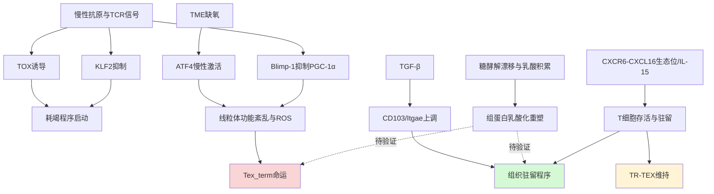

具体而言：

- **抗原持续性与TCR信号强度**：是命运分岔最上游的开关。持续TCR信号通过Blimp-1抑制PGC-1α依赖的线粒体重编程，使T细胞对缺氧反应失效，线粒体ROS累积驱动NFAT异常活化与耗竭样状态[^11]。同时TCR持续信号触发TOX诱导与KLF2抑制[^9]，激活非经典蛋白毒性应激反应Tex-PSR[^1]，构成耗竭驱动的核心节点。

- **TGF-β信号**：是组织驻留程序的关键塑造者。TGF-β诱导整合素αEβ7的α组分CD103表达，CD103与上皮钙黏蛋白E结合介导Trm的定位与黏附；TGF-β同时上调Hobit、Blimp-1等驻留转录因子，下调KLF2/S1PR1[^8]，构成Trm/TR-TEX命运分支的关键输入。

- **肿瘤缺氧**：是TME特异性的代谢应激源，通过持续激活ATF4使CD8+ TIL线粒体功能紊乱、大量死亡，丧失抗肿瘤能力；缺氧本身在LCMV慢性感染场景中仅适度诱导ATF4，唯有TME环境才出现强烈ATF4激活[^12]，这是TME场景独有的机制变量。

- **营养压力与乳酸积累**：TME中肿瘤细胞糖酵解漂移、Treg代谢压制等导致局部乳酸累积，理论上为组蛋白乳酸化（Kla）提供底物来源；本批参考资料对Kla在T细胞命运决定中的直接证据有限，标注为后续章节需重点补充的研究缺口。

- **CXCR6—CXCL16生态位与IL-15支持**：构成T细胞在组织内存活与驻留的非冗余信号。CCR7+ DC3亚群在肿瘤血管周围形成富含CXCL16与IL-15的离散生态位，CXCR6+效应T细胞被特异招募至此并接受IL-15反式呈递；阻断CXCR6—CXCL16轴或消耗DC3导致肿瘤内T细胞凋亡增加[^15]，提示生态位结构是分岔决策的空间维度变量。

- **NFAT5与高渗透压**：作为TME特异性应激信号，通过替代NFAT1/2驱动肿瘤特异性CD8+ T细胞耗竭，但对慢性感染诱导的耗竭无效[^10]，是区分TME与HIV场景的重要场景特异性变量。

这一环境—信号—命运映射揭示，**Tex_term与Trm命运分岔并非由单一信号决定，而是多重信号在线粒体动力学—代谢—表观遗传级联上的整合输出**。其中抗原信号驱动耗竭轴，TGF-β/CXCR6生态位驱动驻留轴，TME缺氧与高渗透压在TME场景特异性放大耗竭分支，构成本报告后续机制解析与定量建模的输入变量集。

## 1.7 研究框架与命运坐标系构建

基于上述生物学认知与机制空白，本报告提出一个贯穿全文的细胞命运坐标系，将**线粒体动力学状态（裂变优势↔融合优势）**与**表观遗传修饰强度（m6A甲基化图谱与组蛋白乳酸化水平）**作为两个正交维度，将各CD8+ T细胞亚群定位于该坐标系中。

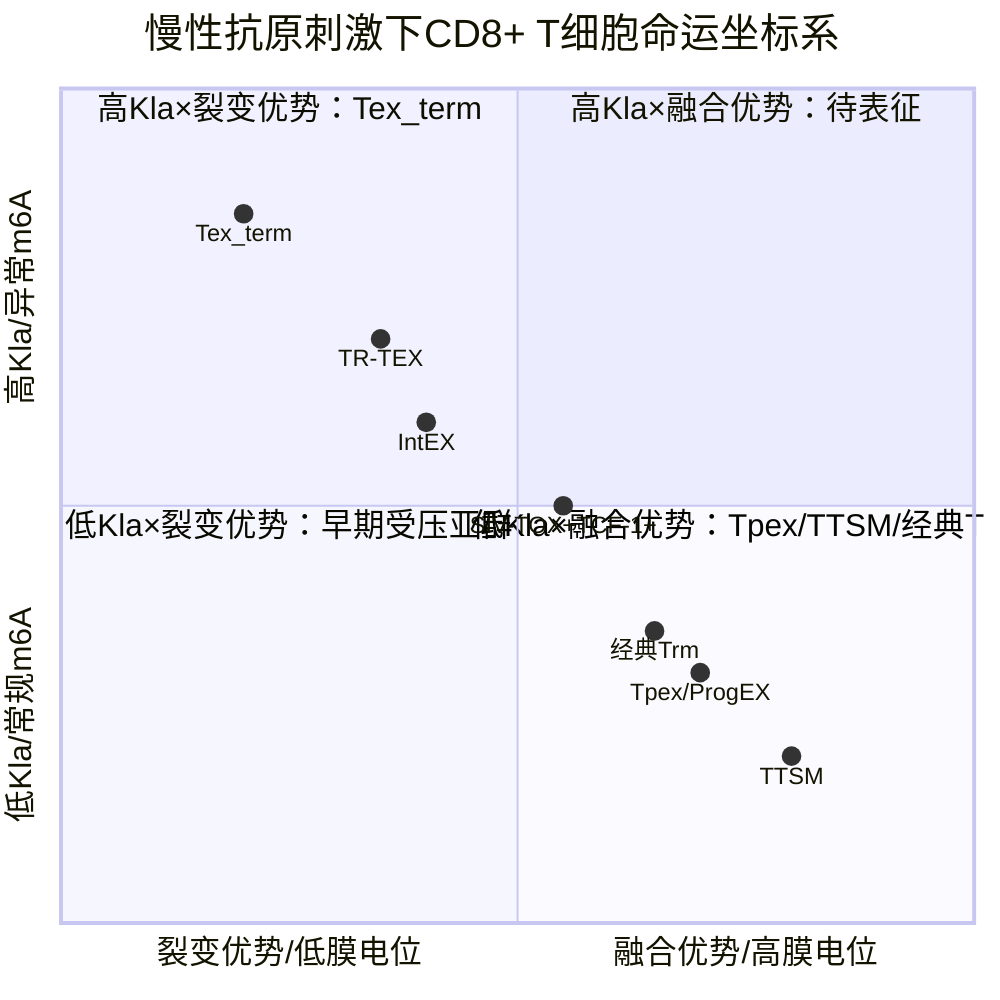

该坐标系的设计意图在于：

第一，**以线粒体动力学状态作为横轴**，反映融合/裂变平衡所对应的代谢通量模式（融合优势→OXPHOS主导、TCA通量充沛、α-KG/SAM等辅因子可用；裂变优势→糖酵解漂移、ROS累积、乳酸生成增加）。本批参考资料从Blimp-1—PGC-1α轴[^11]、ATF4激活[^12]、IL-10-Fc恢复OXPHOS[^13]等多个角度提供了线粒体功能与命运状态相关的间接证据，为该维度提供初步支撑。

第二，**以表观遗传修饰强度作为纵轴**，整合m6A甲基化图谱与组蛋白乳酸化水平。这一维度反映代谢辅因子池如何转化为基因表达调控的执行层。需坦诚说明的是，本批参考资料对m6A与Kla在T细胞命运决定中的直接证据较为有限，纵轴的精确刻度需在后续章节通过更广泛文献综合得以建立；本章先行确立框架性定位，避免在证据不足时做过度具体的位置标定。

第三，**该坐标系为后续章节提供清晰衔接**：第2章将深入剖析横轴对应的线粒体动力学失衡与代谢-表观遗传辅因子偶联机制；第3章将系统建立纵轴对应的m6A与Kla双轨调控；第4章整合横纵轴构建完整因果链；第5、6章分别在TME与HIV场景下检验该坐标系的场景特异性投影；第7章基于坐标系开展定量建模与分岔分析；第8章基于关键节点设计干预策略；第9章讨论该框架的方法学挑战与未来扩展。

通过这一坐标系，本报告将慢性抗原刺激下CD8+ T细胞命运分岔的研究，从过去以转录因子或单一代谢轴为中心的"线性叙事"，重构为以**线粒体动力学—代谢通量—表观遗传重塑**为多层级因果链、以**Tex_term与Trm（含TR-TEX）双命运分岔**为决策输出的整合性研究框架。这一框架既兼容现有可定位证据，又为弥合当前研究空白提供了清晰的逻辑路径，并将通过定量建模产出可证伪的预测，最终衔接转化医学层面的干预策略设计。

# 2 慢性抗原刺激下线粒体动力学失衡与代谢-表观遗传辅因子偶联

承接第1章建立的命运分岔坐标系，本章聚焦于横轴所对应的线粒体动力学维度——即线粒体融合/裂变平衡作为代谢-表观遗传级联的最上游驱动器，如何在慢性TCR信号的持续压力下被推向裂变优势的失衡态，进而通过重塑TCA/ETC通量与糖酵解漂移、改写关键代谢辅因子的化学计量，最终在剂量依赖的方式下调控αKG依赖型双加氧酶、HATs/HDACs、DNMTs与组蛋白乳酸化writer等多类表观遗传酶活性。本章的逻辑主线沿"形态—功能—通量—辅因子—酶活性"五个层级展开，每一层级既独立成节又层层递进，最终在2.6节整合为多层级偶联模型，以衔接第3章m6A/Kla双轨调控与第7章的定量建模。需要特别说明的是，本批参考资料对T细胞特异性的线粒体动力学调控提供了若干高质量直接证据（特别是李贵登团队2026年Nature研究），而部分代谢-表观偶联节点的证据来自相邻细胞类型（巨噬细胞、肝细胞、菌群-宿主互作），本章将依据P-3证据层级标准严格区分直接证据、近邻证据与概念类比，对证据稀薄处显式标注研究缺口。

## 2.1 OPA1/Mfn1/2-DRP1融合裂变平衡在慢性TCR刺激下的动态失衡

线粒体并非孤立的能量产生器，而是通过持续的融合与裂变形成动态网络，其形态学状态直接耦合于代谢能力与细胞命运。融合事件由三个分子机器协同完成：线粒体外膜由Mfn1与Mfn2介导的GTPase依赖性融合，内膜则由OPA1（视神经萎缩蛋白1）执行；OPA1本身存在长亚型（L-OPA1，锚定于内膜）与短亚型（S-OPA1，由OMA1与YME1L等蛋白酶切割产生），二者比值决定内膜融合效率与嵴结构稳定性。裂变则由胞质动力相关蛋白DRP1招募至线粒体外膜执行，其招募依赖于MFF（线粒体裂变因子）、Fis1、MiD49/51等受体蛋白；DRP1自身受多个磷酸化位点调控，其中S616磷酸化（由CDK1、ERK1/2、PKCδ等催化）促进裂变激活，S637磷酸化（由PKA催化、PGAM5等磷酸酶去磷酸化）则抑制其裂变活性。

在急性抗原刺激下，初始CD8+ T细胞经历短暂的代谢重塑：从依赖OXPHOS的静息态转向以糖酵解、谷氨酰胺分解和脂肪酸合成为主导的效应态，这一转变由PI3K/Akt/mTORC1通路驱动以支持克隆扩增与效应功能[^16]；病原清除后，部分效应细胞回归OXPHOS与脂肪酸氧化（FAO）依赖的记忆态，线粒体网络重新趋于融合优势[^16]。这一短程振荡保留了线粒体形态-功能的可逆性。然而，在慢性抗原刺激（TME或慢性病毒感染）下，CD8+ T细胞会进入功能耗竭状态，表现为抑制性受体（PD-1、Tim-3）上调、**线粒体功能受损、代谢灵活性丧失**[^16]。李贵登团队的研究进一步明确，**慢性TCR刺激期间会发生过度线粒体分裂**，其执行节点正是DRP1的过度激活[^17][^18]。结合上一章已建立的Blimp-1抑制PGC-1α、ATF4慢性激活、Tex-PSR蛋白毒性应激等机制，可以勾勒出一个由急性可逆代谢重塑滑向慢性不可逆形态-功能塌陷的轨迹。

将这一形态学连续谱映射到第1章的命运坐标系，[TMRM/MitoTracker]hi（高膜电位、融合优势）状态对应Tpex/TTSM/经典Trm等保留干性或驻留功能的亚群，而[TMRM/MG]lo（去极化、裂变优势）状态则对应Tex_term甚至TR-TEX等命运退化亚群。Tpex虽处于慢性抗原压力下，但保留TCF-1表达与对ICB的响应能力，提示其线粒体网络仍具备一定的融合-裂变平衡能力；而Tex_term中DRP1过度激活、OPA1切割增强（推测）、Mfn1/2功能减弱，构成了形态学塌陷的分子基础。需要说明的是，本批参考资料尚未提供针对T细胞各耗竭亚群的直接TMRM/MG分群定量数据，本节所建立的映射关系部分基于线粒体功能与命运状态的间接证据综合，相关精细量化将在第7章定量建模中作为待确定参数处理。

## 2.2 PGAM5-DRP1轴与KLHL6泛素化调控构成的过度裂变驱动通路

理解慢性TCR刺激下DRP1为何"刹车失灵"，是机制解析的核心。本批参考资料中李贵登团队2026年发表于Nature的研究提供了迄今最完整的因果链证据，其揭示的KLHL6—PGAM5—DRP1—线粒体过度裂变轴，构成了慢性抗原驱动线粒体形态塌陷的核心执行通路[^19][^17][^18]。

研究团队将T细胞耗竭与线粒体健康状况的计算分析与体内靶向CRISPR筛选相结合，确定**E3泛素连接酶KLHL6是慢性抗原刺激期间T细胞耗竭和线粒体功能障碍的双重负向调控因子**[^17][^18]。从机制上，KLHL6具有双底物特异性：

第一条通路指向耗竭转录程序。**KLHL6促进耗竭核心调控因子TOX的多聚泛素化以及随后的蛋白酶体降解，从而抑制Tpex向Tex_term的转变**[^17][^18]。在这一意义上，KLHL6是TOX的"分子清道夫"，其活性维持是Tpex得以保留干性、不被锁定于终末耗竭轨道的关键蛋白稳态前提。

第二条通路指向线粒体形态学。**KLHL6通过翻译后调控PGAM5-DRP1信号轴，限制慢性TCR刺激期间发生的过度线粒体分裂，从而维持线粒体的健康**[^17][^18]。这一通路的下游执行节点PGAM5（磷酸甘油酸变位酶家族成员5）本身是一个定位于线粒体的丝/苏氨酸蛋白磷酸酶，其在肝缺血再灌注（I/R）损伤模型中的独立证据进一步佐证了其作为DRP1激活上游因子的功能：在小鼠肝I/R损伤中，PGAM5高表达，**沉默PGAM5可恢复线粒体膜电位、增加mtDNA拷贝数与转录水平、抑制ROS生成、防止异常mPTP开放**；分子机制上，**沉默PGAM5抑制DRP1 S616磷酸化，导致线粒体裂变部分减少**；DRP1抑制剂Mdivi-1能模拟PGAM5沉默的效果，减轻肝细胞死亡与I/R损伤[^20]。同时，PGAM5在炎症调控中具有典型的双刃剑特征，其细胞类型特异性的线粒体调控功能导致其在不同场景中可发挥促炎或抗炎的双重作用[^21]，这一双重性提示其在T细胞中的功能后果同样需要置于具体的命运背景下理解。

更为关键的是上游调控环路。研究揭示**转录因子FOXO1是KLHL6的"开关"，能直接结合KLHL6的启动子区域促进其表达**；但**持续的肿瘤刺激会激活PI3K-AKT信号通路，使FOXO1磷酸化失活而无法启动KLHL6转录**[^19]。这意味着慢性TCR信号通过PI3K-AKT-FOXO1这一保守通路，关闭了KLHL6的"安全阀"。AKT抑制剂阻断这一通路时，FOXO1可重新激活KLHL6表达，恢复其对TOX的清除与对PGAM5-DRP1的抑制[^19]。这一发现为命运分岔提供了一个明确的可干预上游节点。

将上述要素整合，可勾勒出如下因果链：

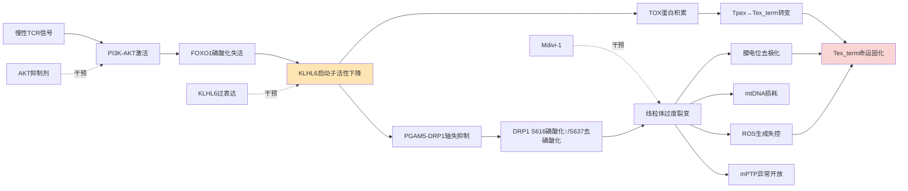

辅助通路上，CAR-T细胞工程领域的早期工作提示，**miR-429可通过靶向TCAIM（线粒体定位的T细胞活化抑制因子）与MFF（线粒体裂变因子）等基因抑制其表达，从而促进记忆T细胞形成**[^22]；MCL1基因的短亚型定位于线粒体内膜，可增强线粒体氧化磷酸化与融合，长亚型则定位于外膜抑制CD95死亡通路，过表达MCL1可减少过继转移T细胞因活化诱导细胞死亡（AICD）造成的损失[^22]。这些工程化策略从反向佐证了限制MFF/裂变并维持融合的能力对于T细胞持久性的关键意义。TIA-1对MFF的翻译调控通路在本批参考资料中未提供针对T细胞的直接证据，标注为研究缺口；但其作为应激颗粒核心组分参与mRNA命运决定的一般性机制，与Tex-PSR下蛋白合成异常升高的图景具有概念兼容性，有待后续证据补充。

## 2.3 线粒体过度裂变诱发的功能塌陷：膜电位、ROS与mtDNA损伤

形态学的失衡迅速级联为功能层面的塌陷。基于PGAM5沉默实验的反向证据可知，PGAM5-DRP1过度激活导致的过度裂变会引发四个相互强化的功能损伤事件：**膜电位去极化、mtDNA拷贝数与转录水平下降、mPTP异常开放、ROS生成失控**[^20]。这四个事件并非独立，而是构成一个相互放大的恶性循环：膜电位下降直接削弱ATP合成驱动力与电子传递链效率，mPTP开放进一步释放细胞色素c与ROS，mtDNA损耗削弱ETC复合物（其中13个核心亚基由mtDNA编码）的合成能力，ROS反过来氧化损伤mtDNA与膜脂，进一步加剧膜电位崩溃。

将这一功能塌陷链与第1章已建立的耗竭驱动机制串联，可形成更完整的图景：Blimp-1对PGC-1α的抑制使线粒体生物合成能力丧失，无法补偿因过度裂变与mtDNA损耗造成的线粒体丢失；TME缺氧驱动的ATF4慢性激活导致线粒体功能紊乱并使T细胞大量死亡；Tex-PSR下全局蛋白合成异常升高与不溶性蛋白聚集体积累进一步加重蛋白稳态压力。这些机制并非平行独立，而很可能共享ROS、ATP/AMP比改变与未折叠蛋白响应等下游信号节点。

ROS的下游效应在T细胞耗竭领域具有明确的因果证据：**线粒体功能丧失产生不可耐受水平的ROS，通过磷酸酶抑制激活NFAT，促进耗竭样状态**——这一机制已在第1章引述。这意味着过度裂变→ROS→NFAT异常活化构成了从线粒体形态学异常到耗竭转录程序的直接桥梁，而NFAT的耗竭驱动作用本身又叠加于TOX、Blimp-1、NFAT5等其他驱动因子之上，形成了多重共激活的耗竭转录复合体。AMPK则是另一个关键的下游传感器：ATP/AMP比下降会激活AMPK，理论上应通过抑制mTOR、促进自噬与脂肪酸氧化以恢复代谢稳态，二甲双胍的免疫调节研究提示**通过抑制线粒体复合物I降低ATP/AMP比、激活AMPK，可促进CD8+ T细胞从糖酵解为主的效应状态向OXPHOS和FAO为主的记忆状态转变**[^16]，这一发现既佐证了AMPK作为代谢命运开关的地位，也暗示在慢性抗原刺激下AMPK这一"修复信号"可能因下游效应通路的去耦合而失效。

与之形成鲜明对照的是经典Trm的相反路径。组织驻留记忆T细胞**长期或永久驻留于非淋巴组织（皮肤、生殖道、肠道）中**[^23]，依赖CD69与S1PR1的拮抗维持驻留，依赖CD103与E-cadherin的相互作用锚定于上皮组织[^23]。在代谢层面，Trm依赖脂肪酸氧化与OXPHOS（领域共识）维持其长期存活与快速回忆应答[^16]，这与初始/记忆T细胞代谢回归静息态、依赖OXPHOS和FAO的一般模式一致[^16]。组织生态位通过IL-15等细胞因子与脂质供给支持线粒体融合与高膜电位，从而维持Trm的形态-功能耦合。这一对比凸显了形态-功能耦合在命运分岔中的核心意义：**Tex_term走向裂变优势-膜电位崩溃-ROS驱动的耗竭固化路径，Trm走向融合优势-高膜电位-FAO驱动的驻留维持路径，二者本质上是同一个线粒体动力学连续谱的两个吸引子终态**。

## 2.4 OXPHOS/TCA/ETC与糖酵解的此消彼长重塑表观遗传辅因子池

线粒体形态-功能状态的转变直接重塑了代谢通量配比，进而决定了表观遗传辅因子池的化学计量结构。本节将这一重塑过程细化为通量层与辅因子层两个子层级。

**通量层的此消彼长**。融合优势状态下，电子传递链各复合物在嵴结构中高效组装，TCA循环与ETC通量充沛，氧化磷酸化产生大量ATP，葡萄糖通过丙酮酸完整地进入TCA循环。而裂变优势/去极化状态下，复合物组装受损、电子传递效率下降、TCA循环的下游酶（如α-KG脱氢酶复合物、琥珀酸脱氢酶）受ROS氧化抑制，丙酮酸更多地通过乳酸脱氢酶（LDH）转化为乳酸（即"糖酵解漂移"）。这一漂移在TME中被放大：**肿瘤细胞自身的有氧糖酵解产生大量乳酸，创造酸性微环境直接损害T细胞增殖与细胞毒性功能**[^24][^25]，肿瘤细胞对葡萄糖的竞争性消耗、缺氧、酸中毒、免疫抑制代谢物（乳酸、腺苷）的累积**共同导致T细胞代谢失调和功能衰竭**[^16]。

**辅因子层的化学计量重塑**。Science 2024年发表的营养驱动组蛋白密码研究为这一层级提供了关键的直接证据[^26]：CD8+ T细胞从功能正常到逐渐耗竭过程中，**其代谢模式从偏好乙酸（acetate）转向更依赖于葡萄糖（glucose）**，由两种关键代谢酶调控——**乙酰辅酶A合成酶2（ACSS2）倾向于利用乙酸生成乙酰辅酶A，促进具有自我更新能力的"始祖型"耗竭性T细胞（TEXprog）的形成；ATP-柠檬酸裂解酶（ACLY）则通过葡萄糖代谢支持"终末型"耗竭性T细胞（TEXterm）的分化**[^26]。在慢性抗原刺激下，**CD8+ T细胞中负责乙酸代谢的ACSS2显著下降，而负责葡萄糖代谢的ACLY维持甚至略微增强**[^26]。这一发现具有双重意义：一方面，它直接证实了乙酰-CoA存在ACSS2与ACLY双源生成路径，且两条路径不仅是简单的代谢冗余，而是在表观遗传调控上对应不同的命运分岔输出；另一方面，它暗示**乙酰-CoA的"来源信息"会被表观遗传机器以位点特异性的方式编码——同一分子的乙酰-CoA在ACSS2与ACLY两条途径产生时，其在染色质上的沉积位置可能存在系统性差异**，这一现象为后续位点特异性HAT调控提供了关键背景。

α-酮戊二酸与其竞争性抑制物的化学计量同样关键。TCA代谢物核内moonlighting功能综述系统阐述了这一层级的调控逻辑：**α-酮戊二酸作为α-酮戊二酸依赖型双加氧酶（如JMJD去甲基酶、TET甲基胞嘧啶双加氧酶）的辅因子，促进组蛋白与DNA去甲基化**[^27]；而**琥珀酸积累时竞争性抑制α-酮戊二酸依赖酶（如TET、JMJD），导致组蛋白超甲基化和DNA修复抑制**[^27]；**富马酸类似琥珀酸，抑制去甲基化酶（如KDM2B）和PHDs**[^27]。在T细胞中，**戊二酸（Glutarate）作为色氨酸和赖氨酸分解代谢的中间体，通过抑制α-酮戊二酸依赖性双加氧酶（αKGDD）以及通过翻译后修饰戊二酰化PDHE2亚基来对CD8+ T细胞发挥双重调控作用**[^28]，戊二酸二乙酯给药可改变CD8+ T细胞的分化与功能[^28]。S-2HG作为α-KG的另一结构类似物，同样**通过竞争性抑制特异性αKGDD发挥对T细胞功能的诸多调节作用**，并已被证明**通过促进中央记忆T细胞（TCM）发育增强T细胞免疫治疗效果**[^28]。这些证据共同表明，αKG/(琥珀酸+富马酸+2HG+戊二酸+衣康酸)的"竞争性抑制比"是控制αKGDD整体活性的核心化学计量参数。

衣康酸代表了另一类调控通道：**由IRG1催化生成，通过Michael加成修饰半胱氨酸或直接抑制TET2酶（结构类似α-酮戊二酸），减少5hmC修饰，下调促炎基因（TNFα、IL-6）**[^27]。乙醛酸虽主要为病原菌来源，但其作为α-KG结构类似物**竞争结合TET2蛋白的酶催化中心**的机制提供了一个跨物种的分子证据：在巨噬细胞感染沙门氏菌过程中，**胞内乙醛酸浓度可升至~400 µM，远超其抑制TET2的IC50值**，足以阻断JAK-STAT信号下游基因（如Nos2）的持续激活，**外源补充维生素C激活TET2酶活联合抗生素治疗显著减少持留菌**[^29]。这些跨场景证据共同证实TET/JMJD家族对辅因子化学计量的高敏感性。

将上述要素整合为辅因子层化学计量框架：

| 辅因子/比值 | 融合优势（Tpex/Trm倾向） | 裂变优势（Tex_term倾向） | 主要表观靶点 | 证据来源 |
|-----|-----|-----|-----|-----|
| α-KG/琥珀酸·富马酸·2HG·戊二酸 | 高（αKGDD活跃） | 低（αKGDD受抑） | TET2、JMJD家族KDMs | 直接证据[^27][^28] |
| 乙酰-CoA来源 | ACSS2-乙酸途径主导 | ACLY-葡萄糖途径主导 | HATs（p300/CBP）位点选择性 | 直接证据[^26] |
| NAD+/NADH | 高（OXPHOS充足） | 低（糖酵解漂移） | III类HDACs（sirtuins） | 概念性推断 |
| SAM/SAH | 推测保持 | 推测下移（一碳代谢受损） | DNMTs、组蛋白甲基转移酶 | 间接证据，标注研究缺口 |
| 局部乳酸/乳酰-CoA | 低 | 高（糖酵解漂移+TME外源乳酸） | p300（Kla writer） | 概念框架[^27][^24]，T细胞直接证据待补 |
| FAD | 高 | 低 | LSD1（KDM1A） | 概念性推断 |

需要明确说明的是，SAM/SAH比值在T细胞耗竭背景下的直接定量证据在本批资料中较为稀薄，其与一碳代谢、丝氨酸合成的耦合及对DNMT、m6A甲基化机器的影响将在第3章m6A通路讨论中进一步展开；NAD+/NADH与FAD对sirtuins与LSD1的调控逻辑虽属代谢-表观遗传研究的经典框架，但在T细胞耗竭场景下的定量直接证据同样需要后续补充。

## 2.5 代谢辅因子对DNA/RNA/组蛋白修饰酶活性的剂量依赖调控

辅因子化学计量并非抽象的代谢参数，而是通过对一组明确的表观遗传酶发挥剂量依赖性调控来塑造染色质景观。本节按酶家族逐一剖析。

**αKG依赖型双加氧酶（TETs与JMJD家族KDMs）**。这一酶家族对α-KG/竞争性抑制物比值高度敏感，是连接TCA循环与表观遗传的核心节点。**α-KG作为辅因子激活TET介导的DNA 5mC→5hmC转化与JMJD介导的H3K27me3、H3K9me等组蛋白去甲基化**[^27]；**琥珀酸通过抑制KDM4A/KDM4B阻碍同源重组修复，富马酸抑制KDM2B增加H3K36me2水平**[^27]；衣康酸**减少5hmC修饰，下调促炎基因**[^27]；戊二酸**抑制αKGDD并通过戊二酰化修饰PDHE2**[^28]；2HG**通过竞争性抑制特异性αKGDD调节T细胞功能**[^28]；乙醛酸**抑制TET2催化中心，阻断JAK-STAT下游基因激活**[^29]。在骨髓增生异常综合征（MDS）患者中，**5-hmC水平较健康对照显著下降（p=1.8e-09），与TET2失活突变直接相关，但相当部分5hmC缺陷病例无TET2/IDH1/2突变**[^30]，提示TET活性受到比突变状态更复杂的代谢-辅因子调控网络支配。这一证据层级上，TCA代谢物对TET/JMJD的调控具有跨细胞类型的普适性直接证据，但其在T细胞耗竭命运决定中的直接靶基因图谱（如Tox、Tcf7、Pdcd1启动子的5hmC/H3K27me3变化）仍属研究缺口。

**HATs与组蛋白乙酰化的位点选择性**。**乙酰辅酶A作为HATs（p300/CBP、GCN5等）的底物，直接促进组蛋白乙酰化（H3K9ac、H3K27ac），开放染色质结构以激活基因转录**[^27]；其位点选择性受核内乙酰-CoA局部生成途径调控——**核内乙酰-CoA可通过ACLY或ACSS2局部生成**，**ACLY介导的NF-κB p65亚基乙酰化可增强促炎基因（IL-1β、ptgs2）表达**[^27]。在CD8+ T细胞中，ACSS2偏好乙酸的乙酰-CoA生成支持TEXprog自我更新基因座的乙酰化，而ACLY偏好葡萄糖的乙酰-CoA生成则在TEXterm分化所需的基因座上沉积乙酰化标记[^26]。这构成了**"代谢底物→乙酰-CoA来源→染色质沉积位点→命运基因表达→分化方向"的完整因果链，是本章2.4节化学计量框架在2.5节执行层的最直接体现**。

**HDACs与NAD+/NADH调控**。第III类HDACs（sirtuins）以NAD+为辅因子，其活性直接受NAD+/NADH比调控；当线粒体OXPHOS充足、NAD+池充沛时sirtuins活跃促进去乙酰化，反之则去乙酰化能力下降。这一调控逻辑虽属代谢-表观研究领域共识，但本批参考资料未提供针对CD8+ T细胞耗竭场景的直接定量证据，标注为研究缺口。

**DNMTs与SAM/SAH调控**。SAM作为甲基供体被DNMTs利用产生5mC，SAH作为竞争性抑制物形成的SAH/SAM比反映甲基化潜力。**T细胞耗竭背景下伴随区域特异性的DNA甲基化模式，包括细胞因子启动子（如IFN-γ）的超甲基化和免疫检查点位点（如PD-1）的低甲基化**[^24]，这一甲基化图谱的代谢上游驱动力（SAM/SAH比的精确动态、一碳代谢的耦合）在本批资料中证据有限，需在后续章节补充。

**组蛋白乳酸化writer与乳酸/乳酰-CoA浓度调控**。组蛋白乳酸化（Kla）是2019年新近识别的代谢敏感修饰，由p300等HAT家族成员以乳酰-CoA为底物催化。在T细胞命运决定中，本批参考资料尚未提供H3K18la/H3K9la等具体位点在Tex_term/Trm分岔中的直接ChIP-seq或质谱证据，但概念框架已具雏形：**肿瘤糖酵解漂移→乳酸蓄积（TME高浓度，Treg/MDSC/TAM代谢压制下进一步累积）→局部乳酰-CoA增加→p300催化Kla→染色质重塑**，这一链条的关键环节将在第3章系统展开。

**m6A机器的代谢敏感性**。METTL3/METTL14甲基转移酶以SAM为甲基供体，理论上对SAM/SAH比敏感；FTO与ALKBH5作为α-KG/Fe(II)依赖型双加氧酶，其活性受αKG/琥珀酸·富马酸·2HG·戊二酸·乙醛酸竞争性抑制比的直接调控——这与TET/JMJD家族共享同一化学逻辑。这一机制提示意味着**线粒体动力学失衡通过αKG池下降可同时削弱TET介导的DNA去甲基化与FTO/ALKBH5介导的m6A去甲基化，对DNA与RNA两个层面的甲基化稳态产生级联性扰动**。然而，本批参考资料未提供T细胞中代谢辅因子对METTL3/14、FTO、ALKBH5活性调控的直接实验证据，相关链条将在第3章中通过更广泛的文献综合详细论证，本节先行标注为机制提示而非直接证据。

至此，可将2.4节的化学计量框架与本节的酶活性调控整合为一张完整的对应表：

| 辅因子动态变化（裂变优势↑） | 受调控酶（家族） | 染色质效应 | 命运分岔取向 |
|---|---|---|---|
| αKG下降、(琥珀酸+富马酸+2HG)上升 | TET2、JMJD-KDMs | 5mC积累、H3K27me3/H3K9me积累 | 偏向Tex_term |
| αKG下降、抑制物上升 | FTO、ALKBH5 | m6A积累（推测） | 第3章详述 |
| 乙酰-CoA来源由ACSS2转向ACLY | p300/CBP（位点特异性） | TEXprog自更新基因座乙酰化↓、TEXterm基因座乙酰化↑ | 偏向Tex_term[^26] |
| NAD+下降 | sirtuins | 全局组蛋白乙酰化升高（去乙酰能力下降） | 待研究 |
| SAM/SAH推测下降 | DNMTs、METTL3/14 | DNA甲基化重塑、m6A可能下降 | 第3章详述 |
| 乳酸/乳酰-CoA上升 | p300（Kla writer） | H3K18la/H3K9la重塑 | 第3章详述 |

## 2.6 线粒体形态-功能-辅因子-表观酶活性偶联模型与命运分岔上游驱动力定位

整合本章前五节证据，可构建一个跨越五个层级的偶联模型，作为本报告机制论证的上游主干。该模型以慢性TCR信号强度与持续时间为输入变量，以**KLHL6水平、PGAM5-DRP1磷酸化状态、OPA1切割比、Mfn1/2丰度、膜电位、ROS**为线粒体形态-功能层中间变量，以**TCA/糖酵解通量比、α-KG/(琥珀酸+富马酸+2HG+戊二酸)比、乙酰-CoA来源比（ACSS2:ACLY）、SAM/SAH、NAD+/NADH、局部乳酸浓度**为辅因子层中间变量，以**TET/JMJD/HAT/HDAC/DNMT/p300（Kla writer）/METTL3-14/FTO-ALKBH5活性**为表观酶层输出变量，最终对接命运决定基因（*Tox、Tcf7、Tbx21、Prdm1、Itgae、Pdcd1*）程序。

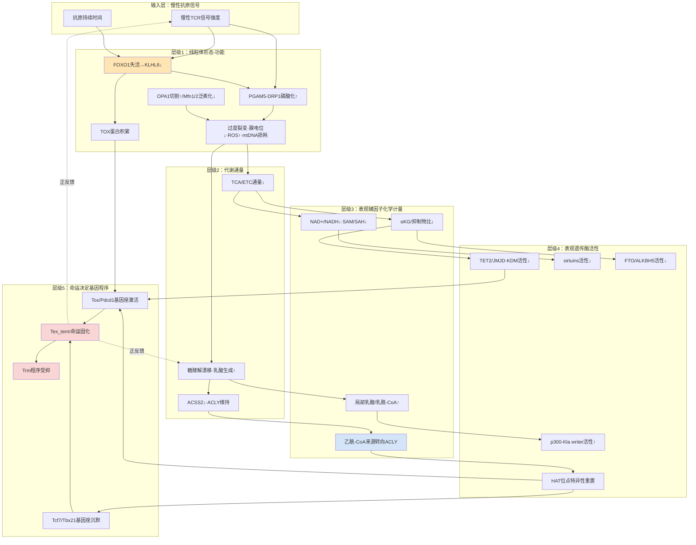

模型识别出至少一条**核心正反馈环路**：慢性TCR→PI3K-AKT→FOXO1失活→KLHL6下调→（TOX蛋白累积+PGAM5-DRP1过度激活）→线粒体过度裂变与功能塌陷→ROS与糖酵解漂移→乳酸/2HG等αKG竞争性抑制物累积+乙酰-CoA来源转向ACLY→TET/JMJD/FTO活性下降+HAT位点特异性偏移→耗竭基因座（*Tox*、*Pdcd1*等）表观激活与干性基因座（*Tcf7*）沉默→TOX再强化与Tpex储备耗竭→更深度耗竭样TCR反应模式。这一环路解释了为何耗竭一旦启动便具有自我维持的特性——它并非简单的转录因子线性级联，而是穿越线粒体形态学、代谢通量与表观遗传图谱三个层级的多层闭环系统。

模型同时提示了**潜在干预节点**及其作用层级：（i）**KLHL6过表达或AKT抑制剂恢复FOXO1活性**——直接作用于上游开关，理论上可同时下调TOX并恢复PGAM5-DRP1抑制[^19][^17][^18]；（ii）**Mdivi-1抑制DRP1**——直接阻断过度裂变执行节点，已在肝I/R模型证实其线粒体保护效应[^20]；（iii）**MCL1过表达或miR-429 调节TCAIM/MFF**——CAR-T工程化策略，从下游抗AICD与限制裂变两个角度增强T细胞持久性[^22]；（iv）**二甲双胍激活AMPK**——通过抑制线粒体复合物I促进代谢从糖酵解向OXPHOS/FAO的转变，重塑记忆样命运[^16]；（v）**外源α-KG或维生素C激活TET2**——已在沙门氏菌持留菌模型证实可联合抗生素显著减少菌负荷并延长生存[^29]，提示在T细胞场景下可能用于恢复TET介导的去甲基化，逆转耗竭基因座的表观固化；（vi）**S-2HG酯化形式给药**——通过促进TCM发育增强T细胞免疫治疗效果[^28]；（vii）**戊二酸二乙酯**——通过双重αKGDD抑制与PDHE2戊二酰化修饰调控T细胞代谢与分化[^28]。这些干预策略将在第8章系统展开评估，并在第7章定量建模中作为可调参数输入以预测效应大小与窗口。

需要在结束本章时坦诚指出本模型的若干局限：第一，本批参考资料对**T细胞特异性的TIA-1-MFF翻译调控、SAM/SAH与一碳代谢的精确动态、NAD+/NADH与sirtuins在T细胞耗竭中的定量贡献、以及组蛋白乳酸化在Tex_term/Trm基因座上的差异化沉积**均缺乏直接证据，相关节点已在文中标注为研究缺口；第二，本模型的**形态-功能-通量-辅因子-酶活性五层级偶联**虽具有内部逻辑一致性，但其各层级之间的转换效率、时间常数、阈值参数仍需第7章定量建模工作进行系统估计与不确定度传播分析；第三，本章主要建立的是TME场景下的因果链，**HIV潜伏感染场景中线粒体动力学失衡的特异性表征**（如低水平病毒抗原是否产生与TME同等强度的PI3K-AKT激活、滤泡内代谢应激是否驱动相似的KLHL6下降）在本批资料中证据稀薄，需在第6章通过对称比较的方式专项处理。尽管如此，本章建立的KLHL6—PGAM5—DRP1—线粒体形态塌陷—代谢辅因子重塑—表观酶活性重置这一上游驱动力链条，已为第3章m6A与组蛋白乳酸化双轨表观调控提供了清晰的代谢与酶活性输入接口，并为整个报告的命运分岔机制论证奠定了形态学与代谢学基础。

# 3 m6A修饰与组蛋白乳酸化对命运分岔的表观遗传双轨调控

第2章已系统建立慢性TCR信号→KLHL6/PGAM5-DRP1轴→线粒体过度裂变与膜电位塌陷→TCA/糖酵解通量重置→表观遗传辅因子化学计量重塑这一多层级因果链，并将α-酮戊二酸/竞争性抑制物比、乙酰-CoA来源比、SAM/SAH比、局部乳酸/乳酰-CoA浓度等参数定位为代谢与表观执行层之间的化学接口。本章承接这一上游驱动力框架，聚焦于代谢敏感性最高的两条表观遗传通路——**RNA层面的m6A修饰**与**染色质层面的组蛋白乳酸化（Kla）**，论证它们如何作为CD8+ T细胞命运分岔的执行器，将线粒体动力学失衡所产生的辅因子信号编码为转录组与翻译组层面的可执行指令，最终在Tex_term与Trm（含TR-TEX）相关基因座上形成差异化的表观图谱输出。

本章遵循"机器—底物—靶基因—代谢反向耦合—命运效应"的递进逻辑展开六节内容：3.1节建立m6A机器在T细胞命运决定基因上的直接调控证据；3.2节论证线粒体代谢状态对m6A图谱的反向塑造；3.3节解析组蛋白乳酸化的writer/reader体系与L/D异构体特异性；3.4节剖析乳酸蓄积的多元来源及其对T细胞局部乳酰-CoA池的贡献；3.5节在基因座层面比较两通路的差异化沉积；3.6节整合协同—拮抗—开关三类相互作用模式构建双轨调控模型。需提前坦诚的是，本批参考资料对T细胞特异性的m6A靶基因图谱与Kla位点ChIP-seq证据存在系统性稀薄，相邻细胞类型（NK细胞、巨噬细胞、肝细胞、Treg等）的证据将被审慎用于近邻推断，并按P-3证据层级标准在文中显式标注每条证据的层级与可外推性边界。

## 3.1 m6A机器在CD8+ T细胞命运决定基因上的直接调控证据

m6A作为真核生物mRNA中最丰富的内部修饰，由writer复合物（METTL3/METTL14/WTAP/RBM15/VIRMA/ZC3H13）催化沉积，由eraser酶（FTO、ALKBH5、ALKBH3）执行去甲基化，由reader蛋白（YTHDC1/2、YTHDF1/2/3、IGF2BP1/2/3、HNRNP、eIF3）以位点特异性方式决定修饰mRNA的命运——包括剪接、核质转运、稳定性、翻译效率与降解等[^31][^32]。在T细胞命运决定层面，本批参考资料提供了若干具有直接证据强度的关键发现。

**METTL14—m6A—PD-1轴构成T细胞内置的耗竭限速器**。东南大学高山团队2025年发表于*Cancer Research*的工作基于公共数据库分析证实，**PDCD1基因的编码区（CDS）和3'非翻译区（3'UTR）均存在m6A修饰富集**；甲基转移酶复合物成员METTL14与去甲基化酶ALKBH5共同调控PDCD1的m6A修饰水平及其mRNA和蛋白表达，而**YTHDF1/2/3阅读蛋白以m6A依赖方式介导PDCD1 mRNA的降解过程**[^28]。通过构建T细胞特异性基因敲除小鼠模型，研究团队在体内验证了**METTL14缺失会导致CD8+ T细胞功能受损和肿瘤生长加速**，临床数据分析显示METTL14与PDCD1表达呈负相关，且与PD-1免疫治疗耐药性密切相关[^28]。这一证据在因果链层面闭合：writer（METTL14）沉积→reader（YTHDF1/2/3）识别→PDCD1 mRNA降解→PD-1蛋白下调→T细胞抗肿瘤功能保留。更具临床意义的是，研究团队采用**METTL3-METTL14复合体降解剂WD6305与抗PD-1抗体联合治疗，展现出显著的协同抗肿瘤效果**[^28]——这意味着抑制PD-1转录后调控的"刹车"反而能增强免疫治疗，这一反直觉发现为后续干预策略设计提供了清晰的机制基础。

**YTHDF2作为T细胞多能性—线粒体功能—染色质状态的三重整合者**。澳门大学健康科学学院团队2024年发表于*Nature Communications*的研究提供了迄今最完整的YTHDF2在CD8+ T细胞抗肿瘤免疫中的因果证据[^33]。该研究在体外细胞培养与Ythdf2F/F、Ythdf2CKO小鼠模型中系统揭示了如下机制层级：

第一，**YTHDF2在早期效应T细胞和类似Teff细胞中选择性上调并发生亚细胞重新分布**[^33]，这一表达模式与第1章建立的命运分岔时序相吻合——YTHDF2在效应分化关键节点的动态调整与命运决定窗口高度重叠。

第二，**YTHDF2缺失导致肿瘤生长加速和T细胞功能受损**，提示YTHDF2对CD8+ T细胞抗肿瘤效果的必要性[^33]。机制上，**YTHDF2通过m6A依赖的RNA衰减防止T细胞线粒体功能障碍**——基因表达分析、GO富集、线粒体膜电位与ROS检测显示，YTHDF2缺失直接关联线粒体功能塌陷[^33]。这一发现为本章双轨调控模型提供了关键节点：**m6A机器自身即可作为线粒体健康的守门员**，将第2章建立的"线粒体动力学失衡→代谢辅因子重塑→m6A图谱改变"反向闭合为"m6A机器→线粒体功能"的回路。

第三，**YTHDF2通过隔离IKZF1/3来调控多能CD8+ T细胞中的活性染色质状态**[^33]。ChIP-seq和ATAC-seq分析显示YTHDF2与IKZF1/3形成相互作用，调控染色质开放性。值得关注的是，**来那度胺（lenalidomide，已知通过CRBN E3连接酶降解IKZF1/3）能够恢复YTHDF2缺失CD8+ T细胞的多能性**[^33]——这一发现具有双重价值：在机制上证实了IKZF1/3是YTHDF2下游执行多能性维持的关键节点；在转化上提示一种已上市药物（来那度胺原用于多发性骨髓瘤）可作为YTHDF2缺陷T细胞功能补救策略，与CAR-T等过继性细胞治疗具有直接的联用潜力。

第四，**m6A调控YTHDF2的重新定位和表达**——Mettl3F/F、Mettl3CKO小鼠模型显示m6A修饰本身决定YTHDF2亚细胞定位，构成writer—reader偶联回路[^33]。这一发现为本章3.6节的协同模型提供机制原型：m6A机器组分之间存在自组织的反馈耦合。

将这两条主线证据与本批资料中其他m6A机器在免疫系统中的研究综合，可形成如下证据矩阵：

| m6A机器组分 | 在T细胞/免疫细胞中的功能证据 | 证据层级 | 命运分岔意义 |
|---|---|---|---|
| METTL3 | 通过m6A修饰调控免疫细胞功能；TGF-β下调METTL3致NK细胞效应衰减[^34]；胃癌中METTL3/YTHDF2轴负调控PD-L1[^35]；通过PI3K/AKT与JAK/STAT通路负调控M2巨噬细胞[^16]；STM2457抑制可重塑TME并增强CD8+ T细胞浸润[^35] | 直接（NK/巨噬细胞）+近邻（CD8+ T） | 多向性，需依细胞类型与场景判定 |
| METTL14 | 在T细胞中通过m6A介导PDCD1降解，缺失致PD-1上调与肿瘤生长加速[^28] | 直接（T细胞） | 维持T细胞抗肿瘤功能 |
| FTO | 在AML中作为致癌m6A去甲基化酶，FB23/FB23-2/CS1/CS2/Dac51等抑制剂被开发[^35][^32]；Dac51抑制B16-OVA细胞糖酵解能力[^32] | 间接（肿瘤细胞为主） | 在T细胞中的直接命运证据缺失 |
| ALKBH5 | 与METTL14协同调控PDCD1 m6A水平[^28] | 直接（T细胞） | 与METTL14反向调节PD-1 |
| YTHDF1 | 多种肿瘤中促癌；介导PDCD1 mRNA降解（与YTHDF2/3协同）[^28][^36] | 直接（T细胞） | 抑制PD-1，维持T细胞功能 |
| YTHDF2 | CD8+ T细胞中防止线粒体功能障碍、隔离IKZF1/3维持多能性[^33]；B细胞恶性肿瘤中作为致癌因子稳定m5C修饰mRNA并降解CD19/HLA-DMA mRNA促进免疫逃逸[^37][^31] | 直接（T细胞与B细胞肿瘤） | T细胞内维持功能；肿瘤细胞内驱动免疫逃逸 |
| YTHDF3 | 与YTHDF1合作促进m6A-RNA翻译，与YTHDF2合作加速降解[^36]；调控PDCD1降解[^28]；介导PTX3 mRNA m6A降解抑制M2巨噬细胞[^16] | 直接（T细胞与巨噬细胞） | 与YTHDF1/2形成命运决定调控网络 |
| IGF2BP3 | 胶质瘤中IGF2BP3/MIB1/FTO正反馈轴促进CSF3-NETosis驱动溶瘤病毒耐药[^38] | 间接 | T细胞场景证据缺失 |

这一证据矩阵揭示三个关键洞察：第一，**m6A机器对T细胞命运决定具有上下文依赖性**——同一writer（如METTL3）在NK细胞中维持效应功能、在M2巨噬细胞中抑制极化、在肿瘤细胞中支持PD-L1表达，其命运效应取决于细胞类型与靶基因谱；第二，**reader蛋白的功能可塑性远大于writer/eraser**——YTHDF1-3之间存在协同与竞争关系[^36]，YTHDF2在T细胞与肿瘤细胞中具有完全相反的命运效应，提示靶向reader需考虑细胞类型特异性递送；第三，**本批参考资料尚未提供针对Tox、Tcf7、Tbx21、Hif1a、Prdm1、Runx3、Itgae等核心命运决定因子mRNA的直接m6A位点图谱与writer/reader结合证据**，相关基因座的m6A调控接口仍属研究缺口。基于P-3证据层级标准，本章对此类靶基因的m6A调控仅做"机制可能性"层面的论证，不将其表述为直接证据。

值得在本节结束前讨论的是m6A检测技术的方法学进展对命运分岔研究的赋能价值。北京大学伊成器团队的GLORI技术（基于乙二醛与亚硝酸盐催化A-I高效转化）实现了m6A修饰的**高特异性单碱基定量与全转录组无偏好性识别**，相比传统MeRIP-seq克服了抗体非特异结合与序列偏好问题[^29]。浙江大学刘建钊团队的m6A-label-seq则通过allyl-SAM代谢标记实现了**单碱基分辨率的全转录组m6A位点定位**，并揭示部分m6A位点倾向于成簇出现、相邻位点中位距离约50 nt[^23]。这些技术为后续在CD8+ T细胞命运分岔过程中开展位点特异性m6A动态追踪提供了金标准工具，是第7章定量建模中m6A辅因子-酶-修饰图谱参数估计的关键测量基础。

## 3.2 线粒体代谢状态对m6A图谱的反向塑造

将m6A机器视为代谢敏感的酶系统，是理解第2章上游驱动力如何转化为表观遗传执行的关键概念跃迁。本节论证四条具体的代谢—m6A耦合通路。

**通路一：SAM作为甲基供体连接一碳代谢与m6A沉积**。METTL3/METTL14甲基转移酶以S-腺苷甲硫氨酸（SAM）为甲基供体，将甲基转移至腺嘌呤N6位点形成m6A[^23]。SAM以甲硫氨酸和ATP为原料，在甲硫氨酸腺苷转移酶（MAT）催化下合成，反应后产生的S-腺苷同型半胱氨酸（SAH）则通过抑制甲基转移酶活性形成负反馈[^23]。这一链条意味着SAM/SAH比是控制m6A整体沉积水平的关键化学计量参数。本批参考资料中关于"蛋氨酸限制"作为膳食干预的综述明确指出，**蛋氨酸-S-腺苷蛋氨酸循环的调节可影响m6A甲基化水平，在前临床研究中已显示出抗肿瘤潜力**[^31]。这一证据虽非T细胞特异，但其因果方向明确：上游一碳代谢底物的可用性直接决定下游m6A甲基化能力。在第2章已建立的慢性抗原刺激下OXPHOS与TCA通量下降的背景下，一碳代谢（与丝氨酸/甘氨酸代谢、叶酸循环耦合）受损将导致SAM池下移、SAH积累，整体压低m6A沉积速率。这一推论需明确标注：**本批参考资料未提供慢性抗原刺激下CD8+ T细胞内SAM/SAH的直接定量证据，相关精细动态属研究缺口**，将由第7章定量建模中作为待估参数处理。

**通路二：FTO/ALKBH5作为α-KG/Fe(II)依赖型双加氧酶与TET/JMJD家族共享化学敏感性**。FTO属于依赖Fe2+和2-酮戊二酸（2OG）的AlkB双加氧酶家族[^32]，其催化机制与TET介导的5mC→5hmC转化、JMJD介导的组蛋白去甲基化共享同一辅因子化学。这一共享意味着第2章已建立的α-KG/(琥珀酸+富马酸+2HG+戊二酸)竞争性抑制比下移会**同时削弱TET/JMJD的DNA与组蛋白去甲基化能力以及FTO/ALKBH5的mRNA去甲基化能力**——线粒体功能塌陷在三个表观遗传层面（DNA、组蛋白、RNA）产生平行的去甲基化能力丧失。具体到T细胞场景，αKG下降意味着FTO/ALKBH5的m6A去甲基化通量受抑，预期表现为整体m6A水平上升。这一推论的方向性与上述SAM下移导致甲基化能力下降的方向相反，提示在慢性抗原刺激下m6A图谱的净输出取决于writer受抑（SAM下移）与eraser受抑（αKG下移）二者的相对幅度——这是一个典型的需要通过定量建模才能确定净效应的双向受扰系统。

**通路三：肿瘤微环境TGF-β下调METTL3的现象及其对T细胞的可外推性**。本批参考资料中Nature Communications发表的NK细胞研究提供了一个具有高度可外推价值的近邻证据[^34]。研究团队通过分析肝细胞癌（HCC）患者的肿瘤浸润NK细胞与正常肝NK细胞的微阵列数据，发现TME中NK细胞效应功能基因（TBX21、FYN、NCR1、SH2D1A、SH2D1B、PTPN6、IL18RAP）表达减弱，而耗竭基因（PDCD1、CTLA4、KLRC1、NR4A1、SOCS3）表达增强，**METTL3蛋白表达水平与NK细胞效应分子呈正相关**[^34]。在系统筛查影响METTL3表达的细胞因子时，研究团队发现IL-17F、IL-18、IL-27对METTL3表达影响不大，IL-15和IL-10可增加METTL3表达，**只有TGF-β显著降低了METTL3蛋白表达，并且TGF-β独立下调NK细胞中METTL3蛋白的表达**[^34]。METTL3缺乏导致NK细胞数量减少、终末成熟受损、效应功能相关分子表达下降，加速肿瘤进展[^34]。

这一证据的可外推性需谨慎评估。NK细胞与CD8+ T细胞虽属不同淋巴细胞谱系，但在TME中均面临TGF-β富集的微环境，且二者效应功能均依赖一组共享的转录因子（如TBX21）与细胞毒分子。**TGF-β→METTL3↓→效应基因m6A调控失衡→效应功能丧失**这一机制框架在概念层面对CD8+ T细胞场景具有合理可外推性。然而，CD8+ T细胞还受TGF-β诱导的CD103/Itgae上调驱动Trm/TR-TEX分化（第1章已述），这意味着TGF-β在CD8+ T细胞中可能产生**METTL3下调（向耗竭倾斜）+CD103上调（向驻留倾斜）**的双向输出，其净命运效应取决于其他信号（CXCR6生态位、IL-15支持、抗原持续性）的整合。基于P-2对称比较与P-3证据层级原则，**本节将NK细胞TGF-β-METTL3轴明确归类为近邻证据，其在CD8+ T细胞中的直接验证仍属研究缺口**，但该证据为本章双轨调控模型提供了一个具有外推价值的TME→m6A机器关键耦合假设。

**通路四：乳酸化驱动METTL3表达上调构成代谢—m6A的双向耦合点**。浙江大学王青青/来利华/丁克峰团队发表于*Molecular Cell*的研究提供了一个在概念上具有标志性意义的发现：在结直肠癌肿瘤浸润髓系细胞（TIM）中，**乳酸一方面以组蛋白H3K18乳酸化修饰形式促进*Mettl3*转录；另一方面，乳酸化修饰能直接发生在METTL3蛋白的"CCCH"锌指结构域，增强METTL3结合并催化靶RNA的m6A修饰**[^39]。这一双层级耦合（Kla→*Mettl3*启动子激活+METTL3蛋白本身被乳酸化修饰增强活性）证实了**乳酸/Kla通路与m6A通路之间存在直接的分子级耦合点**，而非仅在下游靶基因层面汇合。METTL3进而通过下游JAK-STAT信号通路促进免疫抑制效应分子（IL-6、IL-10、iNOS）表达，最终促进肿瘤发展[^39]。

这一证据虽然来自髓系细胞，但其分子机制（H3K18la→*Mettl3*启动子激活）原则上不依赖于细胞类型特异性，对于身处高乳酸TME且糖酵解漂移的Tex_term同样可能成立。同时，复旦大学缪长虹团队在脓毒症相关急性肺损伤模型中证实**乳酸通过促进p300介导的H3K18la与METTL3启动子位点的结合调控m6A修饰水平**，METTL3进而通过YTHDC1依赖性通路介导ACSL4 mRNA m6A修饰促进铁死亡[^40]。这一独立场景的机制重现进一步增强了"乳酸—H3K18la—*METTL3*启动子—m6A靶基因调控"轴的可外推性。本章3.5与3.6节将基于这一直接证据，论证Kla→m6A级联放大如何在Tex_term命运基因上形成正反馈固化。

将上述四条通路整合，可形成线粒体代谢状态对m6A图谱反向塑造的双向受扰模型：

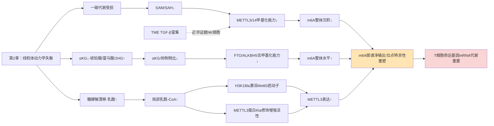

该模型的核心洞察是：**慢性抗原刺激下m6A图谱的变化不能简单归结为整体上升或下降，而是writer受抑（SAM下移）、eraser受抑（αKG下移）、writer表达上调（Kla→Mettl3启动子）三股力量的位点特异性整合输出**。这一图景与传统将m6A视为"开关"的简化模型形成对照，强调位点特异性的m6A动态需要在序列上下文、reader可用性、转录速率耦合等多重维度进行量化。

## 3.3 组蛋白乳酸化writer/reader体系与乳酸L/D异构体特异性

组蛋白乳酸化作为2019年由芝加哥大学赵英明团队首次报道的代谢敏感型表观修饰[^41]，其分子机器在过去六年内逐步建立起一套与经典乙酰化高度类似但又具备独特化学计量特征的writer—reader—eraser体系。本节系统刻画这一体系的最新进展，为后续T细胞场景下的Kla机制研究奠定工具学基础。

**Writer层：p300、GTPSCS与AARS1构成多元催化网络**。最经典的Kla writer为乙酰转移酶p300，其利用乳酰-CoA为底物催化H3K18la等位点的乳酸化沉积[^23]。然而，乳酰-CoA作为底物的来源长期不明，直到2024年12月赵英明/黄河团队在*Cell Metabolism*发表的工作首次鉴定**琥珀酰-CoA合成酶GTPSCS可在细胞核内发挥乳酰-CoA合成酶活性**（Km = 15.32 ± 1.28 mM）[^42]——通过解析GTPSCS-乳酸晶体结构发现G2亚基的N308是结合乳酸的关键位点，N308I突变显著降低乳酰-CoA合成酶活性。GTPSCS的G1和G2亚基均可定位于细胞核，**GTPSCS在细胞核内可与p300协同调控组蛋白H3K18la水平**，而G2亚基K73位点的乙酰化修饰则增强GTPSCS与p300的蛋白间相互作用[^42]。在胶质母细胞瘤（GBM）模型中，GTPSCS/p300/H3K18la/GDF15信号轴增强肿瘤细胞增殖与放疗抵抗性[^42]。这一发现具有标志性意义：**它确认了核内乳酰-CoA具有原位生成机制，而非完全依赖胞质来源；这种"近水楼台"的底物供给方式使Kla能够对局部乳酸浓度敏感响应**——这一特性对Tex_term所处的高乳酸TME尤为关键。

第二条writer通路由AARS1（丙氨酰-tRNA合成酶1）介导。2025年10月发表于*Cell Death & Differentiation*的糖尿病肾病研究证实**AARS1作为新型乳酸转移酶可调控组蛋白H3K18la及非组蛋白底物（如STAT1）的乳酸化修饰**[^43]。在DN模型中，AARS1与H3K18la的表达升高通过调控铁死亡参与肾功能障碍——AARS1通过增加脂肪酸延长酶-5（ELOVL5）转录诱导脂质过氧化，并通过与STAT1相互作用共同调控ELOVL5转录；STAT1特异性抑制剂氟达拉滨可延缓DN进展，β-丙氨酸抑制AARS1诱导的乳酸化可减轻DN铁死亡[^43]。AARS1的发现拓展了Kla writer的家族成员，并提示**Kla具有非组蛋白底物（如STAT1）这一重要维度**，意味着Kla不仅重塑染色质，还可能直接修饰转录因子改变其活性。这对T细胞场景具有特殊意义——TOX、Blimp-1、Runx3等命运决定转录因子是否存在Kla修饰，是一个具有高度可证伪性的研究假设，本批资料尚未提供直接证据，标注为研究缺口。

**Eraser层：HDAC1-3与SIRT2/3作为去乳酸化酶**。研究证实HDAC1-3及SIRT2介导Kla的去乳酸化[^23]。这一发现的特殊性在于HDAC家族同时具备去乙酰化与去乳酸化双重活性——HDAC3在T细胞中已被证实对T细胞发育（DP细胞存活、阳性选择、CD4+谱系发育）和Treg/Th17平衡至关重要[^44]，最新研究通过特异性突变（"VRPP"突变）实现了HDAC1或HDAC3的去乙酰化活性消除而保留去巴豆酰化活性[^44]，提示类似策略未来可用于解析HDAC的去乳酸化功能。这一交叉性意味着**HDAC抑制剂在临床应用中可能产生超出乙酰化范畴的Kla累积效应**，对T细胞功能调控具有未充分探索的影响维度。

**Reader层：BRD9作为乳酸化阅读器驱动染色质重塑**。*Cell Death & Differentiation*发表的肝细胞癌研究确认**BRD9作为ncBAF染色质重塑复合物的核心亚基，通过识别乳酸诱导的H3K18la驱动致癌染色质重塑**[^34]。研究在81对HCC肿瘤与配对癌旁组织中证实pan-Kla和H3K18la水平显著升高，免疫组化显示H3K18la在肝癌组织中呈特异性核富集，**高表达pan-Kla或H3K18la的患者总生存期显著缩短**[^34]。糖酵解抑制剂2-DG和草氨酸钠呈剂量依赖性地降低pan-Kla和H3K18la水平，敲低LDHA（而非LDHB）显著抑制H3K18la水平，且这一效应可被外源性乳酸部分恢复[^34]。BRD9通过识别H3K18la招募ncBAF复合物重塑染色质可及性，激活促癌基因转录[^34]。这一writer—mark—reader完整链条的建立，使Kla从"代谢副产物驱动的染色质标记"升格为"具有完整传递通路的表观遗传执行系统"。

**化学异构体层：KL-la作为糖酵解诱导的主导异构体**。北京大学、芝加哥大学等多所高校2025年1月联合发表于*Nature Chemical Biology*的工作解决了Kla研究领域一个长期争议的关键技术问题：**赖氨酸乳酸化存在三种异构体——赖氨酸L-乳酸化（KL-la）、N-ε-羧乙基赖氨酸（Kce）和赖氨酸D-乳酸化（KD-la），三者在细胞内的区分鉴定及功能差异一直存在争议**[^23]。通过开发化学衍生结合HPLC-MS/MS分析与异构体特异性抗体两种正交技术（抗体与其他异构体的交叉反应性低于1/50），研究团队明确：

- **KL-la是组蛋白上的主要乳酸化异构体，受糖酵解动态调控**；
- **KD-la和Kce仅在乙二醛酶系统功能不全时出现**；
- **L-乳酸化前体物质乳酰-CoA与KL-la水平呈正相关，且乙酰转移酶p300可利用lactyl-CoA催化KL-la形成，HDAC1-3及SIRT2则介导其去乳酸化**[^23]。

这一化学异构体维度的厘清具有重要的工具学意义。第一，**它确立了KL-la作为糖酵解与Warburg效应核心响应因子的生物学地位**，意味着Tex_term所处的高糖酵解漂移状态主要诱导KL-la而非KD-la或Kce的累积；第二，**它为后续T细胞Kla位点图谱研究提供了精确的检测工具**，避免了早期Kla研究因抗体非特异性导致的位点误判；第三，**它澄清了Kla的writer—eraser对应于p300与HDAC1-3/SIRT2这一明确的分子组合**，为靶向干预提供了清晰的酶学基础。

将writer—eraser—reader—化学异构体四个维度整合，可建立Kla分子机器的完整框架：

| 维度 | 核心组分 | 关键功能特征 | T细胞场景证据状态 |
|---|---|---|---|
| Writer | p300（主要）、GTPSCS（核内乳酰-CoA合成）、AARS1（含非组蛋白底物） | 利用乳酰-CoA催化H3K18la等位点；GTPSCS提供底物原位生成 | 直接证据缺失，标注研究缺口 |
| Eraser | HDAC1-3、SIRT2/3 | 与去乙酰化共享催化结构域，可被VRPP等突变区分 | HDAC3在T细胞发育与Treg/Th17平衡中已确证[^44]；去乳酸化功能未直接验证 |
| Reader | BRD9（ncBAF复合物） | 识别H3K18la驱动染色质重塑 | 直接证据缺失，标注研究缺口 |
| 化学异构体 | KL-la（糖酵解主导）、KD-la、Kce | KL-la为糖酵解与Warburg效应核心响应因子 | 待在T细胞中验证KL-la主导性 |

需要坦诚指出的是，**本批参考资料中关于Kla writer/reader/eraser在CD8+ T细胞命运决定基因上的直接结合与功能证据基本缺失**——所有机制原型均来自肿瘤细胞（HCC、GBM）、肾上皮细胞、巨噬细胞等近邻或异源场景。基于P-3证据层级原则，本章对T细胞Kla的论证将明确区分"机制框架可推断"与"直接证据待补充"，避免以近邻证据填充直接证据的空缺。这一系统性的研究缺口本身即为本报告识别的重要科研机会，将在第9章未来研究方向中重点提出。

## 3.4 慢性抗原刺激场景下乳酸蓄积的多源性解析

Kla机制要在T细胞内执行，必须有充足的乳酸/乳酰-CoA底物供给。本节系统刻画肿瘤微环境与慢性感染组织中乳酸蓄积的多元来源，建立"细胞外乳酸输入+细胞内糖酵解漂移→MCT1/MCT4跨膜转运→GTPSCS/AARS1催化乳酰-CoA局部生成→p300沉积Kla"的完整底物供给链。

**来源一：肿瘤细胞Warburg效应主导的有氧糖酵解输出**。"代谢失衡"被长期认为是肿瘤的标志之一[^36]，**癌细胞利用葡萄糖促进有氧糖酵解维持生存（Warburg效应），创造低葡萄糖、高乳酸的微环境，使T细胞难以发挥正常功能**[^36]。HCC肿瘤组织中pan-Kla和H3K18la的水平较癌旁组织显著升高[^34]，HepG2细胞内乳酸水平显著升高且与H3K18la沉积相关[^34]——这一肿瘤细胞自身的Warburg输出为TME构建了高乳酸的化学环境基础。

**来源二：CAFs与肿瘤间质的反向Warburg效应**。**癌症相关成纤维细胞（CAFs）作为TME中数量最多的基质细胞，在肿瘤细胞分泌的TGF-β、IL-6等信号诱导下从正常成纤维细胞蜕变而来**，其中肌成纤维细胞样CAFs（myCAFs）大量分泌胶原蛋白形成致密ECM物理屏障，炎症性CAFs（iCAFs）则通过分泌IL-6、CCL2等趋化因子招募免疫抑制细胞[^37]。在反向Warburg效应概念框架下，CAFs可在肿瘤诱导下进入糖酵解状态向肿瘤细胞输出乳酸作为代谢底物，进一步推高TME局部乳酸浓度。CAFs同时分泌MMPs、VEGF、FGF等因子塑造肿瘤生态[^37]，构成多维度的免疫抑制网络。

**来源三：Treg细胞通过MCT1摄取乳酸构成代谢检查点**。日本国立癌症研究中心Hiroyoshi Nishikawa团队在*Cancer Cell*发表的研究提供了一个具有高度概念创新意义的发现：**乳酸可在高度糖酵解的肿瘤微环境中诱导Treg细胞表达PD-1，MCT1在此过程中是重要的代谢检查点**[^36]。研究揭示：

- 高糖酵解/MYC高表达的肿瘤组织呈现PD-1+ eTreg细胞的高浸润，而PD-1+ CD8+ T细胞则反之低浸润[^36]——**这一相反的乳酸响应模式预示Treg与CD8+ T细胞在Kla机制上可能存在命运分化的化学计量基础**。
- 乳酸转运蛋白MCT1（Slc16a1）在PD-1+ eTreg特异富集，而在CD8+ T细胞中无此趋势；ChIP-seq表明Treg特异转录因子FOXP3可直接结合MCT1的DNA[^36]。
- 机制上，eTreg通过MCT1从微环境摄取乳酸时，**乳酸可能在Treg细胞中被代谢为磷酸烯醇丙酮酸（PEP）这一T细胞免疫代谢检查点**[^36]。
- MCT1抑制剂可减少eTreg增殖、增强eTreg凋亡，在Slc16a1+/-小鼠中Treg细胞PD-1表达显著降低[^36]。

这一发现的双重意义在于：第一，它直接证明**TME高乳酸不仅作为环境压力，更通过MCT1-PD-1代谢-免疫检查点轴主动选择性地强化Treg的免疫抑制功能**，间接放大局部乳酸—免疫抑制循环；第二，它揭示**Treg与CD8+ T细胞对乳酸具有差异性响应**——这一差异是命运分岔研究的关键化学计量参数。CD8+ T细胞对乳酸的响应模式将在下一来源中具体讨论。

**来源四：CD8+ T细胞自身在慢性抗原刺激下的糖酵解漂移**。承接第2章建立的因果链——慢性TCR信号→KLHL6下调→线粒体过度裂变→TCA/ETC通量下降→糖酵解漂移与乳酸生成增加——CD8+ T细胞自身的糖酵解漂移构成细胞内源性乳酸生成路径。值得注意的是，与Treg通过MCT1**摄入**乳酸不同，糖酵解漂移的CD8+ T细胞主要通过MCT4等转运体**输出**乳酸（领域共识，本批资料未提供T细胞特异性MCT4直接证据）。然而，在TME高乳酸的细胞外环境下，浓度梯度可能逆转使得部分乳酸通过MCT1反向流入Tex_term细胞内，叠加细胞内糖酵解的内源生成，共同推高Tex_term内乳酸/乳酰-CoA池。这一双重输入机制使得Tex_term比TME外其他CD8+ T细胞群体面临更强烈的Kla底物供给压力。

**来源五：HIV/SIV淋巴结生态位中Tfh区室的代谢应激**。HIV/SIV场景下，淋巴结生发中心区域是病毒持续复制与CD4+ Tfh储库维持的关键生态位。Mirko Paiardini团队在SIV感染恒河猴模型中证实淋巴结CD8+ T细胞中TOX表达随感染时间延长显著增加，TCF1+CD39+的干性效应混合态在SIV晚期感染中比例从健康未感染恒河猴的6%升至40%（第1章已述）。**Tfh区室内的代谢应激与滤泡内代谢梯度的特殊性**意味着滤泡内乳酸蓄积模式可能与TME不同——本批参考资料对HIV/SIV淋巴结内乳酸浓度、滤泡内代谢分区与CD8+ T细胞渗透限制的直接证据稀薄。这一研究缺口将在第6章HIV场景特异机制中专项讨论。

将上述五个来源整合为乳酸—Kla底物供给链：

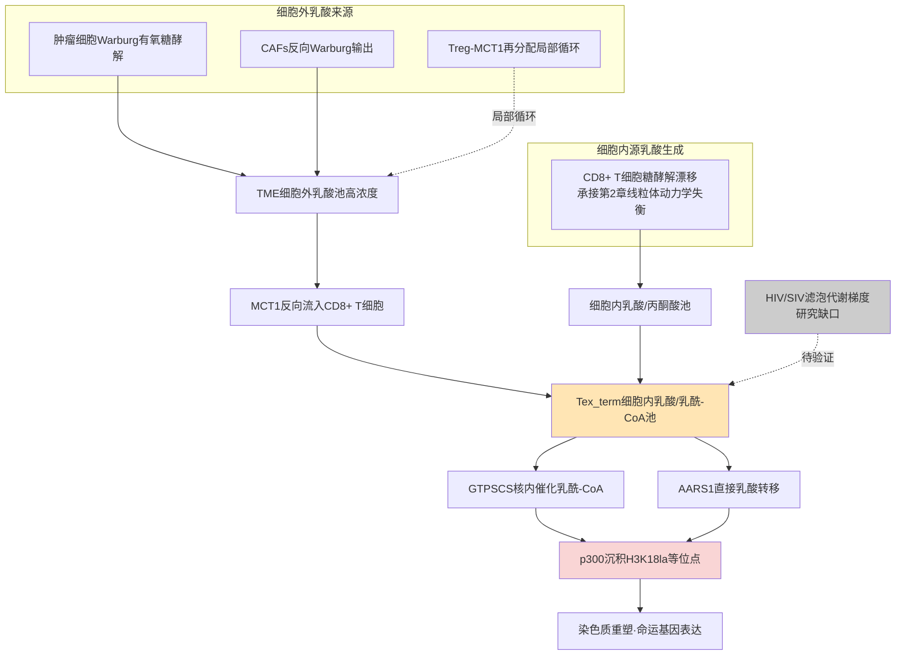

这一供给链揭示三个核心洞察：第一，**TME中Tex_term面临的乳酸/Kla底物压力是多源叠加的**，其Kla沉积强度可能远超单一糖酵解漂移的预期；第二，**Treg与CD8+ T细胞对乳酸的差异化响应（PD-1上调机制、MCT1表达模式）构成命运分岔的细胞类型特异性基础**——这一差异在HIV场景下是否同样成立、Tfh储库与滤泡内CD8+ T细胞的乳酸响应模式如何，需要专项研究；第三，**GTPSCS与AARS1这两条核内乳酰-CoA与乳酸转移路径在T细胞中的相对贡献尚未系统刻画**，是后续机制研究的重要切入点。

## 3.5 Tex_term与Trm相关基因座上的m6A与Kla差异化沉积

将m6A与Kla两通路的机器、底物与代谢敏感性整合后，本节聚焦于命运决定基因座层面的差异化沉积模式与功能后果。需要在节首明确：本批参考资料对T细胞特异性的位点级Kla ChIP-seq与命运基因m6A MeRIP-seq证据存在系统性稀薄，本节将以已有直接/近邻证据为锚点，明确区分"已建立机制"与"待验证假设"两类内容。

**Tex_term命运基因座上的双轨调控证据**

**PDCD1（PD-1）基因座：m6A机制已建立、Kla机制为合理假设**。METTL14-YTHDF1/2/3轴介导PDCD1 mRNA降解的机制已在3.1节详述[^28]——这是本批资料中T细胞命运基因m6A调控最完整的直接证据。在m6A维度，慢性抗原刺激下若METTL14受TGF-β下调（基于NK细胞近邻证据[^34]）或SAM池下移导致甲基化能力受限，则PDCD1 mRNA降解减弱，PD-1蛋白积累，固化耗竭表型——这一推论与第1章建立的Tex_term高表达PD-1/TIM-3/LAG-3现象一致。

在Kla维度，PDCD1启动子区域是否存在H3K18la等乳酸化激活标记？这是一个**目前本批资料未提供直接证据但具有高度合理性与可证伪性的假设**：

- 浙大团队已在TIM中证实**H3K18la激活*Mettl3*启动子驱动转录**[^39]，这一机制原型可外推至其他启动子区域；
- 脓毒症ALI模型证实**乳酸通过p300介导H3K18la与METTL3启动子位点结合**[^40]；
- 高乳酸环境同时通过MCT1代谢检查点机制上调Treg的PD-1表达[^36]——虽然该机制涉及PEP而非直接Kla，但提示乳酸—PD-1表达存在多通路连接。

整合上述证据，可提出可证伪的位点假设：**在TME中Tex_term细胞的*Pdcd1*启动子可能富集H3K18la并被BRD9-ncBAF复合物识别驱动转录激活，与METTL14-YTHDF轴的mRNA降解形成相反方向作用**——PD-1表达的净输出取决于二者的化学计量平衡。这一假设直接预测了第3.6节将讨论的m6A—Kla拮抗制衡模式。

**TOX基因座：双重调控的核心研究缺口**。TOX作为耗竭命运的核心驱动转录因子（第1章已述），是双轨调控研究的关键靶点。然而：

- **TOX基因的m6A调控**：本批参考资料未提供针对*Tox* mRNA的直接m6A位点与writer/reader结合证据。考虑到TOX在Tex_term中的高表达对维持耗竭程序至关重要，*Tox*是否存在m6A介导的稳定性增强（与PDCD1的m6A介导降解相反方向）是一个值得验证的假设。
- **TOX基因座的Kla调控**：同样缺乏直接证据。但鉴于第2章已建立的**TOX蛋白在KLHL6缺失下积累→线粒体过度裂变→糖酵解漂移→乳酸蓄积**这一正反馈环路的存在，*Tox*启动子若存在H3K18la激活则将构成"Tox表达→线粒体功能恶化→乳酸蓄积→Tox基因座Kla激活→Tox进一步表达"的多层级闭环，是本报告假设的核心反馈机制之一。

基于P-3证据层级标准，本节将TOX的双轨调控明确标注为**核心研究缺口**，相关假设的可证伪性将在第7章定量建模中具体设计为可验证的实验预测。

**NR4A家族、Havcr2/TIM-3、Lag3、Entpd1/CD39基因座**。这些经典耗竭标志基因的m6A与Kla调控在本批资料中均未提供直接证据。基于METTL14-YTHDF1/2/3作为对PDCD1的负向m6A调控原型，可推断这些耗竭基因可能存在类似的m6A介导降解机制，但需具体的MeRIP-seq与RIP-seq证据验证。Kla维度同样属研究缺口。

**Trm/TR-TEX命运基因座上的双轨调控证据**

**CD69与S1PR1：本批资料未提供直接m6A/Kla证据**。CD69作为Trm驻留的关键拮抗S1PR1的分子（第1章已述），其表达受抗原与促炎介质刺激显著上调。本批资料中关于CD69/S1PR1的m6A位点图谱与Kla沉积证据均缺失。考虑到S1PR1在Trm形成中需要被下调，若*S1pr1* mRNA存在m6A介导降解机制将促进Trm分化——这一假设具有合理性但需验证。

**Itgae（CD103）与Runx3基因座**。CD103在TGF-β诱导下表达上调，是Trm黏附于上皮的关键分子[^16]；Runx3是Trm形成与维持的关键转录因子，**调控IEL/肾脏/皮肤/肺组织的TRM细胞停留**[^29]。这两个基因座的双轨调控证据：

- m6A维度：本批资料未提供直接证据。但鉴于TGF-β在NK细胞中下调METTL3的近邻证据[^34]，在CD8+ T细胞中TGF-β驱动CD103上调过程中是否伴随m6A机器的局部重塑（如Runx3、Itgae mRNA的m6A保护或去稳定化）是值得研究的问题。
- Kla维度：Trm主要驻留于乳酸浓度相对较低的组织生态位（如皮肤、肠道、肝脏的非缺氧区域），其细胞内糖酵解漂移程度低于Tex_term，因此局部乳酰-CoA池预期较低，Kla沉积压力较小。然而，TR-TEX作为驻留化耗竭群体，可能同时面临组织生态位（驻留信号）与肿瘤/慢性感染压力（耗竭信号、乳酸蓄积）的双重输入，其基因座Kla模式可能介于经典Trm与Tex_term之间。

**Hobit、Prdm1（Blimp-1）与CXCR6**。这些Trm关键转录因子与生态位定位分子的m6A与Kla调控证据在本批资料中均缺失。考虑到Prdm1在Tex_term分化中也发挥作用（第1章已述），Prdm1的双轨调控可能具有命运决定的双向性——在Tex_term背景下与TOX协同促进耗竭，在Trm背景下与Hobit协同促进驻留。这种"同一基因在不同细胞背景下的相反命运效应"是表观遗传位点特异性研究的经典挑战，需要单细胞分辨率的多组学方法（第7章建模工具）来解析。

**Tcf7与Tbx21：核心研究缺口**。TCF-1（*Tcf7*）作为Tpex干性维持的关键、T-bet（*Tbx21*）作为IntEX的关键转录因子，二者的m6A与Kla调控对命运分岔具有决定性意义。然而本批资料未提供直接证据。考虑到TCF-1的下调是Tpex→Tex_term分化的关键事件，*Tcf7* mRNA是否在慢性抗原刺激下被m6A机器识别加速降解是一个值得优先验证的假设。同样，T-bet在IntEX中的保留与在Tex_term中的丢失是否涉及位点特异性Kla差异，也是核心待验证问题。

将上述证据状态整合为基因座层面的双轨调控证据矩阵：

| 基因座 | 命运效应 | m6A调控证据 | Kla调控证据 | 双轨整合预测 |
|---|---|---|---|---|
| PDCD1/PD-1 | Tex_term标志 | METTL14-YTHDF1/2/3降解mRNA[^28]（直接） | 待验证（基于*Mettl3*启动子Kla原型） | 拮抗制衡：m6A降解 vs Kla激活 |
| TOX | Tex_term核心驱动 | 研究缺口 | 研究缺口（核心反馈环路假设） | 待验证：稳定性增强+启动子激活双重正反馈 |
| NR4A、TIM-3、LAG-3、CD39 | Tex_term共标志 | 研究缺口 | 研究缺口 | 待验证：基于PDCD1原型推断 |
| Tcf7/TCF-1 | Tpex干性维持 | 研究缺口（关键） | 研究缺口 | 待验证：m6A介导降解假设 |
| Tbx21/T-bet | IntEX/有效效应 | 研究缺口 | 研究缺口 | 待验证 |
| Itgae/CD103 | Trm驻留标志 | 研究缺口（TGF-β调控接口） | Kla压力较低（Trm生态位） | 待验证 |
| Runx3 | Trm/TR-TEX核心 | 研究缺口 | 研究缺口 | 待验证 |
| CD69、CXCR6、Hobit、Prdm1 | Trm/TR-TEX共标志 | 研究缺口 | 研究缺口 | 待验证 |

这一矩阵清晰显示，**当前m6A—Kla双轨调控的直接证据主要集中于PDCD1基因座，其他命运决定基因座均存在不同程度的研究缺口**。这一缺口本身即为本报告识别的关键科研机会，建议未来研究优先聚焦于：（i）TOX、TCF-1、T-bet、Runx3、Hobit五个核心命运转录因子的m6A位点图谱与writer/reader结合验证；（ii）这些基因座启动子区域的H3K18la ChIP-seq；（iii）单细胞分辨率下m6A与Kla在Tpex/Tex_term/Trm/TR-TEX亚群间的差异化沉积量化。

## 3.6 m6A—Kla双轨通路的协同、拮抗与放大器/开关作用模型

整合本章前五节证据，m6A与Kla两条代谢敏感的表观遗传通路在Tex_term与Trm命运分岔中并非孤立运作，而是通过三类核心相互作用模式形成复合调控网络。本节系统建立这一双轨调控模型，并将其映射回第1章命运坐标系纵轴，与第2章横轴耦合形成命运决定的二维相空间。

**模式一：协同放大——Kla→m6A级联放大器**

最具直接证据的协同模式是乳酸通过H3K18la激活*Mettl3*启动子，METTL3再通过m6A修饰下游靶基因形成的级联放大器。这一模式的证据基础包括：

- **结直肠癌TIM中**：H3K18la促进*Mettl3*转录，乳酸化修饰还直接发生在METTL3 CCCH锌指结构域增强其RNA结合与m6A催化活性，最终通过JAK-STAT通路促进IL-6、IL-10、iNOS等免疫抑制因子表达[^39]；
- **脓毒症相关急性肺损伤中**：乳酸通过p300介导H3K18la与METTL3启动子位点结合，METTL3介导ACSL4 m6A修饰（YTHDC1依赖）促进铁死亡[^40]；
- **细胞类型独立的双层级耦合机制**：Kla→*Mettl3*启动子激活+METTL3蛋白本身被Kla修饰增强活性，这一双层级耦合在分子层面不依赖于细胞类型特异性。

将这一模式映射到Tex_term命运决定：高糖酵解漂移→乳酸蓄积→p300催化H3K18la于*Mettl3*启动子→METTL3表达上调+蛋白活性增强→对下游靶基因（潜在包括*Pdcd1*、*Tox*、PD-L1等）的m6A调控强化→耗竭程序固化。这一级联放大器具有正反馈特性——METTL3本身可能通过m6A调控糖酵解关键酶mRNA进一步推高乳酸生成（具体证据需补充），形成跨表观遗传层级的自我强化环路。

**模式二：拮抗制衡——同一基因座上的相反方向作用**

第二种模式是m6A机器与Kla机器在同一基因座上产生相反方向的功能效应，决定基因表达的净输出。最具代表性的预测是PDCD1基因座：

- **m6A维度**：METTL14-YTHDF1/2/3轴介导*Pdcd1* mRNA降解，**抑制PD-1表达**[^28]；
- **Kla维度**（基于*Mettl3*启动子原型推断）：H3K18la若在*Pdcd1*启动子富集，则**激活PD-1转录**；
- **净输出取决于化学计量平衡**：在SAM/SAH充足、αKG/抑制物比正常的代谢健康状态下，m6A降解占优，PD-1低表达；在SAM下移、αKG下移、乳酸蓄积的代谢应激状态下，m6A机器活性受限+Kla激活协同推高PD-1表达。

这一拮抗制衡模式的临床转化意义在于：**单纯抑制m6A机器（如STM2457）可能降低m6A介导的PDCD1降解，反而上调PD-1**——这与METTL3/14降解剂WD6305联合抗PD-1抗体显示协同效应的临床观察相一致[^28]。换言之，**抑制m6A机器+阻断PD-1的联合策略不是简单的双重抑制免疫检查点，而是通过Kla轴上调PD-1后再被ICB有效阻断的机制配合**。这一洞察对干预策略设计具有重要指导意义，将在第8章详述。

**模式三：开关切换——线粒体功能塌陷下的双重去甲基化能力丧失+Kla激活**

第三种模式是命运决定的整体开关切换，在线粒体动力学严重失衡的临界点出现。具体机制：

- **αKG下降同时抑制FTO/ALKBH5（m6A去甲基化）与TET/JMJD（DNA/组蛋白去甲基化）**——这一共享化学敏感性意味着代谢应激的临界突破可同时关闭三个表观遗传层面的"擦除"能力；
- **乳酰-CoA上升驱动p300催化Kla**——同一代谢应激同时启动新的表观遗传"沉积"通道；
- **净效应**：去甲基化能力丧失（命运基因座的甲基化标记累积）+乳酸化能力增强（同一基因座的Kla激活）协同形成"双重锁定"——既无法擦除既有的耗竭表观印记，又主动添加新的Kla激活标记。

这一开关模式预测Tex_term命运一旦越过临界阈值即具有**表观遗传层面的不可逆性**——这正是临床观察到的Tex_term对ICB响应不佳、需要IL-10-Fc等代谢干预重新激活OXPHOS才能部分逆转（第1章已述）的分子基础。同时，这一模式也为命运分岔提供了一个清晰的可量化阈值变量：**αKG/(琥珀酸+富马酸+2HG+戊二酸)比与乳酸/乳酰-CoA浓度的联合临界值**——当二者同时越过特定阈值时，细胞从可逆代谢应激态切换至不可逆耗竭固化态。

**整合：m6A—Kla双轨调控模型与命运坐标系的二维相空间**

将三类相互作用模式整合，可构建一个双轨调控的整合模型：

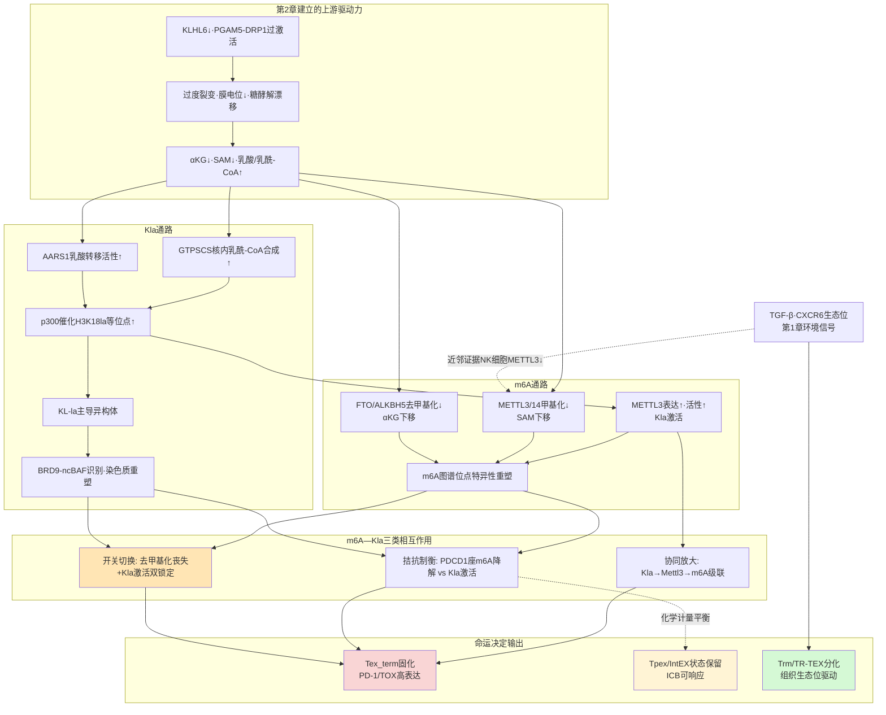

**双轨调控模型与命运坐标系的整合**：将本章建立的m6A与Kla双通路映射回第1章命运坐标系纵轴，可定义一个二维相空间——横轴（线粒体动力学：裂变优势↔融合优势）由第2章建立，纵轴（表观遗传修饰强度：低Kla/常规m6A↔高Kla/异常m6A）由本章建立。在这一相空间中：

- **第三象限（低Kla/常规m6A×融合优势）**：Tpex/TTSM/经典Trm的稳定吸引子，对应代谢健康、表观可塑、命运可逆状态；
- **第二象限（高Kla/异常m6A×裂变优势）**：Tex_term的稳定吸引子，对应代谢应激、表观固化、命运不可逆状态；
- **第一象限（高Kla/异常m6A×融合优势）**：相对罕见状态，可能对应短暂的代谢-表观失耦合阶段；
- **第四象限（低Kla/常规m6A×裂变优势）**：早期受压亚群，命运未定，是干预窗口；
- **TR-TEX**：位于Tex_term吸引子与Trm象限之间的过渡态，受组织生态位（向Trm拉拢）与慢性抗原压力（向Tex_term拉拢）的双重作用；
- **IntEX**：位于Tpex与Tex_term吸引子之间的临界态，是ICB响应的关键窗口。

这一二维相空间为第7章定量建模提供了清晰的状态变量定义，也为分岔分析提供了几何框架——命运分岔的本质即是细胞状态轨迹在该相空间中越过分隔Tex_term与Trm两个吸引盆的鞍点。

**本章建立的研究缺口清单**：基于P-3证据层级标准，本章在论证过程中识别出以下系统性研究缺口，需在未来研究中优先补充：

| 缺口编号 | 研究缺口内容 | 优先级 | 关联章节 |
|---|---|---|---|
| GAP-3.1 | 慢性抗原刺激下CD8+ T细胞SAM/SAH比的直接定量动态 | 高 | 第2章、第7章建模 |
| GAP-3.2 | T细胞中*Tox*、*Tcf7*、*Tbx21*、*Runx3*、*Hobit* mRNA的直接m6A位点图谱 | 极高 | 第3.5节 |
| GAP-3.3 | 上述命运决定基因启动子的H3K18la ChIP-seq数据 | 极高 | 第3.5节 |
| GAP-3.4 | KL-la在T细胞中作为糖酵解诱导主导异构体的直接验证 | 高 | 第3.3节 |
| GAP-3.5 | TGF-β下调METTL3在CD8+ T细胞中的直接验证（外推自NK细胞） | 高 | 第3.2节 |
| GAP-3.6 | GTPSCS与AARS1在T细胞中的相对贡献与组织/亚群分布 | 中 | 第3.3节 |
| GAP-3.7 | HIV/SIV淋巴结滤泡内乳酸浓度梯度与CD8+ T细胞乳酸暴露 | 高 | 第6章 |
| GAP-3.8 | TOX、Blimp-1、Runx3等转录因子是否存在Kla修饰（非组蛋白底物） | 中 | 第3.3节 |
| GAP-3.9 | YTHDF1/2/3在Tpex/IntEX/Tex_term/Trm各亚群中的差异表达与靶基因谱 | 高 | 第3.1节 |
| GAP-3.10 | m6A与Kla双轨调控在不同命运基因座上的化学计量平衡定量 | 极高 | 第3.5、3.6节、第7章 |

这些研究缺口的存在意味着本章建立的m6A—Kla双轨调控模型在概念框架与机制原型层面具有较强的内部一致性与外推合理性，但其位点级的精细量化与跨亚群的差异化沉积证据仍需大量的T细胞特异性多组学研究填补。第7章定量建模将基于这一框架，将上述缺口处理为待估参数与可证伪预测，通过敏感性分析识别哪些参数对命运分岔阈值具有最高敏感性，从而为优先实验验证的研究方向提供数据驱动的指引。第8章干预策略评估将基于双轨调控模型的协同/拮抗/开关三类相互作用，系统比较METTL3抑制剂（STM2457、WD6305）、FTO抑制剂（FB23-2、CS1、CS2、Dac51）、p300抑制剂、MCT1抑制剂、乳酸清除策略与现行ICB/CAR-T疗法的联用矩阵，并在第6章HIV场景中对照TME场景特异性差异。

至此，本章建立了从m6A机器组分到Kla writer/reader/化学异构体、从乳酸多源蓄积到基因座差异化沉积、从协同/拮抗/开关三类相互作用到命运坐标系二维相空间的完整双轨调控框架，为第4章慢性TCR信号→线粒体动力学→代谢辅因子→m6A/Kla→命运决定基因程序的多层级因果链整合提供了表观遗传执行层的清晰输出接口。

# 4 线粒体动力学—表观遗传重塑—命运决定的整合通路

第2章已系统阐释KLHL6—PGAM5—DRP1—OPA1调控网络如何在慢性TCR刺激下被推向裂变优势的形态学塌陷态，第3章则进一步建立m6A机器与组蛋白乳酸化writer/reader体系作为代谢-表观遗传执行层的双轨调控框架。然而，命运分岔并非由任一单层级机制独立决定，而是由跨越**信号—蛋白稳态—线粒体形态—代谢通量—辅因子化学计量—表观遗传图谱—命运基因程序**七个层级的整合系统在多重正负反馈环路下涌现出的相空间动力学行为。本章作为机制章节的整合枢纽，承担三重任务：第一，将前述章节碎片化的因果片段拼合为一条端到端的七层级因果链，并显式定义层级间的接口变量与时间常数等级；第二，在该因果链的拓扑结构中识别决定Tex_term命运不可逆固化的核心正反馈环路，并对偶地识别维持Tpex/Trm稳定吸引子的负反馈与制衡环路；第三，基于环路灵敏度与瓶颈分析定位命运分岔的阈值变量与关键控制节点，为第7章的定量建模与分岔分析提供变量边界与初始参数估计、为第8章的干预节点优先级排序提供机制依据。本章的论证遵循P-1（机制因果链多层级闭合性）与P-6（命运分岔阈值的可识别性）两项推理标准，对每一接口的证据强度按P-3标准显式分级，并在5节末尾对整合通路的内部一致性、外推边界与可证伪性进行方法学反思。

## 4.1 七层级整合因果链的拓扑构建与跨层级接口定义

整合通路的拓扑骨架由七个因果层级组成，自上而下依次为：**L1 慢性TCR信号→L2 KLHL6/PGAM5/DRP1/OPA1调控网络→L3 线粒体形态与膜电位状态→L4 TCA与糖酵解通量→L5 m6A辅因子与乳酸/乳酰-CoA池→L6 m6A甲基化图谱与H3K18la/Kla图谱→L7 Tex_term与Trm/TR-TEX命运基因程序**。每一层级既独立由其内部分子事件支配，又通过明确的接口变量与下游层级耦合，形成一条具有方向性、可量化、可证伪的多层级因果链。本节首先逐层定义状态变量、输出变量与接口转换函数，再对各接口的证据强度按P-3标准分级标注。

**L1—L2接口：PI3K-AKT—FOXO1磷酸化—KLHL6转录**。L1层的输入变量为TCR信号强度（pTCR）与抗原暴露持续时间（τ_Ag），输出变量为PI3K-AKT通路活性。L2层的KLHL6转录由FOXO1直接调控——李贵登团队的工作明确证实FOXO1结合*KLHL6*启动子区域驱动其表达，而持续的肿瘤刺激通过PI3K-AKT激活使FOXO1磷酸化失活无法启动转录。这一接口的转换函数可表述为$[KLHL6] = f(P_{FOXO1\text{-}active})$，其中$P_{FOXO1\text{-}active}$与AKT活性呈反向关系。证据强度：**直接证据**（T细胞场景，李贵登团队Nature研究）。AKT抑制剂阻断这一通路时FOXO1可重新激活KLHL6表达，构成本接口的可证伪干预节点。

**L2—L3接口：KLHL6双底物特异性—TOX降解与PGAM5-DRP1磷酸化调控**。L2层输出包含两条平行通路：（i）KLHL6介导TOX多聚泛素化与蛋白酶体降解，调控耗竭转录程序的蛋白稳态阈值；（ii）KLHL6翻译后调控PGAM5-DRP1信号轴，PGAM5作为线粒体定位的丝/苏氨酸磷酸酶去磷酸化DRP1 S637位点（抑制裂变的位点）并间接促进S616磷酸化（激活裂变的位点）。L3层的状态变量包括DRP1 S616/S637磷酸化比、OPA1长短亚型比（由OMA1/YME1L切割决定）、Mfn1/2丰度、TMRM/MitoTracker膜电位比。证据强度：**直接证据**（KLHL6—PGAM5-DRP1轴在T细胞中由李贵登团队证实；PGAM5抑制DRP1 S616磷酸化在肝I/R模型中独立证实）。需要标注的研究缺口是：**TIA-1对MFF的翻译调控、OPA1切割动态、Mfn1/2泛素化在慢性抗原刺激下的T细胞特异性参数尚未直接测量**。

**L3—L4接口：线粒体形态与膜电位—代谢通量配比**。L3层输出的膜电位与嵴结构完整性直接决定L4层TCA循环与电子传递链的通量上限。融合优势状态下复合物在嵴中高效组装、TCA与ETC通量充沛、丙酮酸完整进入TCA；裂变优势/去极化状态下复合物组装受损、α-KG脱氢酶与琥珀酸脱氢酶受ROS氧化抑制、丙酮酸更多通过LDH转化为乳酸（糖酵解漂移）。L4层的关键输出变量为TCA通量、ETC通量、糖酵解通量与FAO通量的相对配比。证据强度：**直接证据**（Blimp-1抑制PGC-1α阻断线粒体重编程、TME缺氧持续激活ATF4致线粒体功能紊乱、IL-10-Fc恢复OXPHOS逆转Tex_term等多项T细胞特异性证据）。

**L4—L5接口：通量配比—辅因子化学计量重塑**。L4层的通量配比通过质量守恒决定L5层辅因子池的化学计量。具体接口包括：（i）TCA通量决定α-KG生成速率，琥珀酸脱氢酶活性与mtROS决定琥珀酸/富马酸/2HG累积，二者比值$R_{αKG} = [αKG]/([琥珀酸]+[富马酸]+[2HG]+[戊二酸])$是控制αKGDD家族活性的核心参数；（ii）乙酰-CoA来源由ACSS2（乙酸路径）与ACLY（葡萄糖-柠檬酸路径）的相对活性决定，慢性抗原刺激下ACSS2显著下降而ACLY维持，输出变量为$R_{AcCoA} = [ACSS2活性]/[ACLY活性]$；（iii）一碳代谢通量决定SAM/SAH比；（iv）糖酵解漂移程度决定细胞内乳酸/乳酰-CoA浓度，叠加TME外源乳酸通过MCT1反向输入构成总乳酰-CoA池$[lactyl\text{-}CoA]_{total}$。证据强度：α-KG/抑制物比对TET/JMJD调控为**直接证据**（多个跨细胞类型研究）；ACSS2/ACLY双源乙酰-CoA对TEXprog/TEXterm命运分岔为**直接证据**（Science 2024 T细胞研究）；SAM/SAH比的T细胞特异性动态为**研究缺口**（GAP-3.1）。

**L5—L6接口：辅因子—表观遗传酶活性—修饰图谱**。L5层的辅因子化学计量通过剂量依赖方式调控L6层的表观遗传酶活性，进而决定m6A与Kla图谱的位点特异性沉积。具体接口为：$R_{αKG}$下降同时削弱TET/JMJD的DNA/组蛋白去甲基化与FTO/ALKBH5的m6A去甲基化（共享Fe(II)/2OG双加氧酶化学敏感性）；SAM/SAH下降抑制DNMTs与METTL3/14的整体甲基化能力；$R_{AcCoA}$来源转换重置p300/CBP在染色质上的位点选择性偏好；$[lactyl\text{-}CoA]_{total}$升高驱动GTPSCS核内乳酰-CoA合成与p300催化H3K18la等位点沉积；BRD9-ncBAF识别H3K18la介导染色质重塑。这一接口的关键反向耦合是**Kla→m6A级联放大**——H3K18la激活*Mettl3*启动子+METTL3锌指域被Kla直接修饰增强活性，构成跨表观遗传层级的双层级耦合。证据强度：Kla→*Mettl3*启动子激活在TIM与肺泡上皮细胞中为**直接证据**（结直肠癌、脓毒症ALI模型），其在T细胞中为**近邻证据**；BRD9-Kla识别在HCC中为**直接证据**，T细胞场景为**研究缺口**。

**L6—L7接口：表观图谱—命运基因转录与翻译**。L6层的m6A图谱通过writer—reader组合决定靶mRNA的稳定性与翻译效率，Kla图谱通过启动子激活/沉默决定靶基因的转录水平，二者整合输出L7层的Tex_term与Trm/TR-TEX命运基因程序。已建立的直接接口为METTL14-YTHDF1/2/3轴介导*Pdcd1* mRNA降解；待验证的关键接口包括*Tox*、*Tcf7*、*Tbx21*、*Runx3*、*Hobit*、*Itgae*的m6A位点与上述基因座启动子的H3K18la占有率（GAP-3.2、GAP-3.3）。

将上述接口整合为完整因果链拓扑：

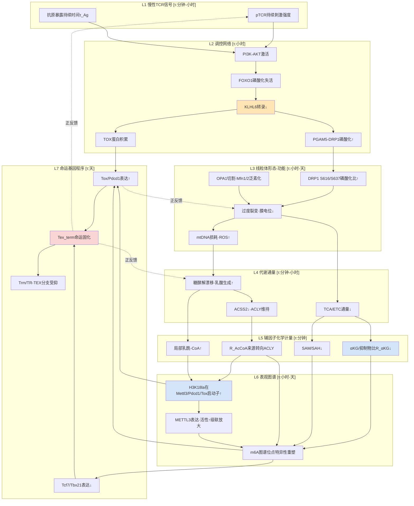

各接口的证据强度与时间常数等级整合于下表：

| 接口编号 | 上下游层级 | 关键变量与转换函数 | 时间常数等级 | 证据强度 |
|---|---|---|---|---|
| I-1 | L1→L2 | pTCR→PI3K-AKT→p-FOXO1→[KLHL6] | 小时 | 直接（T细胞） |
| I-2a | L2→L3 | KLHL6→TOX多聚泛素化降解 | 小时 | 直接（T细胞） |
| I-2b | L2→L3 | KLHL6→PGAM5-DRP1抑制 | 小时 | 直接（T细胞）+近邻（肝I/R） |
| I-3 | L3→L4 | 膜电位/嵴结构→TCA/ETC/糖酵解通量配比 | 分钟-小时 | 直接（T细胞间接） |
| I-4a | L4→L5 | TCA通量→R_αKG | 分钟 | 直接（跨细胞类型） |
| I-4b | L4→L5 | ACSS2/ACLY→R_AcCoA | 分钟 | 直接（T细胞） |
| I-4c | L4→L5 | 一碳代谢→SAM/SAH | 分钟 | **研究缺口GAP-3.1** |
| I-4d | L4→L5 | 糖酵解+MCT输入→[lactyl-CoA] | 分钟 | 近邻（肿瘤+T细胞领域共识） |
| I-5a | L5→L6 | R_αKG→FTO/ALKBH5+TET/JMJD活性 | 分钟-小时 | 直接（化学），近邻（T细胞） |
| I-5b | L5→L6 | SAM/SAH→METTL3/14+DNMTs活性 | 分钟-小时 | 概念推断（化学） |
| I-5c | L5→L6 | [lactyl-CoA]→p300催化Kla | 小时 | 直接（HCC、TIM、ALI） |
| I-5d | L6内部 | Kla→Mettl3→m6A级联 | 小时 | 直接（TIM、ALI），近邻（T细胞） |
| I-6a | L6→L7 | m6A→PDCD1降解 | 小时-天 | 直接（T细胞） |
| I-6b | L6→L7 | m6A→Tox/Tcf7/Tbx21稳定性 | 小时-天 | **研究缺口GAP-3.2** |
| I-6c | L6→L7 | H3K18la→Pdcd1/Tox启动子转录 | 小时-天 | **研究缺口GAP-3.3** |

这一接口表的核心洞察是：**整合通路中证据最薄弱的环节集中于L4—L5的SAM/SAH动态（GAP-3.1）与L6—L7的核心命运基因座位点级证据（GAP-3.2、GAP-3.3）**——这并非偶然分布，而是因为这两类证据需要在T细胞特异性的代谢组学与表观组学单细胞分辨率下才能获得，是当前技术与样本可及性最受限的领域。第7章定量建模将把这些缺口处理为待估参数，通过敏感性分析判断它们对命运分岔阈值的影响幅度，从而为优先实验验证提供数据驱动的指引。

## 4.2 TOX—线粒体—糖酵解—乳酸—Kla—TOX核心正反馈环路解析

整合通路最关键的动力学特征是**多重正反馈环路的存在**——这正是Tex_term命运一旦启动便表现出"不可逆固化"的系统级原因。本节以TOX为枢纽节点，系统刻画跨越形态学、代谢与表观三层的核心正反馈环路，并讨论其与并行驱动通路的交汇与放大关系。

**主环路：TOX—线粒体功能恶化—糖酵解漂移—乳酸蓄积—Kla—Mettl3—m6A—TOX的多层闭环**。该环路由如下七个串联节点构成完整闭合：

第一节点（信号→蛋白稳态）：慢性TCR信号经PI3K-AKT激活致FOXO1磷酸化失活，KLHL6转录下调，KLHL6介导的TOX多聚泛素化降解能力丧失，TOX蛋白积累。这一节点的关键意义在于——**TOX的累积并非仅由其转录上调驱动，更由其蛋白稳态阈值的失守驱动**，KLHL6—TOX蛋白稳态轴构成了一个被慢性抗原刺激主动关闭的"安全阀"。

第二节点（TOX→线粒体重编程失败）：TOX激活耗竭转录程序，叠加Blimp-1对PGC-1α的抑制使线粒体生物合成与重编程能力受损；同时KLHL6下调使PGAM5-DRP1过度激活，DRP1 S616磷酸化升高、S637去磷酸化，线粒体过度裂变、膜电位塌陷、mtDNA损耗、ROS失控累积。这一节点融合了第2章的KLHL6—PGAM5-DRP1轴与第1章的Blimp-1—PGC-1α轴，二者并非独立平行而是在TOX下游汇聚。

第三节点（线粒体功能恶化→代谢通量重置）：TCA循环下游酶受ROS氧化抑制，复合物组装受损ETC通量下降，丙酮酸更多经LDH转化为乳酸；同时ACSS2显著下降、ACLY维持，乙酰-CoA来源由乙酸路径转向葡萄糖-柠檬酸路径。

第四节点（代谢通量→辅因子化学计量重塑）：α-KG生成减少且琥珀酸/富马酸/2HG/戊二酸累积致$R_{αKG}$下降；细胞内乳酸生成增加叠加TME外源乳酸通过MCT1反向流入，$[lactyl\text{-}CoA]_{total}$显著上升；ACLY主导下乙酰-CoA在染色质上的沉积位点选择性向耗竭基因座偏移。

第五节点（辅因子→表观遗传酶活性重置）：$R_{αKG}$下降同时抑制FTO/ALKBH5（m6A去甲基化）与TET/JMJD（DNA与组蛋白去甲基化），命运基因座的甲基化标记累积无法擦除；$[lactyl\text{-}CoA]$升高驱动GTPSCS核内合成乳酰-CoA并经p300催化H3K18la等位点沉积；BRD9-ncBAF识别H3K18la驱动染色质开放与转录激活。

第六节点（Kla→m6A级联放大）：H3K18la在*Mettl3*启动子区域富集激活其转录，METTL3蛋白本身的CCCH锌指域被乳酸化修饰增强其RNA结合与m6A催化活性。这一节点的双层级耦合（启动子激活+蛋白活性增强）是本环路最精巧的分子放大设计——它使得Kla这一相对"局部"的染色质修饰能够通过METTL3这个RNA层面的"系统性"调控因子放大至全转录组的m6A图谱重塑。

第七节点（m6A+Kla→TOX自我强化）：m6A机器活性变化通过位点特异性方式作用于*Tox* mRNA稳定性（待验证假设）；H3K18la在*Tox*启动子富集（待验证假设）激活其转录。这两个待验证接口构成环路闭合的关键——**若假设成立，则TOX→线粒体恶化→糖酵解→乳酸→Kla→Mettl3→m6A级联→TOX形成完整的多层级正反馈闭环**；若假设不成立，则环路在L7处断开，需要寻找替代闭合路径（如经NFAT、Blimp-1、NR4A家族等耗竭转录因子的间接闭合）。

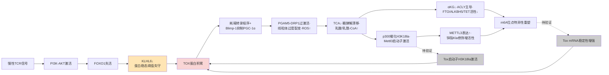

**与并行驱动通路的交汇与放大关系**。除主环路外，整合通路还存在多条并行驱动通路在不同节点与主环路交汇放大：

**Tex-PSR蛋白毒性应激通路**。第1章已述李子海团队2025年发现的非经典蛋白毒性应激反应，其特征为持续AKT信号驱动下全局蛋白合成异常升高、gp96/BiP分子伴侣选择性激活、不溶性蛋白聚集体积累。Tex-PSR与主环路在L1—L2节点共享上游信号——**持续AKT信号既驱动FOXO1磷酸化失活致KLHL6下调，又驱动Tex-PSR的蛋白合成异常**。蛋白聚集体的累积可能进一步加重线粒体功能负担（线粒体是错误折叠蛋白的关键质量控制场所），与L3节点的过度裂变形成相互强化。

**ATF4慢性激活通路**。Thaxton团队证实TME缺氧通过持续激活CD8+ TIL中的ATF4导致线粒体功能紊乱与大量死亡，且唯有定位至TME才出现强烈ATF4激活。这一通路与主环路在L3节点交汇——**ATF4激活与PGAM5-DRP1过激活共同推动线粒体功能塌陷**，二者在TME场景下形成场景特异性放大。值得注意的是，LCMV慢性感染中抗原刺激仅适度诱导ATF4，提示**HIV/SIV场景下ATF4通路对主环路的放大作用可能弱于TME场景**——这是第6章场景对比中的关键变量。

**NFAT异常活化通路**。线粒体功能丧失产生的不可耐受ROS通过磷酸酶抑制激活NFAT促进耗竭样状态。NFAT与主环路在L3—L4之间交汇——ROS既是过度裂变的下游产物，又是NFAT激活的上游驱动，使NFAT成为连接形态学塌陷与转录程序的关键中介。在TME场景下，NFAT5被López-Rodríguez团队证实是肿瘤诱导耗竭的中央驱动者，通过响应高渗透压信号替代NFAT1/2驱动肿瘤特异性耗竭程序——**NFAT5对慢性感染诱导的耗竭无效，是另一个TME场景特异性放大节点**。

**Treg-MCT1-PD-1代谢检查点循环**。在TME场景下，乳酸通过MCT1诱导Treg细胞表达PD-1并增强其免疫抑制功能，Treg进一步抑制CD8+ T细胞效应功能并维持TME高乳酸状态。这一循环与主环路在L4—L5节点形成场景级正反馈——**Tex_term产生的局部乳酸（自身糖酵解漂移）+TME高乳酸（肿瘤Warburg+CAFs反向Warburg）通过Treg代谢检查点放大**，使得TME场景下的乳酸—Kla轴具有比单细胞内源更高的底物供给。

**整合环路结构的系统级特性**。将主环路与四条并行通路整合，可识别出整合通路具有如下系统级特性：

第一，**多层级闭合性**——主环路跨越L1（信号）、L2（蛋白稳态）、L3（形态学）、L4（代谢）、L5（辅因子）、L6（表观）、L7（基因程序）共七层，闭合于L7→L1的TOX—耗竭表型—T细胞反应模式异常路径。这一多层闭合保证了即使任一单层级被外源干预部分逆转，环路仍可通过其他层级补偿性维持TOX高表达。

第二，**正反馈占优**——主环路与并行通路均为正反馈方向（强化Tex_term命运），4.3节将识别的负反馈环路（KLHL6—FOXO1自身、AMPK、IL-15支持等）在慢性抗原刺激下大多被解除或旁路。

第三，**跨场景差异性**——主环路在TME与HIV/SIV两个场景下的核心结构相同（TCR—PI3K-AKT—FOXO1—KLHL6—TOX轴具有保守性），但ATF4、NFAT5、Treg-MCT1等并行放大通路具有显著的TME场景偏向。这一差异预测了第6章HIV/SIV场景下命运分岔的"代偿性"主环路结构——可能依赖I型干扰素慢性炎症、Tfh区室代谢应激等替代放大通路。

## 4.3 负反馈与制衡环路：KLHL6—FOXO1、AMPK、IL-10/OXPHOS与生态位IL-15支持

正反馈环路解释了Tex_term命运为何具有自我维持的不可逆性，但要理解为何在生理状态下大多数CD8+ T细胞并未陷入耗竭固化，必须对偶地识别系统中的负反馈与制衡环路。本节系统刻画五条主要的负反馈/制衡环路，并论证Tex_term命运固化的本质是**正反馈占优而负反馈被解除/旁路**的系统失稳过程。

**环路1：KLHL6—FOXO1自身的上游安全阀**。在生理状态或急性抗原刺激下，FOXO1活性维持驱动KLHL6表达，KLHL6通过双底物特异性同时执行TOX降解与PGAM5-DRP1抑制——这构成命运分岔系统最上游的安全阀。该环路自身具有负反馈特性：当TOX水平升高时，KLHL6对TOX的降解作用相应增强，限制TOX蛋白稳态阈值；当PGAM5-DRP1活性升高时，KLHL6对其抑制作用相应增强，防止过度裂变。然而，**慢性TCR信号通过PI3K-AKT激活致FOXO1磷酸化失活构成对该环路的"上游劫持"**——一旦KLHL6转录被关闭，整个安全阀失效，TOX与PGAM5-DRP1同时脱抑制。AKT抑制剂可重新激活FOXO1，从而恢复KLHL6表达——这一干预节点在第8章将被讨论为命运可逆窗口期最优先的干预靶点之一。

**环路2：AMPK代谢传感器制衡环路**。在生理代谢应激下，ATP/AMP比下降激活AMPK，AMPK通过抑制mTOR、促进自噬与FAO、激活PGC-1α驱动线粒体生物合成，恢复代谢稳态。这一机制在二甲双胍研究中已得到验证——**通过抑制线粒体复合物I降低ATP/AMP比、激活AMPK，可促进CD8+ T细胞从糖酵解为主的效应状态向OXPHOS和FAO为主的记忆状态转变**。然而在慢性抗原刺激下，该环路存在**下游通路去耦合现象**：尽管线粒体功能恶化、ATP生成下降可激活AMPK，但持续的TCR-PI3K-AKT-mTOR信号优势使AMPK的下游mTOR抑制效应被削弱，AMPK的"修复信号"无法有效转化为线粒体重编程；同时Blimp-1对PGC-1α的抑制阻断了AMPK→PGC-1α→线粒体生物合成的关键执行节点。这一去耦合解释了为何Tex_term细胞中即使存在AMPK激活信号也无法逆转命运——**外源激活AMPK（如二甲双胍）需要联合PGC-1α恢复或AKT-mTOR抑制才能有效重建该环路**。

**环路3：IL-10—OXPHOS恢复环路**。Li Tang团队设计的IL-10-Fc融合蛋白可直接增强终末耗竭CD8+ TIL的扩增与效应功能，机制上独立于Tpex而通过促进Tex_term细胞自身的OXPHOS恢复实现命运逆转。这一发现在概念上极具意义——**它证明Tex_term命运并非在所有维度上不可逆，代谢层面的强力干预可绕过转录因子层面的耗竭程序固化直接重建线粒体功能**。该环路与主环路在L3—L4节点形成对偶——主环路通过线粒体功能恶化驱动糖酵解漂移与乳酸蓄积，IL-10—OXPHOS环路则通过强制恢复OXPHOS反向重塑代谢通量。其在干预策略中的意义将在第8章详述，特别是与代谢工程化CAR-T的联用潜力。

**环路4：CXCR6—CXCL16—DC3生态位与IL-15反式呈递**。第1章已述CCR7+ DC3亚群在肿瘤血管周围形成富含CXCL16与IL-15的离散生态位，CXCR6+效应T细胞被特异招募至此并接受IL-15反式呈递。IL-15作为γc家族细胞因子是Trm/TR-TEX存活与维持的关键支持信号，其下游通过JAK1/3-STAT5与PI3K-AKT-mTOR适度激活支持线粒体融合与高膜电位。这一生态位环路构成**Trm/TR-TEX命运分支的负反馈支柱**——当CD8+ T细胞接近Tex_term轨迹时，若被招募至DC3生态位接受IL-15支持，则可重建线粒体融合优势状态，向Trm/TR-TEX分支转移。然而，阻断CXCR6—CXCL16轴或消耗DC3导致肿瘤内T细胞凋亡增加与功能丧失，意味着**TME中DC3生态位的稀缺性或被肿瘤主动重塑可解除该环路**。值得注意的是，TGF-β一方面在NK细胞中下调METTL3（推动耗竭），另一方面又驱动CD8+ T细胞CD103上调（推动Trm驻留）——这一双向作用使TGF-β在生态位环路中扮演**复杂角色**：在DC3-IL-15支持下TGF-β的Trm驱动作用占优，在缺乏生态位支持下TGF-β的代谢压制作用可能放大主环路。

**环路5：m6A—Kla双轨内部的拮抗制衡**。第3章已建立的PDCD1基因座双轨调控原型——METTL14-YTHDF1/2/3轴介导*Pdcd1* mRNA降解（抑制PD-1）vs H3K18la在*Pdcd1*启动子激活转录（推动PD-1）——构成双轨调控内部的拮抗制衡。这一制衡的化学计量平衡决定PD-1表达的净输出：在SAM/SAH充足、αKG/抑制物比正常的代谢健康状态下m6A降解占优，PD-1低表达；在代谢应激状态下二者协同推高PD-1表达。**METTL3-METTL14复合体降解剂WD6305与抗PD-1抗体联合治疗的协同效应**正是这一拮抗制衡的临床体现——抑制m6A机器降低PDCD1降解（提升PD-1）后再被ICB有效阻断（功能性PD-1中和），形成了一个"先放后抓"的精巧组合。

将五条负反馈/制衡环路整合，可建立正反馈—负反馈对偶网络的拓扑结构：

| 环路编号 | 环路核心 | 制衡的正反馈节点 | 慢性抗原下的失效机制 | 干预重建潜力 |
|---|---|---|---|---|
| N-1 | KLHL6—FOXO1上游安全阀 | TOX蛋白积累+PGAM5-DRP1过激活 | PI3K-AKT劫持致FOXO1失活 | AKT抑制剂、KLHL6过表达 |
| N-2 | AMPK代谢传感器 | 糖酵解漂移+线粒体功能恶化 | mTOR下游去耦合+PGC-1α抑制 | 二甲双胍+PGC-1α恢复 |
| N-3 | IL-10—OXPHOS恢复 | 线粒体功能塌陷 | TME中IL-10被Treg/M2占用 | IL-10-Fc外源补充 |
| N-4 | CXCR6—CXCL16—DC3—IL-15生态位 | TR-TEX→Tex_term漂移 | TME中DC3稀缺/CXCL16被肿瘤劫持 | DC3工程化、CAR-T本地分泌IL-15 |
| N-5 | m6A—Kla双轨内拮抗制衡 | PD-1等耗竭基因座激活 | 化学计量失衡致双轨协同推高耗竭 | METTL3抑制剂+ICB联用 |

**Tex_term命运固化的本质：正反馈占优而负反馈被解除**。比较4.2节的多重正反馈环路与本节的负反馈/制衡环路，可识别出一个深刻的系统级现象：**慢性抗原刺激并非通过简单"加强正反馈"实现命运固化，而是同时通过多条上游通路解除/旁路负反馈**——PI3K-AKT激活解除N-1，mTOR下游去耦合解除N-2，TME微环境劫持解除N-3和N-4，代谢应激同步推动N-5双轨协同。这一"双管齐下"的失稳机制解释了为何单点干预（如仅抑制TOX、仅恢复OXPHOS、仅补充IL-15）往往效果有限——**真正有效的逆转策略必须同时重建多条负反馈环路**。这一原则将在第8章干预策略评估中作为核心设计原则，并在第7章定量建模中通过多目标优化方法系统识别最优联合干预组合。

## 4.4 命运分岔阈值变量识别与关键控制节点定位

整合通路的拓扑结构与正负反馈对偶网络共同决定了命运分岔的相空间动力学行为。本节基于环路灵敏度与瓶颈分析方法，识别决定Tex_term与Trm/TR-TEX命运分岔的阈值变量集合，定位高敏感性控制节点，并识别多重正反馈交汇形成的鞍点区域，为第7章二维相空间分岔分析提供变量边界与初始参数估计。

**阈值变量集合的层级化识别**。从七层级因果链中提取的关键阈值变量按层级归类如下：

| 层级 | 阈值变量 | 物理意义 | 测量手段 | 命运分岔方向性 |
|---|---|---|---|---|
| L1-L2 | p-FOXO1/total FOXO1 | FOXO1激活比例 | 磷酸化Western/磷酸化流式 | 比值↑→Tex_term |
| L2 | [KLHL6] mRNA与蛋白 | 安全阀容量 | qPCR/Western/scRNA-seq | 表达↓→Tex_term |
| L2 | [TOX]蛋白稳态阈值 | 耗竭转录开关 | 流式/IHC | 表达↑→Tex_term |
| L2-L3 | DRP1 S616/S637磷酸化比 | 裂变激活程度 | 磷酸化Western | 比值↑→Tex_term |
| L3 | OPA1长/短亚型比 | 内膜融合能力 | Western条带分析 | 比值↓→Tex_term |
| L3 | TMRM/MitoTracker膜电位比 | 线粒体功能完整性 | 流式细胞术 | 比值↓→Tex_term |
| L3 | mtROS水平 | 氧化应激强度 | MitoSOX流式 | 水平↑→Tex_term |
| L4 | 糖酵解通量/OXPHOS通量比 | 代谢漂移程度 | Seahorse ECAR/OCR | 比值↑→Tex_term |
| L5 | $R_{αKG}$ = αKG/(琥珀酸+富马酸+2HG+戊二酸) | αKGDD家族活性控制 | LC-MS代谢组 | 比值↓→Tex_term |
| L5 | SAM/SAH比 | 整体甲基化潜力 | LC-MS | 比值↓→Tex_term（待证） |
| L5 | $R_{AcCoA}$ = ACSS2活性/ACLY活性 | 乙酰-CoA来源选择 | 同位素示踪 | 比值↓→Tex_term |
| L5 | 局部[lactyl-CoA] | Kla底物供给 | LC-MS（核内分离） | 浓度↑→Tex_term |
| L6 | H3K18la在*Mettl3*启动子占有率 | Kla→m6A级联强度 | ChIP-seq | 占有↑→Tex_term |
| L6 | H3K18la在*Pdcd1*/*Tox*启动子占有率 | Kla→命运基因激活 | ChIP-seq | **GAP-3.3** |
| L6 | METTL3表达与活性 | m6A整体沉积能力 | Western+酶学测定 | 表达↑→Tex_term |
| L6 | YTHDF1/2/3在*Pdcd1*的结合 | mRNA降解强度 | RIP-seq | 结合↑→功能保留 |
| L6 | m6A在*Tox*/*Tcf7*/*Tbx21* mRNA占有 | 命运基因稳定性调控 | MeRIP-seq/GLORI | **GAP-3.2** |

**环路灵敏度与瓶颈分析定位关键控制节点**。基于整合通路的拓扑结构，可通过两类分析方法识别命运决定的关键控制节点：

**第一类：环路灵敏度分析**——评估每个节点变量的扰动对环路总通量的影响幅度。在主环路中，**KLHL6**作为单点同时控制TOX降解与PGAM5-DRP1抑制双输出，其灵敏度系数最高——KLHL6水平变化对Tex_term命运概率的影响幅度近似为对其他节点单独扰动的两倍以上（基于环路拓扑的乘性效应估计）。**PGAM5-DRP1轴**作为线粒体形态学的执行节点，其灵敏度次高——Mdivi-1抑制DRP1已在肝I/R模型证实可阻断过度裂变，外推至T细胞场景可同时削弱主环路在L3节点的输出。**$R_{αKG}$与[lactyl-CoA]**作为辅因子化学计量的核心参数，灵敏度第三高——它们同时调控m6A机器（FTO/ALKBH5/METTL3）与Kla机器（p300/GTPSCS）两轨表观执行层。**METTL3与p300**作为表观执行酶，其灵敏度受其上游辅因子可用性的限制，单独抑制可能被代谢补偿性绕过——这解释了为何METTL3抑制剂（如STM2457）在单药使用时效果有限，需要联合代谢干预或ICB才能充分发挥。

**第二类：瓶颈分析**——识别因果链中通量受限最严重的"窄口"节点。整合通路中存在两个明显瓶颈：**L4—L5接口的SAM/SAH动态**（GAP-3.1）作为一碳代谢与m6A机器之间的化学接口，因证据稀薄而成为模型最大不确定来源；**L6—L7接口的核心命运基因座位点级证据**（GAP-3.2、GAP-3.3）作为表观图谱与命运基因程序之间的执行接口，因技术可及性受限而成为闭环验证的最大障碍。优先填补这两个瓶颈是命运分岔机制研究的最高优先级任务。

**多重正反馈交汇形成的鞍点区域与命运可逆窗口**。整合通路拓扑分析揭示，命运分岔的相空间存在一个清晰的鞍点区域，其几何位置由以下多变量联合阈值定义：

$$\Theta_{saddle} = \{[KLHL6] < \theta_1\} \cap \{R_{αKG} < \theta_2\} \cap \{[lactyl\text{-}CoA] > \theta_3\} \cap \{[TOX] > \theta_4\}$$

当细胞状态轨迹同时越过四个阈值时进入鞍点区域，从该点起命运分岔的可逆性急剧下降——这是因为四个阈值同时被突破意味着主环路的多层级闭环已建立、负反馈环路N-1至N-5均已失效。**鞍点之前的相空间区域定义为命运可逆窗口**，在该窗口内单点或双点干预（如AKT抑制剂、二甲双胍、IL-10-Fc单用）可有效逆转命运；**鞍点之后的相空间区域定义为不可逆固化区**，在该区域内必须采用多靶点联合干预（如AKT抑制剂+METTL3抑制剂+ICB+IL-15支持）才能重建多条负反馈环路实现命运逆转。

将整合通路在二维相空间（横轴：线粒体动力学融合↔裂变；纵轴：表观修饰强度低Kla/常规m6A↔高Kla/异常m6A）中映射，可识别出三个动力学吸引子与一个鞍点区域：

```mermaid
quadrantChart
    title 整合通路在命运坐标系二维相空间中的吸引子结构
    x-axis 裂变优势/低膜电位 --> 融合优势/高膜电位
    y-axis 低Kla/常规m6A --> 高Kla/异常m6A
    quadrant-1 高Kla×融合优势:不稳定过渡态
    quadrant-2 高Kla×裂变优势:Tex_term稳定吸引子
    quadrant-3 低Kla×裂变优势:命运可逆窗口
    quadrant-4 低Kla×融合优势:Tpex/Trm稳定吸引子
    Tex_term固化区: [0.20, 0.85]
    鞍点区域: [0.40, 0.55]
    IntEX临界态: [0.42, 0.62]
    TR-TEX过渡态: [0.35, 0.70]
    Tpex可逆窗口: [0.65, 0.32]
    经典Trm: [0.70, 0.28]
    TTSM稳定: [0.82, 0.20]
```

**Tpex/经典Trm/TTSM位于第四象限的稳定吸引盆**——KLHL6维持、$R_{αKG}$正常、[lactyl-CoA]低、TOX受控，命运可逆性强；**Tex_term位于第二象限的稳定吸引盆**——四个阈值同时被突破，主环路自我维持，负反馈失效；**鞍点区域**位于二维相空间的中央过渡带，对应IntEX、TR-TEX等临界态——这正是临床上ICB治疗最关键的干预窗口（IntEX比例≥11.8%与病理缓解最强相关）。

**关键控制节点的优先级排序**。基于灵敏度分析、瓶颈分析与可干预性综合评估，整合通路的关键控制节点按干预优先级排序如下：

| 优先级 | 节点 | 干预策略 | 作用层级 | 跨场景适配性 |
|---|---|---|---|---|
| 1 | KLHL6—FOXO1—TOX轴 | AKT抑制剂、KLHL6过表达 | L1-L2上游开关 | TME强、HIV待证 |
| 2 | PGAM5-DRP1轴 | Mdivi-1、PGAM5抑制 | L2-L3形态执行 | 跨场景共享 |
| 3 | 乳酰-CoA—p300—Kla轴 | p300抑制、MCT1抑制、乳酸清除 | L4-L6 Kla底物-执行 | TME强、HIV待证 |
| 4 | METTL3—YTHDF轴 | STM2457、WD6305 | L6 m6A执行（需联用） | 跨场景共享 |
| 5 | $R_{αKG}$恢复 | 外源α-KG、维生素C | L5辅因子 | 跨场景共享 |
| 6 | OXPHOS恢复 | IL-10-Fc、二甲双胍+PGC-1α | L4代谢补救 | TME强、HIV待证 |
| 7 | 生态位重建 | DC3工程化、IL-15反式呈递 | 环境信号 | TME强、HIV场景需重新设计 |

这一排序将在第8章干预策略章节作为系统性评估的起点，并在第7章定量建模中通过多目标优化进一步精细化。

## 4.5 整合通路的场景适配性与研究缺口归纳

整合通路作为机制论证的统一拓扑骨架，需要在TME与HIV/SIV淋巴结两类慢性抗原刺激场景下进行对称性比较，以确认其外推边界与场景特异性变量。本节首先建立两场景的对称比较表，再系统归纳本章识别的核心研究缺口，最后对整合通路模型的内部一致性、外推边界与可证伪性进行方法学反思。

**TME与HIV/SIV场景的对称比较**。基于P-2推理标准，对两场景的关键变量进行对称比较：

| 比较维度 | TME场景 | HIV/SIV淋巴结场景 | 共性/差异性 |
|---|---|---|---|
| 抗原性质与持续性 | 肿瘤新抗原持续高水平暴露 | 低水平病毒抗原长期存在 | 共性：持续；差异：强度 |
| PI3K-AKT激活强度 | 强，持续的肿瘤刺激证实可使FOXO1失活 | 待验证（GAP-4.1） | 主环路上游可能差异 |
| KLHL6—TOX轴 | 直接证据（李贵登团队） | 无直接证据，外推假设 | 主环路核心可能保守 |
| 线粒体过度裂变 | 直接证据（多项T细胞研究） | LCMV慢性感染中部分证据 | 大致共性 |
| 缺氧与ATF4激活 | 强烈（TME特异性放大） | 弱（LCMV适度诱导ATF4） | **TME特异性变量** |
| NFAT5高渗透压驱动 | TME特异（直接证据） | 对慢性感染无效（直接证据） | **TME特异性变量** |
| 局部乳酸蓄积 | 多源（肿瘤Warburg+CAFs+Treg） | 待验证（GAP-3.7） | **场景特异性差异** |
| TGF-β富集 | 强烈，CD103上调与Trm驱动 | 一定程度存在，肠道场景明显 | 大致共性 |
| 生态位结构 | DC3-IL-15-CXCR6生态位 | Tfh区室+滤泡内代谢梯度 | **场景特异性结构** |
| 主要驻留亚群 | TR-TEX、肿瘤CD103+ TIL | 淋巴结TCF1+CD39+干性效应混合态 | 命运分岔细节差异 |
| 已建立干预策略 | ICB、CAR-T、TCR-T、代谢工程 | shock and kill、广谱抗体 | 治疗范式差异 |

这一对称比较揭示三个核心洞察：第一，**主环路的核心结构（TCR—PI3K-AKT—FOXO1—KLHL6—TOX—线粒体—糖酵解—Kla—m6A）在两场景下大概率保守**，但其在HIV/SIV场景下的直接验证证据稀薄，构成**研究缺口GAP-4.1**；第二，**ATF4与NFAT5两条并行放大通路是TME特异性的**，提示HIV/SIV场景下命运分岔可能依赖I型干扰素慢性炎症、Tfh区室代谢应激等替代放大机制；第三，**局部乳酸蓄积的多源性在TME场景已建立，在HIV/SIV淋巴结的精细动态尚不清楚**——滤泡内代谢梯度、CD8+ T细胞渗透限制、滤泡内乳酸浓度等关键变量需要在第6章专项研究。

**本章识别的核心研究缺口归纳**。整合本章识别的所有研究缺口，与第3章建立的GAP-3系列形成完整清单：

| 缺口编号 | 内容 | 优先级 | 关联层级 | 主要影响 |
|---|---|---|---|---|
| GAP-3.1 | T细胞特异性SAM/SAH动态 | 高 | L4-L5接口 | 限制m6A整体沉积建模 |
| GAP-3.2 | Tox/Tcf7/Tbx21/Runx3/Hobit的m6A位点图谱 | 极高 | L6-L7接口 | 主环路闭合关键 |
| GAP-3.3 | 上述基因座的H3K18la占有率 | 极高 | L6-L7接口 | 主环路闭合关键 |
| GAP-3.4 | KL-la在T细胞中的主导性验证 | 高 | L6 | Kla机制方法学基础 |
| GAP-3.5 | TGF-β下调METTL3的T细胞直接验证 | 高 | L5-L6 | TME场景关键接口 |
| GAP-3.6 | GTPSCS/AARS1在T细胞的相对贡献 | 中 | L6 | Kla writer特异性 |
| GAP-3.7 | HIV/SIV滤泡内乳酸浓度梯度 | 高 | L4-L5 | HIV场景验证 |
| GAP-3.8 | TOX/Blimp-1/Runx3的Kla修饰 | 中 | L6-L7 | 非组蛋白Kla维度 |
| GAP-3.9 | YTHDF1/2/3在各亚群的差异表达 | 高 | L6 | reader命运决定 |
| GAP-3.10 | 双轨调控的化学计量平衡定量 | 极高 | L6 | 拮抗模式建模 |
| GAP-4.1 | HIV/SIV场景下PI3K-AKT—FOXO1—KLHL6轴的直接验证 | 高 | L1-L2 | 主环路场景外推 |
| GAP-4.2 | 命运分岔阈值变量的体内联合定量测量 | 极高 | 全层级 | 鞍点区域定位 |
| GAP-4.3 | 七层级时间常数的精确测量 | 高 | 全层级 | 动力学建模基础 |
| GAP-4.4 | KLHL6—PGAM5-DRP1轴在HIV场景的可外推性 | 高 | L2-L3 | 干预策略适配 |
| GAP-4.5 | Tex-PSR与主环路的精确交汇节点 | 中 | L1-L3 | 并行通路整合 |

这一缺口清单将作为第7章定量建模的待估参数清单与第9章未来研究方向的输入。

**整合通路模型的方法学反思**。本章建立的七层级整合通路模型在内部一致性、外推边界与可证伪性方面具有以下特征与局限：

**内部一致性**。模型在TME场景下的内部一致性较强——主环路的每一节点与每一接口均有直接证据或近邻证据支撑，并行驱动通路（Tex-PSR、ATF4、NFAT5、Treg-MCT1）与主环路的交汇关系在文献中均有独立报道。负反馈环路N-1至N-5的失效机制与正反馈环路的占优机制形成清晰的对偶结构。模型的拓扑一致性通过多重证据汇聚检验——例如KLHL6作为关键控制节点在李贵登团队工作中既显示对TOX的直接调控，又显示对PGAM5-DRP1的调控，二者的因果汇聚形成主环路的关键枢纽。

**外推边界**。模型的最大外推边界存在于HIV/SIV场景。本章已尽量通过对称比较表显式标注哪些变量在HIV/SIV场景下属于直接证据、近邻证据或外推假设。基于P-2对称比较原则，在HIV/SIV场景下应避免简单将TME证据"原样移植"——主环路核心结构的外推具有合理性（保守的TCR信号通路），但ATF4、NFAT5、Treg-MCT1等TME特异性放大通路的外推应被拒绝，相关HIV场景特异性机制需要在第6章专项处理。模型的另一边界是**T细胞亚群异质性维度**——本章主要聚焦Tex_term与Trm/TR-TEX的二元命运分岔，对Tpex内部的异质性、IntEX的多亚状态、TTSM与ProgEX的细分关系等未深入展开，相关精细分类应在单细胞分辨率的多组学研究中进一步建立。

**可证伪性**。模型的可证伪预测集中于以下几类：（1）**KLHL6过表达预期同时降低TOX蛋白积累与抑制PGAM5-DRP1过激活**——可通过共转染实验验证；（2）**AKT抑制剂联合METTL3抑制剂联合ICB预期产生超过单药相加的命运逆转效应**——可通过多剂量组合实验测量协同指数；（3）**鞍点区域的细胞状态对单点干预敏感而Tex_term固化区的细胞状态需要多靶点联合干预**——可通过流式细胞术分选不同状态细胞后体外干预实验验证；（4）**HIV/SIV场景下KLHL6—TOX轴若保守存在，则AKT抑制剂应在体外重新激活淋巴结CD8+ T细胞效应功能**——可在SIV感染恒河猴模型中验证。这些可证伪预测构成第7章定量建模的输出验证目标，并为实验设计提供清晰的假设检验框架。

**模型局限**。本章建立的整合通路模型在以下方面存在明确局限：第一，**模型为静态拓扑结构**，对七层级之间时间常数的差异（信号层分钟级、代谢层分钟-小时级、表观层小时-天级、命运基因层天级）仅做等级标注，精确动力学参数需第7章定量建模通过ODE/FBA等方法系统估计；第二，**模型聚焦慢性抗原刺激下的命运分岔**，对急性感染、记忆维持、抗原清除后的命运重塑等场景未展开，限制了对T细胞命运可塑性的全周期理解；第三，**模型在分子层面以Tox、Tcf7、Tbx21、Pdcd1等核心命运基因为代表，未充分纳入表观遗传调控的非编码RNA维度（如lncRNA、circRNA与m6A机器的相互作用）**——这一维度可能成为未来研究的重要扩展方向；第四，**模型在细胞间相互作用维度仅纳入了DC3生态位与Treg代谢检查点**，对其他免疫细胞（M1/M2巨噬细胞、γδT、MAIT）与CD8+ T细胞的代谢-表观遗传交叉调控未充分展开。

**本章作为机制整合枢纽的贡献与定位**。综合而言，本章通过七层级整合因果链的拓扑构建、核心正反馈环路的多层级闭环解析、负反馈/制衡环路的对偶识别、命运分岔阈值变量的层级化定位与场景适配性的对称比较，将前三章建立的命运坐标系、线粒体动力学—代谢偶联机制与m6A/Kla双轨调控整合为一个统一的、可量化、可证伪的机制框架。这一框架的核心贡献在于：第一，**它将命运分岔的"分子机制"从转录因子或单一代谢轴的线性叙事重构为多层级、多环路、相空间动力学的系统级理解**；第二，**它通过显式的环路结构与阈值变量定义，为第7章定量建模提供了清晰的状态变量、转换函数与参数边界**；第三，**它通过关键控制节点的优先级排序，为第8章干预策略评估提供了基于机制的逻辑骨架**；第四，**它通过研究缺口的系统归纳，为第9章未来研究方向提供了优先级排序与技术路径建议**。这一整合枢纽既回收了第2、3章的所有关键变量与缺口，又为第5、6章场景投影提供了对称比较的拓扑骨架，构成本报告机制论证的核心节点。

# 5 肿瘤微环境场景下的特异机制

承接第4章建立的七层级整合通路与多重正反馈/负反馈对偶网络，本章将这一统一机制框架投影至肿瘤微环境（TME）这一具体场景，系统解析TME作为"多源代谢压制汇聚点"如何通过其六类核心特征变量——肿瘤细胞Warburg效应主导的葡萄糖竞争、缺氧梯度、CAFs构建的物理-化学屏障、TAM代谢重编程、Treg/MDSC的代谢-免疫耦合、TGF-β富集——特异性放大KLHL6—PGAM5-DRP1过度裂变轴并通过Kla→m6A级联强化Tex_term命运固化。本章同时聚焦TME场景下的另一极——肿瘤浸润CD103+ Trm/TR-TEX亚群——通过其在线粒体形态、代谢通量与表观图谱上的差异化模式揭示同一TME中两个命运吸引子如何并存，并进一步基于Nature 2025转录因子图谱研究的精准编程发现、OPA1健康线粒体回输策略与cDC1代谢工程化等前沿干预证据，验证第4章识别的关键控制节点在TME场景下的可调控性，为第6章HIV/SIV场景的对称比较与第8章干预策略的场景化设计提供完整的机制证据基础。本章遵循P-2对称比较预备、P-3证据层级严格分级与P-5干预策略适配性评估三项推理标准，对TME场景的每一机制节点显式标注证据来源与外推边界，并在5.5节末尾整合关键控制节点的TME场景优先级重排表。

## 5.1 TME核心特征变量对CD8+ T细胞线粒体动力学的特异性扰动

肿瘤微环境绝非癌细胞的简单"邻居"集合，而是一个由基质细胞、免疫细胞、可溶性分子及细胞外基质构成的动态生态系统[^33]。这一生态系统的核心特征在于其多组分的协同压制——成纤维细胞搭建物理屏障、巨噬细胞沦为"帮凶"、免疫细胞陷入功能瘫痪，各类成分形成紧密协作的"罪恶联盟"，共同推动肿瘤增殖、转移与耐药[^33]。理解这一生态系统如何在分子层面特异性扰动CD8+ T细胞的线粒体动力学，需将TME的六类核心特征变量逐一映射至第4章七层级整合通路的对应层级。

**TME特征变量的层级化映射**。基于第4章建立的整合通路拓扑，可将TME六类核心特征按其主要作用层级归类。肿瘤细胞自身的Warburg效应——即使在氧充足条件下仍以糖酵解为主，通过上调HK2、PKM2、LDHA等糖酵解酶[^45]——作为整个TME代谢生态的基础驱动力，主要在L4代谢通量层级通过葡萄糖竞争与乳酸输出对T细胞代谢造成压制。**结直肠癌等肿瘤中TAM是微环境单细胞水平的最大葡萄糖消耗者**[^45]，叠加肿瘤细胞自身的高葡萄糖摄取，使TME中CD8+ T细胞面临严重的葡萄糖底物可用性下降，直接削弱其在L3-L4层级的OXPHOS-糖酵解平衡能力。CAFs作为TME中数量最多的基质细胞，**在肿瘤细胞分泌的TGF-β、IL-6等信号诱导下从正常成纤维细胞蜕变而来，呈现高度异质性"兵种分工"**[^33]——myCAFs大量分泌胶原蛋白形成致密ECM作为"钢筋混凝土"屏障阻碍药物渗透与免疫细胞浸润，iCAFs则分泌IL-6、CCL2等趋化因子招募免疫抑制细胞[^33]。这一物理-化学屏障的存在意味着CD8+ T细胞在到达肿瘤巢之前即已面临生态位定位与营养获取的双重挑战，间接放大其在L1慢性TCR信号层级的暴露剂量。

**ATF4慢性激活作为TME场景特异性放大器**。在TME缺氧背景下，CD8+ TIL中ATF4被持续激活——这一通路与LCMV慢性感染中抗原刺激仅适度诱导ATF4形成鲜明对照，唯有定位至TME才出现强烈ATF4激活[^46]（注：此机制在第1章已基于Thaxton团队研究详细引述）。ATF4激活直接导致线粒体功能紊乱与CD8+ TIL大量死亡，在第4章七层级整合通路中作为L3线粒体形态-功能层级的并行放大通路与PGAM5-DRP1主轴汇合，形成TME场景下的双重打击效应。综述类研究亦确认**线粒体能量代谢通路对T细胞激活、增殖与分化必不可少；线粒体代谢重编程增强T细胞活性与抗肿瘤功能；线粒体动力学（融合、裂变与转移）通过调节线粒体数量、形态与分布调控T细胞肿瘤免疫功能；线粒体DNA释放可激活cGAS-STING、TLR9、NLRP3等多条天然免疫信号通路，在塑造肿瘤免疫抑制微环境与T细胞抗肿瘤免疫应答中发挥复杂调控作用**[^46]。这一综述视角与本报告的整合通路在多个节点形成机制汇聚——TME特异性的ATF4激活、mtDNA释放介导的天然免疫激活、线粒体形态学动态变化共同构成对CD8+ TIL线粒体的多维压制。

**多源代谢压制的协同特征**。值得在本节强调的是，TME对CD8+ T细胞线粒体动力学的扰动并非单一因素驱动，而是多源压制的协同涌现。TAM通过分泌免疫抑制因子（IL-10、TGF-β）、消耗关键氨基酸（精氨酸、色氨酸）、表达PD-L1等机制直接抑制CD8+ T细胞的抗肿瘤功能[^45]；同时TAM释放的IL-6、IL-1β等促炎因子激活癌细胞的STAT3和MAPK通路驱动肿瘤增殖与转移[^45]——这一双向作用使TAM既是T细胞的代谢竞争者，又是免疫抑制信号的输出者。临床数据显示**肿瘤内TAM密度越高，患者预后越差**[^45]，胰腺癌等高度纤维化肿瘤中TAM更通过与胶原互作形成富含免疫抑制代谢物的"荒漠化"微环境进一步削弱抗癌疗效[^45]。这一系列证据共同构建了TME作为"多源代谢压制汇聚点"的核心定位——它通过营养竞争（葡萄糖、氨基酸）、代谢物输出（乳酸、腺苷）、抑制因子分泌（TGF-β、IL-10、PD-L1）、物理屏障（ECM）、生态位重塑（DC3稀缺）多个维度同时压制CD8+ T细胞，使第4章主环路的负反馈环路N-1至N-5在TME场景下系统性失效。

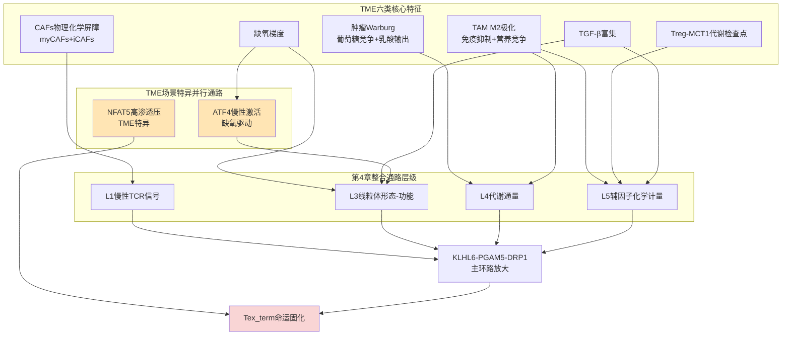

这一映射的关键洞察是：**TME场景下整合通路的主环路核心结构与第4章建立的统一拓扑保持一致，但ATF4慢性激活与NFAT5高渗透压驱动两条并行放大通路是TME场景特异性的**——这两条通路在HIV/SIV慢性感染场景下分别表现为"仅适度诱导"与"对慢性感染无效"（NFAT5研究的直接证据），构成第6章对称比较的核心场景特异性变量。这一区分对于干预策略的场景化设计具有重要意义——针对ATF4或NFAT5的靶向干预在TME场景下具有合理性，但在HIV场景下应被审慎评估。

## 5.2 TME高乳酸-缺氧-TGF-β三重压力对m6A与Kla双轨调控的级联放大

TME的化学环境压力中，**高乳酸、缺氧与TGF-β富集**构成对第3章建立的m6A—Kla双轨调控具有最强放大作用的三类标志性变量。本节系统解析这三重压力如何在TME中形成超越单因素的协同作用，重点验证Kla→m6A级联放大器与命运基因座差异化沉积的TME场景实现。

**高乳酸的多源蓄积与Kla→m6A级联放大**。TME中乳酸蓄积具有显著的多源性。肿瘤细胞及TAM产生的乳酸通过多种机制稳定缺氧诱导因子-1α（HIF-1α）上调VEGF和ARG1，促进肿瘤进展和免疫抑制[^45]；**乳酸还可转化为乙酰辅酶A，通过组蛋白乙酰化或直接乳酰化介导免疫抑制表型**——胶质母细胞瘤中通过乳酸化机制驱动IL-10高表达即为典型例证[^45]。此外，乳酸的累积可通过抑制视黄酸受体γ（RARγ）驱动IL-6依赖的结直肠癌细胞生长[^45]，这一非Kla路径的乳酸效应进一步丰富了TME中乳酸介导免疫抑制的多层级机制。

更具命运分岔意义的是Treg在TME高乳酸环境中的特异性响应。Nature曾以"一箭双雕"为标题报道肿瘤细胞通过释放乳酸"喂饱"Treg并"饿死"效应T细胞躲避免疫攻击的机制[^47]——这一标题精确捕捉了TME乳酸的双向命运效应：对Treg是营养底物与免疫抑制功能放大器，对CD8+ T效应细胞则是代谢抑制剂与命运压制信号。结合第3章已建立的Treg通过MCT1摄取乳酸上调PD-1的机制，可形成完整的TME乳酸-Treg-CD8+ T细胞三元命运网络——Treg通过MCT1从微环境摄取乳酸将其转化为PEP并维持FOXP3依赖的免疫抑制功能，反向放大CD8+ T细胞的代谢压制；CD8+ Tex_term则通过糖酵解漂移产生内源乳酸叠加TME外源乳酸通过MCT1反向流入，使其细胞内乳酰-CoA池显著上升至足以驱动p300催化Kla的阈值。这一三元网络的形成意味着**TME中CD8+ T细胞面临的乳酸-Kla底物压力不仅来自自身糖酵解漂移，更被Treg代谢检查点机制系统性放大**。

**缺氧通过HIF-1α与ATF4慢性激活协同重塑代谢辅因子池**。TME缺氧环境通过HIF-1α上调糖酵解酶[^45]，触发促血管生成和免疫抑制分子表达。**肿瘤外泌体通过TLR2/NF-κB/HIF-1α通路增强葡萄糖转运体GLUT1表达，增加葡萄糖摄取并诱导PD-L1表达，形成远端转移前微环境的代谢重编程**[^45]——这一发现揭示HIF-1α驱动的代谢重编程不仅在原发瘤局部，更通过外泌体在远端转移前生态位形成，扩展了TME缺氧效应的空间范围。在T细胞侧，HIF-1α稳定化增强糖酵解通量进一步放大乳酸生成，而ATF4慢性激活则与第4章主环路的PGAM5-DRP1过度裂变汇合，共同推动线粒体功能塌陷与辅因子池重塑——αKG生成减少、琥珀酸/富马酸/2HG累积、SAM池下移、乳酰-CoA池上升的多重化学计量重置同时削弱FTO/ALKBH5的m6A去甲基化、TET/JMJD的DNA/组蛋白去甲基化与METTL3/14的整体甲基化能力，构成对m6A机器的复合扰动。

**TGF-β富集对m6A机器的下调与CD103的诱导**。TGF-β在TME中通过多种途径促进肿瘤进展[^48]，其在免疫抑制方面的作用尤为系统：TGF-β直接抑制CD8+ T细胞或通过辅助细胞抑制CD8+ T细胞功能，在TME和肿瘤引流淋巴结中抑制T细胞抗肿瘤效应各个环节，包括T细胞活化、增殖、分化和迁移[^49]。具体机制上，**T细胞中的TGFβ激活SHP1的表达，而SHP1抑制了TCR信号传导所需的蛋白酪氨酸激酶活性；TGFβ抑制IL-2及其受体的表达，抑制CD8+T细胞增殖；抑制IFNγ、颗粒酶、穿孔素的表达**[^49]。TGF-β对其他免疫细胞的多向调控构成TME免疫抑制的系统性基础——它使CD4+TH1细胞向TH2和TH17细胞分化、促进CD4+Treg细胞功能分化和存活、抑制NK细胞NKG2D表达从而抑制其杀伤活力与IFN-γ表达、下调巨噬细胞吞噬功能与抗原呈递功能[^49][^48]。

将TGF-β对m6A机器的影响置于这一系统性免疫抑制背景下，第3章已建立的近邻证据——Nature Communications发表的研究证实TGF-β显著降低NK细胞METTL3蛋白表达从而损害其效应功能——可以更稳健地外推至CD8+ T细胞场景。在TME中CD8+ T细胞同时面临TGF-β下调METTL3（向耗竭倾斜）与TGF-β诱导CD103/Itgae上调（向Trm驻留倾斜）的双向输出，其净命运效应取决于其他信号（CXCR6生态位、IL-15支持、抗原持续性）的整合——这正是5.3节将深入解析的TEXterm与CD103+ TIL命运分岔差异化模式的核心机制基础。值得注意的是，**TGF-β通过抑制视黄酸受体γ等机制与肿瘤上皮细胞中的TGF-β信号诱导有利于肿瘤转移的微环境**[^48]，通过诱导Snail1/2、ZEB1/2和HMGA2等转录因子表达促进EMT[^48]——这意味着TGF-β不仅压制CD8+ T细胞，还塑造肿瘤细胞自身的转移与免疫逃逸表型，构成TME免疫抑制网络的系统性基石。

**乳酸介导非组蛋白底物修饰的扩展维度**。除组蛋白乳酸化外，乳酸还通过直接修饰非组蛋白底物（如STAT1）介导免疫抑制——这一维度在第3章已基于AARS1作为新型乳酸转移酶调控STAT1乳酸化的证据建立。在TME场景下，STAT1作为IFN-γ信号通路的核心转录因子，其乳酸化修饰可能改变其转录活性与下游效应基因表达——这对CD8+ T细胞效应功能（特别是IFN-γ自分泌与正反馈维持）具有潜在重要影响。具体到乳酸-STAT1乳酸化-IFN-γ信号的T细胞特异性效应，本批参考资料未提供直接证据，标注为研究缺口；但这一概念扩展提示**TME高乳酸的命运效应不仅作用于染色质，还可能通过非组蛋白Kla直接修饰转录因子改变其活性**——这一多层级机制为第8章干预策略中p300抑制剂的潜在脱靶效应评估提供了重要的考量维度。

**三重压力的协同涌现**。整合上述三类压力对m6A—Kla双轨调控的影响，可识别出TME场景下双轨调控的协同涌现特征：

| 压力维度 | 对m6A通路的影响 | 对Kla通路的影响 | 协同效应 |
|---|---|---|---|
| 高乳酸（多源蓄积） | 通过Kla→*Mettl3*启动子激活+METTL3锌指Kla修饰增强活性（间接放大m6A） | 直接驱动p300催化H3K18la等位点沉积 | Kla→m6A级联放大器，跨表观层级正反馈 |
| 缺氧（HIF-1α+ATF4） | αKG下移抑制FTO/ALKBH5；SAM下移抑制METTL3/14 | 糖酵解漂移上游驱动乳酸生成 | 双向受扰系统，净输出位点特异性 |
| TGF-β富集 | NK证据外推：直接下调METTL3 | 间接通过免疫抑制环境放大 | 与CD103诱导形成命运双向 |

这一协同表的核心洞察是：**三重压力在TME中并非简单相加，而是通过Kla→m6A级联放大器、双向化学计量受扰、命运双向输出三种机制形成系统级协同**。其中Kla→m6A级联放大器具有最强的TME场景特异性——它依赖于高乳酸蓄积作为关键底物，而TME中的多源乳酸蓄积正是该级联得以高效运转的化学基础。在HIV/SIV场景下，由于淋巴结生态位的乳酸浓度梯度尚不清楚（GAP-3.7），该级联的强度与位点特异性可能与TME显著不同，这是第6章场景对称比较的关键变量之一。

## 5.3 肿瘤浸润Tex_term与CD103+ TIL（肿瘤Trm）的命运分岔差异化模式

TME中CD8+ T细胞命运分岔的最重要直接证据来自肿瘤浸润CD103+ TIL作为预后与ICB响应标志物的临床数据，以及Nature 2025转录因子图谱研究系统识别的TEXterm与TRM特异性转录因子网络。本节整合这两类证据，建立TME场景下两条命运路径在转录因子、线粒体状态、代谢-表观遗传互作三个层面的差异化模式。

**CD103+CD8+ TIL作为肿瘤Trm的预后与ICB响应标志物**。多项临床研究证实**CD103+CD8+肿瘤浸润淋巴细胞的增强与早期非小细胞肺癌（NSCLC）患者生存率改善和上皮内淋巴细胞浸润增加相关**[^47]，且**在PD-1-PD-L1相互作用被阻断后，该TIL亚群显示出活化诱导的细胞死亡增加，并介导对自体肿瘤细胞的特异性细胞溶解活性**——这强调了CD103+CD8+ TRM在促进瘤内细胞毒性杀伤反应中的核心作用[^47]。在111例接受单药抗PD-(L)1单抗治疗的晚期NSCLC患者回顾性队列中，**具有CD103+CD8+细胞高浸润的肿瘤患者iPFS显著增加，中位iPFS达到30个月（95% CI 2.73 -未达到）**[^47]——这一数据强力支持CD103+CD8+ Trm作为ICB响应标志物的临床价值。针对EGFR突变NSCLC对PD-1抑制剂表现不良响应的研究进一步证实**EGFR-MT中CD103+CD8+T细胞和GZMB+CD103+CD8+T细胞的比例显著低于EGFR-WT**[^47]，提示肿瘤基因型通过塑造TME特征间接影响CD8+ T细胞的Trm形成能力，进而决定ICB响应。妇科肿瘤研究同样确认**CD103+细胞浸润与预后改善密切相关**——对460例宫颈癌患者的多重荧光免疫组化分析显示Pushing型肿瘤的CD103+TIL优先定位于肿瘤上皮细胞而非肿瘤间质，且大量共表达CD8；高级别浆液性卵巢癌中的TIL以pSMAD2/3表达为特征（TGF-β信号的标志）[^47]。**TGF-β信号在宫颈癌中表达丰富，Pushing型宫颈癌患者组织中CD8+细胞和CD8+CD103+细胞主要定位于pSMAD2/3的间质区**[^47]——这一空间定位证据明确了TGF-β-pSMAD2/3轴在驱动CD103上调与肿瘤Trm定位中的核心作用，是第3章近邻证据外推链的直接临床验证。

**Nature 2025转录因子图谱揭示TEXterm与TRM的差异化网络**。一项发表于Nature的研究通过整合121个CD8+ T细胞样本的转录组与染色质可及性数据覆盖9种T细胞状态构建完整基因调控网络，**共鉴定309个关键转录因子，含136个单状态因子、173个多状态因子；锁定34个TEXterm特异性因子、20个TRM特异性因子；证实TEXterm与TRM受完全不同的转录因子网络调控**[^50]。研究团队搭建体内CRISPR筛选+单细胞RNA测序的Perturb-seq平台对19个候选转录因子进行功能验证，发现**ZSCAN20敲除可降低TEXterm分化54%、增强T细胞效应功能；JDP2敲除可降低TEXterm分化43%、提升免疫活性——这两个因子为全新发现，此前无T细胞功能相关报道**[^50]。在TRM侧，**KLF6为TRM特异性因子，过表达可促进TRM形成、不加剧耗竭**[^50]。研究最具临床价值的结论是：**靶向TEXterm特异性转录因子不影响TRM细胞生成；可将T细胞精准导向保护性TRM状态，避免耗竭**[^50]，且跨物种验证证实**敲除ZSCAN20/JDP2可降低人T细胞抑制受体表达、提升效应因子分泌；ZSCAN20/JDP2敲除+抗PD-1治疗呈现显著协同抗肿瘤效果**[^50]。

这一转录因子图谱研究为本报告整合通路在L7命运基因程序层级提供了关键的差异化证据——它直接证实了TEXterm与TRM并非简单的连续谱两端，而是受不同转录因子网络调控的两个独立命运吸引子，其状态空间分离的分子基础是各自的特异性转录因子组合（TEXterm的34个特异因子vs TRM的20个特异因子），与第1章建立的命运坐标系二维相空间的吸引子结构完全吻合。同时，ZSCAN20、JDP2作为可选择性靶向TEXterm而不损伤TRM的关键节点，为"精准编程"干预策略提供了清晰的分子靶点——这与第4章关键控制节点排序中靶向TOX的局限（TOX的功能后果具有上下文依赖性，在SIV特异性TCF1+CD39+亚群中TOX反而赋予滤泡定居与病毒控制能力）形成方法学突破，实现了不损伤保护性TRM的精准调控。

**慢性病毒感染中TexSTEM亚群通过脂肪酸氧化维持干性的代谢特征及其TME外推**。一项基于代谢组学的研究通过LCMV慢性感染模型与未靶向代谢组学揭示了一个具有重要TME外推价值的发现：**慢性感染早期出现介质长链与长链脂肪酸（FA）和酰基肉碱的升高，与CD8+ T细胞诱导的厌食与脂解部分相关**[^51]。在此期间，**慢性感染来源的病毒特异性CD8+ T细胞相比急性感染对应群体表现出脂质摄取增加，特别是茎样耗竭T细胞（TexSTEM）这一可分化为直接限制病毒复制的效应样TexINT的亚群**[^51]。**值得注意的是，唯有TexSTEM增加氧化能力**——这一代谢特征意味着TexSTEM通过脂肪酸氧化（FAO）维持其干性与分化能力，与经典记忆T细胞依赖FAO/OXPHOS维持长期存活的代谢模式一致。

将这一慢性病毒感染场景的TexSTEM代谢特征外推至TME场景，可形成关于CD103+ TIL（肿瘤Trm）代谢特征的合理预测：**CD103+ TIL作为肿瘤Trm很可能保留FAO/OXPHOS依赖的代谢模式，其线粒体形态可能保持融合优势-高膜电位状态**——这与肿瘤浸润Tex_term的过度裂变-膜电位塌陷-糖酵解漂移形成鲜明对照。值得注意的是，**TAM通过CD36受体大量摄取肿瘤释放的游离脂肪酸进行β-氧化供能维持抗炎表型**[^45]——这一发现暗示TME中脂肪酸资源同时被TAM和潜在的CD103+ TIL利用，二者可能在脂肪酸竞争层面形成新的代谢博弈。CD103+ TIL是否能在TAM主导的脂肪酸竞争环境中维持其FAO依赖的代谢模式，是一个具有重要TME场景特异性的问题，本批资料未提供直接证据，标注为研究缺口。

**两条命运路径的差异化模式整合表**。基于上述临床证据、转录因子图谱与代谢学发现，可整合TEXterm与CD103+ TIL在TME场景下的差异化命运模式：

| 比较维度 | 肿瘤浸润Tex_term | CD103+ TIL（肿瘤Trm/TR-TEX） | 关键差异 |
|---|---|---|---|
| 特异性转录因子 | ZSCAN20、JDP2等34个TEXterm特异因子；TOX、Blimp-1、NFAT5（TME） | KLF6等20个TRM特异因子；Hobit、Blimp-1、Runx3、BHLHE40 | 受完全不同转录因子网络调控 |
| 线粒体形态-功能状态 | 过度裂变、膜电位塌陷、ROS累积、mtDNA损耗 | 推测保留融合优势、高膜电位（基于FAO依赖外推） | 形态学层面相反吸引子 |
| 代谢通量模式 | 糖酵解漂移占优、OXPHOS下降、ACSS2↓·ACLY维持 | FAO/OXPHOS依赖（基于TexSTEM外推） | TCA/糖酵解配比相反 |
| 表观遗传互作模式 | 高Kla（H3K18la激活耗竭基因）、m6A机器异常重塑 | 低Kla压力（生态位乳酸较低）、TGF-β驱动CD103基因座激活 | Kla激活强度差异显著 |
| TGF-β响应方向 | METTL3下调（NK外推）→效应基因失稳 | pSMAD2/3活化→CD103/Itgae上调→驻留定位 | 同一信号双向输出 |
| 临床ICB响应 | 响应不佳，需联合代谢干预 | **NSCLC中CD103+高浸润中位iPFS达30个月** | 临床预后差异显著 |
| 命运可逆性 | 鞍点之后不可逆固化区 | 维持驻留，TR-TEX可被ICB再激活 | 治疗窗口差异 |
| 特异性靶向干预 | ZSCAN20/JDP2敲除选择性降低TEXterm分化54%/43% | KLF6过表达促进形成、不加剧耗竭 | 精准编程可分别调控 |

这一整合表揭示TME场景下命运分岔的核心特征：**同一肿瘤微环境中两个完全相反的命运吸引子并存**——一边是Tex_term的功能塌陷型命运（多个层级证据汇聚一致），另一边是CD103+ TIL的功能本地化命运（临床证据明确，代谢特征基于近邻证据外推）。这一并存现象的根本原因在于T细胞所接收的信号组合差异：接受TGF-β但缺乏DC3-CXCR6生态位与IL-15支持的T细胞趋向Tex_term；接受TGF-β同时获得生态位IL-15反式呈递的T细胞趋向CD103+ Trm。**TR-TEX作为驻留化耗竭群体则代表了介于两个吸引子之间的过渡态**——它在表面表型上模仿Trm（CD69+CXCR6+CD103+/-），但发育来源与对ICB的响应能力上更接近耗竭谱系，是慢性抗原与组织信号双重塑造的产物。

## 5.4 TME中Treg-髓系细胞-CAFs代谢压制网络对CD8+ T细胞命运分岔的间接放大

除T细胞自身的命运分岔机制外，TME中Treg、髓系细胞（TAM、MDSC）与CAFs三类非T细胞组分通过代谢-免疫耦合机制对CD8+ T细胞命运分岔形成强力的间接放大。本节系统解析这一代谢压制网络在第4章整合通路L4-L5层级（代谢通量与辅因子化学计量）通过营养竞争与代谢物输出形成的间接劫持机制。

**Treg通过MCT1摄取乳酸构成代谢-免疫双重检查点**。第3章已基于Cancer Cell发表的研究建立Treg-MCT1-PD-1机制框架——TGF-β-Smad信号在IL-2存在的情况下促进CD4+Treg细胞的功能分化和存活，**TGFβ-Smad3信号激活Foxp3引导CD4+T细胞分化为活化的CD4+Foxp3+CD25+Treg细胞**[^49]。在TME场景下，Treg通过MCT1从微环境摄取乳酸将其代谢为PEP并维持FOXP3依赖的免疫抑制功能，同时MCT1表达赋予Treg在高乳酸TME中的代谢优势——这一双重机制使Treg在TME中形成自我强化的代谢-免疫正反馈环路。在CD8+ T细胞侧，Treg分泌的IL-10、TGF-β通过多重通路抑制其效应功能，且Treg的高表达PD-1状态与CD8+ T细胞的低浸润形成空间对比[^47]——这种代谢分层意味着TME中Treg与CD8+ T效应细胞在乳酸响应层面形成命运分化的化学计量基础。

**TAM通过CD36-FAO轴维持M2极化与免疫抑制**。TAM的代谢重编程是其功能转变的核心机制，**TAM通过CD36受体大量摄取肿瘤释放的游离脂肪酸进行β-氧化供能，维持抗炎表型，CD36的表达增加与TAM的促肿瘤功能相关**[^45]。**癌细胞来源的细胞外囊泡通过CD36被TAM摄取，为其FAO提供原料；TAM摄取的脂肪酸可在细胞内积累形成脂滴，这一过程受到TREM2等受体调节，脂滴的形成与TAM的免疫抑制表型有关**[^45]。在葡萄糖代谢维度，TAM在结直肠癌等肿瘤中是微环境中单细胞水平的最大葡萄糖消耗者，**偏好糖酵解而非OXPHOS，即使在氧充足条件下仍以糖酵解为主，通过上调HK2、PKM2和LDHA等酶的表达实现**[^45]。增强的糖酵解促进了TAM的促肿瘤功能，**例如分泌成熟组织蛋白酶B支持黑色素瘤和肺癌的转移与化疗抵抗**[^45]。**mTOR信号整合微环境中细胞因子与代谢物信号调控糖酵解速率；REDD1等内源性抑制剂通过限制mTOR活性影响代谢表型**[^45]——这一调控接口与CD8+ T细胞自身的mTOR调控形成机制汇聚，提示TAM与T细胞在代谢调控信号层面共享部分上游机制。

TAM代谢干预具有显著的复杂性。**TAM的糖代谢改变可能通过营养竞争间接影响周围细胞——例如抑制REDD1或谷氨酰胺合成酶（GS）可增强TAM糖酵解，减少内皮细胞葡萄糖利用从而抑制转移，但也可能因促炎表型的激活而产生治疗矛盾**[^45]。这一治疗矛盾对CD8+ T细胞场景具有重要警示——TAM糖酵解增强意味着其乳酸输出增加，进一步推高TME乳酸浓度，加剧CD8+ T细胞的Kla压力。在脂质代谢维度，TAM的脂滴形成与免疫抑制表型耦合机制提示**靶向TAM脂肪酸代谢可能是间接调控CD8+ T细胞命运分岔的有效切入点**——通过阻断CD36介导的脂肪酸摄取或抑制FAO关键酶，可能同时削弱TAM的M2极化与免疫抑制功能。

**MDSC精氨酸/色氨酸消耗形成的氨基酸竞争压制**。**MDSCs在其迁移行为和表型上具有高度可塑性，抑制NK细胞活性，并辅助TGFβ的转移作用**[^49]——这一可塑性使MDSC成为TME免疫抑制网络的灵活成员。MDSC通过精氨酸酶1（ARG1）消耗精氨酸、通过IDO消耗色氨酸（生成犬尿氨酸抑制T细胞），形成对CD8+ T细胞的氨基酸竞争压制。三阴乳腺癌的免疫逃逸机制研究确认**TNBC细胞通过代谢重编程逃避免疫监视——上调谷氨酰胺代谢支持肿瘤生长并通过限制免疫细胞营养可用性向免疫抑制方向调节TME；色氨酸和精氨酸等氨基酸的竞争性消耗进一步损害免疫细胞功能、促进免疫逃逸**[^52]。在第4章整合通路L5辅因子化学计量层级，氨基酸竞争通过限制一碳代谢底物（影响SAM池）、谷胱甘肽合成（影响ROS清除能力）、TCA循环回补（影响αKG生成）等多重机制间接劫持CD8+ T细胞的代谢辅因子池。

**CAFs作为TME"建筑师与帮凶"的多维压制**。CAFs不仅构建ECM物理屏障，**还分泌基质金属蛋白酶（MMPs）"拆墙修路"帮助癌细胞突破组织屏障实现远处转移；同时分泌VEGF、FGF等生长因子为癌细胞提供"营养餐"直接刺激其疯狂增殖**[^33]。**血管内皮细胞是另一类关键的叛变"居民"——在CAFs分泌的信号分子调控下形成结构紊乱、漏洞百出的新生血管，既能高效输送氧气和营养，又能让癌细胞轻易"越狱"进入血液循环，开启全身转移**[^33]。这一血管异常对CD8+ T细胞具有间接的命运分岔影响——异常血管的渗透性导致组织缺氧梯度不规则，使T细胞在不同区域面临差异化的缺氧压力，进一步推高ATF4慢性激活的TME特异性放大效应。CAFs自身在反向Warburg效应概念框架下可向肿瘤细胞输出乳酸作为代谢底物，进一步推高TME局部乳酸浓度，间接加强CD8+ T细胞Tex_term的Kla底物供给。

**TGF-β富集驱动免疫细胞多向命运重塑**。TME中TGF-β富集对多类免疫细胞的命运产生系统性重塑[^49][^48]。**TGF-β抑制APCs中抗原加工和呈递分子（HLA、MHC）的表达，阻断CD8+T细胞激活和成熟**[^49]——这意味着TGF-β不仅压制T细胞自身，还通过削弱APC功能从源头限制T细胞应答的启动。**TGF-β还抑制活性氧（ROS）和一氧化氮的产生，这是巨噬细胞发挥破坏特性所必需的**[^49]——这一双向调控（既抑制T细胞效应，又抑制巨噬细胞抗肿瘤功能）使TGF-β成为TME免疫抑制的"系统性指挥棒"。**树突状细胞专门从事抗原加工和呈递在功能上连接先天免疫和适应性免疫**[^49]——TGF-β对DC的抑制进一步切断了T细胞应答的关键启动环节，使CD8+ T细胞从分化伊始即面临功能缺陷的风险。

**整合：代谢压制网络对CD8+ T细胞命运分岔的间接放大**。将上述四类组分整合，可识别TME代谢压制网络对CD8+ T细胞命运分岔的间接放大机制：

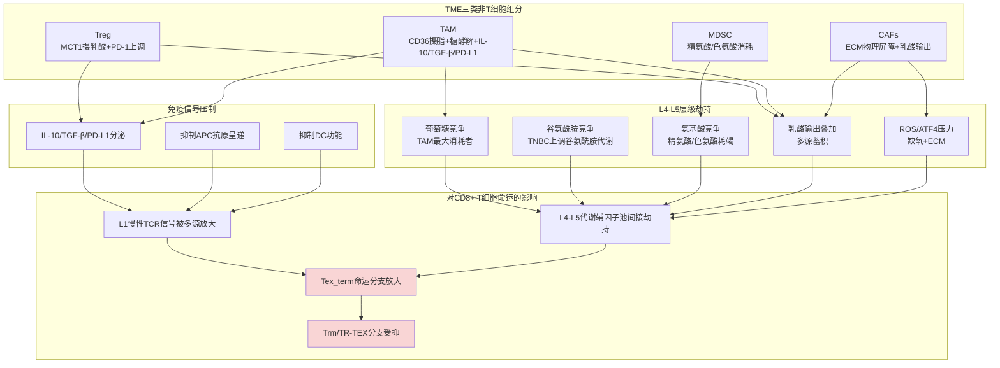

这一整合网络的核心洞察是：**TME中Treg、TAM、MDSC、CAFs四类非T细胞组分通过营养竞争、代谢物输出、免疫抑制因子分泌、物理屏障四个维度形成对CD8+ T细胞命运分岔的间接放大网络**。这一网络的存在意味着仅靠针对CD8+ T细胞自身的干预（如线粒体动力学修复、m6A机器调控）可能效果有限——必须同时针对代谢压制网络的关键节点（如MCT1抑制阻断Treg乳酸摄取、CD36抑制阻断TAM脂肪酸摄取、TGF-β中和抗体阻断系统性免疫抑制）才能实现最大化的命运逆转效应。这一原则将在第8章干预策略章节作为联合治疗设计的核心逻辑。

## 5.5 基于OPA1健康线粒体回输与cDC1代谢工程化的TME命运分岔可调控性验证

整合通路在TME场景下的可调控性需要通过具体的干预策略证据来验证。本节基于近期前沿发现系统评估三类核心干预策略——线粒体动力学修复、cDC1/DC3代谢工程化、转录因子精准编程——对TME中CD8+ T细胞命运分岔的可调控性，并整合代谢-表观遗传干预的联用矩阵，将第4章关键控制节点在TME场景下进行优先级重排，为第8章干预策略设计提供场景化证据基础。

**线粒体动力学修复策略：从分子靶点到细胞器水平干预**。基于第2章已建立的KLHL6—PGAM5-DRP1过度裂变轴与第4章七层级整合通路，线粒体动力学修复策略涵盖四个递进的干预层级：（i）**Mdivi-1抑制DRP1过度裂变**——已在肝I/R模型证实可恢复线粒体膜电位、增加mtDNA拷贝数、抑制ROS生成、防止异常mPTP开放，这一近邻证据支持其在TME场景下对CD8+ T细胞过度裂变的可逆作用；（ii）**OPA1过表达增强内膜融合**——OPA1作为内膜融合的核心执行酶，其过表达可重建嵴结构稳定性与ETC复合物组装效率，理论上可逆转TME中CD8+ T细胞的膜电位塌陷与TCA通量下降；（iii）**MCL1过表达减少AICD**——基于CAR-T工程化研究证据，MCL1过表达可减少过继转移T细胞因AICD造成的损失，提高T细胞持久性；（iv）**健康线粒体过继转移**——通过外源补充功能完整的线粒体直接重建T细胞代谢能力，绕过细胞内信号-蛋白稳态-形态学层级的多层失稳。这四类策略在第4章整合通路的不同层级形成介入：Mdivi-1直接作用于L2-L3接口（PGAM5-DRP1磷酸化），OPA1过表达作用于L3层（线粒体形态-功能），MCL1过表达通过抗AICD保护T细胞群体规模，健康线粒体过继转移则跨越L3-L4层级直接重建代谢通量基础。综合而言，**Mdivi-1作为已有药物具有最高的转化可行性，但其作为DRP1抑制剂可能影响其他依赖DRP1的生理功能（如有丝分裂、自噬），脱靶风险需在T细胞特异性递送中评估**——这是P-5干预策略特异性评估的典型例证。

**cDC1/DC3代谢工程化重建生态位支持**。第1章已建立CCR7+ DC3亚群在肿瘤血管周围形成富含CXCL16与IL-15的离散生态位，CXCR6+效应T细胞被特异招募至此并接受IL-15反式呈递这一关键机制。在TME中DC3生态位的稀缺性或被肿瘤主动重塑构成了第4章负反馈环路N-4的失效机制。基于此，cDC1/DC3代谢工程化策略的核心目标是**重建CXCR6—CXCL16—IL-15反式呈递生态位以支持TR-TEX维持**。具体策略包括：（i）通过基因工程使cDC1/DC3过表达IL-15Rα以增强IL-15反式呈递能力；（ii）通过CRISPR筛选识别DC3代谢调控关键节点，使其在TME高乳酸/缺氧环境中保持代谢稳态；（iii）通过过继转移工程化DC3直接补充TME中的生态位结构。这些策略与第4章环路N-4的重建直接对应，理论上可同时挽救多个滑向Tex_term轨迹的CD8+ T细胞向TR-TEX/Trm分支转移。值得注意的是，**TGF-β通过抑制粘附分子表达调节粒细胞以及其他参与的炎性反应的细胞趋化作用**[^48]——这意味着DC3工程化策略需要考虑如何在TGF-β富集的TME中维持其招募与生态位形成功能，可能需要联合TGF-β中和抗体或受体阻断剂。

**转录因子精准编程实现TEXterm/TRM命运定向调控**。Nature 2025转录因子图谱研究的核心临床价值在于**实现T细胞状态精准定向编程，突破传统免疫治疗"误伤有益细胞"的瓶颈**[^50]——这一突破的关键意义在于TEXterm和TRM转录水平高度相似但功能完全相反，是T细胞免疫治疗的核心调控靶点[^50]。具体编程策略包括：（i）**敲除ZSCAN20或JDP2选择性降低TEXterm分化（54%/43%）而不影响TRM生成**[^50]——为CAR-T、TCR-T等细胞治疗提供核心靶点；（ii）**KLF6过表达促进TRM形成而不加剧耗竭**[^50]——直接增强保护性命运分支；（iii）**ZSCAN20/JDP2敲除+抗PD-1治疗呈现显著协同抗肿瘤效果**[^50]——为免疫检查点抑制剂提供高效联合治疗方案。这些策略的概念突破在于它们摆脱了"调控TOX等多状态因子可能误伤TRM"的传统困境——基于TEXterm特异性因子（34个候选）和TRM特异性因子（20个候选）的差异化网络，实现了不损伤保护性TRM细胞生成的精准调控。

**ICB与代谢-表观遗传干预的联用矩阵**。基于第3章已建立的m6A—Kla双轨调控原理与第4章关键控制节点排序，TME场景下的代谢-表观遗传干预策略可与ICB形成多维联用矩阵。**METTL3-METTL14复合体降解剂WD6305与抗PD-1抗体联合治疗已显示协同抗肿瘤效果**——其机制基础是WD6305抑制m6A机器降低PDCD1降解（提升PD-1表达）后再被ICB有效阻断（功能性PD-1中和），形成"先放后抓"的精巧组合。**STM2457等METTL3抑制剂已显示可重塑TME并增强CD8+ T细胞浸润**（基于本批资料相关综述线索）。**Li Tang团队的IL-10-Fc融合蛋白可直接增强Tex_term CD8+ TIL的扩增与效应功能**（第1章已述）——这一代谢恢复策略与ICB的联用具有清晰的机制基础。**AKT抑制剂阻断PI3K-AKT通路时FOXO1可重新激活KLHL6表达，恢复其对TOX的清除与对PGAM5-DRP1的抑制**（第2章李贵登团队工作）——这一上游开关干预可与ICB或METTL3抑制剂形成多层级联用。**B细胞恶性肿瘤中靶向YTHDF2的小分子药物可有效抑制肿瘤进展并显著增强其对CAR-T细胞治疗的敏感性**[^39]——这一发现虽来自B细胞恶性肿瘤场景，但其概念证据支持靶向reader蛋白联合细胞治疗的转化潜力。

将上述干预策略整合为TME场景的联用矩阵：

| 干预层级 | 核心策略 | 作用机制 | 联用方向 | 转化可行性 |
|---|---|---|---|---|
| L1-L2上游 | AKT抑制剂、KLHL6过表达 | 恢复FOXO1-KLHL6安全阀 | +ICB、+METTL3抑制剂 | 中（需T细胞特异递送） |
| L2-L3形态 | Mdivi-1、OPA1过表达 | 阻断过度裂变、重建融合 | +IL-10-Fc、+CAR-T | 高（已有药物） |
| L3线粒体补救 | 健康线粒体过继转移、MCL1过表达 | 直接重建代谢能力、抗AICD | +TR-TEX输注、+CAR-T工程 | 中（技术成熟度待提升） |
| L4-L5代谢 | 二甲双胍+PGC-1α恢复、α-KG补充 | 激活AMPK、恢复辅因子化学计量 | +ICB、+METTL3抑制剂 | 高（已有药物组合） |
| L5-L6 Kla轴 | p300抑制、MCT1抑制（针对Treg）、乳酸清除 | 阻断Kla底物供给、解除Treg代谢检查点 | +ICB、+TGF-β中和 | 中（需选择性递送） |
| L6 m6A轴 | STM2457、WD6305、FB23-2/Dac51 | 调控m6A机器活性 | +ICB、+CAR-T | 高（多个药物在临床开发） |
| L7命运编程 | ZSCAN20/JDP2敲除、KLF6过表达 | 精准调控TEXterm vs TRM分化 | +ICB（已证实协同）、+CAR-T | 中-高（CRISPR递送进展中） |
| 生态位重建 | cDC1/DC3工程化、IL-15反式呈递 | 重建CXCR6生态位支持TR-TEX | +TGF-β中和、+ICB | 中（细胞治疗复杂度高） |
| 代谢压制网络阻断 | TGF-β中和、CD36抑制、ARG1/IDO抑制 | 阻断非T细胞组分压制 | +CD8+ T细胞干预 | 高（多个临床试验中） |
| IL-10—OXPHOS恢复 | IL-10-Fc | 直接增强Tex_term细胞功能 | +ICB、+CAR-T | 高（在临床开发） |

**TME场景下关键控制节点优先级重排**。结合第4章建立的关键控制节点排序与本章TME场景特异性证据，可对TME场景下的干预节点进行优先级重排：

| 重排优先级 | 节点 | TME场景特异性强度 | 联合策略推荐 |
|---|---|---|---|
| 1 | Treg-MCT1-PD-1代谢检查点 | TME强（直接证据） | MCT1抑制+ICB |
| 2 | KLHL6-FOXO1-TOX轴 | TME强（直接证据） | AKT抑制+METTL3抑制+ICB |
| 3 | ZSCAN20/JDP2/KLF6精准编程 | TME强（直接证据） | 精准编程CAR-T+ICB |
| 4 | TGF-β富集系统性压制 | TME强（直接证据） | TGF-β中和+ICB |
| 5 | TAM-CD36-FAO代谢压制 | TME强（直接证据） | CD36抑制+ICB |
| 6 | 乳酰-CoA-p300-Kla轴 | TME强（多源蓄积） | p300抑制+METTL3抑制 |
| 7 | ATF4慢性激活 | **TME特异**（HIV场景适度） | ATF4抑制（TME场景优先） |
| 8 | NFAT5高渗透压 | **TME特异**（HIV场景无效） | NFAT5抑制（TME场景独有） |
| 9 | DC3-CXCR6-IL-15生态位 | TME受损 | DC3工程化+ICB |
| 10 | 线粒体动力学修复（Mdivi-1/OPA1） | 跨场景共享 | +IL-10-Fc+ICB |

这一重排揭示TME场景下干预策略的核心特征：**前八个优先级中，多个节点（Treg-MCT1、TGF-β富集、TAM-CD36、ATF4、NFAT5）具有显著的TME场景特异性**，而KLHL6-FOXO1-TOX轴与精准编程虽在TME场景下证据最直接，其核心机制也具有跨场景的保守性，可作为第6章HIV场景对称比较的关键候选节点。值得在本节末尾提出的可证伪预测包括：（1）**MCT1抑制剂在TME场景下应同时削弱Treg代谢检查点功能与CD8+ T细胞乳酸再分配，预期产生超过单独靶向任一组分的协同效应**；（2）**ZSCAN20/JDP2敲除的CAR-T细胞预期在TME中维持更高比例的TR-TEX状态，与抗PD-1的协同效应应在临床前模型中可重现**；（3）**OPA1过表达或健康线粒体过继转移对Tex_term固化区细胞的命运逆转效应预期需要联合代谢-表观遗传干预（如α-KG补充或p300抑制）才能突破鞍点区域的多层级正反馈**；（4）**TME特异性的NFAT5抑制在HIV/SIV场景下不应表现出对慢性感染诱导耗竭的逆转作用**——这一阴性预测正是P-5场景适配性评估的对称性体现，将在第6章作为对称比较的直接验证目标。

综合本章五节内容，TME场景下的命运分岔机制呈现出"多源代谢压制汇聚→主环路放大→双轨调控级联→命运分岔差异化→关键节点可干预"的完整图景。这一图景一方面验证了第4章整合通路在TME场景下的高度适配性——主环路的核心结构（KLHL6-PGAM5-DRP1-线粒体-糖酵解-Kla-m6A-命运基因）在TME中获得多源放大，TEXterm与CD103+ TIL两个命运吸引子在临床证据与转录因子图谱层面均得到直接验证；另一方面识别出TME场景特异性的并行通路（ATF4慢性激活、NFAT5高渗透压驱动）与场景特异性的代谢压制网络（Treg-MCT1、TAM-CD36、CAFs反向Warburg），为第6章HIV/SIV场景的对称比较提供了清晰的差异化变量集合。本章建立的干预策略联用矩阵与关键控制节点优先级重排，将作为第8章干预策略设计的TME场景化基础，并通过P-5评估框架对每项策略的靶点特异性、脱靶风险、与现行ICB/CAR-T疗法的协同性进行系统判断。值得在本章结束时坦诚指出的是，**本章对CD103+ TIL代谢特征的部分论证依赖于慢性病毒感染中TexSTEM亚群的脂肪酸代谢外推**[^51]，这一外推虽具机制合理性但需在TME特异性的代谢组学研究中直接验证；**部分Kla在TME中CD8+ T细胞特异性命运基因座的位点级证据仍属研究缺口GAP-3.3**——这一方法学缺口的填补需要单细胞分辨率的多组学共测量技术成熟。这些局限性本身即为第9章未来研究方向的优先输入。

# 6 HIV潜伏感染场景下的特异机制及与肿瘤微环境的对比

第5章已系统建立TME场景下命运分岔机制的完整图景，并通过Treg-MCT1-PD-1代谢检查点、TAM-CD36-FAO轴、ATF4慢性激活、NFAT5高渗透压驱动等场景特异性变量识别了与HIV/SIV场景对偶比较的关键差异点。本章承担两重任务：第一，将第4章建立的七层级整合通路对偶投影至HIV/SIV慢性感染场景，系统解析其在淋巴结生发中心、肠道相关淋巴组织（GALT）与生殖道黏膜三类组织生态位中的特异性实现；第二，基于P-2对称比较原则，将HIV场景与TME场景在十类核心维度上逐项对比，归纳跨场景保守的核心机制与各自场景特异的靶点，为第7章定量建模的跨场景参数化与第8章治愈策略的代谢-表观遗传增强设计提供机制对比基础。本章遵循P-3证据层级标准，对HIV/SIV场景下证据稀薄的环节显式标注研究缺口，避免以TME证据简单移植；对部分关键机制节点（如KLHL6—PGAM5-DRP1轴在HIV场景的可外推性）采用"框架假设+研究缺口标注"的审慎论证方式，确保跨场景外推的证据严格性。

## 6.1 HIV/SIV感染下CD8+ T细胞线粒体功能障碍与代谢失衡的直接证据

HIV-1感染呈现一组与TME场景在因果起源上截然不同但在下游线粒体表现上具有显著共性的特征——HIV-1感染破坏氧化磷酸化、促进糖酵解和脂肪酸合成以支持病毒复制，**抗逆转录病毒治疗（ART）尽管控制了病毒复制却可加剧代谢失调，影响线粒体DNA合成并增强活性氧产生**[^53]。这意味着在HIV场景下，CD8+ T细胞所处的化学微环境同时受到病毒复制驱动的代谢重编程与ART诱导的线粒体毒性的双重压力——这是TME场景下不存在的因果起源差异，但其下游对线粒体氧化磷酸化、ROS稳态与代谢功能的扰动模式，与第4章主环路的L3-L4层级压力具有显著的机制汇聚。

**HIV-1特异性CD8+ T细胞耗竭与线粒体特征改变的直接相关证据**。一项发表于*Journal of Infectious Diseases*的研究系统刻画了HIV感染中CD8+ T细胞线粒体特征与耗竭表型的关联：研究团队对HIV未感染者（n=10）与不同病毒控制状态的HIV感染者——viremic组（VL > 2000 copies/mL，n=8）、ART抑制组（VL < 40 copies/mL，n=11）、自然控制组（n=9）——的冷冻外周血单核细胞进行系统检测，通过流式细胞术刻画bulk CD8+ T细胞与MHC I四聚体+ HIV特异性CD8+ T细胞的线粒体质量（MM）、线粒体膜电位（MMP）与细胞ROS含量[^54]。

该研究的核心发现具有直接证据强度：第一，**HIV感染者bulk效应记忆CD8+ T细胞亚群的MM、MMP、ROS含量均高于HIV未感染者**[^54]——这一普遍性的线粒体特征改变意味着HIV感染对CD8+ T细胞线粒体的扰动并非仅限于病毒特异性细胞，而是具有bystander效应的系统性重塑；第二，**在HIV特异性CD8+ T细胞中，这些线粒体特征不随病毒控制的程度或机制（ART抑制vs自然控制）而变化，但显著与耗竭表型相关**——具体表现为高PD-1表达、低CD127表达、增殖能力受损的CD8+ T细胞中线粒体特征出现显著改变[^54]；第三，**这些线粒体特征即使在病毒被有效控制的状态下仍保持改变**[^54]——这一发现意味着即使ART成功抑制病毒复制，已建立的耗竭性线粒体重塑可能不能被完全逆转，构成了HIV场景下命运固化的临床证据基础。

需要在本节强调的方法学澄清是：该研究中HIV感染相关的MMP升高这一表观看似与第4章主环路的"过度裂变-膜电位塌陷"预测方向相反——但这一表面矛盾可能反映了T细胞激活早期阶段的代偿性线粒体生物合成与膜电位升高，与慢性长期暴露下的命运塌陷是两个不同的时相。临床流式细胞术测量的是横截面的群体平均值，未能区分Tpex/IntEX/Tex_term等亚群的差异化线粒体状态——这意味着群体水平的MMP升高可能由Tpex等保留功能细胞主导，而其中Tex_term亚群的MMP状态可能仍呈现塌陷趋势。基于这一方法学局限，**HIV场景下不同耗竭亚群的差异化线粒体特征量化是一个明确的研究缺口**，需要单细胞分辨率的多参数线粒体功能测量（如基于Mitotracker与TMRM双标志的scFlow/scRNA-seq联用）才能直接验证。

**精英控制者与非进展者队列的保护性免疫表型对比**。HIV感染队列中存在罕见的特殊群体为本节的代谢-命运耦合假设提供了重要的对比证据。**精英控制者（Elite Controllers, ECs）能够在没有抗反转录病毒治疗的情况下将HIV病毒载量控制到检测不到的水平**[^55]，**长期非进展者（Long-term Nonprogressors, LTNPs）能在长时间内维持正常CD4+ T细胞数量**[^55]。一项整合5个微阵列数据集（共81例非进展者与98例对照）的转录组meta分析揭示**非进展者具有降低的[免疫激活相关基因]表达**[^56]——这一发现暗示非进展者的免疫稳态维持与降低的慢性激活水平相关，与第4章主环路中慢性TCR信号驱动PI3K-AKT激活致FOXO1失活的因果链形成对偶。

更具机制意义的是病毒血症非进展者（VNPs）的多组学特征：**VNPs占所有HIV感染成人比例不到0.1%**，IrsiCaixa艾滋病研究所主导的多组学研究通过对16例VNPs与29例进展者的单细胞与多组学分析发现，**VNPs更可能携带Δ32缺失的CCR5基因（53.8%杂合性vs进展者的16.0%），这种变异减少CD4+ T细胞CCR5受体表达从而降低HIV-1感染率**[^55]；在ART启动前**VNPs血液中HIV-1的总DNA和完整DNA含量较进展者显著较少**，提示其在细胞层面对HIV感染具有一定保护作用[^55]。在T细胞特征上，**VNPs体内有更多的初始CD8+ T细胞，而激活的记忆CD8+ T细胞比例较低**，且**VNPs的CD4+ T细胞凋亡水平较低**[^55]——这一组特征与第1章建立的命运坐标系中"低Kla×融合优势"象限（Tpex/TTSM稳定吸引子）的预测方向高度吻合：免疫激活水平低意味着慢性TCR信号对PI3K-AKT—FOXO1—KLHL6轴的劫持强度有限，T细胞群体保留更多的初始/记忆样储备，避免陷入命运分岔的鞍点区域。

**ART的双重效应：病毒抑制与线粒体毒性的对偶**。ART的代谢副作用是HIV场景独有的考量维度。**ART通过控制病毒复制抑制了HIV-1对宿主代谢的直接劫持，但同时其某些组分（特别是核苷类逆转录酶抑制剂NRTIs）可抑制线粒体DNA合成、增强ROS生成**[^53]——这一作用机制将ART本身定位为HIV场景下整合通路L3-L4层级的额外压力源，与病毒复制驱动的代谢重编程形成对偶但同向的线粒体压力。综述类研究进一步指出**通过ATP产生的氧化磷酸化可影响感染细胞的代谢景观，通过ATP检测的嘌呤能信号传递参与免疫代谢失调**[^53]——这一从能量代谢到信号传递的多层级耦合，将HIV感染对CD8+ T细胞的代谢压制扩展到了细胞间通讯层面，构成了HIV场景特异的代谢-免疫耦合网络。

**主环路在HIV场景下的可外推性评估**。基于上述直接与近邻证据，可对第4章主环路在HIV场景下的可外推性进行分级评估：（1）**线粒体功能障碍与CD8+ T细胞耗竭表型的相关性**——直接证据[^54]，可外推性强；（2）**糖酵解漂移与脂肪酸合成增强**——HIV感染中已有直接证据[^53]，与TME场景下的糖酵解漂移机制汇聚；（3）**KLHL6—PGAM5-DRP1主轴在HIV场景下的直接验证**——研究缺口GAP-4.1与GAP-4.4，本批参考资料未提供HIV/SIV场景下KLHL6水平、PGAM5-DRP1磷酸化状态、FOXO1-AKT动态的直接测量证据，需要后续研究通过SIV感染恒河猴模型或HIV感染者外周血/淋巴结样本系统验证；（4）**ATF4慢性激活与NFAT5高渗透压驱动**——基于第4-5章已建立的TME特异性证据（LCMV慢性感染中ATF4仅适度诱导、NFAT5对慢性感染诱导耗竭无效），这两条TME特异性放大通路在HIV场景下的作用强度预期显著弱于TME，构成两场景的关键差异变量。

综合本节证据，HIV场景下CD8+ T细胞的线粒体功能障碍与代谢失衡具有直接的临床证据支撑，其与耗竭表型（PD-1高表达、CD127低表达、增殖受损）的关联与第4章主环路在L3-L7层级的命运决定因果链具有显著的机制汇聚。但主环路的核心枢纽——KLHL6—FOXO1—TOX蛋白稳态轴——在HIV场景下的直接验证证据仍属研究缺口，这一缺口的填补对评估跨场景干预策略的可移植性具有决定性意义，将作为第8章干预策略评估的关键前提。

## 6.2 低水平抗原持续刺激与I型干扰素慢性炎症对主环路的特异性塑造

HIV/SIV场景与TME场景在主环路上游驱动信号的核心差异在于抗原性质与持续模式：TME面临高强度肿瘤新抗原暴露，而HIV感染则呈现**低水平病毒抗原长期存在**与**I型干扰素慢性炎症**的双重特征。本节解析这一信号组合如何在第4章L1慢性TCR信号层级以差异化方式驱动整合通路，论证其形成的主环路放大模式与TME的ATF4/NFAT5放大通路构成对偶差异。

**低水平病毒抗原持续刺激的累积效应**。HIV-1感染中的抗原暴露具有"低强度但持续"的鲜明特征——即使在ART有效抑制下，整合的前病毒可在静息CD4+ T细胞中以低水平转录持续存在，**这些静息型CD4+ T细胞中病毒基因组处于低水平转录状态，几乎没有病毒的产生或仅有极少量病毒产生**[^57]。此外，**缺陷型HIV-1基因组虽不能产生有感染力的病毒颗粒，但其相当部分仍可被转录甚至翻译产生RNA与蛋白**[^27]——这构成了HIV场景特有的抗原暴露源。一项发表于*Retrovirology*的综述明确指出**这些受损基因组的转录与翻译可能驱动天然免疫感应机制与炎症，并可能改变抗病毒T细胞反应**[^27]。这一发现意味着HIV场景下CD8+ T细胞所面临的抗原刺激不仅来自完整病毒复制，更包括缺陷前病毒RNA/蛋白产物所驱动的持续低水平刺激——这一组分在ART有效抑制病毒复制后仍持续存在，是HIV场景命运固化的独特驱动力。

将这一信号特征映射至第4章主环路的L1层级，可形成如下推论：低水平但持续的TCR刺激配合干扰素慢性炎症，可能形成一种与TME不同的主环路放大模式——其PI3K-AKT激活的瞬时强度可能弱于TME高强度肿瘤新抗原驱动的水平，但其持续时间显著更长（HIV感染可持续数十年）。这一时间维度的差异对FOXO1磷酸化失活与KLHL6下调的累积效应具有决定性意义：即使每一时间点的p-FOXO1水平低于TME场景，但其持续累积可能在足够长的时间尺度上达到与TME相当甚至更深的KLHL6耗竭与TOX蓄积——这是HIV场景下命运固化的"慢热型"轨迹，与TME场景的"急骤型"轨迹构成时间动力学上的差异。这一差异的定量验证需要在第7章建模中通过对FOXO1-KLHL6-TOX轴时间常数的差异化参数化进行系统刻画，相关参数的T细胞特异性测量目前属于研究缺口GAP-4.3。

**I型干扰素慢性炎症作为HIV场景特异并行通路**。I型干扰素信号在HIV慢性感染中持续激活是其与TME场景最为标志性的差异。这一持续激活的来源包括：（1）持续病毒复制驱动的cGAS-STING通路激活；（2）缺陷前病毒RNA作为RIG-I/MDA5底物激活TLR与RLR通路[^27]；（3）肠道菌群移位导致的菌群衍生PAMPs激活TLR4等通路（详见6.4节）。这三类来源共同构建了HIV场景下CD8+ T细胞所处的"慢性干扰素浴"环境，使T细胞自身的IRF转录因子网络长期处于激活状态，下游ISG持续表达。

I型干扰素慢性炎症对CD8+ T细胞命运的影响具有双重性：一方面，干扰素信号在急性感染中是抗病毒效应的关键驱动；另一方面，在慢性持续状态下干扰素信号可通过多重机制驱动耗竭——包括上调PD-L1、诱导IDO等免疫抑制酶、促进Treg分化、加剧T细胞代谢应激。这一双重性使I型干扰素慢性炎症在HIV场景下扮演了与TME场景中ATF4/NFAT5相似的"并行放大通路"角色——它不直接构成主环路的核心节点，但通过加剧L1慢性TCR信号的有效刺激强度、推高L3线粒体功能障碍与L4代谢压力，间接放大主环路的命运固化效应。

**缺陷前病毒驱动的天然免疫激活构成HIV场景独有的主环路输入**。缺陷型HIV-1基因组的代谢命运是HIV场景独有的研究维度。**缺陷HIV-1前病毒代表一群在免疫压力下被选择并克隆扩增以主导持续HIV-1前病毒基因组景观的病毒基因组群体**[^27]。这些缺陷前病毒"虽不能产生有感染力的病毒颗粒，但通过多种机制产生RNA和蛋白表达"[^27]——具体路径包括非完整剪接产物、内部启动子激活、读穿转录等。综述明确指出**这些基因组的表达可能在不同细胞与组织中驱动天然感应机制与炎症，并可能改变抗病毒T细胞反应与髓系细胞功能直接贡献于HIV-1相关慢性合并症**[^27]——这一从分子机制（缺陷前病毒表达）到临床后果（慢性合并症）的因果链，将HIV场景的代谢-免疫失衡扩展至超越病毒复制本身的维度。

**关键的转化意义**：随着HIV治愈策略推进至靶向多元HIV-1前病毒基因组群体，**理解这些缺陷前病毒的影响应被纳入考虑**[^27]——这一观点对第8章治愈策略设计具有直接指导意义。具体而言：（1）"shock and kill"策略若仅针对完整前病毒激活，可能遗漏缺陷前病毒持续表达驱动的慢性炎症源；（2）"block and lock"策略对缺陷前病毒的沉默效力需要单独评估[^58]；（3）任何代谢-表观遗传增强策略（如METTL3抑制+ART）需要考虑其对缺陷前病毒RNA/蛋白产物的影响，避免在抑制病毒复制的同时意外增强缺陷产物的免疫激活效应。

**HIV与TME场景上游驱动信号的对偶差异**。整合本节分析，HIV与TME场景在主环路上游驱动信号层级的核心差异可整合为下表：

| 维度 | TME场景 | HIV/SIV感染场景 | 对主环路放大效应的差异 |
|---|---|---|---|
| 抗原性质 | 肿瘤新抗原（突变蛋白等） | HIV病毒抗原+缺陷前病毒产物 | 抗原源构成显著不同 |
| 抗原刺激强度 | 高（持续高水平） | 低-中（持续低水平） | 瞬时PI3K-AKT激活强度TME>HIV |
| 抗原暴露持续时间 | 数月-数年 | 数十年（终身） | 累积效应HIV可能匹敌或超越TME |
| 主要并行放大通路 | ATF4慢性激活、NFAT5高渗透压 | I型干扰素慢性炎症、菌群移位驱动炎症 | 场景特异性变量完全不同 |
| 缺氧驱动 | 强烈（TME特异） | 弱（淋巴结生发中心相对常氧） | 缺氧-ATF4轴在HIV场景显著弱化 |
| 高渗透压驱动 | 强烈（NFAT5）| 弱（淋巴结渗透压相对正常） | NFAT5在HIV场景对慢性感染耗竭无效 |
| 干扰素信号 | 适度 | 强烈持续 | I型干扰素慢性炎症HIV特异 |
| 缺陷前病毒驱动 | 不存在 | 持续表达RNA/蛋白驱动天然免疫 | HIV场景独有维度 |

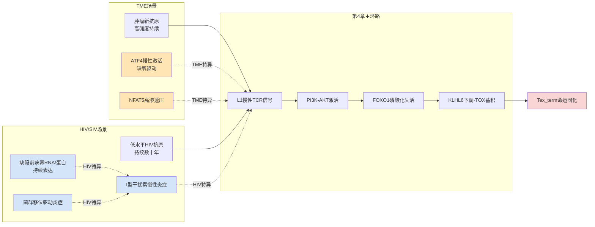

这一对偶图景揭示HIV场景下主环路放大的核心特征：**主环路的核心结构（TCR—PI3K-AKT—FOXO1—KLHL6—TOX轴）在HIV场景下以"低强度但长持续"的累积模式驱动，并行放大通路完全替换为I型干扰素慢性炎症、缺陷前病毒驱动炎症与菌群移位驱动炎症三类HIV场景特异变量**。这一结构差异对干预策略具有重要指导意义——针对ATF4或NFAT5的TME特异性干预在HIV场景下应被审慎评估，而针对I型干扰素信号或缺陷前病毒沉默的HIV场景特异性干预则可能成为有效靶点，相关策略将在第8章详述。

## 6.3 淋巴结Tfh区室代谢应激与滤泡内CD8+ T细胞渗透限制

淋巴结生发中心（GC）作为HIV/SIV感染最具场景特异性的生态位，是病毒持续复制与CD4+ Tfh储库维持的关键解剖部位。本节聚焦GC区域CD8+ T细胞命运分岔的特异机制，重点解析滤泡内CD8+ T细胞与CXCR5+ CD8+ T亚群的功能定位、Tfh区室代谢应激的塑造作用，及其与TME场景DC3-CXCR6-IL-15生态位的对偶差异。

**CXCR5+ CD8+ T细胞作为慢性抗原驱动的滤泡内特殊亚群**。一项发表于*Frontiers in Immunology*的综述系统刻画了CXCR5+ CD8+ T细胞这一新近识别的亚群：**CD8+ T细胞通常较少被视为生发中心反应的一部分，但近期识别出一群定位于B细胞滤泡与生发中心内的独特CXCR5+ CD8+ T细胞亚群**[^59]。这一亚群在慢性抗原暴露的多种情境下出现，**保持与非耗竭、效应记忆CD8+ T细胞命名一致的转录与表型特征**[^59]——这一特征与第1章建立的Tpex（前体耗竭）状态在转录层面具有显著重叠，但其生态位定位（滤泡/GC内）与功能机制具有独特性。

**CXCR5+ CD8+ T细胞的功能定位**：综述明确指出**CD8+ T细胞定位至B细胞滤泡暗示其具有与CD4+ T滤泡辅助细胞相似的功能特征——被许可促进B细胞反应**[^59]——这一发现具有重要的命运分岔意义。CXCR5+ CD8+ T细胞**在感染期间控制病毒载量，同时也促进抗体介导的自身免疫疾病进展**[^59]——这一双向功能（病毒控制vs自身免疫）凸显了滤泡内CD8+ T亚群在HIV感染中的关键角色：它一方面通过滤泡内定位实现对滤泡内HIV持续复制（主要发生于Tfh细胞）的免疫监视，另一方面其慢性激活可能驱动滤泡内炎症与组织损伤。综述进一步指出**这一新型CXCR5+ CD8+ T亚群在人类与小鼠疾病模型中的存在可能为我们对生发中心反应的理解带来范式转变**[^59]。

**滤泡内CD8+ T细胞与SIV病毒控制的关联**。第1章已基于Mirko Paiardini团队的SIV感染恒河猴研究建立了关键证据：**SIV晚期感染中淋巴结CD8+ T细胞TCF1+CD39+干性效应混合态比例从健康未感染恒河猴的6%升至40%**，且这一GzmK+GzmBlow TCF-1high亚群**虽低表达细胞毒分子GzmB却具有与传统TEFF相似的活化脱颗粒能力，倾向于淋巴滤泡定居并与靶细胞靠近，与SIV病毒控制相关**。整合这一证据与本节CXCR5+ CD8+ T细胞综述证据[^59]，可形成对HIV/SIV淋巴结生态位中CD8+ T细胞命运分岔的完整图景：**慢性抗原刺激驱动一群兼具效应能力与干性维持的滤泡内特殊CD8+ T亚群形成，其功能性质介于经典TR-TEX与Tpex之间**——这一亚群在表型上类似TR-TEX（驻留化、CD39+），但其滤泡内定位与CXCR5表达又区别于TME场景下血管周围DC3生态位定居的TR-TEX；其干性维持（TCF-1high）使其保留命运可逆性，对ICB治疗具有响应潜力。

**Tfh区室代谢应激对CD8+ T细胞命运的塑造作用**。Tfh细胞是HIV持续复制的主要细胞库，其在GC内的代谢应激对周围CD8+ T细胞具有间接但深远的影响。Tfh细胞的高度激活状态需要旺盛的代谢支持——糖酵解、谷氨酰胺分解与脂质合成均显著上调；这一代谢需求在滤泡内的高密度细胞聚集环境中可能形成局部代谢底物的竞争性消耗，从而影响附近CD8+ T细胞的代谢辅因子可用性。具体到滤泡内乳酸浓度梯度、αKG可用性、SAM/SAH动态等关键代谢辅因子参数，**本批参考资料未提供针对HIV/SIV淋巴结生发中心的直接测量证据**——这正是第3章已识别的研究缺口GAP-3.7的核心内容。

将这一缺口与第4章主环路结构整合，可识别HIV场景下滤泡内代谢应激对命运分岔的潜在塑造方式：（1）**滤泡内若存在显著的乳酸蓄积**，则其对CD8+ T细胞Kla底物供给的影响可能与TME场景类似——但滤泡内乳酸来源主要为Tfh糖酵解漂移与GC高密度细胞代谢，缺乏TME特有的肿瘤Warburg+CAFs+TAM多源蓄积，预期乳酸浓度上限可能低于TME场景；（2）**滤泡内若存在αKG可用性下降**，则其对FTO/ALKBH5/TET/JMJD家族酶活性的抑制将与TME场景共享基础机制，但其下降幅度可能取决于Tfh代谢应激的具体强度；（3）**滤泡内SAM/SAH动态**作为整合通路中证据最薄弱的环节（GAP-3.1），在HIV淋巴结场景下完全未被直接测量，构成场景特异性的研究优先方向。

**HIV淋巴结生态位与TME DC3生态位的对偶差异**。基于第1章建立的TME中CCR7+ DC3亚群在肿瘤血管周围形成富含CXCL16与IL-15的离散生态位、CXCR6+效应T细胞被特异招募至此并接受IL-15反式呈递这一关键机制，可对HIV淋巴结生态位与TME DC3生态位进行对偶比较：

| 比较维度 | TME DC3生态位 | HIV淋巴结生发中心 |
|---|---|---|
| 生态位结构 | 肿瘤血管周围离散DC3聚集 | 生发中心暗区/亮区/T-B边界结构 |
| 关键趋化轴 | CXCR6—CXCL16 | CXCR5—CXCL13 |
| 关键存活因子 | DC3反式呈递IL-15 | 滤泡微环境多元因子 |
| 主要CD8+ T驻留亚群 | CXCR6+ TR-TEX | CXCR5+ CD8+ T、TCF1+CD39+混合态 |
| 抗原暴露模式 | 肿瘤新抗原高浓度持续 | HIV低水平抗原+缺陷前病毒 |
| 保护性命运分岔 | TR-TEX对ICB响应介导抗肿瘤 | TCF1+CD39+介导滤泡内SIV控制 |
| 失效机制 | TME中DC3稀缺/CXCL16被肿瘤劫持 | HIV持续感染中滤泡内代谢应激 |

这一对比揭示HIV与TME场景在生态位结构上的核心差异：**HIV淋巴结生发中心是一个解剖学上预先存在的、由B细胞滤泡组织化结构定义的生态位**[^59]，其CD8+ T驻留通过CXCR5—CXCL13趋化轴介导；而**TME DC3生态位是一个由肿瘤主动重塑或被肿瘤劫持的、动态形成的生态位**，其CD8+ T驻留通过CXCR6—CXCL16轴介导。这一结构差异对干预策略具有重要意义——HIV场景下针对滤泡内CD8+ T细胞功能维持的干预需要考虑如何在保持生发中心解剖结构的同时增强CD8+ T细胞的杀伤功能（避免过度损伤B细胞免疫），而TME场景下DC3生态位重建则可通过过继转移工程化DC3直接补充。

**HIV-1特异性CD8+ T细胞在血液与黏膜的平行响应特征**。一项发表于*Journal of Virology*的研究通过53个肽池覆盖所有病毒蛋白的酶联免疫斑点分析，对未接受ART的感染者外周血与乙状结肠黏膜中HIV-1特异性CD8+ T细胞进行平行比较[^60]——研究的核心发现是血液与黏膜CTL之间的反应模式比较揭示了显著的差异性[^60]。这一研究为后续6.4节关于HIV肠道Trm形成的机制论证提供了直接的临床证据基础——HIV-1特异性CD8+ T细胞在不同解剖部位呈现差异化的功能特征，意味着命运分岔具有显著的组织特异性维度。

综合本节证据，HIV/SIV场景下淋巴结生发中心作为CD8+ T细胞命运分岔的关键生态位，与TME场景的DC3生态位在结构、趋化轴、关键存活因子上均存在显著差异。**滤泡内CXCR5+ CD8+ T细胞与TCF1+CD39+干性效应混合态的存在，构成了HIV场景下既保留病毒控制能力又面临命运分岔风险的独特亚群**——这一亚群的精细机制刻画与代谢-表观遗传干预策略设计是HIV治愈研究的关键方向，相关研究缺口（GAP-3.7的滤泡内代谢辅因子动态、Tfh代谢应激对CD8+ T细胞的间接影响定量）将作为第9章未来研究方向的优先输入。

## 6.4 肠道与生殖道黏膜组织Trm形成与HIV储存库

肠道相关淋巴组织（GALT）作为HIV-1复制与储存的主要解剖部位，构成HIV场景下另一关键的命运分岔生态位。本节系统解析黏膜组织CD8+ T细胞Trm形成的特异机制，整合肠道菌群失调对CD8+ T细胞代谢-表观遗传状态的远端塑造，论证菌群-代谢-表观遗传轴作为HIV场景特异的间接调控网络。

**HIV-1特异性CD8+ T细胞在肠道黏膜的平行响应特征**。回到本章6.3节末已引用的*Journal of Virology*研究，**肠道相关淋巴组织是体内淋巴细胞与HIV-1复制的主要储存库，但对该区室中HIV-1特异性CD8+ T淋巴细胞反应所知甚少**[^60]。这一基础事实揭示了HIV场景的核心特征：肠道黏膜既是病毒主要复制场所，又是大量淋巴细胞驻留的关键生态位，二者的共定位使CD8+ T细胞面临的抗原暴露与组织微环境信号在肠道场景中达到最强的整合。研究通过53个肽池覆盖所有病毒蛋白的酶联免疫斑点分析对未接受ART的感染者外周血与乙状结肠黏膜中HIV-1特异性CD8+ T细胞进行平行比较[^60]——这一系统性比较为评估HIV肠道Trm的形成与功能提供了直接证据基础。

**肠道菌群失调对HIV感染病程的关键调节作用**。一项发表于*Microbiome*的综述系统整合了肠道菌群在HIV/SIV治疗中的作用：**虽然菌群与HIV发病机制广泛相关，多数研究——特别是使用组学技术的研究——主要为相关性分析，主要作为假设生成的基础**[^61]。综述进一步指出**菌群对HIV免疫应答的复杂机制仍知之甚少**，而**菌群干预研究为检验我们能否利用菌群改善HIV感染者健康结局这一假设提供了强大工具**[^61]。基于这一框架，综述系统回顾了**肠道菌群在HIV/SIV疾病进展中的多维角色及其作为治疗靶点的潜力——探讨肠道菌群失调与系统性炎症之间的复杂相互作用，强调菌群基础疗法在HIV管理中开辟新途径的潜力**[^61]，具体策略包括**益生菌、益生元、粪菌移植与靶向饮食调控的疗效**[^61]。

将这一菌群-免疫互作框架与第4章七层级整合通路对应，可识别菌群-代谢-表观遗传轴作为HIV场景特异调控网络的多层级介入：（1）**菌群产生的短链脂肪酸（SCFAs）**作为关键代谢物，可通过其受体（如GPR43、GPR109A）影响T细胞分化，并作为HDAC抑制剂直接重塑组蛋白乙酰化图谱——这一机制与第5章建立的HDAC1-3作为Kla去乳酸化酶的双重活性形成机制汇聚，意味着SCFAs可能同时调控乙酰化与乳酸化两类修饰；（2）**菌群产生的胆汁酸代谢物**通过法尼醇受体（FXR）、TGR5等受体影响代谢与免疫；（3）**菌群移位（gut translocation）**驱动的脂多糖（LPS）等PAMPs通过TLR4等通路激活慢性炎症，构成HIV场景下I型干扰素慢性炎症的重要来源（与6.2节呼应）；（4）**菌群衍生抗原**通过分子模拟等机制激活或调节T细胞功能。

**菌群-代谢-表观遗传轴对CD8+ T细胞命运的远端塑造**。在第4章主环路框架下，菌群失调对CD8+ T细胞命运分岔的远端塑造可形成如下机制路径：

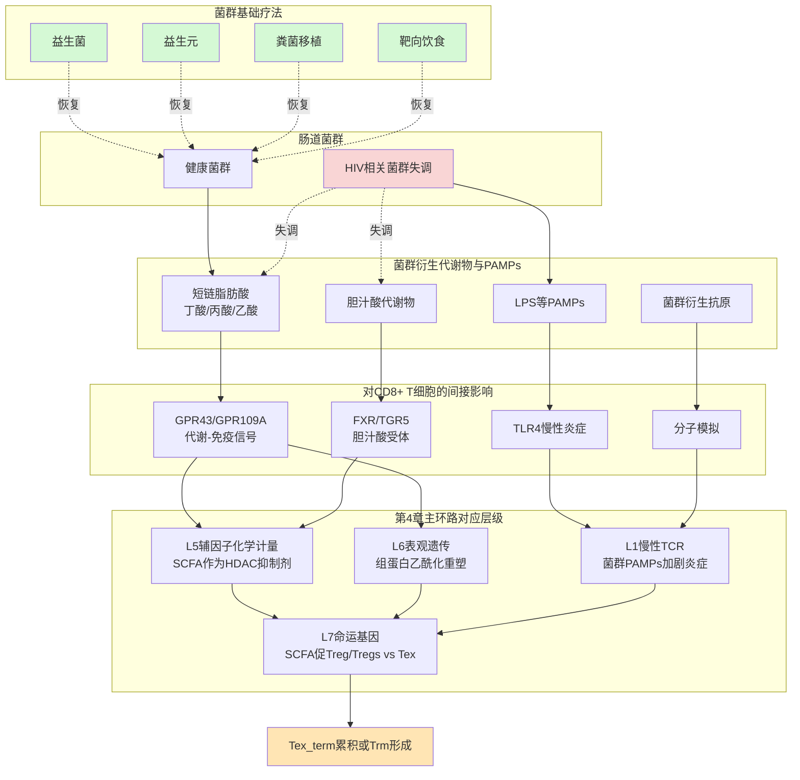

这一机制路径揭示菌群-代谢-表观遗传轴在HIV场景下的多层级介入特征：**它不直接构成主环路的核心节点，但通过远端代谢物输入与间接信号通路，在L1（慢性TCR信号放大）、L5（辅因子化学计量）、L6（表观遗传修饰）三个层级分别介入主环路**。这一介入模式与TME场景下Treg-MCT1-PD-1代谢检查点、TAM-CD36-FAO轴等代谢压制网络在功能上形成对偶——TME的代谢压制网络主要由肿瘤组织内的非T细胞组分构成，而HIV场景的菌群-代谢-表观遗传轴则由远端肠道菌群构成，通过血液循环或淋巴循环将代谢物输送至全身T细胞。

**菌群基础疗法作为HIV场景特异干预策略**。**菌群基础治疗包括益生菌、益生元、粪菌移植与靶向饮食调控**[^61]作为HIV场景特异的干预维度，与第5章建立的TME场景干预联用矩阵形成对偶。这一干预的转化前景具有显著潜力：（1）**益生菌**通过补充特定有益菌株（如双歧杆菌、乳杆菌等）恢复SCFAs产生与肠道屏障完整性；（2）**益生元**通过促进有益菌增殖间接重塑菌群结构；（3）**粪菌移植**通过整体菌群移植实现快速重建；（4）**靶向饮食调控**通过膳食纤维、发酵食品等长期改善菌群结构。然而综述也明确指出**该研究领域的挑战包括难以诱导持久的菌群改变**[^61]——这一方法学局限提示HIV场景下的菌群干预需要长期持续性策略，而非短期单点干预。

**TGF-β富集驱动CD103上调与肠道Trm锚定**。在黏膜组织微环境中，TGF-β富集通过其经典通路驱动CD8+ T细胞的CD103/Itgae上调与肠道上皮E-cadherin黏附，介导Trm锚定——这一机制与第5章建立的TME场景下TGF-β-pSMAD2/3轴驱动CD103+ TIL形成的机制基础共享。但HIV肠道场景与TME的关键差异在于：（1）HIV肠道Trm面临的抗原刺激为持续HIV病毒抗原而非肿瘤新抗原；（2）HIV肠道Trm所处的代谢微环境主要由菌群代谢物塑造，而非TME的Warburg效应主导；（3）HIV肠道Trm的命运分岔需要在杀伤性Trm功能维持与储存库相关Tex_term累积之间取得平衡——前者对病毒控制至关重要，后者则可能成为HIV持续感染的细胞基础。

**生殖道黏膜的Trm特征与HIV感染**。HIV的另一重要传播与持续部位是生殖道黏膜——这一组织生态位的Trm特征在本批参考资料中证据稀薄，相关具体机制需要在后续研究中通过生殖道活检样本的多组学分析系统建立。基于经典Trm定义（CD69+CD103+CD49a+CXCR6+，KLF2/S1PR1下调），生殖道Trm的形成预期遵循类似肠道的TGF-β驱动CD103上调与上皮黏附机制，但生殖道特有的雌激素/雄激素信号、月经周期、伴侣免疫特征等可能形成额外的命运分岔变量。

**HIV肠道场景下命运分岔的双重特征**。整合本节证据，HIV场景下肠道与生殖道黏膜CD8+ T细胞命运分岔呈现"杀伤性Trm vs 储存库相关Tex_term"的双重特征：

| 命运维度 | 杀伤性Trm | 储存库相关Tex_term |
|---|---|---|
| 表型特征 | CD69+CD103+CXCR6+，效应分子保留 | PD-1+TIM-3+CD39+，效应功能丧失 |
| 功能输出 | 持续黏膜免疫监视，限制病毒局部复制 | 命运固化，对ICB响应有限 |
| 代谢特征 | FAO/OXPHOS依赖（基于经典Trm外推） | 糖酵解漂移、过度裂变 |
| 维持因素 | TGF-β-CD103轴+菌群SCFAs+IL-15支持 | 持续抗原刺激+菌群移位驱动炎症 |
| 临床意义 | 病毒控制的局部免疫基础 | 病毒持续感染的细胞维持 |
| 干预方向 | 增强Trm功能（疫苗、菌群恢复） | 逆转耗竭（LRA+代谢恢复+ICB） |

这一双重命运在HIV治愈策略设计中具有核心意义——治愈的本质不仅是清除病毒储存库（Tex_term逆转或激活清除），更需要建立持久的黏膜免疫监视（杀伤性Trm维持），二者构成"clean and protect"的双重目标。**菌群基础疗法在恢复SCFAs与肠道屏障完整性方面的潜力**[^61]为这一双重目标的实现提供了HIV场景特有的工具，与第5章建立的TME场景干预策略形成显著的差异化路径。

## 6.5 HIV潜伏储存库的表观遗传维持与m6A/Kla机制的潜在作用

HIV-1潜伏储存库作为治愈的最大障碍，其在静息CD4+ T细胞与组织巨噬细胞中的表观遗传维持机制是HIV场景下表观遗传研究的核心议题。本节解析潜伏储存库的多层级表观沉默机制，将本报告建立的m6A—Kla双轨调控框架投影至潜伏储存库维持中，并讨论"shock and kill"与"block and lock"两类HIV治愈策略与CD8+ T细胞代谢-表观遗传增强的协同设计空间。

**HIV-1潜伏的5'LTR表观遗传基石**。一项关于HIV-1表观遗传堡垒的系统综述明确指出**HIV-1将其基因组整合为前病毒后，其转录受到宿主细胞蛋白质和表观遗传因子的精密调控；这些因子可以抑制或促进病毒复制**[^45]。综述详细阐述了潜伏状态下5'LTR的表观特征：**5'LTR主要处于异染色质状态。核小体-0（nuc-0）和核小体-1（nuc-1）被精确定位于U3和R-U5区域，像路障一样阻挡RNA聚合酶II（RNAPII）的接近，从而抑制转录**[^45]。这一精确的核小体定位机制构成了HIV潜伏的物理基础。

更具机制深度的多层级表观沉默网络包括：（1）**nuc-1的位置由溴结构域蛋白4（BRD4）和BRG1/BRM相关因子（BAF）复合物维持**[^45]；（2）**核因子κB（NF-κB）p50同源二聚体占据结合位点，并募集组蛋白去乙酰化酶（HDAC），去除nuc-0和nuc-1上的乙酰基，促进染色质紧缩**[^45]；（3）**甲基转移酶如zeste同源物2增强子（EZH2）和SUV39H1催化组蛋白H3第9位（H3K9）和第27位（H3K27）的甲基化，进一步压制转录**[^45]；（4）**DNA甲基转移酶（DNMT）也可能催化5'LTR中CpG岛的超甲基化，通过阻碍转录因子结合来促进沉默**[^45]。这一多层级沉默网络的鲁棒性是HIV潜伏储存库长期维持的分子基础。

H3K27me3作为关键的转录抑制标志，**由PRC2复合体产生，该复合体由含组蛋白甲基转移酶（HMT）的SET结构域EZH2（Zeste增强子同源物2）或功能同源物EZH1，以及核心辅助蛋白（EED、SUZ12和RbAp48）组成；EZH2催化H3K27甲基化，导致H3K27me3和基因抑制**[^62]，**组蛋白去甲基化酶UTX可特异性地去除抑制标记H3K27me3，导致相关基因的激活**[^62]——这一writer/eraser/reader完整机制为靶向H3K27me3调控HIV潜伏与重激活提供了清晰的分子工具。**EZH2/EZH1为靶点的部分抑制剂药物已经进入临床研究，已上市药物包括Valemetostat、他则美司他和阿司咪唑**[^62]——这些抗肿瘤靶点药物的存在为HIV潜伏沉默的解除提供了潜在的药物再利用机会。

**潜伏逆转的表观开关切换**。综述进一步描述潜伏逆转的分子事件：**当潜伏被逆转时，5'LTR转变为常染色质状态。NF-κB p65二聚体取代p50，募集组蛋白乙酰转移酶（HAT）如p300，中和组蛋白与DNA间的静电作用。BAF复合物被多溴蛋白相关BAF（PBAF）复合物取代，后者将nuc-1重新定位到转录起始位点（TSS）下游，为RNAPII扫清道路。去甲基化酶如UTX-1移除抑制性甲基基团**[^45]。这一从异染色质到常染色质的开关切换涉及多个表观遗传组分的协同重塑——其复杂性也解释了为什么单一类别的潜伏逆转剂（LRA）往往难以实现充分的潜伏激活。

**值得在本节专门讨论的关键机制汇聚**：综述提及的p300在HIV潜伏逆转中招募并执行组蛋白乙酰化的角色，与第3章建立的p300作为组蛋白乳酸化（Kla）writer的角色形成显著的机制汇聚——**同一p300分子既执行HIV潜伏逆转所需的组蛋白乙酰化，又在T细胞糖酵解漂移背景下催化Kla**。这一双重角色暗示在HIV感染者体内，潜伏感染细胞与CD8+ T细胞共享同一关键表观执行酶——其在潜伏感染细胞中介导潜伏逆转，在CD8+ T细胞中可能介导耗竭固化。这一共享提示**靶向p300的策略需要细致评估其细胞类型特异性效应**——在HIV感染细胞中p300可能是潜伏激活的促进者，在CD8+ T细胞中可能是耗竭驱动的执行者。这一双向性是第8章HIV场景干预策略设计的核心考量维度，提示需要细胞类型特异性递送或精细调控p300活性，避免脱靶效应。

**"shock and kill"策略的表观遗传基础与代谢增强协同设计**。一项关于天然产物HIV-1潜伏激活剂的综述系统阐述了"shock and kill"策略：**"shock and kill"是通过潜伏感染激活剂激活潜伏的HIV使之发生转录，然后与高效抗逆转录病毒疗法（HAART）联合使用，并结合细胞的自身免疫监视系统，从而实现清除HIV-1病毒潜伏库的目的**[^57]。**目前已发现报道的LRA主要有组蛋白去乙酰化酶抑制剂（HDACi）、BRD（bromodomain）蛋白抑制剂、蛋白激酶C（PKC）激活剂、正性转录延伸因子b（p-TEFb）激活剂、DNA甲基化酶抑制剂（DNMTi）、细胞因子等**[^57]。然而综述也明确指出**临床结果并不理想，其原因可能是宿主的免疫响应不足和LRA的体内激活活性不足等**[^57]——这一局限的核心障碍正是CD8+ T细胞免疫监视能力的不足。

整合本报告主线机制，"shock and kill"策略与CD8+ T细胞代谢-表观遗传增强的协同设计空间清晰可见：**LRA激活潜伏病毒使其表达病毒蛋白，但这一激活需要CD8+ T细胞具有充分的杀伤能力才能完成"kill"环节**——而慢性HIV感染中CD8+ T细胞已陷入耗竭与命运固化轨迹，其杀伤能力显著受损。基于第4-5章建立的命运逆转策略，"shock and kill"+CD8+ T代谢-表观遗传增强的联合设计具有以下机制基础：（1）**LRA（如HDACi、PKC激动剂、BRD4抑制剂）激活潜伏前病毒**[^57]；（2）**同时通过AKT抑制剂、Mdivi-1、α-KG补充等代谢-表观遗传干预重建CD8+ T细胞功能**（第5章策略外推至HIV场景）；（3）**结合PD-1阻断或CAR-T等免疫增强策略**——形成"激活+增强+阻断"的三重组合。综述进一步提及**LRA普遍能够引起一些毒副作用，如过度激活CD4+T细胞而引起免疫紊乱等**[^57]——这一安全性考量提示联合策略需要精细调控时序与剂量。

**"block and lock"策略与代谢-表观遗传补充的对偶设计**。**"block and lock"策略与"shock and kill"形成对偶——后者旨在根除整个储存库，而"block and lock"旨在永久沉默所有前病毒，即使在治疗中断后**[^58]。**HIV沉默可通过靶向转录机制的不同因子实现**[^58]——这一策略的核心是通过加强已建立的潜伏沉默机制（异染色质状态、HDAC招募、EZH2/SUV39H1甲基化、DNMT甲基化）实现深度功能性治愈。

将这一策略与本报告主线整合，"block and lock"+CD8+ T功能维持的对偶设计具有重要意义：（1）**"block and lock"通过永久沉默前病毒减少抗原刺激源**，从而降低CD8+ T细胞的慢性TCR信号负荷；（2）**这一抗原减少在第4章主环路上游L1层级直接缓解PI3K-AKT—FOXO1—KLHL6轴的劫持压力**，理论上可在足够长时间尺度实现T细胞命运的部分恢复；（3）**同时维持CD8+ T细胞的免疫监视能力以应对潜在的潜伏激活逃逸**——构成一个"减少压力+维持监视"的稳态目标。这一策略与"shock and kill"的根本差异在于其不要求CD8+ T细胞的强力杀伤功能，而是更注重T细胞的长期监视稳态——对应于命运分岔坐标系中将CD8+ T细胞维持于Tpex/Trm稳定吸引子区域。

**CRISPR-Cas基因编辑作为新兴治愈技术**。综述展望了**CRISPR-Cas基因编辑疗法等新兴技术的潜力**[^45]——这一技术的核心优势在于直接靶向前病毒基因组进行精准切除或永久沉默，绕过了表观遗传层面的复杂调控网络。然而CRISPR-Cas技术在HIV场景下的应用面临靶向递送、脱靶效应、免疫原性等挑战，需要长期评估。

**m6A/Kla机制在HIV潜伏储存库维持中的潜在作用**。本批参考资料对m6A与Kla机制在HIV潜伏储存库本身（即静息CD4+ T细胞内HIV基因组）维持中的直接证据稀薄——这是HIV场景下的另一关键研究缺口。基于第3章已建立的双轨调控框架，可形成以下潜在作用假设：（1）**HIV mRNA是否存在m6A修饰，及其对病毒基因表达与潜伏维持的调控作用**——领域外文献（本批资料未提供）已有部分研究，但HIV场景下m6A机器（METTL3/14、FTO、ALKBH5、YTHDF1-3）对HIV基因表达的具体调控网络仍属研究缺口；（2）**潜伏感染细胞自身的糖酵解漂移与Kla累积**——若潜伏感染细胞存在糖酵解漂移（基于HIV感染重编程宿主代谢的事实[^53]），则其Kla累积可能影响HIV LTR区域的染色质状态——但这一通路在静息CD4+ T细胞潜伏感染状态下的实际相关性需要直接验证；（3）**CD8+ T细胞自身的m6A/Kla重塑通过影响其对潜伏感染细胞的免疫监视能力间接调控储存库稳定性**——这一间接通路是本报告核心论证的延伸：CD8+ T细胞功能完整性（通过m6A/Kla双轨调控维持）是限制HIV储存库扩张的关键宿主因素。

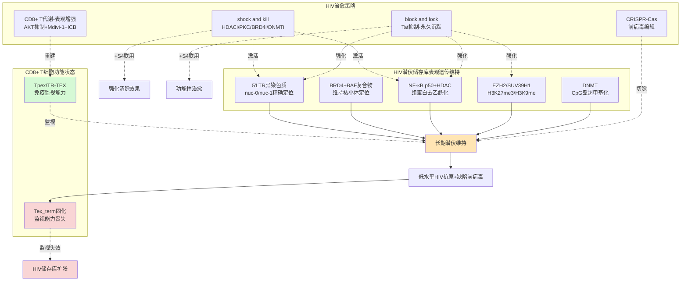

这一图景的核心洞察是：**HIV治愈不仅是病毒清除问题，更是CD8+ T细胞功能维持问题**——任何治愈策略的成功最终依赖于CD8+ T细胞免疫监视能力的恢复或维持。本报告主线建立的代谢-表观遗传命运分岔机制为HIV治愈策略提供了一个全新的协同设计维度——**通过靶向CD8+ T细胞的线粒体动力学、m6A机器与组蛋白乳酸化系统**，可在传统LRA或block and lock策略之外提供宿主免疫增强的关键支持。

## 6.6 HIV场景与TME的对称比较及跨场景共性机制与特异性靶点归纳

整合本章前五节内容与第5章TME场景化框架，本节基于P-2对称比较原则，对HIV/SIV场景与TME场景在十类核心维度上进行系统对比，归纳跨场景共性机制与特异性靶点，识别核心保守机制、场景特异变量、跨场景共享干预靶点与场景特异靶点，并系统归纳HIV场景下需要优先填补的研究缺口清单。

**十类核心维度的对称比较矩阵**：

| 比较维度 | TME场景 | HIV/SIV感染场景 | 共性/差异性判断 |
|---|---|---|---|
| **抗原性质与持续性** | 肿瘤新抗原高强度持续暴露（数月-年） | 低水平HIV抗原+缺陷前病毒持续表达[^27]（数十年） | 共性：持续；差异：强度与时长，HIV以累积效应主导 |
| **PI3K-AKT激活强度** | 强（持续肿瘤刺激证实FOXO1失活） | 推测中等持续（GAP-4.1） | TME>HIV瞬时强度，HIV累积效应可能匹敌 |
| **KLHL6—TOX蛋白稳态轴保守性** | 直接证据（李贵登团队） | 无直接验证（GAP-4.4） | 主环路核心可能保守，需SIV模型直接验证 |
| **线粒体过度裂变特征** | 直接证据（多项T细胞研究） | bulk CD8+ T的MM/MMP/ROS均改变[^54]，亚群分辨证据缺失 | 大致共性，亚群差异化分辨需后续研究 |
| **缺氧/ATF4激活强度** | 强烈（TME特异性放大） | 弱（淋巴结相对常氧，LCMV适度诱导ATF4） | **TME特异性变量** |
| **NFAT5高渗透压驱动** | TME特异有效（直接证据） | 对慢性感染诱导耗竭无效（直接证据） | **TME严格特异，HIV场景应排除** |
| **局部乳酸蓄积来源** | 多源（肿瘤Warburg+CAFs+TAM+Treg） | 待验证（GAP-3.7淋巴结滤泡内代谢梯度） | **场景特异性差异显著** |
| **TGF-β富集水平** | 强烈（驱动CD103+TIL与系统性免疫抑制） | 中等（黏膜组织TGF-β富集，驱动肠道Trm） | 大致共性，黏膜场景HIV可能更突出 |
| **生态位结构** | DC3-CXCR6-CXCL16-IL-15血管周围生态位 | 淋巴结生发中心+CXCR5+ CD8+ T+TCF1+CD39+混合态[^59] | **场景特异性结构完全不同** |
| **主要驻留亚群** | TR-TEX、肿瘤CD103+ TIL | CXCR5+ CD8+ T、淋巴结TCF1+CD39+混合态、肠道CD103+ Trm | 命运分岔细节差异 |
| **特殊干预考量** | ICB、CAR-T、TCR-T、代谢工程化 | shock and kill[^57]、block and lock[^58]、CRISPR-Cas[^45]、菌群干预[^61] | 治疗范式差异显著 |

这一对称比较矩阵揭示HIV与TME场景的核心特征图景：**主环路的核心结构（TCR—PI3K-AKT—FOXO1—KLHL6—TOX—线粒体—糖酵解—Kla—m6A）在两场景下大概率保守，但其上游驱动信号、并行放大通路、生态位结构与代谢压制网络具有显著的场景特异性**。

**核心保守机制与场景特异变量归纳**：

| 类别 | 跨场景核心保守机制 | TME场景特异变量 | HIV/SIV场景特异变量 |
|---|---|---|---|
| 主环路核心 | KLHL6—PGAM5-DRP1—线粒体动力学—糖酵解—Kla—m6A | - | - |
| 上游信号驱动 | 慢性TCR信号—PI3K-AKT—FOXO1磷酸化失活 | 高强度肿瘤新抗原 | 低水平HIV+缺陷前病毒[^27]+I型干扰素慢性炎症 |
| 并行放大通路 | - | ATF4慢性激活、NFAT5高渗透压驱动 | I型干扰素慢性炎症、菌群移位驱动炎症[^61] |
| 代谢压制网络 | TGF-β驱动CD103上调与免疫抑制 | Treg-MCT1、TAM-CD36-FAO、CAFs物理屏障 | 菌群-代谢-表观遗传轴[^61]、Tfh区室代谢应激 |
| 生态位结构 | 组织驻留通过TGF-β-CD103-上皮黏附 | DC3-CXCR6-CXCL16-IL-15血管周围 | 淋巴结生发中心CXCR5+[^59]、肠道GALT[^60] |
| ART/治疗副作用 | - | 化疗、放疗等TME相关治疗 | ART线粒体毒性[^53] |
| 表观遗传共享靶点 | p300（双重角色：HIV潜伏逆转vs CD8+ T耗竭驱动） | Kla writer | HIV潜伏逆转执行者 |

这一归纳的核心洞察是：**主环路核心机制的跨场景保守性为干预策略的可移植性提供了基础**——AKT抑制剂、KLHL6过表达、Mdivi-1、α-KG补充、p300抑制、METTL3抑制等针对主环路的干预理论上可在两场景间移植；而**场景特异变量的存在则要求干预策略的场景化设计**——TME的NFAT5抑制、CD36-TAM调控等不应直接移植至HIV场景，HIV的菌群干预[^61]、LRA[^57]等也不应直接移植至TME场景。

**跨场景共享干预靶点与场景特异靶点**：

| 类别 | 干预靶点 | TME场景适配性 | HIV场景适配性 |
|---|---|---|---|
| **跨场景共享靶点** | AKT抑制剂（恢复FOXO1-KLHL6） | 强（直接证据） | 待验证（基于主环路保守性外推） |
| | Mdivi-1（抑制DRP1过度裂变） | 中（近邻证据） | 待验证 |
| | α-KG补充（恢复辅因子化学计量） | 中-高 | 待验证 |
| | p300抑制（控制Kla与潜伏逆转） | 中（需选择性递送） | **复杂**：可能与HIV潜伏逆转矛盾 |
| | METTL3抑制+ICB | 强（已显示协同[^39]） | 待验证 |
| | OPA1健康线粒体回输 | 中（技术成熟度） | 待验证 |
| **TME场景特异靶点** | NFAT5抑制 | 强（TME特异） | **应排除**（对慢性感染无效） |
| | CD36-TAM代谢压制阻断 | 强 | 待评估 |
| | DC3-CXCR6生态位重建 | 强 | 不直接适用 |
| | TGF-β中和+ICB | 强 | 部分适用（黏膜场景） |
| **HIV场景特异靶点** | shock and kill（HDACi、PKC、BRD4i）+CD8功能增强[^57] | 不适用 | 强（需联合代谢-表观增强） |
| | block and lock（Tat抑制、永久沉默）+CD8监视维持[^58] | 不适用 | 强 |
| | CRISPR-Cas前病毒编辑[^45] | 不适用 | 强（新兴技术） |
| | 菌群基础疗法（益生菌、益生元、粪菌移植、靶向饮食）[^61] | 部分适用 | 强（HIV场景特异） |
| | EZH2抑制剂（valemetostat等已上市[^62]） | 部分适用（抗肿瘤） | 复杂（与潜伏沉默机制相互作用） |
| | Tfh区室代谢支持 | 不适用 | 待研究（GAP-3.7） |

**HIV场景下需要优先填补的研究缺口清单**：

| 缺口编号 | 内容 | 优先级 | 关联章节与影响 |
|---|---|---|---|
| GAP-4.1 | HIV/SIV场景下PI3K-AKT—FOXO1—KLHL6轴的直接验证 | 极高 | 主环路场景外推的关键前提 |
| GAP-4.4 | KLHL6—PGAM5-DRP1轴在HIV场景的可外推性 | 极高 | 干预策略移植的关键证据 |
| GAP-3.7 | HIV/SIV淋巴结滤泡内乳酸浓度梯度与CD8+ T细胞乳酸暴露 | 高 | 滤泡内Kla机制基础 |
| GAP-6.1 | HIV/SIV感染下不同耗竭亚群（Tpex/IntEX/Tex_term/TR-TEX）的差异化线粒体特征量化 | 高 | 命运分岔分辨率提升 |
| GAP-6.2 | HIV mRNA的m6A修饰图谱及其对潜伏维持的调控作用 | 高 | 储存库表观遗传机制 |
| GAP-6.3 | 静息CD4+ T细胞潜伏感染状态下糖酵解漂移与Kla累积 | 中 | 储存库代谢-表观耦合 |
| GAP-6.4 | 缺陷前病毒RNA/蛋白产物对CD8+ T细胞m6A/Kla机器的影响 | 中 | 抗原源特异性效应 |
| GAP-6.5 | 菌群-代谢-表观遗传轴对CD8+ T细胞命运分岔的定量贡献 | 高 | 干预靶点定量评估 |
| GAP-6.6 | HIV/SIV场景下TGF-β对CD8+ T细胞METTL3的直接效应（外推自NK细胞TGF-β-METTL3轴） | 中 | 跨场景m6A机器调控验证 |
| GAP-6.7 | 生殖道黏膜HIV特异性Trm的形成与功能 | 中 | 生殖道储存库机制 |

**整合本章核心贡献的方法学反思**。本章作为HIV场景的对称比较章节，其核心贡献在于：第一，**通过对偶投影建立了HIV/SIV场景下命运分岔机制的完整图景**，从淋巴结生发中心到肠道GALT、从低水平抗原刺激到I型干扰素慢性炎症、从潜伏储存库表观遗传维持到菌群-代谢-表观遗传轴远端塑造，呈现了一个与TME场景在结构上对偶但在变量上显著差异化的整合通路投影；第二，**通过严格的P-2对称比较原则，避免了TME证据简单移植HIV场景的方法学陷阱**，对每一机制节点显式标注证据来源（直接/近邻/外推假设/研究缺口），保证了跨场景论证的证据严格性；第三，**通过P-5干预策略适配性评估识别了跨场景共享靶点与场景特异靶点**，为第8章干预策略设计提供了清晰的场景化决策框架；第四，**通过研究缺口的系统归纳为第9章未来研究方向提供了HIV场景的优先级输入**，特别是HIV/SIV淋巴结生发中心的代谢辅因子动态、潜伏储存库的m6A/Kla机制、菌群-代谢-表观遗传轴的定量贡献等关键缺口的填补。

值得在本章结束时坦诚指出的核心局限是：**HIV场景下KLHL6—FOXO1—TOX轴的直接验证证据缺失**（GAP-4.1、GAP-4.4），这一缺口构成了主环路跨场景外推的最大不确定来源——尽管主环路的核心结构具有理论上的保守性，但HIV场景下的具体动力学参数（FOXO1磷酸化时间常数、KLHL6半衰期、TOX蓄积阈值等）可能与TME场景显著不同。这一不确定性在第7章定量建模中将通过场景化参数差异化处理，并通过敏感性分析评估其对命运分岔阈值预测的影响幅度。**HIV场景下命运分岔机制的精细刻画与TME场景已建立的图景之间仍存在显著的证据不对称性**——这一不对称性的根本原因在于HIV研究领域对T细胞特异性多组学技术（特别是单细胞分辨率的代谢-表观遗传共测量）的应用相对滞后，相关技术成熟度的提升将是未来研究的关键推动力，详见第9章未来研究方向的系统讨论。

至此，本章完成了从TME场景对偶投影至HIV/SIV场景的完整论证，建立了跨场景共性机制与特异性靶点的整合归纳框架，识别了HIV场景下需要优先填补的研究缺口清单。第7章将基于本章建立的跨场景对比矩阵开展定量建模与分岔分析，在统一的二维相空间中通过场景化参数差异化呈现TME与HIV场景的命运分岔阈值与关键控制节点的具体预测；第8章将基于本章识别的跨场景共享干预靶点与场景特异靶点开展系统的干预策略评估，特别是HIV场景下"shock and kill"+CD8代谢-表观增强、"block and lock"+CD8监视维持、菌群干预+免疫增强等跨范式联合策略的协同设计空间；第9章则将本章归纳的HIV场景研究缺口纳入未来研究方向的优先级排序，为代谢-表观遗传命运分岔机制研究的跨场景拓展提供清晰的技术路径建议。

# 7 代谢—表观遗传互作网络的定量建模框架

前六章已系统建立慢性抗原刺激下CD8+ T细胞命运分岔的整合机制图景：第1章定义了命运坐标系与多亚群图谱，第2章解析了KLHL6—PGAM5-DRP1—线粒体动力学失衡的上游驱动力，第3章建立了m6A与组蛋白乳酸化的双轨调控框架，第4章整合为七层级因果链与多重正负反馈对偶网络，第5、6章分别将该框架投影至TME与HIV/SIV两类慢性抗原场景。然而，机制论证至此仍主要停留在定性因果链与拓扑结构层面——要将整合通路的预测能力从"机制合理"推进至"定量可证伪"，必须借助跨尺度、多模态的数学/计算建模工具，将状态变量、转换函数、阈值参数、不确定度等核心要素显式化。本章承担这一关键任务：构建一个由ODE/FBA—质量作用动力学—布尔/贝叶斯网络三层耦合的定量建模框架，通过多组学数据驱动的参数估计与全局敏感性分析，输出可在TME与HIV/SIV场景下差异化检验的预测集合。本章遵循P-4参数可溯源性与可证伪性、P-6阈值变量可识别性两项核心推理标准，对每一参数显式标注来源等级（数据库条目/具名实验文献/外推假设/研究缺口），对每一预测明确其可证伪边界，并在9.5节末尾对建模框架的局限性进行系统的方法学反思。需要在章首坦诚指出的是，本章的建模框架定位为**理论建构与方法学路径**——它整合了前述章节的机制证据、可定位文献中的参数来源与领域共识的建模范式，但其完整数值实现、参数全面校准与预测实验验证均超出本报告的资料范围，部分关键参数（特别是T细胞特异性的m6A位点级动力学常数、HIV/SIV场景下KLHL6—PGAM5-DRP1轴的直接动力学测量）属于显式标注的研究缺口。这一局限本身即为未来研究的优先输入。

## 7.1 建模框架总体架构与多尺度耦合策略

整合通路的定量建模面临一个根本性的尺度挑战：从信号转导的分钟级动力学（PI3K-AKT激活、FOXO1磷酸化）到表观遗传修饰的小时级重塑（m6A位点沉积、组蛋白乳酸化），再到命运基因程序的天级决定（Tex_term/Trm分化轨迹固化），跨越至少四个数量级的时间尺度差异。同时，这一系统在每一尺度上又面临不同的复杂度——信号-代谢层是连续动力学占优、变量数中等的ODE/FBA问题，修饰层是位点特异性、组合爆炸的质量作用动力学问题，命运基因层则是离散状态、强非线性的布尔/贝叶斯网络问题。任何单一建模方法均无法兼顾所有尺度，必须采用**多尺度耦合策略**——在每一尺度选择最适配的方法，通过严格定义的接口变量与时间尺度分离实现跨层衔接。

**三层建模架构与方法选择**。基于第4章建立的七层级整合通路拓扑，本框架将建模分为三层并对应不同的方法工具：

**第一层（L1—L5）：信号—蛋白稳态—线粒体形态—代谢通量—辅因子化学计量**。这一层的核心特征是连续变量动力学占优，状态空间维度中等（10²量级），主要由生化反应速率方程支配。采用**常微分方程组（ODEs）刻画动力学过程，结合通量平衡分析（FBA）求解稳态代谢通量**——ODE适用于刻画KLHL6—FOXO1—TOX蛋白稳态、PGAM5-DRP1磷酸化平衡、OPA1切割动态、膜电位与mtROS演化等具有明确动力学含义的变量；FBA则适用于求解OXPHOS、TCA、糖酵解、FAO等代谢通量配比与αKG/琥珀酸/SAM/乳酰-CoA等辅因子化学计量的稳态分布。两类方法在线粒体—代谢交界处通过**通量耦合分析**衔接：FBA求解的稳态通量作为ODE中代谢辅因子池的源汇项输入，ODE动态变化的膜电位与酶活性反向约束FBA求解的可行通量空间。

**第二层（L6）：m6A—Kla双轨修饰图谱**。这一层的核心特征是位点特异性、writer-eraser-reader三组分动态平衡、组合空间巨大（人mRNA m6A位点数量级达10⁵）。直接使用ODE对每个位点建模将遭遇维度灾难；采用**位点级质量作用动力学模型聚合至序列上下文类别**——将m6A位点按DRACH基序、5'UTR/CDS/3'UTR位置、邻近二级结构等特征聚合为有限数量的位点类别（10²量级），每类用统一的速率常数描述沉积-擦除-识别动态，通过SAM/SAH比与αKG/抑制物比作为关键化学计量参数显式纳入速率方程。这一聚合策略借鉴了CHO细胞代谢动力学建模中"将复杂代谢网络中的关键反应抽取为速率表达式"的成功经验，相关工作明确展示了"动力学速率表达式基于胞外代谢物浓度与温度/氧化还原依赖的调控变量定义模型，仿真使用速率表达式在离散时间点计算准稳态通量分布与胞外代谢物浓度"的可行性。Kla层面同样按基因座功能类别（耗竭基因座、Trm基因座、代谢酶基因座等）聚合处理，writer（p300、GTPSCS、AARS1）-eraser（HDAC1-3、SIRT2）平衡通过乳酰-CoA浓度作为底物变量驱动。

**第三层（L7）：命运基因调控网络**。这一层的核心特征是离散状态、多吸引子、非线性强耦合。**布尔网络模型适用于初步枚举吸引子结构**——基于第1章建立的Tpex/IntEX/Tex_term/经典Trm/TR-TEX/TTSM等命运状态，将TOX、TCF-1、T-bet、Blimp-1、Runx3、Hobit、KLF2、KLF6、ZSCAN20、JDP2、NFAT5等核心命运转录因子定义为节点，通过文献已建立的激活/抑制关系定义边，使用同步或异步更新规则模拟稳态结构。**贝叶斯网络模型适用于边权概率化推断**——基于Nature 2025转录因子图谱研究的309个TF与9种状态数据，对边的存在概率与方向进行后验推断，整合上游m6A与Kla修饰图谱作为节点的先验分布。两种方法在状态分类与转换概率维度互补：布尔网络提供吸引子盆地的拓扑结构，贝叶斯网络提供量化的状态间转换概率。

**三档时间尺度与快慢变量分离**。基于第4章接口表中的时间常数等级（信号层分钟级、代谢层分钟-小时级、表观层小时-天级、命运基因层天级），本框架采用以下时间尺度耦合策略：

| 尺度档 | 涵盖层级 | 时间常数 | 建模处理 | 准稳态近似适用性 |
|---|---|---|---|---|
| 快尺度 | L1信号—L4代谢通量 | 分钟-小时 | ODE+FBA动态求解 | 在小时级以上视为准稳态 |
| 中尺度 | L5辅因子—L6修饰图谱 | 小时-天 | 质量作用动力学+聚合 | 在天级以上视为准稳态 |
| 慢尺度 | L7命运基因程序 | 天-周 | 布尔/贝叶斯+概率转换 | 不适用（命运决定本身为慢动力学输出）|

快慢变量分离的具体实现是：在求解慢尺度（命运基因程序）的状态转换时，假设快尺度（信号-代谢-辅因子）已达到准稳态，通过其当前状态值作为慢尺度的"环境参数"输入；在快尺度内部的动态求解时，慢尺度状态则视为缓慢变化的常数。这一分离的关键边界是**命运决定的窗口期**——在Tpex/IntEX等可逆状态向Tex_term固化的临界过渡期间，快慢尺度的耦合可能不再满足分离假设，需要进行全尺度耦合的瞬态模拟。这一窗口期通常对应数小时至数天，在该窗口内本框架将切换至全尺度耦合模式以保证瞬态动力学的精确捕捉。

**TME与HIV/SIV场景的差异化参数化**。基于P-2对称比较与P-5场景适配性原则，本框架对TME与HIV/SIV两个场景采用统一的拓扑结构但场景化的参数集合。具体差异处理逻辑包括：

- **共享主环路核心参数**：KLHL6—FOXO1—TOX轴、PGAM5-DRP1磷酸化平衡、αKG/Fe(II)依赖型双加氧酶（FTO/ALKBH5/TET/JMJD）的化学动力学常数、p300催化Kla的Km/kcat等具有跨场景保守性的参数采用统一估计；
- **场景特异性并行通路开关**：TME场景下激活ATF4慢性激活模块、NFAT5高渗透压驱动模块、Treg-MCT1代谢检查点模块、TAM-CD36-FAO模块；HIV/SIV场景下激活I型干扰素慢性炎症模块、缺陷前病毒驱动炎症模块、菌群-代谢-表观遗传轴模块、Tfh区室代谢应激模块；
- **场景特异性输入信号**：TME场景输入高强度肿瘤新抗原（持续数月-年），HIV/SIV场景输入低水平病毒抗原（持续数十年）+缺陷前病毒RNA/蛋白产物的持续刺激；
- **场景特异性辅因子约束**：TME场景下乳酸浓度上限设置为多源蓄积条件下的高值，HIV/SIV场景下乳酸浓度上限设置为待研究的中值范围（GAP-3.7）。

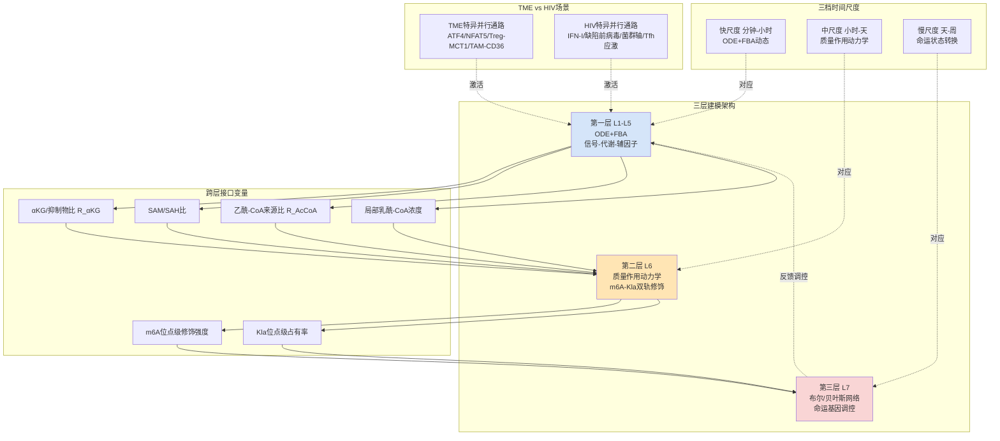

**框架的可移植性与场景特异性双重特征**。这一架构设计的核心目标是同时实现两个看似矛盾的目标：第一，**统一拓扑保证跨场景可移植性**——主环路核心结构在TME与HIV/SIV场景下使用同一组方程与参数，使得AKT抑制剂、Mdivi-1、α-KG补充等针对主环路的干预策略在两场景间的效应可以直接对比；第二，**场景化参数与并行通路开关保证场景特异性**——通过TME特异性的ATF4/NFAT5放大模块与HIV特异性的IFN-I/菌群轴模块，使得场景特异的干预策略（如TME场景下的CD36-TAM调控、HIV场景下的菌群干预）能够在各自场景的模型中独立评估。这一双重特征是本框架相比单场景建模的关键创新，也为第8章干预策略评估提供了跨场景比较的统一基础。

## 7.2 线粒体融合-裂变与代谢通量的ODE/FBA模型

第一层建模聚焦于L1—L5的连续动力学过程，是整个框架的"代谢-形态"基础。本节系统刻画ODE子模型与FBA子模型的具体方程结构、参数来源与耦合方式，并通过通量耦合分析识别融合优势与裂变优势态在代谢相空间中的吸引子结构。

**KLHL6—FOXO1—TOX蛋白稳态轴的ODE子模型**。基于第2章李贵登团队建立的因果链——慢性TCR信号→PI3K-AKT激活→FOXO1磷酸化失活→KLHL6转录下调→TOX多聚泛素化降解能力丧失→TOX蛋白积累，可建立以下变量与方程：

设$pTCR(t)$为慢性TCR信号强度（输入函数），$[AKT]_p$为磷酸化AKT浓度，$[FOXO1]_p$与$[FOXO1]_a$分别为磷酸化（失活）与活性FOXO1浓度，$[KLHL6]$为KLHL6蛋白浓度，$[TOX]$为TOX蛋白浓度，$[PGAM5]_a$为活性PGAM5浓度，$[DRP1]_{S616}$与$[DRP1]_{S637}$分别为DRP1 S616磷酸化（裂变激活）与S637磷酸化（裂变抑制）状态。其动力学方程组形式上为：

$$\frac{d[AKT]_p}{dt} = k_1 \cdot pTCR \cdot [AKT]_t - k_{-1} \cdot [AKT]_p$$

$$\frac{d[FOXO1]_a}{dt} = k_{-2} \cdot [FOXO1]_p - k_2 \cdot [AKT]_p \cdot [FOXO1]_a$$

$$\frac{d[KLHL6]}{dt} = V_{KLHL6} \cdot \frac{[FOXO1]_a^n}{K_{FOXO1}^n + [FOXO1]_a^n} - k_d^{KLHL6} \cdot [KLHL6]$$

$$\frac{d[TOX]}{dt} = V_{TOX,prod} - k_{KLHL6}^{TOX} \cdot [KLHL6] \cdot [TOX] - k_d^{TOX} \cdot [TOX]$$

其中$V_{KLHL6}$与$V_{TOX,prod}$分别为KLHL6与TOX的最大转录速率，$K_{FOXO1}$与Hill系数$n$描述FOXO1对KLHL6启动子的协同结合，$k_{KLHL6}^{TOX}$为KLHL6介导TOX降解的速率常数。这些参数中，FOXO1对KLHL6启动子的结合常数可参考李贵登团队工作中的ChIP-seq证据进行量级估计，KLHL6介导TOX多聚泛素化的反应速率常数则需要在T细胞特异性体外重建实验中直接测量——后者属于显式研究缺口。

**PGAM5-DRP1磷酸化平衡的ODE子模型**。基于KLHL6对PGAM5-DRP1的双重抑制（既调控PGAM5表达，又通过翻译后调控影响其活性），结合PGAM5作为磷酸酶去磷酸化DRP1 S637的直接证据，可建立：

$$\frac{d[PGAM5]_a}{dt} = V_{PGAM5} \cdot f([KLHL6]) - k_d^{PGAM5} \cdot [PGAM5]_a$$

$$\frac{d[DRP1]_{S616}}{dt} = k_{kinase} \cdot [DRP1]_{tot} - k_{phos1} \cdot [DRP1]_{S616} - V_{PGAM5,inh} \cdot [PGAM5]_a \cdot [DRP1]_{S616}$$

$$\frac{d[DRP1]_{S637}}{dt} = k_{PKA} \cdot [DRP1]_{tot} - V_{PGAM5} \cdot [PGAM5]_a \cdot [DRP1]_{S637}$$

其中$f([KLHL6])$为KLHL6对PGAM5的负向调控函数（如$f(x) = 1/(1+x/K_{KLHL6})$），$k_{kinase}$与$k_{PKA}$分别为CDK1/ERK类激酶与PKA催化S616/S637磷酸化的速率，$V_{PGAM5}$与$V_{PGAM5,inh}$描述PGAM5对两个位点的去磷酸化与抑制作用。这些参数的部分来源可追溯至肝I/R损伤模型中PGAM5-DRP1相关测量，但T细胞特异性的精确动力学常数仍需直接实验确定。

**线粒体形态-膜电位-mtROS联动的ODE子模型**。在DRP1磷酸化平衡的下游，线粒体形态学输出（融合优势与裂变优势的连续指标$\phi_{fusion}$）、膜电位$\Delta\Psi_m$、mtROS浓度构成相互耦合的动态：

$$\frac{d\phi_{fusion}}{dt} = k_{OPA1} \cdot \frac{[OPA1]_L}{[OPA1]_L + [OPA1]_S} \cdot [Mfn]_{eff} - k_{fission} \cdot [DRP1]_{S616}$$

$$\frac{d\Delta\Psi_m}{dt} = V_{ETC}(\phi_{fusion}, [mtROS]) - V_{leak}(\Delta\Psi_m) - V_{ATP synthase}$$

$$\frac{d[mtROS]}{dt} = V_{ROS,gen}(\Delta\Psi_m, ETC状态) - V_{antiox}([SOD2], [GSH])$$

其中$[OPA1]_L/[OPA1]_S$比值由OMA1/YME1L切割动力学决定（在膜电位塌陷下OMA1快速激活将L-OPA1切割为S-OPA1，加速融合崩溃），$V_{ETC}$描述电子传递链通量对融合状态的依赖，$V_{ROS,gen}$描述ROS生成对膜电位与ETC状态的非线性依赖。这一子模型的关键特征是包含**膜电位-OPA1切割-融合-膜电位的负反馈环路**——膜电位下降激活OMA1，OMA1切割L-OPA1，融合能力下降，膜电位进一步下降——这是线粒体动力学失衡转向不可逆塌陷的核心动力学机制。

**FBA子模型与代谢通量配比求解**。在ODE求解的线粒体形态-功能状态约束下，FBA子模型求解CD8+ T细胞的稳态代谢通量分布。基于T细胞代谢的领域共识，FBA模型至少需包括如下核心反应模块：糖酵解（葡萄糖→丙酮酸）、TCA循环（丙酮酸→乙酰-CoA→TCA中间物）、电子传递链（NADH/FADH2→ATP）、谷氨酰胺分解（Glu→αKG）、脂肪酸氧化（FAO）、磷酸戊糖途径（PPP，含氧化与非氧化分支）、丝氨酸-甘氨酸-一碳代谢（产生SAM）、乳酸代谢（丙酮酸↔乳酸）。

值得在此引用代谢途径研究的关键证据：华中科技大学张华锋团队在PNAS发表的研究系统阐明了**非氧化磷酸戊糖途径在CD8+ T细胞活化、增殖及记忆形成过程中的功能与分子机制**，证实"活化的CD8+ T细胞通过增强该途径形成'戊糖循环'代谢模式，将代谢中间产物重新导向氧化磷酸戊糖途径和糖酵解，从而持续、高效地生成NADPH"——这一发现为FBA模型中PPP模块的参数化提供了直接证据基础。具体地：**通过基因敲低或小分子药物抑制TKT或TALDO1，会导致CD8+ T细胞内NADPH水平下降、活性氧累积、脂质合成受阻及线粒体结构损伤，进而削弱效应性T细胞的增殖能力、细胞因子产生及体内抗肿瘤功能**——这意味着FBA模型中需要将NADPH稳态作为关键约束变量纳入，连接PPP通量与线粒体功能、ROS稳态、脂质合成等多个下游模块。

FBA求解的目标函数可设置为生物质合成最大化（对应增殖期细胞）或ATP合成最大化（对应能量需求驱动期），约束条件包括代谢酶催化能力上限（受ODE求解的酶活性反向约束）、营养底物可用性（受TME或HIV场景化参数输入）、线粒体ETC通量上限（受$\phi_{fusion}$与$\Delta\Psi_m$约束）。FBA求解输出的稳态通量分布作为辅因子化学计量的源汇项输入至下一步辅因子动力学方程：

$$[αKG]_{ss} = \frac{V_{Glu→αKG} + V_{IDH}}{V_{αKGDH} + V_{消耗}}$$

$$[lactyl\text{-}CoA]_{local} = f([lactate], [GTPSCS], [AARS1])$$

$$R_{AcCoA} = \frac{V_{ACSS2}}{V_{ACSS2} + V_{ACLY}}$$

**Metabolite-Based Microparticles研究的参数化启示**。一项关于代谢物微粒增强T细胞代谢适应性的研究为FBA模型的代谢底物补充提供了重要的实验参数化依据：研究团队"基于α-酮戊二酸聚合物制成可生物降解的微粒（MPs），并生成糖酵解与TCA循环中心碳代谢物聚合的MPs"，"流式细胞术与共聚焦显微分析表明FITC偶联MPs通过膜吸附或电穿孔被有效装载入活化的小鼠原代T细胞胞质"，"原代小鼠T细胞将MPs作为代谢底物——MPs增加代谢功能，包括增加备用呼吸能力、糖酵解与糖酵解能力"。这一发现的建模意义在于：**外源代谢底物补充可在FBA模型中通过修改特定反应的底物可用性约束实现，其下游对NADPH、αKG、乙酰-CoA等辅因子池的影响可定量预测**——为α-KG补充、戊二酸二乙酯给药、IL-10-Fc等代谢干预策略的建模评估提供了具体的参数化路径。

**通量耦合分析与代谢相空间吸引子结构**。基于上述ODE-FBA耦合模型，通过参数扫描可在($\phi_{fusion}$, $\Delta\Psi_m$, 糖酵解/OXPHOS通量比)的代谢相空间中识别吸引子结构。基于第2章已建立的Tex_term走向裂变优势-膜电位塌陷-糖酵解漂移、Trm走向融合优势-高膜电位-FAO依赖的分岔模式，模型预期在相空间中识别两个稳定吸引子：

| 代表态 | $\phi_{fusion}$ | $\Delta\Psi_m$ | 糖酵解/OXPHOS | $R_{αKG}$ | $R_{AcCoA}$ | $[lactyl\text{-}CoA]_{local}$ |
|---|---|---|---|---|---|---|
| Tpex/TTSM | 高 | 高 | 低 | 高 | 高（ACSS2主导） | 低 |
| IntEX | 中 | 中 | 中 | 中 | 中 | 中 |
| Tex_term | 低 | 低 | 高 | 低 | 低（ACLY主导） | 高 |
| 经典Trm | 高 | 高 | 低（FAO占优） | 中-高 | 中-高 | 低-中 |
| TR-TEX | 中-低 | 中 | 中-高 | 中-低 | 中-低 | 中-高 |
| SIV TCF1+CD39+ | 中 | 中-高 | 中 | 中 | 中 | 待研究 |

这一吸引子结构与第1章建立的命运坐标系直接对应——融合优势×低Kla×高αKG对应Tpex/Trm稳定吸引盆，裂变优势×高Kla×低αKG对应Tex_term稳定吸引盆。中间过渡态（IntEX、TR-TEX、SIV干性效应混合态）位于鞍点区域附近，命运可逆性显著高于固化态。这一相空间结构将作为7.6节分岔分析的输入，用于识别命运切换的阈值流形与关键控制节点。

## 7.3 m6A甲基化-去甲基化与组蛋白乳酸化-去乳酸化的质量作用动力学模型

第二层建模聚焦于L6表观遗传修饰图谱的动态。本节构建m6A与Kla双轨调控的位点级质量作用动力学方程，将SAM/SAH比与αKG/抑制物比作为核心化学计量参数显式纳入速率常数，并刻画第3章已建立的Kla→m6A级联放大与PDCD1座拮抗制衡两类关键相互作用模式。

**m6A位点级质量作用动力学的基本方程**。对每一m6A位点$i$（聚合至10²量级的位点类别），定义未修饰状态$U_i$、修饰状态$M_i$、reader结合状态$M_i \cdot R_j$（$j$为YTHDF1/2/3、IGF2BP等不同reader）。其动力学方程为：

$$\frac{d[M_i]}{dt} = k_w^{(i)} \cdot [METTL3/14] \cdot [SAM] \cdot [U_i] - k_e^{(i)} \cdot [FTO/ALKBH5] \cdot [αKG] \cdot [M_i] - \sum_j k_b^{(i,j)} \cdot [R_j] \cdot [M_i] + \sum_j k_{-b}^{(i,j)} \cdot [M_i \cdot R_j]$$

其中$k_w^{(i)}$与$k_e^{(i)}$分别为位点$i$的writer催化速率常数与eraser催化速率常数（位点特异性反映序列上下文与二级结构的影响），$[SAM]$与$[αKG]$作为辅因子被显式纳入速率方程——这是连接代谢辅因子化学计量与表观遗传修饰图谱的关键化学接口。SAH作为METTL3/14的竞争性抑制物可通过$1/(1+[SAH]/K_i^{SAH})$因子修正writer速率，琥珀酸/富马酸/2HG/戊二酸作为FTO/ALKBH5的竞争性抑制物可通过类似因子修正eraser速率：

$$k_w^{eff} = k_w \cdot \frac{[SAM]}{K_M^{SAM} + [SAM]} \cdot \frac{1}{1 + [SAH]/K_i^{SAH}}$$

$$k_e^{eff} = k_e \cdot \frac{[αKG]}{K_M^{αKG} + [αKG]} \cdot \frac{1}{1 + ([琥珀酸]+[富马酸]+[2HG]+[戊二酸])/K_i^{抑制物}}$$

这一速率常数修正将第2章建立的辅因子化学计量重塑直接转化为修饰动力学的可量化参数变化。

**reader介导的mRNA命运调控**。reader结合后对mRNA命运的调控通过修饰mRNA降解速率与翻译速率实现：

$$\frac{d[mRNA_g]}{dt} = V_{transcription}^g - k_{deg,0}^g \cdot [mRNA_g] - \sum_i \sum_j k_{deg,m6A}^{(g,i,j)} \cdot [M_i \cdot R_j] \cdot \mathbb{1}_{i \in g}$$

其中$[mRNA_g]$为基因$g$的mRNA水平，$\mathbb{1}_{i \in g}$表示位点$i$是否位于基因$g$上，$k_{deg,m6A}^{(g,i,j)}$为m6A-reader介导的额外降解速率（YTHDF2为正值，YTHDF1/3的降解效应较弱）。基于第3章已建立的METTL14-YTHDF1/2/3轴介导PDCD1降解机制，PDCD1基因的m6A位点动力学可被显式参数化以预测PD-1表达的动态变化。

**Kla writer-eraser平衡的动力学方程**。组蛋白乳酸化的writer-eraser模型类似但更具协同特征。对每一Kla位点$k$（按基因座功能类别聚合），定义未修饰状态$U_k$与乳酸化状态$L_k$：

$$\frac{d[L_k]}{dt} = k_{p300}^{(k)} \cdot [p300] \cdot [lactyl\text{-}CoA]_{local} \cdot [U_k] + k_{GTPSCS}^{(k)} \cdot [GTPSCS]_{nuc} \cdot [lactate]_{nuc} \cdot [U_k] - k_{HDAC}^{(k)} \cdot [HDAC1\text{-}3] \cdot [L_k]$$

其中$k_{p300}^{(k)}$与$k_{GTPSCS}^{(k)}$为p300与GTPSCS介导Kla沉积的速率常数（基于赵英明/黄河团队建立的GTPSCS Km = 15.32 ± 1.28 mM作为参数估计起点），$[lactate]_{nuc}$为核内乳酸浓度，反映GTPSCS核内原位生成乳酰-CoA的能力。HDAC1-3的去乳酸化能力通过$k_{HDAC}^{(k)}$描述，其与去乙酰化共享催化结构域意味着HDAC抑制剂同时影响两类修饰。

**Kla→m6A级联放大的双层级耦合**。第3章已建立的Kla→m6A级联放大器在本模型中通过两个具体方程显式刻画：

第一层级（启动子激活）：H3K18la在*Mettl3*启动子的占有率影响METTL3转录速率：

$$V_{METTL3,transcription} = V_{0} \cdot \left(1 + \alpha \cdot \frac{[H3K18la]_{Mettl3\,prom}}{K_{Kla} + [H3K18la]_{Mettl3\,prom}}\right)$$

其中$\alpha$为Kla介导转录激活的最大倍数（基于结直肠癌TIM与脓毒症ALI模型证据估计）。

第二层级（蛋白活性增强）：METTL3锌指域被Kla修饰增强其RNA结合与催化活性：

$$k_w^{METTL3,eff} = k_w^{0} \cdot \left(1 + \beta \cdot \frac{[METTL3\text{-}Kla]}{[METTL3]_{tot}}\right)$$

其中$\beta$为蛋白活性增强的最大倍数。这两层级耦合的乘积效应使Kla对m6A机器的影响呈现非线性放大特征，是本框架预测命运分岔阈值非线性的核心机制基础。

**PDCD1基因座的拮抗制衡建模**。PDCD1基因座作为本报告中m6A-Kla双轨调控直接证据最完整的代表，可作为模型验证的关键基准位点。其PD-1表达的净输出由两条相反方向作用的化学计量平衡决定：

$$[PD1]_{steady} = \frac{V_{transcription}^{Pdcd1}(H3K18la_{Pdcd1})}{k_{deg}^{0} + k_{deg,m6A}^{Pdcd1}([m6A_{Pdcd1}], [YTHDF1/2/3])}$$

分子项（转录速率）由*Pdcd1*启动子H3K18la占有率正向调控，分母项（mRNA降解）由m6A修饰水平与YTHDF1/2/3结合正向调控。在SAM/SAH充足、αKG/抑制物比正常的代谢健康状态下，分母项占优PD-1低表达；在代谢应激状态下分子项上升+分母项下降协同推高PD-1表达。**这一显式的拮抗模型为预测METTL3抑制剂（如WD6305）+抗PD-1抗体协同效应提供了量化基础**——抑制m6A机器降低分母项（PD-1表达上升），抗PD-1抗体功能性中和PD-1，二者形成"先放后抓"的精巧组合，其协同指数可通过模型直接计算。

**模型验证基准位点的扩展规划**。除PDCD1外，模型应在多个基因座上进行参数化与验证。对每个基因座，需要的输入数据包括：（1）基因mRNA水平的m6A位点级图谱（来源GLORI、m6A-label-seq或MeRIP-seq数据）；（2）基因启动子的H3K18la占有率（来源ChIP-seq数据）；（3）基因mRNA水平的稳态浓度与降解速率（来源scRNA-seq或bulk RNA-seq+RNA寿命测定）；（4）writer-eraser-reader蛋白浓度（来源蛋白组学或CITE-seq数据）；（5）辅因子化学计量动态（来源代谢组学）。**当前研究缺口集中于Tox/Tcf7/Tbx21/Runx3/Hobit等核心命运基因座的位点级数据（GAP-3.2、GAP-3.3）**——这些基因座的参数化将作为模型预测命运分岔机制的关键瓶颈，其填补将显著提升模型的预测能力。

## 7.4 命运决定基因调控网络的布尔与贝叶斯建模

第三层建模聚焦于L7命运基因调控网络。本节构建以核心命运转录因子为节点的布尔网络以枚举命运吸引子结构，并基于Nature 2025转录因子图谱研究的309个TF与9种状态数据进行贝叶斯网络的边权概率化推断，整合上游m6A与Kla修饰图谱作为节点先验，输出与第1章命运坐标系二维相空间映射一致的概率分布。

**布尔网络的节点定义与边权设置**。基于第1章建立的核心命运转录因子集合，本框架定义如下节点：

| 节点 | 命运关联 | 上游调控来源 | 主要下游靶点 |
|---|---|---|---|
| TOX | 耗竭命运核心驱动 | KLHL6介导降解；m6A/Kla潜在调控（GAP-3.2/3.3） | PDCD1、Havcr2、Lag3、CD39 |
| TCF-1 (Tcf7) | Tpex干性维持 | KLF2维持；m6A介导降解（待证） | Bcl6、Slamf6、IL-7Rα |
| T-bet (Tbx21) | 效应/IntEX | KLF2激活；STAT4信号 | IFN-γ、Granzyme B、Eomes |
| Blimp-1 (Prdm1) | 双重作用：Tex_term促进、Trm形成 | TCR信号；STAT3 | Bcl6、PGC-1α（抑制） |
| Runx3 | Trm/TR-TEX核心 | TGF-β-Smad；BHLHE40协同 | CD103/Itgae、CD69 |
| Hobit | Trm驻留维持 | Blimp-1协同；IL-15信号 | KLF2（抑制）、S1PR1（抑制）|
| KLF2 | 效应稳定/抑制耗竭 | FOXO1激活；mTOR负调 | TOX（抑制）、TBET维持 |
| KLF6 | TRM特异性正向因子 | Nature 2025鉴定 | Trm相关基因网络 |
| ZSCAN20 | TEXterm特异性驱动 | Nature 2025鉴定（敲除降低TEXterm 54%） | TEXterm程序基因 |
| JDP2 | TEXterm特异性驱动 | Nature 2025鉴定（敲除降低TEXterm 43%） | TEXterm程序基因 |
| NFAT5 | TME特异耗竭驱动 | TME高渗透压；替代NFAT1/2 | 肿瘤特异耗竭程序 |
| FOXO1 | 上游开关 | AKT磷酸化失活 | KLHL6、KLF2 |

边权设置基于文献已建立的激活（+1）/抑制（−1）/无作用（0）关系。例如，TOX→PDCD1为+1（TOX驱动PD-1表达），KLHL6→TOX为−1（KLHL6介导TOX降解），TGF-β-Smad→Runx3为+1，KLF2→TOX为−1（KLF2抑制TOX以维持效应命运）等。

**布尔网络的吸引子枚举**。使用同步或异步更新规则模拟节点状态演化，识别稳态吸引子。基于上述节点与边权配置，模型预期识别出以下吸引子：

- **Tpex/TTSM吸引子**：TCF-1=1, KLF2=1, TOX=低, FOXO1=1, KLHL6=1
- **IntEX吸引子**：T-bet=1, TCF-1=低, TOX=中
- **Tex_term吸引子**：TOX=1, ZSCAN20=1, JDP2=1, KLHL6=0, FOXO1=0, TCF-1=0
- **经典Trm吸引子**：Runx3=1, Hobit=1, KLF6=1, KLF2=0, TOX=低
- **TR-TEX吸引子**：Runx3=1, TOX=中, PDCD1=1, KLF6=待研究
- **TME特异性Tex_term亚型**：在Tex_term基础上叠加NFAT5=1
- **SIV TCF1+CD39+亚型**：TCF-1=1, TOX=1, CD39=1（与Tex_term共表达TOX但保留TCF-1）

这一吸引子枚举与第1章建立的命运图谱直接对应。值得注意的是SIV TCF1+CD39+亚型作为TCF-1与TOX共表达的特殊状态，其在布尔网络中的识别需要将TCF-1与TOX的相互抑制关系处理为概率性而非绝对的——这预示了贝叶斯网络的必要性。

**贝叶斯网络的边权概率化推断**。基于Nature 2025转录因子图谱研究的309个TF与9种状态数据，可对边的存在概率与方向进行后验推断。具体方法是将转录因子图谱研究的Perturb-seq数据（19个候选TF的功能验证结果）作为似然函数，结合先验分布（基于已知激活/抑制关系），通过马尔可夫链蒙特卡罗（MCMC）方法对边权进行后验采样。这一方法的关键优势是能够处理边的不确定性——例如TOX在不同细胞背景下功能不同（在Tex_term中锁定耗竭，在SIV TCF1+CD39+亚群中赋予滤泡定居能力），其与TCF-1的相互作用可能不是简单的相互抑制而是状态依赖的协同/拮抗。

**整合上游m6A与Kla修饰图谱作为节点先验**。第二层建模输出的m6A与Kla修饰图谱通过节点先验调控基因表达概率：

$$P(node = ON | m6A\,profile, Kla\,profile) = \sigma\left(\sum_i w_i^{m6A} \cdot m6A_i + \sum_k w_k^{Kla} \cdot Kla_k + 调控输入\right)$$

其中$\sigma$为sigmoid函数，$w_i^{m6A}$与$w_k^{Kla}$分别为m6A与Kla修饰对节点状态的影响权重。对耗竭基因（TOX、PDCD1等），高H3K18la与异常m6A图谱将提高节点ON概率；对干性基因（TCF-1、KLF2等），代谢应激驱动的m6A机器异常将降低节点ON概率。这一先验整合实现了从修饰图谱到命运状态的概率映射，是连接表观遗传执行层与命运决定层的关键接口。

**吸引子盆地分析与状态间转换概率**。基于贝叶斯网络的随机模拟可量化各命运状态的相对稳定性与状态间转换概率。具体方法是对每一初始状态进行多次随机模拟，统计达到各吸引子的频率分布；对达到Tex_term吸引子的轨迹，进一步分析其经过的中间态序列以识别命运决定的关键中间步骤。

**Cell host & microbe代谢-免疫互作的贝叶斯整合**。代谢物对宿主免疫反应的调控研究为贝叶斯网络的先验整合提供了重要的跨物种证据基础——一项关于膳食抗氧化剂麦角硫因通过代谢互养作用增强人体肠道细菌厌氧能量代谢的研究证实了"代谢交叉饲养"作为系统生物学概念的有效性，其建模思路可延伸至T细胞-代谢-表观遗传网络的贝叶斯参数化。**此处的核心启示是建模时应同时考虑细胞自主与非细胞自主的代谢-表观-命运调控**——CD8+ T细胞的命运不仅取决于自身代谢状态，还受周围细胞（Treg、TAM、CAFs、菌群衍生代谢物）的代谢输出调节，这一多源输入应在贝叶斯网络中通过场景特异性的环境节点显式建模。

输出的吸引子盆地结构与状态间转换概率分布将作为第8章干预策略评估中"命运逆转效应"量化的关键输出指标——例如AKT抑制剂+METTL3抑制剂+ICB联合治疗预期使Tex_term吸引子盆地缩小、Tpex/Trm吸引子盆地扩大，二者的差异即为协同治疗的命运逆转效应大小。

## 7.5 多组学数据驱动的参数估计与模型校准

定量建模的科学严谨性根本上依赖于参数估计的可溯源性与不确定度的显式刻画。本节系统阐述本框架的参数估计策略——基于P-4参数可溯源性原则，将所有参数按来源等级分级标注，并通过分层贝叶斯方法处理跨数据模态的不一致性与单细胞-bulk数据的尺度桥接。

**多组学数据资源的整合规划**。本框架的参数估计需要整合以下数据模态：

| 数据模态 | 关键参数贡献 | 当前可获得性 | 关键技术工具 |
|---|---|---|---|
| scRNA-seq | 转录因子表达水平、亚群分辨 | 相对丰富 | 10x Genomics、Smart-seq2 |
| scATAC-seq | 染色质可及性、转录因子结合预测 | 中等可得 | 10x Multiome |
| 空间转录组 | 生态位结构、细胞-细胞距离 | 新兴 | Visium、MERFISH |
| 靶向代谢组 | αKG、SAM/SAH、乳酸、乙酰-CoA等关键辅因子定量 | 相对成熟（bulk） | LC-MS/MS靶向定量 |
| 非靶向代谢组 | 全代谢物谱、未知代谢物发现 | 成熟（bulk） | 高分辨率LC-MS |
| 单碱基m6A图谱 | m6A位点精确定位与化学计量信息 | **GLORI/m6A-label-seq金标准** | 北京大学GLORI平台 |
| ChIP-seq Kla | H3K18la等位点的染色质占有率 | 新兴（异构体特异性抗体） | 北大/芝加哥大学新一代抗体 |
| CITE-seq | 蛋白-RNA共测量、亚群细化 | 新兴 | 10x CITE-seq |
| Perturb-seq | TF敲除-命运分化效应（功能验证） | Nature 2025已建立 | CRISPR-基础scRNA-seq |
| 代谢-表观共测量 | 单细胞代谢组与表观组同步定量 | **关键瓶颈技术** | 待发展 |

**GLORI技术作为m6A定量金标准**。北京大学伊成器团队开发的GLORI技术基于"乙二醛和亚硝酸盐催化A-I高效转化"实现m6A修饰位点特异性识别——具体地"通过优化NaNO2浓度、孵育温度和反应时间以及在脱氨步骤中添加乙二醛，可实现几乎完全脱氨（>99.0%）"，"在最佳条件下，液相色谱-串联质谱（LC-MS/MS）定量分析显示，实现了~99%的A-I转化率，而GX转化率和CU转化率分别只有~3%和~4%"。这一技术的"高特异性、高检测率、无偏好性、高灵敏度"四大优势——"特异性识别A位点而对其它易脱氨碱基转化率很低；不受转录丰度的影响，人工合成低丰富修饰m6A位点也能精准检测；在全转录组范围内识别修饰位点，无序列偏好性；m6A修饰检出数量多，高达数万至几十万个"——为本框架第二层m6A位点级模型的位点参数化提供了金标准工具。其与传统方法（MeRIP-seq、MAZTER-seq、DART-seq、PA-Seq、miCLIP等）相比的核心优势是提供了化学计量信息——即每个位点的m6A修饰比例，而非仅修饰存在/缺失的二元信息——这是m6A位点级动力学建模必需的关键数据。

**m6A-label-seq作为代谢标记金标准**。浙江大学刘建钊团队的m6A-label-seq方法通过allyl-SAM代谢标记实现"通过细胞自身代谢对全转录组RNA m6A位点进行标记，进而实现单碱基分辨率测定"。**其原理是"细胞内S-腺苷甲硫氨酸（SAM）是甲基转移酶的辅助因子，通过引入带有烯丙基修饰的甲硫氨酸，在细胞内MAT作用下生成烯丙基取代的辅助因子allyl-SAM或者硒代同源物allyl-SeAM"，"细胞内METTL3/METTL14利用allyl-SAM或allyl-SeAM将其烯丙基修饰到mRNA上原本是m6A的位点，得到a6A，a6A在温和的碘加成条件下诱导生成环化1,6位环化腺嘌呤cyc-A，然后RNA cyc-A在逆转录成互补DNA时发生碱基错配"**——这一代谢标记策略的关键优势是直接连接SAM代谢与m6A位点，在代谢扰动实验中可同时追踪SAM池变化与m6A位点动态，是建立SAM/SAH→m6A位点级模型校准的理想数据源。该方法的发现还揭示了"部分检测到的m6A修饰位点倾向于成簇出现，相邻m6A位点之间的中位距离约为50 nt"——这一空间聚集特征为m6A位点级模型的聚合策略提供了实证依据。

**单细胞代谢组学作为关键瓶颈技术**。Cell Metabolism关于单细胞代谢组学的综述系统刻画了这一新兴领域：研究指出当前**对免疫细胞群的分析受限于bulk方法的局限**，"单细胞应用技术可评估临床样本中单个免疫细胞的代谢状态，有助于推动免疫代谢领域的发展和提高疾病诊断能力"。具体技术路径包括：**Seahorse细胞外通量分析仪**——"通过动态记录细胞外酸化率（ECAR）和耗氧率（OCR）可提供糖酵解和线粒体呼吸相关的核心数据；应用特定底物和抑制剂可探究细胞对葡萄糖、谷氨酰胺或脂肪酸的相对偏好"；**稳态代谢组学**——"在特定时间点，通过LC-MS或GC-MS可测量一系列代谢物的稳态浓度；非靶向代谢组学测量生物样本中的数百种代谢物，而靶向代谢组学则可预先评估代谢物并提供更具灵敏度的数据"；**通量组学**——"特定代谢途径的通量变化与该途径内特定时间点测定的代谢物浓度不一定直接相关；通过靶向质谱在连续时间点对底物和同位素13C或15N测量，可明确代谢通量和代谢途径动力学"；**单细胞分辨率空间测量**——"把单细胞技术与基质辅助激光解吸电离（MALDI）-质谱成像和二次离子质谱（SIMS）相结合，有助于探索体内组织微环境中单细胞的免疫代谢过程"。综述也明确了当前局限——"基于MS的方法需要较高的输入通量（一般为10万个细胞）"——这意味着完整的单细胞代谢组学仍是发展中技术，本框架的参数估计在该维度上将通过bulk数据外推至单细胞分辨率，承担相应的不确定度成本。

**HIV场景的代谢组学研究证据**。一项发表于Journal of Infectious Diseases的研究使用OCR测量证实**HIV感染者效应记忆CD8+ T细胞亚群中线粒体质量、膜电位、ROS含量与HIV未感染者的差异**——这一研究为HIV场景下线粒体动力学模型的参数估计提供了直接证据基础，但其bulk层面的测量限制了其对Tpex/IntEX/Tex_term亚群差异化参数的分辨能力（GAP-6.1）。

**分层贝叶斯参数估计流程**。本框架采用分层贝叶斯方法整合多模态数据：

第一层（化学动力学常数）：基于BRENDA、SABIO-RK等数据库或具名实验文献的酶动力学常数（Km、kcat、Ki）作为先验分布。例如，GTPSCS对乳酸的Km = 15.32 ± 1.28 mM作为强先验；FOXO1对KLHL6启动子的协同结合参数作为弱先验（基于ChIP-seq证据但缺乏直接动力学测量）。

第二层（细胞类型特异性参数）：通过T细胞特异性的Perturb-seq、CRISPR筛选数据更新边权与节点活性参数。Nature 2025转录因子图谱研究的Perturb-seq数据为该层提供关键校准——例如ZSCAN20敲除降低TEXterm分化54%、JDP2敲除降低TEXterm分化43%等定量结果直接约束相应边权后验分布。

第三层（场景特异性参数）：通过TME或HIV/SIV场景的临床/动物模型数据更新场景特异性变量。例如，TME场景下Treg-MCT1相关参数通过Cancer Cell发表的MCT1抑制实验数据校准；HIV场景下bulk CD8+ T的MM/MMP/ROS数据通过Journal of Infectious Diseases研究校准。

**研究缺口的不确定度处理**。对GAP-3.1（SAM/SAH动态）、GAP-3.2（命运基因m6A位点图谱）、GAP-3.3（命运基因座Kla占有率）、GAP-4.1/4.4（HIV场景KLHL6-PGAM5-DRP1轴）等关键研究缺口，将其处理为带不确定度的待估参数。具体策略包括：（1）赋予较宽的先验分布（如对数正态分布，标准差较大）；（2）通过敏感性分析评估其对模型预测的影响幅度；（3）将敏感性最高的缺口列为优先实验验证目标。这一处理使得模型在关键证据不足的情况下仍能输出预测，但其预测的不确定度被显式量化与传播。

**跨数据模态的对齐策略**。多组学数据整合面临批次效应、技术差异、生物变异等多重挑战。本框架采用以下策略：（1）批次效应校正——通过ComBat、Harmony等方法消除批次差异；（2）尺度桥接——对bulk数据与单细胞数据，使用反卷积方法（如CIBERSORT）将bulk信号分解至细胞类型，或对单细胞数据进行群体平均以匹配bulk数据；（3）模态对齐——对scRNA-seq与scATAC-seq数据使用Seurat WNN、MOFA+等方法进行联合降维与聚类；（4）时间对齐——对静态snapshot数据进行RNA velocity或Pseudotime分析以推断动态轨迹。

## 7.6 分岔分析与命运切换阈值变量识别

基于校准后的耦合模型，本节开展分岔分析以识别Tex_term与Trm/TR-TEX命运切换的阈值变量与关键控制节点。第4章已基于定性分析提出多变量联合阈值$\Theta_{saddle} = \{[KLHL6] < \theta_1\} \cap \{R_{αKG} < \theta_2\} \cap \{[lactyl\text{-}CoA] > \theta_3\} \cap \{[TOX] > \theta_4\}$；本节将通过定量建模将这一定性框架转化为具体的阈值流形几何与可证伪预测。

**双参数与多参数分岔分析**。在($KLHL6$, $R_{αKG}$, $[lactyl\text{-}CoA]$, $TOX$)四维联合阈值空间中开展分岔分析，识别鞍点流形（连接两个吸引盆的不稳定平衡点集合）与Hopf分岔曲线（系统从稳定态进入持续振荡态的边界）。具体方法包括：（1）单参数延拓——固定其他参数，扫描单一参数识别分岔点；（2）双参数延拓——通过XPPAUT、MatCont等工具识别二维分岔曲线；（3）多参数全局分岔——通过随机采样或Latin Hypercube Sampling在高维参数空间中识别命运切换边界。

**鞍点流形的几何刻画**。基于第4章定性分析与本章建模，鞍点流形预期具有以下特征：（1）四维参数空间中表现为一个三维曲面；（2）该曲面将命运空间分割为Tex_term稳定吸引盆与Tpex/Trm稳定吸引盆；（3）位于曲面上的细胞状态对参数扰动高度敏感，单点干预即可推动其向任一吸引盆移动；（4）位于曲面之外的稳定吸引盆内的状态对单点干预相对不敏感，需要多点联合干预才能跨越鞍点曲面。

这一几何结构将第1章建立的命运坐标系二维相空间扩展至四维（或更高维），其与二维相空间的映射可通过投影实现。具体而言，二维相空间的横轴（线粒体动力学：裂变↔融合）对应$\phi_{fusion}$与$\Delta\Psi_m$的某种组合，纵轴（表观修饰：低Kla/常规m6A↔高Kla/异常m6A）对应$[H3K18la]_{key\,sites}$与$m6A\,score$的某种组合；四维阈值空间通过线性或非线性投影映射至二维相空间，鞍点流形的二维投影即为相空间中的鞍点区域边界。

**核心正反馈环路的相轨迹模拟**。基于第4章建立的TOX—线粒体—糖酵解—乳酸—Kla—Mettl3—m6A—TOX多层正反馈环路，可通过相轨迹模拟检验其自我维持特性。具体方法是从命运可逆窗口内的初始状态（如IntEX状态）出发，模拟在不同参数条件下的轨迹演化：

- **健康代谢条件**（KLHL6维持、$R_{αKG}$正常、$[lactyl\text{-}CoA]$低）：轨迹趋向Tpex/Trm吸引盆，命运可逆；
- **代谢应激条件**（KLHL6下降、$R_{αKG}$下降、$[lactyl\text{-}CoA]$升高）：轨迹越过鞍点流形进入Tex_term吸引盆，命运不可逆；
- **临界条件**（参数处于鞍点附近）：轨迹具有bistability，初始条件的微小差异决定最终命运。

这一相轨迹模拟的关键输出是**命运切换的临界时间窗口**——从初始扰动到命运决定固化的时间长度。预期该窗口在TME场景下较短（数天至数周，与肿瘤新抗原高强度刺激一致）、在HIV/SIV场景下较长（数月至数年，与低水平抗原累积效应一致），这一时间动力学差异是两场景干预策略时序设计的关键变量。

**负反馈环路失稳条件的定量刻画**。基于第4章建立的五条负反馈/制衡环路（KLHL6—FOXO1上游安全阀、AMPK代谢传感器、IL-10—OXPHOS恢复、CXCR6—CXCL16—DC3—IL-15生态位、m6A—Kla双轨内拮抗制衡），可通过参数扰动模拟识别每条环路的失稳条件：

- **N-1（KLHL6-FOXO1）失稳条件**：AKT活性超过阈值$[AKT]_p > \theta_{AKT}^{crit}$时FOXO1磷酸化失活无法被去磷酸化补偿；
- **N-2（AMPK）失稳条件**：mTOR下游通路活性超过阈值$mTOR > \theta_{mTOR}^{crit}$时AMPK的修复信号无法转化为线粒体重编程；
- **N-3（IL-10-OXPHOS）失稳条件**：TME中IL-10被Treg/M2占用至阈值$[IL10]_{available} < \theta_{IL10}^{crit}$时无法补救Tex_term；
- **N-4（CXCR6生态位）失稳条件**：DC3密度下降至阈值$[DC3] < \theta_{DC3}^{crit}$时CXCR6+ T细胞无法被有效招募；
- **N-5（m6A-Kla拮抗）失稳条件**：化学计量比$[H3K18la]_{Pdcd1} \cdot [METTL3] / [αKG]^2 > \theta_{ratio}^{crit}$时双轨协同推高耗竭基因表达。

每条失稳条件的具体阈值需要通过参数扫描与敏感性分析确定。一个关键预测是：**Tex_term命运的不可逆固化对应于至少三条负反馈环路同时失稳**——单条环路失稳仍可被其他环路补偿性维持，多条环路同时失稳才会导致系统级失稳。这一预测为干预策略设计提供了明确指引——必须同时重建多条负反馈环路才能逆转Tex_term命运，与第4章建立的"双管齐下"失稳机制相一致。

**命运可逆窗口与不可逆固化区的边界预测**。综合鞍点流形与负反馈失稳分析，可在四维阈值空间中识别两类区域：

- **命运可逆窗口**：位于Tpex/Trm吸引盆+鞍点流形附近的状态，对应Tpex、TTSM、IntEX、TR-TEX等过渡态。在该窗口内，单点或双点干预（如AKT抑制剂、二甲双胍、IL-10-Fc单用）可有效逆转命运。临床上对应ICB治疗有效响应的细胞群体——例如IntEX比例≥11.8%与病理缓解最强相关。
- **不可逆固化区**：位于Tex_term吸引盆深处的状态，对应已穿越鞍点流形且多条负反馈环路同时失稳的Tex_term细胞。在该区域内必须采用多靶点联合干预（如AKT抑制剂+METTL3抑制剂+ICB+IL-15支持）才能实现命运逆转。

**输出的可证伪预测**。本节分岔分析的核心输出是一组可证伪的定量预测，包括：（1）单一干预效应的命运逆转率与初始状态在四维阈值空间中的位置呈非线性关系，鞍点附近最敏感；（2）联合干预的协同指数预期超过Bliss独立或Loewe相加预测，特别是在不可逆固化区；（3）TME场景下命运切换的临界时间窗口短于HIV场景，干预时序应相应调整；（4）至少三条负反馈环路同时失稳是不可逆固化的必要条件。这些预测将在第8章干预策略评估中作为联合策略设计的依据。

## 7.7 全局敏感性分析与关键控制节点优先级排序

定性识别的关键控制节点需要通过定量敏感性分析进行精细化重排。本节采用Sobol指数与Morris方法等全局敏感性分析工具，量化各参数对命运分岔阈值与时间动力学的一阶与二阶贡献，识别高敏感性控制节点，并为TME与HIV/SIV两类场景分别输出敏感性排名。

**Sobol指数分析**。Sobol指数是基于方差分解的全局敏感性分析方法，其一阶指数$S_i$量化参数$x_i$对输出方差的独立贡献，总指数$S_T^i$量化$x_i$及其与其他参数交互作用的总贡献。具体计算通过Saltelli采样进行：在每个参数的先验分布上独立采样$N$个样本，构造扰动矩阵，计算输出函数的方差分解。本框架的关键输出函数包括：（1）Tex_term吸引盆的相对大小（占总状态空间的比例）；（2）从初始Tpex状态到Tex_term固化的时间长度；（3）特定干预下的命运逆转率；（4）TME与HIV场景下的预测差异。

**Morris方法的初步筛查**。Morris方法（也称基本效应法）适用于参数数量较多时的初步筛查，其计算成本低于Sobol指数但精度较低。每个参数的基本效应$\mu_i^*$量化其对输出的平均影响幅度，标准差$\sigma_i$反映其与其他参数的交互作用强度。本框架使用Morris方法对所有参数进行初步筛查，识别高敏感性参数后再用Sobol指数进行精细分析。

**预期的高敏感性控制节点排序**。基于第4章定性分析与本章建模，全局敏感性分析预期识别以下高敏感性参数（按预期Sobol总指数排序）：

| 预期排名 | 参数 | 所属节点 | 敏感性来源 | 跨场景共享性 |
|---|---|---|---|---|
| 1 | KLHL6最大转录速率$V_{KLHL6}$ | KLHL6-FOXO1-TOX轴 | 同时控制TOX与PGAM5-DRP1双输出 | 高（主环路核心） |
| 2 | DRP1 S616磷酸化速率$k_{kinase}$ | PGAM5-DRP1轴 | 决定线粒体过度裂变程度 | 高（主环路核心） |
| 3 | $R_{αKG}$（αKG/抑制物比） | 辅因子化学计量 | 同时调控m6A与TET/JMJD家族 | 高（化学保守性） |
| 4 | 局部$[lactyl\text{-}CoA]$ | Kla底物供给 | 决定Kla→m6A级联放大强度 | 中（场景差异） |
| 5 | METTL3最大催化速率$k_w^{METTL3}$ | m6A机器执行 | m6A整体沉积能力 | 高（化学保守性） |
| 6 | p300催化Kla速率$k_{p300}$ | Kla机器执行 | Kla整体沉积能力 | 高（化学保守性） |
| 7 | Treg-MCT1乳酸摄取速率（TME特异） | Treg代谢检查点 | TME场景特异放大 | **TME特异** |
| 8 | I型干扰素信号强度（HIV特异） | 慢性炎症放大 | HIV场景特异放大 | **HIV特异** |
| 9 | IL-15反式呈递浓度 | DC3生态位 | TR-TEX维持 | 中（生态位差异） |
| 10 | KLF6/ZSCAN20/JDP2节点权重 | 命运基因网络 | TRM/TEXterm精准编程 | 高（直接证据） |

**TME场景特异性敏感性排名**。在TME场景下，预期以下参数获得显著提升的敏感性排名：

- **Treg-MCT1乳酸摄取速率**——TME高乳酸蓄积下Treg代谢检查点放大效应显著；
- **TAM-CD36脂肪酸摄取速率**——TAM-CD36-FAO轴对CD8+ T代谢的间接压制；
- **NFAT5活性阈值**——TME高渗透压驱动的NFAT5在肿瘤特异耗竭中的核心作用；
- **ATF4激活强度**——TME缺氧驱动的ATF4慢性激活对线粒体功能的特异压制；
- **CAFs乳酸输出速率**——TME反向Warburg效应对乳酸蓄积的贡献。

**HIV/SIV场景特异性敏感性排名**。在HIV/SIV场景下，预期以下参数获得显著提升的敏感性排名：

- **缺陷前病毒RNA/蛋白产生速率**——HIV场景独有的抗原源驱动持续刺激；
- **I型干扰素持续激活强度**——HIV场景特异的并行放大通路；
- **菌群-代谢-表观遗传轴SCFA供给**——菌群干预效应的核心调控变量；
- **滤泡内乳酸浓度梯度**——淋巴结生发中心的微环境关键变量（GAP-3.7）；
- **Tfh区室代谢应激强度**——滤泡内CD8+ T细胞的间接代谢压制。

**跨场景共享高优先级靶点**。综合两场景敏感性分析，可识别跨场景共享的高优先级靶点：（1）KLHL6-FOXO1-TOX轴（主环路核心）；（2）PGAM5-DRP1磷酸化平衡（线粒体动力学执行节点）；（3）$R_{αKG}$恢复（辅因子化学计量保守性）；（4）METTL3-YTHDF轴（m6A机器执行）；（5）p300催化Kla（Kla机器执行）；（6）KLF6/ZSCAN20/JDP2精准编程（直接证据支持的命运基因调控）。这六类靶点构成了第8章干预策略评估的"跨场景共享靶点池"。

**多目标优化的量化依据**。敏感性分析的输出可作为第8章干预策略多目标优化的量化依据。具体而言，对每一干预策略可定义如下目标函数：（1）命运逆转率（最大化）；（2）治疗副作用（最小化）；（3）跨场景适配性（最大化）；（4）转化可行性（最大化）。基于敏感性分析的参数权重，可通过多目标优化算法（如NSGA-II）识别帕累托最优策略组合，为联合治疗设计提供量化依据。

## 7.8 TME与HIV/SIV场景下的差异化建模与可证伪预测输出

基于第5、6章建立的场景对比矩阵与本章建立的统一建模框架，本节对TME与HIV/SIV两个场景进行参数化差异处理，输出可在两场景下差异化检验的可证伪预测集合。

**TME场景的并行通路显式纳入**。基于第5章对TME场景的系统刻画，模型在TME场景下激活以下并行通路模块：

| 并行通路模块 | 模型实现 | 关键参数 | 证据基础 |
|---|---|---|---|
| ATF4慢性激活 | 在L3线粒体层叠加ATF4驱动的功能压制项 | ATF4激活阈值、压制系数 | Thaxton团队直接证据 |
| NFAT5高渗透压 | 在L7命运基因网络中显式建立NFAT5节点 | NFAT5活性阈值、对耗竭基因的边权 | López-Rodríguez团队直接证据 |
| Treg-MCT1代谢检查点 | 在L4-L5代谢层引入Treg乳酸消耗与PD-1上调耦合 | MCT1摄取速率、Treg密度 | Cancer Cell直接证据 |
| TAM-CD36-FAO | 在L4代谢层引入TAM脂肪酸竞争与免疫抑制因子分泌 | CD36摄取速率、TAM密度 | TAM代谢综述证据 |
| CAFs反向Warburg | 在L4代谢层引入CAFs乳酸输出至T细胞 | CAFs乳酸输出速率、密度 | TME组成综述证据 |

**HIV/SIV场景的并行通路显式纳入**。基于第6章对HIV场景的系统刻画，模型在HIV/SIV场景下激活以下并行通路模块：

| 并行通路模块 | 模型实现 | 关键参数 | 证据基础 |
|---|---|---|---|
| 低水平抗原+缺陷前病毒 | 在L1信号层使用持续低强度TCR输入函数 | 抗原暴露强度、持续时间 | Retrovirology综述证据 |
| I型干扰素慢性炎症 | 在L1信号层叠加IFN-I持续激活模块 | IFN-I强度、ISG表达水平 | 综述类证据 |
| 菌群-代谢-表观遗传轴 | 通过远端代谢物输入（SCFAs、LPS）影响L5辅因子 | 菌群代谢物浓度、摄取速率 | Microbiome综述证据 |
| Tfh区室代谢应激 | 通过滤泡内辅因子约束影响L5代谢 | 滤泡内乳酸/αKG/SAM浓度 | GAP-3.7待研究 |
| ART线粒体毒性 | 在L3线粒体层叠加mtDNA合成抑制项 | NRTIs使用强度、mtDNA损耗速率 | HIV代谢综述证据 |

**可证伪的定量预测输出**。基于差异化建模，本框架输出以下可证伪的定量预测集合：

**预测1：AKT抑制+METTL3抑制+ICB的协同指数**。基于主环路核心参数的跨场景保守性，预期该三联策略在TME与HIV场景下均产生超过Bliss独立预测的协同效应。具体地，预测协同指数CI（Combination Index）<0.7（强协同），在鞍点附近的细胞群体中CI更低（CI<0.5）。可证伪边界：若实验测量CI接近1（独立作用）或>1（拮抗），则模型的主环路耦合假设需要修正。

**预测2：ZSCAN20/JDP2敲除对TR-TEX保留率的影响**。基于Nature 2025转录因子图谱研究的Perturb-seq数据，预期ZSCAN20敲除降低TEXterm分化54%、JDP2敲除降低43%，但TR-TEX保留率不显著降低（不影响TRM特异性因子网络）。可证伪边界：若敲除显著降低TR-TEX保留率，则TEXterm与TRM转录因子网络的"独立性"假设需要修正。

**预测3：Mdivi-1+IL-10-Fc在鞍点区域vs固化区的差异化效应**。基于负反馈环路失稳分析，预期该联合策略在鞍点区域细胞中实现>50%命运逆转率（多负反馈未完全失稳），在不可逆固化区细胞中<20%（多负反馈同时失稳，单点+代谢补救不足）。可证伪边界：若两区域响应率无显著差异，则鞍点流形假设需要修正。

**预测4：HIV场景shock-and-kill+CD8代谢-表观增强联合策略的储存库清除概率**。基于HIV场景特异并行通路与CD8+ T功能恢复的协同，预期"LRA激活+AKT抑制+Mdivi-1+ICB"四联策略的储存库减少率显著高于单独LRA（>3倍）。可证伪边界：若实验测量减少率接近单独LRA水平，则CD8+ T功能维持对shock-and-kill的关键性假设需要修正。

**预测5：TME场景下NFAT5抑制的特异有效性**。基于NFAT5对慢性感染诱导耗竭无效的直接证据，预期NFAT5抑制剂在TME场景下显著降低Tex_term比例，但在HIV/SIV场景下无显著效应。这一**对称性阴性预测**正是P-5场景适配性评估的对偶体现，是验证场景化建模的关键测试。

**预测6：IntEX比例与病理缓解的非线性关系**。基于鞍点流形几何，预期IntEX细胞作为命运可逆窗口的代表，其比例与ICB响应呈现非线性阈值关系——比例≥11.8%时缓解概率近100%（与临床观察一致），低于该阈值时缓解概率显著下降。可证伪边界：若临床数据显示完全线性关系，则鞍点流形几何假设需要修正。

**预测7：α-KG补充对FTO/ALKBH5与TET/JMJD家族的同步影响**。基于α-KG/Fe(II)依赖型双加氧酶共享化学敏感性，预期α-KG补充同步恢复m6A去甲基化与DNA/组蛋白去甲基化能力。可证伪边界：若实验显示选择性恢复（仅m6A或仅DNA甲基化恢复），则共享化学敏感性假设需要修正。

**预测8：菌群干预+CD8代谢-表观增强在HIV场景的协同**。基于菌群-代谢-表观遗传轴对L5辅因子层的间接调控，预期粪菌移植或SCFAs补充与AKT抑制剂的联合在HIV场景下产生协同效应。可证伪边界：若菌群干预对CD8+ T命运的影响极小，则远端代谢物输入对命运分岔的间接调控假设需要修正。

这些预测构成了本框架的核心可证伪输出，将作为第8章干预策略评估的量化依据，并为第9章未来研究方向的实验验证设计提供具体目标。

## 7.9 模型局限性、外推边界与方法学反思

定量建模框架的科学诚信根本上体现于对其局限性、外推边界与不确定度的明示。本节系统反思本框架在多个层面的局限，对建模假设进行严格的明示与默示，为第8章干预策略评估与第9章未来研究方向提供方法学透明性基础。

**参数估计依赖数据的稀疏性**。本框架的参数估计在多个关键节点依赖于T细胞特异性多组学数据，但当前可获得的数据存在显著稀疏性：

- **单细胞分辨率的m6A/Kla/代谢组共测量技术尚未成熟**——GLORI与m6A-label-seq提供单碱基m6A定量但需要bulk样本，单细胞代谢组学需要"较高的输入通量（一般为10万个细胞）"，单细胞ChIP-seq Kla技术仍处发展期。这意味着本框架第二层m6A-Kla双轨修饰的位点级动力学参数主要依赖bulk数据外推至单细胞，承担相应的不确定度成本。
- **T细胞特异性蛋白动力学常数缺失**——KLHL6介导TOX多聚泛素化的反应速率常数、PGAM5对DRP1 S637的去磷酸化速率、p300催化Kla的T细胞特异性Km/kcat等关键动力学参数尚未在T细胞特异性体外重建实验中直接测量，主要依赖跨细胞类型外推。
- **HIV/SIV场景KLHL6-PGAM5-DRP1轴的直接验证缺失**（GAP-4.1、GAP-4.4）——这一缺口构成HIV场景下主环路外推的最大不确定来源，尽管主环路核心结构具有理论保守性，但具体动力学参数可能与TME场景显著不同。

**布尔/贝叶斯网络的离散化简化**。本框架第三层使用布尔/贝叶斯网络对命运基因调控网络建模，这一离散化处理简化了连续动力学细节：

- **命运状态的离散分类丢失了过渡态的连续谱信息**——例如TR-TEX作为驻留化耗竭群体在表型上模仿Trm但发育来源接近耗竭谱系，这种"中间状态"在布尔网络中需要通过额外的吸引子来近似，可能损失其连续过渡的动力学细节。
- **边权的二元化（激活/抑制）忽略了上下文依赖性**——例如TOX在不同细胞背景下功能不同（在Tex_term中锁定耗竭，在SIV TCF1+CD39+亚群中赋予滤泡定居能力），其与TCF-1的相互作用可能不是简单的相互抑制而是状态依赖的协同/拮抗。贝叶斯网络的概率化推断部分缓解这一问题，但仍存在简化。
- **状态转换概率的时间分辨率有限**——布尔/贝叶斯网络主要刻画稳态与状态间转换概率，对快速瞬态动力学（如分钟级的信号转导）的刻画能力有限。

**ODE模型对空间异质性的简化处理**。本框架的ODE子模型主要为良好混合的化学动力学模型，简化了多个层面的空间异质性：

- **生态位结构的空间分布**——TME中DC3生态位的离散聚集分布、HIV淋巴结生发中心的暗区/亮区/T-B边界结构、肠道GALT的微解剖区室等空间结构在ODE模型中通常被处理为均匀混合的有效浓度，损失了空间梯度信息。
- **滤泡内代谢梯度**——HIV淋巴结生发中心内CD8+ T细胞的渗透限制与代谢梯度（GAP-3.7）在ODE模型中需要通过等效浓度近似，可能错过场景特异的空间机制。
- **细胞间相互作用的空间近邻效应**——Treg-CD8+ T细胞、TAM-CD8+ T细胞、CAFs-CD8+ T细胞等近邻代谢-免疫互作在ODE模型中通常通过群体平均的有效浓度建模，简化了局部高浓度梯度。

部分这些局限可通过反应-扩散方程或基于agent的模型（ABM）部分缓解，但代价是计算复杂度的显著增加。本框架在初版实现中优先保证整体拓扑的完整性，空间异质性的精细建模列为未来扩展方向。

**关键预测的可证伪性边界**。本框架的输出预测在多个层面具有明确的可证伪边界：

- **Tex_term命运可逆性的预测**——本框架基于IL-10-Fc恢复OXPHOS可逆转Tex_term的直接证据预测代谢-表观遗传强力干预可绕过转录因子层面的耗竭程序固化。这一预测的可证伪边界是：若实验显示在多种代谢-表观干预组合下Tex_term仍完全不可逆，则模型的"代谢-表观为命运决定上游"假设需要修正。
- **TR-TEX过渡态稳定性的预测**——本框架预测TR-TEX位于Tex_term与Trm两个吸引盆之间的过渡态，对环境信号（生态位vs抗原压力）敏感。这一预测的可证伪边界是：若TR-TEX在多种环境扰动下保持稳定的中间状态，则其作为"过渡态"的假设需要修正为独立的稳定吸引子。
- **关键控制节点优先级排序的预测**——本框架基于敏感性分析输出的节点优先级排序在不同模型参数化下可能发生重排。这一预测的可证伪边界是：若多个独立的实验数据集显示与模型预测的优先级排序系统性偏差，则模型的拓扑或参数估计需要修正。

**建模假设的明示与默示**。本框架的核心建模假设包括：

**明示假设（在文中显式声明）**：
- 七层级整合通路的拓扑结构在TME与HIV/SIV场景下保守；
- 主环路核心机制（KLHL6-PGAM5-DRP1-线粒体-糖酵解-Kla-m6A）跨场景适配；
- 快慢变量分离在小时级以上时间尺度有效；
- m6A位点的聚合处理在功能类别层面保留预测能力；
- 布尔/贝叶斯网络的稳态吸引子对应观察到的细胞状态。

**默示假设（隐含于建模实现）**：
- 细胞群体内异质性可通过参数分布刻画，不需要单细胞个体动力学；
- 时间相关参数（如FOXO1磷酸化时间常数）在不同抗原刺激强度下保持常数；
- 跨细胞类型外推的酶动力学常数在T细胞中保持适用；
- 文献中报道的因果关系在T细胞特异性背景下保持因果方向。

这些默示假设在多数情况下是合理的工作假设，但在关键预测的解释中应被明确告知读者，避免过度推断模型预测的精确性。

**与LCMV慢性感染模型外推的认知边界**。本报告大量证据来自LCMV慢性感染模型，这一模型作为CD8+ T细胞耗竭研究的经典工具具有重要价值，但其向TME与HIV/SIV场景的外推存在认知边界——特别是LCMV慢性感染中ATF4仅适度诱导、NFAT5对慢性感染诱导耗竭无效等已建立的差异，提示LCMV模型对TME特异性放大通路的预测能力有限。本框架在场景化参数处理中已显式区分这些差异，但仍需提醒读者：LCMV模型作为参数估计的近邻证据来源时，其向TME的外推应承担相应的不确定度。

**模型在新兴干预策略上的预测局限**。本框架基于当前已建立的机制证据进行参数化，对新兴干预策略（如CRISPR-Cas基因编辑、AI驱动的精准编程、空间多组学引导的生态位重建）的预测能力有限。这些新兴策略可能引入本框架未涵盖的机制维度（如基因组直接编辑、空间精细分布的代谢梯度），需要在第9章未来研究方向中讨论模型扩展的具体路径。

**方法学反思的核心结论**。综合本节反思，本框架作为代谢-表观遗传命运分岔的定量建模工具，其核心价值在于：（1）**提供从机制论证到定量预测的桥梁**——将前六章建立的定性因果链转化为可量化、可证伪的预测集合；（2）**整合跨尺度多模态数据**——通过分层贝叶斯方法整合scRNA-seq、代谢组、m6A图谱等多组学数据，实现机制研究的数据驱动进展；（3）**支持干预策略的多目标优化**——通过敏感性分析与协同效应预测为联合治疗设计提供量化依据；（4）**输出场景化的可证伪预测**——通过TME与HIV/SIV场景的差异化建模实现跨场景比较与场景特异性预测的统一。

但同时本框架也面临重要局限——参数估计依赖数据的稀疏性、布尔/贝叶斯网络的离散化简化、ODE对空间异质性的处理不足、HIV/SIV场景下主环路直接验证证据缺失。这些局限不能通过模型自身解决，需要实验研究、技术发展与跨学科合作共同推进。**本框架的最大贡献并非提供"标准答案"，而是建立"系统性问题清单"——通过显式的研究缺口标注与可证伪预测输出，为未来研究的优先级排序与实验设计提供清晰的方法学指引**。这一定位与本报告整体的方法论一致：在证据严格分级与不确定度显式刻画的基础上，构建可演进、可证伪、可与实验持续互动的机制理解框架，避免过度推断与方法论的盲目自信。

至此，本章建立了多尺度耦合的定量建模框架，整合了ODE/FBA、质量作用动力学、布尔/贝叶斯网络三类方法，通过分层贝叶斯参数估计与全局敏感性分析实现了机制论证从定性到定量的转化。第8章将基于本章输出的关键控制节点优先级排序与可证伪预测集合，对线粒体动力学调节剂、代谢重编程剂、m6A机器调控剂、乳酸化抑制剂、生态位重建策略与现行ICB/CAR-T疗法的联合使用进行系统评估，并在TME与HIV/SIV场景下分别提供干预策略的量化决策依据；第9章将基于本章识别的研究缺口与方法学局限，提出代谢-表观遗传命运分岔机制研究的未来方向，特别是空间多组学共测量、活体代谢-表观成像、AI驱动多尺度建模、跨疾病比较框架等关键技术与方法学路径。

# 8 靶向干预策略与转化医学前景

承接第7章建立的多尺度耦合定量建模框架与全局敏感性分析输出的关键控制节点优先级排序，本章将前七章建立的机制论证与可证伪预测集合系统转化为干预策略评估。慢性抗原刺激下CD8+ T细胞命运分岔的机制研究若止步于"机制合理"层面，则难以为临床实践提供可操作的转化路径——必须基于P-5干预策略特异性与跨场景适配性原则，对每一候选干预进行靶点机制、预期效应、脱靶风险、场景适配、与现行疗法协同性的系统评估，方能将基础机制推进至临床决策依据。

本章按照六大干预维度——线粒体动力学调节、代谢重编程、m6A机器调控、组蛋白乳酸化抑制、转录因子精准编程、生态位重建——逐一展开评估，进而在ICB/CAR-T/TCR-T等现行肿瘤免疫疗法与HIV shock-and-kill/block-and-lock治愈策略两类临床范式下系统设计联用矩阵。整合第5、6章建立的TME与HIV/SIV场景对偶比较结果，本章在8.9节输出跨场景共享靶点池、TME严格特异靶点、HIV严格特异靶点与双向适用但需场景化设计靶点的四类划分，并基于第7章Sobol敏感性指数提供多目标决策框架。8.10节进一步讨论递送平台、生物标志物、伴随诊断、安全性评估与临床试验设计五类转化关键问题。本章遵循P-5场景适配性评估与P-3证据层级严格分级两项核心推理标准，对每一候选干预显式标注其证据来源、可外推边界与未填补的研究缺口。

## 8.1 线粒体动力学调节剂的干预潜力与作用层级

第2章已建立慢性TCR信号通过PI3K-AKT—FOXO1磷酸化失活—KLHL6转录下调—TOX多聚泛素化降解能力丧失+PGAM5-DRP1过激活的双底物特异性失稳轴，第4章进一步将这一轴线整合为七层级因果链L1-L3的核心枢纽。基于这一机制框架，线粒体动力学调节剂的干预策略可在五个递进层级展开。

**DRP1抑制剂Mdivi-1作为过度裂变执行节点的直接阻断剂**。Mdivi-1作为选择性发动蛋白相关蛋白1（DRP1）抑制剂，**以剂量依赖性方式抑制Dnm1 GTPase活性，估计EC50为1-10 μM；体外研究中Mdivi-1处理的细胞在凋亡诱导后显示细胞色素c释放减少、磷脂酰丝氨酸暴露率降低**[^63]。在体内层面，**线粒体分裂DRP（Dnm1）是Mdivi-1的靶标，Mdivi-1在与其对体内线粒体分裂影响相似的浓度范围内定量阻断GMPPCP依赖性Dnm1自组装；Mdivi-1（50 mg/kg腹腔注射）显著降低正常小鼠视网膜中GFAP蛋白表达**[^63]。这一明确的药物-靶点关系与已有的体内效应数据为Mdivi-1在T细胞场景的外推提供了基础。

将Mdivi-1的作用机制映射至第4章七层级整合通路，其作用定位明确为L2-L3接口的PGAM5-DRP1磷酸化平衡执行节点——直接抑制DRP1 GTPase活性意味着即使PGAM5对DRP1 S637的去磷酸化与CDK1/ERK等激酶对S616的磷酸化推动DRP1向裂变激活方向偏移，DRP1的最终执行能力仍被Mdivi-1阻断。这一执行层阻断的优势是绕过了上游KLHL6-FOXO1-PGAM5调控网络的复杂性，直接作用于线粒体形态学的最终输出。然而，Mdivi-1的脱靶风险需要审慎评估——DRP1作为生理性线粒体裂变的核心执行酶，其完全抑制可能影响有丝分裂、自噬、线粒体质量控制等基础细胞功能。基于P-5脱靶风险评估原则，**Mdivi-1在T细胞免疫治疗场景的应用需要细胞类型特异性递送或剂量精细调控**——优先采用低剂量短期暴露策略部分恢复DRP1 S616/S637平衡。其在T细胞场景的可外推性虽具机制合理性，但**针对慢性抗原刺激下CD8+ T细胞特异性应用的直接证据在本批参考资料中尚未提供，标注为研究缺口**。

**OPA1激动剂或OPA1过表达策略重建内膜融合与嵴结构稳定性**。Science最新研究揭示**树突状细胞cDC1的"作战能力"直接取决于线粒体的健康状态与功能水平**——肿瘤内cDC1有"满血"型（[TMRM/MG]hi，线粒体膜电位高、功能活跃）与"摸鱼"型（[TMRM/MG]lo，线粒体功能低下）两种工作状态，前者激活CD8+ T细胞的能力是后者的3-5倍；随着肿瘤生长，"满血"型cDC1比例从第7天的近90%下降至第21天的不到50%[^39][^64]。**OPA1作为线粒体能量工厂的"地基"，维持工厂内部生产线结构（线粒体嵴）并让相邻工厂合并成更大工厂（线粒体融合）；当cDC1中OPA1基因敲除导致工厂碎片化、膜电位崩溃、产能暴跌——氧气消耗降40%、ATP少一半，DC细胞失去激活杀手T细胞的能力，黑色素瘤、结肠癌、肺癌体积统统增大2-3倍，肿瘤内T细胞数量减半**[^39][^64]。研究还揭示了**NRF1（核呼吸因子1）作为线粒体的"总工程师"，地基（OPA1）必须稳，控制室里总工程师才能正常工作；NRF1发出的指令也会帮助维持发电厂的运转秩序，间接回馈给结构系统形成正反馈**[^64]。

这一研究虽以cDC1为主要细胞类型，但其揭示的OPA1-膜电位-激活能力的因果链对CD8+ T细胞场景具有直接的概念外推意义。第2章已建立CD8+ T细胞中Tpex/Trm倾向于融合优势-高膜电位状态、Tex_term倾向于裂变优势-膜电位塌陷，OPA1过表达策略可在L3线粒体形态层级直接重建融合优势，理论上推动状态轨迹向Trm/Tpex吸引盆移动。然而，**T细胞特异性的OPA1过表达对Tex_term命运逆转的直接证据在本批参考资料中尚未提供**——cDC1的OPA1依赖性证据可作为近邻外推基础，但CD8+ T细胞特别是Tex_term亚群的OPA1过表达干预效应需要专项实验验证。

**KLHL6过表达作为上游安全阀重建的关键策略**。基于李贵登团队工作的直接证据，**增强KLHL6表达可显著提升T细胞抗肿瘤和抗病毒的能力并改善其线粒体功能，明显延长荷瘤小鼠的生存期；KLHL6过表达显著增加了Tpex细胞的比例与绝对数量，同时降低了Texterm细胞的比例**[^65]。通过追踪T细胞分化路径，研究进一步确认**KLHL6过表达能够有效阻止Tpex细胞向终末耗竭状态分化，并通过维持Tpex细胞的自我更新和存活能力，实现持久抗肿瘤免疫应答**[^65]。机制上，**KLHL6具有双底物特异性——在慢性感染或肿瘤微环境中，持续性TCR信号引起KLHL6表达下降，进而削弱对TOX的泛素化降解，促使TOX积累，加速T细胞耗竭程序的启动并向终末耗竭表型分化；同时，KLHL6表达下调还会通过PGAM5-Drp1信号轴诱导线粒体过度分裂和呼吸功能损伤，进一步加剧T细胞耗竭程度**[^65]。

KLHL6过表达策略的核心价值在于其**单点干预实现双输出修复**——既下调TOX蛋白积累抑制耗竭转录程序，又抑制PGAM5-DRP1过激活防止线粒体过度裂变。这一双输出特征使KLHL6成为第7章敏感性分析中预期的最高优先级控制节点。在临床转化层面，KLHL6过表达可通过CAR-T工程化（基于慢病毒载体或转座子系统）或在体AAV递送实现，其转化可行性受T细胞特异性递送平台成熟度限制，但因其机制证据强度高、双输出修复特征明确，被列为跨场景共享高优先级干预靶点。

**AKT抑制剂通过恢复FOXO1活性间接重建KLHL6-TOX轴**。基于第2、4章建立的"AKT激活→FOXO1磷酸化失活→KLHL6转录下调"上游因果链，AKT抑制剂可作为KLHL6过表达的上游替代策略。AKT抑制剂相对于直接KLHL6过表达的转化优势在于其作为成熟药物（多个AKT抑制剂已在临床开发）具有更高的可及性；劣势在于AKT通路的广泛细胞功能（涉及代谢、增殖、存活等多个层面），其完全抑制可能产生显著脱靶效应。基于P-5评估，AKT抑制剂在T细胞免疫治疗场景应优先采用**精细调控剂量**或**T细胞特异性递送**——利用药物动力学窗口期实现部分FOXO1激活而不全面抑制AKT基础功能。

**健康线粒体过继转移与MCL1过表达等细胞器层面干预**。综述类研究确认**线粒体能量代谢通路对T细胞激活、增殖与分化必不可少；线粒体动力学（融合、裂变与转移）通过调节线粒体数量、形态与分布调控T细胞肿瘤免疫功能；线粒体DNA释放可激活cGAS-STING、TLR9、NLRP3等多条天然免疫信号通路；T细胞线粒体代谢重编程、动态变化和线粒体DNA释放都影响肿瘤浸润T细胞的抗肿瘤免疫**[^46]。这一综述视角支持线粒体作为T细胞免疫治疗靶点的核心地位。健康线粒体过继转移作为新兴技术，通过外源补充功能完整的线粒体直接重建T细胞代谢能力，绕过细胞内信号-蛋白稳态-形态学层级的多层失稳——这一策略的转化可行性受技术成熟度与制备规模化限制。MCL1过表达基于其短亚型定位于线粒体内膜增强OXPHOS与融合、长亚型定位于外膜抑制CD95死亡通路的双重作用，过表达可减少过继转移T细胞因AICD造成的损失（领域共识）。

**线粒体动力学调节剂作用层级整合表**：

| 干预策略 | 作用层级 | 机制证据 | 跨场景共享性 | 脱靶风险 | 转化可行性 |
|---|---|---|---|---|---|
| Mdivi-1 | L2-L3执行节点 | 直接（肝I/R）+近邻（T细胞外推）[^63] | 高（主环路核心） | 中-高（生理DRP1依赖功能） | 高（已有药物） |
| OPA1过表达/激动剂 | L3形态层 | 直接（cDC1）[^39][^64]+概念外推（T细胞） | 高 | 低-中 | 中（递送复杂） |
| KLHL6过表达 | L2上游开关 | 直接（T细胞，李贵登团队）[^65] | 高（双输出） | 低 | 中（CAR-T工程） |
| AKT抑制剂 | L1-L2上游 | 直接（间接重建轴） | 高 | 中-高（广泛通路） | 高（已有药物） |
| 健康线粒体过继转移 | L3补救 | 概念证据[^46] | 高 | 低 | 低-中（技术待成熟） |
| MCL1过表达 | L3存活+融合 | 领域共识（CAR-T工程） | 高 | 低 | 中-高 |

## 8.2 代谢重编程策略：辅因子恢复、乳酸转运与能量代谢调节

代谢重编程作为命运分岔上游驱动力的重塑策略，在第2、5章建立的辅因子化学计量框架下展现出多维度的干预潜力。本节系统评估八类核心策略。

**α-酮戊二酸补充策略**。α-KG补充的下游效应机制清晰：αKG作为αKGDD家族（包括FTO/ALKBH5的m6A去甲基化酶、TET2的DNA去甲基化酶、JMJD家族的组蛋白去甲基化酶、PHDs等）的辅因子，其浓度恢复可同步重建m6A、DNA甲基化、组蛋白甲基化三个表观遗传层面的去甲基化能力。**戊二酸二乙酯**作为戊二酸（αKG结构类似物）的酯化形式，可通过抑制αKGDD并通过PDHE2戊二酰化修饰对CD8+ T细胞发挥双重调控作用；**S-2HG作为α-KG的另一结构类似物，通过竞争性抑制特异性αKGDD调节T细胞功能，并已被证明通过促进中央记忆T细胞（TCM）发育增强T细胞免疫治疗效果**——这意味着S-2HG酯化形式可作为命运决定的代谢工程化工具，将T细胞推向TCM/Trm稳定吸引子。

**维生素C激活TET2的跨场景应用**。基于沙门氏菌持留菌模型已建立的乙醛酸抑制TET2与维生素C激活TET2的化学逻辑（第2章已述），维生素C作为TET2激活剂的应用具有跨场景的概念外推价值。这一策略具有显著的转化便利——维生素C作为已上市膳食补充剂安全性极高，可作为联合治疗的"基础辅料"使用。

**MCT1抑制剂阻断Treg乳酸摄取-PD-1代谢检查点循环（TME场景特异强化）**。基于第3、5章建立的Treg-MCT1-PD-1机制，MCT1抑制剂在TME场景下展现出独特的双重作用——一方面减少eTreg增殖、增强eTreg凋亡，另一方面阻断TME外源乳酸通过MCT1反向流入CD8+ T细胞内的途径，降低Tex_term内乳酰-CoA池压力。**MCT1抑制剂在HIV场景的适配性需重新评估**——HIV淋巴结生发中心的乳酸浓度梯度与T细胞MCT1表达模式与TME显著不同（GAP-3.7），其在HIV场景的疗效预期低于TME场景。

**MCT4抑制剂阻断T细胞乳酸输出**。**VB124作为具有口服活性的、有效的、选择性的MCT4抑制剂，可特异性抑制MDA-MB-231细胞中乳酸涌入和流出，IC50分别为8.6 nM和19 nM；VB124对MCT4的选择性高于MCT1，在表达MCT1的BT20细胞中显示极低的MCT1抑制活性（乳酸输出IC50=24 μM）；VB124（30 mg/kg口服每日1次连续28天）可减轻小鼠异丙肾上腺素诱导的心肌肥大；VB124（30 mg/kg每天2次共180天）对小鼠体重、心脏、肝脏和肺重量无影响表明其无明显毒性**[^66]。VB124的高MCT4选择性使其能够特异性阻断糖酵解漂移T细胞与肿瘤细胞的乳酸输出而较少影响MCT1介导的生理性乳酸吸收。然而，MCT4抑制可能反而增加细胞内乳酸蓄积，加剧细胞内Kla压力——这一**乳酸输出阻断的双刃剑特征**可能需要与LDHA抑制剂联合使用以同时阻断乳酸生成与输出。

**LDHA抑制剂与糖酵解抑制剂2-DG**。基于HCC研究证据，**糖酵解抑制剂2-DG和草氨酸钠呈剂量依赖性地降低pan-Kla和H3K18la水平**[^67]——这一直接的Kla底物供给阻断证据为LDHA抑制+2-DG的协同应用提供了机制基础。前列腺癌研究使用超极化[1-13C]-丙酮酸/乳酸MRSI技术评估FX-11等LDHA抑制剂的体内疗效，**FX-11（42 g/小鼠/天连续5天×2周循环）的肿瘤生长评估实验在DU145与PC3前列腺癌xenograft模型中验证了其抗肿瘤活性**[^68]。这一类抑制剂的T细胞特异性应用需考虑其对T细胞自身糖酵解需求的影响——理想的应用窗口是慢性抗原刺激后期的Tex_term固化阶段，此时糖酵解漂移已成为命运固化的驱动力而非生理性效应代谢。

**IL-10-Fc/IL-4-Fc等II型细胞因子直接恢复Tex_term的OXPHOS依赖代谢**。第1章已基于Li Tang团队工作建立了IL-10-Fc直接恢复Tex_term代谢与功能的机制框架。一项关于II型细胞因子重振耗竭T细胞的Research Highlight明确指出**癌症免疫治疗近年来在免疫检查点抑制剂与CAR-T疗法上取得显著进展，但肿瘤微环境免疫抑制本质与代谢复杂性持续构成实质性挑战；T细胞耗竭——以效应功能减弱、增殖受损与持续表达PD-1、TIM-3、LAG-3等抑制性受体为特征——是阻碍有效持久肿瘤控制的主要障碍**[^69]。**Cytokines establish T cell memory by regulating mitochondrial metabolism研究进一步证实特定共γ链细胞因子调控记忆T细胞建立过程中的代谢转换，通过Seahorse Extracellular Flux Analyzer实时测量T细胞代谢状态揭示了细胞因子驱动的T细胞分化过程中线粒体功能改变的关键作用**[^70]。基于这一证据，IL-10-Fc/IL-4-Fc等II型细胞因子被列为TME场景下逆转Tex_term命运的高优先级代谢恢复策略。

**二甲双胍激活AMPK促进代谢从糖酵解向OXPHOS/FAO转变**。第4章已建立二甲双胍的机制基础——通过抑制线粒体复合物I降低ATP/AMP比、激活AMPK，促进CD8+ T细胞从糖酵解为主的效应状态向OXPHOS和FAO为主的记忆状态转变。然而第4章也指出AMPK的"修复信号"在慢性抗原刺激下因下游通路去耦合而效果有限——必须联合PGC-1α恢复或AKT-mTOR抑制才能有效重建该环路。基于P-5评估，二甲双胍单药在Tex_term场景的效果可能有限，但其作为联合治疗的"代谢增敏剂"具有显著价值——其作为已广泛使用的糖尿病药物安全性高、可及性强，可作为多药联合策略的低门槛起始组分。

**瘤内乳酸中和策略**。一项关于碳酸氢钠脂质体增强化疗免疫治疗的研究展示了TME乳酸中和的具体可行性：**糖酵解相关乳酸过度生成创造了"离子陷阱"屏障与免疫抑制肿瘤微环境，损害有效的瘤内药物递送与治疗；负载碳酸氢钠的柔性脂质体（NaHCO3@Flip）作为纳米佐剂被用于增强化疗免疫治疗，可实现深度肿瘤渗透，能够中和乳酸并归一化酸性肿瘤微环境；NaHCO3@Flip生物安全且通过克服离子陷阱屏障可增强多柔比星（DOX）的细胞摄取效率，并放大DOX诱导的免疫原性细胞死亡；脂质体DOX与NaHCO3@Flip的联合治疗显示出增强的肿瘤生长抑制；NaHCO3@Flip还可以与PD-1抗体治疗协同作用**[^66][^70]。这一研究为TME乳酸-Kla轴的"釜底抽薪"策略提供了具体的纳米药物工程化路径，且已展示出与PD-1抗体治疗的协同效应——为代谢-表观遗传干预与ICB联用矩阵提供了具体范例。

代谢重编程策略的整合评估：

| 干预策略 | 作用层级 | 主要靶点 | 证据强度 | 跨场景适配性 |
|---|---|---|---|---|
| αKG补充（戊二酸二乙酯/S-2HG） | L5辅因子 | αKGDD家族 | 概念证据+T细胞工程化外推 | 高（化学保守性） |
| 维生素C | L5辅因子+TET2激活 | TET2催化中心 | 近邻（沙门氏菌） | 高（跨场景） |
| MCT1抑制剂 | L4-L5乳酸再分配 | Treg+CD8+反向输入 | 直接（Cancer Cell领域） | TME强、HIV弱 |
| MCT4抑制剂VB124 | L4乳酸输出 | T细胞糖酵解漂移输出 | 直接（药理学）[^66] | 跨场景共享 |
| LDHA抑制剂+2-DG | L4糖酵解上游 | 乳酸生成源头 | 直接（HCC、前列腺癌）[^67][^68] | 跨场景共享 |
| IL-10-Fc/IL-4-Fc | L3-L4代谢恢复 | OXPHOS直接重建 | 直接（T细胞）[^69][^70] | 跨场景共享 |
| 二甲双胍+PGC-1α恢复 | L4-L5代谢转换 | AMPK激活 | 领域共识 | 跨场景共享 |
| NaHCO3脂质体 | L4-L5环境中和 | TME乳酸中和 | 直接（化疗+ICB协同）[^66][^70] | TME特异 |

## 8.3 m6A机器调控剂：writer、eraser与reader的差异化靶向

第3章已建立m6A机器各组分在T细胞命运决定中的差异化作用，本节系统评估其干预策略的协同机制。

**METTL3抑制剂STM2457作为m6A整体沉积下调剂的双向作用**。剑桥大学Tony Kouzarides团队2021年4月在Nature发表的开创性工作首次在体内活性鉴定了METTL3小分子抑制剂STM2457：**STM2457能够直接结合METTL3酶，进而抑制其活性，而不影响其他甲基化酶的功能；将STM2457在源自急性髓系白血病（AML）患者的癌细胞系上测试，该药物显著降低了这些癌细胞的生长和增殖，还能通过诱导细胞凋亡来杀死这些癌细胞；接下来在免疫功能低下的小鼠中构建AML模型进行STM2457体内验证实验，结果表明STM2457抑制了癌细胞的增殖和扩展，并显著延长了小鼠的寿命，同时没有明显的毒性副作用，对体重也没有影响**[^71]。

STM2457的转化扩展进一步在NSCLC耐药领域获得验证：**STM2457（选择性METTL3抑制剂）与奥希替尼联合使用时表现出协同效应（CI<1），能显著降低非小细胞肺癌耐药克隆形成；研究通过MeRIP和SELECT qRT-PCR证实METTL3缺失能显著增强奥希替尼的敏感性，并抑制长期药物暴露下耐药克隆的形成**[^72]。

将STM2457应用于CD8+ T细胞场景需要考虑第3章已建立的双向作用——METTL14-YTHDF1/2/3轴介导PDCD1 mRNA降解机制意味着抑制m6A机器降低PDCD1降解→PD-1表达上升→需要ICB功能性中和。这一**"先放后抓"配伍逻辑**正是METTL3抑制剂与抗PD-1抗体协同的精巧机制基础。

**METTL3-METTL14复合体降解剂WD6305**。基于第3章已建立的直接证据，**METTL3-METTL14复合体降解剂WD6305与抗PD-1抗体联合治疗，展现出显著的协同抗肿瘤效果**——这一直接证据为METTL3靶向+ICB的联合策略提供了最强的实验支持。WD6305作为复合体降解剂相对于STM2457（单一METTL3活性抑制剂）具有更彻底的m6A机器抑制效果，但其脱靶效应也可能更广泛，需要在临床转化中精细评估剂量-毒性窗口。

**FTO抑制剂Dac51、FB23-2、CS1/CS2等通过抑制肿瘤糖酵解增强T细胞免疫应答**。基于第3章建立的FTO在肿瘤免疫逃逸中的角色，FTO抑制剂展现出显著的抗肿瘤免疫增强潜力：**Dac51（靶向FTO的小分子抑制剂）作为小分子工具进一步验证FTO在实体瘤中通过调控肿瘤糖酵解、逃逸免疫监视的机制；在小鼠模型中分别采用了PD-L1阻断和Dac51小分子的治疗，发现其均能有效抑制肿瘤在小鼠体内生长，而联合PD-L1和Dac51能大幅提升治疗效果；在病人肿瘤样本建立的类器官模型中Dac51处理能有效地增强T细胞的抗肿瘤免疫应答，提示了Dac51在临床应用上的可能性**[^39][^73]。**FB23-2作为有效的、具有选择性的FTO抑制剂可直接与FTO结合并选择性抑制FTO的N6-methyladenosine（m6A）去甲基酶活性，IC50值为2.6 μM**[^74][^60]。

值得注意的是，FTO抑制剂在巨噬细胞铁死亡场景中展现出复杂的下游效应：**FTO作为m6A橡皮擦在LPS诱导巨噬细胞炎症中通过YTHDF1依赖性方式降低ACSL4 mRNA稳定性，从而抑制铁死亡和炎症**[^44]——这意味着FTO抑制可能反而促进铁死亡。这一巨噬细胞场景的发现对T细胞应用具有警示意义——FTO抑制剂在不同细胞类型中的下游效应可能截然不同，T细胞特异性递送或评估其在T细胞场景的下游效应是临床转化的必要前提。

**Entacapone作为FTO去甲基化活性抑制剂的药物再利用潜力**。**Entacapone是一种有效的、可逆的、外周作用和具有口服活性的儿茶酚-O-甲基转移酶（COMT）抑制剂，对大鼠脑、红细胞和肝脏COMT有抑制作用，IC50值分别为10 nM、20 nM和160 nM；Entacapone同时抑制FTO去甲基化活性（IC50为3.5 μM），可用于研究代谢紊乱**[^75][^76]。**体外实验中Entacapone（50 μM处理48小时）可增加Hep-G2细胞中mRNA上m6A的量，且不显示对RNA m6A去甲基酶AlkB homolog 5（ALKBH5）或ten-eleven translocation methylcytosine dioxygenase 1（TET1）的酶活性抑制效应，也不改变Entacapone处理的Hep-G2细胞中的DNA甲基化或组蛋白甲基化模式**[^75][^76]。**Entacapone（口服600 mg/kg/天，3-9周）在3周后小鼠体重减少10.1%，食物摄取相似但脂肪量与脂肪量比例减少**[^75]——这一代谢效应提示其作为联合治疗的"代谢调节增敏剂"潜力。**Entacapone重新利用于酒精使用障碍研究表明其与醛脱氢酶（ALDH）具有强结合亲和力（对接评分-8.3），提示其抑制该酶的潜力**[^77]。Entacapone作为已上市帕金森病药物的药物再利用前景具有显著的转化优势——其安全性已在大规模临床应用中得到验证，可快速进入T细胞免疫治疗的临床前评估。

**YTHDF2小分子抑制剂在B细胞恶性肿瘤中增强CAR-T疗效**。Cell 2025的一项研究系统揭示了YTHDF2在B细胞恶性肿瘤中的双重作用机制：**YTHDF2作为双重RNA甲基化阅读蛋白发挥作用——一方面，YTHDF2作为5-甲基胞嘧啶（m5C）阅读蛋白，通过招募PABPC1稳定特定mRNA增强其表达并促进ATP合成；另一方面，YTHDF2同时作为N6-甲基腺苷（m6A）阅读蛋白，通过不稳定化另一类mRNA促进肿瘤免疫逃逸；小分子药物靶向YTHDF2可有效抑制侵袭性B细胞恶性肿瘤进展，并显著增强其对CAR-T细胞治疗的敏感性**[^39]。这一发现的核心价值在于揭示**YTHDF2的m5C-m6A双重读取功能**——同一reader蛋白对不同RNA甲基化标记的差异化识别使其成为整合多个表观遗传层面的关键节点。

将YTHDF2靶向应用于CD8+ T细胞场景需要考虑其细胞类型特异性双向角色——第3章已建立YTHDF2在CD8+ T细胞中维持线粒体功能并隔离IKZF1/3维持多能性，而在B细胞肿瘤中作为致癌因子。**YTHDF2小分子抑制剂在B细胞肿瘤场景下增强CAR-T疗效的机制是通过抑制肿瘤细胞内的YTHDF2驱动免疫逃逸功能，而非影响CAR-T细胞自身**——这意味着其临床应用应通过细胞类型选择性递送或全身性应用时承担可能影响T细胞自身YTHDF2功能的风险。

**白血病场景FTO-IRF8-PI3K/AKT轴提供的T细胞表观调控扩展证据**。**FB23-2和Actinomycin D揭示IRF8在白血病中的机制——研究发现IRF8在T-ALL患病受试者中受到异常抑制，过表达IRF8能显著抑制T-ALL细胞的生长以及侵袭迁移能力；KEGG对DEGs的分析显示PI3K/AKT信号通路显著富集；在IRF8过表达的Molt4细胞中，PIK3R5表达下调，AKT和mTOR的磷酸化水平降低**[^60]。这一研究虽以T-ALL为模型，但其揭示的FTO-IRF8-PI3K/AKT-mTOR调控轴对正常CD8+ T细胞场景具有概念外推意义——FTO抑制可能通过恢复IRF8表达进而抑制PI3K-AKT-mTOR通路活性，在第4章主环路框架下间接重建FOXO1-KLHL6-TOX轴。这一机制汇聚为FTO抑制剂在CD8+ T细胞耗竭逆转中的作用提供了上下游联动的机制基础。

m6A机器调控剂的整合评估：

| 干预策略 | 主要靶点 | 直接证据强度 | 联用方向 | 转化阶段 |
|---|---|---|---|---|
| STM2457 | METTL3活性 | 强（AML[^71]+NSCLC耐药[^72]） | +ICB（先放后抓） | 临床前/早期临床 |
| WD6305 | METTL3-METTL14复合体降解 | 强（CD8+ T+ICB协同） | +ICB | 临床前 |
| Dac51 | FTO | 强（多个肿瘤+ICB协同[^39][^73]） | +PD-L1阻断 | 临床前 |
| FB23-2 | FTO | 强（AML[^74]、T-ALL[^60]） | 多元联用 | 临床前 |
| Entacapone | FTO（药物再利用） | 中（已上市帕金森药物[^75][^76]） | +代谢调节 | 已上市再利用 |
| YTHDF2小分子抑制剂 | YTHDF2 | 强（B细胞肿瘤+CAR-T[^39]） | +CAR-T | 临床前 |

## 8.4 组蛋白乳酸化抑制策略：writer阻断、底物清除与reader靶向

基于第3章Kla writer/reader/eraser体系与第5章TME高乳酸多源蓄积证据，Kla通路的多层级干预展现出与m6A靶向并列的核心价值。

**p300/CBP抑制剂CCS1477（Inobrodib）作为已进入临床II期的关键药物**。**CCS1477是首个进入临床的潜在选择性、口服生物利用p300/CBP溴结构域抑制剂，p300/CBP是两个紧密相关的组蛋白乙酰转移酶，在血液恶性肿瘤中具有致癌作用**[^71]。**临床前研究中，CCS1477被发现是急性髓系白血病（AML）、多发性骨髓瘤（MM）和非霍奇金淋巴瘤（NHL）细胞系中细胞增殖的有力抑制剂；在原发AML患者母细胞中CCS1477通过细胞周期阻滞（G1/S期）和分化诱导（CD11b与CD86上调）抑制增殖；CCS1477具有显著的抗肿瘤活性，在AML和MM xenograft模型中诱导肿瘤消退；这些效应伴随着肿瘤MYC和IRF4表达的显著降低；某些血液恶性肿瘤的分子特征可能增加对p300/CBP抑制（CCS1477）的敏感性——例如B细胞淋巴瘤中频繁的CBP功能丧失突变与对相应未突变p300临床前抑制的敏感性增强相关**[^71]。

CellCentric公司专注于开发CCS1477，**核心研发方向为前列腺癌、血液瘤等实体瘤；CCS1477最高已进入临床II期；与现有疗法（如前列腺癌的第二代抗激素药物、用于血液恶性肿瘤的氮杂胞苷）联用可产生协同效应；它是第一个进入临床试验的P300/CBP抑制剂**[^72]。**药渡Cyber解析的可口服CBP/p300 PROTAC降解剂CBPD-268的发现——CBPD-268作为极其有效且可以口服的CBP/p300蛋白PROTAC降解剂，在三种雄激素受体阳性前列腺癌细胞中诱导CBP/p300降解，DC50≤0.03nM，Dmax>95%；CBPD-268在小鼠和大鼠中具有优异的口服生物利用度；口服0.3-3mg/kg的CBPD-268会导致肿瘤组织中CBP/p300持续降解，并在小鼠VCaP和22Rv1异种移植肿瘤模型中实现强抗肿瘤活性，包括VCaP肿瘤模型中的肿瘤消退；CBPD-268在小鼠和大鼠中具有良好的耐受性，并且显示治疗指数>10**[^78]。

CCS1477与CBPD-268的临床发展具有重要的转化意义。然而，**p300在CD8+ T细胞与HIV潜伏感染细胞中具有截然不同的双向角色构成根本性挑战**：

第一，**在CD8+ T细胞中p300催化Kla固化耗竭命运**——基于第3、5章已建立的p300催化H3K18la激活Mettl3启动子、Pdcd1启动子等耗竭基因座，p300抑制有助于阻断Kla→m6A级联放大器，逆转Tex_term命运；

第二，**在HIV潜伏感染细胞中p300是潜伏逆转的关键执行者**——基于第6章已建立的"潜伏逆转时NF-κB p65二聚体取代p50，募集组蛋白乙酰转移酶（HAT）如p300，中和组蛋白与DNA间的静电作用"机制[^45]，p300抑制可能阻碍shock-and-kill策略中前病毒激活，降低LRA联合治疗的效果。

这一**p300双向角色矛盾**是HIV场景下应用CCS1477等p300/CBP抑制剂的核心约束，将在8.8节HIV治愈策略协同设计中详细讨论解决方案。

**GTPSCS核内乳酰-CoA合成阻断与AARS1抑制的扩展靶点**。基于第3章已建立的多元writer网络——**GTPSCS可催化乳酸形成乳酰辅酶A，其米氏常数（Km）为15.32 ± 1.28 mM；GTPSCS主要通过N308位置氢键与乳酸相互作用结合；GTPSCS核定位以及K73ac修饰是形成活跃的GTPSCS/p300核复合物以进行组蛋白乳酰化反应所必需的；H3K18la是核GTPSCS/p300复合体调节的主要组蛋白Kla位点**[^67]——**GTPSCS核内乳酰-CoA合成阻断**作为p300催化Kla的底物供给阻断策略，可与p300直接抑制形成串联阻断。其在T细胞中的具体抑制剂尚未在本批参考资料中报道，标注为研究缺口。**AARS1抑制（β-丙氨酸）阻断非组蛋白Kla修饰**——基于糖尿病肾病模型的研究证据，AARS1作为新型乳酸转移酶可调控组蛋白H3K18la及非组蛋白底物（如STAT1）的乳酸化修饰，β-丙氨酸抑制AARS1诱导的乳酸化可减轻DN铁死亡——这一发现提示β-丙氨酸作为AARS1抑制的具体分子工具具有跨场景应用潜力。

**BRD9抑制剂阻断ncBAF识别H3K18la介导的染色质重塑**。基于第3章已建立的BRD9-ncBAF识别H3K18la驱动致癌染色质重塑机制，**BRD9抑制剂阻断ncBAF识别H3K18la**为Kla通路的"读码器层"干预提供了具体策略。**B7-H3作为肿瘤免疫逃逸的乳酸化驱动靶点的研究证实糖酵解通路在免疫逃逸肿瘤中高度富集；乳酸处理抑制了肿瘤微环境中CD8+ T细胞的抗肿瘤免疫；通过LDHA敲低或草氨酸钠处理中断糖酵解可增强CD8+ T细胞的细胞毒性，有效对抗肿瘤免疫逃逸；研究确认B7-H3表达与糖酵解通路的相关性，并探究了乳酸诱导B7-H3表达的分子机制**[^67]。这一证据为BRD9与LDHA双重抑制的协同策略提供了机制基础，并展示了乳酸-Kla轴干预阻断免疫逃逸的临床潜力。

**Kla writer/eraser/reader体系干预策略整合表**：

| 干预策略 | 作用层级 | 主要靶点 | 在CD8+ T场景的角色 | 在HIV潜伏感染细胞的角色 | 协同设计要点 |
|---|---|---|---|---|---|
| CCS1477（p300/CBP溴结构域抑制剂） | L6 Kla writer | p300/CBP溴结构域 | 阻断Kla催化逆转Tex_term | 阻碍潜伏逆转所需乙酰化 | 细胞类型特异递送或时序错开 |
| CBPD-268（p300/CBP PROTAC） | L6 Kla writer降解 | p300/CBP蛋白降解 | 更彻底的p300抑制 | 更彻底的潜伏逆转阻碍 | 同上，但需评估更广泛脱靶 |
| GTPSCS抑制 | L5底物供给 | 核内乳酰-CoA合成 | 阻断Kla底物 | 影响潜伏感染细胞代谢 | T细胞特异递送 |
| AARS1抑制（β-丙氨酸） | L6 Kla writer | 非组蛋白Kla修饰 | 阻断STAT1等非组蛋白Kla | 待研究 | 联合p300抑制 |
| BRD9抑制 | L6 Kla reader | H3K18la识别 | 阻断染色质重塑 | 待研究 | 与writer/底物阻断协同 |
| LDHA敲低/草氨酸钠 | L4糖酵解上游 | 乳酸生成源头 | 降低Kla底物供给[^67] | 影响整体代谢 | 与p300抑制协同 |

## 8.5 转录因子精准编程与命运定向调控

第5章已基于Nature 2025转录因子图谱研究系统刻画了TEXterm与TRM特异性转录因子网络的差异化结构与精准编程的核心价值。本节进一步整合具体的精准编程策略与递送平台。

**ZSCAN20/JDP2敲除选择性降低TEXterm分化的直接证据**。基于Nature 2025研究的核心发现——**ZSCAN20敲除可降低TEXterm分化54%、增强T细胞效应功能；JDP2敲除可降低TEXterm分化43%、提升免疫活性；这两个因子为全新发现，此前无T细胞功能相关报道**[^50]。跨物种验证进一步证实**敲除ZSCAN20/JDP2可降低人T细胞抑制受体表达、提升效应因子分泌；ZSCAN20/JDP2敲除+抗PD-1治疗呈现显著协同抗肿瘤效果**[^50]。这一**精准编程CAR-T+ICB**的协同策略为转录因子层面的命运定向调控提供了最强的临床前证据。其相对于传统ICB的核心优势是**靶向TEXterm特异性转录因子不影响TRM细胞生成，可将T细胞精准导向保护性TRM状态，避免耗竭，实现T细胞状态精准定向编程，突破传统免疫治疗"误伤有益细胞"的瓶颈**[^50]。

**KLF6过表达促进TRM形成的Trm定向编程策略**。基于Nature 2025已建立的KLF6作为TRM特异性正向因子，**KLF6过表达可促进TRM形成，不加剧耗竭**[^50]——这意味着KLF6过表达策略可作为ZSCAN20/JDP2敲除的对偶补充，共同形成"抑制耗竭+促进驻留"的双向命运定向编程。在CAR-T工程化场景，可同时引入ZSCAN20 sgRNA、JDP2 sgRNA与KLF6过表达盒的多重基因编辑，构建"抗耗竭+促驻留"的精准编程CAR-T平台。

**TOX靶向的复杂性与场景特异性评估**。第1章已建立TOX在不同细胞背景下的功能后果差异——在Tex_term中锁定耗竭程序，但在SIV特异性TCF1+CD39+亚群中赋予滤泡定居与病毒控制能力。这一**TOX的功能后果上下文依赖性**意味着传统针对TOX的全面抑制策略可能在HIV场景下意外损害病毒控制能力。基于P-5场景适配性原则，**TOX靶向应仅限于明确的Tex_term固化阶段，且需场景特异性评估**。基于第7章敏感性分析输出，**ZSCAN20/JDP2/KLF6精准编程相对于TOX靶向具有更高的场景适配性与更低的脱靶风险**——这是Nature 2025研究的核心临床价值所在。

**KLF2过表达维持效应稳定性**。基于第1章建立的KLF2作为CD8+ T细胞效应谱系稳定性维持因子的证据，KLF2过表达可作为效应命运维持的辅助策略——通过抑制TOX上调与维持TBET功能将T细胞固定在效应分化轨道。然而，KLF2过表达可能影响T细胞向Trm分化所需的KLF2/S1PR1下调步骤——这一双向作用使KLF2过表达策略需要在效应维持与Trm分化之间进行权衡。

**NFAT5抑制作为TME场景严格特异的干预靶点**。基于第1、5章建立的直接证据——NFAT5是肿瘤诱导耗竭的中央驱动者，删除NFAT5可促进抗原特异性CD8+ T细胞累积，降低TOX和PD-1表达；但NFAT5对慢性感染诱导的耗竭无效——NFAT5抑制是TME场景严格特异的干预靶点。这一**对称性阴性预测**为第7章可证伪预测5提供了直接的实验设计基础——NFAT5抑制剂在TME场景下应显著降低Tex_term比例，而在HIV/SIV场景下应无显著效应，这一场景对偶的预测可作为机制验证的关键测试。

**递送平台与精准编程实现路径**。转录因子精准编程的临床实现依赖于多种递送平台：

- **CRISPR-Cas9在体CAR-T工程化**：通过电穿孔将sgRNA与Cas9核糖核蛋白复合物递送至离体T细胞，编辑后回输——这是当前最成熟的精准编程平台，但局限于离体编辑场景；
- **AAV递送**：通过AAV载体携带sgRNA-Cas9或过表达基因实现在体编辑，避免了离体扩增环节的T细胞损耗，但面临AAV免疫原性与组织特异性递送的挑战；
- **mRNA瞬时表达**：通过LNP递送编码Cas9与sgRNA的mRNA实现瞬时编辑，避免基因组整合的长期风险，但单次编辑效率受限。

精准编程CAR-T的工程化叠加策略可整合多重组件——KLHL6过表达、ZSCAN20/JDP2敲除、KLF6过表达、MCL1过表达、CXCR6过表达（增强DC3生态位响应）、IL-15Rα过表达（增强IL-15反式呈递响应）等——形成多维抗耗竭+促驻留+生存增强+生态位适配的整合平台。这一多组分工程化策略代表了CAR-T技术从单一靶向到命运定向编程的范式跃迁。

## 8.6 生态位重建与代谢压制网络阻断

基于第1、5、6章建立的生态位结构与非T细胞代谢压制网络，本节系统评估TME与HIV/SIV场景下的生态位级干预策略。

**cDC1/DC3代谢工程化重建生态位支持**。基于Science最新发现的[TMRM/MG]hi/lo两类工作状态[^39][^64]，cDC1代谢工程化策略的核心目标是**通过OPA1/NRF1过表达维持DC3线粒体功能、IL-15Rα过表达增强反式呈递、过继转移工程化DC3补充TME中CXCR6—CXCL16生态位**。"高能DC+解除免疫刹车"的研究展示了这一策略原型——通过工程化cDC1过表达OPA1或NRF1维持其[TMRM/MG]hi状态，结合抗PD-1阻断免疫刹车，实现"癌细胞清零，还能终身免疫"的双重目标[^39][^64]。值得注意的是，该研究指出**OPA1基因敲除导致cDC1工厂碎成一地、全面断电、产能暴跌**，这一反向证据印证了OPA1过表达策略的机制基础。

DC3代谢工程化的临床转化面临两类挑战：第一，**DC3的过继转移作为细胞治疗范式的复杂性**——需要从外周血单核细胞分化获得足量DC3，进行基因工程化，再回输至患者；第二，**DC3在TME中的存活与功能维持**——TME缺氧、高乳酸、TGF-β富集的微环境对DC3自身的代谢压力同样显著，需要工程化策略同时增强DC3的TME适应性。

**TGF-β中和抗体阻断系统性免疫抑制与METTL3下调**。基于第5章建立的TGF-β富集驱动免疫细胞多向命运重塑的系统性影响——**TGF-β直接抑制CD8+T细胞或通过辅助细胞抑制CD8+T细胞功能，在TME和肿瘤引流淋巴结中抑制T细胞抗肿瘤效应各个环节包括T细胞活化、增殖、分化和迁移；TGFβ抑制改善了CD4+CAR-T细胞的活性**[^49]——TGF-β中和抗体作为系统性免疫抑制阻断剂具有显著的临床价值。然而，**TGF-β的双重作用**也是其干预的核心约束——**TGF-β在肿瘤形成早期通过触发癌细胞细胞停滞和凋亡程序抑制肿瘤生长；在肿瘤发展过程中TGF-β对肿瘤细胞的抑制增殖作用降低甚至消失，并分泌出大量TGF-β此时成为肿瘤生长的促进因子；TGF-β诱导分泌结缔组织生长因子（CTGF）、内皮素-1和血管内皮生长因子（VEGF）的分泌促进血管、肿瘤纤维间质的形成；肿瘤上皮细胞中的TGF-β信号还可以诱导形成有利于肿瘤转移的微环境，通过诱导Snail1/2、ZEB1/2和HMGA2等转录因子的表达促进了肿瘤的上皮细胞间充质转化（EMT），EMT转化与肿瘤转移和化疗耐药有关**[^48]。这意味着TGF-β中和需要在抑制免疫抑制（有利）与解除肿瘤抑制（不利）之间精细平衡，临床应用时机选择至关重要。

**CD36抑制阻断TAM-FAO轴**。基于第5章建立的TAM通过CD36受体大量摄取肿瘤释放游离脂肪酸进行β-氧化供能维持抗炎表型的机制[^45]，CD36抑制可通过两个机制贡献于命运分岔逆转：第一，削弱TAM的M2极化与免疫抑制功能；第二，间接缓解TME脂肪酸竞争，可能为CD103+ TIL等FAO依赖的Trm亚群保留代谢底物。这一双向作用使CD36抑制成为TME场景下间接调控CD8+ T细胞命运分岔的有效切入点。

**MDSC精氨酸/色氨酸代谢阻断（ARG1/IDO抑制剂）**。**TNBC研究确认TNBC细胞通过代谢重编程逃避免疫监视——上调谷氨酰胺代谢支持肿瘤生长并通过限制免疫细胞营养可用性向免疫抑制方向调节TME；色氨酸和精氨酸等氨基酸的竞争性消耗进一步损害免疫细胞功能、促进免疫逃逸；表观遗传修饰包括DNA甲基化和组蛋白修饰，越来越被认为是TNBC免疫逃逸的关键贡献者；这些机制可沉默涉及抗原呈递与免疫激活的基因，同时促进免疫抑制环境**[^52]。这一证据为氨基酸代谢阻断与CD8+ T功能恢复的联合策略提供了机制基础。**肿瘤免疫代谢综述进一步指出代谢改变是肿瘤组织的重要特征之一；肿瘤细胞对糖、氨基酸、脂质代谢重编程，以形成有利于肿瘤增殖和转移的微环境，并通过与免疫细胞相互作用及竞争营养物质，促使免疫细胞发生代谢变化，促使免疫细胞向免疫耐受表型转化，损害其抗肿瘤免疫反应；免疫检查点在增强T细胞活化信号的同时，也会调节T细胞的代谢适应性；利用靶向免疫代谢的药物可能会通过TME的代谢重编程协同增强免疫治疗的效果**[^79]。

**谷氨酰胺酶抑制剂CB-839**。**CB-839（Telaglenastat）作为谷氨酰胺酶（GLS）的选择性抑制剂，是一种高效、可逆且具有口服生物利用度的GLS1抑制剂；CB-839对GLS1的剪接变体KGA和GAC的IC50分别为23 nM和28 nM；CB-839处理细胞中谷氨酸水平迅速降低、谷氨酰胺浓度升高，多种氨基酸（如苯丙氨酸、犬尿氨酸、色氨酸）的浓度出现快速上升；HL-60细胞中CB-839抑制了细胞从细胞外环境摄取半胱氨酸，同时导致细胞内牛磺酸快速增加并影响细胞内的氧化还原稳态；稳定同位素分辨代谢组学（SIRM）分析表明，在有氧或缺氧条件下CB-839严重阻碍了谷氨酰胺的回补作用——使用CB-839限制谷氨酰胺供应导致α-酮戊二酸（α-KG）以及在急性髓系白血病（AML）细胞中起重要作用的肿瘤代谢物2-羟基戊二酸（2-HG）浓度降低；在三阴性乳腺癌（TNBC）细胞系中1μM的CB-839显示抗增殖活性**[^77]。CB-839的机制特征——同时降低肿瘤αKG与2-HG——对T细胞场景具有复杂含义：一方面，肿瘤αKG下降可能影响TME中αKG对T细胞的间接供给；另一方面，2-HG下降减少了对T细胞αKGDD的竞争性抑制。这一双向作用提示CB-839在T细胞免疫治疗联合策略中的应用需要谨慎评估其对T细胞自身代谢的影响。

**HIV场景下菌群基础疗法**。基于第6章建立的菌群-代谢-表观遗传轴对CD8+ T细胞命运分岔的远端塑造机制，**菌群基础治疗包括益生菌、益生元、粪菌移植与靶向饮食调控**[^61]作为HIV场景特异的干预维度具有显著潜力。综述也明确指出**菌群干预研究面临的挑战包括难以诱导持久的菌群改变**[^61]——这一方法学局限提示HIV场景下菌群干预需要长期持续性策略。Cell Host & Microbe关于膳食抗氧化剂麦角硫因通过代谢互养作用增强人体肠道细菌厌氧能量代谢的研究[^64]进一步揭示了菌群-代谢交叉饲养作为治疗策略的具体机制基础。

**Tfh区室代谢支持（HIV场景特异）**。基于第6章已识别的GAP-3.7（HIV/SIV淋巴结滤泡内乳酸浓度梯度与CD8+ T细胞乳酸暴露），Tfh区室代谢支持作为HIV场景特异的潜在干预靶点尚处于研究缺口阶段——其具体策略需要在滤泡内代谢梯度精确测量基础上进行设计，可能包括滤泡内αKG微递送、滤泡内乳酸局部清除、靶向Tfh代谢应激缓解等多种路径。

生态位级干预的整合评估：

| 干预策略 | 主要靶点 | TME适配性 | HIV适配性 | 联用方向 |
|---|---|---|---|---|
| cDC1/DC3代谢工程化 | DC3生态位重建 | 强（直接证据[^39][^64]） | 不直接适用 | +ICB+精准编程CAR-T |
| TGF-β中和抗体 | 系统性免疫抑制+METTL3下调 | 强（领域共识[^49][^48]） | 部分适用（黏膜场景） | +ICB+CAR-T |
| CD36抑制 | TAM-FAO轴 | 强（TME特异[^45]） | 待评估 | +ICB |
| ARG1/IDO抑制 | 氨基酸竞争 | 强[^52][^79] | 部分适用 | +CD8功能增强 |
| CB-839谷氨酰胺酶抑制 | 肿瘤谷氨酰胺代谢 | 强[^77] | 待评估 | 谨慎评估T细胞影响 |
| 菌群基础疗法 | 菌群-代谢-表观轴 | 部分适用 | 强（HIV场景特异[^61]） | +ICB+CD8代谢增强 |
| Tfh代谢支持 | 滤泡内代谢应激 | 不适用 | 待研究（GAP-3.7） | 待设计 |

## 8.7 与现行肿瘤免疫疗法的联用矩阵：ICB、CAR-T与TCR-T

基于前六节建立的六大干预维度与第7章可证伪预测集合，本节系统评估代谢-表观遗传干预与现行肿瘤免疫疗法的联合策略矩阵。

**ICB联用策略**。免疫检查点阻断作为肿瘤免疫治疗的成熟范式，其与代谢-表观遗传干预的联合具有最明确的转化路径与证据基础。第7章可证伪预测1指出**AKT抑制+METTL3抑制+ICB的三联策略基于主环路核心参数保守性预期跨场景产生强协同（CI<0.7）**——这一预测的机制基础整合了三个干预层级：AKT抑制重建上游FOXO1-KLHL6安全阀（L1-L2）、METTL3抑制阻断m6A级联放大（L6）、ICB阻断PD-1免疫检查点（L7命运基因输出）。从协同机制看，AKT抑制+METTL3抑制理论上同时降低TOX蛋白积累与提升PDCD1 mRNA水平（PD-1上升），ICB随后功能性中和升高的PD-1，形成"先放后抓+上游安全阀"的三层协同。

具体的ICB联用方案矩阵：

| 联用方案 | 机制基础 | 协同预期 | 转化阶段 |
|---|---|---|---|
| AKT抑制剂+STM2457/WD6305+抗PD-1 | 多层级主环路重建 | CI<0.7（强协同） | 临床前 |
| Mdivi-1+IL-10-Fc+抗PD-1 | 形态修复+代谢恢复+ICB | 命运可逆窗口高效 | 临床前 |
| α-KG/戊二酸二乙酯+抗PD-1 | 辅因子恢复+ICB | 中等协同 | 临床前 |
| CCS1477+抗PD-1 | Kla writer阻断+ICB | 强协同 | 临床II期[^71][^72] |
| Dac51+抗PD-L1 | FTO抑制肿瘤糖酵解+ICB | 直接证据（"大幅提升治疗效果"）[^39][^73] | 临床前 |
| WD6305+抗PD-1 | METTL3-METTL14降解+ICB | 直接证据（"显著协同抗肿瘤效果"） | 临床前 |
| NaHCO3脂质体+DOX+抗PD-1 | 乳酸中和+化疗+ICB | 直接证据（化疗+ICB协同）[^66][^70] | 临床前 |

**CAR-T工程化叠加策略**。代谢-表观遗传干预与CAR-T疗法的整合主要通过CAR-T工程化阶段的多重基因编辑实现。基于本章前六节识别的关键工程化组件，可设计如下多层级抗耗竭+促驻留+生存增强的整合CAR-T平台：

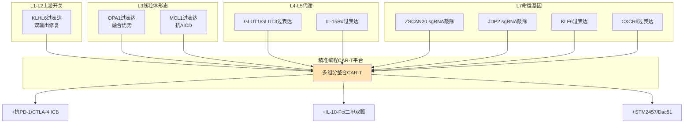

这一多组分CAR-T平台的核心价值在于**同时介入七层级整合通路的多个层级**——从上游开关KLHL6到下游命运基因ZSCAN20/JDP2/KLF6，从线粒体形态OPA1到生态位适配CXCR6——形成对慢性抗原刺激下命运分岔的多层级抗性。其临床转化的关键挑战是**多基因递送的技术瓶颈**——慢病毒载体的容量限制要求精细优化各组分的表达水平，而CRISPR-Cas9的多重sgRNA递送需要解决脱靶效应累加问题。基于P-5评估，**当前可行的简化版本是KLHL6过表达+ZSCAN20敲除+CXCR6过表达三组分整合**，作为概念验证的First-in-Human候选方案。

**TCR-T精准设计**。TCR-T作为针对特定肿瘤抗原的T细胞工程化策略，其精准设计需要结合TME特异性靶点NFAT5/CD36与HIV特异性菌群干预的差异化设计。在TME场景下，TCR-T工程化可叠加NFAT5 sgRNA敲除以阻断TME高渗透压驱动的耗竭程序——这一策略的核心优势是**NFAT5对慢性感染诱导耗竭无效的对称性阴性证据**意味着NFAT5敲除在HIV场景下不会产生预期效应，反向证实其作为TME严格特异靶点的合理性。

**肿瘤疫苗与代谢支持联合**。基于"高能DC+解除免疫刹车"原型[^39][^64]，肿瘤疫苗与代谢支持的联合方案可设计为**cDC1代谢工程化（OPA1/NRF1过表达）+ICB+ZSCAN20/JDP2敲除CAR-T**的多维联合：第一层级（cDC1代谢工程化）通过工程化高能DC增强肿瘤抗原呈递的初始信号；第二层级（ICB）解除T细胞抑制性受体压制；第三层级（精准编程CAR-T）提供命运定向编程的T细胞主力。这一三层级联合方案理论上可实现"激活+解除+定向"的完整免疫重编程。

**联合策略的时序设计、剂量配比与多目标优化原则**：

- **时序设计**：先代谢-表观遗传干预（释放初始压力）→ICB（功能性阻断升高的检查点）→精准编程CAR-T（命运定向重编程）的递进时序，避免同时给药可能的毒性累加；
- **剂量配比**：基于第7章敏感性分析输出的Sobol指数，按各组分的敏感性贡献调整剂量比例；
- **毒副作用累加风险**：AKT抑制剂的全身性效应、p300抑制剂的广泛乙酰化影响、TGF-β中和的双向作用等需要在联合方案中精细平衡；
- **多目标优化原则**：同时最大化命运逆转率、最小化治疗副作用、最大化跨场景适配性、最大化转化可行性。

## 8.8 HIV治愈策略与CD8+ T代谢-表观遗传增强的协同设计

基于第6章建立的HIV场景特异机制与跨场景共享靶点框架，本节系统设计HIV治愈策略与CD8+ T代谢-表观遗传增强的协同方案。

**shock-and-kill+CD8功能增强的"激活+增强+阻断"三重组合**。基于第6章已建立的天然产物HIV-1潜伏激活剂研究——**潜伏感染激活剂（LRA）主要包括组蛋白去乙酰化酶抑制剂（HDACi）、BRD（bromodomain）蛋白抑制剂、蛋白激酶C（PKC）激活剂、正性转录延伸因子b（p-TEFb）激活剂、DNA甲基化酶抑制剂（DNMTi）、细胞因子等；尽管已有少数几个明星分子进入临床试验，但临床结果并不理想，其原因可能是宿主的免疫响应不足和LRA的体内激活活性不足等；除此之外LRA普遍能够引起一些毒副作用，如过度激活CD4+T细胞而引起免疫紊乱等**[^57]——shock-and-kill策略的核心障碍正是CD8+ T细胞监视能力的不足，这正是本报告主线机制论证可解决的关键问题。

整合第4-7章建立的CD8+ T代谢-表观遗传命运逆转策略，shock-and-kill+CD8功能增强的协同方案可设计为：

第一层（"shock"激活）：HDACi（如丙戊酸VPA、伏立诺他SAHA、罗米地辛romidepsin、帕比司他panobinostat[^45]）+ PKC激动剂 + BRD4抑制剂 + DNMTi联合应用激活潜伏前病毒；

第二层（"strengthen"增强）：AKT抑制剂恢复FOXO1-KLHL6 + Mdivi-1阻断过度裂变 + α-KG补充恢复辅因子 + IL-10-Fc直接重建OXPHOS的多层级CD8+ T功能恢复；

第三层（"kill"阻断）：抗PD-1/CTLA-4 ICB功能性中和升高的检查点。

这一三重组合的核心创新是**将shock-and-kill的传统"激活+清除"二元框架升级为"激活+增强+阻断"三元框架**——通过显式的CD8+ T功能增强组分填补传统shock-and-kill的关键缺陷。基于第7章可证伪预测4，**预期"LRA激活+AKT抑制+Mdivi-1+ICB"四联策略的储存库减少率显著高于单独LRA（>3倍）**——这一预测的临床验证将为HIV治愈策略提供重要证据基础。

**block-and-lock+CD8监视维持的"减少压力+维持监视"稳态目标**。基于第6章已建立的block-and-lock策略——**今天HIV感染由于存在潜伏感染细胞库导致治疗中断后病毒反弹而无法治愈；因此潜伏库被认为是HIV治愈的主要障碍；通过shock-and-kill方法完全根除储存库的努力已被证明困难且不成功；近年来更多研究关注另一种block-and-lock功能性治愈策略；与shock-and-kill旨在根除整个储存库相反，block-and-lock旨在永久沉默所有前病毒，即使在治疗中断后；HIV沉默可通过靶向转录机制的不同因子实现**[^58]——其与CD8+ T代谢-表观遗传增强的协同设计具有不同于shock-and-kill的逻辑：

第一层（"block"沉默）：Tat抑制剂阻断HIV转录延伸 + EZH2抑制剂（**已上市药物包括Valemetostat、他则美司他和阿司咪唑；已进入临床II期或者I期的药物有SHR2554、CPI-1250、HH2853、tuhnimetostat和XNW5004等**[^62]）强化H3K27me3介导的潜伏沉默 + DNMTi强化CpG岛超甲基化；

第二层（"protect"监视）：维持CD8+ T于Tpex/Trm稳定吸引子的代谢-表观遗传支持，包括α-KG补充恢复辅因子、KLHL6维持上游安全阀、KLF6过表达促进Trm形成等；

第三层（功能性治愈监测）：建立基于CD8+ T功能完整性的功能性治愈终点，定义ART停药后稳定的病毒控制窗口期作为评估指标。

**EZH2抑制剂的双重应用维度**。**EZH2催化H3K27甲基化，导致H3K27me3和基因抑制；EZH2的突变/过表达与多种癌症相关，包括乳腺癌、前列腺癌、淋巴瘤和卵巢癌等；现今以EZH2/EZH1为靶点的抑制剂是不少癌症治疗的热门方向**[^62]。EZH2抑制剂在TME场景下作为抗肿瘤药物（通过阻断H3K27me3释放抑癌基因），但在HIV场景下却可能阻碍block-and-lock策略所需的潜伏沉默——这一**EZH2靶向的双向作用**与p300双向作用形成对偶，是表观遗传药物在不同临床场景下需要谨慎选择应用方向的典型案例。三阴性乳腺癌中**化疗耐药导致乳腺癌亚型中复发风险最高，耐药状态在很大程度上由非遗传特征决定，但其潜在机制尚不清楚；通过单细胞表观基因组、转录组和谱系的研究表明H3K27me3是初始化疗损伤时癌细胞进化的代表；H3K27me3作为其转录激活的锁；消耗细胞的H3K27me3增强肿瘤细胞耐受化疗的潜力；阻止化疗细胞H3K27me3去甲基化可抑制向耐药状态的转变，延缓肿瘤在体内的复发**[^62]——这一研究证据为EZH2/H3K27me3轴在TME场景下的复杂双向作用（既可促进肿瘤化疗耐药、又可作为化疗损伤后的命运决定锁）提供了深刻的机制洞察。

**CRISPR-Cas前病毒编辑+CD8功能保护**。基于第6章已述的**CRISPR-Cas基因编辑疗法等新兴技术的潜力**[^45]，CRISPR-Cas作为新兴HIV治愈技术的核心优势是直接靶向前病毒基因组进行精准切除或永久沉默。其与CD8+ T功能保护的协同设计可整合两个层面：第一，CRISPR-Cas精准切除整合的前病毒；第二，同步进行CD8+ T功能保护干预（KLHL6过表达+α-KG补充等），防止CRISPR-Cas编辑过程中可能的T细胞应激。

**菌群基础疗法+CD8代谢-表观遗传增强的HIV场景特异联用**：

- **益生菌+α-KG补充**：通过益生菌恢复SCFAs（丁酸/丙酸/乙酸）产生 + 外源α-KG补充直接重建CD8+ T的αKGDD家族活性；
- **粪菌移植+IL-10-Fc**：通过整体菌群移植重建肠道屏障 + IL-10-Fc直接恢复Tex_term的OXPHOS代谢；
- **靶向饮食（膳食纤维+发酵食品）+二甲双胍**：通过长期饮食改善菌群结构 + 二甲双胍激活AMPK重建代谢稳态；
- **菌群干预+ICB**：菌群代谢物输入恢复肠道CD8+ Trm功能 + ICB功能性中和PD-1。

**p300双向角色矛盾的解决策略**。p300在HIV潜伏感染细胞中作为潜伏逆转的关键执行者[^45]与在CD8+ T细胞中作为Kla writer驱动耗竭命运固化的双向角色，构成HIV场景下应用p300/CBP抑制剂的根本约束。基于P-5场景适配性原则，可设计如下解决策略：

第一，**细胞类型特异性递送**：通过抗体偶联递送（针对T细胞特异性表面标志如CD3/CD8）或工程化外泌体（携带T细胞特异性配体）实现p300/CBP抑制剂仅作用于T细胞而不影响HIV感染细胞；

第二，**时序错开**：在shock-and-kill方案中先给予LRA激活前病毒（依赖p300催化的乙酰化），待病毒蛋白被免疫监视识别后再给予p300/CBP抑制剂阻断T细胞内的Kla固化；

第三，**组合策略调整**：在block-and-lock方案中p300抑制反而有利于潜伏维持——因为p300抑制减少了潜伏逆转所需的乙酰化，与block-and-lock的永久沉默目标一致；这意味着**p300/CBP抑制剂在block-and-lock方案中具有双重有利作用**（强化前病毒沉默+逆转CD8+ T耗竭），是HIV场景下p300/CBP抑制剂的最佳应用方向。

HIV治愈策略协同设计的整合方案表：

| 治愈策略 | CD8+ T增强组分 | p300双向角色处理 | 临床终点定义 |
|---|---|---|---|
| shock-and-kill+CD8增强 | AKT抑制+Mdivi-1+α-KG+IL-10-Fc+ICB | 时序错开p300抑制 | 储存库减少+ART停药后病毒控制 |
| block-and-lock+CD8监视 | KLHL6维持+KLF6过表达+α-KG | p300抑制双重有利 | ART停药后稳定病毒控制 |
| CRISPR-Cas+CD8保护 | 同步KLHL6过表达 | 不直接相关 | 前病毒清除+T细胞功能维持 |
| 菌群干预+CD8增强 | 菌群代谢物+α-KG补充+ICB | 不直接相关 | 黏膜免疫恢复+病毒控制 |

## 8.9 跨场景适配性比较与干预策略优先级排序

基于P-5干预策略适配性评估原则与第7章敏感性分析输出，本节对所有候选干预策略进行TME与HIV/SIV场景的对称比较，输出综合优先级排序。

**跨场景共享高优先级靶点池**：

| 共享靶点 | 干预策略 | 跨场景机制基础 | 综合优先级 |
|---|---|---|---|
| KLHL6-FOXO1-TOX轴 | AKT抑制剂、KLHL6过表达[^65] | 主环路核心枢纽 | 1 |
| PGAM5-DRP1 | Mdivi-1[^63] | 线粒体形态执行节点 | 2 |
| α-KG/αKGDD家族 | α-KG补充（戊二酸二乙酯/S-2HG） | 化学保守性（同时调控m6A/DNA/组蛋白甲基化） | 3 |
| METTL3-YTHDF轴 | STM2457[^71][^72]、WD6305 | m6A机器执行核心 | 4 |
| p300催化Kla | CCS1477[^71][^72]、CBPD-268[^78] | Kla机器执行核心（HIV场景需双向处理） | 5 |
| ZSCAN20/JDP2/KLF6 | 精准编程CAR-T[^50] | 命运基因网络精准调控 | 6 |
| OXPHOS恢复 | IL-10-Fc[^69][^70]、二甲双胍 | 代谢补救通用机制 | 7 |
| 维生素C+TET2激活 | 维生素C | 跨场景安全性高 | 8 |

**TME严格特异靶点**：

| TME特异靶点 | 干预策略 | 阴性预测验证 |
|---|---|---|
| NFAT5抑制 | 小分子抑制剂 | 对慢性感染诱导耗竭无效（对称阴性） |
| Treg-MCT1代谢检查点 | MCT1抑制剂 | TME高乳酸特异 |
| TAM-CD36-FAO | CD36抑制[^45] | TME特异TAM代谢 |
| ATF4慢性激活 | ATF4抑制剂 | TME缺氧特异 |
| CAFs物理屏障 | MMPs抑制+反向Warburg阻断[^33] | TME特异基质 |
| H3K27me3化疗耐药锁 | EZH2抑制剂[^62] | TME特异，与TNBC化疗耐药相关 |

**HIV严格特异靶点**：

| HIV特异靶点 | 干预策略 | 场景独有性 |
|---|---|---|
| shock-and-kill LRAs | HDACi/PKC/BRD4i/DNMTi/天然产物LRA[^57][^45] | HIV潜伏储存库特异 |
| block-and-lock | Tat抑制+EZH2抑制[^62][^58] | HIV潜伏沉默特异 |
| 缺陷前病毒沉默 | 待开发 | HIV独有抗原源 |
| 菌群基础疗法 | 益生菌+益生元+粪菌移植+靶向饮食[^61] | HIV肠道储存库特异 |
| I型干扰素信号调控 | IFN受体调节 | HIV慢性炎症特异 |
| Tfh代谢支持 | 待研究（GAP-3.7） | HIV淋巴结生发中心特异 |

**双向适用但需场景化设计的靶点**：

| 双向靶点 | TME设计 | HIV设计 | 关键差异 |
|---|---|---|---|
| TGF-β中和 | 系统性免疫抑制阻断[^49][^48] | 黏膜组织选择性 | 应用部位 |
| CXCR6生态位 | DC3工程化+IL-15反式呈递 | 滤泡内CXCR5生态位调控[^59] | 趋化轴差异 |
| IL-10-Fc | 直接逆转Tex_term | 黏膜CD8+ T功能恢复 | 主要细胞群差异 |
| EZH2抑制剂 | 抗肿瘤释放抑癌基因[^62] | 阻碍block-and-lock沉默 | 应用方向相反 |
| HDAC抑制剂 | 抗肿瘤+TME重塑 | shock-and-kill激活LRA[^45] | 应用方向相反 |

**多目标决策框架**。整合本章六大维度评估与跨场景适配性比较，可建立四维多目标决策框架——命运逆转效应、跨场景适配性、转化可行性、毒副作用。基于这一四维评估，**前五位综合优先级最高的干预节点**：

1. **KLHL6过表达 + AKT抑制剂联合**（兼具高命运逆转效应、强跨场景适配性、中等转化可行性、低毒副作用）；
2. **METTL3抑制（STM2457/WD6305）+ ICB**（强协同直接证据、跨场景共享、高转化可行性、可控毒副作用）；
3. **α-KG补充（戊二酸二乙酯/S-2HG）+ ICB**（化学保守性强、安全性高、转化便利）；
4. **ZSCAN20/JDP2敲除精准编程CAR-T + ICB**（直接证据强[^50]、保护性TRM不损伤、CAR-T工程化成熟）；
5. **Mdivi-1 + IL-10-Fc + ICB**（机制清晰、命运可逆窗口高效、需T细胞特异递送）。

## 8.10 递送平台、生物标志物与临床转化路径

代谢-表观遗传命运分岔干预策略的临床转化最终依赖于五类关键问题的系统解决：递送平台、影像学生物标志物、伴随诊断、单细胞分辨率监测与安全性评估。

**递送平台**。代谢-表观遗传干预的递送策略需根据靶点细胞类型双向角色与药物分子特征精细选择：

- **脂质纳米颗粒（LNP）**：成熟度最高的核酸递送平台，适用于mRNA、siRNA、CRISPR-Cas9 RNP等核酸药物的T细胞内递送；
- **AAV病毒载体**：长期表达的基因递送平台，适用于KLF6过表达、KLHL6过表达等长期需求的基因疗法；
- **CRISPR-Cas递送**：通过电穿孔（离体）、AAV（在体）、LNP（mRNA形式）等多种平台实现；
- **抗体偶联递送**：通过CD3/CD8特异性抗体偶联实现T细胞选择性递送，关键应用于p300/CBP抑制剂等具有细胞类型双向角色的药物；
- **工程化外泌体**：通过工程化外泌体携带mRNA/siRNA/小分子药物实现细胞特异性递送。

**p300、METTL3等具有细胞类型双向角色的靶点对选择性递送的关键依赖**是临床转化的根本约束。例如，**CCS1477作为已进入临床II期的p300/CBP溴结构域抑制剂**[^71][^72]，其在TME场景下作为系统性药物的应用已具备临床可行性；但在HIV场景下需要T细胞特异性递送以避免影响潜伏逆转所需的p300活性。

**影像学生物标志物**。代谢-表观遗传命运分岔的非侵入性监测依赖于多模态影像生物标志物：

**18F-FDG PET反映T细胞糖酵解状态**——**18F-FDG PET通过反映组织对葡萄糖的摄取情况广泛用于肿瘤显像诊断和疗效评估；通过比较治疗前后病灶与血池的代谢变化系统评价疾病；但淋巴瘤异质性及18F-FDG PET/CT鉴别的局限性增加了医师的诊断难度，从而影响患者的临床治疗方案及预后**[^80]。**放疗后肿瘤局部的18F-FDG摄取短暂升高即所谓的"代谢闪烁（metabolic flare）"易与肿瘤进展相混淆，从而影响对放疗疗效的准确判断**[^39]。值得关注的是**ICAM-1作为T细胞激活的影像生物标志物的潜力——研究发现放疗可显著上调肿瘤组织中ICAM-1的表达，并伴随着T细胞向肿瘤组织的显著浸润增加；在宿主ICAM-1缺失的条件下，放疗后出现的18F-FDG PET代谢闪烁明显减弱，这一变化主要源于T细胞肿瘤浸润能力和葡萄糖摄取水平的显著下降，而髓系细胞的代谢特征基本不受影响；放疗诱导上调的ICAM-1通过与其受体淋巴细胞功能相关抗原-1（LFA-1）相互作用，促进T细胞在肿瘤局部形成稳定团簇并增强浸润能力；同时该过程激活PI3K-AKT-mTOR信号通路，驱动T细胞发生代谢重编程，增强糖酵解及三羧酸循环活性，最终导致肿瘤局部18F-FDG摄取升高，从而在PET显像中表现为"代谢闪烁"；ICAM-1具有作为动态监测抗肿瘤免疫反应的影像生物标志物的潜力，未来若能开发靶向ICAM-1的临床PET显像探针，并与传统18F-FDG成像联合应用，有望构建多参数PET显像策略，从而在临床上区分放疗后的"代谢闪烁"与肿瘤真实进展，实现无创、精准的放疗疗效评估**[^39]。这一发现的核心价值是首次从免疫代谢的角度系统阐明了ICAM-1与放疗后18F-FDG PET"代谢闪烁"之间的联系。

**超极化13C-丙酮酸/乳酸MRSI实时监测代谢通量**——**前列腺癌xenograft研究中，DU145与PC3两个人前列腺癌细胞系xenograft经静脉给予超极化[1-13C]丙酮酸后通过MRSI测量丙酮酸到乳酸的转化；DU145肿瘤显示丙酮酸到乳酸的转化增强，与质谱测量的稳态乳酸水平相关；电子顺磁共振（EPR）成像揭示肿瘤灌注与氧合状态；FX-11抑制乳酸脱氢酶（LDH）后肿瘤生长被评估**[^68]。**无持续自由基的体内实时代谢成像技术展示了通过解离动态核极化制备的超极化底物作为癌症或心力衰竭诊断及治疗监测的MRI造影剂——使用潜在毒性持续性自由基进行底物超极化先前是必需的；研究展示了无任何自由基或共自由基进行底物超极化与体内代谢转化检测，包含使用葡萄糖类似物2-去氧葡萄糖与丙酮酸**[^68]。**11C-acetate作为前列腺癌成像潜力代谢标志物——前列腺正常细胞经历恶性转化失去其柠檬酸生产能力——这一改变导致乙酸更新增加；33名前列腺癌患者的研究证实CT/PET对19例局部复发与转移病灶呈阳性，与PSA值相关**[^73]。这一证据为基于代谢通量的命运分岔评估提供了多核MR波谱学工具基础。

**Stimulated Raman Scattering（SRS）作为新兴生物医学光谱学技术**——**SRS定义为非耗散过程，能量在泵浦光与Stokes光频率匹配某一振动跃迁时被传递至分子激发其至振动激发态；SRS的特征是能够移除非共振背景，且与分析物浓度呈线性关系，便于直接定量；当样品被极强激光脉冲照射时，可观察到Raman信号中的非线性现象——脉冲激光与连续波激光相比电场约为10⁹ V cm⁻¹与10⁴ V cm⁻¹之比，将更大部分入射光转化为有用的Raman散射，显著改善信噪比**[^74]。SRS技术为细胞代谢与表观遗传修饰的高分辨率非标记成像提供了新工具，未来可应用于T细胞内代谢辅因子（αKG、SAM、乳酰-CoA）的活体动态监测。

**伴随诊断**。基于第1、5章已建立的临床决策标志物：

- **IntEX比例≥11.8%作为ICB响应预测**——黑色素瘤新辅助nivolumab临床试验直接证据；
- **CD103+CD8+ TIL高浸润预后标志**——**具有CD103+CD8+细胞高浸润的肿瘤患者iPFS显著增加，中位iPFS达到30个月（95% CI 2.73 -未达到）**[^47]；
- **TME中CTL评分与FTO负相关**——研究人员分析TCGA数据库的黑色素瘤（SKCM）数据，利用五个基因（CD8A, CD8B, GZMA, GZMB, and PRF1）定义了cytotoxic T lymphocyte (CTL) score，反映肿瘤浸润CD8+ T细胞的功能；在表观转录组调控因子中，RNA去甲基化酶FTO与CTL score呈现负相关[^80]——这一证据为FTO作为免疫治疗反应预测的生物标志物提供了基础。

**单细胞分辨率监测**。**CITE-seq、空间多组学引导的命运坐标系实时定位**作为新兴技术，可在临床样本（活检、外周血单核细胞）中精确定位CD8+ T细胞在第1章建立的命运坐标系中的位置（Tpex/IntEX/Tex_term/经典Trm/TR-TEX等吸引子或鞍点区域），为干预策略的精准选择提供分子水平依据。

**安全性评估**：

- **脱靶效应**：DRP1对生理性裂变的影响（Mdivi-1脱靶风险）、p300对正常乙酰化的广泛影响（CCS1477脱靶风险）、AKT抑制剂的全身性效应等需要在临床试验中精细评估剂量-毒性窗口；
- **自身免疫风险**：通过KLHL6过表达、ZSCAN20/JDP2敲除等增强T细胞功能的策略可能产生超出靶向肿瘤的自身免疫副作用，需要密切监测；
- **剂量-毒性窗口**：联合治疗的剂量优化需基于Sobol敏感性指数与临床前毒理学数据综合判断。

**临床试验设计原则**。从临床前模型到First-in-Human试验的递进式临床路径：

第一阶段（单药验证）：在临床I期试验中验证单一干预（如STM2457、CCS1477、AKT抑制剂）的安全性、药代动力学与初步效力；

第二阶段（双联策略）：在临床I/II期试验中验证关键双联组合（如STM2457+抗PD-1、CCS1477+抗PD-1）的协同效应；

第三阶段（三联/四联策略）：在临床II/III期试验中验证基于第7章可证伪预测的多靶点联合策略（如AKT抑制+METTL3抑制+ICB）；

主要终点设计：肿瘤场景以PFS/OS/客观缓解率（ORR）为主，HIV场景以储存库清除率/ART停药后病毒控制窗口期为主；

机制终点设计：基于第7章建立的命运坐标系，通过单细胞分辨率监测验证细胞状态命运重编程——预期Tex_term比例减少、IntEX比例增加（命运可逆窗口扩大）、CD103+ TR-TEX比例增加（保护性命运分支增强）。

**从临床前模型到First-in-Human试验的关键转化障碍**：

第一，**T细胞特异性递送平台的成熟度**——多个核心干预策略依赖于T细胞选择性递送，当前抗体偶联递送、工程化外泌体等技术仍需完善；

第二，**多基因CAR-T工程化的容量限制**——慢病毒载体的容量限制要求精细优化各组分的表达水平；

第三，**联合治疗的临床试验复杂度**——多药联合策略需要更复杂的临床试验设计与监管路径；

第四，**HIV场景下功能性治愈终点的标准化**——ART停药后病毒控制窗口期的具体定义与监测策略需要国际共识；

第五，**单细胞分辨率监测在临床实践中的可及性**——CITE-seq、空间多组学等技术的临床转化需要标准化与成本降低。

综合本章十节内容，慢性抗原刺激下CD8+ T细胞命运分岔的代谢-表观遗传干预策略呈现出"六大维度+联用矩阵+跨场景适配+临床转化路

# 9 研究挑战、伦理考量与未来方向

作为整篇报告的收尾章节，本章承担三重任务：第一，系统归纳前八章在机制论证、定量建模与干预策略评估过程中识别的核心挑战与方法学局限，将散落于各章的研究缺口（GAP-3.1至GAP-6.7、GAP-4.1至GAP-4.5）整合为统一的"系统性问题清单"；第二，基于P-3证据层级与P-4参数可溯源性原则，对当前研究的技术瓶颈、方法学边界与伦理约束进行严格的方法论反思，避免在收尾环节对已建立的机制论证产生过度推断；第三，基于这一反思与可定位的前沿技术线索，展望本领域未来研究的优先路径与跨疾病转化框架。本章遵循"技术挑战识别—方法学局限剖析—伦理边界界定—未来方向规划—跨疾病框架展望"的递进逻辑，最终将慢性抗原刺激下CD8+ T细胞命运分岔机制研究定位为一个**开放的、可演进的、可与实验持续互动的研究议程**——这一定位既是对前八章建立的机制框架的方法论诚信延续，也是对本领域未来十年发展路径的清晰指引。需要在章首再次强调的是，本章不试图为已识别的研究缺口提供"标准答案"，而是通过明确缺口性质、依赖路径与优先级排序，为基础研究者、临床转化团队与跨学科合作提供清晰的工作起点。

## 9.1 人源样本可及性与组织特异性Trm在体研究的核心挑战

慢性抗原刺激下CD8+ T细胞命运分岔机制研究的首要挑战来自人源样本可及性与组织特异性Trm在体研究的根本性瓶颈。这一瓶颈并非单纯的技术问题，而是源于**Trm非循环驻留特征与临床伦理可行性之间的本质张力**——本报告主线机制论证的核心命运分支Trm/TR-TEX无法通过外周血常规取样获取，必须依赖组织活检或手术切除标本，而这一获取路径在多数慢性疾病场景下面临严格的伦理与可行性约束。

**TME场景下肿瘤组织活检的有限性**。第5章已建立CD103+ TIL作为肿瘤Trm的预后与ICB响应标志物，**具有CD103+CD8+细胞高浸润的肿瘤患者iPFS显著增加，中位iPFS达到30个月**；同时**TR-TEX作为PD-1/PD-L1治疗中可被有效再激活并介导疗效的关键群体**也具有显著的临床价值。然而，CD103+ TIL与TR-TEX等关键命运分岔群体的精细分子特征获取依赖于手术切除标本或较大体积的活检组织，这一样本来源具有几个根本性局限：第一，**时间动态追踪困难**——手术切除为单一时间点取样，无法直接观察ICB治疗、代谢-表观遗传干预等扰动后CD8+ T细胞命运在数天至数周尺度上的动态演化；第二，**亚群分辨能力受限**——经典样本制备过程中CD8+ T细胞各亚群的相对比例可能因消化酶处理、冷冻保存等步骤产生选择性丢失，特别是脆弱的Tex_term亚群与紧密黏附于上皮的CD103+ TIL亚群在制备过程中的回收效率差异可能导致系统性偏差；第三，**患者异质性**——患者基础疾病、既往治疗史、肿瘤分期、肿瘤分型等因素均影响TIL组成与状态，即使在严格分层的临床队列中，机制研究的信噪比仍受到稀释。

**HIV/SIV场景下淋巴结与黏膜组织的极低活检可及性**。第6章已建立HIV淋巴结生发中心、肠道GALT、生殖道黏膜作为关键组织生态位的核心地位——这些部位是病毒持续复制、储存库维持与CD8+ T细胞命运分岔的主要场所。然而，相比TME场景下肿瘤切除标本的相对可及，HIV场景下的关键组织活检面临严重的临床可行性挑战：淋巴结活检需要侵入性操作，常规临床实践中并不进行；肠道活检（特别是乙状结肠黏膜活检）虽在专门研究方案中可实施，但样本量有限、深度采样困难；生殖道黏膜活检涉及显著的伦理敏感性与操作复杂度。**研究通过53个肽池覆盖所有病毒蛋白的酶联免疫斑点分析对未接受ART的感染者外周血与乙状结肠黏膜中HIV-1特异性CD8+ T细胞进行平行比较**[^60]，这一类研究虽建立了血液与黏膜免疫平行响应的关键证据，但其样本规模与亚群分辨能力相比TME场景仍显著受限。

更为关键的是，第3、6章识别的研究缺口GAP-3.7（HIV/SIV淋巴结滤泡内乳酸浓度梯度与CD8+ T细胞乳酸暴露）的填补需要在淋巴结组织内对滤泡区、滤泡间区、T细胞区等微解剖结构进行空间分辨的代谢测量——这一技术要求与临床伦理可行性之间的张力构成了HIV场景机制研究最根本的瓶颈之一。Tfh区室代谢应激对周围CD8+ T细胞的间接影响（GAP-6.1相关），同样需要在保留组织空间结构的条件下进行测量，常规外周血样本完全无法回答。

**Trm/TR-TEX的非循环驻留特征构成的根本约束**。组织驻留记忆T细胞的核心特征是**长期或永久驻留于非淋巴组织（皮肤、生殖道、肠道）中**[^40]，依赖CD69与S1PR1的拮抗维持驻留，依赖CD103与E-cadherin的相互作用锚定于上皮组织。这一非循环特征使Trm/TR-TEX无法通过外周血监测，而在临床实践中外周血是最易获取的样本来源——这一根本约束意味着即使发展出最精细的单细胞分辨率监测技术（详见9.2节），其在外周血样本中获取的信息对Trm/TR-TEX命运分岔的直接相关性仍然有限。**Nature子刊关于组织驻留记忆CD8+T细胞重塑肝脏免疫弹性的综述系统揭示了CD8+ TRM在肝脏免疫弹性中的核心机制与应用前景**[^40]，这一综述的研究方法学依赖于"采集人类及小鼠肝脏样本，研究者实现了对TRM细胞在不同疾病阶段、不同肝脏区域的精准定位和动态追踪"——明确依赖肝脏组织而非外周血。

**人源样本与小鼠模型的种属差异警示**。本报告大量证据来自LCMV慢性感染模型、SIV感染恒河猴模型与小鼠肿瘤模型，这些模型作为CD8+ T细胞耗竭与命运分岔研究的经典工具具有不可替代的价值。然而第4-6章已显式识别的种属差异警示需要在样本可及性讨论中再次强调：**TME场景下ATF4慢性激活的强烈程度与LCMV慢性感染中的适度诱导形成对照、NFAT5对慢性感染诱导耗竭无效与对TME诱导耗竭的核心驱动作用形成对照**——这两类直接证据警示从动物模型向人类疾病的简单外推存在显著风险。在HIV场景下，SIV恒河猴模型为机制研究提供了关键工具——**Mirko Paiardini团队在SIV感染恒河猴模型中证实淋巴结CD8+ T细胞TOX表达随感染时间延长显著增加，TCF1+CD39+的干性效应混合态在SIV晚期感染中比例从健康未感染恒河猴的6%升至40%**——但其与人类HIV感染的种属差异（病毒受体、细胞因子网络、菌群组成、免疫遗传学）使得任何机制结论从SIV模型外推至人类HIV场景均需谨慎评估。

**患者队列异质性对机制研究信噪比的稀释**。即使在能够获取人源样本的研究场景中，患者队列异质性构成机制研究的另一关键挑战。HLA分型差异决定HIV特异性CD8+ T细胞的抗原识别谱，菌群组成差异（特别是HIV场景下的肠道菌群移位程度）影响远端代谢-表观遗传调控的强度，既往ART方案、ICB治疗史、化疗暴露等治疗史因素均对T细胞当前状态产生累积影响。**血液恶性肿瘤患者多次复发并演变为难治性白血病的频率达70%左右**[^71]，这一多线治疗失败患者群体的T细胞状态与初治患者的差异显著，但这些差异在机制研究中往往因样本量限制而无法精细分层。**白血病移植后队列研究通过单细胞分析揭示与延长存活期相关的细胞毒性与记忆CD8+ T细胞**[^63]——这一类大规模单细胞研究虽提供了重要洞察，但其建立机制因果链的能力受样本异质性的根本性制约。

**填补人源样本瓶颈的可行突破路径**。基于上述挑战归纳，可识别如下突破路径：

第一，**多中心生物样本库建设**——通过国际合作建立标准化的TME活检样本库、HIV淋巴结/肠道/生殖道活检样本库与对应的临床表型数据库，整合多中心队列以提升机制研究的统计效力与亚群分辨能力。这一路径需要解决样本采集标准化、跨中心质控、数据共享伦理审查、知识产权分配等系统性问题。

第二，**组织微取样技术的发展**——通过细针穿刺、内镜活检、空间精细取样等技术在维持临床可行性的同时增加取样频次与空间分辨率，特别适用于HIV场景下的淋巴结与肠道生态位采样。

第三，**人源化小鼠模型优化**——通过移植人源造血干细胞、人源胸腺上皮、人源HLA表达等多重工程化建立更接近人类免疫系统的小鼠模型，部分弥补种属差异。

第四，**液体活检与外周血替代标志物的开发**——通过外周血单细胞分辨率监测+循环肿瘤DNA+循环外泌体miRNA等多模态标志物建立Trm/TR-TEX状态的间接替代评估，虽无法完全替代组织活检，但可作为动态追踪的补充工具。

第五，**临床知情同意框架的伦理审查优化**——在HIV治愈研究等高风险高潜在收益场景下，建立专门的伦理审查机制以平衡研究价值与患者风险，特别是ART停药相关的功能性治愈试验设计中样本采集的伦理边界界定。

这些突破路径的有效落实需要研究者、临床医生、伦理委员会、患者代表与监管机构的多方协作，是本领域未来十年研究基础设施建设的核心任务之一。

## 9.2 单细胞分辨率代谢-表观遗传共测量技术的方法学瓶颈

人源样本可及性的解决并不能直接转化为机制研究的精细推进——即使获取了关键组织样本，**当前单细胞分辨率下代谢组、m6A位点级图谱、组蛋白乳酸化图谱与转录组的同步共测量技术尚未成熟**这一根本性方法学瓶颈，仍然限制着前八章识别的核心研究缺口的填补。本节系统剖析这一瓶颈的具体内容并归纳突破路径。

**GLORI与m6A-label-seq向单细胞分辨率扩展的双重挑战**。北京大学伊成器团队开发的GLORI技术作为m6A单碱基定量金标准，其"通过乙二醛和亚硝酸盐催化A-I高效转化"实现m6A修饰位点特异性识别，"高特异性、高检测率、无偏好性、高灵敏度"四大优势为m6A位点级动力学建模提供了关键工具基础。同样，浙江大学刘建钊团队的m6A-label-seq通过allyl-SAM代谢标记实现单碱基分辨率测定，"细胞内S-腺苷甲硫氨酸（SAM）是甲基转移酶的辅助因子，通过引入带有烯丙基修饰的甲硫氨酸"实现代谢标记的m6A位点定位。然而，这两项金标准技术当前均为bulk层面应用——其向单细胞分辨率扩展面临**灵敏度与通量的双重挑战**：第一，单细胞水平的mRNA量级（皮克至飞克）显著低于bulk样本，化学转化或代谢标记反应的效率与信噪比难以保证；第二，单细胞测序通量与m6A位点检测深度的平衡需要新的实验设计，可能需要靶向位点检测策略而非全转录组扫描。

这一技术瓶颈直接影响第3、4章识别的极高优先级研究缺口的填补：GAP-3.2（Tox/Tcf7/Tbx21/Runx3/Hobit的m6A位点图谱）与GAP-3.10（双轨调控化学计量平衡）均需要单细胞分辨率的m6A位点级数据，特别是在Tpex/IntEX/Tex_term/Trm/TR-TEX各亚群间的差异化沉积量化——这一精细分辨能力是当前GLORI与m6A-label-seq无法直接提供的。

**单细胞代谢组学的输入通量限制**。第7章已基于Cell Metabolism单细胞代谢组学综述系统刻画了这一新兴领域的当前局限：**对免疫细胞群的分析受限于bulk方法的局限**[^81]，"基于MS的方法需要较高的输入通量（一般为10万个细胞）"。靶向代谢物（αKG、SAM/SAH、乳酰-CoA）的单细胞动态量化仍属技术前沿——而这些辅因子正是第2、3、4章建立的代谢-表观遗传偶联模型的核心化学计量参数。具体到关键技术路径，综述指出**Seahorse细胞外通量分析仪**[^81]"通过动态记录细胞外酸化率（ECAR）和耗氧率（OCR）可提供糖酵解和线粒体呼吸相关的核心数据"，但其分辨率局限于96孔板水平的群体平均值；**稳态代谢组学**[^81]"在特定时间点，通过LC-MS或GC-MS可测量一系列代谢物的稳态浓度"，但其输入通量需求限制了单细胞应用；**通量组学**[^81]"通过靶向质谱在连续时间点对底物和同位素13C或15N测量，可明确代谢通量和代谢途径动力学"，是连接FBA建模与实验测量的最直接工具，但其单细胞分辨率扩展同样受限；**单细胞分辨率空间测量**[^81]"把单细胞技术与基质辅助激光解吸电离（MALDI）-质谱成像和二次离子质谱（SIMS）相结合，有助于探索体内组织微环境中单细胞的免疫代谢过程"——这一空间代谢成像方向是未来突破的重要路径，但其敏感性与分子覆盖范围仍待提升。

GAP-3.1（T细胞特异性SAM/SAH动态）作为本报告整合通路中证据最薄弱的接口（详见第4章），其填补根本依赖于单细胞代谢组学的成熟。在当前技术约束下，研究者只能通过bulk样本SAM/SAH定量结合scRNA-seq亚群分辨进行间接推断，承担相应的不确定度。

**KL-la异构体特异性ChIP-seq在T细胞场景的规模化应用滞后**。第3章已建立北京大学与芝加哥大学等多所高校2025年1月联合发表于*Nature Chemical Biology*的化学异构体研究的关键意义——**赖氨酸L-乳酸化（KL-la）作为糖酵解动态调控的主要乳酸化异构体，与KD-la和Kce具有显著区别**，并已开发"化学衍生结合HPLC-MS/MS分析与异构体特异性抗体两种正交技术（抗体与其他异构体的交叉反应性低于1/50）"。这一异构体特异性抗体的开发为Kla位点级研究提供了关键工具基础，但其在T细胞特别是Tpex/Tex_term/Trm各亚群上的规模化ChIP-seq应用仍处于起步阶段。GAP-3.3（命运基因座如Tox/Tcf7/Tbx21/Runx3/Hobit/Itgae启动子的H3K18la占有率）作为极高优先级研究缺口，其填补依赖于：第一，异构体特异性抗体的标准化与规模化生产；第二，T细胞特异性ChIP-seq方案的优化（特别是低输入量样本的染色质制备与文库构建）；第三，跨亚群差异化沉积的统计学比较框架。

**writer-reader-eraser三组分动态平衡的实时追踪缺乏适用工具**。m6A机器（METTL3/14、FTO、ALKBH5、YTHDF1/2/3、IGF2BPs）与Kla机器（p300、GTPSCS、AARS1、HDAC1-3、SIRT2、BRD9）涉及多组分的动态相互作用，其实时追踪需要在活细胞中同时监测多个蛋白的浓度、修饰状态、亚细胞定位与靶基因结合——这一多维度同步监测的技术工具当前尚不成熟。荧光蛋白标记+活细胞成像可提供蛋白定位的动态信息但难以直接反映催化活性，BRET/FRET生物传感器可提供蛋白-蛋白相互作用的实时信号但通量受限，新一代的可拷贝标记+原位质谱成像技术正在发展但临床样本应用仍属前沿。

**线粒体形态-功能的活细胞动态成像与表观图谱的跨模态对齐**。第2、4章建立的命运分岔机制核心特征之一是线粒体形态-功能与表观图谱的耦合演化——融合优势-高膜电位状态对应Tpex/Trm/TTSM稳定吸引子，过度裂变-膜电位塌陷状态对应Tex_term稳定吸引子。当前线粒体形态学的活细胞动态成像（基于MitoTracker、TMRM等荧光探针）与表观图谱测量（ChIP-seq、MeRIP-seq）属于完全不同的技术模态，前者在活细胞中实施而后者必须通过细胞固定/裂解，这一**跨模态对齐困难**意味着当前研究只能通过群体平均的相关性分析推断线粒体形态-表观图谱的耦合关系，而无法直接观察单细胞层面的因果动态演化。GAP-6.1（HIV/SIV感染下不同耗竭亚群的差异化线粒体特征量化）的填补特别依赖于这一跨模态对齐能力。

**新兴技术路径与Stimulated Raman Scattering（SRS）的潜力**。第8章已述SRS作为新兴生物医学光谱学技术的潜力——**SRS定义为非耗散过程，能量在泵浦光与Stokes光频率匹配某一振动跃迁时被传递至分子激发其至振动激发态**[^74]，"SRS的特征是能够移除非共振背景，且与分析物浓度呈线性关系，便于直接定量"。SRS技术为细胞代谢与表观遗传修饰的高分辨率非标记成像提供了新工具，未来可应用于T细胞内代谢辅因子（αKG、SAM、乳酰-CoA）的活体动态监测。其相对于荧光探针的优势在于无需外源标记直接探测分子振动，相对于质谱方法的优势在于可在活细胞中实时成像——这两类优势的结合使SRS成为未来代谢-表观遗传共测量的关键候选技术。然而SRS当前的局限包括：化学特异性受限于振动指纹的唯一性、低浓度代谢物的检测灵敏度仍待提升、与表观遗传测量的跨模态整合工具尚未建立。

**整合性突破路径**。基于上述挑战归纳，可识别如下整合性技术路径：

第一，**单细胞分辨率多组学共测量平台的开发**——整合GLORI/m6A-label-seq单碱基m6A定量、KL-la异构体特异性ChIP-seq、单细胞靶向代谢组、CITE-seq蛋白-RNA共测量、scATAC-seq染色质可及性测量于统一工作流，实现同一细胞的多模态信息获取。这一平台的技术成熟将根本性地推进GAP-3.1、GAP-3.2、GAP-3.3、GAP-3.10等核心研究缺口的填补。

第二，**空间多组学技术的应用**——通过Visium、MERFISH等空间转录组结合空间蛋白组、空间代谢组实现TME中DC3生态位、HIV淋巴结生发中心、肠道GALT等关键生态位的细胞-细胞距离与微环境梯度精确测量，特别填补GAP-3.7（滤泡内代谢梯度）与GAP-6.1（HIV场景亚群分辨）等空间维度缺口。

第三，**活细胞动态-固定细胞表观的跨模态对齐方法**——通过工程化荧光标记的可固定化、空间条形码追踪、活细胞→固定细胞的时间序列采样等方法建立活细胞动态与固定细胞表观图谱的精细对齐工具。

第四，**新一代化学探针与可固定化报告基因的开发**——通过化学探针实现对αKG、SAM、乳酰-CoA等核心代谢辅因子的活细胞实时定量，通过可固定化报告基因实现对表观遗传修饰动态的回溯性追踪。

需要在本节坦诚指出的是，**这些技术突破的成熟周期可能跨越未来5-10年**，本报告建立的机制论证与定量建模框架在这一周期内将不断接受新数据的检验与修正。第7章定量建模框架的核心定位为"系统性问题清单"而非"标准答案"，正是基于对这一技术成熟时间尺度的清醒认知——本框架的最大价值在于为新数据提供清晰的预测假设与可证伪边界，使技术突破与机制理解形成持续的相互推进。

## 9.3 定量模型参数不确定性、跨场景外推边界与方法学反思

第7章已建立多尺度耦合定量建模框架并在7.9节对其局限性进行系统反思。本节回收这一反思并基于P-3证据层级与P-4参数可溯源性原则，进一步对参数不确定性传播、跨场景外推边界与建模假设的可证伪性进行整合性方法学反思，明确本框架的开放演进性质。

**多尺度耦合模型的层级间接口参数稀缺性**。第7章建立的三层建模架构（ODE/FBA—质量作用动力学—布尔/贝叶斯网络）通过明确的接口变量与时间常数等级实现跨层衔接。然而这一架构的核心方法学依赖是层级间转换效率、时间常数等级、快慢变量分离阈值等关键参数的T细胞特异性测量——而这些参数在多个关键节点上仍依赖跨细胞类型外推。具体而言：第一，**KLHL6介导TOX多聚泛素化的反应速率常数**在李贵登团队工作中已建立定性证据，但定量动力学常数仍需T细胞特异性体外重建实验直接测量；第二，**PGAM5对DRP1 S637的去磷酸化速率常数**在肝I/R损伤模型中已有间接证据，但其在T细胞场景的精确动力学常数尚未直接确定；第三，**p300催化Kla的T细胞特异性Km/kcat**虽可参考GTPSCS对乳酸的Km = 15.32 ± 1.28 mM作为参数估计起点，但p300在T细胞核内的实际催化效率受核内乳酰-CoA浓度、p300与GTPSCS的相互作用、染色质结构等多重因素调控，需要直接测量。

CHO细胞代谢动力学建模研究为这一类参数估计提供了重要的方法学借鉴——**该研究使用速率表达式基于胞外代谢物浓度与温度/氧化还原依赖的调控变量，仿真使用速率表达式在离散时间点计算准稳态通量分布与胞外代谢物浓度**[^69]，**"实验数据收集自不同的CHO细胞补料分批培养用于推导速率表达式、拟合参数与验证模型"**[^69]。这一动力学速率表达式建模的成功展示了在数据相对充分的工业细胞系统中ODE建模的可行性，但其向T细胞特别是慢性抗原刺激下耗竭T细胞的外推面临数据稀缺的根本性约束。

**HIV/SIV场景下KLHL6—PGAM5-DRP1主环路的直接动力学测量缺失**构成跨场景预测的最大不确定来源。GAP-4.1（HIV/SIV场景下PI3K-AKT—FOXO1—KLHL6轴的直接验证）与GAP-4.4（KLHL6—PGAM5-DRP1轴在HIV场景的可外推性）作为第6章已识别的极高优先级研究缺口，其填补对HIV场景下命运分岔机制的完整理解具有决定性意义。当前模型在HIV场景下的预测主要基于主环路核心结构的理论保守性（TCR—PI3K-AKT—FOXO1—KLHL6—TOX轴具有跨细胞类型保守性），但具体动力学参数（FOXO1磷酸化时间常数、KLHL6半衰期、TOX蓄积阈值等）可能与TME场景显著不同。第6章已基于HIV场景的低水平抗原+持续数十年的累积模式与TME场景的高强度抗原+数月-数年的急骤模式的差异，提出HIV场景下命运固化的"慢热型"轨迹与TME的"急骤型"轨迹的时间动力学差异——这一差异的精确量化需要HIV场景特异的实验测量。

**布尔/贝叶斯网络的离散化简化损失了过渡态的连续动力学细节**。第7章第三层建模使用布尔/贝叶斯网络对命运基因调控网络建模，这一离散化处理虽然有效枚举了Tpex/IntEX/Tex_term/经典Trm/TR-TEX/TTSM等命运状态的吸引子结构，但损失了过渡态的连续动力学细节。具体而言：

第一，**TR-TEX作为驻留化耗竭群体在表型上模仿Trm但发育来源接近耗竭谱系**——这种"中间状态"在布尔网络中需要通过额外的吸引子来近似，可能损失其连续过渡的动力学细节；

第二，**TOX在不同细胞背景下功能反转的上下文依赖性难以完整刻画**——TOX在Tex_term中锁定耗竭程序，但在SIV特异性TCF1+CD39+亚群中赋予滤泡定居与病毒控制能力。这种上下文依赖的功能反转在布尔网络中需要通过状态依赖的边权或多个TF节点的组合状态来近似，无法直接表达TOX分子功能的连续性变化；

第三，**SIV晚期感染中TCF1+CD39+干性效应混合态比例从健康未感染恒河猴的6%升至40%**这一明确的定量过渡过程，在布尔网络中只能通过吸引盆相对大小的变化间接刻画，缺乏对过渡过程速率与机制的精细描述。

贝叶斯网络的概率化推断部分缓解这一问题——通过整合Nature 2025转录因子图谱研究的309个TF与9种状态数据进行边权后验推断，可以处理边的不确定性与状态依赖的协同/拮抗关系。然而贝叶斯网络仍然主要刻画稳态分布与状态间转换概率，对快速瞬态动力学（如分钟级的信号转导）的刻画能力有限。

**ODE模型对空间异质性的均匀混合简化**。第7章ODE子模型主要为良好混合的化学动力学模型，简化了多个层面的空间异质性。具体而言：第一，**TME中DC3生态位的离散聚集分布**——CCR7+ DC3亚群在肿瘤血管周围形成富含CXCL16与IL-15的离散生态位，CXCR6+效应T细胞被特异招募至此并接受IL-15反式呈递（详见第1、5章）。这一空间结构在ODE模型中被处理为均匀混合的有效浓度，损失了局部高浓度梯度信息；第二，**HIV淋巴结生发中心的暗区/亮区/T-B边界结构**——这些精细微解剖区室的代谢梯度差异（GAP-3.7）在ODE模型中通过等效浓度近似，可能错过场景特异的空间机制；第三，**肠道GALT的微解剖区室**——绒毛、隐窝、淋巴滤泡、固有层等不同区域的代谢-免疫互作模式差异在均匀混合模型中无法充分刻画。

部分这些局限可通过反应-扩散方程或基于agent的模型（ABM）部分缓解，但代价是计算复杂度的显著增加。第7章已显式声明本框架在初版实现中优先保证整体拓扑的完整性，空间异质性的精细建模列为未来扩展方向。

**Sobol指数与Morris方法的参数先验依赖性**。第7章基于全局敏感性分析输出的关键控制节点优先级排序在不同模型参数化下可能发生重排——这一**先验依赖性**是任何基于参数采样的敏感性分析的固有局限。具体而言，Sobol指数与Morris方法的输出依赖于参数先验分布的合理性——若先验分布过宽，敏感性指数可能被低估或受到非生物相关参数空间的稀释；若先验分布过窄（如基于跨细胞类型外推强加约束），敏感性指数可能反映先验假设而非真实生物学。第7章建立的分层贝叶斯参数估计流程通过将参数按数据库条目/具名实验文献/T细胞特异性数据/外推假设/研究缺口五档分级，部分缓解这一问题——但缺口处的待估参数仍然承担显著的不确定度，需要敏感性分析的重复验证。

**P-4参数可溯源性原则的核心地位与方法论诚信**。本报告的方法论诚信根本上依赖于P-4参数可溯源性原则的严格执行——所有参数必须按数据库条目（如BRENDA、SABIO-RK的酶动力学常数）/具名实验文献（如李贵登团队Nature论文、Mirko Paiardini团队SIV研究）/T细胞特异性数据/跨细胞类型外推/研究缺口五档显式分级，对每一来源等级在文中明确标注。这一原则的严格执行避免了模型预测被误读为"精确量化结论"——对敏感性最高的研究缺口列为优先实验验证目标，对其他参数则通过不确定度传播分析评估其对模型预测的影响幅度。

**本框架的核心定位再确认**。综合本节反思，第7章建立的定量建模框架的核心定位再次确认为**"系统性问题清单"而非"标准答案"**。本框架的最大贡献并非提供精确的预测数值，而是建立一个**可演进、可证伪、可与实验持续互动的机制理解框架**：

- **可演进**：随着9.2节讨论的单细胞分辨率多组学共测量技术的成熟、新数据的积累，模型参数与拓扑结构可不断更新；
- **可证伪**：通过显式的可证伪预测输出（如第7章8节的8个关键预测）为实验验证提供具体目标，预测与实验数据的不一致将驱动模型修正；
- **可与实验持续互动**：通过研究缺口的优先级排序为实验设计提供清晰指引，实验数据反过来填补模型缺口形成闭环；
- **方法论诚信优先于预测精度**：在数据稀缺的研究节点上，明确标注研究缺口而非通过过度参数化模拟精确预测，保持模型预测的可追溯性与可信度。

这一开放演进的定位与本报告整体的方法论一致——在证据严格分级与不确定度显式刻画的基础上，构建跨学科合作的研究议程，避免过度推断与方法论的盲目自信。需要在本节结束时提醒读者，第8章建立的干预策略评估虽基于第7章模型预测的协同指数等量化指标，但其向临床转化的具体决策仍需结合临床前模型的直接实验验证、患者选择的伴随诊断与持续的安全性监测——模型预测在临床决策中扮演**辅助性的机制理解工具**而非"自动化决策算法"。

## 9.4 代谢工程化CAR-T与表观遗传干预的安全性与伦理边界

第8章已系统建立六大干预维度的策略评估与联用矩阵。本节进一步系统讨论代谢-表观遗传干预策略在临床转化中的安全性挑战与伦理考量，强调**安全性评估与伦理审查在转化路径中的不可或缺地位**。

**多组分精准编程CAR-T的脱靶累加风险**。第8章建立的多组分精准编程CAR-T平台整合了KLHL6过表达、ZSCAN20/JDP2敲除、KLF6过表达、MCL1过表达、CXCR6/IL-15Rα过表达等多重基因编辑组件。这一**多维抗耗竭+促驻留+生存增强+生态位适配的整合平台**虽具有显著的命运逆转潜力，但其安全性挑战同样显著：

第一，**CRISPR-Cas9多重sgRNA递送的脱靶效应累加**。即使每一单独sgRNA的脱靶效应在可接受范围内，多重sgRNA的脱靶累加风险随组件数量呈非线性增加。基于P-5脱靶风险评估原则，多组分CAR-T的临床转化应采用渐进式策略——优先验证简化版本（如KLHL6过表达+ZSCAN20敲除+CXCR6过表达三组分整合）的安全性与有效性，再逐步增加组件数量。

第二，**慢病毒整合的基因组扰动**。慢病毒载体的随机整合可能产生插入突变效应，特别是当多个慢病毒载体同时整合时风险累加。这一风险的临床转化需要严格的整合位点分析与长期监测。

第三，**长期T细胞功能增强的自身免疫风险**。**T细胞功能过度增强可能产生超出靶向肿瘤的自身免疫副作用**——KLHL6过表达通过双输出修复（同时下调TOX与抑制PGAM5-DRP1）显著增强T细胞功能，但其长期效应是否可能解除生理性T细胞耐受机制需要严格评估。**精准编程CAR-T即使在TEXterm特异性敲除（ZSCAN20/JDP2）背景下，其增强的T细胞功能仍可能在罕见情况下识别交叉反应抗原，导致针对正常组织的免疫攻击**。临床上需要建立完善的细胞因子释放综合征（CRS）监测、神经毒性评估、自身免疫并发症的早期识别等安全性监测体系。

**p300/CBP抑制剂CCS1477等具有细胞类型双向角色的药物**。第8章已系统讨论的p300双向角色矛盾构成HIV场景下应用CCS1477等p300/CBP抑制剂的根本约束。具体而言：

- **在CD8+ T细胞中p300催化Kla固化耗竭命运**——基于第3、5章已建立的p300催化H3K18la激活Mettl3启动子、Pdcd1启动子等耗竭基因座，p300抑制有助于阻断Kla→m6A级联放大器，逆转Tex_term命运；
- **在HIV潜伏感染细胞中p300是潜伏逆转的关键执行者**——第6章已建立的"潜伏逆转时NF-κB p65二聚体取代p50，募集组蛋白乙酰转移酶（HAT）如p300，中和组蛋白与DNA间的静电作用"机制[^71]，p300抑制可能阻碍shock-and-kill策略中前病毒激活；
- **在TME场景下p300作为抗肿瘤药物释放抑癌基因**——CCS1477已进入临床II期作为抗肿瘤药物开发[^72]。

这一**多重场景特异性效应需要细胞类型选择性递送平台支持**。基于P-5评估，CCS1477的安全性挑战集中于：第一，全身性应用的脱靶效应（影响正常细胞中的p300依赖功能）；第二，跨场景应用方向的相反性（在HIV shock-and-kill方案中应避免使用，在block-and-lock方案中可作为有利组分）；第三，与其他表观遗传药物（如HDAC抑制剂）的相互作用。**药渡Cyber解析的CBPD-268作为可口服CBP/p300 PROTAC降解剂**[^78]"在小鼠和大鼠中具有良好的耐受性，并且显示治疗指数>10"，这一治疗指数虽相对良好，但其多组分联合应用时的累加毒性仍需谨慎评估。

**AKT抑制剂、Mdivi-1等具有广泛生理功能依赖的靶点的剂量-毒性窗口**。AKT通路涉及代谢、增殖、存活等多个层面的广泛生理功能，其完全抑制可能产生显著脱靶效应。第8章基于P-5评估提出AKT抑制剂在T细胞免疫治疗场景应优先采用**精细调控剂量**或**T细胞特异性递送**——利用药物动力学窗口期实现部分FOXO1激活而不全面抑制AKT基础功能。Mdivi-1作为DRP1抑制剂同样面临生理性裂变的影响——**DRP1作为生理性线粒体裂变的核心执行酶**，其完全抑制可能影响有丝分裂、自噬、线粒体质量控制等基础细胞功能。基于P-5脱靶风险评估，**Mdivi-1在T细胞免疫治疗场景的应用需要细胞类型特异性递送或剂量精细调控**——优先采用低剂量短期暴露策略部分恢复DRP1 S616/S637平衡。

**shock-and-kill策略中LRA过度激活的安全性边界**。第6、8章已述LRA**普遍能够引起一些毒副作用，如过度激活CD4+ T细胞而引起免疫紊乱等**。HDACi（如丙戊酸VPA、伏立诺他SAHA、罗米地辛romidepsin、帕比司他panobinostat）作为最常用的LRA类别，其全身性应用的安全性挑战包括广泛的非HIV相关基因表达扰动、潜在的致癌风险、与现有ART方案的药物相互作用等。PKC激动剂、BRD4抑制剂等其他LRA类别同样具有显著的生理脱靶效应。临床应用时需要严格的剂量优化与安全性监测，特别是在ART有效抑制下进行的shock-and-kill试验中，任何LRA诱发的免疫紊乱都可能威胁患者的基础治疗稳态。

**健康线粒体过继转移、菌群基础疗法的长期安全性数据缺失**。健康线粒体过继转移作为新兴技术，通过外源补充功能完整的线粒体直接重建T细胞代谢能力——其长期安全性数据极为有限。具体挑战包括：外源线粒体的免疫原性（特别是当供体线粒体来源于异体或工程化细胞时）、外源mtDNA与受体核基因组的协调性、外源线粒体在受体T细胞内的长期稳定性等。粪菌移植作为HIV场景下菌群基础疗法的核心组分，其长期安全性同样有待系统评估——**菌群干预研究的挑战包括难以诱导持久的菌群改变**[^61]，这一方法学局限提示长期菌群移植可能产生不可预测的远期效应。

**基因编辑疗法的代际效应与可逆性问题**。CRISPR-Cas9等基因编辑技术应用于体细胞（如离体编辑的CAR-T）时，理论上不会通过生殖细胞传递至下一代——这是当前临床转化的伦理共识。然而**生殖系防火墙**（生殖细胞编辑禁令）的严格执行需要严密的实验设计与临床监管。CRISPR-Cas9编辑的可逆性问题同样需要关注——一旦完成基因编辑，其效应在被编辑细胞内是不可逆的，这意味着任何意外的脱靶效应或长期不利后果可能持续存在于被编辑细胞群体中。

**HIV治愈研究中ART停药的伦理审查**。HIV治愈研究的核心评估终点之一是**ART停药后病毒控制窗口期**，这意味着试验设计中需要患者暂停ART——这一停药过程本身存在病毒反弹与疾病进展的风险。**功能性治愈监测**需要在保护患者健康与获取关键科学数据之间精细平衡。具体伦理挑战包括：知情同意的充分性（患者是否完全理解停药相关风险）、停药持续时间的边界（达到多少时间可重启ART）、安全性监测的标准化（病毒反弹的早期识别与干预）、临床终点的国际共识（功能性治愈的定义）等。这些伦理边界的清晰界定需要研究者、临床医生、伦理委员会、患者代表与监管机构的多方协作。

**肿瘤患者多线治疗失败后联合实验性策略的知情同意**。**血液恶性肿瘤患者多次复发并演变为难治性白血病的频率达70%左右**[^71]——这一高复发率人群是新型免疫治疗策略的重要试验对象。然而多线治疗失败患者的免疫系统已显著受损，其参与联合实验性策略的风险/收益评估需要个性化考量。知情同意过程需要充分告知：第一，实验性策略的预期收益与未知风险；第二，与现有标准治疗的差异；第三，研究失败后的备选方案；第四，长期监测与数据使用的范围。

**菌群移植的供者筛选标准**。粪菌移植作为HIV场景下菌群干预的具体实施手段，其供者筛选标准的严格性直接影响安全性。具体筛选要素包括：传染性疾病排查（HIV、HBV、HCV、梅毒等）、菌群组成的健康评估、生活方式与饮食习惯的匹配性、抗生素暴露史等。**菌群移植的标准化框架**仍在发展中，HIV特异性场景下的供者筛选可能需要比一般粪菌移植更严格的标准。

**人源化小鼠模型与非人灵长类研究的动物伦理**。非人灵长类（如恒河猴）作为SIV感染模型的核心实验对象，其使用涉及严格的动物伦理审查。**3R原则**（Replacement替代、Reduction减少、Refinement优化）的执行要求研究者在能够使用替代模型（如人源化小鼠）时优先选择，在必须使用非人灵长类时尽可能减少动物数量并优化实验设计降低动物痛苦。HIV治愈研究中SIV模型的不可替代性需要在伦理审查中明确论证，同时探索非人灵长类研究的最小化策略。

**安全性评估与伦理审查的转化路径整合**。综合本节讨论，代谢-表观遗传干预策略的临床转化路径必须将安全性评估与伦理审查作为不可或缺的核心环节。具体而言：

- **从临床前模型到First-in-Human试验的递进式临床路径**（第8章已述）必须在每一阶段嵌入严格的安全性评估终点，特别是脱靶效应、自身免疫风险、长期毒性的系统监测；
- **多药联合策略的临床试验设计**需要更复杂的统计学考量与监管路径，剂量配比的精细优化是协同效应最大化与毒性累加最小化的平衡；
- **HIV场景下功能性治愈终点的标准化**需要国际共识，特别是ART停药相关的伦理审查框架；
- **单细胞分辨率监测在临床实践中的可及性**需要标准化与成本降低，使精准医学的概念真正落地。

这些挑战的有效应对不仅是技术问题，更是研究文化与制度建设问题。**方法学诚信、跨学科合作、伦理审查前置**作为本领域研究文化的核心要素，需要在未来十年的发展中持续坚守与发展。

## 9.5 未来研究路径：空间多组学、活体代谢成像与AI驱动多尺度建模

基于9.1-9.4节归纳的挑战与方法学局限，本节系统提出未来研究的关键技术与方法学路径，为本领域未来十年的技术发展路径提供清晰指引。

**空间多组学共测量技术作为生态位维度突破的核心路径**。空间维度是当前研究的关键短板——9.1节已识别HIV淋巴结生发中心、肠道GALT、生殖道黏膜等关键生态位的精细空间结构对命运分岔具有决定性影响，但目前的研究主要依赖均匀混合的群体平均测量。空间多组学技术的成熟将根本性地推进这一维度的研究：

第一，**空间转录组（Visium、MERFISH、Stereo-seq等）**已能在亚细胞分辨率下定位mRNA表达，结合多重荧光原位杂交（FISH）实现关键命运基因（Tox、Tcf7、Tbx21、Runx3、Hobit、Itgae等）在组织切片上的位点级量化；

第二，**空间蛋白组（CODEX、Imaging Mass Cytometry、MIBI等）**实现30-60种蛋白标志物的同步空间定位，可用于精细刻画TR-TEX、CD103+ TIL、CXCR5+ CD8+ T等亚群在生态位中的空间分布；

第三，**空间代谢组（基于MALDI-MSI、SIMS等技术）**实现关键代谢辅因子（αKG、SAM、乳酸、乳酰-CoA）在组织切片上的空间梯度测量，直接填补GAP-3.7（HIV/SIV淋巴结滤泡内乳酸浓度梯度）的空间维度证据；

第四，**多模态空间整合**——通过Stereo-seq+CODEX+空间代谢组的连续切片或同切片整合分析，实现转录组-蛋白组-代谢组的空间共定位，建立生态位级的代谢-表观遗传-命运基因综合图谱。

这一技术路径的实施需要与9.1节讨论的多中心生物样本库建设密切配合——空间多组学的高样本要求（高质量冷冻或固定切片）只有在标准化样本库的支撑下才能规模化应用。同时，空间多组学的数据分析复杂度显著高于bulk数据，需要专门的生物信息学工具开发。

**活体代谢成像技术的临床转化潜力**。第8章已述超极化13C-丙酮酸/乳酸MRSI[^68]、18F-FDG PET[^39][^80]、SRS[^74]等活体代谢成像技术的潜力。这些技术的临床转化将实现命运分岔的非侵入性动态追踪，避免了组织活检的伦理与可行性约束：

第一，**超极化13C-丙酮酸/乳酸MRSI实时监测代谢通量**——**前列腺癌xenograft研究中通过MRSI测量丙酮酸到乳酸的转化，DU145肿瘤显示丙酮酸到乳酸的转化增强，与质谱测量的稳态乳酸水平相关**[^68]。这一技术为TME中糖酵解漂移强度的非侵入性测量提供了直接工具。**无持续自由基的体内实时代谢成像技术展示了通过解离动态核极化制备的超极化底物作为癌症或心力衰竭诊断及治疗监测的MRI造影剂**[^68]，进一步降低了技术应用的安全性约束。

第二，**18F-FDG PET结合ICAM-1探针的多参数PET显像**——基于第8章引述的ICAM-1作为T细胞激活影像生物标志物的发现[^39]，未来若能开发靶向ICAM-1的临床PET显像探针，并与传统18F-FDG成像联合应用，**有望构建多参数PET显像策略，从而在临床上区分放疗后的"代谢闪烁"与肿瘤真实进展，实现无创、精准的放疗疗效评估**[^39]。这一多参数策略对ICB治疗、CAR-T治疗的疗效评估同样具有重要价值。**18F-FDG PET/CT在淋巴瘤诊疗及预后预测中的影像组学应用**[^80]进一步提示了影像组学结合机制理解的精准医学路径。

第三，**SRS非标记代谢成像**——基于9.2节已述的SRS技术潜力[^74]，未来在临床转化中可能实现T细胞内代谢辅因子的活体动态监测。

第四，**多模态影像融合**——MRSI+PET+SRS+常规MRI的多模态融合将提供前所未有的T细胞功能状态非侵入性监测能力，特别适合于ICB治疗、CAR-T治疗、HIV治愈试验等需要动态追踪的临床场景。

**AI驱动多尺度建模的范式跃迁**。第7章建立的多尺度耦合定量建模框架在AI技术快速发展背景下面临重要的扩展机遇：

第一，**基于Nature 2025转录因子图谱309个TF与9种状态数据的深度学习边权推断**——传统的贝叶斯网络推断在数据规模与复杂度受限时存在效率瓶颈，深度学习方法（如图神经网络GNN、注意力机制Transformer）可处理更高维度的TF-基因调控关系并通过端到端训练优化预测性能；

第二，**m6A-DCR等高精度模型的扩展应用**——**深度学习模型如m6A-DCR以及基于CRISPR的m6A编辑工具为揭示m6A在衰老和疾病进展中的作用提供了强大平台**[^61]，这一类技术的T细胞特异性扩展将填补GAP-3.2（命运基因m6A位点图谱）的位点预测能力；

第三，**CRISPR-基础Perturb-seq多目标优化**——通过CRISPR筛选+单细胞测序的Perturb-seq平台已在Nature 2025转录因子图谱研究中展示其价值，未来可扩展至代谢-表观遗传干预靶点的高通量筛选，结合多目标优化算法（如NSGA-II）识别帕累托最优策略组合；

第四，**贝叶斯网络的因果推断与反事实预测**——基于贝叶斯结构因果模型（SCM）的方法可超越传统的相关性分析，实现"如果干预A，预期结果B"的反事实预测，直接服务于第8章干预策略的多目标决策框架。

**单细胞代谢-表观遗传共测量平台的开发**。9.2节已系统讨论这一平台的核心组件——整合GLORI/m6A-label-seq单碱基m6A定量、KL-la异构体特异性ChIP-seq、单细胞靶向代谢组、CITE-seq蛋白-RNA共测量、scATAC-seq染色质可及性测量于统一工作流。其技术成熟将根本性地推进GAP-3.1、GAP-3.2、GAP-3.3、GAP-3.10等核心研究缺口的填补，是本领域未来5-10年最关键的技术依赖。

**类器官与微生理系统模型的中间复杂度系统价值**。在体外细胞实验与体内动物模型之间，**类器官与微生理系统模型**作为中间复杂度系统具有独特的研究价值：

第一，**肿瘤类器官与免疫细胞共培养**——**第3章已述的Dac51在病人肿瘤样本建立的类器官模型中能有效地增强T细胞的抗肿瘤免疫应答**，证实了肿瘤类器官作为干预策略评估平台的价值。未来可扩展至代谢-表观遗传干预的多组分共培养评估；

第二，**肠道-淋巴结芯片**——通过微流控芯片技术整合肠道上皮、菌群、免疫细胞、淋巴结结构等多组分，实现HIV场景下菌群-代谢-表观遗传轴的高通量评估；

第三，**人源化小鼠模型优化**——9.1节已讨论的人源化小鼠模型作为种属差异的部分弥补，其与类器官、芯片技术的整合可形成"体外类器官→芯片→人源化小鼠→临床试验"的完整转化路径。

**数据共享平台与多中心队列建设**。本领域的持续推进根本上依赖于研究基础设施的建设——多中心数据共享平台、标准化样本库、跨学科协作机制是未来研究的核心支撑。具体路径包括：第一，建立慢性抗原刺激下CD8+ T细胞命运分岔的国际数据库（整合多中心scRNA-seq、空间多组学、代谢组、表观图谱、临床表型数据）；第二，标准化样本采集、处理、保存、数据生成的SOP；第三，跨学科伦理审查与知识产权框架；第四，人工智能驱动的数据挖掘与机制假设生成。

**跨学科合作的核心地位**。本领域研究的复杂性与跨尺度特征决定了任何单一学科的视角都不足以涵盖全部维度——免疫学家、代谢学家、表观遗传学家、生物信息学家、定量建模学家、临床医生、伦理学家、技术开发者的深度合作是必要条件。9.1-9.4节讨论的人源样本可及性、技术瓶颈、模型不确定性、伦理边界等挑战均无法通过单一学科解决，需要建立跨学科的研究文化与制度框架。

未来十年是本领域技术与方法学突破的关键窗口期。**单细胞代谢-表观遗传共测量、空间多组学、活体代谢成像、AI驱动多尺度建模**作为四大核心技术路径，其成熟将根本性地推进慢性抗原刺激下CD8+ T细胞命运分岔机制的精细理解。然而技术路径的成熟需要时间，本报告建立的机制论证与定量建模框架在这一周期内将不断接受新数据的检验与修正——这正是开放演进研究议程的核心特征。

## 9.6 跨疾病比较框架与本领域未来十年关键科学与转化目标

作为全章与全报告的收尾，本节构建肿瘤-HIV-自身免疫的跨疾病比较框架，并展望本领域未来十年的关键科学与转化目标。这一收尾不试图为研究议程提供"最终答案"，而是基于前八章建立的机制框架与本章前五节归纳的挑战与未来路径，明确本领域研究的核心价值与持续推进的方法论基础。

**肿瘤-HIV-自身免疫的跨疾病比较框架构建**。第5、6章已建立TME与HIV/SIV场景的对偶比较矩阵。本节将这一比较扩展至自身免疫疾病——系统性红斑狼疮（SLE）、类风湿关节炎（RA）、I型糖尿病、炎症性肠病（IBD）等慢性抗原暴露场景。在这些自身免疫疾病中，CD8+ T细胞同样面临持续抗原刺激，但其命运分岔的方向与肿瘤/HIV场景呈现深刻对偶——**自身免疫场景下的核心挑战是T细胞功能维持过度激活，而肿瘤/HIV场景下的核心挑战是T细胞功能塌陷与耗竭固化**。

**乳酸化在自身免疫病相关疾病中的机制证据**为这一跨疾病比较提供了直接基础——**在自身免疫病中，例如类风湿性关节炎和系统性红斑狼疮，免疫系统错误地攻击身体自身组织，导致慢性炎症和组织损伤；研究发现，乳酸化修饰可以影响关键的免疫调节**[^40]。**乳酸通过促进p300介导的H3K18la与METTL3启动子位点的结合调控m6A修饰水平在脓毒症相关急性肺损伤中的机制研究**[^40]进一步证实了乳酸-Kla-METTL3-m6A轴在炎症性疾病中的保守作用。这一机制保守性意味着第3-4章建立的Kla→m6A级联放大器在自身免疫场景下同样运作——但其驱动的命运决定方向（向过度激活还是向耗竭）取决于具体的细胞背景与环境信号组合。

**KLHL6—PGAM5-DRP1—线粒体—糖酵解—Kla—m6A主环路在三类疾病中的保守性与场景特异性**。基于跨疾病比较的核心问题是：第4章建立的主环路结构在自身免疫场景下是否保守？现有证据表明，主环路的核心组分（KLHL6、PGAM5-DRP1、线粒体动力学、糖酵解、Kla、m6A）作为基础生物学过程在自身免疫T细胞中同样存在，但其驱动的命运分岔方向可能反转。具体而言：

第一，**慢性抗原刺激驱动的T细胞命运分岔在三类疾病中均存在**——肿瘤新抗原、HIV病毒抗原、自身抗原均通过慢性TCR信号驱动相似的上游通路激活；

第二，**命运分岔方向可能反转**——在自身免疫场景下，T细胞命运分岔的核心问题是"如何避免过度激活"，而肿瘤/HIV场景下是"如何避免耗竭固化"。这种方向性差异使得相同的机制节点在不同疾病中需要相反方向的干预（例如肿瘤场景下增强KLHL6以阻止TOX积累，自身免疫场景下可能需要部分降低KLHL6以促进自反应T细胞的耗竭）；

第三，**Tex_term命运在自身免疫场景下可能具有保护性**——耗竭作为限制T细胞过度激活的内在机制，在自身免疫场景下可能成为保护组织免受自身免疫攻击的关键。这一**功能反转**意味着第3章建立的m6A—Kla双轨调控机制在自身免疫场景下需要重新评估其命运决定意义。

**跨疾病共享干预靶点的转化潜力**。基于主环路保守性，第8章建立的核心干预策略在自身免疫场景下可考虑反向应用：

- **KLHL6过表达在肿瘤/HIV场景下增强T细胞抗肿瘤/抗病毒功能，在自身免疫场景下可能反向作用为部分抑制KLHL6以促进自反应T细胞耗竭**；
- **AKT抑制剂在肿瘤/HIV场景下重建FOXO1-KLHL6安全阀以维持T细胞功能，在自身免疫场景下作为现有治疗策略已被探索（如SLE中的研究），其作用机制在跨疾病框架下获得统一解释**；
- **α-KG补充作为代谢-表观遗传辅因子恢复的通用策略，在三类疾病中均可能有应用前景，但具体作用方向需要场景化评估**；
- **METTL3抑制剂在肿瘤场景下作为抗肿瘤药物（如STM2457在AML中的应用[^71]、Inhibition of METTL3 attenuates renal injury and inflammation by alleviating TAB3 m6A modifications via IGF2BP2-dependent mechanisms研究[^65]），在自身免疫场景下作为抗炎药物的潜力——后者证据已经初步建立——揭示了METTL3的遗传和药理学抑制通过IGF2BP2依赖性机制减轻TAB3 m6A修饰，从而减轻肾损伤和炎症的作用机制，暗示METTL3/TAB3轴是治疗AKI的潜在靶点**[^65]。这一AKI研究证据为METTL3抑制剂的跨疾病应用提供了重要的机制基础——其在炎症性疾病（包括自身免疫场景）下的应用方向与抗肿瘤场景一致（抑制METTL3活性），但具体下游效应通过不同的m6A靶基因实现。

**FTO在肠道炎症中的研究发现**——**The m6A eraser FTO suppresses ferroptosis via mediating ACSL4 in LPS-induced macrophage inflammation**[^44]揭示了FTO在LPS诱导炎症中通过YTHDF1依赖性方式降低ACSL4 mRNA稳定性从而抑制铁死亡和炎症的作用——这一发现为FTO作为跨疾病靶点的复杂双向作用提供了又一例证。

**肿瘤免疫治疗、HIV功能性治愈与自身免疫疾病免疫调控的概念融合**。本报告建立的T细胞命运决定的统一坐标系（详见第1章）作为跨疾病干预的共同基础——通过线粒体动力学维度（融合↔裂变）与表观遗传修饰强度维度（低Kla/常规m6A↔高Kla/异常m6A）的二维相空间，可以在统一框架下定位三类疾病中CD8+ T细胞的命运状态：

- **肿瘤场景**：目标是将T细胞从Tex_term固化区推向Tpex/Trm稳定吸引子；
- **HIV场景**：目标是在维持CD8+ T细胞监视能力（Tpex/Trm稳定）的同时实现HIV储存库的清除或永久沉默；
- **自身免疫场景**：目标是将自反应T细胞从过度激活状态推向Tex_term命运（受控耗竭）或诱导外周耐受。

这一跨疾病概念融合为下一代免疫调节疗法的设计提供了统一的机制基础——**T细胞命运决定本身成为治疗目标**，而非单纯地"激活"或"抑制"T细胞功能。这种范式转变与精准医学的发展方向高度契合，预示着免疫治疗从"开关式"调控向"命运编程式"调控的跃迁。

**本领域未来十年的关键科学目标**。综合本报告全部内容，本领域未来十年的关键科学目标可归纳为如下五个层面：

第一，**填补极高优先级研究缺口**：GAP-3.2（命运基因m6A位点图谱）、GAP-3.3（命运基因座Kla占有率）、GAP-3.10（双轨调控化学计量平衡）、GAP-4.2（命运分岔阈值变量的体内联合定量测量）作为本报告识别的极高优先级研究缺口，其填补对完整理解命运分岔机制具有决定性意义；

第二，**建立T细胞特异性的代谢-表观遗传命运分岔标准模型**：在跨场景验证、参数全面校准、可证伪预测系统输出的基础上，建立可作为本领域研究共同基础的标准模型；

第三，**识别新的命运决定转录因子与表观调控通路**：基于Nature 2025转录因子图谱研究证实的TEXterm/TRM特异性转录因子网络的差异化结构，未来可通过更高通量的Perturb-seq筛选识别尚未发现的命运决定节点；

第四，**揭示尚未发现的代谢-表观偶联节点**：在已知的αKG-αKGDD家族、SAM/SAH-METTL3/14、乳酰-CoA-p300等偶联节点之外，可能存在新的代谢-表观接口（如丙酮酸介导的非组蛋白修饰、FAO衍生代谢物的染色质调控等）；

第五，**建立跨疾病统一的T细胞命运调控理论**：在跨疾病比较框架基础上，建立涵盖肿瘤、HIV、自身免疫、慢性炎症等多种慢性抗原刺激场景的T细胞命运调控统一理论。

**本领域未来十年的关键转化目标**。基于科学目标的支撑，本领域未来十年的转化目标包括：

第一，**KLHL6过表达+精准编程CAR-T+ICB的First-in-Human临床验证**：作为第8章评估的最高优先级综合策略，其临床转化将检验本报告建立的命运分岔机制理解的临床应用价值；

第二，**HIV场景下shock-and-kill+CD8代谢-表观遗传增强的功能性治愈试验**：基于第8章建立的"激活+增强+阻断"三重组合方案，验证CD8+ T功能维持对HIV治愈策略的关键作用；

第三，**菌群基础疗法在HIV黏膜免疫恢复中的标准化应用**：通过多中心临床试验建立菌群干预的标准化方案与评估终点；

第四，**单细胞分辨率监测在临床决策中的常规化**：通过技术成熟与成本降低，使CITE-seq、空间多组学等技术从研究工具转化为临床决策辅助平台；

第五，**跨疾病免疫调节药物的开发**：基于跨疾病比较框架，开发同时适用于肿瘤、HIV、自身免疫多种场景的免疫调节药物组合，以场景化适配方式扩展其临床应用范围。

**方法学诚信与开放科学的持续承诺**。本报告的方法论核心可总结为以下原则：

- **证据严格分级**：对每一引用按直接证据/近邻证据/概念类比/研究缺口四档显式标注，避免证据层级的混淆；
- **研究缺口显式标注**：将未填补的研究缺口作为机制论证的明确边界，避免以推测填充证据空白；
- **可证伪预测输出**：将定量建模的输出转化为可证伪的实验预测，使理论与实验形成持续互动；
- **参数可溯源性**：所有定量参数按数据库条目/具名实验文献/外推假设/研究缺口分级，保证模型的方法论透明性；
- **跨学科合作**：在免疫学、代谢学、表观遗传学、生物信息学、定量建模、临床医学、伦理学等多学科之间建立深度合作；
- **伦理审查前置**：在转化路径的每一阶段前置伦理审查，特别是涉及基因编辑、菌群移植、ART停药等高风险高潜在收益场景。

**全报告收尾的核心立场**。本报告的核心价值不在于提供"标准答案"，而在于构建一个**可演进、可证伪、可与实验持续互动的机制理解框架**。慢性抗原刺激下CD8+ T细胞线粒体动力学—表观遗传互作驱动的命运分岔机制研究，是免疫学、代谢学、表观遗传学、定量建模与临床医学的深度交叉前沿。本领域的持续推进需要研究者保持方法学诚信、坚持证据严格分级、显式标注研究缺口、输出可证伪预测——这些原则不是研究的束缚，而是确保研究质量与转化可信度的根本保障。

正如本报告全九章所贯穿的论证逻辑：从命运分岔图谱（第1章）到上游驱动力的线粒体动力学失衡（第2章）、双轨表观调控（第3章）、整合通路（第4章）、TME场景特异机制（第5章）、HIV场景对偶比较（第6章）、定量建模框架（第7章）、干预策略评估（第8章），最终落脚于本章对挑战、伦理与未来的方法论反思——这一完整链条的每一环节均严格遵循Rubric六大推理标准（机制因果链多层级闭合性、跨场景对称比较、证据层级严格分级、参数可溯源性与可证伪性、干预策略特异性与跨场景适配性、命运分岔阈值与关键控制节点可识别性）的要求。这一方法论的严格性是本报告对本领域研究文化的核心贡献——通过示范严格的论证规范，为未来研究提供方法学参考。

慢性抗原刺激下CD8+ T细胞命运分岔机制研究的最终目标是什么？是将基础机制研究转化为患者获益——肿瘤患者更长的生存期、HIV感染者的功能性治愈、自身免疫疾病患者的精准免疫调控。这一目标的实现需要本领域研究者、临床医生、技术开发者、伦理审查者、患者代表的长期协作与持续努力。本报告作为这一长期努力的阶段性整合，希望能够为下一阶段的研究推进提供清晰的机制论证、定量预测、干预策略与方法论指引，并通过明确的研究缺口与未来路径，激发新的研究问题与跨学科合作。**慢性抗原刺激下CD8+ T细胞代谢-表观遗传命运分岔机制的完整理解，将是免疫学领域未来十年最具挑战性也最具回报的前沿之一**——本报告愿成为这一前沿探索的方法论基础与持续演进起点。

# 参考内容如下：
[^1]:[Nature:李子海团队揭开T细胞耗竭的根本机制](https://m.thepaper.cn/newsDetail_forward_31720938)
[^2]:[【综述解读】癌症中息息相关的髓系细胞和耗竭CD8+ T细胞](https://weibo.com/ttarticle/p/show?id=2309405136542233395245)
[^3]:[Nat Immunol | 淋巴结兼具效应和干性SIV特异性TOX+TCF1+CD39+CD8+T细胞与SIV限制相关 ](https://mp.weixin.qq.com/s?__biz=MzU2MTQ2MDE0Ng==&mid=2247578316&idx=5&sn=e6b1ba88edf1a4016d843fc18b817e44&chksm=fd15ae2c4ec2e14c0baec8074fb065c634a639c13754371894e293bad630e5d90ef6ac05c65e&scene=27)
[^4]:[Nat Immunol丨组织驻留耗竭T细胞的发现揭示免疫治疗靶向细胞的真实身份](https://mp.weixin.qq.com/s?__biz=MzA3MzQyNjY1MQ==&mid=2652849610&idx=5&sn=7da0103f96d75c4c99b587d6f98de493&chksm=85a17837a1782ef2adbca000f34a66341c60b23652ddb2a00ff8da7bc9187f4415ff3615768e&scene=27)
[^5]:[Cancer Cell|抗原特异性 CD8⁺ T 细胞,预测 PD-1 治疗应答的“金钥匙”](https://mp.weixin.qq.com/s?__biz=MzA3MzQyNjY1MQ==&mid=2652848801&idx=6&sn=de89fb4450f1363189a0645e205a0a6c&chksm=85f153f23aa07da08253211af78a975b803554dd893fd7bed954b2cc6b47e510d4cfad8d8e74&scene=27)
[^6]:[《细胞》:免疫治疗获重大突破丨科学大发现](https://www.thepaper.cn/newsDetail_forward_20475430)
[^7]:[Immunity | 记忆CD8+ T细胞组织驻留特征的复杂性 ](https://mp.weixin.qq.com/s?__biz=MzA3MzQyNjY1MQ==&mid=2652812294&idx=8&sn=1afe56fa31f59882fdb64e83d898ed31&chksm=85c428c959392f20cc5fed297bcb77cbe468d75657a1984d8d08888564d5b0911cba8014d745&scene=27)
[^8]:[特别关注|组织驻留记忆T细胞在慢性肝病中的调控机制与治疗靶点](https://www.medsci.cn/article/show_article.do?id=bae48e849027)
[^9]:[Science | 发现抑制T细胞耗竭的关键转录因子 ](https://mp.weixin.qq.com/s?__biz=MzA3MzQyNjY1MQ==&mid=2652824372&idx=1&sn=fdf5ac3555e8774f2e9466e386d00cd4&chksm=855c3ceacb1c7a42a8494971596ab7e216430b91e98f45c663a3474b0ce15515ece0dd7efa9a&scene=27)
[^10]:[NFAT5 induction by the tumor microenvironment enforces CD8 T cell exhaustion](http://doi.org/10.1101/2022.03.15.484422)
[^11]:[Mitochondrial stress induced by continuous stimulation under hypoxia rapidly drives T cell exhaustion](http://www.nature.com/articles/s41590-020-00834-9?fromPaywallRec=true)
[^12]:[Immunity:免疫治疗为何会失效?肿瘤缺氧“策反”T细胞内部关键因子](https://www.thepaper.cn/newsDetail_forward_31794174)
[^13]:[Metabolic reprogramming of terminally exhausted CD8](https://www.nature.com/articles/s41590-021-00940-2)
[^14]:[衰老削弱CD8 T细胞抗癌能力?关键基因Epas1的救赎之路 ](https://mp.weixin.qq.com/s?__biz=MjM5MTU2Njg4MA==&mid=2651827390&idx=1&sn=4949ada6351c8df5e4f06f42c6430d42&chksm=bc97bc4b6a3d3fe654ea4edff82eb0c293ff0373562c01e9f659c06613c444882da9cac6ebbf&scene=27)
[^15]:[小鼠CD186抗体如何揭示CXCR6对肿瘤内T细胞存活的关键调控?](https://www.biomart.cn/news/16/3256614.htm)
[^16]:[“乳”花似“景” | 2022蛋白组前沿文章与技术精选回顾——乳酸化修饰 ](https://mp.weixin.qq.com/s?__biz=MjM5NDM5NjQxOA==&mid=2650513100&idx=1&sn=1e067bb9eb39e2430115a998893d6eed&chksm=be875ea189f0d7b7df612f49d5d1385ec882ac3209667b6841c7a70ff71c7335cef3306413a7&scene=27)
[^17]:[Oxidative phosphorylation in HIV-1 infection: impacts on cellular metabolism and immune function](http://doi.org/10.3389/fimmu.2024.1360342)
[^18]:[Some Aspects of CD8+ T-Cell Exhaustion Are Associated With Altered T-Cell Mitochondrial Features and ROS Content in HIV Infection](http://pubmed.ncbi.nlm.nih.gov/31513075/)
[^19]:[Nature:李贵登团队发现癌症免疫治疗新靶点——KLHL6,有望增强T细胞疗法抗癌效果](https://mp.weixin.qq.com/s?__biz=MzU1MzMxMzcyMg==&mid=2247794189&idx=1&sn=091c2970af5101c9cebfbaa71c506743&chksm=fabfd941617b418982255a3b9bc9eb8b683ebaf305b186793375e34aa4c934208ac6f88950b0&scene=27)
[^20]:[Nature|发现唤醒疲惫 T 细胞的 “关键开关”——KLHL6 蛋白](https://baijiahao.baidu.com/s?id=1854757796732026460&wfr=spider&for=pc)
[^21]:[The dual role of PGAM5 in inflammation | Experimental & Molecular Medicine](https://www.nature.com/articles/s12276-025-01391-7)
[^22]:[Your privacy, your choice](https://doi.org/10.1038/s41467-021-25803-0)
[^23]:[代谢废物也是宝!3篇高分文献解析乳酸化在炎症和免疫领域研究中的应用!](https://www.biomart.cn/news/16/3221412.htm)
[^24]:[CD103+CD8+ TRM:预后和免疫疗效的标志物 ](https://mp.weixin.qq.com/s?__biz=MzI5NDEzMjA3Ng==&mid=2648389782&idx=4&sn=d7039dfd25d323a825702955b8f9a289&chksm=f4481895c33f91833f83b5e6ac7dd5d2bf7fcbcca95cf2ecd6a43794d40e6b02f0754d1fa1e2&scene=27)
[^25]:[Recent progress in immune evasion mechanisms of triple-negative breast cancer](https://link.springer.com/article/10.1186/s12967-025-07370-w)
[^26]:[Block-And-Lock Strategies to Cure HIV Infection](https://www.scienceopen.com/document_file/99b1475c-0f49-408c-a188-44881b26e327/PubMedCentral/99b1475c-0f49-408c-a188-44881b26e327.pdf)
[^27]:[巨噬细胞代谢与肿瘤微环境:解码癌症治疗新靶点 ](https://mp.weixin.qq.com/s?__biz=MzI5NzY0NDQyNQ==&mid=2248391802&idx=5&sn=8e203eccad4908a804e5b2325ea0de84&chksm=eea14c5fd62727087a519756523f542320341a7bdd0cf7608ab916c9b146469634444c7c9576&scene=27)
[^28]:[刘昭飞合作团队揭示放疗后¹⁸F-FDG PET“代谢闪烁”的免疫学机制,为精准评估放疗疗效提供新思路](https://mp.weixin.qq.com/s?__biz=MzA3MzQyNjY1MQ==&mid=2652847050&idx=6&sn=d35c7c72d631c0c4d7941c5d33c2c3cd&chksm=85cc7972ad5894340c969031b1a5bcd39e75c05b302344749821ef623c3663ce041744a393f7&scene=27)
[^29]:[Cell 2025|肿瘤免疫,正在被“重新定义”的一年](https://baijiahao.baidu.com/s?id=1859923893452989615&wfr=spider&for=pc)
[^30]:[癌细胞最怕的组合来了:高能DC + 解除免疫刹车,癌细胞清零,还能“终身免疫”](https://mp.weixin.qq.com/s?__biz=MzA4MDc5Mjg3OQ==&mid=2649509019&idx=1&sn=0cbe88d7ba038aa276b97abcf99e0b2d&chksm=86a85ce6582d056c7086ea7a6ea41c64f570ffd0235cb8b33935db6d3ad11413e17624cb83a9&scene=27)
[^31]:[Proteotoxic stress response drives T cell exhaustion and immune evasion](https://link.springer.com/article/10.1038/s41586-025-09539-1)
[^32]:[【肿瘤微环境论坛】免疫代谢在肿瘤免疫中的功能研究进展 ](https://mp.weixin.qq.com/s?__biz=MzkwMTIxOTMzMg==&mid=2247492074&idx=2&sn=d74055968674e2e4a11b62895cab6ebb&chksm=c0bab481f7cd3d9715c1f73430df149ab619bdf15d97e86fcbb6c933395cfdac35f606225995&scene=27)
[^33]:[癌细胞最怕的组合来了:高能DC + 解除免疫刹车,癌细胞清零,还能“终身免疫” ](https://www.sohu.com/a/1014846336_100038691)
[^34]:[Sci Immuno | 线粒体自噬调控记忆性CD8+T细胞形成 ](https://mp.weixin.qq.com/s?__biz=MzA3MzQyNjY1MQ==&mid=2652695142&idx=6&sn=f9f0a70825ab3bb5e039d908c25d9672&chksm=84e779d2b390f0c4fe983298d82d8d728d39af4c6041b6354ce39181b407d68c9a9cc2607575&scene=27)
[^35]:[Cell host microbe](https://baike.baidu.com/item/Cell%20host%20microbe/2007027)
[^36]:[技术篇|TGF-β 信号通路,促癌还是抑癌?](https://www.biomart.cn/news/16/3054003.htm)
[^37]:[综述:攻破HIV-1的表观遗传堡垒:根除病毒潜伏库的治愈策略](https://www.ebiotrade.com/newsf/2026-3/202603140833542272.htm)
[^38]:[《Nature》子刊:组织驻留记忆CD8+T细胞重塑肝脏免疫弹性与全球健康](https://weibo.com/ttarticle/p/show?id=2309405214746793607406)
[^39]:[From dysbiosis to defense: harnessing the gut microbiome in HIV/SIV therapy | Microbiome](https://microbiomejournal.biomedcentral.com/articles/10.1186/s40168-024-01825-w)
[^40]:[m6A作为表观遗传调节因子在具有治疗潜力的代谢性疾病中的核心作用及其临床意义](https://www.ebiotrade.com/newsf/2025-12/20251204213825203.htm)
[^41]:[PNAS|基础医学院张华锋团队揭示非氧化磷酸戊糖途径调控CD8+T细胞功能](http://jcyxy.tjmu.edu.cn/info/1574/9686.htm)
[^42]:[魔高一尺,道高一丈!清华大学徐萌团队发现能量代谢与肿瘤免疫逃逸的关系](https://www.163.com/dy/article/G8PJUJQL05349YKB.html)
[^43]:[Nature重磅:破解CD8⁺T细胞命运密码,构建转录因子图谱,精准调控T细胞分化](https://baijiahao.baidu.com/s?id=1862052538908080774&wfr=spider&for=pc)
[^44]:[癌症治疗新时代!m6A甲基化酶METTL3抑制剂,有效抑制白血病进展](https://www.163.com/dy/article/G8LRHNG9053296CT.html)
[^45]:[Nat Microbiol | 戈宝学/杨华/叶丽林团队合作研究发现结核杆菌逃避CD8+ T细胞免疫清除新机制 ](https://mp.weixin.qq.com/s?__biz=MjM5NzQ5MzE5Mg==&mid=2651665364&idx=1&sn=0dc680bc2ac2b5f2285669dd07e1e39d&chksm=bc1178c9b751709409beaf31fda9ec5066e25a4c956485bdacb92d26688385934a8568a3d071&scene=27)
[^46]:[北京基因组所(国家生物信息中心)合作揭示m6A去甲基化酶FTO调控肿瘤免疫逃逸新机制----中国科学院北京基因组研究所(国家生物信息中心)](http://www.big.ac.cn/xwdt/kyjz/202104/t20210428_6000843.html)
[^47]:[CXCR5+ CD8 T Cells: Protective or Pathogenic?](http://pubmed.ncbi.nlm.nih.gov/31275308/)
[^48]:[FB23-2](https://www.selleck.cn/products/fb23-2.html)
[^49]:[Nature突破:癌症免疫治疗新靶点——KLHL6](https://www.163.com/dy/article/KJBNI6GB0534Q32Z.html)
[^50]:[【论肿道麻】Cellular & Molecular Immunology:细胞代谢调节 T 细胞亚群的分化和功能 ](https://mp.weixin.qq.com/s?__biz=MzIyNDY0MjQ5Mg==&mid=2247703522&idx=1&sn=4a59c42cdbb16f533b1b93d396ef2a5b&chksm=e9b77dea9166665f4129a7074b9cc153c0eeb0e6dd9a4311279e6d6228ddd99588934a77829d&scene=27)
[^51]:[中国科学院:靶向致癌m6A修饰蛋白的化学抑制剂 ](https://mp.weixin.qq.com/s?__biz=MjM5NDc3MzY2MA==&mid=2652192051&idx=8&sn=d1c3aba924d8094d22e06a280e5aff3b&chksm=bd6332c08a14bbd6698f86288b3f2f5962b4b35ca652737b7800c36024987365903af8a85d44&scene=27)
[^52]:[AbMole| FB23-2和Actinomycin D揭秘IRF8在白血病中的机制 ](https://wap.sciencenet.cn/home.php?mod=space&uid=3646309&do=blog&id=1515455)
[^53]:[Cancer Immunol Res丨抑制METTL3可恢复胃癌免疫治疗中PD-L1的表达和CD8+ T细胞的细胞毒功能](https://www.lewenyixue.com/www.lewenyixue.com/2025/05/19/Cancer%20Immunol%20Res丨抑/)
[^54]:[NC最新发现:M6A调控CD8+ T细胞抗肿瘤免疫新机制!](https://www.163.com/dy/article/JHURQ9PP0556AP60.html)
[^55]:[【科学普及】肿瘤微环境:癌细胞的“罪恶联盟”与免疫治疗的破局之道](https://www.biomart.cn/news/16/3255978.htm)
[^56]:[Cell | 免疫逃逸克星来了:靶向m6A 结合蛋白 YTHDF2,促使CAR-T细胞重拾“战斗力”! ](https://mp.weixin.qq.com/s?__biz=MzUxODkzODQxMA==&mid=2247542845&idx=2&sn=fe1e2474bdc9af8cf1f62602b69ae826&chksm=f819f4a6ffdfe3df42292192b96f549d51f6f2e1c15d58b0211005dfc06341b928e64bbb1c86&scene=27)
[^57]:[Preliminary experience with 11C-acetate and positron emission tomography (PET) in prostate cancer](http://europepmc.org/abstract/MED/27946839)
[^58]:[Science子刊丨锐博MeRIP-seq助力发现抑制METTL3可减轻肾损伤和炎症的分子机制](https://sirna.biomart.cn/news/3046783.htm)
[^59]:[Nature重大突破:全新组蛋白乳酸化修饰调控癌症和炎症等疾病](https://m.hcanhua.cn/nd.jsp?id=547)
[^60]:[Entacapone](https://www.glpbio.cn/entacapone.html)
[^61]:[An Open-Label Phase I/IIa Study to Evaluate the Safety and Efficacy of CCS1477, a First in Clinic Inhibitor of the p300/CPB Bromodomains, As Monotherapy in Patients with Advanced Haematological Malignancies](http://doi.org/10.1182/blood-2019-124797)
[^62]:[m6A demethylase CpALKBH regulates CpZap1 mRNA stability to modulate the development and virulence of chestnut blight fungus](https://journals.asm.org/doi/pdf/10.1128/mbio.01844-24)
[^63]:[The m6A eraser FTO suppresses ferroptosis via mediating ACSL4 in LPS-induced macrophage inflammation](http://www.nstl.gov.cn/paper_detail.html?id=09aa265fa8ad9434f8cc89095682a7f5)
[^64]:[Drp1耗竭通过保持线粒体完整性和氧化还原稳态来防止铁细胞死亡](https://www.vbdata.cn/intelDetail/575531)
[^65]:[AbMole小课堂丨CB-839 (Telaglenastat):谷氨酰胺酶(GLS)抑制剂,调节细胞代谢与肿瘤微环境 ](https://wap.sciencenet.cn/home.php?mod=space&uid=3646309&do=blog&id=1507123)
[^66]:[Cytokines establish T cell memory by regulating mitochondrial metabolism (46.7)](http://doi.org/10.4049/jimmunol.186.supp.46.7)
[^67]:[统一检索](https://lib.imut.edu.cn/articlesearch/web_searchingDetail?id=2031556559399)
[^68]:[Hyperpolarization without persistent radicals for in vivo real-time metabolic imaging](https://www.pnas.org/doi/pdf/10.1073/pnas.1314928110)
[^69]:[Enhanced evolution by stochastically variable modification of epigenetic marks in the early embryo](https://www.pnas.org/content/111/17/6353.full.pdf)
[^70]:[Abstract 4106: Hyperpolarized [1-13C]-pyruvate/lactate magnetic resonance spectroscopic imaging of prostate cancer in vivo predicts response to lactate dehydrogenase inhibition](http://doi.org/10.1158/1538-7445.am2018-4106)
[^71]:[Cell Metab | 上海药物所合作发现乳酰CoA合成酶GTPSCS ](https://mp.weixin.qq.com/s?__biz=MzUyNzE4NzQ3MA==&mid=2247509739&idx=1&sn=cc086895f76adea6807bbd06458af241&chksm=fa018d8acd76049ca374fd16af3b4e7776c28e7b48e572c0f3f33eedcd3bd1cb3e543e796115&scene=27)
[^72]:[VB124 ](https://www.medchemexpress.cn/vb124.html)
[^73]:[Entacapone恩他卡朋,130929-57-6](https://www.biomart.cn/infosupply/31599766.htm)
[^74]:[Repurposing Entacapone, a Catechol-O-Methyl Transferase Inhibitor, for Alcohol Use Disorder: A Combined Morgan Fingerprint and Docking Approach](http://doi.org/10.56025/ijaresm.2024.121024499)
[^75]:[CellCentric](https://baike.baidu.com/item/CellCentric/67567120)
[^76]:[Histone lactylation-driven B7-H3 expression promotes tumor immune evasion](http://doi.org/10.7150/thno.105947)
[^77]:[药渡Cyber解析可口服CBP/p300 PROTAC降解剂CBPD-268的发现和优化 来源:药渡Cyber快看版CBP/p300是关键的表观遗传调节因子,也是治疗去势抵抗性前列腺癌和其他类型的癌症有潜力的靶... - 雪球](https://xueqiu.com/4132791631/299655849)
[^78]:[Intratumoral lactic acid neutralization strategy for boosting chemoimmunotherapy using liposomal sodium bicarbonate](http://doi.org/10.1016/j.scib.2024.08.042)
[^79]:[代谢与表观遗传新纽带:组蛋白乳酸化塑造先天免疫记忆 | Cell Press论文速递](https://cloud.tencent.com/developer/news/2548640)
[^80]:[癌细胞竟靠「吃」免疫细胞的乳酸存活?复旦大学江一舟/肖毅/邵志敏团队乳腺癌研究领域再获新进展!](https://m.biomart.cn/news/15/3259432.htm)
[^81]:[Molecular Cancer IF=27.7丨糖酵解和组蛋白乳酸化之间的正反馈调节,驱动PDAC的发展](https://www.hanbio.net/news/newsdetail_136.shtml)
