# 大模型驱动的药物系统性评估：从虚拟模拟到精准个体化的现状与未来
# 1 研究背景与问题界定：传统药物研究的系统性困境

药物研发被普遍视为现代生命科学中风险最高、周期最长、资本密集度最强的工程之一。在过去三十余年里，尽管基因组学、高通量筛选、结构生物学、计算化学与多组学技术不断刷新人类对疾病分子机制的认知边界，新药从实验室走向临床的成功率却始终徘徊在低位。这一悖论暗示：单点能力的精进未必能转化为系统层面的研发胜率，问题可能并非出在某项具体技术，而在于支撑整个研发链条的底层范式——一种以"还原论—线性流程—群体平均"为基本假设的评估体系，正与药物-机体相互作用所固有的"系统性、动态性与个体异质性"产生越来越深的张力。本章作为全篇报告的逻辑起点，将从产业失败率事实出发，依次剖析靶点验证、个体异质性、多组学整合三个层面的方法论困境，并由此推导出"系统性评估"命题对新型计算范式（即大模型）的内在诉求，为后续章节展开虚拟模拟、跨尺度建模与精准个体化讨论奠定问题基础。

## 1.1 传统药物研发的高失败率与系统性归因

理解药物研究的系统性困境，须从产业最直观的失败率事实出发。一款新药从早期发现到获批上市，通常需要 **10–15 年以上的研发周期**，单药平均研发成本超过 **10–20 亿美元**[^1]。即便候选药物经过严格的临床前优化进入 I 期临床试验，仍有约 **90% 在 I 期、II 期、III 期或注册审批阶段折戟**，整体成功率长期维持在 10%–15% 这一狭窄区间[^1]。值得强调的是，这一 90% 的失败率仅以"已进入 I 期"的候选物为分母，若计入临床前阶段被淘汰的项目，真实失败率还要更高[^1]。

更具诊断价值的是失败原因的结构性分布。基于 2010–2017 年临床试验数据的分析显示，临床阶段失败主要可归因于四类问题：**缺乏临床疗效（40%–50%）、不可控毒性（30%）、药物样性质不佳（10%–15%）以及商业需求与战略规划失误（10%）**[^1]。这一分布揭示出一个被长期忽视的事实：超过七成的失败发生在"疗效"与"安全性"两大科学维度上，而这两者恰恰是临床前评估体系本应给出可靠判断的核心问题——也即传统范式在这里出现了系统性失灵。

下表汇总了药物研发各环节的关键节点与失败归因，便于直观把握当前流程的结构性缺陷：

| 维度 | 关键事实 | 系统性含义 |
|------|---------|----------|
| 研发周期 | 10–15 年[^1] | 反馈链条过长，问题往往在数年后才暴露 |
| 单药成本 | >10–20 亿美元[^1] | 失败成本极高，容错空间极小 |
| I 期后整体失败率 | ≈90%[^1] | 临床前优化的有效性受到根本性质疑 |
| 临床总成功率 | 10%–15%[^1] | 经典流程已逼近其能力上限 |
| 缺乏疗效 | 40%–50% 失败原因[^1] | 靶点-疾病因果链验证不充分 |
| 不可控毒性 | 30% 失败原因[^1] | 跨器官、跨尺度毒性预测能力不足 |
| 药物样性质差 | 10%–15% 失败原因[^1] | ADMET 综合评估仍存在缺口 |

为应对这些失败，工业界已发展出多项成熟策略：在疗效维度，通过基于蛋白生化、细胞表型或微生物学检测的高通量筛选（HTS）提高活性化合物的命中率，并借助人工智能与机器学习辅助计算化学设计，配合基因组学与遗传生物标志物用于患者富集，以提高 I–III 期临床试验的成功概率[^1]；在毒性维度，通常对候选化合物进行跨数百种激酶或主要器官毒性靶点的反向筛查，要求疾病相关靶点对其他靶点至少具有 10 倍以上选择性，并通过剂量爬坡来维持治疗窗[^1]；在药物样性质维度，相比 1990 年代 30%–40% 的失败占比，今天该原因仅占 10%–15%，反映出 ADME 优化方法的显著进步[^1]。

然而，**这些改进多属于线性流程内部各环节的"局部最优"**，它们并未触及更深层的结构性问题：经典的"靶点验证—HTS 筛选—临床前优化—临床试验"链条，本质上是一条**还原论式的串联管线**，每一步都将复杂的药物-机体交互简化为单一变量的可控实验（一个靶点、一种细胞、一类动物模型、一组生物标志物），再通过线性外推预测整体药物表现。这种范式假设各环节的成功能够"相加"为最终的临床获益，但 90% 的失败率事实证明：**药物对机体的影响并非各环节贡献的简单线性叠加，而是涉及多尺度、多通路、多器官的非线性涌现行为**。当 40%–50% 的失败发生在"疗效不足"，意味着实验室所验证的分子靶点功能在真实人体网络中被代偿、被旁路或被微环境重塑；当 30% 的失败发生在"不可控毒性"，意味着临床前模型未能捕捉到跨器官的远程效应或个体特异性的代谢差异。这正是本章后续要展开的方法论缺陷的直接产物。

## 1.2 靶点识别与验证环节的复杂性瓶颈

如果说临床失败率是症状，那么靶点识别与验证环节的复杂性则是病灶之一。在新药研发链路中，靶点是连接生物学假说与药物干预的支点，靶点是否真实驱动疾病、是否具有可成药性、是否在患者群体中稳定发挥作用，直接决定后续投入的合理性。然而，无论从生物学机制、技术方法还是数据-临床关联三个层面看，靶点研究都存在难以靠局部技术改进消解的结构性瓶颈[^2]。

**生物学层面，靶点-疾病因果关系往往是模糊的**。许多疾病由多基因、多通路协同异常驱动，单一靶点可能仅是病程中的"伴随现象"而非"核心驱动者"。例如，肿瘤中某些蛋白的高表达可能是细胞应激反应的下游结果，而非致癌的直接原因，基于此类靶点开发的药物在临床中容易表现为疗效不足或迅速耐药[^2]。即便靶点的因果性能够确立，其在不同组织、不同时空下的功能也常常并不一致：同一激酶可能在肿瘤组织中促增殖，却在正常组织中参与免疫调控等关键生理过程；阿尔茨海默病中 β-淀粉样蛋白（Aβ）的沉积阶段与神经退行性变之间的关联性至今仍存争议[^2]。这种**时空异质性**意味着靶点功能不能用"开-关"二元逻辑来描述，而需要在具体的细胞背景与疾病阶段中重新评估。更进一步，细胞内信号通路存在大量冗余与代偿——MAPK 与 PI3K 通路交叉激活、EGFR 抑制后肿瘤通过 HER2 或 MET 扩增激活替代通路——这些机制在临床前模型中难以被显著观察，却在临床中迅速显现为耐药[^2]。

**技术层面，现有靶点识别与验证手段存在系统性偏差**。高通量组学技术虽然提供了前所未有的数据量，但转录组、蛋白质组数据中低丰度蛋白的检测误差与批次效应可导致假阳性靶点；RNA-seq 测得的基因表达量与蛋白质功能活性也未必正相关，因为翻译后修饰会显著重塑功能图谱[^2]。基于网络药理学的计算预测往往依赖"邻居节点功能相似"等先验假设，可能漏掉非典型相互作用从而使靶点优先级排序失真[^2]。模型层面，永生化细胞系（如 HeLa）与原代细胞、体内微环境差异显著，肿瘤细胞系常缺乏免疫细胞浸润，根本无法模拟 PD-1/PD-L1 等免疫治疗靶点的真实作用场景；基因敲除小鼠则受限于种属差异和胚胎补偿效应，常导致验证结果不可靠；人源化 PDX 模型的免疫缺陷背景同样无法保留免疫靶点的真实生态[^2]。即便在功能验证手段上，CRISPR/Cas9 也存在脱靶切割、旁观者基因突变等问题，市售小分子抑制剂普遍缺乏理想的特异性，使得表型归因常出现错误[^2]。

**数据-临床层面，靶点验证还面临样本异质性与多组学整合的复杂性**。患者样本的疾病分期、突变谱、微环境差异巨大，导致靶点表达与临床预后的关联在不同队列中可能给出相反的结论——靶点 A 的高表达可能在一个队列中提示预后不良，在另一个队列中却无显著关联[^2]。同时，基因组、转录组、蛋白质组、代谢组数据的维度差异巨大，整合分析受数据标准化、权重分配的影响明显，KRAS G12C 突变与 ERK 磷酸化水平之间的关联也可能被转录后调控机制所掩盖[^2]。这些问题使得靶点优先级排序的准确性难以保证，也是临床试验疗效落空的重要前置原因。

将上述三层困境放在一起观察可以发现：**传统靶点研究本质上是"还原论方法对抗系统性疾病"的尝试**——研究者倾向于在简化的实验场景中确认单一靶点的因果性，再外推到完整人体网络，但疾病恰恰是网络层面的失衡，这种范式不匹配天然导致系统性误判。这也部分解释了为何疗效不足占据失败原因的近一半：很多被推进到临床的靶点，在系统层面其实并未通过严格的因果验证。

## 1.3 个体异质性对药物响应预测的放大效应

即便靶点选择正确、临床前数据漂亮，药物在真实患者群体中的表现仍然受到一个被传统范式长期低估的变量的调控——**个体异质性**。这一概念涵盖基因型变异、转录与表观基因组差异、蛋白质组与代谢组特征、肿瘤微环境构成、共病与并用药物状态、生活方式与年龄性别等多个维度，其综合作用使得"同一药物在同一适应症"的响应在患者间可能出现数量级差异。

在肿瘤学中，**异质性已经被普遍承认为精准治疗的最大障碍之一**。传统研究方法难以深入解析肿瘤的复杂性，肿瘤异质性使单一疗法难以对所有患者有效，靶点发现与生物标志物识别也因此进展缓慢[^3]。癌症惊人的分子异质性是治疗耐药、转移与复发的根源，这种生物学复杂性源自基因组、转录组、表观基因组、蛋白质组与代谢组多个层面动态相互作用的级联效应，传统单组学方法无法捕捉这种相互关联[^4]。从临床证据角度看，前文提到的"靶点 A 的高表达在一个队列中与预后不良相关、在另一个队列中却无显著关联"现象[^2]，正是患者群体在分期、突变谱与微环境构成上差异所致——这意味着，同一个生物标志物在不同患者亚群中具有不同的临床含义，基于群体平均效应得出的统计学结论不能直接外推到个体。

在阿尔茨海默病等神经退行性疾病中，异质性同样是研发失败的重要驱动力。2002–2012 年的十年间，clinicaltrials.gov 共登记 413 项 AD 临床试验（I 期 124 项、II 期 206 项、III 期 83 项），其中 78% 由制药公司发起，疾病修饰类小分子与免疫治疗占比合计超过 50%，但真正成功上市并改变临床实践的疾病修饰药物寥寥无几[^5]。试验规模大、周期长（III 期试验显著长于 II 期、患者数也显著更多）[^5]，反映出研究者必须依赖大样本来稀释患者异质性带来的噪声——但这本身就是一种"用统计学手段对冲生物学异质性"的妥协，并未真正在机制层面捕捉异质性。前文提及的 Aβ 沉积阶段与神经退行性变关联性的争议[^2]，正是异质性放大不确定性的典型案例：不同患者在不同病程阶段，Aβ 与认知衰退的关系并不一致，基于"群体平均"设计的清除 Aβ 策略因此在多个 III 期试验中收效有限。

异质性的影响还体现在**毒性维度**。30% 的临床失败归因于不可控毒性[^1]，其中相当一部分并非药物本身的内在毒性问题，而是特定基因型或表型亚群中代谢通路、免疫系统或器官功能差异所引起的剂量-反应曲线偏移。传统研发常通过"剂量爬坡"维持治疗窗[^1]，但这种群体级别的优化对个体差异的容纳能力有限——真实临床中，一个对 90% 患者安全的剂量，可能对 10% 的特定亚群产生严重不良反应，而后者在 III 期试验中已足以触发整个项目的终止。

由此可以归纳出一个关键判断：**传统药物评估范式建立在"群体平均响应"假设之上，而真实临床获益高度依赖"个体级响应"**。当个体异质性的方差超过群体均值的可识别幅度时，群体级 RCT 设计就会陷入"统计显著性不足—放大样本量—成本飙升—试验失败"的死循环。这正是为何精准医学被视为破局方向，也是为何"系统性评估"必须从"为群体设计药物"过渡到"为个体预测响应"——而这种过渡所需的计算能力，已经超出经典统计模型的边界。

## 1.4 多组学整合方法的能力边界与跨尺度解析瓶颈

面对靶点研究的还原论困境与个体异质性的放大效应，过去十余年间，**多组学整合分析被广泛寄望成为破解之道**。多层组学整合通过对基因组、转录组、蛋白质组、代谢组等不同分子层次的批量数据进行归一化、相关性分析与通路富集，结合 GO 功能分析与分子互作网络，建立从基因序列到蛋白功能再到代谢表型的完整信息链，从而系统性解析生物调控机制[^6][^7]。这一范式的核心价值在于：单一组学揭示的是孤立切片，多组学则尝试还原从遗传蓝图到表型特征的连续因果路径，对个体差异、新型生物标志物发现以及个性化治疗策略提供关键技术支撑[^7]。

在肿瘤学领域，多组学整合已展现出明确的临床价值锚点。基因组学鉴定 SNVs、CNVs 等驱动改变；转录组学揭示基因表达动态；表观基因组学表征 DNA 甲基化等不可被序列编码的可遗传变化；蛋白质组学描绘翻译后修饰等功能执行层；代谢组学揭示 Warburg 效应等代谢重编程，每一层都提供正交且互相关联的生物学视角[^4]。在临床应用上，AI 驱动的基因组、蛋白质组与代谢组特征整合已能显著区分良恶性病变；结合基因组不稳定性、转录组亚型与蛋白质组谱的多模式模型在预后分层上明显优于单组学预测因子；纵向多组学分析则可在治疗压力下捕捉动态分子适应，用于耐药监测[^4]。在中药复方研究中，2026 年 1 月发表的一项研究综合运用粪菌移植、代谢组学与微生物组学，揭示津力达通过"菌群-PM 轴"抑制肾脏 AGEs/RAGE 与 TGF-β/Smad 信号通路改善糖尿病肾病的机制，体现了多组学整合在复杂干预解析中的方法论价值[^6]。

然而，多组学整合并非终点，其本身也存在显著的**能力边界**，可以从著名的"4V"挑战切入分析：**数据量（Volume）、速度（Velocity）、种类（Variety）与准确性（Veracity）** 共同构成多组学时代的根本难题[^4]。下表归纳了当前多组学整合面临的核心瓶颈：

| 瓶颈维度 | 具体表现 | 对系统性评估的影响 |
|---------|---------|-----------------|
| 数据异质性 | 基因组为离散变异、转录组为连续表达、蛋白质组含修饰丰度等多维信息[^7] | 跨组学统计建模缺乏统一框架 |
| 维度灾难 | 高通量数据特征数远超样本数[^4] | 模型易过拟合，泛化能力差 |
| 批次与平台效应 | 不同实验批次、技术平台、样品处理引入系统性偏差[^7] | 多中心研究结论难以重现 |
| 时间动态缺失 | 大多数组学研究为单时点快照，缺乏纵向数据[^4] | 无法捕捉药物作用的动态过程 |
| 生物学先验整合 | 数据驱动与知识驱动之间难以平衡[^7] | 纯关联分析缺乏机制解释力 |
| 模型可重复性与可解释性 | AI 模型在不同数据集上稳定性不足、临床整合困难[^3] | 阻碍向临床决策的转化 |

更关键的是，**当前多组学整合方法在"跨尺度"与"动态时序"两个维度上仍存在能力天花板**。从尺度看，多组学整合主要刻画的是分子层次的关联网络，对细胞层级的细胞间通讯、组织层级的空间结构、器官层级的生理功能、整体层级的系统性反馈链路缺乏统一的建模语言。即便在分子层级内部，整合多个组学层面的数据以全面理解肿瘤发生与调控相互作用，也需要 GNN-based MOGONET、CVAE-based GLUE、MultiVI 等专门工具，分别针对批量、单细胞与空间数据[^3]；而对于多模态数据稀缺、噪声与缺失值显著的情形，则需进一步发展 MIDAS、Concerto、Multigrate 等马赛克整合方法，或 scButterfly、JAMIE 等模态转换模型[^3]。这些工作在分子层面进展显著，但仍未触及"分子—细胞—组织—器官—个体"的完整跨尺度耦合。

从动态视角看，当前多组学多为静态快照式测量，无法直接刻画药物作用过程中分子网络的时序演化。即便基于神经最优传输的 TIGON 模型已能整合单细胞基因表达动态与群体水平生长趋势以推断细胞轨迹[^3]，这类方法仍然依赖大量横截面数据的"伪时间"重建，与药物代谢动力学、长期毒性累积等真实动态过程之间存在显著差距。

从可信度看，AI 与多组学整合在临床应用中仍面临**模型可重复性、可解释性与临床整合**三大障碍[^3]。基于 Transformer 的基础模型（如 Geneformer、scGPT）已能在 scRNA-seq 数据上学到通用细胞嵌入，并在批次校正、药物扰动预测、基因调控网络推断等下游任务中表现出色[^3]，这些工作已经勾勒出"基础模型介入药物模拟"的初始形态，但其在临床决策路径上的可解释性仍需可解释 AI（XAI）方法的进一步成熟[^4]。

综合来看，多组学整合范式提供了比单组学更系统的视野，**但其本身仍是"高维静态关联分析"的扩展，并不天然具备跨尺度因果模拟与动态扰动响应预测的能力**。它揭示了通往系统性评估的方向，却并未抵达终点。

## 1.5 系统性评估命题对新计算范式的内在诉求

将前述四节的分析串联起来，可以清晰地看到一条递进的逻辑链条：药物研发 90% 的失败率（1.1）暴露了线性还原论流程的结构性缺陷；靶点环节的复杂性（1.2）说明仅靠还原论的实验验证不足以确立真实因果；个体异质性（1.3）则进一步指出群体平均响应假设在精准医疗时代已不再成立；而多组学整合作为最有希望的范式升级（1.4），虽然在分子层面提供了系统视角，却受限于"4V"挑战、跨尺度能力与动态解析能力，仍未真正回答"药物在完整机体中如何工作"这一系统性问题。

由此可以归纳出**"系统性评估"命题对新一代计算工具的五项核心要求**：

第一，**跨尺度建模能力**。计算工具必须能够在分子、细胞、组织、器官与个体五个尺度之间建立耦合关系，使得分子层面的扰动可以传播到细胞通路、组织微环境、器官功能与系统性反馈，反之亦然。这是经典统计模型与传统机器学习方法所不具备的能力——它们通常在单一尺度内构造特征。

第二，**多模态数据融合能力**。药物-机体相互作用的证据散布在分子结构（SMILES、分子图）、组学数据（基因组、转录组、蛋白质组、代谢组）、影像（病理、放射）、电子健康记录与文献文本之中，需要计算工具能够在异构模态之间建立共享表征空间。当前的 MIDAS、Concerto、scButterfly 等马赛克整合工具[^3]已显示出这种能力的雏形，但要扩展到全模态、跨域的统一表征，需要更大规模的预训练基础模型。

第三，**动态因果推断能力**。系统性评估不仅要回答"什么相关"，还要回答"什么导致什么"，并能够在干预（即药物作用）下预测系统的演化轨迹。这要求计算工具具备扰动响应预测、虚拟敲除、反事实推理等能力——这正是 Transformer 类基础模型（Geneformer、scGPT 等）开始崭露头角的方向[^3]，但目前仍以分子层面任务为主，尚未实现真正的跨尺度因果模拟。

第四，**个体化泛化能力**。计算工具必须能从大规模群体数据中学习共性规律，又能在患者特异性数据（如个人基因变异、单细胞剖面、临床记录）输入时输出个体级别的响应预测。这种"群体到个体"的泛化能力是回应个体异质性放大效应（1.3 节）的直接需求，也是当前模型可重复性与临床整合困难[^3]背后的关键命题。

第五，**可解释性与可信度**。在监管要求严格的医药领域，黑箱预测无法直接被采信，计算工具必须能够提供机制层面的解释、不确定性量化与外部基准验证。当前 AI 多组学整合在可重复性、可解释性与临床整合上的障碍[^3]已经清晰指出这一缺口，可解释 AI（XAI）的发展被视为打通临床应用的关键[^4]。

将上述五项要求与传统统计模型、经典机器学习方法的能力相比，可以看出明显的代际差距：传统方法擅长在低维特征空间内做关联分析与亚组识别，但在跨尺度耦合、多模态融合、动态因果与个体泛化上结构性受限。**这正是大模型（包括科学专用基础模型、AI 虚拟细胞、多智能体系统等）作为新计算范式的价值锚点所在**——它们通过大规模预训练在异构数据上建立通用表征，通过 Transformer 等架构捕捉长程非线性依赖，通过生成式机制支持反事实模拟与扰动预测，通过基于智能体的工作流实现多步推理与闭环验证，从而在原理上具备承接"系统性评估"任务的潜力。

需要特别强调的是，本章在此处仅论证大模型介入的**必要性**，而非其**充分性**。大模型本身亦面临幻觉、可解释性、生物学合理性、个体级泛化、监管对齐等一系列挑战，这些将在后续章节中得到逐项审视。本章给出的结论是边界明确的：**传统药物评估范式与现有多组学整合方法，在面对药物-机体复杂交互与个体异质性时已显结构性能力不足；要回应"系统性评估"命题，必须引入具备跨尺度、多模态、动态因果与个体化能力的新一代计算范式**。基于这一界定，第 2 章将进入大模型在药物领域的技术范式演进分析，第 3、4、5 章将分别展开 AI 虚拟细胞、大语言模型与多智能体系统、跨尺度数字孪生的详细审视，第 6 章将专门处理个体异质性应对，第 7–9 章则讨论可信度、瓶颈与未来路径，最终在第 10 章给出对核心命题的分层结论。

# 2 大模型模拟药物影响的技术范式演进

第1章的论证已经清晰地指出，传统药物评估范式与多组学整合方法在面对药物-机体复杂交互与个体异质性时存在结构性能力缺口，必须引入具备跨尺度、多模态、动态因果、个体化与可解释五项核心能力的新计算范式。然而，"大模型"并非一个单一的技术对象——从最初的判别式预测模型，到生成式分子设计，再到当下兴起的智能体AI，AI在药物领域的形态经历了三次深刻的范式跃迁；与此同时，科学专用基础模型与通用大语言模型这两条技术路线也在并行演进、相互渗透。要回答"大模型能否系统性模拟药物对机体影响"这一核心命题，必须先厘清这一技术图景的演进逻辑。

本章将以**范式演进为时间轴**、**能力差异为分析轴**、**多模态融合为支撑轴**，构建三维度的技术框架：先梳理预测式AI、生成式AI、智能体AI的三阶段跃迁脉络（2.1），再以第1章五项诉求为标尺逐项比较三类范式的能力覆盖（2.2），随后分别审视科学专用基础模型（2.3）与通用大语言模型（2.4）两条技术路线的代表性工作及其能力边界，进而展开两条路线的对照与融合趋势分析（2.5），最后聚焦于支撑系统性模拟的底层能力——多模态融合（2.6），为后续第3–5章关于AI虚拟细胞、多智能体系统与跨尺度数字孪生的细化讨论奠定技术演进的总体框架。

## 2.1 从预测式AI到生成式AI再到智能体AI的三次范式跃迁

要理解大模型在药物研究中的当前位置，必须先把视线放回到AI介入药物研发的技术演进脉络上。粗略而言，过去十余年里，AI在药物领域大致经历了三个递进的阶段，每一次跃迁都对应着对一类根本性能力瓶颈的突破。

**第一阶段：预测式AI（Predictive AI）以判别式建模为核心**。这一阶段以QSAR（定量构效关系）模型、ADMET属性预测、化合物-靶点亲和力打分、虚拟筛选打分函数等任务为代表，技术形态从早期的随机森林、支持向量机，发展到深度神经网络、图神经网络与Transformer。其共同特征是"给定分子（或蛋白、或细胞表达谱）→ 预测属性"的单点映射任务，在分子表征上长期依赖扩展连接性指纹（ECFP）等离散特征。但ECFP仅由0或1组成、不能连续描述分子特征，存在位碰撞问题，且固定计算规则使其无法在特定训练数据上进行适应性更新[^8]，这从一开始就限制了预测式范式的迁移能力。**预测式AI在药物研发流程中扮演的是"评分器"和"过滤器"角色——回答"这个分子好不好"，但并不回答"该设计什么样的分子"，更无法回答"这个分子在系统中如何与机体交互"**。

**第二阶段：生成式AI（Generative AI）从"评分"走向"设计"**。随着变分自编码器（VAE）、生成对抗网络（GAN）、扩散模型与基于Transformer的自回归语言模型在分子领域的适配，AI首次具备了反向推理能力——给定目标性质，生成符合该性质的全新分子。一个典型代表是华为联合上海药物所推出的盘古药物模型（PanGu Drug Model）：它采用图到序列（graph2seq）非对称条件变分自编码器（cVAE）架构，输入化合物的二维无向循环图、输出对应的化学公式字符串，模拟"人类阅读化学结构图像、写下化学公式"的认知转换过程，并使用17亿个化学结构进行预训练[^8]。该模型在20个药物发现任务（包括ADMET性质、化合物-靶点相互作用、药物-药物相互作用、化学反应产率、分子生成与分子优化）上取得了当时的SOTA结果，盘古分子生成器还构建了包含1亿个类药小分子、新颖度高达99.68%的虚拟筛选库，并通过盘古分子优化器对起始分子进行多目标优化[^8]。生成式范式的关键意义在于：**它首次将AI从"被动判别"推向"主动设计"，并在"分子层面"具备了一定的反事实模拟雏形——模型可以回答"如果我把这个分子改成那个分子，性质会如何变化"**。然而生成式AI的能力边界仍然局限于分子设计本身，无法跨越分子-细胞-器官的尺度鸿沟，更无法自主串联起从靶点假说到实验验证的多步骤工作流。

**第三阶段：智能体AI（Agentic AI）将LLM的推理能力与外部工具、记忆系统、湿实验接口深度耦合**。剑桥大学、MIT与哈佛Broad研究所、乌普萨拉大学等机构2026年发表于Drug Discovery Today的综述将这一新范式表述为：智能体AI以大语言模型为推理核心，通过感知（Perceive）→ 思考（Think）→ 行动（Act）→ 观察（Observe）→ 反思（Reflect）→ 循环的迭代逻辑运行[^9][^10]。该综述明确指出：当前药物研发AI应用的两大类（预测式与生成式）的共同缺陷是它们都是孤立的"被动实现"，无法跨越数据孤岛、自主串联多步骤流程、在反馈循环中迭代优化；典型的药物研发流程——靶点识别→苗头化合物筛选→先导优化（DMTA循环）→临床前安全评估——需要跨学科团队在散乱证据中反复搜索、整理和判断，这种依赖碎片化工作流的模式显著推高了研发成本与周期[^9]。智能体范式的突破性在于：**智能体不再只是"给我一个化合物，我告诉你它的属性"，而是能够自主决定"接下来需要查什么文献、运行哪个模型、向实验室发出哪条指令"，从而真正模拟资深科学家的工作模式**[^9][^10]。

这一范式跃迁也获得了产业界与研究院层面的总体方向印证。北京智源人工智能研究院发布的《2026十大AI技术趋势》明确指出，基础模型的竞争焦点已从"参数有多大"转变为"能否理解世界如何运转"，并将多智能体系统列为突破单体智能天花板的关键路径——尽管当前单智能体系统（SAS）在客服、代码生成、内容生成等领域占比达63%，多智能体系统（MAS）应用为主的研究和数据分析、内部生产力占比为42.1%，但企业采用MAS的比例正在加速上升[^11]。这一宏观趋势与药物研发对系统性模拟的内在诉求高度契合。

下图概括了三次范式跃迁的能力跃迁路径：

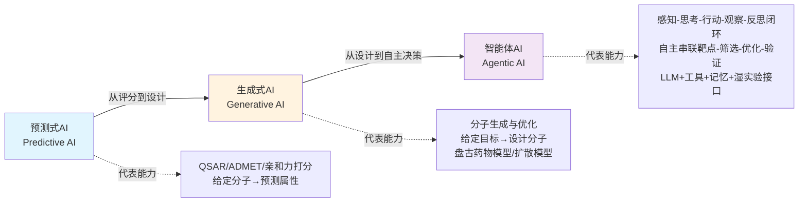

值得强调的是，这三次跃迁并非简单的替代关系，而是**能力的累积与嵌套**：智能体AI的"行动"层面所调用的，正是预测式AI的属性打分模型与生成式AI的分子设计模型；它的真正贡献在于增加了"决策与编排"这一新维度，使AI首次具备模拟药物研发"全流程"的潜力，从而将AI在药物研究中的角色从"工具"提升为"具备一定自主性的合作者"——一个有研究者称之为"硅基科学家"的概念[^12]。但这并不意味着智能体范式已经能够独立完成系统性药物评估——它在动态因果推断与个体级泛化上仍存在显著缺口，这将在下一节通过"任务-能力矩阵"做更精确的剖析。

## 2.2 不同范式在"模拟药物对机体影响"任务上的能力差异

仅仅梳理范式演进的时间脉络还不足以回答本研究的核心命题——必须将三类范式逐一对标第1章所归纳的系统性评估五项核心诉求（**跨尺度建模、多模态融合、动态因果推断、个体化泛化、可解释性**），才能客观判断各自能力的覆盖范围与缺口位置。

下表以第1章五项诉求为列、以三类范式为行，对各范式的能力覆盖给出分级评估（"●"为已具备、"◐"为部分具备、"○"为基本不具备）：

| 五项诉求 / 范式 | 预测式AI | 生成式AI | 智能体AI |
|----------------|---------|---------|---------|
| 跨尺度建模 | ○（单尺度，多为分子或细胞内） | ○（仍局限于分子尺度） | ◐（通过工具调度跨尺度，但耦合机制薄弱） |
| 多模态融合 | ◐（结构+少量属性标签） | ◐（结构+条件变量） | ●（感知工具汇聚多源数据库[^9][^10]） |
| 动态因果推断 | ○（关联而非因果） | ◐（反事实生成雏形，但分子层级） | ◐（多步推理具备反思机制，但缺乏严格因果建模） |
| 个体化泛化 | ○（群体平均模型） | ○（多基于通用化学空间） | ◐（可调用患者特异性数据，但生成层尚未真正个体化） |
| 可解释性 | ◐（特征重要性、SHAP等） | ○（潜空间难以解释） | ●（自然语言推理链条+可追溯工具调用） |

从这一矩阵可以读出几条关键判断。

**第一，预测式AI在跨尺度、动态因果与个体化三个维度上结构性受限**。其本质是"高维特征到低维标签"的映射，在分子属性预测、活性打分等单点任务上表现成熟，但既不具备从分子向上传导至细胞、组织、器官的机制建模能力，也无法在干预下推演系统演化轨迹。这正是第1章所指出的"高维静态关联分析的扩展"困境的延续。

**第二，生成式AI在反事实模拟上具备了雏形，但仍受困于单一尺度**。盘古药物模型展示的"分子优化器优化起始分子的化学结构、改善感兴趣的分子特性"[^8]这一能力，本质上是化学空间内的反事实推理——"如果分子结构变成X，性质会如何"。但这种反事实仅作用于分子本身，并不延伸至该分子被给药后在细胞、组织、器官中的级联效应。换言之，生成式范式回答的是"设计什么分子"，而非"该分子对机体产生什么系统性影响"。

**第三，智能体AI在多模态融合与可解释性上取得显著突破，但在动态因果与个体化上仍非完成态**。Drug Discovery Today综述给出的智能体架构清晰展现了这一点：感知工具（Perception Tools）作为信息采集层，从ChEMBL、PubChem、DrugBank（化合物数据库）、STRING（蛋白质互作网络）、Reactome、KEGG（通路数据库）、Ensembl、OpenTargets、ClinicalTrials.gov（基因组与临床数据）等异构数据源汇聚多模态证据；计算工具（Computation Tools）调度AlphaFold2/3（结构预测）、Nextflow（计算流程管理）、ADMET/QSAR模型（性质预测）、ASKCOS与IBM RXN（逆合成规划）等专用模型；行动工具（Action Tools）则通过机器人液体处理等硬件接口完成从计算设计到实验验证的闭环[^9][^10]。这种架构使智能体首次具备了"跨数据库—跨模型—跨实验"的系统性串联能力。智源研究院的趋势报告也佐证了这一方向：多智能体系统是由多个AI智能体组成的集合，它们通过交互协作实现个体或共同的复杂目标[^11]。然而，**智能体AI的"系统性"主要体现为工作流层面的串联，而非物理机制层面的因果耦合**——它通过编排多个工具来覆盖跨尺度任务，但每个工具内部仍是各自独立的预测或生成模型，跨尺度的因果信号并未在统一的数学框架内传递。这一缺口构成了后续章节（第3章AI虚拟细胞、第5章多尺度数字孪生）所要进一步攻克的核心问题。

更本质地看，三类范式的能力差异可以归结为一个递进逻辑：**预测式AI回答"是什么"，生成式AI回答"该是什么"，智能体AI回答"该做什么"——但要回答"为什么会这样"以及"在某个具体患者身上会怎样"，仍需在因果推断与个体化建模上有更深层的突破**。这正是本研究核心命题所要进一步探查的方向，也是后续章节展开的逻辑基础。

## 2.3 科学专用大模型的技术路线：分子、蛋白、细胞与基因组的基础模型

如果说前两节梳理了AI范式的横向演进，那么本节与下一节将沿纵向切入两条并行的技术路线：**面向生命科学垂直领域构建的科学专用基础模型**，以及**从通用语料训练再向药物领域适配的通用大语言模型**。这两条路线在数据来源、架构设计、训练目标与下游任务上均有显著差异，深刻塑造了当前大模型在系统性药物评估中的能力图景。

科学专用基础模型的核心思路是：**生命科学领域有着明显的特点，实验验证过的有标签的数据很贵很少，已有的数据又是不同场景，很难用来直接训练任务模型；但它却拥有着海量未标注数据，像基因组数据、蛋白质序列等，这些数据非常适合用来做预训练基础大模型**[^13]。基于这一范式，过去三四年间，分子、蛋白、细胞与基因组四个层面均诞生了一系列代表性工作。

**分子层面，以盘古药物模型为代表**。如前所述，PanGu Drug Model使用17亿个小分子化学结构作为预训练数据，构建了图到序列（graph2seq）非对称cVAE架构，能够从图与序列两种表征中适当地描述分子，提高下游药物发现任务的性能；预训练后的模型在20个药物发现任务（涵盖分子性质预测、化合物-靶点相互作用、药物-药物相互作用、化学反应产率、分子生成与分子优化）上取得了SOTA结果，并衍生出包含1亿类药小分子、新颖度99.68%的虚拟筛选库[^8]。这一工作典型展示了**分子表征预训练如何赋能全流程药物筛选**——通过在大规模无标注分子数据上学习通用的"分子语义"，模型可在多个下游任务间实现高效迁移，避免了为每个任务从零训练专用模型。

**蛋白质层面，以xTrimoPGLM及其后续xTrimo V3为代表**。百图生科与清华大学2023年7月联合发布的xTrimoPGLM参数高达1000亿、消耗1万亿Tokens、模型FLOPs达到6.2e+23，与175B参数的GPT-3处于同一量级[^14]。该模型在技术上的关键贡献是**统一了蛋白质理解（如二级结构预测）与生成（如蛋白质设计）两类任务**——传统蛋白质语言模型受限于自动编码或自回归单一预训练目标，难以同时处理理解与生成；xTrimoPGLM通过创新的预训练框架，在15项蛋白质理解任务中的13项显著优于其他先进基线，并能生成与自然蛋白质结构类似的新蛋白质序列；其衍生的12亿参数抗体模型xTrimoPGLM-Ab在抗体自然性与结构预测上达到当时最佳，推理速度比AlphaFold2快数十倍到数千倍[^14]。在第三届中国生物计算大会上，百图生科进一步发布了xTrimo V3——参数规模达到2100亿，覆盖DNA、RNA、蛋白质、细胞、小分子、生物视觉和生物知识文本等7个主流模态，宣称是当时全球规模最大的生命科学基础大模型，并在200个任务模型上达到SOTA水平，已助力开发20余种前沿抗体和酶、挖掘10余个创新靶点及靶点组合并经实验验证进入临床前研发[^13]。这一进展回应了一个关键问题：**生命科学领域的Scaling Law是否依然奏效**。xTrimo V3从蛋白单模态扩展到7模态全家桶并实现SOTA水平，表明在生命科学的"语言"上，规模化路径同样具有正反馈效应[^13]。

**单细胞层面，scGPT、Geneformer、scFoundation、scLong等模型构成了快速演进的技术谱系**。其中scLong是一个值得重点关注的新近代表性工作：MBZUAI、加州大学圣地亚哥分校等机构联合团队在Nature Communications发表的scLong拥有10亿参数，基于约4800万个细胞进行预训练，能够在整个人类转录组范围内对约27874个基因建模，并将Gene Ontology（GO）提供的结构化生物学知识融入模型中[^15]。其技术突破的关键在于：**长期以来，现有方法往往为了节省计算只关注少量高表达基因（通常约1500到2000个），忽略了大量低表达甚至零表达基因，同时也缺少对外部基因功能知识的系统整合，这不仅会丢失重要调控信号，也容易让模型对复杂生物过程"只见树木，不见森林"**[^15]。scLong采用双编码器设计——把一个细胞的整条基因表达谱当作一句非常长的话来读，每个"词"是"基因ID + 表达值"的组合：表达编码器把数值型表达量映射成向量，基因编码器为每个基因生成带有生物学含义的表示，两者相加得到"词"的初始表示，再通过上下文编码器让基因彼此"看见对方"以学习当前细胞中的上下文关系；论文报告显示scLong在遗传扰动预测、化学扰动预测、癌症药物反应预测、基因调控网络推断等多项任务上均优于现有单细胞基础模型和多种任务专用模型[^15]。这一工作具有方法论意义：**它表明把基因看"全"（全转录组）与看"懂"（融入GO先验）是单细胞基础模型迈向系统性扰动响应模拟的两个不可或缺的方向**。

这些科学专用模型的真实能力边界则需要通过独立基准测试来交叉验证，避免厂商或论文宣传性结论的偏倚。浙江大学侯廷军、谢昌谕团队联合发表于Genome Biology的scFM-Bench研究构建了生物学应用驱动的基准框架，对Geneformer、scGPT、UCE、scFoundation、LangCell和scCello六个主流scFM的零样本嵌入能力进行了深度评估，涵盖基因层面（组织特异性基因预测、基因功能预测）、细胞层面（批次整合、细胞类型注释、癌细胞识别、药物敏感性预测）与可解释性分析（基于注意力分数的基因调控关系分析）三个层面共7类任务[^16]。结果显示了一个值得警惕的事实：**传统评估指标（scIB）显示，scFMs并未超越简单的基线方法，如高可变基因（HVG）、scVI**[^16]。但研究进一步指出，scIB指标过高的模型可能破坏了数据本身的生物学结构，并据此提出了scGraph指标用于衡量表征空间中细胞类型间远近关系与原始基因表达数据的一致性；研究还提出了scGraph-OntoRWR新指标，将细胞本体论建模为有向无环图，通过带重启的随机游走算法计算细胞类别的内在关联度，从而生成不依赖于特定数据集的参考图，提供稳健且一致的细胞间距离计算[^16]。该基准研究的方法论价值在于：**当评估视角从"统计指标"切换到"生物学合理性"时，单细胞基础模型的真实优势才得以显现，但同时也揭示出当前scFMs在不同任务上能力分布并不均衡，模型选择需要任务驱动而非盲目追求规模**。这一警示与本研究持久推理标准P-5（能力边界与局限的平衡呈现）高度契合。

需要补充说明的一点是：用户需求中所提及的"灵枢-Cell（灵枢细胞模型）"作为国产代表性单细胞基础模型，本章可获取的搜索结果并未提供其技术细节的直接证据。基于学术诚信原则，本节不对其展开具体描述，留待第3章AI虚拟细胞讨论时若有进一步资料再行展开。这一资料缺口本身也提示，国产生命科学基础模型的公开技术披露仍有待加强，这对于客观评估全球技术格局是一项不可忽视的限制。

综合来看，科学专用大模型的共性技术特征可归纳为三点：**领域专属海量未标注数据驱动的预训练（17亿小分子、千亿氨基酸、近5000万细胞）、生物学先验的显式融入（如GO本体、分子图结构）、嵌入表征+下游任务迁移的范式**。它们在分子表征、蛋白质结构、单细胞扰动响应等垂直任务上达到了SOTA水平，但其覆盖范围仍以"层"为单位（分子层、蛋白层、细胞层各自独立），跨层耦合主要依赖外部多模态平台（如xTrimo V3的7模态全家桶）来实现，离真正"分子-细胞-组织-器官-个体"的统一基础模型仍有显著距离。

## 2.4 通用大语言模型的技术路线：从GPT到DrugChat的领域适配

与科学专用基础模型并行的另一条技术路线，是从通用互联网语料训练再向药物领域适配的**通用大语言模型路线**。这条路线的代表性工作以GPT系列为起点，通过提示工程、指令微调、检索增强与多模态适配进入药物研究领域，其中DrugChat是一个典型案例。

加州大学圣地亚哥分校谢澎涛团队提出的DrugChat是一个**多模态LLM，旨在提供分子机制和性质的全面预测，并集成在一个统一的框架内**[^17][^18]。其设计哲学与传统判别式模型有本质差异：传统方法通常需要为每个特定的预测任务开发专门模型，导致计算资源和时间效率低下，且难以预测药物分子的复杂方面如适应症、药效学和作用机制等；而DrugChat在单一框架内处理广泛的预测任务，消除了对多个专门模型的需求，并通过自由文本预测实现了对药物分子更丰富、细致的理解[^17][^18]。

DrugChat的技术路径具体而清晰：输入分子最初使用SMILES字符串表示，被转换为分子图（结构表示）和分子图像（视觉表示）两种形式；分子图通过基于GNN的编码器处理（该编码器在ZINC15数据库的两百万未标记分子上预训练），分子图像通过CNN（即ImageMol模型）编码（该模型在PubChem的一千万未标记生物活性分子图像上预训练）；适配器将分子图和图像的表示向量转换为统一的分子令牌向量，使其与LLM潜在空间兼容；用户输入提示被分解为语言令牌序列，分子令牌被集成到该序列中，再送入Vicuna-13B生成最终预测文本[^17][^18]。这一架构同时具备多模态融合（图+图像+文本）与对话式交互能力，可对药物适应症、药效学和作用机制产生精确的、自由形式的预测。

在能力评估上，DrugChat的人工评估平均分在适应症预测、药效学、作用机制和概述方面分别为1.05、0.94、0.8和0.92，**显著优于GPT-4在相同任务上的0.38等基线分数**[^18]。这一对比具有方法论意义：**未经领域适配的通用LLM（GPT-4）在专业药物机制预测上表现明显有限，而经过分子模态适配与领域微调的多模态LLM能够在自由文本表达的基础上提供高质量预测**[^18]。这印证了通用LLM路线在药物领域的真实落地必须经过两个关键改造——分子结构等专业模态的编码对齐，以及领域知识的指令微调或检索增强。

通用LLM路线的优势可归纳为三点。**第一，自由文本表达能力**——传统判别模型难以预测最佳用自由形式文本描述的复杂属性（如完整的作用机制叙述），而LLM天然支持这种自由形式输出[^17][^18]。**第二，多任务统一框架**——同一个DrugChat模型可以同时回答适应症、药效学、作用机制等多种问题，无需为每个任务训练专用模型[^17][^18]。**第三，对话式交互**——DrugChat支持与用户的多轮对话，促进了对同一分子的交互式深入探索[^17][^18]，这种交互模式对于药物研究人员的日常工作流（提出假设→验证→迭代）具有天然的契合度。

但通用LLM路线的局限同样不可忽视。**第一，生物学专业性不足**——通用预训练语料以互联网文本为主，对专业的分子机制、信号通路、药物代谢的覆盖深度远不及专用模型；GPT-4在DrugChat评估中的低分（0.38远低于DrugChat的1.05）正反映了这一缺口[^18]。**第二，幻觉风险**——LLM在生成自由文本时可能编造看似合理但实际上不准确的机制描述，这在药物研究中是不可接受的风险，必须通过RAG（检索增强生成）或机制锚定来缓解。**第三，缺乏机制锚定**——LLM的输出本质上是基于训练数据中"什么文本经常和什么文本一起出现"的统计学习，并未直接锚定到分子层面的物理化学定律或细胞层面的生物学网络，这与科学专用模型在结构-序列-通路上的显式建模形成对比。

值得注意的是，智源研究院的趋势报告指出了一个超越LLM的方向性判断：**大语言模型受限于互联网数据，性能提升速度已不如从前；解法在于向原生多模态世界模型演进，其本质是让人工智能感知和理解物理世界，进而推进与物理世界的交互**[^11]。这一判断对药物研究中的通用LLM路线意味着：单纯依赖语言模型的扩展难以触及药物-机体相互作用的物理本质，必须通过多模态化（如DrugChat的图+图像+语言三元对齐）与物理世界耦合（如智能体AI的湿实验接口）来突破能力瓶颈。

## 2.5 两条技术路线的对比与融合趋势

科学专用大模型与通用大语言模型并非互斥的两条道路，但它们在多个技术维度上存在显著差异。下表从六个维度展开多维度对照：

| 对比维度 | 科学专用大模型 | 通用大语言模型 |
|---------|--------------|---------------|
| 预训练数据 | 领域专属海量未标注数据（17亿分子、1万亿氨基酸token、4800万细胞）[^8][^15][^14] | 互联网通用语料 + 少量领域数据 |
| 模型架构 | 图神经网络/Transformer结构生物学定制（cVAE、双编码器、MLA等）[^8][^15] | 自回归语言建模为主（GPT、Vicuna等） |
| 任务范式 | 嵌入表征 + 下游微调；生成与理解分离或统一 | 指令-生成；多任务统一于自然语言 |
| 输出形式 | 数值预测、分子结构、嵌入向量 | 自由文本、对话、可解释推理链 |
| 可解释性 | 机制锚定（分子图结构、GO本体先验[^15][^16]） | 自然语言解释，但可能含幻觉 |
| 规模化路径 | 领域Scaling Law（xTrimo V3 2100亿参数覆盖7模态[^13]） | 通用Scaling Law + 多模态适配 |

从对比可以看出：科学专用模型的优势在**领域准确性与机制锚定**，而通用LLM的优势在**通用推理与自然语言交互**。两者各有所长，也各有所短——这正预示了它们必然走向融合的趋势。

**当前最具代表性的融合形态是Agentic AI架构下的"通用LLM作为推理与协调中枢、科学专用模型作为领域工具被调用"**。在Drug Discovery Today综述所描绘的智能体架构中，LLM承担"思考"角色（理解任务、规划步骤、解读结果），而AlphaFold2/3、ADMET预测模型、QSAR模型、ASKCOS逆合成等专用模型则被作为"计算工具"在LLM的指挥下被调度执行[^9][^10]。这一架构既利用了通用LLM的灵活推理与自然语言交互能力，又借助专用模型在特定任务上的高精度——**两者并非取代关系，而是分工互补**。DrugChat本身就是这种融合的早期形态：在分子模态上接入GNN（在ZINC15的两百万分子上预训练）与CNN（ImageMol，在PubChem千万分子图像上预训练）作为专用编码器，而推理与表达则交由Vicuna-13B这一通用LLM完成[^17][^18]。

这种分工的另一层含义是：**当系统性药物评估需要跨多个尺度、多个模态、多个任务时，单一模型难以在所有维度上同时做到最优；分布式的"专家+协调者"架构反而更符合系统性评估的本质需求**。这一判断为后续第3章详细讨论的AI虚拟细胞（作为细胞尺度的专用计算引擎）、第4章讨论的多智能体系统（作为协调与编排框架）、第5章讨论的多尺度数字孪生（作为跨层耦合的统一框架）奠定了技术分工基础——**它们并非竞争关系，而是同一系统性评估蓝图中各司其职的组件**。

百图生科xTrimo V3覆盖7个模态、200个任务SOTA并通过开放API限时提供免费Tokens的产品形态[^13]，以及华为盘古团队在Pangu Ultra MoE上探索约一万个不同MoE结构组合、最终搜索出训练与推理吞吐均达最优的架构方案[^19]，从两个不同侧面共同印证了一个趋势：**科学专用模型正在从单一垂直任务向通用平台演进，而通用LLM正在通过多模态、检索增强与工具调用向领域纵深渗透；二者在中间地带相遇，形成了Agentic AI这一新的范式合流点**。这与本研究持久推理标准P-3（跨尺度与系统性视角整合）所要求的多尺度耦合方向高度一致。

## 2.6 多模态融合作为系统性模拟的底层支撑

如果说前五节梳理的是大模型在药物领域的"演进"与"分工"，那么本节聚焦的是支撑这一切的**底层能力**——多模态融合。从第1章对多组学整合"4V挑战"与跨尺度瓶颈的剖析中可以推论：单一模态的数据无论再大、再深，都无法独立支撑"系统性模拟药物对机体影响"这一命题；只有当分子、组学、影像、文本、临床等异构模态在统一的表征空间或工作流中协同工作，系统性模拟才有可能落地。

药物研究所涉及的核心模态及其承载的独特信息维度可归纳如下：

- **分子结构模态**：SMILES字符串、分子图（二维结构）、分子图像、3D构象，承载化学结构与物理化学性质信息。盘古药物模型的图到序列转换正是从二维无向循环图到化学公式字符串的双表征学习[^8]；DrugChat更进一步将分子图与分子图像作为两个并行模态，通过GNN和CNN编码后再统一到LLM空间[^17][^18]。
- **多组学模态**：基因组、转录组、蛋白质组、代谢组，承载从遗传变异到功能执行的多层分子信息。scLong把整条基因表达谱当作一句长句来读、并融入GO先验[^15]，体现了在单细胞转录组模态内部的精细化建模。
- **生物医学文本模态**：文献、专利、临床试验记录、电子健康记录，承载科学知识、临床证据与监管信息。Drug Discovery Today综述明确将ChEMBL、PubChem、DrugBank、STRING、Reactome、KEGG、Ensembl、OpenTargets、ClinicalTrials.gov等结构化与非结构化数据库列为智能体感知工具的核心数据源，用于生成和精炼靶点或作用机制假说[^9][^10]。
- **影像数据模态**：病理切片、放射影像、分子图像、显微影像，承载形态与表型信息。
- **结构生物学数据模态**：蛋白质3D结构、复合物界面、动力学轨迹，承载分子相互作用的几何与能量信息。AlphaFold2/3被Drug Discovery Today综述列为智能体的核心结构预测计算工具[^9][^10]。
- **细胞与组织成像、空间组学模态**：承载细胞间相互作用与组织微环境信息，是连接分子与组织尺度的关键桥梁。

技术上，跨模态对齐的主流路径可以归纳为三类。**第一类是统一表征空间构建**——将不同模态映射到同一潜在空间，典型代表是xTrimo V3覆盖DNA、RNA、蛋白质、细胞、小分子、生物视觉和生物知识文本7个主流模态的全家桶设计，从分子早期研发到生产放大再到后期实验分析，为全流程AI建模需求提供单一基础模型支撑；多模态的覆盖让大模型跨模态协作成为可能[^13]。DrugChat的分子图-分子图像-语言三元对齐则是更小规模但同样典型的统一表征实例[^17][^18]。**第二类是模态转换与马赛克整合**——这一思路在第1章已有铺垫（MIDAS、Concerto、scButterfly、JAMIE等工具针对多模态数据稀缺、噪声与缺失值显著的情形）。**第三类是基于工具调度的隐式融合**——智能体AI不强求所有模态在一个模型内对齐，而是通过LLM调度多个专用工具，每个工具处理一类模态，再由LLM在自然语言层面整合输出。这种方式在Drug Discovery Today综述所描绘的感知-计算-行动工具体系中得到了集中体现[^9][^10]。

这三类融合路径正面回应了第1章所指出的"4V挑战"与跨尺度解析瓶颈：

| 第1章瓶颈 | 多模态融合的回应路径 |
|----------|------------------|
| 数据异质性（基因组离散、转录组连续、蛋白质组含修饰） | 统一表征空间将异构模态映射至共享潜在空间[^13][^17][^18] |
| 维度灾难 | 大规模预训练学习通用嵌入，下游任务以低维投影微调[^15][^14] |
| 批次与平台效应 | scGraph-OntoRWR等基于本体的稳健参考图，独立于特定数据集[^16] |
| 跨尺度建模缺失 | 智能体调度跨尺度专用工具（AlphaFold分子层、单细胞模型细胞层、影像模型组织层）[^9][^10] |
| 生物学先验整合不足 | scLong将GO先验融入基因编码器；scFM-Bench引入细胞本体论评估[^15][^16] |
| 模型可解释性差 | 智能体的自然语言推理链与可追溯工具调用[^9][^10] |

但同时必须指出，**多模态融合在三个关键维度上仍面临显著技术挑战**。第一是**数据稀缺模态**——某些模态（如3D类器官成像、患者级长程随访数据）的可用样本远少于分子或基因表达数据，难以独立支撑大规模预训练，需要通过模态转换或迁移学习来补齐。第二是**时序动态**——绝大多数当前模态的数据为静态快照，而药物作用是动态过程，如何在多模态融合中显式建模时间维度仍是开放问题，第1章已指出当前TIGON等方法仍依赖伪时间重建。第三是**跨域泛化**——在A数据集上训练的多模态模型迁移到B数据集时，常因批次效应、平台差异、人群分布不同而性能骤降，scFM-Bench研究专门选取2025年4月发布的AIDA v2新增约201K健康供体免疫细胞作为测试集（首次公开时间晚于scFMs发布时间，确保不存在数据泄漏），其结果显示scFMs在传统scIB指标上并未超越HVG、scVI等简单基线[^16]——这一发现客观揭示了多模态预训练模型在严格泛化测试下的真实能力边界。

综合而言，本章勾勒的技术演进图景可以归纳为一句话：**大模型在药物领域的演进，正在沿着"预测→生成→智能体"三阶段范式跃迁、"专用→通用→融合"两路线合流、"单模态→多模态→多尺度"三层次扩展三条主线同时推进，而多模态融合则是贯穿三条主线的底层支撑能力**。这一图景为第1章所提出的五项系统性评估诉求提供了初步的技术回应——跨尺度建模通过工具调度部分实现、多模态融合在统一表征空间方向有显著进展、动态因果与个体化泛化仍存在关键缺口、可解释性在自然语言推理链层面取得突破。但本章的论证仅止于"技术范式演进的总体框架"——具体到AI虚拟细胞如何充当药物-机体交互的数字孪生计算引擎、多智能体系统如何在药物全流程中实现闭环自动化、跨尺度数字孪生如何耦合分子动力学与全身生理学、个体异质性如何被真正建模——这些核心问题将在接下来的第3至第6章中逐一展开深入审视。

# 3 AI虚拟细胞：药物机体影响模拟的核心计算引擎

第2章的论证已经勾勒出大模型在药物领域沿"预测—生成—智能体"三阶段跃迁、"专用—通用"两路线合流、"单模态—多模态—多尺度"三层次扩展的总体技术图景，并指出多模态融合是贯穿其中的底层支撑能力。然而，这一图景在细胞这一关键尺度上的具体落地形态，仍需进一步下沉审视。**细胞是连接分子机制与组织/器官表型的核心中介层——药物分子的物理化学性质必须经由细胞的转录、翻译、信号传导、代谢与命运决策才能转化为可观察的表型与临床效应；个体异质性的分子根源（基因变异、表观修饰、微环境差异）也必须经过细胞这一"放大器"才能在组织与器官层面显现**。因此，能否在细胞尺度上构建一个高保真、可扰动、可推演的"虚拟"系统，直接决定了大模型能否承接系统性药物评估的核心命题。本章聚焦AI虚拟细胞（AI Virtual Cell, AIVC）这一近两年迅速崛起的研究方向，依次展开其概念定位与全球研发格局、核心技术架构、代表性模型谱系、关键应用场景验证、严格基准测试下的真实能力边界，最终给出AIVC作为"核心计算引擎但非完整答案"的分层定位结论。

## 3.1 AI虚拟细胞的概念定位与全球研发格局

AI虚拟细胞的概念内涵可以被界定为：**利用AI模拟细胞行为、探索生命机制的一种全新研究范式，基于多尺度、多模态的大型神经网络模型，精准模拟分子、细胞和组织在不同状态下的动态行为，其效率远超传统实验**[^20]。其最具实践冲击力的承诺是：原本需要数周才能获得的实验结果——例如肿瘤细胞对特定药物的反应——可以通过AIVC快速获取[^20]。这一承诺直接对应了第1章所揭示的传统药物研发"周期长、成本高、跨尺度解析能力不足"的结构性困境，也使AIVC在本研究"系统性评估"命题中处于一个不可替代的中介位置。

同济大学数字生命智能体实验室（DELTA Lab）刘琦教授团队对这一范式跃迁给出了更精确的方法论判断：**当前计算生物学正从描述性推断转向预测性模拟**[^21]。传统统计学建模难以应对高维度、高复杂度的生物数据，而在AI技术驱动下，科学家得以进行预测性研究——这一从"看见现象"到"预测干预结果"的转变，正是AIVC作为系统性评估核心引擎的根本价值所在。斯坦福大学斯蒂芬·奎克教授甚至给出了一个相当激进的展望：未来的生物学研究可能90%依靠计算模拟，而非依赖实验室操作[^20]。即便不完全采信这一比例，AIVC的精准可控性与无限重复性确实将大幅拓展药物-机体交互的可探索空间。

从全球研发格局看，AIVC在2024–2025年间经历了一个明显的"集结时刻"。下表汇总了这一时期最具标志性的里程碑事件，可直观呈现这场"生命数字化竞赛"的密度与广度：

| 时间 | 事件 | 关键含义 |
|------|------|---------|
| 2024年12月 | 斯坦福大学、基因泰克、陈-扎克伯格基金会（CZI）联合在《细胞》发表AIVC全球倡议 | 学术界与产业界首次形成共识性研究纲领[^20] |
| 2025年初 | 《自然》将"生物学基座模型（含AIVC）"列为2025年最值得期待的七大科技突破之一 | AIVC获得顶级期刊的方向性背书[^20] |
| 2025年6月 | Arc研究所联合UC伯克利、斯坦福等正式发布AIVC"STATE"，整合1.7亿观测细胞与1亿干预细胞 | 在Tahoe-100M基准上扰动效果辨识度提升50%、差异基因表达预测准确率达现有最佳模型的2倍[^20] |
| 2025年6月 | 麦吉尔大学丁俊教授与耶鲁Kaminski教授团队发布UNAGI，专攻时间序列单细胞数据动力学建模 | 在IPF肺纤维化数据上虚拟筛出硝苯地平并经PCLS人体模型实验验证[^22] |
| 2025年（计划2026面世） | 瑞典SciLifeLab简·埃伦贝格教授团队"阿尔法细胞"模型攻坚 | 欧洲AIVC旗舰项目进入冲刺阶段[^20] |
| 2025年11月 | CZI重组为统一的Bio Hub网络，全力聚焦AI与生物学融合，收购Evolutionary Scale团队、任命Alex Rives为科学负责人 | 慈善资本将几乎全部资源投向AIVC方向，体现长期决心[^23] |
| 2025年下半年 | 同济DELTA Lab发布AlphaCell（虚拟细胞世界模型）与CellHermes（细胞语言模型） | 中国学术界从"细胞世界模型"与"跨模态融合"两个维度切入AIVC前沿[^21] |

这一时间表透露的信号是多重的。**第一，AIVC已不再是单一团队的概念探索，而是顶尖学术机构、慈善资本、产业联盟同步发力的系统性赛道**——CZI计划在未来10年内投入数亿美元打造AIVC[^20]，谷歌DeepMind也已启动类似项目[^20]，风险资本以空前规模涌入[^20]。**第二，AIVC的研发逻辑高度依赖大规模标准化数据**——CZI此前花费多年建立的Cell Atlas项目和CELLxGENE平台积累了超过1亿个标准化细胞数据，成为训练生物AI模型最宝贵的资源[^23]，这种"数据-模型"协同积累的雪球效应在大语言模型出现后被显著放大。**第三，工具建设而非短期研究产出，正在成为这一阶段竞争的核心**——扎克伯格强调"纵观科学史，大多数重大突破都源于新工具的诞生"[^23]，这种工具化思维与药物研发对系统性模拟引擎的需求天然契合。

值得指出的是，AIVC的研发存在一个传统科研体系难以填补的资金真空：像虚拟细胞模型这样的大型工具平台，需要1亿到10亿美元的投入，研发周期长达10到15年，完全不符合NIH等机构以小额项目分散资助的传统逻辑[^23]——慈善资本正是看准了这一空白才得以发挥关键作用。这一点对中国及其他国家的AIVC布局有直接启示：单一PI驱动的零散研究难以产生STATE、AlphaCell级别的系统性突破，必须依赖国家级或机构级的长周期工程化组织。

将AIVC放回本研究的逻辑链条中可以看到：**它精确地占据了第2章所讨论的科学专用大模型谱系的"细胞层"位置，向上承接分子层面的基础模型（盘古药物模型、xTrimo V3等），向下连通组织/器官层面的多尺度数字孪生（第5章），并通过细胞响应这一中介层回答"药物如何重塑机体状态"这一系统性命题的核心子问题**。在接下来的几节中，我们将依次展开AIVC的技术架构、模型谱系与应用证据。

## 3.2 核心技术架构：从生成式建模到世界模型

支撑AIVC的核心技术架构在过去两三年间经历了快速的多元化演进，可大致归纳为四类范式，每一类都对应着对前一类局限的针对性突破。

**第一类是基于变分自编码器（VAE）与生成对抗网络（GAN）的生成式架构**，以scGen、CPA、UNAGI为代表。其核心思路是将高维基因表达数据压缩到一个疾病或扰动特异性的低维隐空间，再通过隐空间内的向量运算（加减、插值）模拟扰动效应。CPA使用一种基于自编码器的模型，将化学诱导的转录组效应映射到潜在空间中以重建扰动响应；Biolord、scGen、scVIDR则利用深度编码器-解码器/生成器框架进行反事实预测，将对照细胞和未知标签作为输入，预测未知细胞状态下的基因表达[^24]。UNAGI在此基础上进一步引入迭代变分自动编码器-生成对抗网络（iterative VAE-GAN）深度学习架构，针对归一化后常见的多样化数据分布进行优化，将高维基因表达数据压缩为疾病特异性的低维隐空间表征以构建"虚拟细胞"，并通过迭代训练让模型专注于学习疾病关键基因调控因子[^22]。这类架构的优势在于潜空间的可操作性强、训练相对成熟，但其重构机制存在显著弱点——同济刘琦教授指出，**隐变量模型解码机制薄弱，导致隐空间内的数学操作在解码回原始基因空间时，容易产生脱离实际测量的"生物学幻觉"**[^21]，这是后续世界模型路线试图解决的核心问题之一。

**第二类是基于图神经网络与先验知识的架构**，以GEARS、CellOracle为代表。这类方法利用基因-基因关系的知识图预测基因扰动结果，依赖于准确的先验知识来约束扰动的传播方式[^24]。其优势在于具有显式的生物学解释性——预测结果可追溯到具体的调控关系；但其缺点同样明显，即**基于图的模型依赖于准确的先验知识，缺乏扩展性**[^24]——对于先验知识不充分的扰动类型或细胞背景，其预测可靠性会显著下降。

**第三类是新兴的扩散模型架构**，以Squidiff与PRnet为代表，构成了2025年AIVC技术演进中最具突破性的方向。Squidiff（single-cell quantitative inference of stimulus responses by diffusion model）由斯坦福、哥伦比亚联合团队提出，由语义编码器与条件去噪扩散隐式模型（DDIM）组成：语义编码器将单细胞转录数据映射至潜在语义空间$z_{sem}$，捕捉生物学意义的特征差异；扩散模型则通过向数据添加与去除高斯噪声的双向过程学习基因表达的生成分布[^25][^26]。训练完成后，模型能在潜在空间中进行插值与向量叠加操作以模拟细胞在发育或扰动条件下的连续转变，且无需预设拓扑或先验知识[^26]。这种架构的关键突破被审稿人评价为：**"将生物学动态预测从静态快照或离散推断推进到了连续生成的时代"**[^25]。PRnet则是另一类扩散思路的代表——一种基于扰动条件的深度生成模型，用于预测全新化学扰动（实验未验证过的）在总体和单细胞水平上的转录反应，可以解释基因水平的反应并能根据基因特征进行体外药物筛选[^24]。扩散架构的核心技术优势在于：相较于VAE/GAN在生成连续平滑发育过渡过程上的局限、对高分辨率动态响应（如器官发生中的短暂状态）预测能力的不足[^26]，扩散模型在复杂数据分布建模中表现突出，能通过去噪学习潜在特征分布，并整合药物分子结构、剂量信息，重建多细胞类型间的非加性扰动效应[^26]。

**第四类是引入"世界模型"理念的新型架构**，以同济DELTA Lab的AlphaCell为代表，体现了AIVC技术路线的最新跃升。同济团队系统诊断了现有单细胞扰动预测框架（包括隐变量算术模型如scGen、CPA，图网络模型如GEARS，隐空间流模型如CellFlow，以及基于集合匹配的基础模型如STATE）在全基因组动态建模时面临的三大结构性瓶颈[^21]：

| 瓶颈 | 含义 | AlphaCell的应对思路 |
|------|------|------------------|
| 表征不完整（Representation Incompletion） | 现有模型依赖启发式特征选择，将细胞基因特征截断为有限的高变基因（HVGs），对低表达但关键的调控因子产生"盲区" | 采取"全量输入"，将所有基因纳入考虑，确保细胞状态定义的理论完备性 |
| 重构失真（Reconstruction Distortion） | 隐变量模型解码机制薄弱，隐空间数学操作解码回原始基因空间时易产生"生物学幻觉" | 引入更严谨的世界状态转移建模 |
| 动态迁移缺陷（Transferability Deficiency） | 现有方法多将扰动建模为离散跳跃或在受限局部空间扩散，缺乏全局统一的连续坐标系，难以学习可跨细胞类型迁移的"通用动力学法则" | 借鉴自动驾驶与具身智能领域的"世界模型"理念，对虚拟细胞世界状态转移的潜在逻辑进行刻画[^21] |

AlphaCell的方法论意义在于：**它将虚拟细胞建模从"静态扰动预测"提升为"动态世界状态转移"的层次**——这与自动驾驶领域世界模型对车辆-环境交互的全局连续建模思想一脉相承。刘琦教授强调，传统方法仅用高变基因描述细胞状态"远远不够"，只有"全量输入"才能避免因丢失低丰度关键基因导致的预测偏差[^21]。这一观点对扰动预测领域具有重要的范式启示。

四类架构在能力维度上的差异可归纳如下：

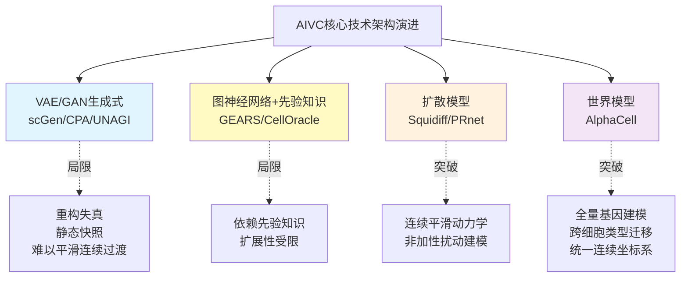

需要特别指出的是，这四类架构并非简单的替代关系，而呈现出一种"问题驱动的累积突破"——VAE/GAN提供了基础的潜空间操作框架，GNN引入生物学先验，扩散模型解决连续动力学，世界模型尝试统一全局坐标系。当前AIVC的真实能力图谱由这四类范式共同构成，**最优架构选择高度依赖具体任务（静态扰动预测、连续轨迹生成、跨细胞迁移、组合扰动等）**，这一观察将在3.6节的基准测试讨论中得到进一步印证。

## 3.3 代表性模型谱系与能力分工

在四类技术架构的基础上，过去两年涌现的代表性AIVC模型构成了一个能力分工日益清晰的谱系。下表以系统性评估五项诉求（跨尺度、多模态、动态因果、个体化、可解释）为标尺，对当前主流AIVC模型的能力定位进行横向梳理：

| 模型 | 发布团队/时间 | 核心特征 | 主要任务定位 |
|------|-------------|---------|------------|
| scFoundation | 清华-百图生科，2024（Nature Methods） | 1亿参数，5000万细胞预训练，同时建模约2万基因，非对称编码计算量仅传统Transformer的3.4%，RDA测序深度感知预训练[^27] | 测序深度增强、癌症药物IC50预测、单细胞水平药物敏感性、细胞扰动预测、基因网络推断[^27] |
| scLong | MBZUAI-UCSD，Nature Communications | 10亿参数，4800万细胞预训练，全转录组27874基因建模，融入GO先验 | 遗传扰动、化学扰动、癌症药物反应、基因调控网络推断 |
| scGen/CPA | 经典基线 | VAE/自编码器隐空间扰动 | 单细胞扰动响应预测的基线[^24][^26] |
| GEARS | 知识图基线 | 基于基因-基因关系图 | 基因扰动结果预测[^24] |
| CellOracle | — | 知识图 | 基因调控网络推断[^24] |
| UNAGI | 麦吉尔-耶鲁，2025年6月 | 迭代VAE-GAN，专为时间序列单细胞数据设计 | 疾病动力学建模、虚拟药物扰动模拟（IPF硝苯地平案例）[^22] |
| Squidiff | 斯坦福-哥伦比亚，Nature Methods | 条件DDIM+语义编码器，扩散模型 | iPSC分化、辐射损伤、药物干预的连续生成[^26][^25] |
| PRnet | 中科院-华西，Nature Communications | 扰动条件深度生成模型 | 88细胞系×52组织×多化合物库扰动谱整合，为233种疾病推荐候选药物，实验验证小细胞肺癌、结直肠癌候选物[^24] |
| STATE | Arc Institute联合UC伯克利、斯坦福，2025年6月 | 基于集合匹配的基础模型，整合1.7亿观测+1亿干预细胞 | 干细胞、癌细胞、免疫细胞对药物、细胞因子、基因编辑的响应预测；Tahoe-100M基准辨识度+50%、差异基因预测准确率2倍[^20] |
| AlphaCell | 同济DELTA Lab，2025 | 引入"世界模型"理念，全量基因输入，统一连续坐标系 | 高保真细胞扰动预测，应对表征不完整、重构失真、动态迁移三大瓶颈[^21] |
| CellHermes | 同济DELTA Lab，2025 | 跨模态异构数据融合的"细胞语言模型" | 让AI"听懂细胞怎么说"——多模态细胞状态表征[^21] |

其中，scFoundation值得展开剖析，因其代表了通用细胞基础模型的当前技术高度。该模型基于5000万个涵盖各器官、肿瘤和非肿瘤的大规模人类单细胞数据集进行训练，针对三大挑战做出了系统性创新：第一，巧妙将连续的基因表达值转化为向量（不同于LLM的"词-向量"转换）；第二，针对单细胞数据的高稀疏性以及零值和非零值所包含信息量的差异，设计了非对称编码模块，在保持相同参数规模的情况下计算量仅为传统Transformer的3.4%；第三，提出了测序深度感知的预训练任务"read-depth-aware (RDA)"，能对测序深度进行降采样，使模型在预训练阶段除了完成传统的掩膜恢复任务外，还能由低质量细胞恢复高质量细胞的基因表达信息[^27]。在应用层面，scFoundation支持"开箱即用"与"微调"两种范式，前者直接利用其表征做下游分析，后者训练一层加任务头进行标签预测；在癌症药物干预反应预测上，基于scFoundation提取的Bulk基因表达数据能预测药物半最大抑制浓度IC50及单细胞水平药物敏感性，**在几乎所有药物和癌症类型上预测效果均有显著提升**[^27]。

UNAGI则展示了一类具有强烈临床转化潜力的AIVC模型形态。它是一种无监督深度学习方法——无需预先标注样本即可在海量数据中挖掘潜在模式[^22]。其工作机制可分为三步：先将单细胞转录组数据压缩为疾病特异性低维隐空间表征，构建"虚拟细胞"；再利用时间序列数据追踪基因在每个细胞中的时序表达变化，对不同疾病阶段的细胞进行聚类并按时间顺序连接，推断驱动这些转变的基因调控网络，构建"虚拟疾病"模型；最后在隐空间中模拟药物扰动的作用[^22]。蛋白质组学实验证实UNAGI在分析细胞动态方面具有极高准确性；在精准切割肺切片（PCLS）的人体肺纤维化模型实验中，硝苯地平的抗纤维化效果与UNAGI的预测高度一致，验证了其在药物筛选中的可靠性[^22]。这一案例之所以重要，是因为它展示了**AIVC从计算预测到湿实验验证的完整闭环——而非仅停留在自身基准测试上的指标提升**。

需要客观说明的是，关于用户需求中提到的"灵枢-Cell（灵枢细胞模型）"这一国产代表性模型，本章可获取的搜索结果并未提供其技术细节（架构、训练数据、基准表现等）的直接证据。基于本研究持久推理标准P-2（技术证据的具体性与可验证性）的要求，本节不对其展开具体描述以避免无据扩展。这一信息缺口本身也构成了一项观察——**国产生命科学基础模型在公开技术披露与独立基准对比上仍有提升空间，这对全球技术格局的客观评估构成了不可忽视的限制**。

从能力分工的角度看，当前AIVC谱系呈现出三个清晰的分化方向：**通用基础模型方向（scFoundation、scLong、STATE）追求大规模预训练带来的迁移能力**；**任务专用方向（UNAGI针对时序疾病动力学、Squidiff针对连续轨迹、PRnet针对化学扰动谱）追求特定场景下的高保真预测**；**方法论突破方向（AlphaCell世界模型、CellHermes跨模态语言）追求架构层面的范式创新**。三类方向互为补充，共同构成了AIVC作为系统性药物评估核心引擎的技术资源池。

## 3.4 关键应用场景一：虚拟基因敲除与扰动响应预测

虚拟敲除与扰动响应预测被普遍认为是**AIVC最具想象力、也最具发文潜力的核心方向之一**[^28]。这一方向的核心命题是：能否在不进行湿实验的前提下，预测一个或多个基因被敲除/敲低/激活，或细胞被某种化合物/剂量处理后，细胞转录组、表型乃至命运将如何变化？这一命题直接对接了系统性药物评估中"如果给患者使用药物X，其细胞会发生什么"的核心问题。

**任务谱系**可由简到繁分为四类：单基因扰动 → 双基因/组合扰动 → 化学扰动（单化合物） → 化学组合扰动。每一层都对前一层增加显著的复杂性——组合扰动需要捕捉非加性交互效应，化学扰动需要建模分子结构与转录响应的映射，而组合化学扰动则同时面临这两类挑战。

**数据基础设施**的快速演进是这一方向得以爆发的关键前提。其中Tahoe-100M具有里程碑式的产业意义。Vevo Therapeutics与Arc Institute联合发布的Tahoe-100M是当前最大的单细胞规模扰动数据集，包含**1亿+单细胞转录组、覆盖50个癌细胞系与1100+种小分子扰动**[^29]。其Mosaic平台采用了一种巧妙的"细胞村"设计——将多个细胞系混合物组成的球状体悬浮培养，每个球状体接受单独的药物治疗（包括DMSO载体对照）；药物治疗24小时后球状体被解离、固定，并使用Parse GigaLab试剂盒进行scRNA-seq分析；除了生成不同治疗的单细胞基因表达矩阵外，研究还检测了scRNA-seq文库中存在的遗传变异，并用基于SNP的解卷积将细胞分配到其来源细胞系[^29]。这种设计的方法论价值在于：**通过在同一实验微环境中同时容纳多个细胞系和扰动条件，并通过SNP解卷积事后归因，从根本上缓解了传统大规模扰动研究中难以避免的批次效应**[^29]。最终该研究测序得到约1.4万亿个原始读数、代表总共1.53亿个细胞，经过严格过滤后获得9560万个高质量细胞用于下游分析[^29]——这一数据规模使Tahoe-100M成为新一代AIVC训练与基准评测的产业基准。

在算法层面，PRnet是这一应用方向中最具代表性的成果之一。中科院普适计算系统研究中心与四川大学华西医院团队提出的PRnet作为一种基于扰动条件的深度生成模型，**在预测新化合物、新通路及新细胞系反应方面优于其他方法**[^24]。其方法论价值在三个层面得到验证：第一，模型可以解释基因水平的反应，并能根据基因特征进行体外药物筛选；第二，模型找出并实验验证了对小细胞肺癌和结直肠癌的新化合物候选物；第三，模型生成了一个涵盖88个细胞系、52种组织和多个化合物库的大规模扰动谱整合图，**成功为233种疾病推荐了药物候选物**[^24]。这一从计算筛选到实验验证再到大规模疾病覆盖的完整闭环，体现了AIVC在虚拟扰动方向上从"工具研究"向"系统性产出"转变的产业化潜力。

PRnet团队的方法论反思也值得关注：他们明确指出，**基于线性回归的方法通过线性组合基因扰动效果估计化学扰动对基因表达的影响，但这种线性组合方法在准确建模跨不同细胞类型和化合物组合的非线性化学扰动方面存在局限性**[^24]——这一观察将在3.6节的基准测试讨论中获得反讽性的转向：在某些任务上，恰恰是简单的线性基线击败了复杂的深度模型。

从更宏观的虚拟细胞研究图谱来看，扰动响应预测已经从单一任务扩展为一个完整的子领域族。包括基础大模型框架、转录调控网络（虚拟细胞如何从"看见细胞状态"升级到"推断调控逻辑"）、scRNA-seq虚拟蛋白组（跨模态预测）、基因扰动预测（虚拟敲除）、空间微环境与多尺度虚拟细胞、形态学扰动预测（从转录组到细胞图像的跨模态扰动效应）、扰动动力学（不仅预测扰动后会不会变，还预测扰动后如何动态变化）等多个方向[^28]。这种从"描述现象"到"预测机制"再到"预测干预动态"的范式跃迁，正是本研究核心命题所指向的"系统性评估"能力的具体技术承载。

但必须立刻给出一个能力边界的预警：**多项独立基准研究表明，扰动响应预测的真实泛化能力远低于发表论文所宣称的水平**——这一关键发现将在3.6节展开详细讨论。在那之前，让我们先看一看AIVC在另外两类应用场景上的实际表现。

## 3.5 关键应用场景二：药物重定位、毒性模拟与个体化响应

如果说虚拟敲除与扰动响应预测体现了AIVC的"基础研究价值"，那么药物重定位、毒性模拟与个体化响应则更直接地连通了AIVC与系统性药物评估的产业化目标。

**药物重定位维度**集中体现了AIVC从计算预测走向临床转化的能力。UNAGI在特发性肺纤维化（IPF）数据上的应用是这一方向最完整的案例之一：UNAGI学得的疾病特异性细胞低维隐空间表征，不仅加深了对病程进展的认识，还帮助筛选出潜在的治疗药物候选；在精准切割肺切片（PCLS）的人体肺纤维化模型实验中，硝苯地平（一种常见的降压药）的抗纤维化效果与UNAGI的预测高度一致[^22]。这一案例的方法论意义在于：**AIVC能够在无需湿实验筛选的前提下，从已上市药物中识别出针对全新适应症的候选——而这正是药物重定位的经典命题，且实验验证证实了预测的真实性**。UNAGI还被进一步应用于多种复杂疾病，展示了其在解析复杂细胞动力学和虚拟药物筛选方面的灵活性[^22]。

PRnet从另一个维度展示了AIVC在药物重定位上的规模化能力——**为233种疾病系统推荐候选药物**[^24]。这种"一次建模，多疾病覆盖"的能力是传统实验筛选难以企及的，体现了AIVC作为系统性评估引擎的乘数效应。scFoundation在药物-癌症响应预测上则提供了另一类证据：通过构建模型预测细胞对癌症药物干预的反应，对指导抗癌药物的设计及理解癌症的生物学机制至关重要；基于scFoundation提取的Bulk基因表达数据能够预测药物IC50及单细胞水平的药物敏感性，**显示出在几乎所有药物和癌症类型上预测效果均有显著提升**[^27]。

**毒性模拟与细胞命运预测维度**则展示了AIVC在传统毒理学难以触及的场景中的潜力。Squidiff在人血管类器官应用中的表现尤其值得关注：研究团队仅用两个时间点的数据，实现了重建整个11至17天的发育轨迹，并揭示了**周细胞向内皮细胞转分化这一之前难以捕获的过渡过程**[^25]。在iPSC分化研究中，仅使用第0天和第3天的数据训练模型后，Squidiff便能预测第1–3天的中间状态：模型预测的基因表达与真实值高度相关，NANOG表达逐渐下降、GATA6和TBXT表达上升，与真实分化趋势一致；与scGen等模型相比，Squidiff在Pearson相关系数与伪时间一致性上显著更优，能更好捕捉发育过程中的非线性动态[^26]。

更具启示性的是Squidiff在极端环境条件下的外推能力。研究团队进一步探索了一个独特的应用场景：**模拟太空辐射方案的影响，模拟宇航员在前往火星的长期任务中可能面临的情况**。Squidiff能够准确预测辐射损伤的影响，以及常用放射防护剂的缓解作用[^25]。这一场景虽然不直接对应常规药物研发，但它揭示了一个重要的方法论事实——**AIVC具备从训练数据外推到罕见或极端干预条件下的潜力，这种"假设性场景模拟"能力是传统实验范式所无法提供的**。Squidiff团队的论文第一作者何锶瑜博士对此给出了直接表述："在iPSC分化研究中，Squidiff不仅预测了最终的分化结果，更重要的是揭示了中间过渡过程，为精确调控细胞分化过程提供了靶点或方案，这也为个体化治疗尤其是针对肿瘤异质性提供了关键的技术支撑。"[^25]这段表述将AIVC的细胞命运预测能力直接连接到了肿瘤异质性这一精准医疗的核心命题。

**个体化响应维度**是AIVC最具愿景吸引力但目前证据最稀缺的方向，也是与第1章个体异质性诉求最直接对应的环节。CZI联合创始人Priscilla Chan在播客中给出了这一愿景的临床医生视角："那时我才真正意识到基础科学的力量，没有基础科学的进步，就没有通向希望的道路。"[^23]——而瑞典学者Lundberg则提出了更具体的技术路径展望：在不远的将来，**医生或许能在患者的"数字孪生"上预演治疗方案，更快速、更经济、更安全的个性化诊疗将成为现实**[^20]。

从技术架构角度看，AIVC具备承接患者特异性数据的天然接口——只要将患者来源的单细胞数据、空间组学、基因变异信息输入到已经过大规模预训练的细胞基础模型中，理论上即可输出该患者特异的扰动响应预测。然而，这一愿景的实现仍面临两个关键的现实门槛：**第一，临床级患者特异性数据的稀缺**——大多数当前AIVC模型的训练与基准测试仍依赖癌细胞系或公开队列的群体数据，真正的患者级数据规模有限；**第二，从细胞层面推论到临床获益的因果链条**——即便AIVC能够准确预测患者细胞的转录响应，从转录响应到临床表型的映射仍需要器官层面、个体层面的进一步建模。这两个门槛指明了AIVC与第6章"个体异质性应对"之间的关键衔接点。

综合三类应用场景可以形成一个判断：**AIVC在"群体水平的药物重定位""细胞水平的毒性与命运预测""极端条件下的假设性外推"三个维度上已经积累了具有说服力的证据，但在"患者级精准响应预测"这一最贴近系统性评估终极目标的维度上，证据仍然稀缺**。这一判断也为3.7节的能力定位结论提供了关键依据。

## 3.6 严格基准测试下的真实能力边界

前面三节展示的应用证据与发表论文所宣称的能力，构成了AIVC研究的"明面"；但要回答"AIVC能否真正承接系统性药物评估"这一命题，必须同时审视那些来自独立基准研究的、往往被产业宣传所遮蔽的"暗面"——也即AIVC的真实能力天花板。本研究持久推理标准P-5（能力边界与局限的平衡呈现）明确要求，每形成一个能力性结论，都必须配套追问其失败模式、基准测试的不利证据与外推风险。本节将聚焦三项关键的警示性研究，对当前AIVC的能力边界做出客观刻画。

**第一项警示性研究**来自Ahlmann-Eltze、Huber与Anders于2025年发表在Nature Methods上的工作，题目直白而震撼：**"基于深度学习的基因扰动效应预测尚未超过简单的线性基线"**[^30][^31]。研究方法层面，作者将scGPT、scFoundation、scBERT、Geneformer、UCE这五个基础模型，加上GEARS与CPA两个专门的扰动预测模型，与刻意设计的简单基线模型进行了正面对比[^30][^31]。基线模型只有两个：一个是"无变化"模型（始终预测与对照条件相同的表达），另一个是"加性"模型（对于每个双重扰动，预测两个单基因扰动对数倍变化LFC的总和）——这两个基线甚至不使用双重扰动数据[^30]。

研究在Norman等人的数据集上进行评估——通过CRISPR激活系统在K562细胞中上调了100个单独基因和124对基因，共形成224种扰动；作者在所有100个单一扰动和62个双重扰动上对模型进行了微调，并在剩余的62个双重扰动上评估预测误差，并使用不同的随机分组重复整个分析五次以保证稳健性[^30]。**结果令人警醒：所有模型的预测误差都显著高于加性基线**[^30]——也就是说，那些参数动辄上亿、预训练数据动辄数千万细胞的复杂深度学习模型，在双基因扰动预测这一核心任务上，竟然全部输给了一个连训练都不需要的、用两个单基因扰动结果直接相加的极简模型。研究采用L2距离与皮尔逊delta度量两类指标的检查得到了相同的总体结果[^30]。论文摘要给出的结论极为克制但意义深远：**"没有任何一个模型的表现优于这些基线模型，这凸显了严谨基准测试的重要性"**[^30][^31]。

**第二项警示性研究**则进一步将"皇帝的新衣"扯掉得更加彻底。2025年8月发表于Nature Biotechnology的Systema框架研究指出，当前一系列复杂的AI模型——GEARS、scGPT等——在各项评估指标上取得了令人瞩目的高分，似乎预示着一个"计算预测取代繁琐实验"的新时代即将来临，但事实并非如此[^32]。作者设计了两个"捣蛋鬼"基线：第一个被称为"扰动均值"（perturbed mean）——无论要预测哪个基因扰动的结果，它都只给出一个答案：训练数据中所有被扰动过的细胞的平均基因表达谱；第二个基线模型是"匹配均值"（matching mean），用于预测双基因组合扰动，将两个单基因扰动的结果进行平均[^32]。

研究人员在涵盖了三种不同技术、五个细胞系的十个公开数据集中，将这些简单的基线模型与CPA、GEARS、scGPT等先进的深度学习模型进行了正面交锋，评估标准是领域内广泛使用的皮尔逊相关系数[^32]。结果再次令人震惊：**在那些先进AI模型获得高分的同一指标体系下，"扰动均值"这一最朴素的基线即可击败它们**[^32]。这一发现的方法论意义在于：当前评估体系本身存在"系统性"缺陷——皮尔逊相关系数等指标实际上奖励了"输出训练集平均值"这种平凡策略，并不能真正衡量模型对扰动机制的理解。Systema框架的提出正是为了"为AI挤水分"——它锻造了一面"照妖镜"，提供了一套全新的、更为严苛也更为公正的评判标准[^32]。

**第三项基准研究**来自Nature Methods发表的另一项更为系统的工作，对**27种单细胞扰动响应预测算法进行了全面基准测试，覆盖29个真实数据集和多种评估指标**[^33]。该研究将评测分为两类核心场景：细胞环境泛化（在未见过的细胞类型、患者或物种中预测已知扰动的响应）和扰动泛化（在固定细胞环境中预测模型未见过的新基因或药物扰动）[^33]。其结论可以归纳为四点：

| 维度 | 关键发现 |
|------|---------|
| 整体格局 | 不存在"通用最优"方法，模型性能高度依赖数据规模、任务类型及细胞背景差异[^33] |
| 细胞环境泛化 | 所有方法在"已见分布"条件下表现明显优于"未见分布"条件；当测试细胞环境与训练数据差异较大时，大多数模型性能显著下降，**部分情况下甚至不优于简单基线模型**[^33] |
| 扰动泛化 | 单基因扰动小数据集场景下部分方法突出，数据充足时深度学习与基础模型优势显现；**组合扰动中简单模型在加性场景下仍具竞争力，复杂模型仅在非线性交互场景中显现潜在优势；化学扰动整体性能仍有限，尤其是组合药物扰动场景**[^33] |
| 稳健性与效率 | 在模拟噪声和稀疏性增强的条件下所有模型性能均出现不同程度下降，对数据稀疏性的敏感性尤为明显；部分复杂模型在大规模条件下存在明显资源消耗问题[^33] |

这三项研究共同揭示了AIVC当前能力边界的**三层结构**：**第一层是评估指标失真**——常用指标（皮尔逊相关、L2距离）系统性地有利于"输出训练集平均"这类平凡预测，掩盖了模型真实的扰动机制理解能力；**第二层是跨细胞背景泛化薄弱**——大多数模型在训练分布内表现良好，但一旦切换到未见过的细胞类型/患者/物种，性能可能跌至简单基线水平；**第三层是组合化学扰动表现尤其有限**——这恰恰是药物联合用药、多药物方案设计等系统性评估最迫切需要的能力，目前仍是AIVC最薄弱的环节。

这些发现对系统性药物评估命题的方法论启示是深刻的：**AIVC的研发进步绝不等同于发表论文中SOTA数字的提升，必须以严格、独立、对抗性的基准测试为压舱石**。Systema、scPerturBench类工作（前一章已涉及的scFM-Bench也属同类思路）的兴起，标志着AIVC领域进入了"评估范式自我修正"的关键阶段。要真正突破当前能力边界，AIVC需要在三个方向同步发力：**评估范式的严苛化（避免奖励平凡预测）、生物学先验的深度融入（如AlphaCell的世界模型、scLong的GO本体）、真正可迁移的扰动动力学法则学习（这正是同济团队所诊断的"动态迁移缺陷"瓶颈）**[^21]。

## 3.7 AIVC作为系统性评估核心引擎的能力定位与衔接

将本章的论证逐层收束，可以为AIVC在系统性药物评估中的能力定位给出一个分层结论。以第1章五项诉求与第2章三阶段范式为坐标，AIVC的能力图谱呈现如下面貌：

**在跨尺度建模上，AIVC初步打通了分子→细胞层级的传导，但尚未实质性耦合组织/器官**。scFoundation、STATE、AlphaCell等模型已经能够将分子层面的扰动（基因敲除、化合物处理）映射到细胞层面的转录响应，这一映射构成了系统性评估中最关键的中介层。然而，从细胞响应到组织微环境、再到器官功能、最终到个体表型的进一步耦合，目前仍主要依靠跨尺度数字孪生（第5章将展开）来实现，AIVC本身并不直接覆盖这一段。

**在多模态融合上，CellHermes、xTrimo等跨模态架构已具备整合RNA、蛋白、空间、形态学的能力雏形**。同济CellHermes让AI"既能模拟细胞怎么变，又能听懂细胞怎么说"，从"虚拟细胞世界模型"的构建和"细胞语言模型"的跨模态异构数据融合两个维度推动AI虚拟细胞研究从概念验证走向实用预测[^21]；从单细胞转录组到蛋白组的跨模态预测、从空间组学到细胞间通讯的多尺度建模、从转录组到细胞图像的形态学扰动预测，已经构成了AIVC多模态能力的清晰图景[^28]。但绝大多数当前模型仍以单细胞转录组为主要训练模态，真正的全模态融合仍处于早期阶段。

**在动态因果推断上，扩散模型与世界模型路线带来连续时间动力学的初步突破**。Squidiff将生物学动态预测从"静态快照或离散推断"推进到了"连续生成的时代"[^25]，UNAGI在时间序列疾病动力学建模上展示了从健康到疾病的连续轨迹刻画能力[^22]，AlphaCell通过世界模型理念尝试建立全局连续坐标系[^21]——但严格基准测试（3.6节）表明，**AIVC在跨细胞背景与组合化学扰动上的真实泛化能力仍然有限，远未达到可信的因果推断水平**。

**在个体化泛化上，AIVC理论上具备承接患者特异性数据的接口，但临床级证据稀缺**。AIVC的预训练-微调范式天然支持将患者特异性数据作为输入产生个体级预测，UNAGI在IPF的PCLS人体模型实验、Squidiff对肿瘤异质性精确调控的潜力表述、AIVC作为"患者数字孪生"的产业愿景——这些都指向了个体化方向。但实际的临床级队列验证尚不充分，从"群体平均预测"到"一人一策"的跨越仍是开放问题，这一缺口将在第6章中得到专门审视。

**在可解释性上，基于注意力与本体论先验的方法初步显现机制锚定潜力**。scLong融入GO本体的设计、AlphaCell的全量基因输入、scFM-Bench提出的scGraph-OntoRWR指标，都体现了AIVC社区在从黑箱预测向机制锚定迁移的努力[^21]——但与药物监管所要求的可解释水平仍存在显著距离，这一议题将在第7章深入讨论。

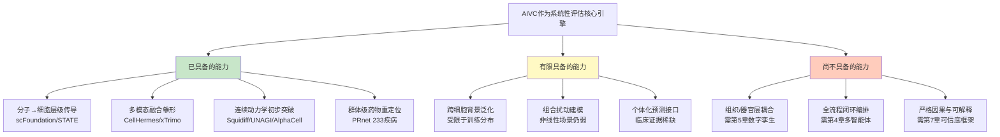

由此可以给出本章的最终判断：**AIVC是大模型实现系统性药物评估的"核心计算引擎"，但绝不是"完整答案"**。它精确地占据了细胞这一不可绕过的中介尺度，承担了"药物如何重塑细胞状态"这一核心子问题的回答任务；同时，它的输出仍需要通过三条衔接路径才能整合为完整的系统性评估能力——

**第一条衔接路径通向多智能体系统（第4章）**：单一AIVC模型只能回答"细胞如何响应一个特定扰动"，而完整的药物评估涉及靶点识别、苗头发现、先导优化、临床前安全、试验设计等多步骤工作流，这一编排只能通过Agentic AI的"感知-思考-行动-观察-反思"循环来完成。AIVC在这一架构中扮演的是一类"专用计算工具"——被多智能体系统调用的细胞尺度专家。

**第二条衔接路径通向跨尺度数字孪生（第5章）**：AIVC本身止步于细胞层面，向上需要连通组织微环境、器官功能、全身生理学，才能真正回答"药物在完整人体中如何工作"。这一向上耦合需要类器官、器官芯片、全身生理学模型与AIVC的协同闭环。

**第三条衔接路径通向个体异质性应对（第6章）**：AIVC的预训练-微调范式提供了承接患者特异性数据的技术接口，但要真正实现"一人一策"的精准模拟，需要患者级单细胞、空间组学、电子健康记录、基因变异等多源数据的系统整合，以及跨尺度迁移方法将细胞系知识外推到患者层面。

这三条衔接路径共同构成了AIVC在本研究"系统性评估"命题中的能力交接图。本章的结论既不是悲观的——AIVC的技术成熟度足以支撑分子-细胞层级的系统性模拟，并已在药物重定位、扰动响应、个体化潜在接口等多个维度产出了具有说服力的证据；也不是盲目乐观的——严格基准测试已经清晰地揭示了AIVC当前在跨细胞泛化与组合扰动上的真实天花板，且从细胞层面到临床获益仍存在多重未弥合的因果缺口。在这一边界明确的判断之上，第4章将转入多智能体系统在药物全流程评估中的能力图谱审视，进一步展开"如何把AIVC这一核心引擎装配进完整的系统性评估机器"这一关键问题。

# 4 大语言模型与多智能体系统在药物全流程评估中的能力图谱

第3章已经将AIVC定位为细胞尺度的"核心计算引擎"——它精确占据了"药物如何重塑细胞状态"这一中介尺度，但其本身既不能自主决定"接下来应当评估什么"，也无法独立完成从靶点假说到临床试验设计的多步骤工作流。换言之，**AIVC回答的是"细胞如何响应"，而系统性药物评估还需要一个能够回答"该评估什么、如何评估、下一步做什么"的编排层与推理层**。本章的任务，正是审视大语言模型（LLM）与多智能体系统（MAS）能否担当这一编排与推理职能：先逐环节剖析LLM在药物研发全流程各阶段的能力成熟度（4.1）、再展开科学专用LLM与通用LLM在具体任务上的对照与协同（4.2），随后审视案例推理、知识图谱、RAG三类机制锚定增强路径（4.3），继而剖析从单体LLM到多智能体系统的范式跃迁逻辑（4.4）与代表性系统的真实落地机制（4.5），并下沉到产业化落地证据（4.6）与边界风险（4.7），最终为第5章跨尺度数字孪生、第6章个体异质性应对衔接出清晰的编排层定位。

## 4.1 LLM在药物研发全流程各环节的能力成熟度差异

要客观判断LLM在药物全流程评估中的真实位置，必须先打破"LLM在药物领域已经成熟"的笼统印象，逐环节审视其能力分布。哈佛大学乔治·丘奇教授团队联合莫纳什大学、格里菲斯大学发表的综述《Large Language Models in Drug Discovery and Development: From Disease Mechanisms to Clinical Trials》给出了一个清晰的三阶段框架——理解疾病机制、药物发现、临床试验，并以"过去—现在—未来"为时间轴梳理LLM在各阶段的能力跃迁路径[^34][^35][^36]：理解疾病机制阶段从依赖手动文献和专利搜索、到加入功能基因组学分析、再到未来由LLM自动识别靶基因并发现生化和药理学原理；药物发现阶段从天然产物筛选、到虚拟筛选与基于结构的手动药物设计、再到未来由LLM设计新型治疗方法并自动进行实验；临床试验阶段则从手动匹配病人与试验、设计试验与收集数据、迈向未来由LLM自动进行病人匹配、试验设计并预测试验结果[^34][^35][^36]。温州医科大学张康团队联合四川大学、澳门科技大学、中山大学、广州实验室、北京生命科学研究所及斯坦福大学在《自然-医学》发表的综述则进一步补充了AI在DMPK、CMC、临床前研究、上市后监测等环节的应用图景[^37]。将这一总体框架细化到具体环节，可以呈现出**能力成熟度的明显非均衡分布**。

**疾病机制理解维度，LLM的能力已具备较扎实的技术雏形**。这一环节的核心任务是从基因组、转录组、蛋白组等多组学数据中识别疾病驱动机制。Patterns期刊综述明确指出，DNA-BERT、Nucleotide Transformer、HyenaDNA等核苷酸级LLM的出现，使基因组信息能够以类似语言的方式被解读——这些模型通过"掩码语言建模"等方法，能够识别功能相关的变异（如SNPs、插入或缺失），并优先预测可能驱动疾病的遗传变体；同时，这些模型还能预测调控元件（如启动子、增强子等）[^38]。从方法论角度看，**核苷酸级LLM的成功本质上是把"基因组序列"作为一种特殊语言来建模**，这与第2章2.3节所讨论的xTrimo蛋白质语言模型路径同源——领域专属海量未标注数据驱动的预训练，让模型能够在无显式标签的情况下学到生物学上有意义的表征。在临床数据收集与亚群体划分阶段，LLM也能够帮助整合临床信息与多组学数据以理解疾病差异以及不同患者群体中潜在的机制差异[^38]。

但需立刻给出能力边界：**疾病机制理解的"自动化"程度仍然有限**。哈佛综述描述的临床分型（Clinical Sub-typing）流程涉及多组学数据收集、临床分析与伦理法规要求等多个层面的协同，这些步骤目前更多依靠多个独立工具的串联，LLM在其中扮演的是文献检索、数据解读、假设生成的助手角色，而非真正的"端到端机制发现者"[^34][^36]。靶点-疾病关联与靶点验证仍然高度依赖CRISPR-Cas9、RNA干扰、体内疾病建模等湿实验工具——LLM能够提出候选靶点假说，但因果验证仍需实验回路[^34][^36][^38]。Patterns综述明确将"靶点-疾病关联"描述为通过通路分析、基因表达谱以及实验手段建立潜在蛋白靶点与疾病之间的联系，将"靶点验证"描述为一个持续、迭代的过程——这一描述本身就暗示了LLM的当前定位是"加速器"而非"替代者"[^38]。

**药物发现维度，LLM的能力分布呈现出从分子表征到全流程编排的梯度**。在分子设计这一最受关注的子任务上，第2章已展开过盘古药物模型等案例，本章不再重复；这里聚焦于药物属性多任务预测的代表性进展。Google DeepMind发布的TxGemma是这一方向的标志性工作——这一系列高效通用大语言模型可用于治疗属性预测、交互式推理和解释，研究利用Therapeutic Data Commons数据集进行指令调优、训练不同参数的模型，并构建了Agentic-Tx系统；**实验结果显示，在66个治疗开发任务中，TxGemma在多数任务上表现出色，Agentic-Tx在多个基准测试中超越先前模型**[^39][^40]。TxGemma的方法论意义在于：**它将原本分散的66个药物开发子任务（活性、毒性、ADMET、相互作用等）统一到一个通用LLM框架内，避免了为每个任务训练专用模型的工程负担**——这与第2章所讨论的通用LLM"多任务统一框架"优势高度一致。

**ADMET与药物相互作用（DDI）维度，LLM的能力受到机制锚定不足的制约**。直接将通用LLM用于DDI预测时面临一个根本困难——传统LLM难以捕捉潜在药理机制[^41]。这一困难的根源在于：DDI不是简单的文本分类任务，而是需要理解两个药物在体内的代谢通路、受体竞争、酶诱导/抑制等复杂药理交互——而这些机制信息很难仅靠互联网文本预训练学到。后续4.3节将展开CBR-DDI如何通过案例推理框架弥补这一缺口，本节先指出能力分布事实：**纯LLM在DDI/ADMET环节的可靠性，显著低于其在文献挖掘、属性多任务预测上的表现**。

**临床试验维度，LLM的能力仍处于愿景大于落地的早期阶段**。哈佛综述明确将临床试验的过去和现在归为"手动匹配病人与试验、设计临床试验以及收集临床试验数据"，将LLM的应用列入"未来"——LLM将自动进行病人匹配、试验设计，并预测试验结果[^34][^35][^36]。这种时间窗的明确区分，本身就反映出该环节当前能力的不成熟。这并不奇怪——临床试验涉及监管合规（FDA/EMA/NMPA）、患者知情同意、医学伦理、长期随访等高度结构化的制度要求，LLM输出的可追溯性、可重复性与可解释性必须达到极高标准才能被采信，而这一门槛远高于学术发表的SOTA指标。

将LLM在各环节的能力成熟度做横向对照，可以归纳为下表：

| 研发环节 | LLM代表性技术 | 能力成熟度 | 关键瓶颈 |
|---------|--------------|----------|--------|
| 疾病机制理解（基因组学） | DNA-BERT、Nucleotide Transformer、HyenaDNA | 较成熟（特征预测） | 端到端机制发现仍需湿实验闭环 |
| 文献挖掘与靶点-疾病关联 | 通用LLM + 检索增强 | 较成熟（助手型） | 因果验证依赖实验 |
| 分子设计与生成 | 盘古药物模型、扩散模型 | 中等（设计层面成熟，机制层面薄弱） | 分子优化与系统性影响脱节 |
| 药物属性多任务预测 | TxGemma、Agentic-Tx | 中等（66任务多数良好） | 仍依赖Therapeutic Data Commons等结构化数据 |
| ADMET / DDI | TxGemma、CBR-DDI | 中等（需机制锚定增强） | 纯LLM难以捕捉药理机制 |
| 毒性与多器官安全 | 通用LLM + ADMET专用模型 | 较弱 | 跨器官、跨尺度毒性传播难以建模 |
| 临床试验设计与患者匹配 | 综述层面展望 | 早期（愿景为主） | 监管对齐、可追溯性、长期随访 |

这一非均衡分布的判断对系统性药物评估命题具有直接含义：**LLM在"信息整合与假设生成"环节已经具备显著加速能力，但在"机制因果建模与临床决策支撑"环节仍处于早期**——这构成了4.3节讨论增强机制、4.4节讨论MAS范式跃迁的内在逻辑动因。

## 4.2 科学专用LLM与通用LLM在药物任务上的对照与协同

第2章已经在总体框架层面对比了科学专用大模型与通用大语言模型两条技术路线，本节将这一对照下沉到药物全流程评估的具体任务，给出更精细的能力画像。

科学专用LLM的核心优势在**领域准确性与机制锚定**。除第2章已讨论的盘古药物模型、xTrimoPGLM、scLong外，本节补充三个具有代表性的产品级案例。第一是DrugChat——加州大学圣地亚哥分校谢澎涛团队提出的多模态LLM，前一章已剖析其分子图+分子图像+语言三元对齐的架构，这里重点强调其在专业药物机制预测上对通用LLM的显著超越：**DrugChat在适应症、药效学、作用机制、概述四项预测任务的人工评分分别为1.05、0.94、0.80、0.92，而GPT-4在相同任务上仅为0.38**——这一对照的差距在2倍以上，明确揭示了"未经领域适配的通用LLM在专业药物机制预测上能力有限"这一关键事实。第二是TxGemma——其在66个治疗开发任务上的良好表现已在前节述及，更值得关注的是它将专用LLM从"单任务专家"升级为"领域通用平台"，并通过Agentic-Tx智能体系统进一步扩展为可自主推理与解释的工作流主体[^39][^40]。第三是哈佛Marinka Zitnik实验室发布的ATOMICA——这一几何深度学习模型能学习跨多种生物分子模态的分子间相互作用的原子尺度表示，可泛化到不同分子类别；模型利用自监督去噪和掩码目标在大量相互作用复合物上训练，并构建了五个特定模态的接口组网络ATOMICANets，用于分析疾病途径和预测疾病相关蛋白，对暗蛋白质组进行注释；实验表明该模型能有效识别疾病途径和相关蛋白[^39]。ATOMICA的方法论价值在于**将"原子尺度的分子间相互作用"作为一种通用语言进行预训练**——这种跨分子类别的统一表征，正是承接第2章所讨论的"领域基础模型"路径在分子相互作用层面的具体实现。

通用LLM的核心优势则在**自由文本表达、推理链生成与跨任务统一**。GPT-4、Claude、DeepSeek等通用LLM能够在自然语言层面整合检索结果、生成可读性高的推理链条，并支持多轮对话式交互——这种交互模式对药物研究人员的日常工作流（提出假设→验证→迭代）具有天然的契合度。但通用LLM的两个关键风险也必须被严肃对待：第一是**幻觉**——一些专家研究人员对ChatGPT等流行LLM模型进行了评估和统计，结果显示**约15%到20%的回复存在不同程度的幻觉现象**[^42]。这一比例在通用对话场景或许可以容忍，但在药物研发这种对事实准确性要求接近"零容忍"的场景中具有破坏性影响。第二是**机制锚定缺失**——通用LLM的输出本质上是基于训练数据中"什么文本经常和什么文本一起出现"的统计学习，并未直接锚定到分子层面的物理化学定律或细胞层面的生物学网络。

对照可以归纳为下表：

| 维度 | 科学专用LLM（DrugChat、TxGemma、ATOMICA等） | 通用LLM（GPT-4、Claude、DeepSeek等） |
|------|----------------------------------|-----------------------------|
| 专业准确性 | 高（DrugChat 1.05 vs GPT-4 0.38）[在AID/PD/MoA/总览等任务] | 中等偏低（领域微调前） |
| 自由文本与推理链 | 中等（任务导向） | 高（多轮对话、长链条） |
| 多任务统一 | 中等（专用平台如TxGemma 66任务） | 高（语言层面通用） |
| 幻觉风险 | 较低（领域锚定） | 较高（15–20%幻觉率） |
| 工程门槛 | 高（领域数据+架构定制） | 低（API直接调用） |
| 机制锚定 | 显式（结构、序列、原子相互作用） | 隐式（文本统计） |

二者协同的典型形态在第2章已有描绘——通用LLM作为推理与编排中枢、专用LLM/专用模型作为领域工具被调用的分布式架构。这一协同的方向性判断进一步获得行业层面背书：北京智源人工智能研究院的方向性判断指出，多智能体系统是突破单体智能天花板的关键路径，企业采用多智能体系统的比例正在加速上升。一个典型的产业化案例是百图生科的"发现助手"——这一发现系统的核心入口在BioASQ等多个权威评测集结果中显示**领先于DeepSeek-R1、OpenAI-o1-mini等其他通用AI产品**，体现了生命科学领域的专业度[^43]。这一对比佐证了一个重要事实：**在药物领域内部，专业适配后的"科学发现助手"已经在核心任务上超越通用LLM**——但这种超越并不等于通用LLM被淘汰，相反它在领域之外的开放性任务（如跨学科推理、与人类自然语言交互）上仍是不可替代的协调中枢。

由此可以归纳出本节的核心判断：**两条路线在药物全流程评估中并非竞争关系，而是分工互补——专用LLM承担"领域专家"角色提供机制锚定，通用LLM承担"协调中枢"角色编排多步骤工作流，二者在Agentic AI架构下相遇并融合**。这为4.4节讨论MAS的范式跃迁提供了直接的逻辑支点。

## 4.3 案例推理、知识图谱与RAG增强：弥补LLM机制锚定缺口

科学专用LLM虽然在领域准确性上明显超越通用LLM，但其训练成本高、覆盖任务有限的特征决定了它无法成为药物全流程评估的唯一形态。一个更具实用性与可扩展性的路径是：**保留通用LLM作为推理基座，通过外部增强机制弥补其机制锚定缺口**。这一思路在过去两年间发展出了三条技术主线：案例推理（CBR）增强、知识图谱与生物医学数据库整合、检索增强生成（RAG）。

**案例推理增强机制以CBR-DDI为代表**，是一类将临床/实验案例库直接注入LLM推理过程的强机制锚定方法。该方法明确指出：**传统LLM在DDI预测中难以捕捉潜在药理机制**——这正是4.1节中所归纳的能力瓶颈。CBR-DDI的解决思路是：**通过构建包含历史案例药理洞见的知识仓库，利用图神经网络（GNN）提取药物关联，结合混合检索机制和双层知识增强提示，使LLMs能有效复用案例信息**[^41]。在DrugBank和TwoSides数据集上的实验显示，CBR-DDI相比基准模型准确率显著提升，**例如在DeepSeek-V3模型上准确率提升28.7%**，且保持高可解释性和灵活性[^41]。

CBR-DDI的方法论意义可从三个层面解读。**第一，它把"药理机制"以案例形式显式注入LLM**——历史案例本身就承载了药物-药物相互作用的真实生物学逻辑，LLM不必从零理解机制，而是通过类比已知案例进行推理。这与人类临床医生的诊疗思路高度同构——医生面对疑难病例时，往往会回忆相似的历史病例作为决策参考。**第二，GNN+LLM的组合提供了结构化与自然语言的双重表达**——GNN从药物结构图中提取连接性特征，LLM则将这些结构化特征翻译为可读的推理链。**第三，28.7%的准确率提升与可解释性同时实现**，这在LLM增强方法中并不容易——许多增强方法虽然提升了准确率，但牺牲了模型的可解释性；CBR-DDI通过显式呈现"参考了哪些案例"，让用户能追溯推理过程。值得对比的是另一项相关工作——基于词嵌入的类比任务预测药物-基因关系，该研究利用从生物文本中学习的词嵌入执行类比任务来预测药物-基因关系，通过定义表示关系的向量在全局和基于生物途径分类的设置下进行实验[^39]。这类工作展示了"类比推理"作为药物领域知识表示的另一种实现思路。

**知识图谱与生物医学数据库整合机制**则是另一条主流增强路径。第2章2.2节在剖析智能体AI架构时已勾勒出感知工具的数据源谱系——在药物领域具体落地中，**ChemBL、PubChem、DrugBank（化合物数据库）、STRING（蛋白质互作网络）、Reactome、KEGG（通路数据库）、Ensembl、OpenTargets、ClinicalTrials.gov（基因组与临床数据）等异构数据源的整合**，为LLM提供了机制锚定的结构化基础。从工程实践角度看，这种整合的关键挑战在于异构数据的标准化与跨库联合查询——同一个基因/蛋白/化合物在不同数据库中可能有不同的命名标识符（gene symbol vs Ensembl ID vs UniProt ID），同一个相互作用可能在不同数据库中有不同的置信度评分。智能体AI架构的优势之一正是把这些异构查询封装为可调用的工具接口，让LLM在自然语言层面发起请求即可完成跨库整合。

**检索增强生成（RAG）机制**是这三类增强中最通用、也最容易出现"伪安全感"的路径。RAG的核心设计初衷是**解决大语言模型固有的幻觉问题——即模型凭空编造不存在的事实、数据或引用的现象，通过检索外部真实文档作为生成依据，提升输出内容的可信度与可解释性**[^44]。但实践中发现，RAG系统并非"幻觉解药"——若各环节存在缺陷，反而可能引入新的幻觉，甚至出现"幻觉叠加"，即检索到错误信息后模型基于错误内容进一步生成虚假结论，严重制约其在关键领域的落地可靠性[^44]。

RAG幻觉的成因可归纳为四类，每一类在药物级监管场景下都具有放大效应：

| 成因 | 具体表现 | 在药物场景下的放大效应 |
|------|--------|------------------|
| 知识库质量缺陷 | 内容错误、冗余噪声、信息过时或缺失[^44] | 文献过期、临床指南更新、不良反应报告滞后将直接误导推理 |
| 检索匹配偏差 | 误检无关文档、漏检关键文档；单一检索方式难以应对口语化查询[^44] | 同一靶点的不同同义词、同一药物的不同商品名/通用名导致检索分裂 |
| 检索后处理不足 | 重排序、过滤、关键信息提取不充分；上下文窗口截断[^44] | 长篇临床试验报告关键段落被截断，导致剂量、毒性、禁忌信息缺失 |
| 生成阶段失控 | Prompt设计不合理使模型忽略检索结果；曲解或过度推理；未知场景编造答案[^44] | 在缺乏文献支撑的罕见病、新机制场景下编造看似合理的答案 |

将这一分析放到药物级监管要求中可以看到一个关键命题：**RAG的"可靠性提升"是相对的而非绝对的**——它在通用知识问答场景能显著降低幻觉率，但在药物-靶点机制、患者级安全决策等"零容忍"场景下仍存在不可忽视的残余风险。这一发现对系统性药物评估命题的方法论启示是：**任何依赖LLM的药物评估系统都必须配套独立的事实校验回路（如湿实验验证、专家评审、跨数据库交叉验证），而不能将RAG视为一劳永逸的可靠性保证**。这一判断也将在第7章关于可信度的讨论中得到进一步深化。

三类增强机制并非互斥，而是可以叠加使用——CBR-DDI本身就是案例推理与GNN结构化检索的融合；TxGemma的Agentic-Tx系统则进一步将多种工具调用整合到智能体架构中；百图生科发现助手将深度搜索功能与组学预测、任务执行能力组合在一起，是这三条路径在产业落地层面的综合体现[^43]。

## 4.4 从单体LLM到多智能体系统的范式跃迁

如果说LLM及其增强机制提供了"局部能力"的提升，那么**多智能体系统（MAS）所代表的是工作流层面的范式跃迁**——它把LLM从一个被动响应的对话工具，重构为一个能够自主规划、执行、反思、迭代的"硅基科研伙伴"。第2章已在范式演进层面引入了Agentic AI的总体框架，本节进一步深入剖析其在药物全流程评估中的结构性意义。

**单体LLM的根本缺陷在于无法跨越数据孤岛、自主串联多步骤流程、在反馈循环中迭代优化**——这正是剑桥、MIT与哈佛Broad、乌普萨拉等机构发表于Drug Discovery Today的综述所明确指出的核心问题。该综述将典型的药物研发流程描述为：靶点识别→苗头化合物筛选→先导优化（DMTA循环）→临床前安全评估，需要跨学科团队在散乱证据中反复搜索、整理和判断；这种依赖碎片化工作流的模式显著推高了研发成本与周期。**当前药物研发AI应用的两大类——预测式与生成式——的共同缺陷是它们都是孤立的"被动实现"**，无法主动决定下一步该做什么。

MAS的核心架构特征可归纳为三个要素。**第一是"感知—思考—行动—观察—反思"的迭代闭环**——这一闭环让智能体不是一次性给出最终答案，而是在每一步根据观察到的结果动态调整后续行动；这与人类科学家"做实验—看结果—修正假设—再做实验"的认知模式高度同构。**第二是中央编排智能体与分布式专业智能体的层级协作**——典型的MAS架构中，一个高层智能体负责理解任务、分解步骤、协调资源，多个低层专业智能体则各自专注于文献阅读、实验设计、代码执行等具体能力。**第三是工具调用协议（如Model Context Protocol, MCP）**作为智能体与外部数据库、计算模型、湿实验设备之间的标准接口——MCP使得不同来源的工具可以被统一编排，FROGENT等系统正是基于这一协议实现端到端工作流。

从产业层面看，MAS的应用占比正在加速攀升。**单智能体系统（SAS）在客服、代码生成、内容生成等领域占比达63%，而以多智能体系统为主的研究和数据分析、内部生产力场景占比为42.1%，且企业采用MAS的比例正在加速上升**——这一数据来自智源研究院《2026十大AI技术趋势》。多智能体系统是由多个AI智能体组成的集合，它们通过交互协作实现个体或共同的复杂目标——这一定义直接对应了药物研发"跨学科、多步骤、长周期"的特征。

将MAS的能力相对于单体LLM做对照，可以归纳出三大结构性优势：

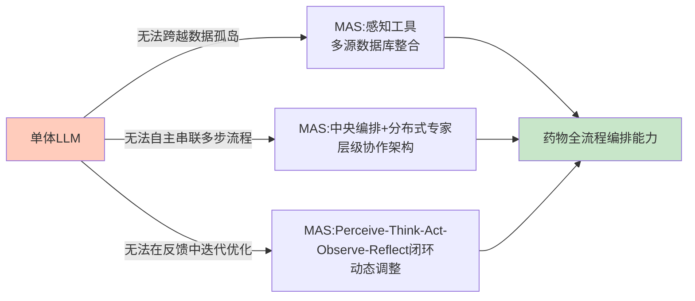

但必须立刻给出一个关键边界判断：**MAS的"系统性"主要体现为工作流编排而非物理机制因果耦合**。即便MAS可以协调AlphaFold预测结构、AIVC预测细胞响应、ADMET模型预测属性，每个工具内部仍是各自独立的预测或生成模型，跨尺度的因果信号并未在统一的数学框架内传递。这一边界与第3章AIVC的能力定位形成呼应——**MAS是"水平的协调层"，AIVC是"垂直的细胞引擎"，二者各司其职，但都不能独立完成系统性药物评估的物理机制建模任务**。这正是为什么第5章必须进一步讨论跨尺度数字孪生的根本原因。

## 4.5 代表性多智能体系统案例剖析

要客观评估MAS在药物全流程评估中的真实落地能力，必须从代表性系统的具体表现入手。本节聚焦四个具有标志性意义的案例——FROGENT、ChemAgents（"小临"）、Coscientist、MOSAIC，剖析它们的架构设计、量化收益与方法论启示。

**FROGENT是当前覆盖范围最广的端到端药物设计MAS之一**。其全名为"Full-process Drug Design Multi-Agent System"，明确指向"全流程"这一定位。其架构由**中央Orchestrate Agent进行战略协调，配合Retrieve、Forge、Gauge三个分布式智能体**，通过Model Context Protocol调用动态生化数据库、可扩展工具库与任务专用计算模型，实现端到端的药物发现工作流——覆盖**靶点识别、小分子生成、多肽优化、逆合成规划**等核心任务[^45]。在量化评估层面，**跨越核心药物发现任务的八项基准上，FROGENT一致优于六个递进ReAct风格的智能体**[^45]，并通过案例研究展示了在真实小分子和多肽设计场景下的实用性与泛化性。FROGENT的方法论价值在于：**它首次将"协调智能体+检索智能体+合成智能体+评估智能体"的四角色架构系统化，并通过MCP协议解决了不同工具接口异构性的工程难题**——这种架构本身具有可被其他领域复用的通用性。

**中科大ChemAgents系统/"小临"机器化学家则代表了MAS与机器人化湿实验闭环的深度融合**。中国科学技术大学罗毅、江俊团队开发的"小临"基于**Llama-3.1-70B大语言模型，并利用华为昇思AI框架进行开发和部署**，整体架构包含一个任务管理智能体和四个专业智能体——文献阅读智能体（快速分析海量文献，为实验提供研究背景与数据支持）、实验设计智能体（根据实验目标制定具体实验方案）、机器人操作智能体（将实验方案转化为机器人与自动化实验工作站的可执行指令）、智算模拟智能体（通过计算模拟降低实验试错成本）[^44]。任务管理智能体作为系统的"指挥官"负责总体协调和任务分配，根据科研目标和需求将任务分解并分配给各个专业智能体[^44]。系统依托四大科研基座——文献数据库、实验模板库、机器实验平台、AI/ML模型库——实现了化学实验室的高度智能化和自主化[^44]。"小临"的方法论意义在于：**它实现了从"读—想—做—创"科研全流程的智能体集群覆盖**——不仅能通过自然语言对话理解科研人员需求，还能自主执行复杂的实验任务，并通过自动化实验与理论计算预训练模型之间的主动学习循环实现模型校准与实验优化[^44]。从单机智能到规模化自主探索的跨越，是"小临"区别于早期机器化学家的关键特征。

**卡内基梅隆Coscientist则展示了MAS在复现复杂化学反应上的惊人效率**。由卡内基梅隆大学和Emerald Cloud Lab研究团队提出的Coscientist以GPT-4为Planner主模块，结合互联网和文档搜索、代码执行和实验自动化等工具——具体通过GOOGLE、PYTHON、DOCUMENTATION、AUTOMATION等命令调用四个软件模块——能够自主设计、规划和执行真实世界的化学实验[^46]。最具说服力的展示是它**在几分钟内成功复现了由有机化学家因"对有机合成中钯催化偶联反应的研究"获得2010年诺贝尔化学奖的反应，且只需要尝试一次**[^46]。这一案例的方法论意义不在于"复现已有反应"本身——而在于证明了**LLM驱动的MAS能够通过工具调用与自然语言推理，从零生成可执行的复杂化学合成方案**。论文通讯作者Gabe Gomes对此评价："我们可以拥有一些可以自主运行的东西，试图发现新的现象、新的反应、新的思想"[^46]。同时论文也客观指出局限——**Coscientist有时会出现化学反应不正确的情况（尽管其可以自我纠正），而现实世界中的研究问题要比本研究中的复杂得多，往往涉及化学以外的学科概念（如药物开发中的生物学），目前的Coscientist还无法解决这些复杂的问题**[^46]。这一坦诚的边界陈述比单纯的成功展示更有方法论价值。

**耶鲁MOSAIC则展示了"集体智能"思路在化学合成场景下的另一种实现**。耶鲁大学团队2026年1月发表在Nature的MOSAIC（Multiple Optimized Specialists for AI-assisted Chemical Prediction）框架基于**Llama-3.1-8B-instruct架构，在Voronoi聚类空间中训练了2498个专项化学"专家"**——化学反应空间被划分为多个专业区域，每个区域都有专门的AI专家处理[^31]。论文第一作者Haote Li指出，现有AI化学系统依赖单一大型模型，而MOSAIC让用户从成千上万种不同的化学反应领域中获取专业知识[^31]。在量化表现上，**MOSAIC实现了71%的整体合成成功率、超过35种新化合物的合成，甚至发现了训练数据中未曾出现过的新化学反应方法**；产率预测分析中预测区间中值与真实产率中位数的相关系数R²=0.811；试剂和溶剂预测方面，当聚合最多三位专家的预测结果时，试剂的完全匹配率提升至43.0%，多专家模式下至少能部分预测出正确试剂或溶剂的成功率高达94.8%[^31]。MOSAIC的方法论意义可与Coscientist对照解读：**Coscientist代表"通用LLM+工具调度"路线，MOSAIC代表"领域专家集群+分诊编排"路线**——前者的优势在于灵活性和跨任务覆盖，后者的优势在于专业深度与领域准确性，两条路线在不同场景下各有所长。

四个案例的横向对照可归纳如下：

| 系统 | 推理基座 | 核心能力 | 量化收益 | 落地深度 |
|------|---------|--------|--------|--------|
| FROGENT | LLM+MCP工具协议 | 全流程药物设计编排（靶点/小分子/多肽/逆合成） | 八项基准一致优于六个ReAct智能体[^45] | 计算闭环 |
| ChemAgents/小临 | Llama-3.1-70B+昇思 | 文献-设计-机器人-模拟四专业智能体协同 | 实现规模化自主实验探索[^44] | 计算+湿实验闭环 |
| Coscientist | GPT-4+四模块 | 化学反应自主规划与执行 | 几分钟一次成功复现诺奖反应[^46] | 计算+云实验室闭环 |
| MOSAIC | Llama-3.1-8B+2498专家 | 化学合成方案集体智能预测 | 71%合成成功率、R²=0.811、试剂94.8%部分匹配[^31] | 计算+实验验证 |

将四个案例放在系统性药物评估的框架中可以归纳出三条共性观察。**第一，MAS的真实价值在"自主性+可扩展性+跨任务覆盖"三者的乘积**——单一指标的SOTA并不构成MAS的核心吸引力，跨多步骤工作流的连续可执行性才是。**第二，MAS与湿实验闭环的耦合程度直接决定其产业化价值**——纯计算的MAS（如FROGENT、MOSAIC）能够加速早期药物发现，而MAS+机器人化实验室（如ChemAgents/小临、Coscientist+Emerald Cloud Lab）才能真正逼近"AI替代人类湿实验"的产业愿景。**第三，MAS仍处于"演示性成功"向"系统性可靠"过渡的早期阶段**——Coscientist的失败案例自我纠正、MOSAIC的部分匹配率而非完全匹配率，都提示当前MAS距离"任意药物任务一次成功"的可靠水平还有距离。

更具启示性的是Emerald Cloud Lab这类**云实验室基础设施**所代表的范式。卡内基梅隆大学正与Emerald Cloud Lab合作建造耗资4000万美元的云实验室——这将是世界上首个由大学拥有的云实验室，实验由科学家通过软件设计，由约200种不同类型的机器人远程执行[^46]。Emerald位于旧金山以南的总部，超过100台高端生物科学设备在工作台上自主运转，每天24小时、每周7天，几乎无人值守地为全球研究人员执行实验；云实验室意味着任何人在任何地方都可以仅使用网络浏览器进行远程实验[^47]。云实验室的方法论意义在于：**它将"湿实验能力"作为一种可远程调用的服务暴露给MAS**——这从根本上改变了AI智能体能够触达的物理世界边界，使得"AI规划→机器人执行→数据回流→AI迭代"的全自主循环具备了基础设施支撑。

## 4.6 产业化落地证据：从平台公司到BD交易的真金白银验证

学术演示与产业化落地之间存在一道无法忽视的鸿沟——许多在论文中表现优异的方法在真实商业环境中难以站住脚。本节从三个层面收集产业化落地的"真金白银"证据：平台公司的能力锚定、BD交易的资本验证、以及"尚未跨越的终点线"的客观警示。

**第一层：平台公司证据**。在AI制药领域，几家头部平台公司构成了能力图谱的关键参考点。

**百图生科**作为全球生命科学基础大模型的领跑者，其技术与商业化路径具有标志性意义。截至2025年，百图生科**总融资金额约2亿美元（约合人民币14.54亿元）**，已拥有上千亿参数量的全模态生物大模型xTrimo V3——参数规模达到2100亿、覆盖DNA、RNA、蛋白质、细胞、小分子、生物视觉和生物知识文本等7个主流模态，宣称是当时全球规模最大的生命科学基础大模型，**在200个任务模型上达到SOTA水平**，已**服务全球500多家客户，包括60余所QS世界百强大学和赛诺菲等多家跨国药企，潜在订单价值达20亿美元**[^43]。其"生命科学生成式发现系统"的核心入口"发现助手"在BioASQ等多个权威评测集结果中**领先于DeepSeek-R1、OpenAI-o1-mini等其他通用AI产品**[^43]。技术副总裁张晓明对未来给出判断："未来5-10年，AI制药产业可能将迎来爆发期"[^43]——这一时间窗判断与本研究持久推理标准P-6（前瞻判断的证据锚定与时间窗）相契合。麦肯锡全球研究院预测，生成式AI技术将为制药和医疗技术公司每年创造600亿-1100亿美元的经济价值[^43]。

**晶泰科技**作为"AI制药第一股"，提供了AI制药商业化的另一条参照路径。2024年6月13日上市，发行价5.28港元/股，**上市首日总市值197.59亿港元**[^48][^49]。其核心业务包括药物发现解决方案和智能自动化解决方案，2021年至2023年收入分别为6280万元、1.33亿元、1.74亿元，**年复合增长率66.7%**[^48][^49]。客户留存率方面，2021年至2023年分别约为67.5%、51.4%及64.9%，留存回头客包括辉瑞、强生、正大天晴药业、韩国大熊制药及德国默克集团等[^48][^49]。最具说服力的能力锚定指标是：**晶泰科技就小分子所开展的全部晶体结构预测项目取得了100%的成功率，而行业平均成功率介乎86%至93%**[^48][^49]。但商业化路径同样揭示风险——2021年至2023年经营亏损分别为2.99亿元、5.25亿元和7.22亿元[^48][^49]，反映出AI制药平台从技术优势到盈利的距离仍然不短。

**英矽智能**则提供了AI制药从平台到管线的另一种产业化路径。**2025年底英矽智能成功上市并首日高开45%，创下港股生物科技公司最大IPO纪录**[^50][^51]。英矽智能拥有超过27款临床前候选化合物的创新内部管线，**其中10款分子已获得临床试验批件**，AI技术已从药物发现前端延伸至临床预测、患者招募等全流程；依托Pharma.AI平台**将从靶点发现到临床前候选化合物（PCC）确认的时间从行业平均的4.5年缩短至12～18个月**，显著提升研发效率并降低成本[^51]。据国金证券报告，**AI降低新药研发成本且使研发投入的回报提升5倍，AI药物的商业价值将比标准药物高20倍，比同类最佳的精准药物高2.4倍**[^51]。

**Recursion Pharmaceuticals**则展示了AI制药"工业化"路线的代表性案例。**2023年7月，Recursion宣布获得英伟达5000万美元私募股权投资，英伟达将获得该公司约4%的股份**；Recursion计划利用其庞大的专有生物和化学数据集（**超过23千兆字节（PB）和3万亿可搜索基因和化合物关系**）加速英伟达DGX Cloud上基础模型的训练[^52]。Recursion将自身定位为TechBio公司——通过解码生物学使药物发现工业化，通过将高内涵显微镜技术与阵列式CRISPR基因组编辑技术相结合，可以在多种人类细胞环境中严格地描绘庞大的、高维的生物和化学扰动库，以创建人类生物学的数字"图谱"，并利用大规模计算能力进行大规模虚拟筛选来预测数十亿种化合物的蛋白质靶点[^52]。**合作宣布当日Recursion股价暴涨78.17%**，反映出资本市场对"AI+大规模专有数据+巨头算力"这一组合的强烈认可[^52]。

**第二层：BD交易兑现证据**。AI制药能否产生真实价值的最直接检验，是它能否撬动跨国药企的真金白银投入。

宏观层面，**截至2025年12月31日，中国创新药商务拓展（BD）出海授权全年交易总金额达到1356.55亿美元，首付款70亿美元，交易总数量达到157笔**——远超2024年全年519亿美元和94笔[^53]。**中国创新药交易额已占全球总额的49%，一举超过美国**，全年创新药对外许可总金额为2024年的2.5倍，是美国同期对外许可的3.2倍[^53]。进入2026年第一季度，中国创新药对外授权交易总额已突破600亿美元，逼近2025年全年的一半[^49][^54]。

具体到AI制药相关交易，最具代表性的是**石药集团与阿斯利康185亿美元的平台级合作**——这份合作协议瞄准的不止单个产品，还包括**石药集团专有的缓释给药技术平台及多肽药物AI发现平台**，**首付款达12亿美元**[^49][^54]。这是AI制药"平台授权"模式的标志性案例，也佐证了AI驱动的药物发现平台已具备进入跨国药企核心战略视野的成熟度。BMS与insitro 2025年10月14日基于AI药物发现平台ChemML的深化合作，**总额超20.2亿美元**，联合开发ALS新型小分子药物，通过QAL数据集与AI闭环流程加速靶点转化[^55]——这是AI制药与神经退行性疾病这一传统"难啃骨头"领域结合的代表案例。

但必须立刻给出客观警示——**BD交易金额的"真金白银"含量远低于表面数字**。SRS Acquiom近期发布的《2025生命科学并购与交易报告》显示：**如果按金额计算，BD交易临床前里程碑的兑现率约为55%，到临床III期已降至12%，而商业化阶段里程碑的达成率仅为5%左右**；首付款普遍较小（大致是交易总额的2%～5%左右），真正的大头是后续与临床及商业化进展深度绑定的里程碑付款[^54]。这意味着**很多天价BD只是挂在远方树梢上的"青梅"，能看但并不能真正解渴，绝大多数交易最终都只兑现了微薄的首付款**[^54]。

不过这种情况正在发生变化。根据医药魔方NextPharma数据库显示，**2026年一季度中国创新药海外BD首付款总额33亿美元，同比增长267%；单笔BD首付款平均额0.67亿美元，较2025年全年大幅提高53%**[^54]。**2025年以来单笔交易的首付款比例约在5.2%~6.7%之间，较往年的2~5%有显著提高**，反映了买方对资产确定性的认可[^49][^54]。这一信号对AI制药同样具有积极含义——首付款比例提升意味着跨国药企对AI驱动的资产质量有了更高的初始信心。

**第三层：仍未跨越的终点线**。在所有的乐观证据之外，必须坦诚一个客观事实：**迄今为止全球尚未诞生一款完全由AI主导研发并成功上市的药物**[^52][^56]。被寄予厚望的"先行者"同样伴随着高风险——**由Exscientia推出的全球首个AI设计分子"DSP-1181"，最终因1期临床试验未达到预期目标而折戟沉沙**[^52][^56]。这种理想与现实的落差本质上源于新药研发自身的复杂性与监管政策的使然——这正是本研究持久推理标准P-5（能力边界与局限的平衡呈现）所要求的"对厂商/论文宣传性结论应交叉验证"的具体体现。

国内企业的突围战已经打响——**2025年2月希格生科宣布与晶泰科技合作完成药物发现的首创新药管线项目SIGX1094，正式获得美国FDA快速通道认定**，首个适应症为胃癌；希格生科CEO张海生表示药物有望完成二期临床实验后即可申请上市，并期待"成为第一个由AI设计开发的并成功获批上市的药物"[^52][^56]。这一信号若在未来2-3年内兑现，将构成AI制药产业的关键里程碑事件。

将三层证据综合起来，可以形成一个边界明确的判断：**AI制药已经从"概念演示"进入"商业兑现期"——平台公司的高估值、跨国药企的真金白银BD、监管机构的开放态度共同验证了AI驱动的药物发现已具备产业化基础；但"完全由AI主导研发并获批上市"的终点线尚未被冲穿，DSP-1181的失败、BD里程碑的低兑现率、平台公司的持续亏损共同提醒着这一行业仍处于"高潜力—高风险—长周期"的阶段**。

## 4.7 全流程评估能力的边界、风险与衔接

将本章LLM与MAS的能力图谱收束为一个分层判断：**它们已构成药物全流程评估的"编排层"与"推理层"，在文献挖掘、假设生成、多步骤工作流编排上具备显著加速能力，但在"机制因果建模、患者级精准评估、监管级可信度"三个维度上仍存在结构性缺口**。这一边界判断需要从三类核心风险与三条衔接路径两个角度展开。

**三类核心风险**。

**第一是LLM幻觉风险**。如前所述，**约15%到20%的LLM回复存在不同程度的幻觉现象**[^42]——这一比例在通用对话场景或许可以容忍，但在药物级监管场景下不可接受。RAG等增强机制的承诺是缓解幻觉，但实践证明RAG本身可能引入新的"幻觉叠加"——即检索到错误信息后模型基于错误内容进一步生成虚假结论[^44]。CBR-DDI等案例推理增强机制虽然在DeepSeek-V3上将准确率提升28.7%[^41]，但28.7%的相对提升并不意味着绝对可靠——它仍然依赖于历史案例库的覆盖度与质量。在系统性药物评估场景中，这意味着**任何依赖LLM/MAS的评估输出都必须配套独立的事实校验回路（湿实验验证、专家评审、跨数据库交叉验证），不能将LLM增强机制视为一劳永逸的可靠性保证**。

**第二是评估失真风险**。第3章已展示了Systema、scPerturBench等基准研究揭示的"简单基线击败复杂深度学习模型"的评估范式问题。这一问题在LLM评估领域同样存在——LLM评估面临数据泄漏、测试样本覆盖率不足、与任务无关的样本（虚假相关性）、数据集划分难题、随机数种子依赖、准确率与召回率权衡以及未解释的决策等多重挑战；目前模型构建、扩展和泛化等方面的技术发展得比对其进行评估测试的方法更快，这就导致了对模型评估不足和对模型能力存在过高估计或夸大[^57]。这一现象提示：**当前关于LLM在药物领域取得SOTA性能的论文结论应保持必要的怀疑**——必须结合独立基准、对抗性测试、外部验证集来交叉确认。

**第三是监管对齐风险**。**FDA于2025年4月10日发布《减少临床前安全性研究中动物实验的路线图》**，指出将逐步取消单克隆抗体（单抗）及其他药物的临床前安全性研究中动物实验，转而采用类器官等更多新的替代技术；**2026年1月FDA接收由3Rs Collaborative牵头的肝器官芯片ISTAND计划意向书**，参与者包括Axiom/LifeNet Health、BioIVT、CN Bio、DefiniGEN、InSphero、Lena Biosciences、PredictCan、TissUse、Xellar等一众企业；**Xellar（耀速科技）正是这份名单中唯一入选的中国器官芯片公司**[^52][^56]。仅2个月后FDA还发布了《药物开发中采用新方法论的总体考量行业指南》意见稿，旨在鼓励参与者向监管提交器官芯片、类器官等新方法的相关实验数据，以提高临床试验的安全性，降低对动物实验的依赖[^52][^56]。这意味着监管端对新技术的接纳已迈出实质步伐——**但LLM/MAS输出的可追溯性、可重复性、可解释性是否能达到FDA的证据标准，仍是开放问题**。器官芯片、类器官作为物理实验替代物已经获得监管开放，而纯计算的LLM/MAS预测要被采信则需要更高的可信度门槛。

**三条衔接路径**。

将本章的能力图谱放回整篇报告的逻辑链条中，可以清晰看到LLM与MAS作为"编排与推理"职能必须依赖的三条衔接路径，构成与后续章节的关键交接点：

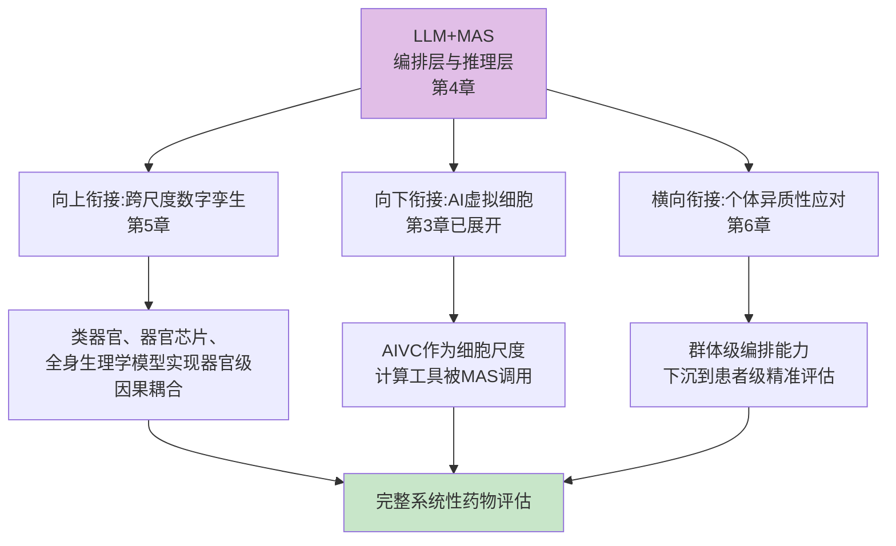

**第一条衔接路径向上**——LLM/MAS的"系统性"主要体现为工作流编排，物理机制上的器官级因果耦合需要类器官、器官芯片、全身生理学模型来承担。FDA对器官芯片ISTAND计划的开放、耀速科技完成超2亿元A轮融资构建"以人源化模型与机制研究为核心的下一代生物智能基础设施"[^52][^56]、2026年类器官芯片市场进入"产业爆发期"——这些都将在第5章中展开剖析。

**第二条衔接路径向下**——AIVC作为细胞尺度的计算引擎是MAS架构中的一类"专用工具"。MAS通过Model Context Protocol调用AIVC执行细胞响应预测、调用AlphaFold执行结构预测、调用ADMET模型执行属性预测——这种"协调层+引擎层"的分工正是Agentic AI架构的本质特征。

**第三条衔接路径横向**——LLM/MAS当前的编排能力主要建立在群体级数据与通用知识之上，要真正落地到"一人一策"的个体化精准评估，必须将患者特异性数据（基因变异、单细胞剖面、电子健康记录、影像）作为输入纳入编排回路。这一向"个体级"的下沉将在第6章专门审视。

综合本章的论证，可以归纳出一个边界明确的总体判断：**LLM与多智能体系统在药物全流程评估中扮演的是"编排与推理"的中枢角色——它们是连接AIVC（细胞引擎）、跨尺度数字孪生（器官耦合）与患者特异性数据（个体精准）的关键纽带，但本身并不直接承担物理机制建模、个体因果推断、监管级证据生成的重任。它们是系统性药物评估的"操作系统"而非"完整解决方案"**。在这一定位之上，第5章将深入展开跨尺度建模与数字孪生如何为编排层提供器官级因果耦合的物理基础，第6章将进一步审视个体异质性如何被真正建模——共同构成对核心命题"大模型能否系统性模拟药物对机体影响并应对个体异质性"的逐层逼近。

# 5 多尺度建模与数字孪生：从分子到个体的跨尺度药物效应模拟

第3章已将AI虚拟细胞定位为细胞尺度的核心计算引擎，第4章则把大语言模型与多智能体系统刻画为编排层与推理层。然而，系统性药物评估的本质命题——"药物在完整机体中如何工作"——并不能仅靠"细胞引擎+智能体编排"两层构件给出答案：药物分子的物理化学属性必须经由细胞响应放大到组织微环境、再传递到器官生理功能、最终汇聚为个体临床表型，每一次"向上跨越"都涉及不同物理定律、不同时间尺度、不同空间分辨率的耦合。**跨尺度建模与数字孪生正是要解决这一耦合问题——把分子动力学、细胞通路、空间微环境、组织器官与全身生理学整合为统一的模拟框架，使扰动信号能够在五个尺度之间真实传播**。本章将依次展开多尺度建模的层级架构与耦合逻辑（5.1）、虚拟组织与空间因果建模的范式跃迁（5.2）、全细胞建模与分子-细胞耦合的工程化路径（5.3）、类器官与器官芯片作为物理实验载体的湿-干闭环（5.4）、自动化云实验室与机器化学家作为跨尺度实验基础设施（5.5）、基因组与人群尺度数据作为向个体延展的数据底座（5.6），最终把数字孪生作为系统性药物评估终极愿景的方法论价值与现实差距收束为分层判断（5.7），为第6章个体异质性应对衔接出"从群体平均到个体精准"的过渡逻辑。

## 5.1 多尺度建模的层级架构与耦合逻辑

要理解跨尺度药物效应模拟的总体面貌，首先需要把"多尺度"这一概念从抽象口号下沉为具体的层级架构。瑞士罗氏创新中心Jitao David Zhang等人发表于Drug Discovery Today的综述给出了一个产业实践层面的清晰框架——临床前药物机理与安全性的数学和计算模型可分为三个层级，每个层级各有优劣，**任何单一水平的模型都不能满足要求，因此需要采用多尺度建模方法**[^58]。

**第一层是分子水平建模**——使用理化原理以及分子建模和模拟技术，对分子结构和分子之间的相互作用进行建模。这一层的核心命题是"药物如何与靶分子结合"——以药物-蛋白质相互作用为例，相互作用的强度在很大程度上取决于药物及其蛋白质结合位点的形状和静电互补性，这正是Fischer提出的锁钥原理；建立分子-靶标相互作用的模型需要结构信息，X射线晶体学是当前3D蛋白质结构数据的主要实验来源，蛋白质数据库（PDB）已收录超过15万种蛋白质结构，过去几年中冷冻电镜已成为提供较大蛋白质聚集体和膜蛋白的原子分辨率结构的重要替代技术，G蛋白偶联受体（GPCR）和离子通道的许多结构已得到解决[^58]。这一层的能力局限在于：再精确的分子对接也只能回答"分子与靶点是否结合得好"，无法回答"结合后细胞会发生什么"。

**第二层是细胞和组学水平建模**——使用高通量技术以及生物信息学和统计分析来探测细胞中特定种类的所有分子、它们的空间组织以及细胞形态[^58]。这一层正是第3章AIVC所占据的位置，也是scFoundation、scLong、STATE、AlphaCell等代表性模型的能力主战场。其核心命题是"药物如何重塑细胞状态"——但同样存在能力上限：细胞响应的预测尚不能直接回答"这个药物在患者肝脏中是否会引起肝毒性"。

**第三层是器官和系统级别建模**——检查药物和身体如何相互作用以及随着时间的推移相互影响[^58]。这一层涉及药代动力学（PK）、药效动力学（PD）、生理学药代动力学模型（PBPK）、全身代谢循环、跨器官毒性传播等。它的优势在于直接对接临床表型，劣势在于通常缺乏分子层面的机制解释力——经典PBPK模型主要由代谢酶活性、组织分配系数、清除率等参数构成，对靶点-通路层面的细节是"黑箱化"处理。

将三层架构与第3章AIVC、第4章MAS的能力定位对照可以呈现如下耦合关系：

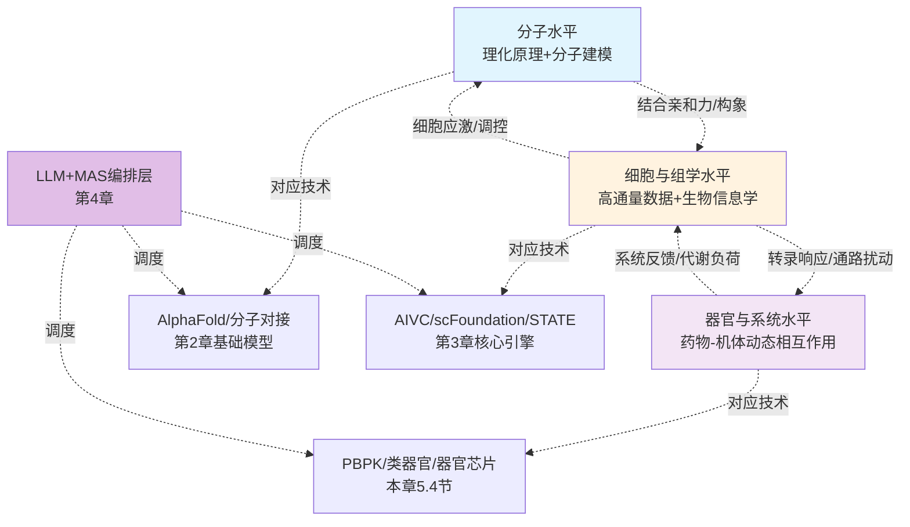

Drug Discovery Today综述进一步将多尺度建模的实施步骤刻画为一个迭代闭环：**假设产生→模型构建→模型验证→确认/拒绝/修改假设→产生新假设以供进一步检验**——计算方法可以单独进行预测，分析实验数据，以及挖掘现有数据并确定模式以建立模型；在分子、细胞和组学以及器官和系统水平建立模型后，不同规模的模型可以相互交流和受益，**数据生成、管理、解释和集成对于通过多尺度建模表征药物机制和安全性同样重要**[^58]。这一描述揭示出多尺度建模不是简单的"层叠加"，而是数据-模型-假设之间的循环演化系统。

但需要立即指出一个被产业界长期忽略的事实：**当前所谓的"多尺度建模"，绝大多数实践仍是"工具调度的伪耦合"而非"统一数学框架的真耦合"**——第4章已指出MAS的"系统性"主要体现为工作流编排而非物理机制因果耦合。具体到本章语境：把AlphaFold预测的结构、scFoundation预测的细胞响应、PBPK模型预测的全身代谢拼装到一个工作流里，并不等同于扰动信号在统一数学框架内从原子尺度连续传递到个体尺度。要实现真耦合，必须有跨尺度的"信号传递语言"——这正是后续小节中Celcomen因果识别框架、Nicheformer生态位感知、STT空间转移张量等工作所要攻克的核心命题。

## 5.2 虚拟组织与空间因果建模：从Celcomen到Nicheformer的范式跃迁

如果说AIVC把建模对象锁定在"单细胞"这一节点，那么从细胞向上跨入"组织"层级，必须面对两个本质上的新挑战：**第一，组织不是细胞的简单堆砌，而是细胞间在空间邻域内通过物理接触、可溶因子、机械应力等多种通讯方式形成的有结构生态系统；第二，药物对组织的影响不仅作用于单细胞内部基因调控，还通过细胞间相互作用产生跨细胞的传播效应**。空间转录组学的兴起为研究这一问题提供了关键数据基础——它使研究人员可以在单细胞分辨率下同时测定细胞的基因表达和空间坐标，并能在空间样本中大规模开展基因敲除等扰动实验[^59]。但"空间数据可获取"并不等于"跨尺度建模可实现"——计算方法常常忽视了细胞和组织水平的因果扰动建模，而这一点对于揭示组织疾病状态背后的机制至关重要[^59]。Celcomen与Nicheformer正是在这一方法论缺口上的代表性突破。

**Celcomen：首个具有因果推断可识别性的虚拟组织模型**。剑桥大学研究团队提出的Celcomen是一种基于数学因果关系的新型图神经网络，用于解开空间转录组学和单细胞数据中的细胞内和细胞间基因调控的秘密[^59]。其方法论价值集中体现在三个层面：**研究证明了将虚拟细胞模型推广至虚拟组织模型的可行性**；**提出了首个在空间转录组学分析中具有因果推断可识别性（causally identifiable）的模型**；**通过整合解离单细胞数据与空间单细胞数据进行基因调控推断**[^59]。值得强调的是，"因果推断可识别性"这一术语具有严格的统计学含义——它意味着模型在数学上能够保证从观测数据中恢复出真实因果结构，而非仅仅给出关联性强的预测。这一突破之所以重要，是因为它直接回应了第3章3.6节所揭示的AIVC基准测试警示——许多深度学习模型在皮尔逊相关等指标上表现优异，但实际只是在重现"训练集平均"，并未真正学到扰动机制。Celcomen通过将因果识别性嵌入模型架构，从源头上规避了这种"评估失真"风险。

研究人员在Perturbmap数据集上对Celcomen进行了基准测试——这是一个体内全转录组数据集，测量了空间转录组学中的基因敲除，包含一种用于研究KP肺癌的小鼠模型，可能存在Jak2或Tgfbr2基因敲除；该数据集注释了5个空间区域作为病变区域，部分为KP野生型癌症，或KP癌症与Jak2敲除，或KP癌症与Tgfbr2敲除[^59]。这一基准测试的方法论意义在于：它把"空间区域级的扰动效应预测"作为评估目标，比单纯细胞层面的扰动预测更逼近真实组织尺度的药物效应模拟。

**Nicheformer：3亿+细胞预训练的多模态基础模型**。如果说Celcomen代表了"因果识别"维度的方法论突破，Nicheformer则代表了"规模化预训练"维度的范式跃迁。这是一种统一建模单细胞与空间组学数据的多模态基础模型——**在超过3亿个细胞、数千个组织样本、百余种测序平台的多组学数据上预训练**，通过自监督学习捕获细胞状态、组织结构与生态位（niche）间的层级关系；模型结合了单细胞转录组、空间转录组、表观组和蛋白组信息，实现了在细胞与空间层面的一体化表征[^60]。

Nicheformer的架构设计直接回应了"如何把空间结构嵌入大模型"这一核心技术问题：模型基于多层Transformer架构，结合图神经网络（GNN）与多模态注意力机制，构建跨单细胞与空间层级的统一表征空间；其训练采用四类自监督任务——**基因掩码预测**重建随机掩码的基因表达、**模态对齐**通过对比学习对齐单细胞与空间表示、**生态位感知任务**在空间邻域内预测细胞间的生态相似度、**跨物种映射**通过共享潜在空间对齐不同物种细胞类型[^60]。模型由单细胞编码器（Transformer-based）、空间编码器（Graph Attention-based）和模态融合模块组成，融合层通过多模态注意力将表达特征与空间邻域特征整合成统一嵌入，形成生态位感知表示[^60]。

在评估方面，Nicheformer在多组织和多平台数据上能够对齐单细胞和空间模态，重建精确的细胞位置与类型，**在对齐任务中的性能超越了scVI**这一被广泛使用的强基线[^60]。研究还展示了模型能够解释细胞生态位的空间组织规律和跨物种的系统相似性，**为多模态细胞生态系统的全面建模奠定基础**[^60]。

**Spatial Transition Tensor (STT)：动态时序的多尺度补充**。Celcomen与Nicheformer主要解决"空间结构"问题，但药物作用是动态过程——细胞在药物刺激下经历状态转变，组织在治疗过程中经历重塑。北京大学周沛劼团队等发表于Nature Methods的Spatial Transition Tensor (STT)正是针对这一动态维度的补充：STT使用mRNA剪接和空间转录组通过多尺度动力学模型表征空间中的多稳定性，**通过学习四维转移张量和空间约束随机游走，重建细胞状态特异性动力学和空间状态转移**——既包括细胞间的短时局部张量流线，也包括吸引子之间的长时转移路径[^61]。STT在多种转录组数据集上的基准测试与应用——包括上皮-间充质转化、血液发育、空间分辨的小鼠脑和鸡心脏发育——表明其能够恢复细胞状态特异性动力学及其相关基因，这是现有方法所无法做到的；**STT为单细胞转录组数据提供了跨多个时空尺度的一致多尺度描述**[^61]。

将三类工作放在统一坐标系上对照可呈现下表：

| 模型 | 核心方法论突破 | 解决的关键问题 | 数据规模/基准 |
|------|------------|------------|------------|
| Celcomen | 首个因果推断可识别性的空间组学模型 | 从关联走向因果，避免"评估失真"风险 | Perturbmap KP肺癌空间扰动数据集 |
| Nicheformer | 3亿+细胞多模态预训练，生态位感知 | 跨平台、跨物种、跨模态的统一表征 | 3亿+细胞、百余种测序平台 |
| STT | 四维转移张量+空间约束随机游走 | 动态时序与空间稳定性的统一刻画 | 上皮-间充质转化、血液发育、脑/心脏发育多数据集 |

从这一对照可以归纳出"细胞→组织"跨尺度建模的三重方法论跃迁：**从静态关联到空间因果（Celcomen）**、**从单细胞表征到生态位感知（Nicheformer）**、**从快照拼接到动态时序（STT）**。这三重跃迁共同构成了AIVC向"虚拟组织"延展的技术基础——正如Celcomen论文所明确指出的，**虚拟组织模型不仅能估计环境对单个细胞的影响，还能够推测单个细胞对其周围环境及整体组织的影响**[^59]。这种"双向跨尺度"能力是系统性药物评估命题的关键技术诉求。

但同时必须给出一个边界判断：**当前虚拟组织模型主要解决"细胞→组织"这一单跨度耦合，向上进一步延伸到器官生理学与全身代谢仍存在显著缺口**——Nicheformer的"生态位"仍然是组织内的局部空间结构，而非真正的"肝脏-肾脏-免疫系统"全器官交互；STT的"长时转移"仍然以细胞状态为节点，而非器官级生理过程。这一缺口意味着虚拟组织模型本身还不能独立承担系统性药物评估，必须与下文将讨论的器官芯片、PBPK等技术形成互补。

## 5.3 全细胞建模与分子-细胞耦合的工程化路径

如果说Celcomen-Nicheformer-STT代表了"细胞→组织"方向的跨尺度跃迁，那么"分子→细胞"方向的耦合则有另一条更早起步、更工程化的传统——**全细胞建模**。这一方向的根本目标是用数学语言完整刻画一个细胞的所有生命过程，使分子层面的扰动可以通过精确的机理模型传递到细胞表型。中国科学院天津工业生物技术研究所朱岩、孙际宾团队对这一领域的系统归纳，揭示了全细胞建模在系统性药物评估中的方法论位置与现实困境[^62]。

**全细胞建模的数理框架与代表性进展**。朱岩团队系统归纳了系统生物学中细胞建模的数理框架：从网络拓扑、随机过程、动力学方程等维度剖析了常见数学模型架构及其使用范围，继而分类评述了**生长分裂、形态发生、DNA复制、转录调控、生化代谢、信号转导、群体感应等单一细胞过程的建模策略**，并重点探讨了整合多个细胞过程构建全细胞模型的研究进展[^62]。Cell Research编辑评论则给出了这一领域的历史脉络——虚拟细胞或数字细胞的概念约在2000年前后引入，最初依赖传统的低通量生化实验来量化特定生物过程中物质的时空变化，这些早期模型采用微分方程和随机模拟来建模特定细胞过程；先驱性的全细胞虚拟模型如**Mycoplasma genitalium、Escherichia coli和Saccharomyces cerevisiae**主要基于先验知识构建，尽管开创性地推进了领域，但缺乏严格设计的匹配扰动组学数据和时空成像数据[^63]。

将全细胞建模的传统路径与AIVC的数据驱动路径放在一起观察可以看到一个有趣的对照：**全细胞建模强调机理透明、参数可解释、过程可分解，但严重依赖先验知识与精细参数；AIVC强调数据驱动、表征学习、跨任务迁移，但机制锚定相对薄弱**。Cell Research的编辑评论正是从这一对照中提出了"三大数据支柱与闭环学习"的方向性判断——AI虚拟细胞要成长为可信的工具，需要三大数据支柱作为基础并通过闭环学习不断迭代[^63]。这一判断与朱岩团队所归纳的传统建模路径在数据-机制双重驱动上形成了高度互补。

**全细胞建模面临的九大共性挑战**。朱岩团队的综述坦诚指出了构建机制模型描述细胞生命过程时存在的结构性问题——这九大挑战对系统性药物评估命题具有直接的方法论启示：

| 序号 | 挑战 | 对系统性药物评估的含义 |
|------|------|------------------|
| 1 | 测量数据不足，无法充分捕捉生物系统复杂性 | 患者级多模态数据稀缺直接限制个体化建模 |
| 2 | 细胞生命过程的分子机制不明确，依赖大量假设和近似 | 模型对未知机制的处理影响外推可靠性 |
| 3 | 孤立描述单一生物过程，忽略多过程间复杂相互作用 | 对应"单尺度建模与系统性需求"的根本张力 |
| 4 | 模型结构过于复杂，陷入复杂度灾难（curse of complexity） | 全细胞建模的可扩展性瓶颈 |
| 5 | 包含大量经验参数，往往由体外实验或其他模式生物迁移而来，不完全准确 | 跨物种、跨细胞类型外推的参数可信度问题 |
| 6 | 参数搜索空间巨大，导致维度灾难（curse of dimensionality） | 制约模型校准与个体化适配 |
| 7 | 缺乏统一构建和模拟标准，变量和参数注释各异，模拟流程不统一 | 跨模型集成与监管认可的工程性障碍 |
| 8 | 实验验证不够，资源时间限制下验证常被简化或跳过 | 对应第3章"计算-实验闭环"必要性 |
| 9 | 准确度评判不足，不同模型采用不同评判标准 | 与第3章Systema、scPerturBench的"评估失真"问题同构 |

[^62]

这九大挑战与第3章AIVC基准测试中暴露的问题、第4章LLM/MAS的机制锚定缺口形成了深度同构的关系——它们共同指向一个事实：**任何单一建模范式，无论是基于先验机理的全细胞模型还是基于数据驱动的AI基础模型，都无法独立承担系统性药物评估的全部任务**。

**机理建模与AI基础模型的融合必要性**。朱岩团队特别提到，**测序仪、质谱、光谱、微流控等前沿装备的迭代升级，数据科学、人工智能、自动化等高新技术集群的突破性进展，使得细胞组分动态变化的精确测量、海量生物数据的快速获取、细胞过程数理模型的精准构建成为可能**[^62]。这一描述指向一个清晰的融合方向——**AI基础模型为传统机理建模提供大规模数据驱动的参数估计能力与跨任务迁移能力，传统机理建模为AI基础模型提供机制锚定与可解释性**，两者在"分子→细胞"耦合层面的融合正是数字孪生路径不可或缺的工程基础。Cell Research编辑评论所提出的"三大数据支柱与闭环学习"框架在方法论上正是这种融合的具体表达——AI虚拟细胞需要在数据、模型、实验之间形成闭环，而非孤立追求任一维度的最优[^63]。

但融合路径本身也面临两个未解的难题：**第一是参数转译——如何把AI模型从数据中学到的隐式表征转化为机理模型可使用的显式参数**；**第二是尺度对齐——如何在数据驱动的细胞表征与机理驱动的分子动力学之间建立连续的数学桥梁**。这两个难题目前仍是开放问题，构成了"分子→细胞"跨尺度耦合最深层的理论缺口。

## 5.4 类器官与器官芯片：物理实验载体与AI模型的湿-干协同闭环

无论是Celcomen-Nicheformer所代表的虚拟组织模型，还是全细胞建模所代表的机理路径，最终都必须回答一个监管级问题——**计算预测的可靠性如何被物理实验所验证**。在这一交叉点上，类器官与器官芯片作为物理实验载体的崛起，与AI虚拟细胞形成了"湿-干协同闭环"，构成了跨尺度药物效应模拟最具产业化前景的耦合路径。

**类器官芯片的核心价值与"百年痛点"**。类器官芯片融合了两项前沿技术：**一是由干细胞自组织形成的三维微型器官——类器官；二是基于微流控技术构建的动态培养环境——器官芯片**；两者结合，在厘米见方的芯片上构建出具有脉管网络、能模拟生理功能的"迷你人体"[^48]。这项技术诞生的初衷直指生物医学研究的百年痛点：**传统的二维细胞培养过于简化，无法模拟人体复杂的微环境；而动物实验虽不可或缺，却因种属差异导致近90%在动物身上安全有效的药物，最终在人体临床试验中失败**[^48]。这一"近90%在动物有效但在人体失败"的事实，与第1章所揭示的"约90%在I期临床后失败"的事实形成了相互印证——种属差异、模型简化、生理环境缺失共同构成了传统临床前评估失灵的根源。

**2025-2026年关键科研突破**。类器官芯片在近一两年间从"技术验证期"快速进入"产业爆发期"，几项标志性突破值得展开。**血管化突破——让类器官真正"活"起来**：类器官研究长期面临一个核心瓶颈——大尺寸类器官内部容易因缺乏血管供应而缺氧坏死；2026年1月发表于Biosensors and Bioelectronics的研究中，中国研究团队开发了一种生物传感器集成的肝类器官芯片，能够实时监测血管化过程中的关键指标，**研究发现在流体力学刺激下，内皮细胞和肝细胞的成熟被同步促进，并确定了"第5天"为最佳移植窗口期**；**在此窗口期移植的肝类器官，能够在肝硬化小鼠体内恢复约93%的肝功能和小叶结构；而移植过早或过晚的类器官，疗效则降低50%-70%**[^48]。这一研究不仅验证了"移植窗口假说"，更为类器官在再生医学中的质量控制提供了实时、定量的新框架。**胚胎着床"黑箱"首次揭秘**：2025年12月，北京干细胞与再生医学研究院、中国科学院动物研究所联合团队在Cell发表重磅成果——**成功研发3D子宫胚胎植入模拟芯片，在国际上首次完整复刻了人类胚胎的着床过程**[^48]，这一突破对辅助生殖治疗失败这一长期临床难题具有方法论意义。

**全球市场图谱：从"技术验证期"向"产业爆发期"跨越**。2025年至2026年，类器官芯片市场正经历从"技术验证期"向"产业爆发期"的关键跨越，根据多家研究机构的数据，这一赛道的增长曲线正变得日益陡峭——从区域格局看，**北美凭借领先的科研投入和制药巨头的集聚，占据了约43.80%至50%的全球市场份额；欧洲紧随其后；亚洲则成为增长最快的区域市场，中国市场在其中扮演着越来越重要的角色**；从应用端来看，**药物发现与开发是类器官芯片最大的应用场景**，毒理学研究和疾病建模紧随其后；从产业链上游看，产品（包括芯片设备、耗材及配件）占据主要份额，但**服务端的占比正在快速提升**——越来越多的研究机构和制药公司倾向于将药物测试外包给类器官芯片服务商[^48]。

**FDA监管端的实质突破**。这是2025-2026年间最具方向性意义的进展。**2025年4月10日，FDA发布《减少临床前安全性研究中动物实验的路线图》，指出将逐步取消单克隆抗体（单抗）及其他药物的临床前安全性研究中动物实验，转而采用类器官等更多新的替代技术**[^52][^56]。**2026年1月，FDA接收由3Rs Collaborative（3R联盟）牵头的肝器官芯片ISTAND计划意向书，参与者包括Axiom/LifeNet Health、BioIVT、CN Bio、DefiniGEN、InSphero、Lena Biosciences、PredictCan、TissUse、Xellar等一众企业**[^52][^56]。**仅2个月后FDA还发布了《药物开发中采用新方法论的总体考量行业指南》意见稿**，旨在鼓励参与者向监管提交器官芯片、类器官等新方法的相关实验数据，以提高临床试验的安全性，降低对动物实验的依赖[^52]。这一系列动作意味着，**器官芯片等非动物实验作为替代方案，已经在官方标准体系中迈出了破局的第一步，新技术的应用不再仅仅停留在设想阶段**[^52]。

**中国企业的产业突围：耀速科技案例**。Xellar（耀速科技）正是FDA意向书名单中**唯一入选的中国器官芯片公司**[^52][^56]。耀速科技完成超2亿元A轮融资，由国寿股权独家领投，老股东晶泰控股、雅亿资本、君联资本持续加码，主要用于**构建以人源化模型与机制研究为核心的下一代生物智能基础设施，包括拓展器官芯片疾病模型体系，建立可规模化运行的机制研究平台，并持续进行高通量、标准化的真实生物数据采集与积累**[^52]。耀速科技背后股东结构值得关注——晶泰控股作为AI制药"第一股"是其老股东，这一组合本身就揭示出"AI制药平台+器官芯片基础设施"的产业协同逻辑。

**湿-干协同闭环的方法论价值**。将类器官芯片放回多尺度建模的整体框架中可以看到一个清晰的协同闭环：**AI虚拟细胞生成扰动响应预测→类器官芯片提供物理实验验证→芯片产生的高质量、标准化生物数据回流到AI模型→模型迭代优化预测精度**。这一闭环正是Cell Research编辑评论所提出的"闭环学习"在产业层面的具体落地[^63]。耀速科技融资用途中"持续进行高通量、标准化的真实生物数据采集与积累"的表述，本质上就是为AI虚拟细胞的"三大数据支柱"提供物理产能。

但同时必须给出客观警示：**类器官芯片仍面临可重复性、规模化、监管证据标准等多重挑战**——FDA对器官芯片ISTAND计划的接纳是"意向书"而非"完全替代"，《药物开发中采用新方法论的总体考量行业指南》仍处于"意见稿"阶段；产业端虽有耀速科技这样的标志性企业，但"距离真正的'AI制药'时代，行业仍面临漫长的验证期"——**最直观的现实是迄今为止全球尚未诞生一款完全由AI主导研发并成功上市的药物**[^52][^56]。这一坦诚的边界陈述对系统性药物评估命题具有重要的方法论意义——湿-干协同闭环已经具备产业雏形，但远未达到"完全替代动物实验+人体验证"的终点。

## 5.5 自动化云实验室与机器化学家：跨尺度模拟的实验闭环基础设施

类器官芯片解决的是"细胞-组织-器官"层面的物理实验载体问题，而支撑跨尺度模拟另一类不可或缺的基础设施是**自动化云实验室与机器化学家**——它们把"湿实验能力"作为可远程调用的服务暴露给AI智能体，使全自主跨尺度闭环具备物理执行支点。

**Coscientist：GPT-4驱动的"AI实验室伙伴"**。第4章已介绍Coscientist几分钟内复现钯催化偶联反应的标志性案例，本节从跨尺度模拟基础设施视角进一步剖析其方法论意义。Coscientist由卡内基梅隆大学和Emerald Cloud Lab研究团队共同提出，**结合大型语言模型的能力以及互联网和文档搜索、代码执行和实验自动化等工具，能够自主设计、规划和执行真实世界的化学实验**[^46]。Coscientist在六个不同任务中展示了其加速研究的潜力，**包括成功优化钯催化偶联反应（其发明者获得2010年诺贝尔化学奖）**，同时在（半）自主实验设计和执行方面展现了先进的能力——这一研究表明，**人类有可能有效地利用AI提高科学发现的速度和数量，并改善实验结果的可复制性和可靠性**[^46]。系统的主模块Planner以GPT-4为基础，作为实验室助手，Coscientist通过调用GOOGLE、PYTHON、DOCUMENTATION等命令访问软件模块[^46]。Coscientist的另一项关键设计是允许大型语言模型像人类化学家一样使用谷歌在互联网上搜索信息，最终程序根据是否能够导致所需物质、步骤详细程度等因素进行评分；Boiko和MacKnight观察到Coscientist能展示"化学推理"能力——使用化学相关信息和先前获得的知识来指导一个人的行为的能力[^46]。

但Coscientist也有明确局限：**Coscientist有时会出现化学反应不正确的情况（尽管其可以自我纠正），通过使用复杂的提示策略和增加化学相关的数据，这些问题或许可以得到缓解；现实世界中的研究问题要比本研究中的复杂得多，往往涉及化学以外的学科概念，如药物开发中的生物学，目前的Coscientist还无法解决这些复杂的问题**[^46]。这一坦诚的边界陈述对跨尺度模拟具有直接启示——AI实验室伙伴在化学合成层面已具备"演示性成功"，但跨学科的复杂任务（典型如药物开发涉及的化学+生物学耦合）仍是开放问题。

**Emerald Cloud Lab与CMU云实验室：远程实验基础设施的产业范式**。Coscientist的成功离不开其背后的物理执行平台。**卡内基梅隆大学正与Emerald Cloud Lab合作建造耗资4000万美元的科学实验室，由大学资助，预计在秋季开始施工，2022年夏季完工**——这将是世界上第一个由大学拥有的云实验室，**实验由科学家通过软件设计，由约200种不同类型的机器人远程执行**[^46]。在Emerald位于旧金山以南的总部，**超过100台高端生物科学设备在工作台上自主运转，每天24小时、每周7天，几乎无人值守地为全球研究人员执行实验**[^47]。云实验室意味着任何人在任何地方都可以仅使用网络浏览器进行远程实验，**实验通过基于订阅的在线界面进行编程，软件随后协调机器人和自动化科学仪器执行实验并处理数据**[^47]。Emerald周五晚上是其最繁忙的时段——科学家安排实验在周末与家人放松时运行[^47]。

**A-Lab：机器学习+机器人+主动学习的自动化材料合成范式**。A-Lab由美国加州大学伯克利分校团队开发，2022年初正式开建并于2023年2月正式运营——**该系统通过机器学习分析科学文献生成最多5个初始化合物合成配方，利用机械臂自主完成粉末混合、高温烧结和X射线衍射检测，形成闭环实验流程，每日可处理材料样本量为人类的50-100倍**[^46]。**在为期17天的实验中，A-Lab执行355次实验，成功合成58种目标材料中的41种（成功率71%）；当产物收率低于50%时，系统通过主动学习算法动态调整配方，采用多步加热、前体再研磨等改进方案可将成功率提升至78%**[^46]。A-Lab是一个将机器人技术与从头计算的数据库、机器学习驱动的数据解读、从文本挖掘的文献数据中学习得到的合成启发式方法以及主动学习相结合的自主实验室系统，旨在**加速无机粉末固态合成**——A-Lab整合了计算数据如Materials Project和GNoME数据库、历史文献知识和机器人技术[^46]。

**云实验室与机器化学家的方法论价值**。将Coscientist、Emerald Cloud Lab、A-Lab放在跨尺度模拟基础设施的统一框架中观察可以归纳出三层价值：**第一，远程可调用的湿实验服务化**——AI智能体不再受物理实验室的地理与时间约束，"AI规划→机器人执行→数据回流→AI迭代"的全自主循环具备了基础设施支撑；**第二，跨实验通量提升的乘数效应**——A-Lab的"50-100倍人类通量"与Emerald的"100+设备24/7运转"共同构成了一种新的实验经济学，使大规模假设检验成为可能；**第三，标准化数据回流机制**——云实验室天然具备数据标准化优势，每次实验的元数据、参数、结果都以结构化格式记录，直接为AI模型提供高质量训练数据。

但同样必须客观给出边界：**Coscientist的化学反应错误率、A-Lab合成的部分材料被指出与历史文献存在重复——需结合人工验证确认新颖性**[^46]——这两个事实共同提示当前自动化实验室仍处于"演示性成功"向"系统性可靠"过渡的阶段；尤其在生物学层面，能够支撑类器官芯片、单细胞测序、空间转录组等复杂生物实验的全自动化云实验室仍是开放问题。这一边界意味着自动化实验基础设施在化学合成层面已具备较成熟产业形态，但在系统性药物评估所需的"分子合成+细胞响应+组织表型+个体效应"全链路自动化上仍存在明显缺口。

## 5.6 基因组与人群尺度数据：跨尺度模拟向全身生理学与个体延展的数据底座

跨尺度建模向"器官-个体-人群"层级延伸，最终必须回答一个根本问题——**用什么数据来训练能够覆盖个体差异的模型**。这一问题的答案不在算法本身，而在数据基础设施。UK Biobank近50万人全基因组测序数据集与人类细胞图谱的并行积累，构成了系统性药物评估向个体延展的数据底座。

**UK Biobank：世界最大全基因组数据集的方法论价值**。当地时间2023年11月30日，英国生物数据库UK Biobank公布了**迄今为止世界上最大的全基因组序列数据集，包含近50万人的基因数据**——这些数据将通过UK Biobank的云平台向全世界的申请者开放[^47]。UK Biobank开始于2006年，是一项由英国卫生和社会福利部（DHSC）资助的长期生物样本研究计划——2010年完成了对**50万年龄在40岁至69岁的英国居民志愿者**的招募，并持续收集他们的生物样本、全身扫描数据以及健康和生活方式数据；除此之外，在参与者同意的情况下，该数据库还通过英国国家健康服务（NHS）所保存的医疗记录来追踪参与者的病史[^47]。UK Biobank的数据通过其网络研究分析平台向全世界申请者开放，**目前已有来自90个国家的超过3万名研究者成功申请使用数据库，并产生了超过9000篇经过同行审议的研究论文**[^47]。

从全基因组测序的数据规模看，研究团队针对UK Biobank **490,640名非芬兰欧洲、非洲、德系犹太、东亚、南亚等多族裔参与者**生成了覆盖全基因组的测序数据，结果显示：**WGS共识别出超10亿个单核苷酸多态性（SNP）和近1.012亿个小插入/缺失（Indel），其中WES仅能捕获约2.5%的WGS变异**（尤其是非编码区、罕见变异及结构变异）；**每个基因组平均包含7,340个缺失和5,762个插入/重复，影响约3.6兆碱基对的序列**——这些结构变异多为罕见（频率<1%），且长度远超常见变异[^47]。研究团队将其与**763项二元性状（如有无某种疾病）和71项数量性状（如血压、血糖）的GWAS（全基因组关联研究）结合，发现了3,991个此前未被基因分型芯片或WES捕获的遗传关联**[^47]。

**多维数据整合对精准医疗的方法论支撑**。UK Biobank的方法论价值不止于全基因组序列本身，更在于其多维数据整合——**除了全基因序列数据之外，数据库还收集了50万名志愿者身上超过10000项生物指标，包括血压、认知功能、饮食和骨密度等**[^47]。**通过将这些数据联系起来，研究者们就能够探究精准医疗相关的问题，比如为什么带有相同致病基因的人却对同样的治疗有不同的结果、反应和副作用**[^47]。这正是第1章所揭示的"个体异质性放大效应"的数据基础——只有把基因变异、生理指标、临床表型、生活方式等多源数据整合在同一队列中，才有可能从数据中识别出异质性的根源。

进一步从临床转化角度看，全基因组数据为药物研发提供了直接的成功率提升证据：**目前全世界有超过四分之一的在研药物因为药效差而无法通过临床试验**；《自然·遗传学》上刊载的一项研究显示，**包含直接基因证据的药物机理研究对药物研发至关重要，能够提升两倍的临床试验成功率**[^47]。强生公司创新药物研究部执行副总裁John Reed博士的评论给出了更直接的方法论指向：**这个里程碑式的数据集能够让我们借助人工智能的力量来快速识别新的疾病靶点，帮助研究者们根据基因来预测候选药物对特定病患群体的影响**[^47]。这一表述与本研究"系统性评估"命题高度对接——UK Biobank为AI驱动的患者亚群响应预测提供了无可替代的数据底座。

**人群代表性的客观局限**。然而，UK Biobank并非完美——一个不可忽视的局限是**人群代表性的偏差**：搜索资料的标题已直接揭示这一点——"英国公布世界最大全基因组数据集，但不适用研究亚洲人健康问题"[^47]。该数据集以欧裔为主，对亚洲、非洲等其他族裔的覆盖相对不足。这一局限在系统性药物评估命题中具有重要的方法论含义——**基于UK Biobank训练的模型在外推到非欧裔人群时存在系统性偏倚风险**，这正是第6章个体异质性应对必须面对的挑战。Nature Genetics研究中**多族裔GWAS元分析和表型全关联研究揭示了部分性状仅在特定族裔中存在的遗传基础，为解决"欧洲人群主导的遗传研究外推至其他族裔时的偏差"提供了关键数据**[^47]，但这种偏差的存在本身就提示——单一国家级生物银行无法独立支撑全球化的精准医疗，需要多国队列的协同。

**人类细胞图谱：细胞尺度参考图谱的并行积累**。与UK Biobank在基因组层面的积累并行，**人类细胞图谱（Human Cell Atlas）使命是创建所有人类细胞——生命的基本单位——的全面参考图谱，作为理解人类健康、诊断、监测和治疗疾病的基础**[^47]。这一表述简洁而精准——它点明了细胞图谱在跨尺度模拟中的位置：**细胞是连接基因组与表型的中介尺度，没有细胞尺度的参考图谱，从基因变异到临床表型的映射就缺失了关键中间层**。第3章已介绍CZI此前花费多年建立的Cell Atlas项目和CELLxGENE平台积累了超过1亿个标准化细胞数据，这与UK Biobank的50万人基因组数据形成了"基因型+细胞型"双底座的方法论组合。

**多源数据底座的现实缺口**。将UK Biobank、人类细胞图谱与第3章已讨论的Tahoe-100M（1亿+单细胞扰动数据）放在统一框架中观察，可以归纳出当前数据基础设施的三层结构——**人群层（UK Biobank）、细胞层（HCA、CELLxGENE）、扰动层（Tahoe-100M）**。但同时必须客观指出，这一数据底座在**人群多样性、纵向动态、跨尺度对齐**三个维度上仍存在显著缺口：

| 维度 | 当前状态 | 现实缺口 |
|------|------|------| 
| 人群多样性 | UK Biobank以欧裔为主，亚洲数据相对薄弱 | 非欧裔人群代表性不足，模型外推存在系统性偏倚 |
| 纵向动态 | 多数为单时点快照，UK Biobank有部分纵向但仍有限 | 药物长期效应、疾病进展轨迹的纵向多模态数据稀缺 |
| 跨尺度对齐 | 各层数据独立积累，跨层对应关系薄弱 | 同一个体的基因组+细胞图谱+临床表型完整链路样本稀少 |

第三类缺口尤为关键——理想的跨尺度数字孪生需要**同一个体在分子、细胞、组织、器官、个体五个尺度上的完整数据链**，但当前数据资源主要是各层独立积累，跨层对应关系（如同一患者的全基因组+特定组织单细胞剖面+器官影像+临床随访）仍是稀缺资源。这一缺口意味着即便有了UK Biobank和HCA这样的"巨型数据库"，要真正落地到个体级数字孪生，仍需要新一代"跨尺度个体队列"的建设。

## 5.7 数字孪生在系统性药物评估中的方法论价值与现实差距

将本章前六节论证收束为对数字孪生路径的分层判断。第1章已铺垫数字孪生愿景的初步表述——医生在患者数字孪生上预演治疗方案；本章则把这一愿景拆解为具体的技术构件，并审视其当前能力图谱与现实差距。

**数字孪生作为系统性药物评估终极愿景的三重方法论价值**。

**第一重价值在于跨尺度耦合的扰动信号传播**。数字孪生承诺通过分子-细胞-组织-器官-个体五层耦合实现扰动信号的跨尺度传播预测——这正是第1章所提出的"系统性评估"核心诉求的直接技术回应。具体而言，分子层的AlphaFold结构预测、细胞层的scFoundation/STATE扰动响应、组织层的Celcomen/Nicheformer虚拟组织、器官层的类器官芯片物理验证、人群层的UK Biobank基因型-表型映射，已经各自具备了相对成熟的工具体；数字孪生的方法论价值正是把这些独立工具**整合为统一框架**，使"在分子A上施加扰动→预测细胞B的响应→推断组织C的重塑→外推到器官D的功能变化→映射到患者E的临床获益"这一完整链路成为可执行的工作流。

**第二重价值在于通过虚拟实验大幅压缩研发周期与试错成本**。第1章揭示的10-15年研发周期与10-20亿美元单药成本，背后的关键瓶颈正是物理实验的高成本与长周期。数字孪生通过虚拟扰动模拟可以在计算空间内完成大规模的"假设检验"——PRnet为233种疾病推荐候选药物的能力（第3章）、Coscientist几分钟复现诺奖反应的能力（第4章、5.5节）、A-Lab每日处理人类50-100倍样本量的能力（5.5节）已经从不同侧面验证了这一价值的现实落地。结合FDA对器官芯片的监管开放（5.4节）以及AI制药行业的BD交易兑现（第4章），数字孪生路径的产业化已经具备了"压缩研发周期与试错成本"的初步实证。

**第三重价值在于通过个体特异性数据接入实现"医生在患者数字孪生上预演治疗方案"的精准医疗愿景**。这一愿景在第3章UNAGI在IPF的PCLS人体模型实验中得到了局部印证（虚拟筛选出硝苯地平并经实验验证），在5.4节耀速科技以人源化模型为核心的产业布局中得到了基础设施层面的回应，在5.6节UK Biobank+HCA双数据底座中得到了数据基础的支撑。这三层证据共同指向一个判断——个体级数字孪生在技术构件层面已具备初步可行性。

**数字孪生路径的四类现实差距**。但同样必须以本研究持久推理标准P-5"能力边界与局限的平衡呈现"为标尺，客观界定四类现实差距：

**第一类差距：跨尺度因果耦合的物理基础仍弱**。如5.1节所指出的，当前"多尺度建模"绝大多数实践仍是"工具调度的伪耦合"——把AlphaFold、AIVC、PBPK拼装到一个工作流里，并不等同于扰动信号在统一数学框架内连续传递。Celcomen实现了"细胞→组织"的因果识别突破[^59]、Nicheformer实现了生态位感知的统一表征[^60]、STT实现了空间动态时序建模[^61]，但这些工作各自仍局限在两个相邻尺度之间；从原子尺度连续到个体尺度的"五层全耦合"目前仍是开放问题。朱岩团队所归纳的全细胞建模九大挑战（5.3节）——尤其是"孤立描述单一生物过程"和"缺乏统一构建和模拟标准"——正是这一差距的具体表现[^62]。

**第二类差距：动态时序建模能力不足**。多数模型仍为静态快照拼接而非真实时间演化——第1章已指出大多数组学研究为单时点快照，缺乏纵向数据；第3章AIVC基准测试警示也部分指向时序泛化能力不足；STT虽然在空间转移张量层面取得突破[^61]、Squidiff在连续生成层面有进展（第3章），但要支撑"药物长期暴露下的累积毒性""治疗过程中的耐药演化""慢病多年进展轨迹"等真实临床场景的动态预测，当前能力仍有显著缺口。

**第三类差距：个体级数据稀缺，临床级队列与监管级证据标准存在显著鸿沟**。5.6节已展开人群多样性、纵向动态、跨尺度对齐三类数据缺口；耀速科技融资用途中"高通量、标准化的真实生物数据采集与积累"的明确表述[^52]，本身就反映了这一基础设施的稀缺程度。从监管视角看，**FDA对器官芯片ISTAND计划的接纳是"意向书"而非"完全替代"**，《药物开发中采用新方法论的总体考量行业指南》仍处于"意见稿"阶段[^52][^56]——这意味着即便数字孪生在科研层面已具备初步能力，要被采信为监管级证据仍需要跨越"可重复性、稳健性、独立验证"三道门槛。

**第四类差距：验证与监管对齐挑战**。**FDA对器官芯片等物理替代物的开放快于对纯计算数字孪生的接纳**——这是一个值得深思的现象。其背后的逻辑是：器官芯片虽然是新技术，但仍属"物理实验"范畴，监管机构对其证据生成机制有相对成熟的评估框架；而纯计算的数字孪生预测必须证明其与真实人体响应的可量化对应关系，这一证据标准目前尚不清晰。这一差距与第7章可信度框架将要展开的XAI、不确定性量化、独立基准测试等议题深度耦合。

**总判断：数字孪生是系统性药物评估的"远景蓝图"而非"当前现实"**。整合本章六节论证可以给出一个边界明确的判断——AIVC、LLM/MAS、类器官芯片、云实验室构成了数字孪生的当下可执行组件集合，每一类组件都已有具体的产业化案例（晶泰科技、英矽智能、百图生科、耀速科技、Recursion、Coscientist、A-Lab）和监管开放信号（FDA路线图、ISTAND意向书）作为锚定证据；但完整的"分子→细胞→组织→器官→个体"五层全耦合数字孪生在技术上仍存在跨尺度因果耦合、动态时序、个体级数据、监管对齐四类现实差距。

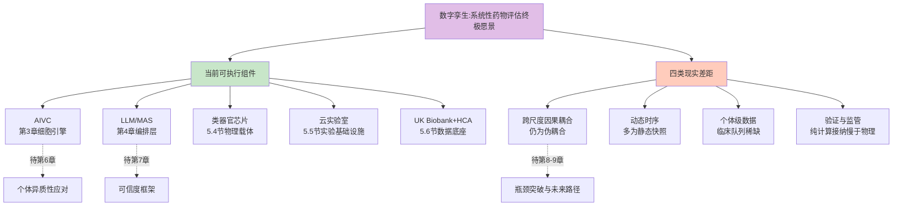

更具体地，本章的论证为后续三章衔接出三条清晰路径——**第6章个体异质性应对**将进一步展开"如何把基于UK Biobank、HCA等群体数据训练的模型下沉到一人一策的个体级精准评估"，回答数字孪生第三类差距中的核心命题；**第7章可信度框架**将深入XAI、不确定性量化、独立基准测试等议题，回答第四类差距中的监管对齐挑战；**第8-9章瓶颈与未来路径**将系统讨论跨尺度因果耦合的统一数学框架、动态时序的纵向队列建设、监管科学的协同演进等更长远的方向。

至此，本章给出的总判断是：**数字孪生不是当下可立即调用的成品，但其各核心组件已经具备了产业化雏形与监管初步开放；从"组件集合"演进为"完整跨尺度耦合系统"是未来5-10年的主要技术路径**。这一判断与百图生科技术副总裁张晓明所给出的"未来5-10年AI制药产业可能将迎来爆发期"的时间窗判断（第4章）形成了呼应——系统性药物评估的真正系统性突破，将在数字孪生跨尺度组件持续整合、个体异质性应对取得突破、可信度框架与监管科学协同演进这三条主线的合力下逐步展开。下一章将专门展开"个体异质性应对"这一关键命题——如何把当前主要建立在群体平均数据上的大模型评估能力，下沉到真正回应"为什么相同基因型患者对同样治疗有不同结果"这一精准医疗核心问题的患者级精准模拟。

# 6 应对个体异质性：从群体平均到患者级精准模拟

第1章已经把"个体异质性放大效应"刻画为传统药物评估范式失灵的核心驱动之一，第3至第5章则依次审视了AI虚拟细胞、多智能体编排与跨尺度数字孪生在系统性药物模拟中的能力分布与边界。然而，无论是scFoundation在4800万细胞上的预训练、PRnet对233种疾病的候选药物推荐，还是Celcomen-Nicheformer所构建的虚拟组织表征——这些能力的"系统性"主要建立在**群体平均数据**之上，而真正回应核心命题"大模型能否应对个体异质性"必须跨越的最后一公里，是把这种群体级能力下沉为**患者级**精准模拟。也即第1章所归纳的判断——传统范式建立在"群体平均响应"假设之上，而真实临床获益高度依赖"个体级响应"——能否在大模型时代被实质性突破。

本章正是聚焦这一"最后一公里"。先剖析个体异质性在分子、细胞、微环境、临床表型多个维度的具体形态及其对模型外推的核心挑战（6.1）；继而审视患者特异性多模态数据如何被组织为个体化建模的输入底座（6.2）；进而展开CODE-AE等跨尺度迁移方法在"细胞系→患者"外推上的方法论框架与实证（6.3）；以肿瘤异质性、免疫治疗响应、罕见病三类高度依赖个体化的临床场景为标尺验证不同建模策略的真实表现（6.4–6.6）；接着以乳腺癌生物学数字孪生与CPDT为代表案例剖析"医生在患者数字孪生上预演治疗"愿景的能力与差距（6.7）；最后给出"一人一策"精准模拟的能力分层判断并衔接第7章可信度框架与第8-9章瓶颈与未来路径（6.8）。

## 6.1 个体异质性的多维表现及其对模型外推的核心挑战

要把"个体异质性"从抽象口号下沉为可被模型捕获的具体维度，需要在第1章总体铺垫之上做更精细的解剖。一个核心观察是：异质性并非单一变量，而是从分子层面的遗传变异，向上传递到细胞层面的功能状态、组织层面的微环境构成、个体层面的临床表型与人群层面的族裔差异，**形成一条贯穿五尺度的"差异谱系"**——任何一层未被显式建模，都会在模型外推时形成放大性的偏差。

**分子层面的遗传背景差异**最为基础也最为复杂。一方面，单基因突变本身的差异即可决定截然不同的疾病表型与治疗响应——以囊性纤维化（CF）为例，已知CFTR基因有许多不同类型的突变可引起该病，但绝大多数CF患者中至少有一个F508del突变；F508del仅因一个苯丙氨酸的缺失便导致CFTR蛋白无法正确折叠，难以抵达细胞表面，即使有极少蛋白到达细胞膜也因功能丧失无法正常控制跨膜通道[^43]。另一方面，多基因背景对单基因突变带来的患病风险具有显著的修饰效应——基于80,000多人的分析显示，对于三种重要的遗传病，多基因背景能有效地改变单基因突变带来的患病风险——例如，**基于不同的多个遗传变异组合，BRCA1/2突变携带者在75岁之前患乳腺癌的概率从13%到76%不等**[^54]。这一近6倍的概率跨度直接揭示出：仅凭单基因状态进行风险预测或药物选择，会系统性低估或高估特定个体的真实情况。

**肿瘤分子层面的多组学异质性**是个体差异最具放大效应的场景之一。Bruker Spatial Biology对肿瘤异质性的刻画给出了一个清晰的分层定义——癌症是一系列高度异质性疾病的集合，其共同起源是驱动增殖与细胞死亡等关键细胞功能的突变；**肿瘤中的每个细胞都可能携带其自身的基因组改变与表达程序，组织与微环境压力又会为肿瘤病理学叠加独有特征；患者也可能因自身的遗传构成与微生物组而对治疗产生不同反应**[^49]。这一表述的方法论意义在于把异质性细分为三个嵌套层次：**细胞内异质性**（单细胞层面的基因组与表达程序差异）、**微环境异质性**（组织与微环境压力的局部叠加）、**个体异质性**（患者自身的遗传构成与微生物组）——三者乘积式叠加构成了"为什么相同诊断的两位患者对相同治疗会有完全不同反应"这一精准医疗核心问题的生物学根源。

**肿瘤免疫微环境（TIME）的双重性**则进一步放大了个体异质性。南月敏教授对肝细胞癌TIME的系统刻画揭示了两个关键事实：第一，TIME由肿瘤相关巨噬细胞、T细胞、B细胞、NK细胞、树突状细胞、骨髓来源抑制细胞等免疫细胞，以及癌症相关成纤维细胞、内皮细胞、细胞外基质等组成；第二，**T细胞、NK细胞、MDSCs等免疫细胞具有"双刃剑"作用——一方面发挥免疫监视、识别和清除新生肿瘤细胞的作用，另一方面可能促使肿瘤细胞发生免疫逃逸**[^53]。更具体地，CD8⁺T细胞作为抗肿瘤免疫反应的主要效应细胞可释放穿孔素、颗粒酶和TNF-α介导抗肿瘤应答，但**缺氧和酸性的微环境下又限制了CD8⁺T细胞特异性细胞毒性反应**；不同状态的CD8⁺T细胞还具有完全相反的预后含义——以KLRB过度表达为特征的CD8⁺T细胞与HCC患者预后不良相关，而表达XCL1的CD8⁺T细胞则与病毒相关性HCC的较好预后相关[^53]。这意味着**仅凭"CD8⁺T细胞浸润数量"这一群体级指标根本无法刻画个体的真实免疫状态**——同样浸润数量下，亚群构成与功能状态可能给出完全相反的临床预后。

**临床层面的共病、并用药物与人群族裔差异**则把异质性从生物学层面延伸到临床决策层面。CAR-T治疗中复发或难治性人群往往已经接受过多线治疗，桥接治疗失败后的策略必须结合患者具体病情进行个体化评估——**疾病进展非常快的患者可能无法等到CAR-T细胞回输，需要双特异性抗体等新型治疗暂时控制疾病；疾病进展相对缓慢的患者则可考虑继续推进CAR-T治疗并辅以维持治疗**[^48]。这种对"异质性进展速度"的临床判断目前仍主要依赖资深血液科医师的经验，难以被群体平均的统计模型所捕获。在族裔层面，第5章已指出UK Biobank以欧裔为主、对亚洲与非洲人群覆盖不足，这种数据偏倚直接导致基于UK Biobank训练的模型在外推到非欧裔人群时存在系统性偏差。

将上述分维度的异质性图谱归纳为模型外推面临的三类核心挑战可呈现下表：

| 异质性维度 | 具体形态证据 | 对大模型外推的核心挑战 |
|------|-------|-------|
| 遗传背景 | BRCA1/2携带者乳腺癌风险13%–76%跨度[^54] | 单基因预测器无法外推到多基因背景修饰 |
| 肿瘤分子异质性 | 每个肿瘤细胞自带基因组改变与表达程序[^49] | 群体平均模型掩盖细胞内异质性的关键信号 |
| 微环境异质性 | KLRB⁺与XCL1⁺ CD8⁺T细胞预后含义相反[^53] | 仅以"细胞数量"为特征的模型外推方向错误 |
| 共病与治疗史 | CAR-T桥接失败后须按疾病进展速度个体化决策[^48] | 模型须接入患者级临床史而非仅当前快照 |
| 人群族裔差异 | UK Biobank以欧裔为主，亚洲数据相对薄弱 | 训练集分布偏倚导致外推系统性偏差 |

由此可以归纳出大模型外推的**三类核心挑战**——**第一是分布外泛化**：训练所用的细胞系、器官芯片、欧裔队列与目标患者的真实分布之间存在系统性偏移；**第二是稀缺患者级标签**：临床响应数据收集成本高、周期长，导致监督学习的样本严重稀缺；**第三是混杂因素叠加**：年龄、性别、共病、治疗史、生活方式与微生物组等大量混杂变量必须被显式去耦合才能让"药物-响应"信号被正确识别。这三类挑战与第3章AIVC基准测试所揭示的"未见分布下性能跌至简单基线"问题、第4章LLM/MAS的机制锚定不足问题、第5章跨尺度数据底座的多样性不足问题深度同构——它们共同构成了"群体平均→患者精准"必须跨越的方法论门槛。

## 6.2 患者特异性多模态数据作为个体化建模的输入底座

要把模型从群体级下沉到患者级，第一步不是模型本身的改造，而是**输入底座的重塑**——必须在每位患者身上同时获取分子、细胞、空间、临床多个维度的特异性数据。本节系统梳理这一数据基础设施的当前形态、关键工具与现实缺口。

**分子层面的患者全基因组与多基因风险评分**已具备较成熟的数据形态。第5章已展开的UK Biobank近50万人全基因组数据集为患者级遗传背景刻画提供了规模化样本；多基因风险评分（PRS）则把这种基因组数据转化为可输入到个体化模型的连续变量——如前述BRCA1/2携带者乳腺癌风险因多基因背景修饰而在13%–76%间跨度，这一跨度本身就是PRS对个体化建模价值的直接证明[^54]。临床端，Rady儿童基因组医学研究所已开发出**新生儿NICU平均20小时完成全基因组测序与解读的自动化流程，估计10–12%入住NICU的婴儿可受益于当日诊断和靶向治疗**[^54]——这意味着患者级基因组数据从"研究资源"向"临床实时输入"的转化已具备基础设施支撑。

**细胞层面的患者来源单细胞图谱**是个体化建模最具突破性的进展之一。最具代表性的工作是A single-cell tumor immune atlas for precision oncology——该研究**联合分析了来自217位患者、13种癌症类型的超过50万个细胞已发表数据集，构建了单细胞肿瘤免疫图谱，为基于免疫细胞组成的患者分层提供了基础**[^54]。该图谱在方法论上具备三层价值：**第一**，将外部肿瘤的免疫细胞投影至该图谱可实现自动化细胞注释，把繁琐的人工注释转化为可规模化的工具调用[^54]；**第二**，与SPOTlight结合可把单细胞与空间转录组数据联合，**识别免疫、基质与癌症细胞在肿瘤切片中的共定位模式**——这一空间共定位信息对刻画特定患者的TIME结构至关重要[^54]；**第三**，作者明确将该图谱定位为"用于精准肿瘤学的多功能工具箱"，超越了仅作"知识资源"的传统数据库角色，直接服务于患者预后分层与免疫治疗决策[^54]。结合6.1节TIME双重性所揭示的"同样浸润数量下亚群构成完全决定预后"问题，这一图谱为破解免疫微环境异质性提供了细胞层级的标尺。

**空间层面的微环境共定位刻画**则进一步把"细胞数量"升级为"细胞间相互作用网络"。SPOTlight等工具与单细胞图谱协同工作，可把患者的空间转录组测序数据反卷积为细胞类型组成与共定位模式[^54]——这一能力直接连接到第5章Celcomen、Nicheformer所代表的虚拟组织建模路径，为个体化的"虚拟肿瘤微环境数字孪生"提供了输入接口。

**临床层面的纵向影像与电子健康记录**构成了个体化建模的"时间维度"。三阴性乳腺癌新辅助化疗个体化研究中，研究团队**基于纵向MRI对生物学机制模型进行近似贝叶斯计算校准**，从而构建患者特异性数字孪生[^64]——这一案例的方法论价值在于把"时间序列影像"转化为模型参数的患者级估计，是个体级动态建模的标志性范式。在生物标志物层面，TIDE算法基于T细胞功能障碍与排斥两大免疫逃逸机制提供转录组级响应预测，但该算法的实践指南也明确指出其使用边界——**TIDE分值是一个相对值，其高低需要在特定队列背景下解读，直接比较不同研究、不同癌种间的绝对分值意义有限**[^52]。这一警示对个体化建模具有方法论含义：单一生物标志物即便可用，也不能脱离患者所属的队列上下文做绝对外推。

将多模态数据底座的层次结构与代表性资源汇总如下：

| 数据层 | 代表性资源/工具 | 个体化建模角色 | 局限 |
|------|-------|-------|-------|
| 全基因组 | UK Biobank、Rady NICU 20小时流程[^54] | 患者级遗传背景输入 | 多族裔覆盖不足 |
| 多基因风险 | PRS（如BRCA1/2背景修饰）[^54] | 把多变异组合压缩为可建模的连续变量 | 跨人群外推能力弱 |
| 单细胞图谱 | 217患者×13癌种>50万细胞图谱[^54] | 患者级免疫/肿瘤亚群基线 | 数据多为已发表二次整合 |
| 空间组学 | SPOTlight共定位反卷积[^54] | 把"数量"升级为"网络结构" | 患者级空间数据稀缺 |
| 纵向影像 | TNBC新辅化疗MRI随访[^64] | 患者级动态参数估计 | 影像-分子对齐需机制模型 |
| 转录组生物标志 | TIDE评分[^52] | 免疫治疗响应预测 | 跨队列绝对比较受限 |
| 临床史/EHR | CAR-T桥接策略个体化决策[^48] | 治疗史驱动的策略选择 | 数据结构化与隐私门槛 |

但同时必须坦诚指出该数据底座的三类共性缺口。**第一是跨尺度对齐稀缺**——同一患者同时具备全基因组+组织单细胞+空间组学+纵向影像+完整EHR的"全维度对齐样本"在公开队列中仍极为稀少，这与第5章所归纳的跨尺度对齐缺口同构。**第二是人群代表性偏差**——大多数公开图谱与队列以欧美人群为主，与6.1节人群族裔差异挑战形成方法论上的连锁约束。**第三是动态时序覆盖不足**——绝大多数患者级数据仍为单时点快照，纵向多模态随访（如三阴性乳腺癌MRI研究的多时点设计[^64]）在产业层面仍属稀缺资源。这些缺口意味着即便算法本身已成熟，个体化建模的"输入端"仍是当前主要瓶颈之一——这一判断也将在6.7节与6.8节中进一步深化。

## 6.3 跨尺度迁移方法：从细胞系知识到患者层面的外推路径

患者级标签数据的稀缺与体外细胞系数据的相对丰富之间存在一个长期的核心矛盾——**临床反应预测所需的"海量、连续临床反应数据实在是太难收集"**[^65][^66]。要绕开这一矛盾，过去几年间发展出了一类核心技术家族——**跨域迁移学习**：把丰富的细胞系扰动数据作为"源域"、把稀缺的患者数据作为"目标域"，通过共享嵌入空间实现知识的跨尺度外推。这一家族的代表性工作CODE-AE值得展开剖析。

**CODE-AE的方法论框架**。纽约市立大学Lei Xie团队提出的CODE-AE（context-aware deconfounding autoencoder）是一种**新型的上下文感知去构自动编码器，可以提取被上下文特定模式和混杂因素掩盖的内在生物信号**[^67]。该方法的核心思路是把药物生物标志物划分为源域（体外细胞验证的丰富监督数据）与目标域（无标签或少量标签的患者数据），把不同领域的数据特征映射到同一特征空间使其距离尽可能近，从而把源域训练的目标函数迁移到目标域、提高目标域上的准确率[^65][^66]。具体实现上，模型分为预训练、微调和推理三个阶段——**预训练采用自监督学习构建特征编码模块，将体外细胞数据和患者数据的未标记基因表达谱映射到嵌入空间，把混杂因素排除掉以让两种数据的嵌入分布一致从而消除系统偏差**；微调阶段在预训练基础上加上一个监督模型，利用已标记的体外细胞数据进行训练；最后在推理阶段先从预训练中获得患者去歧嵌入，然后再利用调优后的模型预测患者对药物的反应[^65][^66]。

CODE-AE的两类关键设计具有方法论意义：**第一**，它可以提取不连贯样本中的常见生物信号和私有表示，从而排除掉由于数据模式不同带来的干扰；**第二**，将药物响应信号和混杂因素分离后还可以实现局部对齐[^65][^66]。从机器学习视角看，这两类设计正面回应了6.1节所归纳的三类外推挑战中的"分布外泛化"与"混杂因素叠加"——**广泛的比较研究表明，CODE-AE有效地缓解了模型泛化的分布外问题，并显著提高了纯粹从细胞系复合物筛选预测患者特定临床药物反应的最新方法的准确性和稳健性**[^67]。

**实证表现**。CODE-AE团队为9,808名癌症患者筛选了59种药物，其结果与现有的临床观察结果一致[^67]。具体方法是把患者分为100个聚类、把59种药物也分为30个聚类，让具有相似药物反应谱的患者被分在一起；以肺鳞状细胞癌患者（LSCC）和非小细胞肺癌患者（NSCLC）的聚类为例，**LSCC最敏感的药物为吉非替尼、AICAR和吉西他滨，其中吉非替尼和AICAR的作用靶点都是表皮生长因子相关通路**[^65][^66]。验证逻辑是：如果模型对患者情况预测出的位点结果和他使用的药物靶点有关，就证明预测是正确的——结果与现有临床观察表现一致[^65][^66]。

CODE-AE方法论框架可由下图刻画：

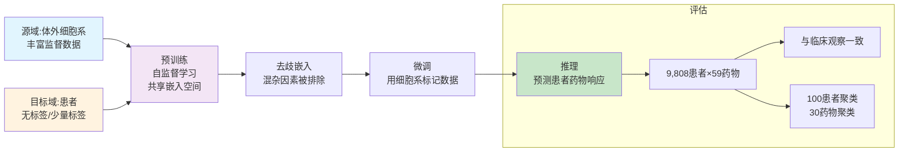

**方法论价值与边界**。把CODE-AE的实证证据放回个体化建模的整体框架可以归纳出三类共性突破：**第一，分布外泛化能力**——通过共享嵌入空间显式应对源域与目标域的分布偏移；**第二，对稀缺患者标签的依赖降低**——利用大量未标记的患者基因表达谱进行自监督学习，把稀缺标签问题部分转化为表征学习问题；**第三，个体化生物标志物识别**——把患者聚类与药物聚类联合，实现"具有相似药物反应谱的患者被分在一起"的精准亚群划分[^65][^66]。这三类突破直接对应6.1节所提出的三类外推挑战。

但同样必须以本研究持久推理标准P-5为标尺给出客观边界。**第一**，CODE-AE的评估方式主要是"预测靶点与已用药物靶点一致性"的间接验证，而非真正的个体级响应金标准——这意味着其声称的"与临床观察一致"在更严格的前瞻性试验中尚需进一步检验。**第二**，跨尺度迁移在严格基准下仍可能面临与第3章AIVC基准警示同构的失败模式——Ahlmann-Eltze等人的Nature Methods研究已揭示深度学习扰动模型在严格基线对照下的真实泛化能力远低于发表论文所宣称的水平[^30][^31]，这一警示同样适用于跨域迁移场景：当目标域分布与源域差异极大、当患者亚群过于细分时，简单基线（如仅按癌种或主要驱动突变划分）能否被显著超越仍需要更严苛的独立基准来回答。**第三**，CODE-AE聚类层面的"患者-药物配对"提供的是群体级亚群划分而非真正的"一人一策"——它把9808名患者划入100个聚类，每个聚类内部仍是群体级响应预测，距离严格意义上的个体级响应预测还有距离。这一边界判断对6.8节的能力分层具有直接含义。

## 6.4 肿瘤异质性场景下的个体化模拟与精准用药策略

肿瘤是个体异质性最显著也最具临床紧迫性的场景，本节把6.1–6.3节所搭建的"维度-数据-方法"三件套落地到这一具体场景，审视计算预测、空间精准刻画、类器官物理验证三条路径在精准用药中的能力分工与互补关系。

**计算预测路径：从基因表达谱到患者亚群药敏推荐**。CODE-AE对9808名癌症患者×59种药物的预测把肺鳞状细胞癌与非小细胞肺癌划入不同药物聚类，识别出LSCC对吉非替尼、AICAR、吉西他滨的差异化敏感性[^65][^66]——这一证据展示了大模型在群体级亚群划分上的实证能力。结合第3章PRnet"为233种疾病推荐药物候选物"的能力——这种空间精度对治疗策略选择具有直接指导意义。结合TIME双重性所揭示的"KLRB⁺ vs XCL1⁺ CD8⁺T细胞预后相反"事实[^53]，仅刻画"CD8⁺T细胞数量"远不足以指导免疫治疗决策；只有把单细胞亚群构成、空间共定位、功能状态三者联合才能为患者级精准富集提供生物学锚点。这一空间精准刻画路径与计算预测路径的关系是**互补而非替代**——计算预测给出"该用什么药"的初筛，空间刻画给出"为什么该用以及该用在哪类患者上"的机制解释。

**类器官物理验证路径：高保真患者级药敏测试**。在产业化落地层面，类器官-AI协同闭环已经积累了具有说服力的实证证据。**肿瘤类器官从患者肿瘤组织构建，保留肿瘤异质性与微环境，用于结直肠癌、肺癌、乳腺癌、胰腺癌等癌种的药敏预测准确率达80%–95%**[^68]。在临床落地层面，**类器官7天内可完成药敏测试，为80%晚期结直肠癌患者找到有效三线方案**；**辉瑞数据显示类器官使临床前候选药淘汰率下降21%**，提前筛除高毒/无效药物[^68]。在监管层面，**2024年FDA首次批准完全基于类器官数据的肿瘤疗法IND申请**[^68]——这一里程碑式事件标志着类器官从科研工具向监管认可的临床证据载体转变。技术层面的最新进展进一步提升了类器官筛选的标准化与高通量能力——**2025年10月发表于Nature Communications的HCS-3DX系统全球首次实现了AI驱动的、覆盖"筛选-转移-成像-分析"全流程的3D类器官高内涵筛选**，通过AI微操作器自动挑选形态均一的类器官、结合新型成像板和AI数据分析实现单细胞水平分析，能将样本筛选时间从102分钟缩短至48分钟[^68]。

这三条路径在肿瘤精准用药中的能力分工可归纳为下表：

| 路径 | 代表性能力锚点 | 时间尺度 | 个体化深度 | 互补关系 |
|------|------|------|------|------|
| 计算预测（AIVC、CODE-AE） | 9808患者×59药物聚类一致[^67][^65] | 秒级 | 群体亚群级 | 提供初筛方向 |
| 空间精准刻画 | 217患者×13癌种>50万细胞[^54] | 小时级 | 患者级图谱 | 提供机制解释 |
| 类器官物理验证 | 80%–95%药敏准确率、淘汰率↓21%[^68] | 天级 | 患者来源细胞 | 提供物理验证 |

更具方法论意义的是**复杂微环境模型在2025-2026年的演进**——类器官正从单纯的"细胞团"向包含多细胞类型、血管网络和免疫组分的高仿真模型演进；**Qureator公司的vTIME平台通过将肿瘤细胞、免疫细胞和血管网络整合，将"血管化与免疫化"作为关键技术方向**[^68]。这种"血管化+免疫化"演进直接回应了6.1节TIME双重性所提出的核心挑战——一个能在体外重现患者特异性血管与免疫微环境的类器官系统，理论上可为大模型提供更接近真实临床环境的训练与验证数据。

将三条路径放在统一框架中，可以归纳出肿瘤精准用药的协同闭环：**计算预测筛选候选方向 → 空间精准刻画提供机制解释 → 类器官物理验证作为最终决策证据**。这一闭环目前仍处于"各路径独立成熟、协同尚未规模化"的阶段——计算预测的产出尚未系统性回流到类器官筛选的优先级排序，类器官筛选的结果也尚未规模化反哺AI模型的迭代——三条路径的真正闭环耦合是未来5年最具产业化意义的方向之一。

## 6.5 免疫治疗响应预测：从生物标志物到多尺度数字孪生

免疫治疗是当代肿瘤学中对个体异质性最敏感的场景之一，本节剖析这一场景下生物标志物、影像组学、CAR-T个体化管理与微转移多尺度模型四个层面的能力图谱，并审视它们如何向患者数字孪生方向收敛。

**响应率困境与精准富集需求**。**HCC患者免疫检查点抑制剂单药或靶免联合治疗的客观缓解率仅为20%~50%**[^69]——这一现实直接定义了精准富集的紧迫性：基于ICIs疗效的不确定性必须选择合适的检查手段预测免疫治疗疗效，对患者进行分层管理才能改善预后[^69]。这一困境在不可切除肝细胞癌中尤为突出——**IMbrave150 III期试验显示阿替利珠单抗联合贝伐珠单抗（T+A）相比索拉非尼显著延长总生存期（19.2个月 vs 13.4个月，P<0.001）**[^69]，但仍有相当比例患者出现疾病进展。

**TIDE算法：转录组级预测与使用边界**。TIDE（Tumor Immune Dysfunction and Exclusion）作为一个基于转录组数据的在线预测工具正逐渐从研究领域走向临床应用——**其核心逻辑建立在肿瘤免疫逃逸的两个经典机制之上：T细胞功能障碍和T细胞排斥**[^52]。简单来说，TIDE算法通过分析患者肿瘤组织的基因表达数据回答两个关键问题——**第一，即使有免疫细胞（特别是CTL）浸润到了肿瘤内部，它们是否已经"精疲力尽"丧失了攻击肿瘤细胞的能力（功能障碍）？第二，免疫细胞是否根本就被"挡在门外"无法有效浸润到肿瘤核心区域（排斥）？** TIDE的预测分值正是对这两种逃逸机制强度的综合量化——**正的TIDE分值通常预示较差的免疫治疗反应，负的TIDE分值则提示患者更可能从ICI治疗中获益**[^52]。

但TIDE的实用指南也明确指出了几类典型"陷阱"——其使用具有严格边界。**第一**，TIDE分值是一个相对值，其高低需要在特定队列背景下解读，**直接比较不同研究、不同癌种间的绝对分值意义有限**[^52]。**第二**，避免"唯分数论"——一个患者可能有较高的CD8 T细胞浸润（CD8值高），但如果同时伴有极高的Dysfunction Score那么这些T细胞很可能已失去功能，此时单纯看CD8就会过于乐观[^52]。**第三**，"垃圾进，垃圾出"原则尤为明显——TIDE要求输入经过log2转换后的TPM或FPKM值（针对RNA-seq），并需要一个参考队列进行标准化；理想情况下应使用匹配的正常组织样本或大型混合肿瘤样本库作为参考，缺乏这样的参考时退而求其次使用当前数据集中所有样本的平均表达值作为参考进行中心化处理[^52]。这三类边界对个体化建模具有直接方法论含义：**生物标志物即便准确率较高，也不能脱离患者所属的队列上下文做绝对外推**——这与6.3节CODE-AE所提供的"亚群级而非个体级"判断形成同构。

**影像组学与肿瘤负荷评分（TBS）的多模态协同**。在不可切除肝细胞癌场景中，影像学检查作为非侵入性方法在治疗效果评估中具有重要价值——**肿瘤负荷评分（TBS）由肝脏中肿瘤大小和肿瘤数量计算，TBS²=(肿瘤最大径)²+(肿瘤数目)²**；**纳入378例接受lenvatinib和PD-1抑制剂治疗的u-HCC患者的研究发现TBS大于8分的患者与较短的OS显著相关，同时存在多个受累器官与较差的预后相关**[^69]。这一证据展示了影像组学作为"宏观尺度生物标志物"的精准富集能力——它与TIDE的"分子尺度生物标志物"在不同尺度上互补，共同构成个体化预测的多模态输入。但HCC治疗是一个动态过程，治疗过程中肿瘤体积的变化与患者预后密切相关——接受ICIs治疗的部分患者可出现超进展[^69]，这种动态特征要求模型必须接入纵向影像而非单时点快照。

**CAR-T个体化管理：从桥接到挽救的全程异质性应对**。CAR-T细胞治疗代表了对个体异质性更复杂的临床场景。**CAR-T细胞治疗侵袭性B细胞淋巴瘤的总缓解率（ORR）在54-83%之间，完全缓解率（CR）在40-58%之间**[^50]——这意味着即便在响应率最高的疗法中，仍有相当比例患者面临治疗失败。具体到桥接治疗策略选择，Mohty教授给出了一个高度个体化的判断框架——**疾病进展非常快的患者可能无法等到CAR-T细胞回输，可考虑双特异性抗体等新型治疗暂时控制疾病；疾病进展相对缓慢的患者则可考虑继续推进CAR-T治疗并辅以维持治疗**[^48]。这种"按疾病进展速度分层的个体化决策"目前主要依赖资深临床医生的经验判断，AI辅助决策仍处于早期。

CAR-T的另一类异质性挑战来自**毒性谱的个体差异**——细胞因子释放综合征（CRS）作为主要不良反应**病理生理机制复杂，涉及多种免疫细胞和细胞因子异常激活及相互作用**[^50]；不同患者基线免疫状态、肿瘤负荷与共病情况共同决定了CRS的发生概率与严重程度。免疫效应细胞相关神经毒性综合征（ICANS）也具有类似的个体差异特征[^50]。这些毒性的个体化预测对监护级别决策（是否需要转入ICU、何时启动tocilizumab等抗细胞因子治疗）至关重要。CAR-T的全程管理因此构成了一个典型的"多决策点+高度异质性"场景——AI辅助决策的潜在价值很大，但目前仍受限于纵向、个体级数据的稀缺与监管路径的不成熟。

**微转移多尺度模型：CPDT的方法论原型**。把上述生物标志物与临床决策层面的个体化挑战上升到方法论层面，一类新兴工作开始把"多尺度数学模型+虚拟患者轨迹"作为癌症患者数字孪生（CPDT）的方法论原型。一项发表的研究**通过创建多尺度数学模型研究免疫系统与一般上皮组织中微转移进展之间的相互作用**，使用高通量计算资源分析了模型的参数空间，**生成了超过100,000个虚拟患者轨迹**[^70]；研究**证明该模型可以概括多种虚拟患者轨迹，包括不受控制的生长、部分反应和对肿瘤生长的完全免疫反应**，并据此对虚拟患者进行分类、识别影响模拟免疫监视的关键患者参数[^70]。

这项研究的方法论价值非常清晰：**它把"个体异质性"从一个统计学概念转化为可被机制模型生成与扫描的连续参数空间**——通过对模型参数空间的高通量扫描，可以生成覆盖不同临床结局的虚拟患者轨迹群，再从中识别哪些参数对免疫监视影响最大。这一框架为CPDT提供了方法论原型：**当我们无法在真实世界中观察到足够多的患者轨迹时，可以通过机制模型+大规模参数扫描"虚拟扩增"患者群**。

但研究也坦诚指出了关键挑战——**虽然CPDT可以使临床医生系统地剖析每位患者癌症的复杂性并为治疗选择提供信息，但工作表明在我们能够达到这一愿景之前关键挑战仍然存在**[^70]。这与第5章数字孪生四类现实差距的判断高度同构——**CPDT是远景蓝图而非当前现实**。

将免疫治疗响应预测的多个层面归纳为一个能力图谱：

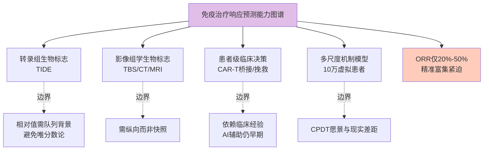

总结这一图谱可得到一个边界明确的判断：**免疫治疗响应预测在"群体级生物标志富集"层面已具备较扎实的产业化能力（TIDE、TBS、单细胞免疫图谱），在"患者级精准决策"层面仍主要依赖临床医师经验与多模态生物标志物组合，在"完整CPDT级数字孪生"层面仍是远景蓝图**。这一分层判断为6.7节进一步剖析数字孪生进展、6.8节给出能力分层提供了直接的证据基础。

## 6.6 罕见病与超个体化定制：从"一人一策"到"一人一药"

如果说肿瘤场景下的个体化主要表现为"群体平均→患者亚群"的下沉，那么罕见病场景把个体化推向极致——**一种药物只为一名患者定制**。本节以两个标志性案例剖析这条"超个体化"路径的当前能力与现实瓶颈。

**Milasen：首款为单一患者定制的反义寡核苷酸药物**。Mila Makovec是科罗拉多州的一名贝敦氏症（Batten's disease）患者——这是一种罕见且致命的遗传性神经退行性疾病，**美国每10万新生儿中就有2~4人患病；患者溶酶体功能异常导致废物堆积、神经细胞死亡，最终引发大脑损伤并在青春期死亡**[^55]。Mila的特殊性在于其遗传机制极不寻常——贝敦氏症是隐性遗传，CLN7基因的两个拷贝必须都出现突变才会引起疾病，但**Mila只有来自父亲的拷贝出现了缺陷，母亲来源的拷贝在标准蛋白质编码部分测序中"看起来正常"**[^51][^55]。

波士顿儿童医院Timothy Yu团队的关键突破在于发现了被传统测序所遗漏的致病机制——**Yu团队对Mila全基因组进行测序后注意到母亲CLN7基因的非编码部分与正常CLN7基因序列不一致；进一步分析发现一个大约2000个碱基的逆转录转座子DNA片段插入在那里，这个额外的DNA引起了基因转录为RNA时的错误，使Mila的CLN7基因副本产生了一种短而无用的溶酶体蛋白**[^55]。在确定致病机制后，Yu团队设计了一种**反义寡核苷酸**——它可以与有缺陷的RNA结合、隐藏后者并诱骗细胞产生正常的蛋白质——研究人员设计了一种能匹配Mila CLN7突变并在其细胞中工作的反义寡核苷酸，并找到一家公司进行生产，最终于2017年12月制出名为"milasen"的药物[^55][^51]。

**FDA与临床获益**。**2018年1月FDA批准了一项单例试验，研究人员将milasen注入Mila的脊髓液中希望进入大脑修复神经元，每两周增加一次剂量**[^55]；**2018年1月31日Mila第一次用药后不到一个月癫痫次数减少、持续时间缩短**；**持续治疗后Mila每天的癫痫发作可降低到6次以内，有时甚至可以一整天都不发作并且每次不到1分钟；Mila几乎不再需要导管可以吃一些打成泥的食物，仍需帮助才能站起来但站直后头和背是笔直的**[^51]。**2019年10月研究团队在《新英格兰医学期刊》报告了这一治疗案例**[^51]。该案例被未参与研究的德州大学西南医学中心基因治疗研究员Steven Gray评价为：**"对于个性化医疗如何在实践中发挥作用，这是再好不过的例子了"**[^55]。

**Milasen案例的方法论意义可归纳为四点**：**第一**，证明了"全基因组测序识别独特致病机制→针对性设计RNA分子→单例试验"的完整闭环在技术上可行；**第二**，揭示了非编码区的逆转录转座子等"非典型变异"在罕见病中的关键作用——这些变异在标准蛋白编码测序中往往被遗漏；**第三**，把"个体化"从"用什么药"推到了"为该患者专门设计药"的极致；**第四**，FDA对单例试验的批准为超个体化药物的监管路径提供了先例。

但同样需要客观给出现实瓶颈。**第一是研发成本**——研发这样一种药会非常昂贵；Mila的药品研发资金主要来自其母亲经营的Mila's Miracle Foundation基金会通过GoFundMe众筹募集的300万美元[^51]。**第二是规模化困境**——美国罕见病组织副总裁Rachel Sher介绍**世界上有7000多种罕见疾病，超过90%没有FDA批准的治疗方法**；单单在美国就有成千上万个"Mila"，但根本没有足够的研究人员来为他们一一设计、开发个性化药物[^51]。**第三是成本承担**——美国宾夕法尼亚大学医学伦理和健康政策教授Steven Joffe给出的答案是：**"肯定不是政府、不是药企、更不会是保险公司——只能是患者家属，虽然这很难接受，但这就是事实"**[^51]。这意味着只有非常有钱、有能力募集大量资金或有基金会支持的患者才能支付得起定制药品。**第四是Yu团队本人对未来可行性的谨慎**——这种做法未来是否可行，Yu和他的同事认为并不明朗[^51]。

**囊性纤维化：基因型驱动的个体化药物评估范式**。与Milasen的"一人一药"极致路径相比，囊性纤维化（CF）展示了一条更具规模化潜力的"基因型分组+患者类器官药敏"路径。CF是由CFTR基因突变导致的CFTR蛋白缺陷和/或缺失引起的——**儿童必须遗传分别来自父母的两个有缺陷CFTR基因才会患病；虽然有许多不同类型的CFTR突变可引起该病，但CF患者中绝大多数至少有一个F508del突变；F508del仅因一个苯丙氨酸的缺失便导致CFTR蛋白无法正确折叠，难以抵达细胞表面**[^43]。

研究人员针对CFTR的不同突变类型提出了两种分子治疗思路——**校正剂（corrector）引导突变蛋白前往细胞膜，增效剂（potentiator）帮助蛋白到达位置后稳定发挥作用**[^43]。基于这一思路开发的药物展示了基因型驱动的精准评估价值——**研究团队筛选出靶向CFTR蛋白上G551D突变的分子VX-770（ivacaftor），该突变会减缓CFTR蛋白作为离子通道的开放，而VX-770作为增效剂可有效恢复通道功能；2012年FDA批准了首个针对囊性纤维化病因的药物ivacaftor，用于治疗携带G551D突变的CF患者**[^43]。《新英格兰医学杂志》社论评价将ivacaftor描述为囊性纤维化领域的重要里程碑[^43]。

更具方法论意义的是**患者来源肠道类器官**作为CF个体化药物评估工具的崛起。一项基于直肠活检肠道类器官的研究展示了这一范式的精度：**来自囊性纤维化患者直肠活检的肠道类器官是评估CFTR通道功能活性和靶向药物疗效的高度敏感的个性化方法**[^43]。研究检查了四位基因组中含有致病性F508del变体的患者——三位F508del纯合子患者和一位健康杂合子。结果显示：**两位F508del/F508del基因型患者可被CFTR调节剂（VX-770和VX-809）有效校正；调节剂对W361X/F508del基因型患者的氯通道功能恢复没有显著影响；F508del杂合子健康携带者的CFTR功能活性与健康对照一样高**[^43]。

这一研究的方法论价值非常清晰——**同一类CFTR突变（F508del）在不同复合基因型背景下对调节剂的响应完全不同**：F508del/F508del纯合子有效响应、W361X/F508del则无效、F508del杂合子根本无需治疗。这正是6.1节所提出的"多基因背景修饰"在临床决策中的具体表现，也是patient-derived organoid（PDO）作为患者级药敏测试工具的标志性证据。该评估范式被作者明确表述为"高度敏感的个性化方法"——**它不依赖大规模队列即可在单一患者层面给出高保真药敏判断**[^43]。

将Milasen与CF两个案例放在一起对照可以归纳出超个体化路径的两条范式：

| 范式 | 代表性案例 | 个体化深度 | 规模化潜力 | 关键瓶颈 |
|------|------|------|------|------|
| 一人一药 | Milasen[^55][^51] | 极致（单患者定制RNA分子） | 极低（每例数百万美元） | 成本、监管、可及性 |
| 基因型分组+PDO药敏 | CFTR调节剂+肠道类器官[^43] | 高（基因型+复合背景） | 中等（同基因型分组） | 类器官标准化、基因型覆盖 |

**大模型在超个体化路径中的潜在角色**。基于以上案例可以勾勒出大模型的潜在切入点：**第一**，在变异致病性预测层面，全基因组级基础模型（如第2章提及的Genos[^71]）可帮助识别非编码区的致病变异——**Genos整合了HPRC的636个高质量"端粒到端粒"（T2T）人类基因组作为训练数据，能够精准捕捉人类特有的调节元件及稀有变异，从源头上消除了数据偏见**[^71]，这一能力对发现Mila式的非典型变异具有直接价值；**第二**，在个体化反义寡核苷酸或mRNA设计层面，蛋白质/核酸语言模型可加速从致病机制到治疗分子的转化；**第三**，在患者类器官药敏快速反馈层面，AI驱动的高内涵筛选系统（如第6.4节提及的HCS-3DX[^68]）可显著缩短"取活检-培养类器官-药敏测试-临床决策"的反馈周期。

但同时必须坦诚指出，**当前大模型在超个体化路径上的角色仍是"加速工具"而非"替代核心"**——Mila案例的核心突破来自传统全基因组测序、生物信息学分析与化学合成的协同；CF案例的核心突破来自经典分子药理学与类器官实验。大模型在这条路径上的真实贡献尚需更多前瞻性证据来锚定。从产业化角度看，Milasen所揭示的"7000多种罕见病、90%无获批治疗、个体化药物成本极高、监管仅能通过单例试验、可及性局限于有基金会支撑的患者"五重瓶颈[^51]，决定了**超个体化定制在可预见的未来仍将是少数受益者的特例而非可规模化的范式**——这是个体化建模领域必须坦诚面对的一个事实边界。

## 6.7 患者数字孪生的代表性进展与现实差距

把6.3–6.6节的方法论与场景证据进一步上升到"患者数字孪生"这一总体框架，可以通过两个标志性案例审视PDT从概念到实证的当前能力边界。

**案例一：三阴性乳腺癌新辅助化疗个体化方案**。Christenson等人发表于npj Systems Biology and Applications的研究提供了一个高度结构化的患者数字孪生范式。研究背景是——**尽管三阴性乳腺癌治疗有所进展，约50%患者在标准新辅助治疗（NAT）后手术前仍未能达到病理完全缓解**；研究假设个体化的NAT方案可显著改善患者结局，并通过患者特异性数字孪生框架来验证这一假设[^64]。

具体方法论框架包括三个核心步骤：**第一**，**通过近似贝叶斯计算把基于生物学机制的模型校准到纵向磁共振成像（MRI）**——这一步骤把"每位患者的多次MRI影像"转化为"该患者特异的机制模型参数"；**第二**，应用**最优控制理论**优化两类目标——**(1)在等剂量约束下减少最终肿瘤细胞数；(2)在等疗效约束下减少NAT总剂量**；**第三**，对**50位患者的个体化方案**给出实证结果[^64]。

实证结果具有标志性意义：在目标(1)中，**个体化方案中位降低了17.62%的最终肿瘤细胞数（范围0.00–37.36%）**；在目标(2)中，**个体化方案相比标准方案中位降低了12.62%的总剂量（范围0.00–56.55%）同时保持统计学等效的肿瘤控制**[^64]。这一证据展示了PDT在"既能加强疗效又能降低毒性"的两类临床目标上的同时优化能力——前者直接对应"提升治疗胜率"，后者直接对应"降低毒性负担"，两者都是第1章所揭示的传统范式失灵的核心维度。

更具方法论意义的是该框架的**三层结构化能力**：**机制模型校准**把个体异质性显式编码到模型参数中、**最优控制干预设计**把"个体化方案"转化为可数学求解的优化问题、**个体级目标二元优化**把"等剂量减残余"与"等疗效减剂量"作为两类临床上有意义的目标分别求解。这三层能力共同构成了PDT落地的"方法论模板"——它不依赖大模型在群体数据上的预训练，而是通过机制模型+患者特异数据校准+最优控制理论的组合实现"轻量级"的个体化优化。

**案例二：癌症患者数字孪生（CPDT）多尺度免疫监视模型**。第二个标志性案例已在6.5节展开——通过多尺度数学模型研究免疫系统与微转移进展的相互作用，**生成了超过100,000个虚拟患者轨迹**；模型可概括不受控制的生长、部分反应和完全免疫应答等多种轨迹；研究分类虚拟患者并识别影响免疫监视的关键患者参数，为癌症患者数字孪生（CPDTs）领域提供见解[^70]。

把这两个案例放在统一框架中观察，可以归纳出当前PDT能力的**三层结构**：

| PDT能力层 | TNBC案例证据[^64] | CPDT案例证据[^70] | 共性方法论 |
|------|------|------|------|
| 机制模型校准 | ABC校准纵向MRI到生物学模型 | 多尺度数学模型刻画免疫-肿瘤相互作用 | 把个体异质性显式编码到参数 |
| 干预/虚拟扫描 | 最优控制求解个体化NAT方案 | 高通量计算扫描参数空间生成虚拟轨迹 | 把决策转化为数学优化或扫描问题 |
| 临床有意义的输出 | 中位↓17.62%肿瘤/↓12.62%剂量 | 100,000+虚拟轨迹的临床结局分类 | 输出指标必须直接对接临床获益 |

但同时也必须坦诚给出**PDT当前的关键挑战**。**第一是参数辨识性**——把机制模型校准到患者级数据的过程本质上是一个反问题，参数的可辨识性受数据质量、采样密度、模型结构的多重影响；ABC等贝叶斯方法在TNBC案例中表现良好，但在更复杂的多尺度模型中参数辨识性可能急剧下降。**第二是个体级数据稀缺**——TNBC案例所依赖的"多时点MRI随访"已属较奢侈的数据，要进一步扩展到分子+细胞+影像+EHR的"全维度纵向数据"仍是开放问题（与6.2节的数据缺口同构）。**第三是可解释性与监管对齐**——PDT输出"个体化方案"必须能被临床医生理解并被监管机构采信，这要求模型必须在可解释性、不确定性量化、外部验证等维度上达到监管证据标准——这一议题将在第7章可信度框架中专门展开。CPDT研究本身的坦诚警示——**虽然CPDT可以使临床医生系统地剖析每位患者癌症的复杂性并为治疗选择提供信息，但工作表明在我们能够达到这一愿景之前关键挑战仍然存在**[^70]——正是这三类挑战的合并表达。

把PDT的进展与第5章数字孪生的总体判断相结合可以得到本节的总判断：**PDT在"机制模型+患者特异校准+最优控制"的三层框架下已具备实证能力雏形，但要达到"医生在患者数字孪生上预演治疗方案"的临床可用愿景仍需突破参数辨识性、个体级跨尺度数据、监管证据标准三道门槛**。这一判断为6.8节的能力分层提供了直接证据。

## 6.8 "一人一策"精准模拟的能力分层与衔接

整合本章六节论证，可以对核心命题——大模型能否真正实现"一人一策"的精准药物评估——给出分层判断。这一分层既不是悲观的全盘否定，也不是乐观的全面肯定，而是依据本研究持久推理标准P-5"能力边界与局限的平衡呈现"对当前能力的边界明确刻画。

**第一层：已具备能力**。当前个体化建模在以下四类场景已积累了具有说服力的实证证据：

- **群体级亚群划分**：CODE-AE对9,808名癌症患者×59种药物的预测与现有临床观察一致，把患者分为100个聚类、把药物分为30个聚类实现"具有相似药物反应谱的患者被分在一起"[^67][^65][^66]——这构成了"亚群级精准富集"的核心证据。
- **特定基因型场景下的个体化药物评估**：CFTR调节剂在F508del/F508del与W361X/F508del类器官上的差异化响应展示了"基因型+复合背景"驱动的高保真个体化药敏测试[^43]；类器官在结直肠癌、肺癌、乳腺癌、胰腺癌等癌种的药敏预测准确率达80%–95%[^68]进一步佐证了这一能力。
- **纵向影像驱动的个体方案优化**：TNBC新辅助化疗MRI数字孪生通过机制模型+ABC校准+最优控制实现中位↓17.62%肿瘤细胞/↓12.62%剂量的个体化优化[^64]——这是"个体级动态决策"的标志性进展。
- **超个体化定制的极致案例**：Milasen作为首款只为一名患者定制的反义寡核苷酸药物，在Mila身上把每天30余次癫痫发作降低到6次以内[^55][^51]——这是"一人一药"在技术与监管层面的可行性证明。

**第二层：有限具备能力**。当前个体化建模在以下三类维度仍存在显著局限：

- **跨尺度迁移在分布外场景的稳健性受限**：CODE-AE等迁移方法的实证证据虽然丰富，但其评估方式更多是"预测靶点与已用药物靶点一致性"的间接验证而非严格的前瞻性试验；与第3章基准警示同构，深度学习模型在严格独立基准下的真实泛化能力可能低于发表论文所宣称的水平[^30][^31]。
- **免疫治疗等高度异质场景下精准富集仍受生物标志物精度制约**：HCC等场景下ICI客观缓解率仅20%-50%[^69]、TIDE等单一生物标志物存在"相对值不可绝对比较"等使用边界[^52]、TIME的"双刃剑"作用使CD8⁺T细胞数量等简单指标失效[^53]——这些都说明即便具备了多模态生物标志物，免疫治疗的患者级精准富集仍存在显著精度天花板。
- **患者级跨尺度对齐数据稀缺**：与6.2节、6.7节的判断同构，同一患者同时具备全基因组+组织单细胞+空间组学+纵向影像+完整EHR的"全维度对齐样本"仍是稀缺资源；ICI治疗ORR的不确定性、CAR-T的桥接/挽救决策、CFTR调节剂的基因型-复合背景响应——所有这些场景都需要远比当前公开队列更密集的纵向多模态数据。

**第三层：尚不具备能力**。最后必须坦诚指出当前个体化建模尚未达到的关键能力：

- **面向普通患者群体的可负担、可规模化、可监管认可的"一人一药"范式仍是远景**。Milasen案例所揭示的"7000多种罕见病、90%无获批治疗、单例研发成本数百万美元、监管仅通过单例试验、可及性仅限基金会支撑的患者"五重瓶颈[^51]决定了超个体化定制在可预见的未来仍将是特例而非通则。
- **CPDT级完整数字孪生在临床可用层面仍面临关键挑战**。CPDT研究本身坦诚指出"在我们能够达到这一愿景之前关键挑战仍然存在"[^70]——这与第5章数字孪生四类现实差距的判断高度同构。
- **真正的个体级因果干预模拟仍处于早期**。当前PDT与AIVC的输出更多是"该患者最可能的响应"，而非严格意义上的"该患者在反事实干预下会发生什么"——后者需要更严格的因果推断框架与个体级反事实数据。

将三层能力归纳为下图：

```mermaid
graph TB
    A["一人一策"精准药物评估能力分层] --> B[已具备]
    A --> C[有限具备]
    A --> D[尚不具备]
    
    B --> B1[群体级亚群划分<br/>CODE-AE 9808患者×59药]
    B --> B2[基因型场景个体化<br/>CFTR+PDO]
    B --> B3[纵向影像方案优化<br/>TNBC MRI数字孪生]
    B --> B4[超个体化定制极致<br/>Milasen单例成功]
    
    C --> C1[跨尺度迁移分布外稳健性]
    C --> C2[免疫治疗精准富集精度]
    C --> C3[患者级跨尺度对齐数据]
    
    D --> D1[可负担可规模化"一人一药"]
    D --> D2[CPDT级临床可用数字孪生]
    D --> D3[严格因果干预模拟]
    
    B -.衔接.-> E[第7章可信度框架]
    C -.衔接.-> E
    D -.衔接.-> F[第8-9章瓶颈与未来路径]
    
    style B fill:#c8e6c9
    style C fill:#fff9c4
    style D fill:#ffccbc
```

**衔接关系**。本章的能力分层判断为后续两章衔接出三条清晰路径：

**第一条衔接路径通向第7章可信度框架**。本章已数次指出个体化预测必须配套独立验证回路、不确定性量化、可解释性、监管证据对齐——CODE-AE的间接验证局限、TIDE的相对值边界、PDT的参数辨识性挑战、CPDT的关键挑战警示，都把"个体化预测的可信度建设"作为不可绕过的下一步。第7章将专门展开计算评估—实验验证闭环架构、不确定性量化、XAI、scPerturBench级独立基准在个体化场景中的具体落地。

**第二条衔接路径通向第8-9章瓶颈与未来路径**。多族裔队列建设、跨尺度纵向数据基础设施、超个体化药物的成本与监管科学协同、隐私与数据主权、监管框架成熟度——这些瓶颈都不是技术单一维度可解决的，需要在第8章瓶颈剖析与第9章未来路径展望中系统讨论。

**第三条衔接路径通向第10章核心命题分层结论**。本章给出的"已具备—有限具备—尚不具备"三层判断，将在第10章作为对核心命题"大模型能否真正实现一人一策精准药物评估"的关键证据基础——既不会用Milasen式的极致案例武断证明"一人一策已经实现"，也不会用CPDT的关键挑战武断否定"一人一策永不可能"，而是给出基于现状证据锚定的、有时间窗与前置条件的客观判断。

至此本章给出的总判断是：**大模型在个体化药物评估中已经从"群体平均"实质性地跨入了"亚群精准"与"特定场景个体化"的能力区间——以CODE-AE、CFTR调节剂+PDO、TNBC MRI数字孪生、Milasen为四类标志性证据；但要达到对所有患者、所有疾病、所有治疗的"一人一策"完全精准模拟，仍需在跨尺度迁移稳健性、个体级跨尺度纵向数据、超个体化范式的可负担与监管对齐三条主线上继续突破**。这一判断与本研究持久推理标准P-1（核心命题相关性）、P-3（跨尺度系统性视角）、P-4（个体异质性显性处理）、P-5（能力边界平衡呈现）、P-6（前瞻判断证据锚定）保持完全一致——它把"能不能模拟"、"模拟到什么程度"、"未来如何演进"三个核心问题在本章场景下给出了边界明确的阶段性答案，并为后续三章对可信度、瓶颈与未来路径的展开奠定了证据基础。

# 7 系统性评估的可信度：验证机制、可解释性与基准测试

第3章揭示了AI虚拟细胞在严格基准下的能力天花板，第4章揭示了大语言模型15%–20%的幻觉风险与RAG的"幻觉叠加"，第5章揭示了FDA对器官芯片的开放快于对纯计算预测的接纳，第6章则揭示了个体化预测在分布外场景下的稳健性受限——这四类来自不同尺度、不同范式的"边界证据"已经在本报告各章中反复积累，到本章必须被收束为一个共同命题：**系统性药物评估能否被监管、临床与产业采信，本质上是一个可信度命题，而不仅仅是一个准确性命题**。如果一项AI预测在论文中刷新SOTA、在演示中取得71%成功率，但在独立基准下被简单线性基线击败、在外部队列中性能跌至随机水平、在监管审查中无法提供机制锚定的证据链——那么它对系统性药物评估的真实贡献就是有限甚至误导性的。本章的任务，正是把"可信度"作为一个独立维度从前六章的能力图谱中剥离出来，沿计算-实验闭环验证、不确定性量化、可解释AI、独立基准测试四条相互耦合的主线展开剖析，最终给出当前大模型药物评估在可重复性、稳健性、泛化能力三个核心维度上的真实水平判断，并为第8章瓶颈剖析与第9章未来路径展望奠定可信度维度的证据底座。

## 7.1 可信度命题的方法论坐标与四条主线

要把可信度从一个抽象口号下沉为可被结构化分析的对象，首先需要明确其内涵。在系统性药物评估语境下，可信度并不等同于单一指标的预测准确性，而是一个由六类属性叠加构成的综合维度——**可重复性**（同一模型在不同团队、不同环境下能复现相同结果）、**稳健性**（模型在数据稀疏、噪声、批次效应等不利条件下保持性能）、**泛化能力**（模型在分布外、跨人群、跨平台场景下的表现）、**可解释性**（输出能被追溯到生物学机制或推理证据）、**不确定性披露**（模型主动告知预测的置信水平与适用边界）、**监管对齐**（输出形式与证据标准能被FDA/EMA/NMPA等监管框架采信）。这六类属性中的任何一类缺失，都会在系统性药物评估的链条中形成"可信度断点"，使得即便其他维度表现优异的模型也无法跨越从研究到决策的鸿沟。

把可信度命题置于本报告前六章的事实图谱中观察，可以更清晰地看到其独立成章的必要性。**第一层事实是产业失败率与AI高分论文的悖论**——第1章揭示了90%的药物在临床阶段失败、缺乏临床疗效与不可控毒性合计占据失败原因的70%以上；与此并行的是AI制药领域大量发表声称SOTA性能的论文，但截至当前**全球尚未诞生一款完全由AI主导研发并成功上市的药物**[^32]，被寄予厚望的Exscientia DSP-1181最终因1期临床未达预期目标折戟。这种"高分论文与产业失败并存"的悖论，本质上不是技术能力的缺失，而是**评估范式与真实临床场景之间的可信度断点**——论文指标无法回答"该模型在真实患者群体中是否可靠"这一关键问题。**第二层事实是监管端的差异化开放速度**——第5章已展开FDA对器官芯片ISTAND计划的接纳与对纯计算数字孪生的相对谨慎，2026年3月FDA发布新方法学验证指导草案推动类器官等替代技术发展[^30]、2026年2月EMA正式批准全球首款基于类器官芯片技术的新药开展人体临床试验[^31]，这些动作均集中在物理实验替代物层面，而对纯AI预测的监管路径仍处于早期。监管端的这种差异本身就是可信度评估的一个重要信号——**物理实验载体具备相对成熟的证据生成机制，而AI预测必须证明其与真实人体响应的可量化对应关系，这一证据标准目前尚不清晰**。**第三层事实是独立基准研究的反向校验**——2025年Nature Methods与Nature Biotechnology相继发表了对扰动预测大模型能力的"挤水分"研究[^30][^32]，揭示出当前评估体系的系统性失真问题，把"可信度建设"从一个外部要求转化为一个内生需求。

将这三层事实合并起来可以推出一个核心判断：**当前大模型药物评估正处于"演示性高分"阶段向"反向校验与自我修正"阶段过渡的临界点，可信度建设的滞后已成为制约系统性评估命题落地的关键瓶颈**。这一判断为本章四条主线的展开提供了直接的逻辑动因。

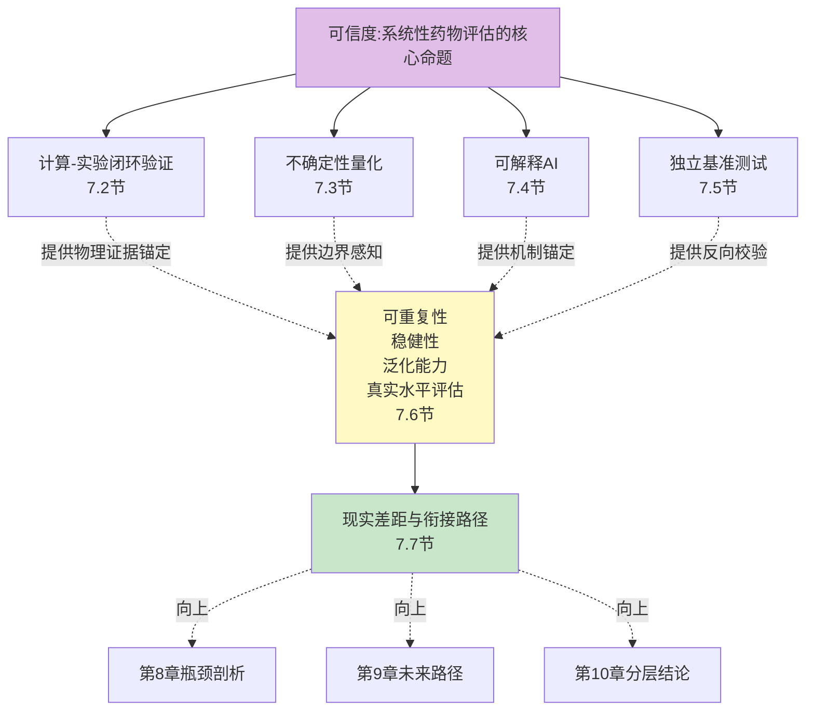

四条主线的耦合关系也值得一开始就理清——**它们不是相互独立的并列要素，而是相互嵌套的可信度链条**。计算-实验闭环为AI预测提供物理证据背书，但闭环本身需要不确定性量化来确定哪些预测优先送入实验验证；不确定性量化的可靠性依赖于可解释性来诊断"模型是否真正理解了不确定性来源"；而可解释性与不确定性量化的最终检验，必须通过独立基准测试在第三方数据上得到验证，否则容易陷入"自证"陷阱；反过来，独立基准研究所揭示的失真问题又反向驱动闭环验证、UQ与XAI的迭代升级。这种四主线耦合的结构正是本章方法论坐标的核心特征——也是本章必须独立成章而非分散到前六章的根本原因。把可信度作为独立维度审视，才能避免在每一章中只从单一能力侧面零散讨论可信度，从而错失"系统性评估的可信度本身是一个系统性问题"这一根本判断。

## 7.2 计算评估—实验验证闭环架构：从CRISPR到类器官芯片的湿-干协同

可信度建设的第一支柱，是"计算预测→实验验证→数据回流→模型迭代"的闭环架构。这一闭环在前六章的展开中已经多次出现——UNAGI在IPF的PCLS人体模型实验、PRnet对小细胞肺癌候选物的实验验证、TNBC MRI数字孪生通过近似贝叶斯计算校准纵向影像、CFTR调节剂在患者来源类器官上的差异化响应——这些案例共同的方法论特征是：**AI预测的可信度并非由模型自身证明，而是由独立的物理实验作为外部证据锚点予以背书**。本节将从四类关键验证载体切入，剖析湿-干闭环的产业落地形态与现实瓶颈。

**CRISPR/Cas9基因编辑作为靶点-机制级因果验证工具**。CRISPR的方法论价值在于它提供了"扰动→响应"的严格因果链——通过特异性敲除/敲低/激活目标基因，研究者可以直接观察细胞或组织在该扰动下的真实响应，进而验证AI模型预测的方向性与幅度是否准确。第3章已展开的Tahoe-100M就是这一思路的大规模产业实践——1100+种小分子扰动作用于50个癌细胞系产生1亿+单细胞转录组，构成新一代AIVC训练与基准评测的产业基准。CRISPR验证的关键局限在于其本身的技术偏差——脱靶切割、旁观者基因突变等问题（在第1章已展开）使得CRISPR验证本身也需要严格的对照设计，并非"绝对真理"。

**患者来源类器官作为高保真药敏验证载体**。类器官的可信度价值集中体现在其对患者真实生物学特征的保留能力——**类器官由患者肿瘤组织直接培养而成，能够保留原始肿瘤的基因突变、分子特征及空间结构，比传统2D细胞培养更接近真实生物学行为**[^32]。在临床获益证据层面，**在转移性胃肠道癌中，类器官预测化疗反应的敏感性和特异性分别达100%和93%；肺癌类器官预测化疗和靶向治疗的敏感性与临床结果吻合度达84%**[^32]。在产业证据层面，**辉瑞数据显示类器官使临床前候选药淘汰率下降21%**，提前筛除高毒/无效药物。监管层面的标志性事件是——**FDA首次基于类器官数据直接批准Sutimlimab临床试验**[^32]，而2024年陈晔光院士团队发布的类器官药敏检测专家共识进一步推动了技术从实验室迈向临床[^32]。2025年发表于Nature Communications的儿童溃疡性结肠炎研究则展示了类器官在药物机理理解层面的独特价值——**利用儿童溃疡性结肠炎患者来源的结肠类器官，成功再现UC上皮的关键病理特征，解决了传统模型无法模拟人UC代谢异常的痛点，为靶向干预提供证据**[^30]。这一系列证据使类器官成为当前湿-干闭环中最具产业成熟度的验证载体。

**器官芯片作为多器官生理级验证平台**。如果说类器官在"细胞团高保真"层面提供验证，器官芯片则进一步把验证范围扩展到"多器官生理交互"。其核心数据点具有标志性意义——**2025年《Drug Metabolism and Disposition》发表的研究证实，基于器官芯片的毒性预测模型对92种已知肝毒性药物的识别准确率达到92.3%，特异性为91.7%；相比之下，啮齿类动物模型的敏感度仅为57%，且存在严重的假阴性风险**[^31]。在ADME评估上，**CN Bio公司的案例研究显示，利用肠道/肝脏双器官芯片测试咪达唑仑，能够在72小时内完成完整的吸收-代谢-排泄过程监测，获得的关键ADME参数与临床数据高度一致；传统方法获取这些参数需要6个月以上的动物实验，且预测准确率不足60%**[^31]。在产业落地层面，**这项生物工程突破不仅大幅缩短研发周期，更将药物毒性预测准确率提升至92%以上；2026年2月EMA正式批准全球首款基于类器官芯片技术的新药开展人体临床试验，标志着这一技术从实验室走向临床应用的重大跨越**[^31]。这些证据使器官芯片成为湿-干闭环中"跨器官系统验证"的关键载体——也是AI预测从单细胞响应延伸到组织/器官层面后必经的验证环节。

**前瞻性临床数据与单例试验作为终极证据**。前述三类载体仍是"临床前"层面的物理验证，可信度链条的终点必须是真实人体响应。第6章已展开的Milasen案例（FDA批准的单例试验、临床获益的发表确认）、CFTR调节剂ivacaftor临床获批是单例与亚群层面的临床证据；TNBC MRI数字孪生通过纵向多次MRI随访校准患者特异参数，则展示了"前瞻性影像数据驱动的个体校准"模式。这一层证据虽然样本规模有限，但具有最高的可信度权重——它直接对接监管最终采信的临床获益标准。

将四类载体在"验证粒度、可信度权重、规模化潜力、监管成熟度"四维度上做对照可呈现下表：

| 验证载体 | 验证粒度 | 可信度权重 | 规模化潜力 | 监管成熟度 |
|------|------|------|------|------|
| CRISPR/Cas9 | 靶点-机制因果 | 中等（受脱靶/旁观者基因影响） | 高（Tahoe-100M级数据规模） | 中（科研工具为主） |
| 患者来源类器官 | 患者细胞表型 | 高（对GI癌敏感性100%/特异性93%[^32]） | 中（培养周期与标准化挑战） | 较高（FDA基于类器官数据批准IND） |
| 器官芯片 | 多器官生理交互 | 高（DILI 92.3%[^31] vs 啮齿类57%） | 中（2025-2026进入产业爆发期） | 较高（FDA ISTAND意向书、EMA首款临床批准） |
| 前瞻性临床/单例试验 | 真实人体响应 | 极高 | 低（样本规模与周期约束） | 最高（直接对接临床决策） |

更具方法论意义的是闭环架构的**三层标准化结构**：**预测假设结构化**——AI模型的输出必须以可被实验直接检验的形式表达（如"该化合物对X细胞类型的IC50预计在Y范围"而非模糊的"该化合物有效"）；**实验设计正交化**——验证实验必须采用与训练数据正交的样本来源、平台与读出指标，避免与训练分布同源造成"伪验证"；**结果回流自动化**——实验结果应以结构化格式回流到训练管线，实现模型的持续迭代而非一次性验证。这三层结构共同构成了从"演示性闭环"向"监管级闭环"演进的方法论模板。结合**2026年3月FDA发布新方法学验证指导草案**[^30]、**FDA于2025年4月10日发布《减少临床前安全性研究中动物实验的路线图》**、**2026年1月FDA接收肝器官芯片ISTAND计划意向书**等监管端的密集动作，可以判断闭环架构正处于从科研工具向监管证据载体的关键演进窗口。

但本节最后必须坦诚指出闭环架构的两类现实瓶颈。**第一是验证通量与AI预测规模的不匹配**——AIVC可以在数小时内对数千万种扰动组合给出预测，而即便是高通量类器官筛选也只能验证数千至数万规模；这种数量级差距意味着大多数AI预测无法获得物理实验背书，只有经过UQ筛选的"高优先级"预测才能进入闭环。**第二是不同载体之间的尺度失配**——CRISPR验证细胞层面响应，类器官验证细胞团表型，器官芯片验证多器官交互，临床试验验证个体疗效；从一类验证结果外推到另一类仍存在显著的因果链断裂，需要更精细的跨尺度证据组合策略。这两类瓶颈直接驱动了下一节不确定性量化的方法论需求——**当无法验证所有预测时，必须能够可靠地告知"哪些预测可被信任、哪些必须送实验"**。

## 7.3 不确定性量化：从过度自信到可信置信的方法论谱系

如果说闭环验证为AI预测提供"事后证据"，那么不确定性量化（UQ）则为AI预测提供"事前自省"——**它在模型给出预测的同时披露该预测的可靠性，使决策者能够判断哪些预测可以采信、哪些必须谨慎对待**。中科院上海药物所郑明月团队2022年发表于iScience的综述给出了这一支柱的方法论框架，本节以其为锚点展开。

**不确定性的三类来源**。郑明月团队的综述明确区分了不确定性的三类本质来源：**近似不确定性**（approximation uncertainty）解释了由于简单模型无法拟合复杂数据而导致的误差，例如线性模型拟合正弦曲线所产生的误差；**偶然不确定性**（aleatoric uncertainty）源自数据本身的内在噪声；**认识论不确定性**（epistemic uncertainty）源自模型对其训练分布之外样本的"无知"[^31]。这一三分法对系统性药物评估具有直接含义——近似不确定性可通过升级模型架构缓解、偶然不确定性需要更多/更高质量数据降低、而**认识论不确定性正是本章前述"分布外泛化"问题的方法论根源**，也是UQ最具价值的应用场景。

**UQ与适用性域（AD）的承接关系**。综述指出，**化学界长期以来一直存在一些类似于不确定性量化的概念，其中最常见的是QSAR模型的适用性域；UQ和AD具有相同的目的：帮助研究人员确定样本的预测结果是否可靠**[^31]。两者的差异在于侧重点——AD更面向输入，一般考虑样本的特征空间或子特征空间，较少考虑模型本身的结构；UQ的概念更广泛，可以指用于确定预测是否可靠的所有方法，**因此UQ在概念上涵盖了AD定义方法**[^31]。这一概念承接关系对系统性药物评估的方法论启示是——传统药物化学家熟悉的AD直觉可以无缝迁移到大模型时代，但需要扩展到对模型结构、训练动态、后验校准等更广方法学维度的覆盖。

**主流UQ方法谱系与实证比较**。当前主流UQ方法可归纳为五类：基于相似性的方法（如AD的距离-邻居判断）、贝叶斯神经网络、深度集成、Monte Carlo Dropout、以及**共形预测（Conformal Prediction）**。共形预测作为一种统计学严格的UQ框架值得展开——其方法论核心是**使用过去经验来确定预测中的精确置信水平；给定一种做出预测$\hat{y}$的方法，共形预测产生一个$1-\epsilon$（如95%）的预测区域$\Gamma^\epsilon$——这是一个至少以95%概率包含真实$y$的集合**[^72]。共形预测的关键优势在于其**有限样本下的严格覆盖率保证**——只要数据满足可交换性假设，预测区间的覆盖率就可被数学证明，这种"分布无关"的保证使其在分布外样本场景下仍能保持有效性。

但UQ方法的选择并不存在"通用最优"答案。MIT Coley团队对UQ在分子性质预测中的系统评估给出了一个克制但重要的结论——**作者系统评估了多种方法在五个回归数据集上的表现，使用多个互补的性能指标进行评估；实验表明，所测试的所有方法均无可争议地优于其他方法，也没有方法在多个数据集上产生特别可靠的误差排名**[^73]。这一结论与第3章Systema、scPerturBench揭示的"评估失真"问题形成了同构呼应——**UQ方法的选择本身就是任务依赖、数据依赖、指标依赖的系统性问题**，盲目套用某一种UQ方法并不能保证可信度提升。

**混合框架的实证突破**。针对单一方法的局限，研究界发展出了多类混合框架。一项研究探索了多种共识策略，把基于距离的方法、贝叶斯方法、后验校准结合起来以提升QSAR回归建模中的UQ表现——**作者基于24个生物活性数据集设计实验，对所提出模型与单一方法进行了关键性比较**[^73]。这项工作的方法论意义在于：**UQ的进步不在于发明新的单一方法，而在于把现有方法的互补优势组合起来，并通过后验校准纠正"过度自信"问题**——这与第2章MOSAIC"集体智能"思路在方法学上同源。

**UQ评估自身的两个核心维度**。郑明月综述给出了UQ方法质量评估的两个关注点——**排名能力**（旨在表征不确定性与误差之间的相关性，具有理想排名能力的UQ方法应为具有较大误差的预测分配较高的不确定性值）与**校准能力**（旨在表征指示误差分布的能力，例如UQ模型是否可以精确估计误差分布的方差，这对于置信区间估计是有用且重要的）[^31]。一个值得警惕的事实是——**Softmax函数给出的概率不能被可靠地视为是预测的置信度**[^31]，模型在训练部分拟合良好但在测试部分给出了过于自信的错误预测。这一警示对当前大量基于Softmax的LLM输出具有直接含义：**LLM在自然语言生成中给出的"听起来很自信"的回答，并不代表其真实可靠性较高**——这正是第4章LLM幻觉问题的UQ层面诊断。

**UQ在药物发现中的四类应用场景**。郑明月综述概述了UQ的代表性应用场景——把UQ方法应用于药物设计和发现项目的具体路径。结合本研究的系统性评估命题，可以归纳为四类：**主动学习样本选择**（在迭代实验设计中优先选择不确定性最高、信息增益最大的样本）、**虚拟筛选优先级排序**（把UQ与活性预测结合，优先验证高活性+低不确定性的化合物）、**贝叶斯优化指导分子设计**（把UQ作为优化目标的一部分，平衡探索与利用）、**安全边际评估**（在毒性预测中显式给出置信区间，避免"过度自信的低毒性预测"导致的临床失败）。这四类场景共同把"预测概率"转化为"可被决策者采信的置信度"——这正是UQ作为可信度第二支柱的核心方法论价值。

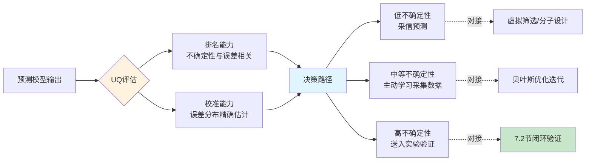

但同时必须坦诚指出，**当前UQ在跨尺度系统性评估、个体化预测、LLM/MAS输出层面的应用仍处于早期**。从跨尺度视角看，分子层面UQ相对成熟（如QSAR的AD传统），但细胞层面（AIVC的扰动响应UQ）、组织层面（虚拟组织模型的因果识别UQ）、个体层面（PDT的参数辨识性UQ）的方法学体系尚未充分建立。从LLM/MAS视角看，自然语言输出的不确定性度量在方法学上远比数值预测的UQ复杂——一个回答"听起来自信"与"实际可靠"之间的脱节，在LLM场景下尤为严重，且RAG等增强机制本身也可能引入新的不确定性来源（第4章已展开的"幻觉叠加"风险）。从个体化视角看，第6章已指出CODE-AE在跨尺度迁移中的稳健性受限、TIDE的"相对值不可绝对比较"等使用边界，其本质都是UQ方法学在患者级精准模拟中尚未深度部署的体现。这些局限直接驱动了下一节可解释AI的方法论需求——**当UQ告知"该预测不可靠"时，决策者需要理解"为什么不可靠"才能采取合适的应对策略**。

## 7.4 可解释AI在大模型药物评估中的角色与机制锚定

可信度建设的第三支柱是可解释AI（XAI）——**它通过把黑箱模型的决策逻辑以人类可理解的形式呈现，使输出能够对接生物学语义、临床决策习惯与监管证据标准**。XAI的方法论价值在系统性药物评估中体现在三个层面：**打开黑箱**（让模型决策过程可被审视）、**对齐监管证据**（提供机制性解释而非仅统计性预测）、**增强临床医生采信意愿**（自然语言可读的推理链优于难以解读的概率值）。

**XAI的基础类别与在大模型中的落地形态**。当前XAI方法可大致归纳为四类——**基于注意力的可解释性**（通过Transformer注意力权重显示模型"关注"的输入特征）、**特征重要性方法**（如SHAP/LIME对特征贡献度的事后归因）、**机制锚定型解释**（把模型决策直接对接生物学先验或物理机制）、**自然语言推理链**（LLM/MAS通过自然语言展示多步推理过程）。在大模型药物评估的不同架构中，这四类方法各有侧重——AIVC更多依赖前两类（如scLong的GO本体融入、scFM-Bench的scGraph-OntoRWR）、LLM/MAS更多依赖后两类（如Agentic AI的可追溯工具调用链）、数字孪生则倾向于把第三类作为核心（机制模型本身就是显式可解释的）。

**机制锚定路径一：生物学先验融入**。第2章已展开的scLong把Gene Ontology（GO）提供的结构化生物学知识融入模型——基因编码器为每个基因生成带有生物学含义的表示——这是把生物学先验作为模型架构组成部分的典型路径，其可解释性优势在于**模型的输出可以直接对接GO术语层级，而非仅给出黑箱预测**。第3章Celcomen作为"首个具有因果推断可识别性的虚拟组织模型"则把可解释性推到更深层——因果识别性意味着模型的解释不仅是"统计相关"，而是"在数学上可被恢复的真实因果结构"。第3章scFM-Bench提出的scGraph-OntoRWR新指标，将细胞本体论建模为有向无环图，通过带重启的随机游走算法计算细胞类别的内在关联度，提供独立于特定数据集的稳健参考图——这种"基于本体论的评估指标"本身就是对可解释性的方法论支撑。

**机制锚定路径二：案例推理与知识图谱**。第4章已展开的CBR-DDI是这一路径的代表性工作——通过构建包含历史案例药理洞见的知识仓库、利用GNN提取药物关联、结合混合检索机制和双层知识增强提示，使LLMs能有效复用案例信息；**实验显示CBR-DDI相比基准模型准确率显著提升，例如在DeepSeek-V3模型上准确率提升28.7%，且保持高可解释性和灵活性**。CBR-DDI的方法论意义在于——**把"推理依据"以历史案例形式显式呈现给用户，每一个DDI预测都伴随"参考了哪些已知案例"的可追溯证据链**，这种可追溯性比单纯的高准确率更具决策价值。

**机制锚定路径三：Agentic AI自然语言推理链**。第4章Drug Discovery Today综述所描绘的"感知—思考—行动—观察—反思"闭环架构本身就是一种可解释性框架——每一步的工具调用、每一次的中间观察、每一个推理判断都以自然语言形式记录，形成完整的决策日志。Coscientist几分钟复现钯催化偶联反应的案例之所以具有方法论价值，不仅在于"成功"本身，而在于**整个推理过程可被审计——研究者能够看到Coscientist查询了哪些文献、调用了哪些工具、做了哪些判断**。这种可审计性正是从研究工具向监管证据载体演进的关键属性。

**XAI的四类局限与权衡**。但XAI在大模型药物评估中的应用同样存在显著局限。**第一是"统计相关而非因果"的本质局限**——基于注意力的可解释性虽然直观，但注意力权重本质上是模型在训练数据上学到的相关性映射，并不等同于真正的因果关系；模型可能"关注"某些与预测高度相关但与生物学机制无关的伪特征。**第二是SHAP/LIME在高维生物数据中的稳定性问题**——这类事后归因方法在数万维基因表达空间中的归因结果可能因小扰动而显著变化，给出的"特征重要性"未必稳定。**第三是自由文本解释的幻觉风险**——LLM/MAS给出的自然语言推理链可能"听起来合理"但实际包含错误事实；这与第4章已展开的15%-20%幻觉率问题同源，意味着自然语言解释本身也需要事实校验回路。**第四是可解释性与预测准确性之间的潜在权衡**——把生物学先验作为强约束融入模型可能降低模型在"未被先验覆盖"场景下的预测能力；过度追求可解释性可能牺牲灵活性，反之亦然。

**监管端动态与XAI的演进窗口**。从监管视角看，XAI正处于从研究工具向监管证据载体演进的关键窗口。FDA对器官芯片ISTAND计划的接纳虽然主要面向物理实验，但**仅2个月后FDA还发布了《药物开发中采用新方法论的总体考量行业指南》意见稿**，对计算预测类新方法的开放也在跟进。这一指南所要求的"可追溯、可重复、可审计"属性，正是XAI方法学的核心目标。但同时必须清醒认识到——**当前XAI的研究进展与监管要求之间仍存在显著缺口**：监管要求"可被独立专家审查的因果性解释"，而当前XAI主流方法多为"事后归因的相关性解释"；监管要求"在分布外场景下解释的稳定性"，而当前XAI方法在稳定性维度上的研究仍不充分。这一缺口意味着XAI在系统性药物评估中的真正落地，需要在方法学严苛化、与UQ的深度耦合、与闭环验证的协同三条主线上继续突破。

## 7.5 独立基准测试体系：scPerturBench、Systema、scFM-Bench揭示的真实能力

可信度建设的第四支柱——也是最具反向校验价值的一支柱——是独立基准测试。前三支柱（闭环验证、UQ、XAI）本质上仍是模型开发者或紧密合作者所能掌控的方法学；而独立基准测试则把可信度评估的主导权转移到第三方研究者手中，通过严苛、对抗性、对常见失真模式具有诊断力的基准设计，对当前大模型药物评估的真实能力进行"挤水分"。本节聚焦三项标志性基准研究，剖析其方法论与发现。

**第一项：Ahlmann-Eltze等人发表于Nature Methods的扰动预测基准研究**。第3章已展开过这项研究的核心发现，本节从可信度方法论视角进一步剖析。研究将**scGPT、scFoundation、scBERT、Geneformer、UCE五个基础模型与GEARS、CPA两个扰动专用模型，与刻意设计的简单基线模型进行了对比**[^30][^31]。基线模型只有两个：**"无变化"模型（始终预测与对照条件相同的表达）与"加性"模型（对于每个双重扰动，预测单个对数倍变化LFC的总和）；这两个模型都不使用双重扰动数据**[^30]。在Norman等人的数据上——**通过CRISPR激活系统在K562细胞中上调了100个单独基因和124对基因，共形成224种扰动**[^30]——作者**在所有100个单一扰动和62个双重扰动上对模型进行了微调，并在剩余的62个双重扰动上评估了预测误差；为了保证结果的稳健性，作者使用不同的随机分组重复了整个分析五次**[^30]。

研究结果具有标志性意义——**所有模型的预测误差都显著高于加性基线**[^30]。预测误差通过1000个表达量最高的基因的预测表达谱与观测表达谱之间的L2距离来衡量；**作者还检查了其他汇总统计量，如皮尔逊delta度量，得到了相同的总体结果**[^30]。论文的标题与摘要把这一结论表达得极为克制但意义深远——**"基于深度学习的基因扰动效应预测尚未超过简单的线性基线"；近期基于深度学习的基础模型研究有望通过学习单细胞数据的表征来预测基因扰动效应，但本研究表明：没有任何一个模型的表现优于这些基线模型，这凸显了严谨基准测试的重要性**[^31]。

这项研究的方法论价值在于其**对抗性基线设计**——选择两个连训练都不需要的极简模型作为对照，本身就是对"复杂深度学习模型必然优于简单方法"这一隐含假设的挑战。当复杂模型无法击败极简基线时，要么是模型本身的能力存在严重缺陷，要么是评估指标系统性地有利于平凡预测——无论是哪一种，都直接动摇了原有论文的可信度根基。

**第二项：2025年8月Nature Biotechnology的Systema框架研究**。这项研究把"挤水分"推向了更深层——**作者设计了两个极其简单的基线模型：第一个被称为"扰动均值"（perturbed mean），无论要预测哪个基因扰动的结果，它都只给出一个答案：训练数据中所有被扰动过的细胞的平均基因表达谱；第二个基线模型是"匹配均值"（matching mean），稍微复杂一点，用于预测双基因组合扰动，它会将两个单基因扰动的结果进行平均**[^32]。

研究方法论层面的实验设置值得展开——**研究人员在涵盖了三种不同技术、五个细胞系的十个公开数据集中，将这些简单的基线模型与那些先进的深度学习模型进行了正面交锋；评估的标准是领域内广泛使用的"皮尔逊相关系数"**[^32]。这一设置在多个层面满足了基准测试的严苛性——**多技术、多细胞系、多数据集**确保了结论不会因单一数据集的偶然性失真，**采用领域内广泛使用的指标**则确保了结论与现有论文的可比性。

研究的核心发现是震惊性的——**那位"捣蛋鬼"基线模型（扰动均值）按照常理应该得零分，但当研究人员在一系列真实的基因扰动预测任务中进行这样的"模拟考试"时，一个令人匪夷所思的结果出现了**[^32]：先进的深度学习模型——比如CPA、GEARS和scGPT——在多个任务中并未显著优于甚至无法击败"扰动均值"这一最朴素的基线。这一结果的方法论含义是深刻的——**当前评估体系本身存在"系统性"缺陷：皮尔逊相关系数等指标实际上奖励了"输出训练集平均值"这种平凡策略，并不能真正衡量模型对扰动机制的理解**[^32]。Systema框架的提出正是为了"为AI挤水分"——它锻造了一面名为Systema的"照妖镜"，不仅深刻地指出了当前领域内评估体系的"系统性"缺陷，更提供了一套全新的、更为严苛也更为公正的评判标准，引导研究者走向真正有意义的生物学预测[^32]。

**第三项：浙大scFM-Bench研究**。第2章已展开过这项研究的总体框架与scGraph-OntoRWR新指标，本节从可信度方法论视角进一步审视。研究**对Geneformer、scGPT、UCE、scFoundation、LangCell和scCello六个主流scFM的零样本嵌入能力进行了深度评估，涵盖基因层面、细胞层面与可解释性分析三个层面共7类任务**。研究关键的方法论严苛设计是——**选取2025年4月发布的AIDA v2新增约201K健康供体免疫细胞作为测试集（首次公开时间晚于scFMs发布时间，确保不存在数据泄漏）**——这种"零数据泄漏"测试集设计直接回应了大模型评估中"训练-测试集污染"的常见失真问题。

研究发现同样具有方法论震撼力——**传统评估指标（scIB）显示，scFMs并未超越简单的基线方法，如高可变基因（HVG）、scVI**。但研究进一步指出，scIB指标过高的模型可能破坏了数据本身的生物学结构，并据此提出了scGraph指标用于衡量表征空间中细胞类型间远近关系与原始基因表达数据的一致性。这一发现的方法论价值是双向的——**一方面揭示了当前scFMs在传统指标上的"虚假优势"，另一方面提出了更具生物学合理性的新指标作为替代方案**——这种"破中有立"的研究方式正是基准测试演进的健康路径。

**三项研究的共性发现**。把三项独立基准研究合并审视可以归纳出三层共性发现：

| 共性发现层 | 具体表现 | 对系统性药物评估的可信度含义 |
|------|------|------|
| 评估指标失真 | 皮尔逊相关、L2距离等常用指标系统性奖励"输出训练集平均"这一平凡预测 | 当前论文SOTA数字与真实能力之间存在系统性偏差 |
| 跨细胞背景泛化薄弱 | 大多数模型在训练分布内表现良好，但切换到未见过的细胞类型/患者/物种性能可能跌至简单基线水平 | 直接对应第6章个体化外推风险，跨人群外推的可信度受限 |
| 组合化学扰动表现尤其有限 | 这恰恰是药物联合用药、多药物方案设计最迫切需要的能力 | 系统性药物评估在"组合干预"维度上的可信度尤其薄弱 |

这三层发现与本章前述的UQ方法学局限、XAI"统计相关而非因果"的局限、闭环验证的尺度失配挑战形成了交叉印证——**它们从不同角度共同指向一个核心判断：当前大模型药物评估的可信度建设不能仅依赖模型开发者自身的报告，必须建立独立、严苛、对抗性的基准生态作为反向校验机制**。

**独立基准对可信度建设的方法论价值**。把独立基准放回四主线耦合的整体框架中可以看到其不可替代的角色——**它是过滤"演示性SOTA"与"真实能力"的关键过滤器**。Systema、scPerturBench类工作的兴起，标志着AIVC领域进入了"评估范式自我修正"的关键阶段；scFM-Bench的零数据泄漏测试集设计，则标志着基准测试本身的方法学严苛化在持续推进。这种自我修正机制的成熟度，是判断一个研究领域可信度建设进入成熟阶段的核心标志。但同时必须客观指出，独立基准本身也面临挑战——**第一是基准更新速度与模型迭代速度的不匹配**（新模型发布后基准设计需要时间，可能导致评估滞后）、**第二是基准选择本身可能引入新的偏倚**（哪些任务被纳入基准、哪些不被纳入，本身就是方法学判断）、**第三是基准与真实临床场景的距离**（即便严苛的基准仍是计算任务，距离前瞻性临床验证仍有缺口）。这些挑战意味着独立基准是必要但不充分的可信度支柱，必须与前三支柱协同工作。

## 7.6 可重复性、稳健性与泛化能力的真实水平评估

将7.2–7.5四节的论证收束到对当前大模型药物评估三大可信度核心维度的真实水平评估，是本节的任务。这一评估不追求"覆盖每一个模型每一个任务"的细节穷尽，而是给出基于本报告全部证据的统一判断——**当前大模型药物评估在可重复性、稳健性、泛化能力三维度上的真实位置**。

**可重复性维度**。可重复性的核心障碍可归纳为四类：**模型权重开源性**——如Tahoe-100M全数据集开源、CZI开放CELLxGENE 1亿+细胞数据等案例代表了开放科学路径，而Recursion 23PB的专有数据集与诸多商业平台的封闭模型代表了产业封闭路径，两者在可重复性维度上形成了鲜明对照；**训练数据可获取性**——即便模型权重开源，训练所用的多组学数据若不可获取，复现实验仍受制于"无米之炊"困境；**随机种子敏感性**——大模型训练中的随机性来源众多（数据采样、初始化、优化轨迹），不同种子下结果的差异可能被论文选择性报告所掩盖；**批次效应控制**——同一模型在不同实验批次下的表现可能差异显著，这与第1章多组学整合的4V挑战形成同构。把可重复性维度与scFM-Bench的"传统scIB指标过高的模型可能破坏数据本身生物学结构"发现合并审视可以推出一个判断——**当前生命科学大模型可重复性整体偏弱，且封闭路径在产业层面的主导地位可能进一步限制独立验证的空间**。这一判断对7.7节的现实差距分析具有直接含义。

**稳健性维度**。稳健性的核心命题是：**模型在不利条件（数据稀疏、噪声、批次效应、跨平台、跨人群）下能否保持性能？** 第3章基准测试已展示了这一维度的关键证据——**在模拟噪声和稀疏性增强的条件下所有模型性能均出现不同程度下降，对数据稀疏性的敏感性尤为明显**。结合具体场景：UK Biobank以欧裔为主导致的非欧裔外推偏倚（第6章已展开）直接降低了模型在非欧裔人群中的稳健性；Tahoe-100M的"细胞村"设计（第3章已展开）通过事后SNP解卷积部分缓解了批次效应，但批次效应在更广泛的场景下仍是稳健性的主要威胁。把这些证据合并起来可以推出统一判断——**稳健性受训练分布与目标分布偏移幅度的直接调制，偏移幅度越大稳健性越低，当目标分布显著偏离训练分布时大多数模型性能会出现实质性下降**。这一判断与7.5节"跨细胞背景泛化薄弱"的基准发现形成了内在一致性——稳健性与泛化能力本质上是同一可信度问题的两个侧面。

**泛化能力维度**。泛化能力的核心区分是"已见分布泛化"与"未见分布泛化"——**前者指模型在与训练数据同分布的测试集上的表现，后者指模型在分布偏移的新场景下的表现**。当前大模型药物评估的泛化能力图谱呈现出明显的不对称——**所有方法在"已见分布"条件下表现明显优于"未见分布"条件；当测试细胞环境与训练数据差异较大时，大多数模型性能显著下降，部分情况下甚至不优于简单基线模型**（第3章已展开）。结合具体证据：CODE-AE在跨尺度迁移上的间接验证局限（第6章已展开）、TIDE的相对值不可绝对比较的使用边界（第6章已展开）、MOSAIC在化学合成上的71%整体成功率与试剂94.8%部分匹配率而非完全匹配率（第4章已展开）——这些证据从不同侧面共同指向一个判断——**泛化能力是任务依赖、数据规模依赖、严格基准下普遍受限的**。即便在某一具体任务上模型表现良好，外推到分布外场景时仍存在显著的可信度衰减。

将三维度的真实水平评估归纳为可信度分级图谱：

| 可信度分级 | 代表性场景 | 三维度综合判断 |
|------|------|------|
| 高可信度 | 特定基因型类器官药敏（CFTR/F508del+PDO[^32]）、纵向影像数字孪生（TNBC MRI） | 三维度均较高：可重复性受类器官标准化支撑、稳健性受患者来源细胞保障、泛化能力在特定基因型场景下经实证确认 |
| 中可信度 | 群体级药物重定位（UNAGI/PRnet）、分子层面属性多任务预测（TxGemma 66任务） | 可重复性中等（部分开源）、稳健性受训练分布约束、已见分布内泛化良好但跨域受限 |
| 低可信度 | 跨人群外推（UK Biobank欧裔→非欧裔）、组合化学扰动预测、个体级精准响应预测 | 三维度均面临显著挑战：训练数据偏倚、严格基准下接近简单基线、个体级数据稀缺 |

这一分级图谱并非一成不变——它会随基础数据规模扩张、方法学严苛化、监管科学协同而动态演进。但它为本研究核心命题"大模型能否系统性模拟药物对机体影响并应对个体异质性"提供了一个可信度维度的坐标系：**特定场景下大模型已具备"监管级可信度"、群体级场景下具备"研究级可信度"、个体级与跨人群场景下仍处于"探索级可信度"**。这一分级判断与第6章"已具备—有限具备—尚不具备"的能力分层形成了相互印证——能力图谱与可信度图谱在结构上高度同构。

## 7.7 可信度建设的现实差距与衔接路径

把本章六节论证收束为对系统性药物评估可信度的分层结论，是本节的任务。以本研究持久推理标准P-5为标尺给出三层判断——

**已具备能力**。当前大模型药物评估的可信度建设在以下三类维度已积累实质性进展：**湿-干闭环验证基础设施初步成型**——CRISPR、类器官、器官芯片、前瞻性临床数据构成的四类验证载体均已具备产业实践，FDA与EMA对类器官、器官芯片的监管开放（FDA 2025年4月动物实验路线图、2026年1月ISTAND意向书、2026年3月新方法学验证指导草案[^30]、EMA 2026年2月首款类器官芯片技术新药临床批准[^31]）为闭环架构提供了制度支撑；**UQ方法谱系成熟**——基于相似性、贝叶斯、深度集成、Monte Carlo Dropout、共形预测等主流方法均已发展出工程实践模板[^73][^72]，混合框架在24个生物活性数据集上验证了组合策略的实证价值[^73]，UQ与传统AD的概念承接关系也已被方法论清晰刻画[^31]；**独立基准研究已挤出"水分"**——Ahlmann-Eltze等人[^30][^31]、Systema[^32]、scFM-Bench三项标志性研究系统性地揭示了当前评估体系的失真问题，并提出了更严苛的替代基准。这三类进展共同标志着可信度建设从"演示性高分"阶段进入了"反向校验与自我修正"阶段。

**有限具备能力**。当前可信度建设在以下三类维度仍存在显著局限：**XAI与监管证据对齐仍存间隙**——XAI的"统计相关而非因果"本质局限、SHAP在高维生物数据中的稳定性问题、自由文本解释的幻觉风险，与监管所要求的"可被独立专家审查的因果性解释"之间存在方法学缺口；**跨人群与组合扰动稳健性受限**——三项独立基准研究共同揭示的"跨细胞背景泛化薄弱"与"组合化学扰动表现尤其有限"，与系统性药物评估对联合用药、跨族裔精准富集的迫切需求形成结构性张力；**可重复性受数据封闭性制约**——开放科学路径（CZI、Tahoe-100M）与产业封闭路径（Recursion等）的张力对独立验证空间的限制，是制约可重复性提升的产业级障碍。

**尚不具备能力**。当前可信度建设在以下三类维度仍处于早期或尚未触达：**个体级因果可解释性**——当前XAI方法主要面向群体或亚群级解释，把因果可解释性下沉到患者级精准模拟仍是开放问题；**跨尺度统一不确定性传播**——分子、细胞、组织、器官、个体五层尺度上各有相对成熟的UQ方法，但把不确定性在跨尺度耦合中连续传播的统一数学框架尚未建立，这与第5章数字孪生"工具调度的伪耦合"判断同构；**监管级可信度全栈框架**——可信度技术栈（闭环验证+UQ+XAI+独立基准）与监管证据标准（可重复、可审计、可追溯）的深度耦合，目前仅在器官芯片等物理实验载体上初步成型，对纯计算预测的全栈框架仍待构建。

**可信度建设的四类现实差距**。把上述三层判断进一步拆解为四类相互耦合的现实差距：

| 现实差距 | 具体表现 | 跨章节衔接 |
|------|------|------|
| 数据-模型-实验闭环的标准化与监管对齐缺口 | FDA对器官芯片开放快于纯计算预测；闭环架构的"预测假设结构化、实验设计正交化、结果回流自动化"三层标准在产业层面尚未规范化 | 衔接第8章数据基础设施瓶颈、第9章监管科学协同 |
| 评估范式自身的演进滞后 | 指标失真、基线设计不严、泄漏防护不足；新基准的更新速度与模型迭代速度不匹配 | 衔接第8章方法学瓶颈、第9章开放基准生态构建 |
| XAI与UQ尚未在大模型药物评估中实现深度耦合 | XAI主要面向"为什么这样预测"、UQ主要面向"这个预测多可靠"，两者的协同推理框架仍处于早期 | 衔接第8章技术瓶颈、第9章可信度技术栈成熟 |
| 开放科学与产业封闭之间的张力 | 23PB专有数据集等封闭路径限制独立验证空间；开放路径受制于商业模式可持续性 | 衔接第8章伦理与制度瓶颈、第9章跨国开放科学协作 |

这四类差距相互耦合而非孤立——监管对齐推动方法学严苛化，方法学严苛化推动XAI与UQ的深度耦合，深度耦合的可信度技术栈又为开放与封闭的张力提供了新的平衡点。这种耦合性意味着**可信度建设不能只在某一支柱上单点突破，必须在四主线协同演进的整体节奏中推进**。

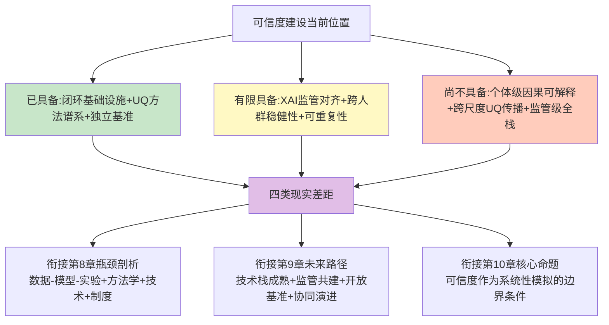

**衔接路径**。本章的可信度判断为后续三章衔接出三条清晰路径：**向第8章瓶颈剖析衔接**——四类现实差距的深层根源涉及数据基础设施异质性与质量、跨尺度因果耦合的方法学缺口、监管科学协同的制度成熟度、隐私与数据主权的合规约束等更深层瓶颈，需要在第8章中系统讨论；**向第9章未来路径衔接**——可信度技术栈成熟、监管科学共建、开放基准生态构建是未来5-10年可信度演进的三条主线，需要在第9章中给出基于现状证据的前瞻判断；**向第10章核心命题分层结论衔接**——"可信度是否达到监管级"将作为判断"大模型能否系统性模拟药物对机体影响"的关键边界条件，本章的可信度分级图谱（高/中/低三类场景）将直接成为第10章分层结论的证据基础。

**总判断**。整合本章七节论证可以给出一个边界明确的总判断——**当前大模型药物评估的可信度建设已从"演示性高分"阶段进入"反向校验与自我修正"阶段，但要达到"监管级、临床级、产业级"三重可信度仍需在闭环验证、UQ深度部署、XAI机制锚定与独立基准生态四条主线上系统突破**。这一判断既不是悲观的全盘否定（独立基准研究、UQ方法谱系、闭环验证基础设施都展示了实质性进展），也不是盲目乐观的全面肯定（评估失真、跨域稳健性受限、个体级因果可解释性缺失等问题仍构成结构性挑战）；它是基于本报告全部证据的边界明确刻画——**可信度是系统性药物评估命题的核心维度而非附属维度，可信度的演进节奏将直接调制大模型从"概念演示"走向"产业落地"的整体进程**。

至此本章给出的总判断与本研究持久推理标准P-1（核心命题相关性）、P-2（技术证据具体性与可验证性）、P-3（跨尺度系统性视角）、P-5（能力边界与局限的平衡呈现）、P-6（前瞻判断的证据锚定）保持完全一致。下一章将进入对数据、技术、监管与伦理多重瓶颈的系统剖析——把本章揭示的可信度差距进一步拆解为可被识别、可被攻克的具体瓶颈，为第9章未来路径展望奠定瓶颈维度的证据基础。

# 8 关键挑战：数据、技术、监管与伦理的多重瓶颈

前七章已经从能力图谱与可信度两个维度勾勒了大模型驱动药物系统性评估的当前位置：第3章AIVC作为细胞尺度核心引擎、第4章LLM/MAS作为编排层、第5章跨尺度数字孪生作为远景蓝图、第6章个体异质性应对在亚群与特定基因型场景下取得标志性进展、第7章可信度建设进入"反向校验与自我修正"阶段。然而，要把这些技术能力从演示性场景推向规模化、监管级、产业级的真实落地，必须直面一系列**相互嵌套、相互制约的多重瓶颈**——它们不是单一技术问题的简单叠加，而是一个跨越数据、技术、制度、伦理四个层面的"系统性约束网络"。

本章的方法论坐标可以归纳为一个核心判断：**当前制约大模型药物评估走向规模化的瓶颈，已经从"能不能做"的技术可行性问题，部分转向了"能不能合规、能不能采信、能不能公平、能不能可持续"的制度与伦理问题**。这种转向意味着，未来5-10年的瓶颈攻克路径不能只依赖方法学突破，必须把跨国协调、立法演进、多方利益博弈纳入同一个推理框架。本章按照"数据层（8.1）—技术层（8.2-8.4）—制度层（8.5-8.6、8.8）—伦理层（8.7）"四个维度递进展开，最后在8.9节归纳瓶颈相互制约关系与攻克优先级，为第9章未来路径展望奠定证据基础。

## 8.1 数据异质性、质量与稀缺性的多层瓶颈

数据是大模型药物评估的"基石"——但与"大数据是大模型的重要基石"这一普遍认知不同，**药物研发数据的真正挑战不在于规模，而在于结构性缺口**[^74]。把第1章4V挑战、第3章Tahoe-100M级数据基础设施进展、第6章患者级跨尺度对齐数据稀缺这三类已展开的事实合并审视，可以归纳出数据瓶颈的四层结构。

**第一层是数据稀疏性**。药物研发数据高度分散且稀缺，**高质量标注数据（如化合物活性、毒性数据）获取成本极高，单个靶点可能仅有数百个有效数据点**[^72]。这一规模与AIVC、LLM训练所需的数据规模之间存在数量级差距——scLong需要4800万细胞、scFoundation需要5000万细胞、xTrimoPGLM需要1万亿氨基酸token，而单个药物靶点的有效数据点常常仅在数百量级。这种"基础模型层数据丰富、应用层数据稀缺"的不对称性，直接决定了大模型在具体药物任务上的迁移能力上限。

**第二层是数据异质性**。多组学数据（基因组、蛋白组、代谢组）格式不一、标准化程度低，跨模态对齐困难[^72]。这一问题在第1章"4V挑战"中已被刻画为核心瓶颈之一——基因组为离散变异、转录组为连续表达、蛋白质组含修饰丰度等多维信息，跨组学统计建模缺乏统一框架。即便在数据可获取的前提下，异构格式与命名标识符的不一致（同一基因/蛋白在不同数据库中的多套ID系统）也会显著推高数据预处理的工程成本，这与第4章智能体AI架构"把异构查询封装为可调用工具接口"的工程实践需求直接对应。

**第三层是数据偏倚——尤其是阴性结果缺失**。**公开数据集（如ChEMBL、PubChem）存在发表偏倚，阴性结果（失败化合物）数据严重缺失**[^72]。这一问题对系统性药物评估具有根本性影响——模型在"成功化合物"为主的训练数据上学到的规律，本质上是"经过筛选的成功者画像"，而无法学到"为什么失败"的机制；当模型外推到新化合物空间时，缺乏阴性数据的负反馈信号会导致过度乐观的预测。结合第1章揭示的"90%在I期临床后失败"的产业事实，可以推出一个尖锐的判断——**真正能够提升AI药物评估可靠性的数据，恰恰是产业界最不愿意公开的失败数据**。这一矛盾构成了数据偏倚问题的深层根源。

**第四层是隐私与产权壁垒**。药企核心数据（专利化合物、临床数据）受商业机密保护，难以用于模型训练[^72][^74]。波士顿咨询数据虽然显示AI发现的药物分子整体成功率可从5%-10%提升到9%-18%、I期临床试验成功率高达80%-90%[^74]，但这些指标背后的训练数据几乎全部依赖于企业内部的专有数据集——**"很多关键数据秘而不宣"**[^74]，可重复实验的标准化数据有限，导致AI模型的训练数据有限。在确保病人隐私的情况下合规使用临床数据本身就是一个尚未解决的命题，这一议题将在8.5节展开。

将这四层瓶颈与第3章Tahoe-100M（1亿+单细胞、50癌细胞系×1100+小分子扰动）、第5章UK Biobank（近50万人全基因组）、第6章217患者×13癌种>50万细胞免疫图谱等数据基础设施进展放在一起对照，可以归纳出一个分层判断：

| 数据层 | 当前进展 | 结构性缺口 |
|------|------|------|
| 群体级基础数据 | UK Biobank 50万人全基因组、HCA 1亿+细胞 | 人群族裔代表性偏倚（欧裔为主） |
| 扰动响应数据 | Tahoe-100M 1亿+单细胞×1100+扰动 | 组合化学扰动与跨细胞背景泛化数据稀缺 |
| 患者级跨尺度对齐 | TNBC纵向MRI、PCLS人体模型 | 全维度对齐样本（基因组+单细胞+空间+影像+EHR）极为稀少 |
| 阴性数据 | 公开数据集中严重缺失 | 失败化合物数据的产业-学术共享机制缺位 |
| 临床真实世界数据 | 部分可通过合规渠道获取 | 跨国药企专有数据受隐私法规约束 |

更具方法论价值的是**开放数据与封闭数据路径之间的张力**。一方面，CZI计划在未来10年内投入数亿美元打造AI虚拟细胞、CELLxGENE平台积累超过1亿个标准化细胞数据、Tahoe-100M全数据集开源，这些代表了开放科学路径——其方法论价值在于为独立验证、第三方基准研究、社区协同创新提供了基础设施。另一方面，**Recursion拥有超过23千兆字节（PB）和3万亿可搜索基因和化合物关系的庞大专有生物和化学数据集**[^74]，与英伟达5000万美元私募股权投资合作加速基础模型训练；这种"AI+大规模专有数据+巨头算力"的产业封闭路径在资本市场获得强烈认可（合作宣布当日Recursion股价暴涨78.17%），但其23PB专有数据对独立验证空间形成了实质性限制。

把这一张力放回第7章可信度判断中可以看到——**封闭数据路径所产生的SOTA结果在结构上更难被独立基准研究"挤水分"**：scPerturBench、Systema、scFM-Bench等独立基准的有效性高度依赖于公开数据与可复现实验，当核心训练数据本身不可获取时，独立基准的诊断力会被显著削弱。这一观察直接连接到本章8.9节关于"可重复性受数据封闭性制约"的判断，也为第9章关于开放科学协作的未来路径展望提供了证据底座。

## 8.2 多模态融合稳定性与跨尺度耦合的技术瓶颈

承接第2章多模态融合的总体框架与第5章跨尺度建模的层级架构，本节深入剖析多模态融合在工程实践中的稳定性瓶颈与跨尺度耦合的方法论缺口——这两类瓶颈构成了大模型从"演示性多模态"走向"产业级跨尺度"的关键障碍。

**多模态融合的四类稳定性瓶颈**。第一类是**跨模态对齐的批次效应放大**——当不同模态的数据来自不同实验批次、不同测序平台、不同生产年份时，单模态内的批次效应在跨模态融合时会被放大而非缓解；这与第7章可信度判断中"稳健性受训练分布与目标分布偏移幅度的直接调制"的判断同构。第二类是**稀缺模态的预训练样本不足**——3D类器官成像、患者级长程随访、空间组学等模态的可用样本远少于分子或基因表达数据，难以独立支撑大规模预训练；scFM-Bench所采用的零数据泄漏测试集设计（2025年4月发布的AIDA v2新增约201K健康供体免疫细胞、首次公开时间晚于scFMs发布时间）正是为了规避这种稀缺模态被训练污染的风险。第三类是**时序动态建模能力的根本性缺失**——绝大多数当前模态的数据为静态快照，第3章已指出TIGON、Squidiff等方法仍依赖伪时间重建；如何在多模态融合中显式建模时间维度，使药物长期暴露下的累积毒性、治疗过程中的耐药演化、慢病多年进展轨迹能够被纳入统一框架，仍是开放问题。第四类是**跨域泛化在严格基准下性能骤降**——当训练所用的细胞类型、患者人群、测序平台与目标场景偏移幅度较大时，多模态融合模型的性能可能跌至简单基线水平。

**长序列处理瓶颈作为多模态融合的工程级约束**。**蛋白质序列、多组学数据可能长达数万token，超出模型上下文窗口**[^72]。这一瓶颈对系统性药物评估具有直接含义——当患者全基因组、组织单细胞图谱、纵向多次随访数据合并输入时，单一模型难以在统一上下文中处理所有信息，必须依赖分块、检索、压缩等工程技巧；这些技巧虽然缓解了token数限制，但本身可能引入新的信息损失与对齐误差。

**跨尺度耦合的"伪耦合"陷阱**。第5章已指出当前所谓的"多尺度建模"绝大多数实践仍是"工具调度的伪耦合"而非"统一数学框架的真耦合"——把AlphaFold预测的结构、AIVC预测的细胞响应、PBPK模型预测的全身代谢拼装到一个工作流里，并不等同于扰动信号在统一数学框架内从原子尺度连续传递到个体尺度。这一判断在本章语境下需要进一步深化——**伪耦合的本质瓶颈不是工程问题而是方法论级别的结构性约束**，因为不同尺度采用不同的物理定律（分子层是量子力学与统计力学、细胞层是生物化学网络动力学、组织层是连续介质力学与流体力学、个体层是生理学与药代动力学），把这些不同尺度的数学语言统一到同一框架内，需要新的跨尺度模型理论而非仅工程拼接。

**全细胞建模九大挑战作为跨尺度瓶颈的具体表达**。第5章已展开的朱岩团队归纳的全细胞建模九大挑战——测量数据不足、机制不明确、孤立描述单一过程、复杂度灾难、参数不准确、维度灾难、缺乏统一标准、实验验证不足、准确度评判不足——可以被理解为跨尺度耦合在工程实践层面的具体表达。其中**参数转译**（如何把AI模型从数据中学到的隐式表征转化为机理模型可使用的显式参数）与**尺度对齐**（如何在数据驱动的细胞表征与机理驱动的分子动力学之间建立连续的数学桥梁）这两类难题，目前仍是开放问题。

把多模态融合稳定性与跨尺度耦合的瓶颈合并归纳为统一图谱：

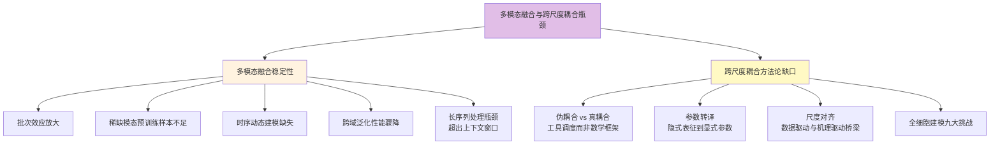

这一瓶颈图谱与第3章AIVC基准测试中暴露的"跨细胞背景泛化薄弱""组合化学扰动表现尤其有限"问题、第5章数字孪生的"工具调度的伪耦合"判断、第7章可信度建设中"跨尺度统一不确定性传播尚未建立"的判断形成了深度同构——它们从不同角度共同指向一个核心命题：**系统性药物评估所需的跨尺度连续因果耦合，目前在方法论层面仍是开放问题**，这一命题的攻克难度显著高于单尺度内部的方法学优化。

## 8.3 模型幻觉、生物学合理性与可解释性的方法论瓶颈

数据与跨尺度瓶颈之外，大模型在药物领域还面临三类紧密相关的"质量瓶颈"——**幻觉、生物学合理性缺失、可解释性不足**。这三类瓶颈的本质并非工程缺陷而是方法论级别的结构性约束，本节系统剖析其表现与攻克路径。

**第一类：LLM幻觉在药物领域的零容忍特性**。第4章已展开**约15%到20%的LLM回复存在不同程度的幻觉现象**[^72]——这一比例在通用对话场景或许可以容忍，但在药物级监管场景下不可接受。具体到药物评估：模型可能生成看似合理但实际错误的分子结构或生物活性预测[^72]；RAG等增强机制虽然在通用知识问答场景能显著降低幻觉率，但在药物-靶点机制、患者级安全决策等"零容忍"场景下仍存在不可忽视的残余风险，甚至可能出现"幻觉叠加"——检索到错误信息后模型基于错误内容进一步生成虚假结论。这一瓶颈的方法论本质是——**LLM的输出基于训练数据中"什么文本经常和什么文本一起出现"的统计学习，并未直接锚定到分子层面的物理化学定律或细胞层面的生物学网络**；要从根本上缓解幻觉，必须把机制锚定（如CBR-DDI的案例推理、TxGemma的领域指令调优、专用LLM的领域适配）作为标配而非可选项。

**第二类：生物学合理性缺失**。这一瓶颈在三个层面具体表现：**化学空间探索局限**——模型可能生成化学上不合理或难以合成的分子结构[^72]，这与第4章MOSAIC在化学合成上的71%整体成功率而非100%的事实形成同构；**多目标优化困难**——药物设计需同时优化活性、选择性、毒性、药代动力学等多个指标，大模型难以平衡多目标[^72]；**通用模型与专业需求的张力**——豆包等通用大模型在化学、生物学等专业领域的表示能力可能弱于专门优化的模型（如ESM、AlphaFold）[^72]，这与第2章2.3-2.4节关于专用LLM与通用LLM的对照判断相互印证。生物学合理性缺失的方法论根源在于——**统计学习不等于物理/化学/生物学规律的内化**；模型可能学到"训练集中常见的分子骨架"，但这种"常见"既包含真正的合理性，也包含数据偏倚带来的伪规律。

**第三类：可解释性与不确定性量化的缺失**。这一瓶颈在第7章已系统展开，本节从瓶颈视角进一步归纳：**黑箱决策**——大模型基于统计关联而非因果机制，难以解释"为何推荐某个靶点/分子"，科研人员难以信任模型输出[^72]；**不确定性量化缺失**——当前大模型缺乏可靠的置信度评估机制，无法告知用户"预测结果有多可靠"[^72]；**领域知识融合困难**——化学家、生物学家难以将模型输出与已有知识体系（如构效关系、药效团模型）建立关联[^72]。把这三层缺失合并审视可以推出一个判断——**在药物研发这种高风险、高成本领域，缺乏可解释性意味着模型输出难以用于关键决策，只能作为辅助参考**[^72]。

**三类瓶颈的相互耦合**。把幻觉、生物学合理性、可解释性放在同一个方法论坐标中观察可以看到——**它们不是独立的三类问题，而是同一个"机制锚定缺失"问题的三个表现层面**。幻觉是机制锚定缺失在文本生成层面的表现，生物学合理性缺失是机制锚定缺失在分子设计层面的表现，可解释性不足是机制锚定缺失在决策审计层面的表现。这种内在统一性意味着——**从根本上缓解这三类瓶颈，必须通过机制锚定（生物学先验、案例推理、独立基准、UQ深度部署）多管齐下，而非寄希望于单一技术路径**。这一判断与第7章可信度建设的四主线耦合关系形成了直接呼应。

## 8.4 计算资源、能耗成本与基础设施门槛

数据、技术、可信度之外，大模型药物评估还面临一类直接的产业级瓶颈——**资源密集特性带来的成本门槛与可持续性挑战**。这一瓶颈虽然不像方法论缺口那样具有结构性，但对产业格局的塑造效应同样深刻。

**训练成本的指数级攀升**。**OpenAI的GPT-4和Google的Gemini Ultra的训练成本分别高达7800万美元和1.91亿美元，这些成本的急剧增加反映了大型语言模型训练的高能耗特点**[^74]。这种百万至亿美元级的训练投入，使得大模型基础研发已成为少数科技巨头与超大型科研机构的"专属赛道"——大多数中小药企与学术团队只能以"使用API"或"微调小模型"的方式参与，而无法触及基础模型自身的迭代。结合8.1节"AI制药基础大模型需要1亿到10亿美元投入、研发周期长达10到15年"的判断，可以归纳出一个产业格局判断：**大模型基础设施层正在加速集中化，开放路径的可持续性高度依赖慈善资本（CZI）、国家战略投入与公共-私营协作**。

**推理与微调成本的产业级约束**。**豆包大模型推理需要GPU资源，大规模虚拟筛选（百万级化合物）成本可能达数万美元；微调成本高，领域适配需大量计算资源进行微调，中小型药企难以承担**[^72]。这一成本结构对系统性药物评估的方法论含义是——即便基础模型已开源，下游应用的实际可及性仍受制于推理算力。**实时性约束**则进一步放大了这一问题——科研人员期望交互式响应（秒级），但复杂任务（如分子对接）可能需要分钟级计算[^72]，这种延迟在"假设-验证"快速迭代的科研工作流中会显著降低用户体验。

**碳足迹与可持续科研的张力**。**Meta的Llama 2模型在训练过程中产生的碳排放约为291.2吨，这一数值远超过一般个人的年碳排放量；尽管单次推理的排放量相对较低，但由于频繁使用这些模型，总排放量可能会超过模型训练时的排放**[^74]。这一事实把大模型的环境代价从"研发阶段"延伸到"全生命周期"——量化AI模型在其整个生命周期中的碳排放需要在训练、部署、维护、退役四个阶段分别测算，并通过Code Carbon等专门软件工具实时跟踪[^74]。把这一议题与药物研发本身的可持续目标放在一起，可以看到一个潜在张力——AI承诺通过减少动物实验、缩短研发周期降低环境代价，但其自身的训练与推理碳足迹又构成了新的环境成本。

**降低门槛的技术路径**。综述梳理了五类降低能耗与碳足迹的技术方法[^74]：**算法优化**（动态权重调整、梯度压缩、自适应学习率以减少冗余迭代）、**专用硬件**（Google TPUv4等AI专用加速器显著提高计算性能并减少能耗）、**神经网络设计**（利用稀疏性或检索机制减少模型复杂性）、**能效管理**（多智能体强化学习框架优化数据中心能效）、**绿色计算**（在模型评估中加入"绿色度"测量、探索更小但更高效的语言模型）。这些路径在产业层面已有具体落地——华为盘古团队在Pangu Ultra MoE上探索约一万个不同MoE结构组合、最终搜索出训练与推理吞吐均达最优的架构方案，正是"算法优化+专用硬件"协同的代表案例；scFoundation的非对称编码模块在保持相同参数规模的情况下计算量仅为传统Transformer的3.4%，是"神经网络设计"层面的稀疏化实证。

**成本门槛对产业格局的塑造效应**。把训练成本、推理成本、碳足迹三类瓶颈合并审视，可以归纳出一个产业格局判断——**资源密集特性正在塑造一个"少数巨头主导基础模型+广泛应用层使用API"的二元格局**。这一格局对系统性药物评估的方法论含义有两层：一方面，基础模型层的集中化有利于大规模数据的工程化整合（如xTrimo V3覆盖7模态、200任务SOTA），但另一方面也加剧了8.1节所讨论的"开放科学路径可持续性"挑战——慈善资本与公共投入能否长期对抗私营资本的封闭路径，将直接决定独立验证空间的演进节奏。

## 8.5 隐私与数据主权：GDPR、HIPAA、PIPL的合规约束与跨境数据张力

从技术层瓶颈进入制度层，第一个无法回避的命题是**全球数据隐私保护框架对药物大模型研发的合规约束**。在全球化的药物研发中，数据流通天然具有跨国属性——但欧盟GDPR、美国HIPAA、中国PIPL三大法规对医疗健康数据的规制差异，构成了跨国研发合规的核心挑战。本节聚焦中国PIPL作为代表性案例展开剖析，并审视其对全球协作的张力效应。

**PIPL作为中国隐私保护基石的法律地位**。**PIPL（Personal Information Protection Law，中华人民共和国个人信息保护法）是中国第一部专门针对个人信息保护的综合性法律，于2021年11月1日正式生效**[^75]。它与欧盟GDPR高度相似，赋予了个人对自己数据的广泛权利，并对企业施加了严格的合规义务。**对于医疗健康领域，PIPL最具震慑力的条款在于将"医疗健康"数据定义为敏感个人信息，要求处理时必须取得个人的单独同意，并且对跨国药企将中国患者数据传输至海外（数据出境）实施了极其严格的安全评估机制；它与《数据安全法》和《人类遗传资源管理条例》共同构成了中国生物医药数据合规的"三驾马车"**[^75]。

**敏感个人信息与"单独同意"机制**。PIPL对医疗行业的最大冲击在于其对"敏感个人信息"的定义和处理要求——**敏感个人信息明确包括"医疗健康"、"生物识别"、"特定身份"以及"不满十四周岁未成年人的个人信息"，法律逻辑是一旦泄露容易导致人格尊严受到侵害或者人身、财产安全受到危害**[^75]。**单独同意（Separate Consent）是PIPL独有的高门槛——在处理敏感PI、数据出境或提供给第三方时，企业不能只让用户勾选一个包含所有条款的隐私政策（Bundle Consent）；临床影响是在知情同意书（ICF）中必须为"数据出境"、"处理敏感健康数据"等事项设置独立的勾选框或签字处**[^75]。这一机制与GDPR、HIPAA都不相同——其严苛程度直接影响临床试验设计的工程成本与执行可行性。

**数据出境的三条路径**。对于跨国药企（MNC）的多中心临床试验（MRCT），如何将中国患者的EDC数据传输到海外总部是PIPL合规的核心痛点——PIPL设定了三条硬性路径[^75]：

| 合规路径 | 适用条件 | 难度系数 |
|------|------|------|
| 1. 安全评估（CAC Security Assessment） | 关键信息基础设施运营者（CIIO）、处理100万人以上个人信息的处理者、累计向境外提供10万人个人信息或1万人敏感个人信息 | 极高（需国家网信办审批） |
| 2. 个人信息保护认证（Certification） | 主要适用于跨国公司内部（集团内）的数据传输，或不满足安全评估门槛的企业 | 中等（第三方认证机构） |
| 3. 标准合同（Standard Contract / SCC） | 未达到安全评估门槛的小规模数据出境，企业需与境外接收方签署中国版SCC并向网信部门备案 | 常规（大多数小型临床试验） |

**PIPL与GDPR、HIPAA的差异化比较**。PIPL很大程度上借鉴了GDPR的框架，但融入了强烈的国家安全色彩——**管辖权层面，PIPL和GDPR都有长臂管辖（境外处理境内自然人数据也受管辖），而HIPAA仅管辖美国的涵盖实体**；**去标识化标准层面，HIPAA采用18类标识符移除（避风港），PIPL的去标识化仅指处理后"不借助额外信息无法识别"，要想完全免责需达到"匿名化"（无法复原）**[^75]。**罚款上限达年营业额5%，本地化要求关键信息基础设施运营者（CIIO）或处理100万人以上个人信息者必须本地存储**[^75]。

**数据合规与训练数据规模的根本矛盾**。把PIPL等隐私法规放回大模型药物研发的训练数据需求中可以看到一个深层矛盾——**模型性能依赖大规模、高质量、跨国异质的训练数据，而隐私法规以"最小必要"原则严格限制数据收集与流通**。**部分机构未经患者同意就收集数据用于模型训练违反"告知—同意"核心原则；数据脱敏不彻底、存储防护薄弱易引发黑客攻击、内部信息泄露等安全事件；训练数据来源不合法、不规范、使用未经伦理审批的临床数据，触碰法律红线**[^76]。**《生成式人工智能服务管理暂行办法》明确要求训练数据来源合法、保障用户知情同意，医疗AI作为高风险应用场景必须严格遵循"最小必要"原则，规范数据全生命周期管理，严禁非法收集、使用、传输患者医疗信息**[^76]。

把GDPR、HIPAA、PIPL与生成式AI管理办法等法规叠加观察，可以归纳出隐私合规对系统性药物评估的三类约束：**第一是训练数据规模约束**——合规获取的患者数据规模显著小于"野生爬取"所能获得的数据规模，直接影响模型基线性能；**第二是跨国协作约束**——三大法规的差异使得跨国多中心数据集成必须满足多重合规要求，工程成本远高于单国研发；**第三是敏感数据二次利用约束**——患者数据用于一次研究的同意，并不自动延伸到二次模型训练，必须重新获得"单独同意"（PIPL）或符合"研究豁免"条款（HIPAA）。这三类约束直接连接到第6章个体异质性应对所需的"全维度对齐样本极为稀少"判断——**隐私法规约束数据共享，进而加剧了患者级跨尺度数据稀缺**，这一因果链将在8.9节作为"瓶颈相互制约关系"的代表性案例。

## 8.6 知识产权与责任归属：AI生成物的权属争议与多方主体责任划分

继隐私法规之后，第二类制度性瓶颈是**知识产权与责任归属**——当AI不再仅是辅助工具而成为药物发现的核心驱动者时，传统知识产权框架与医疗责任体系都面临新的挑战。本节按"知识产权权属与保护路径"和"医疗AI责任归属"两条主线展开。

### 8.6.1 AI生成药物的专利实证证据与权属争议

**AI生成药物专利的实证图谱**。2026年3月发表于《Nature Biotechnology》的一项实证研究为这一议题提供了基于数据的方法论锚定——**杜克大学法学院的Arti K. Rai与波士顿大学法学院的Janet Freilich从市场研究数据库Pitchbook中识别出116家主要依赖AI开发药物的公司（"AI原生"公司），并收集了这些公司在2014–2023年间提交的小分子化合物专利及专利申请（共153项），同时按照提交年份、发明人公司规模及专利律所等维度，匹配了153项传统方法开发的对照专利**[^76]。研究通过靶点独特性、结构独特性以及靶点-结构组合独特性三个维度的对照分析，得出了若干关键发现。

**靶点独特性方面**——**AI原生公司有80%的专利在标题中明确指定了治疗靶点，而对照公司这一比例仅为63%，差异具有统计学显著性（P=0.002）；这印证了AI原生公司更侧重基于靶点的发现策略，但聚焦靶点并不意味着靶点更具独特性**[^76]。研究团队通过DrugBank数据库（涵盖约17,000种已批准和实验性药物）统计每项专利所针对靶点在此前已有多少临床资产——**AI原生公司专利中分子所针对的靶点此前平均有22个临床资产（中位数3个）以之为靶点，而对照组平均为9个（中位数3个），差异不显著（P=0.28和P=0.97）；从治疗领域看，AI原生专利中最常见的是癌症（占80%），与对照组（70%）无显著差异**[^76]。**值得关注的时间趋势——在样本早期年份（2014-2016年左右）AI原生公司药物的靶点独特性显著高于对照组，但随后对照公司的靶点变得越来越独特——大约每年减少1个具有相同靶点的化合物（P=0.03）；这可能反映了传统药企也开始融入AI技术，或者它们有意转向更独特的靶点**[^76]。

**关于临床阶段差异的反讽性发现**——**样本中已进入临床试验的AI生成化合物，其靶点反而比未进入临床的AI化合物更"常见"（中位数46个共享化合物vs.13个），提示更独特的靶点可能伴随着更高的临床失败风险，或者这些独特的候选药物尚处于更早期的开发阶段**[^76]。这一发现对系统性药物评估命题具有一个细微但重要的方法论含义——AI驱动的药物发现并未如初期预期那样产生"显著更具创新性的靶点"，但它确实改变了发现策略的偏好（更聚焦靶点驱动）；产业实证证据与AI乐观主义叙事之间存在一定距离。

**"AI新药研发产业知识产权保护指引"的多元保护路径**。北京市海淀区市场监管局（区知识产权局）在2026年中关村论坛"全球知识产权保护与创新论坛"上发布的《AI新药研发产业知识产权保护指引》[^76]，为AI新药研发提供了系统性的知识产权保护框架。该指引指出——**AI新药研发领域交织着专利、商业秘密、著作权、数据知识产权等多种知识产权类型，传统新药研发长期受困于"双十定律"——一款创新药平均耗时超过10年、投入超10亿美元，而AI技术的介入虽然重构了研发范式，但也带来了AI生成知识产权的权属争议、核心算法保护困境、开源工具使用中的"开源污染"风险等全新难题**[^76]。

指引从四大维度给出参考[^76]：**优化多元布局策略**——核心技术方案通过专利构建壁垒，难以逆向复现的模型参数、未公开试验数据等采用商业秘密保护，研发形成的软件程序申请著作权登记，高质量研发数据通过数据知识产权登记明确权益；**强化全流程保护**——靶点发现阶段重点布局新靶点应用专利、靶点预测算法专利，分子设计阶段聚焦化合物结构专利、AI算法系统专利并结合商业秘密保护模型隐性信息，临床试验阶段则围绕新适应症专利、临床试验方法专利及临床数据构建保护闭环；**降低维权成本**——构建"协商前置—行政为主—调解衔接—诉讼兜底"的分层维权路径，介绍区块链存证、公证平台取证等低成本证据固化方式；**筑牢风险防线**——针对开源工具使用中的"开源污染"风险，建议企业组建跨部门开源合规审查小组，做好开源与闭源的技术隔离规划。

**AI生成物权属与司法裁判规则的演进**。中国司法层面的最新动态显示——**最高人民法院正在抓紧起草关于依法妥善审理涉人工智能纠纷案件的意见，努力推动人工智能朝着有益、安全、公平的方向健康有序发展**[^76]。**最高法发布了《人民法院知识产权司法保护实施方案（2026-2030年）》，明确要求强化新兴领域知识产权全链条保护，严格落实惩罚性赔偿制度**[^76]。**2025年人民法院妥善审理涉AI生成内容、AI模型参数等前沿问题的民事案件，审结涉数据权属和交易等纠纷案件908件，同比增长25.6%**[^76]。**实施方案明确要求"积极探索人工智能生成物权属认定等司法规则，依法准确界定人工智能开发者、经营者、使用者等主体的法律责任"**[^76]。

把上述实证研究与制度演进合并审视，可以归纳出AI生成药物知识产权的三层瓶颈：**实证层面**——AI对靶点独特性的提升不显著，说明AI在"创新性"维度的产业贡献需要更细致的衡量框架；**保护策略层面**——专利、商业秘密、著作权、数据知识产权的组合保护虽已有指引，但执行层面的"开源污染"风险、跨部门审查机制的成熟度仍是开放问题；**司法裁判层面**——AI生成物权属认定的统一规则仍在起草中，企业在权属预期上仍面临不确定性。

### 8.6.2 医疗AI辅助诊疗的责任归属困境

知识产权之外，第二类紧密相关的瓶颈是医疗AI责任归属——当AI辅助诊疗引发误诊、漏诊或医疗差错时，责任如何在医务人员、医疗机构、研发企业之间划分，构成了医疗法治化的核心挑战。

**算法"黑箱"引发的多重法律困境**。**医疗AI模型多为复杂深度学习架构，决策逻辑难以被医生、患者与监管部门理解，形成典型的算法"黑箱"——这一问题直接侵犯患者的知情同意权，医疗机构未充分告知诊疗过程中AI的介入环节、决策依据、潜在风险与局限性，患者无法对AI辅助诊疗做出有效自主选择**[^76]。**同时训练数据的结构性偏差、样本不均衡易导致算法歧视，如影像诊断AI对特定人群、罕见病的识别准确率偏低，造成诊疗不公**[^76]。这一问题的方法论根源与第7章可解释性瓶颈高度同构——**当模型输出无法对接因果性解释时，责任追溯与因果关系认定就会陷入僵局**。

**责任划分的三层框架**。**医疗AI涉及研发企业、医疗机构、医务人员、患者等多方主体，法律关系复杂；目前我国法律未明确AI的法律主体资格，AI仅能作为辅助工具参与诊疗，无法独立承担法律责任**[^76]。当AI辅助诊疗引发医疗差错时，责任划分目前依据如下框架[^76]：**第一层**——若医务人员过度依赖AI输出、未履行审慎复核义务，应依据《民法典》医疗损害责任规定，由医疗机构承担过错责任；**第二层**——若损害源于算法设计缺陷、模型漏洞、数据质量问题，则应适用产品责任规则，由AI研发企业承担赔偿责任；**第三层**——但实践中算法"黑箱"导致举证困难，患者难以证明损害与AI缺陷之间的因果关系，医疗机构与研发企业相互推诿，患者合法权益难以得到及时保障。

**"人机协同、以人为主"作为实践指引**。**《医疗机构人工智能应用与治理专家共识（2026版）》明确"人机协同、以人为主"原则——医师拥有最终诊疗决策权，医疗机构承担法律责任，尽到审查义务后可向厂商追偿，为责任划分提供了实践指引，但仍需立法层面予以明确**[^76]。**根据《医疗器械监督管理条例》，人工智能医用软件产品按风险等级实行备案或注册管理**[^76]——这意味着医疗AI兼具"医疗器械与软件算法"双重属性，必须实施严格监管。

把责任归属瓶颈放回系统性药物评估的整体框架中可以看到——当大模型从"科研工具"延伸到"临床辅助决策"时，算法可解释性的缺失会直接转化为责任追溯的困境；这种困境反过来又制约了医疗机构采信AI辅助决策的积极性，形成一个负反馈循环。要打破这一循环，必须依赖第7章可解释AI的方法学突破、独立基准测试的成熟化、以及监管层面对AI法律主体资格的明确——这三条路径的协同演进将在第9章未来展望中进一步展开。

## 8.7 算法公平性与人群代表性偏倚

第三类制度与伦理瓶颈是**算法公平性**——大模型药物评估能否公平地服务于所有人群，本质上是技术能力之外的伦理命题。本节按"训练数据偏倚→算法决策偏差→社会影响"的因果链展开，并审视缓解路径。

**训练数据偏倚作为公平性问题的源头**。第6章已展开UK Biobank以欧裔为主、对亚洲与非洲人群覆盖不足的事实，本节进一步揭示这一偏倚的全球规模——**95%的测序数据来自欧洲后裔人群，非欧洲个体在基因组资源中代表性不足，限制了我们对群体特异性变异对复杂特征和疾病影响的理解**[^77]。这种代表性不足导致**人类群体经历了对其环境生存有益的变异选择，产生了具有其祖先群体特有遗传变异的个体；虽然这些变异可能影响疾病发生和治疗结果，但遗传血统在疾病建模中常被忽视；缺乏祖先群体代表性导致了不平等的疾病结果和治疗**[^77]。

**族裔特异性变异在主流参考数据集中的覆盖不足**。最具诊断力的案例之一是**心脏肌钙蛋白T（TNNT2）罕见剪接位点变异的研究——该研究强调了基因组参考数据集中血统多样性的需求**[^77]。当主流参考数据集缺乏对特定族裔变异的覆盖时，基于这些数据训练的AI模型在外推到未被代表的人群时会产生系统性偏差——这一逻辑直接对应第7章泛化能力维度的"训练分布与目标分布偏移"判断。

**算法歧视的典型表现**。训练数据偏倚最终在算法决策中放大为对特定群体的不公平对待[^78]：

| 偏见类型 | 典型案例与数据 |
|------|------|
| 性别偏见 | 2018年亚马逊AI简历筛选模型对包含"女性相关关键词"的简历评分更低，原因是训练数据中男性员工占比超70% |
| 种族偏见（司法） | 2016年COMPAS刑事风险评估模型预测黑人嫌疑人"高风险"的比例是白人的2倍，但实际再犯罪率却与白人相近 |
| 种族偏见（识别） | 人脸识别模型对白人的识别准确率达99%，对黑人的识别准确率仅为88% |
| 年龄偏见 | 招聘筛选模型对"35岁以上"候选人的简历自动降分；医疗模型对老年患者的慢性病诊断精度低于年轻患者 |

**算法歧视的三类深层根源**[^78]：**训练数据偏见**——数据收集过程中的历史不公被"固化"为算法规则，例如COMPAS模型把过去几十年司法判决记录中对黑人的隐性歧视编码为风险评分；**算法设计缺陷**——模型可能在优化目标上过度关注某些指标而忽视公平性约束，导致偏见放大；**部署场景的偏见转化**——即便模型本身偏见可控，在不同场景下的不当应用仍可能造成不公平后果。

**公平性问题在医疗AI中的具体表现**。**医疗AI对女性患者的症状识别精度更低、对罕见病的识别准确率偏低、对老年患者的慢性病诊断精度低于年轻患者**[^76][^78]。这些表现与第6章个体异质性命题深度耦合——**当模型主要在群体平均数据上训练、且训练数据本身存在族裔/性别/年龄代表性偏倚时，模型对未被充分代表的患者亚群的预测可靠性必然受限**。

**缓解路径的方法论谱系**。当前缓解算法公平性问题的方法可分为两条主线：

**第一条主线是数据治理层面**——更多元的测序与队列建设。**Pan-ancestry genetic analysis of the UK Biobank（Pan-UKBB）作为一项资源，促进更包容的研究实践，加速科学研究**[^77]。这类跨族裔遗传分析资源的建设，是从源头上缓解代表性偏倚的根本路径，但**这些努力将需要数年的努力和持续的工作来维持多样性平衡，且不能完全解决问题——临床试验无法期望在每个阶段都能捕捉到人类的全球多样性**[^77]。

**第二条主线是算法层面的族裔感知设计**——典型代表是PhyloFrame工作。**研究表明可以通过利用现成的基因组群体数据库针对具有祖先相关变异的基因来减轻数据偏见——AI模型PhyloFrame从转录组输入数据创建公平的基因签名，通过利用基因组群体数据库和功能相互作用网络来纠正数据中的祖先偏见**[^77]。这一方法的方法论价值在于——**它不试图等待"完美的多元化数据集"建成，而是在现有数据条件下通过算法层面的祖先变异优先化设计来缓解偏倚**——这种"在缺陷数据上构建公平算法"的思路具有更强的现实可行性。

**公平性瓶颈的全链路缓解框架**。当前主流的公平性缓解方法可归纳为四个层面[^78]：**数据层**——审查数据集系统性偏差、确保代表性、采用数据增强；**算法层**——嵌入公平性约束、采用反事实公平性测试、应用统计与机器学习技术识别潜在偏见；**评估层**——建立公平性监测体系、使用多种评估指标检测不同群体表现差异；**治理层**——建立公平性规范与责任机制、组织培训公平性意识。

把公平性瓶颈与第6章个体异质性、第7章泛化能力维度的判断合并审视，可以归纳出一个跨章节呼应——**公平性、个体异质性、泛化能力本质上是同一个"模型能否服务于训练分布之外的真实世界"问题的三个表现层面**：公平性是这一问题在伦理层面的表现，个体异质性是这一问题在生物学层面的表现，泛化能力是这一问题在方法学层面的表现。三者的深度耦合意味着——**单纯依赖技术路径无法彻底解决公平性问题，必须把多元数据治理、算法公平性约束、伦理审查机制、立法监管作为一个协同体系推进**。

## 8.8 FDA现代化法案2.0等监管框架的成熟度与监管科学协同

第四类制度性瓶颈是**全球药物监管框架对AI/类器官/数字孪生等新方法的接纳节奏**。本节系统梳理FDA作为全球监管标杆的演进路径、欧盟与新兴市场的跟进、监管框架的核心张力，并审视国际协同的现实差距。

**FDA的演进路径——从动物实验到新方法学的全谱系开放**。FDA对新方法的开放沿着一个清晰的时间轴展开：

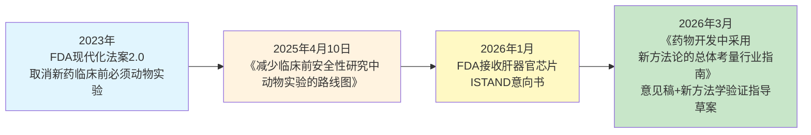

**2023年FDA现代化法案2.0的方法论意义**。**美国前总统拜登签署的《FDA现代化法案2.0》取消了新药在人体试验前必须进行动物试验的要求，为当前的新规定铺平了道路；FDA正在制定一份替代方法路线图，鼓励使用计算机建模和人工智能（AI）、实验室培育的人类"类器官"以及芯片上的器官系统等方法"减少、改进或取代"动物试验**[^79]。这一法案是全球药物监管首次在立法层面承认"AI+类器官+器官芯片"作为动物试验的可行替代——其制度意义远超技术层面，因为它把新方法学从"科研补充"提升为"监管认可的证据载体"。

**2025年4月路线图的具体内容**。**当地时间4月10日，美国食品和药物管理局（FDA）表示将逐步取消用动物对单克隆抗体和其他药物进行测试的规定，并称目前有"更有效且与人类相关的药物测试方法"**[^79]。**根据FDA发布的计划，替代方案聚焦三大方向：AI与计算模型通过算法预测药物毒性及体内分布；类器官与器官芯片模拟人体器官（如肝脏、心脏）进行毒性测试；以及利用真实世界数据参考其他国家已有人体研究的安全性证据**[^79]。

**抛弃动物实验的多重驱动力**[^79]：**科学局限性**——90%通过动物实验的药物因人体安全性或有效性失败，典型案例是2006年TGN1412单抗事件，该药物在猴子实验中表现安全，却在人体引发严重免疫反应导致6名志愿者多器官衰竭；**经济压力**——单克隆抗体开发需耗费上百只非人灵长类动物，总成本超7.5亿美元，新冠疫情后实验猴价格飙升至近5万美元一只；**供应链风险**——美国实验猴供应链高度依赖中国，2022年中国暂停对美出口审批后，美国NIH被迫削减30%动物实验项目；**技术成熟**——AI预测模型、器官芯片（如肝脏芯片预测肝毒性准确率达87%）等技术成熟度显著提升。

**资本市场对监管转向的分化反应**。新政一出，**资本市场反应剧烈，折射出行业格局的深刻分化——AI医药企业成为最大赢家：晶泰控股股价单日上涨7.39%，其孵化的耀速科技作为FDA器官芯片毒理标准制定方之一，已服务赛诺菲、欧莱雅等巨头；美股Certara、Schrodinger等AI概念股同步大涨**[^79]。**依赖动物实验的传统CRO企业则遭遇重挫——昭衍新药A股跌停，港股暴跌超13%，其年报显示生物资产公允价值变动净损失达1.14亿元；公司证券部坦言"AI和类器官技术尚无法完全替代动物实验，但公司已加速布局相关研究"**[^79]。这种资本市场的分化反应是监管转向产业影响最直观的指标。

**监管框架的核心张力——物理与计算的差异化开放**。把FDA的开放节奏放在不同技术形态上对照可以看到一个关键张力——**FDA对物理实验载体（器官芯片、类器官）的开放快于对纯计算预测的接纳**[^79]。这一差异背后的逻辑是：**物理实验虽然是新技术，但仍属"实验"范畴，监管机构对其证据生成机制有相对成熟的评估框架；而纯计算的数字孪生预测必须证明其与真实人体响应的可量化对应关系，这一证据标准目前尚不清晰**。结合第7章可信度判断中"FDA对器官芯片ISTAND计划的接纳是'意向书'而非'完全替代'，《药物开发中采用新方法论的总体考量行业指南》仍处于'意见稿'阶段"的事实，可以归纳出一个监管演进判断——**纯计算预测向监管证据载体的演进，将比器官芯片等物理实验载体慢2-5年**。

**落地过程中的现实瓶颈**[^79]：**数据验证不足**——类器官与临床数据的相关性尚未系统研究，FDA收到的类器官数据多为企业自主提交的小规模结果；**复杂疾病模拟困难**——癌症、免疫疾病的多器官交互难以精准复现，AI模型需更多高质量数据训练；**标准缺失**——器官芯片、计算毒理学等领域缺乏统一监管框架，企业需重新适应研发流程。这些瓶颈与8.1节数据稀缺、8.2节多模态融合稳定性、8.3节生物学合理性缺失等技术瓶颈深度耦合——监管成熟度与技术成熟度互为前提条件。

**业内争议与渐进路径**[^79]。**支持派指出，类器官+AI模式可节省40%-50%研发时间及2000万元成本**——希格生科与晶泰科技合作的SIGX1094已通过该模式进入Ⅰ期临床。**质疑派则担忧技术短板：AI幻觉与类器官模拟误差可能导致临床风险，完全替代至少需十年**。**英矽智能CEO建议循序渐进——例如优先取消耗时费钱的GLP毒理研究（成本为非GLP的7-8倍），而非一刀切**[^79]。这种渐进式路径反映了监管转型的现实复杂度——既要鼓励新方法学落地，又要避免在替代证据不充分时仓促取消传统验证机制。

**新方法学落地的关键缺口**。**美国国家生物医学研究协会的声明也提示了一个不容忽视的事实——目前在生物医学研究和药物开发中，还没有任何东西可完全取代动物模型；虽然AI有望在许多方面加速研究，但它很大程度上依赖于提取现有数据**[^79]。**通过动物试验的药物未必安全的反面案例同样存在——20世纪50年代的安眠药沙利度胺在上市前曾在动物身上进行过测试，但导致1万名婴儿出生时伴有严重畸形的副作用；对关节炎药物万络（Vioxx）进行的动物试验显示它对小鼠的心脏具有保护作用，但该药物在上市后仍导致超过2.7万人心脏病发作和突发心脏性死亡，随后被撤出市场**[^79]。这些事实提醒——**动物实验与AI/类器官/器官芯片各有其适用边界，监管科学的成熟必须基于对每类方法学优势与局限的客观刻画**。

**国际监管协同的现实差距**。FDA在动物实验替代方面走在全球前列，但EMA、NMPA等其他主要监管机构的跟进节奏存在差异。第7章已提及的**EMA 2026年2月正式批准全球首款基于类器官芯片技术的新药开展人体临床试验**，标志着EMA开始从"接受替代"走向"主动鼓励"。但跨国监管协同仍存在显著挑战——**FDA将参考其他国家已有的、真实的安全数据，因为这些国家已经对人类进行了药物研究**[^79]——这种"互认"路径在制度层面尚未完全成型。中国NMPA对AI/类器官/数字孪生新方法的接纳节奏，则受PIPL等数据合规约束的间接影响，与美欧路径存在节奏差异。

把监管框架瓶颈与前述其他瓶颈合并审视可以推出一个综合判断——**监管成熟度是大模型药物评估走向规模化的"最后一公里"瓶颈，但它本身又依赖于数据基础设施成熟、技术稳定性、可信度建设等前置条件的协同推进**。这种相互依赖关系决定了监管科学的演进不能由监管机构单独推动，必须依赖学术界、产业界、监管机构的"三方共建"——这一判断将在第9章未来路径展望中作为核心的方向性结论。

## 8.9 多重瓶颈的相互制约关系与攻克优先级

把本章八节论证收束为对瓶颈系统性的分层判断。本节将从瓶颈相互嵌套关系、技术性与制度性瓶颈的本质区别、攻克优先级三个维度展开。

**瓶颈相互嵌套的因果链**。本章八节剖析的瓶颈并非孤立存在，而是构成一个多维度耦合的"系统性约束网络"——下图勾勒出主要的耦合关系：

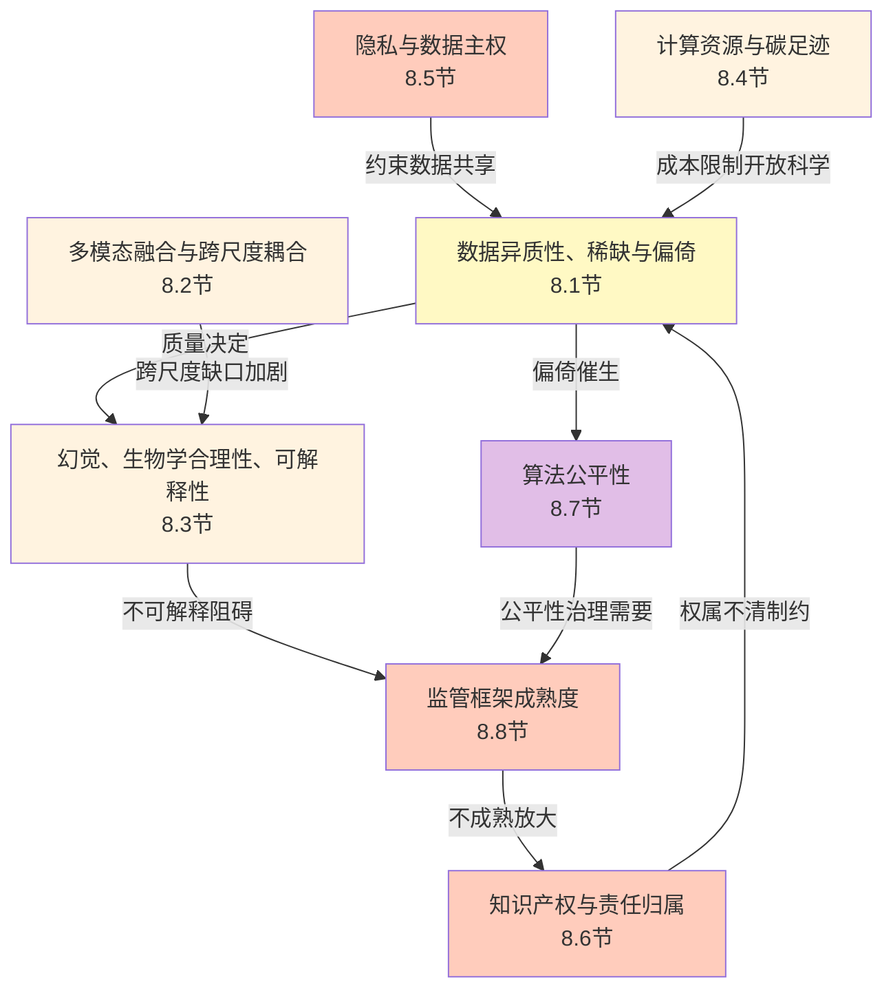

这一耦合网络中可识别出五条核心因果链：**数据→公平性**——训练数据的人群代表性偏倚直接催生算法歧视，与第6章个体异质性挑战形成同构；**制度→数据**——隐私法规约束数据共享进而加剧数据稀缺，PIPL的"单独同意"与数据出境三条路径直接限制了跨国合规数据集成；**监管→责任**——监管框架对AI法律主体资格的不明确放大了医疗AI辅助诊疗的责任归属困境；**资源→可重复性**——计算成本的指数级攀升限制了开放科学路径的可持续性，加剧了Recursion 23PB专有数据集等封闭路径的产业主导地位；**技术→监管**——算法不可解释性与生物学合理性缺失阻碍了纯计算预测获得监管采信，推动监管对物理实验载体（器官芯片）的差异化开放。

**技术性瓶颈与制度性瓶颈的本质区别**。把上述瓶颈进一步分类，可归纳出技术性与制度性瓶颈的本质差异：

| 瓶颈类型 | 代表性瓶颈 | 攻克路径 | 时间窗 |
|------|------|------|------|
| 技术性瓶颈 | 多模态融合稳定性、幻觉与生物学合理性、计算成本 | 方法学突破、算法优化、专用硬件、混合架构 | 5-10年内可显著缓解 |
| 制度性瓶颈 | 隐私合规（PIPL/GDPR/HIPAA）、知识产权与责任归属、监管框架成熟度、公平性治理 | 跨国协调、立法演进、监管科学共建、多方利益博弈 | 演进节奏更慢，10-20年迭代 |

这一分类的方法论意义在于——**技术性瓶颈虽然挑战巨大但具有相对清晰的攻克路径（学术突破→工程落地→产业化），其演进节奏主要由方法学迭代速度决定；制度性瓶颈则受制于跨国监管协同、立法程序、多方利益博弈，其演进节奏远慢于技术演进**。这种节奏差意味着——**未来5-10年的瓶颈攻克进展将主要发生在技术性瓶颈层面，制度性瓶颈的攻克则需要更长的时间窗与更复杂的协调机制**。

**瓶颈攻克的优先级判断**。基于本章八节的论证，可以归纳出瓶颈攻克的四级优先级序列：

**第一优先级：可信度技术栈（与第7章衔接）**——闭环验证、UQ深度部署、XAI机制锚定、独立基准生态构建作为可信度建设的四主线，是大模型药物评估从"演示性高分"走向"监管级、临床级、产业级"采信的核心前提。这一优先级的方法论价值在于——**可信度技术栈的成熟会反向推动其他瓶颈的缓解**：UQ可指导主动学习筛选高优先级实验、XAI可缓解责任归属困境、独立基准可挤出"水分"为监管采信提供证据基础。

**第二优先级：数据基础设施开放与多元化**——多元族裔队列建设（Pan-UKBB等）、跨尺度对齐数据生产（同一患者全基因组+单细胞+空间+影像+EHR）、阴性数据共享机制创新、开放科学路径的可持续性建设。这一优先级直接对接第6章个体异质性应对、8.7节算法公平性、第7章泛化能力维度的判断——**数据基础设施的多元化是缓解多重瓶颈的"基础工程"**。

**第三优先级：监管科学协同共建**——FDA、EMA、NMPA等主要监管机构对AI/类器官/数字孪生新方法的统一证据标准、跨国监管互认、监管沙盒等创新机制。这一优先级既受制于技术成熟度（监管开放快于纯计算预测），又受制于跨国协调成本——必须依赖学术界、产业界、监管机构的"三方共建"才能持续推进。

**第四优先级：公平性与隐私的制度创新**——这是最具长期性的优先级，涉及跨国数据流通规则、敏感数据处理共识、公平性立法、责任归属司法规则等深层制度议题。其攻克节奏受制于多方利益博弈与立法程序，难以期望短期内出现颠覆性突破，但可通过持续的小步迭代逐步缓解。

**衔接路径**。把本章的瓶颈剖析作为第9章未来路径展望的核心证据基础，可以衔接出三类前瞻议题：**第一类是技术性瓶颈的攻克路径**——基础模型统一化、自驱动闭环实验室、跨尺度耦合的统一数学框架等技术演进方向；**第二类是制度性瓶颈的演进路径**——监管科学协同、跨国开放科学协作、可信AI框架的国际共建等制度创新方向；**第三类是技术与制度的协同演进**——人机协同科研模式、术语与标准化体系建设、能力跃迁的可观察里程碑信号等综合议题。这三类议题将在第9章中系统展开。

**总判断**。整合本章九节论证可以给出一个边界明确的总判断——**当前制约大模型药物系统性评估走向规模化的瓶颈，已经从单一的技术可行性问题，演化为数据、技术、制度、伦理四个层面相互嵌套的"系统性约束网络"；其中技术性瓶颈虽然挑战巨大但具有相对清晰的5-10年攻克窗口，制度性瓶颈则受制于跨国协调与立法演进的更长时间窗；瓶颈之间的耦合关系意味着任何单一维度的突破都不足以打破整个约束网络，必须通过可信度技术栈→数据基础设施→监管科学→公平性与隐私的优先级序列协同推进**。这一判断既不是悲观的全盘否定（FDA现代化法案2.0、PIPL合规框架、AI新药知识产权指引、AI生成药物专利实证研究都展示了制度演进的实质性进展），也不是盲目乐观的全面肯定（数据稀缺、算法歧视、隐私合规、监管成熟度的差距仍构成结构性挑战）；它是基于本报告全部证据的边界明确刻画，为第9章对未来路径的前瞻判断提供了瓶颈维度的完整证据底座。

# 9 未来发展趋势与路径展望

前八章已经完成了对大模型驱动药物系统性评估的"现状画像"——能力图谱（第2-6章）、可信度边界（第7章）、多重瓶颈（第8章）共同勾勒出一个边界明确的判断坐标系：当前大模型在分子-细胞层级的扰动响应预测、群体级药物重定位、特定基因型场景下的个体化药敏评估上已具备实质性能力，但要真正回应"系统性模拟药物对机体影响并应对个体异质性"这一核心命题，仍需在跨尺度因果耦合、可信度技术栈、监管科学协同、个体级精准模拟四条主线上持续突破。本章的任务，正是基于这一坐标系展望未来5-15年的演进方向——既不沉迷于"AI颠覆制药"的乐观叙事，也不困于"AI泡沫即将破裂"的悲观判断，而是按照本研究持久推理标准P-6（前瞻判断的证据锚定与时间窗）的要求，把每一项前瞻方向锚定到现状证据、关键瓶颈与可观察里程碑信号上。

本章按照"技术演进—基础设施—制度协同—能力跃迁—战略判断"五个层次递进展开：先剖析基础模型统一化迈向"生物学AlphaFold"级跨尺度基座的可行路径（9.1）、自驱动闭环实验室从演示性成功走向规模化自主科研的演进节奏（9.2）、人机协同科研模式从工具辅助到硅基科学家伙伴的范式重构（9.3），继而审视术语与标准化体系作为跨尺度模拟工程化基础的建设路径（9.4）、跨国开放科学协作在数据主权与产业封闭张力下的可行路径（9.5）、监管科学与可信AI框架的协同演进（9.6），随后把六节论证收束为"描述现象→预测机制→生成干预方案"的三阶能力跃迁路径（9.7），最终给出面向产业、学术、监管三类利益方的差异化战略判断（9.8），并衔接第10章的分层结论。

## 9.1 基础模型统一化：迈向"生物学AlphaFold"级跨尺度基座

第2章已经勾勒了科学专用大模型的当前格局——分子层的盘古药物模型（17亿小分子预训练）、蛋白层的xTrimoPGLM/xTrimo V3（2100亿参数覆盖7模态）、单细胞层的scFoundation（5000万细胞、1亿参数）与scLong（4800万细胞、10亿参数、全转录组27874基因建模）、扰动响应层的STATE（整合1.7亿观测+1亿干预细胞）与AlphaCell（世界模型理念）——这些工作各自在所占据的尺度上达到了SOTA水平，但跨层耦合主要依靠多智能体编排或外部多模态平台来实现。**未来5-10年的核心技术演进方向，是把这一"分领域专用基础模型谱系"演进为真正的"生物学AlphaFold级"统一基座**——即一个能够在分子-细胞-组织-器官-个体五层尺度上提供连贯表征、支持跨尺度因果传播、具备零样本泛化能力、在独立基准下保持稳健性的统一模型。

**Arc Institute的标志性路径**为这一演进方向提供了最具方向感的产业证据。**Arc Institute由Patrick Collison、Silvana Konermann和Patrick D. Hsu于2021年12月共同创立，其初始捐赠资金超过6.5亿美元，主要资助者包括Patrick Collison、扎克伯格夫妇以及以太坊创始人Vitalik Buterin等**[^53]。其使命是"加速科学进步，理解复杂疾病的根本原因，并缩小科学发现与患者受益之间的差距"，目标是成为"21世纪的生物学贝尔实验室"[^53]。在技术里程碑上，**2024年11月Arc联合斯坦福大学与加州大学伯克利分校发布了首个基于DNA大规模训练的生物学基础模型Evo；2025年2月发布Arc虚拟细胞图谱（Atlas），整合了超过3亿个细胞的单细胞数据，并与NVIDIA合作发布了拥有400亿参数的Evo 2，这是迄今为止最大的生物学AI模型;2025年6月发起首届"虚拟细胞挑战赛"（Virtual Cell Challenge），并同期发布了首个虚拟细胞模型STATE；2025年9月斯坦福大学与Arc Institute合作首次利用AI生成了噬菌体基因组**[^53]。最具方向性意义的是其规划——**研究所计划在2026年前完成虚拟细胞的第一阶段构建，并在2030年实现对人类器官系统的数字模拟**[^53]。这一2030年时间窗判断，本身就是基于现状证据外推的产业级前瞻锚点。

人类细胞图谱（HCA）社区也给出了另一条独立的方向性表述。**HCA社区在2016年由数千名科学家发起，旨在通过创建所有人类细胞的全面参考图谱来应对"人体估计有37.2万亿个细胞，跨越令人难以置信的多样性类型和状态"这一巨大挑战**[^49][^47]。HCA的方法论叙事中，细胞图谱被定义为"作为统一所有方面并帮助变革医学的生物学基础模型"——它将作为细胞普查、作为身体中跨模态和尺度的细胞三维地图、作为连接基因型原因与表型效应的地图、作为发育的四维地图，最终汇聚为一个统一的生物学基础模型[^49]。这一表述与Arc Institute的"2030年人类器官系统数字模拟"愿景在方向上高度一致——**它们都把"统一基础模型"作为未来5-10年的明确技术目标**。

把当前各分领域基础模型与"生物学AlphaFold级"统一基座的能力差距归纳为对照矩阵：

| 维度 | 当前分领域基础模型 | 生物学AlphaFold级统一基座的判据 |
|------|------|------|
| 模态广度 | 单一或少数模态（盘古分子、scLong单细胞、xTrimo V3已达7模态） | 覆盖DNA、RNA、蛋白质、细胞、组织、器官、个体多层模态 |
| 跨尺度因果传播 | 主要通过工具调度的"伪耦合" | 在统一数学框架内连续传播扰动信号 |
| 零样本泛化 | 已见分布内表现良好，未见分布性能可能跌至基线（第3章基准证据） | 在跨细胞类型、跨人群、跨平台场景下保持稳健 |
| 独立基准稳健性 | scPerturBench、Systema揭示评估失真问题 | 通过严苛对抗性基准下的系统性验证 |
| 个体级泛化 | 第6章"亚群级而非个体级"判断 | 接入患者特异性数据后输出个体级预测 |

**规模化Scaling Law在生命科学领域的适用边界**是这一演进方向的关键判据之一。**xTrimo V3从蛋白单模态扩展到7模态全家桶并在200个任务模型上达到SOTA水平，已助力开发20余种前沿抗体和酶、挖掘10余个创新靶点及靶点组合并经实验验证进入临床前研发**[^43]。这一进展回答了一个关键问题：**生命科学领域的Scaling Law是否依然奏效**——xTrimo V3的实证结果表明，在生命科学的"语言"上，规模化路径同样具有正反馈效应。但同时必须坦诚指出——**全球健康药物研发中心主任丁胜在采访中表示，"当前AI制药仍处于发展初期，相较于大语言模型所依赖的海量数据，药物研发领域的数据规模有限。尽管模型架构与算力已较为成熟，但我们对生命底层机制的认知仍存局限，使得单纯依靠算力提升难以快速突破。因此，AI制药的发展受制于数据稀缺与基础认知不足，整体尚处早期阶段"**[^48]。这一判断与第8章的数据稀缺、跨尺度耦合方法论缺口、训练成本指数攀升等瓶颈形成了同构呼应——**Scaling Law在生命科学的边际效应不会无限延伸，必须依靠机制锚定、跨尺度耦合数学框架、多元化数据基础设施作为协同支撑**。

**原生多模态世界模型作为另一条技术雏形**值得关注。北京智源人工智能研究院发布的《2026十大AI技术趋势》明确指出，**大语言模型受限于互联网数据，性能提升速度已不如从前；解法在于向原生多模态世界模型演进，其本质是让人工智能感知和理解物理世界，进而推进与物理世界的交互**——这一判断在本章语境下意味着：**仅靠扩大语言模型规模难以触及药物-机体相互作用的物理本质，必须通过原生多模态化（如xTrimo V3的7模态全家桶）与物理世界耦合（如自驱动闭环实验室）共同推动统一基座的演进**。

把上述演进方向归纳为时间窗判断：

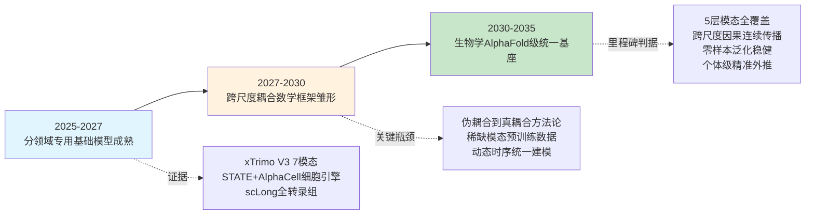

但同时必须客观指出统一基座面临的三类结构性约束。**第一是训练成本指数攀升**——第8章已展开GPT-4训练成本7800万美元、Gemini Ultra达1.91亿美元、Llama 2碳排放约291.2吨等事实；要把训练规模进一步扩展到能够支撑5层模态全覆盖的统一基座，预期成本将从当前数亿美元级攀升到数十亿美元级，这一成本只有少数科技巨头与超大型科研机构（CZI、Arc Institute、华为、英伟达等）能够承担。**第二是稀缺模态预训练样本不足**——3D类器官成像、患者级长程随访、空间组学等模态的数据规模远小于分子或基因表达数据，难以独立支撑大规模预训练，必须通过模态转换、迁移学习或与8.5节将展开的自驱动闭环实验室协同生产新数据来补齐。**第三是从伪耦合到真耦合的方法论门槛**——这正是第5章已展开的核心方法论缺口，其攻克难度显著高于单尺度内部的方法学优化，需要新的跨尺度模型理论而非仅工程拼接。

综合上述论证可以给出一个边界明确的时间窗判断——**生物学AlphaFold级跨尺度统一基座在2030年前后可能出现初步雏形（如Arc Institute规划的2030年人类器官系统数字模拟），但要达到真正"分子-细胞-组织-器官-个体"五层连续耦合且在严苛独立基准下稳健的成熟形态，可能需要到2035年前后**。这一判断与百图生科技术副总裁张晓明所给出的"未来5-10年AI制药产业可能将迎来爆发期"的总体时间窗[^43]在方向上一致，但具体到统一基座的成熟，需要更长的演进窗口。

## 9.2 自驱动闭环实验室：从演示性成功走向规模化自主科研

第4章已展开Coscientist几分钟复现钯催化反应、A-Lab 71%材料合成成功率、ChemAgents/小临读-想-做-创科研全流程的代表性案例，第5章则把Emerald Cloud Lab、CMU云实验室、A-Lab归纳为跨尺度模拟的实验闭环基础设施。本节从演进路径视角进一步展望——**未来5-10年自驱动闭环实验室如何从当前"演示性成功"阶段演进为系统性可靠的规模化自主科研基础设施**。

**第一类演进方向：基础模型+机器人+主动学习闭环范式的成熟化**。这一方向的标志性最新案例是LUMI-lab。**多伦多大学李博文团队在Cell发表题为"LUMI-lab: A foundation model-driven autonomous platform enabling discovery of ionizable lipid designs for mRNA delivery"的研究——研究提出了一套由基础模型驱动的自主实验平台LUMI-lab，通过深度融合基础模型与自动化实验系统，有效突破了可电离脂质设计的效率瓶颈**[^56]。其核心方法论价值在于——**LUMI-model首先在约1300万个分子结构上进行预训练，学习通用的化学表示，随后在约1500万个类脂分子数据上进一步优化，使其具备面向脂质设计的专业能力；在实际运行中，LUMI-lab形成了"设计—合成—测试—分析"的闭环流程；在一次典型实验中，LUMI-model提出184种候选脂质结构，自动化平台随即完成合成、LNP组装，并将其递送至人支气管上皮细胞中评估mRNA转染效率，实验结果实时反馈至模型；研究不仅自主发现了"溴化脂尾"这一能够显著提升mRNA递送效率的关键结构特征，还显著提升了肺部基因编辑效率**[^56]。LUMI-lab的方法论意义在于——**它把"基础模型驱动的自主科研平台"从化学合成场景推进到了药物递送这一更接近临床应用的复杂任务**，并在闭环中产生了可被实验验证的新颖科学发现（溴化脂尾结构特征）。

**第二类演进方向：从单点演示到产业基础设施的扩展**。在产业级落地层面，多家头部AI制药企业已经把自驱动闭环实验室作为核心战略基础设施。**英矽智能建立了名为Life Star的全自动化智能机器人实验室，旨在实现从计算设计到实验验证的干湿实验闭环，打造可实现无人值守运行的"黑灯工厂"，以支持自有和合作项目的湿实验验证，并持续沉淀高质量自有数据集反哺AI平台迭代**[^80]。**晶泰科技在浦东设立了"生物医药机器人自动化工站集群"——旋开试管、粉末称重、精准加料、液体移液、磁力搅拌……一节白色的机械臂可7×24小时执行实验并记录数据，协助乃至替代人工实验；和传统新药研发模式相比，AI在靶点发现、确定、求证以及新分子结构发现速度上优势明显，AI结合机器人的精准性、全天候作业的特点，不仅缩短药物研发周期，还能生成标准化数据，驱动模型进化和迭代**[^55]。卡内基梅隆大学与Emerald Cloud Lab合作建造的耗资4000万美元云实验室，**预计在秋季开始施工，2022年夏季完工，这将是世界上第一个由大学拥有的云实验室，实验由科学家通过软件设计，由约200种不同类型的机器人远程执行**[^46]。Emerald位于旧金山以南的总部超过100台高端生物科学设备24/7自主运转，几乎无人值守地为全球研究人员执行实验[^47]。这些产业级案例共同指向一个判断——**自驱动闭环实验室正在从"研究演示"演进为"产业基础设施"，其核心价值不在于单次演示的成功，而在于规模化、标准化、可持续运转的能力**。

**第三类演进方向：从化学合成向生物学复杂任务的延伸**。这是当前自驱动闭环实验室面临的最具挑战性的演进方向。第4章已坦诚指出——**Coscientist有时会出现化学反应不正确的情况（尽管其可以自我纠正），现实世界中的研究问题要比本研究中的复杂得多，往往涉及化学以外的学科概念（如药物开发中的生物学），目前的Coscientist还无法解决这些复杂的问题**[^46]。这一边界陈述揭示出——化学合成层面的自动化基础设施（A-Lab、Emerald Cloud Lab、Coscientist）相对成熟，但生物学层面的自动化（类器官培养、单细胞测序、空间组学采集、活体动物实验）仍存在显著的工程门槛。这一缺口正在被逐步攻克——**HCS-3DX系统全球首次实现了AI驱动的、覆盖"筛选-转移-成像-分析"全流程的3D类器官高内涵筛选**（第6章已展开）、耀速科技正在构建"以人源化模型与机制研究为核心的下一代生物智能基础设施，包括拓展器官芯片疾病模型体系，建立可规模化运行的机制研究平台，并持续进行高通量、标准化的真实生物数据采集与积累"[^52][^56]——这些进展表明生物学层面的自动化在2025-2026年间出现了关键突破，但距离"全自动化生物学复杂任务"仍有相当差距。

**第四类演进方向：闭环数据回流机制与AIVC、AI制药平台的产业级耦合**。这一方向的代表性进展是**Tahoe-100M——Vevo Therapeutics与Arc Institute联合发布的Tahoe-100M包含1亿+单细胞转录组、覆盖50个癌细胞系与1100+种小分子扰动**（第3章已展开）。这种"闭环实验室生产数据→AIVC基础模型训练→新预测送入闭环验证"的产业级耦合，是把单点闭环演化为系统性自主科研的关键路径。

把四类演进方向放在统一时间窗中观察：

| 演进方向 | 当前位置 | 5-10年成熟度判断 |
|------|------|------|
| 基础模型+机器人+主动学习 | LUMI-lab级演示性成功 | 2027-2030年达到产业级可靠 |
| 单点演示→产业基础设施 | Life Star/晶泰工站集群/Emerald初步运转 | 2026-2028年规模化扩张 |
| 化学合成→生物学复杂任务 | HCS-3DX等局部突破 | 2030年前后实现关键复杂生物学任务自动化 |
| 闭环数据回流与AIVC耦合 | Tahoe-100M级初步耦合 | 2027-2030年形成完整闭环基础设施 |

但同时必须坦诚指出当前自驱动闭环实验室的三类现实差距。**第一是跨学科任务能力受限**——Coscientist自身已坦诚化学以外的学科推理能力不足，跨化学+生物学+临床医学的复杂任务仍是开放问题。**第二是可重复性验证机制薄弱**——A-Lab合成的部分材料被指出与历史文献存在重复，需结合人工验证确认新颖性[^46]，这意味着当前闭环实验室的"成功"还需要更严格的独立验证机制来背书。**第三是生物学层面的标准化与监管对齐尚未成熟**——化学反应的标准化早已成熟，但类器官培养、单细胞测序的批次效应、空间组学的平台间差异等问题，使得生物学层面的自动化要达到"监管级证据生成"的水平仍需相当时间。综合上述判断，自驱动闭环实验室在2030年前后可能演进为规模化产业基础设施，但要达到"覆盖药物研发全流程的端到端自主科研系统"仍可能需要到2035年前后。

## 9.3 人机协同科研模式：从工具辅助到硅基科学家伙伴的范式重构

第2章已经把AI在药物领域的演进归纳为"预测式→生成式→智能体式"三阶段跃迁，第4章则进一步展示了多智能体系统作为"硅基科研伙伴"的代表性案例（FROGENT、ChemAgents/小临、Coscientist、MOSAIC）。本节展望未来5-15年AI从"工具"演进为"具备一定自主性的合作者"乃至"硅基科学家"的范式跃迁路径。

**人机协同的三种典型形态**正在产业实践中并行涌现，对应不同的能力成熟度阶段：

**第一类：研究者主导+AI辅助型**。这是当前最广泛的人机协同形态——研究者保留科学判断、假设生成、决策权的主体地位，AI承担信息整合、文献挖掘、属性预测、虚拟筛选等"加速工具"角色。百图生科的"发现助手"就是这一形态的典型代表——**"发现助手"内置深度搜索功能，提供深度推理、数据增强、任务执行、组学预测等技术能力，通过智能交互理解需求，自动执行多维度信息检索与分析，最终生成结构化深度报告，是全球率先在生命科学领域推出的专属DeepResearch；BioASQ等多个行业评测结果显示"发现助手"在生命科学领域的表现中领先于DeepSeek-R1、OpenAI-o1-mini等其他通用AI产品**[^43]。在这一形态下，AI的价值在于把研究者从重复性的信息整合工作中解放出来，让其专注于真正需要科学判断的环节。

**第二类：AI主导+人类审核型**。这是正在快速兴起的协同形态——AI在特定子任务上承担主导决策，人类研究者退居"审核者"角色，提供关键节点的把关与方向调整。Coscientist、A-Lab、LUMI-lab等自驱动实验室就是这一形态的代表——**Coscientist能够自主设计、规划和执行真实世界的化学实验，"我们可以拥有一些可以自主运行的东西，试图发现新的现象、新的反应、新的思想；你可以实现资源和理解的大规模民主化"**[^46]。LUMI-lab一次实验中"LUMI-model提出184种候选脂质结构，自动化平台随即完成合成、LNP组装"[^56]——这种"AI提出—自动化执行—结果反馈—AI迭代"的闭环已经把研究者的角色从"操作者"转变为"高层方向制定者+关键节点审核者"。

**第三类：人机对等共创型**。这是当前仍处于探索阶段的形态——AI不仅执行子任务，还能与人类研究者就科学假设、实验设计、结果解读展开"对等讨论"。Nature重磅评述把Coscientist形容为"实验室管家"[^46]——但要从"管家"演进为"对等合作者"，AI需要具备超越当前能力的跨学科推理、长程因果建模、新颖假设生成能力。**论文通讯作者Gabe Gomes对此评价："科学中的尝试、失败、学习和改进的迭代过程可以通过AI大大加速，这本身将是一场戏剧性的变革"**[^46]——这一判断指向的正是从"AI辅助"到"AI共创"的演进方向。Nature观点文章中里斯本大学药学院的Ana Laura Dias和Tiago Rodrigues写道：**"Coscientist是人类朝着建立自动化实验室迈出的关键一步，只要在化学领域滥用大型语言模型的可能性不会导致扼杀相关研究的法规出台，我们期待在不久的将来会有更多令人兴奋的发展"**[^46]——这一表述同时点明了"对等共创"演进方向的技术机遇与制度风险。

**科研工作流的重构**正在三个层面同步发生。**第一是假设生成层面**——AI从"被动响应研究者提问"演进为"主动提出科学假设供研究者评估"，TxGemma的Agentic-Tx系统、Coscientist的化学推理能力都展现了这一雏形。**第二是实验设计层面**——AI开始承担"如何设计最优实验来验证某个假设"这一原本属于资深研究者核心能力的任务，A-Lab"主动学习算法动态调整配方，采用多步加热、前体再研磨等改进方案可将成功率提升至78%"[^46]就是这一能力的实证。**第三是数据分析与论文撰写层面**——AI对实验数据的解读、对结果的可视化、甚至对科研论文初稿的撰写已经在产业中广泛应用，但AI主导的科研论文是否应该被采信、AI共同作者的科研规范如何制定，仍是开放议题。

**研究人员能力结构的转型需求**也是这一范式重构的关键议题。当AI承担越来越多的"执行性"科研工作时，研究人员的核心价值正在向四个方向转移——**第一是科学判断力**（哪些问题值得问、哪些方向值得探索）、**第二是跨学科整合能力**（把AI在不同领域的输出整合为系统性洞察）、**第三是伦理与社会责任感**（决定哪些AI能力应用、哪些应被约束）、**第四是与AI协同的元能力**（理解AI的能力边界、设计有效的人机协同工作流）。这种能力结构转型对学术界的人才培养体系、对产业界的研发组织模式都将产生深远影响——8.8节将展开的学术利益方战略判断将进一步讨论这一议题。

但同时必须客观指出当前阶段AI"科研伙伴"仍面临的关键能力缺口。**第一是跨学科推理**——Coscientist自身坦诚承认"目前的Coscientist还无法解决这些复杂的问题"[^46]，跨化学+生物学+临床医学的多学科推理仍是开放问题。**第二是长程因果建模**——AI可以在短链推理上表现良好，但要支撑"从基础研究到临床应用"这种跨越数年甚至数十年的长程因果链条，当前能力仍有显著差距。**第三是新颖假设生成**——AI在已知模式的组合与外推上能力突出，但提出"完全脱离训练分布"的颠覆性新假设仍是稀缺能力。

把人机协同范式演进的可观察里程碑信号归纳为如下分级：

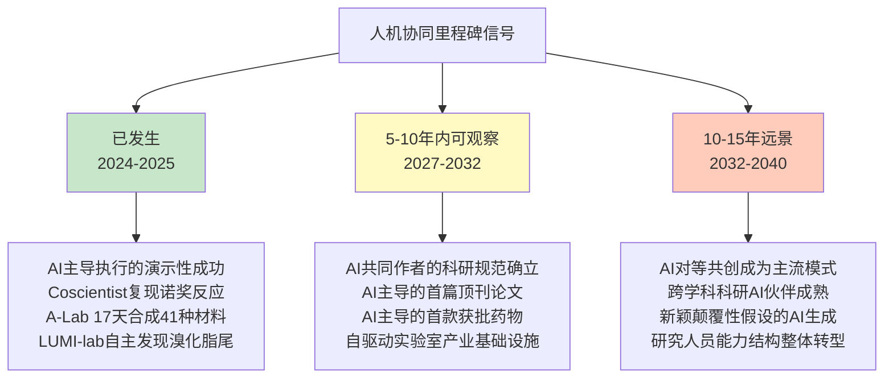

综合上述论证可以给出一个边界明确的判断——**人机协同科研模式在2025-2027年仍以"研究者主导+AI辅助"为主流，2027-2032年"AI主导+人类审核"将在特定子任务上成为常态，2032-2040年"人机对等共创"可能在部分领域出现成熟形态；这一演进的关键不在于AI能力的单点突破，而在于科研规范、伦理框架、人才培养体系的协同演进**。

## 9.4 术语、本体论与标准化体系：跨尺度模拟的工程化基础

前八章反复出现"数据异质性"（第1章4V挑战）、"命名标识符不统一"（第4章智能体感知工具的工程难题）、"跨尺度对齐稀缺"（第5章数字孪生现实差距）、"评估指标失真"（第7章独立基准三项研究）等系统性瓶颈。这些瓶颈的共性根源不在于单一技术，而在于**跨尺度模拟的工程化基础——即术语、本体论与标准化体系——尚未成熟**。本节展望未来5-10年这一基础设施建设的关键演进方向。

**第一类：数据标准化**。这是最基础也最具紧迫性的标准化方向。具体涉及三个子方向——基因/蛋白/化合物的统一标识符体系（解决gene symbol、Ensembl ID、UniProt ID、商品名/通用名等多套ID系统的互通）、多组学数据格式互通（解决基因组、转录组、蛋白质组、代谢组等异构格式的对齐）、临床数据结构化规范（电子健康记录、临床试验报告、不良反应数据的标准化）。CZI在这一方向已经做出了重要的产业贡献——**CELLxGENE平台积累了超过1亿个标准化细胞数据**[^49]，这种"数据标准化-模型训练-数据迭代"的雪球效应正是数据标准化的核心价值。FDA对器官芯片标准化的接纳**FDA接收由3Rs Collaborative（3R联盟）牵头的肝器官芯片ISTAND计划意向书，参与者包括Axiom/LifeNet Health、BioIVT、CN Bio、DefiniGEN、InSphero、Lena Biosciences、PredictCan、TissUse、Xellar等一众企业**[^52]——也是数据标准化在监管层面演进的方向性信号。

**第二类：模型标准化**。这一方向针对的是大模型本身的工程化规范。具体涉及预训练-微调接口规范（解决不同基础模型的微调路径差异）、模型输出格式与不确定性披露标准（要求模型在输出预测时同时披露UQ信息，对应第7章可信度建设）、模型卡与数据卡的强制要求（让模型的训练数据来源、训练目标、性能边界、适用场景成为强制披露内容）。这一方向的产业实证证据是英矽智能MMAI Gym的兴起——**MMAI Gym包含超过1000项药物研发基准测试与约1200亿token的制药领域数据，旨在为前沿通用大语言模型提升生物化学领域的专精能力；公司已与Liquid AI等合作伙伴基于此平台合作推出轻量化科学基础模型（如LFM2-2.6B-MMAI），验证了其作为AI"卖水人"和赋能者的新角色**[^80]。这种"基准测试平台+领域数据+模型适配"的产业化形态，正是模型标准化演进的产业级雏形。

**第三类：评估标准化**。这一方向直接对接第7章可信度建设的核心命题。独立基准生态如scPerturBench、Systema、scFM-Bench的扩展与制度化是这一方向的核心——它们已经揭示了当前评估体系的系统性失真问题，未来的演进方向是把这种"反向校验"机制制度化、规范化、产业化。具体子方向包括零数据泄漏测试集的规范化（scFM-Bench采用2025年4月发布的AIDA v2新增约201K健康供体免疫细胞，首次公开时间晚于scFMs发布时间——这种规范应被推广到所有大模型基准研究）、对抗性基线设计的标准化（Systema的"扰动均值""匹配均值"基线设计应成为评估的标配而非可选项）、跨任务跨数据集的统一评估指标（避免单一指标如皮尔逊相关被滥用）。

**第四类：本体论标准化**。这一方向是最具方法论深度也最具长期价值的标准化方向。Gene Ontology（GO）、细胞本体论、疾病本体论与药物本体论的跨尺度衔接——把分子层面的GO术语、细胞层面的Cell Ontology、组织层面的UBERON、疾病层面的Disease Ontology、药物层面的ChEBI/DrugBank标识符，整合为一个跨尺度的统一本体论体系——是支撑跨尺度大模型基础研究的工程化前提。第3章已展开的scLong把GO提供的结构化生物学知识融入模型——基因编码器为每个基因生成带有生物学含义的表示——这正是"本体论先验融入大模型"的代表性实证。第3章scFM-Bench提出的scGraph-OntoRWR新指标（将细胞本体论建模为有向无环图，通过带重启的随机游走算法计算细胞类别的内在关联度）则把本体论引入到评估体系的核心层面。

**监管端动态对标准化的推动作用**值得重点关注。FDA《药物开发中采用新方法论的总体考量行业指南》虽然仍处于"意见稿"阶段[^52][^56]，但其方向性意义已经清晰——**鼓励参与者向监管提交器官芯片、类器官等新方法的相关实验数据，以提高临床试验的安全性，降低对动物实验的依赖**。这种监管端的引导作用，会反向推动产业界在数据格式、评估方法、文档规范上的标准化进程。FDA《AI支持药品和生物制品监管决策的指南草案》进一步把AI模型的可信度评估框架（明确研究问题→定义使用场景→评估模型风险→制定可信度评估计划→执行计划→记录结果→判断模型适用性）作为标准化模板提出[^51]——这正是模型标准化与评估标准化在监管科学层面的具体落地。

把四类标准化方向放在产业利益博弈与国际协调的视角下观察：

| 标准化方向 | 当前位置 | 5-10年演进判断 | 关键挑战 |
|------|------|------|------|
| 数据标准化 | CELLxGENE 1亿+细胞、CZI路径 | 2027-2030年关键医学数据统一规范 | 隐私合规、产业封闭路径阻力 |
| 模型标准化 | MMAI Gym等产业基础设施初步成型 | 2028-2032年模型卡与UQ披露成为标配 | 商业秘密保护与开放透明的张力 |
| 评估标准化 | scPerturBench/Systema/scFM-Bench反向校验 | 2027-2030年独立基准成为论文发表前置条件 | 基准更新速度与模型迭代速度匹配 |
| 本体论标准化 | GO/Cell Ontology/UBERON局部整合 | 2030-2035年跨尺度统一本体论框架 | 跨学科共识形成的国际协调成本 |

但同时必须坦诚指出标准化体系建设面临的两类现实障碍。**第一是产业利益博弈**——数据标准化、模型标准化、评估标准化都涉及对产业封闭路径的不利影响。23PB的Recursion专有数据集、企业内部专有训练数据集等产业封闭路径，本质上反对完全开放的标准化进程；标准化的推进速度将受制于这种产业利益博弈的动态平衡。**第二是国际协调成本**——本体论标准化、跨国术语统一等议题需要全球范围的学术共识形成，受制于不同国家、不同语言、不同学术传统的协调成本。从历史经验看，类似的国际标准化进程（如HUGO人类基因命名委员会、Gene Ontology Consortium的演进）通常需要十年以上的渐进推进，难以期望短期内出现颠覆性突破。综合判断——**标准化体系建设将沿着"基础数据→模型规范→评估范式→本体论"的优先级序列渐进推进，2030年前后可能在数据与评估层面形成产业共识，2035年前后可能在模型规范与本体论层面形成更系统的国际协调框架**。

## 9.5 跨国开放科学协作：在数据主权与产业封闭张力下的可行路径

第8章已经把"开放科学路径与产业封闭路径的张力"、"人群族裔代表性偏倚"、"隐私法规约束跨国数据流通"刻画为相互嵌套的瓶颈。本节在这一瓶颈剖析的基础上，展望跨国开放科学协作的现实可行路径。

**第一条路径：慈善资本+公共投入驱动的开放数据基础设施**。这一路径的代表性案例已经在前几章被充分锚定——**UK Biobank近50万人全基因组数据集向全世界申请者开放，目前已有来自90个国家的超过3万名研究者成功申请使用数据库，并产生了超过9000篇经过同行审议的研究论文**[^47]。**CZI计划在未来10年内投入数亿美元打造AIVC，谷歌DeepMind也已启动类似项目，风险资本以空前规模涌入；CZI重组为统一的Bio Hub网络，全力聚焦AI与生物学融合，收购Evolutionary Scale团队、任命Alex Rives为科学负责人，慈善资本将几乎全部资源投向AIVC方向**（第3章已展开）。Arc Institute作为这一路径的另一标志性代表——**初始捐赠资金超过6.5亿美元，主要资助者包括Patrick Collison、扎克伯格夫妇以及以太坊创始人Vitalik Buterin等**[^53]——其使命被定义为"21世纪的生物学贝尔实验室"，通过长期资金池与开放式合作网络为基础研究提供持续性资源与工程化支撑[^53]。这种"慈善资本+公共投入"的模式正面回应了一个传统科研体系难以填补的资金真空：**像虚拟细胞模型这样的大型工具平台，需要1亿到10亿美元的投入，研发周期长达10到15年，完全不符合NIH等机构以小额项目分散资助的传统逻辑——慈善资本正是看准了这一空白才得以发挥关键作用**（第3章已展开）。

**第二条路径：联邦学习与隐私计算技术弥合数据共享与隐私保护的张力**。这一路径的核心方法论价值在于——**它不试图绕过GDPR/HIPAA/PIPL的合规约束，而是通过技术创新让模型可以在不实际转移敏感数据的前提下，从分散在多个机构的数据中学习**。具体技术包括联邦学习（每个参与机构在本地训练模型，仅交换模型参数而非原始数据）、差分隐私（在数据或模型输出中加入精心设计的噪声以保护个体信息）、安全多方计算（多方在不暴露各自输入的前提下共同计算结果）等。这一路径在医疗AI领域已有产业实践，但仍面临严格合规的工程门槛——第8章8.5节已展开的PIPL"单独同意"、数据出境三条路径的合规要求，使得即便采用联邦学习等技术，跨国数据协作仍需要满足多重合规框架。

**第三条路径：多元族裔队列建设与南南科技合作**。这一路径直接回应第8章8.7节算法公平性瓶颈的核心命题。**95%的测序数据来自欧洲后裔人群，非欧洲个体在基因组资源中代表性不足，限制了我们对群体特异性变异对复杂特征和疾病影响的理解**——这一事实意味着仅依靠UK Biobank等欧裔主导的资源不足以支撑全球化的精准医疗。Pan-UKBB跨族裔遗传分析资源建设是这一路径的代表性进展，但更具规模化潜力的是中国、印度、非洲、拉美的本土生物银行建设。从中国的角度看——**中国AI制药公司主要分布于北京、长三角、大湾区三地，囊括了超94%的AI制药公司**[^55]，本土数据基础设施建设的产业基础已经成熟；2025-2026年的数据印证了这一趋势——**2025年中国创新药对外授权交易总金额达到1356.55亿美元，授权交易数量超过150笔，远超2024年全年519亿美元和94笔，中国创新药交易额已占全球总额的49%，一举超过美国**[^53]，这种从"创新药出海"到"数据基础设施输出"的跃迁正在产业层面酝酿。

把三条路径放在统一框架中观察可呈现下表：

| 路径 | 代表性案例 | 适用场景 | 关键挑战 |
|------|------|------|------|
| 慈善资本+公共投入 | UK Biobank、CZI、Arc Institute | 大型工具平台基础研究 | 资本可持续性、商业模式探索 |
| 联邦学习与隐私计算 | 医疗AI多中心训练 | 受隐私合规约束的临床数据 | 工程门槛、合规框架的多重叠加 |
| 多元族裔队列+南南合作 | Pan-UKBB、本土生物银行建设 | 缓解人群代表性偏倚 | 跨国协调成本、地缘政治分化 |

**地缘政治分化对开放协作的现实约束**也必须被严肃对待。**中国AI制药出海面临监管壁垒、数据主权、伦理审查、知识产权等多重挑战，需要监管协同、技术合作、数据流通和共建国际标准等系统性解决方案**——这一判断揭示了跨国开放科学协作在地缘政治背景下的现实复杂度。当数据主权与国家安全成为重要议题时，纯学术驱动的开放协作模式不可避免地受到约束。

但同时也应看到积极信号——**HCA已成为生物学、技术和医学交汇处的主要推动力量；它已经成为多个相关倡议努力的合作伙伴或模型，专注于疾病生物学（例如，人类肿瘤图谱网络和肾脏精准医学项目）和特定器官（例如，BRAIN倡议和肠道细胞图谱），以及多模态（如NIH HubMAP）、多尺度（CIFAR MacMillan多尺度人类项目）和模式生物（例如，果蝇细胞图谱）图谱**[^49]。这种由HCA牵引的多倡议协作模式表明——**即便在地缘政治分化的背景下，特定议题（细胞图谱、疾病生物学、器官系统）的国际科学协作仍可以以"有限合作"的形态持续推进**。

综合上述论证可以给出一个边界明确的判断——**跨国开放科学协作在2025-2030年将以"巨头主导+多边合作"的形态为主（CZI、Arc Institute、UK Biobank、Pan-UKBB等已成型的协作网络），2030-2035年可能演进为"多极协同"形态（中国、印度、非洲、拉美的本土资源参与到全球协作中），但完全的"无障碍跨国数据流通"在可预见的未来仍将是远景而非现实**。

## 9.6 监管科学与可信AI框架的协同演进

第7章已经把可信度建设作为系统性药物评估的核心命题独立成章，第8章则把监管框架成熟度作为制度性瓶颈展开剖析。本节在这两章基础上，展望监管科学与可信AI框架在未来5-15年的协同演进路径。

**第一层：FDA渐进式开放路径的延伸**。FDA的开放节奏已经在第8章8.8节被刻画为一个清晰的时间轴——**2023年FDA现代化法案2.0取消新药临床前必须动物实验、2025年4月10日发布《减少临床前安全性研究中动物实验的路线图》、2026年1月接收肝器官芯片ISTAND意向书、2026年3月《药物开发中采用新方法论的总体考量行业指南》意见稿与新方法学验证指导草案**。展望未来5-10年，这一渐进式开放路径将从当前主要面向物理实验载体（器官芯片、类器官）逐步延伸到纯计算预测领域。FDA《AI支持药品和生物制品监管决策的指南草案》正是这一延伸的方向性证据——**指南为药品研发的申办者及相关方提供AI应用建议，AI可辅助生成用于支持药品安全性、有效性和质量监管决策的信息或数据；指南提出基于风险的可信度评估框架，用于确立和评估特定使用场景下AI模型的可信度，但不推荐特定AI技术；在药品研发等环节，AI应用广泛，如减少动物实验、预测建模等，不过也面临数据质量参差不齐、模型理解困难、输出准确性存疑和数据漂移等问题**[^51]。

**第二层：FDA基于风险的可信度评估框架的产业级落地**。这一框架的方法论结构是渐进式的——**明确研究问题：AI模型需解决的具体问题，如在临床开发中判断患者是否低风险以决定监测方式，在生产中判断药品容器填充量是否达标；定义使用场景：确定AI模型在解决问题中的具体作用和范围，以及是否结合其他信息；评估模型风险：模型风险由模型影响（AI模型证据相对其他证据的贡献）和决策后果（错误决策导致的不良结果的严重程度）决定；制定可信度评估计划：根据模型风险和使用场景制定计划，包括描述模型及开发过程和评估过程；执行计划：执行可信度评估计划，提前与FDA沟通有助于明确合适的评估活动；记录结果并讨论偏差：记录评估计划结果，形成可信度评估报告**[^51]。这一框架的产业级落地需要与第7章可信度建设的四主线（闭环验证、UQ深度部署、XAI机制锚定、独立基准生态）深度耦合——**风险评估对应UQ的部署、可信度评估计划对应独立基准的设计、记录与判断对应XAI的可追溯性**。把这种深度耦合作为大模型药物评估的标配，是未来5-10年可信AI框架成熟的关键判据。

**第三层：FDA各中心协同行动的跨界整合**。**FDA的生物制品评估和研究中心（CBER）、药品评估和研究中心（CDER）、器械和放射卫生中心（CDRH）以及组合产品办公室（OCP）联合发布合作文件，以提高FDA各医疗产品中心在保障公众健康的同时，促进负责任和符合伦理的创新方面的协作透明度**[^51]。这一跨中心协同行动包括四个重点领域：**促进协作以保障公众健康（征求各方相关利益者的意见、推动制定教育计划、推广标准、指南和最佳实践）、推进支持创新的监管方法的发展（关于AI赋能的设备软件功能预定变更控制计划的上市申报建议最终指南、关于AI赋能的设备软件功能生命周期管理注意事项和上市前申报建议的草案指南、关于使用AI支持药品和生物制品监管决策的注意事项草案指南）、支持监管科学工作（开发评估AI算法的方法、识别和减轻偏差、确保AI算法的稳健性和适应性）、利用并继续拓展现有举措**[^51]。这种跨中心协同正是监管科学协同演进的产业级雏形——**它表明监管开放不是单一中心的独立行动，而是FDA作为整体监管机构的系统性战略转向**。

**第四层：FDA、EMA、NMPA、PMDA等主要监管机构的国际协同共建**。这一层是最具长期性也最具不确定性的演进方向。**EMA 2026年2月正式批准全球首款基于类器官芯片技术的新药开展人体临床试验，标志着这一技术从实验室走向临床应用的重大跨越**——这是EMA从"接受替代"走向"主动鼓励"的标志性事件。FDA与EMA在动物实验替代方向的趋同，为跨国监管协同提供了基础。**FDA将参考其他国家已有的、真实的安全数据，因为这些国家已经对人类进行了药物研究**——这种"互认"路径在制度层面尚未完全成型，但已经显示出方向性意图。NMPA对AI/类器官/数字孪生新方法的接纳节奏，则受PIPL等数据合规约束的间接影响——这一点在第8章8.5节已经展开。

**学术界、产业界、监管机构、伦理委员会的多方利益博弈**是监管科学协同演进过程中的核心张力。学术界倾向于推动开放透明的标准与基准；产业界既需要稳定可预期的监管框架，又倾向于保护商业秘密；监管机构在保护公众健康与鼓励创新之间寻求平衡；伦理委员会则关注隐私、公平性、知情同意等价值维度。这种多方博弈的动态平衡，将直接调制监管科学协同演进的节奏。具体到产业实证证据——**仅2个月后FDA还发布了《药物开发中采用新方法论的总体考量行业指南》意见稿，旨在鼓励参与者向监管提交器官芯片、类器官等新方法的相关实验数据，以提高临床试验的安全性，降低对动物实验的依赖**[^56]——这一节奏（从意向书到意见稿仅2个月）反映了监管端对新方法学开放的积极态度，但意见稿到正式指南、再到产业广泛采用的演进，仍需更长的时间窗。

把监管科学与可信AI框架协同演进的时间窗归纳为：

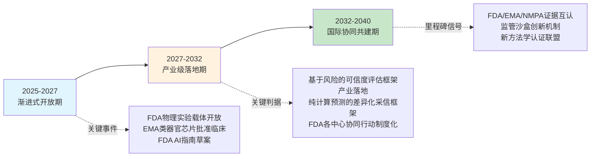

综合上述论证可以给出一个边界明确的判断——**监管科学与可信AI框架的协同演进将沿着"渐进式开放→产业级落地→国际协同共建"的优先级序列推进；2027-2032年可能形成相对成熟的产业级监管框架，2032-2040年可能在国际协同层面形成更系统的认证体系；这一演进的关键不在于单一监管机构的开放力度，而在于学术界、产业界、监管机构、伦理委员会的多方共建机制能否真正成熟**。

## 9.7 能力跃迁路径：从描述现象到预测机制再到生成干预方案

将本章前六节的演进方向收束为大模型药物评估的三阶能力跃迁路径——这也是对核心研究主题"从虚拟模拟到精准个体化"的方向性回应。这一三阶路径与本研究持久推理标准P-1（核心命题相关性）、P-3（跨尺度系统性视角）、P-6（前瞻判断的证据锚定）保持完全一致。

**第一阶：描述现象（当前主流，2025-2027）**。代表能力为高维数据关联分析、属性预测、亚群划分。具体证据已在前几章充分展开——CODE-AE对9,808名癌症患者×59种药物的聚类分析（第6章）、TIDE分值作为转录组级免疫治疗响应预测工具（第6章）、scFoundation提供的细胞表征用于下游任务（第3章）、TxGemma在66个治疗开发任务上的多任务统一预测（第4章）。方法论本质为统计学习与模式识别——模型从大规模数据中学到"什么样的输入对应什么样的输出"，但不解释"为什么这样对应"。这一阶能力的产业价值集中在**加速早期发现与亚群级精准富集**，但其局限在第7章独立基准研究中已被反向校验——许多看似优异的SOTA结果在严格基准下可能跌至简单基线水平。

**第二阶：预测机制（5-10年演进窗，2027-2032）**。代表能力为跨尺度因果识别、扰动响应预测、动态轨迹刻画、个体级机制模型校准。具体证据正在快速积累——Celcomen作为首个具有因果推断可识别性的虚拟组织模型（第5章）、AlphaCell引入"世界模型"理念的全量基因输入与统一连续坐标系（第3章）、PRnet基于扰动条件的深度生成模型为233种疾病推荐候选药物（第3章）、STATE在Tahoe-100M基准上扰动效果辨识度提升50%（第3章）、UNAGI在IPF的PCLS人体模型实验中虚拟筛出硝苯地平（第3章）、Squidiff把生物学动态预测从静态快照推进到连续生成（第3章）、Spatial Transition Tensor通过四维转移张量建模空间动态（第5章）、TNBC MRI数字孪生通过近似贝叶斯计算实现个体级机制模型校准（第6章）。方法论本质为机制锚定与因果推断——模型不仅给出预测，还能解释"扰动如何在系统中传播""为什么这种传播会导致这一结果"。这一阶跃迁的关键里程碑信号将是——**统一的跨尺度因果数学框架的建立**、**严苛独立基准下机制锚定模型对统计模型的系统性超越**、**患者级机制模型在多个临床场景的成功应用**。

**第三阶:生成干预方案（10-15年远景，2032-2040）**。代表能力为患者级"医生在数字孪生上预演治疗"、超个体化药物自动设计、AI主导的从靶点假说到上市药物的全流程自主决策。具体证据目前仍是稀缺的远景级信号——TNBC MRI数字孪生在50位患者上实现"中位↓17.62%肿瘤细胞/↓12.62%剂量"的个体化优化（第6章）作为局部演示性进展、Milasen作为首款只为一名患者定制的反义寡核苷酸药物在Mila身上把每天30余次癫痫发作降到6次以内（第6章）作为"一人一药"极致案例、希格生科与晶泰科技合作的SIGX1094获得FDA罕见病和快速通道双认证有望成为"第一个由AI设计开发的并成功获批上市的药物"[^56]作为产业级里程碑信号。方法论本质为"AI主导生成可执行的干预方案"——AI不仅理解机制，还能基于个体患者数据生成具体的治疗策略、药物分子、给药方案。这一阶能力的成熟需要前两阶能力的累积突破，以及9.6节监管科学协同演进的同步成熟。

把三阶能力跃迁的可观察里程碑信号、关键技术前置条件、制度配套需求结构化呈现：

| 阶段 | 时间窗 | 代表能力 | 可观察里程碑信号 | 关键前置条件 |
|------|------|------|------|------|
| 描述现象 | 2025-2027（当前主流） | 关联分析、属性预测、亚群划分 | scFM-Bench级独立基准成为论文发表前置条件 | 数据基础设施成熟、评估范式严苛化 |
| 预测机制 | 2027-2032 | 因果识别、动态轨迹、个体校准 | 统一跨尺度数学框架的雏形、机制锚定模型在严苛基准下系统性超越统计模型 | 多模态融合稳定性、可信度技术栈成熟 |
| 生成干预方案 | 2032-2040 | 数字孪生治疗预演、超个体化药物设计、AI主导全流程 | 第一款完全AI主导研发上市的药物、CPDT级数字孪生在临床决策中规模化采信、Milasen级个体化药物的可负担化 | 监管科学共建成熟、个体级跨尺度数据基础设施、生物学AlphaFold级统一基座 |

```mermaid
graph TB
    A[大模型药物评估三阶能力跃迁] --> S1[第一阶:描述现象<br/>2025-2027]
    A --> S2[第二阶:预测机制<br/>2027-2032]
    A --> S3[第三阶:生成干预方案<br/>2032-2040]
    
    S1 -.方法论本质.-> M1[统计学习与模式识别]
    S2 -.方法论本质.-> M2[机制锚定与因果推断]
    S3 -.方法论本质.-> M3[AI主导生成可执行干预]
    
    S1 -.代表证据.-> E1[CODE-AE/TIDE/<br/>scFoundation/TxGemma]
    S2 -.代表证据.-> E2[Celcomen/AlphaCell/<br/>PRnet/STATE/UNAGI/<br/>Squidiff/STT/TNBC数字孪生]
    S3 -.代表证据.-> E3[首款AI主导上市药物<br/>临床级CPDT<br/>可负担"一人一药"]
    
    style S1 fill:#c8e6c9
    style S2 fill:#fff9c4
    style S3 fill:#ffccbc
```

需要特别强调的是——**这三阶并非简单的替代关系，而是能力的累积与嵌套**。第二阶的"预测机制"建立在第一阶"描述现象"的高维数据关联能力之上；第三阶的"生成干预方案"则需要前两阶的所有能力作为基础。这种累积性意味着——**当前主流的"描述现象"能力虽然在严苛基准下面临挑战，但仍是后续能力跃迁不可绕过的基础设施**；任何对当前能力的全盘否定都是对未来跃迁路径的不负责任。

## 9.8 产业、学术与监管利益方的前瞻战略判断

将本章七节论证收束为面向三类利益方的差异化战略判断。这一收束既是本章的总结，也是对第10章分层结论的衔接。

**对产业利益方（跨国药企、AI制药平台、Biotech、CRO）的战略判断**。基于AI制药已进入商业兑现期但终点线尚未冲穿的事实——**晶泰控股2025年实现营业收入8.03亿元，同比增长201.2%；年内利润1.35亿元，经调整利润净额2.58亿元，首次实现年度盈利；晶泰控股表示其成为AI for Science领域首家盈利的港股上市公司**[^48]；**英矽智能2025年12月登陆港交所后股价一度快速增长，2025年底英矽智能成功上市并首日高开45%，创下港股生物科技公司最大IPO纪录**[^48][^51]；**截至2025年12月31日，中国创新药商务拓展（BD）出海授权全年交易总金额达到1356.55亿美元，授权交易数量超过150笔；2026年一季度中国创新药海外BD首付款总额33亿美元，同比增长267%；单笔BD首付款平均额0.67亿美元，较2025年全年大幅提高53%；2025年以来单笔交易的首付款比例约在5.2%~6.7%之间，较往年的2~5%有显著提高，反映了买方对资产确定性的认可**[^53][^54]——可以给出"平台+管线+收入"三重验证的战略路径建议。

具体而言：**第一**，对于AI制药头部平台公司（晶泰、英矽、百图生科、Recursion、Schrödinger），战略重心应从"技术平台颠覆性"向"临床管线进展和数据"转移——**当前市场对未盈利AI制药企业的核心估值逻辑，正经历从技术平台颠覆性到临床管线进展和数据的重心转移；高盛研报指出，AI制药已进入可量化的财务价值兑现期，96款AI设计药物实证分析显示，早期临床阶段通过率明显提升，临床数据成为区分企业价值的关键指标**[^51]。**第二**，对于跨国药企（辉瑞、罗氏、默克、阿斯利康、强生等），战略路径已经清晰转向"与AI制药企业的深度合作"——**前20大制药巨头均已与AI企业建立合作关系**[^54]，这一趋势在2026年仍将持续；典型如**石药集团与阿斯利康185亿美元的平台级合作，瞄准的是石药集团专有的缓释给药技术平台及多肽药物AI发现平台**[^49]，反映了跨国药企对AI驱动平台的战略性押注。**第三**，对于Biotech与CRO，战略机会在于"特定环节的AI增效"或"AI制药全栈服务"——耀速科技作为唯一入选FDA器官芯片ISTAND意向书的中国企业、Recursion作为TechBio工业化代表、希格生科作为AI驱动管线代表，分别展示了三类差异化战略路径。

**对学术利益方（研究机构、高校、独立科研团队）的战略判断**。基于本章前六节的演进方向，可以给出在四个方向的研究优先级建议：**第一**，基础模型统一化方向——这一方向需要大规模算力与多机构协作，单一PI驱动的零散研究难以产生STATE、AlphaCell级别的系统性突破，必须依赖国家级或机构级的长周期工程化组织；**第二**，自驱动闭环实验室方向——LUMI-lab、Coscientist、ChemAgents/小临展示了从化学合成向生物学复杂任务的演进路径，这一方向对跨学科团队（机器人、AI、化学、生物）的整合能力提出了高要求；**第三**，独立基准生态建设方向——Ahlmann-Eltze、Systema、scFM-Bench类的反向校验研究在方法论层面具有"挤水分"的关键价值，独立学术团队在这一方向上具有天然优势，应作为科研投入的重点方向；**第四**，跨学科人才培养——研究人员能力结构的转型（科学判断力、跨学科整合能力、伦理与社会责任感、人机协同元能力）需要新的人才培养体系，高校在这一方向上承担着不可替代的责任。

与产业界、监管机构的协同合作模式也值得展开——**阿斯利康与清华大学签署校级科研合作协议，并联合成立"清华大学（智能产业研究院）-阿斯利康人工智能药物研发联合研究中心"，聚焦AI药物发现、转化医学、临床开发等核心领域展开深度合作**[^54]，这种"跨国药企+顶尖高校+联合研究中心"模式是学术-产业协同的典型代表。**何静表示，中国在科研实力、临床资源及创新生态等方面的综合优势日益凸显，正逐步从全球医药创新的重要参与者转变为关键驱动力；这一趋势推动跨国药企在中国不断寻求创新伙伴和合作机会，形成更加开放、协同的全球创新网络**[^54]——这一判断对中国学术界的战略机会具有直接含义。

**对监管利益方（FDA、EMA、NMPA等）的战略判断**。在保护公众健康与鼓励创新平衡的前提下，可以给出以下方向的优先级建议：**第一**，新方法学渐进式接纳——FDA现代化法案2.0以来的渐进式开放路径已经验证了"先物理实验载体（器官芯片、类器官）、后纯计算预测（AIVC、数字孪生）"的优先级序列的合理性，这一路径应继续推进而非急于全面开放；**第二**，监管沙盒机制——为AI驱动的新方法提供受控环境的试点应用空间，平衡创新激励与风险控制；**第三**，国际证据互认——FDA、EMA、NMPA、PMDA等主要监管机构的证据互认机制，是降低跨国研发合规成本的关键杠杆；**第四**，可信AI技术标准制定——FDA基于风险的可信度评估框架已经提供了方法论模板，未来应进一步与可解释AI、不确定性量化、独立基准的技术标准深度耦合。**正如张伟在论坛上所说，AI不再是药物研发领域的一个遥远概念，已成为一种强大的实践工具，期待AI可将制药研发周期缩短2/3，并贯穿药品从研发、上市、生产到退市的整个生命周期，实现无缝、连续的智能监管**[^55]——这一愿景指向的正是监管智能化与产业智能化的协同演进。

最后以本研究对核心命题的方向性总判断收束本章——**大模型驱动的药物系统性评估能否真正实现"从虚拟模拟到精准个体化"，本质上不是一个"能否"的二元命题，而是一个"何时、以何种形态、以何种代价"的时间窗与路径命题**。基于本章的论证：在2027-2032年的5年演进窗中，可信度技术栈的成熟、监管科学的协同推进、自驱动闭环实验室的产业基础设施化将共同推动大模型药物评估从"描述现象"阶段进入"预测机制"阶段；在2032-2040年的10-15年远景中，生物学AlphaFold级跨尺度统一基座的雏形、个体级跨尺度数据基础设施的成熟、国际监管协同共建的形成将进一步推动"生成干预方案"阶段的能力跃迁。这一演进路径既不是悲观的"AI制药泡沫破裂"，也不是乐观的"AI颠覆制药"——它是基于现状证据锚定的、有时间窗与前置条件的客观演进判断。第10章将在本章前瞻判断的基础上，进一步把全报告的论证收束为对核心命题的分层结论与战略启示，为产业、学术与监管利益方的决策提供最终的方向性回答。

# 10 结论与战略启示

行至全报告收束之际，回望第1章所提出的核心命题——传统药物研究即便从多组学角度出发也难以系统、宏观地解析药物对机体的影响，叠加个体异质性的放大效应，使得"系统性评估"的诉求超越了经典还原论范式的能力边界——这一命题在前九章的论证中已被层层拆解、逐项审视、反复校验。本章不再罗列前文细节，而是以"分层结论—时间窗判断—四方建议—方法论反思—开放议题"五层结构，把分散的证据锚点收束为可被产业、学术、监管与投资决策者直接采信的战略性洞察。本章不追求新事实的引入，而追求对核心命题的最终回答给出**边界明确、时间窗清晰、前置条件可验证**的判断——这也是本研究持久推理标准P-1至P-6在全报告层面的闭环兑现。

## 10.1 对核心命题的分层结论:"已具备—有限具备—尚不具备"三层判断

把前九章的证据图谱以本研究持久推理标准P-5"能力边界与局限的平衡呈现"为标尺收束，可以对核心命题"大模型能否系统性模拟药物对机体影响并应对个体异质性"给出一个边界明确的三层结论。这一分层既不滑向"AI颠覆制药"的乐观叙事，也不陷入"AI泡沫即将破裂"的悲观判断，而是基于本报告全部证据的客观刻画。

**第一层:已具备能力**——大模型在药物系统性评估中已经积累了五类具有产业说服力的标志性证据。**分子-细胞层级的扰动响应预测**已通过scFoundation(5000万细胞预训练、1亿参数、计算量仅传统Transformer 3.4%)、scLong(4800万细胞、10亿参数、全转录组27874基因建模)、STATE(整合1.7亿观测+1亿干预细胞、Tahoe-100M基准辨识度+50%)等基础模型达到产业级表征能力。**群体级药物重定位**通过PRnet整合88细胞系×52组织×多化合物库扰动谱、为233种疾病推荐候选物得到规模化验证,UNAGI在IPF精准切割肺切片(PCLS)人体模型实验中虚拟筛选硝苯地平的抗纤维化效果与预测高度一致[^56]。**特定基因型场景下的患者类器官药敏评估**展示了"基因型+复合背景"驱动的高保真精度——肠道类器官研究证实F508del/F508del基因型可被VX-770与VX-809有效校正,W361X/F508del基因型则无显著响应,F508del杂合子健康携带者CFTR功能与对照一样高[^43];结合FDA首次批准完全基于类器官数据的肿瘤疗法IND申请,这一路径已具备监管认可的产业雏形。**纵向影像驱动的个体方案优化**通过三阴性乳腺癌新辅助化疗MRI数字孪生展示了个体级动态决策能力——50位患者上中位降低17.62%最终肿瘤细胞数、中位降低12.62%总剂量同时保持等效肿瘤控制。**超个体化定制的极致案例**在Milasen身上得到验证——从全基因组测序识别CLN7基因非编码区2000碱基逆转录转座子致病机制、到反义寡核苷酸定制设计、到FDA单例试验批准、再到临床上每天30余次癫痫发作降至6次以内,完整闭环已在科学层面跑通[^55][^51]。

**第二层:有限具备能力**——以下四类维度展示了明显的产业雏形,但在严苛基准下仍存在结构性局限。**跨尺度迁移在分布外场景的稳健性受限**——CODE-AE对9,808名癌症患者×59种药物的预测虽与现有临床观察一致,但其评估方式更多是"预测靶点与已用药物靶点一致性"的间接验证而非严格前瞻性试验;Ahlmann-Eltze等发表于Nature Methods的扰动预测基准研究揭示scGPT、scFoundation、scBERT、Geneformer、UCE、GEARS、CPA等模型在双基因扰动预测上**全部输给了仅由两个单基因扰动LFC直接相加的极简加性基线**,Systema框架在十个公开数据集上进一步证实"扰动均值"这一最朴素基线即可击败CPA、GEARS、scGPT等先进模型。**免疫治疗精准富集的精度天花板**——HCC患者ICI单药或靶免联合治疗客观缓解率仅20%-50%[^69],TIDE分值是相对值不可跨研究跨癌种绝对比较[^52],TIME中KLRB⁺与XCL1⁺ CD8⁺T细胞预后含义截然相反[^53],单一生物标志物难以独立支撑个体级精准决策。**患者级跨尺度对齐数据稀缺**——同一患者同时具备全基因组+组织单细胞+空间组学+纵向影像+完整EHR的"全维度对齐样本"在公开队列中极为稀少,UK Biobank近50万人全基因组数据集中**95%的测序数据来自欧洲后裔人群**,亚洲、非洲族裔代表性不足[^47]。**可信度技术栈尚未深度耦合**——闭环验证、不确定性量化、可解释AI、独立基准四主线各自取得方法学进展,但深度协同的"监管级全栈框架"尚未在纯计算预测层面成型。

**第三层:尚不具备能力**——以下四类维度仍属远景而非现实,需要客观坦诚指出。**可负担、可规模化、监管认可的"一人一药"范式**仍是远景——**世界上有7000多种罕见疾病,超过90%没有FDA批准的治疗方法**[^51],美国宾大医学伦理教授Joffe明确指出超个体化药物的资金承担"肯定不是政府,不是药企,更不会是保险公司——只能是患者家属"[^51],Milasen仅是技术与监管可行性的局部突破,远未触及规模化范式。**CPDT级临床可用数字孪生**仍面临关键挑战——多尺度数学模型生成超过100,000个虚拟患者轨迹的研究本身坦诚指出"在我们能够达到这一愿景之前关键挑战仍然存在",参数辨识性、个体级跨尺度数据、监管证据标准三道门槛尚未跨越。**严格因果干预模拟**仍处于早期——当前PDT与AIVC的输出更多是"该患者最可能的响应"而非严格意义上的"该患者在反事实干预下会发生什么"。**跨尺度连续因果耦合的统一数学框架**目前仍是开放问题——绝大多数实践仍是"工具调度的伪耦合"而非"统一数学框架的真耦合",分子层量子力学与统计力学、细胞层生物化学网络动力学、组织层连续介质力学、个体层生理学与药代动力学,尚缺乏统一的跨尺度数学语言。

将三层判断与第6章个体异质性应对、第7章可信度判断、第8章瓶颈剖析、第9章三阶能力跃迁路径合并审视,可以看到一种深度同构关系——**能力图谱、可信度图谱、瓶颈图谱、跃迁图谱在结构上相互呼应,共同指向"系统性药物评估是一个跨尺度、多维度、长周期的系统工程,而非单一技术突破即可完成的命题"**。

## 10.2 关键技术节点与时间窗判断

将第9章三阶能力跃迁路径与各章具体证据整合,可以归纳出一个具备可观察判据与不确定性边界的时间窗判断。这一时间窗判断遵循本研究持久推理标准P-6"前瞻判断的证据锚定与时间窗",每一节点都配套关键前置条件与现状证据。

**短期窗口(2025–2027年):评估范式的自我修正与监管开放的渐进推进**。这一窗口的关键技术节点已经部分发生,可观察判据较为清晰。**独立基准生态成熟**——Ahlmann-Eltze等、Systema、scFM-Bench三项标志性反向校验研究已经把AIVC基准评估的"水分"系统性挤出,未来2年内"零数据泄漏测试集设计、对抗性基线对比、跨任务跨数据集统一评估"将逐步成为论文发表前置条件,scFM-Bench采用2025年4月发布的AIDA v2新增约201K健康供体免疫细胞作为测试集的范式具有方向性意义。**AIVC严苛基准下的能力天花板被广泛认知**——这一窗口的关键判据是产业界与学术界对"复杂深度学习模型在跨细胞背景与组合化学扰动上的真实泛化能力远低于发表论文宣称水平"形成共识,推动模型选择从"盲目追求规模"转向"任务驱动与机制锚定"。**FDA器官芯片ISTAND从意向书到正式指南的演进**——FDA于2025年4月10日发布动物实验路线图、2026年1月接收肝器官芯片ISTAND意向书、仅2个月后发布《药物开发中采用新方法论的总体考量行业指南》意见稿[^52][^56],这一密集节奏预示着2026-2027年正式指南的发布概率较高。**第一款AI主导研发药物上市的关键试金石**——希格生科与晶泰科技合作的SIGX1094已获得FDA罕见病和快速通道双认证,胃癌作为美国罕见病有望完成二期临床实验后即可申请上市[^52],若在这一窗口内兑现将构成产业级标志性事件。

**中期窗口(2027–2032年):机制锚定的产业级落地与统一基座的雏形**。这一窗口的关键技术节点处于演进路径的核心位置。**生物学AlphaFold级跨尺度统一基座的雏形**——Arc Institute规划在2030年实现对人类器官系统的数字模拟,百图生科技术副总裁张晓明判断"未来5-10年AI制药产业可能将迎来爆发期"[^43],这一窗口将检验Scaling Law在生命科学领域的适用边界,以及"分子-细胞-组织-器官"四层耦合是否能实现可量化的因果连续传播。**可信AI技术栈产业级落地**——FDA基于风险的可信度评估框架(明确研究问题→定义使用场景→评估模型风险→制定可信度评估计划→执行计划→记录结果→判断模型适用性)将在这一窗口被产业界广泛采用,UQ深度部署、XAI机制锚定、独立基准生态作为标配属性而非可选项[^51]。**自驱动闭环实验室从化学合成向生物学复杂任务的关键突破**——LUMI-lab从化学合成场景延伸到药物递送任务的成功案例[^56]、ChemAgents/小临的"读—想—做—创"科研全流程、Coscientist复现钯催化偶联反应的演示,共同指向2030年前后类器官培养、单细胞测序、空间组学等生物学复杂任务自动化的关键突破。**预测机制阶段的标志性事件**——Celcomen因果识别可推断的虚拟组织模型、AlphaCell世界模型理念的全量基因输入、Squidiff连续动力学生成模型从静态快照向连续生成的跃迁,共同构成机制锚定模型在严苛基准下系统性超越统计模型的关键判据。

**长期窗口(2032–2040年):远景里程碑与三阶能力跃迁的最终兑现**。这一窗口的判断不确定性显著高于前两个窗口,但依然可以基于现状证据外推关键节点。**CPDT级临床可用数字孪生**——三阴性乳腺癌MRI数字孪生在50位患者上"中位降低17.62%肿瘤细胞、中位降低12.62%总剂量"的局部演示,结合超过100,000个虚拟患者轨迹的多尺度免疫监视模型,共同指向2032-2040年CPDT在多类临床场景获得规模化采信的可能性。**国际监管协同共建**——FDA现代化法案2.0、EMA 2026年2月批准全球首款基于类器官芯片技术的新药开展人体临床试验、NMPA对AI/类器官新方法的接纳节奏,共同指向这一窗口内FDA/EMA/NMPA/PMDA等主要监管机构的证据互认机制可能初步成型。**超个体化药物的可负担化**——这是最具不确定性也最具长期价值的远景里程碑,需要技术成本下降、监管路径标准化、医保支付机制创新的多重协同推进。**完整跨尺度统一数学框架的成熟形态**——从分子动力学到全身生理学的连续因果耦合在统一数学框架内的实现,可能需要到这一窗口的中后期才会出现产业级雏形。

将三阶时间窗与关键技术节点的不确定性边界归纳如下表:

| 时间窗 | 关键技术节点 | 现状证据锚点 | 不确定性边界 |
|------|------|------|------|
| 2025–2027 | 独立基准生态成熟、FDA新方法学指南正式化、首款AI主导药物上市 | 三项反向校验研究、ISTAND意向书、SIGX1094双认证 | 监管节奏可能慢于预期,产业BD兑现率仍受5%-12%里程碑限制[^54] |
| 2027–2032 | 跨尺度统一基座雏形、可信AI技术栈产业级落地、自驱动闭环向生物学延伸 | Arc 2030路线图、FDA可信度评估框架、LUMI-lab突破 | Scaling Law边际效应递减、生物学复杂任务标准化困难 |
| 2032–2040 | CPDT临床采信、国际监管互认、超个体化可负担化 | TNBC数字孪生局部成功、FDA/EMA趋同信号、Milasen技术可行 | 制度演进慢于技术演进、地缘政治分化加剧协调成本 |

需要特别强调,**这一时间窗判断不是"必然兑现的预言",而是"基于现状证据可被检验的假说"**——若关键前置条件(如可信度技术栈成熟、跨尺度数据基础设施扩张、监管科学协同推进)未能按预期演进,后续节点的兑现时间可能向后延展;反之,若出现颠覆性方法学突破(如统一跨尺度数学框架的提前成熟),则整体节奏可能加速。这种"基于证据但承认不确定性"的判断方式,正是本研究持久推理标准P-6的核心要求。

## 10.3 对药企研发战略的方向性建议

面向跨国药企(MNC)、AI制药头部平台、Biotech、CRO四类不同定位的产业主体,需要给出差异化的战略建议——它们在产业链中所处位置不同、核心竞争力不同、面临的监管与资本压力不同,适配的战略路径也必然不同。

**对跨国药企(MNC)的核心建议是把"与AI制药平台的深度合作"从战术补充提升为核心研发战略**。当前产业事实已经清晰——**全球前20大制药巨头均已与AI企业建立合作关系**[^54],这一趋势在2026年仍将持续深化。最具方向性意义的标志性事件是2026年1月**石药集团与阿斯利康达成185亿美元的平台级协作**[^49],这份合作协议瞄准的不止单个产品,还包括石药集团专有的缓释给药技术平台及多肽药物AI发现平台,首付款达12亿美元——这种从"分子授权"到"平台合作"的跃迁标志着MNC对AI驱动平台的战略性押注从"试水"进入"重仓"。**信达生物与武田制药114亿美元合作**[^55]、**BMS与insitro基于AI药物发现平台ChemML 20.2亿美元合作**[^55]、**翰森制药向GSK授权B7H3 ADC HS-20093并启动复发性广泛期小细胞肺癌全球III期临床**[^55]——这一系列产业证据共同指向一个判断:MNC对中国AI驱动资产从"早期试水工具"转向"后期主力管线",2025年中国BD资产被MNC推进至Ⅱ期及后期临床的占比接近半数[^55]。

具体到MNC的战略路径,有三条优先级建议:**第一**,建立内部AI制药能力中心而非完全依赖外部合作——阿斯利康与清华大学签署校级科研合作协议、联合成立"清华大学(智能产业研究院)-阿斯利康人工智能药物研发联合研究中心"[^54]是这一路径的代表;**第二**,关注BD交易首付款比例提升的资产质量信号——2025年以来单笔交易的首付款比例约在5.2%-6.7%之间,较往年的2-5%有显著提高,反映买方对资产确定性的认可[^49],未来MNC在选择AI驱动资产时应把"首付款占比"作为核心质量指标;**第三**,把"专利悬崖应对"与"AI驱动新管线引入"作为协同战略——德勤报告显示全球头部制药企业的研发回报率从2010年的10.1%下降到2024年的5.9%[^54],仅靠传统研发难以扭转这一颓势,AI驱动平台的引入将成为MNC研发回报率回升的关键杠杆。

**对AI制药头部平台公司的核心建议是把战略重心从"技术平台颠覆性"向"临床管线进展+平台收入"三重验证转移**。这一转向已在产业层面得到充分验证——晶泰控股2025年实现营业收入8.03亿元同比增长201.2%、年内利润1.35亿元、经调整利润净额2.58亿元、首次实现年度盈利,成为AI for Science领域首家盈利的港股上市公司[^48];英矽智能2025年12月登陆港交所首日高开45%创下港股生物科技公司最大IPO纪录[^51],拥有超过27款临床前候选化合物、其中10款分子已获得临床试验批件,依托Pharma.AI平台将从靶点发现到临床前候选化合物确认的时间从行业平均的4.5年缩短至12-18个月[^51];百图生科的xTrimo V4生命科学大模型已进入60余个概念验证项目,服务全球500多家客户包括60余所QS世界百强大学和赛诺菲等多家跨国药企,潜在订单价值达20亿美元[^80][^43]。

但同时必须坦诚指出AI制药头部平台仍面临的现实挑战——英矽智能2025年经调整亏损4380万美元、收入同比下滑34.5%、相比2024年同期2120万美元亏损有所增加[^48];Recursion自2021年上市以来已经亏损超过20亿美元[^50];Schrödinger 2025年虽然营收增长23.3%但全年净亏损仍然高达1.033亿美元[^50]。**这种"高估值、高潜力、长亏损"的特征意味着AI制药头部平台必须在"概念故事"与"真金白银"之间找到平衡——临床管线的具体进展、平台收入的可持续增长、与跨国药企的深度合作能否真正兑现里程碑付款,将共同决定这些平台从"演示性高分"向"产业级现金流"的过渡能否成功**。

**对Biotech的核心建议是聚焦特定环节AI增效或差异化平台**。耀速科技作为国内唯一入选FDA器官芯片ISTAND意向书的企业[^52][^56]、完成超2亿元A轮融资构建"以人源化模型与机制研究为核心的下一代生物智能基础设施"是这一路径的代表;希格生科作为AI驱动管线代表、与晶泰科技合作的SIGX1094获得FDA罕见病和快速通道双认证有望成为"第一个由AI设计开发的并成功获批上市的药物"[^52]是另一种典型路径。Biotech的核心竞争力应建立在"特定细分场景的方法学深度"或"特定疾病领域的临床洞察"上,而非与AI制药头部平台正面竞争通用基础设施。

**对CRO的核心建议是加速从动物实验为主向AI+类器官+器官芯片新方法学协同的转型**。这一建议的产业证据极为清晰——**资本市场对监管转向的分化反应已经显现:晶泰控股股价单日上涨7.39%,其孵化的耀速科技已服务赛诺菲、欧莱雅等巨头;美股Certara、Schrodinger等AI概念股同步大涨;依赖动物实验的传统CRO企业则遭遇重挫,昭衍新药A股跌停、港股暴跌超13%,其年报显示生物资产公允价值变动净损失达1.14亿元**。CRO行业正在经历从"动物实验为主+少量计算辅助"向"AI+类器官+器官芯片+少量动物实验"的整体范式重构,转型节奏将直接决定不同CRO企业未来5-10年的产业地位。

整合上述四类主体的建议,可以归纳出三类共性的产业级竞争力壁垒:**可信度建设壁垒**(独立基准、UQ部署、XAI机制锚定、监管对齐)、**闭环实验基础设施壁垒**(类器官、器官芯片、自驱动实验室、机器化学家)、**个体化数据资产壁垒**(患者级跨尺度纵向数据、多元族裔队列、合规数据治理体系)。这三类壁垒的构建需要长周期投入与多方协同,是大模型时代药物研发产业级竞争的核心赛道。

## 10.4 对科研机构与高校的布局建议

面向学术利益方,需要从基础研究优先级、跨学科协作模式、人才培养转型三个维度给出具有方向性的建议。学术界在大模型药物评估生态中的角色,既不是产业界的简单跟随者,也不是孤立的基础研究者,而是**承担着"机制深度突破—独立基准校验—跨学科人才培养—与产业监管的桥梁角色"四位一体使命的关键节点**。

**基础研究优先级建议聚焦四个方向**。**第一是跨尺度因果耦合的统一数学框架**——这是第5章已揭示的最具方法论深度的开放问题,从分子动力学的量子力学语言、到细胞层的生物化学网络动力学、到组织层的连续介质力学、到个体层的生理学与药代动力学,如何在统一数学框架内连续传播扰动信号,是制约系统性评估走向"真耦合"的根本瓶颈。这一方向不适合PI驱动的零散研究,必须依托国家级或机构级的长周期工程化组织。**第二是独立基准生态建设**——scPerturBench、Systema、scFM-Bench所代表的反向校验范式具有不可替代的方法论价值,独立学术团队在这一方向上具有天然优势(不受产业利益影响、可以采用对抗性基线设计、可以严格控制数据泄漏),应作为科研投入的优先方向。**第三是自驱动闭环实验室方法论**——LUMI-lab、Coscientist、ChemAgents/小临、A-Lab所代表的"基础模型+机器人+主动学习"范式,需要跨学科团队(机器人工程、AI算法、化学/生物学领域专家)的整合;高校在这一方向上具备产业界难以复制的跨学科资源整合能力。**第四是个体级精准模拟方法学**——CODE-AE所代表的跨尺度迁移、TNBC MRI所代表的患者数字孪生、Milasen所代表的超个体化定制,共同构成了个体化建模的方法学谱系,这一方向需要计算科学、统计学、临床医学的深度交叉。

**跨学科协作模式建议借鉴三类成熟范式**。**第一类是Arc Institute级"21世纪贝尔实验室"工程化科研模式**——美国弧形研究所成立于2021年12月,初始捐赠资金超过6.5亿美元,机构通过核心研究员制度为科学家提供长期资助,并聚焦于开发生物学基础模型与大规模数据集,主要成果包括发布基因组基础模型Evo 2、虚拟细胞图谱Atlas和虚拟细胞模型STATE,并于2025年发起了首届虚拟细胞挑战赛[^53]。其核心特征是**通过长期资金池与开放式合作网络,为基础研究提供持续性资源与工程化支撑**;**Arc的使命宣言简洁而有力:"用工程的速度推进基础科学的深度"**[^53]。**第二类是CZI慈善资本驱动开放数据模式**——CZI此前花费多年建立的Cell Atlas项目和CELLxGENE平台积累了超过1亿个标准化细胞数据,2025年11月CZI重组为统一的Bio Hub网络全力聚焦AI与生物学融合,这种模式特别适合"1亿到10亿美元投入、10-15年周期"的大型工具平台,填补了NIH等机构以小额项目分散资助的传统逻辑无法触达的资金真空。**第三类是清华-阿斯利康联合研究中心级校企协同模式**——以场景赋能、生态协同、技术生根三大举措赋能AI+生命科学创新发展[^54],这种模式让学术界既能保持基础研究的深度,又能通过产业资源加速成果转化。

**人才培养转型建议把"科学判断力+跨学科整合能力+伦理责任感+人机协同元能力"作为新一代研究人员核心能力结构**。当AI承担越来越多的"执行性"科研工作时,研究人员的核心价值正在从"具体方法学的执行者"向"科学方向的把关者"转移。具体到课程体系建设——**第一**,生命科学专业应增加大模型方法学、独立基准设计、可信AI评估的必修内容;**第二**,计算机科学与AI专业应增加生物学先验融入、机制锚定、跨尺度建模的必修内容;**第三**,临床医学专业应增加AI辅助诊疗、医疗AI责任归属、医疗伦理的必修内容;**第四**,各专业之间应建立"跨学科联合实验室+联合学位项目"机制,让学生在博士阶段就具备跨学科的方法学视野。

**中国学术界的特别战略机会**值得专门强调。**中国AI制药公司主要分布于北京、长三角、大湾区三地,囊括了超94%的AI制药公司**[^55],本土数据基础设施建设的产业基础已经成熟。结合**何静关于"中国在科研实力、临床资源及创新生态等方面的综合优势日益凸显,正逐步从全球医药创新的重要参与者转变为关键驱动力"**[^54]的判断,中国学术界在三个方向具有独特的战略机会——**第一**,多元族裔队列建设(亚洲人群基因组与表型数据是缓解UK Biobank欧裔偏倚的关键资源);**第二**,本土生物银行与跨尺度纵向数据基础设施(从NICU新生儿全基因组测序20小时流程到肿瘤患者类器官库的协同建设);**第三**,南南科技合作(与印度、东南亚、非洲、拉美的本土资源协作,推动全球数据基础设施的多极化演进)。这三类战略机会与第8章公平性瓶颈、第9章跨国开放科学协作的判断高度耦合,是中国学术界从"全球科学协作的参与者"向"全球科学协作的共建者"跃迁的关键路径。

## 10.5 对监管政策制定的方向性建议

面向FDA、EMA、NMPA等监管机构,需要在保护公众健康与鼓励创新的平衡前提下给出五个维度的政策方向建议。监管机构在大模型药物评估生态中的角色至关重要——监管节奏太慢会扼杀创新,监管节奏太快可能放过未充分验证的高风险新方法,如何在两者之间找到动态平衡,是监管科学的核心命题。

**第一是延续渐进式开放路径**——以FDA现代化法案2.0(2023年取消新药临床前必须动物实验)、《减少临床前安全性研究中动物实验的路线图》(2025年4月10日)、肝器官芯片ISTAND意向书(2026年1月)、《药物开发中采用新方法论的总体考量行业指南》意见稿(2026年3月)为参照[^52][^56][^51],按"物理实验载体先行、纯计算预测跟进"的优先级序列推进。这一序列的合理性已经得到产业实证——物理实验载体虽然是新技术但仍属"实验"范畴,监管机构对其证据生成机制有相对成熟的评估框架;纯计算的数字孪生预测必须证明其与真实人体响应的可量化对应关系,这一证据标准目前尚不清晰。FDA对器官芯片的开放快于对纯计算预测的接纳,正是这种"差异化采信"逻辑的具体体现。建议监管机构继续延续这一序列,避免在替代证据不充分时仓促推进纯计算预测的全面采信。

**第二是建立监管沙盒机制**——为AI驱动新方法提供受控环境的试点应用空间,平衡创新激励与风险控制。这一建议的核心方法论是"在限定范围内允许高风险创新,在沙盒内积累证据后再决定是否扩展"。具体可借鉴FDA对Mila Makovec的Milasen单例试验批准模式——**FDA允许了一项单例试验,Yu回忆说"我们深吸了一口气,开始了"**[^55],这种"小范围、严监控、快迭代"的沙盒模式适合处于演示阶段的新方法学。监管沙盒的设计应包括三类核心要素:明确的纳入与排除标准、严格的安全性监控机制、清晰的证据积累与升级路径。

**第三是推动国际证据互认**——降低跨国研发合规成本,应对地缘政治分化背景下的协调挑战。FDA已经表态**将参考其他国家已有的、真实的安全数据,因为这些国家已经对人类进行了药物研究**[^56],这一"互认"路径在制度层面尚未完全成型,但已经显示出方向性意图。EMA 2026年2月正式批准全球首款基于类器官芯片技术的新药开展人体临床试验[^51],标志着EMA从"接受替代"走向"主动鼓励"。FDA与EMA在动物实验替代方向的趋同,为跨国监管协同提供了基础;NMPA对AI/类器官/数字孪生新方法的接纳节奏,则受PIPL等数据合规约束的间接影响。建议三大监管机构通过联合工作组、共享技术指南、互认临床试验数据等机制,逐步建立证据互认体系,为产业界降低跨国研发合规成本。

**第四是把可信AI技术标准与监管证据要求深度耦合**。FDA基于风险的可信度评估框架已经提供了方法论模板——**风险评估框架可帮助相关方规划和整理信息,确定AI模型输出的可信度,相关活动应与模型风险和使用场景相匹配**[^51]。FDA各中心(CBER、CDER、CDRH、OCP)的协同行动已经勾勒出可信AI的四个重点领域:促进协作以保障公众健康、推进支持创新的监管方法的发展、支持监管科学工作开发评估AI算法的方法识别和减轻偏差、利用并继续拓展现有举措[^51]。建议监管机构进一步把可解释AI、不确定性量化、独立基准生态作为可信度评估的标配属性,推动"模型卡+数据卡+UQ披露+独立基准报告"的强制要求,让产业界在AI模型上市申报时同时提交这些可信度技术栈的完整文档。

**第五是协同应对隐私合规、知识产权与责任归属三类制度议题**。**隐私合规层面**——PIPL把"医疗健康"数据定义为敏感个人信息,要求处理时必须取得"单独同意",对跨国数据出境实施严格安全评估机制;GDPR、HIPAA、PIPL三大法规对医疗健康数据的规制差异构成了跨国研发合规的核心挑战,联邦学习、差分隐私、安全多方计算等技术虽然在缓解张力,但仍面临严格合规的工程门槛。**知识产权层面**——杜克大学Rai与波士顿大学Freilich发表于Nature Biotechnology的实证研究显示AI原生公司有80%的专利在标题中明确指定治疗靶点而对照公司仅63%(P=0.002),但AI原生公司专利中分子所针对靶点此前平均有22个临床资产、对照组平均为9个、差异不显著(P=0.28),提示AI驱动药物发现并未如初期预期那样产生"显著更具创新性的靶点"——监管机构在AI生成药物专利审查时应基于实证证据建立差异化标准。**责任归属层面**——医疗AI辅助诊疗引发误诊时,责任如何在医务人员、医疗机构、研发企业之间划分仍是开放问题;**《医疗机构人工智能应用与治理专家共识(2026版)》明确"人机协同、以人为主"原则——医师拥有最终诊疗决策权,医疗机构承担法律责任,尽到审查义务后可向厂商追偿**,这一原则应成为各国监管机构责任归属立法的参照基准。

整合五类建议可以形成一个监管政策的总体方向判断——**监管的成熟度演进必须以"渐进式开放→产业级落地→国际协同共建"的优先级序列推进,在2027-2032年的中期窗口内形成相对成熟的产业级监管框架,在2032-2040年的长期窗口内形成更系统的国际协同认证体系**。这一演进的关键不在于单一监管机构的开放力度,而在于学术界、产业界、监管机构、伦理委员会的多方共建机制能否真正成熟。

## 10.6 对投资决策的洞察性建议

面向风险投资、产业资本、公共资金三类投资主体,需要给出差异化的判断框架。投资决策的本质是在不确定性下做出资源配置选择,而大模型药物评估这一赛道的特殊性在于——**它同时具备颠覆性技术潜力(可能从根本上重塑10年20亿美元的药物研发范式)与漫长的兑现周期(从早期管线到商业化里程碑可能跨越10-15年)**[^52][^50][^54]。投资逻辑必须既不被短期演示性高分所迷惑,也不被长期不确定性所吓退。

**核心投资逻辑的演进:从"技术平台颠覆性"到"临床管线+平台收入+真金白银BD"三重验证**。这一转向已经在产业层面得到充分验证。**早期阶段**,AI制药企业的估值主要依赖技术平台的颠覆性——百图生科2680亿参数的xTrimo V4生命科学大模型、晶泰科技全球最大的药物分子量子力学参数数据库等,通过展示AI在靶点发现命中率(达16%~20%,远超传统0.1%基准)、分子设计效率等方面的优势,获得资本市场青睐[^51]。**当前阶段**,投资者变得更加理性,临床管线数据成为估值核心锚点——高盛研报指出,AI制药已进入可量化的财务价值兑现期,96款AI设计药物实证分析显示早期临床阶段通过率明显提升,临床数据成为区分企业价值的关键指标[^51]。投资者关注三个维度:管线数量与进度(临床II期、III期资产数量)、平台收入(技术授权与服务收入)、BD交易兑现(首付款比例、里程碑达成率)。这一转向意味着——**投资者必须从"故事估值"转向"现金流估值",对AI制药企业的估值锚点应从"参数规模、训练数据量、技术演示"转移到"临床管线深度、平台收入增长、BD里程碑兑现"**。

**真金白银BD的产业证据**为投资判断提供了坚实锚点。**截至2025年12月31日,中国创新药商务拓展(BD)出海授权全年交易总金额达到1356.55亿美元,首付款70亿美元,交易总数量达到157笔,远超2024年全年519亿美元和94笔;中国创新药交易额已占全球总额的49%,一举超过美国**[^53]。**进入2026年第一季度,中国创新药对外授权交易总金额已突破600亿美元,逼近2025年全年的一半;一季度中国创新药海外BD首付款总额33亿美元同比增长267%,单笔BD首付款平均额0.67亿美元较2025年全年大幅提高53%**[^54]。**2025年以来单笔交易的首付款比例约在5.2%~6.7%之间,较往年的2~5%有显著提高,反映了买方对资产确定性的认可**[^49]。这一系列产业证据共同指向一个判断——AI驱动资产已经从"早期研发试水工具"演进为"全球研发核心力量",首付款比例提升意味着跨国药企对AI资产质量的信心上升,这是投资判断的关键正向信号。

**坦诚警示三类现实风险**则是同样必要的判断锚点。**第一是BD里程碑兑现率低**——SRS Acquiom近期发布的《2025生命科学并购与交易报告》显示,如果按金额计算,BD交易临床前里程碑的兑现率约为55%,到临床III期已降至12%,而商业化阶段里程碑的达成率仅为5%左右[^54];首付款普遍较小(大致是交易总额的2%~5%左右),真正的大头是后续与临床及商业化进展深度绑定的里程碑付款。这意味着——**很多天价BD只是挂在远方树梢上的"青梅",能看但并不能真正解渴,绝大多数交易最终都只兑现了微薄的首付款**[^54]。**第二是AI制药企业普遍亏损**——Recursion自2021年上市以来已经亏损超过20亿美元、2025年年度净亏损6.45亿美元相较去年大幅增长40%;Schrödinger 2025年虽然营收增长23.3%但全年净亏损仍然高达1.033亿美元;英矽智能2025年经调整亏损4380万美元相比2024年同期2120万美元有所增加[^48][^50];Generate Biomedicines成立8年累计亏损高达6.76亿美元上市首日股价便大跌21%遭遇破发[^50]。**第三是DSP-1181级失败案例的现实风险**——由Exscientia推出的全球首个AI设计分子"DSP-1181"最终因1期临床试验未达到预期目标而折戟沉沙[^52][^56],这一失败提醒投资者AI驱动资产的临床失败风险与传统资产并无本质差异,任何"AI能从根本上提升临床成功率"的乐观叙事都需要更多前瞻性证据来锚定。

**三类高潜力赛道值得重点关注**。**第一类是平台级合作**——石药集团与阿斯利康185亿美元合作中AI驱动平台被纳入合作核心、强生与Nanobiotix交易额合计超27亿美元的放射增强剂合作、Seagen与Nurix Therapeutics合作开发ADC的34亿美元里程碑[^69]、信达生物与武田制药114亿美元合作[^55],这一系列产业证据指向"平台级合作"作为AI制药商业化的核心模式。**第二类是自驱动闭环实验室基础设施**——耀速科技完成超2亿元A轮融资构建"以人源化模型与机制研究为核心的下一代生物智能基础设施"[^52][^56]、晶泰科技在浦东设立的"生物医药机器人自动化工站集群"、英矽智能的Life Star全自动化智能机器人实验室,这一赛道既具备明确的产业需求,又具备较高的技术门槛与先发优势。**第三类是可信AI技术栈相关工具与服务**——独立基准评估工具、不确定性量化产品、可解释AI服务、联邦学习平台等工具型公司,随着FDA基于风险的可信度评估框架的产业级落地,这一赛道的市场规模将快速扩张。

**对公共资金与慈善资本的特别建议是承担"1亿到10亿美元、10-15年周期"的大型工具平台投资真空**。这类投资完全不符合NIH等机构以小额项目分散资助的传统逻辑——**像虚拟细胞模型这样的大型工具平台,需要1亿到10亿美元的投入,研发周期长达10到15年,完全不符合NIH等机构以小额项目分散资助的传统逻辑——慈善资本正是看准了这一空白才得以发挥关键作用**。CZI(计划在未来10年内投入数亿美元打造AIVC)、Arc Institute(初始捐赠资金超过6.5亿美元、计划2030年实现对人类器官系统的数字模拟)是这一路径的代表性案例[^53]。这种慈善资本与公共投入驱动的模式具有不可替代的战略价值——它为基础研究提供了脱离传统资助周期束缚的长期资源,使研究者能够从长期问题出发进行探索而非疲于申请短期经费。建议中国及其他国家的公共资金体系借鉴这一模式,设立专门面向"长周期工具平台"的资助机制,为AIVC、跨尺度数字孪生、个体级精准模拟方法学等大型基础设施提供持续支撑。

## 10.7 方法论反思与持久推理标准的回应

作为全报告的方法论收束,本节对本研究持久推理标准P-1至P-6给出闭环回应,把全报告的论证方法论反思系统化。这一回应不是形式化的"打勾确认",而是对推理质量的实质性自我审视——既包括对标准已经满足的具体方式,也包括对标准未充分兑现的局限坦诚承认。

**P-1核心命题相关性与聚焦度**通过分层结论的边界明确性来满足。全报告始终紧扣"大模型能否系统性模拟药物对机体影响"与"如何应对个体异质性"两大核心问题,避免了对AI制药一般性介绍或多组学技术普及性叙事的偏离。具体到各章——第1章界定问题与诉求、第2章梳理范式演进、第3-5章按细胞-编排-跨尺度三层展开能力图谱、第6章独立处理个体异质性、第7-8章审视可信度与瓶颈、第9-10章给出前瞻判断与战略启示——每一章都直接回应"能不能模拟、模拟到什么程度、未来如何演进"三个核心问题,而非泛泛讨论AI制药生态。10.1节的三层结论尤其体现了这一标准的最终兑现——它把核心命题的回答精确到"已具备—有限具备—尚不具备"三层,每一层都有具体的能力锚点与证据支撑。

**P-2技术证据的具体性与可验证性**通过对每项关键能力锚定具体模型、数据、基准、产业案例来满足。本报告对大模型能力的判断从不停留在"某类大模型可以做X"这种笼统表述,而是必须对应到具体的模型名(scFoundation、scLong、STATE、AlphaCell、UNAGI、PRnet、Squidiff、CODE-AE、CBR-DDI、TxGemma、DrugChat、ATOMICA、Coscientist、ChemAgents/小临、A-Lab、LUMI-lab、MOSAIC、FROGENT、Celcomen、Nicheformer等)、具体的数据集(Tahoe-100M、UK Biobank、HCA、CELLxGENE、Norman扰动数据集、Perturbmap KP肺癌、AIDA v2、Therapeutic Data Commons等)、具体的基准(scPerturBench、Systema、scFM-Bench、scIB等)、具体的产业案例(晶泰科技200亿港元市值、英矽智能IPO首日高开45%、Recursion英伟达5000万美元投资23PB专有数据集、耀速科技2亿元A轮融资、希格生科SIGX1094 FDA双认证、石药185亿美元平台级合作等)。对于无法获得具体证据的国产模型(如灵枢-Cell),本报告坦诚指出资料缺口而非以推测填充——这种"有据则述、无据则缺"的方法论原则,正是P-2标准的核心要求。

**P-3跨尺度与系统性视角整合**通过分子-细胞-组织-器官-个体五层一致框架来满足。本报告的核心方法论坐标始终是"跨尺度系统性视角"——第2章范式演进按"分子→细胞→组织→个体"递进、第3章AIVC占据细胞层位置并向上下两端衔接、第4章LLM/MAS作为编排层调度多尺度工具、第5章数字孪生作为跨层耦合的远景蓝图、第6章个体异质性作为五层系统性视角在患者尺度的具体表达、第7章可信度建设跨越四层验证载体、第8-9章瓶颈与未来路径都按系统性视角展开。这种五层一致的视角避免了"局限于单一尺度而声称系统性评估"的常见方法学错误,本报告对"系统性"的每一次声称都要求覆盖至少两个尺度以上的耦合证据。

**P-4个体异质性显性处理**通过第6章独立成章并贯穿全报告来满足。个体异质性不是被简单提及的修辞性概念,而是被作为核心命题的独立维度系统展开——第1章已揭示其放大效应、第6章专门处理"从群体平均到患者级精准模拟"、其他章节也在每一项能力判断中追问"是群体平均还是患者级、是否使用患者特异性数据、泛化到未见个体的证据是什么"。这种贯穿性的显性处理,使本报告避免了将细胞系或群体层面的成功直接外推为个体化能力的常见偏差。

**P-5能力边界与局限的平衡呈现**通过对每项SOTA结论配套基准警示与失败案例来满足。本报告对每一项能力性结论都同时呈现"当前能做什么—有限能做什么—尚不能做什么"——AIVC的标志性突破与scPerturBench/Systema/scFM-Bench的反向校验并置、LLM在多任务上的SOTA与15-20%幻觉率并置、类器官药敏的80-95%准确率与"距离真正AI制药时代仍面临漫长验证期"并置、Milasen的临床成功与"7000多种罕见病90%无获批治疗"并置、AI制药BD交易1356亿美元与里程碑兑现率5-12%并置、晶泰首次盈利与英矽亏损4380万美元并置、Coscientist复现诺奖反应与"目前的Coscientist还无法解决跨学科复杂问题"并置——这种"亮点与警示并置"的方法论原则,正是P-5标准的核心兑现方式。

**P-6前瞻判断的证据锚定与时间窗**通过第9章与本章对每项展望明确时间窗与前置条件来满足。本报告对未来的判断从不是无锚点的趋势叙事,而是基于现状证据外推的、有明确时间窗与可观察判据的假说性判断。10.2节给出的三阶时间窗(2025-2027短期、2027-2032中期、2032-2040长期)、每一节点配套的关键前置条件与现状证据锚点、不确定性边界的明确披露,都体现了P-6标准的具体兑现。这种"基于证据但承认不确定性"的判断方式,既区分了近期可达、中期可能与长期愿景,也为后续研究提供了可被检验的具体节点。

**坦诚指出本研究的方法论局限**。第一是国产基础模型(尤其是用户需求中提及的灵枢-Cell)信息可获取性受限,本报告对其技术细节、训练数据、基准表现等无法展开具体描述,这一局限在P-2标准下被明确披露而非以推测填充。第二是未来时间窗判断的不确定性——10.2节给出的三阶时间窗虽然有现状证据锚定,但未来5-15年的具体演进受技术突破、制度演进、地缘政治多重因素影响,实际节奏可能显著偏离判断。第三是跨学科证据整合深度受限——本研究虽然在分子-细胞-组织-器官-个体五层尺度上做了一致的系统性整合,但每一层内部的细节深度受篇幅与资料可获取性约束,某些技术细节(如全细胞建模的具体数学方程、跨尺度耦合的具体数学语言)未能展开到方法论级别的精细审视。第四是对国际监管协同与地缘政治分化的判断受现有公开资料约束,深层制度博弈的细节难以被本研究全面捕捉。这些局限既是本研究的边界,也是后续研究值得深化的方向。

## 10.8 未尽议题与开放性问题展望

作为全报告的开放式收尾,本节列举本研究尚未深入展开但对系统性药物评估具有长期影响的开放议题。这些议题虽未在本报告主体展开,但对未来5-15年的演进路径具有不可忽视的塑造效应,值得后续研究持续追踪。

**第一是从"药物评估"向"医疗AI整体生态"的延伸**。本报告聚焦于药物-机体相互作用的系统性模拟,但大模型在医疗AI中的应用远不止药物评估——诊断、监护、康复、随访、医保支付等环节的协同同样具有重大产业价值与社会影响。例如TIDE算法从研究领域走向临床应用时的"陷阱"与边界[^52]、影像学检查在不可切除肝细胞癌免疫治疗效果评价中的应用[^69]、CAR-T治疗全程管理中的桥接与挽救策略[^48]、CAR-T诱发的细胞因子释放综合征及其防治[^50]——这些场景共同构成了"医疗AI整体生态"的边界。当药物评估能力进入临床应用时,它必然与诊断、监护、康复等环节深度耦合,从而形成更系统的医疗AI生态。这一延伸的方法论价值在于——**单纯优化药物评估能力而忽视医疗AI整体生态,可能导致"药物预测准确但临床转化困难"的悖论**。后续研究值得把药物评估嵌入更宏观的医疗AI整体生态视角中审视。

**第二是AI生成药物的伦理边界**。Milasen案例展示了"一人一药"在技术上的可行性,但其背后的伦理议题远未得到充分讨论——当AI能够在分子层面为个体患者定制反义寡核苷酸、CRISPR编辑方案、mRNA疗法时,**人类基因组级超个体化干预的伦理审查标准是什么?哪些个体差异应该被治疗?哪些应该被接纳?谁有权决定?** 第6章已经提及"美国宾大医学伦理教授Joffe给出的答案——肯定不是政府,不是药企,更不会是保险公司——只能是患者家属,虽然这很难接受,但这就是事实"[^51],但这一回答更多是经济现实而非伦理判断。当大模型时代的超个体化干预成本下降、规模化扩展时,其伦理边界将成为越来越紧迫的议题。这一方向的开放问题包括——基因增强与疾病治疗的伦理界限、AI生成药物的可逆性要求、超个体化干预的代际影响、AI生成药物的全球公平可及性等。

**第三是数据主权与全球科学协作的长期张力**。本报告第8章已经展开PIPL、GDPR、HIPAA对跨国数据流通的合规约束,以及地缘政治分化对开放协作的现实影响。但这些张力的长期演进仍是高度开放的——**当数据被视为国家战略资源时,科学共同体的全球性属性将如何被重塑?跨国开放科学协作能否在数据主权约束下找到新的协作形态?多极化的数据基础设施如何避免演变为科学版本的"技术脱钩"?** 这些问题的答案不仅取决于技术进展,更取决于地缘政治演进、国际贸易规则、跨国治理机制的动态平衡。HCA已成为多个相关倡议的合作伙伴或模型,其多倡议协作模式表明——**即便在地缘政治分化的背景下,特定议题的国际科学协作仍可以以"有限合作"的形态持续推进**[^49][^47]。但这种"有限合作"能否扩展为更系统的多极协同,仍是未尽议题。

**第四是大模型时代的科学哲学转向**。本报告第2章已揭示AI在药物领域的演进——预测式AI回答"是什么"、生成式AI回答"该是什么"、智能体AI回答"该做什么"——但要回答"为什么会这样"以及"在某个具体患者身上会怎样",仍需在因果推断与个体化建模上有更深层的突破。这一演进背后蕴含着一场更深刻的方法论变革——**从假设驱动(传统科学方法)到数据驱动(组学时代)再到智能体驱动(大模型时代)的科学哲学转向**。当AI能够自主提出假设、设计实验、分析结果、修正理论时,科学发现的本质是什么?人类研究者的核心价值在哪里?同行评议、可重复性、可证伪性等科学规范如何适应这一转向?这些问题超越了具体的方法学,触及科学哲学的根本命题,值得跨学科研究持续追踪。

**第五是新型科研机构形态对传统体系的补充**。Arc Institute作为"21世纪贝尔实验室"模式的代表——**美国弧形研究所(Arc Institute)是一家成立于2021年的非营利生物医学研究机构,其总部位于美国加利福尼亚州帕洛阿尔托,由Stripe联合创始人Patrick Collison、生物学家Silvana Konermann和Patrick D. Hsu共同创立;其初始捐赠资金超过6.5亿美元,主要资助者包括Patrick Collison、扎克伯格夫妇以及以太坊创始人Vitalik Buterin等;其使命是"加速科学进步,理解复杂疾病的根本原因,并缩小科学发现与患者受益之间的差距";该机构致力于高风险、高回报的基础研究,旨在成为"21世纪的生物学贝尔实验室"**[^53]。其独特的混合矩阵结构、长达8年的核心研究员制度、跨斯坦福-伯克利-旧金山的三角联盟、慈善资本驱动的长期资金池——这些特征使其与传统大学-NIH资助体系形成鲜明对照。**Arc的解决方案是构建一个一体化的科研操作系统——将数据生成、算法开发、实验验证整合在同一个架构下,形成闭环迭代的科研流程**[^53]。这一新型科研机构形态对未来生命科学基础研究的影响仍是高度开放的——它能否被广泛复制?中国是否需要类似形态的科研机构?这种新形态如何与传统大学-NIH体系协同共存?这些问题对中国及全球科研体系演进具有方向性意义。

**对核心研究主题的方向性总结**。回到全报告开篇所提出的核心问题——传统药物研究即便从多组学角度出发也难以系统、宏观地解析药物对机体的影响,叠加个体异质性的放大效应,使得"系统性评估"的诉求超越了经典还原论范式的能力边界;现阶段大模型是否能模拟药物产生影响来系统性评估药物?这个方向未来会如何发展?

经过十章的论证,可以给出一个边界明确的方向性总结——**这不是一个二元的"能否"命题,而是一个"何时、以何种形态、以何种代价"的时间窗与路径命题**。**当前**(2025-2027),大模型在分子-细胞层级的扰动响应、群体级药物重定位、特定基因型场景下的患者类器官药敏、纵向影像驱动的个体方案优化、超个体化定制的极致案例上已经具备实质性能力,但在跨细胞背景泛化、组合扰动建模、患者级精准响应、跨尺度连续因果耦合上仍存在显著局限,可信度技术栈尚未深度耦合,90%药物在临床阶段失败的"双十定律"困境尚未被根本扭转。**中期**(2027-2032),随着可信度技术栈成熟、跨尺度耦合数学框架雏形出现、自驱动闭环实验室向生物学复杂任务延伸、首款AI主导研发药物上市,大模型药物评估将从"描述现象"阶段进入"预测机制"阶段,产业格局可能出现以"AI制药平台+跨国药企深度合作+监管新方法学规范"为核心的新形态。**长期**(2032-2040),生物学AlphaFold级跨尺度统一基座的成熟、CPDT级临床可用数字孪生的规模化采信、国际监管协同共建的形成、超个体化药物的可负担化——这些远景里程碑共同指向"生成干预方案"阶段的最终兑现。

但这一演进路径的实现并非历史必然,而是技术、制度、伦理三个维度协同演进的产物。**技术维度**——可信度技术栈、跨尺度耦合方法学、基础模型统一化、自驱动闭环实验室的协同推进;**制度维度**——监管科学共建、隐私法规创新、知识产权与责任归属立法、国际证据互认机制的协同演进;**伦理维度**——算法公平性、人群代表性、超个体化干预的伦理边界、AI生成药物的伦理审查标准的协同建构。三个维度任何一个的滞后都可能延缓整体演进节奏,任何一个的突破都可能加速里程碑兑现。

最终,**大模型驱动的药物系统性评估能否真正实现"从虚拟模拟到精准个体化",其最终答案将由技术、制度、伦理三个维度的协同演进共同书写**。这一答案不是某个研究团队、某家产业公司、某个监管机构能够独立给出的,而是全球科学共同体、产业界、监管机构、伦理委员会与公众在未来5-15年的协同实践中逐步形成的。本报告对这一命题给出的不是终局判断,而是一个可被后续研究持续校验、迭代、修正的初步坐标——一个在确定性与不确定性之间寻求平衡的、有边界、有时间窗、有前置条件的客观刻画。这种"承认不确定性而非掩盖不确定性"的方法论态度,本身就是对系统性药物评估这一复杂命题的真正尊重。

# 参考内容如下：
[^1]:[为什么90%的临床药物开发失败,应该如何改进?](https://www.phirda.com/artilce_29987.html)
[^2]:[靶点识别与验证的过程中可能遇到哪些问题?](http://www.medtranslation.cn/wulijiancha/20250610/244463.html)
[^3]:[AI联手多组学“进攻”肿瘤!一文读懂癌症研究新进展与挑战](https://mp.weixin.qq.com/s?__biz=MzUxMTQ5NzI3OA==&mid=2247534934&idx=1&sn=1d1ca22dd9ef77ab50f612fa8bc370eb&chksm=f8ed58c767b1f94d289f347a2af11338cbcf0aff9607112e1073f89be7cc6bec697f44fb60ed&scene=27)
[^4]:[综述:AI驱动的多组学整合在精准肿瘤学中的应用:从数据洪流到临床决策的桥梁](https://www.ebiotrade.com/newsf/2025-11/20251121181236131.htm)
[^5]:[Alzheimer's disease drug-development pipeline: few candidates, frequent failures](http://www.researchgate.net/publication/263933928_Alzheimer's_Disease_drug-development_pipeline_Few_candidates_frequent_failures)
[^6]:[多层组学整合](https://baike.baidu.com/item/多层组学整合/20411706)
[^7]:[多组学数据整合分析:生物医学研究的范式变革 ](https://www.chemicalbook.com/SupplierNews_514151.htm)
[^8]:[BioRxiv|盘古药物模型:像人类一样学习分子](https://cloud.tencent.com/developer/article/2165232)
[^9]:[Drug Discov. Today|AI智能体在药物研发中的应用与案例研究](https://baijiahao.baidu.com/s?id=1863371390051220306&wfr=spider&for=pc)
[^10]:[Drug Discov. Today | AI智能体在药物研发中的应用与案例研究 - 智源社区](https://hub.baai.ac.cn/view/54239)
[^11]:[2026年人工智能竞争焦点:从数字推演到物理世界的三大范式跃迁](https://www.163.com/dy/article/KJO8MBMR0512EMRM.html)
[^12]:[AI For Science爆发元年:以AI制药为矛,刺破科学探索的“长夜”](https://baijiahao.baidu.com/s?id=1856003696810371590&wfr=spider&for=pc)
[^13]:[大模型重构生命科学!最大基础模型面世,解锁DNA超长序列](https://www.163.com/dy/article/JGAOSTIO0511DSSR.html)
[^14]:[将蛋白质语言模型扩展到千亿参数,深度解读百图生科、清华xTrimoPGLM模型](https://cloud.tencent.com/developer/article/2308971)
[^15]:[当AI第一次读完整本基因之书,十亿参数单细胞大模型能干什么?](https://www.163.com/dy/article/KOA79P260511ABV6.html)
[^16]:[Genome Biol. | 生物学视角驱动的单细胞基础模型基准研究](https://cloud.tencent.com/developer/article/2590019)
[^17]:[DrugChat:多模态大语言模型实现药物机制与属性的全方位预测](https://cloud.tencent.com/developer/article/2482558)
[^18]:[DrugChat:多模态大语言模型实现药物机制与属性的全方位预测](https://hub.baai.ac.cn/view/42290)
[^19]:[还得是华为!Pangu Ultra MoE架构:不用GPU,你也可以这样训练准万亿MoE大模型](https://new.qq.com/rain/a/20250529A04NJ100)
[^20]:[大语言模型如何助力药物开发? 哈佛团队最新综述 ](https://mp.weixin.qq.com/s?__biz=MzI1MjQ2OTQ3Ng==&mid=2247646535&idx=2&sn=94ce7244f7df728c6e8c93f9c6fb5a03&chksm=e9efb4ccde983dda58b710f72e00da06a10895c9e799ef1ad4080af51744bd618432f1674f02&scene=27)
[^21]:[乔治·丘奇等人最新综述:大语言模型如何助力药物开发? ](https://mp.weixin.qq.com/s?__biz=MzU1MzMxMzcyMg==&mid=2247751196&idx=2&sn=e51aa46b30d0da32a32e51c7872f651b&chksm=fa9ebf3c4b7d649ca375c1c6cdf58c3dc23a164d75081144d487c5aa00e2b8005faf6af222c4&scene=27)
[^22]:[Nat. Methods | 单细胞扰动响应预测算法的泛化性基准研究](https://hub.baai.ac.cn/view/51196)
[^23]:[AI虚拟细胞诞生!科学家成功预测药物作用、细胞命运和器官发育](https://baijiahao.baidu.com/s?id=1848655138028743216&wfr=spider&for=pc)
[^24]:[Nat. Commun. | 整理大规模扰动谱整合图,PRNet成功预测233种疾病的药物候选物](https://hub.baai.ac.cn/view/41491)
[^25]:[大语言模型如何助力药物开发?哈佛团队最新综述](https://baijiahao.baidu.com/s?id=1810524131624505596&wfr=spider&for=pc)
[^26]:[虚拟细胞研究正在爆发:20篇CNS论文系统解读,现在学还来得及](https://new.qq.com/rain/a/20260422A03UIW00)
[^27]:[扎克伯格夫妇:All in科学,要在本世纪末治愈所有疾病](https://baijiahao.baidu.com/s?id=1848139846175073315&wfr=spider&for=pc)
[^28]:[捕捉疾病进程中细胞动力学变化,生成式平台UNAGI模拟药物扰动](https://dy.163.com/article/K4HBE6350552A8U8.html)
[^29]:[同济虚拟细胞成果:让AI既能模拟细胞怎么变,又能听懂细胞怎么说](https://baijiahao.baidu.com/s?id=1859375475502071208&wfr=spider&for=pc)
[^30]:[晶泰科技上市首日市值近200亿港元,我国AI制药如何竞速全球](https://stock.10jqka.com.cn/20240613/c658795292.shtml)
[^31]:[創薬](https://www.microscope.healthcare.nikon.com/ja_JP/applications/life-sciences/drug-discovery)
[^32]:[英矽智能](https://baike.baidu.com/item/英矽智能/67536951)
[^33]:[《自然-医学》权威综述:AI崛起,将如何改变新药研发? ](https://mp.weixin.qq.com/s?__biz=MzI5MDQzNjY2OA==&mid=2247561694&idx=1&sn=a11bfbbefd8eb323dcf3458c2e47f65e&chksm=ed5872f12dbfb5bb34e159a00baf98758a1c8156b7c15703cf42ed636e82deb12c0233775f3a&scene=27)
[^34]:[AI+Drug 文献速递 | TxGemma:一款在治疗开发中展现高效多能的通用大语言模型](https://cloud.tencent.com/developer/article/2613900)
[^35]:[“三多”机器化学家——多智能体驱动多机器人解决多项科研任务 ](https://mp.weixin.qq.com/s?__biz=MzUxMDMzODg2Ng==&mid=2247764900&idx=4&sn=2e19fbc1679088ed685c0240ad01d130&chksm=f8e115e05bb4d62705765f1775630514a7565f654eb71a1047a04d50ca8c276f4ed1c45ed414&scene=27)
[^36]:[入选ICLR 2025!剑桥大学提出Celcomen模型,首次在空间转录组学分析中实现因果推断可识别性](https://hub.baai.ac.cn/view/44179)
[^37]:[Patterns | 大语言模型赋能药物研发](https://cloud.tencent.com/developer/article/2612605)
[^38]:[Your privacy, your choice](https://www.nature.com/articles/s41540-025-00531-z)
[^39]:[Spatial transition tensor of single cells | Nature Methods](https://www.nature.com/articles/s41592-024-02266-x)
[^40]:[DDT|药物机理和安全性的多尺度模拟](https://baijiahao.baidu.com/s?id=1662994922916418731&wfr=spider&for=pc)
[^41]:[类器官在药物研发中的研究现状及热点分析:大数据分析](https://mp.weixin.qq.com/s?__biz=MjM5NzMxODcyMQ==&mid=2651753356&idx=1&sn=a85d9189c578aec2a8a3fdbc6ee7b4a9&chksm=bc98c70443e3d4b3e9613e96882003484aacb82e3c588b55b0dd9aac92789ce27020f3c1ea8f&scene=27)
[^42]:[肠道芯片模拟人体器官:新药研发成本降低70%,动物实验替代方案](https://baijiahao.baidu.com/s?id=1860501081481868801&wfr=spider&for=pc)
[^43]:[Home page](https://www.humancellatlas.org/)
[^44]:[Nature Biotechnology | 为AI“挤水分”:新框架Systema诞生,揭示基因扰动预测的真实难度 ](https://it.sohu.com/a/929391788_122065306)
[^45]:[深度学习与线性模型在扰动预测上的比较](https://blog.csdn.net/qq_40943760/article/details/150495545)
[^46]:[英国公布世界最大全基因组数据集,但不适用研究亚洲人健康问题](https://baijiahao.baidu.com/s?id=1784068099859612158&wfr=spider&for=pc)
[^47]:[Nature | 50万UK Biobank全基因组测序(WGS)揭晓:人类遗传变异“百科全书”上线,精准医疗迎革命性拼图](https://mp.weixin.qq.com/s?__biz=MjM5MzQ4NTk4MA==&mid=2656502451&idx=3&sn=cae83f2c6afdc77092221f5cdbd73722&chksm=bcb15640eb8f665dd7112d41233f6009fda678399b7a2df5b74917db1acc682d25a5ca230c9f&scene=27)
[^48]:[对话百图生科张晓明:未来5-10年,AI制药产业有望迎来爆发期|钛媒体AGI](https://baijiahao.baidu.com/s?id=1831636857004822386&wfr=spider&for=pc)
[^49]:[A-Lab](https://baike.baidu.com/item/A-Lab/63799651)
[^50]:[百图生科新发布:首个AI生命科学基础大模型驱动的生成式发现系统](https://baijiahao.baidu.com/s?id=1830709879099971074&wfr=spider&for=pc)
[^51]:[Cloud labs and remote research aren't the future of science — they're here](https://www.cmu.edu/ambassadors/december-2022/pdf/guardian_cloud-labs.pdf)
[^52]:[估值掐尖式严选 AI制药候考商业兑现期](https://www.yyjjb.com.cn/yyjjb/202603/202603231034563456_23206.shtml)
[^53]:[Nature重磅:AI复现诺奖研究,只需几分钟,一次即可成功](https://hub.baai.ac.cn/view/33688)
[^54]:[Nature:来认识一下你的人工智能实验室管家“Coscientist”吧!](https://weibo.com/ttarticle/p/show?id=2309404982797684310501)
[^55]:[Carnegie Mellon's Cloud Lab to Automate Labor- Intensive Science Experiments](https://www.cmu.edu/ambassadors/december-2021/pdf/wsj_emerald-cloud-labs.pdf)
[^56]:[FDA:AI 在医疗产品领域的合作监管行动 ](https://mp.weixin.qq.com/s?__biz=MjM5NTI3MDE0NQ==&mid=2653769392&idx=1&sn=405a13264d1a704ec55427ff1f3a1efa&chksm=bce04f03b5872a61880cd5e4b0d45300f76ea8f6c9e2861ab5383400aaf61662097a4852ee55&scene=27)
[^57]:[Your privacy, your choice](https://link.springer.com/article/10.1038/s41592-025-02772-6)
[^58]:[第一章 模型偏见与公平性问题:技术漏洞下的社会隐忧](https://blog.csdn.net/qq_41803278/article/details/151897768)
[^59]:[AI化学家来了:华人学者一作Nature论文:AI生成化学合成实验方案,加速药物设计](https://www.163.com/dy/article/KJNR9NK2053296CT.html)
[^60]:[Conformal Prediction](https://www.sciencedirect.com/topics/computer-science/conformal-prediction)
[^61]:[「关注第26个世界知识产权日」AI运用引争议,司法裁判划红线](https://baijiahao.baidu.com/s?id=1863217511841405495&wfr=spider&for=pc)
[^62]:[Nat. Biotechnol.|AI生成药物的专利实证证据与法律挑战](https://baijiahao.baidu.com/s?id=1862147527471084248&wfr=spider&for=pc)
[^63]:[Nature | 多模态基础模型引领分子细胞生物学新纪元](https://hub.baai.ac.cn/view/45011)
[^64]:[AI制药商业化还不成熟?晶泰控股首次年度盈利,英矽智能依然亏损](https://baijiahao.baidu.com/s?id=1861161810940638891&wfr=spider&for=pc)
[^65]:[影像学检查在不可切除肝细胞癌免疫治疗效果评价中的应用进展 ](https://case.medlive.cn/all/info-progress/show-227885_241.html)
[^66]:[辉瑞、罗氏、默克等药企看好哪些赛道?](http://startup.aliyun.com/info/1065245.html)
[^67]:[中国的「器官芯片」开始上桌了](http://finance.sina.com.cn/roll/2026-04-08/doc-inhtwnxh0983903.shtml)
[^68]:[青科沙龙193期 | Cell:AI-Closed-Loop, Self-Driving Lab for Gene Delivery_腾讯新闻](https://view.inews.qq.com/k/20260320A02PVK00)
[^69]:[从对症治疗到根源突破,创新疗法开发如何为这类疾病患者带来新生?](https://baijiahao.baidu.com/s?id=1849768920411466096&wfr=spider&for=pc)
[^70]:[微型人体,替身试药——2026年,类器官芯片进入爆发前夜!](http://finance.sina.com.cn/wm/2026-03-02/doc-inhprmxz4373958.shtml)
[^71]:[英伟达投资的顶级AI制药Recursion,让药物发现工业化](https://baijiahao.baidu.com/s?id=1795998665231623781&wfr=spider&for=pc)
[^72]:[$晶泰控股(02228)$ 晶泰2024年6月13日上市,发行价:5.28港元,最新市值550亿。2024年9月10日进... - 雪球](https://xueqiu.com/5777938784/371059813)
[^73]:[CAR-T疗法诱发的细胞因子释放综合征及药物治疗研究进展](https://www.yydbzz.com/CN/10.3870/j.issn.1004-0781.2025.07.018)
[^74]:[英伟达突然清仓,AI制药还要“负债”多久?](https://www.jiemian.com/article/14129261.html)
[^75]:[重症医师必须了解的CAR-T细胞治疗 ](https://mp.weixin.qq.com/s?__biz=Mzg5NzA2MDU4Nw==&mid=2247486754&idx=2&sn=187dc553eb6b3ff301e4484633e24e63&chksm=c076d6a6f7015fb06da0b982892d7482853e1630f0d2a80f6f3bbafc463e56be4a66505e1ee3&scene=27)
[^76]:[晶泰科技上市首日市值近200亿港元 我国AI制药如何竞速全球?](https://finance.eastmoney.com/a/202406133103123244.html)
[^77]:[一季度超600亿美元!中国创新药BD暴涨,跨国药企疯抢“中国造”?](https://weibo.com/ttarticle/p/show?id=2309405288626132484243)
[^78]:[前瞻| Nature | 人类细胞图谱:从细胞普查到统一的基础模型](https://cloud.tencent.com/developer/article/2493859)
[^79]:[Oncology | Bruker Spatial Biology](https://www.nanostring.com/research-focus/oncology/)
[^80]:[Evaluation of CFTR Channel Functions and Responses to Modulators in Patients with Cystic Fibrosis who Have a Pathogenic F508del Variant in Their Genomes](http://www.researchgate.net/publication/343716968_Evaluation_of_CFTR_Channel_Functions_and_Responses_to_Modulators_in_Patients_with_Cystic_Fibrosis_who_Have_a_Pathogenic_F508del_Variant_in_Their_Genomes)
