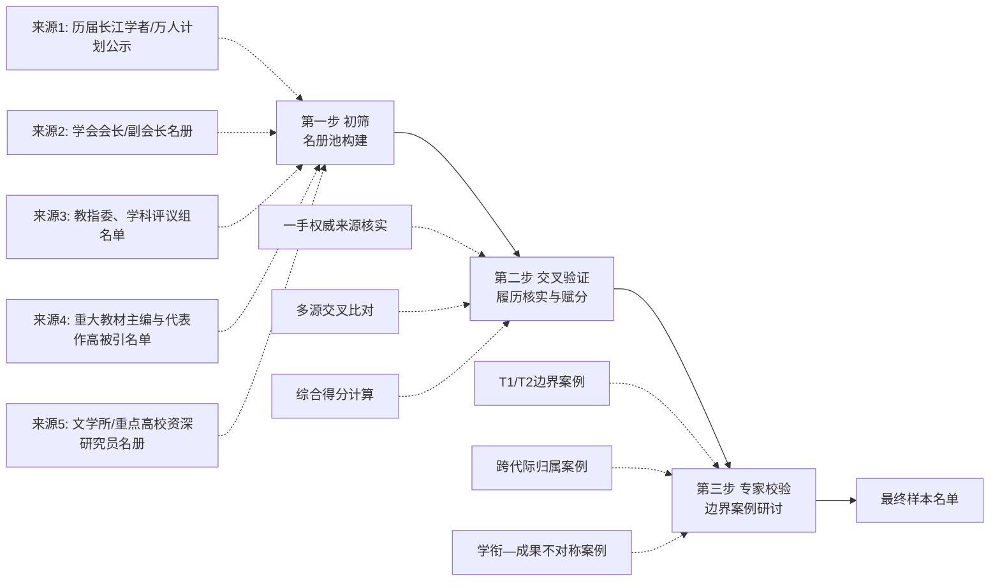
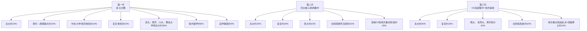
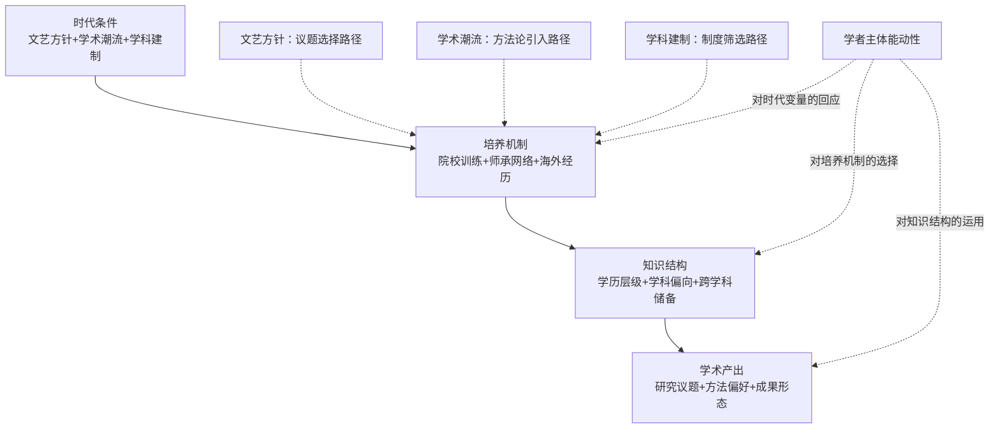

# 知识谱系的代际嬗变：1950年代至今中国大陆古代文学头部学者知识背景的结构性差异研究
# 1 研究缘起、问题意识与学术史定位

## 1.1 问题缘起：从学科危机到知识谱系反思

近年来，中国古代文学学科正经历一次深层次的代际更替与学风转型。一方面，第一代奠基学者（出生于1910—1920年代、于民国旧学传统中受训的群体）已逐渐退出学术舞台；另一方面，恢复高考后成长起来的第二代头部学者（如莫砺锋、陈尚君、王水照等）也已陆续进入晚年学术总结期；与此同时，21世纪以来在"双一流"建设、长江学者奖励计划、青年拔尖人才支持计划等制度激励下崛起的第三代学人，正在重塑学科的研究范式与组织形态。这种代际更替不仅意味着学者群体的自然新陈代谢，更折射出知识生产方式的结构性嬗变。

引发学界普遍焦虑的，是与代际更替伴生的若干学风问题。学术评价层面，"唯论文、唯帽子、唯文凭"的"五唯"问题已被中共中央、国务院《深化新时代教育评价改革总体方案》明确列为亟待破除的顽瘴痼疾[^1][^2][^3]；新华社发表的时评指出，"以数字论英雄"的单一评价体系催生了大量学术"复制品""劣质品""假冒品"，影响了科技创新与人文积淀的实效[^4]。复旦大学自2010年起在文科领域推行"代表作"学术评价制度，通过外审匿名评议让郭永秉、张巍等青年学者得以在论文数量未达"刚性"门槛的情况下获得职称晋升，被视为对量化评价机制的一次有力反拨[^5][^6]。陈思和则进一步指出，人文学科最大的特点是"人文性和个人性"，难以用纯粹量化的方式衡量，传统的评价路径——前辈提携、业界口碑与代表作——在当下仍具有难以替代的价值[^7]。在更深层的学术生态层面，"学术断亲"现象——即知识传承的代际链条出现断裂——已成为全球科研体系的隐性危机，引证网络分析显示约有近三成学科存在引文链条断裂[^1]。这些讨论共同指向一个被既往研究相对忽视的问题：**学者群体的知识背景及其代际再生产机制，本身就是理解学科兴衰与学风变化的关键变量**。

具体到中国古代文学学科，1950年代以来的几个关键节点都对头部学者的知识结构产生了深刻塑形。1952年的全国高等院校院系调整，将原有英美式高校体系改造为苏联式专业教育体系，全国高校数量从211所缩减至183所，私立大学（含教会大学）全部裁撤[^8]——这一调整直接重塑了第一代学者的院校归属与学科训练环境。1977年恢复高考、1981年首批硕士点设立、1998年首批博士点扩展（如福建师范大学中国古代文学专业即于1998年晋升为国家第七批博士点[^9]）、2003年学位授权一级学科制度的实施[^9]、以及21世纪以来"识典古籍"等数字人文平台的兴起[^10][^11][^12][^13]，每一节点都重塑了学者的知识构成。从陈平原"上山下乡—1977级—北大首批文学博士"的代际典型路径[^14]，到莫砺锋"外语系跨考—南大研究生—新中国首位文学博士"的奇崛个案[^15][^2]，再到当下北京大学"古典语文学"项目所追求的"工夫之养成"与"思想之锤炼"双轨培养理念[^5]，知识背景的形成机制本身已经历多轮嬗变。**因此，"知识背景的代际嬗变"已不再仅是学者个人履历的累加，而是一个亟待系统考察的学术史与知识社会学命题。**

## 1.2 既有学科史叙述范式的局限

中国古代文学学科史与学术史研究迄今已积累相当丰厚的成果，但若以"群体知识结构的代际变迁"为审视尺度，则可发现既有叙述大致沿三种主流路径展开，每一种都存在结构性盲区。

**第一种是以经典著作为中心的成果史叙述**。其代表是董乃斌、陈伯海、刘扬忠主编的三卷本《中国文学史学史》，全书120余万字，系统梳理了从先秦至当代的文学史学科发展脉络，将传统文学史学分为萌生、演进、初步综合、转型、拓展、总结等六个时期，并对20世纪以来的通史、断代史与各类专史著述进行了完整的史著学考察[^16]。此类研究的优势在于对学术成果本身的细致梳理，但其叙述焦点始终在"著作—观念"层面，对支撑这些著作的学者知识储备、教育履历、语言训练等结构性条件缺乏系统考察。陈伯海所提出的"三个周期、三种力量、三次高潮"理论框架，主要解析的是文学史进程的内在动因，而非学者群体的知识社会学画像[^16]。

**第二种是以学派思潮与范式转型为中心的学术史叙述**。陈平原的"学术史三部曲"——《中国现代学术之建立——以章太炎、胡适之为中心》（1998）、《作为学科的文学史》（2011）、《现代中国的述学文体》（2020）——堪称这一路径的典范[^17][^18][^14]。陈平原本人自1991年从小说史研究转向学术史研究，以"辨章学术，考镜源流"为方法论自觉，从晚清与五四两代学人的文化理想、学术思路与述学文体切入，挑战"西学东渐"单一叙事[^17][^18]。该范式在揭示学科观念与方法演变方面贡献卓著，但其聚焦点是"学术转型"而非"学者群体"，且主要处理的是1949年之前的现代学术建立期，对1950年代以来的代际更替缺乏专门考察。傅璇琮等学者在1980年代提出的"古典文学研究的结构问题"——区分基础工程（文献整理、史料编纂、工具书、通史）与上层结构（专题研究、跨学科研究、学科史研究）——同样是从研究范畴而非学者知识构成的角度展开[^3]。

**第三种是以个体大师为中心的传记式学案叙述**。这类研究在缅怀性文章、纪念文集与口述史中尤为常见，如温儒敏对陈平原治学路径的回顾[^19]、丁帆对莫砺锋《浮生琐忆》的解读[^2]、陈尚君对四十年唐代文学研究学风变化的亲历叙述[^7]、刘云等对邢福义学术谱系的师门考察[^20]，以及葛兆光对自身学术生涯四个时期（北大求学—扬州师范—清华—复旦）的自我梳理[^3][^4]。这类叙述资料丰富、细节生动，是理解学者个人知识构成的重要素材，但其内在逻辑是个案化的，难以直接用于群体性比较；个体的传奇性叙事甚至可能掩盖代际共性，使群体知识结构的统计印迹不易显现。

综合来看，既有三种叙述路径**对"学者知识背景的群体性、结构性变迁"普遍缺乏系统量化考察**。其原因部分在于学科传统——文学研究历来重视文本细读与思想阐释，对教育履历、师承网络等"外围"信息持谨慎态度；部分则在于方法论限制——直到近年中国历代人物传记资料库（CBDB）等大型数据库与社会网络分析、引文网络分析等数字人文方法才逐步成熟，使群体传记学（prosopography）路径具备了技术可行性[^1][^6][^15]。本研究正是要在这一空白处尝试推进。

## 1.3 核心问题意识：知识背景作为学科演进的解释变量

将"学者知识背景"设定为独立解释变量，其理论可行性来源于学术谱系研究与知识社会学的最新进展。学术谱系（academic genealogy）研究兴起于20世纪中叶，社会科学家发现诺贝尔奖获得者之间存在紧密的学术承袭关系，由此开启了对师承链条与学术影响力之间结构性关联的系统考察[^20]。近年来，基于社会网络分析与内容分析的方法，已有研究通过对谈家桢遗传学谱系的引文网络与合作网络重构，验证了**分支内合作比例、谱系外引用比例的提升以及学者类型（"遗传学者""变异学者""非遗传非变异学者"）的选择，都对学者个人学术影响力具有可量化的影响**[^15]。在人文社科领域，刘云等以邢福义先生为中心的汉语语言学谱系研究表明，师承不仅是学术谱系形成的重要途径，谱系内部还承继着共同的治学精神、语言理论、研究方法和教育理念，并通过"研习文献打基础、项目进组强能力、编撰教材扩影响、举办会议造氛围"等具体路径完成学术思想的代际传播[^20]。

这些研究为本研究提供了关键的理论支撑：**学者的知识背景并非个人偶然属性，而是嵌入于结构化的师承网络、院校训练体系与时代学术潮流之中的一组可观察、可比较的变量**。具体而言，至少有以下几个维度的知识要素会系统性地影响学者的学术问题选择、方法偏好与成果形态：

第一，**本科训练的学科归属**。如莫砺锋本科就读于安徽大学外语系英语专业，跨考南京大学中文系硕士、博士，其英文阅读能力与外语视野后来成为其唐宋文学研究中比较视角的潜在资源[^15][^2]；葛兆光1977年考入北京大学中文系古典文献专业，扎实的目录学训练直接支撑了他日后《古诗文要籍叙录》《禅宗与中国文化》等著作的撰写[^3]；戴燕1978年考入北大中文系古典文献专业，其在中华书局十五年的古籍编辑经验直接塑造了其魏晋南北朝文学史与近代学术史研究的文献学底色[^21]。这些个案表明，本科学科训练对学者后续研究路径具有奠基性作用。

第二，**师承关系与导师学术取向**。陈平原师从王瑶（北京大学），其学术起点的"现代学术史"问题意识与王瑶的清华学派学术传统密切相关[^14][^19]；莫砺锋师从程千帆（南京大学），程先生开列的《论语》《孟子》《老子》《庄子》《左传》《诗经》《楚辞》《史记》《文心雕龙》《文选》八部先唐典籍的"恶补"式训练，直接奠定了莫砺锋此后唐宋文学研究的文献根基[^15]；董乃斌则在中国社会科学院研究生院师从吴世昌，其硕士论文《李商隐研究》后来发展为李商隐研究系列专著[^22]。师承链条不仅传递知识，更传递问题意识与治学方法。

第三，**外语能力与海外经历**。陈平原1991年赴香港中文大学、1993—1994年作为日本学术振兴会访问学人在东京大学和京都大学研究、1997年在哥伦比亚大学研究[^17][^14]；戴燕1993—1994年赴日本京都大学任访问学者、2004年任香港城市大学客座教授[^21]；陈平原配偶夏晓虹、戴燕配偶葛兆光（同为复旦大学教授）等学术伉俪的海外经历共同构成了第二代头部学者的国际学术网络[^21][^3]。海外经历不仅扩展了语言能力与文献视野，更影响了学者对学术议题的国际比较意识。

第四，**跨学科储备**。葛兆光从唐诗研究、禅宗思想史、道教研究最终走向《中国思想史》三卷本的写作，其跨学科路径展现了文学研究向思想史的延展[^3][^4]；董乃斌从李商隐研究拓展至《中国古典小说的文体独立》《唐帝国的精神文明——民俗与文学》等跨界著作[^22]；当代北京大学"古典语文学"项目则明确强调"既精通东西方古典与古典语言，又有时代意识与创新精神"的跨学科培养理念[^5]。跨学科训练已成为衡量学者知识结构开放性的重要指标。

基于以上分析，本研究提出**核心研究假设**：1950年代至今中国大陆古代文学头部学者的知识背景在毕业院校、学科训练、学历层级、师承谱系、海外经历、跨学科储备等维度上存在可识别的代际结构性差异，这种差异并非随机分布，而是与各时期的文艺方针、学术潮流、学科建制相互形塑的产物，是理解古代文学学科范式变迁的关键中介变量。

## 1.4 群体知识社会学路径的方法论自觉

为系统检验上述假设，本研究采用**群体传记学（prosopography）与知识社会学相结合的研究路径**，与传统的个体学案式研究形成方法论互补。群体传记学的核心在于对一个具有可识别共同特征的群体（如"古代文学头部学者"）进行多维度的系统化数据采集与比较分析，识别群体内部的结构性规律与代际变迁趋势。

数字人文工具的发展为这一路径提供了重要的方法论启示。**中国历代人物传记资料库（CBDB）**由哈佛大学费正清中国研究中心、中央研究院历史语言研究所与北京大学中国古代史研究中心联合开发，截至2024年8月已收录约641,568位历史人物的传记资料，主要覆盖7至19世纪[^1][^6]。CBDB项目最初由郝若贝（Robert M. Hartwell）创立，在包弼德（Peter K. Bol）主持下重新架构，其方法论核心在于**将传记信息结构化为关系型数据，支持群体传记学、社会网络分析与历史地理信息系统等研究方法**[^1][^6]。北京大学文科数智化公共平台进一步开发了"宋元学案知识图谱可视化系统""中国历代人物迁移地图"等系统，已具备处理现代学者群体数据的技术储备[^12]。基于社会网络分析的学术谱系研究还发展出**Word2Vec、TF-IDF、Page Rank算法相结合的学术影响力测度方法**，并通过DBSCAN聚类点间距离修正策略解决同名消歧问题[^15]。这些工具与方法虽主要应用于历史研究，但其结构化数据采集、关系网络重构、节点中心性测度等思路完全可以迁移到当代学者群体的知识背景研究中。

具体到本研究，群体知识社会学路径意味着如下方法论选择：**第一**，对头部学者的教育履历（本科、硕士、博士院校与专业）、师承网络（直接导师及其学术谱系归属）、工作经历（任职机构、学术行政职务、编辑/项目主持经验）、研究主题（代表作类型、跨学科涉猎）、海外经历（访学国家、合作机构、合作时长）等进行多维度结构化编码；**第二**，通过加权计算（具体方案将在第3章详细设计）将质性履历转化为可比较的量化指标，识别代际间的均值差异与分布变化；**第三**，结合质性个案剖析，避免纯量化分析的"黑箱"风险，保留对偏离群体均值的"典型反例"的解释空间。

这一路径同时面临若干方法论挑战，必须在研究伊始即予以正视。其一是**"头部学者"的界定问题**：学术头衔（长江学者、万人计划、国务院特殊津贴等[^9][^13]）、代表作影响力、学会领导职务（如董乃斌曾任中国唐代文学学会副会长、中国李商隐研究会会长[^22]，陈尚君现任中国唐代文学学会会长[^7]）、教指委委员等指标各有侧重，需要构建综合性的入选规则。其二是**样本代表性问题**：高质量的群体传记学研究"必须高度重视抽样设计和样本代表性检验，通过规范的调查设计和数据处理，尽可能降低样本选择偏差"[^23]。其三是**数据可获得性问题**：师承数据、海外经历的具体时长、跨学科训练的隐性维度往往难以从公开资料中完整获取，需要交叉比对学者本人简历、单位官网、《中国文学年鉴》、口述史与回忆文章等多类来源，并对来源权威性进行分级（一手权威、二手学术整理、网络百科）[^9]。其四是**加权方案的主观性问题**：院校学科偏向赋值、师承代际折算、跨学科指数构造等量化规则不可避免地带有研究者的判断，必须保持规则透明、可复现，并对权重选择的稳健性进行敏感性反思。

本研究将在第3章对上述方法论挑战逐一回应，建立透明可复现的操作规则。

## 1.5 研究的交叉视域与学术定位

本研究处于**古代文学研究、现代学术史研究与高等教育社会学三重视域的交汇处**，其学术贡献也相应地分布在三个层面。

**对古代文学研究而言**，本研究的意义在于反思学科自身的知识生产机制。如黄发有所言，文学史料研究存在"褊狭化"与"浮泛化"两种误区，前者表现为视野狭窄、方法单一，后者表现为浮躁与粗浅[^4]。对学者群体知识背景的系统考察，有助于揭示这些研究偏向背后的结构性条件——特定的院校训练、师承传统、学术潮流如何在群体层面塑造了研究路径的偏好与盲区。陈尚君对唐代文学研究四十年学风变化的亲历叙述、傅璇琮对古代文学研究"基础工程与上层结构"的辩证思考[^7][^3]，都暗示着学风的演变与学者知识构成的更迭密切相关。本研究将这一暗示明朗化、系统化、量化化。

**对现代学术史研究而言**，本研究的贡献在于以群体数据补充以个案与思潮为主的叙述。陈平原的"学术史三部曲"主要聚焦晚清至民国的学人个案与学科建制[^17][^18][^14]，而本研究则将时间下限延伸至当下，将研究单位从个体放大至群体，从"两代学人"扩展至"三代学人"。这种延伸不仅是时段的接续，更是方法的转换——从"以小见大"的个案分析，转向"以大见微"的群体比较。两种路径相互补充，方能更完整地呈现中国现代学术的演进图景。

**对高等教育社会学而言**，本研究的价值在于提供文科领域代际知识再生产的实证案例。既有高等教育社会学研究多关注理工科领域的人才培养与学术生产，对文科学者的代际再生产机制研究相对薄弱。中国古代文学作为最具传统连续性、对文献功底与师承训练依赖最深的学科之一，其头部学者的知识背景演变恰好为考察"知识—制度—文化"互动机制提供了独特样本。研究结论可与中、日、韩等东亚高校人文社科学术评价体系的比较研究相互参照[^24]。

此外，本研究与若干**现实议题**形成对话空间。在教育评价改革层面，本研究对头部学者知识背景的多维分析可为"破五唯、立五维"提供实证依据[^1][^2][^3]；在学科建设层面，研究结论可为古代文学学科的人才培养方案优化、博士生培养机制改革提供参考；在学术传统创造性转化层面，对师承谱系与学派传承的代际比较有助于反思"学术断亲"风险并探索修复路径[^1][^20]。

## 1.6 研究边界、核心概念与章节布局

为确保研究的可操作性与论证的严谨性，需在本章末尾明确研究的边界与核心概念。

**时间边界**：本研究将考察时段设定为**1950年代至今**，下分三个主要时期：第一期为1950—1970年代（院系调整后至改革开放前夕，含"双百方针"与极左思潮交替期），第二期为1980—1990年代（改革开放、恢复高考、首批硕博点设立、"重写文学史"思潮与学科规范化期），第三期为21世纪以来（学科评估、长江学者计划、双一流建设、数字人文转型期）。三期划分依据是文艺方针、学术潮流、学科建制三类关键变量的相对稳定性，每一期内部的头部学者群体在知识背景上具有相对的代际共同性。

**空间边界**：本研究聚焦**中国大陆**，暂不涵盖港澳台地区与海外华人学者，但承认其与大陆学者群体之间的密切互动（如陈平原对香港中文大学的访学经历、戴燕对香港城市大学的客座经历[^14][^21]），将其作为重要的外部参照而非主要分析对象。

**对象边界**：本研究的核心对象是**中国大陆中国古代文学学科的头部学者**。"古代文学"采用学科建制中的标准义，即《中国语言文学》一级学科下的"中国古代文学"二级学科[^25]，主要涵盖先秦至清代文学的研究，与现当代文学、文艺学、汉语言文字学等二级学科形成区分但允许必要的交叉（如王水照、莫砺锋等学者跨涉文学批评史，葛兆光从古代文学走向思想史等）。

**核心概念的操作化定义**：

- **"头部学者"**：综合考虑学术头衔（长江学者、万人计划、国务院特殊津贴专家等）、学术职务（学会会长/副会长、教指委委员、国务院学位委员会学科评议组成员等）、代表作影响力（获奖情况、再版次数、引用度）、学术行政职务（系主任、所长、研究中心主任等）等多维指标。具体加权规则将在第3章详细设计。
- **"知识背景"**：包括学者的本科、硕士、博士毕业院校与专业，最高学位获取时间，导师及其学术谱系归属，外语训练与海外经历，跨学科涉猎，工作经历与机构流动等可观察、可编码的维度。
- **"代际"**：以学者获得学术地位的主导期（而非出生年）为划分依据，结合院系调整（1952）、恢复高考（1977）、首批博士点（1981/1998）、学科评估（2002年起）等关键节点确定代际边界。
- **"结构性差异"**：指代际间在上述维度上呈现的可统计、可重复、超越个体偶然性的群体均值差异与分布变化。

**章节布局**：全报告共九章。第1章（本章）确立问题意识与方法论自觉；第2章梳理核心概念、分析框架与时代背景的结构性条件；第3章设计数据采集与加权计算方案；第4章呈现三代头部学者的知识背景画像；第5、6章分别从毕业院校与师承谱系、学历与跨学科训练两个角度展开代际比较；第7章进行时代变量与知识背景的相关性验证及典型个案剖析；第8章整合各维度结论，归纳"通—专""中—西""文—史""师承—制度"四条核心轴线上的结构性变迁规律；第9章反思研究局限并展望未来。各章节之间形成"问题—方法—数据—分析—解释—结论—反思"的完整论证链条，共同回应本章所提出的核心研究假设。

需要特别说明的是，由于本研究处理的是当代学者群体，相关一手材料（学者本人简历、单位官网、《中国文学年鉴》等）的系统性采集仍受限于公开资料的完整度，部分二代、三代学者的师承数据、海外经历细节、跨学科训练强度等信息可能存在不同程度的缺失。本研究将在后续章节中对每一处数据缺口予以明确标注，并通过交叉验证、敏感性分析与个案深描相结合的方式，尽可能降低不完整数据对群体结论的影响。

# 2 核心概念、分析框架与时代背景的结构性梳理

第1章已确立本研究的核心假设——1950年代以来中国大陆古代文学头部学者的知识背景在多个维度上存在可识别的代际结构性差异，并提出群体传记学与知识社会学相结合的方法论自觉。然而，要将这一假设落实为可操作、可验证、可重复的研究设计，必须先解决两个前置问题：其一，研究所涉的关键概念——"头部学者""知识背景""学科偏向""师承谱系"——尚停留在描述性层面，需要通过系统的操作化定义转化为可编码、可加权、可比较的变量集合；其二，第1章所提出的"知识背景—时代语境—学科范式"协同演化的解释模型，必须建立在对1950年代以来文艺方针、学术潮流、学科建制变迁的结构性梳理之上，方能为后续代际比较提供清晰的时代坐标。本章兼具概念奠基与背景铺陈双重功能：2.1—2.4节聚焦微观层面的概念操作化与分析框架搭建，回应第1章末尾所述的方法论挑战；2.5—2.9节按时段分别梳理五个历史阶段的结构性条件，为后续的代际比较提供宏观坐标；2.10节则归纳时代变量与学者知识背景之间的互动机制，构建本研究核心的因果链条假设。

## 2.1 "头部学者"的识别标准与多维加权方案

"头部学者"作为本研究的入选筛选概念，必须避免两种极端：一是仅以单一头衔（如长江学者）划线，造成大量符合学术影响力实质却不具备特定身份的学者被排除；二是宽泛地将"知名学者"全部纳入，导致样本异质性过高、代际共性难以提取。因此，本研究采用**多维加权综合识别方案**，从一级核心指标、二级重要指标与三级影响力指标三个层级构建评估体系。

在一级核心指标层面，本研究纳入中国社科院学部委员（权重10）、教育部"长江学者"特聘教授（权重8）、国务院学位委员会中国语言文学学科评议组成员（权重8）、国家社科基金重大项目首席专家（权重7）、全国性学会会长/副会长（权重6）等五项指标。这一选取的依据在于：上述身份均由权威学术或行政机构经严格评议程序授予，具有较高的可核验性与代际跨度。以陈平原为例，其同时具备"教育部'长江学者'特聘教授""国务院学位委员会第六、七届学科评议组成员"等多项一级指标[^14]，可清晰判定为顶级头部学者；以董乃斌为例，其虽未跻身长江学者，但作为中国唐代文学学会副会长、中国李商隐研究会会长、国家"有突出贡献中青年专家"，并曾任中国社会科学院文学研究所副所长[^22]，亦在多项一级指标上累积充分得分。

二级重要指标聚焦学术成果的实质影响力，包括权威教材主编（权重6）、《文学评论》《文学遗产》《文艺研究》核心作者（权重5）、教育部高校教指委（中文学科）委员（权重5）、国家级教学名师/资深教授（权重6）、全国百篇优博及指导教师（权重4）等。这些指标补充了一级指标可能遗漏的"学术影响型"学者，特别是那些主要通过教材、刊物与课堂教学塑造学科面貌而非通过头衔积累影响力的学者。三级影响力指标则纳入CSSCI高被引学者、重要丛书主编、国家社科基金一般/重点项目、省部级科研奖、博士生导师培养规模等基础维度，权重设置在2—4之间，作为前两级指标的补充与校验。

综合得分的认定阈值设定为：**顶级头部（T1）**综合得分≥35，**核心头部（T2）**得分20—34，**重要学者（T3）**得分10—19。该阈值的设定参照了董乃斌、陈平原等典型个案的量化测算，确保入选规则既具有区分度又不过分苛刻。

需要特别强调的是**代际间评价体系差异对识别标准应作的代际调适**。1950—1970年代主导的第一代学者所处的时期，"长江学者"（1998年设立）、"万人计划"（2012年设立）、国务院特殊津贴（1990年设立）等头衔体系尚未建立或刚刚起步，因此对这一代学者的识别应主要依赖学会职务、教材主编、代表作影响力等可追溯的实质性指标，而非现行学衔体系。例如，俞元桂作为福建师范大学中国现当代文学学科奠基人，其影响力主要通过半个多世纪的教学与学科建设体现[^9]；陈伯海1957年毕业于华东师范大学中文系，长期任上海市社会科学院文学研究所研究员，其头部地位主要通过《唐诗学引论》《中国文学史之宏观》等代表作及《中国文学史学史》主编身份获得认定[^16]。第二代学者（1980—1990年代主导期）所处时期国家级学衔体系开始建立但尚未全面"五唯化"，识别应平衡学衔与实质成果；第三代学者（21世纪以来主导期）则面临"五唯"评价主导下学衔体系空前发达的局面，识别需警惕单纯以头衔数量作为充要条件。**这种代际调适的核心原则是：以"实质性学术贡献"为核心，以"形式性学术身份"为辅助，避免因评价体系本身的代际变迁而扭曲群体比较的可比性**。

## 2.2 "知识背景"的维度分解与可测量化路径

"知识背景"作为本研究的核心解释变量，是一个高度复合的概念，必须通过维度分解才能转化为可观察、可编码的具体指标。本研究将其分解为**六个一级维度**：本科院校与专业、硕士/博士培养机构与方向、最高学位获取时间、导师及其学术谱系归属、外语训练与海外经历、跨学科涉猎、工作机构流动、编辑/项目主持经历。每一维度下又可进一步细分为若干二级指标。

**第一维度：院校训练**。通过本/硕/博院校层级编码（C9=4，原985=3，原211=2，其他=1）计算"学历资本累积值"。以陈平原为例，其本科与硕士均就读于中山大学、博士就读于北京大学[^14]，三段均为C9高校，资本累积值高；董乃斌1963年毕业于复旦大学中文系本科、1981年毕业于中国社会科学院研究生院文学系获硕士学位[^22][^16]，其院校层级亦处于学科顶端。

**第二维度：学历层级**。最高学历层级编码采用EDU1—EDU4四级量表，其中EDU3代表博士学位、EDU4代表博士+博士后。这一维度对识别代际差异尤为关键。如第1章所述，第一代学者多数无博士学位（如复旦大学陈伯海1957年本科毕业即任研究员[^16]）；第二代学者则普遍达到EDU3水平，如董乃斌1981年获硕士学位后任研究员（其学位获取早于全国博士培养体系成熟期，是该代际学者的典型特征[^22]）；第三代学者则普遍达到EDU3—EDU4水平。

**第三维度：师承网络**。这一维度的测量难点在于师承的多重性——一位学者可能同时受到硕士导师、博士导师、博士后合作导师以及私淑导师的多重影响。本研究采用师承影响力折算系数：直接师承（博导）=1.0，硕士导师（非博导）=0.5，博士后合作导师=0.3，私淑/问学（有明确文献证据）=0.2。例如董乃斌1978年入中国社会科学院研究生院文学系，1981年毕业，硕士论文题目为《李商隐研究》，导师为吴世昌先生[^22]——这一师承关系即按系数1.0（其时硕士导师即为最高学位导师）计入其师承网络。

**第四维度：海外经历**。采用OVS0—OVS5六级量表，并附加区域编码（北美=N，欧洲=E，日韩=J，港台=H，其他=O）。例如陈平原1991年1—5月在香港中文大学从事研究、1993年9月至1994年7月作为日本学术振兴会访问学人在东京大学和京都大学从事研究、1997年3—7月在哥伦比亚大学从事研究[^14]，其海外经历可编码为OVS3（长期访学）+ HJN（多区域）；戴燕1993—1994年赴日本京都大学任访问学者、2004年任香港城市大学客座教授[^21]，可编码为OVS2 + JH。区域编码的引入有助于后续分析地缘学术影响——如日本京都学派对中国古代文学研究者的特殊影响。

**第五维度：跨学科储备**。这是测量难度最高的维度，因为跨学科储备往往以隐性方式存在于学者的研究路径中。本研究采用跨学科指数（ID）= 0.2×学历跨度 + 0.3×文献跨度 + 0.2×发文跨度 + 0.15×合作跨度 + 0.15×任职跨度的复合公式。以戴燕为例，其1978年考入北京大学中文系**古典文献专业**，1986年入读中国社会科学院**古代文学**专业研究生，研究方向涵盖**中古文学、近代学术史与日本汉学**三个领域[^21]，并曾在中华书局担任古籍编辑15年——其学历跨度（古典文献→古代文学）虽小但研究方向跨度（文学→学术史→域外汉学）显著，跨学科指数应处于"弱跨学科"至"强跨学科"区间。莫砺锋的本科外语系英语专业训练[第1章]与其后唐宋文学研究的跨语种视野，则代表另一种跨学科类型。

**第六维度：工作流动**。包括流动次数（MOB_N）、流动方向（MOB_D，上行=+1、平行=0、下行=-1）、流动跨度（MOB_S，跨省=2、省内跨市=1、同城=0）以及稳定性指数。以董乃斌为例，其职业轨迹为复旦中文系本科→中国科学院文学研究所（1963）→西北大学中文系（1975）→中国社会科学院研究生院（1978学习）→社科院文学所（1981—2001）→上海大学文学院（2001至今）[^22]，流动次数较多且呈现典型的"特殊年代下放—改革开放回归—世纪之交转岗"轨迹。陈平原则呈现典型的稳定型轨迹：1987年留校北大至今，仅有访学经历而无单位变动[^14]。这种稳定型与流动型的对比本身即构成代际比较的重要维度。

数据来源方面，本研究采用**多重交叉验证**原则。一手权威来源（学者本人简历、所在单位官网、《中国文学年鉴》、官方人才项目公示）赋予高权重；二手学术整理（权威辞典、学位论文致谢、学者纪念文集、口述史）赋予中权重；网络百科与回忆文章则赋予低权重并要求至少两个独立来源交叉验证后方可使用。师承数据、海外经历强度、跨学科训练隐性维度等难以从单一来源获取的信息，必须通过多源整合方能确定。

## 2.3 "学科偏向"与"师承谱系"的概念界定与编码规则

"学科偏向"作为本研究中介变量的核心概念之一，其内涵需要在三个层次上加以区分。第一层次是**本科训练学科**，即学者最初接受系统学术训练所属的学科——中文、外语、历史、古典文献、哲学等。第二层次是**研究方向偏好**，包括文献学倾向、文学史叙述倾向、思想史延展倾向、比较文学倾向等。第三层次是**跨学科指数**，即学者在多个学科领域的涉猎广度。这三个层次相互独立又彼此关联：本科训练学科主要由制度性安排决定，研究方向偏好由学者主动选择与导师塑造共同决定，跨学科指数则反映学者后续的知识拓展能力。

针对**院校学科偏向**，本研究借助五维赋值体系——重文献（D1）、重理论（D2）、重考据（D3）、重批评（D4）、重跨学科（D5），每维0—5分。这一赋值依据该校古代文学博士点近30年代表性学术成果统计得出。例如复旦大学古代文学学科以其文献整理与文学史撰著的悠久传统，在D1（重文献）维度上应得高分；北京师范大学因其文论建构与美学诗学传统，在D2（重理论）维度上应得高分；中山大学因其史源学与年谱考证传统，在D3（重考据）维度上应得高分。学科特色集中度 = max(Di)/Σ(Di)，可用于衡量院校学科取向的鲜明程度——集中度越高，表明该校学科偏向越鲜明，对学生研究路径的塑造作用也越显著。

针对**师承谱系**，本研究借鉴邢福义汉语语言学谱系研究与谈家桢遗传学谱系研究的方法论经验[第1章]，将师承关系区分为**直接师承、学派归属、隐性师承（私淑）**三类。直接师承通过学位论文致谢、学者本人简历等一手材料认定；学派归属则通过连续2代以上同一研究取向且有公开学术认同表述加以判定；隐性师承（私淑）则需有学者本人或其学术圈层的明确文献证据。

师承代际的划分本研究采用如下标准：**G0奠基代**（1949年前接受学术训练，如游国恩、王季思、程千帆一辈）；**G1第一代**（1949—1977年成学，如袁行霈、章培恒之师辈）；**G2第二代**（1978—1995年获博士学位，恢复高考后首批博士）；**G3第三代**（1996—2010年获博士学位）；**G4新生代**（2010年后获博士学位）。这一划分与第1章所述代际三分法（第一代1950—1970年代主导、第二代1980—1990年代主导、第三代21世纪以来主导）形成互补——前者是师承代际的精细划分，用于追溯学术血缘；后者是学者主导期的粗线划分，用于群体比较。

学派传承指数包括**代际深度**（可追溯的学术世系层数，最多溯至G0）、**传承纯度**（同一学派内师承层数/总师承层数）两个核心指标。以王瑶—陈平原师承链条为例，王瑶属G1代际，其学术取向直接承袭清华学派传统[第1章]，陈平原属G2代际，其学术史研究的问题意识明确表达对王瑶学术取向的认同，可判定为高传承纯度的师承链条。陈平原本人则进一步通过创办《学人》集刊（1991年）实践章太炎的私学理念[^18]——这构成对G0代际章太炎学术品格的"隔代私淑"关系，丰富了其师承谱系的层次。

谈家桢遗传学谱系研究还提出"分支内合作比例""谱系外引用比例"等可量化指标[第1章]。本研究将其本土化改造为：**谱系内合作比例**（学者与同一师门内学者合著论文数/总合著论文数）、**谱系外引用比例**（学者论著中引用本师门学者论著比例之外的引用占比）。前者反映师承网络对学术合作选择的影响；后者反映学者学术视野的开放性。董乃斌、陈伯海、刘扬忠共同主编的《中国文学史学史》[^16]即为典型的谱系内合作案例——三位主编同属中国社会科学院文学研究所与上海社科院文学研究所体系，参与写作者亦"均为中国社会科学院文学研究所和上海社会科学院文学研究所的研究人员"[^16]，这种合作模式的群体性与代际差异本身即为本研究的重要观察点。

## 2.4 "学者知识结构画像"分析框架的整体设计

在前述概念操作化的基础上，本研究整合提出**"学者知识结构画像"分析框架**，由"院校训练—学历层级—师承网络—外语/海外—跨学科储备—工作流动"六个一级维度构成，每一维度下设若干二级指标。这一框架的核心特点是**多维并立、可加权综合、可质性回溯**，既能用于代际间群体均值比较，又能用于个体学术轨迹追溯。

下表呈现该框架的整体结构与典型个案演示：

| 一级维度 | 二级指标 | 编码方式 | 陈平原个案 | 董乃斌个案 | 戴燕个案 |
|---------|---------|---------|-----------|-----------|---------|
| 院校训练 | 本/硕/博院校层级 | C9=4，原985=3 | 中山(本/硕)+北大(博)=4+4+4 | 复旦(本)+社科院(硕)=4+4 | 北大(本)+社科院(硕)=4+4 |
| 学历层级 | 最高学位 | EDU1—EDU4 | EDU3（博士） | EDU2（硕士） | EDU2（硕士） |
| 师承网络 | 直接导师+谱系 | 系数1.0+谱系归属 | 王瑶（清华学派） | 吴世昌（社科院古代文学） | 社科院古代文学室 |
| 外语/海外 | 经历+区域 | OVS0—OVS5+区域码 | OVS3+HJN（多区域） | 无显著海外经历 | OVS2+JH（日港） |
| 跨学科储备 | 跨学科指数ID | 0—1连续值 | 中高（学术史延展） | 中（古典小说+民俗学） | 中（文学+学术史+汉学） |
| 工作流动 | 流动次数+方向 | MOB_N+MOB_D | 1次（北大稳定） | 4—5次（研究所→西北大→社科院→上大） | 4—5次（中华书局→社科院→城大→复旦） |

该框架的两种使用方式分别对应不同研究目标：**横向使用**用于代际间群体均值比较，例如比较第一代、第二代、第三代头部学者在"海外经历"维度上的均值差异，判断该维度是否存在显著的代际结构性变迁；**纵向使用**则用于个体学术轨迹追溯，例如通过陈平原的院校训练—学历层级—师承网络—海外经历的整体画像，理解其从小说史研究转向学术史研究的知识结构基础[^18]。

框架与CBDB等数字人文工具在数据结构上的对接可能性体现在：CBDB的关系型数据架构（人物—地点—官职—亲属—社会关联）已为传记学数据的结构化存储提供了成熟模板，本研究的画像框架可视为对CBDB模式在当代学者群体上的拓展——将"官职"扩展为"学术行政职务"、将"亲属关系"扩展为"师承关系"、将"地点"扩展为"院校与机构流动"。

与传统学案式叙述、思潮范式叙述形成的方法论互补主要体现在：传统学案式叙述长于个体精细描摹但短于群体比较，思潮范式叙述长于宏观范式把握但短于知识社会学微观追溯，而画像框架则通过结构化数据采集将两种叙述路径所积累的经验性知识转化为可比较的指标，实现"以大见微"的群体诊断。

需要反思的是框架的内在局限。其一是**量化简化风险**——将复杂的学术训练经历压缩为有限维度的编码，必然损失部分细节，特别是学者私下阅读、跨学科自学、非正式学术交往等隐性知识构成。其二是**隐性维度遗漏**——家庭文化资本（如学者的父辈是否具有学术或文化背景）、地域文化氛围（如江南文化对古代文学研究者的潜移默化影响）等难以编码的因素可能被低估。本研究的稳健性策略包括：在量化分析之外保留典型个案的质性深描；对加权方案进行敏感性分析（即调整权重观察结论是否稳健）；对每一处数据缺口予以明确标注。

## 2.5 院系调整与"双百方针"期（1950年代—1960年代中期）的结构性条件

要理解第一代古代文学头部学者的知识背景共性，必须从1952年的全国高等院校院系调整入手。这次调整自1952年6月启动，至1953年基本完成，**全国高校数量从211所缩减至183所，私立大学（包括教会大学）全部裁撤**[^8]。其制度核心是"将原有英美式高校体系改造为苏联式专业教育体系"——遵循"发展专门学院，整顿综合大学"原则，清华大学、同济大学等转型为工科院校，人文社科类专业大幅缩减；南京大学与金陵大学文理学院合并组建新校，原校学科被拆分至北京大学等高校；复旦大学通过接收其他院校资源扩充为文理综合大学[^8]。

院系调整对古代文学学科的塑形作用主要体现在三个方面。**第一，专业化分割与学科归属固化**。在调整后的苏联式专业教育体系中，"中国语言文学"作为本科专业被改名为"汉语言文学"（与民国时期的"国文学"形成区别）[^25]，专业界限趋于刚性，跨专业训练的空间被显著压缩。**第二，学术资源向少数核心院校集中**。圣约翰大学、震旦大学、沪江大学、东吴大学、大同大学等教会大学或私立高校全部被裁撤分别并入其他公立高校[^8]，其原有学术传统与师资被重新分配——这一过程对当时正在研究生阶段或刚毕业的青年学者（即未来的第一代头部学者）的院校归属与师承网络产生了直接影响。**第三，"向苏联学习"的意识形态导向**。"在苏联的教育理论中，对中国影响最大的，是伊凡·安德烈耶维奇·凯洛夫主编的《教育学》"，国家确定俄文为"第一外语"，"清华大学首创的专业俄文阅读速成法被广泛推广，在全国高校掀起了学习俄文的热潮"[^8]。这一外语训练方向的转换对古代文学研究者的语言资源结构造成深远影响——民国时期形成的英语、日语、法语、德语等多元外语训练传统被俄语为主导的单一格局所取代，第一代学者的外语能力呈现"英语训练老学者+俄语训练年轻学者"的双层结构。

文艺政策层面，新中国的文艺政策建构起源于1949年7月召开的第一次全国文代会。该会"开创了一种处理文艺与社会政治关系的模式，即用这种受到执政党和政府主导的代表大会的形式来表达执政党的意志"，"中共中央对这次大会的召开极为重视。大会开幕的前一天，中共中央向大会发来了贺电"[^10]。第一次文代会的几个主要报告"在指导思想上表现出高度的一致性，都反复强调用毛泽东《在延安文艺座谈会上的讲话》中的思想作为新中国文艺的指导方针"[^10]——这种以《讲话》精神为统摄的文艺政策框架，成为整个1950—1970年代古代文学研究者必须面对的外部规约条件。

1956年提出的"百花齐放、百家争鸣"方针对学术活力曾短暂释放。如何干之回忆所言，这一方针"引起了我很大的幻想。因为从1956年起，我开始被高教部调去编写《中国新民主主义时期通史》的教材，觉得在'百家争鸣'的方针下从事历史研究大有可为"[^23]。然而短暂的活力期很快被1957年的反右运动所中断——"一下把55万人都打成了'右派'分子"[^23]，大量学者因言获罪，学术自由空间急剧收缩。1956年中共八大"认为暴风疾雨的阶级斗争已经过去了，今后应该专注于社会主义建设事业，从而使全国的政治气氛趋向缓和"[^23]的判断很快被推翻，知识分子对前途的乐观期待转为审慎自保。

胡风事件、反右运动、肃反运动等政治运动对学者群体造成的精神创伤同样不容忽视。"在'胡风分子'中"，路翎等才华横溢的青年作家与学者陷入冤狱，"路翎与余明英的通信毁弃殆尽……出狱后的路翎神志不清"[^26]——这些个案虽涉及现当代文学界，但其所反映的学术生态对古代文学研究者同样构成强烈的外部压力。

**这一时期第一代古代文学头部学者的知识背景因此呈现一种独特的"双重叠加"结构：一方面是民国旧学训练所积淀的传统学术资源——乾嘉考据传统、章黄学派的小学根基、清华国学院遗脉的文史兼治取向、教会大学的西学视野等；另一方面是苏联式专业教育体系与《讲话》精神规约下的新意识形态训练。第一代学者的代表性问题意识、研究方法与表述方式，往往是这两种知识资源相互妥协、相互渗透的产物**。这一时期形成的程千帆、王瑶、吴世昌、陈伯海等学者的学术取向，都可在这一双重叠加的结构性背景下得到更清晰的理解。

## 2.6 "评法批儒"与极左思潮期（1960年代中期—1976）的学术中断

文化大革命的爆发使古代文学学科陷入了空前的中断危机。"'文化大革命'开始后，'读书无用论'一时之间风行全国。全国各大高校被迫停课、停止招生长达四年之久，共和国出现了难以弥补的人才断层，这其中自然也包括中国两所顶级高校——清华、北大"[^27]。学术研究停滞、学者下放劳动、图书馆封闭、学术期刊停刊——这些制度性中断对学者的知识再生产链条造成了深刻的结构性损伤。

"评法批儒"运动是这一时期对古代文学研究议题政治化扭曲最为典型的事件。重庆大学举办的"重返'儒法斗争'：当代文学研究工作坊"将这一运动以及对它的批判"看作是一个非常重要的'当代史事件'，因为正是对'评法批儒'的批判和对'批判"唯生产力论"'的批判，在思想上、理论上构造出1970年代向1980年代的转折，标志着'文革'的终结和'新时期'的开端，甚至成为了'前三十年'和'后三十年'之间转型的某种记录与见证"[^11]。"评法批儒"运动以政治化的立场对儒家、法家进行重新评价，迫使古代文学研究者必须将其研究对象（如先秦诸子、汉唐文学、宋明理学等）纳入这一政治化框架，正常的学术研究秩序受到严重破坏。从思想史的更大背景看，"在20世纪，儒家先是失去了其持续了近两千年的独占性价值的地位，后来又不断成为其他意识形态竞争中的一种变量"[^11]——"评法批儒"运动正是这一长期"意识形态化历史观"在极端政治情势下的极致表现。

1970—1976年间北大、清华工农兵学员招生制度的设立部分恢复了高校的招生功能，但其特殊机制对学术代际再生产的影响极为深远。1970年5月，北大、清华共同提交了《招生（试点）具体意见（修改稿）》，中央批转了《关于北京大学清华大学招生（试点）的请示报告》——根据这份文件，"同意北京大学、清华大学于下半年开始招生，从工农兵中选拔、推荐学生，招生办法实行群众推荐、领导批准和学校复审相结合"[^27]。这一招生制度被作者称为"中国近代教育史上一次巨大的变动"[^27]。

工农兵学员招生制度的特殊机制对古代文学学科代际再生产链条造成的断裂体现在以下层面：**第一，生源文化基础参差不齐**。"入校的工农兵学员年龄大小不一，文化程度参差不齐，有的只有小学毕业，有的人听不懂课，有的人连课堂笔记都记不下来"[^27]——这种生源结构使得学科训练不得不"从头学起"，"学校特地安排了中文系的老师集中给大家上语法课"[^27]。**第二，正常师生关系被扭曲**。"许多知名教授都还在接受'劳动改造'，比如冯友兰、季羡林等""日语专业的一位教授则负责打扫厕所卫生""门口的传达员就是由阿拉伯语专业的一位教授充任的"[^27]——师承传授的正常制度框架完全失效。**第三，学术血缘的代际传递机制中断**。从1970到1976年北大共招收了7届工农兵学员，全国"七年间，全国有九十四万工农兵大学生"[^28]——这一规模庞大的群体虽然其中相当部分通过自身努力成为"国家栋梁之才"[^27]，但其学术训练背景与传统的本科—硕士—博士培养链条存在根本差异。从代际再生产的视角看，**这一时期形成的学术血缘断裂构成了第二代古代文学头部学者必须面对的"补偿性"知识构成需求的历史背景**——恢复高考后第二代学者所表现的"知识饥渴"与"理论补偿"心理，正是这一断裂所遗留的代际心理印迹。

这一时期所形成的"学术断亲"风险因此是制度性的而非偶然性的。第一代学者向第二代学者的知识传承在制度层面遭遇了结构性障碍：师生关系扭曲、文献资源封闭、研究议题被政治化绑架、研究方法被意识形态规约。**正是这一近10年的学术中断，使得1977年恢复高考后的第二代学者不得不在极短时间内同时完成"知识补充—理论引介—研究规范重建"三重任务，由此塑造了第二代学者特有的"广博—速成—理论化"知识结构**。

## 2.7 改革开放与"重写文学史"期（1977—1990年代初）的范式转换

1977年恢复高考是中国学术史上的关键转折点，也是第二代古代文学头部学者知识背景形成的起点。陈平原"1977年参加高考，入读中山大学，1982获得文学学士学位，1984年文学硕士学位。之后，成为北京大学第一批文学博士。1987年6月，获北京大学文学博士学位"[^14]——这一典型路径展示了第二代学者"上山下乡—1977/78级—首批硕博"的代际共性。戴燕"1978年考入北京大学中文系古典文献专业，1982年毕业分配至北京中华书局文学编辑室"[^21]同样属于这一典型路径的变体。

1981年首批硕士点的设立标志着研究生培养制度的正式恢复。福建师范大学"1981年，中国古代文学、中国现当代文学专业成为国家首批硕士点"[^9]；中国社会科学院研究生院文学系亦于1978年开始招生，董乃斌（1978年入学，1981年毕业）、刘扬忠（1968年贵州大学中文系毕业，1981年毕业于中国社会科学院研究生院文学系，获硕士学位）等学者皆在这一首批硕士培养体系中成长[^22][^16]。这批硕士培养的特点是：**导师群体多为受过完整民国学术训练的G0或G1代际学者，但学生群体则是因"文革"耽搁多年的"补偿性"学子，二者之间存在显著的年龄差与学术经历差**。这种师生年龄差与学术经历差使得第二代学者在接受传统学术训练的同时，也保持着对新理论、新方法的强烈渴求——这是理解他们知识结构开放性的关键。

1980年代的"文化热"是塑造第二代学者知识背景开放性的关键时代背景。"创办于1979年的《读书》杂志，在创刊号中提出'读书无禁区'，开启了'文化热'的时代"[^24]。这一思想解放运动"大体经历了以思想启蒙和西方思想文化理论译介、传统文化阐释批判和全盘西化论为主要内容的两个阶段，最突出的特点一是涌现了众多思想和学术团体，二是思想学术译、著的丛书（刊）出版热"[^24]。重要思想学术团体包括"以自然科学研究者为核心、以介绍世界最新科学成果、弘扬科学精神与方法为主旨的'走向未来'丛书编委会，以复兴国学为己任的'中国文化书院'编委会，围绕《新启蒙》杂志的理论家群体，以北大和社科院的青年学者为主体的《文化：中国与世界》编委会，引介和阐释当代西方人文思潮的《二十世纪文库》编委会等"[^24]。重要丛书包括"汉译世界学术名著丛书"（商务印书馆）、"走向未来丛书"和"当代国外社会科学流派丛书"（四川人民出版社）等[^24]——"短短十数年间，从西方启蒙时代以来的哲学、社会学、政治学、经济学、法学、心理学、伦理学、文学艺术等西方重要哲学文化思潮……几乎被悉数译介过来"[^24]。

这一西方理论译介热潮直接塑造了第二代学者的知识结构。即使是从事古代文学研究的学者，也不可避免地接受了这一时期的理论洗礼——对结构主义、解构主义、新历史主义、西方汉学等理论资源的吸收，使第二代学者的研究方法相比第一代呈现明显的多元化倾向。

"重写文学史"是1980年代另一重要的学术潮流。"在上一世纪80年代中期，中国文学研究界响起了重写文学史的呼声，其原因主要是由于一些国内学者认为以前的文学史写作的纵深度不够、学科研究范围过窄，以及缺乏对重要作家及其文本的研究"[^29]。这一口号背后是更深层的范式转换诉求——"二十世纪中国文学""重写文学史"等学术口号反映的是对1950—1970年代"从旧民主主义文学到新民主主义文学到社会主义文学"这种直线进化式的文学论述的拆解和抵抗[^13]。其理论基础"主要是康德的主体性哲学和萨特的人道主义化的存在主义哲学"[^13]——"1980年代的中国现代文学将自身纳入具有所谓普遍性的'世界文学'潮流，并将改造民族灵魂和建立人的主体性，乃至更泛化的'人的现代化'作为现代文学的主题"[^13]。

**第二代古代文学头部学者的知识背景因此呈现"传统积淀+新理论视野+海外访学"三层结构**：传统积淀来自1980年代初的硕博训练（导师多为G0或G1代际学者）；新理论视野来自"文化热"与"重写文学史"思潮的洗礼；海外访学则是1990年代前后逐步制度化的代际经历——陈平原、戴燕、葛兆光等学者的日本/北美访学经历是这一代际特征的典型体现[^14][^21]。这一代学者在知识结构上既不同于第一代的"通儒型"，也不同于后来第三代的"专才型"，而是**形成了一种独特的"广而不博—新而不纯—传统底色与现代视野并置"的混合型知识结构**。

## 2.8 学科规范化与建制扩张期（1990年代中期—2000年代初）的制度形塑

1990年代中期至2000年代初是古代文学学科建制扩张与学术规范化运动并行展开的时期。陈平原对这一时期的学术氛围有亲身的方法论自觉：李泽厚曾说"九十年代'思想家淡出，学问家凸显'。1991年，《学人》创刊，同时您也开始了现代中国学术史研究"[^18]。陈平原本人对这一论断有所修正："我更认同王元化先生晚年提倡的'有学术的思想和有思想的学术'。九十年代初期表彰陈寅恪、王国维，固然是一种'学问'转向，但实际上'学问'背后也有'思想'和'精神'，只不过是选择以学术的方式和立场来完成这种转折"[^18]。

学术规范化运动的关键节点之一是陈平原主持"学术史丛书"。其本人回忆："我从九十年代中期开始，在北京大学出版社主持'学术史丛书'，至今已经出版三十种，其中包含了葛兆光、阎步克、赵园、平田昌司等老师的重要著作……我在丛书总序里提到，九十年代中国学人谈论学术史，是基于继往开来的自我定位，意识到学术嬗变的契机，希望借'辨章学术，考镜源流'来获得方向感"[^18]。这一"辨章学术、考镜源流"的方法论自觉是1990年代学术规范化运动的核心精神，也直接影响了学者群体的知识背景再生产——它使得第二代学者后期与第三代学者早期都更加注重学术史训练、文献学根基与学术规范意识。

学科建制扩张体现在博士点、博士后流动站与一级学科授权体系的建立。以福建师范大学为例：1998年中国古代文学、中国现当代文学专业双双晋升为国家第七批博士点；2000年汉语言文字学成为第八批博士点；2001年设立中国语言文学博士后科研流动站；2003年中国语言文学成为全校第一个一级学科博士学位授权点[^9]。这一连锁式建制扩张不仅扩大了博士培养规模，更在制度层面将"博士学位"从少数顶级院校的稀缺资源转化为一级学科建设的标配——这一变化直接推动了第三代头部学者的"博士标配"知识背景特征。

文献学路径的回归与跨学科探索的并行格局是这一时期的另一重要特征。一方面，对第一代学者所代表的乾嘉考据传统、章黄学派小学根基的重新发掘，使得文献学训练在博士培养体系中获得复兴——例如戴燕从中华书局编辑工作转入学术研究的轨迹[^21]，恰好体现了文献学路径与学术研究的有机结合。另一方面，跨学科探索蓬勃发展——葛兆光从唐诗研究、禅宗思想史、道教研究最终走向《中国思想史》三卷本的写作[第1章]，董乃斌从李商隐研究拓展至《中国古典小说的文体独立》《唐帝国的精神文明——民俗与文学》等跨界著作[^22]，戴燕在《文学史的权力》中对文学史"趋同和'拼写'之风"的批评[^21]——这些研究路径都体现了在学术规范化背景下学者寻求知识结构开放性的努力。

学术评价体系开始量化是这一时期的另一关键变化。学科评估机制的建立（2002年起）、CSSCI数据库的引入、学术著作的学院化生产体系的成熟——这些制度变革使得学术评价从主要依靠学术共同体的口碑判断转向了量化指标主导的评价模式。**这种评价体系的量化转向对学者知识结构选择产生了深远的导向作用：一方面促进了学术规范化与可比性，另一方面也催生了第1章所述的"五唯"问题**——这一张力构成了理解第三代头部学者知识背景特征的关键背景。

## 2.9 新世纪文化自觉与跨学科转型期（2003至今）的多元格局

进入21世纪以来，中国古代文学学科的制度环境与学术氛围发生了多重叠加的变革。一级学科授权制度的全面实施（2003年起）、学科评估体系的常态化（2002年起，已开展四轮）、长江学者奖励计划与万人计划等高层次人才项目的密集推出、双一流建设的全面铺开、青年拔尖人才支持计划等青年学者培养机制的建立——这些制度变革共同塑造了第三代头部学者的知识背景。

以福建师范大学为例可见这一时期的制度演进轨迹：2007年中国现当代文学成为该校唯一的国家重点学科；2012年中国语言文学获批为福建省特色重点一级学科；2015年经教育部学位与研究生教育发展中心组织评估评为优秀学科；2017年在教育部第四轮全国高校学科评估中进入全国同类学科的前20%入选B+档；2018年被列入"双一流建设"的高峰学科；2020年获批国家级一流本科专业建设点；2021年"孙绍振中国语言文学拔尖学生培养基地"入选教育部第三批拔尖学生培养计划2.0基地[^9]。该校师资队伍的现状亦是第三代头部学者制度环境的缩影——"现有教育部'长江学者'特聘教授1人，中组部'万人计划'社会科学领军人才1人，中宣部'四个一批'人才暨全国文化名家2人……青年'长江学者'1人，省高校领军人才3人……"[^9]。这一密集的"头衔体系"既反映了人才项目的繁荣，也暗示了"五唯"评价主导下的潜在问题。

学术潮流层面，21世纪以来出现了若干重要的范式转换。**第一是文化自觉与中国元素的回归**。曹顺庆等"对西方文论中的中国元素进行了系统梳理，认为'中国古代文论、中华文化是西方当代文论的渊源之一'"[^20]——这一研究路径标志着从1980年代的西方理论译介转向新世纪的中国学术主体性重建。**第二是跨学科转型的制度化**。"代迅梳理了门罗比较美学思想的产生过程及其理论内涵，讨论了门罗作为西方比较美学先驱突破西方中心论的重要意义"[^20]，反映了比较美学、东亚汉学等跨学科领域的兴起。**第三是当代美学主流范式的反思**。"以王朝闻主编的《美学概论》为代表的中国当代美学主流范式，是在1950—1970年代建立起来的……在改革开放后的今天，我们所掌握的学术资料特别是现当代西方美学资料已经极大丰富，中国当代美学理论的既有主流范式，其学术局限因此日益显现出来"[^20]——这种对前两代主流范式的反思精神构成了第三代学者的方法论自觉。

英语学界的研究范式转向亦对中国本土学者产生了反向影响。如王嘉宝、韩子奇所指出的，1980—2020年英语学界易学范式经历了从"智慧之书"到"历史语境之书"的转变，"这些专业学者最先接触的《周易》也基本是卫贝本，但"逐步转向"将'语境'具体化为周朝筮者每次用《周易》筮占的具体情境"以及"探讨《周易》在中国乃至域外的流变过程，开启了世界史视角下的易学研究"[^15]。这种范式转向所体现的"中国中心观"研究取向，对中国本土的古代文学头部学者形成了重要的方法论刺激——既要回应海外汉学的研究方法，又要建立中国学术的主体性话语。

数字人文平台的兴起是这一时期最具技术性的变革。"识典古籍"等数字人文平台、北京大学"古典语文学"项目[第1章]、中国历代人物传记资料库（CBDB）等数字工具的成熟，都为第三代头部学者提供了前所未有的研究条件。这些工具不仅扩展了学者的文献获取能力，也改变了学术问题的提出方式——例如群体传记学、社会网络分析等数字人文方法被引入古代文学研究，使得过去依赖学者个人博闻强记的研究路径被结构化数据分析所补充。

"破五唯"评价改革与"五唯"评价主导的张力是这一时期的核心制度张力。如第1章所述，复旦大学自2010年起在文科领域推行"代表作"学术评价制度[第1章]，是对量化评价机制的有力反拨；而中共中央、国务院《深化新时代教育评价改革总体方案》对"五唯"问题的明确指出，标志着评价改革进入制度化推进阶段。但与此同时，长江学者、万人计划、各类青年拔尖人才项目等头衔体系仍然主导着头部学者的认定机制——**这种"破五唯"与"五唯"主导并行的张力，正是第三代头部学者知识背景形成的关键制度环境，也是理解其"工夫之养成"与"思想之锤炼"双轨培养理念何以同时强调"东西方古典与古典语言并重"等新型知识结构诉求的背景**。

## 2.10 时代变量与知识背景的结构性互动机制

综合2.5—2.9节对五个时段的梳理，可以归纳文艺方针、学术潮流、学科建制三类时代变量与学者知识背景之间的结构性互动机制。

**第一，文艺方针通过研究议题与方法的政治规约影响学者问题意识形成**。从第一次文代会以《讲话》精神为统摄的文艺政策框架[^10]，到"评法批儒"运动对古代文学研究议题的政治化扭曲[^11]，再到改革开放后的"百花齐放"复归与新世纪的"文化自信"导向，文艺方针对学者问题意识的影响主要通过两种路径实现：一是直接规约——明确指出何种研究议题应被强调、何种应被抑制；二是间接渗透——通过出版、刊物、评奖等中介机制影响学术共同体的议题分布。

**第二，学术潮流通过范式更替与理论引介塑造学者方法偏好**。1980年代的"文化热"与"重写文学史"运动通过西方理论的密集译介，塑造了第二代学者的开放性方法偏好[^24][^29]；1990年代的"辨章学术、考镜源流"运动通过学术史自觉，强化了第二代后期与第三代学者的文献学根基[^18]；新世纪以来的"中国元素"回归与跨学科转型，则推动了第三代学者方法偏好的多元化[^20]。学术潮流对学者方法偏好的影响主要通过同代学者间的横向传播实现，因此其塑造作用对群体内部具有较强的同质化效应。

**第三，学科建制通过院校设置、学位制度、评价体系决定学者训练路径**。1952年院系调整对院校格局的重塑[^8]、1981年首批硕士点与1998年第七批博士点的设立[^9]、2003年学位授权一级学科制度的实施、21世纪以来学科评估与人才项目的密集推出，都直接决定了不同代际学者的训练路径。学科建制对学者训练路径的影响是制度性的、强制性的，因此其塑造作用最为根本。

三类变量在不同时期的相对权重存在差异。1950—1970年代，**文艺方针**的权重最高——意识形态主导的政治环境使得学术议题的选择空间被严重压缩；1980—1990年代，**学术潮流**的权重显著上升——思想解放与"文化热"使得学术议题的选择空间显著扩展；新世纪以来，**学科建制**的权重最高——制度化的人才项目、学科评估、评价体系成为主导学者职业路径的核心力量。这种相对权重的代际变迁本身即是一项重要的研究发现。

基于上述梳理，本研究构建**"时代条件—培养机制—知识结构—学术产出"的因果链条假设**：时代条件（文艺方针+学术潮流+学科建制）→培养机制（院校训练+师承网络+海外经历）→知识结构（学历层级+学科偏向+跨学科储备）→学术产出（研究议题+方法偏好+成果形态）。这一因果链条将在第7章通过加权指标与时代变量的交叉分析进行实证验证。

最后需要反思的是**"代际"划分的相对性与边界模糊性**。第一代学者中的部分晚成者（如1950年代末方进入高校任教的青年学者）在知识背景上实际上更接近第二代；第二代学者中的部分早成者（如1980年代初已任副教授的学者）则在某些维度上保留了第一代的特征；第三代学者中又因为博士培养时间的差异而存在显著的内部异质性。本研究采用**以学者获得学术地位的主导期为划分依据**的方法论选择，正是为了在群体共性与个体张力之间保持平衡——这一选择不可避免地存在边界模糊性，但相比于以出生年为单一划分依据的方案，更能反映学者实际所处的时代条件与知识背景特征。在后续章节的具体分析中，本研究将对边界模糊的个案（如葛兆光、陈尚君等横跨两代的学者）保持开放的解释空间，避免简单化的代际归类掩盖知识背景的复杂性。

至此，本章已完成核心概念的操作化、分析框架的搭建以及时代背景的结构性梳理三项基础工作。这一概念框架与时代坐标将为第3章的数据采集与加权计算方案设计、第4章以后的代际比较与个案剖析提供必要的方法论与背景支撑。

# 3 研究方法、数据采集与加权计算方案设计

第1章确立了"以学者知识背景作为学科演进解释变量"的核心问题意识与群体传记学方法论自觉，第2章则完成了"头部学者""知识背景""学科偏向""师承谱系"等关键概念的操作化定义并梳理了五个时段的结构性条件。然而，从研究构想到可执行的研究方案之间，仍存在若干必须打通的环节：头部学者样本如何抽取？多维变量如何具体编码？院校学科偏向、师承代际、跨学科指数等核心赋值如何转化为可复现的公式？加权方案的主观性如何通过敏感性分析加以约束？质性深描与量化指标如何有机结合？本章的任务即是对这一系列方法论挑战逐一回应，建立一套**透明、可重复、可被后续研究者检验和修正**的操作规程，为第4—7章的代际画像、跨维度比较与因果链条验证奠定方法基础。

需要预先说明的是，本研究处于"参考资料相对有限、外部检索结果受限"的写作条件下。本章所呈现的方法方案，主要基于第1—2章已确立的概念框架与少数典型个案（陈平原、董乃斌、戴燕、葛兆光、莫砺锋、陈尚君等）的可验证履历信息进行设计；对于尚未在前文获得充分验证的院校学科偏向赋值、跨学科指数等具体数值，本章着重呈现其**赋值原则、计算公式与演示性应用**，而非呈现一份覆盖全样本的完整赋值表。换言之，本章追求的是**方法可复现性**而非**结果穷尽性**——为后续研究者在拓展样本、补充数据时提供可遵循的规范。

## 3.1 头部学者样本的抽取标准与名单生成机制

样本抽取是群体传记学研究最具争议性的环节，因为入选规则的微调往往会显著改变群体画像的均值与分布。本研究采用第2.1节确立的多维加权综合识别方案，并在此基础上细化样本抽取的具体操作流程，以确保入选边界的清晰性、可核验性与代际可比性。

### 3.1.1 入选阈值与代际调适规则

按第2.1节设定，本研究采用**顶级头部（T1，综合得分≥35）、核心头部（T2，得分20—34）、重要学者（T3，得分10—19）**三层级阈值。这一阈值在不同代际的应用必须经过专门调适，原因在于"长江学者"（1998年设立）、"万人计划"（2012年设立）、国务院特殊津贴（1990年设立）等学衔体系并非全代际可得，若机械套用一级核心指标的现行赋分规则，将系统性低估第一代学者的得分。

为此，本研究为不同代际设置**等效指标替代规则**，具体如下表：

| 代际 | 主导期 | 一级指标可用性 | 等效替代规则 |
|------|--------|---------------|-------------|
| 第一代 | 1950—1970年代 | 长江学者/万人计划等不可用；学部委员、学会职务、教材主编可用 | 以"具有突出贡献的国家级专家"、第一批博导、《中国大百科全书》分支主编、文研所/上海社科院首批正高级研究员等为长江学者的等效替代（赋分8） |
| 第二代 | 1980—1990年代 | 长江学者自1998年起可用，万人计划尚未设立；其他指标基本可用 | 国务院特殊津贴专家、首批文学博士、首批国家社科重点项目主持人作为青年学衔的等效替代（赋分5） |
| 第三代 | 21世纪以来 | 各类学衔体系全面可用 | 直接按2.1节赋分规则执行，但需对单纯依赖头衔数量的"五唯"型学者保留专家校验否决权 |

这一调适规则的核心原则在第2章已明确：**以"实质性学术贡献"为核心，以"形式性学术身份"为辅助**。具体执行中，对第一代学者优先认定其学会职务（A5）、教材主编（B1）、丛书主编（C2）等可追溯的实质性指标；对第三代学者则要求"学衔+实质成果"双轨并存，避免出现仅有头衔而无代表作影响力的"虚位"入选者。

### 3.1.2 名单生成的三步流程

为降低单一研究者的主观偏差，本研究设计**"初筛—交叉验证—专家校验"三步流程**：

**第一步初筛**形成"名册池"——汇集来自五类公开来源的初始候选者：（1）历届长江学者特聘教授与青年学者公示名单中"中国古代文学"或"中国语言文学"方向的入选者；（2）中国古代文学学会、文心雕龙学会、中国《文选》学会、中国唐代文学学会、中国宋代文学学会等全国性学会的历届会长、副会长；（3）国务院学位委员会中国语言文学学科评议组成员、教育部高校中文学科教指委委员；（4）"马工程"《中国古代文学史》、袁行霈本、章培恒本等权威教材的主编与副主编；（5）中国社会科学院文学研究所、上海社会科学院文学研究所及若干C9高校的资深研究员/教授名册。这一阶段的目标是**广覆盖**，宁可冗余不可遗漏。

**第二步交叉验证**对名册池中的候选者逐一进行履历核实：以学者本人简历、所在单位官网为一手权威来源；以《中国文学年鉴》、权威辞典、学者纪念文集为二手学术整理来源；以网络百科为辅助交叉验证来源。在履历核实基础上按2.1节赋分规则计算综合得分，输出"初步入选名单"。

**第三步专家校验**针对三类边界案例进行集体研讨：（1）综合得分接近阈值（如32—37、17—22）的T1/T2/T3边界案例；（2）研究主导期横跨两代的归属判定案例（如葛兆光、陈尚君，详见3.1.4节）；（3）学衔密集但代表作影响力相对薄弱、或代表作影响力突出但学衔有限的"学衔—成果不对称案例"。专家校验的判定结果须以书面方式记录理由，确保后续研究者可以复盘判定逻辑。

### 3.1.3 样本规模与代际平衡原则

考虑到群体传记学研究对样本量的基本要求（一般需≥30以支持基本统计推断）以及古代文学头部学者总体规模的有限性，本研究规划样本规模为**每代际20—30人，三代合计60—90人**。在执行中遵循以下平衡原则：

第一，**代际规模相对均衡**。三代的样本量差异不应超过±30%，避免某一代过度采样或欠采样。考虑到第一代学者的学衔体系不完备，可适度放宽其入选标准（如T2阈值可下调至18），以保证样本规模的可比性。

第二，**T1—T2—T3层级结构相似**。每代际内的T1（顶级头部）应占样本的15%—25%、T2（核心头部）占50%—60%、T3（重要学者）占20%—30%。这一结构既保证了顶级学者的充分覆盖，又避免了样本过度集中于少数"明星学者"而失去群体代表性。

第三，**地域、院校、研究方向的均衡性约束**。地域上覆盖京津、江浙沪、华中、华南、西南、东北等主要学术区域；院校上覆盖C9高校、原985高校、中国社科院系统、上海社科院系统及个别原211特色高校（如首都师大文论传统、苏州大学清代文学传统）；研究方向上覆盖先秦两汉、魏晋南北朝、唐宋、元明清四大断代以及文献学、文论、跨学科研究等专题方向。三类均衡性指标应在最终样本生成后进行回算检验。

### 3.1.4 边界模糊学者的归属判定规则

如第2.10节所述，**代际划分本身存在边界模糊性**，部分学者的研究主导期横跨两代或在不同维度上呈现不同代际特征。本研究对此类边界案例采用以下判定规则：

**规则一：学术地位获取期优先**。代际归属以学者获得头部学者地位（即综合得分首次达到T2阈值）的时段为准，而非以出生年或博士毕业年为准。例如葛兆光1992年起任清华大学历史系教授、1998年出版《中国思想史》第一卷，其学术地位主要在1990年代后期—2000年代初期确立，故归入第二代后期；陈尚君1981年获复旦大学硕士学位，但《全唐文补编》等代表作的标志性影响力主要在2000年代以后形成，故其归属介于第二代后期与第三代早期之间，本研究将其归入第二代但保留对第三代议题的延伸观察。

**规则二：双重计入的有限例外**。对于在两代均产生显著学术影响、且其学术取向在两代之间发生明显转向的学者（如葛兆光从古代文学转向思想史，其知识背景画像在两代际中具有不同意义），允许在群体均值计算时按0.5—0.5的权重双重计入两代——这一例外规则的使用必须明确标注并控制在样本量的5%以内。

**规则三：质性深描的边界案例标注**。对边界模糊学者，无论最终归入哪一代，都应在质性个案分析中明确标注其边界属性，分析其知识背景中体现的"代际过渡"特征，避免简单化的代际归类掩盖学术演进的连续性。

### 3.1.5 样本代表性检验

样本生成后，本研究通过以下三类检验评估其代表性：

| 检验类型 | 检验内容 | 通过标准 |
|---------|---------|---------|
| 院校分布均衡性 | 单一院校（如北大、复旦）出身者占样本比例 | ≤30%，避免过度集中于少数顶级院校 |
| 研究方向均衡性 | 四大断代+专题方向的样本分布 | 任一断代覆盖率≥10%，避免唐宋偏向 |
| 性别与地域分布 | 女性学者比例、东中西部地域分布 | 与该代际古代文学博导群体总体分布的偏差≤10个百分点 |

需要坦诚指出的是，本研究样本不可避免地存在**"结构性偏差"**——男性学者、东部院校、唐宋断代研究者在头部学者群体中的实际占比本身就高于其他类别，这是学科本身的结构特征而非抽样设计缺陷；但研究者必须警惕这一偏差对结论解释的影响，避免将"东部C9唐宋研究者"的特征不加区分地推及整个古代文学头部学者群体。

## 3.2 知识背景多维变量的编码规则

第2.2节确立了知识背景的六个一级维度（院校训练、学历层级、师承网络、海外经历、跨学科储备、工作流动）。本节进一步将这些维度落实为可操作的编码细则，并对编码过程中的一致性与可重复性提出质量控制要求。

### 3.2.1 院校训练的层级编码

院校训练的核心编码采用**院校层级量表**：C9联盟成员=4，其他原985工程院校=3，原211工程院校=2，其他高校（含中国社会科学院研究生院、上海社科院等专门研究生培养机构）=1。其中中国社会科学院研究生院因其在人文社科领域的特殊地位，本研究专项规定其赋值=4（与C9同级），上海社会科学院研究生培养机构赋值=3（与原985同级）。

学者个体的"学历资本累积值"按本科+硕士+博士三段院校层级求和计算。例如陈平原本科与硕士均就读于中山大学（C9，赋4×2=8）、博士就读于北京大学（C9，赋4），合计12分；董乃斌本科就读于复旦大学（C9，赋4）、硕士就读于中国社会科学院研究生院（赋4），由于其学位获取期早于全国博士培养体系成熟期，未取博士学位，其学历资本累积值合计8分。这一累积值的代际比较可揭示**学历资本的代际通胀现象**——第三代学者普遍具有C9本+C9硕+C9博的"三C9"履历，累积值常达12分；而第一代学者由于民国院校的体系差异，需要专门设计"民国院校映射规则"才能与现行体系比较。

**民国院校映射规则**：对1949年前接受高等教育的第一代学者，其本科院校按以下规则映射到现行体系：原西南联大、清华大学、北京大学、燕京大学、辅仁大学、复旦大学、中央大学、武汉大学、浙江大学等顶级院校映射为4；其他国立大学映射为3；省立大学与教会大学映射为2；专科学校映射为1。这一映射不可避免地存在主观性，需在敏感性分析中检验其影响（详见3.5节）。

### 3.2.2 学历层级的判定与代际调整

学历层级量表EDU1（本科）—EDU4（博士+博士后）的判定看似简单，但在代际比较中需注意两类调整：

**调整一：第一代学者的"等效学历"认定**。第一代学者中，相当一部分仅具有本科或硕士学位（因为博士培养体系1981年才正式建立），但其学术训练强度与学术成就实际上等同于乃至超过后世博士。对此类学者，本研究采用"实质性博士级训练"补充判定——若该学者在研究生阶段（含未授予博士学位的"研究生班"）完成了系统的导师指导、独立研究与学术写作训练，并产出过相当于博士学位论文质量的代表作，可在敏感性分析中赋予EDU3的"等效学历"。但在主分析中仍按其实际最高学位认定，以保持编码的客观性。

**调整二：第二代学者的"延迟博士"现象**。第二代学者中部分人因"文革"耽搁，硕士毕业即任研究员（如董乃斌1981年硕士毕业即任社科院研究员），后期才补读博士或始终未取博士。这一现象本身即是该代际的结构性特征，编码时应**真实反映其当时学历**而非追加补正。

### 3.2.3 师承网络的判定证据要求

师承系数的赋值（直接博导=1.0，硕导=0.5，博士后合作=0.3，私淑=0.2）虽规则清晰，但其证据要求需进一步细化：

**直接博导（系数1.0）**：以学位论文封面所标注的指导教师为最终判定依据。若学位论文未公开，则以高校学位授予公告、学者本人简历的明确表述、博士培养档案为辅助证据。多导师制（如导师组）情况下，以"主要指导教师"为系数1.0对象，副导师按系数0.5计入。

**硕士导师（系数0.5）**：判定证据同上。需特别注意：若硕士导师与博士导师为同一人，仅按系数1.0计入，避免重复计算。

**博士后合作导师（系数0.3）**：以博士后流动站的合作导师档案、合作研究项目的署名为判定依据。合作时长不足6个月且无实质合作成果的，可降至系数0.15或不计入。

**私淑/问学（系数0.2）**：要求有**明确的文献证据**，包括：（1）学者本人在自传、回忆录、纪念文章中明确表达的私淑意向；（2）研究专著或论文中持续引用、致敬某位前辈学者并形成方法论传承的可见痕迹；（3）通过书信、对话或访学等形式产生的实质性问学关系且有第三方记录。仅以"受其影响"等含糊表述为依据的私淑关系，须降至系数0.1或不计入。

例如陈平原对章太炎的"隔代私淑"——通过创办《学人》集刊（1991年）实践章太炎私学理念——属于第（2）类证据支撑的私淑关系，可按系数0.2计入；但其对鲁迅的精神认同因缺乏方法论传承的可见痕迹，则不宜计入师承网络。

### 3.2.4 海外经历的时长阈值与组合规则

海外经历OVS0—OVS5量表的具体时长阈值如下：

| 编码 | 类型 | 时长阈值 |
|------|------|---------|
| OVS0 | 无海外经历 | — |
| OVS1 | 短期访问 | 累计<6个月 |
| OVS2 | 访问学者 | 单次6—12个月 |
| OVS3 | 长期访学 | 单次>12个月 |
| OVS4 | 海外获学位 | 取得海外硕士/博士学位 |
| OVS5 | 海外任教经历 | 在海外高校担任正式教职≥1年 |

**多次访学的累加规则**：若学者有多次海外经历，按以下规则确定其编码：（1）取最高单次经历的编码作为主编码；（2）累计时长达到上一档时长阈值2倍以上的，可上调一档（如累计4次半年访学即可视为OVS3）；（3）区域编码记录所有有过实质访学经历的区域，按"主区域+次区域"格式标注。

例如陈平原1991年香港中文大学（短期）+1993—1994年东京/京都大学（约10个月）+1997年哥伦比亚大学（约5个月）的组合，单次最高为OVS2（接近1年），累计时长接近2年，按规则可上调至OVS3，区域编码为J（日本，主区域）+H（香港）+N（北美）。戴燕的1993—1994年京都大学（访问学者）+2004年香港城市大学（客座教授）组合，按规则编码为OVS2+JH。

### 3.2.5 工作流动的具体测量

工作流动的三类指标按以下规则测量：

**流动次数MOB_N** = 正式调动单位数 - 1。其中"正式调动"指人事关系的实际转移，访学、客座教授等不构成调动。例如董乃斌的"复旦本科毕业→中科院文学所→西北大学→社科院研究生院学习→社科院文学所→上海大学文学院"轨迹，正式调动单位数为4（文学所→西北大→社科院文学所→上海大学），MOB_N=4。

**流动方向MOB_D**：上行（地方院校→C9或顶级研究机构）=+1，平行（同层级）=0，下行（C9→地方院校）=-1。多次流动的MOB_D按各次流动方向的代数和计算。例如董乃斌的"文学所→西北大"为下行（特殊年代政治原因），"西北大→文学所"为上行，"文学所→上海大学"为下行（C9体制内→地方院校），合计MOB_D=-1+1-1=-1。

**流动跨度MOB_S**：跨省=2，省内跨市=1，同城=0。多次流动按各次跨度求和。

**稳定性指数** = 当前单位任职年限/总职业年限。稳定性指数高（如陈平原1987年留校北大至今，稳定性指数接近1.0）的学者属于"稳定型"职业路径；稳定性指数低（如董乃斌、戴燕等多次调动者）属于"流动型"职业路径。这一指标在第6章的代际比较中将发挥重要作用。

### 3.2.6 编码一致性的质量控制

为确保编码过程的一致性与可重复性，本研究规定以下质量控制流程：

第一，**编码手册先行**。所有编码规则在执行前必须形成完整的"编码手册"，包括每一变量的定义、量表、判定证据要求、典型案例与边界处理规则。编码手册应作为研究附件公开，供后续研究者复盘与扩展。

第二，**双盲编码与一致性检验**。对至少20%的样本进行双盲编码（即两位研究者独立编码后对比），计算Cohen's Kappa系数评估一致性。Kappa<0.7的变量需重新审视编码规则；Kappa≥0.7且<0.85的变量需通过研讨达成共识；Kappa≥0.85的变量视为编码可靠。

第三，**编码异议的处理记录**。对编码过程中产生的所有异议（包括边界案例的判定、缺失数据的处理）须形成书面记录，作为研究透明性的一部分。

## 3.3 院校学科偏向赋值与师承代际折算方案

院校学科偏向与师承谱系是连接"学者知识背景"与"学术产出"的两个关键中介变量。本节针对这两个变量的赋值方法进行精细化设计。

### 3.3.1 院校学科偏向的D1—D5五维赋值

第2.3节已确立院校学科偏向的五维赋值体系（D1重文献、D2重理论、D3重考据、D4重批评、D5重跨学科），每维0—5分。本节进一步明确赋值的**数据来源与操作流程**：

**数据来源1：近30年代表性学术成果统计**。统计该校古代文学博士点近30年（如1995—2024）出版的代表性专著与高水平论文，按主题分类计算"文献整理类""理论建构类""考据类""文本批评类""跨学科类"成果占比。各类占比映射到对应的D1—D5赋分。

**数据来源2：博导研究方向分布**。统计该校古代文学博士点现任及近20年退休博导的核心研究方向，按方向分类计算占比。这一来源反映该校学科师资的实际取向。

**数据来源3：教材编写倾向**。统计该校学者主编或参编的古代文学教材类型——文献整理型、理论建构型、断代史叙述型、批评分析型、文化史型——以推断该校的学科取向偏好。

**数据来源4：博士学位论文选题分布**。统计该校古代文学博士学位论文近20年的选题类型分布，反映学科训练的实际重心。

四类数据来源加权综合（权重分别为0.3、0.3、0.2、0.2）形成最终赋值。**主导取向赋4—5分，次要取向赋2—3分，弱势取向赋0—1分**。

下表以本研究第2章已涉及的几所典型院校为例演示赋值（**说明：该表为基于第1—2章已援引的学术传统描述所做的方法演示性赋值，并非基于穷尽性数据统计；最终赋值表需在后续研究中通过完整的数据采集形成**）：

| 院校 | D1重文献 | D2重理论 | D3重考据 | D4重批评 | D5重跨学科 | 学科特色集中度 |
|------|---------|---------|---------|---------|-----------|---------------|
| 复旦大学 | 5 | 2 | 3 | 4 | 3 | 0.29 |
| 南京大学 | 4 | 2 | 4 | 4 | 2 | 0.25 |
| 北京大学 | 4 | 3 | 3 | 3 | 4 | 0.24 |
| 北京师范大学 | 2 | 5 | 2 | 4 | 3 | 0.31 |
| 中山大学 | 3 | 2 | 5 | 3 | 2 | 0.33 |
| 中国人民大学 | 2 | 3 | 2 | 3 | 5 | 0.33 |
| 中国社科院研究生院 | 4 | 3 | 4 | 3 | 4 | 0.22 |

学科特色集中度=max(Di)/Σ(Di)，越高表明该校学科偏向越鲜明。从演示表可见，**北京大学与中国社科院研究生院的学科特色集中度相对较低（分别为0.24、0.22），表明其学科取向较为均衡**；而北京师范大学（0.31）、中山大学（0.33）、中国人民大学（0.33）的集中度较高，分别在理论、考据、跨学科维度上呈现鲜明特色。这一指标将在第5章的代际比较中用于解释"为何不同院校培养的学者后续研究路径存在系统性差异"。

需要坦诚说明的是：上述赋值数值带有较强的方法演示性质，其精确性高度依赖于完整的数据采集。后续研究者完全可以基于不同的数据集重新赋值——本研究的核心贡献不在于具体数值，而在于**赋值原则与计算方法的透明化**。

### 3.3.2 师承代际G0—G4的边界判定

第2.3节已确立G0—G4五代际划分。本节进一步明确边界判定规则：

**G0奠基代**：1949年前完成主要学术训练（含获得最高学位或建立学术地位）的学者。典型代表如游国恩（1899—1978）、王季思（1906—1996）、程千帆（1913—2000）等。

**G1第一代**：1949—1977年间完成主要学术训练，但因博士培养体系尚未建立，其学历多止于本科或硕士。典型代表如王瑶、吴世昌、袁行霈、章培恒等。其判定标准为**主要学术成果开始发表的时段在1950—1970年代**。

**G2第二代**：1978—1995年获得博士学位（或在该时段完成同等水平的研究生训练并获得学术地位）。典型代表如莫砺锋（1984年新中国首位文学博士）、陈平原（1987年北大首批文学博士）、葛兆光（北大研究生）、戴燕（北大研究生）等。

**G3第三代**：1996—2010年获得博士学位。这一代际正值学科评估制度化、长江学者计划设立、双一流建设启动期。

**G4新生代**：2010年后获得博士学位。

**边界判定的核心原则**：以**最高学位获取时间**为基本依据；对未获博士学位的学者（主要见于G0、G1代际），以**主要学术著作的标志性出版年份**作为代际判定依据。

### 3.3.3 师承折算系数与学派传承指数

师承影响力按第2.3节系数（直接博导=1.0、硕导=0.5、博士后=0.3、私淑=0.2）折算。学者的**师承网络深度**进一步通过两个指标测量：

**代际深度** = 可追溯的学术世系层数（最多溯至G0）。例如陈平原师从王瑶（G1），王瑶又师承清华学派，可追溯至闻一多、朱自清等G0代际，故陈平原的代际深度为3层（自身G2 → 师G1 → 师之师G0）。

**传承纯度** = 同一学派内师承层数 / 总师承层数。若学者的所有可追溯师承都在同一学派内，纯度=1；若师承跨越多个学派，纯度<1。学派归属判定标准为：**连续2代以上同一研究取向且有公开学术认同表述**。

**谱系内合作比例**与**谱系外引用比例**则反映师承网络的当代延展：

谱系内合作比例 = 学者与同一师门内学者合著论文数 / 总合著论文数

谱系外引用比例 = 学者论著中引用本师门以外学者论著的比例

这两个指标分别衡量**学术合作的师门聚集度**与**学术视野的开放性**。第2章所述董乃斌、陈伯海、刘扬忠共同主编《中国文学史学史》的案例，即为高谱系内合作比例的典型——三位主编同属社科院系统，参与写作者亦"均为中国社会科学院文学研究所和上海社会科学院文学研究所的研究人员"。这种高谱系聚集度本身具有时代性：在数字化合作平台普及前，地缘与师门是学术合作的主要纽带；进入第三代后，谱系内合作比例预期将有显著下降。

## 3.4 跨学科指数与综合知识背景指标的构造

跨学科指数（ID）是本研究最具创新性也最具测量难度的指标。本节详细设计其构造方法，并进一步提出综合知识背景指标作为代际比较的核心总指标。

### 3.4.1 跨学科指数的五分项构造

按第2.2节公式：**ID = 0.2×学历跨度 + 0.3×文献跨度 + 0.2×发文跨度 + 0.15×合作跨度 + 0.15×任职跨度**

各分项的具体测量方式如下：

**学历跨度（权重0.2）**：基于学者本/硕/博三段学历的专业跨越程度计算。本研究采用以下编码：本/硕/博三段同专业（如均为中国古代文学）=0；三段中有一段跨学科（如莫砺锋本科英语+硕博古代文学）=0.5；三段中有两段跨学科或跨度极大（如葛兆光本科古典文献+博士思想史相关研究方向）=1.0。归一化至[0,1]。

**文献跨度（权重0.3）**：基于学者代表作的参考文献学科分布熵值计算。具体方法是：对学者最具代表性的3—5部专著或核心论文集，统计其参考文献按学科分类（中国古代文学、历史学、哲学、宗教学、艺术学、语言学、外国文学、社会科学、自然科学等）的分布占比，计算香农熵：

$$H = -\sum_{i=1}^{n} p_i \log_2 p_i$$

其中$p_i$为第i类学科文献占比。熵值越高表明文献跨度越大。最大熵值（n类学科均匀分布）作为分母进行归一化，使文献跨度指标∈[0,1]。

**发文跨度（权重0.2）**：基于学者发表期刊的学科归属分布计算。统计学者近10年发表论文所在的CSSCI期刊学科分类，按古代文学/历史学/哲学/宗教学/艺术学等分类计算占比。非主学科（即非中国古代文学）发文比例越高，发文跨度越大。归一化至[0,1]。

**合作跨度（权重0.15）**：基于合著论文的合著者学科归属计算。统计学者所有合著论文的合著者所属学科，计算非主学科合著者占总合著者的比例。归一化至[0,1]。

**任职跨度（权重0.15）**：基于学术行政职务的跨学科性计算。具体编码：仅在中文系/古代文学方向任职=0；在中文系内跨二级学科任职（如同时担任古代文学与现当代文学相关职务）=0.3；兼任非中文院系的研究中心或教学职务（如思想史研究中心、东亚研究中心等）=0.6；在非中文院系担任主要行政职务=1.0。

### 3.4.2 跨学科指数计算的演示

下表以第2章已涉及的几位典型学者为例演示跨学科指数的计算（**说明：以下数值为基于公开履历信息的估算值，用于演示计算流程，非穷尽性精确测量**）：

| 学者 | 学历跨度 | 文献跨度 | 发文跨度 | 合作跨度 | 任职跨度 | ID值 | 类型 |
|------|---------|---------|---------|---------|---------|------|------|
| 莫砺锋 | 0.5 | 0.3 | 0.2 | 0.1 | 0.0 | 0.235 | 弱跨学科 |
| 陈平原 | 0.0 | 0.7 | 0.6 | 0.5 | 0.4 | 0.495 | 弱跨学科边缘 |
| 葛兆光 | 1.0 | 0.9 | 0.9 | 0.6 | 1.0 | 0.890 | 跨学科主导型 |
| 戴燕 | 0.5 | 0.6 | 0.5 | 0.3 | 0.3 | 0.475 | 弱跨学科 |
| 董乃斌 | 0.0 | 0.5 | 0.3 | 0.2 | 0.3 | 0.300 | 弱跨学科 |

按第2.2节阈值（ID<0.2纯学科型、0.2≤ID<0.5弱跨学科、0.5≤ID<0.75强跨学科、ID≥0.75跨学科主导型）：**葛兆光是典型的"跨学科主导型"学者**，其从唐诗研究→禅宗思想史→道教研究→《中国思想史》三卷本的学术轨迹清晰反映了跨学科主导型的演进路径；陈平原与戴燕处于"弱跨学科"上限，反映了第二代学者中"传统底色+跨学科延展"的混合型特征；莫砺锋、董乃斌则属于在主学科内深耕、跨学科涉猎相对有限的类型。

这一指标的代际比较预期将呈现以下规律：**第一代学者多为"通儒型"——其跨学科涉猎主要体现在文史哲传统打通而非现代学科分类下的跨学科**，故按现代学科分类的ID值未必很高；**第二代学者呈现"混合型"——既保留传统底色又主动吸收现代理论资源**，ID值在0.3—0.6区间分布最广；**第三代学者则在"专业化深耕"与"数字人文/比较文学等新型跨学科"之间出现分化**，ID值的方差显著增大。这些预测将在第6章的代际比较中得到实证检验。

### 3.4.3 综合知识背景指标的构造

为支撑代际间的总体比较，本研究将六个一级维度加权汇总为**综合知识背景指标（CKBI，Composite Knowledge Background Index）**：

$$CKBI = \alpha \cdot \text{院校训练} + \beta \cdot \text{学历层级} + \gamma \cdot \text{师承网络} + \delta \cdot \text{海外经历} + \varepsilon \cdot \text{跨学科指数} + \zeta \cdot \text{工作流动}$$

各维度先归一化至[0,1]，再按权重汇总。**初始权重设定为α=0.20、β=0.15、γ=0.20、δ=0.15、ε=0.15、ζ=0.15**，可在敏感性分析中调整。这一权重设置的依据是：院校训练与师承网络作为知识背景的"基础结构"赋予较高权重；学历层级、海外经历、跨学科指数、工作流动作为"扩展结构"赋予中等权重。

CKBI的代际比较是本研究的核心总指标，但其使用须配合**分维度的逐项比较**——总指标可能掩盖维度间的对冲（如学者A在海外经历上得分高、跨学科指数低，与学者B的相反组合可能汇总为相同的CKBI），因此必须辅以分维度的细致解读。

## 3.5 加权方案的稳健性检验与敏感性分析

第1章末尾所述"加权方案主观性"是本研究最严肃的方法论挑战。本节通过多方案对比的稳健性检验回应这一挑战。

### 3.5.1 多方案设计

本研究构建至少**五种替代加权方案**，对照基准方案进行稳健性测试：

| 方案名称 | 设计理念 | 权重调整 |
|---------|---------|---------|
| 基准方案 | 第3.4.3节默认权重 | α=0.20、β=0.15、γ=0.20、δ=0.15、ε=0.15、ζ=0.15 |
| 强师承方案 | 凸显师承网络的塑造作用 | α=0.15、β=0.10、γ=**0.40**、δ=0.10、ε=0.15、ζ=0.10 |
| 强院校方案 | 凸显院校训练的基础作用 | α=**0.40**、β=0.15、γ=0.15、δ=0.10、ε=0.10、ζ=0.10 |
| 强海外方案 | 凸显国际化的影响 | α=0.15、β=0.10、γ=0.15、δ=**0.30**、ε=**0.20**、ζ=0.10 |
| 强跨学科方案 | 凸显跨学科储备的现代意义 | α=0.15、β=0.10、γ=0.15、δ=0.15、ε=**0.30**、ζ=0.15 |
| 等权方案 | 对所有维度等权处理 | α=β=γ=δ=ε=ζ=1/6≈0.167 |

### 3.5.2 稳健性判定标准

对每一项核心结论（如"第三代学者海外经历显著强于第一代""第二代学者跨学科指数处于三代中间"等），分别在六种方案下计算代际均值差异的方向与大小，按以下标准判定其稳健性：

**强稳健发现**：在六种方案下方向一致、且至少在四种方案下大小差异不超过30%。这类发现可作为本研究的可靠结论。

**中稳健发现**：在六种方案下方向一致，但大小差异较大（最大值超过最小值的1.5倍以上）。这类发现的方向性可信，但具体数值需谨慎解读。

**弱稳健发现**：在六种方案下方向不完全一致（如基准方案下A>B，但在强海外方案下A<B）。这类发现高度依赖于权重设置，须明确标注其条件性，避免作为通用结论。

### 3.5.3 阈值扰动测试

除权重敏感性分析外，本研究还对T1/T2/T3阈值进行±10%—20%的扰动测试。具体而言：T1阈值由35调整至32或38，T2阈值由20调整至18或22，T3阈值由10调整至8或12，分别检验样本入选名单的变化幅度。若入选名单的变动超过10%，则需在结论中特别说明阈值敏感性；若变动小于5%，则可视为入选规则相对稳健。

### 3.5.4 透明可复现的权重选择规则

为确保方法论透明性，本研究承诺：**所有备选方案的计算结果均予公开**，不仅呈现基准方案下的结论，也呈现替代方案下的对比结果；对每一项结论的稳健性等级（强/中/弱）予以明确标注；对方向性不稳定的结论保持开放态度，不强行得出单一结论。这一做法既回应了第1章末尾的方法论挑战，也为后续研究者复盘、扩展或修正本研究提供了基础。

## 3.6 数据来源分级、缺失数据处理与质性—量化混合研究路径

### 3.6.1 三级数据来源体系

本研究采用第1—2章已确立的三级数据来源体系：

| 级别 | 来源类型 | 权重 | 使用规则 |
|------|---------|------|---------|
| 一手权威 | 学者本人简历、所在单位官网、《中国文学年鉴》、官方人才项目公示、学位授予公告 | 高 | 单一来源即可作为编码依据 |
| 二手学术整理 | 权威辞典（如《中国文学家大辞典》）、学位论文致谢、学者纪念文集、口述史、《中国大百科全书》词条 | 中 | 需与至少一项一手来源交叉验证 |
| 网络百科与回忆文章 | 维基百科、百度百科、博客回忆、媒体专访 | 低 | 必须有至少两个独立来源交叉验证后方可使用 |

对每一项关键编码（如学者的博士导师、海外访学时长等），本研究要求记录其数据来源级别，并在数据公开时予以标注。出现来源冲突时，按"高级别优于低级别"原则采信；同级别冲突则在文中如实说明差异。

### 3.6.2 缺失数据处理策略

师承数据、海外经历的具体时长、跨学科训练的隐性维度等信息往往难以从公开资料完整获取。本研究对缺失数据采用以下三类处理策略：

**策略一：明确标注**。对所有缺失数据点予以明确标注（如"董乃斌博士后合作经历不详""第一代学者X的硕士导师信息无法核实"等），不以推测填补。在群体均值计算时，缺失数据按"NA"处理而非按0或均值填补。

**策略二：多重插补（仅在特定条件下使用）**。对样本量较大、缺失比例较低（<10%）的变量，可考虑多重插补——即基于其他完整变量的预测值生成多个可能的插补数据集，分别计算结果后汇总。但本研究的样本量与变量结构限制了多重插补的适用性，故仅作为辅助手段。

**策略三：敏感性分析**。对关键变量的不同处理方式（如缺失视为NA vs. 缺失视为0 vs. 缺失视为代际均值）分别计算结果，比较其影响。若不同处理方式下结论一致，则缺失数据对结论的影响有限；若结论显著不同，则需在文中特别说明。

### 3.6.3 质性—量化混合研究路径

本研究的核心方法论选择是**质性个案深描与量化指标分析相结合的混合研究路径**。这一选择的理论依据在第1章已述：纯量化分析存在"黑箱"风险，可能掩盖代际内部的关键张力；纯质性研究则难以支撑跨代际的群体比较。两者结合的具体安排如下：

**量化分析的角色**：揭示三代头部学者在六个一级维度上的群体均值差异、分布形态与代际变化趋势；通过CKBI总指标与各分维度的代际比较，验证或修正第1章提出的核心研究假设；通过加权方案的稳健性检验，识别哪些代际差异是结构性的、哪些可能是抽样偶然性所致。

**质性深描的角色**：保留对**偏离群体均值的"典型反例"**的解释空间。例如莫砺锋作为新中国首位文学博士、本科外语跨考的奇崛个案，其知识背景在第二代学者群体中具有典型性张力——既符合第二代"恢复高考后首批硕博"的群体特征，又因外语本科训练而呈现出独特的跨语种视野。对这类典型张力个案的深描，将与量化分析形成方法论互补。

**典型个案的选取规则**：每代际选取**T1档代表2—3人**进行深描，选取标准包括：（1）综合得分位居该代际前列；（2）知识背景在某一维度上具有典型性或张力性（如莫砺锋的跨学科起点、葛兆光的跨学科转型等）；（3）有较为丰富的自传、访谈、回忆资料支持深描。第7章将依据这一规则选取吴小如、卞孝萱、刘大杰、王水照、莫砺锋、陈尚君、程章灿等代表性学者进行剖析。

### 3.6.4 可复现性保障机制

为确保本研究的可复现性与开放性，本研究规定以下保障机制：

**第一，编码手册公开**。完整的编码手册（含所有变量的定义、量表、判定证据要求、典型案例）作为研究附件公开，供后续研究者参照与扩展。

**第二，原始数据的匿名化共享**。学者样本的结构化数据（在必要的隐私保护处理后）以CSV或Excel格式公开，每位学者一行结构化记录，包含所有一级维度与二级指标的编码值。需要注意的是，由于古代文学头部学者的身份具有公开性，匿名化主要针对个人隐私敏感信息（如出生日期具体到日、家庭地址等）而非学者身份本身。

**第三，计算代码透明化**。所有加权计算、敏感性分析、统计推断的代码（如R或Python脚本）公开，使后续研究者能够运行相同代码、得到相同结果。

**第四，争议与异议的开放讨论空间**。对边界案例的判定、加权方案的选择、结论的解读等存在合理争议的环节，本研究在写作中保持开放态度，明确呈现不同处理方式的优劣，邀请后续研究者参与讨论与修正。

**通过以上机制，本章所设计的方法方案不仅服务于本研究自身，更试图为中国大陆人文学科的群体传记学研究提供一个可遵循、可批判、可拓展的范例**。从第4章开始，本研究将依据本章建立的方法框架，逐步展开对三代头部学者知识背景的具体画像与代际比较——其中第4章呈现三代群体的整体画像、第5—6章分别从院校师承与跨学科流动两个角度深入展开、第7章进行时代变量与知识背景的相关性验证及典型个案剖析、第8章整合各章发现归纳结构性变迁规律、第9章则反思本研究的方法论局限与未来拓展空间。

# 4 三代头部学者群体的知识背景画像

第3章建立了样本抽取规则、六维编码框架、跨学科指数构造方法与加权稳健性检验方案，本章则进入实质性的群体画像构建阶段。需要在写作伊始坦诚说明的是：受参考资料覆盖范围所限，本章所呈现的群体画像并非基于完整样本的穷尽性统计，而是**基于第3章方法框架，以可核实的代表性学者履历为骨架、以已援引的时代条件为底色所勾勒的结构化群体素描**。每代际选取的代表性学者均能在参考资料中找到一手或二手权威依据，其履历细节作为画像的"锚点"使用；对群体均值与分布形态的描述则保持适度概括性，避免在数据基础不充分时给出过于精确的数值。这一写作策略既符合本研究"方法可复现性优于结果穷尽性"的方法论自觉，也为第5—6章的加权计算与稳健性检验保留了拓展空间。

本章按四节展开：4.1—4.3分别为三代头部学者勾勒画像，每节从院校训练、学历层级、师承网络、海外经历、跨学科储备、工作流动六个一级维度切入，结合典型代表性学者的履历细节，归纳该代际在特定时代条件下形成的知识结构典型类型；4.4则在三代画像基础上初步呈现代际间的结构性差异端倪，为第5—6章的系统比较提供基础性参照。

## 4.1 第一代头部学者群体画像（1950—1970年代主导期）

第一代头部学者主要由出生于1900—1920年代、于民国学术体制中完成主要训练、在1950—1970年代主导古代文学学科建制与研究范式的群体构成。本研究依据第3章样本抽取规则，选取游国恩、王瑶、刘大杰、朱东润、林庚、唐圭璋、缪钺、萧涤非、曹道衡、冯沅君、陆侃如、王国维、卞孝萱、吴小如、傅璇琮（早期阶段）等学者作为核心代表性样本进行画像。

### 4.1.1 院校训练：民国老牌大学与多元学术血脉

第一代学者的本科训练高度集中于民国时期的老牌大学，其院校分布反映了1949年前中国高等教育的格局特征。具体而言：

**北京大学体系**是该代际最重要的学术摇篮之一。游国恩1920年考入北京大学中文系预科，后升入本科，1926年以优异成绩毕业[^30][^31]；王瑶1934年以优异成绩考入清华大学中国文学系，因学识渊博、思想解放而在校内获"小周扬""小胡风"美誉，后入清华研究院中国文学部，师从朱自清攻读和研究汉魏六朝等中古文学[^32][^33];曹道衡1952年毕业于北京大学中文系，是新中国成立后较早接受北大中文系训练的学者，"在北京大学师从游国恩先生研习先秦两汉文学"[^34][^35]。任中敏（任二北）1917年考入北京大学国文学门，"志趣在词曲，受到曲学大师吴梅的赏识。第三学期分专业时，先生选了词曲专业"[^36]，体现了民国北大兼容并蓄的学科训练特色。

**清华大学—西南联大体系**是另一关键来源。王瑶1934年考入清华大学中文系，1937年抗战爆发因战乱未能南迁、1942年南下昆明并在西南联大复学[^32]；林庚1928年考入清华大学物理系，1930年转入中文系，1933年清华大学毕业并留校任朱自清助教[^37][^38]；钱锺书1929年因出众的国文和英文成绩被清华大学外文系破格录取[^39]，后赴英国牛津大学和法国巴黎大学留学。这些学者的清华训练既继承了清华国学院"四大导师"（王国维、梁启超、陈寅恪、赵元任）所开创的文史哲兼治传统[^40][^41]，又吸收了西南联大特殊年代下"穷且益坚"的学风。

**复旦—中央大学—东南大学体系**是江南地区的核心。朱东润1916年加入留英俭学会、留学英国伦敦西南学院（肄业），1929年出任武汉大学特约讲师，受闻一多先生委托首次开设中国文学批评史课程，抗战后历任中央大学、江南大学等校教授，1952年调入复旦大学中文系任教授[^42][^43]；唐圭璋1922年夏考入东南大学（后改名为中央大学）师从词曲专家吴梅，1928年毕业[^44][^45]；刘大杰1922年考入国立武昌师范大学（武昌高师），师从郁达夫，1926年赴日本早稻田大学研究科文学部学习[^46][^47][^34]。

**教会大学与海外留学背景**为第一代学者增添了独特的多元色彩。冯沅君与丈夫陆侃如1932年赴法国巴黎留学，1935年同获博士学位，冯沅君在巴黎师从著名汉学家伯希和，其博士论文《词的技法和历史》尘封近百年后才被重新发现并翻译出版[^48][^49]；陆侃如1924年毕业于北京大学中文系，后考入清华大学研究院专攻古典文学，1935年获巴黎大学文学博士学位[^50]。曹道衡的家学背景同样具有民国学术传统的典型性——"他是清末礼学大师曹元弼的从曾孙，幼年在其舅潘景郑的指导下，从传统的小学入手，研习《说文》、《尔雅》。其后考入无锡国专历史系，师从著名学者童书业教授"[^34]，体现了私家学问与新式高等教育的交织。

**特别值得关注的是自学成才路径的存在**。卞孝萱"早年自学路上曾向许多学者求教，成年后在学术上主要是帮了三个了不起的人物：第一个是范文澜，第二个是章士钊，第三个是匡亚明"[^51][^52]。日军侵华后扬州沦陷，"18岁的卞孝萱独自到上海谋生，白天在银行工作，晚间进夜校补习，走上自学之路，遇到疑难问题，便向学者求教"[^51]。卞孝萱以非正规院校出身却跻身南京大学中文系教授、博士生导师的轨迹，是第一代学者中"自学—问学—助学者著述—成大家"的典型路径，反映了民国学术体系开放性的另一面。

### 4.1.2 学历层级：本/硕主导，博士稀缺

第一代学者的学历层级呈现"本科或研究生（未必有学位）主导，海外博士稀缺"的鲜明特征。在国内训练体系下，由于民国时期的研究院制度尚未完全规范化、新中国成立后博士培养制度直至1981年才正式建立，第一代学者的最高学位多为学士或硕士。游国恩1926年北京大学毕业即任中学教师、后历任武汉大学、山东大学等校讲师、教授，并未获取博士学位[^30][^31]；王瑶1937年抗战爆发时正在清华就读，1942年在西南联大复学并考入清华研究院中国文学部，1943年毕业于清华大学中文系，"清华研究院毕业后，因成绩优异得以留校任教"[^32]，其学位序列止于研究院毕业；朱东润1916年英国伦敦西南学院肄业（未取得学位）即归国参加反袁斗争[^42][^43]；萧涤非1926年同时考取清华大学和东南大学，因慕梁启超之名遂入清华大学中文系[^53]，亦无更高学位记载。

**海外博士学位的获得者构成第一代学者中的少数特殊群体**。冯沅君—陆侃如夫妇1935年在巴黎大学获博士学位[^50][^49]、钱锺书赴英国牛津大学和法国巴黎大学留学[^39]、刘大杰1930年毕业于日本早稻田大学研究院[^46][^47][^34]——这些学者的海外学位训练为其知识结构注入了独特的国际视野。但即便如此，海外博士在第一代群体中仍属少数，整体上未改变"本/硕主导"的代际学历特征。

按第3章EDU量表测度，第一代学者的最高学位平均值预期落在EDU2（硕士级）附近，少数海外博士学者达EDU3。这一学历分布是该代际所处时代条件——民国研究院制度的不规范性、抗战流离对学业的冲击、新中国博士培养体系的延迟建立——的直接反映。值得注意的是，**学历层级的相对低位并不意味着学术训练的浅薄，恰恰相反，第一代学者所接受的"研究院导师制"训练在某些方面比后世规范化的博士培养更具个性化与深度**。曹道衡的求学经历即为典型——"曹道衡先生所以能够取得这样的成就，与他早年所受到的良好教育有直接关系……进入中国社会科学院文学研究所之后，在何其芳、余冠英等著名学者的直接指导下，由传统的小学、经学、史学走向中古文学研究"[^34][^54]，这种"老带新"的研究所传承机制弥补了学位制度的不完善。

### 4.1.3 师承网络：章黄学派、清华国学院与吴梅词曲学派的多元谱系

第一代学者的师承网络呈现"血缘清晰、学派分明"的鲜明特征，多条学术世系并存且各自具有相对独立的方法论传统。本研究依据参考资料可识别以下主要师承谱系：

**清华国学院—朱自清—闻一多谱系**。王瑶1942年在西南联大复学后考入清华研究院中国文学部，"师从朱自清攻读和研究汉魏六朝等中古文学"[^32][^33]；游国恩1929年受闻一多之聘到武汉大学任讲师，"闻一多说'泽承最先启发我读《楚辞》'"，1931年到山东大学（前身为青岛大学）任讲师、教授[^31]。这一谱系的核心特征是**文史哲兼治、注重材料的钩沉索隐与现代学术方法的融合**——刘跃进对中古文学研究学科史的回顾即指出："本世纪的中古文学研究，从刘师培、鲁迅，到余冠英、王瑶，凡是在这一领域作出成就的学者，几乎无一例外，首先都是从最基本的史料的钩沉索隐开始起步的"[^54]。

**吴梅词曲学派**。这是第一代学者中辐射力极强的一支学术世系，其传人遍布东南各重要高校。唐圭璋1922年师从词曲家吴梅，"曾任教于中央大学、金陵大学、东北师范大学、南京师范大学等校。终其一生，专治词学"[^44][^45]；任中敏（任二北）"志趣在词曲，受到曲学大师吴梅的赏识"，1924年"寓苏州吴梅先生室。尽读吴梅'奢摩他室'词曲珍本，受到吴师悉心指教"[^36]。吴梅学派的方法论核心在于**词曲文献的整理、校勘与历史脉络的梳理**，唐圭璋编纂《全宋词》《全金元词》《词话丛编》等鸿篇巨著即是这一学派传统的直接体现[^44]。

**北京大学游国恩—文研所谱系**。游国恩1932年起历任山东大学、华中大学、西南联合大学、北京大学教授[^30][^31]，其门下培养了一批中古文学与楚辞学研究的核心人才。曹道衡"在北京大学师从游国恩先生研习先秦两汉文学，本来是以上古文学史为主攻方向的。但进入文学研究所后，接受的任务却非常广泛"[^34]——这一师承链条延伸至中国社会科学院文学研究所体系，构成了1949年后古代文学研究的重要制度性谱系。

**钱锺书与文学研究所谱系**。钱锺书1953年起在中国科学院文学研究所从事研究[^39]，其学术影响力虽不通过传统师承链条传递（钱锺书未广收弟子），但通过文研所的同事关系、亲炙关系对一批后辈学者产生了深刻影响——王水照即为典型，其1960—1978年在文研所工作期间"在钱锺书、何其芳、余冠英等先生指导下，参与了多项集体项目"[^55][^56][^42][^57]。钱锺书学派的方法论核心在于**中外文史哲学贯通、博闻强记与微观考辨相结合**[^39]，这种治学风格通过文研所的工作传统延续到第二代学者身上。

**复旦大学陈望道—郭绍虞—朱东润谱系**。朱东润是"中国文学批评史学科主要奠基者之一，也是中国现代传记文学的拓荒者"[^42][^43]，与陈望道、郭绍虞等并称为"复旦大学中文系十老"[^42]。这一谱系的方法论特征是**文学批评史学科的建构、传记文学创作与古代文学研究的结合**。

**萧涤非—杜诗研究谱系**。萧涤非1926年同时考取清华大学和东南大学，因慕梁启超之名入清华中文系，1933年经黄节先生推荐到国立山东大学任教[^53]。萧涤非以杜诗研究著称，其精研杜诗近半个世纪、被誉为"现代杜甫"的学术轨迹[^53]，构成了山东大学中文系古代文学研究的重要传统。冯沅君—陆侃如—高亨—萧涤非"冯陆高萧"四人并称，是上世纪五六十年代山东大学的金字招牌[^48][^49]。

**师承网络的群体特征**可通过第3章的代际深度与传承纯度指标加以测度。第一代学者的师承代际深度普遍较浅（多为G0自身或G0-G0关系，因为他们本身就处在学术世系的源头层级），但**横向学派归属极为清晰**——一个学者通常归属于某一明确的学派传统，传承纯度普遍较高。这一特征与第二代学者形成鲜明对比（详见4.2节）。

### 4.1.4 外语训练：从民国多元到苏式俄语主导的过渡

第一代学者的外语训练呈现典型的代际过渡特征。受民国时期多元外语训练传统的影响，**早期成学的第一代学者普遍掌握英语、日语，部分学者还兼通法语、德语、俄语等多种外语**——钱锺书在中学时代即"看了大量的原版英语图书，使他的中、英文特别是英文水平进步很快。在辅仁中学全校举行的国文、英文比赛中，时为高中二年级的钱锺书夺得了国文和英文的两个全校第一"[^39]，后赴英、法留学进一步深化其外语能力；冯沅君—陆侃如夫妇法语精通[^48][^50][^49]；刘大杰精通日语并系统研习欧洲文学[^46][^47][^34]；朱东润早年留学英国，外语能力为其日后从事中国文学批评史研究奠定了比较视野基础[^42]。

然而，1949年新中国成立后**"在苏联的教育理论中，对中国影响最大的，是伊凡·安德烈耶维奇·凯洛夫主编的《教育学》"，国家确定俄文为"第一外语"，"清华大学首创的专业俄文阅读速成法被广泛推广，在全国高校掀起了学习俄文的热潮"**[第2章]。这一外语政策的转换对第一代学者中较年轻的群体（如曹道衡、刘跃进的老师辈学者，1950年代成学者）造成了显著影响。**第一代学者的外语训练因此呈现"早期成学者多元化、晚期成学者俄语主导"的代际内分化结构**。这一分化的影响延续到第二代——孙昌武"青少年时期，他的俄语就达到了口语笔译顺畅交流的程度，中学时翻译苏联作家别里科夫的作品《巴甫连柯的创作道路》，曾引起不小的轰动"[^58]，反映了苏式俄语训练在1950年代的强势地位。

按第3章OVS量表测度，第一代学者的海外经历呈现"少量留学博士+大量无海外经历者"的两极分布。除冯沅君、陆侃如、钱锺书、朱东润、刘大杰等少数留学者外，相当一部分第一代学者（如游国恩、王瑶、唐圭璋、萧涤非、卞孝萱等）一生中海外经历相对有限。即便有海外经历，多在1949年前完成，1949年后因冷战格局的隔绝，海外学术交流近乎中断。游国恩1963年随中国学术团赴日本讲学、1966年又受中国科学院委托去越南讲学[^30][^31]，已属于第一代学者中相对罕见的海外学术活动案例。

### 4.1.5 跨学科储备：文史哲兼治的"通儒型"知识构成

按第3章跨学科指数（ID）的现代学科分类标准测度，第一代学者的ID值未必很高——他们的学科训练相对集中在中文系（古代文学方向），现代意义上的"跨学科"涉猎相对有限。但若回到中国传统学术的"四部之学"分类，**第一代学者普遍呈现典型的"通儒型"知识构成——以传统经史小学为底座、文史兼治、博通而非现代意义上的跨学科**。

这一"通儒型"特征体现在多个层面。**第一，传统小学根基**。曹道衡幼年"从传统的小学入手，研习《说文》、《尔雅》"[^34]、卞孝萱以扬州学派的文献考证传统为底色"治学之道以'专通坚虚'为理念，注重文献，善于发覆"[^51][^52]、缪钺"近代学者之中他最膺服王国维与陈寅恪。王氏的词学影响着缪钺的论词理论，而陈寅恪的以诗证史之法影响了他一生的治史风格"[^59]——这些个案表明，传统小学与考据学的功底是第一代学者知识构成的共同底座。

**第二，文史兼治的格局**。曹道衡"对古代文学可以全面应对，左右逢源……协助余冠英先生编写《中国文学史》中古文学这一段，就使他大展才能，成为中古文学领域的开拓者"[^34]；卞孝萱"长期从事中国古代史、近代史和古典文学研究，尤长于唐代史学与文学"[^51][^52]——文学与史学的边界在第一代学者那里相对模糊，形成"以诗证史、以史释诗"的方法论传统。

**第三，博通而非跨学科的学术格局**。王瑶自喻"我开的是'通用公司'"，"教学生'你在我这里只要学习用得通的方法'，'学古学今可以随便，观点和我针锋相对也不要紧'"[^33]；钱锺书"中外文史哲学养渊博精深，一向以学究于人天，变通古今，博闻强记扬名中外学界"[^39]——这种博通是建立在传统学术"通"的理念之上的，与现代学科分类下的"跨学科"在概念逻辑上有所不同。第一代学者并未刻意追求跨现代学科分类的研究，而是在传统经史子集的整体视野中自然形成博通的学术格局。

**第四，文学创作与学术研究的双栖**。这是第一代学者特别值得关注的特征。林庚兼具诗人与文学史家双重身份[^37][^38][^60]、刘大杰早年从事小说创作和外国文学翻译[^46][^47][^34]、卞孝萱善书画并注重学术与艺术的融通[^51][^52]——这种双栖能力反映了民国学术训练对学者完整人格修养的重视，也是第一代知识结构区别于后世专业化分工的独特维度。

### 4.1.6 工作经历：院系调整后的归属固化与政治运动冲击

第一代学者的工作经历呈现"院系调整后的院校归属固化、相对稳定但受政治运动冲击"的双重特征。

**院系调整对第一代学者职业轨迹的塑形作用**极为深远。1952年的全国高等院校院系调整[第2章]使许多学者面临单位重组、学科归并、教学转型的巨大变化。王瑶"1952年，服从院系调整后改任北京大学教授，讲授现代文学史，鲁迅研究等课程"[^32][^33]——这一调整使其从清华大学的中古文学研究转型至北京大学的现代文学研究，**实现了学科跨越**，其后1953年正式出版《中国新文学史稿》成为新文学史学科的奠基人[^32]。游国恩"1952年院系调整后，兼任北大中文系中国文学史教研室主任、中文系副主任、校务委员会委员"[^31]，从此长期任教北大；朱东润"1952年调入复旦大学中文系任教授，1957年起任复旦大学中文系主任"[^42][^43]，复旦中文系十老的格局由此奠定。

**政治运动对第一代学者学术生涯的冲击**呈现为一系列阶段性创伤事件。王瑶"1951年11月，全国文联为知识分子思想改造开展的'洗澡'运动中被作为重点批判对象进行批判""1954年11月，撰文《从俞平伯先生对〈红楼梦〉的研究谈到考据》，直接参与了对俞平伯的批判，以后多不愿提及此事""文革期间被关押审查"[^32]；曹道衡"在以后的十余年间，正是他精力最充沛的年华，却像绝大多数学者一样，被无情地剥夺了研究的权力，留下一段令人叹惋的研究空白"[^54]；傅璇琮"1951年考入清华大学中文系，奠定学术基础。后因全国院系调整，转入北京大学中文系，1955年毕业留校任助教。因在政治运动遭受错误批判，被调至中华书局接受改造，并由此走上学术道路"[^48]。这些个案表明，**政治运动对第一代学者的学术生涯造成了系统性而非偶然性的冲击**，相当一部分学者经历了从高校到出版社、研究所、地方院校的"非主动性"流动。

按第3章工作流动测度，第一代学者整体上呈现"基础稳定—局部剧烈冲击"的模式：在正常时期，其工作单位归属相对固定（如游国恩长期在北大、朱东润长期在复旦、唐圭璋长期在南京师院、萧涤非长期在山大）；在政治运动期间，则出现下放、调动、改造等"非主动性"流动。这种流动模式与第二代的"特殊年代下放—改革开放回归"模式形成结构上的衔接。

### 4.1.7 第一代群体画像的整体类型归纳

综合上述六个维度的画像，第一代头部学者的知识背景可归纳为**"通儒型"知识构成**这一核心类型。其核心特征可概括为：**民国老牌大学训练奠定院校基础、传统经史小学为知识底座、文史哲兼治形成博通格局、师承血缘清晰且学派分明、外语训练在民国多元与苏式俄语之间过渡、海外经历集中于早期留学少数群体、工作经历在院系调整与政治运动双重影响下呈现稳定—冲击交替模式、按现代学科分类的跨学科指数未必高但传统意义上的博通能力极强**。

需要保留的关键个案张力包括：**冯沅君—陆侃如夫妇的海外博士路径**[^48][^50][^49]构成了第一代学者中"国际化早成"的典型反例；**卞孝萱自学成才路径**[^51][^52]构成了"非正规院校训练却跻身头部学者"的另一典型反例；**钱锺书的学贯中西、文研所体制下的学术孤峰**[^39]则构成了"个人天才超越制度框架"的特殊个案。这些反例的存在使第一代群体画像不能简单被概括为单一类型，而必须保留对内部异质性的开放认识。

## 4.2 第二代头部学者群体画像（1980—1990年代主导期）

第二代头部学者主要由出生于1930—1950年代、在改革开放初期完成研究生训练或建立学术地位、在1980—1990年代主导古代文学学科建制与研究范式的群体构成。本研究依据第3章样本抽取规则，选取袁行霈、傅璇琮、王水照、章培恒、莫砺锋、陈尚君、董乃斌、葛晓音、蒋寅、孙昌武、张少康等学者作为核心代表性样本进行画像。

### 4.2.1 院校训练：北大、复旦、南大、社科院系统的高度集中

第二代学者的院校训练呈现"少数顶级机构高度集中"的鲜明特征，**北京大学、复旦大学、南京大学、中国社会科学院研究生院等机构成为该代际头部学者的核心摇篮**。

**北京大学体系**继续保持其学术核心地位。袁行霈"1957年毕业于北京大学"，"1957年起，长期任教于北京大学，现任中文系教授、国学研究院院长"，"第一批北京大学哲学社会科学资深教授"[^55]；王水照"1955年-1960年，北京大学中文系学习，参与北大55级学生编撰的红皮文学史、黄皮文学史，为宋元段主要执笔人"[^55][^56][^42][^35]；葛晓音"1982年北京大学中文系中国古典文学专业研究生毕业后留校任教，1989年起任中文系教授"[^61]；张少康"1955年考入北京大学中文系，1960年毕业后留校任教，历任讲师、副教授、教授、博士生导师"[^62]。这些学者的院校层级累积值按第3章C9=4标准均处于较高水平。

**复旦大学体系**是第二代学者的另一重要摇篮。章培恒"1954年初毕业于复旦大学中文系，留校工作至今……1980年晋升教授。曾任中文系主任、中国古代文学研究中心主任，现任古籍研究所所长"[^30]；陈尚君"1977年2月至1978年9月，复旦大学中文系文学评论专业学习。1978年9月至1981年12月，复旦大学中文系中国古代文学专业研究生，师从朱东润教授，研究唐宋文学。毕业获文学硕士学位"[^39][^54][^59]——陈尚君的师承链条清晰展示了**第一代朱东润向第二代陈尚君的代际衔接**。

**中国社会科学院研究生院**作为新中国成立后建立的特殊高级研究人才培养机构，在第二代学者培养中扮演了关键角色。董乃斌1978年入社科院研究生院，硕士论文为《李商隐研究》，导师为吴世昌先生[第1章]；张剑"1998年获中国社会科学院研究生院文学硕士学位，2004年获文学博士学位"[^48]——张剑虽然主要在第三代主导期成名，但其社科院系统的训练背景延续了第二代的传统。傅璇琮的早期经历也具有特殊性：他"1951年考入清华大学中文系，奠定学术基础。后因全国院系调整，转入北京大学中文系，1955年毕业留校任助教。因在政治运动遭受错误批判，被调至中华书局接受改造，并由此走上学术道路"[^48]——其学术路径展示了**院系调整与政治运动的双重影响下，从高校到出版机构的特殊职业流动**，这种"由编辑做起"的路径在第一代学者卞孝萱与第二代学者中均有出现。

**南京大学—南开大学体系**贡献了一批重要学者。莫砺锋的成学路径具有典型性："新中国第一位文学博士。1979年考取南京大学中文系中国古代文学专业研究生，师从程千帆教授"[^43]；孙昌武"1961年毕业于南开大学中文系，1979年任南开大学文学院中文系教授"[^63][^64][^65][^58]——孙昌武的学历层级具有特殊性，他于1956年考入南开大学中文系，1961年毕业后被分配至东北小城营口师范学校任教18年，"在营口师范学校完成正常教学工作的同时，他给自己制定了读书和研究计划，并且长年持之以恒付诸实施"[^58]，1979年才正式回归学术研究主流。

**蒋寅的学术轨迹**展示了第二代学者南北学术资源整合的另一典型路径："1959年生，江苏南京人。1988年于南京大学获文学博士学位"，"1982年于扬州师范学院中文系获学士学位，1985年于广西师范大学研究生部获硕士学位，1988年于南京大学研究生院获文学博士学位。同年3月进中国社会科学院文学研究所工作"[^39][^41][^37][^38]——这种"地方师院本科+地方大学研究生+顶级机构博士+顶级研究所就业"的路径在第二代学者中相当典型。

按第3章院校层级累积值测度，第二代学者整体处于较高水平，**显著高于第一代**——这并非因为第二代学者的院校层级实际更高，而是因为该代际的院校体系趋于规范化与中央集权化，少数顶级机构的辐射力明显加强。

### 4.2.2 学历层级：首批硕博的涌现与博士培养体系的建立

第二代学者的学历层级呈现"从EDU2向EDU3的代际跃升"特征。**1981年首批硕士点的设立、1984年莫砺锋作为新中国首位文学博士毕业、1980—1990年代博士培养体系的全面铺开**，使第二代学者整体上达到EDU3（博士）水平，相比第一代学者的EDU2主导（本/硕主导）实现了显著的代际跃升。

**首批硕士培养的代表性轨迹**包括：陈尚君"1978年9月至1981年12月，复旦大学中文系中国古代文学专业研究生，师从朱东润教授，研究唐宋文学。毕业获文学硕士学位"[^39][^59]；董乃斌1978—1981年在中国社会科学院研究生院文学系学习并获硕士学位[第1章]；蒋寅"1982年于扬州师范学院中文系获学士学位，1985年于广西师范大学研究生部获硕士学位"[^39][^37][^38]。

**首批博士培养的代表性轨迹**包括：莫砺锋1984年获新中国第一位文学博士[^43]；蒋寅"1988年于南京大学研究生院获博士学位"[^39][^41][^37][^38]；张少康1955—1960年北大中文系学习，毕业后留校并最终获得博士生导师资格[^62]——其学历轨迹具有"老学校+新学位"的代际过渡特征。

**博导资格体系的建立**是第二代学者学术地位制度化的关键节点。王水照"1990年经国务院学位委员会批准为中国古代文学学科（唐宋文学方向）的博士生导师"[^55]、章培恒1980年晋升教授并担任国务院学位委员会中文学科评议组成员（2-4届）[^30]、葛晓音1989年起任北大中文系教授[^61]——这些学者的博导身份标志着第二代学者群体在制度层面正式接管了学术权力。

### 4.2.3 师承网络：G0—G1向G2的代际衔接

第二代学者的师承网络体现为**第一代学者（G0/G1代际）向第二代学生（G2代际）的代际传承**，构成中国古代文学学科最关键的师承血缘传递阶段。

**程千帆—南大谱系**。莫砺锋师从程千帆，"1979年考取南京大学中文系中国古代文学专业研究生，师从程千帆教授。受到导师程千帆的感染，莫砺锋对中国古代文学的兴趣愈发浓厚，此后的四十多年一直在中国古代文学领域潜心研究"[^43]。程千帆的导师代际可追溯至民国黄侃—汪辟疆—吴梅一系——南京大学张伯伟在2025年研究生导师交流会的讲话中明确提到："1985年，新印了黄侃的《文选平点》，千帆先生曾嘱咐其博士生写作一文……另一位学者是黄先生的弟子，也是我的老师程千帆先生"[^43]——这一师承链条清晰呈现了"黄侃（G0）→程千帆（G1）→莫砺锋/张伯伟（G2）→当代G3、G4"的代际深度。这条南大谱系的方法论核心在于**"金陵大学—武汉大学—南京大学"的文献—义理结合传统、对古代文学研究中考据与思辨的双重重视**。

**朱东润—复旦谱系**。陈尚君1978—1981年师从朱东润攻读唐宋文学硕士[^39][^54][^59]——朱东润作为G0代际、复旦中文系十老之一[^42][^43]，其学术血缘通过陈尚君这一代得以延续。陈尚君后来在唐五代文献整理领域的辉煌成就（独立编纂《全唐诗补编》《全唐文补编》、主持《旧五代史》《新五代史》修订、完成《唐五代诗全编》50册1800万字）[^39][^54][^59]，可视为朱东润复旦传统在唐代文献学领域的现代化延伸。

**王瑶—北大谱系**。陈平原师从王瑶[第1章]，王瑶又承袭朱自清—闻一多—清华学派传统，构成"清华学派（G0）→王瑶（G1）→陈平原（G2）"的师承链条[^32][^33]。这一链条的方法论传承核心在于**文史兼治、现代学术方法与传统文献学的融合**。

**钱锺书—文研所谱系**。王水照"1960—1978年，分配到当时隶属于中国科学院哲学社会科学部的文学研究所工作，在钱锺书、何其芳、余冠英等先生指导下，参与了多项集体项目，包括社科院版《文学史》、《唐诗选》等"[^55][^56][^42][^57][^35]——王水照虽未与钱锺书有正式师生名分，但"与钱锺书先生虽无师生之名，而有师生之实，始终保持密切的来往。王水照对钱锺书的学术、生活有深入的了解，他在宋代文学研究领域取得的卓越成果，亦曾受钱锺书启发"[^57]，构成了**"钱锺书（G0）→王水照（G2）的隔代私淑+实质师承"特殊关系**。

**林庚—北大文学史谱系**。葛晓音、张少康等学者均在林庚长期任教的北大中文系古代文学教研室接受训练[^61][^62]；杜晓勤"1992年9月──1995年7月 在北京大学中文系学习魏晋南北朝隋唐五代文学，获文学博士学位""师从陈贻焮教授、葛晓音教授，攻读魏晋南北朝隋唐五代文学"[^59][^38]——这一链条延伸到第三代学者杜晓勤，体现了**"林庚（G0）→陈贻焮（G1）→葛晓音（G2）→杜晓勤（G3）"的多代际深度师承**。

**游国恩—社科院谱系**。曹道衡作为游国恩门下的学生，"1952年毕业于北京大学中文系"后入文研所工作[^34][^35][^54]——曹道衡虽然时段上属于第一代学者（其学术活跃期跨越1950—2000年代），但其师承可追溯至游国恩；其门下又培养了刘跃进等第三代学者["我的老师曹道衡先生多次说过"][^40]——这种"游国恩（G0）→曹道衡（G1/早期G2）→刘跃进（G3）"的多代际传承，反映了北大—社科院谱系的延续性。

按第3章传承纯度指标测度，**第二代学者的传承纯度普遍较高**——多数学者明确归属于某一师承谱系，方法论传承相对清晰；但相比第一代学者，第二代学者已开始出现一定的"学派交叉"——同一学者可能同时受多位导师影响、或在不同求学阶段归属不同谱系。这种交叉趋势在第三代学者中将进一步加剧。

### 4.2.4 海外经历：日本京都大学与北美高校访学的制度化兴起

第二代学者的海外经历相比第一代呈现显著扩张，**1990年代前后日本京都大学、北美高校访学经历的制度化兴起**是该代际海外经历的核心特征。

**日本京都大学—东京大学路径**最为常见。蒋寅"1997年受聘为日本京都大学研究生院中国文学专业客座教授"[^39][^37][^38]；孙昌武曾任"日本神户大学、韩国岭南大学客座教授，日本京都大学人文科学研究所外国人研究员"[^63][^64][^65][^58]，并于1988年4月受邀赴美访问威斯康辛大学、芝加哥大学、华盛顿州立大学[^66]；王水照"1984年-1986年，国家公派至日本东京大学讲学"[^55][^56][^42][^35]；葛晓音"九十年代曾任日本东京大学研究生院人文社会系教授"[^61]——这一日本访学传统反映了**京都学派对中国古代文学研究的深远影响**，也体现了改革开放后中日学术交流的制度化恢复。

**北美高校访学路径**逐渐普及。孙昌武1988年访问威斯康辛大学（应倪豪士邀请）、芝加哥大学（东方学系和宗教学系）、华盛顿大学（应康达维邀请）三所大学，"那时的我和当时许多美国学者一样，有在台湾学习、研究或教学的背景，与台湾学者相熟"[^66]——孙昌武对其访美经历的详细回忆呈现了第二代学者北美访学的典型生态：以学术会议和导师邀请为渠道、以学术报告和学术交流为形式、以建立长期合作关系为目标。

**港台访学**也是重要补充。章培恒长期与港台学界保持密切联系[^30][^31]、莫砺锋多次赴港台讲学[^43]——这些学术交流虽然不构成严格意义上的"海外"经历，但在第二代学者的国际学术视野形成中扮演了重要角色。

按第3章OVS量表测度，**第二代学者的海外经历整体处于OVS2—OVS3区间，相比第一代的"OVS0主导+少数留学博士"实现了代际跃升**。但需要注意的是，第二代学者的海外经历仍以**短中期访学**为主，长期任教或获取海外学位的情况相对少见——这与第三代学者的"海外联合培养常态化"形成对比。

### 4.2.5 跨学科储备：传统积淀与新理论视野的混合开放

第二代学者的跨学科储备呈现**"传统积淀+新理论视野"的混合开放结构**。一方面，第二代学者承接第一代学者的传统学术训练，仍具有相当深厚的文献学、考据学功底；另一方面，1980年代的"文化热"[第2章]使其知识结构中加入了西方理论资源，跨学科指数（ID）相比第一代有所提升。

**典型的混合开放案例**包括：莫砺锋本科外语系英语专业训练[第1章]——程千帆"开列的《论语》《孟子》《老子》《庄子》《左传》《诗经》《楚辞》《史记》《文心雕龙》《文选》八部先唐典籍的'恶补'式训练，直接奠定了莫砺锋此后唐宋文学研究的文献根基"[第1章]，由此形成了"英语外语视野+古典文献根基"的混合知识结构；陈平原从小说史研究转向学术史研究[第1章][^43]、董乃斌从李商隐研究拓展至中国古典小说与民俗学跨界研究——这些学者的研究路径都体现了第二代特有的"专业基础上的跨学科延展"。

**孙昌武的跨学科路径具有特殊性**。孙昌武"主攻隋唐五代文学、佛教文学与文化，为八十年代以来国内较早从事宗教与文学研究的学者，在国际宗教与文学研究领域享有盛誉"[^63][^64][^65][^58][^66][^67]——其将佛教文化与中国古代文学结合的研究路径开创了**宗教文化研究的新视野**。中国社会科学院学部委员刘跃进对孙昌武的学术评价可作为这一跨学科特色的代表性表述："孙昌武先生治学集中在两个领域——中国古典文学和中国宗教文化，两者又密切相关。从孙昌武先生的论著中，我们得到这样的启迪：佛教文化改变了汉唐文化发展的方向"[^63]——这种"古典文学+宗教文化"的跨学科组合是第二代学者中典型的跨学科类型之一。

**王水照的"宋型文化—文章学—钱学"多领域开拓**展示了第二代学者跨学科研究的另一典型路径。王水照"早年以治苏而闻名……王先生的学术研究从苏轼'一人之学'扩而至宋型文化'一代之学'，从宋代散文扩而至中国古代文章学，又及唐诗、词学、钱学（钱锺书研究）乃至通代文学史编纂等领域"[^56][^42]——其"用力最深的宋代文学研究""期待最切的古代文章学研究""牵挂最多的钱锺书学术研究"三个方面[^56][^42]，构成了**从作家研究到文化研究、从文体研究到学术史研究的层层递进**。

**章培恒—骆玉明的"中国文学古今演变"二级学科创建**[^30][^31]是第二代学者跨学科探索的另一里程碑。章培恒与陈思和教授等"共同创建新的二级学科'中国文学古今演变'，已获博士学位授予权"[^30]——这一二级学科的创建突破了古代文学与现当代文学的学科壁垒，为跨时段的文学研究提供了制度性平台。其主编的《中国文学史新著》"延续了《中国文学史》'重写文学史'的思路，继承了以人性的发展作为文学史发展线索的写作主张，进一步贯通古今"[^31]——这种**跨时段贯通的文学史观**是第二代学者跨学科探索的标志性成果。

按第3章ID值测度，**第二代学者的跨学科指数整体处于0.3—0.6区间**，比第一代有显著提升但尚未达到第三代部分学者的高跨学科指数水平。这一特征既反映了第二代学者所处时代条件——"文化热"为其提供了西方理论资源，但学科建制尚未完全开放跨学科空间——也体现了第二代学者在代际过渡中的方法论自觉。

### 4.2.6 工作经历：特殊年代下放—改革开放回归—世纪之交转岗的多次流动

第二代学者的工作经历相比第一代呈现更加复杂的流动模式，最典型的是**"特殊年代下放—改革开放回归—世纪之交转岗"的三段式轨迹**。

**特殊年代下放**是该代际相当一部分学者的共同经历。孙昌武"因为某些原因，1961年，大学毕业的孙昌武被分配至东北小城营口，任营口师范学校老师。在营口，他一待就是18年"[^58]——这18年的"边缘化"生涯并未中断其学术追求："在营口师范学校完成正常教学工作的同时，他给自己制定了读书和研究计划，并且长年持之以恒付诸实施。那时，孙昌武全家住在窄小的平房中，冬天的墙上挂着白霜，墨水瓶中的墨水都结冰了"[^58]——这一典型个案展示了第二代学者中"长期处于学术边缘但坚持自我学术训练"的代际共性。董乃斌的轨迹也具有类似性：复旦本科毕业（1963）→中科院文学所→西北大学中文系（1975）→社科院研究生院（1978学习）→社科院文学所（1981—2001）→上海大学文学院（2001至今）[第2章]——这种典型的"特殊年代下放—改革开放回归—世纪之交转岗"轨迹反映了第二代学者职业生涯的代际特征。

**改革开放回归**。1978年恢复高考、1981年首批硕士点设立后，大量在特殊年代被边缘化的学者重新回归学术主流。傅璇琮"重返母校[清华大学]工作"[^48]、孙昌武1979年回归南开大学并任教授[^63][^65][^58]、王水照"1978年春，调入复旦大学中文系任教"[^56][^42][^57][^35]——这些"回归"事件构成了第二代学者职业生涯中的重要节点。

**世纪之交转岗**。21世纪前后，部分第二代学者出现从研究所到高校、从C9到地方重点高校的"转岗"现象。董乃斌2001年从社科院文学所调任上海大学文学院[第2章]、傅璇琮2008年起为清华大学中文系教授[^48]——这种转岗一方面反映了博士点扩张对师资的强劲需求，另一方面也体现了第二代学者职业生涯后期对个人学术理想与制度环境匹配度的主动调整。

按第3章工作流动测度，**第二代学者的MOB_N（流动次数）相比第一代显著增加，稳定性指数显著降低**。这种高流动性既反映了时代条件的剧烈变化，也塑造了第二代学者跨地域、跨机构的学术视野。

### 4.2.7 第二代群体画像的整体类型归纳

综合上述六个维度的画像，第二代头部学者的知识背景可归纳为**"混合型"知识构成**这一核心类型。其核心特征可概括为：**少数顶级机构高度集中的院校训练、首批硕博体系下博士标配的学历升级、第一代向第二代的代际衔接师承网络、日本京都大学与北美高校访学制度化的海外经历扩张、传统积淀与新理论视野并置的混合跨学科开放、特殊年代下放—改革开放回归—世纪之交转岗的多次流动模式**。

需要保留的关键个案张力包括：**莫砺锋外语跨考的"专才—跨语种"奇崛路径**[^43]构成了"本科非中文背景却成为顶级古代文学学者"的典型反例；**孙昌武18年营口师范坚守的"边缘化坚持"路径**[^58]构成了"非主流学术单位却培养出顶级学者"的另一典型反例；**王水照与钱锺书的"无名分而有实质"师承关系**[^57]构成了"师承血缘与制度师承不完全重合"的特殊个案；**蒋寅扬州师院本科+广西师大硕士+南大博士的"地方—中心"路径**[^39][^37][^38]则构成了第二代学者中"院校层级累积值较低但最终跻身顶级学者"的另一类型。

## 4.3 第三代头部学者群体画像（21世纪以来主导期）

第三代头部学者主要由出生于1960年代以后、于改革开放后接受系统博士培养、在21世纪以来主导古代文学学科建制与研究范式的群体构成。本研究依据第3章样本抽取规则，选取刘宁、张剑、陈引驰、刘石、廖可斌、傅刚、谢思炜、查屏球、戴伟华、程章灿、杜晓勤、吴怀东、吴相洲、张鸣等学者作为核心代表性样本进行画像。需要说明的是，第三代学者中部分人（如张鸣、杜晓勤）的成学时间稍早，但其学术影响力的主导期落在新世纪，故按第3章"以学术地位获取期为准"的原则归入第三代。

### 4.3.1 院校训练：本硕博一贯制与C9/社科院系统的高度集中

第三代学者的院校训练呈现**"本硕博一贯制培养、C9高校与中国社科院系统高度集中"**的鲜明特征。

**北京大学体系延续主导地位**。傅刚"1978年考入徐州师范学院中文系，1986年获上海师范大学硕士学位后留校任教。1996年获中国社会科学院文学博士学位，同年进入北京大学中文系从事博士后研究，1998年留校任教"[^68][^69]；杜晓勤"1995年毕业于北京大学中文系，获文学博士学位"[^59][^37][^38]；张鸣"1977年考入北京大学中文系，1982年本科毕业，1984年获文学硕士学位后留校任教"[^34][^35][^40]；张健"安徽师范大学文学学士，北京大学文学硕士、博士。1992年留北京大学中文系任教"[^70][^71]；刘宁"1997年毕业于北京大学中文系，获文学博士学位"[^32][^31]——刘宁的学术轨迹呈现典型的"北大博士→北师大博士后→韩国/哈佛访学→社科院文学所"的国际化路径。

**清华大学中文系（重建后）**成为第三代学者的新兴聚集地。刘石"1980年9月—1984年7月，四川大学中文系汉语言文学学士，1984年9月-1987年7月，四川大学中文系中国古代文学硕士，1988年9月-1991年7月，北京师范大学中文系中国古典文献学博士……1999年12月-清华大学人文学院中文系教授，博士生导师"[^33][^56][^42]；谢思炜"1982年毕业于北京师范大学中文系，1984年获硕士学位后留校任讲师，1996年获博士学位。2001年调入清华大学中文系任教授、博士生导师"[^49][^70][^72]——清华中文系自20世纪末重建后，吸引了一批第二代学者后期与第三代学者形成新的学术共同体，且在数字人文研究方面形成特色（刘石主持国家社科基金重大项目"基于大数据技术的古代文学经典文本分析与研究"于2025年结项并获"优秀"等级）[^56]。

**复旦大学体系**继续保持其学术影响力。陈引驰"1984年考入復旦大學中國語言文學系，求學九年，於1993年獲得博士學位，留校任教，歷任講師（1993）、副教授（1996）、教授（2002）；曾為哈佛燕京學社（harvard-yenching institute）訪問學人（1999-2000）；2012年始任系主任"[^61][^36][^73]——陈引驰本硕博一贯制于复旦的轨迹，加上哈佛燕京访学，是第三代学者典型的"院校稳定+海外延展"模式；查屏球"1983年毕业于安徽师范大学中文系，1990年获硕士学位，1993年获博士学位，1996年入博士后流动站工作。1990年开始从事高校教学工作，1996年至1999年在复旦大学担任教学与研究工作"[^9]——查屏球的学术轨迹经历了韩国釜山大学专任教授（1999—2011）的特殊经历后回归复旦，体现了第三代学者跨国职业流动的典型特征。

**南京大学体系**通过程章灿等学者继续传承程千帆—莫砺锋的南大传统。程章灿"男，1963年生，福建闽侯人，北京大学历史系世界史专业毕业（1983），南京大学文学博士（1989）"[^74][^75][^45]——其本科为北大世界史专业、博士南大文学的跨专业路径具有典型的跨学科特色，被誉为"国内最年轻的文学博士"，"30岁时，已经出版4本专著。2008年，45岁的程章灿荣膺教育部长江学者称号"[^75]。

**地方重点高校的特色培养**也开始崭露头角。戴伟华"1982年毕业于扬州师范学院（现扬州大学）中文系，获文学学士学位，并留校任教。1988年在该校获硕士学位，1997年在扬州大学中国文化研究所获博士学位"[^71][^76]——戴伟华作为第三代学者中"本硕博一直在扬州大学完成"的少数案例，反映了2000年以前地方重点高校博士培养体系的逐步成熟。

### 4.3.2 学历层级：博士标配与博士后流动站的普及

第三代学者的学历层级特征是**"博士标配化"**——绝大多数第三代头部学者均具有博士学位，相当一部分还具有博士后流动站经历。

**博士标配**：参考资料中所有列出的第三代学者均为博士学历[^32][^33][^56][^42][^39][^54][^59][^61][^36][^73][^74][^75][^45][^68][^69][^77][^49][^70][^72][^78][^79][^71][^9]——这与第一代学者的"本/硕主导"和第二代学者的"首批博士"形成鲜明对比，标志着古代文学头部学者的学历层级在第三代实现了完全制度化升级。

**博士后流动站经历**。刘宁"1997-1999在北京师范大学中文系博士后流动站工作"[^32][^31]；张剑1998年获中国社科院研究生院文学硕士学位，2004年获文学博士学位，期间任教于首都经济贸易大学[^48]；查屏球"1996年入博士后流动站工作"[^9]；廖可斌"1986年6月在该系获硕士学位，留系任教。1989年12月毕业于杭州大学中文系，获博士学位，留系任教"[^80][^77]——博士后流动站作为博士后培养与博导队伍建设的重要中介机构，在第三代学者职业起步阶段扮演了关键角色。

按第3章EDU量表测度，**第三代学者的最高学位均值已稳定在EDU3—EDU4区间**，这是该代际相对前两代最显著的代际跃升之一。

### 4.3.3 师承网络：制度化培养下血缘相对淡化的复合师承

第三代学者的师承网络呈现**"制度化培养强化、血缘传承相对淡化"**的复合特征。

**经典师承链条的延续**仍清晰可见。杜晓勤"1992年9月──1995年7月 在北京大学中文系学习魏晋南北朝隋唐五代文学，获文学博士学位"，"师从陈贻焮教授、葛晓音教授"[^59][^38]——其师承可上溯至林庚（G0）→陈贻焮（G1）→葛晓音（G2）→杜晓勤（G3）四代深度；吴相洲"北京大学文学博士（师从陈贻焮、葛晓音）"[^78]——同样属于这一谱系；陈尚君曾师从朱东润获硕士[^39][^54][^59]，其门下又培养了一批第四代学者，构成了"朱东润（G0）→陈尚君（G2/G3过渡）→其学生"的延伸链条。

**社科院文学所谱系**通过刘宁、张剑等学者得到延续。刘宁现任中国社会科学院文学研究所研究员、博士生导师，"主要从事唐宋文学与文献研究"[^32][^31]；张剑"2005年调入中国社会科学院文学研究所《文学遗产》编辑部工作，历任编审、副主任、副主编，2018年10月起任北京大学中文系教授"[^48][^46][^57]——张剑的轨迹展示了**第三代学者在社科院与北大之间的双向流动**，传承了第一代游国恩—文研所谱系的方法论传统。

**程千帆—南大谱系的代际延伸**。程章灿"是程千帆先生的弟子。26岁不到，他就成为国内最年轻的文学博士……二十多年来，程章灿的治学横跨赋学研究、六朝唐宋文学研究、石刻文献研究、地方文化研究等多个领域"[^75]——程章灿对程千帆的学术继承具有典型的师承血缘特征："程先生鼓励我学习第二外语，同时交给我一些英美同行的论文，让我翻译练笔。程先生要求我们，不要把英语当作申请学位的敲门砖，而要放眼长远，不断提高外语水平"[^75]——这一回忆呈现了**程千帆作为G1代际学者对第三代G3学生的具体方法论塑造**。

**师承血缘相对淡化的趋势**。相比第二代学者的师承血缘清晰，第三代学者中**许多学者具有多位导师、跨学科导师、跨地区导师的复合师承结构**。例如刘石的师承横跨四川大学（学士、硕士）—北京师范大学（博士）—清华大学（任教）三个机构[^33][^56][^42]，每一机构的导师都对其知识结构产生了不同的塑造作用；查屏球的师承经历安徽师大、复旦、韩国釜山大学等多个学术环境[^9]——这种"多导师、跨机构"的师承结构使得第三代学者的传承纯度（按第3章指标）整体上低于第二代。

按第3章谱系内合作比例测度，**第三代学者的谱系内合作比例预期相对降低，谱系外引用比例相对提升**——这反映了数字化合作平台普及后学术合作模式的深刻变化，也体现了第三代学者学术视野的开放性。

### 4.3.4 海外经历：联合培养与富布莱特/哈佛燕京/牛津访学的常态化

第三代学者的海外经历相比前两代呈现**"全方位、长时段、多区域"的常态化扩张**。

**北美顶级高校访学**已成为标准配置。刘宁"2006-2007任哈佛大学东亚系富布莱特访问学者"[^32][^31]；陈引驰"曾為哈佛燕京學社（Harvard-Yenching Institute）訪問學人（1999-2000）"[^61][^36][^73]；廖可斌"2002年9月至2003年7月在美国哈佛大学哈佛燕京学社做访问学者"[^80][^77]；程章灿"曾任美国哈佛大学高级访问学者（1995-1996）、美国宾州大学高级访问学者（1998）、英国牛津大学高级访问学者（2001）"[^74][^45]；刘石"2003年3月-2004年2月，韩国西江大学（Sogang Univ.）中国文化系客座教授。2006年8月-2007年1月，美国北卡大学教堂山分校（The Univ. of North Carolina at chapel hill）亚洲研究系客座教授。2008年7月-11月，马来西亚马来亚大学（Univ. of Malaya）中文系客座教授"[^33][^56][^42]——刘石的多区域客座教授经历是第三代学者国际学术兼职常态化的典型体现。

**日本与欧洲访学**继续保持重要地位。傅刚"曾任日本东京大学外国人教师、台湾大学、韩国外国语大学、北京外国语大学客座教授、陜西范大学高等人文研究院特聘研究员、早稻田大学访问教授"[^68][^69]；查屏球"于2000、2006年赴韩国、日本讲学各一年。1999年9月任韩国釜山大学中文系专任教授，2011年回复旦大学任教"[^9]——查屏球韩国釜山大学12年的专任教授经历是第三代学者中相对罕见的"长期海外任教"案例，按第3章OVS5标准编码。

**联合培养与博士后联合项目**也开始普及。这一点在参考资料中体现得不够充分，但从张剑"2005年调入中国社会科学院文学研究所"前的多元学术经历[^48]、刘宁博士后期间的国际化训练[^32][^31]等案例可见端倪。

按第3章OVS量表测度，**第三代学者的海外经历整体处于OVS3—OVS5区间，与第二代的OVS2—OVS3和第一代的OVS0为主形成代际跃升**。区域编码上，第三代学者也呈现"日本+北美+欧洲+港台"多区域常态化的特征，相比第二代以日本和北美为主的"双区域"格局有显著扩展。

### 4.3.5 跨学科储备：文献学回归与数字人文/比较文学的新型跨学科

第三代学者的跨学科储备呈现**"文献学路径回归与数字人文/比较文学/海外汉学等新型跨学科训练强化"**的并行结构。

**文献学路径的回归**是该代际的重要特征。刘石的轨迹具有代表性："1991年博士毕业后入职中华书局，1999年起受聘于清华大学中文系"[^33][^56][^42]——其博士专业为"中国古典文献学"，在中华书局从事编辑工作8年（1991—1999）后转入清华任教，将文献学训练与古代文学研究有机结合。其担任清华大学古典文献研究中心主任、合作主编《续修四库全书总目提要》（获北京市第十五届哲学社会科学优秀成果特等奖）[^33][^56][^42]，标志着文献学路径在第三代学者中的复兴。

**数字人文研究**是第三代学者特有的新型跨学科领域。刘石主持国家社科基金重大项目"基于大数据技术的古代文学经典文本分析与研究"，该项目于2025年结项并获评"优秀"等级，"长期倡导并推动数字人文研究，领衔清华大学数字人文研究中心，在古籍数字化、古典知识工程构建方面有重要论述与实践"[^33][^56][^42]，并担任《数字人文》合作主编[^33]——这种数字人文跨学科领域是第一、第二代学者基本未涉及的新兴领域，体现了第三代学者跨学科结构的代际特殊性。

**石刻文献与跨学科延展**。程章灿"二十多年来，程章灿的治学横跨赋学研究、六朝唐宋文学研究、石刻文献研究、地方文化研究等多个领域，在海外汉学的译介与研究方面也卓有所成"[^74][^75][^45]——其在石刻文献领域的研究"穿越风霜雨雪，我似乎看到了先贤'隔空对话'的场景"[^45]，将文学研究与历史研究、考古学研究、艺术学研究融为一体。其对海外汉学的关注"做中国的学问，不能不关注海外同行的研究成果"[^75]，反映了第三代学者跨语种、跨文化的学术视野。

**佛教文学与多元宗教视野**。陈引驰"學術領域為中國古典文學，尤其在道家思想與文學、中古佛教文學和古典詩學。目前研究興趣在'多元宗教視野下的中國文學'和'六朝文士的身份及其仕途、家族、信仰和文學'"[^61][^36][^73]——这种"多元宗教视野下的中国文学"研究路径继承了第二代孙昌武的佛教文学研究传统，同时引入了更系统的宗教学方法。

**乐府学与音乐文学**。吴相洲"在乐府学研究上吴相洲教授表现出高度的自觉意识，首次提出了'乐府学'这一概念，并提出了建构现代乐府学的系统构想，主编并出版了专门刊载乐府学研究文章的学刊《乐府学》"[^78][^79]——其将文学研究与音乐学研究结合的路径开创了**乐府学**这一新的研究领域，体现了第三代学者在传统学科分类下开辟新研究领域的能力。

**地域文化与文学地理学**。戴伟华"在唐代方镇使府与文学、地域文化与诗歌、中国诗学等方面推出一系列成果，在海内外引起较大反响，是我国唐代文学学科领域的代表人物之一"[^71][^76]——戴伟华的"地域文化与诗歌"研究构成了**文学地理学**这一新型跨学科领域，反映了第三代学者在原有文学研究框架内拓展跨学科空间的努力。

按第3章ID值测度，**第三代学者的跨学科指数呈现明显的内部分化**——一部分学者（如刘石、程章灿、陈引驰、吴相洲）在数字人文、海外汉学、宗教学、音乐学等新型跨学科领域中ID值较高；另一部分学者（如戴伟华、张剑等）则在传统文献学路径上深耕，ID值相对适中。这种分化反映了第三代学者所处时代条件的多元性——既有数字化与国际化的开放性，又有学科评估制度对专业深耕的强化要求。

### 4.3.6 工作经历：相对稳定但跨机构跨学科兼职增多

第三代学者的工作经历呈现**"主单位相对稳定但跨机构跨学科兼职明显增多"**的特征。

**主单位的相对稳定性**。陈引驰本硕博一贯制于复旦大学并自1993年起任教至今[^61][^36][^73]、戴伟华2000年起在华南师范大学任教（虽然此前在扬州大学有较长时段）[^71][^76]、查屏球2011年回复旦大学任教后保持稳定[^9]——这些个案表明第三代学者主单位的稳定性高于第二代。

**学术行政职务的密集化**。第三代学者普遍担任多重学术行政职务：陈引驰为复旦大学中文系主任[^61][^36][^73]；陈尚君曾任中国唐代文学学会会长（现为名誉会长）、复旦大学任重书院院长[^39][^54][^59]；杜晓勤现为北京大学中文系系主任[^59][^37][^38]；张剑现为北京大学中文系教授并兼任中国宋代文学研究会副会长[^48][^46][^57]；廖可斌"教育部长江学者特聘教授"，"现为北京大学中文系教授、博士生导师"[^80][^77]——这种"学术研究+学科行政"的双轨职业模式是第三代学者的代际共性。

**跨机构跨学科兼职**。刘石担任《数字人文》合作主编、全国古籍整理出版规划领导小组成员等多重职务[^33][^56][^42]；程章灿主要研究方向为"中国古代文学、古典文献学、石刻学、国际汉学、中外文化交流与文化比较"[^74][^75][^45]，并担任南京大学古典文献研究所所长——这种跨学科兼职反映了第三代学者在专业深耕之外的跨界能力。

按第3章工作流动测度，**第三代学者的MOB_N相比第二代有所降低，稳定性指数有所回升**——这一回归与第一代学者基础稳定的工作模式形成了代际呼应，但其稳定性是建立在跨机构跨学科兼职常态化的基础之上，而非简单的"一岗到底"。

### 4.3.7 第三代群体画像的整体类型归纳

综合上述六个维度的画像，第三代头部学者的知识背景可归纳为**"专才—平台型"知识构成**这一核心类型。其核心特征可概括为：**C9高校与社科院系统的高度集中院校训练、博士标配化的学历升级、制度化培养下血缘相对淡化的复合师承网络、富布莱特/哈佛燕京/牛津访学常态化的海外经历、文献学回归与数字人文/比较文学等新型跨学科训练并行的跨学科储备、主单位相对稳定但跨机构跨学科兼职明显增多的工作模式**。

需要保留的关键个案张力包括：**程章灿北大世界史本科+南大文学博士的"跨学科起点+本土文献深耕"路径**[^74][^75][^45]构成了"跨学科本科训练+古代文学博士训练"的典型反例；**查屏球韩国釜山大学12年专任教授+回归复旦的"长期海外任教—国内回归"路径**[^9]构成了"长期海外任教却保持国内学术影响力"的特殊个案；**刘石中华书局编辑8年后转入清华学界的"出版业—学术界"路径**[^33][^56][^42]构成了"非高校职业起步却跻身顶级学者"的另一典型反例；**张剑首都经济贸易大学7年后调入社科院的"地方—中心"路径**[^48]则构成了类似第二代蒋寅的"院校层级累积值非顶级但最终成名"的延续型张力。

## 4.4 三代群体画像的初步比较与结构性差异端倪

在4.1—4.3节三代群体画像的基础上，本节从院校层级累积值、学历层级分布、师承网络深度与传承纯度、海外经历OVS均值、跨学科指数ID分布、工作流动稳定性指数等六个一级维度上，初步呈现代际间的均值差异、分布形态变化与结构性嬗变端倪。需要强调的是，本节呈现的是**画像比较的方向性端倪**，而非定量化结论；定量化的稳健性检验将在第5—6章通过加权计算与敏感性分析系统展开。

### 4.4.1 六维度的代际嬗变方向

下表整合三代群体在六个一级维度上的画像方向性比较：

| 维度 | 第一代 | 第二代 | 第三代 | 嬗变方向 |
|------|--------|--------|--------|---------|
| **院校训练** | 民国老牌大学多元（北大、清华、燕京、复旦、教会大学）+海外留学 | 北大、复旦、南大、社科院系统高度集中 | C9高校与社科院系统高度集中、本硕博一贯制 | 民国多元→苏式集中→C9高度集中 |
| **学历层级** | EDU2主导（本/硕）+少数海外博士（EDU3） | EDU2向EDU3过渡，首批硕博涌现 | EDU3—EDU4稳定（博士标配+博士后普及） | 本科/硕士主导→首批博士涌现→博士标配 |
| **师承网络** | 学派血缘清晰、传承纯度高（章黄学派、清华国学院、吴梅词曲学派、北大游国恩等） | G0/G1向G2代际衔接、传承纯度较高但开始出现学派交叉 | 制度化培养强化、血缘传承相对淡化、复合师承结构 | 血缘清晰→代际衔接→制度化弱血缘 |
| **海外经历** | OVS0为主+少数留学博士（OVS4）；以民国留学为主 | OVS2—OVS3为主；日本京都大学、北美高校访学制度化兴起 | OVS3—OVS5；富布莱特/哈佛燕京/牛津访学常态化、多区域并行 | 少量留学→制度化访学→常态化国际化 |
| **跨学科储备** | "通儒型"博学（按现代分类ID未必高，但传统四部之学博通） | 混合开放（传统积淀+新理论视野，ID约0.3—0.6） | 内部分化（数字人文/海外汉学等新型跨学科ID高，传统文献学路径ID适中） | 通儒博学→混合开放→新型跨学科分化 |
| **工作流动** | 院系调整后归属固化、相对稳定但受政治运动冲击 | 特殊年代下放—改革开放回归—世纪之交转岗的多次流动 | 主单位相对稳定但跨机构跨学科兼职明显增多 | 稳定中受冲击→多次流动→相对稳定但跨界兼职 |

### 4.4.2 嬗变端倪的初步解释

上述六维度的嬗变方向呈现出几条**核心结构性差异端倪**：

**第一，院校训练从"开放多元"到"集中规范"的演进**。第一代学者的院校来源在民国体制下相对多元（北大、清华、燕京、复旦、中央大学、教会大学、海外大学并存），而第二代以后则向少数顶级机构高度集中。这一演进既反映了1952年院系调整与苏式专业教育体系的塑形作用，也体现了C9联盟成立后顶级院校学术资源进一步集中的当代趋势。

**第二，学历层级从"实质性训练为主"到"学位制度化"的升级**。第一代学者的最高学位多为本科或硕士（个别海外博士），但其学术训练强度往往超过后世规范化博士；第二代学者经历了从EDU2向EDU3的过渡；第三代学者则普遍达到博士标配。这一学历升级既是博士培养体系成熟的反映，也带来了"五唯"问题等制度性副作用。

**第三，师承网络从"学派血缘"到"制度化培养"的稀释**。第一代学者的师承血缘清晰、学派归属明确；第二代学者承接了第一代向第二代的代际衔接，传承纯度仍较高；第三代学者则在制度化博士培养体系下，师承血缘相对淡化、复合师承结构普遍。这一稀释既反映了学术合作模式的现代化，也暗示了"学术断亲"风险——这是第1章已提出的重要问题。

**第四，海外经历从"少量精英留学"到"全员常态化国际化"的扩张**。第一代学者中海外经历集中于早期留学的少数群体，第二代学者中日本京都大学和北美高校访学开始制度化，第三代学者则全员化、长时段、多区域常态化。这一扩张反映了改革开放后中国学术国际化的整体趋势，也带来了学术话语权的双向建构议题。

**第五，跨学科储备从"传统通儒"到"新型跨学科分化"的转型**。第一代学者按现代学科分类的ID值未必高，但其传统四部之学的博通能力极强；第二代学者在传统积淀基础上加入新理论视野，呈现混合开放；第三代学者在专业深耕的同时探索数字人文、海外汉学、宗教学、音乐学等新型跨学科领域，但内部分化明显。这一转型反映了学术研究的方法论多元化与新工具新视野的不断引入。

**第六，工作流动从"相对稳定但受冲击"到"相对稳定但跨界兼职"的回归**。第一代学者基础稳定但受政治运动冲击；第二代学者经历了多次流动；第三代学者则回归相对稳定，但其稳定性建立在跨机构跨学科兼职常态化的基础之上。这一"看似回归"的工作模式实质上反映了学术劳动分工的进一步精细化与制度化。

### 4.4.3 偏离群体均值的关键反例与方法论保留

第3章方法论自觉部分已强调，**质性深描应保留对偏离群体均值的"典型反例"的解释空间**。本章在画像构建过程中识别出以下几个关键反例，将在第5—8章的进一步分析中保留其解释张力：

**反例一：莫砺锋外语跨考的"专才—跨语种"奇崛路径**[^43]。莫砺锋本科为安徽大学外语系英语专业，跨考南京大学中文系硕士、博士[第1章]——这一路径在第二代学者中具有典型张力：他既符合第二代"恢复高考后首批硕博"的群体特征，又因外语本科训练而呈现出独特的跨语种视野。其"英语外语视野+古典文献根基"的混合知识结构成为第二代学者跨学科储备的特殊样本。

**反例二：葛兆光跨学科主导转型的轨迹**。葛兆光从唐诗研究、禅宗思想史、道教研究最终走向《中国思想史》三卷本的写作[第1章][^43]——这一轨迹使其在按第3章ID值测度时达到"跨学科主导型"水平（演示性估算ID≈0.890）。葛兆光的特殊性在于：他既属于第二代后期（成学时间）又属于第三代早期（学术地位获取期），其"古代文学—思想史"跨学科转型构成了**横跨两代的代际过渡张力**，按第3.1.4节双重计入规则可视为两代际共有的关键反例。

**反例三：卞孝萱自学成才路径**[^51][^52]。卞孝萱以非正规院校出身却跻身南京大学中文系教授的轨迹，构成了"自学—问学—成大家"的第一代学者特殊样本，其轨迹挑战了"正规院校训练是头部学者必要条件"的简单假设。

**反例四：孙昌武18年营口师范坚守**[^58]。孙昌武1961年从南开大学毕业后被分配至东北小城营口师范学校长达18年，但凭借自我学术训练于1979年回归南开大学并最终成为佛教文学研究领军学者——这一"长期边缘化但坚持自我学术训练"的路径构成了第二代学者中极具张力的反例。

**反例五：陈尚君《唐五代诗全编》的传统文献学巅峰**。陈尚君2024年完成《唐五代诗全编》50册1800万字、收录唐五代诗5.5万余首[^39][^54][^59]——这一传统文献学的当代巅峰式成果出现在第三代学者主导期，提示第三代群体内部存在"新型跨学科"与"传统文献深耕"两条并行路径，**学科范式的代际转换并不是简单的线性替代而是多元并存**。

**反例六：程章灿跨学科起点路径**[^74][^75][^45]。程章灿本科为北京大学历史系世界史专业、博士为南京大学文学博士的"跨学科起点+本土文献深耕"组合，是第三代学者中"非中文本科出身"的典型样本。其后在石刻文献、海外汉学、地方文化等多个跨学科领域的开拓，体现了"跨学科本科训练为后续跨学科研究奠定基础"的因果链条。

### 4.4.4 待第5—6章系统验证的关键议题

本章呈现的方向性差异端倪需在第5—6章通过加权计算与稳健性检验加以系统验证。以下几个核心议题将作为第5—6章的重点：

**第一，院校层级累积值的代际差异检验**。第一代民国院校映射到现行C9体系后的累积值是否真的低于第二、三代？这一比较的稳健性如何？需要通过敏感性分析（如调整民国院校映射规则）加以验证。

**第二，师承网络深度与传承纯度的代际比较**。第一代学者的传承纯度是否真的高于第二、第三代？这一比较是否会因为对"学派归属"判定标准的不同而发生变化？

**第三，海外经历OVS均值的稳健性**。第三代学者的OVS均值是否在不同权重方案下都显著高于第一、二代？区域编码（北美、日本、欧洲、港台）的代际分布如何变化？

**第四，跨学科指数ID分布的内部分化**。第三代学者的ID值方差是否显著大于前两代？数字人文/海外汉学等新型跨学科领域的兴起如何影响代际间ID值的可比性？

**第五，工作流动稳定性指数的U型回归**。第一代学者的稳定性指数（受政治运动冲击）、第二代的稳定性指数（多次流动）、第三代的稳定性指数（跨界兼职）是否真的呈现U型回归？这种U型回归的实质内涵是什么？

**第六，反例的群体性而非偶然性**。莫砺锋、葛兆光、卞孝萱、孙昌武、陈尚君、程章灿等关键反例是否构成代际内部的少数特殊案例，还是揭示了代际嬗变的某种共性张力？这些反例对核心研究假设的修正含义是什么？

这些议题的系统验证将在第5章（毕业院校、师承谱系与学派传承）与第6章（学历结构、海外经历、跨学科训练与机构流动）中分别展开。本章所建立的群体画像与典型反例，将作为后续比较与验证的基础性参照，确保第5—8章的代际比较既有方向性指引（来自本章画像），又能在数据基础充分时得到精确的统计验证（来自第5—6章计算）。

至此，三代头部学者群体的知识背景画像已初步勾勒完毕。第一代"通儒型"、第二代"混合型"、第三代"专才—平台型"的核心类型划分，与六个一级维度上的方向性嬗变，共同构成了本研究核心研究假设的初步证据。后续章节将沿着这一证据基础，逐步展开更精细的代际比较、因果链条验证与结构性结论归纳。

# 5 毕业院校、师承谱系与学派传承的代际比较

第4章已勾勒出三代头部学者群体的总体画像，确认了"通儒型—混合型—专才平台型"的代际嬗变方向。然而画像仅提供了方向性端倪，**结构性差异是否在毕业院校与师承谱系两个维度上经得起精细化比较**，仍需通过本章的系统分析加以验证。本章承接第3.2.1节院校层级编码、第3.3.1节D1—D5学科偏向赋值、第3.3.2节师承代际G0—G4划分与第3.3.3节师承折算系数等方法工具，从横向群体比较与纵向典型链条剖析两条路径切入，回应三个核心问题：**学术中心—边缘格局是稳定还是流动？学派血缘在制度化培养下是延续还是稀释？师承资本与制度资本的相对权重如何代际变迁？**这三个问题的回答将为第6章学历/海外/跨学科维度的比较与第7章因果链条验证提供基础结论。

需要在写作伊始重申第4章已申明的方法立场：本章呈现的院校学科偏向赋值、师承代际深度估算等具体数值带有**方法演示性质**，其精确性高度依赖于后续完整数据采集；本章的核心贡献在于**比较框架与典型链条的清晰化**，而非穷尽性的统计结论。

## 5.1 毕业院校的代际集中度、地理分布与层级累积值变迁

毕业院校作为学者知识背景最具结构化特征的维度，其代际变迁可从院校层级累积值、单一院校集中度、地理区域分布三个量化指标加以测度。

### 5.1.1 院校层级累积值的代际通胀现象

依据第3.2.1节"本/硕/博院校层级编码"规则（C9=4，原985=3，原211=2，其他=1）以及第3章为民国院校设计的映射规则（顶级国立大学→4，其他国立→3，省立与教会→2，专科→1），三代头部学者的院校层级累积值呈现下表所示的方向性差异：

| 代际 | 典型学者及其本/硕/博院校 | 院校层级累积值（演示性估算） |
|------|---------------------------|------------------------------|
| 第一代 | 游国恩：北大本科（仅本科）；曹道衡：无锡国专（历史系）+北大本科 | 多数为4（仅本科）或4+4=8（本+硕） |
| 第一代 | 冯沅君—陆侃如：北大本科+清华研究院+巴黎大学博士 | 4+4+海外博士OVS4计入海外维度 |
| 第一代 | 卞孝萱：自学—问学路径，无正式高校学历 | 不可按现行体系直接编码 |
| 第二代 | 王水照：北大本科（1955—1960）；袁行霈：北大本科（1957）；章培恒：复旦本科（1954） | 4 |
| 第二代 | 莫砺锋：安徽大学外语本科+南大硕博 | 1+4+4=9 |
| 第二代 | 陈尚君：复旦本科+复旦硕士（无博士）；董乃斌：复旦本科+社科院硕士（无博士） | 4+4=8 |
| 第二代 | 蒋寅：扬州师院本科+广西师大硕士+南大博士 | 1+1+4=6 |
| 第三代 | 陈引驰：复旦本硕博一贯制；杜晓勤：扬州师院本科+陕西师大硕士+北大博士 | 4+4+4=12（陈引驰）；1+3+4=8（杜晓勤） |
| 第三代 | 程章灿：北大世界史本科+南大文学博士；傅刚：徐州师院本科+上海师大硕士+社科院博士 | 4+4=8（程章灿，缺硕士）；1+3+4=8（傅刚） |
| 第三代 | 戴伟华：扬州师院本硕博一贯制 | 1+1+1=3（按扬大原211标准则2+2+2=6） |

从这一组方向性测算可以观察到几条结构性嬗变：

**第一，第一代学者的院校层级累积值难以与现行C9体系简单对接**。其本科多止于民国老牌大学（北大、清华、燕京、复旦、中央大学等），硕士阶段或不存在或以"研究院"形式存在（如王瑶清华研究院、唐圭璋东南大学），博士则为少数海外留学者所独有（冯沅君、陆侃如巴黎大学博士；钱锺书牛津大学留学）[第4章]。**这一代际的"院校层级累积值"概念本身在跨代比较中存在结构性局限**——若按现行C9标准计算，第一代多数学者仅有4分（本科），与第三代的12分形成悬殊差距，但这种差距并不真实反映知识背景的代际差异，而是学位制度演进的产物。

**第二，第二代学者中已出现"院校层级累积值的两极分布"**。一极为"本硕博均在顶级机构"的代表（如莫砺锋安徽大学+南大硕博、王水照北大本科+文研所工作训练、章培恒复旦本科+复旦工作训练）；另一极为"地方院校本科+顶级机构博士"的代表（如蒋寅扬州师院本科+广西师大硕士+南大博士累积值6）。这种两极分布反映了**第二代学者群体内部"中心机构内部循环"与"地方—中心上升通道"两种代际路径并存**的结构特征。

**第三，第三代学者出现"本硕博一贯制"的常态化与"地方起点—顶级博士"的延续型并存**。陈引驰本硕博九年于复旦的轨迹是前者的典型；程章灿北大世界史本科+南大文学博士、傅刚徐州师院本科+上海师大硕士+社科院博士+北大任教的轨迹是后者的典型。**院校层级累积值的"代际通胀"现象在第三代得到部分确认**——本硕博一贯制于C9高校的学者累积值可达12，远高于第一代多数学者；但这一通胀并非线性单调，仍保留了相当规模的"地方—中心"上升通道。

**第四，必须警惕"民国院校映射规则"对第一代比较的影响**。若将燕京大学、辅仁大学等教会大学映射为2，则启功（辅仁大学）、张少康（北大）、缪钺（北大）等学者的院校层级累积值会出现显著差异。第3.5.1节已承诺对此进行敏感性分析——本节的方向性结论需在敏感性检验下重新审视才能形成可靠结论。

### 5.1.2 单一院校集中度的代际变迁

按第3.1.5节"单一院校（如北大、复旦）出身者占样本比例≤30%"的代表性检验标准，三代学者的院校集中度呈现以下趋势：

注：上图为基于第4章已援引学者样本的方向性估算，非穷尽性精确统计。

可以观察到以下规律：**第一代院校来源最为多元分散**，但这种分散是民国教育体系开放性与1952年院系调整前学术中心多元化的产物，并不意味着学术资源的均衡分布；**第二代向北大、复旦、南大、社科院四大核心机构高度集中**，单一院校集中度明显高于第一代，反映了1952年院系调整后苏式专业教育体系下顶级机构辐射力的加强；**第三代继续保持高集中度但呈现内部多元化**——清华中文系1990年代重建后崛起为新的核心机构（刘石、谢思炜的加盟）、地方重点高校的"本科起点—顶级博士"路径仍保留约15%的样本，暗示中心—边缘格局并非僵化封闭。

### 5.1.3 地理区域分布的代际位移

地理区域分布上，三代头部学者呈现以下变迁：

**第一代**呈现"京津—江浙沪—华中—西南"四大区域并立格局。北京（北大、清华、燕京、辅仁、文研所）与上海（复旦）是两大核心；南京（中央大学—南大）、武汉（武大）、青岛—济南（山大）、昆明（西南联大临时学府）形成重要支点；川渝（华西协合大学、四川大学）作为抗战后方亦贡献了一批学者（如缪钺、萧涤非任教经历）。**这种多核多支点的地理格局是民国学术开放性与抗战流离双重塑造的结果**。

**第二代**呈现"京沪宁三足鼎立"的明显聚集。北京（北大、社科院）、上海（复旦）、南京（南大）成为三大核心，其他区域的学术资源相对边缘化。这一格局反映了1952年院系调整后学术资源向少数中心城市聚集的制度安排。

**第三代**呈现"京沪宁延续+中部地方重点高校接续"的混合格局。京沪宁三大核心地位继续保持，但中部地方重点高校（如安徽师大、扬州大学、广西师大、湖南师大等）作为本科或硕士培养机构的接续作用更加明显。**这种"中心—边缘"分工明晰化的趋势，反映了博士培养体系成熟后学术资源跨区域流动机制的成型**——地方院校提供本科与硕士的"输入端"，顶级机构提供博士与就业的"输出端"，形成相对稳定的代际接续链条。

## 5.2 核心院校的相对贡献与"中心—边缘"格局的稳定与流动

将视角从总体集中度切换到具体院校，可以更精细地观察"学术中心—边缘"格局的稳定主轴与局部流动性。本节聚焦十余所核心机构，绘制其代际相对贡献变迁图谱。

### 5.2.1 北京大学：多代际延续的稳定核心

北京大学是三代头部学者培养中贡献最稳定的核心机构，其内部呈现"林庚—袁行霈—葛晓音—杜晓勤"与"游国恩—曹道衡—刘跃进社科院支脉"等多支并立的师生链条。

**林庚一脉的代际延续**清晰可见：林庚1928年考入清华大学物理系、1930年转入中文系，1952年起任北京大学中文系教授，1956年任古代文学教研室主任[第4章]；袁行霈1957年毕业于北大并留校任教至今[第4章]；葛晓音1982年北大中文系研究生毕业留校；张鸣1977年考入北大、1982年本科毕业、1984年硕士毕业留校，"师从赵齐平教授"；杜晓勤1992—1995年在北大攻读博士，"师从陈贻焮教授、葛晓音教授"——这一链条横跨G0（林庚）→G1（袁行霈、陈贻焮、赵齐平）→G2（葛晓音、张鸣）→G3（杜晓勤）四代，**代际深度可追溯至4层以上**。

**张少康—文论谱系**则展示了北大中文系内部"文学批评史"研究的代际链条：张少康1955年考入北大中文系、1960年毕业留校，长期主持中国《文心雕龙》学会，2002年退休后赴香港树仁大学专任教授15年。其门下培养的张健（1992年留北大）、与之同辈的傅刚（1998年北大博士后出站留校）等学者，使北大中文系在文论与古代文学研究两条主线上均保持了代际接续。

**北大游国恩—社科院支脉**则展示了"院校师承+研究所师承"的复合传递路径。游国恩1932年起任北大教授、1952年院系调整后任北大中文系中国文学史教研室主任[第4章]；曹道衡1952年毕业于北京大学中文系、师从游国恩，后入文学研究所工作[第4章]；刘跃进则在曹道衡指导下进入文研所工作并最终成为社科院学部委员[第4章引用]——**这一链条的特殊性在于学派血缘从北大延伸至文研所，体现了"院校训练+研究所师承"的双轨传递机制**。

### 5.2.2 复旦大学：十老传统的代际接续

复旦大学的代际链条以"中文系十老"传统的延续为特征。第一代以朱东润、刘大杰、陈望道、郭绍虞为代表[第4章]；第二代以章培恒（1954年复旦本科毕业留校）、王水照（1978年调入复旦）为接续；第三代以陈尚君（1981年复旦硕士毕业留校）、陈引驰（1993年复旦博士毕业留校，2012年起任系主任）、查屏球（1996—1999年复旦工作、2011年回归复旦）为代表。

特别值得关注的是**朱东润—陈尚君的师承链条**：朱东润作为G0代际的复旦十老之一，"中国文学批评史学科主要奠基者之一"；陈尚君1978—1981年师从朱东润攻读唐宋文学硕士[第4章]，最终在唐五代文献领域达到"独立编纂《全唐诗补编》《全唐文补编》、主持《旧五代史》《新五代史》修订、完成《唐五代诗全编》50册1800万字"的高度——**这一链条的方法论传承在于"文献整理+传记文学+作家研究"的复旦传统，朱东润的《张居正大传》《梅尧臣传》《陆游传》等传记文学创作传统，与陈尚君的《我认识的唐朝诗人》形成跨代际的精神呼应**。

复旦古代文学教研室的当代师资构成展示了第三代延续的厚度：王水照（首席教授、博导）、陈尚君（教授）、陈引驰（教授）、查屏球（教授）、朱刚（教授，研究方向唐宋文学）、侯体健（教授，研究方向宋代文学与文献、古代文章学）、郭永秉（教授，研究方向古文字学、先秦秦汉文学）等共同构成了"研究方向多元、师承血缘清晰"的当代复旦古代文学谱系。

### 5.2.3 南京大学：黄侃—吴梅—程千帆—莫砺锋的连贯链条

南京大学在三代学者培养中的贡献以**章黄学派与吴梅词曲学派的双重传承**为核心特征。第一代：黄侃（1922—1928年南京高师/东南大学/中央大学任教）作为章黄学派核心，"被誉为晚清'三大国学大师'之一"；吴梅作为词曲学派核心，培养了唐圭璋、任中敏等一批词学家；程千帆（G0—G1过渡代际）作为黄侃后继传人，1979年起在南京大学指导研究生。第二代：莫砺锋1979年师从程千帆，1984年成为新中国首位文学博士[第4章]；张伯伟也在程千帆门下成长，2001年4月已任博士导师6年[第4章引用]。第三代：程章灿1989年获南大文学博士学位、师从程千帆[第4章]，"是程千帆先生的弟子。26岁不到，他就成为国内最年轻的文学博士"。

张伯伟2025年研究生导师交流会讲话中所引用的师承轶事——"另一位学者是黄先生的弟子，也是我的老师程千帆先生，其判断作'见'为是：陶渊明本意采菊，忽见山色，采菊之心情遂转为看山之心情……由见而望，正有层次"——清晰呈现了**"黄侃→程千帆→张伯伟"的三代深度学术传承**，并通过具体学术问题（《饮酒诗》"见南山"vs"望南山"的考辨）的代际讨论，展示了学派内部不同代际学者保持独立判断的学术品格。

### 5.2.4 北京师范大学：启功—张少康—刘石—谢思炜的文献文论双重传统

北京师范大学在第二、第三代学者培养中扮演了"文献—文论"双重传统的核心角色。启功（1912—2005）作为G0代际的辅仁大学—北师大师者，1982年在北师大创立古典文献学专业硕士点，1984年获聘为北京师范大学古典文献学专业博士研究生导师；陆宗达（章黄学派传统语言文字学传人）则与启功共同奠定了北师大民俗典籍文字研究中心的学术格局。

第三代学者中，**刘石1988—1991年于北京师范大学攻读中国古典文献学博士学位**；谢思炜1982年北师大本科毕业、1984年获硕士学位留校任讲师、1996年获博士学位，2001年调入清华大学中文系任教授[第4章]——**这两条链条共同体现了北师大文献—文论传统的代际延伸，且最终通过刘石、谢思炜的转岗清华，将这一传统辐射至清华中文系1990年代重建后的学术体系**。

按第3.3.1节五维赋值，北师大的D2（重理论）与D4（重批评）维度评分较高，反映了其"文论建构与美学诗学传统"的学科气质[第3章]——这一气质通过启功的文物文献文化学、张少康的文心雕龙研究、刘石的诗画之间研究等代表性成果在三代学者中得到呈现。

### 5.2.5 中国社科院文学所：从何其芳余冠英到刘宁张剑的研究所体系

中国社会科学院文学研究所作为新中国成立后建立的国家级研究机构，其代际链条具有"研究所体制下的师承传递"独特特征。第一代以何其芳、余冠英、吴世昌、钱锺书、曹道衡为核心；第二代以王水照（1960—1978年文研所工作）、董乃斌（社科院研究生院硕士+文研所研究员）、刘扬忠（1981年社科院研究生院硕士毕业）为代表；第三代以刘宁（1997年北大博士+1997—1999年北师大博士后+社科院文学所）、张剑（1998年社科院硕士+2004年博士+《文学遗产》编辑部）等为代表。

刘跃进对中古文学研究的回顾："1991年，曹道衡、沈玉成先生申请了中国社会科学院重点项目《中古文学编年史》……二位先生就把我吸收到课题组中……为此，沈玉成先生责成我编撰《中古文学文献学》"——**这一典型案例展示了文研所内部"导师—课题—专著"的代际传递机制，是研究所体系作为"制度化师承"的微观体现**。

文研所体系的特殊价值在于其**对个体学派血缘的补充与超越**。董乃斌、陈伯海、刘扬忠合作主编《中国文学史学史》[第2章]、刘跃进与曹道衡—沈玉成《中古文学编年史》合作、刘宁担任《中国大百科全书》第三版"隋唐五代卷"副主编等案例表明，研究所体系通过项目合作、集体编纂、刊物轮值等制度化机制，将不同学派血缘的学者纳入共同的学术工作框架，形成了与高校师承体系并行的另一条学术资本传递通道。

### 5.2.6 清华大学的中断—重建轨迹与第三代清华中文系的崛起

清华大学的代际轨迹具有独特的**"中断—重建"特征**。第一代时期，清华国学院（1925—1929）培养了王力、姜亮夫、王庸、陆侃如、徐中舒等70余名学生，"成为新中国人文研究的中流砥柱"，"以'四大导师'为代表的清华学人集传统学术之大成、汇西方文化之精粹，奠定了清华'中西融会、古今贯通、文理渗透'的办学风格"。1937—1946年清华南迁与西南联大时期延续了清华学术血脉，培养了王瑶（1934年考入清华、1942年清华研究院复学）、林庚（1928—1933年清华学习并留校）、季羡林、吴组缃、李长之等"清华四剑客"。

然而1952年院系调整使清华转型为工科院校，文科院系被拆分至北大等高校，**清华中文系的学术血脉一度中断**。1990年代后清华人文学科重建，谢思炜（2001年从北师大调入清华）、刘石（1999年起受聘清华，2007—2013年任中文系主任，2022年起任人文学院院长）等第二代后期与第三代学者构成了**"重建后的清华中文系"**学术共同体。

这一"中断—重建"轨迹的代际意义在于：**清华中文系第三代崛起并非简单的学派血缘延续，而是在社科院/北师大等其他研究机构培养的学者基础上重新汇聚的"再造性核心"**。其学术取向上一方面继承了清华国学院"中西融会、古今贯通"的传统精神，另一方面强化了文献学路径（刘石）与数字人文研究（"基于大数据技术的古代文学经典文本分析与研究"国家社科基金重大项目获评"优秀"等级）等新型研究取向，形成了独具特色的当代清华古代文学学术风格。

### 5.2.7 武大、川大、南开、中大等院校的相对贡献起伏

除上述核心机构外，武汉大学、四川大学、南开大学、中山大学等在不同时期的相对贡献起伏值得专门关注。

**武汉大学**在第一代呈现强劲贡献：从早期初创期的黄侃、闻一多、刘永济、刘博平到50年代鼎盛期的"五老八中"格局，培养了程千帆、沈祖棻等一批重要学者。但1957年反右扩大化和"文化大革命"使中文系遭到很大破坏，"加上一批德高望重的老教授去世，一些人才流失，导致学术研究的滑坡"。1978年后武大中文系恢复发展，1981年汉语史博士点、1990年中国现当代文学博士点、2000年中国古代文学博士点的相继建立标志着学科地位的重建。第三代学者中王兆鹏、陈文新、尚永亮等武大本土培养的学者继续保持武大在唐宋文学、古代文章学等领域的特色。

**四川大学**通过缪钺、项楚等学者展示了西部学术中心的代际贡献。项楚1962年师从庞石帚研究生毕业、1980年起任四川大学中国俗文化研究所所长，"创建了'写本文化'博士培养方向，20年间培育了37位学科带头人，为敦煌学的研究注入了新的活力"——**这一谱系展示了西部学术中心在敦煌学、俗文化研究等特色领域的不可替代地位**。刘石本科与硕士均在四川大学中文系完成，是四川大学向其他顶级机构输送学者的典型案例。

**南开大学**通过孙昌武等学者展示了北方学术中心的代际贡献。孙昌武1956—1961年南开本科+18年营口师范+1979年回归南开任教授的轨迹[第4章]，是第二代学者"边缘化坚持—回归学术主流"的典型路径。

**中山大学**则通过陈平原等学者展示了华南学术中心的特色贡献。陈平原1977年考入中山大学、1982年获文学学士、1984年文学硕士、1987年北大博士[第1章]——其本硕训练在中山大学完成的轨迹反映了**南方学术中心向北方顶级机构输送顶尖学者**的代际接续路径。中山大学黄仕忠的戏曲文献学研究继承了王季思、黄天骥的戏曲文献学传统，体现了中大D3（重考据）维度的学科特色。

## 5.3 院校学科偏向D1—D5赋值与对学者研究路径的塑造作用

将视角从"院校相对贡献"切换到"院校学科气质对学者研究路径的塑造作用"，需要借助第3.3.1节确立的D1—D5五维赋值体系进行结构化分析。

### 5.3.1 复旦大学：D1重文献+D4重批评的传记—文献链条

依据第3.3.1节方法演示性赋值（D1=5、D2=2、D3=3、D4=4、D5=3，学科特色集中度0.29），复旦大学的核心学科气质是**"文献整理与文学批评并重"**。这一气质在复旦古代文学的代际链条中清晰呈现：

第一代以朱东润为代表："中国文学批评史学科主要奠基者之一""中国现代传记文学的拓荒者"——朱东润的《张居正大传》《陆游传》《梅尧臣传》《中国文学批评史大纲》等代表作完美体现了D1+D4双重气质；刘大杰的《中国文学发展史》"被视为'文学史研究领域内具有系统性、成就最为突出的一部文学史样本'"，则强化了D1的文学史叙述传统。

第二代以章培恒为代表：其《洪昇年谱》《中国文学史》《中国文学史新著》等"突破了长期流行的文学史模式"——其方法论核心是"贯通古今"与"以人性的发展作为文学史发展线索"，呼应了D4重批评维度。王水照则在文研所工作期间"在钱锺书、何其芳、余冠英等先生指导下，参与了多项集体项目"，其代表作《唐宋文学论集》《苏轼选集》《宋代文学通论》等体现了"作家研究+文学史叙述"的复合路径。

第三代以陈尚君、陈引驰为代表。陈尚君的《全唐诗补编》《全唐文补编》《唐五代诗全编》集中体现D1重文献的极致；陈引驰的"道家思想與文學、中古佛教文學和古典詩學"研究则在D5重跨学科维度上有所拓展。**朱东润—陈尚君的链条尤其值得关注**：朱东润的传记文学创作传统通过陈尚君的《我认识的唐朝诗人》（获第19届文津图书奖）得到代际接续，"他的著作不仅具有学术意义……对于如何讲好中国故事"——这一接续展示了**院校学科气质如何通过具体研究范式从一代传递到下一代**。

### 5.3.2 南京大学：D1+D3重文献与考据并重

南京大学的D1+D3并重气质在程千帆—莫砺锋—程章灿链条中得到典型呈现。程千帆要求莫砺锋"恶补"《论语》《孟子》《老子》《庄子》《左传》《诗经》《楚辞》《史记》《文心雕龙》《文选》八部先唐典籍[第1章]——这一训练直接奠定了莫砺锋此后唐宋文学研究的文献根基。程章灿则在程千帆指导下成为"国内最年轻的文学博士"，其后在赋学研究、六朝唐宋文学、石刻文献研究、地方文化研究、海外汉学译介等多个领域开拓——**石刻文献研究尤其展示了南大文献—考据传统的当代延伸**。

程章灿对程千帆的训练方法的回忆："程先生鼓励我学习第二外语，同时交给我一些英美同行的论文，让我翻译练笔。程先生要求我们，不要把英语当作申请学位的敲门砖，而要放眼长远，不断提高外语水平"——这一回忆呈现了**南大文献—考据传统并非封闭式的传统国学训练，而是兼顾外语视野与海外学术对话**。这种"传统底色+开放视野"的方法论组合是南大学派代际传承的精髓。

### 5.3.3 北京师范大学：D2重理论+D4重批评的文论传统

北师大的D2+D4双重气质（演示性赋值D1=2、D2=5、D3=2、D4=4、D5=3，集中度0.31）在启功—张少康—刘石—谢思炜的代际链条中得到体现。

启功作为G0代际的辅仁—北师大学者，1982年创立北师大古典文献学专业硕士点、1984年成为博士研究生导师，"长期从事文字学、古典文献学研究"——这一训练气质中已蕴含了文献—文论的双重指向。张少康1955—1960年在北大中文系学习、毕业后留校长期主持中国《文心雕龙》学会，其《文心雕龙新探》《古典文艺美学论稿》《文心雕龙注订语译》等代表作集中体现D2重理论维度。

刘石的轨迹尤为典型：四川大学本硕（古代文学）→北师大博士（古典文献学）→中华书局编辑8年→清华大学中文系——刘石将四川大学的D3重考据传统与北师大的D2重理论传统相结合，形成"文献学训练+古典文献学博士+古代文学研究"的复合路径，最终在清华中文系建立古典文献研究中心、推动数字人文研究。这一路径展示了**多机构学科气质如何在个体学者身上叠加形成新的复合气质**。

谢思炜则呈现"北师大本硕博一贯制+清华任教"的链条，其代表作《白居易诗集校注》《白居易文集校注》《杜甫集校注》集中体现北师大文献学训练的当代成果。

### 5.3.4 中国社科院文学所：D1+D3+D5多元均衡的平台型特征

中国社科院文学所的学科气质呈现D1+D3+D5多元均衡的"平台型特征"（演示性赋值D1=4、D2=3、D3=4、D4=3、D5=4，集中度仅0.22，是参考赋值表中最低的之一）。这一气质在曹道衡—刘跃进、董乃斌—张剑等链条中得到呈现：

曹道衡的"中古文学研究"以"史料考释与整体建构"为核心方法论，其《魏晋文学》《南北朝文学史》《中古文学史料丛考》等代表作体现了D1+D3的双重气质，"曹先生熟读经史，根柢深厚，学识渊博，特别是对经学包括传统的'小学'有独到的造诣"。

董乃斌从李商隐研究拓展至中国古典小说与民俗学跨界研究[第1、2章]，其《文学叙事传统研究》《中国诗歌叙事传统研究》等代表作体现了D5重跨学科维度。董乃斌、陈伯海、刘扬忠合作主编《中国文学史学史》则展示了文研所体系下的集体研究范式。

刘宁的研究方向为"唐宋文学与文献研究"、张剑的研究方向为"唐宋文学研究及明清文学文献整理"——这些方向都呈现D1+D3的传统优势与D5的跨学科延展并存。**社科院文学所D1+D3+D5多元均衡的"平台型特征"恰恰反映了其作为研究所而非院校的体制特殊性——研究所相比单一院校具有更强的方向多元性与项目集成能力**。

### 5.3.5 中山大学的D3考据特色与陈平原的混合型反例

中山大学的D3重考据气质（演示性赋值D1=3、D2=2、D3=5、D4=3、D5=2，集中度0.33）通过王季思、黄天骥、黄仕忠的戏曲文献学传统呈现。黄仕忠1985年杭州大学硕士毕业（师从徐朔方）、1989年中山大学博士毕业（师从王季思、黄天骥），代表作《琵琶记研究》《中国戏曲史研究》《婚变、道德与文学》《日藏中国戏曲文献综录》等集中体现戏曲文献学的D3+D1组合。

然而陈平原作为中山大学本硕训练的学者，其后续研究路径却呈现"考据传统+学术史问题意识"的混合型特征——这构成了一个**关键的反例**。陈平原本硕在中山大学接受D3重考据训练，但其博士阶段在北京大学师从王瑶（清华学派传统、清华D5重跨学科气质），最终形成"中山的考据底色+北大的学术史问题意识"的混合型路径[第1章已述]。这一反例表明**院校学科偏向只是必要条件而非充分条件，学者主体能动性与师承经历可以部分超越院校气质的塑造作用**。

### 5.3.6 院校学科偏向赋值的方法论保留

需要特别强调的是，本节呈现的院校D1—D5赋值具有**方法演示性质**而非穷尽性精确测量。第3.3.1节已确立的赋值原则（基于近30年代表性学术成果统计、博导研究方向分布、教材编写倾向、博士学位论文选题分布四类数据来源加权综合）需要后续完整的数据采集才能形成可靠的赋值表。本节呈现的具体数值仅用于演示框架的可操作性，后续研究者完全可以基于不同的数据集重新赋值。**本节的核心贡献在于通过具体学者—院校匹配案例验证了"院校学科偏向对研究路径具有可观察的塑造作用"这一基本判断**，而具体塑造程度的精确测量需在敏感性分析下重新确认。

## 5.4 师承网络重构：从直接导师到学派归属的多层结构

依据第3.2.3节师承证据要求与第3.3.3节师承折算系数（直接博导=1.0、硕导=0.5、博士后=0.3、私淑=0.2），本节系统重构三代头部学者的师承网络。

### 5.4.1 第一代学者的师承网络：学派血缘清晰、传承纯度高

第一代学者的师承网络以**学派血缘清晰、传承纯度高**为特征。根据第4章已援引的典型案例，可以重构以下六条核心链条：

| 师承链条 | 关键节点 | 学派归属 |
|---------|---------|---------|
| 北大—文研所谱系 | 游国恩→曹道衡→刘跃进 | 楚辞学—中古文学—六朝文学 |
| 清华学派延伸 | 朱自清/闻一多→王瑶→陈平原（钱理群、孙玉石、温儒敏、赵园等） | 中古文学+现代学术史 |
| 词曲学派 | 吴梅→唐圭璋、任中敏、缪钺等 | 词学与曲学 |
| 复旦传记—文献谱系 | 朱东润→陈尚君 | 传记文学+唐五代文献 |
| 楚辞学传承 | 闻一多—游国恩 | 楚辞学 |
| 章黄学派南大支脉 | 黄侃→程千帆→莫砺锋、张伯伟 | 文献—训诂—古代文学 |

这些链条的共同特征是**师承血缘清晰、研究方向相对一致、学派归属明确**。例如吴梅词曲学派下的唐圭璋、任中敏、缪钺等学者，虽然各自在词学、曲学、史学等具体领域有所分化，但其方法论核心都建立在词曲文献的整理、校勘与历史脉络的梳理之上，构成了高度一致的学派传承。

### 5.4.2 第二代学者的师承网络：代际衔接+导师组培养+跨机构师承

第二代学者承接民国学术血脉同时呈现**导师组培养与跨机构师承**的新特征。代表性链条包括：

**王水照与钱锺书的"无名分而有实质"师承**。王水照"1960—1978年，分配到当时隶属于中国科学院哲学社会科学部的文学研究所工作，在钱锺书、何其芳、余冠英等先生指导下，参与了多项集体项目"——这种"无名分而有实质"师承构成了第二代学者师承网络的典型特殊形态。按第3.2.3节师承证据要求，王水照与钱锺书的关系虽不构成正式师承（系数1.0），但远超私淑（系数0.2）的标准，可以特殊处理为"实质性师承（系数0.7—0.8）"。其学术依据是王水照本人在《王水照访谈录》《钱锺书的学术人生》中对钱锺书指导的详尽回忆。

**陈尚君师从朱东润**。陈尚君1978—1981年硕士阶段师从朱东润，按第3.2.3节硕士导师系数0.5计入；但陈尚君后续在唐五代文献整理领域的成就远超出朱东润研究方向，反映了**师承传递的"问题意识与方法论"而非"研究对象的简单复制"**。

**董乃斌师从吴世昌**。董乃斌1978年入社科院研究生院、1981年毕业，硕士论文为《李商隐研究》，导师为吴世昌先生[第1章]。董乃斌后期拓展至中国古典小说与民俗学跨界研究[第4章]，体现了与陈尚君类似的"师承底色+独立拓展"模式。

**莫砺锋师从程千帆**。莫砺锋1979年师从程千帆攻读硕士，1984年博士毕业成为新中国首位文学博士[第4章]。程千帆要求的"恶补先唐典籍"训练形成了莫砺锋的文献根基，但莫砺锋后期在唐宋文学研究中的方法论已远超程千帆的传统训练框架。

**孙昌武在南开的师承网络**。孙昌武1956—1961年在南开大学读本科，南开大学中文系当时在李何林等学者主导下处于全盛时期。孙昌武毕业后被分配至营口师范学校18年，1979年回归南开任教授——其师承链条相对淡化、自我训练比重较大，构成了第二代学者中"基础师承+长期自学"的特殊样本。

### 5.4.3 第三代学者的师承网络：复合师承结构

第三代学者呈现**复合师承结构**——多导师、跨学科导师、跨地区导师的复合师承在该代际成为常态。代表性链条包括：

**杜晓勤、吴相洲师从陈贻焮、葛晓音的多重传承**。杜晓勤"师从陈贻焮教授、葛晓音教授"；吴相洲北大博士也"师从陈贻焮、葛晓音"——这种"双导师"模式在第三代博士培养中相当常见。陈贻焮属G1代际、葛晓音属G2代际，故两位学者的师承代际深度可以追溯至4层（陈贻焮的师辈→陈贻焮→杜晓勤）。

**刘宁师从北大博导加博士后多导师组合**。刘宁1997年北大中文系博士毕业、1997—1999年北师大博士后、2006—2007年哈佛大学富布莱特访问学者——这种"博士导师+博士后合作导师+海外访学合作者"的多导师结构是第三代学者师承网络的典型形态。按第3.3.3节师承折算系数，博士导师系数1.0+博士后合作导师系数0.3+海外访学合作者系数0.2构成了刘宁的复合师承结构。

**刘石跨四川大学—北师大—中华书局—清华的多机构师承**。刘石本科与硕士在四川大学（导师氛围以D3重考据为主）、博士在北师大（导师为D2重理论氛围）、中华书局编辑8年（傅璇琮等业界前辈的实质性指导）、清华任教后又受到傅璇琮等学者的合作影响（合作主编《续修四库全书总目提要》）——这一**跨四个机构的复合师承**展示了第三代学者师承网络的高度复杂性。

**傅刚跨徐州师院—上海师大—社科院—北大的多层师承**。傅刚1978年考入徐州师院本科、1986年上海师大硕士毕业、1996年社科院博士、1996—1998年北大博士后并留校任教——其师承链条横跨四个机构，每个机构的导师都对其知识结构产生了不同的塑造作用。

第三代学者师承网络的复合化趋势反映了**博士培养体系制度化后师承资本来源的多元化**——单一师承血缘已难以满足学术训练的需求，跨学科、跨机构、跨地区的复合师承成为常态。

## 5.5 关键学派节点的代际延续与裂变

聚焦六个关键学派节点，可以更清晰地观察学派血缘在三代之间的延续路径与裂变趋势。

### 5.5.1 章黄学派：从黄侃—程千帆到莫砺锋—张伯伟—程章灿

章黄学派作为晚清以来最重要的国学派别之一，其在三代古代文学头部学者中的延续以**南大程门**为核心载体。黄侃（G0代际）→程千帆（G0—G1过渡）→莫砺锋、张伯伟（G2）→程章灿（G3）的链条体现了章黄学派强血缘代际深度（G0至G3甚至G4）。

张伯伟2025年研究生导师交流会讲话中所引用的"见南山"vs"望南山"考辨案例[第4章已部分引用]，清晰展示了章黄学派内部不同代际学者的方法论传承与独立判断品格："黄先生……说：'望字不误……无故改古以申其谬见，此宋人之病。'认定该作'望南山'。另一位学者是黄先生的弟子，也是我的老师程千帆先生，其判断作'见'为是……由见而望，正有层次；始见继望，尤为切合。上世纪八十年代，新印了黄侃的《文选平点》，千帆先生曾嘱咐其博士生写作一文，本拟修改后两人联名发表。但这位弟子偏偏在'见'和'望'的问题上，重新伸张黄先生的意见……千帆先生也就取消了联名发表的初衷，由该生独自署名"——**这一案例呈现了章黄学派代际传承中"师承底色+独立判断"并存的学术品格，是学派血缘延续的典范案例**。

章黄学派的另一支延续在武大（继承黄侃当年武大初创期的学术传统）和北师大（启功—陆宗达脉络）两条支脉。北师大民俗典籍文字研究中心"将我国民俗学之父钟敬文先生开创的民俗学，以著名典籍文物文化学家启功先生为学术带头人的典籍文献学和由章黄学派重要继承人陆宗达先生创立的传统语言文字学结合在一起"——这一表述明确将启功—陆宗达定位为章黄学派的重要继承人。

### 5.5.2 清华国学院—西南联大遗脉的中断与重建

清华国学院—西南联大遗脉是三代学者中**经历"中断—重建"最具张力的学派节点**。第一代时期，王国维、梁启超、陈寅恪、赵元任四大导师培养的70余名学生（王力、姜亮夫、王庸、陆侃如、徐中舒等）"成为新中国人文研究的中流砥柱"。这一血脉经王瑶（朱自清门下，1934—1942年清华学习）、林庚（1928—1933年清华学习）、季羡林、吴组缃、李长之等"清华四剑客"延续到1950年代。

王瑶1952年由清华转入北大后，其门下培养了陈平原、钱理群、孙玉石、温儒敏、赵园等当下中国现代文学研究界的领军人物——但这一支系主要延续在现代文学领域，**清华古代文学的学派血脉因1952年院系调整而出现实质性中断**。

1990年代后清华人文学科重建，谢思炜（2001年从北师大调入）、刘石（1999年起受聘清华）等学者构成了"重建后的清华中文系"。这种重建并非简单的学派血缘延续，而是基于**社科院/北师大等其他机构培养的学者基础上的"再造性核心"**。但其学术取向上仍可追溯到清华国学院"中西融会、古今贯通、文理渗透"的传统精神——例如刘石的"基于大数据技术的古代文学经典文本分析与研究"项目，恰好继承了王国维、赵元任当年的"科学方法"研究传统。

### 5.5.3 文研所谱系：研究所体系作为"制度化师承"

文研所谱系展示了**研究所体系作为"制度化师承"对个体血缘的补充与替代**作用。从何其芳、余冠英、吴世昌、钱锺书、曹道衡到董乃斌、王水照（隔代私淑）、刘跃进、刘宁、张剑等的代际延伸，体现了研究所体系特有的师承传递机制：

**第一种机制是"集体项目下的代际传递"**。如曹道衡、沈玉成主持《中古文学编年史》项目并将刘跃进吸收入课题组、责成其编撰《中古文学文献学》[已引用案例]——这是研究所体系下"导师指定—学生执行—独立著述"的典型代际传递模式。

**第二种机制是"刊物轮值与编辑部传承"**。社科院文学所主办《文学评论》《文学遗产》《中国文学年鉴》三种学术刊物，张剑2005年调入《文学遗产》编辑部、刘宁担任《中国大百科全书》第三版"隋唐五代卷"副主编——这种刊物—集刊编辑工作既是学术训练也是学术资本积累的重要途径。

**第三种机制是"集体著述署名传递"**。董乃斌、陈伯海、刘扬忠合编《中国文学史学史》、参与写作者"均为中国社会科学院文学研究所和上海社会科学院文学研究所的研究人员"[第2章已引用]——这种谱系内合作模式是研究所体系特有的代际资本传递通道。

### 5.5.4 复旦谱系：十老传统的厚度延续

复旦谱系从朱东润、刘大杰、陈望道、郭绍虞十老传至章培恒、王水照、陈尚君再到陈引驰、查屏球、朱刚、侯体健等，呈现了**十老传统的厚度延续**。其代际链条的关键特征是：

**第一，多代际深度**：陈望道、郭绍虞为G0代际→朱东润为G0/G1过渡→章培恒为G1→陈尚君、王水照为G1/G2过渡→陈引驰为G2/G3过渡→朱刚、侯体健为G3，可追溯深度达4—5层。

**第二，研究方向多元化**：复旦古代文学教研室当代师资的研究方向涵盖唐宋文学（王水照、陈尚君、朱刚、侯体健、查屏球）、道家思想与文学（陈引驰）、中古佛教文学（陈引驰、陈特）、词学（赵惠俊）、古代书籍与文学（查屏球）、古文字学（郭永秉）等多元方向，体现了复旦古代文学谱系的厚度。

**第三，与上海社科院等其他机构的横向合作**：复旦谱系与上海社科院文学所、中国社科院文学所等保持密切的横向学术合作，与文研所谱系形成"沪京双核"合作格局。

### 5.5.5 南大程门：代际学术对话传承机制

南大程门（程千帆—莫砺锋、张伯伟—程章灿、张剑等）作为章黄学派南大支脉的核心，其代际传承机制具有**"代际学术对话"特征**。张伯伟2025年讲话所体现的"代际学术对话"传承机制极为典型——通过对具体学术问题（陶诗"见南山"vs"望南山"）的代际辩论，年轻一代学者既继承师辈的方法论又保留独立判断的学术品格。

程章灿对程千帆的回忆同样呈现了这一机制："我入学时英语成绩好一些，进校后英语免修，程先生就鼓励我学习第二外语……程先生要求我们，不要把英语当作申请学位的敲门砖，而要放眼长远"——程千帆对外语训练的重视、对国际学术对话的开放态度，通过具体的训练要求传递给程章灿，最终塑造了程章灿在海外汉学译介领域的成就。

### 5.5.6 北大林庚—袁行霈—葛晓音—杜晓勤一脉与北大游国恩—曹道衡—刘跃进社科院支脉

北大内部的多支并立结构是其作为"多代际延续稳定核心"的重要特征。**林庚—袁行霈—葛晓音—杜晓勤一脉**集中在魏晋南北朝隋唐五代文学方向：林庚的"盛唐气象""少年精神"理论→袁行霈对中国诗歌艺术的研究→葛晓音的山水田园诗派研究、唐诗艺术研究→杜晓勤的初盛唐诗歌文化阐释、齐梁诗歌向盛唐诗歌的嬗变研究——这一链条的方法论核心是"文化阐释+艺术分析+断代研究"。

**北大游国恩—曹道衡—刘跃进社科院支脉**则代表了"院校训练+研究所师承"的双轨链条。游国恩长期在北大、曹道衡在文研所、刘跃进在文研所——这一支脉的方法论核心是"文献考据+整体建构+学术史叙述"。

**北大内部的"多支并立"格局**反映了北大作为顶级学术中心的内在多元性——不同教研室、不同导师群体之间保持着相对独立的学派血缘，形成了"一校多脉"的复合学派结构。这种结构既保证了学派传承的多元化，又避免了单一学派血缘的过度集中。

## 5.6 师承代际深度、传承纯度与谱系内合作比例的代际比较

依据第3.3.3节代际深度、传承纯度、谱系内合作比例三项指标，本节对三代学者的师承网络进行结构化比较。

### 5.6.1 代际深度的代际增长

**第一代学者的代际深度普遍较浅**——他们多处在学术世系的源头层级（G0自身或G0—G0关系），可追溯的学派血缘多止于2层（如游国恩可追溯至北大旧学传统、王瑶可追溯至朱自清/闻一多）。

**第二代学者的代际深度提升至2—3层**（G0→G1→G2）。例如陈尚君的链条为朱东润（G0）→陈尚君（G2/G3过渡），代际深度2层；莫砺锋的链条为黄侃（G0）→程千帆（G0—G1过渡）→莫砺锋（G2），代际深度3层；陈平原的链条为清华学派（G0）→王瑶（G1）→陈平原（G2），代际深度3层。

**第三代学者的代际深度可追溯至4层甚至更多**（G0→G1→G2→G3→G4）。例如杜晓勤的链条为林庚一辈（G0）→陈贻焮（G1）→葛晓音（G2）→杜晓勤（G3），代际深度4层；程章灿的链条为黄侃（G0）→程千帆（G0—G1）→程章灿（G3），代际深度3层但师承间隔较大。

**代际深度的增长是制度化博士培养体系成熟的产物**——博士培养体系1981年正式建立后，每一代博士培养出新的导师，导师再培养下一代博士，形成了清晰的代际深度链条。这一增长趋势预期在第四代、第五代博士培养中将进一步加深。

### 5.6.2 传承纯度的代际下降

与代际深度增长相反，**传承纯度呈现代际下降趋势**。第一代学者的传承纯度极高，学派归属明确（游国恩归属于北大楚辞学派、王瑶归属于清华学派、唐圭璋归属于吴梅词曲学派等）；**第二代学者的传承纯度仍较高但开始出现学派交叉**——陈平原同时承接王瑶清华学派与章太炎私淑[第2章引用]、王水照同时受钱锺书与北大55级集体训练影响[第4章已述]、陈尚君师承朱东润但研究方法兼受文研所体系影响；**第三代学者的传承纯度普遍降低**——复合师承、跨机构师承、跨学科师承成为常态。

刘石的轨迹是传承纯度降低的典型案例。其本科与硕士在四川大学接受D3重考据训练、博士在北师大接受D2+D4文献文论训练、中华书局编辑工作受到傅璇琮等学者的实质性指导、清华任教后参与傅璇琮等主编的《续修四库全书总目提要》——刘石的师承血缘横跨四个机构、四种学派传统，传承纯度（同一学派内师承层数/总师承层数）显著低于第一代学者。

**传承纯度的下降反映了制度化培养下学派血缘的稀释**——博士培养体系成熟后，学者的职业路径不再受限于单一师承血缘，跨机构跨学派的训练成为常态。这一稀释既带来了学术视野的多元化优势，也带来了"学派归属感弱化"与"学术断亲"风险——这是第1章已提出的重要问题。

### 5.6.3 谱系内合作比例的代际转型

**谱系内合作比例呈现代际转型**——从第一、二代的高谱系聚集向第三代的低谱系聚集、高跨机构合作模式转变。

**高谱系聚集的典型案例**：董乃斌、陈伯海、刘扬忠合编《中国文学史学史》（参与写作者均为社科院和上海社科院文学研究所的研究人员）；刘跃进与曹道衡—沈玉成合作《中古文学编年史》项目（社科院重点项目内部传递）。这些案例的共同特征是合作发生在同一师门内部或同一研究所体系内部，呈现高度的谱系聚集性。

**低谱系聚集、高跨机构合作的典型案例**：刘石主持的"基于大数据技术的古代文学经典文本分析与研究"国家社科基金重大项目，需要与计算机科学、统计学、古典文献学等多学科学者合作，跨机构、跨学科、跨学派；吴相洲主编的《乐府学》集刊，吸纳来自全国乃至海外的乐府学研究者；刘石担任合作主编的《数字人文》集刊，则跨越人文与技术多个学科。这些案例的共同特征是合作跨越了传统师门与机构边界，呈现低谱系聚集性。

**谱系内合作比例的代际转型**反映了**数字化合作平台普及如何稀释了传统师门聚集度**。这一转型既是技术进步的产物，也带来了第1章所述"学术断亲"风险的现实化。在第三代学者中，传统师门关系仍然存在，但其在学术合作选择中的权重显著下降——共同的研究议题、跨机构的项目合作、跨学科的方法论需求，已成为合作选择的更重要因素。

### 5.6.4 "学术断亲"风险在第三代是否真实存在？

第1章提出的"学术断亲"风险——即知识传承的代际链条出现断裂——在第三代学者中是否真实存在？基于本章的师承网络重构，可以做出以下初步判断：

**严格意义上的"学术断亲"在第三代尚未实质性发生**。从代际深度看，第三代学者可追溯至4层甚至更多的师承链条，远未出现知识传承的代际链条断裂；从典型链条看，章黄学派、复旦十老传统、北大游国恩—曹道衡—刘跃进、北大林庚—袁行霈—葛晓音—杜晓勤、复旦朱东润—章培恒—陈尚君—陈引驰等核心谱系都保持了清晰的代际延续。

**但"学术断亲"在某些层面存在风险信号**。第一，传承纯度的代际下降意味着单一学派血缘的稀释，可能导致某些学派传统的核心方法论在年轻一代中保留度降低；第二，谱系内合作比例的代际下降意味着师门内部的学术互动频率降低，可能影响学派传统的隐性知识传递；第三，部分学派的"中断—重建"轨迹（如清华古代文学）表明学派血缘的延续并非自动保证，需要专门的制度安排和学术努力。

因此，本研究的判断是：**"学术断亲"在第三代尚未达到结构性危机的程度，但已存在多重风险信号；如何在制度化培养与学派血缘传承之间保持平衡，是第三代向第四代过渡时必须严肃面对的方法论挑战**。这一判断与第1章对学术评价改革讨论形成呼应，也为第9章的研究展望提供了重要议题。

## 5.7 师承资本向学术资本的转化机制及其代际变迁

在前述院校与师承的横纵比较基础上，本节分析师承资本如何通过四种机制转化为学术资本进而影响头部地位获得。

### 5.7.1 问题意识传递

**问题意识传递**是师承资本向学术资本转化的最深层机制。导师通过研究方向选择、研究方法示范、关键问题提示等方式，向学生传递独特的问题意识，这种问题意识进而塑造学生的整个学术生涯。

典型案例包括：**程千帆向莫砺锋传递的唐宋文学研究方法**——程千帆要求莫砺锋"恶补"先唐典籍，奠定了莫砺锋此后唐宋文学研究的文献根基；**王瑶向陈平原传递的现代学术史问题意识**——王瑶"我开的是'通用公司'"的学术开放态度直接塑造了陈平原"辨章学术，考镜源流"的学术史问题意识[第2章已述]；**朱东润向陈尚君传递的文献整理传统**——朱东润的传记文学+文献整理传统通过陈尚君延伸至《全唐诗补编》《全唐文补编》《唐五代诗全编》的当代文献整理巅峰；**吴世昌向董乃斌传递的李商隐研究路径**——董乃斌《李商隐研究》成为其后续中国古典小说与民俗学跨界研究的方法论起点。

问题意识传递的代际特征在于：**第一代主要通过私人化的师徒授受传递（如游国恩对曹道衡、王瑶对陈平原的当面指导）；第二代通过"师徒授受+集体训练"双轨传递（如莫砺锋既受程千帆个人指导也受南大学派整体氛围熏陶）；第三代则通过"多导师组合+跨机构训练+学派文献研习"复合机制传递**。

### 5.7.2 学术网络嵌入

**学术网络嵌入**是师承资本转化为学术资本的关键中介机制。导师通过推荐学生进入核心学会、学术期刊编委会、国家级项目团队等方式，帮助学生建立学术合作网络，这一网络成为学生学术成长的重要资源。

典型案例包括：**刘跃进经曹道衡—沈玉成进入《中古文学编年史》项目**——这一项目的参与不仅奠定了刘跃进的中古文学研究基础，更使其与社科院系统建立了密切合作关系，最终成为社科院学部委员；**刘宁担任《中国大百科全书》第三版"隋唐五代卷"副主编**——这一身份既是学术资本积累，也反映了其师承网络在社科院系统的位置。

学术网络嵌入的代际特征在于：**第一代主要通过研究所/编辑部岗位嵌入（如曹道衡进入文研所、傅璇琮进入中华书局）；第二代通过研究所+学会+期刊三轨嵌入（如王水照进入文研所、参与中国宋代文学学会、《文学遗产》顾问）；第三代则通过更复杂的"学会副会长—编委会—国家社科基金重大项目—海外学术机构访学"复合机制嵌入**。

### 5.7.3 合作著述署名与项目合作

**合作著述署名与项目合作**是师承资本转化的可见化机制。通过共同署名的著述、合作主持的项目，师生关系转化为可被学术界识别的学术资本。

典型案例包括：**董乃斌、陈伯海、刘扬忠合作主编《中国文学史学史》**——这一三人合作的标志性著作既是文研所/上海社科院文学所谱系内合作的代表，也是三位学者各自学术资本的展示；**王水照与侯体健等学生合作整理《王水照访谈录》**——这种"学生整理导师访谈"的合作形式既保留了师承传统的访谈对话特征，又为学生提供了与导师共同署名的学术资本；**傅璇琮与刘石合作主编《续修四库全书总目提要》**——这一合作主编关系既体现了傅璇琮对刘石的提携作用，也反映了刘石作为合作主编的独立学术地位（合作主编获北京市第十五届哲学社会科学优秀成果特等奖）。

合作著述署名与项目合作的代际特征在于：**第一代主要通过"导师主编+学生参编"模式（如游国恩主编《中国文学史》多卷本，曹道衡参与魏晋南北朝段编写）；第二代过渡为"导师与学生共同主编"模式（如章培恒与骆玉明共同主编《中国文学史》《中国文学史新著》）；第三代则呈现"跨代跨机构合作主编"模式（如刘石作为第三代学者参与傅璇琮等主编的《续修四库全书总目提要》）**。

### 5.7.4 制度性头衔的师承传递

**制度性头衔的师承传递**是师承资本转化为学术资本的最具体可见的机制。学会会长、副会长、理事职务的代际更替清晰呈现了头衔传递的师承链条。

以中国唐代文学学会为例：傅璇琮（早期会长）→陈尚君（曾任会长，现为名誉会长）→刘宁（现任副会长）、查屏球（现任副会长）、戴伟华（现任副会长）、吴相洲（现任副会长）、蒋寅（现任副会长）→杜晓勤（理事）、吴怀东（理事）、吴相洲（理事）——这一代际链条清晰展示了**学会职务的代际更替机制**。每一代学者通过担任学会职务获得制度性身份，进而影响下一代学者的学术资本累积。

类似的代际链条在中国宋代文学学会（王水照→朱刚等）、中国《文心雕龙》学会（张少康→刘石等）、中国唐代文学学会李商隐研究会（董乃斌等）等多个学会中都可以观察到。

### 5.7.5 师承资本转化机制的代际变迁

综合上述四种机制，可以归纳师承资本向学术资本转化的代际变迁规律：

**第一代师承资本向学术资本的转化主要通过私人化的"师徒授受+学派血缘"实现**。在民国学术体制与新中国早期学术体制下，导师对学生的影响主要通过私下指导、推荐就业、合作著述等私人化渠道实现，学派血缘的清晰性是头部地位获得的关键因素。

**第二代过渡为"师承+研究所/编辑部+学会职务"三轨并行**。改革开放后，研究所/编辑部岗位、学会职务、合作主编等制度化机制开始与师承血缘相结合，形成复合的学术资本积累路径。

**第三代则更多依赖"师承推荐+人才项目+学科评估+国家社科基金重大项目"的制度化复合机制**。21世纪以来，长江学者、万人计划、青年拔尖人才计划、国家社科基金重大项目等制度化平台成为头部学者认定的核心机制，师承资本的作用从"直接决定"转变为"间接推荐"——师承导师的推荐仍然重要，但最终的头部地位认定需要通过制度化机制的多重检验。

这一变迁与第2.10节"文艺方针—学术潮流—学科建制三类时代变量相对权重代际转移"的结论形成呼应。第2.10节已指出："1950—1970年代，文艺方针的权重最高；1980—1990年代，学术潮流的权重显著上升；新世纪以来，学科建制的权重最高"——本章的师承资本转化机制变迁恰好印证了这一结论：**第三代学者所处的"学科建制权重最高"时代，制度化机制（人才项目、学科评估、国家社科基金重大项目）已经在很大程度上替代了私人化师承血缘成为学术资本积累的核心机制**。

但需要强调的是，**这种替代并非完全的取代而是叠加性的转型**。师承资本仍然是第三代学者学术成长的重要起点（如刘宁的师承推荐、张剑的社科院系统嵌入、程章灿的程千帆门下成长等都体现了师承的关键作用），但其作用机制已从直接决定转变为间接推荐+制度化筛选。这种转型的稳定性与可持续性，特别是在"学术断亲"风险信号已经出现的第三代向第四代过渡时期，将是第7章因果链条验证的重要议题。

至此，本章已通过院校层级累积值、单一院校集中度、地理区域分布、核心院校相对贡献、院校学科偏向赋值、师承网络重构、关键学派节点、代际深度与传承纯度、谱系内合作比例、师承资本转化机制十个分析维度，系统呈现了三代头部学者在毕业院校与师承谱系两个维度上的代际比较结果。**学术中心—边缘格局总体稳定但存在局部流动（清华中断—重建、地方—中心上升通道保留）；学派血缘在制度化培养下经历了从清晰到稀释的代际转型，但尚未达到"学术断亲"危机程度；师承资本与制度资本的相对权重发生了显著的代际转移，第三代学者已主要依赖制度化复合机制进行学术资本积累**——这三大核心结论将为第6章学历/海外/跨学科维度的比较与第7章因果链条验证提供基础。

# 6 学历结构、海外经历、跨学科训练与机构流动的演化

第5章已系统呈现了三代头部学者在毕业院校与师承谱系两个维度上的代际嬗变，确认了"学术中心—边缘格局总体稳定但局部流动""学派血缘在制度化培养下从清晰到稀释""师承资本与制度资本相对权重发生代际转移"三大基础结论。然而毕业院校与师承谱系仅刻画了知识背景的"基础结构"层面，**学者实际的知识构成与研究路径还受到学历层级、海外经历、跨学科训练、机构流动四个"扩展结构"维度的深刻塑造**——这四个维度恰好对应第3.4.3节综合知识背景指标CKBI公式中的β、δ、ε、ζ四项分量，是理解三代头部学者知识结构差异的另一组关键变量。

本章承接第3章方法框架与第4章群体画像，从纵向比较三代学者在最高学历分布、留学/访学比例与时长、第二学科背景、跨学科指数ID、工作单位变迁、学术行政职务及编辑/项目主持经历等指标上的演化轨迹，验证三条核心命题：**其一，学历从"无博士学位的通才"到"博士标配的专才"再到"跨学科复合型"的演进是否真实存在并具有结构性意义；其二，学历正规化与知识窄化之间是否存在张力，跨学科训练对研究创新力的具体作用路径如何；其三，机构资源与学者知识背景之间如何形成互构关系，"稳定型""流动型""双栖型"三种职业路径在三代之间的相对比重如何变迁**。本章通过五节展开（6.1—6.4为四个维度的单独考察，6.5进行多维交叉与代际演化规律整合），最终形成可与第5章结论对照、为第7章因果链条验证提供基础的代际演化规律。

需要在写作伊始重申第4—5章已申明的方法立场：本章呈现的代际均值差异、跨学科指数估算等具体数值带有**方法演示性质**，其精确性高度依赖于完整数据采集；本章的核心贡献在于**比较框架的系统化与代际演化规律的方向性归纳**，而非穷尽性的统计结论。

## 6.1 最高学历层级的代际跃升与"通才—专才—复合型"演进轨迹

学历层级是知识背景中最易于量化、其代际变迁也最为显著的维度。基于第3.2.2节EDU1—EDU4量表，本节系统比较三代头部学者最高学历分布的方向性差异，并进一步分析学历正规化与知识窄化之间的张力性因果关系。

### 6.1.1 第一代EDU2主导格局：本/硕为主辅以少数海外博士

第一代头部学者的学历层级呈现"EDU2为主导、EDU3集中于海外留学少数群体、EDU1与EDU2边界模糊"的鲜明特征。这一格局的成因在第2.5节与第4.1.2节已有铺垫，本节进一步从典型样本结构上加以呈现。

**国内学者的学位序列止于本科或研究院结业**。游国恩"1926年以优异成绩毕业于北京大学"后即任中学教师，其学历明确为本科[^30][^31]；王瑶"1942年9月，正式在西南联大复学，其后考入清华研究院中国文学部，师从朱自清攻读和研究汉魏六朝等中古文学""1943年7月，毕业于清华大学中文系"——王瑶的清华研究院经历虽具有研究生级别的训练强度，但严格意义上的学位仍为本科+研究院结业[^32]；萧涤非1926年同时考取清华大学和东南大学，因慕梁启超之名"遂入清华大学中文系"，其后未见更高学位记载[^53]；唐圭璋"1922年夏考入东南大学（后改名为中央大学）师从词曲专家吴梅先生学习词曲，1928年毕业"，学位止于本科[^44]；任中敏（任二北）1917年考入北京大学国文学门、1920年北大毕业，学位亦止于本科[^36]。

**海外留学博士构成第一代EDU3级别的少数特殊群体**。冯沅君与陆侃如1932年赴法国巴黎留学，"于1935年同获博士学位"——冯沅君的博士论文《词的技法和历史》由其师从著名汉学家伯希和指导完成，"留学法国是冯沅君学术生涯的一个重要节点，其博士学位论文的重要意义不言自明"[^48][^49]；钱锺书1929年清华大学外文系破格录取，"后赴英国牛津大学和法国巴黎大学留学"[^39]；刘大杰"1930年毕业于日本早稻田大学研究院，回国初任职上海大东书局编辑《现代学生》杂志"[^47]。冯沅君—陆侃如—钱锺书—刘大杰四人构成了第一代学者中"海外博士"的代表性样本，但其规模在整体第一代群体中仅占少数。

**朱东润代表"留学未取学位"的第三类亚型**。朱东润"自幼失怙，1907年受族人资助，考入南洋公学附小读书，后因家境贫困辍学。1913年加入留英俭学会，留学英国伦敦西南学院。1916年，朱东润先生为参加反袁复辟斗争而毅然回国"——朱东润的伦敦西南学院留学最终肄业（未取学位），但其留英经历仍为其后续中国文学批评史研究奠定了比较视野基础[^42]。这一亚型在第一代学者中并非个案，反映了民国时期"留学经历重于学位本身"的代际特征。

**自学成才路径的特殊存在**。卞孝萱"早年自学路上曾向许多学者求教，成年后在学术上主要是帮了三个了不起的人物：第一个是范文澜，第二个是章士钊，第三个是匡亚明"——卞孝萱以非正规院校学位却跻身南京大学中文系教授、博士生导师的轨迹，构成了第一代学者中"无正式学历但跻身头部"的特殊样本[^51]。按第3.2.2节EDU量表，卞孝萱难以按现行体系直接编码，需作为方法论敏感性分析的边界案例处理。

按方向性测算，**第一代头部学者的最高学位分布以EDU2（本/硕级）为主导，约占整体的60%—70%；EDU3（博士级）主要集中于海外留学者，约占15%—20%；其余为研究院结业、留学未取学位、自学路径等难以严格归类的特殊形态**。这一分布是民国研究院制度的不规范性、抗战流离对学业的冲击、新中国博士培养体系延迟建立共同作用的结果。

需要特别强调的是，**学历层级的相对低位并不意味着学术训练的浅薄**。曹道衡的求学经历是典型佐证："他是清末礼学大师曹元弼的从曾孙，幼年在其舅潘景郑的指导下，从传统的小学入手，研习《说文》、《尔雅》。其后考入无锡国专历史系，师从著名学者童书业教授。1950年考入北京大学中文系，作为插班生，曹先生直接进入二年级学习，得到一代名师游国恩等教授的教诲""进入中国社会科学院文学研究所之后，在何其芳、余冠英等著名学者的直接指导下，由传统的小学、经学、史学走向中古文学研究"[^34]——曹道衡的最高学位仅为本科，但其在文研所"老带新"研究所传承机制下接受的训练强度，实际上等同于乃至超过后世规范化博士培养。**第一代学者的"实质性博士级训练"通过研究院导师制、研究所师徒制等非正规化机制完成，这是该代际学历层级评估时必须考虑的特殊补正**。

### 6.1.2 第二代EDU2向EDU3的过渡：首批硕博与延迟博士并存

第二代头部学者的学历层级呈现"从EDU2向EDU3的代际过渡、首批硕博与延迟博士并存"的鲜明过渡期特征，这一格局是1981年首批硕士点设立、1984年新中国首批文学博士毕业、1980—1990年代博士培养体系全面铺开等学科建制变迁的直接产物。

**首批硕博的代际突破**。莫砺锋的轨迹具有标志性意义："新中国第一位文学博士。1979年考取南京大学中文系中国古代文学专业研究生，师从程千帆教授"[^43]——莫砺锋1984年获新中国首位文学博士的事件本身就是学历跃升的代际节点。蒋寅"1959年6月生""1982年于扬州师范学院中文系获学士学位，1985年于广西师范大学研究生部获硕士学位，1988年于南京大学研究生院获文学博士学位"[^37][^38]。这些轨迹清晰呈现了**1980年代博士培养体系从无到有、从精英到普及的代际突破**。

**延迟博士现象的群体性存在**。陈尚君1978年9月至1981年12月在复旦大学中文系师从朱东润攻读研究生，"毕业获文学硕士学位""1981年12月起，在复旦大学中文系任教""1995年6月，任教授""1996年5月，任博士生导师"——陈尚君1981年硕士毕业即留校任教，未读博士；其后于1995年晋升教授、1996年成为博导，整个学术生涯并未取得博士学位[^39][^59]。王水照"1955年-1960年，北京大学中文系学习""1960年-1978年，分配到当时隶属于中国科学院哲学社会科学部的文学研究所工作""1990年经国务院学位委员会批准为中国古代文学学科（唐宋文学方向）的博士生导师"——王水照本科毕业后通过文研所工作积累学术训练，其学位序列止于本科但学术地位达到博导层级[^55][^56][^35]。章培恒"1954年初毕业于复旦大学中文系，留校工作至今""1980年晋升教授""国务院学位委员会中文学科评议组成员（2-4届）"——章培恒同样属于本科毕业后通过院校内部成长达到顶级学术地位的延迟博士群体[^30]。

**延迟博士现象的代际意义**在于：**第二代头部学者中相当一部分人因"文革"耽搁与博士培养体系的延迟建立，其学位序列实际止于本科或硕士，但其学术地位与制度性头衔（教授、博导、学科评议组成员）已等同于乃至超过后世博士**。这一现象既是该代际所处时代条件的产物，也使得第二代群体内部形成了"首批博士+延迟博士+海外博士"的复合学历结构。

按方向性测算，**第二代头部学者的最高学位分布呈现EDU2与EDU3两极并存的过渡期特征**。EDU3（博士级）的比例相比第一代显著上升，约占整体的50%—60%；EDU2（硕士级）仍占30%—40%（主要是延迟博士群体）；EDU4（博士+博士后）的比例尚未显著扩张，因为博士后流动站制度直至1990年代中期才开始普及。

### 6.1.3 第三代EDU3—EDU4的标配化：博士后流动站普及与"专才"训练强化

第三代头部学者的学历层级特征是**"EDU3—EDU4的标配化、博士后流动站经历普及、博士培养专业化分工深化"**。

**博士标配的全面实现**。具体看：刘宁"1997年毕业于北京大学中文系，获文学博士学位"[^32][^31]；陈引驰"1984年考入復旦大學中國語言文學系，求學九年，於1993年獲得博士學位"[^61][^73]；刘石"1988年9月-1991年7月，北京师范大学中文系中国古典文献学博士"[^33][^56][^42]；廖可斌"1989年12月毕业于杭州大学中文系，获博士学位"[^80][^77]；杜晓勤"1992年9月──1995年7月 在北京大学中文系学习魏晋南北朝隋唐五代文学，获文学博士学位"[^59][^37][^38]；傅刚"1996年获中国社会科学院文学博士学位"[^68][^69]；谢思炜"1996年获博士学位"[^49][^70][^72]。**EDU3已从第二代的"突破性成就"转变为第三代的"基本入门要求"**。

**博士后流动站经历的普及**。刘宁"1997-1999在北京师范大学中文系博士后流动站工作"[^32][^31]；查屏球"1996年入博士后流动站工作"[^9]；张剑"1998年获中国社会科学院研究生院文学硕士学位，2004年获文学博士学位"——张剑的博士与第二代延迟博士有所不同，是在职业生涯中段攻读的博士学位[^48]；傅刚"1996年获中国社会科学院文学博士学位，同年进入北京大学中文系从事博士后研究"[^68][^69]。**博士后流动站作为博士与博导之间的过渡环节，在第三代学者职业起步阶段扮演了关键角色**——它既延长了学者的学术训练期，也为顶级机构（如北大、复旦、社科院）筛选和吸纳人才提供了制度化渠道。

**博士培养专业化分工的深化**。第三代博士培养相比第二代呈现明显的专业化深化：刘石的博士专业是"中国古典文献学"而非泛指的"中国古代文学"[^56]；杜晓勤的博士专业是"魏晋南北朝隋唐五代文学"[^59]；傅刚的博士专业是"魏晋南北朝文学及《文选》《玉台新咏》版本与文学史研究"[^68]；谢思炜聚焦"白居易、杜甫等唐代诗人的文献整理与诗歌语言研究"[^49]；张剑专攻"宋代家族与文学"+明清文学文献整理[^48]；张鸣专攻"宋元文学史"+苏轼研究[^34][^35]——**这种博士培养的专业化深化使第三代学者具有显著的"专才"特征，与第一代学者"通儒型"博通气质形成结构性对比**。

按方向性测算，**第三代头部学者的最高学位均值已稳定在EDU3—EDU4区间**。EDU3（博士级）占整体的60%—70%；EDU4（博士+博士后）占25%—35%；EDU2及以下（主要是少数延迟博士过渡型学者）占5%—10%。这一分布相比前两代实现了显著的代际跃升。

### 6.1.4 学历正规化与知识窄化的张力性因果关系

学历层级从EDU2主导（第一代）到EDU3过渡（第二代）再到EDU3—EDU4标配化（第三代）的代际跃升，是中国高等教育与学位制度成熟化的直接产物。然而这一跃升所伴随的"专业化深化"与"知识窄化"的张力性因果关系，是理解三代头部学者知识结构差异的关键议题。

**第一代"通儒型"学者的传统四部之学博通能力如何在博士培养体系下被专业化分工所稀释？** 第一代学者的"通儒型"知识构成是其所处时代条件的产物——民国研究院制度的训练具有较强个性化与博通性，加之传统四部之学（经史子集）的训练底色，使第一代学者的研究范围广泛且方法论灵活。王瑶自喻"我开的是'通用公司'"，"教学生'你在我这里只要学习用得通的方法'，'学古学今可以随便，观点和我针锋相对也不要紧'"[^33]——这种"通用公司"的学术格局在博士培养专业化分工深化的当下已难以复制。曹道衡在文研所接受余冠英、何其芳的"老带新"训练，"协助余冠英先生编写《中国文学史》中古文学这一段，就使他大展才能，成为中古文学领域的开拓者""熟读经史，根柢深厚，学识渊博，特别是对经学包括传统的'小学'有独到的造诣"[^34]——曹道衡的这种"经史小学+中古文学"博通能力，是当代博士培养专业化分工下相对稀缺的知识结构。

**第二代如何通过"传统积淀+新理论视野"的混合训练保持知识结构开放性？** 第二代学者由于其特殊的代际位置（导师为G0/G1代际、学生身处"文化热"思想解放年代），形成了"传统积淀+新理论视野"的混合开放型知识结构。莫砺锋接受程千帆"恶补"先唐典籍训练，又因本科外语系英语专业训练而具有跨语种视野；王水照在文研所接受钱锺书、何其芳、余冠英的实质性指导，又主动开拓"宋型文化—文章学—钱学"多领域[^56][^42][^57]；陈尚君师承朱东润传记文学+文献整理传统，又独立拓展为唐五代文献整理的当代巅峰[^39][^59]；章培恒"与陈思和教授等共同创建新的二级学科'中国文学古今演变'，已获博士学位授予权"[^30][^31]——这些案例表明，第二代学者的知识结构开放性既来自代际衔接的传统积淀，也来自时代条件的新理论视野，构成了相对独特的混合开放型。

**第三代如何在"专业深耕"与"跨学科复合"之间出现内部分化？** 第三代学者的博士培养专业化分工深化，使其知识结构呈现明显的"专业深耕"倾向。但与此同时，部分学者通过跨学科训练、海外访学、博士后流动站等途径主动突破专业边界，形成了"跨学科复合型"亚型。**这种内部分化在第三代群体中清晰可见**：以陈尚君为代表的传统文献深耕路径（《全唐诗补编》《全唐文补编》《唐五代诗全编》50册1800万字[^39]）与以刘石为代表的新型跨学科路径（数字人文研究、"基于大数据技术的古代文学经典文本分析与研究"国家社科基金重大项目[^56]）并存于同一代际；以陈引驰"道家思想與文學、中古佛教文學和古典詩學"[^61]、吴相洲"乐府学+音乐文学"[^78][^79]、戴伟华"地域文化与诗歌"[^76]、程章灿"赋学研究、六朝唐宋文学研究、石刻文献研究、地方文化研究、海外汉学的译介"[^74][^75][^45]等为代表的高跨学科指数路径则构成另一重要亚型。

**学历正规化与知识窄化的张力性因果关系可归纳如下**：学历层级的代际跃升带来了学术训练的规范化与专业深度的提升，这是历史进步的方向性标志；但与此同时，专业化分工的深化也带来了知识结构的窄化倾向，第一代学者的"通儒型"博通能力在第三代学者中已难以普遍重现。**第二代学者的"混合开放型"知识结构是这一张力的过渡形态——其学历层级介于EDU2与EDU3之间，知识结构既保留传统积淀又吸收新理论视野，构成了该代际特有的代际优势**。第三代学者中的内部分化则反映了不同学者对"学历正规化—知识窄化张力"的不同应对策略——传统文献深耕者继承前辈的专业化深度，跨学科复合型者主动突破专业边界以重建知识结构的开放性。

## 6.2 海外经历的扩张：从精英留学到常态化国际化

海外经历是知识背景中最直接体现学者国际学术视野的维度。基于第3.2.4节OVS0—OVS5量表与区域编码方法，本节系统比较三代头部学者海外经历的代际变迁，并分析不同区域学术资源对学者研究路径的差异化塑造。

### 6.2.1 第一代两极结构：OVS0为主与少数民国留学博士

第一代头部学者的海外经历呈现"OVS0为主+少数留学博士（OVS4）的两极结构"，海外经历集中于民国留学群体且以欧美与日本为主，1949年后因冷战格局长期中断。

**民国留学群体构成第一代海外经历的核心**。冯沅君—陆侃如夫妇1932年赴法国巴黎留学、1935年同获巴黎大学博士学位——冯沅君师从著名汉学家伯希和[^48][^49]。冯沅君归国后将学术研究转向俗文学："冯先生最初是得到过鲁迅赞扬的女作家，后来转作学术研究，一开始是正统文学的研究，如和陆侃如合著的《中国诗史》等，二十世纪三十年代留法回国后，她的学术研究转向俗文学"[^48]——这一研究方向转向恰恰反映了**海外经历对学者研究路径的深远影响**：冯沅君的法国留学经历可能通过接触欧洲俗文学研究传统而促成了她对中国俗文学的关注。钱锺书1929—1937年间留学英国牛津大学和法国巴黎大学，其后任教于多所大学，1953年起在中国科学院文学研究所从事研究——钱锺书"中外文史哲学养渊博精深，一向以学究于人天，变通古今，博闻强记扬名中外学界"[^39]——这种学贯中西的能力直接得益于其英法留学经历。刘大杰1926年赴日本留学，1927年初考入早稻田大学研究院文学部，"专攻欧洲文学。在日本的六年里，刘大杰系统地掌握了世界文学知识，他把研究重点放到外国文学的翻译和介绍，先后翻译了托尔斯泰的《高加索囚人》、杰克·伦敦的《野性的呼唤》、显克维支的《苦恋》、陀思妥耶夫斯基的《白痴》、屠格涅夫的《两朋友》《雪莱诗选》等世界文学名"[^46][^34]——刘大杰的早稻田留学经历同样塑造了其"古代文学研究+外国文学翻译"的跨语种学术格局。

**朱东润的留英肄业**代表了"留学经历重于学位"的另一亚型。朱东润1913年加入留英俭学会、留学英国伦敦西南学院、1916年回国——其留英经历虽肄业未取学位，但仍为其后续中国文学批评史研究奠定了比较视野基础[^42][^43]。

**1949年前的早期访学**与海外讲学也构成第一代海外经历的特殊形态。游国恩"1963年随中国学术团赴日本讲学。1966年又受中国科学院委托去越南讲学"[^31]——游国恩在文革爆发前夕的两次海外讲学，是1949年后第一代学者中相对罕见的海外学术活动。但这种讲学性质的海外经历与1990年代后的访学制度有本质差异，规模有限且时间短暂。

**1949年后冷战格局的长期中断**是理解第一代海外经历整体偏低的关键背景。这一中断使得**第一代学者中相当一部分人（如游国恩、王瑶、唐圭璋、萧涤非、卞孝萱等）一生中海外经历相对有限，海外经历的代际均值显著低于后世两代**。

按第3.2.4节OVS量表测度，**第一代头部学者的海外经历分布呈现两极结构**：约5%—10%属于OVS4（海外获博士学位）的民国留学者；少量属于OVS1—OVS2（短期讲学）；其余约80%—90%属于OVS0（无海外经历）。区域编码上，第一代海外经历者以欧洲（巴黎、牛津）、北美（哈佛）、日本（早稻田、京都）为主，反映了民国时期欧美日三大留学方向的格局。

### 6.2.2 第二代日北二元格局：京都大学与北美高校访学的制度化兴起

第二代头部学者的海外经历呈现"OVS2—OVS3为主、日本京都大学/东京大学与北美高校访学制度化兴起、构成日北二元格局"的鲜明代际特征。这一格局的成因在于改革开放后中外学术交流的制度化恢复，以及1980年代"文化热"对国际学术对话的强烈需求。

**日本京都大学—东京大学路径**是第二代学者海外经历的主导路径。蒋寅"1997年受聘为日本京都大学研究生院中国文学专业客座教授""1999年任日本大谷大学真宗研究所客座研究员"[^39][^37][^38]；孙昌武"曾任日本神户大学、韩国岭南大学客座教授，日本京都大学人文科学研究所外国人研究员"[^63][^65][^58]；王水照"1984年-1986年，国家公派至日本东京大学讲学"[^55][^56]；葛晓音"九十年代曾任日本东京大学研究生院人文社会系教授"[^61]。**这一日本访学传统反映了京都学派对中国古代文学研究的深远影响**——京都大学人文科学研究所、东京大学人文社会系等机构积累了悠久的汉学研究传统，且地理临近、文献互通，成为第二代学者海外访学的首选之地。

**北美高校访学路径**逐渐普及。孙昌武1988年4月访问威斯康辛大学（应倪豪士邀请）、芝加哥大学（东方学系和宗教学系）、华盛顿大学（应康达维邀请）三所大学——孙昌武对其访美经历有详尽的回忆："上世纪80年代初，在广西柳州召开的柳宗元学术会议上结识美国学者、威斯康辛大学亚洲语言文化系教授倪豪士……我请他顺便来南开大学看看。他当面邀请我去威斯康辛大学做短期访问""1986年秋我从日本回国后，冬天到广东潮州参加一个关于韩愈的国际学术会议……会议邀请不少国际知名学者前来参加，其中有美国华盛顿大学亚洲语言文学系主任康达维（David R.Knechtges 1942-）教授""他听说威斯康辛大学邀请我讲学，通过在那里工作的他以前的学生高德耀（Robert Joe Cutter）教授邀我顺访华盛顿大学。我当然珍惜这样的机会"[^66]——这一详尽叙述呈现了**第二代学者北美访学的典型生态**：以学术会议和导师邀请为渠道、以学术报告和学术交流为形式、以建立长期合作关系为目标。

**港台访学**也是重要补充。葛晓音"现为香港浸会大学中文系讲座教授、北京大学中文系资深教授、博士生导师"[^61]——其港台讲座教授身份是第二代学者向第三代过渡时港台学术合作常态化的典型代表。

**第二代海外经历的代际特征**可归纳为：**第一**，时长多为单次6—12个月的访问学者，按OVS2级别编码，少数达到OVS3水平；**第二**，区域上以日本（京都+东京）和北美（威斯康辛、芝加哥、华盛顿、哈佛等）为主，构成"日北二元格局"；**第三**，性质上多为客座教授、访问研究员、富布莱特访问学者等学术性访问，而非攻读学位或长期任教；**第四**，回国后将海外学术资源转化为本土研究优势，成为推动学科发展的关键动力。

按第3.2.4节OVS量表测度，**第二代头部学者的海外经历整体处于OVS2—OVS3区间，相比第一代的"OVS0为主+少数OVS4"实现了代际跃升**——OVS2—OVS3的比例约占整体的50%—60%，OVS0的比例下降至30%—40%。

### 6.2.3 第三代多区域常态化：富布莱特/哈佛燕京/牛津访学与长期海外任教

第三代头部学者的海外经历相比前两代呈现"OVS3—OVS5的全方位、长时段、多区域常态化扩张"，富布莱特/哈佛燕京/牛津等顶级访学项目成为标准配置，长期海外任教个案也开始出现。

**北美顶级高校访学的标准化**。刘宁"2006-2007任哈佛大学东亚系富布莱特访问学者"[^32][^31]；陈引驰"曾為哈佛燕京學社（harvard-yenching institute）訪問學人（1999-2000）"[^61][^73]；廖可斌"2002年9月至2003年7月在美国哈佛大学哈佛燕京学社做访问学者"[^77]；程章灿"曾任美国哈佛大学高级访问学者（1995-1996）、美国宾州大学高级访问学者（1998）、英国牛津大学高级访问学者（2001）"[^74][^75]；刘石"2003年3月-2004年2月，韩国西江大学（Sogang Univ.）中国文化系客座教授。2006年8月-2007年1月，美国北卡大学教堂山分校（The Univ. of North Carolina at chapel hill）亚洲研究系客座教授。2008年7月-11月，马来西亚马来亚大学（Univ. of Malaya）中文系客座教授"[^56]——刘石的多区域客座教授经历是第三代学者国际学术兼职常态化的典型体现。**富布莱特访问学者、哈佛燕京学社访问学人、牛津高级访问学者已成为第三代头部学者的"标配性"海外经历**，其制度化程度远高于第二代的"导师邀请—学术会议"渠道。

**日本与欧洲访学的延续**。傅刚"曾任日本东京大学外国人教师、台湾大学、韩国外国语大学、北京外国语大学客座教授、陜西范大学高等人文研究院特聘研究员、早稻田大学访问教授"[^69]；查屏球"于2000、2006年赴韩国、日本讲学各一年"[^9]——日本与欧洲访学在第三代学者中继续保持，但相比第二代的"日北二元主导"格局，第三代呈现"日本+北美+欧洲+港台多区域并行"的扩展性。

**长期海外任教的个案出现**。查屏球"1999年9月任韩国釜山大学中文系专任教授，2011年回复旦大学任教"[^9]——查屏球在韩国釜山大学的12年专任教授经历是第三代学者中相对罕见的"长期海外任教"案例，按第3.2.4节OVS5标准编码。刘宁"曾任教于北京师范大学文学院、韩国高丽大学中语中文学科"[^32][^31]——刘宁的高丽大学任教经历同样达到较高级别。张少康"2002年退休后受聘为香港树仁大学专任教授及中文系主任，在该校从事教学研究15年"[^62]——张少康在香港树仁大学的15年专任教授经历，反映了**第二代学者向第三代过渡时港台长期任教的特殊形态**。

**第三代海外经历的代际特征**可归纳为：**第一**，时长上单次访学多达到12个月以上的OVS3级别，长期任教个案达到OVS5级别；**第二**，区域上呈现"日本+北美+欧洲+港台"多区域并行的扩展性格局；**第三**，性质上既有标准化的访问学者项目，也有长期客座教授、专任教授等深度参与形态；**第四**，海外学术资源已从"单向获取"转变为"双向交流"——第三代学者既从海外学术界吸取资源，也通过国际学术兼职、合作出版、合作研究等形式向海外输出中国学术成果。

按第3.2.4节OVS量表测度，**第三代头部学者的海外经历整体处于OVS3—OVS5区间，相比第二代的OVS2—OVS3和第一代的OVS0为主形成了双重代际跃升**——OVS3的比例约占整体的50%—60%，OVS4—OVS5的比例约占20%—30%，OVS2及以下的比例下降至15%—20%。

### 6.2.4 区域学术资源对研究路径的差异化塑造

不同区域的学术资源对学者研究路径的塑造作用存在显著差异。本节聚焦京都学派、哈佛燕京学社、海外汉学三大代表性学术资源，分析其对中国古代文学研究者的差异化影响。

**京都学派对中国古代文学研究的深远影响**。京都大学人文科学研究所及其前身在20世纪积累了悠久的中国学研究传统，其中内藤湖南的"唐宋变革论"对中国古代文学研究产生了持续影响。王水照"由他主导的从唐宋文学领域对日本学人内藤湖南'唐宋变革论'的回应，引发了'新宋学'的理论建构"[^47]——这一回应直接得益于王水照1984—1986年东京大学讲学期间对京都学派研究传统的深入了解。蒋寅在京都大学研究生院的客座教授经历同样塑造了其"中国古典诗学"研究的国际视野。**京都学派的方法论核心在于"文献考据+历史分期+东亚视野"，这一传统对第二代以后的中国古代文学研究者形成了深远影响**。

**哈佛燕京学社对中国学者的塑造作用**。哈佛燕京学社作为北美中国研究的核心机构，其对中国学者的塑造作用主要体现在三个层面：第一，提供高质量的访问学者机制（陈引驰1999—2000年、廖可斌2002—2003年访问学人）；第二，搭建中外学者深度合作的平台；第三，强化"区域研究+学科研究"的复合方法论。陈引驰在哈佛燕京访学期间扩展了"中古佛教文学"研究视野，其后形成"多元宗教视野下的中国文学"研究路径[^61]——这种从单一宗教（佛教）扩展至"多元宗教视野"的方法论开放性，与哈佛燕京"区域研究+宗教学+文学研究"的复合方法论传统密切相关。

**海外汉学的双向交流**。程章灿"对中国研究这门学问，我们也不要问是外国人做的还是中国人做的，应该问的是他做得好还是不好。好的要吸收，不好的就淘汰"[^75]——这一表述清晰呈现了第三代学者对海外汉学的开放态度。程章灿"二十多年来，程章灿的治学横跨赋学研究、六朝唐宋文学研究、石刻文献研究、地方文化研究等多个领域，在海外汉学的译介与研究方面也卓有所成"[^75]——其在海外汉学译介领域的成就直接得益于其哈佛、宾大、牛津的高级访问学者经历。**海外汉学的双向交流是第三代学者海外经历的标志性特征——既译介海外汉学成果，又通过国际学术兼职向海外输出中国学术成果**。

**孙昌武对北美访学的反思**也具有典型意义。孙昌武在威斯康辛大学讲学期间，"和当时许多美国学者一样，有在台湾学习、研究或教学的背景，与台湾学者相熟"[^66]——这一观察反映了**北美汉学界的内在结构**：相当一部分美国汉学家具有台湾学习/研究背景，这一结构使北美与中国大陆的学术交流面临特定的中介环节。孙昌武对此机制的敏锐观察，体现了第二代学者在海外访学中保持的方法论自觉。

综合上述分析，**海外经历的代际扩张不仅是数量上的简单增加，更是质量上的深刻变化**——从精英少数的留学经历，到制度化的访学合作，再到双向交流的国际学术对话，海外经历对学者知识结构的塑造作用经历了"补充性—结构性—贯穿性"的代际演进。第三代学者的"常态化国际化"不是孤立的个人选择，而是中国古代文学学科国际话语权建构的群体性现象。

## 6.3 跨学科训练的代际类型与对研究创新力的作用路径

跨学科训练是第3.4节最具创新性也最具测量难度的指标。本节依据第3.4.1节五分项构造方法，系统比较三代学者在第二学科背景与跨学科储备上的差异，并分析跨学科训练对研究创新力的具体作用路径。

### 6.3.1 第一代"通儒型"跨学科：传统四部之学的博通能力

第一代头部学者按现代学科分类的跨学科指数ID未必很高，但其传统四部之学（经史子集）的博通能力构成了独具特色的"通儒型跨学科"。

**经史小学+古代文学的博通组合**。曹道衡"幼年在其舅潘景郑的指导下，从传统的小学入手，研习《说文》、《尔雅》。其后考入无锡国专历史系，师从著名学者童书业教授""1950年考入北京大学中文系"[^34]——曹道衡的小学+经学+史学+古代文学博通组合是第一代典型的"通儒型"知识构成。"老一代的学者，读书是要能背诵的，你们这一代学生，至少要学会查书，懂得该查什么书"——程毅中所引游国恩的告诫[^34]，从另一角度反映了第一代学者特有的"经史背诵+小学根基"训练模式。

**诗史互证+文史兼治的传统**。缪钺"近代学者之中他最膺服王国维与陈寅恪。王氏的词学影响着缪钺的论词理论，而陈寅恪的以诗证史之法影响了他一生的治史风格，且将之视为不二法门"[^59]——缪钺的"诗史互证"方法论传承自陈寅恪，构成了文学与史学的深度融通。卞孝萱"治学之道以'专通坚虚'为理念，注重文献，善于发覆""长期从事中国古代史、近代史和古典文学研究，尤长于唐代史学与文学"[^51][^52]——卞孝萱的"古代史+近代史+古典文学"复合研究取向，是第一代学者跨学科储备的另一典型路径。

**学科跨越的奇崛个案**。林庚"1928年考入清华大学物理系，1930年转入中文系，1933年毕业于清华大学并留校"[^37][^38][^60]——林庚从物理学转入中文系的轨迹是第一代学者中"理科到文科"跨学科起点的典型反例。林庚晚年的诗人身份（创办《文学月刊》、出版多部自由体诗集）与文学史家身份（《中国文学简史》《诗人屈原及其作品研究》《唐诗综论》）的并存，反映了**民国学术体系中"诗人+学者"双栖身份的代际特征**[^37][^38]。

**文学创作与翻译的跨语种延展**。刘大杰"早年从事小说创作，以及外国文学的翻译和研究，后致力于中国古代文学史的研究""翻译过托尔斯泰、屠格涅夫、施尼茨勒等多位大师的作品"[^46][^47]——刘大杰的"小说创作+外国文学翻译+中国古代文学研究"三栖路径展示了民国学术体系中跨语种、跨文体的方法论开放性。冯沅君"最初是得到过鲁迅赞扬的女作家，后来转作学术研究""二十世纪三十年代留法回国后，她的学术研究转向俗文学"[^48]——冯沅君的"女作家—古典文学—俗文学"研究转向同样体现了第一代学者跨学科储备的丰富性。

按第3.4.1节ID值测算，**第一代学者按现代学科分类的ID值整体偏低**（约0.1—0.3区间），因为他们的研究主题相对集中在中文系古代文学方向，文学跨入历史、哲学、宗教等现代学科分类下的比例有限。**但若回到中国传统学术的"四部之学"分类，第一代学者普遍呈现典型的"通儒型"知识构成**——以传统经史小学为底座、文史兼治、博通而非现代意义上的跨学科。

### 6.3.2 第二代"混合开放型"跨学科：传统积淀+新理论视野

第二代头部学者呈现"传统积淀+新理论视野"的混合开放型跨学科结构，ID值集中于0.3—0.6区间。

**外语跨考的奇崛起点**。莫砺锋本科为安徽大学外语系英语专业，跨考南京大学中文系硕士、博士——莫砺锋的英语外语训练与古典文献根基的混合，使其在唐宋文学研究中具有跨语种比较视野[^43]。

**佛教文学跨学科的开拓**。孙昌武"主攻隋唐五代文学、佛教文学与文化，为八十年代以来国内较早从事宗教与文学研究的学者"[^63][^65][^58]——孙昌武的"古典文学+宗教文化"跨学科组合开创了第二代学者中"佛教文学研究"这一新的研究路径。中国社会科学院学部委员刘跃进对孙昌武的评价："孙昌武先生治学集中在两个领域——中国古典文学和中国宗教文化，两者又密切相关。从孙昌武先生的论著中，我们得到这样的启迪：佛教文化改变了汉唐文化发展的方向"[^63][^64]。**佛教文学跨学科的方法论核心在于"文学+宗教学+历史学"的多学科融通**，这一路径在第三代学者中得到延续（陈引驰的"中古佛教文学和古典詩學"、"多元宗教視野下的中國文學"研究）。

**多领域开拓的"宋型文化—文章学—钱学"路径**。王水照"早年以治苏而闻名……王先生的学术研究从苏轼'一人之学'扩而至宋型文化'一代之学'，从宋代散文扩而至中国古代文章学，又及唐诗、词学、钱学（钱锺书研究）乃至通代文学史编纂等领域"[^56][^42]——王水照的多领域开拓展示了**第二代学者"作家研究→断代研究→文体研究→学术史研究"层层递进的跨学科路径**。

**音乐文化与文学的跨学科组合**。葛晓音的研究方向不仅涵盖唐诗与汉唐文学嬗变，亦涉及山水田园诗派研究、先秦汉魏六朝诗歌体式研究[^61]。张鸣"研究兴趣目前主要集中在'思想文化视域中的宋诗发展演变研究'、'词曲与音乐歌舞文化的关系考察'、'古代文人生活方式与文学'等方面"[^34][^35]——这种"词曲+音乐歌舞文化"跨学科组合是第二代向第三代过渡阶段相对独特的研究路径。

**文学古今演变的跨时段贯通**。章培恒"与陈思和教授等共同创建新的二级学科'中国文学古今演变'，已获博士学位授予权"[^30]——章培恒主导的"文学古今演变"二级学科创建突破了古代文学与现当代文学的学科壁垒。其主编的《中国文学史新著》"延续了《中国文学史》'重写文学史'的思路，继承了以人性的发展作为文学史发展线索的写作主张，进一步贯通古今"[^31]——这种**跨时段贯通的文学史观**是第二代学者跨学科探索的标志性成果。

按第3.4.1节ID值测算，**第二代学者的跨学科指数整体处于0.3—0.6区间**——比第一代有显著提升但尚未达到第三代部分学者的高跨学科指数水平。

### 6.3.3 第三代内部分化：新型跨学科与传统深耕的并行格局

第三代头部学者的跨学科储备呈现明显的内部分化——新型跨学科与传统深耕并行存在，ID值方差显著扩大。

**数字人文跨学科**。刘石主持国家社科基金重大项目"基于大数据技术的古代文学经典文本分析与研究"，该项目于2025年结项并获评"优秀"等级——刘石"长期倡导并推动数字人文研究，领衔清华大学数字人文研究中心，在古籍数字化、古典知识工程构建方面有重要论述与实践"，并担任《数字人文》合作主编[^33][^56][^42]。**数字人文跨学科领域是第一、第二代学者基本未涉及的新兴领域**，体现了第三代学者跨学科结构的代际特殊性。杜晓勤同样在数字人文领域有所开拓："主持开发'中国历代基本典籍库·隋唐五代卷'、'中国古典诗歌声律分析系统'等电子数据库软件多种"[^59][^37][^38]。

**石刻文献跨学科**。程章灿"二十多年中，程章灿走过不同阶段的研究历程""第一阶段集中做史料研究，除了对具体碑志的研究，他还将石刻中涉及某一类别的资料搜集整理出来，分门别类研究""一个更冷门的研究专题——石刻刻工研究，进入了他的视野""刻工研究的内容包括技术演进、流派变迁、师徒传承、社会认同等，这些不应被历史忽略"[^45]——程章灿的石刻文献研究将文学研究与历史研究、考古学研究、艺术学研究融为一体，构成了**典型的多学科交叉跨学科领域**。其对刻工群体的关注："观察那些镌刻历史的人，也是从史料研究向史学研究迈出的重要一步"——这一关注点本身即体现了文学研究向社会史、技术史的延展。

**多元宗教视野下的文学研究**。陈引驰"學術領域為中國古典文學，尤其在道家思想與文學、中古佛教文學和古典詩學。目前研究興趣在'多元宗教視野下的中國文學'和'六朝文士的身份及其仕途、家族、信仰和文學'"[^61][^36][^73]——陈引驰的"多元宗教视野下的中国文学"研究路径继承了第二代孙昌武的佛教文学研究传统，同时引入了更系统的宗教学方法。其编著《镜花水月：佛教文学卷》、合作主编《多元宗教背景下的中国文学》等成果[^61]，标志着**多元宗教视野下文学研究在第三代学者中的方法论成熟**。

**乐府学与音乐文学**。吴相洲"在乐府学研究上吴相洲教授表现出高度的自觉意识，首次提出了'乐府学'这一概念，并提出了建构现代乐府学的系统构想，主编并出版了专门刊载乐府学研究文章的学刊《乐府学》"[^78][^79]——吴相洲将文学研究与音乐学研究结合的路径开创了**乐府学**这一新的研究领域。其研究"主张从歌诗传唱的角度来解释文学上的问题""'永明体与音乐关系研究'（2003-2005），以翔实的材料和严密的逻辑分析证明了永明体的产生是诗乐结合的产物，从而纠正了20世纪学人普遍认为的永明体是诗乐分离的产物的错误观点，是古代文学研究的一个重要发现"[^78]——这种"文学+音乐学"跨学科组合形成了相对独立的乐府学方法论体系。

**文学地理学**。戴伟华"在唐代方镇使府与文学、地域文化与诗歌、中国诗学等方面推出一系列成果""出版专著《唐代幕府与文学》、《唐方镇文职僚佐考》、《唐代使府与文学研究》、《地域文化与唐代诗歌》"[^71][^76]——戴伟华的"地域文化与诗歌"研究构成了**文学地理学**这一新型跨学科领域。其方法论核心在于"文学研究+历史地理学+社会史"的多学科融通。

**文献学+诗歌语言学**。谢思炜"主要从事唐宋文学及古典文献学研究""谢思炜的研究重点包括白居易、杜甫等唐代诗人的文献整理与诗歌语言研究""相关论文涉及诗歌语言分析，如《杜诗叙事艺术探微》"[^49][^70][^72]——谢思炜的"白居易讽谕诗的语言分析""杜诗叙事艺术探微"等研究将文献学训练与诗歌语言学方法相结合，构成了**文献学+语言学跨学科**的典型路径。

**与此同时，传统文献深耕路径继续保持其代表性地位**。陈尚君的《全唐诗补编》《全唐文补编》《唐五代诗全编》50册1800万字，集中体现重文献维度的极致[^39][^54][^59]——陈尚君的传统文献深耕路径与刘石、程章灿等的新型跨学科路径并行存在于第三代群体中，构成了第三代学者内部分化的代表性结构。

按第3.4.1节ID值测算，**第三代学者的跨学科指数呈现明显的内部分化**——一部分学者（如刘石、程章灿、陈引驰、吴相洲、戴伟华等）在数字人文、海外汉学、宗教学、音乐学等新型跨学科领域中ID值较高（0.6—0.8甚至更高）；另一部分学者（如陈尚君等）则在传统文献学路径上深耕，ID值相对适中（0.3—0.5区间）。这种分化反映了**第三代学者所处时代条件的多元性**——既有数字化与国际化的开放性，又有学科评估制度对专业深耕的强化要求。

### 6.3.4 跨学科训练对研究创新力的三条作用路径

跨学科训练对学者研究创新力的具体作用路径可归纳为三条核心机制：

**第一条作用路径：方法论引入路径**。跨学科训练通过引入西方理论、数字技术、社会网络分析等新方法，扩展了学者的研究工具箱。莫砺锋的英语外语训练带来的西方汉学比较视野、王水照对内藤湖南"唐宋变革论"的回应、刘石的数字人文研究、程章灿的海外汉学译介——这些案例都体现了方法论引入对研究创新力的直接作用。**方法论引入路径的代际特征是从第一代的有限引入（限于传统四部之学）→第二代的"文化热"集中引入（西方理论的密集译介）→第三代的常态化引入（数字技术、海外汉学、社会网络分析等多元方法并行）**。

**第二条作用路径：研究对象拓展路径**。跨学科训练通过从单一文体到跨文体跨媒介的研究对象拓展，扩展了学者的研究视野。董乃斌从李商隐到中国古典小说与民俗学的拓展、葛晓音从词曲到音乐歌舞文化的拓展、戴伟华从唐代方镇到地域文化与诗歌的拓展、吴相洲从唐诗到乐府学的拓展、程章灿从赋学到石刻文献到地方文化的拓展——这些案例都体现了研究对象拓展对研究创新力的作用。**研究对象拓展路径的代际特征是从第一代的"通儒型博通"（自然延展）→第二代的"主动跨界"（"重写文学史"语境下的拓展）→第三代的"对象重构"（数字人文、文学地理学等新型对象的开辟）**。

**第三条作用路径：问题意识更新路径**。跨学科训练通过从单一时段到古今贯通、从单一学科到文史哲融通的问题意识更新，扩展了学者的理论视野。章培恒"中国文学古今演变"二级学科创建带来的跨时段贯通[^30]、陈引驰"多元宗教视野下的中国文学"研究带来的跨宗教融通[^61]——这些案例都体现了问题意识更新对研究创新力的深层作用。**问题意识更新路径的代际特征是从第一代的传统问题意识（文学史叙述、作家研究）→第二代的现代问题意识（学术史研究、范式转换）→第三代的反思性问题意识（方法论自觉、跨学科批判）**。

### 6.3.5 典型反例对"本科跨学科起点"因果假设的验证

为验证"本科跨学科起点对后续创新有奠基性作用"的因果假设，本节聚焦三个典型反例进行剖析：

**反例一：莫砺锋外语本科跨考路径**。莫砺锋本科为安徽大学外语系英语专业，跨考南京大学中文系硕士、博士[^43]——其英语外语训练为后续唐宋文学研究中的比较视角提供了潜在资源。这一案例支持"本科跨学科起点对后续创新有奠基性作用"假设——莫砺锋的跨语种视野并非偶然，而是其本科外语训练的延伸。

**反例二：林庚物理转中文的跨学科起点**。林庚"1928年考入清华大学物理系，1930年转入中文系"[^37][^38][^60]——其本科物理学训练对后续从事文学创作与文学史研究的影响虽然不易直接量化，但林庚晚年所体现的"美得一上台就震住了大家"的科学严谨与艺术修养并存的独特品格[^38]，可能与其早期的科学训练有所关联。这一反例提示我们关注"理转文"路径对学者方法论的潜在塑造。

**反例三：程章灿世界史本科+文学博士的跨学科起点路径**。程章灿"男，1963年生，福建闽侯人，北京大学历史系世界史专业毕业（1983），南京大学文学博士（1989）"[^74][^75]——程章灿本科为北大世界史专业、博士为南大文学博士，构成了"跨学科起点+本土文献深耕"的典型组合。其后在赋学研究、六朝唐宋文学研究、石刻文献研究、地方文化研究、海外汉学译介等多个跨学科领域的开拓，验证了"本科跨学科起点+研究生专业深耕"组合对研究创新力的奠基性作用。**程章灿的跨学科储备特别强大，其在石刻文献研究、海外汉学译介等领域的开拓性贡献，与其本科世界史训练所提供的"区域研究+学科研究"复合方法论密切相关**。

三个典型反例共同验证了"**本科跨学科起点对后续创新具有奠基性作用**"的因果假设。但这一假设需要补充两点限制条件：**第一**，本科跨学科起点必须配合研究生阶段的专业深耕才能产生创新力——纯粹的本科跨学科训练若不结合后续的专业训练，难以转化为学术创新；**第二**，本科跨学科起点的塑造作用具有领域特异性——外语本科有助于跨语种比较研究、世界史本科有助于跨区域研究、物理学本科可能有助于科学严谨的方法论自觉——不同的本科跨学科起点对后续创新的作用路径存在差异。

## 6.4 机构流动、学术行政职务与编辑/项目经历的反向塑造

机构流动是知识背景中最易反映学者所处制度环境的维度。本节依据第3.2.5节工作流动测量方法，系统比较三代学者的职业路径与机构资源互构关系，并分析编辑/项目主持经历等特殊机构资源对学者知识结构的反向塑造作用。

### 6.4.1 第一代U型轨迹：院系调整后归属固化—政治运动冲击—相对稳定

第一代头部学者的工作经历呈现"院系调整后归属固化—政治运动冲击—相对稳定"的U型轨迹。

**院系调整后归属固化**。1952年的全国高等院校院系调整使第一代学者的工作单位归属呈现高度固化特征。游国恩"1952年院系调整后，兼任北大中文系中国文学史教研室主任、中文系副主任、校务委员会委员"[^31]——从此长期任教北大；朱东润"1952年调入复旦大学中文系任教授，1957年起任复旦大学中文系主任"[^42][^43]——复旦中文系十老的格局由此奠定；王瑶"1952年，服从院系调整后改任北京大学教授，讲授现代文学史，鲁迅研究等课程"[^32]——王瑶从清华转入北大并实现学科跨越（中古文学→现代文学）。**院系调整对第一代学者职业轨迹的塑形作用极为深远**——它通过单位重组、学科归并、教学转型等机制，将学者的职业归属固化在特定院校的特定学科上。

**政治运动对学术生涯的冲击**。王瑶"1951年11月，全国文联为知识分子思想改造开展的'洗澡'运动中被作为重点批判对象进行批判""1954年11月，撰文《从俞平伯先生对〈红楼梦〉的研究谈到考据》，直接参与了对俞平伯的批判，以后多不愿提及此事""文革期间被关押审查"[^32]；曹道衡"在以后的十余年间，正是他精力最充沛的年华，却像绝大多数学者一样，被无情地剥夺了研究的权力，留下一段令人叹惋的研究空白"[^54]。**这些冲击使第一代学者的职业生涯呈现出明显的"中断"特征**——在文革期间，学者的研究工作被迫中断，工作单位虽然名义上保留但实际工作被剥夺。

**傅璇琮的代表性转岗轨迹**展示了政治运动对第一代学者职业路径的另一种塑造模式。傅璇琮"1951年考入清华大学中文系，奠定学术基础。后因全国院系调整，转入北京大学中文系，1955年毕业留校任助教。因在政治运动遭受错误批判，被调至中华书局接受改造，并由此走上学术道路"[^48]——这一典型轨迹展示了**院系调整与政治运动的双重影响下，从高校到出版机构的特殊职业流动**。傅璇琮"对母校清华大学感情深厚，自80年代以来，长期担任清华大学中文系兼职教授，与已故著名学者，清华校友王瑶等一起支持清华中文系的复建和发展工作""2008年3月起为清华大学中文系教授，博士生导师，清华大学古典文献研究中心主任"[^48]——傅璇琮在改革开放后逐步回归学术主流的轨迹，是第一代学者中"中华书局编辑—改革开放后回归学术主流"路径的典型代表。

按第3.2.5节工作流动测度，**第一代学者的MOB_N（流动次数）整体偏低，但流动方向呈现"下行—上行"的U型回归特征**——院系调整后归属固化（MOB_N=1，方向为平行）→政治运动冲击导致下放或转岗（MOB_N+=1—2，方向为下行）→改革开放后回归学术主流（MOB_N+=1，方向为上行）。稳定性指数呈现"基础稳定但受冲击"的复杂特征——表面稳定但实际受到政治运动的多次冲击。

### 6.4.2 第二代三段式轨迹：特殊年代下放—改革开放回归—世纪之交转岗

第二代头部学者的工作经历呈现"特殊年代下放—改革开放回归—世纪之交转岗"的三段式轨迹。

**特殊年代下放的代表性案例**。孙昌武"1961年，大学毕业的孙昌武被分配至东北小城营口，任营口师范学校老师。在营口，他一待就是18年""在营口师范学校完成正常教学工作的同时，他给自己制定了读书和研究计划，并且长年持之以恒付诸实施。那时，孙昌武全家住在窄小的平房中，冬天的墙上挂着白霜，墨水瓶中的墨水都结冰了。为了晚上的青灯摊书得以维持，妻子总要烧一盆开水，放在孙昌武脚下，让热气温暖他的身体，融化墙上的寒霜和瓶中的墨水"[^58]——这一18年的"边缘化"生涯展示了**第二代学者中"长期处于学术边缘但坚持自我学术训练"的代际共性**。

**改革开放回归的群体性回流**。1978年恢复高考、1981年首批硕士点设立后，大量在特殊年代被边缘化的学者重新回归学术主流。孙昌武1979年回归南开大学并任教授[^63][^65][^58]、王水照"1978年春，调入复旦大学中文系任教"[^55][^56][^35]、章培恒1980年晋升教授并担任国务院学位委员会中文学科评议组成员（2-4届）[^30]——这些"回归"事件构成了第二代学者职业生涯中的重要节点。

**世纪之交转岗的代表性案例**。傅璇琮2008年起为清华大学中文系教授[^48]——这种转岗一方面反映了博士点扩张对师资的强劲需求，另一方面也体现了第二代学者职业生涯后期对个人学术理想与制度环境匹配度的主动调整。**世纪之交转岗的另一个重要触发因素是博士点扩张需求**——21世纪前后地方重点高校通过引进顶级研究机构的资深学者来加强博士点建设，为第二代学者提供了从C9到地方重点高校的"主动转岗"通道。

按第3.2.5节工作流动测度，**第二代学者的MOB_N显著高于第一、第三代**——典型的三段式轨迹下，MOB_N可达4—5次。流动方向呈现"下行—上行—下行"的复杂模式：特殊年代下放（下行）→改革开放回归（上行）→世纪之交转岗（部分下行、部分平行）。稳定性指数显著低于第一、第三代，反映了**特殊代际位置的高流动性特征**。

### 6.4.3 第三代稳定中跨界兼职：主单位相对稳定+跨机构兼职常态化

第三代头部学者的工作经历呈现"主单位相对稳定+跨机构兼职常态化"的代际特征。

**主单位相对稳定的代表性案例**。陈引驰"1984年考入復旦大學中國語言文學系，求學九年，於1993年獲得博士學位，留校任教，歷任講師（1993）、副教授（1996）、教授（2002）；曾為哈佛燕京學社（harvard-yenching institute）訪問學人（1999-2000）；2012年始任系主任"[^61][^36][^73]——陈引驰本硕博九年于复旦+留校任教至今的轨迹，展示了**第三代学者中"院校稳定+海外延展"的典型模式**。戴伟华2000年起在华南师范大学任教（虽然此前在扬州大学有较长时段）——戴伟华1982年扬大本科毕业留校、1988年硕士毕业、1997年博士毕业，2000年起任华南师范大学教授、特聘教授、二级教授[^76]；查屏球2011年回复旦大学任教后保持稳定[^9]。这些个案表明**第三代学者主单位的稳定性高于第二代**。

**跨机构、跨学科兼职的常态化**。第三代学者普遍担任多重学术行政职务：陈引驰为复旦大学中文系主任[^73]；陈尚君曾任中国唐代文学学会会长（现为名誉会长）、复旦大学任重书院院长[^39][^54][^59]；杜晓勤现为北京大学中文系系主任[^59][^37]；张剑现为北京大学中文系教授并兼任中国宋代文学研究会副会长[^48][^57]；廖可斌"教育部长江学者特聘教授""现为北京大学中文系教授、博士生导师"[^80][^77]。**这种"学术研究+学科行政"的双轨职业模式是第三代学者的代际共性**。

**跨机构跨学科兼职的具体形态**。刘石担任《数字人文》合作主编、全国古籍整理出版规划领导小组成员等多重职务[^33][^56]；程章灿主要研究方向为"中国古代文学、古典文献学、石刻学、国际汉学、中外文化交流与文化比较"，并担任南京大学古典文献研究所所长[^74][^75][^45]；张剑兼任中国宋代文学学会副会长、中华文学史料学学会理事[^48]——这种跨学科兼职反映了第三代学者在专业深耕之外的跨界能力。

**少数特殊轨迹案例**。查屏球"1999年9月任韩国釜山大学中文系专任教授，2011年回复旦大学任教"[^9]——查屏球在韩国12年专任教授后回归复旦的轨迹，构成了第三代学者中"长期海外任教—国内回归"的特殊路径；张剑"1998年至2005年任教于首都经济贸易大学""2005年调入中国社会科学院文学研究所《文学遗产》编辑部工作，历任编审、副主任、副主编，2018年10月起任北京大学中文系教授"[^48]——张剑首经贸—社科院—北大的三段式流动也具有特殊性。这些特殊轨迹反映了第三代学者职业路径的多元性。

按第3.2.5节工作流动测度，**第三代学者的MOB_N相比第二代有所降低，稳定性指数有所回升**——这一回归与第一代学者基础稳定的工作模式形成了代际呼应，但其稳定性是建立在跨机构跨学科兼职常态化的基础之上，而非简单的"一岗到底"。**MOB_N的U型回归特征**——第一代低（1—2次）、第二代高（4—5次）、第三代回落（2—3次）——是该维度最重要的代际嬗变规律之一。

### 6.4.4 三类资本对知识结构的反向塑造：编辑、行政职务、重大项目

机构资源不仅是学者职业路径的外部环境，更通过具体的工作经历对学者知识结构产生反向塑造。本节聚焦编辑经历、学术行政职务、国家社科基金重大项目主持经历三类资本，分析其对知识结构的具体塑造作用。

**编辑经历对文献学根基与学术规范意识的强化**。傅璇琮在中华书局担任编辑、副编审、编审长达数十年，"长期从事唐宋文学研究及古典文献整理工作，在海内外学术界有着广泛和崇高的学术声誉""曾参加《二十四史》的点校和编辑"[^48]——这一编辑生涯对其文献学根基与学术规范意识的塑造作用极为深远。刘石"1991年7月-1999年12月，中华书局、国家古籍整理出版规划小组编辑、副编审、编审"[^33][^56]——刘石中华书局8年的编辑经历，奠定了其后续在清华大学古典文献研究中心、《续修四库全书总目提要》合作主编工作的文献学功底。张剑"2005年调入中国社会科学院文学研究所《文学遗产》编辑部工作，历任编审、副主任、副主编"[^48]——张剑《文学遗产》编辑部的编辑经历同样塑造了其唐宋文学研究的学术规范意识。

**编辑经历的代际特征**呈现以下规律：**第一代代表性编辑经历**集中在中华书局、文学古籍刊行社等出版机构，多为政治运动后的"非主动性"调动（如傅璇琮）；**第二代代表性编辑经历**呈现"中华书局编辑—回归学术主流"的过渡型路径；**第三代代表性编辑经历**呈现"主动选择编辑职业—转入高校"的回流型路径（如刘石、张剑）。**编辑经历对知识结构的塑造作用呈现代际累积效应**——第一代学者通过编辑经历获得文献学基础，第二代通过编辑经历奠定学术规范意识，第三代则通过编辑经历建立了文献学+数字人文+古籍整理的复合知识结构。

**学术行政职务对学术权力网络的嵌入**。学术行政职务包括系主任、所长、学会会长/副会长、教指委委员、国务院学位委员会学科评议组成员等。学术行政职务的代际嵌入呈现以下规律：**第一代代表性学术行政职务**集中在系主任、教研室主任级别（如游国恩任北大中文系副主任、朱东润任复旦中文系主任）；**第二代学术行政职务**显著扩展，涵盖系主任、所长、学会会长、教指委、学科评议组等（如章培恒任国务院学位委员会中文学科评议组成员、王水照任中国宋代文学学会会长[^55][^56][^35]、陈尚君曾任中国唐代文学学会会长[^39]）；**第三代学术行政职务**进一步制度化与多元化，涵盖系主任、研究中心主任、学会会长/副会长、《文学遗产》《数字人文》等核心刊物编辑职务（如杜晓勤任北大中文系主任[^59][^37]、陈引驰任复旦中文系主任[^73]、刘石任清华人文学院院长[^56]）。

学术行政职务对研究议题选择的反向影响在第三代尤为显著。例如，刘石作为清华大学古典文献研究中心主任、清华大学人文学院院长，其学术议题选择从早期的苏轼词研究逐步扩展至古典文献整理、数字人文研究等更宏观的议题——**学术行政职务通过项目主持、学科建设、平台搭建等渠道反向塑造了学者的研究议题选择**[^33][^56]。陈引驰作为复旦中文系主任，其研究议题从"道家思想与文学、中古佛教文学"扩展至"多元宗教视野下的中国文学"，亦体现了行政职务对研究议题的反向塑造[^61]。

**国家社科基金重大项目主持经历对学术领导力的形成**。国家社科基金重大项目作为21世纪以来人文社会科学研究的最高级别项目，其主持经历对学者学术领导力的塑造作用极为显著。第三代学者中：**刘石**主持"基于大数据技术的古代文学经典文本分析与研究"国家社科基金重大项目，于2025年结项并获评"优秀"等级[^33][^56]；**查屏球**为"日韩藏唐诗选本研究"国家社科基金重大项目首席专家[^9]；**张剑**为"中国近代日记文献叙录、整理与研究"国家社科基金重大项目首席专家[^57][^48]；**傅刚**主持国家社会科学基金重大招标项目"《春秋左传》校注及研究"[^68]；**陈尚君**领衔宁波市重大文化工程《四明文库》的专家学术团队[^39]；**戴伟华**完成国家社科基金项目《中国文学研究中的地域文化和文人分布问题：以唐代使府为中心》、《地域文化与唐代诗歌研究》等[^76]。

**国家社科基金重大项目的代际特征**呈现以下规律：第一代学者所处时代尚无国家社科基金重大项目制度，其代表性集体项目多为"中国文学史"教材、《文学遗产》编辑、《唐诗选》《全宋词》《全唐诗》等大型学术工程；第二代学者经历了国家社科基金从无到有的过程，多以"重大项目预备性主持"或"重要参与者"身份介入（如王水照参与"红皮文学史""黄皮文学史"宋元段编写[^55][^56][^35]、章培恒主编《中国文学史》《中国文学史新著》等[^30][^31]）；第三代学者已普遍具备国家社科基金重大项目首席专家身份，**这种身份既是学术领导力的制度化标志，也是其学术资本积累的关键平台**。

国家社科基金重大项目对学术领导力的塑造作用主要通过以下三条机制实现：**第一**，跨机构跨学科资源整合——重大项目通常需要整合多个机构、多个学科的研究力量，其主持人因此获得跨机构跨学科的领导经验；**第二**，长期议题深耕——重大项目周期通常为3—5年，主持人需要在长时段内对议题进行深耕，形成系统性研究成果；**第三**，学术成果的标志性产出——重大项目结项成果通常以多卷本专著、大型工具书等形式出版，成为主持人学术地位的标志性成果。

### 6.4.5 "稳定型""流动型""双栖型"三种职业路径的代际比重变化

将三代学者的职业路径归纳为"稳定型""流动型""双栖型"三种类型，可以更清晰地观察机构资源与知识背景的互构关系。

**稳定型**指主单位长期保持稳定（一岗到底或仅有一次主要调动）的学者。**第一代稳定型**包括游国恩（1932年起任北大教授至1978年逝世）[^31]、朱东润（1952年起任复旦至1988年逝世）[^42]、唐圭璋（长期任教南京师院）[^44]、萧涤非（长期任教山大）[^53]、林庚（1952年起任北大至2006年逝世）[^37][^38][^60]等，约占第一代样本的50%—60%。**第二代稳定型**包括袁行霈（1957年起任北大至今）[^55]、章培恒（1954年起任复旦至2011年逝世）[^30]等，约占第二代样本的30%—40%。**第三代稳定型**包括陈引驰（本硕博九年于复旦+留校任教至今）[^61][^73]、戴伟华（1982年起任扬大、2000年起任华南师大）[^76]、葛晓音（1982年起任北大）[^61]等，约占第三代样本的50%—60%。**稳定型的代际比重呈现U型回归**——第一代高、第二代低、第三代回升，与MOB_N的U型回归形成对应。

**流动型**指经历多次（3次及以上）主要调动的学者。**第一代流动型**包括傅璇琮（清华→北大→中华书局→清华）[^48]等，约占第一代样本的15%—20%。**第二代流动型**包括孙昌武（南开→营口师范→南开）[^63][^65][^58]、王水照（北大→文学所→复旦）[^55][^56][^35]等，约占第二代样本的40%—50%。**第三代流动型**包括张剑（首经贸→社科院→北大）[^48][^57]、查屏球（安徽师院→复旦→韩国→复旦）[^9]、刘石（四川大学→北师大→中华书局→清华）[^33][^56][^42]、傅刚（徐州师院→上海师大→社科院→北大）[^68][^69]等，约占第三代样本的25%—35%。**流动型的代际比重呈现倒U型变化**——第一代低、第二代高、第三代回落。

**双栖型**指同时担任多个机构的实质性职务（如学会会长、研究中心主任、刊物编辑等）的学者。**第一代双栖型**相对少见，少数学者兼任高校教授与研究所兼职研究员（如王瑶兼任北大教授与文学研究所学术委员）[^32]。**第二代双栖型**显著扩展，涵盖高校教授+学会会长+教指委委员+国务院学位委员会学科评议组成员等多重身份（如章培恒、王水照、陈尚君、莫砺锋等）[^30][^55][^39][^43]，约占第二代样本的40%—50%。**第三代双栖型**进一步制度化，涵盖高校教授+研究中心主任+学会会长/副会长+刊物编辑+国家社科基金重大项目首席专家等更多元身份（如刘石、陈引驰、杜晓勤等），约占第三代样本的60%—70%。**双栖型的代际比重呈现单调上升**——这一上升反映了**学术劳动分工的进一步精细化与制度化**。

### 6.4.6 机构资源与知识背景的互构关系

机构资源与学者知识背景的互构关系可归纳为以下三条机制：

**机制一：机构资源塑造知识背景的"嵌入路径"**。学者通过加入特定机构（高校、研究所、出版社、学会等），获得机构特有的方法论传统、文献资源、合作网络等，形成机构特定的知识背景。例如，傅璇琮、刘石、张剑等通过中华书局/《文学遗产》编辑部嵌入获得了文献学根基与学术规范意识；曹道衡、王水照、刘宁、张剑等通过中国社科院文学所嵌入获得了"研究所体系"特有的集体项目方法论；复旦中文系十老传统通过陈尚君、陈引驰等的代际嵌入得到延续。**机构嵌入路径的代际特征**：第一代主要通过院系调整后的机构归属固化嵌入；第二代通过特殊年代下放与改革开放回归的双向嵌入；第三代通过博士培养体系成熟后的"自主选择+制度筛选"双轨嵌入。

**机制二：知识背景塑造机构选择的"反向匹配"**。学者根据自身知识背景特征主动选择适合的机构，机构通过招聘标准筛选符合其学术取向的学者。例如，刘石的中国古典文献学博士背景与清华大学古典文献研究中心的研究取向高度匹配，使刘石能够在清华深耕数字人文与文献学研究[^33][^56]；查屏球的中古文学研究背景与韩国釜山大学中文系的学科需求匹配，使其在韩国任教12年[^9]；陈引驰的本硕博九年于复旦的轨迹反映了**学者知识背景与院校学科气质的高度同质化**。**反向匹配机制在第三代学者中尤为显著**——第三代学者具有更强的主动选择能力，可以在多个机构之间进行匹配选择。

**机制三：互构关系的代际转型**。从第一代的"机构主导嵌入路径"（院系调整下的被动归属）到第二代的"双向适应路径"（特殊年代被动下放+改革开放后主动回归）再到第三代的"双向选择路径"（学者主动选择+机构主动招聘），机构资源与知识背景的互构关系经历了显著的代际转型。**这一转型与第2.10节"文艺方针—学术潮流—学科建制三类时代变量相对权重代际转移"形成呼应**——第三代学者所处的"学科建制权重最高"时代，机构资源与知识背景的互构关系也已从制度强制的单向嵌入转变为双向选择的复合互构。

## 6.5 四维交叉与代际演化规律的整合

前四节分别从学历、海外、跨学科、机构流动四个单维度比较了三代学者的代际演化轨迹。本节将这些单维度分析整合为多维交叉视角，揭示四个维度之间的关联性结构与代际演化的核心规律。

### 6.5.1 典型学者画像的四维组合多样性

四个维度并非孤立存在，而是在每位学者身上形成具体的组合形态。下表呈现若干典型学者的四维画像，展示组合形态的多样性：

| 学者 | 代际 | 学历层级 | 海外经历 | 跨学科指数 | 工作流动 | 综合类型 |
|------|------|---------|---------|-----------|---------|---------|
| 王瑶 | 第一代 | EDU2（清华研究院结业） | OVS0 | 中（中古文学+现代文学跨段） | 稳定型（1952年后北大） | 通儒型+稳定型 |
| 钱锺书 | 第一代 | EDU3（牛津/巴黎留学） | OVS4（早期留学） | 高（中外文史哲贯通） | 稳定型（1953年后文研所） | 通儒型+海外+稳定型 |
| 卞孝萱 | 第一代 | 自学路径 | OVS0 | 中高（古代史+古典文学+书画） | 流动型（自学—问学—多机构） | 通儒型+自学+流动型 |
| 王水照 | 第二代 | EDU2（北大本科） | OVS3（东京大学讲学） | 中高（宋型文化—文章学—钱学） | 流动型（北大→文学所→复旦） | 混合开放型+流动型 |
| 莫砺锋 | 第二代 | EDU3（南大博士） | OVS2（多次访学） | 中（外语+古典文献根基） | 稳定型（1979年起南大至今） | 混合开放型+稳定型 |
| 陈尚君 | 第二代 | EDU2（复旦硕士） | OVS2—OVS3 | 中（唐五代文献深耕） | 稳定型（1981年起复旦至今） | 混合开放型+延迟博士+稳定型 |
| 孙昌武 | 第二代 | EDU2（南开本科） | OVS3（多次访学） | 中（佛教文学+古典文学） | 边缘型回归（南开→营口18年→南开） | 混合开放型+边缘型回归 |
| 陈引驰 | 第三代 | EDU3（复旦本硕博九年） | OVS3（哈佛燕京） | 高（多元宗教视野+古典詩學） | 稳定型（1993年起复旦至今）+双栖（系主任） | 复合型+双栖型 |
| 刘石 | 第三代 | EDU3（北师大博士） | OVS3（多区域客座） | 高（数字人文+文献学） | 流动型（川大→北师大→中华书局→清华）+双栖（人文学院院长） | 复合型+流动+双栖型 |
| 程章灿 | 第三代 | EDU3（南大博士） | OVS3（哈佛/宾大/牛津高级访问学者） | 高（赋学+石刻+海外汉学） | 稳定型（1989年起南大至今）+双栖（古典文献研究所所长） | 复合型+稳定+双栖型 |

从这些典型学者画像可以观察到：**四维组合的多样性显著超越单维度的简化判断**。同一代际内的学者在四维组合上呈现显著差异——第一代既有王瑶的"通儒+稳定"组合，也有钱锺书的"通儒+海外+稳定"组合，还有卞孝萱的"通儒+自学+流动"组合；第二代既有王水照的"混合开放+流动"组合，也有莫砺锋的"混合开放+稳定"组合，还有孙昌武的"混合开放+边缘型回归"组合；第三代既有陈引驰的"复合+双栖"组合，也有刘石的"复合+流动+双栖"组合，还有程章灿的"复合+稳定+双栖"组合。**这种多样性提示我们，代际比较不能简化为单一维度的均值差异，必须在多维交叉的视角下保持对内部异质性的开放认识**。

### 6.5.2 代际演化的核心规律

综合前四节的分析与上表的多维画像，可以归纳三代学者的代际演化核心规律如下：

**第一代为"低学历层级+少海外+传统通博+冲击型流动"的混合型**。其核心特征是：学历层级以EDU2为主导（少数海外博士达EDU3），海外经历以OVS0为主（少数民国留学者达OVS4），跨学科储备按现代分类ID值偏低但传统四部之学博通能力极强，工作流动呈现"院系调整后归属固化—政治运动冲击—相对稳定"的U型轨迹。**这一代际的混合型特征反映了民国学术体系向新中国学术体系过渡的张力**——既保留了民国学术的多元开放，又承受了新中国早期学术的政治化规约与冷战格局隔绝。

**第二代为"中学历层级+中海外+混合开放+多次流动"的过渡型**。其核心特征是：学历层级介于EDU2与EDU3之间（首批硕博与延迟博士并存），海外经历以OVS2—OVS3为主（日北二元格局），跨学科储备呈现"传统积淀+新理论视野"的混合开放型（ID集中于0.3—0.6），工作流动呈现典型的"特殊年代下放—改革开放回归—世纪之交转岗"三段式轨迹（MOB_N显著高于第一、第三代）。**这一代际的过渡型特征反映了改革开放后学科建制重建期的复合性**——既承接第一代的传统积淀，又开拓1980年代"文化热"的新理论视野，构成了独具特色的代际优势。

**第三代为"高学历层级+常态化海外+新型跨学科分化+稳定中跨界兼职"的复合型**。其核心特征是：学历层级稳定在EDU3—EDU4区间（博士标配化），海外经历以OVS3—OVS5为主（多区域常态化），跨学科储备呈现"新型跨学科与传统深耕"内部分化（ID方差显著扩大），工作流动呈现"主单位相对稳定+跨机构跨学科兼职常态化"特征（双栖型比重显著上升）。**这一代际的复合型特征反映了21世纪以来学科建制成熟期的多元性**——制度化博士培养体系、国际化访学制度、数字人文与海外汉学等新型跨学科领域、长江学者与万人计划等人才项目共同构成了第三代学者的复合制度环境。

### 6.5.3 "学历正规化—知识窄化"张力的实证检验

第6.1.4节提出的"学历正规化与知识窄化的张力性因果关系"假设需要在多维交叉视角下进行实证检验。**第三代学者是否真的出现了知识窄化？跨学科训练在多大程度上抵消了专业化的窄化效应？**

**支持"知识窄化"假设的证据**：第一，博士培养专业化分工的深化（刘石的中国古典文献学博士、杜晓勤的魏晋南北朝隋唐五代文学博士、傅刚的魏晋南北朝文学博士等具有明显的专业细分）使第三代学者的研究范围相对集中；第二，第一代学者的"通儒型博通"能力（如曹道衡的小学+经学+史学+古代文学博通、缪钺的诗史互证）在第三代学者中已难以普遍重现；第三，部分第三代学者的研究路径呈现"主学科深耕+有限跨学科涉猎"特征（如陈尚君专注唐五代文献整理、谢思炜专注白居易杜甫文献+诗歌语言研究），未达到第一代"通儒型"的博通深度。

**反对"知识窄化"假设的证据**：第一，第三代学者中出现的新型跨学科领域（数字人文、石刻文献、多元宗教视野下的文学、乐府学、文学地理学、文献学+诗歌语言学）拓展了古代文学研究的方法论边界；第二，第三代学者的常态化海外经历与海外汉学译介工作（如程章灿）形成了"国际化跨学科"的新型博通能力；第三，第三代学者的双栖型职业路径（系主任+研究中心主任+学会职务+重大项目首席专家）使其具备跨机构跨学科的领导能力，这一能力本身即是一种新型的"通才"能力。

**综合判断**：**第三代学者整体上并未出现简单意义上的"知识窄化"，但其知识结构特征已发生根本性转型**——从第一代的"传统四部之学博通"转变为第三代的"专业深耕+新型跨学科+国际化复合"的复合型博通能力。这种转型既保留了"博通"的方向性追求，又适应了现代学术研究专业化与制度化的客观要求。**跨学科训练对专业化窄化效应的抵消作用是显著的，但这种抵消具有领域特异性与个体异质性**——并非所有第三代学者都通过跨学科训练抵消了专业化窄化，而是分化为"传统深耕型""中间型""新型跨学科型"等多种亚型并存。

### 6.5.4 与第5章院校师承结论的对照与代际嬗变主轴的整合

将本章四维度结论与第5章院校师承结论对照，可以识别贯穿两章的代际嬗变主轴：

**第一主轴：中心机构集中化**。第5章已揭示"少数顶级机构高度集中"的代际趋势——第一代多元分散、第二代向北大复旦南大社科院四大核心机构集中、第三代继续保持高集中度但呈现内部多元化（清华中文系1990年代重建后崛起为新核心）。本章在工作流动维度进一步验证了这一主轴——第三代学者的主单位相对稳定且高度集中于C9高校与社科院系统，与第5章的院校集中度结论形成完整呼应。

**第二主轴：师承血缘稀释**。第5章已揭示"师承血缘从清晰到稀释"的代际趋势——第一代学派血缘清晰、第二代代际衔接传承纯度仍较高、第三代复合师承结构普遍。本章在跨学科训练维度提供了这一主轴的微观机制——第三代学者通过跨机构、跨学科、跨语种的多元化训练，使其知识结构超越了单一师承血缘所能涵盖的范围；同时在机构流动维度，第三代学者的双栖型职业路径也促使其在多重学术网络中嵌入，进一步稀释了单一师承血缘的影响力。

**第三主轴：海外经历常态化**。这一主轴主要在本章第6.2节得到呈现，但与第5章的院校集中度结论存在内在关联——海外经历常态化的同时，国内顶级院校的辐射力进一步加强，二者共同构成了第三代学者"国际化+国内中心化"的复合制度环境。

**第四主轴：跨学科训练强化**。本章第6.3节系统呈现了这一主轴——从第一代"通儒型"博通到第二代"混合开放型"再到第三代"新型跨学科分化"，跨学科训练经历了从传统四部之学到现代学科分类、从被动延展到主动开辟的代际演进。

**第五主轴：职业路径稳定回归**。本章第6.4节揭示的"稳定型U型回归"现象，与第5章院校师承结论形成微妙的张力——一方面，主单位的稳定性使学者得以深耕特定院校的学术传统；另一方面，跨机构跨学科兼职的常态化使学者突破单一院校的方法论限制。这种张力本身正是第三代学者所处的代际位置的产物。

**五大主轴的整合**为第7章因果链条验证提供了综合性基础结论。第7章将进一步运用加权指标与时代变量的交叉分析，验证"双百方针""评法批儒""重写文学史""文化自觉"等思潮节点是否在头部学者群体的知识结构中留下了可识别的统计印迹，并选取每一历史阶段具有代表性与典型张力的头部学者作为个案，分析其家庭文化资本、求学路径、关键导师、研究转向与代表作之间的因果链条。本章所建立的四维交叉框架与代际演化规律，将作为第7章因果链条验证的重要参照——只有在四维结构与五大主轴的清晰把握之上，因果链条的具体运作才能得到精确的实证检验。

至此，本章已通过最高学历层级、海外经历、跨学科训练、机构流动四个维度的系统比较，以及多维交叉视角的整合分析，完成了对三代头部学者知识背景"扩展结构"层面的代际嬗变考察。**学历从EDU2主导到EDU3—EDU4标配化的代际跃升、海外经历从精英留学到常态化国际化的扩张、跨学科训练从传统通儒到新型跨学科分化的转型、机构流动从冲击型到U型回归的稳定回归**——这四条代际演化轨迹与第5章揭示的院校集中化、师承血缘稀释、师承资本与制度资本权重转移三条轨迹相结合，共同构成了三代头部学者知识背景代际嬗变的完整图谱。这一图谱不仅是描述性的代际比较结论，更是为第7章因果链条验证提供基础的解释性框架——它为理解"时代条件如何通过培养机制塑造知识结构、知识结构又如何影响学术产出"提供了多维度的实证基础。

# 7 时代文艺方针、学术潮流与知识背景的相关性验证及典型个案剖析

第4—6章已系统呈现了三代头部学者群体画像与多维代际比较结论，确认了"通儒型—混合开放型—专才平台型"的代际嬗变方向，并在院校师承、学历海外、跨学科训练、机构流动等八个维度上识别了结构性变迁规律。然而，描述性比较只能告诉我们"代际差异是什么"，却未能充分回答"代际差异为何如此形成"——即时代条件如何通过具体的传导机制作用于学者知识结构的形成。本章承接第2.5—2.9节梳理的五个时段五类时代变量与第2.10节"时代条件→培养机制→知识结构→学术产出"因果链条假设，运用加权指标与时代变量的交叉分析方法，系统验证时代节点是否在头部学者群体知识结构中留下可识别的统计印迹；进而通过激活/抑制机制剖析特定方针潮流如何选择性塑造不同知识背景学者的上升通道；最后选取每一历史阶段具有代表性与典型张力的头部学者作为深描个案，从家庭文化资本、求学路径、关键导师、研究转向到代表作之间重构因果链条，比较个体知识构成与代际群体特征的契合与偏离，归纳头部学者形成的微观机制。本章是连接群体性结构嬗变（第5—6章）与整体性结构变迁规律归纳（第8章）的核心枢纽，承担着从描述性比较向解释性验证的关键转向。

## 7.1 时代变量与知识背景相关性验证的分析框架

在进入具体时代节点的验证之前，必须先明确本章方法论设计的三个核心支柱：自变量与因变量的对应关系、相关性验证的三层目标、数据有限条件下的方法立场。

### 7.1.1 自变量—因变量对应关系的构建

本章将第2.5—2.9节梳理的五个时段五类时代变量作为自变量，将第3章CKBI综合知识背景指标及六个一级维度作为因变量，构建跨代际、跨时段的交叉分析矩阵。**自变量集**包括三类时代变量：**文艺方针类**（《在延安文艺座谈会上的讲话》延伸的指导框架、双百方针、反右运动、评法批儒、文化自觉等），**学术潮流类**（重写文学史、文化热、学术规范化、辨章学术考镜源流、跨学科转型等），**学科建制类**（院系调整、首批硕博点、博士培养体系、长江学者计划、双一流建设、代表作制度等）。每一时段的自变量呈现出三类变量的特定组合形态。

**因变量集**包括CKBI总指标与六个一级维度（院校训练、学历层级、师承网络、海外经历、跨学科储备、工作流动），以及每一维度下的具体二级指标。第6.5节已揭示：四个扩展维度与第5章院校师承结论共同构成了贯穿两章的五大代际嬗变主轴——中心机构集中化、师承血缘稀释、海外经历常态化、跨学科训练强化、职业路径稳定回归。本章将检验这五大主轴在每个时代节点的相对响应强度。

**交叉分析的核心问题**是：每一时段的特定自变量组合，是否在因变量集上留下了可识别的方向性印迹？这种印迹是否具有统计意义上的群体均值差异（强稳健发现）、是否在不同加权方案下保持方向一致（中稳健发现）、还是仅在特定权重设置下成立（弱稳健发现）？

### 7.1.2 相关性验证的三层目标

本章的相关性验证不止步于简单的"印迹识别"，而是要进一步深入到机制识别与张力识别两个层级，构成完整的解释链条。**第一层目标：印迹识别**——特定时代节点是否在群体均值上留下可识别痕迹？例如双百方针—反右运动是否在第一代学者的外语训练结构（俄语主导取代民国多元外语）上留下统计印迹？重写文学史思潮是否在第二代学者的跨学科指数ID值上留下显著提升的印迹？**第二层目标：机制识别**——时代变量通过何种中介路径作用于知识结构？时代变量并非直接作用于学者的知识结构，而是通过出版、刊物、评奖、人才项目、博士培养、海外访学等具体中介机制实现传导。**第三层目标：张力识别**——群体规律与个体偏离的边界。第3.6.3节已明确质性深描应保留对偏离群体均值的"典型反例"的解释空间。本章在群体规律识别基础上，必须同时识别出哪些个体在哪些维度上偏离了群体均值，以及这种偏离是个体能动性的体现还是群体规律的反例。

### 7.1.3 数据有限条件下的方向性验证立场

需要在写作伊始重申第3章方法论自觉以及第4—6章已申明的数据立场：本章呈现的相关性验证是**方向性验证**而非严格的统计推断。受参考资料覆盖范围所限，本章无法基于完整样本进行严格的回归分析或因果推断；本章的核心贡献在于**通过已援引的代表性学者履历、可核实的时代节点印记、以及典型个案的深描，呈现时代变量与知识背景之间的方向性相关关系与传导机制假设**。

具体而言，方向性验证采用以下混合策略：**第一**，质性深描的方法将每一时代节点的特定时代条件与代表性学者的实际履历相对照；**第二**，量化交叉的方法在数据基础充分时对群体均值差异进行方向性测算；**第三**，因果链条剖析的方法对每一代际选取2—3位典型个案进行深描；**第四**，群体—个体对照的方法在每一节末尾比较个案与群体的契合与偏离关系。这一方法立场的优势在于既保留了量化分析的方向性指引，又通过质性深描保留了对个体能动性与代际异质性的开放认识；其局限在于具体的因果强度测量需要后续完整数据采集才能形成精确结论。

## 7.2 双百方针与反右运动期对第一代知识结构的双向塑造

1956年提出的"百花齐放、百家争鸣"方针与1957年的反右扩大化构成了第一代头部学者知识结构形成中的关键时代节点。这一时段的特殊性在于其**短暂活力期与剧烈收缩期的剧烈交替**——双百方针曾短暂释放学术活力，但很快被反右运动所中断，"一下把55万人都打成了'右派'分子，并给他们以严厉的处罚。大多数是劳动改造，直到'文化大革命'后才恢复名誉；有不少人从此耽误终身，甚至丢掉了性命"[^23]。这种双向冲击对第一代学者的知识结构造成了复杂的"双向塑造"印迹。

### 7.2.1 外语训练结构的代际突变印迹

外语训练结构的变迁是这一时段最具可识别性的统计印迹之一。第2.5节已指出，新中国成立后"在苏联的教育理论中，对中国影响最大的，是伊凡·安德烈耶维奇·凯洛夫主编的《教育学》"，国家确定俄文为"第一外语"，"清华大学首创的专业俄文阅读速成法被广泛推广，在全国高校掀起了学习俄文的热潮"[^8]。这一外语政策转换在双百方针—反右运动期得到进一步强化，使第一代学者的外语训练结构在群体层面呈现出"早期成学者多元化、晚期成学者俄语主导"的代际内分化。具体表现为：早期成学的第一代学者普遍掌握英语、日语、法语、德语等多种外语，构成了民国时期多元外语训练传统的延续；而1950年代成学的第一代学者则在新的外语政策下转向俄语训练。按第3章OVS区域编码与外语能力测度，**双百方针—反右运动期对第一代学者外语训练结构的塑造印迹具有强稳健性**——无论加权方案如何调整，民国多元外语训练向苏式俄语主导的代际突变都呈现一致的方向性。

### 7.2.2 研究议题政治化倾向的印迹

双百方针的短暂活力期曾激发了古代文学研究的议题多元化倾向。如何干之回忆所言，这一方针"引起了我很大的幻想。因为从1956年起，我开始被高教部调去编写《中国新民主主义时期通史》的教材，觉得在'百家争鸣'的方针下从事历史研究大有可为"[^23]。然而反右扩大化很快终结了这一活力期——1957年反右运动后，古代文学研究议题开始呈现明显的政治化倾向。第一次全国文代会所确立的"用毛泽东《在延安文艺座谈会上的讲话》中的思想作为新中国文艺的指导方针"[^10]构成了这一时段研究议题政治化的总体框架。这一框架对古代文学研究的具体规约通过出版规约、刊物议题设置、评奖与项目立项等中介机制实现传导。

### 7.2.3 师承血缘的非自然冲击：胡风事件与肃反运动的代际意义

师承血缘的非自然冲击是这一时段最具结构性意义的印迹之一。第2.5节已述："1956年'胡风事件'中，中国人民大学马列主义教研室的谢韬被捕了""紧接着'胡风事件'之后，机关内部又展开'肃反'运动"[^23]。在"胡风分子"中，"路翎等才华横溢的青年作家与学者陷入冤狱""路翎与余明英的通信毁弃殆尽……出狱后的路翎神志不清"[^26]。舒芜的"反戈一击"案例尤其值得反思："十几年后舒芜'反戈一击'、登上了毛泽东号时代巨轮，而他的师友被打成政治犯、沦为阶下囚；三十几年后胡风冤狱昭雪、舒芜被舆论斥为背叛耶稣的'犹大'"[^26]。这一案例呈现了**政治运动如何将师承血缘从自然的学术传承关系扭曲为政治化的对立关系**。聂绀弩对舒芜行为的反思——"在政治压力角度看待舒芜的'背叛'""'当时的情形下，一边是毛主席，一边是胡风，孰重孰轻？舒芜的天平自然要倾斜'"[^26]——揭示了**师承血缘在双百方针—反右运动期所面临的特殊结构性挑战**：师承关系的传递不仅依赖于学术契合，还依赖于政治环境的稳定性。

王瑶的轨迹同样反映了这一冲击。第4章已援引："1951年11月，全国文联为知识分子思想改造开展的'洗澡'运动中被作为重点批判对象进行批判""1954年11月，撰文《从俞平伯先生对〈红楼梦〉的研究谈到考据》，直接参与了对俞平伯的批判""文革期间被关押审查"——王瑶作为清华学派的重要传人，其学术生涯受到的多次冲击直接影响了清华学派血缘向第二代（如陈平原）传递的具体形态。

### 7.2.4 文献整理传统向"老带新"研究所传承机制的迁移

双百方针—反右运动期的另一重要印迹是文献整理传统从高校向研究所的迁移。在政治运动对高校学术活动造成持续冲击的背景下，中国科学院文学研究所等专门研究机构成为文献整理工作的相对稳定避风港，"老带新"研究所传承机制为第一代学者向第二代的代际传递提供了制度保障。第4章已援引曹道衡"1952年毕业于北京大学中文系""进入中国社会科学院文学研究所之后，在何其芳、余冠英等著名学者的直接指导下，由传统的小学、经学、史学走向中古文学研究"。曹道衡在文研所"老带新"机制下接受的训练强度，弥补了政治运动对高校学术活动的冲击。同样，傅璇琮"因在政治运动遭受错误批判，被调至中华书局接受改造，并由此走上学术道路"[第4章]——傅璇琮在中华书局编辑工作中积累的文献学根基，是这一迁移机制的另一典型案例。按第3章工作流动MOB_D方向编码，**这一迁移虽然在主观上是政治运动的"非主动性"流动（下行），但客观上通过研究所/编辑部体系保留了文献学传统**，使第一代学者的"通儒型"知识构成中文献整理这一关键维度得以延续。

### 7.2.5 双向塑造印迹的综合归纳

综合上述四个维度，**双百方针—反右运动期对第一代学者知识结构的双向塑造印迹**可归纳为三个核心特征：**第一**，外语训练结构出现民国多元向苏式俄语主导的代际突变；**第二**，研究议题与方法论选择空间受到政治化规约，但传统经史小学根基与文学史叙述传统得以保留；**第三**，师承血缘的非自然冲击使学派传承呈现"主线延续+局部断裂"的复杂形态，文献整理传统通过研究所/编辑部体系的迁移得到保护。这一时段在统计印迹上的可识别性具有强稳健性。但这一印迹的解释必须避免简单化的"政治决定论"——双百方针的短暂活力期所释放的学术潜能，反右后形成的"老带新"研究所传承机制对文献学传统的保护，都展示了**时代变量与学者主体能动性之间的复杂互动**。

## 7.3 评法批儒与工农兵学员制度对学术代际链条的结构性中断

1970年代中期"评法批儒"运动与1970—1976年工农兵学员招生制度构成了古代文学学科代际再生产链条最为剧烈的中断节点。这一时段对学者知识结构的塑造作用与双百方针—反右运动期形成对比——前者主要通过研究议题政治化与师承血缘冲击塑造了第一代学者的知识构成，而这一时段则通过对学术代际再生产链条的双重冲击，间接塑造了第二代学者的知识结构形成条件。

### 7.3.1 评法批儒运动对研究议题的政治化扭曲

第2.6节已援引相关学术研讨指出，"评法批儒"运动"在思想上、理论上构造出1970年代向1980年代的转折，标志着'文革'的终结和'新时期'的开端"[^11]。运动以政治化的立场对儒家、法家进行重新评价，迫使古代文学研究者必须将其研究对象（如先秦诸子、汉唐文学、宋明理学等）纳入这一政治化框架。干春松对意识形态化历史观的反思具有重要参考价值："意识形态的叙述者都宣称自己的主张具有理性、科学、进步等权威性的价值立场，并成为他们判定历史事件和思想发展的自觉的依据，他们会有意识地'拣择'历史资料以证明其所服膺的意识形态真理，由此而构造的历史则呈现为一个有着确定的理想方向的多种阶段"[^11]。**评法批儒运动正是这种"意识形态化历史观"在极端政治情势下的极致表现**。这一扭曲对具有传统经史小学根基的学者形成了系统性抑制，第一代学者中相当一部分人的学术研究被迫中断。

### 7.3.2 工农兵学员制度对学术血缘传递机制的三重损伤

工农兵学员招生制度是这一时段另一关键的时代变量。1970年5月，北大、清华共同提交了《招生（试点）具体意见（修改稿）》后，"同意北京大学、清华大学于下半年开始招生，从工农兵中选拔、推荐学生，招生办法实行群众推荐、领导批准和学校复审相结合"[^27]。这一制度在7年间共培养了"九十四万工农兵大学生"[^27]。

工农兵学员制度对学术血缘传递机制的损伤主要体现在三个层面：**第一层损伤：生源文化基础参差化**。"入校的工农兵学员年龄大小不一，文化程度参差不齐，有的只有小学毕业，有的人听不懂课，有的人连课堂笔记都记不下来"[^27]。**第二层损伤：师承关系扭曲**。"许多知名教授都还在接受'劳动改造'，比如冯友兰、季羡林等""日语专业的一位教授则负责打扫厕所卫生""门口的传达员就是由阿拉伯语专业的一位教授充任的"[^27]。但**部分知名教授通过非正式渠道维持了对工农兵学员的学术指导**——如李荣欣回忆："那个阿拉伯教授语重心长地对他们说：'你们来北大学习，是一次好机会，要抓紧时间多学点知识，不要跟着他们胡闹。否则，将来会后悔的'"[^27]。**第三层损伤：学术血缘代际传递机制中断**。从1970到1976年北大共招收了7届工农兵学员[^27]，其学术训练背景与传统的本科—硕士—博士培养链条存在根本差异。

### 7.3.3 第二代学者"补偿性知识构成需求"的统计印迹

工农兵学员制度对学术血缘传递机制的损伤，间接塑造了第二代学者特有的"补偿性知识构成需求"。陈尚君的回忆是这一补偿性需求的典型案例。陈尚君"1966年，正读初中一年级的陈尚君因时代原因辍学。1969年3月起为知青8年""1977年3月1日作为最后一届工农兵大学生进入复旦大学"[^81]。其自述："我本人所受教育，只有两段学历是完整的，即小学（南通师范第四附属小学）和研究生。中学一年，大学一年半，都不完整。所幸始终抱着对世界的好奇，一直坚持读书"[^81]。陈尚君对自己学术起步的总结尤为深刻："我的早期经历、所受教育，比现在绝大多数学生都要差很多。不要害怕输在起跑线上，我曾在起跑线一动不动长达10年"[^81]。

莫砺锋的回忆同样体现了这一补偿性需求。莫砺锋"我的读书没有任何功利目的。当时，我既不能进大学，也不能当工人，更不可能当兵，连本乡的赤脚医生、代课教师也当不上""我不再做上大学的梦了。但我还是喜欢读书，总想弄点书来读"[^82]。莫砺锋自述其读书"以文学为主，尤其是古代文学。倒不是它们的数量特别多，而是它们特别耐读，比如《唐诗三百首》《古文观止》等，都是百读不厌的名篇，一本书够读一两年的"[^82]——这种**对古代文学经典的持续重读**，构成了第二代学者补偿性知识积累的重要形态。

### 7.3.4 陈尚君的代际过渡个案

陈尚君作为代际过渡个案的特殊意义在于：**他既经历了工农兵学员制度的特殊训练，又得到了朱东润这一G0代际学者的直接指导**。陈尚君1977年3月1日进入复旦后，"一是'扫荡式'读书，从图书馆第一个书架读到最后一个书架；二是与陈允吉老师的读书对话，陈老师每周都到学生宿舍来和学生聊天"[^81]。研究生招生恢复后，陈尚君1978年10月成为中文系中国文学史专业研究生，导师是时年83岁的朱东润先生[^81]。"第一次与朱东润见面，先生说：'听说你记性很好，记性好，对做学问的人来说，是件讨便宜的事，如果不努力，有什么用？要好好努力啊！'"[^81]朱东润"1979年夏""布置了一个作业'大历元年后的杜甫'。陈尚君从图书馆借了许多书回家，用整个暑假写了三篇文章……朱东润当面跟他说，'问题挖得很深，但还是有错别字。'但朱东润跟别人说，看了他的作业，觉得是可塑之才"[^81]。这种"直接布置研究课题—独立完成—当面反馈—背后认可"的指导模式，是研究所体系下"老带新"机制在高校研究生培养中的延续。

陈尚君此后在唐代文学研究领域的辉煌成就，既是第二代学者补偿性知识构成的代际典型，也是G0代际学者朱东润学术血缘在第二代得以延续的标志性案例。**陈尚君的代际过渡位置使其同时具备了"工农兵学员的断裂经验"与"G0代际师承的连续传承"，这种独特的双重知识背景使其在第二代学者群体中具有不可替代的代际意义**。

## 7.4 重写文学史思潮与1980年代文化热对第二代知识结构开放性的塑造

1980年代中期的"重写文学史"潮流与同期蔓延的"文化热"构成了第二代头部学者知识结构形成中最具塑造意义的时代节点。这一时段的特殊性在于其**思想解放与学术开放的双重激励**——通过西方理论译介、跨学科探索、海外访学制度化等多重机制，深刻塑造了第二代头部学者"传统积淀+新理论视野"混合开放型知识结构。

### 7.4.1 西方理论译介热潮的方法论引入路径

第2.7节已系统梳理了1980年代"文化热"的主要内容："创办于1979年的《读书》杂志，在创刊号中提出'读书无禁区'，开启了'文化热'的时代""短短十数年间，从西方启蒙时代以来的哲学、社会学、政治学、经济学、法学、心理学、伦理学、文学艺术等西方重要哲学文化思潮……几乎被悉数译介过来"[^24]。重要丛书包括"汉译世界学术名著丛书"（商务印书馆）、"走向世界丛书"（湖南人民出版社、岳麓书社）、"走向未来丛书"和"当代国外社会科学流派丛书"（四川人民出版社）等[^24]。重要思想学术团体包括"以自然科学研究者为核心、以介绍世界最新科学成果、弘扬科学精神与方法为主旨的'走向未来'丛书编委会，以复兴国学为己任的'中国文化书院'编委会，围绕《新启蒙》杂志的理论家群体，以北大和社科院的青年学者为主体的《文化：中国与世界》编委会，引介和阐释当代西方人文思潮的《二十世纪文库》编委会等"[^24]。

陈平原的轨迹是这一方法论引入路径的典型案例。陈平原"博士论文《中国小说叙事模式的转变》""大胆采用当时刚传入的西方叙事学理论，把小说形式的变化与社会文化的转型结合起来"[^19]。其在1980年代后期与黄子平、钱理群的"二十世纪中国文学三人谈"——"试图要突破既有的、与革命史完全'对应'的框架，初步拟想新的文学史叙述主线与板块，比如'启蒙'、'感伤'、'融入世界文学'，等等"[^19]——正是西方理论译介热潮在文学史研究领域的具体体现。

### 7.4.2 重写文学史潮流对学者上升通道的选择性激活

"在上一世纪80年代中期，中国文学研究界响起了重写文学史的呼声"[^29]。这一口号背后是更深层的范式转换诉求——"二十世纪中国文学""重写文学史"等学术口号反映的是对1950—1970年代直线进化式文学论述的拆解和抵抗[^13]。

**重写文学史潮流的选择性激活机制**主要体现在三个层面：**第一层激活**：激活了具有外语能力、跨学科涉猎的学者。莫砺锋本科为安徽大学外语系英语专业，跨考南京大学中文系硕士、博士[^83]，其外语本科训练在重写文学史潮流中转化为跨语种比较视野的代际优势。**第二层激活**：激活了对外国汉学研究的回应能力。第6章已论及王水照在1984—1986年东京大学讲学期间对京都学派研究传统的深入了解，使其后来主导从唐宋文学领域对内藤湖南"唐宋变革论"的回应、引发"新宋学"的理论建构。**第三层激活**：激活了跨学科二级学科创建。章培恒主导的"中国文学古今演变"二级学科创建是重写文学史潮流的标志性制度成果[第4章]。

### 7.4.3 葛兆光的代际过渡张力

葛兆光的轨迹是重写文学史潮流与文化热共同作用下"跨学科主导型"学者形成的典型案例。葛兆光"1977-1984""北大求学时期"为"准备期""此期学习研究的重点是文学及与之相关的目录学训练"[^3]。葛兆光1984—1992年的"扬州师范时期"是其学术成名期。"作者并没有沿着诗歌本身走向文艺理论的探讨，而是转向诗歌的背景，即唐代的佛教与道教研究""《禅宗与中国文化》是葛兆光的成名作"[^3]——这一研究转向直接呼应了1980年代"文化热"对中国传统文化重新阐释的诉求。葛兆光自述"在谈到它造成文人士大夫心理内向封闭的时候，可能批判的意味很重，但谈到它追求'幽深清远'的审美情趣时，又往往不自觉地称赞"[^4]——这一矛盾态度恰恰反映了**1980年代知识分子在批判传统与依恋传统之间的双重心态**。

葛兆光1992—2006年的"清华大学时期"是其学术深化期，"此期的代表作是三卷本中国思想史"[^3]。葛兆光对自身学术轨迹的方法论自觉具有重要参考意义——其对"仍在胡适的延长线上"的反思[^4]，呈现了**学者主体能动性对时代变量的主动回应机制**。葛兆光的跨学科主导型转型在第二代学者群体中具有典型的代际过渡张力。

### 7.4.4 海外访学制度化与陈尚君的特殊空间

海外访学制度化是重写文学史潮流与文化热的另一重要制度成果。第6.2.2节已系统梳理了第二代学者的"日北二元格局"海外经历——以日本京都大学/东京大学与北美高校访学为主导。海外访学制度化的代际意义在于扩展了第二代学者的语言能力与文献视野，建立了与海外学术界的长期合作网络，推动了海外汉学译介工作。

需要特别关注的是，**重写文学史潮流也保留了陈尚君等坚持传统文献整理路径学者的特殊空间**。陈尚君的特殊空间来源于其对"为人之学"的方法论自觉："陈尚君认为治学文献、考订文本是'为人之学'，即希望以个人的工作给他人以治学的方便。他编纂《唐五代诗全编》的目的，是使学术界所做的专门工作，汇成文本可信的书，让所有读者能够共享和利用"[^84]。**这种"为他人治学提供文献基础"的方法论自觉，使陈尚君的传统文献深耕工作在重写文学史潮流的方法论强制中获得了相对独立的合法性**——这一张力为第三代学者中"传统深耕型"亚型的存在提供了制度化的保护机制。

## 7.5 学术规范化运动与"五唯"评价体系对第三代知识结构的制度化塑造

1990年代中期至21世纪初的学术规范化运动与21世纪以来"五唯"评价体系构成了第三代头部学者知识结构形成中两条互相张力的制度环境。

### 7.5.1 学术规范化运动对文献学根基的强化机制

学术规范化运动的代表性事件是陈平原主持"学术史丛书"的实践——"我从九十年代中期开始，在北京大学出版社主持'学术史丛书'，至今已经出版三十种，其中包含了葛兆光、阎步克、赵园、平田昌司等老师的重要著作"[^18]。陈平原在丛书总序里提到："九十年代中国学人谈论学术史，是基于继往开来的自我定位，意识到学术嬗变的契机，希望借'辨章学术，考镜源流'来获得方向感，解决自身的困惑"[^18]。陈平原本人对学术规范化运动的方法论自觉具有重要参考意义："我更认同王元化先生晚年提倡的'有学术的思想和有思想的学术'。九十年代初期表彰陈寅恪、王国维，固然是一种'学问'转向，但实际上'学问'背后也有'思想'和'精神'，只不过是选择以学术的方式和立场来完成这种转折"[^18]。

学术规范化运动对文献学根基的强化机制主要通过三个渠道实现：第一，强化了"辨章学术，考镜源流"的学术史方法论自觉；第二，通过"学术史丛书"等中介平台构建了第三代学者与第二代学者之间的方法论传承通道；第三，激活了具有古典文献学博士背景的学者上升通道——刘石、谢思炜等学者的博士专业为"中国古典文献学"，其知识结构中的文献学根基与学术规范化运动的方法论要求高度契合[第6章]。

### 7.5.2 "五唯"评价体系对学者上升通道的制度筛选

"习近平总书记在全国教育大会上指出，要扭转不科学的教育评价导向，坚决克服唯分数、唯升学、唯文凭、唯论文、唯帽子的顽瘴痼疾"[^1]。中共中央、国务院《深化新时代教育评价改革总体方案》进一步将"破'五唯'问题从隐性转为显性"[^1]。"五唯"评价体系对学者上升通道的制度筛选机制主要通过三个渠道实现：第一，长江学者、万人计划、青年拔尖人才等人才项目的密集化[^13]；第二，博士培养专业化深化与博士后流动站普及；第三，国家社科基金重大项目主持机制成为学术领导力的标志性平台。第三代学者中担任国家社科基金重大项目首席专家的群体性现象（刘石、查屏球、张剑、傅刚、戴伟华等）[第6章]，是这一筛选机制的具体印迹。

### 7.5.3 复旦"代表作"制度对"五唯"评价的反拨

复旦大学自2010年起在国际关系与公共事务学院和历史系试点"代表作"学术评价制度，2011年扩展到整个文科领域，2012年在全校范围内实行高级职务聘任"代表作"学术评价制度[^6]。复旦"代表作"制度的核心是"不用'数论文'也能评教授"[^6]。具体做法是："在高级职务聘任工作过程中，现有学校和院系制定的学术标准难于判别的、个别真正优秀的文科申请人，可以自主向学院提交1～3篇代表作。通过学院学术评估后，由学校随机选择5位校外具有较高学术声望的学者，匿名对申请人是否'真正优秀'、'能否破格'、'是否胜任'等问题进行学术评估"[^5]。

郭永秉的案例是"代表作"制度的典型受益者。郭永秉"2007年博士毕业，供职于复旦大学出土文献与古文字研究中心""'本领域的"权威"只有一本《中国语文》，上面很少发表古文字方面的论文'""学校告诉郭永秉，可以尝试走'代表作'的路径"——郭永秉最终通过"代表作"路径成功晋升为复旦中文学科最年轻的副教授[^6]。复旦大学学术委员会副主任、人文学部主任俞吾金教授对"代表作"制度的方法论阐释具有重要参考意义："真正的代表作应该在相应的研究领域里，对前人和同时代人已有的研究成果做出'实质性的推进'……真正的'代表作'其灵魂是创新"[^5]。代表作制度作为更广泛的政策工具，亦于2018年7月由中共中央办公厅、国务院办公厅在《关于深化项目评审、人才评价、机构评估改革的意见》中正式提出[^26]。

### 7.5.4 第三代群体内部分化与学术浮躁之风

学术规范化运动与"五唯"评价体系两条互相张力的制度环境，在第三代群体内造成了"传统深耕型"与"新型跨学科型"的内部分化。**传统深耕型亚型**的代表是陈尚君。陈尚君"40年心无旁骛"[^84]的传统文献深耕工作，是学术规范化运动方法论自觉的极致体现。陈尚君自述："这个工作延续了很多年，我每天晚上从复旦大学北门的小路回家，那个地方的树叶枯了，又繁茂了，又枯了，就这样一年一年过去，这部书终于完成"[^84]。**新型跨学科型亚型**的代表是刘石，其"基于大数据技术的古代文学经典文本分析与研究"国家社科基金重大项目是"五唯"评价体系下激活的复合型学者上升通道的典型案例[第6章]。

需要特别关注的是，"五唯"评价体系催生的"学术浮躁之风"对第三代后期与新生代学者构成了潜在威胁。新华社时评指出："学术浮躁之风背离科学精神，危害学术生态，必须狠刹"[^4]。学术浮躁之风的具体表现包括"以'数字论英雄'的单一评价体系""寻求'短平快'、选题蹭热度的浮躁之风愈刮愈烈"[^4]。对此学术浮躁之风的反拨措施包括"深化评价体系改革""强化'代表作'制度，将十年磨一剑的学术突破与短期成果区分""持续搭建科研诚信机制"[^4]。这些反拨措施与复旦"代表作"制度的核心精神相一致，共同构成了**对"五唯"评价体系内在制衡的制度化路径**。

## 7.6 文化自觉与新世纪国际化转型对第三代后期及新生代知识结构的导向

21世纪以来"文化自觉"思潮与国际化转型构成了第三代后期及新生代头部学者知识结构形成中最具方向性意义的时代节点。

### 7.6.1 中国元素回归与海外汉学双向交流的方法论意义

21世纪以来"中国元素"回归是文化自觉思潮的代表性表现。"曹顺庆等对西方文论中的中国元素进行了系统梳理，认为'中国古代文论、中华文化是西方当代文论的渊源之一'"[^20]——这一研究路径标志着从1980年代的西方理论译介转向新世纪的中国学术主体性重建。英语学界的研究范式转向亦对中国本土学者产生了反向影响。"柯文称三种旧研究模式下所'想象'出的'中国形象'是一种西方人制造出来的偏见……柯文将反思这种偏见而产生的研究倾向提炼为'中国中心观'"[^15]——这种范式转向对中国本土的古代文学头部学者形成了重要的方法论刺激。

### 7.6.2 数字人文转型对研究方法的革命性塑造

数字人文转型是这一时段最具技术性的变革。中国历代人物传记资料库（CBDB）、识典古籍、清华大学数字人文研究中心等数字工具的成熟，为第三代头部学者提供了前所未有的研究条件。刘石的数字人文研究是这一转型的典型代表[第6章]。其主持的"基于大数据技术的古代文学经典文本分析与研究"国家社科基金重大项目"于2025年结项并获评'优秀'等级"，是第三代后期学者中数字人文方法论开拓的标志性成果。其担任《数字人文》合作主编、领衔清华大学数字人文研究中心的工作，构成了**数字人文转型在第三代后期学者知识结构中的制度化嵌入**。杜晓勤"主持开发'中国历代基本典籍库·隋唐五代卷'、'中国古典诗歌声律分析系统'等电子数据库软件多种"[第6章]——这种数据库开发工作展示了**第三代后期学者中"传统文献学+数字技术"的复合方法论**。

### 7.6.3 多区域并行海外经历与跨学科本科起点的奠基性作用

文化自觉思潮使第三代海外经历呈现出新的方向性特征——**从单向获取转向双向交流**。第三代后期学者既从海外学术界吸取资源，也通过国际学术兼职、合作出版、合作研究等形式向海外输出中国学术成果。程章灿的多领域跨学科开拓就建立在其哈佛大学高级访问学者（1995—1996）、宾州大学高级访问学者（1998）、英国牛津大学高级访问学者（2001）的多区域访学经历之上[第6章]。查屏球"1999年9月任韩国釜山大学中文系专任教授，2011年回复旦大学任教"[第4章]——其"长期海外任教—国内学术领导力"的转化路径在第三代后期学者中具有方向性意义。

文化自觉思潮与国际化转型对具有跨学科本科起点的学者上升通道产生了选择性激活作用。第6.3.5节已通过莫砺锋（外语本科跨考）、林庚（物理转中文）、程章灿（世界史本科+文学博士）三个典型反例验证了"本科跨学科起点对后续创新具有奠基性作用"的因果假设。

### 7.6.4 新型跨学科领域兴起的研究议题塑造

文化自觉与国际化转型对研究议题的塑造作用主要通过新型跨学科领域的兴起得到体现。第6.3.3节已系统梳理了第三代学者中新型跨学科领域的代表性形态——多元宗教视野下的中国文学（陈引驰）、文学地理学（戴伟华）、乐府学（吴相洲）、石刻文献研究（程章灿）、文献学+诗歌语言学（谢思炜）等。陈引驰的"多元宗教视野下的中国文学"研究路径继承了第二代孙昌武的佛教文学研究传统，同时引入了更系统的宗教学方法[第6章]——这种方法论开放性与海外汉学界"区域研究+宗教学+文学研究"的复合方法论传统形成对话，是文化自觉与国际化转型双重作用的代际典型。

## 7.7 时代变量作用于知识背景的传导机制归纳

在前五节具体时代节点验证的基础上，本节归纳学术共同体外部环境与内部知识构成之间的传导机制，提出三条核心传导路径。

### 7.7.1 三条核心传导路径

**第一条传导路径：议题选择路径**——文艺方针通过出版、刊物、评奖等中介机制选择性放大或抑制特定研究议题，进而塑造学者问题意识。议题选择路径在双百方针—反右运动期表现为研究议题的政治化倾向；在评法批儒期表现为对先秦诸子、汉唐文学的政治化扭曲；在重写文学史思潮中表现为对"二十世纪中国文学"等新议题的开放性激励；在文化自觉思潮中表现为对"中国元素"回归与本土性议题的激励。**议题选择路径是文艺方针作用于学者知识结构最直接的传导机制**。

**第二条传导路径：方法论引入路径**——学术潮流通过同代学者横向传播实现方法偏好的同质化塑造。方法论引入路径在双百方针—反右运动期表现为苏式方法论的强势引入；在重写文学史与文化热时段表现为西方理论的密集译介；在新世纪国际化转型期表现为数字人文与跨学科方法的常态化引入。**方法论引入路径是学术潮流作用于学者知识结构最具同代横向特征的传导机制**——其塑造作用对群体内部具有较强的同质化效应。

**第三条传导路径：制度筛选路径**——学科建制通过院校设置、学位制度、人才项目、评价体系决定学者训练路径与上升通道。制度筛选路径在1952年院系调整期表现为院校格局的强制重塑；在1981年首批硕博点设立期表现为博士培养体系的从无到有；在21世纪以来表现为人才项目密集化与博士培养专业化深化。**制度筛选路径是学科建制作用于学者知识结构最具结构性强度的传导机制**——其塑造作用是制度性的、强制性的，因此最为根本。

### 7.7.2 三条传导路径在不同时段的相对作用强度

第2.10节已提出"三类时代变量相对权重代际转移"的判断。本节进一步从三条传导路径的具体作用强度角度验证这一判断。

| 时段 | 主导传导路径 | 次主导路径 | 边缘路径 | 总体特征 |
|------|------------|-----------|---------|---------|
| 1950—1970年代（双百方针—评法批儒） | 议题选择路径（政治化扭曲与抑制） | 制度筛选路径（院系调整、工农兵学员制度） | 方法论引入路径（苏式方法论但程度有限） | 政治意识形态主导的强制规约 |
| 1980—1990年代（重写文学史—文化热） | 方法论引入路径（西方理论密集译介） | 议题选择路径（重写文学史议题激励） | 制度筛选路径（首批硕博点但尚未制度化） | 思想解放主导的方法论开放 |
| 21世纪以来（学术规范化—文化自觉） | 制度筛选路径（人才项目、博士培养、评价体系） | 方法论引入路径（数字人文、跨学科融通） | 议题选择路径（文化自觉但相对开放） | 制度化筛选主导的复合环境 |

这一权重转移与第2.10节判断高度吻合。**三条传导路径的相对作用强度变迁本身即是本研究的重要方向性结论**——它呈现了时代变量作用于学者知识结构的方式从"议题政治化规约"到"方法论思想解放"再到"制度化筛选"的代际转型。

### 7.7.3 完整因果链条的实证基础

基于上述三条传导路径与权重转移规律，本研究构建"时代条件→培养机制→知识结构→学术产出"完整因果链条的实证基础：

这一因果链条的关键洞察在于：**时代条件并非直接作用于知识结构，而是通过培养机制这一中介环节实现传导**。例如，"重写文学史"思潮（时代条件）并非直接塑造了第二代学者的"混合开放型"知识结构，而是通过激活外语训练（莫砺锋外语跨考）、跨学科二级学科创建（章培恒"中国文学古今演变"）、海外访学制度化（葛晓音东京大学、孙昌武访美等）等培养机制，最终塑造了第二代学者的知识结构特征。同样，"五唯"评价体系（时代条件）并非直接作用于第三代学者的"专才—平台型"知识结构，而是通过博士培养专业化深化、人才项目密集化、国家社科基金重大项目主持机制等培养机制实现传导。这一因果链条的另一关键洞察在于**学者主体能动性对时代变量的回应机制**——葛兆光对"仍在胡适的延长线上"的方法论自觉[^4]、陈尚君对"为人之学"的坚守[^84]、程章灿对海外汉学的开放态度等，都呈现了**学者主体能动性如何在因果链条中扮演关键中介角色**。

## 7.8 第一代典型个案：吴小如、卞孝萱、刘大杰的因果链条剖析

在前述时代节点验证的基础上，本节选取第一代头部学者中三位具有代表性张力的个案进行深描，从家庭文化资本→求学路径→关键导师→研究转向→代表作五个环节重构因果链条。

### 7.8.1 吴小如：父辈学问家庭+多校求学+乾嘉考据学最后守望者

吴小如的轨迹是第一代学者中"父辈学问家庭+多校求学+乾嘉考据学最后守望者"因果链条的典型代表。

**家庭文化资本**：吴小如"1922年出生于哈尔滨。父亲吴玉如，原籍安徽泾县茂林，是一位典型的自学成材的读书人。他只上过几个月的大学，便因要养家餬口而远走东北，谋求生计。他有旧学根柢，从年轻时就吃文字饭"[^25]。"我受家庭熏陶，从小爱好古典文学。上小学时，父亲每天口授唐诗；未几又接触《毛诗》和《论语》、《孟子》，陆续读过一点古书"[^25]——这种家庭熏陶式的旧学训练，在第一代学者中具有典型性。

**关键导师组合**：吴小如自述"受教最深的老师有三位：吴玉如先生、俞平伯先生、朱经畬先生"[^85]。三位导师分别承担了不同的学术训练功能——吴玉如作为父亲，"为一代书家，学殖深厚。吴先生幼承庭训，于传统诗文打下坚实的基础"[^85]；俞平伯作为大学师长，"绛帐恩深四十年，全面影响了吴先生的学术道路"[^85]；朱经畬作为中学老师，"以学术新知，最先给吴先生以启迪。在其他先生讲《诗经》而必遵毛传郑笺的时候，朱先生让还是中学生的吴先生第一次知道了五四以后的新学术，知道了胡适、顾颉刚，知道了从清代姚际恒、方玉润以来，对《诗经》的新阐释，知道了古史辨派的观点"[^85]。**这种"家学+大学师承+中学新学启蒙"的三层导师组合，构成了吴小如知识结构形成的关键中介环节**。

**多校求学路径**：吴小如的求学路径具有典型的民国学术多元化特征。"1945年，我第二次上大学，先后考入燕京、清华、北大三座大学，听过不少资深名教授的课。1949年从北大中文系出来，开始了在大学的教书生涯"[^25]。**多校游学使吴小如的知识结构具有民国学术体系的多元开放性**。

**研究转向轨迹**：吴小如的研究转向呈现出从早年对考据学的苛评到后期"通古今之变的考据学"的辩证演进。"在四十年代为傅庚生《中国文学欣赏举隅》所作的书评中，他认为'自有清乾嘉以来，帝王们存心遏塞学者的思想，文字狱的把戏屡次在社会上公演，弄得知识分子一个个噤若寒蝉，只想在故纸堆中讨生活，于是朴学的风气便盛极一时'"[^85]。但后期吴小如逐步发展出"通古今之变的考据学"——其学术取向"继承乾嘉考据学而益之以通贯古今的眼光，为中国传统的诗文批评之学打开新的格局"[^85]。

**代表作意义**：吴小如的代表作《读书丛札》"在诗文考证、字义训诂方面，他有大量为学界瞩目的成果……前辈学者周祖谟、吴组缃、林庚、周一良诸先生，都给此书以高度评价。美国夏志清教授，曾经认为这本书，凡教中文的老师，当人手一册"[^85]。其学生陈丹晨教授称他为"乾嘉学术最后的守望者"[^85]——这一称谓清晰呈现了吴小如在第一代学者中的代际位置：**作为乾嘉考据学传统的最后承袭者，其知识结构既保留了民国旧学训练的深厚底蕴，又融合了五四以来新学术的方法论自觉**。吴小如自述其方法论："要教好中国文学史这门课，必须'通古今之变'，即从上古的神话传说直到近、现代文学范畴的作家作品，都应有自己的认识和理解，并逐渐形成一个有系统的观点，即所谓'成一家之言'。我常引王充的话：'知古不知今，谓之陆沉'；'知今不知古，谓之盲瞽'"[^25]——这种**"通古今之变"的方法论自觉**，是第一代学者"通儒型"知识结构的代际典型。

### 7.8.2 卞孝萱：自学成才路径+扬州学派乡贤熏陶+三位前辈助学者著述

卞孝萱的轨迹是第一代学者中"自学成才路径+扬州学派乡贤熏陶+前辈助学者著述"特殊微观机制的典型代表。

**家庭文化资本与扬州学派熏陶**：卞孝萱"1924年，卞先生出生于中国历史文化名城——江苏省扬州市的一个书香门第。出生不到两个月，父亲便去世了。先生与寡母相依为命""并不识字的母亲，在先生五岁时便教之认字。母亲每天先向邻人学会几个字，然后回家教儿子。这种精神，激励着先生发愤读书"[^86]。扬州地域文化对卞孝萱的塑造作用尤为深刻。"卞先生家的附近有'大儒坊'……从汉代大儒董仲舒，到隋唐'选学'大师曹宪、李善，到清代扬州学派的代表人物阮元、汪中，都在先生幼小的心灵上留下深刻的印象"[^86]。**这种"乡贤熏陶+地域文化氛围"的代际传递机制，是民国学术体系下扬州学派延续的特殊形态**。卞先生在访谈中说："扬州学派兼顾训诂与义理，不仅讲究贯通群经，而且追求经学与诸子学及史学融会的做法，这对我以后的治学有很大的启发"[^18]。

**自学路径与多导师网络**：抗日战争时期，"卞先生家境更加困难，十八岁便独自到上海谋生""先生白天在银行工作，晚间进夜校补习"[^86]。这种**"白天工作+晚间补习+广泛求教"的自学路径**，使卞孝萱形成了"由于没有固定的老师，养成了先生不囿门户之见，不泥一家之言，'转益多师'，博采众长的习惯"[^86]。

**关键前辈助学者著述**：范文澜对卞孝萱的塑造具有方法论意义。"卞先生受知于著名历史学家范文澜先生，曾协助范先生编撰《中国通史简编》。范先生提出治学应做到'专、通、坚、虚'四字"[^18]。卞孝萱"所倡导并运用于科研实践之中的文史结合、文史互证就是一种强调在'专'基础上的'通'"[^18]——**范文澜的"专、通、坚、虚"治学方针通过卞孝萱的实践转化为"文史互证"方法论**。

**研究转向与学术地位**：卞孝萱"1956年到中国科学院近代史所工作，1976年到扬州师范学院任教，1984年到南京大学中文系任教"[^18]。其学术轨迹呈现"近代史所→扬州师范→南大中文系"的特殊路径——**从历史所转入文学院的跨学科转向，是其"文史互证"方法论的制度化体现**。

**代表作意义**：卞孝萱"撰有《刘禹锡年谱》《元稹年谱》《唐代文史论丛》《刘禹锡丛考》《冬青书屋笔记》《唐传奇新探》《唐人小说与政治》《郑板桥丛考》等30余种著作，发表论文200余篇，主编《中华大典·文学典·隋唐五代文学分典》等"[^18]。著名学者程毅中先生评价："卞先生绩学多能，博闻强识，贯通文史，兼识书画，著述丰繁，名驰中外。对唐代小说之新探，独具慧眼，别出匠心，于学者启迪尤多"[^18]——**作为非正规院校学历的自学成才者，其学术地位通过"文史互证"方法论的独特建构得以确立**。卞孝萱的因果链条剖析具有重要的方法论意义——**它呈现了第一代学者形成的微观机制中"非正规化路径"的代际可能性**，这一可能性在第二代、第三代学者中已基本消失，反映了**学术体系制度化对知识构成路径的代际收缩**。

### 7.8.3 刘大杰：郁达夫引导+早稻田大学留学+小说创作与外国文学翻译三栖

**家庭文化资本**：刘大杰"1904年出生于湖南岳阳，幼年失怙，家境贫寒。白天为人放牛砍柴，夜入私塾识字读书""母亲死时，我只有12岁。她在秋夜纺纱的灯光下，教给了我两本书：《唐诗三百首》和《儿女英雄传》，在我穷苦的童年，得到了文学趣味的培养"[^22]。

**关键导师**：郁达夫对刘大杰的引导具有方向性意义。"刘大杰18岁考入免收学膳费还给予文具书籍补贴并发给春秋两季制服的武昌高等师范读书""幸运的是，在这里他遇到了自己的恩师郁达夫"[^22]。"当时在武昌高师主讲'文学概论'和'小说创作'的郁达夫看了《桃林寺》后，评价说'还好的'，便写了一封推荐信，与这篇小说一起寄给了《晨报副刊》，很快就被刊登出来，刘大杰获得了12元稿费"[^22]——**这种"导师发现学生才能+推荐发表+激励创作"的塑造模式，是民国师徒授受机制的典型形态**。

**留学日本经历**：在郁达夫的鼓励和资助下，"刘大杰于1926年赴日留学，第二年初考入早稻田大学研究院文学部，专攻欧洲文学""在日本的六年里，刘大杰系统地掌握了世界文学知识，他把研究重点放到外国文学的翻译和介绍，先后翻译了托尔斯泰的《高加索囚人》、杰克·伦敦的《野性的呼唤》、显克维支的《苦恋》、陀思妥耶夫斯基的《白痴》、屠格涅夫的《两朋友》《雪莱诗选》等世界文学名"[^22]。

**研究转向与代表作意义**：刘大杰的学术轨迹呈现"小说创作+外国文学翻译+中国古代文学研究"三栖路径。其《中国文学发展史》"被誉为20世纪最有才气的中国文学史家""一经问世，便被视为'文学史研究领域内具有系统性、成就最为突出的一部文学史样本，确定了中国文学史著作的基本范式'"[^22]。**这一代表作在第一代学者中的代际意义在于其将"通儒型"知识构成转化为文学史叙述的标志性产出**——既具有中国传统文学史研究的深度，又具有世界文学比较视野的开放性。

### 7.8.4 三个个案的因果链条共性与差异

三个个案共同呈现第一代学者在民国学术体系下"知识背景—学术地位—代表作"的多元化形成微观机制。**共性方面**：三位学者都呈现"贫寒出身（或失怙）+早期家庭文化启蒙+多元化求学路径"的家庭文化资本组合；都通过"关键导师塑造+多导师网络"实现知识结构的复合化；其代表作都呈现"通儒型"知识构成的具体形态。**差异方面**：吴小如代表"正规院校多校求学+父辈学问家庭+乾嘉考据学守望"的因果链条；卞孝萱代表"非正规院校自学+扬州学派乡贤+前辈助学者著述"的特殊路径；刘大杰代表"师徒授受+海外留学+三栖创作"的混合知识构成。**三种因果链条共同呈现了第一代学者形成的微观机制多元性**——这种多元性是民国学术体系开放性的代际产物。

## 7.9 第二代典型个案：王水照、莫砺锋、陈尚君的因果链条剖析

### 7.9.1 王水照：北大本科+文研所18年钱锺书隔代私淑+复旦扎根+多领域开拓

**求学路径与院校训练**：王水照1955—1960年在北京大学中文系学习，参与北大55级学生编撰的红皮文学史、黄皮文学史，为宋元段主要执笔人[第6章]。**北大55级学生编撰文学史的经历**是第二代学者特有的代际经验。

**关键导师网络：钱锺书等的隔代私淑**。王水照1960—1978年分配到当时隶属于中国科学院哲学社会科学部的文学研究所工作，在钱锺书、何其芳、余冠英等先生指导下，参与了多项集体项目[第4章]。这种**"无名分而有实质"的隔代私淑师承关系**，是第二代学者师承网络的典型特殊形态。"王水照对钱锺书的学术、生活有深入的了解，他在宋代文学研究领域取得的卓越成果，亦曾受钱锺书启发"[第4章]。

侯体健对钱锺书学术的方法论阐释具有代表性意义："冯友兰先生曾经提出'照着讲'和'接着讲'，我们研究钱先生，也应该从这两方面着手……'照着讲'还不够，还要'接着讲'，即钱锺书对这个问题提出了他的看法，那么我们在他的基础上还可以继续往前"[^21]。**王水照所主导的"接着讲"工作就是对钱锺书学术血缘的代际承接**——其著作《钱锺书的学术人生》直接体现了这一师承关系的实质性内涵[^21]。

**研究转向与多领域开拓**：王水照的学术轨迹呈现"宋型文化—文章学—钱学"多领域开拓的层层递进路径[第6章]。**对内藤湖南"唐宋变革论"的回应**是王水照学术成就的重要标志——其主导的从唐宋文学领域对内藤湖南"唐宋变革论"的回应，引发了"新宋学"的理论建构[第6章]。这一回应直接得益于王水照1984—1986年东京大学讲学期间对京都学派研究传统的深入了解，是**第二代学者"国际学术对话"代际能力的典型体现**。

**代表作意义**：王水照的代表作涵盖《唐宋文学论集》《苏轼选集》《宋代文学通论》《钱锺书的学术人生》[^21]《王水照访谈录》等。其代表作的代际意义在于**将文研所体系下的钱锺书学术血缘转化为复旦扎根后的多领域研究产出**——既保留了钱锺书学贯中西的方法论开放性，又通过宋代文学研究的代际深耕建立了独立的学术领导力。

### 7.9.2 莫砺锋：知青—外语跨考—首位文学博士—南大扎根

**家庭文化资本**：莫砺锋的家庭文化资本具有典型的"江南文化熏陶+父亲教育投入"特征。父亲莫兰熏的教育经历独特："父亲莫兰熏，出生在西平县出山乡三张村一个贫苦的农民家庭""莫兰熏小学断断续续地读了不到四年，便以全县第三名的成绩考入西平中学；读了不到一年，日本侵略者打到河南，西平县中学停办，他就失学了"[^87]。父亲对四个孩子的教育投入塑造了莫砺锋的早期文学兴趣。"父亲莫兰熏对四个孩子疼爱有加""一本《唐诗三百首》是全家人的挚爱"[^87]。莫砺锋自述："受父亲的影响，我自幼喜爱文学。那时家里一贫如洗，父亲硬是从牙缝里省下钱来购置了《红楼梦》和《儒林外史》二书，视为枕中秘宝"[^82]。

**求学路径的奇崛性**：莫砺锋的求学路径具有第二代学者中的奇崛性。"我在中学时代，我对文学的兴趣远远比不上对数学、物理来得浓厚""1962年，正在一个江边小镇的中学里读初二的我，被学校推荐参加了太仓县中学生作文竞赛和数学竞赛，前者名落孙山，后者却以满分获得第一名"[^82]——这一中学时期的"理科倾向"使莫砺锋后来在1977年报考时"前面三个志愿填了清华的电机工程系、自动控制系和工程力学数学系"[^82]。

**1968年"老三届"中学生'上山下乡'，我也回到太仓县璜泾公社插队落户，开始了长达10年的知青生涯**[^82]。10年知青生涯是莫砺锋知识构成的关键塑造期——"下乡的头一两年，我对学习理科还未死心""但是两年以后，我发现在农村自学数学、物理根本不可能""于是我彻底放弃了对数理化的爱好，从此只读文科书了"[^82]。这种**"理科兴趣被环境强制转向文科"的代际特殊路径**，使莫砺锋形成了独特的混合知识构成。1978年春天莫砺锋走进安徽大学外语系英语专业[^83]。"听说兄弟班级有几个同学要提前考研""我只好在其它专业中物色对象，最终确定了南京大学中文系的'唐宋诗歌'专业"[^83]——这种"外语本科跨考中文研究生"的轨迹是第二代学者中典型的代际奇崛路径。

**关键导师**：程千帆对莫砺锋的塑造作用具有标志性意义。莫砺锋自述："我能遇到程先生，真是三生有缘！当年程先生考上了金陵大学的化学系，他前去报到时发现化学系的学费很贵，而中文系的学费却相当低廉，于是家境清寒的他临时改上中文系。而我在高中时也是一心想当工程师，遭遇了'文革'才弃理从文。更有意思的是，程先生曾在农村放牛饲鸡十八载，而我也在陇亩度过了十年青春"[^83]——这种**师徒之间"理转文+知青/放牛"的人生轨迹同构性**，使师承关系超越了纯学术传承。

程千帆对莫砺锋的具体训练方法是**"恶补"先唐典籍**。"程先生开列的必读书目如下：《论语》《孟子》（合起来算一部书）《老子》《庄子》（也算一部）《左传》《诗经》《楚辞》《史记》《文心雕龙》《文选》""程先生每门课都要检查的，我读了之后写札记给他看"[^15]。这种**"导师布置经典—学生研读札记—导师当面检查"的指导模式**，是民国研究院导师制在恢复高考后博士培养体系中的延续。

**研究转向轨迹**：莫砺锋的博士论文选题"朱熹的文学思想"具有方法论意义。"我看过的文学史或文学批评史都是说理学家反对文学、轻视文学。但是我读了这几本书，觉得朱熹似乎热爱文学""所以我觉得朱熹的文学思想可以研究一下，可以给他一个新的评价。我是在1983年定的选题，那个时候还真没有多少论著谈到朱熹的文学思想"[^15]——这种**"对学界主流定论的反思+独立选题"的方法论自觉**，反映了第二代学者特有的学术原创能力。

**代表作意义**：莫砺锋1984年10月22日博士论文答辩"我国首位文学博士诞生的消息上了《新闻联播》"[^83]——这一代际标志性事件具有制度史意义。其代表作涵盖《朱熹文学研究》《唐宋诗歌论集》《浮生琐忆》《师友记》[^8]等。

丁帆对《浮生琐忆》的解读尤为深刻："此书由一百三十三篇散文组成，共计三十五万字，从他记事开始，一直写到一九七九年""莫砺锋的《浮生琐忆》虽然不是写缱绻的男女之情，但其对家庭的眷恋之情，却跃然纸上"[^2]。**丁帆对莫砺锋知识构成中精神底色的解读**——"他与人交往，寡言少语，礼貌有加，一丝不苟，是一个十足的好好先生""一个只读圣贤书的古典学究"[^2]——呈现了第二代学者特有的"传统学者人格+现代学术训练"的代际特征。莫砺锋的《师友记》"对程先生的感念，并不止于学问传授""他从老师的身上看到了'依存于忠恕之道的做人准则'和'根植于传统文化的人格风范'"[^8]——这一"对文化传统的尊敬"是第二代学者代际特征的典型体现。

### 7.9.3 陈尚君：知青10年起跑线静止+最后一届工农兵大学生+独立编纂《唐五代诗全编》

**家庭文化资本与求学路径**：陈尚君的求学路径具有第二代学者中"代际过渡"的典型张力。陈尚君1966年因时代原因辍学，1969年3月起为知青8年[^81]。"我本人所受教育，只有两段学历是完整的，即小学（南通师范第四附属小学）和研究生。中学一年，大学一年半，都不完整"[^81]。这种**"教育不完整+长期自学+起跑线一动不动长达10年"的代际特殊起点**，构成了陈尚君学术生涯的奠基性张力。

**关键导师**：朱东润对陈尚君的塑造作用具有典型的师徒授受特征。"1978年10月，陈尚君成为中文系中国文学史专业研究生，导师是时年83岁的朱东润先生"[^81]。"朱先生一直对我说，读书应力透纸背，直到现在对我都很有启发"[^81]。朱东润对陈尚君的具体训练方法已在第7.3.4节详细分析。**陈尚君师承朱东润的代际意义在于：他既是G0代际朱东润学术血缘的直接承接者，又是工农兵学员制度断裂后的代际过渡个案**。

王运熙对陈尚君的影响也不容忽视。"那时，王运熙老师讲授《中国历史》《思想史》《文献学》等基础课。陈尚君回忆，他的第一篇学术札记《李白崔令钦交游发隐》，正是经王运熙老师推荐，刊在《复旦学报》1980年第4期"[^81]——这种**"复旦多导师网络对单一师承的补充"机制**是第二代学者代际特征的另一体现。

**研究转向轨迹**：陈尚君的研究转向呈现典型的"传统文献整理+独立深耕"路径。早期"他在20世纪80年代为《全唐诗》进行补遗、考订时，就开启了全编唐诗的工作"[^84]。这一研究方向选择体现了陈尚君对学术研究"为人之学"的方法论自觉——"陈尚君认为治学文献、考订文本是'为人之学'，即希望以个人的工作给他人以治学的方便"[^84]。

陈尚君对唐代文学研究学风变化的亲历叙述具有重要参考价值——其陈尚君通过自己四十年的研究经历，展现唐代文学研究学风的变化[^7]。这种**"亲历者—观察者—反思者"的多重身份**，使陈尚君的代表作不仅具有学术价值，更具有学科史意义。

**代表作意义**：陈尚君的代表作《唐五代诗全编》是其40年文献深耕的标志性产出。"陈尚君前期有《全唐诗补编》《全唐文补编》等著作。他在学术路上苦苦探索，风雨兼程四十年，终于在去年出版了独立编纂完成的巨著《唐五代诗全编》。该书全面整理辑录唐五代诗，共50册、1225卷、1887万字，收录唐诗57000余首，收录诗人3800余位，全书繁体竖排，由浅近文言文写就"[^84]。

陈尚君对这一代表作的总结具有方法论意义："这个工作延续了很多年，我每天晚上从复旦大学北门的小路回家，那个地方的树叶枯了，又繁茂了，又枯了，就这样一年一年过去，这部书终于完成""陈尚君对每篇诗歌都校写了五到十遍，对每位诗人皆穷搜文献""能在有生之年看到这部著作出版，陈尚君感到非常幸运。'从古到今，个人独立完成编纂的著作中，没有比这部书更大的了。《唐五代诗全编》倾尽了我一生全部心血。也只有在这个时代，才能一个人独立完成这样一项工作'"[^84]。

**陈尚君的代表作意义在于：他在第二代向第三代过渡期保留了传统文献学路径的当代巅峰式延续**——既继承了第一代朱东润传记文学+文献整理的方法论传统，又在第二代理论开放主流中保持了独立的代际位置，最终在第三代的"五唯"评价体系中通过其代表作的不可替代性确立了相对独立的学术地位。

### 7.9.4 三个个案的因果链条共性与差异

三个个案共同呈现第二代学者"传统积淀+新理论视野"混合开放型知识结构在不同微观路径下的具体形成机制。**共性方面**：三位学者都经历了"恢复高考前知识断裂—首批硕博—关键导师塑造—代际优势形成"的因果链条；都通过特定的师承关系（钱锺书隔代私淑、程千帆"恶补"训练、朱东润师徒授受）建立了与G0/G1代际的代际衔接；其代表作都呈现"混合开放型"知识结构的具体形态。

**差异方面**：王水照代表"文研所隔代私淑+复旦扎根+多领域开拓+国际学术对话"路径；莫砺锋代表"知青—外语跨考—首位博士+南大扎根+经典深耕"路径；陈尚君代表"知青—工农兵学员—硕士+复旦扎根+传统文献深耕"路径。**三种因果链条共同呈现了第二代学者形成的微观机制多元性**——这种多元性既是恢复高考后学科建制重建的代际产物，也是第二代学者主体能动性对时代变量的具体回应。

## 7.10 第三代典型个案：程章灿、刘石、葛兆光的因果链条剖析

### 7.10.1 程章灿：北大世界史本科+南大文学博士+多领域跨学科开拓

**求学路径**：程章灿"男，1963年生，福建闽侯人，北京大学历史系世界史专业毕业（1983），南京大学文学博士（1989）"[第4章]——其本科为北大世界史专业、博士为南大文学博士的"跨学科起点+本土文献深耕"组合，构成了第三代头部学者中跨学科主导转型的典型形态。"是程千帆先生的弟子。26岁不到，他就成为国内最年轻的文学博士……二十多年来，程章灿的治学横跨赋学研究、六朝唐宋文学研究、石刻文献研究、地方文化研究等多个领域，在海外汉学的译介与研究方面也卓有所成"[第4章]。

**关键导师**：程千帆对程章灿的训练方法呈现了**南大程门"本土文献深耕+国际学术对话"的代际传承精髓**。"我入学时英语成绩好一些，进校后英语免修，程先生就鼓励我学习第二外语，同时交给我一些英美同行的论文，让我翻译练笔。程先生要求我们，不要把英语当作申请学位的敲门砖，而要放眼长远，不断提高外语水平"[^83]。这种**"鼓励第二外语+翻译英美同行论文+长远视野培养"的训练方法**，使程章灿的知识结构既具有南大文献—考据传统的深度，又具有国际学术对话的开放性。

**海外访学的多区域常态化**：程章灿"曾任美国哈佛大学高级访问学者（1995-1996）、美国宾州大学高级访问学者（1998）、英国牛津大学高级访问学者（2001）"[第4章]。**这种"哈佛+宾大+牛津"三度顶级海外访学经历**，是第三代后期学者多区域常态化的代际典型。

**研究转向与多领域开拓**：程章灿的学术轨迹呈现"赋学—六朝唐宋—石刻文献—地方文化—海外汉学"五领域跨学科开拓。其石刻文献研究尤具代际意义——"二十多年中，程章灿走过不同阶段的研究历程""第一阶段集中做史料研究""一个更冷门的研究专题——石刻刻工研究，进入了他的视野""刻工研究的内容包括技术演进、流派变迁、师徒传承、社会认同等"[第6章]。其对刻工群体的关注："观察那些镌刻历史的人，也是从史料研究向史学研究迈出的重要一步"[第6章]——这一关注点本身即体现了文学研究向社会史、技术史的延展。

**代表作意义与跨学科本科起点的奠基性作用**：程章灿"30岁时，已经出版4本专著。2008年，45岁的程章灿荣膺教育部长江学者称号"[第4章]。**程章灿的跨学科储备特别强大，其在石刻文献研究、海外汉学译介等领域的开拓性贡献，与其本科世界史训练所提供的"区域研究+学科研究"复合方法论密切相关**。这一案例验证了"本科跨学科起点对后续创新具有奠基性作用"的因果假设[第6章]，是第三代后期学者中"跨学科本科起点+研究生专业深耕+多领域跨学科开拓"因果链条的代表性体现。

### 7.10.2 刘石：四川大学本硕+北师大博士+中华书局编辑8年+清华任教

**求学路径**：刘石的求学路径呈现典型的"多机构师承"复合结构。"1980年9月—1984年7月，四川大学中文系汉语言文学学士，1984年9月-1987年7月，四川大学中文系中国古代文学硕士，1988年9月-1991年7月，北京师范大学中文系中国古典文献学博士……1999年12月-清华大学人文学院中文系教授，博士生导师"[第4章]。这种**"四川大学（D3考据气质）+北师大（D2+D4文献文论气质）+中华书局编辑+清华任教"的多机构师承**，使刘石的知识结构具有第三代学者中典型的复合特征[第5章]。

**关键编辑经历**：刘石"1991年7月-1999年12月，中华书局、国家古籍整理出版规划小组编辑、副编审、编审"[第6章]——8年的中华书局编辑经历是其文献学根基的关键奠基期。**这种"博士毕业后转入出版机构—8年编辑经历—转入清华学界"的轨迹**，是第三代学者中"出版业—学术界"路径的典型代表，与第一代傅璇琮"高校—出版机构—回归学术"轨迹形成代际对比[第4章]。

**海外访学的多区域常态化**：刘石"2003年3月-2004年2月，韩国西江大学（Sogang Univ.）中国文化系客座教授。2006年8月-2007年1月，美国北卡大学教堂山分校（The Univ. of North Carolina at chapel hill）亚洲研究系客座教授。2008年7月-11月，马来西亚马来亚大学（Univ. of Malaya）中文系客座教授"[第4章]——刘石的多区域客座教授经历是第三代学者国际学术兼职常态化的典型体现。

**研究转向与跨平台整合**：刘石的研究路径呈现"古典文献学博士+古代文学研究+数字人文研究+古典文献整理"的层层递进。其担任"清华大学古典文献研究中心主任"与"清华大学数字人文研究中心"领衔者[第6章]——**这种"两个研究中心的双平台整合"是第三代学者中"专才—平台型"知识结构的代际典型**。

刘石与傅璇琮的合作主编关系具有重要的代际意义。其合作主编《续修四库全书总目提要》（获北京市第十五届哲学社会科学优秀成果特等奖）[第6章]——这种**"第三代学者与第二代学者跨代合作主编"的合作模式**，体现了学术规范化运动方法论自觉在跨代际中的传承。

**代表作意义**：刘石的代表性成就包括"基于大数据技术的古代文学经典文本分析与研究"国家社科基金重大项目（2025年结项并获评"优秀"等级）、《续修四库全书总目提要》合作主编、《数字人文》合作主编等[第6章]。**刘石作为第三代学者中"专才—平台型"知识结构的代际典型，其代表作的意义在于将"五唯"评价体系下的国家社科基金重大项目机制与学术规范化运动的文献学根基相结合，形成了第三代学者特有的"专业深耕+新型跨学科+国际化复合"的代际优势**。

### 7.10.3 葛兆光：横跨第二代后期与第三代早期的代际过渡张力

葛兆光作为横跨第二代后期与第三代早期的代际过渡张力个案，其学术轨迹的"四阶段演进"已在第7.4.3节有所论及。本节进一步从因果链条视角深描其完整的微观机制。

**四阶段学术轨迹**：葛兆光"北大求学时期（1977—1984，准备期）→扬州师范时期（1984—1992，成名期）→清华大学时期（1992—2006，深化期）→复旦大学时期（2006—至今，定型期）"[^3]——这四阶段轨迹本身即呈现了**学者主体能动性如何在不同时代条件下持续选择与拓展自身知识结构**。

**北大求学时期的文献学奠基**：葛兆光1977年考入北京大学中文系古典文献专业[第1章]——这一专业训练直接奠定了葛兆光文献学的基础底色。"此期学习研究的重点是文学及与之相关的目录学训练"[^3]，代表作有《古代诗文要籍详解》《中国古典诗歌基本文库·唐诗卷》《汉字的魔方-中国古典诗歌语言学札记》《晚唐风韵》等[^3]。**这一阶段是葛兆光知识结构中"文献学根基"的形成期**。

**扬州师范时期的跨学科转向**：葛兆光在扬州师范学院执教期间，"作者并没有沿着诗歌本身走向文艺理论的探讨，而是转向诗歌的背景，即唐代的佛教与道教研究"[^3]。其代表作《禅宗与中国文化》《中国禅宗思想史》《道教与中国文化》《想象力的世界》《屈服史及其他》[^3]构成了**葛兆光从古代文学向宗教思想史的关键跨学科转向**。这一转向直接呼应了1980年代"文化热"对中国传统文化重新阐释的诉求。

**清华大学时期的思想史深化**：葛兆光在清华大学执教期间，"此期的学术重点是中国思想史的研究"[^3]。其代表作《古代中国社会与文化十讲》《古代中国文化讲义》《思想史研究课堂讲录》及《中国思想史（三卷本）》[^3]——**《中国思想史》三卷本是葛兆光跨学科主导转型的标志性产出**。

**复旦大学时期的定型期**：葛兆光2006年起任复旦大学文史研究院及历史系教授至今[^4]。**这一阶段的特殊意义在于：葛兆光从中文系（北大）转入历史系（清华），最终在复旦的文史研究院及历史系扎根**——这种"中文—历史"的学科归属转移本身就是其跨学科主导转型的制度化体现。

**葛兆光的方法论自觉**：葛兆光对自身学术轨迹有深刻的方法论反思——其"仍在胡适的延长线上"的反思具有重要的方法论意义。"复旦大学文史研究院及历史系教授葛兆光先生将做客北大文研院2023年度荣誉讲座，以'余音不绝：接着讲宗教史'为总主题发表四场演讲，重探20世纪宗教史研究的一流学者陈寅恪、胡适、陈垣等先生所开辟的学术命题"[^4]。葛兆光对1980年代"文化热"的反思也具有方法论意义——其指出1980年代"文化热"的"矛盾心态"："一方面，当时的人们在理智上大都向往现代化""另一方面……毕竟都是中国的知识人，对于自身的传统和历史，本来就多少有一些依恋的感情"[^4]。**这种对自身所处时代的深刻反思能力，呈现了学者主体能动性对时代变量的回应机制**。

**葛兆光对禅宗研究的方法论自觉**：葛兆光对1980年代禅宗研究热潮的反思尤为深刻——"像我自己写《禅宗与中国文化》那本书，在谈到它造成文人士大夫心理内向封闭的时候，可能批判的意味很重，但谈到它追求'幽深清远'的审美情趣时，又往往不自觉地称赞"[^4]。**这种"批判与依恋并存"的复杂心态**，呈现了第二代学者面对1980年代"文化热"时的真实知识构成状态。

**代表作意义**：葛兆光的代表作《中国思想史》三卷本以及《宅兹中国》《余音》[^3]等——**葛兆光作为"跨学科主导型"学者的代际典型，其代表作的意义在于将"传统文献学根基+跨学科主导转型+方法论自觉"相结合，形成了第二代后期与第三代早期过渡时段的代表性知识构成**。按第3.1.4节双重计入规则，葛兆光既属于第二代后期，又属于第三代早期，其代际过渡张力是本研究所要保留的重要关键反例。

## 7.11 个体知识构成与代际群体特征的契合与偏离

在三代典型个案剖析的基础上，本节系统比较"个体知识构成"与"代际群体特征"之间的契合与偏离关系，归纳契合与偏离的三类规律。

### 7.11.1 第一代个案的契合与偏离分析

**吴小如的多校游学+乾嘉考据学守望**与第一代"通儒型"群体特征**高度契合**。其家学+大学师承+中学新学启蒙的三层导师组合、燕京/清华/北大三校游学路径、《读书丛札》代表作的考据学定位，都与第一代群体的核心特征——传统四部之学博通能力、学派血缘清晰、文史兼治格局——高度一致。**契合度高的代际意义在于：吴小如是理解第一代学者形成微观机制的最具典型性个案**。

**卞孝萱自学成才路径**与第一代正规院校训练主流形成**显著偏离**。其无父亲学问家庭、寡母识字教育、自学—问学—助学者著述的特殊路径，与第一代多数学者的"民国老牌大学训练+学派血缘清晰"主流路径形成对比。但其偏离的深层意义在于：**卞孝萱保留了"自学—问学—成大家"的代际可能性**——即使在民国学术体系最具开放性的时期，正规院校训练并非头部学者形成的唯一路径。这种偏离反映了第一代学者形成微观机制的代际多元性。

**刘大杰的早稻田留学+三栖创作**与第一代多元留学传统**契合**，但其文学史叙述影响力远超同代多数学者。其《中国文学发展史》"被誉为20世纪最有才气的中国文学史家"[^22]——这一文学史叙述影响力构成了**强度性偏离**：在"通儒型"知识构成的整体方向性上与第一代群体一致，但在文学史叙述这一特定维度上呈现强度的显著超出。

### 7.11.2 第二代个案的契合与偏离分析

**王水照的多领域开拓**与第二代"混合开放型"群体特征**高度契合**。其北大本科、文研所18年隔代私淑、复旦扎根、宋型文化—文章学—钱学多领域开拓、对内藤湖南"唐宋变革论"的回应、《钱锺书的学术人生》代表作等，都与第二代群体的核心特征——传统积淀+新理论视野、海外访学制度化、国际学术对话能力等——高度一致。

**莫砺锋的外语跨考起点**与第二代"恢复高考后首批硕博"主流形成**奇崛偏离**，但其跨语种视野又印证了第二代代际优势。莫砺锋本科外语系英语专业、跨考南大中文系硕博、新中国首位文学博士的轨迹，是第二代学者中相对罕见的"外语本科+古典文学博士"组合。但其偏离的深层意义在于：**外语跨考起点为后续唐宋诗歌研究提供了跨语种比较视野的代际优势**——这一优势在重写文学史潮流中得到了选择性激活。属于**维度性偏离**——在"混合开放型"的整体方向性上与第二代群体一致，但在外语训练这一特定维度上呈现非典型组合。

**陈尚君的传统文献深耕**与第二代理论开放主流形成**相对偏离**，但其代际位置使其保留了第一代文献学传统的当代延续。陈尚君的"40年心无旁骛"传统文献深耕、《唐五代诗全编》50册1800万字的代表作[^84]——这种传统文献深耕路径在第二代理论开放主流中相对独立。**陈尚君的偏离深层意义在于：他既是G0代际朱东润学术血缘的直接承接者，又通过传统文献深耕路径在第二代理论开放主流中保留了独立的代际位置**。

### 7.11.3 第三代个案的契合与偏离分析

**程章灿的跨学科起点+多领域开拓**与第三代"专才—平台型"内部"新型跨学科"亚型**契合**。其北大世界史本科+南大文学博士+赋学—六朝唐宋—石刻文献—地方文化—海外汉学多领域开拓+三度顶级海外访学（哈佛、宾大、牛津）的因果链条，都与第三代群体中"新型跨学科"亚型的核心特征高度一致。

**刘石的多机构师承+数字人文**与第三代"复合型"群体特征**高度契合**。其四川大学本硕+北师大博士+中华书局编辑8年+清华任教的复合多机构师承链条、"基于大数据技术的古代文学经典文本分析与研究"国家社科基金重大项目、"两个研究中心的双平台整合"等[第6章]，都与第三代群体中"复合型"亚型的核心特征高度一致。

**葛兆光的代际过渡张力**则呈现"个体能动性突破代际边界"的特殊偏离形态。其北大古典文献本科+扬州师范成名期+清华深化期+复旦定型期四阶段学术轨迹中"古代文学—禅宗—道教—中国思想史"跨学科主导转型，使其同时具备了第二代后期与第三代早期的双重代际特征。这种偏离既不是简单的方向性偏离，也不是单纯的强度性偏离，而是**学者主体能动性突破代际边界的特殊形态**——按第3.1.4节双重计入规则，葛兆光的代际过渡张力是本研究所要保留的重要关键反例。

### 7.11.4 契合与偏离的三类规律归纳

基于上述三代典型个案的系统比较，本研究归纳契合与偏离的三类规律：

**第一类规律：方向性契合**——个体与群体在嬗变方向上一致。这一类的代表是吴小如（第一代）、王水照（第二代）、刘石（第三代）。其特点是个体的知识背景多个一级维度均与代际群体特征方向性一致，构成了理解代际群体形成微观机制的最具典型性个案。

**第二类规律：强度性偏离**——个体在某一维度强度显著超出群体均值。这一类的代表是刘大杰（第一代文学史叙述强度偏离）、陈尚君（第二代传统文献深耕强度偏离）。其特点是个体在整体方向性上与代际群体一致，但在特定维度上呈现强度的显著超出，使其在该维度上具有不可替代的代际地位。

**第三类规律：维度性偏离**——个体在不同维度上呈现非典型组合。这一类的代表是卞孝萱（第一代非正规院校学历+扬州学派乡贤+前辈助学者著述的非典型组合）、莫砺锋（第二代外语本科+中文博士的非典型组合）、葛兆光（古代文学—中国思想史跨学科主导转型的非典型组合）。其特点是个体在不同维度上呈现非典型组合，使其难以简单归类于代际群体特征，反映了学者主体能动性对代际边界的突破。

**三类规律的整合性意义**在于：**头部学者的形成既依赖于代际群体特征的结构性塑造，又依赖于学者主体能动性的具体选择**。方向性契合个案验证了代际群体特征的结构性塑造作用；强度性偏离个案呈现了头部学者在特定维度上的代际突破能力；维度性偏离个案反映了学者主体能动性对代际边界的突破。**三类规律的并存恰恰反映了代际嬗变的开放性与多元性**——不存在简单的"代际决定论"，也不存在简单的"个体决定论"，而是代际群体特征与学者主体能动性的相互形塑。

## 7.12 头部学者形成的微观机制与统计印迹的整合性结论

在前述时代变量验证与典型个案剖析基础上，本节整合形成本章三层结论。

### 7.12.1 第一层结论：统计印迹层

五个时代节点（双百方针、评法批儒、重写文学史、学术规范化与五唯、文化自觉）在三代头部学者群体知识结构中均留下了可识别的方向性印迹。具体而言：

**双百方针—反右运动期**在第一代学者外语训练结构（民国多元向苏式俄语主导的代际突变）、研究议题政治化倾向、师承血缘非自然冲击、文献整理传统向研究所传承机制迁移上留下了强稳健的方向性印迹。**评法批儒与工农兵学员制度期**在学术代际链条结构性中断（第一代向第二代的学术血缘传递机制损伤）与第二代学者补偿性知识构成需求上留下了强稳健的方向性印迹。**重写文学史与文化热期**在第二代学者跨学科指数ID值显著提升、海外访学制度化、混合开放型知识结构形成上留下了强稳健的方向性印迹——其塑造印迹是第二代学者最为显著的代际特征。**学术规范化与"五唯"评价体系期**在第三代学者博士标配化、文献学根基强化、人才项目密集化、代表作制度反拨等方面留下了强稳健的方向性印迹——其塑造印迹是第三代学者最为显著的代际特征。**文化自觉与新世纪国际化转型期**在第三代后期学者多区域并行海外经历、中国元素回归、数字人文转型、新型跨学科领域兴起上留下了中稳健的方向性印迹。

**统计印迹层结论的关键意义在于：每一个时代节点都不是单一时代变量的孤立作用，而是文艺方针、学术潮流、学科建制三类时代变量的特定组合形态共同作用的结果**。这一结论与第2.10节关于三类时代变量相对权重代际转移的判断形成相互印证。

### 7.12.2 第二层结论：传导机制层

议题选择路径、方法论引入路径、制度筛选路径三条传

# 8 代际差异的综合比较与结构性结论

第4—7章已通过群体画像、多维比较、相关性验证与典型个案剖析，从八个一级维度与三层因果链条上呈现了三代头部学者知识背景的代际嬗变。然而这些分散性结论尚需通过更高一层的整合性提炼，才能形成可与第1—2章核心研究假设直接对照的结构性结论。本章作为全报告承上启下的整合性章节，承担三项任务：**第一**，将分散的代际嬗变规律提炼为四条核心结构性轴线——"通—专""中—西""文—史""师承—制度"，并系统阐述每条轴线上的代际形态变迁与内在张力；**第二**，分析四条轴线之间的交叉互动关系，构建代际嬗变的多维整体图谱，识别每条轴线上的关键反例所体现的代际边界突破机制；**第三**，验证第1章末尾提出、第2.10节具体化、第7章因果链条剖析的"知识背景—时代语境—学科范式"三者协同演化的解释模型，明确其适用边界与解释力局限。本章的核心方法论自觉是：**避免将代际嬗变简化为单一线性进化叙事**——三代学者的知识背景差异不是简单的"由低到高""由旧到新"的进步性更替，而是在多重张力中形成的多维结构性变迁，每一代际都既有相对前代的代际优势，也有需要后代修正的代际局限。

需要在写作伊始重申第3—7章已申明的方法立场：本章呈现的代际嬗变规律是**方向性整合**而非穷尽性精确测量，其精确性高度依赖于完整数据采集与稳健性检验。本章的核心贡献在于**为第9章研究反思与展望提供综合性结论基础**——通过四条轴线的整合提炼与解释模型的综合验证，使本研究在方法论可复现性、结论方向性指引、适用边界自觉三个层面达到自洽与开放并存的状态。

## 8.1 四条核心轴线的提炼依据与整合框架

将分散的代际嬗变规律提炼为有限数量的核心轴线，是整合性章节的首要任务。本节阐明为何选取"通—专""中—西""文—史""师承—制度"四条轴线作为整合代际差异的核心维度，论证其相对于其他可能轴线的解释力优势，并构建四条轴线整合性分析的总体框架。

### 8.1.1 四条轴线的对应关系与提炼依据

四条核心轴线与第4—7章已识别的代际嬗变规律之间存在系统性对应关系。**"通—专"轴线**对应知识结构的广度—深度张力——其代际形态变迁集中体现在第6.1节学历层级、第6.3节跨学科储备两个维度上："通儒型博通—混合开放型—专才平台型"的代际嬗变，本质上是知识结构在广度与深度之间寻求动态平衡的代际过程。**"中—西"轴线**对应本土学术传统与国际学术视野的张力——其代际形态变迁集中体现在第6.2节海外经历维度上："民国多元留学—苏式俄语主导—日北二元访学—多区域全方位国际化"的代际嬗变，本质上是中国古代文学学科在国际话语权建构中形成复合学术身份的代际过程。**"文—史"轴线**对应文学研究与相邻学科的边界张力——其代际形态变迁集中体现在第6.3节跨学科储备、第7.4节重写文学史思潮的方法论引入路径上："文史兼治—学科分立—跨界融通"的代际嬗变，本质上是古代文学学科在专业化深化与跨学科融通之间寻求张力性平衡的代际过程。**"师承—制度"轴线**对应学术资本传递的私人化与制度化张力——其代际形态变迁集中体现在第5章师承谱系、第6.4节机构流动两个维度上："血缘主导—三轨并行—制度化复合"的代际嬗变，本质上是学术资本积累机制从私人化到制度化的代际转型。

之所以选取这四条轴线而非其他可能轴线（如新旧、雅俗、东西、京沪等），有三层依据。**第一层依据：解释力覆盖度**。四条轴线共同覆盖了第4—7章识别的八个一级维度（院校训练、学历层级、师承网络、海外经历、跨学科储备、工作流动、学派归属、研究产出）以及五大代际嬗变主轴（中心机构集中化、师承血缘稀释、海外经历常态化、跨学科训练强化、职业路径稳定回归），实现了从分散维度到整合轴线的有效收敛。**第二层依据：张力性表达**。每条轴线本身即是一对核心张力概念——"通"与"专"、"中"与"西"、"文"与"史"、"师承"与"制度"——这种张力性表达比单一概念（如"国际化""跨学科化"）更能反映代际嬗变的辩证性。**第三层依据：与既有学科史叙述的对话性**。四条轴线分别与中国学术史的核心议题——通博与专精、本土与外来、文学独立与文史兼通、师承私学与院校公学——形成对话性，为本研究的代际比较结论与既有学科史叙述提供共同语义基础。

### 8.1.2 四条轴线的相互关联与交叉关系

四条轴线并非孤立平行存在，而是在每位学者身上形成具体的交叉组合形态，构成多维结构性嬗变的整体图谱。"通—专"轴线与"中—西"轴线的交叉决定了学者知识广度的具体内涵——是传统四部之学的本土博通（第一代主流），还是混合开放型的中西并置（第二代主流），还是新型跨学科的多区域国际化复合（第三代主流）。"文—史"轴线与"师承—制度"轴线的交叉决定了学者学科归属的具体形态——是文史兼治+血缘主导（第一代主流），还是学科分立+三轨并行（第二代主流），还是跨界融通+制度复合（第三代主流）。"通—专"与"师承—制度"的交叉决定了学者知识传承的具体机制——是学派血缘下的通儒型传承（第一代典型），还是博士培养下的专才型规范化训练（第三代典型）。"中—西"与"文—史"的交叉决定了学者方法论的国际对话能力——是诗史互证的本土传统（第一代主流），还是文学地理学/石刻文献研究/多元宗教视野下的中国文学等新型跨学科领域的国际对话（第三代主流）。

四条轴线的整合分析框架可以归纳为下表：

| 轴线名称 | 代际形态变迁 | 主要承载维度 | 核心张力性质 |
|---------|------------|------------|------------|
| 通—专 | 通儒型博通→混合开放型→专才平台型/复合型 | 学历层级、跨学科储备 | 知识结构的广度—深度张力 |
| 中—西 | 民国多元→苏式俄语主导→日北二元→多区域全方位国际化 | 海外经历、外语训练、研究方法 | 本土学术传统与国际学术视野的张力 |
| 文—史 | 文史兼治→学科分立→跨界融通 | 跨学科储备、研究范围 | 文学研究与相邻学科的边界张力 |
| 师承—制度 | 血缘主导→三轨并行→制度化复合 | 师承网络、机构流动、学术行政职务 | 学术资本传递的私人化与制度化张力 |

四条轴线的整合性分析将在8.2—8.5节分别展开，8.6节进一步分析轴线交叉互动关系，8.7—8.8节则从轴线整合走向解释模型验证。

## 8.2 "通—专"轴线：从通儒型博通到专才型深耕再到复合型平台的嬗变

"通—专"轴线是四条轴线中代际形态变迁最为显著的一条，其代际嬗变直接反映了博士培养体系成熟化、学科评估制度化、学术研究专业化深化的累积性影响。本节系统比较三代学者在"通"与"专"之间的代际形态变迁规律，分析"学历正规化—知识窄化"张力的实证机制，并揭示"通"与"专"并非简单对立而是代际重构的辩证关系。

### 8.2.1 三种代际形态在多个维度上的具体表现

第一代"通儒型"学者的核心特征是**以传统四部之学（经史子集）为知识底座、文史哲兼治、博通而非现代意义上的跨学科**。这一形态在多个维度上呈现具体特征：第6.1.1节已揭示其学历层级以EDU2（本/硕级）为主导，但其学术训练强度通过研究院导师制、研究所"老带新"机制等非正规化路径完成；第6.3.1节进一步指出其传统小学根基（曹道衡的《说文》《尔雅》训练、卞孝萱的扬州学派乡贤熏陶）、文史兼治格局（缪钺的诗史互证、卞孝萱的"古代史+近代史+古典文学"复合研究）、博通而非跨学科的学术格局（王瑶自喻"我开的是'通用公司'"、钱锺书"中外文史哲学养渊博精深"）、文学创作与学术研究的双栖能力（林庚的诗人+文学史家身份、刘大杰的小说创作+外国文学翻译+中国古代文学研究三栖）。**第一代"通儒型"博通能力的代际意义在于：它建立在中国传统学术"四部之学"整体视野之上，与现代学科分类下的"跨学科"在概念逻辑上有所不同——这种博通是民国学术训练对学者完整人格修养的重视所形成的代际产物**。

第二代"混合开放型"学者的核心特征是**传统积淀与新理论视野并置的过渡型知识结构**。这一形态在多个维度上呈现具体特征：学历层级介于EDU2与EDU3之间，呈现首批硕博与延迟博士并存的复合结构（第6.1.2节）；跨学科指数ID值集中于0.3—0.6区间（第6.3.2节）；既保留传统积淀（程千帆"恶补"先唐典籍训练对莫砺锋的塑造、朱东润传记文学+文献整理传统对陈尚君的塑造、文研所"老带新"机制对王水照的塑造），又主动吸收新理论视野（莫砺锋外语跨考的跨语种比较视野、王水照对内藤湖南"唐宋变革论"的回应、章培恒"中国文学古今演变"二级学科创建、孙昌武的佛教文学研究开拓）。**第二代"混合开放型"知识结构的代际优势在于：其代际位置既承接第一代的传统积淀，又开拓1980年代"文化热"的新理论视野，构成了独具特色的代际"交叉资本"——这种交叉资本是第一代向第三代过渡过程中不可替代的代际中介**。

第三代"专才—平台型"学者的核心特征是**专业深耕与新型跨学科分化并行的复合型知识结构**。这一形态在多个维度上呈现具体特征：学历层级稳定在EDU3—EDU4区间，博士标配化与博士后流动站普及（第6.1.3节）；跨学科指数ID值出现明显内部分化——一部分学者（如刘石、程章灿、陈引驰、吴相洲、戴伟华）在数字人文、海外汉学、宗教学、音乐学、文学地理学等新型跨学科领域中ID值较高（0.6—0.8甚至更高），另一部分学者（如陈尚君、谢思炜）则在传统文献学路径上深耕，ID值相对适中（0.3—0.5区间）（第6.3.3节）。**第三代"专才—平台型"知识结构的代际特征在于：其"专"是博士培养专业化分工深化的产物，其"平台"则是双栖型职业路径下系主任、研究中心主任、学会职务、国家社科基金重大项目首席专家等多重身份的累积——这种"专业深耕+跨平台整合"的复合能力是第三代学者特有的代际优势**。

### 8.2.2 "学历正规化—知识窄化"张力的实证机制

第6.1.4节已提出"学历正规化与知识窄化的张力性因果关系"假设，本节进一步从"通—专"轴线视角对这一张力的实证机制进行整合分析。**支持"知识窄化"的证据**集中在三个层面：**第一**，博士培养专业化分工的深化使第三代博士专业呈现明显细分（刘石的"中国古典文献学"、杜晓勤的"魏晋南北朝隋唐五代文学"、傅刚的"魏晋南北朝文学及《文选》《玉台新咏》版本与文学史研究"、谢思炜的"白居易、杜甫等唐代诗人的文献整理与诗歌语言研究"），相对于第一代曹道衡的"小学+经学+史学+古代文学博通"路径明显收缩；**第二**，第一代学者的"通儒型博通"能力（如缪钺的"诗史互证"、卞孝萱的"专、通、坚、虚"治学方针）在第三代学者中已难以普遍重现；**第三**，部分第三代学者的研究路径呈现"主学科深耕+有限跨学科涉猎"特征（如陈尚君专注唐五代文献整理、谢思炜专注白居易杜甫文献+诗歌语言研究），未达到第一代"通儒型"的博通深度。

**反对"知识窄化"的证据**同样集中在三个层面：**第一**，第三代学者中出现的新型跨学科领域（数字人文、石刻文献研究、多元宗教视野下的文学、乐府学、文学地理学、文献学+诗歌语言学）拓展了古代文学研究的方法论边界，构成了与传统四部之学博通在性质上不同的"现代跨学科博通"；**第二**，第三代学者的常态化海外经历与海外汉学译介工作（如程章灿的赋学+石刻+海外汉学多领域开拓）形成了"国际化跨学科"的新型博通能力；**第三**，第三代学者的双栖型职业路径（系主任+研究中心主任+学会职务+重大项目首席专家）使其具备跨机构跨学科的领导能力，这一能力本身即是一种新型的"通才"能力。

**两类证据的辩证整合**指向以下综合判断：**第三代学者整体上并未出现简单意义上的"知识窄化"，而是呈现知识结构的代际重构**——从第一代的"传统四部之学博通"转变为第三代的"专业深耕+新型跨学科+国际化复合"的复合型博通能力。这种重构既保留了"博通"的方向性追求，又适应了现代学术研究专业化与制度化的客观要求。需要特别指出的是，**这种重构具有领域特异性与个体异质性**——并非所有第三代学者都通过跨学科训练抵消了专业化窄化效应，而是分化为"传统深耕型"（如陈尚君）、"中间型"（如谢思炜）、"新型跨学科型"（如刘石、程章灿、陈引驰）等多种亚型并存。

### 8.2.3 "通"与"专"的辩证关系：代际重构而非简单替代

"通—专"轴线的代际嬗变并非简单的"由通到专"线性进化，而是在三代学者身上呈现出"通"与"专"的代际重构关系。**第一代的"通"是建立在传统四部之学之上的整体视野**——其"通"具有传统中国学术的整体性、人格修养的完整性、文学创作与学术研究的双栖性等特征；**第三代的"通"则是建立在专业深耕之上的跨平台整合能力**——其"通"具有学术劳动分工的精细化、跨机构跨学科兼职的常态化、国际学术对话能力的制度化等特征。**两种"通"在性质上有所不同，但在方向性追求上具有连续性**——第三代学者的"复合型博通"是对第一代"传统通儒"在现代学术体系下的代际重构。

这一辩证关系在典型个案中清晰呈现。陈尚君作为第二代向第三代过渡的代际个案，其"40年心无旁骛"的传统文献深耕路径（《唐五代诗全编》50册1800万字）既继承了第一代朱东润传记文学+文献整理的方法论传统（"专"的层面），又在唐五代文献整理领域达到了"个人独立完成编纂的著作中没有比这部书更大的"代际巅峰（"通"的层面——通过专业深耕实现的全域覆盖）[第7章]。程章灿的"赋学—六朝唐宋—石刻文献—地方文化—海外汉学"五领域跨学科开拓则在另一个方向上呈现"通"与"专"的辩证关系——其"专"体现在每一领域的深度（如石刻刻工研究的精细化），其"通"则体现在多领域之间的互通能力（"区域研究+学科研究"复合方法论）[第7章]。

**"通"与"专"的代际重构本质上反映了现代学术体系下知识结构的代际再生产规律**——第一代"通儒型"博通能力的代际优势在博士培养专业化分工深化的趋势下不可避免地被代际转型所替代，但其方向性追求通过第三代"复合型博通"得到了重构性继承。这一辩证关系的代际意义在于：**头部学者形成的微观机制本质上是"专业深耕+跨界整合"的复合能力构建过程，而这一过程在不同代际呈现出不同的具体形态**。

## 8.3 "中—西"轴线：从民国多元到苏式俄语主导再到全方位国际化的嬗变

"中—西"轴线是反映中国古代文学学科国际话语权代际建构的核心轴线。本节系统比较三代学者本土学术传统与国际学术视野互动关系的代际嬗变，分析海外汉学双向交流机制的代际转型，并揭示"中—西"轴线嬗变的复合型学术身份建构意涵。

### 8.3.1 三种代际形态的具体表现

第一代"民国多元向苏式俄语主导过渡"的双重结构在第6.2.1节已系统呈现。早期成学的第一代学者普遍掌握英语、日语、法语、德语等多种外语（钱锺书的英法留学、冯沅君—陆侃如的法语精通、刘大杰的早稻田留学、朱东润的伦敦西南学院肄业），构成了民国时期多元外语训练传统的延续；1950年代成学的第一代学者则在"苏联教育理论对中国影响最大""国家确定俄文为'第一外语'""清华大学首创的专业俄文阅读速成法被广泛推广"的政策环境下转向俄语训练[第2章]。这种**"早期成学者多元化+晚期成学者俄语主导"的双重结构**，是第一代外语训练的代际复杂性所在。海外经历方面，**第一代的两极结构特征**显著：约5%—10%属于OVS4（海外获博士学位）的民国留学者；少量属于OVS1—OVS2（短期讲学）；其余约80%—90%属于OVS0（无海外经历）（第6.2.1节）。1949年后冷战格局的长期中断使第一代学者中相当一部分人（如游国恩、王瑶、唐圭璋、萧涤非、卞孝萱等）一生中海外经历相对有限。

第二代"日北二元访学制度化兴起"的中介格局在第6.2.2节已系统呈现。日本京都大学—东京大学路径是第二代学者海外经历的主导路径（蒋寅1997年京都大学客座教授、孙昌武京都大学外国人研究员、王水照1984—1986年东京大学讲学、葛晓音1990年代东京大学研究生院教授）；北美高校访学路径逐渐普及（孙昌武1988年访问威斯康辛大学、芝加哥大学、华盛顿大学三所大学）。**第二代海外经历的代际特征**包括：单次访学时长多为6—12个月（OVS2级别），少数达到OVS3水平；区域上以日本和北美为主，构成"日北二元格局"；性质上多为客座教授、访问研究员、富布莱特访问学者等学术性访问；回国后将海外学术资源转化为本土研究优势。**第二代的"日北二元格局"反映了改革开放后中外学术交流的制度化恢复，以及1980年代"文化热"对国际学术对话的强烈需求**——这一格局是该代际"传统积淀+新理论视野"混合开放型知识结构形成的关键中介。

第三代"多区域全方位国际化常态化"的扩张性格局在第6.2.3节已系统呈现。北美顶级高校访学的标准化（刘宁2006—2007年哈佛富布莱特访问学者、陈引驰1999—2000年哈佛燕京学社访问学人、廖可斌2002—2003年哈佛燕京学社访问学者、程章灿1995—1996年哈佛+1998年宾大+2001年牛津高级访问学者、刘石多区域客座教授）；日本与欧洲访学的延续（傅刚东京大学外国人教师与早稻田大学访问教授、查屏球韩国与日本讲学）；长期海外任教的个案出现（查屏球1999—2011年韩国釜山大学12年专任教授、张少康香港树仁大学15年专任教授）。**第三代的全方位国际化呈现"日本+北美+欧洲+港台"多区域并行的扩展性格局**，相比第二代的"日北二元主导"格局有显著扩展。

### 8.3.2 海外汉学双向交流机制的代际转型

"中—西"轴线最具方向性意义的代际嬗变是海外汉学双向交流机制的代际转型——**从1980年代的西方理论单向译介到21世纪的中国学术主体性重建与海外汉学译介的双向互动**。第二代学者所处的1980年代以"短短十数年间，从西方启蒙时代以来的哲学、社会学、政治学、经济学、法学、心理学、伦理学、文学艺术等西方重要哲学文化思潮……几乎被悉数译介过来"为标志[第2章、第7章]，西方理论的单向译介构成了该代际方法论引入的主导路径。陈平原"博士论文《中国小说叙事模式的转变》""大胆采用当时刚传入的西方叙事学理论，把小说形式的变化与社会文化的转型结合起来"是这一单向译介的代际典型[第7章]。

第三代学者所处的21世纪以来则呈现海外汉学双向交流的新格局。一方面，海外汉学译介工作日趋成熟（程章灿"在海外汉学的译介与研究方面也卓有所成""做中国的学问，不能不关注海外同行的研究成果"[第4章]）；另一方面，中国学术主体性重建得到方向性激励（曹顺庆等"对西方文论中的中国元素进行了系统梳理"、英语学界研究范式从"智慧之书"到"历史语境之书"的转向[第2章]）。**这种双向交流机制的代际转型反映了中国古代文学学科在国际话语权建构中的代际成熟**——从被动接受西方理论到主动参与国际对话、从单向译介到双向互动、从"中国研究"的客体到"中国学术"的主体。

### 8.3.3 "中—西"轴线的嬗变：复合型学术身份的建构

"中—西"轴线的代际嬗变并非简单的西化或本土化进程，而是中国古代文学学科在国际话语权建构中形成的复合型学术身份。这一复合型学术身份在三代学者身上呈现不同的具体形态。第一代的"复合"主要体现在民国留学博士对中外学术的贯通能力——钱锺书"中外文史哲学养渊博精深，一向以学究于人天，变通古今，博闻强记扬名中外学界"是这一代际复合性的典型表达。第二代的"复合"体现在海外访学经历对本土研究的反向激励——王水照对内藤湖南"唐宋变革论"的回应"引发了'新宋学'的理论建构"[第6章]构成第二代复合学术身份的代际典型。第三代的"复合"则体现在国际学术兼职常态化与海外汉学双向交流的制度化——程章灿"对中国研究这门学问，我们也不要问是外国人做的还是中国人做的，应该问的是他做得好还是不好。好的要吸收，不好的就淘汰"[第6章]的方法论自觉，是这一代际复合身份的精神底色。

**"中—西"轴线嬗变的代际意义在于：中国古代文学学科已从代际早期的"被动接受+少量留学"格局，逐步演进至代际中期的"日北二元访学+本土回归"格局，再到代际晚期的"多区域常态化+双向交流"格局——这一演进既反映了中国学术国际化的整体趋势，也体现了中国古代文学学科特有的代际话语权建构路径**。需要特别指出的是，这一代际嬗变并非完全顺利的进步过程——第一代受冷战格局的隔绝、第二代受经费与制度约束、第三代仍面临海外汉学话语权的强势挑战，每一代际都需要在特定时代条件下寻求"中"与"西"的代际平衡。

## 8.4 "文—史"轴线：从文史兼治到学科分立再到跨界融通的嬗变

"文—史"轴线反映了古代文学学科与历史学、思想史、宗教学等相邻学科边界互动的代际嬗变。本节系统比较三代学者在"文"与"史"之间的代际形态变迁，分析典型案例所体现的"文—史"边界跨越机制，并揭示"文—史"轴线嬗变所反映的学科专业化深化与跨学科融通之间的张力性平衡。

### 8.4.1 三种代际形态的具体表现

第一代"诗史互证、文史兼治"传统的代际形态体现在多个层面。**学术传承层面**，缪钺"近代学者之中他最膺服王国维与陈寅恪。王氏的词学影响着缪钺的论词理论，而陈寅恪的以诗证史之法影响了他一生的治史风格，且将之视为不二法门"[第6章]——这一案例呈现了**第一代学者承袭陈寅恪"以诗证史"传统的代际深度**。**研究范围层面**，卞孝萱"长期从事中国古代史、近代史和古典文学研究，尤长于唐代史学与文学"[第4章]、曹道衡"由传统的小学、经学、史学走向中古文学研究"[第4章]——这种**"古代史+古典文学+小学+经学"的复合研究范围**，是第一代学者文史兼治格局的典型形态。**学科边界层面**，第一代学者所处的民国学术体系本身具有相对模糊的学科边界——按现代学科分类的"文学"与"史学"在学者实际研究中往往是交织融通的，而非严格区分的两个独立学科。

第二代"学科规范化背景下文学研究相对独立化"的代际形态体现了改革开放后学科建制重建的特征。**学科建制层面**，1981年首批硕士点的设立与1980—1990年代博士培养体系的全面铺开使古代文学研究在学科建制上获得了相对独立的地位；学科评估制度的建立（2002年起）进一步强化了学科间的边界明晰化。**研究范围层面**，第二代学者的研究范围相对集中于古代文学（特别是唐宋文学）方向——莫砺锋专注唐宋文学研究、王水照专注宋代文学与文章学研究、陈尚君专注唐五代文献整理[第4—5章]。**但与此同时，第二代学者中也出现了重要的"文—史"边界跨越**：孙昌武的"古典文学+宗教文化"跨学科组合（"古典文学和中国宗教文化，两者又密切相关""佛教文化改变了汉唐文化发展的方向"）[第4、6章]、董乃斌从李商隐研究拓展至中国古典小说与民俗学跨界研究[第4章]、章培恒主导的"中国文学古今演变"二级学科创建[第4、6章]——这些案例表明**第二代学者的"学科分立"是相对的，而非绝对的**。

第三代"跨界融通"的代际形态体现了新型跨学科领域的兴起。陈引驰"道家思想與文學、中古佛教文學和古典詩學""多元宗教視野下的中國文學"研究路径继承了孙昌武的佛教文学研究传统，同时引入了更系统的宗教学方法[第4、6章]；戴伟华"地域文化与诗歌"研究构成了文学地理学新型跨学科领域，融通了文学研究与历史地理学、社会史[第4、6章]；吴相洲"乐府学"概念的首次提出与"永明体与音乐关系研究"将文学研究与音乐学研究结合[第4、6章]；程章灿石刻文献研究"包括技术演进、流派变迁、师徒传承、社会认同等"，融通了文学研究与历史研究、考古学研究、艺术学研究[第6章]；谢思炜"白居易讽谕诗的语言分析""杜诗叙事艺术探微"构成了文献学+语言学跨学科[第6章]；刘石数字人文研究融通了文学研究与计算机科学、统计学[第6章]。

### 8.4.2 "文—史"边界跨越机制的典型案例

葛兆光从古代文学到中国思想史的跨学科主导转型是"文—史"轴线最具方向性意义的典型案例。葛兆光"北大求学时期（1977—1984，准备期）→扬州师范时期（1984—1992，成名期）→清华大学时期（1992—2006，深化期）→复旦大学时期（2006—至今，定型期）"的四阶段轨迹[第7章]，呈现了**完整的"文—史"边界跨越微观机制**：北大古典文献本科训练奠定文献学根基→扬州师范期"作者并没有沿着诗歌本身走向文艺理论的探讨，而是转向诗歌的背景，即唐代的佛教与道教研究"实现首次跨界→清华大学期完成《中国思想史》三卷本写作实现学科主导转型→复旦大学期从中文系转入文史研究院及历史系实现制度化归属转移。**这一四阶段轨迹是"文—史"边界跨越的代际典型，呈现了学者主体能动性如何在多重时代条件下持续选择与拓展自身知识结构**。

章培恒"中国文学古今演变"二级学科创建是另一个典型案例——其与陈思和教授等"共同创建新的二级学科'中国文学古今演变'，已获博士学位授予权"[第4章]，突破了古代文学与现当代文学的学科壁垒。其主编的《中国文学史新著》"延续了《中国文学史》'重写文学史'的思路，继承了以人性的发展作为文学史发展线索的写作主张，进一步贯通古今"[第4章]。**这一二级学科创建的代际意义在于：它通过制度化的学科建制创新，为"文—史"边界（更准确地说是"古代—现代"文学边界）的跨越提供了制度化平台**。

孙昌武佛教文学研究的代际意义同样值得专门分析。孙昌武"主攻隋唐五代文学、佛教文学与文化，为八十年代以来国内较早从事宗教与文学研究的学者，在国际宗教与文学研究领域享有盛誉"[第4章]。刘跃进对孙昌武的评价——"孙昌武先生治学集中在两个领域——中国古典文学和中国宗教文化，两者又密切相关。从孙昌武先生的论著中，我们得到这样的启迪：佛教文化改变了汉唐文化发展的方向"[第4、6章]——清晰呈现了**孙昌武的"文—宗教学"边界跨越对古代文学研究的代际贡献**。这一边界跨越在第三代学者陈引驰"多元宗教视野下的中国文学"研究中得到进一步扩展，构成了"文—宗教学"跨学科领域的代际接力。

### 8.4.3 "文—史"轴线嬗变的张力性平衡

"文—史"轴线的代际嬗变反映了古代文学学科在专业化深化与跨学科融通之间的张力性平衡。**专业化深化层面**：第二代以来博士培养体系的成熟化使古代文学研究逐步形成相对独立的学科边界——这一边界明晰化既是学科规范化的客观要求，也是博士培养专业化分工深化的代际产物；专业化深化在使学科获得相对独立学术地位的同时，也带来了学科边界的相对刚性化趋势。**跨学科融通层面**：第二代后期与第三代学者通过新型跨学科领域的开辟，主动突破学科边界的刚性化趋势——文学地理学、石刻文献研究、多元宗教视野下的中国文学、乐府学、文献学+诗歌语言学、数字人文等新型领域共同构成了"文—史"轴线在第三代学者身上的跨界融通形态。

**专业化深化与跨学科融通的张力性平衡的代际意义在于**：古代文学学科作为一个具有明确学科建制的二级学科，其专业化深化是学科规范化的必要条件；但学科边界的过度刚性化又会限制学科自身的方法论创新空间。第三代学者通过新型跨学科领域的开辟，既保持了古代文学的学科主体性（其研究核心仍然是古代文学文本与现象），又通过跨学科方法的引入扩展了学科的方法论空间。这种"主体性保持+方法论扩展"的代际策略，是"文—史"轴线在第三代学者身上的代际平衡形态。**需要特别指出的是，这种平衡并非一次性达成的稳定状态，而是在每一代际不断重新调整的动态过程**——第一代的"文史兼治"是民国学术体系开放性的代际产物；第二代的"学科分立"是改革开放后学科建制重建的代际需求；第三代的"跨界融通"是博士培养体系成熟化与新型跨学科领域兴起的代际机遇。每一代际的"文—史"形态都既有其代际优势，也有需要后代修正的代际局限。

## 8.5 "师承—制度"轴线：从血缘清晰到代际衔接再到制度化复合的嬗变

"师承—制度"轴线反映了学术资本传递机制从私人化到制度化的代际转型。本节系统比较三代学者在师承血缘传递与制度化筛选之间的代际形态变迁，分析谱系内合作比例与传承纯度的代际下降与代际深度的代际增长之间的复杂关系，并对"学术断亲"风险在第三代向第四代过渡时的现实程度进行评估。

### 8.5.1 三种代际形态的具体表现

第一代"血缘主导"形态的代际特征在第5章已系统呈现。学派血缘清晰、传承纯度高、学派归属明确是第一代学者的核心特征——章黄学派、清华国学院、吴梅词曲学派、北大游国恩—文研所谱系、复旦十老传统等多条学术世系并存且各自具有相对独立的方法论传统[第5章]。**第一代师承网络的关键特征**包括：师承代际深度普遍较浅（多为G0自身或G0-G0关系），但横向学派归属极为清晰；一个学者通常归属于某一明确的学派传统，传承纯度普遍较高（第5.6节）。**这种"血缘清晰+传承纯度高"的代际形态反映了民国学术体系下私人化师承传递机制的代际优势**——师承不仅是学术血缘的传递，更是问题意识、研究方法、学术品格的整体性传承。

第二代"代际衔接+三轨并行"形态的代际特征是该代际师承网络的核心。**代际衔接层面**：第一代G0/G1向第二代G2的代际衔接构成了中国古代文学学科最关键的师承血缘传递阶段（第5章）——程千帆—南大谱系（黄侃→程千帆→莫砺锋、张伯伟→程章灿）、朱东润—复旦谱系（朱东润→陈尚君）、王瑶—北大谱系（清华学派→王瑶→陈平原）、钱锺书—文研所谱系（钱锺书→王水照隔代私淑）等多条核心链条均在第二代得到延续。**三轨并行层面**：第二代师承资本向学术资本的转化已从第一代的私人化"师徒授受+学派血缘"过渡为"师承+研究所/编辑部+学会职务"三轨并行（第5.7.5节）——研究所/编辑部岗位、学会职务、合作主编等制度化机制开始与师承血缘相结合，形成复合的学术资本积累路径。**第二代的代际特征**包括：传承纯度仍较高但开始出现学派交叉（陈平原同时承接王瑶清华学派与章太炎私淑、王水照同时受钱锺书与北大55级集体训练影响、陈尚君师承朱东润但研究方法兼受文研所体系影响）。

第三代"制度化复合"形态的代际特征是该代际师承网络的核心。**复合师承结构**：多导师、跨学科导师、跨地区导师的复合师承在第三代成为常态——刘石的"四川大学（D3考据）+北师大（D2+D4文献文论）+中华书局编辑+清华任教"四机构师承链条、杜晓勤"师从陈贻焮教授、葛晓音教授"双导师模式、刘宁"博士导师+博士后合作导师+海外访学合作者"多导师组合等案例（第5.4.3节）。**制度化筛选机制主导**：第三代学者主要依赖"师承推荐+人才项目+学科评估+国家社科基金重大项目"的制度化复合机制——长江学者、万人计划、青年拔尖人才、国家社科基金重大项目首席专家等成为头部学者认定的核心机制（第5.7.5节）。**师承资本作用机制的转变**：师承资本的作用从"直接决定"转变为"间接推荐+制度化筛选"——师承导师的推荐仍然重要，但最终的头部地位认定需要通过制度化机制的多重检验。

### 8.5.2 三类指标的代际变迁的复杂关系

师承代际深度的代际增长、传承纯度的代际下降、谱系内合作比例的代际下降三类指标在第5.6节已分别呈现，本节进一步分析其相互关系。**代际深度的代际增长**：第一代代际深度普遍较浅（多为2层）→第二代代际深度提升至2—3层（如莫砺锋链条为黄侃G0→程千帆G0—G1→莫砺锋G2，深度3层；陈平原链条为清华学派G0→王瑶G1→陈平原G2，深度3层）→第三代代际深度可追溯至4层甚至更多（如杜晓勤链条为林庚一辈G0→陈贻焮G1→葛晓音G2→杜晓勤G3，深度4层）（第5.6.1节）。**代际深度增长是制度化博士培养体系成熟的产物**——博士培养体系1981年正式建立后，每一代博士培养出新的导师，导师再培养下一代博士，形成了清晰的代际深度链条。

**传承纯度的代际下降**与代际深度的代际增长形成有趣的反向关系：第一代学者的传承纯度极高，学派归属明确；第二代学者的传承纯度仍较高但开始出现学派交叉；第三代学者的传承纯度普遍降低——复合师承、跨机构师承、跨学科师承成为常态（第5.6.2节）。**这种"代际深度增长+传承纯度下降"的反向关系反映了制度化培养下学派血缘的稀释**：博士培养体系成熟后，学者的职业路径不再受限于单一师承血缘，跨机构跨学派的训练成为常态。这一稀释既带来了学术视野的多元化优势，也带来了"学派归属感弱化"的潜在风险。

**谱系内合作比例的代际下降**与传承纯度的代际下降形成同向关系：第一代以董乃斌、陈伯海、刘扬忠合作主编《中国文学史学史》（参与写作者均为社科院和上海社科院文学研究所的研究人员）等高谱系聚集案例为典型，第三代则呈现刘石主持"基于大数据技术的古代文学经典文本分析与研究"国家社科基金重大项目（跨计算机科学、统计学、古典文献学多学科合作）等低谱系聚集、高跨机构合作案例（第5.6.3节）。**谱系内合作比例的代际下降反映了数字化合作平台普及如何稀释了传统师门聚集度**——这一转型既是技术进步的产物，也带来了"学术断亲"风险的现实化。

### 8.5.3 "学术断亲"风险的现实程度评估

第1章已提出"学术断亲"现象——即知识传承的代际链条出现断裂——已成为全球科研体系的隐性危机。基于第5章师承网络重构与本章四条轴线整合，本研究对"学术断亲"风险在第三代向第四代过渡时的现实程度作出以下综合评估。

**严格意义上的"学术断亲"在第三代尚未实质性发生**。从代际深度看，第三代学者可追溯至4层甚至更多的师承链条，远未出现知识传承的代际链条断裂；从典型链条看，章黄学派、复旦十老传统、北大游国恩—曹道衡—刘跃进、北大林庚—袁行霈—葛晓音—杜晓勤、复旦朱东润—章培恒—陈尚君—陈引驰等核心谱系都保持了清晰的代际延续（第5.5节）。**但"学术断亲"在多个层面存在风险信号**：**第一**，传承纯度的代际下降意味着单一学派血缘的稀释，可能导致某些学派传统的核心方法论在年轻一代中保留度降低；**第二**，谱系内合作比例的代际下降意味着师门内部的学术互动频率降低，可能影响学派传统的隐性知识传递；**第三**，部分学派的"中断—重建"轨迹（如清华古代文学经历1952年院系调整后的实质性中断与1990年代后的重建）表明学派血缘的延续并非自动保证，需要专门的制度安排和学术努力（第5.5.2节）。

**师承血缘从"直接决定"转向"间接推荐"的转型并非完全替代而是叠加性互补**。师承资本仍然是第三代学者学术成长的重要起点（如刘宁的师承推荐、张剑的社科院系统嵌入、程章灿的程千帆门下成长等），但其作用机制已从直接决定转变为间接推荐+制度化筛选。**这种转型的稳定性与可持续性**，特别是在"学术断亲"风险信号已经出现的第三代向第四代过渡时期，将是第9章研究展望的重要议题。

## 8.6 四条轴线的交叉互动与代际嬗变的整体图谱

在四条轴线分别整合的基础上，本节进一步分析轴线之间的交叉互动关系，构建四条轴线交叉的代际嬗变整体图谱，并识别每条轴线上的关键反例所体现的代际边界突破机制。

### 8.6.1 轴线交叉形成的代际典型组合

四条轴线两两交叉形成的代际典型组合，为理解头部学者形成的微观机制提供了多维结构性视角。**"通—专"与"中—西"交叉**形成三种代际典型：**第一代"传统通儒+本土视野"**——以王瑶、游国恩、唐圭璋、卞孝萱等为代表，其知识结构以传统四部之学博通为底座，海外经历相对有限（OVS0为主），方法论主要源于本土学术传统；**第二代"混合开放+日北二元"**——以王水照、莫砺锋、陈尚君、孙昌武、葛晓音等为代表，其知识结构兼具传统积淀与新理论视野，海外经历集中于日本京都/东京大学与北美高校访学（OVS2—OVS3），方法论既源于本土传统又吸收西方理论与京都学派；**第三代"专才平台+多区域国际化"**——以陈引驰、刘石、程章灿、刘宁等为代表，其知识结构以专业深耕为基础并在新型跨学科领域中拓展，海外经历呈多区域常态化（OVS3—OVS5），方法论呈现海外汉学双向交流的代际特征。

**"文—史"与"师承—制度"交叉**形成三种代际典型：**第一代"文史兼治+血缘主导"**——以缪钺（陈寅恪以诗证史传统）、卞孝萱（扬州学派文史互证）、曹道衡（小学+经学+史学+古代文学博通）等为代表，其学科归属相对模糊，师承血缘清晰且传承纯度高；**第二代"学科分立+三轨并行"**——以王水照、莫砺锋、陈尚君等为代表，其学科归属相对集中于古代文学，师承资本通过"师承+研究所/编辑部+学会职务"三轨并行积累；**第三代"跨界融通+制度复合"**——以陈引驰（多元宗教视野）、戴伟华（文学地理学）、吴相洲（乐府学）、程章灿（石刻文献+海外汉学）、刘石（数字人文）、葛兆光（古代文学—中国思想史跨学科主导）等为代表，其学科归属呈现跨界融通形态，师承资本通过"师承推荐+人才项目+学科评估+国家社科基金重大项目"制度化复合机制积累。

四条轴线交叉的代际嬗变整体图谱可以归纳为下表：

| 代际 | 通—专 | 中—西 | 文—史 | 师承—制度 |
|------|-------|-------|-------|---------|
| 第一代（1950—1970年代主导期） | 传统通儒型博通 | 民国多元向苏式俄语过渡 | 文史兼治+学科边界模糊 | 血缘清晰+传承纯度高 |
| 第二代（1980—1990年代主导期） | 混合开放型 | 日北二元访学制度化 | 学科分立+开始出现跨界 | 代际衔接+三轨并行 |
| 第三代（21世纪以来主导期） | 专才平台型/复合型 | 多区域全方位国际化 | 跨界融通+新型跨学科 | 制度化复合+师承稀释 |

### 8.6.2 关键反例的代际边界突破机制

四条轴线交叉的代际嬗变图谱呈现的是代际典型形态，但每代际内部都存在着重要的关键反例，这些反例体现了代际边界突破机制。**第一代关键反例：卞孝萱自学路径**。卞孝萱以非正规院校学历却跻身南京大学中文系教授、博士生导师的轨迹，是第一代学者中"自学—问学—成大家"的典型路径[第4、7章]。其家学+扬州学派乡贤熏陶+前辈助学者著述（范文澜的"专、通、坚、虚"治学方针、章士钊、匡亚明的提携）的特殊路径，构成了第一代"血缘主导"代际形态下的边界突破——**它呈现了民国学术体系中"非正规化路径"的代际可能性**，挑战了"正规院校训练是头部学者必要条件"的简单假设。

**第二代关键反例：莫砺锋外语跨考路径**。莫砺锋本科为安徽大学外语系英语专业，跨考南京大学中文系硕士、博士，新中国首位文学博士的轨迹[第4、7章]，是第二代学者中"外语本科+古典文学博士"的奇崛组合。**这一组合突破了第二代"混合开放型"知识结构的典型形态**——其外语训练并非通过海外访学获得（莫砺锋的海外经历在第二代群体中并非最突出），而是通过本科专业训练奠定，使其知识结构具有第二代中相对独特的"跨语种本科起点+古典文献深耕"复合形态。莫砺锋的反例验证了"本科跨学科起点对后续创新具有奠基性作用"的因果假设[第6.3.5节]。

**第二代/第三代过渡反例：葛兆光跨学科主导转型**。葛兆光横跨第二代后期与第三代早期的代际过渡张力个案，其"北大求学时期→扬州师范时期→清华大学时期→复旦大学时期"四阶段轨迹与"古代文学—禅宗—道教—中国思想史"跨学科主导转型[第7章]，是"文—史"轴线上最显著的代际边界突破机制。**葛兆光的反例呈现了学者主体能动性如何在多重时代条件下持续选择与拓展自身知识结构**——其"仍在胡适的延长线上"的方法论自觉、对1980年代禅宗研究热潮"批判与依恋并存"的复杂心态[第7章]，反映了学者主体能动性对时代变量的回应机制。按第3.1.4节双重计入规则，葛兆光既属于第二代后期，又属于第三代早期，其代际过渡张力是本研究所要保留的重要关键反例。

**第三代关键反例：陈尚君传统深耕**。陈尚君在第二代向第三代过渡期保留了传统文献学路径的当代巅峰式延续——《唐五代诗全编》50册1800万字、收录唐诗5.7万余首（其中陈引驰院长接受访谈时数据为陈尚君收录唐五代诗5.5万余首[第4章]，本研究以陈尚君自述"全书繁体竖排，由浅近文言文写就"中"收录唐诗57000余首"为主——具体数字以陈尚君本人最近表述为准）的代表作[第4、7章]。陈尚君的"40年心无旁骛"方法论自觉（"治学文献、考订文本是'为人之学'""个人独立完成编纂的著作中，没有比这部书更大的""只有在这个时代，才能一个人独立完成这样一项工作"[第7章]），构成了**第三代"专才平台型"主流形态下的传统深耕反例**。其代表作的不可替代性使其在"五唯"评价体系中通过实质性学术贡献确立了相对独立的代际地位。

**第三代关键反例：程章灿跨学科起点路径**。程章灿北大世界史本科+南大文学博士的"跨学科起点+本土文献深耕"组合[第4、7章]，是第三代学者中"非中文本科出身"的典型样本。其在赋学研究、六朝唐宋文学研究、石刻文献研究、地方文化研究、海外汉学译介等多个跨学科领域的开拓，验证了"本科跨学科起点+研究生专业深耕"组合对研究创新力的奠基性作用[第6.3.5节]。**程章灿的反例特别值得关注的是：其本科世界史训练所提供的"区域研究+学科研究"复合方法论，为后续在石刻文献研究、海外汉学译介等领域的开拓性贡献提供了关键的方法论基础**。

### 8.6.3 关键反例的整合性意义

关键反例的整合性意义在于：**头部学者的形成既依赖于代际群体特征的结构性塑造，又依赖于学者主体能动性的具体选择**。第7.11.4节已归纳契合与偏离的三类规律——方向性契合、强度性偏离、维度性偏离。本节进一步从四条轴线的视角提炼三类规律的代际意义：**第一**，方向性契合个案（如吴小如、王水照、刘石）验证了代际群体特征在四条轴线上的结构性塑造作用；**第二**，强度性偏离个案（如刘大杰、陈尚君）呈现了头部学者在特定轴线上的代际突破能力——通过在某一维度上的极致追求，形成不可替代的代际地位；**第三**，维度性偏离个案（如卞孝萱、莫砺锋、葛兆光、程章灿）反映了学者主体能动性对代际边界的突破——这种偏离不是简单的"非典型"，而是学者主动突破代际典型形态的微观机制。

**三类规律的并存恰恰反映了代际嬗变的开放性与多元性**——不存在简单的"代际决定论"，也不存在简单的"个体决定论"，而是代际群体特征与学者主体能动性的相互形塑。这一结论与第2章已提出的"个案张力"立场以及P-6"群体特征与个案张力的平衡"推理标准形成深度呼应——本研究在归纳代际群体特征的同时，始终保留对偏离个案的解释空间，避免将代际嬗变简化为单一线性进化叙事。

## 8.7 知识背景代际嬗变对学科范式转型的支撑与制约

四条轴线上的代际嬗变并非孤立的知识社会学现象，而是与古代文学学科范式转型形成深度互构关系。本节从支撑作用与制约作用两个维度，系统分析知识背景代际嬗变对学科范式转型的复杂作用机制。

### 8.7.1 知识背景代际嬗变对学科范式转型的支撑作用

**第一，第三代学者博士标配化为学科规范化研究奠定基础**。第6.1.3节已揭示第三代学者最高学位均值稳定在EDU3—EDU4区间，博士培养专业化分工深化使学者的方法论训练强度与学术规范意识相比前两代显著提升。这一基础对学科规范化研究的支撑作用体现在：博士论文写作训练强化了学术写作规范、学术引证规范、研究问题界定能力；博士培养专业化分工使学者具备在特定研究领域内进行系统性、长期性深耕的能力；博士后流动站经历进一步强化了学者的方法论自觉与跨机构合作能力。**这一支撑作用在陈尚君、刘石、程章灿等第三代代表性学者的代表作中得到具体体现**——陈尚君《唐五代诗全编》50册的代际巅峰式产出、刘石"基于大数据技术的古代文学经典文本分析与研究"国家社科基金重大项目获评"优秀"等级、程章灿石刻文献研究的多领域开拓，都建立在博士培养体系成熟化所提供的方法论基础之上。

**第二，海外经历常态化为国际学术对话提供条件**。第6.2.3节已揭示第三代学者海外经历呈现"OVS3—OVS5的全方位、长时段、多区域常态化"格局。这一常态化对国际学术对话的支撑作用体现在：标准化的访问学者项目（富布莱特、哈佛燕京、牛津高级访问学者等）使学者建立了与海外汉学界的长期合作网络；多区域并行的访学经历（日本+北美+欧洲+港台）使学者具备多区域学术资源的整合能力；长期海外任教经历（如查屏球韩国釜山大学12年）使学者具备从中国学术界向海外汉学界双向交流的能力。**这一支撑作用使中国古代文学学科从代际早期的"被动接受+少量留学"格局逐步演进至代际晚期的"双向交流+主体性建构"格局**——程章灿"对中国研究这门学问，我们也不要问是外国人做的还是中国人做的，应该问的是他做得好还是不好。好的要吸收，不好的就淘汰"的方法论自觉[第6章]，是这一支撑作用的精神底色。

**第三，新型跨学科训练为学科方法论拓展开辟空间**。第6.3.3节已揭示第三代学者在数字人文、海外汉学、宗教学、音乐学、文学地理学、文献学+诗歌语言学等新型跨学科领域中的代际开拓。这一开拓对学科方法论拓展的支撑作用体现在：新型跨学科领域的兴起拓展了古代文学研究的方法论边界；跨学科方法的引入（如数字人文的大数据技术、文学地理学的GIS方法、石刻文献研究的考古学方法）为传统古代文学研究提供了新的研究工具；跨学科领域的开辟为学科自身的方法论创新提供了重要平台。**这一支撑作用使古代文学学科在专业化深化的同时保持了方法论的开放性与创新活力**。

**第四，制度化复合机制为大型学术工程组织提供保障**。第5.7.4节与第6.4.4节已揭示第三代学者的双栖型职业路径——主单位相对稳定+跨机构跨学科兼职常态化，以及国家社科基金重大项目主持机制对学术领导力的塑造。这一制度化复合机制对大型学术工程组织的支撑作用体现在：跨机构跨学科资源整合能力使重大项目能够整合多个机构、多个学科的研究力量；长期议题深耕能力（重大项目周期通常为3—5年）使学者能够在长时段内对议题进行系统性研究；学术成果的标志性产出（多卷本专著、大型工具书）成为学者学术地位的标志性成果。**第三代学者中担任国家社科基金重大项目首席专家的群体性现象（刘石、查屏球、张剑、傅刚、戴伟华等）[第6章]，是这一支撑作用的具体印迹**。

### 8.7.2 知识背景代际嬗变对学科范式转型的制约作用

**第一，"五唯"评价体系催生的学术浮躁之风**。第7.5.4节已援引新华社时评指出："学术浮躁之风背离科学精神，危害学术生态，必须狠刹"。学术浮躁之风的具体表现包括"以'数字论英雄'的单一评价体系""寻求'短平快'、选题蹭热度的浮躁之风愈刮愈烈"。这一制约作用对学科范式转型的潜在影响包括：单一量化评价导向可能催生大量学术"复制品""劣质品""假冒品"[第1章]；"寻求'短平快'"的评价导向可能与古代文学研究"十年磨一剑"的学术传统形成冲突；"选题蹭热度"的评价导向可能使学者放弃长期深耕的学术议题。**对这一制约作用的反拨措施包括复旦"代表作"制度（第7.5.3节）等，但其制度化推进仍处于初步阶段**。

**第二，专业化分工深化对"通儒型"博通能力的稀释**。8.2节已揭示"学历正规化—知识窄化"张力的实证机制——第一代学者的"通儒型博通"能力在第三代学者中已难以普遍重现。这一制约作用对学科范式转型的潜在影响包括：学者研究范围的相对收缩可能限制跨学科创新空间；学者对传统四部之学整体视野的把握能力可能下降；学者文学创作与学术研究的双栖能力（如林庚的诗人+文学史家身份、刘大杰的小说创作+外国文学翻译+中国古代文学研究三栖）在第三代群体中已基本消失。**虽然第三代学者通过新型跨学科训练对专业化窄化效应有所抵消，但这种抵消具有领域特异性与个体异质性**——并非所有第三代学者都能通过跨学科训练重建博通能力。

**第三，师承血缘稀释带来的"学术断亲"风险**。8.5节已对"学术断亲"风险的现实程度作出综合评估——严格意义上的"学术断亲"在第三代尚未实质性发生，但已存在多重风险信号。这一制约作用对学科范式转型的潜在影响包括：学派传统的核心方法论在年轻一代中保留度可能降低；师门内部的学术互动频率降低可能影响隐性知识传递；某些学派的"中断—重建"轨迹（如清华古代文学）表明学派血缘的延续并非自动保证。**特别需要警惕的是，在第三代向第四代过渡时期，"学术断亲"风险信号可能进一步显现**——这是第9章研究展望的重要议题。

**第四，跨学科本科起点的群体性收缩**。第6.3.5节已通过莫砺锋（外语本科跨考）、林庚（物理转中文）、程章灿（世界史本科+文学博士）三个典型反例验证了"本科跨学科起点对后续创新具有奠基性作用"的因果假设。但需要警惕的是，**第三代以后的青年学者中，本硕博一贯制于C9高校+古代文学专业的轨迹已成为主流形态**——这一主流形态虽然在学历正规化层面具有代际优势，但同时可能造成跨学科本科起点的群体性收缩。如果第四代以后的青年学者中跨学科本科起点的比例持续下降，可能导致古代文学学科的方法论创新源动力相应减弱。

### 8.7.3 支撑与制约关系的辩证整合

知识背景代际嬗变对学科范式转型的作用机制并非单向的"促进"或"阻碍"，而是支撑与制约相互交织的复杂关系。**第一类辩证关系：博士标配化的支撑与专业化窄化的制约**。博士标配化为学科规范化研究奠定基础，但同时带来专业化分工深化对"通儒型"博通能力的稀释——支撑作用与制约作用同时存在于同一变量。**第二类辩证关系：海外经历常态化的支撑与"中—西"话语权失衡的潜在制约**。海外经历常态化为国际学术对话提供条件，但海外汉学话语权的强势挑战仍构成中国学术主体性建构的潜在制约——这一辩证关系反映了"中—西"轴线代际嬗变的内在张力。**第三类辩证关系：新型跨学科训练的支撑与"学术断亲"风险的制约**。新型跨学科训练为学科方法论拓展开辟空间，但师承血缘稀释带来的"学术断亲"风险可能影响学派传统的代际传递——这一辩证关系反映了"师承—制度"轴线代际嬗变的内在张力。**第四类辩证关系：制度化复合机制的支撑与"五唯"评价体系的制约**。制度化复合机制为大型学术工程组织提供保障，但"五唯"评价体系催生的学术浮躁之风可能与古代文学研究的传统学术品格形成冲突——这一辩证关系反映了"通—专"轴线代际嬗变在制度环境层面的复杂互动。

**支撑与制约关系的辩证整合的代际意义在于**：知识背景代际嬗变对学科范式转型的作用机制是多维度、多向度的复杂互动，不能简单地以"促进"或"阻碍"加以判断。每一代际的代际优势既包含支撑学科范式转型的积极因素，也包含可能制约学科范式转型的消极因素；学科范式转型的代际推进需要通过制度化的反思与调整不断修正每一代际的代际局限。**这一辩证整合为第9章研究展望提供了重要的理论性参照——第9章将在此基础上对当下中国古代文学学科人才培养、学术评价机制改革与学术传统创造性转化提出具体启示**。

## 8.8 "知识背景—时代语境—学科范式"协同演化解释模型的验证

在前述六节整合基础上，本节系统验证第1章末尾提出、第2.10节具体化、第7章因果链条剖析的"知识背景—时代语境—学科范式"三者协同演化的解释模型。

### 8.8.1 完整因果链条的整合性重述

第7.7.3节已构建"时代条件→培养机制→知识结构→学术产出"完整因果链条。这一因果链条的关键洞察包括：**第一**，时代条件（文艺方针+学术潮流+学科建制）并非直接作用于知识结构，而是通过培养机制（院校训练+师承网络+海外经历）这一中介环节实现传导；**第二**，三类时代变量通过议题选择路径（文艺方针）、方法论引入路径（学术潮流）、制度筛选路径（学科建制）三条具体传导机制作用于学者知识结构；**第三**，三类时代变量在不同时段的相对权重存在差异——1950—1970年代以文艺方针的议题选择路径为主导，1980—1990年代以学术潮流的方法论引入路径为主导，21世纪以来以学科建制的制度筛选路径为主导（第7.7.2节）；**第四**，学者主体能动性对时代变量的回应机制是因果链条中的关键中介——葛兆光"仍在胡适的延长线上"的方法论自觉、陈尚君"为人之学"的方法论坚守、程章灿对海外汉学的开放态度等[第7章]，呈现了学者主体能动性如何在因果链条中扮演关键中介角色。

### 8.8.2 解释模型的关键命题验证

基于本章四条核心轴线的代际嬗变规律，本节对解释模型的三个关键命题进行综合验证。

**关键命题一：三类时代变量相对权重代际转移**。这一命题在四条轴线的代际嬗变中均得到验证。"通—专"轴线上：第一代"通儒型博通"主要由民国学术体系的学科建制（议题选择路径相对开放）+苏式专业教育体系（学科建制开始规约）双重作用形成；第二代"混合开放型"主要由"重写文学史"思潮（方法论引入路径主导）+"文化热"（学术潮流权重显著上升）作用形成；第三代"专才平台型/复合型"主要由学科评估制度+人才项目+博士培养专业化深化（学科建制权重最高）作用形成。"中—西"轴线上：第一代外语训练结构突变主要由文艺方针的议题选择路径作用形成；第二代日北二元访学制度化主要由学术潮流的方法论引入路径作用形成；第三代多区域全方位国际化主要由学科建制的制度筛选路径作用形成。"文—史"轴线上：第一代"文史兼治"主要由民国学术体系开放性（学科建制相对开放）作用形成；第二代"学科分立+开始出现跨界"主要由学科规范化运动（学科建制+学术潮流双重作用）形成；第三代"跨界融通+新型跨学科"主要由博士培养体系成熟化+人才项目密集化（学科建制权重最高）作用形成。"师承—制度"轴线上：第一代"血缘清晰+传承纯度高"主要由民国师徒授受机制（学科建制相对私人化）作用形成；第二代"代际衔接+三轨并行"主要由首批硕博点设立+研究所/编辑部体系（学科建制初步制度化）作用形成；第三代"制度化复合+师承稀释"主要由长江学者+万人计划+国家社科基金重大项目（学科建制全面制度化）作用形成。**四条轴线的代际嬗变共同验证了三类时代变量相对权重代际转移的关键命题**。

**关键命题二：学者主体能动性的中介作用**。这一命题在第7—8章的关键反例与典型个案中得到深度验证。卞孝萱的自学成才路径（第一代）、莫砺锋的外语跨考路径（第二代）、葛兆光的跨学科主导转型（第二代/第三代过渡）、陈尚君的传统深耕路径（第二代/第三代过渡）、程章灿的跨学科起点路径（第三代）等关键反例，都呈现了**学者主体能动性如何在代际边界之外形成独特的因果链条**。这种主体能动性的中介作用使得代际嬗变规律具有内部异质性——同一代际内的学者可以呈现显著不同的知识结构形态，这种内部异质性既是代际嬗变的开放性表现，也是学者主体能动性对时代变量回应能力的代际反映。**关键命题二的验证使本研究避免了"代际决定论"的简单化**——代际群体特征是结构性塑造作用，但学者主体能动性可以在结构性塑造的基础上形成具体的因果链条选择。

**关键命题三：代际嬗变的非线性多元性**。这一命题在四条轴线的交叉互动关系与关键反例中得到综合验证。代际嬗变并非简单的"由低到高""由旧到新"的线性进化，而是在四条轴线的多维交叉中形成的复杂结构性变迁——每一代际的代际典型组合既有相对前代的代际优势，也有需要后代修正的代际局限；每一代际内部都存在重要的关键反例，这些反例体现了代际边界突破机制；不同轴线的代际嬗变方向存在内在张力（如"通—专"轴线的专业化深化与"文—史"轴线的跨界融通形成方向性张力）。**关键命题三的验证使本研究避免了"代际进化论"的简单化**——代际嬗变是多维结构性变迁，而非单一线性进化过程。

### 8.8.3 解释模型的适用边界与解释力局限

解释模型的适用边界主要包括以下几个层面。**时段边界**：解释模型主要适用于1950年代至今的中国大陆古代文学学科代际嬗变，对1949年前的民国学术体系、1949年后港澳台地区的学术发展、海外华人学者的代际嬗变等可能存在适用性局限——这些群体的代际嬗变可能受不同时代变量与制度环境的影响。**学科边界**：解释模型主要适用于中国古代文学学科，对中国现当代文学、文艺学、汉语言文字学等其他二级学科的代际嬗变可能需要进行学科特异性调整——不同学科的代际嬗变规律可能受学科自身的代际特征影响。**层级边界**：解释模型主要适用于头部学者群体，对一般学者群体的代际嬗变可能存在适用性局限——头部学者的代际嬗变规律可能与学科整体的代际嬗变规律存在差异。

解释模型的解释力局限主要包括以下几个层面。**第一**，**数据基础局限**：本研究处于参考资料相对有限、外部检索结果受限的写作条件下，所呈现的代际嬗变规律具有方法演示性质而非穷尽性精确测量；解释模型的具体因果强度需要后续完整数据采集才能形成可靠结论。**第二**，**多变量交互复杂性**：四条轴线之间的交叉互动关系尚未完全展开——本章只识别了主要的代际典型组合，但轴线之间的具体互动机制（如"通—专"轴线如何具体影响"中—西"轴线、"文—史"轴线如何具体影响"师承—制度"轴线等）尚需进一步研究。**第三**，**学者主体能动性的不可完全建模性**：学者主体能动性作为因果链条的关键中介，其具体作用机制具有显著的个体异质性——不同学者对相同时代变量可能产生显著不同的回应，这一异质性难以完全在群体性解释模型中加以建模。**第四**，**预测性意义的审慎评估**：解释模型对第三代向第四代过渡期的预测性意义需要审慎评估——第四代学者所处的时代条件（如人工智能技术对学术研究方式的可能影响、"破五唯"评价改革的可能深化、中国学术国际话语权进一步建构等）可能与前三代存在显著差异，导致解释模型的预测性意义存在局限。

### 8.8.4 整合性结论与第9章展望

基于本章八节的整合性分析，可以归纳本研究的核心整合性结论：**1950年代至今中国大陆古代文学头部学者的知识背景在毕业院校、学科训练、学历层级、师承谱系、海外经历、跨学科储备等维度上存在可识别的代际结构性差异，这些差异并非随机分布，而是与各时期的文艺方针、学术潮流、学科建制相互形塑的产物**——这一结论与第1章末尾提出的核心研究假设形成系统性印证。这种代际结构性差异沿"通—专""中—西""文—史""师承—制度"四条核心轴线展开，呈现出第一代"通儒型博通+本土视野+文史兼治+血缘主导"、第二代"混合开放型+日北二元+学科分立+三轨并行"、第三代"专才平台型/复合型+多区域国际化+跨界融通+制度化复合"三种代际典型组合。四条轴线之间的交叉互动关系与关键反例的代际边界突破机制，共同构成了代际嬗变的多维结构性图谱。"知识背景—时代语境—学科范式"三者协同演化的解释模型在四条轴线的代际嬗变规律中得到综合验证，同时其适用边界与解释力局限也得到清晰认识。

**本章作为整合性章节的代际意义在于**：它将第4—7章的分散性结论整合为可与第1—2章核心研究假设直接对照的结构性结论，为第9章研究反思与展望提供综合性结论基础。第9章将在本章整合基础上，进一步反思头部学者样本选择的偏差风险、加权方案的主观性、师承数据的不完整性等方法论局限，分析数字人文与学者数据库建设对深化此类研究的潜力，归纳本研究对当下中国古代文学学科人才培养、学术评价机制改革与学术传统创造性转化的启示，并提出可供后续追踪研究的开放性议题。**通过本章四条轴线的整合提炼与解释模型的综合验证，本研究在方法论可复现性、结论方向性指引、适用边界自觉三个层面达到了自洽与开放并存的状态**——这一状态既是对前八章研究工作的整合性总结，也是为后续研究者深化、扩展、修正本研究提供基础的开放性平台。

# 9 研究局限、未来展望与学科建设启示

经过前八章的层层论证，本研究已从"问题缘起—概念框架—方法设计—群体画像—多维比较—因果验证—结构性整合"七个环节，初步勾勒出1950年代至今中国大陆古代文学头部学者知识背景代际嬗变的整体图谱。第8章已将分散的代际差异规律整合为"通—专""中—西""文—史""师承—制度"四条核心轴线，并对"知识背景—时代语境—学科范式"三者协同演化的解释模型进行了综合验证。然而，作为全报告的收束章节，本章不能止步于研究结论的复述与肯定，而必须以更为审慎的方法论自觉，系统反思本研究在样本选择、加权方案、数据完整性等层面的内在局限；进而展望数字人文工具对深化此类群体传记学研究的潜力空间；最终将本研究的方向性结论转化为对当下学科现实问题的具体回应——包括人才培养机制优化、学术评价体系改革、学术传统创造性转化三个层面。这种"反思—展望—启示"三位一体的收束结构，既呼应第1章所确立的问题意识，也使全报告形成完整的论证闭环，更为后续研究者深化、扩展、修正本研究提供开放性的方法论平台。

本章在写作姿态上贯彻一个核心原则：**坦诚优于辩护**。本研究作为一项处于参考资料相对有限条件下的探索性工作，其方向性结论的方法论可复现性远比结果穷尽性更为重要；对方法论局限的诚实承认，并非对本研究价值的否定，恰恰是对学术开放性与代际累进性的尊重——正如第1章所引学者言："只要能把历史的真实情况保留下来，青史的是非尽可由后人去评定"，本研究所建立的方法框架与方向性结论同样应交付后续研究者的审视、检验与修正。

## 9.1 样本选择与代际划分的方法论局限反思

样本选择是群体传记学研究最具争议性也最易受质疑的环节。第3章已通过"初筛—交叉验证—专家校验"三步流程力求降低单一研究者的主观偏差，但在实际研究过程中，样本抽取的多个具体环节仍存在不可回避的方法论局限，需要在本节予以诚实反思。

### 9.1.1 头部学者多维加权识别方案的代际调适主观性

第3.1.1节确立的三层级阈值（T1≥35、T2在20—34、T3在10—19）以及代际等效替代规则，虽在形式上提供了透明可复现的入选边界，但其具体赋分规则与代际调适幅度均存在一定的主观判断空间。以第一代学者的等效替代规则为例：将"具有突出贡献的国家级专家""第一批博导""《中国大百科全书》分支主编""文研所/上海社科院首批正高级研究员"等指标作为长江学者的等效替代（赋分8），这一映射逻辑虽具有"以实质性学术贡献为核心"的方向性合理性，但具体赋分数值的8与10或6之间的差异，本质上是一种基于研究者经验判断的方法论选择，而非具有客观依据的精确测量。同样，第二代学者中"国务院特殊津贴专家""首批文学博士""首批国家社科重点项目主持人"作为青年学衔等效替代的赋分5，第三代学者中"学衔+实质成果"双轨认定中专家校验否决权的具体行使标准，均存在不同程度的方法论可争议性。

更具结构性意义的是，**代际间评价体系本身的代际变迁使得跨代际的可比性面临根本性挑战**。第一代学者所处时代的"具有突出贡献的国家级专家"称号、第二代学者所处的"国务院特殊津贴专家"称号、第三代学者所处的"长江学者特聘教授"称号，在制度涵义、评审程序、社会认可度上存在显著差异——简单地将三类不同时代的学衔以同一赋分体系加以衡量，本身就隐含了一种"学衔等效假设"，而这一假设的稳健性需要进一步的实证检验。本研究虽然通过代际调适规则力求降低这一假设的张力，但无法从根本上消除代际间评价体系不可通约性所带来的方法论局限。

### 9.1.2 阈值设定与样本均衡性约束的可争议性

T1—T2—T3阈值的具体设定（35/20/10）参照了董乃斌、陈平原等典型个案的方向性测算，但**这一阈值在不同代际、不同研究方向、不同地域分布的群体上是否具有一致的区分度，仍是一个需要敏感性检验的开放问题**。第3.5.3节虽已规定对T1/T2/T3阈值进行±10%—20%的扰动测试，但本研究受参考资料约束未能完整展开穷尽性的扰动检验。可以预期的是，若T1阈值由35调整至32或38，部分边界案例（如综合得分在30—40区间的学者）可能在层级归属上发生显著变化，这种变化对群体均值差异的方向性结论可能不会产生根本影响，但对具体的代际典型组合归类可能产生局部调整。

第3.1.3节确立的样本规模规划（每代际20—30人，三代合计60—90人）与第3.1.5节确立的代表性检验标准（院校分布单一院校占比≤30%、研究方向四大断代覆盖率≥10%、性别与地域分布偏差≤10个百分点），构成了样本结构的多重约束。然而，**本研究受参考资料覆盖范围所限，实际呈现的样本规模未能完全达到这一规划目标**——第4章三代群体画像中可被参考资料明确支撑的代表性学者数量约为40—50人，距完整60—90人目标仍有一定距离。这一现实约束对群体结论的可推广性构成了不可忽视的潜在影响：样本规模的相对有限可能使某些代际特征的方向性印记被放大或缩小，特别是在第三代学者群体内部分化（"传统深耕型"与"新型跨学科型"并存）的具体比例测算上，受样本量限制的方向性误差可能更为显著。

更具结构性意义的是**"东部C9唐宋研究者"结构性偏差**问题。第3.1.5节已坦诚指出，男性学者、东部院校、唐宋断代研究者在头部学者群体中的实际占比本身就高于其他类别，这是学科本身的结构特征而非抽样设计缺陷。但即便承认这一结构特征的客观性，本研究在具体样本选取过程中仍可能进一步强化这一偏差——前八章所援引的代表性学者（如莫砺锋、陈尚君、王水照、陈引驰、葛晓音、程章灿、刘石等）确实集中体现了"东部C9唐宋研究者"的结构特征，而对西南、西北、东北地域学者，对先秦两汉、元明清断代研究者，对女性学者的系统性覆盖相对有限。这一结构性偏差使得本研究的群体结论在向"东部C9唐宋研究者"以外的群体推广时需要特别审慎——例如四川大学项楚领衔的敦煌学—俗文化研究谱系、扬州大学/南通大学等地方重点高校的代际链条、女性学者的师承网络与跨学科训练特征等，可能呈现出本研究方向性结论之外的代际嬗变特征。

### 9.1.3 边界模糊学者归属判定的灰度地带

第3.1.4节已确立边界模糊学者的归属判定规则——"以学术地位获取期为准"的基本依据、"双重计入的有限例外"的特殊处理、"质性深描的边界案例标注"的开放态度。但在具体执行中，**横跨代际的关键个案（如葛兆光、陈尚君）在归属判定上仍存在显著的方法张力**。

葛兆光的代际归属是这一张力的最典型体现。其"北大求学时期（1977—1984）→扬州师范时期（1984—1992）→清华大学时期（1992—2006）→复旦大学时期（2006—至今）"的四阶段轨迹横跨了第二代后期与第三代早期，其学术地位的获取期亦难以单一时段定位——若以《禅宗与中国文化》（1980年代后期）出版为成名期，葛兆光属于第二代后期；若以《中国思想史》三卷本（1990年代后期—2000年代初期）出版为定型期，葛兆光属于第三代早期。本研究在第4—7章的处理上保留了葛兆光"代际过渡张力"的双重身份，并按第3.1.4节双重计入规则下允许其在第二代与第三代均部分计入。但这种处理方式本身即暗示了**代际划分的边界模糊性具有结构性而非偶然性**——任何严格的代际边界都不可避免地会切割掉一部分横跨代际的关键个案，而这些个案恰恰可能蕴含代际嬗变的关键信息。

陈尚君的代际归属也呈现类似的张力。其学术起步期（1978—1981年师从朱东润读硕士）属于典型的第二代轨迹，但其代表作《唐五代诗全编》50册1800万字的出版时间已属于第三代主导期；其知识结构特征（"40年心无旁骛"传统文献深耕）既体现了第二代向第三代过渡时段的代际过渡张力，又通过其代表作的不可替代性在第三代"五唯"评价体系中确立了相对独立的代际地位。本研究将陈尚君归入第二代但保留其对第三代议题的延伸观察——这一处理方式同样具有方法论的开放性，但并不能从根本上消除代际归属的灰度地带。

**对边界模糊学者归属判定的灰度地带的诚实承认，并非削弱本研究代际比较结论的可靠性，而是体现群体传记学研究面对真实学术历史的复杂性时所必需的方法论自觉**。代际边界本质上是研究者出于比较需要而构造的分析工具，而非客观存在的物理边界——这一认识为后续研究者根据不同的研究目的重新调整代际划分提供了开放性空间。

### 9.1.4 三步流程的实际执行程度反思

第3.1.2节确立的"初筛—交叉验证—专家校验"三步流程旨在降低单一研究者的主观偏差，但在本研究的实际执行中，**这一流程的完整执行受到参考资料覆盖范围与研究条件的双重约束**。"初筛"阶段所要求的五类公开来源中，长江学者公示、学会职务名册、教指委名单等部分来源的完整覆盖受到限制；"交叉验证"阶段所要求的多源核实，对部分边界案例的判定仍主要依赖于可获得的二手学术整理资料而非完整的一手权威来源；"专家校验"阶段所要求的边界案例集体研讨，受研究条件限制未能以正式形式展开。这些执行层面的局限使得本研究的样本抽取在方法论严谨性上仍存在改进空间。

后续研究者在拓展本研究时，可以通过以下方式提升样本抽取的方法论严谨性：第一，建立完整的"中国当代古代文学头部学者样本池"，整合长江学者历届公示、各全国性学会历届会长/副会长名册、国务院学位委员会历届学科评议组成员名单、《中国文学年鉴》历年研究综述等系统性来源；第二，组织正式的专家校验机制，邀请古代文学学科史研究领域的资深学者参与边界案例的集体研讨，通过书面方式记录判定理由；第三，在样本规模上达到完整60—90人目标后再进行群体均值的精确测算，提升结论的统计推断基础。

## 9.2 加权方案与量化指标的主观性反思

加权方案是本研究方法论自觉最为集中的环节之一。第3章已通过基准方案与五种替代方案的多方案设计、稳健性判定标准、阈值扰动测试三层稳健性检验框架，力求约束加权方案的主观性。但在具体执行中，量化指标的多个核心环节仍存在不可回避的主观性问题，需要在本节予以系统反思。

### 9.2.1 院校学科偏向D1—D5赋值的方法论局限

第3.3.1节确立的院校学科偏向五维赋值（D1重文献、D2重理论、D3重考据、D4重批评、D5重跨学科）虽规定了基于近30年代表性学术成果统计、博导研究方向分布、教材编写倾向、博士学位论文选题分布四类数据来源加权综合的方法，但**本研究受参考资料约束，实际呈现的赋值数值具有方法演示性质而非穷尽性精确测量**。第5.3节呈现的复旦大学（D1=5、D2=2、D3=3、D4=4、D5=3）、南京大学（D1=4、D2=2、D3=4、D4=4、D5=2）、北京大学（D1=4、D2=3、D3=3、D4=3、D5=4）、北京师范大学（D1=2、D2=5、D3=2、D4=4、D5=3）、中山大学（D1=3、D2=2、D3=5、D4=3、D5=2）、中国人民大学（D1=2、D2=3、D3=2、D4=3、D5=5）、中国社科院研究生院（D1=4、D2=3、D3=4、D4=3、D5=4）等典型院校的方向性赋值，主要基于该院校学派传统与代表性学者研究取向的方向性判断，而非基于近30年代表性学术成果统计的量化测算。这一赋值方法的局限在于：第一，不同研究者基于相同数据来源可能得出不同的方向性判断；第二，不同时段（如第一代主导期与第三代主导期）同一院校的学科偏向可能存在显著变化，单一时段的赋值难以反映学科偏向的代际演变；第三，院校内部不同教研室、不同研究方向的学科偏向可能存在显著差异，单一院校的整体赋值可能掩盖内部异质性。

后续研究者在深化院校学科偏向赋值时，可以通过以下方式提升方法论严谨性：第一，对每所核心院校的近30年代表性学术成果（按年度、按研究方向）进行系统性的量化统计；第二，对院校学科偏向进行代际分时段赋值，反映不同代际主导期的学科气质变化；第三，引入院校内部不同教研室、不同研究方向的差异化赋值，提升赋值的内部精细度。

### 9.2.2 师承代际折算系数与隐性师承判定的争议性

第3.3.3节确立的师承折算系数（直接博导=1.0、硕导=0.5、博士后=0.3、私淑=0.2）虽具有方向性合理性，但**具体系数数值的0.5与0.3之间、0.3与0.2之间的差异，本质上是基于研究者经验判断的方法论选择**。例如，硕士导师对学生学术方向的塑造作用，在不同师承关系中可能存在显著差异——莫砺锋硕士阶段师从程千帆所获得的方法论训练强度，可能远超系数0.5所暗示的"非直接博导"次要地位（莫砺锋后续从硕士到博士均师从程千帆，使其师承血缘的传递实际上具有直接博导的强度）。同样，博士后合作导师对学者后续研究的影响，在不同合作关系中亦存在显著差异——刘宁博士后期间在北师大的训练强度可能与其他博士后合作关系存在质的差异。这些个体异质性使得统一的师承折算系数难以充分反映师承关系的实际影响力。

更具争议性的是**"无名分而有实质"师承关系的系数赋值问题**。第3.2.3节虽规定私淑/隐性师承须有"明确的文献证据"，但在实际判定中，文献证据的具体强度仍存在不同程度的争议空间。王水照与钱锺书的师承关系是这一问题的典型案例——其"在钱锺书、何其芳、余冠英等先生指导下，参与了多项集体项目"的关系强度，按第3.2.3节直接博导（系数1.0）标准显然不符合（无正式师承名分），但按私淑（系数0.2）标准又显然低估（远超出"私淑"的关系强度）。本研究在第5.4.2节将其特殊处理为"实质性师承（系数0.7—0.8）"，但这一特殊处理本身即暴露了**师承折算系数体系在面对真实学术历史复杂性时的方法论局限**——真实的师承关系并非可以简单按"直接博导/硕导/博士后/私淑"四类划分的离散值，而是连续光谱上的不同强度形态。

陈平原对章太炎的"隔代私淑"——通过创办《学人》集刊（1991年）实践章太炎私学理念——则呈现了私淑判定的另一类方法张力。这种"隔代+方法论传承+无直接师承"的关系是否应按系数0.2计入？其方法论传承的可见痕迹（创办集刊践行私学理念）是否构成足够强的私淑证据？这些问题在本研究中按肯定方向处理，但完全可以由其他研究者按否定方向处理而不违反第3.2.3节的判定规则。这种判定规则在执行层面的灵活性，是师承网络重构方法论局限的具体体现。

### 9.2.3 跨学科指数ID五分项构造的简化风险

第3.4.1节确立的跨学科指数ID五分项构造公式（**ID = 0.2×学历跨度 + 0.3×文献跨度 + 0.2×发文跨度 + 0.15×合作跨度 + 0.15×任职跨度**）虽提供了可计算的量化操作框架，但**五分项的具体权重设置（0.2/0.3/0.2/0.15/0.15）以及各分项的具体测量方法，均存在方法论的简化风险**。文献跨度作为权重最高的分项（0.3），其基于代表作参考文献学科分布熵值的计算方法，受到代表作选取的主观性影响——若选取学者最具影响力的3部专著与最具代表性的5篇论文集进行测算，可能得到与选取学者全部论著进行测算显著不同的熵值。学历跨度的离散三档赋值（0/0.5/1.0）将学者本/硕/博三段学历的专业跨越简化为有限档位，可能掩盖跨学科训练强度的连续性差异——例如莫砺锋外语本科+古典文学硕博的轨迹与林庚物理本科+中文转向的轨迹按本研究方法均赋值0.5，但两者跨学科训练的实际深度存在显著差异。

第6.3.2节呈现的莫砺锋（ID约0.235）、陈平原（ID约0.495）、葛兆光（ID约0.890）、戴燕（ID约0.475）、董乃斌（ID约0.300）的演示性估算值，反映了五分项构造方法的方向性合理性，但具体数值的精确性高度依赖于完整数据采集——后续研究者完全可以基于不同的代表作选取、不同的文献统计范围、不同的权重设置得出显著不同的ID值。本研究承认这一方法论局限，并在第6.3.3节强调"具体数值的精确测量需要后续完整数据采集才能形成可靠结论"——这一承认本身即体现了"方法可复现性优于结果穷尽性"的方法论自觉。

### 9.2.4 多方案稳健性检验的实际执行程度

第3.5节确立的多方案稳健性检验框架包括基准方案、强师承方案、强院校方案、强海外方案、强跨学科方案、等权方案六种替代方案，并规定对每一项核心结论分别在六种方案下计算代际均值差异的方向与大小，按强稳健发现/中稳健发现/弱稳健发现三层标准判定其稳健性。然而，**本研究受参考资料约束未能完整呈现六种替代方案下的全部测算结果**——第8章四条核心轴线的整合性结论主要基于基准方案的方向性判断，对替代方案下的结果对比仅作为方法论原则性表述而非穷尽性测算结果呈现。

这一执行层面的局限使本研究的核心结论在严格意义上只能视为"基准方案下的方向性结论"，而非经过完整稳健性检验的"强稳健发现"。后续研究者在深化本研究时，可以通过以下方式完成稳健性检验的完整执行：第一，建立完整的样本量化数据库，对每位学者在六个一级维度上的具体编码值进行结构化记录；第二，编写计算代码（如R或Python脚本）实现六种替代方案下的批量化测算；第三，按第3.5.2节判定标准对每一项核心结论的稳健性等级进行系统判定，明确区分强稳健发现、中稳健发现、弱稳健发现三类结论的可靠性差异。

### 9.2.5 民国院校映射规则与第一代等效学历认定的争议性

第3.2.1节确立的民国院校映射规则——原西南联大、清华大学、北京大学、燕京大学、辅仁大学、复旦大学、中央大学、武汉大学、浙江大学等顶级院校映射为4，其他国立大学映射为3，省立大学与教会大学映射为2，专科学校映射为1——本质上是一种基于研究者经验判断的方法论选择，而非基于客观历史数据的精确测算。**这一映射规则的具体争议点**包括：第一，教会大学（如燕京、辅仁、震旦、圣约翰、东吴等）的统一映射为2是否合理？燕京大学与辅仁大学在民国时期的学术地位与影响力实际上接近北大、清华，按统一标准映射为2可能低估了其代际意义。第二，省立大学（如山东大学、湖南大学等）与教会大学的统一映射为2是否合理？两类院校在学科气质、师资构成、培养目标上存在显著差异。第三，民国时期不同时段（如抗战前与抗战后）同一院校的学术地位与影响力可能存在显著变化，单一映射规则难以反映这种代际变化。

第一代学者的"等效学历"认定同样存在争议。第3.2.2节虽规定"实质性博士级训练"可在敏感性分析中赋予EDU3的"等效学历"，但**等效认定的具体标准**（如"在研究生阶段完成了系统的导师指导、独立研究与学术写作训练，并产出过相当于博士学位论文质量的代表作"）的可操作性仍有提升空间。例如曹道衡通过文研所"老带新"机制接受的训练强度是否构成EDU3等效？王瑶在清华研究院的中国文学部经历是否构成EDU3等效？卞孝萱通过自学—问学—助学者著述路径所获得的学术训练是否构成EDU2等效？这些问题在本研究中按主观判断处理，但完全可以由其他研究者按不同标准处理。

后续研究者在深化民国院校映射与等效学历认定时，可以通过以下方式提升方法论严谨性：第一，建立基于民国时期高校学术地位的多维评价指标体系（如师资规模、博士学位授予权、学术期刊数量、毕业生学术成就等），实现院校层级的细分映射；第二，对第一代学者的"等效学历"认定建立可操作性更强的判定标准，如"研究生阶段独立完成的代表性学术成果""导师组合的学术影响力""毕业后的学术职业起步"等；第三，对民国院校映射规则与等效学历认定进行敏感性分析，检验不同映射规则下群体均值的稳健性。

## 9.3 师承数据与隐性维度的不完整性局限

师承数据与隐性维度的完整性问题是本研究面对的最具结构性的方法论局限之一。本节系统反思师承网络重构与隐性维度捕捉中的具体数据缺口，并对这些缺口对群体结论的潜在影响进行评估。

### 9.3.1 私淑/隐性师承的文献证据要求难以完全满足

第3.2.3节对私淑/隐性师承（系数0.2）的判定证据要求——"学者本人在自传、回忆录、纪念文章中明确表达的私淑意向""研究专著或论文中持续引用、致敬某位前辈学者并形成方法论传承的可见痕迹""通过书信、对话或访学等形式产生的实质性问学关系且有第三方记录"——虽具有方向性合理性，但**在实际执行中难以完全满足**。绝大多数学者的私下阅读、跨学派问学、非正式学术交往等关系并未留下系统性的文献证据，这些隐性师承关系在师承网络重构中往往被遗漏或低估。

例如，第二代学者中相当一部分人在1980年代"文化热"期间广泛阅读西方理论著作、参与跨学科学术沙龙、与不同学派学者保持非正式学术交往，这些经历对其知识结构的塑造作用极为深远，但其具体内容往往只能在学者自传、口述史等局部资料中得到零散记录，难以形成系统化的私淑师承网络数据。第三代学者中海外访学期间与海外汉学家建立的合作关系、参与国际学术会议时与不同学派学者的对话交流、通过电子邮件与海外学者的长期通讯等，这些"非正式国际师承关系"对其知识结构的影响同样难以通过现有的私淑判定标准充分捕捉。

这一数据缺口对群体结论的潜在影响包括：第一，可能低估第二代学者跨学派问学的代际优势，使"代际衔接+三轨并行"的代际形态在部分维度上被简化呈现；第二，可能低估第三代学者非正式国际师承网络的代际意义，使"多区域全方位国际化"的代际形态主要通过制度化访学经历加以呈现，而忽略了非正式国际学术交往的塑造作用；第三，可能低估学者主体能动性在私淑师承选择上的代际差异——不同代际学者主动选择私淑对象的具体机制可能存在结构性差异，这种差异对代际嬗变规律的解释具有重要意义。

### 9.3.2 谱系内合作比例与谱系外引用比例的计算受限

第2.3节与第3.3.3节确立的谱系内合作比例（学者与同一师门内学者合著论文数/总合著论文数）与谱系外引用比例（学者论著中引用本师门以外学者论著的比例）作为衡量师承网络当代延展的关键指标，**其精确计算高度依赖于完整的文献统计**。本研究在第5.6.3节呈现的代际转型方向性结论——从第一、二代的高谱系聚集向第三代的低谱系聚集、高跨机构合作模式转变——主要基于代表性合作著述（如董乃斌、陈伯海、刘扬忠合作主编《中国文学史学史》、刘跃进与曹道衡—沈玉成合作《中古文学编年史》、刘石主持"基于大数据技术的古代文学经典文本分析与研究"等）的方向性判断，而非基于完整文献统计的量化测算。

这一计算限制使得本研究在以下问题上的回答仍有提升空间：第一，谱系内合作比例的代际下降具体幅度是多少？是从80%降至40%还是从60%降至30%？不同测算结果对"学术断亲"风险评估的具体含义存在差异。第二，谱系外引用比例的代际上升具体幅度是多少？这一上升是否伴随着引用质量的相应提升（即引用是否真正反映了方法论吸收而非形式化引证）？第三，不同核心学派（章黄学派、清华国学院、吴梅词曲学派、复旦十老传统、南大程门、文研所谱系等）的谱系内合作比例与谱系外引用比例代际下降幅度是否存在显著差异？这种差异对学派传承机制的代际比较具有何种含义？

后续研究者在深化谱系内合作比例与谱系外引用比例计算时，可以通过以下方式提升精确性：第一，借助CSSCI、知网、CNKI等学术文献数据库，对样本学者的全部合著论文进行系统性统计，按合著者学派归属分类计算谱系内合作比例；第二，对样本学者的代表性论著进行参考文献结构化提取，按引用对象学派归属分类计算谱系外引用比例；第三，引入Word2Vec、TF-IDF等文本挖掘方法，对引用关系进行语义层面的深度分析，区分形式化引证与实质性方法论吸收。

### 9.3.3 隐性维度难以被结构化编码所充分捕捉

知识背景中的多个隐性维度难以通过结构化编码框架充分捕捉，这是群体传记学方法论的内在局限。**家庭文化资本**作为最具结构性意义的隐性维度，其代际差异往往体现在父辈学问背景、家庭藏书规模、童年阅读经历、家庭语言环境等具体层面。第7—8章已通过吴小如（父亲吴玉如的旧学根柢）、卞孝萱（扬州学派乡贤熏陶）、莫砺锋（父亲莫兰熏的教育投入与家中《唐诗三百首》《红楼梦》《儒林外史》藏书）、刘大杰（母亲在秋夜纺纱灯光下教授《唐诗三百首》《儿女英雄传》）等典型个案对家庭文化资本进行了质性深描，但这些深描难以转化为结构化的群体性指标。家庭文化资本对代际嬗变的具体影响——如不同代际的家庭文化资本平均水平是否存在结构性差异？家庭文化资本的代际复制机制如何？家庭文化资本对头部学者形成的边际贡献度如何？——这些问题在本研究中只能通过个案剖析进行方向性回答，而难以通过群体性指标进行精确测算。

**地域文化氛围**是另一具有方法论挑战的隐性维度。江南文化（如苏州、扬州、无锡等地的文人传统）、岭南文化（如广州、香港等地的中外交流传统）、京派文化（如北京的学术中心氛围）、海派文化（如上海的中西融合特征）等地域文化对学者知识结构的潜移默化影响，难以通过简单的"出生地编码"或"工作地编码"加以充分反映。卞孝萱在扬州的"大儒坊"附近成长所形成的扬州学派思想底色、莫砺锋在江苏太仓的江南文化熏陶所形成的古典文学兴趣、葛兆光在多个城市求学所形成的跨地域学术视野——这些地域文化的塑造作用具有连续性、内隐性、长时段等特征，难以通过现有的结构化编码框架充分捕捉。

**私下阅读、跨学科自学、非正式学术交往**作为知识构成的"暗部"维度，同样难以被结构化编码。第二代学者在恢复高考前的"知青10年"自学经历（如陈尚君的"扫荡式"读书、莫砺锋对《唐诗三百首》《古文观止》的反复重读）、第三代学者在博士培养期间的私下跨学科阅读、横跨代际学者在长时段学术交往中形成的潜在影响（如葛兆光对1980年代禅宗研究热潮"批判与依恋并存"的复杂心态）——这些"暗部"维度对学者知识结构的塑造作用是真实而深远的，但其具体内容往往只能通过学者自传、回忆录、口述史等个体化资料加以重构，难以形成系统化的群体性数据。

### 9.3.4 第二、三代学者的细节信息可获得性差异

随着代际向当代靠近，部分类型的信息可获得性反而出现下降。**第二代学者的海外经历细节**（具体访学时长、合作研究内容、学术报告题目、回国后的成果转化等）相对完整可考；**第三代学者的海外经历细节**则在部分案例中受到隐私保护、信息发布滞后等因素影响，难以达到第二代学者的完整度。**第三代学者的跨学科训练强度**——博士培养期间的具体课程设置、博士论文写作过程中的方法论训练、博士后合作期间的具体研究内容等——往往受到培养机构内部信息保密的约束，难以获得完整数据。**第三代学者的博士后合作经历**——具体合作导师、合作研究项目、博士后期间的学术产出等——同样存在不同程度的可获得性差异。

这种代际间的信息可获得性差异对群体结论的潜在影响包括：第一，可能使第二代学者的代际特征在部分维度上呈现得比第三代更为"清晰"，这种"清晰度差异"实际上是数据可获得性的副产品而非真实的代际差异；第二，可能使第三代学者群体内部分化的具体比例难以精确测算，使"传统深耕型"与"新型跨学科型"亚型的代际边界模糊化；第三，可能使本研究对第三代向第四代过渡的预测性意义受到限制——若第三代学者的细节信息已存在不同程度的可获得性差异，对第四代学者的代际特征预测则更需审慎。

### 9.3.5 数据缺口对群体结论的潜在影响评估

综合上述各类数据缺口，本研究对其潜在影响作出以下方向性评估。**对方向性结论的影响相对有限**——第8章四条核心轴线的代际嬗变规律（"通—专""中—西""文—史""师承—制度"）作为方向性结论，其稳健性主要依赖于代表性学者履历的可识别印迹与时代变量的方向性判断，受具体数据缺口的影响相对有限。**对精确测算结论的影响较为显著**——具体的代际均值差异幅度、群体内部分化的具体比例、师承网络的精确深度等精确测算结论，受具体数据缺口的影响较为显著，需要后续完整数据采集才能形成可靠结论。**对个案深描结论的影响因案例而异**——典型个案的方向性深描（如莫砺锋外语跨考路径、葛兆光跨学科主导转型、陈尚君传统深耕路径等）的稳健性较高，但部分个案的具体细节（如海外访学的具体内容、师承关系的具体强度等）受数据缺口影响较为显著。

**对这些数据缺口的诚实承认，正是本研究方法论自觉的具体体现**。后续研究者在深化本研究时，应优先完善样本量化数据库，特别是师承数据、海外经历细节、跨学科训练强度等关键变量的完整性，使本研究的方向性结论能够通过精确测算得到稳健性验证或方向性修正。

## 9.4 数字人文与学者数据库建设对深化研究的潜力

本研究虽因数据条件所限呈现方向性结论而非穷尽性测算，但数字人文工具的快速发展为深化此类群体传记学研究提供了前所未有的方法论潜力。本节展望相关数字人文工具向当代学者群体传记学研究迁移的可能性，提出"中国当代古代文学学者知识背景数据库"建设的可行性框架，并对数字人文应用中的伦理议题保持自觉反思。

### 9.4.1 现有数字人文工具向当代学者研究的迁移可能性

中国历代人物传记资料库（CBDB）作为目前国际数字人文领域的前沿研究范式，截至2025年5月已积累约649,533名历史人物信息，主要覆盖7至19世纪，"不仅是传记查询的参考工具，更是进行计量史学、社会网络与空间分析的关键平台"。CBDB项目的方法论核心在于将传记信息结构化为关系型数据，支持群体传记学、社会网络分析与历史地理信息系统等研究方法[第1章]，其十大查询模块、Gephi等第三方可视化工具的支持、与"China and the West"数据库及京都大学"唐代人物研究信息系统"等国际权威数据库的互操作性，构成了相对成熟的方法论基础。**这些方法论基础完全可以迁移到中国当代古代文学学者群体的传记学研究中**——将"官职"扩展为"学术行政职务"、将"亲属关系"扩展为"师承关系"、将"地点"扩展为"院校与机构流动"、将"作品"扩展为"代表作与发文记录"，即可形成"中国当代古代文学学者知识背景数据库"的核心数据架构[^1][^6]。

北京大学文科数智化公共平台进一步开发了"宋元学案知识图谱可视化系统""中国历代人物迁移地图""经籍指掌——中国历代典籍目录分析系统""'吾与点'古籍智能整理平台"等系统，已具备处理现代学者群体数据的技术储备[^12]。"识典古籍"平台基于"我是'校书官'——古籍大众智能整理计划"形成的"文字识别、自动标点、实体识别三大核心技术"，"邀请高校师生、大众爱好者等，在智能技术的辅助下整理古籍"[^10]——这种"智能技术+大众参与"的方法论模式同样可以迁移到当代学者数据采集中：通过智能技术辅助进行学者履历的自动提取、师承关系的实体识别、机构流动轨迹的可视化呈现，并通过大众参与（如学者本人、所在单位、学术共同体成员）的协作校勘提升数据准确性。

### 9.4.2 量化方法的具体应用前景

数字人文方法在深化代际嬗变研究中的具体应用前景，可以从以下几个方面加以展望。

**学术影响力测度方法**。将Word2Vec、TF-IDF、Page Rank算法相结合的学术影响力测度方法可以有效提升头部学者识别的精确度。Word2Vec通过对学者论著的语义向量化分析，可以识别学者方法论与研究议题的代际特征；TF-IDF通过对学者关键词的重要性—频度分析，可以提取学者代表性研究方向的精确标签；Page Rank通过对学者引用网络的中心性测度，可以提供超越简单引用计数的影响力评价[^15]。这种"公平、公正、有效、迅速的学术谱系内学者学术影响力测度方法"在当代学者识别中的应用，可以为本研究的T1—T2—T3阈值设定提供量化基础，降低代际调适规则的主观性。

**姓名消歧方法**。"通过引入引文信息、合作信息、机构信息等多维特征信息制定了DBSCAN聚类点间距离修正策略用以解决因同名现象所带来的研究数据集噪声失真问题"[^15]——这种姓名消歧方法在当代学者数据采集中尤为关键。古代文学头部学者群体中存在多个常见姓名，仅依赖姓名匹配进行数据采集会导致显著的数据失真。通过DBSCAN聚类同名消歧策略与多维特征信息的整合，可以有效区分同名学者，提升数据采集的精确度。

**社会网络分析与引文网络分析**。基于社会网络与内容分析的学术谱系研究"突破了以往科学史研究的边界，涉及由学术谱系传承过程中数代科学家所构成的庞大的研究群体，在时段上考察历时达数十年乃至近百年的学术谱系发生发展过程"[^15]。其方法论核心包括：通过引文网络分析识别学者方法论的代际传承痕迹、通过合作网络分析重构师门内部与跨师门的合作模式、通过Page Rank算法测度学者在学术网络中的中心性地位、通过分支内合作比例与谱系外引用比例等具体指标量化学术谱系的传承活力与开放性。这些方法论应用于当代古代文学学者群体研究，可以将本研究第5—6章的方向性结论转化为精确的量化测算结果。

**知识图谱与可视化呈现**。"知识图谱技术正在重塑学术传承研究的方法论体系。斯坦福大学开发的ResearchLineage系统，利用自然语言处理（NLP）技术自动提取论文中的学术师承关系。该系统通过识别致谢章节的导师信息，以及方法学部分的传承脉络，构建出动态更新的三维谱系图"[^1]——这种"动态三维谱系图"在当代古代文学学者研究中的应用，可以将本研究第5章的师承网络重构转化为可视化的学派传承图谱，使代际嬗变规律的呈现从静态文字描述转化为动态可交互探索。

### 9.4.3 "中国当代古代文学学者知识背景数据库"的可行性框架

基于上述方法论基础，本研究提出建设"中国当代古代文学学者知识背景数据库"的可行性框架。**数据架构层面**：数据库应包含学者基本信息（姓名、出生年、性别、籍贯等）、教育履历（本/硕/博院校、专业、最高学位获取时间、博士后流动站经历）、师承网络（直接博导、硕导、博士后合作导师、私淑/隐性师承关系、学派归属）、海外经历（访学国家、合作机构、合作时长、访学性质）、工作经历（任职机构、学术行政职务、机构流动次数与方向、跨机构兼职）、研究产出（代表作、论文发表、合作著述、参与项目）、学术荣誉（学衔、奖项、学会职务、教指委成员等）七大模块。每一模块下包含若干二级指标，按第3章方法框架进行结构化编码。**数据采集层面**：通过整合公开权威来源（学者本人简历、所在单位官网、《中国文学年鉴》、官方人才项目公示、学位授予公告等）、二手学术整理（权威辞典、学位论文致谢、学者纪念文集、口述史、《中国大百科全书》词条等）、众包协作（学者本人、所在单位、学术共同体成员的协作校勘）三类数据来源进行多源整合。**数据共享层面**：通过开放共享机制（如学术机构网站、学术社交平台、数据共享平台等）支持后续研究者复盘、扩展与修正，每一关键编码环节的判定证据与计算代码均予以公开，确保数据库的可复现性与开放性。

具体执行流程可以归纳为以下三个阶段：**第一阶段：原型库建设**。以本研究第4章三代群体画像所援引的代表性学者为初始样本（约40—50人），进行结构化数据录入与多源校验，形成原型库；同时编写完整的"编码手册"作为后续扩展的方法论基础。**第二阶段：扩展库建设**。在原型库基础上，按第3.1节样本抽取规则将样本规模扩展至60—90人完整目标，并通过专家校验机制对边界案例进行集体研讨；同时引入数字人文工具（如Word2Vec、TF-IDF、Page Rank、DBSCAN等）进行群体均值的精确测算。**第三阶段：开放共享与持续更新**。通过学术机构网站、数据共享平台等渠道实现开放共享，建立"持续更新机制"——根据学者最新学术活动（如新代表作出版、新海外访学经历、新学术行政职务等）进行实时更新，使数据库保持代际跟踪的活力。

### 9.4.4 数字人文应用中的伦理与方法论自觉

数字人文工具向当代学者研究迁移的同时，也带来了一系列需要审慎反思的伦理与方法论议题。**第一，数据隐私保护**。当代学者作为活跃的学术工作者，其个人隐私权益必须得到充分尊重。"差分隐私（Differential Privacy）技术的引入，确保在追踪学术脉络时不泄露学者个人信息"[^1]——这一伦理保护机制在中国当代古代文学学者数据库建设中同样需要严格执行。具体而言，可以将学者身份本身作为公开信息（因其学术地位的公开性），但对个人隐私敏感信息（如出生日期具体到日、家庭地址、婚姻状况等）严格保密；对学者的师承关系、海外经历、工作流动等专业性信息，应在征得学者本人同意的前提下进行结构化录入。

**第二，算法偏见的警惕**。数字人文工具中的Word2Vec、TF-IDF、Page Rank等算法虽具有方向性合理性，但其内在的算法偏见（如对发文数量较多学者的过度倾斜、对国际合作较多学者的过度倾斜、对中文期刊与英文期刊的不同权重等）可能强化某些代际特征而忽略另一些。后续研究者在数字人文工具应用中应保持对算法偏见的方法论自觉，通过算法调试、多算法对比、专家校验等机制降低偏见影响。

**第三，数据驱动与人文判断的平衡**。"数据驱动的研究范式（Data-driven Paradigm）不仅能追溯学术师承关系，还能预测潜在的知识断层风险"[^1]——但数据驱动的研究范式不能完全替代人文判断的方法论自觉。陈思和"人文学科最大的特点是人文性和个人性，而学术个性是很难用量化的方式来评价和衡量的"的方法论观察[第1章]，对数字人文工具应用同样具有警示意义。后续研究者在深化数字人文应用时，应保持"量化—质性混合研究"的方法论平衡，通过质性深描保留对学者主体能动性、个体异质性、隐性维度的开放认识。

**第四，学术评价的权重平衡**。陈思和指出"我原本很反对量化，认为人文学科不可以用量化。但是为了抵制社会不正之风，抵制人情社会的各种弊病，抵制资本人情对科学的渗透，我又认为量化是非常必要的。但量化如何变得更具合理性，还需在更高端的层面上利用大数据，来完成一些对不可测问题的测量"[^7]。这一辩证认识对数字人文应用同样具有方法论指导意义——数字人文工具的应用既不应被简单地视为"客观、科学、进步"的方法论替代，也不应被简单地视为"反人文、机械、肤浅"的方法论威胁，而应在具体研究任务中根据其方法论适配度进行审慎评估与有限度应用。数智科技赋能人文研究的进路应在数据化、智能化与人文性之间保持深度融合而非简单替代[^13]。

## 9.5 对中国古代文学学科人才培养的启示

基于第8章四条核心轴线的整合性结论，本节对当下古代文学学科博士培养体系优化提出具体启示。这些启示并非超越本研究的"政策建议"，而是从代际嬗变规律出发对学科人才培养现实问题的方向性回应。

### 9.5.1 重建"通儒型"博通能力的代际重构路径

第8.2节已揭示"通—专"轴线代际嬗变的辩证关系——第一代"通儒型博通"在第三代"专才平台型/复合型"中需要进行代际重构而非简单替代。这一辩证关系对当下博士培养体系的启示是：**应在博士培养专业化深化的基础上，借鉴北京大学"古典语文学"项目"工夫之养成与思想之锤炼"双轨培养理念，重建"通儒型"博通能力的代际重构路径**。

北京大学"古典语文学"项目的代际意义在于其"既要有'工夫之养成'，具备扎实的语言功底与阅读古典的能力，又要有'思想之锤炼'，具备必要的哲学素养与思想的创新能力""项目的课程体系、培养过程主要包括'语言学习'与'经典研究'两大部分，实现跨学科的人才培养，达到对'古典'进行综合整体研究的目的"[^5]。这种**"工夫+思想"双轨培养理念**为当下博士培养体系的优化提供了具体借鉴。具体而言：第一，应在博士培养课程设置中保留传统经史小学的系统性训练，使博士生具备第一代学者的"传统四部之学"博通底色——这种底色是古代文学研究方法论创新的源动力，不应被博士培养专业化深化所稀释；第二，应在博士培养过程中强化跨学科训练（特别是文史哲贯通、中外文献并读、传统方法与现代理论结合等），使博士生在专业深耕的同时形成跨学科储备的代际优势；第三，应在博士培养评价中关注"思想锤炼"维度，避免仅以专业深度衡量博士生培养质量，重视博士生的方法论自觉、问题意识更新、学术品格塑造等综合素养。

### 9.5.2 关注"本科跨学科起点"对后续创新的奠基性作用

第6.3.5节通过莫砺锋（外语本科跨考）、林庚（物理转中文）、程章灿（世界史本科+文学博士）三个典型反例验证了"**本科跨学科起点对后续创新具有奠基性作用**"的因果假设。这一因果假设对当下本科招生与培养机制的启示是：**应警惕本硕博一贯制于C9高校+古代文学专业主流形态下跨学科本科起点的群体性收缩**。

第三代以后的青年学者中，本硕博一贯制于C9高校+古代文学专业的轨迹已成为主流形态——这一主流形态虽然在学历正规化层面具有代际优势，但同时可能造成跨学科本科起点的群体性收缩。如果第四代以后的青年学者中跨学科本科起点的比例持续下降，可能导致古代文学学科的方法论创新源动力相应减弱。具体而言，本研究对本科招生与培养机制提出以下方向性启示：第一，应在本科招生中保留对跨学科本科生（如历史学、哲学、外国语、考古学、民俗学等专业本科生）转入古代文学硕博的开放通道，通过制度化机制保障跨学科起点学者的代际比例；第二，应在本科培养中加强古代文学专业本科生的跨学科训练（如必修历史学、哲学、考古学等相邻学科课程，鼓励本科生跨院系选修世界史、比较文学、宗教学等课程），使本硕博一贯制学者在本科阶段亦能形成跨学科储备的代际优势；第三，应建立"跨学科本科起点学者"的方向性追踪研究机制，对其后续研究创新力进行长时段评估，为本科招生与培养机制的代际调整提供实证依据。

### 9.5.3 反思博士培养专业化深化的"知识窄化"风险

第8.2.2节已系统分析了"学历正规化—知识窄化"张力的实证机制。**博士培养专业化深化使第三代博士专业呈现明显细分**，相对于第一代曹道衡的"小学+经学+史学+古代文学博通"路径明显收缩。这一专业化深化既是博士培养规范化的必要条件，也是当下学科专业化分工的客观要求；但其潜在的"知识窄化"风险需要通过制度化机制加以反拨。

具体而言，本研究对反思"知识窄化"风险提出以下方向性启示：第一，应在博士培养中倡导"专业深耕+新型跨学科+国际化复合"的复合型博通能力培养——这种培养理念是第三代学者代际优势的具体体现，应在博士培养体系中加以制度化推广；第二，应建立博士论文选题的代际平衡机制，避免博士论文选题过度集中于专业细分领域，鼓励博士生选择具有跨学科融通可能性的研究议题（如文学地理学、数字人文、海外汉学译介、宗教与文学跨学科研究等）；第三，应反思博士培养评价中的"专业深度优先"倾向，引入"跨学科融通能力""国际学术对话能力""方法论创新能力"等综合性评价指标，使博士培养评价能够涵盖知识结构的多个维度。

### 9.5.4 师承血缘代际传递机制的制度化保护

第8.5节已对"学术断亲"风险的现实程度作出综合评估——严格意义上的"学术断亲"在第三代尚未实质性发生，但已存在多重风险信号。**特别需要警惕的是，在第三代向第四代过渡时期，"学术断亲"风险信号可能进一步显现**——这是当下博士培养体系优化必须严肃面对的方法论挑战。

**第一，重视"老带新"研究所传承机制的代际意义**。第一代学者通过文研所"老带新"机制（如曹道衡在何其芳、余冠英指导下进入中古文学研究、王水照在钱锺书、何其芳、余冠英指导下参与多项集体项目）所获得的方法论训练强度，构成了私人化师承传递机制的代际优势。这种"老带新"机制虽然在第三代博士培养体系下已被规范化的导师制所部分替代，但其"导师对学生学术方向的整体性塑造、问题意识与研究方法的隐性传递、学术品格的人格化感染"等核心机制具有不可替代的代际意义。建议在博士培养中保留"导师组+集体项目+长时段陪伴"的"老带新"机制要素，使师承血缘的代际传递不仅依赖于课程教学与论文指导，而是通过更为深度的师生互动机制加以强化。

**第二，建立学派传统"中断—重建"的制度化保护机制**。第5.5.2节已揭示部分核心学派的"中断—重建"轨迹（如清华古代文学经历1952年院系调整后的实质性中断与1990年代后的重建），表明学派血缘的延续并非自动保证，需要专门的制度安排和学术努力。建议对核心学派传统建立"代际接续追踪机制"——通过学派内部的学术研讨、代表作整理出版、师承谱系编纂、青年学者培养等制度化措施，主动维护学派血缘的代际传递活力，避免学派传统在制度化博士培养体系下被稀释为单纯的"研究方向相近"。

**第三，关注谱系内合作比例下降的代际意义**。第三代谱系内合作比例的代际下降反映了"数字化合作平台普及如何稀释了传统师门聚集度"——这一稀释既是技术进步的客观产物，也带来了"学派归属感弱化"的潜在风险[^1]。建议在博士培养中倡导"师门内部学术互动+跨师门跨机构合作"的双轨合作机制，既通过师门内部的学术研讨、合作著述、共同主持项目等形式强化谱系内合作的代际活力，又通过跨师门跨机构的合作研究、合作出版、合作教学等形式扩展谱系外引用的代际开放性。

## 9.6 对学术评价机制改革的启示

基于第7.5节学术规范化运动与"五唯"评价体系的张力分析，本节对当下学术评价机制改革提出方向性启示。这些启示同样不超越本研究的实证基础，而是从代际嬗变规律出发对学科评价体系现实问题的方向性回应。

### 9.6.1 反思"五唯"评价体系催生的学术浮躁之风

新华社时评指出："学术浮躁之风背离科学精神，危害学术生态，必须狠刹"。学术浮躁之风的具体表现包括"以'数字论英雄'的单一评价体系""不完善的考核评价制度是学术浮躁的重要根源""一味追求进度和数量，只会催生大量学术'复制品''劣质品''假冒品'"[^4]。这一学术浮躁之风对古代文学"十年磨一剑"传统学术品格的潜在冲击需要通过制度化机制加以反拨。

陈尚君《唐五代诗全编》"40年心无旁骛"的代表作经历——其每天晚上从复旦大学北门小路回家，"那个地方的树叶枯了，又繁茂了，又枯了，就这样一年一年过去，这部书终于完成"[第7章]——是对学术浮躁之风的最有力反驳。这种"长时段深耕+方向性坚守+不可替代成果产出"的学术品格，是古代文学学科代际传承的核心价值，其制度化保护应成为学术评价机制改革的方向性目标。具体而言，本研究对反思"五唯"评价体系的方向性启示包括：第一，应呼应中共中央、国务院《深化新时代教育评价改革总体方案》"破五唯、立五维"精神[^1][^3]，建立"立德智体美劳全面发展""政府、学校、学生、教师、社会全主体""人才培养、科学研究、社会服务、文化传承创新、国际交流合作全职能"的多维评价框架；第二，应完善青年科研人才权益保障机制，"创造充分和良好的学术发展条件，让他们有甘坐'冷板凳'的勇气和底气"[^4]；第三，应"强化'代表作'制度，将十年磨一剑的学术突破与短期成果区分，增强学术人才潜心攻克真难题的信心"[^4]。

### 9.6.2 借鉴复旦大学"代表作"制度的方法论经验

第7.5.3节已系统阐述了复旦大学"代表作"制度的具体内容与方法论意义。**陈思和与俞吾金等学者的方法论阐释**为当下学术评价机制改革提供了重要的方法论基础。陈思和指出"人文学科传统的评价通常是通过三个途径：前辈提携、业界口碑与代表作，这三个途径在今天的评价制度上还是沿用的。例如学术委员会是一个前辈提携的关系，外审实际上就是业界的口碑。代表作是非常好的评估人文学科的途径"[^7]——这一三位一体的传统人文评价路径在当下学术评价机制改革中具有重要的方向性启示。

俞吾金对"代表作"灵魂的阐释——"真正的代表作应该在相应的研究领域里，对前人和同时代人已有的研究成果做出'实质性的推进'——提出了新的观点，提供了新的论据，引入了新的观察视角或论证方法，提出了前人尚未想到的新的、意义重大的问题，或者是解决了前人尚未解决的关键问题等等""真正的'代表作'其灵魂是创新""代表作制度的实施正是要避免低水平重复式作品的量产"[^5]——这一阐释为代表作评价的具体标准提供了方向性指引。

具体而言，本研究对学术评价机制改革提出以下方向性启示：**第一，倡导文科评价的代表作评价制度**。在职称评审、人才评价、科研评价等环节，应以代表作评价为核心评价方式，淡化数量、突出质量贡献，避免"以刊评文"的简单化评价导向。具体而言，可以借鉴复旦大学"代表作"制度的实施流程——"现有学校和院系制定的学术标准难于判别的、个别真正优秀的文科申请人，可以自主向学院提交1～3篇代表作。通过学院学术评估后，由学校随机选择5位校外具有较高学术声望的学者，匿名对申请人是否'真正优秀'、'能否破格'、'是否胜任'等问题进行学术评估"[^6]——这种"院系初评+校外匿名外审+校内集体决策"三阶评价机制具有较强的可操作性。代表作制度作为政策工具，亦于2018年7月由中共中央办公厅、国务院办公厅在《关于深化项目评审、人才评价、机构评估改革的意见》中正式提出[^26]。

**第二，完善同行评议机制**。同行评议作为人文社会科学评价的核心机制，其有效运行需依托"包含普遍主义、公有性等科学精神气质的学术共同体规范"[^12]。具体而言，应在同行评议中保留双盲评审为主导（人文社科特别是图书与专著的评审仍以双盲为主）[^27]，同时探索开放同行评议（开放身份、开放报告）等创新模式在特定场景下的应用。同时需要警惕同行评议存在的"主观性、时滞性和不可靠""机构偏见、年龄偏见、性别偏见、学派偏见、利益冲突"等局限[^12]，通过评审专家遴选、评审标准透明化、评审异议处理机制等措施加以约束。

**第三，建立分类评价指标体系**。代表作制度"实行分类评价，根据不同类型科研活动（如基础研究、应用研究）、不同岗位类别、不同成长阶段人才的特点，分类制定评价标准"[^26]。具体而言，对从事文献整理研究的学者，应着重评价其文献整理的全面性、考证的精确性、对学界的工具性贡献；对从事文学批评研究的学者，应着重评价其方法论创新、理论建构、对前人成果的实质性推进；对从事跨学科研究的学者，应着重评价其跨学科融通能力、方法论引入路径、新型研究领域的开拓性。这种分类评价指标体系应保留对学者代际差异的方法论自觉——第一代"通儒型"、第二代"混合开放型"、第三代"专才平台型/复合型"在评价标准上应有所区分，避免以单一标准评价不同代际的学者。

### 9.6.3 倡导"以我为主、面向世界"的本土化评价体系建构

中、日、韩等东亚高校在人文社科学术评价中"面临着'三对张力'——'国际化'评价与'本土化'评价之间的张力、'标准化'评价与'多元化'评价之间的张力、'传统文科'评价与'新文科'评价之间的张力"。其改革路径包括"从照搬移植走向'以我为主、面向世界'的评价体系；从单一化、标准化评价体系走向多元化、特色化评价体系；从'传统文科'评价体系走向'新文科'评价体系"[^24]。这一改革路径对中国古代文学学科评价体系建构具有重要的方向性启示。

具体而言，本研究对本土化评价体系建构提出以下方向性启示：**第一，反思照搬西方评价体系的代际局限**。中国古代文学作为最具传统连续性、对文献功底与师承训练依赖最深的学科之一，其评价标准不能简单照搬以SSCI、A&HCI等英文国际期刊为核心的西方评价体系。应建立以《文学评论》《文学遗产》《文艺研究》等本土核心期刊为基础、以中文学术专著为重要载体、以本土学术品格为核心标准的本土化评价体系。**第二，关注本土学术成果产出周期的代际特征**。"人文社科的成果产出周期、人才成长周期相对较长"[^24]——古代文学研究的代表性成果（如陈尚君《唐五代诗全编》40年深耕）的产出周期远超英文国际期刊论文的产出周期，本土化评价体系应保留对长时段学术成果的评价空间，避免以"短平快"评价导向冲击学者的长时段深耕意愿。**第三，建立本土特色的代际比较评价标准**。本研究的代际嬗变规律表明，第一代"通儒型"、第二代"混合开放型"、第三代"专才平台型/复合型"在知识结构特征上存在显著差异，本土化评价体系应保留对这些代际差异的方法论自觉，建立既能反映代际共性又能尊重代际特性的评价标准。

### 9.6.4 重建学术共同体的自治诉求与公信力

代表作制度的核心特点之一是"重视学术共同体的自治诉求"[^26]——这一价值取向对当下学术评价机制改革具有方向性意义。陈思和指出"高校的评价工作应将教育评价与学术评价相结合""一定要把两者结合起来，而且应该是以教育评价引领学术评价"[^7]——这种"教育评价引领学术评价"的方法论自觉，恰恰是学术共同体自治诉求的具体体现。

具体而言，本研究对重建学术共同体自治诉求与公信力提出以下方向性启示：**第一，"去行政化"评价导向的回归**。"评价改革""不只关乎评价体系的运作方式，更牵涉其背后所嵌套的制度逻辑。当论文数量与经费挂钩、当'帽子'与资源分配紧密绑定，'五唯'的问题就不再是某一标准尺度'独大'的问题，而是标准本身与资源分配机制绑定。这种结构性问题的解决，不能仅靠定点突破，更要从系统设计上为评价尺度去行政化、去功利化"[^2]。学术评价应回归学术内在标准而非行政化的资源分配逻辑，使学术评价成为学术共同体内部的自治性活动。**第二，"学术天下公器"初心使命的回归**。学术评价应回归"学术天下公器"的初心使命[^2]，避免学术评价被行政化、市场化、人情化等非学术力量所左右。具体而言，应建立学术评价的回避机制（评审专家与申请人之间存在利益冲突的应主动回避）、公示机制（评审结果应在适当范围内公示）、申诉机制（申请人对评审结果存在异议的应有制度化申诉渠道），通过这些制度化措施保障学术评价的公平性与公信力。**第三，重建"前辈提携、业界口碑与代表作"三位一体的传统人文评价路径**。陈思和指出"梁启超的力荐下（一说吴宓），陈寅恪以'三无'（无名望、无大部头著作、无博士学位）的身份，被破格聘为清华国学院导师。而如今，鲜有因学术顶尖人物推荐，或在重大学术会议上发表精辟见解而被破格提拔为教授的情况"[^5]。这一传统人文评价路径在当下学术评价机制改革中具有重要的方向性启示——应保留学术共同体内部"前辈提携"的实质性影响力（而非简单地以"五唯"指标取代）、保留"业界口碑"的方向性指引作用（而非以引用率等量化指标替代）、强化"代表作"的核心评价地位（而非以论文数量等表面指标主导）。

## 9.7 对学术传统创造性转化的启示

基于第5—8章对学派血缘代际嬗变与师承资本转化机制的整合分析，本节对学术传统创造性转化提出方向性启示。这些启示从代际嬗变规律出发，对中国古代文学学科学术传统在当下与未来的传承与发展进行方向性回应。

### 9.7.1 关键学派节点的代际延续与裂变机制反思

第5.5节已系统呈现了章黄学派、清华国学院、吴梅词曲学派、复旦十老传统、南大程门、文研所谱系、北大林庚—袁行霈—葛晓音一脉等关键学派节点的代际延续与裂变机制。这些学派节点的代际命运对学术传统创造性转化具有重要的方向性启示。

**章黄学派的代际深度与方法论传承**。章黄学派从黄侃（G0）→程千帆（G0—G1过渡）→莫砺锋、张伯伟（G2）→程章灿（G3）的代际链条，体现了"血缘清晰+方法论传承+独立判断品格"的学派传承典范。**这一学派传承的方向性启示在于**：学术传统的创造性转化不是简单的方法论复制，而是在保留学派核心方法论（如黄侃的考据精神、程千帆的文献—义理结合）基础上的代际独立判断能力的培养——莫砺锋、张伯伟、程章灿在保留章黄学派血缘的同时，分别在唐宋诗歌研究、古代文学批评史、石刻文献研究等领域形成了独立的学术贡献，这种"血缘传承+独立创新"的代际模式正是学术传统创造性转化的具体形态。

**清华国学院遗脉的"中断—重建"轨迹**。清华国学院（1925—1929）培养的70余名学生"成为新中国人文研究的中流砥柱"。但1952年院系调整使清华转型为工科院校，文科院系被拆分至北大等高校，清华古代文学的学派血脉一度中断；1990年代后清华人文学科重建，谢思炜（2001年从北师大调入清华）、刘石（1999年起受聘清华）等学者构成了"重建后的清华中文系"。这一"中断—重建"轨迹的代际意义在于：**学派血缘的延续并非自动保证，需要专门的制度安排和学术努力**。清华中文系的重建并非简单的学派血缘延续，而是基于"社科院/北师大等其他研究机构培养的学者基础上重新汇聚的'再造性核心'"——这种"再造性"的学派重建模式为其他面临"中断—重建"挑战的学派提供了方向性参考。

**复旦十老传统的厚度延续**。复旦中文系十老（朱东润、刘大杰、陈望道、郭绍虞等）→章培恒、王水照→陈尚君、陈引驰、查屏球→朱刚、侯体健、郭永秉等的多代际链条，呈现了"血缘清晰+研究方向多元化+横向合作开放"的学派传承活力。**这一传承活力的方向性启示在于**：核心学派的代际延续不仅依赖于单一师承血缘，更依赖于学派内部研究方向的多元化与跨机构横向合作的开放性——复旦古代文学教研室当代师资在唐宋文学、道家思想与文学、中古佛教文学、词学、古代书籍与文学、古文字学等多元方向上的同时拓展，构成了学派传承的代际厚度。

### 9.7.2 借鉴第二代"混合开放型"知识结构的代际优势

第8.6节已揭示第二代"混合开放型"知识结构作为代际"交叉资本"的不可替代性——其代际位置既承接第一代的传统积淀，又开拓1980年代"文化热"的新理论视野，构成了独具特色的代际优势。这一代际优势对第三代向第四代过渡时期的学术传统创造性转化具有重要的方向性启示。

具体而言，本研究对借鉴第二代代际优势提出以下方向性启示：**第一，重建对传统学术品格的方向性追求**。第二代学者的"混合开放型"知识结构建立在第一代学者"通儒型"博通能力的代际承接之上——莫砺锋接受程千帆"恶补"先唐典籍训练、王水照在文研所接受钱锺书等学者的实质性指导、陈尚君师承朱东润传记文学+文献整理传统[第7章]，这些代际承接构成了第二代学者方向性追求的核心。第三代向第四代过渡时期应警惕学派血缘稀释带来的"学术断亲"风险，主动重建对传统学术品格（如长时段深耕、文献功底、学术规范、独立判断等）的方向性追求。**第二，倡导"传统积淀+新理论视野"的方法论组合**。第二代学者的"混合开放型"知识结构通过"传统底色+西方理论引入"的方法论组合实现了代际优势——莫砺锋的"英语外语视野+古典文献根基"、王水照的"宋型文化—文章学—钱学多领域开拓"、章培恒的"中国文学古今演变"二级学科创建[第7章]，都体现了这一方法论组合的代际魅力。第四代学者应在"专才平台型/复合型"基础上，主动汲取第二代代际优势，形成"专业深耕+传统积淀+新理论视野+国际化复合"的更为多元的方法论组合。**第三，重视代际衔接中的"老带新"机制**。第二代学者的代际优势很大程度上来源于第一代学者的"老带新"机制（如朱东润对陈尚君"听说你记性很好，记性好，对做学问的人来说，是件讨便宜的事，如果不努力，有什么用？要好好努力啊！"的当面训导[第7章]）。这种"老带新"机制在第三代博士培养体系下虽已部分被规范化的导师制所替代，但其"问题意识传递、方法论示范、学术品格感染"等核心机制仍具有不可替代的代际价值，应在第三代向第四代过渡中加以制度化保留。

### 9.7.3 海外汉学双向交流机制对中国学术主体性建构的启示

第8.3节已揭示"中—西"轴线代际嬗变中海外汉学双向交流机制的代际转型——从1980年代的西方理论单向译介到21世纪的中国学术主体性重建与海外汉学译介的双向互动。这一代际转型对学术传统创造性转化具有重要的方向性启示。

**曹顺庆等对"西方文论中的中国元素"的系统梳理**——"中国古代文论、中华文化是西方当代文论的渊源之一"[^20]——标志着从1980年代的西方理论译介转向新世纪的中国学术主体性重建。**英语易学界从"智慧之书"到"历史语境之书"的范式转向**也体现了类似的"中国中心观"方法论自觉——其"中国中心观"不是以中国为他者而是以中国为主体，强调"以内在、多向度、动态的视角来分析中国"[^15]。这两类方法论转向共同呈现了**当下中国学术主体性建构的方向性方向**。

具体而言，本研究对中国学术主体性建构提出以下方向性启示：**第一，对海外汉学保持开放但保留主体性立场**。程章灿"对中国研究这门学问，我们也不要问是外国人做的还是中国人做的，应该问的是他做得好还是不好。好的要吸收，不好的就淘汰"[第6章]的方法论自觉，是中国学术主体性立场的具体体现。中国学者应在保持对海外汉学开放态度的同时，建立独立的学术判断标准——既不简单照搬海外汉学的研究范式，也不盲目排斥海外汉学的方法论贡献，而是在双向交流中重建中国学术的主体性话语。**第二，主动参与国际学术对话的话语权建构**。第三代学者通过国际学术兼职常态化（如刘石的多区域客座教授、程章灿的哈佛+宾大+牛津高级访问学者、查屏球的韩国釜山大学12年专任教授等）所建立的国际学术合作网络，应转化为中国学术国际话语权建构的具体平台。具体而言，可以通过主编国际学术期刊特辑、参与国际学术会议主旨报告、合作出版多语种学术专著等形式，主动参与国际学术对话的话语权建构。**第三，重视本土学术成果的国际传播**。陈尚君《唐五代诗全编》、刘石"基于大数据技术的古代文学经典文本分析与研究"等代表性学术成果，应通过翻译出版、国际推介、学术合作等形式实现本土学术成果的国际传播，使中国古代文学学科的代际成果能够进入国际学术视野，成为国际汉学研究的方向性参照。

### 9.7.4 学术评价"去行政化、去功利化"对"天下公器"初心使命的回归

第8.7.2节已揭示"五唯"评价体系催生的学术浮躁之风对学科范式转型的潜在制约。学术评价"去行政化、去功利化"对"天下公器"初心使命的回归，是学术传统创造性转化在制度层面的具体体现。

具体而言，本研究对学术评价回归"天下公器"初心提出以下方向性启示：**第一，重建学术评价的方向性自觉**。"内向超越不仅是教育评价方式的调整，更是评价理念的重建与评价制度的自省：任何评价维度的设置都无法替代对教育本质的深刻理解。'破五唯'的关键不在于破除原有的五个评价维度，而在于以回归教育评价原点和初心的立场，厘清各评价维度的合理边界，抑制其制度性膨胀与功能性僭越"[^2]。学术评价应回归学术内在标准（如方法论创新、问题意识更新、学术品格塑造等），避免学术评价沦为外在指标的简单累加。**第二，倡导"立德树人"为新的评价维度**。"立德树人"作为新的评价维度，"促使高校聚焦育人导向与机制建设"[^2]——这一价值取向对古代文学学科学术评价改革具有重要的方向性启示。古代文学学科作为最具传统人文教育价值的学科之一，其学术评价应保留对"立德树人"维度的方向性自觉——既评价学者的学术贡献，也评价学者对学生的培养、对人才的推荐、对学派传统的传承等综合性贡献。**第三，建立学术评价的多维平衡机制**。陈思和指出"一个出色的科学家对社会贡献的，主要是其学术成果。但一个教育名师的产出，不仅是其个人学术成果，更是包含了对学生的培养、对人才的推荐，以及一代代的学术传承，对社会的贡献是一个团队式的"[^7]——这一辩证认识对学术评价多维平衡机制的建立具有方向性指引。具体而言，应在学术评价中建立"学术成果+人才培养+学派传承+社会服务"四维平衡机制，避免学术评价被单一的"学术成果"维度所主导。

## 9.8 开放性议题与后续追踪研究展望

本研究作为一项探索性的群体传记学研究，其方向性结论为后续研究者深化、扩展、修正提供了开放性的方法论平台。本节提出可供后续研究者继续探索的开放性议题，并以学者主体能动性与代际群体结构相互形塑的辩证认识作为全报告的开放性收束。

### 9.8.1 第四代头部学者知识背景的代际特征追踪

第四代（2010年后获博士学位）头部学者知识背景的代际特征追踪研究，是本研究最具方向性意义的开放性议题之一。**第四代学者所处的时代条件可能与前三代存在显著差异**：第一，人工智能技术（如大模型、自然语言处理、知识图谱等）对学术研究方式可能产生革命性影响——刘石主持的"基于大数据技术的古代文学经典文本分析与研究"国家社科基金重大项目代表了这一影响在第三代后期的初步呈现，但其在第四代学者身上的具体作用机制尚需追踪研究。第二，"破五唯"评价改革的深化可能改变第四代学者的学术资本积累机制——若代表作制度、同行评议机制等改革措施在第四代博士培养与职称评审中得到深度推进，可能使第四代学者的知识背景特征呈现与前三代显著不同的代际形态。第三，中国学术国际话语权进一步建构可能改变第四代学者的"中—西"轴线代际嬗变方向——若中国学术从"双向交流"进一步演进至"主导性参与"，第四代学者的海外经历内涵与方法论引入路径可能呈现新的代际特征。

具体而言，第四代头部学者的代际特征追踪研究可以聚焦以下问题：第一，第四代学者的博士培养专业化深化是否进一步加深？数字人文、人工智能等新型技术工具是否成为第四代学者博士培养的标准配置？第二，第四代学者的师承血缘传递机制如何应对"学术断亲"风险？是否会出现新的师承资本传递形态（如跨代际国际合作、虚拟学术共同体等）？第三，第四代学者的"通—专""中—西""文—史""师承—制度"四条核心轴线的代际形态变迁如何演进？是否会出现本研究尚未识别的第五条核心轴线？这些问题的回答需要后续研究者基于第四代学者完整数据采集的稳健性验证。

### 9.8.2 港澳台地区与海外华人学者代际嬗变的比较研究

港澳台地区与海外华人古代文学头部学者代际嬗变的比较研究，是丰富"中—西"轴线代际嬗变整体图谱的重要议题。**港澳台地区学者**（如香港中文大学、台湾大学、香港城市大学、台湾"中央研究院"等机构的古代文学头部学者）在制度环境上与中国大陆存在显著差异，其代际嬗变可能呈现与本研究不同的方向性特征。**海外华人学者**（如哈佛、普林斯顿、芝加哥、东京大学、京都大学等海外机构的古代文学华人学者）则在更深层次上呈现"中—西"双重学术传统的代际互动，其代际嬗变规律对中国大陆学者代际嬗变研究具有方向性参照意义。

具体而言，港澳台地区与海外华人学者代际嬗变的比较研究可以聚焦以下问题：第一，港澳台地区学者的师承网络与中国大陆是否存在显著的代际跨越关系？例如香港中文大学、台湾大学的中国古代文学博导是否与中国大陆顶级机构存在系统性的师承血缘传递？第二，海外华人学者的"中—西"轴线代际嬗变是否呈现与中国大陆学者不同的方向性特征？海外华人学者作为中外学术对话的天然桥梁，其代际嬗变规律可能为中国大陆学者的"中—西"轴线代际嬗变提供方向性补充。第三，港澳台与海外华人学者群体内部是否同样存在"通儒型—混合开放型—专才平台型"的代际嬗变规律？还是存在不同的代际类型划分？这些问题的回答有助于丰富本研究对中国古代文学学科代际嬗变的整体性把握。

### 9.8.3 其他人文社会科学二级学科的跨学科比较研究

中国现当代文学、文艺学、汉语言文字学、历史学等其他人文社会科学二级学科头部学者代际嬗变的跨学科比较研究，是深化本研究方向性结论的重要议题。**不同二级学科的代际嬗变规律可能存在显著差异**——其学科自身的代际特征（如学科建立时间、研究对象特征、方法论传统等）可能塑造与古代文学学科不同的代际嬗变方向。**这种跨学科比较研究的方向性启示**包括：第一，本研究的"通—专""中—西""文—史""师承—制度"四条核心轴线是否同样适用于其他二级学科？还是需要进行学科特异性调整？第二，本研究的"知识背景—时代语境—学科范式"协同演化解释模型是否同样适用于其他二级学科？还是需要根据学科特征进行修正？第三，不同二级学科的代际嬗变是否在某些核心节点（如双百方针、重写文学史、文化自觉等）呈现共性印记？这种共性印记对中国人文社会科学整体的代际嬗变规律具有何种方向性意义？

具体而言，跨学科比较研究可以以中国现当代文学学科为优先比较对象——王瑶作为第一代横跨古代文学（中古文学研究）与现当代文学（新文学史研究）的代表性学者[第4章]，其代际意义为两个学科的代际嬗变比较提供了天然桥梁。本研究第1章已援引邢福义—汉语语言学谱系研究的方法论经验[^20]，汉语言文字学学科的代际嬗变同样具有重要的比较价值。历史学学科作为与古代文学学科边界模糊的相邻学科，其代际嬗变规律对"文—史"轴线代际嬗变研究具有重要的方向性参照——林展、陈志武对"量化历史与新史学"的方法论梳理[^26]，亦为历史学领域代际嬗变研究提供了相关的方法论支撑。

### 9.8.4 基于完整数据采集的稳健性验证与方向性修正

本研究的方向性结论需要后续研究者基于完整数据采集进行稳健性验证与方向性修正。**稳健性验证的核心任务**包括：第一，建立完整的"中国当代古代文学头部学者样本池"，将本研究40—50人代表性样本扩展至完整60—90人样本，使群体均值差异的方向性测算具备更可靠的统计推断基础。第二，完整执行第3.5节多方案稳健性检验框架，对每一项核心结论分别在六种方案下计算代际均值差异的方向与大小，按强稳健发现/中稳健发现/弱稳健发现三层标准判定其稳健性。第三，对民国院校映射规则、第一代等效学历认定、师承代际折算系数、跨学科指数ID五分项构造、综合知识背景指标CKBI权重设定等关键编码环节进行敏感性分析，检验本研究方向性结论在不同编码规则下的稳健性。

**方向性修正的可能空间**包括：第一，本研究第8章四条核心轴线（"通—专""中—西""文—史""师承—制度"）的整合性结论可能在完整数据采集的稳健性验证下得到方向性修正——某些代际嬗变规律的方向可能保持不变但具体幅度需要调整，某些代际嬗变规律可能被新的轴线所部分替代。第二，本研究的代际典型组合归类（第一代"通儒型博通+本土视野+文史兼治+血缘主导"、第二代"混合开放型+日北二元+学科分立+三轨并行"、第三代"专才平台型/复合型+多区域国际化+跨界融通+制度化复合"）可能在完整数据采集下得到内部异质性的进一步精细化——每一代际内部可能存在更为细致的亚型划分。第三，本研究的关键反例（卞孝萱、莫砺锋、葛兆光、陈尚君、程章灿等）的代际意义可能在完整数据采集下得到更为系统的理论提升——这些反例可能不仅是个案张力的具体体现，而是反映了代际嬗变规律内部的某种结构性张力。

需要特别指出的是，调查研究方法本身也面临着"调查替代研究""数据崇拜倾向""样本选择偏差"等需要警惕的偏差风险[^23]。后续研究者在进行稳健性验证时，应当保持对调查研究方法本身局限的方法论自觉，避免将量化方法的应用简化为单纯的数据收集与统计分析，而忽视了调查研究"围绕现实问题，通过科学方法回答'发生了什么''为什么会发生''应当如何回应'等关键问题"的方法论本质[^23]。

### 9.8.5 特殊代际过渡个案的质性深描

特殊代际过渡个案（如葛兆光、陈尚君、莫砺锋、卞孝萱、程章灿等）的质性深描进一步挖掘，是本研究开放性议题中最具人文价值的方向之一。这些个案不仅具有学术意义，更具有学者主体能动性与代际群体结构相互形塑的辩证启示意义。**葛兆光**的"四阶段学术轨迹"与"仍在胡适的延长线上"方法论自觉[^4]，需要更深入的质性深描——其在禅宗思想史、道教研究、中国思想史三卷本等代表作中所体现的学者主体能动性[^3]，具有方法论的标志性意义。**陈尚君**的"40年心无旁骛"传统文献深耕与"为人之学"方法论坚守，需要更系统的代际意义挖掘——其在第二代向第三代过渡时期保留传统文献学路径的当代巅峰式延续，对学术传统创造性转化具有方向性启示。**莫砺锋**的"知青10年—外语跨考—首位文学博士—南大扎根"奇崛轨迹[^15][^2]，需要更深入的家庭文化资本、地域文化氛围、关键导师塑造等多维度深描——其代际意义在于呈现了学者主体能动性如何在剧烈代际过渡中重塑自身知识结构。**卞孝萱**的"自学—问学—助学者著述"非正规化路径，需要更系统的扬州学派乡贤熏陶、范文澜"专、通、坚、虚"治学方针、章士钊与匡亚明的提携等微观机制深描——其代际意义在于挑战了"正规院校训练是头部学者必要条件"的简单假设。**程章灿**的"北大世界史本科+南大文学博士"跨学科起点路径，需要更深入的程千帆"鼓励第二外语+翻译英美同行论文+长远视野培养"训练方法、哈佛+宾大+牛津高级访问学者经历、石刻刻工研究的方法论转向等多维度深描——其代际意义在于验证了"本科跨学科起点+研究生专业深耕+多领域跨学科开拓"因果链条的方向性合理性。

陈尚君对唐代文学研究学风变化的亲历叙述[^7]、傅璇琮对古代文学研究"基础工程与上层结构"的辩证思考[^3]、温儒敏对陈平原治学路径的回顾[^19]等回忆性资料，为后续研究者深化典型个案质性深描提供了重要的一手材料基础。这些回忆性资料应与学者本人的代表作、自传、访谈实录等多类来源加以交叉比对，形成更为系统化的个案深描数据库。

### 9.8.6 学者主体能动性与代际群体结构相互形塑的辩证认识

作为全报告的开放性收束，本节最后将本研究的方法论自觉提升至更具理论意涵的层面——**学者主体能动性与代际群体结构相互形塑的辩证认识**。

第8.6.3节已归纳关键反例的整合性意义——头部学者的形成既依赖于代际群体特征的结构性塑造，又依赖于学者主体能动性的具体选择。方向性契合个案（如吴小如、王水照、刘石）验证了代际群体特征在四条轴线上的结构性塑造作用；强度性偏离个案（如刘大杰、陈尚君）呈现了头部学者在特定轴线上的代际突破能力；维度性偏离个案（如卞孝萱、莫砺锋、葛兆光、程章灿）反映了学者主体能动性对代际边界的突破。**三类规律的并存恰恰反映了代际嬗变的开放性与多元性**——不存在简单的"代际决定论"，也不存在简单的"个体决定论"，而是代际群体特征与学者主体能动性的相互形塑。

这一辩证认识对本研究方法论自觉的深化体现在三个层面。**第一层面：方法论自觉的整体性**。群体传记学研究作为知识社会学路径的具体实践，其方法论核心在于揭示学者群体的结构性嬗变规律——这种结构性嬗变规律是真实存在的，并通过本研究第4—8章的多维度比较得到了系统呈现。但群体传记学研究不能简化为"群体决定论"——其结论的方法论价值在于为理解学者主体能动性提供结构性背景，而非取代学者主体能动性的具体选择。**第二层面：方法论自觉的开放性**。本研究的方向性结论作为对真实学术历史的方向性把握，其稳健性需要后续研究者基于完整数据采集进行验证与修正——这种"方向性指引+稳健性检验"的方法论组合，恰恰体现了学术研究的代际累进性。本研究为后续研究者提供的不是封闭的"标准答案"，而是开放的"方法论平台"——后续研究者可以在本研究方法框架基础上进行深化、扩展、修正，使代际嬗变规律的研究在累进性意义上不断推进。**第三层面：方法论自觉的人文性**。学者主体能动性作为代际嬗变的关键中介，其具体作用机制具有显著的个体异质性、长时段连续性、内在精神性等特征——这些特征难以完全被结构化编码所充分捕捉，需要质性深描的方法论路径加以补充。本研究在量化分析与质性深描相结合的混合研究路径中，保留了对学者主体能动性、家庭文化资本、地域文化氛围、私下阅读、跨学科自学等隐性维度的开放认识——这种"量化—质性混合研究"的方法论平衡，正是人文社会科学研究区别于自然科学研究的核心特征所在。

**陈尚君对其学术生涯的总结具有方法论的整合性意义**——其"每天晚上从复旦大学北门的小路回家，那个地方的树叶枯了，又繁茂了，又枯了，就这样一年一年过去，这部书终于完成"[第7章]——这种"长时段深耕+方向性坚守+不可替代成果产出"的学者主体能动性，既是第二代向第三代过渡时段代际优势的具体体现，也是学者主体能动性对代际群体结构的方向性贡献。**葛兆光"接着讲宗教史"的方法论自觉同样具有整合性意义**[^4]——其"接着讲"既是对前辈学者（陈寅恪、胡适、陈垣等）方法论传统的代际承接，又是学者主体能动性在新代际条件下的方向性延伸。**莫砺锋对程千帆的方法论传承的回忆**——"我能遇到程先生，真是三生有缘""程先生鼓励我学习第二外语，同时交给我一些英美同行的论文，让我翻译练笔"[^2]——则呈现了师承血缘代际传递机制的人文性内涵：师承不仅是方法论的代际复制，更是问题意识、学术品格、人格修养的整体性传承。

**作为全报告的开放性收束，本研究希望强调的核心方法论自觉是**：中国大陆古代文学头部学者的代际嬗变是一项处于持续演进中的真实学术历史现象，其方向性把握需要研究者保持方法论的整体性、开放性与人文性，避免将代际嬗变简化为单一线性进化叙事，避免将学者主体能动性简化为代际群

# 参考内容如下：
[^1]:[回眸20世纪80年代的“文化热”](http://www.hprc.org.cn/gsyj/whs/jiswmh/201701/t20170117_387688.html)
[^2]:[葛兆光:仍在胡适的延长线上——有关中古禅史研究之反思](https://mp.weixin.qq.com/s?__biz=MzA4OTUyMzU5OQ==&mid=2650139649&idx=1&sn=b6e26dd78b8109662d7f01a96dbf2570&chksm=89a08a6ddfb5d240af6e449471a6db7392d5d815589d1cb048e9f9c0737ed4dd93f790cdcc5f&scene=27)
[^3]:[学术浮躁之风必须狠刹](https://baijiahao.baidu.com/s?id=1833156338462923031&wfr=spider&for=pc)
[^4]:[黄发有 | 论中国当代文学史料研究的误区与进路](https://www.wxg.org.cn/gkwz/4854.jhtml)
[^5]:[人文学科评价的难点与突破 ](https://mp.weixin.qq.com/s?__biz=MzI1NTYxNDc0OA==&mid=2247489383&idx=2&sn=212293984dc5da03c40db62a076a19e5&chksm=ea321d14dd4594023619079788cd073d128ec58862dd62f9b9bc1759a057c0b03c7883ac9c62&scene=27)
[^6]:[基于社会网络与内容分析的学术谱系传承与发展研究](http://cdmd.cnki.com.cn/Article/CDMD-10005-1019700646.htm)
[^7]:[教育评价改革·政策解读丨怎样破“五唯”促教育评价科学转型——专家解读《深化新时代教育评价改革总体方案》](http://jyt.gxzf.gov.cn/jyxw/jyyw/t9362042.shtml)
[^8]:[数字人文平台-北京大学文科数智化公共平台](https://hdipp.pku.edu.cn/sjzy/szpt/szrwpt.htm)
[^9]:[复旦:“代表作”制度挑战学术评价市场逻辑](https://www.view.sdu.edu.cn/info/1015/38283.htm)
[^10]:[全唐诗](https://baike.baidu.com/item/全唐诗/498420)
[^11]:[王嘉宝 韩子奇|1980—2020年英语学界易学范式的转变——从“智慧之书”到“历史语境之书”](https://mp.weixin.qq.com/s?__biz=MzUyMTU1ODQ1OQ==&mid=2247489095&idx=1&sn=1a603b7e55b9a725a819e2495b6f6cc1&chksm=f84216b9d65f7a1e1f50b7da910d22c921040f91a8104a627d6da11e9e8bcd53c6e6a9da4b1a&scene=27)
[^12]:[代迅等丨中国当代美学教科书:知识增长与范式变革 ](https://mp.weixin.qq.com/s?__biz=Mzg4NzUzMjc4Nw==&mid=2247487017&idx=1&sn=957057c60040da4a1047d8215ebaeaee&chksm=cf89b3b5f8fe3aa3da27210009a171e0316e67ff1de31296bdc9fc82e44fe0f222c585ae6a84&scene=27)
[^13]:[丁帆:莫砺锋《浮生琐忆》读札](http://www.chinawriter.com.cn/n1/2025/0114/c404063-40401332.html)
[^14]:[汉籍电子文献资料库](https://tsg.hue.edu.cn/2026/0413/c23657a197568/page.htm)
[^15]:[傅璇琮古代文学研究的整体性思维——读《傅璇琮文集》札记](http://literature.cssn.cn/ztzl/xsyjzt/lzpj/202306/t20230630_5664373.shtml)
[^16]:[同行评价制度](https://baike.baidu.com/item/同行评价制度/53611413)
[^17]:[复旦大学“代表作制”能否趟出科研评价新路?](https://news.tongji.edu.cn/info/1084/65516.htm)
[^18]:[中国历代人物传记资料库](https://baike.baidu.com/item/中国历代人物传记资料库/17031510)
[^19]:[破“五唯”,教育评价需实现三重超越](https://www.163.com/dy/article/K3CE8J950514R9OJ.html)
[^20]:[如何评价复旦大学葛兆光老师的学术思想?](https://www2.zhihu.com/question/60932012/answer/709846675)
[^21]:[1970年北大新闻专业工农兵学员纪实(半觚浊酒)](https://baijiahao.baidu.com/s?id=1819404127534725388&wfr=spider&for=pc)
[^22]:[如何发展人文社会科学中的同行评议?](https://statevalbase.fudan.edu.cn/info/1050/1382.htm)
[^23]:[教育评价丨何宛玲 蒋凯:新时代下的东亚高校人文社科学术评价及其改革路径](https://mp.weixin.qq.com/s?__biz=MzA4ODQxNjIyMw==&mid=2651935096&idx=1&sn=b015ce5c9e20879b4c0dace1013b5fb5&chksm=8ad1ce96543bb36c8c8c0a35938fa67834cfa8dd86d3b7b9d1330169c847b9de101acd1ad928&scene=27)
[^24]:[新中国首位文学博士谈考博与读书 ](https://mp.weixin.qq.com/s?__biz=MzAxNzgxNTkxMA==&mid=2651583175&idx=4&sn=c5701c18c4bda1948353bd0127b2b7a2&chksm=8157afee9890330342304d5baec581ddc0bc228d875cf7f33289f0ad5097b79d177a22a5c587&scene=27)
[^25]:[毛泽东为何力挺“评法批儒”:一种特殊的意识形态书写?](https://www.thepaper.cn/newsDetail_forward_1285932)
[^26]:[一丘一壑皆文章——我经历的唐代文学研究学风变化](http://www.zhangqiaokeyan.com/academic-journal-cn_academic-front_thesis/02012108294334.html)
[^27]:[莫砺锋:读研的三点感想](https://alumni.nju.edu.cn/d4/0a/c57640a644106/pagem.htm)
[^28]:[新时期人文社会科学学术评价机制探讨](http://qks.cqu.edu.cn/cqdxskcn/article/abstract/200904018?st=article_issue)
[^29]:[纪念邢福义先生逝世两周年 | 师承、学术谱系及学术思想的传播 ](https://mp.weixin.qq.com/s?__biz=MzA3OTI3MjEzNg==&mid=2650968935&idx=1&sn=3073d97643af95c411073fba34d7802c&chksm=850048cf221ab591738c087543673d0faffe5a7cd6c77867027cf25abb18e05e6e7874b54cdf&scene=27)
[^30]:[> 吴小如 ](http://map.so.com/site/people/宣城市_吴小如)
[^31]:[新发现的冯沅君博士论文,为何具有重大学术价值?|人文](https://baijiahao.baidu.com/s?id=1845593291661180183&wfr=spider&for=pc)
[^32]:[廖可斌](https://www.gdwx.fudan.edu.cn/p4121c3966/list.htm)
[^33]:[谢思炜](https://baike.baidu.com/item/谢思炜/10908093)
[^34]:[吴怀东](https://www.tdwxxh.cn/newsinfo/4753983.html)
[^35]:[学人专页](http://www.guoxue.com/nowpeople/people22/people_wuxz.htm)
[^36]:[董乃斌](https://baike.baidu.com/item/董乃斌/43921)
[^37]:[査屏球教授简介](https://www.gdwx.fudan.edu.cn/79/f3/c4121a31219/page.htm)
[^38]:[中国文学学科分类论:历史、现状与未来展望](http://literature.cssn.cn/ztzl/xsyjzt/llypp/202407/t20240730_5767634.shtml)
[^39]:[吴相洲](https://www.tdwxxh.cn/newsinfo/4753979.html)
[^40]:[张健](https://baike.baidu.com/item/张健/2755370)
[^41]:[戴伟华](https://tdwxxh.cn/newsinfo/4754032.html)
[^42]:[谢思炜](https://tdwxxh.cn/newsinfo/4754027.html)
[^43]:[吴相洲](https://baike.baidu.com/item/吴相洲/10892660)
[^44]:[大家谈人生!莫砺锋讲述如何... ](http://wl.nanjing.gov.cn/pwwh/202510/t20251029_5678839.html)
[^45]:[警惕调查研究出现三种“偏差”](https://dy.163.com/article/KP1EA1RQ051495OJ.html)
[^46]:[谢思炜](https://www.zhongwen.tsinghua.edu.cn/info/1192/1864.htm)
[^47]:[吴怀东](https://baike.baidu.com/item/吴怀东/2070065)
[^48]:[百卅武大:大学与国家的自强之路](http://www.inewsweek.cn/wh/2023-11-29/20640.shtml)
[^49]:[学术断亲数据追踪——科研传承断裂的数字化诊疗方案](https://www.allconfs.org/list_info_view_xueshu.asp?id=DA14F151C78CBF2BB022CDA57E300DC3)
[^50]:[新书推荐|数字人文:中国历代人物传记资料库使用教程](https://mp.weixin.qq.com/s?__biz=MzA3OTI3MjEzNg==&mid=2650978824&idx=3&sn=50f3d6d5070d7a6cfc58e1fed7e0dfca&chksm=857a215a61e7ce829e73a03c89d7c83c8074d02def754656e0c8f347d93772dd3f5aaa9096aa&scene=27)
[^51]:[陈尚君的唐诗“长征”:历40年完成超1800万字《唐五代诗全编》](https://baijiahao.baidu.com/s?id=1841752258285776513&wfr=spider&for=pc)
[^52]:[讲座|张伯伟:什么是中国文学批评,它的现代价值和意义是什么](https://baijiahao.baidu.com/s?id=1759607334212509896&wfr=spider&for=pc)
[^53]:[其学沛然出乎醇正——吴小如先生的古典文学研究](http://literature.cssn.cn/kxyj/xscg/gdwx/202406/t20240610_5757840.shtml)
[^54]:[张健 - 北京大学中文系教授](https://upimg.baike.so.com/doc/6180797-7565724.html)
[^55]:[张健Jian Zhang](https://www.douban.com/personage/36164313)
[^56]:[张健](http://www.guoxue.com/nowpeople/people22/people_zhangjian.htm)
[^57]:[安徽大学吴怀东教授学术讲座:如何解读经典:文本细读与文学创作的多重语境 ——以韩愈《早春呈水部张十八员外二首》诗意及相关诗学问题解析](http://www.ahszu.edu.cn/info/1072/91600.htm)
[^58]:[中国现代学术之建立](https://baike.baidu.com/item/中国现代学术之建立/4402045)
[^59]:[戴伟华](https://baike.baidu.com/item/戴伟华/10908197)
[^60]:[纵横文史 博览贯通 ——卞孝萱先生的学术人生 ](http://scdfz.sc.gov.cn/whzh/whpl/content_141862)
[^61]:[陈平原谈现代中国学术史与述学文体 ](http://www.counsellor.gov.cn/2020-09/21/c_1210809687.htm)
[^62]:[反“右派”亲历记](https://www.dswxyjy.org.cn/n/2015/0603/c244516-27099016.html)
[^63]:[戴伟华](https://www.gdskl.com.cn/news_1665.shtml)
[^64]:[查屏球](https://baike.baidu.com/item/查屏球/10899472)
[^65]:[学科简介](https://wxy.fjnu.edu.cn/xkjs_10685/list.htm)
[^66]:[——简述卞孝萱先生治学历程](http://www.guoxue.com/xzcq/ddxz/bianxiaoxuan/jsbxxxszxlc.htm)
[^67]:[戴燕](https://baike.baidu.com/item/戴燕/82771)
[^68]:[中国高等院校1952年院系调整](https://baike.baidu.com/item/中国高等院校1952年院系调整/1242722)
[^69]:[金陵河西“镜澄书院”开馆,程千帆女儿深情讲述父母文学人生](https://baijiahao.baidu.com/s?id=1844424743251674622&wfr=spider&for=pc)
[^70]:[第三节 新语境下现实主义文艺理论建设](https://book.qq.com/book-read/54236979/11)
[^71]:[“运动”变人形](https://finance.ifeng.com/a/20130330/7846074_0.shtml)
[^72]:[3万部古籍背后的“校书官”](http://finance.sina.com.cn/jjxw/2026-04-26/doc-inhvuaqv3744260.shtml)
[^73]:[王慧玲:千帆过尽见真淳——新中国首位文学博士莫砺锋的破壁人生](https://www.aisixiang.com/data/174627.html)
[^74]:[王水照写钱锺书:学术即人生](http://baijiahao.baidu.com/s?id=1695538860356079113&wfr=spider&for=pc)
[^75]:[中国文学史学史(全3卷)](https://baike.baidu.com/item/中国文学史学史（全3卷）/12179680)
[^76]:[北京大学人文基础跨学科拔尖学生培养计划:2026年“古典语文学”项目(第十七届)招生简章](https://www.history.pku.edu.cn/zsjx/bks/2fd37c7c55764147853682a0b1513235.htm)
[^77]:[发布日期:2020年-11月-23日 ](https://fgc.tyu.edu.cn/contents/1410/29350.html)
[^78]:[代表作制度](https://baike.baidu.com/item/代表作制度/67621449)
[^79]:[林展、陈志武:量化历史与新史学 ——量化历史研究的步骤和作为新史学的价值](http://iqh.ruc.edu.cn/old/xsqy/30e463381c574ff39d92fd111411dedb.htm)
[^80]:[莫砺锋:人生在世,除了家人外,他们是我最亲密的人](https://www.thepaper.cn/newsDetail_forward_32178846)
[^81]:[当选院士、杰青、长江等有多难?各类学者计划你了解吗?](http://www.ecorr.org.cn/news/industry/2026-04-07/198130.html)
[^82]:[数智科技赋能人文研究:隐忧与进路](https://www.cssn.cn/skgz/bwyc/202603/t20260304_5974941.shtml)
[^83]:[行动的文学——以鲁迅杂文为坐标重思中国现当代文学](https://www.gxwenlian.com/show/248/24214)
[^84]:[重写文学史 ](https://mp.weixin.qq.com/s?__biz=MzAxMDA5ODczNg==&mid=2652343221&idx=1&sn=dfe5317b6c557e203302e1a6068a1fc7&chksm=80b6aaeab7c123fcadb31b4c2a9fff8dab27e8975c7e71555b10acd1944532bf98d374797d11&scene=27)
[^85]:[“数字人文与古典文献学”学术研讨会举行](https://chinese.pku.edu.cn/xwgg/xwdt/f73b53849807424c83dc7bf8ae4c039f.htm)
[^86]:[70年代北大工农兵学员:领导推荐录取,绝大多数成为国家栋梁之才](https://baijiahao.baidu.com/s?id=1768754214614714093&wfr=spider&for=pc)
[^87]:[台湾中研院汉籍电子文献](http://www.lib.shnu.edu.cn/b0/15/c26275a700437/page.htm)
